*This project has received funding from the Bio Based Industries Joint Undertaking (JU) under grant agreement No 792195. The JU receives support from the European Union's Horizon 2020 research and innovation programme and the Bio Based Industries Consortium*

# **Advanced Eco-designed Fibres and Films for large consumer products from biobased polyamides and polyesters in a circular Economy perspecTIVE**

Grant Agreement 792195 Call identifier H2020-BBI-JTI-2017 Topic BBI.2017.D5 Project start date 1 st June 2018 Project end date 28th February 2023 Duration 57 months

# **Deliverable 6.5 – Public summary of the Life Cycle Assessment (LCA), the Life Cycle Costing (LCC) and the Social Life Cycle Assessment (SLCA) reports**

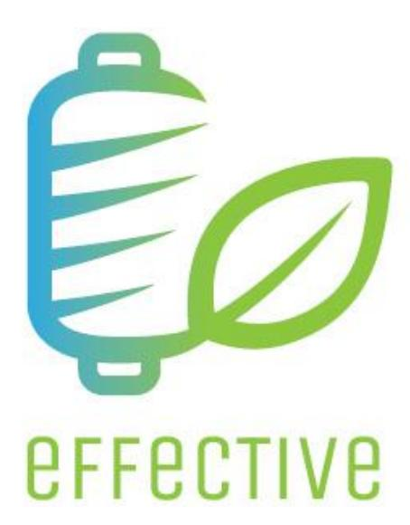

# **Deliverable's details**

| Deliverable number and title |     |        | Deliverable 6.5 – Public summary of the Life Cycle Assessment |
|------------------------------|-----|--------|---------------------------------------------------------------|
| WP number and title          |     | WP6    | – Resource efficiency, environmental sustainability and       |
| Lead beneficiary             | LCE |        |                                                               |
| Due date of deliverable      | 31  | st     | January 2023                                                  |
| Actual submission date       | 31  | st     | January 2023                                                  |
| Dissemination level          |     | Public |                                                               |

# **Table of content**

|    | Table of content List of abbreviation............................................................................................................................................ | 3 4 |
|----|-----------------------------------------------------------------------------------------------------------------------------------------------------------------------------------|-----|
| 1. | Introduction...............................................................................................................................................                       | 5   |
| 2. | Environmental Life Cycle Assessment.......................................................................................................                                        | 6   |
|    | 2.1. LCA results and remarks...................................................................................................................                                   | 7   |
| 3. | Social Life Cycle Assessment....................................................................................................................                                  | 12  |
|    | 3.1. S-LCA results and remarks..............................................................................................................                                      | 13  |
| 4. | Life Cycle Costing.....................................................................................................................................                           | 15  |
|    | 4.1. LCC results and remarks.................................................................................................................                                     | 15  |

# **List of abbreviation**

| Abbreviation | Definition                                |
|--------------|-------------------------------------------|
| GWP          | Global Warming Potential                  |
| LCA          | Life Cycle Assessment                     |
| LCC          | Life Cycle Costing                        |
| LCT          | Life Cycle Thinking                       |
| ISO          | International Standards for Organizations |
| NPV          | Net present value                         |
| PES          | Polyester                                 |
| PA           | Polyamide                                 |
| S-LCA        | Social Life Cycle Assessment              |

## **1. Introduction**

In the national and international context, sustainability has become a fundamental value in the strategies and policies of institutions, companies, and people. More and more there is the need to pay attention to the three declinations of sustainability: environmental, economic, and social.

With that intent, as part of the EFFECTIVE project, the Life Cycle Assessment (LCA) has been applied to identify, qualify and quantify significant environmental aspects along the entire life cycle of the product/service. It is a methodology commonly used to compare alternative solutions, to identify which phases are the main contributors to the overall impact and to make environmental trade-off. The LCA has been integrated by Cost and Social investigation, LCC and SLCA respectively, for a thorough sustainability assessment, taking into account international standards requirements such as ISO14040/44 series for LCA, ISO 15686-5:2017 for LCC and Guidelines for Social Life Cycle Assessment of Products (UNEP/SETAC 2009) for SLCA.

This report constitutes the deliverable D6.5 "Public summary of the LCA, LCC and SLCA reports", publicly summarizing the activities carried out within the context of Effective in WP6, in particular task 6.2 "LCA, LCC and S-LCA", with the related results and remarks.

# **2. Environmental Life Cycle Assessment**

The Life Cycle Assessment (LCA) methodology has been applied to provide reliable analogical models to analyse the processes and performances of systems developed and under demonstration within the project (in WP 1, 2, 3, 4, and 5) as a guidance to help and assist a sustainable biobased value chain definition. LCA has been carried out considering international standards requirements such as ISO 14040:2006/Amd 1:2020 and ISO 14044:2006/Amd 2:2020.

The LCA performed within the EFFECTIVE project assessed the environmental impacts and benefit associated with the **6 new biobased large consumer products** selected and allowed to identify the critical aspects along the demonstrated value chains as well as to define adequate strategies for improving and demonstrating the sustainability of the developed biobased products against the fossil-based counterparts.

The 6 reference products analysed are reported i[n Table 1](#page-5-1) compared to a bio-based alternative and fossilbased solutions. Some alternative bio-based solutions (e.g. Bio-based polyester from cardoon oil) used hereinafter for benchmarking analysis are not demonstrated inside the Effective project but they are presented below to get a more comprehensive view of the system.

*Table 1:Effective bio-based reference products and alternative solutions for comparison.*

|                                            | <b>BASELINE BIO-BASED SOLUTION DEMONSTRATED BY EFFECTIVE</b>      | <b>ALTERNATIVE BIO-BASED SOLUTION</b>           | <b>FOSSIL-BASED SOLUTION</b> |
|--------------------------------------------|-------------------------------------------------------------------|-------------------------------------------------|------------------------------|
| 1. Carpet tiles for construction           | Bio-based Nylon 6 (Bio-PA6), from molasses                        | Bio-based Nylon 6 (Bio-PA6), from thick juice   | Fossil-based Nylon 6 (PA6)   |
| 2: Bike pants                              | Bio-based Nylon 6 (Bio-PA6), from molasses                        | Bio-based Nylon 6 (Bio-PA6), from thick juice   | Fossil-based Nylon 6 (PA6)   |
| 3. Swimsuit                                | Bio-based Nylon 6 (Bio-PA6), from molasses                        | Bio-based Nylon 6 (Bio-PA6), from thick juice   | Fossil-based Nylon 6 (PA6)   |
| 4. Carpet tiles for construction           | Bio-based Nylon 6,9 (Bio-PA6,9), from cardoon oil                 | Bio-based Nylon 6,9 (Bio-PA6,9), from waste oil | Fossil-based Nylon 6 (PA6)   |
| 5. Film for food packaging application     | Bio-based Nylon 6,9 (Bio-PA6,9), from cardoon oil                 | Bio-based Nylon 6,9 (Bio-PA6,9), from waste oil | Fossil-based Nylon 6 (PA6)   |
| 6. Film for non food packaging application | Bio-based polyester (Bio-PES), from thick juice and waste oil mix | Bio-based polyester (Bio-PES), from cardoon oil | Fossil-based polyester (PES) |

LCA is based on quantitative real data recorded in all steps of EFFECTIVE's value chains by each industrial partner (Südzucker, AquafilITA, AquafilSLO, Novamont, Carvico, Bio-Mi, Vaude, Balsan and H&M), including mass and energy balance to measure process efficiency in terms of resources and wastes produced. A customised web-based tool has been developed to harmonize both data collection, reporting as well as elaborating environmental indicators (KPIs).

A set of KPI has been selected for the LCA analysis considering the most relevant environmental aspects associated with EFFECTIVE's value chains, these environmental KPIs are:

- **Global Warming Potential (GWP or Carbon Footprint) Total** [kgCO₂eq] Global warming is the phenomenon of raising the planet's surface temperature. The indicator, expressed in mass of CO2 equivalent, evaluates the emission of GHG emitted due to the fossil fuel combustion as well as the biomass degradation according to the characterization factors of the IPCC. GWP fossil considers any removals and emissions associated with land use and land use transformation. The characterization factor is 1 for CO2 and 28 for CH4. Any CO2 uptake during the biomass growth that is emitted at the end of life as CO2 again are considered neutral. The characterization factor is 0 for the biogenic CO2 and 25.25 for biogenic CH4. Water vapour and ozone, which are anthropogenic as well as natural GHGs, are not included in the CFP. The focus of this document is limited to long-lived GHGs and it therefore excludes climate effects due to changes in surface reflectivity (albedo) and short-lived radiative forcing agents (e.g. black carbon and aerosols). [Sources: GWP100, CML 2001 baseline Version: January 2016. Original references: IPCC (2013).].
- **Acidification Potential (AP)** [kgSO₂eq] Acidification is the process determined by the emission of compounds which, with the intervention of catalysts, generate hydrogen ions causing the lowering of the pH of agricultural land, aquifers, lakes and forests, with serious consequences on living organisms; buildings, monuments and materials in general also suffer significant damage following acid depositions. [Sources: AP, CML 2001 non-baseline (fate not included), Version: January 2016. Original references: Hauschild & Wenzel (1998).].
- **Eutrophication Potential (EP)** [kgPO₄ ³⁻eq] Eutrophication is the phenomenon caused by an excessive intake of nutrients such as nitrogen, phosphorus, and sulphur in an aquatic ecosystem, which causes the proliferation of microscopic algae and greater bacterial activity. The consequent lowering of oxygen in surface waters and in the soil causes a degradation of the environment which has become asphyxiated which leads, in the long run, to the death of aquatic species. [Sources: EP, CML 2001 baseline (fate not included), Version: January 2016. Original references: Heijungs et al. (1992).].
- **Abiotic Depletion Potential – Fossil fuels (ADP-F)** [MJ] Abiotic impoverishment represents the use of abiotic resources, defined as "non-living" natural sources (sources of energy, soil and subsoil, rocks, water, air, all climatic factors etc. The indicator tracks all the elements non-renewable of fossil origin. [Sources: ADPfossil fuels, CML 2001, baseline. Original references: Oers, et al (2002).].
- **Water scarcity Potential (WP)** [m3eq] The indicator evaluates the potential for water deprivation, both for humans and ecosystems, based on the available residual water (Available Water Remaining, AWARE) per unit of surface with reference to the world average after having satisfied the anthropogenic water demand and ecosystems. [Sources; AWARE Method:   WULCA Recommendations on characterization model for WSF 2015, 2017. Original references: Boulay et al (2017).].

### **2.1. LCA results and remarks**

The figures below show the results of the comparative analysis performed for each product system with their bio-based alternative or fossil-based counterparts.

All the analysed **biobased solutions come out as "winners" over the fossil alternatives in terms of Global Warming Potential and Abiotic Depletion Potential – Fossil**, as it is possible to see from [Figure 1](#page-7-0) t[o Figure](#page-10-0)  [6.](#page-10-0) Alternatives with the higher benefits include PA6 from thick juice, PA6.9 from waste oil, and PES from cardoon oil.

**Eutrophication Potential** and **Water Scarcity Potential** remain **critical aspects**, mainly associated with the biobased feedstock production. The production of the hydropower used for fibre manufacturing contributes to raising the Water Scarcity indicator as well. On the other side the use of sustainable feedstock, such as by-products (i.e., molasses and thick juice), wastes (i.e., waste cooking oil), and agricultural products from residual lands (i.e., cardoon oil), allow a consistent water consumption minimization.

The **GWP reduction** compared to the fossil alternatives fluctuate in a range **between -20% and -40%** albeit the technology is still in a demo scale. Nevertheless, the development of the project sees **wide room for improvement**. During the unfolding of EFFECTIVE project, in the last years, several improvements have been already implemented and results observed.

Iterative process of LCA calculation carried out during the years allowed to monitor these performances and to communicate the critical aspects to the partners involved to highlight hotspots and target the improvements.

The diagrams below have the purpose to show the comparison between different fossil and bio-based alternative sources.

*Figure 1: Comparative analysis: bio-PA 6 carpet from thick juice vs from molasses vs from fossil sources*

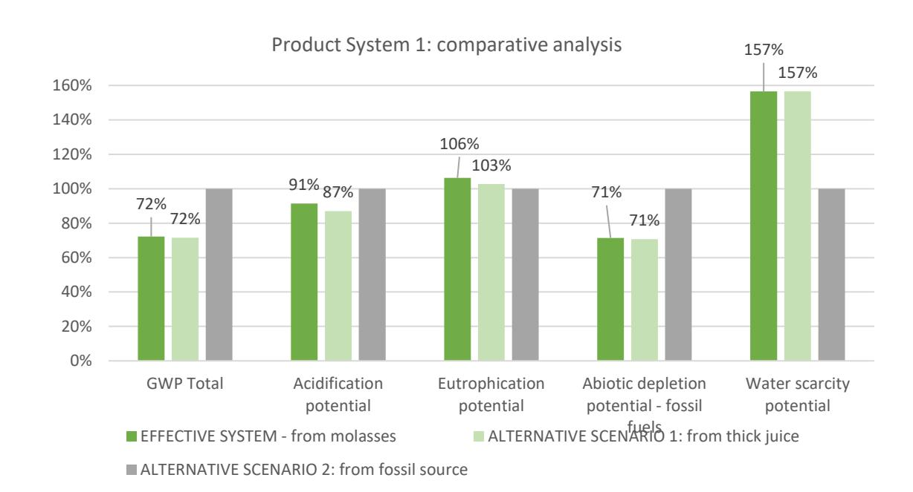

*Figure 2: Comparative analysis: bio-PA 6 cycling pants from thick juice vs from molasses vs from fossil sources.*

*Figure 3: Comparative analysis: bio-PA 6 swimsuit from thick juice vs from molasses vs from fossil sources.*

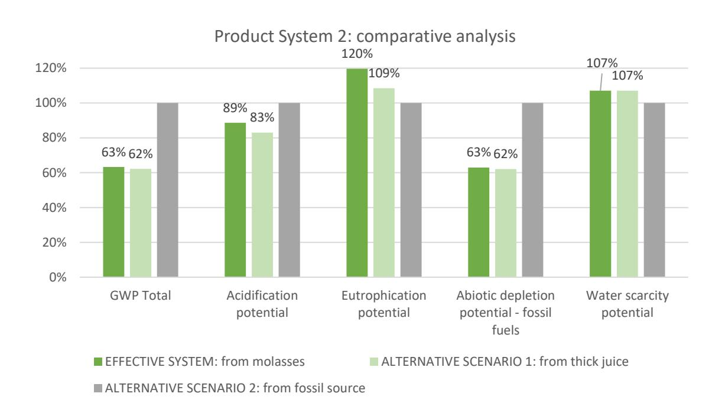

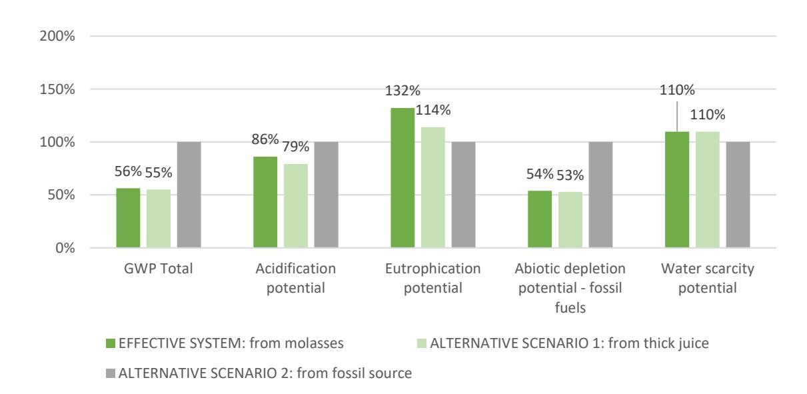

#### Product System 3: comparative analysis

*Figure 4: Comparative analysis: bio-PA 6.9 carpet from cardoon oil vs from waste oil e vs from fossil sources (PA 6).*

*Figure 5: Comparative analysis: bio-PA 6.9 film from cardoon oil vs from waste oil e vs from fossil sources (PA 6).*

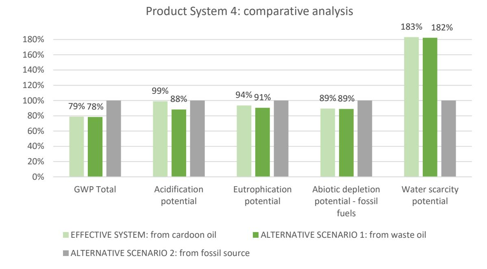

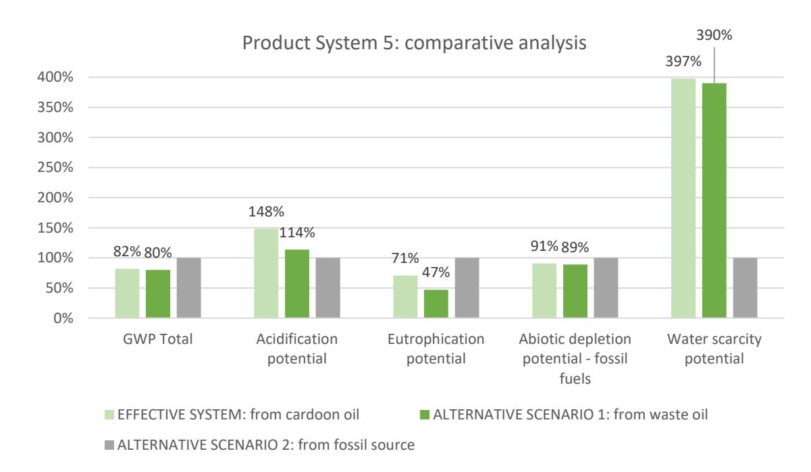

*Figure 6: Comparative analysis: bio-PES film from cardoon oil vs from thick juice and waste oil mixture vs from fossil sources.*

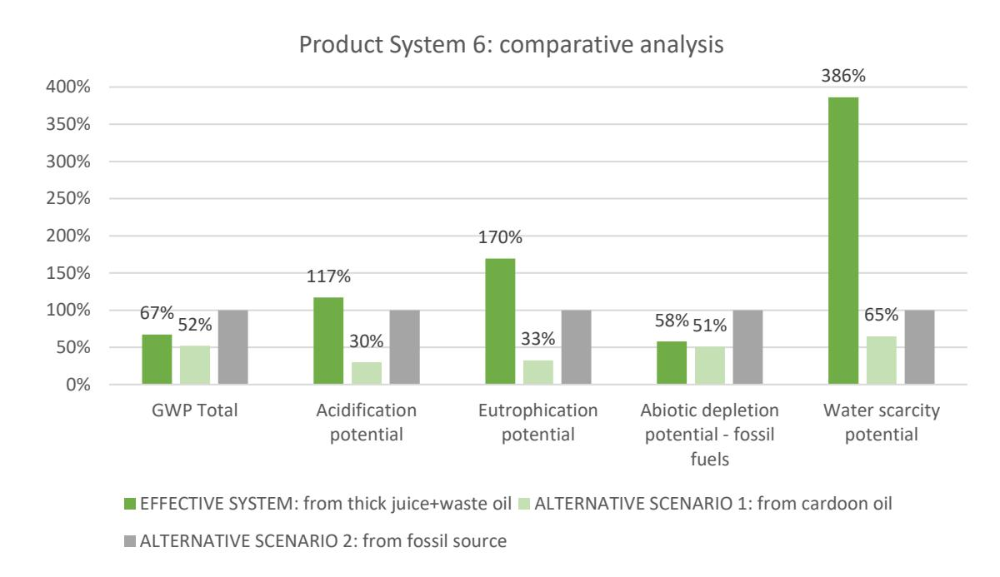

# **3. Social Life Cycle Assessment**

S-LCA combines the framework and principles of the environmental life cycle assessment (ISO 14040/44 series) with methods and approaches of social sciences linked to the involvement of stakeholders and identification of relevant impact categories. It is a methodology useful to understand what the social hotspots of a value chain are, which are the activities, taking place in a specific location, that may correspond to a problem, a risk, or an opportunity, in relation to a social theme of interest. It analyses both the internal sustainability, correlated to the internal conditions and dynamics of the companies that affect workers, and external sustainability, linked to the ability of the company to generate collective well-being to the local communities, the value chain actors, the customers, and society in general.

S-LCA follows the ISO 14040 framework, the Guidelines for Social Life Cycle Assessment of Products developed by UNEP and SETAC, the Handbook for Product Social Impact Assessment version 3.0 by the Roundtable for product social metrics, and other references.

The aim of the application of S-LCA within EFFECTIVE project has been to offer a sustainability overview of the value chains that the project provides for and evaluate the social impacts generated during the life cycle of the products or generated by the organizations, relating to different stakeholders' groups that are involved and influenced, using a reference scale (from negative, to positive).

The method used consisted of four main steps:

- 1. First, the system was identified setting boundaries: the stakeholders involved, the material social topics [\(Figure 7\)](#page-12-1), the included life cycle stages or value chain phases.
- 2. Primary data were collected from partners through a specific S-LCA web-tool (developed by LCE) to assess specific indicators, related to some selected social topics (i.e., issues that are considered as threatening to social wellbeing or that may contribute to its further development). Generic data were also investigated through a social hotspots commercial database (PSILCA) operating on OpenLCA software.
- 3. The impact assessment step followed the type 1 Approach (Reference Scale Approach), using performance reference points (PRP) to assess the social performance of the company, over a scale that varies from a high-risk level to a no risk, or even good opportunity level for the stakeholders.
- 4. Finally, data were elaborated into suitable diagrams, one for each value chain, to offer "food for thought" for the consortium to be aware of the most sensitive unit processes and locations, as starting point for monitoring activities and improvements.

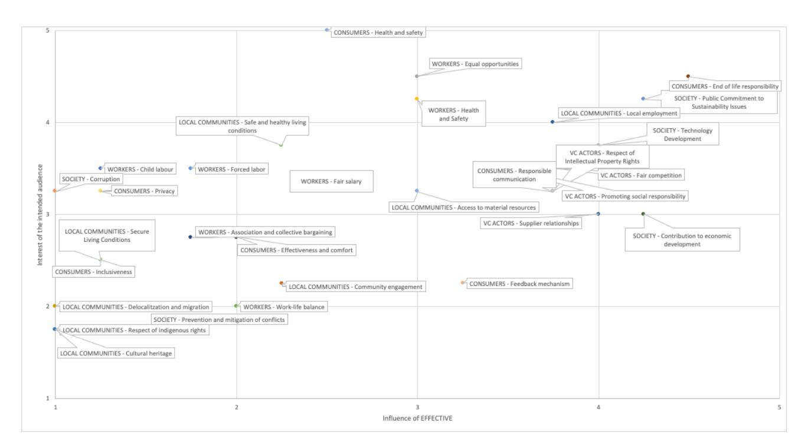

*Figure 7: Materiality matrix developed through the survey among partners.*

The functional units considered are the following:

➢ Non-food packaging films made of bio-based polyester (bio-PES) from fermentable sugar and vegetable oils ➢ Carpet for the construction made of bio-based PA6.9 from cardoon oil ➢ Film food packaging made of bio-based PA6.9 from cardoon oil ➢ Swimwear products made of bio-based PA6 from fermentable sugar ➢ Carpets for the construction made of bio-based PA6 from fermentable sugar ➢ Sportswear made of bio-based PA6 from fermentable sugar.

### **3.1.S-LCA results and remarks**

Results of the S-LCA study have shown **some sensitive social topics laying in the upstream agricultural phases**, which were depending anyway on secondary data, therefore the uncertainty level is much higher because no company-specific assessment has been carried out for those particular life cycle stages.

Overall, the life cycle of all these products reveals much more **positive opportunities for the stakeholders than risks**, encouraging the establishment of these value chains and the success of the proposed innovative products.

The phases investigated with site-specific approach brought to light on average no risks for all the stakeholder groups and all the social topics investigated displayed good opportunity levels for several of these. **Especially for the society**, benefits related to technology development, commitment to sustainability issues and contribution to economic development are shown.

These assessments highlighted the added value provided by these value chains to their stakeholders, from a social point of view.

Concerning the inventory analysis, socio-economic life cycle assessment strongly relies on data availability, making the selection of indicators and the data collection one of the most crucial and tedious steps of a S-LCA (Ciroth et al. 2011): in this work a delicate balance between the possibility to gather primary data answerable by partners and the aim to provide objective quantitative indicators that could be comparable, has been looked for.

## **4. Life Cycle Costing**

The LCC standard methodology is based on the same framework defined for LCA in the ISO series 14040 (ISO 2006). It provides for the definition of goal and scope, data collection, data elaboration into KPIs and results interpretation.

The method used for the LCC analysis of the EFFECTIVE project, however, could not follow completely the typical LCA framework, mainly because of data confidentiality, data availability only from non-commercial scale plants as well as macro-economic events that affected data stability towards the end of the project. Therefore, the LCC analysis eventually was developed following these main steps:

- 1. System identification (value chain, life cycle stages, producers)
- 2. Quantitative data collection (life cycle inventory) for economic KPIs calculation
- 3. General interviews with producers of final products
- 4. General mapping of the differences in terms of costs per life cycle stages, of Effective products compared to fossil-based alternative products
- 5. Economic KPIs elaboration
- 6. Economic general considerations

Economic data from partners were attempted to be gathered using a LCA & LCC web-tool developed by LCE within the project. Where primary data were not available, qualitative interviews with partners at each life cycle stage were carried out.

#### **4.1. LCC results and remarks**

On the basis of the LCA analysis (see paragraph Environmental Life Cycle Assessment), externalities costs were mapped, representing the loss of economic and social welfare that occur depending on the environmental impacts (Global Warming Potential, Acidification Potential, Eutrophication Potential, Abiotic Depletion Potential – Fossil fuels, Water scarcity Potential). The environmental prices are provided by CE Delft and TU Delft sources, according to ISO 14008:2019 (Monetary valuation of environmental impacts and related environmental aspects).

In the following histograms (fro[m Figure 8](#page-15-0) to [Figure 13\)](#page-16-0), the externalities cost weighing on the society or potentially on the producer itself, according to future possible legislations, are presented for the involved product systems. The diagrams have the purpose to show **how different phases contribute to the total value** and **the comparison between different fossil and bio-based sources**. The increase or decrease of the total value is shown for bio-based product, as difference to the fossil-based alternative.

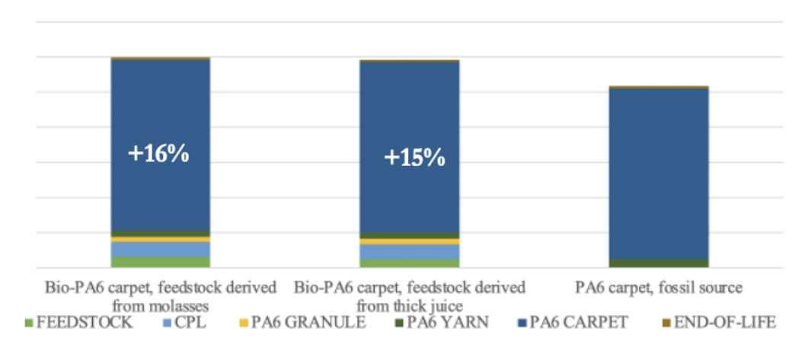

*Figure 8 - Externalities costs on the society, PA6 carpet, LCE elaboration*

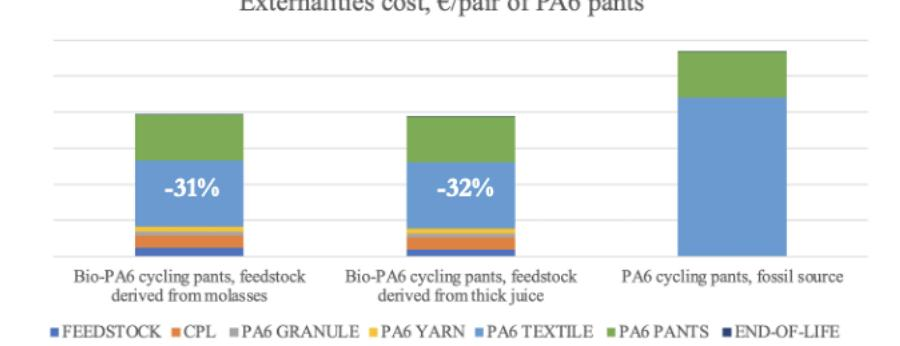

*Figure 9 - Externalities costs on the society, PA6 bike pants, LCE elaboration*

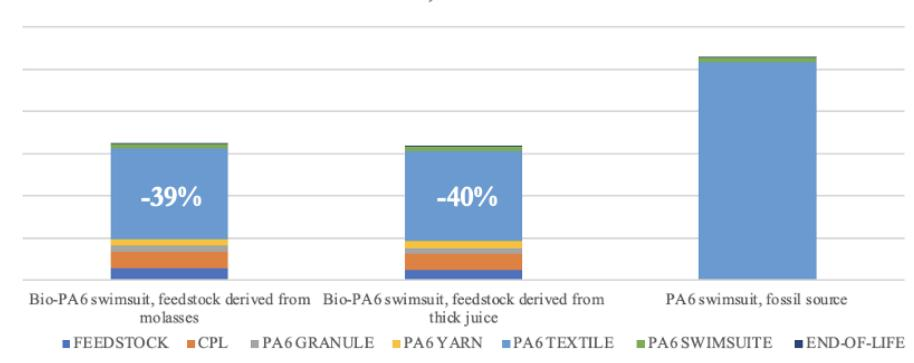

*Figure 10 - Externalities costs on the society, PA6 swimsuit, LCE elaboration*

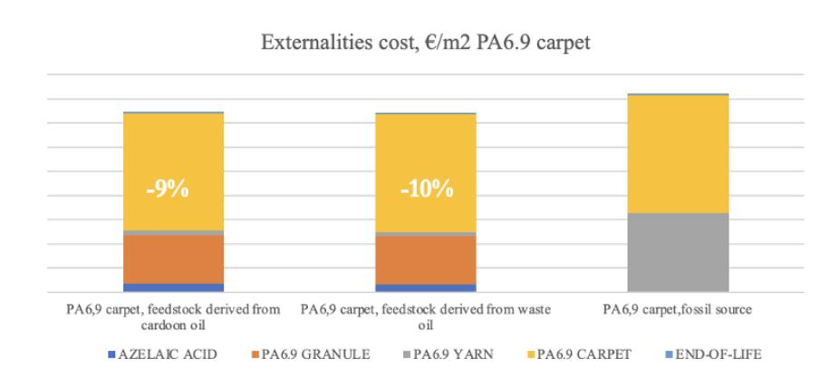

*Figure 11 - Externalities costs on the society, PA6.9 carpet, LCE elaboration*

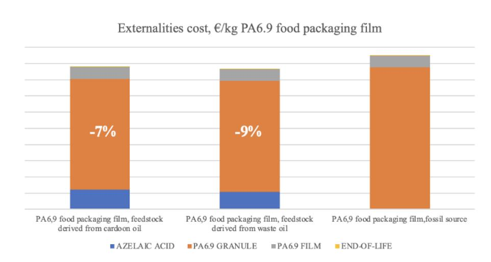

*Figure 12 - Externalities costs on the society, PA6.9 food packaging film, LCE elaboration*

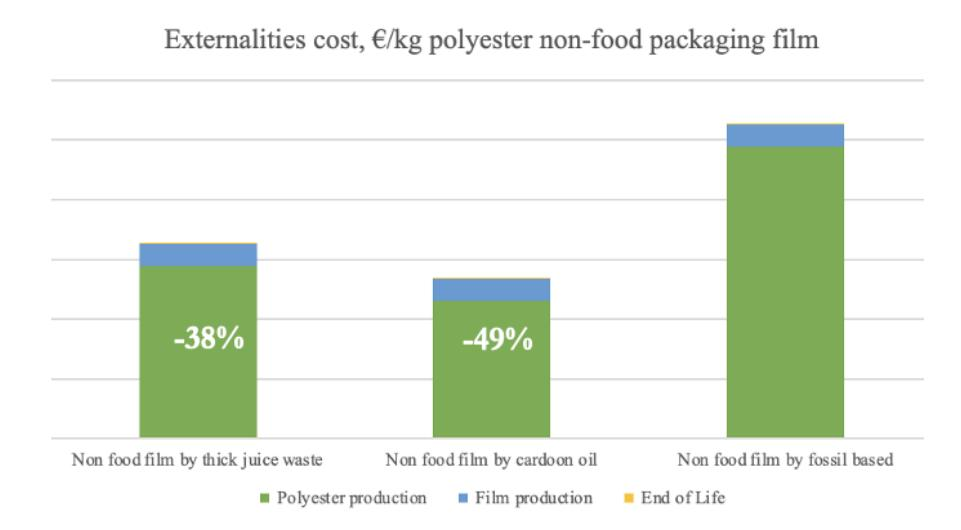

*Figure 13 - Externalities costs on the society, PES non-food packaging film, LCE elaboration*

Finally, some considerations were brought to light during the development of the project by LCE perceptions, together with the interviews with partners.

- The EFFECTIVE new value chains allow to start the supply chain from European agricultural companies. This ensures higher control over the supply chain, counting on minor politics instability, conflicts possibilities and regulations impediments.
- The limitation of [fossil resources](https://www.sciencedirect.com/topics/engineering/fossil-resource) together with linked environmental issues may lead to stricter regulations within European union, therefore a decrease in the externalities costs for society, linked to lower environmental impacts, may correspond to economic savings for producers.
- Every life cycle stage has had to deal with increase in energy and raw materials prices over the last 3 years, linked to pandemic and armed conflict in Ukraine. There is high uncertainty about how prices will evolve in the following years.
- An increase in the acquisition price for customers of EFFECTIVE products, with respect to fossil-based alternatives, may be accepted by buyers, because of the sustainability attribute, that can be communicated to customers. In particular, bio-polyester film, bio-based PA6 carpets, pants and swimsuit and bio-based PA6.9 carpet emerged to weigh less on society because of lower environmental impacts with respect to their fossil alternative. The range of possible acceptable price increase is still not clear.
- Differences in scale and technology readiness, with respect to alternative products, are a constraint in this type of study, because they limit the validity of the direct comparison with conventional products, which are based on processes that have been optimized and upscaled for decades (for example, efficient recycling and composting from residual and waste materials can increase both environmental and economic benefits).
- An aspect that can motivate an increase in the acquisition price of EFFECTIVE products along the value chain is also linked to the familiarity of the partners that have emerged during the project and the presence of social opportunities for stakeholders rather than risks, as highlighted by the S-LCA study.

At the moment, this study is not able to ensure the profitability of all life cycle stages involved in the value chains. However, this remains anyway a fundamental requirement to be satisfied at full industrial scale for the potential future market deployment of the EFFECTIVE technologies and products.