*This project has received funding from the Bio Based Industries Joint Undertaking (JU) under grant agreement No 792195. The JU receives support from the European Union's Horizon 2020 research and innovation programme and the Bio Based Industries Consortium*

# **Advanced Eco-designed Fibres and Films for large consumer products from biobased polyamides and polyesters in a circular Economy perspecTIVE**

Grant Agreement 792195 Topic BBI.2017.D5 Project start date 1 Duration 57 months

Call identifier H2020-BBI-JTI-2017 st June 2018 Project end date 28th February 2023

# **Deliverable 6.7 – Report on the results obtained out of surveys and interviews on the biobased products**

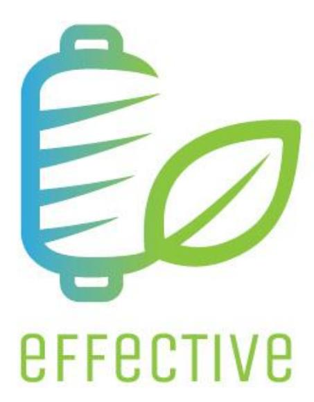

## **Deliverable's details**

Deliverable number and title Deliverable 6.7 – Report on the results obtained out of surveys and interviews on the biobased products WP number and title WP6 – Resource efficiency, environmental sustainability and social acceptance Lead beneficiary CIRCE Due date of deliverable 31st August 2022 Actual submission date 31st August 2022 Dissemination level Public

## **Table of content**

| List of abbreviations 1.                                                                                                                                   |                                                                                                                                |
|------------------------------------------------------------------------------------------------------------------------------------------------------------|--------------------------------------------------------------------------------------------------------------------------------|
| 2. Social Acceptance activities: EFFECTIVE Survey and Workshops                                                                                            | .............................................................6                                                                 |
| 2.1 EFFECTIVE Surveys                                                                                                                                      | 6                                                                                                                              |
| 2.1.1 Background and design                                                                                                                                | ................................................................................................................6              |
| 2.1.2 Translation and first launch: EUSurvey platform                                                                                                      | ...........................................................................7                                                   |
| 2.1.3 Second launch: Pollfish platform                                                                                                                     | ...................................................................................................7                           |
| 2.1.4 Answers collection and organization.                                                                                                                 | ............................................................................................8                                  |
| 2.2 Workshops on social acceptance                                                                                                                         | .......................................................................................................10                      |
| 3. EFFECTIVE Survey Results....................................................................................................................12          |                                                                                                                                |
| 3.1 Respondents Profile                                                                                                                                    | ..........................................................................................................................12   |
| 3.2 Awareness towards bio-based products and materials                                                                                                     | ......................................................................13                                                       |
| 3.3 Results for carpets                                                                                                                                    | ............................................................................................................................14 |
| 3.4 Results for garments                                                                                                                                   | .........................................................................................................................19    |
| 3.5 Results for food packaging                                                                                                                             | ................................................................................................................24             |
| 3.6 Results for secondary packaging                                                                                                                        | ........................................................................................................30                     |
| 4. In-person and Online Workshops...........................................................................................................35             |                                                                                                                                |
| 5. Conclusion ..........................................................................................................................................37 |                                                                                                                                |
| Annex 1 – EFFECTIVE Survey [EUSurvey]                                                                                                                      | ......................................................................................................39                       |
| Annex 2 – Summary of the main results per type of product..........................................................................60                      |                                                                                                                                |
| Annex 3 – Summary of the main results per country......................................................................................63                  |                                                                                                                                |

## **List of abbreviations**

| Abbreviation | Definition                         |
|--------------|------------------------------------|
| EU           | European Union                     |
| BBI          | Biobased Industries                |
| H2020        | Horizon 2020                       |
| GDPR         | General Data Protection Regulation |
| FR           | France                             |
| PL           | Poland                             |
| SE           | Sweden                             |
| IT           | Italy                              |
| NL           | Netherlands                        |
| BE           | Belgium                            |
| DE           | Germany                            |
| ES           | Spain                              |
| HR           | Croatia                            |
| SI           | Slovenia                           |

## **1. Introduction**

The present report constitutes deliverable 6.7 "Report on the results obtained out of surveys and interviews on the biobased products" within the framework of the EFFECTIVE project. The following activities refer to WP6 "Resource efficiency, environmental sustainability and social acceptance" and specifically to task 6.3 "Social acceptance of the biobased products.

The objective of this report is to address social acceptance issues toward the future market uptake of the biobased products. To achieve this, the following activities have been carried out as part of T6.3:

- Revision of the background on social acceptance of bio-based products from past projects in the EU.
- Design of the EFFECTIVE Survey, one per type of product or material: (1) Garments, jacket for outdoor activities and cycling shorts from VAUDE and sportswear and swimsuit from H&M; (2) carpets for the automotive and construction sectors from BALSAN; (3) material for food packaging and (4) materials for secondary packaging
- Translation of the EFFECTIVE Survey into French, German, Swedish, Italian, Croatian, Slovene, and Spanish.
- Launch of the EFFECTIVE Survey within the EUSurvey platform, followed by a second launch within the Pollfish Survey.
- Collection of 1059 responses form 14 European countries.
- In parallel to the EFFECTIVE survey, 4 workshops on social acceptance of biobased products were organised and carried out. The dates and venues were as follows: o 1st EFFECTIVE Workshop. CIRCE Headquarters, Zaragoza, Spain. 19th of June 2019. o 2nd EFFECTIVE Workshop. National Environment Congress - CONAMA 2020, Madrid, Spain. 2nd of June 2021. o 3rd EFFECTIVE Workshop. Online. 15th of June 2022. o 4th EFFECTIVE Workshop. Online. 23rd of June 2022.

Despite the limitations to carry out participatory activities imposed by the COVID-19 pandemic, the present document reports the results of the above-mentioned activities regarding the social acceptance of biobased products. Recommendations and insights to support their future market uptake are also commented at the end of the document.

## **2. Social Acceptance activities: EFFECTIVE Survey and Workshops**

### **2.1 EFFECTIVE Surveys**

### *2.1.1 Background and design*

First, a preliminary revision of the market status at EU level of the sectors involved within EFFECTIVE (construction, automotive, textile and packaging) was carried out to set a geographical scope to disseminate the survey. Diverse sources were checked to better understand the market size and importance of each sector for each country in comparison with the rest of EU country members. The market relativeness, also taking in mind the products to evaluate, wasthen valorised in a scale from 1 (low) to 3 (high). This information was complemented with the direct input from partners. Each of them was asked to indicate the countries in which they could have representativeness (physical store or distribution channel of final products, etc.), considering their specific role as value chain actor of the project. The final weight of each region was assessed combining the preliminary market revision per sector/product, the country representativeness of each partner (also considering the language of the survey) and the actual country of origin of all the partners. This resulted in the identification of the most relevant regions where the survey is conducted: France, Germany and Italy resulted as the top 3, followed by Netherlands, Spain, Sweden, Croatia, Slovenia, Poland, and Belgium.

Second, for the design of the questions, insights achieved in past projects involving biobased products were revised. The results of Open-BIO project "Opening bio-based markets via standards, labelling and procurement" that had the participation of NOVAMONT, were complemented with the conclusions of the projects innProBio "Forum for bio-based innovation in public procurement", BioWays "Bio-based economy: network, innovate, communicate", Agrimax "Agri and food waste valorisation co-ops based on flexible multifeedstocks biorefinery processing technologies for new high added value applications". Other circular economy projects in which CIRCE took part as partner such as CIRCPACK "Towards circular economy in the plastic packaging value chain" and AGROinLOG "Demonstration of innovative integrated biomass logistics centres for the Agro-industry sector in Europe" are also consulted. This literature revision resulted in the identification of topics to include, having in mind already identified market barriers and social expectations, and the specific approach that EFFECTIVE activities should adopt in the case of each target group.

Finally, after several iterations, the definitive version of the EFFECTIVE Survey (see Annex 1) was defined among T6.3 partners. 4 surveys were designed, one per EFFECTIVE material and/or product: (1) Garments: Jacket for outdoor activities and cycling shorts from VAUDE 0F0F 1 and port wear and swimsuit from H&M1F1F 2 ; (2) Carpets for the automotive and construction sectors from BALSAN2F2F 3 ; (3) Material for food packaging3F3F 4 and (4) Materials for secondary packaging4F4F 5 .The definitive questionnaire was divided into the following sections:

- A general section to compile the key aspects that consumers evaluate in each product, as well as the level of understanding of the term bio-based, and what is considered to be a bio-based material or product.
- Analysis of consumers' perceptions of factors that would influence their preference (or not) for organic products. It asks about accessibility to information and availability in local shops, as well as product aspects such as quality, environmental performance, and price.
- Evaluation of EFFECTIVE's bio-based products compared to conventional ones

1 Link to the survey: https://ec.europa.eu/eusurvey/runner/EFFECTIVE20\_GARMENTS\_VAUDE\_001

2 Link to the survey: https://ec.europa.eu/eusurvey/runner/EFFECTIVE20\_GARMENTS\_HM\_001

3 Link to the survey: https://ec.europa.eu/eusurvey/runner/EFFECTIVE20\_Carpet\_BALSAN\_002

4 Link to the survey: https://ec.europa.eu/eusurvey/runner/EFFECTIVE20\_FoodPack\_001

5 Link to the survey: https://ec.europa.eu/eusurvey/runner/EFFECTIVE20\_Non\_FoodPack\_001

Additional questions to establish the profile of the respondent were also included (gender, age, etc.).

### *2.1.2 Translation and first launch: EUSurvey platform*

With the final version defined in English, a total of 4 surveys, one per each type of products, were translated into 7 languages, with the support of EFFECTIVE partners of Balsan (French version), VAUDE (German version), H&M (Swedish version), Aquafil (Italian version), Bio-Mi (Croatian version), Circular Change (Slovene version) and CIRCE (Spanish version).

To address different target groups, and to design and develop the most suitable strategies for the social acceptance of the new biobased nylon fibers products and end-user involvement in the proposed valuechains, the activities were focused on the following target groups: Consumers, Business stakeholders and Public Administration. To reach as many people as possible, the survey was facilitated by the following means:

- The platform EUSurvey, the European Commission's official multilingual online survey management tool
- EFFECTIVE social media, newsletters, and email list.
- Dissemination channels of Balsan, Aquafil, Circular Change and CIRCE.

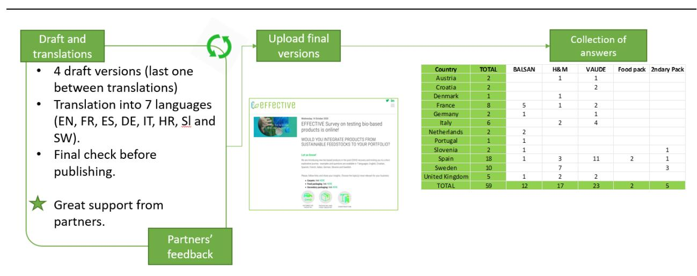

*Figure 1. Summary of the translation and first launch of the EFFECTIVE Surveys*

However, after several months of dissemination the number of responses collected did not reach the desired and significant value. As shown in [Figure 1,](#page-6-2) 59 answers were gathered through the surveys published in EUSurvey. This first launch was carried out between M28 and M32, this was end of 2020 and beginning of 2021, during the COVID-19 Pandemic. For this reason, a second launch of the survey was planned together with the project coordinator.

## *2.1.3 Second launch: Pollfish platform*

To improve the performance of the Survey, a second launch of the survey was carried out through another platform that ensures the collection of responses. Different alternatives to collect were checked and discussed, without abandoning the direct promotion from task partners via EUSurvey. Finally, it was agreed that the best alternative was contracting the survey through Pollfish, an online survey platform that hosts questionnaires and internally collect responses given the audience selected by the survey creator. Pollfish is

a Greek start-up initially supported by EU Jeremie Funds in 20145F5F 6 , that also complies with the requirements of the GDPR.

In this sense, all EFFECTIVE questionnaires were uploaded to the selected platform. The number of complete answers to collect was set to 400 responses for garments products and 200 for each of the rest. This responses collection was limited to the countries identified during the design of the Survey.

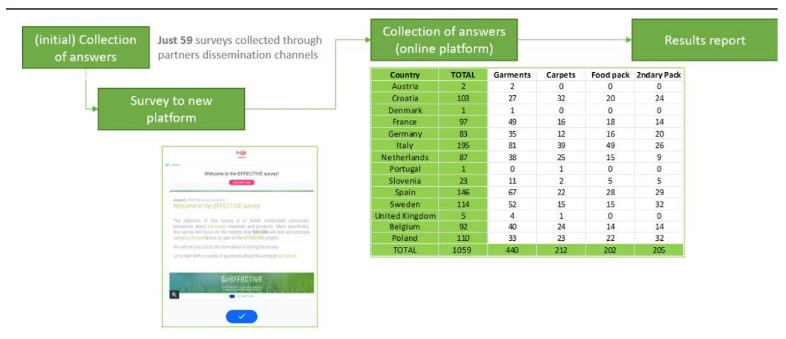

*Figure 2. Summary of the EFFECTIVE Surveys' second launch*

As shown in [Figure 2,](#page-7-1) the expected number of responses were finally collected. In total, both campaigns accounted for a total of 1059 surveys.

## *2.1.4 Answers collection and organization.*

With all the responses collected, the last step before the elaboration of this report was the merge of both data sources, the EUSurvey results and the Pollfish Results. This required a harmonization process to ensure a correct integration of both databases. The distribution per type of product and per country are shown in [Figure 3.](#page-8-0) In terms of the profile of the respondents, the general information is:

▪ Gender: 53% of respondents are women and 47% are men. ▪ Age: 58% of people is between 18 and 34 years old, 38% between 35 and 54 years old, and only 5% above 54 years old. ▪ Type of stakeholder: Around the 22% of the participants are businesspeople, 52 % are consumers, 12% are public administration and 14% are from another stakeholder group.

6 https://digital-strategy.ec.europa.eu/en/news/success-story-greek-startup-pollfish

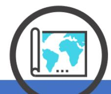

| Country            | %     |
|--------------------|-------|
| <b>Belgium</b>     | 8,7%  |
| <b>Germany</b>     | 7,8%  |
| <b>Spain</b>       | 13,8% |
| <b>France</b>      | 9,2%  |
| <b>Croatia</b>     | 9,7%  |
| <b>Italy</b>       | 18,4% |
| <b>Netherlands</b> | 8,2%  |
| <b>Poland</b>      | 10,4% |
| <b>Sweden</b>      | 10,8% |
| <b>Slovenia</b>    | 2,2%  |

- • Garments
  - • 440 people
- • Carpets
  - • 212 people
- • Food packaging
  - • 202 people
- • Secondary packaging
  - • 205 people

- • 4 Surveys
  - • Garments
  - • Carpets for the automotive and construction sector
  - • Material for food packaging
  - • Materials for secondary packaging

*Figure 3. Summary of the methodology for the EFFECTIVE consumer survey*

The results are described in the following section, whereas the geographical distribution of the collected answers can be seen o[n Figure 4.](#page-9-1)

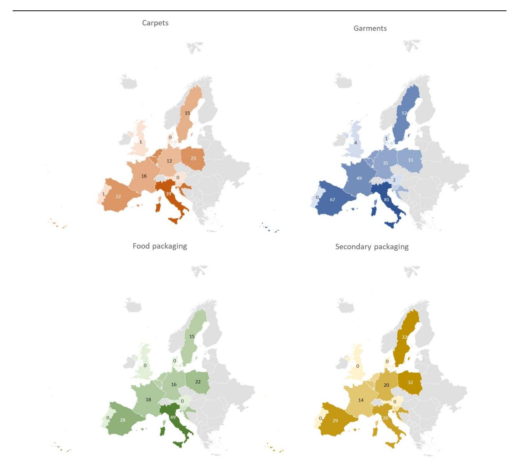

*Figure 4. geographical distribution of the EFFECTIVE survey per type of product.*

## **2.2 Workshops on social acceptance**

Besides the survey, a series of online and in-person workshops were held to gather more information from stakeholders. The events focused on different stakeholder's profiles, mainly divided in Business and Public Administration. Although Consumers were not the target profile for the workshops, the events were open for every interested part. The following table lists the workshops held.

In the case of the 2 nd EFFECTIVE Workshop, that was one of the first physical congress after the COVID-19 pandemic, together with CONAMA organizers, it was decided to have a collaborative event merging two BBI JU projects in which CIRCE participates as consortium partner: EMBRACED and EFFECTIVE. The event was a 2.5-hour workshop dedicated to circular economy and bio-based products. For the opening of the event, EMBRACED project officer, via online, introduced the BBI JU and the future opportunities for Spanish industries. Stakeholders from the private sector, technology centres and universities participated in the event. Insights from this workshop will be presented in the next EFFECTIVE meeting.

*Table 1. EFFECTIVE Workshops on social acceptance*

| Workshops st EFFECTIVE Workshop. CIRCE 1 Headquarters, Zaragoza, Spain. nd | Focus Garments products |    | Modality In person | Participants 16 | Date 19th of June 2019 nd of June |
|----------------------------------------------------------------------------|-------------------------|----|---------------------|-----------------|-----------------------------------|
| Environment Congress - CONAMA                                              |                         |    |                     |                 |                                   |
|                                                                            | EFFECTIVE products      | in |                     |                 |                                   |
| 2020, Madrid, Spain.                                                       | general                 |    | In person          | 27              | 2                                 |
| rd EFFECTIVE Workshop. Online.                                             | Fiber-related products  |    | Online              | 22              | 15 th of June                     |
| th EFFECTIVE Workshop.                                                     | Film-related products   |    | Online              | 16              | 23 rd of June                     |

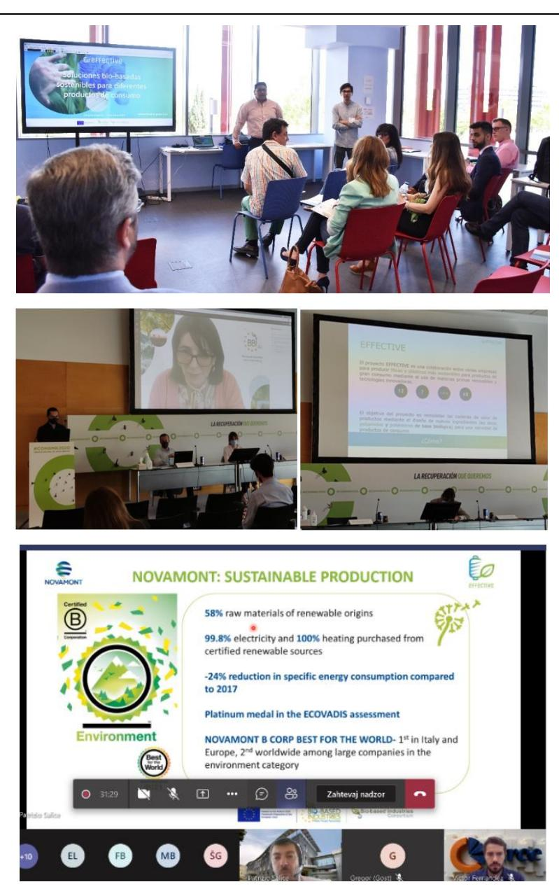

*Figure 5. EFFECTIVE Workshops on social acceptance.*

## **3. EFFECTIVE Survey Results**

The results of the EFFECTIVE survey are compiled and explained in the present section. Annex 2 presents the summary of the main results per type of product, whereas Annex 3 shows the distribution of responses per country.

## **3.1 Respondents Profile**

The profile of the survey participants, classified according to the various parameters measured in the initial questions, is briefly described below. Half of the respondents are consumers; the rest are business(22%) and Public Administrations (11%) and others no specified (14%). In terms of age, the main bulk of respondents are between 18 and 44, accounting for more than 80% of the total.

*Figure 6. Question 2. What kind of stakeholder group you represent?*

In terms of their sector of work[, Figure 7](#page-12-1) reveals that most food packaging survey participants came from the "Fishing" sector. Whereas in the case of carpets, the vast majority would not have identified with any of those considered and therefore selected the "other" option. Finally, secondary packaging would have a distribution of around 11% in most sectors. Garments have not been considered in this case, given that the products tested within EFFECTIVE are intended for consumers as final users.

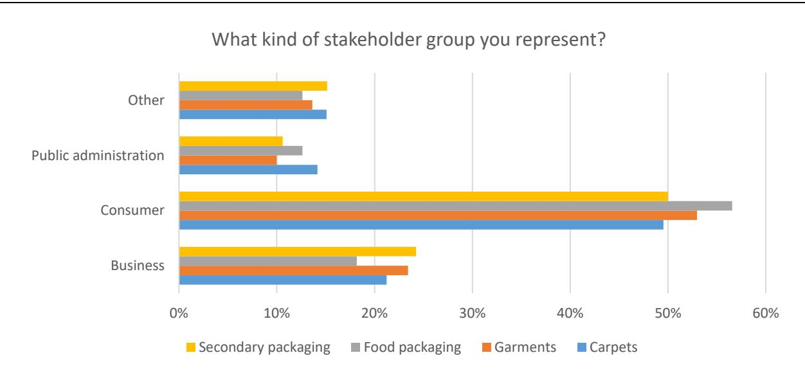

*Figure 7. Question 3. What is the sector you mainly work in?*

## **3.2 Awareness towards bio-based products and materials**

As can be seen in [Figure 8,](#page-12-2) the participants clearly showed a lack of self-declared knowledge towards the concept 'biobased'. Just over 25% of the participants have sufficient knowledge to explain the topic. This trend is repeated without much variability throughout the four products.

*Figure 8. Question 4. How much do you know about bio-based materials and/or products?*

Regarding the characteristics associated by respondents to the bio-based products, there seems to be a gap knowledge with the concept. The basic definition6F6F 7 is: "bio-based products are wholly or partly derived from materials of biological origin, excluding materials embedded in geological formations and/or fossilised". However, half of the respondents believe that bio-based products have biodegradable and/or recyclability

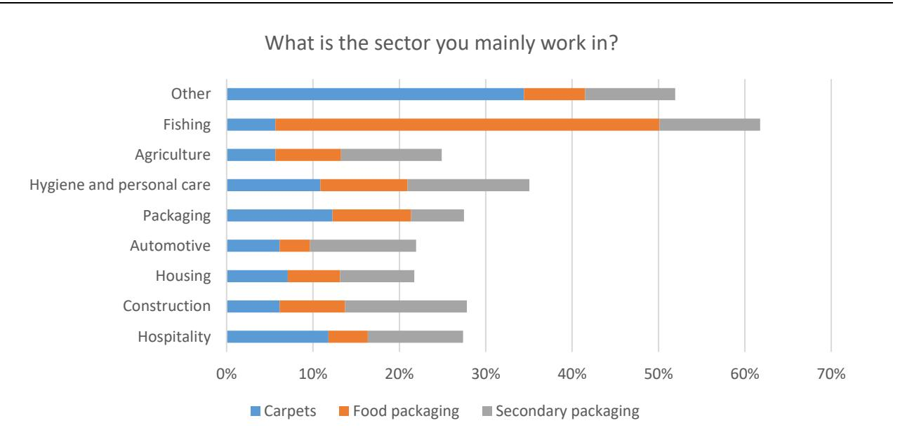

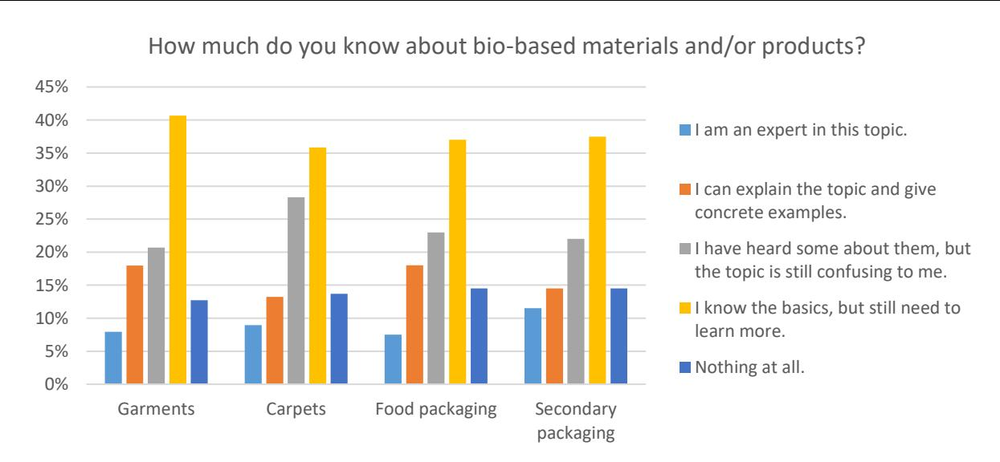

7 Bio-based products: https://ec.europa.eu/growth/sectors/biotechnology/bio-based-products\_en

properties, properties that are not always present. Another usual misconception is confusing them with ecologic products, as is the case of 40% of the respondents from the secondary packaging.

*Figure 9. Question 4. How much do you know about bio-based materials and/or products?*

In line with these results, [Figure 10](#page-13-1) shows that a sizeable proportion of the participants are unaware at the time of the survey that EFFECTIVE is testing these products using bio-based versions of the film/fabric. However, it cannot be ignored that between those who knew about it and those who knew about the possibility of producing such products with recycled materials, 60% of the participants in all cases, except for "carpets", show interest for this kind of topics.

*Figure 10. Did you know that EFFECTIVE will make this kind of products using biobased version of the film/fabric?*

## **3.3 Results for carpets**

In the case of Carpets, respondents are asked to think on the products described in [Figure 11.](#page-14-0) The overall description is as follows: "Products like the ones in the picture will be produced using fabrics made out from bio-based materials (bio-based polyamides). These bio-based materials will be produced from renewable feedstocks (such as sustainable sugars and vegetable oils), guarantying a greener manufacture. By embracing the circular economy, special attention will be given to demonstrating a sustainable end-of-life of the new products. The recyclability of this EFFECTIVE material will be validated in order to close the material cycle

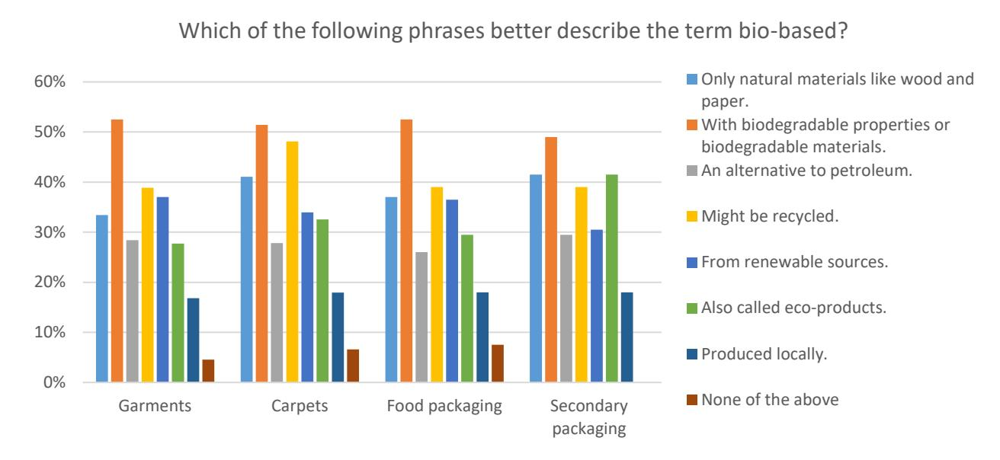

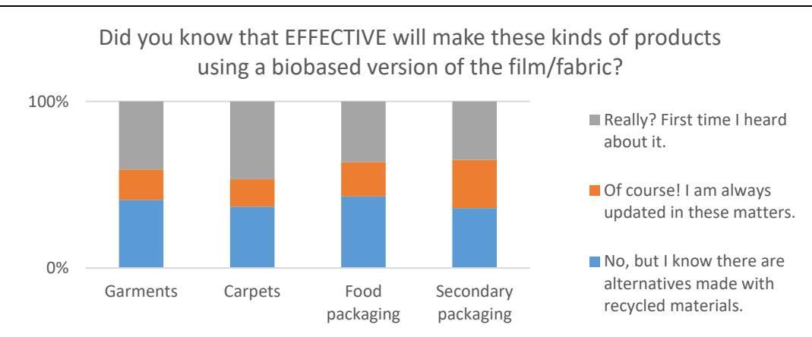

loop. In the case of the products in the image on the left, the usage of sugars or vegetable oils as sustainable feedstock combined with more sustainable processes to produce Bio-Nylon will allow reducing the share of fossil-based material, mitigating the emission of CO2 and NOx gases, a lower consumption of energy for the production, and ensuring product's recyclability: Bio-Nylon can be recycled as described in the image on the right".

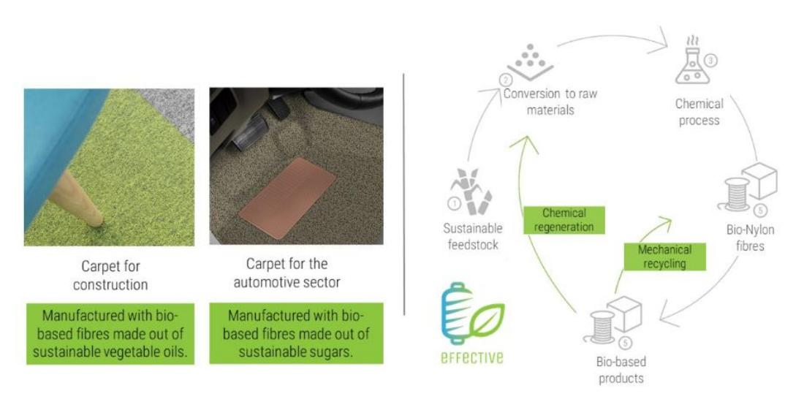

*Figure 11. Description of the carpets evaluated within the EFFECTIVE Survey.*

Based on the surveys carried out with a total of 212 people, of which 105 were consumers, the following conclusions can be drawn.

*Figure 12. Carpets - Question 10. Why public/private peers are not aware of new and more sustainable products?*

It seems that the main causes of this lack of awareness are, as can be seen in the [Figure 12,](#page-14-1) lack of advertisements in the different media and the great effort currently required to be updated on this subject. Regarding to the country of origin of the respondents, a clear relationship with the previously observed results can be observed, but with some exceptions such as:

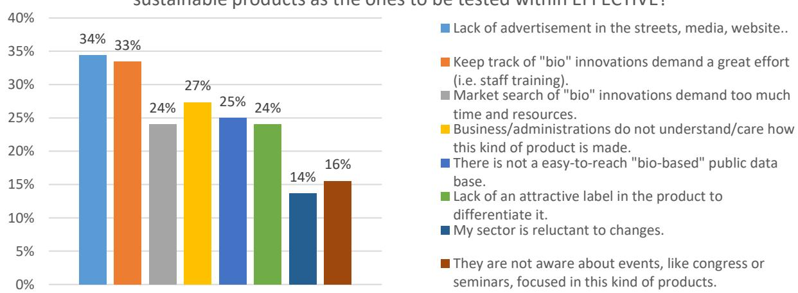

In your opinion, why public/private peers are NOT aware of new and more sustainable products as the ones to be tested within EFFECTIVE?

- Countries that find one of the main reasons for lack of knowledge much more important than the other: FR, PL and SE consider "Lack of advertisement in the streets, media, website." more important than "Keep track of "bio" innovations demand a great effort (i.e., staff training).", while for IT and NL the reverse is the case.
- At the same time, one can observe countries that find other motives equally or more important than those observed in the total result. These countries include BE, DE, ES, FR and PL.

*Figure 13. Carpets - Question 11. In your opinion, what is the information your institution/organization would care the most about this EFFECTIVE product?*

In terms of the attribute that matters most to institutions and organizations, recyclability is by far the most preferred (42%), followed by remarkably similar values between them, by CO2 savings (35%), social impact of production (33%) and health and safety (32%). All this, as well as the results of the rest of the attributes can be seen in [Figure 13.](#page-15-0)

In the case of respondents' opinions according to age, is remarkable the fact that younger respondents give the same importance to "The CO2 savings in respect of a conventional alternative" and "Social impact of the production" as they do to "Recyclability properties". "Recyclability properties" become increasingly important for adults, but the difference with the rest does not become relevant until after the age of 45.

As for the countries, most follow the trend of selecting "recyclability properties" option as the most important information, except for BE, DE, ES and HR. For these countries, information regarding "Social impact of the production", "The percentage of bio-based material", "The CO2 savings in respect of a conventional alternative" and "Health / safety benefits" is preferred.

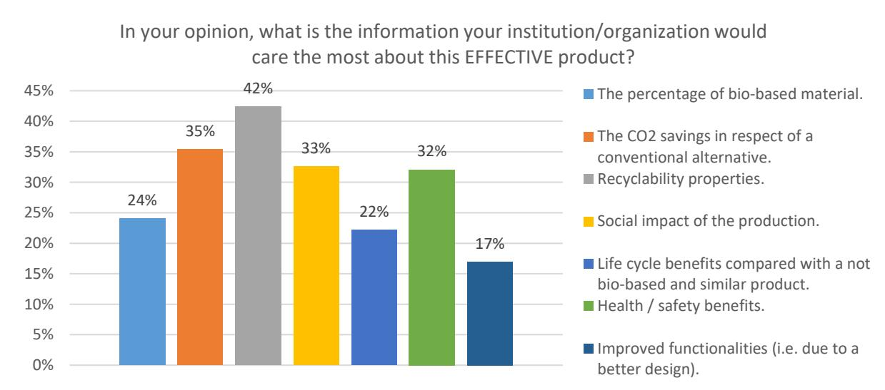

*Figure 14.Carpets - Question 12. In your opinion, what can be done to get your institution/organization to buy/procure this biobased EFFECTIVE product?*

With regard to the drivers for the purchase of this type of products by the institutions/organisations, as can be seen in [Figure 14,](#page-16-0) all received a very similar rating, around 30% of the participants, with the exception of "Give credits in green certificates as for example LEED, BREAM, etc." which was only voted by 17% of the respondents.

In terms of variations according to age, the most noticeable results are that younger subjects prioritize options such as "Give financial support" and "Green Public Procurement", while the older ones prefer "Promote Public-Private partnerships that prioritize the use of this products" and "Establish a framework regulation that support the use/procurement of it".

In terms of opinion according to country, the most notable are those countries that rate "Give credits in green certificates as for example LEED, BREEAM, etc.)" with a value like or higher than other aspects. The countries in question are set out below, together with their lowest rated aspects:

- BE Give financial support in form of grants, subsidies, or investments; The use of a certified label or the possibility to have a certification (e.g., EU ecolabel).
- FR Give financial support in form of grants, subsidies, or investments
- HR The use of a certified label or the possibility to have a certification (e.g., EU ecolabel).
- SE Green Public Procurement would accelerate the market uptake of it; Establish a framework regulation that support the use/procurement of it.

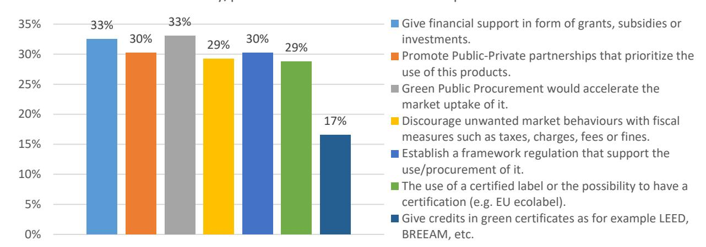

In your opinion, what can be done to get your institution/organization to buy/procure this bio-based EFFECTIVE product?

*Figure 15. Carpets - Question 13. In your opinion, what are the most important benefits your institution/organization would get from this EFFECTIVE product?*

About the most interesting benefits that might be based for a social acceptance strategy, alternatives such as "Less fossil fuel use and greenhouse gases emission" (44%), "Less environmental impact if compared with those produced with conventional raw materials" (40%) and "Less social impact if compared with those produced with conventional raw materials"(35%) were the most voted, as can be seen in [Figure 15.](#page-17-0)

From an age perspective, it is observed that among young people "Less environmental impact if compared with those produced with conventional raw materials" is the most important benefit, however, as participants age increase, "Less fossil fuel use and greenhouse gases emission" becoming the most important one, while "Less environmental impact if compared with those produced with conventional raw materials" lose importance.

In this case, the countries' views closely resemble those seen in [Figure 15,](#page-17-0) but with some differences, such as the following:

- For FR and NL "Less social impact if compared with those produced with conventional raw materials" is one of the worst rated benefits.
- For BE and SE, "Less environmental impact if compared with those produced with conventional raw materials" and "Less social impact if compared with those produced with conventional raw materials" is more important than "Less fossil fuel use and greenhouse gases emission.".

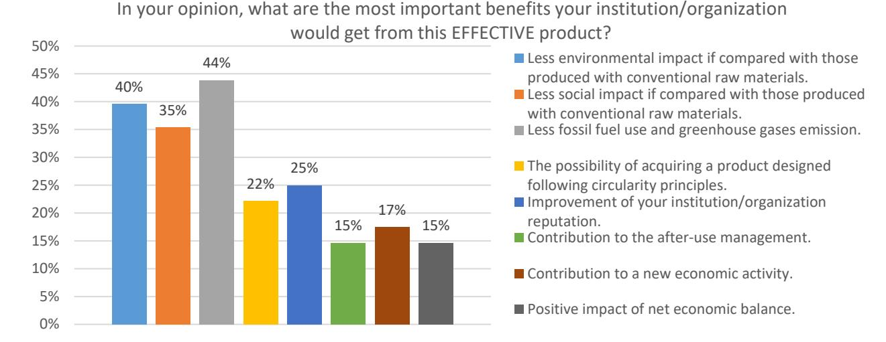

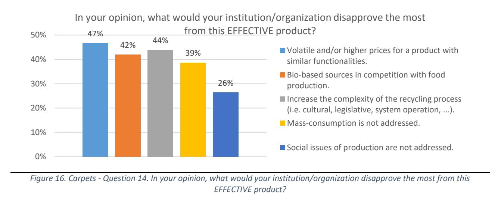

About the aspects that generate the greatest reluctance to obtain this product, the results were remarkably similar in the number of responses provided for each aspect, with "Volatile and/or higher prices for a product with similar functionalities"(47%) being the one that generate the most disapproval. The only one that currently does not generate as much disapproval is "Social issues of production are not addressed" (26%), all of which is reflected in [Figure 16.](#page-18-1)

In terms of age, there is a balanced disapproval of all aspects shown by all groups, with the following exceptions. Firstly, there is a tendency that the younger the age, the greater the disdain for "Increase the complexity of the recycling". In the case of the youngest (18-24), this difference implies a lower evaluation of "Mass-consumption is not addressed" and "Social issues of production are not addressed" compared to the rest of the groups. "Volatile and/or higher prices for a product with similar functionalities" is more highly valued by the "35-44" and ">54" groups.

What is most remarkable when analysing the answers to this question from a country perspective is the fact that only for DE and ES, "Social issues of production are not addressed" have such low disapproval. For the rest of the countries, the relevance of this aspect is similar or even higher than for most aspects.

### **Interest generated in the respondents**

Finally, it is worth mentioning that more than 70% of the respondents show interest in the product, i.e., they would be willing to collaborate in the improvement of the product, would buy it and would like to receive more information about it.

## **3.4 Results for garments**

In the case of garments respondents are asked to think on the products described in [Figure 17.](#page-19-0) The overall description is as follows:

"Products like the ones in the picture will be produced using fabrics made out from bio-based materials (biobased polyamides). These bio-based materials will be produced from renewable feedstocks (sustainable sugars), guarantying a greener manufacture. By embracing the circular economy, special attention will be given to demonstrating a sustainable end-of-life of the new products. The recyclability of this EFFECTIVE material will be validated to close the material cycle loop. In the case of the products in the image on the left, the usage of sugar as sustainable feedstock combined with more sustainable processes to produce Bio-Nylon will allow reducing the share of fossil-based material, mitigating the emission of CO2 and NOx gases, a lower consumption of energy for the production, and ensuring product's recyclability: Bio-Nylon can be recycled as described in the image on the right."

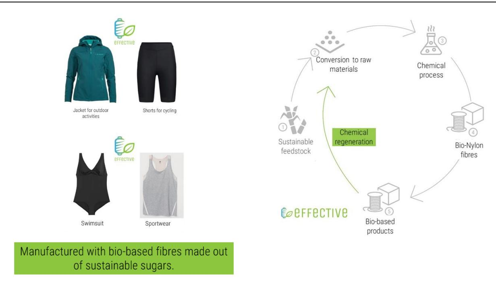

*Figure 17. Description of the garments evaluated within the EFFECTIVE Survey.*

In this case, a total of 440 surveys have been carried out, but the proportions are like those of the previous product, with 50% of them corresponding to consumers, followed in this case with 24% by businesses and by public administration and other sectors with 10 and 13% respectively.

*Figure 18. Garments – Question 9. In your opinion, why people are NOT aware of new and more sustainable products as the ones to be tested within EFFECTIVE?*

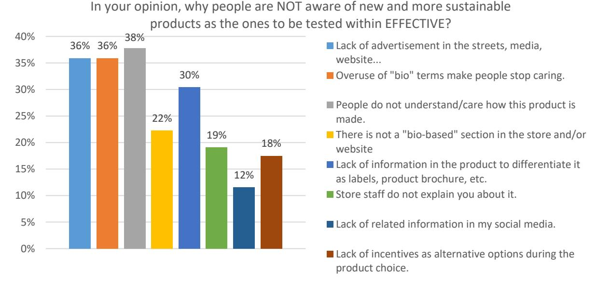

The main causes of this lack of information (36-38%) are the lack of publicity in the different media, the excessive use of the term "bio", as this leads to a loss of interest in it, and the fact that people do not understand or lack interest in how these products are produced.

The main variation in opinion according to age is observed around "Lack of information in the product to differentiate it as labels, product, brochure, etc", with younger people considering it to be of equal importance to "Lack of advertisement in the street's media, website…", while those over 54 years old consider it to be the main cause of this lack of awareness.

As can be seen in [Figure 18,](#page-19-1) "Lack of information in the product to differentiate it as labels, product brochure, etc" is in fourth position as the main reason for participants' lack of knowledge. However, when looking at it from a country perspective, it can be observed that its value is very similar and, in some cases, higher than the top three reasons. This difference in the result is mainly due to the low importance contributed by NL and PL.

*Figure 19. Garments – Question 10. In your opinion, what is the information people would care the most about this EFFECTIVE product?*

According to data showed in [Figure 19,](#page-20-0) Recycling is once again considered to be one of the product features that matters most to people, only in this case its importance is like CO2 savings compared to conventional alternatives, each with just over 40% of the votes.

In terms of age, there is nothing remarkable, but in terms of countries, the following cases have been observed. On the one hand, unlike in other countries, NL considers "Improved functionalities (i.e., due to a better design)" as the information that most matters to people. On the other hand, HR, unlike the results obtained in [Figure 19](#page-20-0), finds neither "The CO2 savings in respect of a conventional alternative" nor "Recyclability properties", but "The percentage of bio-based material" as the most relevant aspect. Finally, BE finds "Recyclability properties" as one of the least interesting pieces of information.

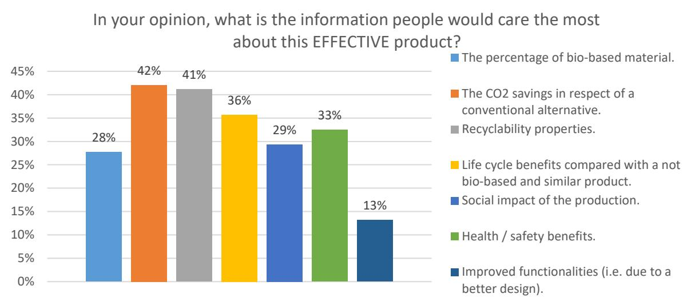

*Figure 20. Garments - Question 11. In your opinion, what can be done to get more people to buy this bio-based EFFECTIVE product?*

According to the responses received, the best method to get more people to buy the product is through "Discounts or vouchers for the next "biobased" purchase". As shown in [Figure 20,](#page-21-0) other methods with the same purpose to consider are "Free samples to test this new option" and "Certify that at least 50% of the product is bio-based".

Here the results are again like each other across age groups. The only difference worth mentioning is that for the youngest "Free sample to test this new option" is the most effective in terms of selling the product. It has also been seen that for these young people "Certify that the feedstock is produced locally" is something that, despite being among the least important, is more highly valued than for the rest of the age groups.

At the level of respondents' country of origin, the most noteworthy are the responses from HR. According to the responses of people from this country, the best way to get more people to buy the product are not any of the first three shown in [Figure 20,](#page-21-0) but "Explain the production process through infographics or videos". In fact, "Certify that at least 50% of the product is bio-based" is the worst rated option for this country.

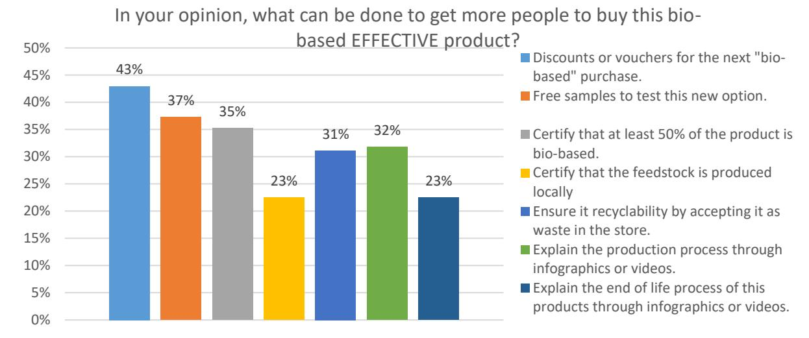

*Figure 21. Garments - Question 12. In your opinion, what are the most important benefits people would get from this EFFECTIVE product?*

In terms of the benefits to be obtained from this product, "Less environmental impact if compared with those produced with conventional raw materials" and "Less fossil fuel use and greenhouse emission" are the most important, with a very similar weight between them and a significant difference with respect to the rest, as shown i[n Figure 21.](#page-22-0)

These responses are not influenced by age or origin in any significant way. The only thing that could be highlighted are the following:

- Respondents aged 45-54 value "Less environmental impact if compared with those produced with conventional raw materials" with a considerable difference compared to "Less fossil fuel use and greenhouse emission", which differs from the rest of the age groups that give them similar values.
- Those from HR don´t find "Less environmental impact if compared with those produced with conventional raw materials" as one of the most important benefits people would get.

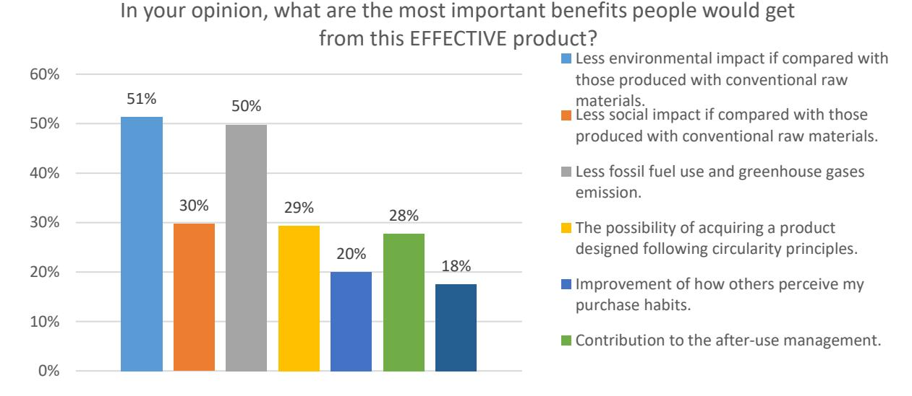

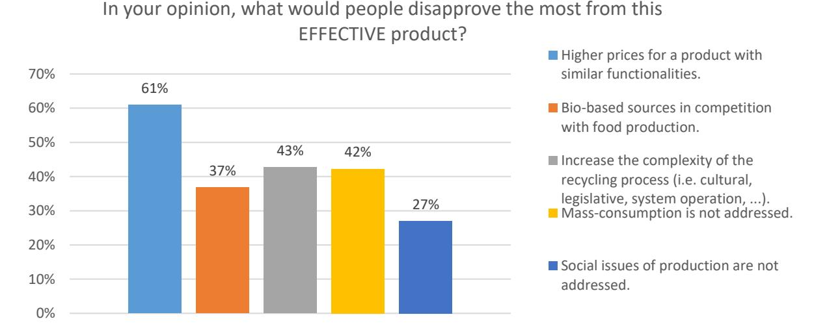

Among the different aspects that generates disapproval, the most significant and with a large difference with respect to the rest, as can be seen in [Figure 22,](#page-22-1) is "Higher prices for a product with similar functionalities" (61%). The rest present a similar importance, around 40%, apart from "Social issues of production are not addressed" which, as with the earlier product, its relevance is much lower than that of the rest (27%).

### **Interest generated in the respondents**

Finally, it is worth noting the great interest of the respondents, who in this case, around 80%, would like to see more products like this on the market and would be willing to pay a little more for them. However, the number of people willing to actively take part on the end-of-life phase would depend on the simplicity with which these products could be recycled, reaching 90% if there was no confusion.

### **3.5 Results for food packaging**

In the case of the food packaging, respondents are asked to think on the products described in [Figure 23.](#page-24-0) The overall description is as follows:

"Products like the ones in the picture will be produced using bio-based materials (bio-based polyamides and polyesters). These bio-based materials will be made from renewable feedstocks, such as sugars and vegetable oils, guarantying a greener manufacture and structurally improved fibres and films. By embracing the circular economy, special attention will be given to demonstrating a sustainable end-of-life of the new products. The recyclability of this EFFECTIVE material will be validated to close the material cycle loop. In the case of the products in the image on the left, the usage of vegetable oils as sustainable feedstock combined with more sustainable processes to produce Bio-Nylon will allow reducing the share of fossil-based material, producing a packaging with expected better barrier effect and less water absorption, and ensuring product's recyclability: Bio-Nylon can be recycled as described in the image on the right."

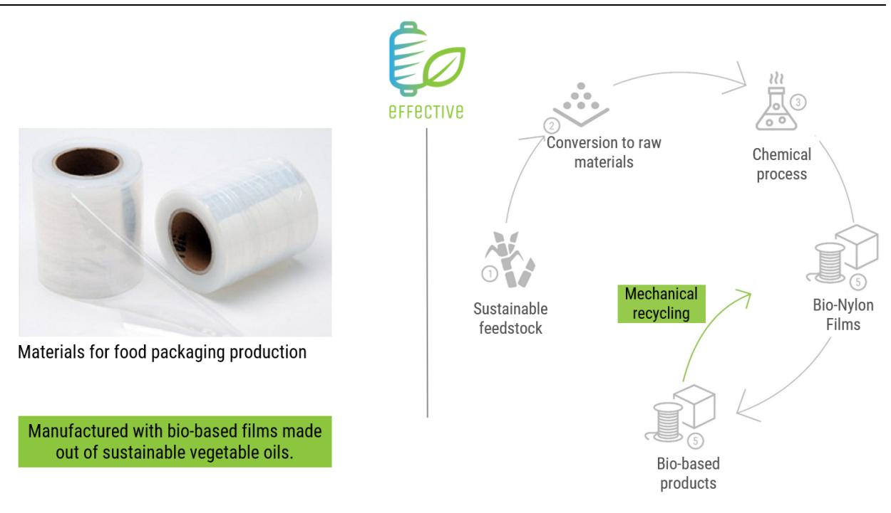

*Figure 23. Description of the food packaging evaluated within the EFFECTIVE Survey.*

For food packaging, a total of 200 surveys were carried out, with 56% being answered by consumers, 18% by businesspeople, 13% by public administration and the rest by other groups.

*Figure 24. Food packaging - Question 10. In your opinion, why do public/private peers NOT know about the existence of this EFFECTIVE product?*

For this product, the lack of publicity is the main reason the public and private sector are unaware of the existence of this product. As for the rest of the reasons, as can be seen in [Figure 24,](#page-24-1) the most relevant are those related to the difficulty of finding and keeping abreast of the different innovations.

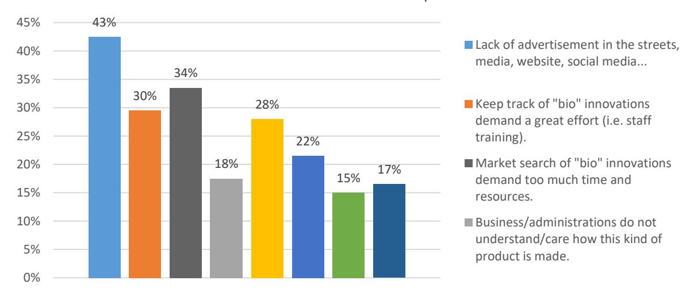

### In your opinion, why do public/private peers NOT know about the existence of this EFFECTIVE product?

From an age perspective, the responses are consistent with those previously mentioned up to the age of 45. After that age, "Lack of advertisement in the streets, media, website", although well rated, is no longer the main reason for lack of information. For those between 45 and 54, "Keep track of "bio" innovations demand a great effort (i.e., staff training)" and "There is not an easy-to-reach "bio-based" public data base" are the most relevant, while for those over 54, "Market search of "bio" innovations demand too much time and resources" and "There is not an easy-to-reach "bio-based" public data base" are the most relevant.

In terms of the opinion given according to origin, two types of differences could be distinguished with respect to the results obtained.

On the one hand, there are those countries where there are other reasons for the lack of information that are just as important as "Lack of advertisement in the streets, media, website". This group is made up of the following countries with their respective reasons:

- IT Market search of "bio" innovations demands too much time and resources.
- SI Business/administrations do not understand/care how this kind of product is made.

And on the other side, there are those countries that consider that there are more important reasons than "Lack of advertisement in the streets, media, website", among them:

- BE There is not an easy-to-reach "bio-based" public data base.
- FR "Market search of "bio" innovations demand too much time and resources" and "There is not an easy-to-reach "bio-based" public data base".
- HR Market search of "bio" innovations demands too much time and resources.

As we have seen so far, of all the properties, recyclability is extremely important for organizations and institutions. However, in this case this property is outweighed, not by much, but enough to stand out when comparing food packaging with the products previously seen, by the CO2 savings. The percentages of these two properties, as well as those of the other properties studied, are shown in [Figure 25.](#page-25-0)

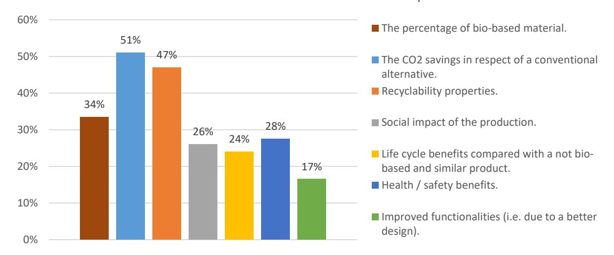

### In your opinion, what is the information your institution/organization would care the most about this EFFECTIVE product?

*Figure 25. Food packaging - Question 11. In your opinion, what is the information your institution/organization would care the most about this EFFECTIVE product?*

So far, the age groups have not shown any noteworthy variation in results and the same is true here with only one exception. This variation is about how concern about "Health/safety benefits" increases the older the age of the subject, going from being practically unimportant to being the most important aspect for those over 54 years of age.

By paying attention to people's answers according to their country of origin, the following aspects can be perceived that differs from the results shown in [Figure 25.](#page-25-0) The first thing to note are those countries where "The CO2 savings in respect of a conventional alternative" and/or "Recyclability properties" have the same or less value as other information. In this group we can find the following cases:

- Equal to The CO2 savings in respect of a conventional alternative: o NL – "The percentage of bio-based material" and "Life cycle benefits compared with a not bio-based and similar product" o SI - Health / safety benefits.
- Equal to Recyclability properties. o BE - Life cycle benefits compared with a not bio-based and similar product o DE - The percentage of bio-based material. o NL – "The percentage of bio-based material" and "Life cycle benefits compared with a not bio-based and similar product"
- Greater than The CO2 savings in respect of a conventional alternative: o BE - Life cycle benefits compared with a not bio-based and similar product o FR - Improved functionalities (i.e., due to a better design).
- Greater than Recyclability properties. o PL - The percentage of bio-based material.

*Figure 26. Food packaging - Question 12. In your opinion, what can be done to get your institution/organization to buy/procure this bio-based EFFECTIVE product once its production at industrial scale has started?*

According to the responses received, the best method to promote the purchase of this product is through the prioritization of the use of this type of product through public-private partnerships. Two other strategies vying for the second-best choice are financial support in form of grants, subsidies or investments and green public procurement. All of this can be seen in [Figure 26](#page-26-0) where the responses received for each possibility are compiled with respect to the total.

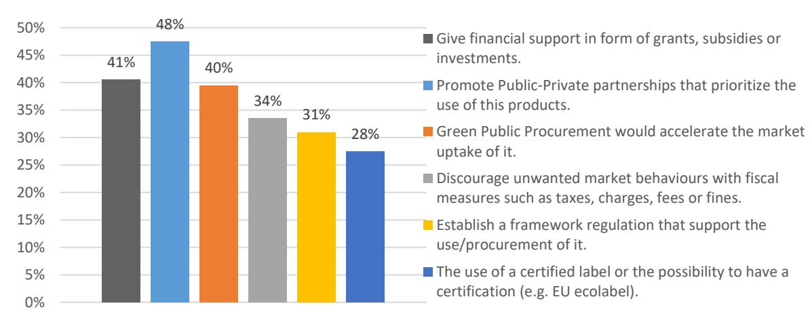

### In your opinion, what can be done to get your institution/organization to buy/procure this bio-based EFFECTIVE product once its production at industrial scale has started?

As for the influence of age on the responses in this section, it is observed that the younger the respondent is, the more value is given to "Give financial support in form of grants, subsidies or investments", going from being something equally important as "Promote Public-Private partnerships that prioritize the use of this products" to something less relevant.

From a country-of-origin perspective, the only thing that stands out are the views of BE and SE. In the case of BE, the following aspects are noteworthy:

- The low importance given to "Give financial support in form of grants, subsidies or investments".
- "Promote Public-Private partnerships that prioritize the use of this products" having the same value as "Green Public Procurement would accelerate the market uptake of it" and "Discourage unwanted market behaviours with fiscal measures such as taxes, charges, fees or fines".
- "The use of a certified label or the possibility to have a certification (e.g., EU ecolabel)" is considered to be the best method

As for SE the most significant is that "Promote Public-Private partnerships that prioritize the use of this products" is considered the least important of all methods.

*Figure 27. Food packaging - Question 13. In your opinion, what are the most important benefits your institution/organization would get from this EFFECTIVE product?*

As with the previous products, the most important benefits to be gained from this type of food packaging are "Less environmental impact if compared with those produced with conventional raw materials" (42%) and "Less fossil fuel use and greenhouse emissions" (46%), while at the same time presenting a notable difference in terms of the number of votes received, as can be seen in [Figure 27.](#page-27-0)

The influence of age in this area is not significant, the only thing that can be highlighted is a small tendency for "Less fossil fuel use and greenhouse gases emission" to lose relevance until it is no longer the most important after 45 years of age.

At the country level, the following differences were observed with respect t[o Figure 27:](#page-27-0)

- Countries that have given equal or greater weight to other benefits with respect to "Less fossil fuel use and greenhouse gases emission". o Equal to

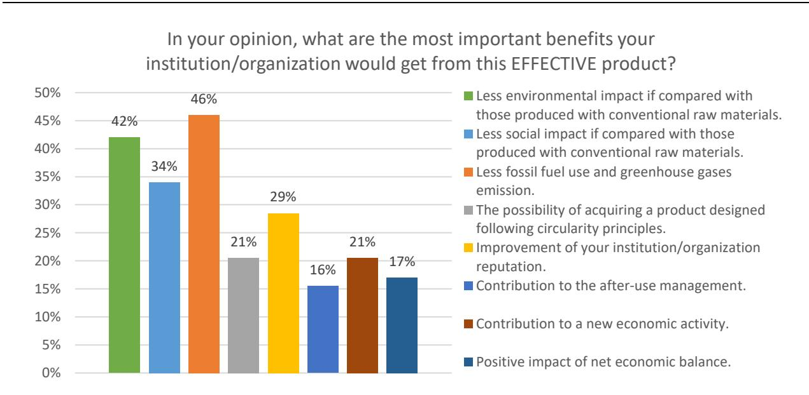

- ▪ BE – "Less environmental impact if compared with those produced with conventional raw materials" and "Positive impact of net economic balance" ▪ DE – "Less environmental impact if compared with those produced with conventional raw materials" and" Positive impact of net economic balance". o Greater than ▪ FR – "Less environmental impact if compared with those produced with conventional raw materials" and "Contribution to the after-use management". ▪ HR and NL – "Less social impact if compared with those produced with conventional raw materials".
- The low importance attached by BE to "Less social impact if compared with those produced with conventional raw materials".

*Figure 28. Food packaging - Question 14. In your opinion, what would your institution/organization disapprove the most from this EFFECTIVE product?*

From the stakeholder's point of view "Bio based sources in competition with food production" (53%) and "Increase the complexity of the recycling process" (50%) are the most worrying ones. As can be seen in [Figure](#page-28-0)  [28,](#page-28-0) the proportions of "Volatile and/or higher prices for a product with similar functionalities" (44%) and "Mass consumption in not addressed" (40%) are not easy to ignore either, although the same cannot be said for "Social issues of production are not addressed (19%).

In this case, young people are again the reason for the diversity of responses, because while the other groups consider "Bio-based sources in competition with food production" to be the most despicable aspect, they consider "Volatile and/or higher prices for a product with similar functionalities" and "Increase the complexity of the recycling process" to be the most worrying.

Firstly, it should be noted that not all countries consider "Bio based sources in competition with food production" to be the most disapproved aspect of this product. In fact, the following countries show a significant difference between the values:

- BE Mass-consumption is not addressed.
- DE Increase the complexity of the recycling process (i.e., cultural, legislative, system operation, ...).

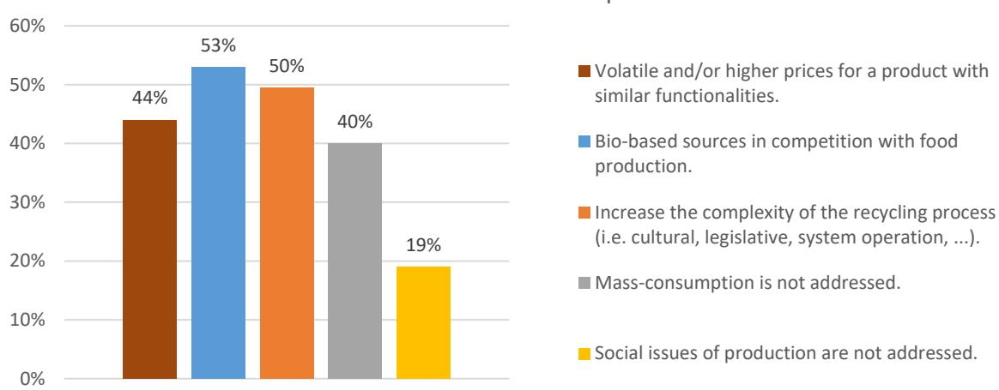

In your opinion, what would your institution/organization disapprove the most from this EFFECTIVE product?

- PL "Volatile and/or higher prices for a product with similar functionalities" and increase the complexity of the recycling process (i.e., cultural, legislative, system operation, ...).
- SE Volatile and/or higher prices for a product with similar functionalities.

### **Interest generated in the respondents**

As we have seen so far, a large proportion of respondents (over 70%) find this type of product interesting enough to receive more information about it and purchase such products, however, the total number of people who consider that their companies/institutions are willing to collaborate in improving the reuse and recycling of this type of food packaging will vary from 40% to 86% depending on the expenditures.

## **3.6 Results for secondary packaging**

In the case of Secondary packaging, respondents are asked to think on the products described in [Figure 29.](#page-29-1) The overall description is as follows:

"Products like the ones in the picture will be produced using films made out from bio-based materials (biobased polyesters). These bio-based materials will be produced from renewable feedstocks (sustainable sugars and vegetable oils), guarantying a greener manufacture. By embracing the circular economy, special attention will be given to demonstrating a sustainable end-of-life of the new products. The biodegradability and composability of this EFFECTIVE material will be validated to close the material cycle loop. In the case of the products in the image on the left, the usage of sustainable sugars and vegetable oils as sustainable feedstock combined with more sustainable processes to produce bio-based polyesters will allow reducing the share of fossil-based material, producing a packaging with an expected better mechanical property, and ensuring product's composability as described in the image on the right."

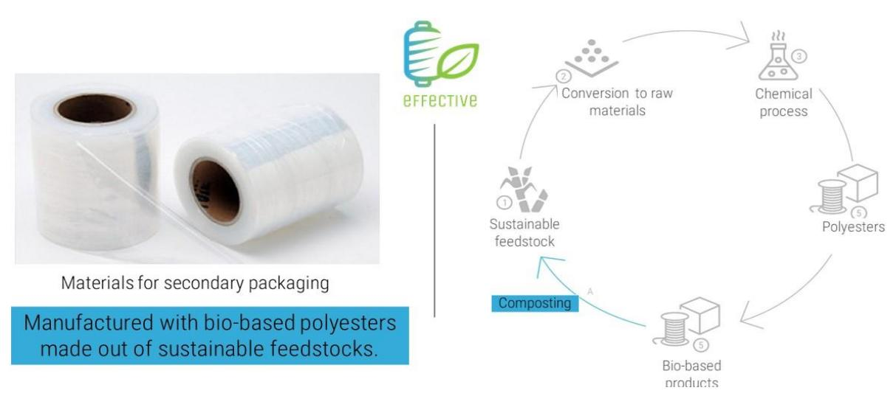

*Figure 29. Description of the secondary packaging evaluated within the EFFECTIVE Survey.*

The following are the results obtained from surveys of 200 people regarding secondary packaging. As we have seen so far, half of the people surveyed are considered as consumers, while 24% belong to the "business" sector and the rest equally to the public administration and other sectors.

*Figure 30. Secondary packaging - Question 10. In your opinion, why public/private peers are NOT aware of new and more sustainable products as the ones to be tested within EFFECTIVE?*

The reason why the public and private sector are unaware of the existence of more sustainable products such as the one in question is due, as shown in [Figure 30,](#page-30-0) to the lack of publicity on the subject in question, as well as the difficulties in obtaining the information, not to mention the time and resources required to obtain it.

This is something with which all age groups agree, with the small exception of those aged 35-44, who, despite giving considerable weight to the above-mentioned aspects, consider that the main reasons for this lack of information are due to "My sector is reluctant to changes" and "They are not aware about events, like congress or seminars, focused on this kind of products".

The country's influence in this case is more striking for the following reasons:

- Countries that don´t consider "Lack of advertisement in the streets, media, website, social media" as the main reason for the lack of information on the part of the population. Below are the countries whose main reason show a significant difference with respect to "Lack of advertisement in the streets, media, website, social media". o BE – "Business/administrations do not understand/care how this kind of product is made" and "They are not aware about events, like congress or seminars, focused on this kind of products" o DE - Market search of "bio" innovations demands too much time and resources. o HR - My sector is reluctant to changes. o IT – "Keep track of "bio" innovations demand a significant effort (i.e., staff training)" and "Market search of "bio" innovations demand too much time and resources".
- Countries that consider "They are not aware about events, like congress or seminars, focused on this kind of products" as a reason to be considered, giving it a value similar, equal, or higher value than those that have received the most votes overall. These countries include BE, HR, and IT.

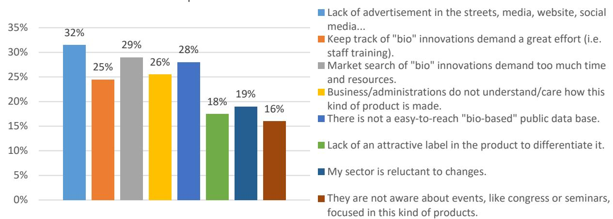

In your opinion, why public/private peers are NOT aware of new and more sustainable products as the ones to be tested within EFFECTIVE?

*Figure 31. Secondary packaging – Question 11 In your opinion, what is the information your institution/organization would care the most about this EFFECTIVE product?*

In terms of the product information that is of most interest to institutions and organisations, as can be seen in [Figure 31,](#page-31-0) the information in the top four positions have received a remarkably similar number of votes between them (33-36%). Next, and without much difference with the earlier ones, are "Social impact of production" and "Life cycle benefits compared to a non-biobased and similar product" with 27% and 28% respectively.

In terms of the effect that age has on opinions, it has been seen that the older one is, the less important one tends to attach to "The percentage of bio-based material".

*Figure 32. Secondary packaging - Question 12. In your opinion, what can be done to get your institution/organization to buy/procure this bio-based EFFECTIVE product once its production at industrial scale has started?*

In response to the question "What can be done to get your institution/organization to buy/procure this biobased EFFECTIVE product once its production at industrial scale has started?", respondents for this product

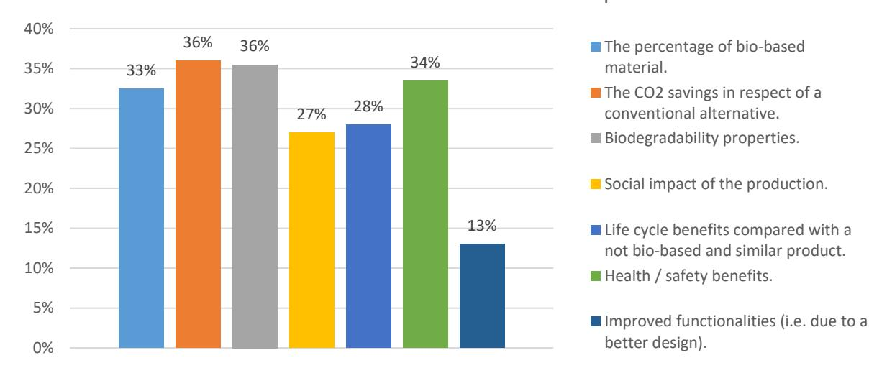

In your opinion, what is the information your institution/organization would care the most about this EFFECTIVE product?

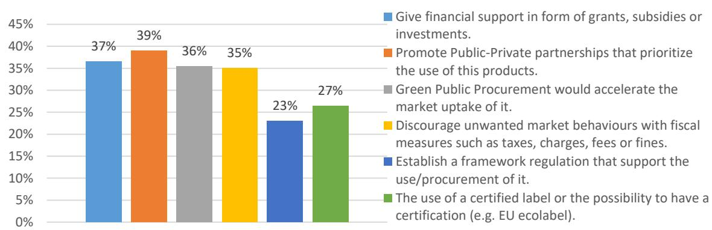

### In your opinion, what can be done to get your institution/organization to buy/procure this bio-based EFFECTIVE product once its production at industrial scale has started?

again gave 4 of the answers very similar values to each other as the best methods to achieve this objective. As reflected in [Figure 32,](#page-31-1) "Promote Public-Private partnerships that prioritize the use of this products" has received the most votes, followed by "Give financial support in forma of grants, subsidies or investments", "Green Public Procurement would accelerate the market uptake of it" and "Discourage unwanted market behaviours with fiscal measures such as taxes, charges, fees or fines" respectively.

In this case, young people are again the source of the divergence in the answers, because while the answers of others are quite similar to the results obtained, in their case the most important aspect is "Give financial support in form of grants, subsidies or investments", while "The use of a certified label or the possibility to have a certification" has the same importance as "Promote Public-Private partnerships that prioritize the use of this products".

*Figure 33. Secondary packaging - Question 13. In your opinion, what are the most important benefits your institution/organization would get from this EFFECTIVE product?*

With the results of the secondary packaging and seeing the similarity that all products share regarding which are the most important benefits, it can be concluded that institutions and organisations find "Less fossil fuel use and greenhouse gases emission" (41%) and "Less environmental impact if compared with those produced with conventional raw materials" (38%) as the most important to consider when dealing with bio-based products. The rest of the benefits, as can be seen i[n Figure 33,](#page-32-0) don't even reach 30% of the votes, falling far behind in terms of relevance when compared to those previously mentioned.

Despite receiving a considerable number of votes from those aged 18-24, it seems that "Less use of fossil fuels and emission of greenhouse gases" is a benefit of increasing concern over time, as the results show that the older one gets, the more interest it arouses. e. In any case, this age group finds "Lower environmental impact compared to those produced with conventional raw materials" more relevant.

Among the small variations that occur depending on the country of the participants, the most notable is the similarity or even overlap of "Less social impact if compared with those produced with conventional raw materials" with respect to one of the top-rated benefits according to [Figure 33.](#page-32-0) The main countries where this is the case are BE, DE, FR, HZ, and IT.

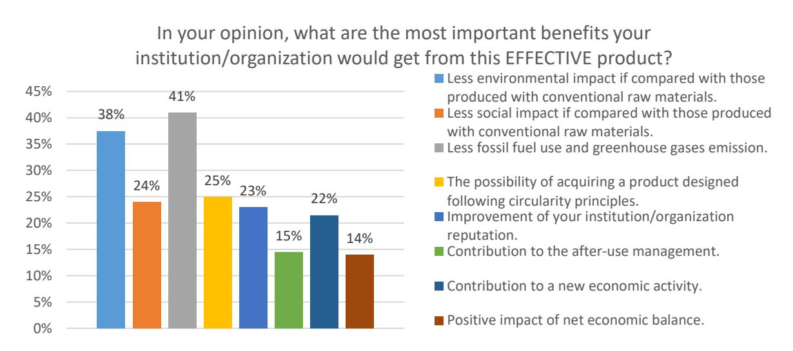

*Figure 34. Secondary packaging - Question 14. What would your institution/organization disapprove the most from this EFFECTIVE product?*

In this case, as was the case for carpets and can be seen in [Figure 34,](#page-33-0) respondents found that for secondary packaging, all but "Social issues of production are not addressed" were almost equally repellent (around 39%).

However, this difference in importance that "Social issues of production are not addressed" receives is related to a certain extent to age, since apparently the older the age the less concern it generates, and if it were for the youngest, its relevance would be very similar to that of the rest.

### **Interest generated in the respondents**

Finally, following the pattern seen for the other products, secondary packaging is also of sufficient interest that more than 70% of respondents would like to receive more information about it and find more such products on the market. However, the number of those willing to contribute to product improvement in terms of reusability and recyclability will still depend on the costs involved (35 – 81%).

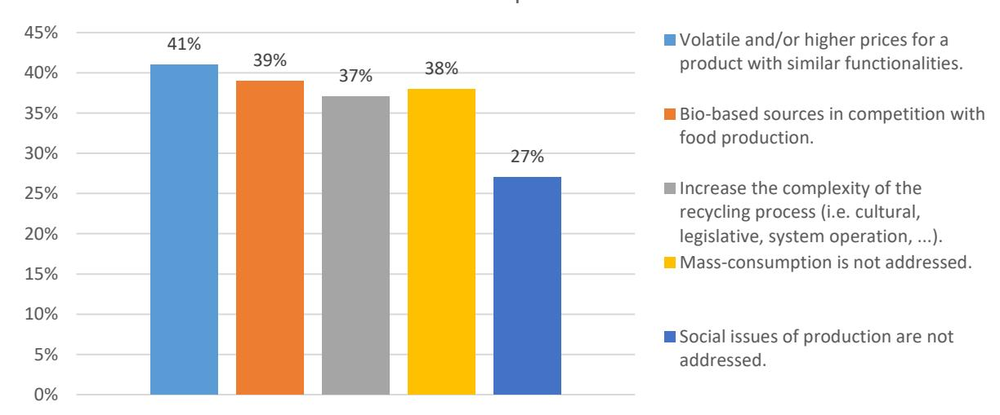

What would your institution/organization disapprove the most from this EFFECTIVE product?

## **4. In-person and Online Workshops**

As shown in [Table 1,](#page-10-0) a total of 4 workshops were held during the EFFECTIVE project, divided equally into two formats: in-person and online. In any case, both typologies had a common goal and similar dynamics. The main objective of these sessions was to collect, in an interactive way, the responses of the representatives of each stakeholder group, mainly from companies in the sector and public administration, but also from consumers as the events were open to everyone interested, on different aspects related to the sustainable production of the bio-based products presented in the project. In this way, the aim was to identify barriers and opportunities for the replicability and uptake of the proposed solutions.

In addition to the project's presentation and project's partners showcase of partial results, the events were also focused on the discussion about audience's opinions on the subject. This is done with a dynamic activity based on a voting session. A series of multiple-choice questions were asked to attendees about barriers, opportunities, information requirements and so on, and, after the voting, results were presented immediately to foster the discussion and to hear the reasons behind the choice of each person.

In the case of the post-survey events (2 nd , 3 rd, and 4th workshops), these questions were linked with the ones from the surveys. So, when results were presented, the debate wasset in both the reasons behind attendees' responses, and the concordance (or not) with the results from the survey. The results of the surveys were displayed with the twofold aim of, in one hand, deliver partial and interesting results for the people in the session and, on the other, to foster the debate regarding the differences and similarities between the two information sources. Finally, the moderator drew a short conclusion of the results at the end of each question. A summary of these results is reported as follows.

**Benefits from EFFECTIVE:** most of participants feel that EFFECTIVE's innovations help to reduce the impact associated with products made from polyamides and polyester. They highlight that the best steps towards this would be prevention, recycling, and the use of sustainable raw materials. In the case of garments, aspects such as energy efficiency with respect to conventional ones, the lack of political will, the lack of knowledge of what happens with textile waste, or the higher valuation of price over quality are highlighted.

**Awareness level**: in general, people taking part in the session show a higher level of awareness that those interviewed through the survey. Stakeholders of the packaging sector present a higher level of awareness as there are no completely unaware participants, unlike with textiles-related ones where this was the case for almost 15% of attendees.

**Role of public administrations:** in general, participants agreed that the public administrations should take the lead in raising consumer awareness and engagement. The main instruments to be used should be regulation, followed by education and information campaigns.

**Information barriers:** overall, attendees from the packaging sector agree that keep track on the innovations from the bio-based industry is a high effort-demanding task. Behind the reasons for this, they identified the lack of related advertisement, the low interest or time available for this in comparison with daily activities, and the absence of an easy-to-reach data base or similar. Whereas stakeholders attending the textile workshop comment that the three key aspect for their sector are the "overuse of "bio" terms that make people stop caring", followed by "people do not understand/care how this product is made" and "lack of information in the product to differentiate it as labels, product brochure, etc."

**Information needs towards product uptake**: in terms of the type of information of most interest to stakeholders, it could be seen that CO2 savings would be among the most important in both cases. Only in the case of packaging it would be tied with "Life cycle benefits compared with a not bio-based and similar product" and both surpassed by "Biodegradability/Recyclability properties", while in the case of textiles, it would share the first position with "Life cycle benefits compared with a not bio-based and similar product", surpassing "The percentage of bio-based material" and "Social impact of the production" with a small difference.

**Products exploitable strengths**: In order to promote these products and improve their sales, workshop attendees felt that in the case of packaging all options ("green public procurement would accelerate the market uptake of it", "discourage unwanted market behaviours with fiscal measures such as taxes, charges, fees or fines", "establish a framework regulation that support the use/procurement of it" and "the use of a certified label or the possibility to have a certification") are almost equally good, with the exception of "give financial support in form of grants, subsidies or investments" and "promote public-private partnerships that prioritize the use of this products" which received hardly any votes. For garments, "certify that at least 50% of the product is bio-based" was considered the best method for this promotion, while for carpets "promote public-private partnerships that prioritize the use of this products and "establish a framework regulation that support the use/procurement of it" would be the best.

**Product weaknesses to address** when asked what would be most disapproved of in this type of product, the packaging workshop attendees clearly saw "increase the complexity of the recycling" as the main aspect to avoid, reaching 50% of the votes (this issue is commented below). In the case of textiles, the aspect to avoid is "higher prices for a product with similar functionalities".

**Waste management and recyclability:** One of the main barriers identified during the sessions is the high cost and increase of complexity for the improvement of the waste management system. The introduction of new materials is perceived as a challenge given that many of them might not be compatible with the services and the technologies in place within the recyclability value chain. Although this is a technical issue (e.g. the upgrade of recycling facilities), other impacts downstream, such as where this waste should be collected, or if these new materials are compatible with current waste flows, are also commented for sellers and buyers

**Willingness to buy/use bio-based products:** Finally, in both cases, all participants showed that they would prefer to buy these bio-based and more sustainable versions, rather than the more conventional ones.

## **5. Conclusion**

The present report delivers the results obtained out of surveys and interviews on the biobased product. The approach that stakeholders show towards the various products demonstrated by EFFECTIVE is reflected in the information gathered though the survey and workshops. These insights are useful to select the most suitable strategies for the social acceptance. In this sense, the main learnings are summarised as follows:

**Awareness:** From the first questions, it can be observed a lack of knowledge on the part of the participants, as acknowledged by themselves. The majority believes that all bio-based products have the property of biodegradability. In general, all agree that the main reason the public/private sector is unaware of the existence of these products is the lack of publicity. This is quite clear in the case of the packaging products, while for the other two products, this position is rivalled by other reasons. In the case of carpets this is "Keep track of "bio" innovations demand a great effort", while for garments it is due to both "Overuse of "bio" terms make people stop caring" and "People do not understand/care how this product is made". This view is shared by younger people but is becoming less and less important until it is overtaken by the age of 45, and even then, it is still considered one of the main reasons. The same is true for countries, where the majority considers "Lack of advertisement in the streets, media, website" to be the most important. In view of this lack of knowledge, it is essential to solve this solution, which, given the results, would imply at least investing in advertising through different media.

**Information:** In terms of what to communicate to stakeholders to increase social acceptance, there is clearly a broad consensus that the information that institutions/organizations are most concerned about right now are those properties related to the end of life of the product, i.e., its recyclability or biodegradability, as well as CO2 emission savings compared to conventional alternatives. Except for carpets, where "Biodegradability properties" is outperform by "The CO2 savings in respect of a conventional alternative" considerably, all other products present balanced values for both cases. In this case there is no influence of age or country of origin, except for the Croatians who value "The percentage of bio-based material" above all else, while "The CO2 savings in respect of a conventional alternative" is one of the least interested. As these properties have some reputable certifications, their use could be useful for reporting and accreditation purposes.

**Promotion:** Since reporting does not at once lead to the purchase of the product, a question was asked about the best method to convince institutions/organisations to purchase these products. For carpets and secondary packaging there is no one method that stands out above the others, as the responses are fairly balanced, while for garmentsthe most important are discounts or vouchers for future purchases and for food packaging the promotion of public-private partnerships that prioritise the use of these products. In terms of age, younger people are more likely to opt for financial support such as scholarships, grants, or investments, while as they get older, interests become more focused on other aspects such as "Promote Public-Private partnerships that prioritize the use of this products" and "Green Public Procurement would accelerate the market uptake of it". As far as countries are concerned and despite their individualities, all agree that "Promote Public-Private partnerships that prioritize the use of this products" is among the best methods to promote the sale of such products. Most significant is the fact that contrary to the general opinion where "Give financial support in form of grants, subsidies or investments" is among the best ways to achieve such goal, for BE and FR, they would have hardly any interest. In summary, the type of product, as well as the age and, in some cases, the country of origin of the target buyer, will have to be considered, but from a general perspective it can be concluded that the promotion of public-private partnerships that prioritise the use of these products will be one of the best ways to promote the sale of these products.

**Benefits:** Without any influence from age or country, all agree again that the most important benefits for institutions from these products are a reduced environmental impact, as well as a reduction in fossil fuel consumption and gas emissions. This corresponds to the interest shown in receiving information about CO2 emission savings compared to conventional versions. So, it can be concluded that these products emitting as little as possible would be the most desired property for the stakeholders.

**Barriers:** For all products, the fact that the products were more expensive than others with similar functionalities cause the most disapproval. There seems to be no influence of age or origin, other than that "Increase the complexity of the recycling process" in SI is equally important as "Volatile and/or higher prices for a product with similar functionalities", while in HR it is even more important.

In summary, to design and develop the most proper strategiesfor the social acceptance of the new bio-based products, an advertising campaign through different media will be needed to address the lack of awareness observed in the results of the surveys. In turn, this campaign should focus on informing about the end-of-life properties of the product, as well as the savings in CO2 emissions compared to the conventional version. This is due to the great interest shown by the survey participants in these properties. One way of doing this could be by promoting the acquisition of certificates or labels.

However, the promotion of these products through a campaign cannot be limited to information. To be effective, it must be accompanied by some other action. When choosing this action, distinct aspects must be considered, such as the type of product to be sold or the age/origin of the target buyer. Finally, for this campaign to be effective, it will be significant that the price of the bio-based product does not exceed that of the conventional product.

**Annex 1 – EFFECTIVE Survey [EUSurvey]**

1/8/22, 18:32

EUSurvey - Survey

(/eusurvey/home/welcome/turner)

Login (/eusurvey/auth/login/turner) | Help → | Language →

**EFFECTIVE Survey: VAUDE Garments**

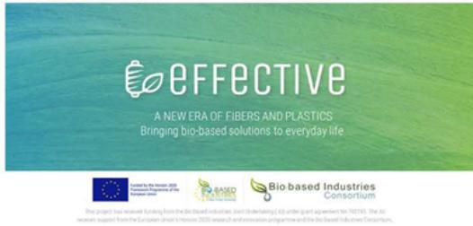

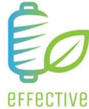

**Views**  
Standard **Accessibility Mode**

**Languages**  
English →

**Contact**  
dfbusto@fcirce.es  
(mailto:dfbusto@fcirce.es)

Save as Draft

**Report abuse**  
(/eusurvey/home/reportAbuse?survey=331688)

**Section 1: EFFECTIVE Survey Introduction**

**Welcome to the EFFECTIVE survey!**

The objective of this survey is to help us understand how you perceive bio-based materials and products. More specifically, this survey will focus on the garments that VAUDE will test and produce as part of the EFFECTIVE project. We will tell you a little bit more about it during the survey.

This should not take you more than 10 min. So, we thank you in advanced for your collaboration.

Let's start with a couple of questions about the concept "bio-based".

- \* 1. How much do you know about bio-based materials and/or products?
  - Nothing at all.
  - I have heard some about them, but the topic is still confusing to me.
  - I know the basics, but still need to learn more.
  - I can explain the topic and give concrete examples.
  - I am an expert in this topic.
  
- \* 2. In your opinion, which of the following phrases better describe the term bio-based? Select as many as you consider.
  - Only natural materials like wood and paper.
  - With biodegradable properties or biodegradable materials.
  - An alternative to petroleum.
  - Might be recycled.
  - From renewable sources.
  - Also called eco-products.
  - Produced locally.

**Section 2: Bio-based products and materials**

**Bio-based products or materials** are usually defined as products and materials from biological and renewable sources, such as plants. Raw materials like minerals and fossil fuels, despite being extracted from earth, are not considered in this category given the long period their production takes (i.e. beyond a century). This means that a plastic made out from petroleum is not bio-based, whereas a plastic made from vegetable oils or sustainable sugars, for instance, is indeed a bio-based product. Nylon, for example, is a plastic that can be produced from both sources. Even recycled Nylon is also considered bio-based if originally made from sustainable feedstock.

For example, consider the products on the following image and respond the following questions:.

EUSurvey - Survey

(/eusurvey/home/welcome/turner)

Login (/eusurvey/auth/login/runner) | Help → | Language →

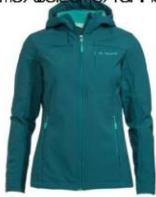

Jacket for outdoor activities

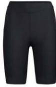

Shorts for cycling

ES: Chaqueta de montaña | Pantalones de ciclismo; **FR:** Veste pour activité extérieure | Short pour cyclisme;  
 DE: Outdoorjacke | Radhose; **SV:** Jacka för utomhusaktiviteter | cykelshorts; **HR:** Jakna za aktivnosti na otvorenom | kratke hlače za aktivnosti na otvorenom; **IT:** Giacca per attività all'aperto | pantaloncini da ciclismo; **SI:** Jakna za akivnosti na prostem | Kratke hlače za aktivnosti na prostem.

**\* 3. In the last year, have you bought a product similar to the ones in the image?**

- Yes
- No

**\* 4. Did you know that VAUDE within EFFECTIVE will make these kinds of products using a biobased version of the fabric?**

- Really? First time I heard about it.
- No, but I know there are alternatives made with recycled materials.
- Of course! I am always updated in these matters.

**Section 3: EFFECTIVE bio-based products and value chains.**

In fact, within **EFFECTIVE**, products similar to the ones in the picture will be produced using fabrics made out from bio-based materials (bio-based polyamides). These bio-based materials will be produced from renewable feedstocks (sustainable sugars), guarantying a greener manufacture.

By embracing the circular economy, special attention will be given to demonstrating a sustainable end-of-life of the new products. The recyclability of this **EFFECTIVE** material will be validated in order to close the material cycle loop.

In the case of the products in the image on the left, the usage of sugar as sustainable feedstock combined with more sustainable processes for the production of Bio-Nylon will allow: reducing the share of fossil based material, mitigating the emission of CO2 and NOx gases, a lower consumption of energy for the production, and ensuring product's recyclability: Bio-Nylon can be recycled as described in the image on the right.

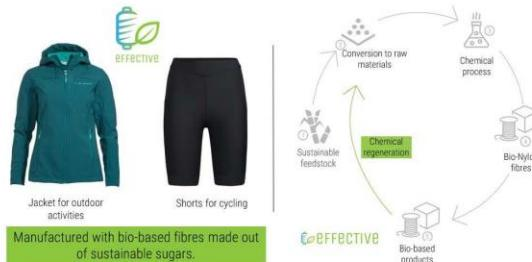

ES: Fabricados con fibras biobasadas producidas a partir de azúcar; **FR:** Fabriqués à partir de fibres biosourcées issue de sucres renouvelables; **DE:** Tiliverkad med biobaserade fibrer av hållbara sockerarter; **SV:** Tiliverkad med biobaserade fibrer av hållbara sockerarter; **HR:** proizvedeni od vlakana s biološkom osnovom napravljenima od održivog šećera; **IT:** Prodotti con fiati bio-based ottenuti a partire da materie prime rinnovabili (zuzcheri); **SV:** izdelano iz vlaken na bio osnovi iz trajnostno pridelanih sladkorjev

With all this new information, please, let us know your thoughts by responding the following questions.

**\* 5. In your opinion, why people are NOT aware of new and more sustainable products as the ones to be tested within EFFECTIVE? Select the top 3**

at most 3 choice(s)

- Lack of advertisement in the streets, media, website..
- Overuse of "bio" terms make people stop caring.
- People do not understand/care how this product is made.
- There is not a "bio-based" section in the store and/or website.
- Lack of information in the product to differentiate it as labels, product brochure, etc.
- Store staff do not explain you about it.
- Lack of related information in my social media.

EUSurvey - Survey

 Lack of incorporated environmental opinion during the product choice.

[Login \(/eusurvey/auth/login/runner\)](#) | [Help](#) | [Language](#) ▼

**\* 6. In your opinion, what is the information people would care the most about this EFFECTIVE product? Select the top 3.**

*at most 3 choice(s)*

- The percentage of bio-based material.
- The CO2 savings in respect of a conventional alternative.
- Recyclability properties.
- Life cycle benefits compared with a not bio-based and similar product.
- Social impact of the production.
- Health / safety benefits.
- Improved functionalities (i.e. due to a better design).

**\* 7. In your opinion, what can be done to get more people to buy this bio-based EFFECTIVE product? Select the top 3.**

*at most 3 choice(s)*

- Discounts or vouchers for the next "bio-based" purchase.
- Free samples to test this new option.
- Certify that at least 50% of the product is bio-based.
- Certify that the feedstock is produced locally
- Ensure it recyclability by accepting it as waste in the store.
- Explain the production process through infographics or videos.
- Explain the end of life process of this products through infographics or videos.

**\* 8. In your opinion, what are the most important benefits people would get from this EFFECTIVE product? Select the top 3.**

*at most 3 choice(s)*

- Less environmental impact if compared with those produced with conventional raw materials.
- Less social impact if compared with those produced with conventional raw materials.
- Less fossil fuel use and greenhouse gases emission.
- The possibility of acquiring a product designed following circularity principles.
- Improvement of how others perceive my purchase habits.
- Contribution to the after-use management.
- Contribution to a new economic activity.

**\* 9. In your opinion, what would people disapprove the most from this EFFECTIVE product? Select the top 3.**

*at most 3 choice(s)*

- Higher prices for a product with similar functionalities.
- Bio-based sources in competition with food production.
- Increase the complexity of the recycling process (i.e. cultural, legislative, system operation, ...).
- Mass-consumption is not addressed.
- Social issues of production are not addressed.

**\* 10. In your opinion, would people be willing to actively collaborate for better ways for reusing and recycling this EFFECTIVE product?**

- Of course. Everybody should contribute to the environment by reusing, recycling and being responsible with our waste.
- Maybe. New materials make recycling even more confusing.
- No, it is not really people's responsibility

**\* 11. Ultimately, would you prefer to buy this bio-based and more sustainable product over the conventional alternative?**

- Yes, contribute to a better environment is my main priority, even if I have to pay a bit more.
- No, both options are practically the same, so I rather buy the cheaper

**\* 12. Would you like to find more and more bio-based products like this in the market?**

- Yes
- No

**Section 4: Profile**

Now, to conclude the survey, please let us know a little bit more about you.

**\* 13. Where do you live?**

 ▼

**\* 14. How old are you?**

 ▼

EUSurvey - Survey

[Login \(/eusurvey/eufn/login/runner\)](#) | [Help](#) | [Language](#) →

**15. What is your gender?**

 ▼

**16. What is the highest level of education you have completed?**

 ▼

**17. From the list below, what kind of stakeholder group you represent?**

 ▼

**18. Do you work, research, teach, etc. In the field of bioeconomy and/or bio-based products?**

- Yes
- No

Thank you very much for your contribution and your time!

Kind regards,

[Submit](#)

(/eusurvey/home/welcome)

*EUSurvey is supported by the European Commission's ISA® programme ([https://ec.europe.eu/isa2/home\\_en](https://ec.europe.eu/isa2/home_en)), which promotes interoperability solutions for European public eduministrations.*

Privacy statement (/eusurvey/home/privacystatement)

Terms of Service (/eusurvey/home/tos)

Cookies ([https://ec.europe.eu/info/cookies\\_en](https://ec.europe.eu/info/cookies_en))

Version v1.5.2.8 6abb085305d998b311f6e43f8f7ab8f72aab698 (06/07/2022 10:45)

EUSurvey - Survey

(/eusurvey/home/welcome/runner)

Login (/eusurvey/auth/login/runner) | Help → | Language →

**EFFECTIVE Survey: H&M Garments**

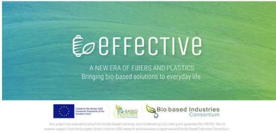

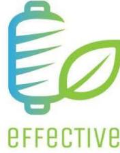

**Views**

Standard [Accessibility Mode](#)

**Languages**

 

**Contact**

[dfbusto@fcirce.es](mailto:dfbusto@fcirce.es)  
(mailto:[dfbusto@fcirce.es](mailto:dfbusto@fcirce.es))

[Save as Draft](#)

[Report abuse](#)  
([/eusurvey/home/reportAbuse?survey=331688](mailto:/eusurvey/home/reportAbuse?survey=331688))

**Section 1: EFFECTIVE Survey Introduction**

**Welcome to the EFFECTIVE survey!**

The objective of this survey is to help us understand how you perceive bio-based materials and products. More specifically, this survey will focus on the garments that **H&M** will test and produce as part of the **EFFECTIVE** project. We will tell you a little bit more about it during the survey.

**This should not take you more than 10 min.** So, we thank you in advanced for your collaboration.

Let's start with a couple of questions about the concept "bio-based".

- \* 1. How much do you know about **bio-based materials and/or products**?
  - Nothing at all.
  - I have heard some about them, but the topic is still confusing to me.
  - I know the basics, but still need to learn more.
  - I can explain the topic and give concrete examples.
  - I am an expert in this topic.
  
- \* 2. In your opinion, which of the following phrases **better describe the term bio-based?** Select as many as you consider.
  - Only natural materials like wood and paper.
  - With biodegradable properties or biodegradable materials.
  - An alternative to petroleum.
  - Might be recycled.
  - From renewable sources.
  - Also called eco-products.
  - Produced locally.

**Section 2: Bio-based products and materials**

**Bio-based products or materials** are usually defined as products and materials from biological and renewable sources, such as plants. Raw materials like minerals and fossil fuels, despite being extracted from earth, are not considered in this category given the long period their production takes (i.e. beyond a century). This means that a plastic made out from petroleum is not bio-based, whereas a plastic made from vegetable oils or sustainable sugars, for instance, is indeed a bio-based product. Nylon, for example, is a plastic that can be produced from both sources. Even recycled Nylon is also considered bio-based if originally made from sustainable feedstock.

For example, consider the products on the following image and respond the following questions:

EUSurvey - Survey

(/eusurvey/home/welcome/runner)

Login (/eusurvey/auth/login/runner) | Help → | Language →

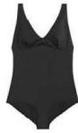

Swimsuit

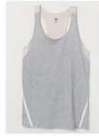

Sportwear

ES: Traje de baño | ropa de deporte: FR: Maillot de bain | Vétement de sport: DE: Badeanzug | Sportbekleidung: SV: Baddrakt | Sporttop: HR: Kupach kostim | Sportska odjeta: IT: Costume da bagno | abbigliamento sportivo: SI: Kopake | Sportina majica.

**\* 3. In the last year, have you bought a product similar to the ones in the image?**

- Yes
- No

**\* 4. Did you know that H&M within EFFECTIVE will make these kinds of products using a biobased version of the fabric?**

- Really? First time I heard about it.
- No, but I know there are alternatives made with recycled materials.
- Of course! I am always updated in these matters.

**Section 3: EFFECTIVE bio-based products and value chains.**

In fact, within EFFECTIVE, products similar to the ones in the picture will be produced using fabrics made out from bio-based materials (bio-based polyamides). These bio-based materials will be produced from renewable feedstocks (sustainable sugars), guarantying a greener manufacture.

By embracing the circular economy, special attention will be given to demonstrating a sustainable end-of-life of the new products. The recyclability of this EFFECTIVE material will be validated in order to close the material cycle loop.

In the case of the products in the image on the left, the usage of sugar as sustainable feedstock combined with more sustainable processes for the production of Bio-Nylon will allow: reducing the share of fossil based material, mitigating the emission of CO2 and NOx gases, a lower consumption of energy for the production, and ensuring product's recyclability: Bio-Nylon can be recycled as described in the image on the right.

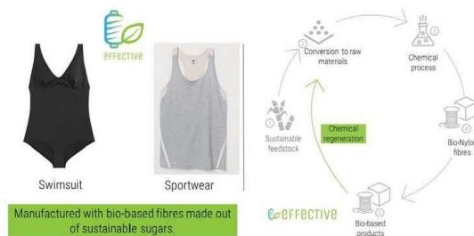

ES: Fabricados con fibras biobasadas producidas a partir de azúcar. FR: Fabriqués à partir de fibres biosourcées issue de sucres renouvelables. DE: Tilverkad med biobaserate fibrer av hållbara sockerarter. SV: Tilverkad med biobaserate fibrer av hållbara sockerarter. HR: protoveten od vlakana s biološkom osnovom napravljenna od sdrživog šeštera. IT: Prodoth con filat bio-based ottenuli a partire da materie prime rinnovabili (zucchen). SV: Izteleno iz vlaken na bio osnovi iz trajnostino pridelanih sladkorjev.

With all this new information, please, let us know your thoughts by responding the following questions.

**\* 5. In your opinion, why people are NOT aware of new and more sustainable products as the ones to be tested within EFFECTIVE? Select the top 3.**

at most 3 choice(s)

- Lack of advertisement in the streets, media, website..
- Overuse of "bio" terms make people stop caring.
- People do not understand/care how this product is made.
- There is not a "bio-based" section in the store and/or website.
- Lack of information in the product to differentiate it as labels, product brochure, etc.

EUSurvey - Survey

- Store staff (protect people from health come/runner)
- Lack of related information in my social media.
- Lack of incentives as alternative options during the product choice.

[Login \(/eusurvey/auth/login/runner\)](#) | [Help](#) | [Language](#)

**\* 6. In your opinion, what is the information people would care the most about this EFFECTIVE product? Select the top 3.**

*at most 3 choice(s)*

- The percentage of bio-based material.
- The CO2 savings in respect of a conventional alternative.
- Recyclability properties.
- Social impact of the production.
- Life cycle benefits compared with a not bio-based and similar product.
- Health / safety benefits.
- Improved functionalities (i.e. due to a better design).

**\* 7. In your opinion, what can be done to get more people to buy this bio-based EFFECTIVE product? Select the top 3.**

*at most 3 choice(s)*

- Discounts or vouchers for the next "bio-based" purchase.
- Free samples to test this new option.
- Certify that at least 50% of the product is bio-based.
- Certify that the feedstock is produced locally.
- Ensure it recyclability by accepting it as waste in the store.
- Explain the production process through infographics or videos.
- Explain the end of life process of this products through infographics or videos.

**\* 8. In your opinion, what are the most important benefits people would get from this EFFECTIVE product? Select the top 3.**

*at most 3 choice(s)*

- Less environmental impact if compared with those produced with conventional raw materials.
- Less social impact if compared with those produced with conventional raw materials.
- Less fossil fuel use and greenhouse gases emission.
- The possibility of acquiring a product designed following circularity principles
- Improvement of how others perceive my purchase habits.
- Contribution to the after-use management.
- Contribution to a new economic activity.

**\* 9. In your opinion, what would people disapprove the most from this EFFECTIVE product? Select the top 3.**

*at most 3 choice(s)*

- Higher prices for a product with similar functionalities.
- Bio-based sources in competition with food production.
- Increase the complexity of the recycling process (i.e. cultural, legislative, system operation, ...).
- Mass-consumption is not addressed.
- Social issues of production are not addressed.

**\* 10. In your opinion, would people be willing to actively collaborate for better ways for reusing and recycling this EFFECTIVE product?**

- Of course. Everybody should contribute to the environment by reusing, recycling and being responsible with our waste.
- Maybe. New materials make recycling even more confusing.
- No, it is not really people's responsibility

**\* 11. Ultimately, would you prefer to buy this bio-based and more sustainable product over the conventional alternative?**

- Yes, contribute to a better environment is my main priority, even if I have to pay a bit more.
- No, both options are practically the same, so I rather buy the cheaper

**\* 12. Would you like to find more and more bio-based products like this in the market?**

- Yes
- No

**Section 4: Profile**

Now, to conclude the survey, please let us know a little bit more about you.

**\* 13. Where do you live?**

 ▼

**\* 14. How old are you?**

EUSurvey - Survey

 (/eusurvey/home/welcome/turner)

[Login \(/eusurvey/euft/login/turner\)](#) | [Help](#) | [Language](#) →

**• 15. What is your gender?**

 ▼

**• 16. What is the highest level of education you have completed?**

 ▼

**• 17. From the list below, what kind of stakeholder group you represent?**

 ▼

**• 18. Do you work, research, teach, etc. In the field of bioeconomy and/or bio-based products?**

- Yes
- No

Thank you very much for your contribution and your time!

Kind regards,

[Submit](#)

(/eusurvey/home/welcome)

*EUSurvey is supported by the European Commission's ISA2 programme ([https://ec.europa.eu/isa2/home\\_en](https://ec.europa.eu/isa2/home_en)), which promotes interoperability solutions for European public administrations.*

Privacy statement (/eusurvey/home/privacystatement)

Terms of Service (/eusurvey/home/tos)

Cookies ([https://ec.europa.eu/info/cookies\\_en](https://ec.europa.eu/info/cookies_en))

Version v1.5.2.8 &abb985305d998b3fffe6e43f67ab8fe72aab898 (06/07/2022 10:45)

(/eusurvey/home/welcome/runner)

EUSurvey - Survey

Login (/eusurvey/auth/login/runner) | Help → | Language →

**EFFECTIVE Survey: BALSAN Carpets**

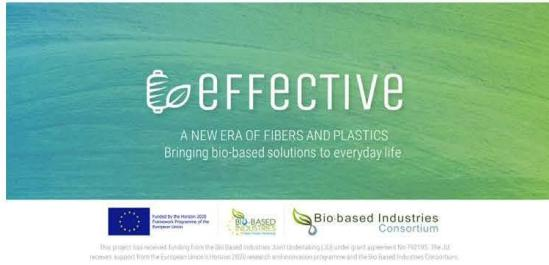

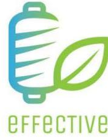

**Section 1: EFFECTIVE Survey Introduction**

**Welcome to the EFFECTIVE survey!**

The objective of this survey is to help us understand how you perceive bio-based materials and products. More specifically, this survey will focus on the carpets that **BALSAN** will test and produce as part of the **EFFECTIVE** project. We will tell you a little bit more about it during the survey.

**This should not take you more than 10 min.** So, we thank you in advanced for your collaboration.

Let's start with a couple of questions about the concept "bio-based".

- \* 1. How much do you know about **bio-based materials and/or products**?
  - Nothing at all.
  - I have heard some about them, but the topic is still confusing to me.
  - I know the basics, but still need to learn more.
  - I can explain the topic and give concrete examples.
  - I am an expert in this topic.
  
- \* 2. In your opinion, which of the following phrases **better describe the term bio-based?** Select as many as you consider.
  - Only natural materials like wood and paper.
  - With biodegradable properties or biodegradable materials.
  - An alternative to petroleum.
  - Might be recycled.
  - From renewable sources.
  - Also called eco-products.
  - Produced locally.

**Section 2: Bio-based products and materials**

**Bio-based products or materials** are usually defined as products and materials from biological and renewable sources, such as plants. Raw materials like minerals and fossil fuels, despite being extracted from earth, are not considered in this category given the long period their production takes (i.e. beyond a century). This means that a plastic made out from petroleum is not bio-based, whereas a plastic made from vegetable oils or sustainable sugars, for instance, is indeed a bio-based product. Nylon, for example, is a plastic that can be produced from both sources. Even recycled Nylon is also considered bio-based if originally made from sustainable feedstock.

For example, consider the products on the following image and respond the following questions:

EUSurvey - Survey

(/eusurvey/home/welcome/runner)

Login (/eusurvey/auth/login/runner) | Help → | Language →

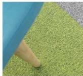

Carpet for construction

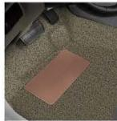

Carpet for the automotive sector

ES: Moquetta para inmuebles | tapete para vehiculos; FR: Moquette pour le secteur de la construction | Moquette pour le secteur automobile; DE: Teppich für Architekturbereich | Teppich für Automobilbereich; SV: Matta för byggsektorn | matta för fordonssektorn; HR: Teph za primyenu u gradevinskom sektoru | tephi za primyenu u automobilskoj industrij; IT: Moquette per interni | moquette per il settore automobilistico; SI: Preproge za gradbeništvojnotranjo opremoPreprogejalne oblage za opremo avtomobilov.

**\* 3. In the last year, have you bought a product similar to the ones in the image?**

- Yes
- No

**\* 4. Did you know that BALSAN within EFFECTIVE will make these kinds of products using a biobased version of the carpet's fiber face??**

- Really? First time I heard about it.
- No, but I know there are alternatives made with recycled materials.
- Of course! I am always updated in these matters.

**Section 3: EFFECTIVE bio-based products and value chains.**

In fact, within EFFECTIVE, products similar to the ones in the picture will be produced using fabrics made out from bio-based materials (bio-based polyamides). These bio-based materials will be produced from renewable feedstocks (such as sustainable sugars and vegetable oils), guarantying a greener manufacture.

By embracing the circular economy, special attention will be given to demonstrating a sustainable end-of-life of the new products. The recyclability of this EFFECTIVE material will be validated in order to close the material cycle loop.

In the case of the products in the image on the left, the usage of sugars or vegetable oils as sustainable feedstock combined with more sustainable processes for the production of Bio-Nylon will allow: reducing the share of fossil based material, mitigating the emission of CO2 and NOx gases, a lower consumption of energy for the production, and ensuring product's recyclability: Bio-Nylon can be recycled as described in the image on the right.

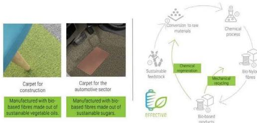

ES: Fabricados con fibras biobasadas producidas a partir de aceites vegetales sostenibles. | Fabricados con fibras biobasadas producidas a partir de azúcares sostenibles. FR: Production avec des fibres biosourcées issues d'huile végétales rennouvellables | Production avec des fibres biosourcées issues de supres rennouvellables. DE: Hergestellt mit biobaserten Fasern aus nachhaltigen Pflanzenblen | Hergestellt mit biobaserten Fasern aus nachhaltigen Zucker. SV: Tilverkad av biobaserade fiber med hållbara vegetabiliska oljor | Tilverkad av biobaserade fiber med hållbara sockerarter. HR: Prozvedeno od vlakana na biotoškoj oznovi izradenih od održivih biljnih ulja | Prozvedeno od vlakana na biotoškoj oznovi izradenih od održivih šebera. IT: Prodotti con filati bio-based ottenuti a partire da materie prime rinnovabili, quali zuccheri e oil vegetali; SV: izdelano iz vlaken na bio oznovi iz trajnostno pridelanih slackonjev | Izdelano iz vlaken na bio oznovi iz trajnostnih rastlinskih olj.

With all this new information, please, let us know your thoughts by responding the following questions.

**\* 5. In your opinion, why do public/private peers are NOT aware of new and more sustainable products as the ones to be tested within EFFECTIVE? Select the top 3.**

at most 3 choice(s)

- Lack of advertisement in the streets, media, website, social media...
- Keep track of "bio" innovations demand a great effort (i.e. staff training).
- Market search of "bio" innovations demand too much time and resources.
- Business/administrations do not understand/care how this kind of product is made.
- There is not a easy-to-reach "bio-based" public data base.

EUSurvey - Survey

- Lack of an excellent label in the product to allow the people to produce the product.
- My sector is reluctant to changes.
- They are not aware about events, like congress or seminars, focused in this kind of products.

[Login \(/eusurvey/auth/login/runner\)](#) | [Help](#) | [Language](#) →

**\* 6. In your opinion, what is the information your institution/organization would care the most about this EFFECTIVE product? Select the top 3.**

*at most 3 choice(s)*

- The percentage of bio-based material.
- The CO2 savings in respect of a conventional alternative.
- Recyclability properties.
- Social impact of the production.
- Life cycle benefits compared with a not bio-based and similar product.
- Health / safety benefits.
- Improved functionalities (i.e. better design).

**\* 7. In your opinion, what can be done to get your institution/organization to buy/procure this EFFECTIVE product? Select the top 3.**

*at most 3 choice(s)*

- Give financial support in form of grants, subsidies or investments.
- Promote Public-Private partnerships that prioritize the use of this products.
- Green Public Procurement would accelerate the market uptake of it.
- Discourage unwanted market behaviours with fiscal measures such as taxes, charges, fees or fines.
- Establish a framework regulation that support the use/procurement of it.
- The use of a certified label or the possibility to have a certification (e.g. EU ecolabel)
- Give credits in green certificates as for example LEED, BREEAM, etc.

**\* 8. In your opinion, what are the most important benefits your institution/organization would get from this EFFECTIVE product? Select the top 3.**

*at most 3 choice(s)*

- Less environmental impact if compared with those produced with conventional raw materials.
- Less social impact if compared with those produced with conventional raw materials.
- Less fossil fuel use and green house gases emission.
- The possibility of acquiring a product designed following circularity principles.
- Improvement of your institution/organization reputation.
- Contribution to the after-use management.
- Contribution to a new economic activity.
- Positive impact of net economic balance.

**\* 9. In your opinion, what would your institution/organization disapprove the most from this EFFECTIVE product? Select the top 3.**

*at most 3 choice(s)*

- Volatile and/or higher prices for a product with similar functionalities.
- Bio-based sources in competition with food production.
- Increase the complexity of the recycling process (i.e. cultural, legislative, system operation, ...).
- Mass-consumption is not addressed.
- Social issues of production are not addressed.

**\* 10. In your opinion, would your institution/organization be willing to actively collaborate for better ways for reusing and recycling this EFFECTIVE product?**

- Of course. Our clients/users could rely on us to collect and deliver to disposal of this product after use.
- Maybe, it is our intention to participate depending on the required expenses.
- No. It is not really my institution/organization's responsibility.

**\* 11. Ultimately, would your institution/organization prefer to buy or procure this bio-based and more sustainable product over the conventional alternative?**

- Yes, contribute to a better environment is our main priority, even if it cost more.
- No, both options are practically the same, so we would acquire the cheaper

**\* 12. Would you like to find more and more bio-based products like this in the market?**

- Yes
- No

**Section 4: Profile**

Now, to conclude the survey, please let us know a little bit more about you.

EUSurvey - Survey

\* 13. Where do you live? (eusurvey/home/welcome/runner)

[Login \(/eusurvey/eufr/login/runner\)](#) | [Help](#) → [Language](#) →

 ▼

\* 14. How old are you?

 ▼

\* 15. What is your gender?

 ▼

Please, specify:

\* 16. What is the highest level of education you have completed?

 ▼

\* 17. From the list below, what kind of stakeholder group you represent?

 ▼

Please, specify:

\* 18. From the list below, what is the sector you mainly work in?

 ▼

Please, specify:

\* 19. Do you work, research, teach, etc. In the field of bioeconomy and/or bio-based products?

- Yes
- No

Thank you very much for your contribution and your time!

Kind regards,

[Submit](#)

(/eusurvey/home/welcome)

EUSurvey is supported by the European Commission's ISA® programme ([https://ec.europe.eu/isa2/home\\_en](https://ec.europe.eu/isa2/home_en)), which promotes interoperability solutions for European public administrations.

Privacy statement (/eusurvey/home/privacystatement)

Terms of Service (/eusurvey/home/tes)

Cookies ([https://ec.europe.eu/info/cookies\\_en](https://ec.europe.eu/info/cookies_en))

Version v1.5.2.8 &abb965530d996b3ffe6e43f67ab8fe72aab698 (06.07/2022 10:45)

EUSurvey - Survey

(/eusurvey/home/welcome/runner)

Login (/eusurvey/auth/login/runner) | Help → | Language →

**EFFECTIVE Survey: Food Packaging**

**Views**

Standard [Accessibility Mode](#)

**Languages**

 

**Contact**

[dfbusto@fcirce.es](mailto:dfbusto@fcirce.es)  
(mailto:[dfbusto@fcirce.es](mailto:dfbusto@fcirce.es))

[Save as Draft](#)

[Report abuse](#)  
([/eusurvey/home/reportAbuse?survey=331684](mailto:/eusurvey/home/reportAbuse?survey=331684))

**Section 1: EFFECTIVE Survey Introduction**

**Welcome to the EFFECTIVE survey!**

The objective of this survey is to help us understand how you perceive bio-based materials and products. More specifically, this survey will focus on the food packaging that will be tested and produced as part of the **EFFECTIVE** project. We will tell you a little bit more about it during the survey.

**This should not take you more than 10 min.** So, we thank you in advanced for your collaboration.

Let's start with a couple of questions about the concept "bio-based".

**\* 1. How much do you know about bio-based materials and/or products?**

- Nothing at all.
- I have heard some about them, but the topic is still confusing to me.
- I know the basics, but still need to learn more.
- I can explain the topic and give concrete examples.
- I am an expert in this topic.

**\* 2. In your opinion, which of the following phrases better describe the term bio-based? Select as many as you consider.**

- Only natural materials like wood and paper.
- With biodegradable properties or biodegradable materials.
- An alternative to petroleum.
- Might be recycled.
- From renewable sources.
- Also called eco-products.
- Produced locally.

**Section 2: Bio-based products and materials**

**Bio-based products or materials** are usually defined as products and materials from biological and renewable sources, such as plants. Raw materials like minerals and fossil fuels, despite being extracted from earth, are not considered in this category given the long period their production takes (i.e. beyond a century). This means that a plastic made out from petroleum is not bio-based, whereas a plastic made from vegetable oils or sustainable sugars, for instance, is indeed a bio-based product. Nylon, for example, is a plastic that can be produced from both sources. Even recycled Nylon is also considered bio-based if originally made from sustainable feedstock.

For example, consider the products on the following image and respond the following questions:

EUSurvey - Survey

(/eusurvey/home/welcome/runner)

Login (/eusurvey/auth/login/runner) | Help → | Language →

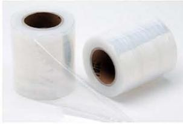

Food packaging for industrial purposes

ES: Embagale de alimentos para uso industrial. FR: Emballage alimentaire pour le secteur industriel. DE: Lebensmittelverpackungen für Industriesanwendungen. SV: Livsmedelsförpackninger för industriella ländamäl. HR: Ambalaza transe za potroásce i industriju. IT: Film per imballaggi alimentari. SI: Embalaza za živila za industrijsko uporabo.

**\* 3. In the last year, have you bought a product similar to the ones in the image?**

- Yes
- No

**\* 4. Did you know that EFFECTIVE will make these kinds of products using a biobased version of the film?**

- Really? First time I heard about it.
- No, but I know there are alternatives made with recycled materials.
- Of course! I am always updated in these matters.

**Section 3: EFFECTIVE bio-based products and value chains.**

In fact, within EFFECTIVE, products similar to the ones in the picture will be produced using bio-based materials (bio-based polyamides and polyesters). These bio-based materials will be made out of renewable feedstocks, such as sugars and vegetable oils, guarantying a greener manufacture and structurally improved fibres and films.

By embracing the circular economy, special attention will be given to demonstrating a sustainable end-of-life of the new products. The recyclability of this EFFECTIVE material will be validated in order to close the material cycle loop.

In the case of the products in the image on the left, the usage of vegetable oils as sustainable feedstock combined with more sustainable processes for the production of Bio-Nylon will allow: reducing the share of fossil based material, producing a packaging with expected better barrier effect and less water absorption, and ensuring product's recyclability. Bio-Nylon can be recycled as described in the image on the right.

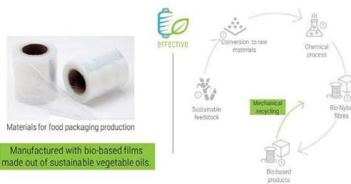

ES: Fabricado con films biobasados producidos a partir de aceites vegetales. FR: Fabriqué avec un film biosourcé issue d'huiles vegetales renouvellables. DE: Hergestell, mit biobasierten Follen aus nachhalligen Pflanzendien. SV: Tillverkade med biobaserad film gjord av hällbara vegetabliska oljor. HR: Proizvedeni od viskans na bioleskoj osnovi napravjenih od održavh bljohih ulja. IT: Prodotti con film bio-based ottenuti a partire da materie prime rinnovabili (oli vegetali). SV: Izdelano iz visken na bio osnovi iz trajnostinih rastlinskih olj

With all this new information, please, let us know your thoughts by responding the following questions.

**\* 5. In your opinion, why do public/private peers NOT know about the existence of this EFFECTIVE product? Select the top 3.**

at most 3 choice(s)

- Lack of advertisement in the streets, media, website, social media...
- Keep track of "bio" innovations demand a great effort (i.e. staff training).
- Market search of "bio" innovations demand too much time and resources.
- Business/administrations do not understand/care how this kind of product is made.
- There is not a easy-to-reach "bio-based" public data base.
- Lack of an attractive label in the product to differentiate it.

EUSurvey - Survey

- My sector is related to processes / welcome / runner
- They are not aware about events, like congress or seminars, focused in this kind of products.

[Login \(/eusurvey/auth/login/runner\)](#) | [Help](#) | [Language](#)

**\* 6. In your opinion, what is the information your institution/organization would care the most about this EFFECTIVE product? Select the top 3.**

*at most 3 choice(s)*

- The percentage of bio-based material.
- The CO2 savings in respect of a conventional alternative.
- Recyclability properties.
- Social impact of the production.
- Life cycle benefits compared with a not bio-based and similar product.
- Health / safety benefits.
- Improved functionalities (i.e. better design).

**\* 7. In your opinion, what can be done to get your institution/organization to buy/procure this EFFECTIVE product once its production at industrial scale has started? Select the top 3.**

*at most 3 choice(s)*

- Give financial support in form of grants, subsidies or investments.
- Promote Public-Private partnerships that prioritize the use of this products.
- Green Public Procurement would accelerate the market uptake of it.
- Discourage unwanted market behaviours with fiscal measures such as taxes, charges, fees or fines.
- Establish a framework regulation that support the use/procurement of it.
- The use of a certified label or the possibility to have a certification (e.g. EU ecolabel)

**\* 8. In your opinion, what are the most important benefits your institution/organization would get from this EFFECTIVE product? Select the top 3.**

*at most 3 choice(s)*

- Less environmental impact if compared with those produced with conventional raw materials.
- Less social impact if compared with those produced with conventional raw materials.
- Less fossil fuel use and green house gases emission.
- the possibility of acquiring a product designed following circularity principles.
- Improvement of your institution/organization reputation.
- Contribution to the after-use management.
- Contribution to a new economic activity.
- Positive impact of net economic balance.

**\* 9. In your opinion, what would your institution/organization disapprove the most from this EFFECTIVE product? Select the top 3.**

*at most 3 choice(s)*

- Volatile and/or higher prices for a product with similar functionalities.
- Bio-based sources in competition with food production.
- Increase the complexity of the recycling process (i.e. cultural, legislative, system operation, ...).
- Mass-consumption is not addressed.
- Social issues of production are not addressed.

**\* 10. In your opinion, would your institution/organization be willing to actively collaborate for better ways for reusing and recycling this EFFECTIVE product?**

- Of course. Our clients/users could rely on us to collect and deliver to disposal of this product after use.
- Maybe, it is our intention to participate depending on the required expenses.
- No. it is not really my institution/organization's responsibility.

**\* 11. Ultimately, would your institution/organization prefer to buy or procure this bio-based and more sustainable product over the conventional alternative?**

- Yes, contribute to a better environment is our main priority, even if it cost more.
- No, both options are practically the same, so we would acquire the cheaper

**\* 12. Would you like to find more and more bio-based products like this in the market?**

- Yes
- No

**Section 4: Profile**

Now, to conclude the survey, please let us know a little bit more about you.

**\* 13. Where do you live?**

EUSurvey - Survey

 (/eusurvey/home/welcome/turner)

[Login \(/eusurvey/eufnlogh/turner\)](#) | [Help](#) | [Language](#) →

**• 14. How old are you?**

 ▼

**• 15. What is your gender?**

 ▼

**• 16. What is the highest level of education you have completed?**

 ▼

**• 17. From the list below, what kind of stakeholder group you represent?**

 ▼

**• 18. From the list below, what is the sector you mainly work in?**

 ▼

**• 19. Do you work, research, teach, etc. in the field of bioeconomy and/or bio-based products?**

- Yes
- No

Thank you very much for your contribution and your time!

Kind regards,

[Submit](#)

(/eusurvey/home/welcome)

EUSurvey is supported by the European Commission's ISA® programme ([https://ec.europe.eu/isa2/home\\_en](https://ec.europe.eu/isa2/home_en)), which promotes interoperability solutions for European public administrations.

Privacy statement (/eusurvey/home/privacystatement)

Terms of Services (/eusurvey/home/tos)

Cookies ([https://ec.europe.eu/imfo/cookies\\_en](https://ec.europe.eu/imfo/cookies_en))

Version v1.5.2.8 &abb9653O5d996b3fffe6e43f67ab6fe72aab698 (06.07/2022 10:45)

EUSurvey - Survey

(/eusurvey/home/welcome/runner)

Login (/eusurvey/auth/login/runner) | Help → | Language →

**EFFECTIVE Survey: Secondary Packaging**

**Views**

Standard [Accessibility Mode](#)

**Languages**

 →

**Contact**

[dfbusto@fcirce.es](mailto:dfbusto@fcirce.es)  
(mailto:[dfbusto@fcirce.es](mailto:dfbusto@fcirce.es))

[Save as Draft](#)

[Report abuse](#)  
([/eusurvey/home/reportAbuse?survey=331683](mailto:/eusurvey/home/reportAbuse?survey=331683))

**Section 1: EFFECTIVE Survey Introduction**

**Welcome to the EFFECTIVE survey!**

The objective of this survey is to help us understand how you perceive bio-based materials and products. More specifically, this survey will focus on the secondary packaging that will be tested and produced as part of the **EFFECTIVE** project. We will tell you a little bit more about it during the survey.

**This should not take you more than 10 min.** So, we thank you in advanced for your collaboration.

Let's start with a couple of questions about the concept "bio-based".

- \* 1. How much do you know about **bio-based materials and/or products**?
  - Nothing at all.
  - I have heard some about them, but the topic is still confusing to me.
  - I know the basics, but still need to learn more.
  - I can explain the topic and give concrete examples.
  - I am an expert in this topic.
  
- \* 2. In your opinion, which of the following phrases **better describe the term bio-based?** Select as many as you consider.
  - Only natural materials like wood and paper.
  - With biodegradable properties or biodegradable materials.
  - An alternative to petroleum.
  - Might be recycled.
  - From renewable sources.
  - Also called eco-products.
  - Produced locally.

**Section 2: Bio-based products and materials**

**Bio-based products or materials** are usually defined as products and materials from biological and renewable sources, such as plants. Raw materials like minerals and fossil fuels, despite being extracted from earth, are not considered in this category given the long period their production takes (i.e. beyond a century). This means that a plastic made out of oil from petroleum is not bio-based, whereas a plastic made from vegetable oils is indeed a bio-based product. Nylon, for example, is a plastic that can be produced from both sources. Even recycled Nylon is also considered bio-based if originally made from vegetable oils.

For example, consider the products on the following image and respond the following questions:

EUSurvey - Survey

(/eusurvey/home/welcome/runner)

Login (/eusurvey/auth/login/runner) | Help → | Language →

Materials for secondary packaging

ES: Material para embalsie secondarie. FR: Matériaux pour l'emballage secondaire. DE: Matreialien für Sekundärverpackungen. SV: Material for secondary packaging. HR: Materijali za sekundarnu embalažu. IT: Film per imballaggio secondario. SI: Materiali za sekundarno embalažo.

**\* 3. In the last year, have you bought a product similar to the ones in the image?**

- Yes
- No

**\* 4. Did you know that EFFECTIVE will make these kinds of products using a biobased version of the film?**

- Really? First time I heard about it.
- No, but I know there are alternatives made with recycled materials.
- Of course! I am always updated in these matters.

**Section 3: EFFECTIVE bio-based products and value chains.**

In fact, within EFFECTIVE, products similar to the ones in the picture will be produced using films made out from bio-based materials (bio-based polyesters). These bio-based materials will be produced from renewable feedstocks (sustainable sugars and vegetable oils), guarantying a greener manufacture.

By embracing the circular economy, special attention will be given to demonstrating a sustainable end-of-life of the new products. The biodegradability and compostability of this EFFECTIVE material will be validated in order to close the material cycle loop.

In the case of the products in the image on the left, the usage of sustainable sugars and vegetable oils as sustainable feedstock combined with more sustainable processes for the production of bio-based polyesters will allow: reducing the share of fossil based material, producing a packaging with an expected better mechanical properties, and ensuring product's compostability as described in the image on the right..

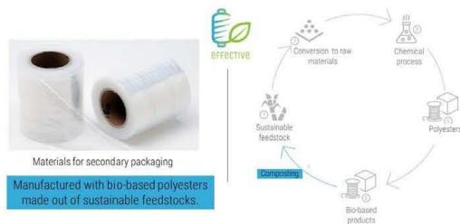

ES: Fabricado con poliésters biobasados producidos a partir de materia prima sostenible. FR: Fabriqué avec des polyesters biosourcés issue de ressources renouvellables. DE: Hergestellt mit biobasierten Polyestern aus nachhaltigen Ausgangsstoffen. SV: Tillverkiede med biobaserad polyester gijerd av hållbar råvara. HR: Proizvedene od poliesterna na biolodskaj esnovi trandenih od odbråvih skrovina. IT: Prodotti con poliesteri bio-based ottenuli a partire da materie prime rinnovabili. SV: Proizvedene iz poliestrov na bio osnovi iz trajnostnih surovin

With all this new information, please, let us know your thoughts by responding the following questions.

**\* 5. In your opinion, why do public/private peers are NOT aware of new and more sustainable products as the ones to be tested within EFFECTIVE? Select the top 3.**

at most 3 choice(s)

- Lack of advertisement in the streets, media, website, social media...
- Keep track of "bio" innovations demand a great effort (i.e. staff training).
- Market search of "bio" innovations demand too much time and resources.
- Business/administrations do not understand/care how this kind of product is made.
- There is not a easy-to-reach "bio-based" public data base.

EUSurvey - Survey

- Lack of an excellent label in the product to allow price in response
- My sector is reluctant to changes.
- They are not aware about events, like congress or seminars, focused in this kind of products.

[Login \(/eusurvey/auth/login/runner\)](#) | [Help](#) | [Language](#) →

**\* 6. In your opinion, what is the information your institution/organization would care the most about this EFFECTIVE product? Select the top 3.**

*at most 3 choice(s)*

- The percentage of bio-based material.
- The CO2 savings in respect of a conventional alternative.
- Biodegradability properties.
- Social impact of the production.
- Life cycle benefits compared with a not bio-based and similar product.
- Health / safety benefits.
- Improved functionalities (i.e. better design).

**\* 7. In your opinion, what can be done to get your institution/organization to buy/procure this EFFECTIVE product once its production at industrial scale has started? Select the top 3.**

*at most 3 choice(s)*

- Give financial support in form of grants, subsidies or investments.
- Promote Public-Private partnerships that prioritize the use of this products.
- Green Public Procurement would accelerate the market uptake of it.
- Discourage unwanted market behaviours with fiscal measures such as taxes, charges, fees or fines.
- Establish a framework regulation that support the use/procurement of it.
- The use of a certified label or the possibility to have a certification (e.g. EU ecolabel).

**\* 8. In your opinion, what are the most important benefits your institution/organization would get from this EFFECTIVE product? Select the top 3.**

*at most 3 choice(s)*

- Less environmental impact if compared with those produced with conventional raw materials.
- Less social impact if compared with those produced with conventional raw materials.
- Less fossil fuel use and green house gases emission.
- the possibility of acquiring a product designed following circularity principles.
- Improvement of your institution/organization reputation.
- Contribution to the after-use management.
- Contribution to a new economic activity.
- Positive impact of net economic balance.

**\* 9. In your opinion, what would your institution/organization disapprove the most from this EFFECTIVE product? Select the top 3.**

*at most 3 choice(s)*

- Volatile and/or higher prices for a product with similar functionalities.
- Bio-based sources in competition with food production.
- Increase the complexity of the recycling process (i.e. cultural, legislative, system operation, ...).
- Mass-consumption is not addressed.
- Social issues of production are not addressed.

**\* 10. In your opinion, would your institution/organization be willing to actively collaborate for better ways for reusing and recycling this EFFECTIVE product?**

- Of course. Our clients/users could rely on us to collect and deliver to disposal of this product after use.
- Maybe, it is our intention to participate depending on the required expenses.
- No. It is not really my institution/organization's responsibility.

**\* 11. Ultimately, would your institution/organization prefer to buy or procure this bio-based and more sustainable product over the conventional alternative?**

- Yes, contribute to a better environment is our main priority, even if it cost more.
- No, both options are practically the same, so we would acquire the cheaper

**\* 12. Would you like to find more and more bio-based products like this in the market?**

- Yes
- No

**Section 4: Profile**

Now, to conclude the survey, please let us know a little bit more about you.

EUSurvey - Survey

\* 13. Where do you live? (eUSurvey/home/welcome/runner)

[Login \(/eusurvey/euf/login/runner\)](#) | [Help](#) | [Language](#) →

 ▼

\* 14. How old are you?

 ▼

\* 15. What is your gender?

 ▼

\* 16. What is the highest level of education you have completed?

 ▼

\* 17. From the list below, what kind of stakeholder group you represent?

 ▼

\* 18. From the list below, what is the sector you mainly work in?

 ▼

\* 19. Do you work, research, teach, etc. In the field of bioeconomy and/or bio-based products?

- Yes
- No

Thank you very much for your contribution and your time!

Kind regards,

[Submit](#)

(/eusurvey/home/welcome)

EUSurvey is supported by the European Commission's ISA® programme ([https://ec.europe.eu/isa2/home\\_en](https://ec.europe.eu/isa2/home_en)), which promotes interoperability solutions for European public administrations.

Privacy statement (/eusurvey/home/privacystatement)

Terms of Service (/eusurvey/home/tes)

Cookies ([https://ec.europe.eu/info/cookies\\_en](https://ec.europe.eu/info/cookies_en))

Version v1.5.2.8 6abb965530d998b3ffe6e43f5f7ab6fe72aab699 (06/07/2022 10:45)

## **Annex 2 – Summary of the main results per type of product**

| Carpets                   | %  | Garments | %   | Food packaging           | %   | Secondary packaging          | %  |
|---------------------------|----|----------|-----|--------------------------|-----|------------------------------|----|
|                           |    |          | 53% | With biodegradable       |     |                              |    |
|                           |    |          |     |                          | 53% | With biodegradable           |    |
| Might be recycled         | 48 |          |     |                          |     |                              |    |
|                           |    |          |     |                          |     | Also called eco-products     | 42 |
|                           |    |          | 36% | Lack of advertisement in |     |                              |    |
|                           |    |          |     |                          | 43% | Lack of advertisement in the |    |
| great effort (i.e., staff |    |          |     |                          |     |                              |    |
|                           |    |          | 36% |                          |     | Market search of "bio"       |    |
|                           |    |          | 38% |                          |     | There is not an easy-to     |    |

GA 792195

| Recyclability properties. | 42 |                           |     |                            |     |                                 |    |
|---------------------------|----|---------------------------|-----|----------------------------|-----|---------------------------------|----|
|                           |    |                           | 42% | The CO2 savings in respect |     |                                 |    |
|                           |    |                           |     |                            | 51% | The CO2 savings in respect      |    |
|                           |    | Recyclability properties. | 41% | Recyclability properties.  | 47% | Biodegradability properties.    | 36 |
|                           |    |                           | 43% | Promote Public-Private     |     |                                 |    |
|                           |    |                           |     |                            | 48% | Give financial support in       |    |
|                           |    |                           |     |                            |     | form of grants, subsidies, or   |    |
| taxes, charges, fees, or  |    |                           |     |                            |     |                                 |    |
|                           |    |                           |     |                            |     | taxes, charges, fees, or fines. |    |

GA 792195

|                               | 51% | Less environmental impact |     |                               |
|-------------------------------|-----|---------------------------|-----|-------------------------------|
|                               |     |                           | 42% | Less environmental impact if  |
|                               | 50% | Less fossil fuel use and  |     |                               |
|                               |     |                           | 46% | Less fossil fuel use and      |
|                               | 61% | Volatile and/or higher    |     |                               |
|                               |     |                           | 44% | Volatile and/or higher prices |
|                               |     |                           | 53% | Bio-based sources in          |
| (i.e., cultural, legislative, |     |                           |     |                               |
|                               |     |                           | 50% | Increase the complexity of    |

## **Annex 3 – Summary of the main results per country**

### **Garments:**

| the image?                                                           | AU | AUT | BE  | CR | DE  | ES  | FR  | GE | HR | IT  | NL  | PL  | SE  | SI | SW | UK |
|----------------------------------------------------------------------|----|-----|-----|----|-----|-----|-----|----|----|-----|-----|-----|-----|----|----|----|
| Yes, the swimsuit                                                    | 0% | 1%  | 8%  | 1% | 10% | 19% | 10% | 0% | 3% | 19% | 6%  | 9%  | 6%  | 1% | 5% | 3% |
| Yes, the jacket for outdoor activities                               | 0% | 0%  | 9%  | 0% | 5%  | 14% | 12% | 0% | 5% | 22% | 9%  | 10% | 9%  | 2% | 0% | 0% |
| Yes, the sportwear                                                   | 0% | 0%  | 7%  | 0% | 8%  | 11% | 12% | 0% | 8% | 21% | 11% | 11% | 8%  | 4% | 0% | 0% |
| Yes, the shorts for cycling                                          | 0% | 0%  | 8%  | 0% | 9%  | 15% | 14% | 0% | 5% | 20% | 7%  | 10% | 8%  | 4% | 0% | 0% |
| None of the above                                                    | 0% | 0%  | 15% | 0% | 11% | 11% | 11% | 0% | 8% | 13% | 8%  | 5%  | 16% | 0% | 0% | 0% |
| sustainable products as the ones to be tested within EFFECTIVE?      | AU | AUT | BE  | CR | DE  | ES  | FR  | GE | HR | IT  | NL  | PL  | SE  | SI | SW | UK |
| Lack of advertisement in the streets, media, website...              | 1% | 0%  | 7%  | 1% | 11% | 17% | 9%  | 1% | 3% | 18% | 5%  | 9%  | 11% | 3% | 1% | 2% |
| Overuse of "bio" terms make people stop caring.                      | 0% | 0%  | 4%  | 1% | 9%  | 18% | 9%  | 1% | 5% | 16% | 10% | 12% | 10% | 3% | 3% | 0% |
| People do not understand/care how this product is made.              | 0% | 1%  | 7%  | 1% | 5%  | 16% | 11% | 0% | 7% | 21% | 7%  | 9%  | 8%  | 4% | 2% | 1% |
| There is not a "bio-based" section in the store and/or website       | 1% | 0%  | 3%  | 0% | 11% | 15% | 15% | 0% | 4% | 15% | 11% | 8%  | 9%  | 2% | 3% | 1% |
| product brochure, etc.                                               | 1% | 0%  | 7%  | 0% | 9%  | 18% | 12% | 0% | 4% | 25% | 4%  | 4%  | 8%  | 4% | 2% | 1% |
| Store staff do not explain you about it.                             | 0% | 0%  | 10% | 0% | 4%  | 15% | 15% | 0% | 8% | 19% | 10% | 4%  | 10% | 5% | 1% | 0% |
| Lack of related information in my social media.                      | 0% | 0%  | 8%  | 0% | 6%  | 18% | 14% | 0% | 6% | 14% | 2%  | 16% | 10% | 6% | 2% | 0% |
| Lack of incentives as alternative options during the product choice. | 0% | 0%  | 13% | 0% | 6%  | 17% | 10% | 0% | 6% | 21% | 9%  | 5%  | 9%  | 0% | 0% | 3% |
| most about this EFFECTIVE product?                                   | AU | AUT | BE  | CR | DE  | ES  | FR  | GE | HR | IT  | NL  | PL  | SE  | SI | SW | UK |
| The percentage of bio-based material.                                | 0% | 1%  | 9%  | 2% | 11% | 12% | 10% | 0% | 9% | 19% | 2%  | 7%  | 11% | 6% | 2% | 1% |
| The CO2 savings in respect of a conventional alternative.            | 1% | 0%  | 9%  | 1% | 9%  | 18% | 11% | 1% | 2% | 19% | 6%  | 9%  | 10% | 1% | 3% | 2% |
| Recyclability properties.                                            | 0% | 0%  | 4%  | 0% | 12% | 17% | 15% | 0% | 4% | 20% | 6%  | 8%  | 7%  | 3% | 3% | 1% |
| product.                                                             | 1% | 0%  | 6%  | 1% | 10% | 14% | 12% | 1% | 1% | 24% | 5%  | 8%  | 10% | 3% | 3% | 1% |
| Social impact of the production.                                     | 1% | 0%  | 9%  | 0% | 3%  | 22% | 12% | 0% | 4% | 22% | 9%  | 5%  | 8%  | 1% | 2% | 3% |

| Health / safety benefits.                                      | 0%                                            | 0%  | 5%  | 1% | 8%  | 20% | 10% | 1% | 6% | 17% | 8%  | 10% | 10% | 4% | 0% | 0% |
|----------------------------------------------------------------|-----------------------------------------------|-----|-----|----|-----|-----|-----|----|----|-----|-----|-----|-----|----|----|----|
| Improved functionalities (i.e. due to a better design).        | 0%                                            | 0%  | 16% | 0% | 7%  | 14% | 5%  | 0% | 7% | 9%  | 24% | 9%  | 7%  | 2% | 2% | 0% |
| this bio-based EFFECTIVE product? Select the top 3.            | AU                                            | AUT | BE  | CR | DE  | ES  | FR  | GE | HR | IT  | NL  | PL  | SE  | SI | SW | UK |
| Discounts or vouchers for the next "bio-based" purchase.       | 0%                                            | 0%  | 9%  | 0% | 11% | 16% | 8%  | 1% | 4% | 21% | 11% | 8%  | 8%  | 5% | 0% | 0% |
| Free samples to test this new option.                          | 0%                                            | 0%  | 4%  | 0% | 10% | 13% | 13% | 1% | 5% | 19% | 9%  | 8%  | 14% | 3% | 1% | 0% |
| Certify that at least 50% of the product is bio-based.         | 1%                                            | 1%  | 10% | 1% | 8%  | 14% | 14% | 0% | 2% | 17% | 8%  | 8%  | 11% | 1% | 3% | 1% |
| Certify that the feedstock is produced locally                 | 1%                                            | 0%  | 8%  | 1% | 13% | 18% | 15% | 0% | 5% | 13% | 7%  | 9%  | 9%  | 0% | 0% | 0% |
| Ensure it recyclability by accepting it as waste in the store. | 1%                                            | 0%  | 7%  | 1% | 6%  | 20% | 11% | 1% | 4% | 26% | 2%  | 9%  | 7%  | 2% | 3% | 1% |
| Explain the production process through infographics or videos. | 0%                                            | 0%  | 5%  | 0% | 6%  | 18% | 11% | 0% | 8% | 19% | 8%  | 7%  | 11% | 2% | 4% | 2% |
| Explain the end of life                                        | process of this products through infographics |     |     |    |     |     |     |    |    |     |     |     |     |    |    |    |
| or videos.                                                     | 0%                                            | 0%  | 9%  | 1% | 7%  | 17% | 10% | 0% | 6% | 23% | 2%  | 7%  | 7%  | 6% | 3% | 1% |
| would get from this EFFECTIVE product? Select the top 3.       | AU                                            | AUT | BE  | CR | DE  | ES  | FR  | GE | HR | IT  | NL  | PL  | SE  | SI | SW | UK |
| conventional raw materials.                                    | 0%                                            | 0%  | 6%  | 0% | 8%  | 19% | 12% | 0% | 3% | 18% | 7%  | 9%  | 9%  | 3% | 3% | 2% |
| conventional raw materials.                                    | 0%                                            | 1%  | 8%  | 1% | 10% | 14% | 13% | 0% | 3% | 23% | 9%  | 7%  | 12% | 0% | 0% | 0% |
| Less fossil fuel use and greenhouse gases emission.            | 0%                                            | 0%  | 7%  | 1% | 10% | 14% | 11% | 0% | 5% | 19% | 6%  | 11% | 9%  | 2% | 3% | 2% |
| principles.                                                    | 0%                                            | 0%  | 6%  | 1% | 3%  | 15% | 13% | 0% | 5% | 22% | 5%  | 8%  | 12% | 7% | 2% | 2% |
| Improvement of how others perceive my purchase habits.         | 0%                                            | 0%  | 10% | 1% | 9%  | 16% | 8%  | 0% | 8% | 17% | 7%  | 7%  | 8%  | 7% | 2% | 0% |
| Contribution to the after-use management.                      | 1%                                            | 0%  | 6%  | 0% | 7%  | 21% | 11% | 1% | 6% | 16% | 8%  | 8%  | 10% | 2% | 2% | 1% |
| Contribution to a new economic activity.                       | 0%                                            | 0%  | 12% | 0% | 10% | 16% | 14% | 0% | 6% | 22% | 8%  | 5%  | 4%  | 3% | 0% | 0% |
| with similar functionalities.                                  | AU                                            | AUT | BE  | CR | DE  | ES  | FR  | GE | HR | IT  | NL  | PL  | SE  | SI | SW | UK |
| Higher prices for a product with similar functionalities.      | 0%                                            | 0%  | 7%  | 0% | 9%  | 18% | 11% | 0% | 3% | 18% | 8%  | 9%  | 7%  | 3% | 2% | 1% |
| Bio-based sources in competition with food production.         | 0%                                            | 1%  | 8%  | 1% | 7%  | 19% | 10% | 1% | 8% | 19% | 9%  | 6%  | 9%  | 1% | 1% | 1% |
| Increase the complexity of the recycling process (i.e.         | cultural,                                     |     |     |    |     |     |     |    |    |     |     |     |     |    |    |    |
| legislative, system operation, ...).                           | 0%                                            | 0%  | 7%  | 1% | 7%  | 16% | 14% | 1% | 5% | 20% | 7%  | 7%  | 10% | 4% | 1% | 1% |

 **EFFECTIVE**GA 792195

| Mass-consumption is not addressed.                                | 1% | 1%  | 6%  | 1% | 9% | 17% | 11% | 0% | 4%  | 20% | 6%  | 9% | 10% | 4% | 2% | 1% |
|-------------------------------------------------------------------|----|-----|-----|----|----|-----|-----|----|-----|-----|-----|----|-----|----|----|----|
| Social issues of production are not addressed.                    | 1% | 0%  | 13% | 0% | 8% | 14% | 10% | 0% | 4%  | 18% | 8%  | 8% | 12% | 3% | 3% | 0% |
| for better ways for reusing and recycling this EFFECTIVE product? | AU | AUT | BE  | CR | DE | ES  | FR  | GE | HR  | IT  | NL  | PL | SE  | SI | SW | UK |
| Maybe. New materials make recycling even more confusing.          | 0% | 0%  | 7%  | 1% | 7% | 16% | 13% | 1% | 4%  | 17% | 10% | 8% | 10% | 2% | 2% | 2% |
| No, it is not really people's responsibility                      | 0% | 0%  | 18% | 0% | 7% | 14% | 5%  | 0% | 9%  | 14% | 9%  | 2% | 20% | 0% | 2% | 0% |
| reusing, recycling and being responsible with our waste.          | 0% | 0%  | 9%  | 0% | 9% | 15% | 11% | 0% | 6%  | 20% | 7%  | 8% | 9%  | 3% | 1% | 0% |
| sustainable product over the conventional alternative?            | AU | AUT | BE  | CR | DE | ES  | FR  | GE | HR  | IT  | NL  | PL | SE  | SI | SW | UK |
| cheaper                                                           | 0% | 0%  | 12% | 0% | 5% | 11% | 9%  | 0% | 7%  | 14% | 18% | 7% | 12% | 2% | 1% | 0% |
| have to pay a bit more.                                           | 0% | 0%  | 8%  | 1% | 9% | 16% | 12% | 0% | 5%  | 20% | 6%  | 8% | 10% | 3% | 2% | 1% |
| this in the market?                                               | AU | AUT | BE  | CR | DE | ES  | FR  | GE | HR  | IT  | NL  | PL | SE  | SI | SW | UK |
| No                                                                | 0% | 0%  | 18% | 0% | 9% | 7%  | 9%  | 0% | 11% | 12% | 17% | 0% | 13% | 2% | 1% | 0% |
| Yes                                                               | 0% | 0%  | 7%  | 1% | 8% | 17% | 12% | 0% | 4%  | 20% | 7%  | 9% | 9%  | 3% | 2% | 1% |

### **Carpets:**

**Q5= In your opinion, which of the following phrases better describe** 

**the term bio-based? Select as many as you consider. BE DE ES FR HR IT NL PL SE SI UK PT Only natural materials like wood and paper.** 8% 9% 10% 6% 17% 14% 11% 11% 9% 1% 0% 1% **With biodegradable properties or biodegradable materials.** 8% 3% 17% 7% 15% 17% 6% 17% 6% 1% 1% 1% **An alternative to petroleum.** 17% 8% 15% 7% 10% 22% 8% 5% 3% 0% 2% 0% **Might be recycled.** 11% 3% 14% 9% 14% 18% 8% 15% 7% 1% 1% 0% **From renewable sources.** 10% 3% 15% 10% 17% 17% 7% 13% 7% 0% 0% 1% **Also called eco-products.** 4% 1% 17% 6% 14% 22% 13% 12% 6% 1% 1% 0% **Produced locally.** 13% 3% 13% 8% 26% 8% 5% 16% 5% 0% 0% 0% **None of the above** 14% 0% 0% 14% 7% 14% 29% 7% 14% 0% 0% 0%

**Q7. In the last year, have you bought a product similar to the ones** 

**in the image? BE DE ES FR HR IT NL PL SE SI UK PT Yes, the carpet for construction sector,** 15% 3% 9% 9% 13% 19% 12% 13% 4% 1% 1% 0% **Yes, the carpet for the automotive sector** 12% 3% 14% 7% 14% 20% 11% 14% 5% 1% 0% 0% **None of the above** 10% 9% 8% 7% 17% 15% 12% 11% 10% 0% 0% 1%

| EFFECTIVE? Select the top 3                                     | BE    | DE  | ES  | FR  | HR  | IT  | NL  | PL  | SE  | SI | UK | PT |
|-----------------------------------------------------------------|-------|-----|-----|-----|-----|-----|-----|-----|-----|----|----|----|
| Lack of advertisement in the streets, media, website..          | 13%   | 16% | 14% | 8%  | 12% | 18% | 10% | 14% | 11% | 0% | 1% | 1% |
| Keep track of "bio" innovations demand a great effort (i.e.     | staff |     |     |     |     |     |     |     |     |    |    |    |
| training).                                                      | 13%   | 16% | 15% | 6%  | 13% | 24% | 13% | 11% | 6%  | 0% | 0% | 0% |
| resources.                                                      | 5%    | 16% | 12% | 6%  | 14% | 22% | 14% | 20% | 2%  | 0% | 0% | 0% |
| product is made.                                                | 16%   | 11% | 14% | 10% | 14% | 14% | 12% | 12% | 7%  | 2% | 0% | 2% |
| There is not a easy-to-reach "bio-based" public data base.      | 11%   | 16% | 19% | 11% | 6%  | 17% | 11% | 9%  | 9%  | 2% | 0% | 0% |
| Lack of an attractive label in the product to differentiate it. | 16%   | 11% | 16% | 2%  | 10% | 24% | 8%  | 14% | 8%  | 2% | 0% | 2% |
| My sector is reluctant to changes.                              | 11%   | 5%  | 14% | 10% | 17% | 10% | 17% | 14% | 0%  | 0% | 0% | 0% |

| in this kind of products.                                            | 16% | 11% | 15% | 3%  | 18% | 12% | 6%  | 3%  | 18% | 0% | 0% | 0% |
|----------------------------------------------------------------------|-----|-----|-----|-----|-----|-----|-----|-----|-----|----|----|----|
| product? Select the top 3                                            | BE  | DE  | ES  | FR  | HR  | IT  | NL  | PL  | SE  | SI | UK | PT |
| The percentage of bio-based material.                                | 4%  | 10% | 10% | 8%  | 14% | 22% | 14% | 12% | 4%  | 2% | 0% | 0% |
| The CO2 savings in respect of a conventional alternative.            | 7%  | 5%  | 19% | 7%  | 9%  | 16% | 12% | 15% | 9%  | 0% | 0% | 0% |
| Recyclability properties.                                            | 3%  | 4%  | 11% | 9%  | 8%  | 23% | 11% | 17% | 12% | 0% | 0% | 1% |
| Social impact of the production.                                     | 13% | 3%  | 16% | 9%  | 12% | 26% | 9%  | 9%  | 3%  | 0% | 0% | 1% |
| product.                                                             | 13% | 2%  | 13% | 9%  | 15% | 21% | 6%  | 11% | 6%  | 0% | 0% | 2% |
| Health / safety benefits.                                            | 4%  | 4%  | 18% | 6%  | 13% | 19% | 6%  | 21% | 9%  | 0% | 0% | 0% |
| Improved functionalities (i.e. due to a better design).              | 17% | 6%  | 14% | 6%  | 22% | 3%  | 14% | 8%  | 8%  | 0% | 3% | 0% |
| product? Select the top 3                                            | BE  | DE  | ES  | FR  | HR  | IT  | NL  | PL  | SE  | SI | UK | PT |
| Give financial support in form of grants, subsidies or investments.  | 3%  | 7%  | 14% | 4%  | 13% | 16% | 10% | 16% | 12% | 1% | 0% | 1% |
| products.                                                            | 9%  | 9%  | 14% | 6%  | 8%  | 22% | 5%  | 14% | 9%  | 2% | 0% | 2% |
| Green Public Procurement would accelerate the market uptake of it.   | 9%  | 4%  | 17% | 14% | 10% | 20% | 9%  | 14% | 3%  | 0% | 0% | 0% |
| as taxes, charges, fees or fines.                                    | 6%  | 5%  | 11% | 10% | 19% | 21% | 10% | 13% | 5%  | 0% | 0% | 0% |
| of it.                                                               | 8%  | 6%  | 16% | 8%  | 8%  | 17% | 20% | 11% | 3%  | 0% | 0% | 2% |
| (e.g. EU ecolabel).                                                  | 3%  | 3%  | 16% | 8%  | 7%  | 26% | 10% | 13% | 10% | 0% | 2% | 0% |
| Give credits in green certificates as for example LEED, BREEAM, etc. | 11% | 0%  | 11% | 14% | 14% | 17% | 6%  | 14% | 11% | 0% | 0% | 0% |
| Select the top 3                                                     | BE  | DE  | ES  | FR  | HR  | IT  | NL  | PL  | SE  | SI | UK | PT |
| conventional raw materials.                                          | 11% | 6%  | 14% | 11% | 7%  | 18% | 5%  | 15% | 11% | 1% | 0% | 0% |

| conventional raw materials.                                       | 9%        | 5%  | 12% | 4%  | 17% | 24% | 4%  | 12% | 9% | 1% | 0% | 0% |
|-------------------------------------------------------------------|-----------|-----|-----|-----|-----|-----|-----|-----|----|----|----|----|
| Less fossil fuel use and greenhouse gases emission.               | 3%        | 9%  | 14% | 11% | 9%  | 20% | 14% | 11% | 5% | 1% | 1% | 1% |
| principles.                                                       | 2%        | 4%  | 15% | 11% | 11% | 19% | 11% | 17% | 9% | 0% | 0% | 2% |
| Improvement of your institution/organization reputation.          | 8%        | 4%  | 23% | 8%  | 11% | 11% | 11% | 15% | 8% | 0% | 0% | 2% |
| Contribution to the after-use management.                         | 13%       | 10% | 10% | 16% | 6%  | 23% | 13% | 10% | 0% | 0% | 0% | 0% |
| Contribution to a new economic activity.                          | 5%        | 5%  | 16% | 8%  | 22% | 11% | 8%  | 16% | 8% | 0% | 0% | 0% |
| Positive impact of net economic balance.                          | 13%       | 10% | 10% | 3%  | 16% | 29% | 3%  | 10% | 6% | 0% | 0% | 0% |
| disapprove the most from this EFFECTIVE product? Select the top 3 | BE        | DE  | ES  | FR  | HR  | IT  | NL  | PL  | SE | SI | UK | PT |
| functionalities.                                                  | 10%       | 5%  | 13% | 9%  | 13% | 17% | 9%  | 13% | 9% | 0% | 0% | 1% |
| Bio-based sources in competition with food production.            | 7%        | 10% | 11% | 10% | 8%  | 22% | 10% | 13% | 6% | 1% | 0% | 0% |
| Increase the complexity of the recycling process (i.e.            | cultural, |     |     |     |     |     |     |     |    |    |    |    |
| legislative, system operation, ...).                              | 4%        | 8%  | 17% | 5%  | 17% | 20% | 10% | 11% | 5% | 1% | 0% | 0% |
| Mass-consumption is not addressed.                                | 10%       | 4%  | 18% | 11% | 7%  | 16% | 9%  | 13% | 7% | 1% | 1% | 1% |
| Social issues of production are not addressed.                    | 13%       | 2%  | 9%  | 14% | 13% | 18% | 13% | 11% | 7% | 0% | 0% | 2% |

### **Food Packaging:**

| the term bio-based?                                             | BE    | DE  | ES  | FR  | HR  | IT  | NL  | PL  | SE  | SI |
|-----------------------------------------------------------------|-------|-----|-----|-----|-----|-----|-----|-----|-----|----|
| Only natural materials like wood and paper.                     | 4%    | 7%  | 9%  | 8%  | 8%  | 16% | 9%  | 20% | 14% | 4% |
| With biodegradable properties or biodegradable materials.       | 7%    | 9%  | 14% | 8%  | 8%  | 27% | 9%  | 10% | 6%  | 4% |
| An alternative to petroleum.                                    | 13%   | 4%  | 19% | 12% | 8%  | 25% | 10% | 4%  | 6%  | 0% |
| Might be recycled.                                              | 4%    | 6%  | 10% | 10% | 5%  | 27% | 9%  | 15% | 8%  | 5% |
| From renewable sources.                                         | 7%    | 8%  | 11% | 7%  | 12% | 30% | 8%  | 11% | 4%  | 1% |
| Also called eco-products.                                       | 7%    | 5%  | 8%  | 7%  | 12% | 24% | 10% | 10% | 14% | 3% |
| Produced locally.                                               | 8%    | 8%  | 8%  | 17% | 3%  | 17% | 19% | 3%  | 17% | 0% |
| None of the above                                               | 0%    | 13% | 20% | 7%  | 33% | 7%  | 0%  | 7%  | 13% | 0% |
| the image?                                                      | BE    | DE  | ES  | FR  | HR  | IT  | NL  | PL  | SE  | SI |
| Yes, materials for food packaging                               | 5%    | 9%  | 16% | 9%  | 10% | 24% | 5%  | 12% | 8%  | 2% |
| the existence of this EFFECTIVE product? Select the top 3.      | BE    | DE  | ES  | FR  | HR  | IT  | NL  | PL  | SE  | SI |
| Lack of advertisement in the streets, media, website..          | 5%    | 14% | 13% | 7%  | 5%  | 22% | 8%  | 14% | 8%  | 4% |
| Keep track of "bio" innovations demand a great effort (i.e.     | staff |     |     |     |     |     |     |     |     |    |
| training).                                                      | 5%    | 7%  | 17% | 10% | 12% | 29% | 2%  | 14% | 2%  | 3% |
| resources.                                                      | 3%    | 10% | 7%  | 13% | 12% | 28% | 9%  | 12% | 3%  | 1% |
| product is made.                                                | 0%    | 3%  | 11% | 3%  | 9%  | 31% | 3%  | 20% | 11% | 9% |
| There is not a easy-to-reach "bio-based" public data base.      | 9%    | 7%  | 5%  | 16% | 4%  | 29% | 9%  | 5%  | 11% | 5% |
| Lack of an attractive label in the product to differentiate it. | 5%    | 5%  | 16% | 2%  | 14% | 40% | 5%  | 2%  | 7%  | 5% |
| My sector is reluctant to changes.                              | 3%    | 7%  | 10% | 17% | 7%  | 20% | 7%  | 20% | 10% | 0% |
| in this kind of products.                                       | 6%    | 12% | 15% | 3%  | 15% | 12% | 6%  | 12% | 18% | 0% |
| product? Select the top 3                                       | BE    | DE  | ES  | FR  | HR  | IT  | NL  | PL  | SE  | SI |

| <b>The percentage of bio-based material.</b>                                  | 3%  | 10% | 10% | 7%  | 10% | 22% | 7%  | 19% | 6%  | 3% |
|-------------------------------------------------------------------------------|-----|-----|-----|-----|-----|-----|-----|-----|-----|----|
| <b>The CO2 savings in respect of a conventional alternative.</b>              | 4%  | 9%  | 12% | 6%  | 6%  | 34% | 5%  | 14% | 7%  | 4% |
| <b>Recyclability properties.</b>                                              | 5%  | 7%  | 17% | 12% | 6%  | 26% | 5%  | 12% | 6%  | 3% |
| <b>Social impact of the production.</b>                                       | 4%  | 8%  | 17% | 8%  | 12% | 29% | 8%  | 6%  | 10% | 0% |
| <b>Life cycle benefits compared with a not bio-based and similar product.</b> | 10% | 4%  | 10% | 6%  | 10% | 31% | 10% | 4%  | 2%  |    |
| <b>Health / safety benefits.</b>                                              | 5%  | 9%  | 11% | 5%  | 11% | 18% | 7%  | 18% | 7%  | 7% |
| <b>Improved functionalities (i.e. due to a better design).</b>                | 3%  | 9%  | 15% | 21% | 12% | 24% | 3%  | 0%  | 9%  | 3% |

| Q12=In your opinion, what can be done to get your institution/organization to buy/procure this bio-based EFFECTIVE product once its production at industrial scale has started? Select the top 3. |     | BE  | DE  | ES  | FR  | HR  | IT  | NL  | PL | SE | SI |
|---------------------------------------------------------------------------------------------------------------------------------------------------------------------------------------------------|-----|-----|-----|-----|-----|-----|-----|-----|----|----|----|
| <b>Give financial support in form of grants, subsidies or investments.</b>                                                                                                                        | 1%  | 9%  | 16% | 5%  | 7%  | 28% | 6%  | 16% | 7% | 4% |    |
| <b>Promote Public-Private partnerships that prioritize the use of this products.</b>                                                                                                              | 4%  | 9%  | 17% | 6%  | 8%  | 23% | 9%  | 15% | 3% | 4% |    |
| <b>Green Public Procurement would accelerate the market uptake of it.</b>                                                                                                                         | 5%  | 6%  | 16% | 8%  | 9%  | 28% | 1%  | 18% | 8% | 1% |    |
| <b>Discourage unwanted market behaviours with fiscal measures such as taxes, charges, fees or fines.</b>                                                                                          | 6%  | 4%  | 9%  | 12% | 15% | 28% | 4%  | 9%  | 9% | 3% |    |
| <b>Establish a framework regulation that support the use/procurement of it.</b>                                                                                                                   | 8%  | 11% | 8%  | 11% | 11% | 27% | 6%  | 6%  | 6% | 3% |    |
| <b>The use of a certified label or the possibility to have a certification (e.g. EU ecolabel).</b>                                                                                                | 13% | 9%  | 11% | 11% | 4%  | 20% | 13% | 7%  | 7% | 5% |    |

| Q13=In your opinion, what are the most important benefits your institution/organization would get from this EFFECTIVE product? Select the top 3 |    | BE  | DE  | ES  | FR  | HR  | IT | NL  | PL  | SE | SI |
|-------------------------------------------------------------------------------------------------------------------------------------------------|----|-----|-----|-----|-----|-----|----|-----|-----|----|----|
| <b>Less environmental impact if compared with those produced with conventional raw materials.</b>                                               | 6% | 7%  | 8%  | 10% | 5%  | 31% | 7% | 17% | 5%  | 5% |    |
| <b>Less social impact if compared with those produced with conventional raw materials.</b>                                                      | 3% | 9%  | 16% | 6%  | 12% | 29% | 6% | 12% | 7%  | 0% |    |
| <b>Less fossil fuel use and greenhouse gases emission.</b>                                                                                      | 5% | 7%  | 15% | 7%  | 7%  | 27% | 5% | 17% | 7%  | 3% |    |
| <b>The possibility of acquiring a product designed following circularity principles.</b>                                                        | 5% | 7%  | 15% | 7%  | 10% | 32% | 5% | 10% | 10% | 0% |    |
| <b>Improvement of your institution/organization reputation.</b>                                                                                 | 2% | 11% | 16% | 7%  | 9%  | 25% | 7% | 11% | 9%  | 5% |    |

 **EFFECTIVE**GA 792195

| Contribution to the after-use management.                               | 13% | 6%  | 10% | 26% | 13% | 16% | 3%  | 6%  | 3%  | 3% |
|-------------------------------------------------------------------------|-----|-----|-----|-----|-----|-----|-----|-----|-----|----|
| Contribution to a new economic activity.                                | 5%  | 5%  | 7%  | 10% | 10% | 27% | 10% | 10% | 12% | 5% |
| Positive impact of net economic balance.                                | 15% | 12% | 15% | 3%  | 12% | 18% | 12% | 6%  | 3%  | 6% |
| disapprove the most from this EFFECTIVE product? Select the top 3.      | BE  | DE  | ES  | FR  | HR  | IT  | NL  | PL  | SE  | SI |
| functionalities.                                                        | 5%  | 6%  | 11% | 6%  | 9%  | 26% | 6%  | 16% | 10% | 6% |
| Bio-based sources in competition with food production.                  | 5%  | 6%  | 19% | 10% | 7%  | 29% | 6%  | 9%  | 6%  | 4% |
| legislative, system operation, ...).                                    | 4%  | 10% | 15% | 8%  | 8%  | 25% | 5%  | 16% | 4%  | 4% |
| Mass-consumption is not addressed.                                      | 9%  | 10% | 10% | 9%  | 11% | 28% | 4%  | 10% | 8%  | 3% |
| Social issues of production are not addressed.                          | 13% | 11% | 11% | 3%  | 5%  | 26% | 11% | 5%  | 16% | 0% |
| EFFECTIVE product?                                                      | BE  | DE  | ES  | FR  | HR  | IT  | NL  | PL  | SE  | SI |
| expenses.                                                               | 8%  | 5%  | 13% | 5%  | 13% | 32% | 2%  | 12% | 7%  | 3% |
| No. It is not really my institution/organization's responsibility.      | 14% | 7%  | 14% | 7%  | 14% | 11% | 14% | 11% | 7%  | 0% |
| disposal of this product after use.                                     | 4%  | 11% | 13% | 14% | 5%  | 21% | 11% | 10% | 9%  | 3% |
| conventional alternative?                                               | BE  | DE  | ES  | FR  | HR  | IT  | NL  | PL  | SE  | SI |
| No, both options are practically the same, so I rather buy the cheaper. | 8%  | 10% | 8%  | 8%  | 8%  | 23% | 12% | 10% | 15% | 0% |
| cost more.                                                              | 7%  | 7%  | 15% | 9%  | 11% | 25% | 6%  | 11% | 5%  | 3% |
| this in the market?                                                     | BE  | DE  | ES  | FR  | HR  | IT  | NL  | PL  | SE  | SI |
| No                                                                      | 7%  | 2%  | 7%  | 10% | 22% | 22% | 15% | 2%  | 12% | 0% |
| Yes                                                                     | 7%  | 9%  | 14% | 9%  | 7%  | 25% | 6%  | 13% | 6%  | 3% |

### **Secondary Packaging:**

|                                                                       | BE  | DE  | ES  | FR  | HR  | IT  | NL  | PL  | SE  | SI |
|-----------------------------------------------------------------------|-----|-----|-----|-----|-----|-----|-----|-----|-----|----|
| Only natural materials like wood and paper.                           | 4%  | 13% | 12% | 5%  | 12% | 8%  | 2%  | 27% | 16% | 1% |
| With biodegradable properties or biodegradable materials.             | 8%  | 10% | 18% | 2%  | 5%  | 14% | 5%  | 23% | 12% | 1% |
| An alternative to petroleum.                                          | 5%  | 17% | 15% | 8%  | 10% | 12% | 8%  | 14% | 10% | 0% |
| Might be recycled.                                                    | 8%  | 12% | 13% | 8%  | 4%  | 12% | 6%  | 24% | 13% | 1% |
| From renewable sources.                                               | 10% | 16% | 15% | 3%  | 5%  | 10% | 5%  | 25% | 10% | 2% |
| Also called eco-products.                                             | 4%  | 11% | 17% | 4%  | 12% | 12% | 7%  | 17% | 14% | 2% |
| Produced locally.                                                     | 6%  | 3%  | 14% | 8%  | 17% | 22% | 14% | 11% | 6%  | 0% |
| the image?                                                            | BE  | DE  | ES  | FR  | HR  | IT  | NL  | PL  | SE  | SI |
| No                                                                    | 10% | 10% | 12% | 4%  | 15% | 10% | 6%  | 18% | 15% | 1% |
| Yes, materials for secondary packaging                                | 5%  | 10% | 15% | 9%  | 10% | 15% | 3%  | 14% | 14% | 3% |
| EFFECTIVE?                                                            | BE  | DE  | ES  | FR  | HR  | IT  | NL  | PL  | SE  | SI |
| Lack of advertisement in the streets, media, website, social media... | 3%  | 8%  | 14% | 8%  | 8%  | 10% | 2%  | 22% | 21% | 5% |
| training).                                                            | 6%  | 8%  | 16% | 4%  | 4%  | 18% | 2%  | 22% | 16% | 2% |
| resources.                                                            | 5%  | 17% | 14% | 5%  | 5%  | 16% | 5%  | 19% | 14% | 0% |
| product is made.                                                      | 8%  | 8%  | 18% | 2%  | 6%  | 4%  | 10% | 29% | 12% | 4% |
| There is not a easy-to-reach "bio-based" public data base.            | 5%  | 9%  | 16% | 7%  | 7%  | 14% | 2%  | 25% | 14% | 0% |
| Lack of an attractive label in the product to differentiate it.       | 6%  | 14% | 11% | 3%  | 11% | 9%  | 3%  | 17% | 17% | 9% |
| My sector is reluctant to changes.                                    | 3%  | 16% | 18% | 11% | 18% | 3%  | 3%  | 16% | 13% | 0% |
| in this kind of products.                                             | 13% | 9%  | 16% | 0%  | 16% | 22% | 6%  | 9%  | 9%  | 0% |

|                                                                     | BE                                                         | DE  | ES  | FR  | HR  | IT  | NL | PL  | SE  | SI |
|---------------------------------------------------------------------|------------------------------------------------------------|-----|-----|-----|-----|-----|----|-----|-----|----|
| The percentage of bio-based material.                               | 8%                                                         | 9%  | 15% | 8%  | 12% | 11% | 2% | 20% | 14% | 2% |
| The CO2 savings in respect of a conventional alternative.           | 3%                                                         | 11% | 13% | 7%  | 4%  | 17% | 6% | 21% | 17% | 3% |
| Biodegradability properties.                                        | 0%                                                         | 10% | 13% | 1%  | 14% | 15% | 1% | 28% | 15% | 1% |
| Social impact of the production.                                    | 9%                                                         | 13% | 20% | 2%  | 13% | 9%  | 4% | 17% | 9%  | 4% |
| product.                                                            | 4%                                                         | 14% | 18% | 9%  | 7%  | 7%  | 7% | 18% | 13% | 4% |
| Health / safety benefits.                                           | 4%                                                         | 6%  | 19% | 4%  | 7%  | 19% | 1% | 21% | 13% | 3% |
| Improved functionalities (i.e.                                      | due to a better design). 15%                               | 12% | 12% | 8%  | 12% | 4%  | 8% | 4%  | 23% | 4% |
| investments.                                                        | BE                                                         | DE  | ES  | FR  | HR  | IT  | NL | PL  | SE  | SI |
| Give financial support in form of grants, subsidies or investments. | 4%                                                         | 5%  | 18% | 1%  | 10% | 11% | 5% | 25% | 18% | 3% |
| products.                                                           | 5%                                                         | 13% | 19% | 6%  | 9%  | 12% | 1% | 21% | 13% | 1% |
| Green Public Procurement would accelerate the market uptake of it.  | 1%                                                         | 14% | 15% | 7%  | 10% | 13% | 6% | 24% | 10% | 0% |
| as taxes, charges, fees or fines.                                   | 6%                                                         | 9%  | 13% | 6%  | 11% | 16% | 3% | 14% | 20% | 3% |
| of it.                                                              | 4%                                                         | 11% | 7%  | 11% | 7%  | 15% | 4% | 24% | 13% | 4% |
| The use of a                                                        | certified label or the possibility to have a certification |     |     |     |     |     |    |     |     |    |
| (e.g. EU ecolabel).                                                 | 9%                                                         | 9%  | 15% | 6%  | 9%  | 11% | 2% | 19% | 11% | 8% |
| Select the top 3                                                    | BE                                                         | DE  | ES  | FR  | HR  | IT  | NL | PL  | SE  | SI |
| conventional raw materials.                                         | 3%                                                         | 12% | 20% | 5%  | 8%  | 9%  | 3% | 23% | 15% | 3% |
| conventional raw materials.                                         | 8%                                                         | 10% | 15% | 10% | 10% | 17% | 2% | 17% | 10% | 0% |
| Less fossil fuel use and greenhouse gases emission.                 | 4%                                                         | 7%  | 16% | 5%  | 12% | 11% | 4% | 21% | 18% | 2% |

| principles.                                                        | 8%        | 10% | 16% | 6%  | 8%  | 12% | 0%  | 24% | 16% | 0% |
|--------------------------------------------------------------------|-----------|-----|-----|-----|-----|-----|-----|-----|-----|----|
| Improvement of your institution/organization reputation.           | 2%        | 9%  | 15% | 4%  | 2%  | 15% | 13% | 20% | 15% | 4% |
| Contribution to the after-use management.                          | 7%        | 10% | 24% | 7%  | 3%  | 7%  | 7%  | 21% | 7%  | 7% |
| Contribution to a new economic activity.                           | 9%        | 12% | 14% | 7%  | 9%  | 12% | 0%  | 21% | 12% | 5% |
| Positive impact of net economic balance.                           | 4%        | 14% | 7%  | 0%  | 11% | 18% | 7%  | 18% | 18% | 4% |
| functionalities.                                                   | BE        | DE  | ES  | FR  | HR  | IT  | NL  | PL  | SE  | SI |
| functionalities.                                                   | 4%        | 9%  | 22% | 7%  | 5%  | 12% | 4%  | 21% | 15% | 2% |
| Bio-based sources in competition with food production.             | 9%        | 10% | 14% | 5%  | 10% | 14% | 1%  | 23% | 10% | 3% |
| Increase the complexity of the recycling process (i.e.             | cultural, |     |     |     |     |     |     |     |     |    |
| legislative, system operation, ...).                               | 5%        | 8%  | 23% | 7%  | 11% | 11% | 4%  | 18% | 8%  | 5% |
| Mass-consumption is not addressed.                                 | 4%        | 13% | 12% | 5%  | 9%  | 9%  | 5%  | 21% | 20% | 1% |
| Social issues of production are not addressed.                     | 15%       | 11% | 13% | 9%  | 9%  | 7%  | 6%  | 11% | 19% | 0% |
| EFFECTIVE product?                                                 | BE        | DE  | ES  | FR  | HR  | IT  | NL  | PL  | SE  | SI |
| expenses.                                                          | 9%        | 10% | 18% | 5%  | 9%  | 15% | 4%  | 15% | 13% | 2% |
| No. It is not really my institution/organization's responsibility. | 11%       | 11% | 16% | 16% | 18% | 11% | 5%  | 5%  | 8%  | 0% |
| disposal of this product after use.                                | 3%        | 10% | 7%  | 4%  | 13% | 12% | 4%  | 23% | 20% | 3% |
| conventional alternative?                                          | BE        | DE  | ES  | FR  | HR  | IT  | NL  | PL  | SE  | SI |
| cheaper.                                                           | 11%       | 11% | 14% | 9%  | 16% | 12% | 9%  | 7%  | 11% | 2% |
| it cost more.                                                      | 6%        | 10% | 14% | 6%  | 10% | 13% | 3%  | 20% | 16% | 2% |

| Q17=Would you like to find more and more bio-based products like this in the market? | BE  | DE  | ES  | FR | HR  | IT  | NL | PL  | SE  | SI |
|--------------------------------------------------------------------------------------|-----|-----|-----|----|-----|-----|----|-----|-----|----|
| No                                                                                   | 17% | 15% | 15% | 6% | 9%  | 13% | 9% | 0%  | 17% | 0% |
| Yes                                                                                  | 4%  | 8%  | 14% | 7% | 13% | 13% | 3% | 21% | 14% | 3% |