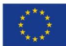

*This project has received funding from the Bio Based Industries Joint Undertaking (JU) under grant agreement No 792195. The JU receives support from the European Union's Horizon 2020 research and innovation programme and the Bio Based Industries Consortium*

# **Advanced Eco-designed Fibres and Films for large consumer products from biobased polyamides and polyesters in a circular Economy perspecTIVE**

Grant Agreement 792195 Topic BBI.2017.D5 Project start date 1 Duration 57 months

Call identifier H2020-BBI-JTI-2017 st June 2018 Project end date 28th February 2023

# **Deliverable 6.8 – Measures towards the future standardization of the biobased products**

# **Deliverable's details**

Deliverable number and title Deliverable 6.8 – Measures towards the future standardization of the biobased products WP number and title WP6 – Resource efficiency, environmental sustainability and social acceptance Lead beneficiary AquafilSLO Due date of deliverable 30th September 2022 Actual submission date 30th September 2022 Dissemination level Public

# **Table of content**

| Table of content                                                                                                                                               | 3 4                                                   |
|----------------------------------------------------------------------------------------------------------------------------------------------------------------|-------------------------------------------------------|
| 1. Introduction............................................................................................................................................... | 5                                                     |
| 2. International standards applicable to project EFFECTIVE                                                                                                     | 6                                                     |
| 2.1 Standards and certification applicable to bio-based products and feedstock........................................                                         | 6                                                     |
| 2.1.1 ISO 22095:2020 “Chain of custody General terminology and models”                                                                                         | 6                                                     |
| 2.1.2 ISCC Plus scheme for bio based and circular products.....................................................................                                | 7                                                     |
| 2.1.3 European Standard EN 16751:2016 “Bio based products Sustainability criteria”                                                                             | 8                                                     |
| 2.1.4 European Standard EN 17228:2019 “Plastics                                                                                                                | Bio-based polymers, plastics, and plastics products - |
| Terminology, characteristics and communication”                                                                                                                | 8                                                     |
| 2.1.5 Ecolabel.............................................................................................................................................    | 9                                                     |
| 2.2 Standards and certification applicable to textile flooring solutions......................................................                                 | 10                                                    |
| 2.2.1 EN 15804:2012+A2:2019 “Sustainability of construction works -                                                                                            | Environmental product                                 |
| declarations - Core rules for the product category of construction products”                                                                                   | 10                                                    |
| 2.3 Standards and certification applicable to garment and apparel solutions...........................................                                         | 11                                                    |
| 2.3.2 Content Claim Standard (CCS) version 3.1                                                                                                                 | 11                                                    |
| 2.3.1 Global Recycle Standard (GRS) certification v4.0...........................................................................                              | 12                                                    |
| 3. Conclusions..............................................................................................................................................   | 13                                                    |

# **List of abbreviation**

| Abbreviation | Definition                                          |
|--------------|-----------------------------------------------------|
| CCS          | Content Claim Standard                              |
| CoC          | Chain of Custody                                    |
| EPD          | Environmental Product Declaration                   |
| GRS          | Global Recycle Standard                             |
| ISCC         | International Sustainability & Carbon Certification |
| PCR          | Product Category Rules                              |
| RCS          | Recycled Claim Standard                             |

# **1. Introduction**

The present report constitutes deliverable 6.8 "Measures towards the future standardization of the biobased products" within the framework of the EFFECTIVE project. The following activities refer to WP6 "Resource efficiency, environmental sustainability and social acceptance" and specifically to task 6.4 "Measures towards the future standardization of the biobased products".

The market uptake of renewable bio-based alternatives to fossil-based products has become a reality over the last decades, when bio-based products have significantly increased their market share; also, they are expected to further growth in the upcoming years.

Their more and more frequent use requires a regulatory framework able to assess the sustainability of biobased products as well as their traceable supply chain in order to avoid any misleading communications that might fall under greenwashing.

In this view, internationally recognized certification schemes and standards are fundamental to diminishes trade barriers, promotes safety, increases compatibility of products, systems and services and promotes common technical understanding.

Standards and certifications schemes are traditionally developed via a multistakeholder approach that shall guarantee the development of credible tool. This multistakeholder approach, which is generally open and accessible to any interested party, also guarantees a transparent development process.

Many standards applicable to products made from renewable, bio-based raw materials have been developed in the last years. Though most of them perfectly cover all main topics and criteria, with the most recent and innovative technologies and products some areas might not be perfectly addressed, and actions might be necessary to cover such gaps.

In this view, the present deliverable describes the activity of revision of the main international standard applicable to different steps and products of the EFFECTIVE value chain. When necessary, a proposal of integration in order to cover any identified gaps was also provided.

# **2. International standards applicable to project EFFECTIVE**

The activity covered by the present report aimed at identifying the most relevant standards and certifications applicable to the bio-based materials developed within project EFFECTIVE, and to identify potential gaps and opportunities to be addressed to further facilitate their market uptake and recognition. The focus has been predominantly on the textile value chain developed in the project.

The identification and revision processes were structured in three main areas:

- Bio-based products and feedstock;
- Textile flooring solutions;
- Garment and apparel.

The main standards identified and belonging to the abovementioned areas are described in the following chapters.

## **2.1 Standards and certification applicable to bio-based products and feedstock**

The first set of standards and certifications are not limited to a specific point of the supply chain, but can cover different steps: indeed, the main identified standards and certification schemes are related to sustainability aspects of feedstock and of bio-based materials, the evaluation of bio-based content in products, and the different chain of custody models that can be applied to a bio-based value chain.

### *2.1.1 ISO 22095:2020 "Chain of custody - General terminology and models"*

This international standard identifies the main chain of custody (CoC) models that can be applied to all materials and products. It defines the terminology/vocabulary, the requirements that differ from one model to another, as well as the approach to design, implement and manage a specific chain of custody model.

The present standard identifies five chain of custody models, which differentiate each other for the physical presence of specific characteristics. This also reflect the level of traceability of each model.

Starting from the highest to the lowest physical presence of specific characteristics, the standard reports the following CoC models:

- 1. *Identity preserved*: according to this model, the input of a given process is originated from a single source. In this way, materials or products are clearly identifiable since they are kept physically separated and characteristics are preserved along the entire supply chain.
- 2. *Segregated*: in this model, inputs from different sources might be used and mixed in case they have identical characteristics; the specific characteristics are then maintained from the initial input till the final output. As per the previous model, materials or products are clearly identifiable since they are kept physically separated and characteristics are maintained throughout the supply chain.
- 3. *Controlled blending*: the present model foresees that materials or products with a set of characteristics are mixed according to certain criteria with materials or products without that set of characteristics, leading to a final output with a known proportion of the specified characteristics. The ration between inputs shall be known at all times for a contained volume.
- 4. *Mass Balance*: according to this model, materials or products with specified characteristics are mixed with materials or products without some or all of these characteristics, resulting in a claim on a part

of the output that is proportional to the input. The model proposes also two implementation methods: i) rolling average percentage method, and ii) credit method. The first one allows a claim of an average percentage of specific characteristics of an output over the claim period that is based on a fluctuating proportion of input (with specified characteristics) entering the process over a defined claim period. While the second one proposes the full allocation of specific characteristicsto materials or products by balancing the output with the input, taking into account the conversion factor.

- 5. *Book and Claim*: in this model, the information on specified characteristics within the supply chain is decoupled from any material or product flow since administrative records are not connected to the physical flow of materials or products. The system relies on credits that are generated when materials or products enter the market, and that can be traded and sold independently from the physical movement or delivery of products/materials.

The first two models allow to trace materials all the way back to the sources from which they are originated, while the remaining necessarily need a volume reconciliation process over a given period.

#### *Applicability to project EFFECTIVE*

Based on the identified chain of custody models, and on the previously discussed standards that allow the identification of bio-based products, the identity preserved model and the segregated model are the most indicated for bio-based products. Chain of custody models based on controlled blending is also applicable for bio-based supply chain, since it ensures the presence of a verifiable (through the method described in paragraph 2.1.4) bio-based content in products; however, clear information regarding the actual bio-based content is necessary to avoid misleading communication.

For other types of CoC, clear and verifiable information about the real bio-based content of products must be used in order to avoid greenwashing.

## *2.1.2 ISCC Plus scheme for bio based and circular products*

The ISCC Plus (International Sustainability & Carbon Certification) is a voluntary, globally applicable certification scheme that addresses sustainability aspects along entire supply chains in order to make them traceable and more sustainable.

This certification scheme, which represents an extension to the ISCC standard (mainly addressing the topics of biofuels and bioenergy), is linked with the Sustainable Development Goals defined by the United Nations in the 2030 Agenda, and specifically with SDG 12 "*Responsible consumption and production*". The focus of the scheme is on industrial products related to food & feed, solid biomass and chemicals.

The ISCC Plus scheme relies on six principles:

- 1. Protection of biodiverse and carbon-rich areas;
- 2. Good agricultural and forestry practices (with no deforestation);
- 3. Safe working conditions;
- 4. Compliance with human, labor, and land rights;
- 5. Compliance with laws and international treaties;
- 6. Good management practices and continuous improvement.

Those principles represent the pillar of the certification scheme and were used to define the mandatory and voluntary requirements that are verified though audits conducted by independent third party (accredited certification bodies).

As mentioned in the guidelines1 , the certification covers all step of a supply chain, starting from a selfdeclaration at the point of origin of a given supply chain up to the final products placed on the market. Information on potential claims to be used for communication activities are also reported in such guidelines.

The ISCC Plus scheme recognized two different chain of custody models: i) physical segregation, and ii) mass balance approach.

#### *Applicability to project EFFECTIVE*

The ISCC Plus represents an interesting certification scheme for project EFFECTIVE, especially for what concerns the upstream steps of the value chain, i.e. the production of sustainable feedstock for the demonstrated conversion processes.

Similarly, the certification scheme might also be applied to the EFFECTIVE's bio-based products; indeed, the ISCC Plus has recently extended its area of application by including also circular and bio-circular products. However, though a chain of custody model based on segregation of materials guarantees the transparent traceability of flows (and thus of bio-based content) from feedstock up to final products, in the case of a mass balance approach model the main requisite of the certification scheme is no longer auditable and verifiable.

### *2.1.3 European Standard EN 16751:2016 "Bio based products Sustainability criteria"*

The European Standard EN 16751:2016 identifies the main sustainability criteria and indicators applicable to the bio-based portion of all bio-based products (thus any non-bio-based parts of products are excluded for from the scope of this standard). The standard is meant to provide information on sustainability aspects of biomass production, or in the supply chain for bio-based part of products. It is worth highlighting that it cannot be used to make any claims that operations or products are sustainable.

This standard is applicable to products (including chemicals), but not to energy and food & feed solutions.

All aspects related to environmental, economic and social sustainability are taken into account in the identified sustainability indicators; overall, the standard identifies 31 indicators (4 covering economic aspects, 18 covering environmental issues – such as climate protection, biodiversity, waste, energy and material resources, water, soil, air quality, etc. –, and 9 covering social topics – such as labor rights, local development, land and water use rights, etc.).

#### *Applicability to project EFFECTIVE*

The applicability of this standards is wide and of key importance for the materials and products developed and demonstrated in the framework of project EFFECTIVE, considering their bio-based content.

### *2.1.4 European Standard EN 17228:2019 "Plastics - Bio-based polymers, plastics, and plastics products - Terminology, characteristics and communication"*

The present European Standard targets bio-based polymers, plastics, and plastics products and addresses the topics of vocabulary/terminology, characterization (measure of bio-based content), and communication of sustainability and LCA aspects, by also including declaration tools.

As of 2019, it replaced the Technical Specification TS 16137 "Measuring the Biobased Carbon Content of Plastics", which provided reference test and calculation methods for determining the bio-based carbon

1 [https://www.iscc-system.org/wp-content/uploads/2022/01/ISCC\\_Certification\\_Guideline\\_130122\\_Final\\_compressed.pdf](https://www.iscc-system.org/wp-content/uploads/2022/01/ISCC_Certification_Guideline_130122_Final_compressed.pdf)

content of plastics and other polymers that contain organic carbon. It was based on the Carbon-14 methods described in standards ASTM D6866 and EN 15440 (now replaced by EN ISO 21644).

The standard sets out the key requirements for the identification of bio-based products, since it enables to distinguish between products with actual bio-based content, and products where the bio-based content is allocated through accounting practices, and where no trace of Carbon-14 might not be detected.

#### *Applicability to project EFFECTIVE*

The present Standard and the related standards ASTM D6866 and EN 15440 (now replaced by EN ISO 21644) to determine the bio-based content of a product are applicable to every step of the EFFECTIVE supply chain, from building blocks to polymer and up to final products.

The Standard EN 17228:2019 represents a reliable and transparent tool to be used to determine the actual bio-based content of products in order to develop proper and reliable communication actions based on verifiable information.

### *2.1.5 Ecolabel*

The EU Ecolabel2 is a Type II voluntary certification scheme that is awarded to products and services meeting high environmental standards throughout their life cycle. This certification, which is recognized across Europe and worldwide, certifies products for environmental excellence with a guaranteed, independently-verified low environmental impact.

The EU Ecolabel criteria encourage companies to develop products that are durable, easy to repair and recyclable, and that minimize the impact over their entire life cycle.

The EU ecolabel covers a wide range of everyday products, and criteria for awarding these products are periodically revised to reflect the most recent innovations and progress. Criteria are available for the following product groups3 :

- Cleaning
- Clothing and textiles
- Coverings
- Do it yourself
- Electronic equipment
- Forniture and mattresses
- Gardening
- Holiday accommodation
- Lubricants
- Paper
- Personal and animal care products

#### *Applicability of project EFFECTIVE*

The EU ecolabel is a certification of scheme of potential interest for what concerns the bio-based Nylon 6 value chain, and the final products in which it will be used, namely carpets and garments solutions.

Both solutions fall under the Clothing and textiles4 category, since it covers different steps of the supply chain, starting from yarns to fabric and up to final products (e.g. textile clothing and accessories, upholstery, textile

2 https://environment.ec.europa.eu/topics/circular-economy/eu-ecolabel-home\_en

3 https://environment.ec.europa.eu/topics/circular-economy/eu-ecolabel-home/product-groups-and-criteria\_en

4 https://environment.ec.europa.eu/topics/circular-economy/eu-ecolabel-home/product-groups-and-criteria/clothing-and-textiles\_en

products for interior use, etc.). The EU Ecolabel for textile products guarantees a more sustainable fibre production, a less polluting production process, strict restrictions on the use of hazardous substances, and a long-lasting final product.

# **2.2 Standards and certification applicable to textile flooring solutions**

The second area investigated in the review process is represented by standards applicable to textile flooring solutions. Activity has focused on the recent revision of the European Standard EN 15804:2012+A2:2019 "Sustainability of construction works - Environmental product declarations - Core rules for the product category of construction products", and specifically on the impacts that the reviewed version can have on Environmental Product Declaration (EPD) of carpet solutions.

### *2.2.1 EN 15804:2012+A2:2019 "Sustainability of construction works - Environmental product declarations - Core rules for the product category of construction products"*

This European Standard provides core product category rules (PCR) for Type III environmental declaration of construction products and services. In agreement with the rules set in the ISO standard 14067:2018 "Greenhouse gases Carbon footprint of products Requirements and guidelines for quantification", it provides a structure to ensure that all Environmental Product Declarations (EPD) of construction products, construction services and construction processes are verified and presented in a harmonized way.

The PCR define the indicators that shall be used in environmental declarations, and the rules for the development of scenarios and for calculating Life Cycle Inventory and the Life Cycle Impact Assessment underlying the EPD; also, the PCR define the rules for reporting environmental and health information, and the conditions under which construction products can be compared.

The main innovation of the recent revision is represented by the way in which biogenic carbon of bio-based products is accounted for in the Life Cycle Assessment: in case the biogenic carbon is included in the system boundary (as a negative contribution/credit), the flows of the biogenic carbon still remaining at the end-oflife scenario will have to be re-balanced, as a positive impact, in order to result in zero net contribution to the Carbon Footprint.

Such a modification suggests that LCA of construction products shall be based on a Cradle-to-Grave approach (instead of a Cradle-to-Gate approach), and highlights the fundamental importance of the end-of-life management, which shall be taken into account in the evaluation of the environmental performance of a products.

This innovation is in line with the European Strategy for Sustainable and Circular textiles, where the importance of eco-design measures to improve circularity of products (including carpets) is highlighted toward developing more sustainable products and solutions.

#### *Applicability to project EFFECTIVE*

The present standard is of key importance for the EFFECTIVE supply chain dedicated to the validation of biobased Nylon (especially bio-based Nylon 6) into carpets solutions.

Though the greatest impact of this standard will be at the time when bio-based Nylon 6 carpets will be commercially produced and launched on the market, the innovation brought by the revision confirms that the actions taken in project EFFECTIVE on the application of eco-design measures to produce bio-based carpets designed to be deconstructed and recycled at the end of their life go into the right direction of sustainability and are in line with the recent initiatives at European level (i.e. EU Strategy for Sustainable and Circular Textiles).

## **2.3 Standards and certification applicable to garment and apparel solutions**

Regarding the third category, activity has focused on standards applicable to garment and apparels. The most widely used by the textile industry are standards developed and managed by Textile Exchange, a global noprofit organization representing leading brands, retailers, and suppliers of the textile sector. These standards are widely recognized since they set specific requirements in terms of solid and reliable chain of custody, transparency and sustainability. For what concerns man-made fibres, the two most relevant standards are the Content Claim Standard (CCS) and the Global Recycle Standard (GRS).

It is worth to specify that these standards are applicable to all textile products, including carpets; however, due to the relevance in the garment sector, assessment of the applicability of these standard will be mainly focused on garment and apparel products.

### *2.3.2 Content Claim Standard (CCS) version 3.1*

The CCS5 is a framework certification that provides company with a chain of custody system that ensures that a given characteristic of a given source/input is present in a final product. It requires that each organization throughout the supply chain that take physical possession of a material/product takes sufficient steps to ensure that the integrity and identity of a given characteristic is preserved from the input to the final output by tracking materials in each step of the supply chain.

The CCS represents the foundation of all Textile Exchange's standards.

Beyond defining the criteria for implementing management systems to control and record information, as well as for processing and handling of materials, CCS sets out also rules for brands to ensure that the integrity of certified products is maintained up to the point of sale.

It is worth noting that reference to CCS is not allowed on any consumer products.

#### *Applicability to project EFFECTIVE*

Though not specifically addressed, the Content Claim Standard might be applicable to bio-based products (bio-synthetics, according to Textile Exchange's definition) demonstrated in EFFECTIVE, with the objective of ensuring that bio-based content is preserved from the feedstock up to the final products.

Preliminary conversation will be set up in order to explore the possibility of integrating the CCS with criteria for bio-synthetic products.

5 <https://textileexchange.org/wp-content/uploads/2020/08/CCS-101-V3.1-Content-Claim-Standard.pdf>

#### *2.3.1 Global Recycle Standard (GRS) certification v4.0*

The GRS6 is a globally recognized voluntary standard that sets requirements of recycled content in products and of chain of custody. The GRS differs from another Textile Exchange's standard (Recycled Claim Standard - RCS) because of the inclusion of additional criteria addressing social and environmental practices and chemical restrictions. All these criteria and requirements are verified by accredited independent third parties.

The goal of this standard is to increase the use of recycled materials in final products by ensuring at the same time the traceability of flows and the reduction or elimination of any harms to people and to the environment related to its production. The standard is intended to be applicable only to products whose recycle content is at least equal to 20%.

The GRS is based on a solid chain of custody relying on identity preservation or segregation models. The physical traceability of recycled content is ensured by a system of transaction certificates, i.e. digital documents that are produced by each actor of the supply chain where the seller includes information about the amount of product that is sold. In this way, the system prevents organizations to sell more products as certified than what they were actually able to produce starting from a given volume of certified input materials.

The GRS likely represents the most reliable certification scheme for the textile industry for what concerns the use of recycled materials. The solid supply chain, which shall be based on identity preserved orsegregated models, ensures that final products destined to consumers and labelled as "recycled" (partially or wholly) actually contain a share of recycled material.

#### *Applicability to project EFFECTIVE*

The GRS is not directly applicable to any EFFECTIVE bio-based products. However, the solidity of this standard in term of transparent and traceable supply chain represents a reference certification that can be taken as a model to develop new certification schemes.

Today, no standard with a solid, transparent and verifiable supply chain of biosynthetic product is available in the textile sector.

In this view, and in order to ensure that products made with bio-based materials actually have a real biobased content while at the same time avoiding any misleading communication or greenwashing, it is of key importance the development of a new standard based on a reliable chain of custody model as the GRS certification.

Preliminary conversations on this topic will be set up.

6 <https://textileexchange.org/wp-content/uploads/2021/02/Global-Recycled-Standard-v4.0.pdf>

# **3. Conclusions**

The present report includes an overview of the main standards applicable to EFFECTIVE's bio-based materials and products, with a specific focus on the textile value chain.

It addresses the main characteristics of each standard, its applicability potential to the project, and identifies gaps that can be covered by future standardization activities (e.g. the development of standards for biobased products that ensure reliable, transparent and verifiable supply chains based on segregated chain of custody model). In all cases, the identified standards do not grant any better sustainability performance of bio-based products compared to the related fossil-based counterparts.

In this view, beyond the measurement of the bio-based content, the wide recognition of bio-based products shall also rely on the assessment of the environmental footprint through solid and reliable certification schemes, such as the Environmental Product Declarations.