# Green-Tex Solutions

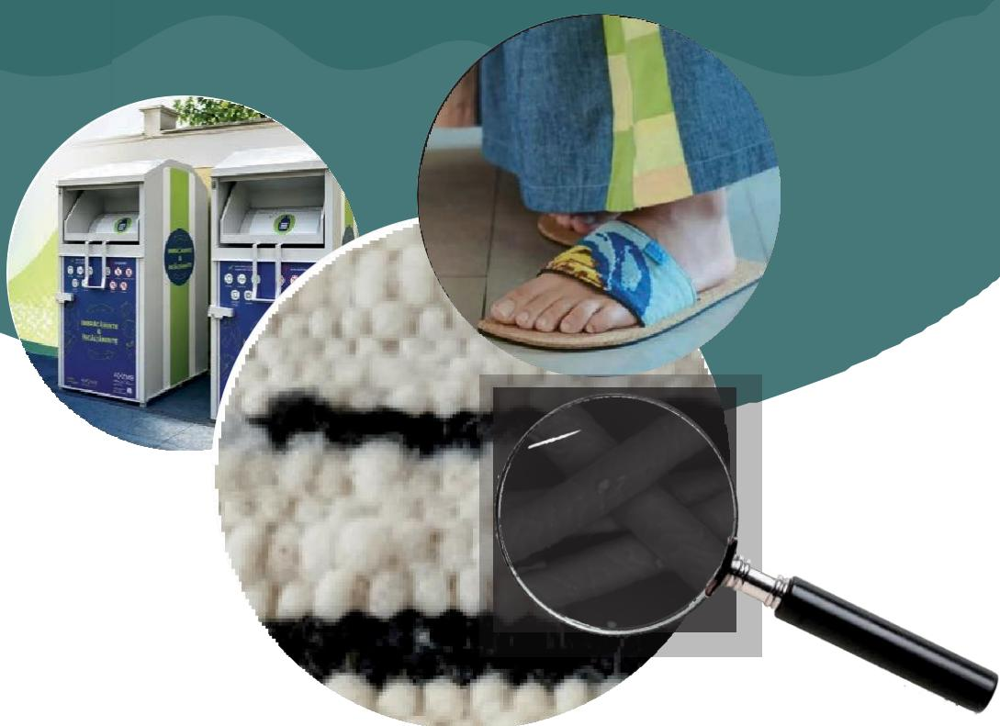

# Green-Tex Solutions

**May 2026**

#### Publisher University of Zagreb Faculty of Textile Technology

For Publisher Sandra Bischof

Editors Sandra Bischof Tadeja Colnar Leskovšek Amela Ikić Suljagić

> Languague review Mirjana Cibulka

Graphic design Sunčica Bjedov

Print: Grafo biro Dominić, Zagreb

> Edition: 200 copies

Zagreb, May 2026

*This publication was supported as part of DRP0200404 Green-Tex, an Interreg Danube Region Programme project co-funded by the European Union.*

## Content

| Foreword .....                                                                                 | 4  |
|------------------------------------------------------------------------------------------------|----|
| Green-Tex Summary .....                                                                        | 7  |
| 1. Introduction.....                                                                           | 8  |
| 2. Piloting Process.....                                                                       | 10 |
| 3. Pilot 1: Testing Solutions for Textile Waste Collection.....                                | 12 |
| 4. Pilot 2: Testing Wider Application of Natural Fibres in Innovative Textile Production ..... | 24 |
| 5. Pilot 3: Testing Green Fashion Design Solutions .....                                       | 35 |
| 6. Pilot Integration and Cross-Cutting Learning .....                                          | 47 |
| 7. Green-Tex Solutions Highlights.....                                                         | 52 |
| 8. Green-Tex Solutions Adaptability and Transferability.....                                   | 68 |
| 9. Final Words .....                                                                           | 71 |
| 10. Annexes .....                                                                              | 73 |

#### *Disclaimer:*

*This document has been produced with the financial assistance of the European Union. The content of the document is the sole responsibility of Green-Tex project partners and can under no circumstances be regarded as reflecting the position of the European Union and/or Interreg Danube Region programme authorities.*

### Foreword

GreenTex solutions were developed and tested within the INTERREG Danube Region project *Enhancing Danube Green Textiles and Garment Production and Consumption (DRP0200404 Green-Tex)* with the aim of strengthening transnational collaboration and fostering innovation in the Danube region's sustainable textile sector. In this way, the textile sector value chain in partner regions becomes more resilient and competitive as it adapts to more regenerative, circular economy-based green textile practices.

This document outlines a collaborative effort to transform the Danube region's textile sector, presenting both the foundational insights that shaped our approach and the practical pilots that demonstrate scalable solutions for sustainability.

#### Chapter 1. Introduction

In the introduction, we look behind the scenes to understand the context of the textile sector with its opportunities and challenges. These challenges inspired us to gather 12 partners and 4 associated strategic partners from 9 countries, all committed to making meaningful changes, primarily within the Danube region.

#### Chapter 2. Piloting Process

The piloting process followed a structured methodology that included planning, mapping, stakeholder engagement, implementation, monitoring, and evaluation. Each pilot was codesigned with industry partners, public authorities, designers, NGOs, educational institutions and community actors to ensure relevance and realworld applicability. This approach enabled rapid learning, iterative improvement and the identification of barriers and opportunities for scaling sustainable textile solutions.

#### Chapter 3. Pilot 1: Testing Solutions for Textile Waste Collection

This pilot explored new models for collecting postconsumer and postindustrial textile waste. Through targeted collection points, awareness campaigns and collaboration with waste management services, the pilot tested how households and businesses respond to improved textile disposal options.

The results highlight both the potential for increased recovery rates and the need for continued public collaboration, education and infrastructure development towards digitalisation.

#### Chapter 4. Pilot 2: Testing Wider Application of Natural Fibres in Innovative Textile Production

The project investigated how natural fibres, in particular regionally available wool and hemp, can be integrated into traditional artisan production or modern textile manufacturing. By working with academia, cooperatives, producers and material innovators, the pilot assessed material properties, environmentally friendly washing, dyeing with natural fibres, performance, cost and benefits of both materials. The findings confirmed that natural fibres can successfully replace synthetic materials in various applications if processing technologies are adequately chosen and all stakeholders within the value chains are committed to green and circular principles.

#### Chapter 5. Pilot 3: Testing Green Fashion Design Solutions

This pilot focused on embedding sustainability principles into fashion design practices. Designers experimented with zerowaste patterns, upcycling techniques, modular garments and ecofriendly materials. The pilot demonstra-ted that creative design approaches can significantly reduce environmental impact while maintaining aesthetic and commercial value. It also highlighted the importance of raising public awareness, alongside training and capacitybuilding to support designers in transitioning to greener methods.

#### Chapter 6. Pilot Integration and Cross Cutting Learning

Integration across pilots ensured that insights from one activity informed the others, creating a holistic understanding of the textile ecosystem. Crosscutting learning sessions brought together stakeholders from collection, production, and design to share experiences, identify synergies, and codevelop recommendations. This collaborative approach strengthened the overall impact of the project and fostered a shared vision for sustainable textile transformation.

#### Chapter 7. GreenTex Solutions Highlights

The pilots collectively produced three a sets of standout solutions that demonstrate practical pathways towards circularity. These include improved waste collection systems, innovative naturalfibre products, ecodesign methodologies and collaborative frameworks for actors across the value chain. Each solution demonstrates how sustainability can be embedded in everyday textile practices while generating economic and social benefits.

#### Chapter 8. GreenTex Solutions Adaptability and Transferability

A key objective of the project was to ensure that tested solutions could be adapted to different contexts. Adaptability is strengthened through clear guidelines, open knowledge sharing and flexible implementation models. The pilots revealed that many approaches—such as naturalfibre integration, eco-design principles and modern textile waste collection systems—are highly transferable when supported by relevant partnerships. Close collaboration with the TEX-DAN project enabled further transferability.

#### Chapter 9. Final Words

The Green-Tex activities led to the solutions that unify the whole value chain and include innovative solutions across waste prevention and collection, sorting, sustainable production, eco-design, and crosssector collaboration. This part of the document summarises the outcomes of several interconnected activities, each designed to test practical approaches that prevent and reduce waste, promote natural fibres, and encourage greener fashion systems.

> Editors: Prof. Sandra Bischof Tadeja Colnar Leskovšek Amela Ikić Suljagić

### Green-Tex Summary

*The Green-Tex project facilitated transnational collaboration and innovation in the Danube region's textile sector. By focusing on sustainability and competitiveness, it supported value chain actors in partner regions as they adapted to global shifts—moving from traditional towards regenerative, circular economy-based green textile practices.*

*Green-Tex created and tested new solutions throughout the entire value chain, starting from fashion design to production and usage as well as textile waste collection and processing and verified them in various contexts within the project territory. Digital solutions were an integral part of the Green-Tex project in different partner regions in which an effective textile waste collection system with publicly available online maps of collection points were implemented. Green-Tex solutions have been incorporated into the Green-Tex learning and innovation platform. The project applied a multisectoral approach by integrating partners and stakeholders from the textile production, waste collection and recycling, product design and other relevant sectors. Additionally, it engaged actors within a quadruple innovation helix framework, which is vital for the successful application of circularity in the textile sector.*

# 1. Introduction

*The textile industry is a highly complex, interconnected industrial ecosystem. It sits at the intersection of advanced polymer chemistry, high-precision material engineering, manufacturing excellence, customer intimacy, supply chain orchestration, culture-based creativity and digital design. It is not a single industry but a web of value chains that underpin the functionality of modern society. From the high-tenacity fibres reinforcing wind turbine blades to the aortic filters in heart surgery, and from the geotextiles stabilising our highways to the ballistic protection of our armed forces, textiles are the engineered substrate of the European economy, as well as a critical component of our crisis resilience and strategic autonomy.*

> *Lutz Walter, Secretary General, European Technology Platform for the Future of Textiles and Clothing [https://www.linkedin.com/pulse/towards-european-textile-strategy-part-1](https://www.linkedin.com/pulse/towards-european-textile-strategy-part-1-) defining-market-lutz-walter-p4tke/*

According to the latest *EU Strategy for Sustainable and Circular Textiles (2022- 2030)*, the circular economy is expected to deliver major environmental, economic and social advantages by reducing waste, lowering pollution, improving resource efficiency, and driving innovation across the fashion and textile value chain. These benefits are especially relevant today as the global textile industry faces pressure to cut emissions, reduce waste and transition towards sustainable production.

The Green-Tex project addressed circular economy and sustainable production and consumption challenges throughout the entire textile sector value chain, starting with product design and sourcing, followed by the production process, product use and end-of-life (reuse, waste collection and recycling). Key issues include reliance on unsustainable production practices, insufficient sustainable design education and limited waste collection and processing systems. The project advocates a mindset shift, the restructuring of business models towards circularity and fostering greater collaboration across the value chain to achieve social, environmental and economic benefits.

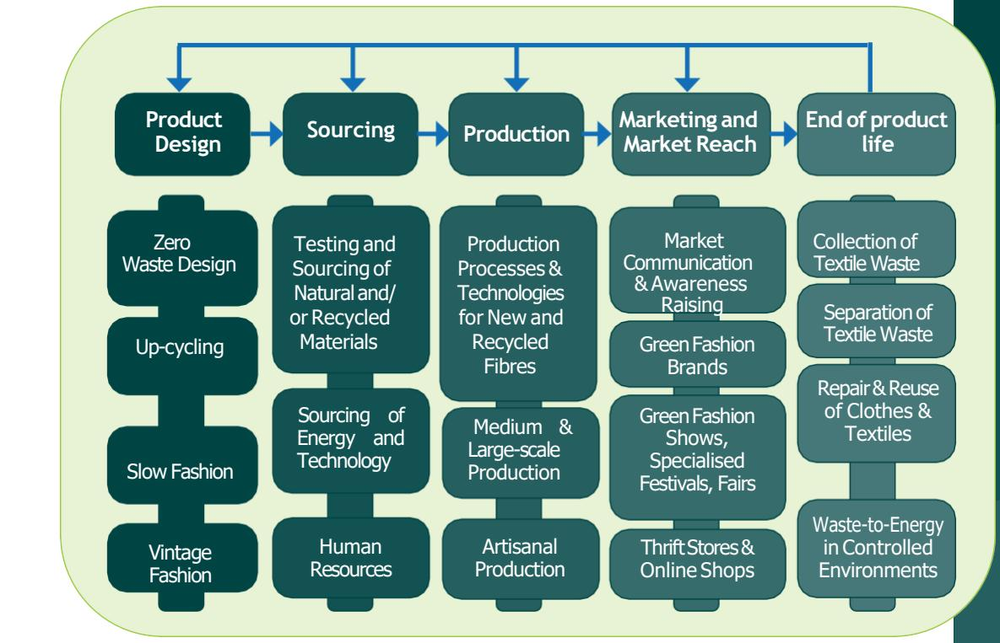

Overview of circularity in the textile and garment sector

By facilitating partnerships between designers, academic and environmental organisations, manufacturers, and consumers, the project aimed to accelerate the transition to sustainable textile production and green fashion.

The Danube Region was selected for the implementation of project activities and 12 partners and 4 associated strategic partners from 9 countries worked together for three years, starting from 1st January 2024, with the aim of con-tributing to the general sustainability goals of our textile sector.

# 2. Piloting Process

The Green-Tex pilot actions focused on textile waste collection and recycling, increasing the use of natural fibres, and developing eco-friendly fashion design. These pilots were tailored to the specific conditions of each region, supporting their transition towards circular business models.

The overall piloting process consisted of several steps:

- (i) mapping,
- (ii) pilot testing preparation and implementation,
- (iii) stakeholders' capacity building and awareness-raising,
- (iv) pilot evaluation.

The Green-Tex mapping methodology followed a multi-layered approach aimed at collecting detailed and actionable data on the state and potential of the textile sector in the partner regions. The process began with meeting local stakeholders (field visits), technicians, managers of local, national and international projects, as well as secondary sources such as studies, statistical data and other records held by educational institutions, government offices and local communities in the area, etc.

Following the mapping process, subsequent activities focused on preparing and implementing pilot actions related to textile waste collection and processing, as well as exploring the use of wool and hemp in more sustainable production. They also included initiatives promoting green fashion to encourage more responsible consumption patterns. In parallel, efforts were made to strengthen stakeholders' capacities and raise awareness across the value chain, supporting a more informed and collaborative transition toward circular textile practices.

The evaluation of pilot testing aimed to assess the effectiveness, integration and replicability of innovative approaches to textile waste reduction, wider application of natural fibres, green fashion promotion and valorisation within a regional circular economy framework. It focused on how technological solutions (such as smart textile waste containers), traditional material use (wool valorisation) and creative industries (green fashion design) contribute synergistically to environmental, social and economic sustainability. The evaluation of pilot testing was designed not only to measure deliverables, but

also to generate learnings and practical recommendations for scaling up and integrating innovative textiles and circular economy practices in future regional initiatives. The evaluation explored:

- what worked well,
- what did not work as expected, and
- what can be improved or adapted for future full-scale implementation.

It captured insights from all actors — project partners, associated strategic partners, local producers, designers, educational and business support institutions and citizens — to ensure that future interventions are more efficient, inclusive and sustainable.

The Green-Tex project jointly developed and tested 3 pilots:

Pilot 1: Testing Textile Waste Collection – was tested in 3 pilot areas: Sarajevo (Bosnia and Herzegovina), Bucharest (Romania) and Prešov (Slovakia);

Pilot 2: Promotion of Natural Fibres in Innovative Textile Production - was tested in 3 pilot areas in Croatia, Serbia and Bulgaria;

Pilot 3: Promotion of Green Fashion Design – was tested in 2 pilot areas: Podgorica (Montenegro) and Postojna (Slovenia).

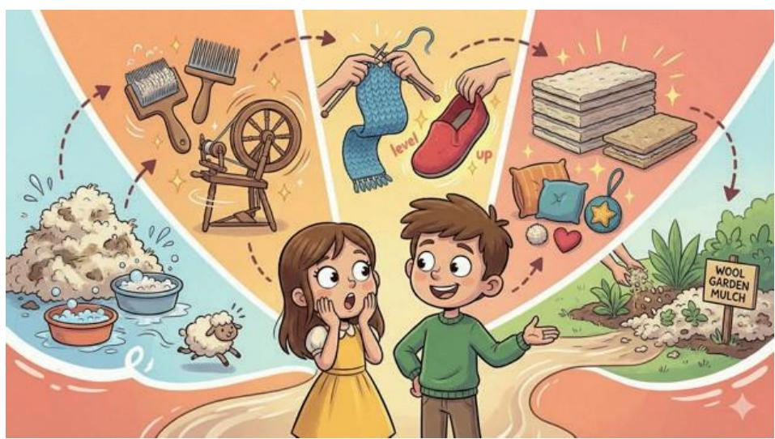

*Figure: excerpt from the educational video The second life of wool <https://interreg-danube.eu/projects/green-tex/library>*

## Pilot 1: Testing Solutions for Textile Waste Collection

Pilot 1 tested the performance and feasibility of smart textile waste collection systems using sensor-equipped containers. The focus was on technical reliability, operational efficiency and behavioural impacts on citizens.

### **1.1. Mapping of Textile Waste Collection and Sorting in Partner Regions**

In Bulgaria, Slovakia, Hungary, Romania, Croatia and Slovenia there is working system for separate collection of discarded textiles from households. According to the EU *Waste Framework Directive 2025/1892*, as of 1 January 2025, EU Member States are required to ensure that separate collection systems for textiles (including clothing, footwear and similar items) are in place. Retailers are collaborating with collectors and sorters to take-back systems and overstock. Post-industrial waste from production is also being collected. Manufacturers are partnering with collection and sorting actors for better environmental performance. Education and social organisations are increasingly promoting the separate collection of textile waste and textile recovery through awareness campaigns, workshops and community programmes.

In Bulgaria the most prevailing collection stream is from household using specialised containers for street collection. The companies that collect textiles separately in Northeast Bulgaria using containers are: TexCycle, M-texx Textile Recycling and Texlife in partnership with Bulgarian Red Cross.

Textile waste in Slovakia has averaged around 15,800 tonnes per year for several years. There are six organisations engaged in the collection of discarded textiles: HUMANA People to People Slovakia o.z., EKOCHARITA Slovensko Slovensku o.z., TextilEco a.s., organizačná zložka, Zdeno Mišutka, Ľubomír Ludvik WINDOORS, MMPR, s.r.o.

In Hungary, residents can drop off unwanted textiles at numerous collection points or use textile containers managed by MOHU, the country's waste management organisation. Textiles in good condition are reused or donated through organisations such as Humusz Szövetség and the Hungarian Red Cross. Hungarian textile collection and sorting company Textrade, has made significant investments in automation, incorporating advanced robotic technology and machines to sort textile waste alongside manual sorting. The company sells its products both domestically and internationally.

In the Bucharest-Ilfov region, several methods for collecting textile waste have been proven effective. There are few companies that collect textile waste along with other waste. They sort textiles for recycling as part of their waste processing operations. Retail collection points also play an important role. The following recycling companies are currently opera-ting in the region: RER Ecologic Group, Romprest, Supercom SA and Ur-ban SA.

In the Primorsko-notranjska region in Slovenia, there are systems in place for the separate collection of discarded textiles from households. There are two textile waste collection stakeholders in this region: the concessionaire/waste collector Publikus and external contractor HUMANA. Both companies are involved in collecting, sorting and processing textile waste for recycling and reuse.

In Croatia, collection is organised primarily through recycling yards or several collecting points organized by non-profit cooperative Humana Nova, located in Čakovec and Zagreb. Their annual capacity is 400 tonnes of textiles. Additional sorting organisations include Reto Center Zagreb, Croatian Red Cross and Caritas. They all sort waste into reusable and non-usable categories, selling or donating usable items. Regeneracija Zabok, part of Croatian RGNC GROUP, process non-usable textiles into felt and exports more than 90% of 100% recycled products to the global market. Annually, they process approx. 6,000 tonnes of discarded textiles.

In BiH, systems for the separate collection of discarded textiles from households are still in development and are not yet widely implemented. Larger urban areas, such as Sarajevo have more advanced waste management services, incorporating some initiatives for separate textile recycling. However, smaller cities and rural areas experience considerably lower coverage. Unfortunately, organised waste disposal practices have yet to become standard in BiH, resulting in limited interest in recycling discarded textiles. On the other hand, companies are mandated to manage and dispose of waste in accordance with environmental and public health regulations that align with EU standards.

The final phase of the product life cycle represents one of the biggest challenges for the textile industry in the central region of Montenegro, especially due to the lack of systemic programmes for the collection and recycling infrastructure. The collection of textile waste is not organised at the national level, but there are individual initiatives that focus on the collection of old textiles for upcycling and creative projects.

There is no official operator for textile waste in the Republic of Serbia. The only exception is the Centre for collection and recycling waste textile (ReTex) operated by the Women's Centre Association in Zlatibor district in Užice, since 2010. Future plans include the construction of eight regional recycling centres, two of which are planned for the Zlatibor District.

#### **1.2. Pilot Testing Solutions for Textile Waste Collection and Processing**

The pilot evaluated the performance and feasibility of smart textile waste collection systems using sensor-equipped containers, with a focus on technical reliability, operational efficiency and citizens' behaviour.

The pilot was implemented in 3 areas: Sarajevo Canton, Ilfov County within Bucharest area, and in the City of Prešov, Slovakia.

#### Key Learnings:

#### 1. Technical and Logistical Challenges Related to the Installation, Operation and Maintenance of Smart Containers

#### Bosnia and Herzegovina, Sarajevo Canton

The pilot in Bosnia and Herzegovina focused on testing smart containers equipped with fill-level sensors integrated via Narrowband Internet-of-Things (NB-IoT) connectivity. The implementation was carried out by the Sarajevo Economic Region Development Agency (SERDA) in cooperation with the Ministry of Communal Economy of Sarajevo Canton and the public utility company KJKP RAD.

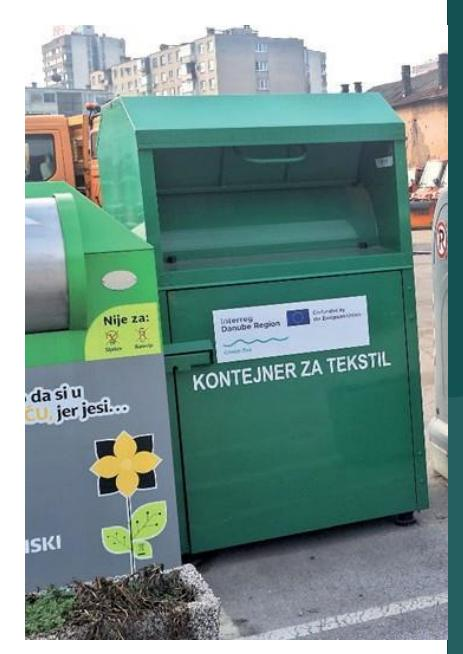

Integrating the sensors into the NB-IoT network of the local telecom operator requi-red several technical adjustments:

- Network configuration alignment
- Data reading protocol synchronisation
- Backend system configuration
- Testing of data transmission stability.

The piloting process represented a real-life learning situation for all stakeholders:

- Utility company first experience with smart containers
- Telecom provider first large-scale NB-IoT application for waste management
- Project partner first integration of smart textile waste collection system.

#### Operational Monitoring

The following parameters were systematically monitored:

- Fill-level frequency
- Volume of textiles deposited
- Container operational availability
- Sensor data accuracy
- Seasonal variations.

In Bosnia and Herzegovina, smart solutions are still widely perceived as a "*luxury*" rather than as tools for operational optimisation and cost efficiency. Public awareness also remains limited, often resulting in the disposal of unsuitable textile waste (e.g. wet or heavily contaminated items), which makes the collected materials unusable. Textiles are still largely perceived as "*harmless*" waste that can be discarded together with mixed municipal waste, while the belief that "*everything ultimately ends up in the same landfill*" further discourages citizen participation.

Addressing these challenges requires sustained, longterm awarenessraising and communication efforts, as short-term, project-based campaigns, although effective, remain insufficient. Vandalism has also emerged as a significant issue; consequently, containers had to be placed in less frequented but supervised locations to reduce theft and damage. Finally, GSM/IoT connectivity and sensor batteries require stable and continuous maintenance to ensure the reliable functioning of smart containers.

#### Romania, Ilfov County

Smart textile waste collection systems using sensor-equipped containers were installed by the Intercommunity Development Association Bucharest Metropolitan Area (ADIZMB) in the target localities of Ilfov county (Brăneşti, Pantelimon, Popești-Leordeni, Berceni and Vidra).

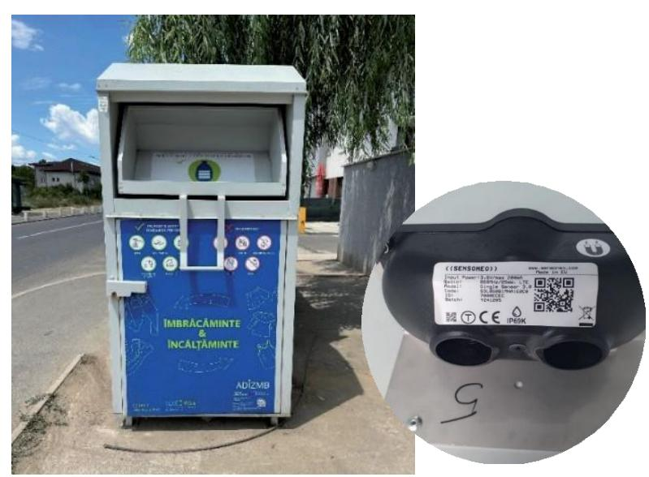

*Smart textile waste collection systems*

The pilot focuses on technical reliability, operational efficiency, and behavioural impacts on citizens, supporting data-driven decision-making for improved textile waste management.

#### 2. Learnings from Sensor-Generated Data that Support Improved Waste Management Planning and Decision-Making

#### Bosnia and Herzegovina, Sarajevo Canton

The piloting process served as a testing ground for a diagnostic tool designed to assess the entire textile waste management system in the pilot area. A set of realworld data was collected on textile waste quantities, user behaviour, emptying frequency, and sensor reliability. This dataset will support capacity planning and inform the development of strategic and operational documentation, thereby strengthening decisionmaking and improving overall efficiency.

Estimated Quantities: The utility company KJKP RAD conducted an annual assessment of textile waste quantities based on the volume of dedicated containers. The estimate is derived from a container volume of 1.8 m³ per unit and an assumed bulk textile density of approximately 70 kg/m³. The re-sulting total is 5,460 kg of textile waste per year.

Data generated by sensors installed in textile waste containers in Sarajevo enhances waste management planning and decisionmaking, particularly through realtime monitoring of fill levels, identification of peak disposal periods, and detection of under or overutilised locations. Sensor data enables municipal services to optimise collection schedules, reduce unnecessary collection trips, allocate vehicles and staff more efficiently as well as respond promptly to actual conditions on the ground. In the Sarajevo context, these insights also provide valuable evidence base for planning future expansion of the textile waste collection system, adjusting container placement as well as supporting datadriven policy decisions related to textile waste prevention, reuse and recycling.

#### Romania, Ilfov County

Below are the monthly quantities collected from April 2025 to December 2025, centralised, gathering data from the containers positioned in 5 cities.

| Waste type | Locality   | April | May   | June  | July   | Aug   | Sept  | Oct   | Nov   | Dec   | Total (tons) |
|------------|------------|-------|-------|-------|--------|-------|-------|-------|-------|-------|--------------|
| Textiles   | Brănești   | 1.962 | 1.998 | 2.853 | 3.524  | 1.566 | 1.872 | 1.595 | 0.262 | 0.262 | 16.829       |
|            | Pantelimon | 1.438 | 1.096 | 1.809 | 2.136  | 1.227 | 1.548 | 1.278 | 0.500 | 0.500 | 11.994       |
|            | Popești   |       |       |       |        |       |       |       |       |       |              |
|            | Leordeni   | –     | 0.474 | 1.028 | 0.635  | 1.698 | 1.268 | 0.553 | 0.275 | 0.275 | 6.433        |
|            | Berceni    | 1.160 | 0.958 | 1.836 | 2.,343 | 1.821 | 1.050 | 0.753 | 0.820 | 0.820 | 11.685       |
|            | Vidra      | –     | 0.472 | 2.853 | 0.580  | 0.483 | 0.440 | 0.396 | 0.249 | 0.249 | 3.459        |

The Romanian pilot demonstrated stable and continuous data acquisition from the beginning of the implementation phase. From a technical perspective, the implementation of sensor-equipped containers enabled real-time monitoring of fill levels, optimised collection routes and reduced unnecessary pick-ups. This significantly improved planning and operational efficiency within municipal waste departments, ensuring that decisions were increasingly data-driven rather than estimate-based.

#### 3. Learnings about Citizen Behaviour, Particularly Regarding Textile Waste Sorting

#### Bosnia and Herzegovina, Sarajevo Canton and Romania, Ilfov County

The analysis of changes in citizen behaviour showed that most residents were initially unaware of the existence of textile waste containers. Even among those who were aware, usage remained occasional, with textile waste still predominantly disposed of together with mixed municipal waste. Nevertheless, increased awareness of dedicated textile containers has led to a partial shift in behaviour, indicating that citizens are willing to adapt their disposal practices when appropriate infrastructure is available.

The findings also reveal a clear demand for a greater number of textile waste containers placed in accessible and visible locations. In addition, citizens emphasise the importance of transparency regarding the further handling of collected textile waste, as well as the need for more frequent and informative awarenessraising campaigns. This suggests that sustained communication efforts and improved accessibility are essential prerequisites for achieving longterm behavioural change and correct textile waste sorting.

#### 4. Measurement of Key Indicators, Including Container Usage Rates, System Uptime, Data Accuracy and the Percentage Increase in Properly Sorted Textile Waste

The results of the measurements of this pilot activity show an increase in container usage rates over time and a higher share of properly sorted textile material, indicating the effectiveness of the pilot awareness-raising campaigns and the reliability of the system.

#### Bosnia and Herzegovina, Sarajevo Canton

The environmental impact of Pilot 1 was assessed by examining the benefits of diverting textile waste from disposal and promoting reuse and recycling.

Based on annual estimates (5,460 kg of collected textile waste), the pilot demonstrates a measurable reduction in potential environmental burdens, including lower greenhouse gas emissions resulting from avoided disposal and material substitution. Preliminary results indicate that even at a pilot scale, the collection system contributes to tangible environmental benefits, such as reduced pressure on landfills, decreased carbon emissions and improved resource efficiency. These findings reinforce the rationale for scaling the model to additional waste categories and municipalities.

#### Romania, Ilfov County

Using the Denkstatt methodology, applied through the Texcycle – ECO-CA-LCULATOR application to calculate the benefits generated by the separate collection of textile waste, citizens from the target areas contributed, among others, to the following outcomes:

- Reduction of carbon dioxide emissions resulting from the production of new clothing and footwear, as well as from the decomposition of textile waste in landfills, by 1,051 tonnes, equivalent to 1,051,464 km of air travel (one passenger).
- Saving of 98,363 m² of arable land, freed from raw material production for new clothing and footwear.
- Saving of 108,193 m³ of water, otherwise required to produce new clothing and footwear – for irrigation of crops used as raw materials and for manufacturing and fibre dyeing processes. This is equivalent to 1,081,927 ten-minute showers.

These results clearly confirm that separate textile collection generates measurable environmental benefits and directly contributes to climate and resource-efficiency objectives.

*Structure of textile items collected in Romania*

| Category                          | %    |
|-----------------------------------|------|
| Clothing (textile fibres)         | 37   |
| Leather/fur clothing              | 3    |
| Footwear (rubber/plastic/textile) | 16.2 |
| Leather footwear                  | 2.7  |
| Home textiles                     | 28.5 |
| Curtains/draperies                | 9.1  |
| Furniture covers                  | 2.5  |
| Headwear                          | 0.2  |
| Other textile items               | 1    |

The structure of collected textile fractions shows a dominant share of clothing and home textiles, confirming strong potential for reuse and recycling pathways through market-based and social enterprise models. The quality of sorting improved progressively, closely linked to the awareness-raising campaigns and capacity-building workshops implemented during the pilot.

#### 5. Effects of Awareness Raising and Capacity Building Workshops

#### Bosnia and Herzegovina, Sarajevo Canton

Awarenessraising activities and capacitybuilding workshops contributed to a stronger understanding of the importance of proper textile waste disposal, recycling, and reuse among a broad range of stakeholders. Within the pilot, targeted promotional activities were implemen-ted for the public, while two capacitybuilding workshops were organised at SERDA in November 2025, bringing together representatives of public authorities, educational

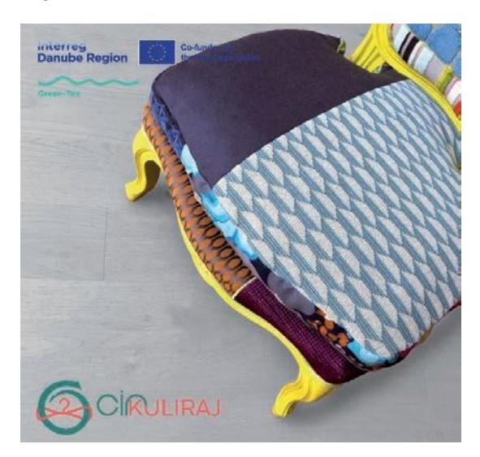

institutions, students, artisans and entrepreneurs. The workshops provided a platform for knowledge exchange and crosssectoral dialogue, helping participants better understand textile waste management challenges, circular economy principles and opportunities for reuse and recycling. The diverse composition of participants strengthened mutual understanding between policy, education, and practiceoriented stakeholders. Participants demonstrated increased interest in correct textile waste sorting and in the environmental, social, and economic benefits of reuse and recycling initiatives.

The public awareness campaign complemented the workshops by reaching a wider audience and highlighting the importance of responsible textile waste disposal. Together, these activities revealed existing knowledge gaps and confirmed the need for continuous, longterm awarenessraising and capacitybuilding efforts, as shortterm, projectbased interventions alone are insufficient to achieve lasting behavioural change and institutional uptake.

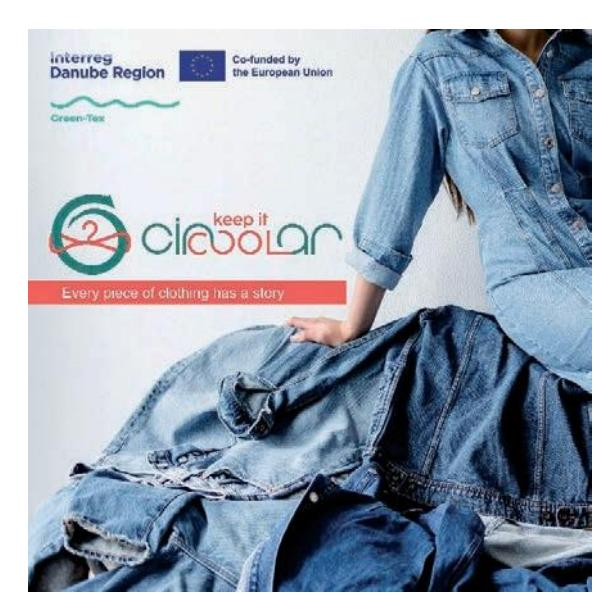

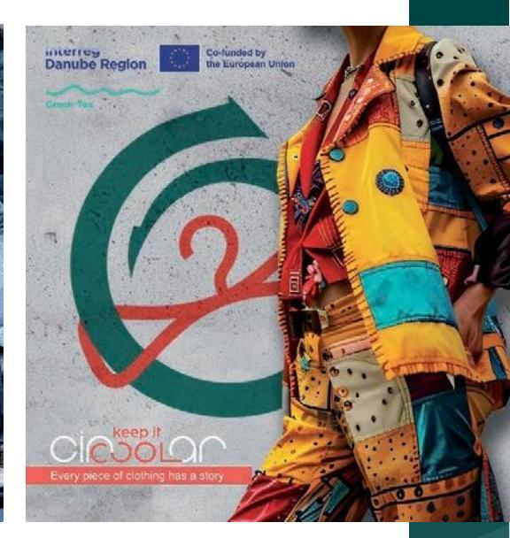

#### Romania, Ilfov County

The awareness-raising activities and capacity-building workshops contributed to a greater understanding of the importance of proper textile waste disposal, recycling and reuse amongst a wide range of stakeholders. Within the pilot, targeted promotional activities were conducted, while ADIZMB organised several capacity-building workshops in March, April and May 2025, bringing together representatives from public authorities and educational institutions.

These workshops served as a platform for knowledge exchange and crosssectoral dialogue, enabling participants to gain a deeper understanding of textile waste management challenges, circular economy principles, and opportunities for reuse and recycling. The diverse mix of participants fostered mutual understanding among policy makers, educators and practiceoriented stakeholders. Participants showed increased interest in proper textile waste sorting and in the environmental, social, and economic benefits of reuse and recycling initiatives.

Complementing the workshops, the public awareness campaign reached a broader audience, emphasising the importance of responsible textile waste disposal. Together, these activities highlighted existing knowledge gaps and confirmed the need for ongoing, long-term awareness-raising and capacitybuilding initiatives, as short-term, project-based interventions alone are insufficient to achieve lasting behavioural change and institutional adoption.

#### 6. Feedback and Plans by the Municipal Waste Departments

#### Bosnia and Herzegovina, Sarajevo Canton

The Public Company KJKP RAD highlighted both the challenges and the potential of implementing smart textile waste collection systems. They confirmed that although the technical infrastructure for smart containers is still limited and staff training is required, the pilot provided valuable operational insights. Key challenges identified included logistical constraints, the need for regular maintenance of sensors and connectivity systems, risks of vandalism and the current lack of integration with existing operational processes.

The company also noted that citizen awareness and engagement remain critical for the success of selective textile waste collection. While some behavioural change has been observed among residents who are aware of the containers, broader and sustained awareness-raising campaigns are necessary to improve correct sorting rates.

#### Romania, Ilfov County

The municipalities highlighted both the challenges and opportunities associated with implementing smart textile waste collection systems. They noted that, although the technical infrastructure for smart containers is still limited and staff training is required, the pilot offered valuable operational insights. Key challenges identified included logistical constraints, the need for regular maintenance of sensors and connectivity systems, risks of vandalism as well as the lack of integration with existing waste management systems.

Municipalities emphasised that citizen awareness and engagement are crucial for the success of selective textile waste collection. While some behavioural changes have been observed among residents familiar with the containers, broader and sustained awareness-raising campaigns are necessary to improve correct sorting rates.

Looking ahead, both companies revealed plans to:

- Expand the availability of smart containers to accessible and strategic locations, taking monitoring and security requirements into account
- Provide staff training and capacity-building for the operation and maintenance of smart systems
- Strengthen communication with SMEs, social enterprises, artisans, NGOs, and second-hand retailers to develop a complete textile waste value chain

- Implement continuous awareness campaigns and educational activities to encourage proper textile waste disposal among citizens
- Monitor and utilise sensor-generated data to enhance operational efficiency and inform future strategic planning
- Work on multi-municipal collaboration for textile waste collection.

Overall, the pilot is viewed as a valuable starting point, offering actionable insights for scaling up smart textile waste collection and enhancing circular economy practices in the cities of the Ilfov County.

## Pilot 2: Testing Wider Application of Natural Fibres in Innovative Textile Production

This pilot assessed the engagement, feasibility and added value of reusing local wool and hemp through research and development, educational, artisanal and market-oriented activities. The pilot presentation highlights the economic sustainability of local wool and hemp valorisation, learning outcomes for participants and the effectiveness of local partnerships involved in the pilot.

The pilot was implemented in 3 areas: the Municipality of Majur, Croatia, Zlatibor region in Serbia and Bulgaria.

#### **4.1. Mapping of Sustainable Materials Sourcing in Partner Regions**

The textile and garment industries continue to develop with a renewed focus on the materials used. Increasing attention is being given to the use of natural materials, preferably of local origin, such as wool and hemp, as well as the incorporation of recycled fibres. However, in regions of the Green-Tex project, which were once known for its strong textile sectors, the production of raw materials at the local level has been completely discontinued.

In Bulgaria, the predominant textile material used is cotton, which is now sourced exclusively from Turkey. The country lacks a textile industry that utilises wool and the wool produced by local sheep farms is mostly unsuitable for garment manufacturing. This unsuitability stems from inadequate wool processing infrastructure; currently, there is only one registered wool washing facility in the country. As a result, there is no reliable data

on wool collection and raw wool prices have plummeted to nearly zero. The dominant sheep breeds in the region are primarily raised for milk, meat and only marginally for wool. In Bulgaria, the cultivation of hemp remains on hold pending final governmental decisions.

Although Montenegro has a rich tradition of animal husbandry and wool production, the country faces the problem of excessive import of wool from abroad. This situation results in the discarding or burning of domestic wool, instead of using this valuable resource in the textile industry. According to research by the Official Statistics of Montenegro - Monstat, the number of sheep in Montenegro has decreased significantly in recent years. In 2019, there were a total of 182,127 sheep, but that number declined to 155,096 in 2023.

Bosnia and Herzegovina is home to approximately 640,000 sheep. In 2023, the country produced around 1,000 tonnes of wool, a figure expected to remain stable in 2024. However, a significant challenge exists, as wool is often perceived as waste, leading some farmers to burn it or discard it in waterways to avoid landfill fees and environmental taxes. Sheep breeders are seeking financial support and innovative ideas for wool treatment, alongside a guaranteed price for their wool. There is a recognised need for free training and expert guidance on both sheep breeding and wool utilisation.

The Zlatibor region of Serbia boasts a rich and enduring tradition in sheep breeding, accompanied by a history of wool processing and clothing production. However, the local textile industry does not rely on wool as its cornerstone raw material. Instead, wool finds its niche in the realm of handicrafts, particularly knitting. Presently, the number of woollen spinning mills in Serbia has decreased to ten, primarily located in the Zlatibor region, and in the cities of Pirot and Dimitrovgrad. A strong contrast exists in the textile market, where natural wool products account for approx. 9%, while synthetic textiles dominate at a staggering 90%. According to recent data from 2023, the Zlatibor region is home to approximately 200,000 sheep, highlighting the potential for expanding the use of wool in various applications.

In Croatia, sheep farming is primarily focused on meat production, with wool mostly considered as problematic by-product. Approx. 1,300 tonnes of raw wool are produced annually. Only a small fraction is collected and exported, while the majority is discarded through burial or burning.

On the other hand, hemp has been historically significant in Croatia, with cultivation dating back to the 16th century. Despite a decline in production between the 1960s and 1990s due to regulatory restrictions and stigmatisation, the revival of hemp farming began in 2003 and was further suppor-ted by 2019 legislative changes. By 2020, more than 80 producers cultivated approximately 2,500 hectares of hemp, with applications spanning construction, textiles, food, cosmetics and biofuels. The cooperative Zadružna konopljara (ZAKON), based in Pisarovina, leverages hemp for diverse products, including CBD oil, cosmetics, and hemp concrete.

Hemp fibres and wool, whether raw or recycled, are nowadays increasingly utilised for eco-friendly insulation and other sustainable products. Consumer interest in natural and recycled products is reportedly high, supporting the growing market for such innovations.

#### **4.2. Piloting the Broader Application of Natural Fibres in Textile Production**

The learnings from the piloting process are based on both qualitative and quantitative indicators, including the quantity of collected and reused wool, participation levels and feedback from participants regarding skills gained and perceptions of local wool/hemp use. Data collection methods include interviews and focus groups with sheep-breeders, artisans and teachers, observation and documentation of workshops and analysis of feedback questionnaires.

#### 1. Learnings about the Level of Engagement among Children, Artisans and Other Participants Involved in Workshops and Activities

In the Municipality of Majur, Croatia, a total of 60 creative and educational workshops were organised for diverse stakeholder groups. Under professional guidance, children and young people actively participated in demonstrations of production processes and later expressed their creativity independently through workshops focused on crafting wool products. They also took part in fashion shows and educational programmes promoting sustainable materials.

Middleaged and elderly participants were involved in all phases of wool processing, including sheep shearing, fleece handling, wool sorting, opening the fleece and removing coarse impurities, washing and cleaning and carding the wool—either manually or using a carding machine. Due to the strong

interest and enthusiasm across generations, attractive community events such as wool festivals and children's fashion shows were organised.

Craftspeople, local producers, and sheep farmers contributed to educational workshops, demonstrations of sheep shearing and wool processing, handspinning and felting sessions as well as the exchange of knowledge on traditional wool processing techniques. An additional thematic focus was hemp, covering processing steps such as soaking the stalks, removing the woody core and combing the fibres to prepare yarn for various products.

The project successfully fostered intergenerational cooperation, strengthening interest in sustainable processes, natural materials, and local resources as key components in developing a circular economy.

In the region of Zlatibor, Serbia, the pilot action featured workshops aimed at reviving the traditions of knitting, weaving and processing wool for further use, while highlighting the importance of preserving this resource, deeply rooted in the cultural heritage of the Zlatibor region. The workshops sought to inspire the community to reduce unnecessary consumption of new pro-ducts and find creative ways to repurpose quality textile items, with an emphasis on preserving memories. Artisans possess the traditional skills needed to process wool and they have shown strong interest in reviving traditional crafts and techniques but need more education on sustainable and modern techniques usage to adapt to current market demands, both in fashion and/ or in interior design.

The workshop participants were women aged 35 to 55, with a total of 99 attendees during five workshops held from February to June 2025.

#### 2. Learning Outcomes Achieved, Including Skills Development, Awareness and Changes in Attitudes Toward Local Materials

Croatia: Participants gained knowledge about processing wool and hemp and developed practical skills for making various products using applicable techniques. They were encouraged to interpret new knowledge and apply a certain procedure for creating a new creative product. Awareness of sustainability was strengthened through workshops and training, highlighting the importance of reusing natural materials and reducing textile waste.

The emphasis was on shifting attitudes towards local materials. The project showed that wool, previously considered as waste in the region, can hold significant economic and environmental value. The use of industrial hemp, along with the quality and value of isolated fibres and products, was also encouraged. This approach helped stakeholders better understand the circular economy in the textile sector and highlighted local resources as a sustainable alternative to synthetic materials.

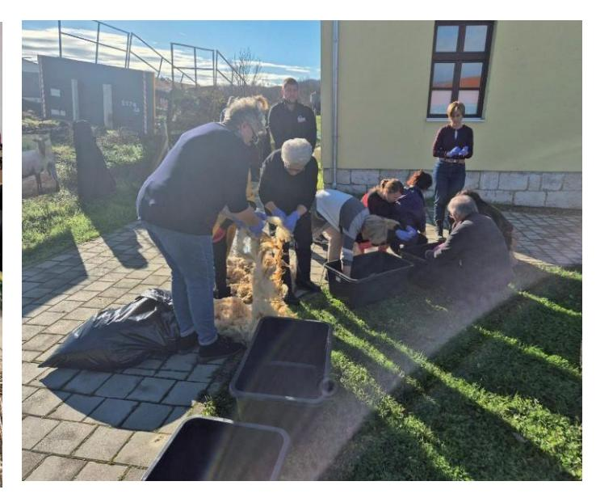

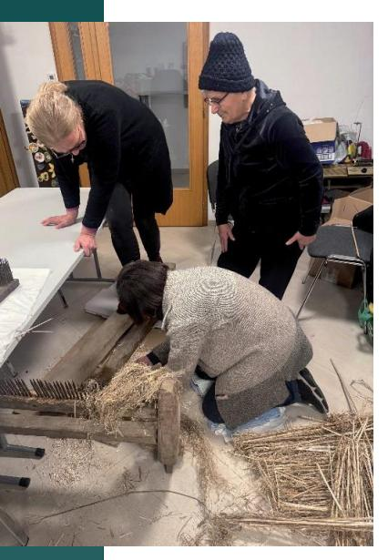

Serbia: Participants in the educational workshops gained practical skills and knowledge across a range of topics, including: creative textile reuse, giving new life and value to old garments; making pendants, souvenirs and other home accessories using wool, leather as well as other textile materials; crafting women's accessories such as jewellery, bags, necklaces, bracelets; decorating tablecloths, napkins, towels, lampshades; wool felting techniques and jewellery-making, including bracelets, necklaces and necklaces.

These workshops fostered creativity and enabled participants to design their own products, enhancing their confidence and knowledge in sustainable textile production. The long-term goal is to encourage participants to establish new craft-based SMEs, thereby increasing employment and entrepreneurial opportunities within the sustainable textile sector. By focusing on eco-friendly processing methods, the workshops also contributed to longterm reductions in environmental impact and promoted circular economy practices.

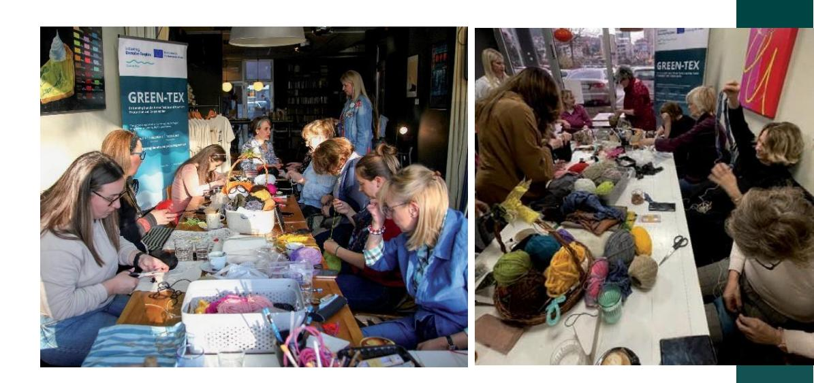

#### 3. Learnings on Partnerships Between Faculty, Municipalities, Sheep Breeders, Schools and Associations

#### Croatia:

A multi-sector partnership included: local sheep farmers, academia (University of Zagreb Faculty of Textile Technology), associations, local government (Majur Municipality) and civil society organisations. The selected approach allowed gaining knowledge from the leading national higher education institution and merging it with local experience and practical applications, which increases the quality of project activities and resulted with 3 innovations. Multi-sectoral cooperation also helped to strengthen individual institutional capacities and enabled the transfer of knowledge between different sectors.

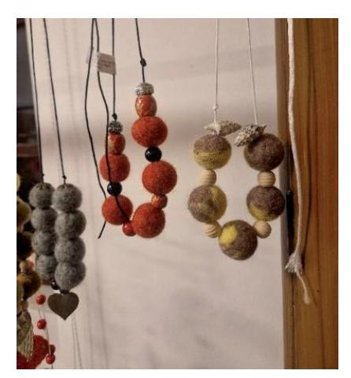

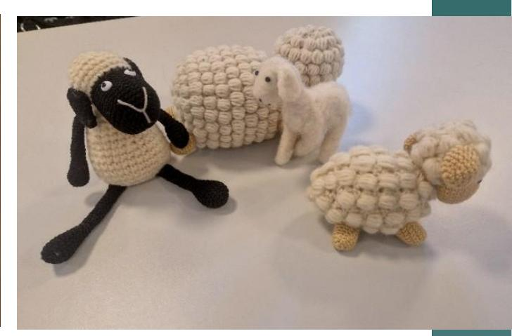

#### Serbia:

A partnership with Regional Women's Centre Association and social enterprise *ReTex,* which deals with collection and upcycling of used textiles was established. ReTex operates respecting circular economy principles, collecting textiles from citizens and donating usable items to socially vulnerable families after sorting. Additional collaboration was established with the *Art School in Užice*, recognised for affirmation of traditional, cultural and spiritual values originating from the partner region.

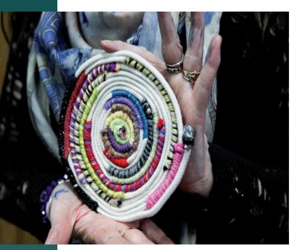

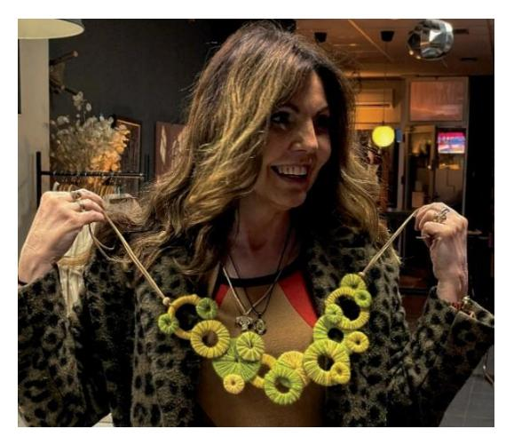

The project gained added value through the participation of the National Theatre, the National Museum, the City Gallery, the City Cultural Centre and regional tourism organisation that encompassed 13 local tourism organisations from the district – serving as promoters of the preservation of folk handicrafts and handmade items made of wool.

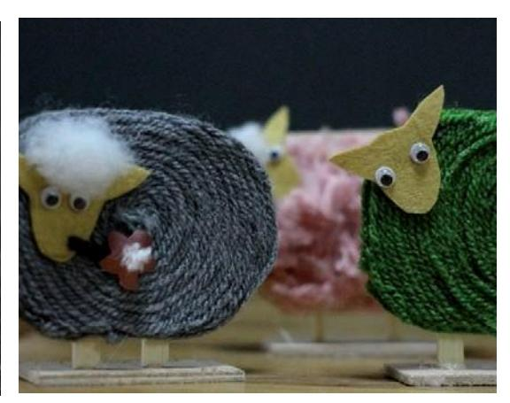

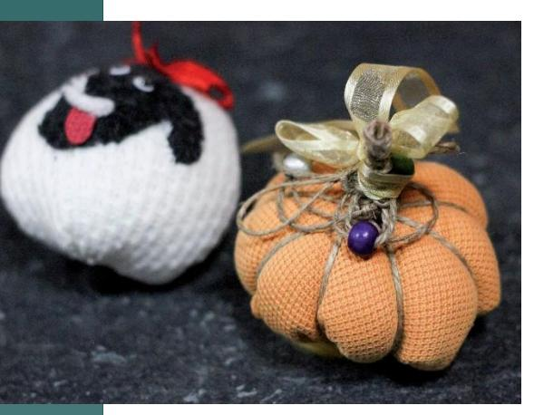

SMEs have shown strong interest in accessing markets for wool and other natural materials-related products. Five SME representatives from Western Serbia dealing in textile industries and wool were involved in a study visit to Slovenia and Croatia with the topics: application of wool/hemp in handcrafting, business opportunities in applying wool, addressing the issues of "fast fashion" and textile waste/recycling, presenting different solutions for transitioning to circular business models in the textile ecosystem, etc.

*The Ministry of Environmental Protection and Sustainable Development of the Republic of Serbia*, which influences relevant national strategies, participated in the piloting process as one of the participants of the study visit. In the upcoming period, the Ministry will help mainstream the project results into development policies, regulations and funding schemes for the development of green textile sector from a sustainability perspective.

#### 4. Quantitative Results, Such as the Amount of Wool Collected and Reused, Number of Workshops Conducted, Participant Involvement and Feedback

#### Croatia:

- 2 t/year collected in the Municipality of Majur and stored in a new wool warehouse
- 60 workshops / educational events on wool processing and sustainable textiles,
- 10 preschool children and children from 1st to 8th grade of elementary school, 5 children aged 14-19, and 30 participants (men and women) over 30 years old
- 50 organisations involved in the implementation of the project, including local government units, educational institutions, civil society organisations and mostly sheep breeders)
- 2 thematic events (annual organisation of wool festival),
- 3 innovations presented at 1 domestic and 2 international exhibitions
- development and demonstration of 10 series of new 100% woollen products: » textile and handmade products (felt bags, hats, scarves and gloves, jewellery, hand-woven carpets and rugs, and children's wool toys), » household and decorative products (felt coasters for glasses and dishes, wall decorations, decorations for all occasions (Christmas, Easter, Valentine's Day, masquerades etc.) » local souvenirs (felt and woven products with traditional motifs).

#### Serbia:

- 5 workshops to revive the tradition of knitting, weaving and generally processing and preparing wool for further use
- 99 workshop participants (women aged 35 to 55) held in period from February to June 2025
- 15 participants in the study visit to Croatia and Slovenia.

#### 5. Learnings about Sustaining Local Wool Reuse from An Economic and Market Perspective

#### Croatia:

From an economic and market perspective, the project shows potential for the development of the local market for wool products, but there are also certain challenges.

#### *Advantages:*

- wool and hemp are natural, renewable and biodegradable materials,
- there is potential for the development of new products (souvenirs, textiles, agricultural products),
- the project encourages local entrepreneurship and income diversification of the rural population.

The sustainability of the model will depend on the development of local processing capacities and the market for wool products.

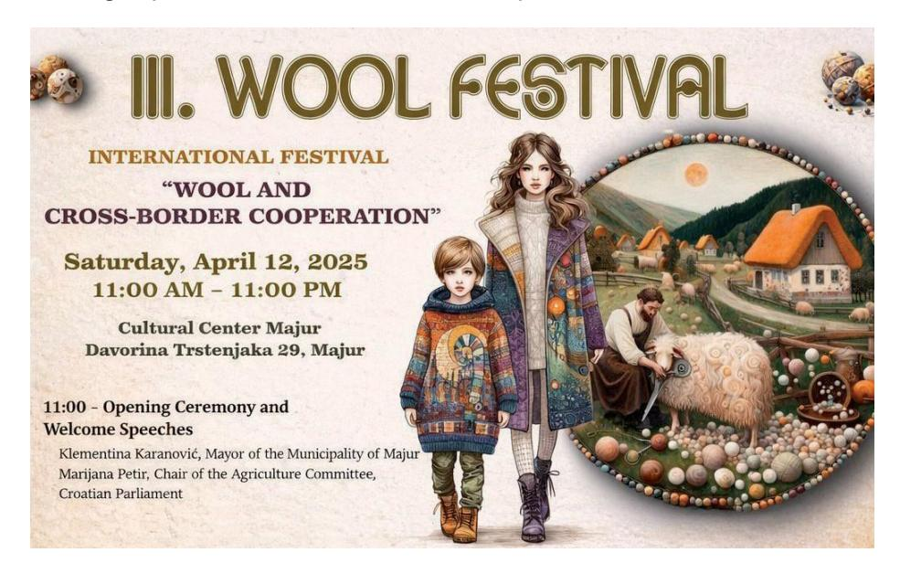

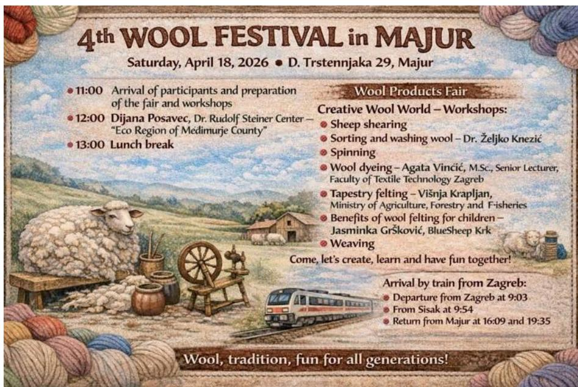

#### Serbia:

The procurement of sheep shearing machines and containers for wool storage was an integral part of the project activities. During the shearing season, this equipment is used in collaboration with the Agro-Technical Centre machine ring and Zlatiborski Eko Agrar. In addition, it will be utilised at the training centre to educate farmers and help produce larger quantities of higher-quality wool.

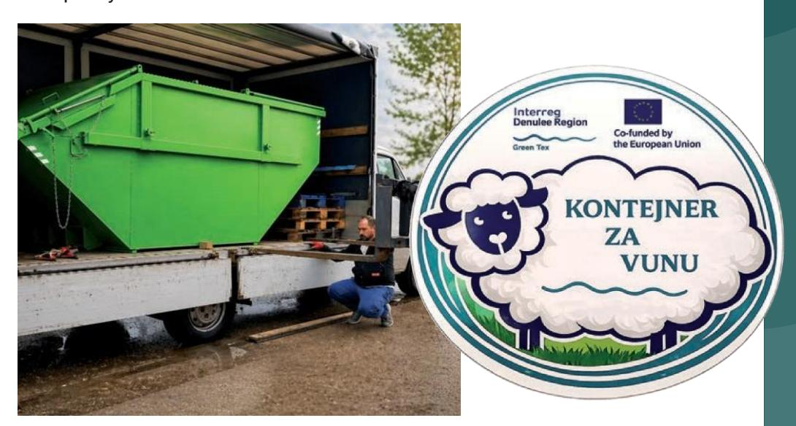

The Zlatibor Region has considerable number of sheep (approx. 10,000 sheep in the municipality of Čajetina/Zlatibor mountain) and consequently large quantities of raw wool. The project will result in a systemic change, since wool waste from the territory of the municipality collected in the container will be taken over/accepted by the Public Utility Company Čajetina and transported to the recycling yard that will be opened in the territory of this local self-government by the summer of 2026.

From a market perspective, the project increased the visibility of wool products through local fairs and exhibitions, festivals and promotional events, as well as educational workshops and presentations. These activities also provided opportunities to test market interest in wool-based items such as souvenirs, decorative pieces and eco-friendly agricultural products.

Although the market for sustainable textiles is still emerging, the project contributed to increasing consumer awareness of local and eco-friendly products, fostering new business opportunities in rural areas and promoting the circular economy within the textile industry.

## Pilot 3: Testing Green Fashion Design Solutions

This pilot tested the effectiveness of creative design and communication approaches in promoting sustainable fashion and raising public awareness. The pilot presentation highlights how design-led activities engage audiences, influence perceptions of sustainability in fashion and offer potential for replication or scaling.

The pilot was implemented in 2 areas: in Postojna, Slovenia, by the Municipality of Postojna and Nativa, Institute for Sustainable Growth, and in Podgorica, Montenegro, by the University of Donja Gorica.

#### **5.1. Mapping of Sustainable Design Practices in Partner Regions**

Circularity in the textile and garment industry begins with sustainable design, ensuring that products not only have aesthetic appeal but also benefit the environment by minimising waste (zero-waste design), applying natural and recycled materials. Sustainable fashion design is gaining popularity and making significant progress in recent years. Several designers closely monitor their supply chains, value transparency and ensure safe working conditions as well as fair wages for the workers who produce their garments. In addition, they prioritise the selection of environmentally friendly materials and carefully limit the production of new items for sale. Product design is one of the stages of the value chain where all Green-Tex partner regions recognise progress in terms of sustainability.

Sustainable fashion design is gaining momentum in Slovakia, with several municipalities across the country seeking to support its development. However, despite this growing interest, relatively few designers remain active in the local market. According to the Slovak Fashion Council, most young designers who graduate from high schools or universities with a focus on fashion design leave Slovakia to pursue opportunities abroad. This is largely due to the limited local opportunities for collaboration and professional experience, which are more readily available in other countries through internships and industry programmes.

In the Primorsko-Notranjska region of Slovenia, three fashion designers are making significant strides in sustainable fashion. Petra Frank focussed on timeless redesigns and upcycled pieces, while Patsy by Erika Felicijan incorporates colourful designs. Destilator, led by Maja Modrijan, offers a diverse range of sustainable fashion products, including clothing, bags as well as accessories, and hosts events aimed at raising awareness about sustainable practices.

In Slovenia, the University of Ljubljana boasts two institutions which are educating the next generation of sustainable fashion designers: the Academy of Fine Arts and Design (ALUO) and the Faculty of Natural Sciences and Engineering. The ALUO is dedicated to offering academic programmes that blend creative practice with theoretical knowledge. This approach equips students with the necessary skills to work as artists, designers and researchers across various design disciplines. Meanwhile, the Faculty of Natural Sciences and Engineering houses the Textiles, Graphic Arts and Design Department, which underscores the importance of sustainable design within its curriculum.

In Croatia, sustainable fashion design leaders like Krie Design practice sustainability through innovative projects. Krie Design, a participant in UN Green Fashion Week, collaborates on projects like Provir which resulted in cleaning of 30 tonnes of sea waste, used for production of ECONYL® fibres made from recycled fishing nets, which are used for new collections. Despite successful examples, Croatian designers identify a lack of cooperation within the value chain as a challenge. However, there is potential to expand localised, ethical production, with handcrafted textiles gaining value through better marketing. Croatia's sustainable fashion efforts are steadily shaping an industry rooted in ethical and circular practices. The University of Zagreb Faculty of Textile Technology (TTF) is the leading high education institution in Croatia which educates engineers of textile

technology and fashion designers. Its curriculum introduces numerous sustainability issues, including recycling of textile materials. The Faculty has its own TTF Gallery, serving as a focal point for presentation of their sustainable products. Collaboration with the private sector is also wellestablished and important role is given to alumni students.

In Bucharest-Ilfov, sustainable fashion trends are gradually developing and gaining traction, with a notable focus on eco-friendly materials and ethical production. Local designers like Murmur, Concentric, Atelier Merci, Atelierul de Pânză are increasingly incorporating organic fabrics, recycled textiles and upcycled pieces into their collections. Remesh, a local initiative, also focuses on upcycling and recycling materials to create sustainable fashion products. Bucharest offers education in fashion design at the University of Arts Bucharest. The Faculty of Decorative Arts and Design offers a master's programme in Sustainable Fashion Design. This master's programme aims to prepare students to become fashion designers with a particular focus on sustainability.

In Bulgaria, upcycling design studios are primarily located in the capital. This is due to several factors, with Sofia being the economic and cultural centre of Bulgaria, drawing in substantial investments and creative talent. Capitals also tend to have higher concentration of universities, art venues and events that encourage innovation and entrepreneurial ventures. Additionally, the larger market reach is an important factor.

IMPAKT is a notable initiative based in Sarajevo that promotes sustainable fashion design. Established in 2021, it serves as a platform for emerging Bosnian designers to showcase their creative talents with a strong emphasis on sustainability. Among recognised regional brands is No Nation Fashion (NNF), a collaborative project that connects local designers with migrants in Bosnia and Herzegovina. This initiative was launched with support from the International Organisation for Migration (IOM) and the European Union.

Within the University of Sarajevo, the Academy of Fine Arts, the Fashion Design Programme, integrates sustainable practices, teaching students about eco-friendly materials, ethical production processes and sustainable design principles. The international Burch University, Sarajevo-the Graphic and Fashion Design programme includes courses on sustainable design, emphasising eco-friendly and ethical fashion.

An excellent example in Montenegrin fashion design sector is Boris Čalić. He not only creates beautiful pieces of clothing, but also inspires changes in the way fashion is perceived and produced. This approach is important for Montenegro, because it shows that even smaller markets can be part of the global world through commitment to a sustainable future. The other key figure is Marina Banović, who not only runs her own fashion brand, inspired by cultural heritage, but also teaches fashion design and sewing at the Secondary Vocational School Spasoje Raspopović.

Students of Faculty of Design and Multimedia, from the University of Donja Gorica in central Montenegro, majoring in fashion design are highly oriented toward sustainability, actively working on promoting sustainable practices through their creative projects and advocating for a more environmentally conscious approach to fashion.

#### **5.2. Lessons Learned from Piloting Green Fashion Design Solutions**

#### 1. Learnings on the Impact of Design and Communication Methods

In Podgorica (Montenegro), the design and communication activities implemented within the piloting process proved effective in engaging diverse target groups, particularly students, high school students and young people. Three educational and interactive workshops were organised, gathering a total of 39 participants.

Two workshops with university students — *"Circular Business Models in the Textile Ecosystem"* and *"Business Opportunities in Wool and Hemp"* — focused on sustainable entrepreneurship and innovation within the textile value chain. In addition, a workshop with high school students entitled *"Green Fashion vs Fast Fashion"* addressed sustainability awareness and responsible consumption patterns.

The workshops combined presentations, discussions, debate formats and creative group work, which ensured active participation rather than passive listening. In addition, promotional materials and social media announcements were published for each event, contributing to visibility and audience engagement.

Earlier within the project, a Green Fashion Show and exhibition in Podgorica were also organised, attracting a significantly larger audience. These creative

formats successfully connected sustainability with aesthetics and storytelling, increasing public interest in sustainable fashion practices.

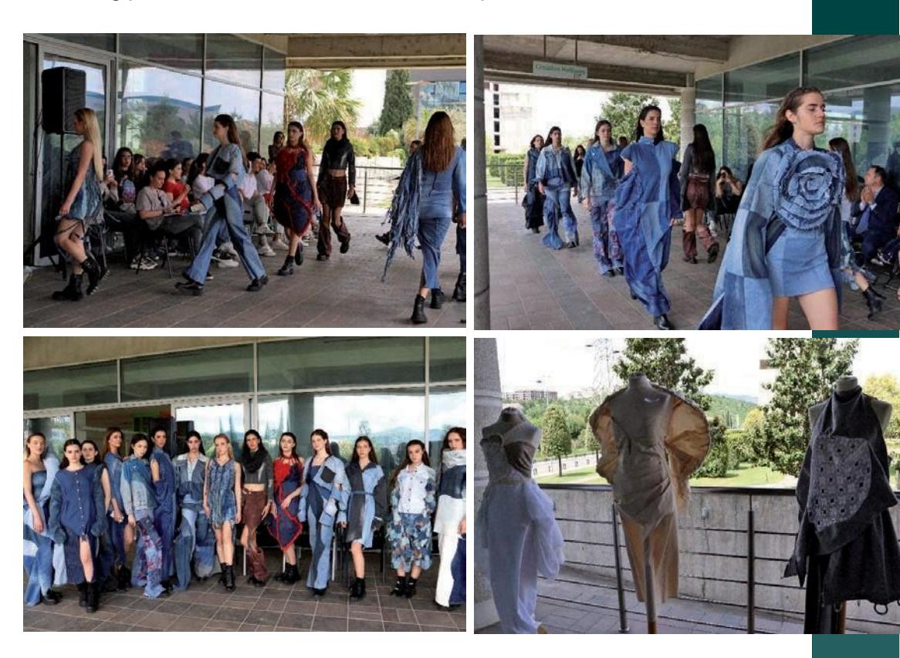

In Postojna (Slovenia), the Green Fashion Show proved to be a highly effective format for communicating sustainable fashion values through creati-vity, aesthetics and storytelling. By combining fashion, music and narrative elements, the event created an engaging and emotionally resonant atmosphere that encouraged reflection on fast fashion challenges while presenting upcycling as an attractive and viable alternative.

A group of sustainable fashion brands from different regions of Slovenia contributed to the strength and inclusiveness of the showcase. The diversity of materials and techniques clearly demonstrated the aesthetic and commercial potential of reused textiles. The presenters consistently highlighted the authenticity, creativity and strong sustainability focus of the collections.

Pre-events and targeted textile waste collection campaigns—focusing on materials such as tapestries, embroidery, denim, ties, bed linen, tablecloths and men's garments—further strengthened community engagement and embedded the circular principle into the preparation phase of the event.

The Green Fashion Show in Postojna was an international event attended by participants from Slovenia and partner countries involved in the project. The overall satisfaction with both the organisation and the programme was extremely high. A large majority of both domestic and international atten-dees rated the event as very satisfactory and sustainability principles were widely perceived as clearly and effectively communicated. These results indi-cate that the event design and communication approach were impactful and accessible to a broad audience.

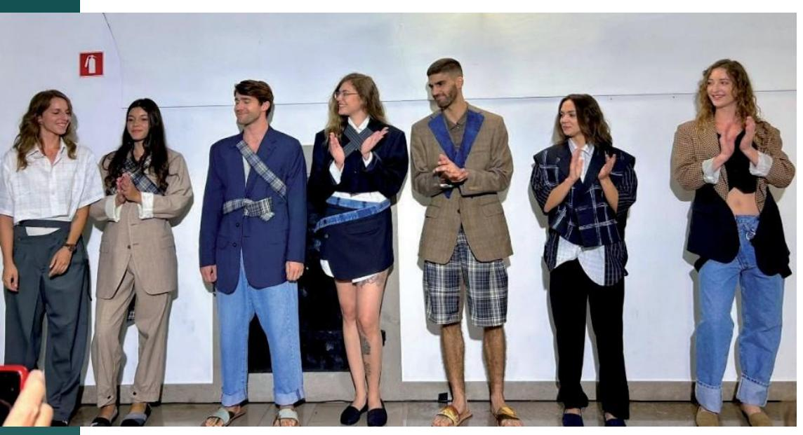

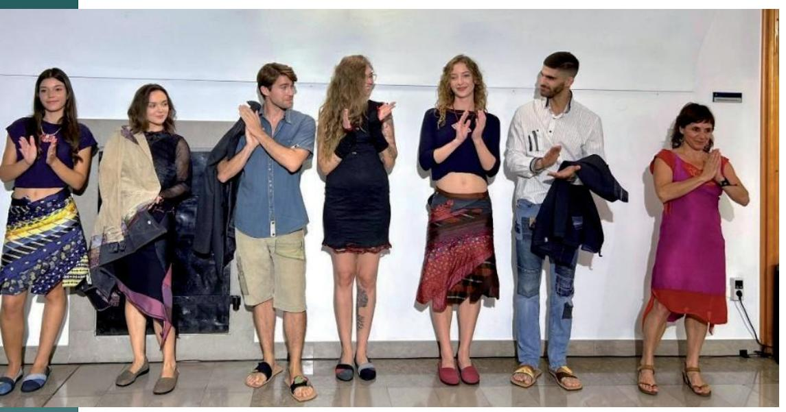

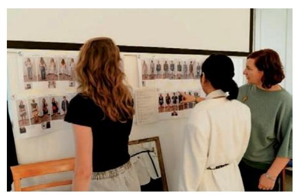

#### 2. Learnings on Influencing Participants' Attitudes, Awareness and Understanding

In Montenegro, the feedback collected through post-workshop surveys showed very positive responses. The participants reported increased awareness of:

- circular economy principles in fashion,
- environmental and social impacts of fast fashion,
- opportunities for reuse, recycling and sustainable design.

High school students particularly demonstrated improved critical thinking regarding consumer habits and purchasing decisions after the "Green Fashion vs Fast Fashion" workshop. The debate format proved effective in encouraging reflection and deeper understanding. Overall, the activities contributed to a measurable shift in perception, especially among young participants, towards more responsible and conscious fashion consumption.

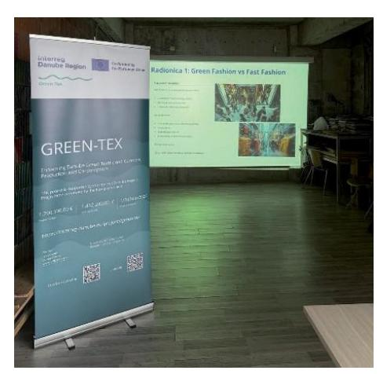

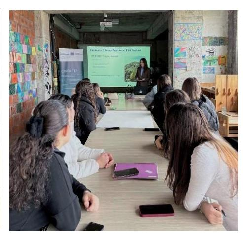

In Slovenia, pilot events had a strong inspirational effect on the participants' attitudes toward sustainable fashion. A clear majority of attendees of the Green Fashion Show reported that the show encouraged more sustainable shopping habits and reflection on personal consumption patterns. Many emphasised that the event reshaped their perception of old textiles, recognising them as valuable resources rather than waste. The participants also reported gaining new knowledge about sustainable fashion practices and expressed appreciation for the opportunity to build professional and personal connections. The integration of creative presentation with educational messaging ensured that sustainability was not only discussed but experienced.

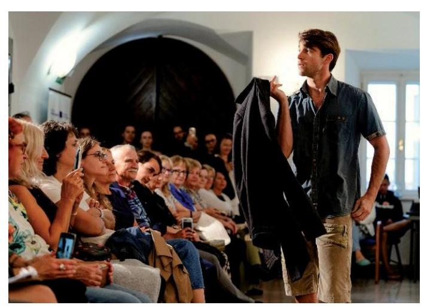

The two hands-on textile upcycling workshops in Postojna deepened this impact. Sustainability principles were almost unanimously perceived as very clearly communicated. Participants reported increased awareness of garment longevity, repair culture and the expressive potential of clothing. A notable share reflected on improving their own consumer habits following the workshops.

By linking visual inspiration with direct engagement in repair, embroidery and customisation techniques, the workshops strengthened understanding of circular fashion as both a creative opportunity and a responsible lifestyle approach.

#### 3. Learnings on Designer and Stakeholder Involvement

In Montenegro, the pilot ensured the active involvement of key stakeholders from the education and creative sectors. In total, four external stakeholders directly participated in the workshops:

- one representative of a vocational high school, who attended together with students,
- three practitioners from the creative and sustainability field: Dušan Radović (founder of vintage shop Retro Nacija and the creative hub Kružni tok), Prof. Jelena Đukanović (project leader of "All the Colours of Montenegro"), and a representative of Abar Studio (promoting sustainability, recycling practices and courses) — designers and professionals with experience in circular micro-business models, wool valorisation and sustainable creative practices.

Their participation enriched the discussions by providing practical insights and real-life examples of sustainable entrepreneurship and local material use.

The combination of academic participants, students and external professionals strengthened cross-sector dialogue and contributed to knowledge exchange between education and practice.

In Slovenia, the Green Fashion Show successfully brought together a group of responsible design businesses from various Slovenian regions, strengthening collaboration within the national green fashion ecosystem. The diver-sity of participating brands and materials illustrated both geographic representation and technical innovation. Participating designers included Dilight (garments incorporating ties and lace details from waste threads), Fabrica (jewellery made from old tablecloths), NotPerfect (clothing and bags created

from vintage textiles such as blankets and bed linens), Knof (refashioned vintage shirts, blazers, and trousers), Francine upcycling (garments made from old men's suits, shirts, and jeans) and Destilator (vintage clothing with tapestry and rust-print details, footwear made from old jeans and discarded textiles).

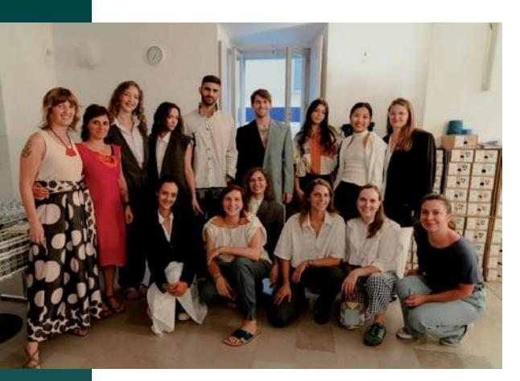

Pre-event textile collection campaigns expanded participation beyond designers by involving local communities

in sourcing materials. This approach reinforced the circular model and increased local ownership of the initiative.

Within the subsequent workshops, participants reported positive experiences not only in acquiring new skills but also in forming new social and professional connections. Some participants even identified entrepreneurial potential emerging from the activities. The collaborative environment and mentorship support contributed to a sense of shared purpose among stakeholders.

Feedback also indicated strong interest in expanding participation further through larger venues, more collections, additional creators and even international involvement—demonstrating high engagement and openness to growth.

#### 4. Impact of Visibility and Outreach

In Montenegro, each workshop was supported by promotional activities and social media announcements, achieving solid visibility and engagement. The fashion show and exhibition generated broader public attention and attracted a significantly larger audience. The promotional video from the fashion show reached approximately 1,366 views on social media, and was shared 11 times, indicating notable online engagement and extended outreach beyond the physical event.

These combined communication efforts increased the visibility of sustainable fashion initiatives within the local community.

In Slovenia, the Green Fashion Show event achieved substantial visibility at the national level. It was featured across social media platforms and covered by major Slovenian public media outlets, including national television, print media and regional radio. Television coverage by the RTV Slovenia included interviews that helped communicate the project's objectives to a broader audience. The event was also featured in Dnevnik, one of Slovenia's long-established daily newspapers and one of the country's major national news sources.

This media presence amplified the reach of the sustainability message well beyond event attendees and positioned sustainable fashion as a relevant topic within mainstream discourse. The visually compelling nature of the collections provided strong material for storytelling and digital engagement.

#### 5. Effects of Capacity Building Workshops

In Montenegro, the workshops contributed to capacity building by:

- strengthening understanding of circular business models,
- introducing practical examples of sustainable entrepreneurship,
- encouraging creative thinking and innovation in textile reuse,
- promoting local materials such as wool as viable design resources.

The survey results indicated high participant satisfaction, strong engagement and willingness to recommend similar events in the future. Participants expressed particular interest in further hands-on and creative activities, demonstrating motivation for continued learning.

In Slovenia, the upcycling fashion workshops demonstrated strong effectiveness in organisation, content delivery and practical impact. The participants evaluated the organisation very positively, highlighting the well-structured yet relaxed atmosphere that enabled focus, experimentation and interaction. The supportive group dynamic was repeatedly mentioned as an important strength.

The content was widely regarded as highly relevant and well-balanced. Sustainability principles were perceived as clearly communicated and the integration of practical skills—such as hand and machine embroidery, garment repair and the creation of recycled badges and patches—with reflective discussions on textile waste and clothing symbolism was particularly appreciated.

In terms of usefulness, most participants reported gaining new practical knowledge and technical skills, especially in sewing, embroidery and repair

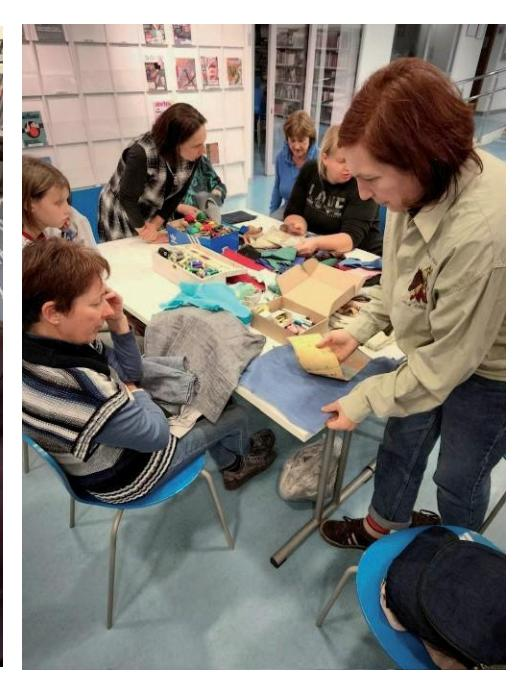

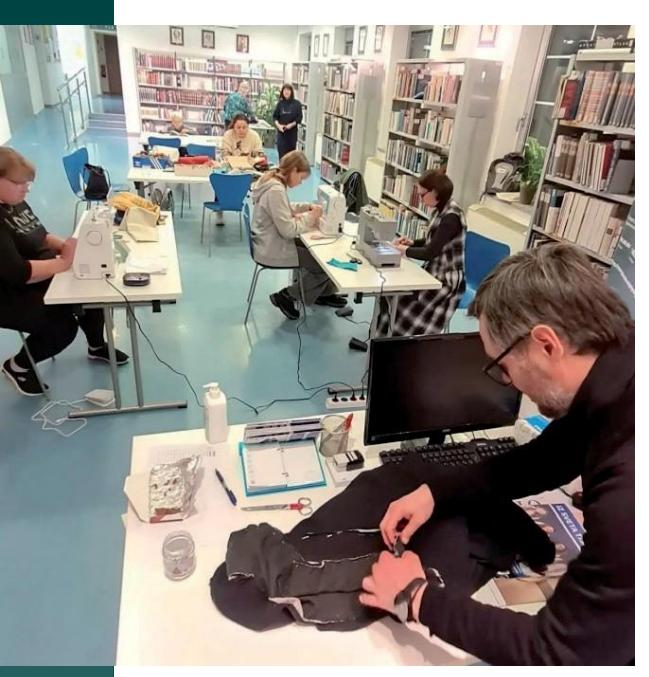

techniques. Many described feeling inspired to continue creative upcycling in their free time. A meaningful proportion reflected on improving their fashion consumption habits, while others emphasised the value of social exchange and the emergence of new ideas, including business-related concepts.

The workshops demonstrated that hands-on, skill-based formats are effective tools for translating sustainability principles into tangible competencies and long-term mindset shifts.

## Pilot Integration and Cross-Cutting Learning

The overall coherence of Green-Tex pilot actions and the extent to which the individual pilots mutually reinforce one another were also addressed. The project aimed to identify synergies across thematic areas, assess the effectiveness of cross-sector collaboration and draw lessons to support future scaling and institutional uptake.

The imperative for all pilots was waste reduction. The success of these activities depended on the efficient engagement of all stakeholders across the eco-value chain, as well as alignment with regional sustainability strategies.

The successful implementation of textile waste depended strongly on the organisation of collection, sorting and processing. Different forms of waste were used: household textile waste (post-consumption) collected through innovative smart containers (Pilot 1), discarded woollen fleece (Pilot 2) and discarded clothes (Pilot 3). Although processing woollen fleece differs from the recycling processes of household discarded textiles, the final products all fell into the same category of new eco products.

Therefore, our Green-Tex solutions include handmade woollen products (e.g. different souvenirs and fashion accessories), rugs made from a mixture of wool and hemp, new fashion collections made from older ones, so as the novel technical textiles made from recyclates which reduce the need for virgin resources and serve as the secondary raw materials.

#### Key Assessment Areas:

#### 1. Degree of Complementarity and Alignment Among the Three Pilot Actions

The three pilot actions-Textile Waste Collection, Promotion of Natural Fibres, and Green Fashion Design-form a coherent and mutually reinforcing set of interventions that address different stages of the textile value chain. Although each pilot focuses on a distinct thematic area, together they create a comprehensive framework for advancing circularity, sustainability and innovation in the textile sector across the participating regions.

Together, the pilots cover collection → production → design, creating a holistic approach that strengthens the circular textile ecosystem.

The pilots were implemented across eight countries, covering EU Member States and IPA partners. This geographic diversity:

- 1. encourages knowledge exchange between regions with different levels of textile sector development.
- 2. supports policy harmonisation and shared learning on circular economy practices.
- 3. strengthens transnational cooperation, a key objective of the broader programme.

The three pilot actions demonstrate a high degree of complementarity and alignment. They are not isolated interventions but interconnected components of a broader strategy to transform the textile sector. By addressing different stages of the value chain and engaging diverse stakeholders, the pilots collectively created stronger impact than any single action could achieve alone.

#### 2. Effectiveness of Cross-Sector and Cross-Institutional Partnerships Developed Through Pilots

The three pilots collectively demonstrated that crosssector and crossinstitutional cooperation is not only beneficial but essential for advancing circularity and sustainability in the textile sector. Their implementation across multiple countries and diverse institutional settings created a rich environment for collaboration, knowledge exchange, and joint problemsolving.

Pilots brought together a mix of stakeholders — waste management companies, textile producers, designers, NGOs, educational institutions, public authorities and local communities. This diversity:

- enabled multidimensional perspectives on textile waste, production, and design.
- ensured that solutions were practical, realistic, and aligned with local needs.
- fostered shared ownership, increasing the likelihood of longterm adoption.

For example, waste collection and processing companies played a key role in waste collection and processing (Pilot 1), while farmers (sheep-breeders), artisans, producers and research institutions were central in natural fibre

innovation (Pilot 2), whereas design schools and designers drove green fashion initiatives (Pilot 3).

The crosssector and crossinstitutional partnerships developed through the pilots were highly effective. They:

- Strengthened the quality and relevance of pilot activities.
- Enabled innovation and practical problemsolving.
- Built longterm networks that will continue to support sustainability transitions.
- Ensured that the pilots had impact not only within their specific locations but across the wider region.

#### 3. Added Value Generated Through Joint Activities and Coordinated Implementation

The coordinated implementation of the three pilots- textile waste collection, natural fibre innovation, and green fashion design- created significant added value that would not have been achievable through isolated, standalone actions. By aligning activities, sharing knowledge and synchronising methodologies across countries and sectors, the project generated a multiplier effect that strengthened outcomes at both local and transnational levels.

Coordinated implementation across eight countries enabled:

- cross-country comparison of approaches, challenges, and results.
- transfer of good practices, such as waste collection models or fibre processing techniques.
- adaptation of solutions to different regulatory, cultural, and market contexts.

#### 4. Stakeholder Satisfaction with Collaboration Processes and Overall Pilot Outcomes

Across all three pilots, stakeholder satisfaction was generally high, reflecting both the quality of collaboration processes and the tangible results achieved. The pilots brought together diverse actors- private companies, designers, NGOs, universities, public authorities, and citizens, who reported positive experiences. Citizens responded positively to the availability of dedicated containers, while the private sector expressed interest in taking over the collected material for further processing.

Stakeholders expressed satisfaction with the concrete output of the pilots, such as:

- improved textile waste collection systems (Pilot 1)
- new or enhanced natural fibre products and processes (Pilot 2)
- eco-design concepts, prototypes and awareness campaigns (Pilot 3).

These outcomes demonstrated that the pilots were not merely theoretical exercises but delivered practical, visible benefits. Stakeholders consistently highlighted the benefits of working within a transnational framework:

- exposure to different regulatory and market contexts
- access to a broader pool of expertise
- opportunities to benchmark and compare approaches
- a sense of belonging to a larger regional movement.

This cross-border dimension significantly increased satisfaction by expanded learning and networking opportunities.

#### 5. Identification of Institutional, Organisational or Policy Adjustments Required to Enable Scaling and Long-Term Uptake

The successful implementation of the three pilots demonstrated strong potential for replication and longterm integration into regional textile systems. However, scaling these initiatives requires targeted adjustments at institutional, organisational and policy levels. These adjustments would help embed circular textile practices into mainstream operations, ensure financial and operational sustainability and create an enabling environment for innovation.

Several policy changes would significantly enhance scaling potential:

- extended Producer Responsibility (EPR) schemes for textiles
- formal inclusion of textile waste in local waste management plans
- standardisation of measurement and reporting methodologies
- incentives for natural fibre production (e.g., subsidies, tax relief)
- eco-design requirements for textile products.

These policies are contributing to stable environment for circular textile activities. It is also necessary to consider financial mechanisms that would ensure the economic sustainability of the system after the completion of the project.

#### 6. Quality and Relevance of Documented Lessons Learned and Strategic Recommendations

The lessons learned are based on real operational experiences from the pilots. Stakeholders consistently reported that the documented lessons accurately reflect the challenges and opportunities encountered during implementation. The recommendations directly respond to the barriers identified during the pilots, which are presented in the table beneath.

| Identified barriers                           | Recommendations                 |
|-----------------------------------------------|---------------------------------|
| systems across municipalities in the selected |                                 |
| Weak governance and coordination along        |                                 |
|                                               | Enhancing collaboration between |
| Insufficient information on new circular      |                                 |
|                                               | More information campaigns for  |
| Low market potential for textile recyclates   | Structured coordination of all  |

## Green-Tex Solutions Highlights

The Green-Tex project developed three sets of solutions, comprising a total of nine sub-solutions presented in the table below. Each sub-solution is accompanied by a detailed guidance on the actions enterprises can take in the areas of fashion design, textile production, waste collection and recycling and application of locally sourced natural materials.

#### Green-Tex Solutions

| Pilot      |     | Solution                                          |
|------------|-----|---------------------------------------------------|
|            | 1.1 | Unique innovative textile waste container         |
| 1: TEXTILE |     |                                                   |
|            | 1.2 | Digital sensors and waste management platform for |
|            | 1.3 | Fibres and products from recycled waste           |
|            | 2.1 | Revitalisation of wool production and usage       |
| 2: NATURAL |     |                                                   |
| FIBRES     | 2.2 | Sustainable hemp yarn production                  |
|            | 2.3 | Innovative woollen-hemp products                  |
|            | 3.1 | Product design prototyping                        |
| 3: FASHION |     |                                                   |
|            | 3.2 | Designer collaboration for sustainable impact     |
|            | 3.3 | Circular fashion promotion through green fashion  |

#### Pilot 1: Green-Tex Solutions for Textile Waste Collection

The challenges faced by various regions in the EU in implementing effective textile recycling and circular economy practices are multifaceted, however there are several solutions that can address these issues across different sectors.

To address the infrastructural and logistical challenges related to textile recycling, both advanced and less-developed EU regions need to invest in improved collection, sorting and processing facilities. An important consideration is the selection or design of appropriate containers, considering factors such as resistance to vandalism, capacity and opening mechanisms. Equally important is their proper placement within designated areas. Textile waste collection via containers can be supplemented with other collection methods or used as an alternative where container collection is not feasible.

#### Solution 1: Unique smart textile waste container

Collection containers are an ideal solution for textile collection because they are accessible 24/7 and are typically located at existing container sites, ma-king it convenient for citizens to deposit textiles at any time, regardless of the day or hour. This ease of access encourages greater public participation by removing barriers related to time and location.

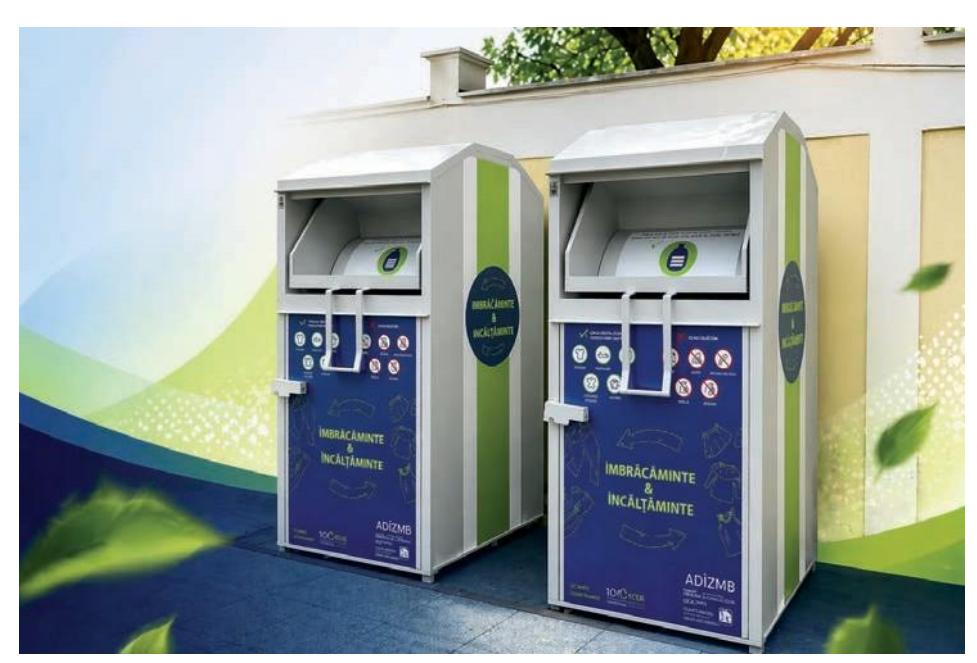

*Green-Tex solution 1.1: Smart textile waste container*

#### Solution 2: Digital Sensors and Waste Management Platform for Textile Waste Containers

The use of digital sensors in containers significantly enhances the efficiency of the collection process. These sensors monitor the capacity of each container and enable the system to identify which containers require prompt emptying. By preventing overflow and reducing unnecessary collection trips, this approach optimises resource usage and minimises transportation costs. Furthermore, sensor integration supports environmental sustainability by reducing carbon emissions typically associated with traditional waste collection methods. Containers equipped with these sensors are also visible via dedicated applications, allowing drivers or administrators to plan collection routes efficiently and further streamline operations. This combination of accessibility, technology and resource optimisation makes this method both effective and sustainable.

*Green-Tex solution 1.2: Digital sensor and waste management platform for smart textile waste container*

#### Solution 3: Fibres from Recycled Waste

Recycling textile waste into new fibres minimises the need for virgin materials, saving resources and reducing the carbon footprint associated with textile production. This approach addresses two critical issues: reducing textile waste and creating high-quality, reusable materials for new textile products. The Green-Tex project developed several prototypes demonstrating the feasibility of value-added products from waste, thus proving the effectiveness of mechanical recycling in transforming textiles into functional fibres and products. Textiles that would otherwise be discarded are repurposed, reducing the environmental impact of textile waste, such as landfills and incineration.

Mixed recycled fibres were further processed into yarns or non-woven materials, with potential applications in various technical fields. By prototyping these new fibre blends, manufacturers can experiment with different ratios and combinations to optimise the resulting material's properties, such as strength, texture and durability.

This process not only reduces waste but also creates high-quality materials for industries such as automotive, construction and non-woven textile production.

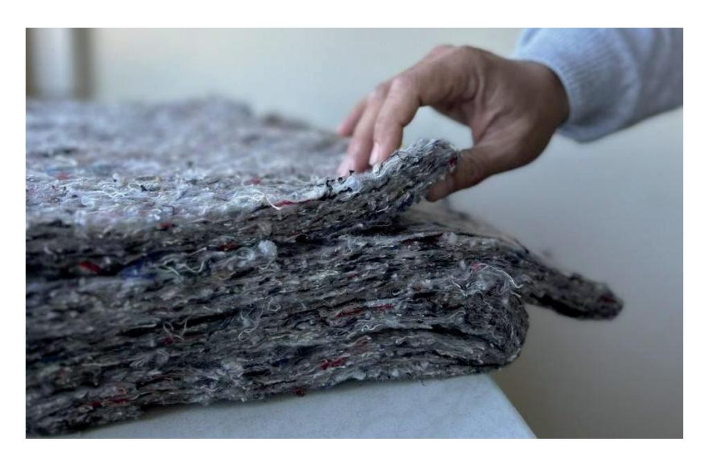

From the wadding made of recycled fibres, two different products were created to showcase different implementation options.

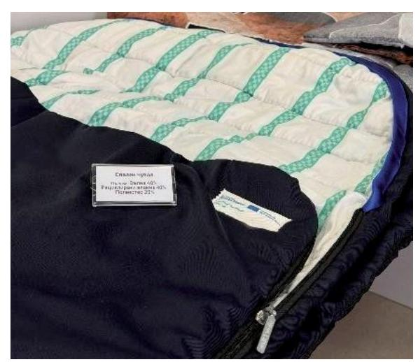

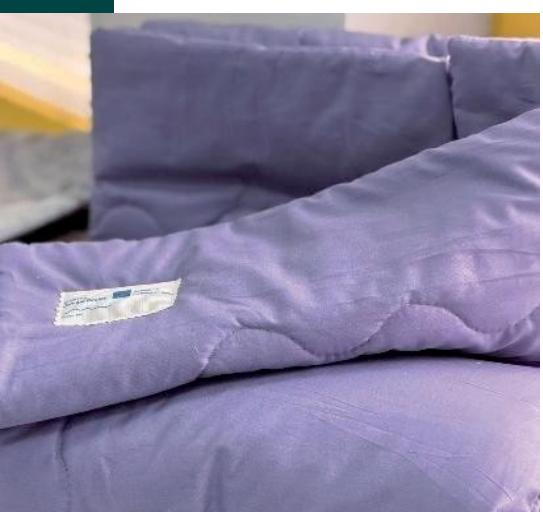

*Green-Tex solution 1.3.1. Sleeping bag with internal insulation from recycled fibres (left) Green-Tex solution 1.3.2. Duvet/blanket with insulation from recycled fibres*

#### Pilot 2: Green-Tex Natural Fibres Solutions

The project identified relevant Croatian, Montenegrin and Serbian regions with strong potential in connecting local resources, knowledge and the community. Through educational activities held in partnerships, Green-Tex contributed to the development of sustainable textile practices, strengthening the local economy and increasing awareness of the value of natural materials such as wool and hemp.

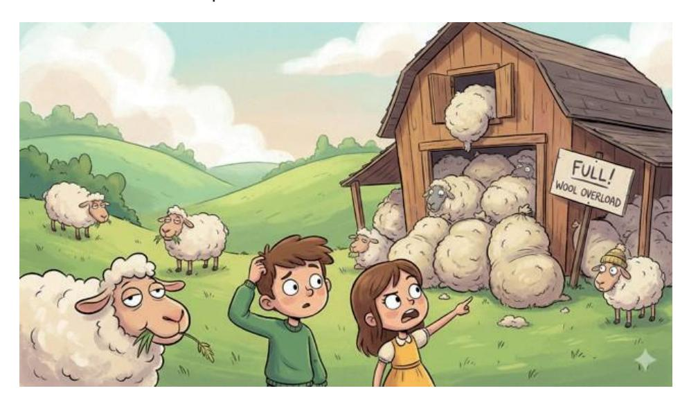

*Figure: excerpt from the promotional video The second life of wool <https://interreg-danube.eu/projects/green-tex/library>*

#### Solution 4: Revitalisation of wool production and usage

The original contribution of Green-Tex project is in research activities dedicated to scouring of raw wool as a preparation step which presents a major drawback hindering wider usage of wool fibres. The Green-Tex solution presents sustainable scouring of raw wool fibres with saponins isolated from chestnuts fruits as sustainable alternative - natural agents versus commercial agents. The project tasks involved horse and sweet chestnuts as they serve as natural and green products that contain saponins. The horse chestnut, *Aesculus hippocastanum* L., is a deciduous plant from the *Sapindaceae* family whose fruits are not edible but are used for other purposes (source of starch, horse feed, medicinal preparations for veins, etc.). Chestnuts proved to be useful for scouring and washing as a source of the saponins they contain, which many consider as more sustainable and natural agent/detergent – "according to the principles of "green chemistry". *Aesculus hippocastanum* L. – horse chestnut

The development and optimisation of the raw wool scouring process took into consideration reducing wastewater contamination, enabling environmentally friendly extraction of lanolin and promoting the use of environmentally friendly wool-based materials.

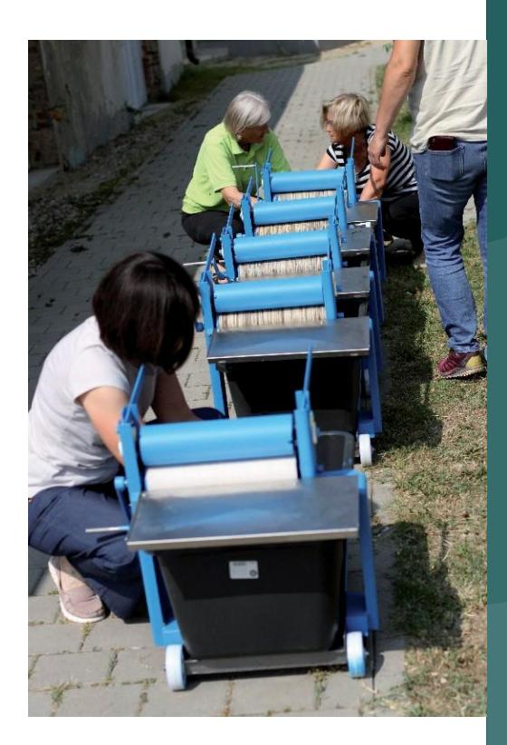

The Green-Tex project resulted in the development of three innovations, implemented in collaboration between the University of Zagreb Faculty of Textile Technology (TTF) and the Municipality of Majur.

*Green-Tex solution 2.1.1.*: *Line scouring process - a system of 5 tanks with squeezing rollers (Innovation 1)*

*Green-Tex solution 2.1.2.: Scouring process of raw wool with green agent - horse chestnut fruits*

Innovation 1 was successfully presented at the 49th Croatian Innovation Salon with international participation and the 21st Exhibition of innovations, prototypes and business plans INNOVA 2025, In September 2025 in Zagreb, Croatia and won:

1. Gold medal and Special Prize, TTF and the Municipality of Majur, Development of device with squeezing rolls for sustainable scouring of wool, Inven-tors: Knezić, Željko; Pušić, Tanja; Dekanić.

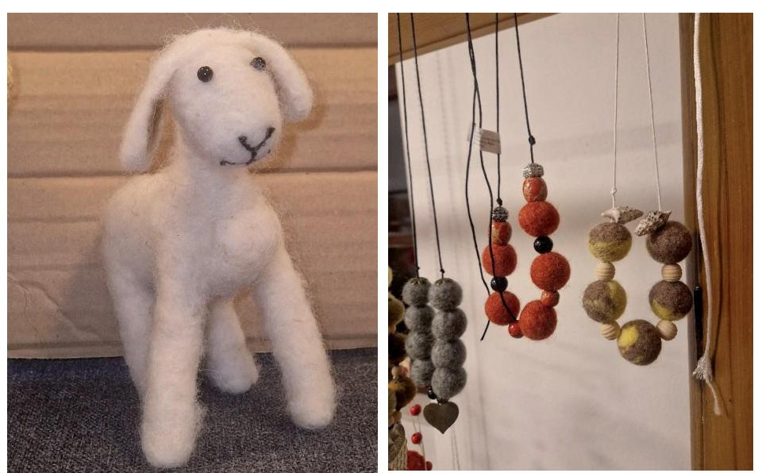

*Green-Tex solution 2.1.3.: Wool product made in artisan production in Majur*

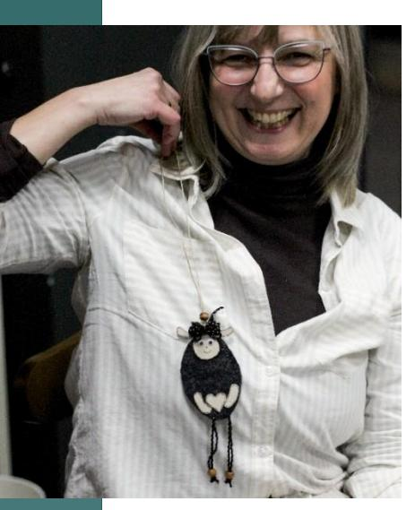

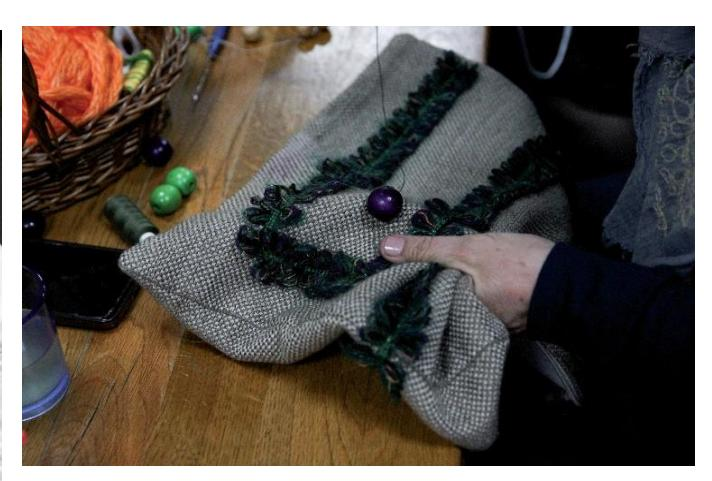

*Green-Tex solution 2.1.3.: Wool product made in artisan production in the Zlatibor Region*

### Green- Tex Solution: Wool Fibres and Products

Wool fibres are natural raw material, valuable for clothing, interior textiles and technical applications - an opportunity for creators, designers, artists, artisans and sustainability promoters!

## Natural Wool Fibres

#### Solution 5: Sustainable Hemp Yarn Production

Revitalisation of hemp cultivation and processing was initiated in the small Croatian Municipality of Majur. Long-term collaboration was established with the cooperative ZAKON, dedicated to hemp cultivation, production and promotion of hemp-based products. The missing equipment was procured through this and other ongoing initiatives, while a dedicated group of residents received training through a series of educational workshops focused on traditional hemp processing, spinning, and weaving with the aim of preserving and enhancing the heritage and use it as the new green and circular business model.

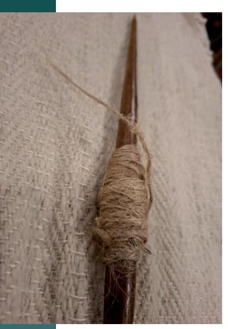

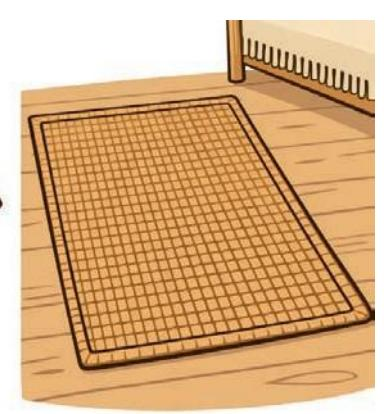

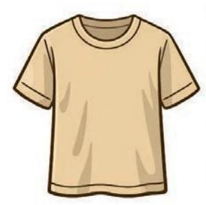

*Green-Tex solution 2.2.1.: Hemp yarn Hemp yarn was produced both manually by the drop spindle and by the spinning wheel.*

### Green- Tex Solution with Hemp Fibres

Hemp is natural and sustainable raw material, valuable for clothing, interior textiles and technical applications - an opportunity for creators, designers, artists, artisans and sustainability promoters!

The University of Zagreb Faculty of Textile Technology was responsible for evaluating fibre quality and providing recommendations for selecting the most environmentally sustainable processing methods. The experimental work compared water retting, field (dew) retting and chemical treatments with alkali using wide spectrum of analyses performed in Laboratories of Textile Science Research Centre (TSRC). Comparative analyses of field and waterretted hemp fibres were performed. Each retting method thus presents specific benefits and limitations that must be carefully weighed when sele-cting the most responsible and sustainable option depending on applications.

#### Solution 6: Innovative Woollen-Hemp Products

Collaborative research efforts focused first on testing the benefits of combining wool and hemp, both fibres known for their environmental properties with the aim of creating durable and versatile textile products. First in the raw, developed as Green-Tex solution is a carpet made in the composition: 80% of wool and 20% of hemp.

As a precondition for carpet development, two devices were constructed. These innovative constructions were developed in collaboration between the University of Zagreb Faculty of Textile Technology-TTF and the Municipa-lity of Majur. They were exhibited at INOVA 2025 in Zagreb, Croatia, and won:

- Gold medal, TTF and the Municipality of Majur, *Computer-controlled electro-mechanical device for creating warp yarn gaps on a hand loom*, Inventors: Knezić, Željko; Rogale, Dubravko, Penava, Željko.
- Silver medal, TTF and the Municipality of Majur, *Machine for discontinuous production of yarn composed of wool fibres and yarns of different materials*, Inventors: Knezić, Željko; Rogale, Dubravko; Penava, Željko; Knezić, Ivan.

Above two innovations were exhibited on two more international exhibitions and won:

- Gold Medal, National Research Council of Thailand, exhibited at the Bankok International Intellectual Property, Invention, Innovation and Technology Exposition (IPITEx), Thailand Inventors Day 2026, *Computer-controlled electro-mechanical device for creating warp yarn gaps on a hand loom*, Inventors: Knezić, Željko; Rogale, Dubravko; Penava, Željko. Thailand, 5 – 9 January 2026.

- Gold medal, Development International Invention & Innovation Show DIS EXPO United Arab Emirates, WIIPA, *Machine for discontinuous production of yarn composed of wool fibres and yarns of different materials*, Inventors: Knezić, Željko; Rogale, Dubravko; Penava, Željko; Knezić, Ivan, Kaohsiung, Taiwan, December 2025.
- Silver medal, Kaohsiung International Invention and Design EXPO 2025, Kaohsiung, Taiwan, *Machine for discontinuous production of yarn composed of wool fibres and yarns of different materials*, Inventors: Knezić, Željko; Rogale, Dubravko; Penava, Željko; Knezić, Ivan. Kaohsiung, Taiwan, 4-6 December 2025.

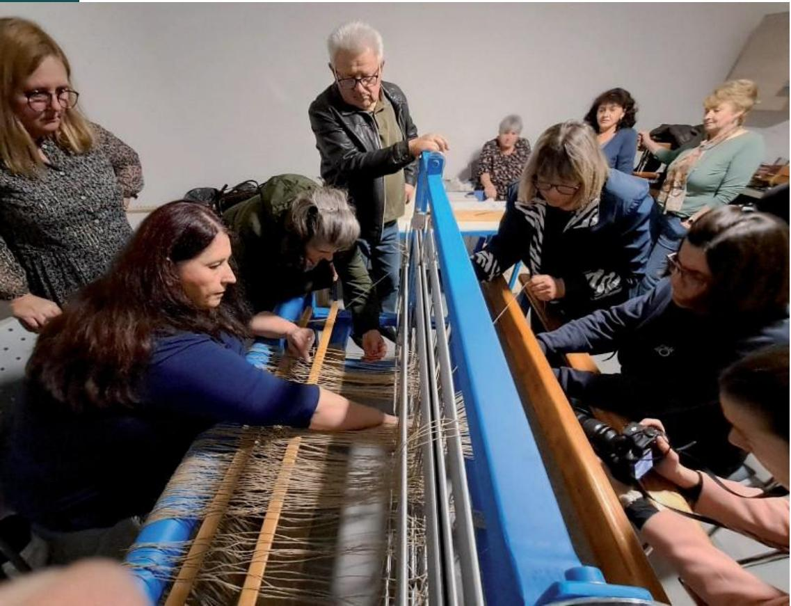

Innovation 2: *Computer-controlled electro-mechanical device for creating warp yarn gaps on a hand loom*

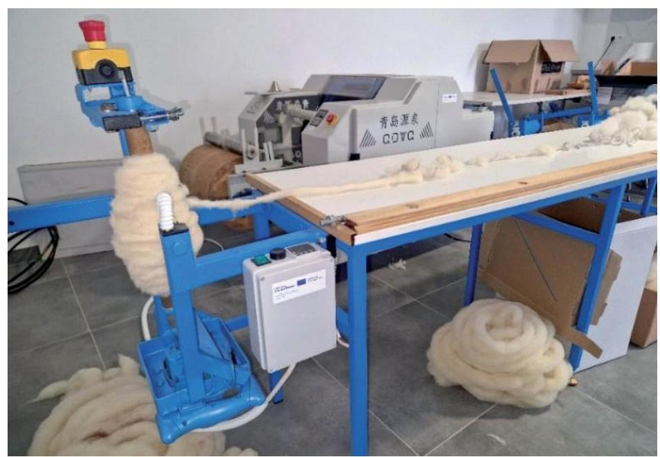

*Innovation 3: Machine for discontinuous production of yarn composed of wool fibres and yarns of different materials*

Local wool from Majur was used to make the carpet. In the first processing stage, the wool was washed in roller tubs with green detergent. In the next stage, the dried fibres were parallelised and formed into a strand, which is twisted with hemp threads. A machine for making complex threads is used to twist the wool strand and hemp threads. The resulting thread is used as the weft in weaving process. The carpet is woven using a hand-held compu-tercontrolled loom, with the warp made of hemp. The weft, made of wool and hemp, is inserted manually.

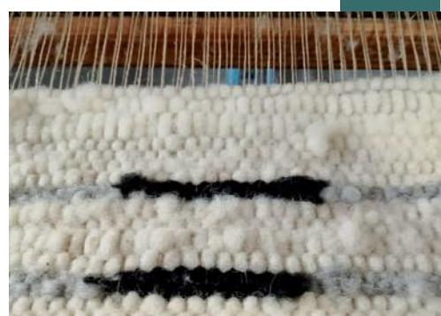

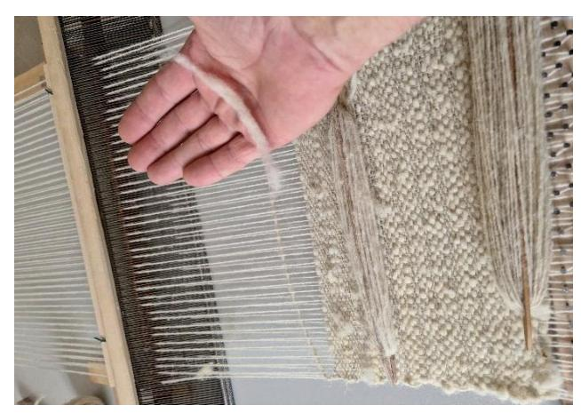

*Green-Tex solutions 2.3.1.: a) Carpet 100% wool, b) Carpet 90% wool and 10% hemp (weft)*

#### Pilot 3: Testing

The Green-Tex project tested Green Fashion Design Solutions and validated a set of green fashion design solutions aimed at supporting the transi-tion toward a circular and sustainable textile and fashion ecosystem. The activities focused on integrating innovative materials into the design process, fostering collaborative design approaches and implementing awarene-ssraising initiatives that promote sustainable production and consumption practices. Through product prototyping, designer collaboration and green fashion shows, the project explored practical applications of circular principles and encouraged the wider adoption of sustainable fashion practices across the Danube region.

#### Solution 7: Product Design Prototyping

The Green-Tex project developed product design solutions for a newly created nonwoven material produced by Eurotex. This innovative material is composed of a blend: 40% locally sourced wool, 40% recycled fibres from textile waste collected within Pilot 1 and 20% low-melting fibres. This solution within Pilot 3 thus integrated the efforts of both - textile waste collection (Pilot 1) and the enhancement of locally sourced wool (Pilot 2).

The main goal of this prototyping was to evaluate the material's suitability for diverse end-use applications. It also aimed at identifying both the opportunities and limitations related to handling, cutting, sewing and finishing processes.

The material was successfully integrated into product design prototypes across various application areas, including fashion, home textiles and pet-related products. This approach allowed for a focused assessment of the material's functional properties, design adaptability and manufacturing feasibility during the prototyping and development stages.

The nonwoven material which was applied features a compact and stable structure, a soft and pleasant surface feel and high thermal insulation properties, making it suitable for products requiring warmth and comfort. However, due to its non-layered construction, the material cannot be split into thinner layers, which affects its processability using conventional texti-le and garment production techniques. As a result, design adaptations and specific construction solutions were applied during the prototyping phase.

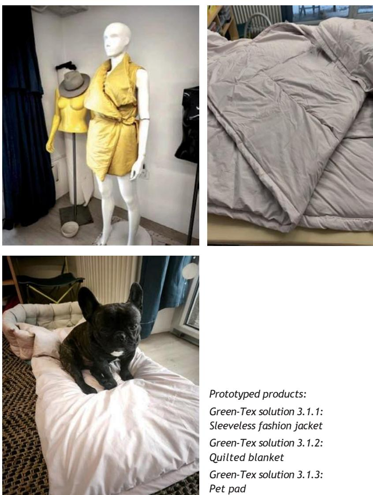

#### Solution 8: Designer Collaboration for Sustainable Impact

Sustainable fashion design is a crucial driver in eliminating the harmful impacts of the fashion industry on the environment. However, it is much more than using eco-friendly materials. Sustainability is a whole philosophy, a way of thinking, it represents a holistic approach that incorporates waste-free design, local production, fair labour practices and consumer education. This approach not only benefits the environment but also strengthens the economy and preserves cultural heritage.

The Danube regions are home to a rich tradition of artisanal craftsmanship and design, while also highlighting both the potential and existing gaps in adopting sustainable fashion practices. Artisans and designers frequently use traditional techniques, such as sewing, knitting, wool felting and embroidery, creating long-lasting, high- quality, small-batch products that align with the principles of slow fashion. Some of the region's artisans are educating new generations in eco-conscious design, which provides an additional dimension of sustainability as well as an enhanced cultural context. In addition, respective practices and consequential products and services can be significant for newly designed and established business models and practices differing significantly from currently dominant business-as-usual models.

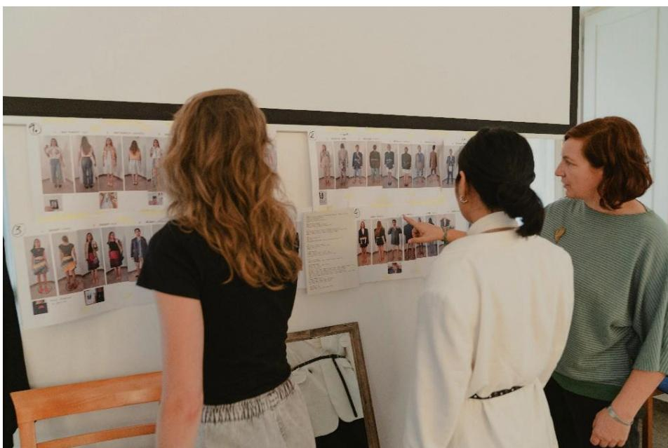

*Green-Tex solution 3.2.: Collaboration for sustainable impact*

The collaboration amongst sustainable fashion designers and artisans transforms individual efforts into a dynamic, collective movement. By joining forces to co-create eco-conscious collections, participate in fashion shows, lead hands-on workshops and organise inclusive community events, designers, artisans and consumers build a vibrant network of shared skills, creativity and purpose. This collaborative spirit not only accelerates the adoption of sustainable practices but also cultivates a culture where ethical fashion becomes a shared value and a catalyst for systemic change.

#### Solution 9: Circular Fashion Promotion Through Green Fashion Shows

Green fashion shows serve as a platform to showcase designers' innovati-ve work, foster industry networking and connect creators with conscious consumers, investors and retailers. By featuring zero-waste, biodegradable and upcycled designs, these events demonstrate that sustainability can be both stylish and scalable. As public and inclusive experiences, green fashion shows make sustainability visible and aspirational, attracting attention from media, influencers and everyday consumers alike.

The Green-Tex project demonstrated that green fashion show turns abstract sustainability goals into a tangible, inspiring experience—educating, engaging and mobilising people toward ethical fashion choices.

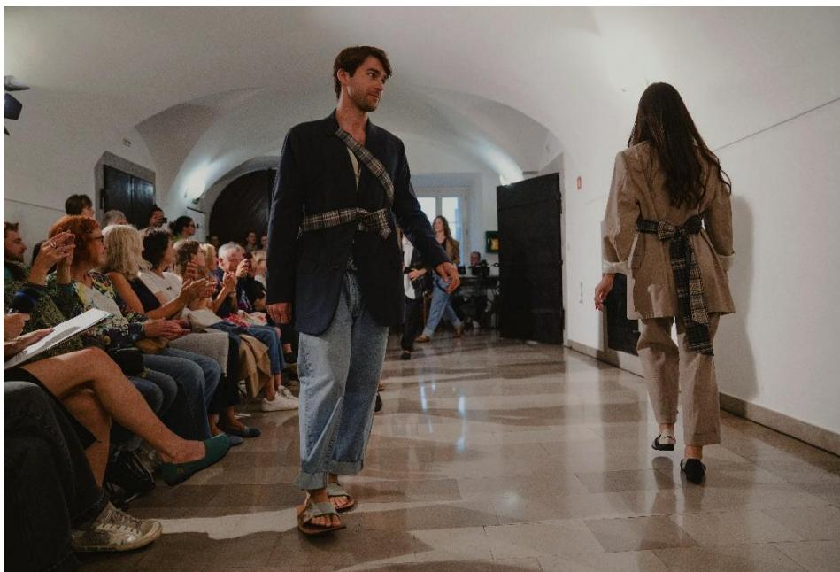

*Green-Tex solution 3.3.: Green fashion shows*

## Green-Tex Solutions Adaptability and Transferability

### **Adaptability**

One of the guiding principles of the Green-Tex project approach is adaptability and versatility of its solutions as the project addresses topics of greening textile and garment production and consumption at various levels of advancement. Adaptability also means being willing to learn from each other. Partner regions that had very limited experience in the textile waste collection (the metropolitan area of Bucharest and urban and suburban areas of Sarajevo) had the opportunity to adapt already verified system under the flexible guidance of experienced partners from Bulgaria and Slovakia.

The most important adaptation was the alignment of the developed Green-Tex solutions with EU's novel framework - *Eco-design for Sustainable Products Regulation* (ESPR). This regulation guides all stakeholders in textile sector to design and develop more durable, repairable, recyclable and transparent products. To implement it, the textile industry and brands must redesign products, restructure supplychain data as well as prepare for Digital Product Passports and strict circularity requirements.

Our pilots align excellently with ESPR requirements, starting with promotion of sustainable natural regional materials (wool and hemp) and enhancement of extremely low percentage of textile recyclates to be reused for textile product. This can be obtained only if initial collection of discarded textiles is more efficient and completely separated from mixed containers for house-hold waste.

The next stage of the value chain brings us to the topics of clothing reuse, textile waste up-cycling, clothing repair and refinement which was also tested within our pilots. It is smart consumption and reuse that are effective inhibitors of fast fashion. These trends have not yet taken hold in all partner regions. The project therefore implemented awareness-raising activities to influence consumer behaviour. By engaging successful fashion designers and design students, the project showcased that clothing reuse and repair are not only environmentally friendly but can be fashionable and trendy.

### **Transferability**

Green-Tex solutions, deliverables and outputs were created in a way that will allow transferability to other regions, businesses and stakeholders in ot-her territories with similar characteristics. In particular, the Green-Tex Pilot Actions Report and the Green-Tex Solutions were designed to provide instructions to other stakeholders (public and private) on how to create effective system of textile waste collection, apply locally abundant natural fibres in sustainable production and expand green fashion design solutions in various contexts (territorial, and sectoral).

The experimental activities of the project proved that local natural materials have high-quality, can be utilised in a variety of ways and transferred to very different applications. One of such examples is the collaboration between the Municipality of Majur and the cooperative ZAKON, which has successfully established sustainable model of hemp cultivation. Prior to its collaboration with Green-Tex and the signing of the Green-Tex Pact, the cooperative used hemp stalks solely for reinforcing building blocks. However, through their established partnership with the University of Zagreb, Faculty of Textile Technology, they are now jointly developing novel composite structures composed entirely of eco-friendly and biodegradable materials. Another exam-ple is the establishment of the demo centres VUNKO in Majur, Croatia, and the ReWooling Centre in the Serbian region of Zlatibor, which closed the loop under the umbrella of this project and established a circular model. The value chain includes fleece collection from local farms, storage and small-scale production of wool yarn using equipment provided by the project, sufficient for artisan production of local souvenirs. The integration of education, creativity and public engagement proved to be a scalable model that can be transferred to other cities or regions seeking to promote sustainable fashion and circular textile practices.

Furthermore, the partnerships of the two synergistic Danube Region projects—Green-Tex and TEX-DAN—along with their stakeholders, formalised their commitment to circularity in the textile sector by signing the Green-Tex Pact. This pact reinforces their joint dedication to the continuous promotion and application of circular practices within regional textile systems. The agreement remains open to new, relevant stakeholders who wish to join this initiative. Additionally, Green-Tex partners will participate in the *Danube Circular Textile Cluster* launched by the TEX-DAN project.

The project website functions as a virtual ecosystem that accelerates learning and innovation in green textiles. It also features educational video content produced by the First Hungarian Responsible Innovation Association (EMFIE), which helps raise awareness of the project's outputs. In addition, communication kits and training materials are publicly available and can be adapted to other contexts, thereby extending the project's reach and impact. Overall, this virtual Green-Tex ecosystem strengthens the transferability of project results and supports continued learning and innovation. All project output and deliverables are available as reference tools on the project website:

<https://interreg-danube.eu/projects/green-tex>

### Final Words

The GreenTex project has clearly demonstrated that innovative approaches 9. to textile circularity - by combining smart technologies, local material valorisation and creative design - can significantly contribute to sustainable regional development.

A central focus of the project was the innovative and environmental impact of effective textile waste collection systems, textile waste recycling potential and eco design.

The value of the pilot which was testing solutions for textile waste collection lies in the fact that municipal utility companies and project partners gained their first handson experience with smart solutions. The pilot identified the need for staff training and the introduction of new operational procedures within the utility companies. It also brought the issue of textile waste into public and institutional discourse, enabled evidencebased learning, created a foundation for future policy development and strategic planning. It can therefore be considered a starting point that opened opportunities for furt-her advancement.

Within the pilot testing of the wider application of natural fibres in innovative textile production, particular attention was given to the potential of local hemp and wool, which stand out for their exceptional sustainability benefits, including low water requirements, high carbon sequestration capacity and full biodegradability. By introducing sustainable methods for cleaning, spinning, dyeing and eco-washing wool, the project not only reduced environmental impact but also enhanced the quality of the final products, ma-king them more attractive to eco-conscious consumers and investors.

The pilot testing of green fashion design solutions significantly strengthened the public visibility of sustainable fashion practices and reinforced the position of small brands, supportive of creative and sustainable innovation. It also demonstrated a strong and transferable model through its integrated structure, which included regional designer collaboration, targeted textile waste collection campaigns, a public fashion showcase, national and regional media engagement and practical capacity-building workshops.

As innovation often emerges at the intersection of diverse fields, the project brought together a strategic mix of expertise—from textiles and technology to fashion design and waste management. This multidisciplinary collaboration enabled the development of a wide range of comprehensive Green-Tex solutions.

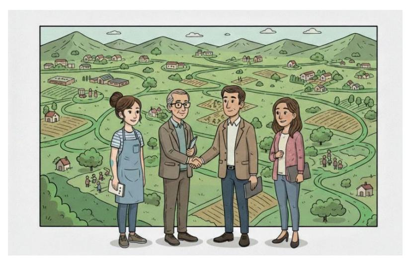

*Figure: excerpt from the promotional video Transformation of textile waste <https://interreg-danube.eu/projects/green-tex/library>*

The project also applied a quadruple-helix innovation model, engaging industry, research institutions, government and public administration, and civil society/NGOs. This approach ensured strong complementarity, broad stakeholder involvement, and solutions that reflect actual regional needs. Ultimately, the joint results of the Green-Tex pilots will serve as a reference point for other EU regions, demonstrating how the combination of innovation and traditional craftsmanship can contribute to waste reduction, environmental protection, and local economic growth.

In March 2026, the Green-Tex project joined ECOSYSTEX, the European Community of Practice for a Sustainable Ecosystem, organised by the European Technology Platform for the Future of Textiles. The platform fosters inter-project collaboration by facilitating the exchange of best practices and generating new knowledge to advance sustainable and circular business practices within the European textile ecosystem. The project and its partnership will continue to contribute to these objectives through circular textile solutions.

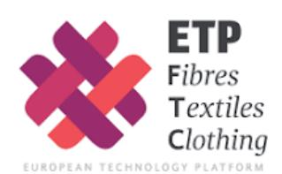

### Annexes

### **Project Partners**

Sarajevo Economic Region Development Agency, Bosnia and Herzegovina ( SERDA) LP, Bosnia and Herzegovina (BA)

Municipality of Postojna, Slovenia (SI)

Nativa, Institute for Sustainable Growth, Slovenia (SI)

Ekocharita Slovakia for Slovakia, Slovakia (SK) Technical Services of the City of Presov, (SK)

Eurotex Ltd., Bulgaria (BG)

Municipality of Majur, Croatia (HR)

University of Zagreb Faculty of Textile Technology (TTF), Croatia (HR)

University of Donja Gorica (UDG), Montenegro (ME)

Regional Development Agency Zlatibor (RDA), Serbia (RS)

Bucharest Metropolitan Area Intercommunity Development Association, (ADIZMB), România (RO)

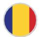

First Hungarian Responsible Innovation Association Magyarország, (EMFIE) Hungary (HU)

### **List of Green-Tex Pact Signatories**

- 1. Sarajevo Economic Region Development Agency (SERDA), Bosnia and Herzegovina
- 2. Municipality of Postojna, Slovenia
- 3. Nativa, Institute for Sustainable Growth, Slovenia
- 4. EUROTEX ltd., Bulgaria
- 5. Municipality of Majur, Croatia
- 6. University of Zagreb Faculty of Textile Technology, Croatia
- 7. University of Donja Gorica, Podgorica, Montenegro
- 8. Regional Development Agency Zlatibor, Serbia
- 9. Bucharest Metropolitan Area Association, Romania
- 10. First Hungarian Responsible Innovation Association (EMFIE), Hungary 11.Technical Services of the City of Presov, a.s., Slovakia
- 12. South-Transdanubian Regional Innovation Agency, Hungary
- 13. Federal Ministry of Energy, Mining and Industry of the Federation of BiH (FMERI)
- 14. Chamber of Economy of the FBiH, BiH
- 15. Development Agency of the Republic of Srpska (RARS), Bosnia and Herzegovina
- 16. Destilator, Slovenia
- 17. Business Support Center (BSC), Kranj, Slovenia
- 18. National Recycling Agency of Slovakia, Slovakia
- 19. Clothes Lab Ltd., Bulgaria
- 20. Croatian Chamber of Economy, Croatia

- 21. Institute of Sustainable Fashion, Croatia
- 22. School for Fashion and Design, Zagreb, Croatia
- 23. Čateks, Čakovec, Croatia
- 24. LUN, Zagreb, Croatia
- 25. ASTRIO Association, Serbia
- 26. Tourism Organisation of Užice, Serbia
- 27. Tourism Organisation of the Western Serbia Region, Serbia
- 28. Women Center Užice (NGO), Serbia
- 29. SC Peint Sizars Srl., Romania
- 30. Kamilla Kálmán, Hungary

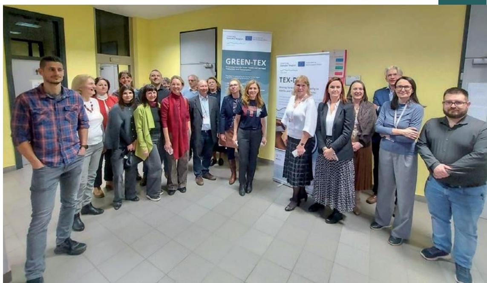

*Green-Tex and TEX-DAN project partners at the premises of the University of Zagreb Faculty of Textile Technology, Synergy meeting, January 2025*

#### **Acknowledgementto stakeholders engaged in project activities**

During the mapping process, several key stakeholders were identified as having a significant interest in collaborating on the project. Their involvement was essential for the successful implementation of the pilot testing as well as other project activities, as they possess valuable insights and resources that align with the Green-Tex project objectives.

|        | stakeholder       | Type of activity  |                          |
|--------|-------------------|-------------------|--------------------------|
|        |                   |                   | Area of collaboration    |
| Bosnia | and Herzegovina   | (Sarajevo Canton) |                          |
|        | Cantonal public   |                   |                          |
|        | utility company   |                   |                          |
|        |                   | Public company    |                          |
|        |                   |                   | for containers and       |
|        |                   |                   | promotional activity     |
|        |                   |                   | among citizens, capacity |
| 2.     | Aida Commerce     | Recycling company | Information sharing      |
| 3.     | Municipality      |                   |                          |
|        | Centre Sarajevo   | Public body       | Information sharing,     |
|        |                   |                   | capacity building        |
| 4.     | Municipality      |                   |                          |
|        | Novo Sarajevo     | Public body       | Information sharing,     |
|        |                   |                   | capacity building        |
| 5.     | City of Sarajevo  | Public body       | Awareness raising,       |
|        |                   |                   | capacity building        |
|        | Ministry of       |                   |                          |
|        | Energy, Mining    |                   |                          |
|        | the Federation of |                   |                          |
|        | B&H (FMERI)       |                   |                          |
|        |                   | Public authority  | Information sharing,     |
|        |                   |                   | awareness raising        |
| 7.     | Pomozi.ba         | NGO               | Information sharing,     |
|        |                   |                   | capacity building        |

#### Slovenia (Primorsko - Notranjska Region)

| the Club for                  |                 |
|-------------------------------|-----------------|
| Piloting                      | organiser       |
| “Green                        | fashion show”,  |
| awareness                     | raising,        |
| workshops,                    | information     |
| 2. Lokalc centre of           |                 |
| local arts Local organisation |                 |
| Awareness                     | raising,        |
| Clothing design               |                 |
| and processing                |                 |
| Petra Frank s.p.              |                 |
| upcycle designer,             |                 |
| clothing designer             |                 |
| and stylist                   |                 |
| Raising                       | awareness,      |
| information                   | sharing         |
| Association for               |                 |
| Architecture and              |                 |
| Raising                       | awareness,      |
| support                       | with the “Green |
| Fashion                       | Show”           |

#### Slova kia

| Slovak Fashion                     |          |
|------------------------------------|----------|
| Council NGO                        |          |
| Information                        | sharing, |
| 2. LPP Slovakia Vendor Information | sharing, |
| capacity                           | building |
| 3. Schools Education Information   | sharing, |
| capacity                           | building |
| 4. ONÉ dizajn Information          | sharing  |

| BACT Bulgarian                                  |          |
|-------------------------------------------------|----------|
| 1. Association of                               |          |
| Circular Textiles                               |          |
| NGO information                                 | sharing, |
| capacity                                        | building |
| 2. Eco Cleaning Wipes                           |          |
| Bulgaria Ltd Recycling company                  |          |
| information                                     | sharing, |
| capacity                                        | building |
| Aawareness                                      | raising, |
| 3. Clothes lab Second-hand retailer information | sharing, |
| capacity                                        | building |

| Varna Free         |                     |
|--------------------|---------------------|
| institution /      |                     |
| Awareness          | raising,            |
| information        | sharing             |
| 5. DKTEX Ltd. SME  |                     |
| Supports           | the                 |
| implementation     | of Polot 2          |
| Testing            | wider application   |
| of natural         | fibres in textile   |
| production.        | Participation       |
| in the             | production of non  |
| woven              | textile samples     |
| containing         | wool fibres and     |
| recycled           | textile fibres      |
| information        | sharing,            |
| capacity           | building            |
| Vocational High    |                     |
| School of Textiles |                     |
| and Fashion        |                     |
| institution / VET  |                     |
| Awareness          | raising,            |
| information        | sharing             |
| RAPIV Regional     |                     |
| Agency for         |                     |
| and Innovation     |                     |
| NGO Information    | sharing,            |
| capacity           | building            |
| 8. ALIANA Ltd. SME |                     |
| Supports           | the                 |
| implementation     | of                  |
| Pilot              | 2: Testing the      |
| wider              | application of      |
| natural            | fibres in textile   |
| production.        | Participation       |
| in the             | production of final |
| products,          | including home      |
| textile            | items made from     |
| developed          | non-woven           |
| samples            | containing wool     |
| and recycled       | textile fibres.     |
| Information        | sharing,            |
| capacity           | building            |

| 9. Municipality of              |                             |
|---------------------------------|-----------------------------|
| Stara Zagora Public             | body Information sharing,   |
|                                 | capacity building           |
| 10. Bulgarian Fashion           |                             |
| Association NGO                 | Information sharing,        |
|                                 | capacity building           |
| Croatia (Sisak-Moslavina County | and Zagreb)                 |
| OPG RODOLJUB                    |                             |
| Since                           | 1919                        |
| Consulting                      | in the                      |
| field of                        | agriculture,                |
| breeding                        | sheep                       |
|                                 | Awareness raising,          |
|                                 | capacity building, piloting |
| “ECO DOL”                       |                             |
| Since                           | 1915                        |
| Livestock                       | breeding                    |
| and                             | farming                     |
|                                 | Awareness raising,          |
| 3. JELICA DUGAČ                 |                             |
| Traditional                     | model of                    |
| production                      | has been                    |
|                                 | Awareness raising           |
| 4. ŽELJKO KNEZIĆ                |                             |
| Part of                         | the family                  |
| business                        | since 1988.                 |
| Traditional                     | models                      |
| of                              | home-made                   |
| production                      | has been                    |
| preserved,                      | with very                   |
| strict                          | quality control.            |
|                                 | piloting, research,         |
|                                 | awareness raising,          |
|                                 | capacity building           |
| 5. FEMA                         |                             |
| In 2020,                        | launched                    |
| a business                      |                             |
| project                         | EKO LIKA                    |
|                                 | GREENNovation in            |
| green                           | products from               |
| raw                             | sheep’s wool –              |
| eco-                            | fertilisers and             |
| eco-l                           | repellents.                 |
|                                 | Information sharing,        |
|                                 | awareness raising,          |
|                                 | capacity building           |

|                      | Cooperative                                    |
|----------------------|------------------------------------------------|
| 6. ZAKON             |                                                |
| Their includes       | business cultivation,                          |
| application          | and                                            |
| promotion            | of                                             |
| industrial           | hemp.                                          |
| Promote              | partnership                                    |
| for sustainable      | and                                            |
|                      | Research and Innovation, processing,           |
|                      | information sharing,                           |
| socially SME         | piloting, awareness raising, capacity building |
| 7. KRIE DESIGN       |                                                |
| Ecodesign            | of                                             |
| sustainable          | products                                       |
| and fashion          | garment                                        |
| production           | from                                           |
|                      |  (e.g.                                        |
| fishing              | nets), organic                                 |
| and recycled         | cotton,                                        |
| organic              | silk and                                       |
| recycled             | polyester.                                     |
|                      | Awareness raising, capacity                    |
| SME                  | building, information recycledNylon sharing    |
| 8. RGNC GROUP        |                                                |
| Production           | of yarns                                       |
| and non              | -wovens                                        |
| from recycled        | textile                                        |
| waste.               | Design and                                     |
| production           | of hand                                        |
| tufted               | woollen                                        |
| carpets              | and                                            |
|                      | Information sharing,                           |
| tapestries.          | awareness raising, capacity building           |
| 9. HUMANA NOVA       |                                                |
| Social               | cooperative                                    |
| Textile              | waste                                          |
| collection,          | reuse,                                         |
| upcycling            | and                                            |
| handicraft           | making,                                        |
| production           | and sale                                       |
| of innovative        | textile                                        |
| products             | made from                                      |
| locally              | sourced,                                       |
| recycled             | and eco                                        |
|                      | Information sharing,                           |
| certified materials. | awareness raising, capacity building           |

| SME                 |                                                                                     |
|---------------------|-------------------------------------------------------------------------------------|
| 10. DOK-ING         |                                                                                     |
| The company         | has                                                                                 |
| been                | recognised                                                                          |
| for changing        | the                                                                                 |
| industrial          | landscape                                                                           |
| with                | its innovative                                                                      |
| approach            | in machines                                                                         |
| production          | and                                                                                 |
| robotics.           | Design                                                                              |
| and development     | of                                                                                  |
| LOOPER              | machine for                                                                         |
| the utilisation     | of non                                                                             |
| recyclable          | organic                                                                             |
| waste               | (textiles &                                                                         |
|                     | Research and Innovation,                                                            |
|                     | information sharing,                                                                |
| Hungary             | awareness raising, capacity building footwear). Textile brand and business (Type of |
| 1 Naturtex          |                                                                                     |
| activities:         | produc                                                                             |
| tion, distribution, |                                                                                     |
|                     | Information sharing development)                                                    |

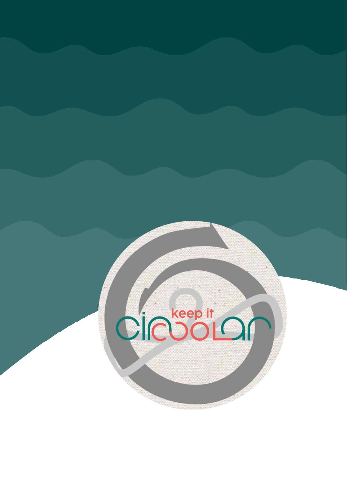

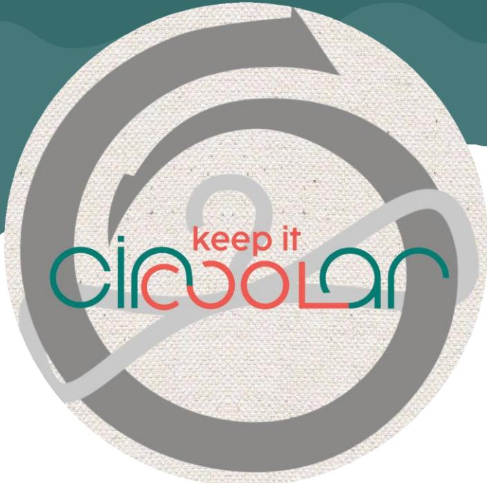