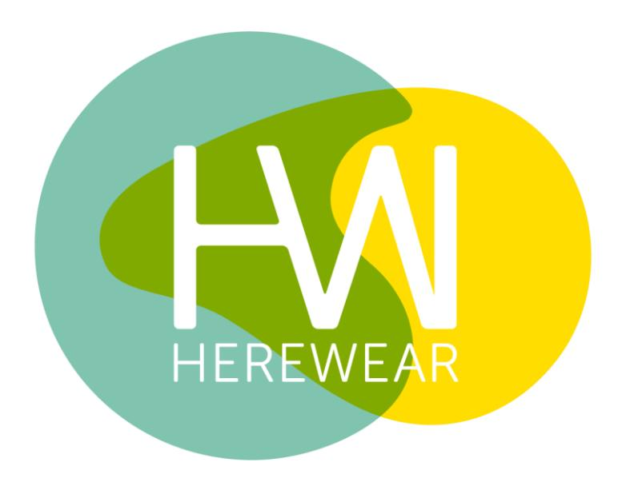

HEREWEAR 101000632 DELIVERABLE 7.6 30.09.2023

# D7.6 Guidelines (Whitepaper) for 'Bio-based Circular Textile Manufacturing', with Manufacturing Manual and Glossary

# DELIVERABLE

PROJECT ACRONYM: HEREWEAR GRANT AGREEMENT N.: 101000632 PROJECT TITLE: BIO-BASED LOCAL SUSTAINABLE CIRCULAR WEAR

### D 7.6: GUIDELINES (WHITEPAPER) FOR 'BIO-BASED CIRCULAR TEXTILE MANUFACTURING', WITH MANUFACTURING MANUAL AND GLOSSARY V1.0 2023.09.30

#### AUTHORS

MARTE HENTSCHEL (SOURCEBOOK) NATALIIA KIRILLOVA (SOURCEBOOK) MAXI BOHN (SOURCEBOOK)

#### REVIEWERS

LIEN VAN DER SCHUEREN (CTB) DIETER STELLMACH (DITF) FRÉDÉRIQUE THUREAU (TCBL) GUIDO GRAU (DITF)

#### DISSEMINATION LEVEL

# EXECUTIVE SUMMARY

This white paper serves as a vital resource for stakeholders in the textile industry, offering a comprehensive roadmap towards establishing capacities for bio-based circular textile manufacturing. Developed within the HEREWEAR project, this document encompasses a holistic approach to reshaping the European textile market by promoting locally-produced textiles derived from sustainable, bio-based materials.

The objectives of this white paper are:

**Raise Awareness**: This white paper seeks to inform about the HEREWEAR project learnings, elevate awareness and provide recommendations for action in the field of bio-based and locally manufactured textiles in the EU.

**Support Companies by Blueprint for Manufacturing**: It provides a detailed blueprint for creating networked manufacturing capacities, empowering brands to seamlessly produce bio-based circular textiles.

**Create Common Understanding of Industry Terminology**: This resource also equips readers with a thorough understanding of the terminology associated with biobased circular textile manufacturing, facilitating clear communication and informed decision-making within the industry.

This white paper delves deeper into the bio-based circular textile manufacturing emphazing the importance of renewable and bio-based materials as a mean to reduce dependence on non-renewable resources and minimize carbon footprint. Complemented by networked manufacturing practices, this approach is viewed as a tool to enhance environmental sustainability, reduce carbon emissions, simplify supply chains, support local economies, and adapt to market dynamics.

This white paper introduces the HEREWEAR guidelines for bio-based circular textile manufacturing, providing a comprehensive framework encompassing material sourcing, responsible production, waste reduction, and the implementation of digital product passports.

Having identified the key strategies to overcome such challenges as investment requirements, production method adjustments, and consumer behaviour shifts, this white paper highlights the importance of collaboration, education, regulation, and supply chain optimization to overcome these hurdles. The HEREWEAR project exemplifies the potential of collaboration and innovation, and it underscores the ongoing journey towards a more responsible future for the textile industry.

# TABLE OF CONTENTS

| E XECUTIVE S UMMARY                                                  | 4                              |
|----------------------------------------------------------------------|--------------------------------|
| T ABLE OF C ONTENTS                                                  | 5                              |
| About                                                                | 6                              |
| Glossary                                                             | 7                              |
| Chapter 1: Bio-Based Circular Textile Manufacturing                  | 10                             |
| 1.1 What Is Bio-Based Circular Textile Manufacturing?                | 10                             |
| 1.1.1 Bio-Based Circular Textile Materials                           | 11                             |
| 1.1.2 Sustainable Local Manufacturing                                | 11                             |
| 1.2 The Importance of the Bio-Based Circular Textile Manufacturing   | 12                             |
| 1.2.1 The Importance of the Bio-Based Circular Textile Materials     | 12                             |
| 1.2.2 The Importance of Sustainable Local Manufacturing              | 13                             |
| 1.3 Market Potential of the Bio-Based Circular Textile Manufacturing | 13                             |
| Chapter 2: HEREWEAR Guidelines for Bio-Based                         | Circular Textile Manufacturing |
| 2.1 Manual for Bio-Based Circular Textile Manufacturing              | 15                             |
| 2.2 Decide for Circular Design Strategy                              | 16                             |
| 2.3 Choose Your Responsible Production Mode                          | 17                             |
| 2.4 Source for Circular Components and Manufacturers                 | 18                             |
| 2.5 Upcycle Your Cutting Waste                                       | 18                             |
| 2.6 Re-sell Your Leftover Material                                   | 19                             |
| 2.7 Enrich Your Product Passport                                     | 19                             |
| Concluding Remarks and Future Prospects                              | 21                             |
| The Promise of Bio-Based Circular Textile Manufacturing              | 21                             |
| Challenges and Risks                                                 | 21                             |
| Mitigating Challenges and Forging Ahead                              | 22                             |
| Future Prospects                                                     | 23                             |
| References                                                           | 25                             |
| D OCUMENT INFORMATION                                                | 26                             |

# ABOUT

This white paper aims to raise awareness and present a comprehensive blueprint for establishing capacities for bio-based circular textile manufacturing. The goal of this white paper is to empower brands to seamlessly produce bio-based circular textiles while concurrently facilitating the efficient organization of textile take-back and recycling initiatives.

This white paper was developed within the ongoing EU project HEREWEAR, which aims for a holistic approach to establishing a market in the EU for locally-produced textiles made from locally-sourced bio-based materials. In the HEREWEAR project, fifteen research and industrial partners are working together to empower local, circular and bio-based textiles.

In this white paper, you will:

- Explore a detailed blueprint for setting up networked manufacturing capacity enabling brands to seamlessly produce bio-based circular textiles
- Discover effective strategies and methods to streamline the collection and recycling processes for textiles, reducing waste and environmental impact
- Gain a thorough understanding of the terminology associated with bio-based circular textiles manufacturing, facilitating clear communication and informed decision-making within the industry.

#### **Disclaimer**

The purpose and scope of this white paper is to inform about the HEREWEAR projects learnings, raise awareness and provide recommendations for action in the field of biobased and locally manufactured textiles in the EU. The information presented in this paper is based on data and information obtained from various primary and secondary sources, and it relies on certain assumptions. While every effort has been made to ensure the accuracy and completeness of this document, the information contained herein may be subject to change due to environmental factors.

Neither the authors who have prepared this white paper, nor the partners and contributors assume any responsibility or liability for any financial or other losses arising from the use of this paper. Prospective users of this document are encouraged to conduct their own due diligence and gather any additional information they deem necessary to make informed decisions.

# GLOSSARY

Glossaries are crucial in new and emerging fields of research where different areas of knowledge come together – and with that, there is a need for mutual understanding in order to work towards a common goal and define a single meaning for the research terms. The HEREWEAR collaborative glossary is a powerful tool that enables all of us to access the knowledge of experts and see the world through their eyes. Further terms can be found on the dedicated section of the HEREWEAR website: <https://herewear.eu/glossary/>

#### **Bill of Material**

A listing of all raw materials and components needed to create the desired end product.

#### **Bio-Based**

According to the European standardisation committee CEN, the term 'bio-based' product refers to products wholly or partly derived from biomass, such as plants, trees or animals (the biomass can have undergone physical, chemical or biological treatment). However, for various certified labels a minimum requirement is set for the amount of carbon the product is made of.

#### **Business Ecosystem**

The concept of 'Business Ecosystem' explores the relationship between business entities and business models and how these interrelate to form business networks. In this context, a business, or service, ecosystem is defined as "a value co-creation configuration of people, technology, shared information, and value propositions connecting internal and external service systems" (Allee 2013)

#### **Circular Design**

To design a product consciously making decisions to eliminate waste and pollution.

#### **Circular Economy**

Looking beyond the current take-make-waste extractive industrial model, a 'circular economy' aims to redefine growth, focusing on positive society-wide benefits. It entails gradually decoupling economic activity from the consumption of finite resources, and designing waste out of the system. Underpinned by a transition to renewable energy sources, the circular model builds economic, natural, and social capital. It is based on three principles:

- Design out waste and pollution
- Keep products and materials in use
- Regenerate natural systems

The Circularity.ID Open Data Standard by circular.fashion which is intended for use in the fashion industry to store, label and identify digital product data for powering circular practices.

#### **Closed Loop Production**

A production process that reuses the material waste created during production for additional products, as well as recycling and upcycling to create new products.

#### **Design for Biodegradability**

To design a product derived from plants and other renewable agricultural, marine and forestry materials which will naturally biodegrade at the end of their useful life.

#### **End of Life Trajectories**

This describes the potential treatment that will enable materials to be effectively recycled once they are sorted adequately.

#### **HEREWEAR Community**

The 'HEREWEAR Community' is a group of stakeholders – researchers, businesses, policy makers, NGOs as well as individuals- who have expressed an interest in learning about and participating in the project's activities. This may include learning about biobased materials, experimenting new production processes, or testing new products on the market. By building the HEREWEAR Community, the project aims to lay the foundation for the uptake of bio-based fibres and textiles throughout the industry.

#### **Lifecycle Extension**

This considers strategies such as repair or upcycling which can keep the material in circulation for longer without having to break it down into a new feedstock.

#### **Microfibre Release**

Microfibre release can be defined as a short piece of a textile fibre, typically less than 5 mm long, released from the main textile structure. These fragments, of either synthetic or of natural origin and with different diameters, can occur during, and be influenced by, all phases of the product life cycle. They are known to pollute the environment and are commonly regarded as a risk, although more research is needed to fully understand the impacts.

#### **Request for Quote**

Brand requesting a price for a specific product.

#### **Stakeholders**

'Stakeholders' are individuals or organisations who hold a stake – i.e. they can have something to win or to lose – in the outcome of a process and at the same time they have a role in affecting the outcome. Stakeholders for an innovation process such as HEREWEAR can include public institutions (who define policies and regulations), universities and research institutes (who develop scientific innovations), the private

sector (who produce and market new products), and concerned citizens and NGOs (who aim to ensure collective goals such as environmental sustainability).

#### **Supply Chain**

A network of sequences and resources involved in the production and delivery of a product or service.

#### **Tech Pack**

A document that clearly stipulates your design, materials and construction of your product.

#### **Upcycling**

'Upcycling', also known as creative reuse, is the process of transforming by-products, waste materials, useless, or unwanted products into new materials or products perceived to be of greater quality, such as artistic value or environmental value. Designers have begun to use both industrial textile waste and existing clothing as the base material for creating new fashions. Upcycling has been known to use either preconsumer or post-consumer waste or possibly a combination of the two. Pre-consumer waste is made while in the factory, such as fabric remnants left over from cutting out patterns. Post-consumer waste refers to the finished product when it's no longer useful to the owner, such as donated clothes.

#### **Zero Waste Design**

A product which is systemically designed to eliminate the wastage of material

# CHAPTER 1: BIO-BASED CIRCULAR TEXTILE MANUFACTURING

In a world increasingly focused on environmental responsibility and resource conservation, the textile industry stands at the threshold of a remarkable transformation. Bio-based circular textile manufacturing represents a pivotal shift in how we produce and consume textiles, placing sustainability and resource efficiency at the forefront.

This chapter provides a glimpse into the profound concept of bio-based circular textile manufacturing, where we prioritize the responsible use of materials and embrace lean, local production through networked manufacturing. These intertwined elements hold the promise of revolutionizing the textile sector, offering a path towards a more sustainable and eco-conscious future.

Bio-based circular textiles start with the careful selection of materials, drawing from renewable and bio-based sources. These materials, often derived from nature's bounty, aim to reduce our reliance on finite, non-renewable resources. Sustainability and biobased nature and/or biodegradability are core attributes of these materials, ensuring a lower environmental impact and the potential for circularity at the end of their life cycles.

Networked manufacturing, on the other hand, complements the journey towards sustainability by streamlining production and distribution processes. Collaboration among stakeholders, localization of production, and resource-efficient practices are the hallmarks of this approach, significantly reducing environmental footprints and enhancing transparency within supply chains.

As we embark on this exploration of bio-based circular textile manufacturing, we uncover a world where responsible material choices and efficient production methods converge to redefine the textile industry. With this White Paper we embark on this paradigmatic shift that bears the potential to preserve fragile ecosystems, curtail waste generation, and stimulate economic prosperity, all while addressing the pressing global imperatives of sustainability and resource conservation.

# 1.1 WHAT IS BIO-BASED CIRCULAR TEXTILE MANUFACTURING?

In this section, we delve into the fundamental concept of bio-based circular textile materials and into critical aspects of local and connected manufacturing, often referred to as networked manufacturing. Both components represent a transformative approach to textile production, prioritizing sustainability and resource efficiency.

#### 1.1.1 BIO-BASED CIRCULAR TEXTILE MATERIALS

Bio-based circular textiles represent a sustainable and environmentally responsible approach to textile production that focuses on two key aspects: the materials used and their circular life cycle.

#### **Bio-based Materials**

Bio-based circular textiles start with the use of materials derived from renewable and biodegradable sources. These materials are often plant-based, such as organic cotton, hemp, bamboo, or fibres extracted from agricultural waste products. The emphasis here is on reducing the reliance on non-renewable resources, like petroleum-based synthetic fibres, which are common in traditional textiles. In the HEREWEAR project, research and industrial partners are focusing on three novel waste streams (seaweed, manure, straw) to develop cellulosic textile fibres and consequently bio-based garment prototypes for streetwear, fashion and corporate clothing. Further, we also work with bio-based polyesters.

#### **Sustainability and Biodegradability**

Bio-based materials are chosen for their sustainable attributes, including lower carbon footprints and potentially reduced water and chemical usage during production. Importantly, some bio-based textiles are biodegradable or compostable at the end of their life cycle, contributing to reduced landfill waste and pollution. Tapping into this, the HEREWEAR project is researching ways to minimise the potential of microfibres release via use of biodegradable materials, adapted textile structure and finishes/coatings.

#### **Circular Economy Principles**

Circular textiles extend the life of materials through a circular economy approach. This means that textiles are designed to be reused, remanufactured, or recycled rather than discarded after use. Circular textile materials are chosen for their suitability to these processes, ensuring that the resources invested in their creation are maximally preserved.

### 1.1.2 SUSTAINABLE LOCAL MANUFACTURING

The lean and responsible networked manufacturing complements the sustainability goals of bio-based circular textiles by addressing production and distribution processes.

#### **SME Networked Production in Local Facilities & Resource Efficiency**

Networked manufacturing often involves collaboration between brands, manufacturers, recycling facilities, and other stakeholders. By making more fluid supply chains and involving local suppliers and manufacturers, networked manufacturing facilitates more responsible production modes reducing the carbon footprint and enhancing

transparency and traceability in the supply chain. The HEREWEAR project aims to provide full data transparency of materials and work done with labels for circularity and foster the network of manufacturers who are able to work with bio-based and circular materials.

Networked manufacturing is underpinned by a commitment to resource efficiency, incorporating principles of lean production and waste reduction. By adopting these practices, the manufacturing process is finely tuned to minimize resource consumption, energy utilization, and water usage, all of which closely align with the principles of a circular economy (Bocken et al., 2016). The microfactory concept, characterized by customizability, on-demand production, and digitalization, plays a pivotal role in achieving resource efficiency (Petersen et al., 2019). Additionally, networked manufacturing embraces the re-use of production waste at various levels and promotes the repair of second-hand clothing, effectively extending the lifecycle of textile products (Ghisellini et al., 2016). Moreover, full data transparency regarding materials and production processes, coupled with the introduction of circularity labels, further underscores the commitment to resource-efficient practices (Kesavan et al., 2020). Finally, networked manufacturing actively engages with emerging collectors and sorting mechanisms, ensuring that materials used in production are recyclable and can be reintegrated into the circular economy (Pigosso et al., 2019).

# 1.2 THE IMPORTANCE OF THE BIO-BASED CIRCULAR TEXTILE MANUFACTURING

### 1.2.1 THE IMPORTANCE OF THE BIO-BASED CIRCULAR TEXTILE MATERIALS

Bio-based circular textile manufacturing is crucial for environmental sustainability. By using renewable materials, it reduces the industry's dependence on non-renewable resources and minimizes the ecological footprint associated with textile production. This helps preserve ecosystems, reduce water consumption, and lower greenhouse gas emissions.

Circular textile manufacturing follows the principles of a circular economy, where products are designed to be reused, remanufactured, or recycled at the end of their life cycle. This approach significantly reduces textile waste and landfill burden.

Sustainable materials and circular processes lead to greater resource efficiency. These practices reduce resource consumption, energy use, and the environmental impact of textile production. They also contribute to a more responsible and ethical use of resources, particularly in water-scarce regions.

#### 1.2.2 THE IMPORTANCE OF SUSTAINABLE LOCAL MANUFACTURING

Sustainable local manufacturing significantly reduces transportation-related emissions by producing textiles closer to their end markets. This results in a lower carbon footprint, aligning with global efforts to combat climate change.

Localized manufacturing simplifies and shortens supply chains, making them more transparent and resilient. This reduces the risk of supply chain disruptions, such as those caused by global events like pandemics or natural disasters.

Sustainable local manufacturing creates jobs and supports local economies. It fosters economic development within regions by encouraging collaboration and innovation, ultimately leading to more prosperous and resilient communities. It often includes ethical labour practices and fair wages, contributing to improved working conditions and worker well-being, which aligns with growing consumer demands for ethical and socially responsible production.

Local manufacturing facilities, due to their proximity to the brands warehouses, can respond quicker to changes in consumer demand and market trends. This agility allows brands to offer more customized products and adapt to on-demand production models.

# 1.3 MARKET POTENTIAL OF THE BIO-BASED CIRCULAR TEXTILE MANUFACTURING

Responsible and short run production has a substantial market potential and is foreseen to have a continuous growth as sustainability and circularity are becoming a top priority for research, consumers, brands and governments worldwide.

According to McKinsey & Co, apparel companies focus should shift primarily to nearshoring, automation and sustainability in order to meet customers' needs (McKinsey & Co, 2018).

Numerous factors contribute to the market potential of the bio-based circular textile manufacturing:

**Increasing Environmental Awareness**: Fashion and textile consumers are becoming increasingly concerned about the environmental and societal impact of the traditional production modes within the fashion and textile industry, which is notorious for its high resource consumption and waste generation. Bio-based circular textiles offer a sustainable alternative by utilizing bio-based and/or renewable materials and reducing waste through recycling and upcycling, whilst networked manufacturing enables more responsible and leaner short run production in proximate facilities.

**Regulatory Support**: Many governments and international bodies, primarily in Europe and the US, are tightening regulations and implementing initiatives to promote sustainability in the textile industry. For an example, the Apparel Supplier's Guide by Transformers Foundation provides an overview of legislations in the EU, US and UK

[\(https://www.transformersfoundation.org/an-apparel-suppliers-guide-key](https://www.transformersfoundation.org/an-apparel-suppliers-guide-key-sustainability-legislations-in-the-eu-us-and-uk)[sustainability-legislations-in-the-eu-us-and-uk\)](https://www.transformersfoundation.org/an-apparel-suppliers-guide-key-sustainability-legislations-in-the-eu-us-and-uk).

**Consumer Demand**: There is a growing demand for eco-friendly and ethically produced textiles and apparel. Sustainability is tightly correlated with consumer purchasing behaviour: more than 60% of consumers consider sustainability to be a key purchasing factor (McKinsey & Co, 2018) and are willing to pay more for sustainable products (Nielsen, 2020).

**Innovation and Research**: Continuous advancements in bio-based materials and circular economy practices are expanding the possibilities for creating high-quality textiles from renewable sources. This innovation fosters market growth by improving the quality and variety of sustainable textile products.

**Collaboration and Partnerships**: The textile industry is increasingly seeing collaborations between fashion brands, manufacturers, and recycling companies to create closed-loop systems. Such partnerships can drive the adoption of bio-based circular textile manufacturing on a larger scale.

The market potential for bio-based circular textile manufacturing is driven by a combination of environmental concerns, regulatory support, consumer demand, economic benefits, and industry innovation. As the textile industry continues to evolve, this sector is poised for significant growth, offering opportunities for both established companies and start-ups to thrive while contributing to a more sustainable future.

# CHAPTER 2: HEREWEAR GUIDELINES FOR BIO-BASED CIRCULAR TEXTILE MANUFACTURING

In the dynamic and evolving landscape of textile manufacturing, the HEREWEAR project introduces innovative guidelines for bio-based circular textile manufacturing, with a primary focus on sustainability and responsible practices. These guidelines are thoughtfully designed to empower the fashion industry, facilitating the adoption of biobased and circular textiles in garment design and production through the cultivation of well-informed decision-making processes, aided by the integration of complementary digital tools. The overarching objective of this user, data and materials flow is to catalyse the incorporation of bio-based and circular textiles, providing a comprehensive framework encompassing sourcing strategies from a curated database of manufacturers specialised in bio-based and circular materials, along with those dedicated to the implementation of lean and responsible production practices. Furthermore, these guidelines proffer pragmatic options for effectively managing cutting waste and residual materials, thus mitigating waste generation and augmenting resource efficiency.

Of paramount significance, the digitisation of production information within a digital product passport amplifies transparency and traceability, thereby endowing end consumers with the capacity to make more informed choices. The HEREWEAR project's holistic approach holds the potential to substantively diminish the fashion industry's ecological footprint while harmonizing with the principles underpinning a circular economy. Through these guidelines, both business stakeholders and consumers stand to accrue benefits within an industry poised for transformation, one that accentuates sustainability and innovation in textile production and consumption. This introductory exposition provides a preliminary insight into the profound potential of these guidelines, emblematic of a critical stride towards a more sustainable and ecoconscious future within the realm of fashion.

# 2.1 MANUAL FOR BIO-BASED CIRCULAR TEXTILE MANUFACTURING

The HEREWEAR project partners have developed the following blueprint towards the bio-based circular textile manufacturing:

- 1. Decide for Circular Design Strategy

→ Design your style taking design strategies, material routes, end-of-life recycling routes and more key pillars of circularity approaches into consideration

- 2. Choose Your Responsible Production Mode → Depending on your product and seasonality consider the most suitable production model in your local area
- 3. Source for Circular Components and Manufacturers → Specify your product component details in a bill of material, and research for circular options of fabrics, trims, and packaging → Research for manufacturers matching your production model and circular manufacturing model
- 4. Upcycle Your Cutting Waste → Opt-in to handover the cutting waste materials from the factory to further facilities
- 5. Re-sell Your Leftover Material → Offer the leftover materials and components on dedicated marketplaces
- 6. Enrich Your Product Passport → Choose a partner to create a passport for your product making close-theloop information available for the public

These steps are further detailed in the following sections.

# 2.2 DECIDE FOR CIRCULAR DESIGN STRATEGY

The HEREWEAR project aims to build an EU market for locally produced textiles and clothing made from bio-based resources. Central to this mission is to develop tools that support designing for circularity, providing clear guidance on what it practically means and which approaches to follow both in terms of design strategies and material selection. This approach embodies the vital consideration of product end-of-life handling prospects already at the design stage. The Circular Design Software by circular.fashion enables fashion brands to create circular and sustainable products through a lean and efficient process from providing access to hundreds of circular materials, design guidelines and product briefings to circular product checks. Further information on the Circular Design Software is stipulated in the deliverables D1.5 and D1.6.

The objective of the Circular Design Decision-making Feature is to support designers in decision-making for a bio-based local circular economy, through answering multiselect questions with defined answer options on product intention, extended use phase, decisions on production, etc. Based on the answers, the designer will be presented

with relevant circular materials and design strategies, as suggestions for their ideation and to help steer the choices of product development. Furthermore, circular.fashion presents suitable materials as inspiration in the dedicated Circular Material Library.

### 2.3 CHOOSE YOUR RESPONSIBLE PRODUCTION MODE

When it comes to production, it is crucial to consider more responsible and leaner shortrun production modes and determine whether they are supported by your supplier or manufacturer. These modes include but are not limited to Small Batch Runs, Short Run Production, Made-to-Order and On-Demand, Networked Manufacturing, Microfactory, In House versus Outsourced Production, Nearshoring, etc. These production modes aid minimising waste, reducing excess inventory, and fostering more sustainable practices in the fashion industry.

By producing in smaller quantities and only when there's confirmed demand, these modes help mitigate overproduction and its associated environmental and economic costs. Furthermore, they enable more efficient resource utilisation, promote local manufacturing practices, and enhance supply chain flexibility to adapt swiftly to changing consumer preferences and market dynamics, ultimately supporting a more environmentally responsible and economically sustainable fashion ecosystem.

One of the HEREWEAR approaches towards an EU market for locally produced textiles and clothing made from bio-based resources includes the further development and utilisation of networked manufacturing concept.

When selecting the networked manufacturing concept, it's important to consider aspects related to current processes including changes in demands and level of digitalisation, ways of collaboration between brands and manufacturers and availability of resources.

When thinking about the digitalisation aspect – networked manufacturing supports manufacturers in moving from paper to a digitalised approach and embedding digital elements that will help brands to oversee from end to end the process of manufacturing the garments. This can also help brands to optimise the production process which ultimately will lead also to reducing waste (e.g., reducing overproduction).

From a collaboration perspective, it enables effective communication and information exchange among involved parties which is important for producing the garments in a flexible and efficient way and achieve transparency directly with all partners. It supports a centralised approach of having all the information and requirements for the garments and selecting/working with a network of partners based on the needs.

The resources are also an important aspect which is linked to the current financial capacity of brands. The additional investments and planning are limited compared to other manufacturing concepts – e.g. a subscription for a networked manufacturing platform for fashion compared to the microfactory. Furthermore, it can be considered

as a soft approach for people upskilling or reskilling considering the user journey and the skills or qualifications needed compared to the microfactory.

### 2.4 SOURCE FOR CIRCULAR COMPONENTS AND MANUFACTURERS

Sourcing close to market and engaging with circular suppliers and manufacturers is pivotal for amplifying efforts towards a more substantial and positive impact on sustainability, supply chain efficiency, and overall business success. Within the HEREWEAR project, consortium partner SOURCEBOOK offers a sophisticated software platform (Sqetch) that merges a B2B sourcing marketplace tailored for brands to identify manufacturers and suppliers. It also includes a management solution designed to facilitate the quotation, ordering, tracking, and management of the garment production process. This platform empowers brands and manufacturers to establish business profiles, forge connections with each other and external partners, and proficiently oversee their products and orders using collaborative management tools. Notably, within the HEREWEAR project, the Sqetch platform has been expanded to incorporate materials and components suppliers and allow the user to navigate and distinguish bio-based materials and components. This expansion signifies a selfapplicable cloud system for stakeholders involved, enabling them to collaboratively design and manage their supply chain with sustainability at the core. To ensure seamless integration and enrichment of product and materials / components data gathered through circular.fashion and Sqetch an aligned Bill of Materials feature reduces the friction between platforms and database systems. This feature supports the importation of existing product and material/component data from external sources while enhancing it with additional information, ultimately facilitating the creation of purchase orders and the seamless exportation of this vital information. Such developments represent a significant stride towards establishing a circular and sustainable ecosystem within the fashion industry.

# 2.5 UPCYCLE YOUR CUTTING WASTE

HEREWEAR project partner MAIBINE allows a specific patch/add-on for the CAD software can be sent to the factory where the brand has its garments manufactured to simplify the leftovers collecting process and to provide a "Close-2-zero waste" certificate to the brand or factory.

There are two ways that the industrial leftovers can be handled:

One way is for the brand to opt-in to hand over the cutting waste materials from the factory to MAIBINE, after cutting, depending on the size of the leftovers and the fabrics. A simple process which involves very little interaction, helps the factory considerably reduce its amount of waste but puts a lot of pressure on MAIBINE to make use (upcycle) of all the leftovers being sent (rarely the case). Mainly because of the fact that the fabrics are mixed and little to no data about the materials is known.

Another way is if a specific patch/add-on for the CAD software can be sent to the factory where the brand has its garments manufactured to simplify the leftover collecting process and to provide a "Close-2-zero waste certificate" to the brand/factory. The patch interacts with the CAD software and knows beforehand if the sizes or the fabrics are suited for the further products being made by MAIBINE. The idea is to cut the fabrics in the same time as they would normally cut the brand's products.

## 2.6 RE-SELL YOUR LEFTOVER MATERIAL

Queen of Raw, a HEREWEAR partner from the US, is also involved in the process of handling cutting waste, end of roll materials and leftovers. Queen of Raw provides an online marketplace for textile resale primarily dealing with textile production waste to the specific value chain targeted by HEREWEAR: bio-based circular textiles.

Through the cloud, enterprise brands and retailers can participate in circular commerce profitably and at scale. Companies reuse, resell, recycle, and donate unused fabric with a click. Queen of Raw customizes their engine for the EU market, providing a regionallybased understanding of where the waste is coming from, a viable and locally-tailored solution to liquidate excess stock, and an understanding of relevant compliance and governance laws.

## 2.7 ENRICH YOUR PRODUCT PASSPORT

The adoption of digital product passports plays a pivotal role in the fashion industry by providing comprehensive, easily accessible, and transparent product information. These passports track crucial data points such as the origin of materials and components, production processes, supply chain traceability, and care instructions, enabling end users to make informed decisions and responsibly handle their product after end of life. This initiative aligns with the EU textile strategy legislation (European Commission, 2020), which emphasizes the importance of enhancing sustainability, transparency, and circularity within the textile and fashion industry.

The HEREWEAR solution incorporates the use of the circularity.ID® developed by partner circular.fashion. When the circularity.ID® is scanned, a consumer-facing digital product site opens up. This site contains a garment's full story, from insights on material components, their origin and production, to manufacturing countries, care instructions, strategies for prolonging use, and instructions on how to return the piece for reuse, resell or recycling.

# CONCLUDING REMARKS AND FUTURE PROSPECTS

Throughout the preceding sections, we have embarked upon a comprehensive exploration of the domain of bio-based circular textile manufacturing, probing its substantial potential, attendant challenges, and the strategic measures requisite for surmounting these impediments. As we draw this white paper to a close, it becomes evident that bio-based circular textile manufacturing is poised to unlock a more sustainable, responsible, and robust trajectory for the textile industry.

# THE PROMISE OF BIO-BASED CIRCULAR TEXTILE MANUFACTURING

Bio-based circular textile manufacturing embodies a profound paradigm shift in the production and consumption of textiles, highlighting environmental stewardship and resource efficiency as paramount objectives. This framework suggests a viable avenue for addressing pressing global imperatives. It finds its cornerstone in two pivotal aspects: the utilisation of bio-based materials and the embrace of networked manufacturing.

Bio-based materials, accumulated from renewable and bio-based sources, not only cut back dependence on finite, non-renewable resources but also yield diminished environmental consequences. These materials, characterized by sustainability, and a design tailored for circularity, hold an indispensable role in forging a more ecologically adapt textile industry.

Networked manufacturing complements these materials by optimising production and distribution processes. By engendering collaboration among stakeholders, localising production endeavours, and imposing resource-efficient practices, this approach orchestrates substantial reductions in environmental footprints, concurrently fostering transparency within supply chains. This bears the promise of a revolutionary metamorphosis within the textile sector, enabling a more sustainable and ecoconscious trajectory.

### CHALLENGES AND RISKS

While the promise of bio-based circular textile manufacturing is formidable, it is not without its attendant challenges and vulnerabilities. Transitioning to this novel model demands substantial investments, alterations in production methodologies, and the

resolution of industry-wide resistance to change. Bio-based and/or local manufacturing bears higher costs to implement and maintain, which might bear a significant financial risks. Additionally, ensuring the quality and durability of bio-based materials necessitates significant research and development efforts, with the materials being held to the stringent standards established for traditional textiles.

Another formidable challenge resides in the imperative for a comprehensive shift in consumer behaviours and attitudes. Both brands and consumers must wholeheartedly embrace the principles of responsible material selection, efficient production processes, and the circularity of textiles. This cultural transformation is an indispensable precursor to the triumph of bio-based circular textile manufacturing.

### MITIGATING CHALLENGES AND FORGING AHEAD

To overcome these challenges and mitigate vulnerabilities, collaboration and unwavering commitment stand as pivotal strategies. The following key strategies hold significant import:

**Investment and Innovation:** Continuous research and innovation are paramount in developing high-quality bio-based materials and sustainable manufacturing processes. Collaborative efforts involving governments, industry stakeholders, and research institutions are imperative to propel innovation in this domain.

**Education and Awareness:** Propagating awareness among brands, consumers, and policymakers concerning the merits of bio-based circular textiles is of paramount importance. Education can stimulate demand and cultivate a culture of sustainability within the industry.

**Regulation and Incentives:** Governments are well-positioned to enact regulations and provide incentives that incentivize sustainable practices while rewarding brands for embracing bio-based circular textile manufacturing.

**Collaboration and Partnerships:** Collaborative ventures among brands, manufacturers, and recycling enterprises are instrumental in the establishment of closed-loop systems, which, in turn, serve to proliferate the adoption of bio-based circular textiles on a larger scale.

**Consumer Engagement:** Brands can engage consumers effectively by offering transparent information regarding their products. Digital product passports, exemplified by the circularity.ID®, empower consumers to make informed choices and actively contribute to responsible product stewardship.

**Supply Chain Optimisation:** Implementing resource-efficient practices and systematically curbing waste throughout the supply chain have the dual advantage of cost savings and environmental gains, rendering bio-based circular textile manufacturing economically viable.

### FUTURE PROSPECTS

Looking ahead to the future, the prospects for bio-based circular textile manufacturing are expansive. Responsible and lean short-run production is poised for sustained expansion, aligning seamlessly with global sustainability and circularity trends. The confluence of regulatory support, escalating environmental consciousness, and burgeoning consumer demand will act as additional catalysts propelling this industry forward.

The HEREWEAR project serves as an exemplar of the transformative power of collaboration and innovation, constituting a European framework for the production of locally sourced circular textiles derived from bio-based resources. This project stands as a model for how industry stakeholders, researchers, and governments can synergistically channel their efforts toward effecting positive change.

The odyssey toward bio-based circular textile manufacturing is an ongoing one, beset with formidable challenges. However, the journey is resoundingly justified by the imperative of preserving our planet, stimulating sustainable economies, and enhancing societal well-being. As we forge ahead, let us be mindful that the choices we make today, rooted in sustainability, will pave the way for a brighter, more resilient future in the realm of textiles. Together, we possess the agency to craft a more sustainable tomorrow.

We express our gratitude to our authors, partners and contributors for their invaluable support:

Anca Gheorgica, Mai Bine

Andreea Spataru, Mai Bine

Denitsa Nikolova, Vretena

Dieter Stellmach, DITF

Elvys Sandu, Mai Bine

Frédérique Thureau, TCBL

Freya Gardner, circular.fashion

Guido Grau, DITF

Ina Budde, circular.fashion

Jonna Haegbloom, circular.fashion

Lien Van der Schueren, Centexbel

Marte Hentschel, Sourcebook GmbH

Maxi Bohn, Sourcebook GmbH

Nataliia Kirillova, Sourcebook GmbH

Nona Dokuzova, Vretena

Silvia Pavlidou, Mirtec

Stephanie Benedetto, Queen of Raw

# REFERENCES

Andersson, J., Berg, A., Hedrich, S., & Magnus, K.H. (2018). Is apparel manufacturing coming home? Retrieved from [https://www.mckinsey.com/industries/retail/our](https://www.mckinsey.com/industries/retail/our-insights/is-apparel-manufacturing-coming-home)[insights/is-apparel-manufacturing-coming-home](https://www.mckinsey.com/industries/retail/our-insights/is-apparel-manufacturing-coming-home) Bhat, A. H., & Abdul Khalil, H. P. S. (2015). Green composites from sustainable cellulose nanofibrils: A review. Carbohydrate Polymers, 134, 337-346. Bocken, N. M., de Pauw, I., Bakker, C., & van der Grinten, B. (2016). Product design and business model strategies for a circular economy. Journal of Industrial and Production Engineering, 33(5), 308-320. Ellen MacArthur Foundation. (2017). A New Textiles Economy: Redesigning Fashion's Future. Retrieved from [https://www.ellenmacarthurfoundation.org/assets/downloads/publications/A-New-](https://www.ellenmacarthurfoundation.org/assets/downloads/publications/A-New-Textiles-Economy_Full-Report_Updated_1-12-17.pdf)[Textiles-Economy\\_Full-Report\\_Updated\\_1-12-17.pdf](https://www.ellenmacarthurfoundation.org/assets/downloads/publications/A-New-Textiles-Economy_Full-Report_Updated_1-12-17.pdf) European Commission. (2020). A New Circular Economy Action Plan for a Cleaner and More Competitive Europe. Retrieved from [https://eur-lex.europa.eu/legal](https://eur-lex.europa.eu/legal-content/EN/TXT/?uri=CELEX%3A52020DC0098)[content/EN/TXT/?uri=CELEX%3A52020DC0098](https://eur-lex.europa.eu/legal-content/EN/TXT/?uri=CELEX%3A52020DC0098) Ghisellini, P., Cialani, C., & Ulgiati, S. (2016). A review on circular economy: The expected transition to a balanced interplay of environmental and economic systems. Journal of Cleaner Production, 114, 11-32. Hey Fashion (2023). Legislation Tracker. Retrieved from: <https://www.heyfashion.org/legislation-tracker/category/EU> Kesavan, P., Song, Y., & Hsu, C. (2020). Circular economy implementation in fashion supply chains: Exploring the challenges and opportunities. Laine, T., & Rajala, R. (2020). Sustainable business model for local circular economy in textiles. Journal of Cleaner Production, 258, 120982. Petersen, S. A., Land, A. M., Harding, J. A., Tsai, J. Y., & Goldstein, B. P. (2019). Industrial symbiosis in microfactories: The development of a conceptual framework. Journal of Cleaner Production, 232, 1235-1246. The Nielsen Company (2020). 2020 Nielsen Global Sustainability Report. Retrieved from [https://microsites.nielsen.com/globalresponsibilityreport/wp](https://microsites.nielsen.com/globalresponsibilityreport/wp-content/uploads/sites/12/2020/09/Copy-of-200709-create-pdf-of-2020-nielsen-global-responsibility-report-d03.pdf)[content/uploads/sites/12/2020/09/Copy-of-200709-create-pdf-of-2020-nielsen-global](https://microsites.nielsen.com/globalresponsibilityreport/wp-content/uploads/sites/12/2020/09/Copy-of-200709-create-pdf-of-2020-nielsen-global-responsibility-report-d03.pdf)[responsibility-report-d03.pdf](https://microsites.nielsen.com/globalresponsibilityreport/wp-content/uploads/sites/12/2020/09/Copy-of-200709-create-pdf-of-2020-nielsen-global-responsibility-report-d03.pdf) Transformers Foundation (2023). An Apparel Supplier's Guide:Key Sustainability Legislations in the EU, US, and UK. Retrieved from [https://www.transformersfoundation.org/an-apparel-suppliers-guide-key-sustainability](https://www.transformersfoundation.org/an-apparel-suppliers-guide-key-sustainability-legislations-in-the-eu-us-and-uk)[legislations-in-the-eu-us-and-uk](https://www.transformersfoundation.org/an-apparel-suppliers-guide-key-sustainability-legislations-in-the-eu-us-and-uk) Tucker, T., & Kingsland, A. (2019). Circular economy in textiles and apparel: A systematic literature review. Sustainability, 11(7), 1940.

# DOCUMENT INFORMATION

#### REVISION HISTORY

| R EVISION | D ATE    | A UTHOR      | PARTNER   | D ESCRIPTION              |
|-----------|----------|--------------|-----------|---------------------------|
| V 0.1     | 15.08.23 | Marte        |           |                           |
|           |          |              | SOURCEBK  | First draft and table of  |
| V 0.2     | 13.09.23 | Marte        |           |                           |
|           |          |              | SOURCEBK  | Advanced draft submitted  |
| V 0.3     | 20.09.23 | Lien Van der |           |                           |
|           |          |              | CTB, DITF | Internal review is        |
| V 0.4     | 22.09.23 | Marte        |           |                           |
|           |          |              | SOURCEBK  | Deliverable draft updated |
| V1.0      | 30.09.23 | Marte        |           |                           |
|           |          |              | SOURCEBK  | Final version for         |

#### STATEMENT OF ORIGINALITY

This deliverable contains original unpublished work except where clearly indicated otherwise. Acknowledgement of previously published material and of the work of others has been made through appropriate citation, quotation or both.

#### COPYRIGHT

This work is licensed by the HEREWEAR Consortium, consisting of: Centre Scientifique & Technique del'Industrie Textile Belge Asbl (BE); Deutsche Institute fur Textile und Faserforschung Denkendorf (DE); Nederlandse Organisatie voor Toegepast Natuurwetenschappeluk Onderzoek TNO (NL); RISE ivf AB (SE); The University of the Arts London (UK); Fundacio Eurecat (ES); Circular Fashion UG (Haftungsbeschrankt) (DE); Asociatia Mai Bine (RO); ANOYMI ETAIREIA VIOMICHANIKIS EREVNAS, TECHNOLOGIKIS ANAPTYXIS HAI ERGASTIRIAKON DOKIMON, PISTOPIISIS KAI PIOTITAS (EL); Finipur NV (BE); Mitwill Textiles Europe (FR); Vreteno UG (DE); Sourcebook Gmbh (DE); CEDECS-TCBL (FR).

#### DISCLAIMER

All information included in this document is subject to change without notice. The Members of the HEREWEAR Consortium make no warranty of any kind with regard to this document, including, but not limited to, the implied warranties of merchantability and fitness for a particular purpose. The Members of the HEREWEAR Consortium shall not be held liable for errors contained herein or direct, indirect, special, incidental or consequential damages in connection with the furnishing, performance, or use of this material.

#### ACKNOWLEDGEMENT

The HEREWEAR project has received funding from the European Union's Horizon 2020 Programme for research, technology development, and innovation under Grant Agreement n. 101000632