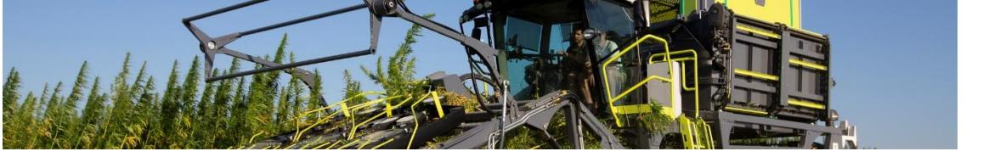
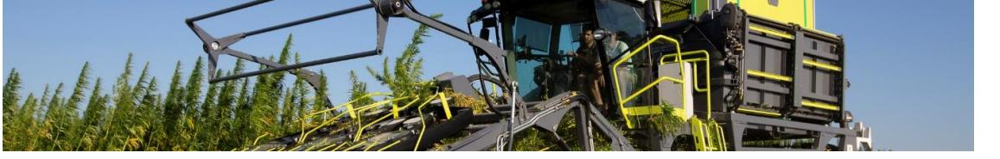
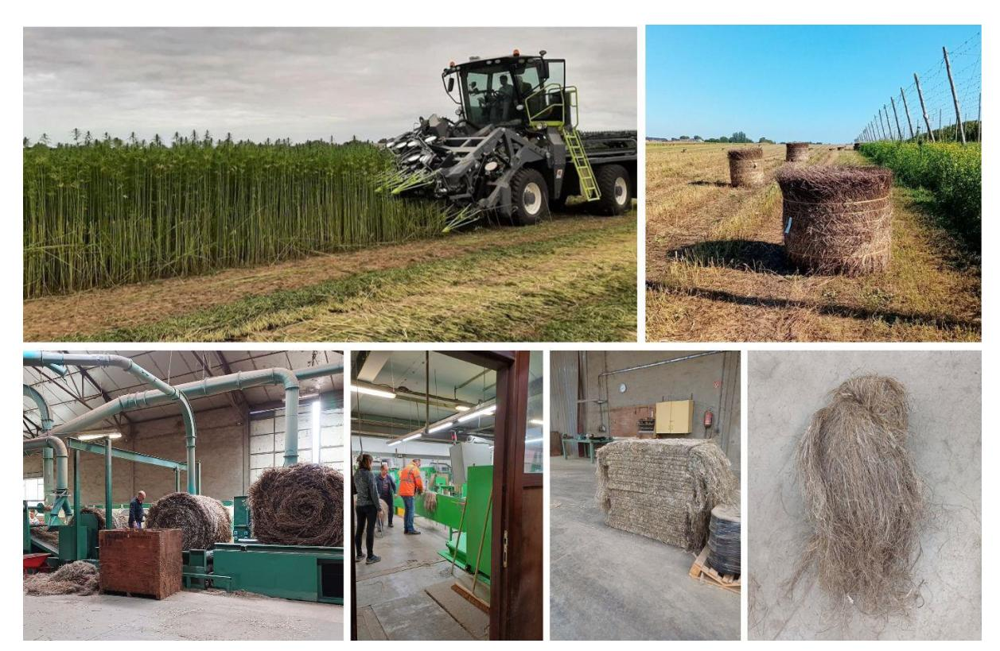

# **Hemp4Circularity: a promising journey in textile hemp cultivation and processing**

When speaking of sustainable textile, hemp may be the fibre of the future. Diving into its potential, the [Hemp4Circularity NWE Interreg](https://hemp4circularity.nweurope.eu/) project is conducting promising hemp cultivation and processing trials. The first results highlight the challenges and opportunities of this innovative fibre for the industrial textile value chain within the NWE region.

## Harvesting long fibre hemp: what have we learned?

Two varieties of hemp, USO31 and Santhica27 were used as trial crops, in Wallonia and Flanders in Belgium, as well as in The Netherlands and Germany. Three hectares were sown per region. Even though the crops grew well, challenges were encountered in the harvesting phase. Initially scheduled to start the first week of August, the harvest was delayed due to the extreme wet weather conditions during the summer of 2023.

Several consequences were encountered due to the late harvest: greater stem length implied larger swaths, particularly in Germany, causing difficulties in turning and baling the hemp. Due to the late harvest caused by the bad weather, the straw was not sufficiently dry when baled in Belgium, leading to difficulties during the scutching process.

The harvest conditions may be challenging -and have already proven to be- for the next stages of hemp processing. Each stage has an impact on the following steps of hemp processing. For example, a difficult turning of the hemp straw will make baling and scutching more complicated. Therefore, every step plays a crucial role in achieving high quality long fibre, both in terms of quality and yield.

# Scutching textile hemp: the impact of high straw moisture content

Scutching trials were conducted by Van de Bilt. Over the past few years, the flax fibre processing unit Van de Bilt gained experience in processing hemp on the flax scutching line, highlighting the differences between flax and hemp fibres and thus their difference in processing needs.

As encountered with flax, hemp straw moisture has a high impact on the scutching phase. A main concern is moisture during hemp baling and water infiltration during hemp straw storage. When moisture levels of the hemp straw reach 15% or higher, several difficulties are met, complicating the scutching process: loss of fibre, blockages (especially in the outlet of the short fibre), delays in the processing capacity… all of which impact the processing cost.

Additionally, water infiltration can prevent the processing of certain bales, resulting in additional costs to dispose them.

#### Promising preliminary long fibre results

Despite the challenging conditions, the scutching stage already gave valuable information about the potential of textile hemp. The yield is encouraging, with straw yield averaging 6 tonnes/ha, of which 16.7 % was long fibre. However, a wide variation was observed depending on the field, ranging from 2,4 % to 26 % of long fibre. One explanation of that variation can be found among other in the moisture content of the hemp bales, which influence long fibre yield and scutching capacity.

Through the cultivation and scutching results, the Hemp4Circularity partners are now looking at developing a better understanding of the influence of the weather, cultivation and harvest conditions on the yields and quality of hemp straw and long fibre.

Interested in textile hemp? Check the project's latest news and training sessions on their website:<https://hemp4circularity.nweurope.eu/>

### About Hemp4Circularity

Hemp4Circularity is a North-West Europe Interreg project conducted by 11 partners, from 4 countries: France, The Netherlands, Germany, and Belgium (Wallonia and Flanders).

The project aims to lay out a circular value chain for hemp as a high-value textile material by 2027, rooted in the North-West Europe flax processing industry. The objective is to integrate and match all actors throughout the value chain, i.e. local agriculture, 'like flax' primary processing, downstream processing, as well as mechanical fibre recycling, and to raise awareness among designers and consumers about hemp textiles.

