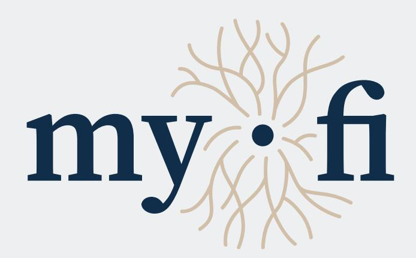

## **D8.6: Guidelines for policymakers to facilitate the growth of biobased textile industry**

April 2024

## DISCLAIMER

The present document refl ects only the author's view and that the Agency is not responsible for any use that may be made of the information it contains.

| Project Acronym | MY-FI               |
|-----------------|---------------------|
| Call ID         | H2020-FNR-2020-1    |
| duration        | Nov 2020 - Oct 2024 |
| level           | Public              |
| Deadline        | 30th April 2024     |
| submission      | 30th April 2024     |

## Index

| <b>Executive summary</b>                                | <b>6</b>  |
|---------------------------------------------------------|-----------|
| <b>SECTION I</b>                                        | <b>7</b>  |
| <b>1 Introduction and aim and scope of the document</b> | <b>8</b>  |
| <b>2 Methodology</b>                                    | <b>9</b>  |
| 2.1. MY-FI project                                      | 10        |
| 2.2. Literature review                                  | 10        |
| 2.3. SAB                                                | 11        |
| 2.4. Twin projects                                      | 12        |
| <b>3 Bio-fabricated mycelium-based materials</b>        | <b>13</b> |
| 3.1. Definitions and classifications                    | 13        |
| 3.2. Why do we need bio-based materials?                | 15        |
| 3.3. Market analysis of mycelium-based materials.       | 17        |
| 3.4. Patent Mapping and Intellectual Property Analysis  | 18        |
| <b>SECTION II</b>                                       | <b>20</b> |
| <b>1 Technical aspects</b>                              | <b>21</b> |
| 1.1. Research overview                                  | 21        |
| <b>2 Scalability aspects</b>                            | <b>27</b> |
| 2.1. Research overview                                  | 27        |
| <b>3 Sustainability aspects</b>                         | <b>32</b> |
| 3.1. Research overview                                  | 32        |
| <b>4 Economic feasibility</b>                           | <b>40</b> |
| 4.1. Research overview.                                 | 40        |
| <b>5 Twin project</b>                                   | <b>46</b> |
| 5.1. HEREWEAR: policy brief                             | 46        |

| <b>SECTION III</b>                       | <b>49</b> |
|------------------------------------------|-----------|
| <b>Policy recommendations</b>            | <b>50</b> |
| <b>Resources and bibliographic index</b> | <b>60</b> |
| <b>Annex I – Glossary</b>                | <b>62</b> |
| <b>Annex II – Partners and roles</b>     | <b>69</b> |

This position paper serves as a guide for policymakers, offering insights to bolster the growth of a bio-fabricated textile industry in Europe. The paper's development entails extensive research, drawing from diverse sources such as literature, the H2020 MY-FI project, and interactions with diverse stakeholders.

The first sections highlight the **characteristics of bio-fabricated** and mycelium-based materials. Mycelium-based materials hold significant potential to transform the fashion industry by offering **innovative materials** and **addressing environmental and ethical concerns**. Despite the promising figures, challenges in scalability, cost-effectiveness, and quality consistency need addressing for widespread adoption.

The paper continues by tackling sustainability issues, including **end-of-life, by-products management, and raw materials**, which are very important aspects in the adoption of bio-fabricated materials. Current practices could lack uniform guidelines, presenting hurdles for standardization.

Finally, the Paper looks at the **current policies and directives from the European Union**. Strong policy support is, indeed, crucial for the diffusion of bio-fabricated materials.

In conclusion, the position paper presents a perspective on the potential and the challenges in developing the bio-fabricated textile industry in Europe, which hinges on a balanced approach to innovation, technical enhancement, sustainability, and strategic policy support. Through **collaboration, education, policy initiatives, and technological advancements**, Europe has the potential to foster a thriving nature-based and ecologically conscious bio-fabricated textile industry that addresses the demands of the present while safeguarding the future.

## SECTION I

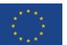

# 1 Introduction and aim and scope of the document

**Textile**  
Textile products, most commonly defined as those products containing at least 80% by weight of textile fibres, include leisure apparel and clothing accessories, household/interior textiles as well as technical textiles.

This position paper aims to support EU Policy makers, National public authorities, Regional Public authorities, Industrial Associations at EU and National Level, Trade Unions in fostering the growth of a bio-fabricated textile industry. The document encompasses a range of crucial topics, including:

- • The **characteristics** and various approaches of bio-fabricated materials
- • The current state of the **industry's development**.
- • A strategic SWOT analysis aimed at investigating **scalability** aspects of mycelium-based materials.
- • Alignment with current European strategies for the **automotive** and the **fashion industry**, with particular emphasis on those supporting the textile industry and bio-fabricated materials.
- • **Practical recommendations** for creating a favourable framework.
- • A set of **examples** and **best practices**, to better clarify the concepts above.

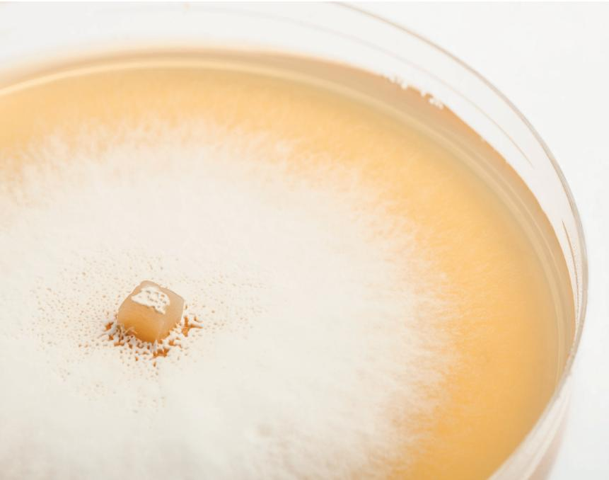

Figure 1 First prototypes of DLF mycelium materials

# 2 Methodology

This position paper on bio-fabricated materials has been developed based on various sources, including MY-FI project's **innovation results, literature, interaction with the Stakeholder Advisory Board (SAB)**, and the H2020 twin projects **HEREWEAR** (grant agreement No. 101000632). The approach and methods used to gather and analyse information on bio-fabricated materials from different sources are outlined below. For this position paper, MY-FI's Consortium partners have identified four key aspects, related to mycelium-based materials, on which the projects intend to educate and raise awareness. These aspects have been extensively discussed during SAB meetings and are based on the experiences and results of the MY-FI project itself. The four aspects analysed in depth are **technical aspects, scalability, sustainability, and economic feasibility aspects.**

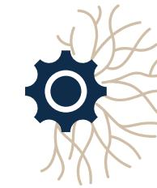

**Technical aspects** of the biofabrication and wet-processing, technical properties of the mycelium-based material, and possible applications, understanding the peculiarities of biofabrication, and the trade-offs.

**Scalability aspects** of the biofabrication process, tackling challenges and opportunities for the scale-up at industrial level of the processes and of mycelium-based materials

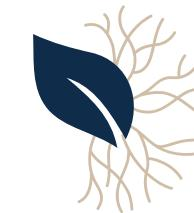

**Sustainability aspects** of mycelium-based materials, analysing potential hotspots, and methodological issues.

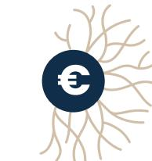

**Economic feasibility** aspects of mycelium-based material, considering Life Cycle Costing and Techno-Economic Analysis of production.

**Sustainability:**  
Sustainability is about meeting the world's needs of today and tomorrow by creating systems that allow us to live well and within the limits of our planet.

## 2.1. MY-FI project

The mission of the MY-FI project is to develop a bio-fabricated material derived from mycelium for applications in the fashion and automotive sectors. This material offers advanced **functionalities**, integrated **sustainability**, and overall **performance**. The project aims to achieve four high-level goals:

- • Empower the fashion and automotive industries to successfully **address the challenges posed by emerging global trends**.
- • **Meet the market and industry demands** for an innovative, functional, and sustainable bio-fabricated material.
- • **Improve the environmental performance** of these industries by developing a bio-fabricated material that does not generate microplastics.
- • **Engage industry stakeholders** and provide **guidance to policymakers**.

Microplastics  
Microplastics are small pieces of plastics, usually smaller than 5mm. They are persistent, very mobile and hard to remove from nature.

For more information about the MY-FI project, please refer to chapters 4 to 7, and Annex II of this document, MY-FI project deliverable 8.7 (available on MY-FI website)1 and the in-depth information throughout the document2.

## 2.2. Literature review

The research methodology for the elaboration of this document involves a comprehensive literature review, which allows the Consortium to gain insights from **scientific studies** and **industry**. This approach helped understanding the **status of bio-fabricated materials in the fashion** and **automotive industries** and their potential **impact on sustainability**. The production of this paper involved an extensive qualitative review of several existing European policies. Specifically, 13 European Union documents were analysed, including communications, strategies, action plans, directives, regulations, and Commission decisions. Most of the cited documents focus on **sustainability communication, textile properties, end-of-life, and eco-design**. Additionally, the literature review includes scientific articles, industry reports, and publications focusing on bio-fabricated materials, bio-manufacturing, mycelium-based textiles, and the environmental impacts of the textile industry.

The authors have also reviewed reports and publications from leading organizations specialized in sustainable fashion and its environmental impact. Some of the **key data sources** for the literature review included fundamental works on bio-based fibres and bio-fabricated fabrics, case studies of sustainable fashion brands, and analyses of consumer behaviour toward sustainable fashion products. Overall, these sources provided valuable insights into the state of the art of bio-fabricated materials in the textile industry and their potential for scalability and impact. The analysis implied the consultation of scientific articles, websites, market research, statistical analysis, trend forecasting websites, and landscape and competitor analysis. As a new, growing, and innovative field, research on bio-fabricated materials in the textile and fashion industry is still quite limited, with missing knowledge on various aspects. For example, insufficient data was found on sustainability and environmental impact, and there is a lack of disclosed technical and process information due to being still under research and development (R&D). Finally, it is important to highlight that even though the project include both automotive and fashion application, most of the sources and the literature material are related to the fashion industry only, being at the moment the sector in which mycelium-based materials have been most studied, developed and applied.

## 2.3. SAB

A Stakeholder Advisory Board (SAB) was established to ensure the active involvement of key stakeholders in the MY-FI project. The SAB consisted of 12 members, including 8 full members and 4 guests. Four stakeholder workshops took place during the project, evaluating all partial results and contributing to important decisions throughout the project's lifespan. The SAB comprised representatives from the **textile industry, supply chains, policymakers, and brands**, providing valuable insights into the current market landscape for the MY-FI consortium. Moreover, the SAB included a diverse range of stakeholders, such as academics, research centres, industry associations, fashion-based organizations, NGOs, trade unions, EC platforms, and private and public partnerships. The stakeholder workshops served as platforms for gathering feedback and conducting critical reviews of the ongoing activities and results of the MY-FI project. These workshops provided opportunities for sharing opinions and best practices related to innovative bio-fabricated materials, drawing upon the extensive experiences of SAB members.

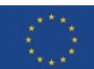

## 2.4. Twin projects

### HEREWEAR PROJECT: Bio-based local sustainable circular wear

HEREWEAR innovates with a holistic, systemic approach towards the creation of a EU market for **locally produced circular textiles and clothing made from bio-based waste**. New material solutions were built on the latest bio-based polyesters and cellulose developments. Three novel waste streams (seaweed, manure, straw) were developed for cellulosic textile fibres. Emerging sustainable technologies for wet and melt spinning, for yarn and fabric making, were developed, and piloted at semi-industrial scale. For finishing, coating and colouring biobased agents were evolved. Microfibre release were significantly reduced via measures all along the textile manufacturing process. Garment prototypes for streetwear and corporate clothing were produced by connecting micro-factories, organised into regional value creation circles; or by platform-supported, networked production resources. **Use phase and end-of-life processing management – repair, re-use, recycle – were implemented through novel structures.** Full **transparency** is provided through blockchain-enabled labelling and the configuration of a digital twin, informed with LCA information. A database and guidelines were produced to support the design of fashion goods; with a focus on the best performance for bio-based materials and for reuse/recycling3.

# 3 Bio-fabricated mycelium-based materials

## 3.1. Definitions and classifications

**Bio-based materials** are 'wholly or partly derived from biomass, such as plants, animals, and microorganisms'. Examples are natural fibres (e.g., cotton, wool, and silk), manmade cellulosic (e.g., viscose), natural polymers (e.g., chitin, keratin and casein), animal leathers and their alternatives. The bio content can vary radically from less than 10% to 100%.

**Bio-fabricated materials** are materials produced using biological processes or living organisms, such as bacteria, yeast, algae5. Bio-fabricated materials are either made from bio-fabricated ingredients, as fermented silk like proteins, or bio-assembled ingredients, as mycelium or microbial cellulose.

**Biosynthetic materials** are synthetic polymer materials comprised, in whole or in part, of bio-derived compounds6. Bio-synthetic materials are for example made from fermented sugars or GHGs to create precursor chemicals for synthetic polymers such as nylons, polyesters and polyurethanes (even if the polymer is bio-based, it is not necessarily bio-degradable).

**Mycelium-based materials** are material grown from the mycelium which is the vegetative body of fungi. These remarkable organisms grow in network-forming structures called hyphae, primarily composed of a polysaccharide called chitin. Chitin's chemical structure is similar to cellulose, and it is a versatile molecule capable of forming a flexible and consistent biomaterial. Chitin possesses other unique properties such as biocompatibility, biodegradability, and non-toxicity. These properties make chitin highly interesting from both functional and commercial perspectives, offering new design opportunities for textile products. Mycelium-based materials are created by collaborating with these living organisms and through a controlled fermentation. Once the fermentation is completed, the material is de-activated and finalized for obtaining soft raw material sheets. The raw material, then, goes through a process of functionalization to obtain the properties and standards required by different sectors (fashion and automotive).

#### Natural fibres:

Natural fibre is defined as fibrous plant material produced as a result of photosynthesis. These fibres are sometimes referred to as vegetable, biomass, photomass, phytomass, agromass, solarmass or photosynthetic fibres. Natural fibres are obtained from natural resources such as plants, animals, and minerals.

#### Fermentation:

Fermentation refers to the metabolic process that converts carbohydrates, such as sugars and starches, into alcohol or organic acids using microorganisms such as bacteria, yeast, or fungi. It's a biological process that often involves the production of energy in the absence of oxygen.

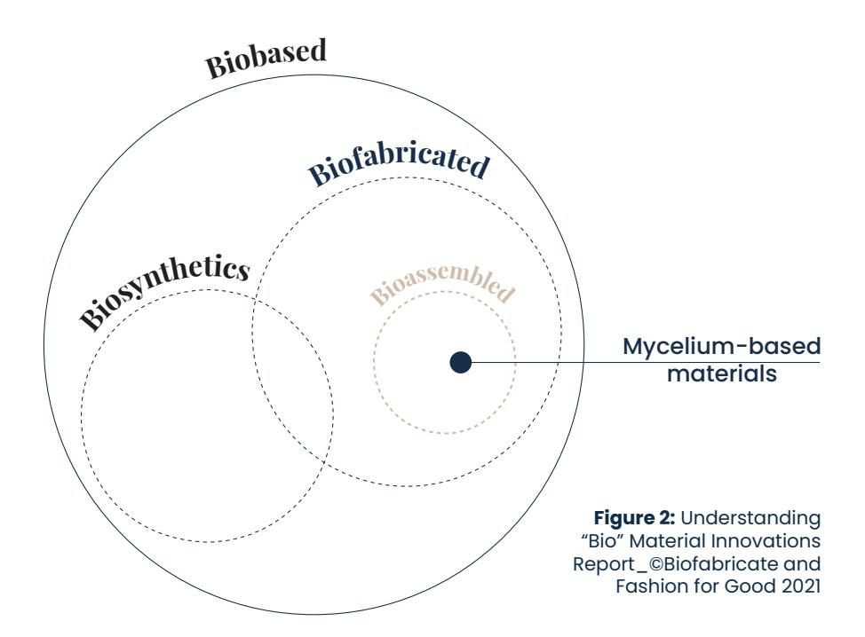

It is important to note that the classifi cation of bio-fabricated and mycelium-based materials within the standard textile classifi cation may evolve as these materials continue to advance and gain wider acceptance in the industry. The categorization can be infl uenced by factors such as the specifi c manufacturing processes, material properties, and market positioning of bio-fabricated materials. As shown in the scheme below, mycelium-based materials do not yet have been defi ned, as their classifi cation either as natural or man-made is still debated.

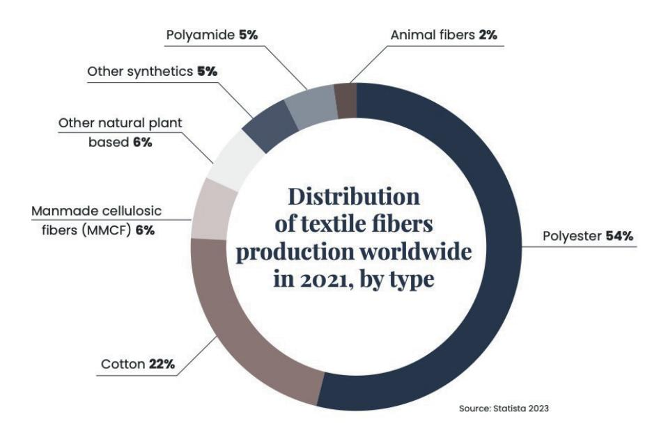

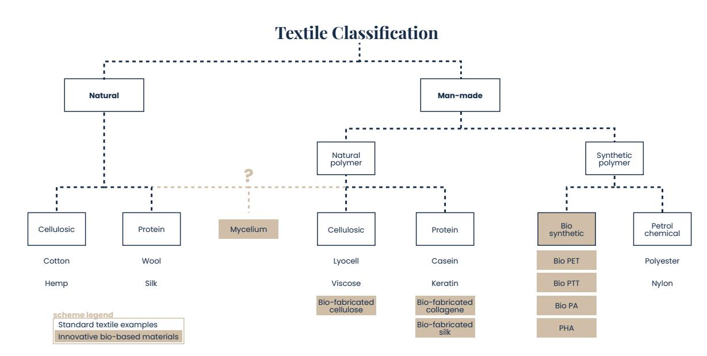

**Figure 3:** Textile classifi cation

## **3.2. Why do we need bio-based materials?**

The global demand for textile products is increasing due to factors like fast-fashion business models, population growth, economic growth, rising income, and urbanization. However, this demand is leading to signifi cant challenges in terms of **resource use, environmental impact**, and **climate change**. Global textile fi bre production has nearly doubled over the past two decades and is projected to continue growing. The EU's textile consumption ranks high in terms of land and water use, greenhouse gas emissions, and raw material use. This growing demand for textiles leads to the ineffi cient use of non-renewable resources, especially the production of synthetic fi bres from fossil fuels. This trend led to a growing interest in bio-based materials as an alternative to the currently used ones7 . Furthermore, according to the data presented in the graph below, polyester held the dominant market share at 54%, while polyamide and other synthetic fi bres accounted for fi ve percent each. This means that over two-thirds of the global fi bre production originates from non-renewable sources, contributing to the release of harmful microplastics8.

In addition, as depicted in the image below, apparel production has experienced signifi cant growth over the past 15 years, nearly doubling in volume. This growth is particularly infl uenced by the rise of "fast fashion" practices, which involve shorter lead times for introducing new styles, a higher

**Figure 4** Distribution of textile fi bres production worldwide in 2021, by type

**Renewable sources:** Renewable sources of energy (wind power, solar power, hydroelectric power, ocean energy, geothermal energy, biomass and biofuels) are alternatives to fossil fuels that help cut greenhouse gas emissions, diversify the energy supply and reduce dependence on unreliable and volatile fossil fuel markets, particularly oil and gas.

**Functional durability:**  
The quality of being able to last a long time without becoming damaged.

number of collections offered each year, and often, lower price points. Despite the surge in clothing production, garments are being vastly **underutilized**. Globally, the average number of times a garment is worn before being discarded has decreased by 36 percent compared to 20 years ago. Therefore, it is evident that while clothing sales have risen, the durability and usage of garments have notably decreased over time9.

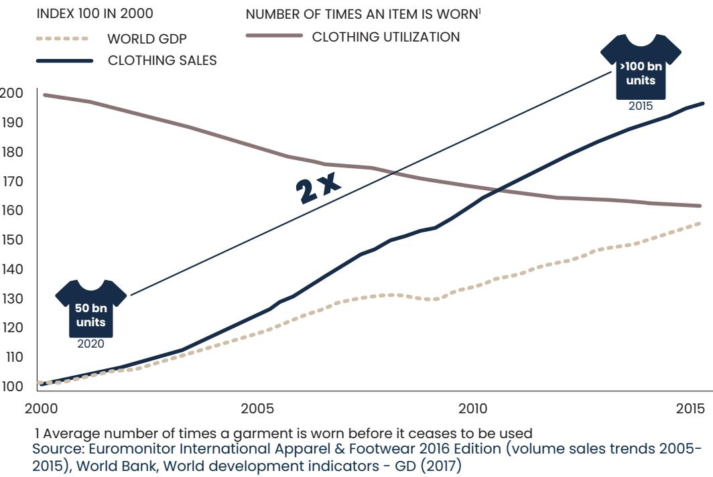

**Figure 5** Growth of the clothing sales and decline in clothing utilization since 2000

All the factors mentioned have contributed to a rapid expansion and development of the bio-based market in the textile sector. Especially, the European Union's allocation of funds and the implementation of the European Strategy for Sustainable and Circular Textiles have played a significant role. The guidelines established by this strategy emphasize the preference for bio-based materials as a crucial step towards reducing the environmental impact associated with textiles10. In particular, biofabricated materials have been recognized as crucial for reducing dependence on petroleum sources. The project results demonstrate that mycelium-based materials, in particular, utilize fewer resources compared to other conventional textile materials. However, there are still challenging aspects regarding their end-of-life phase that have not been fully explored. There is a need for comprehensive responses and collaboration from various stakeholders present in the market to address this issue effectively.

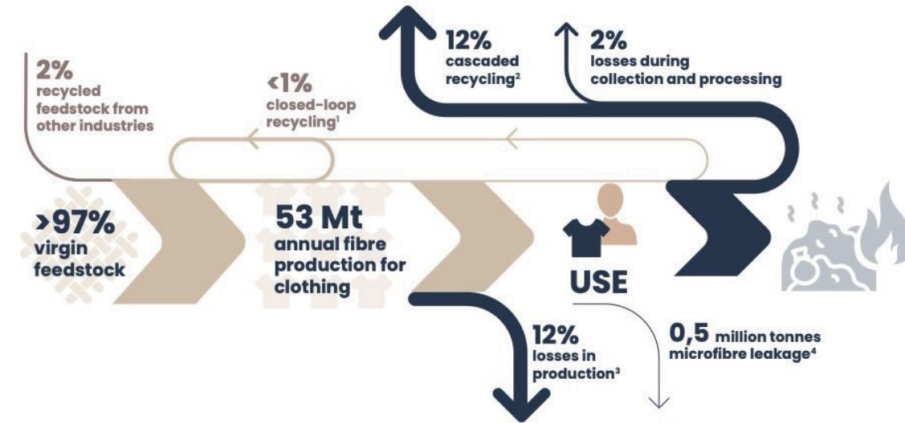

1 Recycling of clothing into the same or similar quality applications  
 2 Recycling of clothing into other, lower-value applications such as insulation material, wiping cloths, etc  
 3 Includes factory offcuts and overstock liquidation  
 4 Plastic microfibres shed through the washing of all textiles released into the ocean  
 Source: Circular Fibres Initiative analysis. A new textiles economy: redesigninf fashion's future. Ellen Macarthur Foundation

**Figure 6** Global material flows for clothing in 2015

### 3.3. Market analysis of mycelium-based materials.

Considering the growing environmental awareness, a new market segment that includes mycelium-based flexible materials has gained traction, particularly among millennials. Sustainable fashion products, including mycelium-based materials, have become appealing due to their **innovative aspects** and their focus on **addressing environmental and ethical concerns**. The global mycelium flexible materials market is estimated to be worth €24.8 million in 2022, with a forecasted size of €234 million by 2028 and a notable CAGR of 45% during 2022–202811. The European transition towards sustainability, as supported by policymakers and initiatives like the Circular Economy Action Plan and the EU Industrial Strategy update, creates a favourable environment for innovative and sustainable solutions. The MY-FI project aligns with this trend, aiming to contribute to the development of commercially viable mycelium-based prototypes, focusing on technical, economic, and environmental sustainability. The continuous exploration of plant-based fabrics in fashion and automotive projects indicates a growing market for these alternatives. The MY-FI project emphasises the importance of a **tailored business strategy** to ensure the commercial success of its innovative mycelium-based material products in this evolving market landscape.

The final product applications span the food and beverage, packaging, clothing and apparel, and automotive industries. The clothing and apparel market dominates this sector, driven by factors like adaptability to fashion trends, integration of sustainable-oriented materials, and diverse appeal applications. Regionally, the mycelium-based material market shows growth potential. Europe and North America currently hold the highest shares, driven by economic diversity, cultural heritage, and well-developed infrastructure. Asia-Pacific also exhibits a significant market presence. The forecasted growth is supported by the increasing number of patents and competitors in the market.

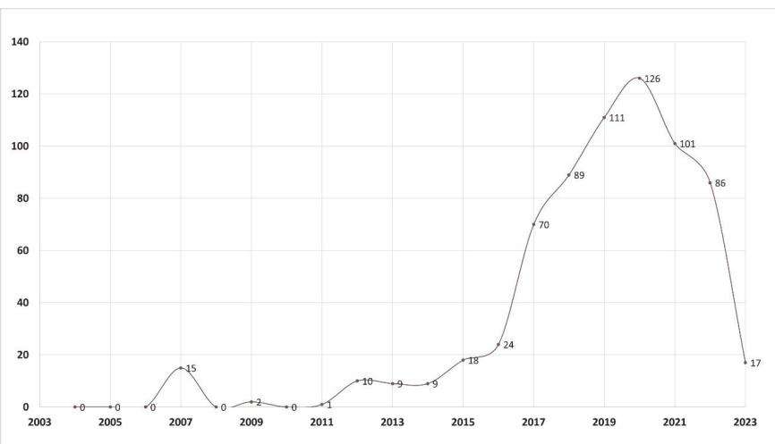

Figure 7 Patent Application Trend (2003-2023)

### 3.4. Patent Mapping and Intellectual Property Analysis

Indeed, a patent search conducted within the MY-FI project12 focused on mycelium-based materials, particularly covering biofabrication processes, wet processing and finishing stages (crosslinking, dyeing, finishing, and coating), and partner-specific processes. After a qualitative and quantitative refinement of over 5,000 patents, 25 were identified as the most relevant. Key findings revealed China's dominance in exploring mycelium technologies, suggesting potential opportunities for other countries, especially in Europe. Small and medium-sized enterprises (SMEs) emerged as significant players. Primary assignees in the specific processes included China, the United States, Denmark, and Belgium. A follow-up search identified 40 players and 123 patent families, demonstrating the dynamic nature of the field.

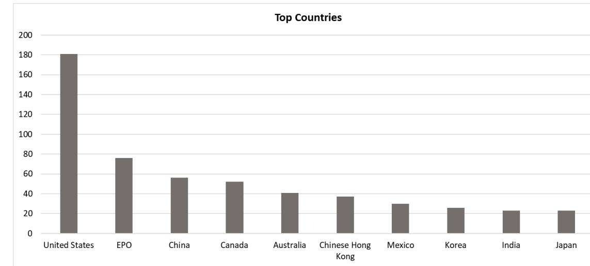

Figure 8 Top Application Country

The application trend graph of Figure 7 shows a notable upswing since 2016, indicating increased emphasis on development and innovation. Geographic coverage analysis revealed the United States, EPO, and China as top application countries as shown in Figure 8.

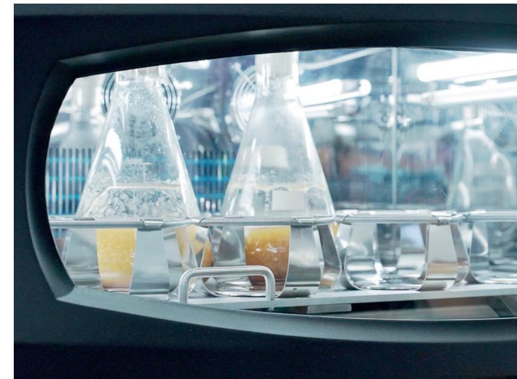

Figure 9 Lab-scale biofermentation process

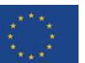

# 1 Technical aspects

## 1.1. Research overview

### Biofabrication

The MY-FI project involves the production of raw mycelium fabrics through two distinct types of fungal fermentation: dynamic liquid fermentation (DLF) and surface liquid fermentation (SLF). The most promising combination of strains and nutrients was identified through experiments with various fungal strains and substrates. Optimizing these fungal fermentation processes poses a significant challenge, requiring a delicate balance of parameters such as temperature, substrates, reagents, and bioreactor design. However, **successful optimization has resulted in the production of mycelium-based materials with improved thickness, density, homogeneity, repeatability, and reactivity for post-treatment.** Moreover, biofabrication allows for the valorisation of substrates and by-products by collaborating with nature and giving life to materials of any shape and size. The project also focused on developing hybrid materials by combining fungal biomass with recycled textile fibres. This necessitates overcoming challenges related to the compatibility of these materials, their processing, and achieving the desired properties, but holds the potential of providing a valuable process to valorise textile residues.

#### Biomass:

Biomass is organic, non-fossil material of biological origin (plants and animals) used as a raw material for production of biofuels. It can be also called biomass feedstock or energy crops. It includes wide range of materials harvested from nature or biological portion of waste. The most typical example is wood (firewood, wood residues, wood waste, tree branches, stump, wood pellets, ...), which is the largest biomass energy source. Other examples of biomass are grass, bamboo, corn, sugarcane, animal waste, sewage sludge and algae.

## Section II

In the following section of the document, four macro topics of the project are analysed: **technical** aspects, **scalability** aspects, **sustainability** aspects, and **economic feasibility** aspects. For each, the macro themes addressed in the project are presented as well as an overview of the research conducted, and the results obtained. Subsequently, for each aspect, the advantages and shortfalls of mycelium-based materials are analysed and an overview of how these can influence their acceptance and expansion in the market is shown. Finally, it is presented an overview of the main outcomes and **policy insights from twin project HEREWEAR.**

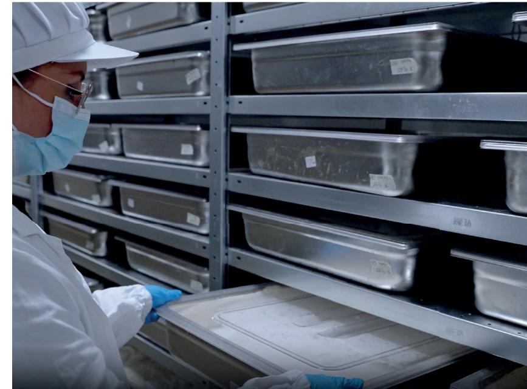

Figure 10 MOGU SLF process

This project has received funding from the European Union's Horizon 2020 research and innovation programme under the Grant Agreement No. 101000719

## Post-processing

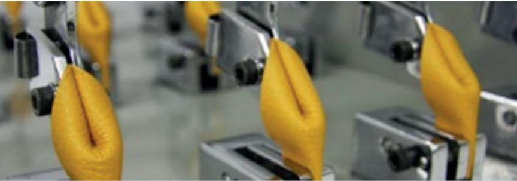

Figure 11 LP performance tests on the mycelium-based material

**Post-processing:**  
Mycelium post-processing methods vary and can be categorized into physical and chemical processes. These methods aim to enhance material properties while retaining the integrity of the mycelium.

Post-processing aims to increase the aesthetical, functional, and mechanical properties of mycelium flexible materials through operations such as washing, crosslinking, plasticizing, dyeing, coating, and special functionalization. Various plant-based crosslinkers and greasers were used to influence and control mechanical properties such as thickness and softness. Furthermore, conventional and vegetable dyes were used in both standard tanning drums and alternative equipment with a better management of water. Tear and tensile strength still need to be supported through lamination with another fabric to achieve industry's standards. However, the material has reached satisfactory characteristics (colour fastness, abrasion, flexural resistance) positioning it in a positive direction for further improvement and market readiness.

Figure 12  
Non-woven textiles produced by AITEX recycling textile fibers

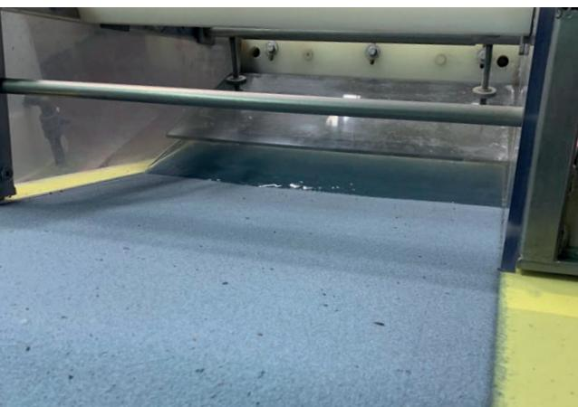

## Prototyping for fashion

Prototyping and validation activities for mycelium flexible materials were carried out using all the techniques and technologies typically employed in the development of samples and finished products in the luxury fashion sector. The focus was on creating prototyping procedures in line with European standards, which require the use of less toxic chemicals. Among the various technologies tested, some emerged as performing better with no observed issues, such as **laser cutting** and **engraving**, applied to both wax and bio-PU-finished samples. **UV digital printing**, catalysed by UV lamps during the fixing process, has demonstrated superior resistance and durability, offering the promise of a robust final product. Thermo-welding performed well, and the material reacted appropriately; for optimal performance, it is recommended to maintain low temperatures (60-70°C). Taping also proved effective when applied to the material's back, preserving its absorbancy due to the absence of finishing. In addition, laser cutting was successfully employed, showcasing its high versatility. This technique not only produces a cleaner result but also significantly reduces production times. Importantly, laser cutting eliminates the need for the printing chemicals typically used in traditional printing processes. The material yielded positive results in the prototyping process, employing a reverse design approach that began with the material's characteristics to achieve the optimal design for the prototypes.

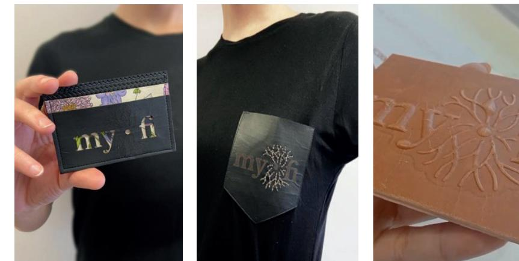

Figure 13 First prototypes for the fashion industry by Dyloan Bond Factory

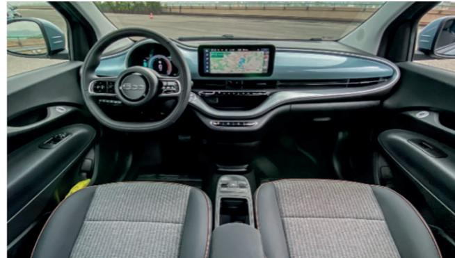

**Figure 14** Cars interior: examples of possible mycelium-materials application

### Prototyping and validation in the automotive sector

The project focuses on **defining specific requirements for automotive applications, designing, and creating prototypes, and conducting extensive testing based on automotive specifications**. These tests cover aspects such as abrasion, colour fastness, tensile strength, and tearing strength, with a focus on properties essential for homologation and safety. While initial tests on mycelium materials reveal challenges in meeting all mechanical, aging, and functional performance requirements, there are promising results in areas like wear resistance and colour fastness. Strategies for improvement include modifying post-processing steps and material coupling. The project identifies initial applications for prototypes, emphasizing their use on series components for better comparability with existing materials. Material selection considers not only properties but also haptic and visual requirements in collaboration with style departments. It is worth mentioning that the automotive sector has high and strict standards. Considering the project started only three years ago, the material is on the right path to meet the requirements, and achieving such quality typically necessitates many years of research and development.

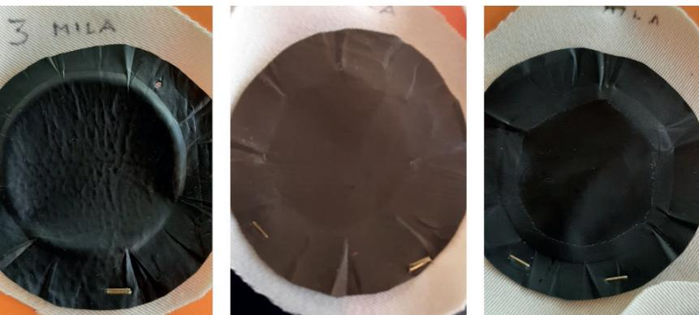

**Figure 15** Mycelium-materials tests for ensuring their suitability for application in car interiors

### What are the main technical advantages and shortfalls of mycelium-based materials?

**REDUCED ENVIRONMENTAL IMPACT:** In terms of environmental impact, it is worth noting that mycelium-based materials SLF production require low quantity inputs as minimal water consumption. Nutrients could come from waste or by-products from the agriculture industry which could be valorised and regenerated by the biofabrication process. Furthermore, the nutrients in the mycelium are reusable as a substrate for DLF or for energy production. Additionally, the material can be cultivated vertically, leading to reduced land use.

**DERIVED FROM RENEWABLE SOURCES:** Mycelium, the vegetative part of fungi, thrives on low-value feedstocks, transforming into innovative, high-value, and responsible materials. The selection of different straws and the preference for agri-food waste or by-product places the biofabrication process in the middle of the circular economy revolution. Actively grown, mycelium leverages the potential expressed by microbial organisms to shift from an exploitative to a generative paradigm rooted in biofabrication.

**CUSTOMIZABILITY AND TAILORING TO SPECIFIC APPLICATIONS:** Mycelium-based materials can be precisely engineered to possess desired properties, such as shape, colour, texture, and strength. This inherent flexibility in design opens to numerous possibilities.

**BIO-BASED CONTENT:** The raw material is 100% bio-based and biodegradable. Depending on the post-processing procedure, the end materials can achieve a high bio-based content. For instance, MY-FI materials have undergone testing, revealing a bio-based content ranging from 70% to 80%.

**HEALTHY AND SAFE:** Concern has been raised around possible allergic reaction towards mycelium, but allergenic tests performed on MY-FI prototypes indicate excellent skin compatibility. Moreover, all the additives used are ZDHC and REACH compliant.

**DURABILITY** is one of the key technical performances emphasised by the EU Strategy for Sustainable and Circular Textiles. MY-FI is exploring the concept of developing long-lasting products that readily break down under specific conditions.

**WITH REQUIRED TECHNICAL PERFORMANCES:** Mycelium fibres are not inherently strong; they indeed require coupling and coating. Through these processes, MY-FI materials have exhibited satisfactory performances, particularly in terms of abrasion

resistance, colour fastness and flexural strength. Due to its peculiar structure, mycelium guarantees to the materials lightness and breathability, sought-after characteristics in the ready-to-wear and automotive sector.

**NO RELEASE OF MICROPLASTICS:** Microplastics are a pressing problem and unfortunately not an easy one to deal with. Currently to meet industrial requirements, mycelium-based materials need a coating, and its choice affects this aspect. As part of the MY-FI Project, specific guidance on the maintenance of the material has been developed and the project is looking for environmental-friendly options.

**SPECIFIC TOUCH-AND-FEEL ASPECTS:** Despite acknowledging the technical limitations, the suede-like appearance of the raw mycelium samples received favourable feedback. This positive response can be attributed to its soft touch and appealing aesthetic. Moreover, consumers love the natural touch and feeling together with its particular patterns. Further experiments are currently underway to optimize the tactile qualities of the material, emphasizing its specific characteristics and unique features.

## 2 Scalability aspects

### 2.1. Research overview.

#### Biofabrication scale-up

One of the primary objectives of the MY-FI project is to successfully scale up the biofabrication of mycelial biomass through dynamic and surface liquid fermentations (DLF and SLF, respectively). The goal is to establish a systematic approach for enhanced growth in stirred tank reactors (STRs) while achieving an optimised process that ensures consistent results and can be easily translated from bench to commercial scale.

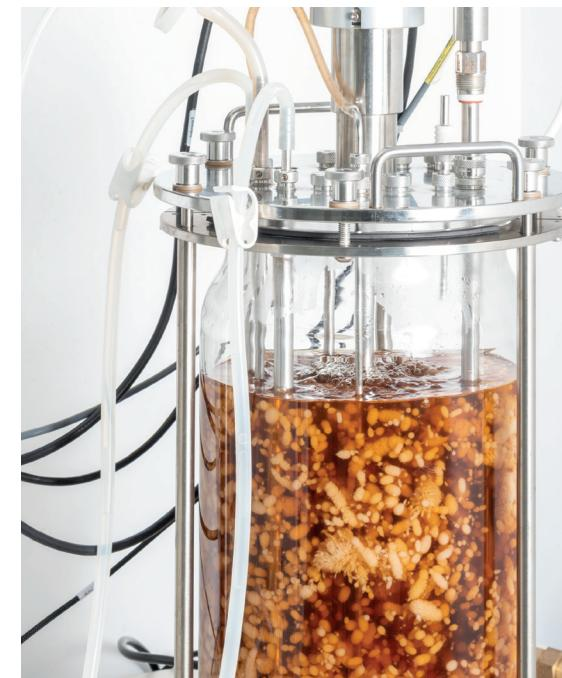

Figure 16 DLF reactor

The unique characteristics of the **SLF process**, developed within the project, make direct standardisation challenging. Therefore, it is imperative to identify and customise equipment and processes already utilised in various industries to successfully implement the SLF process on a large scale. The SLF process underwent improvement by optimising the main operational and biochemical factors controlling mycelium growth. The bioreactor size was initially doubled and subsequently quadrupled, with corresponding adjustments to the main operational conditions for each size increase. The simultaneous operation of bioreactors was increased by ten-fold. New and larger growing rooms were constructed and appropriately furnished to facilitate the optimal incubation of the expanded number of bioreactor trays simultaneously.

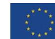

Optimal conditions for the physical and biochemical factors influencing the **DLF process** have been established through experiments in stirred tanks. The results of multiple experiments in STR determined the stirrer speed and aeration rates on a large scale, up to exceeding the fermentation in 150L and reaching the 1500L tank. The further scale-up of the DLF process is still in its early-stage as the quality of the material is not adequate.

### Post-processing scale-up

The mycelium fibre post-treatment process of the SLF material has been upscaled by adapting the preliminary downstream processing (DSP) protocols developed for bench-scale in an industrial reality. The type of reactor applied for these downstream steps was carefully studied to allow a proper material treatment while maintaining its physical integrity. Further tests were performed for the optimization of the water and chemical consumption as well. The first trials allowed the production of promising prototypes with different colours and finishings.

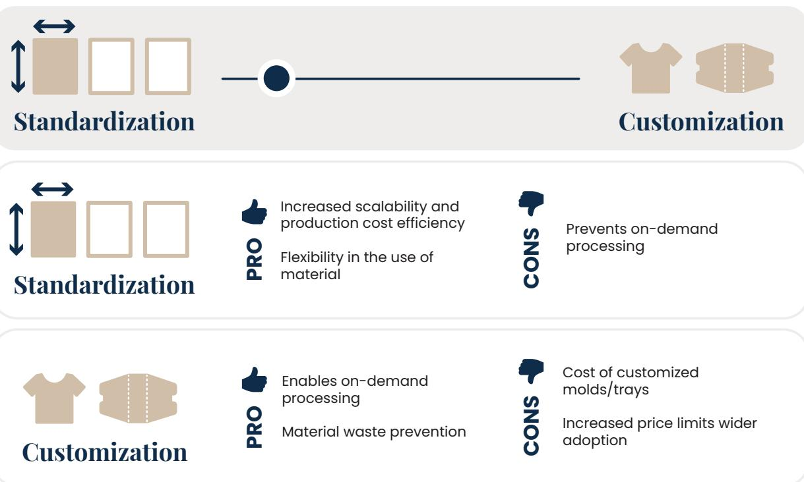

### What are the key aspects that can advantage or disadvantage the scaling up of mycelium-based materials?

**AVAILABILITY OF TECHNOLOGIES:** industrial-scale fermentation of filamentous fungi has firmly established itself in the food and industrial biotechnology sectors, providing a robust foundation for bio-fabricated material production. This proven process is particularly advantageous when applied to the textile industry, serving diverse applications in fashion and automobiles. In MY-FI, both in biofabrication and post-processing, technologies from various sectors have been seamlessly integrated. Although the biofabrication process is innovative, it leverages **technologies from sectors such as food and vertical farming**. Equipment, including shelving, mechanized systems for moving mycelium growth tanks, sterilization machinery, and solid-to-liquid reduction equipment, including moulds for growth, is sourced from existing scaled-up industries. These technologies significantly contribute to the scalability of mycelium-based materials. Currently, mycelium requires post-harvest treatment; tanning techniques have proven to be the most applicable and suitable. The machinery and processing technologies of many of the established materials, traditionally used for centuries, are easily utilizable but need to be adapted to the specific requirements of mycelium. Recognizing the need for ongoing optimization due to the unique characteristics of mycelium, such as weight and density, the MY-FI project has worked on **adapting existing machinery**. However, for full and efficient scale-up, specialized machinery and tailor-made chemicals for mycelium processing need to be developed.

**LOW WASTE:** For instance, materials based on mycelium can grow within a mould shaped like the final product's pattern, significantly **reducing waste by producing panels with tailored dimensions**.

**LOCAL RAW MATERIAL SOURCING:** Emphasising the importance of **sourcing** mycelium substrates **locally** is crucial for minimising environmental impact. Non-local sourcing may result in elevated transportation costs and carbon emissions, creating logistical challenges in maintaining a sustainable and reliable supply of specific substrates. In MY-FI, partners have actively worked to identify and select local, second-generation biomass, by reducing costs compared to virgin materials.

**CUSTOMIZATION OF THE PROCESS:** Continuous innovation in material properties and production methods enhances the versatility and competitiveness of mycelium-based materials. That being said, a notable technical strength of mycelium lies in

**Carbon emissions:**  
Carbon dioxide (CO2) is a colourless, odourless and non-poisonous gas formed by combustion of carbon and in the respiration of living organisms and is considered a greenhouse gas. Emissions means the release of greenhouse gases and/or their precursors into the atmosphere over a specified area and period of time. Carbon dioxide emissions or CO2 emissions are emissions stemming from the burning of fossil fuels and the manufacture of cement; they include carbon dioxide produced during consumption of solid, liquid, and gas fuels as well as gas flaring.

its customizability. Mycelium-based materials can be precisely engineered to possess desired properties, including shape, colour, texture, and strength. While customization is recognized as a strength, its impact on economic sustainability remains uncertain. Although tailoring products to specific requirements can enhance customer satisfaction, it may also introduce complexities and costs that could potentially affect the economic viability of the customization process. This inherent flexibility in design opens up numerous possibilities. However, it is crucial to note that customization proves to be economically challenging in the early stages of material development. As the material matures, addressing these challenges becomes integral to realizing the full economic potential of customization.

**RIGHT COLLABORATION WITH LIVING ORGANISMS:** Scaling up bio-fabricated materials proves more intricate compared to simpler biomaterials due to the inherent complexity of the biofabrication process. The selection and collaboration with living organisms add an additional layer of complexity, resulting in prolonged and intricate scaling-up procedures. In MY-FI, various fungal strains have been tested, and successful selection has been achieved, focusing on those that demonstrate optimal quantity and standardization in both the process and the final product. The challenge is to maintain the conditions at bigger scale that allow the fungi to grow. Indeed, scalable production processes play a crucial role in achieving cost-effectiveness and competitiveness, thereby positively influencing economic feasibility. Currently, most mycelium-based materials are still in the research and development phase, resulting in non-scaled products with high costs. Achieving standardization in the production process proves challenging due to the dependence on mycelium growth. However, this challenge can be effectively addressed by implementing biological process controls on a demonstration scale. This involves regulating process timing and procedures executed by operators in the growth chambers to ensure a homogeneous outcome. By making adjustments in timing, temperature, and other process actions within the growth chamber, it is possible to contribute to the standardization of the production process. These measures not only enhance the consistency of the final product but also have a positive impact on the economic feasibility of the entire process. Furthermore, the production of mycelium-based materials tends to be more complex and expensive compared to traditional materials. However, it's important to note that advancements in technology and economies of scale are expected to lead to a decrease in costs over time. As these materials progress from the developmental stage to full-scale production, the economic landscape is likely to

evolve, addressing current cost challenges and enhancing their overall viability in the market.

**CONSUMER PERCEPTION AND ACCEPTANCE:** As a bio-based material not associated with the animal industry, mycelium-based materials align seamlessly with market trends and the growing demand for innovative materials. Furthermore, the notable advancements in technical performance, especially in abrasion resistance and colour fastness, along with **positive feedback from stakeholders** and other dissemination activities, have garnered favourable responses for the materials produced within the MY-FI project. More efforts must be done to reach industrial requirements. However, this market acceptance could potentially attract investments and lead to an increased demand for the material, thus facilitating progress towards industrialization.

**SUPPORT TO SMEs BY THE FASHION INDUSTRY:** Small companies venturing into the biofabrication sector encounter the challenge of needing diverse expertise. Nevertheless, this complexity also offers opportunities for innovation and collaboration across various disciplines, fostering breakthroughs in material science within the fashion industry. In the case of MY-FI, **collaboration with different technical industrial partners** has yielded excellent results and advancements at all stages of the process.

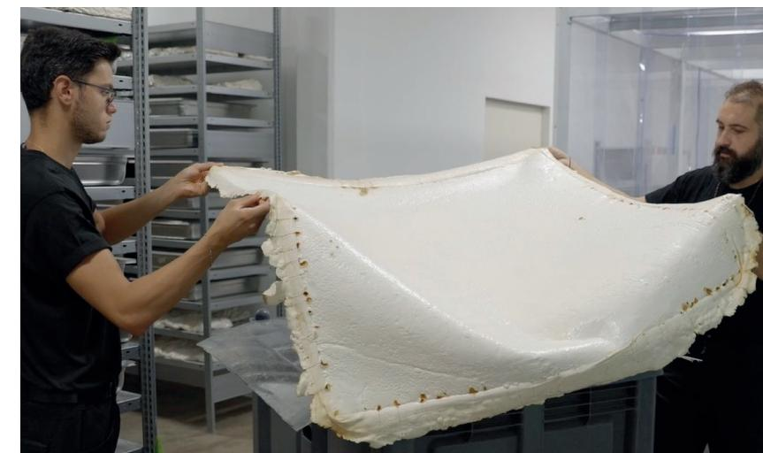

Figure 17 Harvested 1 sqm SLF panels, ready for drying

# 3 Sustainability aspects

## 3.1. Research overview

### Life Cycle Assessment (LCA)

As part of the MY-FI project, the environmental impact of the most promising mycelium-based materials produced within the project has to be measured and evaluated. Among the different possible methods is the Life Cycle Assessment (standard ISO 14044), which is one of the most acknowledged and recognised sustainability assessment tools by the European Union. The LCA study does not constitute a point of arrival but rather a **science-based approach** that can promote a better knowledge of processes and performances to kickstart an improvement plan. For materials still in the research and development phase, the LCA provides an opportunity to refine and optimise processes from a sustainability perspective, providing insights for an **efficient scale-up**. For example, the assessment delivers information on resource use efficiency and the interconnection between production options and final product impact. Within the **bio-fabrication** process, thermal energy consumption emerges as the primary hotspot, constituting almost half of the overall environmental impact. This is primarily influenced by the type of fuel used and the raw material acting as the growth substrate. To address the hotspots, scenario analyses have been conducted. Regarding the growth substrate, investigations considered both total and partial substitution, analysing how the environmental impact varies with a change in the substrate while maintaining the same quantity. The biofabrication partner is now investigating a reduction in

**Carbon neutral:**  
Carbon neutrality means having a balance between emitting carbon and absorbing carbon from the atmosphere in carbon sinks. Removing carbon oxide from the atmosphere and then storing it is known as carbon sequestration. In order to achieve net zero emissions, all worldwide greenhouse gas (GHG) emissions will have to be counterbalanced by carbon sequestration.

**LCA:**  
LCA is defined by the ISO 14040 as the compilation and evaluation of the inputs, outputs and the potential environmental impacts of a product system throughout its life cycle.

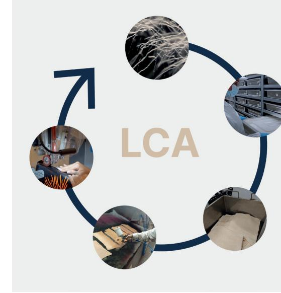

**Figure 18** For the MY-FI project, SPIN is assessing the impact of both SLF and DLF materials, from the biofabrication stage, until the finishing one.

the substrate by 30% while the electric energy has been switched to 100% renewable source. In addition, it can be said that mycelium has a low land utilisation making it very efficient from the land use point of view considering also that biofabrication is inherently structured to be vertical, optimising space without compromising food cultivation. Another positive aspect is that the waste sludge from biofabrication can be utilised to generate energy. Some analyses on the sludge composition were already conducted to understand the amount of carbon present and the efficiency in the conversion of the waste into methane. The methane produced could be afterwards recycled and used as fuel in the production. This way there would be a reduction in the waste and energy consumption implementing a zero-waste policy and more circular approach.

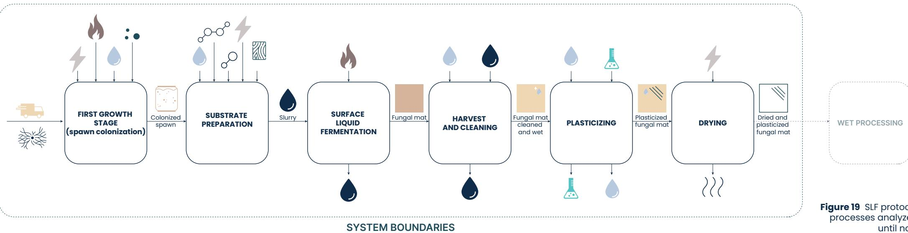

**Figure 19** SLF protocol processes analyzed until now

Following the assessment of biofabrication hotspots, a similar analysis has been applied to consequential procedures, specifically **wet processing**. In wet processing, the key hotspots are the chemicals used during the enrichment phase, which account for half of the overall environmental footprint. Additionally, the material's high hydrophobic nature necessitates a significant amount of water for successful wet processes. However, regarding water usage as one of the climate change indicators, the direct extraction of water from a well, as is happening in the MY-FI wet processing facility, mitigates its environmental impact. Moreover, the use of machinery not specifically designed for the material's characteristics but adopted from another industry proves to be not very efficient. Having said that, thanks to the MY-FI project's efforts, significant progress has been achieved, such as optimizing the use of an horizontal drum which has been proved of being more gentle and efficient on mycelium-based flexible materials. The project has focused on both the biofabrication level to develop a suitable mycelium-base material and the wet processing level, leveraging the expertise and know-how of technical project partners. This applies to chemicals as well, which are not tailored for mycelium but are adopted from another industry. Potential improvements, based on hotspot analyses, may focus on electric energy efficiency by enhancing machinery efficiency and altering the sources of electricity. In transitioning to 100% renewable resources, this shift might involve changing the electric energy supplier or relocating production to countries with national grids comprising certified renewable resources. Regarding scalability, the current pilot scale has low efficiency due to the use of industrial-scale machines to produce small amounts of product. This led to using more resources than the small production needed. Examining the **combined processes of biofabrication and wet processing** to produce 1 square metre of mycelium material, it emerged that most of the impact is attributed to the wet processing phase. In general, impacts from the main inputs of wet processing surpass those from biofabrication, due to the above-mentioned need to optimize the processes for the specific material under study.

## Biodegradability and Compostability

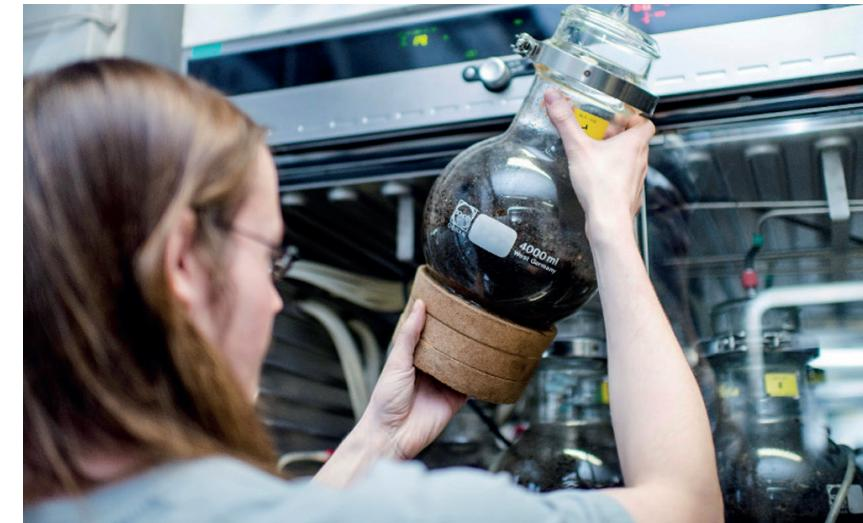

**Figure 20** Biodegradability and compostability tests performed by Normec OWS

Besides being produced from waste resources, it is the ambition of the MY-FI project to develop a mycelium-based flexible materials that is bio-degradable and does not release micro-plastics to drive the textile industry to lower its environmental impact. Therefore, within the MY-FI project, the biodegradation behaviour, and the suitability for treatment by organic recycling, such as industrial compostability and anaerobic digestion, have been investigated. The raw mycelium produced via surface liquid fermentation (SLF) showed complete biodegradation as defined by the European norm EN 13432 Requirements for packaging recoverable through composting and biodegradation: Test scheme and evaluation criteria for the final acceptance of packaging (2000). The disintegration trials of the MY-FI textiles under pilot-scale composting conditions indicated that the different treatment steps impact the disintegration rate. Indeed, several processing steps and coatings are needed for high-end applications in the automotive and fashion industries. The impact of these treatments on biodegradation is currently being carefully examined. The project is investigating the possibility of employing biobased additives to improve the biodegradability of the final material as well as is investigating other end-of-life options. Within the project, tests on the biobased content have been conducted and have reached 75%. In a longer-term perspective, research and innovation are and should increasingly drive and assist in achieving these goals.

**Biodegradability:**  
'Biodegradable' products are designed to decompose at the end of their life by the conversion of all their organic constituents (polymers and organic additives) mainly into carbon dioxide and water, new microbial biomass, mineral salts and, in the absence of oxygen, methane.

**Compostability:**  
Products designed to biodegrade under controlled conditions, typically through industrial composting in special facilities for composting or anaerobic digestion.

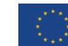

### What is the environmental sustainability of these products? How it should be measured?

Life Cycle Assessment (LCA) considers various parameters, including climate change, ozone depletion, ionizing radiation, photochemical ozone formation, particulate matter, human toxicity (non-cancer), human toxicity (cancer), acidification, eutrophication (freshwater), eutrophication (marine), eutrophication (tertiary), eutrophication (freshwater), land use, water use, resource use (fossils), and resource use (minerals and metals). While LCA is a recognized method, its outcomes are contingent on specific factors such as the location of application, production scale, machinery, and the type of energy and chemicals used. One critical input is **raw materials**, the impact of which could significantly decrease if sourced from by-products of the agro-food industry, offering substantial potential for reduction. However, a challenge arises in the quality of these materials, which may be nutrient poor. Therefore, there is a trade-off between second-generation materials and the need for more quantity due to their low nutrient content. To conclude, utilizing second-generation biomass and locating it nearby could reduce both land use (as the material comes from waste and is not cultivated specifically for this purpose) and transportation needs, resulting in a reduction in logistics and transport-related impacts. The upscaling of the mycelium-based material could reduce the environmental footprint of the product, since at industrial scale the efficiency of the machineries is at best. This is expected to happen for MY-FI, where the thermal energy consumed during bio-fabrication could be reduced by upscaling the production. This will mainly occur because the machineries currently used are already dimensioned for an industrial production and are underused for the current amounts. Therefore, producing bigger amounts will increase the **energy efficiency**: the same amount consumed will be used to produce more panels and therefore the allocation per panel will assign a smaller quantity for each. The same will happen for transports: by travelling fully loaded, they will have the highest possible efficiency. However, the upscaling will not influence all the parameters: for example, the **feed for the mycelium growth** will not decrease the amounts required if more product is created. This value could be altered by changing the feed in a more nutritive one: requiring less quantities for the same growth rate of the mycelium. A 30% reduction of the feed has been achieved within the MY-FI project. Applying the LCA during the pilot and upscaling processes will increase the possible improvements on the production while it is still on a development phase, eliminating problematic hotspot early in the production. In conclusion,

as mycelium-based materials are relatively new, guidelines for conducting life cycle assessments (LCAs) on these materials are still evolving. Consequently, only a limited number of studies and guidelines currently exist to support the environmental assessments of these materials.

### What is the social sustainability of these products?

One of the aims of the project is to create jobs in rural areas. The process can contribute to rural development due to its low investment costs and the potential to decentralise production. Rural areas, often isolated from common trade routes, stand to benefit significantly from the opportunity to establish high-value manufacturing with limited input needs. The project enables the creation of businesses in small rural zones, thereby generating employment opportunities. Sourcing raw materials near biofabrication and down processing sites further enhances the project's economic viability.

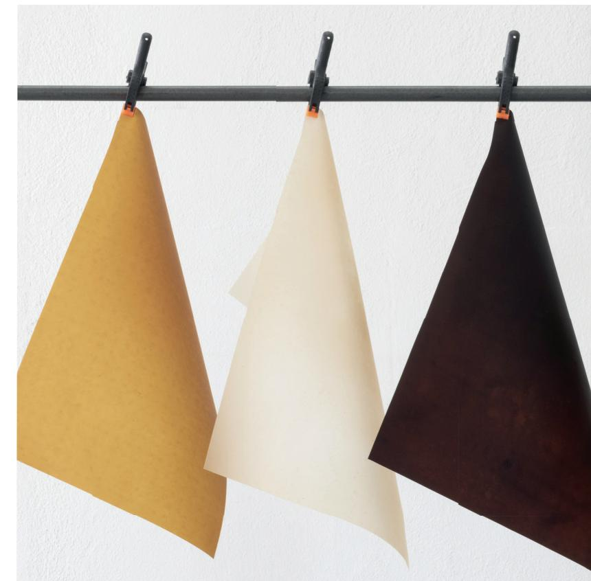

Figure 21 First prototypes of DLF material

**What are the key aspects that can advantage or disadvantage the sustainability of mycelium-based materials?**

**RENEWABLE RESOURCE:** Mycelium-based materials are derived from fungi, representing a renewable resource that can be cultivated in a controlled environment. Within the MY-FI project, a bio-based content of 75% has been achieved in the final finished material.

**WASTE REDUCTION:** Mycelium-based materials can be grown within predefined shapes and dimensions, leading to a reduction in waste during the pattern cutting phase. This results in a decreased reliance on chemicals for treatment and refinement, as only the useful material requires processing. However, customization proves economically challenging in the early stages of material development.

**WASTE UTILIZATION:** Mycelium has the potential to grow on organic waste, offering a sustainable means of utilizing agricultural or industrial by-products in material production. Within the MY-FI project, the impact of replacing the entire or a portion of the current substrate with agri-waste has been explored and analysed.

**RESEARCH AND DEVELOPMENT:** The field of mycelium-based materials is still evolving, necessitating ongoing research to optimize production processes and address potential challenges. Such as, the development of new technologies and machinery is crucial, as the current use of non-custom-made equipment may result in less efficient processes.

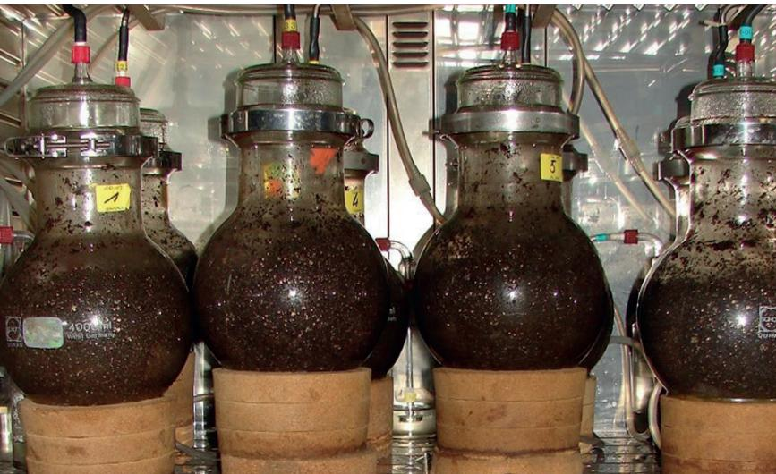

**Figure 22** Biodegradability and compostability tests performed by Normec OWS

**Ecolabel**

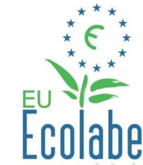

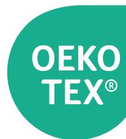

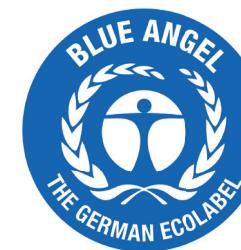

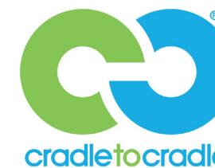

Within the project, the compliance of mycelium-based flexible mycelium with the **EU Ecolabel criteria for textile products (Commission Decision EU 2014/350)** was assessed and it was found that the EU Ecolabel, in its current state, **does not seem to allow certification of predominantly mycelium-based products** (i.e. >20% by weight of mycelium fibre content). This issue arises since the existing EU Ecolabel definitions of textile fibre categories (e.g. various natural cellulosic seed, bast, keratin or synthetic fibres), and the corresponding criteria, do not cover novel materials such as mycelium, and therefore cannot be applied. Considering the limitations presented by the EU Ecolabel, as well as recommendations from stakeholders, a broad range of alternative ecolabel solutions are being explored. A pre-selection of the most promising label alternatives has been made, and they are being screened further to confirm eligibility and specific requirements that MY-FI mycelium-based flexible materials would have to comply with. The multicriteria labels selected for further investigation include OEKO-TEX STANDARD 100, Bluesign APPROVED, the Blue Angel, and Cradle to Cradle Certified. The absence of specific labels for new materials and the long process for creating new Product Category Rules slow down the certification process of such materials, therefore preventing those materials to be accepted when brands and customers require certifications. The inclusion of bio-based and bio-fabricated materials in new categories and in labels is needed to promote them entering the market.

# 4 Economic feasibility

## 4.1. Research overview.

**What is the market for these products? How is it going to evolve? What are the future trends?**

The materials market is projected to grow from €24.8 million in 2022 to an adjusted size of €233.72 million by 2028, indicating substantial potential for the commercialization of new mycelium products. In the competitive textile production field, MY-FI faces rivals with collaborations in the fashion and automotive sectors, but none have achieved significant market penetration. A Porter's Five Forces analysis identified competitive rivalry, buyer bargaining power, and threats of substitutes as key market forces. This understanding shapes MY-FI's strategy, considering factors like pricing, marketing, and customer preferences. To meet the rising demand for mycelium-based products, efficient production methods are crucial. A patent mapping assessment revealed a growing **intellectual property landscape** in mycelium technologies, particularly in the United States, the European Union, and China. This analysis aids in understanding the knowledge base, identifying key players, assessing innovation's uniqueness, and pinpointing areas for further research and development. In general, it can be said that the growth trajectory of mycelium-based materials is linked to their environmental attributes, versatility, ethical appeal, and ongoing commitment to research and development. As sustainability becomes a central focus across industries, mycelium-based material is well-positioned to thrive and maintain its ascendancy in the market.

### What type of economic actors are driving mycelium-based material feasibility?

The economic feasibility of mycelium-based materials can be promoted by various key economic actors:

**INVESTORS AND VENTURE CAPITALISTS** play a pivotal role in providing financial support to mycelium-based material start-ups. Their investments facilitate research, development, and scaling, contributing to economic viability.

**GOVERNMENT BODIES AND FUNDING AGENCIES**, through grants and incentives, can stimulate the growth of mycelium-based materials. Supportive policies and funding should encourage research and development but also scaling up of technologies, enhancing economic sustainability.

**RESEARCH AND ACADEMIC INSTITUTIONS** drive innovation through research and development.

Collaboration with **ESTABLISHED INDUSTRIES** provides mycelium-based material start-ups with technical expertise, scaling capabilities, and environmental strength. Partnerships foster innovation and contribute to economic feasibility.

Increasing **CONSUMER AWARENESS AND DEMAND** for sustainable alternatives drive market growth. Higher demand leads to increased production and investment, making mycelium-based materials more economically viable.

| SWOT analysis        | Strengths                                                                                                                                                                                                 | Weaknesses                                                                                                                                                                               |
|----------------------|-----------------------------------------------------------------------------------------------------------------------------------------------------------------------------------------------------------|------------------------------------------------------------------------------------------------------------------------------------------------------------------------------------------|
| <b>Opportunities</b> | <ul> <li>• Vertical farming, resource optimization</li> <li>• Customisation</li> <li>• Industrial-scale fermentation</li> <li>• Local production</li> <li>• Innovative biological process</li> </ul>      | <ul> <li>• High production costs for small pilot production</li> <li>• Special expertise and equipment</li> <li>• Raw material for mycelium substrate, if not locally sourced</li> </ul> |
| <b>Threats</b>       | <ul> <li>• Market demand</li> <li>• Interdisciplinary collaboration</li> <li>• Strategic partnerships with manufacturers and other suppliers in the supply chain</li> <li>• Offtake agreements</li> </ul> | <ul> <li>• Lower prices of traditional materials</li> <li>• Greenwashing</li> </ul>                                                                                                      |

### Life Cycle Costing (LCC)

Alongside the LCA analysis, a Life Cycle Costing has been carried out, whose objective is to consider all costs that will be incurred during the production of 1 square metre of mycelium-based material (the same unit as the life cycle assessment). The life cycle costing has a similar structure to the life cycle assessment, with an exception made to the elaboration where it does not require a conversion in the emission factor of the production. The LCC analysis has been conducted to provide an overview of the cost of production.

**Biofabrication cost analysis:** The primary contributors to expenses lie in the raw materials, specifically during the spawn colonisation for mycelium growth. In contrast, the costs associated with the inoculum are relatively lower due to the minimal quantities utilized. The second significant cost factor is the consumption of thermal energy.

In the environmental analysis (Life Cycle Assessment – LCA), the most substantial impact is reflected in the costs. The refore, implementing procedures to reduce material usage and thermal energy consumption can positively influence both the environmental and economic facets of production. While altering the growth substrate or the type of energy consumed is not obligatory, such changes can result in cost reductions.

**Wet processing:** In wet processing, the most significant contributors to the overall cost are the chemicals. Electricity stands as the second most substantial contributor, constituting 23% of the total cost. Given that electric energy has a standardised cost per kWh, the phase consuming the majority of electricity becomes the most expensive to execute. Transportation costs, encompassing the transfer from the biofabrication plant to the wet processing plant, constitute a relatively smaller portion, contributing only 6.5% to the overall cost.

**Biofabrication and wet processing combined:** Approximately one third of the costs are attributed to the chemicals utilised, while a quarter of the overall value is associated with the raw materials essential for mycelium growth. Thermal energy and electricity constitute around 27% of the total cost, allocated to energy consumption—nearly equivalent to the amount spent on raw materials. Unlike raw materials, energies are not employed in a singular phase but are required at various stages of production. Additionally, the distinct locations of the facilities can influence the overall energy cost. The production outputs, waste and wastewater, contribute

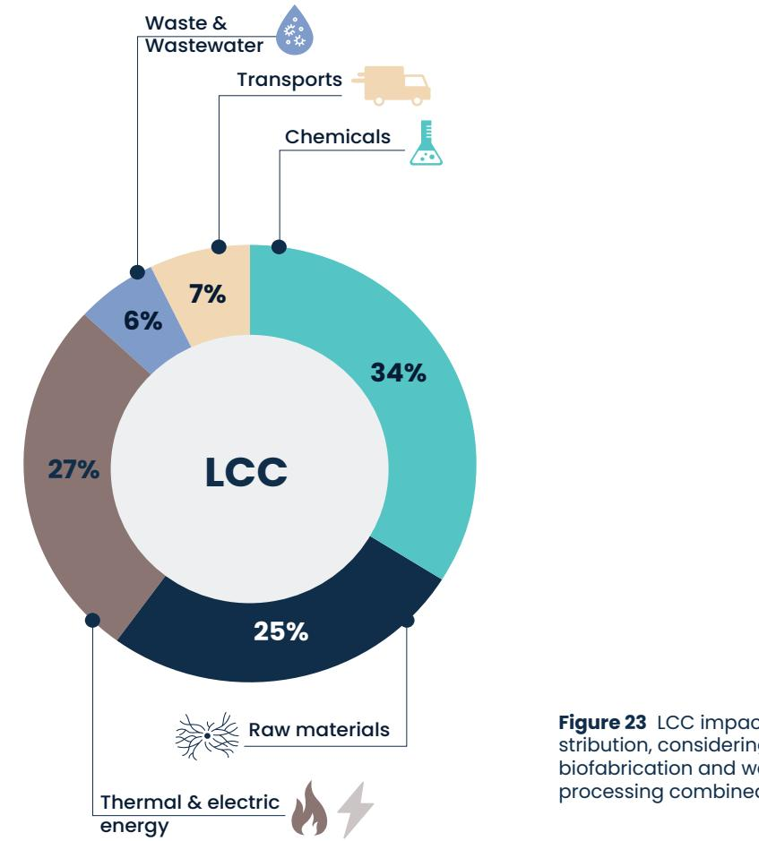

**Figure 23** LCC impact distribution, considering SLF biofabrication and wet processing combined

only 6% to the overall production cost and less than 7% to the transportation of raw material to the fermentation plant and the fungal mat to the wet processing facility. The cost distribution is 40% for biofabrication and 60% for wet processing. Certainly, as the production is currently on a pilot scale, there is room for improvement in efficiencies, such as using the same amount of water and electricity for larger batches. Consequently, costs can be easily reduced. For instance, transportation costs could decrease by developing production hubs in a single area, combining both biofabrication and wet processing.

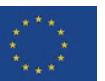

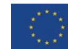

### Techno-Economic Analysis (TEA) for the SLF process

Techno-economic analysis (TEA) is a methodological approach that combines technological and economic assessments to evaluate the feasibility, cost, and performance of a particular technology or process.

**TEA:**  
Techno-Economic Analysis is a methodological framework that integrates technical and economic evaluations to assess the performance and economic feasibility of a technology, process, or project. It involves the quantitative analysis of technical parameters, costs, and benefits throughout the life cycle of a technology.

**CAPEX:**  
Capital Expenditure, refers to the funds that a company invests in acquiring, upgrading, or maintaining physical assets with the expectation of deriving benefits over an extended period. (3. International Financial Reporting Standards (IFRS))

**OPEX:**  
OPEX stands for Operational Expenditure, and it represents the ongoing, day-to-day expenses associated with running a business, maintaining its assets, and delivering goods or services. (3. International Financial Reporting Standards (IFRS))

TEA involves the examination of various factors, such as **capital costs (CAPEX)**, **operating costs (OPEX)** and revenue generation. By integrating technical and economic considerations, TEA helps stakeholders make informed decisions about the implementation of new technologies or processes. This analysis is particularly valuable in the field where an innovative product is developed to understand both the technological aspects and economic implications for successful project development and investment decisions.

The estimation of capital costs and operative costs relied on primary data provided by partners and information from the literature. Two primary analyses were conducted: a **hotspot analysis** and a **cash flow analysis**. The hotspot analysis highlighted that the manufacturing process and indirect costs play significant roles in the final CAPEX estimation, contributing 25% and 34%, respectively. The production process of mycelium-based materials involves specialized equipment and technology, often incurring high expenses, but these costs can potentially be mitigated by scaling up production. Indirect costs (which include installation, piping, engineering etc.) are contingent on assumptions and also influence the final price, and once primary data becomes available, these contributions may undergo adjustments.

Concerning operative costs, the analysis affirmed that **labour costs** are the predominant hotspot, constituting 70% of the overall costs. **Energy consumption** and **quality control** contribute 5% and 10%, respectively, to the overall cost structure. **Marketing** and **distribution** represent another hotspot, accounting for 9% of the costs. Expenses associated with marketing, branding, and distribution also impact the cost structure, as building brand awareness and reaching target markets necessitate budget allocations. Innovations in material science and technology play a crucial role in enhancing the quality and cost-effectiveness of mycelium-based materials. **Research and development investments** aiming at improving production efficiency and product performance constitute another hotspot in the cost structure analysis.

The cash flow analysis considered various scenarios involving three distinct yearly productivities: 1) 1,900 sqm, 2) 4,000 sqm, and 3) 50,000 sqm. When evaluating the scenario with a yearly productivity of 1,900 sqm the initial estimated price resulted in a **Payback Period (PBP)** of 8 years and an Internal **Rate of Return (IRR)** of 15%. In the remaining two scenarios, it was considered an increase in productivity to 4,000 sqm/year in the following year and 50,000 sqm/year in 5 years. Assuming a linear upscaling of manufacturing costs and considering this productivity increase, the calculated IRR varied from 20% to 27%, and the PBP ranged from 6 to 5 years. It is essential to note that these outcomes pertain specifically to the mycelium material, which is still pending the finishing process. These results are preliminary and will undergo further analysis in the later stages of the project.

# 5 Twin project

## 5.1. HEREWEAR: policy brief

HEREWEAR has developed a holistic approach to the challenge of sustainable fashion, based on three key axes: Circular, Bio-based and Local. Specific policy-relevant insights gained include the following aspects.

**CIRCULAR:** HEREWEAR has been looking extensively at how to design for circularity, building its findings into on-line platforms supporting different steps of the textile and clothing value chain. The main policy issues that emerge involve the need for agreed criteria with which to certify products, manufacturing processes, and end products. This also raises issues of data management ranging from the composition of materials to end of life options. One specific focus of HEREWEAR is the pressing issue of microfibre release, a specific area highlighted in the EU Textile strategy. Textiles is one of the main sources of the microplastics pollution which has become widespread in nature (including in marine environments), causing a serious and growing concern. In HEREWEAR, preventing microfibre release from textiles is being investigated, which shows the need for characterisation and standardisation.

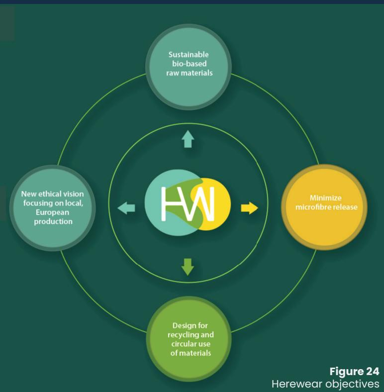

**Figure 24**  
Herewear objectives

**BIO-BASED:** HEREWEAR is experimenting with bio-based fibres across the value chain, from the bio-refinery to wet and melt spinning processes, weaving, and garment production, using circular manufacturing processes throughout. One of the key areas that has emerged is the need to connect with regional policy as concerns the sourcing of feedstocks and the effects this may have on local communities and regional economies, with the consequent impact on Regional Development Plans under the reformed Common Agriculture Policy.

**LOCAL:** An integral part of the HEREWEAR vision is the promotion of local manufacturing ecosystems building on circular and bio-based principles. HEREWEAR has been exploring gaps and opportunities through the development of business model scenarios and the engagement of external actors in the HEREWEAR Community. In this way, competitiveness and investment needs can be identified to feed into strategies for Smart Specialisation at both the regional and the EU level.

The interim results of HEREWEAR have direct implications across the broad spectrum of policy realms outlined above, as the circular, bio-based and local vision entails a holistic transition of the entire Textile and Clothing (T&C) value chain towards circular fashion, a transition that crosses disciplinary boundaries. In this context, in addition to the broader impacts that can be assessed as the project produces more operational results, we can identify specific project outputs and issues under the three main axes – Circular Design, Bio-based fibres, and Local production ecosystems – that can already be integrated into on-going policy initiatives. These can take varying forms from the local to the EU level, according to different policy goals and instruments: mobilise public opinion, provide financial or regulatory stimulus, provide financial or normative penalties, exemplify through good practice, or develop appropriate infrastructures, as shown in the suggestions in the following table.

| HEREWEAR Topic              | Outputs and issues                                 | Mobilise                                              | Stimulate                                          | Penalize                            | Exemplify                                  | Infra-structure                     |
|-----------------------------|----------------------------------------------------|-------------------------------------------------------|----------------------------------------------------|-------------------------------------|--------------------------------------------|-------------------------------------|
| Circular Design             | "Bio 10" circular design guidelines                | Integration into curricula at various levels          | Promote circular design within EIT                 | Penalize fabric waste               | Procurement of public uniforms             | Integrate into T&C MOOCs            |
|                             | Minimised microfibre release design guidelines     | Spread awareness and k nowledge                       | Financial incentives                               | Target poor manufacturing processes | Design requirements (ESPR1)                | Labelling standards                 |
|                             | Material and product data for certification        | Uptake across the industry of common data models      | EPR Benefits for pioneering products               | EPR schemes                         | Public procurement criteria                | Standardised data platform          |
|                             | Bio-based fibres                                   | Characterisation and bio-refinery specifications      | Business models for the bioeconomy                 | Align with innovation policies      | Tax virgin fossil-based raw materials      | Promote model bio-regions           |
|                             | Feedstock needs analysis                           | Engage with Forestry & Agriculture Departments        | Align R&D subsidies and Regional Development plans | Target biomass burning and waste    | Build on e.g. LEADER2 programme            | Multi-level logistics for transport |
| Local production ecosystems | Micro-factories and local value chains             | Engagement of micro-firms and local business networks | Integrate with e.g. S3 & RIS33 strategies          | Long distance shipping tax          | Allow & stimulate local public procurement | Build on existing cluster networks  |
|                             | Social economy intraction for upcycling and re-use | Mobilisation through activism and networking          | Integrate in existing actions, e.g. CCRI4          | Tax garment landfill use.           | Public procurement                         | Support for e.g. working spaces     |

# **SECTION III**

# 1 Policy recommendations

The lack of a unified direction, methodology, and guidelines for prioritising mycelium-based material expansion and sustainability may hinder the possibility of making informed choices. The establishment of clear and comprehensive methodologies and guidelines would significantly ensure consistent sustainability practices and assist in selecting and prioritising sustainability aspects in the adoption and use of bio-fabricated materials.

## Which are the current EU policies supporting mycelium-based materials?

In general, at European level, some laws already in place may support mycelium-based materials. Among them, there are:

**WASTE MANAGEMENT:** Directive 2008/98/EC13 on waste places a strong emphasis on the transition to a **circular economy** and the enhancement of **resource use efficiency**. This involves preventing or reducing waste generation, addressing the adverse impacts associated with the generation and management of waste, and reducing the overall impacts of resource use. Improving the efficiency of resource utilisation is crucial for the transition to a circular economy and for ensuring the Union's long-term competitiveness. Scaling the process offers the potential to create customisable products. While it's not guaranteed that this policy directly aids the scaling of mycelium-based materials, it is an aspect worth considering. Therefore, integrating waste management considerations into the early stages of the journey from lab scale to industrial scale is fundamental. The end-of-life is something to keep in mind while developing a new material. The forthcoming **Extended producer responsibility policy**14 will include waste management directives, and they could pose a potential limitation for mycelium-based materials. Currently, the optimal approach to handling these materials post-use, especially concerning end-of-life considerations, remains unclear. To ensure mycelium-based materials have the technical properties required by the industry, a compromise has been made on biodegradability, affecting the end-of-life phase. Considering the upcoming policies, the implementation of take-back programs and fostering collaborations with companies specializing in material regeneration could be considered. This is particularly important because mycelium-based materials are currently challenging for public disposal facilities to manage, and a dedicated recycling chain has not yet been established. A

clear set of rules and end-of-life options required by the EU for the future materials on the market should be soon made explicit to foster innovation and solutions. Clear processes and end-of-life options should be defined to guide enterprises in developing their material. Additionally, exploring partnerships with facilities specialising in end-of-life processes could prove beneficial.

**CIRCULAR ECONOMY:** The Communication from the Commission outlines a new **Circular Economy Action Plan**15 that envisions, by 2030, textile products placed on the EU market as long-lived and recyclable. These products should predominantly consist of recycled fibres, be free of hazardous substances, and adhere to social rights and environmental standards. The objective is to extend the benefits to consumers, allowing them to enjoy high-quality, affordable textiles for a longer duration. The plan seeks to shift away from fast fashion trends, promoting economically viable re-use and repair services that are widely accessible. In fostering a competitive, resilient, and innovative textiles sector, producers are expected to take responsibility for their products throughout the value chain, even in the post-consumer stage. The aim is to create a thriving circular textiles ecosystem, supported by adequate capacities for innovative fibre-to-fibre recycling, while minimising the incineration and landfilling of textiles. This policy framework provides the developmental groundwork for these materials and defines the context, urging stakeholders to prioritise circularity and sustainability from the early stages of development. It is important to also promote facilities able to manage material in a virtuous cycle. Remanufacturing and re-use should be supported by an integrated system of actors which facilitate the recovery of material. From a circularity perspective, MY-FI focused on raw materials shifts towards agriculture waste, specifically second-generation biomasses. Despite being less nutrient-rich and efficient for mycelium growth, these materials are available in substantial quantities for recycling. Lastly, within the circularity framework, the use of recycled textiles in linings poses a feasible option, given the established presence of circular fibres in the market. However, quality must be achievable even at industrial level. In general, the particular moment of change that the EU is facing poses some challenges. Some expected rules are not defined yet and therefore the design of materials compliant with further regulations is not easy. Moreover, policies should support SMEs which mostly of the time face competition with big enterprises.

**Recyclability:**  
Any recovery operation by which waste materials are reprocessed into products, materials or substances whether for the original or other purposes

**SUSTAINABILITY:** This topic is addressed, among other things, in the **EU Strategy for Sustainable and Circular Textiles**16, emerging as a key element towards sustainability. It is also reflected in the **Green Procurement policy**17, introduced to encourage the purchase of products and services with minimal adverse environmental impacts. MY-FI serves as a key example, as biofabrication is a crucial process for creating various bio-based materials. However, research activities carried out in the project clearly highlight some crucial challenges that need to be addressed. Regarding policies on green claims, utilising Life Cycle Assessment (LCA) enables the demonstration of the significance of impacts and performances. LCA is a methodology recognized by the European Union and is regulated by ISO 1404418. These new mycelium-based materials are emerging at a time when various policies are paying particular attention to greenwashing and green claims. Consequently, there is a proactive sharing of information related to impact and the utilization of methodologies that encompass the entire impact, typically from cradle to gate.

**CHEMICAL SAFETY AND USE REDUCTION:** This aspect stands out prominently. Notably, the **REACH Directive**19 is the singular policy exclusively dedicated to this facet. The focus of REACH, together with **Safe and Sustainable by Design Framework**20, and important standards and market initiatives, such as the **ZDHC Roadmap to Zero**21, which concentrates on chemical use, is crucial to ensuring proper performance. Mycelium-based materials may require different dosages and additional incentives for chemistry. Their inherently spongy and water-resistant structure poses challenges to the absorption of water and other chemicals, leading to overdosing and non-optimal use of available technologies. The development of dedicated chemistry and technologies could optimize utilization and impact. This is precisely the goal of the MY-FI project — to treat mycelium in the most optimal way, considering its unique characteristics. For instance, the use of a horizontal drum, the reduction of water consumption, and the employment of carefully selected chemical substances that consider the structure and composition of mycelium may enhancing efficiency and effectiveness.

**DURABILITY:** The **EU Strategy for Sustainable and Circular Textiles**22 emphasizes the importance of durability as a crucial concept for the future of textiles and materials. Extending the product use phase is identified as a key strategy to significantly mitigate environmental impact. However, ensuring optimal durability for bio-fabricated materials poses a challenge, particularly when **it may conflict with considerations related to end-of-life scenarios**. Improving durability

often necessitates applying processes and inputs focused on stabilizing the material, enhancing its resistance, and prolonging its overall lifetime. Nevertheless, it is important to note that some of these technologies and substances employed in the pursuit of durability can have unintended consequences, making the material less susceptible to bio-degradation or hindering its ability to achieve a sustainable end-of-life outcome. For this reason, the research under the MY-FI project is aimed at understanding how to enhance the material without compromising its biological nature. Further efforts and research are required to maintain the material as close to its natural state as possible while ensuring it meets industry standards.

**Eco-DESIGN:** The policy landscape, particularly concerning technical aspects, recognizes eco-design as a crucial element. The emphasis on materials highlights the differentiation between virgin and recycled materials, as well as the significance of reusable or repairable materials. Within the analysed policies, recycled materials take centre stage in discussions. Nevertheless, **recycled material embodies energy in its recycling process while mycelium-based material includes low-impact production process** based on the by-products or renewable sources. The characteristics of mycelium-based materials, akin to other 'growing materials,' lend themselves to reducing or minimizing the quantity of waste and scraps generated during the manufacturing and cutting processes. This is possible because these materials can be grown within a predefined shape and dimension. Additionally, exploring alternative assembly technologies, such as design for disassembly, may be worthwhile.

**TRANSPARENCY:** the **Digital Product Passport**23 addresses the need for transparency and information dissemination. As these innovative mycelium-based materials are currently in the establishment phase, their supply chain is also under development. This presents an opportunity for enhanced transparency and control over the supply chain, facilitating the incorporation of a sustainability mindset from the outset. This stands in contrast to the challenge of changing established mentalities, as observed with existing materials. On the flip side, not having an established and consolidated supply chain makes the disclosure of sensitive information a delicate choice. Approaching the market at this stage makes information more sensitive, and caution is warranted.

**THE RESEARCH AND INNOVATION (R&I) POLICY** plays a crucial role in facilitating the progress of mycelium-based materials. **An active R&I policy, allocating resources, funding, and in-**

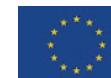

**centives to mycelium-based materials research and development, can act as a catalyst for advancements.** This approach encourages collaboration among researchers, industries, and institutions, promoting the creation of innovative and sustainable bio-fabricated materials. Investment in research and development, fostering technological advancements, and exploring new applications lead to greater opportunities for acceptance and establishment in the market of bio-fabricated materials. At the same time, those investments can result in the development of more efficient and less impactful mycelium-based materials production as specialized chemicals and machinery. Entities working with mycelium are often start-ups with limited investment power to create customized machinery and chemistry. Consequently, they rely on existing technologies used in similar sectors, leading to lower process efficiency and product performance, resulting in higher economic and environmental costs. The goal is to optimize material production processes, reducing usage and maximizing efficiency. Ideally, the new developments should focus on **bio-derived chemicals with low environmental impact, ensuring high technical performance throughout their life cycle**, including considerations for end-of-life. The EU Strategy for Sustainable and Circular Textiles24 actively promotes innovative materials to achieve its goals of fostering environmentally friendly alternatives. In particular, it has facilitated the funding of research and development projects. Furthermore, the **Horizon25 and the LIFE Europe Programmes26 are EU research and innovation initiatives that financially support projects contributing to sustainability and environmental objectives.** Mycelium-based materials can benefit from these programmes being aligned with its objectives. These policies play a crucial role in enhancing the feasibility of mycelium-based materials. By allocating resources, funding, and incentives to research and development, they act as catalysts for the economic viability of mycelium-based materials. R&D funds should promote the scale-up of technologies and give to enterprises the correct boost to implement them in the market. Dedicated calls related to mycelium-based technology and new circular chemistry is requested for allowing the entrance in the market. For supporting sustainable products, **R&D should clearly indicate the direction to follow while developing new material** as many times sustainability conflicts with durability and the way around. The strategic use of these materials in less demanding application categories can ensure more immediate utilization, while working on enhancing the material features for competitive and high value applications.

### Which EU policies might present challenges for mycelium-based materials?

At the same time, the absence of clear regulations can create uncertainties, impacting investor confidence and hindering market growth. In fact, the **lack of specific policies is challenging the promotion of mycelium-based materials:**

**ECOLABEL:** Existing **EU Ecolabel27** definitions of textile fibre categories and the corresponding criteria do not cover novel materials such as mycelium, and therefore no Ecolabel can be applied. Policies supporting the creation of new categories suitable for the material category of mycelium-based materials and bio-fabricated materials in general are crucial. New specific categories would consequently lead to the establishment of category rules, thus creating appropriate guidelines for these materials. Currently, these materials navigate through a sea of rules designed for other materials, which can be disadvantageous. These guidelines will need to bring clarity, for example, on the parameters that mycelium-based materials should adopt to calculate their environmental impact, their end-of-life, or even their durability standards. All parameters that are at the basis of the European Union's sustainability policies. Hence, **incorporating a fibre category in the EU Ecolabel criteria for textile products that covers mycelium materials is the essential** first step to support the certification of these innovative and sustainable materials under this label. The possibility of certifying these novel materials will promote their development and commercialization and, therefore, support the growth and market gain of a more biobased textile industry in Europe.

**MARKET ENTRY POLICIES:** Policies have the potential to foster sustainability by providing incentives for reducing reliance on non-renewable resources, therefore transitioning our economy from traditional fossil-based practices to bio-based alternatives. For example, the specific regulations that have been seen in the ban on non-biodegradable shopping bags. The same could be done within the fashion and automotive industries, therefore **incentivizing new emerging bio-fabricated materials**. Currently, market entry policies are not very clear and generate uncertainty among investors, hindering support for small to medium enterprises and sustainable products. As a result, potential investors hesitate to support pilot companies in need of a boost. To address this issue, policymakers should **establish clear and supportive guidelines for market entry**. Moreover, **tax credits and financial incentives could also serve as powerful tools**, encouraging companies to invest in innovative mycelium-based

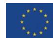

technologies. Financial support and incentives for start-ups and small businesses involved in mycelium-based material production are, in fact, necessary. **Establishing dedicated venture funds or grants for innovative material start-ups** could provide a targeted approach, fostering growth in this sector. Production and processing technologies for bio-fabricated materials are, in most cases, still in their infancy but they exist and have a big potential for improvement if sufficiently supported. Indeed, incentives for their promotion are thus not always present and significant. Enterprises which embrace the challenge to produce in a different and innovative way by collaborating with Nature needs to be supported by the ecosystem.

**INTELLECTUAL PROPERTY PROTECTION:** intellectual property policies are very important, striking a balance between innovation protection and accessibility. Small and medium enterprises prioritize intellectual property protection, but the **significant costs associated with maintaining patents, trademarks, and other forms of protection demand a continuous financial commitment.** Policymakers should explore ways to support innovation protection, considering alternatives such as licences and open-source applications. Streamlined and efficient patent application processes tailored to mycelium-based materials can reduce time and cost, encouraging start-ups to safeguard their innovations. Furthermore, **allocating public funds to support the intellectual property protection** efforts of mycelium-based material start-ups through grants or subsidies can help cover associated costs, promoting innovation in the sector.

**INFRASTRUCTURE:** Addressing the infrastructural challenges associated with mycelium-based material production is vital. Policymakers **should incentivize the repurposing of abandoned industries** and provide support for start-ups facing facility-related obstacles. The absence of infrastructure available for hosting new production lines is a reality, mostly in peripherical areas where logistic companies have taken mostly of the facilities available. This involves making infrastructure readily available to start-ups or innovative SMEs focused on inventive solutions.

#### What needs to be added to new policies?

**CLEAR GUIDELINES:** Clear and supportive **regulatory frameworks** also play a pivotal role in facilitating the adoption of mycelium-based materials, offering businesses a streamlined path to scale up production. **Clear required end-of-life options and standards for the management of materials** is requested to guide enterprises in the development of new materials.

**NEW PRODUCT CATEGORY RULES AND STANDARDS:** Initial market entry may involve adapting to existing standards. However, in the long run, it becomes essential to establish new standards for this emerging material class. Currently, **mycelium-based materials must fit into other established material category rules, potentially hindering their development.** In fact, these bio-fabricated materials have yet to be fully market-ready and achieve full scalability in contrast to the materials they are compared to. As observed within the MY-FI Project, the possibility of adopting eco-labels for mycelium-based materials is challenging. Currently, these materials lack a specific product category, making it difficult to obtain certifications and apply for reliable eco-labels. The availability of such certifications would greatly contribute to their market acceptance. This discrepancy underscores the need for **clear regulatory frameworks to support the mycelium-based materials industry**, ensuring standardized practices and fostering trust among investors and consumers alike.

**FINANCIAL INCENTIVES:** Increasing demand for sustainable alternatives drives market growth and investment, positively impacting the economic feasibility of mycelium-based materials. The fashion industry is, in fact, increasingly acknowledging the significance of sustainable and environmentally friendly materials. As consumer awareness of sustainability and ethical considerations grows, there is an increasing opportunity and willingness to pay a premium price for such materials. However, **bio-fabricated materials face market entry barriers**, given the direct competition with materials that are already in use, widely developed, industrialized, and generally with lower costs. On the contrary, innovative materials clearly need time to scale. Green Public Procurement (GPP)28 defines a process where public authorities seek goods, services, and works with reduced environmental impact throughout their lifecycle, which could boost mycelium-based materials being aligned with the procurement objectives. In general, an **increase in demand for these materials leads to a rise in funds** that support their development and economic sustainability, especially in their early stages of development. **Policies should promote sustainable materials**

**Eco-labels**  
The European Union (EU) eco-label is awarded to products and services with reduced environmental impacts. It is a voluntary scheme laid down in Regulation (EC) No 1980/2000 and administered by the European eco-labelling board (EUEB), which includes representatives from industry, environmental protection groups and consumer organisations. The scheme is backed by the European Commission, all EU Member States and the other countries of the European Economic Area (EEA) and has been in operation since 1993.

**terial through incentives while taxes on more impacting materials should be implemented** for leveraging innovation instead of business-as-usual. Supporting small actors will lead to a more competitive market that can compete on innovation and quality instead of on size and quantity of sold items.

**NETWORKING:** Policies have the potential to promote connections and networking among diverse entities that might face challenges in interacting otherwise. An example is the interaction between innovative start-ups and agricultural players. In the field of bio-fabricated materials, feedstock is a fundamental part of the process and, indeed the starting point for material production. These feedstocks are primarily of natural origin, ideally second-generation biomasses, referred to as Agri-waste. Therefore, this type of connection is crucial for mycelium-based SMEs to directly engage with potential suppliers of the necessary feedstock and perhaps even find them locally, thereby reducing the environmental impact associated with transportation. Creating **innovation hubs or clusters which works on the territory and can map resources/by-products/wastes** is an important step in facilitating collaboration among industry stakeholders, research institutions, and government bodies. This collaboration encourages knowledge exchange and resource sharing, fostering a dynamic ecosystem for the development of mycelium-based materials.

**R&D AND SCALE-UP INVESTMENTS:** Adequate investment in R&D serves to enhance material properties and production processes, thereby improving competitiveness and feasibility. Conversely, insufficient R&D funding can impede technological advancements, limit material applications, and hinder market adoption. For instance, **financial support aimed at developing specialized machinery and chemicals for this material** would greatly assist and expedite its development, scaling, and, consequently, competitiveness. Such targeted financial backing is essential for overcoming challenges and ensuring the successful evolution of mycelium-based materials in the market. Also encouraging brands to adopt these materials and tanneries to work with new materials play a crucial role. Investing in the **development and integration of industrial facilities and machinery** is essential for industrial growth. Also, **green chemistry support** is required to develop new products that can give to new material the properties required by the industry by not comprising the biodegradability or sustainability of those materials.

asibility of mycelium-based materials. Moreover, investment should be focused on **scaling-up technologies with higher TRL**, as such technologies may lack big investment and therefore could not be able to enter the market and make the real difference.

TRL  
Technology readiness  
level

## Resources and bibliographic index

1 https://www.my-fi .eu/

2https://www.my-fi .eu/

3https://herewear.eu/partners/

4https://single-market-economy.ec.europa.eu/sectors/biotechnology/bio-based-products\_en

5https://www.commonobjective.co/article/co-credit-understanding-sustainable-fabrics

6"Bio fabricate and Fashion for Good, UNDERSTANDING 'BIO' MA-TERIAL INNOVATION: a primer for the fashion industry, December 2020"

7 ETC/CE Report 2023/5 The role of bio-based textile fi bres in a circular and sustainable textiles system - Publication date: 27 Feb 2023 - Authors: Jana Deckers, Saskia Manshoven, Lars Fogh Mortensen

8https://www.statista.com/statistics/1250812/global-fiber-production-share-type/

9https://ellenmacarthurfoundation.org/a-new-textiles-economy

10https://eur-lex.europa.eu/resource.html?uri=cellar:- 9d2e47d1-b0f3-11ec-83e1-01aa75ed71a1.0001.02/DOC\_1&format=PDF

11https://www.marketresearch.com/QYResearch-Group-v3531/ Global-Mycelium-Leather-Research-32262104/

12Cristina Onorato, Fernanda Madeu, Marinella Tsakalova, Ioanna Deligkiozi, Alexandros Zoikis Karathanasis, Navigating the mycelium patent maze: A holistic approach to patent mapping in production technologies, World Patent Information, Volume 76, 2024, https://doi.org/10.1016/j.wpi.2024.102265.

13https://eur-lex.europa.eu/legal-content/IT/TXT/?uri=celex%3A32008L0098

14https://ec.europa.eu/commission/presscorner/detail/en/ ip\_23\_3635

15https://environment.ec.europa.eu/strategy/circular-economy-action-plan\_en

17https://green-business.ec.europa.eu/green-public-procurement\_en

18https://www.iso.org/standard/38498.html

19https://environment.ec.europa.eu/topics/chemicals/reach-regulation\_en

20https://research-and-innovation.ec.europa.eu/research-area/ industrial-research-and-innovation/key-enabling-technologies/ chemicals-and-advanced-materials/safe-and-sustainable-design\_en

21https://www.roadmaptozero.com/

22https://environment.ec.europa.eu/strategy/textiles-strategy\_en

23https://hadea.ec.europa.eu/news/digital-product-passport-project-results-be-presented-fi nal-event-2024-02-29\_en

24https://environment.ec.europa.eu/topics/circular-economy/ eu-ecolabel\_en

25https://environment.ec.europa.eu/strategy/textiles-strategy\_en

26https://research-and-innovation.ec.europa.eu/funding/funding-opportunities/funding-programmes-and-open-calls/horizon-2020\_en

27https://cinea.ec.europa.eu/programmes/life\_en

28https://green-business.ec.europa.eu/green-public-procurement\_en

## Annex I – Glossary

### BIO-BASED MATERIALS

Biobased materials are ‘wholly or partly derived from biomass, such as plants, animals, and microorganisms. Examples are natural fibres (e.g., cotton, wool, and silk), manmade cellulosic (e.g., viscose), natural polymers (e.g., chitin, keratin and casein), animal leathers and their alternatives. The bio content can vary radically from less than 10% to 100%.

[https://single-market-economy.ec.europa.eu/sectors/biotechnology/bio-based-products\\_en](https://single-market-economy.ec.europa.eu/sectors/biotechnology/bio-based-products_en)

### BIODEGRADABILITY

Materials produced using biological processes or living organisms, such as bacteria, yeast, algae[ii]. Bio-fabricated materials are either made from bio-fabricated ingredients as fermented silk like proteins or bio-assembled ingredients as mycelium or microbial cellulose leather alternatives.

[https://environment.ec.europa.eu/system/files/2022-12/COM\\_2022\\_682\\_1\\_EN\\_ACT\\_partl\\_v4.pdf](https://environment.ec.europa.eu/system/files/2022-12/COM_2022_682_1_EN_ACT_partl_v4.pdf)

### BIO-FABRICATED MATERIALS

Materials produced using biological processes or living organisms, such as bacteria, yeast, algae[ii]. Bio-fabricated materials are either made from bio-fabricated ingredients as fermented silk like proteins or bio-assembled ingredients as mycelium or microbial cellulose leather alternatives.

<https://reports.fashionforgood.com/wp-content/uploads/2020/12/Understanding-Bio-Material-Innovations-Report.pdf>

### BIOMASS

Biomass is organic, non-fossil material of biological origin (plants and animals) used as a raw material for production of biofuels. It can be also called biomass feedstock or energy crops. It includes wide range of materials harvested from nature or biological portion of waste. The most typical example is wood (firewood, wood residues, wood waste, tree branches, stump, wood pellets, ...), which is the largest biomass energy source. Other examples of biomass are grass, bamboo, corn, sugarcane, animal waste, sewage sludge and algae.

<https://ec.europa.eu/eurostat/statistics-explained/index.php?title=Glossary:Biomass>

### BIOSYNTHETIC MATERIALS

Biosynthetic materials are synthetic polymer materials comprised, in whole or in part, of bio-derived compounds. [iii] Bio-synthetics materials are for example made from fermented sugars or GHGs to create precursor chemicals for synthetic polymers such as nylons, polyesters and polyurethanes (even if the polymer is bio-based it is not necessarily biodegradable).

<https://reports.fashionforgood.com/wp-content/uploads/2020/12/Understanding-Bio-Material-Innovations-Report.pdf>

### CAPEX

Capital Expenditure, refers to the funds that a company invests in acquiring, upgrading, or maintaining physical assets with the expectation of deriving benefits over an extended period. (3. International Financial Reporting Standards (IFRS))

International Financial Reporting Standards (IFRS)

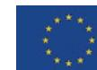

**CARBON EMISSIONS** Carbon dioxide (CO2) is a colourless, odourless and non-poisonous gas formed by combustion of carbon and in the respiration of living organisms and is considered a greenhouse gas. Emissions means the release of greenhouse gases and/or their precursors into the atmosphere over a specified area and period of time. Carbon dioxide emissions or CO2 emissions are emissions stemming from the burning of fossil fuels and the manufacture of cement; they include carbon dioxide produced during consumption of solid, liquid, and gas fuels as well as gas flaring.

[https://ec.europa.eu/eurostat/statistics-explained/index.php?title=Glossary:Carbon\\_dioxide\\_emissions](https://ec.europa.eu/eurostat/statistics-explained/index.php?title=Glossary:Carbon_dioxide_emissions)

**CARBON NEUTRAL** Carbon neutrality means having a balance between emitting carbon and absorbing carbon from the atmosphere in carbon sinks. Removing carbon oxide from the atmosphere and then storing it is known as carbon sequestration. In order to achieve net zero emissions, all worldwide greenhouse gas (GHG) emissions will have to be counterbalanced by carbon sequestration.

<https://www.europarl.europa.eu/topics/en/article/20190926STO62270/what-is-carbon-neutrality-and-how-can-it-be-achieved-by-2050>

**COMPOSTABILITY** Products designed to biodegrade under controlled conditions, typically through industrial composting in special facilities for composting or anaerobic digestion.

[https://environment.ec.europa.eu/system/files/2022-12/COM\\_2022\\_682\\_1\\_EN\\_ACT\\_part1\\_v4.pdf](https://environment.ec.europa.eu/system/files/2022-12/COM_2022_682_1_EN_ACT_part1_v4.pdf)

**DLF** Dynamic Liquid Fermentation. Dynamic liquid fermentation involves the cultivation of microorganisms in a liquid medium with continuous or intermittent agitation or mixing. Unlike static fermentation, dynamic fermentation promotes better mass and heat transfer, ensuring uniform distribution of nutrients and oxygen throughout the

medium. This method enhances microbial growth and metabolite production by preventing substrate depletion and facilitating waste removal. Dynamic liquid fermentation is commonly employed in industrial bioprocessing for the scalable production of various bio-products such as antibiotics, enzymes, and biofuels.

Shuler, M. L., & Kargi, F. (2001). Bioprocess Engineering: Basic Concepts. Prentice Hall

**ECO-LABEL** The European Union (EU) eco-label is awarded to products and services with reduced environmental impacts. It is a voluntary scheme laid down in Regulation (EC) No 1980/2000 and administered by the European eco-labelling board (EUEB), which includes representatives from industry, environmental protection groups and consumer organisations. The scheme is backed by the European Commission, all EU Member States and the other countries of the European Economic Area (EEA) and has been in operation since 1993.

<https://ec.europa.eu/eurostat/statistics-explained/index.php?title=Glossary:Eco-label>

**FERMENTATION** Fermentation refers to the metabolic process that converts carbohydrates, such as sugars and starches, into alcohol or organic acids using microorganisms such as bacteria, yeast, or fungi. It's a biological process that often involves the production of energy in the absence of oxygen.

<https://www.britannica.com/science/fermentation>

**FUNCTIONAL DURABILITY** The quality of being able to last a long time without becoming damaged. (1. <https://dictionary.cambridge.org/it/dizionario/inglese/durability>)

<https://dictionary.cambridge.org/it/dizionario/inglese/durability>

LCA

LCA is defined by the ISO 14040 as the compilation and evaluation of the inputs, outputs and the potential environmental impacts of a product system throughout its life cycle. (4. <https://eplca.jrc.ec.europa.eu/lifecycleasses-sment.html>)

<https://eplca.jrc.ec.europa.eu/lifecycleassessment.html>

LCC

Life Cycle Costing (LCC) is a financial management technique and decision-making tool that involves the systematic evaluation of the total costs associated with the acquisition, ownership, operation, maintenance, and disposal of a product or system over its entire life cycle. (1. ISO 15686-5:2008 ISO 14044:2006)

ISO 15686-5:2008 ISO 14044:2006

MICROPLASTICS

Microplastics are small pieces of plastics, usually smaller than 5mm. They are persistent, very mobile and hard to remove from nature.

[https://environment.ec.europa.eu/topics/plastics/microplastics\\_en#:::text=Related%20links-,Overview,hard%20to%20remove%20from%20nature](https://environment.ec.europa.eu/topics/plastics/microplastics_en#:::text=Related%20links-,Overview,hard%20to%20remove%20from%20nature)

MYCELIUM-BASED MATERIALS

Mycelium is the vegetative body of fungi. These remarkable organisms grow in network-forming structures called hyphae, primarily composed of a polysaccharide called chitin. Chitin's chemical structure is similar to cellulose, and it is a versatile molecule capable of forming a flexible and consistent biomaterial. Chitin possesses other unique properties such as biocompatibility, biodegradability, and non-toxicity. These properties make chitin highly interesting from both functional and commercial perspectives, offering new design opportunities for textile products.

<https://reports.fashionforgood.com/wp-content/uploads/2020/12/Understanding-Bio-Material-Innovations-Report.pdf>

NATURAL FIBERS

Natural fibre is defined as fibrous plant material produced as a result of photosynthesis. These fibres are sometimes referred to as vegetable, biomass, photomass, phytomass, agromass, solarmass or photosynthetic fibres. Natural fibres are obtained from natural resources such as plants, animals, and minerals.

<https://textileengineering.net/natural-fibres-types-classification-properties-and-uses/>

OPEX

OPEX stands for Operational Expenditure, and it represents the ongoing, day-to-day expenses associated with running a business, maintaining its assets, and delivering goods or services. (3. International Financial Reporting Standards (IFRS))

International Financial Reporting Standards (IFRS)

POST-PROCESSING

Mycelium post-processing methods vary and can be categorized into physical and chemical processes. These methods aim to enhance material properties while retaining the integrity of the mycelium.

<https://medium.com/@julie0229yl/growing-the-future-with-mycelium-737a23b83d7#:::text=There%20are%20two%20main%20types,physical%20and%20chemical%20post%2Dprocessing.&text=During%20physical%20post%2Dprocessing%2C%20physical,processing%20method%20is%20heat%20pressing>

RECYCLABILITY

Any recovery operation by which waste materials are reprocessed into products, materials or substances whether for the original or other purposes (2. [https://joint-research-centre.ec.europa.eu/scientific-activities-z/less-waste-more-value/definition-recycling\\_en](https://joint-research-centre.ec.europa.eu/scientific-activities-z/less-waste-more-value/definition-recycling_en)

[https://joint-research-centre.ec.europa.eu/scientific-activities-z/less-waste-more-value/definition-recycling\\_en](https://joint-research-centre.ec.europa.eu/scientific-activities-z/less-waste-more-value/definition-recycling_en)

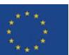

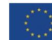

RENEWABLE SOURCES

Renewable sources of energy (wind power, solar power, hydroelectric power, ocean energy, geothermal energy, biomass and biofuels) are alternatives to fossil fuels that help cut greenhouse gas emissions, diversify the energy supply and reduce dependence on unreliable and volatile fossil fuel markets, particularly oil and gas.

[https://www.europarl.europa.eu/factsheets/en/sheet/70/renewable-energy#:~:text=Renewable%20sources%20of%20energy%20\(wind,fossil%20fuel%20markets%20%20particularly%20oil](https://www.europarl.europa.eu/factsheets/en/sheet/70/renewable-energy#:~:text=Renewable%20sources%20of%20energy%20(wind,fossil%20fuel%20markets%20%20particularly%20oil)

SLF

Surface Liquid Fermentation. In bioprocessing, surface liquid fermentation refers to a method where microorganisms are cultivated on the surface of a liquid medium, forming a biofilm or pellicle. Unlike submerged fermentation where microorganisms are completely submerged in the liquid medium, surface liquid fermentation involves partial immersion or surface contact. This method is utilized in various biotechnological applications, such as the production of enzymes, bioactive compounds, biomaterials and certain types of fermented foods, where specific metabolic activities or product characteristics are favoured by the surface environment.

Shuler, M. L., & Kargi, F. (2001). Bioprocess Engineering: Basic Concepts. Prentice Hall

SUSTAINABILITY

Sustainability is about meeting the world's needs of today and tomorrow by creating systems that allow us to live well and within the limits of our planet.

<https://www.eea.europa.eu/en/topics/at-a-glance/sustainability>

TEA

Techno-Economic Analysis is a methodological framework that integrates technical and economic evaluations to assess the performance and economic feasibility of a technology, process, or project. It involves the quantitative analysis of technical parameters, costs, and benefits throughout the life cycle of a technology. (2." Technology Assessment: Methods for Measuring the Impacts of New Technologies" by Albert H. Teich)

"Technology Assessment: Methods for Measuring the Impacts of New Technologies" by Albert H. Teich

TEXTILE

Textile products, most commonly defined as those products containing at least 80% by weight of textile fibres, include leisure apparel and clothing accessories, household/interior textiles (such as towels, tablecloths, curtains, rugs, bedlinen, pillows, duvets, and upholstery textiles) as well as technical textiles.

[https://single-market-economy.ec.europa.eu/sectors/textiles-ecosystem/textiles-leather-fur\\_en#:~:text=Textile%20products%20%20most%20commonly%20defined,as%20well%20as%20technical%20textiles](https://single-market-economy.ec.europa.eu/sectors/textiles-ecosystem/textiles-leather-fur_en#:~:text=Textile%20products%20%20most%20commonly%20defined,as%20well%20as%20technical%20textiles)

TRL

Technology readiness level

<https://euraxess.ec.europa.eu/career-development/researchers/manual-scientific-entrepreneurship/major-steps/trl>

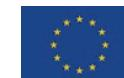

This project has received funding from the European Union's Horizon 2020 research and innovation programme under the Grant Agreement No. 101000719

This project has received funding from the European Union's Horizon 2020 research and innovation programme under the Grant Agreement No. 101000719 **71**

Leader partner and responsible for the MY-FI project management. Establishment of a surface liquid fermentation protocol and a dynamic liquid fermentation protocol for the production of mycelium fabrics. Scale up of SLF protocol. Development of the ethics requirements for the project.

Take care of the knowledge and IPR management in order to ensure the Freedom-to-Operate, effectively protect the Intellectual Property generated. Comparison of the solutions developed within MY-FI with the updated state-of -art. Implementation of solutions already available, also in different sectors (technology transfer). Avoid confi dentiality confl icts with dissemination and communication activities. Competitive landscape analysis and exploitation plan.

Country: Germany

Type: Consulting Company

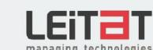

## Country: Italy Type: Manufacturing Company

## Annex II - Partners and roles

The H2020 project gathers 14 partners across Europe, contributing to its success. All private companies, research centers, and universities listed below collaborate for the fulfi llment of the activities tackled in the following chapters of this document.

> Scale-up and industrialization of the wet-processing and fi nishing applied to mycelium materials.

Country: France

Type: Manufacturing Company

Development and optimization of DLF and SLF protocols. Test and analysis of the raw material produced.

### Country: Netherlands Type: University

Characterization of raw and fi nished mycelium materials. Material functionalization for fi re reactivity, natural dyeing and surface activation with plasma technology. Assess the compliance of the mycelium fabric with the EU Ecolabel certifi cation.

Development of a Performance Index of mycelium fi ber for the luxury application. Production of a set of technical sheets illustrating the application methods of mycelium-based materials. Prototyping for the fashion industry.

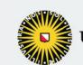

## Country: Spain Type: Research Centre

Country: Italy

Type: Manufacturing Company

Development of technological solutions to improve the mycelium fabrics properties such as mechanical and chemical performances.

## Country: Germany Type: Research Centre

Optimization and scale up of DLF protocol. Country: Belgium Type: Research centre

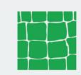

Development of protocols for the valorization of the residues deriving from the manufacturing of mycelium fabric-based materials. Lamination of mycelium-based materials.

## Country: Spain

Type: Non-profi t association

Development of the wet processing for the enhancement of mycelium fabrics. Research and application of dyes, fi nishing and coatings, in order to deliver performing, aesthetically pleasing and environmentally responsible materials.

### Country: France Type: University

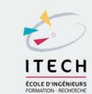

Defi nition of requirements and benchmarking for the automotive sector. With Volkswagen, design, production, testing, and validation of prototypes for the automotive sector.

## Country: Italy Type: Research centre

Evaluation of biodegradation and organic recyclability of mycelium fabrics, in different stages of the production and post-processing processes.

### Country: Belgium Type: Testing Lab

Defi nition of requirements and benchmarking for the automotive sector. Together with CRF, design, production, testing, and validation of prototypes for the automotive sector.

### Country: Germany Type: Manufacturing Company

LCA and LCC of the most promising mycelium materials. Development of an LCA/LCC based Decision Support System tool in order to improve and optimize production processes. Project communication.

### Country: Italy Type: Consulting Company

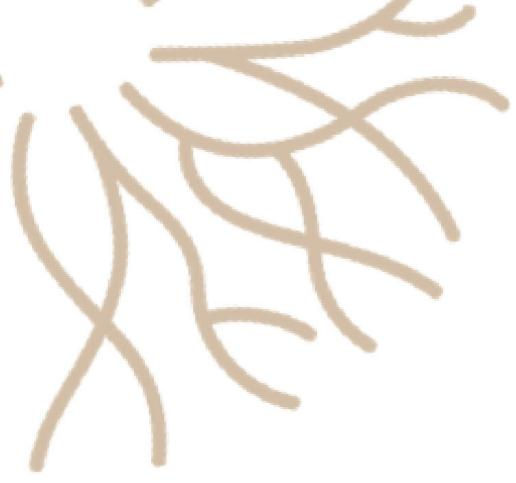

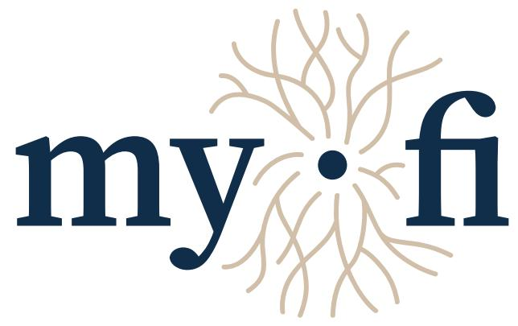

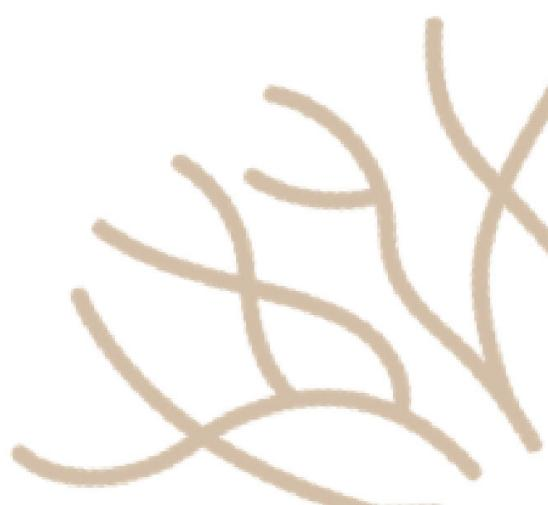