# CIRCULAR ECONOMY AND FASHION

A NEW COTTON PROJECT WHITE PAPER

Natalia Moreira Kirsi Niinimäki

2022

## new cotton project

*The New Cotton Project. Going beyond Cotton.* 

#### ABOUT

This white paper aims to open the understanding of Circular Economy (CE) in the textile and fashion sector. The text is connected to the ongoing EU project, NEW COTTON, which harnesses collaboration and cutting-edge technology to create new knowledge in circular fashion. In the NEW COTTON project, twelve pioneering players are coming together to break new ground by demonstrating a circular model for commercial garment production.

During a three-year period, textile waste is to be collected and sorted, and regenerated into a new, man-made cellulosic fibre that looks and feels like cotton – a "new cotton" – using Infinited Fiber Company's textile fibre regeneration technology. The fibres will be used to create different types of fabrics for clothing that will be designed, manufactured and sold by global brands adidas and H&M. The project also aims to act as an inspiration and steppingstone for further, even bigger circular initiatives in the industry going forward.

Each of the 12 participants in this project has a unique role in defining a blueprint for circularity in textiles. Infinited Fiber Company will create its unique, cellulosebased textile fibres (cellulose carbamate fibres) out of post-consumer textile waste. Frankenhuis and Xamk will be working on the pre-processing and research for pre-treatment of textile waste. Manufacturers Inovafil, Tekstina and Kipas will use the regenerated fibres to produce yarns, woven fabrics and denim, respectively. REvolve Waste, RISE and Aalto University will collect and provide data and conduct research and analysis. Fashion for Good will lead on communications with the industry. Design and manufacture of the fibres into clothing will be done by H&M and Adidas.

May 2022

#### THIS WHITE PAPER WILL HELP YOU

- Define Circular Economy
- Understand how circularity can be implemented in the textile industry
- Establish the means to embrace Circular Economy

NEW COTTON: Demonstration and launch of high performance, biodegradable, regenerated New Cotton textiles to consumer markets through an innovative, circular supply chain using Infinited Fiber technology. This project has received funding from the European Union's Horizon 2020 research and innovation programme under [grant agreement No \[101000559\].](https://cordis.europa.eu/project/id/101000559)

GRAPHIC DESIGN: Pirita Lauri

Natalia Moreira and Kirsi Niinimäki

Aalto University P.O. Box 11000 (Otakaari 1B) Espoo, FI-00076

#### AUTHORS

#### THE NEW COTTON PROJECT CONSORTIUM MEMBERS

e-ISBN: 978-952-64-9625-2

# PREFACE

The textile industry, cradle of the industrial revolution, has set the standards for other industries to follow: which machines to use, their energy source and the material flows which allow for the most profit. Therefore, alongside its faster production and wider range of goods, it was also responsible for some of the industry's downfalls: the emission of residual carbon particles at never-beforeseen scales, human exploitation, and the grounds for an increasing consumption pattern worldwide. In other words, the textile industry created an example of how to effectively produce more and faster by exploiting low costs of production in developing countries (Global South) and constantly increasing fashion consumption amounts in the Global North, simultaneously causing remarkable environmental impacts. Current generations are consuming more than the planet has to provide1, antagonising the principle of sustainability explained by the Brundtland Report: sustainable development means the ability to "meet the needs of the present without compromising the ability of future generations to meet their own needs" [1, p 16].

The 2012 United Nations Conference on Sustainable Development (Rio+20) generated 'The Future We Want' report which called for measurable targets to be internationally implemented. Adopted in 2015 at the United Nations Climate Change Conference in Paris by all members of the United Nations' 2030 Agenda for Sustainable Development, the set of 17 goals aimed at complementing the Brundtland Commission's mission of building 'a future that is more prosperous, more just, and more secure' [1, p. 11] and ensure that all partners are also guaranteeing that 'no one is left behind' [2].

1 You can read more about planetary boundaries in Fletcher, K. and Tham, M. (2019). Earth Logic Fashion Action Research Plan. London: The J J Charitable Trust [https://earthlogic.info/](https://earthlogic.info/wp-content/uploads/2021/03/Earth-Logic-E-version.pdf) [wp-content/uploads/2021/03/Earth-](https://earthlogic.info/wp-content/uploads/2021/03/Earth-Logic-E-version.pdf)[Logic-E-version.pdf](https://earthlogic.info/wp-content/uploads/2021/03/Earth-Logic-E-version.pdf)

Pollution has been a scientifically recognised threat since the Industrial Revolution, and it migrated to the colonies as labour in the original countries became more educated, organised and, consequently, expensive [3]– [5]. The linear economy pointed out as one of the main culprits for un-sustainable practices in production and consumption is grounded in the 'take-make-dispose' culture, initially proposed as a simple and direct manner for production: retrieving resources, manufacturing products and eventually disposing of them without considering actions to re-absorb the materials used in their production (traditionally disposing of them without recycling, reusing or extending the product's life cycle in any way). Fast fashion, which emerged as a profitable business model, was introduced at the end of the 1990s and is currently the dominant fashion business model. This reality has led to a situation in which the amount of clothing production has doubled from the period before the 2000s and simultaneously the fashion consumption rates have increased drastically, whereas the garment use times have been shortened, culminating in the increase in textile waste streams in all Western countries [6]2.

This development has quite recently led to an understanding that industrial textiles and the fashion sector need a bigger change and a new paradigm aiming towards more sustainable balance at the systemic level. Consequently, systemic approaches have been adopted to ensure all the yields would eventually be reinserted into another production cycle, as can be seen in Figure 1.

This white paper was written to introduce the reader to one of these systemic approaches used in the textile industry: Circular Ecosystems, presenting its advantages, disadvantages, practical examples and the international New Cotton Project which is being developed as a way to promote sustainable practices throughout the value chain.

LINEAR P R O D U C T I O N MODEL

SYSTEMIC P R O D U C T I O N MODEL

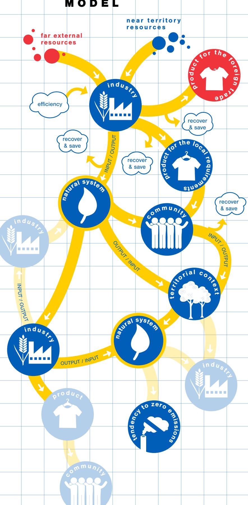

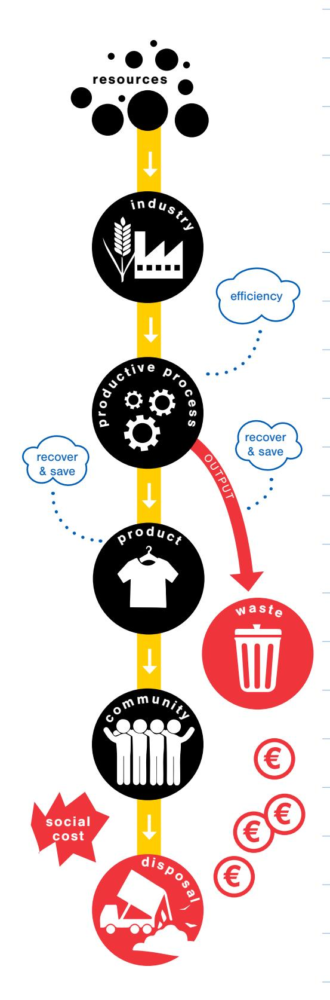

# CONTENTS

| Preface                                              | 4  |
|------------------------------------------------------|----|
| Summary                                              | 8  |
| CHAPTER 1: Circular Economy                          | 9  |
| European Commission Action Plan                      | 10 |
| Strategies for achieving circularity                 | 11 |
| Main difficulties and barriers                       | 14 |
| CHAPTER 2: Circular Economy in practice              | 16 |
| Circular Perspective for textiles                    | 16 |
| From Circular Economy to Ecosystem Management        | 20 |
| Examples of circularity in the textile industry      | 21 |
| CHAPTER 3: The New Cotton Project                    | 26 |
| What does the New Cotton Project bring to the table? | 26 |
| How can it assure circularity?                       | 28 |
| Final Remarks                                        | 30 |
| References                                           | 31 |

Circular Economy as a concept is a recent addition to the productionconsumption system currently in place. This white paper was written as the first of a series of working publications focused on the proposal, implementation and acquired knowledge gathered during the development of the New Cotton Project, a European Union funded project which is part of the Horizon 2020 programme to incentivise circular solutions throughout the industry.

This first publication highlights the main strategies, stakeholders, and difficulties in the creation of a circular ecosystem proposed around an innovative technology which produces new cellulosic fibres from textile waste, disrupting the textile industry's unsustainable linear economy.

This white paper will introduce the reader to the theory of circular economy, provide examples and peculiarities of circular textile practices and finally present the New Cotton Project and its collaboration with the body of knowledge within this field.

SUMMARY

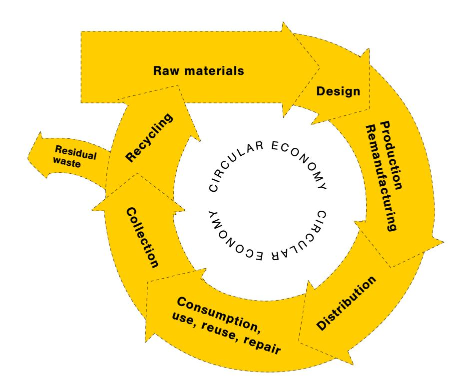

## CHAPTER 1: CIRCULAR ECONOMY

Figure 2: Phases of the circular economy. (Adapted from[9])

Since the discovery of pollution and its connection with industrial emissions, the co-related environmental impacts and even the human exploitation present in factories, a consequence of the heavy rural exodus towards industrial cities [8], the linear production approach of extracting raw-materials, producing a product and disposing of it with increasing ease started presenting itself as a problematic solution.

The fast pace of technological

advancement seen after the Industrial Revolution meant that in the period of two centuries production stopped being manual, transport reached the skies, two world wars devastated continents (and led to other wars) and the disparities between the Global North and South hemispheres skyrocketed.

For most of history, access to goods was limited to the higher levels of society, but after World War II, consumption patterns started to change as wealth distribution became another tool to maintain peace in many countries. Consumer and industrial awareness led to the creation of labour unions, fair trade practices and, in many ways, sustainability and the means to globally implement it.

It was within these circumstances that Circular Economy (CE) was proposed (Figure 2), following in the steps of cradle-to-cradle3 , life-cycle assessment4 and other less holistic approaches to sustainable development5.

3 Cradle-to-cradle: methodology proposed by Michael Braungart and William McDonough [\(https://](https://www.c2ccertified.org/) [www.c2ccertified.org/](https://www.c2ccertified.org/))

4 Life-cycle assessment: approach widely used by the United Nations Environmental Programme

[\(https://www.unep.org/explore-topics/resource-efficiency/what-we-do/life-cycle-initiative\)](https://www.unep.org/explore-topics/resource-efficiency/what-we-do/life-cycle-initiative) and other initiatives ([https://ecochain.com/knowledge/life-cycle-assessment-lca-guide/\)](https://ecochain.com/knowledge/life-cycle-assessment-lca-guide/) 5 Other approaches which preceded CE were: cradle-to-grave ([https://www.eea.europa.eu/help/](https://www.eea.europa.eu/help/glossary/eea-glossary/cradle-to-grave) [glossary/eea-glossary/cradle-to-grave](https://www.eea.europa.eu/help/glossary/eea-glossary/cradle-to-grave)), PSS ([https://recycle.com/product-service-systems](https://recycle.com/product-service-systems-sustainable-future/)[sustainable-future/](https://recycle.com/product-service-systems-sustainable-future/)), Systemic Design (https://systemic-design.org/), etc.

#### EUROPEAN COMMISSION ACTION PLAN

Published in 2020, the European Commission's 'Circular Economy action plan for a cleaner and more competitive Europe' [10] can be divided into four main areas: a) Sustainable products policy framework, b) Key product Value chains; c) Less waste, more value; and d) Leading efforts at a global level.

The first main area, 'Sustainable products policy framework', focuses on improving product durability, reusability, upgradability and reparability, addressing the presence of hazardous chemicals in products, and increasing their energy and resource efficiency. It also takes into consideration the amount of recycled content in products in order to ensure circularity, however also considering their performance and safety while enabling remanufacturing and high-quality recycling. The digitalisation of product information and data on value chains6 is another measure being taken to assist the reduction of unnecessary waste (such as paper).

Carbon7 and environmental8 footprints, important measurements of environmental efficiency, are under consideration in the new policies in the action plan, also focusing on the restriction of single-use products and premature obsolescence. The European Commission (EC) also proposed a rewarding system for products based on their different sustainability performance, including by linking high performance levels to incentives, financially motivating companies to change their performance.

Also aiming at increasing continental circularity, the EC proposes a revision of the Industrial Emissions Directive9 including the integration of circular economy practices in reference documents, as well as the promotion of digital technologies for tracking, tracing and mapping of resources and the adoption of green technologies by registering the European Union (EU) Environmental Technology Verification scheme as an EU certification mark.

Part of the EU's Industrial Strategy, key product value chains will be assisted in their transition to circularity through the facilitation of industrial symbiosis by developing an industry-led reporting and certification system. These rules for 'less waste, more value', the third main area of the action plan, emphasise the importance of legislative support for the management of waste (from collection and separation of recyclable and nonrecyclable to the actual usage of the recyclable waste as secondary raw materials10), also addressing the frowned upon waste exportation by some of the EU member states.

Finally, considering the European Union's concern with international adoption of circular economy, its action plan concludes on such efforts, at a global level. At this point European based and international initiatives gain uniform attention as circularity is seen as a prerequisite for climate neutrality worldwide.

6 Which might happen through applications developed by the 'European Dataspace for Smart Circular Applications'.

7 Carbon footprint 8 Environmental footprint

9 Directive 2010/75/EU of the European Parliament and of the Council of 24 November 2010 on industrial emissions (integrated pollution prevention and control), OJ L 334, 17.12.2010, p. 17 ([https://eur-lex.europa.eu/](https://eur-lex.europa.eu/legal-content/EN/TXT/?uri=celex%3A32010L0075) [legal-content/EN/TXT/?uri=celex%3A32010L0075\)](https://eur-lex.europa.eu/legal-content/EN/TXT/?uri=celex%3A32010L0075).

10 Through activities such as EU-wide end-of-waste criteria and standardisation for certain waste streams.

## STRATEGIES FOR ACHIEVING CIRCULARITY

'Systemic, deep and transformative', the transition to the circular economy presents several challenges and, consequently, strategies for achieving it. In order to ensure the accelerated adoption of circular economy, Kirchherr [11] proposes the 9Rs strategies11 that can be seen in Figure 3.

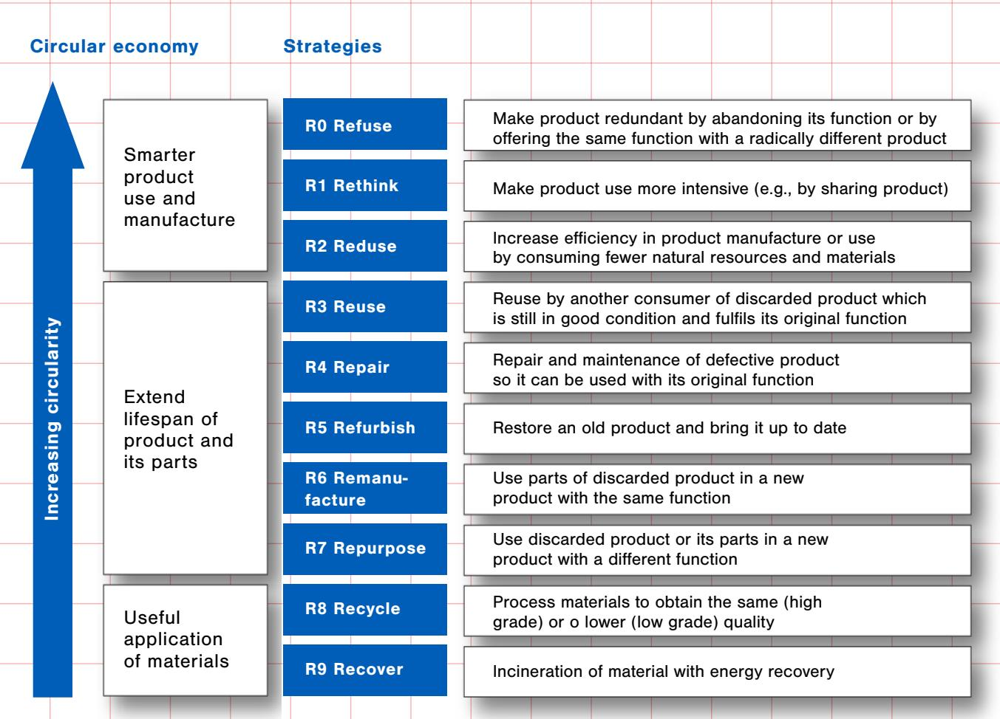

#### Linear economy

Figure 3: The 9Rs framework. (Adapted from[11]).

On the other hand, the Organisation for Economic Co-operation and Development (OECD) [12] proposes a set of 474 indicators to measure and ensure the most efficient adoption of circularity. Divided into 5 main categories (Environment, Governance, Economic and Business, Infrastructure and Technology, and Jobs) and 33 sub-categories, this approach aims at measurable indicators which would point out the advancements into circularity divided into 3 levels of application: national, regional and local levels (Figure 4).

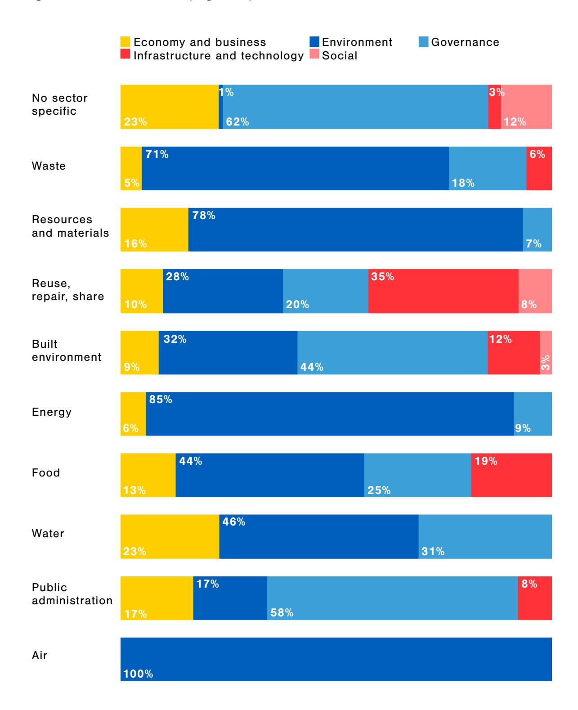

F i g u re 4 : C o m p o s i t i o n o f s e c to r i n d i c ato r s by category. (Adapted from [12])

Finally, combined with the European Union's zero waste programme12, these strategies will support sustainable growth and increase the investment in the EU Research and Innovation Programme (Horizon 2020), thus also enabling the research and potential implementation of circular solutions, and further analyse the major market and governance failures which enable the avoidance and reuse of material waste and the dissemination of misleading environmental practices. Additionally, in regards to waste management, the EC promised to [11, p. 9]:

- Boost reuse and recycling of municipal waste to a minimum of 70% by 2030;
- Increase the recycling rate for packaging waste to 80% by 2030, with interim targets of 60% by 2020 and 70% by 2025, including targets for specific materials;
- Ban the landfilling of recyclable plastics, metals, glass, paper and cardboard, and biodegradable waste by 2025, while Member States should endeavour to virtually eliminate landfill by 2030;
- Further promote the development of markets for high quality secondary raw materials, including through evaluating the added value of end-of-waste criteria for specific materials;
- Clarify the calculation method for recycled materials in order to ensure a high recycling quality level.

The adoption of circular practices alone does not ensure the compliance with several of the guidelines of sustainable development. The transition from linear to circular production thus relies mainly on: cultural and educational aspects13, the lack of state of the art technologies to implement circular initiatives, economic viability for business models to be assimilated on the market and, finally, policies supporting the implementation of circular models (as can be seen in Figure 5) [13].

## MAIN DIFFICULTIES AND BARRIERS

Figure 5: Main barriers to circular economy (Adapted from [13])

13 The adoption of sustainable practices can be found in some countries more easily than others, like for instance in the Scandinavian communities. This cultural disparity was explained by Sachs' 1991 publication, ['The next 40 years: transition strategies to the virtuous green path](https://web.archive.org/web/20170613140510/http:/unesdoc.unesco.org/images/0009/000902/090217eb.pdf)', where he proposes that the sustainability tripod (Economy, Society and Environment) approach to sustainability is not enough to ensure long lasting solutions to the environmental issues brought forth in the 80s by the Brundtland ('Our common future') report. Social and cultural aspects of development should become an intrinsic part of sustainable development.

Around the world, the difficulties faced in transitioning to circular economy tend to involve the absence of programmes, incentives and targets which would engage end of pipe regulations, as well as generate awareness about production, commercialisation, and post-use phases of products (also improving on losses in production and waste generation/disposal). Access and development of technology aligned with low level digital and physical infrastructure can also be seen as barriers alongside the lack of applied research towards circularity, communication, information, transparency, and traceability. Finally, difficulties in making circular products feasible, scalable and valuable are the 'nail in the coffin' to transition [14].

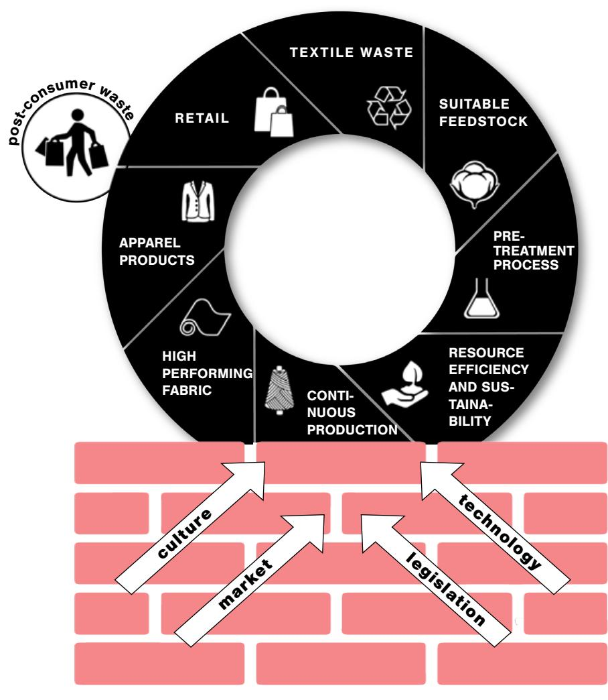

However, for the European Union and its focused investment in circular economy as the solution to sustainable development, Culture, Market, Technology and Legislation are still the biggest barriers to be confronted [1214]. According to their analysis of the most pressing to the least pressing barriers, culture is still the strongest barrier as it involves consumer interest and awareness, and the weakest barriers are related to the material previously presented and the high investments of the EU: quality of the final product, lack of data, limited funding and standardisation (see Figure 6).

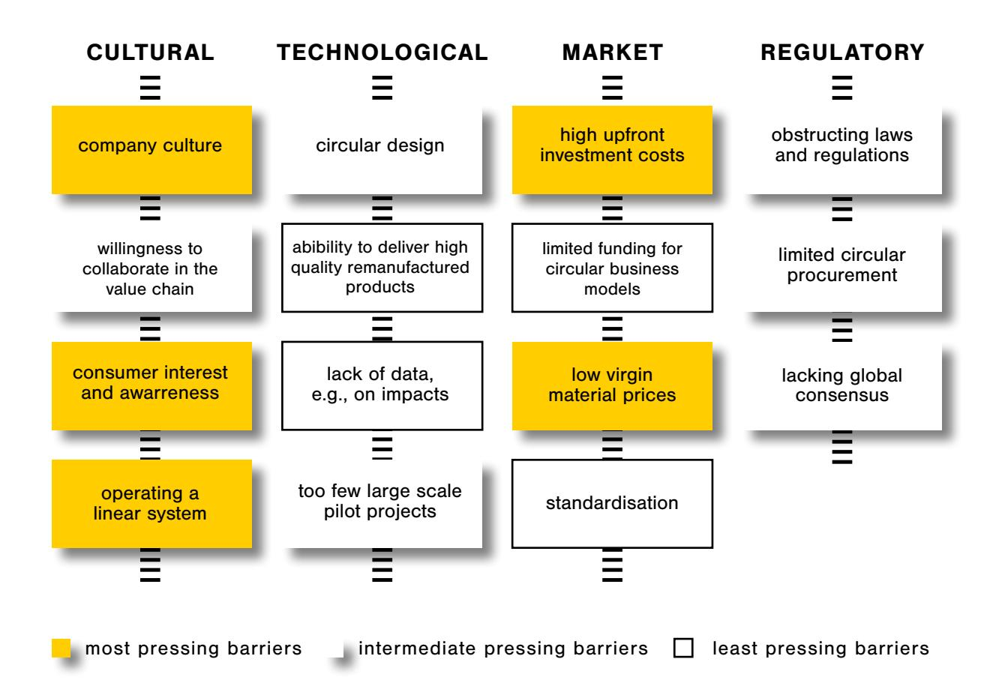

Figure 6: Heatmap of circular economy barriers (Adapted from [13])

## CIRCULAR PERSPECTIVE FOR TEXTILES

In June 2021, the Joint Research Centre (JRC) published a technical report on how the European Union intended to adopt circular economy for the textile sector [15]15. As declared by the Action Plan [10], "Textiles are the fourth highest-pressure category for the use of primary raw materials and water, after food, housing and transport, and fifth for GHG emissions. It is estimated that less than 1% of all textiles worldwide are recycled into new textiles. The EU textile sector, predominantly composed of SMEs, has started to recover after a long period of restructuring, while 60% by value of clothing in the EU is produced elsewhere".

The EU is the second largest importer of textiles in the globe, and the second biggest exporter [15], which makes the industry a crucial asset for the financial stability of the continent, most of all when considering the wide variation of products offered (from high-end brands designed by LVMH, to sports, fast fashion, industrial and construction goods).

With the above production and consumption patterns, the next big consideration for the industry would be for the textile waste, either produced as a by-product, as commercial waste, or as post-consumer material. The collection, separation and due processing of textile waste presents a unique array of opportunities for the circular economy. The need to incorporate what was previously seen as waste into new products is easily underrated when dealing with clothes as most people deem it to be harmless when compared, for instance, to toxin producing waste like batteries. However, the amount of garments bought and disposed of in the last 50 years is exponentially higher than that of the century before.

## CHAPTER 2 : CIRCULAR ECONOMY IN PRACTICE

Industrial textile by-products and waste are usually accounted for as the EU industry is highly legislated, however with clothing, with the chain of responsibility passed on to the consumer, the challenges to sustainable disposal shift, relying on personal traits, educational background and overall environmental awareness. It is here that the product responsibility, and penalties, are starting to shift from the producer to the consumer, a fact already being considered in the mainstream market through garment collection programmes like the ones implemented by H&M16, Marks and Spencer17 and Finlayson18.

The commercial and post-consumer textile waste industry has several ways to deal with the discarded material, from selling it as a second-hand product to the mechanical and chemical recycling of textiles unfit for further use. It is a widely known fact that mechanical recycling has been in circulation for a long time now, but focusing on high usage products (such as carpets). Chemical recycling however is a growing industry and a potential solution to the circular textile industry as it adds value to the "waste" and the final product can compete in quality and aesthetics with 'new' goods (as can be seen in Table 1).

Table 1: Recycling processes for major fibres/textiles [16]

| Material        | Mechanical recycling              | Chemical recycling                |
|-----------------|-----------------------------------|-----------------------------------|
| Nylon/polyamide | Cleaning and pelletisation        |                                   |
| Cotton          | Separation by colour,             |                                   |
|                 | shredding and re-spinnig          | Promising innovatiive development |
| Wool            | Separation by colour, pulling the |                                   |
|                 | garment back into a fibrous state | Not available                     |

[sustainability-at-hm/our-work/close-the-loop.html](https://www2.hm.com/en_ie/sustainability-at-hm/our-work/close-the-loop.html) 17 Plan A Shwopping programme:<https://www.marksandspencer.com/c/plan-a-shwopping> 18 Finlayson's Recycled Materials programme: [https://finlaysonshop.com/blogs/finlayson/](https://finlaysonshop.com/blogs/finlayson/recycled-materials) [recycled-materials](https://finlaysonshop.com/blogs/finlayson/recycled-materials)

The Zero Waste Programme and the European Commission's action plan have designated useful policies, for instance: introducing a ban on the destruction of unsold durable goods; incentivising product-as-a-service or other models where producers keep the ownership of the product or the responsibility for its performance throughout its lifecycle; and imposing market surveillance actions [10].

The EC's action plan's strategies are concerned with strengthening industrial competitiveness and innovation in the textile sector, boosting the EU market for sustainable and circular textiles, not disregarding the market for textile reuse, addressing fast fashion and driving new business models. The plan thus proposes achieving these milestones through a comprehensive set of measures, including [9, p. 11]:

- *• applying the new sustainable product framework as set out in section two to textiles, including developing eco-design measures to ensure that textile products are fit for circularity, ensuring the uptake of secondary raw materials, tackling the presence of hazardous chemicals, and empowering business and private consumers to choose sustainable textiles and have easy access to re-use and repair services;*
- *• improving the business and regulatory environment for sustainable and circular textiles in the EU, in particular by providing incentives and support to product- as-service models, circular materials and production processes, and increasing transparency through international cooperation;*
- *• providing guidance to achieve high levels of separate collection of textile waste, which Member States have to ensure by 2025;*
- *• boosting the sorting, re-use and recycling of textiles, including through innovation, encouraging industrial applications and regulatory measures such as extended producer responsibility.*

The circular textile sector thus, as can be seen in Figure 7, relies heavily on functional business models responsible for the sustainable production of natural and synthetic fibres, ensuring transparency and traceability throughout the value chains, and ensuring easy visibility of the locations and processes faced by the products in each stage of production. Design is also important for developing durable textiles made for longer use and reuse, repair or recycling, and also monitoring the resource and energy efficiency, with no attempts at overproducing goods (as they might eventually be disposable). Users should be educated and motivated to extend their goods lifetime, as well as to repair and maintain products with ease, thus encouraging reuse and shared use, eventually eliminating the need for incineration and landfill disposal. Additionally, companies are expected to collaborate more down and upstream in the value chain: this facilitates the creation of new circular activities at all stages of a product's value chain and lifecycle, also ensuring the fair distribution of value amongst the involved companies.

Figure 7: The role of circular business models, policy options, education and be havioural change in circular textiles systems (Adapted from: ETC/WMGE AND EEA19 APUD [16])

19 Full brief available at: [https://](https://www.eionet.europa.eu/etcs/etc-wmge/products/etc-wmge-reports/textiles-and-the-environment-in-a-circular-economy) [www.eionet.europa.eu/etcs/etc](https://www.eionet.europa.eu/etcs/etc-wmge/products/etc-wmge-reports/textiles-and-the-environment-in-a-circular-economy)[wmge/products/etc-wmge-reports/](https://www.eionet.europa.eu/etcs/etc-wmge/products/etc-wmge-reports/textiles-and-the-environment-in-a-circular-economy) [textiles-and-the-environment-in-a](https://www.eionet.europa.eu/etcs/etc-wmge/products/etc-wmge-reports/textiles-and-the-environment-in-a-circular-economy)[circular-economy](https://www.eionet.europa.eu/etcs/etc-wmge/products/etc-wmge-reports/textiles-and-the-environment-in-a-circular-economy)

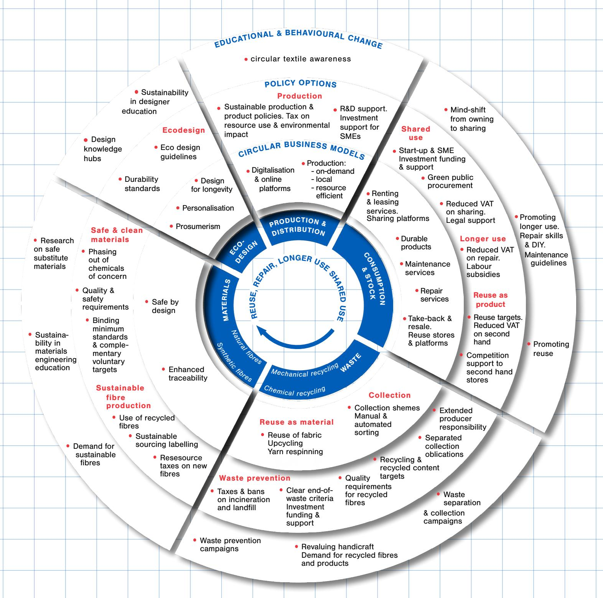

## FROM CIRCULAR ECONOMY TO ECOSYSTEM MANAGEMENT

The concept of Circular Economy, and its proposition for the development of systems, eventually evolved into Ecosystems: a combination of actors, business models and product services which contribute to a collective outcome [17]. Circular ecosystems, on the other hand, "are business ecosystems, which together create products, solutions and services based on the principles of a circular economy, and apply circular business models in their way of operating and doing business" through the use of the different qualities of the stakeholders in the value network [16, pg.15]; in other words, they are the combination of resources (raw or otherwise) received or produced by each member of the network of stakeholders, either used to compose a product or as an emission/effluent of its production (Figure 8).

Differently from other industries, closing the loop in textile circular ecosystems requires considerations over the four value cycles of the circular economy: i) maintain and/ or repair; ii) reuse as a product; iii) reuse as a material and/or remanufacture; and, iv) recycle [19]. In order to ensure all value cycles are being taken into consideration, the ecosystem relies heavily on the exchange of knowledge and resources between the stakeholders, creating their own individualised value chain20 (for example, considering the fibre, fabric and final garments in different lights). Circular ecosystem innovation thus becomes an intrinsic aspect of the development.

Figure 8: Characteristics of a circular ecosystem (Adapted from [19])

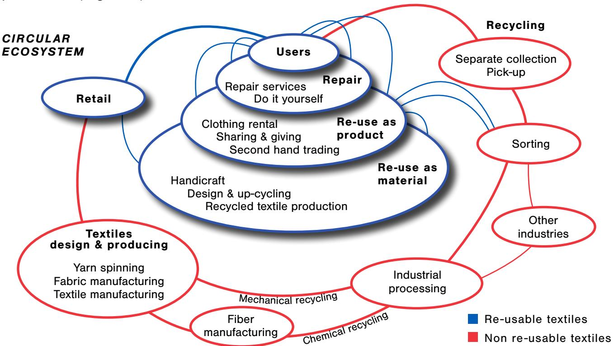

## EXAMPLES OF CIRCULARITY IN THE TEXTILE INDUSTRY 21

With the ultimate objective of decoupling value creation from waste generation and resource use, circular economy has slowly been transforming production and consumption systems, highlighting the importance of extending a product's lifecycle and increasing the consumer's awareness on their role in change. Circular consumption, being "anonymous, connected, political, uncertain, and based on multiple values, not only utility" [20], is highly dependent on the consumer's personal characteristics, the symbolic aspects of consumption and on the integration of users in the design process, as can be seen in Figure 9.

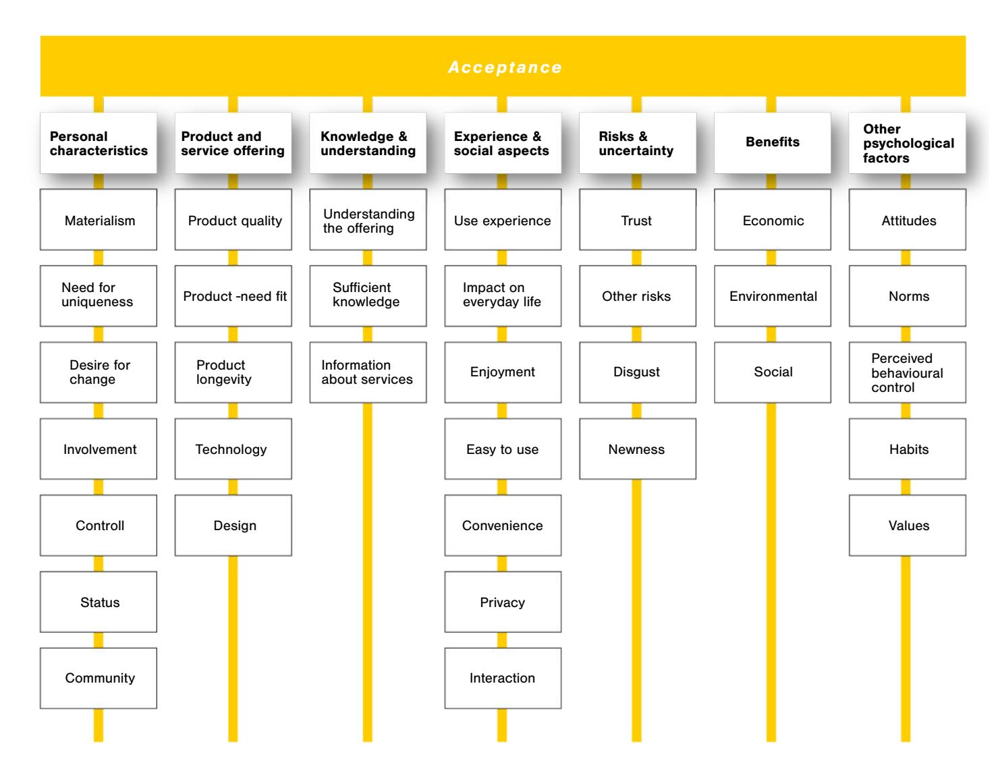

F i g u re 9 : M a i n fa c to r s i n f l u e n c i ng t h e p e rc e pt i o n a n d a c c e pt a n c e o f c i rc u l a r s o l u t i o n s , according to the literature [20]

Circular initiatives and market acceptance rely strongly on the sense of ownership, attention to the consumer's obligations, as well as those of the producers, and active engagement with the lifecycle; therefore, it does not just require financial accessibility, but also education and active willingness to promote change.

#### RETAIL

1. C&A: The Dutch multinational apparel retailer, C&A, has been active in the transition to a circular economy throughout its served areas (much of continental Europe, Latin America and China) by promoting mainstream sustainability, readily available and financially attainable. Besides the retailer, the C&A group has also established a sustainability foundation22 to assist in the transition of its supply-chain internationally, as can be seen in Figure 10.

> F i g u re 1 0 : M o s t re l eva n t area s for t he c o m p a ny a n d w h e re i t c a n have the big g e s t i m p a c t ( I m ag e s o u rc e d f ro m C & A's s u s t a i n a b i l i t y page) 23

| Sustainable Products                                                                                                                                                                                                                                                                                                                                                                         | Sustainable Supply                                                                                                                                                                                                                                                                                                                                                                                                                           | Sustainable Lives                                                                                                                                                                                                                                                                                            |
|----------------------------------------------------------------------------------------------------------------------------------------------------------------------------------------------------------------------------------------------------------------------------------------------------------------------------------------------------------------------------------------------|----------------------------------------------------------------------------------------------------------------------------------------------------------------------------------------------------------------------------------------------------------------------------------------------------------------------------------------------------------------------------------------------------------------------------------------------|--------------------------------------------------------------------------------------------------------------------------------------------------------------------------------------------------------------------------------------------------------------------------------------------------------------|
|                                                                                                                                                                                                                                                                                                                             |                                                                                                                                                                                                                                                                                                                                                                              |                                                                                                                                                                                                                                               |
| 
<b>Sustainable Materials</b> Use more sustainable raw materials.
 
<b>2020 goals</b>
 <ul> <li>• 67% of our raw materials are more sustainable.</li> <li>• 100% of our cotton is more sustainable.</li> </ul>                                                                                                                                                                 | 
<b>Clean Environment</b> Reduce our environmental impact.
 
<b>2020 goals</b>
 <ul> <li>• Zero discharge of hazardous chemicals.</li> <li>• 20% reduction of carbon footprint in C&amp;A stores, distribution centres, and offices.</li> <li>• 30% reduction of water in raw materials stage.*</li> <li>• 10% reduction of water in stores, distribution centres and offices.*</li> <li>• Zero waste to landfill.*</li> </ul> | 
<b>Engaging Employees</b> Create a culture of sustainability amongst our employees.
 
<b>2020 goals</b>
 <ul> <li>• Continuously increase employee sustainability engagement scores.</li> <li>• Establish and achieve key goals in our Women's Empowerment Principles action plan.</li> </ul> |
|  
<b>Circular Economy</b> Design and produce products for their next lives.
 
<b>2020 goals</b>
 <ul> <li>• Continually increase Cradle to Cradle Certified™ products in our retail markets.</li> <li>• Support circular innovations in our value chain through our partnership with Fashion for Good.</li> </ul> |  
<b>Safe &amp; Fair Labour</b> Ensure safe and fair working conditions.
 
<b>2020 goals</b>
 <ul> <li>• 100% of our products sourced from A/B-rated suppliers.</li> <li>• Build capacity and supplier ownership within our supply chain.</li> </ul>                                                                                                       |  
<b>Enabling Customers</b> Help customers to act more sustainably.
 
<b>2020 goals</b>
 <ul> <li>• C&amp;A is recognised as the most sustainable retail fashion brand.</li> </ul>                                             |

#### TEXTILES

- 2. Circulose®24: the Swedish company promotes fashion circularity through the recovery of cotton from worn out garments.
- 3. Spinnova®25: this product has been declared the most sustainable fibre in existence (Figure 11), using wood or waste as its raw material, being highly biodegradable and easily up-cyclable through the same production process.
- 4. Worn Again Technologies26: is a British company on a mission to "replace the

use of virgin resources by recapturing raw materials from non-reusable products".

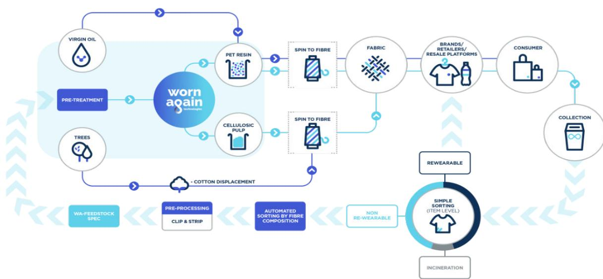

5. Infinna™27: the Finnish-based enterprise Infinited Fiber Company (IFC) has recently launched this breakthrough material developed from post-consumer textiles, more specifically, cellulose-rich materials (like cotton), through a process which can be repeated several times and which does not use any harmful chemical solution or excessive amounts of water.

6. Ioncell®28: is a technology that turns used textiles, pulp, cellulose textile waste or even old newspapers into new textile fibres sustainably and without harmful chemicals. The process converts cellulose into fibres which in turn can be made into long-lasting fabric. The Ioncell® process uses a novel solvent called ionic liquid. It's an environmentally friendly solvent that can be recycled.

F i g u re 1 1: Wo r n ag a i n's p o r t raya l o f t h e i r p a r t i c i p at i o n i n t h e tex t i l e l o o p ( I m ag e s o u rc e d f ro m Wo r n ag a i n's landing page 26 )

24 <https://circulo.se/> 25 <https://spinnova.com/> 26 <https://wornagain.co.uk/> 27 <https://infinitedfiber.com/about-infinna/fashion/>- IFC is one of the 12 members of the New Cotton Project. 28 <https://ioncell.fi/>

7. DePloy29: is a British company focused on circular fashion through the use of what they call 360° sustainability (Figure 13), developing collections focused on the needs of their consumer aligning fit and durability to the final product, which can be constructed into a new garment through easy changes.

8. Mud Jeans30: another Dutch company, this denim producer has two main approaches to circularity, the exclusive use of cotton and the leasing programme where the consumer does not need to actually buy the product (Figure 13).

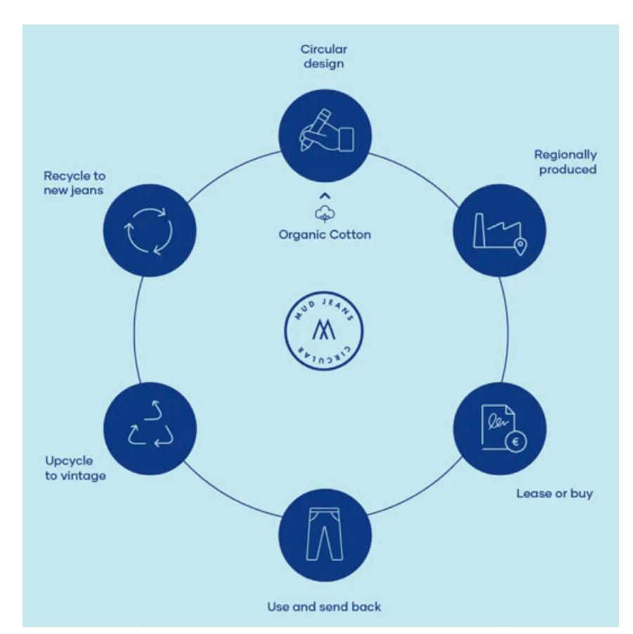

F i g u re 1 2 : 3 6 0 d eg re e s o f s u s t a i n a b i l i t y ( I m ag e s o u rc e d from Deploy's sustainability page 29)

#### FASHION

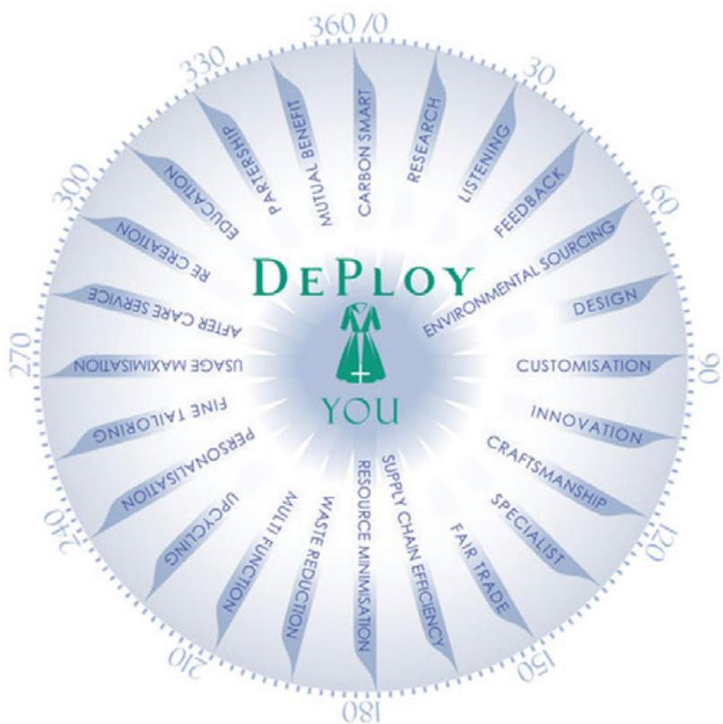

29 <https://deployworkshop.com/> 30 <https://mudjeans.eu/> 31 [https://mudjeans.eu/pages/our](https://mudjeans.eu/pages/our-mission-about-us)[mission-about-us](https://mudjeans.eu/pages/our-mission-about-us)

9. Adidas32: the 'Made to be Remade' programme is adidas' attempt to decrease the textile industry's environmental footprint by providing goods, a take back service and associating the company and its partners to projects33 focused on recycling textile goods like in the Parley34 collection where tennis shoes' soles are produced using plastic collected from the sea35.

10. Timberland36: the outdoors wear company has several circular initiatives within its products like, for instance, the tire line which can be recycled into the company's iconic boots or its attempt at the implementation of regenerative supply chains for several of its raw materials.

#### SERVICES

11. Patagonia37: the WornWear programme started as an attempt to ensure Patagonia's consumers were able to repair their garments without further acquisitions; it has now advanced to include collection centres and a credit system with standard prices for rain gear, shorts and bags.

12. Teemill38: a project proposed and carried out by the British fashion brand Rapanui39, Teemill offers random people the opportunity to start their own sustainable brand without a high starter investment, using the facilities and products provided by the mill and customising it. As declared on their website: "what the most sustainable business models of the future might look like, it speaks to the fact that choosing to build your brand on Teemill will actually make a difference".

13. H&M's Circulator40: a five-step guideline for the development of circular garments proposed and currently being used internally by the retailer41, the circulator explains which materials, components, and design strategies are best suited for products based on their purpose: "Then, all the components — from material to fabric treatments are scored according to their environmental impact, durability, and recyclability. The product also receives a total Circular Product Score, which shows where it can be tweaked to make the product even more circular".

> [https://www.adidas.com/us/made\\_to\\_be\\_remade](https://www.adidas.com/us/made_to_be_remade) and<https://www.adidas.com/us/blog/795018> Adidas is another partner of the New Cotton Project. <https://www.adidas.fi/parley> [https://www.adidas.fi/blog/639412-how-we-turn-plastic-bottles-into-shoes-our-partnership-with](https://www.adidas.fi/blog/639412-how-we-turn-plastic-bottles-into-shoes-our-partnership-with-parley)[parley-for-the-oceans](https://www.adidas.fi/blog/639412-how-we-turn-plastic-bottles-into-shoes-our-partnership-with-parley) <https://www.timberland.co.uk/responsibility.html> <https://wornwear.patagonia.com/> <https://teemill.com/> Also an example of a sustainable clothing brand: <https://rapanuiclothing.com/> [https://www2.hm.com/en\\_gb/sustainability-at-hm/our-work/close-the-loop/circulator.html](https://www2.hm.com/en_gb/sustainability-at-hm/our-work/close-the-loop/circulator.html) H&M is another partner of the New Cotton Project.

## CHAPTER 3 : THE NEW COTTON PROJECT

#### WHAT DOES THE NEW COTTON PROJECT BRING TO THE TABLE?

The increasing amount of textile waste has placed the textile industry at the forefront of environmental discussions. Misuse, or alternative disposal activities such as using the textile waste as a source of energy creation (by incinerating it), has also raised public discussion of global fashion brands' actions, especially those commercialising what is now known as 'fast fashion'.

The quick implementation of European level policies targeting waste management, collection and insertion with circular practices by 2025 is motivating companies to change their practices through the new understanding of how waste can become a valuable raw material for the textile and fashion sectors.

The New Cotton project was conceived to provide new knowledge through a scalable assessment of the laboratory creation, and create a holistic supply chain which does not require virgin raw materials. The new ecosystem and new partnering have led to the creation of a commercial network between partners involved in the textile industry and looking to improve their environmental footprint.

As the project approaches its halfway mark the consortium members start evaluating the current challenges faced in the creation of sorting strategies between different countries using different tools, and the production difficulties of scaling the production of a completely new material and overseeing the ecosystem as a whole, not just the activities related to the Infinna™ fibre. All of these challenges have led to opportunities for crucial changes in the conception of the collection, ensuring its lifecycle circularity through design guidelines as well as product assembly and collection distribution.

Figure 14: Overall objectives of the New Cotton project

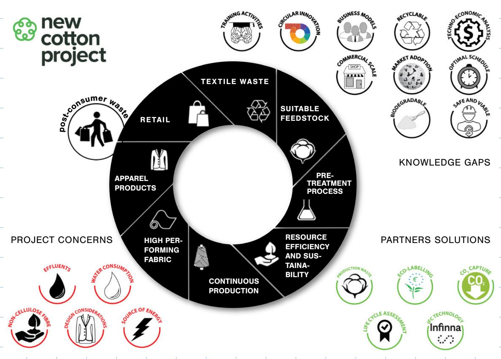

## HOW CAN IT ASSURE CIRCULARITY?

As part of the Horizon 2020 programme, actively related to the EC's action plan for driving the transition through research, innovation and digitalisation, the New Cotton project integrates all the key stakeholders within the supply chain who are essential for the design, production, distribution and retail of a three-piece functional and at commercial scale collection. Considering the list of strategies previously presented in this white paper, the New Cotton Project acts as a window to investigate the actual implementation of an international ecosystem (Table 2).

Table 2 : L i st of how t he N ew C ot t on project r es po nd s to circular ec onomy ' s st rategies .

Strategy The Ne w Cotton Project

Zero Waste programme for Europe

| <b>Support Sustainable Growth</b>                                              | The retail partners of the consortium are also embracing circularity in their business models, bringing their suppliers to this reality                                                                                                 |
|--------------------------------------------------------------------------------|-----------------------------------------------------------------------------------------------------------------------------------------------------------------------------------------------------------------------------------------|
| <b>Enabling Policies Framework also Modernising and enhancing waste policy</b> | Through the implementation and considering some of the difficulties faced, consortium members have been liaising with policy makers to ensure its alignment with practical issues                                                       |
| <b>Investment in circular solutions</b>                                        | Besides the Horizon 2020 investment, the project partners are also investing not only in the functionality of the ecosystem but also in its dissemination and impact                                                                    |
| <b>Harness action by business and consumers</b>                                | As the project proposes the creation and commercialisation of a collection, there is a complete work package designated for the communication and engagement of consumers                                                               |
| <b>Target waste as a resource</b>                                              | A key aspect of the project is the absorption of textile waste from commercial and post-consumer streams                                                                                                                                |
| <b>Establish a recycling society</b>                                           | At the moment, April 2022 (month 18 of the project), the main partners involved in the collection, separation and distribution of the textile waste are not only mapping the availability but also engaging other parties 42 |
| <b>Tackle specific waste challenges</b>                                        | Not only is the project dealing with consuming textile waste, it is also trying to ensure a viable and constant feedstock within the quality standards required for the fibre production                                                |
| <b>Designing and Innovating</b>                                                | As the consortium is composed of various members of the value chain, design has become a universal concern with constant alignment between the members also targeting innovative means to reach solutions                               |

| <b>Make Europe less dependent on primary materials</b> | Virgin materials in the textile industry are majorly produced outside Europe and, considering Europe's textile exports, its economy is highly reliant on it so the creation of a supply chain focused on textile waste is a direct response to this strategy |
|--------------------------------------------------------|--------------------------------------------------------------------------------------------------------------------------------------------------------------------------------------------------------------------------------------------------------------|
| <b>Strengthen the EU's industrial base</b>             | Four out of the five industrial partners of the project are based in the EU                                                                                                                                                                                  |
| <b>Foster business creation</b>                        | This strategy has not yet been confronted by the New Cotton project, however publications - such as this white paper - are being written to share the project's experiences and motivate others to pursue this line of business                              |
| <b>Product policy framework</b>                        | As previously stated: through the implementation and considering some of the difficulties faced, consortium members have been liaising with policy makers to ensure its alignment with practical issues                                                      |
| <b>Set global standards</b>                            | One partner and three supply-partners of the project are not based in the EU nor the European continent; they are, however, developing their product and production following the sustainability requirements agreed by the consortium                       |
| <b>Enable remanufacture</b>                            | As said before, the design aspect of the New Cotton collection has been developed with high consideration for disassembly, recycle and remanufacture requirements                                                                                            |
| <b>Address the presence of hazardous chemicals</b>     | As research progresses, hazardous chemicals are being substituted by safer alternatives throughout the value chain by the partners and the same is being considered for new potential by-products                                                            |
| <b>Recycle content in products</b>                     | This is the core of the New Cotton Project, developed with a technology which produces new fibres out of textile waste                                                                                                                                       |
| <b>Empowering consumers</b>                            | The final consumer is already being analysed and is a crucial part of the implementation of the project                                                                                                                                                      |
| <b>Industry-led reporting and certification system</b> | The project has a strong need for constant reporting in order to ensure the constancy of the production flow; additionally, several environmental certifications                                                                                             |

European Commission's Circular Economy Action Plan

#### FINAL REMARKS

This white paper is the initial official publication of the New Cotton Series, a group of publications written to present the challenges, opportunities and learning experiences gathered during the implementation of the project (between October 2021 and September 2023).

Even though the focus of this publication was mostly on the European Union and Commission's efforts to promote circular economy at the local and global levels, the material contained within could be easily extrapolated to other realities, hidden opportunities, threats, difficulties and alternative solutions43.

The next white paper will focus on Circular Business Models, explaining what they are, why they are important and where they have been implemented. Stay tuned!

43 You can learn more about fashion in a CE from the open access book Niinimäki, K. (Ed.) (2018) Sustainable Fashion in a Circular Economy. [https://aaltodoc.aalto.fi/](https://aaltodoc.aalto.fi/handle/123456789/36608) [handle/123456789/36608](https://aaltodoc.aalto.fi/handle/123456789/36608)

#### REFERENCES

- [1] World Commission on Environment and Development, "Report of the World Commission on Environment and Development: Our Common Future, From One Earth to One World," 1987. [2] 4th United Nations Plenary Meeting, "Resolution adopted by the United Nations' General Assembly on 25 September 2015," 2015. doi: 10.1163/157180910X12665776638740. [3] M. C. Buer, Health, Wealth and Population in the Early Days of the Industrial Revolution. London and New York: Routledge, 1926. [4] R. M. Hartwell, The Industrial Revolution and economic growth. Methuen, 1971. [5] P. H. Lindert and J. G. Williamson, "English Workers' Living Standards during the Industrial Revolution: A New Look," Econ. Hist. Rev., vol. 36, no. 1, p. 1, Feb. 1983, doi: 10.2307/2598895. [6] K. Niinimäki, G. Peters, H. Dahlbo, P. Perry, T. Rissanen, and A. Gwilt, "The environmental price of fast fashion," Nat. Rev. Earth Environ. 2020 14, vol. 1, no. 4, pp. 189–200, Apr. 2020, doi: 10.1038/s43017-020-0039-9. [7] L. Bistagnino, Systemic design. Torino - Italy: Slow Food, 2011. [8] N. Moreira, S. Sousa, and T. Wood–Harper, "Fair Trade and Sustainability in the British Textile Industry: an Evolution from Exploitation towards Global 'equality,'" J. Text. Sci. Eng., vol. 7, no. 6, 2017. [9] European Commission, "Towards a circular economy: a zero waste programme for Europe," 2014. [10] European Commission, "A new Circular Economy action plan," Brussels, 2020. Accessed: Jul. 19, 2021. [Online]. Available: https://eur-lex.europa.eu/legal-content/EN/ TXT/?qid=1583933814386&uri=COM:2020:98:FIN. [11] J. Kirchherr, D. Reike, and M. Hekkert, "Conceptualizing the circular economy: An analysis of 114 definitions," Resour. Conserv. Recycl., vol. 127, no. January, pp. 221–232, 2017, doi: 10.1016/j.resconrec.2017.09.005. [12] OECD - The Organisation for Economic Co-operation and Development, "The OECD Inventory of Circular Economy indicators," 2021. [13] J. Kirchherr, M. Hekkert, R. Bour, A. Huibrechtse-Truijens, E. Kostense-Smit, and J. Muller, "Breaking the Barriers to the Circular Economy," 2017. doi: 10.1007/s00442-006-0364-9. [14] G. M. Gomes, N. Moreira, D. R. Iritani, W. A. Amaral, and A. R. Ometto, "Systemic Circular Innovation: Barriers, Windows of Opportunity and An Analysis of Brazil's Apparel Scenario," https://doi.org/10.1080/17569370.2021.1987645, pp. 1–30, Nov. 2021, doi: 10.1080/17569370.2021.1987645. [15] A. Köhler et al., "Circular economy perspectives in the EU textile sector," 2021. doi: 10.2760/858144. [16] S. Manshoven et al., "Textiles and the environment in a circular economy," 2019. [17] J. Konietzko, N. Bocken, and E. J. Hultink, "Circular ecosystem innovation: An initial set of principles," J. Clean. Prod., vol. 253, no. January, 2020, doi: 10.1016/j.jclepro.2019.119942. [18] S. Patala, A. Salmi, and N. Bocken, "Intermediation dilemmas in facilitated industrial symbiosis,"
- J. Clean. Prod., vol. 261, pp. 1–11, 2020, doi: 10.1016/j.jclepro.2020.121093. [19] P. Fontell and P. Heikkilä, "Model of Circular business ecosystem for textiles," Tampere, 313, 2017. [Online]. Available: http://www.vttresearch.com/impact/publications. [20] J. Camacho-Otero, C. Boks, and I. N. Pettersen, "Consumption in the circular economy: A literature review," Sustain., vol. 10, no. 8, p. 2758, Aug. 2018, doi: 10.3390/su10082758.