# CIRCULAR BUSINESS MODELS IN THE TEXTILE INDUSTRY

THE SECOND NEW COTTON PROJECT WHITE PAPER

Natalia Moreira Kirsi Niinimäki

2022

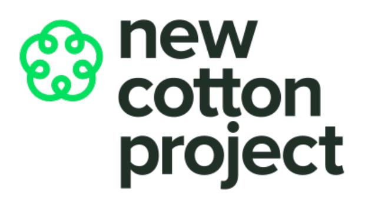

*The New Cotton Project. Going beyond Cotton.* 

# ABOUT

This second white paper in the New Cotton Project series aims to educate the reader on the large number of circular business models which exist in the body of knowledge, focusing on examples and applications in the textile and fashion sector. The text is connected to the ongoing EU project NEW COTTON, which harnesses collaboration and cutting-edge technology to create new knowledge in circular fashion. In the NEW COTTON project. twelve pioneering players are coming together to break new ground by demonstrating a circular model for commercial garment production.

During a three-year period, textile waste is to be collected and sorted, and regenerated into a new, man-made cellulosic fibre that looks and feels like cotton – a "new cotton" – using Infinited Fiber Company's textile fibre regeneration technology. The fibres will be used to create different types of fabrics for clothing that will be designed, manufactured and sold by global brands Adidas and H&M. The project also aims to act as an inspiration and steppingstone for further, bigger circular initiatives in the industry going forward.

Each of the 12 participants in this project has a unique role in defining a blueprint for circularity in textiles. Infinited Fiber Company will create its unique, cellulosebased textile fibres (cellulose carbamate fibres) out of post-consumer textile waste. Frankenhuis and Xamk will be working on the pre-processing and research for the pre-treatment of textile waste. Manufacturers Inovafil, Tekstina and Kipas will use the regenerated fibres to produce yarns, woven fabrics, and denim, respectively. REvolve Waste, RISE and Aalto University will collect and provide data, and conduct research and analysis. Fashion for Good will take the lead on communications to the industry. Design and manufacture of the fibres into clothing will be done by H&M and Adidas.

July 2022

#### THIS WHITE PAPER WILL HELP YOU

- Understand the various circular business models.
- Assess the best alternatives for an easy transition into circularity.
- Establish the means to ensure value in your Circular Economy endeavour.

NEW COTTON: Demonstration and launch of high performance, biodegradable, regenerated New Cotton textiles to consumer markets through an innovative, circular supply chain using Infinited Fiber technology. This project has received funding from the European Union's Horizon 2020 research and innovation programme under [grant agreement No \[101000559\].](https://cordis.europa.eu/project/id/101000559)

GRAPHIC DESIGN: Pirita Lauri

Natalia Moreira and Kirsi Niinimäki

Aalto University P.O. Box 11000 (Otakaari 1B) Espoo, FI-00076

#### AUTHORS

#### THE NEW COTTON PROJECT CONSORTIUM MEMBERS

e-ISBN: 978-952-64-9626-9

# FOREWORD

The textile and fashion industry is one of the largest industrial sectors globally, which uses many resources and causes many environmental problems. In the linear system (design-manufacturing-sale-dispose), this sector uses mainly non-renewable resources and simultaneously wastes valuable materials in huge amounts. This is especially problematic when clothing use-times have decreased over the years and garments end up in landfills faster than ever-increasing textile waste streams and this sector's environmental impacts. Materials, water and energy are used in huge amounts in the textile industry, and all these are wasted if the material throughput in the system is very fast and product lifetime is very short.

A circular economy approach in textiles and fashion aims to develop a more sustainable and closed-loop system. The goal is not only to close the material loop and recycle materials effectively, but also slow down at the system level. This needs business models of a new kind, which do not focus the profit making through one-time selling, but which focus on extending the time a product is used, fulfil consumers' needs in a unmaterialistic way, and create value in new and creative ways (also environmental value). Products need to be designed to be suitable for long use times (even reuse by several users), have second-hand value, be repairable and, at the end of their lifetime, be recyclable. Several lifetimes can be designed into a product and this approach needs a new kind of business thinking.

Waste should be understood to be part of the textile and fashion business and producers/importers should take responsibility for the waste. This phase should be also included in the business model and waste should be collected and appreciated as a valuable material for recycling and material recovery. All products need to be recollected after their time in-use and this thinking will widen business understanding towards real sustainability. The system level transition towards a circular economy is already happening, and this needs open-minded and creative business thinking, new paradigms and mindsets when constructing new business models in the circular economy context.

The business model "determines the organisation's value proposition, value creation and delivery, and value capturing and aims at analysis, planning, and communication in face of increasing complexity" [1]. Combining the challenges of putting Circular Economy into reality and the practice-oriented approach of business model innovation leads to the concept of circular business models (CBM). This term is used to describe business models that are suited for the Circular Economy by incorporating elements that slow, narrow, and close resource loops, so that resource input into the organisation and its value network is decreased and waste and emission leakage is minimised [2].

| Foreword                                                        | 4  |
|-----------------------------------------------------------------|----|
| Summary                                                         | 6  |
| Introduction                                                    | 7  |
| CHAPTER 1: Circular Business Models                             | 10 |
| 1.1. Product and Use-oriented Circular Business Models          | 11 |
| a. Circular Product Design                                      | 11 |
| b. Design for Recycling or Intentional Design                   | 12 |
| c. Product-Service Systems                                      | 13 |
| d. Resource Recovery                                            | 15 |
| e. Use, Reuse, Share and Repair                                 | 16 |
| 1.2. Service and data-oriented Circular Business Models         | 19 |
| a. Coordinating circular value chains through data              | 19 |
| b. Dematerialisation and Digitalisation                         | 20 |
| c. Product as a Service                                         | 21 |
| d. Retain Product Ownership                                     | 22 |
| e. Sharing Economy and Platforms                                | 23 |
| f. Collaborative Consumption                                    | 24 |
| 1.3. Production-Oriented Circular Business Models               | 25 |
| a. Circular Inputs (and/or supplies): the eco-systemic approach | 25 |
| b. Collection and Reverse Logistics                             | 27 |
| c. Recovery of Secondary Raw Materials/by-products              | 28 |
| d. Sorting and (pre)Processing                                  | 28 |
| 1.4. Outcome-oriented Circular Business Models                  | 30 |
| a. On-demand                                                    | 30 |
| b. Product Life Extension                                       | 30 |
| c. Product Lifecycle Extension/Reuse                            | 32 |
| 1.5 Overlapping Circular business Models?                       | 33 |
| CHAPTER 2: Circular Business Canvases                           | 35 |
| 2.1. Flourishing Business Canvas                                | 36 |
| 2.2. Circulab circular Design Tool                              | 37 |
| 2.3. Circular Business Model Tool                               | 38 |
| CHAPTER 3: Business and the transition to Circularity           | 39 |
| 3.1. Value                                                      | 43 |
| 3.2. Business model Innovation                                  | 45 |
| CHAPTER 4: Measuring success                                    | 48 |
| CHAPTER 5: Business models and the Textile Industry             | 50 |
| References                                                      | 54 |

# SUMMARY

Whilst researching the main circular business models available in the literature, the authors came across several approaches and categorisations of businesses, canvases, etc. This white paper was written with the intent of concisely explaining the main business models and canvases in a direct, thorough manner, providing our interpretations and, of course, practical examples for further understanding of their particularities.

This white paper then divides the main business models into four categories: product and use-oriented, service and dataoriented, production-oriented, and result-oriented. It also presents three canvases: flourishing, circulab, and the circular business model tool. By doing so, we are assisting readers who might be interested in embracing circularity but are missing the know-how.

The textile industry is at the core of our work and the examples presented here also include a re-collection of the first white paper in the series (Circular Economy in the Textile Industry). The examples can be found in more detail in the first publication1, but they are contextualised here according to the corresponding business model.

Finally, with the intention of promoting growth and the means to innovate, this white paper concludes by discussing the process of transitioning to circularity and analysing business from a value creation perspective. This is then followed by business models innovations: a review of the literature and guideline for measuring success.

Enjoy your read!

# INTRODUCTION

Sustainable development has been a topic for innovation and progress in the field of management. The need to ensure intergenerational resources and "a future that is more prosperous, more just, and more secure" [1] (pg. 11) has been at the core of the industry ever since "A global agenda for change" was published, one of the first international outcries for a global sustainable future, and, in many ways, was a successful endeavour. The 2012 United Nations Conference on Sustainable Development (Rio+20) generated 'The Future we Want' report, which called for measurable targets to be internationally implemented.

Sustainability, as a managerial field of research, has been seen as a financial nuisance by some but as means to evolve and innovate by others. Climate change is a reality for an increasingly large number of people and, consequently, policies and legislations have been adapted to encourage industrial change. Arguably, within this context, Circular Economy (CE) is the 'way forward', combining business strategy with a sustainable system [2].

Natural ecosystems are communities of living things and their environment existing in balanced harmony. Once an animal dies, it becomes nutrients for insects, other animals, or plants, eventually balancing the scales of this chemical, physical and biological equilibrium. A circular ecosystem is an attempt to simulate the same equilibrium in an industrial reality.

The current industrial landscape is what we call a linear economy, where resources are used and discarded with little regard for reuse, recycling, etc. A circular economy, on the other hand, is the result of several attempts to change the industry towards sustainability and sustainable practices.

As pointed out in the Brundtland report [3], humanity, in its endeavour to prosper, has threatened the availability of resources for future generations. The incorporation of non-renewable resources (as well as renewable) into a product's lifecycle, decreasing the amounts of 'waste' landfilled and incinerated, has become the closest transition the industrial landscape has had to a natural ecosystem: a circular business ecosystem.

This white paper's main objective is to illustrate how business models have been shifting the 'way' businesses work. In simple terms, business models are abstract systematisations of how a business functions, the purpose behind the value creation of a good, and how the company shares it (product or service) with their customers [5].

Within a circular business model, innovation is key to embracing industrial reality to a practice-oriented approach of business, 'incorporating elements that slow, narrow, and close resource loops', thus decreasing resource input into the organisation and waste and emission leakage is minimised [6].

As can be seen in Figure 2, there has been a slow, yet well-defined, transition between business models, the incorporation of sustainability and the establishment of circular business models. Even though the first two are important and present means to develop businesses, we will be focussing on circular business models as they represent a stronger stance for the textile industry.

Figure 1: Transition from linear to circular economies (adapted from [4]).

#### Transition towards a circular economy

#### CIRCULAR ECONOMY

Natural resources

Landfill and incinerate

R e n ewa b l e resources

Non-

re n e n ewa b l e resources

LINEAR ECONOMY

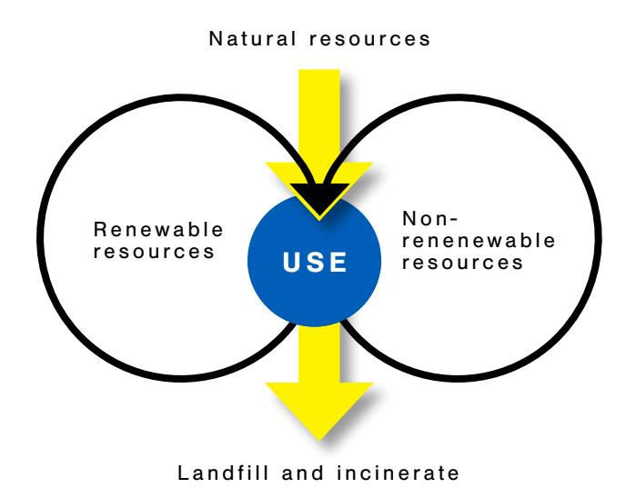

USE

This white paper is divided into five chapters, introducing the reader to circular business models, their sub-categories, business canvases, sustainable growth and providing current examples of circular businesses in the textile industry. It concludes with an overview on business model innovation and how to measure a successful transition to a circular economy.

F i g u re 2 : C o m p a r i s o n o f t ra d i t i o n a l , s u s t a i n a b l e , a n d c i rc u l a r b u s i n e s s m o d e l s (adapted from [2]).

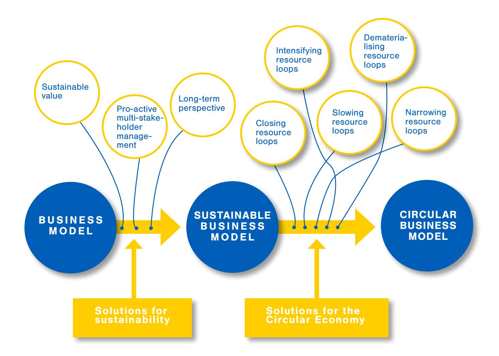

CHAPTER 1:

# CIRCULAR BUSINESS MODELS

Figure 3 : Imperfect overlap of sustainable business model concept and its subcategories like circular business models (adapted from [5]).

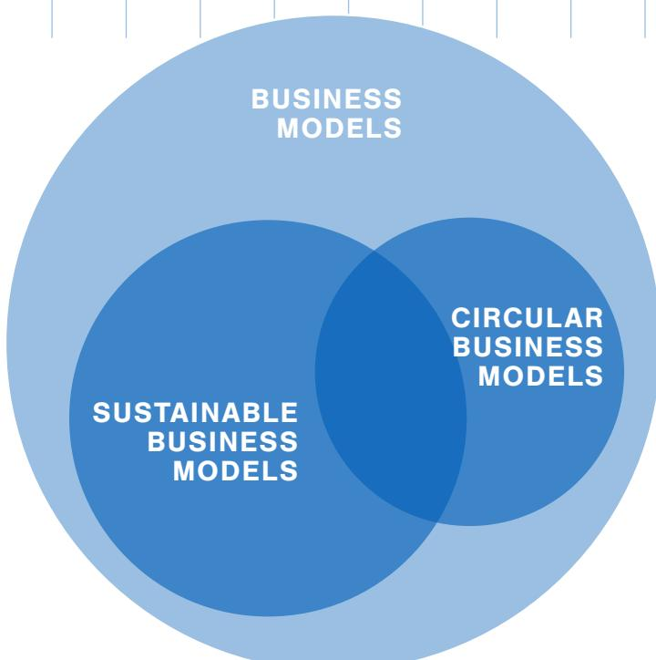

As explained previously, business models, sustainable business models and circular business models exist in the same realm and can overlap on some points. Circular Economy functions according to six main principles: systems thinking, innovation, stewardship, collaboration, value optimisation and transparency [7].

Accordingly, a circular business model will intensify, dematerialise, close, slow and narrow down resource loops. This can be done with four main focuses: i) the product and its use, ii) service and data, iii) production, and iv) outcome.

This white paper was developed with the intention of creating a centralised and easy-toread manual on circular business models. The models presented (a total of 18) represent the most commonly available or discussed models in academic literature as well as in professional publications such as 'Board of innovation2'. Divided into the four main emphasises described above, the circular business models were organised alphabetically without further concerns for their relationships. Hopefully the final segment of this chapter 'Overlapping Circular Business Models?' (page 33) will clarify any remaining doubts.

[remade-mtbr](https://www.adidas.com/us/blog/795018-what-is-made-to-be-remade-mtbr) F i g u re 4 : U l t ra b o o s t , p a r t o f t h e M a d e to b e R e m a d e c o l l e c t i o n ( a s s e e n o n t h e c o m p a ny 's website).

#### a. Circular Product Design

According to [6], [8], [9], when designing a circular product, it is crucial to consider the waste aspects of the design– how it can be used as a resource, how to maintain the value created, and how product or material will be used in a continuous cycle. Contrary to the throwaway economy, circularity embraces the concept of minimal emissions and maximum usage, creating appealing yet highly functional products.

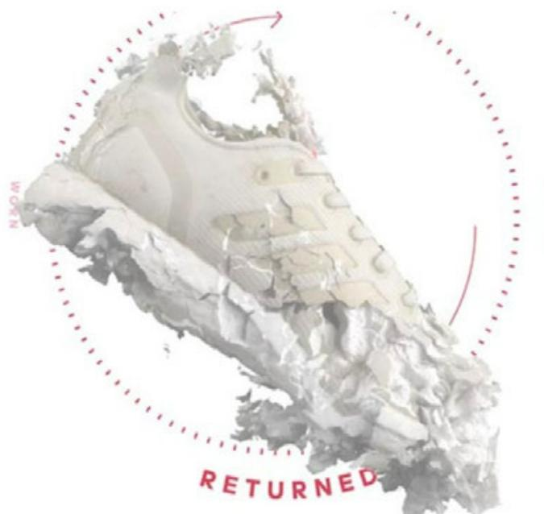

In the textile industry, this can be seen in Adidas' 'Made to be remade'3 business proposition where the products are designed in a manner to avoid waste and support its usage as the raw material for other products:

Strongly focused on the product and its usage, this set of business models represent one of the most traditional routes to business developments: focusing on the final, tangible good and how it can satisfy consumer needs. From a circular perspective, this means to iteratively develop solutions using new, individual products. It is, in many ways, an easier course to follow as some companies might not be ready to become fully circular and would like to test the market with individual product launches.

These circular solutions "actively seek to reduce end-user consumption through principles such as durability, upgradability, service, warrantees, reparability and a nonconsumerist approach to marketing and sales" [8].

In the textile industry, this is the most common category of circular business models implementation, as it is an industry strongly grounded on the final, physical product.

Thus, this could be an interesting starting point for change within the industry.

# 1.1. PRODUCT AND USE-ORIENTED CIRCULAR BUSINESS MODELS

As the name describes, this approach to product development focuses on strategically maximising the recovery potential of the materials used in the products. The producer might, in this case, choose to implement partnerships with technological enterprises to ensure precise recoverability [10], [11].

In the textile industry, we have seen the extreme opposite of this approach in t-shirts which use recycled PET (polyethylene terephthalate), originally from recycled plastic bottles, on cotton t-shirts. This approach was described as a 'Monstrous Hybrid' by McDonough and Braungart [12] for decreasing the chances of recycling the PET further or composting the cotton. A better example of this business model would be Ellen MacArthur Foundation's 'The Jeans Redesign4' project where 'clothes are kept in use'5 through alignment with a set of guidelines which can be used by the entire supply-chain, ensuring the final product can be recycled into new, cottonbased goods.

# b. Design for Recycling or Intentional Design

4 [https://ellenmacarthurfoundation.org/the-jeans](https://ellenmacarthurfoundation.org/the-jeans-redesign)[redesign](https://ellenmacarthurfoundation.org/the-jeans-redesign)

5 Please note that in this case, recycling is used in the recirculation sense as well as the re-creation (re-generation) of the original raw material through mechanical or chemical recycling.

With the change in consumer mindset and the idea of ownership, product-service systems (PSS) turn to focus on forms of leasing or offering a service instead of purchasing a new product [13]. In order to increase a product's response to customer expectations, the PSS was created as an alternative approach, where traditional product manufacturing and usage techniques are substituted by the possibility of responding to consumer needs with the provision of dematerialised services [14]. The application of a product-service system involves a variety of elements related to the management of products throughout its life cycle, sometimes also including an effort to reduce the environmental impact. This is done using a combination of products and services which allows for a broader identification of alternative income streams not only during the production and design of a product, but also during its use [15], [16].

In the textile industry, this business model has not been widely incorporated by projects such as 'Common Threads'6 from the outdoor brand Patagonia, where polyester-composed products can be returned to the brand and they ensure the recycling and usage of that product into new products made of Capilene [17], all under the same company.

Figure 5: Evolution of the Product-Service System concept (adapted from [12]).

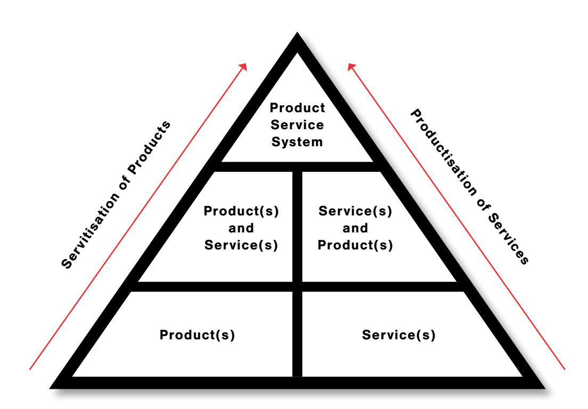

#### c. Product-Service Systems

## Change Your Clothes for Good

Figure 6: Patagonia's Common Thread programme

Different from 'Design for Recycling', but still very much connected to it7, this business model focuses on recovering useful resources/energy from disposed products or byproducts after the design phase [18]. "Resource recovery focuses on the end stages of the usage cycle, namely the recovery of embedded materials, energy, and resources from products at the end of use that is no longer functional in their current application" [19].

In the textile industry, resource recovery comes as an opportunity as described by [20], whose study proposes chemical solutions to retain colourants in the textile industry, saving water, dyes and other chemicals. Furthermore, while recycling textile waste into new fibres is getting more common, it is also possible to recycle other ingredients in textiles, like colour, which could also change current design practices [21].

#### d. Resource Recovery

F i g u re 7: E u g e n i a S m i r n ova [ 2 2 ] f ro m A a l to U n i ve r s i t y s t u d i e d h ow d i f fe re n t tex t i l e c o l o ra n t s ke e p o r c h a ng e t h e i r s h a d e i n t h e tex t i l e re cyc l i ng p ro c e s s w i t h I o n c e l l - F te c h n o l o g y. B e l ow i s t h e m i x tex t i l e wa s te , i n t h e m i d d l e i s t h e p ro c e s s e d p u l p material and above (Photo by: Eeva Suorlahti).

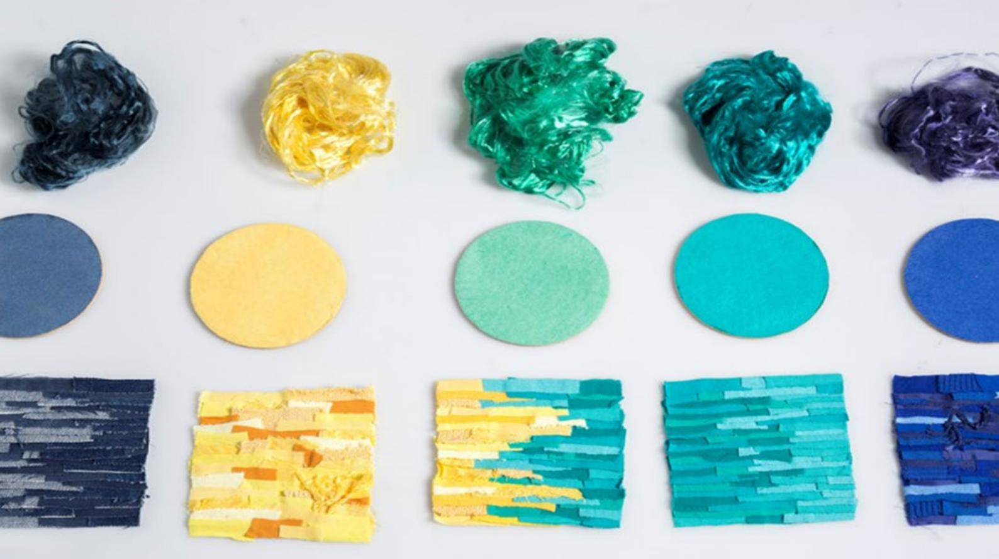

# e. Use, Reuse, Share and Repair

F i g u re 8 : T h e c i rc u l a r b u s i n e s s l o o p s (adapted from [9])

The most holistic of the product-use oriented business models, this focuses on increasing the utility of a product as much as possible before its disposal. It is grounded mainly on three types of stakeholders: product businesses (companies with physical products looking to transition into circularity), solution providers (companies with specific interests which can be used to assist companies in the first group) and facilitators (companies which facilitate and support the entire ecosystem or specific parts of the value chain) [9].

De Mey and Shahbazi [9] propose the following examples to illustrate product businesses, solution providers and facilitators (in this order).

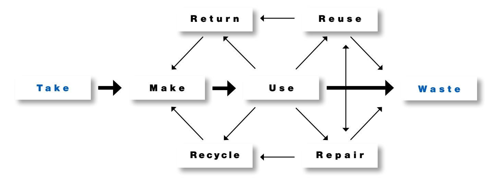

Figure 9: Mud Jeans as an example of Product Business

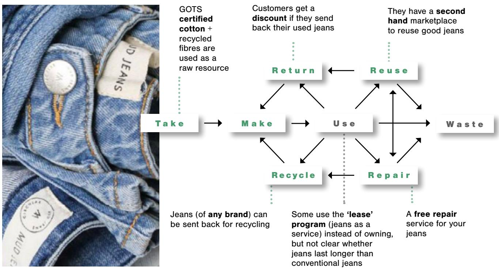

#### MUD Jeans: circular denim

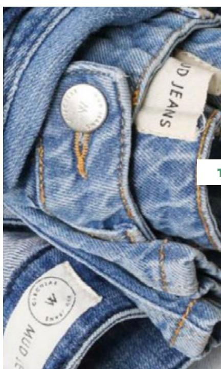

Figure 10: Fast Fashion as an example of solution provider

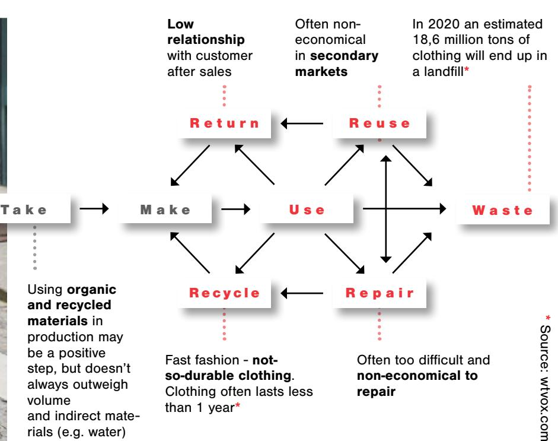

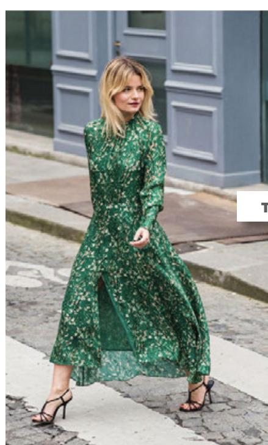

#### Fast-fashion brands with sustainable sourcing

8 Another useful example could be circularity.ID® which promotes a reverse supply chain network for the optimal end-of-use scenario for products, allowing users to set up their ideal system for the return, sorting, re-commerce, and fibre recycling. For more information see: [https://circular.fashion/en/software/](https://circular.fashion/en/software/circularity-id.html) [circularity-id.html](https://circular.fashion/en/software/circularity-id.html)

F i g u re 1 1: H & M 's p a r t n e r s h i p w i t h I : C O to c o l l e c t a n d re c i rc u l ate u s e d p ro d u c t s (Facilitator) 8[9]

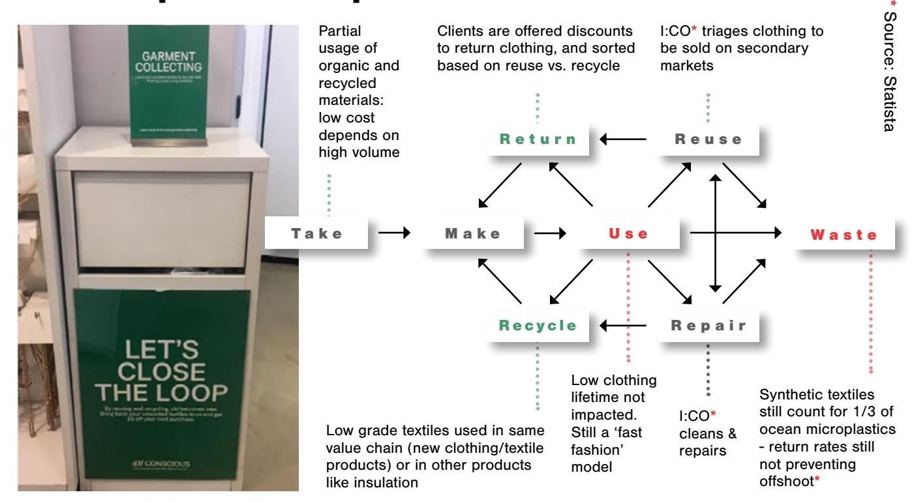

#### H&M in partnership with I:CO\*

# 1.2. SERVICE AND DATA-ORIENTED CIRCULAR BUSINESS MODELS

This group of business models function mostly through partnerships which are made possible using services and data analysis. It is not yet common in the textile sector but has been increasingly seen as a solution to overproduction and to decrease the distances caused by the COVID pandemic.

# a. Coordinating circular value chains through data9

Many of the companies currently dealing with, or transitioning to, circular economy can use their data base in association with technologies such as blockchain and RFID (Radiofrequency identification) to accurately map and assess the material flow, bottlenecks and waste within their value chains [9]. Thus, providing other companies with insights of new potential material streams for their businesses.

> 9 Considering how broad this business model can be, it would also be ideal to check other examples such as: Genuine Way ([https://genuineway.io/\)](https://genuineway.io/), TrusTrace [\(https://trustrace.com/](https://trustrace.com/)), and Reverse Resources ([https://reverseresources.net/\)](https://reverseresources.net/).

F i g u re 1 2 : C i rc u l a r Fa s h i o n's a c t i v i t y p ro f i l e ( a s p o r t raye d on the company's website)

A promising solution to the lack of transparency in the textile sector, ecosystems grounded on blockchain have started to appear alongside companies willing to connect the interested parties. The German 'Circular.Fashion'10 is an example of a company centralising a community of companies and their products digitally, connecting suppliers to circular brands, engaging consumers in reusing and returning their clothes and providing data for sorters and recyclers.

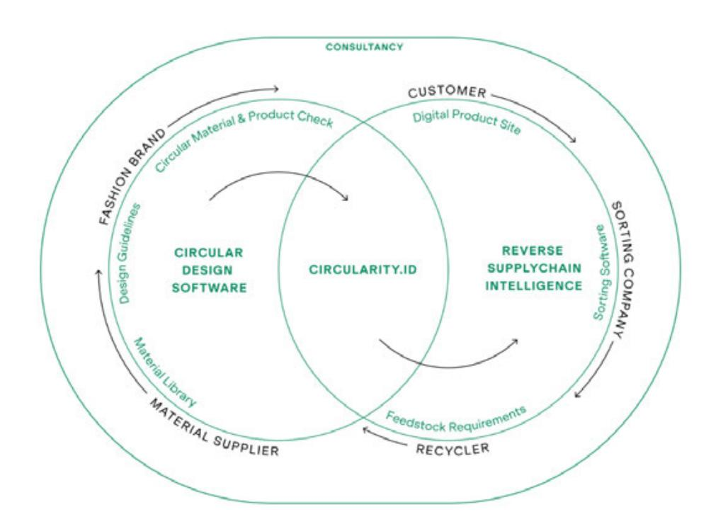

10 <https://circular.fashion/en/>

F i g u re 1 3 : Z a l a n d o ' s a p p fo r m ea s u r i ng c o n s u m e r s ( a s s e e n o n t h e i r website 11 )

This business model aims to replace a physical product with a digital/virtual service, potentially being used in collaboration with key databases, which clearly connect the users' practices to service providers through digital access and confidence [13].

Digitalisation and dematerialisation in the fashion industry have been researched for the past decade as the potential is endless. However, one of the most popular solutions found in the market comes from the use of body scanning. Able to precisely measure the consumer, this methodology allows for better shopping with less returns as a person's measurements can be used to provide the most suitable sizing. Furthermore, this technology can be expanded with the use of virtual reality and avatars, also enabling consumers to virtually try or see the product they are considering buying.

# b. Dematerialisation and Digitalisation

#### c. Product as a Service 12

Born from a circular need, this business model offers product access and retained ownership to internalise the benefits of circular resource productivity [18], [19]. This way, the product owner can instigate the product's ongoing maintenance, durability, upgrades, and treatment at the end of its use. This approach also allows companies to have a closer relationship with the product user, ensuring high customer satisfaction.

A circular example available on Ellen MacArthur Foundation's website13, Circos14, is a Dutch company with a subscription model where parents can pay a monthly fee to access a range of highquality baby clothing and maternity wear. As the child grows or the pregnancy evolves, the consumer can adapt their wardrobes without acquiring new clothes and disposing of old ones. The company is also responsible for ensuring the quality and longevity of the clothes, as well as their cleanliness, eventually recycling what cannot be reused. Furthermore, through partnerships with brands, they enable more companies to engage in circularity.

> 12 It is important to point out here that this could easily be seen as one kind of Product-Service Systems, however, it was added here because it was found multiple times in the literature as an individual model.

13 [https://ellenmacarthurfoundation.](https://ellenmacarthurfoundation.org/circular-examples/increasing-clothing-use-through-subscription-circos) [org/circular-examples/increasing](https://ellenmacarthurfoundation.org/circular-examples/increasing-clothing-use-through-subscription-circos)[clothing-use-through-subscription](https://ellenmacarthurfoundation.org/circular-examples/increasing-clothing-use-through-subscription-circos)[circos](https://ellenmacarthurfoundation.org/circular-examples/increasing-clothing-use-through-subscription-circos)

14 <https://circos.co/>

#### d. Retain Product Ownership

Similar to 'PSS', this business model proposes the retention of ownership by the service provider, who offers the product through rent or leasing. This alternative is widely used by companies offering complex products, investing heavily in after-sales and maintenance capabilities, or by companies offering expensive products which are seldomly used [10].

Rent the Runway15 is a clear example of product ownership retention in the textile industry. The company, which targets high-end consumers, offers the opportunity to rent luxury products for a single use instead of buying. This differs from other business models for its high-end orientation and focus on luxury

Figure 14: Rent the Runway business model (as seen on their website's membership page 16)

15 <https://www.renttherunway.com/>

16 [https://www.renttherunway.com/memberships?act\\_](https://www.renttherunway.com/memberships?act_type=top_nav_anon_gated_t3&mlc=mobile) [type=top\\_nav\\_anon\\_gated\\_t3&mlc=mobile](https://www.renttherunway.com/memberships?act_type=top_nav_anon_gated_t3&mlc=mobile)

# e. Sharing Economy and Platforms 17

Focused on the concept of idled goods, this business model is defined by sharing products, driven or not by transactional arrangements [19]. It is usually based on specific groups and communities as it provides convenient access to products and services, increasing the usage of what is offered [18].

Still fairly new to the textile industry, the sharing economy concept can easily be mistaken for clothing rental. However, the main difference is the 'sharing' part of the idea, exchanging goods not necessarily for money but for other goods. One company that advertises this is 'Wardrobe'18, an American platform where people (not companies) can lend their own clothes for a certain period of time, also having the option to rent these clothes, an option often chosen by celebrities who use the funds to donate to specific causes.

Figure 15: Swap&Shop's modus operandi (as presented on the company's website)

#### f. Collaborative Consumption

Increasingly popular in the textile industry and commonly studied alongside the Sharing Economy, collaborative consumption can be defined as a consumption trend "in which consumers, instead of buying new fashion products, have access to already existing garments either through alternative opportunities to acquire individual ownership (gifting, swapping, or second hand) or through usage options for fashion products owned by others (sharing, gifting, swapping, lending, renting, or leasing)" [23].

With a stronger social focus, collaborative consumption is found in the textile sector in various ways, most popular among which would be swapping, an experience that can be achieved on platforms such as Come Swap and Shop19 where members garments are evaluated, and tokens are provided to guarantee fair exchange of goods (as can be seen in details on Figure 15).

#### 1.3. PRODUCTION-ORIENTED CIRCULAR BUSINESS MODELS

A process-oriented solution, concerned with using residual outputs from the process itself as feedstock for other processes, can be benefited by geographical proximity between businesses willing to collaborate with each other in what is known as industrial symbiosis, or through the development of a business ecosystem between partners who are farther apart.

Industrial symbiosis, a relatively new concept based on an mutual exchange between the involved parties, is a sort of industrial cluster exchange where outputs from production can become the inputs to another (usually nearby) plant [24]. The proximity is key in this case due to its potential impact on industrial parks where several companies operate together [25], [26]. Business ecosystems, on the other hand, are business partnerships which are built regardless of partner's locations, mainly focused on innovation and knowledge exchange [27], [28].

#### a. Circular Inputs (and/ or supplies): the ecosystemic approach

This business model shows one of the advantages of transitioning to a circular economy: minimising or eliminating the use of virgin resources. Followers of this approach will have renewable energy and bio-based or fully recyclable input material originating from what was previously seen as waste [18]. These resources are, or can be, used in their current state, recycled or decomposed20, ensuring a longer lifecycle to the value chain and reducing the dependency on finite resources [19].

Proposed as a circular ecosystem, the New Cotton Project fits into this business model. Conceptualised to implement the theoretical proposition21 of Infinited Fiber Company (IFC) on a commercial scale22, the project grouped 12 companies spread around Europe to ensure feasibility. Using IFC's Infinna™ fibre (cellulose carbamate from postconsumer textile waste) at its core, the project gathered manufacturers, designers and retailers to launch two collections into the real market (see Figure 17).

20 Decomposition is a delicate term to be used as it means the re-introduction to the biological ecosystem, which in turn means that the circular economy will not have access to it and might force the industry to return to using virgin resources. In simpler words: decomposition is awesome for your garden, but it is terrible for keeping resources circulating.

21 The experiment developed in a laboratory (under ideal circumstances).

22 Using a real supply chain composed by actual commercial companies.

Figure 16: New Cotton Project's Ecosystem

This example describes the project but also proposes a conundrum: 'how does the business model work when multiple companies are involved and each of them has their own business model?'. In this example, the circular business model is a representation of the combination of businesses, with their own business models, which collaborate to create new circular business opportunities.

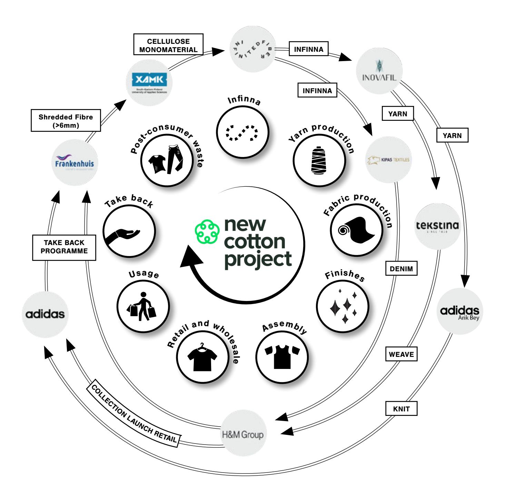

# b. Collection and Reverse Logistics

Similarly to the third type of circular business model presented in 'Use, Reuse, Share and Repair', this model illustrates circular facilitators: enterprises focused on the latter stage of circularity 'rescuing' the discarded product which will supply its materials [9]. This circular business model can be seen as an offer directed to the post-consumer and/or post-industrial sources.

Commonly used in engineering projects and publications, reverse logistics is a relatively new business model within the textile sector. As mentioned previously, I:CO23 (I:Collect GMBH) is a company in a long term relationship with H&M, following exactly what this business model proposes (as can be seen in the picture below), collecting garments and shoes from retailers' points of sale and taking them to sorters for reuse or recycling.

F i g u re 1 7: I : C O ' s exe m p l i f i c at i o n o f t h e i r b u s i n e s s m o d e l ( a s c a n b e fo u n d o n t h e i r website 24 )

23 <https://www.ico-spirit.com/en/>

24 As can be seen in Figure 17, there are also other effective collection activities such as donations through street bins.

# c. Recovery of Secondary Raw Materials/by-products 25

Secondary raw materials can be defined as a cost efficient alternative generated from waste materials, either in their current state or after repurposing. Byproducts, on the other hand, are lesser products created by the production process, manufacturing process or chemical reaction. Therefore, this business model focuses on the value optimisation of by-products and secondary raw materials from 'within' the factory (from within the production facility), not including materials coming from the consumer [13].

In the textile industry, manufacturing plants can contain several in-factory opportunities for by-products which happen naturally, such as cotton 'fluff' aired during carding, spinning and other mechanical process26. Companies such as Kipas27 and Inovafil28 use these fibres either as down for other products or in secondary yarn and textile production, or (in cases where there is no mixture with other fibres) recycle it.

# d. Sorting and (pre) Processing

This circular business model can have several facets, the most common of which is the collection and sorting of post-consumer textiles for reuse and/or downcycling. However, sorting to produce high value textiles to generate textile recycling feedstocks is a new approach to this model.

The second case, used in the production of Infinna™, requires special technology like NIR (near-infrared spectroscopy) and other sorting methods, which are being tested and improved in order to align with the requirements for presorting feedstock for chemical processes – it is used before mechanical recycling – for fibers for re-spinning.

25 For more information on the topic, see: [https://www.vttresearch.com/en/beyond2030/productivity](https://www.vttresearch.com/en/beyond2030/productivity-leap/recovery-materials-challenging-secondary-streams)[leap/recovery-materials-challenging-secondary-streams](https://www.vttresearch.com/en/beyond2030/productivity-leap/recovery-materials-challenging-secondary-streams)

26 In yarn spinning, they take long enough fibres and yarn scraps and just process them again (recirculating raw material, not chemically nor physically recycling them). On the other hand, clippings from cutting and sewing processes are also sometimes a cost-efficient replacement for virgin fibres in yarn spinning, but these would be by-products of the production, not secondary raw materials. Finally, post-consumer (and even product returns or unsold goods) are not a quality-effective alternative for raw materials as their processing requirements, as well as the cost of returning it to raw material quality, take them out of this category.

27 <https://www.kipas.com.tr/sectors/textiles>

28 <http://inovafil.pt/>

A subsequent step to the 'Collection and Reverse Logistic', this business model appears in the textile industry through companies such as Frankenhuis29. The Dutch company (alongside its collection partner: Boer Group Holland30) sort through post-consumer textile waste, originating mostly from the BENELUX31 and Germany, and commercialises the fibres (either as recycled, for recycling or for further circular practices).

As can be seen in Figure 18, Frankenhuis does not use standard post-consumer textile sorting. That part is in fact led by the Boer Group which focuses heavily on sorting. Frankenhuis focuses on specific requirements from their clients to obtain high-quality textile feedstock32, carry out confidential recycling, recycle corporate garments and textiles, and advise and help develop customised solutions for specific needs.

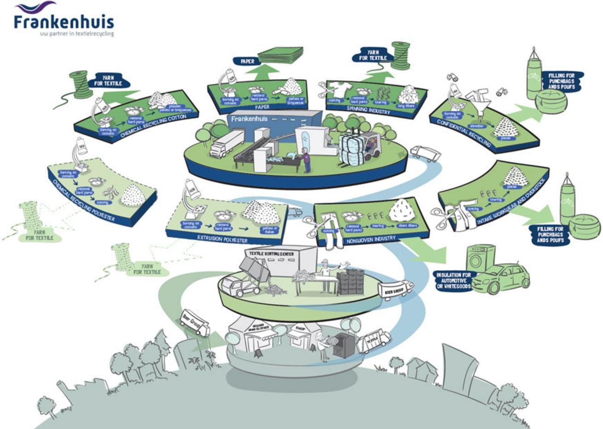

Figure 18: Frankenhuis' Business Model (image provided by the company)

<https://www.frankenhuisbv.nl/> <https://www.boergroup.eu/?lang=en> Acronym for the group of countries formed by Belgium, the Netherlands and Luxembourg. Not all feedstock is composed of fibres, they can be supplied as powder or pieces.

# 1.4. OUTCOME-ORIENTED CIRCULAR BUSINESS MODELS

Outcome-oriented business models focus mainly on the end result of the model and how to reach it, as can be seen in the following examples.

#### a. On-demand

This business model proposes production-on-demand, where the manufacturing of a product occurs only when consumer demand has been confirmed, and has been associated with the 'reduce consumption' behaviour, that is, consumers only purchase the product when they really need it [29].

In the textile industry, this business model could be seen in projects such as 'Threadless33', similar to Rapanui's34 project Teemill35 presented in the first white paper. This t-shirt company uses social networks and customer feedback to make printing decisions. An online community gets to vote and decide what is produced. Consumers are also allowed to submit their own designs and interact with others [17].

Designer Anna Ruohonen has created fashion collections in which production starts only when a predefined number of pre-orders have been placed. This way, each item has an owner before the production starts, avoiding all surplus production [30]36.

## b. Product Life Extension

Widely available in the textile industry, this business model targets a product's life extension through design, reparation, upgrade and resale [18]. Companies applying this strategy focus on designing high-quality, atemporal37 products to last longer, which may open-up possibilities for markets in used products. Arguably counter-productive to companies focused on selling large amounts of products, this alternative can also provide more jobs locally as it increases the need for qualified local labour for traditional activities such as repairing garments for second-hand shops and, in many cases, leads to a surge in consumer loyalty [10].

35 <https://teemill.com/>

 • [https://aarden.space/](https://aarden.space/ ) • <https://www.thezoereport.com/fashion/made-to-order-clothing> (article with several links)

37 Which do not follow seasonal, fast-paced, and constantly changing trends.

33 <https://www.threadless.com/>

34 <https://rapanuiclothing.com/>

Without changing the original product design and functionality, this business model focuses exclusively on extending a product's current life, for instance, through the commercialisation of second-hand products. This type of business model is very popular in Nordic countries, as can be seen in Finland at 'U-landshjälp från Folk till Folk i Finland sr'38 (popularly known as UFF) stores. Not-for-profit, the company engages in social projects and climate change awareness campaigns which are distributed to their customers.

#### Designing for long or extended product

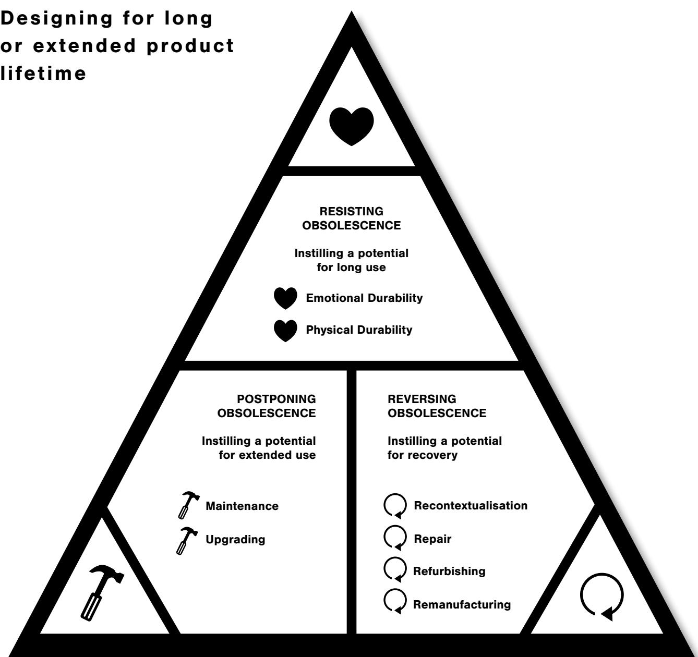

F i g u re 1 9 : D i f fe re n t d e s i g n d i re c t i o n s a n d a p p ro a c h e s fo r l o ng o r ex te n d e d p ro d u c t Lifetime (Adapted from [31])

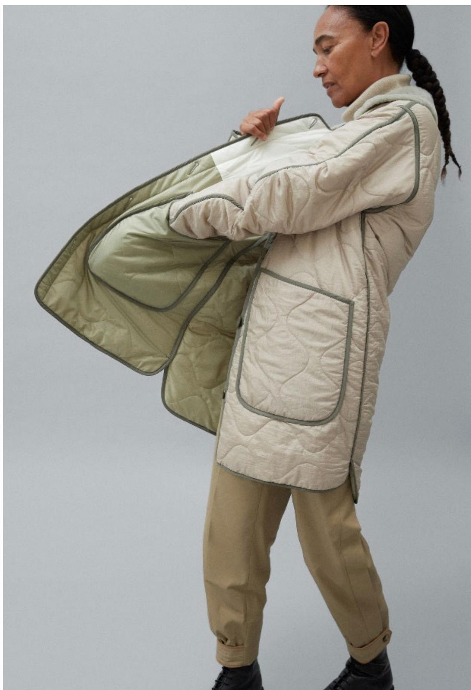

F i g u re 2 0 : M a r fa S t a n c e m o d u l a r c o at ( p i c t u re by N a d i a Ryder 41 )

Very similar to the previous circular business model, this last example has a stronger design-focus as the products are designed to be durable through means such as modularity, where the same product can become another [13]. These are born-circular designs as their products were created for repairability, upgradability, reusability, ease of disassembly, reconditioning, and the recyclability of all components [19].

# c. Product Lifecycle Extension/Reuse

In the textile industry, this is a constantly increasing trend and has been seen in Hussein Chalayan's 2013 fall collection39, on Marfa Stance (pictured below), and in magazines or on do-it-yourself platforms such as Pinterest40.

39 [https://fashion-history.lovetoknow.](https://fashion-history.lovetoknow.com/fashion-clothing-industry/fashion-designers/hussein-chalayan) [com/fashion-clothing-industry/fashion](https://fashion-history.lovetoknow.com/fashion-clothing-industry/fashion-designers/hussein-chalayan)[designers/hussein-chalayan](https://fashion-history.lovetoknow.com/fashion-clothing-industry/fashion-designers/hussein-chalayan)

40 [https://www.pinterest.com/pin/top-](https://www.pinterest.com/pin/top-25-ideas-about-modular-clothes-on-pinterest--248753579399825976/)[25-ideas-about-modular-clothes-on](https://www.pinterest.com/pin/top-25-ideas-about-modular-clothes-on-pinterest--248753579399825976/)[pinterest--248753579399825976/](https://www.pinterest.com/pin/top-25-ideas-about-modular-clothes-on-pinterest--248753579399825976/)

# 1.5. Overlapping Circular Business Models?

With the several examples of circular business models above, the similarities between some models become increasingly clear, and can confuse the reader. To help understand the differences between the models, we created a Circular Business Models matrix, matching the purpose of the models to its implementation scheme.

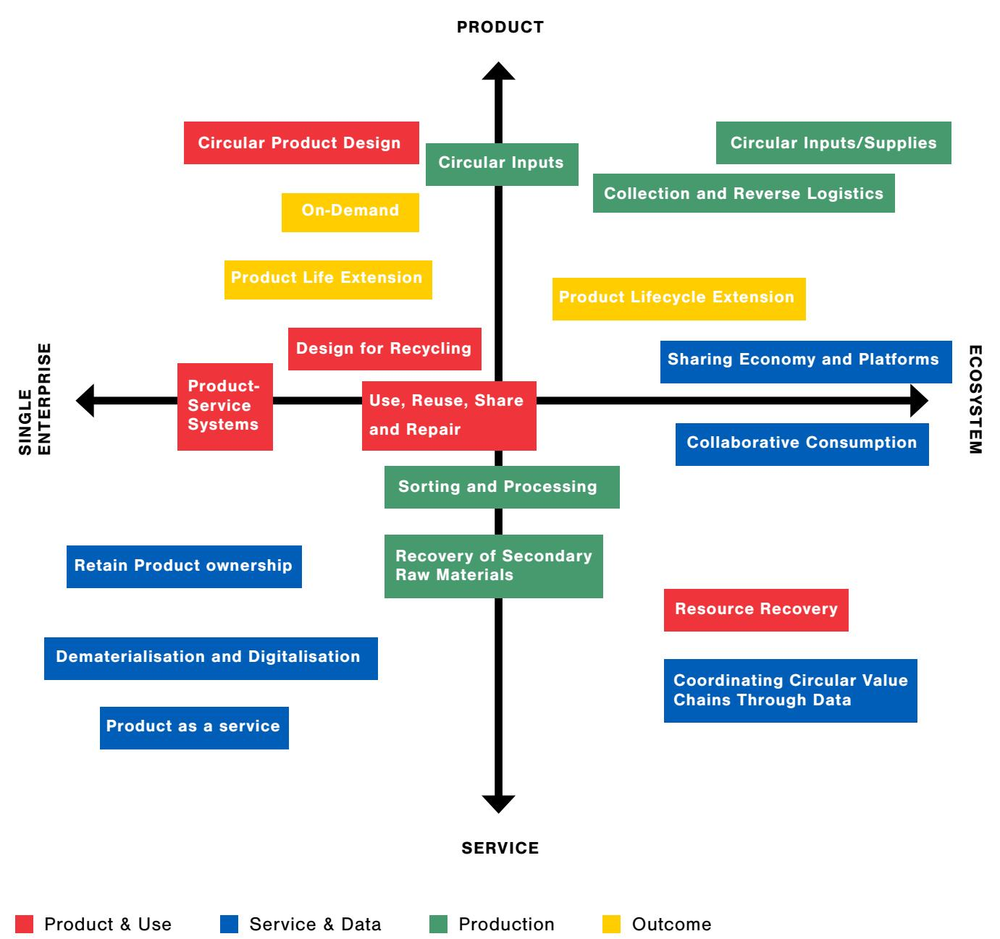

As can be seen in the matrix (figure 21) and through the illustrative examples provided, some of the business models differ on their approach towards a product or a service, as well as the number of companies involved in said business model. Some only work through the creation and maintenance of a business partnership, and others can exist alone. To exemplify the matrix further, the New Cotton Project is represented by Circular Inputs/Supplies, which can be found in the top right of the matrix, as it is a circular ecosystem composed of several businesses and is based on a product (Infinna™).

Additionally, the examples portrayed are an amalgamation of several publications and frequent classifications, providing the reader with a very broad overview of the existing circular business models. Management is not an exact science and that becomes clearer when analysing different business models from different sources. Sometimes, the multiple models can overlap or be generalised, and the examples shown here tried to avoid that, therefore, some might be found elsewhere under different names. PSS is the biggest example of that as, for some authors, it is a business model as big as circularity, and for others, it is part of the circular economy. The authors leave this for the reader to decide.

Canvases present a different approach to business models, "opening" the company into smaller sections which can be analysed individually. Osterwalder and Pigneur [32] are the pioneers behind developing current business canvases to enhance business model innovation, developing the concept of canvases based on nine basic building blocks: customer segments, value proposition, channels, customer relationships, revenue streams, key resources, key activities, key partnerships, and cost structure.

The canvas structure offers a different perspective for the organisation, mapping out the structure and enabling strategic changes. Within the circular business models, there are three canvases which stand out: the flourishing canvas (a toolkit developed by Antony Upward in 2014), the circulab (a design-oriented systemic model for regenerative solutions) and, focused on potential new ideas, the 'Circular Business Model Tool' (proposed by Geissdoerfer as part of a literature revision).

Figure 22: Example of a traditional Business Canvas

The figure is a strategyzer Business Model Founding AG design table. It consists of three columns: **Key Partners**, **Key Resources**, and **Cost Structure**. Each column contains a designed form for a project and a description of the project content.

**Key Partners** (Top Column):
 

- **Key Partners** (Top left): Why are you Key Partners? Why do you Key Partners? What do you Key Partners? What do you Key Partners are and acquiring from (and what are they Key Partners to determine particular?)
- **Key Partners** (Top right): What do you Key Partners are and acquiring from (and what are they Key Partners to determine particular?)

**Key Resources** (Middle Column):
 

- **Key Resources** (Top left): What do you Key Resources do for Key Resources? What do you Key Resources do for Key Resources? What do you Key Resources do for Key Resources? What do you Key Resources do for Key Resources?
- **Key Resources** (Top right): What do you Key Resources do for Key Resources? What do you Key Resources do for Key Resources?

**Cost Structure** (Bottom Column):
 

- **Cost Structure** (Top left): What do you Key Cost Structure do for Key Cost Structure? What do you Key Cost Structure do for Key Cost Structure? What do you Key Cost Structure do for Key Cost Structure?
- **Cost Structure** (Top right): What do you Key Cost Structure do for Key Cost Structure? What do you Key Cost Structure do for Key Cost Structure?

**Revenue Streams** (Bottom Column):
 

- **Revenue Streams** (Top left): What do you Key Revenue Streams do for Key Revenue Streams? What do you Key Revenue Streams do for Key Revenue Streams? What do you Key Revenue Streams do for Key Revenue Streams?
- **Revenue Streams** (Top right): What do you Key Revenue Streams do for Key Revenue Streams? What do you Key Revenue Streams do for Key Revenue Streams?

**Cost Structure** (Bottom Column):
 

- **Cost Structure** (Top left): What do you Key Cost Structure do for Key Cost Structure? What do you Key

#### CHAPTER 2:

# CIRCULAR BUSINESS CANVASES

# 2.1. FLOURISHING BUSINESS CANVAS43

The Flourishing Business Canvas is a tool developed by Antony Upward at the Ontario College of Art & Design University Strategic Innovation Lab with the intention of answering questions for a business to create effective sustainable business models. The layout was tested through interviews and case studies which corroborate the efficiency of the canvas.

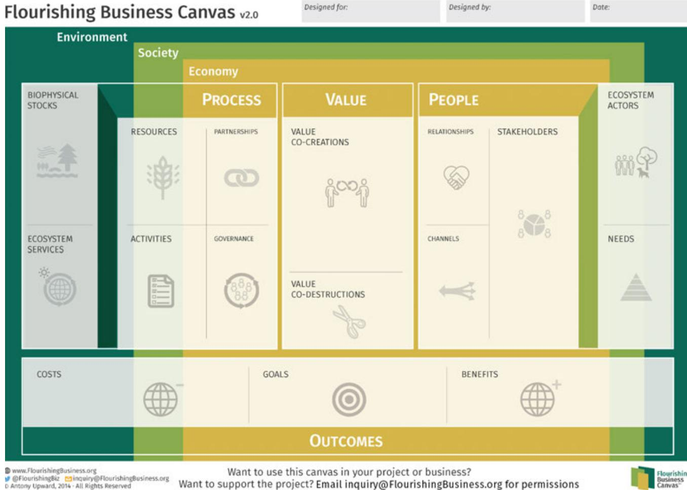

Figure 23: The Flourishing Business Canvas

# 2.2. CIRCULAB CIRCULAR DESIGN TOOL 44

Developed by a Design and Strategy consultancy, the Circulab is an open-source tool which aims to assist companies in creating regenerative solutions. It is different from the Flourishing Canvas in that it proposes development based on impacts (positive and/or negative) as well as a longer lifecycle (including usage context and subsequent use).

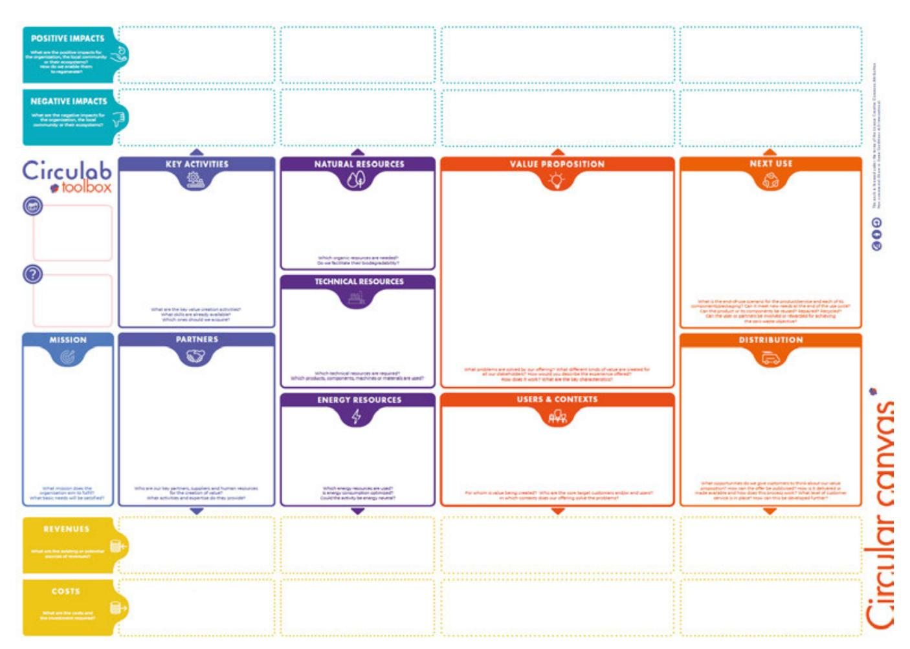

Figure 24: Circulab toolbox

# 2.3. CIRCULAR BUSINESS MODEL TOOL 45

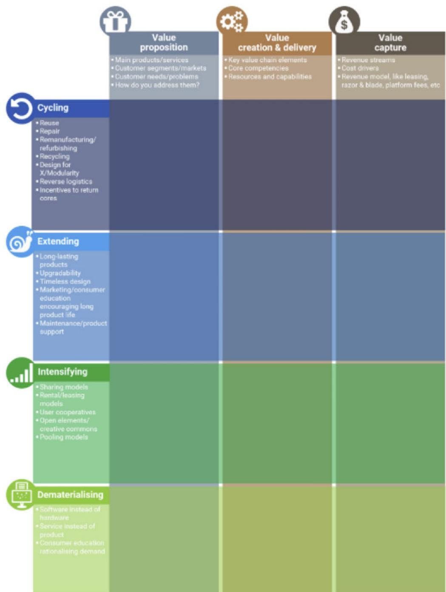

Figure 25: circular business model tool [33]

This canvas model, developed by Geissdoerfer et al. [14, page 11], was initially intended to structure a literature review, however, it provides an interesting framework for envisioning potential new projects by encouraging discussion over the four main categories of circular business models and grounding it on the three main means of value perception: value proposition, creation and delivery, and value capture (as can be seen in Figure 8).

The principles of the circular economy, as seen previously, are understanding the system more than just the company, rethinking resources and their management, exercising transparency and showing the stakeholders how issues are sorted within the company, optimising value throughout the value chain and securing benefits for all members of your economy [34].

Countries like the Netherlands and Finland have been implementing Circular Economy principles in their countries for years46, aiming to go fully circular by 2050 (Netherlands) or even 2035 (Finland). In order to do so, the Netherlands, for instance, has followed a series of strategies promoting the transition from a linear economy. Figure 27 on the next page illustrates these 10 strategies.

#### CHAPTER 3:

# BUSINESS AND THE TRANSITION TO CIRCULARITY

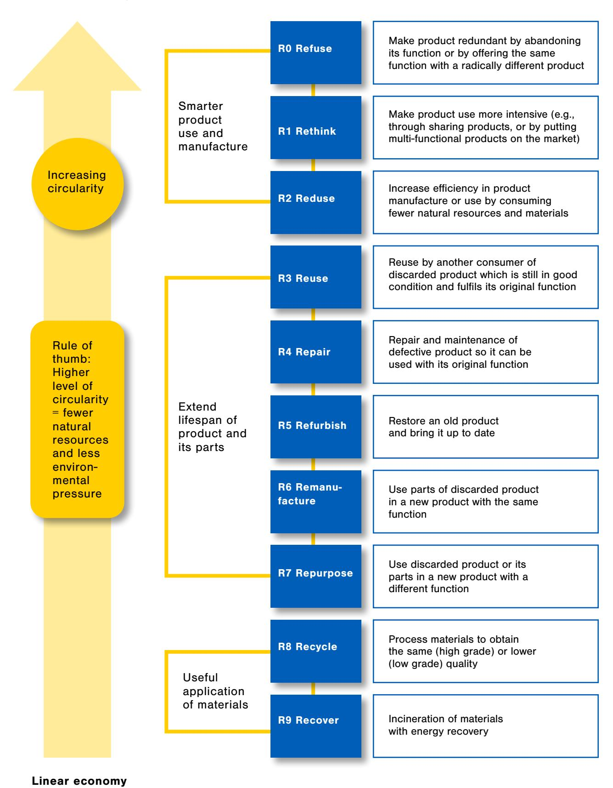

#### Circular economy

Finland has had a functioning system for recycling refillable glass bottles since the 1950s (based on deposit) and 98% of refillable glass bottles are collected [35]. Paper waste has been collected and returned as a raw material for the paper industry since 1943 [36] and it is estimated that 71% of used paper is currently recycled in Finland [37]. A strategic programme to promote a circular economy has been developed and its "aim is to transform the economy into one that is based on the principles of circular economy by 2035. With this programme, the Finnish Government wants to strengthen Finland's role as a leader in the circular economy." This goal to enhance a circular economy is tied to the Government's focus to actively decrease climate change and achieve carbon neutrality by 2035 [38], [39].

Furthermore, considering the wholesomeness of circularity, there are researchers [40]–[42] who support the idea of socio-technological transitions (Figure 27). This approach defends the gradual transition from niches (where small and medium enterprises develop new businesses rooted on innovation to generate transition – like circular economy) into landscapes (the broader scenario where most businesses are, and which should be transitioning to the new practices)47

As can be seen in Figure 27, as landscapes develop, they force changes in the regime (like when a government decides to promote circularity). The pressure in turn creates opportunities for the current regime (based on market/user preferences, the industry, scientific achievements, policies, technological possibilities, and culture). These same forces act on the niche, creating expectations for smaller actors to innovate. Once the niche proposes a novel approach to the landscape pressures, the regime changes to embrace the new method, eventually creating a new landscape based on the opportunities brought on by the niche.

Figure 27: multi-level perspective on socio-technical transitions [41]

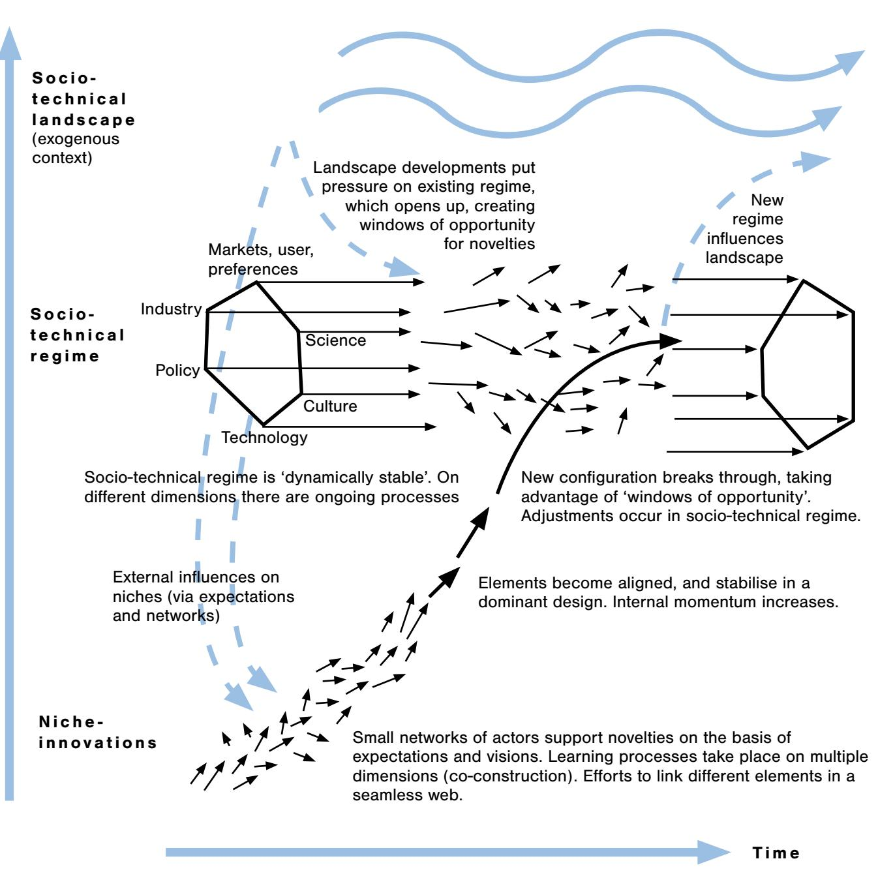

F i g u re 2 8 : A b u s i n e s s m o d e l , c o n s i s t i ng o f va l u e c reat i o n , va l u e p ro p o s i t i o n a n d va l u e capture strategies (adapted from [34])

#### 3.1. VALUE

Central to circular economy, value is one of the grounding concepts: "a circular business model is sustainable only if value can be economically recovered from the product" [10]. Closing the loop within a circular economy without adding value to the various stages of said economy does not guarantee long term stability or collaborations. Circular business models can be tools to redefine the proposition of value whilst dealing with value creation, capture and delivery48 between different business enterprises.

Gillabel et al. [34] explain how value proposition, creation and delivery, and capture influence a sustainable business model, adding environmental and social value to the equation (Figure 29).

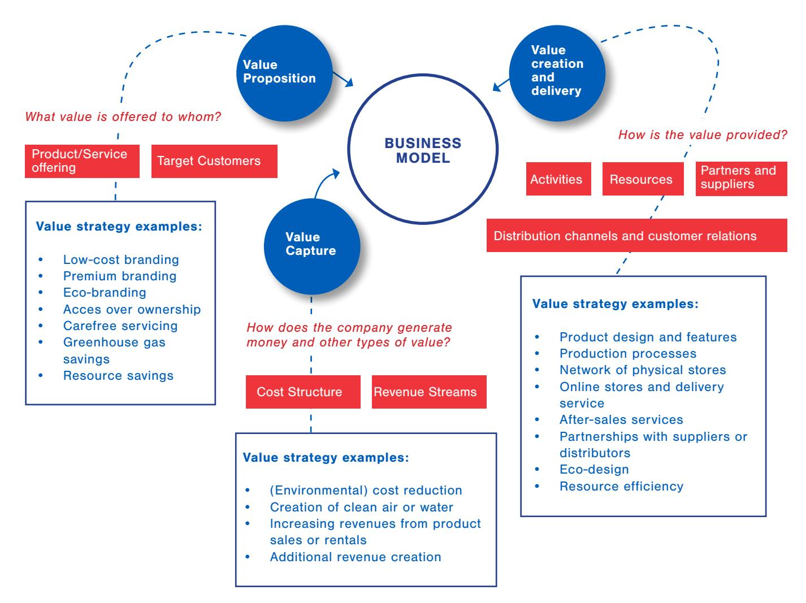

It is important to emphasise that value is not just a measure of monetary gain, as seen previously. Value can be maintaining loyal customers who 'feel heard by the company' or having an increasing clientele because the word of mouth surrounding your product is that 'they will not become part of a floating trash island in the ocean' or even that your company is 'constantly having products upgraded internally using older versions'. Furthermore, there is, within sustainable business models, the concept of value judgement, where the purpose of the enterprise can be analysed and generate insights extending to several levels (as can be seen in Figure 30).

Figure 29: Value Mapping according to Bocken et al. [43] 49

Value mapping is a tool used to assist systemic tactics in new sustainable business models in the context of multiple stakeholders. The transition to circularity requires a systemic approach as it does require the engagement and loyalty of several stakeholders. It then uses value mapping in order to "understand the positive and negative aspects of value in a network of stakeholders, identify conflicting values (i.e., where a benefit to one stakeholder creates a negative for another), and identify opportunities for sustainable business model redesign – especially to improve societal and environmental impact based on qualitative value judgments" [43].

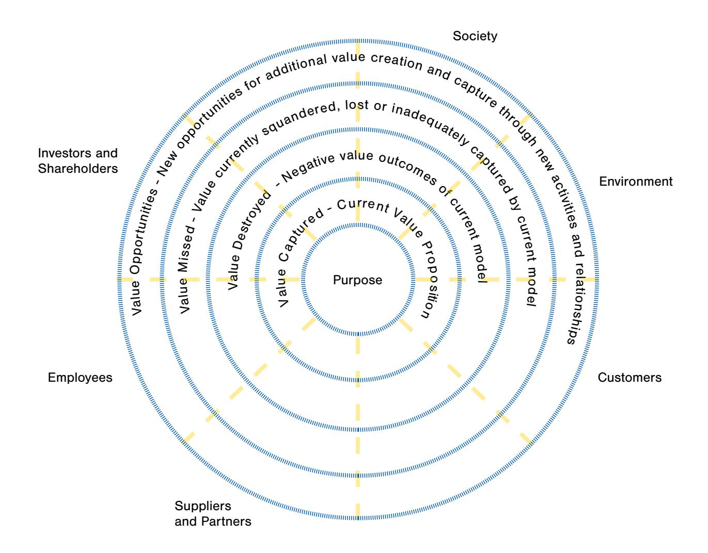

# 3.2. BUSINESS MODEL INNOVATION

Finally, in the words of Lüdeke-Freund, Gold and Bocken [44], "a crucial constituent in the achievement of a circular economy is business model innovation".

Figure 30: Types of business model innovation (Adapted from [5])

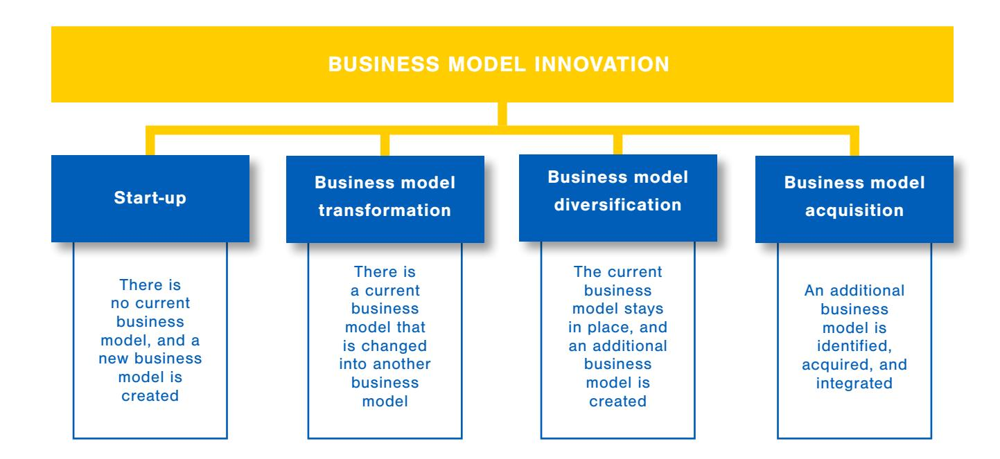

Innovation and circular economy are intrinsically connected by what their combination can offer: a collective valuable outcome. When contrasted to circular strategies, innovation is one of the main factors which enable the transition towards circularity [4]. As can be seen in Figure 30, there are various types of innovation which affect the transition to circularity in different, mostly positive, ways.

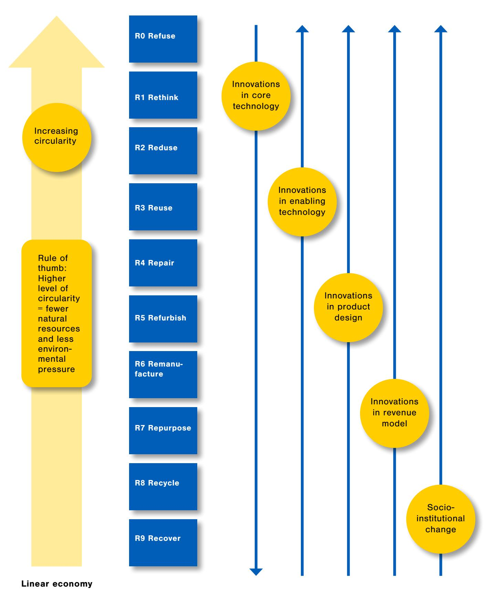

#### Circular economy

Innovation is also seen as a pathway to circular business models as it does not necessarily represent new inventions but also the adoption of popular practices from other fields. Therefore innovation can be described as [34]:

Furthermore, policies can accelerate the transition to circularity through legislative measures, regulations and information requirements, support of research and innovation, economic incentive mechanisms, and by providing voluntary tools and guidelines [34].

To better illustrate the roles of value and innovation in a circular business model, we can reflect on the case of the New Cotton Project. A clear example of an innovative ecosystem [27], the project proposes the scaling an innovative recycling technique to a commercial size using the market's textile waste and engaging with the various stakeholders to ensure innovative product design, which can, in turn, ensure the closed loop of the overall value chain and lead to socio-institutional change (in the long-run).

- 1. Start-ups: a new organisation with a circular business model is created.
- 2. Business model transformation: the current business model is changed, resulting in a circular business model.
- 3. Business model diversification: without major changes in the existing non-circular business models of an organisation, an additional circular business model is established.
- 4. Circular business model acquisition: an additional circular business model is identified, acquired and integrated into the organisation.

So far, we have presented 18 different circular business models, 3 canvases, and introduced the concept of value and innovation, proposing means to transition towards a circular economy in a realistic manner. This chapter will focus on measuring the journey: knowing if the decisions made are indeed leading the initiative to success.

Considering how developed and available Circular Economy is, there are not many recognised tools for its assessment. As the Netherlands has been slowly transitioning to circular economies, it has also proposed a set of questions to measure innovation in the product chain [4]. Divided into four main categories, these questions should reveal the progress being made towards circularity in a more quantitative manner.

# CHAPTER 4: MEASURING SUCCESS

#### DIAGNOSTIC QUESTIONS

| MEANS        | 
<b>Mobilisation of means</b>
 <ul> <li>Are all relevant product chain partners actively involved in realising CE solutions?</li> <li>Is there sufficient funding for realising CE solutions?</li> <li>Are there specific physical means limiting the realisation of CE solutions?</li> </ul> 
<b>Knowledge development</b>
 <ul> <li>Does available knowledge suffice to develop CE solutions (with regard to technology, patents, consumer and chain actor behaviour)?</li> </ul>                                                                                                                                                                                                                                                                                                                                                                                                                                                                                                                                                                                                                                                                                                                                                                                                                    |
|--------------|------------------------------------------------------------------------------------------------------------------------------------------------------------------------------------------------------------------------------------------------------------------------------------------------------------------------------------------------------------------------------------------------------------------------------------------------------------------------------------------------------------------------------------------------------------------------------------------------------------------------------------------------------------------------------------------------------------------------------------------------------------------------------------------------------------------------------------------------------------------------------------------------------------------------------------------------------------------------------------------------------------------------------------------------------------------------------------------------------------------------------------------------------------------------------------------------------------------------------------------------------------------------------------------------------------------|
| ACTIVITIES   | 
<b>Knowledge exchange</b>
 <ul> <li>Is the level of knowledge exchange on CE solutions high enough in the product chain?</li> </ul> 
<b>Experimenting by entrepreneurs</b>
 <ul> <li>Are entrepreneurs experimenting sufficiently with CE solutions and revenue models?</li> <li>Is upscaling of CE solutions already taking place?</li> </ul> 
<b>Giving direction to search</b> (vision, expectations of governments and core-actors, regulations)
 <ul> <li>Is there a clear vision among product chain partners of the pursued circularity strategy?</li> <li>Do product chain partners broadly share this circularity strategy?</li> <li>Does this circularity strategy structure the activities of the product chain partners?</li> </ul> 
<b>Opening markets</b>
 <ul> <li>Are product chain partners active in creating consumer awareness of CE solutions?</li> <li>Are companies investing sufficiently?</li> <li>Does the government have supplementary policies, and do they help in opening markets?</li> </ul> 
<b>Overcoming resistance</b>
 <ul> <li>Is there resistance against CE solutions (among product chain partners, or in the form of regulatory barriers)?</li> <li>Is sufficient action being taken to overcome resistance against CE solutions?</li> </ul> |
| ACHIEVEMENTS | 
<b>CE design</b>
 <ul> <li>What is the present lifespan of a product and has it increased compared to its original lifespan?</li> <li>Have products become easier to disassemble?</li> <li>Does the design foresee the use of recycled materials?</li> <li>Are the components designed for high-grade recycling (without increasing environmental pressure)?</li> </ul> 
<b>Production</b>
 <ul> <li>Is the overall (primary and secondary) consumption of m</li></ul>                                                                                                                                                                                                                                                                                                                                                                                                                                                                                                                                                                                                                                                                                                                                                                                                                                |

Business models can be a complicated topic: intangible concepts, different names for similar things, examples in industries very different to textiles. This white paper focused exactly on that: bringing this managerial front to the textile sector's context and using clear examples. To clarify this further, we have also compiled a table to summarise the content provided thus far.

CHAPTER 5:

# FINAL REMARKS - CBMS AND THE TEXTILE INDUSTRY

Table 1: Summary of the business models

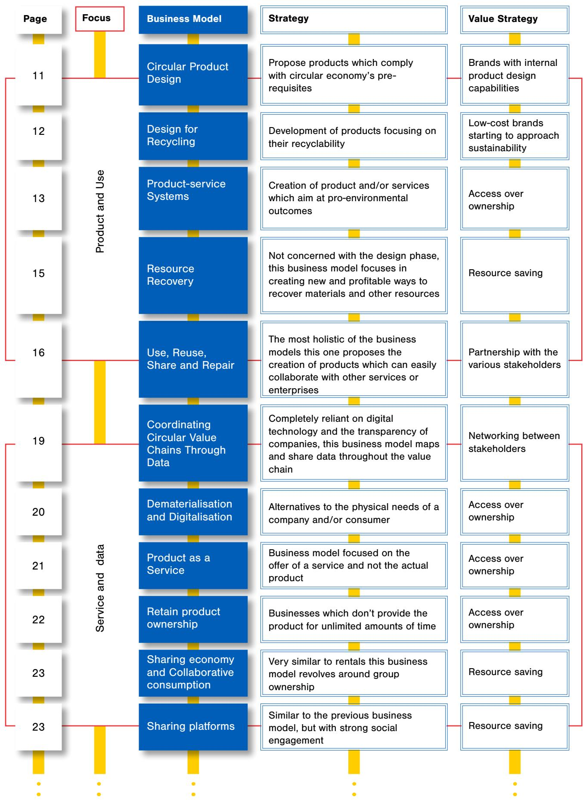

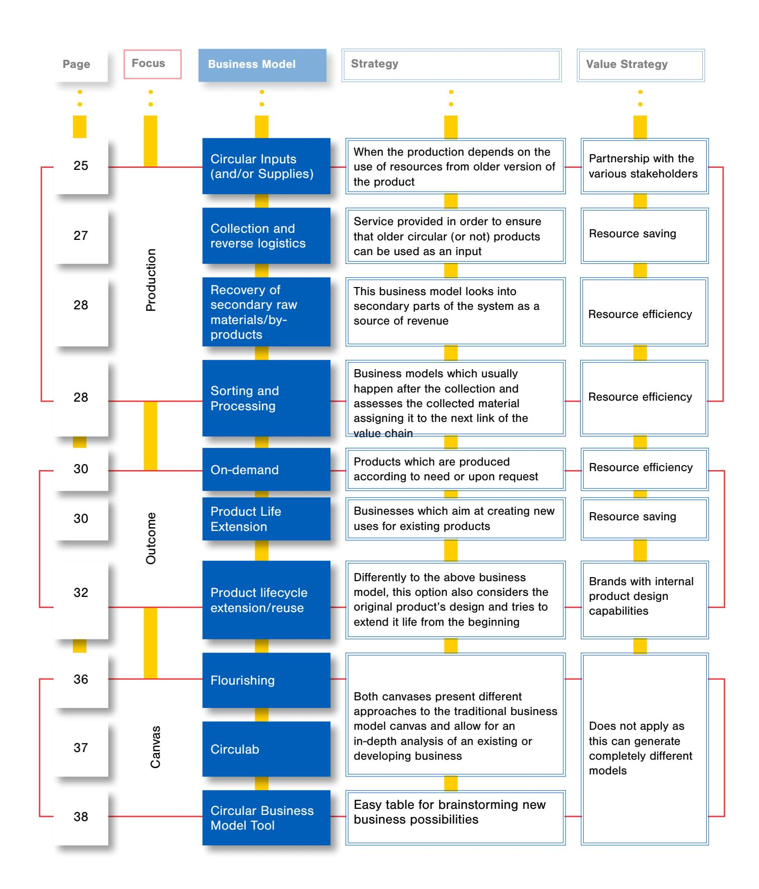

The textile and fashion industry has seen immense changes in its long history. Sustainability has been the focus of development since the 1970s, yet the viewpoint has changed while the understanding of sustainability has developed. From a very narrow perspective: the end-of-pipe approach (waste treatment) to preventing global impacts and even slowing down climate change sustainability understanding has been expanding in the textile sector.

Now it is time to challenge the current business logic and construct new business models which can enhance a new kind of sustainability transition. Sustainable growth and embracing circularity are ever so important for the environment, the consumer, the supply chain and the workers. Learning more about the topic, promoting change, and proposing new ventures can help lessen the remaining distance within the industry and lead to more transparency and satisfaction for all parties involved.

# REFERENCES

[1] World Comission on Environment and Development, "Report of the World Commission on Environment and Development: Our Common Future, From One Earth to One World," 1987. [2] M. Geissdoerfer, S. N. Morioka, M. M. de Carvalho, and S. Evans, "Business models and supply chains for the circular economy," J. Clean. Prod., vol. 190, pp. 712–721, Jul. 2018, doi: 10.1016/J.JCLEPRO.2018.04.159. [3] G. Brundtland, "Report of the World Commission on Environment and Development: Our Common Future," 1987. [4] J. Potting, M. Hekkert, E. Worrell, and A. Hanemaaijer, "Circular economy: measuring innovation in the product chain (Policy Report)," The Hague, 2017. [5] M. Geissdoerfer, D. Vladimirova, and S. Evans, "Sustainable business model innovation: A review," J. Clean. Prod., vol. 198, pp. 401–416, Oct. 2018, doi: 10.1016/J. JCLEPRO.2018.06.240. [6] N. M. P. Bocken, I. De Pauw, C. Bakker, and B. Van Der Grinten, "Product design and business model strategies for a circular economy," J. Ind. Prod. Eng., vol. 33, no. 5, pp. 308–320, 2016, doi: 10.1080/21681015.2016.1172124. [7] BSI, "Executive Briefing: BS 8001-a Guide," 2017. Accessed: Mar. 17, 2022. [Online]. Available: [www.mckinsey.com/business-functions/](http://www.mckinsey.com/business-functions/). [8] F. Hofmann, T. Jokinen, and M. Marwede, "Circular business models," 2018. doi: 10.4324/9780429346712-13. [9] N. De Mey and K. Shahbazi, "The circular economy Business Models that work in the Circular Economy," 2020. [Online]. Available: [www.boardofinnovation.com](http://www.boardofinnovation.com). [10] A. Atasu, C. Dumas, and N. V. W. Luk, "The Circular Business Model," 2021. Accessed: Mar. 17, 2022. [Online]. Available: [https://hbr.org/2021/07/the-circular-business-model.](https://hbr.org/2021/07/the-circular-business-model) [11] K. Niinimäki and E. Karell, "Closing the Loop: Intentional Fashion Design Defined by Recycling Technologies," Technol. Sustain., pp. 7–25, 2020, doi: 10.1007/978-3-030-15483-7\_2. [12] W. Mcdonough and M. Braungart, Cradle to cradle: re-making the way we make things. North Point Press, 2002. [13] British Standards Institution (BSI) Standards Publication, "Framework for implementing the principles of the circular economy in organizations – Guide," 2017. [14] O. K. Mont, "Clarifying the concept of product – service system," J. Clean. Prod., vol. 10, pp. 237–245, 2002, doi: 10.1016/S0959-6526(01)00039-7. [15] a. Williams, "Product-service systems in the automotive industry: the case of microfactory retailing," J. Clean. Prod., vol. 14, no. 2, pp. 172–184, Jan. 2006, doi: 10.1016/j. jclepro.2004.09.003. [16] N. Moreira, L. A. De Santa-Eulalia, D. Aït-Kadi, T. Wood-Harper, and Y. Wang, "A conceptual framework to develop green textiles in the aeronautic completion industry: A case study in a large manufacturing company," J. Clean. Prod., vol. 105, 2015, doi: 10.1016/j. jclepro.2014.09.056. [17] C. M. Armstrong and C. Lang, "Sustainable Product Service Systems : The New Frontier in Apparel Retailing ? Sustainable Product Service Systems : The New Frontier in Apparel Retailing ?," Res. J. Text. Appar., vol. 17, no. 1, 2013, doi: 10.1108/RJTA-17-01-2013-B001. [18] P. Fontell and P. Heikkilä, "Model of Circular business ecosystem for textiles," Tampere, 313, 2017. [Online]. Available: [http://www.vttresearch.com/impact/publications.](http://www.vttresearch.com/impact/publications) [19] H. H. Jensen, "5 circular economy business models for competitive advantage," World Economic Forum, Jan. 27, 2022. [https://www.weforum.org/agenda/2022/01/5-circular](https://www.weforum.org/agenda/2022/01/5-circular-economy-business-models-competitive-advantage/)[economy-business-models-competitive-advantage/](https://www.weforum.org/agenda/2022/01/5-circular-economy-business-models-competitive-advantage/) (accessed Jun. 11, 2022).

[20] J. Lin et al., "Toward Resource Recovery from Textile Wastewater: Dye Extraction, Water and Base/Acid Regeneration Using a Hybrid NF-BMED Process," ACS Sustain. Chem. Eng., vol. 3, no. 9, pp. 1993–2001, Sep. 2015, doi: 10.1021/ACSSUSCHEMENG.5B00234/SUPPL\_FILE/ SC5B00234\_SI\_001.PDF. [21] E. Smirnova, E. Ilen, H. Sixta, M. Hummel, and K. Niinimäki, "Colours in a Circular Economy," in Circular Transitions – Mistra Future Fashion Conference on Textile Design and the Circular Economy 23–24 November 2016. Chelsea College of Arts & Tate Britain. London UK, pp. 16-19., 2016, pp. 8–19, Accessed: Jul. 18, 2022. [Online]. Available: [http://www.](http://www.circulartransitions.org/media/downloads/Circular-Transitions-Proceedings.pdf) [circulartransitions.org/media/downloads/Circular-Transitions-Proceedings.pdf.](http://www.circulartransitions.org/media/downloads/Circular-Transitions-Proceedings.pdf) [22] E. Smirnova, "Colours in a circular economy," Aalto University, Espoo, 2017. [23] C. Becker-Leifhold and S. Iran, "Collaborative fashion consumption – drivers, barriers and future pathways," J. Fash. Mark. Manag. An Int. J., vol. 22, no. 2, pp. 189–208, May 2018, doi: 10.1108/JFMM-10-2017-0109. [24] S. Lehtoranta, A. Nissinen, T. Mattila, and M. Melanen, "Industrial symbiosis and the policy instruments of sustainable consumption and production," J. Clean. Prod., vol. 19, no. 16, pp. 1865–1875, 2011, doi: 10.1016/j.jclepro.2011.04.002. [25] I. E. Nikolaou, N. Jones, and A. Stefanakis, "Circular Economy and Sustainability: the Past, the Present and the Future Directions," Circ. Econ. Sustain., vol. 1, pp. 1–20, 2021, doi: 10.1007/ s43615-021-00030-3. [26] European Commission, "A new Circular Economy action plan," Brussels, 2020. Accessed: Jul. 19, 2021. [Online]. Available: [https://eur-lex.europa.eu/legal-content/EN/](https://eur-lex.europa.eu/legal-content/EN/TXT/?qid=1583933814386&uri=COM:2020:98:FIN) [TXT/?qid=1583933814386&uri=COM:2020:98:FIN.](https://eur-lex.europa.eu/legal-content/EN/TXT/?qid=1583933814386&uri=COM:2020:98:FIN) [27] J. Konietzko, N. Bocken, and E. J. Hultink, "Circular ecosystem innovation: An initial set of principles," J. Clean. Prod., vol. 253, no. January, 2020, doi: 10.1016/j.jclepro.2019.119942. [28] N. O. Martins, "Ecosystems, strong sustainability and the classical circular economy," Ecol. Econ., vol. 129, pp. 32–39, Sep. 2016, doi: 10.1016/j.ecolecon.2016.06.003. [29] G. M. Gomes, N. Moreira, and A. R. Ometto, "Role of consumer mindsets, behaviour, and influencing factors in circular consumption systems: A systematic review," Sustain. Prod. Consum., vol. 32, pp. 1–14, Jul. 2022, doi: 10.1016/J.SPC.2022.04.005. [30] K. Niinimäki, "Sustainable Fashion in a Circular Economy," in Sustainable Fashion in a Circular Economy, 2018, pp. 12–41. [31] C. A. Bakker and C. Schuit, "The Long View: Exploring Product Lifetime Extension," 2017. [32] A. Osterwalder and Y. Pigneur, Business Model Generation. John Wiley & Sons, 2010. [33] M. Geissdoerfer, M. P. P. Pieroni, D. C. A. Pigosso, and K. Soufani, "Circular business models: A review," J. Clean. Prod., vol. 277, no. 123741, pp. 1–17, 2020, doi: 10.1016/j. jclepro.2020.123741. [34] J. Gillabel, S. Manshoven, F. Grossi, L. F. Mortensen, and L. Coscieme, "Business Models in a Circular Economy," 2021. [Online]. Available: [https://www.eionet.europa.eu/etcs/etc-wmge/](https://www.eionet.europa.eu/etcs/etc-wmge/products/etc-wmge-reports/business-models-in-a-circular-economy) [products/etc-wmge-reports/business-models-in-a-circular-economy](https://www.eionet.europa.eu/etcs/etc-wmge/products/etc-wmge-reports/business-models-in-a-circular-economy). [35] S. Ettlinger, Deposit Refund System (and Packaging Tax) in Finland i. 2016. [36] A.-S. Nykänen, "Näin suomalaiset oppivat kierrättämään: jätepaperin keräyksestä sai kelloja ja karkkia - Sunnuntai | HS.fi," HELSINGIN SANOMAT, Nov. 25, 2018. [37] K. Berninger, L. Heikkilä, Z. Kolev, M. Orjala, and T. Teräväinen, "Waste management and recycling in Finland," 2010. [Online]. Available: [http://www.asrm.ro/evenimente/evak/](http://www.asrm.ro/evenimente/evak/WasteManagement_final.pdf) [WasteManagement\\_final.pdf.](http://www.asrm.ro/evenimente/evak/WasteManagement_final.pdf) [38] Finnish Ministry of the Environment, "Strategic programme to promote a circular economy." <https://ym.fi/en/strategic-programme-to-promote-a-circular-economy>. [39] Finnish Ministry of the Environment, "Circular economy - Ministry of the Environment." [https://](https://ym.fi/en/circular-economy) [ym.fi/en/circular-economy](https://ym.fi/en/circular-economy) (accessed Jul. 18, 2022). [40] F. W. Geels and J. Schot, "Typology of sociotechnical transition pathways," Res. Policy, vol. 36, no. 3, pp. 399–417, 2007, doi: 10.1016/j.respol.2007.01.003.

- [41] F. W. Geels, "Micro-foundations of the multi-level perspective on socio-technical transitions: Developing a multi-dimensional model of agency through crossovers between social constructivism, evolutionary economics and neo-institutional theory," Technol. Forecast. Soc. Change, vol. 152, p. 119894, Mar. 2020, doi: 10.1016/J.TECHFORE.2019.119894. [42] F. W. Geels, "Socio-technical transitions to sustainability: a review of criticisms and elaborations of the Multi-Level Perspective," Curr. Opin. Environ. Sustain., vol. 39, pp. 187– 201, Aug. 2019, doi: 10.1016/J.COSUST.2019.06.009. [43] N. M. P. Bocken, P. Rana, and S. W. Short, "Value mapping for sustainable business thinking,"
- J. Ind. Prod. Eng., 2015, doi: 10.1080/21681015.2014.1000399. [44] F. Lüdeke-Freund, S. Gold, and N. M. P. Bocken, "A Review and Typology of Circular Economy Business Model Patterns," J. Ind. Ecol., vol. 23, no. 1, pp. 36–61, 2019, doi: 10.1111/ jiec.12763.