**new  
cotton  
project**

# INTERACTIVE ECOSYSTEM FOR CIRCULAR TEXTILES: The New Cotton Project case

COURSE SYLLABUS

Natalia Moreira Kirsi Niinimäki

2023

# FOREWORD

Fashion brands produce nearly twice as many clothes today as they did 20 years ago and demand is expected to continue growing. At the same time, the equivalent of one garbage truck of textiles is landfilled or burned every second. Most of the textile industry's environmental problems relate to the raw materials used by the industry: cotton, fossilbased fibres such as polyester, and viscose as the most common man-made cellulosic fibre, are all associated with serious environmental concerns.

The EU has identified the high potential for circularity within the textile industry, while simultaneously highlighting the urgent need for the development of technologies to produce and design sustainable and circular bio-based materials. Making sustainable products commonplace, reducing waste and leading global efforts on circularity are outlined in the European Commission's EU Circular Economy Action Plan as necessary for Europe's efforts to drive sustainable growth. Many circular economy solutions based on new science and technology have been innovated and introduced in Europe, offering a forerunner position for the EU on a global level in the field of sustainable business and technology. Many of these solutions are already present in e.g. recycling and resource recovery, but many of them are currently still at a low level of technological readiness.

Infinited Fiber Company (founded in 2016) is a pilot-stage fashion and textile technology company that aims to make the circular economy of textiles a reality. The company's patented technology uses end-of-life textiles and other cellulose-rich waste streams to produce Infinna™ recycled fibre, a unique soft textile fibre with the feel of natural cotton. In the company's production process, cellulose-containing waste is broken down to the molecular level, after which it is reborn

as Infinna™ fibre. Infinna™ recycled fibre is currently made from 100% textile waste. The world's leading fashion brands consider it a high-quality recycled material alternative to materials made from virgin natural resources, such as cotton. Infinited Fiber Company is working with its extensive network of partners to scale its Infinna™ production to meet the demand of the world's leading fashion brands and consumers.

The Infinited Fiber Company's innovative cellulose carbamate technology offers endless possibilities for textile circularity. However, technology alone cannot solve the challenges related to transferring from a linear to a circular textile value chain. In June 2022, Infinited Fiber Company announced that a lease for its first commercial-scale Infinna™ plant, the flagship factory, had been signed. The mill will be built in Stora Enso's Veitsiluoto industrial area in Kemi, Finland, where the company will convert the former paper machine hall to make it suitable for its use. The planned annual capacity of the plant is 30,000 tons, and the company plans to use cottoncontaining textile waste as its raw material. The demand for InfinnaTM fibre from global brands continued to be strong, and during 2022, the company announced three new multi-year sales agreements related to the Infinna™ fibre deliveries of the planned flagship factory.

Scaling-up from pilot to industrial level is a big leap for a start-up company, even when circular innovations have reached a sufficient level of technological readiness. Circular business development and finding the right partners for collaboration play an essential role in successful scaling, business development, financing and market access.

Infinited Fiber Company aims for true progress in circularity. To achieve this goal, the company recognized the need to create a

collaborative ecosystem, enabling turning textile waste into new high-quality textile fibres at higher scale. The EU-funded New Cotton Project was formed to respond to this challenge. Although maybe not typical for a small start-up, Infinited Fiber Company took the initiative and started forming a consortium of partners aiming at the same goal of circularity. Twelve pioneering players in the fashion and textile industries put their heads together and decided to harness collaboration and cutting-edge technology to demonstrate an entirely circular model for commercial garment production. The New Cotton Project is a direct action by these players offering a valuable solution for textile waste and an alternative to the industry's reliance on virgin materials like cotton, which require vast areas of agricultural land, unsustainable amounts of water and polluting fertilisers and pesticides for cultivation.

The New Cotton Project plays a very important role for Infinited Fiber Company, as it is an opportunity to identify and find solutions for potential bottlenecks to scaling up circular textile production and for calculating the environmental impacts over the lifecycle of textiles. Increasing understanding and collaboration between multiple sectors of the value chain can be a significant challenge. Recycling textiles, for example, involves more than just collecting textiles from consumers. To truly close the loop, proper collection, sorting and processing need to be carried out based on collaborative goals and specifications. Consumer brands are key players in bringing circular solutions to the market and increasing consumer awareness. Technology providers need to work with brand owners to improve the recyclability of textiles. Cross-cutting cooperation across governments, companies, academia, research institutes and consumers must increase to strengthen the circular economy.

The consortium of brands, manufacturers, suppliers, innovators and research institutes participating in the New Cotton Project has proven that circular, sustainable fashion is not only an ambition, but can truly be achieved today. We sincerely hope that this project will also act as inspiration and a steppingstone for further, even bigger circular initiatives in the industry going forward.

After starting the project in 2020, textile waste has been collected, sorted and regenerated into high-quality InfinnaTM fibres. These fibres have travelled through the textile production value chain for use by global brand adidas and companies in the H&M Group. In autumn 2022, these innovative brands launched two commercial collections to the market, which were both a success and warmly welcomed by consumers and influencers. The project is still on-going with a focus on LCA/TEA studies, consumer understanding and business model development. A collection of garments from woven InfinnaTM will also be brought to market by H&M Group towards the end of the project.

For Infinited Fiber Company, leading this project has been a source of pride and joy. The enthusiasm and commitment with which the entire consortium has come together to work towards a more sustainable future for fashion is truly inspiring. Together we have proven that clothing that can no longer be worn can be recycled and regenerated into new garments in a circular textile value chain. The project is recapturing the valuable raw materials in discarded clothing and regenerating them back into high-quality, cellulose-based InfinnaTM fibres that can be spun into new yarn, woven into new fabric, and designed into new clothes – again and again.

Paula Sarsama

Project Manager for the New Cotton Project Infinited Fiber Company

# ABOUT

Fourth white paper of the series and a complement to the launch booklet, this paper is part of the New Cotton Project knowledge exchange series which aims to expose the reader to the project, its milestones and the overall experience of implementing a circular ecosystem within the reality of the European textile industry. The text is connected to the EU-funded New Cotton Project, which brings twelve pioneering players together to break new ground by demonstrating a circular model for commercial garment production.

During a three-year period, textile waste was collected and sorted, and regenerated into a new, man-made cellulosic fibre that looks and feels like cotton – a "new cotton" – using Infinited Fiber Company's textile fibre regeneration technology. The fibres were used to create different types of fabrics for clothing that were then designed, manufactured and sold by global brands adidas and H&M Group. The project ultimately aims to act as an inspiration and steppingstone for further, even bigger circular initiatives in the industry going forward.

You can find the previous publications here:

[Circular Economy and Fashion: a New Cotton Project white paper](https://aaltodoc.aalto.fi/handle/123456789/115574) Circular Business [Models in the Textile Industry: the second New Cotton Project](https://aaltodoc.aalto.fi/handle/123456789/116213)  [white paper](https://aaltodoc.aalto.fi/handle/123456789/116213)

[Circular Ecosystem's Blueprint: launch booklet](https://issuu.com/valitilastudio/docs/new_cotton_booklet)

April 2023

## THIS WHITE PAPER WILL HELP YOU

- Meet the various partners engaged in the project
- Analyse the activities carried out in the development of four circular garments
- Understand the importance of such an endeavour within the textile sector

NEW COTTON: Demonstration and launch of high performance, biodegradable, regenerated New Cotton textiles to consumer markets through an innovative, circular supply chain using Infinited Fiber technology. This project has received funding from the European Union's Horizon 2020 research and innovation programme under [grant agreement No \[101000559\].](https://cordis.europa.eu/project/id/101000559)

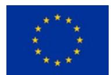

#### GRAPHIC DESIGN

Pirita Lauri, 2023

Natalia Moreira and Kirsi Niinimäki

Aalto University P.O. Box 11000 (Otakaari 1B) Espoo, FI-00076

## AUTHORS

## THE NEW COTTON PROJECT CONSORTIUM MEMBERS

e-ISBN: 978-952-64-9631-3

# CONTENTS

| Summary                                                  | 6  |
|----------------------------------------------------------|----|
| Chapter one: The Textile Industry                        | 7  |
| 1.1 The Textile and Fashion Industry                     | 7  |
| 1.2 The Industry’s Pipeline                              | 8  |
| 1.3 Environmental Issues                                 | 10 |
| Chapter two: The Circular Ecosystem and its Implications | 11 |
| 2.1 A Circular Ecosystem                                 | 11 |
| 2.2 Stakeholder Mapping                                  | 13 |
| 2.3 Process Mapping                                      | 14 |
| Chapter three: The New Cotton Project                    | 15 |
| 3.1 Research Backgroung                                  | 16 |
| 3.2 Project Stakeholders                                 | 17 |
| 3.3 Resource Mapping                                     | 18 |
| Chapter four: Course Syllabus                            | 23 |
| 4.1 Course Development                                   | 23 |
| 4.2 Course Description                                   | 27 |
| 4.3 Learning Outcomes                                    | 28 |
| 4.4 Stakeholder Engagement                               | 28 |
| Chapter five: Production Processes                       | 29 |
| 5.1 ‘RAW’ Material Sourcing (Post-Return)                | 30 |
| 5.2 Manufacture                                          | 33 |
| 5.3 Apparel Manufacture                                  | 40 |
| 5.4 Challenges Faced during the Development              | 41 |
| Strengths                                                | 41 |
| Weaknesses                                               | 41 |
| Opportunities                                            | 42 |
| Threats                                                  | 42 |
| Chapter six: Research and Development                    | 43 |
| 6.1 Post-Consumer Textile Streams                        | 43 |
| 6.2 Collection Design                                    | 44 |
| 6.3 New Cotton Project’s Assessment                      | 45 |
| Chapter seven: Lessons Learnt and Next Steps             | 46 |
| References                                               | 48 |

# SUMMARY

Focused on the industrial aspects of the New Cotton Project, this white paper is also the syllabus for the 'Interactive ecosystem for circular textiles' course1. Here, we present the results and discoveries of the first 24 months of the project, using the examples as platforms for transforming the industry and enabling an easier transition towards circularity.

Through a series of diagrams, we introduce the reader to the experience of expanding to a commercial scale the development of a new technique to create cotton-like fibres from used and discarded garments and textiles (post-consumer textile waste).

This fourth white paper also presents the industrial collaboration and partnership embraced by the consortium partners in the project as well as in the development of the Interactive map course, which is composed of three flows:

- 1. Material: illustrates the material journey within the New Cotton Project.
- 2. Knowledge: visually assists the student with visual cues to the steps within the ecosystem.
- 3. Ecosystemic: provides conclusive explanations of the interactions between the consortium members.

# CHAPTER ONE: THE TEXTILE INDUSTRY

# 1.1 THE TEXTILE AND FASHION INDUSTRY

. There are several books and publications which introduce the reader to the history of the textile industry [1]–[4], so let's be brief: the need to protect one's body from heat, cold and other potential harms brought forth by the environment was the initial motivation for covering one's body, initially copying animals (using their furs) and eventually developing this as an art form [4], [5].

#### in addition:

- machinery and production equipment suppliers
- suppliers for testing and control equipment
- software providers; other services and intermediaries

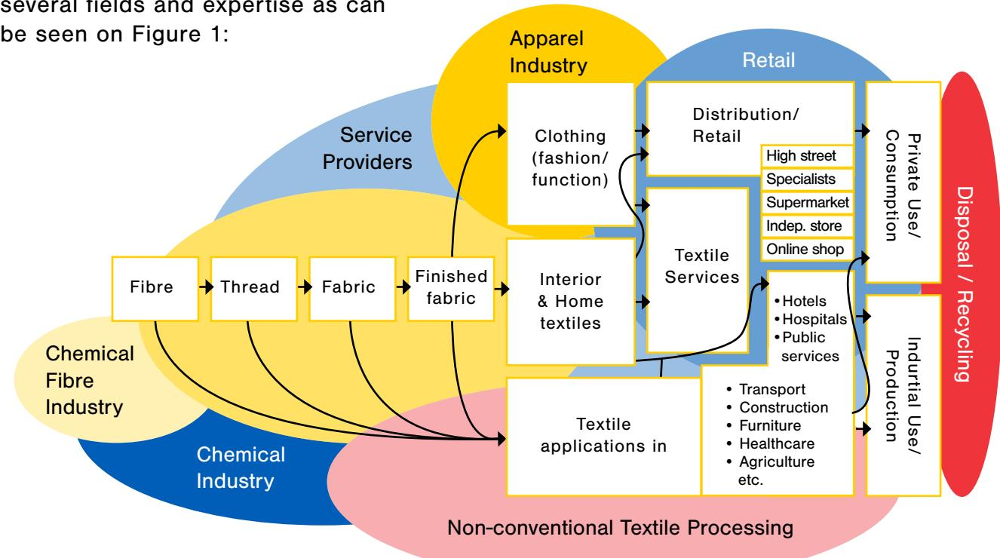

With the advancement of agriculture and the senses of community and self the textile knowledge developed into fashion practices, several sub-industries (based on cultural preferences, resource availability, weather, economic allowance, etc) [1], [4]–[7]. Altogether the industry encapsulates several fields and expertise as can

The textile industry's pipeline comprises all the stages from the production of fibres to the creation of textiles destined to the clothing, homeware, and technical industries (all represented on Figure 1). The Apparel industry, on the other hand, can be divided into three segments: Textile, Apparel and Retail. Where the fibre is transformed into a commercial product, designed for a specific clientele (see Figure 2).

Nowadays, there are mainly two ways of making clothes: linearly or systemically. Whilst the first is very popular within the textile and apparel industries, the need to "make development sustainable to ensure that it meets the needs of the present without compromising the ability of future generations to meet their own needs" [8, p. 16] has been pushing the market to adopt sustainable practices through systemic (integrates consumers, suppliers and producers in a way that guarantees every output of a process becomes the input to another) production models, leaning towards a zero waste production (as can be seen on Figure 3).

## 1.2 THE INDUSTRY'S PIPELINE

Figure 2:The textile and Apparel Pipeline

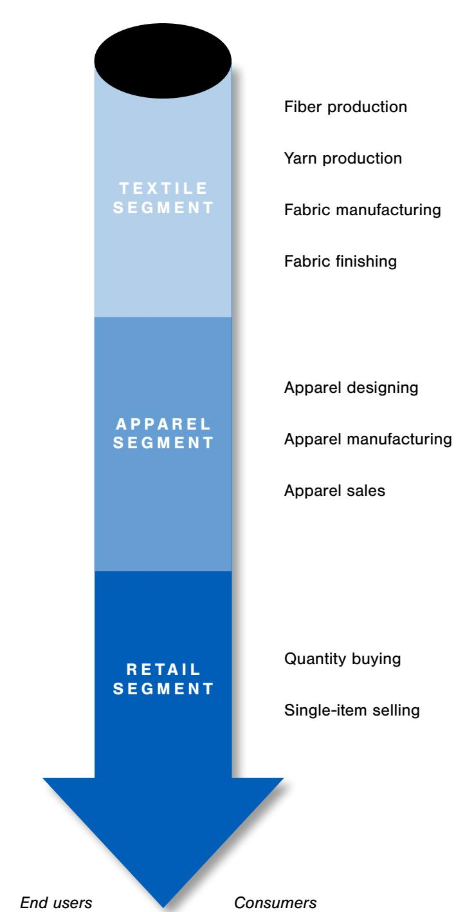

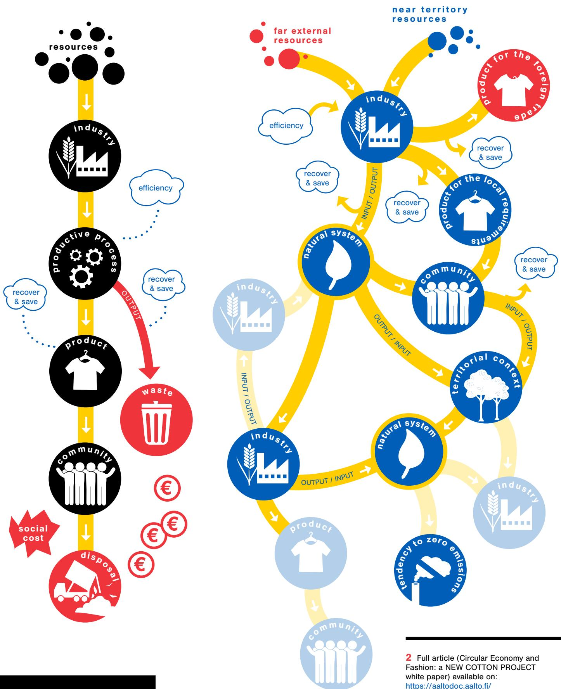

[https://aaltodoc.aalto.fi/](https://aaltodoc.aalto.fi/handle/123456789/115574) [handle/123456789/115574](https://aaltodoc.aalto.fi/handle/123456789/115574)

LINEAR P R O D U C T I O N MODEL

SYSTEMIC P R O D U C T I O N MODEL

# 1.3 ENVIRONMENTAL ISSUES

With the advent of the Industrial revolution, the textile industry was awarded tools to intensify its production and expand its market. Such benefits also led to several issues, such as labour exploitation, excessive extraction of resources and eventually, the main consequence to indiscriminate discharge of effluents and misuse of resources: pollution [11].

The first signs of what we now know as pollution appeared in the area of greater Manchester where scientist evaluated the peppered moth's pattern evolution through a process now known as industrial melanism: where darker moths started prevailing over lighter ones due to the darkening of the environment around them [12]–[14].

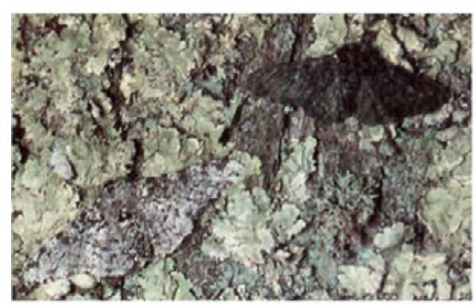

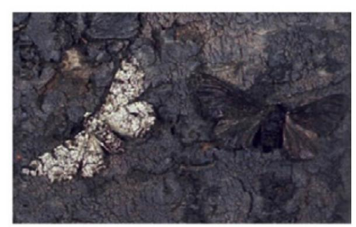

F igu r e 4 : T he c o l our e v olu t ion o f t he p e pp e r ed mo t h ( Ima g e fr om t he Na t u r al Hi s t o r y M useum 'Spec i e s v ari a t ion game ' 3 )

The concept of pollution and its implications to the 'way we live' have led to international awareness and global mobilisation towards change, motivating industries and consumers alike to follow suit. In the 90s, the concept of sweatshops and the brands using them started reaching the final consumer and more recently, in 2013, the Rana Plaza collapse motivated consumers to demand more emphatic measures [15].

pioneering players have come together to break new ground by demonstrating a circular ecosystem for commercial garment production using post-consumer garments as their "raw" material.

> THE PROJECT'S ECOSYSTEM WAS BUILT IN THREE STEPS:

1. The individual stakeholder was identified (Figure 5).

2.

The stakeholder, their activities, products, and other resources were mapped (Figure 6).

3.

Then finally, it was possible to understand what is truly needed and/or how to incorporate the 'outputs' (previously seen as waste) back onto the system, thus creating a circular ecosystem (Figure 7).

# CHAPTER TWO : THE CIRCULAR ECOSYSTEM AND ITS IMPLICATIONS

# 2.1 A CIRCULAR ECOSYSTEM

Composed of 17 goals and 169 targets, the United Nations' Sustainable Development Goals (SDG) proposes guidelines for humanity to achieve universal wellbeing without harming nature. Circular Economy is then, in many ways, a tool to achieve this balance, proposing systems which engage the stakeholder and the processes of an industry, city or company in such a manner that it also incorporates the local communities and others who might be indirectly involved in the actions of the system.

It was within this context that adidas and H&M Group were sought by Infinited Fiber Company along with other 9 companies to launch New Cotton Project, which harnesses collaboration and cuttingedge technology to create new knowledge in circular fashion. According to Aarikka-Stenroos et al. [16] the concept of ecosystem is well suited to describe systemic change within circular economy, proposing the following definition: "Circular ecosystems are communities of hierarchically independent, yet interdependent heterogeneous set of actors who collectively generate a sustainable ecosystem outcome" [1, p. 261]. In New Cotton Project, twelve

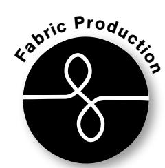

F i g u r e 5 : I n d i v i d u a l s t a keh o l d e r

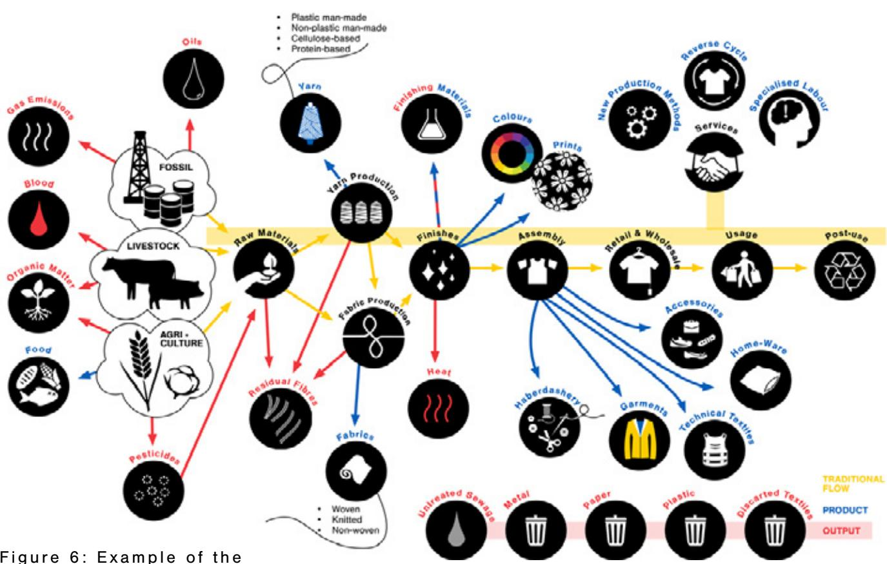

F i g u re 6 : E xa m p l e o f t h e overview of an initial system

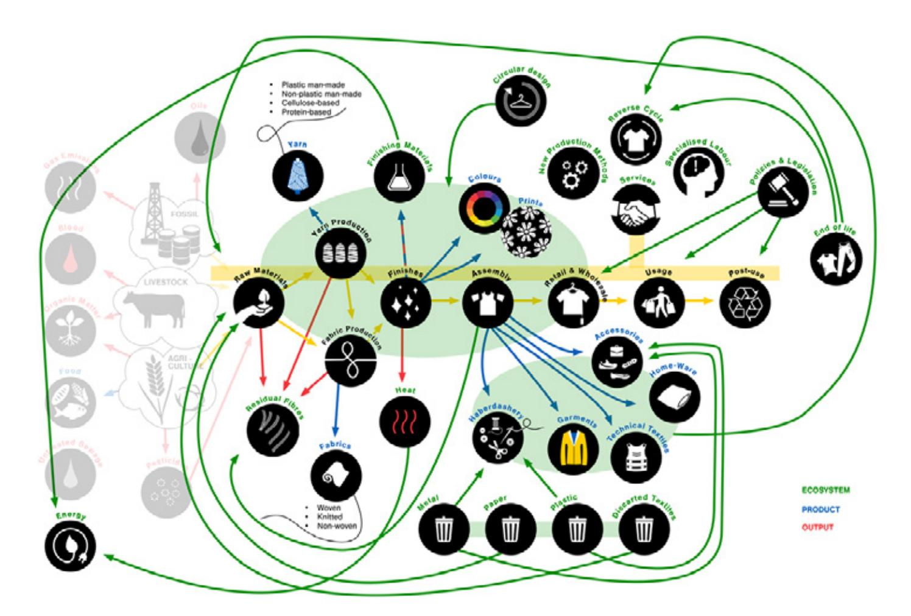

F i g u re 7: E xa m p l e o f a s i m p l i f i e d e c o sys te m h i g h l i g h t i ng t h e relationship between direct and indirect stakeholders

# 2.2 STAKEHOLDER MAPPING

Sustainability is a community-based concept which requires conscious decision patterns and learnt behaviour, gradually shifting the individual's influence on the whole. In other words, in order to achieve a level of development which does not threaten future generations, humans need to work together towards a common objective [9]. Even though the concept of circular economy is relatively new, it is a consequence of nearly 50 years attempting to reach a sustainable development which embraces not only the traditional triple bottom line[17], [18]: society, economy and environment, but also spatial and cultural values [19].

Encompassing cultural and spatial considerations guarantees a broader approach to sustainability, which in turn presents communication constraints, as not all participants of this new configuration have the same worldview. It is then that richpictures are introduced as a tool for universalising group thinking into systems [20]– [23]. Confront issues and barriers pointed out, rich-pictures will be used as the main communication methodology between theoretical and practical collaborations analysed by the research team, thus ensuring comprehension regardless of field of expertise or mother language.

The first of the seven Clarkson Principles [apud 11] clearly defines the importance of understanding the stakeholder: "Managers should acknowledge and actively monitor the concerns of all legitimate stakeholders, and should take their interests appropriately into account in decision-making and operations". Stakeholder mapping is then key in sustainable projects because it allows for a systematic classification of entities of interest, creating effective knowledge and applying it throughout the project's development (Figure 8) [25], [26].

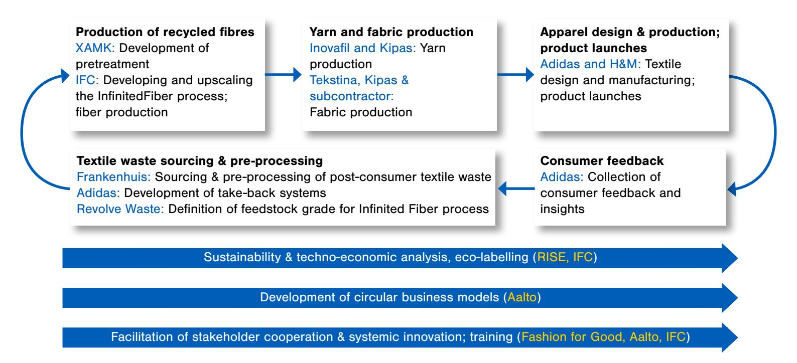

An essential stage of project management and analysis is considering that 'Everyone ought to count' [24]. Knowing the company and the people within is important in order to understand the individual and collective concerns, contributions, difficulties and eventually, identify the interdependence among the research partnership [27].

Famously targeted as the most polluting and culprit for the issues in the textile and apparel pipeline, the supply chain is also responsible for maximising value, lessening emissions, resource usage and pollution [28]. Thus, in a circularity-oriented project, they represent a decisive stage towards feasible environmental circular systemic innovations.

## 2.3 PROCESS MAPPING

In parallel with understanding and mapping the stakeholders, it was important to understand and map the steps followed by the stakeholder in their attempt to commercially produce Infinna™. In order to do so we interviewed the partner companies using process mapping as a framework.

According to Biazzo [29, p. 42], "process mapping consists of constructing a model that shows the relationships between the activities, people, data and objects involved in the production of a specified output" being characterised by specific notions of 'technology' which are defined by "physical objects or artefacts, the activities or processes that comprise the methods of production and the knowledge needed to develop and apply equipment, tools, and methods in order to produce a particular output''.

Once the process and technology data are gathered, the resulting map illustrates "clearly what a system does, what controls it, what it acts on, what means it uses to perform its functions, and what it produces" [29, p. 46]. Acting as a visual aid, process maps also function as transparency tools, allowing people to further understand what happens in each stage of a production, development or activity making it easier to "discover ways to create value" [30].

# CHAPTER 3 : THE NEW COTTON PROJECT

During a three-year period, textile waste was collected, sorted, and regenerated into a new, man-made cellulosic fibre. As such, Figure 6 was developed to present the main concerns within the project, the main solutions already presented by the consortium members and the knowledge gaps which still require tackling.

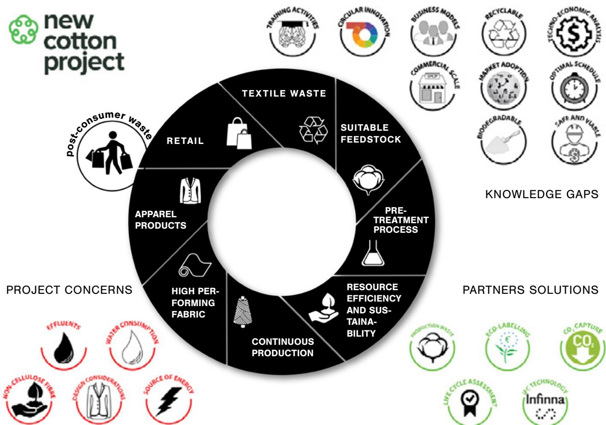

F i g u re 9 : F i n a l a s s e s s m e n t o f t h e p roj e c t 's o bj e c t i ve s , k n ow l e d g e g a p s , concerns and current solutions

## 3.1 RESEARCH BACKGROUND

The New Cotton Project was proposed to the European Union Horizon 2020 as an attempt to demonstrate the potential for a commercial-scale circular ecosystem grounded on the post-consumer textile collection and sorting, followed by its regeneration as the basis for the production of new cotton-like fibres (Infinna™), eventually being launched to the general public through two garment pieces (adidas and H&M Group - autumn 2022). The project is also responsible for:

- Evaluating and developing solutions to ensure suitable feedstock of recycled textiles for commercial scale production of Infinna™;
- Developing, optimising and demonstrating the textile waste pre-treatment process;
- Optimising and demonstrating the continuous Infinna™ production process in pilot scale;
- Designing, producing and verifying the high performing and biodegradable activewear and denim apparels, in which the textiles are recycled into the same or higher quality applications;
- Evaluating the recyclability, sustainability and safety of the novel textiles made from Infinna™.
- Demonstrating the consumer interest on the apparel products (denim apparel; activewear, such as t-shirts or hoodies) based on recycled fibres;
- Boosting circular innovation and stakeholder collaboration in the textile sector.
- Studying the circular business models for bio-based textiles and developing a plan for the commercialization of Infinna™ technology in Europe.

Currently in the beginning of its third year, the project's focus (as can be seen in this white paper) is to share the learnings gathered with other like-minded people.

Each of the 12 participants (listed on Table 1) in this project has an unique role in defining a blueprint for circularity in textiles (illustrated on Figure 7).

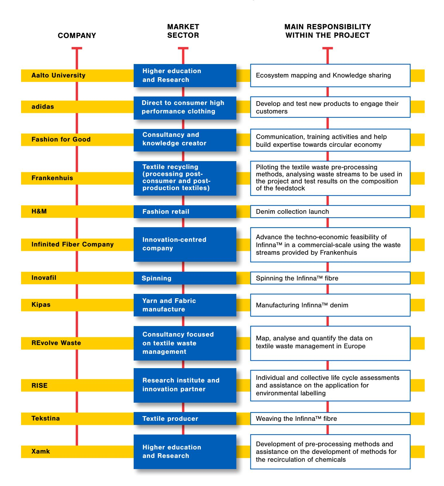

Infinited Fiber Company created its unique, cellulose-based fibres (cellulose carbamate) out of post-consumer textile waste. Frankenhuis and Xamk worked on the pre-processing and research for pre-treatment of textile waste. Manufacturers Inovafil, Tekstina and Kipas used the regenerated fibre to produce yarns, woven fabrics and denim respectively. REvolve Waste, RISE and Aalto University, collect and provide data, conduct research and analysis. Fashion for Good lead on the communications to the industry. Design and manufacture of the fibres into clothing was done by H&M Group and adidas.

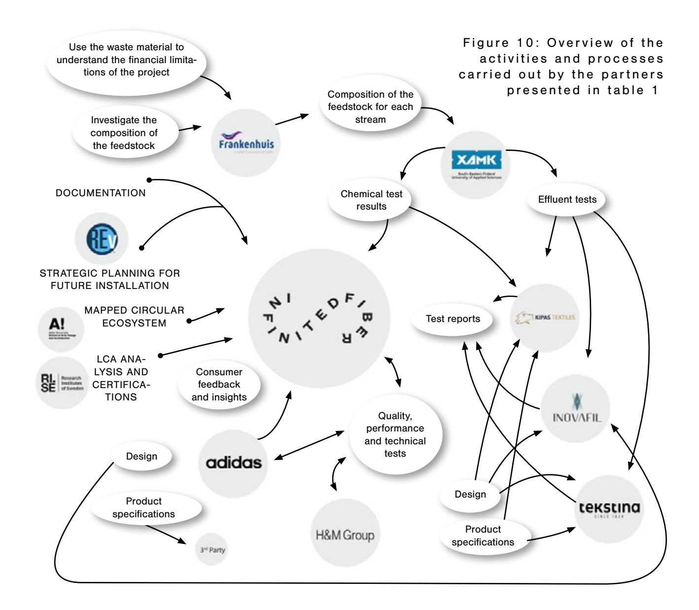

# 3.3 RESOURCE MAPPING

Besides the activities developed for the consortium, the partners also carry out various activities essential for their day-to-day functionality (Figure 8). By analysing and presenting the stages, exchanges and stakeholder capabilities we are able to increase the projects ambitions towards implementing actual change in the industry.

Figure 11: Infinna related stages (in black) , activities (in yellow) , and partner related

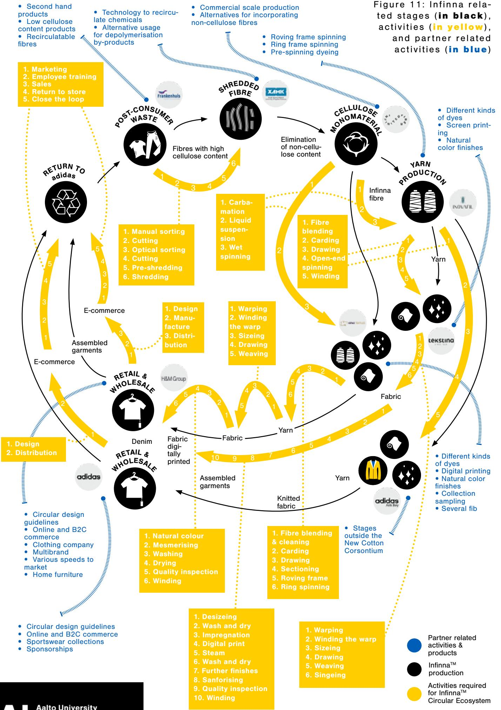

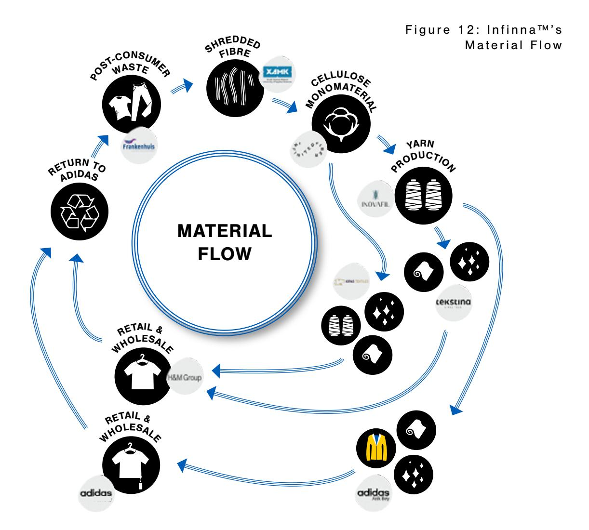

Environmentally concerning factors such as transparency and traceability of materials, alongside their production effluents - chemical, treatments, emissions, etc. - were evaluated at this stage. Knowing the processes, materials, and other variables used by the different partners helps ensure the system's functionality, facilitates communication, and provides the means to appreciate potential opportunities for innovation and new business models4 (figure 12).

Even though this looks like a traditional, straightforward production, there were several unforeseen difficulties in the first 18 months of the project — from sending 'trash' between countries and the processing of post-consumer garments,to the implementation of large-scale machines and the development of market-oriented collections with high potential for colour variations between the lots. 5

4 For more on business models you can find our second white paper here:<https://aaltodoc.aalto.fi/handle/123456789/116213>

5 Post-consumer textile waste can be seen as trash by customs.

Figure 13: Infina™'s knowledge flow

Value adding and the knowledge flow, in the case of the New Cotton Project, function as complementary activities where value is added to the post-consumer textile waste by transforming it into a circular product through various textile processes, the assessment of its life cycle and through the engagement with the final consumer. According to Porter [31], a value chain represents sets of activities (primary and secondary) which create a product and/or a service, adding value to the raw material as a system divided into sub-systems (see Figure 13).

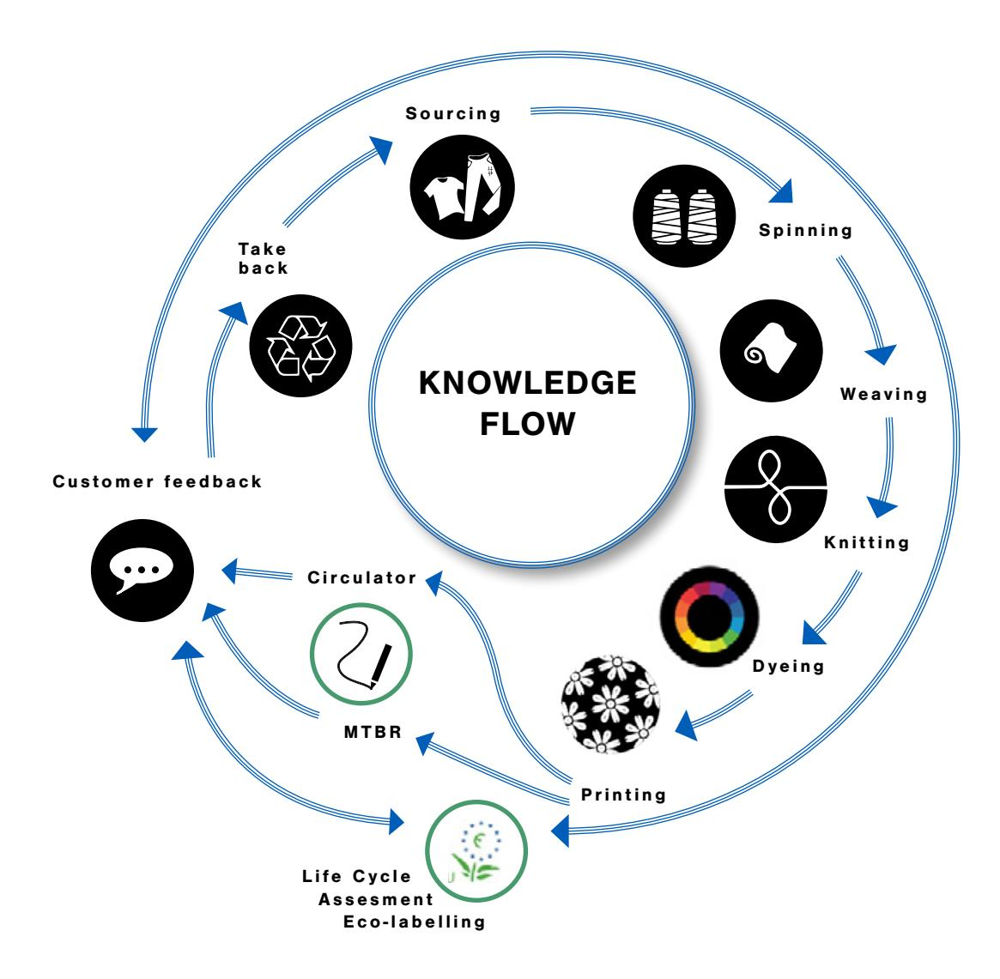

The circular ecosystem proposed by the New Cotton Project functions by identifying the system's phases, its stakeholders and potential materials which could be re-inserted into the ecosystem. This final layer of Infinna™ was then divided into 3 main areas, thus representing the three most important sets of activities within the ecosystem (as can be seen on figure 14):

- 1. Manufacture: The production of the goods;
- 2. Design: The Specifications and planning of the collection and its products;
- 3. Post-return: What to do with the garments after they were used.

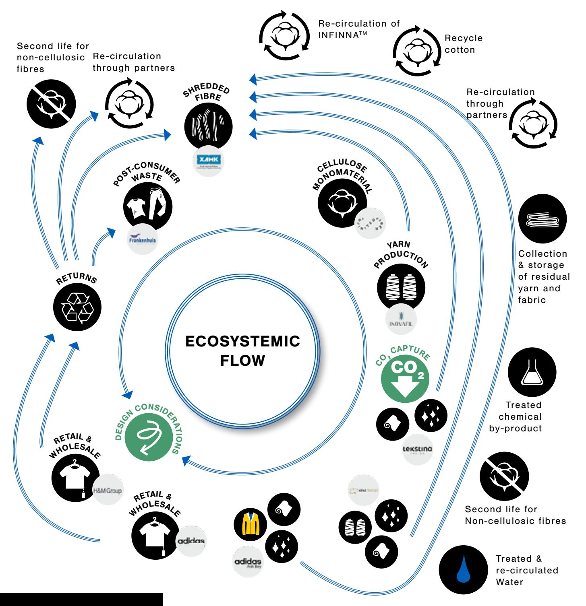

Figure 14: Infinna™'s ecosystem

Figure 15: The three layers of the interactive map

# CHAPTER FOUR : COURSE SYLLABUS

This fourth white paper, as mentioned before, was written with the sole intention of functioning as a sort of syllabus for the interactive map which composes the first course available on [www.circulartextiles.aalto.fi.](http://www.circulartextiles.aalto.fi)

## 4.1 COURSE DEVELOPMENT

Unconventionally designed, this course is structured around the production map of the InfinnaTM products, passing by each of the main activities and industrial partners involved in the project. Additionally, there are two more layers to the map: one on knowledge flow and the other on the ecosystemic exchanges. This division might render some images slightly more complicated, however, it ensures a more holistic understanding of the overall ecosystem.

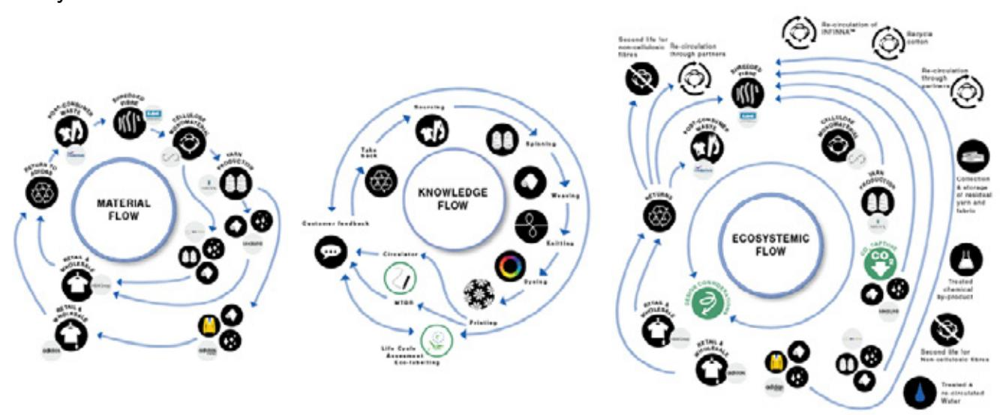

#### Expected time dedication: 1 hour (only map, without further reading)

Created using the New Cotton Project as its case study, this first analysis focuses on ensuring the educational aspects of the course. Eight stages were mapped and divided into four activities as can be seen in the following images:

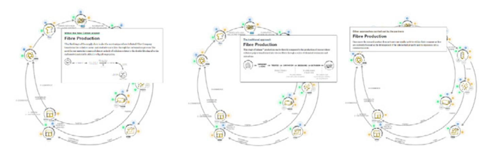

F igu r e 1 6 : M a t eri a l f l ow ( unde r s t and i n g t he su pp l y c hai n )

#### There are 9 stages which were studied and thoroughly explained in the map:

- 1. Raw Material
- 2. Fibre pre-processing
- 3. InfinnaTM production
- 4. Spinning
- 5. Weaving
- 6. Knitting
- 7. Finishes (dyeing and printing)
- 8. Retail and distribution
- 9. Take-back programme

#### Shows the flow of materials for the production of InfinnaTM

- 1. Shows how the same activity is done on a linear production system
- 2. Shows how other materials/ processes are made/carried out within the project's partners' organisations
- 3. By clicking on the partner's logo you will learn more about them by being direct to their website

Expected time dedication: 90m (only watching the videos, without further reading).

Initially conceptualised as a 'Meet the Partners' course, this layer provides nuances into the intellectual property of the partners involved in the project (as can be seen on the image below).

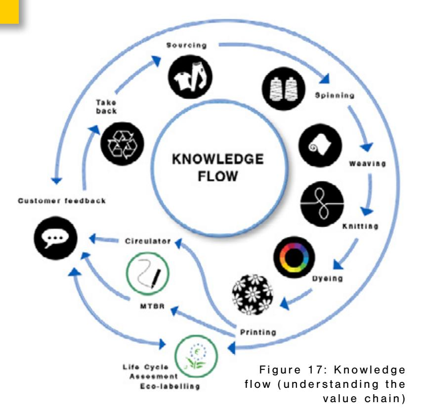

- 1. Sourcing PCTW
- 2. Spinning
- 3. Weaving
- 4. Dyeing
- 5. Printing
- 6. Made to be remade
- 7. Circulator
- 8. Communication
- 9. Life-cycle assessment (LCA) and Eco-labelling
- REvolve's report
- [Kipas](https://circulartextiles.aalto.fi/wp-content/uploads/2023/01/Infinna-yarn-production-line.pptx.pdf) slides and video about the process
- [Inovafil](https://circulartextiles.aalto.fi/wp-content/uploads/2023/02/Inovafil-Spinning_New-Cotton.pptx) slides and video about the process
- [Kipas](https://circulartextiles.aalto.fi/wp-content/uploads/2023/01/Infinna-woven-fabric-production-line.pptx.pdf) slides about the weaving, dyeing and finishing their fabrics
- Tekstina fabric production [video](https://aalto.cloud.panopto.eu/Panopto/Pages/Viewer.aspx?id=0bfe260d-51ec-40c9-8ddf-af8e00a8b27a)
- Tekstina testing [video](https://aalto.cloud.panopto.eu/Panopto/Pages/Viewer.aspx?id=8b725bd1-cfa8-43cc-8b15-af9600d3c328)
- Digital printing [video](https://aalto.cloud.panopto.eu/Panopto/Pages/Viewer.aspx?id=f3375876-ef2d-411b-aa1a-af8e00ae45b0)
- adidas presentation
- Tech Insider video on [adidas](https://www.youtube.com/watch?v=pJBRqespiOA)
- [Guidelines](https://drive.google.com/file/d/10T-ZG4YkyV9VXDe3PCAVEpdITTZa-_XI/view?usp=share_link) to designing a circular collection
- [Presentation](https://circulartextiles.aalto.fi/wp-content/uploads/2023/02/Communications-_-New-Cotton-Project-MOOC.pdf) by Fashion for Good
- Presentation by RISE
- LCA video
- H&M Group on Business Insider: <https://www.youtube.com/watch?v=obO1PKfXGpQ>
- Business models: <https://www.youtube.com/watch?v=KaJX0WLo2zc>
- 10. Take-back

There are 10 stages which were explained by the partners as follows:

#### 1. Manufacture

• Video: [https://www.youtube.com/watch?v=\\_eY\\_E8f5pNI](https://www.youtube.com/watch?v=_eY_E8f5pNI)

#### 2. Design

• Video: <https://www.youtube.com/watch?v=48KjTfTwQyQ>

#### 3. Post-return (end-of-use)

• Video: <https://www.youtube.com/watch?v=CUJEEGx-zEM>

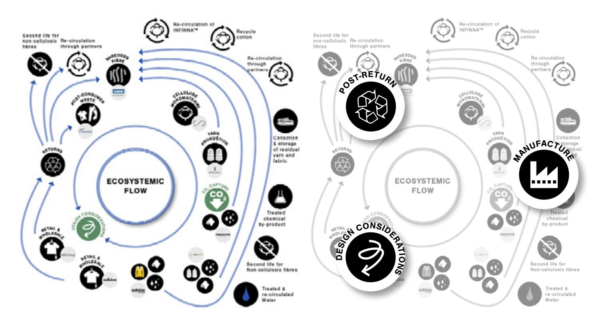

Figure 18: Ecosystemic flow (understanding how the partners connect)

Expected time dedication: 10m (only videos circa 30m on the paper)

The main difference between the circularity of the InfinnaTM fibre and the idea of its ecosystem is the interaction between the partners, and how they work together (see the figure below).

There are 11 stages which can be discussed in 3 main sections:

## 4.2 COURSE DESCRIPTION

This course was developed as a knowledge window to the work being carried out at the [Department of](https://www.aalto.fi/en/department-of-design) Design at [Aalto University](https://www.aalto.fi/en) in the city of

The textile industry has been the cradle of sustainability research as the driving force for the industrial revolution and its connection to the first signs of pollution. With the increased exposure of the industry's ill-doings, producers and consumers have started engaging in awareness campaigns to produce and consume textiles sustainably.

Currently embracing the circular economy and its challenges, the textile loop has acknowledged the importance of post-consumer textile waste as a strong and widely available 'raw material'. The New Cotton Project, an European Union-funded Horizon 2020 project, is being developed as an attempt to create a commercial-scale circular ecosystem grounded on the post-consumer textile collection and sorting, followed by its regeneration as the basis for the production of new cotton-like fibres (Infinna™), eventually being launched for the general public through two garment sets (adidas and H&M Group- autumn 2022).

With new policies and the widespread attempts to increase recycling and incorporating zero-waste practices, post-consumer textiles and recycling are currently focus activities within the textile industry; however, in order to ensure the collected post-consumer material is compliant with recycling, there are several steps to be followed, such as the avoidance of what cradle-to-cradle has called monstrous hybrid (the mixture of biodegradable and recyclable materials in such a way that the final product is neither recyclable, nor compostable).

The students following this course will understand the concept of circularity behind the New Cotton Project as well as its various phases. By the end of the course, students will be able to communicate and analyse the stages, with additional grounds to compare the InfinnaTM production to that of traditional wood-based viscose and understand how other processes are also followed in the textile industry.

## 4.3 LEARNING OUTCOMES

By the end of this course you will be able to understand:

- How a supply chain functions;
- What is a value chain and its increments;
- The theory around circular economy and industrial ecosystems;
- The stages being changed by the New Cotton Project;
- How the textile industry currently works;
- Visually understand some stages of production (such as weaving);
- Start understanding what can be done with your used garments.

# 4.4 STAKEHOLDER ENGAGEMENT

As part of the New Cotton Project's carbon handprint [32], [33], the course was developed as means to engage our stakeholders, communicating the various fronts of the project and providing a holistic case for future development. By engaging Industry, Consumer, Policy makers, Textile and fashion students, etc. the project is able to enable future entrepreneurs and existing businesses to start changing the textile industry's negative impacts on society and the environment.

Just like it happens on early-age education with imprinting the sense of citizenship on children, sustainable practices need to be slowly introduced to those affected and/or affecting the market, regardless of their geographic location. Aligned with the industry power for change, the consumer regulates the presence of companies in their markets; students develop ideas, methodologies, theories to facilitate change; and so on. Hence the importance of creating and circulating such material.

# CHAPTER FIVE : PRODUCTION PROCESSES

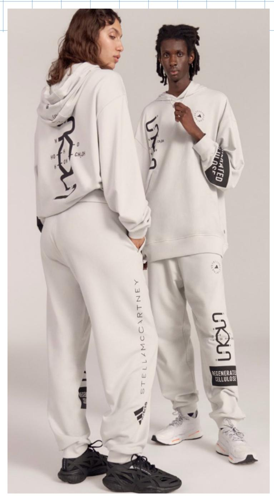

In March 2022, the New Cotton Project celebrated its halfway mark. It was a strategic moment for assessing how the project had evolved and which were the main issues faced by the partners. Half a year later, in October 2022, the partnering brands (adidas and H&M Group) launched four pieces developed for the project: a jumpsuit (adidas – figure 19) and denim trousers and jacket (H&M Group – figure 20). With the pieces launched to the public, parts of the production journey were concretised, and the experience is shared within the syllabus.

Figure 19:: adidas by Stella McCartney's tracksuit

# 5.1. 'RAW' MATERIAL SOURCING (POST-RETURN)

First stage of the ecosystem, the post-consumer textile waste ('Post-Return' on the [Ecosystemic Flow](https://circulartextiles.aalto.fi/courses/ecosystemic-flow/) of the 'Interactive Map' course), was carried out by Frankenhuis and its parent company the Boer Group between the countries of Germany and the Netherlands.

Composed of several small connected companies, the Boer Group gathers various stages of the post-return cycle, when fabrics are disposed of through municipal, commercial or charity collection bins, in-store, at recycling centres etc (Figure 21).

F i gu r e 2 0 : H& M G r ou p ' s u t il i t ari a n ja c ke t an d tr ouse r s

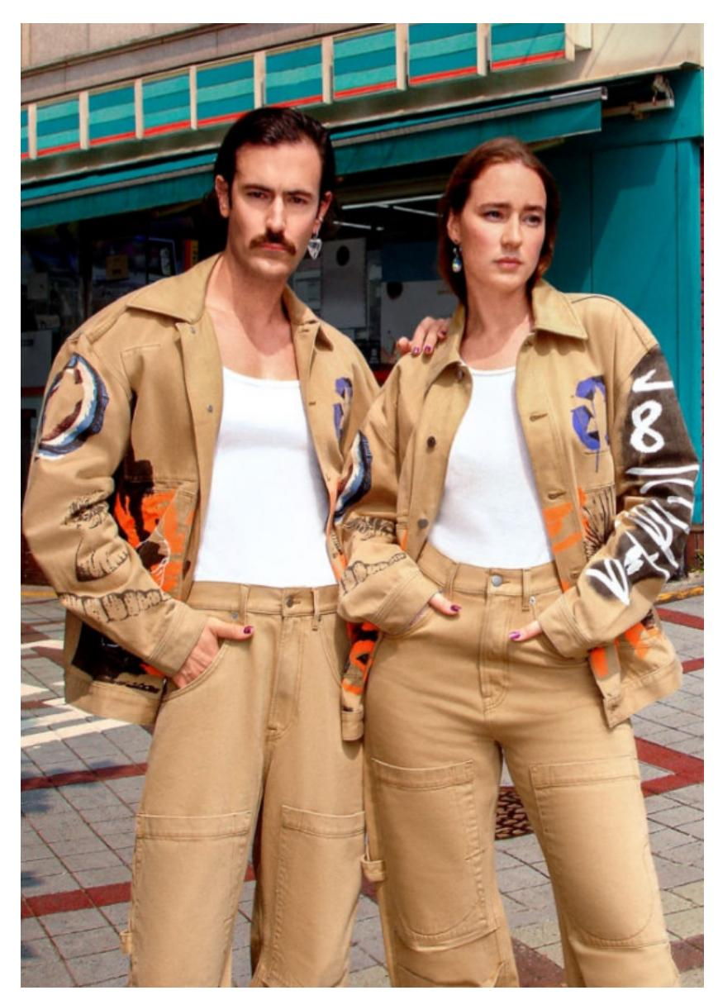

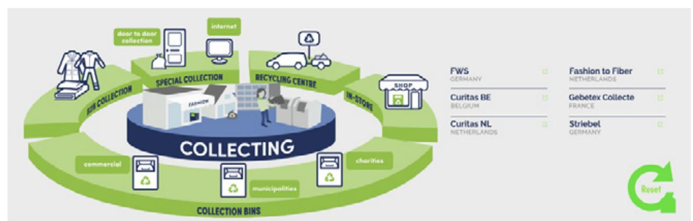

The next step is sorting the gathered material and assigning it to its due destination (Figure 22):

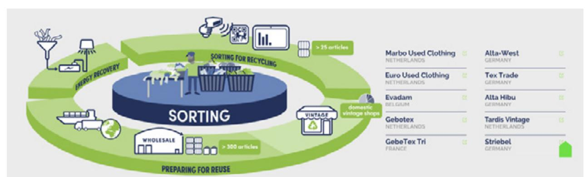

Finally, the material is sent to companies such as the New Cotton Project's partner Frankenhuis (Figure 23)

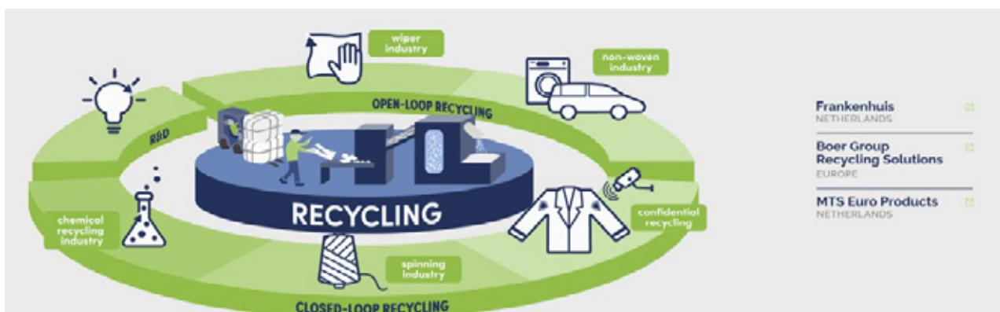

At the recycling stage, within Frankenhuis, the material is screened according to the company's needs, as can be seen on the '[Material Flow'](https://circulartextiles.aalto.fi/courses/material-flow/) in the interactive map. From full garments and household items, the material is assessed and tested until Frankenhuis supplies fibres equal or longer than 6mm composed of 75-100% cotton (combined into Figure 24, on the next page)

F igu r e 2 1: Boer G r oup ' s d e t a i led ma p (wh i c h c an be f ound on t he g r oup ' s we b s i t e 6 )

F igu r e 2 3 : Re c y c li n g s t a g e of t he Boer G r oup (wh i c h c an be f ound on t he g r oup ' s we b s i t e 6 )

F igu r e 2 2 : B OER G R O UP 'S so r t i n g d escri p t ion (wh i c h c an be f ound on t he g r oup ' s we b s i t e 6 )

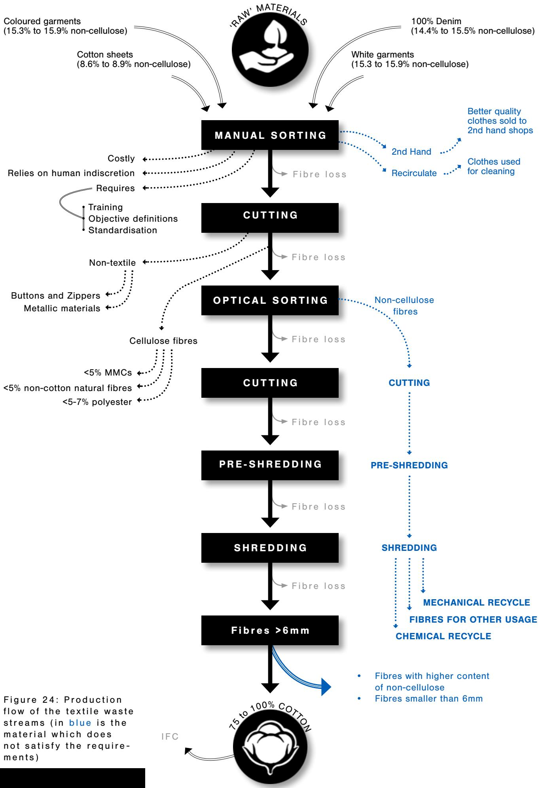

## 5.2. MANUFACTURE

The second macro-phase of the 'Ecosystemic Flow' manufacture — involves the five main stages of the circular ecosystem: fibre production (carried out by Infinited Fiber Company and Xamk), spinning (done by Inovafil and Kipas), weaving (by Kipas and Tekstina), knitting (by a company outside the consortium – Arik Bey) and finishes (which takes place at Kipas for the denim and Tekstina for the digital print).

Fibre production, which is the binding force of the New Cotton Project, is done using the pre-screened fibres assessed by Frankenhuis. The fibres are sent to Xamk, an applied sciences university located in Mikkeli (Finland), for the chemical pretreatment where the fibres are depolymerised, disposing of any potential non-cellulose fibre in the batch. Once the material is composed exclusively of cellulose, it is sent to the Finnish Infinited Fibre Company in Espoo, who holds the intellectual property for the production of the Infinna™ fibre (as can be seen in Figure 25).

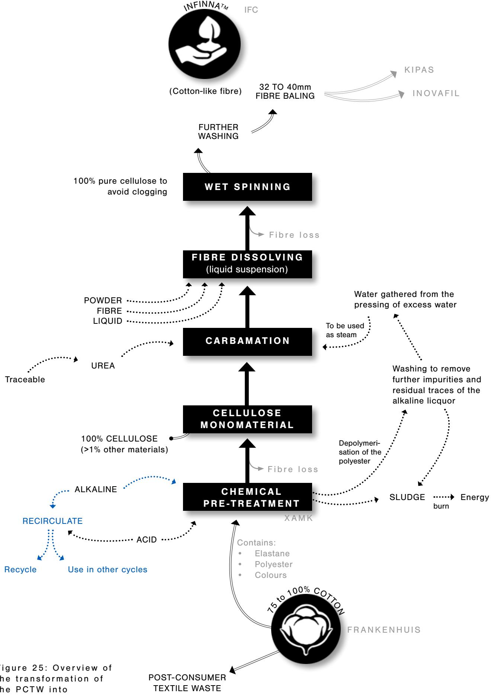

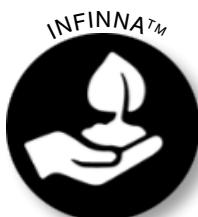

F i g u re 2 5 : O ve r v i ew o f t h e t ra n s fo r m at i o n o f t h e P C T W i n to Infinna™

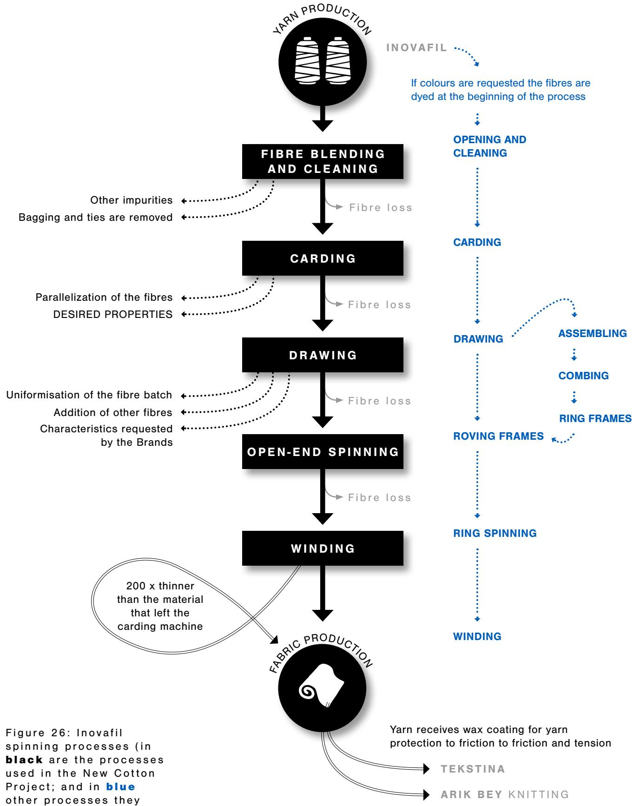

o t her p r o c e s s e s t h e y h av e in t he c omp a n y )

Once the cotton-like fibre is baled, it is sent to Inovafil in Guimaraes (Portugal) and Kipas in Kahramanmaraş (Turkey), where the fibre is cleaned, spun and dispatched to the next phase (see Figures 26 and 27).

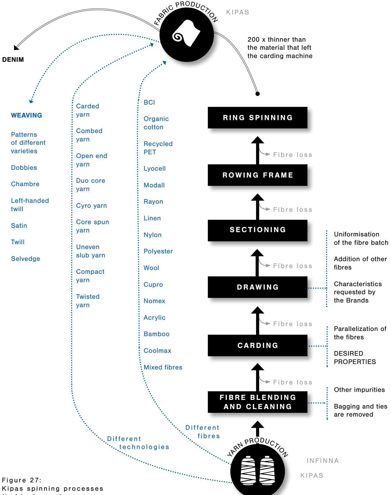

(in black are the process e s u s e d i n t h e n ew c ot to n project; and in blue ot h e r p ro c e s s e s t h ey h ave i n the company)

After Infinna™ has been spun, it is sent to Tekstina (from Inovafil) or to the denim production in Kipas. The weaving process is very similar for both companies as can be seen in figures 28 and 29.

F igu r e 2 8 : Ki p a s den im we a v i n g p r o c e s se s ( in blac k a r e t he p r o c e s se s u s e d i n t he New Co t t on p r o jec t ; an d i n blue o t her p r o c e s ses t h e y h av e i n t he c ompa n y )

F i gu r e 2 9 : Te k s t i na we a v i n g p r o c e s s ( i n blac k a r e t he p r o c e s s es used i n t he n ew c o t t on p r o jec t ; an d i n blue o t her p r o c e s se s t h e y h av e i n t h e c omp a n y )

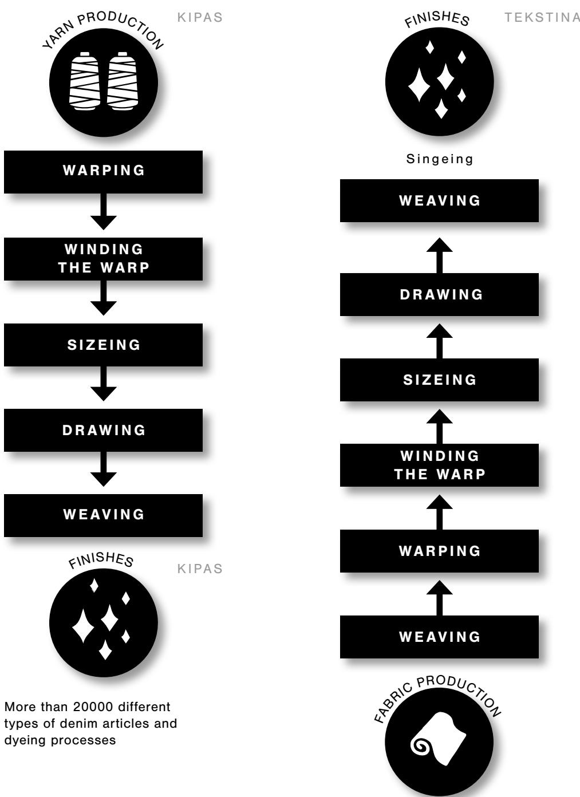

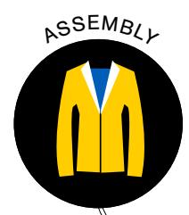

F i gu r e 3 0 : F i n i she s c arried out by Ki p as ( i n blac k a r e t he p r o c e s se s used i n t he n ew c o t t o n p r o jec t ; and in blue o t h er p r o c e s ses t h e y h a v e i n t he c omp a n y )

W INDIN G On to rolls

DRYIN G

M ESMERISIN G

Q UAL I T Y

INSPECT I O PN Testing samples

NATUR AL C O LOUR

Fabric washing Soap Hot water Glue/wax residue

Mesmerising

Peach effect

Continuous dyeing

Washing

Discontinous dyeing

Steaming

Drying and fixing

Shrinkage

Fixing

Lamination and Coating (Technical textiles))

Sanding

Touch process

Velvet and drying

Printing rotational

Printing digital

Cold bleaching

Brushing

Shinning effect

• Bl e a c h i n g • Ha r d wa t e r • Dy e s • Prin t i n g ma t eria l s ( t hi c k ) • F i x a t i n g c hemi c a l s

• Ho t wa t e r • Dy e s • F i x a t i n g c hemi c a l s • T hermo s e t t i n g DYEIN G

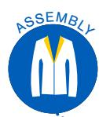

FINISHE

S

WASHIN G

Hot water Excess fibres Fixating chemicals Stone washing

P r e - tr e a t men t f or d y ei n g

> Ze r o wa t e r i nd i g o d y ei n g p r o c e s s

KI PAS

#### DIG I TAL PRINT IN G

JUST FOR SAMPLING (less than 100 products) VARIOUS GARMENTS POSSIBLE (but not an inhouse production) 50-70 PEOPLE

Additionally, there are the finishing processes which vary considerably according to the brands' requirements. Kipas was responsible for dyeing the denim, while Tekstina had to dye and digitally print their garments (which were not yet launched), as can be seen in Figures 30 and 31.

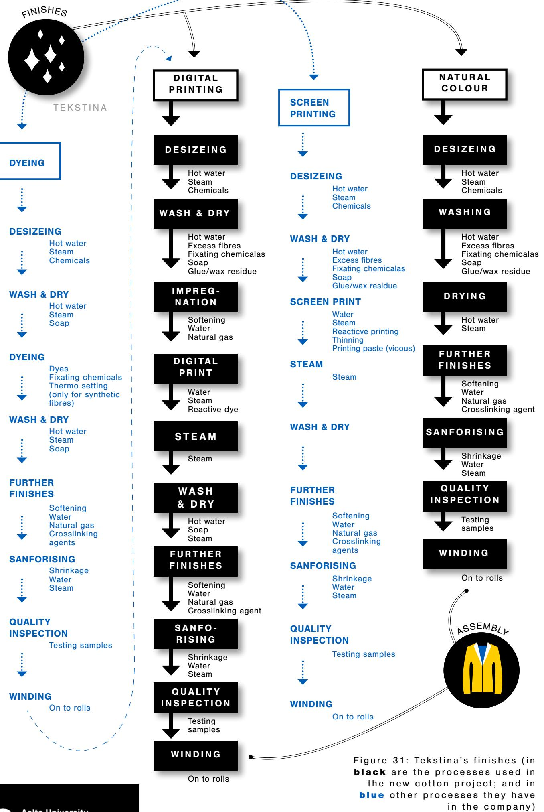

As some may have noticed, there were stages of the production which were not described in the previous stage, such as knitting, screen printing, or the garment assembly. Those stages, though important for the circular ecosystem being proposed, were not integrated into the project. Arik Bey however was responsible for the knitting, dyeing, printing and assembly of the adidas collection (see Figure 32).

The social aspects of production as well as the missing descriptions are being taken into consideration and will be investigated further. But for the full comprehension of the ecosystem and the course, they were not deemed essential.

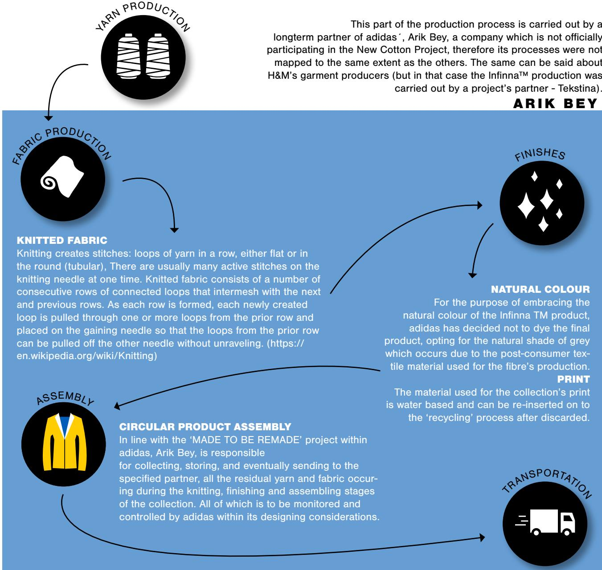

This part of the production process is carried out by a longterm partner of adidas´, Arik Bey, a company which is not officially participating in the New Cotton Project, therefore its processes were not mapped to the same extent as the others. The same can be said about H&M's garment producers (but in that case the lnfinna™ production was

F igu r e 3 2 : O v e r v i ew of t he p r oduc t i on p r o c e s s wi t h i n Ari k Be y

# 5.4 CHALLENGES FACED DURING THE DEVELOPMENT

The development of a circular ecosystem involves understanding not only the consumer needs but also the stages and waste of the production, not only that directly related to the central production focus (in this case, Infinna™), but also other waste produced by the consortium partners.

In the case of the New Cotton Project, understanding all the activities carried out by the other project members (usually presented in blue on the process mapping) was important to assess the best usage and potential collaborations to be developed further in the future. At the time of this publication, the considered and developed business models are still being studied; therefore, the focus of this course is mainly on the material, knowledge and ecosystemic flows.

On the other hand, there were other interesting discoveries analysed alongside the garments launch which could be useful to the course's students, thus the following SWOT analysis was carried out:

#### Strengths

The project partners were extremely motivated and willing to exchange expertise, even though in some cases they were direct competitors. The overall interest in creating a functioning ecosystem provided grounds for further interactions and conversations which would not take place otherwise.

#### Weaknesses

The conceptual idea of scaling up a laboratorial development into a commercial scale endeavour had its due share of difficulties. Industrial machinery, for instance, is not suited to dealing with smaller than usual quantities of material, so dealing with small amounts led to some manufacturing difficulties which were not foreseen.

Additionally, the need for garments and household fabrics high in cellulose content, a crucial requirement of the production, turned out to be a bigger challenge than expected, as products labelled as 100% cotton could contain up to 15% of other fibres. The colouration, embroidery, thick prints, and other customisations also incurred additional labour and unexpected costs to the process.

#### Opportunities

As mentioned before, the stages unknown to the partners, which were thoroughly mapped and analysed here, have led to the assessment of various potential opportunities within the ecosystem, creating secondary activities between consortium partners.

As will be explored further down the line, some of these collaborations were amply explored by, for instance, interactions between Frankenhuis and adidas. The sorting difficulties faced by the first were taken into consideration by the latter, and their products were designed with that in mind, ensuring an easier reinsertion of adidas' products into the ecosystem through the use of biodegradable prints, only cellulose mono-material and cottonbased accessories (no button, zipper, or any other material). Thus, the designed tracksuit can be easily collected and sent back to the production line.

#### Threats

The post-consumer textile waste, the main 'raw' material used within the ecosystem, had the waste status which was not well appreciated by European border control authorities. Dealing with 'waste', sorting and logistically distributing it was addressed in a policy roundtable, where policymakers, key stakeholder and members of the European textile industry discussed the topic, the current policies and potentially finding solutions for the issues found7.

Alongside this threat, and the composition issue of the collected textiles, production difficulties and other unexpected incidents, there were delays in production, what eventually led to a smaller sample release and the postponement of the fifth product's launch (to be manufactured, dyed and printed by Tekstina and commercialised by H&M Group).

# 6.1 POST-CONSUMER TEXTILE STREAMS

Finding steady and suitable post-consumer textile streams was one of the main issues faced by REvolve Waste and Frankenhuis, who worked alongside specialised companies to develop suitable machinery for the separation and identification processes (which could be made quicker8).

Day-to-day experiences added on to the difficulties, such as the definition of acceptable amounts of non-cellulosic materials, colours, breaking down garments, and financial viability of recycling post-consumer garments into new fibres. Additionally, understanding the post-consumer market and comparing these results to market data on feedstock availability, production flows and current disposal alternatives led to an immense amount of research to facilitate assessing potential partnerships for the project.

These difficulties, within the first half of the project, culminated on the overall understanding of market production, availability, disposal streams and the project's technical restrictions, which make it currently impossible to accept more than 5% of non-cellulosic fibres into the recycling process9 (a figure which should be increased as the technology is developed further by Infinited Fiber Company).

# CHAPTER SIX: RESEARCH AND DEVELOPMENT

8 Identifying the composition of fabrics can be done in numerous manners; however, in greater quantities this process can lead to mistakes and production delays, so finding a steady and reliable solution was paramount.

9 This percentage also includes the yarn used for sewing the garment, bold prints and other customary additions used by the fashion market.

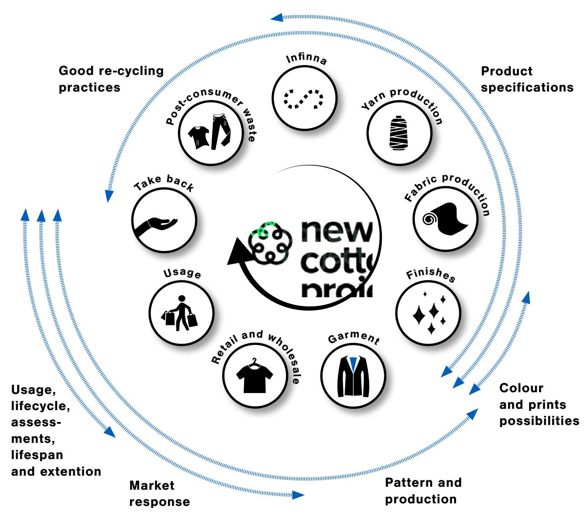

F ig u r e 3 3 : Design a p p r o a c h wi t h i n t he New Co t t on P r o je c t

Aligned with the post-consumer streams issue, the collection could not be designed in such a manner which renders it unfeasible to use it as a resource for the New Cotton Project's ecosystem in the future. With that in mind, the design-oriented partners (adidas and H&M Group) aligned their product proposition to the requirements raised by the postconsumer textile collectors (Figure 33), for instance, ensuring all the parts of the final product would be re-incorporated into the project's cycle10.

#### DESIGN INFORMATION GATHERED IN THE ECOSYSTEM

# 6.3 NEW COTTON PROJECT'S ASSESSMENT

Finally, in order to measure the successes of the New Cotton Project's development, two further choices will take place: the eco-labelling certification of the final projects under the Standard 100 by Oeko-tex® and the life-cycle assessment.

Oeko-tex® Standard 10011 proposes the analysis and holistic investigation of harmful substances in textile products, inspecting the individual parts of each one of the products launched to ensure its suitability for commercialisation. Customer confidence and product safety are certified by globally standardised tests repeated yearly, which can be validated by the consumer through the label number at the Oeko-tex® label check.

Life Cycle Assessment, originally proposed by the United Nations Environmental Programme in 1996, differently from the ecolabel, assesses the effects that a product has on the environment throughout its life cycle (analysing the product or the function a product is performing).

Combining the commercialisation of the New Cotton Project's products as well as their ecolabel results will allow the project to understand its successes, failures, and opportunities, also assisting with the consumer adoption of circular products and the consortium partners' ability to create further partnerships.

Even though there were difficulties which led to production delays and quantity compromises, the collection was launched in 2022, initially through Stella McCartney's adidas collection at London Design Week (in September) and subsequently (in October) on adidas and H&M Group's websites. Additionally, the collection launch was celebrated by the consortium with the opening of a New Cotton Project installation at the Fashion for Good museum in Amsterdam. This was also promoted through extensive press coverage and social media activity.

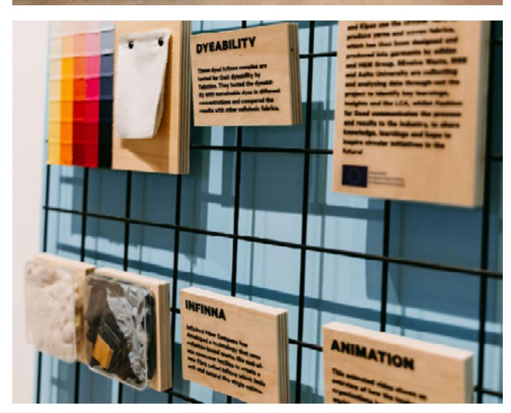

# CHAPTER SEVEN : LESSONS LEARNT AND NEXT STEPS

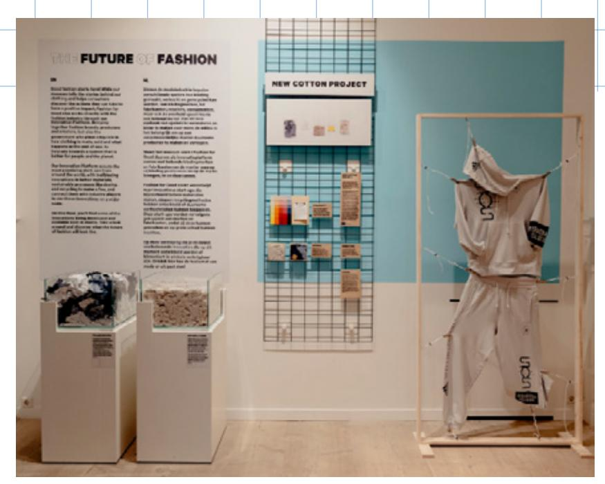

F i gu r e 3 4 : Ima g es o f t he New Co t t on P r o ject e xh i b i t ion 1 2

Built on the same principles of a natural ecosystem13, a circular ecosystem is proposed to generate a similar balance throughout the supply chain. This is important because it promotes communication and cooperation between various business associates in this long-term partnership. As an innovative business model, this relationship allows for small and big companies to embrace sustainable practices together, through shared risk14.

As the project goes on, we will continue publishing white papers to assist the consumer, industry-savvy readers, students, and other interested parties to understand the stages/activities/implications of the New Cotton Project. Additionally, Aalto University has launched an educational platform with courses and other educational activities for the general public (www.circulartextiles.aalto.fi), once more increasing the project's transparency and promoting sustainability and open knowledge.

# REFERENCES

[1] F. Boucher and Y. Deslandres, A history of costume in the West. Thames and Hudson, 1987. [2] D. Farnie and D. Jeremy, The fibre that changed the world : the cotton industry in international perspective, 1600-1990s. Oxford University Press, 2004. [3] S. Beckert, "Emancipation and Empire : Reconstructing the Worldwide Web of Cotton Production in the Age of the American Civil War," Am. Hist. Rev., vol. 109, no. 5, pp. 1405–1438, 2004. [4] P. Frankopan, The silk roads: a new history of the world. Bloomsbury Publishing, 2015. [5] S. Beckert, Empire of cotton : a global history. Penguin Books, 2014. [6] J. Peacock, The chronicle of Western costume : from the ancient world to the late twentieth century. Thames & Hudson, 2010. [7] Euratex, "A NEW EU STRATEGY FOR TEXTILES & CLOTHING Background-the EU textiles & clothing industry," 2021. Accessed: Aug. 31, 2022. [Online]. Available: [https://](https://euratex.eu/wp-content/uploads/EURATEX-Vision-on-EU-Textile-Strategy-fin.pdf) [euratex.eu/wp-content/uploads/EURATEX-Vision-on-EU-Textile-Strategy-fin.pdf.](https://euratex.eu/wp-content/uploads/EURATEX-Vision-on-EU-Textile-Strategy-fin.pdf) [8] Euratex, "European Technology platform for the future of textiles and clothing: a vision for 2020," 2004. Accessed: Aug. 31, 2022. [Online]. Available: [https://www.certh.gr/](https://www.certh.gr/dat/141D2148/file.pdf) [dat/141D2148/file.pdf.](https://www.certh.gr/dat/141D2148/file.pdf) [9] G. Brundtland, "Report of the World Commission on Environment and Development: Our Common Future," 1987. [10] L. Bistagnino, Systemic design. Torino - Italy: Slow Food, 2011. [11] N. Moreira, S. Sousa, and T. Wood–Harper, "Fair Trade and Sustainability in the British Textile Industry: an Evolution from Exploitation towards Global 'equality,'" J. Text. Sci. Eng., vol. 7, no. 6, 2017. [12] L. M. Cook and I. J. Saccheri, "The peppered moth and industrial melanism: evolution of a natural selection case study," Heredity (Edinb)., vol. 110, pp. 207–212, 2013, doi: 10.1038/hdy.2012.92. [13] B. S. Grant, "Review : Fine Tuning the Peppered Moth Paradigm Reviewed Work ( s ): Melanism : Evolution in Action by Michael E . N . Majerus," Evolution (N. Y)., vol. 53, no. 3, pp. 980–984, 1999. [14] T. G. Liebert and P. M. Brakefield, "Behavioural studies on the peppered moth Biston betularia and a discussion of the role of pollution and lichens in industrial melanism," Biol. J. Linn. Soc., vol. 31, no. 2, pp. 129–150, 1987, doi: 10.1111/j.1095-8312.1987. tb01985.x. [15] L. Siegle, To die for: is fashion wearing out the world? Fourth Estate, 2011. [16] L. Aarikka-Stenroos, P. Ritala, and L. D. W. Thomas, "Circular economy ecosystems: A typology, definitions, and implications," Res. Handb. Sustain. Agency, pp. 260–276, 2021, doi: 10.4337/9781789906035.00024. [17] J. Elkington, "25 Years Ago I Coined the Phrase 'Triple Bottom Line.' Here's Why It's Time to Rethink It.," Harvard business review, 2018. [https://hbr.org/2018/06/25-years](https://hbr.org/2018/06/25-years-ago-i-coined-the-phrase-triple-bottom-line-heres-why-im-giving-up-on-it)[ago-i-coined-the-phrase-triple-bottom-line-heres-why-im-giving-up-on-it](https://hbr.org/2018/06/25-years-ago-i-coined-the-phrase-triple-bottom-line-heres-why-im-giving-up-on-it) (accessed Aug. 10, 2020). [18] Camira Fabrics, "Sustainability. Corporate Social Responsibility. Triple Bottom Line. Call it what you like – it's our Moral Fibre.," 2014. [19] I. Sachs, "The next 40 years: transition strategies to the virtuous green path," 1991. [20] S. Bell and S. Morse, "Rich Pictures: Means to Explore the A 'Sustainable Mind'?," Sustain. Dev., vol. 21, no. September 2010, pp. 30–47, 2013, doi: 10.1002/sd.497.

[21] I. I. Mitroff, C. M. Alpaslan, and E. S. O'Connor, Everybody's business: reclaiming true management skills in higher education. 2013. [22] R. Armson, Growing Wings on the Way: Systems Thinking for Messy Situations. Devon - UK: Triarchy Press Limited, 2011. [23] A. Monk and S. Howard, "The Rich Picture: A Tool for Reasoning About Work Context," Interactions, vol. 5, no. 2, pp. 21–30, 1998, doi: 10.1145/274430.274434. [24] T. Donaldson, "The Stakeholder Revolution and the Clarkson Principles," Bus. Ethics Q., vol. 12, no. 2, pp. 107–111, 2002. [25] D. Yates and T. Wakefield, Systems Analysis and Design. 2004. [26] C. Vezzoli and E. Manzini, Design for environmental sustainability. Springer-Verlag London Limited, 2008. [27] M. B. E. Clarkson, "Defining, evaluating, and managing corporate social performance: A stakeholder management model," in Research in corporate social performance and policy, 1991, pp. 331–358. [28] J. Konietzko, N. Bocken, and E. J. Hultink, "Circular ecosystem innovation: An initial set of principles," J. Clean. Prod., vol. 253, no. January, 2020, doi: 10.1016/j. jclepro.2019.119942. [29] S. Biazzo, "Process mapping techniques and organisational analysis: Lessons from sociotechnical system theory," Bus. Process Manag. J., vol. 8, no. 1, pp. 42–52, Mar. 2002, doi: 10.1108/14637150210418629. [30] J. P. Womack and D. T. Jones, Lean Thinking: Banish Waste and Create Wealth in Your Corporation. New York, NY: Free Press, Simon & Schuster, Inc., 1996. [31] M. E. Porter, Competitive Advantage: Creating and Sustaining Superior Performance. New York: Simon and Schuster, 1985. [32] K. Behm, R. Husgafvel, C. Hohenthal, H. Pihkola, and S. Vatanen, "Carbon handprint-Communicating the good we do," 2016. [33] T. Pajula, S. Vatanen, H. Pihkola, K. Grönman, H. Kasurinen, and R. Soukka, "Carbon Handprint Guide," Jan. 2018. [34] K. Grönman et al., "Carbon handprint – An approach to assess the positive climate impacts of products demonstrated via renewable diesel case," J. Clean. Prod., vol. 206, pp. 1059–1072, Jan. 2019, doi: 10.1016/J.JCLEPRO.2018.09.233.