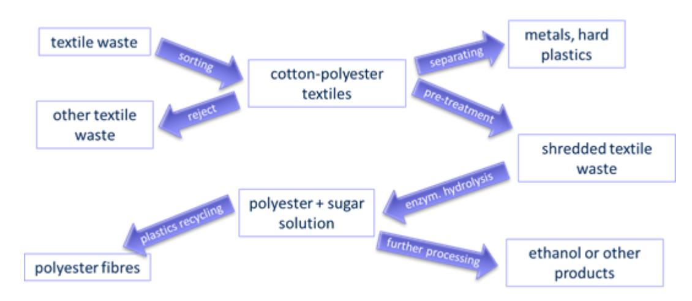

# PLASTICE

This project has received funding from the European Union's Horizon Europe research and innovation programme under grant agreement n° 101058540.

**New technologies to integrate PLASTIC waste in the Circular Economy**

**Training materials**

**Module 1: Innovative technologies to enable circular plastic value chains**

**Unit 1.3**

**Enzymatic hydrolysis: a green approach to separate waste streams for recycling (Unit 1.3)**

# **MODULE 1 Overview**

This module is divided into three units, each of which addresses specific challenges in plastic waste management and demonstrates how advanced methods can transform **waste into valuable resources** through sustainable and scalable processes. These technologies are:

- Microwave-assisted thermochemical processing: prospects and scalability (Unit 1.1)
- Gasification and catalytic post-treatment for circular plastic valorisation: syngas to olefins conversion  (Unit 1.2)
- **Enzymatic hydrolysis: a green approach to separate waste streams for recycling (Unit 1.3)**

These technologies have been developed and validated within the framework of the **PLASTICE project**, funded by the European Commission, which aims to promote circular solutions for plastic waste valorisation through **chemical recycling.**

## **Unit 1.3**

## **Enzymatic hydrolysis:**

## **a green approach to separate waste streams for recycling**

*A variety of different fibres are used to produce garments. Fibres are mixed to achieve specific properties, such as wearing comfort, crease resistance, and so on. But, mixtures make recycling difficult. The European PLASTICE project aims to develop and validate a pilot plant of the enzymatic recycling of mixed cotton/polyester blends. In this training unit, the underlying enzymatic process of unravelling cotton and polyester of textile waste is described and explained.*

### **Key Points of Unit 1.3**

- Mixed material textiles are deemed to be **unrecyclable**
- **Enzymatic hydrolysis** is an energy-efficient way to separate selected components

This project has received funding from the European Union's Horizon Europe research and innovation programme under grant agreement n° 101058540.

#### *Introduction*

**5.8 million tons of textile waste** are thrown away by consumers every year in the EU alone. The vast majority of textile waste worldwide is **landfilled or incinerated**, 25% is reused or recycled into products other than textiles, and only **1%** of the waste is recycled into textiles again. Modern clothes comprise several fibres, besides cotton and polyester, wool, silk, polyamides, and other synthetic fibres are commonly used [1]. Rising awareness of the ecological problems caused by both textile production and the problematic end-of-life disposal calls for the use of this waste as a resource. However, the recycling and reuse of the mixed fabrics poses a challenge and requires **breaking them down into their components**. The **enzymatic degradation** of the cellulose content in polyester/cotton textiles is our process in PLASTICE project to unravel the mixed fibres and recover the polyester. 

### *Technology overview Description of the enzymatic recycling technological process*

The process of recycling mixed-textiles comprises several consecutive steps: before converting the cotton into sugars, the fabrics must be **crushed** and **chemically pre-treated.** Thereafter, the actual enzymatic hydrolysis to dissolve the cotton part is performed. The residual polyester fibres are extracted after the reaction time, washed and dried. Then these PET (polyethylene terephthalate) short fibres can be spun into yarns again after undergoing a pelletising and **solid-state polymerisation** step to increase their molecular weight.

*Figure 1: Overview of textile-recycling process within PLASTICE.*

#### **1. Fabric pretreatment**

The sorted textile blends must be shredded into smaller pieces to enable enzymatic recycling. Hard parts, such as buttons and zippers, have to be separated, as they are usually made of materials other than the fabric and can be a hindrance in recycling. Different separation techniques, like **inductive metal separation** or **windsifting**, can be applied to the shredded textiles.

A **chemical pretreatment** is necessary to make the cotton fibres more susceptible to the later enzymatic degradation. Therefore, the fabrics need to be **soaked in sodium hydroxide** solution at room temperature. This alkaline swelling is followed by a washing step, before the actual hydrolysis can be started.

### **2. Enzymatic hydrolysis of cellulose**

Cotton consists to a large part of cellulose. **Cellulose** is a natural **semi-crystalline polymer**, built from β-1,4-linked glucose units, which can be, once disassembled into glucose, used for the production of ethanol, ethers and others [2].

The structure is a sequence of alanine rings with a connection between the first and second rings. The first ring is a single ring consisting of a side chain (HO), a carboxyl group (COOH), and a carboxyl group (COOH). The second ring is a single ring consisting of a side chain (HO), a carboxyl group (COOH), and a carboxyl group (COOH). The connection between the two rings is a connection between the carboxyl groups (COOH) of the first ring and the carboxyl groups (COOH) of the second ring.

*Figure 2: Structure of cellulose polymer [3].*

To disassemble the mixed textiles and separate the polyester fibres from the cellulose, the cellulose is decomposed to sugars by enzymatic hydrolysis. The degradation of cellulose is done with the help of hydrolysing enzymes that are specific for the breakdown of cellulose. These so called **"cellulases"** are **multi-enzyme complexes** and are composed of three individual enzymes: **endoglucanase, exoglucanase, and beta-glucosidase**. Only the cooperation of these enzymes leads to a complete degradation of cellulose to glucose. Indeed, exoglucanase converts small cellulose fragments, which are afore split by endoglucanase, to oligosaccharides (cellobiose), which are finally hydrolysed by beta-glucosidase to glucose [4].

The hydrolysis takes place in a heated vessel, where the fabrics are stirred at elevated temperatures around **50°C** in a buffer solution. Temperature and pH are kept constant throughout the reaction time of about 24-48h, depending on the composition of the input material stream.

#### **3. Recovery of polyesters and sugars**

The residual polyester fibres after the hydrolysis process can be filtered off the sugar solution, washed, dried, and further processed into **granules** with plastic processing machines. An additional step to improve the quality of the polyester could be necessary. **Solid state polymerisation** can be performed to increase **molecular weight.**

The ability to produce new products like fibres from the recovered PET from mixed textile waste is up to the quality of polyester. The quality depends on the hydrolysis conditions, residues from nonremovable chemicals, fibre sizing, dyes, or residues from the process. A highly efficient process is therefore important for adequate PET quality. The sugar containing solution, created during the hydrolysis process, can be used as feedstock for **bioethanol** or **biogas production**. [5]

#### *Conclusions*

The complexity of textiles in recycling can be overcome with different separation strategies. These need to be energy efficient, which the shown enzymatic degradation is. With such a step, the textile mixtures can be decomposed, therefore enabling the recycling of the different components. Such processes need to be **implemented industrially**, but in a way that the majority of the streams are utilised – either for materials or as base chemicals for other applications. Overall, the approach of separating the components by means of a low energy approach is a **green way** to solve an until now unsolved issue of recycling of mixed textile waste.

This project has received funding from the European Union's Horizon Europe research and innovation programme under grant agreement n° 101058540.

#### **Bibliography:**

[1] Juanga-Labayen, J.P.; Labayen, I.V.; Yuan, Q. A Review on Textile Recycling Practices and Challenges. Textiles, 2022, 2, 174–188.  [2] Cellulose; Rodríguez Pascual, A.; E. Eugenio Martín, M., Eds.; IntechOpen, 2019.  [3] Wahlström, N. POLYSACCHARIDES FROM RED AND GREEN SEAWEED.  [4] Singhania, R.R.; Patel, A.K.; Sukumaran, R.K.; Larroche, C.; Pandey, A. Role and Significance of Beta-Glucosidases in the Hydrolysis of Cellulose for Bioethanol Production. Bioresource Technology, 2013, 127, 500–507.  [5] Li, X.; Hu, Y.; Du, C.; Lin, C.S.K. Recovery of Glucose and Polyester from Textile Waste by Enzymatic Hydrolysis. Waste Biomass Valor, 2019, 10, 3763–3772

Contact the author!

Barbara Liedl [\(barbara.liedl@tckt.at\)](mailto:barbara.liedl@tckt.at)

**Want to know more about the PLASTICE project?** 

**Visi[t www.plastice.eu](http://www.plastice.eu/) or scan the QR code**

**NEXT**

# **MODULE 2**

# **Testing the technologies**