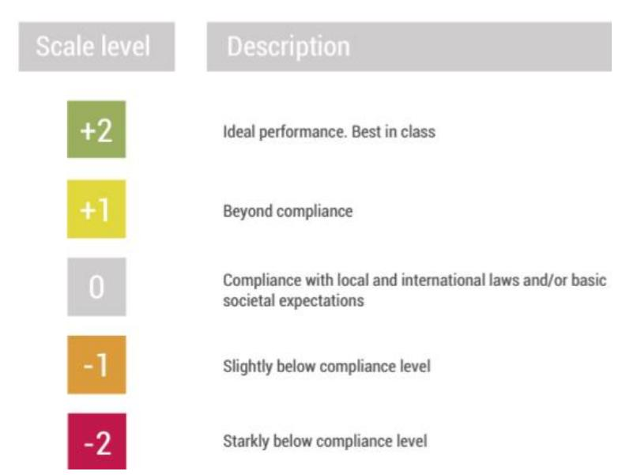

# Enhanced safe and sustainable coatings for supporting the planet

# Deliverable D1.2 PROPLANET KPIs Report

# **Deliverable Information**

| Responsible partner:     | HOLOSS                        |
|--------------------------|-------------------------------|
| Work package No and      |                               |
| Contributing partner(s): | NILU, TEC, NIC, AIT, REE, PLK |
| Dissemination level:     | PU                            |
| Type:                    | R                             |
| Due date:                | 31/08/23                      |
| Submission date:         | 31/08/23                      |
| Version:                 | V4                            |

# Project Profile

| Programme      | Horizon Europe                                                   |
|----------------|------------------------------------------------------------------|
| Call           | HORIZON-CL4-2022-RESILIENCE-01                                   |
| Topic          | HORIZON-CL4-2022-RESILIENCE-01-23                                |
| Number         | 101091842                                                        |
| Acronym        | PROPLANET                                                        |
| Name           | Enhanced Safe and Sustainable coatings for supporting the Planet |
| Start Date     | 1 January 2023                                                   |
| Duration       | 36 months                                                        |
| Type of action | HORIZON Research and Innovation Actions                          |
| authority      | European Health and Digital Executive Agency                     |
| Coordinator    | IDENER                                                           |

# Document History

| Version | Dates      | Entity       | Remarks                              |
|---------|------------|--------------|--------------------------------------|
| 0       | 5/07/2023  | HOL          | Table of contents made available for |
| 1       | 16/07/2023 | HOL          | HOLOSS Internal revision             |
| 2       | 31/07/2023 | All partners | Draft for revision                   |
| 3       | 25/08/2023 | IDE          | Review by coordinator                |
| 4       | 30/08/2023 | HOL          | Final version                        |

# Executive Summary

The main goal of PROPLANET is to design and optimise three innovative coatings, considering environmental protection, safety and chemical improvements for 3 different industrial sectors: textile (1), food-packaging machines (2), and glass (3):

- 1. Crosslinked biopolymer oil/wax microcapsules in a polysaccharide matrix (hydrophobic, oleophobic bio-based coating);
- 2. Hybrid siloxane biobased coating (non-stick and anticorrosion protection bio-based hybrid coating);
- 3. Hybrid siloxane coating (anti-soiling, anti-reflecting hybrid coating).

This deliverable describes the work carried out under Task 1.3 "KPI's definition and validation" to define and describe the Key Performance Indicators (KPIs) applicable in the PROPLANET project to enable efficient and effective monitoring of innovations. It provides a description of the technical, safety, environmental, economic and social KPIs that were defined based on the specific and strategic objectives of the project. It also describes the methodology and the target value/goal for the KPIs. The technical KPIs focused on the technical performance of each coating end-application and specific final use case by manufacturers (as NIC or TEC) and end-user's partners (as AITEX, REE or PLK). NILU was responsible for defining safety KPIs and HOL established the environmental, economic and social KPIs. Target KPIs were then validated by all PROPLANET partners. This KPIs report will allow the evaluation of the success of the project for each of the defined case scenarios.

# Table of Contents

|      | Table of Contents      |                                                                                                                                                    |
|------|------------------------|----------------------------------------------------------------------------------------------------------------------------------------------------|
| 1.   | Introduction           | .......................................................................................................................................8           |
| 1.1. |                        | Task 1.3 KPI’s definition and validation ......................................................................................8                   |
| 1.2. |                        | Purpose of the document ...........................................................................................................8               |
| 1.3. |                        | Methodology...............................................................................................................................9        |
| 1.4. |                        | Target scenario........................................................................................................................11          |
| 2.   | PROPLANET Project KPIs | ..............................................................................................................12                                   |
| 2.1. | Technical KPIs         | .........................................................................................................................12                        |
| 2.2. | Safety KPIs            | ..............................................................................................................................15                   |
| 2.3. |                        | Environmental KPIs..................................................................................................................16             |
| 2.4. |                        | Economic KPIs.........................................................................................................................20           |
| 2.5. |                        | Social KPIs...............................................................................................................................23       |
| 3.   |                        | Conclusions ....................................................................................................................................27 |

# List of Figures

[Figure 1: Reference scale for social performance evaluation \(from](#page-23-0) 17)....................................................24

# List of Tables

| Table 1: PROPLANET PFAS- free coatings and respective manufacturers and end-users' partners..... | 9  |
|--------------------------------------------------------------------------------------------------|----|
| Table 2: Technical PROPLANET KPIs for the textile end-application (1).....                       | 13 |
| Table 3: Technical PROPLANET KPIs for the food-packaging machines end-application (2).....       | 13 |
| Table 4: Technical PROPLANET KPIs for the glass end-application (3A).....                        | 14 |
| Table 5: Technical PROPLANET KPIs for the glass end-application (3B).....                        | 14 |
| Table 6: Safety PROPLANET KPIs .....                                                             | 15 |
| Table 7: Environmental PROPLANET KPIs.....                                                       | 20 |
| Table 8: Economic PROPLANET KPIs .....                                                           | 23 |
| Table 9: Social PROPLANET KPIs.....                                                              | 26 |

# Table of Abbreviations

| Abbreviation | Definition                               |
|--------------|------------------------------------------|
| CFCs         | chlorofluorocarbons                      |
| CTUe         | comparative toxic unit for ecosystems    |
| CTUh         | comparative toxic unit for humans        |
| EAC          | equivalent annual cost                   |
| GHG          | greenhouse gases                         |
| GWP100       | global warming potential                 |
| IRR          | internal rate of return                  |
| KPIs         | key performance indicators               |
| LCA          | life cycle assessment                    |
| LCC          | life cycle costing                       |
| LCSA         | life cycle sustainability assessment     |
| NMVOC        | non-methane volatile organic compounds   |
| NPV          | net present value                        |
| NS           | net savings                              |
| ODP          | ozone depletion potential                |
| ODSs         | ozone-depleting substances               |
| PAF          | potentially affected fraction of species |
| PB           | dynamic payback period                   |
| PFA          | per- and polyfluoroalkyl                 |
| PM           | particulate matter                       |
| SIR          | savings to investment ratio              |
| s-LCA        | social- life cycle assessment            |
| SSbD         | safe and sustainable by design           |

### 1. Introduction

### 1.1. Task 1.3 KPI's definition and validation

The main objective of WP1 – "Set up PROPLANET activities and team alignment" is to perform the project coordination and management according to the management structure. Including the appropriate execution of tasks and objectives (time, quality, and costs), setting proper coordination, management tools, methods, and decision-making processes. Considering the quality of technical reporting and financial administration. Task 1.3 is one of the main tasks of WP1. It intends to quantify the project´s impact by defining a list of KPIs. The KPIs definition should include sustainability factors, energy, environmental burden from harmful substances, and toxicity indicators. Also, some non-energy-environmental factors: industrial safety/ risk and economic factors. The KPIs database should also be created based on bio value chains, available sources, and databases of materials.

### 1.2. Purpose of the document

The ambition of PROPLANET is to enhance and support the Safe and Sustainable by Design (SSbD) framework at the European level through the development of non-toxic and environmentally friendly coatings with enhanced functionality aided by computational tools, to substitute PFAS type coatings. This will allow minimising the environmental impact, reducing the cost of manufacture, fulfilling circular schemes, and accelerating the market introduction of novel SSbD coatings, through a full detailed standardisation roadmap and the compromise of certifying the products sustainable and circular value chains. Three innovative value chains will be implemented within the PROPLANET project: i) Crosslinked biopolymer oil/wax microcapsules in polysaccharide matrix coating ii) hybrid siloxane bio-based coating iii) hybrid siloxane coating. These new coatings aim to ensure substantially, lower water and carbon footprints, be non-toxic, and demonstrate recovery and recyclability while improving mechanical, physical, and chemical properties compared with conventional PFAS-based coatings.

The evaluation of the innovative solutions proposed under the PROPLANET project requires a quantitative assessment by adopting representative KPIs. KPIs can be defined as a set of values used to measure the accomplishment of a certain endeavour in different fields. They are set up-front as targets and then compared with final outcomes to assess performance. They can serve several purposes as set targets that help achieve the project's objectives, enable the performance of the project in meeting its goals to be assessed, and enable measurement of how well the specific use cases are performing and supporting the project's objectives. Besides, the KPIs can give project participants focus and motivation to reach the defined targets.

In this way, this deliverable is intended to establish the KPIs that will be targeted and used to evaluate the performance and impacts of each PROPLANET innovation during development and experimental evaluation. Several environmental, economic, social, technical, and safety KPIs were thus defined based on the specific and strategic objectives of the project.

### 1.3. Methodology

This section aims to describe the methodology applied to the definition and establishment of the target values/goals of the KPIs for the PROPLANET project. Here, the complexity of the expected performance of developing safe and sustainable by design coatings for the project, requires fixing three principles: **(1)** a **multi-criteria procedure** is anticipated to define the set of KPIs considering five different perspectives (technical, safety, environmental, social, and economic). On the other hand, **(2)** a **multi-actor view** is selected to bring together the different points of view of partners belonging to the value chain. To achieve this, **(3)** an **iterative and co-production process** is established to make sure that all pertinent perspectives, experiences, skills, and information are incorporated. This last principle will be carried out within a framework that consists of two iterations. The first iteration is based on the expertise of the project partners who are participating in the task as well as a review of the relevant literature.

Thus, this deliverable (D1.2) contains the initial set of KPIs that were generated during several discussions as a result of the first iteration. These discussions took place in conjunction with T2.1 and T6.3, during the M6 meeting's attendance at the WP6 presentation, and in individual meetings. A second iteration will be carried out in D6.3 with the results collected during the implementation of the project and evaluated in T6.2. In the 2nd iteration, the pre-defined KPIs from the 1st iteration will be reviewed to generate an updated version to be included in D.6.3. In the second iteration, the collaboration between partners will continue. Both HOL, who was in charge of collecting, analysing, and defining the required data, and NILU, TEC, NIC, AIT, REE, and PLK, who were in charge of providing and quantifying indicators, will participate in additional discussions and validation of the suggested KPIs during the creation of the framework.

By keeping these principles in mind, KPIs have been distinguished into 2 main groups, the sustainability factors, as the environmental, economic, and social KPIs and the non-energy-environmental factors, as the technical (defined for each innovative coating´s end-application and use case) and safety KPIs.

The technical KPIs were defined by the PROPLANET coatings´ manufacturers and end-user partners, as listed in the following **Erro! A origem da referência não foi encontrada.**.

*Table 1: PROPLANET PFAS- free coatings and respective manufacturers and end-users' partners*

| Type of coating                   | Manufacturer | End-user |
|-----------------------------------|--------------|----------|
| in polysaccharide matrix coating  | NIC          | AIT      |
| Hybrid siloxane bio-based coating | TEC          | REE      |
| Hybrid siloxane coating           | TEC          | PLK      |

They were established focusing on the expected technical performance of each coating end-application and specific final use case (for glass sector):

1- Textile 2- Food-packaging machines 3A- Glass for shower doors 3B- Glass for automotive window glasses

The safety KPIs were supported by the PROPLANET toxicology expert, NILU. They were defined taking into consideration the more critical toxicological endpoints, i.e., cytotoxicity, genotoxicity, mutagenicity, and carcinogenicity. These endpoints are prioritised due to their long term and severe effects on human health that they may entail, and due to the restrictions on the placing on the market and the use of substances which are carcinogenic and mutagenic, known also as compounds of high concern (CMR - carcinogenic, mutagenic and reprotoxic compounds). Additional KPIs that might be considered during the 2nd iteration, based on the investigations performed after this first iteration, include for example the induction of oxidative stress, endocrine disruption activity, release of inflammatory markers, etc. At this stage, the safety KPIs are the same for each of the 3 innovative coatings.

The environmental, economic, and social KPIs were established by HOL and validated by PROPLANET partners. As a first step to define these KPIs, project's objectives were analysed. The target values were defined based on the PROPLANET project objectives to:

- Develop high-performance SSbD coatings to substitute PFAS;
- Reduce environmental impact in manufacture process > 25%;
- Take advantage of the potential of AI, computing and modelling to achieve SSbD;
- Boost the high-performance safe and sustainable coatings in new markets.

Keeping the above-mentioned objectives in mind, KPIs used in related ongoing and completed European projects have been reviewed and considered for the definition of the KPIs of PROPLANET. In this way, sustainability KPIs were defined based on the Life Cycle Sustainability Assessment (LCSA) methodology. To this end, HOL has participated in different SSbD events and reviewed the latest updates published in the public deliverables of the ORIENTING project1 . In addition, KPIs selection was based on their relevance, measurability, comparability, and verifiability, as described below:

- Relevance: Allows a meaningful measurement of progress toward achieving target goals (sustainability topics);
- Measurability: With clear data sources and sufficient scope to accurately measure performance;
- Comparability: Allows for comparable measures of performance over time, relying on consistent methodology;

1 ORIENTING project D2.3 – LCSA methodology - [link](https://orienting.eu/wp-content/uploads/2022/12/D2.3-LCSA-methodology-implemented-WP4-demonstrations.pdf)

- Verifiability: Supported by a detailed internal standard documenting the scope, calculation methods, and assumptions (aligned to financial standards).

### 1.4. Target scenario

PFA (per- and polyfluoroalkyl) substances consist of polymers and nonpolymers commonly used in various industries. PFA-based coatings offer excellent chemical resistance, high temperature stability, low friction properties and electrical insulating ability. These properties make PFA coatings suitable for applications where durability and performance are important. Although, there is toxicological evidence that some PFAS have adverse reproductive, developmental, and immunological effects in animals and humans. PFAS can enter the environment through production or waste streams and are very persistent in the environment and the human body2 .

The ambition of PROPLANET is to develop 3 different PFAS-free coatings, to be applied in the sectors of textile, food-packaging machines, and glass. The substitution of PFAS type coatings allows to minimise the environmental impact and the cost of manufacture while fulfilling circular schemes and accelerating the market introduction of novel SSbD coatings. **For the textile end-application,** a fluorine-free hydrophobic and oleophobic coating with enhanced wear resistance and durability will be developed. The innovative biocomposite coating will be developed using a modified polysaccharide hydrophobic matrix with biopolymer chitosan/alginate-based microcapsules incorporated with natural oils/waxes. The formulation involves a careful selection of components to enhance the fabric's desired properties, while considering sustainability aspects (prevent or avoid hazards from chemicals and emissions, end-of-life and life cycle of the product). The key constituents of the coating formulation include the biopolymer, which acts as both a filler and binder material, a natural hydrophobic agent to impart water-repellent characteristics, water itself as a solvent, and a natural plasticizer compound to enhance flexibility and durability. Once the biopolymer-based coating formulation has been prepared, the application to the textile can be accomplished using different methods.

Hybrid siloxane bio-based coatings with the desired properties for **packaging machinery endapplication** (non-stick, anticorrosion, self-lubrication and high temperature resistance) will be developed through sol-gel synthesis within PROPLANET. To that end, metal alkoxides will be used and organic modified metal alkoxides will be included to decrease the crosslinking and, therefore the cracking when curing the coating. Phenyl trimethoxy silane will be added to improve the thermal stability of the coating, while the acid catalyst, solvent, ratio of the precursors, reaction time and temperature, will be adjusted. When the coating requires lubricating properties, additives (inorganic particles as MoS2, WS2, BN or graphite) could be added to the formulation. Finally, carnauba wax and/or other bio-based components might be incorporated into the matrix to give non-stick properties, thermal stability, and a glossy finish. The coating will then be applied to the machine components through dip-coating and/or spraying, depending

2 EPA. PFOA, PFOS and other PFAS - [link](https://www.epa.gov/pfas/our-current-understanding-human-health-and-environmental-risks-pfas#:~:text=Current%20peer-reviewed%20scientific%20studies%20have%20shown%20that%20exposure,including%20prostate%2C%20kidney%2C%20and%20testicular%20cancers.%20Mais%20itens)

on the specific geometry of the parts to be treated. The part will be previously pre-treated according to the procedure: degreasing, gritblast and cleaning. After coating application, the coating will be thermally cured in an oven, according to the temperature and time that will be specified once the coating is developed and optimised for final requirements. Lastly, for **low-maintenance glass end-applications,** a PFAS-free hybrid siloxane coating synthesised through the sol-gel method with anti-soiling and anti-reflecting properties, and proven durability for the selected applications will be developed. The novel coatings will be tested and validated for two particular use cases: A) shower doors, as a representative use-case of an architectural application; and B) automotive window glasses, as a representative use-case in the mobility field. Different strategies will be implemented to get the optimum chemical structure needed to achieve the different required properties. Regarding coating development, the inorganic precursor, tetraethyl orthosilicate will be the skeleton for forming the siloxane network, and a silicon organo-modified alkoxides will be added, 3-(trimethoxysilyl)propyl methacrylate, together with ethylene glycol dimethylacrylate, which acts as a crosslinker for the organic moiety. To further functionalise and provide the coating with omniphobicity, other precursors such as dodecyltri-ethoxysilane, hexadecyltrimethoxysilane or hexamethyldisilazane, among others, are included in the coating matrix. The formulation will be applied onto the glass substrate by dip-coating. The withdrawal speed will be selected for optimum coating thickness. The coatings will be then cured by thermal and/or UV curing and therefore the formulation will be modified accordingly.

In this way, and according to Task 1.3- KPI's definition and validation, several PROPLANET KPIs including sustainability factors such as environmental, economic and social, as well as some non-energyenvironmental factors, as technical and safety should be defined in order to describe and evaluate the performance and impacts of each PROPLANET innovation during its development and application.

# 2. PROPLANET Project KPIs

### 2.1. Technical KPIs

In the following Tables 2 to 5 the technical KPIs for PROPLANET innovative coatings are presented. Technical KPIs were established for each type of PFAS-free coating end-application and specific final use case, as defined previously in the methodology. They were defined based on the requirements for the final products and specific characteristics for each product (e.g., hydrophobicity, oleophobicity, surface free energy, anti-corrosion, anti-adhesion, etc.). In this way, the coatings developed within PROPLANET should have a technical performance (measured by selected KPIs) at least equal to or better than the coatings currently employed.

*Table 2: Technical PROPLANET KPIs for the textile end-application (1)*

| KPI      | KPI description                   | Unit of  |                      |
|----------|-----------------------------------|----------|----------------------|
|          |                                   | CA (°)   | >90°                 |
|          |                                   | CA ( º ) |                      |
|          |                                   | cycles   | >10 cycles           |
|          |                                   | %        | < 20 % cost increase |
| Adhesion | The ability to stick or bond to a |          |                      |
|          | substrate or surface              | N        | > 3 N                |
|          |                                   | º        | WCA>150 º            |
|          |                                   | cycles   | >1500 cycles         |

*Table 3: Technical PROPLANET KPIs for the food-packaging machines end-application (2)*

| KPI                     | KPI description Unit of          |
|-------------------------|----------------------------------|
| Adhesion                | Ability of the coating to adhere |
|                         | [ observation of                 |
|                         | scratch test ]                   |
| to the substrate        | (as above)                       |
| plate at 250 o          | C for 30 min, then               |
|                         | N/A [ as above ] Good adhesion   |
| after thermal treatment | (heat                            |
| the plate at 250        | o C for 30 min,                  |

| Wear/abrasion resistance            |             | N reference                   |
|-------------------------------------|-------------|-------------------------------|
| tested on real tools and Mechanical |             | N/A                           |
| [ resistance Resistance to          | observation | ] reference N/A               |
| [ cleaning Food contact approval    | observation | ]                             |
| [                                   | observation | ]                             |
| Corrosion resistance                |             | No corrosion after 30 min N/A |

*Table 4: Technical PROPLANET KPIs for the glass end-application (3A)*

| KPI          | KPI description                   | Unit of |
|--------------|-----------------------------------|---------|
| Transparency | Transmission of light through the |         |
|              | coating material                  | %       |
|              | material to withstand working     |         |

*Table 5: Technical PROPLANET KPIs for the glass end-application (3B)*

| KPI          | KPI description               | Unit of |                                      |
|--------------|-------------------------------|---------|--------------------------------------|
| Transparency | Transmission of light through |         |                                      |
|              | the coating material          | %       |                                      |
|              |                               |         | Permeable colors │Δ x ││Δ y │≤ 0.005 |

Environmental cycle test (+80/- 40ºC) PV1200 WCA ≥ 80º, SA ≤ 25º,│Δx││Δy│≤ 0.02

### 2.2. Safety KPIs

In Table 6, the safety KPIs for PROPLANET coating´s innovations are presented. Safety KPIs will be addressed by toxicological investigations using *in vitro* models, assessing the effects of the materials on relevant biological endpoints. OECD test guidelines will be applied when available. Absolute KPIs target values are suggested only for the more critical biological endpoints, i.e., cytotoxicity, genotoxicity, mutagenicity and carcinogenicity. For these endpoints no effect, or negative result of the test, is indicated as KPI. This is justified by the fact that for hazard classes such as mutagenicity and carcinogenicity, it is not possible to determine a toxicological threshold3 (i.e. NOAEL – No Observed Adverse Effect Level - a dose below which no effects are observed). Thus, a conservative approach is here applied.

Other endpoints, e.g. induction of oxidative stress or endocrine disruption activity, might be considered as additional KPIs later during the implementation of the project, based on the investigations performed. For some of these endpoints the definition of absolute limits (target values) might not be relevant/possible, with respect to their significance for biological outcomes and regulatory requirements. Since the Helsinki restriction proposals aim to "reduce PFAS emissions into the environment and make products and processes *safer* for people"4 the approach suggested for the PROPLANET coatings is to have toxicity responses that are equivalent or reduced compared to those of the traditional formulation. Thus, for the endpoints for which absolute KPIs are not definable, the benchmark formulation or PFAS, if available, will be used in comparison, and target value will be set as "improved KPI compared to benchmark reference". In this way, we should ensure that the coatings developed within PROPLANET will be safer than the coatings currently employed.

*Table 6: Safety PROPLANET KPIs*

|                            |                                                                 |                                  |                                   | How addressed                                                 |
|----------------------------|-----------------------------------------------------------------|----------------------------------|-----------------------------------|---------------------------------------------------------------|
| KPI                        | KPI description                                                 | Unit of measure                  | Target value/goal No cytotoxicity | in PROPLANET project                                          |
| Cytotoxicity               | Cell death, altered cell proliferation or metabolism            | over control (untreated cells)   | (based on the methods used e.g.   | in vitro testing (e.g. Alamar Blue assay, CFE)                |
| Genotoxicity, Mutagenicity | DNA damage, formation of micronuclei, formation of mutant cells | micronuclei in binucleated cells | Negative                          | in vitro testing (e.g. Comet assay, micronucleus assay, HPRT) |

3 EC. REACH regulation - [link](https://eur-lex.europa.eu/legal-content/EN/TXT/PDF/?uri=CELEX:32006R1907)

4 ECHA. PFAS restriction proposal - [link](https://echa.europa.eu/-/echa-publishes-pfas-restriction-proposal)

| Carcinogenicity | Formation of transformed cells, formation of foci | Transformed foci (%) | Negative | <i>in vitro</i> testing (e.g. CTA) |
|-----------------|---------------------------------------------------|----------------------|----------|------------------------------------|
|-----------------|---------------------------------------------------|----------------------|----------|------------------------------------|

The evaluation of genotoxicity can be performed through the Comet assay (no standard available) and/or the micronucleus assay (OECD TG487). Mutagenicity can be assessed by the *in vitro* mammalian cell gene mutation tests (OECD TG476) and carcinogenicity by *in vitro* Bhas 42 Cell Transformation Assay (CTA, OECD GD231). The definition of a numerical target value for these KPIs is not possible or relevant, as the evaluation of the results from these tests is based on the assessment of several conditions, as described in the TGs/GD. Briefly, a categorization system is used to define the test compound as "negative", "positive" or "equivocal" for the assessed endpoint, based on criteria for significant increase in the effect, e.g. strand breaks (DNA damage), and concentration response relationship.

### 2.3. Environmental KPIs

Several environmental KPIs can be defined to measure impacts related to resource use, emissions of environmentally damaging substances (e.g., greenhouse gases (GHG) and toxic chemicals), which may as well affect human health. PROPLANET environmental KPIs were selected based on the 16 impact categories defined in the Product Environmental Footprint5 environmental assessment method based on Life Cycle Assessment (LCA). Each established KPI is described below:

#### • **Climate change, total**

This indicator is a combination of three sub-indicators of climate change: the change fossil, change biogenic and, land use and land use change. It gives information about the potential for global warming due to emissions of GHG, generally produced by the combustion of fossil fuels, such as coal, oil, and natural gas. Climate change is the widely used global warming potential (GWP100) factor, which quantifies the integrated infrared radiative forcing increase of GHG, expressed in kg CO2 eq [5](#page-15-1) . For the quantification of climate change, GHG emissions produced throughout the different stages of the material's lifecycle, including production, processing, use and end-of-life are assessed6 . This indicator will reflect the effects of the use of raw/renewable materials, solid waste generation, and recovery and recyclability potential. Also, the impacts on energy consumption (primary energy consumption, efficiency, and potential energy savings) are considered.

5 Commission Recommendation of 15 December 2021 on the use of common methods to measure and communicate the life cycle environmental performance of products and organisations - [link](https://eur-lex.europa.eu/legal-content/EN/TXT/?uri=CELEX:32021H2279)

6 The 16 impact categories of the Environmental Footprint - [link](https://eplca.jrc.ec.europa.eu/uploads/EF_categories_description.pdf)

#### • **Ozone depletion**

Indicator of emissions into the air that cause the destruction of the stratospheric ozone layer. Depletion is caused by human-related emissions of ozone-depleting substances (ODSs) and the subsequent release of reactive halogen gases, especially chlorine and bromine, in the stratosphere. ODSs include chlorofluorocarbons (CFCs), bromine-containing halons and methyl bromide, hydrochlorofluorocarbons, carbon tetrachloride, and methyl chloroform. Its depletion causes damage to humans and plants. The ozone depletion potential (ODP) of a substance is a metric for determining the relative strength of that chemical's ability to destroy ozone7 . The potential impacts of all relevant substances for ozone depletion are converted to their equivalent in kilograms of trichlorofluoromethane (also called Freon-11 and R-11), hence the unit of measurement is kg CFC-11 eq [5](#page-15-1) .

#### • **Human Toxicity, cancer**

It refers to adverse health effects on human beings caused by the intake of toxic substances through inhalation of air, food/water ingestion, penetration through the skin insofar as they are related to cancer. The direct effects of products on humans are currently not measured. The unit of measurement is the Comparative Toxic Unit for humans (CTUh). This is based on a model called USEtox8 . CTUh provides an estimate of the increase in morbidity in the total human population per unit mass of a chemical emitted (cases per kilogram), assuming equal weighting between cancer and non-cancer due to a lack of more precise insights into this issue [5](#page-15-1) .

#### • **Human Toxicity, non-cancer**

It is similar to the previous one, although it refers to the potential adverse health effects on human beings caused by the intake of toxic substances through inhalation of air, food/water ingestion, penetration through the skin insofar as they are related to non-cancer effects that are not caused by particulate matter/respiratory inorganics or ionising radiation[5](#page-15-1) .The unit of measurement is CTUh and is based on the USEtox model.

#### • **Particulate Matter (PM)**

It measures the adverse impacts on human health caused by emissions of PM and its precursors (e.g. NOx, SO2). Usually, the smaller the particles, the more dangerous they are, as they can go deeper into the lungs. The potential impact is measured as the change in mortality due to PM emissions, expressed as disease/incidence per kg of PM2.5 equivalent emitted. PM2.5 refers toPM with a diameter of 2.5 μm or less9 .

7 World Meteorological Organization (WMO). Executive Summary. Scientific Assessment of Ozone Depletion: 2022, GAW Report No. 278, 56 pp.; WMO: Geneva, 2022 - [link](https://library.wmo.int/doc_num.php?explnum_id=11377)

8 Rosenbaum, R.K. *et al.* USEtox—the UNEP-SETAC toxicity model: recommended characterisation factors for human toxicity and freshwater ecotoxicity in life cycle impact assessment. *Int J Life Cycle Assess* 13, 532–546 (2008) - [link](https://link.springer.com/article/10.1007/s11367-008-0038-4#citeas)

9 Fantke, P. *et al.* Health effects of fine particulate matter in life cycle impact assessment: findings from the Basel Guidance Workshop. *Int J Life Cycle Assess* 20, 276–288 (2015) - [link](https://link.springer.com/article/10.1007/s11367-014-0822-2)

#### • **Ionising radiation, human health**

The exposure to ionising radiation (radioactivity) can have impacts on human health. The potential impact on human health of different ionising radiations is converted to the equivalent of kilobequerels of Uranium 235 (kBq U235 eq) 5 [.](#page-15-1)

#### • **Photochemical ozone formation, human health**

Tropospheric ozone interferes negatively to organic compounds in animals and plants, by increasing the frequency of respiratory problems when photochemical smog is present in cities. The potential impact of substances contributing to photochemical ozone formation is converted into the equivalent of kilograms of Non-Methane Volatile Organic Compounds (NMVOC) (e.g. alcohols, aromatics, etc.; kg NMVOC eq) 1[0,5](#page-15-1) .

#### • **Acidification**

Indicator of the potential acidification of soils and water due to the release of gases such as nitrogen oxides and sulphur oxides. The most significant sources are combustion processes in electricity, heating production, and transport. The potential impact of substances contributing to acidification is converted to the equivalent of moles of hydron (general name for a cationic form of atomic hydrogen, mol H+ eq) 11 .

#### • **Eutrophication, terrestrial**

Eutrophication impacts ecosystems due to substances containing nitrogen or phosphorus. These nutrients cause a growth of algae or specific plants and limit growth in the original ecosystem. The potential impact of substances contributing to terrestrial eutrophication is converted to the equivalent of moles of nitrogen (mol N eq) [6](#page-15-2) .

#### • **Eutrophication, freshwater**

Eutrophication describes the buildup of excess nutrients, such as nitrogen or phosphorus in aquatic ecosystems. This can lead to excess plant growth, such as harmful algal blooms, resulting in a deficiency of dissolved oxygen (hypoxia), and in some cases the production of cyanotoxins. The most significant sources of phosphorus emissions are sewage treatment plants for urban and industrial effluents and leaching from agricultural land. The potential impact of substances contributing to freshwater eutrophication is converted to the equivalent of kilograms of phosphorus (kg P eq) [6](#page-15-2) .

10 van Zelm, R*. et al.* European characterization factors for human health damage of PM10 and ozone in life cycle impact assessment. *Atm. Env.* 42, 441-453 (2008) - [link](https://www.sciencedirect.com/science/article/abs/pii/S1352231007008667)

11 Seppälä, J. *et al.* Country-dependent Characterisation Factors for Acidification and Terrestrial Eutrophication Based on Accumulated Exceedance as an Impact Category Indicator (14 pp). *Int J Life Cycle Assessment* 11, 403–416 (2006) - [link](https://link.springer.com/article/10.1065/lca2005.06.215#citeas)

#### • **Eutrophication, marine**

In the marine environment, eutrophication is provoked mainly by an increase in nitrogen. Nitrogen emissions are caused largely by the agricultural use of fertilisers, but also by combustion processes. The potential impact of substances contributing to marine eutrophication is converted to the equivalent of kilograms of nitrogen (kg N eq[\)](#page-15-2) 6 .

#### • **Ecotoxicity, freshwater**

This indicator refers to potential toxic impacts on an ecosystem, which may damage individual species as well as the functioning of the ecosystem. Some substances have a tendency to accumulate in living organisms. The unit of measurement is the Comparative Toxic Unit for ecosystems (CTUe). This is based on a model denominated USEtox (USEtox2.1)12 . CTUe provides an estimate of the potentially affected fraction of species (PAF) integrated over time and volume per unit mass of a chemical emitted (PAF m3 day kg-1 ) [5](#page-15-1) .

#### • **Land use**

This indicator refers to the occupational and transformation of land for different purposes such as agriculture, roads, housing, mining, and others. The impacts can vary and include loss of species, of the organic matter content of the soil, or loss of the soil itself (erosion). This is a composite indicator measuring impacts on four soil properties (Soil quality index), as biotic production, erosion resistance, groundwater replenishment and mechanical filtration, expressed in points (Pts)13,14 .

#### • **Water use**

The withdrawal of water from lakes, rivers, or groundwater can contribute to its availability reduction. This considers the availability or scarcity of water in the regions where the activity takes place, if the information is known. It is measured in terms of user deprivation potential (deprivation-weighted water consumption). It is expressed in cubic metres equivalent of deprived water (m3 eq[\)](#page-15-1) 5 .

#### • **Resource use, fossils**

Fossil fuels like coal, oil, and gas are finite non-renewable resources. The abiotic resource depletion of fossil fuels may lead to their non-availability for future generations. The number of materials contributing to resource use, fossils, is converted into MJ15 .

12 Fantke, P. *et al*. (2017). USEtox®2.0 Documentation - [link](https://www.usetox.org/model/documentation)

13 De Laurentiis, V. *et al.* (2019). Soil quality index: Exploring options for a comprehensive assessment of land use impacts in LCA. Journal of cleaner production, 215, pp.63- 74 - [link](https://www.sciencedirect.com/science/article/pii/S095965261833960X)

14 Horn, R., Maier, S., LANCA®- Characterization Factors for Life Cycle Impact Assessment, Version 2.5, 2018 - [link](http://publica.fraunhofer.de/documents/N-379310.html)

15 Van Oers L. *et al.* (2002): Abiotic Resource Depletion in LCA. Road and Hydraulic Engineering Institute, Ministry of Transport and Water, Amsterdam - [link](https://web.universiteitleiden.nl/cml/ssp/projects/lca2/report_abiotic_depletion_web.pdf)

#### • **Resource use, minerals, and metals**

The idea behind this indicator is the same as the previous. The number of materials contributing to the abiotic resource depletion is converted into equivalents of kilograms of antimony (kg Sb eq) [15](#page-18-0) .

In the following Table 7 the environmental KPIs and the respective target value/goal for PROPLANET coating´s innovations are presented.

*Table 7: Environmental PROPLANET KPIs*

| KPI                              | Unit of measure    | Target value/goal (expected |
|----------------------------------|--------------------|-----------------------------|
| Climate change, total            | kg CO 2 eq         | > 25% of reduction          |
| Ozone depletion                  | kg CFC-11 eq       | 80 - 84%                    |
| Human Toxicity, cancer           | CTUh               | 5 - 10%                     |
| Human Toxicity, non-cancer       | CTUh               | 10 - 15%                    |
| Particulate Matter               | disease incidence  | 5 - 10%                     |
| Ionising radiation, human health | kBq U235 eq        | 5 - 10%                     |
| human health                     | kg NMVOC eq        | > 20%                       |
| Acidification                    | mol H +            |                             |
|                                  | eq                 | > 10%                       |
| Eutrophication, terrestrial      | mol N eq           | > 10%                       |
| Eutrophication, freshwater       | kg P eq            | > 10%                       |
| Eutrophication, marine           | kg N eq            | 5 - 10%                     |
| Ecotoxicity, freshwater          | CTU e              | 5 - 10%                     |
| Land use                         | Dimensionless (pt) | 5 - 10%                     |
| Water use                        | m 3 water eq of    |                             |
|                                  | deprived water     | 5 - 10%                     |
| Resource use, fossils            | MJ                 | <50 - 60% of reduction      |
| metals                           | kg Sb eq           | <40 - 50% of reduction      |

### 2.4. Economic KPIs

Within the Life Cycle Costing (LCC) studies several economic indicators can be used. The economic indicators evaluated depend on the objective of study, the target audience, and the level of accuracy of the required results.

#### • **The Net Present Value (NPV) and the equivalent annual cost (EAC)**

NPV is the difference between the present value of cash inflows and the present value cash outflows. It is used to analyse the profitability of a project. Generally, an investment with a positive NPV will be a profitable one and, one with negative NPV will result in a net loss16 . So, only projects with positive NPV are economically attractive and, so in case of mutually projects, the company should invest in the project with the highest NPV (assuming similar risk and lifetime). Costs and revenues are discounted to their present value using the company-specific cost of capital as discount factor (r). The NPV is obtained through subtracting the present value of costs (C) to the present value of revenues (R) (Eq. 1).

$$NPV = \sum \frac{R}{(1+r)^t} - \sum \frac{C}{(1+r)^t}$$

Eq. 1

However, the NPV-based comparison of two projects becomes irrelevant if their lifetimes are not in the same range of magnitude. For that case, the EAC is suggested as a more appropriate approach than NPV, putting the NPV in perspective of the lifetime of the project. EAC is useful to compare the NPV of projects with various lifetimes. EAC is obtained by dividing the NPV by the annuity factor (Eq. 2)17 .

$$EAC = \frac{NPV}{1 - \frac{1}{(1+d)^n}}$$

Eq.2

Although, EAC provides an average number spread on each year of the projects' lifetime and does not indicate the real annual value.

#### • **The Dynamic Payback Period (PB)**

The PB is the time it takes to cover investment costs. It can be calculated from the number of years elapsed between the initial investment and the time at which cumulative savings offset the investment. Simple payback takes real (non-discounted) values for future cash inflows or outflows. Discounted payback uses present values. Payback in general ignores all costs and savings that occur after payback has been reached. PB is usually considered as an additional criterion to assess the investment, especially to assess the risks. Investments with a short payback period are considered safer than those with a longer payback period. As the invested capital flows back slower, the risk that the market changes and the invested capital can only be recovered later or not at all increases. On the other hand, costs and savings that occur after the investment has paid back are not considered. Therefore, sometimes decisions that are based on payback periods are not optimal and it is recommended to also consult other indicators[16](#page-20-0) .

16 TRI-HP project D1.2- Technical, economic and environmental performance KPIs definition - [link](https://www.tri-hp.eu/fileadmin/downloads/Deliverables/D1.2_-_Technical__economic_and_environmental.pdf)

17 ORIENTING project D1.3- Critical evaluation of economic approaches - [link](https://orienting.eu/wp-content/uploads/2022/10/D1.3-economic-approaches-FINAL_updated.pdf)

$$PB = \alpha + \frac{I - b}{Ft}$$

Eq.3

Where:

�� = Previous year until recovering the initial outlay

I = total initial investment costs

b = sum of discounted cash flows until the end of period "a"

Ft = discounted cash flow values of the year in which the investment is recovered.

#### • **The Internal rate of return (IRR)**

The IRR is used to estimate the project-specific return. Between two projects with similar risk and lifetime, the one with the highest IRR should be selected. The rate (%) is computed as the discount factor for costs (C) and revenues (R) for which the net present value equals zero (Eq. 4). If the IRR is higher than the company-specific cost of capital, the NPV of the project (discounted at the cost of capital) is greater than zero. Even though the IRR does also not consider the risk of starting to generate positive cash flows some time after the initial investment[17](#page-20-1) .

$$\sum \frac{R}{(1 + IRR)^t} = \sum \frac{C}{(1 + IRR)^t},$$

Eq.4

#### • **The net savings (NS) and the savings to investment ratio (SIR)**

The NS and SIR indicators measure the effectiveness of a specific investment aiming to reduce the operational costs, based on present value analysis. The evaluation of NS is based on the comparison with a baseline scenario: in Eq. 5, ΔC and ΔI are respectively the costs saved and the extra investment compared to the baseline scenario.

$$NS = \sum \frac{\Delta C}{(1+r)^t} - \sum \frac{\Delta I}{(1+r)^t} \quad \text{Eq.5}$$

The SIR derives from the NS and is obtained through dividing the present value of the costs savings by the present value of the extra investment (Eq. 6).

$$SIR = \frac{\Sigma \frac{\Delta C}{(1+r)^t}}{\Sigma \frac{\Delta I}{(1+r)^t}}$$

Eq.6

In the following Table 8, the economic KPIs and the respective target value/goal for PROPLANET coating´s innovations are presented.

*Table 8: Economic PROPLANET KPIs*

| KPI | Unit of measure | Target value/goal                         |
|-----|-----------------|-------------------------------------------|
| NPV | €               | > 0                                       |
| EAC | €               | At least the same value as the commercial |
| PB  | years           | < 3 or 5                                  |
| IRR | %               | IRR > IRR estimated when NPV > 0          |
| NS  | €               | > 0                                       |
| SIR | €               | > 1                                       |

### 2.5. Social KPIs

The 2020 Guidelines18,19 were delivered at the end of 2020, providing additional information and consensus-based guidance for each step of the s-LCA (Social-Life Cycle Assessment), covering new methodological and practical developments, refinement of impact categories and indicators, and addition of new ones.

The social perspective can thus be measured in different stakeholder categories (evaluation groups) with the respective impact subcategories, indicators and units of measurement.

The respective social KPIs were chosen in conformity with T.6.3- Circular Economy, End of Life strategies and value chain assessment, where a mapping of the PROPLANET value chain is being conducted. Given that there are three different applications for the project, in different sectors, namely textile, food-packaging and glass, we had to consider different stakeholders. The stakeholder category worker is the prevalent one, given that the main focus of the s-LCA in this project will be to analyse the process of manufacturing the different coatings and the chemical compounds involved in them, and these processes can heavily involve the safety, sustainability and respect of workers. Also, given that there are 3 different value chains, our goal is also to analyse how they interact amongst themselves, through the stakeholder category of value chain actors. Are the actors in the value chain respecting market regulations and fair competition? Are they being socially responsible when fabricating the chemicals for the

18 UNEP, 2020. Guidelines for Social Life Cycle Assessment of Products and Organizations 2020 - [link](https://www.lifecycleinitiative.org/library/guidelines-for-social-life-cycle-assessment-of-products-and-organisations-2020/)

19 ORIENTING project - D1.2 Critical evaluation of social approaches - [link](https://www.researchgate.net/publication/358462368_ORIENTING_-_D12_Critical_evaluation_of_social_approaches)

applications of the coatings? All these parameters will be analysed when conducting the s-LCA. Additionally, the stakeholder category "society" is also of great importance for this analysis. Given that the coatings are being developed with the ultimate objective of creating a PFAS-free environment and safer alternatives, the final customer will be the society. Therefore, when elaborating these coatings, we should consider the overall impact that this process will have on the society, in particular regarding health, safety and environmental issues. Finally, the stakeholder category local community will be analysed. It will take into consideration aspects such as the workforce hired locally by the companies that belong to the value chain, with the goal of understanding whether the project has a handprint or a footprint on local communities regarding job creation.

In the PROPLANET project, the impact assessment method Reference Scale Approach will be utilised to measure the social risks along the different value chains. Because of this, a reference scale will be used to analyse and to quote the different stakeholders' categories, which will be based on the UNEP Guidelines for Social Life Cycle Assessment of Products and Organisations 2020[18](#page-22-2), as we can see in the figure below:

*Figure 1: Reference scale for social performance evaluation (from [18](#page-22-2)).*

#### • **Stakeholder: Worker**

The social KPIs for assessment can englobe:

#### ➢ **Forced labour**

Forced labour, according to the ILO Forced Labour Convention, is "all work or service which is exacted from any person under the menace of any penalty and for which the said person has not offered himself voluntarily"20 .

20 ILO Forced Labour Convention, 1930 (No. 29), Article 2.1 (ILO 2012, p.19) - [link](https://www.ilo.org/dyn/normlex/en/f?p=1000:12100:0::NO::P12100_ILO_CODE:C029)

#### ➢ **Fair salary**

Fair wage means a wage fairly and reasonably commensurate with the value of a particular service or class of service rendered, and, in establishing a minimum fair wage for such service or class of service21

#### ➢ **Working time**

The goal of this subcategory is to assess whether the number of hours worked in the PROPLANET value chain is in conformity national and international laws and standards (ILO).

#### ➢ **Discrimination**

This subcategory aims to analyse the multiple forms of discrimination that can occur on the basis of political ideas, gender discrimination or ethnicity. For the purpose of the project, the gender discrimination will be analysed.

#### ➢ **Health and safety**

In this subcategory, occupational health and safety are considered, and in particular the number of accidents present in the PROPLANET value chain related to work activities.

#### ➢ **Workers' rights**

This subcategory aims to analyse if the rights of workers regarding freedom of association, union and other matters are being respected and in conformity with ILO standards.

#### • **Stakeholder: Value chain actors**

The social KPIs for assessment can englobe:

#### ➢ **Fair competition**

The aim here is to analyse whether competition is occurring in a fair and transparent war, respecting market regulations and other actors.

#### ➢ **Promoting social responsibility**

In this subcategory the performance of the organisations to consider the interests of all stakeholders involved in the supply chain is analysed.

#### • **Stakeholder: Society**

The social KPIs for assessment can englobe:

#### ➢ **Health and safety**

Here, what is being assessed is overall health conditions under that a company or sector is operating. The relevant indicators for this subcategory are: violations of mandatory health and safety standards; presence of commissions or institutions to detect violations of standards and protect consumers from health and safety risks and presence of management measures to access consumer health and safety.

#### 1. Violations of mandatory health and safety standards

21 PSILCA V.3 Database Documentation 2020, pg 28 - [link](https://psilca.net/)

- 2. Presence of commissions or institutions to detect violations of standards and protect consumers from health and safety risks
- 3. Presence of management measures to access consumer health and safety.

#### ➢ **Access to material resources**

The idea behind this subcategory is to assess whether the access of local communities to material resources is restricted because of commercial or industrial activities in their regions22 .

#### • **Stakeholder: Local community**

The social KPIs for assessment can englobe:

#### ➢ **Local employment**

Within this subcategory, the unemployment rate of a country is taken as a basis for the evaluation of the share of work force hired locally, and for the percentage of spending on locally based suppliers.

In the following Table 9 the social KPIs and the respective indicator, unit of measure and target value/goal for PROPLANET coating´s innovations are presented.

*Table 9: Social PROPLANET KPIs*

| KPI              | Inventory indicator            | Unit of measurement Target     |
|------------------|--------------------------------|--------------------------------|
| Forced labour    | Frequency of forced labour     | Cases per 1,000 inhabitants in |
|                  |                                | From 0 to +2*                  |
| Fair salary      | Living wage, per month         | Living wage, per month, in     |
| Discrimination   | Gender wage gap                | % of gender wage gap           |
| (worker)         | Accident rate at workplace     | Cases per 100,000 employees    |
| Workers’ rights  | Trade union density            | % of employees organised in    |
| Promoting social |                                | From 0 to +2*                  |
|                  | promotes social responsibility | Number of companies            |
|                  | Stakeholder:                   | Society                        |

22 PSILCA V.3 Database Documentation 2020, pg 48 - [link](https://psilca.net/)

|                                                  | * According to Figure 1           |
|--------------------------------------------------|-----------------------------------|
| Health and safety Violations of mandatory health |                                   |
| and safety standards                             | Cases of violation                |
| Stakeholder:                                     | Local community                   |
| country                                          | % of the population From 0 to +2* |

# 3. Conclusions

This deliverable outlines the KPIs of PROPLANET project innovations used to evaluate the performance and impacts of each innovation during the development and experimental phases. Two main groups of project KPIs have been identified, with a total of five different categories. They can be classified into sustainability factors, as the environmental, economic, and social KPIs and non-energy-environmental factors, as the technical (defined for each coating´s end-application and final use case) and safety KPIs. All the KPIs have been described for PROPLANET innovations, including information about their methodology and the target value/goal. KPIs were defined collaboratively by the end-users (AIT, REE, PLK), coating development partners (NIC and TEC) and the partner responsible for toxicology aspects (NILU).

The technical KPIs were established for each coating end-application, considering the 3 industrial endapplications and based on the requirements and specific characteristics of each end-product. The safety KPIs were defined with a focus on the more critical toxicological endpoints, i.e. cytotoxicity, genotoxicity, mutagenicity and carcinogenicity. The environmental KPIs were selected based on the Product Environmental Footprint method based on LCA to measure the impacts of coatings related to environmental burden from harmful substances (greenhouse emissions), resource, water and land use, human toxicity, among others. The economic KPIs were established based on the LCC studies to evaluate the economic aspects, while the social KPIs were based on the UNEP Guidelines for Social Life Cycle Assessment of Products and Organisations 2020 and on the PSILCA database, with different stakeholders' categories.

It is true that it is important to implement a comprehensive KPI database already at the first stage of the project. PROPLANET KPIs have been very carefully deliberated, and their targets have been set by the subject-matter experts in the demonstrations. These targets are realistic but still motivate continuous improvement. Thus, the KPIs will undergo a second iteration. This will be done in order to gain a better understanding of any potential deviations that may occur and to ensure that these KPIs are properly targeted. It also aims to enhance the consortium's ability to measure and track the performance of the PROPLANET project. This information will be included in Deliverable 6.3. Therefore, during the project, active communication will be ensured between partners to guarantee that defined KPIs are being met.

Covering all the PROPLANET´s objectives, the defined KPIs constitute the base for measuring success and progress of the project in general and also the performance of the individual use cases. In general, will assist the excellence and impact of the project outcomes in the field of sustainability, safety, and circularity. Moreover, the realistic but progressive targets of the KPIs will provide project partners focus and motivation to work intensively on their achievement and, consequently, will help to improve the overall performance of the project. The consortium can effectively track their performance against predetermined goals, providing to them a baseline measurement that helps in assessing the current state of affairs. The outcomes of this deliverable provide valuable insights and data that will inform the decision-making process for future project activities. It is essential to ensure that these outcomes are properly incorporated and utilised to maximise the project.'s success.