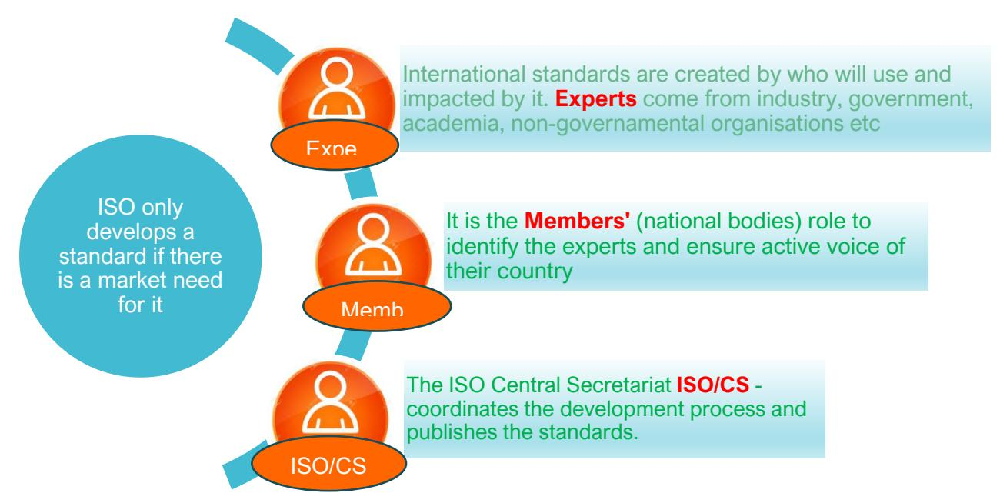
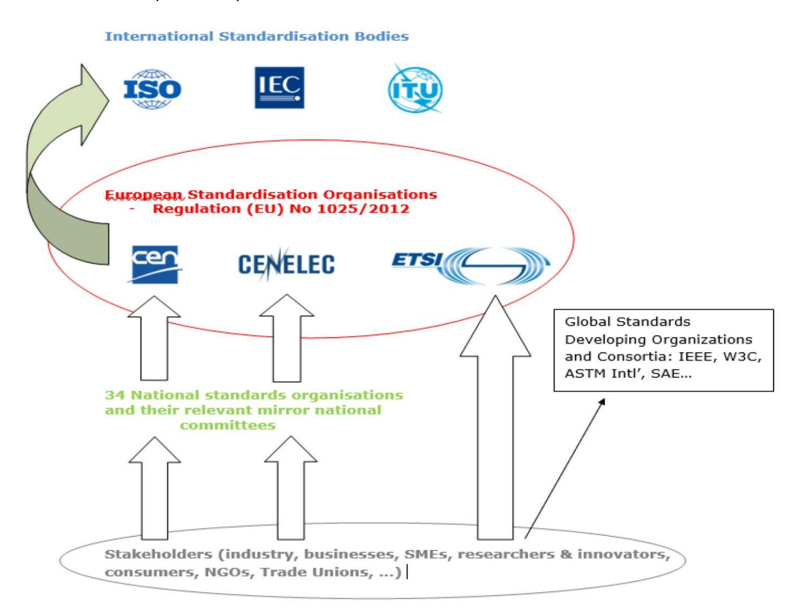
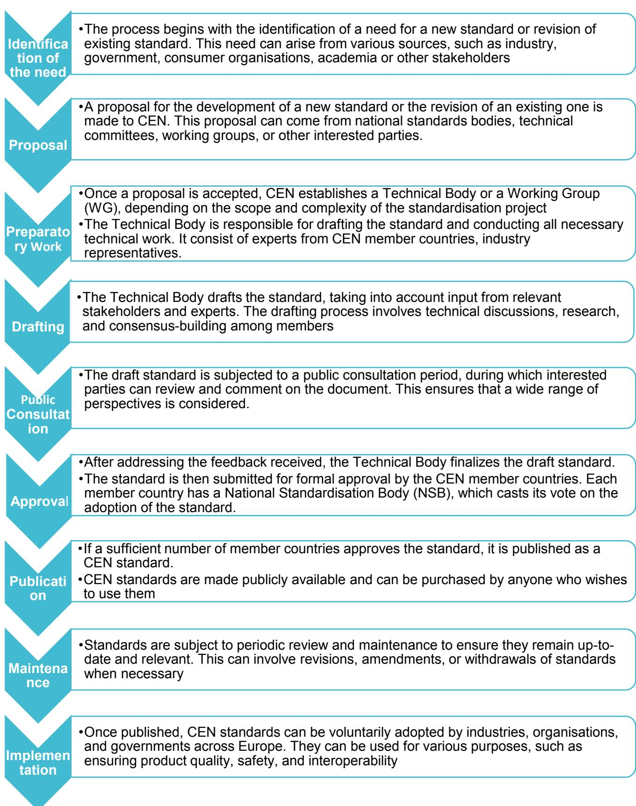
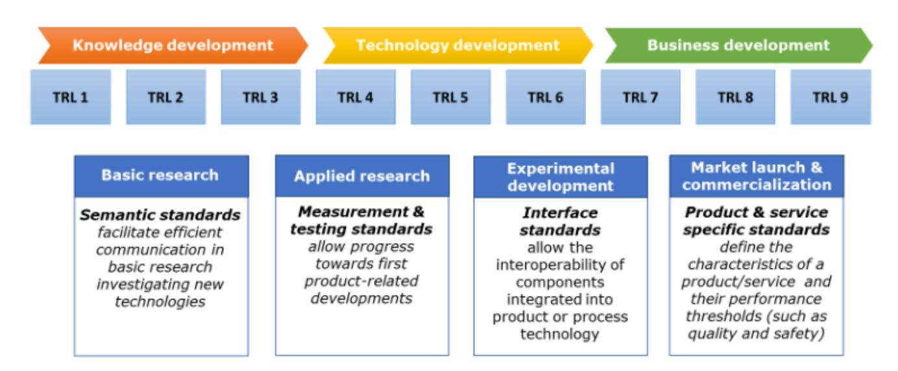
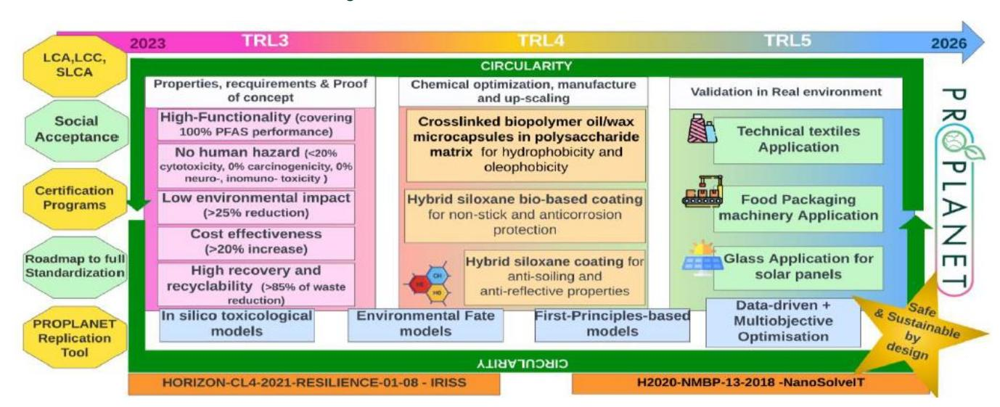
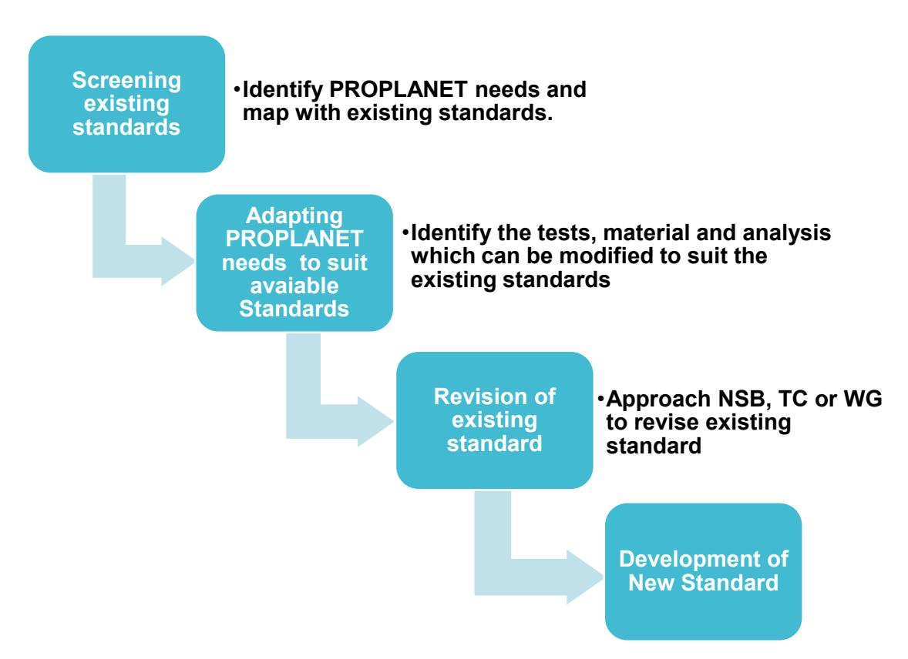

Funded by the European Union. Views and opinions expressed are however those of the author(s) only and do not necessarily reflect those of the European Union or HADEA. Neither the European Union nor the granting authority can be held responsible for them.

# Enhanced safe and sustainable coatings for supporting the planet

# Deliverable D1.3 Initial PROPLANET integration into standardisation process and roadmap for full standardisation [M12]

## **Deliverable Information**

| Responsible partner:       | RukaInnovation B.V.                        |
|----------------------------|--------------------------------------------|
| Work package No and Title: | WP1 : Set up PROPLANET activities and team |
| Contributing partner(s):   | TEC, NILU, REEPACK, PLK, HOLOSS, IDE       |
| Dissemination level:       | PU                                         |
| Type:                      | R                                          |
| Due date:                  | 31 December 2023                           |
| Version:                   | V3                                         |

# Project Profile

| Programme      | Horizon Europe                                                   |
|----------------|------------------------------------------------------------------|
| Call           | HORIZON-CL4-2022-RESILIENCE-01                                   |
| Topic          | HORIZON-CL4-2022-RESILIENCE-01-23                                |
| Number         | 101091842                                                        |
| Acronym        | PROPLANET                                                        |
| Name           | Enhanced Safe and Sustainable coatings for supporting the Planet |
| Start Date     | 1 January 2023                                                   |
| Duration       | 36 months                                                        |
| Type of action | HORIZON Research and Innovation Actions                          |
| authority      | European Health and Digital Executive Agency                     |
| Coordinator    | IDENER                                                           |

# Disclaimer

Funded by the European Union under GA number 10109184. Views and opinions expressed are however those of the author(s) only and do not necessarily reflect those of the European Union or HaDEA. Neither the European Union nor the granting authority can be held responsible for them.

© Copyright in this document remains vested with the PROPLANET Partners, 2023-2026

This deliverable contains original unpublished work except where clearly indicated otherwise. Acknowledgement of previously published material and of the work of others has been made through appropriate citation, quotation, or both. Reproduction is authorised provided the source is acknowledged.

# Executive Summary

PROPLANET, a diversified consortium, working together to develop non-toxic and environment-friendly novel coating materials, replacing PFAS-based coatings, thereby tackling the problem from a sustainable business perspective, enabling the protection of the environment, and ensuring human safety. The main goal of PROPLANET is to design and optimize the technology of three innovative coatings for industrial sectors: textile, food packaging, and glass. The developed novel coatings will comply with regulations, standards and certifications. This will facilitate the entry of products into the market via the fast lane.

The objective of this deliverable is to develop a detailed roadmap to achieve standardisation within PROPLANET activities. RUKA specially supported by NILU as an expert member for contacting European Committee for Standardisation (CEN) and Organisation for Economic Cooperation and Development (OECD), has worked together to develop the roadmap and to suggest the action plan for the gaps identified for full standardisation.

# Table of Contents

| Disclaimer                                     | Table of Contents                                                                                                                           |                                                                                               |
|------------------------------------------------|---------------------------------------------------------------------------------------------------------------------------------------------|-----------------------------------------------------------------------------------------------|
| 1. Introduction                                | .......................................................................................................................................9    |                                                                                               |
| 1.1.                                           | General...................................................................................................................................9 |                                                                                               |
| 2. Standardisation                             | .................................................................................................................................9          |                                                                                               |
| 2.1.                                           | Standards – An Insight............................................................................................................9         |                                                                                               |
| 2.2.                                           | Benefits of Standardisation for R&I projects..........................................................................10                    |                                                                                               |
| 2.3.                                           | Standardisation Landscape...................................................................................................10              |                                                                                               |
| 2.3.1.                                         | Global standardisation activities                                                                                                           | ........................................................................................10    |
| 2.3.2.                                         | European standardisation activities & process                                                                                               | ..................................................................12                          |
| 2.3.3.                                         | Creation or revision of standards in Europe.......................................................................13                        |                                                                                               |
| 2.1                                            | Standardisation needs for PROPLANET alignment based on TRL’s.....................................15                                         |                                                                                               |
| 3. PROPLANET Standardisation roadmap           |                                                                                                                                             | ..........................................................................................16  |
| 3.1.                                           | Methodology used for roadmap:                                                                                                               | ...........................................................................................16 |
| 3.2.                                           | PROPLANET roadmap.........................................................................................................16                |                                                                                               |
| 3.2.1.                                         | First Step: Screening & mapping.......................................................................................16                    |                                                                                               |
| 3.2.2.                                         | Second Step: Adapting needs to suit existing standards                                                                                      | ...................................................17                                         |
| 3.2.3.                                         | Third Step: Revision of existing standards.........................................................................17                       |                                                                                               |
| 3.2.4.                                         | Final Step: Development of a new standard                                                                                                   | ......................................................................17                      |
| 4. Standardisation activities within PROPLANET |                                                                                                                                             | ................................................................................17            |
| 4.1.                                           | Standards requirements for development of three innovative coatings                                                                         | .................................17                                                           |
| 4.2.                                           | PROPLANET’s three research lines                                                                                                            | .....................................................................................17       |
| 4.2.1.                                         | Crosslinked biopolymer oil/wax microcapsules in polysaccharide matrix for textiles                                                          | ..........17                                                                                  |
| 4.2.2.                                         | Hybrid siloxane bio-based coatings for food packaging machines                                                                              | .....................................18                                                       |
| 4.2.3.                                         | Hybrid siloxane coatings for low-maintenance glass..........................................................19                              |                                                                                               |
| 4.3.                                           | Standards requirements for EHS aspects of developed novel coatings                                                                          | ................................21                                                            |
| 4.4.                                           | Standards for LCA, s-LCA, LCC for developed novel coatings..............................................24                                  |                                                                                               |
| 5. Conclusion                                  | ......................................................................................................................................24    |                                                                                               |

# List of Figures

| Figure 1: Benefits of Standardisation.....                    | 10 |
|---------------------------------------------------------------|----|
| Figure 2: ISO creates new standards.....                      | 11 |
| Figure 3: Standards landscape.....                            | 12 |
| Figure 4: Standards and TRL's corelation.....                 | 15 |
| Figure 5: TRL growth of PROPLANET along Innovation cycle..... | 15 |
| Figure 6: Methodology used for Roadmap.....                   | 16 |

# List of Tables

| Table 1:Standards for water and oil repellence characteristics of coating on textiles | ..............................17                                                                  |
|---------------------------------------------------------------------------------------|---------------------------------------------------------------------------------------------------|
| Table 2: Standards for characteristics connected with the durability of the coating   | on textiles................18                                                                     |
| Table 3: Standards for procedures to perform validation tests                         | for coatings on FPM ...............................18                                             |
| Table 6: OECD TGs/GDs for health effects relevant for novel coatings                  | ..................................................21                                              |
| Table 7: Standards for LCA, s-LCA, LCC                                                | ...............................................................................................24 |

# Table of Abbreviations

| Abbreviation | Definition                                                           |
|--------------|----------------------------------------------------------------------|
| AATCC        | American Association of Textile Chemists and Colourists              |
| AS           | Anti soiling                                                         |
| ASTM         | American Society for Testing and Materials                           |
| CEN          | European Committee for Standardisation                               |
| CENELEC      | European Committee for Electrotechnical Standardisation              |
| CMR          | Carcinogenic, mutagenic or reprotoxic                                |
| EC           | European Commission                                                  |
| EFSA         | European Food Safety Authority                                       |
| EHS          | Environment health and safety                                        |
| EN           | European Standard                                                    |
| ETSI         | European Telecommunications Standards Institute                      |
| FCM          | Food contact materials                                               |
| FDA          | Food and Drug Administration                                         |
| GD           | Guidance Document                                                    |
| GLP          | Good Laboratory Practice                                             |
| IEC          | International Electrotechnical Commission                            |
| ISO          | International Standards Organisation                                 |
| ITU          | International Telecommunication Union                                |
| LCA          | Life cycle analysis assessment                                       |
| LCC          | Life cycle costing                                                   |
| MAD          | Mutual Acceptance of Data                                            |
| NSB          | National Standardisation Bodies                                      |
| OECD         | Organisation for Economic Cooperation and Development                |
| OP           | Optical properties                                                   |
| R&I          | Research & Innovation                                                |
| REACH        | Registration, evaluation, authorisation and restriction of chemicals |
| s-LCA        | Social life cycle analysis assessment                                |
| SOP          | Standard Operating Procedure                                         |
| SPSF         | Standard Project Submission Form                                     |
| SSbD         | Safety and Sustainability by Design                                  |
| TC           | Technical Committee                                                  |
| TG           | Test Guideline                                                       |
| TRL          | Technology readiness levels                                          |
| TSR          | Toyota System Research                                               |
| WG           | Working Group                                                        |
| WIP          | Work In Progress                                                     |
| WP           | Work Package                                                         |
| UNEP         | United Nations Environment Program                                   |

### 1. Introduction

#### 1.1. General

PROPLANET engages together to develop novel coating materials to substitute PFAS-based coatings, thereby tackling the problem from a sustainable business perspective, enabling the protection of the environment, and ensuring human safety. The main goal of PROPLANET is to design and optimize three innovative coatings for industrial sectors: textile, food packaging, and glass.

- 1) Crosslinked biopolymer oil/wax microcapsules in polysaccharide matrix (hydrophobic, oleophobic bio-based coating).
- 2) Hybrid siloxane biobased coating (non-stick and anticorrosion protection bio-based hybrid coating)
- 3) Hybrid siloxane coating (anti-soiling (AS) optical properties (OP) hybrid coating).

The value chain of each developed coating will be optimised starting from the raw material source to the end of life of the products, ensuring a circular economy. All coatings will be designed based on safe and sustainable by design (SSbD) concepts and optimised with mathematical computational tools such as firstprinciples-based models, in-silico models, environmental fate models, and sustainability assessments. The novel coatings will comply with regulations, standards and certifications. This will facilitate the technologically proven products to enter the business development with greater acceptance and relevance.

WP1 encompasses the regulatory alignment, compliance, standardisation and certification (T1.4). The scope of the present deliverable D1.3 aligns with T1.4.1 and will include the standardisation activities. The other sub tasks (T1.4.2), i.e. the certification activities will be addressed in D1.6 (HOLOSS), whereas the regulatory alignment and compliance will form the scope of D7.6 and D7.7 (EXELISIS).

The objective of this deliverable is to prepare the roadmap for the standardisation of the tests (including health and environment), procedures, processes, materials and analysis for the novel developed coatings by PROPLANET team. Standardisation of LCA, s-LCA, LCC for these novel coatings is also included in the given roadmap. R&I institutions (TEC, NILU, NIC, HOLOSS) have suggested the existing standards and industrial partners (AITEX, REEPACK, PLK, NM, RUKA) have confirmed those standards.

# 2.Standardisation

#### 2.1. Standards – An Insight

*Standards are agreed definitions or specifications of units, methods, tests products, processes or services. They provide people and organisations with a basis for mutual understanding. Standards are everywhere. They make life easier, safer and healthier for businesses and consumers. Standards are useful for optimising performance, ensuring the health and safety of consumers and workers, protecting the environment and enabling companies to comply with relevant laws and regulation[s](#page-8-4)1* .

A standard is a technical document prepared to be used as a rule, guideline, or definition. It is built via collaborative and consensus process for repeatable way of doing something. Standards are created by bringing together all interested stakeholders such as manufacturers, consumers and regulators of a particular material, product, process or service who agree on common specifications and/or procedures that respond to the needs of business, meet consumer expectations and guarantee acceptable levels of public safety. Standards facilitate innovation and promote the adoption of new technologies. Standardisation bodies operate at national, regional, or international level.

1 https://www.ds.dk/media/dydjrqeh/standards\_horizon2020.pdf

#### 2.2. Benefits of Standardisation for R&I projects

Standards lead to better business, better regulation, better products and services. Standardisation in R&I projects has an underpinning effect on greater acceptance of products in challenging markets. The benefits of integrating standards into research and innovation activities are two-fold. First, integration facilitates early identification of emerging science and technology where standardisation can play a role in their deployment and thereby ensures the timely inclusion of research results in standardisation activities. Second, bringing forth research and innovation-based ideas for the development of new standards can facilitate market acceptance of innovative products while increasing their relevance.

*Figure 1: Benefits of Standardisation[2](#page-9-4)*

#### 2.3. Standardisation Landscape

### 2.3.1.Global standardisation activities

Most global standardisation activities are performed by the International Standardisation Organisation (ISO, a non-governmental organisation) and by the International Electrotechnical Commission (IEC). Through their members from approximately 169 national standard bodies, they bring together experts to share knowledge and develop voluntary, consensus-based, market relevant international standards that support innovation and provide solutions to global challenges. There are 824 technical committees and subcommittees to work for standards development.

The Organisation for Economic Co-operation and Development (OECD) is an international organisation that works for safety testing of chemicals. The OECD test guidelines are a collection of the most relevant

Standards ensure comparability, compatibity and interoperability. After screening applicable standards, need for initiating revision of existing standard or creating a new standard can be identified.

Standards build trust. They eunsure that results comply with agreed customer expectaions and market requirements, generating confidence along the value chain.

Standards can be referenced in manufacturing, procurement and in regulation. They unlock the market development potential and unified procedures at International level

Standards are created collaborative process of openess, transperancy and consensus between various stakeholders. This leads to open and transperent innovation, which brings positive impact to R&I projects

2 https://www.cencenelec.eu/media/CEN-CENELEC/Get%20Involved/Research\_Innovation/standardisation-inresearch-projects.pdf

internationally agreed testing methods used by governments, industry and independent laboratories to assess the safety of chemicals.

#### 2.3.1.1. The ISO process for new standards

ISO standards are developed in response to needs recognized by market players whether they are industry, government, consumers or others. There are basically two steps: 1) consensus among experts and 2) consensus at the national level.

*Figure 2: ISO creates new standards*3 *[.](#page-10-1)*

3 https://www.iso.org/files/live/sites/isoorg/files/store/en/PUB100007.pdf

#### 2.3.2.European standardisation activities & process

European Standardisation is a key instrument for consolidation of the single market and for strengthening the competitiveness of EU industries, thereby creating the conditions for economic growth. European Standards are a valuable tool for facilitating cross-border trade, both within Europe's single market and with the rest of the world. They reduce unnecessary costs for both suppliers and purchasers of products and services, in the public and private sectors.

*Figure 3: Standards landscap[e](#page-11-2)*4

European standardisation bodies in an international context [\(Figure 3\)](#page-11-1). The European standardisation bodies are part of a dynamic ecosystem, a global standardisation community that is constantly evolving in response to the ever-changing needs of our societies, a fast-moving global economy and the rapid rate of technological innovation. CEN and CENELEC have dedicated agreements with the ISO and the IEC, promoting the benefits of European Standards to international trade and markets harmonisation.

4 https://www.cencenelec.eu/european-standardization/european-standards/types-of-deliverables/cen-cenelecguides/

# 2.3.3. Creation or revision of standards in Europe

Major steps for creation or revision of standards by CEN :

| <b>Identification of the need</b> | <ul style="list-style-type: none; padding-left: 0;"> <li>•The process begins with the identification of a need for a new standard or revision of existing standard. This need can arise from various sources, such as industry, government, consumer organisations, academia or other stakeholders</li> </ul>                                                                                                                  |
|-----------------------------------|--------------------------------------------------------------------------------------------------------------------------------------------------------------------------------------------------------------------------------------------------------------------------------------------------------------------------------------------------------------------------------------------------------------------------------|
| <b>Proposal</b>                   | <ul style="list-style-type: none; padding-left: 0;"> <li>•A proposal for the development of a new standard or the revision of an existing one is made to CEN. This proposal can come from national standards bodies, technical committees, working groups, or other interested parties.</li> </ul>                                                                                                                             |
| <b>Preparatory Work</b>           | <ul style="list-style-type: none; padding-left: 0;"> <li>•Once a proposal is accepted, CEN establishes a Technical Body or a Working Group (WG), depending on the scope and complexity of the standardisation project</li> <li>•The Technical Body is responsible for drafting the standard and conducting all necessary technical work. It consist of experts from CEN member countries, industry representatives.</li> </ul> |
| <b>Drafting</b>                   | <ul style="list-style-type: none; padding-left: 0;"> <li>•The Technical Body drafts the standard, taking into account input from relevant stakeholders and experts. The drafting process involves technical discussions, research, and consensus-building among members</li> </ul>                                                                                                                                             |
| <b>Public Consultation</b>        | <ul style="list-style-type: none; padding-left: 0;"> <li>•The draft standard is subjected to a public consultation period, during which interested parties can review and comment on the document. This ensures that a wide range of perspectives is considered.</li> </ul>                                                                                                                                                    |
| <b>Approval</b>                   |                                                                                                                                                                                                                                                                                                                                                                                                                                |

In the frame of their long-standing technical cooperation agreements with ISO (Vienna Agreement)[5](#page-13-0) and IEC (Frankfurt Agreement[\)](#page-13-1)6 , CEN and CENELEC continuously encourage the alignment of European Standards to international ones. This agreement facilitates the development of ISO and IEC standards to support European legislative and policy needs and is valuable tools for the promotion, dissemination and implementation of ISO and IEC Standards in Europe. These agreements avoid the duplication of work and structures, thus allow expertise to be focused and used in an efficient way to the benefit of international standardisation.

For safety testing of chemicals OECD (TGs) are used. The OECD TGs are a unique tool for assessing the potential effects of chemicals on human health and the environment. They are split into five sections:

- Section 1: Physical-Chemical properties;
- Section 2: Effects on Biotic Systems;
- Section 3:Environmental fate and behaviour;
- Section 4: Health Effects and
- Section 5: Other Test Guidelines.

Accepted internationally as standard methods for safety testing, the guidelines are used by professionals in industry, academia and government involved in the testing and assessment of chemicals (industrial chemicals, pesticides, personal care products, etc.). These guidelines are continuously expanded and updated to ensure they reflect the state-of-the-art science and techniques to meet member countries' regulatory needs. The guidelines are elaborated with the assistance of experts from regulatory agencies, academia, industry, environmental and animal welfare organisations. OECD TGs are covered by the OECD Mutual Acceptance of Data (MAD) system. Under this system, laboratory test results related to the safety of chemicals that are generated in accordance with *OECD TGs* and *OECD Principles of Good Laboratory Practices (GLP)* are accepted in all OECD countries and adherent countries for the purpose of safety assessment and other uses relating to the protection of human health and the environment.

The procedure for developing OECD TGs [is described in detail in the guidance document for the](https://www.oecd-ilibrary.org/environment/guidance-document-for-the-development-of-oecd-guidelines-for-testing-of-chemicals_9789264077928-en)  [development of OECD guidelines for testing of chemicals](https://www.oecd-ilibrary.org/environment/guidance-document-for-the-development-of-oecd-guidelines-for-testing-of-chemicals_9789264077928-en)7 . The main steps are as follows:

- Proposals SPSFs (Standard Project Submission Forms).
- [The proposals are evaluated by the working party](https://www.oecd.org/chemicalsafety/testing/oecdguidelinesforthetestingofchemicals.htm) of the national co-ordinators of the Test [Guidelines Programme \(WNT\), which is a subsidiary body of the OECD joint meeting of the](https://www.oecd.org/chemicalsafety/testing/oecdguidelinesforthetestingofchemicals.htm)  [chemicals committee and the working party on chemicals, pesticides and biotechnology.](https://www.oecd.org/chemicalsafety/testing/oecdguidelinesforthetestingofchemicals.htm)
- [The WNT decides on the priority and feasibility of the proposals and](https://www.oecd-ilibrary.org/environment/guidance-document-for-the-development-of-oecd-guidelines-for-testing-of-chemicals_9789264077928-en) assigns them to the [appropriate expert groups.](https://www.oecd-ilibrary.org/environment/guidance-document-for-the-development-of-oecd-guidelines-for-testing-of-chemicals_9789264077928-en)
- [The expert groups are responsible for drafting, reviewing and revising the TGs, based on the](https://www.oecd-ilibrary.org/environment/guidance-document-for-the-development-of-oecd-guidelines-for-testing-of-chemicals_9789264077928-en)  [available scientific data and validation studies.](https://www.oecd-ilibrary.org/environment/guidance-document-for-the-development-of-oecd-guidelines-for-testing-of-chemicals_9789264077928-en)
- The draft TGs [are circulated to the NCs and other stakeholders for comments and suggestions.](https://www.oecd-ilibrary.org/environment/guidance-document-for-the-development-of-oecd-guidelines-for-testing-of-chemicals_9789264077928-en)
- [The expert groups address the comments and suggestions and](https://www.oecd-ilibrary.org/environment/guidance-document-for-the-development-of-oecd-guidelines-for-testing-of-chemicals_9789264077928-en) submit the revised draft TGs to the [WNT for approval.](https://www.oecd-ilibrary.org/environment/guidance-document-for-the-development-of-oecd-guidelines-for-testing-of-chemicals_9789264077928-en)
- The WNT reviews the draft TGs [and decides whether to adopt them, reject them, or request further](https://www.oecd-ilibrary.org/environment/guidance-document-for-the-development-of-oecd-guidelines-for-testing-of-chemicals_9789264077928-en)  [revisions.](https://www.oecd-ilibrary.org/environment/guidance-document-for-the-development-of-oecd-guidelines-for-testing-of-chemicals_9789264077928-en)
- The adopted TGs [are published by the OECD and made available to the public.](https://www.oecd-ilibrary.org/environment/guidance-document-for-the-development-of-oecd-guidelines-for-testing-of-chemicals_9789264077928-en)

5 https://www.cencenelec.eu/about-cen/cen-and-iso-cooperation/

6 https://www.iec.ch/basecamp/frankfurt-agreement

7 GUIDANCE DOCUMENT FOR THE DEVELOPMENT OF OECD GUIDELINES FOR TESTING OF CHEMICALS ENVIRONMENT MONOGRAPH NO. 7[62. 1](https://one.oecd.org/document/OCDE/GD%2893%29110/En/pdf)995

The WNT meets annually. National co-ordinators represent regulatory authorities in OECD member countries and countries adhering to MAD; and nominate experts and scientists from research and regulatory areas to work together on developing tools and guidance**.**

#### 2.1 Standardisation needs for PROPLANET alignment based on TRL's

Standards support in all stages of innovation cycle as represented [Figure 4.](#page-14-1) At the same time, standardisation becomes more important and pronounced as the technology advances through the TRL scale. Standardisation can both guide the development of technology and facilitate its commercialisation and widespread adoption, especially at higher TRLs when the technology is more mature and ready for business deployment. When technology achieves a higher TRL, adherence to relevant standards becomes crucial for market acceptance and regulatory approval.

*Figure 4: Standards and TRL's corelatio[n](#page-14-3)*8

*Figure 5: TRL growth of PROPLANET along Innovation cycle*[9](#page-14-4)

8 https://www.cencenelec.eu/european-standardization/european-standards/types-of-deliverables/cen-cenelecguides/

The ambition of PROPLANET is to develop novel coatings and advance and validate the technology from TRL3→TRL5. Furthermore, roadmaps for regulatory compliance (IPR), standardisation and certification are identified and suggested. This is well represented in [Figure 5.](#page-14-2) PROPLANET starts at TRL3 with the development of novel SSbD coatings with enhanced functionality, including laboratory testing to show proof of concept (high performance, low toxicity and low environmental impact). The project ends at TRL5 with the validation in a relevant environment and exploitation actions. Coatings with minimum environmental and toxicological impact and enhanced functionality will be technologically validated by the end of this project.

In PROPLANET, the actions are more focussed on applied research, measurement and testing standards. However, a small portion will also address interface standards.

# 3. PROPLANET Standardisation roadmap

#### 3.1. Methodology used for roadmap:

Methodology used for roadmap is divided into four major steps as depicted in [Figure 6.](#page-15-4) It starts from screening and mapping existing standards and ending up with requirement (if) of new standards.

*Figure 6: Methodology used for Roadmap.*

#### 3.2. PROPLANET roadmap

#### 3.2.1.First Step: Screening & mapping

R&I institutions along with industries identified the needs of the standards. R&I institutions, experts & industry screened and identified existing standards which are relevant for the project, meeting the standards requirement. Screening included standards from different national, European, and international standardisation organisations and other specification-setting organisations like ISO, ASTM, CEN, OECD, FDA etc. Mapping was done with existing standards. This process listed multiple potential standards for

specific activities. Standards which are closest to the needs will be suggested in the 2nd report (M24) and final report (M36).Primary Result: Most of the tests, analysis and material standards were covered with the existing standards. Most of the Environmental and toxicological test & analysis standards were also covered with multiple potential standards except a couple of analysis.

#### 3.2.2.Second Step: Adapting needs to suit existing standards

Identified tests, materials and analysis which can be changed to suit available standards. R&I institutions and industry used experts' knowledge to project activities, wherever possible to adapt, so that existing standards can be used.

#### 3.2.3.Third Step: Revision of existing standards

Identified gaps with existing standards along the entire value chain-if the standards can be revised and used for project. Checked if some required standards are in development stage. Working groups or technical committees or national body will be contacted to initiate revision.

#### 3.2.4. Final Step: Development of a new standard

Identified the last gaps. By this step, it is known if any new standards are required. **One need or an opportunity is identified.** Scope of the project – to explore the filing of Standard Project Submission Form (SPSF) for the development of new standard. Teaming with other NSB to support the SPSF will also be explored.

# 4.Standardisation activities within PROPLANET

#### 4.1. Standards requirements for development of three innovative coatings

- 1) Crosslinked biopolymer oil/wax microcapsules in polysaccharide matrix (hydrophobic, oleophobic bio-based coating)
  - 2) Hybrid siloxane biobased coating (non-stick and anticorrosion protection bio-based hybrid coating)
  - 3) Hybrid siloxane coating (anti-soiling (AS) , optical properties (OP) hybrid coating).

With reference to PROPLANET deliverable D1.2, the tables will list the potential standards which will cover procedures, characteristics, test methods (including health, safety and environment), analysis, best practices, materials, products, processes etc related to these innovative coatings. The reports during M24 and M36 will zero-in the suggested test standards out of the possible standards for each activity wherein standards are required.

#### 4.2. PROPLANET's three research lines

#### 4.2.1.Crosslinked biopolymer oil/wax microcapsules in polysaccharide matrix for textiles

*Table 1:Standards for water and oil repellence characteristics of coating on textiles*

| Characteristic | Description of Standard requirement Possible Standards | Suggested Standards |
|----------------|--------------------------------------------------------|---------------------|
|                | Test method for Aqueous Liquid                         |                     |
|                | Repellence: Water/Alcohol Solution                     |                     |

| Oleophobicity Test method for        | oil Repellence:                        |
|--------------------------------------|----------------------------------------|
| Hydrocarbon resistance               | AATCC 118                              |
| Test method for                      | Aqueous Liquid                         |
| Repellence:                          | Water/Alcohol Solution                 |
| Superhydrophobicity                  | Determination of resistance to surface |
| Wetting (Spray test)                 | ISO 4920                               |
| Reference: Deliverable D2.1, Table 1 |                                        |

*Table 2: Standards for characteristics connected with the durability of the coating on textiles.*

| Characteristic   | Description of Standard requirement Possible Standards Suggested Standards |
|------------------|----------------------------------------------------------------------------|
|                  | ASTM D4966-98                                                              |
| Adhesion         | ASTM D 751-06                                                              |
| Washing fastness | ISO 6330                                                                   |

Reference: Deliverable D2.1, Table 2

### 4.2.2.Hybrid siloxane bio-based coatings for food packaging machines

*Table 3: Standards for procedures to perform validation tests for coatings on FPM*

| Characteristic | Description of Standard requirement Possible Standards | Suggested Standards |
|----------------|--------------------------------------------------------|---------------------|
| Adhesion       | OR Scratch Test ISO 2409                               |                     |
| Surface        | Thermal                                                |                     |
|                | cycle: heat the plate at 250 o C for 30                |                     |
| Non-sticking   | of                                                     |                     |
|                | 250 o C for 30 min, then cool down.                    |                     |

| Scratch resistance of                                    |                                       |
|----------------------------------------------------------|---------------------------------------|
| External Surface in                                      |                                       |
| treatment (as above).                                    | ASTM G99                              |
|                                                          | benchmarks to be                      |
| Resistance to cleaning Aggressive cleaning and brushing. | ISO 14159:2015                        |
|                                                          | FDA approval,                         |
| Corrosion test                                           | Immersion in corrosion solutions used |
| for cleaning.                                            | ISO 9227:2017                         |
| Reference: Deliverable D2.1, Table 5                     |                                       |

#### 4.2.3.Hybrid siloxane coatings for low-maintenance glass

*Table 4: Standards for technical product specifications and requirements for glass products (shower doors)*

| Characteristic Description of Standard requirement     | Possible Standards Suggested Standards |
|--------------------------------------------------------|----------------------------------------|
| Definitions and                                        |                                        |
| Glass in building -                                    | Coated glass Part -1                   |
| Glass in building -                                    | Coated glass - Part 2                  |
| Main coating                                           |                                        |
| determined                                             | EN 1096-1:2012                         |
| Main coating                                           |                                        |
| Good                                                   | adhesion, as determined by             |
| scratch test, cross-cut tests                          | ISO 2409                               |
| (Sessil drop technique)                                | ASTM D7334                             |
| Optical requirements Test on HAZE before and after the |                                        |
| coating                                                | ASTM D1003-61                          |

| Durability requirements Condensation resistance | EN 1096-2:2012 |
|-------------------------------------------------|----------------|
| Durability requirements Acid resistance         | EN 1096-2:2012 |
| Neutral salt spray resistance                   | EN 1096-2:2012 |
| Abrasion resistance                             | EN 1096-       |
|                                                 | 2:2012 Annex E |
| Additional durability                           |                |
| Cleaning tests with typical                     | shower         |
| cleaning products                               | ASTM 1308      |

*Table 5: Standards for technical product specifications and requirements for glass products (Automotive window glasses)*

| Characteristic Description of Standard requirement  | Possible Standards Suggested Standards |
|-----------------------------------------------------|----------------------------------------|
| Engineering Standards TOYOTA standards were used as | main                                   |
| reference                                           | TSR7503G                               |
| Main coating                                        |                                        |
| determined                                          | EN 1096-1:2012                         |
| Main coating                                        |                                        |
| Good adhesion, as                                   | determined by                          |
| scratch test, cross-cut tests                       | ISO 2409                               |
| a) Water contact angle (WCA)                        |                                        |
| b) Rolling/sliding angle (SA)                       |                                        |
|                                                     | a) ASTM D7334                          |
|                                                     | b) TSR7503G                            |
| Optical requirements a) Light transmittance         |                                        |
| b) Haze                                             |                                        |
|                                                     | a) EN-410, EN                         |
|                                                     | b) ASTM D1003-                         |
| Durability requirements Condensation resistance     | EN 1096-2:2012                         |
| Neutral salt spray resistance                       | EN 1096-2:2012                         |

|            | Abrasion resistance         | EN 1096-       |
|------------|-----------------------------|----------------|
|            |                             | 2:2012 Annex E |
| Additional | durability                  |                |
|            | a) UV weather tests         |                |
|            | b) Environmental cycle test |                |
|            |                             | a) ISO 4892-2  |
|            |                             | b) ISO 11998   |

Reference: Deliverable D2.1, Table 6&7

### 4.3. Standards requirements for EHS aspects of developed novel coatings

With REACH as a guide, the scope of PROPLANET toxicological requirements for all three novel coatings is focused on the human hazard. For the hybrid siloxane bio-based coatings for food packaging machinery application, where the coating will come in contact with food during the packaging process, the European Food Safety Authority (EFSA, 200815) requirements for hazard assessment of a substance to be used in plastic food contact materials (FCM) has also been considered. In deliverable D2.1 requirements for coatings and substrates, the relevant standards for toxicity studies were first identified and are reported here.

The OECD TGs/GDs are selected as the preferred standards to be used for health effects endpoints (a non-exhaustive summary is listed in Table 6) as indicated by ECHA[10,](#page-20-2)[11](#page-20-3). As already highlighted above, OECD TGs are openly available, internationally accepted as standard methods for safety testing, and covered by MAD system (results generated in accordance with OECD TGs and GLP principles are accepted in all OECD and adherent countries for the purpose of safety assessment). ISO standards are also here considered, although with a secondary relevance compared to OECD TGs.

When no OECD TG/GD is available for a specific endpoint, methods recognised and standardised by the scientific community are suggested for testing in PROPLANET, and a future standardisation need is identified. This includes *in vitro* assays in substitution to *in vivo* testing, which is a main strategy needed in view of the SSbD approach.

The main toxicological requirement for PROPLANET novel coating materials is that no CMR substances will be used for the development of novel coatings.

*Table 6: OECD TGs/GDs for health effects relevant for novel coatings*

| Characteristic Description of Standard requirement Possible |      | Test |
|-------------------------------------------------------------|------|------|
| Skin irritation or skin                                     |      |      |
| TG                                                          | 404, | TG   |
| TG                                                          | 435, | TG   |
| TG                                                          | 405, | TG   |
| TG                                                          | 460, | TG   |
| TG                                                          | 494, | TG   |

10 https://echa.europa.eu/standard-information-requirements-recommendations

11 Guidance on information requirements and chemical safety assessment Part B: Hazard assessment, ECHA, 2011

| TG                                      | 406, TG    |
|-----------------------------------------|------------|
| 429,                                    | TG         |
| 442A,                                   | TG         |
| 442B,                                   | TG         |
| 442C,                                   | TG         |
| 442D,                                   | TG         |
| In vitro Comet assay (genotoxicity):    |            |
| No TG/DG available. Work towards        |            |
| progress (WIP). The activities were     |            |
| initiated by NILU and others as part of |            |
| the H2020 project RiskGONE with         |            |
| studies. Communication was              |            |
| at OECD (e.g. UK and Norway) to get     |            |
| support to start a new SPSF.            |            |
| TG 471                                  | #          |
| TG                                      | 476, TG    |
| TG 487                                  | #          |
| 488                                     | #          |
|                                         | , TG       |
| 489                                     | #          |
| Acute toxicity                          |            |
| TG                                      | 402, TG    |
| TG                                      | 423, TG    |
| TG                                      | 433, TG    |
| TG                                      | 414, TG    |
| TG 421                                  | #          |
| 422                                     | #          |
| TG                                      | 407, TG    |
| 408                                     | #, TG 409, |
| TG                                      | 410, TG    |
| TG                                      | 413, TG    |
| 4.94: IATA on Non-Genotoxic             |            |
| Carcinogens; lead: UK; NILU is          |            |
| contributing to this activity also      |            |
| through its participation to the        |            |
| TG                                      | 451, TG    |
| 453                                     | #          |

|               |                      |         |          |  |  | TG 418, TG           |
|---------------|----------------------|---------|----------|--|--|----------------------|
|               |                      |         |          |  |  | 419, TG 424 #        |
| Cell toxicity | (damage to           |         |          |  |  |                      |
| cell/cell     | membrane,            |         |          |  |  |                      |
|               | Need for TGs/GDs for |         | in vitro |  |  | assays               |
|               | for cytotoxicity,    | e.g.    | Alamar   |  |  | Blue                 |
|               | assay, Colony        | Forming |          |  |  | Efficiency           |
|               | (CFE) assay.         |         |          |  |  |                      |
|               |                      |         |          |  |  | methods for in vitro |
|               |                      |         |          |  |  | assays for           |
|               |                      |         |          |  |  | cytotoxicity: New    |
|               |                      |         |          |  |  | Partly relevant      |
|               |                      |         |          |  |  | focused on           |
|               |                      |         |          |  |  | GD 129: in           |
|               |                      |         |          |  |  | data to              |
|               |                      |         |          |  |  | for in vivo          |
|               |                      |         |          |  |  | No TGs/DGs           |
| Reactivity    | (catalytic           |         |          |  |  |                      |
| activity,     | chemical             |         |          |  |  |                      |
| reactivity,   | photocatalytic       |         |          |  |  |                      |
| activity      | or radical           |         |          |  |  |                      |
|               |                      |         |          |  |  | TG 230, TG           |
|               |                      |         |          |  |  | TG 440, TG           |
|               |                      |         |          |  |  | TG 456, TG           |

Reference: Deliverable D2.1, Table 9

#### 4.4. Standards for LCA, s-LCA, LCC for developed novel coatings

Life cycle sustainability assessment will be dealt with three dimensions – environmental (LCA), social (s-LCA) and economic (LCC). [Table 7](#page-23-2) lists the possible industry standards and the suggested standards to be used.

*Table 7: Standards for LCA, s-LCA, LCC* 

| Characteristic | Description of Standard requirement Possible Standards Suggested Standards |
|----------------|----------------------------------------------------------------------------|
| LCA            | ISO 14040, ISO                                                             |
|                | 14044, ISO 14006                                                           |
| s-LCA          | UNEP (2020)                                                                |
| LCC            | No requirement as Orienting Project is                                     |
| Eco-design     | ISO 14006                                                                  |

# 5. Conclusion

This deliverable drafted the roadmap for integration of standards within PROPLANET. It has listed the standards of potential relevance for the novel coatings developed in the project and some changes in the project needs to suite the existing standards. Need for changes in existing standards and requirement of new ones are mapped out. The research partners of the consortium (NIC, TEC, NILU) collaborated with the industry partners (AITEX, REEPACK, PLK) and experts (RUKA, HOLOSS) to develop the roadmap. NILU and RUKA will work together to initiate the procedure for changes in existing standards, interact with related NSB technical committee, and explore to prepare SPSF for new standards requirement.

The list and tables will further be revised as the project develops (during M24 and M36), and the M36 report will list the suggested standards out of the potential standards.