Funded by the European Union. Views and opinions expressed are however those of the author(s) only and do not necessarily reflect those of the European Union or HADEA. Neither the European Union nor the granting authority can be held responsible for them.

# Enhanced safe and sustainable coatings for supporting the planet

# Deliverable D.6.2 LCA, SLCA, and LCC assessments

## **Deliverable Information**

| Responsible partner:       | HOLOSS                                                        |
|----------------------------|---------------------------------------------------------------|
| Work package No and Title: | 6 – Sustainability and Toxicological assessments for Safe and |
| Contributing partner(s):   | IDE, TEC, NIC, AIT, REE, PLK                                  |
| Dissemination level:       | PU – Public                                                   |
| Type:                      | R – Document, report                                          |
| Due date:                  | 31/03/2024                                                    |
| Submission date:           | 28/03/2024                                                    |
| Version:                   | V4                                                            |

# Project Profile

| Programme          | Horizon Europe                                                   |
|--------------------|------------------------------------------------------------------|
| Call               | HORIZON-CL4-2022-RESILIENCE-01                                   |
| Topic              | HORIZON-CL4-2022-RESILIENCE-01-23                                |
| Number             | 101091842                                                        |
| Acronym            | PROPLANET                                                        |
| Name               | Enhanced Safe and Sustainable coatings for supporting the Planet |
| Start Date         | 1 January 2023                                                   |
| Duration           | 36 months                                                        |
| Type of action     | HORIZON Research and Innovation Actions                          |
| Granting authority | European Health and Digital Executive Agency                     |
| Coordinator        | IDENER                                                           |

# Executive Summary

The main objective of the PROPLANET project is the development and optimisation of three innovative coatings applicable in various industrial sectors, namely textile, food packaging machinery and glass. These innovative coatings aim to be safe and sustainable by design (SSbD), significantly reducing ecological footprints, ensuring non-toxicity, and improving recovery and recyclability. Along these lines, the project is developing three coatings with specific properties for different uses. In the first case study, hydrophobic and oleophobic coatings are developed that offer greater durability for textiles. In the second, coatings that meet non-stick and anti-corrosion requirements for food packaging machine parts. Finally, low-maintenance, anti-scratch and anti-reflective siloxane coatings for the glass sector, proving their effectiveness in architectural and automotive applications.

Work Package (WP) 6 of the PROPLANET project is fundamental in the quest to innovate in the realm of coatings, ensuring they are both safe and sustainable. Therefore, it is committed to establishing a robust framework that includes toxicological and sustainability assessments, with the goal of creating a comprehensive methodology that integrates sustainability analysis and eco-design principles. Deliverable D6.2, titled "LCA, sLCA, and LCC assessments," was initially conceived to outline the methodologies for Life Cycle Assessment (LCA), Life Cycle Costing (LCC), and Social Life Cycle Assessment (sLCA). The methodologies were revised, anchored on the most recent advancements in scientific literature and European projects. The ambition was to set a foundational methodology for assessing the sustainability of the coatings, focusing primarily on their manufacture. This groundwork will pave the way towards D6.3 "LCA, sLCA, and LCC assessments - M36," where a comprehensive sustainability analysis of the entire product value chain will be showcased.

In line with the project's roadmap, the methodology for data collection was presented and verified in MS1, titled "LCA inventory for manufacturing system - M8". This was followed by the introduction of an ecodesign route in MS2, "Eco-design of coatings - M10," aimed at assisting manufacturers in meeting the sustainability targets established in the development of WP 2, 3, and 4.

Nevertheless, the exploration undertaken in D6.2 surpassed initially its original scope. Not only was the data gathered directly from manufacturers, but it was also processed to set forth more ambitious objectives for each dimension than initially planned. This proactive approach not only fulfilled but also exceeded the goals of D6.2, providing a robust foundation for the subsequent work in D6.3. By advancing further in the data processing and establishing these heightened objectives, D6.2 has effectively laid a more solid pathway towards D6.3. This ensures that the project is well-positioned to deliver on its promise of a comprehensive sustainable assessment of the coatings' value chain.

This enhanced ambition within D6.2 signifies a commitment to not only adhering to the established methodologies but also to pushing the boundaries of what was anticipated. The deliverable serves as a testament to the project's dedication to sustainability and its willingness to exceed expectations in pursuit of optimising the coatings' value chain for enhanced environmental, economic, and social outcomes.

# Table of Contents

| Table of Contents |                                                                                                                                                       |
|-------------------|-------------------------------------------------------------------------------------------------------------------------------------------------------|
| 1.                | Introduction .......................................................................................................................................9 |
| 2.                | Life Cycle Sustainability Assessment Methodology ...........................................................................9                         |
| 2.1.              | LCA..........................................................................................................................................10       |
| 2.2.              | LCC..........................................................................................................................................11       |
| 2.3.              | sLCA ........................................................................................................................................12       |
| 3.                | Framework ......................................................................................................................................13    |
| 3.1.              | Goal and Scope .......................................................................................................................13              |
| 3.1.1.            | LCA...................................................................................................................................13              |
| 3.1.2.            | LCC...................................................................................................................................14              |
| 3.1.3.            | sLCA.................................................................................................................................15               |
| 3.2.              | Life Cycle Inventory..................................................................................................................16              |
| 3.2.1.            | LCA...................................................................................................................................16              |
| 3.2.2.            | LCC...................................................................................................................................16              |
| 3.2.3.            | sLCA.................................................................................................................................19               |
| 3.3.              | Life Cycle Impact Assessment..................................................................................................20                      |
| 3.3.1.            | LCA...................................................................................................................................20              |
| 3.3.2.            | LCC...................................................................................................................................20              |
| 3.3.3.            | sLCA.................................................................................................................................21               |
| 3.4.              | Life Cycle Interpretation............................................................................................................22               |
| 3.4.1.            | LCA...................................................................................................................................22              |
| 3.4.2.            | LCC...................................................................................................................................22              |
| 3.4.3.            | sLCA.................................................................................................................................23               |
| 4.                | LCSA approach at M15 for the PROPLANET Project......................................................................23                                |
| 5.                | PROPLANET and the LCSA Approach: Methodological application and insights ............................24                                               |
| 5.1.              | Goal and Scope .......................................................................................................................24              |
| 5.2.              | Life Cycle Inventory..................................................................................................................25              |
| 5.1.              | LCA..........................................................................................................................................25       |
| 5.2.              | LCC..........................................................................................................................................25       |
| 5.3.              | sLCA ........................................................................................................................................26       |

| 5.4.   | Life Cycle Impact Assessment..................................................................................................26                   |
|--------|----------------------------------------------------------------------------------------------------------------------------------------------------|
| 5.4.1. | LCA...................................................................................................................................26           |
| 5.4.2. | LCC...................................................................................................................................30           |
| 5.4.3. | sLCA.................................................................................................................................31            |
| 5.5.   | Interpretation............................................................................................................................35       |
| 5.5.1. | LCA...................................................................................................................................35           |
| 5.5.2. | LCC...................................................................................................................................39           |
| 5.5.3. | sLCA.................................................................................................................................40            |
| 6.     | Data Gaps in the PROPLANET LCSA.............................................................................................42                     |
| 7.     | Conclusions.....................................................................................................................................43 |

# List of Figures

| Figure 1 -                   | Life Cycle Sustainability Assessment. ....................................................................................10               |
|------------------------------|--------------------------------------------------------------------------------------------------------------------------------------------|
| Figure 2                     | Steps of ISO 14040 ................................................................................................................13      |
| Figure 3                     | System boundaries.................................................................................................................14       |
| Figure 4 -                   | Determinants of goal and scope of LCC .................................................................................15                  |
| Figure 5                     | – Stakeholders' groups .............................................................................................................16     |
| Figure 6                     | Flow diagram for the LCC assessment (Source: ORIENTING deliverable2 .3--29) ................17                                             |
| Figure 7                     | General structure of the direct quantification of the indicators (ORIENTING, 2021)................19                                       |
| Figure 8                     | Economic indicators used in LCC...........................................................................................21               |
| Figure 9                     | Impact categories that are covered in the ReCiPe2016 method and their relation to the areas of                                             |
| from M.A.J. Huijbregts, 2017 | ..................................................................................................................28                       |
| Figure 10                    | Table taken from Mattioda, Rosana Adami (2020). Results of the application of sLCA to biofuels                                             |
| and stakeholders             | ....................................................................................................................................34     |
| Figure 11                    | Table taken from Spierling et al. (2018) assessing social issues related to five stakeholder                                               |
| Figure 12                    | Results of the ReCiPe end-point method (H) for the coating applied to the textile ................36                                       |
| Figure 13                    | Results of the ReCiPe end-point method (H) for the coating applied to the packaging machine                                                |
| Figure 14 -                  | Results of the ReCiPe end-point method (H) for the coating applied to the glass .................37                                        |
| Figure 15 -                  | Results of the three case studies of the ReCiPe midpoint method (H), normalisation model 38                                                |
| Figure 16                    | Results of the three case studies of the PEF midpoint method, normalisation model............38                                            |
| Figure 17                    | Operational costs of PROPLANET coatings .........................................................................39                        |
| Figure 18                    | Child labour..........................................................................................................................40   |
| Figure 19                    | Fair salary ............................................................................................................................41 |
| Figure 20                    | Health and Safety.................................................................................................................41       |
| Figure 21                    | Forced labour.......................................................................................................................41     |
| Figure                       | 22 Local employment ................................................................................................................42     |

# List of Tables

| Table 1 | The Cost Breakdown Structure (CBS) from ORIENTING project involves ...............................17                 |
|---------|----------------------------------------------------------------------------------------------------------------------|
| Table 2 | at PSILCA database v.3 documentation (2020) “Characterization factors for the impact                                 |
| Table 3 | Midpoint impact category of Product Environmental Footprint method.....................................27            |
| Table 4 | Midpoint impact category from ReCiPe method.......................................................................29 |
| Table 5 | Overview of the endpoint categories, indicators and characterization 47                                              |
| Table 6 | Operational expenditure of the lab scale manufacture of PROPLANET coatings.....................30                    |
| Table 7 | Results of the analysis of three studies in the textile industry and its subcategories ................31            |

# Table of Abbreviations

| Abbreviation | Definition                                            |
|--------------|-------------------------------------------------------|
| CL           | Child Labour                                          |
| c-LCC        | Conventional LCC                                      |
| CN           | China                                                 |
| DALY         | Disability adjusted life years                        |
| e-LCC        | Environmental LCC                                     |
| ES           | Spain                                                 |
| EU           | European Union                                        |
| FA           | Fatal Accidents                                       |
| FL           | Forced Labour                                         |
| FR           | France                                                |
| FS           | Fair Salary                                           |
| FU           | Functional unit                                       |
| GB           | United Kingdom                                        |
| ICCA         | International Council of Chemical Associations        |
| IPA          | Impact Pathway Assessment                             |
| ISO          | International Standardization Organization            |
| LCA          | Life Cycle Assessment                                 |
| LCC          | Life Cycle Costing                                    |
| LCIA         | Life Cycle Impact Assessment                          |
| LCSA         | Life Cycle Sustainable Assessment                     |
| Med          | Medium                                                |
| OECD         | Organisation for Economic Cooperation and Development |
| PSILCA       | Product Social Impact Life Cycle Assessment           |
| RSA          | Reference Scale Assessment                            |
| SDG          | Sustainable Development Goals                         |
| SETAC        | Society of Environmental Toxicology and Chemistry     |
| SHDB         | Social Hotspot Database                               |
| sLCA         | Social Life Cycle Assessment                          |
| s-LCC        | Societal LCC                                          |
| UL           | Unemployment                                          |
| UNEP         | United Nations Environment Programme                  |

# 1. Introduction

Life Cycle Sustainability Assessment (LCSA) refers to the evaluations conducted in the three domains of sustainability, which are LCA for environmental, LCC for economic and sLCA for social. LCA is an analytical tool that captures the overall environmental impacts of a product, process, or human activity, from raw material acquisition, through production and use, to waste management. Among environmental management tools, LCA is the only one with such a comprehensive view.1 LCC is the process of identifying and documenting all the costs involved during the useful life of an asset. Its aim is to calculate not only the costs of acquiring raw materials, but also the costs of operation, maintenance, and final disposal. This helps decision-makers improve the economic indicators of the system's life cycle. 2 Finally, sLCA is a useful tool for companies to identify and assess the possible social impacts throughout the life cycle of a product or service on various stakeholders, such as workers, local communities, and consumers. This type of assessment is increasingly important to ensure holistic sustainability evaluations. 3,4

The European Union (EU) has a European Platform on LCA that supports EU policies by developing methods and approaches to improve the soundness and broad applicability of LCA. This latter is listed in the "Better Regulation" toolbox among the methods that can support policy impact assessment. The 2023 list of tools presents LCA as tool 66 "Life Cycle Assessment". This tool addresses the three dimensions of sustainability (environmental, social, and economic), which are considered in an integrated and holistic way, adopting the life cycle concept.5, 6

According to the list of tools, LCA is the oldest of the three dimensions of sustainability and supports the holistic analysis carried out in LCSA. LCA has been mentioned as a main principle in many EU policies (such as "Integrated Product Policy", "Thematic Strategy on the Prevention and Recycling of Waste", "A Sustainable Bioeconomy for Europe", "Building the Single Market for Green Products" for example) and international policies (such as UNEP and UNEP-SETAC) since the 90s. Currently, LCA is a key player in several policy initiatives of the European Green Deal and others such as "A new Circular Economy Action Plan For a cleaner and more competitive Europe", "A Farm to Fork Strategy for a fair, healthy and environmentally-friendly food system", "Chemicals Strategy for Sustainability Towards a Toxic-Free Environment" and others.[5](#page-8-2)[,6](#page-8-3)

# 2. Life Cycle Sustainability Assessment Methodology

The LCSA methodology, including the three dimensions, was first presented in a method called 'Produktlinienanalyse' by the Oeko-Institut7 in Germany in 1987 and discussed at the first SETAC Europe LCA symposium in 1991. The term LCSA was first used by Zhou *et al*. 8 in 2007, where it referred only to climate change, the impact of resource depletion on LCA combined with LCC, where the social dimension, which integrates the three pillars of sustainability, was not addressed. There are currently two accepted definitions: (1) Klöpffer and Renner9 in 2007 describe LCSA as a set of environmental, economic and social assessments, represented as LCSA=LCA+LCC+sLCA [\(Figure 1\)](#page-9-1); and (2) Guinée *et al.* in 2011. This latter defined LCSA as a transdisciplinary framework that addresses sustainability issues from the life cycle to the knowledge needed to address them. Guinée *et al.* (2011) consider that the assessment made

1 Curran. M.A. Life Cycle Assessment. 2013 - [link](https://www.sciencedirect.com/science/article/pii/S2211339813000221)

2 França. W. T. et al. Integrating life cycle assessment and life cycle cost. 2021 - [link](https://link.springer.com/article/10.1007/s11367-020-01857-y)

3 UNEP. Guidelines for social life cycle assessment of products - [link](https://www.unep.org/resources/report/guidelines-social-life-cycle-assessment-products)

4 Zamagni. A. Et al. Theory and practice on social life cycle assessment. 2021 - [link](https://link.springer.com/chapter/10.1007/978-3-030-78044-9_7)

5 Joint research Centre (JRC) – European Commission. LCA4Regions Conference. 2021 - [link](https://projects2014-2020.interregeurope.eu/fileadmin/user_upload/tx_tevprojects/library/file_1638135375.pdf)

6 European Commission. Methodologies for analysing impacts in impact assessments, evaluations, and fitness checks. 'Better regulation' toolbox 2023. - [link](https://commission.europa.eu/document/download/0d32ee11-92da-434d-9c86-fd4579d95dc6_en?filename=BRT-2023-Chapter%208-Methodologies%20for%20analysing%20impacts%20in%20IAs%20evaluations%20and%20fitness%20checks_0.pdf)

7 W. ökologische (Ed.). Produktlinienanalyse: Bedürfnisse, Produkte und ihre Folgen . Köln: Kölner Volksblattverlag.1987

8 Zhou, Z., Jiang, H., & Qin, L. Life cycle sustainability assessment of fuels. Fuel, 86, 256–263. 2007

9 Klöpffer, W., & Renner, I. Lebenszyklusbasierte Nachhaltigkeitsbewertung von Produkten. TaTuP Zeitschrift des ITAS zur Technikfolgenabschätzung, 16 (3), 32–38. 2007

so far can be deepened to include relations besides technological ones, such as physical, economic, and behavioural relations.10,11

The ORIENTING project12, developed as part of the Horizon 2020 EU's research and innovation funding programme from 2014-2020, was focused on developing an operational, robust, and comprehensive LCSA methodology for products. There are some prerequisites for using the LCSA methodology, such as that the system boundaries in all three dimensions must be consistent. The inventories with the same boundary cover the same topics, especially in the LCA and LCC analyses. In the sLCA, however, the topics covered are more demanding in relation to the regional resolution but manage to respect the boundaries established in the objective.[11,](#page-9-2)[12](#page-9-3)

The practical application of the LCSA requires the integration of various methods, tools, and disciplines. The lack of understanding of the complex interactions between sustainability indicators and the individual approach to the three dimensions are the main shortcomings of the LCSA.13,14

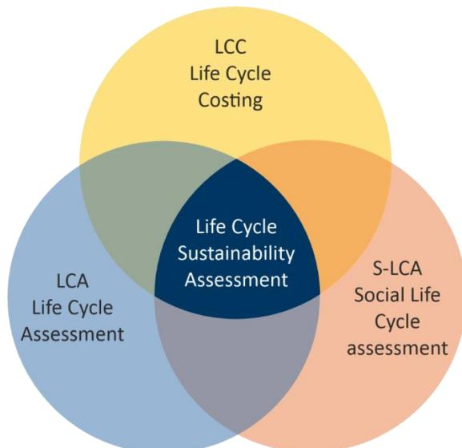

*Figure 1 - Life Cycle Sustainability Assessment.*

## 2.1. LCA

Initially, universities primarily conducted LCA studies for companies, using them internally and maintaining minimal communication with stakeholders. In the 1980s and 1990s, methodological development and international collaboration and coordination in the scientific community increased, leading to more and more methods being developed at universities15 . Nowadays, it is a mature environmental assessment methodology, internationally standardised by ISO14040 (2006) 16 and ISO14044 (2018) 17. LCA aims for an integrated environmental assessment of products and organisations throughout their supply chain, taking into account the impacts associated with human health, ecosystem quality and resource consumption[.](#page-8-3)6

LCA approaches have been increasingly mentioned in policies over the years, from the 1992 Ecolabelling Regulation18 to the 2019 European Green Deal19 . Organisations also employ LCA for product optimisation

10 Guinée, J. Life Cycle Sustainability Assessment: What Is It and What Are Its Challenges?. In: Clift, R., Druckman, A. (eds) Taking Stock of Industrial Ecology. Springer, Cham. 2016 - [link](https://doi.org/10.1007/978-3-319-20571-7_3)

11 Klöpffer, W. Life cycle sustainability assessment of products. Int J Life Cycle Assess 13, 89–95. 2008 - [link](https://doi.org/10.1065/lca2008.02.376)

12 Deliverable 2.3 Affiliation: EU - "ORIENTING" LCSA methodology to be implemented in WP4 demonstrations (2023) - [link](https://orienting.eu/wp-content/uploads/2022/12/D2.3-LCSA-methodology-implemented-WP4-demonstrations.pdf)

13 Costa, D. et al. A systematic review of life cycle sustainability assessment. 2019 - [link](https://www.sciencedirect.com/science/article/pii/S0048969719324891?via=ihub)

14 Onat, N. C., et al. Systems Thinking for Life Cycle Sustainability Assessment. 2017 - [link](https://www.mdpi.com/2071-1050/9/5/706)

15 X. Life Cycle Assessment. 2018 - [link](https://link.springer.com/book/10.1007/978-3-319-56475-3)

16 ISO 14040. Environmental Management—Life Cycle Assessment—Principles and Framework; 2006 - [link](http://www.iso.org/standard/37456.html)

17 ISO 14044. Environmental Management—Life Cycle Assessment—Requirements and Guidelines; 2018 - [link](https://www.iso.org/standard/76122.html)

18 Ecolabelling Regulation - [link](Ecolabelling%20Regulation)

19 European Green Deal - [link](https://commission.europa.eu/strategy-and-policy/priorities-2019-2024/european-green-deal_en)

and decision-making, considering costs and the social awareness of the decision-maker, which tie in with the economic and social dimensions of the LCSA. The utility of LCA as a decision-making tool is limited by the scarcity of reliable data, the weight of environmental factors relative to technical or cost considerations, and the complexity of LCA methods and outcomes. 20,21

#### 2.2. LCC

LCC is seen alongside LCA as the second of the three primary pillars in a sustainability assessment, emphasising the analysis of flows related to the production and consumption of goods and services. According to European Union SETAC, "LCC is an assessment of all costs associated with the life cycle of a product that are directly covered by any one or more of the actors in the product life cycle (supplier, producer, user/consumer, end-of-life actor), with complimentary inclusion of externalities that are anticipated to be internalised in the decision-relevant future". 22

Unlike LCA, LCC lacks a general standard offering guidelines for its application. The body of background literature regarding LCC methodology has been built upon the foundational frameworks introduced by Hunkeler *et al*. 23 and the code of practice outlined by Swarr *et al*24. This literature delves into the application of LCC methodology, both independently and in tandem with LCA methodology.

LCC's remarkable versatility manifests in its diverse applications across a range of purposes and various stages of the project or asset life cycle, aiding decision-making processes. It can serve as a planning tool, an optimisation tool, a means for hotspot identification, an integral component of a LCSA for a particular product, or for evaluating investment decisions. 25 Through the comparison of various alternatives, LCC enables the identification of potential cost drivers and savings for a product or service, aiding in the determination of the most competitive configuration. There are three different types of LCC: conventional, environmental, and societal.26

- • A **conventional LCC (c-LCC)** is primarily an economic evaluation with a quasi-dynamic approach, encompassing costs directly borne by a **specific actor**, typically presented from the producer or consumer perspective. It represents the prevalent practice in many governments and firms.
- In contrast, **environmental LCC (e-LCC)** aligns with the system boundaries and functional unit (FU), of LCA, incorporating all costs directly borne throughout the life cycle, **including internalised costs of external effects**. Both LCA and e-LCC are complementary analyses.
- **Societal LCC (s-LCC)**, designed for cost-benefit analysis (CBA), adopts an expanded macroeconomic system. It encompasses a broader range of costs relevant in the long term for all stakeholders directly and indirectly affected by externalities, both **covered by society**.

The methodology for conducting LCC studies comprises several key steps. Initially, the analysis scope is defined, outlining the functional system, boundaries, assumptions, and limitations. Subsequently, cost components related to the functional system are identified, including raw materials, maintenance, and equipment. Data collection follows, gathering information on each component, such as material costs, energy consumption, and labour costs, from diverse sources. Finally, life cycle costs are computed using the collected data, with adjustments made for inflation and discounting to their present-day value.

20 Subal, L. et al. The relevance of life cycle assessment to decision-making… 2024 - [link](https://www.sciencedirect.com/science/article/pii/S0959652623046784)

21 S. Sala et al. The evolution of LCA in European policies over three decades. 2021 - [link](https://link.springer.com/article/10.1007/s11367-021-01893-2)

22 Davis Langdon, 2007. Life cycle costing (LCC) as a contribution to sustainable construction: a common methodology, Literature review prepared for the European Commission. - [link](https://ec.europa.eu/docsroom/documents/5054/attachments/1/translations/en/renditions/native)

23 D. Hunkeler, et al. Environmental Life Cycle Costing. CRC Press (2008) - [link](https://scholar.google.com/scholar_lookup?title=Environmental%20Life%20Cycle%20Costing%2C%20Environmental%20Life%20Cycle%20Costing&publication_year=2008&author=D.%20Hunkeler&author=K.%20Lichtenvort&author=G.%20Rebitzer)

24 T. E. Swarr et al , Environmental life cycle costing: a code of practice: Society of Env. Chemistry and Toxicology (SETAC), 2011. - [link](https://www.researchgate.net/publication/225653286_Environmental_Life-Cycle_Costing_A_Code_of_Practice)

25 Deliverable 1.3 Affiliation: EU - "ORIENTING" Critical Evaluation of Economic approaches. 2021 - [link](https://www.researchgate.net/publication/357793932_ORIENTING_-_D13_Critical_evaluation_of_economic_approaches)

26 Deliverable 5.2 Affiliation: EU - "Resource Efficient Food and dRink for the Entire Supply cHain" (REFRESH). 2016 - [link](https://www.researchgate.net/publication/305404034_Methodology_for_evaluating_LCC)

#### 2.3. sLCA

The sLCA is a methodology developed to assess the sustainability of organisations, products, and services, focusing on the people pillar within the broader context of sustainability27. It aims to comprehensively analyse the social impacts of products and services throughout their life cycle.

However, progress in the social dimension of the LCSA has been slower compared to the environmental and economic ones. In a 2020 bibliometric analysis of sLCA 28 , researchers identified four key stages in the historical progression of sLCA: initial development (1996-2009), uncertainty (2009-2012), maturation (2013-2016), and ongoing standardisation efforts (2017–onward). Another article from the following year (2021)29 provides the following historical timeframe of the sLCA evolution: First Steps towards sLCA (1990–2009); Uncertainty Years (2010–2013); The Development Years (2014–2019); and Search for Standardisation (2020–ongoing). Although slightly different, it can be concluded that the authors highlight the United Nations Environment Programme (UNEP)/Society of Environmental Toxicology and Chemistry (SETAC) guidelines in 2009 and the methodological sheets in 2013 as key milestones for the development of sLCA.

This shift towards the sLCA methodology is evident in the updated guidelines by UNEP published in 2020, which offer a structured approach to conducting sLCA and outline key steps. Therefore, it is vital for initiatives like PROPLANET to integrate social dimensions to align with specific Sustainable Development Goals (SDGs): SDG 3 "Good health and wellbeing," SDG 5 "Gender equality," and SDG 8 "Decent work and economic growth". Given that, the adoption of sLCA facilitates the systematic evaluation of social impacts across product life cycles, aligning with SDGs.

sLCA also resonates with the principle of "Due Diligence" advocated by the Organisation for Economic Cooperation and Development (OECD) 30. The principle aims to mitigate risks pertaining to human rights, encompassing aspects such as labour conditions and industrial relations, environmental concerns, bribery and corruption, transparency in disclosure, and safeguarding consumer interests.

However, the ongoing development of this methodology introduces numerous challenges in terms of its approaches and potential standardisation. Huertas-Valdivia *et al.* (2020)31 highlight that the common method in sLCA research—case-specific analysis with qualitative and semi-qualitative data—hampers the ability to generalise and transfer findings to wider contexts.

Furthermore, as addressed in D1.2 of the Horizon EU "ORIENTING"32 project, despite being more advanced than quantitative methodology, the qualitative approach to social impact assessment currently lacks well-defined criteria. With neither approach officially standardised, determining from an objective standpoint which approach is more reliable for specific sLCA assignments remains ambiguous. Additional challenges considered include the interplay between social and environmental impacts throughout the product life cycle, stakeholder perspective, the context-dependent nature of impacts, the need for and access to life cycle data, the significance of positive aspects, and the distinct objectives of sLCA[32](#page-11-1) .

Bearing this in mind, sLCA can yield outcomes such as social risk, performance, and impact, with 'type I', Reference Scale Assessment (RSA), and 'type II', Impact Pathway Assessment (IPA), approaches classified to aid assessment. These two main families of impact assessment cater to different practitioner aims: the former focuses on social performance or risk, while the latter evaluates potential social impacts.

27 UNEP. Guidelines for Social Life Cycle Assessment of products and Organisations 2020. 2020 - [link](https://wedocs.unep.org/handle/20.500.11822/34554)

28 Huertas-Valdivia I, Ferrari AM, Settembre-Blundo D, García-Muiña FE. Social Life-Cycle Assessment: A Review by Bibliometric Analysis. Sustainability. 2020; 12(15):6211.- [link](https://doi.org/10.3390/su12156211)

29 Pollok, L.; Spierling, S.; Endres, H.-J.; Grote, U. Social Life Cycle Assessments: A Review on Past Development, Advances and Methodological Challenges. Sustainability 2021, 13, 10286. - [link](https://doi.org/10.3390/su131810286)

30 OECD (2018), OECD Due Diligence Guidance for Responsible Business Conduct - [link](https://mneguidelines.oecd.org/OECD-Due-Diligence-Guidance-for-Responsible-Business-Conduct.pdf)

31 Huertas-Valdivia I, Ferrari AM, Settembre-Blundo D, García-Muiña FE. Social Life-Cycle Assessment: A Review by Bibliometric Analysis. Sustainability. 2020; 12(15):6211.- [link](https://doi.org/10.3390/su12156211)

32 Deliverable 1.2 Affiliation: EU - "Orienting" Critical evaluation of social approaches (2021). - [link](https://orienting.eu/wp-content/uploads/2022/10/D1.2-Social-approaches_final-revision_updated.pdf)

These approaches differ in their conceptual basis, data collection, and information aggregation methods, as outlined in the "ORIENTING" project.[32](#page-11-1)

# 3. Framework

Although the International Standardization Organization (ISO) provides a general framework for conducting an assessment, it leaves much to interpretation. According to ISO 14040 "Environmental management – Life Cycle Assessment – Principles and framework"[16](#page-9-4), LCA consists of four phases [\(Figure](#page-12-3)  [2\)](#page-12-3): (1) Definition of goal and scope; (2) Inventory analysis; (3) Life cycle impact assessment, and (4) Interpretation. LCA structured in this way can be used to carry out studies in various areas, such as product development and improvement, strategic planning, public policy development and marketing, for example.

In summary, a clear objective is helpful in delimiting the study, which defines the boundaries for data collection, making it more efficient. The selection of the FU is linked to the established objective, this is a unique feature of LCA that sets it apart from other environmental assessment approaches. The FU is defined by the service provided by the system being studied and further moulded by the objective of the study as a quantified description of the system's performance. Correctly defining the 's scale is crucial to avoid the Life Cycle Impact Assessment (LCIA) reporting an insignificantly small portion of the system's total inputs or outputs. [16,](#page-9-4)[17](#page-9-5) [,1](#page-8-4)

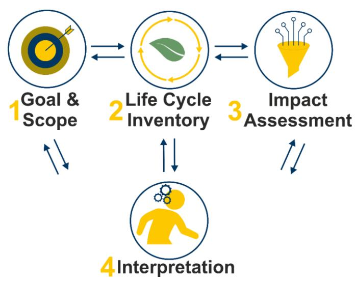

*Figure 2 - Steps of ISO 14040*

The structure established in ISO 14040, initially for environmental assessment, has been adapted for economic and social dimensions to foster a holistic approach to sustainability. These two dimensions use the ISO 14040 structure together with guidelines that guide the development of each step. **In the following, each step of the ISO 14040 structure will be covered and the dimensions that have particularities will be explained in their respective subsections.**

## 3.1. Goal and Scope

## 3.1.1.LCA

In this first step, the purpose of the analyses should be clearly and concisely defined, describing the objective(s) of the study with a summary of the relevant processes and the methodology applied. The scope should include the following two aspects. The **system function,** where the function of the study objective is defined and the **functional unit (FU),** which is the measure that defines and quantifies the identified functions of the product to characterise its performance. The purpose of this is to provide a

reference between the inputs and outputs of the system; such a relationship is necessary to ensure the comparability of the study results. The **reference flow** is the quantity of product required to fulfil the function expressed by the FU.[1](#page-8-4) Lastly, the **product system boundaries** define the processes to include in the system and the geographical boundaries of the analyses. The choice of physical elements to model depends on the study's objective(s) and scope, with the criteria used at this stage being vital for result reliability.

The system boundary defines which processes should be included in the study, according to the International Council of Chemical Associations (ICCA) 33 system boundaries can be defined in four types, as shown in [Figure 3:](#page-13-1)

- Cradle to grave, from the extraction of raw materials to the final use and disposal of the product.
- Cradle-to-gate, from raw material extraction to the factory gate.
- Gate-to-gate, from a starting point to a second end point defined throughout the life cycle.
- Gate-to-grave, from the factory gate to the final use and disposal of the product.

In the goal and scope phase, the aims of the study are defined, namely the intended application, the reasons for carrying out the study and the intended audience. Main methodological choices are made in this step, in particular the exact definition of the FU, the identification of the system boundaries, the identification of the allocation procedures, the studied impact categories, the LCIA models used, and the identification of data quality requirements.34

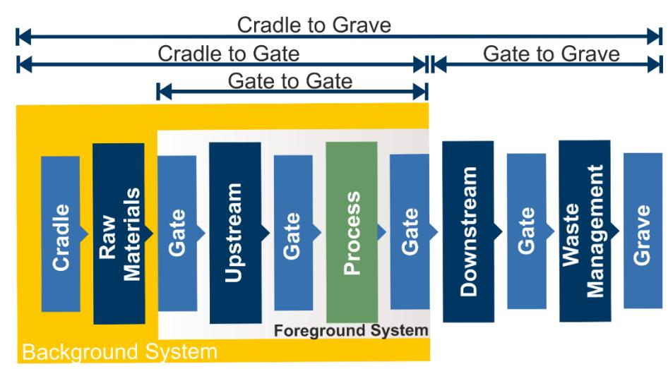

*Figure 3 - System boundaries*

#### 3.1.2.LCC

The data requirements for LCC vary based on the chosen LCC approach (c-LCC, e-LCC, or s-LCC), the perspective adopted, the consideration of positive cash flows, and the purpose of the results. The perspective can be from the producer, value-chain actor or consumer, and the results can be for internal or external use.[12](#page-9-3) c-LCC is the most widely used economic approach whereas e-LCC is a steady methodology with impacts remaining constant over time. It would be a wise approach to use **e-LCC** in terms of its complementarity with LCA and sLCA while sharing the same life cycle viewpoint rather than a private perspective35 .

33 International Council of Chemical Associations (ICCA). How to know if and when it's time to commission a LCA. 2013 - [link](https://icca-chem.org/wp-content/uploads/2020/05/How-to-Know-If-and-When-Its-Time-to-Commission-a-Life-Cycle-Assessment.pdf)

34 European Platform on LCA - EPLCA. Life Cycle Assessment - [link](https://eplca.jrc.ec.europa.eu/lifecycleassessment.html#:~:text=LCA%20is%20defined%20by%20the%20ISO%2014040%20as,of%20a%20product%20system%20throughout%20its%20life%20cycle.)

35 Alejandro Padilla-Rivera, Marwa Hannouf, Getachew Assefa, Ian Gates. 2023. A systematic literature review on current application of life cycle sustainability assessment: A focus on economic dimension and emerging technologies. - [link](https://www.sciencedirect.com/science/article/pii/S0195925523002342)

Generally, the goal of LCC studies can involve comparing costs, detecting cost drivers, tracking improvements, estimating changes, and identifying trade-offs in a product's life cycle when combined with LCA. LCC and LCA are applied with equivalent goals and scope, encompassing the same FU and system boundaries. However, LCC differs in that it excludes externalities—costs not directly borne by any specific economic actor. The responsibility of accounting for externalities is specifically addressed by LCA. But there are a few questions to be answered in LCC before defining the goal and scope as indicated in [Figure](#page-14-1)  [4.](#page-14-1)

| Perspective                                                                        | Costs and revenues                                                 | Private or external effects                                                                                                                                                                                  | Data confidentiality                                                                                                                                                           | Temporal dimension                                                                                                               | Spatial dimension                                                                                                                   |
|------------------------------------------------------------------------------------|--------------------------------------------------------------------|--------------------------------------------------------------------------------------------------------------------------------------------------------------------------------------------------------------|--------------------------------------------------------------------------------------------------------------------------------------------------------------------------------|----------------------------------------------------------------------------------------------------------------------------------|-------------------------------------------------------------------------------------------------------------------------------------|
| 1) Consumers, 2) Producers 3) Policy makers/ NGOs (societal perspective). | The aggregation indicator to be selected depends on this decision. | <b>Private (or internal) effects</b> are reflected in the costs borne by consumer or producer. <b>External effects</b> are largely due to emissions or discharges of pollutants or use of resources | From a company's perspective, the extent of use of confidential data depends on the <b>intended application</b> (internal or external) and <b>the level of detail</b> provided | For consideration of future years, discounting of cash flows or externalities can be done with a private or social discount rate | <b>System boundaries and life cycle stages:</b> Alignment with the LCSA by default and particularly with environmental dimension |

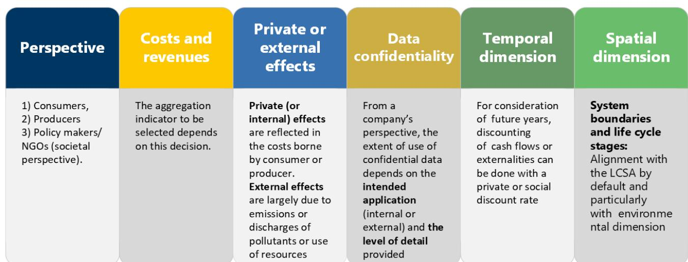

*Figure 4 - Determinants of goal and scope of LCC[12](#page-9-3)*

## 3.1.3.sLCA

The sLCA uses the ISO framework in conjunction with other guidelines, such as United Nations Environment Programme (UNEP)36/Society of Environmental Toxicology and Chemistry (SETAC) 2020 and the ORIENTING[32](#page-11-1) project. It is essential for sLCA to establish the FU and reference flow, which sharpen the study's focus and outline the product system, complementing the stage's specified guidelines.

Furthermore, as illustrated in [Figure 5,](#page-15-3) the system boundary also plays a pivotal role in this phase as it delineates the components of the product system to be considered in the assessment. Defining which type of system boundary will be studied is also critical to determine which stakeholders should be considered and which ones can be omitted, if any. Additionally, while the goal of conducting a sLCA is to evaluate the social impacts in a given value-chain, there is a fundamental difference in relation to the LCA or LCC. In the case of the sLCA, zero impact may not always be the target. The target in an LCA is often to achieve minimal or zero environmental impact for the product system, while in sLCA, the goal is to elevate the product system's social performance an optimal level. [32](#page-11-1) This ideal level varies according to geographical and sector-specific benchmarks. For instance, working zero hours is not deemed to have a positive social impact, similarly, exceeding the legal working hours set by a country also fails to constitute a positive impact. This way, the sLCA reinforces the need to assess the social impacts always considering the country, sector, or continent where the assessment is being made.

Following the UNEP Guidelines, the six main **stakeholder groups**, either involved or affected by the product system value chain, include workers, children, local communities, society, consumers, and value chain actors. [36](#page-14-2)

36 UNEP. Guidelines for Social Life Cycle Assessment of products and Organisations 2020. 2020 - [link](https://wedocs.unep.org/handle/20.500.11822/34554)

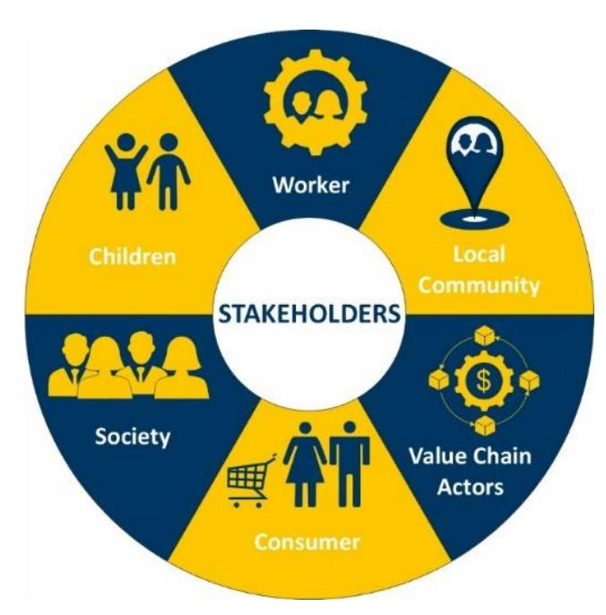

*Figure 5 – Stakeholders' groups*

#### 3.2. Life Cycle Inventory

## 3.2.1.LCA

After conducting the goal and scope phase, the Life Cycle Inventory (LCI) includes quantifying all flows of the examined system per FU. This stage involves data collection and calculation to quantify the relevant inputs and outputs. The LCI phase entails gathering data on the system's inputs and outputs, including energy, raw materials and other physical inputs, products and co-products, waste, emissions to air, water, and soil, and other environmental factors. The calculate on procedure must be executed to quantify the inputs and outputs of the analysed system, ensuring their validation and correlation with the process and FU. [34](#page-13-2)

The data collection phase is dynamic; it may necessitate incorporating new data requirements or constraints, prompting adjustments to this stage's procedures to ensure the scope's objectives are fulfilled. After gathering the data, calculations must be performed to verify its accuracy and connect it to the unit processes and the FU's reference flow. After data collection and calculation, it may be necessary to readjust the system boundaries.

## 3.2.2.LCC

Foreground data, crucial for describing and modelling new developments, can be challenging to obtain, especially for emerging technologies. In such cases, data collection often involves supplementing foreground data with background data sourced from existing literature. While this approach helps to address data availability issues, utilising background data, such as scientific papers, patents, or expert interviews, poses challenges. Background data may be outdated and may not adequately represent emerging technologies or future commercial-scale operations. The data flow in the foreground processes is depicted in [Figure 6.](#page-16-0)

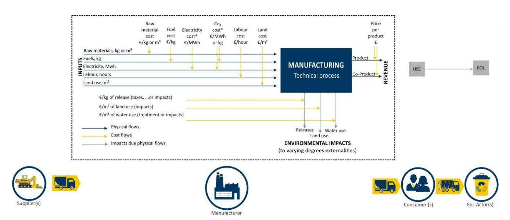

*Figure 6 - Flow diagram for the LCC assessment (Source: ORIENTING deliverable2 .3--29) [12](#page-9-3)*

To structure data collection, ORIENTING's Cost Breakdown Structure incorporates an assessment of materiality, availability, feasibility, and confidentiality.[12](#page-9-3) **Materiality** aligns with accounting principles, focusing on significant impact items in the analysis. The same principle is applied to choose cost elements for the final indicator calculation during implementation. **Availability** refers to readily accessible cost elements, while **feasibility** involves estimated ones. **Confidentiality** pertains to undisclosed cost elements due to confidentiality reasons. Balancing confidentiality and availability is crucial, as data might be accessible but restricted in certain applications, necessitating careful planning for data collection. For example, when LCC is conducted for benchmarking purposes between different products, only items that change between the two products are often considered, while the other items can be excluded.

*Table 1 - The Cost Breakdown Structure (CBS) from ORIENTING project involves[12](#page-9-3)*

|               |   | Description                            | Examples                      |
|---------------|---|----------------------------------------|-------------------------------|
| Capital costs |   | Fixed, non-recurring expenses for      |                               |
|               |   |                                        | Industrial plant investment,  |
| Material      | / |                                        |                               |
|               |   | consumption of goods, varying          |                               |
|               |   |                                        | raw materials like sand,      |
|               |   |                                        | industrial intermediate       |
|               |   |                                        | goods such as steel,          |
|               |   |                                        | utilities like energy, water, |
| Personnel     |   | Expenses related to employees          | Wages, salaries and training  |
| Transport     |   | Expenses related to the transportation |                               |
|               |   | of goods or providing services         |                               |
|               |   |                                        | Transportation of raw         |
|               |   |                                        | materials to the place of     |
| Other         |   | Additional operational expenses not    |                               |
|               |   |                                        | maintenance of equipment      |

| Emission &                         |                |           |
|------------------------------------|----------------|-----------|
| related 37                         |                |           |
| Expenses related to business       |                |           |
| Waste fee, Co                      | 2 emission fee |           |
| Soon to be                         |                |           |
| internalised 38                    |                |           |
| Costs associated with adverse      |                |           |
| consequences for which legislation |                |           |
| Emission                           | and            | discharge |
| costs:                             | taxes          | or other  |
| instruments                        | accounting     | for       |
| internalised 39                    |                |           |
| Revenues,                          | EOL            | residual  |

The distinction among cost, revenue, and value added is crucial in determining which elements to include in the calculation of LCC to avoid the risk of double counting. In essence, a product's price comprises both its upstream and downstream costs, and the cost incurred by one actor becomes the revenue for another. Value added represents the disparity between product sales and the purchase of products or materials by a firm. Inventory data may require restatement in a common currency and present value, considering varying currencies and time periods, and utilising suitable exchange and discount rates.

#### **Intricacies of LCC data**

#### **Unit of measurement**

The common unit of measurement for each life cycle stage is euros per FU (€/FU) of the coating material. The common unit shall be based on the net present cost of each life cycle stage.

#### **Discounting**

In LCC applications, the incorporation of time is vital for two primary reasons: (1) accounting for inflation and (2) considering time preference. Hence, it is preferable to compare costs using a selected reference year and all costs should be adjusted to that specific year to facilitate meaningful comparisons. There are two different types of discount rates depending on the perspective (Private or Societal) namely private and social discount rates.

#### **Double counting**

Double counting can occur in two distinct scenarios:

- Within the economic domain: This arises when indicators and their constituents are presented alongside each other or when two perspectives, such as producer and consumer viewpoints, are juxtaposed.
- Across different LCSA topics: This occurs when presenting the same information more than once. For instance, environmental impacts are expressed in physical terms in LCA and in monetary terms in LCC.

In the first case, if aggregation of different indicators cannot be avoided, clear communication or reporting is essential to mitigate the risk of double counting. In the latter case, where different LCSA topics represent their own realities, any potential for double counting should be explicitly acknowledged.

37 GHG emissions already come with a cost.

38 Emissions that will soon come with a cost.

39 Emissions that are not yet covered by any environmental regulation.

#### 3.2.3.sLCA

As this phase mainly revolves around **data collection**, it is significantly reliant on the chosen impact assessment type. Therefore, it is crucial to gather data pertinent to the selected stakeholder groups and subcategories identified. This way, site-specific (primary) and generic (secondary) data for unit processes and activity variables is needed. [27](#page-11-2)

The ORIENTING Project[32](#page-11-1) , highlights that sLCA data provision is concentrated in three main categories: sLCA-specific background databases, sector- or company-level databases and social data from international organisations. Databases at the sector or company level cover social concerns such as risk and reputation. Data from international organisations such as Amnesty International and the United Nations Educational, Scientific and Cultural Organisation, is commonly used in the sLCA databases. The two most widely utilised databases are Product Social Impact Life Cycle Assessment (PSILCA) and the Social Hotspot Database (SHDB), both designed to evaluate the social impacts of products throughout their life cycles. Therefore, they share a similar structure, employing an **Input-Output model** coupled with a social assessment using the **activity variable** (link between the company and the product lifecycle) "worker hours". This activity is the most utilised40 in sLCA databases, as can be seen in [Figure 7.](#page-18-1)

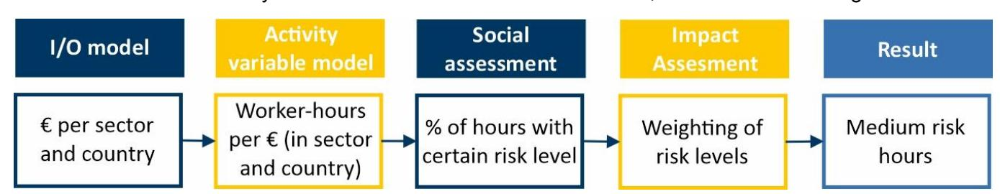

*Figure 7 - General structure of the direct quantification of the indicators (ORIENTING, 2021)*

As highlighted by Pollok *et al.* (2021)41, it is important to consider that databases such as PSILCA and SHDB often neglect positive impacts as they merely provide generic information regarding social risks. The outcomes of the Materiality Assessment, informed by consultation with technical partners in this phase, are crucial to help contextualise the adverse result of a social impact. This is influenced by industryspecific and country-specific factors within both the public and private sectors42 .

As stated in the UNEP 2020 Guidelines, primary data collection is essential and can be carried out through management systems, audits, on-site observation of business operations, interviews and surveys with affected stakeholders. The management system relates to direct involvement with organisations, while audits can be carried out by NGOs or similar organisations. It is conceivable that the hotspots discovered from the social hotspots analysis using PSILCA may not indicate an issue in the production chain. In case they do, then they will be assisting in identifying potential problems that were not recognised in the general analysis, as well as helping measure possible positive impacts 43 . In addition, ORIENTING44 also highlights that while social issues may be linked to specific sectors, variations in company behaviour within these sectors limit the insights provided by general industry-level data. The lack of transparency in modern supply chains further complicates tracking suppliers beyond the initial tiers.

Molhuizen (2023)45 addressed other limitations that PSILCA exhibits. Firstly, its dependence on the monetary value of products or services poses a potential weakness, particularly when evaluating systems in sectors susceptible to cost price fluctuations. This could lead to elevated risks for products or services

40 Deliverable 1.2 Affiliation: EU –" Orienting" Critical evaluation of social approaches (2021). - [link](https://orienting.eu/wp-content/uploads/2022/10/D1.2-Social-approaches_final-revision_updated.pdf)

41 Pollok, L.; Spierling, S.; Endres, H.-J.; Grote, U. Social Life Cycle Assessments: A Review on Past Development, Advances and Methodological Challenges. Sustainability 2021, 13, 10286. - [link](https://doi.org/10.3390/su131810286)

42 Deliverable 1.2 Affiliation: EU – "Orienting" Critical evaluation of social approaches (2021). - [link](https://orienting.eu/wp-content/uploads/2022/10/D1.2-Social-approaches_final-revision_updated.pdf)

43 UNEP. Guidelines for Social Life Cycle Assessment of products and Organisations 2020. 2020 - [link](https://wedocs.unep.org/handle/20.500.11822/34554)

44 Deliverable 1.2 Affiliation: EU – "Orienting" Critical evaluation of social approaches (2021). - [link](https://orienting.eu/wp-content/uploads/2022/10/D1.2-Social-approaches_final-revision_updated.pdf) 45 Molhuizen, Max. Comparative Social Life Cycle Assessment between Battery Electric Vehicles and Internal Combustion Engine Vehicles (2023). - [link](http://resolver.tudelft.nl/uuid:445220b1-e4c4-4113-a5e8-d3689464fb23)

experiencing sudden price hikes despite stable usage rates. Likewise, data availability presents another challenge for this database, frequently leading to the use of regional averages or analogous sector data to fill the resultant gaps. Such practices can greatly distort results, as evidenced by disparities in reported work-related incidents where countries with higher reporting rates seemingly exhibit disproportionately higher injury rates.

Building the LCI for sLCA requires considerable time and resources. It involves several process steps typically occurring across multiple countries and data sources may be reluctant to share data due to the sensitivity of the topics.

### 3.3. Life Cycle Impact Assessment

Once the inventory has been completed, it needs to be added to a programme that transforms the data into results. This transformation is carried out differently for each dimension, using different methods that classify the results into impact categories (LCA), indicators (LCC) and social impact categories (sLCA), described in the following sections.

## 3.3.1.LCA

As mentioned, for the LCIA it is necessary to carry out the modulation in the SimaPro software. The software executes mathematical calculations from different assessment methods, enabling the classification of results and their allocation to different characterisation factors. Characterisation factors are those that indicate the environmental impact per unit of stressor, for example, per kg of resource used or emission released. The results of this phase provide data for the life cycle interpretation phase. There are three stages to the completion of an LCA: selection, classification, and characterization.[34,](#page-13-2)46

Selection refers to the choice of which characterisation models, impact categories and indicators will be adopted in the study. In classification, it is necessary to assign the inventoried material and energy inputs and outputs to the relevant impact category, and this is done using a method. In characterisation, all the flows are multiplied by a factor that reflects their relative contribution to the environmental impact, quantifying the impact that a product or service has on each impact category. 47,48

There are two main ways of deriving characterisation factors: at the midpoint level and at the endpoint level. The "midpoint" are problem-oriented methods that are based on single environmental issues, such as climate change or acidification. The "endpoint," which are damage-oriented methods, focus on characterising the intensity or implications of the "midpoint" impacts. This characterisation is organised into three main levels of accumulation: the impact on human well-being, biodiversity, and resource scarcity.49

#### 3.3.2.LCC

For evaluating the life cycle costs, tools as simple as spreadsheets can be used to analyse and interpret the foreground and background information obtained from various sources. But the computation of LCC in SimaPro aids in meaningful interpretation when combined with LCA.

The economic indicators used are mainly assessed using the Net Present Value formula. Other aggregate indicators can also be used, such as those suggested in the ORIENTING[25](#page-10-1) project (which aims to define guidelines for the LCSA), which are as follows [\(Figure 8\)](#page-20-1).

46 M. A.J. Huijbregts et al. ReCiPe 2016 v1.1. National Institute for Public Health and the Environment. 2016 - [link](https://pre-sustainability.com/legacy/download/Report_ReCiPe_2017.pdf)

47 European Platform on LCA – EPLCA. Life Cycle Assessment (LCA) - [link](https://eplca.jrc.ec.europa.eu/lifecycleassessment.html)

48 L. Golsteijn. Characterization. Pre-Sustainability. 2014 - [link](https://pre-sustainability.com/articles/characterisation-new-developments-for-toxicity/)

49 R. Abu, et al. Life cycle assessment analyzing … composting technologies. 2021 - [link](https://journals.utm.my/jurnalteknologi/article/view/17199)

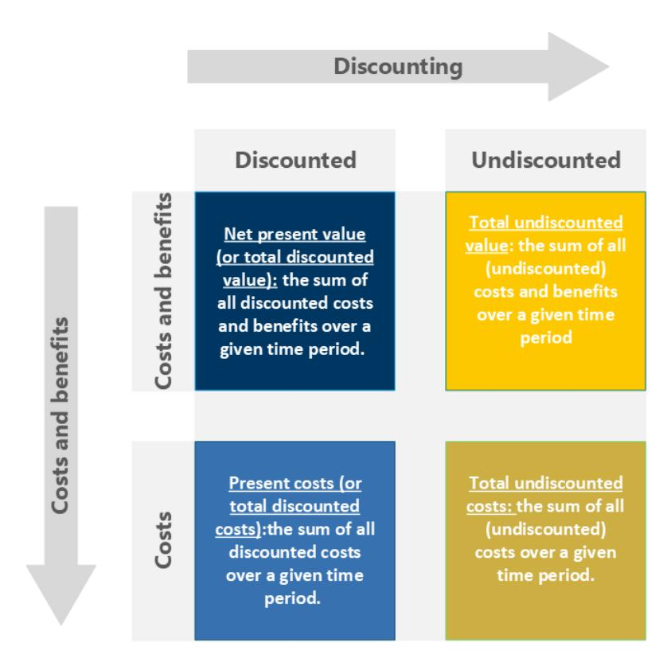

*Figure 8 - Economic indicators used in LCC*

These indicators help in planning the investment, optimising the cost efficiency by identifying the hotspots and spotting the most economic alternatives in terms of inputs, processes, and energy sources.

Eco-efficiency of the products or processes can help in a better understanding of both environmental and economic approaches together. According to OECD, eco-efficiency is defined as the efficiency with which ecological resources are used to meet human needs. It is defined as a ratio of an output (the value of products and services produced by a firm, sector, or economy as a whole) divided by an input (the sum of environmental pressures generated by the firm, the sector, or the economy).50

## 3.3.3.sLCA

In the context of sLCA, LCIA involves evaluating the potential social impacts of a product system throughout its life cycle. This assessment can focus on current, past, or future impacts associated with a system. The assessment is centred on understanding the magnitude and significance of these potential social impacts.

The impact assessment method, known as the "Social Impacts Weighting method" found in the PSILCA database, describes exponential relations between impact factors as can be seen in [Table 2.](#page-20-2) Overall social impacts for each impact category are computed by summing the social risks of all related activities over the life cycle and scaling them by price (inputs), working hours, and characterisation criteria. 51

*Table 2 - at PSILCA database v.3 documentation (2020) "Characterization factors for the impact assessment method in PSILCA".*

| Risk level    | Factor |
|---------------|--------|
| Very low risk | 0.01   |
| Low risk      | 0.1    |
| Medium risk   | 1      |

50 OECD (2008), Eco-Efficiency, OECD Publishing, Paris [-link](https://doi.org/10.1787/9789264040304-en.)

51 Maister, Kirill & Di Noi, Claudia & Ciroth, Andreas & Srocka, Michael. (2020). PSILCA v.3 Database documentation. [link](https://psilca.net/wp-content/uploads/2020/06/PSILCA_documentation_v3.pdf)

| High risk           | 10  |
|---------------------|-----|
| Very high risk      | 100 |
| No risk/opportunity | 0   |
| Low opportunity     | 0.1 |
| Medium opportunity  | 1   |
| High opportunity    | 10  |
| No data             | 0.1 |

There are, essentially, two main methods that can be used to conduct a sLCA: the **RSA** method and the **IPA** method[32](#page-11-1) . The first is suitable for describing the performance or social risk of a product system. While the second is suitable for assessing the consequences of the product system, focusing on characterising the possible social impacts.

The two main families of methods also differ in the data collection and aggregation of information. RSA adopts the typical structure of indicators, impact categories and stakeholders. It provides results that focus primarily on the activities of companies/organisations in the product system and commonly considers their immediate evaluation and does not go further along the impact pathway to consider further effects. On the other hand, IPA mainly focuses on mid-/endpoint impact categories. This method assesses potential or actual social impacts by using a cause-effect chain (also named impact pathway) that correlates the product system/organisations' activities with the resulting potential social impacts. In this method, the analysis focuses on identifying and tracking the consequences of activities, possibly with longer-term implications along an impact pathway. IPA methods do not have a strong focus on stakeholder groups, unlike RSA methods, but they try to give general measures or values for selected social consequences through midpoint and/or endpoint indicators. This way, the main difference between RSA and IPA fundamentally hinges on the placement of inventory data and characterization outcomes along the impact pathway

In social LCIA, one common approach to interpret results involves categorizing the identified risks based on the stakeholder groups affected. However, a challenge arises regarding whether positive impacts on one stakeholder should be combined with negative aspects affecting other stakeholders. Additionally, there's the question of whether such aggregation is feasible within the same stakeholder group but across different social impacts.

#### 3.4. Life Cycle Interpretation

## 3.4.1.LCA

Finally, in the interpretation phase of the life cycle, the results of the LCI and LCIA are interpreted in accordance with the stated objective and scope. Thereby results are generated that should lead to improvements in the methodology, if necessary, returning to any phase, which is why this phase can also be called "Results and improvement". After the final interpretation, the results should be described in a document such as D6.3, where all the steps taken to obtain the results are presented and explained. [34](#page-13-2)

## 3.4.2.LCC

In results analysis of LCC, various techniques can be employed such as

- **Hotspot identification:** In economic resource efficiency, a key skill is pinpointing production "hotspots" where resources may be wasted, or efficiency improved. Based on the identified hotspots, steps can be devised and applied to increase resource efficiency.
- **NPV analysis:** This is achieved by converting the project expenses that occur at various points into their time-equivalent value at the base date.[22](#page-10-2)

- **Payback period calculation:** The payback period (PBP) calculates how long it takes customers to recover the higher purchase price of energy-efficient equipment through lower operational costs.52
- **Break-even point determination and Sensitivity analysis:** The sensitivity analysis examines how changes to significant assumptions or characteristics, such as prices, affect project success. Break-even analysis focuses on preserving the break-even point by determining the maximum or lowest value of a crucial element.53

When LCC is combined with LCA, the evaluation primarily centers on supply chain effects and identifying trade-offs or win-win situations between environmental and economic impacts.[26](#page-10-3) Such an indicator is Ecoefficiency which is a management technique that aims to increase value while also improving the environmental and economic performance of products or services throughout their life cycle54 .

#### 3.4.3.sLCA

sLCA uses the ISO framework in conjunction with other guidelines such as UNEP/SETAC 2020 and the ORIENTING project, given that implementing the UNEP 2020 guidelines ensures a somewhat standardized and systematic approach to sLCA. It also facilitates a more comprehensive understanding of a product's social impacts. Approaching this section (interpretation) with these guidelines, the following steps can be conducted:

- **Completeness check:** This step reviews each assessment phase to make sure that all the items included in the goal and scope have been adequately addressed or incorporated into the inventory and impact assessment.
- **Consistency check:** Using guiding questions, this stage seeks to guarantee that the data used, the procedures utilized in the inventory and impact assessment processes are all applied consistently as expected in the study's overall goal and scope.
- **Sensitivity and data quality check:** Sensitivity analysis is a process that assesses the impact of assumptions and choices, like selecting the activity variable, on the outcome. Data integrity and quality are assessed through sensitivity analysis.
- **Materiality assessment:** This step aims at identifying significant Environmental, Social and Governance issues that could influence the conclusions of the study. Therefore, materiality is unrelated to the degree of influence an organization has over the stages of the product system under investigation.
- **Conclusions, limitations, and recommendations:** After identifying the study's material aspects and rigorously reviewing the results for completeness and consistency, conclusions. These outlining the study's limitations and propose improvements.

# 4. LCSA approach at M15 for the PROPLANET Project

The PROPLANET project aims to substitute the existing PFAS-type coatings, by designing and optimising 3 innovative solutions:

- Hydrophobic, oleophobic bio-based coating
- Non-stick and anticorrosion protection bio-based hybrid coating, and
- Anti-soiling and anti-reflecting hybrid coating

52 Greg et al. 2004. Life-cycle Cost and Payback Period Analysis for Commercial Unitary Air Conditioners[-link](https://www.osti.gov/servlets/purl/829989)

53 Giacomella. 2021. Techno-economic assessment (TEA) and life cycle costing analysis (LCCA): Discussing methodological steps and integrability [link](https://hal.science/hal-03583898/)

54 Konstantas et al. 2020. A framework for evaluating life cycle eco-efficiency and an application in the confectionary and frozen-desserts sectors - [link](https://www.sciencedirect.com/science/article/pii/S2352550919302933)

At PROPLANET, the LCSA is being developed at M15 from a cradle-to-gate perspective, with the expected completion of the cradle-to-grave assessment by M36 (D6.3). As presented in the previous topic, it can be developed with gate-to-gate, cradle-to-gate, and cradle-to-grave perspectives, offering a comprehensive understanding of the coating's sustainability performance throughout various life cycle stages. Therefore, the methodology not only adopts a cradle-to-grave approach but also offers flexibility by accommodating various system boundaries. In this deliverable, HOL presents the methodology for conducting a preliminary LCSA of its innovative coating's development. The progress of this work aligns with the project's advancement and the availability of data. Hence, this assessment builds upon the initial analysis conducted during the first year and further expands upon the conclusions reported in MS2.

This assessment focuses on evaluating resource usage, including material and economic aspects, as well as early social implications, with a specific focus on the manufacturing stage, within cradle-to-gate boundaries. PROPLANET examines resource consumption, including energy, water, and raw materials, along with economic costs and social considerations. It identifies areas for analysis, especially critical points in the manufacturing phase, enabling targeted interventions or optimisations for development in WP3, where formulations will be finalised and scaled. These hotspots represent areas with impacts, guiding further analysis and improvement efforts in subsequent stages of the assessment. All in all, it is aiming to enhance sustainability performance, regulatory and certification compliance (T1.4), and stakeholder satisfaction (T7.4). Furthermore, addressing hotspots fosters innovation and leadership in sustainability, positioning PROPLANET as a responsible and forward-thinking player in the coatings industry.

This approach preliminarily evaluates inputs such as resource usage, environmental concerns, production costs, and labour expenses to make informed decisions at this stage. This can improve environmental and economic performance and competitiveness until the project is completed. Moreover, it enables the identification of essential elements necessary for conducting surveys to gather pertinent social data in the next phase. Proactive management of social implications contributes to stakeholder satisfaction, driving market acceptance and competitiveness. Ultimately, optimising inputs and outputs at the gate-to-gate stage not only minimises environmental impact but also yields cost savings, enhancing economic viability and early social acceptance. This approach maximises the utilisation of initial results in the project's development (up to M12) and enhances its competitiveness.

Conducting an LCSA cradle-to-gate, regarding manufacture, provides initial insights into the sustainability by design (SbD) performance of a product or process at a specific stage of its life cycle.

# 5.PROPLANET and the LCSA Approach: Methodological application and insights

## 5.1. Goal and Scope

The objectives specified below established the guiding framework for assessing the environmental, economic, and social dimensions as delineated in this preliminary evaluation. The scope is "cradle to gate" for all three dimensions, covering everything from raw materials to the manufacturing phase. The FU used for this analysis is "1 kg of coating produced" for each case study (textile, food packaging machine, and glass).

#### **1. LCA objective:**

- To examine resource usage, encompassing energy, water, and raw materials, along with identifying environmental hotspots in the coating's development process.
- To target these hotspots for intervention and optimisation, thereby mitigating potential negative impacts.

#### **2. LCC objective**:

- To conduct a comprehensive assessment of material cost, energy cost, and labour cost involved in the production of coatings.
- To identify opportunities for cost savings and efficiency improvements in material procurement, energy consumption, and labour utilisation.

#### **3. sLCA objective**:

- To assess the social implications of the chemical sector and products used in the production of coatings within the chemical sector, to establish a baseline for comparison and select analysis categories for the sLCA: o Establish a baseline understanding of the social implications associated with chemical sector activities and coating production processes. o Based on the baseline assessment, select key categories for analysis in the sLCA, prioritising those with the most significant social implications.

#### 5.2. Life Cycle Inventory

The Life Cycle Inventory (LCI) for each coating was developed using a tailored Excel tool designed specifically for this purpose. This tool serves as a central repository for all relevant data, ensuring a systematic and coherent approach to documenting the environmental, economic, and social inputs and outputs associated with each coating. By leveraging this Excel tool, the project can accurately capture and analyse the flow of materials and energy, facilitating a robust evaluation of the coatings' lifecycle impacts from a multidimensional perspective.

#### 5.1. LCA

A detailed spreadsheet was created within the previously mentioned Excel file to support the evaluation of the manufacturing stage for each coating (MS1). Playing a key role, MS1 supported the creation of MS2, which was completed in October 2023. This spreadsheet records the flow of materials and energy consumption essential to the manufacturing processes. It serves as a vital instrument for gathering the quantitative data needed for assessing the environmental impacts associated with each type of coating. The spreadsheet details inputs such as quantities of raw materials, energy consumption figures, emissions data, and statistics on waste generation. No updates have been received since the results aligned with the expectations for achieving the objectives defined in D2.1.

## 5.2. LCC

In the economic assessment of PROPLANET, both foreground and background data are crucial for evaluating the economic impact comprehensively. The LCC analysis relies on a combination of data sources, including public databases such as EUROSTAT55, the World Bank56, and Statista57, for relevant economic indicators. Specifically, costs related to coating manufacturing are sourced directly from collaborating entities involved in the manufacturing process through the designated Excel document and specific inquiries to both technology providers and end users.

Given the early stage of development for these coatings, efforts have been made to augment laboratory data with insights from existing literature. However, the scarcity of literature, particularly within the coatings industry and related manufacturing sectors, presents challenges in modelling the industrial cost structure accurately. These gaps in data will be addressed through outlined steps to fill data gaps.

The preliminary data analysis underscores the importance of major cost factors like materials, energy, and labour in understanding the economic implications of the innovations. Particularly within the manufacturing

55 Eurostat - [link](https://ec.europa.eu/eurostat/databrowser/view/LC_LCI_LEV__custom_9934759/default/table?lang=en)

56 World Bank Open Data - [link](https://data.worldbank.org/)

57 Statista - [link](https://www.statista.com/)

sector, operating costs play a pivotal role in determining profitability58 . As the production process scales up to an industrial level, differences in operational costs may emerge due to economies of scale. However, at this preliminary stage, these initial cost assessments establish a foundational framework for the study. While further analysis is needed to account for the nuances of industrial-scale production, the insights gleaned from the initial assessment provide valuable guidance for future economic evaluations and decision-making processes.

#### 5.3. sLCA

In the sLCA of PROPLANET, the characterisation of the manufacturing processes captured in the Excel document guided a literature review. A strategic decision was made to explore scientific articles pertinent to sLCA studies within the context of the three manufacturing sectors under consideration in PROPLANET, namely: glass, food packaging-machinery, and textiles. However, this investigation revealed a notable dearth of available literature addressing the social dimension of LCSA, particularly within the glass and food packaging manufacturing domains.

Consequently, the focus was directed towards synthesizing existing knowledge gleaned from sLCA studies within the textile industry. Within this scope, a rigorous selection process was employed to identify three articles that undertook sLCA investigations within the textile industry, specifically focusing on cradle-togate analyses akin to PROPLANET. These articles were analysed to discern the stakeholder groups and subcategories that the authors considered, thereby furnishing valuable insights into the prevailing discourse and methodological approaches. This methodological approach not only serves to enrich the understanding of the social dimensions pertinent to the textile industry but also provides a foundational framework upon which to build the PROPLANET's analytical endeavours.

For the food packaging-machinery and glass industry, the social impact of one of their common chemicals: ethanol, was analysed. Nonetheless, an article regarding bio-based plastics and one for biofuels that provide analyses like the ones conducted for textile industry were also analysed. These articles provided a broader idea of the possible stakeholder groups and subcategories to be considered for the food packaging and glass industries.

The strategy employed in the sLCA for PROPLANET is marked by resourcefulness, navigating the challenges posed by the current state of sLCA literature. It establishes a preliminary understanding, particularly within the textile sector, as well as in other areas such as food packaging-machinery and glass, by examining common chemicals and relevant literature. This innovative approach not only seeks to close existing knowledge gaps but also lays down a robust groundwork for further inquiry. Nevertheless, this strategy is viewed as a preliminary step towards achieving the sLCA objectives outlined in this report, setting a clear direction for the subsequent phases leading to D6.3.

#### 5.4. Life Cycle Impact Assessment

#### 5.4.1.LCA

In MS1, the results of the assessment carried out for the production phase were presented as a preliminary assessment for conducting the work according to the principles of SSbD. Therefore, the data used for this evaluation will be the same, submitted to analysis in the SimaPro V9 software. PROPLANET will assess the mid-point and end-point impact categories using the Product Environmental Footprint59 (PEF), and ReCiPe methods.[46](#page-19-3)

PEF is the one proposed by the European Commission, which was created as a common way of measuring environmental performance to evaluate the environmental impacts of products and organisations. Its aim is to reduce the environmental impacts of goods, services, and organisations, taking

58 Istan et al. The effects of production and operational costs, capital structure and company growth on the profitability: Evidence from manufacturing industry. 2021.

59 European Platform on LCA – EPLCA. Environmental Footprint - [link](https://eplca.jrc.ec.europa.eu/EnvironmentalFootprint.html)

into account the activities of the value chain. To do this, PEF is based on the Life Cycle Assessment (LCA) approach, covering 16 mid-point environmental impacts, such as climate change and impacts related to water, air, resources, land use, and toxicity. [Table 3](#page-26-0) describes each impact category of this method.

*Table 3 - Midpoint impact category of Product Environmental Footprint method*

| Midpoint impact             | category      |                                  |             |                                    |
|-----------------------------|---------------|----------------------------------|-------------|------------------------------------|
| Climate change, total       |               | Radiative                        | forcing     | as                                 |
|                             | global        | warming                          | potential   | –                                  |
|                             | GWP100 (kg    | CO2 eq)                          |             |                                    |
|                             |               |                                  |             | Increase in the average global     |
|                             |               |                                  |             | temperature resulting from         |
| Ozone depletion             | Ozone         | Depletion                        | Potential   | –                                  |
|                             |               |                                  |             | layer protecting from hazardous    |
| Human Toxicity, cancer      | Comparative   | Toxic                            | Unit        | for                                |
|                             |               |                                  |             | products on humans are not         |
| Human toxicity, non-cancer  | Comparative   | Toxic                            | Unit        | for                                |
| Particulate Matter (PM)     | Impact        | on                               | human       | health                             |
| Ionising radiation,         | human         |                                  |             |                                    |
|                             | Human         | exposure                         |             | efficiency                         |
|                             |               |                                  |             | Impact of exposure to ionising     |
| Photochemical               | ozone         |                                  |             |                                    |
|                             | Tropospheric  |                                  |             | ozone                              |
|                             | concentration |                                  | increase    | (kg                                |
|                             |               |                                  |             | Potential of harmful tropospheric  |
| Acidification               |               | Accumulated Exceedance –         |             | AE                                 |
|                             |               |                                  |             | emissions (primarily sulfur        |
|                             |               |                                  |             | compounds) mainly due to           |
| Eutrophication, terrestrial |               | Accumulated Exceedance –         |             | AE                                 |
| Eutrophication, freshwater  | Fraction      | of nutrients                     |             | reaching                           |
|                             |               |                                  |             | due to fertilizers, combustion,    |
| Eutrophication, marine      | Fraction      | of nutrients                     |             | reaching                           |
| Ecotoxicity, freshwater     | Comparative   | Toxic                            | Unit        | for                                |
|                             |               |                                  |             | Impact of toxic substances on      |
| Land use                    |               | Soil quality index, representing |             |                                    |
|                             | use           | on: Biotic                       |             | production;                        |
|                             | filtration;   |                                  | Groundwater |                                    |
|                             |               |                                  |             | include loss of species, organic   |
|                             |               |                                  |             | matter, soil, filtration capacity, |
| Water use                   | Weighted      | user                             |             | deprivation                        |
|                             |               |                                  |             | Depletion of available water       |

and water needs for human activities and ecosystem integrity Depletion of non-renewable resources and deprivation for future Resourse use, fossils Abiotic resource depletion, fossil generations

Resource use,

fossils

Abiotic resource depletion – ADP ultimate reserves (kg Sb eq)

fuels – ADP-fossil (MJ)

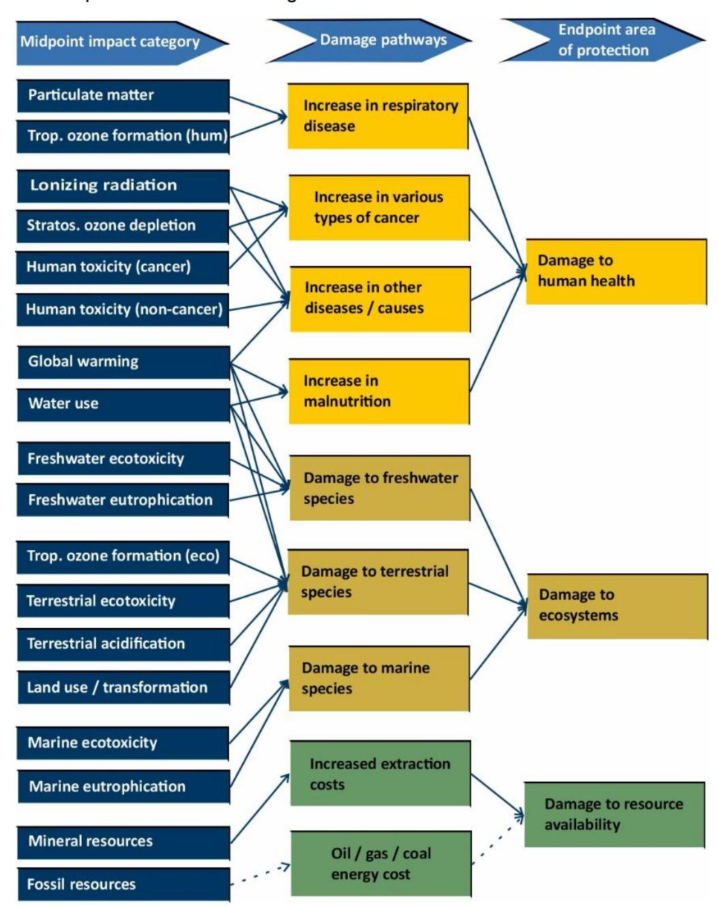

The other method mentioned is ReCiPe[46](#page-19-3), which uses the two ways of deriving characterisation factors (midpoint and endpoint), with 18 midpoint indicators and 3 endpoint indicators. The relationship between the midpoint and endpoint can be seen in [Figure 9.](#page-27-0)

*Figure 9 - Impact categories that are covered in the ReCiPe2016 method and their relation to the areas of protection. The dotted line means there is no constant mid-to-endpoint factor for fossil resources. Adapted from M.A.J. Huijbregts, 2017[46](#page-19-3)*

The characterisation sub-stage represents the calculation of the magnitude of the contribution of each classified input and output to their respective impact categories and the aggregation of the contributions within each category. It represents the intensity of the impact of a substance in relation to a common reference substance for an impact category. As shown in [Table 4](#page-28-0) and [Table 5](#page-29-1) an "units od measure" for each method used.[59](#page-25-3)

#### *Table 4 - Midpoint impact category from ReCiPe method[46](#page-19-3)*

| Midpoint impact                         |                           |
|-----------------------------------------|---------------------------|
| Indicator Unit                          | Characterization          |
|                                         | factors midpoint          |
| climate change Infra-red radiative      |                           |
| W  yr/m                                | 2 global warming          |
|                                         | kg CO 2 to air            |
| ozone depletion Stratospheric           |                           |
| ppt  yr                                | ozone depletion           |
| ionizing radiation Absorbed dose        |                           |
| man  Sv                                | ionizing radiation        |
| fine particulate                        |                           |
| PM 2.5 population                       |                           |
| kg                                      | particulate matter        |
|                                         | kg PM 2.5 to air          |
| oxidant formation:                      |                           |
| ppb.yr                                  | Photochemical             |
|                                         | kg NO x to air            |
| oxidant formation:                      |                           |
| population intake                       |                           |
| kg                                      | Photochemical             |
|                                         | kg NO x to air            |
| yr  m 2                                |  mo                      |
|                                         | kg SO 2 to air            |
| increases in fresh                      |                           |
| yr  m 3                                |                           |
| yr.kgO 2                                | /k                        |
|                                         | eutrophicati on           |
| human toxicity:                         |                           |
| Risk increases of                       |                           |
| cancer disease                          |                           |
|                                         | human toxicity            |
|                                         | kg 1,4- DCB to urban      |
| Risk increases of                       |                           |
|                                         | human toxicity            |
|                                         | kg 1,4- DCB to urban      |
| terrestrial ecotoxicity Hazard weighted |                           |
| increase in natural                     |                           |
| yr  m 2                                |                           |
|                                         | kg 1,4- DCB to            |
|                                         | industrial soil           |
| Hazard weighted                         |                           |
| increase in fresh                       |                           |
| yr  m 3                                |                           |
|                                         | kg 1,4- DCB to fresh      |
| marine ecotoxicity Hazard weighted      |                           |
| yr  m 3                                | marine                    |
|                                         | kg 1,4- DCB to marine     |
| land use Occupation and                 |                           |
| time integrated                         |                           |
| yr  m 2                                | agricultural land         |
|                                         | m 2  yr annual crop land |

| water use |          | Increase of water   |     |         |      |                    |
|-----------|----------|---------------------|-----|---------|------|--------------------|
|           |          |                     | m 3 | water   |      |                    |
|           |          |                     |     |         |      | m 3 water consumed |
| mineral   | resource |                     |     |         |      |                    |
|           |          | Ore grade decrease  | kg  | surplus | ore  |                    |
| fossil    | resource |                     |     |         |      |                    |
|           |          | Upper heating value | MJ  | fossil  | fuel |                    |

Endpoint characterisation factors (CFe) are directly derived from the CFm, with a constant midpoint to endpoint factor per impact category by ��������,��,�� = ��������,�� × ����→,��,��,��. In this formula we have "c" for cultural perspective. "a" for the protection area (human health, terrestrial ecosystems, freshwater ecosystems, terrestrial ecosystems, freshwater ecosystems, marine ecosystems, or resource scarcity). "x" for the stressor of interest. "Fm" for the conversion factor from the midpoint to the endpoint for the cultural perspective "c" and the protection area "a". Because the environmental mechanisms are considered identical for all stressors, these factors are constant per impact category. The ReCiPe method is also used with another method, like PEF, for more comprehensive assessment.60

*Table 5 - Overview of the endpoint categories, indicators and characterization47*

| Area of protection  | Endpoint                        | Name                     | Unit         |
|---------------------|---------------------------------|--------------------------|--------------|
| human health        | damage to human health          | Disability-adjusted loss |              |
| natural environment | damage to ecosystem quality     | Time-integrated          |              |
|                     |                                 |                          | species  yr |
| resource scarcity   | damage to resource availability | Surplus cost             | Dollar (USD) |

## 5.4.2.LCC

Among the economic inventory categories mentioned in the LCC methodology, this report is focused primarily on operational expenditure, which encompasses material, personnel, and electricity costs within the coating production process presented in [Table 6.](#page-29-2) These elements stand out as the most significant cost drivers, particularly when there's an introduction of new processes or product innovations. A cost driver is an element that has a major impact on the LCC61. After identifying a cost driver, it is important to analyse the causes of the high cost by establishing cause-and effect relationships.

*Table 6 - Operational expenditure of the lab scale manufacture of PROPLANET coatings*

| Coating intended for OPEX – Operational expenditure | Glass (€/Kg) | Food packaging machine (€/Kg) | Textiles (€/Kg) |
|-----------------------------------------------------|--------------|-------------------------------|-----------------|
| Material cost                                       | 10.67        | 4.24                          | 12.67           |
| Personnel cost                                      | 16.80        | 16.80                         | 16.80           |
| Electricity cost                                    | 2.83         | 2.83                          | 0.02            |
| Total                                               | 30.30        | 23.87                         | 29.49           |

60 Mikosch N. et al. Relevance of Impact Categories and Applicability …2022 - [link3](https://www.mdpi.com/2071-1050/14/14/8837)3

61 IEC 60300-3-3 (2004), Dependability management - Part 3-3, Application guide Life Cycle Costing, Beuth Verlag

The initial examination of cost data has yielded valuable insights, particularly regarding the operational expenses associated with manufacturing coatings at the laboratory scale. However, as we project these findings onto an industrial scale, it is crucial to acknowledge the inevitable variations in personnel costs.

Scaling up introduces a variety of factors that influence personnel costs. These include the automation of processes, efficiency improvements, economies of scale, the emergence of specialised roles and responsibilities, autonomous working with minimal supervision, and the potential for outsourcing certain tasks. Recognising these variables, we've adjusted our approach, presenting personnel costs at a conservative estimate of only 20 percent of the cost calculated for laboratory scale. This adjustment ensures that our results align closely with industrial realities and provide a more accurate depiction of the potential expenses involved.

#### 5.4.3.sLCA

#### **Textile industry**

Herrera *et al.* (2020)62 considered the following stakeholder groups: worker, local community, value chain actors and society. Lenzo *et al.* (2017)63 addressed only two stakeholder groups: worker and local community. Nonetheless, Velden *et al.* (2017)64 only considered the workers stakeholder group. In D1.2, as Herrera *et al.* (2020), four stakeholder groups were considered: worker, local community, value chain actors and society. Thus, a discernible pattern emerges, indicating that the most prevalent stakeholders across the reviewed studies were workers, consistently addressed in all three investigations, followed closely by the local community stakeholder group.

Since the studies were also in line with the UNEP Guidelines (2020), HOLOSS adapted and discerned which subcategories were common among the three articles, as seen in the [Table 7](#page-30-1) below.

*Table 7 - Results of the analysis of three studies in the textile industry and its subcategories*

|        | Subcategories                | Article 1 | Article 2 | Article 3 65 | Common      |
|--------|------------------------------|-----------|-----------|--------------|-------------|
| Worker | Freedom                      |           |           |              |             |
|        |                              | X         | X         |              | Common      |
|        | Child labor                  | X         | X         | X            | Very Common |
|        | Fair salary                  | X         | X         | X            | Very Common |
|        | Working hours                | X         | X         |              | Common      |
|        | Forced labour                | X         | X         | X            | Very Common |
|        |                              | X         | X         |              | Common      |
|        | Health and safety            | X         | X         | X            | Very Common |
|        | Social benefits/security     | X         |           |              | Not common  |
|        | Access to material resources | X         |           |              | Not Common  |
|        |                              | X         | X         |              | Common      |

62 Herrera Almanza, A.M., Corona, B. Using sLCA to analyze the contribution of products to the SDG.2020 - [link](https://doi.org/10.1007/s11367-020-01789-7)

63 Lenzo P, Traverso M, Salomone R, Ioppolo G. sLCA in the Textile Sector: An Italian Case Study. *Sustainability*. 2017 - [link](https://doi.org/10.3390/su9112092)

64 van der Velden NM, Vogtländer JG, Monetisation of external socio-economic costs of industrial production. 2017 - [link](doi:%2010.1016/j.jclepro.2017.03.161)

65 This article examines the following subcategories: "Minimum Acceptable Wage", "Child Labour" "Extreme Poverty", "Excessive Working Hours (forced labor)", and "Occupational Safety and Health" correlate to the UNEP 2020 Guidelines' subcategories of "Fair Salary", "Child Labor", "Poverty Alleviation", "Forced Labor", and "Health and Safety", respectively.

| Delocalization and migration  | X   | Not common   |
|-------------------------------|-----|--------------|
| Cultural heritage             | X   | Not Common   |
|                               | X   | Not common   |
| Respect of indigenous rights  | X   | Not common   |
| Community engagement          | X   | Not common   |
| Local employment              | X X | Common       |
| Secure living conditions      | X   | Not common   |
| Fair competition              | X   | Not common   |
|                               | X   | Not common   |
| Society Public commitments to |     |              |
|                               | X   | Not common   |
|                               | X   | Not common   |
| Technology development        | X   | Not common   |
| Corruption                    | X   | Not common   |
| Poverty alleviation           |     | X Not common |

Upon analysis of [Table 7,](#page-30-1) it is evident that within the textile industry in a cradle-to-grave study, prevalent subcategories include child labour (CL), fair wages, forced labour (FL), and health and safety (HS). Additionally, freedom of association and collective bargaining, working hours, equal opportunities/discrimination, and local employment are commonly addressed. Notably, the worker stakeholder group exhibits the most analogous selection of subcategories, followed by the local community stakeholder group. Conversely, the groups "value chain actors" and "society" do not demonstrate a common selection of subcategories across the three articles.

Another essential aspect is highlighting the inherent geographical variability in these datasets, which is adequately addressed in the three articles. Herrera *et al.* (2020)[62](#page-30-2) explore a case study on producing a men's shirt, tracking its supply chain across five countries, commencing from cotton farming in China to the final retail stage in the Netherlands. Lenzo *et al.* (2017)[63](#page-30-3) center on a textile product manufactured in Sicily, Italy. Lastly, Velden *et al.* (2017)[64](#page-30-4) conduct socio-economic cost calculations for cotton T-shirts and pairs of jeans across three distinct garment production chains: USA-Europe (Western 'W'), India-Bangladesh (Asian 'A'), and China/India-Bangladesh (Asian Best Practice 'ABP'). In contrast, PROPLANET lacks such clarity in delineating its geographical scope, thereby posing a limitation to the advancement of the sLCA in this phase of development.

#### • **Food packaging-machinery and glass industry**

Ethanol is a primary alcohol which can have multiple uses: as an antiseptic drug, a polar solvent, a neurotoxin, a central nervous system depressant, or, even, as a fuel. In the case of PROPLANET, it's a chemical being used in food-packaging machinery and glass coatings. In the past few years, there's been a surge in the usage of this substance in Europe, for political reasons, but also for environmental, economic, and social reasons. According to the European Technology and Innovation Platform66, public concerns regarding the sustainability of biofuels such as ethanol have led politicians and administrators at EU and national levels to change their biofuels policies.

This way, the production and usage of ethanol have positive and negative social impacts. One initial major criticism of the expansion of biofuels relating to social impacts is the substitution or diversion of food for fuel and other uses. In addition to direct competition with food production, biofuel production leads to indirect competition for land and labour67, therefore, it can reduce the indicator of **fair competition** (within the impact category of value chain actors). This conversion was reported by German *et al.* (2011)68 and Borras *et al.* (2011)69, where the in the first case it led to an increase in food production, but in the last it led to decreased food production and decreased food security, particularly for female farmers. This, in turn, aggravates disparities and it can leave the project to score negatively in the **discrimination subcategory** (in the workers impact category).

Additionally, related to this indicator is the fact that the authors reported that women had less access to land and, for this reason, a negative impact on their income. Bain (2011)70, argued that by processing ethanol in proximity to the cultivation of maize, the plant delivered less economic benefits. This is explained by the fact that it leads to a competition for resources, namely land, water, and labour. This, in turn, can potentially drive-up costs for ethanol production and have negative impacts on the local community.

On the other hand, the use and production of ethanol can also have positive social impacts. One positive social impact reported in most of the literature is the creation of jobs and economic opportunities. This can have a positive social impact in the subcategory **local employment**, related to the impact category local community, especially in the production of biofuels such as ethanol. This remained true independently of the crops scale of production and geography. Data from the STATISTA database71 corroborates this idea. The number of direct and indirect jobs generated in the biofuels industry in the European Union in 2021 was 148,300, while in 2013 this number was 104,750. However, it is reported that in the case of sugarcane, the potential to create new jobs was conditioned by the existence of mechanisation. In the case of palm oil, used in the production of ethanol, its expansion increased, for some farmers, wage and labour opportunities, but marginalised others72 .

Other impacts were mentioned in the literature, and while some of them cannot be correlated with any subcategory established in the UNEP 2020 guidelines nor the PSILCA V.3 database documentation, they are worth mentioning. Ethanol use can positively impact society by reducing health issues by switching from 'traditional' to 'modern' fuels, and time pent collecting firewood, benefiting women and children who are traditionally more affected by these burdens.

Despite the absence of sLCA research for coatings in the food packaging-machinery and glass industries, Mattioda *et al*. 73 examine sLCA studies in biofuels that relate to the chemicals reviewed in PROPLANET LCA. The outcomes of this article in applying sLCA to biofuels and the stakeholders involved are shown in [Figure 10.](#page-33-0)

66 European Technology and Innovation Platform. Societal Benefits of Biofuels in Europe - [link](https://www.etipbioenergy.eu/sustainability/societal-benefits-of-biofuels)

67 Cotula et al. Fueling exclusion? The biofuels boom and poor people's access to land, (2008) - [link](https://www.iied.org/12551iied)

38 Coltula et al. "Fueling Exclusion? The Biofuels Boom and poor people's access to land," (2008) - [\[filter\]](#)

68 German et al. The Local Social and Environmental Impacts of Smallholder-Based Biofuel Investments in Zambia (2011) - [link](https://www.jstor.org/stable/26268965)

69 Borras et al. The Politics of Agrofuels and Mega-land and Water Deals: Insights from the ProCana Case, Mozambique (2011) - [link](https://www.researchgate.net/publication/233465490_The_Politics_of_Agrofuels_and_Mega-land_and_Water_Deals_Insights_from_the_ProCana_Case_Mozambique)

70 Bain. Local ownership of ethanol plants: What are the effects on communities? (2011) - [link](https://www.researchgate.net/publication/228430174_Local_ownership_of_ethanol_plants_What_are_the_effects_on_communities)

71 STATISTA. Number of direct and indirect jobs generated in the biofuels industry in the European Union from 2013 to 2021\* -

[link](https://www.statista.com/statistics/963219/biofuels-industry-employment-european-union-eu/) 72 McCarthy. Processes of inclusion and adverse incorporation: oil palm and agrarian change in Sumatra, Indonesia (2010) - [link](https://www.tandfonline.com/doi/full/10.1080/03066150.2010.512460) 73 Mattioda, Rosana Adami. *Biofuels for a More Sustainable Future || Social life cycle assessment of biofuel production.* 2020 - [link](doi:10.1016/B978-0-12-815581-3.00009-9)

| Authors/stakeholders               | Workers/employees | Local community/communities | Society (national and international) | Consumers (in the state of end use or within the supply chain) | Actors of value chain (suppliers) |
|------------------------------------|-------------------|-----------------------------|--------------------------------------|----------------------------------------------------------------|-----------------------------------|
| Contreras-Lisperguer et al. (2018) | X                 | X                           |                                      |                                                                |                                   |
| Ekener et al. (2018a)              | X                 | X                           | X                                    | X                                                              | X                                 |
| Ekener et al. (2018b)              |                   |                             | X                                    |                                                                | X                                 |
| Nguyen et al. (2017)               | X                 | X                           | X                                    | X                                                              | X                                 |
| Parada et al. (2017)               | X                 |                             | X                                    | X                                                              | X                                 |
| Rafiaani et al. (2018)             | X                 | X                           | X                                    | X                                                              | X                                 |
| Ren et al. (2015)                  | X                 | X                           | X                                    |                                                                | X                                 |
| Valente et al. (2018)              | X                 |                             | X                                    | X                                                              |                                   |
| Živković et al. (2017)             | X                 | X                           | X                                    | X                                                              | X                                 |

*Figure 10 - Table taken from Mattioda, Rosana Adami (2020).[73](#page-32-0) Results of the application of sLCA to biofuels and stakeholders*

It is important to note that this article does not consider the "Children" stakeholder group defined in the UNEP/SETAC 2020 guidelines, as it only reviews studies up to 2018, predating these guidelines. The second aspect to be considered is that the "Consumer" stakeholder in this case is deemed to participate "in the state of end use or within the supply chain". However, for the sLCA analysis, the "Consumer" stakeholder is solely being examined in the "state of end use".

Given this, all the other stakeholder groups were taken into account with the exception of the "Consumer" group. This way, it is possible to infer that, based on this study, the most common stakeholders researched are "Workers" and "Society". However, "Local Community" and "Actors of Value Chain" were only missing from one or two studies, making them relatively common stakeholders. Ultimately, this study does not analyze the potential subcategories of which stakeholder group, leaving us with a basic concept of the stakeholders considered for biofuels but no true understanding of their individual implications.

Regarding the article of Spierling et al. (2018)74, the findings of the literature review of social aspects of bio-based plastics are shown in [Figure 11](#page-34-2) below.

74 Spierling, S., Knüpffer, E., Behnsen, H., Mudersbach, M., Krieg, H., Springer, S., … Endres, H.-J. (2018). *Bio-based plastics - A review of environmental, social and economic impact assessments. Journal of Cleaner Production, 185, 476–491.* doi:10.1016/j.jclepro.2018.03.014

| social issues | worker                                               | consumer | local community | society | value chain actors (excl. consumers) |
|---------------|------------------------------------------------------|----------|-----------------|---------|--------------------------------------|
|               | Freedom of Association and Collective Bargaining     |          |                 |         |                                      |
|               | Child Labour                                         |          |                 |         |                                      |
|               | Fair salary                                          |          |                 |         |                                      |
|               | Working hours                                        |          |                 |         |                                      |
|               | Forced labour                                        |          |                 |         |                                      |
|               | Equal opportunities/discrimination                   |          |                 |         |                                      |
|               | Health and safety (worker)                           |          |                 |         |                                      |
|               | Social benefits                                      |          |                 |         |                                      |
|               | Feedback mechanism                                   |          |                 |         |                                      |
|               | End of life responsibility                           |          |                 |         |                                      |
|               | Health and safety (consumer)                         |          |                 |         |                                      |
|               | Consumer privacy                                     |          |                 |         |                                      |
|               | Transparency                                         |          |                 |         |                                      |
|               | Access to material resources (local)                 |          |                 |         |                                      |
|               | Access to immaterial resources (local)               |          |                 |         |                                      |
|               | Delocalization and migration                         |          |                 |         |                                      |
|               | Cultural heritage                                    |          |                 |         |                                      |
|               | Local employment                                     |          |                 |         |                                      |
|               | Safe and healthy living conditions (local community) |          |                 |         |                                      |
|               | Respect of indigenous rights                         |          |                 |         |                                      |
|               | Community engagement                                 |          |                 |         |                                      |
|               | Secure living conditions                             |          |                 |         |                                      |
|               | Technology development                               |          |                 |         |                                      |
|               | Public commitments to sustainability issues          |          |                 |         |                                      |
|               | Contribution to economic development                 |          |                 |         |                                      |
|               | Prevention and mitigation of armed conflicts         |          |                 |         |                                      |
|               | Corruption                                           |          |                 |         |                                      |
|               | Supplier relationships                               |          |                 |         |                                      |
|               | Fair competition                                     |          |                 |         |                                      |
|               | Promoting social responsibility                      |          |                 |         |                                      |
|               | Respect of relational property rights                |          |                 |         |                                      |
|               | Manik et al. (2013)                                  | +        | +               | +       | +                                    |
|               | German et al. (2011)                                 |          |                 |         |                                      |
|               | Grigoletto Duarte et al. (2014)                      |          |                 |         |                                      |
|               | Ekener Petersen et al. (2013) 1           | +        | +               | +       | +                                    |
|               | Ren et al. (2015) 2                       |          |                 |         |                                      |

1 The authors name as impacts categories assessed: human rights, working conditions, health and safety, cultural heritage, governance and socio-economic reprecussions with limitations in access to material and immaterial resources. 2 The authors also assess "food security" in the stakeholder group "society" which is assigned to "contribution to economic development" in this Table

*Figure 11 - Table taken from Spierling et al. (2018)[74](#page-33-1) assessing social issues related to five stakeholder groups according to Benoît et al. (2009).*

Firstly, it's important to mention that since this study was published in 2018 it doesn't take into account the changes in the stakeholder groups and subcategories in the UNEP 2020 guidelines. Given that in PROPLANET the sLCA study covers cradle-to-gate, an option was made not to address the "consumer" stakeholder group. Nonetheless, the data given suggests that in the case of bio-based plastics, the categories of worker, local community, and society are major groupings. Subsequently, an option was made to focus on subcategories that are shared by three or more publications in that research, as those are the most prevalent in bio-based plastics studies. Given this, the subcategories chosen include fair salary (FS), working hours, social benefits, local employment and contribution to economic development. In comparison to the textile industry research, workers and the local community are both important stakeholder groups; however, society is less significant. Both the study for the textile industry and this study for bio-based plastic present the following most common subcategories: fair wages, working hours, and local employment. Given this, it is expected that these subcategories will appear prominently in our PSILCA study results.

Moreover, a choice has to be made between the two types of impact assessment explained in section 3.3.3: the RSA method or IPA methods. The choice made in PROPLANET was to use the RSA as the most correct one to evaluate the social impacts throughout the textile, food-packaging machinery and glass value chains. This choice fundamentally hinges on ORIENTING[32](#page-11-1): the RSA method is notable for its broad applicability across various social impact categories. In contrast, the IPA methods are deemed insufficiently operational and do not encompass all pertinent social impact categories. Hence, it's advisable to begin with the RSA, particularly utilizing resources like the UNEP Guidelines as a methodological guidance.

#### 5.5. Interpretation

## 5.5.1.LCA

After the analyses have been carried out in Simapro with the PEF and ReCiPe (mid- and end-point indicators) methods, the following results are obtained for each case study.

The LCA carried out for producing 1 kg of hydrophobic and oleophobic coating (FU) for textiles shows that glycerol emerges as the chemical in the coating mixture with the largest environmental impact in both PEF and ReCiPe methods.

*Figure 12 - Results of the ReCiPe end-point method (H) for the coating applied to the textile*

[Figure 12](#page-35-0) shows the damage categories obtained by the ReCiPe end-point method, each category has its own unit, which is why the graphs are presented on an inverted logarithmic scale (this concept applies to [Figure 13,](#page-36-0) [Figure 14\)](#page-36-1). As shown in [Figure 9,](#page-27-0) the damage categories are derived from the impact categories, with "Resources" specifically using 2 impact categories to be calculated. The midpoint categories that are used to calculate this category of damage are "mineral resources" and "fossil resources".

#### • **Food packaging machine**

The LCA of a 1 kg batch of hybrid bio-based non-stick and anti-corrosive coating (FU) for use on food packaging machinery revealed Trimethoxyphenyl silane and energy consumption as the most impactful factor. [Figure 13](#page-36-0) shows the normalised graph of damage categories, where "Resources" is the most affected.

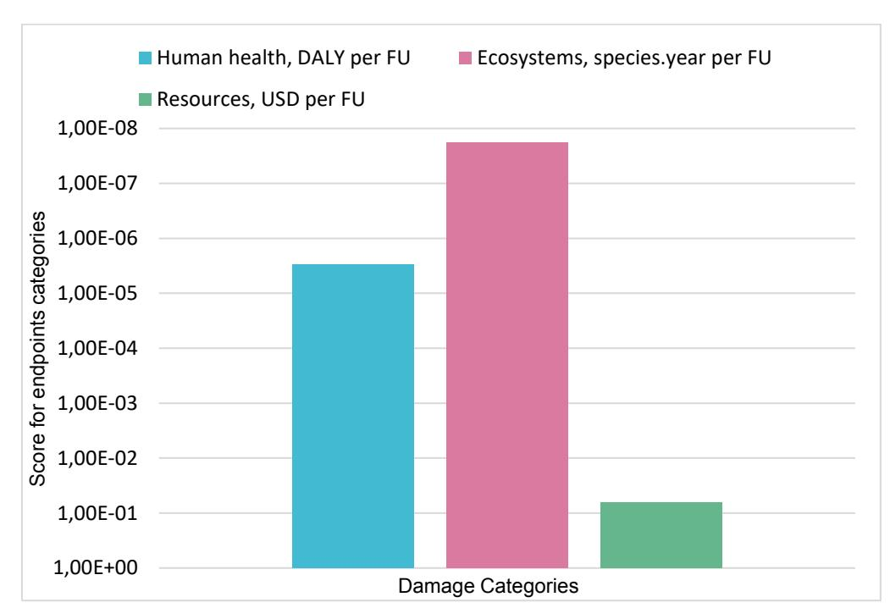

*Figure 13 - Results of the ReCiPe end-point method (H) for the coating applied to the packaging machine*

#### • **Glass**

The LCA carried out for the fabrication of 1 kg of hybrid anti-dirt and anti-reflective coating (FU) exhibited the results shown below. Energy consumption emerged as the most influential input in the overall process. This was followed by the chemical with the greatest environmental impact which was 3- (Trimethoxysilyl)propyl methacrylate. [Figure 14](#page-36-1) shows the normalised graph of damage categories, where "Resources" is the most affected.

*Figure 14 - Results of the ReCiPe end-point method (H) for the coating applied to the glass*

As presented in section 3.3.1, the LCIA of LCA is characterised into impact categories, which are divided into midpoint and endpoint. The methods used in this document for the midpoint were ReCiPe and PEF.

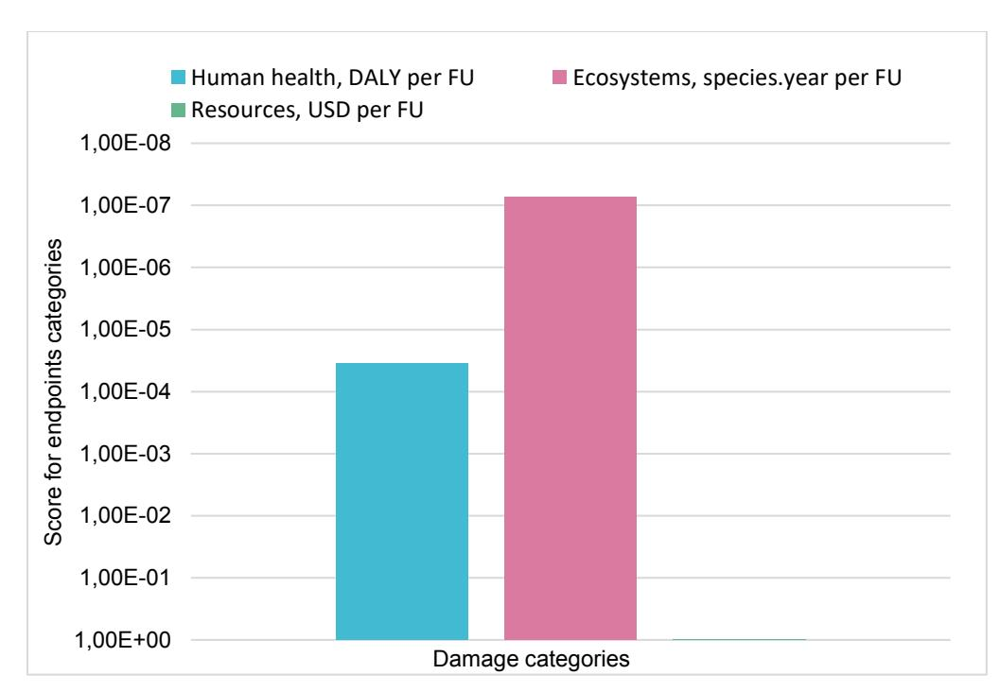

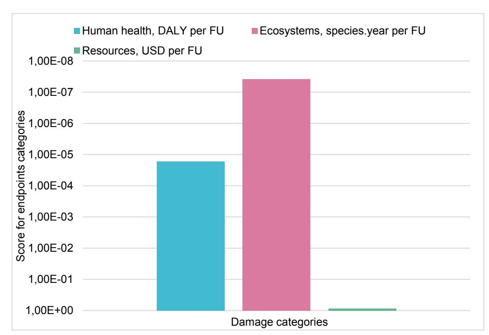

Each method has its own categories and characterisation factors, so the results are not expected to be the same, but they must follow the same pattern to be reliable. Below in [Figure 15](#page-37-0) and [Figure 16,](#page-37-1) are graphs of the respective methods, with their results for 6 impact categories, selected because they can be compared. In all categories the results agree, varying slightly due to the different calculation factors, as mentioned above.

*Figure 15 - Results of the three case studies of the ReCiPe midpoint method (H), normalisation model*

*Figure 16 - Results of the three case studies of the PEF midpoint method, normalisation model*

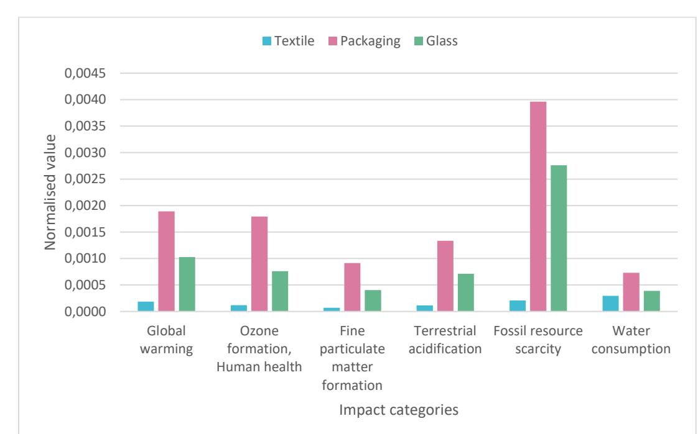

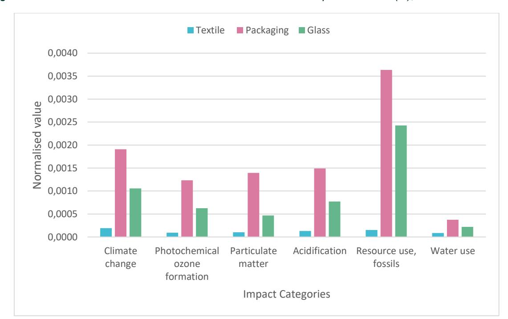

#### 5.5.2.LCC

A preliminary cost analysis was conducted to evaluate the expenses associated with manufacturing coatings, focusing on the primary factors influencing costs.

*Figure 17 - Operational costs of PROPLANET coatings*

As depicted in [Figure 17,](#page-38-1) the total operational expenses in the glass coating sector were found to surpass those of the other two sectors. Notably, material inputs were identified as a significant cost driver for textiles, primarily due to the utilisation of sodium alginate, despite the relatively minimal usage of materials in this process.

In contrast to material costs, electricity expenses were observed to be considerably low for manufacturing one FU in the textile coating process. This is attributed to the fact that the textile coating process primarily involves minimal energy consumption for the blending process. Conversely, in the other two sectors, the manufacturing process entails stirring at different speeds and heating of the coating mixture, leading to higher electricity costs.

Scaling up from pilot plant operations to industrial-level production involves inherent challenges, particularly in terms of personnel costs. Pilot plants typically involve only researchers, whereas industrialscale operations require a larger workforce. Consequently, at the pilot plant stage, some costs like land rent may be negligible or non-existent, while others, notably labour costs, become considerably more substantial, owing to the absence of economies of scale and experience75 .

To develop a suitable model for scaling up this innovative technology to an industrial level, certain assumptions are necessary. These assumptions help account for the differences in cost structures and resource utilisation between pilot plants and industrial-scale operations. For instance, bulk purchasing of chemicals and materials, economies of scale in electricity usage, and optimisation of labour resources are factors that can significantly impact the total cost of inputs for industrial-scale production.

It's crucial to acknowledge that while lab-scale data provides a foundational understanding of cost structures, it is not directly transferable to industrial-scale production. Instead, it serves as a starting point for further analysis and adjustments to better reflect the realities of mass manufacturing coatings on an

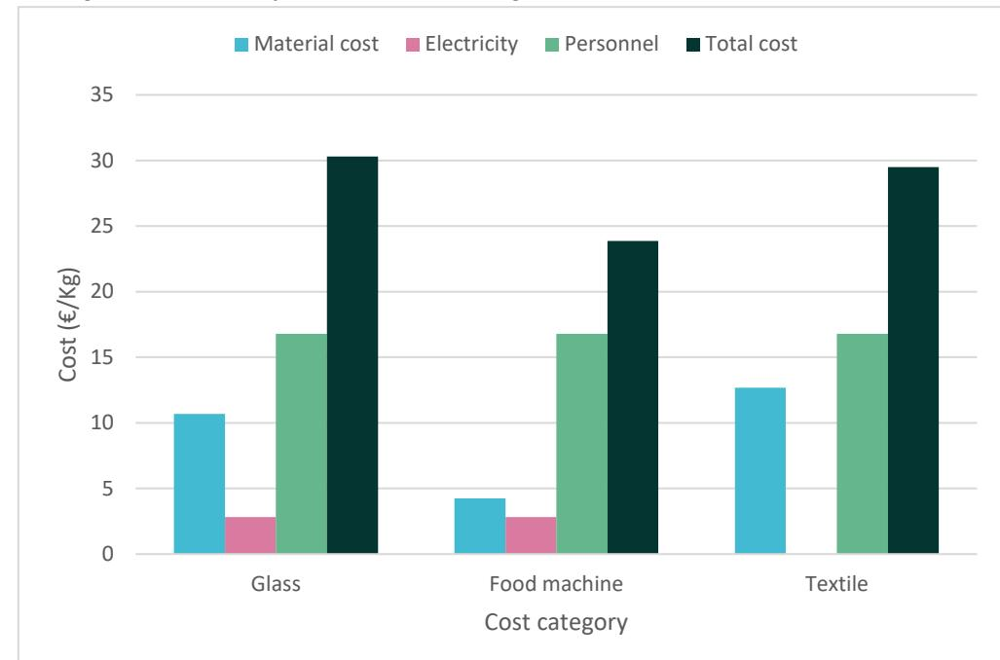

75Bettini, F., et al.: A methodological approach to Life Cycle Costing of an innovative technology: from pilot plant to industrial scale in What is sustainable technology? 2012 - [link](https://www.researchgate.net/publication/260292298_A_methodological_approach_to_Life_Cycle_Costing_of_an_innovative_technology_from_pilot_plant_to_industrial_scale)

industrial scale. This iterative process allows for the refinement of cost models to accurately capture the complexities and nuances associated with large-scale production processes.

## 5.5.3.sLCA

As mentioned in section 6.6.3, the results of the literature review and of the chemical ethanol allowed a thorough examination of the most common impact categories and subcategories being used in sLCA studies. To complement this analysis, D1.2 presented the initial subcategories to be used in PROPLANET based on expert judgement. The subcategories to be analysed in the project are in the workers impact category: CL, FS, fatal accidents (FA) and FL. In the local community impact category, the unemployment subcategory was analysed. Below are the results of the initial PSILCA social hotspot analysis. The method used in the database is called the "Social Impacts Weighting Method", and it is an example of a Reference Scale approach method. This analysis allows the project to have a macro-overview of where the social impacts are coming from, by country and sector, represented in medium risk hours. The medium-risk hours denote the risk for a single indicator related to worker hours and to the average risk of generating 1 USD of output for the sector under consideration. It is a metric or indicator used to quantify the level of risk associated with certain social aspects or the impact of a product during its life cycle. The highest medium risk hours in each subcategory have the greatest social impact on the product's life cycle.

Upon a thorough examination of the PSILCA database, it was concluded that the database does not contain a process that represents with 100% certainty the value-chains represented in PROPLANET. For this reason, a proxy process was used, designated "**Manufacture of paints, varnishes and similar coatings, printing inks and mastics – GB".** Given that the geographical reference is not 100% aligned with PROPLANET's but it represents a European country with similar political, economic, and cultural ideals, this proxy was deemed the best option. Additionally, the process also contains, within the social risks represented in each subcategory, impacts in some countries represented in the project's consortium.

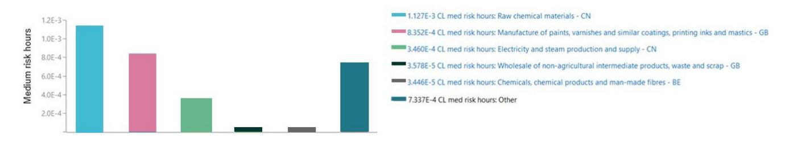

*Figure 18 - Child labour*

As it is possible to see in [Figure 18,](#page-39-1) the first subcategory being analysed is CL, within the workers impact category. This subcategory assesses the children in employment, total, through the indicator "% of all children ages 7-14". The country with the biggest CL medium (med) risk hours is China (CN), in the raw chemical materials life cycle stage, represented by the red bar. China is also represented in the electricity and steam production and supply stage, the yellow bar, with a slightly smaller number of med risk hours. On the other hand, it is worth noting that United Kingdom (GB), represented by the blue and green bar, also has a substantial number of med risk hours in this subcategory. The blue bar represents the manufacture of paints, varnishes and similar coatings, printing inks and mastics, while the green one represents wholesale of non-agricultural intermediate products waste and scrap. The grey bar represents a high number of med risk hours for other processes and countries, but there is ambiguity since it is unclear which specific processes and countries are being included

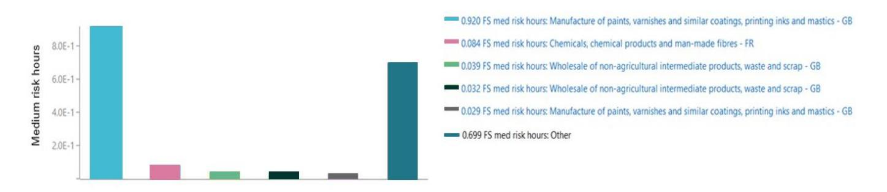

*Figure 19 - Fair salary*

The second subcategory being analysed is the FS, within the workers impact category. This subcategory assesses, in an integrated way, three different indicators: 1. Living wage, per month (USD); 2. Minimum wage, per month (USD); 3. Sector average wage, per month (USD). As shown in [Figure 19,](#page-40-0) the country with the biggest FS med risk hours is GB, in the manufacture of paints, varnishes and similar coatings, printing inks and mastics represented in the red bar. The second biggest contributor to social impacts is the category Other (grey bar), which, as was said before, represents some ambiguity in terms of countries and processes. The remaining processes represent similar med risk hours, with the process chemicals, chemical products, and man-made fibres, in France (FR), represented by the blue bar, representing the biggest medium risk hours.

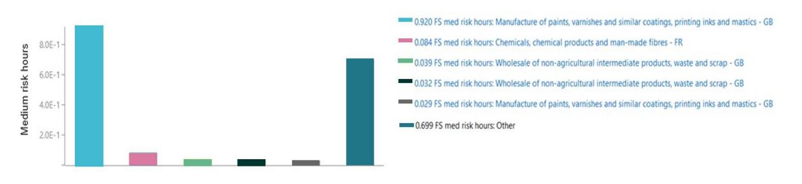

*Figure 20 - Health and Safety*

The third subcategory being analysed is the HS, within the workers impact category. This subcategory assesses the fatal accidents at workplace, through the indicator "cases per 100000 employees and year". [Figure 20](#page-40-1) shows that the country with the biggest fatal FA med risk hours is GB, in the manufacture of paints, varnishes and similar coatings, printing inks and mastics stage, represented by the red bar. The second biggest contributor is the Other, represented by the grey bar, which, once more, represents ambiguity in its results. The remaining processes represent similar med risk hours, with the process raw chemical materials, in CN, represented by the blue bar, having the biggest impact. It is worth noting that India appears in this subcategory represented in two processes: other chemicals, the green and yellow bar.

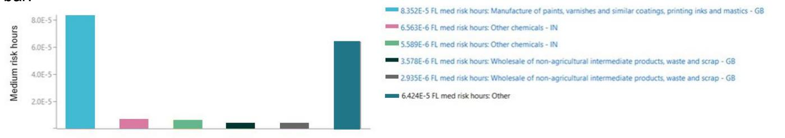

*Figure 21 - Forced labour*

The fourth subcategory being analysed is the FL, within the workers impact category. This subcategory assesses the frequency of FL, through the indicator "cases per 1000 inhabitants in the country". As indicated in [Figure 21,](#page-40-2) the country with the biggest FL med risk hours is GB, in the manufacture of paints, varnishes and similar coatings, printing ink and mastics, represented by the red bar. The second biggest contributor is the Other, represented by the grey bar, which, again, represents ambiguity in its results. The remaining processes represent similar med risk hours, with the process other chemicals, in India, represented by the blue bar, having the biggest impact. It is worth noting that GB also has contains social impacts in other processes, namely, wholesale of non-agricultural intermediate products, waste and scrap, represented by the green and purple bar.

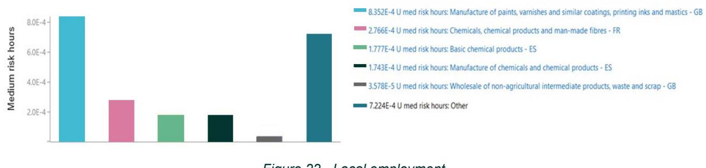

*Figure 22 - Local employment*

The final subcategory being analysed is the local employment, within the local community impact category. This subcategory assesses the unemployment rate in the country, through the indicator "% of population". As can be seen in [Figure 22,](#page-41-1) the biggest Unemployment (U) med risk hours are in GB, in the manufacture of paints, varnishes and similar coatings, printing inks and mastics (red bar). The second biggest contributor is the Other, represented by the grey bar, which, as in the other cases, represents ambiguity in the results. The processes chemicals, chemical products, and man-made fibres, in FR (blue bar), basic chemicals products, in Spain (ES, yellow bar), and manufacture of chemicals and chemical products (green bar), represent similar med risk hours. The biggest contributor is the process represented by FR. The least representative process is the wholesale of non-agricultural intermediate products, waste and scrap, in GB.

Considering all subcategories and processes, it emerges that the production of paints, varnishes and similar coatings, printing inks and mastics in GB is the predominant source of social impacts. From the subcategories analysed, this process was the largest contributor to social impacts in 4 out of 5 subcategories. The only exception was in the CL subcategory for the raw chemical materials process, which China leads. The manufacturing process is particularly important for PROPLANET, given that the manufacture of chemicals for coating applications, according to this analysis, represents several social risks. The specific social impacts in PROPLANET's manufacture process will be assessed in later stages of the project, taking into consideration primary data provided from our manufacturer partners. After this analysis, a comparison will be made between the proxy utilised in this deliverable and the data provided. The category Other was also representative in several subcategories, representing a certain ambiguity in the analysis and in the measurement of impacts. More research will need to be conducted to ensure that all social impacts are accounted for when the project shows its last results, with countries and sectors assigned and visible. Finally, the other processes showed similar social performance, with the risks appearing in countries such as France, India and Belgium.

# 6. Data Gaps in the PROPLANET LCSA

Data gaps can be defined as values that are unavailable but would improve the accuracy and reliability of LCA results if they were included. The choice of values that significantly impact LCA results depends on the availability of secondary data. 76 Each dimension requires a type of data and has its own way of obtaining it (see section 3.2). If essential data is not collected by the LCI method, the mitigation strategy for missing data should be followed, commented on for each dimension below.

The unavailability of data observed in the LCA was due to the lack of some chemicals used by the manufacturers in the database used. To address this issue, a study examined the chemical's properties, role in the chemical reaction, in the final product, and its toxic and hazardous characteristics. This allowed the selection of similar chemicals from the database, which were then validated with manufacturing partners for substitution without significant problems. For a preliminary analysis, it can be used measures like these to advance the results, since the formulation may contain qualitative changes throughout the scale-up.

For the final analysis, to be carried out in month 36, another approach will be developed, which aims to be more precise to the original chemical. To do this, modeling software will be used in conjunction with a literature review to define the production parameters of these chemicals. Thus, with data from the literature, the modelling of the unitary systems and information on similar flows in the database, it is possible to define the missing flow.

For LCC, the current data available is primarily of lab scale, which needs strategic upscaling to the industrial scale. Also, the coatings are also in the nascent stage of development, and they still need validation and improvements. The lack of contemporary literature on manufacturing processes of coating at the industrial level and the relevant costs hinder the cost analysis. This can be addressed in the final analysis by obtaining data from the industrial companies producing conventional coating and through technical visits to the companies. Strategic scaling up with the technical information from the conventional coating is mandatory to know the real-world cost of the coatings developed.

Considering the ongoing evolution of sLCA methodology, which is yet to attain the refinement observed in other LCA methodologies, the project's strategic decision is to channel efforts towards the enhancement of its methodological framework. The intricacies of the present project introduce a distinctive challenge, characterized by absence of requisite data necessary for the execution of sLCA. Notably, the absence of a defined geographical point(s) of reference for establishing the system boundary poses a significant hurdle. To address the mentioned shortfalls, insights from our work presented in D1.2 were leveraged and a literature review to discern the most pertinent stakeholder groups and subcategories was conducted. Furthermore, our methodological effort focused on establishing a geographically relevant point of reference, vital for the effective implementation of the sLCA within the project's context.

# 7. Conclusions

This deliverable comprehensively addresses environmental, economic, and social dimensions, setting a solid foundation for extensive project assessments in the coming months. By starting with an in-depth analysis of resource utilization, economic expenditures, and social repercussions, key areas for improvement and intervention are pinpointed early in the development process. Such a proactive approach ensures strategies to mitigate resource-intensive inputs and assess economic viability are integral to the sustainability strategy. The LCA underscores the necessity of understanding the full environmental implications of the innovative coatings across their lifecycle. Highlighting resource consumption, environmental hotspots, and optimisation potentials, significant opportunities to lessen environmental impacts within the manufacturing stage have been unveiled. As the project progresses towards D6.3, this step will broaden the assessment to cover the entire lifecycle, reinforcing the commitment to Sustainability by Design (SbD) principles.

76 T. Henriksen et al. Approaches to fill data gaps and evaluate process completeness in LCA. 2019 - [link](https://link.springer.com/article/10.1007/s11367-019-01592-z#:~:text=Data%20gaps%20can%20be%20defined,the%20results%20of%20an%20LCA.)

Meanwhile, the LCC sheds light on the economic aspects throughout the lifecycle, identifying crucial cost drivers and areas ripe for efficiency gains. This insight is vital for enhancing the economic feasibility of the coatings, presenting a challenge to integrate these findings with environmental and social evaluations. As the project moves forward, this holistic sustainability perspective will be detailed in D6.3, ensuring the coatings not only meet stringent environmental standards but remain economically viable.

The sLCA explores the social dimensions related to the chemical sector and the production of coatings, offering groundwork for understanding social impacts. Despite literature gaps in the glass and food packaging sectors, the targeted analysis within the textile industry lays a robust foundation. The project aims to expand this assessment through primary data collection, utilising comprehensive data and engaging a broader stakeholder base. This expansion is crucial for a thorough assessment of social implications, aligning with global sustainability goals. The sLCA's next phase involves making a detailed survey strategy for collecting primary data. This includes defining clear objectives, identifying the target audience, and developing a survey template that encompasses all key categories identified for in-depth analysis. Such a structured approach to gathering primary data is instrumental in enhancing the understanding of social impacts, paving the way for targeted interventions.

In summary, this deliverable highlights the preliminary assessment's conclusion and clearly delineates the path forward in D6.3. The insights derived from these initial assessments will prove invaluable in refining the development and optimisation of the coatings, ensuring a positive contribution towards sustainability goals.