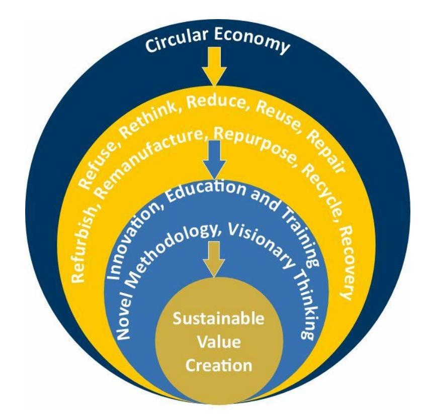
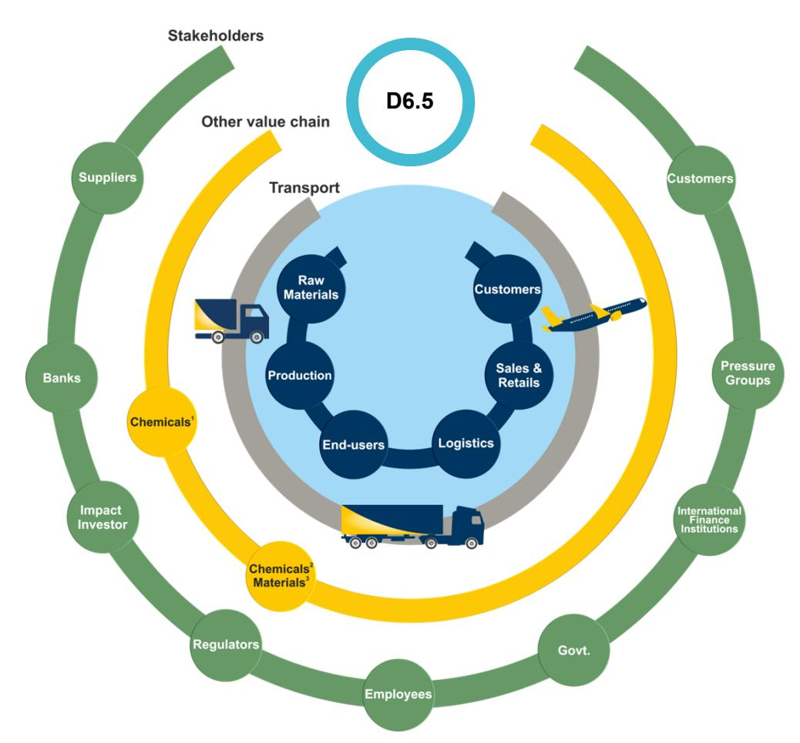
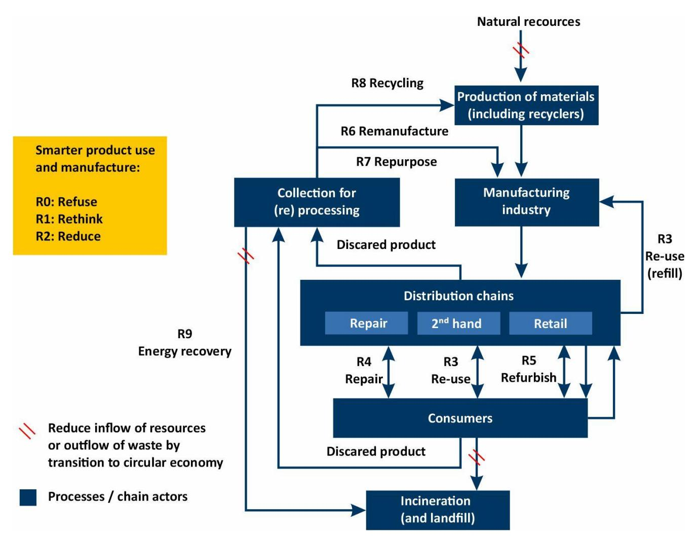

Funded by the European Union. Views and opinions expressed are however those of the author(s) only and do not necessarily reflect those of the European Union or HADEA. Neither the European Union nor the granting authority can be held responsible for them.

## Enhanced safe and sustainable coatings for supporting the planet

# Deliverable D.6.5 End of Life strategies and activities

### **Deliverable Information**

| Responsible partner:       | HOLOSS                                                          |
|----------------------------|-----------------------------------------------------------------|
| Work package No and Title: |                                                                 |
|                            | WP6 – Sustainability and Toxicological assessments for Safe and |
| Contributing partner(s):   | IDE, TEC, NIC, AIT, REE, PLK                                    |
| Dissemination level:       | PU Public                                                       |
| Type:                      | R – Document, report                                            |
| Due date:                  | 31/03/2024                                                      |
| Submission date:           | 28/03/2024                                                      |
| Version:                   | V6                                                              |

### Project Profile

| Programme          | Horizon Europe                                                   |
|--------------------|------------------------------------------------------------------|
| Call               | HORIZON-CL4-2022-RESILIENCE-01                                   |
| Topic              | HORIZON-CL4-2022-RESILIENCE-01-23                                |
| Number             | 101091842                                                        |
| Acronym            | PROPLANET                                                        |
| Name               | Enhanced Safe and Sustainable coatings for supporting the Planet |
| Start Date         | 1 January 2023                                                   |
| Duration           | 36 months                                                        |
| Type of action     | HORIZON Research and Innovation Actions                          |
| Granting authority | European Health and Digital Executive Agency                     |
| Coordinator        | IDENER                                                           |

### Executive Summary

The main goal of the PROPLANET project is the development and optimisation of three innovative coatings applicable in several industrial sectors, including textiles, food packaging machines, and glass. These innovative coatings aim to be Safe and Sustainable by Design (SSbD) by significantly reducing ecological footprints, ensuring non-toxicity and enhancing recovery and recyclability. In this line, the project develops hydrophobic and oleophobic coatings that offer improved durability for textiles. In food packaging machines, it introduces hybrid siloxane bio-based coatings, addressing non-stick and anti-corrosive needs. The project also develops low-maintenance, anti-fouling, and anti-reflective siloxane coatings for glass sector, proving their efficacy in both architectural and automotive applications.

In PROPLANET, Work Package 6 is fundamental in the quest to innovate in the realm of coatings, ensuring they are both safe and sustainable. Thus, it is dedicated to developing a robust framework that encompasses toxicological and sustainability assessments, aiming to forge a methodology that encompasses comprehensive sustainability analysis and the principles of eco-design. Deliverable 6.5, emerging as a key output of this work package, is focused on elucidating strategies and practices pertinent to the management of coatings at the end of their life cycle. This is done within the broader ambit of the circular economy and circular value chains, underpinning the project's commitment to minimising environmental impacts and negating toxicological risks. Through in-depth research conducted in Task 6.3 "Circular Economy, End-of-Life (EoL) Strategies and Value Chain Assessment", this deliverable presents an exploration of EoL strategies, specifically within Subtask 6.3.2, which deals with "Circularity by Design and EoL Strategies".

An innovative approach towards EoL strategies for coatings is designed to ensure the sustainability. By considering EoL options for both the final products (applications) and the coatings, it offers a thorough perspective that includes several strategies such as reuse, repair, refurbishment, and recycling. This approach not only aims to minimise waste and promote circular economy principles but also seeks to overcome challenges related to the separation and recycling of coatings. The emphasis on developing coatings that are safe, sustainable, and easily separable at their EoL signifies a paradigm shift towards circular product design. All in all, it aims to facilitate a comprehensive dialogue among all partners involved, scrutinising the EoL possibilities for each innovative coating.

### Table of Contents

|       | Table of Contents                                                                                                                                     |
|-------|-------------------------------------------------------------------------------------------------------------------------------------------------------|
| 1.    | Introduction .......................................................................................................................................8 |
| 2.    | Coatings............................................................................................................................................8 |
| 2.1.  | Process manufacturing...............................................................................................................8                 |
| 2.2.  | Overview of PFAS uses and exposure .......................................................................................9                           |
| 3.    | PROPLANET applications.................................................................................................................9              |
| 3.1.  | Crosslinked biopolymer oil/wax microcapsules in polysaccharide matrix for textile end-application                                                     |
| 3.2.  | Hybrid siloxane bio-based coatings for food packaging machines ............................................10                                         |
| 3.3.  | Hybrid siloxane coatings for low maintenance glass.................................................................10                                 |
| 4.    | Challenges in the Circular Economy................................................................................................10                  |
| 4.1.  | The concept of Value Chain .....................................................................................................12                    |
| 4.2.  | Conceptual approach between EoL and Safe and Sustainable by Design................................14                                                  |
| 5.    | EoL strategies .................................................................................................................................18    |
| 5.1.  | EoL for coatings after separation from final applications...........................................................21                                |
|       | Textile coatings EoL strategies ...........................................................................................................21         |
| Glass | ..................................................................................................................................................23  |
| 6.    | Conclusions.....................................................................................................................................24    |

### List of Figures

| <b>Figure 1 - Circular economy: the promotion of sustainable value creation.</b> Adapted by ..... | <b>15</b> |
|---------------------------------------------------------------------------------------------------|-----------|
| <b>Figure 2 - Value chain map.</b> .....                                                          | <b>14</b> |
| <b>Figure 3 - Examples of routes for the 10R. Adapted by Potting (2017).</b> ....                 | <b>20</b> |

### List of Tables

| Table 1 - Guidelines: product sphere (classified by characteristics)..... | 16 |
|---------------------------------------------------------------------------|----|
| Table 2 - Circular economy strategies "".....                             | 18 |
| Table 3 - EoL for final coated products - R3-R5.....                      | 20 |

### Table of Abbreviations

| Abbreviation | Definition                          |
|--------------|-------------------------------------|
| EU           | European Union                      |
| CE           | Circular Economy                    |
| PFAS         | Per- and polyfluoroalkyl substances |
| SSbD         | Safe and Sustainability by Design   |
| EoL          | End-of-Life                         |
| SVHC         | Substances of very high concern     |
| CEAP         | Circular Economy Action Plan        |

### 1. Introduction

The European Union (EU) has set ambitious objectives to transition towards a circular economy (CE). Within this framework, the PROPLANET project seeks to revolutionise industrial coating development by creating safe and sustainable alternatives to traditional per- and polyfluoroalkyl substance (PFAS)-based coatings. PFAS are synthetic chemicals e.g. used in products like textiles and food packaging, despite their environmental and health risks that include extreme persistence and links to diseases like thyroid disease and cancer. Targeting Safe and Sustainable by Design (SSbD) solutions, PROPLANET aims to mitigate the environmental and health impacts associated with coatings, steering the industry towards safer, eco-friendly and health-conscious practices. In this context, the primary objective of this document is to present a comprehensive overview of potential End-of-Life (EoL) strategies tailored to the unique properties and applications of each coating. By doing so, PROPLANET seeks to ensure that the life cycle of these materials aligns with the principles of the CE, from manufacturing through disposal and beyond.

Thus, this deliverable presents the potential EoL strategies for each coating developed under the PROPLANET project, to address subtask 6.3.2 Circularity by Design and EoL. Next, a description of the coating manufacturing process is provided, and the coatings' specific functions and properties discussed. Furthermore, an overview of PFAS is given and the PROPLANET project is introduced with practical applications of the research. Subsequently, the CE model is presented, along with concepts, characteristics, and barriers. The key concepts of the CE are discussed in the subtopics. Aware of the subject of the project and what CE is, the EoL strategies, their concept, and the methodology currently applied are presented. The EoL strategies are presented for each use case of the PROPLANET project.

As a result, this report thoroughly examines EoL strategies and practices for PROPLANET coatings, ensuring a broad scope of sustainable management. Recognising the challenges due to the early stage of research and development, the significance of this initiative is highlighted. It introduces innovative approaches for environmentally responsible coating management, in line with the EU's environmental and economic objectives. This effort not only demonstrates the application of CE principles but also sets a precedent for future developments in sustainable industrial practices.

### 2. Coatings

#### 2.1. Process manufacturing

The coatings developed in PROPLANET are liquid formulations developed by sol-gel method and applied to the substrate via dipping or spraying. They are protective, functional, or decorative and are employed to improve substrate properties and performance. 1 A benefit of their protective function is that manufacturing costs are decreased since the fabrication of new parts is not needed. 2 A wide variety of coating materials and deposition methods is available which are used for different applications. However, the highest demand is for coatings that protect a component or structure of a product that is exposed to mechanical or chemical damage. [2,](#page-7-3)3

By carefully selecting the appropriate coating material and deposition technique, manufacturers can achieve desired characteristics such as increased durability, corrosion resistance, aesthetic appeal, or specific functional properties.[1](#page-7-4) The sol-gel technique offers a viable path to produce molecular or nanoscopic mixtures that make it possible to combine the properties of organic materials, such as toughness and elasticity, and inorganic materials with their high degree of hardness and chemical

1 Weinstein, S. J. and Ruschak, K. J. Coating Flows. Annual review of Fluid Mechanics. 2004 - [link](https://www.annualreviews.org/doi/pdf/10.1146/annurev.fluid.36.050802.122049)

2 Fotovvati, R. et al. On coating techniques for surface Protection. J. Manuf. Mater. Process. 2019 - [link](https://www.mdpi.com/2504-4494/3/1/28)

3 Hofacker, S. et al. Sol-gel: a new tool for coatings chemistry. Progress in organic coatings. 2002 - [link](https://www.sciencedirect.com/science/article/abs/pii/S0300944002000450)

resistance[.](#page-7-5) 3 Sol-gel-based coatings are easy to apply and can provide different functionalities through the appropriate choice of reagents, catalysts and reaction conditions.4

#### 2.2. Overview of PFAS uses and exposure

PFAS are a set of synthetic chemicals that contain several carbon-fluorine (C-F) bonds. They have been in production and used in various industrial and commercial products for over six decades, such as surfactants, fire-fighting foams, metal chromating solutions, textile coatings and food packaging5 . However, some specific uses of PFAS may be necessary to the health, safety or functioning of today's society, for which there are no alternatives yet. These substances are considered as problematic due to their extremely high persistence and impacts on human and environmental health.6,7

Reported data indicate that ingestion is the main route of human exposure to PFAS, while the main source of contamination is drinking water and food, which can cause [adverse health effects](https://www.sciencedirect.com/topics/engineering/adverse-health-effect) including thyroid disease, liver damage, and cancer[.](#page-8-3) 5 Direct exposure can also come via cosmetics, sprays or dust from consumer products, but little is known of the impacts through these pathways. Not all classes of PFAS can be effectively degraded in the same way. Both people and wildlife can suffer serious health problems from PFAS. Epidemiological studies assessing the health effects of populations unknowingly exposed to PFAS have found links between increased cholesterol, impaired immune and liver function, many malignancies and substantial birth abnormalities. 8,9

Several PFAS are on the Registration, Evaluation, Authorisation of Chemicals (REACH) Candidate List of substances of very high concern (SVHC), for example PFOA, perfluorinated carboxylic acids (C9-14 PFCAs) and perfluorohexanesulfonic acid (PFHxS). The SVHC identification was based on their persistence, mobility and toxicity, which were considered to pose a threat to human health and wildlife when exposed through the environment (including through drinking water). These PFAS were identified as carcinogenic, mutagenic and reprotoxic, bio accumulative and toxic/very persistent and very bio accumulative (PBTs/vPvBs) chemicals.10

### 3.PROPLANET applications

As mentioned, the main objective of the PROPLANET project is to develop and demonstrate a comprehensive set of new, economical, highly functional, safe and sustainable coatings capable of replacing current PFAS-based coatings in three different sectors and value chains: i) textiles, by crosslinked biopolymer oil/wax microcapsules in polysaccharide matrix coating; ii) food packaging machines, by hybrid siloxane bio-based coating; and iii) low-maintenance glass, by hybrid siloxane coating. These new coatings aim to substantially lower water and carbon footprints while being non-toxic, demonstrating their recovery and recyclability and keeping the mechanical, physical, and chemical properties of conventional PFAS-based coatings.

#### 3.1. Crosslinked biopolymer oil/wax microcapsules in polysaccharide matrix for textile end-application

The use case for the textile sector is aimed at developing fluorine-free hydrophobic and oleophobic coatings with increased wear resistance and washing durability. The textile substrate hydrophilization and lyophilization will be performed by multiscale study involving experimental screening, instead of conducting

4 Tiwari, A. Handbook of antimicrobial coatings. 2018 - [link](https://www.sciencedirect.com/book/9780128119822/handbook-of-antimicrobial-coatings)

5 Verma, S. et al. Recent Advances on PFAS degradation via thermal and nonthermal methods. 2023 - [link](https://www.sciencedirect.com/science/article/pii/S2666821122001818)

6 Glüge, J. et al. An overview of the uses of PFAS. 2021 - [link](https://www.ncbi.nlm.nih.gov/pmc/articles/PMC7784712/)

7 Zhou, J. et al. First report on the sources, vertical distribution and human health risks… 2021 - [link](https://www.sciencedirect.com/science/article/abs/pii/S0304389420321245)

8 De Silva, A. O. et al. PFAS exposure pathways for humans and wildlife. 2020 - [link](https://setac.onlinelibrary.wiley.com/doi/epdf/10.1002/etc.4935)

9 Dickman, R. A. and Aga, D. S. A review of recent studies on toxicity, sequestration, and degradation of per- and polyfluoroalkyl substances (PFAS). 2022 - [link](https://www.sciencedirect.com/science/article/pii/S0304389422009104)

10 ECHA. Per- and polyfluoroalkyl substances (PFAS). 2023 - [link](https://echa.europa.eu/pt/hot-topics/perfluoroalkyl-chemicals-pfas)

in-silico-supported screening. This approach will enable to obtain real-world results and behaviour of complex mixtures of different materials (such as biopolymers, polysaccharides, oils, waxes etc.) to produce biopolymer-based coatings/microcapsules and their influence on the repellence of textile substrates. Cotton and polyester fabrics will be used as textile substrates due to their wide use in the textile sector, representing larger groups of cellulosic and synthetic fibres.

#### 3.2. Hybrid siloxane bio-based coatings for food packaging machines

Hybrid siloxane bio-based coatings will be developed using sol-gel synthesis with the desired properties (non-stick, anti-corrosive, self-lubricating and resistant to high temperatures) for application in packaging machines. This coating is needed on some crucial parts of every food packaging machine that require non-stick properties, particularly those parts that come into direct contact with the food product or packaging material. The main reason for this is to prevent the food product or packaging material from sticking to machine parts during the packaging process. If the product or packaging material sticks to the parts, it can cause clogs or other malfunctions that can slow down or stop the process.

#### 3.3. Hybrid siloxane coatings for low maintenance glass

The objective is to develop PFAS-free hybrid siloxane coating using the sol-gel method, suitable for lowmaintenance glass giving it anti-soiling and easy-to-clean properties, as well as proven durability properties for certain uses. In PROPLANET, the coatings will be optimised through first-principles-based models and safe and sustainable by design criteria as well as tested and validated in two end-applications, in shower doors, as a representative use case of an architectural application, and automotive glass, as a representative use case in the mobility field. Low-maintenance glass is commonly used in architectural applications such as doors, windows, and skylights, as well as in automotive and aerospace applications such as vehicle window shields and in high-performance applications such as photovoltaic panels for the solar energy sector. Typically, these coatings are based on PFAS chemistry, since they lead to extremely low surface free energy, which results in excellent anti-adhesive behaviour for polar and non-polar substances.

### 4. Challenges in the Circular Economy

The first phase of the CE's main strategy, from 1970 to the 1990s, was dedicated to waste management. During the 1970s, the 3R concept of "reduce, reuse and recycle" gained popularity alongside environmental movements in Europe and the United States. During the second phase, from 2000 to the 2010s, the main objective of the CE was to implement precise and ambitious initiatives to minimise raw material usage in Europe, by ensuring material circularity, increasing the use of secondary raw materials, and dealing with waste at source. Guidelines for promoting the sustainable use of natural resources should be included in the action plan. In a third CE phase (CE 3.0), which began in 2010, while economic advantages were prioritised, sustainability became increasingly difficult due to population growth and resource depletion. In this way, more attention was paid to retaining the value of resources. And with the fear of unsustainability, nations become more aware of excessive resource extraction. 11,12,13

The CE is a transformative concept that can be succinctly defined as a system where the outputs of one process become the inputs for another. In this approach, the traditional linear model of "take-makedispose" is replaced with a closed-loop system that aims to minimise waste and maximise resource efficiency. By reimagining the way we produce, consume, and dispose of goods, the CE offers a promising solution to the environmental and economic challenges we face in today´s world. It encourages the design of products that can be easily repaired, reused, or recycled, ensuring that valuable materials remain in circulation for as long as possible. For the European Commission, the CE can be defined as an economy

11 Khaw-ngern, K. et al. The 9Rs strategies for the circular economy 3.0. 2021 - [link](https://pdfs.semanticscholar.org/8e5c/34b5865c21a0544158cf5235a9bbb31319c6.pdf)

12 Taranic, I. et al. Understanding the CE in EU, from resource efficiency to sharing platforms. 2016 - [link](https://www.ceps.eu/wp-content/uploads/2016/07/SR%20No143%20Circular%20Economy_0.pdf)

13 Reike, D. et al. The Circular economy: New or refurbished as CE 3.0?. 2018 - [link](https://www.sciencedirect.com/science/article/pii/S0921344917302756)

that preserves the value added to products for as long as possible and virtually eliminates waste.14 Thus, when a product reaches the end of its useful life, resources are retained in the economy so that they can be put to productive use and continue to add value.15

As a holistic approach, the CE differentiates itself from other attempts to reduce energy and material consumption, creating circular circuits of material, energy, and waste flows that encompass all social activities. In this type of circuit, resources are no longer obtained at the cost of the environment in a linear way, but rather a component of the production process that is designed in a circular way. This concept does not refer to a perpetual mobility, since, in fact, energy is consumed to put and keep the economic process running, and the residues still exists. However, both those that leave the system are orders of magnitude smaller than in economic processes and current technologies.16

The aspects presented below are some of those that distinguish the CE concept from other attempts to reduce the consumption of energy and materials. The implementation of a CE can improve the employer's image by incorporating environmental and sustainable values. In addition to these, other concerns are taken into account such as the limited availability of raw materials; dependency of the country's economy on the import of raw materials; high prices; market volatility, and uncertain political situation. It is possible to divide the main barriers to the CE into four groups: technological, market, institutional and cultural. 17,18

The technological aspect refers to the holistic approach that characterises CE, which begins with the design of products, services, and processes. The product must be developed with the goal of promoting circularity, and this demands technological knowledge, which is a barrier. [16](#page-10-0)[,18](#page-10-1)

The market aspect relates the success of the CE to the intense networking and collaboration between companies from different sectors of activity and between companies and consumers, as it refers to the scale of dependence of value chains on reusing, recycling and remanufacturing products on the production line. [16](#page-10-0) In this aspect, market barriers, which are the financial barriers to the adoption of CE, include challenges in financing CE business models, high initial investment costs, and low prices of virgin material. These are just some of the market barriers.[18](#page-10-1)

The institutional aspect refers to the functionality of the CE, which lacks a specific legislative and institutional framework that covers all aspects of economic and social activity. In this aspect lies the institutional (and regulatory) barrier that includes inconsistent political messages and poor institutional infrastructure, which favours a linear economy. The heterogeneity of policies between countries is the main barrier, due to several value chains being highly linked internationally. Other factors mentioned by researchers as barriers are the high administrative costs of reporting waste streams, complex waste legislation, and poor implementation of existing CE policies.[16](#page-10-0)[,18,](#page-10-1)[11](#page-9-3)

The cultural (or social) aspect refers to corporate culture, awareness, and co-operation. Corporate culture can be resisted by lower, middle, and upper management in relation to changes to CE. Lack of consumer awareness affects the effectiveness of CE, and weak co-operation throughout the supply chain. The four barriers are related, economic and technological barriers can affect institutional and cultural barriers and should be taken into account when analysing CE obstacles.[18](#page-10-1)

In the EU context, the EU's Circular Economy Action Plan (CEAP) is a comprehensive body of legislative and non-legislative actions adopted in 201519 , that aim to transition the European economy from a linear to a circular model. The Action Plan mapped out 54 actions, as well as four legislative proposals on waste. These legislative proposals were put forward by the European Commission along with the Action Plan and

14 European Commission. Circular Economy - [link](https://environment.ec.europa.eu/topics/circular-economy_en#:~:text=In%20a%20circular%20economy%2C%20the%20value%20of%20products%2C,continually%20increases%20its%20demands%20of%20scarce%20natural%20resources.)

15 Domenech, T. Explainer: What is a circular economy? 2014 - [link](https://theconversation.com/explainer-what-is-a-circular-economy-29666)

16 Bonciu, F. L. The EU Economy: From a linear to a circular economy. Romanian Journal of European Affairs. 2014. - [link](https://papers.ssrn.com/sol3/papers.cfm?abstract_id=2534405)

17 Pietro-Sandoval, V. et al. Key strategies … implementing circular economy in industrial … enterprises. 2019 - [link](https://onlinelibrary.wiley.com/doi/full/10.1002/csr.1761)

18 Grafström, J. and Aasma, S. Breaking circular economy barriers. Journal of Cleaner Production. 2021 – [link](https://doi.org/10.1016/j.jclepro.2021.126002)

19 Circular Economy Action Plan. 2015 - [link](https://environment.ec.europa.eu/strategy/circular-economy-action-plan_en)

included targets for landfill, reuse, and recycling, to be met by 2030 and 2035, along with new obligations for separate collection of textiles and biowaste. The Action Plan covered several policy areas, material flows, and sectors alongside cross-cutting measures to support this systemic change through innovation and investments. It also announced a sectoral strategy for plastics. More than €10 billion of public funding was allocated to the transition between 2016 and 2020.20

Since the publication of the EU's CEPA in 2015, this new sustainability paradigm has become a guiding force behind the environmental and economic policies of the Junker Commission. The EU has taken a particular approach to circularity, with high expectations to increase competitiveness, promote economic growth and create jobs while reducing environmental impacts and resource dependency. Results show a dichotomy between words and actions, with a discourse that is rather holistic, while policies focus on "end of pipe" solutions and do not address the many socio-ecological implications of a circularity transition. Several actions are thus recommended to tackle the systemic challenges of a circular future from a plural perspective.21

In terms of progress towards CE in Europe, there are two groups. The first group unites the countries that are most advanced in their efforts to operate according to CE principles, made up of Belgium, France, Germany, Italy, Netherlands, Spain and the United Kingdom. The second group comprises EU countries where the shift towards CE is progressing more slowly, predominantly including Central and Eastern European countries, as well as those in Southern Europe. 22

The CE indices are increasingly recognized as a useful tool to support the development of policies for providing information, reducing environmental pressures and impacts through a circular recycling process. 23 The CE's implications in human resources refer to labour-costs, skills, employer image, and corporate culture. 24 In the context of the emerging scarcity of resources, the CE can allow producers to reduce the cost of purchasing raw materials through repeated processing and ensure the optimal use of generated waste. The benefits of minimizing waste and environmental pollution are also remarkable.25

The implementation of the CE is closely linked to the development of reverse logistics. It refers to the supply chain process of returning products from end users back through the supply chain to the retailer or manufacturer.26 When CE is successfully implemented, it can clearly bring environmental, social, and economic benefits. However, a CE roadmap should integrate the key stakeholders' views on the essential developments and actions required for the transition as well as clarify their own role in the transition.[11](#page-9-3) [Figure 1](#page-12-0) shows what CE covers when it comes to creating sustainable value.

#### 4.1. The concept of Value Chain

The concept of the "value chain" was first introduced by Michael Porter in 1985. It provides a comprehensive framework that includes all the essential activities and processes involved in bringing a product or service to life, from its initial conception to its ultimate disposal after use. Porter's value chain model recognises that a product or service is not simply the result of a single process, but rather the result of different interconnected activities that add value at each stage. It emphasises the importance of understanding and optimising each step in the value creation process to enhance overall efficiency and competitiveness.27

It can be distinguished into two categories: primary and support activities. Primary activities include inbound logistics, operations, outbound logistics, marketing and sales, and service. These activities can

20 The EU's Circular economy action plan - [link](https://emf.thirdlight.com/link/l3i96x2za3la-8o3wq5/@/#id=0)

21 Friant, M. C. et al. Analysing European Union circular economy policies. 2021 - [link](https://www.sciencedirect.com/science/article/pii/S2352550920313750)

22 Mazur-Wierzbicka, E. Circular economy: advancement of European Union countries. 2021 - [link](https://enveurope.springeropen.com/articles/10.1186/s12302-021-00549-0)

23 Pascale, A. et al. A systematic review for measuring circular economy: The 61 indicators. Journal of Cleaner Production. 2021 - [link](https://www.sciencedirect.com/science/article/abs/pii/S0959652620349866)

24 Eisenreich, A. et al. Toward a circular value chain. Journal of cleaner production. 2022 - [link](https://www.sciencedirect.com/science/article/pii/S0959652622039476)

25 Ganea, V. and Birca, L. European circular economy. 2020 - [link](http://www.accounting-management.ro/index.php?pag=showcontent&issue=24&year=2020)

26 Caprian, I.Logistical support for the development of the circular economy. 2023 - [link](http://baltijapublishing.lv/index.php/threeseas/article/view/2054)

27 Zamora, E. A. Value chain analysis. 2016 - [link](http/dx.doi.org/10.7545/ajip.2016.5.2.116)

directly contribute to the creation, delivery, and after-sales support of the product or service. On the other hand, support activities, such as procurement, technology development, human resource management, and firm infrastructure, provide the necessary support and resources for the primary activities to function effectively. By analysing and optimising each activity within the value chain, organizations can identify opportunities for cost reduction, process improvement, and differentiation. This holistic approach enables companies to gain a competitive advantage. In this context, value chain perspective analysis is employed to examine and evaluate entire or specific sectors within companies.[27](#page-11-1)

*Figure 1 - Circular economy: the promotion of sustainable value creation. Adapted by 28*

The value chain is in fact one of the most important aspects of the CE, due to the need to incorporate waste from one production line to another, requiring integration between companies, which must co-create circular solutions with the entire supply chain, especially with customers and suppliers and, the policies that should support this process. Other interested parties are, for example, the government, technicians, designers, or research institutions. [24,](#page-11-2)[16](#page-10-0)

Institutional and financial barriers stand out in the value chain. One example of the barriers encountered is the regulatory difficulty of by-products, which are often legally classified as waste before the end of their life cycle, changing ownership from private to public. Financial/market barriers are present, for example, in the fact that the supply of virgin materials adapts more easily to price changes than the supply of recycled materials. The price volatility of recycled materials is greater because they depend on previous consumption patterns and have an inelastic supply. This uncertainty reduces the intention to invest in recycled material markets, and the substitution of these materials in production lines remains low. [18](#page-10-1)

When implemented, EC affects multiple activities in a company's value chain, this fact creates a crossfunctional leadership responsibility and requires close collaboration with the external ecosystem. Thus, the

28 Jawahir, I. S and Bradley, R. Technological elements of circular economy … 6R based closed-loop material flow in sustainable manufacturing. 2016 - [link](https://www.sciencedirect.com/science/article/pii/S2212827116000822)

way of working must be adapted and thinking about multiple life cycles and circularity must be incorporated into the mindset of employees. [24](#page-11-2)

In task 6.3 "CE, EoL strategies and value chain assessment" of PROPLANET, a value chain map was created so that circularity gaps could be identified. Information on processes, materials and chemicals was filled in according to the documents available from the development of other tasks, such as T5.1.1 (Data acquisition from existing databases and Material developer information) and 2.1 (Requirements definition of coatings and substrates), MS1 (LCA inventory for manufacturing system) and additional information was requested by HOL from production partners (TEC, NIC) and end users (PLK, REE, AIT). This deliverable aims to present possible scenarios for filling this gap and closing the loop.

*Figure 2 - Value chain map.*

#### 4.2. Conceptual approach between EoL and Safe and Sustainable by Design

To support the development of innovative SSbD coatings, specific principles must be addressed at the design stage. Design plays a crucial role in conserving valuable resources; by optimising design, products become more durable, easier to repair, upgrade or remanufacture, leading to less disposability and enhanced longevity and maintainability. For this, already starting at the conception phase of products and services, it is essential to anticipate that at the end of their life cycle, they will serve as inputs for other sectors. Good design helps recyclers disassemble products, recovering valuable materials and components2[9,16](#page-10-0). In 2021 alone, existing eco-design requirements saved consumers €120 billion, leading to a 10% reduction in the annual energy consumption of in-scope products. 30

29 European Commission. Closing the loop – An EU action plan for the Circular Economy - [link](https://cleaneuropenetwork.eu/pdf/circular_economy-communication-action-plan_en.pdf) 30 Green Deal - [link](https://ec.europa.eu/commission/presscorner/detail/en/ip_22_2013)

Material substitution issues not only affect procurement, but also require collaboration with research and development or manufacturing fields and product design may require different methods of production. In the development of recyclable or biodegradable solutions, the main challenge is to design a product that integrates recyclable, regenerative or non-toxic materials. [24,3](#page-11-2)1

In product redesign, three aspects are recognised: (1) complexity in basic materials and component parts, (2) complexity in product architecture, and (3) complexity in product functionality and aesthetics. All these factors combined, limit the range of circular products that could be offered to end customers and determine the degree of product recovery at EoL.32

Normally, the EoL of the product is determined according to the analysis of its characteristics. For this reason, it is important to analyse the EoL options during the product development phase, so that the choice of materials can be adapted, for example, using regenerative, recyclable, or non-toxic materials, which are generally scarce or of inferior quality and affect the functionality and aesthetics of the original product. Thus, EoL decision-making is decided according to profitability.3[3,32,](#page-14-0)[24,](#page-11-2)[32](#page-14-0)

In a recent study, Joustra *et al.*34 developed the circular composites design method with the aim of supporting designers of composite products when they must meet the strategies of the CE. The method consists of the following steps:

1- **Intention to redesign a product (like a composite) for circularity**: The PROPLANET project proposal responds to this step.

2- **Explore the product life cycle, recovery loops, stakeholders, and activities**: This step is answered in the project through task 6.2 "Tools and Methodology for SCLA, LCA, and LCC analysis", subtask 6.3.1 "Assessment of value chains", subtask 6.3.2 "Circularity by design and EoL strategies", task 7.1. "Market Analysis and Circular Business Planning" and, task 7.4 "Social engagement activities".

3- **Connecting the strategies to the design aspects:** The eco-design aspects were presented in MS2 "Eco-design of coatings" in month 10 and assisted the WP2 tasks related to the production of the new coatings. In this deliverable the potential EoL strategies for each coating are presented, which should support WP3 (Characterization, up-scaling, and manufacture of PROPLANET SSbD Coatings) and Task 4.4 (EoL of products and next use).

4- **Select which design aspect is relevant to the product:** Once all the possible EoL options have been identified, the most relevant and applicable ones should be selected. Task 4.4 "EoL of products and next use" will use the conclusions of this deliverable, together with the work carried out in T6.2 to choose the most promising EoL strategies to ensure the circularity of the coatings developed in the project.

5- **Develop the product proposal:** This step is answered with tasks such as 3.1, 3.2 and 3.3 "Preparation and application of final recipes" in each case study. The results will be delivered in month 26 in D3.1 "Final recipes on PROPLANET coating", which describes the final formulation of the product and validation in laboratory results.

6- **Finalise the circular product design**: In D4.2 "EoL activities towards circularity", the circularity of the products developed in PROPLANET will be guaranteed, with inputs from tasks 6.3 (mentioned in step 2) and 6.2 "Tools and methodology for s-LCA, LCA and LCC analysis", where sustainable life cycle analysis is carried out.

31 Kazancoglu, I et al. A conceptual framework for barriers ... textile industry. 2020 - [link](https://www.researchgate.net/publication/343155355_A_conceptual_framework_for_barriers_of_circular_supply_chains_for_sustainability_in_the_textile_industry)

32 Franco, M. A. Circular economy at the micro level. 2017 - [link](https://www.sciencedirect.com/science/article/abs/pii/S0959652617320450)

33 Ciceri, N. D. et al. From product EoL sustainable considerations to design management - [link](https://link.springer.com/content/pdf/10.1007/978-3-642-16358-6_20.pdf)

34 Joustra, J et al. Circular composites by design: Testing a design method in industry. 2022 - [link](https://doi.org/10.3390/)

Other authors present guidelines to support product design (for reuse or remanufacturing purposes), such as **Bauer** *et al.* presented in [Table 1,](#page-15-0) which guidelines a product must follow so that its reuse or remanufacturing is feasible.

*Table 1 - Guidelines: product sphere (classified by characteristics)*

| Characteristics Reuse strategies                 |                 | Remanufacturing strategies |                |
|--------------------------------------------------|-----------------|----------------------------|----------------|
| Reliable product Select reliable materials       |                 |                            |                |
| Durable product Select durable materials         |                 |                            |                |
| Avoid components that can be                     |                 |                            |                |
|                                                  | damaged         | during the                 | inspection     |
| Modularity /                                     |                 |                            |                |
|                                                  | Standardise     | and use                    | common         |
|                                                  | materials,      | components,                | and            |
| Use                                              | modular         |                            | parts and      |
|                                                  | components      | thus                       | reducing the   |
|                                                  | complexity      | of                         | disassembly    |
| Physical elements                                | Avoid permanent |                            | fasteners that |
|                                                  | require         | destructive                | removal        |
|                                                  | fasteners       | Standardise                | and use        |
| forms                                            | appropriate     | for                        | repetitive     |
| Stable technology Standardise and use common     |                 |                            |                |
| Standardise and use common                       |                 |                            |                |
| Design reusable parts and                        |                 |                            |                |
| Facilitate switch of damaged                     |                 |                            |                |
| Documentation Provide readable labels, text, and |                 |                            |                |
| Provide good documentation of                    |                 |                            |                |
| specifications, clear installation               |                 |                            |                |

Provide clear information about product, parts, components and

materials

Set up sacrificial parts to give an indication of the components' state of

life

Integrating the constraints of the EoL strategies in the initial phases of the project is an important aspect that needs to be improved, since this phase can determine up to 80% of the environmental impacts that products can generate along their life cycle. 35,36

In 2020, the EC adopted the Chemicals Strategy for Sustainability with the aim of protecting citizens and the environment from hazardous chemicals and promoting innovation in the use of safer and more sustainable chemicals. Following this adoption, work began on defining the principles of SSbD and how to include them in the design process for chemicals, materials, and products. In 2022, the EC's Joint Research Center published an analysis of the dimensions, aspects, methods, indicators and tools of safety and sustainability, followed by a framework for defining criteria and evaluation procedures for SSbD. This report also included an EC recommendation to promote this framework. The framework is still in the testing phase, recommending a two-phase approach to SSbD, the first phase is the (re)design phase, in which eight SSbD guiding principles are proposed. The second phase is the evaluation phase, which consists of five stages covering safety and sustainability aspects (environmental, social, and economic).37,38

During the redesign phase, some design guiding principles were proposed to support this step, based on green chemistry and green engineering principles, sustainable chemistry criteria, and safety by design principles. Based on this, different SSbD principles were recommended, and concrete actions within the PROPLANET project were suggested. The SSbD principals include: material efficiency; minimising the use of hazardous chemicals or materials; designing for energy efficiency; using renewable sources; preventing and avoiding hazardous emissions; designing for the EoL, and considering the whole life cycle. [38](#page-16-0)

The EoL phase begins when a consumer or company disposes of a product. It can then take various routes, such as reuse, remanufacturing, recycling, and incineration. These routes require careful evaluation by decision-makers to determine the optimal choice. Collection and reverse logistics are important parts of the system aimed at increasing the productivity of materials, ensuring that EoL products can be reintroduced into the commercial system. The viability of a strategy is assessed based on relevant technical, economic, environmental, commercial, and social criteria. EoL decision-making needs to use a holistic approach to evaluate EoL strategies from various perspectives, including environmental, economic, social, commercial, technical, market and legislative aspects.

Current EoL product circularity decision-making methods are focused on technical and economic factors, neglecting other crucial areas such as legislative pressure and customer demand, that are pertinent in the decision-making process. EoL product recovery strategies include remanufacturing, repair, reconditioning, redesign, refurbishment, and recycling. All these EoL options are distinct from one another, and the selection of the best suitable product recovery option must take several factors into consideration. EoL decision-making approaches are broadly grouped into three main categories; optimisation methods, multicriteria decision methodology, and empirical methods. 39

35 Bauer, T. et al. Design for high added-value EoL strategies. 2017 - [link](https://link.springer.com/content/pdf/10.1007/978-3-319-48514-0_8.pdf)

36 Gehin, A. et al. A tool to implement sustainable EoL strategies in the product development phase. 2008 - [link](https://www.sciencedirect.com/science/article/pii/S0959652607000492)

37 Sudheshwar, A. et al. Learning from Safe-by-Design for Safe-and-Sustainable-by-Design. 2023 - [link](https://www.sciencedirect.com/science/article/pii/S0160412023005780)

38 Caldeira, C. P. et al. Safe and Sustainable by design chemicals and materials. 2022 - [link](https://publications.jrc.ec.europa.eu/repository/handle/JRC127109)

39 Alamerew, Y. A. and Brissaud D. Circular economy assessment tool for end-of-life product recovery strategies. 2018 - [link](https://link.springer.com/article/10.1007/s13243-018-0064-8)

Determining EoL strategies during the product design stage is complex. Thus, the adoption of fixed strategies at this stage is not always adequate; considering the element of uncertainty, the options suggested at this stage must be analysed and continuously reviewed. 40 That is why PROPLANET's last month (M36) is expected to deliver D4.2 where the EoL activities will ensure circularity, after having developed the coatings, tested them, scaled up production and applied them, ensuring that all the factors that influence the possible strategies are met.

### 5.EoL strategies

EoL strategies are sets of actions that aim to implement CE solutions in economic systems. They are intersectional in nature and involve all actors and products. When the product designer analyses the final routes through EoL, they are referred to as EoL strategies. These strategies capture the multifaceted aspects of a CE at the macro, meso, and micro levels[.33](#page-14-1)[33,](#page-14-1)[43](#page-17-2). Another classification of EoL strategies is proposed by ISO 1406241, which classifies them according to potential environmental gains: (a) prevention, (b) reuse, (c) recycling, (d) energy recovery and (e) elimination.

A new hierarchy was established to resolve the confusion surrounding new conceptions of circularity, the 10Rs, which are: refuse, reduce, resell/reuse, repair, refurbish, remanufacture, reuse, recycle (material), recover (energy), remine (Table 2). The 10R hierarchy has been differentiated into three different loops; short loops (R0-R3) existing close to the consumer; medium-long loops (R4-R6) more related to business activities with indirect connections to consumers; and long cycles (R7-R9) existing traditional waste management activities that include recycling, different forms of energy recovery and, more recently, remining. This differentiated hierarchy with shorter loop options allows for the greatest possible value retention of features across multiple product life cycles. 4[2,11](#page-9-3)

*Table 2 - Circular economy strategies [11,](#page-9-3) 43,44,45,46*

| R  |          | Strategy      | Description                                               |
|----|----------|---------------|-----------------------------------------------------------|
| R0 | Smarter  |               |                                                           |
|    |          | Refuse        | Make product redundant by abandoning its function or      |
| R1 |          | Rethink       | Make a product use more intensive.                        |
| R2 |          | Reduce        | Increase manufacturing efficiency or use less natural     |
| R3 | Extend   |               |                                                           |
|    | lifespan | of            |                                                           |
|    |          | Reuse         | Reuse the product that is still in good condition and     |
|    |          |               | fulfils its original function, for which it was designed. |
| R4 |          | Repair        | Repair and maintenance of defective product.              |
| R5 |          | Refurbish     | Restore an old product and bring it up to date            |
| R6 |          | Remanufacture | Use parts of a discarded product in the manufacture of    |
| R7 |          | Repurpose     | Use a redundant product or its parts in a new product     |
| R8 | Useful   |               |                                                           |
|    |          | Recycle       | Recovery materials from waste to be reprocessed into      |
|    |          |               | new products, material, or substances.                    |
| R9 |          | Recovery      | Incineration of material with energy recovery             |

40 Ma, J. et al. A comprehensive EoL strategy decision making approach… in the product design stage. 2017 - [link](https://link.springer.com/article/10.1007/s00163-017-0277-0)

41 ISSO/TR 14062:2002 - [link](https://www.iso.org/standard/33020.html)

42 Cavallo, M.et al (ed.), Circular Economy, benefits and goods practices. 2017 - [link](https://www.researchgate.net/publication/326106729_Circular_Economy_benefits_and_good_practices)

43 Morseletto, P. Targets for a circular economy. 2020 - [link](https://www.sciencedirect.com/science/article/pii/S0921344919304598)

44 Potting, J. et al. Circular economy: Measuring innovation in the product chain. 2017 - [link](https://dspace.library.uu.nl/handle/1874/358310)

45 Mast, J. et al. R strategies as guidelines for the circular economy. Rethink - [link](https://prosperkolleg.ruhr/wp-content/uploads/2022/08/rethink_22-03_r-strategien_EN.pdf)

46 Sihvonen, S. and Ritola, T. Conceptualizing ReX for aggregating end-of-life strategies in product development. 2015 - [link](https://www.sciencedirect.com/science/article/pii/S2212827115000293)

The strategies are ordered from high circularity (low R number) to low circularity (high R number), the R0 and R1 strategies reduce the consumption of natural resources and materials applied in a product chain.[44](#page-17-3) The "Smarter Product Use and Manufacturing (R0–R2)" group encompasses "Refuse, Rethink, and Reduce", which occur when products are conceived, designed, and developed. These strategies are precursors because they occur before other CE strategies. They are enablers because they favour all other strategies, and they are transformative because they can make the economic system truly circular if applied extensively. Thus, the actions of this group can drive the transition to CE before production takes place [43](#page-17-2). It is in this group that the PROPLANET proposal fits, considering the aspects necessary for the final product to have less impact on the environment.

To be effective, R3–R7 strategies require market responsiveness, well-functioning reverse logistics, stakeholder profitability, and the deployment of these strategies across varied business models. R4–R6 aim to reverse/postpone obsolescence, a product can be remanufactured, refurbished, or repaired, but cannot be subject to these treatments simultaneously. Repurpose is to give a different function to products/materials, depending on who finds this product at the end of its life and the state it will be in. This strategy is the most distinctive of its group and should be considered as a complement to the other strategies, as it would only work on a small proportion of products that can be repurposed. [43](#page-17-2)

Recycling (R8) is the processing of materials to obtain the same (high-grade), or lower (low-grade), quality of recycled materials. [43](#page-17-2) Recycling can be divided into two categories: downcycling and upcycling. If the recycled material has a lower value or quality than the original product, it is considered downcycling; while upcycling refers to recycled material with a higher value or quality than the original product.47

Although it is not the most attractive EoL strategy, recycling remains the most prominent strategy worldwide. Recycling targets should be incorporated into the initial conception and design of products, so the vision is to have targets for recycled content in products. From a governance perspective, recycle targets can best contribute to the transition to CE, if they are designed to encourage the self-destruction inherent in product design by reducing recycling in favour of superior circular strategies (i.e. R0–R7). [43,](#page-17-2)[44](#page-17-3)

Finally, incineration (R9), which has the advantage of being an alternative to recycling, necessitates copious and inexpensive trash to ensure a satisfactory return on investment for its facilities. As a result, it vies with other R strategies for limited resources. However, incineration targets should be defined at the lowest unavoidable level of waste, which is waste not otherwise usable in other CE strategies. Under these terms, incineration can contribute positively to the transition to CE. The R order is not appropriate for certain products and under certain conditions. For these reasons, the hierarchy between strategies must be taken wisely, but it can still provide useful guidance when examining EC strategies.[43](#page-17-2)[,44](#page-17-3)

The natural sequence of the 6R applications within the entire life cycle is illustrated in Figure 3 with several decision points and multiple closed-loop options48 . The feasibility of a strategy is assessed against relevant technical, economic, environmental, commercial, and social criteria.

47 Tonini, D. et al. Quality of recycling. 2022 - [link](https://www.sciencedirect.com/science/article/pii/S0956053X22002057)

48 Zhang, X. et al. On improving the product sustainability … the 6R methodology. 2013 - [link](https://api-depositonce.tu-berlin.de/server/api/core/bitstreams/b59a5312-73c8-4828-a4c1-2785f3fe25a9/content)

*Figure 3 - Examples of routes for the 10R. Adapted by Potting (2017)[44](#page-17-3) .*

#### EoL for final coated products or applications.

In evaluating EoL strategies from the perspective of the final product to which the coating is applied, the analysis is informed by the processes delineated in Figure 3. Specifically, strategies R3 to R5 are pertinent to this examination, as they involve transactions between the consumer and the distribution network, obviating the necessity for coating separation and recycling at this juncture. [Table 3](#page-19-2) systematically delineates potential actions for each product within these categories, offering a structured approach to the management of EoL scenarios within the framework of the study. R9 can be utilised for waste disposal to generate energy through the combustion of organic materials. However, it can also result in the release of pollutants and emissions, underscoring the necessity for proper environmental management and control measures. R9 can primarily be applied to textiles, but the exploration of EoL strategies seeks to detail more extensively from R3 to R8.

*Table 3 - EoL for final coated products - R3-R5*

| Strategy | / |                             |                         |                     |     |
|----------|---|-----------------------------|-------------------------|---------------------|-----|
|          |   | Textile                     | Packaging machine       | Glass               |     |
| R3 Reuse |   | EoL textiles with coatings, |                         |                     |     |
|          |   | even when their original    |                         |                     |     |
|          |   | needed, can be used into    |                         |                     |     |
|          |   | creative fashion            |                         |                     |     |
|          |   |                             | Metal components from   |                     |     |
|          |   |                             | reused in various ways, |                     |     |
|          |   |                             |                         | Reuse the glass     | for |
|          |   |                             |                         | glass can be reused | to  |
|          |   |                             |                         | construct panels    | for |

| accessories, showcasing       |              |                          |
|-------------------------------|--------------|--------------------------|
| R4 Repair To restore original |              |                          |
| functionalities like          | water        |                          |
| suitable new one              | is           |                          |
| necessary. The chosen         |              |                          |
| with the fabric's             |              |                          |
| requirements,                 | and          |                          |
| manufacturer's guidelines     |              |                          |
| for application should        | be           |                          |
|                               | For          | effective repair, start  |
|                               | new coating  | layer adheres            |
|                               | the          | coating, following       |
|                               | specific     | application              |
|                               | instructions | for optimal              |
|                               |              | coating on glass, use a  |
|                               |              | the original's benefits, |
| Repairing or reinforcing      |              |                          |
| by attaching compatible       |              |                          |
| material extends              | the          |                          |
| textile's lifespan.           |              |                          |
|                               | Reassembling | and                      |
|                               | replacing    | components to            |
|                               | state        | when originally          |
|                               |              | glass can be discreetly  |

#### 5.1. EoL for coatings after separation from final applications.

Looking at EoL strategies from the point of view of the coating used in each case study, it can use the flows shown in Figure 3 and make use of R6-8. The strategies are described below for each coating studied. In D3.1 "Final recipes of PROPLANET coatings: final formulations, and validation in laboratory results" is where the final formulations (M26) will be obtained. Remanufacturing (R6) involves treating or processing the coating material to make it suitable for reuse in new applications. Repurposing (R7), on the other hand, could involve identifying new applications or industries where the separated coating material can be effectively utilised, such as reinforcement in composite materials. Since the final applications have been clearly established in PROPLANET, R8 is explored in more detail to support task 4.4.

#### Textile coatings EoL strategies

EoL options for textiles typically include reuse, closed-loop recycling, open-loop recycling, landfill disposal, or thermal energy generation. The practical and economic feasibility of these options depends on factors such as: the availability of an accessible recycling infrastructure, the way the garment is disposed of by the user, the physical condition and degree of wear, the type of garment and the fibre composition49 . According to the EU waste hierarchy, reuse is a more favourable option than recovery or recycling; this reuse of fabric can be seen as the reuse of components50 .

The choice of material for circular design is an essential facilitator for the EoL stage, which allows products to be easily disassembled to be recycled and/or reused again and again. The coatings developed in the PROPLANET project must meet the targets set out in D1.2 and provide increased durability and easy disaggregation of the material on which they are applied.

The collection of used textile products is an important first step to successfully managing clothes after use by consumers51 . Another important factor are the technical aspects of the fabric, which influence its EoL selection, such as durability, homogeneity of composition, yarn structure, coatings and paintings, and accessories, among others[49](#page-20-2) . For example, a mixture of fibre materials can be mechanically recycled, but

49 E. Durham et al. Technical design for recycling of clothing.

50 A. Bartl. End of Life Textiles. Institute of Chemical, Environmental & Biological Engineering, TU Wien, Vienna, Austria.

51 Huantian Cao. End of life clothes and their management. 2021

nonfibrous components such as buttons and zippers must be removed52 . An automated sorting system can identify and categorise textiles based on their coating type and composition, involving the use of sensors and AI algorithms to recognise different materials, thus facilitating targeted processing for each type of coating. 53

Machinery is needed that can precisely target and remove coatings from fabrics without damaging the textile fibres. This technology could use laser, ultrasound, or other non-invasive methods to remove the coating from the textile surface. 54,55

In PROPLANET, the fabrics used for coating are cotton and polyester due to their wide use in the textile sector, representing larger groups of cellulosic and synthetic fibres (as indicated in D2.1 "Requirements for coatings and substrates"). Increasing the recycled content of technical fibres, for example, reduces the demand for virgin resources, conserves energy and minimises waste, since this type of fibres is generally derived from non-renewable resources and takes a long time to decompose in landfills56 . Utilising recycled cotton for premium textiles adds value from an environmental point of view, not only cutting the costs and electricity, but also granting a second life to the produced textiles57 .

The main gaps at the end of the textile value chain are the collection and separation of materials, and the most difficult strategies are reuse and recycling because the textiles are mixed. [56](#page-21-1) The EU invests in technological solutions for the separation of materials by funding research into them. As mentioned above, the reuse of fabrics can be considered the reuse of their component parts, such as metal parts or coatings. PROPLANET coatings must be developed to be easily removed from textiles at the end of their life cycle. This includes using detachable adhesive technologies or coatings designed to degrade under specific conditions, allowing for easier separation and recycling. High-efficiency detachment processes might involve enzymatic degradation or solvent (chemical) and thermal treatments designed to weaken the bond between the coating and the textile:

- **Enzymatic degradation:** use of enzymes to break down certain types of biodegradable coatings. Enzymatic processes can offer a more environmentally friendly alternative to chemical solvents, potentially allowing for the selective degradation of coatings without damaging the textile. 58
- **Solvent-based separation:** chemical processes using solvents that can dissolve or soften the coating without affecting the textile material. This requires identifying or synthesising solvents that are specific to the chemical composition of the coating while being benign to the textile fibres. This technique can be assisted by thermal treatment. 59

After separation, the fabric can be reintroduced into its value chain or into another one. The coating must be treated, in this project, it has been proposed that the cross-linked biopolymers (coating) will be recycled directly chemically/thermally and reintroduced into the value chain for reuse by NIC. Recovered fabrics, like cotton, bypass the impacts of cultivation and dyeing steps by using selected raw materials obtained from textile wastes, while also reducing costs and electrical consumption.[57](#page-21-2)

#### Packaging machine

In the PROPLANET project, machine parts are predominantly made from metal, aluminium, or steel, as indicated in D2.1. Machine maintenance is an important factor in extending service life. This encompasses a range of activities such as repair, replacement, adjustment, lubrication, and even modification, as

52 H. Cao. End of life clothes and their management. 2021 - [link](https://www.sciencedirect.com/science/article/abs/pii/B9780128187586000089)

53 W. Du et al. Efficient recognition and automatic sorting … neural network. 2022 - [link](https://www.sciencedirect.com/science/article/abs/pii/S0921344922000052)

54 T. Harifi, M. Montazer. A review on textile sonoprocessing. 2015 - [link](https://www.sciencedirect.com/science/article/pii/S1350417714002922#b0005)

55 M. Easson et al. The application of ultrasound and enzymes in textile processing of greige cotton. 2018 - [link](https://www.sciencedirect.com/science/article/abs/pii/S0041624X17305784)

56 B. Khandelwal et al. Circular Strategies for a Garment's EoL Moment. 2023 - [link](https://www.bcg.com/publications/2023/end-of-life-recycling-in-the-fashion-industry)

57 F. A. Esteve-Turrillas, M. de la Guardia. Environmental impact of recover cotton in textile industry. 2017 - [link](https://www.sciencedirect.com/science/article/abs/pii/S0921344916302828)

58 M. J. Cardoso et al. Enzymatic degradation of polysaccharide-based layer-by-layer structures. 2016 - [link](https://doi.org/10.1021/acs.biomac.5b01742)

59 B. Schuur et al. Green solvents for sustainable separation processes. 2019 - [link](https://ris.utwente.nl/ws/portalfiles/portal/92609555/green.pdf)

highlighted by Moseletto (2020)[43](#page-17-2) . These maintenance procedures align with the principles of the 9Rs framework presented earlier, are R6-R4 Remanufacture-Refurbishment-Repair, which can be carried out together or contiguously. [43](#page-17-2)

To further enhance the EoL strategies for the PROPLANET project, especially concerning metal, aluminium, or steel parts used in packaging machines, incorporating disassembly practices for the metal part coating is a practical consideration. Effective disassembly of coatings from metal parts allows for targeted recycling or refurbishment efforts, significantly contributing to the CE by facilitating the reuse and recycling of valuable materials. Disassembling the coating from metal parts in machinery involves specialised techniques. These can include chemical processes to dissolve the coating without harming the metal, mechanical methods for peeling or scraping the coating off, or thermal treatments to weaken the coating's adherence. Each disassembly method requires careful consideration of the coating's properties and the metal's integrity, ensuring that the disassembly process aligns with sustainability goals and preserves the material's value for reuse or recycling.

PROPLANET proposes treating coated food packaging machinery to detach the organic part using acid (chemical recycling). Subsequently, the inorganic and metallic parts undergo thermal recycling, melting them down for reintegration into the value chain for reuse. Reusing the steel and aluminium components would reduce the need for new production, possibly generating significant savings in carbon emissions and saving 62 to 74% of energy.60,61

#### Glass

Removing coatings from glass substrates without damaging the glass or altering the properties of the coatings can be difficult due to the intricate bonding between the coating and the glass surface. The coating can be affected in various ways during the removal process. It may experience alterations in its thickness, composition, or structural integrity, potentially leading to changes in its properties such as adhesion, durability, or optical characteristics. Additionally, the coating may be susceptible to damage, delamination, or contamination during the removal process, impacting its overall quality and effectiveness. Therefore, ensuring the precise removal of coatings from glass substrates is essential to preserving their integrity and functionality.

Developments in recycling technologies, combined with a heightened awareness of sustainability, are driving enhancements in recycling rates and the refinement of recycling processes. Mechanical, chemical, thermal and ultrasonic processes are commonly used for removing and recycling coatings from glass substrates:

- **Mechanical process:** In this method, mechanical tools such as scrapers, brushes, or abrasive materials are utilised to physically remove the coating from the glass surface. This process involves scraping or brushing the coating layer until it is completely detached from the glass substrate. However, mechanical methods must be carefully executed to avoid damaging the glass or altering the properties of the coating. Once removed, the coating material can be collected and processed for recycling. 62
- **Chemical process:** Chemical methods involve the use of solvents or chemical agents to dissolve or weaken the bonds between the coating and the glass substrate. These chemicals are applied to the coated surface and allowed to penetrate the coating layer, facilitating its detachment from the glass. The dissolved coating material can then be rinsed away or separated from the glass substrate. Chemical processes require careful handling to ensure safety and minimise

60 Cooper, D. R. and Allwood, J. M. Reusing steel and aluminum components at end of product life. 2012 - [link](https://pubs.acs.org/doi/abs/10.1021/es301093a) 61 V. Kumar et al. Recycling of metals. Dissemination of IT for the Promotion of Materials Science. 2021 - [link](https://www.doitpoms.ac.uk/tlplib/recycling-metals/printall.php) 62 J. Smith et al. Mechanical Removal of Coatings from Glass Surfaces: Techniques and Considerations.

environmental impact. Additionally, the recovered coating material may require further purification or treatment before it can be recycled or reused. 63

- **Thermal process:** In this method, heat is applied to the coated glass substrate to weaken the bonds between the coating and the glass surface. The substrate is heated to a temperature at which the coating material begins to soften or degrade, allowing it to be peeled or scraped off more easily. Thermal treatment can be performed using various heat sources, such as ovens, furnaces, or infrared heaters. In this method, heat is applied to the coated glass substrate to weaken the bonds between the coating and the glass surface. The substrate is heated to a temperature at which the coating material begins to soften or degrade, allowing it to be peeled or scraped off more easily. Thermal treatment can be performed using various heat sources, such as ovens, furnaces, or infrared heaters. This process is particularly effective for coatings that are sensitive to temperature changes or have a low melting point. However, it requires careful control of temperature and heating duration to prevent damage to the glass substrate and ensure the integrity of the recovered coating material. After removal, the coating material can be collected and processed for recycling or reuse. 64
- **Ultrasonic cleaning:** This method involves immersing the coated glass substrate in a cleaning solution while subjecting it to ultrasonic vibrations. These vibrations create high-frequency waves in the cleaning solution, generating tiny bubbles that implode near the surface of the substrate. The implosion creates intense localised agitation, effectively loosening and dislodging the coating from the glass surface. Ultrasonic cleaning is particularly effective for removing thin or delicate coatings without damaging the underlying glass substrate. Additionally, it can reach areas that may be difficult to access using other methods. After cleaning, the coating material can be separated from the cleaning solution and processed for recycling or reuse. 65

For the coated glass studied in PROPLANET, the coating is Si-based, there are no concerns regarding recycling back into the primary glass manufacturing process. It has been proposed that thermal recycling will be used to melt the glass and reinsert it into the value chain for reuse; this process is being led by the TEC.

### 6. Conclusions

The development of effective EoL strategies is paramount to achieving the goals of a CE by ensuring the sustainable management of resources and minimising environmental impacts. This necessitates a comprehensive approach that encompasses various aspects, such as material selection, design considerations, and recycling processes tailored to specific product categories. So far, the PROPLANET consortium has been developing the new coating formulation with the support of guidelines to maintain a path that achieves the defined objectives.

This document has presented possible scenarios for the coatings to return to the value chain, either on their own or from another material. The dual-layered EoL strategy presents numerous advantages, offering a more holistic and effective route to sustainability. By addressing the life cycle of coatings from both the final product and individual material perspectives, the project facilitates a broader spectrum of EoL possibilities, enhancing the environmental benefits and economic viability of recycling and reuse. This approach not only aligns with circular economy goals but also sets a benchmark for future innovations in the field. For textile coatings, the emphasis lies on facilitating reuse through effective collection and separation methods, while also exploring innovative techniques for coating removal to enable efficient recycling. Using cutting-edge technologies like high-efficiency detachment processes, solvent-based

63 F. Brandenburger. The status of chemical coating removal. 2017 - [link](https://link.springer.com/article/10.1007/s35724-017-0018-y)

64 Z. Yao et al. Thermal cleaning of the paint coatings… dissociation mechanism. 2023 - [link](https://www.sciencedirect.com/science/article/abs/pii/S0959652622048910)

65 F. J. Fuchs, J. D. Kramlick. Ultrasonic cleaning. 2023 - [link](https://www.sciencedirect.com/science/article/abs/pii/B9780128202548000191)

separation, enzymatic degradation, and pH- or temperature-sensitive methods can make EoL strategies for textile coatings a lot more feasible and useful.

In the case of packaging machinery, integrating disassembly practices for coated metal parts is essential to facilitate targeted recycling efforts. This involves employing specialised techniques such as chemical recycling for organic components and thermal recycling for metallic components, thus contributing to resource conservation and emission reduction. Similarly, for glass substrates, the focus is on implementing mechanical, chemical, thermal, and ultrasonic processes for coating removal, with a preference for chemical methods followed by ultrasonic cleaning due to their versatility and effectiveness.

These scenarios will be analysed in Task 6.2, with the most viable ones being evaluated using the Life Cycle Sustainability Assessment (LCSA) framework. The ultimate selection of the final scenario for each coating will be outlined in D4.2. By Month 26, the project will have finalized the recipes for the coatings, as presented in D3.1 - the Final Recipes of PROPLANET Coatings. So far, the project has demonstrated the utilisation of less toxic substances and other eco-design factors through Milestones 1 and 2 (MS1 and MS2), facilitating more sustainable EoL scenarios.