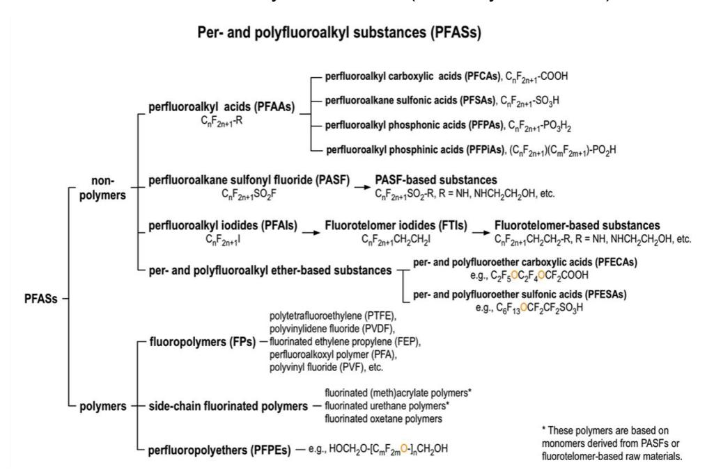
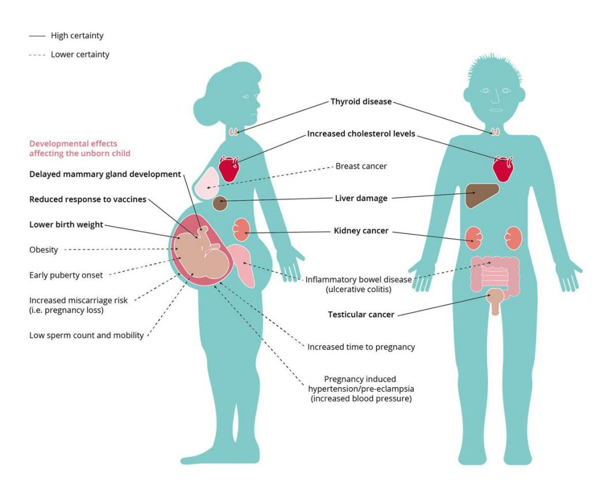

Funded by the European Union. Views and opinions expressed are however those of the author(s) only and do not necessarily reflect those of the European Union or HADEA. Neither the European Union nor the granting authority can be held responsible for them.

## Enhanced safe and sustainable coatings for supporting the planet

# Deliverable D6.6 Health & safety conditions of PROPLANET [M12]

## **Deliverable Information**

| Responsible partner:       | NILU                                                            |
|----------------------------|-----------------------------------------------------------------|
| Work package No and Title: |                                                                 |
|                            | WP6 - Sustainability and Toxicological assessments for Safe and |
| Contributing partner(s):   | IDENER, TECNALIA, RUKA, EXELISIS                                |
| Dissemination level:       | Public                                                          |
| Type:                      | Report                                                          |
| Due date:                  | 31.12.2023                                                      |
| Version:                   | V2                                                              |

## Project Profile

| Programme          | Horizon Europe                                                   |
|--------------------|------------------------------------------------------------------|
| Call               | HORIZON-CL4-2022-RESILIENCE-01                                   |
| Topic              | HORIZON-CL4-2022-RESILIENCE-01-23                                |
| Number             | 101091842                                                        |
| Acronym            | PROPLANET                                                        |
| Name               | Enhanced Safe and Sustainable coatings for supporting the Planet |
| Start Date         | 1 January 2023                                                   |
| Duration           | 36 months                                                        |
| Type of action     | HORIZON Research and Innovation Actions                          |
| Granting authority | European Health and Digital Executive Agency                     |
| Coordinator        | IDENER                                                           |

## Executive Summary

Deliverable D6.6 Health & safety conditions of PROPLANET addresses considerations related to the human health and safety of the coatings developed within the project. It is connected to task T6.5 Health and Safety Issues, which aims at avoiding exploitation problems of the products in terms of their safety, also in view of the standard regulations. Within this task, a mapping of the regulatory framework and requirements is performed, individuating the legislations and standards which are relevant for the health and safety aspects of the materials developed within the project (Chapter 2). A strategy for hazard and safety assessment of the developed materials is also drawn in Chapter 3. This includes i) the collection and review of the human safety and toxicological data and information already available for the chemical compounds selected to be used in the formulations, and ii) *in vitro* testing of the formulations (chemical mixtures). The approaches used for these activities are described here. This is the first version of the deliverable, which will have updates in each year of the project, to allow the constant overview of the health and safety aspects of the materials along their development within the project's life.

## Table of Contents

|                    | Table of Contents                                                                                                                                     |
|--------------------|-------------------------------------------------------------------------------------------------------------------------------------------------------|
| 1.                 | Introduction .......................................................................................................................................9 |
| 1.1.               | SSbD coatings .........................................................................................................................11             |
| 1.2.               | PFAS and human health ..........................................................................................................12                    |
| 2.                 | Mapping the regulatory framework and requirements for the human hazard assessment of the                                                              |
| developed products | ................................................................................................................................15                    |
| 3.                 | Strategy for hazard and safety assessment.....................................................................................17                      |
| 3.1.               | Review of available data...........................................................................................................17                 |
| 3.2.               | Testing .....................................................................................................................................18       |
| 4.                 | Next steps and conclusions.............................................................................................................20             |
| Bibliography       | ...........................................................................................................................................20         |

## List of Figures

| Figure 1: Classification of per-                                                                                                                             | and polyfluoroalkyl substances (PFASs).................................................12      |
|--------------------------------------------------------------------------------------------------------------------------------------------------------------|------------------------------------------------------------------------------------------------|
| Figure 2: Some classes, chemical structure, and common sources of per-                                                                                       | and poly-fluoroalkyl substances                                                                |
| (PFAS) ...................................................................................................................................................13 |                                                                                                |
| Figure 3: Effects of per-                                                                                                                                    | and polyfluoroalkyl substances on human health..............................................14 |
| Figure 4. Scheme of mono-, co-, and triculture lung models.                                                                                                  | ..................................................................19                           |

### List of Tables

| Table 1: Previous and ongoing activities and projects contributing to PROPLANET's health and safety aspects..... | 9  |
|------------------------------------------------------------------------------------------------------------------|----|
| Table 2: List of relevant health effects for hazard assessment based on REACH.....                               | 15 |

## Table of Abbreviations

| Abbreviation | Definition                                                                 |
|--------------|----------------------------------------------------------------------------|
| 3R           | Replacement, Reduction and Refinement                                      |
| ALI          | Air–liquid interface                                                       |
| AOP          | Adverse Outcome Pathway                                                    |
| CEN          | European Committee for Standardization                                     |
| CMR          | Carcinogenic, mutagenic, reprotoxic                                        |
| CTA          | Cell transformation assay                                                  |
| D            | Deliverable                                                                |
| EC           | European Commission                                                        |
| ECHA         | European Chemicals Agency                                                  |
| EFSA         | European Food Safety Authority                                             |
| EPA          | Environmental Protection Agency                                            |
| EU           | European Union                                                             |
| FCM          | Food contact materials                                                     |
| GD           | Guidance document                                                          |
| GHS          | Globally Harmonised System (for the Classification of Chemical Substances) |
| IATA         | Integrated Approach to Toxicity Testing                                    |
| ISO          | International Organization for Standardization                             |
| NAMs         | New Approach Methodologies                                                 |
| NGRA         | Next Generation Risk Assessment                                            |
| NM           | Nanomaterial                                                               |
| OECD         | Organisation for Economic Co-operation and Development                     |
| PARC         | Partnership for the Assessment of Risks from Chemicals                     |
| PFAS         | Poly- and perfluoroalkyl substances                                        |
| PFOA         | Perfluorooctanoic acid                                                     |
| PFOS         | Perfluorooctane sulfonate                                                  |
| POP          | Persistent Organic Pollutant                                               |
| PPAR         | Peroxisome proliferator-activated receptor                                 |
| PTFE         | Polytetrafluoroethylene                                                    |
| REACH        | Registration, evaluation, authorization, and restriction of chemicals      |
| ROS          | Reactive-oxygen species                                                    |
| SCCS         | Scientific Committee on Consumer Safety                                    |
| SbD          | Safe by Design                                                             |
| SDS          | Safety Data Sheet                                                          |
| SOP          | Standard Operating Procedure                                               |

| SSbD | Safe and Sustainable by Design                          |
|------|---------------------------------------------------------|
| TG   | Test Guideline                                          |
| VKM  | Norwegian Scientific Committee for Food and Environment |
| WG   | Working group                                           |
| WP   | Work Package                                            |

## 1. Introduction

The main goal of PROPLANET is to develop poly- and perfluoroalkyl substances (PFAS)-free coating materials for the textile, food packaging, and glass industrial sectors. The project applies the Safe and Sustainable by Design (SSbD) approach, thus tackling the problem from a sustainable business perspective, enabling the protection of the environment, and ensuring human safety.

This deliverable D6.6 Health & safety conditions of PROPLANET addresses considerations related to the human health and safety of the coatings developed within the project. It is connected to task T6.5 Health and Safety Issues, which aims at avoiding exploitation problems of the products in terms of their safety, also in view of the standard regulations. For this reason, the health and safety regulatory framework and guidelines are being considered from the beginning of the project.

In this document a brief outline is given on the SSbD approach and the health issues connected to PFAS, to provide the reader with an overview of these topics. Then the current health-related directives of interest for the project and the developed coatings are individuated. This work has been performed in connection to other WPs of the project, dealing with the standardization aspects (WP1) and the definition of requirements for the materials (WP2). Forthcoming developments of the directives, regulations/regulatory requirements are here considered as well. A strategy for hazard and safety assessment of the developed materials is also drawn below. This includes i) the collection and review of the human safety and toxicological data and information already available for the chemical compounds selected to be used in the formulations, and ii) *in vitro* testing of the formulations (chemical mixtures).

These aspects will be followed up throughout the project, thus the document here presented is the first version of this deliverable, which will have updates in the second and third year of the project in D6.7 (interim version) and D6.8 (final version), respectively.

This activity is led by NILU and supported by the consortium partners TECNALIA and NIC who are the materials developers. NILU has large experience in the human hazard assessment of materials and chemicals also in connection to regulatory aspects and in view of risk assessment purposes. Thus, the work in PROPLANET is aligned with other previous, ongoing or recent projects and activities of relevance. A summary of NILU's projects and/or activities that are relevant for and/or contribute to the work within PROPLANET, and the way they contribute, is presented in table 1.

*Table 1: Previous and ongoing activities and projects contributing to PROPLANET's health and safety aspects*

| Project/activity                             | Activities relevant |                       | to PROPLANET    |                   |
|----------------------------------------------|---------------------|-----------------------|-----------------|-------------------|
| H2020-NMBP-13 (2019-2023) RiskGONE,          |                     |                       |                 |                   |
| Technology – NILU coordinator                |                     |                       |                 |                   |
|                                              | Evaluation,         | adaptation            | and             | pre-validation of |
| standard                                     | operating           |                       | procedures      | (SOPs). Draft     |
| (NMs)                                        |                     | (RiskGONE’s D3.1).    | NILU’s          | expertise in      |
|                                              | standardization     | processes             | and             | contacts with     |
| regulatory                                   |                     | environment/agencies. |                 |                   |
| H2020-NMBP-14 (2019-2023) NanoSolveIT,       |                     |                       |                 |                   |
| Innovative Nanoinformatics models and tools: |                     |                       |                 |                   |
| (NAMs) –                                     | both                | in vitro and          | in silico       | and research      |
| (IATA).                                      | Contribution        | to                    | standardization | and               |
| H2020-NMBP-15 (2020-2024) SABYDOMA,          |                     |                       |                 |                   |
| Safety BY Design Of nanoMaterials - From Lab |                     |                       |                 |                   |
| Risk                                         | assessment,         | risk                  | management,     | and               |

developed methodologies into a decision support model, through the use of Safe by Design (SbD) guidance documents for the assessment of potential risk and benefits, early in the development of NMs. Integration of the decision support tool into the platform.

HORIZON-HLTH-2021 (2022-2029) PARC, Partnership for the Assessment of Risks from Chemicals

Activities in support to EU and national chemical risk assessment and risk management bodies and procedures, specifically in connection to NAMs development (WP6) and drafting a roadmap for the Next Generation Risk Assessment (NGRA) (WP2). Developing a framework and toolbox for testing the environment, health and safety aspects and for the assessment and management of the risks. This included a framework for SbD aimed at a more efficient process from design to application.

FP7-NMP (2013-2017) NanoREG, A common European approach to the regulatory testing of nanomaterials

NMP-26-2014 (2015-2019) NanoREG II, Development and implementation of Grouping and Safe-by-Design approaches within regulatory frameworks

Focused on safe innovation implementing safe and SbD into the production process. Develop and adapt supportive technical and organizational tools for Safe by Design, based on regulatory orientated grouping approaches. Dissemination of SbD tools and SOPs, promoting regulatory orientated guidelines.

FP7-INFRASTRUCTURES (2011-2015) QualityNano, A pan-European infrastructure for quality in nanomaterials safety testing

Research infrastructure project. Development of a sustainability plan to ensure its longevity. Development of novel tool and enhance understanding of environment, health and safety issues. Creation of a hub to drive the development and implementation of standards across all aspects of (nano)material evaluation and to link with other EU actions (OECD, ISO, etc.) and international stakeholders.

FP7-HEALTH-2007-A (2008-2012) NanoTEST, Development of methodology for alternative testing strategies for the assessment of the toxicological profile of nanoparticles used in medical diagnostics

Focus on development of alternative testing strategies and high-throughput toxicity-testing protocols using *in vitro* and *in silico* methods for the assessment of the toxicological profile of nanomaterials. Developed *in vitro* and advanced models and SOPs for lung, liver, kidney, blood, brain, gut, endothelial (vascular) and placental models.

FP7-NMP-2007-CSA-1 (2008-2012) NanoImpactNET, European Network on the Health and Environmental Impact of Nanomaterials

Creation of a scientific basis to ensure the safe and responsible development of NM and nanotechnology-based materials and products, and to support the definition of regulatory measures and implementation of legislation in Europe. Strong two-way communication to ensure efficient dissemination of information to stakeholders and the EC, while getting input from the stakeholders about their needs and concerns.

H2020-WIDESPREAD-2018-2020 (2020-2023) TWINALT, Twinning towards excellence in alternative methods for toxicity assessment

Training in new methods for cytotoxicity assessment (High Throughput/Content Screening); co-cultures, 3D models, alternative methods for genotoxicity and carcinogenicity assessment and in in silico methods for safety assessment of NM and chemicals.

NILU's members in EFSA and OECD working groups (WGs), SCCS, CEN (SN/K 298 Standards Norway mirror committee for CEN/TC 352, ISO/TC 229, IEC/TC 113 on Nanotechnologies), Norwegian Scientific Committee for Food and Environment (VKM)

Expertise of NILU's members in different international and national committees and WGs dealing with chemicals safety, risk assessment and standardization.

Clustering efforts are also ongoing with the other projects funded under the same call i.e. TORNADO, BIO\_SUSHY and ZeroF, and other SSbD projects and initiatives. Along the project, regular communication with the partners and WPs working on the materials development and exploitation will be maintained, to ensure that the relevant information and knowledge on the materials safety and health aspects is exchanged. Ultimately, the activities performed within this task will allow to highlight and address potential criticalities with respect to the human health of the developed materials, with the final aim to develop safe(r) PFAS-free coatings.

#### 1.1. SSbD coatings

The Chemicals Strategy for Sustainability and the Zero Pollution Action Plan from European Green deal policy encourage a shift towards a SSbD approach to chemicals and materials development. From a lifecycle perspective, this approach aims at the assessment of safety and sustainability aspects along the various stages of a product development (Caldeira et al., 2022). In this context, PROPLANET addresses novel coating materials solutions, tackling the problem from a sustainable-business perspective, enabling overcoming the barrier for environmental protection, safety, chemical improvements, and circular value chains. The main goal of PROPLANET is to design and optimise 3 innovative coatings for industrial sectors:

- **Textile:** Crosslinked biopolymer oil/wax microcapsules in polysaccharide matrix (hydrophobic, olephobic bio-based coating),
- **Food-packaging:** Hybrid siloxane biobased coating (non-stick and anticorrosion protection biobased hybrid coating),
- **Glass:** Hybrid siloxane coating (anti-soiling anti-reflecting hybrid coating).

The value chain of each product is optimised from raw material source to end of life of products, ensuring the circular economy. The promotion of safer alternatives will involve selecting materials and chemicals with lower toxicity, reduced environmental impact, and minimal risks to human health while maintaining performance and functionality.

While the sustainability aspects of PROPLANET are addressed in tasks T6.1-T6.3 of the project, here we focus on the safety aspects, and particularly on the hazard assessment of the materials. The SSbD framework (Caldeira et al., 2022) and the Organisation for Economic Co-operation and Development (OECD) guidelines (OECD, 2017, 2020) promote the use of new approach methodologies (NAMs) under the flexible setting of integrated approaches to testing and assessment (IATA) for chemical safety assessment. This is based on integrating and translating data from various methodologies. The term "NAMs" refers to various approaches to data generation that employ non-animal testing methods and technologies like *in vitro* assays and *in silico-*based assay (Doak et al., 2022; European Union, 2017; Nymark et al., 2020) within the "3Rs" principles of Replacement, Reduction and Refinement of animal testing. This alternative approach to animal testing is also part of the EU Chemical strategy for Sustainability (Caldeira et al., 2022) and Next Generation Risk Assessment (NGRA). NGRA is defined as an exposure-led, hypothesis-driven approach that incorporates one or more NAMs to ensure that the chemical does not cause harm to consumers (Dent et al., 2018). In this context, the Adverse Outcome Pathway (AOP) framework has been highlighted as an important tool to support addressing biologically relevant key events associated to the chemical-induced adverse outcomes in view of SSbD approaches (Delrue et al., 2016).

According to the SSbD approach and with a view towards NGRA, here the hazard assessment of the developed materials will be performed through the application of *in vitro* methods (standards or NAMs), starting from the early phases of materials development. To achieve this, relevant human health hazard assessment tools will be used to cover crucial endpoints in chemical risk assessment and AOP framework, like cytotoxicity, genotoxicity, carcinogenicity, immunotoxicity etc., as further described below.

#### 1.2. PFAS and human health

Poly- and perfluoroalkyl substances (PFAS) are aliphatic compounds that contain the perfluoroalkyl moiety CnF2n+1- (Buck et al., 2011; Figure 1). They are a group of more than 10,000 substances widely used in many different production sectors including constructions, electronics, food packaging and textiles for their water- and oil-repellency, high thermal stability and durability properties, among others (OECD, 2023; Figure 2). One of the most known compounds is polytetrafluoroethylene (PTFE), going by the commercial name Teflon, which was discovered already back in 1938 (Olsavsky et al., 2020).

*Figure 1: Classification of per- and polyfluoroalkyl substances (PFASs), reproduced from* (OECD, 2015)*, based on the definition of* (Buck et al., 2011)

The same properties that make PFAS valuable for use in products, make these compounds persistent in environmental conditions, with potential for long-range transfer and bioaccumulation, and thus a concern for human and environmental health (OECD, 2023).

| Class                               | Molecular Structure                                 | Sources                                             | Reference                               |            |
|-------------------------------------|-----------------------------------------------------|-----------------------------------------------------|-----------------------------------------|------------|
| Non-polymers                        | Chlorinated polyfluorinated ether sulfonate (F53-B) | Fire Fighting Foams                                 | [12,16]                                 |            |
|                                     |                                                     | Chrome Plating Waste                                |                                         |            |
|                                     | 6:2 Fluorotelomer sulfonamide alkylbetaine (FTAB)   | Fire Fighting Foams                                 | [3,8,9,11]                              |            |
|                                     |                                                     | Ceramic Coating                                     |                                         |            |
|                                     | Non-polymers                                        | 6:2 Fluorotelomer sulfonate (FTSA)                  | Fire Fighting Foams                     | [7,11]     |
|                                     |                                                     |                                                     | Mist Suppressant                        |            |
| 6:2 Fluorotelomer sulfonate (FTSA)  |                                                     | Metal Plating                                       | [14,15,17]                              |            |
|                                     |                                                     | Ink and Toner                                       |                                         |            |
| Non-polymers                        |                                                     | Perfluorooctanesulfonic acid (PFOA)                 | Cleaning Products                       | [14,15,17] |
|                                     |                                                     |                                                     | Metal Plating                           |            |
|                                     | Perfluorooctanesulfonic acid (PFOA)                 | Hydraulic Fluids                                    | [13]                                    |            |
|                                     |                                                     | Fabric Protector                                    |                                         |            |
|                                     | Non-polymers                                        | Perfluorooctanoic acid (PFOA)                       | Water Filtration                        | [13]       |
|                                     |                                                     |                                                     | Clean-stick Cookware                    |            |
| Perfluorooctanoic acid (PFOA)       |                                                     | Stain-resistant Fabrics                             | [6,19,20]                               |            |
|                                     |                                                     | Gore-Tex                                            |                                         |            |
| Non-polymers                        |                                                     | Polytetrafluoroethylene (PTFE)                      | Polymer Gaskets                         | [6,19,20]  |
|                                     |                                                     |                                                     | Chemically Resistant Components         |            |
|                                     | Polytetrafluoroethylene (PTFE)                      | Carpet Coatings                                     | [10,18]                                 |            |
|                                     |                                                     | Viton A: General sealing Auto/Aero Fuels Lubricants |                                         |            |
|                                     | Non-polymers                                        | Viton A/B                                           | Viton B: Gaskets                        | [10,18]    |
|                                     |                                                     |                                                     | Power-utility seals Chemical Processing |            |
| Polychlorotrifluoroethylene (KEL-F) |                                                     | Moisture Resistant Packaging                        | [19]                                    |            |
|                                     |                                                     | Cryogenic Seals and Gaskets                         |                                         |            |
| Non-polymers                        |                                                     | Polychlorotrifluoroethylene (KEL-F)                 | Lubricants for Corrosive Materials      |            |
|                                     |                                                     |                                                     | Moisture Resistant Packaging            |            |

*Figure 2: Some classes, chemical structure, and common sources of per- and poly-fluoroalkyl substances (PFAS), reproduced from* (Olsavsky et al., 2020)

Indoor air inhalation, dust ingestion, and dietary intake (including drinking water), as well as consumer products e.g. textiles, carpets, building materials, fluorochemical-treated food contact materials etc., are important sources for human exposure (Jian et al., 2018; Sunderland et al., 2019). Human biomonitoring studies have been used to measure PFAS in human biological fluids and tissues (Berg et al., 2021; Cioni et al., 2023). Perfluorooctane sulfonate (PFOS) and perfluorooctanoic acid (PFOA) are among the most studied PFAS, and the most found in humans' blood and serum (Jian et al., 2018).

At the same time, epidemiological studies have found associations between some PFAS exposure or concentration in body fluids and biological effects such as immunotoxicity, metabolic diseases, reproductive and developmental toxicity, liver disease and cancer (Fenton et al., 2021; Figure 3). These associations have been supported by mechanistic investigations performed via *in vitro* and *in vivo* studies. It is worth noting that differences in elimination kinetics in mice and rats compared to humans have been reported, with subsequent difficulties in the use of animal studies, due to complications in the cross‐species evaluation of toxicity (Fenton et al., 2021).

Mechanistic data suggest that PFAS toxicity is at least in part driven by the interaction with peroxisome proliferator-activated receptors (PPARs), which are nuclear receptors that regulate fatty acid disposition,

metabolism, and functions that contribute to placental and foetal homeostasis (Szilagyi et al., 2020). A dysregulation of these receptors might thus explain the metabolic and developmental effects of PFAS. The relevance of this pathway for immunotoxicity has also been discussed, together with other mechanisms including calcium homeostasis and oxidative stress (Ehrlich et al., 2023). PFAS exposure has in fact been reported to induce reactive-oxygen species (ROS) formation, which in turn can have several effects, including the activation of PPARs (Gundacker et al., 2022). Some PFAS have also been found to induce DNA damage in hepatic cells *in vitro* (Wielsøe et al., 2015), and *in vitro* endocrine-related activity has been reported for PFAS and technical mixtures used in food paper-packaging (Rosenmai et al., 2016)

*Figure 3: Effects of per- and polyfluoroalkyl substances on human health, reproduced from* (Fenton et al., 2021)

Noteworthily, sufficient health effects data for use in decision-making is available only for few PFAS, and most toxicity data is available for a relatively small number of so called legacy PFAS such as PFOA and PFOS, whereas for thousands of other PFAS the toxicity data available are limited (Carlson et al., 2022; Fenton et al., 2021).

Nevertheless, the concern for and evidence of the impact of these compounds on human and environmental health led to a number of actions from governmental agency worldwide, such as the U.S. Environmental Protection Agency (EPA)'s PFAS action plan of 2019 (EPA, 2019), and the more recent European Chemicals Agency (ECHA)'s restriction proposal of February 2023 (ECHA, 2023). While PFOS, PFOA and several other PFAS had already been restricted internationally under the Stockholm Convention of 2004 (and updates) and in EU under the Persistent Organic Pollutants (POPs) regulation, this new restriction proposal would apply to more than 10,000 compounds. As stated in the proposal, this approach is justified by the identification of PFAS as a single group, where it is considered that all the members of the group share a common hazard and risk (ECHA, 2023). Moreover, the previous experience with the EU PFAS regulatory activities showed that the restriction of individual or smaller groups of PFAS (e.g. PFOA and related substances) led to the replacement with slightly different non-restricted PFAS with similar risks. This thus represents the motivation to include all PFAS having equivalent hazard and risk in a single restriction proposal, to avoid regrettable substitution by other PFAS (ECHA, 2023).

In this perspective, the PROPLANET aim of developing PFAS-free alternatives for coatings is even more relevant in view of the upcoming regulations and considering the protection of human (and environmental) health.

## 2. Mapping the regulatory framework and requirements for the human hazard assessment of the developed products

Within task T6.5 of PROPLANET the health and safety guidelines are considered from the beginning of the project. Moreover, an evaluation of current and forthcoming directives concerning the human hazard assessment of the products developed within the project is performed. A mapping of the regulatory framework and requirements for this aspect is thus carried out. This activity started in collaboration with WP2, where within D2.1 Requirements for coatings and substrates, the toxicological requirements for the coatings were drawn, highlighting the main directives, health effects and standards of interest. The EU regulation on the Registration, Evaluation, Authorisation and Restriction of Chemicals (REACH) (European Parliament, 2006) was highlighted as the main legislation of relevance for the health-related aspects of PROPLANET's developed coatings. For the hybrid siloxane bio-based coatings for food packaging machinery application, where the coating is foreseen to come in contact with food during the packaging process, the European Food Safety Authority (EFSA) guidance for safety assessment of a substance to be used in plastic food contact materials (FCM) was also considered relevant (Silano et al., 2008). Focusing on the human hazard aspects, the main health effects and endpoints indicated in the documents above were individuated. The OECD test guidelines (TGs) and guidance documents (GDs) are the reference standards to perform human hazard assessment under the REACH legislation and EFSA guidance. Within D2.1 the main TGs/GDs for each health effect individuated were also summarized. This information (health effects and standards individuated in the directives) is here reported in Table 2.

*Table 2: List of relevant health effects for hazard assessment based on REACH. Available TGs relevant for each effect are listed (the list might not be exhaustive). Information requirements for substances manufactured or imported in quantities of 1, \*10, \*\*1000 tonnes or more. #Specifically indicated in EFSA guidance on FCM (Silano et al., 2008). Reproduced from PROPLANET D2.1, Adapted from Bleeker et al., 2023.* 

| Health effect                     | Relevant OECD TG/DGs, if not available suggestion of    |              |
|-----------------------------------|---------------------------------------------------------|--------------|
|                                   | method to be applied                                    | Required for |
| Skin irritation or skin corrosion | TG 404, TG 430, TG 431, TG 435, TG 439                  | REACH        |
| Eye irritation                    | TG 405, TG 437, TG 438, TG 460, TG 491, TG 492, TG 494, |              |
| Skin sensitisation                | TG 406, TG 429, TG 442A, TG 442B, TG 442C, TG 442D, TG  |              |
|                                   | TG 471 #                                                |              |
|                                   | , TG 473, TG 475, TG 476, TG 483, TG 486, TG 487 #      |              |
|                                   | TG 488 #                                                |              |
|                                   | , TG 489 #                                              |              |
|                                   |                                                         | EFSA FCM #   |
| (oral/inhalation*/dermal route*)  | TG 402, TG 403, TG 420, TG 423, TG 425, TG 427, TG 433, |              |
| Reproductive toxicity*            | TG 414, TG 415, TG 416, TG 421 #                        |              |
|                                   | , TG 422 #                                              |              |
|                                   | , TG 443                                                | REACH        |
|                                   |                                                         | EFSA FCM #   |

|                                                                                                                                             | REACH                                                                          |
|---------------------------------------------------------------------------------------------------------------------------------------------|--------------------------------------------------------------------------------|
| Repeated dose toxicity* TG 407, TG 408 #                                                                                                    | , TG 409, TG 410, TG 411, TG 412, TG 413,                                      |
|                                                                                                                                             | EFSA FCM # TG 452                                                              |
| Carcinogenicity** TG 451, TG 453                                                                                                            | #                                                                              |
|                                                                                                                                             | , GD 116 REACH                                                                 |
| Additional specific investigations                                                                                                          | EFSA FCM #                                                                     |
| Neurotoxicity TG 418, TG 419, TG 424                                                                                                        | #                                                                              |
| Cell toxicity (damage to cell/cell membrane, growth, metabolism)                                                                            | , TG 426 EFSA FCM # No TG/GD available.                                        |
| assay are suggested                                                                                                                         | as NAM                                                                         |
| Inflammation induction (in vitro)                                                                                                           | No TG/GD available.                                                            |
| ELISA assay is suggested                                                                                                                    | as NAM                                                                         |
| Legislation not very specific, Reactivity (catalytic activity, chemical reactivity, photocatalytic activity or radical formation potential) | possibly OECD TG 442C. as NAM                                                  |
| Endocrine disruption                                                                                                                        | TG 230, TG 231, TG 234, TG 440, TG 441, TG 455, TG 456, TG 458, TG 493, GD 150 |

Within the PROPLANET project, attention is paid to the evolution of the regulatory landscape and possible forthcoming directives are monitored. For this aspect, NILU takes advantage of its other projects and activities in this field, as reported in Table 1. Most notably, within the Partnership for the Assessment of Risks from Chemicals (PARC), NILU joins the activities related to the development of strategic roadmaps to guide the uptake of innovative science into the regulatory practice of chemical risk assessment in the EU, such as the "NGRAroute", an activity to implement NGRA in all major legislations on chemicals in the EU.

The current risk assessment heavily relies on the use of *in vivo* (animal) testing, even though taking into account the "3Rs" principles to replace, reduce and refine the use of animal testing. This aligns with the EU legislation on the use of animals in science (EUROPEAN PARLIAMENT, 2010). This for example entails that the first test screening should be based on *in vitro* tests, and animal testing is then used in case of positive *in vitro* results (toxic response). The NGRA approach aims at further moving towards the 3Rs principle, by the adoption of NAMs (*in vitro/in silico* alternatives to animal testing) for risk assessment of chemicals. This is now an important discussion topic among stakeholders, from industry to regulators, and an important activity within PARC and other EU funded projects. In the Strategy for 2027 (EFSA, 2021), EFSA recognizes the importance of developing and integrating NAMs for regulatory risk assessment. The use of animal studies has already been banned for the testing of cosmetic products (EC 1223/2009 on cosmetic products) since 2013. This legislation is not relevant for the type of coatings developed in PROPLANET, but it is here mentioned (and often internationally referred to) as an example of animal-free testing strategy.

Within PROPLANET we will focus on *in vitro* assessment of the human hazard of the developed materials, in agreement with the SSbD approach, and in a perspective of NGRA and effort reduce/avoid the use of *in vivo* testing. At this aim, an evaluation of the current TGs and GDs and their applicability for the evaluation of the products developed in the project will be performed. Where no appropriate standards exist for our aim, we will explore the use of NAMs as alternative methods for testing. Some preliminary considerations are already reported in Table 2 and will be further explored in the next versions of this deliverable. The selected TG/GD and NAMs will be applied to the testing of PROPLANET products as further discussed below.

This work is also connected to WP1 task T1.4 Regulatory Alignment, Compliance, Standardisation and Certification programs. Within this task deliverable D.1.3 PROPLANET integration into Standardisation process and roadmap for full Standardisation highlights where needs for new standards might exist, and which methods might be suggested to be developed as new standards. The information for the toxicological aspects is developed within the activity here presented in D6.6. Both D1.3 and D6.6 are "live" documents that will have updated versions along the life of the project, so that this aspect will be followed up in the next versions of the documents.

## 3.Strategy for hazard and safety assessment

As outlined above, the health and safety aspects of the PROPLANET materials are being considered throughout their development, according to the SSbD concept. In this first year of the project the novel formulations for the PFAS-free coatings are being defined (within WP2). At this aim, the materials developers TECNALIA and NIC evaluate different chemical compounds for their possible inclusion in the coatings' formulations, which then are tested to ensure the proper expected performance.

Along this process, regular communication between the toxicology experts at NILU and the materials developers is maintained, to evaluate and highlight the possible criticalities when it comes to the toxicological properties of the chemical compounds considered for the formulations. To do this the approaches presented below are used and will continue to be applied through the life of the project.

#### 3.1. Review of available data

For the chemical compounds individuated as possible components of the PROPLANET coatings formulations, human safety and toxicological data are being collected and evaluated, whenever available. The focus of this activity is to individuate, if any, the so called CMR chemicals, i.e. substances which are carcinogenic, mutagenic or toxic to reproduction (reprotoxic). Mutagenicity, carcinogenicity and reproductive toxicity are in fact among the most severe health effects, and for this reason there are restrictions on the placing on the market and the use of CMR chemicals. Accordingly, within PROPLANET D2.1 the main toxicological requirement identified was that only non-carcinogenic, non-mutagenic or nonreprotoxic substances will be used for the coatings' development. For this reason, in the case a CMR chemical is individuated among the possible components of the PROPLANET coatings formulations, the toxicology experts will immediately communicate the criticality to the materials developers and suggest that the compound is excluded by the formulation.

Currently, safety and toxicological information is being collected from the Safety Data Sheet (SDS) of the investigated chemicals. The information from SECTION 2: Hazards identification and SECTION 11: Toxicological information of the SDS is manually extracted, filled into an excel document (dissemination level: confidential), and evaluated by the toxicology experts as described.

The hazards identification section reports the hazard classification of the chemical in the Globally Harmonised System for the Classification of Chemical Substances (GHS), according to Regulation (EC) No 1272/2008. The GHS assigns hazard classes such as acute toxicity, skin corrosion, skin irritation etc. For the reasons explained above, the most important classes here considered are carcinogenicity, mutagenicity and reproductive toxicity.

This exercise was performed on all the chemicals so far individuated as possible components of the formulations, i.e. including but not limited to the compounds individuated as possible PFAS replacement. So far, none of the indicated chemicals was highlighted as CMR according to the SDS. Whenever the PFAS compounds to be replaced in the coatings are known, the available information about their hazard identification and toxicity is also collected for reference. As an example, the PFAS 1H,1H,2H,2H-Perfluorodecyltriethoxysilane (CAS 101947-16-4), a compound to be replaced in the glass sector, is classified as carcinogen and reprotoxic according to the SDS, further highlighting the importance of replacing this compound in the formulations.

Toxicological information from section 11 is also extracted and reviewed with the same aim of individuating possible CMR chemicals. The collection of available data in this section can also highlight where data gaps are present, and further investigations might be needed.

Another approach under consideration is the possibility of extracting toxicological information from relevant databases. This activity might be limited to the PFAS-replacements. Possibly relevant databases that will be further explored for data extraction might include:

- **ECHA database** [\(https://echa.europa.eu/search-for-chemicals.](https://echa.europa.eu/search-for-chemicals) N.B. ECHA reports that the information from this source might not be updated, due to a new Data Availability System being developed. The first version of the new system is expected to be publicly available by the end of January 2024).
- **EPA Comptox** [\(https://comptox.epa.gov/dashboard/\)](https://comptox.epa.gov/dashboard/)
- **EPA toxcast** (https://www.epa.gov/chemical-research/exploring-toxcast-data)
- **PubChem** (https://pubchem.ncbi.nlm.nih.gov/)
- **SciFinder** [\(https://scifinder-n.cas.org/\)](https://scifinder-n.cas.org/)
- **ChemSpider** (https://www.chemspider.com/)
- **EFSA OpenFoodTox** [\(https://www.efsa.europa.eu/en/microstrategy/openfoodtox\)](https://www.efsa.europa.eu/en/microstrategy/openfoodtox)
- Published literature (searching through PubMed, Google scholar etc.)
- Specifically for PFAS, the **PFAS tox database** [\(https://pfastoxdatabase.org/\)](https://pfastoxdatabase.org/)

The possibility of using machines to automatically extract data from the databases is being explored with the support of the informatics experts at NovaM.

#### 3.2. Testing

In addition to collecting the available information for the single chemical compounds used in the formulations developed, the formulations themselves (the chemical mixtures) will be tested using *in vitro* methods for human hazard assessment. The testing strategy is defined to address the main health effects indicated in the regulations highlighted above (Table 2) in a SbD approach. Thus, the cellular models to be used and the biological endpoints to be investigated have been/will be selected taking into consideration AOPs that enable the identification of the main events linked to the potential toxicity of the materials, and relevant biomarkers of effects for implementing the hazard assessment and the SbD strategy. The testing strategy is here described, while the experimental work fulfilling this strategy is performed under task T6.4 Safe by Design criteria and toxicological *In vitro* Assessment.

#### *In vitro* models

*In vitro* models representative of specific biological effects and/or human target organs (e.g. lung, liver, skin) will be here used to perform the hazard assessment of the materials. Traditional *in vitro* models mostly consist of a single human cell type cultured in media, in suspension or adhesion in a growing support such as culture plates. These models, sometimes referred to as "2D" models, are standardized, relatively simple and economic to use and allow for the screening of several test substances. However, they have the limitation of being simplified systems, not taking into consideration the complex interactions occurring among the different cell types in the tissues and organs. More advanced and/or threedimensional (3D) models have been receiving attention in the last years as they are considered more relevant models of the human physiology and exposure mechanisms, and a promising NAM for hazard assessment in view of NGRA. These models often consist of co-cultures of different cell types, arranged in three-dimensional structures, that better resemble the interactions occurring in the tissues and organs. Two examples already established at NILU are:

- An advanced lung model consisting of lung cells (e.g. the human lung epithelial cell line A549), cultivated on one side of a porous membrane, and endothelial cells (e.g. EA.hy926) on the opposite side of the porous membrane, to feature the air–blood barrier in the alveoli of the lower respiratory tract. The model's complexity can be further increased to a triculture by including human differentiated monocytes (dTHP-1), to take into consideration the role of the immune system (Figure 4). The lung cells can be cultured in submerged condition or in contact with air (air–liquid interface, ALI). In this model the test compound can be delivered to the lung cells through nebulization in air, for a better resemblance to physiological conditions in respiratory exposures.
- An advanced liver model consisting of spheroids of the human hepatocellular carcinoma cell line HepG2. The liver-like functionality is enhanced when these cells are cultured in the 3D arrangement of the spheroid, increasing cell-to-cell contacts and intercellular communication. Indeed, HepG2 cells in 3D cultures show upregulation of genes involved in liver-specific xenobiotic and lipid metabolism (Elje et al., 2020).

*Figure 4. Scheme of mono-, co-, and triculture lung models of A549, EA.hy926, and differentiated THP-1 (dTHP-1) cells cultivated at the air–liquid interface (ALI) on membrane inserts (reproduced from* Camassa et al., 2022*).*

Advanced models have the advantage of better mimicking real-world conditions. However, they lose in throughput and reproducibility, and increase costs and operational difficulties. They are thus not suitable for the screening of large numbers of substances. For these reasons a tiered approach will be applied in the project, where the traditional cellular models will be used to assess the toxicological properties of the materials in the earlier phases in the project, and more advanced (3D) models will be used on the final products.

#### Biological effects/endpoints

To have a wide overview of the possible toxicological properties of the developed materials, different biological effects/endpoints will be investigated in the models described above. These have been/will be selected based on the main health effects indicated by the regulatory frameworks of reference (indicated in Table 2) and taking into consideration the AOPs and SbD approaches. Some of the main biological effects/endpoints of interest thus include:

- Cytotoxicity/cell viability
- Genotoxicity/mutagenicity
- Carcinogenicity
- Inflammatory response
- Oxidative stress/ROS formation
- Endocrine disruption activity (hormone receptors activation)

For these effects/endpoints an evaluation of the existing TGs and GDs highlighted above (Table 2) will be first performed, to identify available standards within the regulatory frameworks, and evaluate their applicability to the hazard assessment in a SbD approach within this project. Where no appropriate standards will be found, alternative methods (NAMs) will be individuated and applied, as also discussed in Chapter 2. Like for the cellular models, the selected TG/GD and NAMs will be applied to the testing of PROPLANET products based on a tiered approach. This entails that during the initial phases of the materials development the more general biological effects/endpoints will be assessed, and the more high throughput methods will be applied. These might include for example cytotoxicity/cell viability by the use of e.g. the Alamar Blue assay, ROS formation by the DCFH-DA assay etc. On the final materials more sophisticated and demanding methods will be applied to investigate more advanced effects, such as carcinogenicity by the cell transformation assay (CTA).

## 4. Next steps and conclusions

The document here presented addresses the activities of task 6.5, with a view to other connected activities, e.g. in tasks 6.4 and WP1 and 2. The regulatory framework and requirements for the products developed will be taken into consideration along the life of the project, following up on the possible future changes or updates that might occur. Available data about the toxicity of the single chemicals selected for the formulations of the PROPLANET coatings will be searched, with specific focus on the compounds that will be chosen as PFAS-replacements. When the formulations are defined and delivered to NILU, the *in vitro* testing will start in task 6.4 based on the approach here presented. A new version of this document will be delivered at month 24 with the updates related to the activities here discussed. The final version will be presented at the end of the project in month 36. Overall, the diverse approaches here applied will allow to highlight potential criticalities with respect to the safety of the developed materials, and promote the selection of safe(r) materials in an SSbD approach.

## Bibliography

- Berg, V., Sandanger, T. M., Hanssen, L., Rylander, C., & Nøst, T. H. (2021). Time trends of perfluoroalkyl substances in blood in 30-year old Norwegian men and women in the period 1986–2007. *Environmental Science and Pollution Research International*, *28*(32), 43897–43907. https://doi.org/10.1007/S11356-021-13809-6 Bleeker, E. A. J., Swart, E., Braakhuis, H., Fernández Cruz, M. L., Friedrichs, S., Gosens, I., Herzberg, F., Jensen, K. A., von der Kammer, F., Kettelarij, J. A. B., Navas, J. M., Rasmussen, K., Schwirn, K., & Visser, M. (2023). Towards harmonisation of testing of nanomaterials for EU regulatory requirements on chemical safety - A proposal for further actions. *Regulatory Toxicology and Pharmacology : RTP*,
- *139*. https://doi.org/10.1016/J.YRTPH.2023.105360 Buck, R. C., Franklin, J., Berger, U., Conder, J. M., Cousins, I. T., Voogt, P. De, Jensen, A. A., Kannan, K., Mabury, S. A., & van Leeuwen, S. P. J. (2011). Perfluoroalkyl and polyfluoroalkyl substances in the environment: Terminology, classification, and origins. *Integrated Environmental Assessment and Management*, *7*(4), 513–541. https://doi.org/10.1002/IEAM.258 Caldeira, C., Farcal, L. R., Garmendia Aguirre, I., Mancini, L., Tosches, D., Amelio, A., Rasmussen, K., Rauscher, H., Riego Sintes, J., Sala, S., & Europäische Gemeinschaften Gemeinsame Forschungsstelle. (2022). *Safe and sustainable by design chemicals and materials framework for the definition of criteria and evaluation procedure for chemicals and materials*. European Commission, Joint Research Centre.

- Camassa, L. M. A., Elje, E., Mariussen, E., Longhin, E. M., Dusinska, M., Zienolddiny-Narui, S., & Rundén-Pran, E. (2022). Advanced Respiratory Models for Hazard Assessment of Nanomaterials. Performance of Mono-, Co- and Tricultures. *2079-4991*, *12*(15). https://doi.org/10.3390/NANO12152609 Carlson, L. M., Angrish, M., Shirke, A. V., Radke, E. G., Schulz, B., Kraft, A., Judson, R., Patlewicz, G., Blain, R., Lin, C., Vetter, N., Lemeris, C., Hartman, P., Hubbard, H., Arzuaga, X., Davis, A., Dishaw,
- L. V., Druwe, I. L., Hollinger, H., … Thayer, K. A. (2022). Systematic Evidence Map for Over One Hundred and Fifty Per- and Polyfluoroalkyl Substances (PFAS). *Environmental Health Perspectives*, *130*(5). https://doi.org/10.1289/EHP10343 Cioni, L., Plassmann, M., Benskin, J. P., Coêlho, A. C. M. F., Nøst, T. H., Rylander, C., Nikiforov, V., Sandanger, T. M., & Herzke, D. (2023). Fluorine Mass Balance, including Total Fluorine, Extractable Organic Fluorine, Oxidizable Precursors, and Target Per- and Polyfluoroalkyl Substances, in Pooled Human Serum from the Tromsø Population in 1986, 2007, and 2015. *Environmental Science and Technology*, *57*. https://doi.org/10.1021/ACS.EST.3C03655/ASSET/IMAGES/LARGE/ES3C03655\_0004.JPEG Delrue, N., Sachana, M., Sakuratani, Y., Gourmelon, A., Leinala, E., & Diderich, R. (2016). The Adverse Outcome Pathway Concept: A Basis for Developing Regulatory Decision-making Tools. *Https://Doi.Org/10.1177/026119291604400504*, *44*(5), 417–429. https://doi.org/10.1177/026119291604400504 Dent, M., Amaral, R. T., Da Silva, P. A., Ansell, J., Boisleve, F., Hatao, M., Hirose, A., Kasai, Y., Kern, P., Kreiling, R., Milstein, S., Montemayor, B., Oliveira, J., Richarz, A., Taalman, R., Vaillancourt, E., Verma, R., Posada, N. V. O. R. C., Weiss, C., & Kojima, H. (2018). Principles underpinning the use of new methodologies in the risk assessment of cosmetic ingredients. *Computational Toxicology*, *7*, 20–26. https://doi.org/10.1016/J.COMTOX.2018.06.001 Doak, S. H., Clift, M. J. D., Costa, A., Delmaar, C., Gosens, I., Halappanavar, S., Kelly, S., Pejinenburg,
- W. J. G. M., Rothen-Rutishauser, B., Schins, R. P. F., Stone, V., Tran, L., Vijver, M. G., Vogel, U., Wohlleben, W., & Cassee, F. R. (2022). The Road to Achieving the European Commission's Chemicals Strategy for Nanomaterial Sustainability—A PATROLS Perspective on New Approach Methodologies. *Small*, *18*(17), 2200231. https://doi.org/10.1002/SMLL.202200231 ECHA. (2023). *ANNEX XV RESTRICTION REPORT PROPOSAL FOR A RESTRICTION SUBSTANCE NAME(S): Per-and polyfluoroalkyl substances (PFASs)*. EFSA. (2021). EFSA Strategy 2027 Science Safe food Sustainability. *Publications Office of the European Union*. https://doi.org/10.2805/274627 Ehrlich, V., Bil, W., Vandebriel, R., Granum, B., Luijten, M., Lindeman, B., Grandjean, P., Kaiser, A. M., Hauzenberger, I., Hartmann, C., Gundacker, C., & Uhl, M. (2023). Consideration of pathways for immunotoxicity of per- and polyfluoroalkyl substances (PFAS). *Environmental Health 2023 22:1*, *22*(1), 1–47. https://doi.org/10.1186/S12940-022-00958-5 Elje, E., Mariussen, E., Moriones, O. H., Bastús, N. G., Puntes, V., Kohl, Y., Dusinska, M., & Rundén-Pran,
- E. (2020). Hepato(Geno)Toxicity Assessment of Nanoparticles in a HepG2 Liver Spheroid Model. *Nanomaterials 2020, Vol. 10, Page 545*, *10*(3), 545. https://doi.org/10.3390/NANO10030545 EPA. (2019). *EPA's Per- and Polyfluoroalkyl Substances (PFAS) Action Plan*. www.epa.gov/pfas European Parliament. (2006). *Registration, Evaluation, Authorisation and Restriction of Chemicals (REACH)*. https://doi.org/10.04.2014

- EUROPEAN PARLIAMENT. (2010). *DIRECTIVE 2010/63/EU on the protection of animals used for scientific purposes (Text with EEA relevance)*. European Union. (2017). *Non-animal approaches : current status of regulatory applicability under the REACH, CLP and biocidal products regulations.* https://doi.org/10.2823/000784 Fenton, S. E., Ducatman, A., Boobis, A., DeWitt, J. C., Lau, C., Ng, C., Smith, J. S., & Roberts, S. M. (2021). Per- and Polyfluoroalkyl Substance Toxicity and Human Health Review: Current State of Knowledge and Strategies for Informing Future Research. *Environmental Toxicology and Chemistry*, *40*(3), 606. https://doi.org/10.1002/ETC.4890 Gundacker, C., Audouze, K., Widhalm, R., Granitzer, S., Forsthuber, M., Jornod, F., Wielsøe, M., Long, M., Halldórsson, T. I., Uhl, M., & Bonefeld-Jørgensen, E. C. (2022). Reduced Birth Weight and Exposure to Per- and Polyfluoroalkyl Substances: A Review of Possible Underlying Mechanisms Using the AOP-HelpFinder. *Toxics*, *10*(11), 684. https://doi.org/10.3390/TOXICS10110684/S1 Jian, J. M., Chen, D., Han, F. J., Guo, Y., Zeng, L., Lu, X., & Wang, F. (2018). A short review on human exposure to and tissue distribution of per- and polyfluoroalkyl substances (PFASs). *The Science of the Total Environment*, *636*, 1058–1069. https://doi.org/10.1016/J.SCITOTENV.2018.04.380 Nymark, P., Bakker, M., Dekkers, S., Franken, R., Fransman, W., García-Bilbao, A., Greco, D., Gulumian, M., Hadrup, N., Halappanavar, S., Hongisto, V., Hougaard, K. S., Jensen, K. A., Kohonen, P., Koivisto, A. J., Dal Maso, M., Oosterwijk, T., Poikkimäki, M., Rodriguez-Llopis, I., … Grafström, R. (2020). Toward Rigorous Materials Production: New Approach Methodologies Have Extensive Potential to Improve Current Safety Assessment Practices. *Small*, *16*(6), 1904749. https://doi.org/10.1002/SMLL.201904749 OECD. (2015). *WORKING TOWARDS A GLOBAL EMISSION INVENTORY OF PFASS: FOCUS ON PFCAS-STATUS QUO AND THE WAY FORWARD*. www.oecd.org/chemicalsafety/ OECD. (2017). *Guidance Document for the Use of Adverse Outcome Pathways in Developing Integrated Approaches to Testing and Assessment (IATA)*. https://doi.org/10.1787/44BB06C1-EN OECD. (2020). *Overview of Concepts and Available Guidance related to Integrated Approaches to Testing and Assessment (IATA)*. OECD. (2023). *About PFASs - OECD Portal on Per and Poly Fluorinated Chemicals*. https://www.oecd.org/chemicalsafety/portal-perfluorinated-chemicals/aboutpfass/ Olsavsky, N. J., Kearns, V. M., Beckman, C. P., Sheehan, P. L., Burpo, F. J., Bahaghighat, H. D., & Nagelli,
- E. A. (2020). Review research and regulatory advancements on remediation and degradation of fluorinated polymer compounds. In *Applied Sciences (Switzerland)* (Vol. 10, Issue 19, pp. 1–26). MDPI AG. https://doi.org/10.3390/app10196921 Rosenmai, A. K., Taxvig, C., Svingen, T., Trier, X., van Vugt-Lussenburg, B. M. A., Pedersen, M., Lesné, L., Jégou, B., & Vinggaard, A. M. (2016). Fluorinated alkyl substances and technical mixtures used in food paper-packaging exhibit endocrine-related activity in vitro. *Andrology*, *4*(4), 662–672. https://doi.org/10.1111/ANDR.12190 Silano, V., Bolognesi, C., Castle, L., Cravedi, J. P., Engel, K. H., Fowler, P., Franz, R., Grob, K., Gürtler, R., Husøy, T., Kärenlampi, S., Mennes, W., Milana, M. R., Penninks, A., de Fátima Tavares Poças, M., Smith, A., Tlustos, C., Wölfle, D., Zorn, H., & Zugravu, C. A. (2008). Note for Guidance For the Preparation of an Application for the Safety Assessment of a Substance to be used in Plastic Food Contact Materials. *EFSA Journal*, *6*(7), 21r. https://doi.org/10.2903/J.EFSA.2008.21R

Sunderland, E. M., Hu, X. C., Dassuncao, C., Tokranov, A. K., Wagner, C. C., & Allen, J. G. (2019). A review of the pathways of human exposure to poly- and perfluoroalkyl substances (PFASs) and present understanding of health effects. *Journal of Exposure Science & Environmental Epidemiology*, *29*(2), 131–147. https://doi.org/10.1038/s41370-018-0094-1 Szilagyi, J. T., Avula, V., & Fry, R. C. (2020). Perfluoroalkyl Substances (PFAS) and Their Effects on the Placenta, Pregnancy, and Child Development: a Potential Mechanistic Role for Placental Peroxisome Proliferator-Activated Receptors (PPARs). *Current Environmental Health Reports*, *7*(3), 222–230. https://doi.org/10.1007/S40572-020-00279-0 Wielsøe, M., Long, M., Ghisari, M., & Bonefeld-Jørgensen, E. C. (2015). Perfluoroalkylated substances (PFAS) affect oxidative stress biomarkers in vitro. *Chemosphere*, *129*, 239–245. https://doi.org/10.1016/J.CHEMOSPHERE.2014.10.014