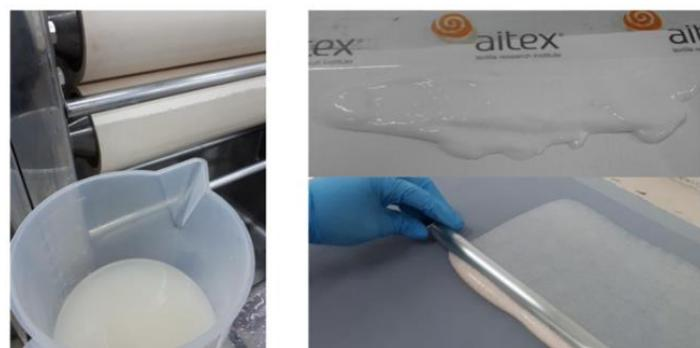
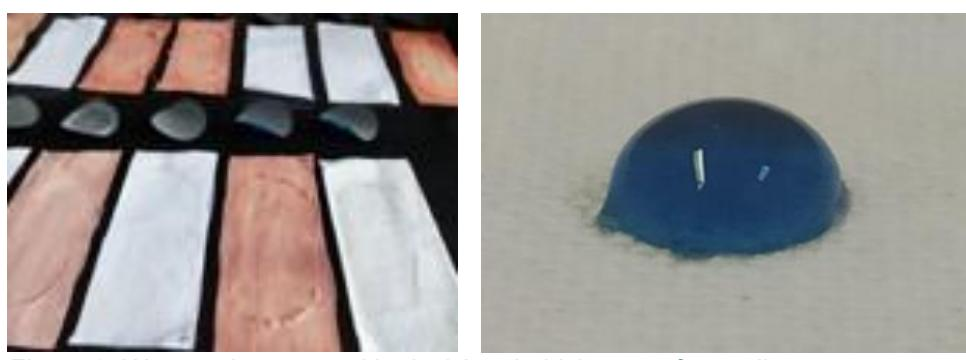
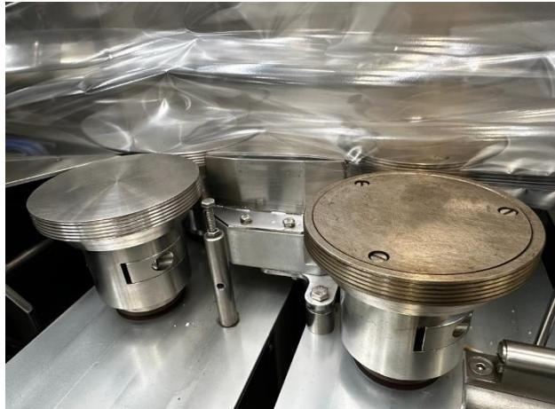
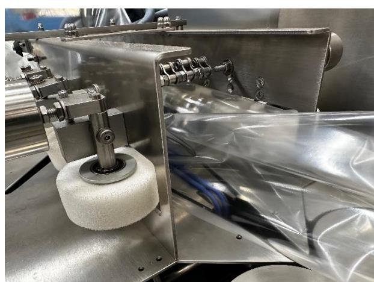
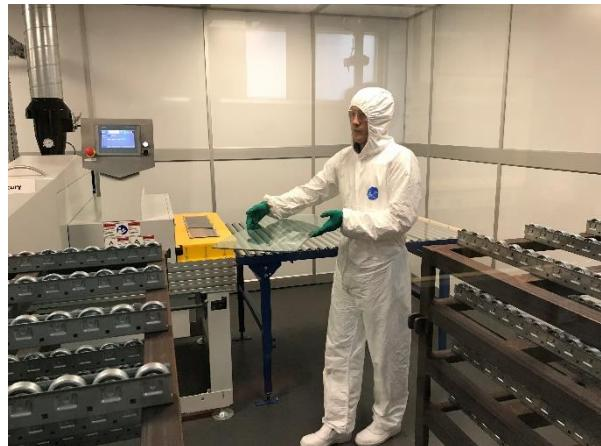
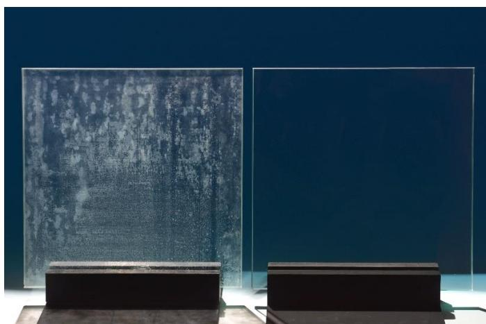
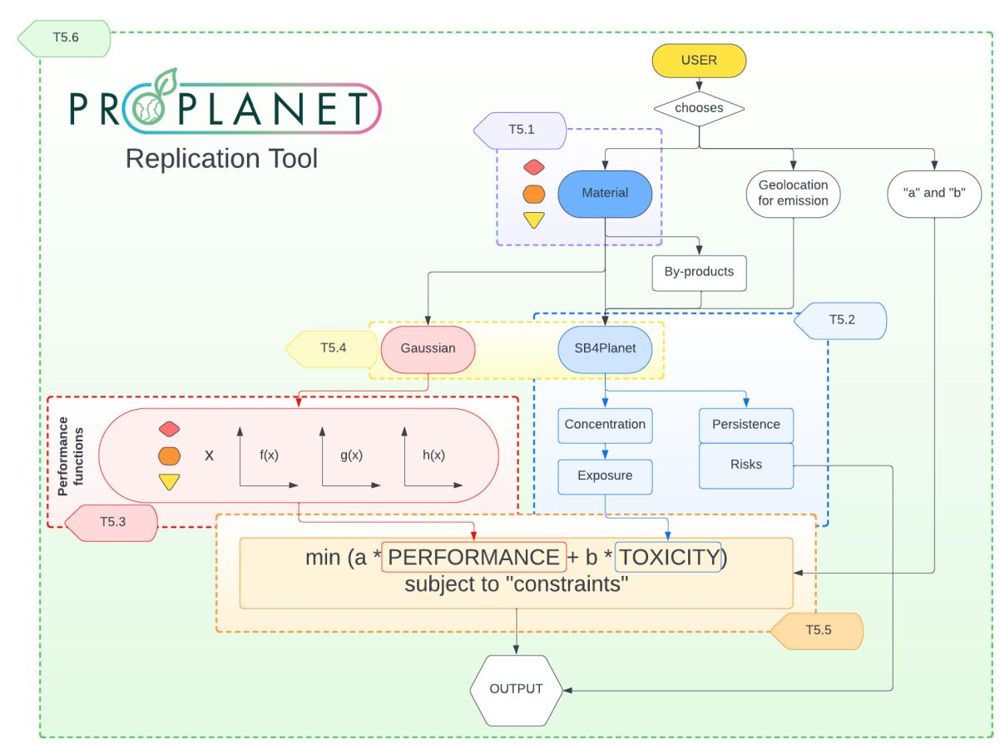
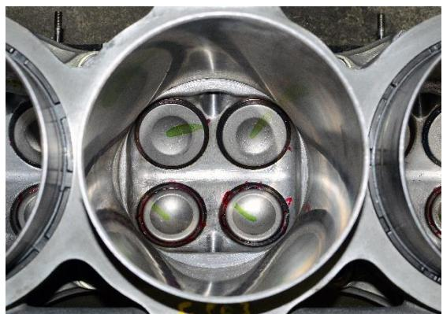
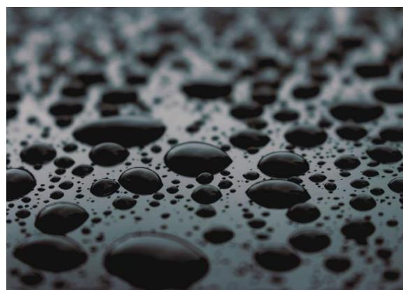
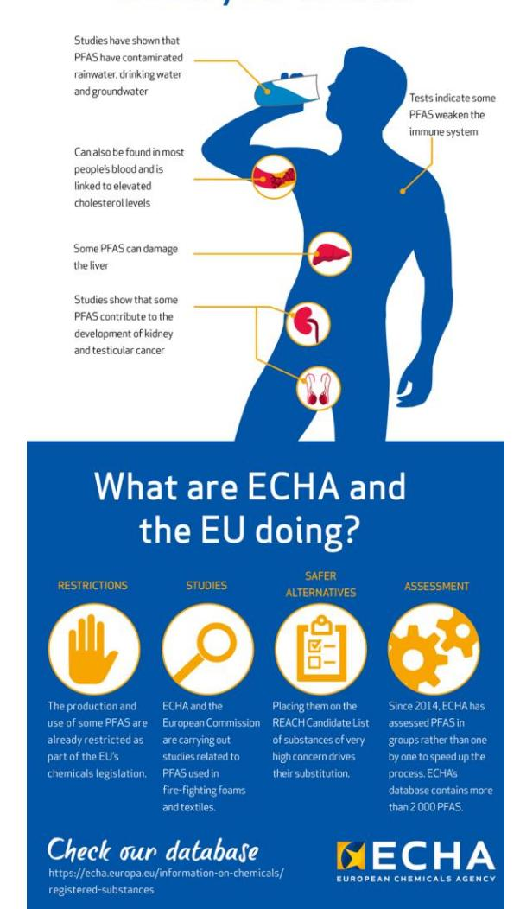

Funded by the European Union. Views and opinions expressed are however those of the author(s) only and do not necessarily reflect those of the European Union or HADEA. Neither the European Union nor the granting authority can be held responsible for them.

## Enhanced safe and sustainable coatings for supporting the planet

# Deliverable D7.14 Report on replicability cases

## **Deliverable Information**

| Responsible partner:     | IDENER                                                      |
|--------------------------|-------------------------------------------------------------|
| Work package             | No and Title:                                               |
|                          | WP7 / Exploitation, Dissemination, Communication and Social |
| Contributing partner(s): | ALL                                                         |
| Dissemination level:     | PU                                                          |
| Type:                    | R                                                           |
| Due date:                | 31.12.2023                                                  |
| Submission date:         | 22.12.2023                                                  |
| Version:                 | V3                                                          |

## Project Profile

| Programme          | Horizon Europe                                                   |
|--------------------|------------------------------------------------------------------|
| Call               | HORIZON-CL4-2022-RESILIENCE-01                                   |
| Topic              | HORIZON-CL4-2022-RESILIENCE-01-23                                |
| Number             | 101091842                                                        |
| Acronym            | PROPLANET                                                        |
| Name               | Enhanced Safe and Sustainable coatings for supporting the Planet |
| Start Date         | 1 January 2023                                                   |
| Duration           | 36 months                                                        |
| Type of action     | HORIZON Research and Innovation Actions                          |
| Granting authority | European Health and Digital Executive Agency                     |
| Coordinator        | IDENER                                                           |

## Executive Summary

This report details the progress of T7.5 – Replication cases (IDE), highlighting the progress made in the first 12 months of the project's implementation. First, the report provides a detailed description of the research lines pursued in the PROPLANET project. Then it explains how the PROPLANET Replication Tool is created and how the end-users will be able to interact with it. Further, an initial selection of replication cases to be studied before the end of the PROPLANET project in M36 (D7.15) are given. An insightful review on the current state-of-the-art of each replication case is given, as well as a discussion on the location of the main production hubs in the world for each specific technology.

## Table of Contents

|    | Table of Contents          |                                                                                                                                            |
|----|----------------------------|--------------------------------------------------------------------------------------------------------------------------------------------|
| 1. | Introduction               | .......................................................................................................................................6   |
| 2. | Objectives                 | .........................................................................................................................................7 |
| 3. |                            | Research lines in PROPLANET ........................................................................................................8      |
|    | 3.1.                       | Biopolymers for the textile sector................................................................................................8        |
|    | 3.2.                       | Hybrid siloxane bio-based coatings for the metal sector.............................................................9                      |
|    | 3.3.                       | Hybrid siloxane coatings for the glass sector............................................................................10                |
| 4. |                            | PROPLANET Replication Tool ........................................................................................................11      |
|    | 4.1.                       | Constructing the tool ................................................................................................................11   |
|    | 4.2.                       | Replication: Inputs and outputs ................................................................................................11         |
| 5. | Proposed replication cases | .............................................................................................................13                            |
|    | 5.1.                       | Textile coatings for umbrellas...................................................................................................13        |
|    | 5.2.                       | Textile coatings for swimsuits...................................................................................................13        |
|    | 5.3.                       | Metal coatings for automotive parts..........................................................................................14            |
|    | 5.4.                       | Metal coatings for cookware.....................................................................................................15         |
|    | 5.5.                       | Glass coatings for building windows.........................................................................................16             |
|    | 5.6.                       | Glass coatings for consumer electronics ..................................................................................16               |
| 6. |                            | Link to EU Strategic Roadmaps.......................................................................................................18     |
| 7. | Conclusion                 | ......................................................................................................................................20   |

## List of Figures

| Figure 2: Synthesis and application of hydro and oleophobic coatings for textiles.              | ...................................8                                                                   |
|-------------------------------------------------------------------------------------------------|--------------------------------------------------------------------------------------------------------|
| Figure 5: Coated folding box for flow-wrap machines.                                            | ..............................................................................9                        |
| Figure 7: Difference between non-coated and coated glass after exposure to a humid environment. | .....10                                                                                                |
| Figure 10: Water repellent swimwear.                                                            | ....................................................................................................14 |
| Figure 11: Closeup of a cylinder as an example.                                                 | ....................................................................................14                 |
| Figure 14: Glass facade of an office building.                                                  | .........................................................................................16            |

## 1. Introduction

Per- and poly-fluoroalkyl substances (PFAS) are widely utilized in diverse products and applications such as water repellent coatings for textiles, anti-soiling coatings for glass, construction materials, and more, yet pose significant threats to both human health and the environment. These "forever chemicals" resist normal decomposition and steadily accumulate in the natural world throughout their lifecycle as depicted in [Figure 1](#page-5-1) [1]. Thereby they contaminate water supplies and enter the food chain. This results in PFAS reaching humans and other organisms, leading to health risks such as organ damage, weakened immunity, high cholesterol, and at worst, cancer. With their impending ban, it becomes urgent to identify effective replacements.

> To counter this pressing issue, PROPLANET is developing innovative materials as alternatives to PFAS—targeting coatings in the textile, food packaging equipment, and glass sectors ensuring that neither functionality nor performance are compromised. The international consortium comprised of 13 institutions and companies, and experts across various fields such as material development, safety and sustainability, circularityby-design and manufacturing—aims to replace PFAS with less toxic and more sustainable options. The project's emphasis is on mitigating risks to environmental and human health while also addressing economic factors, recyclability, and the principles of a circular economy.

![A complex diagram illustrating the construction of a new product and its environmental impacts. The diagram shows a central concept with a large blue arrow pointing to the top left. This concept is labeled 'PFAS PRODUCTION' and 'PRODUCT MANUFACTURING'. The 'PFAS PRODUCTION' production stage is detailed with an inset illustration of a reaction showing a material chain (RAW MATERIAL EXTRACTION) and a sequence of processes (REACTION PROCESSES). The 'PRODUCT MANUFACTURING' production stage is detailed with an inset illustration of a reaction showing a material chain and a sequence of processes (REACTION PROCESSES). The 'PRODUCT USE' production stage is detailed with an inset illustration of a wind turbine and a sequence of processes (REACTION PROCESSES). A second large blue arrow points to the bottom right, labeled 'Exposure:'. This section includes a section for 'Emissions:' with illustrations of carbon fuels and a section for 'Exposure:' with illustrations of people and a section for 'Emissions:' with illustrations of carbon fuels.]()

In view of achieving these objectives, the PROPLANET project also sets out to implement a replication tool. The PROPLANET tool will be utilized in replication case studies, integrating

experimental investigations with mathematical and computational modelling, including the development of data-driven algorithms and the application of multi-objective optimisation techniques, facilitated by artificial intelligence. The open-source nature of this tool will allow end-users to reduce waste and explore innovative uses for materials, thereby empowering them to thrive in a competitive market while utilizing an eco-friendly design path. This integration of environmental protection, safety enhancement, chemical improvements, and the principles of a circular economy through the PROPLANET project symbolizes a significant stride toward a sustainable future.

The purpose of T7.5 is to study potential replication cases for the PROPLANET coatings in several industries and using the PROPLANET Replication Tool for the required analysis. By the end of the task, six cases—two for each research line (i.e. textile, metal and glass)—should be addressed.

In this deliverable, the replication cases are proposed. It constitutes a preliminary report in which the three PROPLANET research lines as well as the PROPLANET Replication Tool are described and explained in detail. Furthermore, the six replication cases are identified for subsequent case studies, and preliminary information about the current state-of-the-art, the involved industries, and their locations are gathered. The final report (D7.15), including the analysis which will use the PROPLANET Replication Tool, will contribute to a wider application of PROPLANET coatings for other applications and to the objective of replacing PFAS compounds.

*Figure 1: Lifecycle & contamination pathways of PFAScontaining products (feedstock to end-of-life) [1].*

## 2.Objectives

The overall objective of this deliverable is to establish six potential use-cases for which PROPLANET coatings can be used and studied using the PROPLANET Replication Tool, to assess the performance and environmental impact of the coatings in these use-cases. For each of the three research lines actively developed in the project—i.e., coatings for textiles, metals and glass—two replication cases are identified to apply the coating solution developed in that research line in applications that are different to the ones explored in the project. The performance and environmental impact shall be evaluated in all the following replication cases:

#### **1. Textiles**

- a. Coatings for umbrellas
- b. Coatings for swimsuits

#### **2. Metal**

- a. Coatings for automotive parts
- b. Coatings for cookware

#### **3. Glass**

- a. Coatings for building windows
- b. Coatings for optical equipment

## 3. Research lines in PROPLANET

#### 3.1. Biopolymers for the textile sector

This research line aims to substitute current PFAS in the textile sector—especially in technical clothes with crosslinked biopolymer oil/wax microcapsules in a polysaccharide matrix. These biopolymers should showcase high wear resistance (also related to washing speed), and be hydro- and oleophobic, which would significantly increase their competitiveness and market impact, since there are no fluorine-free, water/oil repellent coatings for textiles available yet.

> The PROPLANET consortium is currently developing a circular value chain for the crosslinked biopolymers, with proper testing stages. First, a hydrophobic functionalisation on natural polysaccharides is performed (esterification), and the formulation of the coating, via organic hydrophobic and oleophobic emulsions in biobased matrices is developed. Natural polysaccharides, such as alginate and chitosan, are used as a biobased polymer matrix, which is further modified to produce the repellent coatings, and could be applied on textiles as a coating solution or as

a paste [\(Figure 2\)](#page-7-2). The synthesis is then characterised to ensure TRL4. At this point, textile auxiliaries and fabric preparation procedures influencing the novel biobased repellents will be set up. The novel repellents can then be applied on the textiles, with padding, dip-coating, knife-coating and spray-coating considered as methods for the application of the coatings, with different auxiliaries and finishing recipes in each case. In dip-coating, the textile is immersed in a coating solution and dried. This can be followed by padding the sample—pad-dry or pad-dry-cure process—so the textile is immersed in a coating solution and then padded on a two-cylinder foulard to ensure an even distribution and remove the excess coating. These two procedures are appropriate for coating formulations with low viscosity. Furthermore, those solutions could also be spray-coated on the textile fabrics. Knife-coating is an alternative approach, since in this case a layer of more viscous coating material is applied using a controlled knife edge. It is important to emphasise that PROPLANET textile coatings aim to substitute both PFAS-based coatings and partially bio-based hydrophobic compounds already available in the market, which are not yet fluorine-free. In addition, the coatings are bio-based and oleophobic, which constitutes a novelty, since this is not currently available in the textile market. The developed coatings should be optimised by incorporating the results obtained from the different implemented models and algorithms.

To validate the performance of the coatings developed for textiles in PROPLANET, the hydrophobic and oleophobic attributes of the coatings will be demonstrated. In addition, wear and wash resistance tests will also be conducted [\(Figure 3\)](#page-7-3).

Since circularity is one of the main PROPLANET focus points, the end of life of the products of these processes and their next use will be assessed. A chemical/thermal recycling of the crosslinked biopolymers will be performed, and they will be reintroduced in the value chain for their reuse.

*Figure 2: Synthesis and application of hydro and oleophobic coatings for textiles.*

*Figure 3: Wear resistance and hydro/oleophobicity tests for textiles.*

#### 3.2. Hybrid siloxane bio-based coatings for the metal sector

The objective in this case is the substitution of PFAS in the food-packaging sector, particularly in foodpackaging machinery. These coatings should prove to be non-stick and anti-corrosive, showcasing high thermal and mechanical stress resistance. The combination of these properties in a fluorine-free compound, which still is unavailable in the case of food-packaging machinery, makes the research thread especially interesting.

PROPLANET partners will develop a circular value chain for hybrid siloxane bio-based coatings. The PFAS-free coating is developed through sol-gel synthesis. Metal alkoxides will be used and organic modified metal alkoxides will be included to decrease the crosslinking and cracking when curing the coating. PTMS (phenyl trimethoxy silane) will be added to improve the thermal stability of the coating, and the acid catalyst, the solvent, the ratio of the precursors, the reaction time and the temperature will all be adjusted. Additives for the self-lubrication of the coating, such as MoS2, WS2, BN or graphite, will be included, if needed, in the formulation, in contrast to the traditionally used PTFE (polytetrafluoroethylene), which contains PFAS. *Figure 4: Coated sealing rolls of longitudinal sealing station for flow-wrap machines.*

The concentration and compatibility of the precursors and the different additives will be assessed by Fourier Transformed Infrared Spectroscopy (FTIR) and Nuclear Magnetic Resonance (NMR). The pot-life of the formulation will be studied by measuring the solution viscosity and the resulting coating thickness evolution over time. The coating curing temperature and the thermal stability will also be studied via Differential Scanning Calorimetry (DSC) and Thermogravimetric Analysis (TGA), to optimise time and temperature for the best coating performance and process' energy consumption. The developed coatings should be optimised by incorporating the results obtained from the different implemented models and algorithms.

> To validate the coatings' performance, adhesion will be evaluated through cross-cut tape tests; tribological measurements will be performed to evaluate wear and abrasion resistance, self-lubrication and durability; salt spray tests will assess corrosion performance; resistance to different solvents and detergents will be studied; and thermal cycles at 120- 250oC will be performed to address temperature resistance. The validated coatings will then be scaled up and manufactured for validation at TRL5.

In this case, a first phase of chemical recycling will be conducted, with the machinery pieces treated with acid to detach the organic part of the coating. Then, a thermal treatment is performed to melt the remaining piece. Finally, the products re-enter the value chain and are re-used, achieving the intended circularity.

*Figure 5: Coated folding box for flow-wrap machines.*

#### 3.3. Hybrid siloxane coatings for the glass sector

As discussed for the previous two fields, the objective here is to substitute the current use of PFAS-based coatings in the glass sector. The developed coatings ought to possess anti-soiling (AS) properties and should not have a significant impact on the optical properties of the glass.

PROPLANET partners will develop a circular value chain for hybrid siloxane coatings, applied by sol-gel synthesis. The coatings will be modified to substitute PFAS yet maintaining excellent hydrophobic and antisoiling properties and achieving optimal optical properties. The inorganic precursor, TEOS (tetraethyl orthosilicate), will be the skeleton for the formation of the siloxane network, and several silicon organomodified alkoxides will be added to attain hydrophobic properties.

Adjusting and selecting the synthesis parameters, along with the presence of amphiphile molecules, the acid-catalysed sol-gel approach enables controlling the microstructure, the pore volume and the pore size of the coating. This process results in highly stable sols and materials with robust mechanical properties, and the optical character can be optimised. PDMS can be added to increase the thermal stability and provide extra hydrophobic behaviour.

As in the previous case, the concentration and compatibility of the precursors and their effect on the hydrophobicity of the surface will be characterised. Thereby obtaining a correlation between the chemical structure—obtained with the precursors and ratios studied—and the coating hydrophobicity will aid in the optimisation of the chemical structure. To do this, FTIR and NMR will be used. The hydrophobicity will be studied through contact angle measurements and the subsequent evaluation of the surface free energy. Furthermore, the pot-life of the coating will be studied by measuring the sol viscosity and the resulting coating thickness evolution over time. The curing temperature will be studied via DSC, and the thermal stability will be assessed using TGA, to optimise time and temperature for best coating performance and minimal energy consumption.

> Subsequently, the formulations will be scaled up and a second characterisation will be performed—i.e., evaluating the optical properties, contact angles, morphology, thickness and surface free energy. The developed coatings should be optimised by incorporating the results obtained from the different implemented models and algorithms, reaching production at TRL4. Eventually, the final coating will be applied by dip-coating on glass slides.

Finally, validation at TRL5 will be performed through nanoindentation measurements, ageing tests, surface free energy trials after ageing, and transmittance measurements after ageing.

To support the circularity of the value chain, the coated glasses will also be recycled using thermal methods. They will be melted thanks to the high percentage of silicon oxide of the coating—and the intrinsic characteristics of the glass—and reintroduced and reused in the value chain.

*Figure 6: Worker coating a sheet of glass with solution deposition equipment.*

*Figure 7: Difference between non-coated and coated glass after exposure to a humid environment.*

## 4.PROPLANET Replication Tool

This section explains the interdependencies of the different partners involved of the creation of the PROPLANET Replication Tool and its functions.

#### 4.1. Constructing the tool

The PROPLANET Replication Tool relies on two pillars: (1) *models and simulations* (T5.2 and T5.3) and (2) the dedicated *PROPLANET database* (DB) collecting the modelling inputs and results as well as optional additional data from external sources (T5.1).

Two approaches have been chosen for the modelling activities during the PROPLANET project.

- 1) *In-silico toxicological models* (NovaM, T5.2), based on *SimpleBox4Planet* (SB4P, an upgraded version of the company's SimpleBox4Nano tool), will be used to simulate small molecules or polymers that will replace PFAS. The models rely on pre-defined scenarios, based on a set of parameters (e.g. experimental data or basic material properties). The models assess how the different materials are released into the environment at different geographical scales (regional and continental) and in different climate zones (arctic, moderate and tropical). The calculations give information on how the materials accumulate in water, soil and air (concentration) which will then be linked to their environmental impact (e.g. their toxicity for humans). SB4P provides an application programming interface (API) that will be exploited in the final PROPLANET Replication Tool.
- 2) *First-principles models and simulations* (RINA-CSM, T5.3) based on *GAUSSIAN* are used to evaluate the performance of the specific materials (sections [3.1,](#page-7-1) [3.2](#page-8-0) and [3.3;](#page-9-0) WP2–WP4)–e.g., hydrophobicity or oleophobicity. The simulations test the interaction of compounds at a molecular level, for instance between a PFAS reference or the compounds developed in the PROPLANET project and water or oil reference molecules. The thereby obtained interaction energy provides an indication of the interaction strength between the molecules (*lower energy*: higher absolute value, higher interaction → improved bonding, *high energy*: lower absolute value, lower interaction → reduced bonding). Different iterations of these time-consuming simulations (timeframe of days) will provide a set of different results which are thereafter considered as fixed. The results will be stored in the PROPLANET DB. RINA-CSM will additionally determine relations between the hydro/oleophobic performance of the different molecules and their structural properties (e.g., using QSAR models).

#### 4.2. Replication: Inputs and outputs

The diagram depicted in [Figure 8](#page-11-0) shows the interconnections of the different modules that will make up the PROPLANET Replication Tool and the associated tasks in WP5. Going from top to bottom, we will clarify the functionality of the tool in the following.

- 1) **The user**. First, the user will be able to choose the *material*, which will define the parameters retrieved from the PROPLANET DB (T5.1). Further parameters will be the *geolocation* for the emission of the compounds (e.g. for production or the use of coated substrates, i.e. textiles, glass or metal) and the *weight preference* ("a" and "b") for performance or environmental aspects, respectively.
- 2) **The PROPLANET DB (IDE, T5.1)**. It provides data for the material of choice including possible byproducts associated with the selected material.
- 3) **Determination of governing equations (IDE, T5.4)**. Based on the results obtained from the simulation activities, governing equations describing the properties of the materials under investigation will be determined.

- a. **Environmental fate simulations (NovaM, T5.2,** *SB4P***)**. The result from these simulations will be used to determine the governing equations. These will then be optimised and used to produce an output using the PROPLANET replication tool, using a set of pre-defined relations. Alternatively, since the simulations can be executed in close to real-time, the SB4P API will be used to run the simulations to obtain the concentrations (in water, soil, and air) and the associated toxicity of the material (associated with the exposure) will then be fed into the optimised governing equations to produce the output. It will also provide the user with an information about the materials persistence in the environment and risks.
- b. **First-principles simulations (RINA-CSM, T5.3,** *GAUSSIAN***)**. They will provide different performance functions (e.g. *f*(*x*), *g*(*y*), *h*(*z*)…), i.e. the material performance as function of a specific parameter. Due to the time-intensive nature of these first-principles simulations, the obtained performance functions will be fixed for the PROPLANET Replication Tool.
- 4) **The optimised governing equations (UMA, T5.5)**. The governing equations will be studied using a multi-objective optimisation (MOO) approach to obtain the optimal result to improve the environmental and performance impacts. Implemented in the tool, they will provide the final output based on the choices the user made. These equations are based on the simulation modules.
- 5) **The PROPLANET Replication Tool (IDE, T5.6)**. The tool will compile and integrate the results from the other tasks. Via a graphical user interface, stakeholders will be able to analyse and compare the performance and environmental impact of their current value chain with coatings used in PROPLANET. This way they can ensure that these coatings are more beneficial and have a lower environmental impact than the ones commonly used. Note that the PROPLANET Replication Tool is still under development and the definitive functionalities are subject to change.

*Figure 8: PROPLANET Replication Tool modules and interaction scheme.[1](#page-11-1)*

1 Subject to change during the development of the PROPLANET Replication Tool.

## 5.Proposed replication cases

#### 5.1. Textile coatings for umbrellas

Umbrella manufacturing is an international industry in which a very diverse set of textiles are used: nylon, polyester, pongee, polyurethane, PVC, satin and taffeta; each with unique advantages such as durability, a broad palette of color options, UV resistance and cost-effectiveness. To improve the functional performance of these textiles, hydrophobic coatings—such as Teflon, polyurethane, silicone, acrylic, PVC and waxes—are applied via dip-coating or roll-coating—also known as blade coating or knife-over roll coating—to enhance the water repellence, durability and wear resistance of the resulting umbrellas. In the dipping process, as previously described, the fabric is immersed in a solution of the coating and then squeezed to ensure even distribution. In the case of roll coating, a layer of coating material is spread on the fabric using one or more rotating rollers. Following the application process, the fabric is dried and cured, often involving heat.

While the textiles are produced in industrial powerhouses, such as India, China and Bangladesh, the coatings are developed in countries with advanced chemical industries, such as the United States, Germany and Japan. Ultimately, the process of umbrella assembly takes place in manufacturing hubs such as China, India or Vietnam.

Amongst the previously cited coatings, there are some which contain or are PFAS. Such is the case of Teflon, which is especially known for its superior hydrophobic—water contact angles range in 113-116 o for Teflon AF1600 [2]—stain-resistant and wearresistant properties. In addition, the are some forms of other coatings, such as polyurethane and acrylic, which can also contain PFAS.

As previously stated, the PROPLANET project will substitute PFAS with more sustainable and circular solutions in several coating value chains and, in the case of technical textiles for industry, the project aims to use crosslinked polymer coatings via dip-coating and knife coating instead. The work to be addressed here is then to use the PROPLANET Replication Tool to analyse the performance and environmental impact of the proposed coating in the case of textiles for umbrellas, taking into consideration the location of the manufacturing centre.

#### 5.2. Textile coatings for swimsuits

Modern-day swimsuits are the result of advanced fabric technologies and multi-national production processes. The commonly used materials for fabrics include nylon, polyester, spandex/lycra, polybutylene terephthalate (PBT) and neoprene; all of them showcasing properties such as water-resistance, lightweight nature, durability and quick-drying. However, the process of creating a swimsuit does not stop at selecting appropriate fabrics. To enhance the functionality and longevity of the swimsuits, a variety of coatings is used. Fluoropolymers, which are PFAS, are frequently used for their oil, dirt, and water repellence. Silicones, which are not a type of PFAS, are also commonly employed as coatings due to their waterrepellent properties. Fluoropolymers are commonly used in the form of durable water repellent (DWR) finishes, whereas silicones form a layer on the fabric to prevent water penetration.

*Figure 9: Water repellent umbrella.*

The application of the different coatings varies, but the typical processes are dip-coating, spraying, padding and foaming. In the case of spraying, the coating substance is atomised into small droplets and then sprayed onto the swimsuit fabric, allowing for an even distribution and precise control of the coating thickness. As for padding, as previously noted, the textile is immersed in a coating bath and then goes through padded rollers for an adequate finish. Foaming involves applying a foam-based coating to the swimsuit fabric, which is then spread evenly over the fabric with rollers or blades. After the application, the fabric is dried and cured, usually involving heat treatments.

The swimsuit manufacturing industry is a global business.

However, there are several production hubs: China stands

out as the world's largest textile producer, contributing significantly to this specific sub-sector, whereas the United States and Europe stand out in the production of high-quality swimwear. South Asia countries also have growing industries, and Brazil and Australia also house domestic swimwear production, given their location and lifestyles. As for coating manufacturers, they are typically located in industrialised regions around the world, with major fluoropolymer manufacturers primarily in the United States, Japan and Western Europe.

PROPLANET aims for the substitution of PFAS with more sustainable and circular solutions in several value chains. In this case, the PROPLANET Replication Tool will be used to analyse the performance and environmental impact of the crosslinked polymer coatings proposed for industry-ready technical textiles if they were used in swimwear production, taking into consideration the location of the manufacturing centre.

#### 5.3. Metal coatings for automotive parts

In the automotive industry, one of the essential aspects of developing efficient and high-performance vehicles involves the use of various specialized coatings on metal parts. Among these, PFAS-based coatings have found application due to their unique properties, including lowering the surface tension. One such part that often employs these coatings is for instance the cylinder head.

The cylinder head, part of the engine assembly, is a critical component that houses the combustion chambers and various other parts like the valves and spark plugs. Given its integral role in the combustion process and the high temperatures it is exposed to, its surfaces are typically coated for enhanced performance, heat resistance, and longevity. PFAS-based coatings have been used due to their remarkable heat resistance and their ability to considerably lower surface tension. This results in better wetting properties, ensuring optimal lubrication and reducing the likelihood of hot spots, which can negatively impact the engine's performance and lifespan. *Figure 11: Closeup of a cylinder as an example.*

The automotive industry is global, however, there are several production hubs. Japan, Germany and the United States stand out as the world's largest automobile producers, whereas China, India, and Brazil have growing industries. As for coating manufacturers, they are typically located in industrialised regions around the world, with major fluoropolymer manufacturers primarily in the United States, Japan, Western Europe, India and China.

*Figure 10: Water repellent swimwear.*

The PROPLANET project aims to substitute PFAS with more sustainable and circular solutions in several value chains. In this case, the PROPLANET Replication Tool will be used to analyse the performance and environmental impact of PFAS-free coatings proposed for industry-ready automotive parts if they were used in cylinder head production, taking into consideration the location of the manufacturing centre.

#### 5.4. Metal coatings for cookware

The global cookware industry is a dynamic and diverse sector, with a plurality of materials and techniques employed to meet end user standards. Amongst the top used metals in cookware manufacturing, two specially stand out: stainless steel and aluminium. Their unique properties—stainless steel ensures durability and resistance to rust and corrosion, and aluminium guarantees excellent heat conductivity and is a lightweight material—make them immediately stand out for the functionalities necessary in the cooking sector. In addition to these, Copper is also used, especially for premium cookware, due to its outstanding heat conduction. It is worth noticing that both stainless steel and aluminium are produced globally, with major production countries including the United States, China, India and Russia.

However, while the material used is important, the surface that comes into contact with food—the coating is equally relevant. The most common type of coating used globally is PTFE, marketed under the Teflon brand name. A type of PFAS, PTFE is famed for its non-stick properties. Other types of coatings include ceramic, enamel, and seasoning, but they are all far from PTFE's popularity.

The application of PTFE in cookware involves several processes. After being shaped from a raw material, the cookware is prepared for coating through grid blasting—a process based on etching the surface, allowing for the coating to adhere better. Then, a first coat is applied before the final PTFE coating, enhancing durability and non-stick performance. The final PTFE coating is usually applied through spray coating, electrostatic spray-coating—in which the material is also electrically charged—dip-coating, powder-coating—the powder is sprayed and then melted to fuse it into a continuous coating—and rollcoating.

The production of PTFE also takes place worldwide, the major producing countries being the United States, China, Japan, Belgium and India. It is important to notice that in the midst of the concern for the use of PFAS and their health implications and environmental impact, certain types of PFAS—particularly PFOA and PFOS—are being progressively removed from production, but PFAS are still used today in this industry, so it is a suitable case for the PROPLANET Replication Tool.

The objective of PROPLANET is to substitute PFAS with more sustainable, circular materials. In particular, hybrid siloxane bio-based coatings are being developed and applied on machinery in the metal sector. This proves the interest on utilising the PROPLANET Replication Tool to analyse the performance and environmental impact of the proposed coating in the case of cookware, also considering the location of the manufacturing centre. *Figure 13: Frying pan with non-stick coating.*

*Figure 12: Droplets of water showing the hydrophobicity of a PTFE-coated surface.*

#### 5.5. Glass coatings for building windows

Glass is a material that is used for a multitude of applications. Depending on the specific use-case, coatings are applied to alter the glass surface and enable specific properties. In the case of windows, such coatings are designed to improve the energy efficiency of buildings—keeping the heat out (summer) or in (winter)—increasing the windows' durability and providing additional functionalities. Due to their exceptional water- and oil-repellent properties, PFAS—such as PVDF (polyvynilidene fluoride)—are sometimes used for this type of coatings. They are highly effective in creating hydrophobic and oleophobic surfaces that can repel water or oil, preventing water misting, and making the glass first-repellent and easier to clean (low-maintenance glass) [3], as well as providing resistance to weathering and UV radiation.

Some usual methods of application of these coatings are spray and electrostatic spray-coating, dipcoating, roll-coating and spin-coating, for example, with spin-coating consisting of the deposition of a small amount of the coating material on the centre of the glass before it is spun, with the centrifugal force spreading the coating layer evenly across the surface.

Some of the key players to produce functional glass, used in construction, are in the United States, Japan, China and Germany. As for the coatings, they are mainly produced in the United States, Western Europe, China and Japan.

During the PROPLANET project PFAS-free alternative glass coatings based on hybrid siloxane for lowmaintenance glass are being developed, as described in sectio[n 3.3.](#page-9-0) The replication of these PROPLANET coatings through the PROPLANET Replication Tool in the proposed scenario to assess their performance and environmental impact is thus justified.

#### 5.6. Glass coatings for consumer electronics

In the case of the electronics market, PFAS serve an essential role through their application as protective coatings for devices' screens. This applies to the screens of laptops, mobile phones and smartwatches, to which these coatings provide resistance against water, smudging and impact, and antireflective properties, among others. However, the specific composition of these PFAS used for screen coatings are rarely disclosed due to industrial confidentiality. Nevertheless, some types of PFAS, such as fluoropolymers, are known to be used to provide durable, highperformance coatings.

The production of the glass used to make the screens of electronic devices takes place in locations such as Germany, Japan and, of course, China—which also constitutes a production hub for the devices' assembly. In the case of the coatings, they are usually produced in the United States, Europe and China. These coatings are usually applied on the screens through dip-coating, spray-coating and spin-coating.

*Figure 14: Glass facade of an office building.*

*Figure 15: Hydrophobic coating on a smartphone screen.*

Within PROPLANET, PFAS coatings are substituted in the production of low maintenance glass with hybrid siloxane coatings. The objective here is to use the PROPLANET Replication Tool to analyse the possibility of the substitution of the PFAS coatings applied on the screens of electronic devices with the non-toxic, environmentally friendly coatings developed in PROPLANET, also addressing their performance in this specific case.

## 6. Link to EU Strategic Roadmaps

The EU's *Chemicals Strategy for Sustainability* [5] aims for increased protection of the citizens and the environment and for innovation in the field of safe and sustainable chemicals. This is a vital goal which also aligns with the *Zero pollution action plan* [6] and the *European Grean Deal* [7]. The Chemicals Strategy aims to create a safer environment by banning harmful chemicals in consumer products and phasing out PFAS, except when essential. It emphasizes understanding total chemical risk, boosting investment in safe, sustainable chemicals, and promoting supply resilience for critical chemicals. The strategy supports a simplified unified assessment process for chemical risks and hazards and positions the EU as a global leader in upholding high standards in chemical management without exporting banned chemicals.

## How do some PFAS affect your health?

The objectives of the PROPLANET project, namely the replacement of PFAS compounds from textiles, glass and metal appliances, are thus closely aligned with these strategic roadmaps and contribute to the central mission of the Chemicals Strategy. PROPLANET's innovation-centric approach correlates with the EU's commitment to pioneering green and digital transitions in the chemical sector and promoting safe and sustainable alternatives to PFAS.

The consortium is dedicated to establishing important links between the research carried out in PROPLANET and potentially interested industrial players. The PROPLANET replication studies serve as a tool to build that bridge, apply the project's findings and facilitate practical actions to mitigate the negative impact of PFAS. Furthermore, the studies drive twice the impact on the EU's *Zero Pollution Ambition* [6] within the *European Green Deal* [7], by not only providing solid results on PFAS-related issues, but also suggesting viable and sustainable alternatives.

In addition, the links between the European Chemicals Agency's (ECHA) focus on PFAS and PROPLANET are evident. The ECHA prioritises managing risks associated with PFAS and improving knowledge about these substances. PROPLANET aligns with these priorities by delving into the scientific understanding of PFAS and their impacts, offering valuable insights to enhance knowledge and formulate relevant policies, proposing sustainable alternatives.

In conclusion, PROPLANET and the accompanying replication studies are not standalone ventures on the study of the impact of PFAS and potential sustainable *Figure 16: Infographic from ECHA [4].* alternatives. They are integral parts of a broader initiative to ensure a safer, sustainable environment, in line with the strategic roadmaps of the EU. By achieving breakthroughs in PFAS research and substitution, we contribute to the ongoing efforts towards a toxic-free environment, as envisioned by the EU's Chemicals Strategy for Sustainability and the ECHA's focus on PFAS.

## 7. Conclusion

In this preliminary report (D7.14) we provided a detailed description of the PROPLANET Replication Tool, how it is created and how it can be used by the users. Further, we identified six potential replication cases that will be addressed throughout the PROPLANET project, providing enough context to justify the interest in replicating the PROPLANET solutions in each of these cases. These replication cases cover all the research lines that are being investigated in the project—coatings for textiles, glass and metal. The results attained using the PROPLANET Replication Tool on this selection of replication cases will be delivered in D7.15.

#### References

[1] M. Wahlström, E. Pohjalainen, E. Yil-Rantala, D. Behringer, D. Herzke, S. M. Mudge, M. Beekman, A. de Blaeij, J. Devilee, S. Gabbert, M. van Kuppevelt, M. Zare Jeddi, P. Gabrielsen und X. Trier, "Fluorinated polymers in a low carbon, circular and toxic-free economy," European Environment Agency, 2021. [2] Y. Xiang, P. Fulmek, D. Platz und U. Schmid, "Temperature Dependence of Water Contact Angle on Teflon AF1600," *Langmuir,* 2022. [3] J. Glüge, M. Scheringer, I. T. Cousins, J. C. DeWitt, G. Goldenman, D. Herzke, R. Lohmann, C. A. Ng, X. Trier und Z. Wang, "An overview of the uses of per- and polyfluoroalkyl substances (PFAS)," *Environmental Science: Processes & Impacts,* Bd. 22, pp. 2345-2373, 2020. [4] "Chemicals in our life," ECHA, [Online]. Available: https://chemicalsinourlife.echa.europa.eu/why-wecare-about-forever-chemicals-and-why-you-should-too. [Accessed 7th November 2023]. [5] European Commission, "Chemicals Strategy for Sustainability - Towards a Toxic-Free Environment," Brussels, 2020. [6] European Commission, "EU Action Plan: "Towards Zero Pollution for Air, Water and Soil"," Brussels, 2021. [7] European Commission, "The European Green Deal," Brussels, 2019.

The photos used in this document were obtained from [www.rawpixel.com,](http://www.rawpixel.com/) [www.stockvault.net](http://www.stockvault.net/) and [www.flickr.com](http://www.flickr.com/) and are either part of the public domain or are licensed for non-commercial use. The authors gratefully acknowledge the photographers.