Funded by the European Union. Views and opinions expressed are however those of the author(s) only and do not necessarily reflect those of the European Union or HADEA. Neither the European Union nor the granting authority can be held responsible for them.

# Enhanced safe and sustainable coatings for supporting the planet

# Deliverable D.7.2 Exhaustive market analysis towards circular approaches

### Deliverable Information

| Responsible partner:       | EXELISIS     |
|----------------------------|--------------|
| Work package No and Title: | WP7          |
| Contributing partner(s):   | ALL          |
| Dissemination level:       | PU           |
| Type:                      | Report       |
| Due date:                  | 30 June 2023 |
| Submission date:           | 30 June 2023 |
| Version:                   | V01          |

### Project Profile

| Programme          | Horizon Europe                                                   |
|--------------------|------------------------------------------------------------------|
| Call               | HORIZON-CL4-2022-RESILIENCE-01                                   |
| Topic              | HORIZON-CL4-2022-RESILIENCE-01-23                                |
| Number             | 101091842                                                        |
| Acronym            | PROPLANET                                                        |
| Name               | Enhanced Safe and Sustainable coatings for supporting the Planet |
| Start Date         | 1 January 2023                                                   |
| Duration           | 36 months                                                        |
| Type of action     | HORIZON Research and Innovation Actions                          |
| Granting authority | European Health and Digital Executive Agency                     |
| Coordinator        | IDENER                                                           |

### Executive Summary

This Deliverable is linked to Task 7.1. "Market Analysis and Circular Business Planning" running throughout the PROPLANET project, under the work package related to the "Exploitation, Dissemination, Communication and Social Engagement". Under this deliverable a comprehensive market analysis was conducted to gain insights into the primary market landscape, examine specific sectors, and analyse competitors, and assess the project's strengths and weaknesses. This analysis aimed to identify market opportunities and facilitate the successful commercialisation of the project's innovative coatings.

In the primary market landscape, various sectors were investigated, including the biopolymers market, coatings market, organic coatings market, and bio-based coatings market. Of particular interest was the textiles sector, food packaging equipment market, and glass coating market. The analysis examined the current trends, demand, and growth potential in these sectors to understand the market dynamics and identify areas for innovation.

An exhaustive market analysis was conducted for coatings in the textiles sector, focusing on coatings with oleophobic and water-repellent attributes. The study delved into the specific requirements and challenges of this sector, including the need for durable and sustainable coatings that enhance the performance and longevity of textile products. Another area of analysis was coatings for food-packaging machinery, with a focus on properties such as anti-corrosion, non-stickiness, high thermal resistance, and enhanced mechanical stress properties. Moreover, low maintenance glass sector was investigated, while anti-soiling and anti-reflective glass markets were also investigated. By understanding the market needs and customer preferences, PROPLANET aimed to develop coatings that meet the industry's demands and provide a competitive advantage.

To gain a comprehensive understanding of the market landscape, a competitors' analysis will also be conducted. This assessment involves identifying and evaluating key players in the coatings industry, particularly those operating in the target sectors of the PROPLANET project. By analysing the strengths and weaknesses of competitors, the project aimed to position itself strategically and differentiate its offerings in the market. This analysis will be further elaborated under Deliverable D7.3 – Exhaustive market analysis towards circular approaches, expected to be delivered on M24.

Furthermore, a SWOT (Strengths, Weaknesses, Opportunities, and Threats) analysis and PESTLE (Political, Economic, Sociocultural, Technological, Legal, and Environmental) analysis were performed to assess the internal and external factors that could impact the project's success. These analyses provided valuable insights into the project's unique strengths, potential vulnerabilities, market opportunities, and external factors influencing the coatings industry. This analysis will be further elaborated under Deliverable D7.3 – Exhaustive market analysis towards circular approaches, expected to be delivered on M24.

Lastly, a thorough examination of the patent landscape related to coatings will take place under the upcoming Deliverable D7.3. This analysis aims to identify existing patents, technological advancements, and intellectual property considerations in the field. By understanding the existing patents and intellectual property landscape, PROPLANET could ensure its innovations were novel and protected, while also leveraging existing knowledge and avoiding potential infringements.

### Table of Contents

| 1. Introduction ....................................................................................................................................... 9 |                                                                                                                                            |
|-----------------------------------------------------------------------------------------------------------------------------------------------------------|--------------------------------------------------------------------------------------------------------------------------------------------|
| 2. Primary Market Landscape ................................................................................................................ 9            |                                                                                                                                            |
| 2.1.                                                                                                                                                      | PFAS Waste Management Market ............................................................................................. 9               |
| 2.2.                                                                                                                                                      | Biopolymers market .................................................................................................................. 11   |
| 2.3.                                                                                                                                                      | Coatings market ....................................................................................................................... 12 |
| 2.3.1.                                                                                                                                                    | Organic coatings market ................................................................................................... 14             |
| 2.3.2.                                                                                                                                                    | Bio-based coatings market ................................................................................................ 15              |
| 2.4.                                                                                                                                                      | Textiles sector market .............................................................................................................. 16   |
| 2.5.                                                                                                                                                      | Food packaging market ............................................................................................................ 17      |
| 2.6.                                                                                                                                                      | Glass coating market ................................................................................................................ 18   |
| 3. Exhaustive Market Analysis ............................................................................................................. 20            |                                                                                                                                            |
| 3.1.                                                                                                                                                      | Textile Coatings market: oleophobic and water-repellent attributes .......................................... 20                           |
| 3.2.                                                                                                                                                      | Coatings for food-packaging machinery: anticorrosive, non-stickeness, high-thermal and                                                     |
| 3.2.1.                                                                                                                                                    | Anti-corrosive Coatings Market.......................................................................................... 21                |
| 3.2.2.                                                                                                                                                    | Non-stick Coatings Market ................................................................................................ 22              |
| 3.2.3.                                                                                                                                                    | Thermal Barrier Coatings Market ....................................................................................... 23                 |
| 3.2.4.                                                                                                                                                    | Abrasion Resistant Coatings Market ................................................................................. 24                    |
| 3.3.                                                                                                                                                      | Coatings for the glass sector .................................................................................................... 24      |
| 3.3.1.                                                                                                                                                    | Low maintenance glass market ......................................................................................... 24                  |
| 3.3.2.                                                                                                                                                    | Anti-Reflective glass coatings ............................................................................................ 27             |
| 3.3.3.                                                                                                                                                    | Anti-Soiling glass coatings ................................................................................................. 28           |
| 4. Competitors Analysis ....................................................................................................................... 28        |                                                                                                                                            |
| 5. Market forces .................................................................................................................................. 29    |                                                                                                                                            |
| 6. SWOT & PESTLE Analysis ............................................................................................................. 30                |                                                                                                                                            |
| 6.1.                                                                                                                                                      | SWOT Analysis ........................................................................................................................ 30  |
| 6.2.                                                                                                                                                      | PESTLE Analysis ..................................................................................................................... 31   |
| 7. Patent landscape ............................................................................................................................. 32      |                                                                                                                                            |

| 7.1. | Patent Mapping Analysis methodology ..................................................................................... 32                         |
|------|------------------------------------------------------------------------------------------------------------------------------------------------------|
| 7.2. | Patents identified or owned by the consortium ......................................................................... 34                           |
| 7.3. | Initial patent search .................................................................................................................. 34          |
| 8.   | Conclusions ..................................................................................................................................... 38 |

### List of Figures

| Figure 1. Global PFAS Waste Management Market 2023-2031 [1].....                                  | 10 |
|---------------------------------------------------------------------------------------------------|----|
| Figure 2. Biopolymers Market by Type, 2022-2030 [5].....                                          | 12 |
| Figure 3. Biopolymers Market by Region, 2022-2030 [5].....                                        | 12 |
| Figure 4. Global paints and coatings market share by application in 2021 [8].....                 | 13 |
| Figure 5. European paints and coating market insight, 2022-2028 [9].....                          | 14 |
| Figure 6. European paints and coatings market share by technology, 2022 [9].....                  | 14 |
| Figure 7. Organic coatings market, Revenue CAGR (%), by application, 2022-2027 [10].....          | 15 |
| Figure 8. Organic coatings market by region, 2022-2027 [10].....                                  | 15 |
| Figure 9. Biobased Coating Market Insights, 2022-2027 [11].....                                   | 16 |
| Figure 10. Europe Technical Textiles Market 2023-2027.....                                        | 17 |
| Figure 11. Value of outer packaging machines in EI (2017).....                                    | 18 |
| Figure 12. European Flexible Packaging market. ....                                               | 18 |
| Figure 13. Global glass coating market size 2018-2027 [18].....                                   | 19 |
| Figure 14. Increase in global sales of light vehicles in 2018-2019 [18].....                      | 19 |
| Figure 15. Global Hydrophobic Coatings Market Size insights, 2022-2030 [22].....                  | 20 |
| Figure 16. Global Hydrophobic Coatings Market Insights, 2022-2030 [22].....                       | 21 |
| Figure 17. Global Anti-corrosion Coatings Market Insights, 2021-2030 [23].....                    | 22 |
| Figure 18: Global non-stick coatings market revenue CAGR (%), by Application, 2022-2027[24] ..... | 23 |
| Figure 19:Global thermal barrier coatings market by region, 2023-2028 [23].....                   | 23 |
| Figure 20: Global Abrasion Resistant Coating Market Insights, 2022-2028 [26].....                 | 24 |
| Figure 21: Global self-cleaning glass market insights, 2021-2028 [27] .....                       | 25 |
| Figure 22: Self Cleaning Glass Market Leaders [28].....                                           | 25 |
| Figure 23: Global automotive glass market share, by vehicle type, 2020 [29].....                  | 26 |
| Figure 24: Shower cubicles market insights, 2022-2030 [30].....                                   | 27 |
| Figure 25: Global Anti-reflective Glass Coating Market, 2022-2029 [31].....                       | 27 |
| Figure 26: Competitors analysis attributes.....                                                   | 29 |
| Figure 27. Porter's Five forces principles.....                                                   | 30 |
| Figure 28. SWOT Analysis for the PROPLANET project. ....                                          | 31 |
| Figure 29. PESTLE Analysis for the PROPLANET project.....                                         | 32 |
| Figure 30. Patent Mapping Methodology. ....                                                       | 33 |
| Figure 31. Application trend for Hybrid siloxane coating(s).....                                  | 35 |
| Figure 32. Top current assignees for Hybrid siloxane coating(s                                    |    |

### List of Tables

Table 1. Patents identified by the consortium. ........................................................................................ 34

### Table of Abbreviations

| Abbreviation | Definition                                                           |
|--------------|----------------------------------------------------------------------|
| EU           | European Union                                                       |
| CAGR         | Compound Annual Growth Rate                                          |
| CAPEX        | Capital Expenditure                                                  |
| IP           | Intellectual Property                                                |
| IPR          | Intellectual Property Rights                                         |
| WP           | Work Package                                                         |
| PFAS         | Per- and polyfluoroalkyl substances                                  |
| PFOA         | Perfluorooctanoic acid                                               |
| PFOS         | Perfluorooctanesulfonic acid                                         |
| PFDA         | Perfluorodecanoic Acid                                               |
| POPs         | Persistent organic pollutants                                        |
| REACH        | Registration, Evaluation, Authorisation and Restriction of Chemicals |
| PLA          | Polylactic acid                                                      |
| PHA          | Polyhydroxyalkanoate                                                 |
| TBCs         | Thermal barrier coatings                                             |
| PESTLE       | Political, Economic, Social, Technological, Legal, and Environmental |

# 1. Introduction

The protective coatings market is driven by the need for eco-friendly products and increasing government regulations aimed at reducing environmental pollution. However, the high cost of novel / bio-based coatings, limited availability of raw materials, and regulatory hurdles are challenges for the market.

The conducted analysis aims to identify several opportunities for the coatings market, including the increasing demand for novel coatings in emerging economies, where environmental regulations are becoming more stringent. Another potential opportunity could be the entry of new PFAS-free coatings into the market, as well as the development of new applications for the aforementioned coatings, such as in the construction, textiles, food, and automotive industries.

In this deliverable a preliminary and an exhaustive market analysis towards circular approaches for developed coatings materials will be conducted revealing a growing market with several opportunities and challenges. This analysis includes different market segments and their growth potential, a look into potential competitors and identification of areas for innovation.

Strengths, Weaknesses, Opportunities, and Threats are being identified, and Political, Economic, Sociocultural, Technological, Legal, and Environmental analysis is being performed to assess the internal and external factors that could impact the project's success.

Furthermore, a comprehensive assessment of the patent landscape in the coatings sector will be conducted, examining existing patents, technological advancements, and intellectual property considerations. The primary goal is to gain insights into the current state of intellectual property in the coatings developing industries.

This analysis will be further elaborated under Deliverable D7.3 – Exhaustive market analysis towards circular approaches, expected to be delivered on M24.

# 2. Primary Market Landscape

A primary market landscape analysis will be conducted aiming to depict various aspects, such as market size, growth potential, customer needs, industry trends, and competitive landscape. This analysis will provide insights into the opportunities and challenges that relevant stakeholders may encounter when introducing a new coating formulation/product to the market. Therefore, this primary market analysis will support decision making, identifying competitive advantages, and develop effective strategies for successful market entry and growth.

#### 2.1. PFAS Waste Management Market

Per- and polyfluoroalkyl substances (PFAS) are a group of chemicals that have been widely used due to their unique properties, such as resistance to degradation in the environment, water and oil resistance, heat resistance, and nonstick capabilities. They have been used in many industrial applications and consumer products, such as nonstick cookware, stain-resistant fabrics, water-resistant fabrics, food packaging, and firefighting foam. This group of man-made chemicals includes many individual chemicals, with perfluorooctanoic acid (PFOA) and perfluorooctanesulfonic acid (PFOS) being the most well-known. These compounds have raised concerns due to their persistence in the environment, as they are considered persistent organic pollutants (POPs), and have potential health effects.

To address the potential environmental and health concerns associated with PFAS, safer alternatives are being examined and efforts are being allocated to the improvement of detection and remediation methods

for contaminated sites. In particular, the global PFAS waste management market value was estimated at € 1.67 billion in 2022, growing with a CAGR of 5.2% to reach € 2.69 billion by 2031[1].

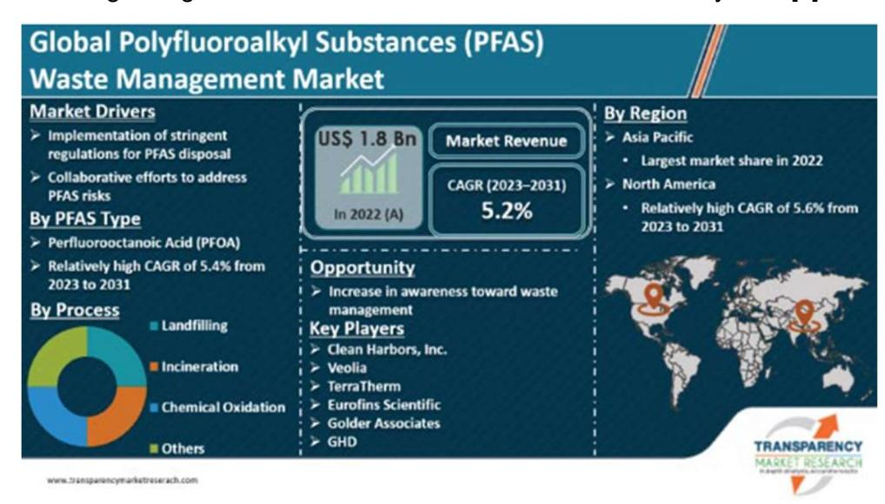

Figure 1. Global PFAS Waste Management Market 2023-2031 [1].

Governments in many countries have updated the regulations regarding PFAS waste management and disposal. The Registration, Evaluation, Authorisation and Restriction of Chemicals (REACH) and other regulations have implemented strict restrictions on PFAS compounds to protect the environment and human health. This is expected to be a key driver for PFAS waste management market growth. As public awareness is being increased regarding the risks associated with PFAS, the need for management solutions is also increasing. Governments, industrial key players and research institutes are collaborating to jointly develop new technologies and standards in this framework. They exchange knowledge and best practices, to upgrade the current PFAS waste management solutions and address faster and safer the risks.

Based on the type of PFAS, four main market segments can be identified, namely Perfluorooctane Sulfonate (PFOS), Perfluorooctanoic Acid (PFOA), Perfluorobutanoic Acid (PFBA), and Perfluorodecanoic Acid (PFDA). In 2022, the PFOA segment held the largest market share, while it is also expected to maintain its dominance during the forecast period 2023 to 2031. Despite its potential harmfulness, PFOA can be found in many applications, such as nonstick coatings, firefighting foam, and water-resistant textiles.

The PFAS waste management market consists of three primary segments based on the process used: landfilling, incineration, and chemical oxidation. Among these, incineration held the largest market share in 2022. This process aims to either break down the chemical compounds into less harmful substances or destroy them, by controlled burning at high temperatures. The method can manage many types of PFAS waste and is particularly suitable for large scale waste management purposes.

According to a regional analysis of the market, Asia Pacific is projected to dominate the market, primarily due to rapid industrialisation that is driving significant growth in the segment. Meanwhile, Europe and North America also represent noteworthy markets in the industry.

1 https://www.transparencymarketresearch.com/polyfluoroalkyl-substances-pfas-waste-management-market.html

Among the key players that operate in the industry are the following: Clean Harbors, Veolia, TerraTherm, Eurofins Scientific, Golder Associates, Chemviron, Newterra, PerkinElmer, Republic Services, Evoqua Water Technologies, and GHD.

In the context of European markets, it is worth highlighting the estimated introduction of PFAS chemicals in 2022, ranging between 140,000 and 310,000 tonnes. These estimates further indicate that the cumulative health costs associated with exposure to these substances in Europe range from € 52 billion to € 84 billion [2]. Additionally, PFAS substances have been detected at approximately 17,000 locations across the United Kingdom and Europe, with Belgium standing out due to the highest pollution levels [3]. The European Chemicals Agency warns that without intervention, around 4.4 million tonnes of PFAS are projected to enter the environment over the next 30 years [4].

#### 2.2. Biopolymers market

Biopolymers are derived from natural, renewable sources, such as plants, animals, microorganisms, in contrast to traditional synthetic polymers that are derived from fossil fuels. They are considered more environmentally friendly due to their potential for biodegradability, decreased reliance on fossil fuels, and reduced environmental impact of plastic waste. They can be used in various applications, including food, pharmaceutical and biomedical industries.

While biopolymers are a broad category of polymers derived from natural sources, bioplastics are a subset of biopolymers that are used as an alternative to traditional petroleum-based plastics. The global biopolymers market size was valued at € 10.73 billion in 2022, growing at a CAGR of 15.79% to reach € 34.66 billion by 2030 [5]. The market growth of biopolymers will be driven by several factors, including their lower carbon footprint, reduced waste generation, improved compostability, and decreased energy costs. As consumer awareness is increasing, the demand for eco-friendlier, safer, and more sustainable, healthier solutions is increasing. Government policies and waste management regulations support the reduction of plastic waste driving the demand for biopolymers. At the same time, the use of biopolymers in the packaging industry is rising, as biopolymers producing biodegradable and compostable packaging materials that can reduce the environmental impact of packaging waste [6].

On the other hand, the market growth may be restrained due to the high cost of biopolymers production and potential performance issues that may restrict their penetration into specific applications. Guided by government policies, however, consumer goods, packaging and agriculture applications are anticipated to provide growth opportunities for biobased polymers. Special attention shall also be given to a remaining challenge that concerns the non-biodegradable biopolymers processing. It is also worth noting that two years after the coronavirus pandemic, the expected economic growth turned into slow growth and inflation, as new challenges appeared, such supply chain constrains and high oil and food prices due to the Russia-Ukraine war [6].

Based on the type of biopolymers, the market is segmented into Bio-PE, Bio-PET, Polylactic acid (PLA), Polyhydroxyalkanoate (PHA), Biodegradable polyesters, and others. In 2022, the biodegradable polyesters segment dominated the market and is expected to continue during the forecast period. Segment growth is driven by many applications of biodegradable polyesters in biomedical and medical equipment, packaging, automotive, consumer goods, and textiles industries.

2 https://www.chemistryworld.com/news/eu-floats-plan-that-would-ban-virtually-every-pfas-currently-on-the-market/4016973.article

3 https://www.theguardian.com/environment/2023/feb/23/revealed-scale-of-forever-chemical-pollution-across-uk-and-europe

4 https://echa.europa.eu/-/echa-publishes-pfas-restriction-proposal

5 https://www.marketresearchfuture.com/reports/bio-polymers-market-2977

6 https://www.marketsandmarkets.com/Market-Reports/biopolymers-bioplastics-market-88795240.html

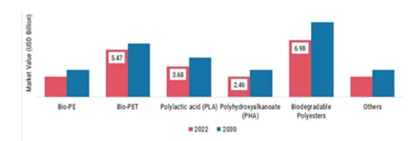

Figure 2. Biopolymers Market by Type, 2022-2030 [5].

Based on the application, the following segments can be identified: films, bottles, fibres, seed coating, vehicle components, medical implants, and others. In 2022, the bottles segment holds the largest share.

Based on the end-use market, the following segments are included: packaging, agriculture, automotive, pharmaceutical, construction, and others. The packaging segment dominates the market, with food and beverage, pharmaceutical and consumer goods industries increasing the packaging needs for bioplastics and biopolymers.

Regarding the regional analysis of the market, Asia Pacific is the fastest growing market and dominates the market. Not only there is a growing demand for sustainable materials, policies to support their use, and environmental concerns that are driving the segment growth, but also countries such as China, Thailand and Malaysia have significant production capacity. Key players of the global market include Novamont, BASF, Braskem, NatureWorks, Biome Bioplastics, Mitsubishi Chemical Holding Corporation, Biotec, Toray Industries, Plantic Technologies, and TotalEngies Corbion.

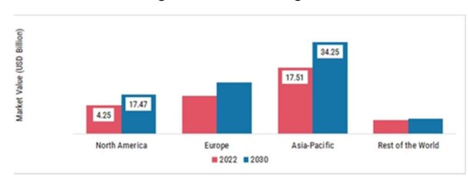

Figure 3. Biopolymers Market by Region, 2022-2030 [5].

As far as the European market is concerned, the market size was estimated at € 1.12 billion in 2022, growing at a CAGR of 18.2 to reach € 3.17 billion by 2028 [7]. In the European market, the nonbiodegradable bioplastics are expected to witness the fastest growth, with Bio-PET being their largest subcategory. Bio-PET segment is growing due to easy production process and low cost. Packaging segment dominates the European market, as well, based on the end-use industry market segmentation. Some of the market leaders in the European Market are: NOVAMONT, BASF, BIOME bioplastics, bio-on, NUREL, Daminer Scientific, HPPE, Ecovia Renewables, and others.

#### 2.3. Coatings market

Paints and coatings are composed of several key components, which vary depending on the type and application. However, a basic composition includes binder/resin, solvent, pigment, additives, and hardeners. In 2022, the global paints and coatings market was estimated at € 155.73 billion, growing at a CAGR of 5% to € 235.99 billion by 2029 [8]. Paints and coatings are used in a variety of applications, such

7 https://www.marketdataforecast.com/market-reports/europe-biopolymers-market

8 https://www.fortunebusinessinsights.com/industry-reports/paints-and-coatings-market-101947

as in construction, automotive, transportation, and wood industries. High-tech coatings constitute an increasing trend of this market.

Based on the resin type, the market is segmented into epoxy, acrylic, polyester, alkyd, polyurethene, and others, with acrylic resin holding the largest share. Based on the technology, the market is segmented into waterborne, solvent borne, powder and others, with the waterborne segment dominating the market. Based on the region, Asia Pacific holds the largest market share.

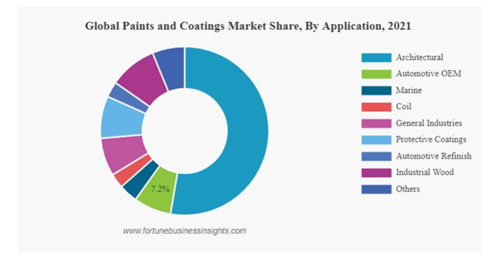

Figure 4. Global paints and coatings market share by application in 2021 [8].

Focusing on the European market for paints and coatings, the market size is estimated to grow from € 34.65 billion in 2023 to € 38.74 billion by 2028, following a CAGR of 2.3%[9]. The growth of the market is propelled by the increasing demand for environmentally sustainable coatings and advancements in powder-based coating technologies. Powder coatings consist of an ecofriendly solution without Volatile Organic Compounds that is particularly favoured by the industrial coatings market. Specifically, the applications in electric vehicles, a segment that witnesses great growth, is considered a significant opportunity for powder coatings. The market growth might be restrained by the time consuming drying and curing process of waterborne coatings, in comparison to the solvent-borne coatings.

9 https://www.marketsandmarkets.com/Market-Reports/european-paint-coating-market-124411528.html

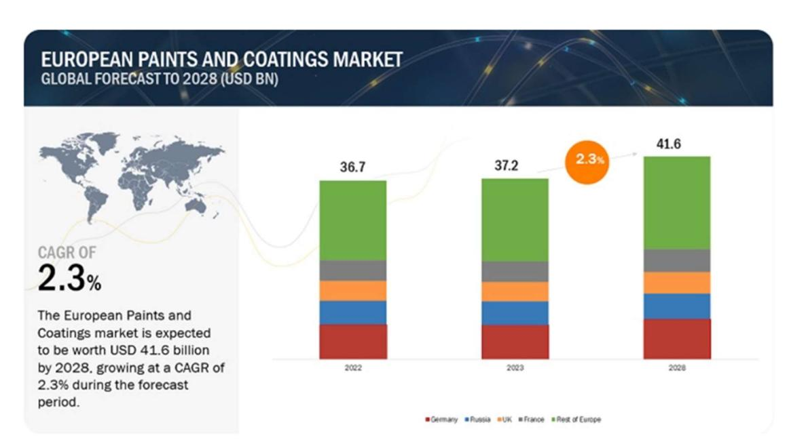

Figure 5. European paints and coating market insight, 2022-2028 [9].

The European market can be segmented into architectural and industrial based on the end use industry. The industrial segment will witness the fastest growing rate during the forecast period. Based on the regional analysis, Germany is the fastest growing market in the region, while also being the largest economy in Europe. It is worth noting that Germany is also the biggest exporter of decorative coatings in Europe, with 16.9% in 2021. Some of the key players in the market include Akzo Nobel, PPG Industries, The Sherwin-Williams Company, BASF Coatings, Jotun, Axalta Coating Systems.

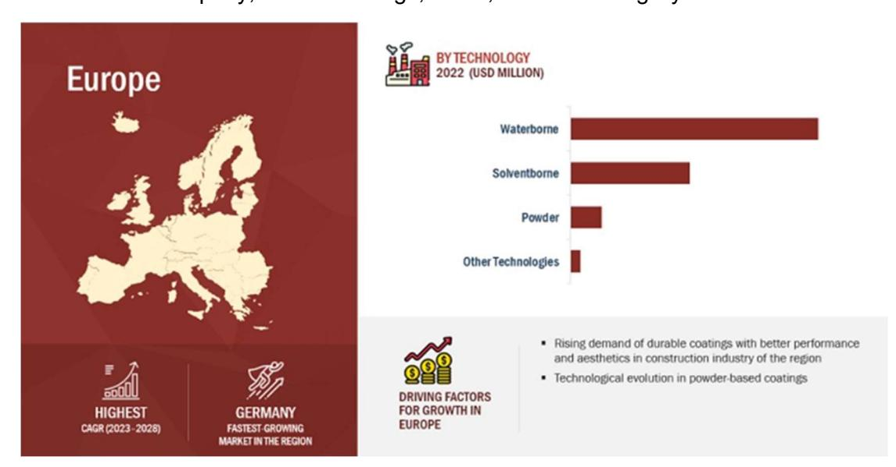

Figure 6. European paints and coatings market share by technology, 2022 [9].

#### 2.3.1. Organic coatings market

Organic coatings are thin layers of protective or decorative materials applied to various surfaces. They are composed of organic compounds, typically polymers, that form a continuous film when applied. These coatings offer protection against corrosion, abrasion, UV radiation, and other environmental factors. They are widely used in industries such as automotive, aerospace, construction, and manufacturing to enhance the durability and appearance of substrates like metal, wood, plastics, and composites.

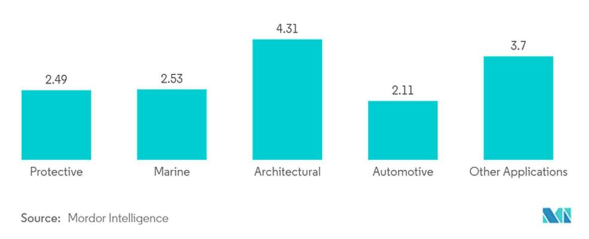

Figure 7. Organic coatings market, Revenue CAGR (%), by application, 2022-2027 [10].

The global organic coatings market is estimated at € 81.6 billion in 2023, growing at a CAGR that exceeds 3% during the period 2023-2028[10]. Several factors are fuelling the market growth, such as the increased demand due to the construction market growth and the rising interest in the protective applications of organic coatings. Specifically, the increased demand for coatings in architectural applications, such as the interiors and exteriors of buildings, is one of the major market trends. However, the environmental concerns associated with organic coatings might restrain market growth.

Asia Pacific is expected to dominate the market during the forecast period, as shown in Figure 8. Some of the key players of the organic coatings market are Akzo Nobel, PPG Industries, The Sherwin-Williams Company, Axalta Coating Systems, Jotun.

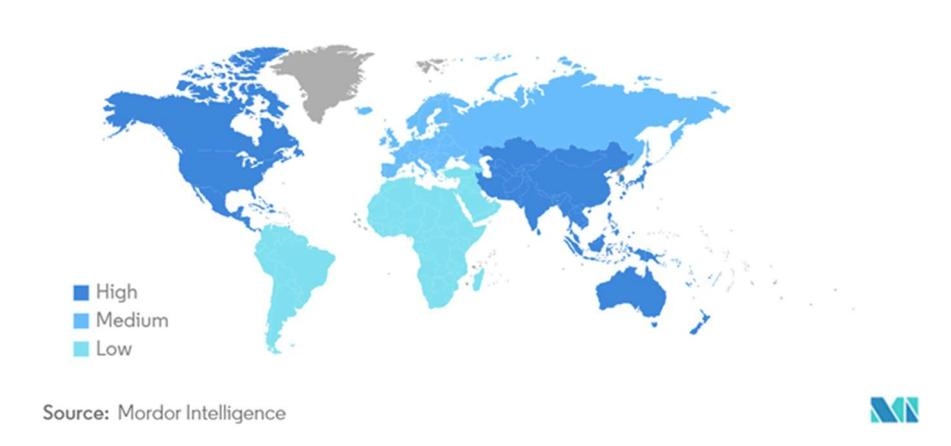

Figure 8. Organic coatings market by region, 2022-2027 [10].

#### 2.3.2. Bio-based coatings market

Bio-based coatings are coatings made from renewable, natural, or sustainable materials that are biodegradable or compostable. Bio-based coatings adopt a circular approach to mitigate the environmental impact typically associated with coatings. An exhaustive market analysis towards circular approaches for new bio-based coatings materials involves an in-depth examination of the market for bio-based coatings,

10 https://www.mordorintelligence.com/industry-reports/organic-coatings-market

including its status, trends, challenges, opportunities, and potential for growth. The analysis also involves identifying the key players in the market, their strategies, and the competitive landscape.

The market for bio-based coatings is driven by several factors, including increasing demand for ecofriendly products, the need to reduce carbon footprint, and government regulations aimed at reducing environmental pollution. The global market for bio-based coatings was valued at € 10.72 billion in 2022 and is projected to reach € 6.96 billion by 2027, with a CAGR of 9.5% during the forecast period (2022- 2027) [11].

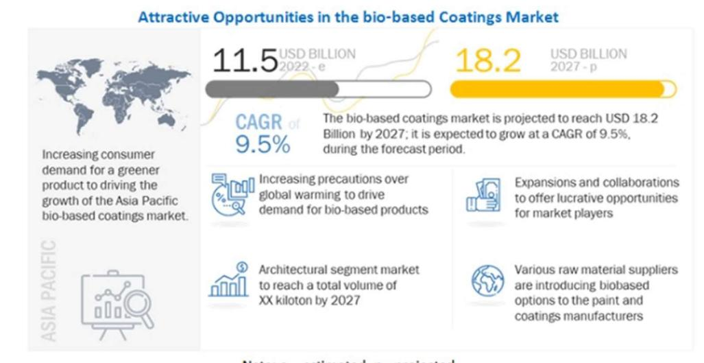

Figure 9. Biobased Coating Market Insights, 2022-2027 [11].

The market analysis identifies several trends in the bio-based coatings market. One trend is the growing use of natural polymers, such as starch, cellulose, chitosan, and lignin, as raw materials for bio-based coatings. Another trend is the increasing demand for water-based coatings, which are more environmentally friendly than solvent-based coatings. Other trends include the development of bio-based coatings for specific applications, such as anti-corrosion coatings and UV-resistant coatings. However, the market growth might be restrained by the high prices compared to fossil-based coating products.

Asia Pacific dominates the market and is expected to witness the fastest growth during the forecast period. Some of the key players of the market are AkzoNobel, PPG Industries, Sherwin-Williams Company, Nippon Paint Holdings, and Stora Enso.

#### 2.4. Textiles sector market

The European textile and clothing sector holds significant importance within the manufacturing industry, playing a pivotal role in the economy and social well-being across various regions of Europe. As of 2019, the industry consisted of approximately 160,000 companies, employing 1.5 million individuals, and generating a turnover of € 162 billion. Notably, the EU's textile and clothing sector primarily comprises small businesses. Italy, France, Germany, Spain, and Portugal emerge as the leading producers in the industry, collectively accounting for approximately three-quarters of EU production. The southern EU countries make a substantial contribution to the overall clothing production, while the northern countries

11 https://www.marketsandmarkets.com/Market-Reports/bio-based-coating-market-1942306.html

such as Germany, Belgium, the Netherlands, and Austria play a more prominent role in textile production, particularly in the realm of technical textiles [12].

The increasing concern for the environment has led to a growing demand for organic clothing among consumers. This shift can be attributed to the health and environmental advantages associated with organic products. As a result, more eco-conscious individuals are opting for clothing made from organic textiles. Acknowledging this consumer demand and recognizing the need to adopt sustainable practices, the fashion industry is making significant progress in utilizing more environmentally friendly fabrics. Even fast fashion leaders are now embracing organic and recycled alternatives as part of their commitment to sustainability [13].

On the other hand, the European market for technical textiles is projected to experience substantial growth, with an estimated increase of € 7.78 billion from 2022 to 2027. This growth is expected to occur at a compounded annual growth rate (CAGR) of 4.54% throughout the forecast period. The report incorporates historical market data from 2017 to 2021, indicating that in 2017, the market was valued at € 26.44 billion [14].

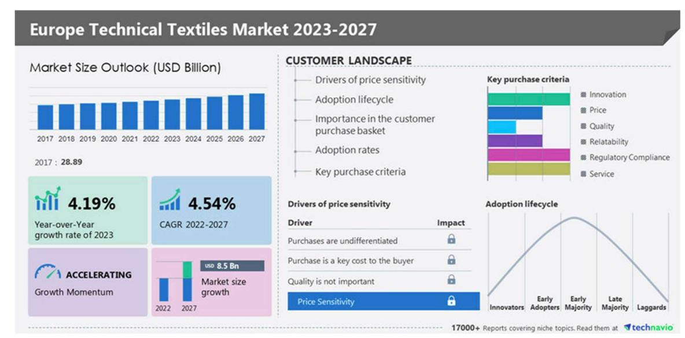

Figure 10. Europe Technical Textiles Market 2023-2027.

#### 2.5. Food packaging market

The global food packaging equipment market size was valued at more than € 15 billion in 2020 and is projected to reach more than € 30 billion by 2031, registering a CAGR of 6.3% from 2022 to 2031. Form, fill & seal segment is expected to be the fastest growing segment during the forecast period, growing at 8.5% CAGR [15].

12 https://single-market-economy.ec.europa.eu/sectors/fashion/textiles-and-clothing-industries/textiles-and-clothing-eu\_en

13 https://www.mordorintelligence.com/industry-reports/europe-textile-industry

14 https://finance.yahoo.com/news/technical-textiles-market-size-europe-235500760.html

15 https://www.alliedmarketresearch.com/food-packaging-equipment-market

Figure 11. Value of outer packaging machines in EI (2017).

Outer packaging machines as well as fill and sealing machines have a market share of 56% and 40%, respectively, which represents almost the entire market. The value of outer packaging machines stood with € 7.6 billion in 2017, a plus of 10% on 2016. Italy is the leading country in the EU regarding outer packaging machines. It increased the value of its outer packaging machines above average by 12% thus kept its market share in the EU of 54% constant [16].

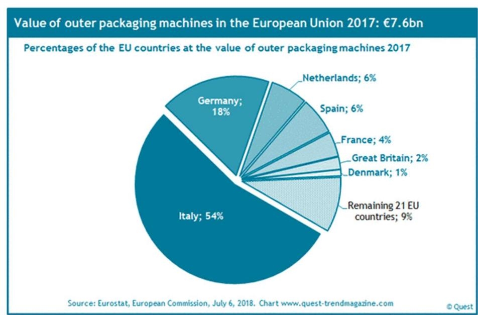

Moreover, the Europe flexible packaging market size is expected to reach € 75.21 billion by 2028 from € 51.94 billion in 2022, growing at a CAGR of 5.13% during the forecast period.

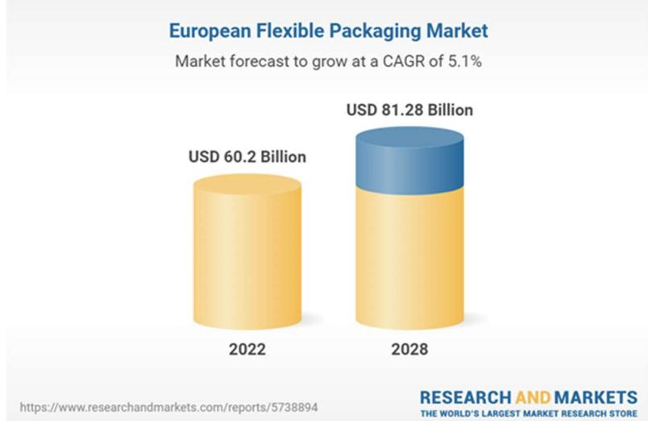

Germany dominates the Europe flexible packaging market with the highest industry share. Germany's wellestablished pharmaceutical market participants include Bayer, BASF, and Hoechst. Apart from drugs, the demand for sterile plastic packaging for medical devices is also driving the region's flexible packaging market. Due to COVID-19, pharmaceutical and F&B packaged food demand has tremendously increased, driving flexible packaging demand. With over 80 million customers, the F&B industry is the largest in Europe and generated

around € 205 billion in 2020 [17]. Figure 12. European Flexible Packaging market.

#### 2.6. Glass coating market

Glass coatings are transparent, thin films applied to glass surface to provide a range of benefits, such as enhance durability and performance, acts as a protective barrier against water, oil, dirt, easier cleaning, resistance to scratches, UV radiation and chemical damage. The global glass coating market is expected to grow at a CAGR of 22.1% during the period 2018-2027, reaching a value of € 4.47 billion by 2027[18].

16 https://www.quest-trendmagazine.com/en/machinery-industry/packaging-machines/market-shares-of-eu-countries-at-packagingmachines.html

17 https://www.arizton.com/market-reports/europe-flexible-packaging-market

18 https://www.researchnester.com/reports/glass-coating-market/1307

Figure 13. Global glass coating market size 2018-2027 [18].

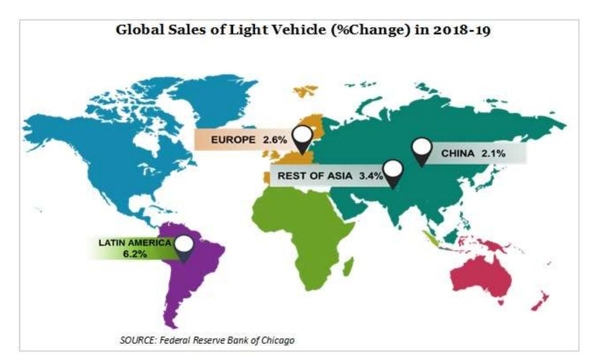

The market growth is driven by several factors, including their application in the automotive and construction industries. In particular, technological advancements have allowed and increased the application of glass coatings on vehicles. The automotive industry is witnessing a significant growth in sales of light vehicles (as shown in Figure 14), as a result of the increased disposable income in many countries. In addition, the construction industry is also witnessing significant growth, increasing the demand for glass coatings. At the moment, market growth may be restrained by the high manufacturing cost for the additional coating process step due to the need to invest CAPEX initially.

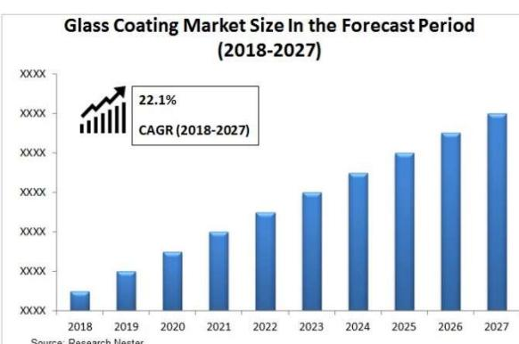

Figure 14. Increase in global sales of light vehicles in 2018-2019 [18].

Based on the type, glass coating market is segmented into sol-gel coatings, pyrolytic coatings, and magnetron sputtering coatings, with the pyrolytic coatings holding the largest share. [19] Based on the region, Asia Pacific has the largest share of the market, due to their many end users in automotive and construction industries. It is also worth mentioning some of the key players of the glass coating market, such as 3M Company, Nano-Care Deutschland, PPG Industries, Valspar Corporation, Premium Coatings and Chemicals, CCM, Opticote [18].

19 https://www.marketresearchfuture.com/reports/glass-coating-market-4641

# 3. Exhaustive Market Analysis

#### 3.1. Textile Coatings market: oleophobic and water-repellent attributes

The global market for textile coatings is expected to record a growth anticipating reaching € 4.6 billion in 2031 increasing with a CAGR of 4% [20]. The fastest expanding market is expected to be China, while key companies include BASF, Clariant, Covestro, DuPont, Juntsman, and Omnova, among others.

The market expansion of textile coatings is driven by factors such as rapid urbanisation and the global demand for geotextiles. These factors contribute to the increased use of waterproof, high-quality, and heatresistant materials in the production of sportswear and imitation leather.

Recent commercial activities have seen a notable increase in the development of hydrophobic, superhydrophobic, oleophobic, and omniphobic coatings designed to quickly repel fluids from surfaces. The market has witnessed significant growth in sectors such as packaging, aerospace, and electronics (particularly for waterproofing). Noteworthy automotive companies like Tesla, Ford, Volvo, GM, and Jaguar have also initiated product development efforts in this field [21].

Having a closer look at hydrophobic coatings they are thin films applied to surfaces that repel water. They are designed to minimise water absorption and create a self-cleaning effect by causing water droplets to bead up and roll off the coated surface. These coatings are commonly used in various industries to provide water resistance, prevent corrosion, and enhance the durability of materials. The global hydrophobic coatings market was valued at € 1.79 billion in 2022, growing with a CAGR of 6.1% to reach € 2.84 billion by 2030 [22].

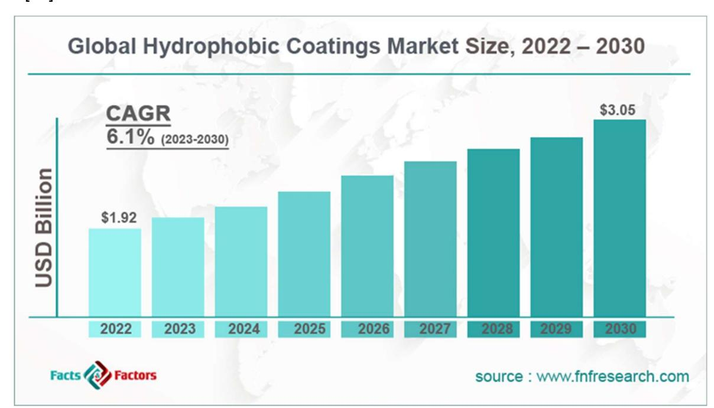

Figure 15. Global Hydrophobic Coatings Market Size insights, 2022-2030 [22].

The market growth during the forecast period is a result of increased awareness of hydrophobic coatings advantages, which allow them to be used in many applications. In particular, not only do they provide water repulsion, but also improve surface durability and protect against corrosion, wear, and tear. Additionally,

20 https://www.factmr.com/report/textile-coatings-market

21https://www.businesswire.com/news/home/20201112005619/en/The-Global-Market-for-Hydrophobic-Superhydrophobic-Oleophobic-and-Omniphobic-Coatings-2020---ResearchAndMarkets.com

22 https://www.fnfresearch.com/news/global-hydrophobic-coatings-

market#:~:text=According%20to%20Facts%20and%20Factors,6.1%25%20between%202023%20and%202030

they can be used to reduce friction on the surface, a property that is valuable in the automotive and aerospace. There is also increased investment in coating technologies, which is expected to further drive the market growth.

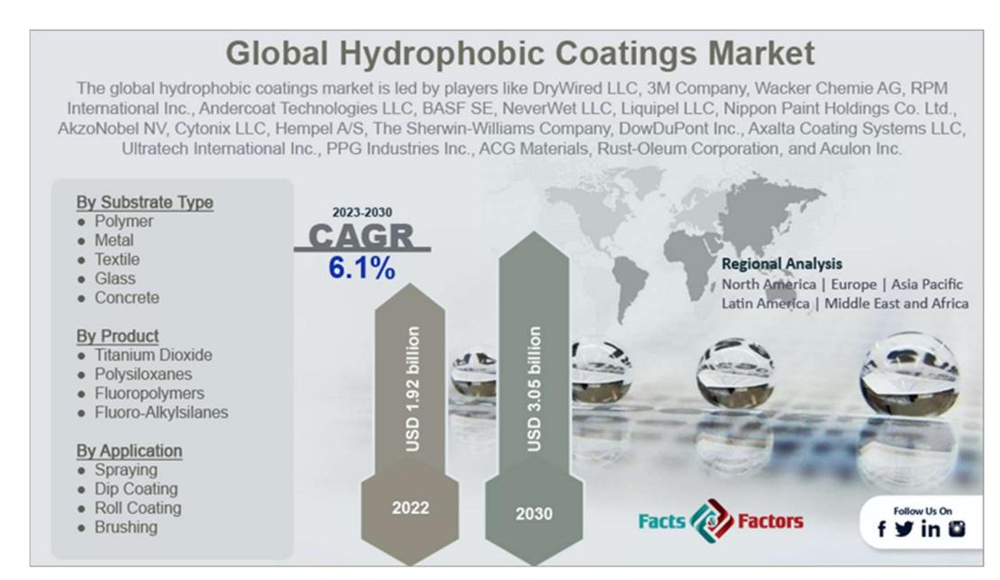

Figure 16. Global Hydrophobic Coatings Market Insights, 2022-2030 [22].

Regarding the regional analysis of the market, Asia Pacific is expected to dominate the market during the forecast period. Countries such as India, China and Japan witness high revenues in the automotive sector, where hydrophobic coatings are in high demand.

#### 3.2. Coatings for food-packaging machinery: anticorrosive, non-stickiness, highthermal and enhanced mechanical stress properties

#### 3.2.1. Anti-corrosive Coatings Market

Anti-corrosion coatings are applied to surfaces to provide protection against corrosion. They shield the material from moisture, chemicals, and other corrosive agents. Anti-corrosion coatings can be applied in many applications, including oil and gas, petrochemical, power generation, infrastructure, and other industries. The global anti-corrosion coatings market value was estimated at € 30.33 billion in 2022 and is expected to grow at a CAGR of 5.21%, reaching € 50.39 billion by 2032 [23].

Market growth is driven by several factors. One aspect is the increased demand for thin-walled durable metallic components to be utilised in lightweight products manufacturing. Another aspect is the increased operations for oil and gas exploration in regions like North America and Asia Pacific. A third factor that fuels the market growth is the increased demand for high-performance anti-corrosion coatings in power plants globally.

23 https://www.precedenceresearch.com/anti-corrosion-coatings-

market#:~:text=The%20global%20anti%2Dcorrosion%20coatings,of%20over%2038%25%20in%202022

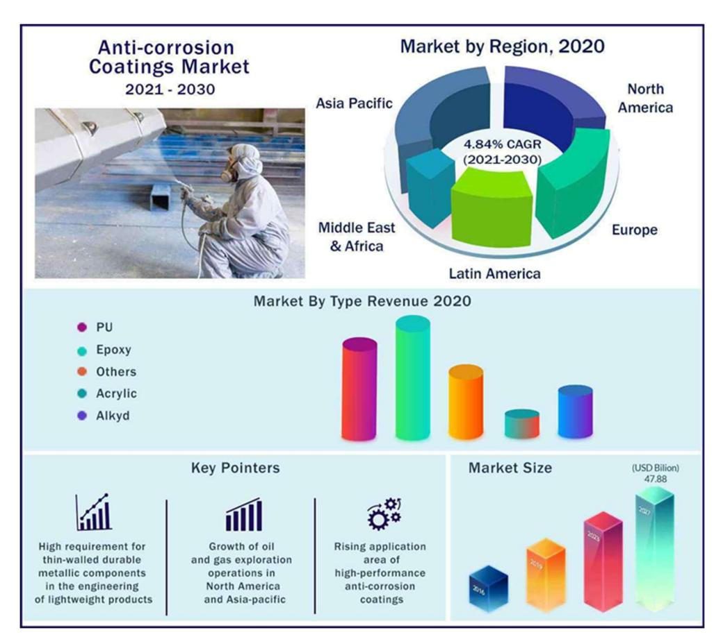

Figure 17. Global Anti-corrosion Coatings Market Insights, 2021-2030 [23].

In terms of regional analysis of the market, North America holds the largest market share, generating a revenue share of >38% in 2022. This can be attributed to the U.S. being one of the leading oil and natural gas producers in the world, installing pipelines for this purpose. It is worth noting that China is considered the largest user of anti-corrosion coatings, due to the high energy demand, and maintenance needs of the transport sector. Some of the key players of the market are Akzo Nobel, Axalta Coating Systems, Kansai Paint, BASF, Ashland, Hempel, Jotun, PPG Industries, and The Sherwin-Williams Company.

#### 3.2.2. Non-stick Coatings Market

Non-stick coatings are deposited onto surfaces to prevent adhesion of substances. Common applications include cookware, bakeware, industrials moulds, among others. The global non-stick coatings market is estimated to reach more than € 1.5 billion by the end of 2023 and is growing at a CAGR of >5% during the forecast period of 2023 to 2028 [24]. The growing demand for cookware and advancements in the medical and electronics industries are expected to drive the market growth during the forecast period. Asia Pacific dominates the market and will witness the fastest growth during the forecast period. Some of the key players of the market are The Chemours Company, PPG Industries Inc., Daikin Industries, Ltd, Showa Denko K.K., and 3M, among others.

24 https://www.mordorintelligence.com/industry-reports/non-stick-coatingsmarket#:~:text=The%20global%20non%2Dstick%20coatings%20market%20is%20estimated%20to%20reach,prices%20collapsing%20and%20 demand%20falling

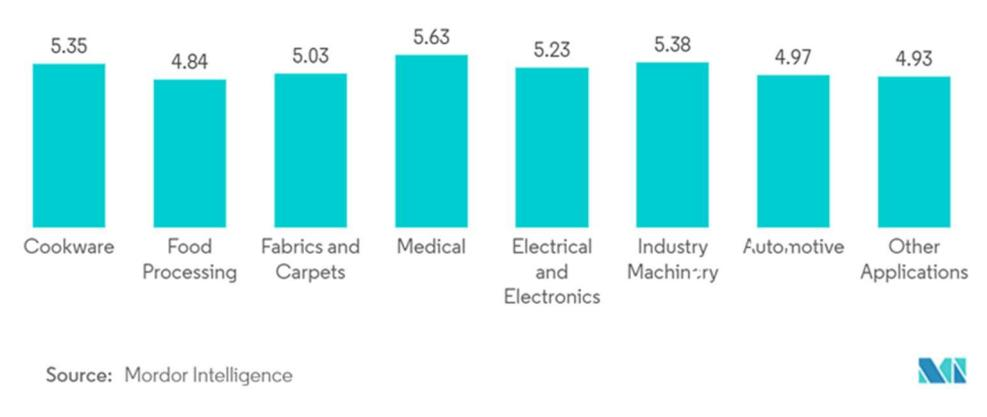

Figure 18: Global non-stick coatings market revenue CAGR (%), by Application, 2022-2027 [24].

#### 3.2.3. Thermal Barrier Coatings Market

Thermal barrier coatings (TBCs) are specialised coatings applied to surfaces exposed to high temperatures to reduce heat transfer and provide thermal insulation. Typical applications of TBCs are aerospace, gas turbines, automotive engine, among others, to protect components from extreme heat and extend their operational lifespan. The thermal barrier coatings market is expected to grow at a CAGR of >4% during the forecast period 2023-2028 [25]. The increased demand for thermal barrier coatings in the aerospace industry is expected to drive the market growth. North America dominates the market, with the USA holding the largest share. However, Asia Pacific will witness the fastest growth during the forecast period. Some of the key players in the market include Honeywell International Inc., OC Oerlikon Management AG, Praxair S.T. Technology, Inc., Chromalloy Gas Turbine LLC, and Saint-Gobain, among others.

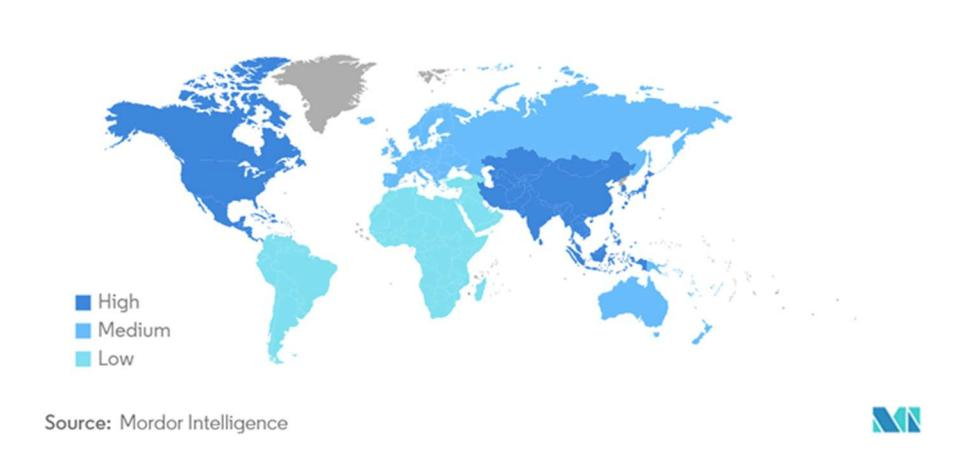

Figure 19:Global thermal barrier coatings market by region, 2023-2028 [23].

25 https://www.mordorintelligence.com/industry-reports/thermal-barrier-coatings-market

#### 3.2.4. Abrasion Resistant Coatings Market

Abrasion-resistant coatings are protective coatings applied to surfaces to enhance their resistance against wear, scratches, and abrasion. These coatings are designed to withstand friction, impact, and mechanical forces, thereby extending the lifespan and durability of the coated surface. They are commonly used in applications such as automotive parts, industrial equipment, flooring, and tools to minimise damage caused by abrasion and improve overall performance. In 2022, the global abrasion-resistant coatings market valued € 8.39 billion, growing at a CAGR of 5.5% to reach € 11.66 billion by 2028 [26]. The rising end user sectors, such as oil and gas, power generation, industrial, transportation and infrastructure, are increasing the demand for abrasion resistant coatings, driving the market growth. North America dominates the market, while Europe holds the second largest share, due to transportation, construction, and power generation industrial growth. In particular, Germany, UK, France, and Russia hold significant shares of the European market. Some of the key players of the market include Akzo Nobel, Saint-Gobain, Jotun, The Sherwin-Williams Company, Hempel, Praxair Surface Technologies, PPG Industries, Evonik Industries, Sika and Arkema.

## Abrasion Resistant Coatings Market

Figure 20: Global Abrasion Resistant Coating Market Insights, 2022-2028 [26].

#### 3.3. Coatings for the glass sector

#### 3.3.1. Low maintenance glass market

Low maintenance glass refers to products designed to minimise the need for frequent cleaning/maintenance. A thin transparent coating is deposited onto the glass surface, providing properties, such as repelling dirt, water, and contaminants, simplifying the cleaning process. Based on low maintenance glass technology, self-cleaning glass has a special coating that breaks down organic dirt and washes it away with rainwater. The global self-cleaning glass market size was estimated at € 112.4 million in 2020 and is expected to reach € 156.75 million by 2028, growing at a CAGR of 4.25% during the forecast period [27].

26 https://www.infiniumglobalresearch.com/reports/global-abrasion-resistant-coatings-market

27 https://www.verifiedmarketresearch.com/product/self-cleaning-glassmarket/#:~:text=Self%2DCleaning%20Glass%20Market%20size%20was%20valued%20at%20USD%20122.8,4.25%25%20from%202021%20t o%202028.

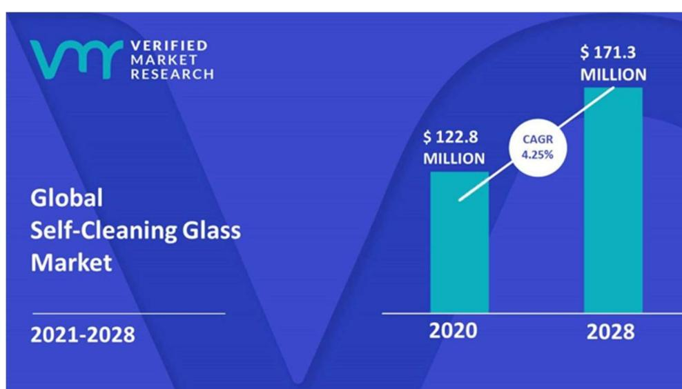

Figure 21: Global self-cleaning glass market insights, 2021-2028 [27]

The following factors are the main drivers of market growth. The growing construction industry is increasing the demand for self-cleaning glass to reduce maintenance costs both in residential and commercial buildings. Combined with an increase in urbanisation and industrialisation, as well as disposable income, these factors will contribute to market growth. In addition, there is increasing demand in the growing renewable energy industry, and particularly in solar panels, where it is crucial to minimise maintenance costs and time. What is more, self-cleaning glass is considered environmentally friendly, as it saves water and eliminates the use of additional cleaning chemicals that are used in other types of glass. However, they are still considered expensive and hence not very widely spread in emerging economies.

Based on coating type, the market can be segmented into hydrophilic and hydrophobic, with the hydrophilic segment to dominate the market. Based on the application, the following market segments can be identified, Residential Construction, Non-Residential Construction, Solar Panels, Automotive, and Others. The residential construction segment is expected to dominate the market during the forecast period. Based on the region, Asia Pacific is expected to dominate the market, due to rapid urbanisation, increased disposable income in the middle-class population and raised awareness for environmentally friendly buildings.

The European region holds the largest market share in the global self-cleaning glasses market. The construction industry in countries like the United Kingdom, Germany, Italy, and France is experiencing some growth, leading to increased adoption of self-cleaning glasses in the region. Notably, Pilkington, Saint-Gobain Limited, Tuffx Glass, and Morley Glass & Glazing Ltd are among the major producers of selfcleaning glasses in Europe[28]. Figure 22: Self Cleaning Glass Market Leaders [28].

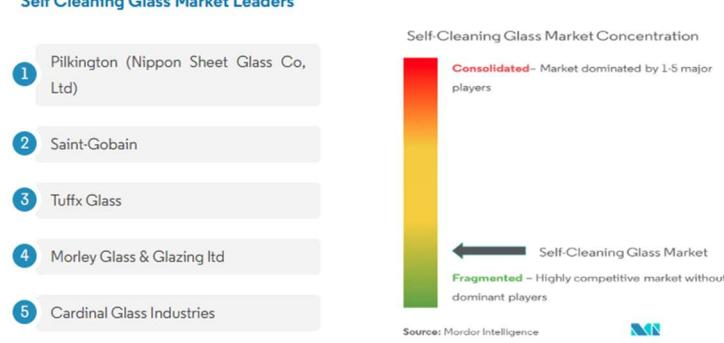

The United Kingdom stands out as one of the leading producers of self-cleaning glasses worldwide. Pilkington is member of the PROPLANET consortium and is a subsidiary of the glass-manufacturing company NSG Group, which will offer a competitive advantage in our developments.

28 https://www.mordorintelligence.com/industry-reports/self-cleaning-glass-market

On the other hand, the global automotive glass market was valued at € 13.47 billion in 2020, growing at a CAGR of 10.5% to reach € 28.98 billion by 2028 [29]. Growth in the transportation and logistics sectors resulted in increased production of heavy-duty vehicles, while the increased disposable income resulted in rising automobile sales and particularly electric cars, driving the market growth. In addition, vehicle glass witness great technological advancements that lead to cost and weight reduction. What is more, governments regulations implemented improved safety standards to enhance crash protection, which is expected to further drive the market growth.

Europe accounted for nearly 20% of the global production of automotive glass. During the pandemic, a decline of ~21% was observed in the European market. Another restraint of the market that will continue to affect market growth during the forecast period is the high cost.

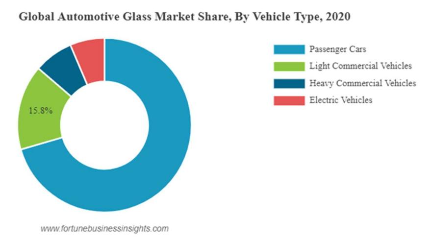

Figure 23: Global automotive glass market share, by vehicle type, 2020 [29].

Asia Pacific dominates the market, with the segment value to be estimated at € 7.18 billion in 2020. Key players in the market include NSG, Saint Gobain Sekurit, Fuyao Glass Industry Group, AGC, Magna International, Guardian Glass, Webasto Group, and others.

Moreover, shower cubicles are watertight structures that allow the user to have a shower or a bath, while water is contained within the cubicle area. The size of the shower cubicles market in 2022 was estimated at € 3.07 billion. Growing at a CAGR of 6.3%, the market is expected to reach € 5.34 billion by 2030 [30]. Some of the main factors that contribute to the market growth are the rapid urbanisation, the growing building sector and increasing disposable income. Customers show great interest in refurbishing existing bathrooms with premium shower cubicles, enhancing not only the visual appearance, but also the comfort and access, including technological advancements.

29 https://www.fortunebusinessinsights.com/automotive-glass-market-102579

30 https://www.verifiedmarketresearch.com/product/shower-cubicles-market/

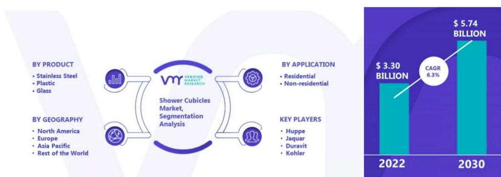

Figure 24: Shower cubicles market insights, 2022-2030 [30].

#### 3.3.2. Anti-Reflective glass coatings

Anti-reflective glass coatings are thin films applied to the surface of glass to reduce reflections and improve optical performance. The deposition of these coatings can improve visibility, enhance contrast, and reduce glare in applications such as eyeglasses, camera lenses, windows, and optical devices. The global antireflective glass coatings market size was estimated at € 3.25 billion in 2022, growing at a CAGR of 9.6% to reach € 6.19 billion by 2029 [31].

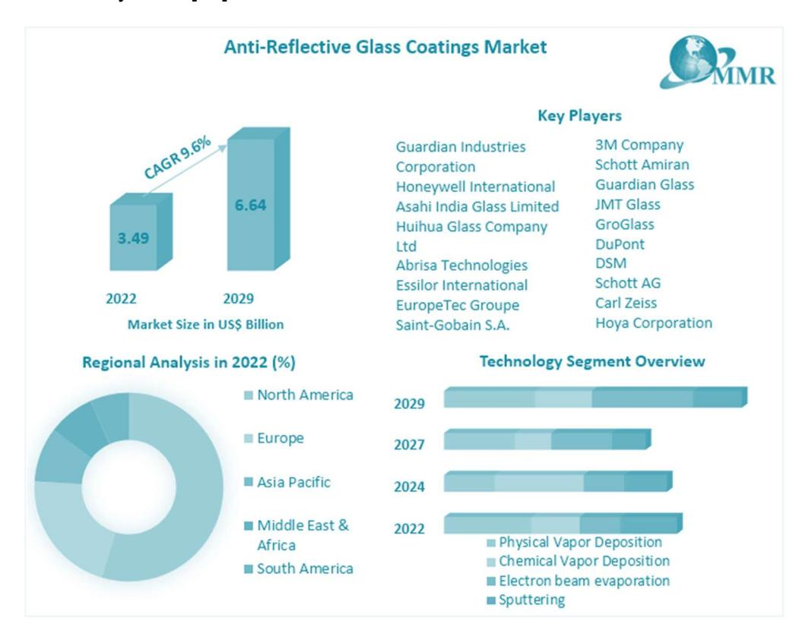

Figure 25: Global Anti-reflective Glass Coating Market, 2022-2029 [31].

The increased disposable income and rapid industrialisation contributed to the market growth. In addition, several advancements have been achieved in deposition technologies and thin film fabrication. Antireflective glass coatings have been applied to solar applications and in various applications in the automotive industry. Both solar and automotive applications have increased the demand for these

31 https://www.maximizemarketresearch.com/market-report/global-anti-reflective-glass-coatings-market/63349/

coatings, resulting in market growth. However, the market faces potential restrictions due to lack of awareness about the anti-reflective coatings' methods, maintenance, and proper use, while also the production of AR glass coatings has high cost and fluctuations in raw materials' prices. Europe has a significant share in the global market in 2022, due to solar power, eyewear, and automotive applications' contribution. In particular, Germany is considered as an important player in the European market, due to the rising solar panel installations and significant automobile production.

#### 3.3.3. Anti-Soiling glass coatings

Anti-soiling coatings are produced as a surface treatment applied to various materials, such as glass, metals, plastics, textiles, to repel dirt, dust, and contaminants. In this way, it is easier to clean and maintain the surface. The global anti-soiling coatings market size is estimated at € 819 million in 2023, growing with a CAGR of 6.01% to reach € 1.47 billion by 2032 [32]. The main market growth factor is the increased demand for solar panel applications, as there is an increase in decentralised power generation and the need to decrease CO2 emissions. Advanced battery storage technologies have supported overcoming challenges associated with solar panels, such as reliability and production capacity, allowing the growth of these applications.

Based on the region, the USA holds the largest share of the anti-soiling coating market. China and India also have great potential, as the installed solar power is increased. In addition, Europe is a significant market with decentralised energy generation, that was severely affected by COVID-19. However, the demand for anti-soiling coatings for solar applications in Europe is expected to be increased. Some of the key players of the market are BASF, Boero, PPG Industries, Nippon Paint Marine coatings, Chigoku Marine Paints, Jotun, Kop Coat, and Akzo Nobel.

# 4. Competitors Analysis

A competitor analysis helps businesses identify their direct and indirect competitors within their industry or market segment. It provides a clear understanding of who the main players are and allows for a comprehensive assessment of the competitive landscape. By analysing competitors, businesses can gain insights into how their rivals position themselves in the market. This includes identifying their unique selling propositions, target audience, pricing strategies, distribution channels, and overall market presence. This information helps companies differentiate their own offerings and develop effective positioning strategies.

Competitor analysis also allows businesses to evaluate the strengths and weaknesses of their rivals. By analysing factors such as product quality, features, customer service, brand reputation, marketing tactics, and financial stability, companies can identify areas where they can outperform or capitalise on their competitors' weaknesses. Moreover, it helps businesses identify market opportunities and potential threats, while it also benchmarks the companies' performance by comparing their products, services, market share, growth rates, profitability, and other metrics against competitors.

Finally, strategic decision-making can be achieved through competitors' analysis as via the insights gained pricing strategies, marketing campaigns, customer acquisition and retention efforts, and market entry or expansion plans can be projected accordingly.

Within the framework of the PROPLANET project, this section offers an initial overview of the primary characteristics of the competitor. It serves as a preliminary identification of the key aspects related to the competition. It is important to highlight that a more comprehensive and in-depth analysis of the core-direct

32 https://www.futuremarketinsights.com/reports/anti-soiling-coating-market

competitors of PROPLANET technologies is planned for the upcoming phase of the project. This deeper analysis aims to delve into the specific details and intricacies of the competitors, providing a thorough understanding of their strategies, offerings, market presence, and other relevant factors.

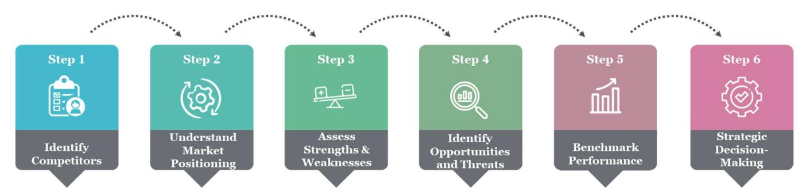

Figure 26: Competitors analysis attributes.

# 5. Market forces

Porter's Five Forces analysis is a strategic framework that provides a structured approach for analysing the competitive forces within an industry. It offers valuable insights into the attractiveness and profitability of an industry, helping businesses understand the dynamics and competitive landscape they operate in.

#### A. Threat of new entrants

The first force is the threat of new entrants, which examines the barriers to entry for new companies. It considers factors such as capital requirements, economies of scale, government regulations, and brand loyalty. A high level of entry barriers makes it difficult for new players to enter the market, reducing the threat to existing companies. Conversely, low barriers can lead to increased competition and lower profitability. Understanding the threat of new entrants helps businesses assess the sustainability of their competitive advantage and develop appropriate strategies to defend their position.

#### B. Bargaining power of suppliers

The second force is the bargaining power of suppliers, which examines the influence suppliers have over the industry. Suppliers with significant power can demand higher prices, favourable terms, or limit the availability of key resources. This can negatively impact a company's profitability. Factors such as the number of suppliers, uniqueness of their products or services, and switching costs determine their bargaining power. By analysing supplier power, businesses can develop effective supplier management strategies, explore alternative sourcing options, or negotiate favourable contracts to mitigate risks.

#### C. Bargaining power of buyers

The third force is the bargaining power of buyers, which assesses the influence customers have over the industry. Buyers with strong bargaining power can demand lower prices, higher quality, or better terms, putting pressure on industry profitability. Factors such as the concentration of buyers, their price sensitivity, and the availability of substitute products affect buyer power. Understanding buyer behaviour enables businesses to tailor their marketing strategies, enhance customer value propositions, and maintain strong customer relationships to minimise the risk of losing market share.

#### D. Threat of Substitutes

This force considers the availability of substitute products or services outside the industry. Substitutes provide alternatives that customers can turn to, thereby limiting the potential market share and profitability of existing industry players. The availability, price-performance ratio, and switching costs associated with substitutes affect their threat level.

#### E. Competitive Rivalry

This force focuses on the intensity of competition among existing companies within the industry. Factors such as the number of competitors, market growth rate, and product differentiation impact the level of rivalry. High competition often leads to price wars, reduced profitability, and the need for constant innovation and differentiation.

In summary, Porter's Five Forces analysis offers a comprehensive framework to assess the competitive forces within an industry. By analysing the threat of new entrants, bargaining power of suppliers, and bargaining power of buyers, businesses gain valuable insights into the industry dynamics, competitive intensity, and profitability potential. This understanding helps companies develop effective strategies to navigate the competitive landscape, identify opportunities for differentiation, and maintain a sustainable competitive advantage.

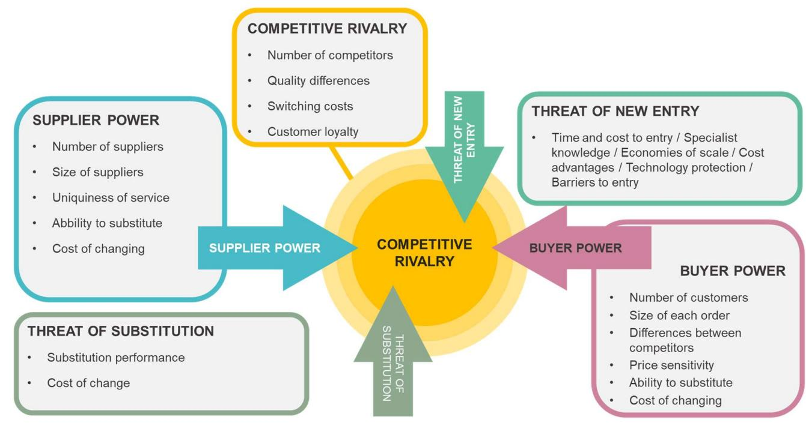

Figure 27. Porter's Five forces principles.

# 6. SWOT & PESTLE Analysis

#### 6.1. SWOT Analysis

To gain a comprehensive understanding of the business environment, it is recommended to conduct a complementary analysis that evaluates both internal and external factors that can impact the project developments. This analysis examines various parameters that could influence the execution of the exploitation plans. One commonly used tool for this purpose is the SWOT analysis, which assists in identifying these critical factors. By categorizing them into internal strengths and weaknesses, as well as external opportunities and threats, companies/partners can strategically organise their actions. This approach allows them to capitalise on their strengths, seize new opportunities, address, and minimise weaknesses, while also mitigating potential threats. It is important to note that the SWOT analysis presented in Figure 29 serves as an initial assessment and is expected to be continually updated throughout the project implementation phase, reflecting the evolving business landscape.

The internal analysis of an organisation's strengths and weaknesses helps in identifying its core competencies and areas that require improvement. By recognizing strengths, such as unique capabilities, resources, or market advantages, companies can leverage these aspects to enhance their competitive position. On the other hand, identifying weaknesses, such as operational inefficiencies or gaps in skills, allows them to take corrective measures and allocate resources effectively.

Simultaneously, the external analysis focuses on identifying potential opportunities and threats arising from the external business environment. Opportunities can emerge from market trends, technological advancements, or changes in customer needs, which businesses can exploit to expand their market share or diversify their offerings. Conversely, threats can arise from factors such as new competitors, changing regulations, or economic downturns, which organisations need to be prepared for to minimise their impact.

By conducting a SWOT analysis and continuously updating it, organisations can align their strategies with the changing business landscape. This approach empowers them to capitalise on their strengths, address weaknesses, exploit opportunities, and proactively mitigate potential threats, enabling a more informed and strategic decision-making process. An updated version will be included in Deliverable 7.3 – Exhaustive market analysis towards circular approaches [M24].

Figure 28. SWOT Analysis for the PROPLANET project.

### 6.2. PESTLE Analysis

The PESTLE (Political, Economic, Social, Technological, Legal, and Environmental) analysis is widely used as a tool to assess the macro environment in which a product or service operates. It helps categorise

and identify potential factors that can impact the business, offering a comprehensive view of the external landscape. This analysis uncovers opportunities and obstacles that may exist beyond the control of the organisation.

In the context of PROPLANET an initial identification of these factors is presented, considering the specific dynamics and influences within the project. However, given the constantly evolving nature of the macromarketing environment, an update is planned for the project as it progresses. This update will ensure that the analysis remains relevant and accounts for any changes or developments that may occur.

The following table summarises the initial PESTLE Analysis which will be updated in the upcoming marketrelated deliverable, namely Deliverable 7.3 – Exhaustive market analysis towards circular approaches [M24].

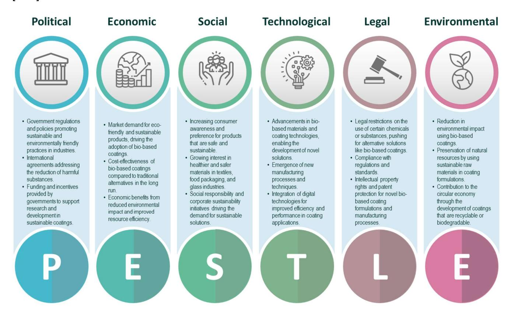

Figure 29. PESTLE Analysis for the PROPLANET project.

# 7. Patent landscape

#### 7.1. Patent Mapping Analysis methodology

Performing patent mapping is a complex and crucial process for partners seeking to identify relevant applications in a specific technology domain. This search will enable obtaining information about other companies specializing in novel coatings applications with similar attributes, finding applications in textiles, food packaging and glass sectors. Through this analysis both local and global competitors will be identified, while establishing connections with international markets will be investigated.

To conduct a patent mapping analysis, the methodology followed is presented in Figure 30 involves the following steps:

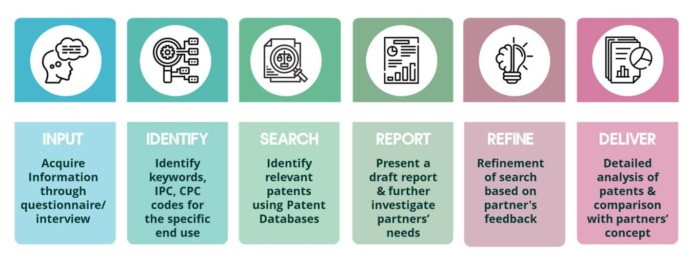

Figure 30. Patent Mapping Methodology.

i. Questionnaire/Interview: EXELISIS initiates communication with the partners to gather details about

- their technologies, applications, procedures, and innovations.
- ii. Keyword and Codes Identification: Based on the previously collected information, most pertinent keywords and CPC/IPC codes will be collected and utilised in the patent search conducted through a dedicated patent search platform.
- iii. Patent Search: Using the identified keywords, an initial search is performed on the patent identifying software. This includes a state-of-the-art search for the relevant technologies, followed by incorporating keywords related to the technology, product/process features, materials, potential applications, and in cases combined with selected IPC and CPC codes.
- iv. Draft Report: A report is then prepared presenting an initial analysis of the patent search results. The objective is to map similar activities and innovations in the partners' field of interest, as well as identify competitors.
- v. Refinement of Patent Search: After sharing the report with the partner, and based on any additional requirements, a refined analysis is conducted. This may involve using additional keywords, focusing on specific markets, or searching for competitors, among other considerations.
- vi. Detailed Patent Analysis: A final report is delivered, encompassing a list of highly relevant patents, the number of patents over a specified period, top competitors identified, and categorisation by country. The results are presented in a manner that facilitates the partner's understanding of the overall state of the technology field. Additionally, we provide comments on how selected patents differentiate from the partner's technology based on our technological expertise. By following this methodology, EXELISIS provides valuable insights and a comprehensive understanding of the patent landscape in their technology field, supporting partners' decision-making processes and strengthening their intellectual property strategies.

#### 7.2. Patents identified or owned by the consortium

In this section, the patents that have been identified or are owned by the consortium will be presented. These patents represent valuable intellectual property assets that contribute to the innovation and competitiveness of the consortium members.

By leveraging these patents, the consortium members have a competitive advantage in the market and can offer unique solutions and products. These patents represent the result of extensive research and development efforts, and they embody the expertise and knowledge of the consortium members.

In particular TECNALIA, has claimed background knowledge related to coatings development (KER2): EP3526279 B1 and EP19383186 A1. Moreover, TECNALIA has a background in the development of solgel based coatings for glass application (KER 3) and owns some patents in the field: EP19383186 A1 and EP3568379 B1. The patents can be summarised in Table 1, where they can be updated throughout the progress of the project.

Furthermore, the consortium has established an effective intellectual property management strategy to protect and commercialise these patents. This strategy ensures that the consortium members have the exclusive rights to their inventions and can maximise the value derived from their intellectual property. More information can be found in Deliverables D7.4 [M6] and D7.5 [M18]: "PROPLANET Exploitation plan and circular business approaches".

Table 1. Patents identified by the consortium.

| Partner  | Patent        | Patent Title                                            |
|----------|---------------|---------------------------------------------------------|
| TECNALIA | EP3526279 B1  | Corrosion resistant sol-gel hybrid coating composition  |
| TECNALIA | EP19383186 A1 | AN OMNIPHOBIC AND BIOCIDE SOL-GEL COATING COMPOSITION   |
| TECNALIA | EP3568379 B1  | A broadband Anti-reflective sol-gel coating composition |

#### 7.3. Initial patent search

An initial patent search has been conducted based on a keyword-based methodology.

Firstly, the following keywords were included: "Hybrid AND siloxane AND coating(s)". The search led to 2,426 patent families that have been granted or published over the last 10 years.

The application trend is presented below showing an increase in applications in year 2018 and is expected to increase more as more patents will pass from the examining to the granted phase soon.

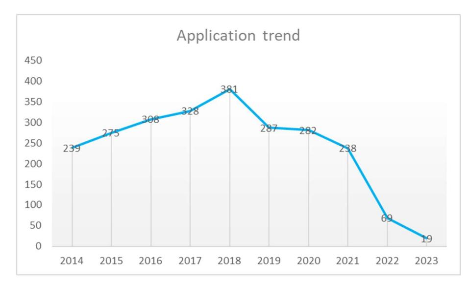

Figure 31. Application trend for Hybrid siloxane coating(s).

Top current assignees include AGRIGENETICS, FORD and SEMICONDUCTOR ENERGY, while regarding geographic territories United States and Japan cover the 2 top countries, followed by EPO, Korea, and Germany.

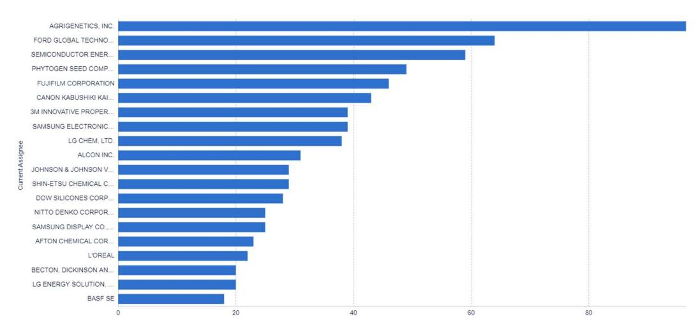

Figure 32. Top current assignees for Hybrid siloxane coating(s).

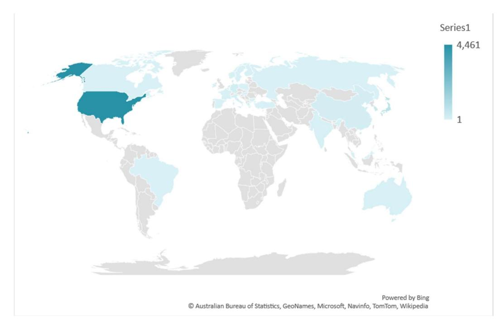

Figure 33. Geographic territories for Hybrid siloxane coating(s).

Furthermore, a second search related to "Crosslinked AND biopolymer(s) AND coating(s)" was then conducted resulting in 1,415 patent families. Based on the analysis followed, the application trend is presented below showing an increase in applications in year 2017, with 132 granted and published patents that year.

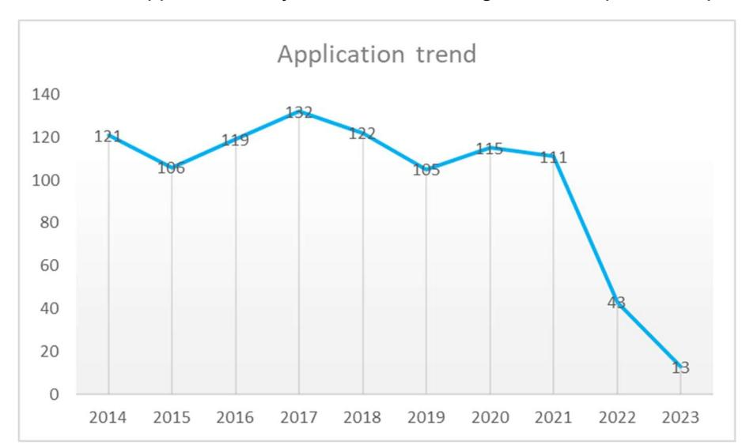

Figure 34. Application trend for Crosslinked biopolymer coating(s).

Top current assignees include HALLIBURTON ENERGY SERVICES, INC., and MASSACHUSETTS INSTITUTE OF TECHNOLOGY, while also P&G, 3M, FUJIFILM, L'oreal and BASF are among the top 15 assignees.

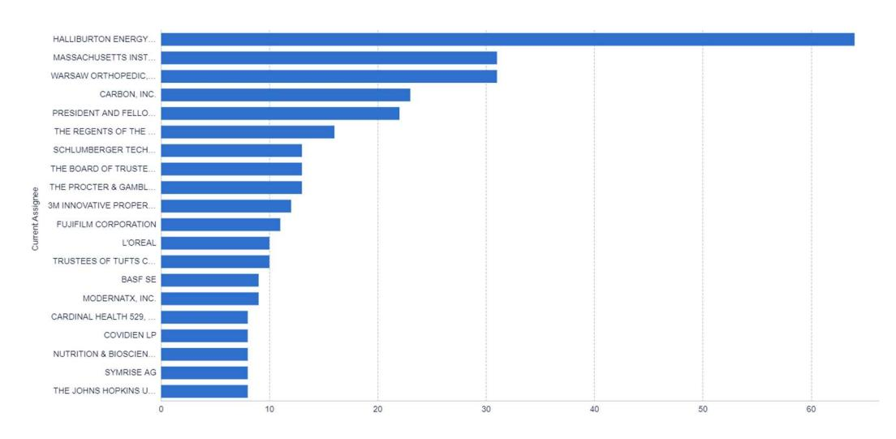

Figure 35. Top current assignees for Crosslinked biopolymer coating(s).

Regarding geographic territories United States and EPO cover the top 2 territories, followed by Germany, Japan and Australia as seen in Figure 36.

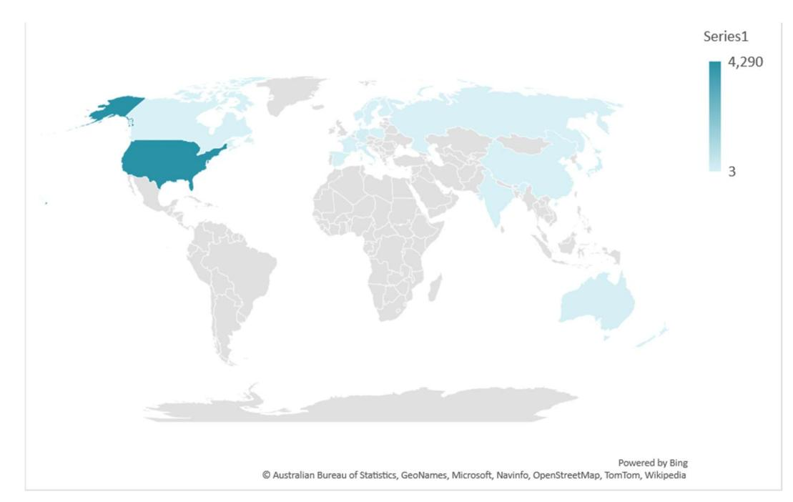

Figure 36. Geographic territories for Crosslinked biopolymer coating(s).

Finally, a search related to "PFAS-Free AND coating(s)" resulted in 7 patent families none of which was granted and most of them being in the examining phase. A further analysis will be conducted as the project progresses and updated results will be included under Deliverable D7.3 – Exhaustive market analysis towards circular approaches, expected to be delivered on M24.

# 8. Conclusions

The current deliverable, D7.2, of the PROPLANET project has provided a comprehensive market analysis, focusing on the primary market landscape, specific sectors, competitors, and the project's strengths and weaknesses. This analysis has enabled the consortium to gain valuable insights into market opportunities and pave the way for the successful commercialisation of their innovative coatings.

The primary market landscape analysis explored various sectors, including biopolymers, coatings, organic coatings, and bio-based coatings. Of particular interest were the textiles sector, food packaging equipment market, and glass coating market. By understanding the current trends, demand, and growth potential in these sectors, PROPLANET has identified areas for innovation and development of coatings that meet industry demands.

The exhaustive market analysis for coatings in the textiles sector focused on coatings with oleophobic and water-repellent attributes, addressing the sector's need for durable and sustainable coatings. Additionally, coatings for food-packaging machinery and low-maintenance glass were examined, considering properties such as anti-corrosion, non-stickiness, high thermal resistance, and enhanced mechanical stress properties. This thorough analysis has guided the development of coatings that align with market needs and provide a competitive advantage for the project.

Furthermore, the upcoming competitors' analysis, as well as the SWOT and PESTLE analysis will provide additional insights into the competitive landscape, while they will further enhance the project's positioning and differentiation in the market, setting the stage for successful market penetration.

Additionally, the forthcoming examination of the patent landscape related to coatings will ensure that PROPLANET's innovations are novel and protected. By understanding existing patents and intellectual property considerations, the consortium can leverage existing knowledge and avoid potential infringements, strengthening their position in the market.

This analysis will be further updated under deliverable D7.3 – Exhaustive market analysis towards circular approaches, expected to be delivered on M24.