LOCAL

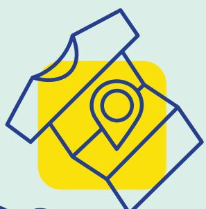

# BIO-BASED

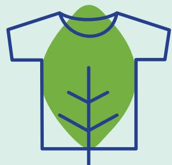

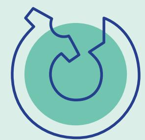

CIRCULAR

## **RESHAPING BIO-BASED TEXTILES**

A policy brief to develop the bio-based, local and circular textile & clothing sector in Europe

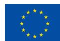

## **The HEREWEAR project** (2020-2024) started

from using bio-based materials for textiles as more sustainable alternatives for the currently used fossil-based polymer materials and cotton. However, as a significant proportion of textiles and clothing are produced outside the EU, at low cost, in poor working conditions and with little regard for environmental impact the challenge is larger than simply substituting the materials. Rather, the goal is more holistic, to reconsider the full fashion value chain, focusing on sustainable bio-based materials, circularity, and new local trends in how clothes are made, bought and used, while also keeping a social focus.

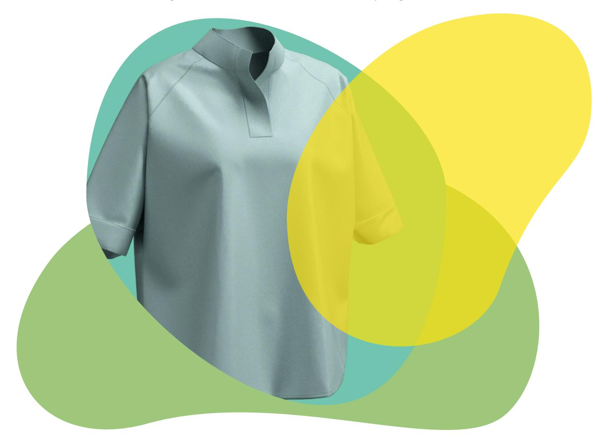

# EXECUTIVE SUMMARY

In this context, the HEREWEAR project proposed a vision that integrates three pillars:

Bio-based materials drawing on the state of the art for replacing fossil-based chemicals and fibres and producing materials that significantly enhance environmental performance.

Local production models to reduce transport, to build on the relational and community dimension, and to link agricultural and forestry practices more directly with the application industries.

Circular design and practices to reduce waste, extend product life, and facilitate recycling at end of life.

**The HEREWEAR project** brought together partners from industry, research and education institutes as well as from civil society. Together, the partners have conducted studies, organised workshops, identified synergies among each other, and documented them in the HEREWEAR HUB.

Life Cycle Thinking and design methodologies enable cross-disciplinary knowledge sharing for circular decision making in bio-based garment design. Sustainable and local fashion economies reduce emissions, redesign garments and close value chains, while engaging local communities and ecosystems and promoting local materials.

Textile materials based on cellulose from bio-based resources and bio-polyesters, combined with bio-based coating and finishing offer a more sustainable alternative to currently used solutions.

During the course of the project, the European Commission published its textile-specific legislative package: the so-called EU Strategy for Sustainable and Circular Textiles, which marks a turning point for the previously unregulated textile and clothing industry. While the resulting legislation is relevant for the project impact, it is not the only one. Indeed, given the broad scope of activities, also other policies are of relevance.

Finally, the HEREWEAR project builds on its results and findings to propose hereby policy recommendations to establish more sustainable textile manufacturing and use in Europe.

# **TABLE OF CONTENTS**

| INTRODUCTION                   | 5 |
|--------------------------------|---|
| Background                     | 5 |
| The HEREWEAR Vision            | 7 |
| The HEREWEAR contribution      | 7 |
| The HEREWEAR Community and Hub | 7 |
| The Future of Fashion          | 9 |

**HOW DOES IT WORK? 11** Bio-based solutions 11 Local Production scenarios 13 Circular Design Methods 15

#### **AN EVOLVING POLICY FRAMEWORK 18** A momentum for the textile industry 18

A multidimensional, policy mixed project 20

| POLICY RECOMMENDATIONS                                                        | 21 |
|-------------------------------------------------------------------------------|----|
| Understanding the market                                                      | 21 |
| Fostering a holistic approach for the bio-based textiles by aligning policies | 22 |
| Developing and implementing a coherent and fair legislative framework         | 22 |
| Towards a holistic approach                                                   | 23 |
| Leading by example – the impact of Green Public Procurement (GPP)             | 23 |
| Communicate and raise awareness                                               | 24 |

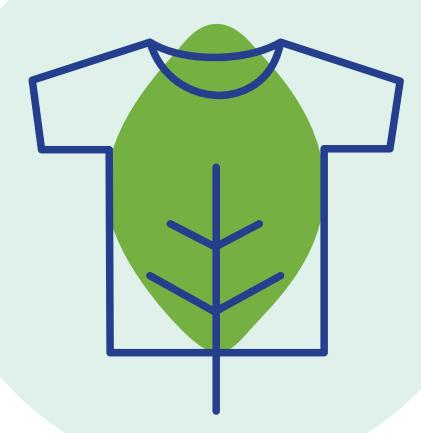

**1**

**3**

**4**

https://www.eea.europa.eu/publications/microplastics-from-textiles-towards-a https://textileexchange.org/knowledge-center/reports/materials-market-report-2024 Following the **Textile Exchange Global fibre market report**, the vast majority of all textile fibres (ca. 124 million tonnes in 2023) is made from two materials: polyester (about 55%) and cotton (about 22%). Polyester is used for its strength, durability and cost effectiveness (roughly around €1/kg). Cotton is used for its comfort properties. However, the current system has significant drawbacks and shortcomings. Polyester is oil-based and sourced from the Middle East, while cotton has a high environmental impact due to pesticides and significant water consumption. In addition, small fibre fragments are released from garments during washing and wearing. These microplastics, for example from polyester fibres, end up and accumulate in soil and water. Consequently, the textile sector is one of the largest contributors to microplastics pollution, with an estimated ca. 200.000 – 500.000 tonnes of microplastics from textiles to enter the global marine environment annually (**EEA Briefing**).

The HEREWEAR project started in 2020 as one of three projects selected for the Horizon 2020 call 'CE-FNR-14-2020 Innovative textiles – reinventing fashion'. The main goal of HEREWEAR was to introduce bio-based materials and to combine this with circular design and a local sourcing and manufacturing dimension.

The textile sector has a natural link with the plastics industry: both sectors are working towards an increased use of recycled and bio-based feedstock. In addition, both share the common goal to provide solutions based on safe and sustainable materials and chemistry. The challenges are also linked to stakeholders in wider areas of work, such as bioeconomy and chemistry.

Fashion has significant symbolic value to citizens as a mean of self-expression – it is something everyone can relate to, meaning that awareness among the general public about its impact is important.

The challenge was to reinvent the fashion value chain towards sustainability, thereby focusing on bio-based materials, circularity and local novel trends in how clothes are made, purchased and used while sharing common social and ethical values.

## Background

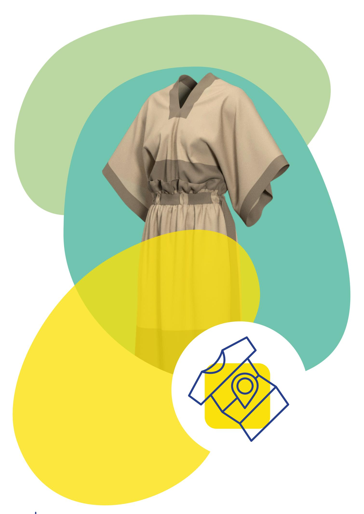

https://herewear.tcbl.eu/resources/theme/all **The HEREWEAR project has issued specific topical guidelines based on the project work.**  The guidelines were co-developed together with the relevant target groups. Stakeholder engagement in the co-design process has contributed to define the format and approach to ensure the widest possible uptake by industry. These guidelines have then been compiled together into the **HEREWEAR HUB**, an integrated tool for the knowledge valorisation of project results and insights over time.

Given the above context, the HEREWEAR project proposed a vision that integrates three pillars:

**Bio-based materials** drawing on the state of the art for replacing fossil-based chemicals and fibres and producing materials that significantly enhance environmental performance.

**Local production models** to build on the relational and community dimension, to reduce transport and to link agricultural and forestry practices more directly with their application industries.

**Circular design and practices** to reduce waste, extend product life, and facilitate recycling at end of life.

## The HEREWEAR Vision

The HEREWEAR project brings an innovative holistic and systemic approach towards the creation of an EU textile ecosystem and market for locally produced circular textiles and clothing made from bio-based (waste) materials.

**Novel material solutions have been built on recent developments in bio-based polyesters and cellulose.** Novel bio-based streams, including for example straw, have been developed for cellulosic textile fibres. Emerging sustainable technologies for wet and melt spinning, for yarn spinning and for fabric making have been investigated and piloted at semi-industrial scale. For finishing, coating and colouring, biobased materials have been successfully applied. Measures along the various steps in the manufacturing process have been shown to significantly reduce microfibre release.

**These technological innovations have all been developed and tested by innovative SMEs**  directly participating in the project consortium, in conjunction with a community of over 250 committed stakeholders from across Europe. This has allowed to validate the feasibility of the HEREWEAR vision in a range of concrete settings and local communities, while also exploring the role of both digital micro-factories and local social enterprises in bringing the vision to life.

## The HEREWEAR contribution

## HEREWEAR HUB and Community

https://herewear.tcbl.eu **Explore resources**

https://cordis.europa.eu/project/id/646133/reporting https://cordis.europa.eu/project/id/646133/reporting **Finally, one of the unique features of the HEREWEAR approach has been the creation of a lively community of interested (mostly small) businesses.** This community is being merged with the existing TCBL Community which was created as a result of the **TCBL EUfunded project** (2015 to 2019). This merging has led to a unified on-line community for actors involved in sustainable textile manufacturing and use in EU.

process (e.g., matchmaking services pairing brands with production, circular fashion design and certification, a marketplace for unused fabrics and deadstock) developed a prototype version for a specific 'user journey' across their services, as a proof-of-concept for the future production of circular fashion with bio-based textiles in local ecosystems.

This stakeholder community has a clear added value and will contribute significantly to the future legacy of the HEREWEAR project by facilitating the impact path for the (uptake of the) project results.

Gain skills and become part of a textile & clothing ecosystem that is bio-based, local and circular.

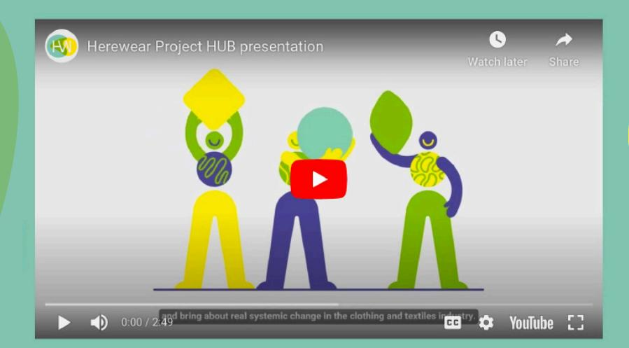

## **Resources**

Explore bio-based, local and circular economy through introductory guides, generative tools, service platforms and other useful resources.

https://www.cisutac.eu/ https://www.cisutac.eu/blogs/unlocking-the-future-of-sustainable-textiles-navigating-europes-circular-revolution https://www.ecosystex.eu/ HEREWEAR is member of the **ECOSYSTEX** community, the European Community of Practice for a Sustainable Textile Ecosystem, bringing together a network of textile circularity projects. **CISUTAC**, one of the projects in the community, worked on the development of future textile scenarios by 2035. More details on these scenarios can be found via the **CISUTAC website**. The CISUTAC scenario building starts from two areas of critical uncertainties about the textile future: 'fast' versus 'slow' fashion and 'local' versus 'global'. Combining these elements leads to the so-called 'Scenario Matrix'. Each of its quadrants represent a potential future scenario, as shown in the figure below.

## Future of Fashion – potential scenarios

## **CISUTAC future textile scenarios**

## **Scenario narratives**

### **SCENARIO A**

### **Slowing down – a new paradigm of sustainable fashion goes global**

In 2035, the European textile industry finds itself in a complex global landscape. Due to funding and viability challenges, it had proved difficult to scale recycling technologies and the technological breakthroughs needed failed to materialise. At the same time, rising production costs and stricter sustainability policies had put a strain on producers, making it increasingly important to control raw material. In response, brands started to restructure supply chains, emphasizing quality, and offering extended takeback schemes. Consumers, who struggled to meet increasing prices, started to change their consumption habits, helped by the emergence of a comprehensive repair and resale infrastructure. The slow fashion movement gains traction, reshaping the industry.

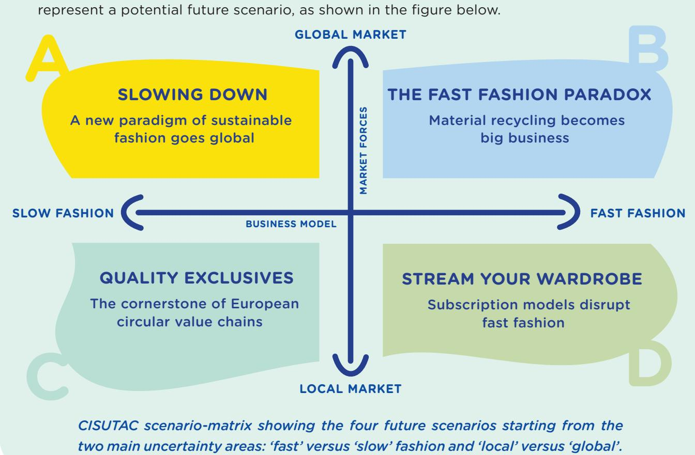

#### **SCENARIO B**

#### **The fast fashion paradox – material recycling becomes big business**

In 2035, fast fashion persists amid a world of expanding populations and dwindling resources. In Europe, second-hand fashion thrives, but only as a supplement to new garment consumption. Significant investments in fibre-to-fibre recycling technologies have been made, although the industry remains reliant on virgin materials to both create new textiles and fortify recycled ones. The EU addresses resource concerns through a cotton-as-aservice agreement with India, supporting the establishment of recycling technologies in return. Sustainability remains a pressing concern, fuelling global competition to discover and manage the next essential raw material for the industry.

#### **SCENARIO C**

#### **Quality exclusives – the cornerstone of European circular value chains**

By 2035, EU policy makers had imposed controversial economic disincentive schemes, as a last resort to steer the industry away from fast, disposable trends and towards quality, durability, and timeless style. A robust regional and digitalised infrastructure, driven by public procurement of emergent semi-automated repair and on-demand 3D printing technologies, had revolutionised EU's local production efforts. To manage the challenge of direct imports of less sustainable products into the EU, border surveillance is enhanced. The high technology, service intensive market resulted in fashion becoming a luxury not everyone could afford. Fashion in Europe is more local, but no longer always accessible at the same affordable prices.

### **SCENARIO D**

### **Stream your wardrobe – subscription models disrupt fast fashion**

In 2035, innovative business models catalyse a transformation in the EU textile industry. Resale models had proven not sufficient to enable a sustainable transition, and when the EU pushed through a new cost structure based on number of wears, brands finally realised that a larger transformation of traditional business models was the only way forward. The transition from product sales to leasing models through subscription services, eventually altered consumer perceptions of ownership and cost, leading lead to a new type of worryfree fast fashion consumption. To see your wardrobe as temporary had become the new norm. The circulation of products also generated vast amounts of data that brands started to use to continuously improve the subscription service offering.

## **Linking to the HEREWEAR vision and policy recommendations**

Clearly, the HEREWEAR vision fits mainly with scenario C, as it concerns 'slow fashion' and 'local'. So, it is interesting to consider the various elements that were identified by CISUTAC as linked to this scenario C. On the positive side are items like 'design for longevity' and 'SMEs are flourishing' but the scenario also has some requirements: it relies on 'affordable local services', 'semi automation', and availability of 'skilled labour'. These are non-trivial elements, and their realisation can benefit greatly from policy measures. Further, the scenario C also mentions 'green premium' and 'fashion becoming a luxury'. This shows that such a scenario, and thus also the HEREWEAR vision, needs to be approached with care, i.e. the social aspects should not be neglected, which explains the strong focus of HEREWEAR, and the HEREWEAR policy recommendations, on this.

## HOW DOES IT WORK? **2**

*Offering a sustainable alternative for current cotton-polyester textile materials based on cellulose from bio-waste sources and bio-polyesters, combined with bio-based coating & finishing.*

The vast majority of clothing is made of two types of fibres: polyester and cotton. These, however, have considerable disadvantages and shortcomings. Polyester is oil-based and mainly sourced in the Middle East, whilst cotton growth typically has a large environmental impact because of pesticides and large water consumption. More sustainable alternatives, possibly based on bio-based materials, are thus of high need.

The HEREWEAR project aims at the development of clothing made from bio-based resources by tapping into emerging sustainable technologies for wet spinning of cellulose and by using melt spun bio-based polyester filaments.

## Bio-based solutions

## **GOOD PRACTICE 1**

#### **Developing Biorefinery processes**

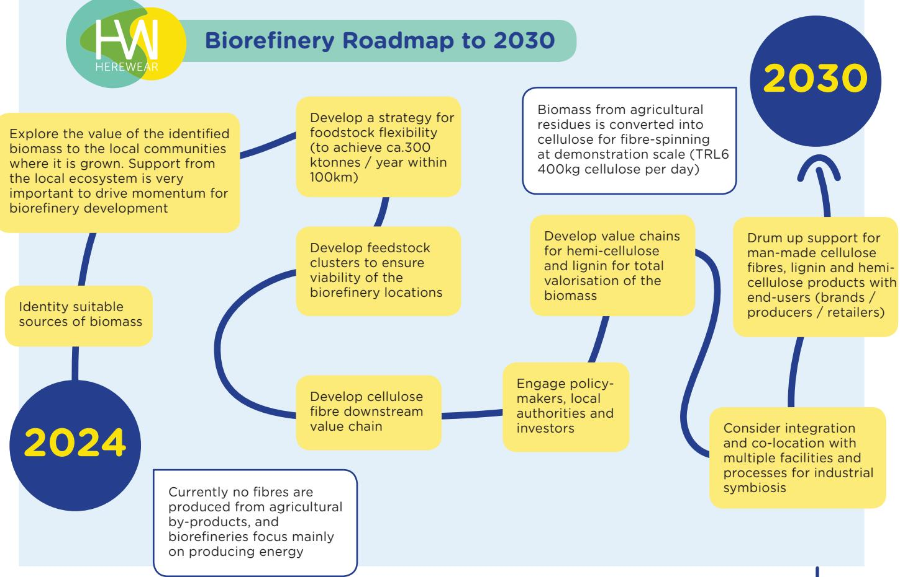

**TNO (The Netherlands), one of the HEREWEAR partners, has created Fabiola TM a prototype of a next generation biorefinery process capable of processing a variety of biomass residues** (see figure below) into cellulose fibre, sugars, furanics, and high-quality lignin.

https://herewear.tcbl.eu/bio-based-coating-and-printing Bio-based coating and printing guidelines for industrial scale-up are available on the **HEREWEAR HUB**.

https://herewear.tcbl.eu/biorefinery The guidelines are available on the **HEREWEAR HUB**.

**This process is now available for scale-up to full demo scale,** and the team is in search of more partners to help the entire biomass value chain take full advantage of this remarkable technology to attain their own sustainability, production, or manufacturing objectives.

Through HEREWEAR, the TNO expertise has been translated into two different sets of guidelines for cellulose biorefining industrial scaling-up: 1) lignocellulosic feedstock and 2) seaweed residues. These guidelines are built around feedstock and their logistics aspects, technology and stakeholders' involvement.

The Guidelines provided as part of the HEREWEAR project, can facilitate the downsizing of biorefinery technologies to the regional scale to support the HEREWEAR model of distributed local circular production systems.

**In addition to the operational setting of the biorefinery process, the partners also reflected on how to engage stakeholders and improve policy coherence.** The two areas for improvement that have emerged are the need to better link EU and regional policy initiatives and, in particular, the need to link agricultural and rural development policies with industrial and innovation policies.

In addition to the fibres, the HEREWEAR project partners have also addressed the yarn and fabric production and developed and piloted coating, dyeing and printing process at semi-industrial scale.

### **GOOD PRACTICE 2 Bio-based Coating and Printing**

Currently the textile industry mainly uses synthetic polymers such as PVC, acrylate or polyurethane. Even though these materials are not renewable, are difficult to remove from the fabric (hindering recycling) and shed microplastics, they are still commonly used due to their superior properties/cost ratios.

The partners developed coating and printing formulations and protocols based on PLA and PHA, two bio-polyesters currently already used in for example the packaging industry. That way, both 'faux leather' and prints for the fashion industry could be realised.

Both the coatings and the prints were produced with currently widely spread textile technologies (knife coating and screen-printing) and therefore these solutions can be easily adopted by manufacturers.

**Partners CENTEXBEL (Belgium), EURECAT (Spain), FINIPUR (Belgium), and MITWILL Textiles (France), have joined forces to develop a more sustainable alternative for the currently used coatings and prints used in the fashion industry.** 

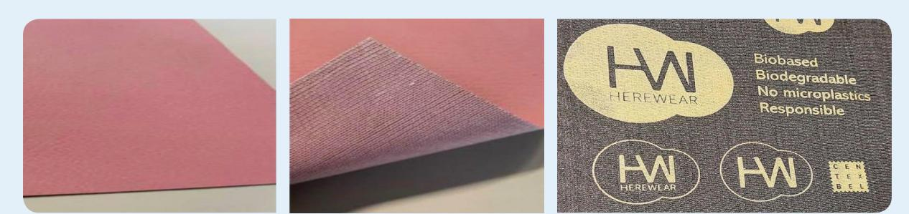

*Sustainable circular fashion economy reducing emissions (less transportation), reshaping and closing value chains, engaging local communities & ecosystems and local materials.* 

The 'Local' pillar of the HEREWEAR project resonates well across the industry stakeholders and users but it also brings a number of challenges. First, a clear definition and understanding of the concept is needed, see Good Practice 3. Next, the concept raises several challenges: attaining economy of scale and scope, higher labour and infrastructure costs, lack of local availability of specialised production services, need to geographically differentiate materials and products and the need to think global by acting local.

The goal is the design and production of small series of customised, fashionable textiles and clothing in a sustainable circular structure on a local/regional level. Enablers are networking organisations and (physical and online) communities supported by digital platforms and services.

## Local Production scenarios

## **GOOD PRACTICE 3**

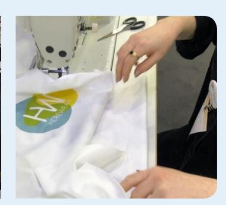

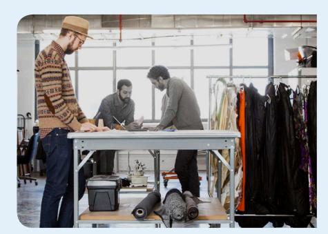

**Applying 'Local' to the transition towards biobased, local and circular** 

**The HEREWEAR project helped to get a better understanding of what 'local' means** when transitioning to a more sustainable textile and clothing ecosystem. After many conversations with different communities in Europe, 'local' is seen as the result of four variable features. The common practical understanding of geographical 'Space' is joined by three others: 'Scale', 'Scope' and 'Social'. These 4 variables are described as follows:

- **Space** is a geographical variable, defining a radius that can be the size of a town, a city, a territory, a country, a multi-country region. Space helps reduce transport costs and fossilbased energy, and the emissions that are linked to them. Space is easier to manage in a traditional textile cluster, where resources and production are available.
- **Scale** is a production variable, a volume that balances capacity with demand for small, medium or large series. Scale is lowered to reduce the volumes to be recycled and ultimately tend towards zero waste. New economic reasoning reflects on 'The True Cost' of production and on why we produce to recycle and waste.
- **Scope** is a socio-economic variable, an optimisation of the bio-based inputs into varied streams and sectors, not only in the textile and clothing outputs, but also in food, health, packaging and so on. These are sectors that can maximise the added value of the original resource for all actors along broader value chains.
- **Social** is the societal variable that is always at the heart of any decision: how to guarantee that we are developing wellbeing of a community and society, e.g. employment, social connections, health and safety etc. Social pays attention to the integration of marginalised citizens such as women, disadvantaged youth, migrants and so on, as much as fostering the development of a Social and Solidarity Economy, and ultimately democracy and peace.

https://herewear.tcbl.eu/social-and-circular As mentioned above, the 'local' pillar of the HEREWEAR project includes a social dimension which looks into guaranteeing wellbeing of community and society, e.g. employment, social connections, health and safety etc. The social aspect also pays attention to the integration of marginalized citizens such as women, disadvantaged youth, migrants and so on, as much as fostering the development of a Social and Solidarity Economy, thus ultimately safeguarding our democratic society. This led to a mapping of the social enterprises active in the European textile sector and to the **HEREWEAR MANIFESTO**.

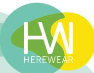

- https://herewear.tcbl.eu/social-and-circular https://herewear.tcbl.eu/bioregion
- **Bioregion**, as a territorial strategy to maximise all the given resources and create a transversal, multi-sectoral economic system in the region, textile and clothing sector being one of them, linked to the others.
  - **Social and Circular**, as a territorial strategy to engage all people in the inclusive making of their own societal dreams, starting from the ecological urgencies that we are facing.

- https://herewear.tcbl.eu/networked-manufacturing https://herewear.tcbl.eu/microfactory
- **The Microfactory**, as an alternative model for production in the neighbourhood and in small quantities
  - **Networked manufacturing**, as a connection between specialised actors in the value chain, closely interconnected because of their partnership and within a European radius.

#### **NEW REAL ECONOMY IS SOCIAL**

We can use the creative force that we have and the numerous existing talents for making the emerging sector of the green social economy escaping from the niches, from marginality. We can envisage **the green social economy as the economy**, not only as a subsystem or a subsidized sector of the mainstream economy. In this sense, in relation to the positive impact the social businesses want and need to make, there is room to scale up. There is still a long way to go, first to make slow and social fashion go mainstream, then to understand degrowth as a new system that requires a number of changes as described below.

**TRANSITION MEANS FIRST COOPERATION WITH EXISTING INDUSTRY**

**Cooperation between traditional and social companies** 

**COMPANIES RELEARN ABOUT THEIR ROLES WITH "CONSUMERS"**

**Connection to consumers is essential.** Radical improvements have to be made in how we communicate and educate for r**aising awareness and inspiring action**. Shifting the brands perspective from "people as users/community" change the marketing methods, thus creating space for an adequate meaning of the concept of value, expressed by true pricing, true labels, and true storytelling.

#### **VALUE IS REDEFINED AS SYSTEMIC**

**Value** shall not be only reflected by price anymore but rather by the integrated positive impact on regenerating the environment, recreating social links, inclusion and engagement of society. **The concept of the true value and true cost** become subjects of lively debates, but to enable the debates to move from a philosophical level to a practical one, social entrepreneurs need to get conscious of their conventional economic programming to unravel it

Two of them are typical of Space and Scale, ready to be implemented:

Two are more typical of Scope and Social, and require the dedicated engagement not only of manufacturers but also of policy makers and citizens:

The relevant production models based on local value chains for small series, mentioned above, are gaining in popularity, because of lower transport times and costs, and (environmental) impacts, bringing production closer to demand (production-on-demand, individualisation), more human contact with clients and suppliers, greater flexibility, adaptability and resilience of production, greater control over supply chains and networks, e.g. by seamless information flow and communication, making use of skills and innovation and creativity "culture", product oriented shaping of the supply chain and improved potential for closing circular loops.

## **MANIFESTO MAKE IT SOCIAL**

https://herewear.tcbl.eu/resources/theme/all The HEREWEAR project looked intensely at how to design for circularity, building its findings into the **HEREWEAR HUB**, thereby aiming to support various steps of the textile and clothing value chain. The main policy issues that emerge involve the need for agreed criteria with which to certify products, manufacturing processes, and end products. This also raises issues of data management ranging from the selection of the material composition at design phase to end-of-life options.

https://herewear.tcbl.eu/bioten The guide and cards are available on the **HEREWEAR HUB**.

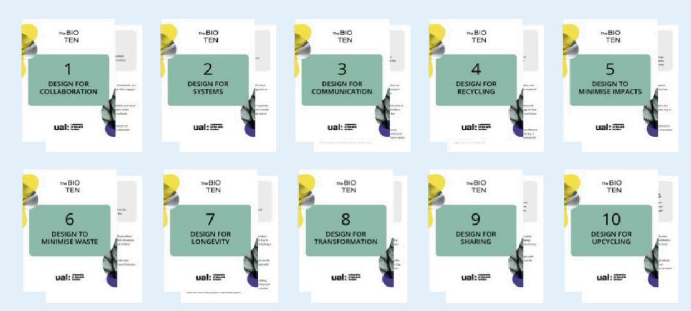

*Life Cycle Thinking and design methodologies to enable cross-disciplinary knowledge exchange for circular decision making in bio-based garment design.* 

To enable garments to be fully sustainable within a local, bio-based scenario, garments need to be designed so that they can be produced, used, re-used, remanufactured, and the material recovered, in the most appropriate ways. Circular Design tools and methods are used to bridge disciplinary boundaries and bring in crucial knowledge about the impacts and opportunities throughout the garment life cycle.

This process also informs decisions at every stage of the garment production, from raw materials, to business models and actual use, so that appropriate decisions can be made all along the value chain.

## Circular Design Methods

#### **GOOD PRACTICE 4 The Bio-TEN Guidelines – Inspiring design stakeholders**

**The BIO TEN guidelines are a set of circular design principles, developed by HEREWEAR partner University of the Arts London (UK) to inspire design stakeholders to use them in their work.** 

They offer a unique perspective that includes the use of biobased materials and local systems as key to circular design. This is necessary, as it is difficult to shift from today's global, multi-level brand-centred business models to

distributed production networks that can engage with SMEs as well as social enterprises while using novel materials.

By using these HEREWEAR BIO TEN principles to inspire their thinking in the very early stages of the design process, design stakeholders can start a shift to more sustainable practices.

https://herewear.tcbl.eu/micro-fibre-pollution The guidelines are available on the **HEREWEAR HUB**.

## **GOOD PRACTICE 5**

#### **Reducing microfibrous particles pollution by adapting the manufacturing process**

As is well-known, micro fibres have been found in water and food sources across the globe and are a concern for human and planetary health.

*Microscopy image of a textile treated to reduce microplastic release: the reduction is due to the finish on and around the individual fibres*

**HEREWEAR partners EURECAT (Spain), CENTEXBEL (Belgium) and RISE (Sweden) have tested a range of variables affecting fibre shedding, such as fibre type, yarn twist or fabric finishes to provide recommendations for industry.** 

There are recommendations to reduce the risk of shedding at each stage of the manufacturing process:

- **Fibre Manufacturing:** use of filament fibres over staple fibres reduces shedding.
- **Yarn Manufacturing:** a higher fibre twist can decrease shedding. This is applicable mainly to staple fibres. When using filament fibres, texturizing effects will increase shedding but will still be better than staple fibre yarns.
- **Textile manufacturing:** tighter constructions in woven and knitted fabrics reduce fibre shedding.
- **Fabric finishing:** finishes can be applied to reduce fibre shedding, and processes such as brushing can be controlled to mitigate shedding.
- **Garment manufacturing:** alternative cutting methods such as laser or ultrasound can be used to reduce fraying and fibre shedding.
- Any mechanical or chemical processes that damage the fibre may increase the chance of fibre shedding.

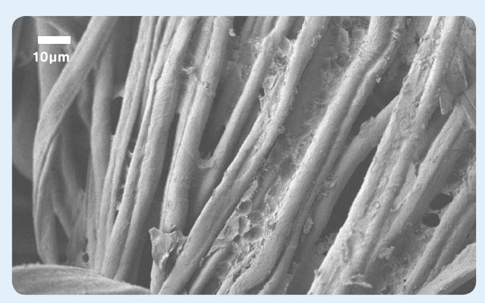

https://herewear.tcbl.eu/bio-based-textiles More info on these and other prototypes, as well as on their design and development involving multiple HEREWEAR project partners is available on the **HEREWEAR HUB**.

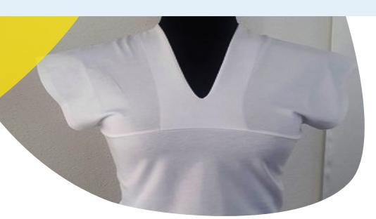

## **GOOD PRACTICE 6**

**Fashionable garment prototypes for workwear and leisure fully designed and developed according to the HEREWEAR vision**

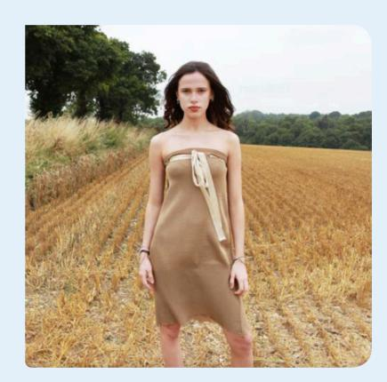

Partners MITWILL Textiles (France) and VRETENA (Germany) developed garment prototypes following the HEREWEAR vision.

*Polo Shirt (left) by Mitwill ; FlexiDress (right) by Vretena. Created with multiple project partners*

**TURNING STRAW INTO GOLD** For the Flexi-Dress, partner VRETENA took a Material-First Approach. The focus is on the emotional connection to the straw-based cellulose material, where the golden hue comes from the unbleached wheat straw fibres, to achieve a local and circular product. The multifunctional way of wearing this garment is linked to the design for circular lifecycle extension: a modular dress with a combination of different knits, natural golden colour, and silky touch.

**The Flexi-Dress is designed with the following specific features for Circular, Bio-based and Local:** Bio-based raw materials (man-made cellulosic fibres made from wheat straw), mono-material to support recycling, zero waste pattern, made in Europe using networked manufacturing, digital prototyping and sampling for reduced waste, emotional durability due to fibre story, designed for flexibility in the wardrobe and for resale and a digital product passport is provided via the Circularity ID service of partner Circular.Fashion (Germany). Further, a repair service is offered by Vretena.

**PUSHING BIO-POLYESTER TO THE LIMIT** MITWILL Textiles took a challenge approach to the garment design; they wanted to test the material capabilities by applying them to their existing hard-working corporate polo shirts, which are usually made from fossil-based polyester. MITWILL Textiles decided to see if the at first rather scratchy and crunchy bio-polyester textile fabrics could make a comfortable textile for all-day wear in a work environment.

**The so-called EthEco collection is designed with the following specific features for Circular, Bio-based and Local:** 3D garment simulation to avoid the first 2-3 actual prototypes and the related waste, digital and networked manufacturing structures, maximum 5% cutting waste, unisex design to enable multiple uses and support non-binary style and a digital product passport is provided via the Circularity ID service of partner Circular.Fashion (Germany).

## AN EVOLVING POLICY FRAMEWORK **3**

The HEREWEAR vision benefits from the momentum created by the EU Strategy for Sustainable and Circular Textiles, published by the European Commission in 2022. This legislative package dedicated to the textile industry includes a series of actions aimed at setting specific eco-design criteria, promoting sustainable production and consumption and addressing the challenge of textile waste. It also includes several non-legislative initiatives to enable the transition to a greener, more digital, more competitive and more resilient industry.

In the table below a list of main textile-specific EU legislative and non-legislative initiatives, completed or ongoing projects, industry initiatives and solutions at different levels of governance, including regional, considered relevant for the project is presented.

Note that in the table each entry is a clickable link.

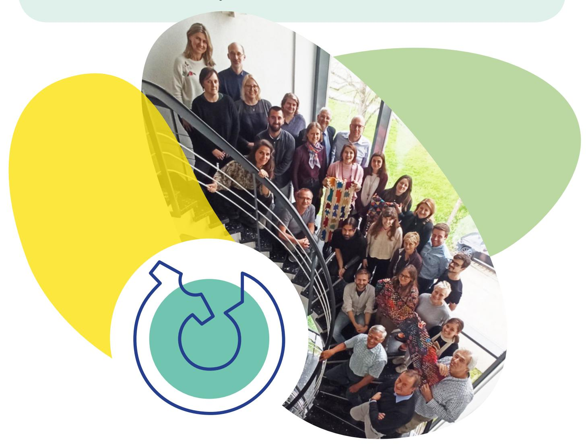

## A momentum for the textile industry

| , https://textile-platform.eu/ the Future of Textiles and Clothing | , , |
|--------------------------------------------------------------------|-----|
| , https://tcbl.eu/                                                 | , , |
| , https://www.ecosystex.eu/ for a Sustainable Textile Ecosystem    | , , |

| https://cordis.europa.eu/project/id/646133/reporting (HORIZON, 2015-2019) https://newcottonproject.eu/ (HORIZON, 2020-2023) https://www.my-fi.eu/ | , , , |
|---------------------------------------------------------------------------------------------------------------------------------------------------|-------|
| , HEREWEAR (HORIZON, 2020-2024) https://www.cisutac.eu/ https://www.regiogreentex.eu/dashboards/home                                              | , , , |
| , and ‘regional’ (HORIZON, 2021-2023)                                                                                                             | , ,   |

| BIO-BASED SOLUTIONS MAIN EU INITIATIVES                                                                        | LOCAL PRODUCTION CIRCULAR DESIGN |
|----------------------------------------------------------------------------------------------------------------|----------------------------------|
| , that relates to the following actions:                                                                       | , ,                              |
| ,                                                                                                              | , ,                              |
| ,                                                                                                              | , ,                              |
| ,                                                                                                              | , ,                              |
| https://eur-lex.europa.eu/eli/dir/2024/825/oj (EU) 2024/825 (2024)                                             | , ,                              |
| https://eur-lex.europa.eu/eli/dir/2024/1760/oj 2024/1760 (2024) https://eur-lex.europa.eu/eli/reg/2024/1781/oj | , ,                              |
| , 2024/1781 (2024)                                                                                             | ,                                |
| , “Textiles of the Future” (2024)                                                                              | , ,                              |
| , Green claims Directive (pending)                                                                             | ,                                |
| , , Centre for Bioeconomy (pending)                                                                            | ,                                |

### EU FUNDED PROJECTS

### COMMUNITIES AND PARTNERSHIPS

https://www.cbe.europa.eu/

|                                                                      |  |  |  |
|-----------------------------------------------------------------------------------|---------------|---------------|---------------|
| ‘BIOREGIO Regional circular economy models’ (INTERREG, 2017-2022)                 |  |  |  |
| Transition2BIO - Education and raise awareness on bioeconomy (HORIZON, 2021-2022) |  |  |  |
| COOPID - Bio-based knowledge in the primary sector (HORIZON, 2021-2023)           |  |  |  |

| BIO-BASED SOLUTIONS MAIN EU INITIATIVES | LOCAL PRODUCTION CIRCULAR DESIGN |
|-----------------------------------------|----------------------------------|
| ,                                       | , ,                              |
| , and more competitive Europe (2020)    | , ,                              |
|                                         | , ,                              |
|                                         | , ,                              |
| Social Economy Action Plan (2021)       | , ,                              |
| , ,                                     | , ,                              |

Due to its transversal and holistic dimension, the project also draws on EU initiatives based on other European policies that resonate with the project. As this project did not start from scratch, we also take particular account of previous research and projects carried out by industry or developed in partnership with the EU.

In the table below a list similar to the previous one, but on other EU policies.

## A multidimensional, policy mixed project

### EU FUNDED PROJECTS

### COMMUNITIES AND PARTNERSHIPS

Circular Bio-based Europe Joint Undertaking (2021)

, ,

https://commission.europa.eu/document/download/97e481fd-2dc3-412d-be4c-f152a8232961\_en chrome-extension://efaidnbmnnnibpcajpcglclefindmkaj/https://commission.europa.eu/document/download/e6cd4328-673c-4e7a-8683-f63ffb2cf648\_en?filename=Political%20Guidelines%202024-2029\_EN.pdf The HEREWEAR project builds on its research results and findings encapsulated in the Good practices above to propose policy recommendations to establish a holistic approach of the whole value chain, a circular vision where locally produced textiles are made from locally sourced bio-based materials and with respect for ethical values. In addition to the policy framework discussed above, we also take into account the **Political Guidelines for the next European Commission** (July 2024) as well as the **Future of European competitiveness report** by Mario Draghi (September 2024) in order to anticipate the priorities of the next Commission as we are convinced the below recommendations can contribute to EU sustainable competitiveness.

# POLICY **4** RECOMMENDATIONS

## Understand the market

- https://knowledge4policy.ec.europa.eu/event/bio-based-textiles-expert-workshop-latest-research-findings-market-trends-policy-needs\_en
- **Map the Textile Value Chain:** Thoroughly map the actors, stages, materials, and professions involved in the textile value chain, in and outside EU. Crucial for transparency.
- **• Leverage Data:** Collect and utilize data, such as from Producer Responsibility Organizations, to provide public information on textiles and garment use and disposal. This drives investment in circular infrastructure.
- **• Account for current industrial skills and capacity:** Recognize the limited availability of industrial skills, capacity, and infrastructure due to the small ratio of textiles and clothing produced within EU compared to outside EU. Key to develop realistic policy scenarios and targets, eg focus on support of sustainable and high-quality clothing production.
- **• Understand link with related sectors:** use initiatives like the European Commission's **Knowledge Centre for Bioeconomy** to gather data and inform policy, e.g. the announced policy brief on bio-based textiles.

This section emphasizes the importance of data collection and analysis for informed decision making regarding a sustainable textile value chain. Key elements:

- https://euratex.eu/news/european-commission-announces-textiles-of-the-future-partnership-under-horizon-europe/
- **Prioritize sustainable bio-based materials:** Research and development on sustainable bio-based raw materials and fibres (such as bio-based polyester and cellulose fibres) should be a top priority, as highlighted by the **«Textiles of the Future» partnership**.
- **Foster industrial symbiosis:** Encourage collaboration amongst agriculture, forestry, and textile sectors to optimize the use of side- and waste-streams, thus enhancing competitiveness and sustainability and contributing to the design of holistic policies.
- **Account for Stakeholder Diversity:** Develop legislation for bio-based textiles that considers the entire value chain, from biomass production to end-of-life management. This requires acknowledging the various stakeholders involved.
- **Support SME Participation:** Utilize funding models like cascade funding and regional hubs to provide tailored grants for SMEs and facilitate their involvement in sustainable textile initiatives.

- https://wfto.com/our-fair-trade-system/our-fair-trade-standard/ https://wfto.com/our-fair-trade-system/our-fair-trade-standard/ https://euratex.eu/reach4textiles/
- **Ensure a coherent and comprehensive EU Strategy implementation:** Ensure that the legislation included in the EU strategy for sustainable and circular textiles is appropriate for SMEs, clear and enforceable. This to reward companies following the rules.
- **Address Microplastics:** Utilize research from initiatives like HEREWEAR to inform legislation on microplastics. This can help reduce pollution and promote sustainable practices and processes.
- **Harmonize EU Member States' requirements:** Work towards a unified EU internal market to avoid fragmentation and reduce the burden on SMEs that must comply with different standards in various Member States.
- **Strengthen Market Surveillance:** Enhance the EU's ability to monitor and prevent noncompliant textile products from entering the market, see eg the **REACH4TEXTILES** project. This to ensure a fair playing field for domestic producers.
- **Implement Fair Trade Standards:** Promote the use of fair trade standards like the **WFTO Fair Trade Standard** to assess entire business operations and ensure ethical practices throughout the value chain.

This section focuses on promoting research and innovation on bio-based textiles and supporting SMEs in the textile industry. Key elements:

## Foster a holistic approach to biobased textiles by aligning policies

There is a need for a coherent and fair legal framework to support sustainable and circular textiles. Key elements:

## Develop and implement a coherent and fair legislative framework

- https://onedrive.live.com/?id=19a1700043ed2ba9%210%5EMTk1NC8wLiBGYWlyZSBTYWxvbi8zLiBPUMOJUkFUSU9OUy8yLiBDT05TVUxU-SU5HLzMuMjAyNC5FQ19IZXJld2Vhci9FY29kZXNpZ24gZm9yIFN1c3RhaW5hYmxlIFByb2R1Y3RzIFJlZ3VsYXRpb24&cid=19A1700043E-D2BA9
- **Prioritize GPP:** As public procurement accounts for a significant portion of the EU's Gross Domestic Product (GDP), it is essential to prioritize GPP for textile products. This to drive demand for sustainable and circular bio-based textiles.
- **Expand GPP Criteria to Include Social Aspects:** While the current ESPR criteria may not address social aspects, it is important to include them in future GPP requirements. This to ensure that public procurement promotes also social responsibility.

- https://ec.europa.eu/social/main.jsp?catId=1537&langId=en https://www.regiogreentex.eu/
- **See 'local' as multifaceted:** 'local' goes beyond geographical aspects of space (town, region, country) and encompasses also scale (volume of production), scope (activities involved) and social (wellbeing of all actors involved).
- **Promote Micro-factories:** This approach utilizes digitization and local networks for transparent and flexible production, reducing transportation and environmental impact.
- **Leverage Smart Specialization Strategies (S3):** Utilize existing EU initiatives like S3 to foster regional collaboration and investment in sustainable and innovative textile solutions. The **RegioGreenTex** project serves as a successful example.
- **Integrate Social and Circular elements:** Integrate marginalized groups including (depending on the context) women, disadvantaged youth, and migrants into the social and solidarity economy within the textile industry. This fosters inclusivity and aligns with the EU's social and circular economy goals.
- **Promote social value:** emphasise on the societal impact of businesses, in addition to economic growth, in line with the recommendations of the **Social economy action plan**, and facilitate investments in business models that create social value.

Explore the concept of 'local' within a sustainable textile and clothing industry. Key elements:

## Support local and social

Recognise the role of GPP as a powerful tool to incentivize the production and adoption of sustainable and circular textiles. Key elements:

## Lead by example – The impact of Green Public Procurement (GPP)

- https://new-european-bauhaus.europa.eu/index\_en https://new-european-bauhaus.europa.eu/index\_en https://herewear.tcbl.eu/burrr-workshop https://www.youtube.com/watch?v=Hansy1Z0haE https://pact-for-skills.ec.europa.eu/index\_en
- **Leverage Community Engagement:** Utilize communities, like those of HEREWEAR and TCBL, to foster open dialogue, experimentation, and participation in the sustainable textile transition.
- **Use creative tools to educate and train:** Prioritize education and training through creative thinking processes for students and professionals in the textile industry to equip them with the knowledge and skills needed to promote sustainability.
- **Stimulate partnerships:** Encourage collaborations among education providers, research and technology centres and the industry as emphasized in the **Pact for Skills** for the EU TCLF Industries. This includes cooperation at the regional and interregional level.
  - **Engage Young Audiences:** Encourage the development of educational programs for primary school children, to raise awareness of the textile industry's environmental impact and empower them to be part of the solution, as for example demonstrated by the project **«Les petits héros durables»**.
  - **Foster User Participation:** Encourage practices and methods that include users, eg the **BURRR Workshop**, in the design process to better understand their needs and preferences for sustainable textiles. This for building user commitment.
  - **Showcase future sustainable ways of living:** use wide-topic platforms, like the **New European Bauhaus**, for showcasing future sustainable ways of living to inspire a broader audience.

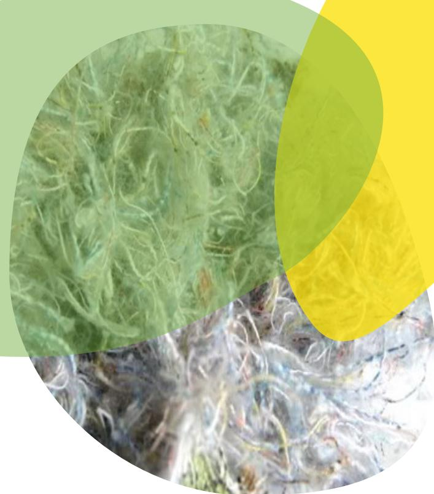

## Communicate and raise awareness

This section focuses on the importance of fostering communication and raising awareness among the different stakeholders and the general public. Key elements: