# **D3.2 ADVANCES OF REDOL AUTOMATED SORTING AND CLASSIFICATION TECHNOLOGIES**

| Project no.                | 101091668                                                     |
|----------------------------|---------------------------------------------------------------|
| Project acronym:           | REDOL                                                         |
| Project title:             | Aragon's REgional Hub for circularity: Demonstration Of Local |
| Call:                      | HORIZON-CL4-2022-TWIN-TRANSITION-01                           |
| Start date of project:     | 01.12.2022                                                    |
| Duration:                  | 48 months                                                     |
| Deliverable title:         | D3.2 Advances of REDOL automated sorting and classification   |
| Due date of deliverable:   | 30.07.2025                                                    |
| Actual date of submission: | 04.08.2025                                                    |
| Deliverable Lead Partner:  | ICCS                                                          |
| Dissemination level:       | Public                                                        |

| Author Names          | Organization |
|-----------------------|--------------|
| Christina Stefani     | ICCS         |
| Panagiotis Zoumpoulis | ICCS         |
| Konstantinos Kokkalis | ICCS         |
| Anna Arias            | IRIS         |
| Noemi Cei             | NTT          |
| Ilaria Canesi         | NTT          |
| Daniele Spinelli      | NTT          |
| Jorge Barrio          | CIRCE        |
| Jorge Arroyo          | CIRCE        |

#### **Document History**

| Version | Date       | Note                    | Revised by       |
|---------|------------|-------------------------|------------------|
| 0.1     | 02.06.2025 | First draft             | ICCS             |
| 0.2     | 20.06.2025 | Addition of information | WP3 Task leaders |
| 0.3     | 08.07.2025 | Second draft            | ICCS             |
| 0.4     | 15.07.2025 | Addition of information | WP3 Task leaders |
| 0.5     | 22.08.2025 | Third draft             | ICCS             |
| 0.6     | 28.08.2025 | Addition of information | WP3 Task leaders |
| 0.7     | 31.08.2025 | Final version           | ICCS             |
| 1.0     | 04.08.2025 | Format changes          | CIRCE            |

# **Disclaimer**

The content of the publication herein is the sole responsibility of the publishers, and it does not necessarily represent the views expressed by the European Commission or its services.

While REDOL is funded by the European Union, views and opinions expressed are however those of the author(s) only and do not necessarily reflect those of the European Union or the European Research Executive Agency (REA). Neither the European Union nor the European Research Executive Agency (REA) can be held responsible for them.

While the information contained in the documents is believed to be accurate, the authors(s) or any other participant in the REDOL consortium make no warranty of any kind with regard to this material including, but not limited to the implied warranties of merchantability and fitness for a particular purpose.

Neither the REDOL Consortium nor any of its members, their officers, employees or agents shall be responsible or liable in negligence or otherwise howsoever in respect of any inaccuracy or omission herein.

Without derogating from the generality of the foregoing neither the REDOL Consortium nor any of its members, their officers, employees or agents shall be liable for any direct or indirect or consequential loss or damage caused by or arising from any information advice or inaccuracy or omission herein.

#### Copyright notice

© REDOL Consortium, 2022-2026. This deliverable contains original unpublished work except where clearly indicated otherwise. Acknowledgement of previously published material and of the work of others has been made through appropriate citation, quotation, or both. Reproduction is authorized provided the source is acknowledged.

# **Executive Summary**

This document focuses on the developments and activities carried out as part of Work Package 3 "Upgrading the management of solid urban waste streams" of REDOL project, in the period of M09 to M32. The main objective of this work was to achieve the improvement of different waste flows in REDOL value chains by designing and developing various technical and digital solutions. The targeted value chains are plastics, packaging, Construction & Demolition Waste (CDW), textiles and waste of electric and electronic equipment (WEEE). Based on that, five different technologies were developed for all the different value chains.

The present deliverable provides an overview of the waste flows and value chains before the implementation of REDOL developments, identifying the path for improvement. Furthermore, the development and the validation of the technologies are described in detail. The developed technologies, focusing on five different waste flows, are separated into five different categories:

- A Smart Bin (Task 3.1) is developed for Solid Urban Waste (SUW), where AI models implemented in the bin are able to separate multiple waste into recyclable categories
- Packaging waste is treated with a developed AI model which identifies the different classes of MMPP (Multi-Material Multilayer Plastic Packaging) waste and separates them accordingly (Task 3.2).
- CDW is upgraded with the use of an automated multi-sensing sorting system which identifies and sorts the plastic waste from the stream of CDW (Task 3.3), allowing for a feedstock of higher quality
- The textile waste is treated with a developed sorting system which classifies them based on their composition (Task 3.4), paving the way for more efficient textile recycling processes
- Finally, both paper and WEEE are classified and separated with two innovative sorting systems (Task 3.5).

# **Table of Contents**

| 1. 2. 2.1. 2.2. 2.3.                                                       | List of Acronyms [ICCS].........................................................................11 2.3.1. 2.3.2.                                                                   |
|----------------------------------------------------------------------------|------------------------------------------------------------------------------------------------------------------------------------------------------------------------------------|
| 2.4.                                                                       | Demonstration .............................................................................................................................................................19      |
| 2.4.1.                                                                     | Operational & Demonstration activities .........................................................................................................19                                 |
| 2.5.                                                                       | Future Work..................................................................................................................................................................20    |
| 3. T3.2 AI-based system for the identification and classification of MMPP– | [IRIS] 21                                                                                                                                                                          |
| 3.1.                                                                       | Pre-REDOL stage......................................................................................................................................................... 21        |
| 3.2.                                                                       | Objectives......................................................................................................................................................................22 |
| 3.3.                                                                       | Advances within the REDOL .....................................................................................................................................25                  |
| 3.3.1.                                                                     | System Description...............................................................................................................................................25                |
| 3.3.2.                                                                     | System Architecture and Features.................................................................................................................26                                |
| 3.4.                                                                       | Demonstration .............................................................................................................................................................28      |
| 3.4.1.                                                                     | Operational activities ...........................................................................................................................................28               |
| 3.4.2.                                                                     | Demonstration activities.....................................................................................................................................29                    |
| 3.5.                                                                       | Future Work..................................................................................................................................................................30    |
| 4. T3.3 Integrated sorting system for CDW with advanced robotic arms–      | [ICCS]............................................... 31                                                                                                                           |
| 4.1.                                                                       | Pre-REDOL stage.........................................................................................................................................................31         |
| 4.2.                                                                       | Objectives......................................................................................................................................................................32 |
| 4.3.                                                                       | Advances within the REDOL .....................................................................................................................................34                  |
| 4.3.1.                                                                     | System Description...............................................................................................................................................34                |
| 4.3.2.                                                                     | System Architecture and Features.................................................................................................................36                                |
| 4.4.                                                                       | Demonstration .............................................................................................................................................................41      |
| 4.4.1.                                                                     | Operational activities ...........................................................................................................................................41               |
| 4.4.2.                                                                     | Demonstration activities.....................................................................................................................................42                    |
| 4.5.                                                                       | Future Work..................................................................................................................................................................43    |
| 5. T3.4 Novel textiles classification solution using HSI camera–           | [NTT] 45                                                                                                                                                                           |

| 5.1.      | Pre-REDOL stage........................................................................................................................................................                      | 45                                                                                                                                                                            |
|-----------|----------------------------------------------------------------------------------------------------------------------------------------------------------------------------------------------|-------------------------------------------------------------------------------------------------------------------------------------------------------------------------------|
| 5.2.      | Objectives.....................................................................................................................................................................              | 46                                                                                                                                                                            |
| 5.3.      | Advances within the REDOL                                                                                                                                                                    | .....................................................................................................................................47                                       |
| 5.3.1.    |                                                                                                                                                                                              | System Description...............................................................................................................................................47           |
| 5.3.2.    | System Architecture and Features................................................................................................................                                             | 49                                                                                                                                                                            |
| 5.4.      | Demonstration                                                                                                                                                                                | .............................................................................................................................................................52               |
| 5.4.1.    | Operational activities                                                                                                                                                                       | ...........................................................................................................................................52                                 |
| 5.4.2.    |                                                                                                                                                                                              | Demonstration activities.....................................................................................................................................53               |
| 5.5.      | Future Work.................................................................................................................................................................                 | 55                                                                                                                                                                            |
| 6.        | T3.5 Mobile sorting system for SUW including novel AI algorithms, sensing technology and robots –                                                                                            |                                                                                                                                                                               |
| [CIRCE]   |                                                                                                                                                                                              | 56                                                                                                                                                                            |
| 6.1.      | Paper and cardboard mobile sorting system....................................................................................................                                                | 56                                                                                                                                                                            |
| 6.1.1.    | Pre-REDOL stage...................................................................................................................................................                           | 56                                                                                                                                                                            |
| 6.1.2.    | Objectives................................................................................................................................................................                   | 56                                                                                                                                                                            |
| 6.1.3.    |                                                                                                                                                                                              | Advances within the REDOL................................................................................................................................57                   |
| 6.1.4.    |                                                                                                                                                                                              | System Description...............................................................................................................................................57           |
| 6.1.5.    | System Architecture and Features................................................................................................................                                             | 58                                                                                                                                                                            |
| 6.1.6.    | Demonstration.......................................................................................................................................................                         | 59                                                                                                                                                                            |
| 6.1.7.    | Operational activities                                                                                                                                                                       | 59                                                                                                                                                                            |
| 6.1.8.    | Demonstration                                                                                                                                                                                | activities.................................................................................................................................... 59                             |
| 6.1.9.    |                                                                                                                                                                                              | Future Work.............................................................................................................................................................61    |
| 6.2.      |                                                                                                                                                                                              | Electronic component extraction and classification system.......................................................................61                                            |
| 6.2.1.    |                                                                                                                                                                                              | Pre-REDOL stage....................................................................................................................................................61         |
| 6.2.2.    |                                                                                                                                                                                              | Objectives.................................................................................................................................................................61 |
| 6.2.3.    |                                                                                                                                                                                              | Advances within the REDOL................................................................................................................................62                   |
| 6.2.4.    |                                                                                                                                                                                              | System Description...............................................................................................................................................62           |
| 6.2.5.    |                                                                                                                                                                                              | System Architecture and Features.................................................................................................................63                           |
| 6.2.6.    | Demonstration.......................................................................................................................................................                         | 64                                                                                                                                                                            |
| 6.2.7.    | Operational activities                                                                                                                                                                       | 64                                                                                                                                                                            |
| 6.2.8.    | Demonstration                                                                                                                                                                                | activities.................................................................................................................................... 64                             |
| 6.2.9.    | Future Work............................................................................................................................................................                      | 65                                                                                                                                                                            |
| 7. Videos |                                                                                                                                                                                              | 66                                                                                                                                                                            |
| 8.        | Conclusions                                                                                                                                                                                  | 69                                                                                                                                                                            |
| 9.        | References................................................................................................................................................................................70 |                                                                                                                                                                               |

# **List of Acronyms**

| Acronym | Meaning                                     |
|---------|---------------------------------------------|
| ABS     | Acrylonitrile Butadiene Styrene             |
| AC      | Altern Current                              |
| AI      | Artificial Inteligence                      |
| CDW     | Construction and Demolition Waste           |
| CNN     | Convolutional Neural Network                |
| DDS     | Data Distribution Service                   |
| DL      | Deep Learning                               |
| DoF     | Degree of Freedom                           |
| DSC     | Differential Scanning Calorimetry           |
| EL      | Elastane                                    |
| EPS     | Expanded Polystyrene                        |
| EU      | European Union                              |
| FTIR    | Fourier Transform Infrared Spectroscopy     |
| GC      | Gas Chromatography                          |
| GPU     | Graphics Processing Unit                    |
| HSI     | Hyperspectral Image                         |
| IoT     | Internet of Things                          |
| I-US    | Industrial-Urban Symbiosis                  |
| MES     | Manufacturing Execution System              |
| ML      | Machine Learning                            |
| MMPP    | Multi-Material Multilayer Plastic Packaging |
| MRFs    | Material Recovery Facilities                |
| NIR     | Near-Infrared                               |
| P&C     | Paper and Cardboard                         |
| PA      | Polyamide                                   |
| PC      | Personal Computer                           |
| PCB     | Printed Circuit Board                       |
| PE      | Polyethylene                                |
| PET     | Polyethylene Terephthalate                  |
| PLC     | Programmable Logic Controller               |
| PP      | Polypropylene                               |

| PVC   | Polyvinyl Chloride                                                             |
|-------|--------------------------------------------------------------------------------|
| REDOL | Aragon's REgional Hub for circularity: Demonstration Of Local industrial-urban |
| RGB   | Redd Green Blue                                                                |
| RGBD  | Red, Green, and Blue (RGB) color information with depth (D) data               |
| ROI   | Region Of Interest                                                             |
| rPET  | Recycled Polyethylene Terephthalate                                            |
| SLR   | Systematic Literature Review                                                   |
| SUW   | Solid Urban Waste                                                              |
| SWIR  | Short-Wave Infrared                                                            |
| TGA   | Thermogravimetric Analysis                                                     |
| TRL   | Technology Readiness Level                                                     |
| UDP   | User Datagram Protocol                                                         |
| UI    | User Interaction                                                               |
| VFD   | Variable Frequency Drive                                                       |
| WEEE  | Waste of Electric and Electronic Equipment                                     |
| WP    | Work Package                                                                   |

# **1. Introduction**

The overall ambition of REDOL project is to valorize different value chains of solid urban waste (SUW), by promoting and implementing innovative technologies and establishing circular approaches at region level. As a first approach, it is important to examine and evaluate the current state of each value chain, as well as the steps that would efficiently lead to the advancement of Zaragoza area to a circularity hub. The main value chains of SUW, as addressed in this project, are plastics, packaging, construction and demolition waste (CDW), textiles and waste of electronical and electric equipment (WEEE). WP3 has focused on the development of innovation technologies to upgrade the collection, sorting and classification of SUW for all five different value chains.

Taking into account all the above-mentioned, this deliverable focuses initially on the current state of each value chain, as reviewed in the demo cases of the project. An analysis of the value chain is presented, alongside the objective of REDOL developments. Afterwards, the advanced technologies are described. The demonstration of the operation of these technologies is also shown in this deliverable, as well as the future steps of implementation.

# **2. T3.1 Development and deployment of Smart Plastic Bins – [ICCS]**

# **2.1. Pre-REDOL stage**

Solid urban waste (SUW) management remains a significant operational and environmental challenge in the majority of contemporary urban settings. The prevailing model usually follows a relatively linear chain in which household waste is collected through the use of drop-off systems (waste disposal bins) and then transported to transfer stations or directly to waste treatment facilities. From there, materials are routed either for recycling, incineration with energy recovery, or landfilling. Source separation is nominally supported through color-coded bins (yellow for light packaging, blue for paper/cardboard, green for glass, brown for organic, and grey for residuals), but actual sorting rates remain suboptimal [\(Figure 1\)](#page-10-2). According to Eurostat [1], Spain's recycling rate for municipal waste saw an increase from around 36.1% in 2017, to 41.4% in 2023, still remaining below the EU 2025 target of 55%, but nevertheless signifying a substantial improvement in this field. The remaining, unreclaimed waste is landfilled or incinerated, potentially indicating insufficient capture of recyclables and high contamination levels in separated streams.

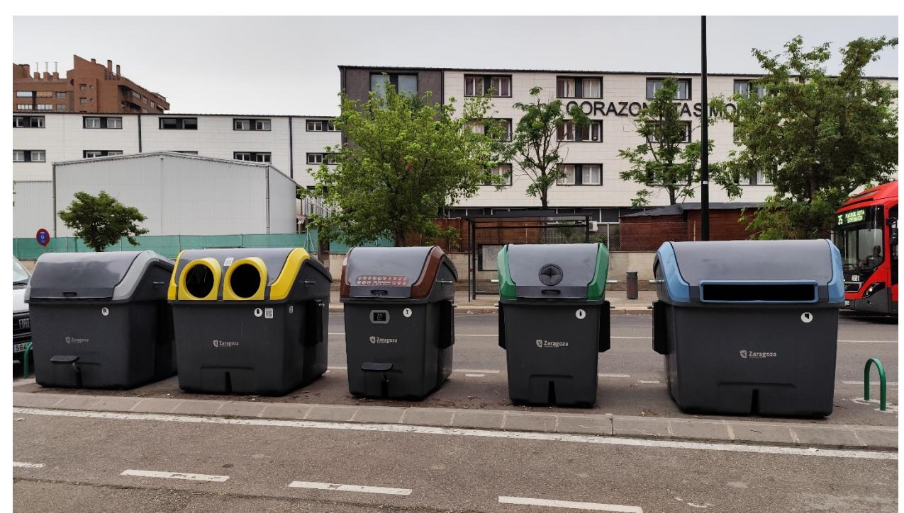

**Figure 1. Waste bins in Zaragoza (from left to right: rest, plastic & packaging, organic, glass and paper and cardboard)**

Despite notable improvements achieved in specific municipalities, such as the implementation of separate organic waste streams or pilot smart collection systems in cities such as Barcelona, San Sebastián or Zaragoza, the overall national framework still relies heavily on citizen compliance for proper waste disposal and segregation. At the household level, users are expected to correctly identify, sort, and dispose of waste into the appropriate color-coded bins without real-time guidance or feedback mechanisms. This lack of technological integration at the point of disposal, indicatively the absence of visual or sensor-based validation, means that misplacements frequently occur. Plastics end up in organic waste bins, metal items in residuals, and materials contaminated by organic residues are mixed with recyclables. This results in severe cross-contamination, which undermines the effectiveness of downstream sorting systems and significantly reduces the quality of recovered materials. Such contamination leads to an increase of rejection rates at Material Recovery Facilities (MRFs), increased relevant operational costs, and subsequently to the underutilization of recyclable material flows. Waste fractions of high value, such as PET, aluminum, and clean cardboard often become unrecoverable, either due to contaminants or misclassifications and routing to landfill or incineration streams. As a result, the potential for closed-loop recycling and circular economy practices still remains limited.

To tackle this issue, the introduction of intelligent waste management systems such as smart bins, emerges as a critical enabling solution for upgrading the value chain. Smart bins are a novel solution for waste disposal. They are technologically enhanced waste containers equipped with various sensors, connectivity modules, and often automation capabilities, targeting real-time monitoring, data collection, and ideally, in-situ waste classification and sorting. Their goal is to optimize waste management processes by improving efficiency, traceability, and improve resource recovery at the point of disposal instead of the MRF. Smart bins represent a solution capable of transforming traditional garbage disposal points into active, data-rich points. Their deployment marks an important step toward addressing the long-standing issues of contamination, disposal inefficiency, and human-dependent sorting, while aligning urban waste management practices with the broader targets of circularity and technological resilience.

Considering the significance of smart bins in addressing the challenges encountered by traditional urban waste management, and their potential to align municipal systems with circular economy models, a comprehensive academic and market analysis was undertaken within the REDOL project by ICCS. This effort aimed to extensively map the state of the art and critically evaluate both academic developments and commercially available smart bin solutions. The outcome of this duallayered investigation was consolidated into two scientific publications: a peer-reviewed journal article presenting a Systematic Literature Review (SLR), and a Conference paper focused on market analysis and system-level design aligned with Industry 5.0 principles, while also introducing a new concept for a smart bin.

The review paper titled "Advancing Urban Waste Management: A Review of Intelligent Waste Disposal Units Emphasizing on In-Situ Material Separation for Enhanced Resource Recovery" [2] presents a structured examination of 79 selected papers from a pool of over 1400 publications. These studies were filtered using a PRISMA-based methodology, focusing on sensing and actuating technologies in smart bins and their capabilities in material segregation. The SLR study revealed that although sensing technologies such as fill-level monitoring, gas detection, and environment sensing are widely explored, waste sorting functionalities are underdeveloped, appearing in less only a few of the examined cases. Even in studies where sorting is present, it is typically limited to single-item inputs and relies heavily on manual or semi-automated mechanisms. Only a handful of systems demonstrated the use of inductive, capacitive, or spectroscopic sensors for composition-based classification, whereas integration of AI and computer vision was limited to prototypes with low to medium technological maturity. Furthermore, the majority of projects were found at early TRLs, highlighting a gap between academic innovation and deployable solutions. The study ultimately identified a clear need for holistic, adaptable systems capable of processing mixed waste streams with higher degrees of autonomy and intelligence.

Complementing the literature review, the conference paper titled "Advancing Urban Waste Management Using Industry 5.0 Principles: A Novel Smart Bin" [3] provides a market-oriented perspective, analyzing seven commercially available smart bin products [\(Figure 2\)](#page-12-0). Each product was evaluated based on sensing features (e.g., fill-level, gas, vision), actuation mechanisms (e.g., compaction, routing), and integration capabilities (e.g., IoT connectivity, cloud analytics). The analysis revealed that while some commercial systems do feature automated sorting using AI-vision, most devices rely on user-initiated manual separation, and none support multi-item, mixed-input classification. Furthermore, critical functions such as weight sensing, composition detection, and adaptive sorting configurations are either absent or poorly integrated. From a deployment perspective, these systems are largely designed for indoor or confined environments, such as office spaces, with low throughput, and their ability to scale in municipal contexts is quite limited.

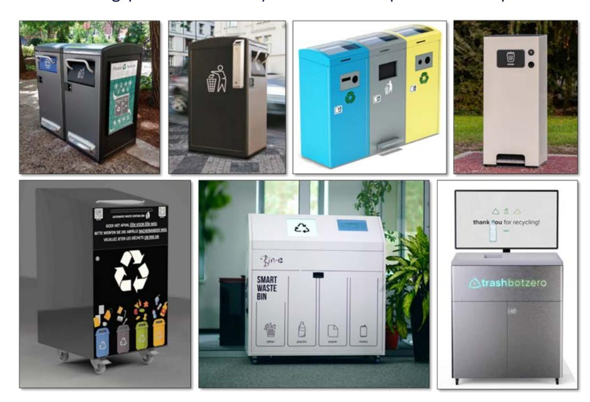

**Figure 2. Commercially available smart bins**

These two studies in tandem establish a strong foundational understanding of the technological landscape and practical limitations of smart bins, justifying the necessity for a new, highfunctionality prototype to be developed and tested within REDOL project's framework. This dual analysis directly informed the conceptualization, design, and implementation of the REDOL smart sorting bin system, a solution with integrated in-situ waste sorting capabilities to facilitate automated segregation of recyclable trash.

# **2.2. Objectives**

The SLR and market analysis presented in the previous section of this chapter highlighted a set of persistent challenges and limitations in the current landscape of smart waste bins, specifically the overall low technology readiness and limited support for in-situ waste separation. As highlighted, sorting capabilities, when present, are generally restricted to single-item inputs, often relying on manual classification or simple actuator-based routing. Additionally, the use of advanced sensing for material composition (e.g., FTIR, inductive/capacitive detection) is rare, and most implementations depend solely on vision-based recognition. On the commercial side, available solutions are primarily confined to indoor applications, offer limited scalability, and lack the flexibility to accommodate mixed or multi-stream waste. These shortcomings prevent the realization of robust, fielddeployable smart bin systems that can address the demands of modern urban waste management efficiently.

To address these gaps, a novel smart bin concept was proposed within REDOL, inspired by the findings of both evaluations. The conceptual system features a front-loaded entry point feeding deposited waste into a controlled conveyor-based sorting pipeline, where waste is processed using an AI-enabled vision module for object classification. Items are dynamically routed via pneumatic actuators into multiple dedicated compartments. The system also integrates ultrasound fill-level sensors, and IoT connectivity to enable real-time monitoring, data transmission, and adaptive behaviour based on usage patterns or regional policy constraints.

The above described configuration is specifically designed to overcome the limitations identified in both academic and commercial systems. By supporting multi-item input, enabling in-situ sorting, and integrating composition-aware classification, the bin reduces the need for manual pre-sorting by users. A modular architecture allows for reprogramming of the classification pipeline to match localized recycling schemes or policy-driven sorting requirements, addressing the challenge of inflexible systems in real deployments. Moreover, its robust mechanical and digital subsystems enable reliable outdoor operation under real urban conditions, a feature which is rarely achieved in existing solutions.

Under Task 3.1 of REDOL, the primary objective is to design, develop, and validate a smart bin system that embodies the above concept [\(Figure 3\)](#page-14-1).

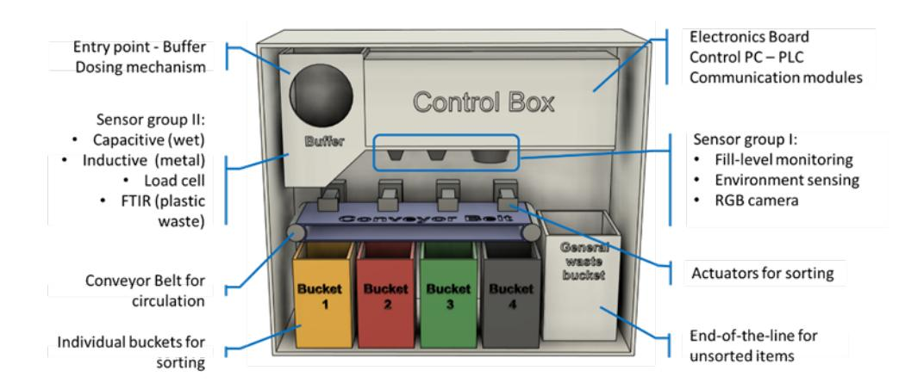

**Figure 3. REDOL Smart sorting bin initial concept.**

# **2.3. Advances within REDOL**

Within REDOL, a structured effort was undertaken to design, develop, and validate a novel smart bin system capable of addressing the limitations identified in both academic and commercial waste management solutions [\(Figure 4\)](#page-15-1). The process began as already mentioned with an extensive literature review and market analysis, culminating in the publication of two scientific papers that outlined the current technological landscape, exposed critical gaps, and justified the need for a more advanced, integrated solution. Building upon these findings, the research and development team proceeded with the development of a conceptual design, followed by detailed engineering analysis, electromechanical drafting, and the fabrication and assembly of a fully functional prototype. The system underwent initial testing and evaluation at ICCS facilities. Following validation two additional units are to be replicated. All three prototypes will be subsequently shipped to Zaragoza for field deployment. In parallel, a detailed user journey was developed, mapping user interactions with the system, to support usability optimization and inform all further system refinements.

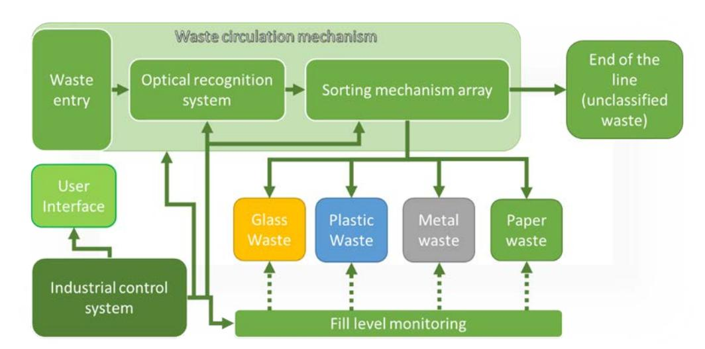

**Figure 4. Smart bin architecture and main features schematic diagram**

#### 2.3.1. System Description

The smart sorting bin system developed under Task 3.1 has been designed as a robust, outdoorcompatible unit suitable for deployment in urban public spaces [\(Figure 5\)](#page-15-1). It envelops a rectangular shaped volume with physical dimensions of approximately 5400x2000x2400mm (LxWxH), providing sufficient internal volume to accommodate the included sorting mechanisms, multiple waste deposition compartments, and infrastructure for service and maintenance access. The exterior structure of the bin is fabricated from weather-resistant industrial-grade materials, ensuring durability under varying environmental conditions. The frame and panels have been treated for corrosion resistance. Specifically surface covering panels are coated with UV-resistant paint or polyurethane topcoats to protect against sunlight, moisture, and chemical exposure. All joints and cutouts are sealed with weatherproof gaskets or sealants to prevent water ingress, which could otherwise affect both the panel core and embedded components. Finally, structural steel frames are either galvanized or powder-coated to prevent corrosion in outdoor environments, enabling long-term outdoor installation with minimal maintenance. The bin's design considers both functionality and aesthetics, with a clean form factor that aligns with modern urban infrastructure requirements.

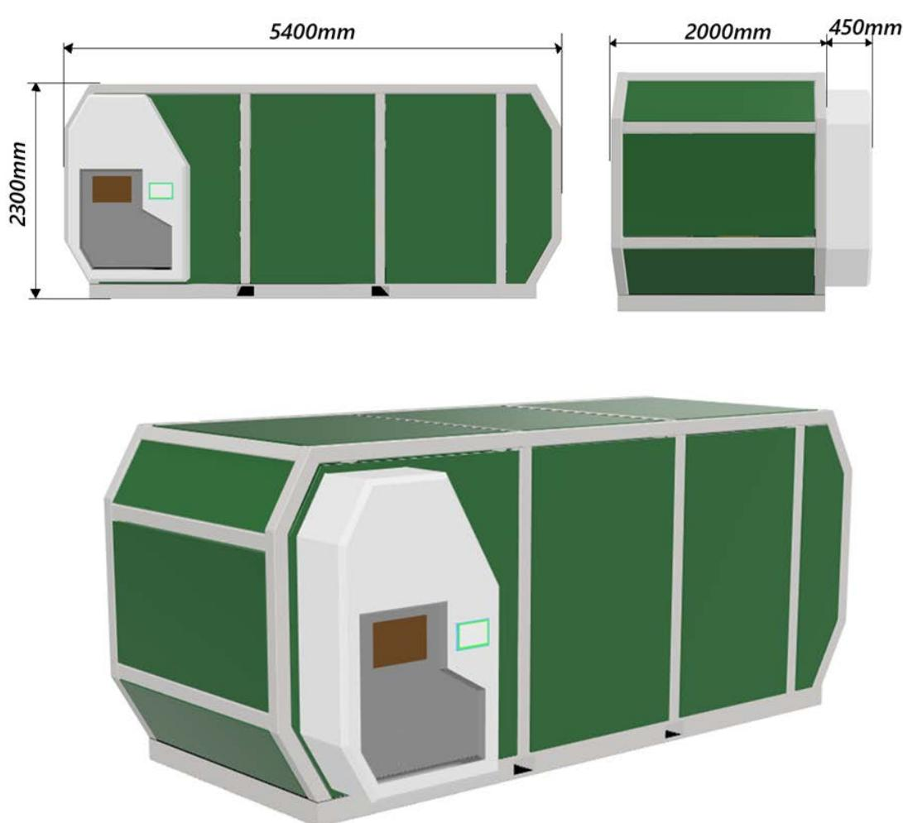

**Figure 5. Smart Bin exterior design and overall dimensions**

The system is equipped with an integrated power supply that connects to a standard three-phase AC supply grid. A dedicated control panel manages internal subsystems, including sensors, actuators, and data communication hardware. In terms of connectivity, the system supports Wi-Fi and 4G connectivity for real-time remote monitoring and integration with municipal waste management platforms. These connections enable the transmission of data related to bin usage, fill levels, and sorting activity, while also allowing remote updates and diagnostics.

User interaction (UI) with the system is facilitated through a front-mounted touchscreen interface. This touch display serves both informational and functional roles—providing user instructions, system status, and optionally, interaction with awareness campaigns or reward-based incentive mechanisms [\(Figure 6\)](#page-16-0).

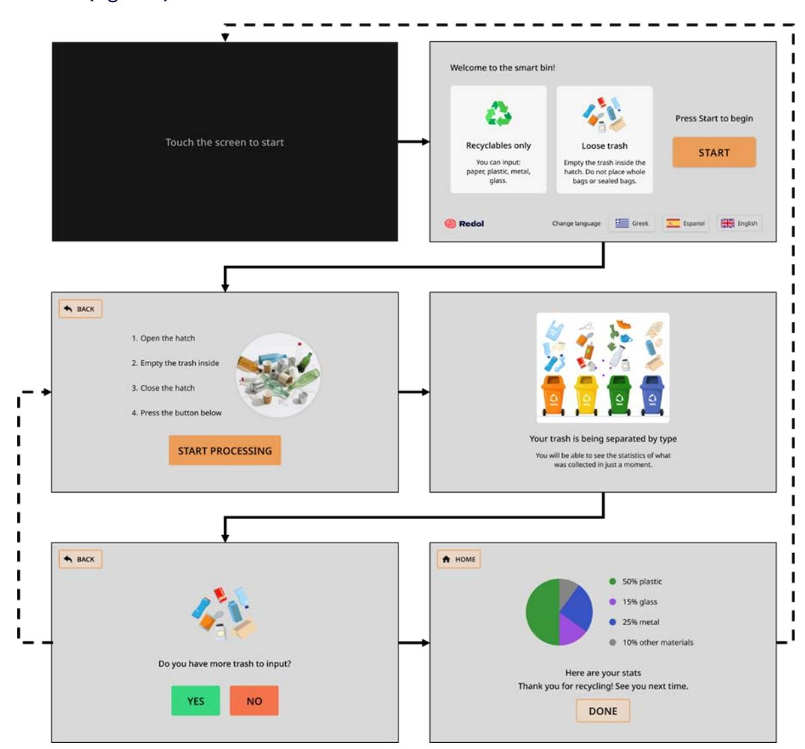

**Figure 6. Basic UI format and flow**

The waste entry point is positioned at the front of the unit and designed to accommodate both individual items and multiple recyclables. The entry hatch measures approximately 400x270 mm (LxH), with a guided deposit chute that ensures consistent waste feeding into the internal processing system [\(Figure 7\)](#page-17-1). Once the waste is deposited, it is automatically processed by the internal sorting subsystem, eliminating the need for user intervention.

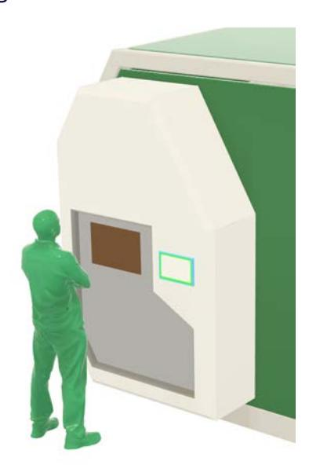

**Figure 7. Entry point and touch interface**

For maintenance and servicing, the unit includes a front double-door system. These doors provide full access to the internal compartments for collection crews and maintenance personnel, allowing for the removal and replacement of individual waste bins without disrupting the rest of the system. Additionally, the lower frame of the bin includes standard forklift access points, enabling safe and efficient transportation, relocation, or re-deployment of the unit [\(Figure 8\)](#page-17-2). This feature improves logistical flexibility and supports future scaling or repositioning in the context of dynamic urban waste management strategies.

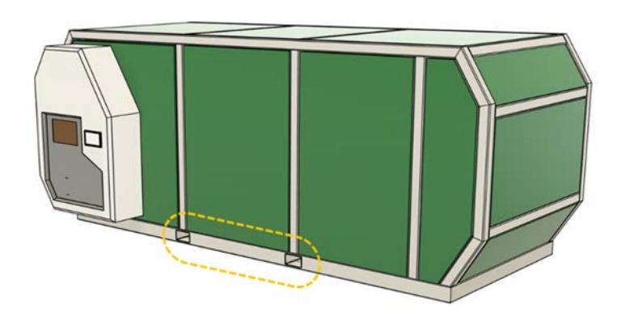

**Figure 8. Forklift access points**

### 2.3.2. System Architecture and Features

The smart bin system is structured around a modular, sensor-based architecture designed to support automated sorting, monitoring, and real-time data reporting [\(Figure 4\)](#page-14-2). Internally, the system operates through a sequential waste handling process, where deposited materials are guided through a controlled flow path that allows for visual AI-enabled inspection and classification. This process is realized by the integration of a machine vision inspection module and an array of automated sorting mechanisms. The classifier enables the system to detect key characteristics of the passing stream such as physical form, and type, while the actuation mechanisms redirect items into the appropriate collection compartments based on the classification result.

A key architectural feature of the system is its modularity. Both the sensing and sorting components have been designed in a way that allows for reconfiguration or reprogramming, depending on regional waste streams or specific sorting requirements. This ensures adaptability across different deployment scenarios without the need for hardware replacement except for the number and size of the individual deposition bins. In parallel, the system maintains an active monitoring and communication layer, which collects data from all interconnected components and internal processes, including compartment status, usage frequency, and fill levels for each sorting category. The collected information is transmitted in real time to a central platform via embedded communication modules, enabling remote diagnostics, utilization tracking, and potential integration with wider municipal waste management platforms. The internal architecture has been designed to balance operational reliability, flexibility, and serviceability, ensuring the system can function autonomously in urban environments while also supporting efficient maintenance and updates.

# **2.4. Demonstration**

## 2.4.1. Operational & Demonstration activities

Following the fabrication and setup of a working prototype which includes all internal mechanisms of the smart bin, a comprehensive set of testing and demonstration activities was conducted to assess the performance and readiness of the system in realistic operating conditions. In this context, mixed recyclable waste batches were manually introduced into the bin's waste intake area, simulating public usage scenarios. The system processed the waste autonomously, with no need for user intervention after initial deposition.

The device achieved a sorting success rate of over 85%, directing items with adequate reliability to their appropriate output containers. The embedded AI-based recognition module exhibited 98% classification accuracy across all tested waste categories, demonstrating both strong consistency and high robustness in handling a wide range of materials. Performance remained satisfactory across different batch sizes and usage conditions. Efficiency reductions were observed in scenarios involving unusually dense or irregular item inputs. These findings are being addressed through targeted refinements aimed at enhancing consistency in waste handling, particularly in high-load situations.

During the testing, a small number of operational issues were observed, such as brief actuation delays or irregular item interactions that temporarily affected processing flow. These occurrences were infrequent and did not significantly impact overall functionality. Nevertheless, corrective actions have been identified and are being implemented, including mechanical adjustments and response optimization, to further improve system stability.

Overall, the demonstration phase confirmed that the smart bin system meets its key performance objectives and is technically prepared for the next steps of the prototype's deployment. Final tuning is planned to further improve efficiency and ensure reliable operation across expected real-world conditions.

# **2.5. Future Work**

The validation and scaling-up activities for the smart bin prototype will follow a structured approach to ensure functionality, reliability, and deployment readiness. The first step involves proper validation of the fabricated prototype. All integrated functionalities of the smart bin will be tested, including sensing, classification, actuation, and communication modules. Different types of designated waste, such as pieces of paper and cardboard, disposed cans and bottles of various beverages to cover a suitable range of shapes and sizes will be used to evaluate classification accuracy, system responsiveness, and operational robustness. Both qualitative and quantitative data will be collected to assess performance and identify potential areas for improvement. Concurrently, the prototype's exterior frame and waste entry mechanism manufacturing will be finalized and integrated with the interior components. This will include mechanical assembly, wiring, and the connection of all embedded systems. Additional rounds of testing, similar to the previous step will take place to confirm the seamless operation and full functionality of the complete prototype unit.

Once validated, the prototype will be shipped to Zaragoza for field deployment. Following its deployment, the system's efficiency will be monitored by comparing the smart bin's real-time classification data against the actual sorted waste in the corresponding bins, providing critical feedback on operational accuracy. Deployment will also include a demonstration session by ICCS to the relevant municipality personnel who will be responsible for periodic waste collection. The session will ensure that the collection crews are familiar with the system's basic operation, waste retrieval process, and key points of interaction. Clear communication channels will be established for reporting issues and enabling remote troubleshooting, ensuring system uptime and efficient support. Additionally, coordination with the Municipality will take place regarding waste counting procedures to support data collection and field validation. This will enable the correlation of the smart bin's initial classification results with the actual waste streams collected on-site, providing feedback on the system's field performance.

In parallel to the aforementioned steps, two additional prototypes will be assembled and tested at ICCS premises following the same validation process. Upon completion, these units will also be shipped to Zaragoza to support broader testing and demonstration activities.

# **3. T3.2 AI-based system for the identification and classification of MMPP– [IRIS]**

# **3.1. Pre-REDOL stage**

Urban environments generate large volumes of solid waste every year, with plastics and packaging forming a significant portion of this stream. Despite numerous European initiatives to improve recycling rates and the advancements achieved, less than half of municipal waste is currently recycled, with plastic materials posing a particular challenge. One major limitation is undoubtedly the inefficiency of current monitoring technologies, especially in accurately identifying and separating different plastic types.

Before the increasing interest in recycling and the development of new and more reliable methods, such as those pursued in the REDOL project, many municipal and industrial MRFs in Europe relied on conventional monitoring systems, such as:

- Manual monitoring. Despite its flexibility and adaptability to changing waste streams, this method presents significant limitations, such as labor-intensity, inconsistency, and safety risks for workers.
- Basic automated mechanical systems, such as trommels (rotating drum screens), air separators, and magnetic separators. These methods can be effective in excluding specific types of materials from the general waste stream (e.g., metals or very thin plastics and paper), but are not adequate for more complex and realistic scenarios.
- Systems based on physical properties, such as colour, density, shape, and weight. While these methods are easy to apply, they have clear limitations in achieving accurate and reliable differentiation of materials, particularly with respect to their chemical composition.

These limitations lead to high rejection rates, reduce the quality of recycled materials, and make it difficult to meet the purity levels required for high-value or closed-loop recycling.

Hyperspectral Imaging (HSI) is an emerging technology that offers a promising alternative and significant advantages over traditional systems. By capturing the spectral fingerprint of materials across a wide range of wavelengths, HSI systems can distinguish between a broader array of plastic types, including those otherwise indistinguishable by colour or shape. HSI presents notable advantages in:

- Precise plastic identification, even for complex or degraded materials
- Pixel-level classification, enabling granular and more accurate monitoring and sorting
- Increased automation with fewer manual interventions

However, HSI has rarely been used in industrial sorting facilities due to high costs and technical complexity, lack of real-time, in-line integration, and limited access to robust AI-based classification models. Even in pilot studies, HSI systems often lacked real-world deployment and remained confined to controlled laboratory environments, facing challenges such as scalability for highthroughput conveyor-based processing, adaptability to environmental noise (e.g., lighting variability, overlapping materials), and operational robustness for continuous municipal waste streams. These limitations made it difficult to transition HSI from experimental setups to real-world applications in urban waste sorting plants.

It is in this context that the importance of REDOL becomes clear, a European project enabling the investigation and improvement of this unique technique, aiming to develop a more automated and reliable method for the rapid separation of different kinds of plastics.

With increasing policy pressure from the EU Green Deal and Circular Economy Action Plan, there is a growing need to improve both the quality and quantity of recycled plastic by developing smart, highaccuracy systems. Accurate, automated monitoring is critical to enable closed-loop recycling (e.g., food-grade PET recovery), reduce contamination and downcycling, and improve the economic viability of recycled plastics.

Prior to European projects such as REDOL, a technological gap remained in bringing advanced sensing and intelligent sorting into municipal solid waste workflows. Addressing this gap became one of the key areas of innovation in the REDOL project — particularly in the plastics value chain, where partners like IRIS are focused on developing and deploying real-time HSI systems for plastic monitoring and sorting.

# **3.2. Objectives**

Within the REDOL project, IRIS aims to address a core challenge in the recycling of solid urban waste (SUW): the accurate and automated identification of plastic materials using advanced sensor-based technology. The objective is to develop, optimize, and validate a real-time Hyperspectral Imaging (HSI) system capable of identifying different plastic types on a fast-moving conveyor line, with high accuracy and minimal need for manual intervention.

This objective aligns with REDOL's overall ambition to improve the efficiency and performance of urban waste management systems and supports the transition of cities toward zero-residue circular models. In particular, IRIS contributes to the plastics value chain, one of the five prioritized streams in the project, by developing a technology that enhances monitoring and sorting precision, a critical factor in increasing the recyclability and value of plastic waste.

IRIS's activities are focused under Task 3.2: "AI-based system for the identification and classification of MMPP" (M9–M32), in where IRIS is the task leader, in collaboration with BOFA and HUSA. The task focuses on developing an inline monitoring system based on HSI, capable of distinguishing different types of mono- and Multi-Material Plastic Packaging (MMPP) waste, using advanced AI-driven hybrid classification models. To ensure that the objectives were practically and effectively addressed, the following key activities were carried out under Task 3.2:

1. Collection of real-world samples: HUSA provided IRIS with representative samples of postconsumer plastic packaging directly sourced from real municipal waste streams. These samples — containing typical contamination from food residues — were pre-classified into three relevant categories:

- Group 1: MMPP PET/PET-PP trays (typically, polyethylene terephthalate-based PET trays)
- Group 2: MMPP PA films (typically, polyethylene/polyamide PE/PA films)
- Group 3: MMPP metalized films (such as snack wrappers, coffee bags)

2. System setup and data acquisition: A dedicated HSI prototype was set up at IRIS facilities. The system was optimized for speed and resolution to simulate real conveyor-based sorting conditions. This enabled high-quality image and spectral data collection under dynamic, nearindustrial settings.

3. Preliminary identification and material confirmation: The composition of the samples was interpreted and confirmed applying existing pre-existent spectral libraries developed in IRIS and expert analysis of material-specific spectral features using:

- The Visum Palm NIR handheld analyzer, developed by IRIS, to rapidly screen material properties
- The same HSI system

4. Model building dataset preparation: The samples were split into calibration and validation subsets, ensuring a balanced representation of material types. Images and spectral data were collected to build a dedicated model tailored to REDOL needs, specifically, to distinguish among the three waste streams prioritized by HUSA's sorting lines.

5. Model development: Using chemometric tools and multivariate data analysis techniques, IRIS developed a classification model capable of identifying the predefined packaging categories based on their hyperspectral signatures.

6. Model validation: The model was tested using the reserved validation dataset. This involved running new (unseen) samples on the IRIS prototype. During this phase, initial inaccuracies were addressed, notably in the classification of metallized plastics, where lower signal quality required additional data refinement. To further improve accuracy and reduce misclassification, a "paper" class was added, accounting for common contaminants such as supermarket labels and stickers adhered to plastic packaging [\(Figure 9\)](#page-23-0).

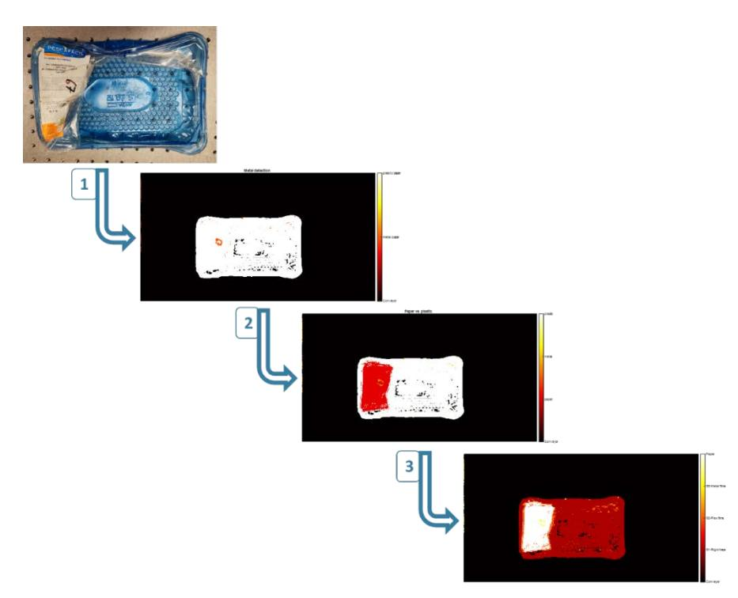

**Figure 9. Example of the improvement process for paper misclassification.**

Through this step-by-step approach, IRIS achieved the development of a custom-trained, real-time classification model that addresses the operational needs of waste monitoring and sorting environments. The process flow is represented in [Figure 10.](#page-23-1) This work lays the foundation for the deployment and demonstration of a TRL7-ready solution at HUSA facilities, ensuring the system's robustness and industrial relevance.

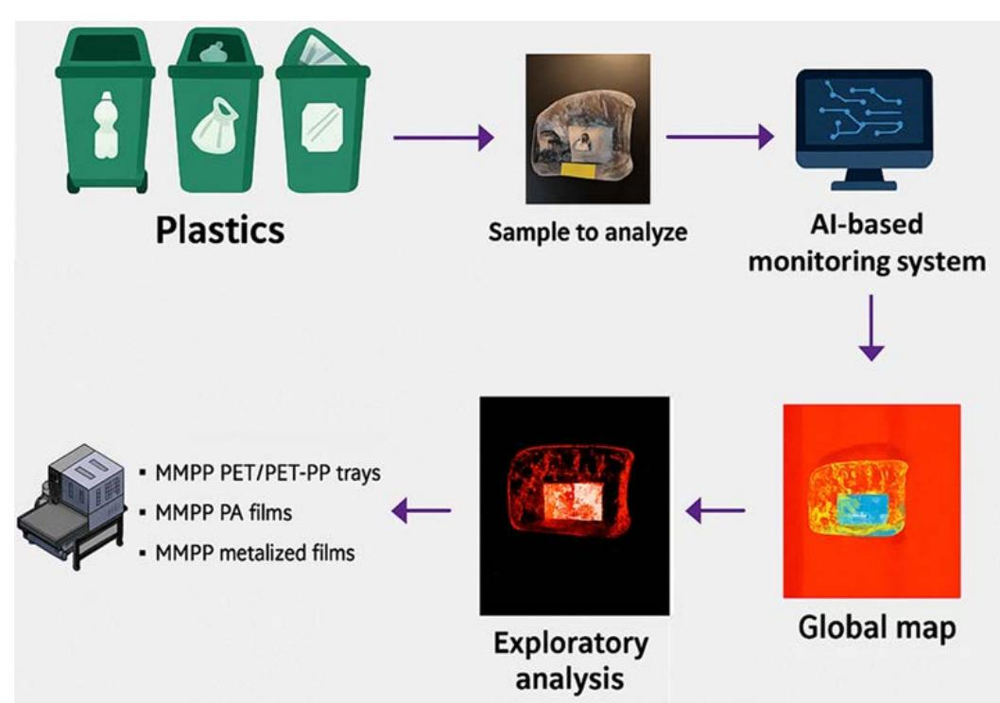

**Figure 10. General process flow of the development**

To further support full-scale validation and real-world implementation, the technology developed under T3.2 will be integrated and tested in Task 6.1 "Redesign of new circular packaging value chains" (M25–M48) within WP6. In this task, IRIS, together with other partners including will contribute to the deployment of technologies developed in WP3 and WP4. Specifically, the HSI-based monitoring model will be installed on HUSA's recycling line to validate its performance under operational conditions and demonstrate its role in enabling efficient valorisation of multilayer plastic packaging. This phase will also support the wider REDOL goal of reaching System Readiness Level 7 (SRL7), ensuring full integration with economic, organizational, and symbiotic frameworks across the value chain.

By combining sensor innovation, real-world data, and intelligent modelling, and following through to industrial demonstration, IRIS's work under REDOL directly supports the project's circularity goals for packaging plastics.

# **3.3. Advances within the REDOL**

### 3.3.1. System Description

As part of REDOL's effort to enhance the monitoring and sorting of municipal plastic packaging within the solid urban waste stream, IRIS has developed a tailored prototype based on HSI technology. The system aims to perform real-time, inline material recognition, enabling the automated separation of complex plastic packaging types with higher accuracy and throughput compared to traditional monitoring technologies.

The prototype is built around a conveyor-based configuration that simulates conditions typically found in industrial waste sorting environments. It integrates an HSI camera operating in the shortwave infrared (SWIR) range, allowing for the acquisition of detailed spectral data from the surface of materials. This pixel-level data contains the unique spectral "fingerprint" of different plastics, making it possible to distinguish between a wide range of packaging types, even in multi-material, multilayered, or food-contaminated forms, which are particularly challenging for conventional optical or near-infrared sensors.

The system is designed to classify the plastic packaging into three specific categories (also shown in [Figure 11\)](#page-25-1):

- Group 1: MMPP PET/PET-PP trays (typically polyethylene terephthalate-based PET trays)
- Group 2: MMPP PA films (typically polyethylene/polyamide PE/PA films, such as frost bags)
- Group 3: MMPP metalized films (such as snack wrappers or aluminum-coated coffee bags)

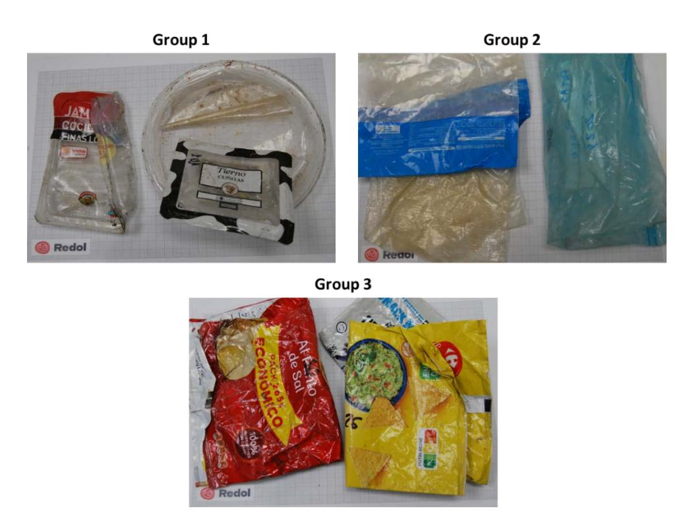

**Figure 11. Representative example of the three groups in which the packaging samples are sorted**

These categories were directly defined in collaboration with the industrial partner HUSA, who is responsible for waste sorting and who will host the final demonstration of the prototype in their facilities during Task 6.1 of WP6. The separation into these three groups reflects HUSA's operational needs, and monitoring and sorting strategy for plastic packaging, and was therefore chosen to ensure full alignment between the AI model, the sensing system, and the downstream recycling processes. The ultimate goal is to facilitate a more effective and circular treatment of these specific materials in the value chain redesigned under REDOL.

The prototype's design and functionality were developed through iterative testing with real-world samples supplied by HUSA, including food-contaminated and label-bearing waste, in order to replicate realistic challenges. These materials were analyzed and validated using both IRIS's proprietary VISUM NIR handheld analyzer and the HSI system itself, prior to being used for model development and validation.

This approach ensures the prototype is both technically robust and industrial-relevance-oriented, laying a strong foundation for upcoming field testing and validation at TRL7 within REDOL.

#### 3.3.2. System Architecture and Features

The system developed by IRIS combines advanced optical sensing with robust AI-based data processing in an industrially viable configuration. The solution is engineered for inline monitoring and sorting applications, capable of operating in conveyor environments with heterogeneous, fastmoving waste streams [\(Figure 12\)](#page-26-0).

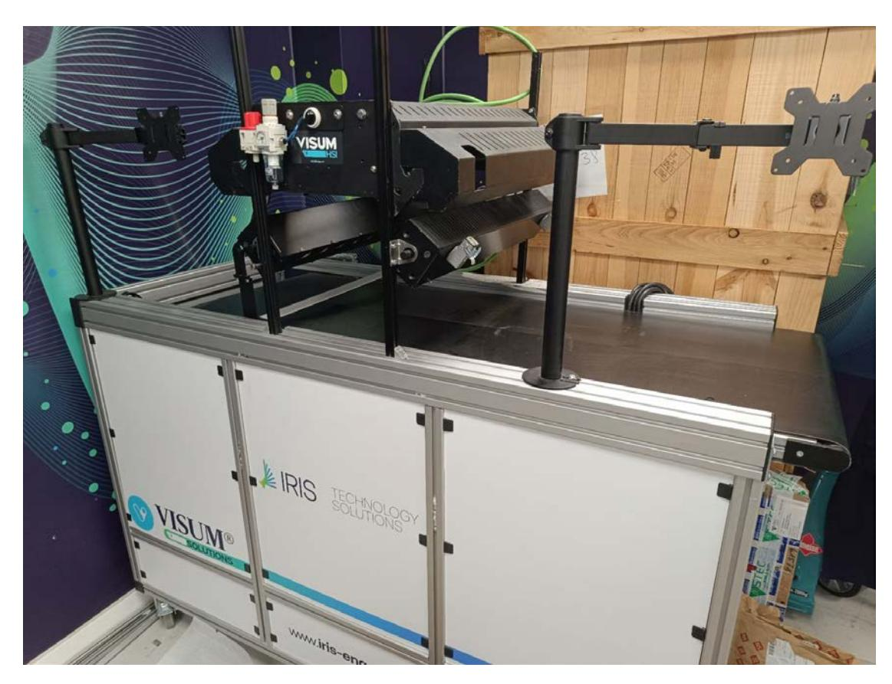

**Figure 12. Monitoring system developed by IRIS**

#### General Setup and Hardware

The monitoring system shown i[n Figure 12](#page-26-0) has been used to carry out validations at IRIS. The system is composed of the following key components:

- HSI camera unit (SWIR range): Captures hyperspectral images in the short-wave infrared spectrum, enabling material discrimination based on chemical composition.
- Conveyor belt system: Custom-built for this setup, with adjustable speed to simulate typical industrial sorting lines while maintaining spectral image quality.
- Illumination system: Equipped with halogen lighting units arranged to ensure uniform lighting across the field of view, minimizing shadows and spectral noise.
- Positioning structure: Metallic frame holding the HSI camera above the conveyor at a calibrated height to optimize spatial and spectral resolution.
- Industrial PC and data acquisition system: Collects hyperspectral data in real-time, processes it using custom-developed classification models, and provides outputs in userfriendly format.
- User interface: Touchscreen interface running a bespoke control software designed by IRIS, allowing the operator to monitor scanning status, select classification models, and export results.

- Electrical cabinet: Protected enclosure that houses and organizes electrical and electronic control, distribution, and protection components—such as switches, relays, PLCs, and power supplies—ensuring the safety and proper operation of the system.

The system is modular and portable, designed for easy relocation and future integration with robotic or pneumatic sorting mechanisms.

#### Software and AI Capabilities

The real-time classification model used in the system was developed using:

- Spectral libraries and reference samples from both internal databases and field-acquired
- Chemometric tools for pre-processing, dimensionality reduction, and feature extraction
- Supervised machine learning algorithms, tailored to identify the specific categories of plastics provided by HUSA
- Calibration and validation datasets, derived from real municipal plastic packaging samples, used to train and test the classification engine

The model runs on a custom software environment capable of:

- Real-time classification of pixels and material areas
- Statistical analysis and visualization of classification confidence
- Export of material maps for integration with downstream sorting hardware (e.g. ejector systems)

#### Integration Potential

While the current system is operated in a standalone configuration at IRIS's lab, it has been conceived to be integrated in the near future into HUSA's real industrial sorting line as part of WP6 activities (Task 6.1). Although this has not yet been decided, as the approach for validation is still open, it is currently being evaluated whether the monitoring prototype might be integrated directly into one of HUSA's conveyor lines.

The prototype will be validated under operational conditions, contributing to the redesign of circular plastic packaging value chains and helping elevate the process to TRL7.

# **3.4. Demonstration**

## 3.4.1. Operational activities

The demonstration phase focuses on validating the monitoring system under real operational conditions within HUSA's industrial waste sorting facilities, performing live monitoring of mixed plastic packaging waste streams.

#### Operational activities involve:

- Calibration and fine-tuning of the HSI system in situ to accommodate environmental variables such as lighting changes and conveyor speed variations.
- Continuous acquisition and processing of hyperspectral data from fast-moving waste materials to test throughput capabilities.
- Real-time monitoring and adjustment of classification thresholds to optimize accuracy and minimize false positives/negatives.
- Coordination with HUSA's personnel to ensure smooth integration and operator training on the user interface and system maintenance.

Here following is reported an image [\(Figure 13\)](#page-28-1) that summarize some samples of the three selected groups and the final images, once applied the model that can detect the chemical nature of each object.

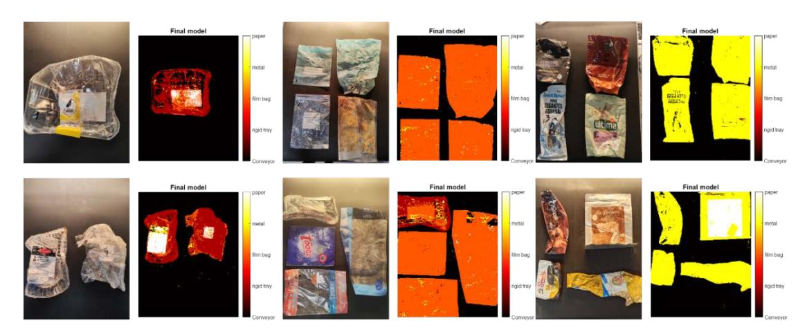

**Figure 13. Classification results. In the right column are reported the classification for each of the reported samples**

### 3.4.2. Demonstration **activities**

The demonstration will include comprehensive testing scenarios to evaluate the system's robustness and classification performance:

- Monitoring trials using diverse real-world municipal plastic packaging samples with varying contamination levels, including food residues and labelling
- Performance benchmarking against existing monitoring technologies at HUSA to quantify improvements in sorting accuracy and speed
- Data collection for post-demonstration analysis, including classification confidence metrics, error rates, and throughput statistics

- Assessment of the system's compatibility with downstream sorting mechanisms such as pneumatic ejectors for physical material separation.Feedback sessions with stakeholders to identify areas for system refinement prior to large-scale deployment

# **3.5. Future Work**

Following the demonstration and validation phase, future work will focus on:

- Scaling the system for full industrial deployment, addressing challenges related to high throughput, long-term operational stability, and integration into complex waste management workflows
- Enhancing the AI models by incorporating additional material classes, expanding spectral libraries, and improving classification algorithms to handle new packaging formats and contamination types
- Exploring integration with robotic monitoring and sorting systems and advanced mechanical ejectors to achieve fully automated sorting lines with minimal human intervention
- Conducting lifecycle and economic analyses to quantify the environmental and financial benefits of the HSI monitoring system within circular economy frameworks
- Extending the technology application beyond plastics to include other waste streams such as paper, metals, and organic materials for a holistic waste monitoring solution

# **4. T3.3 Integrated sorting system for CDW with advanced robotic arms– [ICCS]**

# **4.1. Pre-REDOL stage**

The establishment of a circular chain for valorisation of Construction and Demolition Waste (CDW) still poses a great challenge for any country and region. Representing over on third of all waste generated in the EU, CDW is a highly heterogeneous stream, containing materials of considerable value. Key barriers to effective management of CDW include the lack of regulation and standardization, fragmented supply chains and the absence of separation at source, contributing to this high material heterogeneity.

Waste management facilities aim to address this problem by establishing numerous processing stages for segregation of waste based on their material and physical properties. After reception and initial inspection of the waste material, a series of separation processes is applied based on the needs of the waste manager and the composition of the incoming stream.

The process begins with pre-sorting, where large or hazardous items, e.g. asbestos-containing materials, are removed before automated processing. Bulky materials like concrete, bricks, and tiles are crushed and shredded into smaller, manageable sizes. Mechanical separation processes are commonly employed to separate materials based on their properties, like size, density, and magnetism; for example, magnetic separators are used to extract metals, and screening systems classify materials by size. Optical sorting technologies identify materials employing a variety of standard and hyperspectral optical sensors. Despite the hazardous environment, human operators still perform manual sorting within the CDW management facilities.

Once separated into more homogeneous streams, the waste is directed toward the most suitable valorisation pathway, depending on its quality and purity. Common approaches for waste managers include recycling within facilities, selling to other recycling partners, backfilling, energy recovery, incineration and landfilling.

In the region of Aragon, the CDW value chain follows a similar pattern. Waste from construction and demolition sites are transported to waste management facilities, where it is weighted and processed. For Aragon, although variations are expected from delivery to delivery, more than 75% of the waste (by weight) is composed of concrete, brick and other inert materials. Casale Gestión De Residuos S.l. is one of the CDW managers, located in Zaragoza, Aragon. The manager has wellestablished processes to use this heavy fraction and recycle it near to 100%. Furthermore, a copyright-protected product for construction is produced by the company from the recycling process of this fraction.

Lighter fractions present higher variability in material composition. Metal waste objects are present and can be easily separated from the stream with mechanical separators. Wood waste, though typically a small component, can also be separated, but it is often contaminated. Plastics and cardboard, on the other hand, are difficult to extract with existing processes due to their low weight, small size and other physical properties.

Although operator-guided machinery, e.g. excavators, wheel loaders, and automated separation equipment, e.g. trommels, jaw crushers, are widely utilized for processing CDW, manual sorting via moving conveyor belts remains common. Workers need to perform delicate, repetitive tasks in a hazardous and unpleasant environment to separate material that cannot otherwise be sorted by most automated systems. Replacing them with an automated task would be a great improvement for both efficiency and working conditions.

# **4.2. Objectives**

One of the pillars of REDOL project for redesigning value chains in Aragon is the development and deployment of advanced automated sorting processes that can accurately identify and separate materials so that they can be used across the different value chains. This entails the integration of advanced technologies, such as vision-based systems and robotic arms, engineered to perform with high precision and efficiency. These technologies are essential for handling the complexity and variability of waste stream, which often include mixed and contaminated materials that are difficult to sort manually or with traditional equipment.

This objective is closely aligned with the REDOL project's mission to advance the state of the art in waste sorting and valorisation by reducing 80% (in weight or volume) solid waste through reuse and transformation of waste. Through its emphasis on cutting-edge technologies and environmentally responsible methods, the project reinforces its dedication to circular economy principles. By focusing on the valorisation of 5 distinct types of SUW streams, REDOL plays a key role in minimizing environmental impact, preserving natural resources, and fostering more sustainable industrial practices.

An automated sorting solution is tailored to the needs of the CDW circular value chain already established in the region of Aragon, ensuring seamless integration with existing practices and addressing specific regional material flows, stakeholders, and regulatory frameworks. The system can classify a wide range of materials by integrating state-of-the-art sensors able to perceive across a broad portion of the electromagnetic spectrum. Furthermore, it leverages advanced ML/DL algorithms for precise segmentation and classification of all materials present in the CDW stream. It employs a commercially available robotic system designed specifically for pick-and-place tasks, enabling efficient and accurate sorting of waste objects into predefined distinct categories. The robot is programmed in real-time to optimize output for maximum valorisation.

Existing recycling processes are able to valorise cement, concrete and similar inert materials with near-perfect success using well-established separation methods. The technology for sorting this fraction is mature and offers high and throughput and efficiency. In addition, the materials composing this fraction can be recycled together into aggregates, requiring not so fine separation. Therefore, while this heavy fraction remains crucial for the overall valorization of CDW streams, further improvement in its sorting processes can offer limited gains.

Lighter fractions, on the other hand, pose significant challenges due to the higher material, shape and size variability – they may contain wood, different types of plastics, cardboard and other materials in smaller percentages. As a result, state-of-the-art valorisation methods are unable to recycle them as a single fraction. Separating lighter fractions with advanced sensing, inference and robot manipulation techniques can offer greater potential for improvement of valorisation and focusing innovation efforts on these complex fractions could lead to substantial increases in overall material recovery and valorization efficiency.

Not all materials within the lighter fractions of CDW hold the same environmental and economic importance. For example, sorting wood and cardboard waste is often considered a lower priority due to the fact that normally they can be easily separate and already have valorisation chain with established recycling companies that recycle them. Therefore, decision-making on which materials to sort from the CDW stream needs to take into consideration both the available pathways in the value chain and their economic viability.

Plastic materials, on the other hand, are ideal candidates for sorting within the CDW value chain. They are present in substantial quantities inside the stream, accounting for nearly 30% (by volume) of the lighter fractions based on measurements of the waste manager. Due to their physical properties and their irregular sizes and shapes, mechanical separation processes are ineffective for sorting plastics from other fractions. Furthermore, sorted plastics have a significantly higher market value per ton than inert materials like concrete or brick, while incentives and demand in recycled markets are constantly growing. Finally, the environmental consequences of failing to valorize plastics are well-known: plastics do not degrade naturally, can fragment into microplastics, and may release toxic substances when improperly incinerated.

Valorisation of the CDW stream through sorting plastics will be the primary objective of the automated system developed for REDOL. The system will focus on high efficiency and throughput, aiming to create output streams with the highest purity possible to be later recycled. However, mixed plastic streams have multiple times lower market value compared to pure plastic streams, since they yield lower-quality recycled products. Thus, sorting plastics into one stream is not sufficient, and further separation to different types of plastics is required for both economic and environmental terms.

Polyvinyl chloride (PVC) is abundant in the CDW stream, since it is used for pipes, flooring, cables, window profiles, and roofing. However, the high content of additives like chloride renders recycling processes of PVC-bearing mixed plastics impossible due to the massive damage they cause to processing machines [4]. As a result, these mixed plastic streams commonly end up in landfills. To address this, the sorting system is required to create plastic streams with no PVC waste as its output, which should be instead a separate output stream.

Polypropylene (PP) is a widely produced and used plastic material due to its low density and physical chemical resistance. In the construction section, it is used for reinforcement of concrete, flooring, roofing, earthbags, and various packaging. Since PP is highly recyclable, recycled PP has a high market value, especially when it is not contaminated with other plastics. Therefore, sorting PP with high purity into a dedicated output stream has a significant economic benefit for the REDOL automated system.

Based on the previous requirements, the robotic-based sorting system should be able to sort the incoming material into 3 different output streams:

- 1. High purity PVC stream
- 2. High purity PP stream
- 3. Mixed plastic waste

The rest of the material that is not classified by the sensing and inference system to any of these three categories is not processed by the robotic system and will result in a separate stream.

# **4.3. Advances within the REDOL**

The CDW sorting system is designed to automate the classification and separation of heterogeneous waste materials generated from construction, renovation, and demolition activities. The system comprises several components, including:

- A material screening system for removing the lighter fraction that cannot be processed by the robot
- A conveyor system for transporting incoming waste streams
- Sensing and perception modules for detecting, classifying, and localizing materials
- A robotic manipulator equipped with a finger gripper for automated pick-and-place operations
- A control and decision-making framework that coordinates perception, planning, and execution
- User interfaces and monitoring tools for system supervision and performance analysis

The design of the system can be found in Figure 1. This section describes the architecture, functionality, and interactions among these components, illustrating how they collectively contribute to the effective sorting of CDW materials within the scope of REDOL.

#### 4.3.1. System Description

The CDW sorting system is fully automated, operating without the need for human intervention or constant supervision. From material detection and classification to robotic sorting, every step in the process is autonomously managed by the system, minimizing labor costs and reducing operator exposure to hazardous waste environments, especially dust and VOCs. The system operates on a continuous basis and needs minimum maintenance due to its robust mechanical design and use of reliable industrial components.

The entire sorting system is enclosed in a standardized 40-foot ISO container for easier transportation, installation and integration into existing waste processing facilities [\(Figure 14\)](#page-34-0). The containerized design ensures plug-and-play compatibility, reducing commissioning time and associated costs. In addition to logistical benefits, the enclosure provides robust protection for sensitive equipment—including cameras, sensors, and electronics—against harsh environmental conditions such as dust, moisture, and temperature fluctuations commonly encountered in CDW processing environments. The climate-controlled interior helps ensure stable operating conditions, enhancing the reliability and lifespan of high-precision components.

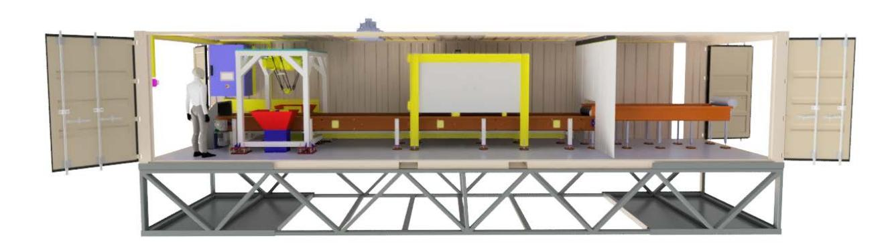

**Figure 14. Detailed 3D design of the sorting system**

The classification, segmentation and localization tasks are the first steps of the sorting process, and the performance of the robot actuation and the overall sorting system depends on their accuracy. Due to the requirements to identify and classify distinct types of plastic, multi-modal perception, i.e. perception based on different modalities, is employed. More precisely, RGBD and hyperspectral sensors are utilized for sensing waste with high precision.

Artificial intelligence (AI) and Deep Learning (DL) algorithms are at the core of the perception processes. Traditional machine vision techniques are unable to handle the high variability of the CDW stream and can mostly identify objects with specific known features. As a result, supervised DL methods are the only viable alternative, given a sufficient amount of sensor data. The perception system adapts to changes in the material stream over time. As new material types are introduced, they can be retrained with additional annotated samples, allowing the system to continuously improve its classification accuracy and maintain high sorting performance in dynamic environments.

A high-speed industrial robot is responsible for the actuation component of the system, as it performs pick-and-place cycles with maximum precision and repeatability. Its mechanical design is optimized for pick-and-place tasks from a conveyor, and its cycle time is minimized based on the requirements of the application. The robot performs real-time tracking of the objects in motion on the conveyor, accounting for the conveyor speed.

Decision-making performed by the robot relies on an advanced scheduler that selects the optimal object to grasp taking into consideration time constraints, robot workspace, robot velocities and material type. The robot does not pick objects that were not classified into the 3 categories of interest: PVC, PP, and mixed plastics (without PP and PVC). Furthermore, based on the preference among these streams, a picking priority is given when multiple objects of different materials are considered.

A two-finger gripper is selected as the end-effector for this application due to the existence of dust and dirt on the objects, rendering the option of a suction gripper inappropriate. Poor performance and fast degradation of commercially available finger grippers in such harsh conditions led to the development of multiple custom ones. Defining where the finger gripper should come in contact with an object is a challenging problem for any robotic sorting system due to the high variability in shapes, sizes and materials. Grasp pose prediction for this system was based on state-of-the-art ML-based methods that take advantage of the 3D measurements of the objects to come up with a valid and successful grasp.

To ensure human safety, the robotic system includes industry-compatible safety features. If a human worker or supervisor attempts to enter the robot's operational zone, the system will automatically pause its operations until the area is clear, thus adhering to strict safety protocols and industrial robotics standards.

The system is designed with advanced remote monitoring and diagnostics capabilities, ensuring transparency and reliability during operation. Key health indicators, performance metrics, and realtime video feeds are continuously collected and made accessible through a secure remote interface. This enables operators and supervisors to track system status, identify potential issues, and verify sorting performance without being physically present on-site.

Integration with the Manufacturing Execution System (MES) allows performance data—such as throughput, material classification rates, and grasp success rates—to be transmitted and logged continuously. These metrics support both real-time operational decisions and long-term performance analysis, contributing to ongoing process optimization.

### 4.3.2. System Architecture and Features

The efficiency of the sorting system is directly determined by the collaboration among the different components comprising the system. The sensing system should perform segmentation and classification tasks quickly and with high precision, the conveyor and the PLC should operate reliably and have the high-level control of the system, and the robotic manipulator should perform pick-andplace operations at high rates [\(Figure 15\)](#page-36-0).

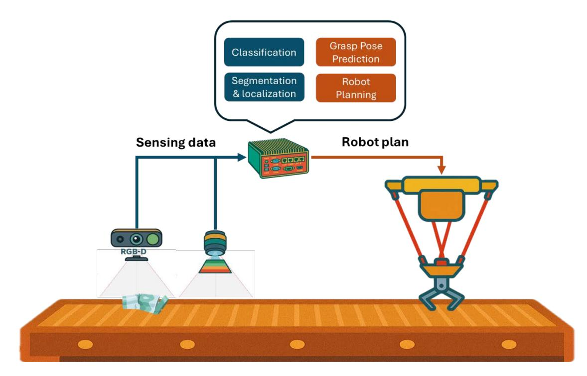

**Figure 15. Main components of the sorting system**

Starting from the perception module, the RGBD camera has been evaluated during the early stages of system development for its classification accuracy. As expected, however, its sensory output is not rich enough for the application, particularly in classifying the different types of plastic materials. The hyperspectral camera, on the other hand, captures a broader range, covering the nearinfrared (NIR) spectrum from 900 nm to 1700 nm with a resolution of 224 spectral bands. Leveraging multi-modal sensing, the system integrates both RGBD and hyperspectral data to enhance material classification capabilities. While the RGBD camera provides spatial and depth information useful for object localization and geometric reasoning, the hyperspectral camera enables fine-grained spectral analysis required for distinguishing between visually similar plastic types. By fusing these data streams, the perception module achieves a more robust understanding of both the shape and composition of materials. This combination is particularly effective in cases where spectral signatures are critical for classification, such as differentiating between PE, PP, PET.

Two convolutional neural networks have been trained to perform segmentation, localization and classification of the waste items. The first neural network, only responsible for segmentation, has been already pre-trained with an extensive external dataset. However, an RGB dataset specific to the CDW stream is required to further improve the model's accuracy and performance and avoid background confusion. The mask generated by the model is transformed into spatial data, exploiting the depth information and it is passed to the second CNN. This second network uses the spatial and the spectral data from the hyperspectral camera to perform solely classification. Due to the high volume of spectral data captured per unit time, special care was paid to their data acquisition and pre-processing to minimize the inference latency.

To maximize throughput the conveyor belt is expected to be densely covered with waste items. Thus, the perception tasks need to analyze multiple items within each frame in real-time. The hyperspectral camera further increases the complexity of this process, as it generates a large volume of data due to its 224 spectral bands, high image rate, and resolution. As a result, real-time data processing becomes particularly challenging for this use-case. Special consideration was therefore given to managing this process efficiently to prevent GPU memory exhaustion.

The requirement for fast pick-and-place cycles is the primary selection criterion for the robotic manipulator. Given the payload and reach requirements, delta robots are the optimal choice for this application. Their design, which concentrates most of the mass near the base, allows the arms to execute very rapid movements, while covering a large workspace. This speed comes at the cost of a very high weight-to-payload ratio, and as result the delta robots are able to move usually up to 8 kilograms. However, for this application this payload capacity is more than enough considering that most objects weigh less than 1 kilogram, and the gripper is made of lightweight materials.

The robotic manipulator runs with a maximum linear velocity to be able to pick-and-place as many objects as possible. The robot can reach linear velocities up to 5 m/sec. If the conveyor speed is high and the object distribution on its surface is dense, then the robot naturally will miss some objects that will end up in the unprocessed stream. If the conveyor speed is lower and the object distribution is sparser, then some idle time for the robot is expected, resulting in reduced throughput. Thus, this tradeoff between throughput and missed objects due to timing is handled by finding the optimal conveyor speed.

Since not all materials are of interest, there is no requirement to sort them all. If an object is not classified as one of the three classes of interest (PP, PVC, and plastics without PP and PVC), then it will be neglected by the robot planner and will not be picked. Thus, the efficiency of the process largely depends also on the percentage of valuable material. For less valuable objects in the unit of time, a higher conveyor velocity can be set.

The vast majority of delta robots are underactuated, with most of them having only 4 degrees of freedom (DoF). For this application, a robot with 4 DoF was also chosen as it can perform translation across the 3 axes and rotation across the axes perpendicular to the conveyor plane. Although waste objects have irregular geometries and inertias, it is uncommon to require precise control of all rotations. The design and deployment of robust and compliant grippers is enough to compensate for the inability to perform angular adjustments across the two rotation axes. This is also assisted by the existence of a regular conveyor belt, where all the items are moved at a constant speed.

The workspace of the robotic manipulator is 1350 millimeters, large enough to cover the full width of the conveyor, while also being able to place the objects in predefined positions away from the conveyor based on their classification. The repeatability of the robot arm is 0.1 millimeters, which is more than enough for this application considering the size of the objects that need to be sorted.

The existence of multiple processing components loosely dependent on one another dictates the design of the system as a distributed network, where some nodes are responsible for controlling the hardware and other nodes are responsible for processing the data and exchanging information with other devices. ROS2 exemplifies a distributed software network, where nodes/components operate independently and communicate via a decentralized middleware, named Data Distribution Service (DDS). Although very popular among robotics applications, ROS2 is not used in this case solely for robot planning or communicating with the robot, but enables also the modular and decentralized communication between non-robot related computational processes.

Designing and fabricating custom grippers instead of acquiring commercially available ones offered multiple advantages for the development, enabling the gripper to be tailored to the application's requirements. For example, the gripper geometry was specifically adapted to the CDW use case and the control interface was matched to the available communication protocols of the robot [\(Figure](#page-39-0)  [16,](#page-39-0) right).

The fabrication of the grippers has relied on Additive Manufacturing (AM) processes, enabling to fast prototype different finger gripper designs. Several geometries and materials were evaluated with samples from the actual waste streams received by the waste manager. Furthermore, the use of AM provided fast replacement in several cases, when a failure occurred and a component was broken. Although different materials were tested and evaluated, ABS (Acrylonitrile butadiene styrene) was finally chosen due to its superior mechanical performance and low density.

For this moving conveyor application, the localization precision of the object on the conveyor belt is crucial for the robot in order to be able to grasp it efficiently. However, this precision does not only depend on the camera's specification, but also on the precision of the encoder. Thus, a high precision encoder was used to track the translation of the conveyor belt at any different point [\(Figure 16,](#page-39-0) left). The precision of the encoder can be transformed into a precision of the conveyor belt translation, which was found to be equal to 23 micrometers, an accuracy greatly exceeding the application needs. This encoder is different from the encoder used for controlling the speed of the conveyor by the inverter and the PLC and its output is sent directly to the robot controller to achieve as fast communication as possible.

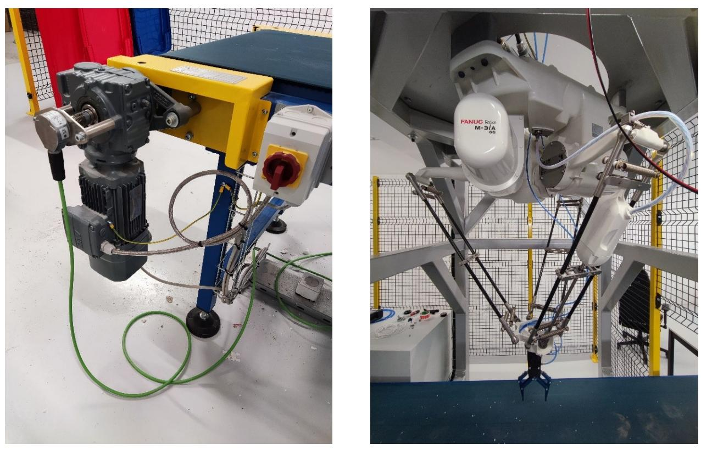

**Figure 16. Conveyor motor with a high-precision encoder (left) and delta robot with a custom design pneumatic gripper made with additive manufacturing processes (right)**

The high-level control of the robot and the conveyor is assigned to the PLC, which is responsible for ensuring the safe operation of all the components. In case of an emergency e.g. an emergency button was pressed, the PLC sends explicit commands to the robot and the conveyor to stop their operation and mitigate the risk of an accident. Although multiple communication protocols are used by different components by the system. The communication between robot and PLC relies solely on MODBUS, a well-known reliable industrial protocol. MODBUS is simple and lightweight, which makes it easy to implement and debug, as well as deterministic and robust, essential for real-time control and monitoring.

The conveyor belt is set in motion by a regular AC motor of 0.75 kW, which in turn is controlled by a variable frequency drive (VFD). The VFD performs closed-loop PID control after getting a setpoint signal by the PLC. The PID controller gains were tuned given the desired reference conveyor speed in order to minimize accelerations, keep constant the conveyor velocity for large time periods, and minimize wear of the motor. For safety reasons, the operation of the conveyor and the motor is handled only through the PLC and the HMI designed and no other components have control on the system.

Accurate object localization and grasping by the robot depends on precise coordination between the robot and sensors. Thus, determining the spatial transformation precisely between the camera coordinate frame and the robot's base frame ensures that the detected object positions in the camera frame can be reliably transformed into the robot's coordinate system for precise pick-andplace actions. Although the design can provide a rough estimate of this transformation, it can never be accurate enough. Therefore, a process, commonly referred as hand-eye calibration, is applied for precision and involves measuring artifacts of known dimensions with the camera, as well as guiding the robot to reach the artifact with its end-effector. However, since the robot's workspace and the camera's field of view do not overlap, the conventional hand-eye calibration approach cannot be applied, and a custom calibration process must be developed to meet the specific requirements of this task.

Each component in the sorting pipeline introduces a latency that accumulates before the robot is commanded to perform the pick-and-place task. For example, the latency of robot planning is added to the computer vision inference, which in turn adds to the sensing data acquisition latency. Due to the existence of a single sensor unit close to the beginning of the conveyor belt, waste items cannot be tracked continuously as they proceed. As a result, this results in significant uncertainty due to the total accumulated latency. To maximize performance and prevent missing waste items, all latencies were minimized or constrained to fixed, known values to allow reliable temporal compensation.

# **4.4. Demonstration**

### 4.4.1. Operational activities

When items are placed on the conveyor belt of the system, they are transferred with a constant, continuous speed through its entire length. These items first pass through the field of view of the RGBD camera and they are processed. The RGBD camera then segments and derives some geometric information of the objects that passes to the hyperspectral camera. In addition, the grasp pose prediction uses the 4 four channels of the RGBD camera to find an optimal grasping point to pick the object. After the RGBD camera, the object passes also below the hyperspectral camera. The camera is able to capture a wide spectrum between 900 – 1700 nm with 224 bands. The highperformance ML model used for classification processes the spectral data and infers the material of the object based on previous training dataset.

As the waste items leave the field of view of both sensors, the inferred information is given to the robot planner component of the system. It is responsible to decide which item should be grasp next by the robot given the current state of the objects, the corresponding grasp pose and the state of the robot. The planner based on multiple criteria maximizing valorization notifies the robot about the item that needs to be next. It sends the position of the item as identified by the camera, as well as the class i.e., where the item should be placed.

The robot upon receiving the data for the object that needs to be picked performs its motion planning in real-time. It uses the encoder signal that constantly receives to synchronize the conveyor and the robot motion. As soon as the gripper reaches the object, its fingers are closed using pneumatic actuation. The object is then lifted and the robot travels to the place position according to the class of the item and opens its fingers to release the item. Finally, the planner is notified to repeat the planning process for the next available object.

There are 3 streams created as output streams by the sorting process: 1) stream with PP, 2) stream with PVC, and 3) stream with plastics other than PP and PVC. The rest of the materials classified into different classes is left unprocessed and are heading to the end of the conveyor.

#### 4.4.2. Demonstration activities

In this section, the final demonstration of the system is described. For its needs, a large number of items sampled from the shredded waste CASALE sent to ICCS were characterized offline using additional sensors e.g. Raman spectrometer. Of all these samples, more than 100 items made of plastic materials i.e. PVC, PP, PET, PE, PS and EPS were used as the materials than need to be sorted (positive sorting). The rest of the materials will be classified as other classes by our inference system and not be sorted by our robot. I[n Figure 17,](#page-42-1) some of the shredded plastic samples that will be finally sorted by the robot are shown.

For demonstration purposes, both the materials of interest and the residual materials are presented to the sorting system with a representative distribution. The robot then only picks as much of the target material it can pick to place them in the correct stream. The video that was created as part of this deliverable shows exactly how the target material is separated into different positions depending on its classification.

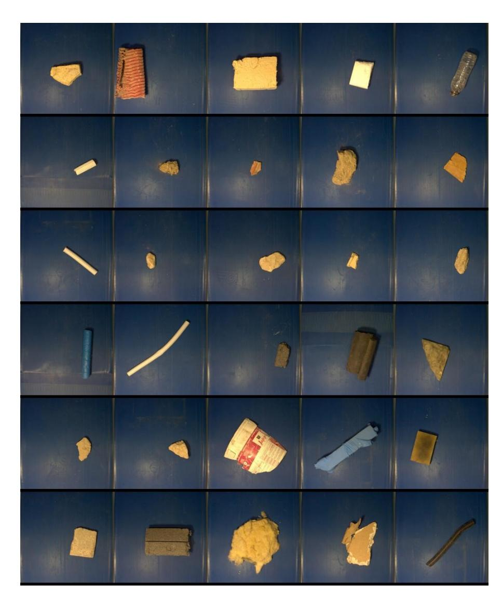

**Figure 17. Shredded samples of construction and demolition waste taken from CASALE waste manager**

# **4.5. Future Work**

In the later stages of the REDOL project, the designed sorting system will be transferred from ICCS premises to the waste manager facilities in Zaragoza for further validation. In these stages, the system will be deployed in fully realistic conditions inside CASALE waste management facilities, where material will be constantly fed into the system. The material will be very similar to the material already used during the development phase of this task. Key performance indicators such as throughput, purity, and other relevant metrics will be measured during real-time operation to assess the system's efficiency and its impact on the CDW value chain being studied within the scope of the REDOL project.

The current system configuration consists of a single 4-axis industrial robot, one RGBD camera, one conveyor, and one hyperspectral camera. While this setup has proven to be effective for this CDW application, development on numerous aspects can further improve the performance of the system in different CDW scenarios. More precisely, the deployment of multi-robot setup, where robots working in parallel or in sequence, can significantly improve the throughput and the purity of the output streams. Depending on the material fractions or object sizes, multi-conveyor configuration could be a useful addition. Finally, testing of novel geometries and materials for the gripper could further increase its grasping rate.

When it comes to the sensing capabilities of the system, the deployment of more cameras from different perspectives (e.g., side-view) can reduce occlusions and improve 3D object reconstruction and classification. When more demanding classification is required, the current hyperspectral information can be combined with different modalities to better distinguish between visually similar materials (e.g., certain plastics, treated woods). Furthermore, continuous adaptation of the ML models using cloud-based training will increase the inference capabilities of the system, and as a result, the adaptability of the system.

# **5. T3.4 Novel textiles classification solution using HSI camera– [NTT]**

# **5.1. Pre-REDOL stage**

The textile and clothing industry is among the largest industrial branch in the EU. However, the consumption of textiles in the EU has the fourth highest negative impact on the environment and on the climate change. In 2020, the textile field was among the top five sectors with the highest plastic consumption, accounting for around 90% of the global volume of plastic demand. In addition, less than 1% of the material used to produce clothing is recycled into a similar quality application (closedloop recycling), whereas 12% of the material used for clothing ends up being recycled in lower-value applications (open-loop recycling), while 73% of the materials are mostly sent to landfill or to incineration. This scenario highlights the growing need for more sustainable solutions that are in line with the principles of the circular economy [5,6].

Reusing or recycling textile waste are, in general, preferable management solutions to incineration and landfilling, according to a circular approach. Thus, better reuse and recycling of textiles can lessen virgin textile fibers production. Textile waste reuse involves different strategies, including trading, swapping, renting or inheriting. On the other hand, textile recycling usually involves a reprocessing stage of pre- or post-consumer textile waste for being used in new products, either textile or non-textile. However, it is essential to recognise and sort the items according to a specific criterion – such as composition, colour or fabric structure – in order to guarantee an adequate quality of the input materials in the subsequent recycling processes. Until now, the sorting process was mainly carried out manually in several textile districts, but it has evident drawbacks, including high cost, low speed operation and the impossibility of a full automation, which is required to process huge volumes of materials. In addition, labels may have been removed, be worn out or have faulty information, making the manual sorting based on composition complex. Different methods already exist for the identification of textile materials, such as standardised quantification methods (ISO 1833-1, etc.), morphological differences detected by microscopy, and differences in thermal behaviour detected by differential scanning calorimetry (DSC), thermogravimetric analysis (TGA) and gas chromatography (GC). These are accurate but require sample preparation and are too slow for automated recognition and sorting of textile materials, pointing out the need for economically viable and effective solutions. For NIR spectroscopy and HSI, sample preparation is not required, and they are already exploited in the textile industry for the automated recognition and analysis of material composition. Automated recognition and sorting lines provide a method for ensuring better quality of textile waste fractions that can be recycled. In addition, EU policies that press for a more separate collection of textile waste starting from 2025 will no doubt accelerate a transition towards cost-effective textile sorting plants [7,8,9,10].

The next step could be to identify a suitable recycling process (chemical or mechanical) for the sorted textile materials, giving priority to a fiber-to-fiber approach. However, there are not so many fibre-to-fibre recycling technologies and they are very sensitive to any contamination, and therefore limited to mono-material waste-streams. One component in many textiles that hinders recycling approaches is elastane (EL) – a fiber containing at least 85 wt.% of a segmented polyurethane –, which is usually incorporated in small quantities in woven goods (2-10 wt.%), but also up to 50 wt.% in medical stockings and tights. It is usually the non-visible core in a core spun yarn, covered by other textile fibres such as polyester, polyamide or cotton, which gives the elastomeric fabric stretch, provides comfort and a better appearance. This restricts the mechanical separation of the fibres, which makes the elastane not only less interesting for recycling, but also it limits the recyclability of the main textile component [11]. Thus, appropriate processes for separating EL from blended textile fabrics would be highly desirable and could make a considerable number of textiles suitable for recycling.

Dissolution-based recycling can be applied for recycling purposes, which allow the selective dissolution of fibers in suitable solvents and adjoining removal of additives. The selective dissolution of polymers is controlled by two transport processes, i.e., the disentanglement of polymer chains and solvent diffusion at the polymer-solvent surface layer. The selectivity implies that solvent molecules show a potentially unique affinity for the target compound, without interacting with other polymers (e.g., PES, PA, or WO). This property is interesting for recycling because it is possible to isolate pure polymers out of blends, and in the fact treating mixed textiles through dissolution recycling is gaining attention [12,13].

# **5.2. Objectives**

In the REDOL project, NTT implemented a textile waste sorting system with the aim to better reuse and recycle textile wastes and to create sustainable alternatives to landfill and incineration. In fact, in order to add value to the waste materials and to guarantee adequate quality as an input material for the subsequent recycling processes, at first it is essential to recognise and sort the items according to a specific factor. NTT sorting system is based on a NIR and HSI camera and a RGB matrix camera, allowing the recognition and the selection of items on the basis of colour, composition, and fabric structure. The results achieved in this Task will be used to reach the final TRL6 validation of NTT sorting system and to support ALIA in the future textile hub of Prato (Italy), which will be operative from the end of 2026. The textile hub will enable to manage and sort more than 30.000 ton/year of textile waste, coming from the area managed by ALIA and the rest of Tuscany. The structure of the textile hub could be also exploited in other European cities, demonstrating the potential of this solution.

In the REDOL project, NTT has optimized a thermo-chemical pre-treatment for the selective separation of the elastane fibers from natural and synthetic bi-component fabrics. The technology is based on a closed cycle solvent system, which permits the selective removal of elastane fibers from bi-component textiles by dispersing them into a non-toxic organic solvent. Pre- and postconsumer bi-component textiles has been used inside the system, demonstrating the versatility and the potential of the whole treatment. The process has been validated for different types of bicomponent textiles – with PA, PES, and WO as the main component –, obtaining quite pure streams of material ready to be recycled through a fiber-to-fiber approach. In particular, the polyester obtained after the treatment of post-consumer bi-component PES/EL fabrics is used by AITEX and CIRCE in a depolymerization process to obtain new monomers for the subsequent production of new polyester fibers. Polyester fibers could be used for the production of new geotextiles, closing the cycle.

# **5.3. Advances within the REDOL**

#### 5.3.1. System Description

#### Textile sorting system

NTT uses a technology for the textile waste sorting that allows the selection and separation of items on the basis of colour, composition or fabric structure [\(Figure 18\)](#page-47-0). The technology is based on a combination of the following equipment:

- NIR and HSI camera, used to analyse fiber composition
- RGB camera, used to analyse the colour and the fabric structure

NIR spectroscopy is a technique based upon molecular absorptions measured in the near-infrared region of the electromagnetic spectrum. It is sensitive to organic constituents and can provide both chemical and physical information. A (macro)molecule can absorb at specific frequencies that are characteristic of its structure, thus allowing the recognition of it (i.e., composition evaluation). In addition, hyperspectral imaging is an emerging technology that integrates spectroscopy and imaging to obtain both the spectral and spatial information from objects simultaneously. In fact, HSI in the NIR range (900 – 1700 nm) makes it possible to acquire 2D images of the sample in a few seconds and, for each point of the sample, the IR spectrum is acquired, which can be used for the reconstruction of the detailed surface map or mediated in a defined area (ROI – Region of Interest). This provide a complete characterization of the sample, which is particularly useful for the identification of different material.

Clothes are normally dyed and dyeing processes in the textile sector involve the use of different types of dyes (mainly organic). From a recycling point of view, it might be useful to divide textile waste by colour, so that fabrics do not have to be dyed again, reducing the environmental impact of the overall process. NTT system is equipped with a RGB camera, enabling accurate sorting in different colours. In addition, the same camera is trained to evaluate and separate textiles on the basis of fabric structure. Based on NTT knowledge, this is the only sorting system that can exploit the fabric structure as one of the separation criteria. This could be useful for a subsequent mechanical recycling: for example, a fiber with a better quality (longer length) is obtained from a weft-knitted fabric than a warp-knitted fabric.

The large variety of textile in terms of composition, colour and fabric structure caused traditional software and sorting machine to fail in this application. Thus, a huge data set is very important to ensure an accurate and reliable sorting line. NTT has trained the sorting system with different type of garments, but, according to the needs, the data library can be extended with more training (i.e., using more garments). In this way, it was possible to modulate the performance of the sorting machine according to specific needs (customizable): in the REDOL project, it was important to train the machine to recognize garments with variable elastane content and in the presence of different matrices (e.g., PES, WO, PA, CO). Once the learning algorithm has a sufficient set of data to ensure the required level of reliability, the system was ready to start the selection process. In fact, the training phase was essential to create an extensive database, useful for the recognition of unknown samples.

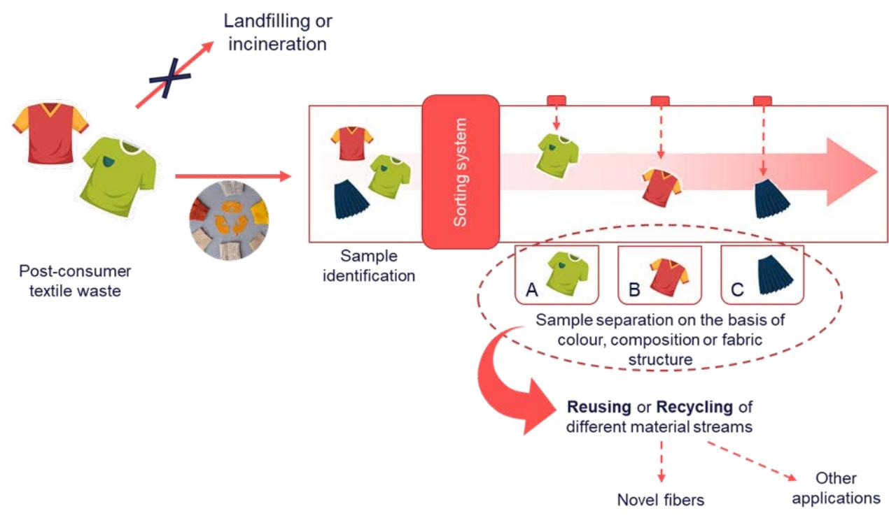

**Figure 18. Textile waste sorting system: a general scheme**

#### Elastane removal technology

On the basis of the pre-existing pilot plant, NTT has made some changes to improve and optimize the performance of the elastane removal plant. In the pre-existing pilot plant, the lack of a stirrer resulted in a worse control of the temperature of the solvent (more inhomogeneous), without considering possible safety problems due to the creation of hot spots in the solvent. Thus, the heating solvent tank has been implemented with a stirring system, which guarantee a more homogenous temperature, and with new heating elements in the tank itself (safety measure). In addition, new heated pipes have been substituted in the pilot plant in order to maintain a constant temperature between the heating solvent tank and the solvent extraction chamber. This change allows to save time and energy needed to regain the right temperature of the solvent before the treatment. Finally, NTT wants to optimize the filtration system for a better recovery of the solvent at the end of the process. In particular, the aim is to reduce the quantity of contaminants – such as elastane fibers and dyes – presents in the recovered solvent. [Figure 19](#page-48-1) shows a general scheme of the elastane removal process.

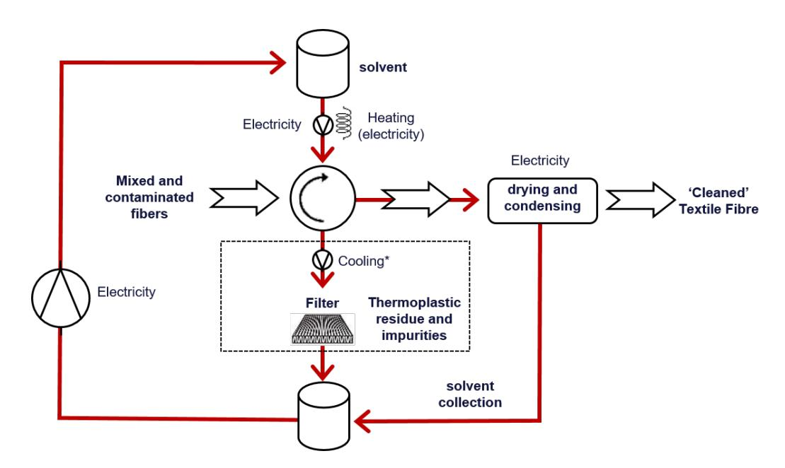

**Figure 19. Scheme of the elastane removal process**

### 5.3.2. System Architecture and Features

#### Textile sorting system

Thanks to a NIR and HSI camera, NTT sorting system is able to recognise and sort garments on the basis of composition. The sorting system has been updated with an improved camera and a software with higher performance. [Table 1](#page-48-2) summarizes the main advantages obtained in the new version of the textile waste sorting system, considering the composition classification.

**Table 1. Main advantages related to the composition classification**

| Previous sorting system |                            | Updated sorting system                 |
|-------------------------|----------------------------|----------------------------------------|
| Rapid analysis          | –                          | The update of the software enabled the |
| Precision               | –                          | The system is more accurate in the     |
|                         | Modular structure          | – The number and arrangement of        |
| Moderate cost           | –                          | The selected HSI camera had a          |
|                         | Detailed map of the sample | – Possibility to reconstruct a         |

The previous software was based on an algorithm that performed a point-bypoint comparison of the recorded IR spectrum with all the IR spectra present in the database.

**Improved software** – The updated software was based on algorithms that analysed characteristic points identified by the software itself, thus enabling faster and more targeted recognition.

For the classification of garments on the basis of colour and fabric structure, a RGB matrix camera was implemented in the sorting system. One of the innovative aspects of NTT prototype was the recognition on the basis of the fabric structure, which could facilitate the subsequent mechanical recycling. The positive results led to the identification of a reliable procedure for the colour and fabric structure selection and then, to the detection of the information regarding the resolution and the overall quality of the images. [Figure 20](#page-49-0) reports pictures of NTT's demo prototype, pointing out the main steps that are necessary for the garment classification on the basis of a specific criterion.

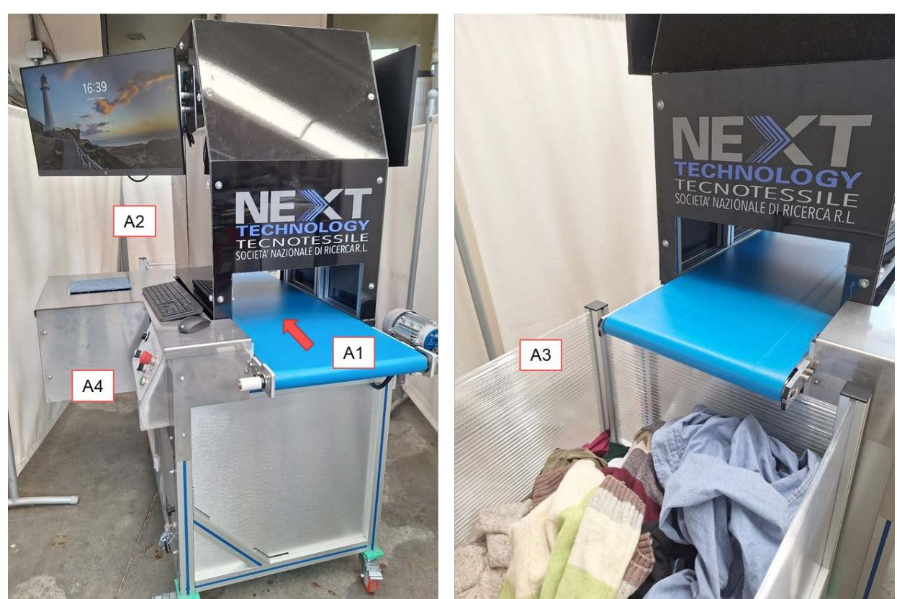

**Figure 20. Demo prototype of the textile sorting system. A1: loading area of garments; A2: identification area (based on composition, colour and fabric structure); A3: sorting area; A4: control cabinet**

#### The Textile Hub

The results achieved in this Task will be a useful knowhow for ALIA, responsible for the development and managing of the future textile hub, which will be operative from the end of 2026 in Prato [\(Figure](#page-50-0)  [20\)](#page-50-0). The Prato Textile Hub has been designed to manage two different flows of textile waste: one from post-consumer household textile waste and another one from pre-consumer industrial scraps. Specifically, the facility has been sized to handle a total flow of 20,000 tons/year of post-consumer household textile waste and of 13,000 tons/year of pre-consumer textile scraps, generated by local manufacturing industries. Inside the Hub, there will be different sorting lines – for the two different flows –, which are industrial sorting machines able to sort textile garments on the basis of colour and composition using NIR spectroscopy. This technology is one of the most innovative in Europe and has not yet been used for similar facilities in Italy, making this Hub the first and only one of its kind in Italy. The aim of this choice is to facilitate and optimize the sorting processes necessary for recycling and reuse, speeding up the selection, and ensuring higher quality materials for recovery. The garments selected for reuse will then be returned to the consortia, which will handle their distribution in various national or international markets. Garments that are not suitable for reuse are instead sorted based on the colour and/or the composition, considering the requests of the companies that will take care of their recycling. It is estimated that the two sorting and treatment lines will allow for the recovery of approximately 77% of the incoming materials, with 68% destined for recycling and 32% for reuse.

According to the latest waste composition analysis of unsorted municipal solid waste managed within the ALIA Paronese plant in Prato, dating back to 2024, the textile fraction represents approximately 20% of the waste delivered. This data is very significant because it highlights the large quantity of textiles that are not currently intercepted by the collection and management system and that end up being sent to landfill or in waste-to-energy processes. In fact, the system currently focuses primarily on the collection of post-consumer textiles in good condition, with the main objective of facilitating reuse. If the new EPR regulation allows, the system could be extended to include all post-consumer textile products, including those in poor condition, in order to further promote and support recycling. Therefore, the presence of the hub, combined with a better management of the selective textile collection system is expected to drastically reduce the amount of textiles in the unsorted waste, and consequently, the quantity of non-recycled textiles destined for disposal.

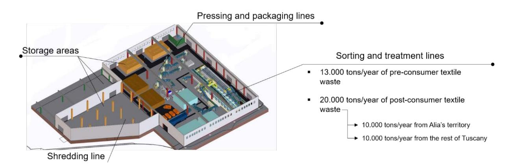

**Figure 21. Rendering of the future textile hub of ALIA, in a building phase in Prato** Elastane removal technology

On the basis of the pre-existing pilot plant, NTT has made some changes to improve and optimize the performance of the elastane removal plant. In particular, new heating elements have been added in the pilot plant in order to guarantee more homogeneous temperatures of the solvent, to save time and energy and to work with a safer system. In addition, NTT carried out an in-depth study – from a technical and an economical point of view – in order to re-design and optimize the filtration system for a better recovery and recycle of the organic solvent, by reducing the amount of contaminants. The presence of these contaminants into the solvent could adversely affect its effectiveness in a subsequent treatment, limiting its reuse. [Figure 22](#page-51-2) reports a picture of NTT's pilot plant.

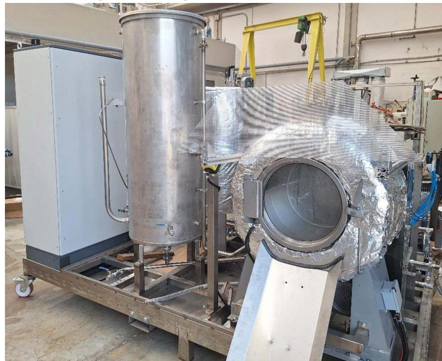

**Figure 22. Elastane removal pilot plant**

# **5.4. Demonstration**

### 5.4.1. Operational activities

#### Sorting system

After placing the garments in the loading area, they were transported until the identification area, where – illuminated by the lights – were analysed by the HSI camera. The disposal of the lights has been optimized in order to achieve the best exposure during the recognition analysis. The data collected by the NIR and HSI camera allowed to obtain information about the composition of the garment. Considering the composition criterion, the system has been trained using different samples to create an extended reference database (8 different classes).

For the colour and fabric structure classification, garments passed over a glass sheet – below which there was the RGB matrix camera – and a picture of a precise area (ROI) was acquired. The distance between the sample and the camera was kept constant (optimum focus). Then, the software was able to reprocess the image and to provide the required information regarding colour or fabric structure. Considering the colour criterion, the system has been trained using different samples to create an extended database of reference colours (9 different colour classes). However, the number of classes could be extended through the training of the system, distinguishing also different shades within a single class. Considering the performed tests, the colour class assignment was quite good for almost all the analysed samples. However, some errors may be registered in the detection of dark colours (e.g., a dark blue sample classified as a black sample). For the fabric structure recognition, three classes were considered (i.e., warp-weft, weft-knitted and warp-knitted structures) and different samples (> 200) were used during the training phase. Promising results were achieved in the fabric structure classification, according to the selected classes.

#### Elastane removal technology

One of the first activities carried out by NTT in Task 3.4 was to perform preliminary elastane removal tests on a laboratory scale to better understand the whole process and the best working conditions for bi-component fabrics. These tests were conducted on different textile materials, containing PES, PA or WO as the main component and EL in variable quantities. The results were in general very promising and, in the case of PES/EL textiles, it was possible to optimize the treatment at the pilot scale, firstly by using pre-consumer textiles and then post-consumer ones.

Post-consumer bi-component PES/EL textile waste were collected from local associations, normally responsible for the management of textile waste on the territory. Unlike the pre-consumer textiles, every batch of post-consumer textile waste was composed of different garments characterized by different compositions (variable contents of elastane, 2 – 15 wt.%). In general, excellent results in terms of elastane extraction were obtained from different batches, allowing the recovery of both polyester material and elastane fiber at the end of the process. Characterization tests – including composition analysis and FT-IR spectroscopy – were performed on the treated polyester materials to assess the effectiveness of the elastane removal. Overall, the polyester material obtained from the different batches had a purity equal to 96-98%, value suitable for the de-polymerization process. The recovered polyester material was shredded or grinded to facilitate the subsequent steps performed by AITEX and CIRCE. In fact, the main goal of Task 4.4 was to recycle the polyester material through a depolymerization process. In this way, new monomers could be obtained for the further production of polyester yarns. This strategy should be preferred over others, as it favoured a fiber-to-fiber recycling approach.

### 5.4.2. Demonstration activities

[Figure 23](#page-53-0) shows some examples of textile garments classified on the basis of composition, while [Figure 24](#page-53-1) an[d Figure 25](#page-53-2) report some of the item samples used in the training of the system according to the colour and fabric structure criteria.

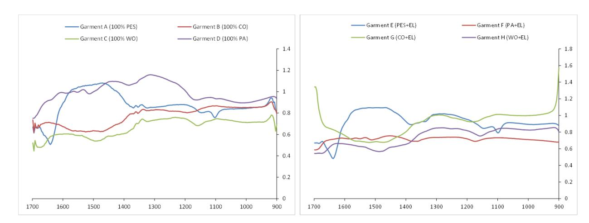

**Figure 23. IR spectra of one sample per composition class**

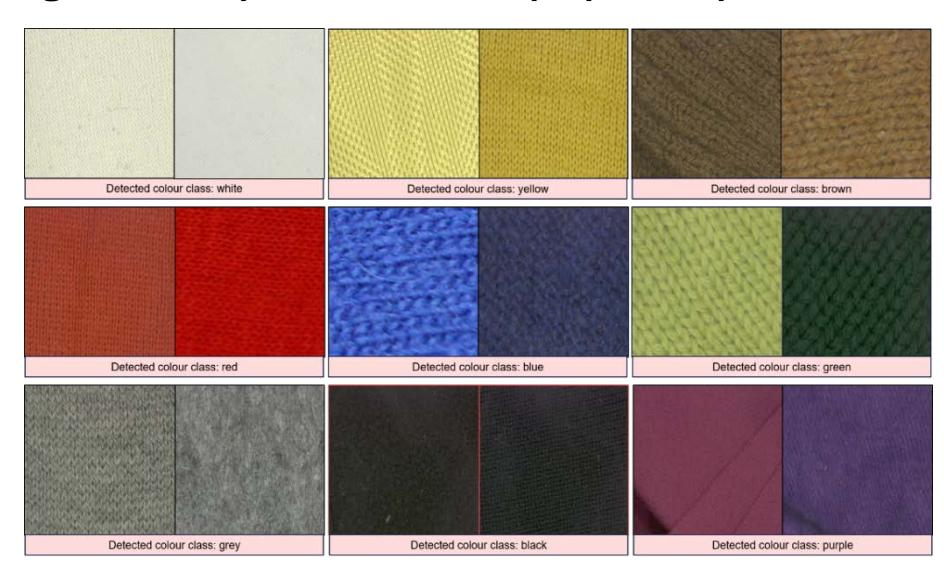

**Figure 24. Some samples used in the classification according to the colour**

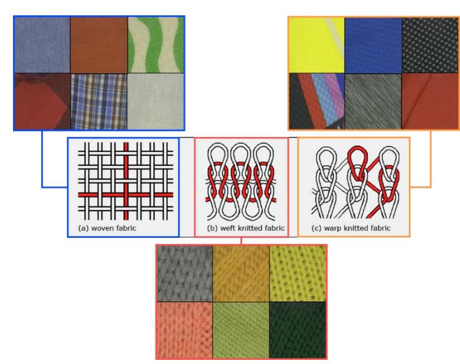

**Figure 25. Some samples used in the classification according to the fabric structure**

In [Figure 26](#page-54-1) it is possible to observe the scheme of the elastane removal treatment on postconsumer PES/EL garments. Thus, starting from selected textile waste, the material is cut and treated in the pilot plant according to the optimized process parameters. The recovered PES is then shredded or grinded and finally sent to AITEX and CIRCE for the subsequent depolymerization process.

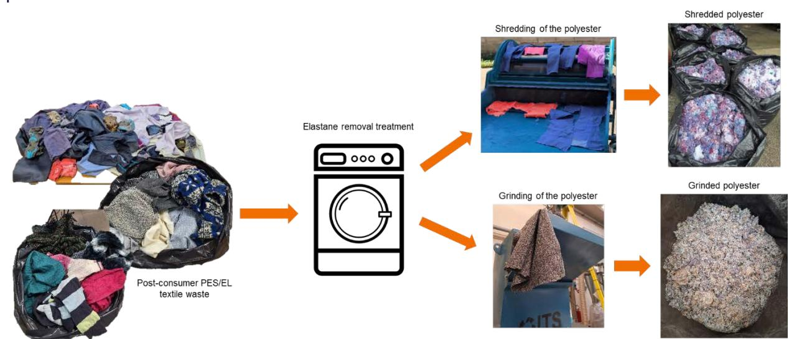

**Figure 26. Scheme of the elastane removal treatment on post-consumer PES/EL textile waste. It was possibile to recover polyester material with a high degree of purity, which was then shredded or grinded.**

# **5.5. Future Work**

In the REDOL project, NTT worked on two different technologies – i.e. the textile waste sorting system and the elastane removal technology – in order to implement and integrate new possible cutting-edge solutions in the textile value chain. These strategies will enable to better reuse and recycle textile waste, creating sustainable alternatives to landfill and incineration. In addition, these approaches could represent growth opportunities for all the companies involved in the textile value chain, considering textile waste just not as waste, but as materials with higher potential.

NTT sorting system is based on a NIR and HSI camera and a RGB matrix camera, allowing the recognition and the selection of items on the basis of colour, composition, and fabric structure. The results achieved in this Task will be used to reach the final TRL6 validation of NTT sorting system and to support ALIA in the future textile hub of Prato, which will be operative from the end of 2026. The textile hub will enable to manage and sort more than 30.000 ton/year of textile waste, coming from the area managed by ALIA and the rest of Tuscany. The structure of the textile hub could be also exploited in other European cities, demonstrating the potential of this solution.

Regarding the elastane removal technology, the process is based on a closed cycle solvent system, which permits the selective removal of elastane fibers from bi-component textiles by dispersing them into a non-toxic organic solvent. Future projects could focus on the study of the applicability of the process to tri-component EL-based fabrics, evaluating the selectivity and the effectiveness in the EL removal from those garments.

# **6. T3.5 Mobile sorting system for SUW including novel AI algorithms, sensing technology and robots – [CIRCE]**

Initially, the project envisioned a single mobile unit capable of sorting different waste types, including paper/cardboard and waste electrical and electronic equipment (WEEE). However, early assessments revealed that the operational and material requirements for these waste streams diverged significantly. This led to the strategic decision to split the development into two independent systems, each optimized for its respective application.

# **6.1. Paper and cardboard mobile sorting system**

# 6.1.1. Pre-REDOL stage

In Zaragoza, Spain, the management and processing of paper waste are overseen by SAICA (Sociedad Anónima Industrias Celulosa Aragonesa), a company renowned for its commitment to sustainability and the circular economy.

SAICA collaborates with local authorities and private entities to collect paper waste from various sources, including households, businesses, and industrial facilities. The collected materials are transported to SAICA's recycling facilities, where they are sorted and sent to a subsidiary paper company for recycling. The quality of the incoming paper waste is crucial; cleaner and well-sorted paper streams enhance the efficiency of the recycling process, leading to higher-quality recycled products.The cleanliness of the paper waste stream significantly influences the recycling process's effectiveness. Contaminants such as plastics, metals, or organic waste can hinder the recycling process, reduce the quality of the recycled paper, and increase operational costs. Therefore, SAICA emphasizes the importance of proper waste segregation at the source, encouraging individuals and organizations to dispose of paper waste responsibly.

#### 6.1.2. Objectives

The main objective of this task within the REDOL project was the development of a mobile sorting system for paper and cardboard waste, integrating emerging technologies such as hyperspectral imaging, artificial intelligence algorithms, and high-speed robotics. This system aims to:

- Improve the quality of recyclable materials through more accurate classification
- Reduce manual labor in repetitive or hazardous tasks
- Provide operational flexibility through a transportable design that can be deployed in fixed or temporary facilities as needed

#### 6.1.3. Advances within the REDOL

As part of REDOL, a prototype mobile sorting system has been designed, built, and tested, tailored to the characteristics of the paper and cardboard waste stream handled by SAICA. The system has a compact format, suitable for transport in a standard shipping container, which enables easy deployment and rapid integration in different operational contexts.

Key technological advances include:

- The integration of a NIR hyperspectral imaging system to detect material differences beyond human vision
- The use of AI-based classification models trained on real industrial samples to automatically identify paper types and contaminants
- Full automation of the physical separation process through high-speed pick-and-place robotics

#### 6.1.4. System Description

The sorting unit is designed as a self-contained module with all subsystems mounted within a steelframed housing with transparent safety panels. The waste material enters through a wide feeding conveyor, where it is distributed evenly to avoid occlusions or overlapping.

A hyperspectral NIR camera captures spectral data at high resolution across the width of the conveyor belt. A halogen lighting system ensures consistent illumination. The data is then analyzed in real time by a classification algorithm that assigns each item to one of two categories:

- 1. Paper and cardboard (e.g., corrugated, graphic paper, office paper, cartonboard)
- 2. Residuals or contaminants (e.g., plastic, metal, composites)

Classified items are then physically sorted by a delta robot equipped with a vacuum gripper. The robot operates above the main conveyor belt, within a cylindrical working envelope, and places each item into one of four designated output containers. An integrated safety system ensures the robot stops if the housing is opened during operation.

[Figure 27](#page-57-1) illustrates the processing pipeline of the sorting machine.

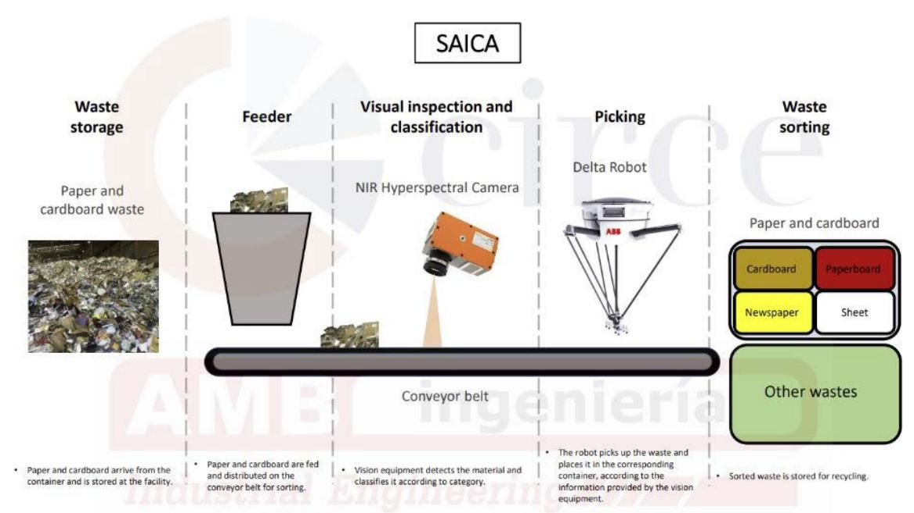

**Figure 27. Paper and cardboard sorting process (SAICA)**

In future phases of the project, the possibility of introducing additional categories, such as differentiating corrugated cardboard as a separate class, will be evaluated.

# 6.1.5. System Architecture and Features

The prototype consists of several integrated modules:

- Optical system: A NIR hyperspectral camera combined with homogeneous halogen lighting ensures stable data acquisition under different lighting conditions [\(Figure 28\)](#page-58-3).
- Processing unit: Executes machine learning models and vision algorithms to classify each item based on its spectral signature.
- Robotics: A delta robot handles high-speed pick-and-place actions [\(Figure 28\)](#page-58-3).
- Conveyor system: Adapted to the material flow and synchronized with the vision and robotic subsystems.
- UDP communication interface: Enables real-time, low-latency data transmission from the vision system to the robot controller. Although it is connectionless, the communication is designed to be synchronized with the conveyor movement, ensuring accurate item tracking and timely robot action.

The system is designed to operate autonomously, with built-in safety mechanisms and compatibility with existing waste treatment infrastructures. Its modular design supports future upgrades and adaptation to other types of waste.

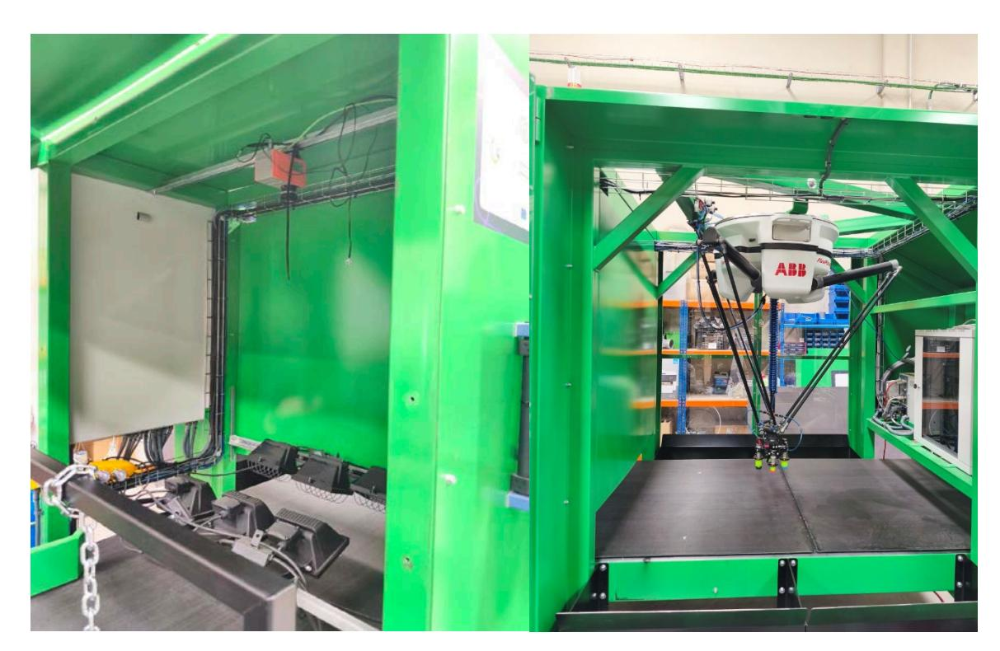

**Figure 28. Vision system is based on a Specim FX17 hyperspectral camera (left) and ABB IRB 360 delta robot (right)**

#### 6.1.6. Demonstration

### 6.1.7. Operational activities

During the validation phase of the project, the system was tested under realistic conditions using real paper waste samples provided from SAICA's selective collection stream. These tests helped calibrate the system, train the classification models, and evaluate overall performance.

As a result, the classification model was streamlined to two operational categories, balancing model performance with industrial relevance, achieving a cross validated performance of 96% in the laboratory.

Robotic tests confirmed the suitability of the vacuum gripper across various item types and weights, and the UDP architecture proved robust for synchronized communication. Conveyor speed was tuned to allow sufficient time for both image acquisition and robot response, settling on an optimal range of 25m/min.

These demonstrations confirmed the prototype's ability to operate under realistic industrial constraints while maintaining high performance and adaptability.

### 6.1.8. Demonstration **activities**

The demonstration tasks conducted within this work package were aimed at validating both the classification models and the robotic picking systems. A small sample of waste, sourced from two containers collected through Zaragoza's selective collection scheme and supplied by SAICA, was used for this purpose. The validation process was carried out at CIRCE's premises and involved the separation of non-paper elements (i.e., materials not classified as recyclable fiber) from recyclable paper and cardboard. The trials employed a two-class classification model specifically developed to differentiate between paper/cardboard and residual waste. A total of 5 kg of material was processed during testing, from which 5% of non-paper contaminants were successfully removed in the first sorting cycle[. Figure 29](#page-59-0) shows images of the entire sample and the contaminants that were extracted.

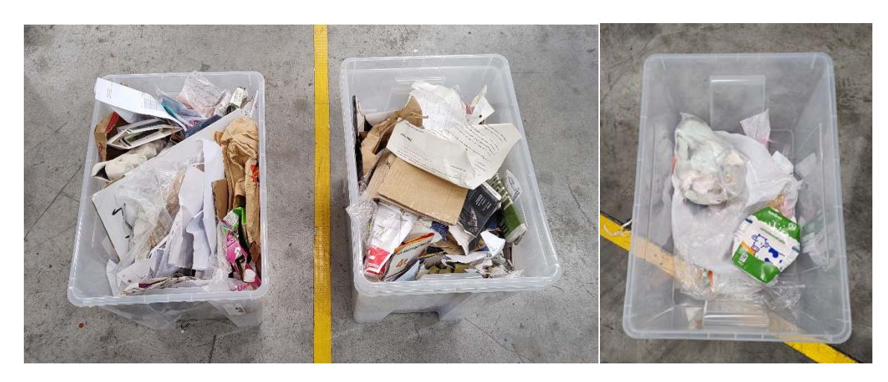

**Figure 29. Image of the samples used for validation and the non-paper material separted with the REDOL sorting system**

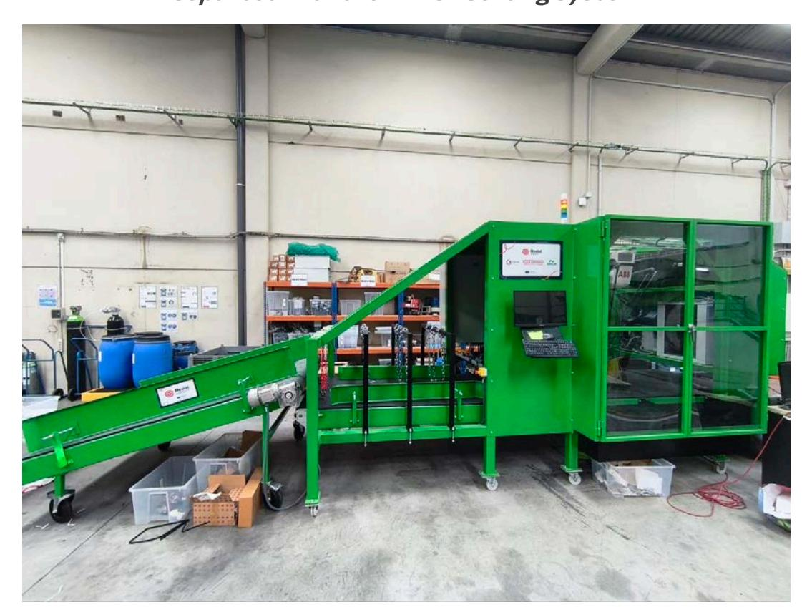

**Figure 30. Paper and cardboard mobile sorting system**

#### 6.1.9. Future Work

In the upcoming stages of the REDOL project, the validation of the paper and cardboard sorting prototype will continue at CIRCE's facilities using the samples from the selective collection system provided by SAICA. These samples are representative of real household waste and will allow for a more extensive evaluation of the system's performance. During this phase, performance indicators such as classification accuracy, contaminant removal rate, and robotic picking efficiency will be measured under realistic operating conditions.

Although the current validation focused on a two-class model (separating recyclable paper and cardboard from non-paper contaminants) the next stages will involve testing the extended classification model capable of distinguishing corrugated cardboard as a separate category. This will enable a more detailed material separation strategy aligned with industrial requirements. The results of this evaluation will help determine whether the inclusion of additional classes improves the quality of the output stream and the overall efficiency of the sorting process.

### **6.2. Electronic component extraction and classification system**

#### 6.2.1. Pre-REDOL stage

Within the field of WEEE recycling, the company TATUINE has extensive experience in the selective dismantling and recovery of electronic components from PCBs. This process focuses on retrieving components that contain precious and critical raw materials essential for ensuring circularity and sustainability in the electronics value chain.

Before the REDOL project, the extraction of components was entirely manual. Trained operators performed the task component by component using handheld tools. While effective, this approach was highly labor-intensive and limited in scalability. It also raised concerns about occupational health and safety due to the repetitive and physically demanding nature of the work. These factors motivated the need for a more efficient and automated alternative.

#### 6.2.2. Objectives

The objective of this task was to design and develop a compact and transportable system capable of automatically identifying, extracting, and classifying high-value components from PCBs. The system integrates machine vision, robotic manipulation, and selective desoldering tools to replicate and improve the manual process.

The approach focuses on selective component extraction, aiming to:

- Increase recovery rates of valuable materials
- Minimize damage to components to preserve their recycling value
- Improve worker safety and reduce ergonomic risks

- Enable deployment in distributed or modular recycling environments

This development is fully aligned with the REDOL project's goals to support the circular economy through high-value, automated waste processing solutions. By moving toward intelligent, sensorbased automation, the system also enables better traceability, data-driven optimization, and quality assurance, key enablers for future digitalized recycling processes.

#### 6.2.3. Advances within the REDOL

During the project, a complete prototype was developed by CIRCE and AMB with support from TATUINE. The system is designed to operate as a standalone unit, capable of being integrated into existing recycling lines or deployed directly at collection and dismantling facilities. Its modularity and compact footprint enable flexible use in both centralized and distributed WEEE processing schemes. Additionally, the system's design supports rapid redeployment and minimal installation overhead, allowing it to serve as a mobile, on-demand solution in diverse operational contexts.

#### 6.2.4. System Description

The process begins with manual PCB loading onto a rail-based conveyor. The board is then scanned by an integrated vision system combining high-resolution color imaging and 3D surface profiling. This system identifies components of interest and determines the optimal strategy for safe extraction. A robotic arm equipped with a custom gripper removes each component, which is then cleaned of solder residues and deposited into a dedicated container for further recycling processing.

The system targets four specific types of components identified as high-value: capacitors, electrolytic capacitors, microprocessors and coils. These were selected based on their material content, recyclability, and criticality to the electronics supply chain.

The prototype has been designed to operate autonomously and to handle a wide range of PCB types (up to 500x500 mm), making it adaptable to real-world variability in WEEE streams.

[Figure 31](#page-62-1) illustrates the processing pipeline of the sorting machine.

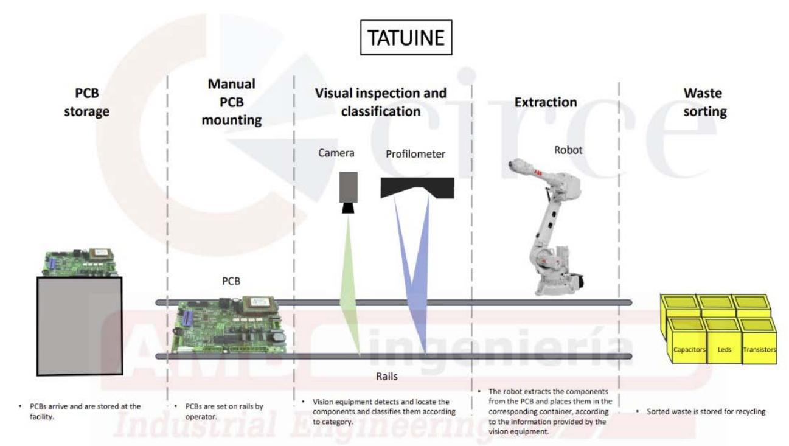

**Figure 31. Electronic components recycling process (TATUINE)**

#### 6.2.5. System Architecture and Features

The system features a servo-driven linear guide structure supporting PCB movement and precise positioning. The visual inspection station includes a line-scan camera and a 3D profilometer [\(Figure](#page-63-3)  [20\)](#page-63-3), which together allow for accurate component identification and localization.

All processing is performed locally on an industrial PC equipped with GPU acceleration, enabling realtime detection and robotic coordination. Deep learning models segment and classify components, while a geometry analysis module determines the most suitable gripping point for each target.

Once a component is identified, the board is locally pre-heated using a hot air blower to soften solder joints. Then, a robotic arm [\(Figure 32\)](#page-63-3) performs the extraction using a custom-designed two-finger gripper. After removal, the component is cleaned using a mechanical system to remove remaining solder residues before being stored.

Communication and control are managed through an OPC UA architecture, ensuring synchronization between vision, motion control, and robotic actions. This setup allows for sequential processing of each component and full traceability of the workflow.

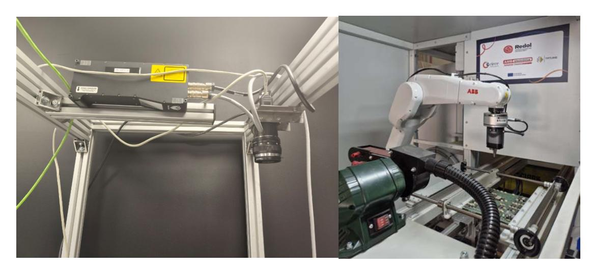

**Figure 32. Teledyne Dalsa Linea L2-GC-04k04T line-scan camera and Gocator 2670 3D profilometer (left) and ABB IRB 1200 robotic arm (right).**

#### 6.2.6. Demonstration

### 6.2.7. Operational activities

Initial validation was carried out using a test set of PCBs collected by TATUINE. These boards varied in size, component density, and layout complexity. The system successfully demonstrated the ability to detect and classify the targeted high-value components under realistic conditions.

Results include:

- A detection accuracy of 92% across all test samples
- A classification accuracy of 81% for the selected component categories
- An average processing time of 120 seconds per board for vision analysis and extraction planning
- An extraction success rate of 80%, with most failures caused by misalignment or incomplete desoldering
- An average extraction time of 40 seconds per component

The integration between vision, motion, and robotic control proved stable and responsive. The system also demonstrated robustness when faced with PCB variability, confirming its potential for broader application in electronic waste recovery workflows.

# 6.2.8. Demonstration **activities**

Within this work package, the initial validation trials of the PCB sorting prototype were carried out. The tests were conducted using PCB samples provided by TATUINE. Prior to execution, the system's main subsystems, including the high-resolution vision system, surface profilometer, and robotic extraction arm, were properly calibrated and aligned to ensure coordinated functionality [\(Figure](#page-64-1)  [33\)](#page-64-1). These preliminary tests confirmed the system's ability to identify, classify, and extract electronic components from the boards, while also allowing for fine-tuning of key parameters to enhance extraction precision and overall performance.

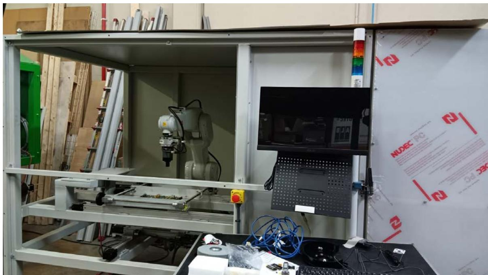

**Figure 33. PCB sorting prototype**

#### 6.2.9. Future Work

Future work will focus on intensive testing of the prototype using a wider set of PCBs provided by TATUINE, in order to validate its performance under more representative conditions. Based on the results obtained during these trials, improvements will be introduced to the component detection and classification models, aiming to enhance recognition accuracy and localization precision. In parallel, the mechanical setup will be reviewed to assess potential upgrades if required, particularly regarding the gripper design, which may be adapted to improve extraction efficiency and handling of diverse component types.

During these validation activities, key performance metrics will be collected to quantify the system's capabilities, including PCB processing and extraction rates (boards per hour), as well as the success rate of component removal. These metrics will support the technical assessment of the prototype and guide further development steps.

# **7. Videos**

To support broader dissemination and facilitate public understanding of the innovative solutions developed within WP3, a series of informative videos have been produced. These videos aim to present the technologies and their benefits in a clear, accessible, and engaging format, making it easier for the general public—regardless of technical background—to grasp the purpose, functionality, and impact of the solutions.

By translating complex technical concepts into visual storytelling, the videos serve as a valuable communication tool to raise awareness about circular economy practices and promote societal engagement with sustainable waste management innovations.

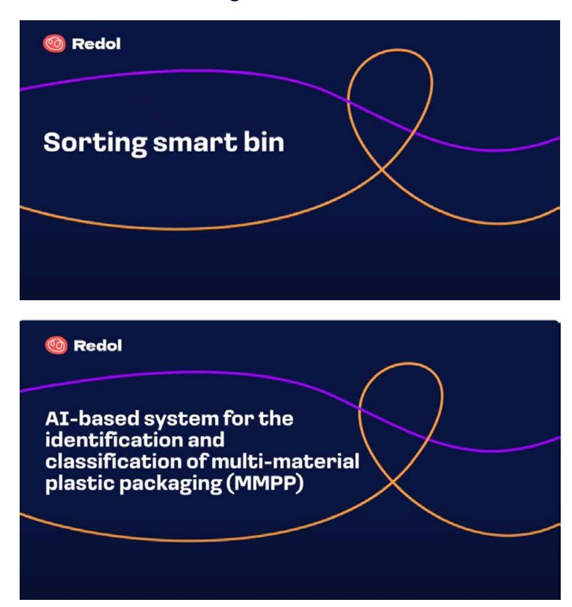

# **8. Conclusions**

This report provides a comprehensive overview of the technological developments achieved under WP3 of the REDOL project. It encompasses all activities carried out during the period spanning from Month 9 to Month 32, presenting in detail the progress made toward enhancing the management and treatment of solid urban waste streams.

The work conducted within WP3 has been structured around a set of interrelated tasks, all of which are aligned with the overarching objective of upgrading existing waste processing systems. These upgrades are being pursued through the research, design, and integration of advanced sorting and classification technologies across several selected urban waste value chains. Each task contributes to introducing innovations that aim to increase the efficiency, accuracy, and sustainability of waste separation processes, thereby enabling higher recovery rates of valuable materials and improved circularity.

This document details not only the current status and baseline conditions of the targeted value chains, but also highlights the anticipated improvements that are expected following the deployment of the technological solutions developed. These enhancements include the adoption of novel sensor-based sorting systems, robotic automation, artificial intelligence for waste stream recognition, and other process optimization tools.

Moreover, the report sets the stage for the forthcoming validation phase. All the technologies described herein are planned to be tested and demonstrated under real-world conditions during the next stages of the project, particularly within the framework of WP6: "Optimization and Implementation of Circular Product Value Chains." This validation phase will be critical to ensure that the innovations proposed in WP3 are both technically viable and scalable, and will allow the project consortium to refine the solutions before their broader implementation.

#### Relevant papers for WP3

Kokkalis, K., Konstantinidis, F.K., Tsimiklis, G., Amditis, A., Frangos, P. (2025). Modelling and Simulation of Industrial Delta Robots in ROS2 and Gazebo. In: European Robotics Forum 2025. ERF 2025. Springer Proceedings in Advanced Robotics, vol 36. Springer. [https://doi.org/10.1007/978-3-031-](https://doi.org/10.1007/978-3-031-89471-8_13) [89471-8\\_13](https://doi.org/10.1007/978-3-031-89471-8_13)

Zoumpoulis P., Konstantinidis, F.K., Tsimiklis, G., Amditis, A. (2024). Smart bins for enhanced resource recovery and sustainable urban waste practices in smart cities: A systematic literature review. In: Cities 152, 2024, <https://doi.org/10.1016/j.cities.2024.105150>

Zoumpoulis P., Konstantinidis, F.K., Tsimiklis, G., Amditis, A. (2024). Advancing Urban Waste Management Using Industry 5.0 Principles: A Novel Smart Bin. In: 2024 IEEE International Workshop on Metrology for Industry 4.0 & IoT (MetroInd4.0 & IoT). <https://doi.org/10.1109/MetroInd4.0IoT61288.2024.10584247>

# **9. References**

- [1] [https://ec.europa.eu/eurostat/databrowser/view/sdg\\_11\\_60/default/table](https://ec.europa.eu/eurostat/databrowser/view/sdg_11_60/default/table)  [2] Zoumpoulis P., Konstantinidis, F.K., Tsimiklis, G., Amditis, A. (2024). Smart bins for enhanced resource recovery and sustainable urban waste practices in smart cities: A systematic literature review. In: Cities 152, 2024,<https://doi.org/10.1016/j.cities.2024.105150> [3] Zoumpoulis P., Konstantinidis, F.K., Tsimiklis, G., Amditis, A. (2024). Advancing Urban Waste Management Using Industry 5.0 Principles: A Novel Smart Bin. In: 2024 IEEE International Workshop on Metrology for Industry 4.0 & IoT (MetroInd4.0 & IoT). <https://doi.org/10.1109/MetroInd4.0IoT61288.2024.10584247> [4] T. Phengsaart et al., "Recent Studies and Technologies in the Separation of Polyvinyl Chloride for Resources Recycling: A Systematic Review," Sustainability, vol. 15, no. 18, p. 13842, Sep. 2023, <https://doi.org/10.3390/su151813842> [5] Helmcke, S. et al., "Climate Impact of Plastics", McKinsey & Co., 1-30 (2022). [6] Phan, K. et al., "Analysing the potential of the selective dissolution of elastane from mixed fiber textile waste", Resour. Conserv. Recycl. 191, 106903 (2023). <https://doi.org/10.1016/j.resconrec.2023.106903> [7] Riba, J.-R. et al., "Circular economy of post-consumer textile waste: Classification through infrared spectroscopy", J. Clean. Prod. 272, 123011 (2020). <https://doi.org/10.1016/j.jclepro.2020.123011> [8] Norup, N. et al., "Development and testing of a sorting and quality assessment method for textile waste",
- J. Waste Manag. 79, 8-21 (2018). <https://doi.org/10.1016/j.wasman.2018.07.008> [9] Norup, N. et al., "Evaluation of an European textile sorting center: Material flow analysis and life cycle inventory", Resour. Conserv. Recylc. 143, 310-319 (2019). <https://doi.org/10.1016/j.resconrec.2019.01.010> [10] Cura, K. et al., "Textile Recognition and Sorting for Recycling at an Automated Line Using Near Infrared Spectroscopy", Recycling 6, 11 (2021). <https://doi.org/10.3390/recycling6010011> [11] Vonbrul, L. et al., "Solvents blends for selective elastane dissolution and recovery from mixed polyamide fabrics", Resourc. Conserv. Recycl. 200, 107302 (2024). <https://doi.org/10.1016/j.resconrec.2023.107302> [12] Wang, L. et al., "Recycling of Waste Cotton Textile Containing Elastane Fibers through Dissolution and Regeneration", Membranes 12, 355 (2022). <https://doi.org/10.3390/membranes12040355> [13] Boschmeier, E. et al., "New separation process for elastane from polyester/elastane and polyamide/elastane textile waste", Resourc. Conserv. Recycl. 198, 107215 (2023). <https://doi.org/10.1016/j.resconrec.2023.107215>

<https://www.redolproject.eu/> [https://x.com/REDOL\\_EU](https://x.com/REDOL_EU) [www.linkedin.com/company/redol/](http://www.linkedin.com/company/redol/)