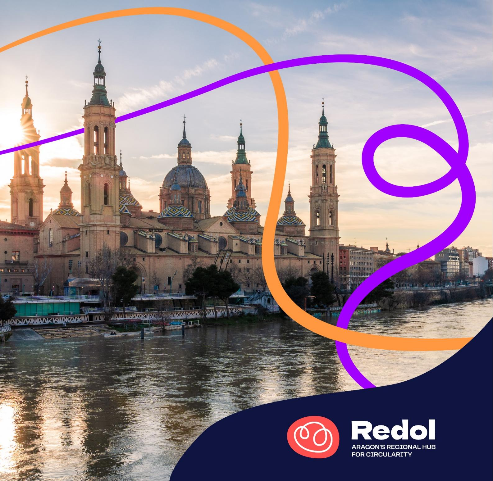

# **D4.2 ADVANCES OF REDOL SUW VALORISATION TECHNOLOGIES**

| Author Names                    | Organization |
|---------------------------------|--------------|
| Félix González                  | ITENE        |
| Francisco Sánchez               | ITENE        |
| Carlos Hornero                  | AITIIP       |
| Gonzalo Murillo, Cecilia Chaine | CIRCE        |
| Raquel Gadea                    | AITEX        |
| Nikita Gula                     | VDZ          |
| Elisabetta de Pinto             | RINA-CSM     |

| Project no.                | 101091668                                                     |
|----------------------------|---------------------------------------------------------------|
| Project acronym:           | REDOL                                                         |
| Project title:             | Aragon's REgional Hub for circularity: Demonstration Of Local |
| Call:                      | HORIZON-CL4-2022-TWIN-TRANSITION-01                           |
| Start date of project:     | 01.12.2022                                                    |
| Duration:                  | 48 months                                                     |
| Deliverable title:         | D4.2 – Advances of REDOL SUW Valorisation Technologies        |
| Due date of deliverable:   | 31.07.2025                                                    |
| Actual date of submission: | 31.07.2025                                                    |
| Deliverable Lead Partner:  | ITENE                                                         |
| Dissemination level:       | Public                                                        |

#### **Document History**

| Version 0.1 0.2 0.3 | Date 18.05.2025 28.06.2025 15.07.2025 | Note ToC First review by PC Addition of information | Revised by ITENE CIRCE WP4 partners |
|---------------------|---------------------------------------|-----------------------------------------------------|-------------------------------------|
| 0.4                 | 22.07.2025                            | Review from WP leader                               |                                     |
|                     |                                       | and PC                                              | ITENE, CIRCE                        |
| 0.5                 | 29.07.2025                            | Addition of requests                                | WP4 Task leaders                    |
| 1.0                 | 31.07.2025                            | Final version                                       | CIRCE                               |

## **Disclaimer**

The content of the publication herein is the sole responsibility of the publishers, and it does not necessarily represent the views expressed by the European Commission or its services.

While REDOL is funded by the European Union, views and opinions expressed are however those of the author(s) only and do not necessarily reflect those of the European Union or the European Research Executive Agency (REA). Neither the European Union nor the European Research Executive Agency (REA) can be held responsible for them.

While the information contained in the documents is believed to be accurate, the authors(s) or any other participant in the REDOL consortium make no warranty of any kind with regard to this material including but not limited to the implied warranties of merchantability and fitness for a particular purpose.

Neither the REDOL Consortium nor any of its members, their officers, employees or agents shall be responsible or liable in negligence or otherwise howsoever in respect of any inaccuracy or omission herein.

Without derogating from the generality of the foregoing neither the REDOL Consortium nor any of its members, their officers, employees or agents shall be liable for any direct or indirect or consequential loss or damage caused by or arising from any information advice or inaccuracy or omission herein.

#### Copyright notice

© REDOL Consortium, 2022-2026. This deliverable contains original unpublished work except where clearly indicated otherwise. Acknowledgement of previously published material and of the work of others has been made through appropriate citation, quotation, or both. Reproduction is authorized provided the source is acknowledged.

## **Executive Summary**

The REDOL project tackles the valorisation of complex Solid Urban Waste (SUW) through five innovative technological prototypes developed under WP4, aiming to enable circular material flows and close resource loops.

#### Task 4.1 – Solvolysis of Composites Using Ultrasound and Microwave:

This task developed ultrasound (US) and microwave (MW) assisted solvolysis processes to recover fibres from composite waste. MW-assisted solvolysis demonstrated higher energy efficiency and scalability, achieving over 95% resin degradation. Mechanical tests confirmed retention or improvement of carbon fibre properties, supporting industrial reuse.

#### Task 4.2 – Selective Dissolution and Delamination of Multilayer Packaging (MMPP):

Complex multilayer flexible and rigid packaging waste was treated via shredding, chemical washing, and green solvent-based delamination. Successful separation of metallized films and rigid trays was achieved using environmentally friendly solvents and electrolysis. Pilot extrusion trials produced mechanically and optically viable recycled materials, highlighting potential for industrial adoption.

#### Task 4.3 – Use of Recycled Materials in Cement and Construction:

Construction and demolition waste, along with industrial by-products, were valorised as alternative fuels, clinker substitutes, and polymer fillers. Cement formulations met industry strength standards, while polymer composites achieved high compressive strength and durability.

#### Task 4.4 – Depolymerization and Repolymerization of Polyester Textile Waste:

Chemical recycling of PET textiles via glycolysis catalysed by ionic liquids and microwave-assisted processes enabled high-yield recovery of BHET monomers. Repolymerization confirmed the recyclability and quality of regenerated PET, closing the textile waste loop.

#### Task 4.5 – Recovery of Metals from WEEE Using Deep Eutectic Solvents:

Selective metal extraction from printed circuit boards using deep eutectic solvents showed promising lab-scale results with optimized kinetics and solvent reuse, offering a greener alternative to traditional acid leaching methods.

## **Table of Contents**

| 1.                                                                                                                                                                             | Executive Summary................................................................................................................................................................ Introduction....................................................................................................................................................................11 | 5  |
|--------------------------------------------------------------------------------------------------------------------------------------------------------------------------------|----------------------------------------------------------------------------------------------------------------------------------------------------------------------------------------------------------------------------------------------------------------------------------------------------------------------------------------------------------------------|----|
| 2. General objective.......................................................................................................................................................... |                                                                                                                                                                                                                                                                                                                                                                      | 12 |
| 3. Task 4.1. Conventional solvolysis assisted by MW and US................................................................................                                     |                                                                                                                                                                                                                                                                                                                                                                      | 13 |
| 3.1.                                                                                                                                                                           | Specific task objectives...................................................................................................................................                                                                                                                                                                                                          | 13 |
| 3.2.                                                                                                                                                                           | Tested materials................................................................................................................................................                                                                                                                                                                                                     | 13 |
| 3.3.                                                                                                                                                                           | General scheme of the work done                                                                                                                                                                                                                                                                                                                                      | 16 |
| 3.3.1.                                                                                                                                                                         | US-assisted technology explanation......................................................................................................                                                                                                                                                                                                                             | 16 |
| 3.3.2.                                                                                                                                                                         | MW-assisted technology explanation....................................................................................................                                                                                                                                                                                                                               | 18 |
| 3.4.                                                                                                                                                                           | Main advances achieved by REDOL...............................................................................................................                                                                                                                                                                                                                       | 22 |
| 3.4.1.                                                                                                                                                                         | SEM fibre studies                                                                                                                                                                                                                                                                                                                                                    | 23 |
| 3.4.2.                                                                                                                                                                         | Single Fibre Tensile Tests...........................................................................................................................26                                                                                                                                                                                                              |    |
| 3.4.3.                                                                                                                                                                         | Use of Fibres as Secondary Materials from ITA..................................................................................29                                                                                                                                                                                                                                    |    |
| 3.5.                                                                                                                                                                           | Impact (KPIs)                                                                                                                                                                                                                                                                                                                                                        | 31 |
| 3.6.                                                                                                                                                                           | Conclusions of T4.1............................................................................................................................................34                                                                                                                                                                                                    |    |
| 3.7.                                                                                                                                                                           | Future work.........................................................................................................................................................35                                                                                                                                                                                               |    |
| 4. Task 4.2. Selective Dissolution of MMPP................................................................................................................36                   |                                                                                                                                                                                                                                                                                                                                                                      |    |
| 4.1.                                                                                                                                                                           | Specific Task Objectives..................................................................................................................................36                                                                                                                                                                                                         |    |
| 4.2.                                                                                                                                                                           | General scheme of the work done ...............................................................................................................36                                                                                                                                                                                                                    |    |
| 4.2.1.                                                                                                                                                                         | Metallised films                                                                                                                                                                                                                                                                                                                                                     | 37 |
| 4.2.2.                                                                                                                                                                         | Rigid trays .......................................................................................................................................................38                                                                                                                                                                                                |    |
| 4.2.3.                                                                                                                                                                         | PA/PE films......................................................................................................................................................38                                                                                                                                                                                                  |    |
| 4.3.                                                                                                                                                                           | Main advances achieved by REDOL...............................................................................................................39                                                                                                                                                                                                                     |    |
| 4.3.1.                                                                                                                                                                         | Metallized films...............................................................................................................................................40                                                                                                                                                                                                    |    |
| 4.3.2.                                                                                                                                                                         | Rigid trays                                                                                                                                                                                                                                                                                                                                                          | 41 |
| 4.3.3.                                                                                                                                                                         | PA/PE films......................................................................................................................................................42                                                                                                                                                                                                  |    |
| 4.4.                                                                                                                                                                           | Impact (KPIs) .....................................................................................................................................................43                                                                                                                                                                                                |    |
| 4.5.                                                                                                                                                                           | Conclusions of T4.2 ...........................................................................................................................................44                                                                                                                                                                                                    |    |
| 4.6.                                                                                                                                                                           | Future work.........................................................................................................................................................46                                                                                                                                                                                               |    |
| 5. Task 4.3. Recycled Components for the Construction and Cement Industry..........................................47                                                          |                                                                                                                                                                                                                                                                                                                                                                      |    |
| 5.1.                                                                                                                                                                           | Specific task objectives...................................................................................................................................47                                                                                                                                                                                                        |    |
| 5.2.                                                                                                                                                                           | General scheme of the work done ...............................................................................................................47                                                                                                                                                                                                                    |    |
| 5.3.                                                                                                                                                                           | Main advances achieved by REDOL...............................................................................................................50                                                                                                                                                                                                                     |    |
| 5.3.1.                                                                                                                                                                         | Fuel....................................................................................................................................................................50                                                                                                                                                                                           |    |
| 5.3.2.                                                                                                                                                                         | Clinker ..............................................................................................................................................................50                                                                                                                                                                                             |    |
| 5.3.3.                                                                                                                                                                         | Cement constituent ....................................................................................................................................58                                                                                                                                                                                                            |    |
| 5.3.4.                                                                                                                                                                         | Cast polymer..................................................................................................................................................59                                                                                                                                                                                                     |    |
| 5.4.                                                                                                                                                                           | Impact (KPIs) .....................................................................................................................................................63                                                                                                                                                                                                |    |

| 5.5. 5.6.                                                                                                                                                                  |                                                                                                                                                                         |
|----------------------------------------------------------------------------------------------------------------------------------------------------------------------------|-------------------------------------------------------------------------------------------------------------------------------------------------------------------------|
| 6. Task 4.4. Depolymerization and repolymerization of textile waste.............................................................                                           | 66                                                                                                                                                                      |
| 6.1.                                                                                                                                                                       | Specific Task Objectives..................................................................................................................................66            |
| 6.2.                                                                                                                                                                       | General scheme of the work done ...............................................................................................................66                       |
| 6.2.1.                                                                                                                                                                     | Shredding and densification......................................................................................................................67                     |
| 6.2.2.                                                                                                                                                                     | Glycolysis process........................................................................................................................................68            |
| 6.2.3.                                                                                                                                                                     | Solid State Polymerization and spinning............................................................................................... 69                               |
| 6.3.                                                                                                                                                                       | Main advances achieved by REDOL...............................................................................................................70                        |
| 6.3.1.                                                                                                                                                                     | Chemical recycling of PET via glycolysis under conventional heating..........................................70                                                         |
| 6.3.2.                                                                                                                                                                     | Chemical recycling of PET by microwave-assisted glycolysis........................................................ 73                                                   |
| 6.4.                                                                                                                                                                       | Impact (KPIs) 78                                                                                                                                                        |
| 6.5.                                                                                                                                                                       | Conclusions of T4.4...........................................................................................................................................79        |
| 6.6.                                                                                                                                                                       | Future work......................................................................................................................................................... 81 |
| 7. Task 4.5. Recovery of Metals from WEEE-derived                                                                                                                          | .............................................................................................82                                                                         |
| 7.1.                                                                                                                                                                       | Specific Task Objectives..................................................................................................................................82            |
| 7.2.                                                                                                                                                                       | General scheme of the work done ...............................................................................................................82                       |
| 7.2.1.                                                                                                                                                                     | Introduction. A brief overview of current management of WEEE in Europe:............................82                                                                   |
| 7.2.2.                                                                                                                                                                     | WEEE recycling REDOL methodology......................................................................................................89                                |
| 7.2.3.                                                                                                                                                                     | Tests on whole sample to simulate the industrial process .............................................................92                                                |
| 7.3.                                                                                                                                                                       | Main advances achieved by REDOL...............................................................................................................92                        |
| 7.4.                                                                                                                                                                       | Impact (KPIs) .....................................................................................................................................................93   |
| 7.5.                                                                                                                                                                       | Conclusions of T4.5..........................................................................................................................................94         |
| 7.6.                                                                                                                                                                       | Future work.........................................................................................................................................................94  |
| 8. General Conclusions.................................................................................................................................................... | 95                                                                                                                                                                      |

## **List of Acronyms**

| Acronym | Meaning                                                  |
|---------|----------------------------------------------------------|
| A       | Arrhenius constant                                       |
| AcOOH   | Peracetic acid                                           |
| ASTM    | American Society for Testing and Materials               |
| BHET    | bis(2-hydroxyethyl) terephthalate                        |
| Bmim    | 1-butyl-3-methylimidazolium                              |
| BPA     | Bisphenol A                                              |
| CDW     | Construction and Demolition Waste                        |
| CF      | Carbon Fiber                                             |
| CL      | Clinker                                                  |
| CSH     | Calcium Silicate Hydrate                                 |
| CSTR    | Continuous Stirred Tank Reactor                          |
| DES     | Deep Eutectic Solvent                                    |
| DSC     | Differential Scanning Calorimetry                        |
| Ea      | Activation Energy                                        |
| EG      | Ethylene Glycol                                          |
| EHS     | Environmental Health and Safety                          |
| EP      | Epoxy                                                    |
| EU      | European Union                                           |
| EVA     | Ethylene Vinyl Acetate                                   |
| EVOH    | Ethylene-Vinyl Alcohol Copolymer                         |
| FRCs    | Fiber-Reinforced Composites                              |
| FTIR    | Fourier Transform Infrared Spectroscopy                  |
| GC/MS   | Gas Chromatography–Mass Spectrometry                     |
| GF      | Glass Fiber                                              |
| HDPE    | High-density polyethylene                                |
| ICP/OES | Inductively Coupled Plasma Optical Emission Spectroscopy |
| IL      | Ionic Liquid                                             |
| INF     | Infusion                                                 |
| IP8     | 8-channel ultrasonic measuring system                    |
| IR      | Infrared                                                 |

| LCA   | Life Cycle Assessment                                                          |
|-------|--------------------------------------------------------------------------------|
| LDPE  | Low-Density Polyethylene                                                       |
| LM    | Light Microscopy                                                               |
| MABPA | Methacrylated Bisphenol A                                                      |
| MALDI | Matrix-Assisted Laser Desorption /Ionization                                   |
| MMPP  | Multi-Material Multilayer Plastic Packaging                                    |
| MUD   | Material Under Discussion                                                      |
| MW    | Microwave                                                                      |
| NIAS  | Non-Intentionally Added Substances                                             |
| NMR   | Nuclear Magnetic Resonance                                                     |
| PA    | Polyamide                                                                      |
| PCB   | Printed Circuit Board                                                          |
| PE    | Polyethylene                                                                   |
| PES   | Polyester                                                                      |
| PET   | Polyethylene Terephthalate                                                     |
| PH    | Phenolic                                                                       |
| PLC   | Programmable Logic Controller                                                  |
| PP    | Polypropylene                                                                  |
| PTFE  | Polytetrafluoroethylene                                                        |
| PU    | Pultrusion                                                                     |
| PVC   | Polyvinyl Chloride                                                             |
| R     | Gas constant                                                                   |
| RBF   | Round-Bottom Flask                                                             |
| REDOL | Aragon's REgional Hub for circularity: Demonstration Of Local industrial-urban |
| RM    | Raw Material                                                                   |
| rPET  | Recycled Polyethylene Terephthalate                                            |
| SEM   | Scanning Electron Microscopy                                                   |
| SRC   | Single Reaction Chamber                                                        |
| SS    | Suspended Solids                                                               |
| SSP   | Solid State Polycondensation                                                   |
| SUW   | Solid Urban Waste                                                              |
| t     | Time                                                                           |
| T     | Temperature                                                                    |
| TG    | Thermogram                                                                     |

| Tg    | Glass transition temperature               |
|-------|--------------------------------------------|
| TGA   | Thermogravimetric Analysis                 |
| THF   | Tetrahydrofuran                            |
| TOC   | Total Organic Compounds                    |
| US    | Ultrasound                                 |
| VARTM | Vacuum Assisted Resin Transfer Molding     |
| VE    | Venyl-Esther                               |
| WEEE  | Waste of Electric and Electronic Equipment |
| WTB   | Wind Turbine Blade                         |
| XRD   | X-Ray Diffraction                          |
| XRF   | X-Ray Fluorescence                         |

## **1. Introduction**

WP4 focused on developing and validating advanced green recycling technologies for complex postconsumer waste streams, including composites, multilayer plastics, textiles, construction and demolition waste (CDW), and electronic waste (WEEE). The work combined chemical, mechanical, and process engineering approaches to enable efficient separation, purification, and reintegration of recovered materials into new value chains.

To enhance solvolysis processes, innovative heating and stirring technologies—microwave (MW) and ultrasound (US)—were tested in 1 L pilot reactors at CIRCE and AITIIP, respectively. Green solvents were screened, and numerical simulations supported the optimisation of operating conditions. A 100 L reactor concept was proposed, integrating IR/UV sensors for real-time monomer monitoring to ensure fibre purity.

For multilayer plastic packaging (MMPP), solvent-based delamination methods were developed by ITENE, including pre-treatment, solvent selection (guided by Hansen parameters), and separation of PET and polyolefins. The recovered fractions were characterised and upcycled through extrusion with optimised parameters to maintain material quality.

In the construction sector, VDZ analysed CDW fractions provided by CASALÉ—concrete, mortar, brick, slags—and assessed their suitability as raw materials for clinker, cement constituents, or recycled aggregates.

AITEX led textile recycling by developing a two-step glycolysis–polymerisation process for polyester-rich fabrics (>90%). Using ionic liquids as catalysts, BHET monomers were obtained and repolymerised into PET chips. CIRCE supported with MW-assisted glycolysis. The final yarns were tested in fabric form in BRILEN, showing performance equivalent to virgin PET.

Finally, RINA-CSM, with CIRCE and TATUINE, addressed metal recovery from WEEE-derived PCBs using deep eutectic solvents (DES). Various DES formulations were optimised, and process efficiency was assessed through metal recovery yields and mass/energy balances.

Overall, the work conducted in WP4 has demonstrated meaningful technical progress and validated the potential of multiple green recycling routes. The combined outcomes provided a solid foundation for further integration, scale-up, and demonstration activities in the subsequent stages of the project.

## **2. General objective**

The main objective of this deliverable is to design and test, under controlled conditions, a set of innovative recycling and valorisation prototypes for different streams of Solid Urban Waste (SUW), aiming at its inclusion in circular and symbiotic value chains. These prototypes are tailored to the specific characteristics of each waste type.

This deliverable will focus on WP4, which aims to develop different lines based on the type of waste and its corresponding recycling treatment. Therefore, the objectives associated with the work package, and thus with this deliverable are:

- To develop a solvolysis prototype for plastics valorisation.
- To advance the maturity level of dissolution technologies for MMPP valorisation.
- To validate a process based on glycolysis for textiles valorisation.
- To upscale a PCB valorisation process and analyse alternative routes for driving down processing costs.
- Formulation of recycled components for the construction and cement industry

## **3.Task 4.1. Conventional solvolysis assisted by MW and US**

## **3.1. Specific task objectives**

The primary objective of T4.1 is the recovery and valorisation of composite waste through the application of solvolysis technology [\(Figure 1\)](#page-12-3). To achieve this, AITIIP and CIRCE has investigated the integration of two advanced techniques—ultrasound (US) and microwave (MW)—to enhance the efficiency of the conventional solvolysis process.

Solvolysis is a chemical reaction where a solvent plays a crucial role in breaking down a compound. In this process, the solvent acts as a reactant and is present in large quantities, helping to replace an atom or a group of atoms in a molecule with another atom or group of atoms. Essentially, solvolysis is a chemical swap facilitated by a solvent, making it an important process in both organic and inorganic chemistry. When ultrasound is applied, it creates tiny bubbles in the liquid. These bubbles rapidly expand and collapse, generating intense heat and pressure in very small areas. This phenomenon, known as acoustic cavitation, can significantly speed up chemical reactions and make them more efficient.

Moreover, CIRCE has conducted numerical simulations to support this optimization. The most promising solvent and the final process conditions will be scaled up to 1L each before determining which technology will be implemented in MOSES within T6.1.

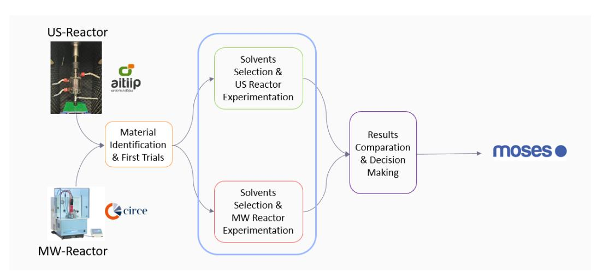

**Figure 1. Task 4.1 Execution Diagram**

## **3.2.Tested materials**

The project aims to effectively valorise composite materials by identifying and assessing them within various value chains. In previous phases of the project it was found that plastic providers do not receive composite materials, limiting sources to construction and demolition waste (CDW) providers, specifically CASALE's landfill.

CASALE, based in Zaragoza, manages CDW and classifies it into distinct categories. The composite material chosen for solvolysis includes technical fibres (glass or carbon fibre) within a polymer matrix, offering superior properties like high strength-to-weight ratio and durability.

CIRCE and AITIIP collaborated with CASALE to identify potential composite materials, though the search was challenging due to the materials' durability and inconsistent supply.

Three types of materials were found at CASALE's landfill [\(Table 1\)](#page-13-0): a fragmented wind turbine blade, fiberglass insulation, and roof panels. Only the fiberglass insulation and roof panels showed some continuity.

**Table 1. CASALE's Composite Materials**

| FRAGMENTED WTB                                                                 | FIBREGLASS INSULATION                                                                                | ROOF PANELS                                                                                 |
|--------------------------------------------------------------------------------|------------------------------------------------------------------------------------------------------|---------------------------------------------------------------------------------------------|
|  |  |  |

Due to the current scarcity of materials in landfills, ACCIONA offered their expertise and resources to provide high-quality composite materials used in infrastructure. These materials, which will eventually reach landfills at the end of their lifecycle, cover a wide range of types and reinforcements for analysis and fibre recovery.

Those composites were manufactured using different combinations of reinforcements and resins and different manufacturing processes: infusion and pultrusion. The infusion and pultrusion processes are two distinct manufacturing methods for thermoset composites. Infusion is a mouldbased technique in which dry fibre reinforcements are placed into a mould and resin is introduced under vacuum, allowing to produce large and complex-shaped components. In contrast, pultrusion is a continuous process where fibres are impregnated with resin and pulled through a heated die to cure into constant cross-section profiles, making it ideal for high-volume production of straight, uniform structural elements. [Table 2](#page-14-0) summarizes the various composites manufactured using commercial resins and reinforcements.

Each composite system was characterized and the results like the resin/fibre ratio determined by ACCIONA provides a suitable value to determine the recycling yield achieved by the different solvolysis processes explored within REDOL's project.

All the systems meet ACCIONA's Tg requirement (Tg> 70°C). On the other hand, the determination of fibre content, resin content, and void volume enables the assessment of the compaction and porosity of the composite. According to industry standards in the construction sector, any panel with a void volume exceeding 5% is deemed unacceptable. Therefore, the results obtained meet our acceptance criteria. Moreover, the resin/fibre ratio determined by ACCIONA provides a suitable value to determine the recycling yield achieved by the different solvolysis processes explored within REDOL's project.

**Table 2. ACCIONA's Composite Materials Selection**

| Sample Technology Code Parameter | Value Picture |
|----------------------------------|---------------|
| % GF (Unidir.)                   | 69,78         |
| % Resin                          | 30,22         |
| % CF (Unidir.)                   | 70,23         |
| % Resin                          | 29,77         |
| % GF (0/90)                      | 69,32         |
| % Resin                          | 30,68         |
| % CF (0/90)                      | 70,11         |
| % Resin                          | 29,89         |
| % CF                             | 12,42         |
| % GF                             | 43,9          |
| % Resin                          | 43,68         |
| % GF (Unidir.)                   | 71,5          |
| % Resin                          | 28,5          |
| % CF (Unidir.)                   | 78,39         |
| % Resin                          | 21,61         |
| % GF (0/90)                      | 70,41         |
| % Resin                          | 29,59         |
| % CF (0/90)                      | 68,66         |
| % Resin                          | 31,34         |
| POLYESTER RESIN % Resin          | 100           |

## **3.3.General scheme of the work done**

#### **3.3.1. US-assisted technology explanation**

#### **3.3.1.1. Characteristics of the technology**

Ultrasound-assisted solvolysis is a fascinating process where sound waves, specifically ultrasound, are used to enhance chemical reactions involving solvents.

This method is particularly useful in organic chemistry for improving reaction rates and yields. In essence, ultrasound-assisted solvolysis uses sound waves to turbocharge the chemical process, making it quicker and more efficient.

In AITIIP's case [\(Figure 2\)](#page-15-2), the reactor is designed to be attached to the top of the ultrasonic tip. This setup allows the ultrasonic waves to directly interact with the solution inside the reactor. To ensure the solution is well-mixed and continuously processed, a peristaltic pump is used. This pump helps to recirculate the contents of the solution within the reactor. Additionally, the solution is better enclosed within the reactor, which helps to ensure a controlled environment for the reaction.

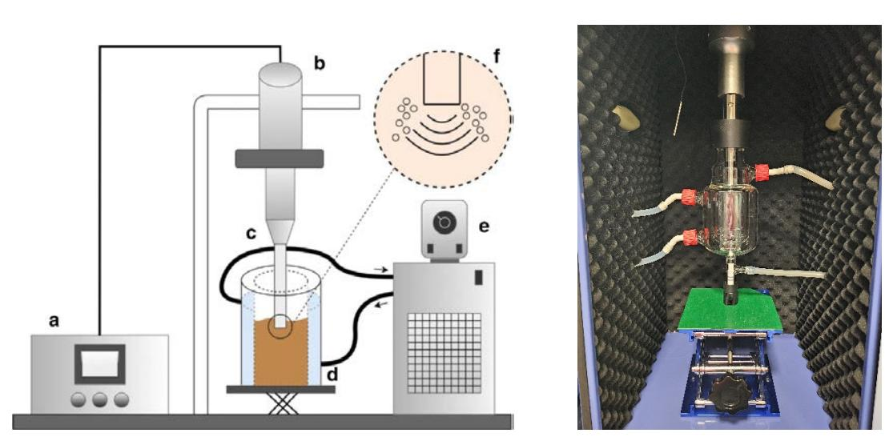

**Figure 2. On the left, ultrasound-assisted extraction assembly with ultrasound probe system (a: ultrasound generator; b: transducer; c: ultrasound cylinder probe; d: jacket beaker with sample-solvent mixture inside; e: refrigerated circulator; f: bubble cavitation phenomena). On the right, AITIIP's ultrasonic reactor chamber attached to the chiller (left side) & the peristaltic pump to recirculate the solution (right side).**

#### **3.3.1.2. Deployment challenges**

When transitioning from using a round-bottom flask (RBF) to an ultrasonic reactor for experiments, several challenges were encountered [\(Figure 3\)](#page-16-0). Initially, with the round-bottom flask, it was easy to attach a cooling system. This cooling system helped prevent the solvent from evaporating under normal atmospheric pressure, ensuring that the experiments could be conducted safely and efficiently.

However, the ultrasonic reactor used in the experiments had a different setup. This reactor was equipped with a jacket, which is a layer around the reactor through which a liquid can circulate. This circulating liquid could either heat or cool the inside of the reactor, depending on the needs of the experiment. Additionally, the reactor had a system with an inlet and outlet for the liquid, allowing the contents inside to be recirculated continuously.

The top part of the reactor was connected to the ultrasonic tip using a threaded connection. This connection, however, was not completely airtight. Because of this, the experimental setup could not include a coolant system. As a result, when the solvent inside the reactor was heated, it would start to evaporate and escape. This not only led to the loss of solvent but also posed a safety risk.

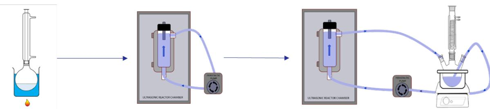

![Diagram of the reaction process showing the following steps: 1. A reaction chamber (Ultrasonic Reactor Chamber) is shown with a blue liquid leading into it. 2. The reaction chamber is connected to a reaction chamber (Ultrasonic Reactor Chamber) with a blue line showing a blue particle moving upwards. 3. The reaction chamber is connected to a reaction chamber (Ultrasonic Reactor Chamber) with a blue line showing a blue particle moving downwards. 4. The reaction chamber is connected to a reaction chamber (Ultrasonic Reactor Chamber) with a blue line showing a blue particle moving downwards. 5. The reaction chamber is connected to a reaction chamber (Ultrasonic Reactor Chamber) with a blue line showing a blue particle moving downwards. 6. The reaction chamber is connected to a reaction chamber (Ultrasonic Reactor Chamber) with a blue line showing a blue particle moving downwards.]()

**Figure 3. From the RBF moved to the US-Reactor to the US-RBF Reactor Scheme**

#### **3.3.1.3. Selected solvents**

One of the main goals of this task is to reduce environmental impact by using the most effective functional solvents, which should be bio-based and biodegradable. The plastic matrix in composite materials forms a tough three-dimensional network, making dissolution challenging. Therefore, the chosen solvents must be strong enough to penetrate this structure.

Solvents are classified as environmentally friendly based on criteria such as carbon dioxide emissions (Life Cycle Assessment, LCA), Environmental Health and Safety (EHS) profile, and the use of renewable raw materials (Bio-Based). Due to the lack of complete LCA data, solvents were classified by their origin and impact into four categories [\(Figure 7\)](#page-16-1): EHS + BIO-BASED, NO EHS + BIO-BASED, NO EHS + NON-BIOBASED, and EHS + NON-BIOBASED.

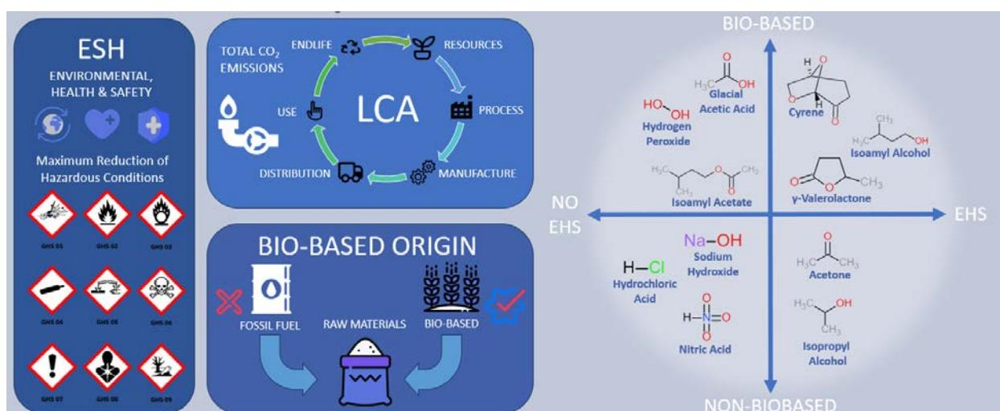

The diagram illustrates the composition of two based origins: BIO-BASED and NON-BIOBASED. The BIO-BASED origin is composed of LCA and EHS. The BIO-BASED NON-BIOBASED products are BIO-BASED and NON-BIOBASED. The legend indicates that LCA and EHS are based on the origin of the product.

**BIO-BASED Origin**

- **LCA** (Light Cyan)
- **EHS** (Blue)

**BIO-BASED NON-BIOBASED**

- **BIO-BASED** (Blue)
- **NON-BIOBASED** (Blue)

**LCA and EHS are based on the origin of the product.**

**LCA and EHS are based on the origin of the product.**

**BIO-BASED origin**

- **LCA** (Light Cyan)
- **EHS** (Blue)

**BIO-BASED NON-BIOBASED**

- **BIO-BASED** (Blue)
- **NON-BIOBASED** (Blue)

**LCA and EHS are based on the origin of the product.**

**BIO-BASED origin**

- **LCA** (Light Cyan)
- **EHS** (Blue)

**BIO-BASED NON-BIOBASED**

- **BIO-BASED** (Blue)
- **NON-BIOBASED** (Blue)

**LCA and EHS are based on the origin of the product.**

**BIO-BASED origin**

- **LCA** (Light Cyan)
- **EHS** (Blue)

**BIO-BASED NON-BIOBASED**

- **BIO-BASED** (Blue)
- **NON-BIOBASED** (Blue)

**LCA and EHS are based on the origin of the product.**

**BIO-BASED origin**

- **LCA** (Light Cyan)
- **EHS** (Blue)

**BIO-BASED NON-BIOBASED**

- **BIO-BASED** (Blue)
- **NON-BIOBASED** (Blue)

**LCA and EHS are based on the origin of the product.**

**BIO-BASED origin**

- **LCA** (Light Cyan)
- **EHS** (Blue)

**BIO-BASED NON-BIOBASED**

- **BIO-BASED** (Blue)
- **NON-BIOBASED** (Blue)

**LCA and EHS are based on the origin of the product.**

**BIO-BASED origin**

- **LCA** (Light Cyan)
- **EHS** (Blue)

**BIO-BASED NON-BIOBASED**

- **BIO-BASED** (Blue)
- **NON-BIOBASED** (Blue)

**LCA and EHS are based on the origin of the pro**

**Figure 4. AITIIP's Green Solvent Identification Scheme**

Two final solution mixtures were selected for experimentation: an acid-oxidant solution and an alcohol-based catalysed solution. The acid-oxidant solution consisted of glacial acetic acid and hydrogen peroxide, generating peracetic acid to react with the resin. The alcohol-based solution was a mixture of isopropyl alcohol and concentrated sodium hydroxide, with varying proportions to study their effect on composite material dissolution.

#### **3.3.1.4. Work developed**

Experimental trials on solvolysis conditions for various composite materials [\(Figure 5\)](#page-17-1) revealed that PES ROOF fibres could not be recovered, indicating incompatibility with the tested processes. EP-IN-FC and EP-IN-FC+FV were the only formulations yielding clean fibres, but EP-IN-FC+FV's mixed composition of carbon and glass fibres was not ideal for fibre recovery studies. EP-IN-FC showed the most effective fibre liberation, achieving 96% efficiency.

A comparative study using RBF and US-RBF reactor trials with EP-IN-FC employed MALDI spectrometry to analyse molecular distribution. Ultrasonic processing reduced the average molecular weight of solubilized compounds, enhancing resin dissolution capacity and allowing greater resin loading in solution.

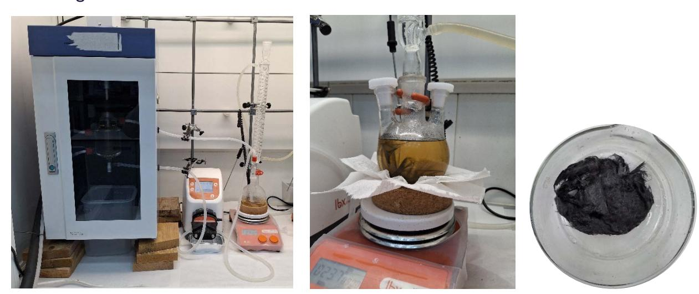

**Figure 5. US-RBF Reactor Set-Up (left) / EP-IN-FC Solvolysis (centre) / EP-INFC Fibre (right)**

These findings highlight the importance of material composition on solvolysis efficiency and fibre recovery.

### **3.3.2. MW-assisted technology explanation**

#### **3.3.2.1. Characteristics of the technology**

Microwave-assisted recycling is emerging as a powerful alternative for processing fibre-reinforced composites (FRCs), offering several important advantages compared to conventional heating. Instead of applying heat from the outside, this method uses an electromagnetic field to interact with polar molecules in the reaction medium [\(Figure 6\)](#page-18-0). These molecules start to rotate rapidly, generating internal heat through molecular friction. This internal heating leads to more uniform and efficient temperature distribution and allows for fine control over the reaction conditions.

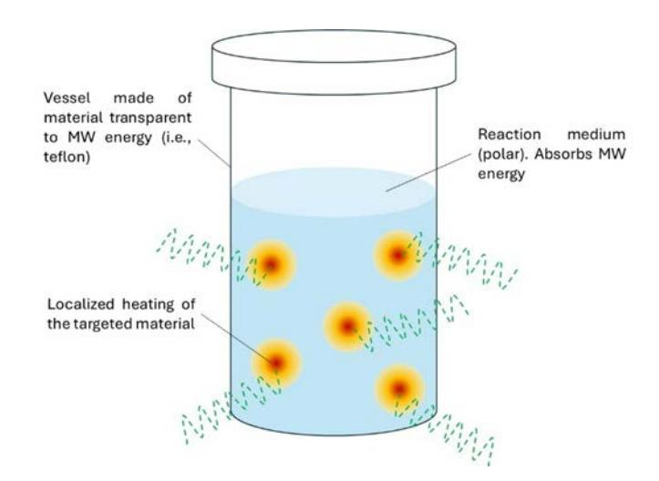

**Figure 6. Microwave-material interaction (heating)**

This ability to control temperature precisely is crucial, as it makes it possible to influence the breakdown of the polymer matrix—known as depolymerization—and steer the formation of specific reaction products. Microwaves not only provide this selective heating but also improve energy efficiency by delivering heat directly to the materials that need it, reducing losses to the surrounding environment.

Another key benefit of this approach is its catalytic effect. The electromagnetic field generated by the microwave source helps align polar molecules in the right orientation for reaction, increasing the chances of successful molecular collisions. This leads to faster reactions, lower energy requirements, and reduced use of catalysts. In terms of chemical kinetics, these effects translate into an increase in the pre-exponential factor (A) in the Arrhenius equation, which reflects the frequency and effectiveness of molecular collisions. The equation is as follows:

���� = ���� · ����− �������� Where k is the reaction rate constant, A is the pre-exponential factor, Ea is the activation energy, R is the universal gas constant (8.314 J/mol·K), and T is the temperature in Kelvin. Microwave effects enhance A, enabling reactions to occur at lower temperatures and in shorter times.

$$k = A \cdot e^{-\frac{E_A}{R \cdot T}}$$

Experimental work was carried out using a Milestone SynthWAVE microwave reactor with a 1-liter Teflon-lined cylindrical reaction chamber [\(Figure 7\)](#page-19-0). The system can deliver up to 1500 W of microwave power and supports magnetic stirring, with maximum operating conditions of 300 ºC and 199 bar. A built-in chiller keeps the magnetrons below 45 ºC during operation, and the system allows real-time monitoring and adjustment of heating rates via a PLC interface, ensuring precise control of the reaction throughout the process.

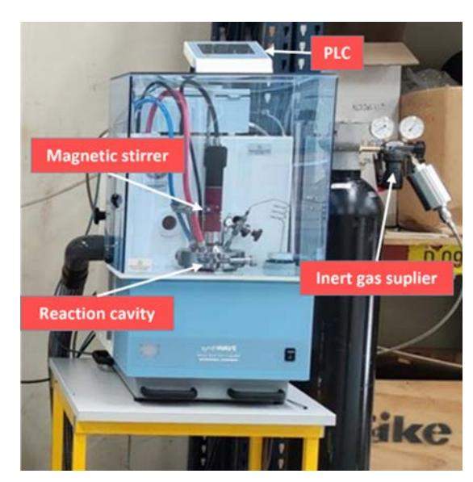

**Figure 7. Milestone SynthWAVE 1L MW-assisted reactor**

#### **3.3.2.2. Deployment challenges**

Solvolysis reactions usually take place at relatively low temperatures, which helps preserve the mechanical properties of the fibres in FRCs and improves the energy efficiency of the process. However, when using environmentally friendly ("green") solvents, higher temperatures are sometimes required to make the solvents more reactive—often approaching their boiling point. This becomes a challenge in microwave-assisted processes, because once a solvent reaches the gas phase, it can no longer effectively absorb microwave energy. Instead of being absorbed, the microwaves may be reflected back toward the equipment, potentially damaging sensitive components such as the magnetron. To avoid this, the system must operate under high pressure to ensure that most of the solvent remains in the liquid phase, which is necessary for effective microwave absorption.

Another practical limitation encountered in the study was related to testing the mechanical properties of the recycled fibres. To perform proper testing, composite samples need to be of a certain minimum length. However, inserting these longer samples into the microwave reactor left no room for the internal stirrer, forcing its removal and reducing the ability to agitate the reaction mixture during processing.

The cost of the solvents used in the process also became a significant concern. Not only were the volumes required substantial, but the unit prices of some solvents were also quite high. For example, glacial acetic acid could be partially recovered—up to 85%—helping to offset its cost. But this was not the case with certain thermally sensitive solvents, such as ionic liquids (ILs) and deep eutectic solvents (DES). These degrade at the high temperatures needed for the reaction and lose their chemical effectiveness, making recovery impossible. Examples include combinations like [BMIm][Acet]:ethylene glycol (20:80), Urea:Glycerol:Choline chloride (1:1:1), and Thymol:Decanoic acid (1:1).

Finally, it is worth noting that microwave heating is still not widely used in the field of chemical recycling. This is especially true when working with less conventional solvents like ILs and DES, where scientific literature and reference data remain scarce. As a result, designing and optimizing these systems often involves dealing with a lack of prior information and navigating significant experimental uncertainty.

#### **3.3.2.3. Selected solvents**

Microwave-assisted solvolysis was applied to recover fibres by breaking down the polymer matrix. The process focused on green solvents—ionic liquids (ILs), deep eutectic solvents (DES), and biobased options—tested across various composite types. While ILs offered high performance, they were expensive and unrecoverable; DES were more biodegradable and cost-effective. Acetic acid stood out for its low cost, availability, and partial recoverability. Catalysts were used selectively to enhance reaction rates.

The findings helped identify optimal solvent-material combinations and demonstrated the potential of microwave-assisted solvolysis as a scalable, eco-efficient recycling solution.

#### **3.3.2.4. Work developed**

The main goal of the experimental setup was to develop an efficient and environmentally responsible method to break down polymer resins in composite materials using microwave-assisted solvolysis. This approach aimed to recover reinforcing fibres and support the circular economy by giving value to industrial composite waste.

The process began with a calcination step to determine the resin content in each composite type. Different heating programs were applied depending on fibre type and material thickness, with distinct protocols for glass and carbon fibre composites sourced from CASALÉ and ACCIONA. This initial analysis provided a baseline to measure the success of the solvolysis reactions.

Solvolysis experiments were conducted in 40 mL microwave vials under controlled conditions. Variables such as reaction time, temperature, pressure, stirring speed, solvent systems, and catalysts were tested systematically. Composite samples were pre-processed to maximize exposure to solvents: CASALÉ materials were ground manually, while ACCIONA samples were cut into standardized fragments.

When certain solvent-catalyst combinations—particularly catalysed acetic acid—achieved over 80% resin degradation, they were further tested for compatibility across different resin types. Trials were adjusted as needed to explore the potential of using a single optimized formulation for a broader range of composites.

After each reaction, fibres were filtered, cleaned, dried, and in some cases analysed by SEM to check for damage or catalyst deposits [\(Figure 8\)](#page-21-1). The liquid phase, containing resin degradation products, was treated to isolate the oil fraction, which was characterized by GC/MS.

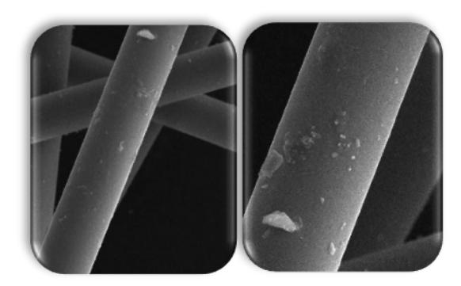

**Figure 8. Fibers obtained analysed by SEM**

The optimized process was scaled up to a 600 mL reactor for further testing [\(Figure 9\)](#page-21-2). A kinetic study helped fine-tune the conditions to maintain fibre quality and reaction efficiency. Solvent recovery was implemented through vacuum distillation. Tests confirmed that recycled acetic acid contained negligible catalyst, and reuse trials showed consistent performance.

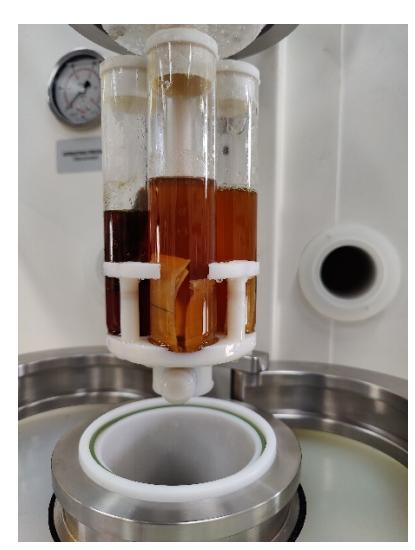

**Figure 9. CASALÉ sample in different reaction media E8-E10 – MW-assisted reactor (SynthWave)**

This structured approach resulted in a technically feasible and sustainable method for recycling composite waste, laying the groundwork for future industrial-scale implementation.

## **3.4.Main advances achieved by REDOL**

As part of the REDOL project, significant advances have been made in the development of recycling and material recovery technologies. Notably, substantial progress has been achieved with USassisted technology and MW-assisted technology. These technologies have proven effective in breaking down resins and recovering fibres.

The US-assisted has enabled the recovery of predominantly clean carbon fibres. On the other hand, the MW-assisted technology has shown promising results in fibre recovery, utilizing specific conditions that will be scaled and demonstrated in later phases of the project.

Following sections present the main achievements to date, emphasizing the quality of the fibre recovered and the main results of the project.

#### **3.4.1. SEM fibre studies**

The Scanning Electron Microscope (SEM) is a powerful tool used to look at very small things in great detail. Unlike regular microscopes that use light, an SEM uses a beam of electrons to scan the surface of a sample. This allows to see the surface structure of objects at a much higher magnification and resolution. SEMs is used to study the detailed shapes and surfaces of the fibre materials to measure its shape, size and possible tiny particles that might be adhered to them.

#### **3.4.1.1. Fibres obtained by AITIIP's US-Assisted Technology**

The only fibre successfully dissolved using Ultrasound-Assisted Technology is EP-IN-FC [\(Table 3](#page-22-1) and [Figure 10\)](#page-22-2). The carbon fibres are predominantly clean, with only minor traces of resin still visible between them, which have not yet fully detached or dissolved.

**Table 3. EP-IN FC - Average Fibre Diameter**

|   | Parameter                  | 1    | 2    | 3    | 4    | 5    | 6    | Mean |
|----------------|----------------------------|------|------|------|------|------|------|------|
|   | Diameter ( $\mu\text{m}$ ) | 6.83 | 6.55 | 6.48 | 6.76 | 7.33 | 7.11 | 6.84 |

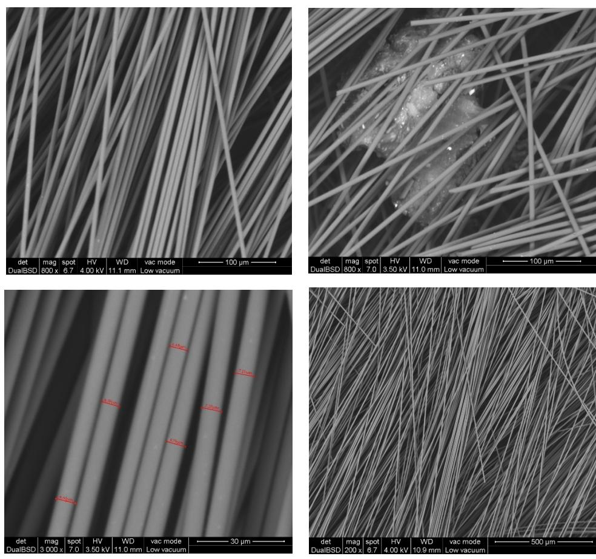

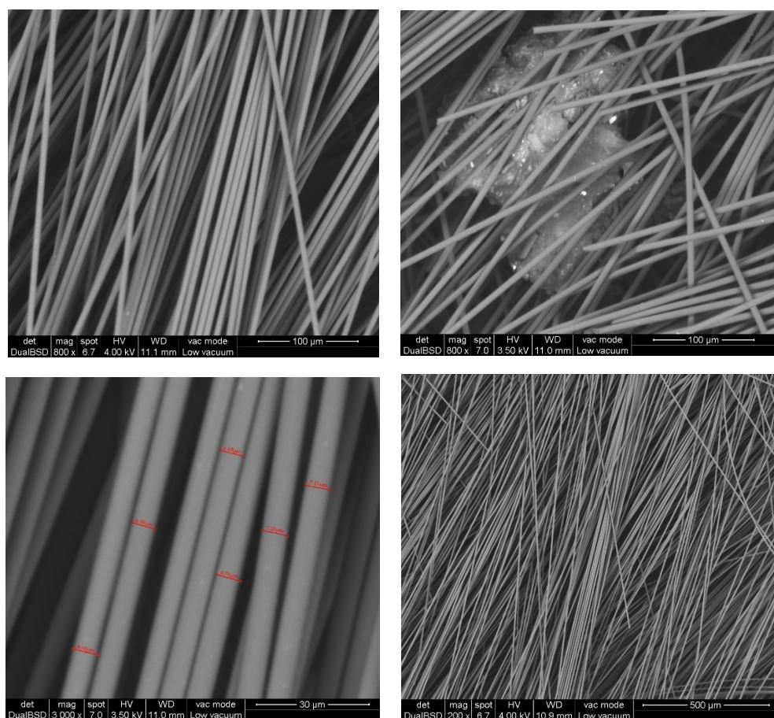

**Figure 10. EP-IN FC - SEM Fibre**

#### **3.4.1.2. Fibres obtained by CIRCE's MW-Assisted Technology**

Following CIRCE´s approach, two sets of fibers recovered from the EP-IN GF and EP-PU GF composites, respectively, were analyzed using SEM. The fibers analyzed were those recovered after treatment of the original composite in a reaction medium composed of acetic acid and 5% ZnCl₂ by weight. As shown in [Table 4,](#page-23-0) within each set of fibers, two different diameter ranges can be identified, corresponding to whether the fibers were used in infusion or pultrusion processes. This difference is due to the fact that pultrusion fibers are specifically designed to withstand higher mechanical stress. In addition, glass fibers are generally thicker than the carbon fibers recovered and analyzed by AITIIP [\(Figure 11](#page-24-0) and [Figure 12\)](#page-24-1).

**Table 4. SEM Data from CIRCE's Samples**

|               |       |       |       |       | P1 EP-IN FV |       |       |       |       |       |       |       |
|---------------|-------|-------|-------|-------|-------------|-------|-------|-------|-------|-------|-------|-------|
| Sample        | 1     | 2     | 3     | 4     | 5           | 6     | 7     | 8     | 9     | 10    | 11    | Mean  |
| Diameter (µm) | 17.27 | 17.81 | 15.67 | 18.37 | 14.64       | 15.31 | 21.11 | 15.79 | 14.9  | 17.36 | 16.64 | 16.81 |
| Sample        | 1     | 2     | 3     | 4     | 5           | 6     | 7     | 8     | 9     | 10    | 11    | Mean  |
| Diameter (µm) | 23.07 | 25.87 | 23.56 | 20.91 | 23.35       | 21.19 | 23.22 | 22.58 | 25.14 | 21.00 | 25.27 | 23.20 |
| Sample        | 1     | 2     | 3     | 4     | 5           | 6     | 7     | 8     | 9     | 10    | 11    | Mean  |
| Diameter (µm) | 22.95 | 26.13 | 24.82 | 24.98 | 23.17       | 23.5  | 25.09 | 28.98 | 26.19 | 24.62 |       | 25.04 |
| Sample        | 1     | 2     | 3     | 4     | 5           | 6     | 7     | 8     | 9     | 10    | 11    | Mean  |
| Diameter (µm) | 22.01 | 26.22 | 22.86 | 23.51 | 23.74       | 23.14 | 24.55 | 25.16 | 26.98 | 26.23 |       | 24.44 |

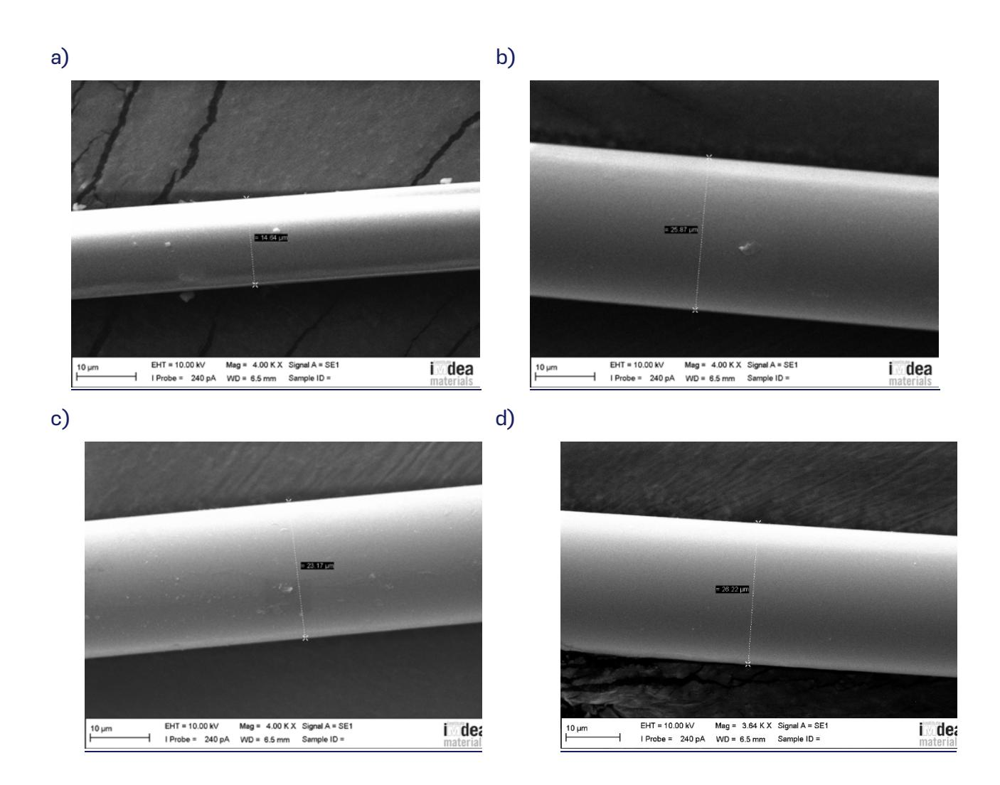

**Figure 11. SEM images of reclaimed fibres obtained through the CIRCE process: EP-IN FV (P1) shown in image (a) and EP-PU FV (P2, P3 and P4) shown in images (b), (c) and (d), respectively.**

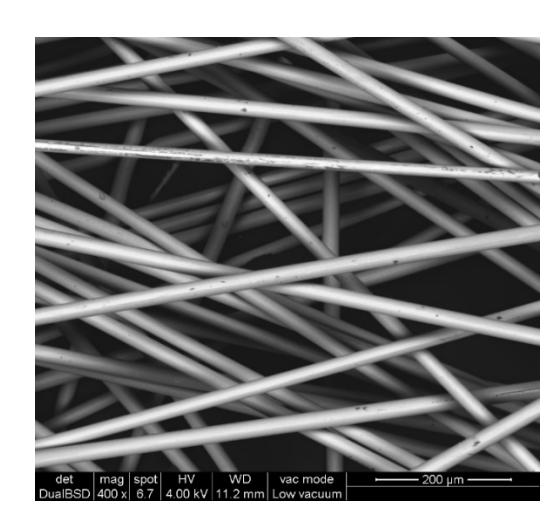

**Figure 12. SEM image of reclaimed fibres from EP-PU FV (OLIN) – E101**

### **3.4.2. Single Fibre Tensile Tests**

Single fibre tensile tests are used to measure how strong and stretchy individual fibres are. In these tests, a single fibre is placed in a machine that pulls on it until it breaks. This helps scientists and manufacturers understand how much force the fibre can handle and how much it can stretch before breaking. The tests measure important properties like the fibre's strength, how much it can stretch, and its stiffness.

These tests are important because they help ensure that materials made from these fibres, like clothes or composite materials, are strong and durable. With this test the aim is to compare the strength of original fibres with that of recycled fibres. This comparison helps us determine if the recycling processes have weakened or compromised the fibres' strength. By measuring how much force each type of fibre can withstand before breaking, we can assess the impact of recycling on the fibres' durability and performance.

The mechanical properties of the recycled fibres were tested performing single fibre tensile tests. These experiments were done according to ASTM C1557 standard on a Favimat + Textechno tensile testing machine. The diameter of the fibres was measured by SEM. Parameters such as tensile strength, modulus and elongation at break were obtained as results.

#### **3.4.3.1. Fibres obtained by AITIIP's US-Assisted Technology**

Carbon fibres from a fabric used in infusion processes with 7µm of diameter were analysed to evaluate the mechanical properties of fibres before and after the mechanical treatment. This assessment provide helpful conclusions on how the recycling treatment affects the properties of the fibre.

The results are shown in [Table 5](#page-25-1) and [Figure 13.](#page-26-0) There is a slight reduction in diameter of the fibre that might be due to the elimination of the sizing coating during the recycling process. Moreover, an increase of mechanical properties is observed in both tensile strength and modulus. According to these results, it can be concluded that the recycling treatment does not affect the mechanical properties of the fibres. However, the results exhibit significant variability; thus, to assess the impact of the recycling treatment on the fibre integrity, additional analytical methods are required.

**Table 5. Single fibre tensile test results**

| Parameter               | REDOL-REF-ACC-FC | REDOL-AITIIP-rFC-RDL22 |
|-------------------------|------------------|------------------------|
| Origin                  | Reference        | Recycled               |
| Diameter(µm)            | 7.27 ± 0.71      | 7.19 ± 0.25            |
| Tensile strength (MPa)  | 3246.83 ± 445.72 | 4170.55 ± 650.92       |
| Modulus (GPa)           | 187.32 ± 6.33    | 194.03 ± 10.01         |
| Elongation at break (%) | 1.7 ± 0.2        | 2.2 ± 0.3              |

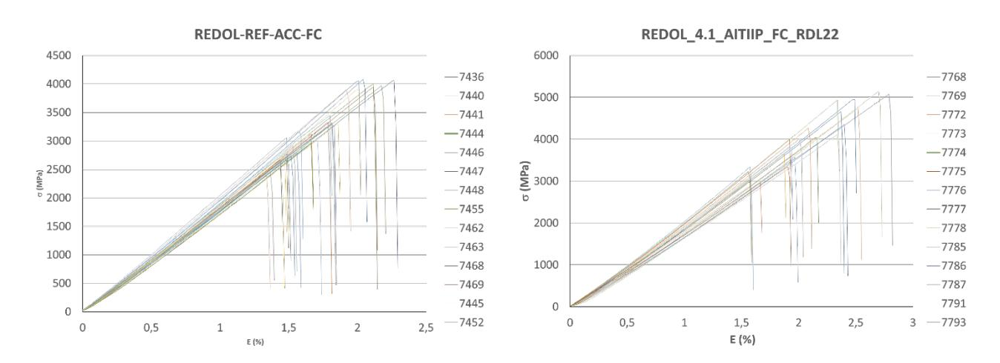

**Figure 13. Stress-strain curves**

#### **3.4.3.2. Fibres obtained by CIRCE's MW-Assisted Technology**

Two types of samples were studied: glass fibres from a fabric used in infusion processes with 17µm of diameter and glass fibres from roving used in pultrusion processes with 24µm of diameter.

For infusion fabrics, the results show [\(Table 6](#page-26-1) and [Figure 14\)](#page-27-0) that there is a slight reduction in the diameter of the fibre. with can be explained by the removal of the sizing with the recycling treatment. Regarding the mechanical parameters measured, a general reduction of the mechanical properties is observed in the results a 35% and 45% decrease in the tensile strength and elongation at break, respectively.

These results can be explained by the removal of the sizing coating during the recycling process. This implies a reduction of the diameter of the fibre and an exposure of the fibre to external damage that would reduce the tensile strength.

**Table 6. Single fibre tensile test results from samples with 17** *µ***m diameter**

| Parameter               | REDOL-REF-ACC-FV-UD840 | REDOL 4.1 CIRCE EP-IN FV E98 |
|-------------------------|------------------------|------------------------------|
| Origin                  | Reference              | Recycled                     |
| Diameter(µm)            | 17.76 ±1.38            | 16.81 ±1.79                  |
| Tensile strength (MPa)  | 1836.86 ±190.69        | 1258.16 ±269.57              |
| Modulus (GPa)           | 55.25±2.83             | 69.32±5.98                   |
| Elongation at break (%) | 3.3±0.4                | 1.8±0.4                      |

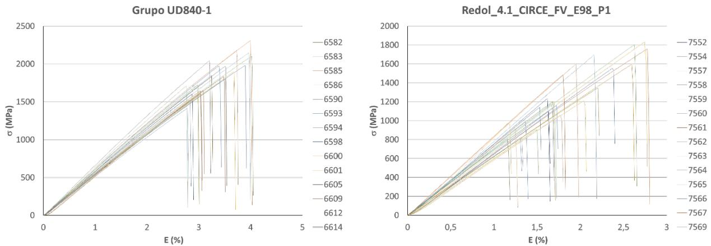

**Figure 14. Stress-strain curves 17 $\mu$ m**

For the pultrusion fabric (Table 7 and Figure 15), in this case there are no significant variations in the fibre's diameter. The reduction in the mechanical properties is less than in the infusion fabrics. There is a reduction in the tensile strength of 19-16% and a 25-15% in the case of elongation at break.

**Table 7. Single fibre tensile test results from samples with 24 $\mu$ m diameter**

| Parameter                          | REDOL-REF-ACC-FV-4100 | REDOL 4.1 CIRCE EP-PU FV E9 | REDOL 4.1 CIRCE EP-PU FV E100 | REDOL 4.1 CIRCE EP-PU FV E101 | REDOL 4.1 CIRCE EP-PU FV E102 | REDOL 4.1 CIRCE EP-PU FV E108 |
|------------------------------------|-----------------------|-----------------------------|-------------------------------|-------------------------------|-------------------------------|-------------------------------|
| <b>Origin</b>                      | Reference             | Recycled                    | Recycled                      | Recycled                      | Recycled                      | Recycled                      |
| <b>Diameter(<math>\mu</math>m)</b> | 24.4 $\pm$ 1.03       | 23.41 $\pm$ 1.65            | 24.99 $\pm$ 1.68              | 24.39 $\pm$ 1.57              | 24.07 $\pm$ 1.16              | 25..34 $\pm$ 1.91             |
| <b>Tensile strength (MPa)</b>      | 1798.67 $\pm$ 261.38  | 1485.8 $\pm$ 474.35         | 1455.64 $\pm$ 225.65          | 2086.59 $\pm$ 240.37          | 1.879.59 $\pm$ 130.6          | 1.463.85 $\pm$ 314.09         |
| <b>Modulus (GPa)</b>               | 63.27 $\pm$ 3.64      | 70.93 $\pm$ 4.76            | 60.47 $\pm$ 4.49              | 63.38 $\pm$ 4.39              | 64.57 $\pm$ 5.08              | 59.33 $\pm$ 3.07              |
| <b>Elongation at break (%)</b>     | 2.8 $\pm$ 0.4         | 2.1 $\pm$ 0.7               | 2.4 $\pm$ 0.4                 | 3.3 $\pm$ 0.5                 | 2..9 $\pm$ 0.2                | 2..5 $\pm$ 0.5                |

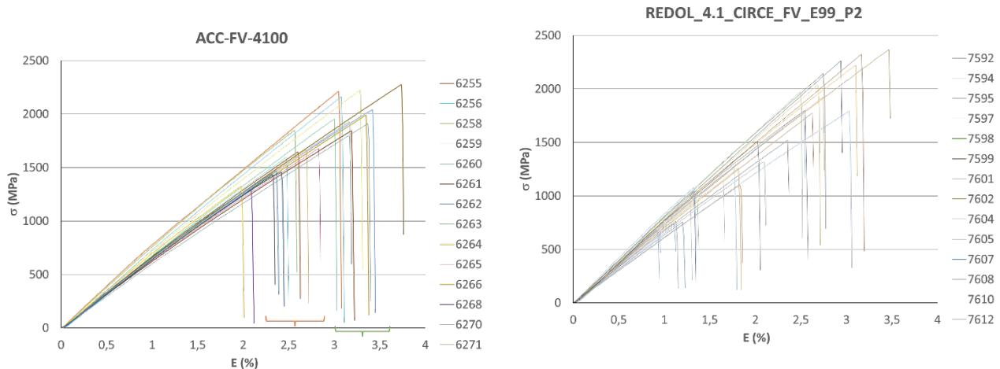

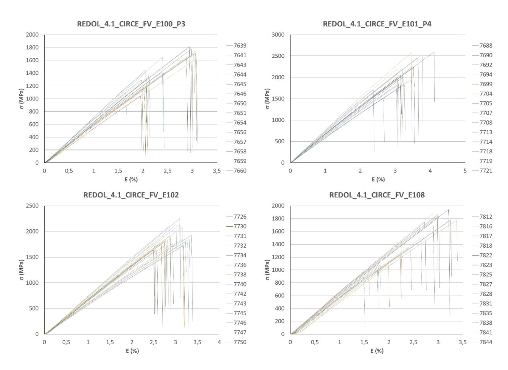

**Figure 15. Stress - strain curves 24***µ***m samples**

### **3.4.3. Use of Fibres as Secondary Materials from ITA**

Within the REDOL project, several processes of the value chain are addressed, from sorting and recycling to their use as final raw material. In this final use, within WP4, ITA has carried out an analysis of the usability of these fibers for the production of reinforced wood panels, the results of which are explained next.

In this study, a reinforce particleboard using glass fibre as secondary material have been fabricated. On the one hand, the influence of the addition of glass fibre into the particleboard have been studied. On the other hand, the effect of a recycling treatment (thermal or solvolysis) was evaluated. Glass fibre studied are shown in [Figure 16.](#page-28-2)

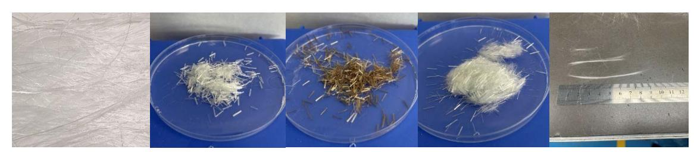

**Figure 16. Secondary material introduces in particleboard**

The particleboards were manufactured at ITA's facilities, following the instructions and manufacturing conditions provided by FINSA. In this work, two configurations were studied to substitute the 5% of wood chips with recycled material. The first one consists of generating a layer of recycled material between the inner and the outer layer [\(Figure 17](#page-29-0) left). While the second one, consist of mixing the glass fibre with wood chips in the inner layer [\(Figure 17](#page-29-0) right). After preparing the particleboard, mechanical characterization was carried out in FINSA laboratories. The most interesting properties are density (EN 323), perpendicular tensile strength (EN 319, bending strength and modulus of elasticity (EN 310). Results are shown as variation with respect to the reference.

**Figure 17. Left: Layer between inner and outer layer; Right glass fibre mixed with wood chips.**

The first study is the influence of glass fibre geometry on final board properties. Long glass fibres were used in configuration A, oriented in two perpendicular directions. Fibre oriented in the analysis direction (GF\_LF\_MD) and in the cross-analysis direction (GF\_LF\_CT). The second group comprises short fibres with lengths of 10 (GF\_SF\_10mm) and 30 mm (GF\_SF\_30mm) using configuration B.

All mechanical properties [\(Figure 18\)](#page-29-1) decrease after the addition of the long glass fibres. However, MD has better properties than CT. Tensile strength should not depend on the analysis direction due to the perpendicular force applied. The break in this sample occurs in the glass fibre layer, showing the lower interaction between fibres. Using short fibres, the tensile strength and the bending strength decrease a 40%. This reduction is the same for both fibres sizes studied. The modulus of elasticity remains its original value in all studied groups.

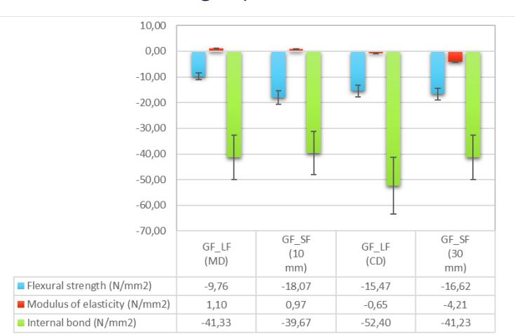

**Figure 18. Percentage of variation using commercial glass fibre.**

Finally, the effect of two different recycling processes was studied. Firstly, the thermal calcination process was examined, in which glass fibres were introduced into a preheated oven at temperatures of 450ºC (CSF\_2\_450ºC) and 600ºC (CSF\_2\_600ºC) for 30 minutes in order to mimic the composite recycling process and modify the surface of the fibres. After that, glass fibres by

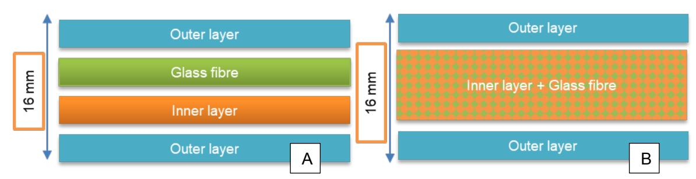

solvolysis was used. This process was made by AITIIP. [Figure 19](#page-30-1) shows that the property of the particleboard decreases in all the studied groups due to the addition of glass fibre. Internal bond is the properties that has the biggest diminution, the resin has not impregnated the glass fibre and there is no interaction between them. The recycling process does not improve the final properties of the material.

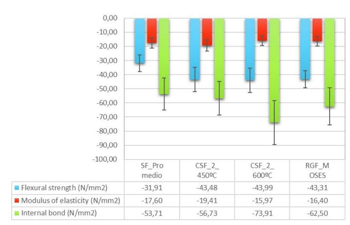

**Figure 19. Percentage of variation using short glass fibre with recycling treatment.** 

This study showed that adding glass fibers into particleboard decreases its mechanical properties. Furthermore, it is not possible to obtain the necessary amount of glass fiber for market introduction after solvolysis (Other secondary recycled materials will be studied and reported on during the project).

## **3.5.Impact (KPIs)**

To measure the impact and success of the REDOL project, several Key Performance Indicators (KPIs) have been established. These KPIs provide a quantitative assessment of the project's effectiveness in improving waste management practices and achieving its sustainability goals.

By focusing on these KPIs, the REDOL project aims to demonstrate significant improvements in recycling rates, product recovery, and cost efficiency. These metrics will help to validate the project's impact and support the broader adoption of its innovative waste management solutions. Through continuous development and optimization, the REDOL project strives to set new standards for sustainable waste management and contribute to the circular economy. The comparison between the technologies can be easily observed. All this work is essential to progress to the next phase where the conditions for MW-assisted technology have been chosen to be scaled and demonstrated in WP6 - T6.2.

#### KPI 5: Recycling rate

This KPI measures the yield of the recycling process by comparing the recycling rate of the incoming waste stream in the baseline scenario to the REDOL scenario.

Recycling rate = Total weight of recycled waste / Total weight of the incoming stream

The objective is to increase the proportion of waste that is successfully recycled, thereby reducing the amount of waste sent to landfills and promoting resource recovery.

In the case of AITIIP's Ultrasonic-Assisted Technology, the only successfully recycled waste has been EP-IN-FC. The recycling ratio obtained is as follows:

Recycling rate = 7,706 g / 11,700 g = 0,658 Fibre recovered = 0,658/0,7 > 0,90

This indicates that 65,8% of the fibre waste has been recycled from a sample containing 70% fibre content obtaining a recovery over 90% of the fibre back.

The methodology developed at CIRCE based on MW Assisted solvolysis achieved successful results for the following composites: Polyester-Glass Fibre; Epoxy-Glass Fibre (Pultrusion) and Epoxy-Carbon Fibre (Pultrusion)

For each case, the recycling rate was over 0.90, meaning over 90% of the fibre waste was recovered.

#### KPI 6: Product obtained

This KPI quantifies the final products produced per value chain in both the baseline and REDOL scenarios.

The objective is to evaluate the efficiency and effectiveness of the recycling processes in generating valuable products from waste materials. This includes assessing the quantity and quality of the final products obtained through the REDOL project's innovative techniques.

In the baseline scenario, no final products are produced because all waste is sent directly to landfill. This means that nothing is recovered or reused, and the waste simply accumulates without contributing to any value chain.

In contrast, the REDOL scenario focuses on recycling and recovering materials to produce final products. The KPI (Key Performance Indicator) in this context measures the number of final products produced able to be retrieved and its quality. Therefore, the total number of recycled fibers for each technology is noted and to determine the quality of each, it is decided to study them using SEM and Single Tensile Test that can be found in the section: Main advances achieved by REDOL.

#### KPI 11: Reduction of waste management costs

This KPI measures the aggregated waste management costs for all relevant residues in the baseline scenario compared to the REDOL scenario.

The objective is to reduce the overall costs associated with waste management by implementing more efficient and sustainable recycling processes. This includes cost savings from reduced landfill use, improved resource recovery, and optimized waste processing techniques.

CASALE's pricing rates are originally listed in tons and cubic meters, which indicates that they are designed for large-scale waste collection and treatment [\(Table 8\)](#page-32-0). When these rates are converted to smaller units, such as kilograms and cubic centimetres, the cost difference becomes quite noticeable. This is because the original rates are meant for large quantities and breaking them down to smaller units highlights the dramatic difference in scale.

**Table 8. CASALE' Fares per Kg and m3**

| Parameter          | Quantity | CASALE's dares | Total [€/Kg] |
|--------------------|----------|----------------|--------------|
| 1Kg Material       | 1 Kg     | 0,00014 €/Kg   | 0.00014      |
| Volume of 1Kg CFRC | 625 cm3  | 15 m3          | 0.0093       |
| Volume of 1Kg GFRC | 540 cm3  | 15 m3          | 0.0081       |

Although, it is important to remember that these rates cover the collection, transportation, and sorting of materials, not their recycling. Consequently, the two aspects are not directly comparable.

These costs should be included in the overall price of the recycling process because someone needs to collect and sort the materials.

According to the US-assisted technology developed by AITIIP, which utilizes a mixture of acetic acid and 10% hydrogen peroxide (30% v/v), the solvent-to-resin ratio is approximately 1 g of resin to 100 mL of the reactive solution. This ratio has been determined to be most optimal for the process but only one sample has been successfully retrieved.

[Table 9](#page-32-1) presents the material and energy consumption associated with the solvolysis of 1 kg of composite material. The data provided are based on a linear extrapolation from experimental tests. These tests were conducted under standard reaction conditions at 85ºC with an average reaction time of 16 hours.

**Table 9. US-Assisted linearly extrapolated costs from experimental conditions to a 1kg composite.**

| Parameter         | Per Kg of composite | Cost         | €/Kg composite |
|-------------------|---------------------|--------------|----------------|
| Acetic acid       | 27 L                | 0.599 (€/l)  | 16.17          |
| Hydrogen Peroxide | 3 L                 | 1.92 (€/L)   | 5.76           |
| Energy            | 14.4 kWh (80 min)   | 0.12 (€/kWh) | 1.73           |
| Total             |                     |              | 23.66          |

According to the MW-Assisted alternative developed by CIRCE, and taking into account the most promising and versatile reaction medium across various matrix compositions, based on the use of acetic acid + ZnCl2 5 wt%, it has been experimentally observed that up to an 85% of the fed acetic acid can be recovered after the reaction through distillation, while maintaining its properties and suitability for reuse.

[Table 10](#page-33-1) shows the material and energy consumption associated with the solvolysis of 1kg of composite. The data presented are based on a lineal extrapolation from experimental tests conducted at a smaller scale (50g of composite) under standard reaction condition lasting 80 minutes.

**Table 10. MW-Assisted linearly extrapolated costs from experimental conditions to a 1kg composite.**

| Parameter     | Per Kg of composite | Cost         | €/Kg composite |
|---------------|---------------------|--------------|----------------|
| Acetic acid   | 1.8 L               | 0.599 (€/L)  | 1.08           |
| Zinc Chloride | 0.66 kg             | 8 (€/kg)     | 5.28           |
| Energy        | 36.68 kWh (80 min)  | 0.12 (€/kWh) | 4.40           |
| Total         |                     |              | 10.76          |

Nevertheless, it is estimated, based on general process knowledge, that up to 30% reductions in material and energy consumption could potentially be achieved through economies of scale when scaling up the process, offering a more realistic scenario although it has not been experimentally validated.

By focusing on these KPIs, the REDOL project aims to demonstrate significant improvements in recycling rates, product recovery, and cost efficiency. These metrics will help to validate the project's impact and support the broader adoption of its innovative waste management solutions. Through continuous development and optimization, the REDOL project strives to set new standards for sustainable waste management and contribute to the circular economy. The comparison between the technologies can be easily observed. All this work is essential to progress to the next phase where the conditions for MW-assisted technology have been chosen to be scaled and demonstrated in WP6 - T6.2.

## **3.6.Conclusions of T4.1**

In conclusion, it is essential to highlight the significant progress made in Task 4.1: Valorisation of composite waste through green solvolysis, facilitated by microwave (MW) and ultrasound (US) technologies. This task has played a crucial role in improving the efficiency of conventional solvolysis processes, thereby making a substantial contribution to the overarching goal of the REDOL project, which aims to enhance the valorisation of solid urban waste (SUW).

The integration of MW and US techniques has proven to be highly effective in the recovery and valorisation of composite waste. In particular, microwave-assisted solvolysis has emerged as an exceptional method due to its higher energy efficiency, scalability, and reduced reaction times. On the other hand, ultrasound-assisted solvolysis has demonstrated effective fibre recovery, despite facing certain challenges.

The careful selection and identification of composite materials from construction and demolition waste providers, combined with innovative experimental setups, have facilitated the optimization of solvolysis processes. The energy consumption analysis further underscores the comparative advantages of microwave-assisted technology over ultrasound-assisted methods, reinforcing its potential for industrial applications.

Overall, the findings from Task 4.1 emphasize the strategic importance of microwave-assisted solvolysis as a sustainable and efficient alternative for composite waste recycling. These efforts are crucial for the subsequent up-scaling that is planned to take place in Task 6.2.

## **3.7. Future work**

The forthcoming phase will be dedicated to the technical scale-up of the most promising solvolysis route identified (CIRCE's formulation based on acetic acid and 5 wt% ZnCl₂), which has demonstrated high versatility across different composite waste types. Building on the laboratoryscale optimisation carried out in the current work, the process will be adapted to a 100 L conventional-heating reactor.

This scale-up, to be executed under Task 6.2, will ensure that key operational parameters are maintained and controlled consistently at increased volumes, which is essential to validate the process under near-industrial conditions and to generate high-purity fibre batches suitable for downstream applications.

Further development will target the robustness of solvent systems and process conditions, particularly regarding solvent recovery and reuse strategies to reduce environmental impact and improve economic feasibility. Reactor design and peripheral systems will be adapted to ensure compatibility with the physico-chemical properties of the selected reaction medium.

This scale-up stage will provide the technical basis for integrating the solvolysis route into continuous processing workflows, with performance assessed through techno-economic and environmental analyses. The goal is to establish a scalable, efficient, and sustainable solution for composite waste valorisation that is adaptable to real-world industrial conditions.

## **4.Task 4.2. Selective Dissolution of MMPP**

## **4.1. Specific Task Objectives**

In WP4, the development of delamination processes for flexible multilayer packaging in such a way that involves:

- a. Pre-treatment and conditioning of waste.
- b. Delamination via selective dissolution.
- c. Compatibilization of multilayer polyamide films.
- d. Processing of delaminated materials.

In turn, the main results expected for WP4 are as follows:

- Optimisation of the multilayer recycling process, between 55 and 100%.
- Optimisation of the delamination process for multilayer PET/LDPE trays, aluminised LDPE films and PA films.
- Improvement of recycled material properties.

## **4.2.General scheme of the work done**

The activities carried out in Task 4.2 focused on developing an effective and scalable process for the recycling complex multilayer post-consumer packaging (MMPP), which typically includes combinations of plastics such as PET, PE, PA, and even metal layers like aluminium.

The general workflow, as shown in [Figure 20,](#page-35-3) begins with the sorting of MMPP waste (Task 3.2), followed by a pretreatment phase that includes shredding, washing, and decontamination to remove physical contaminants and prepare the material for further separation.

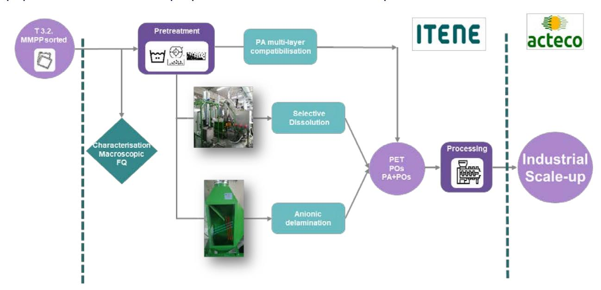

**Figure 20. General workflow for selective dissolution and compatibilisation of MMPP.**

In parallel, a macroscopic and physico-chemical characterisation is performed to better understand the composition and structure of the selected materials. This step ensures that the right conditions are applied for the next phase, which is selective delamination.

The core of the process is to weaken the adhesive layer present between the different materials that form the multilayer packaging structure. By targeting this intermediate layer, the process enables the separation of individual components such as PET, PE and PA, facilitating their subsequent recovery and reuse.

Weakening the adhesive is achieved through two complementary approaches:

- Selective Dissolution, where carefully chosen solvents act specifically on the adhesive without degrading the surrounding polymers.
- • Anionic Delamination, an alternative approach under development that explores the use of amines and other chemical agents to promote layer separation more sustainably.

### **4.2.1. Metallised films**

Metallised flexible films, such as those used in bag-in-box containers, typically contain layers of PET, PE and aluminium, bonded together by adhesives. These materials are highly functional but extremely difficult to recycle.

**Figure 21. Workflow for the delamination and recovery of metallised multilayer films.**

The proposed workflow [\(Figure 21\)](#page-36-1)begins with a pretreatment, which includes shredding, washing and decontamination, to remove superficial contaminants and prepare the material for separation. The main focus of this line is to weaken or dissolve the adhesive interface between layers, without degrading the polymers themselves. Two separation methods were explored.

Firstly, supercritical CO2 was tested due to its potential as a green solvent. However, under the tested conditions, it did not achieve effective delamination.

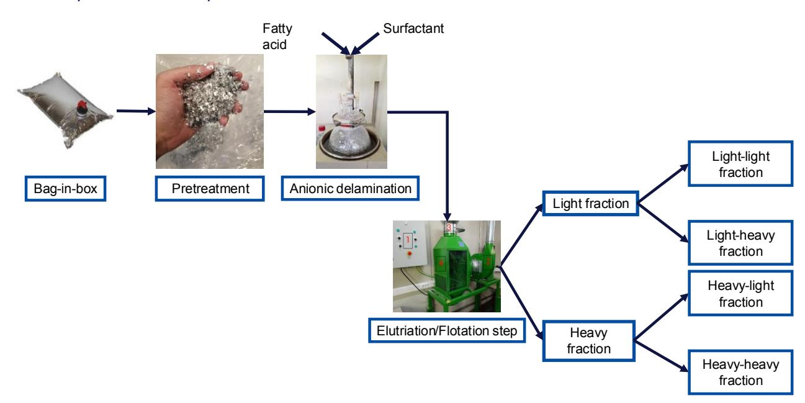

The most successful route involved liquid solvents composed of fatty acids, cationic surfactants and catalysts. This method enabled complete separation of layers under controlled conditions. At pilot scales, further optimisation is underway to reduce the solvent concentration while increasing the mass of material processed, aiming for a lower environmental and economic impact.

After delamination, elutriation was applied to separate the heavy PET flakes from lighter PE fractions. Each fraction was characterised and processed through extrusion and injection moulding to assess mechanical performance.

#### **4.2.2. Rigid trays**

Rigid food trays are another common form of multilayer packaging, often composed of PET and PE layers with an intermediate adhesive to separate the PET and PE clearly.

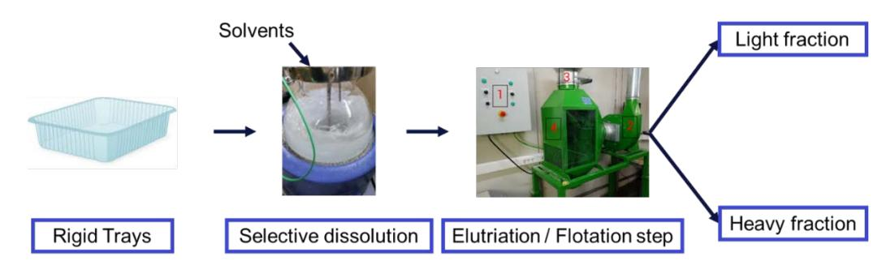

**Figure 22. Workflow for the delamination of rigid trays.**

A solvent-based delamination route was selected for this material stream [\(Figure 22\)](#page-37-2). The first step involved the Hansen solubility parameter study to identify solvents capable of selectively solvents capable of selectively dissolving EVA. After screening multiple candidates, the most suitable solvent was selected depending on its effectiveness, recoverability, and safer profile compared to other solvents.

The delamination process begins with the introduction of the trays pretreated into a reactor where they are treated with a solvent mixture under controlled temperature and agitation conditions. This setup aims to dissolve or weaken the EVA adhesive that binds the PET and PE layers without degrading the polymers.

Once the delamination has been finished, the materials are fed into a separation system based on elutriation, where the heavier fraction (PET) falls into one container, and the lighter fraction (PE) is collected separately.

This is possible because after the adhesive removal, the polymers are no longer physically bonded, and their differing densities allow for clean classification.

Following separation, PET-rich fractions were tested through injection moulding to evaluate their mechanical properties and assess their suitability for future applications.

## **4.2.3. PA/PE films**

Multilayer films made from polyethene (PE) and polyamide (PA) are commonly used due to their excellent barrier and mechanical properties. However, these two polymers are chemically incompatible, which limits the recyclability of post-consumer PA/PE films. This task aimed to improve the compatibility between both polymers through the use of specific additives (compatibilizers), enabling their joint processing and enhancing the quality of the recycled material.

[Figure 23](#page-38-1) illustrates the complete process developed within the REDOL project to evaluate and optimise this compatibilization strategy.

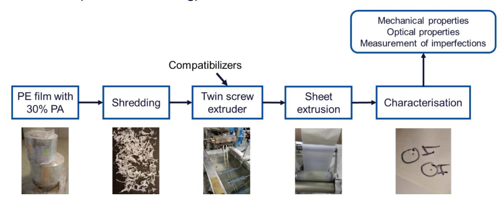

**Figure 23. Workflow for the compatibilisation of PA/PE films.**

The process started with a commercial multilayer film composed of PE with 30% PA content. This was shredded and pretreated to feed it into a twin-screw extruder, where it is melt-mixed with different compatibilisers. These additives are designed to promote chemical interactions between PE and PA, improving dispersion and adhesion between phases. Each compatibiliser, which belonged to families of functionalised polyolefins modified with polar or reactive groups capable of interacting with polyamide chains, was evaluated at various concentrations.

After compounding, the resulting material is processed into flat sheets through extrusion, simulating a realistic end-use product format. The sheet form allows for better visual and mechanical evaluation compared to simple pelletisation or injection moulding.

The extruded sheets are subjected to comprehensive characterisation, including mechanical properties (tensile strength, elongation at break), optical properties (transparency and clarity) or quantification of defects (gels, fisheyes or black spots). This evaluation makes it possible to compare the effectiveness of different compatibilisers and concentrations.

## **4.3.Main advances achieved by REDOL**

REDOL has achieved significant progress in optimising selective dissolution techniques for the recycling of multilayer post-consumer packaging (MMPP). Advances were made in three primary areas: the delamination of metallised films, the delamination of rigid trays, and the compatibilization of PA/PE films. Through the use of green solvents and process optimisation, the separation of polymer layers was enhanced, leading to more efficient recovery of valuable materials.

The advancements in solvent selection, combined with innovative delamination methods, have proven effective in enhancing the quality of recycled materials. These advancements not only contribute to the overall goal of better material recovery but also pave the way for more sustainable and scalable recycling solutions, in line with the objectives of the REDOL project.

#### **4.3.1. Metallized films**

A critical challenge in the recycling of metallised films is the efficient separation of the aluminium layer from PET/Al/PE structures, without compromising the integrity of the plastic components. In Task 4.2, significant progress was made in optimising the anionic delamination process, such as electrolysis, which offered the dissolution of the aluminium layer at the anode while maintaining the structural integrity of the underlying plastic.

In the delamination process, the first option was the use of s-CO2, which involved tuning the temperature and pressure to achieve conditions where CO2 behaved as a solvent, capable of penetrating the polymer and metal layers to facilitate delamination. The expectation was that s-CO2 would penetrate and separate the layers, but the results from these initial tests were not as successful as anticipated. Despite the favorable environmental profile of s-CO₂, the method did not achieve satisfactory delamination efficiency. The layers of polymer and aluminium were not sufficiently separated, so this option was discarded, in addition to the difficulties that could arise from its industrial scaling.

A key breakthrough was the identification and optimisation of a liquid-phase delamination process using a combination of fatty acids (as swelling/disruptive agents), cationic surfactants (to aid interfacial separation), and a catalyst, chosen for their ability to swell and weaken the adhesive bonds between the polymer and metal layers.

Once delamination efficiency was proven, the analysis focused on reducing the total volume and concentration of reagents by increasing the sample mass and slightly modifying temperature/time conditions.

To optimise the delamination process, a 3-factor, 2-level design of experiments was applied, evaluating the influence of time, temperature, and catalyst concentration on the efficiency of layer separation. This systematic approach enabled the identification of effective parameter combinations while minimising the number of required trials. It also helped highlight key interactions between variables, guiding the refinement of the process under controlled and scalable conditions.

After the study, further experiments were conducted to optimise the delamination process based on the saturation point of the fatty acid used and the solvent mixture. Results showed that full delamination was achieved with lower solvent/sample ratios, improving both environmental impact and economic feasibility [\(Figure 24\)](#page-39-1).

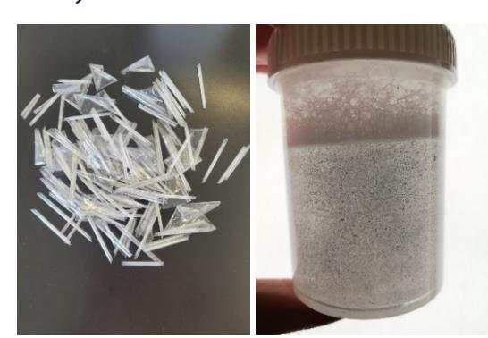

**Figure 24. Bag-in-box delaminated under the best conditions.**

Once delaminated and optimised at the laboratory scale, the process efficiency was evaluated on a larger scale using the best conditions as a reference. It involved adjusting the parameters from small-scale to accommodate the increased volume of material in industrial settings. The resulting PET and PE layers obtained were subjected to double elutriation to study the best separation conditions between the rigid part (PET) and film part (PE). With the best configuration, each of the fractions was elutriated again to obtain a better separation of compounds [\(Figure 25\)](#page-40-1).

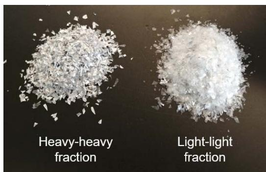

**Figure 25. Final fraction of double elutriation.**

To explore the potential reuse of the separated fractions, test specimens were produced using varying proportions of each recovered material. These specimens were subjected to mechanical testing to assess their suitability for secondary applications.

The results demonstrated that the mechanical performance of the materials was lower than that of virgin PET, approaching values typically associated with PE. For instance, the recovered polymer showed a notable decrease in tensile strength but maintained good flexibility, making it viable for applications where high strength is not the primary requirement.

### **4.3.2. Rigid trays**

Within the REDOL project, significant progress has been made in the treatment and valorisation of rigid multilayer trays, which represent a complex and increasingly common waste stream in the packaging sector. These trays, typically composed of PET and PE bonded with adhesive layers, have traditionally been difficult to recycle due to their incompatible materials and strong interfacial bonding.

For the pretreated samples, they were characterised and were composed of PET on the outer side, while the inner side was mainly LDPE. In addition, REDOL demonstrated that following solvent treatment, the individual polymers could be effectively separated through physical means, such as density-based processes.

One of the main advances achieved was the successful identification and application of a solventbased delamination route capable of selectively targeting the adhesive component. This result was made possible through an extensive study of Hansen Solubility Parameters, which enabled the selection of a solvent system with high affinity for the adhesive layer while remaining inert to the PET and PE polymers. A total of 22 solvents were evaluated, leading to the identification of the most promising candidates. Based on the solvents falling within the Hansen Parameters space, priority was given to those considered most suitable in terms of cost per litre, toxicity, volatility, and recoverability.

The delamination process with the best solvent was further optimised by testing different concentrations of the solvent, as well as adjusting the temperature and exposure time. Results demonstrated that full separation of PE and PET layers could be achieved [\(Figure 26\)](#page-41-1).

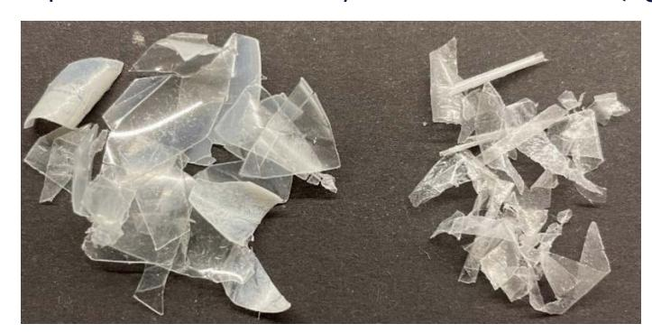

**Figure 26. PET (left) and PE (right) fractions delaminated from rigid trays.**

Recovered PET fractions were subjected to mechanical testing through injection moulding trials, confirming that the delaminated material retained sufficient properties for potential reuse. It revealed that the recovered materials exhibited slightly reduced mechanical properties compared to virgin materials, but they were still suitable for use in lower-demand applications. These results highlight the technical feasibility of transforming previously unrecyclable multilayer trays into new value-added products.

Overall, this approach represents a key step forward in improving the recyclability of rigid food packaging. It aligns with REDOL's broader objectives to foster circular economy practices, reduce environmental impact, and develop scalable solutions for the recovery of complex post-consumer plastic waste.

## **4.3.3. PA/PE films**

PA/PE films offer complementary properties (flexibility and processability in the case of PE, and mechanical strength and barrier performance in the case of PA), but their chemical incompatibility makes the recycling of these blends poor in mechanical performance. REDOL has made substantial progress in the field of compatibilization.

A key advance was the systematic evaluation of different compatibilising agents tailored to bridge the chemical gap between both polymers. Through a structured testing programme, REDOL was able to identify specific formulations that significantly improved the mechanical properties of PA/PE blends, even at low additive concentrations.

Once incorporated and processed, these compatibilized blends demonstrated notable gains in tensile strength and elongation compared to non-modified counterparts. This was confirmed through mechanical characterisation of injection-moulded test pieces and pilot-scale trials [\(Figure](#page-42-1)  [27\)](#page-42-1). While the increase in tensile strength was modest (around 2%), the gains in strain-related properties were much more pronounced. In particular, strain at peak and strain at break showed increases ranging from approximately 120% to 170%, indicating a significant enhancement in the material's ability to deform without failure. Although a slight reduction in stiffness was observed, around 8%. This change was not considered critical and remains within an acceptable performance range for reuse applications.

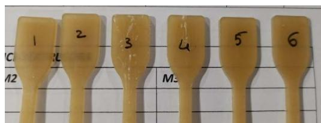

**Figure 27. Best additive combination specimens for mechanical characterisation.**

In addition to mechanical testing, the optical quality of the processed films was evaluated [\(Figure](#page-42-2)  [28\)](#page-42-2), with some formulations showing reduced surface defects and increased transparency, which is important for many packaging applications. However, the formulation that delivered the best mechanical performance exhibited a noticeable number of optical defects, such as gels, fisheyes, and surface irregularities. To balance mechanical and visual properties, this formulation was combined in a 50/50 ratio with the second-best performing blend in terms of mechanical strength, which had shown the lowest count of visual defects.

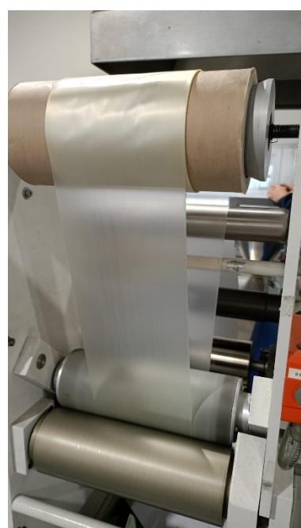

**Figure 28. Film from pilot-scale compatibilized films.**

These findings validate compatibilization as an effective route to recover multilayer polymeric materials that would otherwise be landfilled or incinerated. By enabling the production of higherperformance recycled materials, REDOL contributes to the broader goals of improving resource efficiency, closing material loops and supporting the transition toward a circular economy.

## **4.4.Impact (KPIs)**

In order to quantitatively assess the performance and technical viability of the recycling strategies developed under Task 4.2, a series of Key Performance Indicators (KPIs) have been defined. These indicators aim to evaluate the efficiency of each step in the process by focusing on measurable criteria such as contaminant removal, material purity, mechanical performance and scalability. All KPIs have been formulated based on pilot-scale trials using real post-consumer multilayer waste streams.

- In pretreatment, validation of the effectiveness of pre-treatment and decontamination of the process evaluated on a pilot scale using real waste supplied by collaborating companies (KPI: Removal of the top five most abundant volatile contaminants identified using water steam or ozone with at least 80% efficiency).
- Validation of the optimal conditions for delaminating multilayer trays by selective dissolution methods (KPI: Delamination of multilayer trays with an efficiency > 85%).
- Chemical and structural purity of material delaminated fractions after separation. (KPI: 95% purity of the separated material obtained by physical-chemical characterisations).
- Improvement of the mechanical properties of the material after addition of compatibilising additives (KPI: 80-85% improvement in the mechanical properties of the virgin material)
- Evaluation of mechanical properties in demonstrators based on decontaminated and delaminated materials at pilot level (KPI: Maximum 15% reduction compared to recycling without decontamination).

The defined KPIs provide a robust framework for evaluating the effectiveness and replicability of the selective dissolution and compatibilization processes addressed in Task 4.2. Meeting or exceeding these performance targets will confirm their potential integration into industrial recycling workflows, contributing to enhanced circularity and resource efficiency in the management of complex plastic packaging waste.

## **4.5.Conclusions of T4.2**

The work conducted in Task 4.2 focused on developing efficient and scalable recycling strategies for multilayer post-consumer packaging (MMPP), one of the most technically challenging waste streams due to its structural complexity and the incompatibility of its constituent materials. Through targeted delamination, solvent-based separation, and polymer compatibilization, significant progress was achieved in enabling the recovery and reuse of individual polymer layers. The following conclusions summarise the main technical outcomes across the three key treatment lines addressed within this task.

#### Metallised films

The treatment of structures composed of PET, aluminium and PE represented one of the most challenging but impactful areas of Task 4.2.

The first approach with supercritical CO2 did not yield sufficient delamination, so it was excluded from further development due to low technical efficiency and potential complications for future industrial scaling.

The chemical delamination route based on a mixture of fatty acids, cationic surfactants and catalysts showed significantly better performance as the process effectively weakened the adhesive interlayers without degrading the structural integrity of the polymers. In order to optimise delamination parameters, a 23 factorial experimental design was carried out, enhancing the environmental footprint and the economic viability of the method.

Scaling up, after delamination, a double elutriation process was used to separate PET from PE based on density differences and the quality of the separated fractions was confirmed through mechanical tests. Although the tensile strength of the recycled PET was lower than that of virgin PET, the material retained high flexibility, making it suitable for non-structural or secondary applications.

#### Rigid trays

The recycling of rigid PET/LDPE trays was approached through a solvent-based selective delamination strategy. To address this, a Hansen Solubility Parameters study was carried out to dissolve the adhesive layers, evaluating 22 candidates. The best solvent was ultimately selected due to its high selectivity for EVA, combined with low toxicity, cost efficiency and ease of recovery. The delamination process was carried out in a reactor with agitation and temperature, using the solvent under optimized conditions.

Once the layers were unbound on a lab scale, the process was scaled up, including an elutriation process to separate PET from PE, taking advantage of the density difference. The PET fractions were subjected to injection molding and mechanical testing. While the mechanical performance was slightly inferior to that of virgin PET, the results confirmed that the recycled material retained sufficient structural properties to be reused in non-critical applications.

This demonstrated that the combination of selective solvent action and physical separation can unlock new recycling pathways for rigid multilayer packaging, aligning with circular economy principles.

#### PA/PE films

The REDOL project explored reactive extrusion with various compatibilizers between PE and PA due to their chemical incompatibility. The objective was to create a more homogeneous and mechanically stable blend by improving the interfacial adhesion between the two immiscible polymers.

The experimental work began with commercial PE/PA multilayer films containing 30% PA. After shredding and pretreatment, the materials were fed into a twin-screw extruder along with different compatibilizer formulations. The output was processed into flat sheets to facilitate mechanical and optical evaluations.

One particular formulation stood out, yielding an approximate 2% improvement in tensile strength over the unmodified blend. More significantly, the strain at peak and elongation at break increased by 120-170%, indicating a considerable enhancement in ductility and phase compatibility. Although a minor reduction in stiffness was observed, it remained within acceptable limits for typical flexible packaging uses.

However, the most mechanically promising formulation showed substantial optical defects, including gels and fisheyes, which could limit its applicability in visually critical products. To mitigate this, a 50/50 blend was created with a second-best performing formulation that exhibited better optical clarity. This maintained most of the mechanical benefits while significantly reducing surface defects.

## **4.6.Future work**

The upcoming phase will focus on the technical scale-up and industrial validation of the selective dissolution and delamination processes developed in the project. This will involve transferring optimized laboratory parameters to pilot-scale reactors, ensuring process control for temperature, agitation, solvent concentration, and residence times are maintained while processing larger volumes of multilayer waste. Particular attention will be given to solvent recovery and reuse to reduce environmental impact and operational costs.

Further refinement of solvent formulations and catalyst concentrations will be undertaken to maximize delamination efficiency while minimizing solvent consumption. The scale-up will also include comprehensive process monitoring and the implementation of robust separation methods such as elutriation adapted for higher throughput.

On the compatibilization side, pilot-scale extrusion trials will be performed to evaluate the reproducibility of mechanical improvements in PA/PE blends under industrial processing conditions. Optimization of additive dosing and processing parameters will aim to balance mechanical performance with optical quality, critical for commercial acceptance.

Integration of these processes into continuous industrial workflows will be assessed through techno-economic and environmental impact analyses, ensuring the solutions developed are both scalable and sustainable. Additionally, efforts will be made to extend the applicability of the selective dissolution approach to a broader range of multilayer packaging compositions encountered in real waste streams.

## **5.Task 4.3. Recycled Components for the Construction and Cement Industry**

## **5.1. Specific task objectives**

In Task 4.3 with the main objective "Formulation of recycled components for the construction and cement industry" four possible routes for using Construction and Demolition Waste (CDW) and other alternative resources (industrial wastes) in cement and concrete industry were investigated. Analysis into these four routes or subtasks were carried out by the task partners as follows:

- Fuel (VDZ)
- Raw material for clinker burning process (VDZ)
- Cement main constituent (VDZ)
- Cast polymer component (ACCIONA)

## **5.2.General scheme of the work done**

The general scheme of the procedure in Task 4.3 is shown in [Figure 29.](#page-46-3) The task participants VDZ, ACCIONA and CEMEX received materials from the mentioned material groups (Industrial wastes and CDW). For all samples, different sorting and analysing steps were applied. Based on the analyses, a possible purpose was selected and the materials were further investigated and tested for this purpose.

**Figure 29. General scheme of Task 4.3**

VDZ received one CDW material (sample 1) and six types of industrial wastes from CASALE (sample 2 – 7), which are listed in Table 10. All samples, except sample 5 (potential fuel), were sieved at 1 mm sieve size and iron components were removed using a magnet. Afterwards a preparatory grinding to a size of 90 μm for the X-ray fluorescence (XRF) analysis followed. Sample 5 was dried and the total organic carbon parameter (TOC) was determined as a first characterisation. After sorting and preparation, various analyses were performed depending on the material. Information on the samples sorted, analysed and characterised is given in [Table 11.](#page-47-0)

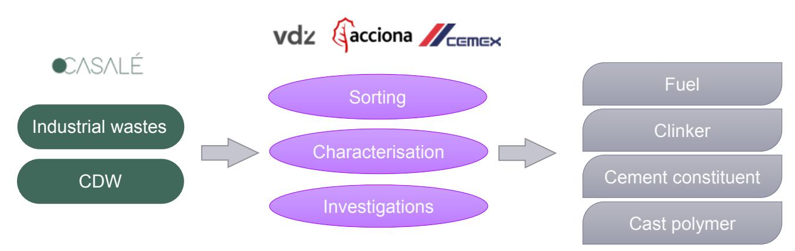

**Table 11. Information on the samples sorted, analysed and characterised in task 4.3**

| Material | Purpose                     | Sorting steps                      | Analyses      |
|----------|-----------------------------|------------------------------------|---------------|
| Sample 1 | Raw material, Main or minor |                                    |               |
|          |                             | grinding for XRF                   | XRD, XRF, TOC |
| Sample 2 | Addition to raw material    | Sieving (1 mm), magnet separation, |               |
|          |                             | grinding for XRF                   | XRD, XRF, TOC |
| Sample 3 | Addition to raw material    | Sieving (1 mm), magnet separation, |               |
|          |                             | grinding for XRF                   | XRD, XRF, TOC |
| Sample 4 | Raw material                | Sieving (1 mm), magnet separation, |               |
| Sample 5 | Fuel                        | Drying                             | TOC           |
| Sample 6 | Unusable                    | Sieving (1 mm), magnet separation, |               |
|          |                             | grinding for XRF                   | XRD, XRF, TOC |
| Sample 7 | Raw material, Main or minor |                                    |               |

[Table 12](#page-47-1) shows the results of the analysis and the characterisation of samples 1 to 7. With the help of the results, it was possible to decide which samples could be further analysed for which purpose.

Table 12. Results of the analysis and the characterisation of samples 1 to 7

| Testing            | method Unit Test |       |       | Sample |           |       |
|--------------------|------------------|-------|-------|--------|-----------|-------|
|                    | 1                | 2     | 3     | 4      | 5 6       | 7     |
| CO2 950°C/IR       |                  |       |       |        |           |       |
|                    | n.d.             | 0.20  | 1.43  | n.d.   |           |       |
|                    |                  |       |       |        | 10.63     | 0.12  |
| H2O 950°C/IR LOI   | n.d.             | 0.21  | 0.67  | n.d.   | 1.40      | 0.23  |
|                    | 1.18             | 0.68  | 2.95  | 0.23   | 14.92     | 0.36  |
| SiO2               | 41.35            | 96.02 | 77.06 | 17.49  | 10.92     | 25.78 |
| Al2O3              | 4.74             | 1.83  | 1.93  | 7.16   | 0.77      | 4.70  |
| TiO2               | 0.26             | <0.01 | 0.08  | 1.03   | 0.02      | 0.29  |
| P2O5               | 0.08             | <0.01 | 0.02  | 0.66   | 1.75      | <0.01 |
| Fe2O3              | 2.50             | 0.34  | 6.44  | 2.48   | 0.69      | 0.92  |
| Mn2O3              | 0.04             | <0.01 | 0.58  | 0.08   | 0.02      | 0.31  |
| MgO                | 1.76             | <0.02 | 2.92  | 1.33   | 0.85      | 8.52  |
| CaO                | 26.74            | 0.55  | 2.86  | 45.59  | 5.95      | 52.97 |
| SO3                | 9.85             | 0.10  | 0.24  | 2.32   | 18.75     | 5.73  |
| K2O                | 1.00             | 1.15  | 0.56  | 0.08   | 34.01     | 0.01  |
| Na2O               | 0.35             | 0.20  | 0.14  | 0.26   | 2.38      | 0.04  |
| Na2O-eq.           | 1.01             | 0.96  | 0.51  | 0.31   | 24.76     | 0.05  |
| TOC EN 13639       | 1.18             | 0.27  | 0.84  | 0.23 ⌀ | 16.9 2.89 | 0.01  |
| Aluminium VDZ test |                  |       |       |        |           |       |
| method             | µg/g             |       |       | 10.000 |           | 43.00 |

For the investigations as cast polymer component the following materials ([Table](#page-48-0) 13) were taken into account.

**Table 13. Information on the samples sorted, analysed and characterised in task 4.3**

| Material number                   | Purpose      | Sorting steps | Analyses                                                                                         |
|-----------------------------------|--------------|---------------|--------------------------------------------------------------------------------------------------|
| Sample 1                          | Cast Polymer | Sieving <4mm  | Granulometry, water absorption, density, humidity, (pH eluate), calorimetry tests of fresh resin |
| Sample 2                          |              | -             |                                                                                                  |
| Sample 3                          |              | -             |                                                                                                  |
| Aggregate 0/5 (recycled concrete) |              | -             |                                                                                                  |

[Table 14](#page-48-1) shows the results of the analysis and the characterisation of samples mentioned above.

**Table 14. Properties of materials used in cast polymer formulations**

|                  | Sample 1   | Sample 2   | Sample 3   | Recycled Sand |
|------------------|------------|------------|------------|---------------|
| Water adsorption | 11.5%      | 0.34%      | 0.69%      | 10.19%        |
| Density          | 2285 kg/m3 | 2602 kg/m3 | 2705 kg/m3 | 2289 kg/m3    |
| Moisture         | 2.5%       | 0.61 %     | 0.19 %     | 11.16 %       |

The cast polymer formulation has a series of steps that are detailed described in [Figure 30.](#page-48-2) It shows that the selection of materials is preceded by a characterization of them so that they meet the necessary requirements. In the case of cast polymer, the requirements on the mixture are based on the ASTM C395 standard: "Standard specifications for Chemical-Resistant resin mortars".

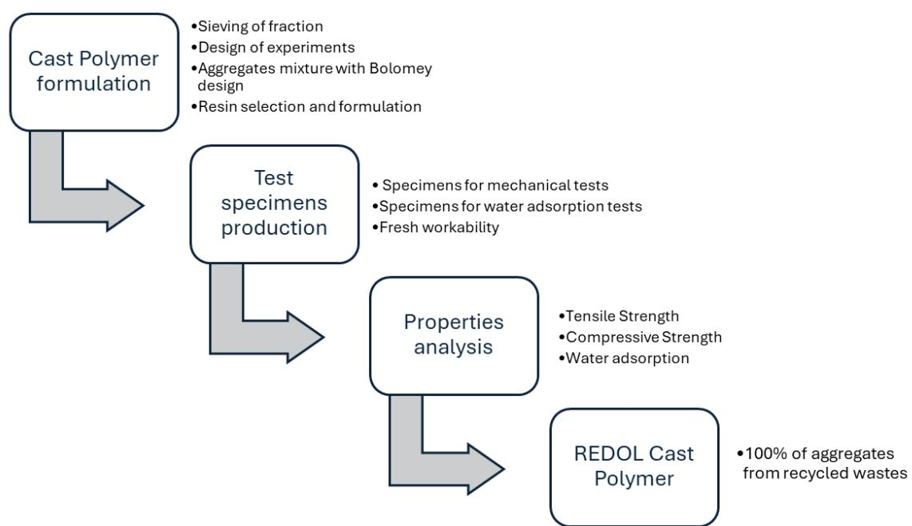

**Figure 30. Steps to the REDOL cast polymer formulation**

[Figure 31](#page-49-3) shows the steps for each formulation:

- a. Selection of the waste fraction
- b. Sieving of specific granulometry
- c. Mixture with resin
- d. workability text of the fresh mixture

- e. casting and curing the specimen tests
- f. Mechanical tests and water adsorption tests

**Figure 31. Sequency of cast polymer development**

## **5.3.Main advances achieved by REDOL**

### **5.3.1. Fuel**

Based on the relative high parameter "total organic carbon" determined on sample 5, it was decided that the calorific value of the sample should be tested in order to establish whether it could be used as an additional or alternative fuel. For this reason, the gross calorific value and the net calorific value were determined [\(Table 15\)](#page-49-4). The gross calorific value measures the amount of thermal energy in form of heat that a material can generate during combustion. In contrast, the net calorific value excludes the condensation heat of water, which is typically lost as unused steam. Table 14 shows the values mentioned on the sample 5.

**Table 15. Gross calorific value and net calorific value of sample 5**

| Parameter             | Test method  | Unit  | Sample 5 |
|-----------------------|--------------|-------|----------|
| TOC (average)         | EN 13639     | %     | ⌀ 16.9   |
| Gross calorific value | EN ISO 21654 | kJ/kg | 3989     |
| Net calorific value   | EN ISO 21654 | kJ/kg | 3241     |

### **5.3.2. Clinker**

Based on the results of the analyses mentioned above, especially the XRF, a decision was made on the possible purpose of the samples. Samples 1, 4 and 7 were suitable for testing as alternative source of CaO for clinker production (CaO content >25 mass %[, Table 39\)](#page-47-1). In the case of using these samples in clinker production, they can be called alternative raw materials.

There were two stages of investigations on sample 1, 4 and 7 as alternative raw materials. In the first part the alternative raw materials (sample 1, 4 and 7) were investigated as raw meal component in two different portions to assess the suitability of these materials for clinker production in general: a presumably realistic portion of 10 % and, based just on chemical considerations, a maximum amount of alternative materials were used.

Using a portion of 10 % alternative raw material resulted in useful clinker samples, whereas the usage of the maximum contents led to problems in burnability with the raw meals. In this report only results on clinker samples based on the lower dosage of alternative raw materials are presented.

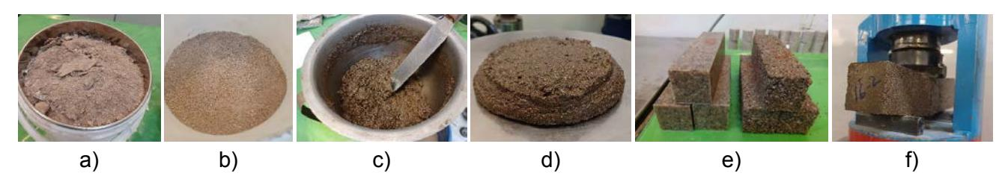

In meantime it was decided for the second analytical step (testing of clinker performance) to produce only realistic clinker samples by using 10 % raw meal replacement by alternative raw material.

#### **5.3.2.1. Part 1 of the clinker investigations**

In the beginning of the clinker investigations, a chemical target raw meal composition was defined on a level of an intermediate quality grey clinker, with a lime saturation factor of about 95 %, a silica modulus of 2.15 and an alumina modulus of 1.5. This target chemistry was realised by using 10 % of one of the alternative raw materials (sample 1, 4 or 7), a majority of a quite pure limestone and a common clay, and the addition of pure Iron(III) oxide (Fe2O3) and Silicon dioxide (SiO2) to adjust the moduli. All components were mixed and ground to a fineness of approx. 5000 cm²/g (measured by Blaine method).

The three prepared raw meals are shown in [Figure 32.](#page-50-0) The correct sample composition was controlled by XRF measurements.

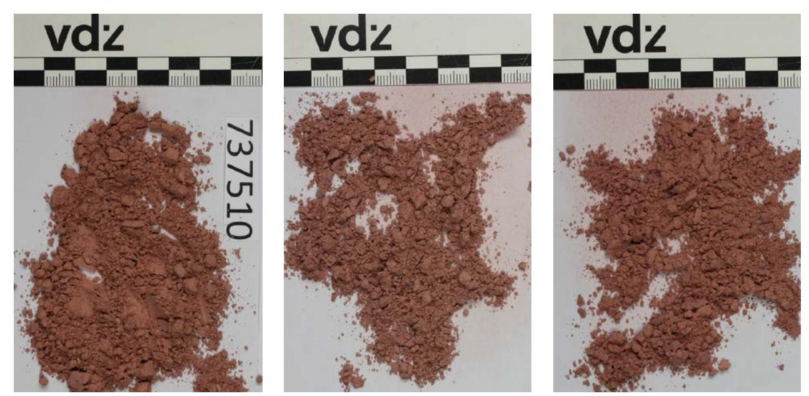

**Figure 32. Prepared raw meals: RM 1 with 10% of sample 1 (left); RM 4 with 10% of sample 4 (middle); RM 7 with 10 % of sample 7 (right)**

Afterwards, the raw meals were mixed with water to a slurry, dried at 105 °C and broken into small pieces. This procedure promotes further homogenization of the material. The broken pieces were burned in portions in platinum crucibles in a chamber kiln (Nabertherm HT 16/16). A standard heating program for clinker burning was used.

All clinker samples were heated to 900 °C in the kiln at a heating rate of 1600 °C/h and then held at this temperature for 30 minutes to allow for the decalcination of the limestone. They were then heated with 600 °C/h to 1450 °C and sintered at 1450 °C for 30 minutes. To simulate a very rapid cooling rate, all samples were removed from the furnace at 1450 °C and further cooled in air to room temperature[. Figure 33](#page-51-0) shows the process just mentioned step by step.

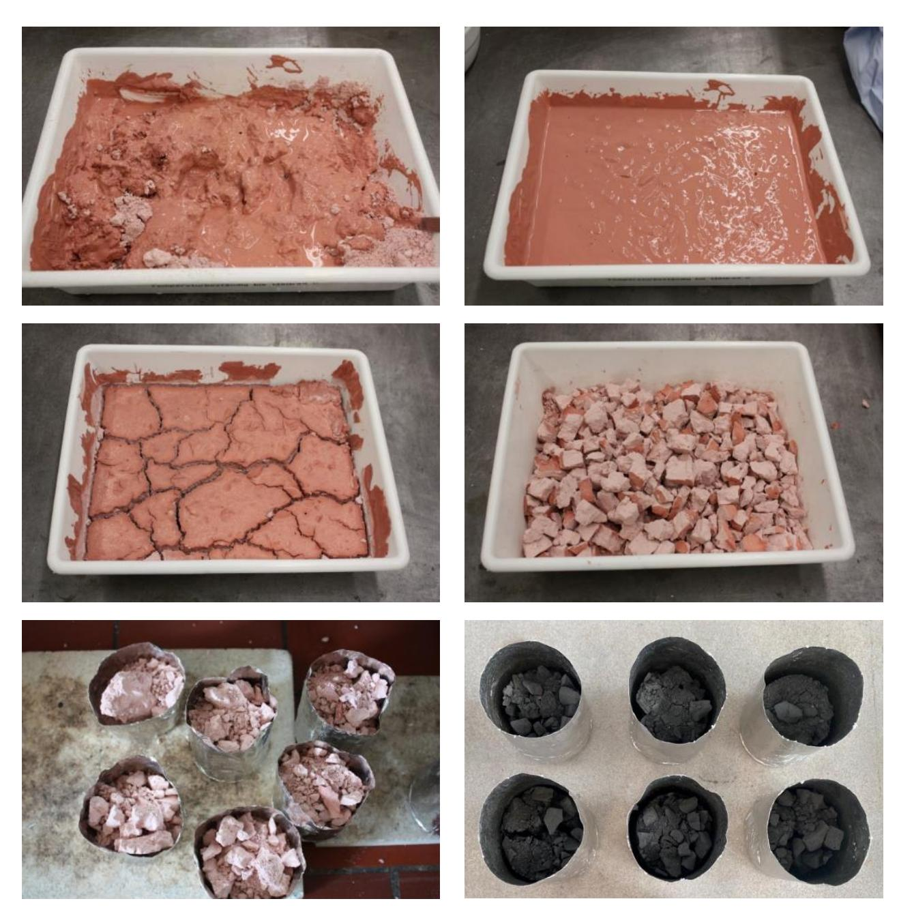

**Figure 33. Slurring of the prepared raw meal with water for homogenisation, drying and burning to clinker**

After the burning process, the chemical composition of the clinker samples was controlled again [\(Table 16\)](#page-52-0). Small deviations imply some inhomogeneities in the raw material sampling.

**Table 16. Chemical composition and cement chemical parameters of the raw meals (RM1 – RM7) and clinker (CL1 – CL7)**

| Parameter CaO          | Unit RM1 | CL1  | RM4  | CL4  | RM7  | CL7  |
|------------------------|----------|------|------|------|------|------|
|                        | 42.3     | 64.7 | 43.0 | 65.5 | 43.5 | 65.0 |
| SiO2                   | 13.7     | 21.5 | 13.4 | 21.3 | 14.2 | 21.4 |
| Fe2O3                  | 2.58     | 4.05 | 2.59 | 4.1  | 2.59 | 3.94 |
| Al2O3                  | 3.85     | 6.13 | 3.59 | 5.8  | 4.06 | 6.04 |
| MgO                    | 0.68     | 1.08 | 0.41 | 0.81 | 1.15 | 1.71 |
| SO3                    | 0.74     | 0.82 | 0.29 | 0.21 | 0.51 | 0.5  |
| Na2O-eq.               | 0.57     | 0.63 | 0.52 | 0.37 | 0.53 | 0.5  |
| LOI                    | % 34.8   |      | 33.9 |      | 32.8 |      |
| Lime Saturation Factor | % 96.2   | 93.4 | 99.3 | 95.7 | 95.8 | 95.4 |
| Silica ratio           | 2.12     | 2.11 | 2.17 | 2.15 | 2.14 | 2.14 |
| Alumina ratio          | 1.50     | 1.51 | 1.39 | 1.42 | 1.57 | 1.53 |

The clinker quality of the three resulting clinker samples was analysed via X-ray diffraction (XRD) for the mineralogical composition and light microscopy (LM) for the microstructural properties. The theoretical phase composition calculated acc. Bogue (Bogue S1-Bogue S7) and the real mineralogical clinker composition acc. XRD / Rietveld analysis (XRD CL1 - XRD CL7) are shown in [Table 17.](#page-52-1)

**Table 17. Calculated phase composition acc. Bogue and XRD analysis for the mineralogical composition**

| Mineral phase Alite | Unit Bogue S1 | XRD CL1 | Bogue S4 | XRD CL4 | Bogue S7 | XRD CL7 |
|---------------------|---------------|---------|----------|---------|----------|---------|
|                     | 53.1          | 56.80   | 56.2     | 56.9    | 56.2     | 62.4    |
| Belite              | 21.9          | 21.60   | 19       | 21.8    | 19       | 17.2    |
| A C3                | 9.44          | 6.40    | 9.37     | 8.5     | 9.37     | 3.9     |
| AF C4               | 12.4          | 12.80   | 12       | 11.2    | 12       | 14.6    |
| Lime                |               | traces  |          | traces  |          | traces  |
| Periclase           |               |         |          |         |          | <0.5    |
| Arcanite            |               | 1.2     |          | 0.8     |          | 0.9     |
| Aphthitalite        |               | 0.7     |          | <0.5    |          | 0.5     |

[Figure 34](#page-52-2) shows one overview picture of each clinker taken via the microscopic investigations using light microscopy. Further results from these investigations are summarized in Figure 161 to Figure 163 in the Annexes section.

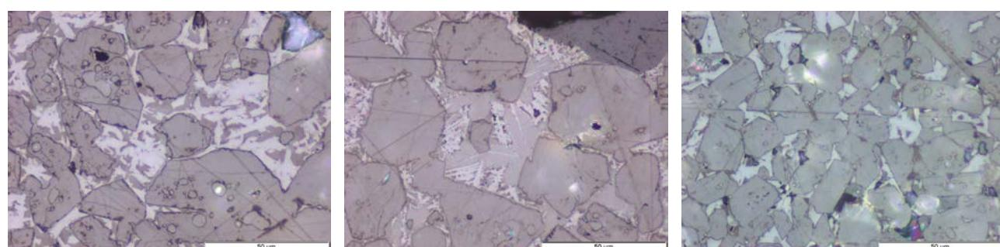

**Figure 34. Light microscopy of the clinker samples (from left to right CL1 – CL3) – interstitial mass phases (C3A, C4AF) and alite crystal sizes**

#### CLINKER 1

The chemical composition of clinker 1 met the target quality in acceptable precision. Low free lime contents in clinker 1 prove a good burnability of raw meal 1 and a satisfying clinkering process. The mineralogical composition deviates from the theoretical one mainly in slightly higher alite contents and significantly lower aluminate, indicating some uptake of Al in the Ca-silicate phase. This behaviour is well known from clinker production with some alternative fuels.

Microscopic investigations on clinker 1 point out a porous structure. In unetched samples, coarse alkali sulphates (arcanite and aphthitalite) partially are recognizable. These originate from the SO3 contribution of the alternative raw material and could affect cement properties like the setting behaviour. A high proportion of coarse alite crystals is visible. The interstitial phase is dominated by ferrite. Only traces of free lime prove the effectiveness of the clinkering process.

From the results obtained on clinker 1 it is expected that the clinker can be used to produce a cement with common, useful properties.

#### CLINKER 4

The mineralogy of clinker 4 fits even more with the expected phase composition. A slight shift from Al from the alumina phase to belite is visible. The free lime value again is low, indicating a very wellburned material. All metallic aluminium found in the alternative raw material seems to be oxidized and utilized in the phases C3A and C4AF.

The microscopical investigation leads to the same conclusions as with clinker 1. The alite crystal content is high, free lime very low. The interstitial mass shows some higher portions of aluminate. Again, it is expected that the clinker is usable for the production of a common cement.

#### CLINKER 7

Even clinker 7 reaches a chemical composition very close to the target, the phase distribution shows some interesting deviations from the theoretical one. The aluminate content was by far lower than calculated, whereas alite as well as ferrite have increased. This might be connected to the higher MgO-content of that clinker, which seems to also promote the shift of Al to other clinker minerals.

The microscopic investigations of clinker 7 show the densest microstructure compared to the previous clinkers, which corresponds well with a very good burnability. The phase C4AF dominated in the interstitial matrix. A cement made from such clinker may need a specific dosage of sulphate carrier, but on the other hand, it would show some degree of sulphate resistance properties as well. Some significantly smaller alite crystals might indicate a higher reactivity.

#### **5.3.2.2. Part 2 of the clinker investigations**

The analyses of the clinker produced in the first step with the three alternative raw materials have demonstrated that clinker with expectably sufficient properties for cement production could be obtained by using up to at least 10 % of alternative raw material. Therefore, larger quantities of these clinker were produced on a laboratory scale to conduct more comprehensive tests on important cement properties.

First of all, the correct chemical clinker composition was proven by XRF analyses [\(Table 18\)](#page-54-0). Slight deviations have to be related to unavoidable inhomogeneities in bulk material sampling. The clinker mineralogy including all shifts in clinker phase composition was very similar to the results obtained in the first set of tests, showing a good reproducibility of the lab clinkering process [\(Table 19\)](#page-54-1).

In comparison to the first step clinker 4 showed a lower degree of alkali sulphatisation, so some more alkalis are bound in aluminate phase, changing to some higher portion of the orthorhombic modification, may be connected to some small changes in setting behaviour. The slightly higher MgO contents of clinker 7 are not fully covered in silicates, so a small amount of periclase could be observed.

In general, it could be expected that all clinker samples are usable for common cement production.

**Table 18. Chemical composition and cement chemical parameters of clinker (CL1 – CL7)**

| Parameter CaO              | Unit | CL1   | CL4   | CL7   |
|----------------------------|------|-------|-------|-------|
|                            |      | 64.75 | 66.10 | 65.07 |
| SiO2                       |      | 21.27 | 21.18 | 21.19 |
| O3 Al2                     |      | 5.96  | 6.08  | 6.00  |
| O3 Fe2                     |      | 3.93  | 3.97  | 3.93  |
| MgO                        |      | 1.11  | 1.08  | 1.75  |
| O-eq Na2                   |      | 0.74  | 0.36  | 0.58  |
| SO3                        |      | 0.93  | 0.24  | 0.57  |
| Lime Saturation Factor III | %    | 94.9  | 96.9  | 96.2  |
| Silica ratio               |      | 2.15  | 2.11  | 2.13  |
| Alumina ratio              |      | 1.52  | 1.53  | 1.53  |
| Degree of sulphatisation   |      | 97.9  | 52.0  | 76.4  |

**Table 19. Calculated phase composition acc. Bogue and XRD analysis for the mineralogical composition**

| Mineral phase Alite total | Unit Bogue S1 | XRD CL1 | Bogue S4 | XRD CL4 | Bogue S7 | XRD CL7 |
|---------------------------|---------------|---------|----------|---------|----------|---------|
|                           | 56.6          | 57.9    | 61.7     | 60.8    | 58.0     | 62.1    |
| Belite total              | 18.6          | 21.4    | 14.4     | 18.4    | 17.1     | 17.5    |
| A cubic C3                |               | 5.5     |          | 6.0     |          | 2.3     |
| A orthorhombic C3         |               | 0.8     |          | 1.8     |          | 1.8     |
| A total C3                | 9.2           | 6.3     | 9.4      | 7.8     | 9.3      | 4.1     |
| AF C4 Lime                | 12.0          | 12.0    | 12.1     | 11.4    | 12.0     | 14.2    |
| Portlandite               |               | traces  |          | traces  |          |         |
| Periclase                 |               | traces  |          |         |          | 0.5     |
| Quartz                    |               | traces  |          | traces  |          |         |
| Arcanite                  |               | 1.3     |          | 0.7     |          | 1.1     |
| Aphthitalite              |               | 0.6     |          | < 0.5   |          | < 0.5   |

To produce laboratory cement samples for testing, the clinker samples were ground to a target fineness of approx. 4000 cm²/g (measured by Blaine method) and intermixed with a sulphate carrier consisting of hemihydrate and anhydrite in a 1:1 ratio, to a total sulphate amount of 2.5 %.

Due to the restricted amount of the lab cements, no regular testing of the setting behavior acc. EN 196-3 could be performed. The results for the compressive strength testing after 2, 7 and 28 days are shown in annexes and in [Figure 35.](#page-55-0) A common cement performance of all samples in range of a CEM I 52.5 N can be noticed.

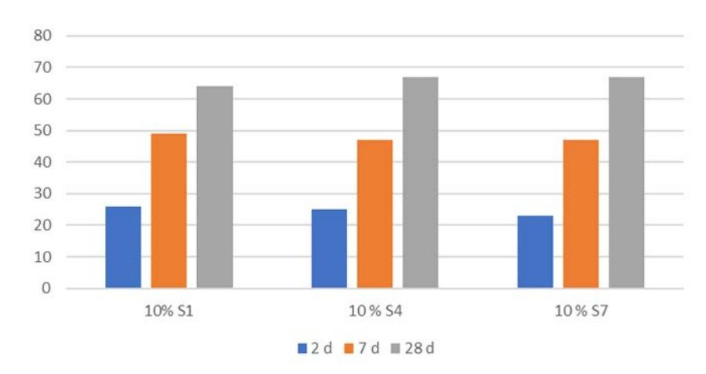

**Figure 35. Mortar compressive strength development of the three analysed mixtures**

Furthermore, the heat of hydration was analyzed continuously up to 40 hours, using the TamAir method. With this method the heat flow in the cement samples could be measured over time. The TamAir curves [\(Figure 36\)](#page-56-0) show that cement 4 develops more heat in the earlier hours of hydration, related to some higher amount and portion of orthorhombic aluminate, but a typical slight decrease of heat after 24 hours. This behavior could be correlated to the strength development, with higher early strength and lower final strength. In contrast, cement 1 develops a more continuous heat over time, resulting in the highest total heat release. After a quite strong initial hydration period, cement 7 showed the lowest total heat release of all samples.

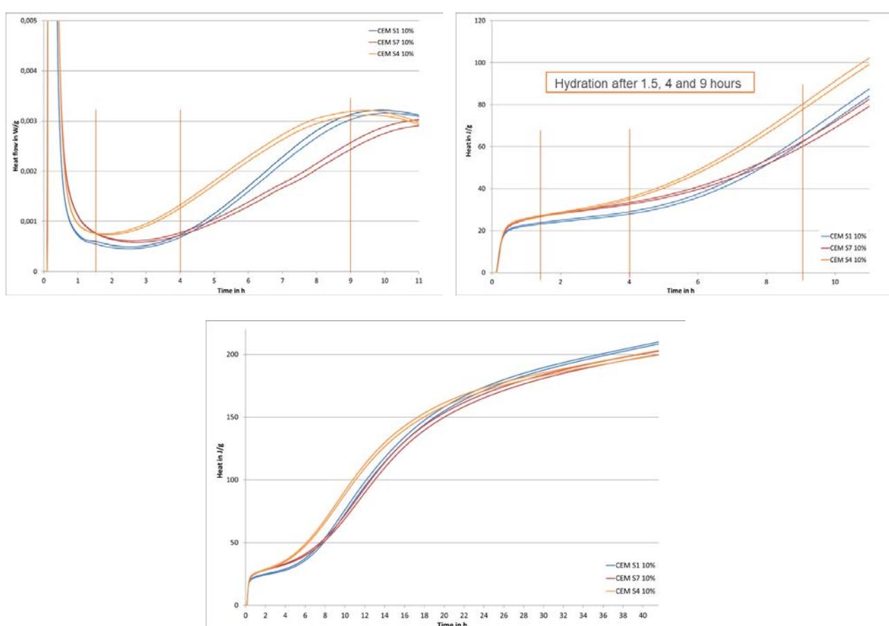

**Figure 36. Heat flow calorimetry in the cement samples over time (TamAir)**

With a further method, the 8-channel ultrasonic measuring system (IP8), the development of microstructure of the three manufactured cements was measured with ultrasonic wave velocity. This method is a non-destructive measurement of setting, strength development and consistency changes. The higher the velocity of ultrasonic waves is, the more consolidated should be the microstructure.

In [Figure 37](#page-57-1) functions for the investigated cements are shown. Expectably cement 4 develops a slightly faster microstructure at 4 hours of hydration time but declines after 15 hours. Cement 1 maintains the highest level from 9 hours onward (densest microstructure), while cement 7 remains in between. The results are directly in line with those of the other cement testing methods.

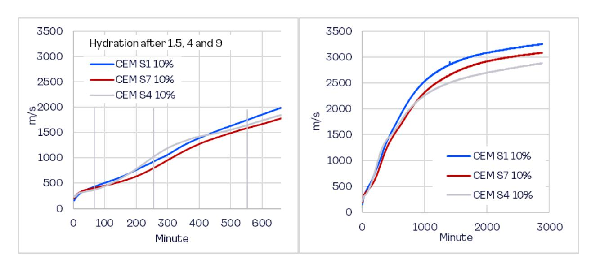

**Figure 37. Development of microstructure of the three manufactured cements, measured with ultrasonic wave velocity**

Finally, the progress of hydration was investigated focusing on the phase development within the hydrated cement paste, using DSC and XRD measurements after 1.5h, 4h and 9h of hydration. The results of the DSC measurements are summarized in [Table 20.](#page-57-2)

**Table 20. Behaviour of the cement sample during hydration**

|                 | C1  | Hemi-hydrate [%] C4 | C7  | C1   | Ettringite [%] C4 | C7   | C1  | Portlandite [%] C4 | C7  | C1   | CSH [J/g] C4 | C7   |
|-----------------|-----|---------------------|-----|------|-------------------|------|-----|--------------------|-----|------|--------------|------|
| Original cement | 1.2 | 1.6                 | 1.6 |      |                   |      | 0.2 | 0.3                |     |      |              |      |
| Hy=1.5h         |     |                     |     | 8.7  | 10.2              | 9.3  | 0.1 | 0.3                | 0.1 |      |              |      |
| Hy=4h           |     |                     |     | 10.7 | 11.4              | 13.2 | 0.2 | 0.5                | 0.3 |      | 2.5          | 4.7  |
| Hy=9h           |     |                     |     | 12.2 | 15.4              | 14.4 | 2.8 | 3.7                | 2.2 | 29.2 | 20.6         | 17.2 |

As in common cements the hydration started with dissolution of the sulphate carrier and ettringite formation which seems not to be finalised after 9 hours, so it does not correspond to the total aluminate content of the different cements. After roughly 4 hours the reaction of Ca-silicates, namely alite has started, leading to portlandite and calcium silicate hydrate (CSH) phase contents. The CSH content of cement 1 looks significantly higher compared to the other samples, which would be in line with the slightly stronger development of this cement in early ages.

### **5.3.3. Cement constituent**

For the analyses of sample 1 (S1) and sample 7 (S7) as cement main or minor constituent, the samples were ground to a fineness of approx. 5000 cm²/g (measured by Blaine method) and were afterwards mixed with a Portland cement in two different proportions of 10 and 25 mass % (main constituent). Prismatic test specimens were produced using these mixtures and compared to a reference mixture of 100 mass % CEM I 52.5 R. The compressive strengths of these test specimens were measured after 2, 7, 28, 56 and 91 days. The results after 28 and 91 days were used to calculate the activity index. With this value, the samples can be characterized as inert or reactive. The activity index was compared to the requirements for fly ash acc. to EN 450-1.

**Table 21. Activity indices of sample 1 and 7 and the according requirements**

| Parameter     | Requirement | Activity index S1 | Activity index S7 |
|---------------|-------------|-------------------|-------------------|
| Formula       |             | S125% / R         | S725% / R         |
| Test date 28d | ≥75%        | 66%               | 79%               |
| Test date 90d | ≥85%        | 71%               | 79%               |

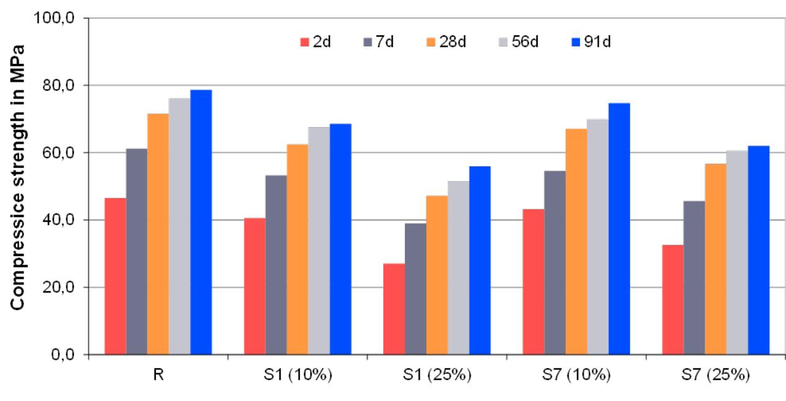

**Figure 38. Mortar compressive strength development of the analysed mixtures**

### **5.3.4. Cast polymer**

The results of the formulation and testing of a resin system designed for cast polymer applications with a focus on performance under demanding industrial conditions are collected in this section. The selected resin is a vinylester known for its excellent chemical resistance and mechanical strength, making it well-suited for environments exposed to aggressive agents.

The formulation was developed to meet several critical industrial requirements, including resistance to chemical agents, particularly organic compounds and residues from industrial plant waste, sufficient mechanical strength, strong adhesion to metal and concrete substrates, good flow characteristics, low porosity. Early mechanical strength is essential to prevent deformation during demolding, while a post-curing stage at moderate temperatures is required to enhance final performance.

During testing, various combinations of the resin with two catalysts were evaluated — Catalyst A and Catalyst B — with the objective of achieving a glass transition temperature (Tg) above 70 °C and a working time of approximately 60 minutes, which is essential for proper handling and molding. The selection process included monitoring viscosity over time at room temperature.

Two curing strategies were explored: one involving ambient curing for 24 hours, and another incorporating a post-curing stage at moderate temperatures (60–80 °C). While the ambient cure provided an acceptable Tg, residual curing prevented the system from reaching optimal conversion.

Therefore, the post-curing step was adopted to eliminate residual enthalpy and ensure a stable Tg above 70 °C.

On the other hand, the formulation of cast polymer is based on two variables, the quantity of the resin and the nature of the aggregates/fillers. The amount of resin used has been increasing as the results of both the workability of the mixture and the mechanical properties of the final specimens. In this way, tests begin with 15% resin for the use of standard sand, when switching to recycled sand, 18% is needed to achieve a homogeneous mixture. This percentage of resin is used to carry out the evaluation of the use of the different selected residues (sample1, sample 2 and sample 3), both alone and in mixtures with recycled sand, although the consistency is dry and the workability difficult. Finally, the best results of the particle size distribution are repeated with 20% resin.

Some of the comparisons of the granulometry curves of Bolomey are shown i[n Figure 39](#page-59-0) (here x-axis represents the log of the sieve size and y-axis is the % of aggregates that pass the sieve). The fine fraction of used waste improves the distribution and filling the pores of the mixture. Nevertheless, the increase of this fine fraction can affect the adsorption of resin.

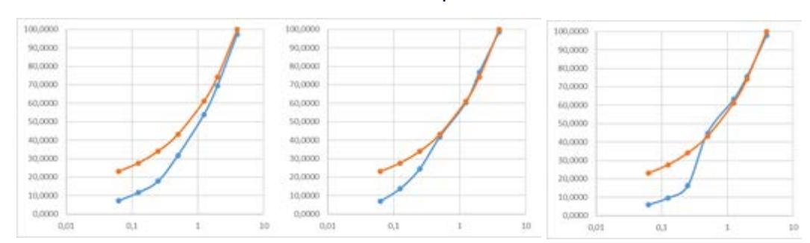

**Figure 39. (left) Mixture with 100% recycled sand (OF: 679); (center) Mixture with 50% recycled sand+50% Sample1(OF: 11); (right) Mixture with 80% recycled sand and 20% Sample 2 (OF: 18.2)**

The first assessment carried out was the use of each waste alone and its comparison with both mixtures with standard sand and recycled sand. The following graph [\(Figure 40\)](#page-60-0) shows the results, indicating the minimum values to be achieved.

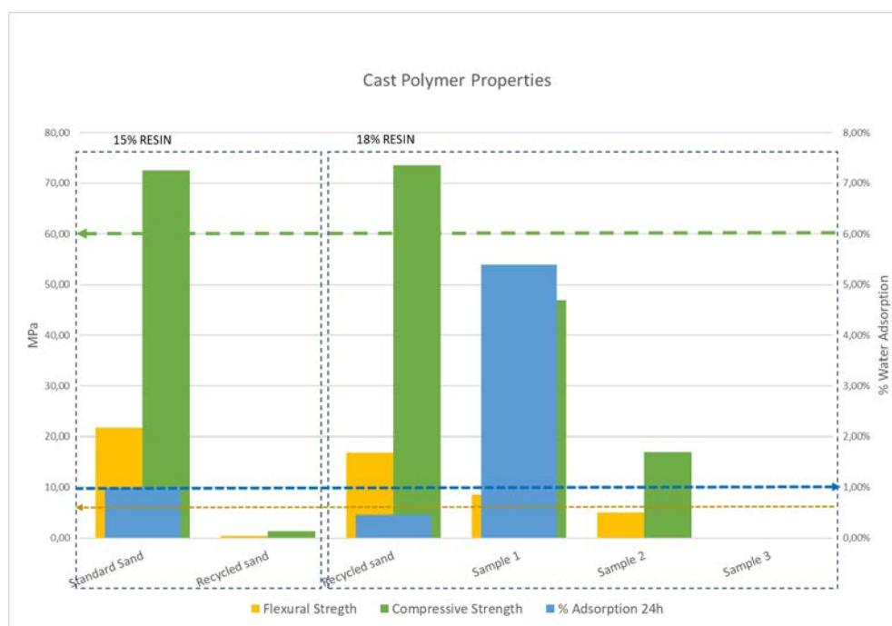

**Figure 40. Properties of cast polymer made with one component**

[Figure 41](#page-60-0) shows the need to use 18% resin with the use of recycled material in order to achieve the established minimums. On the other hand, it also shows the increase in water adsorption with sample 1, which also does not reach the minimum compressive strength, and the poor results when using sample 2 and sample 3, with the latter the specimens broke when demolding. [Figure 42](#page-60-1) shows the test of workability made of each formulation. Therefore, the study continues using mixtures of recycled sand with the new waste fractions (sample 1, sample 2 and sample 3) which will improve the particle size adjustment and therefore all the properties.

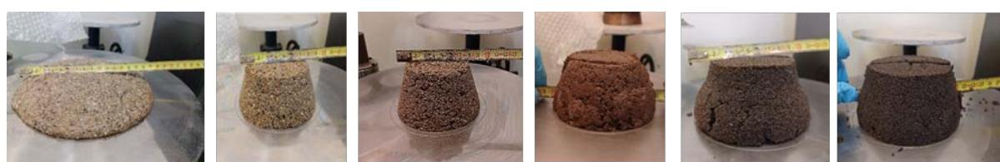

**Figure 41. Workability test by ASTM C1437**

The substitution of part of the recycled sand for the waste studied has been 15% in the case of sample 2 and sample 3, and in the case of sample 1 a substitution of 25%, 40%, 50% and 60% has been explored. This has been so because the origin of sample 1 is CDW, which is the main objective of the REDOL project. The result is shown in [Figure 43](#page-61-0) where the use of sample 2 and sample 3 causes the mechanical properties to be greatly reduced compared to the use of recycled sand alone and at the same time increases water adsorption. On the other hand, the use of sample 1 does not have a clear trend due mainly to the sample with 25% substitution, which would not meet the minimum requirements for its use, while with the other substitutions it is fulfilled and also with very good results. This may be due to the fact that the material used in the group with the greatest substitution is from a new batch sent by CASALE whose composition is not homogeneous and would be richer in siliceous stone than the previous batch. This is the main problem with the use of CDW, the heterogeneity in its composition because the origin is not always the same.

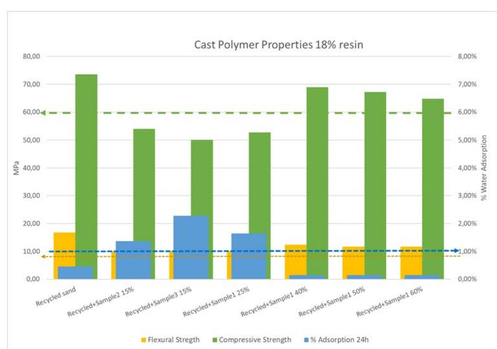

**Figure 42. Cast Polymer properties with mixtures of aggregates and 18% of resin**

Although the properties are achieved with the formulas with higher substitution, those mixtures are hard and not easy to mold filling or spreading. To improve the workability, the last step of the analysis was to increase the amount of resin up to 20%[. Figure 43](#page-61-1) shows the change in the workability of the mixtures what now present a plastic fluid behavior what will allow the filling of molds or casting.

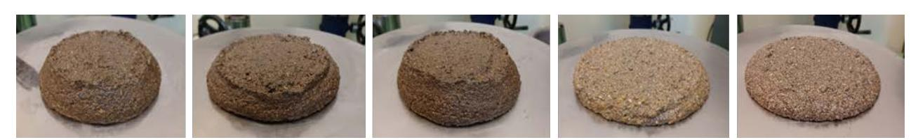

**Figure 43. Workability of mixtures with 20% of resin**

The results of the properties of these cured mixtures are i[n Figure 44.](#page-62-1) In this case, all the properties have higher values than the formulas with 18% resin. Water adsorption is much lower than the other formulas tested what is crucial for the application of this material. Regarding the mechanical properties, the mixtures with sample 2 and 3 still do not reach the minimum values of compressive strength, while samples with sample 1 exceed 60 MPa. In the case of the use of only recycled sand, a decrease in properties is observed due to the fact that the particle size distribution is not favorable (Bolomey OF 679 vs. values between 69-1.5 for mixtures with sample 1). For these reasons, it was decided that the formulation that best suits the properties sought is the one that has 20% resin and the aggregate is made up of 50% recycled sand and 50% sample 1.

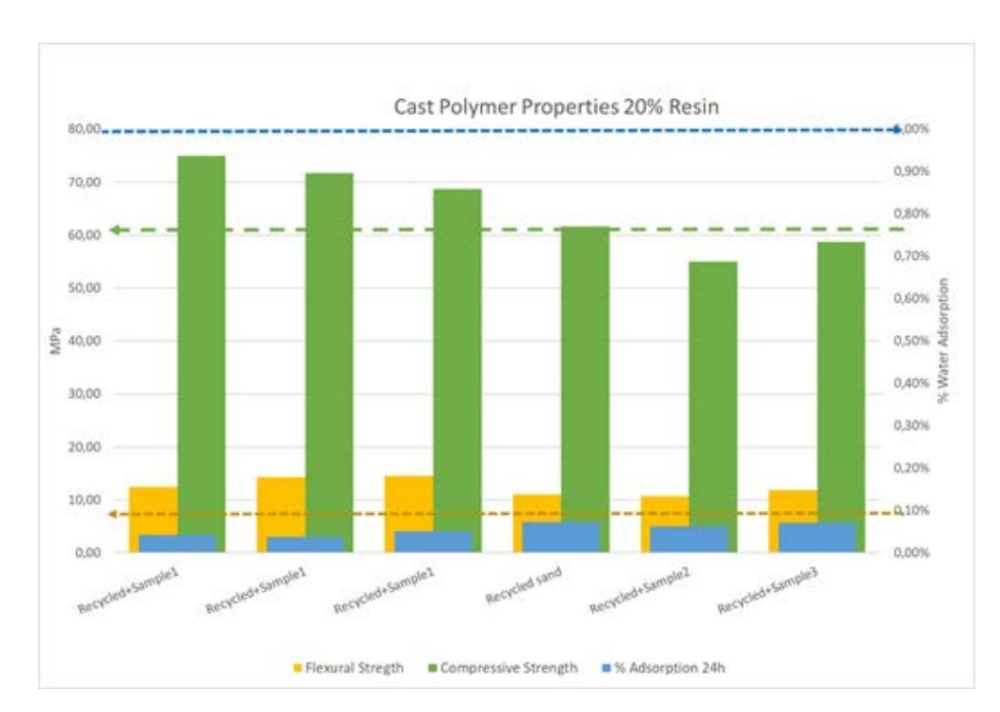

**Figure 44. Cast Polymer properties with 20% of resin.**

## **5.4.Impact (KPIs)**

For Task 4.3 materials like industrial waste provided by CASALE were investigated. These industrial waste samples are available in the waste management plant of CASALE from various branches of industry as a pre-sorted material stream. Some of the samples are sent by other recycling companies or are offered (mixed with other materials) on the market, for example as aggregate.

In the plant of CASALE, recycled aggregates are used in a baseline scenario as components of the formulation of "Megalito", a precast concrete block made with 100% recycled aggregates. For the subtask "cast polymer component", one fraction of these recycled aggregates, was also taken into consideration

Key Performance Indicators (KPIs) are measurable values that demonstrate how effectively the progress within each value chain takes place and can be used to describe the impact of a re-search project like REDOL. In the deliverable D2.3 "Evaluation methodology" a set of KPIs for the REDOL project were identified and outlined. With the help of the KPIs a comparison between each REDOL scenario and its corresponding baseline scenario is possible.

The KPI 4 "Use of secondary materials" describes materials recovered from previous use or from waste which substitutes primary materials. The objective is to increase the proportion of secondary material usage, demonstrating a higher integration of recycled or reclaimed materials within the REDOL scenario. Regarding the four subtasks mentioned, it was shown in the REDOL scenario that materials recovered from different waste streams can partially substitute primary materials, like limestone in the clinker production. As a result, natural resources in cement and concrete value chain can be partially saved.

With the help of KPI 6 "Product obtained" the efficiency of a waste value chain can be monitored over time. The objective of this KPI is to improve the efficiency of a waste value chain over time and in comparison, to various baseline scenarios. The materials mentioned can still be used as described in the baseline scenario. The REDOL scenario introduces further application options, such as raw material components for clinker production or cast polymer components for certain materials investigated in this task.

The KPI 7 "Valorizing rate of waste" quantifies the amount of waste valorized when compared to state of the art. Achieving a valorization rate that demonstrates an efficient waste utilization procedure with a percentage that equals or exceeds that of the best-known practices is the objective of this KPI. As described above, products manufactured with some materials have a limited value. The valorization of certain material flows could be demonstrated by investigations regarding the materials, which lead to products with a higher value in the REDOL scenario.

## **5.5.Conclusions of T4.3**

#### Fuel

Various experiences demonstrate that other alternative fuels may exhibit significantly higher energy content. In the case of sample 5, the energy content is satisfactory, as any positive energy contribution is valuable. In addition, this material can be mixed with other alternative fuels to achieve a sufficiently high combustion energy.

#### Clinker

To draw the conclusion about all tests on hydration behaviour and cement properties it could be stated that the cement made from clinker with at least up to 10 % of alternative raw materials (1, 4 and 7) show identical properties like common cement made from natural raw materials. Just increasing the replacement up to the chemically given maximum end up in some problems with the burning degree and would need much more effort in preparation of suitable raw meal fineness and homogeneity.

#### Cement constituent

Although the activity indices of sample 1 and 7 are not high enough, the results still give reason to consider these materials as more or less inert supplementary cementitious materials for creating a new concrete recipe. This will be done with CASALE's formulation of "Megalito" as a REDOL related example. Since these investigations involve the demonstration of performance of the new recipe, they will be conducted within the framework of Task 6.3 of WP6.

#### Cast polymer

The desired formulation of cast polymer must meet a series of requirements that give usefulness to the material and for this the use of different residues as aggregates in the recipe has been analyzed. The characterization of both the processing and final properties of the resulting material gives as good the use of sample 1 from CDW for the formulation of a new cast polymer together with recycled sand. In this way, a formulation with 100% recycled aggregates has been achieved.

## **5.6.Future work**

Activities regarding the implementation of the results from Task 4.3 are planned within Task 6.3 of WP 6. These steps relate to the validation, demonstration and scaling up of technical developments are primarily based on the analyses of the various materials from Task 4.3:

Investigations from Task 4.3 have shown that it may be possible to use sample 1 and sample 7 as more or less inert supplementary cementitious materials (SCM) in a concrete recipe. In order to demonstrate this potential, CASALE 's standard recipe for the production of the concrete blocks "Megalito" is used as a basis. This concrete recipe will be adapted so that the use of the abovementioned samples as SCM is possible. The recipe optimization also includes an improvement of the aggregate grading curve. This means that the proportions of every aggregate fraction will be adjusted and adapted to the use of SCM. In addition, the water-cement ratio of the concrete will also be changed in the improved recipe. All of these modifications are aimed to improve the mechanical and durability properties of the concrete used by CASALE. It is important for CASALE and its product "Megalito" to increase the compressive strength of the concrete in the context of recipe optimization. Fresh concrete properties, compressive strength and durability of concretes will be investigated on a reference concrete and two further improved formulations. Following investigations will be conducted on the three concretes mentioned:

- Degree of compactability of fresh concrete acc. to EN 12350-4
- Density of fresh concrete acc. to EN 12350-6
- Air content of fresh concrete acc. to EN 12350-7
- Compressive strength acc. to EN 12390-3
- Sulphate resistance of concrete acc. to SIA 262/1, appendix D
- Determination of the carbonation resistance of concrete acc. to EN 12390-12
- Determination of the chloride migration coefficient acc. to EN 12390-18

For validation, a concrete block with at least one modified concrete recipe will be produced as a demonstrator in the facilities of CASALE.

The second option to use the above-mentioned samples, analyzed in Task 4.3, in cement and finally in concrete is the development of a new cement type with those materials as main or minor constituent. This cement will be a modified CEM II/B-M developed by CEMEX. A sample of this new cement will be delivered to the facilities of CASALE to create an additional demonstrator and thus a concrete block, either based on the cured concrete recipe or based on the new concrete recipe developed by VDZ and CASALE in the above-described chapter.

ACCIONA will use sample 1 and ARH 0/5 to produce a cast polymer. The production of the cast polymer will be scaled up to produce enough quantity for the demonstrator activity. The production process is limited to a mixture of the components and a curing step. The equipment will be a concrete mixture to have the required volume of cast polymer and a heating system for the curing process. The produced cast polymer will be used for the waterproofing of a chemical retention tank. The end user will be ACCIONA.

## **6.Task 4.4. Depolymerization and repolymerization of textile waste**

## **6.1. Specific Task Objectives**

In Task 4.4, AITEX, CIRCE, and BRILEN are collaborating on the development of a chemical recycling process for post-consumer textile waste to obtain recycled PET suitable for spinning. AITEX leads the depolymerization through glycolysis using ionic liquids, starting with the selection and preparation of the textile waste (>90% polyester, elastane-free), the synthesis of the ionic liquids, and the optimization of reaction conditions to maximize BHET yield, which is then purified and repolymerized. CIRCE supports the process by optimizing PET glycolysis through microwaveassisted reactions, evaluating different catalysts (ZnO, ionic liquids, and deep eutectic solvents) with both virgin PET and real textile waste, and working on process scalability. Finally, BRILEN validates the chemically recycled PET through a solid-state polycondensation (SSP) process to increase viscosity and transforms the material into yarn, assessing its suitability for producing hightenacity fibres.

- Develop an efficient chemical recycling process for post-consumer textile waste with a polyester content above 90% and free of elastane.
- Depolymerize the textile waste through glycolysis using ionic liquids as catalytic agents and solvents, aiming to obtain 500 kg of BHET.
- Optimize the depolymerization process under both conventional and microwave-assisted conditions to maximize BHET yield.
- Explore, synthesize, and evaluate alternative catalytic systems, including ionic liquids and deep eutectic solvents (DES), for improved sustainability and efficiency.
- Purify the BHET obtained, removing impurities and by-products generated during the process.
- Repolymerize the BHET to produce 450 kg of chemically recycled PET and validate its structural, thermal, and mechanical properties.
- Carry out a solid-state polycondensation (SSP) process to increase the viscosity of the recycled PET.
- Transform the recycled PET into yarn and assess its suitability for spinning, aiming to produce high-tenacity fibres.

## **6.2.General scheme of the work done**

[Figure 45](#page-66-1) illustrates the overall process developed in Task 4.4 for the chemical recycling of postconsumer PET textile waste free of elastane. The workflow begins with the shredding and densification of polyester-rich textile waste, which is then subjected to glycolysis using ionic liquids or conventional catalysts. This depolymerization step, conducted by AITEX and CIRCE, leads to the production of BHET, which is subsequently purified to remove impurities and by-products. The purified BHET is then repolymerized to obtain recycled PET, a process validated by BRILEN through solid-state polycondensation (SSP) to increase viscosity. Finally, the recycled PET is spun into hightenacity PET fibres, demonstrating its suitability for textile applications.

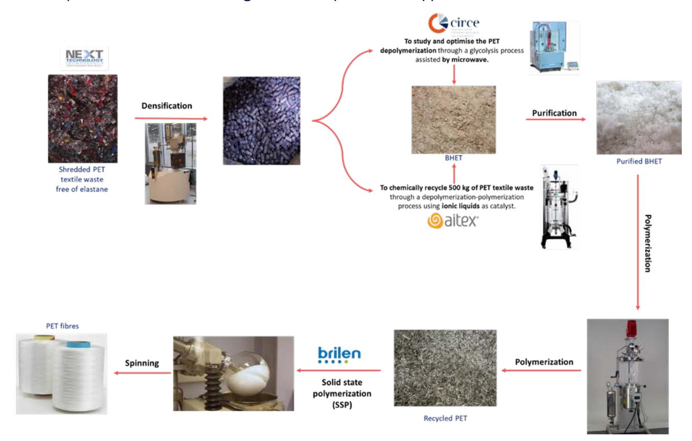

**Figure 45. Scheme of the work done**

### **6.2.1. Shredding and densification**

The material provided by NTT [\(Figure 46\)](#page-66-2), consisting of 100% polyester (PET) and free of elastane, was first shredded and homogenized to ensure consistency and facilitate its subsequent processing. This pre-treated material was then subjected to a densification and agglomeration step; a crucial process aimed at improving its physical handling properties and optimizing its behaviour during chemical depolymerization.

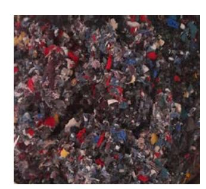

**Figure 46. 100% polyester (PET) material, free of elastane, provided by NTT.**

Densification notably increased the bulk density of the PET particles and promoted a more uniform morphology [\(Figure 47\)](#page-67-1), reducing the presence of air pockets and improving particle contact. This transformation not only made the material easier to dose and transport but also enhanced the efficiency of the glycolysis reaction by enabling better permeation of the solvent and catalyst throughout the polymer matrix.

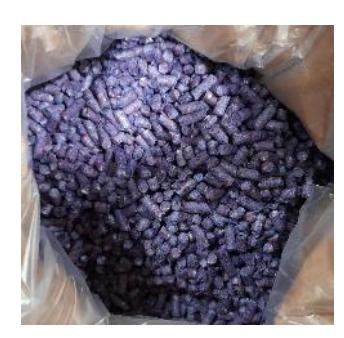

**Figure 47. 100% densified PET material.**

The improved structure and compactness of the densified PET favoured a more uniform and accelerated breakdown of the polymer chains, facilitating a higher reaction rate and a more effective depolymerization. As a result, this pre-treatment step proved to be a key factor in improving both the reproducibility and scalability of the glycolysis process under study.

## **6.2.2. Glycolysis process**

To depolymerize the polyester into its monomeric units, various catalytic systems were evaluated. Among the different approaches tested, ionic liquids specifically designed and synthesized for this application demonstrated particularly high effectiveness. Additionally, catalytic systems based on iron salts showed very good performance in terms of BHET (bis(2-hydroxyethyl) terephthalate) recovery. Other alternatives, such as metal oxides and deep eutectic solvents (DES), were also investigated to compare their catalytic efficiency, environmental sustainability, and scalability for industrial application.

In parallel, microwave-assisted glycolysis [\(Figure 48\)](#page-67-2) was explored as an alternative heating method to enhance the reaction rate and improve energy efficiency. This technique enabled rapid and homogeneous heating of the reaction mixture, resulting in significantly shorter reaction times while maintaining high product yields.

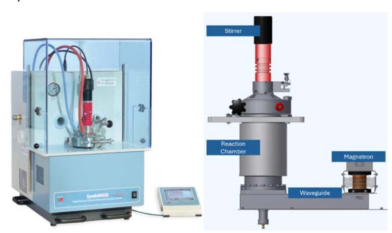

**Figure 48. SynthWAVE microwave reactor (left) and its parts (right).**

Following optimization at laboratory scale, the process was scaled up using a 50 L glass reactor [\(Figure 49\)](#page-68-1). This stage was essential to validate the reproducibility and robustness of the optimized conditions under semi-industrial conditions. Key parameters such as temperature control, mixing efficiency, and reaction duration were closely monitored and fine-tuned to ensure consistent BHET yields and high product purity.

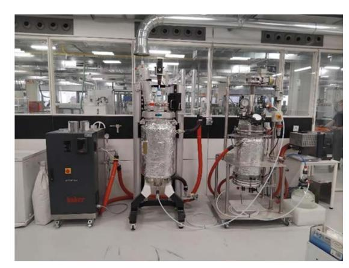

**Figure 49. 50 L glass reactor used for glycolysis scale-up.**

The scale-up trials confirmed the technical feasibility of producing BHET at the kilogram scale, demonstrating consistent performance and paving the way for potential industrial implementation. After depolymerization, the product was filtered and washed to remove solid residues, followed by crystallization to isolate high-purity BHET.

### **6.2.3. Solid State Polymerization and spinning**

The next step in this task involves the transformation of recycled PET (rPET) into fibres through a sequence of thermal and mechanical processes, starting with solid-state post-condensation (SSP). This step is crucial to increase the molecular weight of the rPET by promoting additional polycondensation reactions. Prior to this, the rPET pellets are crystallized to prevent agglomeration during heat treatment. The crystallized pellets are then introduced into fixed-bed or fluidized-bed reactors, operated at temperatures ranging from 200 °C to 220 °C, either under vacuum or in the presence of an inert gas atmosphere, typically nitrogen.

During SSP, by-products such as acetaldehyde, ethylene glycol, and water are removed, which facilitates the increase of the intrinsic viscosity (IV) of the polymer, a key parameter for spinninggrade applications. The efficiency and consistency of this process depend on the precise control of several variables, including temperature, residence time, gas flow rate, and initial moisture content of the pellets. These parameters must be tightly regulated to ensure proper reaction kinetics and to achieve a uniform, high-quality product suitable for melt spinning.

Following post-condensation, the process proceeds to the melt spinning stage. The solid-state polycondensation pellets are stored in silos and pneumatically conveyed to intermediate hoppers. Before extrusion, the material undergoes a controlled drying phase using hot, dry air to eliminate any residual moisture, which is critical to avoid hydrolytic degradation during melting. Once adequately dried, the pellets are fed into an extruder, where they are melted by a combination of mechanical shear and electrical heating. The resulting polymer melt is transported under pressure to the spinning beam, where metering pumps and filter packs regulate the flow and remove impurities. The molten polymer is then extruded through metallic spinnerets, which define the number and diameter of filaments per yarn.

The extruded monofilaments are cooled in laminar flow cabins with conditioned air to solidify the yarns, after which a spin finish lubricant is applied to facilitate further processing. The yarns are then drawn using a series of godets operating at controlled temperatures and speeds, enabling the adjustment of mechanical properties such as tenacity, elongation, and modulus. Finally, the yarn is continuously wound onto cardboard tubes using winders, completing the fibre production cycle from recycled PET.

## **6.3.Main advances achieved by REDOL**

## **6.3.1. Chemical recycling of PET via glycolysis under conventional heating**

As part of the development of new strategies aimed at improving the chemical recycling of plastic waste, particularly polyethylene terephthalate (PET), a family of tunable liquid catalysts has been investigated. These compounds, known as ionic liquids, have demonstrated strong potential in catalytic applications due to their structural versatility, thermal stability, and ability to promote chemical reactions under mild conditions. These characteristics make them especially attractive for depolymerization processes such as glycolysis.

The design of these ionic liquids focused on tailoring their chemical structure to enhance their catalytic performance, exploring different combinations of cations and anions, as well as incorporating metallic elements into their molecular frameworks. The catalysts were synthesized using straightforward, reproducible, and low-impact procedures, ensuring efficient and scalable production. These ionic liquids were then applied as catalysts in PET glycolysis reactions, with the goal of evaluating their effectiveness in breaking polymer chains to yield the intermediate monomer bis(2-hydroxyethyl) terephthalate (BHET).

Catalytic tests were conducted under controlled conditions to allow for direct comparison among the different synthesized ionic liquids. The results highlighted a significant influence of the chemical structure on catalytic performance, showing that even small compositional variations could markedly affect depolymerization efficiency. Some formulations achieved BHET yields above 70%, while others exhibited more limited activity. An optimal catalyst dosage was also identified: increasing the amount beyond this threshold did not enhance the yield and, in some cases, even reduced it, likely due to saturation or inhibition effects.

The most promising formulations included those incorporating specific metallic elements, such as iron or zinc, which demonstrated a good balance between catalytic activity and structural stability. One of these ionic liquids, selected for its outstanding performance, was chosen for subsequent stages of the project focused on the valorisation of PET-based textile waste. This represents a key step in establishing efficient and sustainable catalytic solutions for the chemical recycling of polymers.

After obtaining a high purity intermediate through chemical recycling, it was successfully transformed into new plastic material. Once the catalytic system was validated at laboratory scale, the next objective was to adapt the process to conditions closer to potential industrial implementation. To achieve this, a scale-up of the glycolysis stage was carried out, maintaining the selected ionic liquid as the catalytic agent. This involved operating with significantly larger volumes and fine-tuning the process parameters to ensure consistent product yield and quality.

One of the main benefits observed during scale-up was the optimization of raw material and energy usage, reducing the number of cycles required to obtain the desired amount of recycled product. This aspect is particularly relevant from both an economic and environmental standpoint. During this stage, optimal operating conditions were precisely defined, including temperature, reaction time, PET:glycol ratio, catalyst dosage, and agitation, which enabled PET depolymerization yields above 70%, even under the constraints of pilot-scale operation.

The resulting intermediate product, BHET, was purified and analysed using advanced spectroscopic techniques such as nuclear magnetic resonance (NMR), which confirmed the successful breakdown of the PET chains and the absence of significant impurities [\(Figure 50\)](#page-70-0). These analyses also provided valuable insights into the relationship between reaction conditions and product purity, which is crucial for designing future upscaling strategies.

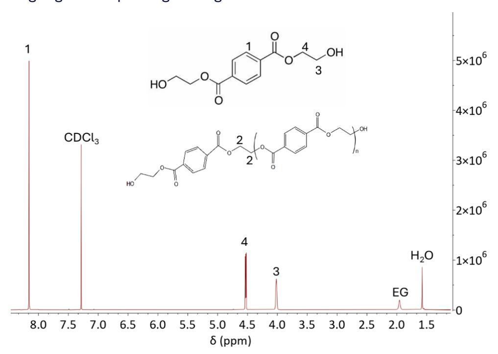

**Figure 50. NMR spectrum of purified BHET.**

Despite the inherent challenges of scale-up processes, such as transfer losses, mixing limitations, and thermal inefficiencies, the process proved robust and stable. Once technical viability was confirmed under semi-industrial conditions, continuous production of the recycled product was initiated, aiming to reach the total target quantity defined for this phase. This milestone validates the process as a promising candidate for real-world industrial deployment and marks a significant step toward achieving effective circularity for post-consumer PET.

In the final stage of the process, the purified BHET was successfully used as a raw material for repolymerization into new plastic, thereby closing the chemical recycling loop. The main objective of this step was to produce a polymer with properties comparable to those of virgin PET, making it suitable for high-value applications. The polycondensation reaction was carried out in a reactor specifically designed to operate under high-temperature and vacuum conditions, critical parameters to ensure proper polymerization and avoid degradation of the final material [\(Figure 51\)](#page-71-0). An industrially established catalyst, compatible with existing PET production technologies, was employed to ensure process efficiency and technological integration. The reaction conditions were carefully controlled to maintain optimal operational ranges, and strategies were implemented to gradually remove byproducts such as ethylene glycol, favouring the formation of long polymer chains and enhancing the quality of the final material.

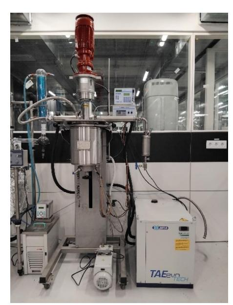

**Figure 51. Polymerization reactor**

The resulting product, known as rqPET (recycled PET via glycolysis), was characterized in terms of its physical, thermal, and structural properties, and showed performance comparable to that of virgin PET [\(Figure 53\)](#page-73-0). This makes it suitable for a wide range of applications, including packaging, textile fibres, and technical components. The quantity of rqPET obtained met the established project targets, both in terms of volume and quality, marking a significant achievement within the project and paving the way for future industrial-scale implementation.

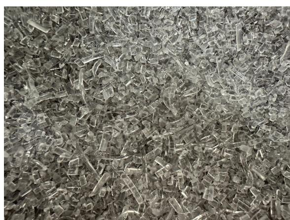

**Figure 52. rqPET by glycolysis.**

### **6.3.2. Chemical recycling of PET by microwave-assisted glycolysis**

As part of the research efforts to improve the chemical recycling of PET, microwave-assisted glycolysis has been explored as an alternative to conventional heating methods, offering benefits such as shorter reaction times, improved energy efficiency, and enhanced control over reaction kinetics. Within this framework, different catalytic systems were tested using PET feedstocks, both virgin and post-consumer, under controlled microwave (MW) conditions in reactors ranging from laboratory (100 mL) to pilot scale (1 L).

The first series of experiments focused on virgin PET glycolysis using zinc oxide (ZnO) as a catalyst in a 100 mL microwave reactor [\(Figure 53\)](#page-73-0). The effect of various process parameters was evaluated, including catalyst concentration, reaction temperature, residence time, PET loading, and temperature ramp profiles. The results demonstrated that ZnO significantly facilitates the depolymerization of PET, with an optimal catalyst loading of 0.025 g yielding a maximum BHET yield of approximately 77.8%. Interestingly, increasing the ZnO dosage beyond this amount did not enhance conversion and even resulted in reduced BHET recovery, possibly due to catalytic oversaturation or side reactions. Reaction temperature was also found to be a critical factor: conversions and yields increased markedly above 200 °C, peaking at 215 °C. An optimal residence time of 1 hour was identified, since longer durations led to BHET degradation. PET amount had a negligible impact on conversion, which remained high (>92%), although very low PET loads slightly decreased the BHET yield. Notably, implementing a fast ramp-up to 190 °C significantly improved both PET conversion (~97.7%) and BHET yield (~82%), suggesting that rapid heating accelerates reaction kinetics and enhances efficiency.

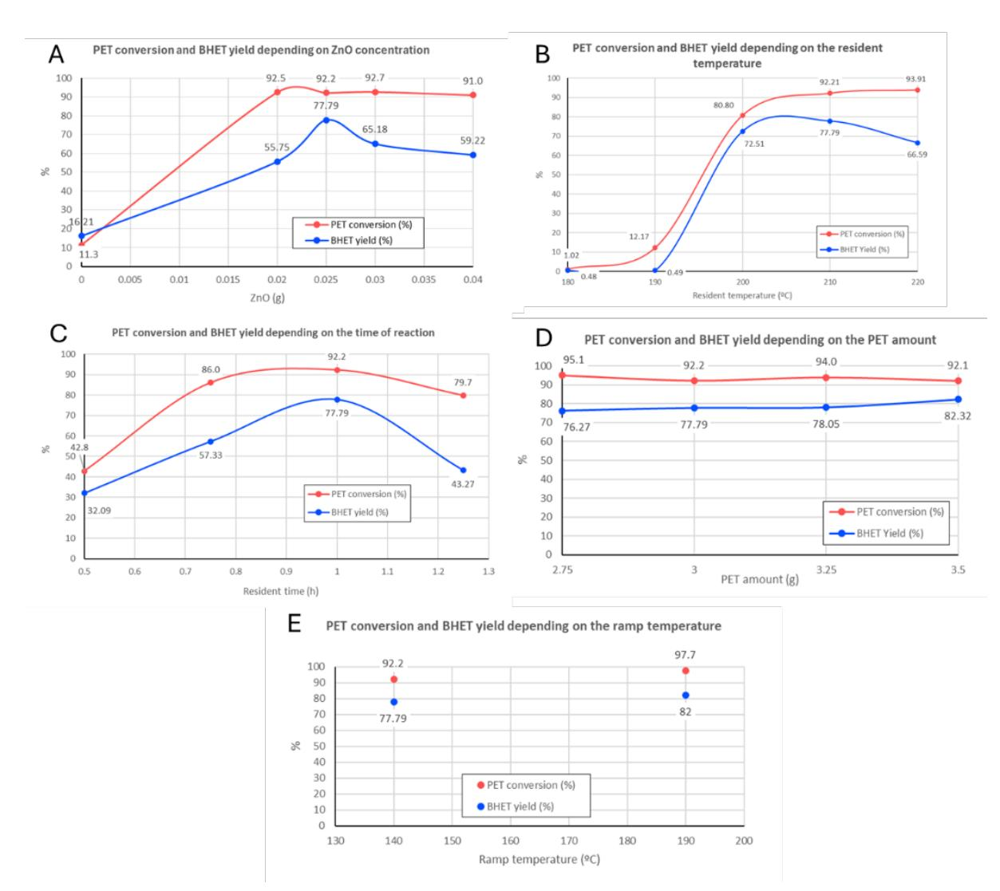

**Figure 53. Virgin PET MW Glycolysis with ZnO. Results of PET conversion (%) and BHET yield (%) in the study on ZnO concentration (A), temperature (B), resident time (C), PET amount (D), and ramp temperature (E).**

To evaluate the scalability of the process, experiments were conducted using a 1 L microwave reactor, comparing results with those obtained in 100 mL vials [\(Figure 54\)](#page-74-0). The data showed that PET conversion remained stable and high across both scales (~97.7% in 100 mL and ~97.3% in 1 L), indicating that reactor volume did not significantly affect depolymerization efficiency. However, a notable increase in BHET yield was observed when scaling up, rising from 82.0% in the 100 mL vial to 89.54% in the 1 L vessel. This improvement may be due to better heat dissipation, more homogeneous mixing, or reduced volatilization of intermediate products. These findings support the process's robustness and its potential viability for industrial-scale applications.

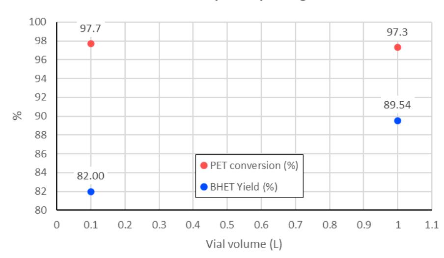

**Figure 54. Virgin PET MW Glycolysis with ZnO. Results of PET conversion (%) and BHET yield (%) in 100 ml vials and 1L vessel experiments.**

The next phase explored the microwave-assisted glycolysis of post-consumer agglomerated PET using ZnO as a catalyst in 100 mL vials, assessing the influence of reaction time, catalyst concentration, and PET loading [\(Figure 55\)](#page-75-0). When increasing reaction time from 0.5 to 1 hour, no significant improvement in PET conversion (~90%) or BHET yield (~65%) was observed, suggesting a saturation point in reaction efficiency. In terms of catalyst amount, 0.015 g of ZnO provided the highest PET conversion (~94.5%), but this was accompanied by a drop in BHET yield, possibly due to unwanted side reactions or partial repolymerization. A further combined study of ZnO amount and residence time confirmed that this catalyst loading with a 1-hour reaction produced high conversion, although yield increases were not proportional. Additionally, increasing the PET amount from 3 g to 3.5 g improved both conversion and BHET yield, suggesting that the system efficiently tolerates larger PET inputs under optimized conditions.

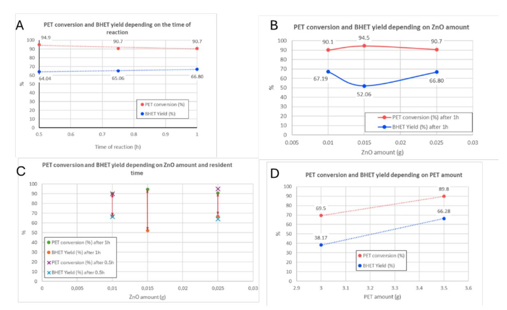

**Figure 55. PC agglomerated PET MW Glycolysis with ZnO. Results of PET conversion (%) and BHET yield (%) in the study on resident time (A), ZnO amount (B), ZnO amount and resident time (C), and PET amount (D).**

In parallel, ionic liquids (ILs) were evaluated as alternative catalysts for the microwave-assisted glycolysis of virgin PET in 100 mL vials [\(Figure 56\)](#page-76-0). The experimental results revealed interesting insights into the performance and limitations of these systems under microwave conditions. Increasing IL concentration led to a clear decline in both PET conversion and BHET yield, with the best results obtained at the lowest IL amount tested (0.25 g). This suggests that excessive IL may inhibit depolymerization or promote side reactions. Temperature was found to enhance PET conversion, reaching 99.6% at 210 °C, but at the cost of drastically reduced BHET yield (down to 10.5%), likely due to thermal degradation of the product. Extending the reaction time from 0.25 to 0.55 hours improved both metrics, peaking at 97.2% conversion and 60.58% BHET yield, although longer times yielded no further benefits. A study on the IL:PET ratio showed that increasing IL from 0.2 to 0.25 g raised conversion (89.1% to 97.2%) but lowered BHET yield (68.5% to 60.58%), indicating the importance of balancing catalyst amount and selectivity.

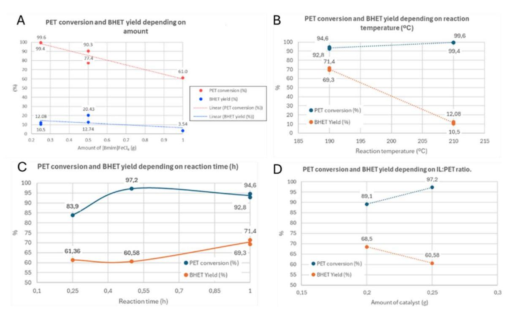

**Figure 56. Virgin PET MW Glycolysis with IL. Results of PET conversion (%) and BHET yield (%) in the study on ILconcentration (A), temperature (B), resident time (C), and IL:PET ratio at** *°C* **(D).**

Lastly, deep eutectic solvents (DES) were tested as catalysts for microwave-assisted glycolysis of virgin PET, with promising but selective results [\(Figure 57\)](#page-77-1). In 100 mL vial experiments, PET conversion consistently reached 100% at elevated temperatures (up to 190 °C). However, BHET yield peaked at 34.16% at this temperature and declined at higher levels, indicating susceptibility to thermal degradation. Increasing residence time from 0.5 to 1 hour maintained full PET conversion but significantly reduced BHET yield from 34.16% to 17%, further confirming that prolonged exposure under microwave conditions can negatively affect product stability. Increasing the DES amount from 0.25 g to 0.75 g also resulted in decreased BHET yield (from 51.42% to 17%), despite achieving full PET depolymerization. These findings suggest that although DESs are effective in breaking down PET under microwave heating, BHET production is highly sensitive to temperature, time, and catalyst dosage, and thus requires fine-tuning for optimal performance.

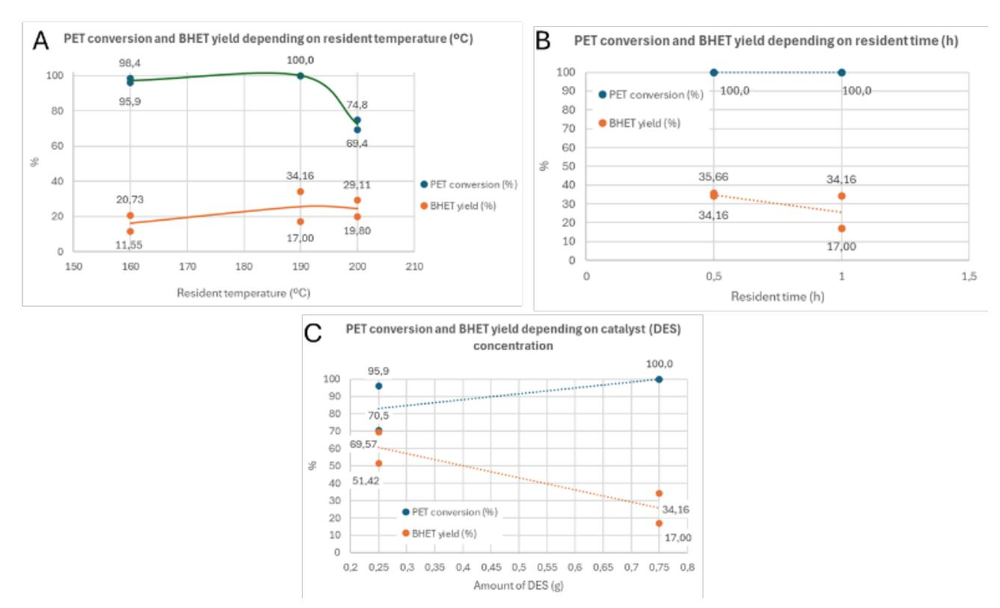

**Figure 57. Virgin PET MW Glycolysis with DES. Results of PET conversion (%) and BHET yield (%) in the study on ramp and resident temperature (A), resident time (B), and DES (4:1) amount (C).**

## **6.4.Impact (KPIs)**

#### KPI 5 – Recycling rate

This KPI evaluates the improvement in recycling efficiency of the material input stream by comparing the REDOL scenario against a defined baseline. It quantifies the degree to which the implemented circular solutions within the REDOL value chain have enhanced the proportion of materials that are successfully recycled.

A higher recycling rate under the REDOL scenario, compared to the baseline, reflects the effectiveness of the new processes, technologies, or strategies adopted in diverting waste from landfill or incineration and reintegrating it into productive loops. This KPI is essential for assessing the environmental performance of the project, particularly in terms of resource recovery, waste reduction, and closing material loops.

The resulting value reflects a >70% change in the recycling rate under REDOL scenario compared to the baseline.

#### KPI 6 – Product obtained

This KPI quantifies the output efficiency of the waste value chain, focusing on the transformation of waste materials into usable final products. It compares the total amount of products obtained under the REDOL scenario with that of the baseline, offering insights into how much the implemented circular solutions have improved the overall material conversion.

KPI 6 shows a variation of ≈ 30% in the quantity of final products produced in the REDOL scenario compared to the baseline, indicating a higher level of process efficiency in the waste-to-product transformation chain.

#### KPI 7 – Valorising rate of waste

This KPI assesses the extent to which waste is valorised, meaning converted into valuable outputs through recovery, reuse, or other beneficial applications. It represents the proportion of total waste that is not discarded but instead reintegrated into productive use, in line with circular economy principles.

Unlike recycling alone, valorisation includes a broader range of actions such as material recovery, energy recovery, or repurposing of components or materials. It provides a more holistic view of how efficiently the system is functioning in terms of reducing environmental burden and maximizing the utility of resources.

This KPI is crucial for comparing the REDOL system's performance against state-of-the-art practices, allowing stakeholders to understand how much of the generated waste stream is being effectively utilized, and to what extent REDOL contributes to the minimization of landfill dependency and resource loss.

The obtained valorisation rate is 90%, which allows evaluating the overall system efficiency in terms of how much waste has been effectively valorised compared to what was generated.

#### KPI 8 – Recycling rate of waste

This KPI measures the share of total generated waste that is successfully recycled within the REDOL scenario. It reflects the direct performance of the system in terms of implementing effective waste separation, collection, and recycling processes.

Focusing on internal system dynamics, this indicator isolates REDOL performance from external baselines and benchmarks the current system against best available technologies (BATs) or established circular practices.

A high recycling rate suggests robust infrastructure, efficient logistics, and strong stakeholder engagement across the value chain. Conversely, a low value may signal bottlenecks, contamination issues, or lack of integration. This KPI is fundamental for tracking progress towards zero-waste objectives, improving material flow accountability, and ensuring alignment with EU waste directives and sustainability targets.

The recycling rate achieved in the REDOL scenario is 85%, indicating a high performance relative to established benchmarks in waste recycling systems.

## **6.5.Conclusions of T4.4**

Throughout the development of the PET chemical recycling process, a comprehensive evaluation of various catalytic systems, reaction conditions, and scale-up strategies has been carried out to optimize both efficiency and sustainability. Initially, the use of ionic liquids as catalysts proved to be a promising alternative, enabling efficient depolymerization under mild conditions. Their chemical composition directly affects their performance, with both the type of cation and anion, as well as the catalyst concentration, playing key roles, since excessive amounts may reduce efficiency. Some formulations containing metal elements exhibited a good balance between activity and stability, leading to the selection of one ionic liquid for further application in textile waste recycling at pilot scale.

In parallel, scale-up experiments confirmed the technical feasibility of the process, maintaining high levels of efficiency and product purity even at increased reaction volumes. Transitioning to a continuous process marked a key milestone, bringing the technology closer to industrial application. The purity of the recovered BHET was validated through advanced analytical techniques, and yields consistently exceeded 70%, demonstrating the robustness of the optimized conditions. As for repolymerization, regenerated PET was successfully obtained with properties comparable to virgin PET, using standard industrial equipment and catalysts, thus facilitating large-scale implementation. Strict control over the reaction conditions ensured high conversion rates and high-quality recycled polymer, with production targets being achieved under realistic operational conditions. The resulting chemically recycled PET (rqPET) showed strong potential for real-world applications, contributing to a more circular use of plastics and reducing dependency on fossil-based resources.

Specific experiments on the microwave-assisted glycolysis of virgin PET using ZnO as a catalyst in 100 mL reactors identified an optimal ZnO:PET ratio of 0.025:3. A temperature of 210 °C yielded the highest BHET output (77.79%) and over 90% PET conversion. While conversion slightly increased at 220 °C, the BHET yield decreased, likely due to PET degradation. A reaction time of 1 hour was determined to be optimal, along with using 3.5 g of PET. The amorphous nature of PET and its ability to crystallize at temperatures above its glass transition (around 180 °C) explained part of the observed variability, as prolonged heating favours chain ordering, which limits solvent diffusion. In scale-up trials using a 1-liter reactor, PET conversion remained stable, while BHET yield improved by 4.54%, attributed to better stirring and more uniform temperature distribution, confirming improved reaction efficiency at larger scale.

Further studies explored the glycolysis of post-consumer agglomerated PET, which has a more amorphous structure due to its mixed origin, requiring different reaction conditions. Although the highest PET conversion occurred after 0.5 hours, the best BHET yield was achieved after 1 hour. A brown colour in the product indicated impurities released during the reaction. The process was shown to be equilibrium-limited, where lower ZnO concentrations (e.g., 0.015 g) led to polycondensation dominating over depolymerization, reducing BHET yield despite high PET conversion. For efficiency, a ZnO:PET ratio of 0.01:3.5 was selected, yielding good results (89.8% PET conversion and 66.28% BHET yield). Microwave-assisted glycolysis using ionic liquids as catalysts was also evaluated. Since ILs begin to decompose at 210 °C due to localized microwave heating, the optimal reaction temperature was set at 190 °C. At this temperature, the catalyst remained stable and effective, and a 1-hour reaction time provided the best PET conversion and BHET yield. Increasing the IL amount from 0.20 g to 0.25 g improved conversion from 89.1% to 97.2%, but BHET yield dropped from 68.5% to 60.58%, likely due to side reactions or repolymerization at higher catalyst loads.

Deep eutectic solvents (DES) were also tested as catalysts under similar microwave conditions. Although PET conversion was high at 160°C, 190°C, and 200°C, BHET yields were low, and the reaction mixture darkened at higher temperatures, indicating DES degradation and loss of catalytic activity. At 190 °C with 0.75 g of DES, PET conversion remained the same regardless of reaction time. The key factor influencing BHET yield was DES concentration, with the highest yield (60.5 % ± 12.8 %) obtained using 0.25 g per 3 g of PET.

Overall, these findings confirm significant scientific and technical progress in the chemical recycling of PET via glycolysis, with innovative catalysts and optimized conditions validated for both virgin and post-consumer PET. This establishes a solid foundation for industrial-scale implementation of the process.

## **6.6. Future work**

As a continuation of the project, a key future line of action will be the implementation of a complete value chain for the chemical recycling of textile waste in the city of Zaragoza. This initiative responds to the need for local and sustainable solutions for textile waste management, enabling material circularity and reducing reliance on virgin raw materials.

The first step will involve the establishment of an efficient system for the selective collection of textile waste, with logistics adapted to the urban context and aimed at maximizing the recovery of textiles suitable for valorisation. This will be followed by the development and deployment of sorting and classification processes to identify and separate fractions with a high content of PET, which is a priority material due to its suitability for chemical recycling. Once suitable fractions are identified, they will be treated using chemical depolymerisation technologies to break down the PET into its constituent monomers or other valuable intermediates. This stage is critical to ensuring the quality of the recycled output and its feasibility for further applications.

The final stage of the value chain will focus on the repolymerisation of the recovered material and its transformation into new fibres through spinning processes, with the aim of reintroducing it into the textile sector. This strategy will not only enable the valorisation of a complex waste stream but also demonstrate the technical feasibility of a locally implemented circular model, with potential for replication in other regions.

Altogether, these future actions will contribute to the consolidation of an industrial ecosystem based on circular economy principles, fostering collaboration among public and private stakeholders across the entire textile value chain.

## **7. Task 4.5. Recovery of Metals from WEEEderived**

## **7.1. Specific Task Objectives**

In WP4, the development of a system for the recovery of precious metals from WEEE using innovative green solvents, includes the following objectives:

- Extraction of precious metals with Deep Eutectic Solvents from Printed Circuit Boards.
- Recovery of precious metals from Printed Circuit Boards in DES solution.
- Design of a preliminary pilot plant for metal extraction with DES.

REDOL research has as an objective the development and the optimization of an innovative process (and relative analytical method) compared to the hydrometallurgical traditional methods, which use majority of traditional acids (e.g., aqua regia). The method is based on specific Deep Eutectic Solvents (DES), that are green and readily available, for the recovery of precious metals from WEEE, electronic products at the end of life, no longer used by consumers.

The research objective is to develop a WEEE recycling method by recovering Ag, Au and Pd using DES with an innovative leaching technique. REDOL's partner TATUINE supplied Printed Circuit Boards (PCBs) samples from telecommunication servers.

## **7.2. General scheme of the work done**

### **7.2.1. Introduction. A brief overview of current management of WEEE in Europe:**

#### *Europe's Approach to WEEE: Progress, Challenges, and Policy Directions*

The rapid growth of electronic devices in Europe has brought significant benefits to society but also created substantial environmental challenges. Specifically, Waste Electrical and Electronic Equipment (WEEE) represents one of the fastest-growing waste streams on the continent, driven by technological advancement and increasing consumer demand. Improper disposal of WEEE poses serious risks due to the presence of hazardous substances like lead, mercury, and cadmium, which can contaminate soil and water, impacting human health and ecosystems. Consequently, effective recycling of WEEE is crucial not only to mitigate environmental pollution but also to recover valuable materials such as precious metals, rare earth elements and critical raw materials, fostering resource efficiency and circular economy goals.

Solid waste generation and management is a key issue in current modern and sustainable-desired societies, with many aspects related both to quantities and qualities of the materials incorporated in the waste that need to be recycled.

Unfortunately, the WEEE category has become of concern because of multiple causes related to the rapid development of technology, better living standards, producers campaigns and extended producer responsibilities towards waste collection and management, consumers behavior and consumption patterns. Therefore, the introduction of ''smart" functions and more attractive designs for electric and electronic equipment (EEE) makes them more appealing to the consumers but caused a decrease of their lifespan and a perceived obsolesce with direct consequences in the generation of larger amounts of WEEE.

The European Union has increased the priority of regulations on circular economy and environmental agenda, in particular on WEEE management and sustainability. As exponentially increased amounts of WEEE are wasted every year, the need for their recovery, reuse, recycling, or disposal is crucial. WEEE European Directives define the requirements for national collection systems but leave to each Country-Member States the responsibility to undertake specific policies and to reach the fixed targets.

In Europe, regulatory frameworks such as the WEEE Directive have been established to promote responsible collection, treatment, and recycling of electronic waste, highlighting the importance of sustainable management of electrical and electronic equipment throughout their lifecycle.

In light of the discussed challenges and opportunities, circular economy is considered to be an appropriate solution for e-waste management because the concept aims to close the product life cycle, minimize pollutant emissions, and maintain the highest utility and value of products. The application of CE strategies (e.g., recycle, recovery) in the WEEE industry has greatly promoted the sustainable development of the environment and economy. In anticipation that the global generation of e-waste will increase to 74.7 Mt by 2030 (Forti et al., 2020), it is timely to examine the development of CE in the WEEE industry to mitigate the environmental impacts and obtain financial gain from e-waste.

Over the past five years, the production and management of Waste Electrical and Electronic Equipment (WEEE) in Europe has been marked by significant growth, challenges in collection rates, and varying national performances.

While public data on WEEE is not always available, there is good data for WEEE that is officially collected and recycled and, thus, also documented by Member States when they report on their progress towards WEEE Directive targets. The Directive requires Member States to collect 85% of all WEEE generated.

However, little is known about the flow of unreported WEEE through society – whether it gets recycled, dumped or exported, for example. Much WEEE goes under the radar because consumers often dispose of it in household waste or it becomes mixed up in mixed-metal waste streams where it gets recycled, but not under compliant conditions for WEEE. Furthermore, large amounts of WEEE are scavenged (stolen for parts) before they can be formally collected or exported abroad or simply hoarded by consumers in their homes.

#### *The significant impact of WEEE recycling in terms of environment, economy and society*

The recycling of Waste Electrical and Electronic Equipment (WEEE) has a significant impact on various key performance indicators that measure environmental, economic, and social outcomes.

One of the primary KPIs is the collection rate, which indicates the percentage of total generated WEEE that is separately collected for recycling. Higher collection rates demonstrate an effective waste management system and directly contribute to reducing the volume of e-waste improperly disposed of in landfills or informal sectors. In Europe, for instance, the collection rate stood at approximately 40.6% in 2022, although the target is set at 65%.

Closely linked to collection is the recycling rate, which measures the proportion of collected WEEE that undergoes processing to recover valuable materials. This KPI reflects the efficiency of recycling operations and the ability to divert waste from disposal. Europe's recycling rate for ewaste was around 42.5% in 2019, highlighting progress but also indicating room for improvement.

Another critical KPI is the material recovery efficiency, which quantifies the percentage of valuable metals and plastics successfully extracted from recycled e-waste. High recovery efficiency not only supports circular economy goals but also reduces reliance on virgin raw materials, thereby conserving natural resources and minimizing environmental impacts.

The environmental benefits of WEEE recycling can be observed through the reduction in landfill and incineration volumes, which represent the amount of e-waste diverted from environmentally harmful disposal methods. Recycling millions of tons of e-waste annually helps prevent pollution and toxic substance release. Moreover, recycling contributes to energy savings by requiring substantially less energy than the extraction and processing of raw materials. For example, recycling aluminum from e-waste can save up to 70% of the energy compared to producing it from ore, translating into significant reductions in carbon emissions. These energy savings contribute directly to a substantial greenhouse gas emissions reduction, measured in tons of CO₂ equivalent. Effective WEEE recycling programs reduce carbon footprints by millions of tons annually, aligning with climate change mitigation goals.

On the economic side, the monetary value of recovered materials represents the market worth of metals, plastics, and other components reclaimed from e-waste. In Europe, this contributes billions of euros annually, stimulating investment in recycling infrastructure and innovation.

Finally, WEEE recycling has also positively impact society by generating employment opportunities. The sector supports tens of thousands of jobs across collection, processing, and related industries, representing an important KPI related to job creation and economic development within the green economy.

#### *EU-wide WEEE collection rate*

Waste electrical and electronic equipment (WEEE) contains dangerous substances that pose risks to the environment and human health. In 2022, the WEEE collection rate was 40.6%, which is still lower than the 65% target set by the WEEE Directive [\(Figure 58\)](#page-84-0). Electrical and electronic equipment is placed on the market faster than WEEE is collected, which reflects Member States' struggle to reach collection targets and ensure that it does not reach the environment.

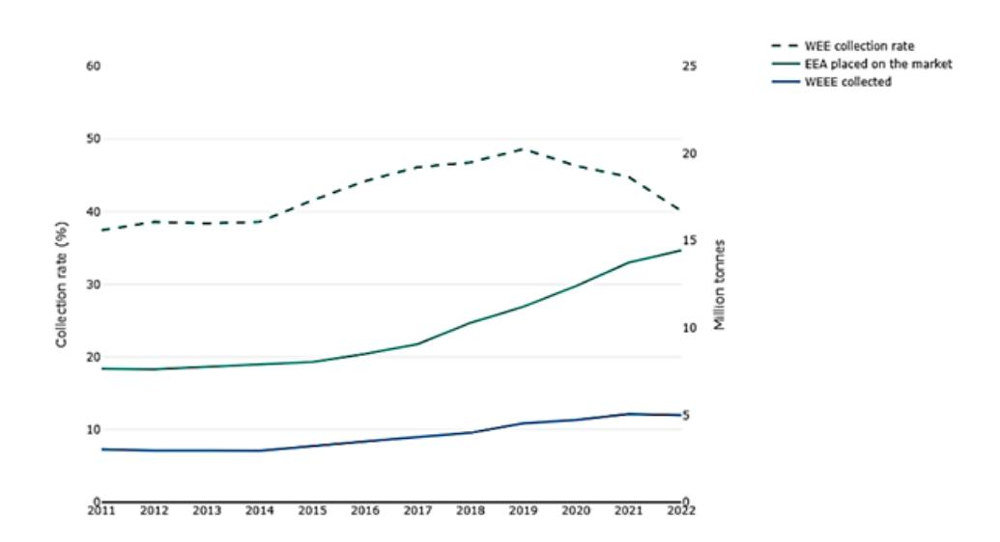

**Figure 58. WEEE collection rate and EEE placed on the market (2011-2022) [Waste electrical and electronic equipment (WEEE) collection rate (Indicator), 2025, European Environment Agency]**

Waste electrical and electronic equipment (WEEE) is one of the fastest-growing waste streams in the world. Due to the presence of harmful additives and dangerous substances, inadequate WEEE management can pose substantial risks to both the environment and human health. Furthermore, WEEE is an important source of secondary raw materials, containing many precious, critical and strategic materials, and other base metals. Therefore, recycling WEEE avoids the significant pollution linked to mining these metals.

The EU-wide WEEE collection rate increased 10 percent points, from 38.6% in 2014 to 48.6% in 2019. After this, collection rates started to decrease, dropping almost 9 percent points between 2019 and 2022. The 2022 collection rate, 40.6%, is lower than the 2019 target defined in the WEEE Directive: 65% for the separate collection of electrical and electronic equipment (EEE) placed on the market.

The decreasing trend in the WEEE collection rate in 2022 is related to a faster increase in EEE placed on the market in previous years than WEEE collected: EEE placed on the market has grown 80% since 2015, moving from 18 to 28 kg/capita, while WEEE collected has grown 54.7% over the same period. This confirms the observation that EU Member States struggle to reach their collection targets. The European Commission is currently evaluating the EU WEEE Directive in order to determine if a review is needed.

The main bottlenecks in reaching the targets are the mixing of WEEE with metal scrap, its disposal in residual waste, unreported export out of the EU, recycling under non-compliant conditions and export for reuse. Another important bottleneck is the large stock of used EEE and WEEE stored or hoarded in households, businesses and organizations before being discarded. Indeed, according to a survey conducted in more than 8,000 European households, 13% of them keep their WEEE because of 'emotional attachment' to e.g., headphones, remote controls, clocks and phones.

 Europe faces an urgent and strategic need to enhance the collection of critical raw materials and precious metals from waste recycling. This necessity stems from the continent's increasing reliance on technologies that are essential for the green and digital transitions—such as electric vehicles, renewable energy systems, and advanced electronics—all of which depend heavily on materials like lithium, cobalt, rare earth elements, and precious metals including gold and palladium.

Currently, Europe imports the vast majority of these materials, often from regions with unstable political climates or monopolistic supply chains. This dependency poses significant risks to the security of supply and the resilience of European industries. By recovering valuable materials from waste—particularly electronic waste, end-of-life vehicles, and industrial residues—Europe can reduce its reliance on external sources and strengthen its strategic autonomy.

Moreover, recycling critical raw materials aligns with the European Union's broader environmental and economic goals. It supports the circular economy by turning waste into a resource, reduces the environmental impact of mining and extraction, and contributes to the EU's climate neutrality targets. Economically, it fosters innovation, creates jobs in the recycling and materials recovery sectors, and enhances the competitiveness of European industries by stabilizing material costs

Legislative initiatives such as the EU Critical Raw Materials Act and extended producer responsibility frameworks further underscore the importance of developing robust recycling systems. These policies aim to ensure that Europe not only secures a sustainable supply of essential materials but also leads in the global shift toward a more circular and resource-efficient economy.

#### *Printed Circuit Board*

The electrical and electronic industry is one of the most innovative in terms of products, and this is reflected in the speed with which electronic devices such as CP and personal computers become obsolete, generating large amounts of electronic waste that must be treated.

PCB are employed in most of the electronic equipment to mechanically support and electrically connect the components using conductive pathways. Practically all electronic devices contain PCB, which are composed of three types of materials: a non-conducting substrate or laminate, printed conducting tracks, and components mounted on the substrate. The substrate is typically composed of glass-fiber-reinforced epoxy resin (that can be used in additive manufacturing), or paper reinforced with phenolic resin (primarily designed to insulate the Cu circuits on outer layers from oxidation from the environment), both with brominated FR. Fiberglass and resin constitute around 40 wt% of the PCB. Printed conducting tracks and components mounted on the substrate are comprised of precious metals and REE.

Four main types of materials can be retrieved from PCB:

- i. recyclable metals (Cu, Al, Pb, Au, Ag, Pt, Pd) and REE (such as Nd, La, Ce)
- ii. recyclable polymeric materials
- iii. ceramic materials, which can be reused or disposed of more appropriately if they are free of metals

iv. non-recyclable polymers or other contaminants, from which energy can be recovered by combustion and incineration

PCBs are used in medical, aerospace, military, commercial, and industrial applications and they are one of the principal components of the computer. PCBs recycling would not only be an economic advantage for waste recyclers but could also help avert an environmental catastrophe as they (including their battery) contain Pb, Cd, Hg, nickel (Ni), antimony (Sn), arsenic (As), and bromine (Br), which can pollute the air, soil, and water if improperly managed. Additionally, PCBs recycling could be considered a type of secondary mining of these precious REE (Rare Earth Elements), creating a new supply chain for the booming electronics industry and thus reducing primary metal mining.

Unfortunately, the material composition and the design of computers and related PCBs make recycling and dismantling very complex, mainly because of the presence of a wide variety of materials in the devices, such as plastics, glass, and ceramics. Plastics and PCB make up the heaviest parts of a computer; plastic represents almost 40–50 and PCB 20–25 wt%, respectively.

In terms of recycling value, PCB are the most important modules of waste CP as they contain most of the precious and valuable metals.

Precious metals and CRM are present in large quantities in the Earth's crust, but their extraction and their separation process are very expensive and not environmentally sustainable. Combined with the relative monopoly of some countries, their price has risen sharply in recent years. The need for product development with innovative properties, especially in the last two decades, has led to a rapid increase in demand and in the price of them. In particular, the shift of humanity to sustainability and renewable energy sources (solar, wind), the demand for extremely high-efficiency and low energy consumption materials combined with high durability, miniaturization ability, and thermal stability, has turned the attention of the scientific community to these kinds of materials.

#### Current extraction methods on WEEE

As mentioned above, PCBs are fundamental components of almost all electric and electronic equipment. The rapid development of technology has led to the disposal of large quantities of waste PCBs (WPCB). Mechanical and pyrometallurgical methods are the current ways of recycling WPCB.

Almost all WEEE recycling enterprises use various mechanical methods (such as multi-crushing, grinding, electrostatic separation, gravity separation, fluid-bed separation, density-based separation, and magnetic separation) to separate metals and non-metals from WPCB. After the mechanical separation, approximately 30 wt% of enriched multi-metal components (Cu, Al, Fe, Sn, Sb, Pb, etc.) are separated from the non-metal components.

However, existing pyrometallurgical and hydrometallurgical recovery processes generate atmospheric pollution because of dioxins, furans, and high volume of effluents release.

 Pyrometallurgical recovery processes require heating the WEEE at high temperatures to recover valuable metals. These processes lead to the production of hazardous flue gases that must be removed from the air. Furthermore, they are energy- and cost-intensive and require high purity feeds.

Hydrometallurgical processes offer a relatively low capital cost, reduced environmental impact, and high recoveries of metals. They involve the dissolution of metals in alkaline or acid media. Several studies have reported the use of nitric acid (HNO3), hydrochloric acid (HCl), and sulfuric acid (H2SO4).

#### WEEE recycling in the framework of REDOL project

In the frame of EU REDOL project, an innovative leaching technique has been developed by RINA-CSM for the recycling of Waste Electrical and Electronic Equipment (WEEE) through the recovery of precious metals (Ag, Au, Pd) using Deep Eutectic Solvents (DES). DES are novel high-potential green solvents, such as their easy preparation, their low costs and biodegradability. Results show that DES extraction is an interesting way to recover precious metals from Printed Circuit Boards (PCBs) with an interesting yield. Based on REDOL tests a pilot plant scheme for metal extraction with DES was designed.

#### Innovative green solvents: Deep Eutectic Solvents

In 2003 Abbott introduced for the first time the term "DES" to describe a new generation of sustainable solvents that, if mixed in a correct molar ratio, they have a melting point more inferior than single components. The majority of DES are binary or ternary mixtures that are composed by at least a

hydrogen bond donor and a hydrogen bond acceptor, strongly associated between them. This contributes to reduce the reticular energy of the system and as result the melting point. Usually, DES are obtained by the complexation of quaternary ammonium salt with a metallic salt or a hydrogen bond donor (HBD). The system melts and the solid systems become liquids (Choline chloride: malic acid; Choline chloride : citric acid; Choline chloride : glycerol).

DES has been discovered as an option to substitute traditional solvents, as the development of new green solvents is one of the topics of the green analytical chemistry.

They are usually stated as a new generation of ionic liquids (IL) due to the chemical-physical characteristics similar to the traditional ones: low volatility, conductivity and high solvent power, but they have different advantages compared to the traditional IL, such as their easy preparation and their low cost components, but generally they are chemically less inert. DES production consists of the mixture of two components, generally with a moderate heating. This maintains the production cost lower than conventional IL and allows applications on a large scale. Moreover, the typical DES components come from renewable sources (ex. choline chloride [ChCl], urea, glycerol [Gly], lactic acid, carbohydrates, polyalcohols, amino acids and vitamins).

DES must be described with the general formula Cat⁺X⁻Zy, where Cat⁺ is any ammonium, phosphonium or sulfonium cation, and X is a Lewis base, generally a halide anion. The complex anionic species are composed of X- and a Lewis or Bronsted Y acid (z refers to a number of Y molecules that interact with the anion). Most of the studies focused on quaternary ammonium and imidazole cations with a particular emphasis on more practical systems that use ChCl [ChCl, HOCH₂CH₂N⁺(CH₃)₃Cl⁻]. This cation is not toxic, and it has a relatively low cost. It is classified as provitamin in Europe, and it is produced as an animal food supplement. It is produced by a reaction in gaseous phase in an only passage between HCl, ethylene oxide and trimethylamine and as such, it produced an important waste.

The relatively low cost of many metal salts hydrated allows their use in industrial processes on large scale. In addition, the extended range of compounds, also very different, that can be selected for their preparation, has brought to a complex peculiarity and "customization" of their solvent property.

A large percentage of DES is considered "biodegradable", as the components that form DES are natural products. Their biodegradability has been established by using closed bottle tests according to OECD Guideline 301 D.

The high grades of DES biodegradation tested can be attributed to the components that compose them. This means that, ChCl is "easily biodegradable" according to OECD guidelines achieving a degradation of 93% within 14 days, whereas according to safety data sheets the hydrogen bond donor used in this study (glucose, glycerol, urea and oxalic acid) are also "easily biodegradable" in the aquatic environment.

All DES are classified as "promptly biodegradable", suggesting that DES based on ChCl have a green potential profile and a good prospective for a large use.

Considering their minimum ecological mark, the affordability of their components, the tunability of their chemical-physical proprieties and the facility of their preparation, DES substitute, with success and progressively, the dangerous solvents in many fields of science. Nevertheless, in spite of the exponential growth of the number of publications over the years, the fundamental comprehension of which is the liquid structure of DES, and their dissolution mechanism still remain largely unknown.

### **7.2.2. WEEE recycling REDOL methodology**

Hereafter, the general scheme of the work is showed in [Figure 59.](#page-88-1)

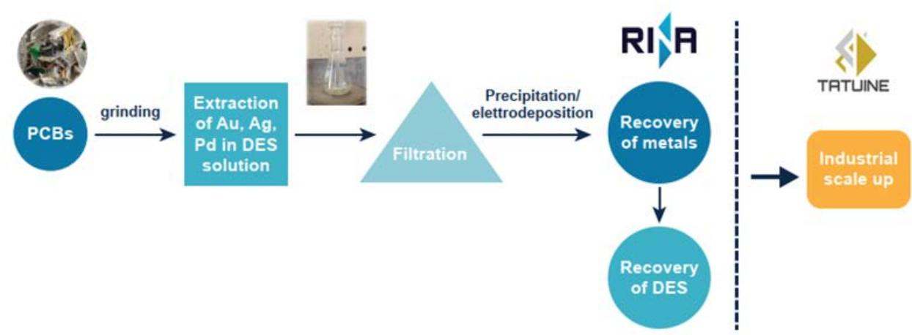

**Figure 59. WEEE recycling method by recovering precious metals (Ag, Au and Pd) using Deep Eutectic Solvents (DES).**

The WEEE samples have been taken from TATUINE, located in Villanueva de Gállego (Spain), which together with RINA-CSM is a partner of the European Project REDOL. TATUINE is a waste management company that collects and grinds WEEE. In particular, the samples used for experimental tests are PCBs (Printed Circuit Boards) from telecommunication servers [\(Figure 60\)](#page-89-0).

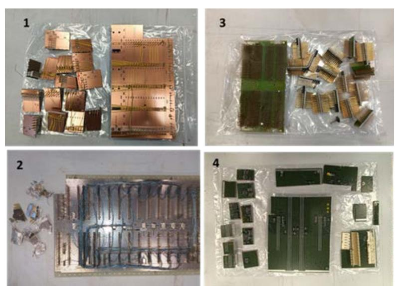

**Figure 60. Tatuine PCBs samples from telecomunication servers**

Firstly, RINA-CSM has ground a representative quantity of different electronic boards to prepare the samples for the extraction tests and then it performed the characterization of the boards sent by TATUINE through a XRF qualitative analysis [\(Figure 61](#page-89-1) and [Figure 62\)](#page-90-0).

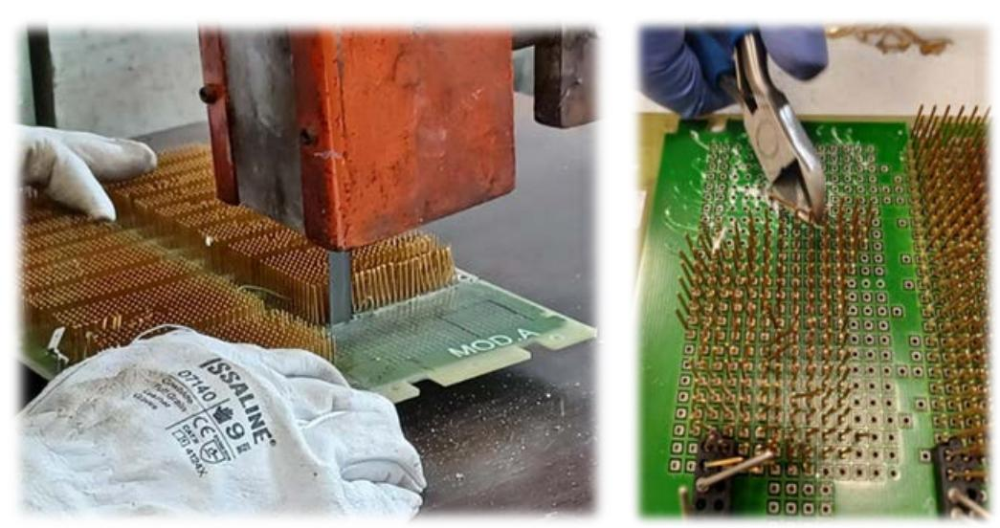

**Figure 61. PCBs sampling**

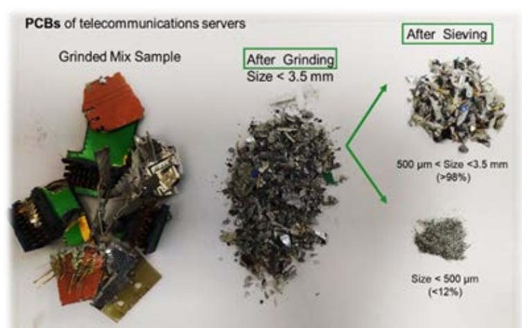

**Figure 62. PCBs samples after grinding**

Successively, DES solvent was prepared by mixing Choline Chloride as hydrogen bond acceptor and lactic acid as hydrogen bond donors in a specific molar ratio and at medium-high temperature.

The quantitative metals determination has concerned the metals mainly present in PCBs and the metals with major economic interest, as Cu, Ag, Au, Pd. A lot of tests have been done for the extraction in DES in order to optimize the extraction method of the metals chosen considering the main parameters, such as time (t), stirring, temperature (T), sample/solvent ratio and DES molar ratio.

The effective yield has been determined dissolving in acid the PCBs residual sample after DES extraction residues.

TATUINE, decided to study another type of sample in addition to PCBs, which is the MUD that it obtains for the recovery of precious metals from PCBs with an electrolysis process [\(Figure 63\)](#page-90-1). A MUD sample characterization was done by RINA-CSM through a qualitative analysis with XRF and the same extraction process of PCBs was applied on MUD sample.

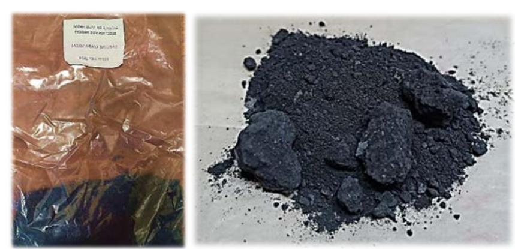

**Figure 63. TATUINE MUD sample from the electrolysis process.**

Another type of DES with Choline Chloride and Citric acid, instead of Lactic acid, has been used to compare metal extraction results obtained in the same test conditions and it appears that citric acid has greater affinity with Ag and Pd compared to lactic acid, which instead has greater specificity for Au.

This result shows that the yield depends on the solvent selectivity, therefore different metals have different yields related to the same parameters.

#### **7.2.3. Tests on whole sample to simulate the industrial process**

Other tests on whole samples have been done to simulate the TATUINE process as industrial environment conditions [\(Figure 64\)](#page-91-2). These tests are based on current TATUINE process plant simulating the same parameters of TATUINE plant, as acid bath time and temperature.

The yield of dissolved metals in DES has been determined considering the results obtained after acid demineralization of the PCBs residual sample from DES solution and results have been compared with what was obtained in previous tests with ground samples.

Finally, new tests were done to evaluate the degree of saturation of the DES with metals to define how many times need to be changed in the extraction reactor, using the same DES solution for one month.

The results have shown that DES goes to saturation in few hours.

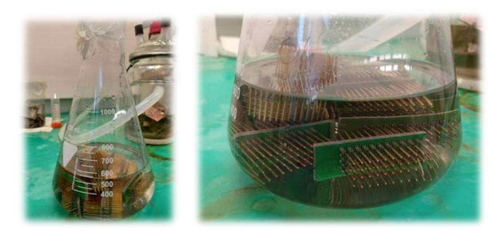

**Figure 64. Whole sample extraction simulating TATUINE process.**

## **7.3. Main advances achieved by REDOL**

The laboratory tests have shown the main parameters that maximize metal yield extraction. In particular, DES molar ratio does not affect the metal extraction yield, while stirring seems to improve the Au and Ag extraction. The high temperatures are not compatible with the extraction process due to DES degradation, but lower temperatures have been considered to reduce energy consumption. Also, the PCBs/DES ratio affects the metal extraction yield, but the extraction time (t) is the most relevant parameter for metal extraction with DES.

The yield depends on the solvent selectivity, therefore different metals have different yield related to the same parameters.

Based on these tests, the data obtained has been used for pilot plant design that could scale-up to TATUINE process as shown in [Figure 65.](#page-92-1) 

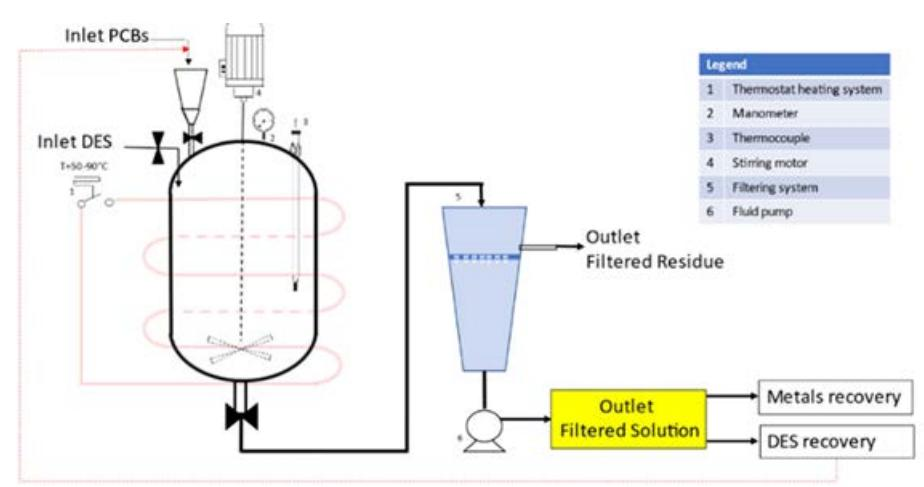

**Figure 65. Scheme of the metal extraction process in DES.**

## **7.4. Impact (KPIs)**

In Task 4.5 precious metals (Au, Ag and Pd) were extracted from WEEE with DES. The WEEE industrial samples are available in the waste management plant of TATUINE, that sent the samples to RINA-CSM for the tests.

A KPI, or Key Performance Indicator, is a measurable value that demonstrates how effectively a project is achieving a specific objective. KPIs help track progress toward goals and inform decisionmaking by providing clear, quantifiable data.

In REDOL project some KPIs were defined in the deliverable D2.3 "Evaluation methodology".

KPI 7 Valorising rate of waste is related to the percentage of waste valorised compared to state of the art, achieving a valorising rate that reflects an efficient waste utilization system with a percentage similar to or surpassing the current traditional practices.

The introduction of a new green process, through the use of DES instead of acid solvents, increases the possibility of increasing the recycling rate as it also allows disposal companies to introduce a new recycling opportunity within their traditional process. This process can be introduced ex novo replacing the previous one, or it can be added as a new treatment line.

KPI 13 Recycling policies affected by solutions evaluate how the adopted initiatives and innovative strategies positively influence the implementation and improvement of policies aimed at promoting and optimizing recycling processes. It focuses on quantifying the degree of change or improvement in recycling policies as a direct result of the implemented solutions within an organization or community. In this way, It's possible to enhance recycling policies through the effective implementation of innovative solutions, driving efficiency and sustainability in recycling programs.

Current industrial processes involve the use of strong acids through a traditional mineralization process, whose disposal has a high environmental impact and a danger to workers and society in general. In the framework of REDOL project, the use of DES involves the use of green solvents composed of weak organic acids, also from food waste, increasing the overall circularity of the process.

## **7.5. Conclusions of T4.5**

This work analyzes the use of an innovative hydrometallurgical technique that uses particular DES that are more environmentally friendly than traditional solvents. The increase of the processes based on these kinds of solvents will contribute to obtained benefits in the long term from an environmental point of view. DES extraction is an interesting way to recover precious metals from WEEE with a significant yield.

The characterization of several WEEE samples shows a relevant variability of chemical composition due to the different metal coating applied on the boards. For this reason, samples were ground before test analysis.

ChCl in mixture with lactic acid and citric acid has been chosen for the precious metals extraction from significative WEEE samples, which represent the current Italian production, as between the most economical and with a literature that confirms a consistent ecosustainability.

Test results show that the yield depends on the solvent selectivity, therefore different metals have different yields related to the same parameters.

The process issue is to identify the best DES application for the specific metal extraction. Further studies are needed to optimize industrial applications obtaining long term benefits from an environmental point of view.

This study has demonstrated that the methodology is possible, even if it can be considered only a first approach. If the extraction with DES is a possible way, other studies are necessary to apply the method for the scaling up to an industrial environment.

## **7.6.Future work**

This preliminary investigation has demonstrated the potential of Deep Eutectic Solvents (DES) for the selective extraction of precious metals from WEEE. However, several avenues remain open for further exploration to enhance the efficiency, scalability, and sustainability of the process. Future research will focus on optimizing the DES formulations to improve selectivity and yield for specific metals, taking into account the variability in WEEE composition. This includes a deeper understanding of the chemical interactions between DES components and target metals through kinetic and thermodynamic studies.

Another critical step will be the recovery of solvents and integration into existing recycling infrastructures. In parallel, a comprehensive environmental and economic assessment will be conducted to evaluate the long-term benefits and feasibility of industrial implementation.

Given the heterogeneity of WEEE, standardizing pre-treatment procedures will also be essential to ensure consistent input material and reproducible results. Additionally, downstream processes for metal recovery and purification must be refined to meet industrial quality standards.

Finally, regulatory and safety aspects related to the use of DES in industrial settings will be addressed to support broader adoption. Overall, while this study confirms the viability of DES-based extraction as a sustainable alternative, further research is necessary to fully realize its potential in a circular economy framework.

## **8.General Conclusions**

The activities developed within WP4 of the REDOL project have enabled the validation of innovative recycling and valorisation technologies for SUW that present significant technical and economic challenges. The application of processes such as solvolysis assisted by microwaves and ultrasound, selective dissolution, chemical depolymerisation of textile waste, and metal recovery from WEEE has demonstrated promising results in controlled conditions. In particular, the use of environmentally friendly solvents and energy efficient technologies highlights the alignment of these developments with circular economy principles.

The main outcomes of these activities are summarised in [Table 22,](#page-95-0) which compiles the general conclusions drawn from each recycling route assessed within WP4.

**Table 22. General conclusions**

| Task                                                                          | Key conclusions                                                                                                                                                                                                                                                                                                                                                                                                                                                                                                                                                                                          |
|-------------------------------------------------------------------------------|----------------------------------------------------------------------------------------------------------------------------------------------------------------------------------------------------------------------------------------------------------------------------------------------------------------------------------------------------------------------------------------------------------------------------------------------------------------------------------------------------------------------------------------------------------------------------------------------------------|
| <b>Task 4.1. Conventional Solvolysis Assisted by MW and US</b>                | <ul style="list-style-type: none; padding-left: 0;"> <li>- The integration of Microwave (MW) and Ultrasound (US) technologies significantly improved the efficiency of conventional solvolysis for composite waste.</li> <li>- MW-assisted solvolysis demonstrated superior energy efficiency, scalability, and reduced reaction times compared to US-assisted processes.</li> <li>- Fibre recovery with US was effective but posed specific technical challenges.</li> <li>- Energy consumption analysis confirmed MW-assisted solvolysis as the most viable option for industrial scale-up.</li> </ul> |
| <b>Task 4.2. Selective Dissolution of MMPP</b>                                | <ul style="list-style-type: none; padding-left: 0;"> <li>- Complete delamination of metallized films was achieved using fatty acid/surfactant and catalyst.</li> <li>- The most effective solvent for rigid trays was 50% ethyl acetate at 60°C.</li> <li>- Compatibilization strategies significantly improved mechanical properties.</li> </ul>                                                                                                                                                                                                                                                        |
| <b>Task 4.3. Recycled Components for the Construction and Cement Industry</b> | <ul style="list-style-type: none; padding-left: 0;"> <li>- Up to 10% alternative raw materials can be incorporated into clinker production without affecting cement properties. Higher amounts require homogenization adjustments.</li> <li>- Materials studied (Sample 1 and 7) are suitable as supplementary cementitious components.</li> <li>- A 100% recycled aggregate cast polymer formulation was developed demonstrating technical feasibility.</li> </ul>                                                                                                                                      |
| <b>Task 4.4. Depolymerization and Repolymerization of Textile Waste</b>       | <ul style="list-style-type: none; padding-left: 0;"> <li>- PET textile waste depolymerization via MW-assisted glycolysis with ZnO, ionic liquids or DES proved highly efficient.</li> <li>- DES based on urea and Zn(OAc)2 achieved 97% PET conversion and a maximum BHET yield of 60,5%.</li> <li>- Chemically recycled PET exhibited properties suitable for fiber spinning applications.</li> </ul>                                                                                                                                                                                        |
| <b>Task 4.5. Recovery of Metals from WEEE-derived Waste</b>                   | <ul style="list-style-type: none; padding-left: 0;"> <li>- An innovative metal recovery process from WEEE using DES and leaching techniques was successfully developed for precious metals such as Ag, Au and Pd.</li> <li>- Sludge (MUD) from electrolysis processes showed high concentrations of valuable metals, making it ideal for recovery tests.</li> <li>- Lab-scale extraction and kinetic tests enabled process optimization.</li> <li>- Further research is needed to adapt the process for sustainable industrial-scale implementation.</li> </ul>                                          |

https://www.redolproject.eu/

REDOL\_EU Redol