# **Textile Circularity Guide**

- **-** To transform waste into a resource

# **Textile Circularity Guide**

- **- To transform waste into a resource**

Copyright 2025 RISE Research Institutes of Sweden Published: 2025-10-20 RISE report 2025:62 ISBN 978-91-90036-50-1

Text: Stina Björquist, Johanna Snellström, Emma Enebog, Maria Landqvist, Max Maupoix Graphics and Layout: Fanny Lindh, Martin Johansson Pictures: Patrik Eriksson

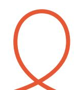

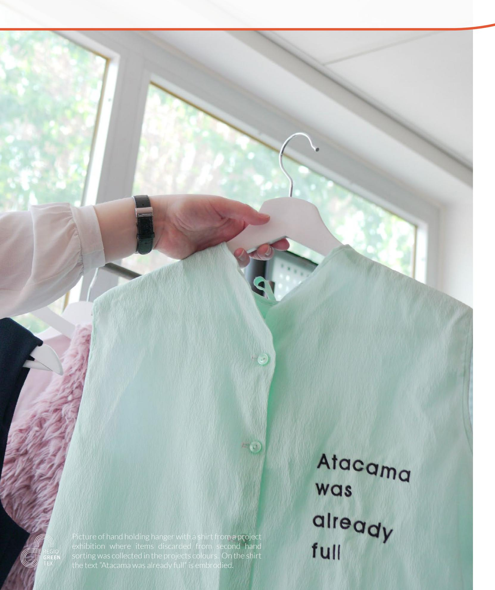

# **PREFACE**

Imagine a future circular textile value chain - in this future scenario, the industry offers multiple solutions to today's problems. Products and systems will be designed for repair. It is easy and accessible to buy and sell second hand. Consumers are using products during a longer time and consume less new clothes. Post industrial waste is used as the feedstock for making new products. Europe has a strong recycling industry, and we export less waste than we do today.

In this imaginative future, the value chains have access to and is supported by:

- An implemented Digital Product Passport (DPP) legislation with relevant data that is driving circularity
- Fully automated sorting industry with capacity to sort based on DPP data points
- A digital reader like an RFID tag on each product enabling access to multiple data points throughout the entire value chain
- Supporting technology is developed, for example AI, that can identify the garments condition, if the garment is damaged or in perfect condition
- A harmonized industry language and classification system to support circular businesses is in place
- A viable fibre-to-fibre recycling industry, placed in Europe

In this imaginative future it is then possible to channel waste accurately based on access to detailed information about the products and materials in the waste stream. This will boost large scale circular value chains radically with less waste ending up in landfills or getting incinerated.

*This scenario was built in the EU project CISUTAC, representing how we have to start by knowing the dreams we are aiming for. Now join in on a RegioGreenTex journey where we explore how to start working towards a sustainable textile future today and how to take your circular idea into a business reality.*

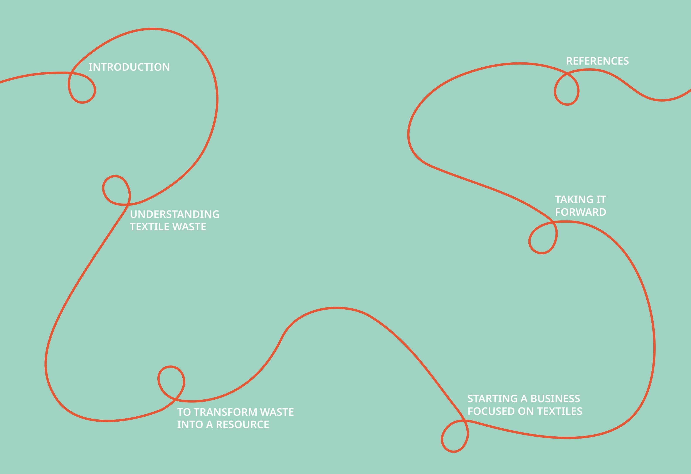

**Introduction**

# INTRODUCTION

This guide is developed within the European project RegioGreenTex, representing a comprehensive effort to transform the textile and clothing industry in Europe into a more sustainable and circular sector. By fostering regional cooperation, supporting innovation, and promoting sustainable practices, RegioGreenTex aims to reduce the environmental impact of textiles, create economic opportunities, and position Europe as a leader in sustainable textile production and consumption.

*This guide serves as both a roadmap and a call to action, inviting stakeholders to join the journey towards a sustainable and circular textile future. By embracing innovation, collaboration, and a shared commitment to change, Europe can lead the way in redefining the global textile industry.*

This guide aims to highlight the challenges and opportunities of textile circularity, offering principles for transforming waste into valuable resources and strengthening regional European value chains. The guide is made for organisations and groups involved in managing textile waste. These include local authorities, companies that sort textile waste, businesses that sell second-hand items, and manufacturers that produce waste and/or make use of waste, such as spinners, weavers, knitters, dyers and printers, finishers and garment manufacturers.

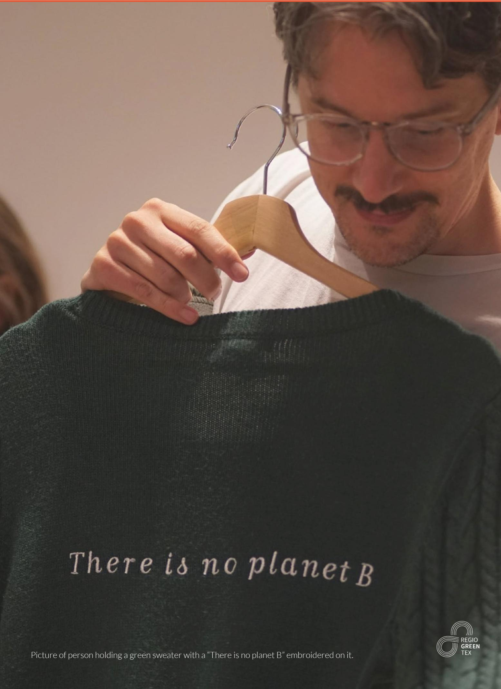

Picture of person holding a green sweater with a “There is no planet B” embroidered on it.

### **Outline of the guide**

The guide is divided in three chapters:

- 1. Understanding textile waste
- 2. To transform waste into a resource
- 3. Starting a business focused on textile waste

These three parts will build the base to go further or to start to explore your circular business idea. In this guide you can find links to dive further into results from different projects and learn about tools to help companies reach further in their sustainability journey!

### **Summary**

### **Purpose:**

To introduce challenges and opportunities in achieving circular textile systems and guiding stakeholders in optimizing textile waste management.

### **Target audience:**

Municipalities, textile sorters, recommerce businesses, and textile producers like brands and fabric makers.

The aim of this guide, aligned with the RegioGreenTex project goals, is to achieve the following key outcomes:

- **• Reducing textile waste:** Significant reduction in textile waste through improved circular practices.
- **• Environmental benefits:** Lower environmental impact of the textile industry, including reduced resource consumption and pollution.
- **• Economic growth:** Creation of new economic opportunities and jobs in the sustainable textile sector in Europe.
- **• Innovation and competitiveness:** Enhanced innovation and competitiveness of the European textile industry on a global scale.

**THE AIM OF THE GUIDE**

**Understanding textile waste**

**One of the pressing textile challenges of today is the vast amount of textile created throughout the textile value chains. Europe's total consumption of textiles (including shoes) in 2020 was on average 15 kg per capita[.i](#page-35-0) In the same year, Europeans generated 16 kg of textile waste per person and year, of which 11.6 kg was thrown away in the mixed household waste. Post-consumer textile waste stands for 82% of all textile waste generated, coming from both household and non-household sources.[ii](#page-35-0)**

The EU Strategy for Sustainable and Circular Textiles**[iii](#page-35-0)** sets a goal to bend the consumption curve and decouple fashion from its environmental footprint. Achieving this requires more than technical innovation, it demands a shift in mindset across the entire value chain.

Consumer education is key to raising awareness about proper textile disposal and the environmental impact of fast and ultra-fast fashion. But to truly scale circularity, Europe must also embrace a broader behavioural shift, not only among consumers, but also among manufacturers, designers, and brands. Demand for recycled fibres must grow in parallel with the development of fibre-to-fibre recycling technologies that can handle complex blends, reduce costs, and improve output quality.

To support this transition, enhanced collection systems are needed to reduce contamination and enable largerscale operations. This must be backed by alternative routes and upgraded infrastructure, with early harmonization to ensure functional and efficient textile waste pathways across borders.

In the long term, clearer regulations and targeted incentives will be essential to streamline waste management and accelerate the adoption of sustainable practices.

Coordinated efforts, both technical, behavioural, and regulatory, could unlock the full potential of a truly circular textile economy. This section of the guide goes reach this goal.

# through some important concepts to **UNDERSTANDING TEXTILE WASTE**

The EU wants to make the textile industry more sustainable, circular and fair. The goal is that by 2030 all textile products on the EU market are:

- Durable, repairable, and recyclable
- Made as much as possible from recycled fibers
- Free from harmful substances
- Produced with respect for social rights and the environment

### To get there, the strategy focuses on:

- Eco-design: Making products that last longer and are easier to reuse and recycle.
- Waste reduction & recycling: Scaling up recycling systems and infrastructure.
- Circular business models: Promoting repair, reuse, renting, and sharing instead of fast fashion.
- Consumer empowerment: Clear labels and reliable information so people can make sustainable choices.
- Tackling overproduction and greenwashing: Pushing for fairer, more transparent industry practices.

### **ABOUT THE EU STRATEGY FOR SUSTAINABLE AND CIRCULAR TEXTILES**

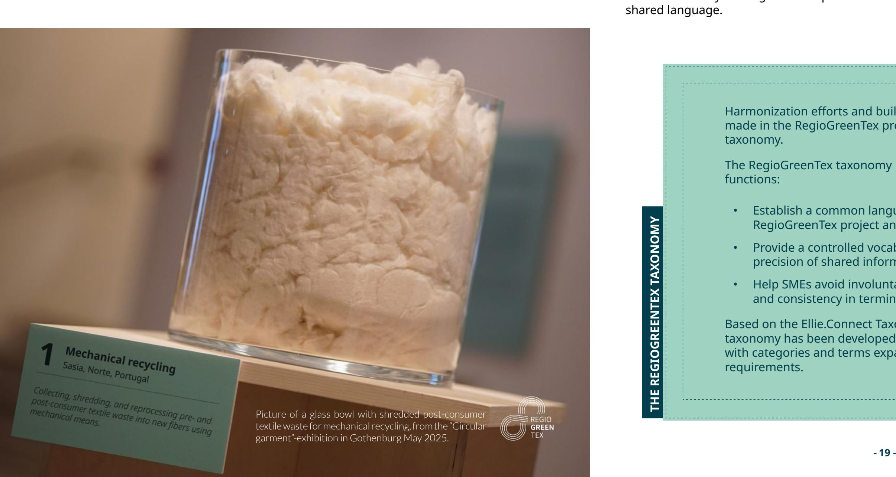

To drive this transformation, four key areas must be prioritized. Each area responds to the challenges above and offers a pathway forward:

- **• Closed-loop systems:** Implementing closed-loop recycling systems to ensure that textile materials can be reused indefinitely. Encouraging the use of sustainable and recyclable materials in textile production.
- **• Textile recycling:** Developing and scaling advanced recycling technologies to handle various types of textile waste, including complex blends and synthetic fibres.
- **• Circular business models:**  Supporting the adoption of circular business models such as leasing, take-back schemes, and product-asa-service in the textile industry.
- **• Consumer engagement:** Raising awareness among consumers about the benefits of sustainable and circular textiles.

Harmonization efforts and building a shared language have been made in the RegioGreenTex project, through establishment of a taxonomy.

The RegioGreenTex taxonomy is designed to fulfill several key functions:

- Establish a common language among all partners within the RegioGreenTex project and the wider textile sector.
- Provide a controlled vocabulary to improve the accuracy and precision of shared information.
- Help SMEs avoid involuntary greenwashing by ensuring clarity and consistency in terminology.

Based on the Ellie.Connect Taxonomy Guide[iv](#page-35-0) the RegioGreenTex taxonomy has been developed within a dedicated database, with categories and terms expanded to better meet the project's requirements.

# **THE REGIOGREENTEX TAXONOMY**

### **Terminology: building a shared language**

One entry point to start to unlock opportunities with the circular textiles transition for regional stakeholders is to understand waste and the basic principles for channelling textile waste to a higher value retention. This knowledge helps stakeholders to understand how waste can be transformed to a secondary raw material. To get there, we need to foster collaborations by making sure we speak a shared language.

A shared language is essential to scale circularity in textiles. Misunderstandings in terminology can hinder collaboration and the efficient flow of materials across the value chain.

Terminology evolves as new projects and standards emerge, so readers of this guide are encouraged to stay informed. A consistent industry language facilitates accurate sorting, fosters collaboration, and ensures high-quality feedstocks for recycling.

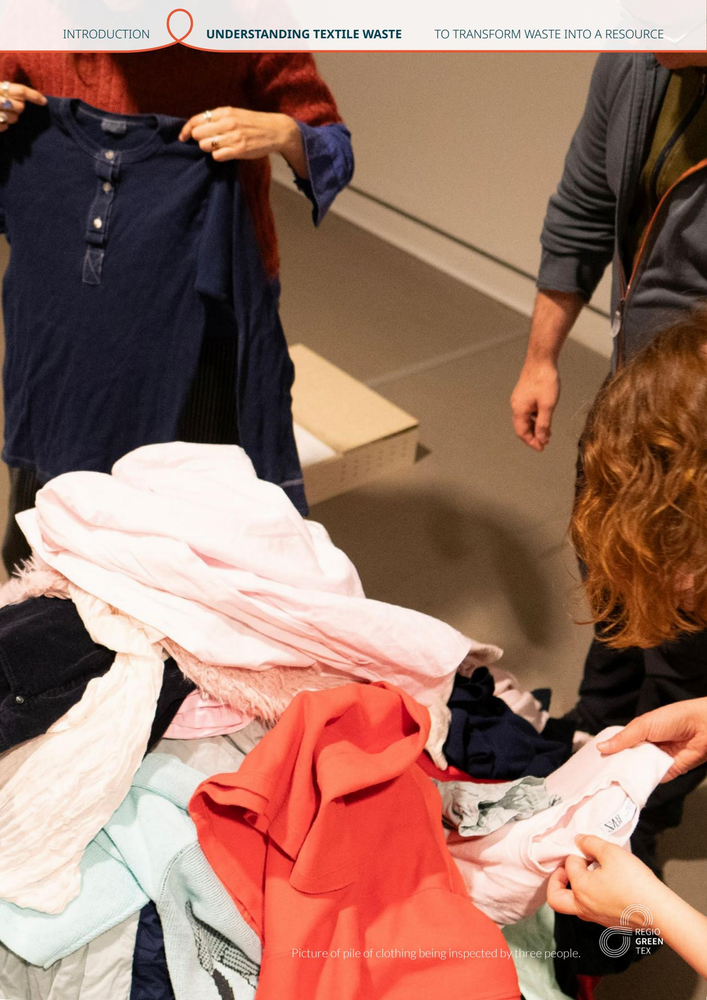

## Where textile waste comes from

Waste refers to any material that is being discarded by the holder. For the textile industry the waste occurs across the value chain during the production, distribution, or consumption of textiles. This waste can come from various sources, including manufacturing scraps, unused fabric, damaged or defective products, and post-consumer textiles like clothing and household textiles.v Post consumer textiles are responsible for 82% of the textile waste in the EU.vi Sorting helps to identify different types of textiles based on parameters such as material composition, condition, and potential for reuse or recycling.

There are several key sources of textile waste,vii generally:

- • **Pre-consumer waste:** This includes scraps and leftovers from textile manufacturing processes, such as spinning, weaving, and cutting. These scraps can be generated at various stages of production and are typically considered waste if they cannot be reused or recycled within the manufacturing process.
- • **Post-consumer waste:** This includes textiles that have been used by consumers and are discarded at the end of their life cycle. This category encompasses clothing, household textiles (such as bedding and towels), and other textile products that are no longer wanted or usable.
- • **Post-industrial waste:** By-products from other industries that use textiles in their in-going or out-going processes. This could be textiles used in the medical or automotive sector or packaging textiles.

## The R-ladder

The waste hierarchy described in the Waste Framework Directive,viii is a framework used to prioritize waste management strategies based on their environmental impact. It encourages reducing waste at the source and maximizing resource efficiency. This framework has been further reworked and is known as the R-ladder. The "R" refers to different strategies, typically structured in a ladder-like order, with the highest priority at the top.

The textile industry generates a significant amount of waste, and applying the R-ladder helps to shift from a linear "take-make-dispose" model to a circular approach. Prioritizing refuse, reduce, and reuse leads to fewer new textiles being produced, which lowers environmental impacts such as water use, chemical pollution, and carbon emissions.

Recycling is often seen as a solution, but it comes lower in the hierarchy because it requires energy and can degrade fibre quality. Disposal is the least desirable, yet 87% of used clothes still end up in landfills or incinerators.ix

Picture of pile of clothing being inspected by three people.

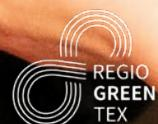

TEXTILE CIRCULARITY GUIDE **- 22 - - 23 -** Finally, disposal is the last resort. By minimizing the need for landfill or incineration without energy recovery, we can significantly reduce our environmental impact.

### **Refuse**

Picture extracting energy or materials from waste through recovery processes. Incineration for energy, though not ideal, can still contribute to reducing landfill waste.

Imagine transforming parts of discarded products into something new and valuable. Remanufacturing, like making bags from old jeans, showcases innovation and sustainability.

> Visualize adapting waste materials for entirely new functions. Turning old textiles into insulation is a perfect example of repurposing with purpose.

Consider the creativity involved in refurbishing old products. Upcycling not only refreshes garments but also breathes new life into them.

Envision giving products a second life through reuse. Whether it's second-hand clothing or rental services, extending a product's lifespan reduces the need for new resources.

Picture designing textiles that are built to last, minimizing material use and waste production. Every effort to reduce our consumption brings us closer to a sustainable lifestyle.

Imagine a world where we consciously choose not to produce or consume unnecessary products. By refusing waste, we take the first bold step towards a cleaner planet.

> Think of the satisfaction of repairing a beloved garment instead of discarding it. Repairing keeps items in use and reduces waste.

> > While recycling is often seen as the go-to solution, it comes lower in the hierarchy because it requires energy and can degrade fiber quality. However, it still plays a crucial role in processing waste into raw materials for new products.

### **Reduce**

### **Reuse**

### **Repair**

### **Refurbish**

### **Remanufacture**

### **Repurpose**

### **Recycle**

### **Recover**

# **The R-ladder**

## Sorting of textiles: A crucial step

Sorting of textile waste is an essential step in the process of managing textile waste effectively. There is a big potential to increase value retention within Europe by collecting more waste, sort for reuse and repair and scale the fibre-to-fibre recycling. This way a larger share of European waste can be put to value in European industry. For a large-scale recycling to be profitable, reliable sources of well-defined textile materials are needed.

When a recycling company handles waste, the process must be specifically adapted to the type of material that is being recycled into new fibres. This can take time and be quite costly. The chemical content of the fibre might affect the recycling process. Even the colour might have an impact or contaminate between batches. Therefore, it is important that there is a continuous stream of harmonized waste that enters the recyclers processes. The more material that can be recycled from a similar batch, the better is the chance to keep costs down.

Therefore, breaking down waste into components, i.e. converting waste into a series of data points such as condition, material composition, chemicals, colour and prints, could harmonize sorting processes and facilitate more efficient waste streams.

While automated sorting technologies are advancing for textiles, sorting is almost exclusively done manually in the industry today. The human eye, feel and perception will struggle to handle some of the important data points like chemical content of a garment that is needed to make accurate decisions. Defined and harmonized basic channelling principles will aid in building more efficient sorting solutions in the future.

## Digital Product Passports

A digital shift is essential for the circular transformation, providing accurate and efficient access to granular information and cost efficiency for circular business models. The upcoming Digital Product Passport (DPP), part of the EU Strategy for Sustainable and Circular Textiles, will offer access to various data points, helping to identify which recommerce businesses can develop first.

The DPP is a digital record accompanying a textile product throughout its lifecycle, containing data on material composition, sustainability indicators, supply chain details, and instructions for repair, reuse, and recycling. Brands and manufacturers will document and disclose information on environmental impact, chemical composition, and recyclability, ensuring compliance with EU regulations like REACH and the Eco design for Sustainable Products Regulation.

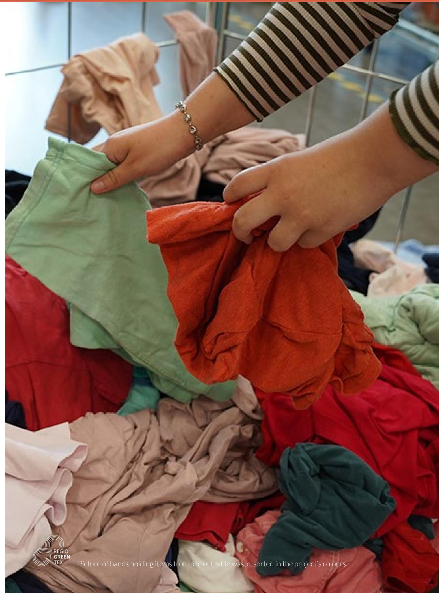

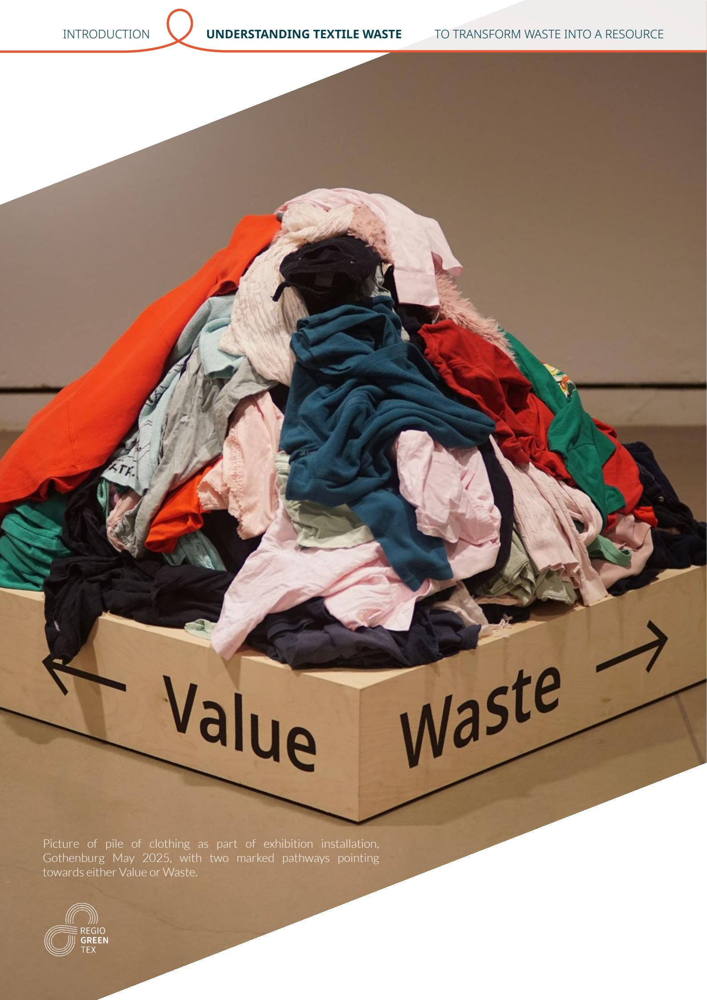

Picture of pile of clothing as part of exhibition installation, Gothenburg May 2025, with two marked pathways pointing towards either Value or Waste.

DPPs will enhance textile recycling efficiency by enabling automated sorting technologies to identify fibre compositions and eliminate hazardous substances. For consumers, DPPs provide transparency, allowing informed purchasing decisions based on sustainability credentials. By scanning a QR code or NFC tag, consumers can access care, repair, and disposal information.

Implementing DPPs will require textile companies to invest in digital infrastructure, introducing initial costs but ultimately contributing to a circular economy by extending product lifespans, reducing waste, and ensuring safer, more sustainable textiles.\*

The Framework for Circular Textiles project has developed a classification system for textile materials aimed at recycling and assessing their circularity. This framework supports the increased use of secondary raw materials in textile value chains.

In the European project CISUTAC, a comprehensive decision tree was created for sorting residual textiles. This tool includes an extensive list of data points designed for a future scenario where Digital Product Passports (DPPs) are in place. It holds great potential for companies and organizations working with textile sorting, helping to harmonize waste streams and foster business-to-business opportunities. The decision tree prioritizes data points that enable efficient sorting, reuse, and recycling.

However, change is needed now. To address the current lack of harmonization, the RegioGreenTex project adapted the CISUTAC decision tree into a set of sorting criteria that are both relevant to today's industry and feasible with existing sorting capabilities. These criteria are presented on pages 28–29.

## Channelling principles relevant today

As the sorting of post-consumer textiles and textile waste is not yet harmonized across Europe, several initiatives have emerged to define the most relevant sorting criteria to maximize textile reuse and recycling. Streamlined sorting processes can significantly improve access to textile materials for various actors in the circular economy, including remanufacturers, resellers, and recyclers.

### **Understanding your waste and potential business**

*Sorting criteria for matchmaking of textile waste and waste solutions.* 

### **Main fiber**

Type of fibre and percentage.

Examples: Acrylic, Cotton, Elastane, Polyester, Wool.

### **Fabric colour**

Important for recycling and remanufacturing.

Common colours: Black, Blue, Green, Red, White.

### **Main fiber %**

Percentage of main fibre.

Examples: 100%, Min. 50%, Min. 75%.

### **Product category**

Categories beyond apparel, e.g., Home textiles, Shoes, Workwear.

### **Condition**

Prioritizes higher quality materials, for use higher up in the R-ladder.

Categories: High, Low, Medium, Premium, Very low.

### **Actor category**

Different types of actors, e.g., Academia, NGO, Manufacturer, Research project.

### **Value chain activities**

Various activities within the value chain e.g., Chemical recycling, Design, Sorting.

### **Regions**

For regional and interregional collaborations.

Examples: Auvergne Rhône-Alpes (FR), Västra Götaland (SE).

### **Product type**

Specific types of clothing, e.g., Activewear, Jackets, Sweaters, T-shirts.

### **Digital Tools for Circular Collaboration**

Collaboration between regions, industry stakeholders, and fashion brands is essential to accelerate innovation and share best practices in building a circular textile value chain. To support these efforts, RegioGreenTex has developed digital tools based on the adapted sorting criteria to facilitate matchmaking between businesses and available solutions for post-consumer textile waste.

The first tool, the Waste Solution Finder, allows companies to filter textile waste based on key criteria (see "Understanding your waste and potential business" on the next page) and identify suitable processing partners across the EU or within specific regions. Designed with usability in mind, it helps even those with limited experience navigate toward viable solutions and business opportunities.

Building on this foundation, RegioGreenTex continued developing the Waste Wizard, an AI-powered tool that refines and prioritizes matches to further enhance circular collaboration and reduce waste. These tools aim to streamline business to business exchanges and unlock the full potential of textile waste as a valuable resource, across regions.

### **Summary**

How to stay up to date on textile waste channelling for your business:

- Develop a common language for business and customer outreach.
- Stay updated on DPP developments.
- Understand your waste material data points.
- Explore partnerships with sorters or local recommerce models.

### **The Potential of a Robust Waste Channelling System**

- A well-functioning textile waste channelling system can:
- Harmonize sorting processes and enable clustering of smaller volumes
- Facilitate efficient matchmaking and business development
- Connect actors across the textile value chain, from recyclers to repurposers
- Bridge regional innovation by mapping technologies across Europe
- Identify investment needs in underserved areas

# ENABLING CIRCULARITY AND COLLABORATION WITH DIGITAL TOOLS

## PROJECT COLLABORATION

Research  
Institutes  
of Sweden

WE MAKE  
TOMORROW  
BEAUTIFUL  
**OVAM**

The textile industry is at a critical turning point. To move toward truly circular systems, it must overcome fragmented practices in sorting and handling leftover textiles. Today, finding structural and scalable solutions for textile waste remains both costly and complex, a recurring pain point identified by project partners across regions. To enable real transformation, the industry needs better ways to collaborate: to connect, share knowledge, and find each other in a cost-efficient and effective manner.

## THE WASTE SOLUTION FINDER

The waste solution finder tool is publicly available in a reduced form through the RegioGreenTex webpage. The number of companies to match with is limited, but it is possible to test filtering categories and start learning about both sorting parameters and companies working in the field.

Based on the learnings regarding textile sorting and sorting categories, the tool called Waste Solution Finder was developed. The tool enables users to filter textile categories and quickly identify companies offering relevant solutions. User feedback confirmed its value, highlighting a strong market need and its potential to improve collaboration across regions. At the same time it was clear, even if the market wanted this, the market also wanted more. That is where the story of the Waste Wizard starts.

Picture of person in front of the computer, using a digital tool for leftover textiles

## FROM SORTING INSIGHTS TO SMART MATCHING

The Waste Wizard was born from the shared challenge: how can we better connect companies with leftover textiles to those who can reuse, process or recycle them? To meet this demand, a diverse team of partners came together to build something more ambitious: The Waste Wizard.

The team brought together RISE (Research Institutes of Sweden) – bringing expertise in textile flows and circularity; OVAM (Public Waste Agency of Flanders) – contributing knowledge on legislation, waste management, and cross-border regulations; Ariadne Innovation – supporting innovation strategy, digital transformation and stakeholder engagement and Quest Studio – a hybrid sustainability consultancy specialised in stakeholder mapping, user-centred design, and strategy.

Together, the team explored how AI, integrated in a digital tool, can provide instant and validated matches for companies in the circular textile value chain. The different skills and perspectives from the team was key to creating a scalable tool that will meet a pressing range of needs from the industry.

*“Waste is a design flaw, not an inevitability. That’s why we turned to design thinking: to create a tool that inspires and eliminates waste by design.”*  
*–Philippe Schuler, Quest Studio*

companies to collaborate and reach thresholds that would be impossible to reach alone. In doing so, the tool not only facilitates direct business interactions but also builds networks and fosters learning.

One of the standout features of the Waste Wizard is its built-in legal guidance. Thanks to OVAM's expertise, the tool provides users with information on legal requirements for transporting textile materials across borders, an often overlooked but critical part of the process.

*"Legislation can be a real barrier if you don't know where to start. We wanted to make sure companies feel supported, not overwhelmed." -Sophie De Regel, OVAM*

### A MODEL FOR COLLABORATIVE INNOVATION

This collaboration is a powerful example of what can happen when diverse partners come together around a shared challenge. By identifying a real-world problem and combining expertise from research, policy, design, and business, the team created a tool with the potential to transform how the textile industry handles leftover textiles. Textiles that today often end up as waste.

*"We're not just matching materials, we're matching people, ideas, and opportunities." -Johanna Snellström, RISE*

### LOOKING AHEAD

The Waste Wizard is still evolving, and the team is eager to continue improving it based on user feedback. The dream? A user friendly, Europe-wide tool that helps companies of all sizes turn textile waste into opportunity.

> *"In 10 years, we hope the textile industry looks nothing like today but more circular, more connected, and more collaborative." -Florence Lootens, Ariadne Innovation*

### **Want to follow the journey of the Waste Wizard?**

Contact us to learn more about the Waste Wizard, share your feedback, or get involved in the next phase of development.

### **Contact:**

michael@queststudio.be

[Schedule a meeting](https://meetings.hubspot.com/michael1382?uuid=392d507d-61d1-4723-af8b-50ee26346752)

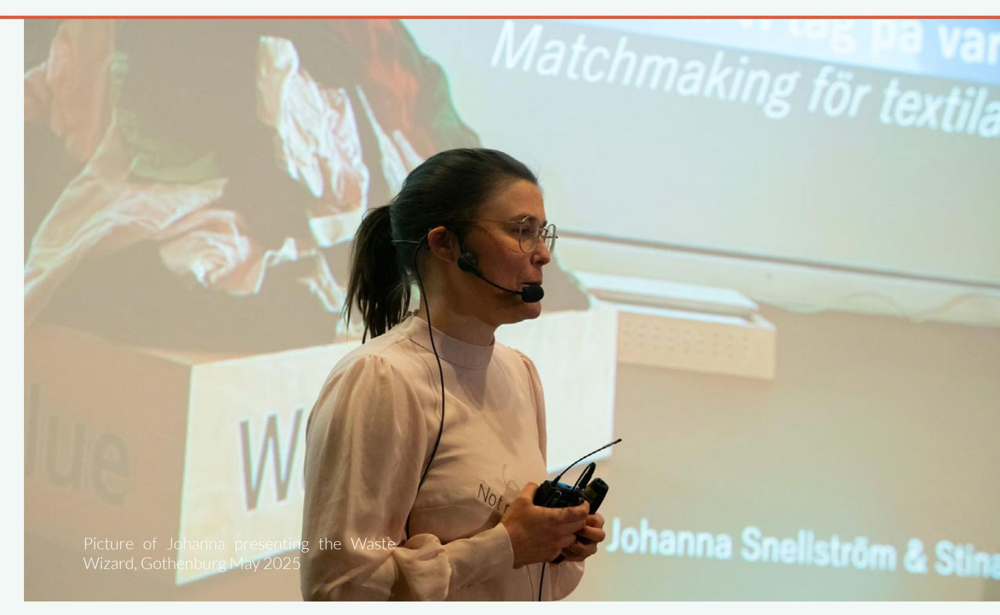

- AI-enhanced matching for smarter, more relevant connections
- Bundling capabilities to enable collaborative solutions
- Dashboard of solution providers to showcase potential matches
- Potential for reuse and to create impact beyond recycling
- Integrated legal guidance to support cross-border exchanges
- User-centred design for a seamless experience
- Bult on industry and research expertise for relevance and state of the art
- Harmonization and guidance in handling of leftover textiles for circularity

### HOW THE WASTE WIZARD WORKS

The Waste Wizard is based on a profiledriven system. Companies sign up, fill in relevant information, and then discover a dashboard full of potential matches, organisations that could provide or take over their surplus textiles and that were filtered based on the enquiry's specifications and requirements. If matches are not adequate, the users can receive notifications when a specific match is found and allow the tool to bundle requests with others to meet e.g. volume requirements. This bundling feature is especially powerful as it allows smaller

### **What Makes the Waste Wizard Unique?**

**To transform waste into a resource**

# TO TRANSFORM WASTE INTO A RESOURCE

## Turning waste into value: understanding the power of collaboration

**Textile waste isn't just a problem, it's also a possibility. With the right mindset and collaboration, discarded materials can become valuable resources again. To make this shift from waste to resource, it's important to understand how value is created. A material only becomes a "resource" when it's useful, especially when combined with other materials, tools, or knowledge.xi In other words, it's not just about what something is, but what it can do in the right setting.**

Textiles, like other resources, are not one-size-fits-all. Their value depends on how they're used, what they're combined with, and the purpose they serve. When different actors, such as designers, recyclers, manufacturers,

or remanufacturers, work together and share what they know, new opportunities emerge. A discarded fabric might become insulation, upholstery, or part of a new garment, depending on how and where it's reimagined.

This is what we mean by resource renewal, an ongoing, collaborative process where waste materials are rethought, reshaped, and reused in new ways.xii Circularity isn't just about recycling, it's about relationships. It's about understanding how different players in the system, companies, innovators, and consumers, can come together to unlock the hidden potential in what we throw away.xiii

By taking a systemic view and considering the full life of a product, from production to disposal, we can design smarter, reduce waste, and extend the value of our materials. In the circular economy, progress happens through cooperation,

innovation, and a shared belief that today's waste can be tomorrow's solution.

*It is important to remember that waste is only waste if we consider it waste and refuse to see its potential. By reimagining discarded textiles as resources, we can unlock possibilities for reuse, innovation, and creativity, transforming what was once waste into resources.*

## Moving from a value chain perspective to a business network perspective

In the light of the coming legislation such as the Eco-design for sustainable products regulation (ESPR),xiv the Green Claims Directivexv and the Waste Framework Directive, large volumes of textiles are to be handled and directed towards the most suitable processing solution, for reuse as well as for recycling. Managing larger and

more specific volumes, will require new knowledge, business practices, an industry technology leap and finally a consumer behaviour shift - great challenges that also hold big opportunities to build stronger sustainable regional value chains in Europe.

A circular value chain requires innovative solutions jointly developed by different stakeholders. Connecting existing companies and initiatives is a crucial first step to enhance business exchanges and scale up circular businesses. However, instead of focusing on a specific value chain and optimizing each step to increase efficiency and reduce costs, one should consider the importance of adopting a business network perspective. To clarify, a business network, or value network, is a

system of interconnected companies and organisations that collaborate to create and deliver value.xvi Unlike the value chain, the business network is more complex and involves many different actors who can have relationships with each other, not just with their customers or suppliers. By applying a business network perspective, it becomes easier to understand the lock-in effects and opportunities that different business relationships can contribute to.

*Business networks emphasize collaboration, resource sharing, and innovation to create value in a more dynamic and flexible way. During an innovation process, companies and organisations can take on different roles in the business network depending on who they collaborate with, such as developers, producers, and users.*

Moreover, to develop new solutions, organisations must progress through different levels of interaction.xvii It begins with networking, which involves loosely connected relationships and weak ties between the company and other organisations. Weak ties are essential for acquiring new information and identifying new opportunities. Typical interactions include communities, innovation networks, crowdsourcing, mass-customization, idea competitions, and intermediation. The next stage is coordinating, which, like networking, involves loose relationships. However, coordinating differs as it has a joint direction in the interaction process.

Cooperating involves stronger ties between actors compared to networking and coordinating. These relationships are based on mutual trust and aim to create mutual value. Frequent interactions help organisations access and leverage resources within the network.xviii Collaboration at higher levels, such as open innovation ecosystems and open-source developments, involves stronger ties and relationships. It is not only about trust but also about commitment. It requires higher investments to enhance the capabilities of the other party and is typically characterized by a higher degree of uncertainty. The highest level of interaction is co-creating, which represents the strongest relationships, engagement, uncertainty, and alignment towards a shared purpose. This strategy is used when the goal exceeds the capabilities of both parties, necessitating joint exploration and the creation of shared meaning and benefits.

All stages involve learning how resources, such as waste, can be valuable in other actors' products and processes. The first stage involves mapping the potential use of waste, while the final stage involves mutual adaptations to embed waste as a resource in ongoing operations. Throughout this interactive learning phase, it will become evident how established business relationships may either hinder or facilitate the transformation of waste into a valuable resource.

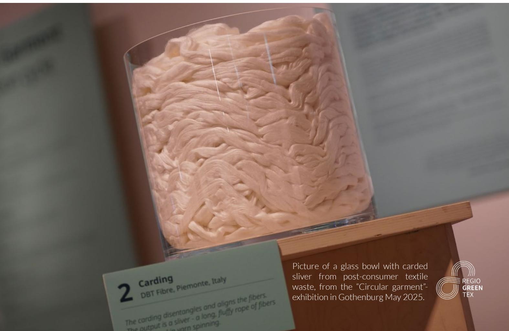

Picture of a glass bowl with carded sliver from post-consumer textile waste, from the "Circular garment" exhibition in Gothenburg May 2025.

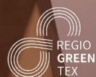

## Building regional partnerships to repurpose waste

The closing of textile loops in Europe demands a unified and collaborative approach that acknowledges regional strengths and challenges. Through consistent policies, investments in technology, and cross-regional collaboration, Europe can transform textile waste into a valuable resource, paving the way for a sustainable and circular textile future. The opportunity can, according to the report *Scaling textile recycling in Europe – turning waste into value*,xix lead to scaling of textile recycling in Europe, the prognosis show that an 18% to 26% fibre-to-fibre recycling rate could be achieved by 2030. However, advanced, accurate, and automated fibre sorting and pre-processing processes are not yet developed. In 2030, where automated sorting and technology would be further advanced, the industry has a potential to create 15 000 new green jobs and save four million tonnes CO2-equivalent emissions according to the report. Resale, rental, repair, and remaking markets could grow their share of the total textiles industry worldwide.

The combination of laws and directives, along with the development of suitable business models that generate revenue, requires the right types of collaborations where new solutions can be developed. Encouraging new contacts to become business relationships where we create new solutions together is crucial. Identifying lock-in effects in already established business relationships that hinder new solutions is important and understanding which business relationships can enable new solutions is key.

On the following pages, we will show one excellent example of how various actors begin to seize new opportunities and transform waste into a resource by leveraging their business networks. The article exemplifies different roles that organisations can take within the circular business network.

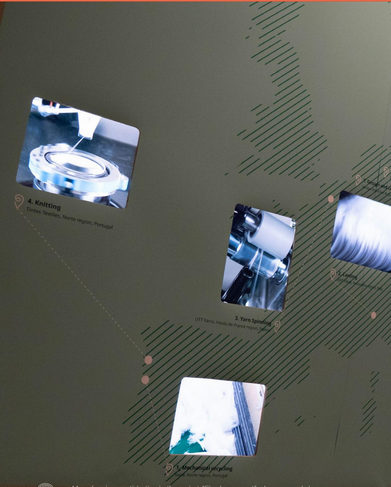

# FROM WASTE TO WORTH: HOW COLLABORATION AND CIRCULAR THINKING ARE RESHAPING THE TEXTILE INDUSTRY

## INTERVIEW

*North East Romania, Centre for textile waste  
Katty Fashion, Circular innovation manufacturing  
Mai Bine, Romanian NGO focused on sustainability  
REDU, community hub - part workshop, part movement*

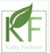

**In the face of climate urgency and growing consumer awareness, the fashion and textile industry is under pressure to reinvent itself. But while innovation often starts with a bold idea, real transformation happens when people come together.**

This is the story of how a regional development agency, a forward-thinking fashion manufacturer, and a grassroots sustainability initiative joined forces in Romania's North-East region. Together,

they are proving that circularity in textiles isn't just a trend, it's a collaborative movement.

Their journey, supported by the EU-funded RegioGreenTex project, offers valuable insights into how partnerships, shared values, and local ecosystems can turn waste into worth. Whether you're an industry veteran or a newcomer with a passion for change, this story shows how collaboration can be the most powerful tool for building a sustainable textile business.

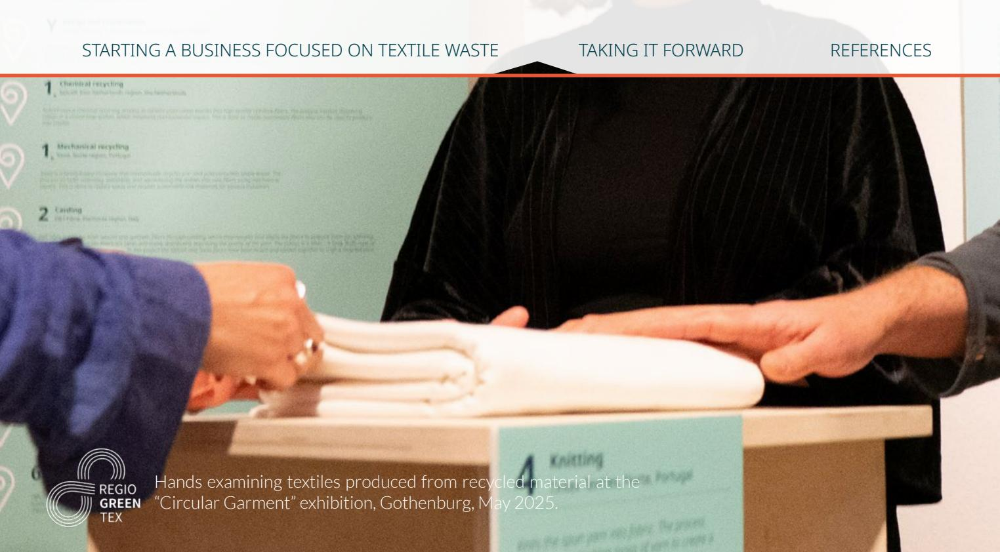

### BUILDING THE ECOSYSTEM: A REGIONAL BLUEPRINT FOR CIRCULAR INNOVATION

In Romania's North-East region, the textile industry has deep roots. Once home to the country's only academic-level textile research centre, the region is now becoming a hub for circular innovation, thanks in large part to the Regional Development Agency (RDA) and its smart specialisation strategy.

At the heart of this strategy is a belief that innovation must be co-created. Through a process called the Entrepreneurial Discovery Process, the RDA brings together companies, researchers, and civil society to identify challenges and design solutions. These aren't just brainstorming sessions, they're structured focus groups that lead to projects, funding, and real change.

One of the agency's key moves was to create thematic hubs, clusters of companies and organisations working on shared goals. In the case of textiles, the

focus was clear: reduce waste, starting from the design phase. This approach laid the groundwork for partnerships like the one between Katty Fashion and Mai Bine/ REDU, two very different organisations united by a common purpose.

*"We started thinking not just about the challenges, but about the solutions, and those solutions became projects, regional, individual, and most importantly, collaborative."*  
*-Agatha Filimon, RDA.*

### KATTY FASHION: TRANSFORMING TRADITION THROUGH TECHNOLOGY

When Caterina Ailiesei founded Katty Fashion, her goal wasn't just to build a successful business, it was to create a workplace rooted in ethics, fairness, and professional pride. Over two decades later,

the company has become a model for how traditional manufacturing can evolve into a driver of circular innovation.

*"I didn't start the company to become rich, I started it to surround myself with people who share values, ethics, professionalism, and to do the best possible for those who depend on us."*

-Caterina Ailiesei, Katty Fashion

Katty Fashion specialises in high-end, bespoke manufacturing for over 50 European brands. But as the fashion industry's environmental impact became harder to ignore, Caterina and her team began asking deeper questions: How can we reduce waste before it's even created? How can we empower our team to focus on meaningful work, not repetitive tasks? And how can we bring our clients along on this journey?

The answer lies in digital transformation, but not the kind that's imposed from the top down. Instead, Katty Fashion introduced 3D prototyping and digital design tools through an iterative, collaborative process. Clients were initially hesitant to abandon physical samples, so the team developed a co-creation platform that allowed them to visualise and refine designs digitally.

This approach not only reduced material waste, but it also created space for new ideas. By analysing fabric consumption during the design phase, the team

began identifying leftover materials that could be repurposed. That's where the collaboration with Mai Bine/REDU began to take shape.

MAI BINE AND REDU: GRASSROOTS INNOVATION WITH A PURPOSE

While Katty Fashion was transforming from the inside out, another kind of innovation was taking root in the same region, this time from the ground up.

Mai Bine, a Romanian NGO focused on sustainability, launched REDU to raise awareness about textile waste and promote conscious consumption. It didn't start with a business plan or a product, it started with a question: What if we could change the way people think about clothes?

*"We started by questioning the status quo of consumption, it was about creating a space where people could swap clothes, bring in old garments, and give them a new life."*

-Elvys Sandu, Mai Bine/REDU

REDU quickly became a community hub - part workshop, part movement. People gathered not just to recycle, but to connect. The emotional attachment to the mission was strong, and it's what kept the initiative alive through the inevitable ups and downs.

But REDU didn't stop at awareness. With support from the RDA and connections made through events and networks like

Textile Clothing Business Lab (TCBL), the team began exploring how to turn textile waste into new products, and eventually, into a viable business model.

That's when the collaboration with Katty Fashion began. What started as a simple collection of fabric scraps evolved into a shared vision for circular design. Together, they created prototypes from leftover materials, tested them with brands, and even sold them through partner websites. The partnership also inspired REDU to begin developing a digital tool to track and manage textile waste. It's still in progress, and the market isn't quite ready, but the vision is clear: a smarter, more transparent system for circular production.

*"We always say we hope for a future where we don't need to exist, because that would mean the problem is solved."*

-Elvys Sandu, Mai Bine/REDU

REDU's story is a powerful reminder that innovation doesn't always start with technology. Sometimes, it starts with empathy, community, and a willingness to do things differently.

COLLABORATION IN ACTION: CHALLENGES AND BREAKTHROUGHS

Collaboration sounds ideal in theory, but in practice, it requires patience, compromise, and a willingness to change. For Katty Fashion and REDU, working together meant more than just pooling

resources. It meant actively learning about each other's resources through aligning workflows, adapting technologies, and building trust across very different organisational cultures. One of the first hurdles was waste sorting. REDU needed specific types of textile scraps to create new products, but in a busy factory environment, separating materials by size, type, or colour wasn't part of the routine.

For Caterina, the solution wasn't to issue orders, it was to invite participation. She encouraged her team to reflect on the purpose behind the change and to come up with their own ways of implementing it. This approach created a sense of ownership and mutual respect. It also laid the foundation for deeper collaboration, including the integration of REDU's upcoming digital waste tracking tool with Katty Fashion's design and production systems.

But collaboration didn't stop at the factory floor. RDA played a crucial role in facilitating dialogue, adapting funding instruments, and creating spaces, both physical and digital, where ideas could be exchanged.

*"Circularity isn't one-size-fits-all. Each value chain, each product, each region needs its own approach, and that means working together."*

-Caterina Ailiesei, Katty Fashion

Through networks like TCBL, Regenova, and RegioGreenTex, the partners connected with like-minded organisations across Europe. These relationships brought not only inspiration, but also access to knowledge, funding, and new markets.

### LESSONS FOR ASPIRING CIRCULAR ENTREPRENEURS

For those looking to start or transform a textile business with sustainability in mind, the experiences of Katty Fashion, REDU, and their regional partners offer more than inspiration, they offer a roadmap.

Here are some of the most important lessons they've learned along the way:

1. START WITH WHAT YOU HAVE, AND WHERE YOU ARE  
Circularity doesn't require a perfect setup. It begins with understanding your local context: What kinds of waste are available? What infrastructure exists? Who are the people and organisations already working toward similar goals?

2. BUILD RELATIONSHIPS BEFORE YOU BUILD PRODUCTS

The most successful projects in this story didn't start with a business plan, they started with conversations. Whether it was by chance meeting at a regional event or a shared frustration with waste, the foundation was always human connection. It is essential to show curiosity and take the time to understand each other's perspective, and to remain flexible and open to adapting alongside your partners.

3. JOIN (OR CREATE) AN ECOSYSTEM

No one can go circular alone. That's why networks like TCBL, Regenova, and

RegioGreenTex are so important. They provide access to knowledge, funding, and collaborators who share your values.

4. BE PATIENT, BE FLEXIBLE, BE REALISTIC  
Circular transformation is not a straight line. It involves trial and error, shifting regulations, and sometimes resistance from within. But with the right mindset, these challenges become opportunities for growth.

### LOOKING AHEAD: HOPES, FEARS, AND THE FUTURE OF FASHION

So, what does the future hold for fashion? As the discussion turned towards the future, a blend of measured optimism and pragmatic realism was expressed.

A common theme was the need for fairness throughout the fashion value chain. The interviewees envision a system where profits are shared more equally, not just benefiting the big brands, but also supporting suppliers, manufacturers, and workers. Digital tools like product passports could help track not only materials, but also the real cost of production, making it easier to understand who gets what and why.

At the same time, there is a growing concern about how sustainability is regulated. Without stronger laws and better enforcement, small ethical businesses risk being pushed aside by fast fashion giants and misleading greenwashing claims. Another important point is the role of governance. If companies and policymakers work together, it becomes easier for consumers to make sustainable choices, without having to spend hours researching

every purchase. Transparency and smart regulation can help guide people toward better decisions.

Finally, the broader ecosystem matters. Businesses must create value, universities must generate knowledge, and society must shape culture. In short, the future of fashion depends on collaboration, clarity, and commitment. The hopes are high, but so is the need for action. As Agatha Filimon from RDA stressed:

*"Let's be sure that innovation really improves things, we don't want to make things more complicated, we want to make them better."*  
-Agatha Filimon, RDA

### CONCLUSION: CIRCULARITY IS A TEAM EFFORT

The journey of Katty Fashion, REDU, and the North-East Regional Development Agency is more than a case study, it's a testament to what's possible when people work together with intention, humility, and shared purpose.

Their story shows that circularity isn't just about materials or technology. It's about relationships, between businesses and communities, between tradition and innovation, and between local action and global ambition. It's about listening, adapting, and building ecosystems where everyone has a role to play.

For anyone looking to start or grow a sustainable textile business, the message is clear: you don't have to do it alone, and you shouldn't. The path forward is collaborative, and the future of fashion depends on it. Explore local networks, reach out to potential partners, and start small, but start together.

**Starting a business focused on textile waste** 

# STARTING A BUSINESS FOCUSED ON TEXTILE WASTE

Starting a business focused on textile waste can be both impactful and profitable when approached strategically. By developing a deep understanding of textile waste and viewing it as a valuable resource, you can position your business as a leader in the circular economy.

This proposal draws on insights from the RegioGreenTex project's Green Coaching initiative and related sources.

For small companies, innovation work can be streamlined into three key areas:

- • **Strategy:** Alignment with the company's overall mission, vision, and goals.
- • **Innovation process:** From insight and idea to launch and sales.
- • **External and internal factors:** Industry and market awareness, network and stakeholders, capabilities, innovation climate, etc.

KEY AREAS FOR INNOVATION WORK

All three areas are important in order to strengthen a company's ability to work systematically with innovation and can be applied within textile waste management to practically initiate renewal efforts, develop new ideas, and business offerings. Although the strategy represents the fundamentals, it is often recommended to start with the innovation process and idea generation/evaluation as it is the easiest area to grasp. Questions will arise over time that require input from the other two areas as well. Consequently, you will go back and forth between the three areas depending on the needs that arise. However, try to focus on one area at a time, e.g. during scheduled shorter recurring meetings or workshops that encourage discussions and creativity and that can be structured and documented, e.g. with digital tools such as [Mural](#) or [Miro](#).

## Strategy for developing offers in textile waste management

If the company does not already have a strategy for working with waste management, it is worth reviewing to ensure it aligns with the company's overall mission, vision, and goals.

Be prepared to adjust your strategies in response to changes in technology, market trends, or regulations. Maintain open communication with your network to navigate these changes effectively.

### Questions to answer may include:

- • What is our mission statement? Does waste management align with our core purpose and focus right now regarding what we do, how we do it, and whom we serve?
- • What is our vision statement? Does waste management align with our long-term goals and aspirations regarding what we want to achieve?
- • What is our innovation strategy: Do we have a structured plan for implementing new ideas in which waste management can be included?
- • What are our measurable goals within waste management?

### MISSION, VISION AND GOALS

#### Recommended reading:

Lafley, A. G., & Martin, R. L. (2013). Playing to win: *How strategy really works.*\*\* and [video](#) (4 min)

# Managing the innovation process

The innovation process from insight to launch includes several steps, and within the RegioGreenTex project's Green Coaching, we have chosen to focus on three of these: gathering ideas, prioritising and selecting ideas, and testing ideas.

An idea can originate from a need, a problem, a discovery, a dream, etc., and throughout the innovation process it will be evaluated, tested, and influenced in various directions before it can be realized as a value proposition. This depends, among other things, on the company's innovation strategy as well as external and internal factors.

## Gathering ideas

Initially, it is important to encourage thinking in terms of quantity rather than quality and to start collecting as many ideas as possible. At the beginning, all ideas are possible, and it might even be more innovative to realize an unfeasible wish than to improve an existing product. The selection of ideas is made later based on established criteria.

Consequently, there is a broad spectrum of different types of ideas. One way to illustrate this is by using Doblin's Ten Types of Innovationxxi which encourages broader thinking and helps uncover ideas in areas that might not have been considered before.

For each innovation type it is possible to pose oneself questions that will lead to idea generation. In the following section each innovation type and relevant questions are presented.

Gathering ideas

Prioritising and selecting ideas

Testing ideas

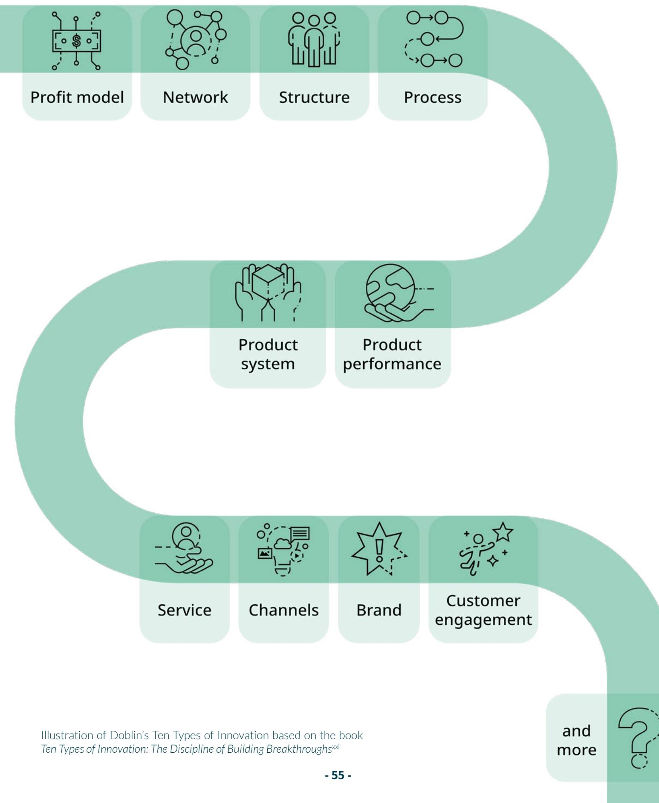

### Profit models: How do you want to make money?

- • Revenue Streams: Generate income through recycling fees, selling recycled textiles, and offering consulting services on sustainable practices.
- • Subscription Services: Implement subscription models for regular textile waste collection and recycling.
- • Premium Pricing: Offer premium services for businesses seeking advanced waste management solutions.

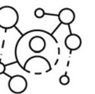

### Network: Who are the best ones to partner with?

- • Industry Partners: Collaborate with textile manufacturers, fashion brands, and waste management companies to create a cohesive recycling system.
- • Technology Providers: Partner with companies specializing in recycling technologies and sustainable practices.
- • Government and NGOs: Work with governmental bodies and non-profits to access grants and support for sustainability initiatives.

### Structure: What is the best internal structure?

- • Functional Structure: Include textile waste management in existing departments, e.g. the R&D team develops new recycling technologies, the production department manages manufacturing with recycled materials, and the logistics team handles textile waste collection and transportation, etc.
- • Divisional Structure: Create divisions based on different product lines or geographical areas, e.g. a pre-consumer waste management team focuses on managing waste generated during production, including developing innovative reuse methods and implementing zero-waste techniques. And a post-consumer waste management team that handles waste from consumers, including collection, organising drives and partnerships, and sorting and recycling or upcycling textiles.
- • Matrix Structure: Combine functional and project-based structures to improve flexibility and collaboration.

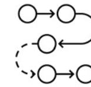

### Process: What process is unique?

- • Innovative Recycling Techniques: Develop unique processes for sorting and recycling textiles using technologies like Near Infrared (NIR) sorting.
- • Circular Economy Practices: Implement processes that promote reuse and recycling, minimizing waste and maximizing resource efficiency.

### Product system: What “extras” do you have?

- • Value-Added Services: Offer warranties, customer support, and maintenance services to enhance customer satisfaction.
- • Innovative Features: Include unique features such as smart sorting systems or blockchain for transparency in the recycling process.

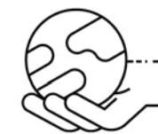

### Product performance: What properties in your product are most significant?

- • Durability: Ensure recycled products are durable and meet quality standards.
- • Sustainability: Highlight the eco-friendly aspects of your products, such as using recycled materials.
- • Functionality: Focus on the usability and efficiency of your recycled products.

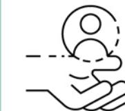

### Service: What services do you add on?

- • Consulting Services: Provide expert advice on sustainable practices and waste management.
- • Educational Programs: Offer training and workshops on textile recycling to raise awareness and build skills.
- • Custom Solutions: Develop tailored waste management solutions for different businesses to meet specific needs.

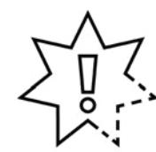

### **Channels: How to bring it all out there?**

- Multi-Channel Strategy: Utilize various channels such as social media, email marketing, and partnerships to reach your audience effectively.
- SEO and Content Marketing: Optimize your website and create valuable content to attract and engage customers.
- Paid Advertising: Invest in targeted ads to increase visibility and drive traffic to your services.

### **Brand: What brand efforts are needed?**

- Brand Strategy: Develop a strong brand strategy that includes your vision, mission, and values to build a recognizable and trusted brand.
- Consistent Messaging: Ensure your brand message is consistent across all platforms to maintain credibility.
- Customer Loyalty: Focus on building a loyal customer base through engaging brand experiences and excellent service.

### **Customer engagements: How to engage more with users and customers?**

- Personalized Interactions: Tailor your communications to meet individual customer needs and preferences.
- Social Media Engagement: Increase activity on social media to interact with customers and build relationships.
- Feedback and Improvement: Listen to customer feedback and continuously improve your services based on their input.

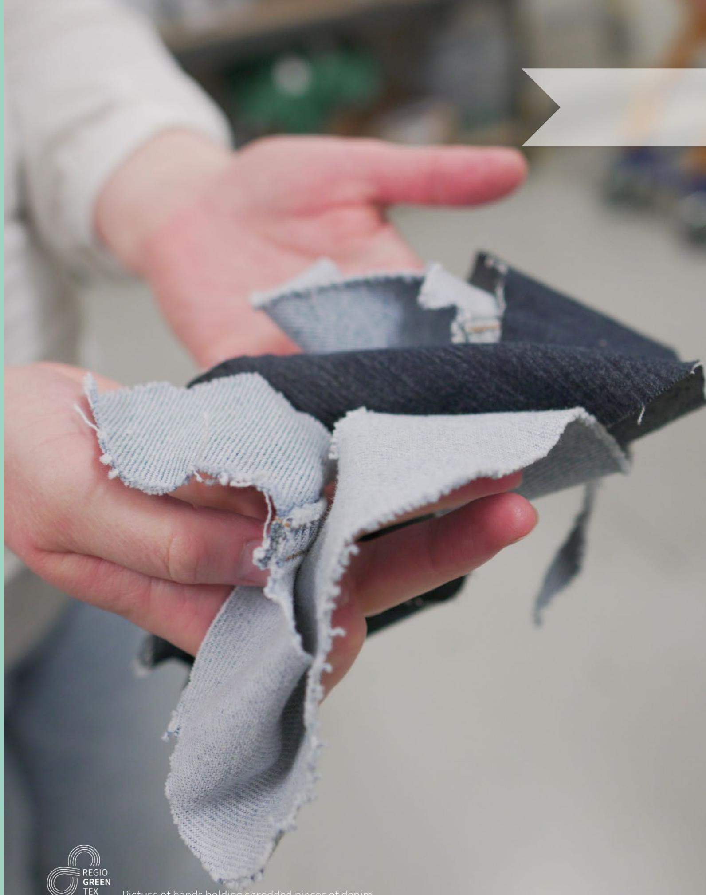

### **Prioritising and selecting ideas**

One way to initially prioritise ideas is to compare them against selected criteria that can represent the axes in an xy- or spider diagram in which ideas are placed in relation to the criteria's value. Examples of evaluation criteria could be: client need, uniqueness, environmental impact, business potential, stakeholder engagement, alignment with the overall vision, technical feasibility, complexity, risk, etc. A diagram with six selected criteria for comparing two different ideas could, for example, look like this:

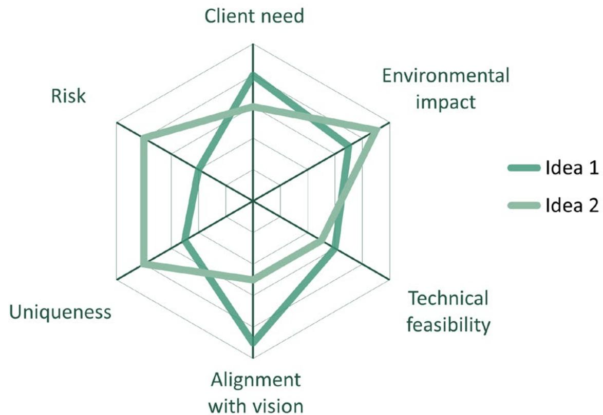

### **Testing ideas**

### **Value Proposition Canvas**

A Value Proposition Canvas can be used to ensure that an idea for a textile waste offering aligns with the needs and desires of the customers. A Customer Profile outlines the tasks customers are trying to complete, the problems they face, and the benefits they seek. And a Value Map describes how the business's offerings help customers achieve their goals, alleviate their problems, and deliver the benefits they desire.

### **Assessing business potential through hypothesis**

The uncertainty about an idea's business potential can be reduced through increased knowledge acquisition. One way to learn quickly and cheaply is to develop hypotheses that are tested and evaluated with selected stakeholders. Based on a stakeholder analysis, you assume which stakeholders might be interested in the offering and you describe their specific needs from their perspective, including who, what, and why, for example:

### **As a production manager responsible for waste handling, I want to...**

...know how to sort production waste effectively.

...identify buyers for sorted waste to create value rather than incur disposal costs.

...find alternatives to current waste handling, including recycling, reuse, or resale options.

...manage dead stock efficiently (redistribution, resale, upcycling).

...turn incineration costs into revenue by exploring secondary markets.

...identify logistics and storage solutions to optimise waste flows.

### **As a sustainability manager, I want to...**

...identify the right partners and technologies to execute sustainability projects.

...solve diverse challenges (e.g., material sourcing, waste handling, traceability).

...gain internal buy-in from teams and leadership for sustainability strategies.

...find instant ways to build knowledge (guides, expert insights, training).

...stay continuously updated on regulatory changes to ensure compliance.

...measure and communicate sustainability impact effectively (LCA, carbon footprint).

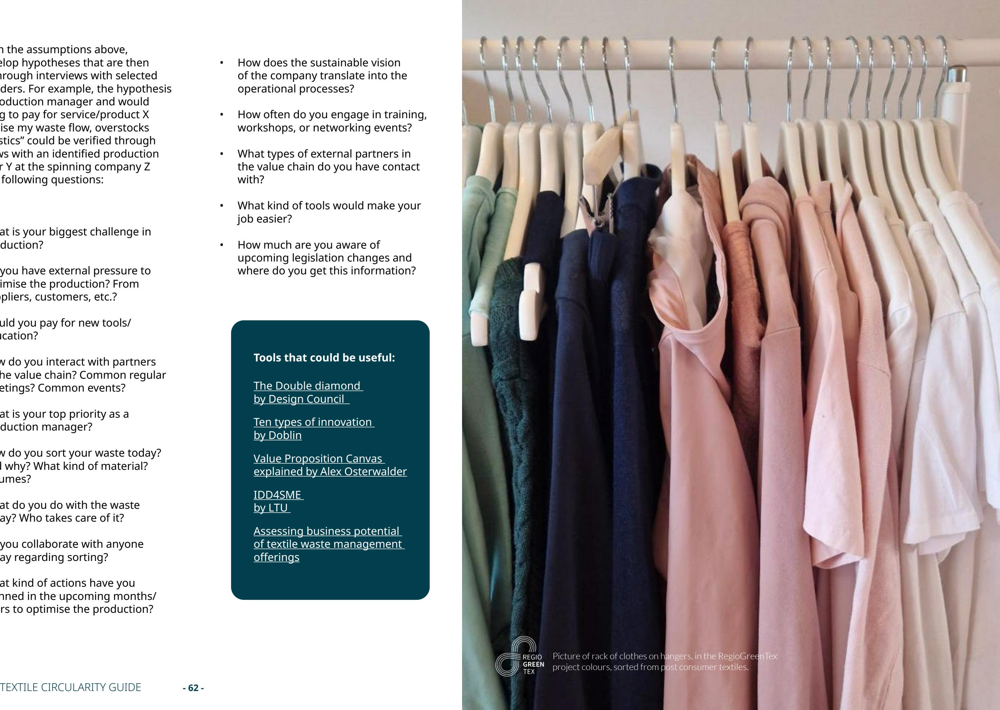

Based on the assumptions above, you develop hypotheses that are then tested through interviews with selected stakeholders. For example, the hypothesis "I'm a production manager and would be willing to pay for service/product X to optimise my waste flow, overstocks and logistics" could be verified through interviews with an identified production manager Y at the spinning company Z with the following questions:

- What is your biggest challenge in production?
- Do you have external pressure to optimise the production? From suppliers, customers, etc.?
- Would you pay for new tools/ education?
- How do you interact with partners in the value chain? Common regular meetings? Common events?
- What is your top priority as a production manager?
- How do you sort your waste today? and why? What kind of material? Volumes?
- What do you do with the waste today? Who takes care of it?
- Do you collaborate with anyone today regarding sorting?
- What kind of actions have you planned in the upcoming months/ years to optimise the production?

- How does the sustainable vision of the company translate into the operational processes?
- How often do you engage in training, workshops, or networking events?
- What types of external partners in the value chain do you have contact with?
- What kind of tools would make your job easier?
- How much are you aware of upcoming legislation changes and where do you get this information?

### **Tools that could be useful:**

[The Double diamond](https://www.designcouncil.org.uk/our-resources/the-double-diamond/)  [by Design Council](https://www.designcouncil.org.uk/our-resources/the-double-diamond/) 

[Ten types of innovation](https://www.projectcubicle.com/doblins-10-types-of-innovations-with-examples/)  [by Doblin](https://www.projectcubicle.com/doblins-10-types-of-innovations-with-examples/)

[Value Proposition Canvas](https://www.youtube.com/watch?v=D254suPMpwY)  [explained by Alex Osterwalder](https://www.youtube.com/watch?v=D254suPMpwY)

### [IDD4SME](https://ltubusiness.com/services/innovation-due-diligence/) [by LTU](https://ltubusiness.com/services/innovation-due-diligence/)

[Assessing business potential](https://app.mural.co/template/6fd76fc8-1df9-4f4a-9415-5d20373a91b7/36840e10-f221-4ab9-8226-ac76155d6b55)  [of textile waste management](https://app.mural.co/template/6fd76fc8-1df9-4f4a-9415-5d20373a91b7/36840e10-f221-4ab9-8226-ac76155d6b55)  [offerings](https://app.mural.co/template/6fd76fc8-1df9-4f4a-9415-5d20373a91b7/36840e10-f221-4ab9-8226-ac76155d6b55)

# Mapping business ecosystems for textile waste management

In addition to what has already been mentioned about business networks in the chapter "To transform waste to a resource," mapping your business ecosystem is crucial for understanding stakeholders and their interactions, especially for a company focused on textile waste management. The mapping helps to identify key players, both upstream and downstream, and those outside your direct value chain. It fosters a shared understanding within your team and reveals interconnections that could support or hinder your circular strategies. By involving diverse participants from various parts of your company, you ensure a comprehensive view and more effective strategic planning for developing products and services related to textile waste management.

A company can secure reliable waste sources by collaborating with municipalities, manufacturers, and sorting facilities to ensure a consistent supply of textile waste materials. Use tools like the Waste Solution Finder, see chapter "Channelling principles relevant today" to identify and connect with potential partners in your region. Incorporate repair, resale, renting or remanufacturing services to extend the lifecycle of

## Advice to start exploring your network:

Gaining knowledge in sorting and classifying waste based on quality, material, and potential reuse or recycling methods, will help you build credibility and strengthen your network.

Learning about the recycling potential of different textile materials, including the challenges posed by fibre blends and chemical treatments. Share this knowledge within your network to foster innovation.

products. Partner with businesses that can provide these services to create a comprehensive network that maximizes resource use. Additionally, partner with research institutions and innovation hubs to stay ahead of technological developments. These collaborations can provide access to cutting-edge solutions and expertise.

Moreover, assess current business relationships that might present obstacles to your business idea. These could involve partners who are resistant to change, suppliers engaging in unsustainable practices, or competitors with conflicting interests

To stay informed within textile waste management, it is necessary to continuously gather knowledge about trends, new technologies, competitors, and not least about various regulations. Familiarize yourself with relevant regulations, such as EU sustainability laws, and obtain necessary certifications to build customer trust. Use common language and terminology to communicate effectively within your network.

Stay informed about changes in regulations and definitions to ensure compliance and adapt your business practices accordingly. Engage with industry groups and networks to stay updated.

With an enormous amount of information available, an AI model trained on scientific articles in textile waste management can quickly identify which technology areas are growing the fastest or which research breakthroughs have occurred recently. Likewise, generative AI can search, interpret, and compare regulations and directives related to textile waste management, and many sources can also provide summaries to inspire new products, services, or manufacturing processes that could comply with those regulations and directives.

## Understand key regulations:

EEA – European Environmental Agency:

[An overview of textile waste management in Europe](#)

EU Circular Economy Action Plan:

[Key actions and directives for sustainable textile management](#)

Textile Care:

[An international overview of key regulations and standards in sustainable textile care](#)

## Tools that can be useful:

[Business Ecosystem Mapping by CIRCIT](#)

[AI and Generative AI for Research Discovery and Summarization](#)

[Megatrend cards](#)

[Harnessing Generative AI for Regulatory Compliance](#)

[Partnership Opportunities by EEN](#)

[AI Prompts for SWOT Analysis – Strengths, Weaknesses, Opportunities and Threats.](#)

[Ekvall's 10 dimensions for organisational creativity and innovation](#)

### **Key considerations for a textile waste business**

*Here are five key points for a company starting a business focused on textile waste management.*

*These points will help you build a solid foundation for your textile waste management business, ensuring it is both sustainable and successful.*

### **Innovation process:**

Encourage idea generation and prioritize ideas based on criteria such as client need, uniqueness, business potential, and feasibility. Use tools like the Value Proposition Canvas to test and refine ideas, ensuring they meet customer needs and desires.

### **Develop a clear strategy:**

Ensure your waste management strategy aligns with your company's mission, vision, and goals. This includes defining your mission statement, vision statement, innovation strategy, and measurable goals within waste management.

### **Build strong networks:**

Map your business ecosystem to understand stakeholders and their interactions. Collaborate with municipalities, manufacturers, sorting facilities, research institutions, and innovation hubs to secure reliable waste sources and stay ahead of technological developments.

### **Develop expertise and leverage technology:**

Gain knowledge in sorting and classifying waste based on quality, material, and potential reuse or recycling methods. Understand the recycling potential of different textile materials and stay updated with emerging technologies like automated sorting and advanced recycling techniques to improve efficiency and scalability.

### **Stay informed and compliant:**

Continuously gather knowledge about trends, new technologies, competitors, and regulations. Familiarize yourself with relevant regulations, such as EU sustainability laws, and obtain necessary certifications to build customer trust. Engage with industry groups and networks to stay updated.

# **TAKING IT FORWARD**

The *Textile Circularity Guide*, developed through the European project **RegioGreenTex**, is more than a guide, it's a call to action to transform our textile systems and rethink our relationship with waste.

This guide presents a powerful vision of circularity, grounded in practical action. It invites municipalities, textile sorters, recommerce businesses, and producers to be part of a new ecosystem where textile waste becomes a valuable resource.

At its core, the guide encourages a shift from a linear value chain to a dynamic business network. Collaboration is the key. By moving beyond traditional supplier–buyer relationships and building networks of trust, actors can co-create solutions, align around shared goals, and develop entirely new value propositions.

The guide outlines how small and medium enterprises can begin their circular journey by understanding their own waste streams, using tools like the Waste Solution Finder, and applying innovation models such as Doblin's Ten Types of Innovation. It promotes iterative innovation, from gathering ideas to testing value propositions with real stakeholders. With the right mindset and structure, businesses can generate new income streams, reduce environmental impact, and strengthen their position in an emerging circular economy.

The transformation won't be easy. It demands regulatory readiness, investment in technology, and behavioral change across consumers, companies, and governments. But the benefits are enormous: new green jobs in a sustainable European textile industry, decrease of CO2 emissions, and new business models that deliver economic and environmental resilience.

The message is clear: **Waste is only waste if we fail to see its potential.**

This guide gives you the insights, tools, and inspiration to act, whether you're launching a circular startup, redesigning your manufacturing process, or leading your region toward sustainability. The future of textiles is circular. Be part of the movement. Start now.

# **REFERENCES**

- i. [European Environment Agency. \(2022\).](#page-8-0) *Textiles and the [environment: The role of design in Europe's circular economy.](#page-8-0)* [European Environment Agency.](#page-8-0) [https://www.eea.europa.eu/](https://www.eea.europa.eu/publications/textiles-and-the-environment-the/textiles-and-the-environment-the) [publications/textiles-and-the-environment-the/textiles-and-the](https://www.eea.europa.eu/publications/textiles-and-the-environment-the/textiles-and-the-environment-the)[environment-the](https://www.eea.europa.eu/publications/textiles-and-the-environment-the/textiles-and-the-environment-the)
- ii. [Deckers, J., Duhoux, T., & Due, S. \(2024\).](#page-8-0) *Textile waste management [in Europe's circular economy \(ETC CE Report 2024/5\).](#page-8-0)* European [Environment Agency.](#page-8-0) [https://www.eionet.europa.eu/etcs/etc-ce/](https://www.eionet.europa.eu/etcs/etc-ce/products/etc-ce-report-2024-5-textile-waste-management-in-europes-circular-economy) [products/etc-ce-report-2024-5-textile-waste-management-in](https://www.eionet.europa.eu/etcs/etc-ce/products/etc-ce-report-2024-5-textile-waste-management-in-europes-circular-economy)[europes-circular-economy](https://www.eionet.europa.eu/etcs/etc-ce/products/etc-ce-report-2024-5-textile-waste-management-in-europes-circular-economy)
- iii. [European Commission. \(n.d.\).](#page-8-0) *Strategy for textiles.* Single Market [Economy.](#page-8-0) [https://single-market-economy.ec.europa.eu/sectors/](https://single-market-economy.ec.europa.eu/sectors/textiles-ecosystem/strategy-textiles_en) [textiles-ecosystem/strategy-textiles\\_en](https://single-market-economy.ec.europa.eu/sectors/textiles-ecosystem/strategy-textiles_en)
- iv. [Ellie.Connect. \(2024, January\).](#page-9-0) *Taxonomy glossary* (Version 2). [https://ellieconnect.com/wp-content/uploads/2024/01/Ellie.](https://ellieconnect.com/wp-content/uploads/2024/01/Ellie.Connect-Taxonomy-Glossary-2.pdf) [Connect-Taxonomy-Glossary-2.pdf](https://ellieconnect.com/wp-content/uploads/2024/01/Ellie.Connect-Taxonomy-Glossary-2.pdf)
- v. [European Commission. \(2023\).](#page-10-0) *Commission staff working [document: Impact assessment report](#page-10-0)* (SWD(2023) 421 final, [Part 3\).](#page-10-0) [https://environment.ec.europa.eu/document/](https://environment.ec.europa.eu/document/download/768d76e9-aab9-4f90-a036-7d841e40494e_en?filename=IMPACT%20ASSESSMENT%20REPORT_SWD_2023_421_part3.pdf) [download/768d76e9-aab9-4f90-a036-7d841e40494e\\_](https://environment.ec.europa.eu/document/download/768d76e9-aab9-4f90-a036-7d841e40494e_en?filename=IMPACT%20ASSESSMENT%20REPORT_SWD_2023_421_part3.pdf) [en?filename=IMPACT%20ASSESSMENT%20REPORT\\_](https://environment.ec.europa.eu/document/download/768d76e9-aab9-4f90-a036-7d841e40494e_en?filename=IMPACT%20ASSESSMENT%20REPORT_SWD_2023_421_part3.pdf) [SWD\\_2023\\_421\\_part3.pdf](https://environment.ec.europa.eu/document/download/768d76e9-aab9-4f90-a036-7d841e40494e_en?filename=IMPACT%20ASSESSMENT%20REPORT_SWD_2023_421_part3.pdf)
- vi. [European Environment Agency. \(2024\).](#page-10-0) *Management of used [and waste textiles in Europe's circular economy.](#page-10-0)* [https://www.eea.](https://www.eea.europa.eu/publications/management-of-used-and-waste-textiles) [europa.eu/publications/management-of-used-and-waste-textiles](https://www.eea.europa.eu/publications/management-of-used-and-waste-textiles)
- vii. [Tang, K. H. D. \(2023\). State of the art in textile waste](#page-10-0)  [management: A review.](#page-10-0) *Textiles*, 3(4), 454–467. [https://doi.](https://doi.org/10.3390/textiles3040027) [org/10.3390/textiles3040027](https://doi.org/10.3390/textiles3040027)
- viii. [European Parliament and Council. \(2008\).](#page-10-0) *Directive 2008/98/EC of [19 November 2008 on waste and repealing certain Directives. Official](#page-10-0)  [Journal of the European Union, L 312, 3–30.](#page-10-0)* [https://eur-lex.europa.](https://eur-lex.europa.eu/legal-content/EN/TXT/PDF/?uri=CELEX:32008L0098) [eu/legal-content/EN/TXT/PDF/?uri=CELEX:32008L0098](https://eur-lex.europa.eu/legal-content/EN/TXT/PDF/?uri=CELEX:32008L0098)
  - ix. [European Parliament. \(2020, December 8\).](#page-10-0) *The impact of textile [production and waste on the environment: Infographics.](#page-10-0)* [https://](https://www.europarl.europa.eu/topics/en/article/20201208STO93327/the-impact-of-textile-production-and-waste-on-the-environment-infographics) [www.europarl.europa.eu/topics/en/article/20201208STO93327/](https://www.europarl.europa.eu/topics/en/article/20201208STO93327/the-impact-of-textile-production-and-waste-on-the-environment-infographics) [the-impact-of-textile-production-and-waste-on-the-environment](https://www.europarl.europa.eu/topics/en/article/20201208STO93327/the-impact-of-textile-production-and-waste-on-the-environment-infographics)[infographics](https://www.europarl.europa.eu/topics/en/article/20201208STO93327/the-impact-of-textile-production-and-waste-on-the-environment-infographics)
  - x. European Parliament. (2024). *[The impact of artificial intelligence](#page-13-0)  [on the future of work and workers in the European Union \(Study](#page-13-0)  [No. 757808\).](#page-13-0)* [https://www.europarl.europa.eu/RegData/etudes/](https://www.europarl.europa.eu/RegData/etudes/STUD/2024/757808/EPRS_STU(2024)757808_EN.pdf) [STUD/2024/757808/EPRS\\_STU\(2024\)757808\\_EN.pdf](https://www.europarl.europa.eu/RegData/etudes/STUD/2024/757808/EPRS_STU(2024)757808_EN.pdf)
  - xi. [Håkansson, H., & Snehota, I. \(1995\).](#page-19-0) *Developing relationships [in business networks.](#page-19-0)* Routledge. [https://www.academia.](https://www.academia.edu/30613449/Developing_relationships_in_business_networks) [edu/30613449/Developing\\_relationships\\_in\\_business\\_networks](https://www.academia.edu/30613449/Developing_relationships_in_business_networks)
  - xii. [Landqvist, M., & Lind, F. \(2023\). Resource renewal in heavy](#page-19-0)  [business networks: the case of Modvion starting up in the](#page-19-0)  Swedish wind energy context. *[Journal of Business & Industrial](#page-19-0)  [Marketing, 38\(3\),](#page-19-0)* 507-519
  - xiii. [Huemer, L., & Flygansvær, B. \(2025\). Increasing circularity: The](#page-19-0)  [importance of resource interactions when adapting from waste](#page-19-0)  [management to resource management.](#page-19-0) *Industrial Marketing [Management, 125,](#page-19-0)* 118-130.
  - xiv. European Union. (2024). *[Regulation \(EU\) 2024/1781 of the European](#page-20-0)  [Parliament and of the Council of 13 June 2024 establishing a](#page-20-0)  [framework for the setting of ecodesign requirements for sustainable](#page-20-0)  [products, amending Directive \(EU\) 2020/1828 and Regulation \(EU\)](#page-20-0)  [2023/1542 and repealing Directive 2009/125/EC. Official Journal of](#page-20-0)  [the European Union, L 1781,](#page-20-0)* 28.6.2024. [https://eur-lex.europa.eu/](https://eur-lex.europa.eu/legal-content/EN/TXT/PDF/?uri=OJ:L_202401781) [legal-content/EN/TXT/PDF/?uri=OJ:L\\_202401781](https://eur-lex.europa.eu/legal-content/EN/TXT/PDF/?uri=OJ:L_202401781)

- xv. [European Parliamentary Research Service. \(2024, October 11\).](#page-20-0)  *['Green claims' directive: Protecting consumers from greenwashing](#page-20-0)  (Briefing PE 753.958).* [European Parliament.](#page-20-0) [https://www.](https://www.europarl.europa.eu/RegData/etudes/BRIE/2023/753958/EPRS_BRI(2023)753958_EN.pdf) [europarl.europa.eu/RegData/etudes/BRIE/2023/753958/EPRS\\_](https://www.europarl.europa.eu/RegData/etudes/BRIE/2023/753958/EPRS_BRI(2023)753958_EN.pdf) [BRI\(2023\)753958\\_EN.pdf](https://www.europarl.europa.eu/RegData/etudes/BRIE/2023/753958/EPRS_BRI(2023)753958_EN.pdf)
- xvi. [Håkansson, H., & Snehota, I. \(2009\).](#page-20-0) *Business in Networks.* John [Wiley & Sons Ltd., Chichester.](#page-20-0)
- xvii. [Ollila, S., & Yström, A. \(2016, May 31–June 4\).](#page-20-0) *Anything goes? [Conceptualizing different interaction strategies in open innovation.](#page-20-0)* [Paper presented at the EURAM Conference, Paris, France.](#page-20-0)
- xviii. [Landqvist, M., & Lind, F. \(2019\). A start-up embedding in three](#page-20-0)  [business network settings–a matter of resource combining.](#page-20-0)  *[Industrial Marketing Management, 80,](#page-20-0)* 160-171
- xix. [Hedrich, S., Janmark, J., Strand, M., Langguth, N., & Magnus, K.-H.](#page-21-0)  (2023). *[Scaling textile recycling in Europe – turning waste into value.](#page-21-0)* [McKinsey & Company.](#page-21-0)
- xx. [Lafley, A. G., & Martin, R. L. \(2013\).](#page-26-0) *Playing to win: How strategy really works.* [Harvard Business Review Press.](#page-26-0)
- xxi. [Keeley, L., Walters, H., Pikkel, R., & Quinn, B. \(2013\).](#page-27-0) *Ten types of [innovation: The discipline of building breakthroughs.](#page-27-0)* Wiley.

# **PEOPLE BEHIND THE GUIDE**

### **Johanna Snellström**

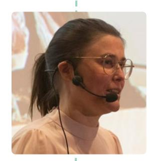

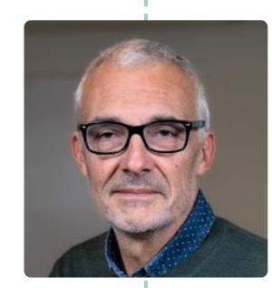

*Project leader, RISE*

Johanna supports small and Medium-sized Enterprises (SMEs) in circular textile transformation through projects like RegioGreenTex. She brings expertise in eco-design, chemicals, and collaboration. Want help building sustainable systems? Contact Johanna: [johanna.snellstrom@ri.se](mailto:johanna.snellstrom%40ri.se?subject=)

> **Stina Björquist** *Researcher, RISE*

Stina guides companies in building circular textile models through reuse, recycling, and ecodesign. She blends systems thinking with handson innovation. Curious about sustainable growth? Reach out to Stina: [stina.bjorquist@ri.se](mailto:stina.bjorquist%40ri.se?subject=)

**Emma Enebog** *Project leader, RISE*

Emma drives circular and sustainable textile systems. She works with digital tools, secondhand models, and extended product lifecycles through initiatives like PayItForward and CISUTAC. Ready to rethink your textile value chain? Talk to Emma: [emma.enebog@ri.se](mailto:emma.enebog%40ri.se?subject=)

**Max Maupoix** *Innovation leader and researcher, RISE*

Max helps SMEs with EU funding, innovation strategies, and internationalization. He leads support networks like Enterprise Europe Network and Industriell Dynamik. Want to accelerate innovation and growth? Connect with Max: [max.maupoix@ri.se](mailto:max.maupoix%40ri.se?subject=)

**Patrik M Eriksson** *Media producer and storyteller, RISE*

Patrik brings innovation to life through film, foresight, and speculative design. His visual narratives spark engagement and system change. Need powerful storytelling for your project? Talk to Patrik: [patrik.m.eriksson@ri.se](mailto:patrik.m.eriksson%40ri.se?subject=)

**Maria Landqvist**

*Researcher with a PhD in Industrial Marketing, RISE* Maria supports businesses, especially SMEs, in innovation and sustainability, focusing on organisational collaboration on innovation within business networks. Through projects like RegioGreenTex, she helps companies strengthen their innovation capacity. Need guidance to future-proof your business? Contact Maria: [maria.landqvist@ri.se](mailto:maria.landqvist%40ri.se?subject=)

**Fanny Lindh**

*Designer and researcher, RISE* Fanny works to create spaces and contexts to meet in, both physical and mental, analog and digital. Her work invites new ways of thinking and collaborating and aims to illuminate different perspectives, both human and more-than-human. Looking to explore new design frontiers? Collaborate with Fanny: [fanny.lindh@ri.se](mailto:fanny.lindh%40ri.se?subject=)

### **RISE - Research Institutes of Sweden**

RISE is Sweden's research institute. We help businesses and the public sector to develop products, processes or entire organisations for a sustainable future.

Our applied research, test and demonstration facilities and interdisciplinary expertise, support and assist you every step of the way - from idea to innovation and into the market.

Through our assignments and collaborations, we contribute to faster transition and increased competitiveness for companies, society and Sweden.

**Sweden's research institute – the catalyst for industrial and societal renewal [RegioGreenTex](https://www.ri.se/en/expertise-areas/projects/regiogreentex-regions-for-green-textiles)** 

**[- Regions for](https://www.ri.se/en/expertise-areas/projects/regiogreentex-regions-for-green-textiles) [Green Textiles](https://www.ri.se/en/expertise-areas/projects/regiogreentex-regions-for-green-textiles)**

## Regions of RegioGreenTex

## Regions of RegioGreenTex

**[www.ri.se](http://www.ri.se)**

### **Västra Götalandsregionen – Driving Sustainable Textile Transformation**

Västra Götalandsregionen (VGR) is a key player in advancing sustainable textile systems in Sweden and Europe. As one of 11 textile-intensive regions in the EU participating in RegioGreenTex, VGR supports the transition toward circular value chains by fostering innovation, collaboration, and knowledge exchange. Through strategic initiatives and funding, including the development of this guide, VGR helps strengthen regional capacity for sustainable textile production, reuse, and recycling.

**[VGR -](https://www.vgregion.se/regional-utveckling/regional-utvecklingsstrategi/kraftsamlingar/cirkulara-affarsmodeller/textile-movement/)  [Textile](https://www.vgregion.se/regional-utveckling/regional-utvecklingsstrategi/kraftsamlingar/cirkulara-affarsmodeller/textile-movement/)** 

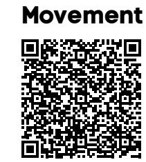

# **PROJECT PARTNERS**

