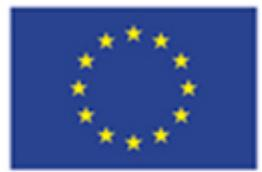

## Horizon 2020 Programme

#### **SCIRT**

Innovation Action (IA)

This project has received funding from the European Union's Horizon 2020 research and innovation programme under grant agreement No 101003906

> Start date : 2021-06-01 Duration : 36 Months https://scirt-h2020.eu/

## SCIRT

### **State-of-the art of the fashion system**

Authors : Mr. Simon NAVARRO (ESTIA), Simon Navarro (ESTIA), Bixente Demarcq (ESTIA), Sabine Giron (ESTIA), Alex Marquoin (ESTIA) SCIRT - Contract Number: 101003906

#### Project officer:

| Document title      | State-of-the art of the fashion system                                          |
|---------------------|---------------------------------------------------------------------------------|
| Author(s)           | Mr. Simon NAVARRO, Simon Navarro (ESTIA), Bixente Demarcq (ESTIA), Sabine Giron |
| Number of pages     | 104                                                                             |
| Document type       | Deliverable                                                                     |
| Work Package        | WP01                                                                            |
| Document number     | D1.1                                                                            |
| Issued by           | ESTIA                                                                           |
| Date of completion  | 2022-03-21 12:08:15                                                             |
| Dissemination level | Public                                                                          |

#### **Summary**

This deliverable is the first step of the SCIRT project and aims to place the project?s objectives in the context of the global textile industry from different perspectives. The value chain of garment production allows all its stages to be identified and also its profitability to be evaluated. It can be investigated from a product point of view, with the aim of studying the product?s entire lifecycle. However, an industrial point of view can also be applied to identify value-creating activities and their corresponding added value. This can be used to break down the costs of a garment according to the country of production to highlight any variability of value among the global stakeholders involved. The fashion sector can apply different business models, which will also be studied, more specifically three different perspectives: fast versus slow fashion, value and different brands? business models. This deliverable then describes all the production process steps in the value chain, from fibre production to garment manufacturing. It contains a description of the different kinds of machines that are being used and processes applied. European textile waste treatment is also described. Creating a textile industry state of the art should also include a description of the economic situation. What are the numbers for production, import/export, the impact of Covid-19? It is also about consumption trends in terms of material resources and consumer behaviour. The continuously increasing importance of the online market, the further expansion of fast fashion, development of new technologies and increasing attention paid to sustainability needs have modified the industry and will continue to do so in the future. The environmental impact of the textile industry has forced it to question itself about the use of resources, greenhouse gas emissions and water pollution, among other effects. However, the societal impact is also problematic at different levels. Although the textile industry is one of the biggest employers in developing countries, price pressure has been shown to have created terrible working conditions, such as child labour, low wages and modern slavery, as well as safety risks with chemical products and building issues. As SCIRT aims to implement a more circular production cycle for 6 different types of garments, a separate chapter has been dedicated to the circular design process. It explains all the technical issues that prevent garments from being re...

#### Approval

| Date                | By                        |
|---------------------|---------------------------|
| 2022-03-21 12:08:30 | Mr. Simon NAVARRO (ESTIA) |
| 2022-03-21 12:58:02 | Mrs. Evelien DILS (VITO)  |

## SCIRT

## SYSTEM CIRCULARITY & INNOVATIVE RECYCLING OF TEXTILES

Innovation Action

H2020-SC5-2020-2

# **State-of-the art of the fashion system**

### **Deliverable D1.1**

Version N°3.0

#### **Authors:**

ESTIA

# **Disclaimer**

The content of this report reflects only the author's view. The European Commission is not responsible for any use that may be made of the information it contains.

# **Document information**

| Grant Agreement         | n°101003906                                           |
|-------------------------|-------------------------------------------------------|
| Project Title           | System Circularity & Innovative Recycling of Textiles |
| Project Acronym         | SCIRT                                                 |
| Project Coordinator     | Evelien Dils, VITO                                    |
| Project Duration        | 1                                                     |
|                         | st June 2021 – 31 st May 2024 (36 months)             |
| Related Work Package    | WP1                                                   |
| Related Task(s)         | T1.1                                                  |
| Lead Organisation       | ESTIA                                                 |
| Contributing Partner(s) | CETI, VITO, circular.fashion, TU WIEN, BOKU, PI       |
| Due Date                | 30/11/2021                                            |
| Dissemination level     | Public                                                |

# **History**

| Date     | Version | Submitted by | Reviewed by | Comments           |
|----------|---------|--------------|-------------|--------------------|
| 30/11/21 | V1      | ESTIA        | VITO        | Reviews on Syntax  |
| 15/01/22 | V2      | ESTIA        | VITO        | Integration of new |
|          |         |              |             | publications and   |
| 15/03/22 | V3      | ESTIA        | VITO        | Syntax Review.     |

# **Table of Contents**

| 1 Value chain        | ............................................................................................................................11 |                                                                                                                   |
|----------------------|--------------------------------------------------------------------------------------------------------------------------------|-------------------------------------------------------------------------------------------------------------------|
| 1.1                  | Value chain mapping....................................................................................................11      |                                                                                                                   |
| 1.1.1                | Product value chain...................................................................................................11       |                                                                                                                   |
| 1.1.2                | Industrial value chain                                                                                                         | ................................................................................................12                |
| 1.1.3                | Evolution of material value through its lifecycle....................................................13                        |                                                                                                                   |
| 1.1.4                | Value chain dynamics                                                                                                           | ...............................................................................................14                 |
| 1.1.5                | Breakdown of costs in a garment............................................................................15                  |                                                                                                                   |
| 1.2                  | Textile industry stakeholders.......................................................................................15         |                                                                                                                   |
| 1.2.6                | Stakeholders mapping                                                                                                           | .............................................................................................15                   |
| 1.2.7                | Business models........................................................................................................17      |                                                                                                                   |
| 1.2.7.1              | Fast Fashion / Slow fashion                                                                                                    | ..................................................................................18                              |
| 1.2.7.2              | Brand’s business model                                                                                                         | ........................................................................................19                        |
| 1.3                  | Production processes                                                                                                           | ...................................................................................................22             |
| 1.3.1                | Fibre & yarn production                                                                                                        | ...........................................................................................22                     |
| 1.3.2                | Fabrics production....................................................................................................24       |                                                                                                                   |
| 1.3.3                | Garment Manufacturing                                                                                                          | ...........................................................................................29                     |
| 1.4                  | Textile waste treatment                                                                                                        | ................................................................................................32                |
| 2 Economic situation |                                                                                                                                | ...............................................................................................................34 |
| 2.1                  | Economic situation overview.......................................................................................34           |                                                                                                                   |
| 2.1.1                | Market overview                                                                                                                | ........................................................................................................34        |
| 2.1.2                | Production..................................................................................................................34 |                                                                                                                   |
| 2.1.3                | Import/Export                                                                                                                  | ............................................................................................................35    |
| 2.1.4                | COVID-19 Impact......................................................................................................36        |                                                                                                                   |
| 2.2                  | Consumption trends.....................................................................................................38      |                                                                                                                   |
| 2.2.1                | Textile consumption in Europe................................................................................38                |                                                                                                                   |
| 2.2.1.1              | Market overview                                                                                                                | ....................................................................................................38            |
| 2.2.1.2              | Consumption trends per material type...............................................................39                          |                                                                                                                   |
| 2.2.1.3              | Influence of consumer’s income                                                                                                 | ..........................................................................40                                      |
| 2.2.2                | Trends influencing consumer behaviours..............................................................41                         |                                                                                                                   |
| 2.2.2.1              | Online retail............................................................................................................41    |                                                                                                                   |
| 2.2.2.2              | Fast fashion                                                                                                                   | ............................................................................................................41    |
| 2.2.2.3              | Activewear..............................................................................................................42     |                                                                                                                   |
| 2.2.2.4              | Sustainability                                                                                                                 | ..........................................................................................................42      |
| 2.2.2.5              | Corporate social responsibility............................................................................44                  |                                                                                                                   |

| 2.2.2.6                                                                                                                                       |                                                                                                                                  |                                                                                                                   |
|-----------------------------------------------------------------------------------------------------------------------------------------------|----------------------------------------------------------------------------------------------------------------------------------|-------------------------------------------------------------------------------------------------------------------|
| 3 Environmental and societal impact                                                                                                           |                                                                                                                                  | ....................................................................................46                            |
| 3.1                                                                                                                                           | Environmental                                                                                                                    | ...............................................................................................................46 |
| 3.1.1                                                                                                                                         | Resource used                                                                                                                    | ...........................................................................................................47     |
| 3.1.2                                                                                                                                         | Greenhouse gas emissions                                                                                                         | ......................................................................................50                          |
| 3.1.3                                                                                                                                         | Water pollution..........................................................................................................52      |                                                                                                                   |
| 3.1.4                                                                                                                                         | Land use .....................................................................................................................53 |                                                                                                                   |
| 3.1.5                                                                                                                                         | Use of chemicals........................................................................................................54       |                                                                                                                   |
| 3.2                                                                                                                                           | Societal impact..............................................................................................................55  |                                                                                                                   |
| 3.2.1                                                                                                                                         | Employment...............................................................................................................55      |                                                                                                                   |
| 3.2.2                                                                                                                                         | Human practices........................................................................................................56        |                                                                                                                   |
| 3.2.2.1                                                                                                                                       | Wages .....................................................................................................................57    |                                                                                                                   |
| 3.2.2.2                                                                                                                                       | Work conditions                                                                                                                  | ....................................................................................................59            |
| 3.2.2.3                                                                                                                                       | Child labour                                                                                                                     | ...........................................................................................................60     |
| 3.2.2.4                                                                                                                                       | Gender....................................................................................................................61     |                                                                                                                   |
| 4 Circular design processes                                                                                                                   |                                                                                                                                  | ...................................................................................................62             |
| 4.1                                                                                                                                           | Introduction to circularity                                                                                                      | .............................................................................................62                   |
| 4.2                                                                                                                                           | Textile circular issues                                                                                                          | ....................................................................................................63            |
| 4.2.1                                                                                                                                         | Political issues............................................................................................................63   |                                                                                                                   |
| 4.2.2                                                                                                                                         | Technical issues.........................................................................................................64      |                                                                                                                   |
| 4.3                                                                                                                                           | State of the art of circular product design processes                                                                            | ...............................................64                                                                 |
| 4.4                                                                                                                                           | Overview of circular business models                                                                                             | ........................................................................69                                        |
| 5 Recycling................................................................................................................................74 |                                                                                                                                  |                                                                                                                   |
| 5.1                                                                                                                                           | Preparation to recycling...............................................................................................75        |                                                                                                                   |
| 5.1.1                                                                                                                                         | Garments sorting.......................................................................................................75        |                                                                                                                   |
| 5.1.2                                                                                                                                         | Automated Sorting Solutions (Re_Fashion, 2020)                                                                                   | ................................................75                                                                |
| 5.1.3                                                                                                                                         | Dismantling Pre-processing.....................................................................................79                |                                                                                                                   |
| 5.2                                                                                                                                           | Mechanical recycling....................................................................................................80       |                                                                                                                   |
| 5.2.1                                                                                                                                         | Mechanical recycling process..................................................................................80                 |                                                                                                                   |
| 5.2.2                                                                                                                                         | Mechanical recycling process limits........................................................................81                    |                                                                                                                   |
| 5.2.3                                                                                                                                         | Mechanical recycling improvement solutions                                                                                       | .......................................................81                                                         |
| 5.3                                                                                                                                           | Chemical recycling                                                                                                               | .......................................................................................................81         |
| 5.3.1                                                                                                                                         | Chemical recycling for synthetics............................................................................82                  |                                                                                                                   |
| 5.3.2                                                                                                                                         | Chemical recycling for blended fibers                                                                                            | ...................................................................83                                             |
| 5.3.3                                                                                                                                         | Chemical recycling for natural fibers                                                                                            | ......................................................................85                                          |
| 5.4                                                                                                                                           | Thermo-mechanical recycling                                                                                                      | .....................................................................................87                           |

| 5.4.4 5.4.1 | 90                                                   |                                                                                                                                           |
|-------------|------------------------------------------------------|-------------------------------------------------------------------------------------------------------------------------------------------|
| 6           | Policy landscape                                     | ...................................................................................................................91                     |
| 6.1         | Circular economy action plan (European council,2020) | ..........................................91                                                                                              |
| 6.2         |                                                      | Waste framework directive (WFD) (European council, 2021)..................................91                                              |
| 6.3         | European support for separate collection             | (Interreg Europe, 2020) .......................92                                                                                         |
| 6.4         |                                                      | Organisations and private sector initiatives to support textile circularity ..............92                                              |
| 7           |                                                      | Conclusion.............................................................................................................................94 |

# **List of figures**

| Figure 2: Industrial Value Chain (CIR, 2020)                                               | .............................................................................12                          |
|--------------------------------------------------------------------------------------------|----------------------------------------------------------------------------------------------------------|
| Figure 7: Location of stakeholders in the value chain (Programme, U. N. E., 2020).         | ...........16                                                                                            |
| (Programme, U. N. E., 2020).                                                               | ......................................................................................................17 |
| Figure 9 – Loom structure (t                                                               | extilelearners.com, 2018). ..............................................................25              |
| Figure 11 - Import into and export from the EU by product type, including textile fibres,  |                                                                                                          |
| Figure 12 - Import into and export from the EU by country, 2018, per cent (European        |                                                                                                          |
| Figure 13 - Overview of the import, export, production, and consumption flows of textile   |                                                                                                          |
| (European Environment Agency, 2019).                                                       | ...................................................................................38                    |
| Figure 14 - Consumer price indices for clothing relative to HICP inflation in the EU, 1996 | –                                                                                                        |
| Figure 15 World consumption of major textile fibres between 1960 and 2018, million         |                                                                                                          |
| and Materials in a Green Economy, 2019)                                                    | ................................................................................47                       |
| Figure 17: Fibre production and prediction in millions of tons (Quantis, 2018)             | ..................48                                                                                     |

| Figure 22: Land use impact across the global apparel value chain (Programme, U. N. E.,                                          |                                                                                           |
|---------------------------------------------------------------------------------------------------------------------------------|-------------------------------------------------------------------------------------------|
| Figure 26: Social risks across the textile value chain (Programme, U. N. E., 2020).                                             | .............60                                                                           |
| Figure 27: Circle Economy Diagram (Source: The Ellen Macarthur Foundation, 2012)                                                | .....63                                                                                   |
| Figure 28: From destroying value in a linear economy to retaining value in                                                      | a circular                                                                                |
| economy (Source: Achterberg et al., 2016)                                                                                       | ..............................................................................63          |
| Figure 29: Circular product design sub-strategies (den Hollander, 2018).                                                        | ..........................65                                                              |
| Figure 30: Design strategies for preserving product integrity (den Hollander, 2018)                                             | ........67                                                                                |
| topic Centre on Waste and Materials in a Green Economy, 2021)                                                                   | ........................................70                                                |
| topic Centre on Waste and Materials in a Green Economy, 2021)                                                                   | ........................................71                                                |
| (European topic Centre on Waste and Materials in a Green Economy, 2021)                                                         | .....................72                                                                   |
| Figure 35 - Garment recycling steps..........................................................................................74 |                                                                                           |
| Figure 36 - Garments sorting process                                                                                            | .......................................................................................75 |
| Figure 37: European automated sorting solutions                                                                                 | ..................................................................76                      |
| Figure 38 - General mechanical recycling process (Duhoux T. & al, 2021)...........................80                            |                                                                                           |
| Figure 39 - General chemical recycling process of PET & PA6 (Duhoux T. & al, 2021)                                              | .......82                                                                                 |
| Figure 40 - Worn Again polycoton recycling process (Worn Again, 2021)                                                           | ..........................84                                                              |
| Figure 41- Cellulosic material recycling process (Duhoux, Tom et al, (2021).......................85                            |                                                                                           |
| Figure 42 - Thermal recycling                                                                                                   | alternatives (Duhoux T. & al, 2021).........................................87            |
| Figure 43 – General thermo mechanical recycling process (Duhoux T. & al, 2021).............88                                   |                                                                                           |
| Figure 44 - EREMA INTAREMA TVEplus densification machine (INTAREMA TVEPLUS                                                      |                                                                                           |
| Figure 45 : Devulcanization processes                                                                                           | ......................................................................................90  |

# **List of tables**

| Table 1: Description of the different dye types .....                                        | 27 |
|----------------------------------------------------------------------------------------------|----|
| Table 2: Description of the main dyeing methods.....                                         | 28 |
| Table 3: Textile and apparel compagnies and employment in Europe (2020 estimated data) ..... | 56 |

# **Summary**

This deliverable is the first step of the SCIRT project and aims to place the project's objectives in the context of the global textile industry from different perspectives.

The value chain of garment production allows all its stages to be identified and also its profitability to be evaluated. It can be investigated from a product point of view, with the aim of studying the product's entire lifecycle. However, an industrial point of view can also be applied to identify value-creating activities and their corresponding added value. This can be used to break down the costs of a garment according to the country of production to highlight any variability of value among the global stakeholders involved. The fashion sector can apply different business models, which will also be studied, more specifically three different perspectives: fast versus slow fashion, value and different brands' business models.

This deliverable then describes all the production process steps in the value chain, from fibre production to garment manufacturing. It contains a description of the different kinds of machines that are being used and processes applied. European textile waste treatment is also described.

Creating a textile industry state of the art should also include a description of the economic situation. What are the numbers for production, import/export, the impact of Covid-19? It is also about consumption trends in terms of material resources and consumer behaviour. The continuously increasing importance of the online market, the further expansion of fast fashion, development of new technologies and increasing attention paid to sustainability needs have modified the industry and will continue to do so in the future.

The environmental impact of the textile industry has forced it to question itself about the use of resources, greenhouse gas emissions and water pollution, among other effects. However, the societal impact is also problematic at different levels. Although the textile industry is one of the biggest employers in developing countries, price pressure has been shown to have created terrible working conditions, such as child labour, low wages and modern slavery, as well as safety risks with chemical products and building issues.

As SCIRT aims to implement a more circular production cycle for 6 different types of garments, a separate chapter has been dedicated to the circular design process. It explains all the technical issues that prevent garments from being recycled. This document explains what aspects needs to be included in the design of a garment in order to improve its recyclability.

An important element in the SCIRT project is the recycling of textiles. This deliverable also describes the sorting and dismantling of waste textiles, and the three methods available for recycling: mechanical, chemical and thermo-mechanical recycling.

Finally, the policy landscape is described to explain the action of governments, as well as by private organisations and projects which could exert an influence on the textile industry as a whole.

# **Keywords**

Textile; Garment; Value Chain; Recycle; Sustainable; Process; Chemical; Circular; Cotton; Polymer; Dismantling; Sorting; Design; Thermo-mechanical; Policy

# **Abbreviations and acronyms**

| Acronym | Description                               |
|---------|-------------------------------------------|
| CMT     | Cut Make Trim                             |
| EEA     | European Environment Agency               |
| EISF    | European Structural and Investment Funds  |
| GHG     | Greenhouse Gases                          |
| IL      | Ionic Liquids                             |
| ILO     | International Labour Organisation         |
| IPCC    | Intergovernmental Panel on Climate Change |
| JRC     | Join Research Centre                      |
| LCA     | Life Cycle Assessment                     |
| NGO     | Non-Governmental Organisation             |
| PET     | Polyethylene Terephthalate                |
| PLA     | Polylactic Acid                           |
| PPE     | personal protective equipment             |
| TTM     | Time To Market                            |
| WFH     | Working From Home                         |
| WP      | Work Package                              |

# **Introduction**

The SCIRT consortium consists of a selected number of European research organisations, as well as industry players covering the entire value chain for circular textiles, with the aim of supporting systemic innovation towards a more circular fashion system through technological innovation in textile-to-textile recycling and feeding back the findings to design requirements for garments, increasing the value chain and product transparency, setting up a consumer behavioural flow intervention and developing supporting measures and tools.

The project's specific objectives are and follows:

- 1. Demonstrate the use of post-consumer recycled fibres in a cost-effective way.
- 2. Develop and produce yarn to be used in these demonstrators.
- 3. Develop and build a smart, advanced sorting and dismantling system.
- 4. Develop a model to quantify the cost of environmental and social externalities.

A key starting point of the project is to consolidate existing research, market analyses and frameworks to get a clear view on the current textiles system (volumes, roles, activities, cost/benefits along the value chain, etc.) and map detailed systemic transition needs as well as supporting business and policy conditions. This overview will serve as a starting point to define the scope covered and research needs within the SCIRT project.

# **1 Value chain**

## **1.1 Value chain mapping**

The textile value chain includes "*all the activities that provide or receive value*". Designing, manufacturing, distributing, retailing, consuming, and sourcing the raw materials of a textile product are part of it. It also comprises end-of-life activities enabling reuse and recycling. All the stages of a product's lifecycle are covered including linked activities such as business models, investments, and regulation. All along the value chain, raw materials and energy are required and emissions are released into the environment. (Programme, U. N. E., 2020)

## **1.1.1Product value chain**

Fibre production is the first activity in the textile value chain. Whether sourced from natural (e.g. cotton, hemp, linen) or animal (e.g. wool, silk) materials, it needs to be treated to extract the fibre. For synthetic fibres (e.g. polyester, acrylic), crude oil extraction and the production of chemicals in the composition of fibres are required. In the following stage fibres are spun or extruded into yarns and knitted or woven into fabric. Then, the fabric goes through chemical and / or mechanical processing to obtain the desired properties (e.g. softness or water repellence) of the fabric. The fabric is made into a product by cutting and sewing. The next step in the value chain is the distribution and retail to the customer. At the end of its life the product can be reused by another customer or recycled. However, most end of life textile products end up in a landfill or are incinerated. When textile products are recycled, in most cases, the recycled material ends up in lower quality products such as cleaning cloths, insulation material and mattress stuffing. Less than 1% of textiles are recycled into new textile products such as clothing (Programme, U. N. E., 2020).

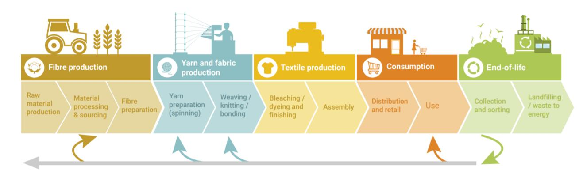

Figure 1: Textile value chain [1]

### **1.1.2 Industrial value chain**

The value chain does not only include the different process steps as described above, but also comprises the actors and stakeholders (in)directly involved. Concurrently, business models and the way products are designed, promoted, and offered to consumers are also part of it. These non-manufacturing activities impact the way textile products are produced and consumed (Programme, U. N. E., 2020).

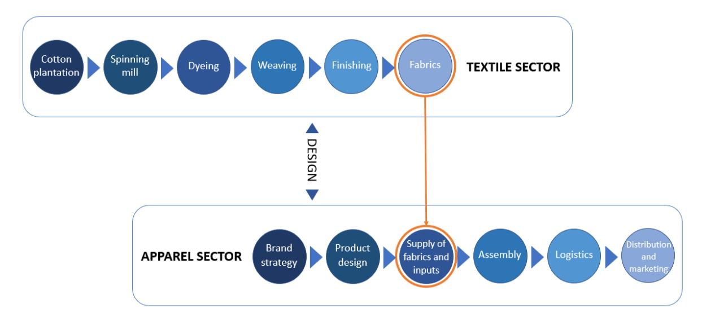

Figure 2: Industrial Value Chain (CIR, 2020)

- Six distinct value-adding activities are identified: (1) R&D, (2) design, (3) production, (4) logistics (purchasing and distribution), (5) marketing and branding, and (6) services (cf. Figure 2). The most important value-adding stages are intangible services (Duke UCGGC, 2011). R&D: All activities related to improving the physical product or process and market and consumer research.
- Design: Activities done on aesthetics, components, performance, production costs and to give the product a strong competitive advantage.
- Purchasing/Sourcing (Inbound): Includes the purchasing and transport of material and equipment as well as the flow management of components.
- Production/Assembly/CMT (cut-make-trim): All activities from the fabric to the finished garment.
- Distribution (Outbound): Via a network of wholesalers, agents, logistics firms, and other companies.
- Marketing and Sales: All activities and companies associated with pricing, selling, and distributing a product, including activities such as branding or advertising.
- Services: Any type of activity a firm or industry provides to its suppliers, buyers, or employees.

## **1.1.3 Evolution of material value through its lifecycle**

After (first) use, most clothing is landfilled or incinerated (see Figure 3). This represents a huge loss of material value, especially when clothes could still be reused or repurposed. In other cases, the discarded product was never sold in the first place due to over production. Globally, consumers throw out wearable clothing worth €410 billion each year (Programme, U. N. E. (2020).

A study by the Ellen MacArthur Foundation shows that only 13% of the fibre input for clothing is recycled with only 1% in a closed loop (Figure 3) which is the higher value for fibres. The economic loss is estimated to be worth over €90 billion (Ellen MacArthur Foundation, 2017). However, the report also highlights the lack of information and transparency in terms of what happens to textiles at end-of-life.

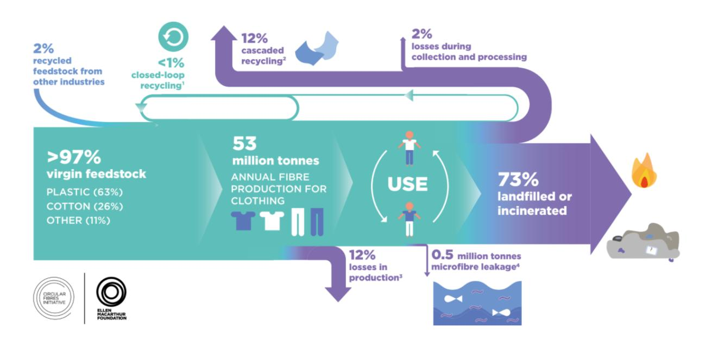

Figure 3: Textile Material Flows (Ellen MacArthur Foundation, 2017)

Re-use of clothing is always more beneficial than recycling as recycling processes require energy, water or chemicals and produce emissions. Nevertheless, recycling still has a lower environmental impact than incineration and landfilling (Sandin and Peters, 2018). Smaller recycling loops (e.g. reusing the fabric) are more environmentally beneficial than larger loops (e.g. reusing the fibres) as no unravelling and defibration needs to be done to make new yarn and fabric. Recycling back to fibre-level only avoids the production of raw materials. In some cases, the environmental impact of recycling back to fibre is not worth it due to its high energy inputs and chemical treatments. Whether recycling is the more sustainable option will depend on the recycling process used, as well as the fibre type for example: raw material production accounts for most of the environmental impact, which is the case for cotton, where the water footprint could be reduced by 90% if recycled fibres are used. Nonetheless, while fabric recycling can potentially mitigate more impacts than recycling back to fibre, fabric recycling may often be unfeasible due to the material being too worn out or the difficulty of finding a suitable end use (Roos et al., 2019).

Finally, the balance of impact between closed-loop and open-loop recycling is not always the same. It is highly dependent on the economic value of recycled textile materials in another industrial sector (Roos et al., 2019).

Even if the environmental benefit of extending the life of clothing is clear, it also has both a positive and negative socio-economic impact. As the collection of end-of-life clothes increased up to 39% in Europe in 2019 (Eionet Report - ETC/CE 2022/2), it has created business opportunities and employment in exporting and importing countries. However, it also has negative impacts putting local textile producers out of business and flooding landfill sites with waste textiles in countries that typically do not have the waste management facilities to deal with them (Leal Filho et al., 2019; Watson et al., 2016b; Wetengere, 2018).

## **1.1.4 Value chain dynamics**

The textile value chain is "buyer-driven" which means that most profits come from nonproduction activities like high-value research, design, sales, marketing, and financial services (cf. Figure 4). Retailers, designers and marketers act as strategic brokers in linking overseas factories and traders. An apparel company can decide how, when and where manufacturing will take place, and how much profit accrues at each stage (Gereffi & Frederick, 2010).

Two factors impact the competitiveness between brands: their volumes of production and their global network. This degrades the quality of processes for products and human beings. Developing countries are in constant competition for foreign investments and contracts with global brand owners, leaving many suppliers with little leverage in the chain. This results in an unequal distribution of value in favour of large brands. (Duke UCGGC, 2011).

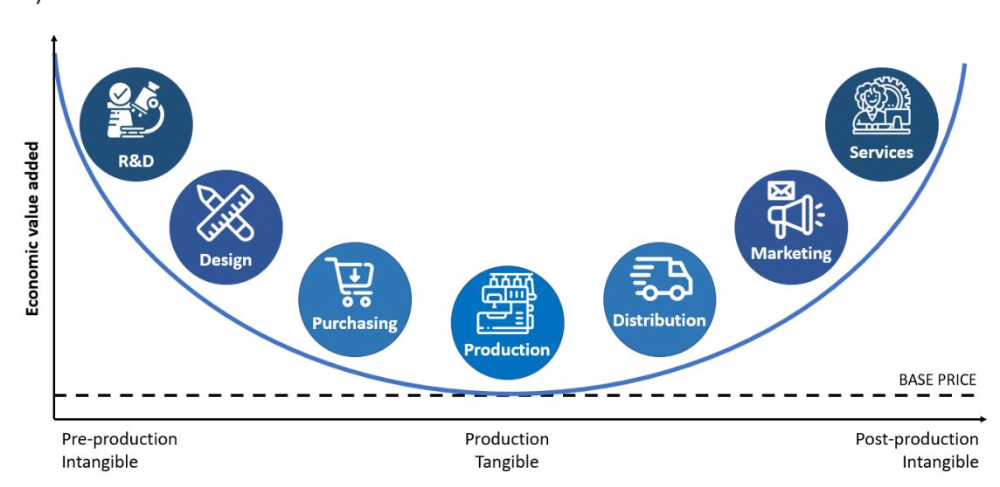

Figure 4: Curve of value added in the global garment value chain (CIR, 2020)

## **1.1.5 Breakdown of costs in a garment**

The distribution of value in a garment mostly depends on 2 criteria: the country of production and the brand's market position (from discounter to luxury brands). However, higher prices do not necessarily mean a better distribution of value between the stakeholders. Transparency in the breakdown of a garment's costs is needed for consumers to understand the selling price. Since the 2000s fast fashion has drastically reduced the price of garments by pressuring the price on suppliers and lowering quality (Ellen MacArthur Foundation (2017)).

Driven by greater awareness and concern, apparel companies are beginning to change their production processes, starting with relocating production (Clean Clothes Campaign (2021)). Figure 5 shows that a worker's wage only accounts for 0.6% of the final retail price of a T-shirt when it is produced in Asia, while this accounts for 29% when the production takes place in France.

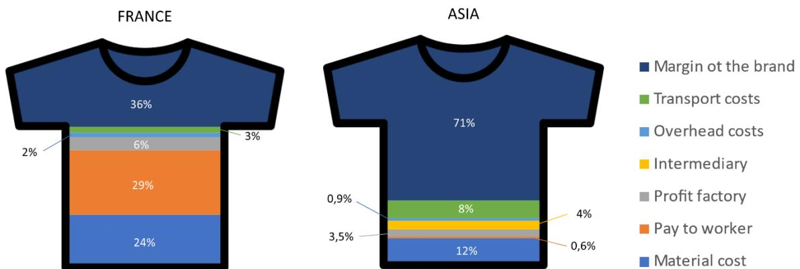

Figure 5 : Breakdown cost of a T-shirt (letshirtfrancais.fr, 2019)

# **1.2 Textile industry stakeholders**

## **1.2.1 Stakeholder mapping**

Every actor that provides or receives value from designing, making, distributing, retailing, or consuming a textile product is a stakeholder in the textile value chain. This also includes the supply of raw materials and end-of-life services. (Programme U.N.E, 2020).

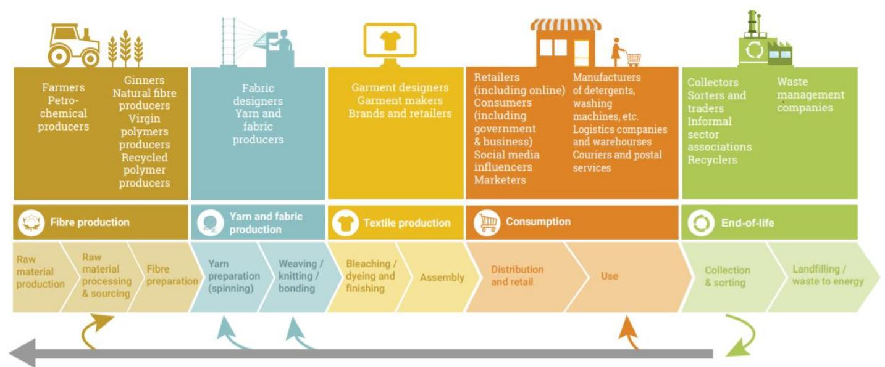

Figure 6: Stakeholders associated with the textile value chain (Programme, U. N. E., 2020).

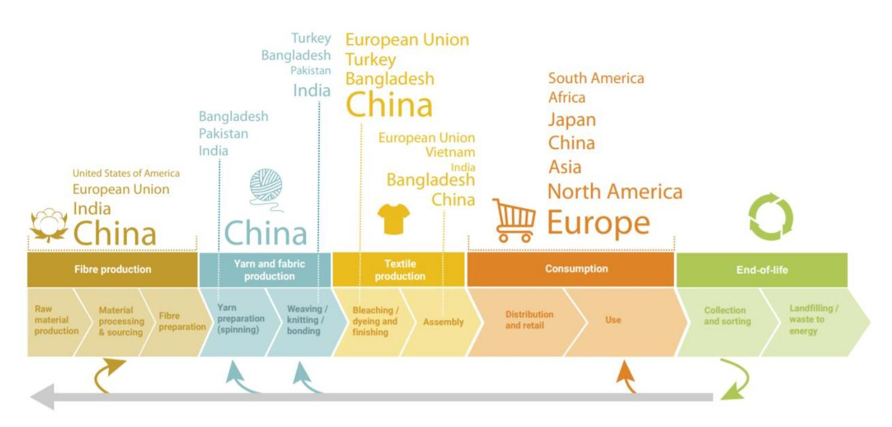

Figure 7: Location of stakeholders in the value chain (Programme, U. N. E., 2020).

Figure 6 lists the stakeholders that are involved in the textile value chain. Fibre production, as well as the yarn, fabric and textile production are all heavily weighted towards Asia (especially China) and towards developing/transitioning economies, as shown in Figure 7. Asia s share of activities decreases along the textile value chain as there is a slight increase in global diversity for dyeing and finishing activities, and a further slight increase for apparel production (although Asian countries still account for the majority). However, at the end of the value chain, consumption has a broad global diversity with Europe and North America as major players. (Programme, U. N. E., 2020).

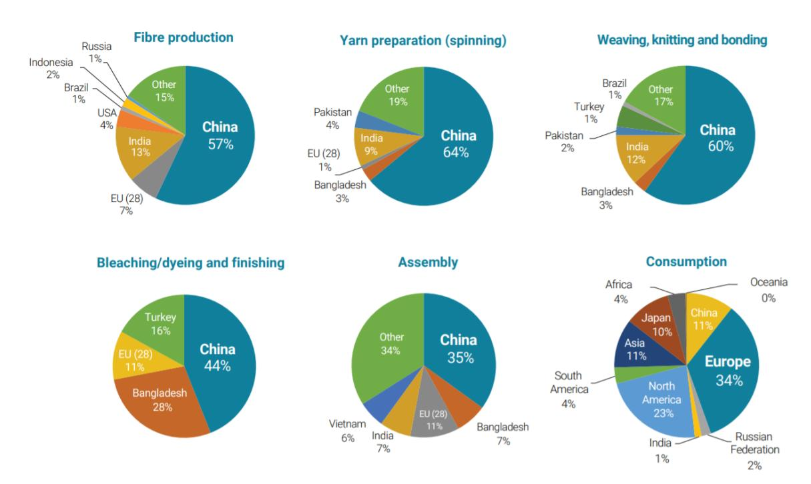

Figure 8: Geographical breakdown of global apparel production and consumption (Programme, U. N. E., 2020).

## **1.2.2 Business models**

A business model is often confused with terms like strategy, business concept, revenue model, economic model and business process modelling (DaSilva & Trkman, 2013). The lack of consensus on one widely accepted definition of business models within today s literature (Zott et al., 2011; Al-Debei & Avison, 2010) allow ambiguous interpretations and disparate conceptualisations.

Companies perpetually try to find innovative business models to perform differently, as well as maintain and strengthen their financial health. This evolution is particularly observed in the fashion industry (Lisa Gockeln, 2014).

Until now publications have released many business model definitions to capture the meaning, use and purpose of the concept. The main one is value based and explains the way companies create value.

A business model must not be seen in isolation. Its boundaries are much wider than only firm-specific, and similarly include exchanges and interactions with the stakeholders in its network (Zott et al., 2011; Zott & Amit, 2007, 2013). The success of a company can be determined by generating added value for all the associated stakeholder groups and not only its customers.

This business model considers the three components: **value creation**, **value delivery** and **value capture**, but it does not take into account other types of value like environmental or social value, although these notions are becoming increasingly important in the fashion industry's strategy formulations. Moreover, the customer s role in value creation is not included in the business model despite its importance in the analysis of its dynamics (Lisa Gockeln, 2014).

## **1.2.2.1 Fast fashion / Ultra-fast fashion / Slow fashion**

There are several differences between brands and fashion companies, in the way they distribute and sell their clothes, and the profile they want to make for themselves. There are several choices for business models and fashion brands and retailers are struggling to find the right on". (Rinnebach & Richter, 2014). While the majority of companies try to constantly adjust to the latest trends and develop their collection, other actors try to emphasise quality over quantity by striving for a more sustainable and long-lasting approach. This has emerged with two relatively new business models over the past years: fast fashion" and slow fashion".

Companies following the fast fashion business model are characterised by a quick response to the latest fashion trends. They need short production and lead times resulting in a high speed-to-market. Several well-established international fashion retailers have been successfully applying this model for years. The evolution of design and collections within several weeks requires customers to constantly review the latest fashion styles (Sanvt,2020).

Whereas fast fashion creates up to 20 collections a year distributed in a global net of stores, a quicker model has appeared: ultra-fast fashion. It relies on online stores, rather than building a physical presence and all its efforts are invested in further shortening design-tosales cycles (fourweekmba.com).

Slow fashion has appeared over the past few years and is growing even though it has not yet fully penetrated today s fashion market. It is a response to the fast fashion model, creating a more sustainable and ethical supply chain. It highlights longer product lifecycles and the use of local resources. Slow fashion expects the customer to have a conscious buying behaviour in an attempt to bring green thinking into the textile industry: paying more for having a long-life product with ecological and ethical production (Sanvt,2020).

## **1.2.2.2 Brand business model**

Another way of analysing the business model is through the connection created by the brand's value proposition and the target market. It can be described with 4 keys factors: value proposition, customer segmentation, communication and distribution channels and the degree of complexity of the firm's value chain (440industries.com, 2019).

The 6 leading fashion business models can be identified by their unique aspects:

#### **FASHION DESIGNERS**

This business model is mainly used in the top tiers of the fashion pyramid. It is based around a value proposition with an emphasis on prestige and exclusivity. It can be identified with distinctive elements:

- Dream factor and the role of the designer. To deliver the dream factor effect capable of associating aspirational values to a firm's products. Companies use fashion media to deliver a narrative capable of conveying intangible brand values.
- From contract manufacturing to forwarding integration. Designers will start controlling more in-depth the production pipeline by selecting licensees, or contracting manufacturers who will create products using the licensor's brand name (440industries.com, 2019).

#### **LUXURY BRANDS**

Fashion and luxury are often used as synonyms, but these two concepts stand for completely different sets of value associations. Luxury is connected to timelessness and exclusivity. We can look more in-depth at the 4 aspects of the luxury business model:

- **Value proposition:** Luxury brands represent proof of social status.
- **Customer segmentation:** The price point is uninfluential in the purchase decision. Luxury brands can 'commoditise' luxury by stretching their brand equity and applying their brand to other product categories, to leverage the dream factor effect on a much wider audience.
- **Communication:** Luxury companies revolve around a sense of heritage and tradition, which in many cases is over a century old. True luxury firms do not even advertise their products, but rather 'unveil' them to a selection of exclusive clients.
- **Distribution:** In luxury companies need to deliver a shopping experience capable of delivering the full potential of their brand narrative. Directly owned retail is not an option for luxury companies who need to create an environment capable of educating, informing and entertaining their customers (440industries.com, 2019).

#### **PREMIUM BRANDS**

More heterogeneous, this category relates to brands which are positioned in the medium to high price segment. In these brands, reputation is as important as the volumes and scales delivered by the manufacturing industry, as well as a large network of suppliers.

Brands with this business model need to provide good value for money, which is obtained through product specialisation and production optimisation. Their supply chain consists of two types of distributors: direct retailers and intermediary wholesalers.

Competition in this segment will, therefore, operate on a variety of levels:

- **Time to market advantage.** Premium brands are required to be responsive to faster fashion trends and will need to be able to manage their global value chain to maintain profitability and a fast time to market.
- **Extensive distribution.** Premium brands pursue industrial efficiencies, such as economies of scale and economies of scope. As a result, their distribution strategies are oriented towards obtaining the maximum possible coverage. This can be done with owned self-standing stores, although it can also be achieved by creating extensive wholesale distribution through partnerships with trade customers and intermediaries.
- **Communication and advertising.** In an inflated and saturated market like the one belonging to premium brands, companies need to develop effective marketing plans to acquire and maintain their market share (440industries.com, 2019).

#### **FAST VERTICAL RETAILERS**

This business model is dedicated to global firms in the fashion market. They create a flow of fashionable merchandise channeled through an extensive distribution network consisting of stores located in prime locations. Their stores are welcoming with low prices while achieving a high level of profitability. The scale and power of these brands allow them to generate margins which would normally pertain to both the fashion producer and fashion retailer. Fast fashion retailers are capable of restocking inventory every 6 weeks.

Other relevant characteristics of vertical retailers include:

- The complete control of the value chain
- The creation of a standardised store concept, where all items are sold under the company brand
- The ability to respond in a timely manner to fashion trends
- The minimisation of sales risks due to efficient value chain management (440industries.com, 2019).

#### **FASHION CONGLOMERATES**

This business model consists of acquiring promising brands and designer workshops to grow. This strategy turns fashion companies into conglomerates, managing a wide portfolio of business models and brands. The variety of brands enables them to be positioned on diversified markets.

The benefits of this model for an acquired brand entails the opportunity to access:

- Capital and find long-term financial stability
- Quality management and high-level managerial consulting
- Worldwide distribution
- A stronger contractual position in relation to suppliers (440industries.com, 2019).

## **1.3 Production processes**

This section aims to provide a state of the art of the different production processes required to obtain garments from fibres.

## **1.3.1 Fibre production**

Fibres form the basis of the entire textile production processes. Their nature and quality therefore directly impact the yarn's properties, and therefore those of both fabrics and garments. Four main fibre categories can be distinguished:

- **Plant fibres,** consisting of cellulosic material. Plant fibres are usually derived from cotton, linen, bamboo or hemp through their stem, leaf or seed-hair, but any other plants with extractable cellulose can be used. Due to the increased interest in sustainable fibre sources, a growing number of papers analyse the properties and environmental impact of fibres sourced from diverse plants (Sallehv, KM. (2021), Thangadurai, D. et al (2020), Baley, C. et al (2021), Adamu, BF (2021)).
- **Animal fibres,** consisting of proteins. The most common animal fibres used are wool and silk. Contrary to silk, wool can be extracted from a number of various animals: sheep, goats, alpaca and rabbits. The wool fibres are first sheared from the animals and then treated with chemicals during the scouring and washing process (Chemsec, 2021). Due to the presence of protein, they offer unique biological and physical properties, such as noteworthy mechanical properties, strong bicompatibility, and tunable biodegradation (Guo, C. (2021)).
- **Man-made fibres,** consisting of cellulosic raw material, usually from wood pulp. Examples of such fibres can be viscose and lyocell (Parajuli, P. et al. (2021)). Their production is highly chemical-intensive and involves the use of several hazardous substances (Chemsec, 2021, Majumdar, D. et al (2022)).
- **Synthetic fibres,** consisting of monomers sourced from fossil oil feedstocks, that are then polymerised into different fibres. As a synthetic feedstock can yield various monomers, there are numerous possible combinations of polymers. The most common synthetic fibre used is polyester, followed by polyamide, polyacrylic and aramide (Chemsec, 2021). As the production of synthetic fibres relies on nonrenewable resources, studies have been carried out to characterise and compare their environmental impact (European Environment Agency (2021)., Al-Maharmaet, AY. al. (2022)).

## **1.3.2 Yarn production**

Yarn is produced from the interlacing of the fibres, which can be achieved through various methods. The type of fibres and the yarn production technique used impact the properties of yarn, such as uniformity, strength and extensibility, influencing the texture, appearance, and performance of the finished fabric.

The choice of spinning method depends on the type and length of the fibres used and the required yarn properties. Several resources provide insights into yarn classification and its characteristics (Encylopedia Britannica (2021), Alagirusamy, R. et al. (2015)), as well as a comparison of the properties of yarn and its performance characteristics (Singh, R. (2021), Elmogahzy, Y (2019).).

#### **Spinning process**

After harvesting or producing fibres, these go through a spinning process where they are spun into a yarn. The main spinning techniques are ring spinning, open-end spinning, extrusion spinning and also friction and air-jet spinning:

#### • Ring spinning

Ring spinning, or conventional spinning, uses a series of machine to spin the fibre into a continuous yarn (Alagirusamy, R. et al. (2015)). The process steps include opening, carding, combing, roving, and then ring spinning (cf Figure 10).

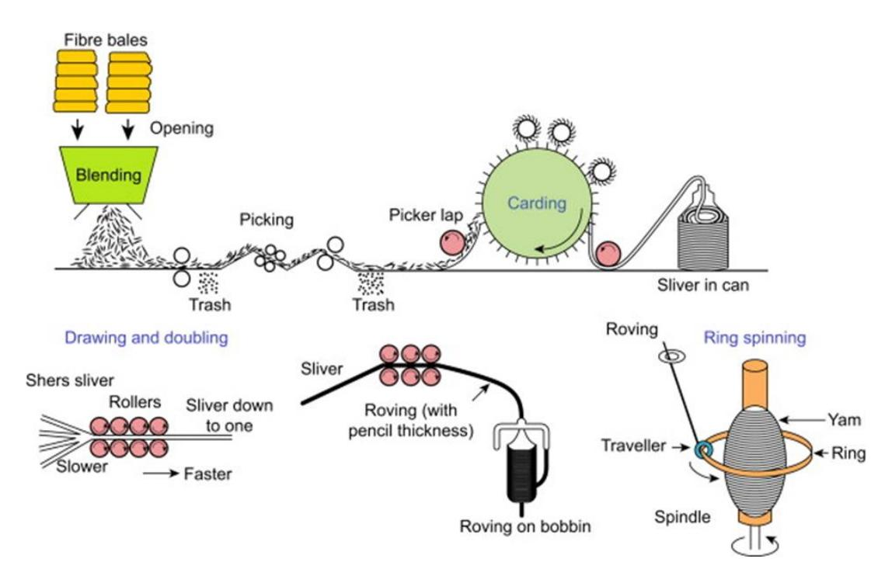

Figure 10 – Ring-spinning process flow (R. Alagirusamy et al. (2015)).

Ring spinning allows the yarn to have excellent tensile strength and evenness, and is suitable for the majority of fibre types, such as cotton, wool, flax, rayon and synthetic fibres. However, the process includes a higher number of steps than other spinning methods, and breakages of fibres and yarn can be caused respectively by the traveller s high speed and yarn air friction (Textile Adviser (2020), Tausif, M. et al. (2018)).

#### • Open end spinning

While ring spinning continues to play a role in the textile industry, open-end spinning is becoming more widespread thanks to its processing speed. Indeed, open-end spinning uses centrifugal force rather than a spindle to produce the yarn, feeding the fibres into a rotating turbine, eliminating the need for roving. Open-end spinning does not hold special materials restriction and is usually used for short and medium-length fibres. However, there is less parallelly aligned in open-air spinning than other spinning techniques and it can therefore yield yarn that is rather coarse (Swicofil (2022), Tausif, M. et al. (2018)).

#### • Extrusion spinning

Extrusion spinning, also known as melt spinning, is a spinning technique for synthetic fibres where a spinneret is used to extrude polymer. The polymer is usually fed into the spinneret in pellet forms to allow for the polymer to melt evenly. The polymer then solidifies once pressed through the spinning machine in a yarn shape (Elmogahzy (2019), Y.).

Due to the variety of materials that can be processed using this technique, extrusion spinning can be used to develop smart and technical textiles (Marriam, I. et al (2021), Marischal, L. et al. (2018)).

#### • Other spinning techniques

Other spinning systems, such as Air Jet and Vortex, use compressed air currents to stabilise the yarn. In such systems, the yarn is stabilised by the use of compressed air currents. These spinning techniques address limitations linked to the mechanical twisting of the fibres that occur in both ring and open-end spinning techniques, and do not require any roving stage either (Paldiya, B. (2021)).

## **1.3.3 Fabric production**

The production of fabrics consists of arranging fibres using various methods to create the required texture, appearance, durability, and strength. These methods include mainly weaving, knitting, and non-woven fabric production.

#### **Weaving process**

Fabric weaving consists of interlacing two yarn components (warp and weft). A wide variety of fabric constructions can be achieved by varying the interlacing. The machinery used for this process is a loom, which requires a preparation stage to thread the yarns into the elements of the machine.

The actual weaving process includes four primary motions of the loom (cf [Figure 9](#page--1-59) – Loom [structure \(](#page--1-59)textilelearners.com, 2018):

- 1. Shedding: the warp yarns are raised and lowered, while the weft yarn passes through the opening between the warp yarns;
- 2. Picking: the weft yarns are inserted by the shuttle through the shed;
- 3. Beating up: the weft yarn is packed into the cloth so as to make it compact;
- 4. Taking up: newly formed cloth is wound onto the cloth beam.

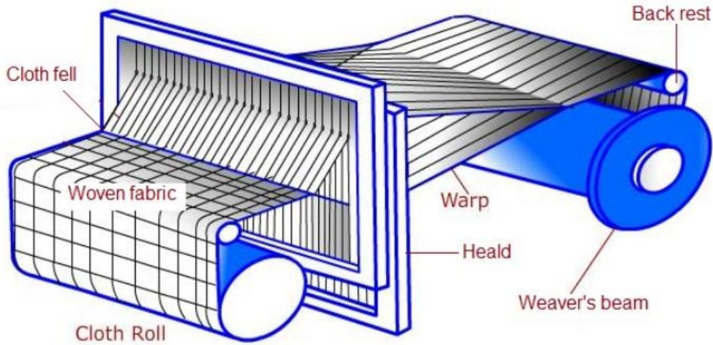

Figure 9 – Loom structure (textilelearners.com, 2018).

The weaving process is a source of material waste with the trimming of the selvedge required to keep the fabric tense

During the weaving process on a full-width loom, the fabric needs to be kept tense so as to allow the weft yarns to be cut, requiring a longer selvedge. One of the waste-reducing innovations in this area is the Selvedge Saver, which allows for that extra selvedge to be reduced significantly while a vacuum system enables the fabric to be maintained at a certain tension. This innovation can save up to 967kg of cotton yarn per machine per year according to Sourcingjournal.com (2019).

#### **Knitting process**

Knitted fabrics have different properties from woven fabric, notably elasticity, smoother and tighter fitting, and resistance to wrinkles, which makes them ideal for home furnishing and upholstery uses.

While the weaving process consists of interlacing the yarn, the knitting process consists of twisting and bending the yarn to form symmetrical stitches, also called loops.

The knitting process can take two forms: weft knitting, using one long strand of yarn to run across the fabric, and warp knitting, involving multiple yarns forming wales running in the vertical direction of the fabric.

Innovations are beginning to emerge in the field of automated knitting processes in the form of printers, enabling production-on-demand and reducing production waste. Companies such as [3DTex](http://3d-tex.fr/index.php/3d-tex-services/) and [Kniterate](https://www.kniterate.com/) offer printing solutions to automatically knit a product from a computer design. 3DTex currently produces seamless sweaters via their knitting printer, while Kniterate offers 2D printers for small fashion businesses, workshops and schools.

#### **Non-woven process**

In addition to the weaving and knitting processes, fabrics can also be produced by interlocking and bonding the yarn fibres using other processes like chemical means, solvents, thermal actions and mechanical methods (Fashion-manufacturing.com, 2020).

There are two types of non-woven process:

- 1. Staple Non-Woven, where fibres are spun and cut into small pieces, that are then packed into bales. Through the carding process, these bales can then be spread uniformly over a conveyor belt, where the fibres are then bound together using resin or a thermal action.
- 2. Spun Laid Non-woven, where the fibres are spun and spread to a web in a direct manner by air streams or deflectors. Resin or thermal actions are also used for spun laid fabrics.

The large variety of different techniques and materials that can be applied in the field of non-woven production fosters many innovations in the production process stages, feeding materials, and textile functionalities (Textile World (2021)).

#### **Dyeing, printing, and finishing process**

Fabrics then go through a dying or printing process, to provide colour and prints to the fabrics, followed by finishing processes to change the appearance of the fabric according to the customer's specification.

Although the dyeing process is mentioned in this section, dyeing can be performed at any stage of the textile manufacturing process. Textiles can indeed be dyed as fibre, yarn, fabric, or garments. The most efficient stage at which the dyeing process will be performed is dictated by the intended end use, the cost to the manufacturer, the resources available, the desired appearance and other requirements.

The dyeing process requires the use of dyes, which are molecules that absorb and reflect light at specific wavelengths to provide the human eye with a sense of colour. Dyes can be divided into two main categories: natural, extracted from natural resources such as animals, minerals, or plants, and synthetic dyes, obtained through the synthesis of chemicals, some of them containing metals. [Table 1](#page--1-0) summarises the different types of dyes according to their characteristics and suitability (Mahapatra, N. (2019)).

Table 1: Description of the different dye types (Mahapatra, N. (2019))

| Dye type      | Characteristics Suitability                                        |
|---------------|--------------------------------------------------------------------|
|               | + Mainly used for acrylic fibres, and                              |
|               | by washing, perspiration or light.                                 |
|               | Do not necessitate a mordant + Used for cotton, silk, wool, nylon, |
|               | Poor durability when exposed to                                    |
| Vat Dyes      | Water insoluble, cannot dye fibres                                 |
|               | Used with mordents for wool,                                       |
|               | polyesters, nylon, acrylics, and mod                               |
| Reactive Dyes | Applied from an alkaline solution or                               |
| neutral       | solutions followed by                                              |
| obtained      | through heat treatment.                                            |
| Washing       | is performed to remove                                             |
| Disperse Dyes | Water insoluble. Finely ground as a                                |
| paste         | or powder, which then                                              |
|               | Originally developed for cellulose                                 |
| Sulphur Dyes  | Made soluble with sodium sulphide                                  |
| quantity      | of sold. Desired shades                                            |
|               | Robust to light, washing and                                       |
| Pigment Dyes  | Not properly “dyes” but are affixed to                             |
| fabric        | using resins and high                                              |

These dyes are applied onto the product using many various different methods. Table 2 summarises the main dyeing methods used depending on the manufacturing stage at which dyeing is performed.

Table 2: Description of the main dyeing methods

| Dyeing               |                                                                                                                                           |
|----------------------|-------------------------------------------------------------------------------------------------------------------------------------------|
| method Stage         | Process characteristics                                                                                                                   |
| Fibres               | Loose, unspun fibres are placed in a dye bath, which is then heated.                                                                      |
| Fibres               | Fibres are placed in large vats, where the dye liquor is forced through the mass at high temperatures.                                    |
| Yarn dyeing Yarn     | There are 4 main forms of yarn dyeing, allowing the dyes to penetrate the fibres in the core of the yarn:                                 |
| 1.                   | Skein / Hank Dyeing, where loosely wound skeins/hanks are immersed into dye vats.                                                         |
| 2.                   | Package Dyeing, where the yarn is wound on a perforated spool, varies regularly.                                                          |
| 3.                   | Warp-beam Dyeing, similar to package dyeing, used for yarns the weaving loom.                                                             |
| 4.                   | Space Dyeing, where yarns are dyes intermittently, running at                                                                             |
|                      | high speed through spaced dyebaths, subjected to shock waves resulted by compressed air. Used to create checks, plaids, stripes patterns. |
| Direct dyeing Fabric | Dyes are applied directly, without affixing agent, after fermentation, dyes.                                                              |
| Piece dyeing Cloth / |                                                                                                                                           |
| 1.                   | Beck dyeing, where a winch is used to move the fabric piece through a dye liquor.                                                         |
| 2.                   | Jet dyeing, where a venturi jet system is used to impinge the dye on the moving fabric.                                                   |
| 3.                   | Jig dyeing, where a fabric piece is moved back and forth through a dye bath.                                                              |
| 4.                   | Continuous range dyeing, where the fabric piece is continuously                                                                           |
| Garment              | The entire garment is placed in a dye bath. Dye penetration varies seams, zippers, and buttons.                                           |

While the different dyeing methods are not all equal, the dyeing process generally requires a lot of non-renewable resources and generates various waste streams (cf. section 3.1 for more details).

## **1.3.4 Garment Manufacturing**

Garment manufacturing can be structured around three main stages: the preproduction stage, which includes sample development, sourcing, and production schedule, the production stage, which include several sequential stages such as laying, marking, cutting, stitching, checking, finishing, pressing and packaging, and the post-processing stage, which includes pressing inspection, folding, and packing for shipping (Textile Value Chain (2020), Textile World (2020)).

The scope of this state-of-the-art will focus on the production stage, which involves various process steps. These process steps are mainly performed manually or through manuallyoperated industrial machines. Innovative technologies are however coming into play that leverage digitalisation and smart automation to increase productivity and decrease reliance on a diminishing workforce while participating in relocation efforts.

#### **Cutting**

The cutting stage is critical in the overall production cost. Indeed, minimising fabric waste in the cutting stage leads to maximising the fabric yield, which has a significant impact on the costing sheet as fabric represents between 50% and 70% of the total garment cost (Vilumsone-Nemes, I. (2018), Omotoso M. (2018)). The laying of the patterns on the fabric sheets is therefore critical and several companies such as [Lectra](http://www.lectra.com/en/) or [Optitex,](https://optitex.com/products/2d-and-3d-cad-software/) provide software which automates the placement of patterns for optimum fabric yield.

The cutting operation itself can be carried out by using different cutting tools and different cutting systems with various levels of automation, from manually-operated scissors for nonbulk production, to semi-automatic machines and fully computerised and automatic cutting machines. Table 1 presents the different cutting tools for each level of automation (CarnegieTextile (2020)).

Table 3 - Cutting tools for each 3 levels of automation (CarnegieTextile (2020))

| Automation                                      |                                                                                         |
|-------------------------------------------------|-----------------------------------------------------------------------------------------|
| level Cutting tools                             |                                                                                         |
| Manual Hand Operated Scissor                    | Adapted for every fabric type; Only for single or double plies;                         |
|                                                 | Time-consuming, not for bulk production.                                                |
| Straight Knife Semi automatic Machine machines | Cutting Most versatile and popular; Can cut a high number plies; High production speed. |
| Round Knife Cutting Machine                     | Used for small production; Small and flexible.                                          |
| Band Knife Cutting Machine                      | High quality cutting;                                                                   |
|                                                 | Can automatically adjust the the material height.                                       |
| Die Cutting Machine                             | Used to cut small & particular shapes.                                                  |

| Notcher Machine           | Used to cut small & consistent notches  |
|---------------------------|-----------------------------------------|
|                           | Cannot be used on thermoplastics        |
| Drill Machine             | Used to cut holes for marking;          |
| / automatic               |                                         |
| Computer Controlled       | Knife                                   |
|                           | Suitable for large scale production ;   |
|                           | No need for markers ;                   |
| Laser Cutting Machine     | High accuracy and high speed;           |
| Water Jet Cutting Machine | High accuracy and high speed;           |
|                           | High consumption of water and           |
| Rib Cutting Machine       | Specifically for cutting ribs or strips |
| Plasma Torch              | Cutting                                 |

#### **Sewing**

The sewing stage represents between 35% and 40% of the total garment cost (Gries, T. and Lutz, V. (2018)) and is very dependent on highly skilled labour. Indeed, the sewing operation requires a high level of precision and skills that are usually difficult to automate as fabrics are soft materials that are variable in structure, form, composition, size of fabrics, which in turn makes the stitching not fully repeatable. The level of quality often required in the fashion industry can therefore only be achieved by a trained professional (FDM4 (2021)).

Production costs have traditionally been lowered by relocating production facilities in lower wages countries. However, market conditions are changing as skilled labour is diminishing, labour costs in developing countries are increasing, and production agility is increasingly needed to respond to fast changing trends. These changes in market conditions are therefore forcing a paradigm shift and leading to an increasing need for automation.

Several sewing process steps are being automated through task-specific machines, such as buttonhole machines, which can reduce labour time by 40% on pieces that include buttonholes (P. Kavilanz (2017)), or automatic bobbin exchanger machines, such as the one proposed by RSG [Automation,](https://www.rsg-automation.com/en/monitoring-concepts/bobbin-exchanger.html) to take over the non-value added manual task of switching between bobbins when empty. Other examples of task-specific automated machines can be found in Textile World s article on automated cutting & sewing developments (Textile World (2020)).

The complexity of automating the sewing stage is highly dependent on the geometry of sewing trajectories. Indeed, the main challenge in automating the sewing operation is the deformability of fabrics, which are soft materials, and therefore does not allow for repeatability in shape and positions. For example, the stitching of two layers of textiles fixed in frames is more easily automated than the stitching of loose fabric pieces with different contours.

Automated solutions exist for the stitching of planar fabric pieces such the ones involved in blanket, towel, sheet, carpet and quilt manufacturing. The position and tension of the fabric is controlled by clamping the fabric into holders. The sewing head can then move within the horizontal plane and stitch the pieces together (Textile World (2020)).

When the fabric pieces are too small and/or too diverse, such automated systems are not appropriate for accurate and fast stitching. Current developments have been able to overcome the challenge of deformability by stiffening the material via water-soluble solutions. This in turn enables the fabric to be automatically guided through the sewing machine. SoftWear Automation's [Sewbots](https://softwearautomation.com/sewbots/) is an example of such concept where robot arms are equipped with vacuum grippers that are able to sew t-shirts by stiffening the fabric (Kochar, S. (2020)).

The rise of machine learning and its application in the field of robotics allows a level of adaptation and learning through experience that could contribute to the development of highly dexterous and flexible automated sewing machines. Furthermore, the capabilities offered by Industry 4.0 technologies in the fields of interoperability and connectivity are providing key opportunities for the development of fully agile manufacturing processes, from the design to the production stage. The digitisation of processes and the implementation of smart platforms for the optimisation of resources based on real-time data are indeed key for the deployment of on-demand production, where manufacturing orders are triggered when a customised order is received (Jain, V. et al. (2021), Xu, Y. et al. (2020), Mostafiz, I. et al. (2022), Geršak, J. (2022), Sparleanu, C. (2021)).

## **1.4 Textile waste treatment**

The current linear system of textile and clothing production and consumption (fast fashion) leads to enormous quantities of textile waste, because clothes are discarded after being worn for a relatively short time. There is also the issue of overproduction; only 30% of the clothing produced today is sold at the recommended retail price, another 30% goes to sales and 40% remains unsold or even fails to reach the shops (Koszewska, M., 2018). In 2016, in Europe, the **average textile waste production per person was around 5.5kg. In Belgium this figure was 14.8 kg** (Statista, 2021).

Textile waste can be divided as per its source into three main types:

- 1. **Post-industrial waste** a side-effect of clothing manufacture (offcuts, stocks).
- 2. **Pre-consumer waste** inferior quality garments at the manufacturing site or a retailer's distribution centre, unsold merchandise at the retail store.
- 3. **Post-consumer waste** generated by consumers themselves: worn out, damaged or unwanted clothing.

To minimise the production of post-industrial and pre-consumer waste, manufacturers are working on the reuse of off-cuts and better management of their raw material stocks and their production of garments.

Post-consumer waste management is a challenge not only for consumers but also for communities and brands. Local authorities and collectors are working to set up different types of collection: at home, via waste collection or in collection containers. Brands are also setting up in-store collections to recover used clothes and create a second-hand service or reuse these clothes as raw materials for their products. Figure 11 gives the quantity of used textiles collected per country, expressed as a percentage of new textiles placed on the market. In most Western European countries, **only 30-50% of discarded textiles from households is collected** except for Denmark with a percentage of textile collected of 73% (European Topic Centre Waste and Materials in a Green Economy, 2019).

| Country            | Percentage of |
|--------------------|---------------|
| Denmark (2013)     | 75%           |
| Germany (2010)     | 44%           |
| France (2016)      | 36%           |
| Italy (2015)       | 11%           |
| Netherlands (2012) | 37%           |
| Sweden (2013)      | 19%           |
| UK (2010)          | 31%           |

Figure 10: Percentage of textile collected by country (European Topic Centre Waste and Materials in a Green Economy, 2019)

Most of the used clothing and textile products collected can still fulfil their original function: **40% to 60% are then sold as second hand**. The remainder (15%) is cut into smaller pieces and recycled as **cleaning aids. 15% to 20%** is **recycled** to create raw materials for the textile industry or other industries. Finally, around **10% is used to produce energy and** the rest are unusable material (CEE Group, 2021).

# **2 Economic situation**

The textile industry is an ever-evolving industry whose market is highly dependent on raw material costs and consumer trends. This section aims to explore the economic situation of the production of textiles, their import & export, as well as the different impacts the COVID-19 health crisis has had (so far) on the fashion industry, and the different trends currently influencing the consumption of textiles.

NB. The main focus of this section is on the economic situation in **Europe.**

## **2.1 Economic situation overview**

## **2.1.1Market overview**

The textile industry has expanded into a **€917 billion industry globally**, including clothing as well as furniture and mattress material, linen, drapery, cleaning materials, leisure equipment, and many other items. There are over **80 billion garments** produced annually in the world while consumers keep their garments on average for about half as long as 15 years ago (CBI, 2021).

The current textile value chain, from the extraction of raw materials to the production, transportation, consumption and disposal of garments, is highly linear and covers a vast geographical footprint. Producers and consumers, that can be counted in millions and billions respectively, are spread all across the world. Within that value chain, the European Union mostly acts as an importer of textiles, mainly from Asia, but also as an **exporter of more than 30 %** of the world's textile market. According to EURATEX (2021) estimates, the **turnover of the textile and clothing industry in the EU-27 is €162 billion**. Investments amount to €5 billion, which represents an increase of 2.7% compared to 2018. Though the number of companies slightly decreased to 160,000, EU external trade continues to be dynamic and to grow each year. In 2019, the T&C industry exported €61 billion in products, an increase of 4.8%.

## **2.1.2 Production**

Textile production plays a central role in the economy of many European regions and more globally in the whole European manufacturing industry. Overall textile production in the EU in 2017 was **3 million tons**, including 27 % fibres, 36 % yarn and 37 % woven fabrics (European Environment Agency, 2019). On a global scale, the production of textile fibres has **almost tripled** since 1975 (Ellen MacArthur Foundation, 2017) and about **60 % of textile fibres** produced are **synthetic polymers**, while **37 %** is dominated by **cotton** (Sandin. G et al., 2018). The annual production worldwide has doubled since 2000, exceeding 100 billion items in 2014, representing almost 14 new items of clothing per person (McKinsey, 2016).

European producers are global leaders in technical/industrial textiles and non wovens, such as industrial filters, hygiene products, products for the automotive and medical sectors, as well as in high quality garment design and production (European Environment Agency, 2019). The largest producing countries for the European clothing industry are in **Central and Eastern Europe** (Albania, Bosnia and Herzegovina, Bulgaria, Croatia, Georgia, Hungary, Moldova, North Macedonia, Romania, Slovakia, Turkey and Ukraine) (Lunginbühl.C. et al., 2014).

## **2.1.3 Import/Export**

The value of imported textiles in European clothing consumption increased by **9 % between 2014 and 2018**. In 2018, the **net import** of textiles into the EU reached **8.8 million tons,** with 14.5 million tons imported at a value of €139 billion, whereas exports reached 5.7 million tons at a value of €61 billion. The overall export volume includes about **26% of worn garments**, representing **1.5 million tons**, or 3 kg per person worldwide, representing a value of €1.3 billion. Stocks built up explain the difference final consumption and total import and production (cf. Figure 13)(European Environment Agency, 2019).

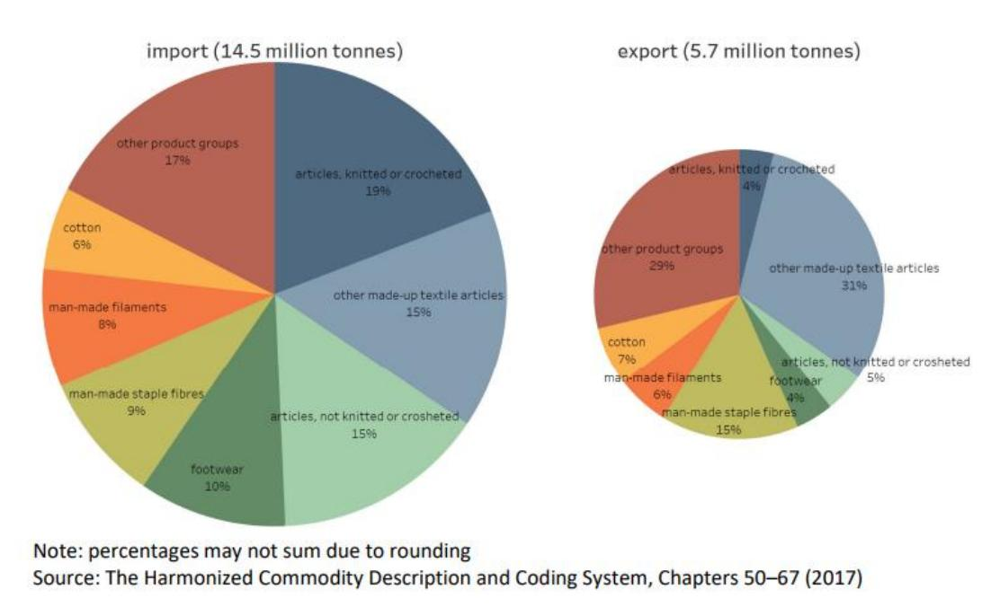

Figure 11 - Import into and export from the EU by product type, including textile fibres, fabrics (European Environment Agency, 2019).

There are differences in the types of products that the EU imports and exports: while imported textiles are mainly **finished textile products**, exported textiles are typically **intermediate products** in which the EU industry specialises, such as fibres, non woven, technical textiles, and high-quality fabrics (see Figure 13) (European Environment Agency, 2019).

Only **10 countries** are responsible for **85 % of the total quantity** of textile imports into the EU (see Figure 14). The main importer into the EU is China**,** with 37 % of the total quantity, followed by Turkey, with 11%, Bangladesh with 10%, and India with 9%. The export volume is more divided across the globe: the 10 largest receivers of EU textiles account for 55 % of the total exports by volume. The country where the EU exports the largest volume is China, with 10 % of exports, Turkey, with 9 %, the United States with 8%, followed by Pakistan with 5 % (European Environment Agency, 2019).

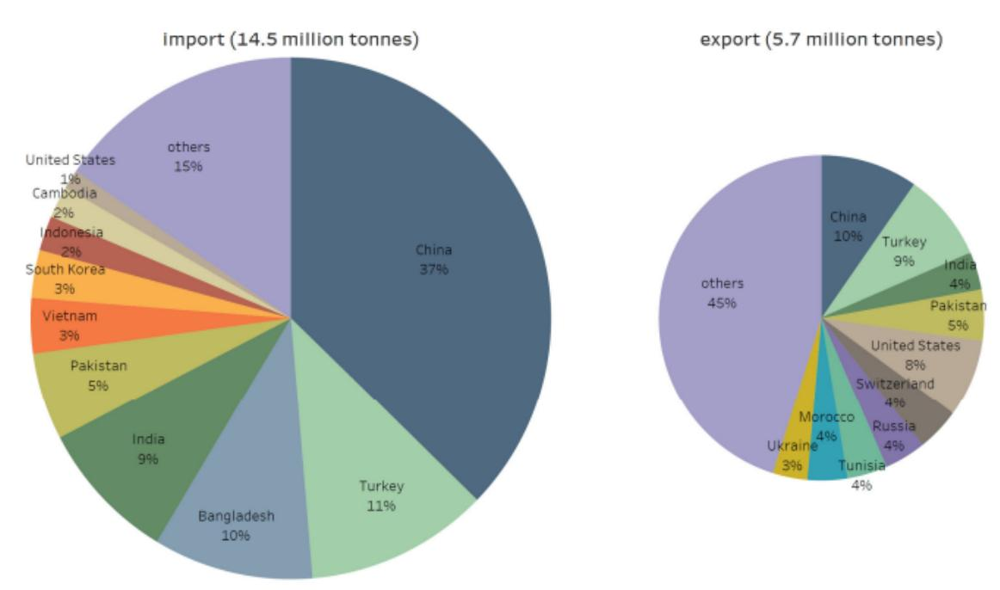

Source: The Harmonized Commodity Description and Coding System, Chapters 50–67 (2017)Figure 12 - Import into and export from the EU by country, 2018, per cent (European Environment Agency, 2019).

## **2.1.4 Impact of COVID-19**

The COVID-19 crisis had a significant impact on the global Textile and Apparel Sector on several levels:

#### **Impact on trade**

- In the first quarter of 2020, the pandemic led to a **3% drop in global trade values** (UNCTAD, 2020) while retail sales saw a drop of **around 11%** between 2019 and 2020, which can be explained mainly by massive disturbances in global supply chain networks due to the trade restrictions and lockdowns put in place. For the fashion, apparel and luxury goods sector, a best-case scenario estimates a 15-20% drop, while a downturn scenario estimates up to a 30% decrease (Gherzi, 2020). According to EURATEX (Euratex, 2021), the estimated impact of the COVID crisis on turnover in 2020 in Europe for the T&C industry is € -50 billion.

#### **Impact on manufacturing**

- Due to lower demand, brands and retailers cancelled orders, leading to a reduction in labour by several manufacturers. For example, in the first half of 2020 Bangladesh reported over 1 million jobs lost. These cancellations led to a drop in cotton prices during the first semester of 2020, but have since recovered to pre-COVID levels. While demand is expected to be lower in 2021 than in pre-COVID years, production is projected to increase. On the other hand, while the lockdown in China led to the expectation of a shortage and therefore a price increase of polyester, a slight decrease in price has actually been seen, which could be explained by a faster recovery than estimated by Chinese manufacturers. Globally, textile machinery manufacturers have reported major sales decreases. The Italian Textile Machinery Manufacturers Association, for example, reported a 44% drop in sales of machinery overseas and 62% locally (Gherzi, 2020).
- The COVID-19 crisis also led to an increase in demand for personnel protective equipment (PPE), such as face masks and full body cover kits, which allowed the textile industry to generate some revenue.

#### **Impact on buying habits**

- In addition to lower demand for textile products, the COVID-19 crisis has led to a shift in consumers buying habits, notably in the type of garments purchased, with a gain of popularity for basic products rather than fashion products, and in the buying platform, with a notable shift towards online retail (more details in section [2.2.2.1\)](#page--1-22). The shift towards more basic products can be explained by the WFH work arrangement, heavily democratised during the pandemic, leading consumers to prefer lounge-wear, home-wear and active-wear to formal-wear (more details in section [2.2.2.3\)](#page--1-24). This shift in product types and selling platforms will impact choices of fabrics, inventory and purchasing cycles (Gherzi, 2020).

## **2.2 Consumption trends**

## **2.2.1 Textile consumption in Europe**

### **2.2.1.1 Market overview**

Textile production and consumption are continuously increasing. In 2017, the estimated amount of textile products consumed by Europeans was around 26 kg per person (cf. Figure 15). Various estimates have been provided by different studies, ranging from 9 to 27 kg per person, depending on the source of the data and scope of the product, with an earlier estimate from the European Commission's Joint Research Centre (JRC) at 19.1 kg of clothing and household textiles per person (European Environment Agency, 2019). In 2018 Europeans spent on average €600 per year for their clothes representing overall spending worth €264 billion on clothing items in EU-27.

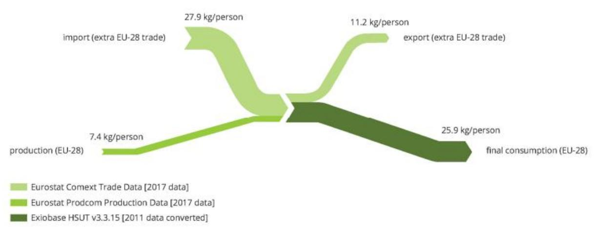

Figure 13 - Overview of the import, export, production, and consumption flows of textile (European Environment Agency, 2019).

According to the European Environment Agency (EEA) the amount of clothes bought per person in the EU has **increased by 40% since 1996**, driven by a fall in prices and the increased speed with which fashion is delivered to consumers (European Parliament, 2020).

The increase in clothing consumption has been driven by a combination of factors, which include low-cost and fast-fashion trends and the corresponding decrease of clothing prices, as well as consumers' increasing affluence, further trade liberalisation and technological advancement. Furthermore, consumption is now increasingly seen as a gratification action rather than a function of meeting the needs of the consumer, leading to a general trend towards a more **consumerist mindset** (European Parliament, 2020).

Over the last few years, companies have increasingly invested in streamlining and optimising their supply chain operations, cutting production costs by deploying fragmented, low tech production systems and by using **cheaper, low**Ǧ**quality materials** (McKinsey, 2016). The globalisation and industrialisation of the clothing and textile industry, as well as the pressure to maintain and/or gain market competitiveness have led to **lower and more affordable consumer prices** (Koszewska. M, 2018) – for example clothing prices in the EU dropped by **more than 30 %** relative to the total harmonised index of consumer prices inflation between 1996 and 2018 (cf. Figure 15) (European Parliament, 2020).

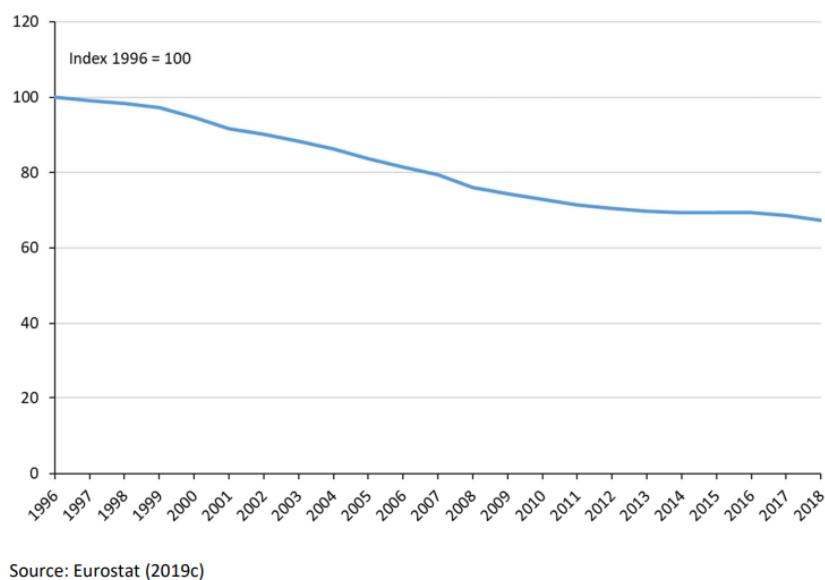

Figure 14 - Consumer price indices for clothing relative to HICP inflation in the EU, 1996–2018 (European Environment Agency, 2019).

## **2.2.1.2 Consumption trends according to the type of material**

According to a study by the JRC (2014), in the EU about 43 % of all clothing is made of cotton, while 16 % is made of polyester, and 10 % of acrylic, wool and viscose each. Fibres used in clothing are predominantly natural, with a level of 54%, while fibres used in household textiles are more largely synthetic, with a level of around 70 % (European Environment Agency, 2019).

- **Cotton fibres** are currently the most prevalent material used for **clothing**, with about 43 % of all clothing made of cotton while polyester clothing represents 16 %, and acrylic, wool and viscose each representing 10%. The global annual production and consumption of **cotton fibres** more than doubled, from around 10 million tons in 1960 to about **25 million tons in 2010** and has since remained more or less static (cf. Figure 16) (Ruiz.L, 2020). However, challenges relating to land use and water consumption may drive a price increase in cotton, which may become a costly premium product (WRAP, 2017).

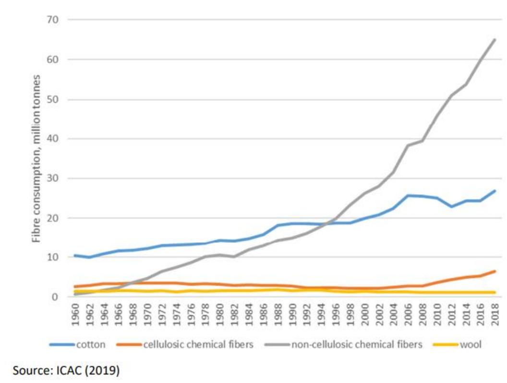

Figure 15 - World consumption of major textile fibres between 1960 and 2018, million tonnes (Ruiz.L, 2020)

- The global consumption of **synthetic fibres** increased to 60 million tons in 2016 from marginal amounts in 1960 and continues to rise (Figure 16). While cotton is the most widely used fibre for the production of clothing, polyester is the most commonly used fibre across the world. As a petroleum based fibre involving a carbon intensive production process, polyester production requires more than 70 million barrels of oil each year (WRAP, 2017). Polyester fabrics are used for their durability and resistance to wrinkles, and can been seen largely in household textiles, where they represent about 70 % volume. They are also used in clothing and various industrial applications, such as insulation, cushioning, car tyres, ropes and conveyor belts. (European Environment Agency, 2019).
- While only 2 % of all synthetic polymers is currently made from **bio**Ǧ**based resources**, of which 11 % is produced for textile applications (Chinthapalli.R et al., 2019), the production of synthetic cellulosic fibres, such as lyocell and viscose, was estimated at 6.5 million tonnes in 2020. (Textile Exchange, 2021).

## **2.2.1.3 Influence of consumer income**

Consumer purchasing is influenced by a wide range of **factors and drivers.** The most determining influence is consumer income. Indeed, a clear relation exists across countries between **income** and the **amount spent on clothing per person**. Other factors include product fit, price and value for money, quality, brand, convenience, comfort and durability, and the latest trends, as well as more cultural and societal factors, such as social status, identity and social influence. Marketing and the influence of retailers have a determining role as well (Paras, Manoj, et al., 2018). Cultural context also influences textiles consumption. For example, Italians tend to spend more on clothes than people with higher disposable income from other European countries, such as France or Denmark. (European Environment Agency, 2019).

# **2.2.2 Trends influencing consumer behaviours**

### **2.2.2.1 Online retail**

**Online shopping** is a key trend in fashion retail, with strong growth rates that are foreseen to continue from an already considerable market size. Up to now, online platforms such as **e-commerce marketplaces** and **internet stores** specialised in fashion have been the most successful at establishing strong positions through channel and customer service innovations. On the other hand, **fashion retailers** that are traditionally focused on physical outlets are still at the beginning of their e-commerce journey (McKinsey, 2019).

The take-up of online shopping varies according to age group and more considerably from country to country. Indeed, a survey conducted in by Eurostat (2021) showed that the highest share of e-shoppers in the EU who bought goods in 2021 can be found in the 25- 54 age group at a level of 79% of the total purchases, followed closely by the 16-24 age group at 80%. Overall, the share of e-shoppers in the 16-74 age category in the EU amounts to 65%, with the highest share for Denmark at 89%, and the lowest for Bulgaria, at 31%, a variation that can be linked to the overall difference in **digitisation** between the various region in the EU.

## **2.2.2.2 Fast fashion**

Increased efficiency and shorter manufacturing times have contributed to fashion lines being introduced more often and with shorter market seasons. By using lower-quality materials, this fast-fashion trend provides affordable and frequently renewed clothing lines to consumers, encouraging overconsumption and therefore leading to increased textile waste generation. One of the drivers of the fast-fashion trend is the continuous pursuit of growth and added value, encouraging the purchase of new products and disposal of old ones, depending on what is considered "out of fashion" and therefore obsolete. For example, European apparel companies released an average of five clothing lines in 2011, while the norm around 2000 was two collections (Koszewska.M, 2018). This number of annual clothing lines can even reach between 12, 16 and 24 for some of the biggest brands mainly targeting young people (McKinsey, 2016).

This fast-fashion trend has led to an increased consumption of garments coupled by a decrease in their lifespan, due to fast changing trends and the clothes' general poor quality. Garments are generally kept for a shorter period than in the past but also worn fewer times (McKinsey, 2016). In Europe, the average lifespan of clothes varies between 3.8 years for Italy and Germany and 5 years for Denmark (WRAP, 2017).

The **push model,** typical of the fast-fashion trend is however being challenged by a **pull or demand**Ǧ**driven model** in which consumers, through social media, influencers and peer reviews, guide the development of the textile market, rather than the brands themselves. The pull model trend encourages on-demand customisation, spurring companies into quickly developing products that are based on the consumer's designs. (McKinsey, 2018).

### **2.2.2.3 Activewear**

Activewear is a fashion sector that has seen an important upward consumption trend over the last few years. According to a market research from Global Data (2019), Europe is one of the more significant importers of sportswear in the world with **imports valued at €15.1 billion** and showing rapid growth rates of **7.2% per year**. The global athleisure market is set to grow, reaching close to **€480 billion in 2023** from less than €350 billion in 2019.

The strong market growth for sportswear in Europe is mainly due to the social trend towards **healthier and more active lifestyles** among all age groups, as well as the increasing popularity of sportswear worn as casualwear in Europe. As mentioned in section 2.1.4, the stay-at-home working arrangement due to COVID-19 increased the need for comfortable clothing. The "Athleisure" trend is also heavily fostered by brands' marketing activities. In Germany, the UK and the Netherlands, the tracksuits category is the fastest growing product category with a significant growth in price per unit. (CBI, 2020).

## **2.2.2.4 Sustainability**

**Sustainability is becoming a key marketing aspect for fashion brands.** Although many are still price sensitive, consumers are increasingly attracted to sustainable brands. (CBI, 2020). According to IPSOS (2020), in 2019 **65% of French people** stated that the commitment of brands to sustainable development was an **important criterion** in their purchasing decision.

Indeed, an increasingly important priority in the European textile sector is **sustainability and transparency**, reflecting rising concerns on behalf of consumers and companies about how to alleviate the negative impact on the environment. Customers, both individuals and industrial players, are increasingly aware of the environmental impact of fashion and demanding more eco-friendly textiles (EASME, 2021). An example of such ask was the protest from Extinction Rebellion's activists at Gatwick airport and London fashion week to promote sustainable design (CBI, 2020).

On the other hand, regulators continue to raise standards and impose new rules and consequences

- In Europe, the REACH Regulation, societal pressure and voluntary industry campaigns are driving the fashion industry to remove toxic chemicals.
- The European Commission's New Circular Economy Action Plan aims to ensure products, textiles being key priority, can be repaired or recycled (CBI, 2020).

### **Sustainability's position in consumers' priorities**

Although sustainability awareness is often present when consumers shop for clothes, it still only has a limited impact in informing consumer decisions (Vehmas, Kaisa, et al., 2018). Higher priorities are given by the consumer to other criteria, such as fit, price, comfort and quality. In a Fashion Revolution survey (2018) with 5,000 respondents from France, Spain, Germany, Italy and the UK, 37 % stated that they were considering the environmental impact when purchasing clothes, and 38 % the social impact. One explanation for this relatively low prioritisation could be the complexity in assessing the environmental and social impacts of clothes, due to a lack of transparency about production conditions and impacts (European Environment Agency, 2019).

#### **Impact of sustainability awareness on consumption**

This raising awareness of the environmental impact of fashion has led European consumers to engage in the following trends:

#### **Buying less**

The "buy less" trend is promoted to ensure sustainability in fashion. Consumers increasingly realise that many unworn clothing are stored in their closets (CBI, 2020). According to McKinsey's 2020 survey on consumer sentiment with regard to sustainability in fashion, **more than 60 % of consumers** report **spending less** on fashion during the crisis, and approximately half expect that trend to continue after the COVID-19 crisis passes. However, consumers are likely to cut back on accessories, jewellery, and other discretionary categories before reducing their spending on apparel and footwear.

After demonstrating that more products and collections do not necessarily yield better financial results, Covid-19 highlighted the need for a shift in the profitability mindset. Companies need to reduce complexity and find ways to increase full-price sell-through to reduce inventory levels by taking a demand-focused approach to their assortment strategy, while boosting flexible in-season reactivity for both new products and replenishment. According to McKinsey's State of Fashion survey (2021), 58% of fashion executives consider assortment planning to be a key area for data and analytics in 2021 (BOF, McKinsey, 2021).

### **Buying second-hand/rented clothing**

According to the IFM (French Fashion Institute), the **second-hand clothing market** is currently worth more than **one billion euros** in France. While relatively small compared to the 50 billion of the fashion industry, this market has not stopped developing in recent years, with the development of highly successful companies such as **Vinted**, with 30 million members in Europe, but also sites such as **Le Bon Coin** and **Vestiaire Collective**. The development of e-commerce has highly contributed to this growth. While second-hand purchases are increasingly popular amongst consumers as a way to reduce the environmental impact, price remains the primary motivation.

Companies are also increasingly exploring circular sales models such as **clothing rental,**  offered by companies such as My Wardrobe HQ, Rent the Runway, the Nu Wardrobe, MUD Jeans, the Devout, HURR, Tchibo, and Endless Wardrobe.

### **Buying eco-friendly clothes**

The McKinsey's 2020 survey on consumer sentiment with regard to sustainability in fashion showed that 67 % of those surveyed consider the use of sustainable materials to be an important purchasing factor and 63 % consider a brand's promotion of sustainability in the same light. A majority of major brands have taken advantage of the success of responsible fashion and offer **environmentally friendly collections of organic** clothes, such as H&M, Benetton and Bonobo.

#### **Buying recycled / upcycled clothes**

Apparel companies are increasingly investigating textile recycling and upcycling models. Although only 1% of second-hand textiles are currently recycled into new clothes, the recycling trend is expected to accelerate as more efficient technologies and solutions are developed for the sorting, dismantling, preparing materials, and recycling processes.

As listed by CBI (2021), several companies in the EU are basing their brand's DNA on sustainability and recycling, such as :

- [Ecoalf](https://ecoalf.com/) (Spain) offers selected products made of recycled materials. The t-shirts carry statements supporting eco-responsibility and climate change awareness.
- Farrah Floyd (Belgium) sells accessories and clothes made of sustainable and recycled materials. The collections are not dependent on seasons.
- Mud Jeans (Netherlands) has between 23% and 40% recycled denim in each pair and planned to launch its first 100% recycled cotton pair of jeans in 2020. The company collects old jeans and recycles them for second-hand use.
- La Petit Mort (France) sells recycled clothes (and other sustainable products) which originate from selected donation centres and street containers.
- Bleed (Germany) sells exclusively fair-trade and recycled fashion. Many of the company's polyester-containing products are made of 100% recycled materials.
- [Jan n' June](https://jannjune.com/) (Germany) have produced products made of recycled polyamides and polyester.
- [Kleiderly](https://www.kleiderly.com/) (Germany) is a new company producing sunglasses out of textile materials. The products are not available yet, but can be pre-ordered.
- [Swedish Stockings](https://swedishstockings.com/) (Sweden) is the only company worldwide offering hosiery made of 100% recycled materials. The company also offers its customers a recycling program to have used products sent in for re-production.

The **biggest potential European markets** for recycled apparel include France, Italy, Germany, Belgium, Poland, and the Czech Republic. While no estimates with regards to the value of demand for recycled apparel exists, the **share of the EU population** concerned with issues of sustainability and including these in their apparel purchase decisions is approximately **37.5%** (CBI, 2021).

## **2.2.2.5 Corporate social responsibility**

Due to an increased awareness of the societal impact of the textile industry (cf. 3.2 for more details), **Corporate social responsibility** (CSR) is gaining importance in the purchasing decision of consumers while working conditions in the fashion industry are being closely scrutinised by various stakeholders. Consumers have indeed become more aware of the plight of vulnerable employees in the fashion value chain and want to learn what fashion brands are doing to address social and environmental issues. Consumers want to know more about how, where and by whom their clothes are made, and expect companies to offer more fairness, security, and dignity to workers (BOF, McKinsey, 2021).

## **2.2.2.6 Technology & Digitalisation**

The fashion industry is increasingly driven by **technology,** and more and more new applications, tools, and processes are being developed specifically for that industry. The global digitalisation trend has led to the emergence of new consumption modes, such as teleshopping 2.0, which offers the possibility of finding on a mobile app the articles presented in an ad, home delivery by appointment, or shopping directly via social networks. Technological innovations and digitalisation also provide the tools required for the customisation of fashion products. Consumers can now customise a design according to their desires and simulate a fashion product before purchase, driving the on-demand production model (BOF, McKinsey, 2019).

# **3 Environmental and societal impact**

The linear way of manufacturing, distributing and using garments has a major impact on the environment. The production of garments requires large amounts of non-renewable resources, and clothes are often used for only short periods of time. After that time, most of the material is lost due to landfilling or the incineration of end-of-life textiles. It is estimated over half of the fast fashion produced will be disposed of in under a year (Ellen MacArthur Foundation, 2017). This linear system puts pressure on resources, pollutes and degrades the natural environment and its ecosystems, and also produces significant negative social impacts at both a regional and global level.

# **3.1 Environmental impact**

In 2015, according to the Ellen MacArthur Foundation report, **1% of materials was recycled in closed loop, 73% landfilled or incinerated, 12% recycled in other applications (insulation materials, wiping cloths, mattresses …) and 12% lost in production**. With population increases and the rise of fast fashion, the number of garments produced annually has doubled since 2000. In 2014, for the first time ever, over 100 billion items were produced, representing an annual production of nearly **14 new items of clothing per person** on Earth (Remy, N., Speelman, E., & Swartz, S., 2020). This consumption generates a huge amount of waste. In the EU, approximately 2.2 million tons of textile municipal solid waste was generated in 2018 and the amount of textile waste has doubled over the last 20 years (M-Brain GmbH., 2021).

The environmental impact is clear in landfills, where natural fibres can take hundreds of years to decompose and may release methane and CO2 into the atmosphere. On the other hand, synthetic materials are not designed to decompose and may release toxic substances into groundwater and the surrounding soil (Henry, B., Laitala, K., & Klepp, I. G., 2019).

All parts of the value chain have a significant impact on the environment. This environmental impact is due to the **emission of greenhouse gasses, pollutants, toxic substances; the consumption of energy and water; and the generation of waste** along the entire value chain as shown in Figure 17.

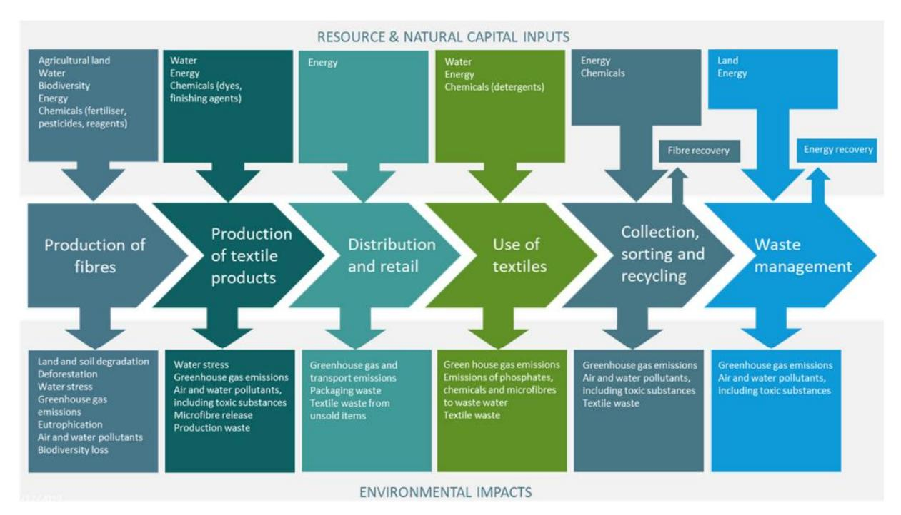

Figure 16: Environmental impacts of the whole value chain (European Topic Centre Waste and Materials in a Green Economy, 2019)

## **3.1.1Resource used**

Fast fashion is putting pressure on the world's resources: water, energy and raw materials are largely used in the textile industry. **A total of 98 million tons of non-renewable resources per year** are used including oil to produce synthetic fibres, fertilisers to grow cotton, and chemicals to produce, dye, and finish fibres and textiles. The production of plastic-based fibres for textiles uses an estimated **54 billion litres of oil every year**, cotton production requires **200,000 tons of pesticide and 8 million tons of fertiliser** annually (Ellen MacArthur Foundation, 2017). The manufacturing steps for fibres and textiles also uses chemicals, with dyeing processes and finishing treatments. The amount of chemicals used is estimated at **43 million tons** in total (Ellen MacArthur Foundation, 2017).

In 2020 **total fibre production** was **109 million tons**. This production has almost tripled since 1975 (Textile Exchange, 2021). Synthetic fibres represent about 60 % of this production, while 37% is dominated by cotton (Sandin, G. et al., 2018). The production of fibres for the clothing industry represents 84% (Quantis, 2018) of total fibre production, i.e. around 92 million tons.

The global annual production and consumption of cotton fibres has more than doubled over the last 50 years, with slightly more than 10 million tons in 1960 to about **23 million tons in 2010** and has since remained more or less static (Quantis, 2018).

The emergence of new synthetic fibres and the industrialisation of manufacturing have led to a significant increase in the use of synthetic fibres in the industry, from marginal amounts in 1960 to more than **50 million tons in 2016** and this figure continues to rise. **Polyester production**, for example, use a carbon-intensive processes that requires more than **54 billion litres** of oil each year (Ellen MacArthur Foundation, 2017).

Currently, **only 2 % of all synthetic polymers is made from bio**Ǧ**based resources**. Of this share, 11 % is produced for textile applications. The production of **synthetic cellulosic fibres (**lyocell, viscose, etc.) was estimated at **5 million tons** in 2016 (Quantis, 2018).

The production of fibres and textiles also requires a large amount of water. The global apparel industry consumes some **215 billion m3 litres of water per year** (Quantis, 2018) with an important share for the production of cotton. This overuse of water leads to water scarcity in certain parts of the world.

The spread of freshwater use across the global apparel value chain is shown in figure 19. The production of raw materials, bleaching, dyeing and finishing in the production and use phase of the textile, including cleaning, are the most water-intensive stages in the entire value chain. Cotton growing is mainly responsible for water consumption in the production phase. Indeed, cotton requires large amounts of water to grow, which is not the case for all natural fibres. Other natural fibres that do not require irrigation make a much lower contribution to value chain water use, in addition synthetic fibres require relatively little water in their manufacture.

|                   | 2005 | 2010 | 2016 | 2020 | 2030 |
|-------------------|------|------|------|------|------|
| Total fibre       | 70   | 83   | 101  | 109  | 153  |
| Total for apparel | 58,5 | 69,7 | 85   | 97,6 | 129  |
| Cotton            | 21,3 | 22,9 | 20,4 | 20,4 | 21,4 |
| Natural fibres    | 2,16 | 2,16 | 5,1  | 5,1  | 5,35 |
| Synthetics        | 41,9 | 41,9 | 54,4 | 67   | 96,9 |
| Cellulosic        | 2,71 | 2,71 | 5,1  | 5,1  | 5,35 |

Figure 17: Fibre production and prediction in millions of tons (Quantis, 2018)

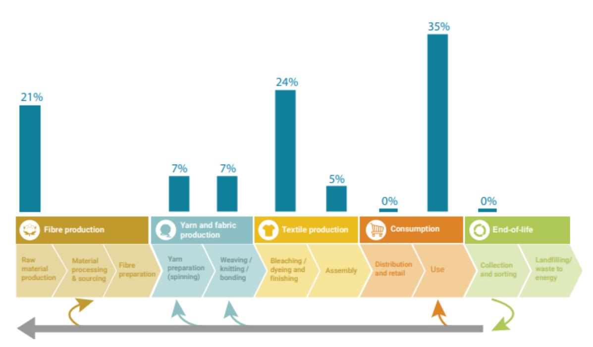

Figure 18: Fresh water use across the global apparel value chain (Programme, U. N. E. (2020)).

The distribution of water scarcity across the value chain is strongly influenced by the proportion of cotton in the apparel fibre mix. The FICCI hotspots study examines (FICCI, 2018), among other things, the impact on water scarcity by country. China accounts for the largest share (34%) of the total water scarcity footprint in global apparel. This high percentage is explained by the fact that China grows cotton and has a large share of yarn and textile production. India (12%) and the United States (5%) are the other two countries with the highest impact on the water scarcity of global apparel.

In addition to a huge amount of water and waste production, textile manufacturing consumes **energy to heat, dry and operate the machines**. This consumption is contributing to the rise in global **greenhouse gas emissions** (McKinsey & Company, 2020). Energy is needed in different parts of the textile industry, such as the operation of machines and processes, for climate control and lighting the production environments.

About 3/4 of the total energy requirements of a textile mill are used in the yarn and fabric manufacturing processes, 15-20% of the electrical energy is used to operate various machines in the wet processing of textiles (Ellen MacArthur Foundation, 2017). However, the lack of details on the consumption of energy for different yarns and fabrics makes it difficult to estimate the industry's energy consumption. Different studies estimate the energy consumption of cotton production to be around 12 to 55MJ per kg of fibres, whereas others suggest numbers up to 90MJ/kg (Mistra, 2019; Clark, G., 2017). For the total **polyester fibre production,** energy use is between **96 and 125 MJ/kg**. The primary energy consumption for **fibres and granulate processes** ranges from **35 MJ/kg for PLA to 250 MJ/kg for nylon** (Mistra, 2019).

All **these resources** used (materials, water, energy) for the manufacturing of clothing have a **significant impact on the environment as a whole**. **The environmental impact of production varies between fibre types as mentioned before**: natural fibres (cotton, non-

cotton cellulosic, wool and hemp) require less energy but more water during production than synthetics (polyester and polyamide) (Figure 20).

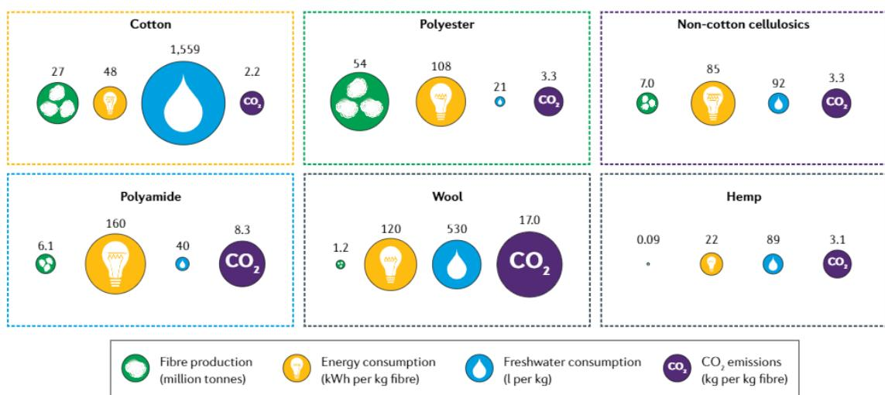

## **3.1.2 Greenhouse gas emissions**

With over 3.3 billion tonnes of greenhouse gases emitted each year the climate impact of the global clothing industry is significant (Quantis, 2018). Fast fashion, with high amounts of throughput, creates intensive textile production generating 17 tons of CO2-equivalents per ton of textile produced. Compared to plastic with 3.5 tons and paper with 1 ton, this clearly contributes to the pressure on worldwide greenhouse gas (GHG) emissions (European Topic Centre for Waste and Materials in a Green Economy, 2019).

Textile production steps and, in particular, bleaching, dyeing and finishing processes account for the majority of the climate impact (36%) as shown in Figure 21. Next, the use phase is the other step where the climate impact is very high with 24% (Programme, U. N. E., 2020).

To generate heat and electricity for the different **manufacturing processes** the industry relies mostly on fossils fuels. This process emits significant amounts of greenhouse gasses. China, India and Bangladesh account for a high proportion of the various global textile manufacturing stages, and those countries use only fossil fuels for energy generation. This could change with the emergence of green technology to produce energy.

Figure 19: Resources used for production of six types of fibres (Niinimäki, K., et al., 2020).

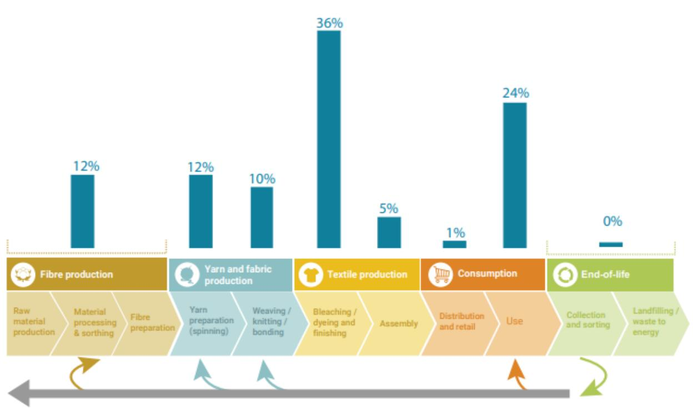

GHG emissions during the **use phase** of textiles are also significant. Due to the high amount of electricity used in washing and drying clothing, CO2 emissions are estimated to be **120 million tons of CO2-equivalents** (Ellen MacArthur Foundation, 2017). As well as the production phase, this generation of greenhouse gases depends on the processes used to generate electricity. However, the impact of the use phase is also determined by the consumer's standard of living, the climate of the country and consumer behaviour: temperature, frequency and washing processes.

**Fibre production** makes the **third highest contribution** to climate impact, which arises primarily from the production of synthetic fibres. The production of **synthetic fibres** relies on fossil fuels. The extraction and generation of these materials requires significant amounts of energy and emits CO2. In addition, fossil fuels are non-renewable resources. The production of ethylene and other chemicals, used in the production of synthetic fibres, also contribute to the emission of greenhouse gases.

**Distribution and retail** were found to contribute only **1% to the climate impact** of global apparel. This is partly due to the high energy use at the other life cycle stages, but also to the fact that clothing is a relatively light product, shipped in bulk carriers. However, the figures do not take into account the transportation stage to consumers: the last kilometre. A good example is shown in an LCA of Swedish clothing (Sandin. G et al., 2019). The study shows that the effect of transport during production, distribution and retail have a negligeable impact. However, the Swedish LCA found that transport during the use phase – transport by the user back and forth to the store – makes a surprisingly high contribution of 11% to the overall climate impact. This impact should not be overlooked; it depends in particular on the particularities of each country and city, notably on the transport infrastructure available and the distribution of stores.

Currently only around 13% of clothing is recycled, predominantly to lower value applications, such as insulation and cleaning cloths (Ellen MacArthur Foundation, 2017), for

Figure 20: Climate impact across the global apparel value chain (Programme, U. N. E., 2020)

which little or no energy intensive processing is required depending on the solutions. Finally, **apparel end-of-life** makes a **negligible contribution** to climate impact compared to other stages in the entire value chain. This is due to the fact that textiles have very low degradation rates in landfill which results in the climate impact from end-of-life being small compared to the other value chain stages.

The **energy intensive stages** of the textile value chain directly impact climate-related consequences and the emission of greenhouse gases. This impact is not only limited to the processes used, the infrastructures to produce fibres and garments or the use phases, but also by the generation of electricity itself. In fact, electricity generation mostly relies on fossil fuels, particularly coal, and has a high climate impact. The high use of fossil energy in textile finishing and the **electricity consumed in the use phase** results in these value chain stages being **hotspots** for energy-related impacts on ecosystem quality.

## **3.1.3 Water pollution**

The textile industry has an important impact on water pollution through the release of chemicals during production stages and also microplastics during the use phase. Fibres, yarn, fabric and textile production combined contribute to 82% of water pollution, whereas the use phase is responsible for 18% as shown in figure 22. Thus, the textile sector has a significantly larger impact on water scarcity than direct water use alone, by polluting water and rendering it unfit for other uses.

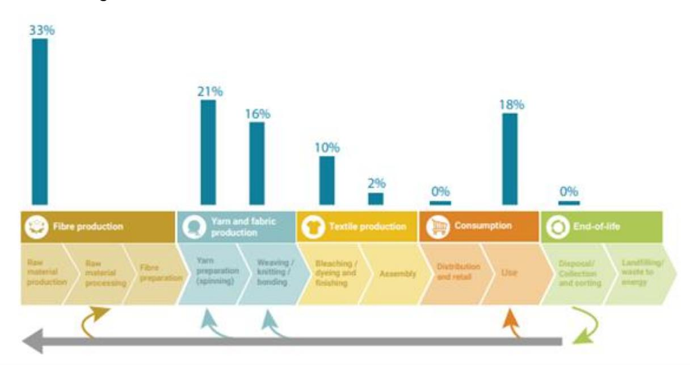

Figure 21: Water pollution across the global apparel value chain (Programme, U. N. E., 2020)

In recent years, the textiles industry has been identified as a **major contributor to the issue of (micro)plastics entering the ocean**, which is a growing concern because of the associated negative environmental and health implications. The washing of plastic-based textiles, such as polyester, nylon, and acrylic, have been identified as a major contributor to this issue. Each year, around **half a million tons of plastic microfibres** – equivalent to more than 50 billion plastic bottles – resulting from the **washing of textiles** are estimated to be released into the ocean (Ellen MacArthur Foundation, 2017).

The **major physical impact of microplastics occurs through ingestion**, this effect has been relatively well documented for marine organisms, but less for terrestrial organisms. **Chemical impacts** of microfibres in the environment include **leaching of toxic chemicals**, such as dyes or fire retardants, while **biological and environmental impacts** include the potential for microfibres to carry persistent **organic pollutants** and provide a habitat for **pathogenic bacteria**, thereby enabling the spread of such disease-causing bacteria to new locations and habitats (Programme, U. N. E., 2020).

### **3.1.4 Land use**

Land use is one of the main causes of biodiversity loss worldwide, and is responsible for the degradation of two-thirds of the planet's land surface beyond a level safe for its integrity. (Programme, U. N. E., 2020). As shown in Figure 23, land use associated with the global apparel industry is mostly linked to yarn production (56%).

Cotton cultivation is responsible for a large part of land use in the fibre production phase. **Cotton cultivation uses 2.5% of the world s arable land**. Other natural fibres also have high land footprints: wool requires 278 hectares per ton of fibre (Sandin. G et al., 2019), compared with just over 1 hectare per ton for cotton, but has a lower rate of use in industry., athough wool is in many cases a by-product of meat production where land is not especially suitable to growing crops. (Programme, U. N. E., 2020). Regenerated or cellulosic fibres, such as viscose, modal, and lyocell, have smaller land footprints than other fibres produced from agricultural sources.

The contribution to land use of the other stages of the value chain is indirect, as it concerns the land associated with the infrastructure for the design and manufacture of the products or the production of the energy used in the different stages of the value chain.

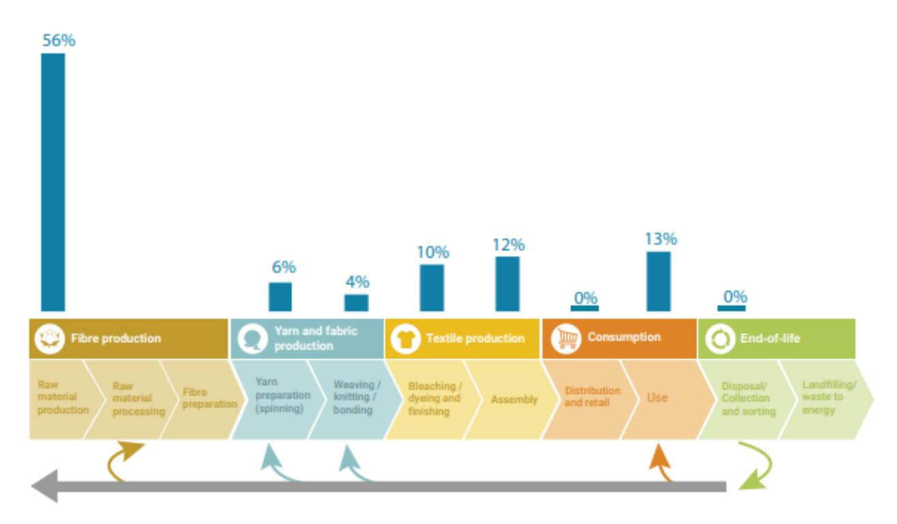

Figure 22: Land use impact across the global apparel value chain (Programme, U. N. E., 2020)

## **3.1.5 Use of chemicals**

Chemicals are used in many different stages of the textile industry's entire value chain. The most impacting steps regarding the impact of chemicals on ecosystems are fibre production, in particular with regard to cotton cultivation, and textile production with bleaching/dyeing and finishing processes. Global **cotton cultivation is estimated to require 200 thousand tons of pesticide and 8 million tons of fertiliser per year** (Ellen MacArthur Foundation, 2017) representing respectively 16% and 4% of the global use of pesticides and fertilisers.

It is estimated that textile production consumes over 8,000 chemicals in the different processes (Kant, R., 2012) and 1 kg of textiles requires on average **0.58 kg of various chemicals** (Ellen MacArthur Foundation, 2017). Moreover, the chemicals can have a huge impact on ecosystems and human health. **Chemicals used in production** may be retained in the finished textiles, causing concern about their **impact on consumers**, and released into **ecosystems** during washing or when discarded after use. The chemical pollution of water is an important issue to human health through exposure to polluted water and food resources.

The Swedish Chemicals Agency carried out a study on approximately **3,500 substances used in textile production** (Sandin. G et al. 2019) where **750 were found to be hazardous to human health**, **299** considered to be functional substances of **high potential risk to human health**, i.e. substances intentionally added and expected to remain in the finished articles at relatively high concentrations. **440 substances were found to be environmentally hazardous**, with **135** of these functional substances **of high potential risk to the environment** (Programme, U. N. E., 2020).

As shown by the Swedish Chemical Agency many of the chemicals used in textile production have health and environmental impacts. **Hazardous chemicals**, found in effluents from textile processing facilities include chemicals known to cause issues on human health such as cancer and hormonal disruption. This is also the case for animals. For example, in order to achieve crease-resistant clothing production processes use formaldehyde, classified by the International Agency for Research on Cancer as carcinogenic. Other chemicals, such as alkylphenols and perfluorinated compounds, are particularly problematic as they cannot be removed by wastewater treatment plants and can affect both human and animal health. Many dyes contain heavy metals, such as lead, cadmium, mercury, and chromium (VI), known to be highly toxic due to their irreversible bio accumulative effects, while these dyes contain carcinogenic substances (Programme, U. N. E., 2020).

# **3.2 Societal impact**

## **3.2.1 Employment**

The textile and apparel industry employ around **300 million people** globally, including all steps in the value chain. In this industry **73 million workers have a high risk of job loss**, representing more than one in four jobs (Organisation Internationale du travail, 2020).

Globally, 91 million people worked in textile and apparel production in 2019, of which 50 million were women, representing **55 %** of the total workforce. In addition, of all the jobs related to the textile and apparel supply chain in the 64 countries for which estimates are available, **82 % are in Asia and the Pacific** (Organisation Internationale du travail, 2020).

Although COVID-19 restrictions have started to be lifted in most countries, consumers have not yet returned to pre-crisis spending levels. The sharp collapse in consumer demand, including demand for clothing, has had a devastating effect on global fashion brands, with a **decline in production demand of 30 %** in the global fashion industry in 2020 (Programme, U. N. E., 2020).

Almost every fashion brand pays its suppliers only after the delivery of the order. Therefore, manufacturers who had already remunerated their workers and purchased materials have their income frozen if brands cancel or hold their orders. The stopping of payments and cancellations of orders **have put enormous financial pressure on manufacturers** (Fashion Revolution, 2020b). As most textile factories are in countries with **no or limited regulations for workers¶social protection**, textile workers are more vulnerable than other activities to the negative consequences of the pandemic (Organisation Internationale du travail, 2020; Programme, U. N. E., 2020).

The call-to-action "COVID-19: Action in the Global Garment Industry" is a joint initiative supported by brands, manufacturers, unions, and the ILO to promote action across the global garment industry to support manufacturers and **protect the income, health and employment of garment workers**.

In Europe, the number of people working for the textile and garment industry has significantly declined since 2000. However, this decrease is shrinking as **many projects have been created to reindustrialise Europe** and increase the quality of products. In 2020, the textile and garment industry employed around **1.5 million workers** (Table 3), mostly in central, east, and southeast Europe (textile.fr).

|                     | Companies       | Employment          |
|---------------------|-----------------|---------------------|
|                     | Number          | Number              |
|                     | 2019 2020e      | 2019 2020e          |
| Textile             | 52 021 50 876   | 586 421 573 520     |
| Apparel             | 111 432 104 078 | 944 714 882 363     |
| Textile and apparel | 163 453 154 954 | 1 531 135 1 455 883 |

Table 4: Textile and apparel companies and employment in Europe (2020 estimated data)

## **3.2.2 Human practices**

The garment industry is a substantial employer, **especially of women**. It creates a lot of economic opportunities in developing countries. However the international garment industry is renowned **for poor working conditions**, including low wages and excessive working hours. Its workers are exposed to abusive practices and unsafe working conditions (ILO, 2016). Cases of child labour and modern slavery have made **cotton cultivation and textile production the focus of NGO campaigns** and media attention.

In particular, the collapse of the Rana Plaza building in Dhaka, Bangladesh in April 2013, in which more than **1,132 people were killed** and more than 2,500 injured, most of them women and girls, put the poor labour conditions faced by workers in the garment sector in the global spotlight (Programme, U. N. E., 2020). Recently, in the Xinjiang region of China, there were reports of forced labour and slavery of the Uighur ethnic minority. An estimated **570,000 workers** from three Uighur regions were mobilised for cotton picking operations in 2018 (Welle, 2020).

Traditionally, the exploitation of workers within the garment industry is seen as a problem felt mostly in Asia. However, these problems are endemic throughout the garment industry and even in **countries within the European Union** we are seeing poverty wages and terrible working conditions (Clean Clothes Campaign, 2021).

## **3.2.2.1 Wages**

Garment industry employees in developing countries are usually impacted by **poverty and social exclusion as well as their family.** Despite the sector being one of the biggest employers and exporters in the Asian region, the workers remain in poverty and their **basic human rights are denied** (Clean Clothes Campaign, 2014).

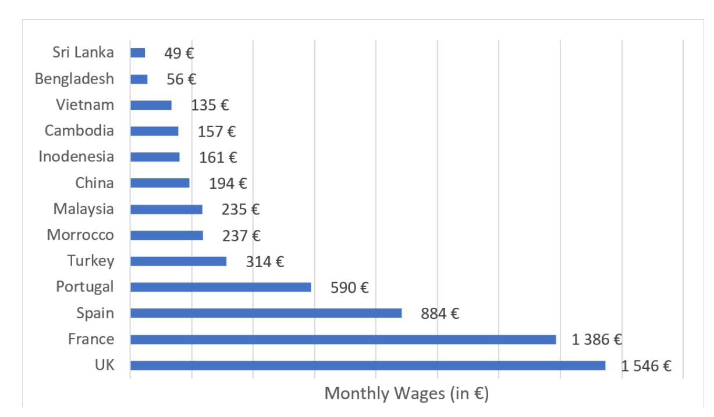

Figure 23: Monthly minimum wages for garment workers in 2019 (Sheng Lu. (2020))

Recently, research was conducted on the impact of the COVID-19 pandemic on garment workers' wages. The global estimated wage gap for the period from March 2020 through March 2021 is €10.45 billion. In other words, it is estimated that **the garment industry owes its workers almost €10.5 billion for those 13 months of pandemic** (Clean Clothes Campaign, 2021).

Post-socialist countries function as the cheap labour sewing backyard for Western European fashion brands and retailers. In fact, the gap between current wages and a living wage is often bigger in European production countries than in Asian production countries. Brands take advantage of the fact that most people are unaware of this. **Consumers are offered false assurances of fairer conditions when products are "made in Europe"** (Clean Clothes Campaign, 2021).

Living costs differ from one country to another. Figure 25 below shows the percentage of the legal minimum net wage upon a living wage per country. The first number per country is the cross-border base living wage estimate, the second is the legal minimum net wage (Clean Clothes Campaign, 2021).

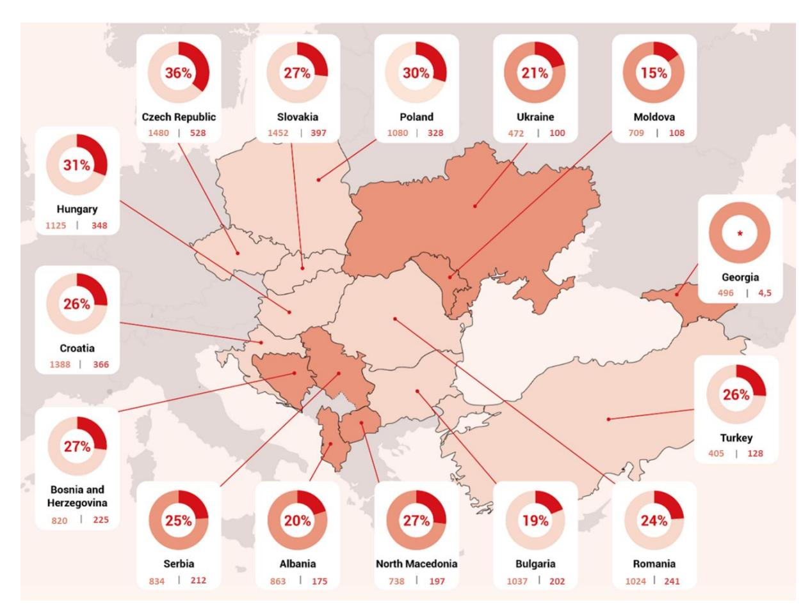

Figure 24: Monthly minimum wages for garment workers in 2019 in euros (Sheng Lu., 2020).

Fast fashion has clearly deteriorated the working conditions of the garment sector, but the impact on the price of these conditions is not an argument. In fact, **paying a decent wage would increase the selling price of a garment by only a few percent** (Figure 26).

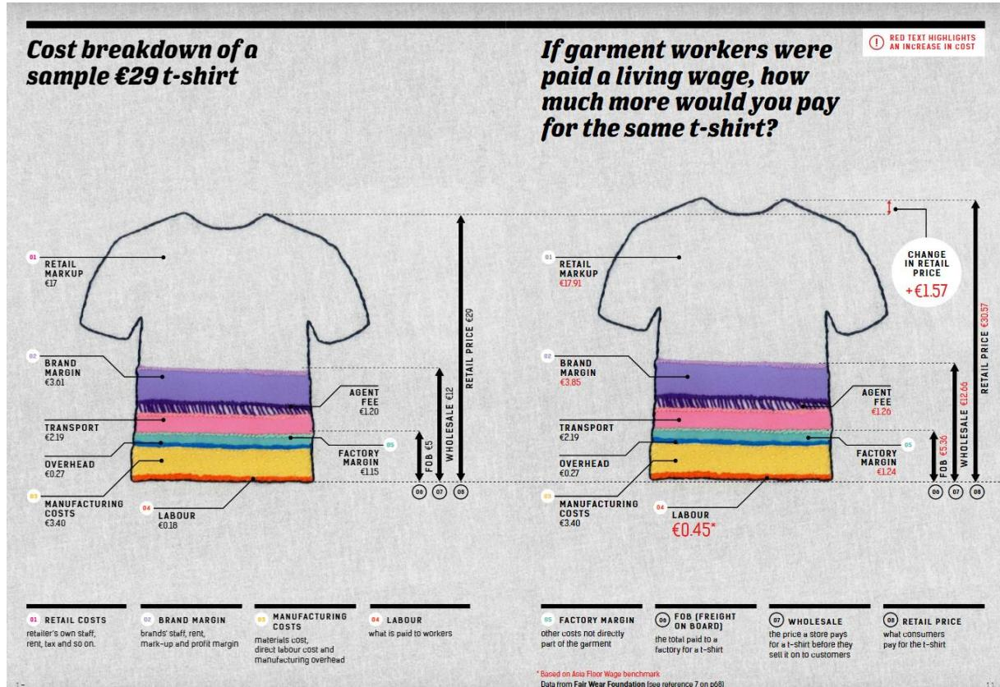

Figure 25: Price increase for a decent labour wage (Fashion revolution fanzine #001)

"Europe 2020, an EU strategy for smart, sustainable and inclusive growth" has five goals including poverty reduction by helping at least 20 million people by 2020.The simplest and most **concrete measure that has the potential to reach a large number of people** and decisively improve their livelihoods is the payment of a decent living wage (Clean Clothes Campaign, 2014).

## **3.2.2.2 Working conditions**

Today's textiles system also has multiple **negative societal impacts**. Many workers face dangerous working environments due to unsafe processes and hazardous substances used in production. **High cost and time pressures** are often imposed on all parts of the supply chain, which can lead to workers suffering poor working conditions with **long hours and low pay**, with evidence, in some instances, of **modern slavery and child labour**.

The potential for negative societal impacts does not stop at the factory door. Local communities, while benefitting from employment in the industry, may suffer from its poor environmental practices. For example, **discharging untreated production wastewater pollutes local rivers** used for fishing, drinking, or bathing. The cost of poor chemical management by the textile industry is estimated at **€7 billion per year** (GFA and BCG, 2017).

Furthermore, the health of textile workers is put at risk of toxicity and cancer while they come into direct contact with hazardous chemicals. However, they are not the only ones to be affected. The contamination of drinking water by chemicals discharged into rivers impacts local communities. The toxicity of the final garment even puts the end user at risk. It is highly recommended to wash new clothes before first use. The final problem in textiles lies in the incability to recycle products due to their chemical treatment.

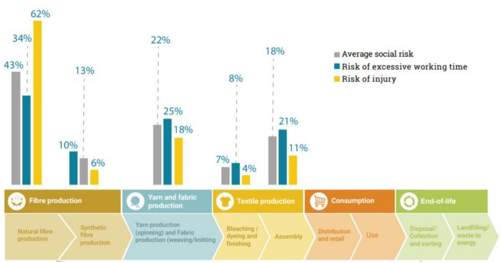

Figure 26: Social risks across the textile value chain (Programme, U. N. E., 2020).

*\* "Average social risk" indicator scores for child labour, corruption, forced labour, gender inequality, high conflict, fragility in the legal system, exposure to toxins and hazards, and sector average wages below the country minimum wage.*

## **3.2.2.3 Child labour**

According to the International Labour Organization (ILO), child labour refers to "work that deprives children of their childhood, their potential and their dignity, and that is harmful to physical and mental development". There is a big difference between children helping their parents out around the house and working behind a sewing machine in a factory. **Child labour is a violation of fundamental human rights.**

Child labour is a regional issue, occurring predominately **in Africa and Asia** and mostly relates to agriculture. However, a great number of children are employed in the industrial sector, where they face the most substantial risks. Roughly **75% of children working in industry are involved in hazardous work.** This is especially the case in Asia, where the likelihood of children finding employment in the industrial sector is highest. Given the importance of the garment industry in this region, many child labourers wind up at garment factories. Here they engage in a range of tasks, including cutting, trimming threads, fastening buttons, folding clothes, ironing, etc. They may ultimately face **the same labour conditions as adults**, which often means working long hours (including overtime) and in sometimes hazardous conditions.

**Asia and the Pacific region account for 41% of global child labour** according to the International Labour Organisation (ILO). In Asia Bangladesh, China, India, Indonesia and Myanmar present an 'extreme risk' for child labour. Estimates of child labour in these countries reach as high as **13% of children aged 5-14 years old** (Fair Wear Foundation, 2018).

## **3.2.2.4 Gender**

The textile industry workforce is mainly composed of women in almost all countries except India. **Women represent 70%** of the 3 million people employed in garment factories in Bangladesh, and this number can be higher in Mexico or Cambodia (UNEP, 2016).

There are also economic reasons for the prevalence of women in the textile work force. Women are universally paid less than men and those savings made on women s wages compared to men s is seen as a way to enhance investments and increase profits, while keeping the cost of goods low for export (UNEP, 2016). The gender gap also occurs in leadership roles. The same governments and corporates that exploit the labour-cost advantage" of hiring women perpetuate the **concentration of women in unskilled, high turnover jobs**.

Inclusion of women in leadership roles as well as equalising wages are essential in transitioning to a sustainable and circular textile value chain. Access to higher education, skills development and business performance are levers to offer great opportunities to women (Programme, U. N. E., 2020).

Some programmes have been set up to help workers' conditions. One of them is the Better Work programme which assists all stakeholders in the textile industry for this purpose. As a partnership between the United Nations International Labour Organization and the International Finance Corporation (IFC), Better Work brings together governments, global brands, factory owners, unions and workers to make the sector more competitive while improving working conditions. This program is active in more than 1,700 factories and employs more than 2.4 million workers in nine countries. However, the employees are not the only ones who benefit from this program as the factories have enhanced their productivity and profitability while improving their compliance with ILO core labour standards. These changes include improvements in compensation, contracts, occupational health and safety and working time (ILO, 2016; Better Work, 2018).

# **4 Circular design processes**

## **4.1 Introduction to circularity**

The IPCC (Intergovernmental panel on climate change) report highlights the urgency of climate change and the need for changes in our societies to keep global warming below 4°C (IPCC, 2021). This change will be imposed on all industrial practices with a view to reducing CO2 emissions and preserving natural resources. It is precisely in this case that the circular economy is relevant.

Designing for circularity goes beyond eco-design. Eco-design is often limited to the choice of raw materials with a controlled or reduced impact on the environment. These design practices generally follow the classic linear model: extraction of raw materials, manufacture of a product, use of the product and its disposal. The circular economy is based on keeping products and materials in use and therefore finding solutions to facilitate this. It is also about making the consumer want "to keep the product alive":

« [...] from an aesthetic point of view, sustainable design should aim to create enduring objects that can be repaired, upgraded and/or reused. At the same time, sustainable objects must be attractive enough for users to want to keep repairing and reusing them » (Harper, K., 2018)

With regard to the circular economy, two cycles were identified by Ellen Mac Arthur Foundation (The Ellen MacArthur Foundation, 2012):

- **Biological cycles**: Materials at the end of the product's life are returned to nature as part of its natural system regeneration process
- **Technical cycles**: Products, components or materials are used for their properties. Their properties are preserved, and they are used to be able to fit into circularity loops for as long as possible.

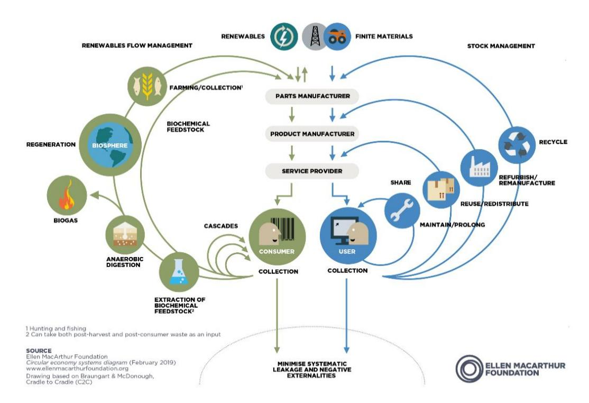

Figure 27: Circle Economy Diagram (Source: The Ellen Macarthur Foundation, 2012)

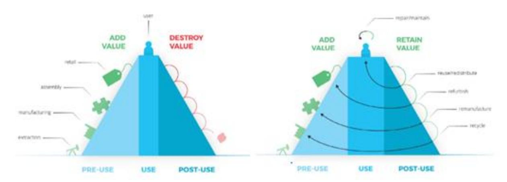

It is interesting to focus on the technical cycle because this is where we can have a real impact on CO2 emissions. To do this, it is necessary to allow the product to multiply its life cycles by encouraging the insertion of the product in circularity loops. The circularity loops identified are: reuse/redistribute, refurbish, remanufacture and recycle. The aim is to maintain the product's properties so that it retains its value.

Figure 28: From destroying value in a linear economy to retaining value in a circular economy (Source: Achterberg et al., 2016)

Once the product is no longer able to enter any circularity loop other than the recycling loop, this operation should be carried out. However, recycling of the product may require dismantling phases. Indeed, the fact that each material used in a product must be redirected to a specific recycling channel means that the product in question must be dismantled. **The higher the number of components of different materials situated in different locations of the product, the more dismantling steps need to be implemented. It is therefore a question of integrating this disassembly as well as the recovery of materials from the design phases of the product** (What Is Design for Disassembly? - News - Cradle to Cradle Products Innovation Institute, 2022)**.**

# **4.2 Textile circular issues**

## **4.2.1 Political context**

The current fashion industry is mainly described as linear with a take-make-waste model. Policies are being put in place, such as in France, to prevent the destruction of unsold products and to favour circularity by encouraging the development of recycling solutions for shoes and clothing (Ministry for the Ecological Transition, 2020). Only 1% of textile fibres used to make garments are recycled into new garments (Newsweek, 2021).

In Some European countries, used clothes are collected in recycling bins. After a sorting process they can be inserted into a circularity loop. For example, in France, 55% of clothes collected are reused (Re\_Fashion, 2020). However, in 95% of cases, this reuse" of clothes means they are exported to Africa or Asia. Once on these continents they may be reused or in the worst case landfilled. This failure to manage the fate of clothing once it has been exported is a problem in the case of landfill. However, sending these second-hand clothes to underprivileged countries should not be interrupted. Often, it represents a real opportunity for people to get dressed up. It is therefore of social interest.

If countries send clothes to be landfilled, it means shifting the problem to another country. It is therefore up to European actors to find solutions that enable the recycling of these unwearable garments. This is the purpose of SCIRT.

## **4.2.2 Technical issues**

The development of textile recycling processes is confronted with technological issues (part 6 of this report) and garment complexity. Today, we can only recycle simple clothes with few accessories. This results from the fact that clothes are not designed with end-of-life in mind. They are qualified as complex and all the materials or elements making them up cannot be redirected into dedicated recycling channels. In fact, we talk about internal or external disruptors of textiles recycling (Orée, 2020). The document drafted by Re\_Fashion also proposes the prioritisation of internal disruptors to mechanical recycling (Re\_Fashion, 2014):

- Internal disruptors: material composition (presence of elastane, use of twisted yarn, yarn including metal...), finishings (prints, glue, coating, chemical substances, …) , fabric construction (wrap knitted fabric, jacquard fabric, woven fabric,…)
- External disruptors: Hard points, assemblies

Although the gateway to recycling a garment is the material it is made of, the existence of recycling channels, internal and external disruptors all have a role in the recyclability of the garment. These internal and external disruptors to recycling have to be considered when designing a garment. A garment that has too many disruptors in the recycling process or with too many disturbances will be removed from closed loop recycling solutions. For example, a garment with more than 5% elastane in the fabric is not recyclable at present.

# **4.3 State of the art of circular product design processes**

What does circular product design mean? Circular Product Design focuses on the development of methods and tools that enable the design of products that are used more than once (i.e. that have multiple lifecycles (Circular product design, 2021). The product will have multiple lifecycles if it enters circular loops at the end of its first life (Figure 28). To enable this, strategies can be adopted such as product life extension, reuse, remanufacturing or recycling.

Design for preserving product integrity (foster the multiplication of its life cycles) and Design for recycling are both aspects of Circular Product Design. They are complementary and have consequences on the product's entire life cycle. Design for Preserving Product Integrity impacts the product's life phases whereas design for recycling concerns its end of life (den Hollander, 2018).

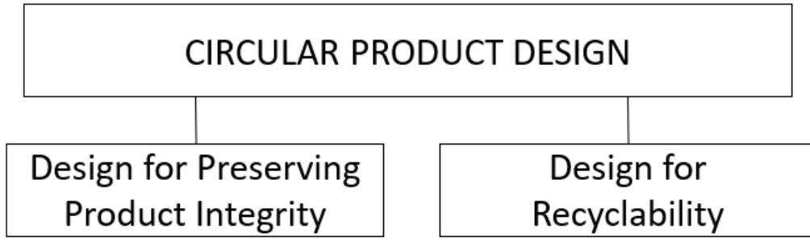

Figure 29: Circular product design sub-strategies (den Hollander, 2018).

Design for recycling focuses on materials. It is therefore conditioned by the existence of recycling channels. The SCIRT project aims to develop closed-loop recycling channels for textiles. The lack of industrialised recycling solutions for garments makes it difficult to adopt design for recycling strategies at the present time. We therefore have to focus our state of the artwork on design strategies to maintain product integrity and to allow the multiplication of product lifecycles.

Design approaches for preserving product integrity can be classified (den Hollander, 2018):

- Resisting to Obsolescence: Design approaches for long use
- Postponing Obsolescence: Design approaches for extend use
- Reversing Obsolescence: Design approaches for recovery

Figure 31 shows a visual representation of all the design strategies classified according to the categories presented above:

| <b>Design Strategies for Preserving Product Integrity</b>                                                                                                                                                                                                                                                                                                                              |                                                                                                                                                                                                                                                                                                                                                                                               |                                                                                                                                                                                                                                                                                                                                                                                              |
|----------------------------------------------------------------------------------------------------------------------------------------------------------------------------------------------------------------------------------------------------------------------------------------------------------------------------------------------------------------------------------------|-----------------------------------------------------------------------------------------------------------------------------------------------------------------------------------------------------------------------------------------------------------------------------------------------------------------------------------------------------------------------------------------------|----------------------------------------------------------------------------------------------------------------------------------------------------------------------------------------------------------------------------------------------------------------------------------------------------------------------------------------------------------------------------------------------|
| <i>Design direction</i> <b>Resisting obsolescence</b>                                                                                                                                                                                                                                                                                                                               | <i>Design direction</i> <b>Postponing obsolescence</b>                                                                                                                                                                                                                                                                                                                                     | <i>Design direction</i> <b>Reversing obsolescence</b>                                                                                                                                                                                                                                                                                                                                     |
| <b><i>Design strategy</i></b> <b>Design for Emotional Durability</b>                                                                                                                                                                                                                                                                                                                | <b><i>Design strategy</i></b> <b>Design for Maintenance</b>                                                                                                                                                                                                                                                                                                                                | <b><i>Design strategy</i></b> <b>Design for Recontextualizing</b>                                                                                                                                                                                                                                                                                                                         |
| Designing into a product a potential for remaining wanted over a long period of time, in a way that best matches the business-economic context of that product, and best supports the preservation of product integrity over the entire lifetime of the product.                                                                                                                       | Designing into a product a potential to undergo and facilitate the performance of inspection and/or servicing tasks at regular intervals, to retain a product's functional capabilities and/or cosmetic condition, in a way that best matches the business-economic context of that product, and best supports the preservation of product integrity over the entire lifetime of the product. | Designing into a product a potential to facilitate the use of an obsolete product (or its constituent components), without any remedial action, in a different context than it was used in as it became obsolete, in a way that best matches the business-economic context of that product, and best supports the preservation of product integrity over the entire lifetime of the product. |
| <b><i>Design strategy</i></b> <b>Design for Physical Durability</b>                                                                                                                                                                                                                                                                                                                 | <b><i>Design strategy</i></b> <b>Design for Repair</b>                                                                                                                                                                                                                                                                                                                                     | <b><i>Design strategy</i></b> <b>Design for Refurbishing</b>                                                                                                                                                                                                                                                                                                                              |
| Designing into a product a potential for withstanding wear, stress, and environmental degradation and remaining able to fulfil all physical functions for which it was designed over a long period of time, in a way that best matches the business-economic context of that product, and best supports the preservation of product integrity over the entire lifetime of the product. | Designing into a product a potential for X, in a way that best matches the business-economic context of that product, and best supports the preservation of product integrity over the entire lifetime of th                                                                                                                                                                                  |                                                                                                                                                                                                                                                                                                                                                                                              |

| Design direction                                                                                                                                                                                                                                                                                                                                                                      | Design direction                                                                                                                                                                                                                                                                                                                                                                                                                                                                                                                                                                                                                                                                                                                                                                                                                                                                                                                                                                          | Design direction                  |
|---------------------------------------------------------------------------------------------------------------------------------------------------------------------------------------------------------------------------------------------------------------------------------------------------------------------------------------------------------------------------------------|-------------------------------------------------------------------------------------------------------------------------------------------------------------------------------------------------------------------------------------------------------------------------------------------------------------------------------------------------------------------------------------------------------------------------------------------------------------------------------------------------------------------------------------------------------------------------------------------------------------------------------------------------------------------------------------------------------------------------------------------------------------------------------------------------------------------------------------------------------------------------------------------------------------------------------------------------------------------------------------------|-----------------------------------|
| <b>Resisting obsolescence</b>                                                                                                                                                                                                                                                                                                                                                         | <b>Postponing obsolescence</b>                                                                                                                                                                                                                                                                                                                                                                                                                                                                                                                                                                                                                                                                                                                                                                                                                                                                                                                                                            | <b>Reversing obsolescence</b>     |
|                                                                                                                                                                                                                                                                                                                                                                                       |                                                                                                                                                                                                                                                                                                                                                                                                                                                                                                                                                                                                                                                                                                                                                                                                                                                                                                                                                                                           |                                   |
| <b>Design strategy</b>                                                                                                                                                                                                                                                                                                                                                                |                                                                                                                                                                                                                                                                                                                                                                                                                                                                                                                                                                                                                                                                                                                                                                                                                                                                                                                                                                                           | <b>Design strategy</b>            |
| <b>Design for Upgrading</b>                                                                                                                                                                                                                                                                                                                                                           |                                                                                                                                                                                                                                                                                                                                                                                                                                                                                                                                                                                                                                                                                                                                                                                                                                                                                                                                                                                           | <b>Design for Remanufacturing</b> |
| Designing into a product a potential to undergo and facilitate interventions for enhancing, relative to the original design specifications, a product's functional capabilities and/or cosmetic condition, in a way that best matches the business-economic context of that product, and best supports the preservation of product integrity over the entire lifetime of the product. | Designing into a product a potential to undergo and facilitate a series of industrial processes in a factory environment, whereby an OEM (original equipment manufacturer), an OEM contracted third party, or a third party licensed to carry the OEM brand name, disassembles obsolete products into components, to a level as far down as needed to bring as many of those components as considered eligible after testing back to at least OEM original performance specifications and recombines those components—generally originating from different used products—with as few as possible new parts, to manufacture new products of a similar type and specification, that result in a new product with a warranty that is identical to that of an equivalent product manufactured out of all new parts, in a way that best matches the business-economic context of that product and best supports the preservation of product integrity over the entire lifetime of the product. |                                   |

Figure 30: Design strategies for preserving product integrity (den Hollander, 2018)

This categorisation summarises well all the design strategies that aim to have an extended product life. However, it does not illustrate the importance of circular cross-cutting factors. Indeed, to have a circular product with a reduced environmental impact, it is necessary to have a global vision of the indicators that characterise circularity. The European political authorities recommend the use of these indicators by encouraging projects such as methods for calculating the product environmental footprint (PEF). This could represent a real opportunity for fashion brands to integrate this kind of indicators in circular product design phases.

These important indicators include:

### **PRODUCT PHYSICAL DURABILITY**

*''Physical durability is the ability of products to withstand wear, stress, and environmental degradation and remain able to fulfil all physical functions for which it was designed over a long per period''* (den Hollander, 2018). The lifetime of a product is a key element when calculating the environmental footprint. The longer a product lasts, the more its impact will be diluted over time. Being able to measure this and reassuring consumers about how long the product they buy can last he buys is important to highlight its ecological benefits.

#### **PRODUCT DISMANTABILITY**

The dismantlability of a product means the ability to dismantle a product. It could be partial or total dismantlement. This notion is a cross-cutting concept for the different circularity loops. Whether for repairability, maintenance or recycling, consideration should be given to how easy it is to extract components from the assembly.

In international standard EN 13306 (EN, 2010), maintenance is defined as the "combination of all technical, administrative and managerial actions during the life cycle of an item intended to retain it in, or restore it to, a state in which it can perform the required function". This maintenance could be preventive (or predictive) or corrective (Moss, 1985).

''Repair is the correction of specific faults in an obsolete product, bringing the product back to working condition'' (den Hollander, 2018).

Repairability and maintainability are similar and can be grouped together in a sub-category of the product's partial dismantling. Recycling is considered part of total dismantling.

Even in a recycling process the dismantlability of a product is an issue. In fact, to have a qualitative recycling material in a product, it will be necessary to achieve total or partial dismantlement.

For each circularity loop, operations to extract components can be carried out. These operations and the difficulty of performing them will have an impact on the complexity of the product and therefore its overall recyclability. The main factors that influence the ease of disassembly are: disassembly depth/sequence (Fukushige et al., 2013; Kwak et al., 2009), the reversibility of connecting elements and the use of common tools (Bracquené & al., 2018; CENELEC, 2020). It is therefore important to follow this indicator from the very start of the product's design.

Maynard Operation Sequence Technique (MOST) is described as an efficient method to calculate the disassembly time of a product (Bracquené & al., 2018). This method is a predetermined motion time system that establishes the time needed to do basic actions.

In France these indicators are already used to calculate and display the reparability index for household appliances (Ministry for the Ecological Transition, 2020):

- Simplicity of product disassembly.
- Accessibility of connecting elements.
- Number of components.
- Need to use specific tools.
- Availability of spare parts.

As we can see dismantlability is an important notion to give products multiple lifecycles. If a product is un-dismantlable it will be difficult to repair or maintain it.

In the case of textiles, this concept of dismantling concerns the product's end of life and the need to separate any hard points or barriers to the recycling of materials.

#### **PRODUCT'S MATERIAL RECYCLABILITY**

Knowing material recyclability is an important indicator when designing a circular product. At the end of its life, this will determine its recycling possibilities.

According to the standard ISO 14021 recyclable" designates a product's characteristics, packaging or associated components that can be taken from the waste stream by available processes and programmes, and which can be collected, processed, and returned to use as raw materials or products (ISO, 2016). Consequently, evaluating the recyclability of a product means evaluating its ability to be [...] collected, processed and returned to use as raw materials".

In the textile industry's case, as it will be described in the section 5 about recycling processes, circular solutions are not mature enough. It is difficult to have clear vision about the recyclability of all fabrics and to create a recyclability indicator. However, during the product design phase, if designers have an idea of the component's recyclability, they will use it to foster a material's circularity once separated.

#### **PRODUCT EMOTIONAL DURABILITY**

Initially not included in the global indicators of circularity, it was finally decided to add the a product's emotional durability. Indeed, for products as fashionable as garments, it seemed important to include this notion of perceived obsolescence. It can be described as "the relative loss of value of an object that still fulfils its function" (Guillard V. et al., 2018).

*''Emotional durability is the ability of products to remain wanted by users over a long period of time*'' (den Hollander, 2018).

Emotional durability can be facilitated by designing products for attachment (Chapman, 2009). It creates an emotional link between the owner and its product. The greater the attachment to the product, the more care will be taken, with the notion of irreplaceability and the product's lifetime increasing. On the contrary, the product disposability decreases (Mugge, 2007).

Design strategies can be implemented to design products with stronger emotional sustainability. This means moving away from the "fashionable" character to a focus on a product's timelessness and sobriety. The choice of noble materials can also influence the perceived value of the consumer. However, these strategies are partly opposed to the function of a garment.

In fact, the primary function of clothing is to cover the body for protection. The secondary functions of clothing are distinction (''*I express my personality*'') and identification *(''I belong to a group with which I identify myself*''). This secondary function is the reason why most of the time we chose one garment over another.

# **4.4 Overview of circular business models**

As currently most business models in the textile value chain are designed and optimised to fit the linear system, implementing circular design principles in the textiles sector requires a change of business models. The kind of business model best suited to support the uptake of circular design depends on consumer preferences in different market segments, as well as on the existing business model of fashion brands.

Implementing circular economy business models is not in opposition to traditional industry business models. They are complementary. They get the framework of business model key factors defined in section 1.2.7 of this deliverable: value proposition, value capture, value creation, value delivery and adding a fifth factor: value retention (Achterberg et al., 2016). In this sense, companies are thinking about how to retain the product's value and generate new income sources. They focus their thinking on circularity loops as proposed in the Ellen MacArthur Foundation's diagram (Figure 28).

The following paragraphs summarise different business model routes that can support a shift towards a circular textiles system, as described in (European topic Centre on Waste and Materials in a Green Economy, 2021).

A first set of circular business model types focuses on customer segments demanding durable textile products, delivering a value proposition for a long product life (Figure 32). This approach is often combined with reparability and the offering of maintenance and repair services to customers. Product personalisation can also be a feature to ensure consumer attachment. While these models often use circular design principles as part of their value proposition, the higher product cost is a barrier to expand the customer base beyond the premium fashion or activewear markets.

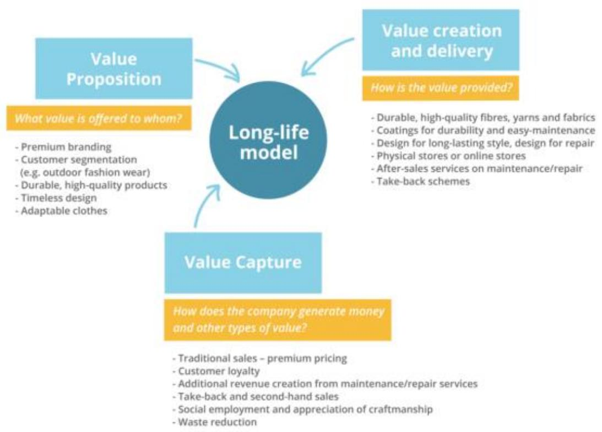

Figure 31 Properties of long product life business models in the textiles system. (European topic Centre on Waste and Materials in a Green Economy, 2021)

Access-based business models can be valuable for customer segments that are less driven by ownership of goods (Figure 33). Leasing, renting or other product-as-a-service models ensure textile products remain the property of the company running the system, while the customer pays to have access to their use. Access-based models can lead to lower resource use by increasing the use rate of the product stock. However, these models can drive additional consumption, so their design and implementation should take this potential rebound effect into account.

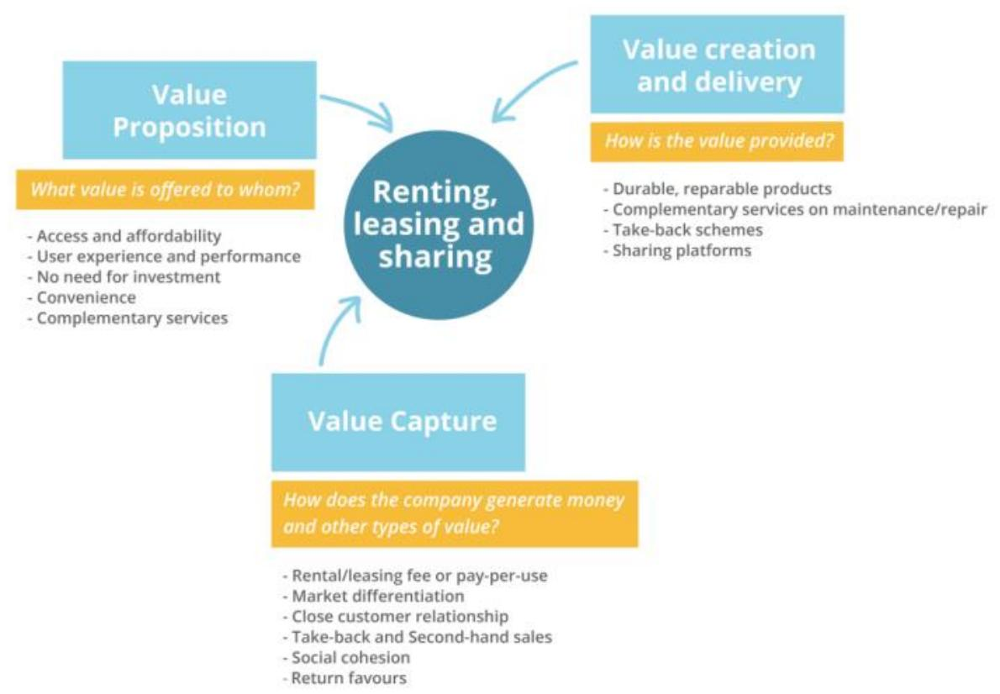

Figure 32 Properties of access-based business models in the textiles system. (European topic Centre on Waste and Materials in a Green Economy, 2021)

Collection and resale business models capture the residual value of textiles beyond the first user (Figure 34). The collection of used textiles can be limited to brands taking back only their own, usually high-quality, products for resale in the second-hand market or as vintage collections. This resale model addresses niche markets of consumers sensitive to fashion trends. Volume-driven general collection and resale models, however, focus on maximising the price differential between collection and sorting costs on the one hand, and revenues from selling the textiles on the global reuse and recycling markets – mostly done by third parties or charity organisations.

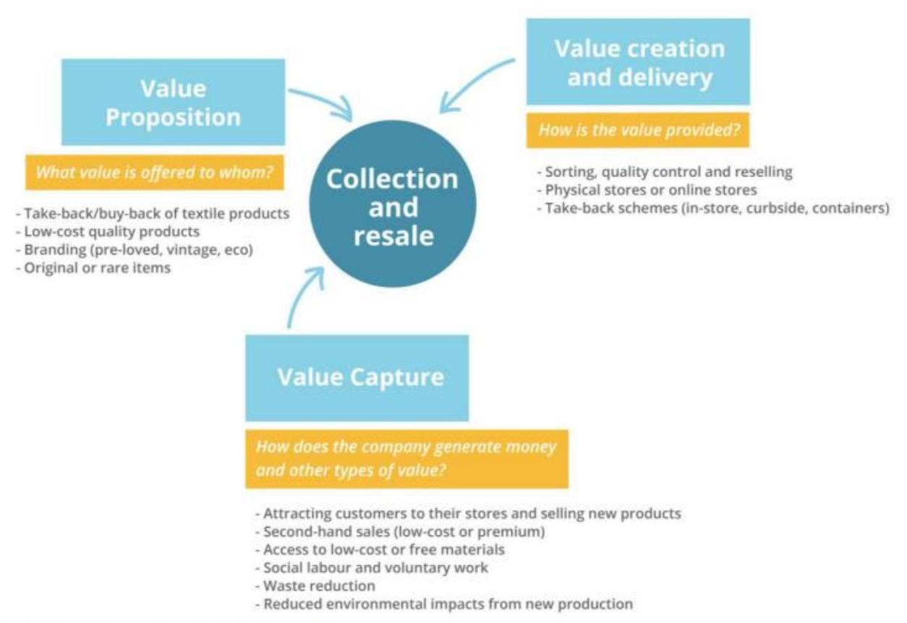

Figure 33 Properties of collection and resale business models in the textiles system (European topic Centre on Waste and Materials in a Green Economy, 2021)

Finally, recycling / material reuse business models capture any residual value from the materials contained in the textile items, by turning waste textiles into raw materials for new textile production chains (Figure 35). It can be pre-consumer waste such as unsold clothes, or post-consumer textile waste, and the material reuse can be of product parts, for instance involving small product adjustments or the reuse of fabric in new products; or of fibres, producing recycled fibres and using recycled materials in new products. The value of material recycling today mainly lies in avoiding landfilling or incineration costs.

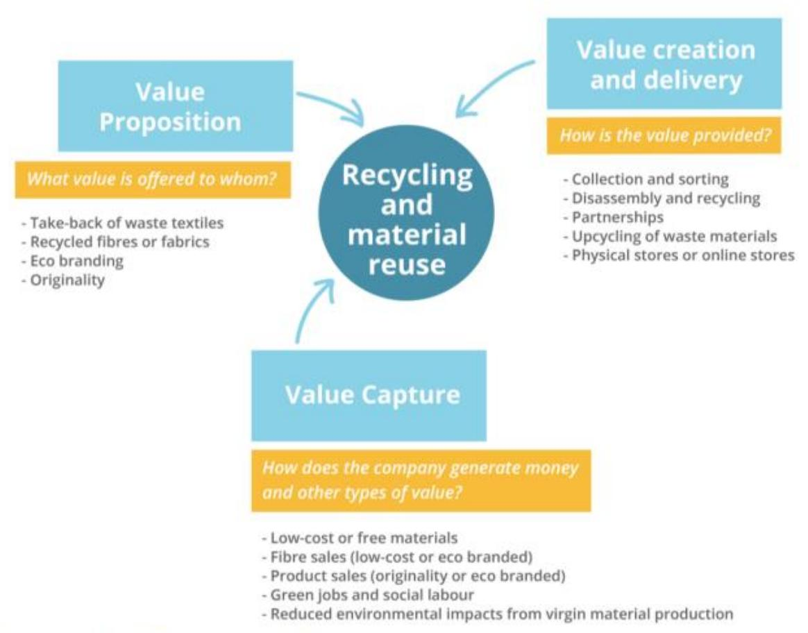

Figure 34 properties of recycling and material reuse business models in the circular textiles system. (Eionet, 2021)

# **5 Recycling**

According to ADEME recycling can be defined according to the level of degradation of the material. Two types of recycling can be distinguished (ADEME, 2021) :

- Closed-loop recycling: use of the recycled material for an identical use and destination without functional loss of the material: recycling of a PET bottle into a PET bottle, recycling of container glass into container glass, recycling of road mix into the manufacture of new mix, etc.
- Open-loop recycling: use of the recycled material for a different purpose, but as a substitute for a virgin raw material: recycling of a PET bottle into fleece, recycling of paper into insulation, etc.

#### **The SCIRT project, which aims to develop circularity and closed-loop recycling, will focus on this closed loop.**

In the textile industry closed-loop recycling is not mature enough (less than 1% fibre to fibre recycling). Most clothing recycling is open-loop and aimed at producing insulation. The process of recycling clothes is a series of steps:

- Collecting clothes at the end of their life
- Sorting clothes.
- Dismantling and pre-processing.
- Recycling. Recycling can take place in three different ways: mechanical, chemical or thermal.

Below is a diagram summarising the different stages of garment recycling:

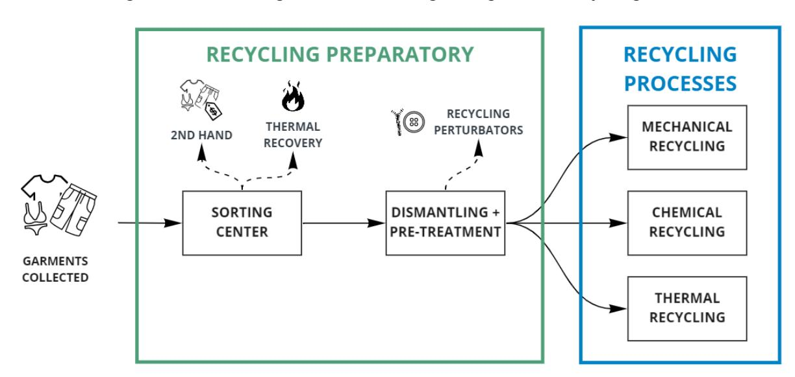

Figure 35 - Garment recycling steps

One of the deliverables of the Fibersort project, that ended in 2020, was a document that provided an overview of current & potential end-markets for fibersorting materials - textile to textile recycling". It identifies circular textile recycling solutions and gives information about material/product input and output (The End Markets for Fibersorted Materials, 2020).

## **5.1 Preparation for recycling**

### **5.1.1 Garment sorting**

Exchanges and interviews with French garment collectors & sorters conducted by ESTIA made it possible to draw up an initial assessment of the sorting situation and how it will evolve in the future.

Below is a representation of how garment sorting will be carried out in the future:

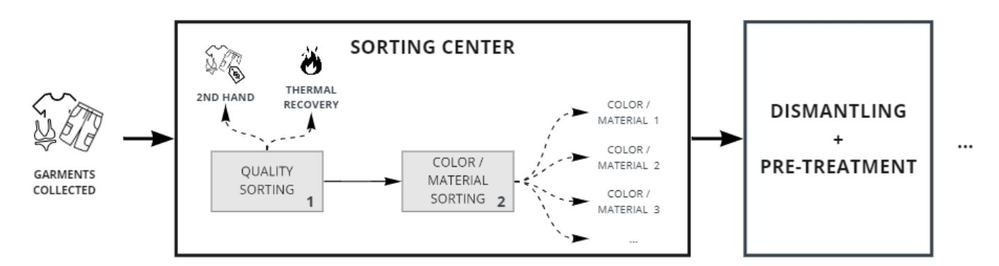

Figure 36 - Garments sorting process

Garment sorting will include 2 sorting phases:

**1- Quality sorting:** Garments will be sorted according to their type and quality and sent to: o **2 nd hand market** in Europe, Asia or Africa. This enables a product's value to be retained (economical and physical) and the product's environmental impact to be to reduced by giving it a new life. **2- Colour/Material sorting:** Garments which cannot be reused and are not used for thermal recovery need to be sorted undergo qualitative recycling. To enable it and to avoid fabric, re-dyeing once the recycling process has been carried out colour /material sorting is required. This will lead to the separation of each garment in according to its colour and the material it is made of.

## **5.1.2 Automated Sorting Solutions (Re\_Fashion, 2020)**

In order to be able to recycle clothes and have efficient recycling channels, it is necessary to sort clothing materials by composition and colour. Sorting by composition is imposed by the fact that each material will have its dedicated channel. Sorting by colour is for environmental reasons and allows the fibres not to be re-dyed at the end of the process. This colour/material sorting can be automated with machines which include material recognition equipment.

- Most of the equipment for material recognition is based on the principle of spectroscopy. A spectrometer is a piece of equipment used to analyse the composition of a sample. It works as follows:
  - 1. An electromagnetic wave is sent to the sample to be analysed.
  - 2. Interaction between the electromagnetic wave and the chemical structure of the sample (molecule, atoms, bonds, etc.)
  - 3. Measurement of the wave after interaction with the sample.
  - 4. Production of a spectrum.

The spectrum represents the chemical signature of the sample. Thus, by comparing the spectrum of a part of unknown composition with a database of reference spectra of preregistered samples, it is possible to determine the composition of the analysed part.

It seems that the technology is particularly suitable for textiles as different materials are well distinguishable in the near infrared (Re\_Fashion, 2020).

A study commissioned by the French eco-organisation Refashion has identified the different technologies for automated sorting using NIR sensors. Below is an extract from this study:

Figure 37: European automated sorting solutions

#### **SIPTEX**

The SIPTex project (Swedish Innovation Platform for Textile sorting) is a Swedish project for textiles sorting.

The SIPTex project started in 2015 with a preliminary study (SIPTex 1). It then continued from 2016 to 2018 (SIPTex 2) with the construction of a pilot unit in Avesta which operated for 12 months. An optical sorting machine from TOMRA was used for these tests. Since 2019, the project has taken on a new dimension with the construction of an industrial-scale textile material sorting unit in Malmø (SIPTex 3). This plant has been operational since the summer of 2020 and will gradually reach a capacity of 24,000 tons per year. The sorting unit is supported for the first two years by the Swedish Innovation Agency but aims to be profitable in the medium term.

| Country        | Sweden                                                                                                                                 | etal 
<b>ivl</b>
 SVENSKA MILJÖINSTITUTET |
|----------------|----------------------------------------------------------------------------------------------------------------------------------------|---------------------------------------------------------------------------------------|
| Technology     | Near + color                                                                                                                           |                                                                                       |
| Supplier       | TOMRA                                                                                                                                  |                                                                                       |
| Project leader | IVL(research institute) & Sysav (waste management operator)                                                                            |                                                                                       |
| Other partners | Brands (H&M, Ikea,...), Sorters (Boer), Recycler (re:newcell), environnent agencies                                                    |                                                                                       |
| Supports       | Sweden innovation agency support (Vinnova): <ul><li>-SIPTex 2 : 0.8 M€.</li> <li>-SIPTex 3 : 2 M€.</li></ul> |                                                                                       |

#### **FIBERSORT**

The Fibersort project is a European Interreg project which aims to develop the Fibersort sorting machine. It also aims to communicate about textile recycling and bring together different stakeholders.

The project started in 2016 and ended in March 2020 with the public presentation of the final version of the pilot installed in Wormeveer (suburb of Amsterdam).

The Valvan machine consists of:

- A spectrometer at the beginning of the line that identifies the material and the colour.
- A long conveyor with sorting bins arranged along it and a side blowing system.

The pilot line can currently sort 45 different categories (materials/colours). It has been progressively improved with the installation of robots for automatic line feeding, the addition of colour sorting and improved material identification. This project will also eventually identify the structure of the textiles (weaving/knitting).

|   |                                                                                                     |                                                                   |  |
|----------------|------------------------------------------------------------------------------------------------------------------|--------------------------------------------------------------------------------|---------------|
| Country        | Netherlands                                                                                                      | <b>Interreg</b>  North-West Europe                   |               |
| Technology     | Near + color                                                                                                     | <b>Fibersort</b>  European National Development Fund |               |
| Supplier       | Valvan                                                                                                           |                                                                                |               |
| Project leader | Circle Economy                                                                                                   |                                                                                |               |
| Other partners | Sorters (Smart Fibersorting, wieland textiles subsidiary), Collectors (ReShare), Recycler (Worn Again, Procotex) |                                                                                |               |
| Supports       | EU funding of 1.9 M€ for a total budget of 3.38 M€                                                               |                                                                                |               |

#### **Telaketju / LSJH**

Telaketju is a network and set of projects that has aimed to develop a textile recycling industry in Finland since 2017.

Among the various Telaketju projects, the Lahti University of Applied Sciences had built and tested an automated mini-sorting line (REISKAtex project).

Using this experience, the operator LSJH is now planning to build a textile sorting unit in southwest Finland.

LSJH works with sensors from Spectral Engines. They developed a textile recognition model in 2019. They plan to use the spectrometer to support manual sorting and testing in the first instance. In a second phase, the sensor will be integrated into an automated sorting machine.

In the longer term, and in particular to meet the European obligation to separate collections of textiles in 2025, they would like to extend their material sorting system to all regional waste management operators in Finland.

|   |                                                                                              |              |  |
|----------------|-----------------------------------------------------------------------------------------------------------|---------------------------|---------------|
| Country        | Finland                                                                                                   | telaketju                 |               |
| Technology     | Near + color                                                                                              |                           |               |
| Supplier       | Spectral Engines                                                                                          | LOUNAIS-SUOMEN JÄTEHUOLTO |               |
| Project leader | LSJH (public waste management operator)                                                                   |                           |               |
| Other partners | Research institutes, Universities, Collectors, Recyclers, ..                                              |                           |               |
| Supports       | Multiple projects with different fundings. 1.5 M€ funding from Business Finland for the LSJH sorting unit |                           |               |

#### **RESYNTEX**

The RESYNTEX project is a major EU-supported multi-partner project that aims to develop the chemical recycling of several textile materials. This project included a material sorting part carried out by Soex.

During the RESYNTEX project, a prototype of a small sorting line with a conveyor and spectrometer was developed. This was a test equipment and therefore the feeding and material separation parts were not automated.

The RESYNTEX project was completed in spring 2019. Soex has since continued the development of the prototype on its own.

| Country        | Germany                             | <b>RESYNTEX</b> X |
|----------------|-------------------------------------|----------------------|
| Technology     | Near + color                        |                      |
| Supplier       | LLA Instruments                     |                      |
| Project leader | SOEX (textile sorting operator)     |                      |
| Other partners | Chemists, universities, brands, ... |                      |
| Supports       | Total budget RESYNTEX : 11M€        |                      |

#### **OTHER AUTOMATED SORTING PROJECTS**

The projects presented above have the particularity of being partly supported by national or European Union organisations. A certain amount of information is therefore publicly available about them.

There are certainly other actors developing textile sorting projects in Europe, in a more confidential manner.

However, here it is worth mentioning the Spanish sorting operator Koopera, which has material sorting projects and is supported by the Basque Country's Spanish region.

It uses equipment from the German manufacturer Iosys and its distributor GUT.

## **5.1.3 Dismantling Pre-processing**

Once sorted, garments which need to be recycled will have a dismantling process to remove hard points and recycling perturbators. This means that all external recycling perturbators will be extracted. As already mentioned, Re\_Fashion carried out a study on these internal and external perturbators (Re\_Fashion, 2014):

- **External perturbators:** the elements added to fabrics to create a garment. They can be classified in 4 categories: o **Fasteners**: Zipper, button, clasp, snap, stitching thread, eyelet, … o **Data carriers**: woven label, printed label, RFID chip o **Accessories with a functional purpose:** reflective strips, anti-slip strips, elastic band, rivet, foam, lining, … o **Accessories with an aesthetic function**: lace, embroidery, sequins, beads, bows, …
- **Internal perturbators:** constituent or structural elements of the main fabric of the garment.

Once the hard points have been removed from the garment, it is important to separate the different materials that compose the garment in order to redirect them to the right recycling channels. Before recycling, extracted fabrics or dismantled garment will be cut into small pieces.

## **5.2 Mechanical recycling**

According to DRAFT DIS 5157, mechanical recycling is a process based on physical forces which may be used in isolation for fabric or fibre recycling or as pre-processing for thermo mechanical or chemical and biochemical recycling processes.

One of the big advantages of this process is that all types of material (natural, synthetic and blends) and textiles structures (knitted, woven, and non-woven) can be recycled with this process.

### **5.2.1 Mechanical recycling process**

The diagram below represents the mechanical recycling process:

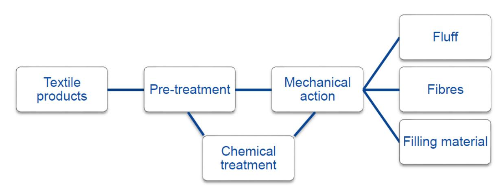

Figure 38 - General mechanical recycling process (Duhoux T. & al, 2021)

Pre-treatment for mechanical recycling involves removing hard points from and shredding fabric pieces to turn them into a near fibrous form that can be re-spun. For contaminated textiles (unwashed or dirty garments) a sanitation phase is needed during pre-treatment. Then, the material passes between a rubber cylinder, which grips the fabric, and a cylinder with spikes that scrapes the material and extracts the fibres.

The resulting fibres are blended with virgin fibres to ensure mechanical yarn properties. It is important to blend extracted fibres with virgin fibres because the shredding process shortens the fibre length and weakens its strength. In fact the recycling process makes the fibre quality decrease and if the objective is to spin it into yarn, it is necessary to blend it with virgin fibres (S. Roos, et al. 2019) (Lindström, et al. 2020).

The European Centre for Innovative Textiles (ECIT) is able to incorporate 70% of recycled fibres in their process, whereas other recycling techniques incorporate around 50%. ECIT states that this is particularly the case for both cotton and wool.

To make a new yarn, the fibre mixture must be passed through a blender. The output of the blender is a sliver which will form the basis of yarn making.

The resulting slivers are spun in spinning machines, such as open-end spinning machines This spinning technique allows very short fibres to be spun. This risk with the use of short fibres that the yarn breaks while spinning.

## **5.2.2 Mechanical recycling process limits**

Mechanical recycling is more commonly used due to the fact the technology is more developed and less expensive (Recycling - Technological Breakthroughs for Fashion, 2021), there limitations, namely:

- 1. **Inferior quality to virgin fibres**  mechanical recycling damages fibre structure and reduces quality after each round of recycling
- 2. **Inability to separate blended fibres** this limits the volume of recyclable textiles, and many blended fabrics are actually 'down-cycled' into lower value textiles such as carpet and insulation

## **5.2.3 Mechanical recycling improvement solutions**

Improvements on mechanical recycling has been proposed by Lindström & al. (2020). This improvement is allowed by using Lubricant Pre-Treatment to Mitigate Length Loss of Fibres:

It is possible to increase a fibre's length by mechanically recycling fibres using PEG 4000 treatment. The PEG lubricant reduces cohesion between fibres in the cohesion test and in the tearing process. The fabrics disassemble more easily, and the effect is visible on recycled fibres. The inter-fibre cohesion test proved successful in predicting a more efficient tearing process with lubricant treated fabrics. Pre-treatment with PEG resulted in:

- Decreased inter-fibre cohesion.
- A tearing process with higher efficiency.
- Decreased fibre length reduction during tearing.
- Enabling rotor spun yarn from 100% recycled fibres.

The lubricating effect on yarn tenacity was also shown by increased strength after removing lubricant through washing. This further proves the inter-fibre cohesion reduction effect of PEG. This paper shows the potential of lubricant treatment to decrease inter-fibre cohesion during tearing and to increase the value of mechanically recycled fibres. As textile waste can be made up of many different fibre types, in the future it would be valuable to study suitable lubricants for different fibres and different fibre blends.

## **5.3 Chemical recycling**

According to draft DIS 5157, chemical recycling is a process using dissolution or chemical reactions which is used in polymer or monomer recycling. There are several possibilities with this recycling technology :

- monomer recycling: system for breaking down polymeric textile materials into their constituent monomers and rebuilding polymeric fibres for new uses
- polymer recycling: system for disassembling used fibres, extracting polymers and re-spinning them for new uses

Chemical textile recycling adopts a series of chemical processes to depolymerise/dissolve the fibre from the fabric into monomer/solvent form either to make new fibre compounds from it or to extract one compound from a mix. The output products are most often the same in quality as their virgin counterparts, with no loss in physical properties through the recycling process. This technology is much more advanced to mechanical recycling as it uses chemicals, enzymes, controlled environment, etc. for its process and thus has the added benefit of less limitations in the form of fabric such as woven, knits catering to a wide range of products like jackets, auto-parts, home decors etc. (Textile Recycling: The Chemical Recycling Process of Textiles, 2021).

Chemical recycling solutions can be divided into 3 sub-categories of the recycling process. These sub-categories result from the composition of the fabrics:

- Chemical recycling for synthetics fibres.
- Chemical recycling for blended fibres.
- Chemical recycling for natural fibres.

## **5.3.1 Chemical recycling for synthetics**

Chemical recycling for synthetic fibres aims to depolymerise them. It involves breaing polymer chains to go back to the original monomers. It is then possible to convert these monomers into polymers with the same properties as the ones that were originally depolymerised.

In theory, a large quantity of polymers can be recycled with chemical processes. However, in practice, PET and PA6 (nylon 6) are the only synthetic fibres recycled with a depolymerisation process on a commercial, though still limited, scale (S. Roos, et al. 2019).

The diagram below represents the chemical recycling process for PET & PA6 :

Figure 39 - General chemical recycling process of PET & PA6 (Duhoux T. & al, 2021)

### **NON-EXHAUSTIVE REVIEW OF TECHNOLOGY HOLDERS:**

These technologies have become widely available in recent years, particularly for recycled post-consumer nylon (i.e. made from fishing nets and nylon waste). Taiwan s chemical conglomerate and Italy s [Aquafil](https://www.commonobjective.co/aquafil) Group are the two main companies who use proprietary technologies to produce chemically recycled nylon on a commercial scale. In particular, Aquafil sells its recycled nylon yarn Econyl® to a wide network of fabric mills, such as [Recyctex](https://www.commonobjective.co/recyctex) (Recycling - Technological Breakthroughs for Fashion, 2021). These solutions use conventional chemistry. Research into enzymatic depolymerisation is carried out to develop more environmentally responsible solutions.

#### ENZYMATIC DEPOLYMERIZATION

Antonio Biundo did research into enzyme optimisation for polymer modification to enable polyester recycling through "…the enzymatic modification and functionalization of polyesters as well as the enzymatic production of bio-based polyesters for a more environmentally friendly approach. Basically, the production of bio-based polyesters can be achieved by means of biocatalytic reaction with the use of renewable feedstock, while high energy and harsh chemicals methods for the modification and functionalization of fossilbased polyesters can be avoided and replaced by recombinant wild-type or modified enzymes to improve their activity on polyesters…" (Biundo et al., 2017).

Carbios also developed and patented (CARBIOS, 2021) a ''method for recycling at least one plastic product, the method comprising depolymerizing at least one polymer of the plastic product to monomers using an enzyme and recovering the resulting monomers. The enzyme is a degrading enzyme suitable for depolymerizing at least one polymer of the plastic product to monomers''. Currently their solution is not mature and only at lab scale, but they raised up to €114 billion in funds to construct a plastic recycling facility (Chimie verte: with its 114 million euros, Carbios will open its first plastic recycling plant, 2021).

## **5.3.2Chemical recycling for blended fibres**

Chemical recycling can be used to separate the fibre constituents from the mix of different fibres of both natural and synthetic origin. This recycling is useful because most of the fabrics present are there with a percentage of blends and the first step of recycling them is to separate the constituent fibres. With a homogeneous mix of fibres in the fabric, mechanical separation is very difficult, but this can be achieved chemically by working with different physical properties of the fibres (Textile Recycling: The Chemical Recycling Process of Textiles, 2021).

#### **NON-EXHAUSTIVE REVIEW OF TECHNOLOGY HOLDERS:**

#### WORN AGAIN POLYCOTON RECYCLING PROCESS

[Worn Again,](https://www.commonobjective.co/worn-again-technologies) is a textile technology company focusing on recycling blended fibre. Its technology can separate and recapture polyester (PET) and cotton from discarded, lowvalue clothing to produce virgin-equivalent, cost competitive polyester and cellulosic raw materials for continual recycling. Worn Again formed a partnership with Kering Group and H&M in late 2019 and also received strategic investments to accelerate the commercialisation of its technology. Rapid expansion is planned for after its demo plant expected in 2021 (Recycling - Technological Breakthroughs for Fashion, 2021).

Adam [Walker,](https://www.linkedin.com/in/adam-walker-05b1567/) a physical chemist and the company's chief scientific officer explains: "For polycotton, we need to extract two polymers with very different solubility characteristics," The first step is a basic cleaning, "We swell the polyester fibres to leach out any small molecule contaminants like dyes and so on," says Walker. This leaves pure polycotton saturated with solvent ready for heating in the next stage.

"At a higher temperature, the polyester dissolves and goes into solution, leaving the cotton behind as a solid," Walker adds. The cotton and polyester can then be separated by filtration.

Once the solvent has been removed from the polymer it is ready to be re-spun back into polyester fibre. "The PET [polyethylene terephthalate] we produce is exactly the same as a virgin PET pellet that would come out of a polymerisation plant".

Meanwhile, the solid cotton fibres are dissolved with a novel ionic liquid. "The resultant viscous dope can be processed in a number of ways. What we're doing currently is making a pulp, which is equivalent to a wood pulp, and that can be used as a raw material for existing cellulosic fibre spinning processes" (The Chemical Recycling of Clothes. Part 3; The Future, 2021).

The "worn again" process is illustrated below:

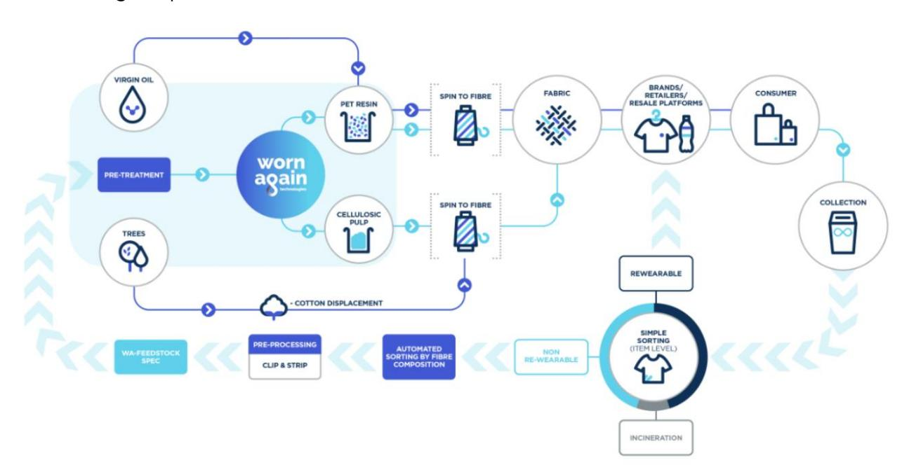

Figure 40 - Worn Again polycoton recycling process (Worn Again, 2021)

#### HKRITA POLY COTTON RECYCLING PROCESS

HKRITA (Hong Kong Research Institute of Textiles and Apparel) developed a solution to separate polyester fibres from a polycotton blend with a solvent-based technology named The Green Machine . The process of 'The Green Machine uses only heat and water with less than 5% biodegradable green chemicals. It enables the cotton in the blend to be converted into liquid cellulose. Once the cellulose has dried, the output is polyester fibres and cellulose powder. (Textile Recycling: The Chemical Recycling Process of Textiles, 2021).

#### TEX2MAT RECYCLING PROCESS

The TEX2MAT project is a FFG (Austrian Research Promotion Agency) promoted project conducted by a consortium of 13 research and private institutions.

Their objective was to develop an enzymatic recycling process for blended fibre recycling. They developed it by achieving case studies with different pre- and post-consumer cotton/polyester textiles from Austria. The goal was to demonstrate textile to textile recycling for blended fibres. The Viennese University of Natural Resources and Life Sciences developed and used a new approach by using the enzymatic hydrolysis of cellulose to separate cotton from polyester.

This recycling technology converts cotton into glucose with polyester conserved as the only polymer. The polyester is separated from glucose through a filtration system. Then, the glucose is used as a raw material for other chemical solutions while polyester is re-spun into yarns. (Piribauer et al., 2020).

## **5.3.3 Chemical recycling for natural fibres**

Natural fibres that contain cellulosic materials can be recycled chemically by using a pulping process. Regenerated fibres are produced through a spinning process of the pulp.

Cotton to viscose is one of the most generalised forms of chemical textile recycling on the market, but other cellulosic materials such as wood, viscose or cardboard can be recycled using this technology.

The purity of the input material has an important impact on the recycling process. In fact, any contamination (i.e. non-cellulosic content) will reduce the yield or require additional separation or purification steps. It will have a negative impact on the economic and environmental cost.

### **NATURAL FIBRES RECYCLING PROCESS**

The diagram below represents the recycling process ouf cellulosic materials:

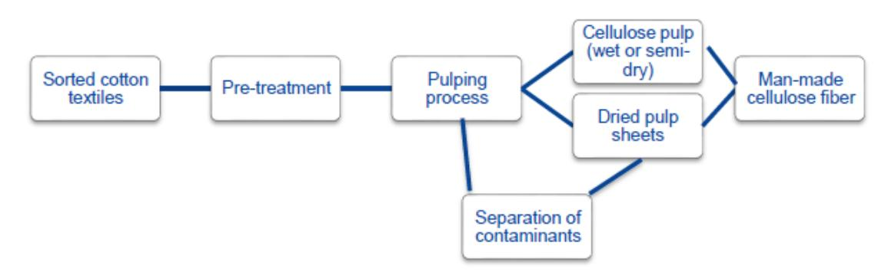

The pulping process is a process where the cellulose is suspended in a liquid with chemicals to be depolymerized. The material is then turned into a slurry/pulp called dissolving pulp. Some steps can be included in order to adjust the cellulose's viscosity and reactivity. During this process, chemical treatment is usually used to remove dyes and finishes. As in the traditional wood pulp process, a bleaching step is used.

Then the pulp is in the form of either:

- Wet or semi dried pulp and can be mixed with wood pulp for processing in a traditional spinning process.
- Dried to be stored and sent to spinning mills.

#### **NON-EXHAUSTIVE REVIEW OF TECHNOLOGY HOLDERS:**

#### BIRLA CELLULOSE AND LENZING

Birla Cellulose and Lenzing have both worked on cellulosic recycling. These companies have a relatively similar process which starts by pulping the cotton.

With similar technologies, the process starts with depolymerising the 100% cotton fabric mostly from pre-consumer waste or post-consumer waste. The depolymerised pulp is then converted into cellulosic fibre in a process similar to that of recovering viscose from wood pulp.

However, in the conversion process, the polymer chains formed are not as strong as that from the wood pulp. Therefore, the mechanical properties decrease and the regenerated fibres have to be mixed with virgin viscose fibres to improve its properties. Currently for an optimal recycled viscose yarn around 20-30% of regenerated viscose can be used, but with technological improvements, this percentage increases and Birla Cellulose was already making a drive towards developing solutions for 50%+ recycled content by 2020 (Textile Recycling: The Chemical Recycling Process of Textiles, 2021).

Lenzing also launched a new fibre named Refibra™, produced from a mix of pulp from chemically recycled cotton scraps (20%) and eucalyptus wood pulp (80%), resulting in a new TENCEL™ Lyocell fibre type. Refibra™ is the first cellulose fibre including recycled material that can be produced on a commercial scale and can be found in fabrics from suppliers such as Pyrates (Recycling - Technological Breakthroughs for Fashion, 2021).

#### **IONIC LIQUIDS: AN OPPORTUNITY FOR THE CHEMICAL RECYCLING OF NATURAL FIBERS**

The use of ionic liquids could also represent a real solution for the chemical recycling of natural fibres. Schuch A. (2016) presents an innovative environmental alternative related to the extension of lifecycle of cellulosic textiles through the medium of chemical recycling" which is an ionic liquid. ILs are organic salts in liquid state with a low melting point, usually below 100°C. They contain an organic caution/anion, have a very low vapour pressure even up to 300°C, present chemical and thermal stability, and are non-flammable (one difference compared to NMMO solvent by Tencel®) (Schuch, 2016).

## **5.4 Thermal recycling**

The draft DIS 5157 does not for the moment define thermal recycling. In the Study on the technical, regulatory, economic and environmental effectiveness of textile fibres recycling, thermal recycling is described as a process based on heating with the aim of recovering either polymers or low molecular weight building blocks".

Thermal recycling includes two categories of recycling:

- Thermo mechanical recycling process: According to draft DIS 5157, it is "a process used in recycling systems that melt a polymer, typically used for polymer recycling.
- Thermo chemical recycling process: "*Recycling process using partial oxidation reaction of polymers to produce low molar mass components or heat to degrade polymers to monomers that can be used as feedstock for the chemical industry, with the exclusion of fuels used for energy production or other combustion or energy recovery processes.".* At the moment, this recycling process is not included in draft DIS 5157, but research is underway and considers textiles as an input material (Duhoux & al., 2021).

The diagram below summarises the possibilities of thermal recycling:

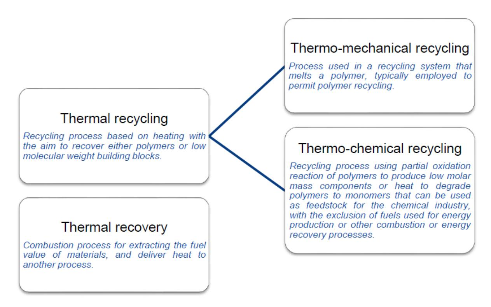

Figure 42 - Thermal recycling alternatives (Duhoux T. & al, 2021)

Due to SCIRT s project objective to demonstrate the textile to textile circular recycling process, we will focus exclusively on thermo mechanical recycling.

With the thermo mechanical recycling process, theoretically any thermoplastic material can be recycled. It is important to remember that only one polymer type or compatible polymers can be recycled at the same time with this process. If this is not the case, incompatible polymers will not blend and cause problems in processing.

Usually, thermo mechanical recycling technology providers, such as EREMA, recommend having the same composition of fabrics because all the materials entering the process must have the same melting point.

The illustration below shows the thermo-mechanical recycling process:

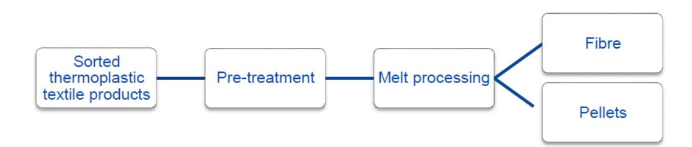

Figure 43 – General thermo mechanical recycling process (Duhoux T. & al, 2021)

The thermo mechanical recycling process is relatively similar to the extrusion process of virgin thermoplastic polymers. The only difference is pre-treatment where the textile is purified from non-textile parts, washed, dried and shredded.

The melting process includes steps to compound and regranulate thermoplastic textile waste. The granulate can further be processed into fibers through melt spinning or other processing techniques (Ragaert, Delva en Geem 2017).

Due to the low bulk density of textile/fibre fluff, specialised shredding, feeding and/or compacting equipment is often required to maintain a constant supply of textiles.

To produce textile fibres, the regranulate must pass through a melt spinning process. Polymers go through a single crew extruder where they are melted to a suitable viscosity by increasing temparture through shearing constraint. The melted polymer is then extruded through a spin pack and cooled to enable material solidification in continuous filaments. A melt pimp is used to control the throughput. Once cooled, the filaments are drawn by heated godets to increase material orientation and therefore fibre strength. Finally, filaments are spooled onto a bobbin with a winder (Hufenus, et al. 2020).

To achieve thermo mechanical recycling, EREMA INTAREMA TVEplus technology has been scoped by CETI for the SCIRT project. Their goal is to demonstrate polyester textile to textile recycling possibilities.

## **5.4.2 Detailed description of thermo mechanical recycling with the Erema densification machine**

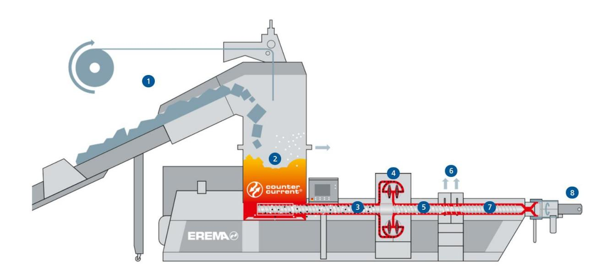

Figure 44 - EREMA INTAREMA TVEplus densification machine (INTAREMA TVEPLUS | EREMA Plastic Recycling, 2021)

Feeding (1) is automatic according to customer requirements. In the Preconditioning Unit (2) the material is cut, mixed, heated, dried, pre-compacted and buffered. Next, the tangentially connected extruder is filled continuously with hot, pre-compacted material. The innovative Counter Current technology enables optimised intake action across an extended temperature range.

In the extruder screw (3) the material is plasticised and degassed in reverse. At the end of the plasticising zone the melt is directed out of the extruder, cleaned in the fully automatic, self-cleaning filter (4) and returned to the extruder again. The final homogenisation of the melt (5) takes place after the melt filter. In the subsequent degassing zone (6) the filtered and homogenised material is degassed. Following this, and with the help of the discharge zone (7), the melt is conveyed to the respective tool (8) (e.g. pelletiser) at extremely low pressure (INTAREMA TVEPLUS | EREMA Plastic Recycling, 2021).

## **5.4.1 Thermo-mechanical recycling of polymers with a high shear mixing technology**

Brands such as Plymouth in France or Rep international have developed a solution that enables the devulcanisation of rubber. Rep International's High Shear Mixing technology is described as a *"Method of devulcanising a cross-linked elastomeric material"*.

''When rubber is vulcanised the polymer chains that make up the rubber are chemically attached by a vulcanisation agent (usually sulphur) at different points along the chains, as shown in part B part of Figure 42. These attachments are known as crosslinks and they form a 3D network of polymer chains when vulcanisation is completed. It is this crosslinking of the chains that gives the rubber its mechanical characteristics.

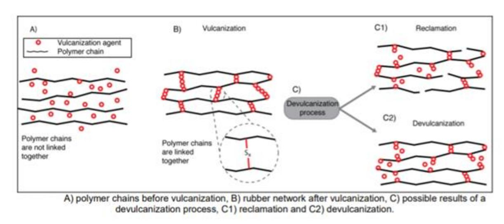

Figure 45 : Devulcanization processes

Ideally the recycling of rubber should be the devulcanisation of rubber, which consists of breaking all crosslinks so the polymer chains can be freed and subsequently vulcanised into another product. However, once they are created crosslinks are very difficult to break. This is an advantage during the useful life of a rubber product, but it is also the main challenge for devulcanisation.'' ((Diaz et al., 2018)

Even if rubber is not used for textile purposes, this technology can be adapted to polymers used for creating synthetic fibres in order to depolymerise them at the end of life of a garment.

# **6 Policy landscape**

In order to meet the climate challenges as well as the sustainable development goals defined by the United Nations, a transition is required. This is all the more true for an industry that is one of the most polluting. This transition is driven or supported by policies that promote the development of the circular economy in this sector. We have identified initiatives and action plans from public organisations to address this pollution.

# **6.1 Circular Economy Action Plan (European Council,2020)**

In terms of primary raw material and water consumption, the textile industry is ranked in fourth position. It is also the fifth GHG emitter. EU production, mainly composed of SMEs, has started to recover even if 60% of clothing is still produced elsewhere.

To address these challenges, the European Commission has created an EU Strategy for Textiles, based on input from industry and other stakeholders. Competitiveness and innovation are the two axes boosted for creating the EU market for sustainable and circular textiles, including the market for textile reuse and modelling new business models. To achieve those goals, the following measures have been taken:

- A new sustainable product framework for textiles containing: eco-design measures for circularity, use of secondary raw materials, limiting the presence of hazardous chemicals and facilitating access to sustainable textiles, reuse and repair for business and private consumers.
- Modify the business and regulatory environment to increase sustainable and circular textile use in the EU, especially providing support for circular processes and material use, and increasing transparency throughout the value chain with international cooperation.
- Giving a roadmap to achieve high levels of separate collection of textile waste, as agreed by all Member States by 2025.
- Improving the sorting, re-use and recycling of textiles through innovation, industrial application, and regulatory measures.

# **6.2 Waste framework directive (WFD) (European council, 2021)**

The EU Waste Framework Directive (WFD) defines the basic principles related to waste management for Member States of the European Union. The EU WFD sets a waste hierarchy which starts with prevention and ends with disposal. It was amended in 2018 and alongside other amendments it was legislated that Member States should promote re-use activities and repair networks, facilitating proper waste management and that by 1 January 2025 Member States shall set up separate collection for textiles (WFD, Article 12b DIRECTIVE (EU) 2018/851).

The targets set by the WFD for municipal waste are:

- by 2025 preparing for an increase a minimum of 55% by weight of recycling and reuse of municipal waste
- by 2030 preparing for an increase a minimum of 60% by weight of recycling and reuse of municipal waste
- by 2035 preparing for an increase a minimum of 65% by weight of recycling and reuse of municipal waste

A certain type of waste can be considered a product or a secondary raw material according to the end-of-waste criteria, when:

- the substance or object is commonly used for specific purposes
- there is an existing market or demand for the substance or object
- the use is lawful

# **6.3 European support for separate collection (Interreg Europe, 2020)**

The European Union supports this transition through European Structural and Investment Funds (ESIFs). Priorities have been set on IP2 Enhancing access to, and use and quality of, information and communication technologies and IP6 Preserving and protecting the environment and promoting resource efficiency . Those funds can be used for investing in collection infrastructure, awareness raising and education campaigns

For the period 2021-2027, the Regional Development and Cohesion Policy will focus on projects that support the shift towards a low-carbon, circular economy and the fight against climate change. In the priority A greener, carbon free Europe , the implementation of the Paris Agreement will be an important milestone.

The European Union has set a budget of €3.4 billion for the 2014-2020 period to support the environment and climate action with its LIFE Program. It focuses on small-scale projects aiming to share best practices, test technologies, and speed up the implementation of relevant EU legislation and policy. For the new LIFE Programme (2021- 2027), funding has increased by 60% to reach €5.4 billion.

# **6.4 Organisations and private sector initiatives to support textile circularity**

Initiatives are multiplying to develop circularity in general. These missions are carried out by different actors such as associations, marketers, or organisations. There are several targeted issues:

-**The reduction of microplastics.** Associations such as the Water Family and Surfrider are working to raise awareness and fight against water pollution, particularly microplastics released during the washing of clothes. This pollution is invisible but very real, as highlighted in the Ocean Wise report: *Canadian and US Laundry Releases Trillions of Plastic Microfibers into the Ocean* (Ocean Wise, 2019).

-**The use of recycled or upcycled materials.** Textile producers are increasingly seeking to use recycled materials in their products and communicating this. For example, there are initiatives such as Nike circularity, which is dedicated to the development of recycled materials to be integrated into new shoes. We can also take the example of C&A with its Cradle to Cradle Gold certified garments (C&A, 2021). This justifies the ecological interest of these materials as well as their recyclability.

-**The improvement of recycling and sorting channels.** This is one of the objectives of the SCIRT project.

All these initiatives can be supported by eco organisations such as Re\_Fashion in France, whose aim is to favorise the development of the circular economy in France.

# **7 Conclusion**

The fashion industry will face great challenges over the next decade. The business models of the past must evolve to adapt to modern environmental, ethical and sustainable development needs. Fast Fashion has brought about harmful practices on many levels such as working conditions, production volumes and unsold goods, lower quality etc...

The reindustrialisation of rich countries that consume clothing is an issue that will allow us to act in several fields. The first is to control working conditions in the sector. The economic model must no longer rely on forced labour, wages below the subsistence minimum or the child labour. This will also make it easier to manage production volumes and thus minimise unsold products. Finally, the management of chemical products and environmental impact can be more easily controlled.

In terms of circularity, the textile industry must progress in several areas. It is necessary to foresee the dismantling of clothes from the design stage to make this easier and increase the quantity of recyclable material. Eco-design also requires the use of sustainable materials and assembly processes that are easily reversible.

Research must be improved in terms of material recycling processes to allow better circularity in a closed loop. Even if reuse or transformation is the most ecological way for end of life of clothing, there will always remain important volumes that must be recycled to prevent thermal recovery or landfill.

Consumer trends have begun to shift towards more sustainable consumption patterns. Reducing the environmental impact of the entire life cycle of a garment is becoming an increasingly important consideration in consumer expectations. Although fast fashion remains the dominant mode, brands are increasingly turning to slow fashion, both for their brand image and for their own desire to be more sustainable.

# **Bibliography**

**Achterberg, E., Hinfelaar, J., Bocken, N.M.P. (2016).** Master circular business models with the Value Hill. White paper, September 2016.

**Adamu, BF (2021).** Extraction of Ethiopian Kusha fiber from Ethiopian Kusha Plant by different methods and characterization of its morphological and mechanical properties, ISSN 2590-048X, [https://doi.org/10.1016/j.rinma.2021.100238.](https://doi.org/10.1016/j.rinma.2021.100238)

**ADEME (2019).** Le revers de mon look - Quels impacts ont mes vêtements sur la planète? [https://librairie.ademe.fr/cadic/4367/lrdml\\_expo\\_affiche\\_a2\\_conception\\_version\\_def.pdf?](https://librairie.ademe.fr/cadic/4367/lrdml_expo_affiche_a2_conception_version_def.pdf?modal=false) [modal=false](https://librairie.ademe.fr/cadic/4367/lrdml_expo_affiche_a2_conception_version_def.pdf?modal=false)

**ADEME. (2021).** La chaîne du recyclage : du produit au produit en passant par le déchet. [https://www.ademe.fr/expertises/dechets/passer-a-laction/valorisation-](https://www.ademe.fr/expertises/dechets/passer-a-laction/valorisation-matiere/dossier/recyclage/chaine-recyclage-produit-produit-passant-dechet)

[matiere/dossier/recyclage/chaine-recyclage-produit-produit-passant-dechet](https://www.ademe.fr/expertises/dechets/passer-a-laction/valorisation-matiere/dossier/recyclage/chaine-recyclage-produit-produit-passant-dechet)

**AG CHEMI GROUP Blog. (2021).** The Chemical Recycling of Clothes. Part 3; The Future. <https://blog.agchemigroup.eu/the-chemical-recycling-of-clothes-part-3-the-future/>

**Alagirusamy, R. et al. (2015).** Chapter 8 - Conversion of Fibre to Yarn: An Overview, in Woodhead Publishing Series in Textiles, Editor(s): Rose Sinclair. ISBN 9781845699314, [https://doi.org/10.1016/B978-1-84569-931-4.00008-8.](https://doi.org/10.1016/B978-1-84569-931-4.00008-8)

**Al-Maharmaet, AY, et al. (2022).** 33 - Environmental impact analysis of plant fibers and their composites relative to their synthetic counterparts based on life cycle assessment approach, in The Textile Institute Book Series, Advances in Bio-Based Fiber, Woodhead Publishing,ISBN 9780128245439, [https://doi.org/10.1016/B978-0-12-824543-9.00022-0.](https://doi.org/10.1016/B978-0-12-824543-9.00022-0)

**Baley, C. et al (2021).** Multiscale Structure of Plant Fibers. 10.1016/B978-0-12-819724- 0.00112-9.

**Bending, R., & Eden, R. J. (1984)**. UK Energy: Structure, Prospects, and Policies. Cambridge, UK: Cambridge University Press.

**Better Work (2018)** – Global Gender Strategy. [https://betterwork.org/wp](https://betterwork.org/wp-content/uploads/2018/01/BW-GenderStrategy-v4-Web.pdf)[content/uploads/2018/01/BW-GenderStrategy-v4-Web.pdf](https://betterwork.org/wp-content/uploads/2018/01/BW-GenderStrategy-v4-Web.pdf)

**Biundo, A. and G bitz, G., (2017).** Enzyme Optimization for Polymer Modification. M.Sc. BOKU.

**Business Models in the Fashion Industry. (2019).** [https://440industries.com/.](https://440industries.com/) <https://440industries.com/identifying-business-models-in-the-fashion-industry/>

**C2ccertified.org. (2022).** What Is Design for Disassembly? - News - Cradle to Cradle Products Innovation Institute. [online] Available at: <https://www.c2ccertified.org/news/article/what-is-designfor-

disassembly#:~:text=Design%20for%20disassembly%20is%20a,%2C%20reversible%2C%20and%2 0robust.%E2%80%9D> [Accessed 9 February 2022].

**Cadre Intégré Renforcé (CIR) (2020).** Créer de meilleures chaînes de valeur de l'habillement dans les pays les moins avancés. [https://trade4devnews.enhancedif.org/fr/system/files/uploads/eif-policybrief-textile](https://trade4devnews.enhancedif.org/fr/system/files/uploads/eif-policybrief-textile-fr_final.pdf?file=1&type=node&id=6276)[fr\\_final.pdf?file=1&type=node&id=6276](https://trade4devnews.enhancedif.org/fr/system/files/uploads/eif-policybrief-textile-fr_final.pdf?file=1&type=node&id=6276)

**CARBIOS, (2021).** Method for recycling plastic products. WO 2014/079844 Al.

CarnegieTextile (2020). Different Types of Fabric Cutting Machines Used in Apparel Manufacturing. [https://www.carnegietextile.com/different-types-of-fabric-cutting](https://www.carnegietextile.com/different-types-of-fabric-cutting-machines-used-in-apparel-manufacturing/)[machines-used-in-apparel-manufacturing/](https://www.carnegietextile.com/different-types-of-fabric-cutting-machines-used-in-apparel-manufacturing/)

**CBI (2020).** Trends in Apparel, Which trends offer opportunities or pose threats on the European apparel market? Part of the Netherlands Enterprise Agency (RVO.nl)

**CBI (2021).** The European Market Potential for Recycled Fashion | CBI. [https://www.cbi.eu/market-information/apparel/recycled-fashion/market-potential.](https://www.cbi.eu/market-information/apparel/recycled-fashion/market-potential.%20Accessed%2019%20Nov.%202021)  [Accessed 19 Nov. 2021.](https://www.cbi.eu/market-information/apparel/recycled-fashion/market-potential.%20Accessed%2019%20Nov.%202021)

**CEE Group. (2021).** In what ways can we re-use our textiles? https://www.fccgroup.eu/en/fcc-cee-group/home.html. [https://www.fcc-group.eu/en/fcc-cee](https://www.fcc-group.eu/en/fcc-cee-group/news-and-media/stories-of-waste/all-about-textiles.html)[group/news-and-media/stories-of-waste/all-about-textiles.html](https://www.fcc-group.eu/en/fcc-cee-group/news-and-media/stories-of-waste/all-about-textiles.html)

**CENELEC (2020).** General Methods for the Assessment of the Ability to Repair, Reuse and Upgrade Energy-Related Products

**Chapman, J. (2009).** Design for (Emotional) Durability. Design Issues, 25(4), 29-35.

**Chinthapalli,R. et al. (2019).** Bio-based Building Blocks and Polymers – Global Capacities, Production and Trends 2018–2023. Nova-Institute

**Clark, G. (2007)**. Evolution of the global sustainable consumption and production policy and the United Nations Environment Programme's (Unep) supporting activities. Journal of Cleaner Production, 15(6), 492 498.<https://doi.org/10.1016/j.jclepro.2006.05.017>

**Clean Clothes Campaign (2014).** Stitched up : Poverty wages in the garment industry in eastern europe and turkey. [https://cleanclothes.org/file-repository/resources-publications](https://cleanclothes.org/file-repository/resources-publications-stitched-up-1/view)[stitched-up-1/view](https://cleanclothes.org/file-repository/resources-publications-stitched-up-1/view)

**Clean Clothes Campaign (2021).** Europe Floor Wage <https://cleanclothes.org/campaigns/europe-floor-wage>

**Common Objective. (2021).** Recycling - Technological Breakthroughs for Fashion. [https://www.commonobjective.co/article/recycling-technological-breakthroughs-for](https://www.commonobjective.co/article/recycling-technological-breakthroughs-for-fashion)[fashion](https://www.commonobjective.co/article/recycling-technological-breakthroughs-for-fashion)

**C&A, (2021).** Cradle to Cradle : le recyclage dans l'économie circulaire. https://www.c-anda.com/fr/fr/shop/economie-circulaire

**den Hollander, M, (2018**). Design for Managing Obsolescence: A Design Methodology for Preserving product integrity.

**Diaz, R., Colomines, G., Peuvrel-Disdier, E. and Deterre, R., (2018).** Thermo-mechanical recycling of rubber: Relationship between material properties and specific mechanical energy. *Journal of Materials Processing Technology*, 252, pp.454-468.

**Duhoux, T. et al, (2021).** Study on the technical, regulatory, economic and environmental effectiveness of textile fibres recycling. Final Report to the European Commission, Directorate-General for Internal Market, Industry, Entrepreneurship and SMEs. European Commission: Brussels.

**Duke University Center on Globalization, Governance and Competitiveness, Karina Fernandez-Stark Gary Geref, Stacey Frederick & Gary Geref. (2011)**. The Apparel Global Value Chain ECONOMIC UPGRADING AND WORKFORCE DEVELOPMEN. [https://gvcc.duke.edu/wp-content/uploads/2011-11-11\\_CGGC\\_Apparel-Global-Value-](https://gvcc.duke.edu/wp-content/uploads/2011-11-11_CGGC_Apparel-Global-Value-Chain.pdf)[Chain.pdf](https://gvcc.duke.edu/wp-content/uploads/2011-11-11_CGGC_Apparel-Global-Value-Chain.pdf)

**EASME (2021).** Executive Agency for Small and Medium sized Enterprises. and Technopolis Group. Advanced Technologies for Industry: Sectoral Watch : Technological Trends in the Textiles Industry. Publications Office, 2021. DOI.org (CSL JSON), [https://data.europa.eu/doi/10.2826/848598.](https://data.europa.eu/doi/10.2826/848598)

**EEA Briefing report (Nov 2019).** [https://www.eea.europa.eu/publications/textiles-in](https://www.eea.europa.eu/publications/textiles-in-europes-circular-economy/textiles-in-europe-s-circular-economy)[europes-circular-economy/textiles-in-europe-s-circular-economy](https://www.eea.europa.eu/publications/textiles-in-europes-circular-economy/textiles-in-europe-s-circular-economy)

**Ellen MacArthur Foundation, (2012).** Towards the Circular Economy, Volume 1.

**Ellen MacArthur Foundation (2017).** A New Textiles Economy: Redesigning Fashion's Future.

**Elmogahzy, Y (2019).** 1 - Structure and mechanics of yarns, In The Textile Institute Book Series, Structure and Mechanics of Textile Fibre Assemblies (Second Edition), Woodhead Publishing, ISBN 9780081026199, [https://doi.org/10.1016/B978-0-08-102619-9.00001-8.](https://doi.org/10.1016/B978-0-08-102619-9.00001-8)

**EN, C. (2010).** EN 13306:2010. Maintenance – Maintenance terminology.

**Encylopedia Britannica (2021).** Textile article, Production of yarn section. Primary contributors: E. Abrahart, C. Whewell. Last updated 2021. [h](https://www.britannica.com/topic/textile/)[ttps://www.britannica.com/topic/textile/](https://www.britannica.com/topic/textile/)

**Erema.com. (2021).** INTAREMA TVEPLUS | EREMA Plastic Recycling. [https://www.erema.com/en/intarema\\_tveplus/](https://www.erema.com/en/intarema_tveplus/)

**European council, (2020).** Circular economy action plan. [https://ec.europa.eu/environment/pdf/circular](https://ec.europa.eu/environment/pdf/circular-economy/new_circular_economy_action_plan.pdf)[economy/new\\_circular\\_economy\\_action\\_plan.pdf](https://ec.europa.eu/environment/pdf/circular-economy/new_circular_economy_action_plan.pdf)

**European council, (2021).** *Waste Framework Directive*. [https://ec.europa.eu/environment/topics/waste-and-recycling/waste-framework](https://ec.europa.eu/environment/topics/waste-and-recycling/waste-framework-directive_en)[directive\\_en](https://ec.europa.eu/environment/topics/waste-and-recycling/waste-framework-directive_en)

**European Environment Agency (2019)**. Textiles in Europe's Circular Economy. Publications Office, 2019. DOI.org (CSL JSON), <https://data.europa.eu/doi/10.2800/904911>

**European Environment Agency (2021).** Plastic in textiles: towards a circular economy for synthetic textiles in Europe. HTML - TH-AM-20-021-EN-Q - ISBN 978-92-9480-304-7 - ISSN 2467-3196 - doi: 10.2800/661804.

**European Topic Centre Waste and Materials in a Green Economy (2019).** Textiles and the environment in a circular economy. [https://www.eionet.europa.eu/etcs/etc](https://www.eionet.europa.eu/etcs/etc-wmge/products/etc-reports/textiles-and-the-environment-in-a-circular-economy/@@download/file/ETC-WMGE_report_final%20for%20website_updated%202020.pdf)[wmge/products/etc-reports/textiles-and-the-environment-in-a-circular-](https://www.eionet.europa.eu/etcs/etc-wmge/products/etc-reports/textiles-and-the-environment-in-a-circular-economy/@@download/file/ETC-WMGE_report_final%20for%20website_updated%202020.pdf)

[economy/@@download/file/ETC-](https://www.eionet.europa.eu/etcs/etc-wmge/products/etc-reports/textiles-and-the-environment-in-a-circular-economy/@@download/file/ETC-WMGE_report_final%20for%20website_updated%202020.pdf)[WMGE\\_report\\_final%20for%20website\\_updated%202020.pdf](https://www.eionet.europa.eu/etcs/etc-wmge/products/etc-reports/textiles-and-the-environment-in-a-circular-economy/@@download/file/ETC-WMGE_report_final%20for%20website_updated%202020.pdf) **European Topic Centre Waste and Materials in a Green Economy (2021).** Plastic in textiles: potentials for circularity and reduced environmental and climate impacts. [https://www.eionet.europa.eu/etcs/etc-wmge/products/plastic-in-textiles-potentials-for](https://www.eionet.europa.eu/etcs/etc-wmge/products/plastic-in-textiles-potentials-for-circularity-and-reduced-environmental-and-climate-impacts/@@download/file/ETC_2.1.2.2._plastic%20in%20textiles_final_edited%20for%20website.pdf)[circularity-and-reduced-environmental-and-climate](https://www.eionet.europa.eu/etcs/etc-wmge/products/plastic-in-textiles-potentials-for-circularity-and-reduced-environmental-and-climate-impacts/@@download/file/ETC_2.1.2.2._plastic%20in%20textiles_final_edited%20for%20website.pdf)[impacts/@@download/file/ETC\\_2.1.2.2.\\_plastic%20in%20textiles\\_final\\_edited%20for%20](https://www.eionet.europa.eu/etcs/etc-wmge/products/plastic-in-textiles-potentials-for-circularity-and-reduced-environmental-and-climate-impacts/@@download/file/ETC_2.1.2.2._plastic%20in%20textiles_final_edited%20for%20website.pdf) [website.pdf](https://www.eionet.europa.eu/etcs/etc-wmge/products/plastic-in-textiles-potentials-for-circularity-and-reduced-environmental-and-climate-impacts/@@download/file/ETC_2.1.2.2._plastic%20in%20textiles_final_edited%20for%20website.pdf)

**Fashion-manufacturing.com (2020).** Fabric Manufacturing Process: Complete Guide. <https://fashion-manufacturing.com/fabric-manufacturing-process/>

**Fashion revolution fanzine #001 money fashion power by fashion revolution.** [https://issuu.com/fashionrevolution/docs/fr\\_fanzine\\_001\\_moneyfashionpower](https://issuu.com/fashionrevolution/docs/fr_fanzine_001_moneyfashionpower)

**FDM4 (2021).** What's New In Apparel Manufacturing Technology? Last updated on September 16th, 2021 at 10:33 am in News by Mike Cutsey. <https://www.fdm4.com/apparel-manufacturing-technology-trends-2020/>

**FICCI, (2018).** Mapping the Textile Value Chain, Identifying Key Hotspots at the Global Level and Assessing Trade Barriers and Opportunities: Final Report

**Futura science, (2021). Microplastiques :** comment nos vêtements polluent les océans. [https://www.futura-sciences.com/planete/actualites/ocean-microplastiques-nos](https://www.futura-sciences.com/planete/actualites/ocean-microplastiques-nos-vetements-polluent-oceans-36375/)[vetements-polluent-oceans-36375/](https://www.futura-sciences.com/planete/actualites/ocean-microplastiques-nos-vetements-polluent-oceans-36375/)

**France, Ministère de la transition écologique, (2020).** Loi relative à la lutte contre le gaspillage et à l'économie circulaire 2020-105. <https://www.legifrance.gouv.fr/jorf/id/JORFTEXT000041553759>

**Fukushige, S. (2013).** Quantitative Design Modification for the Recyclability of Products

**Geršak, J. (2022).** 5 - Production planning and control in the clothing industry,In The Textile Institute Book Series, Design of Clothing Manufacturing Processes (Second Edition), Woodhead Publishing, ISBN 9780081026489, [https://doi.org/10.1016/B978-0-08-102648-](https://doi.org/10.1016/B978-0-08-102648-9.00003-7) [9.00003-7.](https://doi.org/10.1016/B978-0-08-102648-9.00003-7)

**Gherzi (2020).** Impact of COVID 19 on the global market and local industry of textile & clothing. International Trade Centre.

**Global data (2019).** Global: Clothing & Footwear - Athleisure, 2018-2023. [https://www.marketresearch.com/GlobalData-v3648/Global-Clothing-Footwear-](https://www.marketresearch.com/GlobalData-v3648/Global-Clothing-Footwear-Athleisure-12753096/?progid=91620)[Athleisure-12753096/?progid=91620](https://www.marketresearch.com/GlobalData-v3648/Global-Clothing-Footwear-Athleisure-12753096/?progid=91620)

**Gockeln, L. (2014).** Fashion Industry Analysis From the Perspective of Business Model Dynamics.

[http://essay.utwente.nl/65268/1/Gockeln\\_BA\\_School%20of%20Management%20and%20](http://essay.utwente.nl/65268/1/Gockeln_BA_School%20of%20Management%20and%20Governance.pdf) [Governance.pdf](http://essay.utwente.nl/65268/1/Gockeln_BA_School%20of%20Management%20and%20Governance.pdf)

**Gries, T. and Lutz, V. (2018).** Application of robotics in garment manufacturing. In R. Nayak and R. Padhye (Ed.), Automation in Garment Manufacturing (pp. 179-197). Sawston, Cambridge: Woodhead Publishing.

**Guillard V., Le Nagard E. (2018).** L'impact de l'obsolescence perçue des biens durables sur la décision de remplacement et la destinée de l'objet remplacé.

**Guo, C. (2021).** 6 - Insect and animal-originated fibres: silk and wool, in The Textile Institute Book Series, Fundamentals of Natural Fibres and Textiles, Woodhead Publishing, Editor(s): Md. Ibrahim H. Mondal, ISBN 9780128214831, [https://doi.org/10.1016/B978-0-12-821483-](https://doi.org/10.1016/B978-0-12-821483-1.00020-6) [1.00020-6.](https://doi.org/10.1016/B978-0-12-821483-1.00020-6)

**Harper, K., (2018).** Aesthetic sustainability. Routledge. 2002.

**Henry, B., Laitala, K., & Klepp, I. G. (2019).** Microfibres from apparel and home textiles : Prospects for including microplastics in environmental sustainability assessment. Science of The Total Environment, 652, 483 494.<https://doi.org/10.1016/j.scitotenv.2018.10.166>

**Huberman, N., & Pearlmutter, D. (2008)**. A life-cycle energy analysis of building materials in the Negev desert. Energy and Buildings, 40(5), 837–848. doi:10.1016/j.enbuild.2007.06.002

**Hufenus, Rudolf, Yurong Yan, Martin Dauner, and Takeshi Kikutani, (2020).** "Melt-Spun Fibers for Textile Applications." Materials 13 (19). doi: https://doi.org/10.3390/ma13194298.

**Interreg europe, (2020).** Separate waste collection : A Policy Brief from the Policy Learning Platform on Environment and resource efficiency. [https://www.interregeurope.eu/fileadmin/user\\_upload/plp\\_uploads/policy\\_briefs/Separat](https://www.interregeurope.eu/fileadmin/user_upload/plp_uploads/policy_briefs/Separate_waste_collection_Policy_brief.pdf) [e\\_waste\\_collection\\_Policy\\_brief.pdf](https://www.interregeurope.eu/fileadmin/user_upload/plp_uploads/policy_briefs/Separate_waste_collection_Policy_brief.pdf)

**IPCC, (2021).** Climate Change 2021: The Physical Science Basis. Contribution of Working Group I to the Sixth Assessment Report of the Intergovernmental Panel on Climate Change [Masson-Delmotte, V., P. Zhai, A. Pirani, S.L. Connors, C. Péan, S. Berger, N. Caud, Y. Chen, L. Goldfarb, M.I. Gomis, M. Huang, K. Leitzell, E. Lonnoy, J.B.R. Matthews, T.K. Maycock, T. Waterfield, O. Yelekçi, R. Yu, and B. Zhou (eds.)]. Cambridge University Press. In Press

**ISO (2016).** ISO 14021:2016: Environmental labels and declarations — Self-declared environmental claims, International Organization for Standardization, Geneva

**Jain, V. et al. (2021).** Improved solutions for shared value creation and maximization from used clothes: Streamlined structure of clothing consumption system and a framework of closed loop hybrid business model, Cleaner and Responsible Consumption, Volume 3,ISSN 2666-7843, [https://doi.org/10.1016/j.clrc.2021.100039.](https://doi.org/10.1016/j.clrc.2021.100039)

**FourweekMBA.com.** Ultra-Fast Fashion Business Model [https://fourweekmba.com/ultra](https://fourweekmba.com/ultra-fast-fashion/)[fast-fashion/](https://fourweekmba.com/ultra-fast-fashion/)

**Kavilanz, P. (2017).** An Indian technologist creating factory jobs in America, CNNMoney, <https://money.cnn.com/2017/04/06/technology/manufacturing-suuchi-ramesh/index.html>

**Kochar, S. (2020).** Top 9 Manufacturing Trends Shaping The Future Of Fashion, TECHPACKER. https://techpacker.com/blog/manufacturing/5-top-trends-in-fashionmanufacturing-technology/

**Koszewska.M (2018).** "Circular Economy — Challenges for the Textile and Clothing Industry." Autex Research Journal, vol. 18, no. 4, Dec. 2018, pp. 337–347. DOI.org (Crossref),<https://doi.org/10.1515/aut-2018-0023>

**Kant, R. (2012).** Textile dyeing industry an environmental hazard. Natural Science, 04(01), 22 26.<https://doi.org/10.4236/ns.2012.41004>

**La Tribune. (2021).** Chimie verte : avec ses 114 millions, Carbios s'offrira une première usine de recyclage des plastiques. [https://region-aura.latribune.fr/innovation/2021-08-](https://region-aura.latribune.fr/innovation/2021-08-26/chimie-verte-avec-ses-114-millions-carbios-s-offrira-une-premiere-usine-de-recyclage-des-plastiques-890801.html) [26/chimie-verte-avec-ses-114-millions-carbios-s-offrira-une-premiere-usine-de-recyclage](https://region-aura.latribune.fr/innovation/2021-08-26/chimie-verte-avec-ses-114-millions-carbios-s-offrira-une-premiere-usine-de-recyclage-des-plastiques-890801.html)[des-plastiques-890801.html](https://region-aura.latribune.fr/innovation/2021-08-26/chimie-verte-avec-ses-114-millions-carbios-s-offrira-une-premiere-usine-de-recyclage-des-plastiques-890801.html)

**Lindström, K., T. Sjöblom, A. Persson, and N. Kadi., (2020). "**Improving Mechanical Textile Recycling by Lubricant Pre-Treatment to Mitigate Length Loss of Fibers." Sustainability 12 (8706). doi: https://doi.org/10.3390/su12208706.

**Lindström, K., Sjöblom, T., Persson, A. and Kadi, N., (2020).** Improving Mechanical Textile Recycling by Lubricant Pre-Treatment to Mitigate Length Loss of Fibers. Sustainability, 12(20), p.8706

**Lunginbühl.C. et al (2014).** Stitched Up: Poverty wages for garment workers in Eastern Europe and Turkey

**Le T-shirt Français (2021).** L'éthique et la qualité d'un T-shirt conçu et fabriqué en France, à prix juste[. https://www.letshirtfrancais.fr/smartblog/12\\_atback-minim-tempor.html](https://www.letshirtfrancais.fr/smartblog/12_atback-minim-tempor.html)

**Mahapatra, N. (2019).** Textile Dyeing, Woodhead Publishing. ISBN 9385059912, 9789385059919

**Majumdar, D. et al (2022).** Carbon disulphide and hydrogen sulphide emissions from viscose fibre manufacturing industry: A case study in India. ISSN 2590-1621, [https://doi.org/10.1016/j.aeaoa.2022.100157.](https://doi.org/10.1016/j.aeaoa.2022.100157)

**Marischal, L. et al. (2018).** Influence of melt spinning parameters on electrical conductivity of carbon fillers filled polyamide 12 composites, Synthetic Metals, Volume 245,ISSN 0379- 6779, [https://doi.org/10.1016/j.synthmet.2018.08.003.](https://doi.org/10.1016/j.synthmet.2018.08.003)

**Marriam, I. et al (2021).** Techniques enabling inorganic materials into wearable fiber/yarn and flexible lithium-ion batteries, Energy Storage Materials, Volume 43, ISSN 2405-8297, [https://doi.org/10.1016/j.ensm.2021.08.039.](https://doi.org/10.1016/j.ensm.2021.08.039)

**M-Brain GmbH. (2021).** The European market potential for recycled fashion | CBI. [https://www.cbi.eu/.](https://www.cbi.eu/) [https://www.cbi.eu/market-information/apparel/recycled](https://www.cbi.eu/market-information/apparel/recycled-fashion/market-potential)[fashion/market-potential](https://www.cbi.eu/market-information/apparel/recycled-fashion/market-potential)

**McDonough W., Braungart M., (2002).** Cradle to Cradle: Remaking the Way We Make Things.

**McKinsey (2016).** Style That's Sustainable: A New Fast-Fashion Formula | McKinsey.

**McKinsey (2018).** Is apparel manufacturing coming home? Nearshoring, automation, and sustainability – establishing a demand-focused apparel value chain. McKinsey Apparel, Fashion & Luxury Group, October 2018

**McKinsey (2019).** Online as the key frontline in the European fashion market, May 2019.

**McKinsey (2020).** Survey: Consumer Sentiment on Sustainability in Fashion |. [https://www.mckinsey.com/industries/retail/our-insights/survey-consumer-sentiment-on](https://www.mckinsey.com/industries/retail/our-insights/survey-consumer-sentiment-on-sustainability-in-fashion)[sustainability-in-fashion.](https://www.mckinsey.com/industries/retail/our-insights/survey-consumer-sentiment-on-sustainability-in-fashion)

**McKinsey & Company & Global Fashion Agenda. (2020).** Fashion on climate how the fashion industry can urgently act to reduce its greenhouse gas emissions.

https://www.mckinsey.com/~/media/mckinsey/industries/retail/our%20insights/fashion%2 0on%20climate/fashion-on-climate-full-report.pdf

**Mistra, RISE, Gustav Sandin, Sandra Roos & Malin Johansson (2019).** Environmental impact of textile fibers – what we know and what we don't know (2019 : 03 part 2). [http://mistrafuturefashion.com/wp-content/uploads/2019/03/Sandin-D2.12.1-Fiber-Bibel-](http://mistrafuturefashion.com/wp-content/uploads/2019/03/Sandin-D2.12.1-Fiber-Bibel-Part-2_Mistra-Future-Fashion-Report-2019.03.pdf)[Part-2\\_Mistra-Future-Fashion-Report-2019.03.pdf](http://mistrafuturefashion.com/wp-content/uploads/2019/03/Sandin-D2.12.1-Fiber-Bibel-Part-2_Mistra-Future-Fashion-Report-2019.03.pdf)

**Moss, M. A. (1985).** Designing for minimal maintenance expense: The practical application of reliability and maintainability. Quality and Reliability series part 1. New York, NY, USA: Marcel Dekker.

**Mostafiz, I. et al. (2022).** COVID-19 and the global value chain: Immediate dynamics and long-term restructuring in the garment industry. Journal of Business Research, Volume 139, Pages 1588-1603, ISSN 0148-2963, https://doi.org/10.1016/j.jbusres.2021.10.078.

**Mugge, R. (2007).** Product Attachment (Doctoral thesis). Delft University of Technology, Delft, the Netherlands. Product Integrity in a Circular Economy.

**Newsweek. (2021).** Fast Fashion is creating an environmental crisis. <https://www.newsweek.com/2016/09/09/old-clothes-fashion-waste-crisis-494824.html>

**Niinimäki, K., Peters, G., Dahlbo, H., Perry, P., Rissanen, T., & Gwilt, A. (2020).** Author Correction : The environmental price of fast fashion. Nature Reviews Earth & Environment, 1(5), 278 278.<https://doi.org/10.1038/s43017-020-0054-x>

**Nova-Institut GmbH, Michael Carus (V.i.S.d.P.). (2019).** Bio-based Building Blocks and Polymers – Global Capacities, Production and Trends 2018–2023. nova-Institut GmbH. [https://european-](https://european-biotechnology.com/fileadmin/Content/NewsAndStories/2019/Nova_exec.pdf)

[biotechnology.com/fileadmin/Content/NewsAndStories/2019/Nova\\_exec.pdf](https://european-biotechnology.com/fileadmin/Content/NewsAndStories/2019/Nova_exec.pdf)

**Nweurope.eu. (2020).** The End Markets for Fibersorted Materials. [https://www.nweurope.eu/projects/project-search/bringing-the-fibersort-technology-to](https://www.nweurope.eu/projects/project-search/bringing-the-fibersort-technology-to-the-market/news/the-end-markets-for-fibersorted-materials/)[the-market/news/the-end-markets-for-fibersorted-materials/.](https://www.nweurope.eu/projects/project-search/bringing-the-fibersort-technology-to-the-market/news/the-end-markets-for-fibersorted-materials/)

**Ocean Wise, (2019).** Canadian and US Laundry Releases Trillions of Plastic Microfibers into the Ocean.

**Omotoso M. (2018).** How Cutting Fabric for Production can Bring You Savings. Fashioninsiders.co. [https://fashioninsiders.co/toolkit/how-to/cutting-fabric-for-production](https://fashioninsiders.co/toolkit/how-to/cutting-fabric-for-production-versus-sampling/)[versus-sampling/](https://fashioninsiders.co/toolkit/how-to/cutting-fabric-for-production-versus-sampling/)

**Online Clothing Study. (2021).** Textile Recycling: The Chemical Recycling Process of Textiles. [https://www.onlineclothingstudy.com/2020/08/textile-recycling-chemical](https://www.onlineclothingstudy.com/2020/08/textile-recycling-chemical-recycling.html)[recycling.html](https://www.onlineclothingstudy.com/2020/08/textile-recycling-chemical-recycling.html)

**Orée, (June 2020).** Livret d'éco conception des vetements professionels: Retours d'expériences du projet FRIVEP, Orée

**Organisation Internationale du travail. (2020).** Le COVID-19 et les chaînes d'approvisionnement mondiales : comment la crise de l'emploi se propage au-delà des frontières. [https://www.ilo.org/wcmsp5/groups/public/---dgreports/--](https://www.ilo.org/wcmsp5/groups/public/---dgreports/---inst/documents/publication/wcms_753609.pdf) [inst/documents/publication/wcms\\_753609.pdf](https://www.ilo.org/wcmsp5/groups/public/---dgreports/---inst/documents/publication/wcms_753609.pdf)

**Paldiya. B (2021).** Air Jet Spinning System – Modern Yarn Production. Textile learner.net. <https://textilelearner.net/air-jet-spinning-system-modern-yarn-production/>

**Parajuli, P. et al. (2021).** 4 - Regenerated cellulose in textiles: rayon, lyocell, modal and other fibres, in The Textile Institute Book Series, Fundamentals of Natural Fibres and Textiles, Woodhead Publishing, Editor(s): Md. Ibrahim H. Mondal. ISBN 9780128214831, [https://doi.org/10.1016/B978-0-12-821483-1.00015-2.](https://doi.org/10.1016/B978-0-12-821483-1.00015-2)

**Paras, Manoj, et al. (2018).** "An Exploratory Study of Swedish Charities to Develop a Model for the Reuse-Based Clothing Value Chain." Sustainability, vol. 10, no. 4, Apr. 2018, p. 1176. DOI.org (Crossref), [https://doi.org/10.3390/su10041176.](https://doi.org/10.3390/su10041176)

**Piribauer, B. et al. (2020).** TEX2MAT – NEXT LEVEL TEXTILE RECYCLING WITH BIOCATALYSTS. Detritus, (13), pp.78-86.

**Programme, U. N. E. (2020).** Sustainability and circularity in the textile value chain : Global stocktaking. [unep\\_sustainability\\_and\\_circularity\\_in\\_the\\_textile\\_value\\_chain.pdf](https://www.oneplanetnetwork.org/sites/default/files/unep_sustainability_and_circularity_in_the_textile_value_chain.pdf)  [\(oneplanetnetwork.org\)](https://www.oneplanetnetwork.org/sites/default/files/unep_sustainability_and_circularity_in_the_textile_value_chain.pdf)

**Quantis. (2018).** MEASURING FASHION Environmental Impact of the Global Apparel and Footwear Industries Study. [https://quantis-intl.com/wp](https://quantis-intl.com/wp-content/uploads/2018/03/measuringfashion_globalimpactstudy_full-report_quantis_cwf_2018a.pdf)[content/uploads/2018/03/measuringfashion\\_globalimpactstudy\\_full](https://quantis-intl.com/wp-content/uploads/2018/03/measuringfashion_globalimpactstudy_full-report_quantis_cwf_2018a.pdf)[report\\_quantis\\_cwf\\_2018a.pdf](https://quantis-intl.com/wp-content/uploads/2018/03/measuringfashion_globalimpactstudy_full-report_quantis_cwf_2018a.pdf)

**Ragaert, Kim, Laurens Delva, and Kevin Van Geem, (2017).** "Mechanical and chemical recycling of solid plastic waste." Waste Management 69: 24-58. doi:https://doi.org/10.1016/j.wasman.2017.07.044.

**Re\_Fashion, (2014).** Etude des perturbateurs et facilitateurs au recyclage des textiles et linges de maison. [https://refashion.fr/eco](https://refashion.fr/eco-design/sites/default/files/fichiers/%C3%89tude%20des%20perturbateurs%20et%20facilitateurs%20au%20recyclage%20des%20textiles%20et%20linges%20de%20maison.pdf)[design/sites/default/files/fichiers/%C3%89tude%20des%20perturbateurs%20et%20facilita](https://refashion.fr/eco-design/sites/default/files/fichiers/%C3%89tude%20des%20perturbateurs%20et%20facilitateurs%20au%20recyclage%20des%20textiles%20et%20linges%20de%20maison.pdf) [teurs%20au%20recyclage%20des%20textiles%20et%20linges%20de%20maison.pdf.](https://refashion.fr/eco-design/sites/default/files/fichiers/%C3%89tude%20des%20perturbateurs%20et%20facilitateurs%20au%20recyclage%20des%20textiles%20et%20linges%20de%20maison.pdf)

**Re\_Fashion, (2020).** Challenge de l'innovation #10. [https://refashion.fr/pro/sites/default/files/fichiers/MAG\\_INNOVATION\\_10\\_REFASHION\\_A](https://refashion.fr/pro/sites/default/files/fichiers/MAG_INNOVATION_10_REFASHION_A4_WEB_EXE.pdf) [4\\_WEB\\_EXE.pdf.](https://refashion.fr/pro/sites/default/files/fichiers/MAG_INNOVATION_10_REFASHION_A4_WEB_EXE.pdf)

**Re\_Fashion, (2020).** Veille sur les technologies de tri optique et de reconnaissance des matières textiles à l'échelle européenne. [https://refashion.fr/pro/sites/default/files/fichiers/Terra\\_synthese\\_rapport\\_tri\\_matiere\\_VF\\_](https://refashion.fr/pro/sites/default/files/fichiers/Terra_synthese_rapport_tri_matiere_VF_) 

**Remy, N., et al. (2020).** Style that's sustainable : A new fast-fashion formula. McKinsey & Company. [https://www.mckinsey.com/business-functions/sustainability/our-insights/style](https://www.mckinsey.com/business-functions/sustainability/our-insights/style-thats-sustainable-a-new-fast-fashion-formula)[thats-sustainable-a-new-fast-fashion-formula](https://www.mckinsey.com/business-functions/sustainability/our-insights/style-thats-sustainable-a-new-fast-fashion-formula)

**Roos, S., G. Sandin, G. Peters, B. Spak, L. Schwarz Bour, E. Perzon, and C. Jönsson. (2019).** White Paper on Textile Recycling. Mistra Future Fashion report number: 2019:09.

**Ruiz.L (2020).** Global Textile Fibre Demand: Trends and Forecast. International Cotton Advisory Committee.

**Sallehv, KM (2021).** 2 - Cellulose and its derivatives in textiles: primitive application to current trend, In The Textile Institute Book Series, Fundamentals of Natural Fibres and Textiles, Woodhead Publishing, Editor(s): Md. Ibrahim H. Mondal. ISBN 9780128214831, [https://doi.org/10.1016/B978-0-12-821483-1.00014-0.](https://doi.org/10.1016/B978-0-12-821483-1.00014-0)

**Sandin. G et al (2018).** Environmental Impact of Textile Reuse and Recycling – A Review. Journal of Cleaner Production, vol. 184, May 2018, pp. 353–365. [https://doi.org/10.1016/j.jclepro.2018.02.266.](https://doi.org/10.1016/j.jclepro.2018.02.266)

**Sandin. G. et al (2019).** Environmental assessment of Swedish clothing consumption – six garments, sustainable futures. <https://doi.org/10.13140/RG.2.2.30502.27205>

**Sheng Lu. (2020).** Minimum Wage Level for Garment Workers in the World [https://shenglufashion.com/2020/12/04/minimum-wage-level-for-garment-workers-in-the](https://shenglufashion.com/2020/12/04/minimum-wage-level-for-garment-workers-in-the-world-updated-in-december-2020/)[world-updated-in-december-2020/](https://shenglufashion.com/2020/12/04/minimum-wage-level-for-garment-workers-in-the-world-updated-in-december-2020/)

**Singh, R. (2021).** Different Types of Yarn and Their Properties, textilelearner.net. Last updated on 11/11/2021.<https://textilelearner.net/types-of-yarn/>

**Sourcingjournal.com (2019).** 7 apparel innovations & innovators driving the 'waste not, want not' movement forward. [https://sourcingjournal.com/denim/denim-trends/candiani](https://sourcingjournal.com/denim/denim-trends/candiani-denim-7-apparel-innovations-sustainability-cotton-lenzing-atelier-repairs-171289/)[denim-7-apparel-innovations-sustainability-cotton-lenzing-atelier-repairs-171289/](https://sourcingjournal.com/denim/denim-trends/candiani-denim-7-apparel-innovations-sustainability-cotton-lenzing-atelier-repairs-171289/)

**Sparleanu, C. (2021).** Algorithms for Fashion. How Machine Learning Makes the Apparel Industry More Sustainable. Supertrends.com. [https://www.supertrends.com/algorithms](https://www.supertrends.com/algorithms-for-fashion-how-machine-learning-makes-the-apparel-industry-more-sustainable/)[for-fashion-how-machine-learning-makes-the-apparel-industry-more-sustainable/](https://www.supertrends.com/algorithms-for-fashion-how-machine-learning-makes-the-apparel-industry-more-sustainable/)

**Statista (2021).** Total textile waste per person in the European Union (EU) 2016, by country. [https://www.statista.com/statistics/1090566/textile-waste-generated-in-the-european](https://www.statista.com/statistics/1090566/textile-waste-generated-in-the-european-union-per-person/)[union-per-person/](https://www.statista.com/statistics/1090566/textile-waste-generated-in-the-european-union-per-person/)

**Sohel, R. et al. (2014).** Natural Plant Fibers: Production, Processing, Properties and Their Sustainability Parameters. 10.1007/978-981-287-065-0\_1.

**Swicofil (2022).** Open-end spinning. [https://www.swicofil.com/consult/textile](https://www.swicofil.com/consult/textile-applications/cotton-type-spinning/openendspinning)[applications/cotton-type-spinning/openendspinning.](https://www.swicofil.com/consult/textile-applications/cotton-type-spinning/openendspinning) Accessed 02/2022.

**Tausif. M. et al. (2018).** 3 - Yarn and thread manufacturing methods for high-performance apparel, In Woodhead Publishing Series in Textiles, High-Performance Apparel, Woodhead Publishing, Editor(s): John McLoughlin, Tasneem Sabir, ISBN 9780081009048, [https://doi.org/10.1016/B978-0-08-100904-8.00003-1.](https://doi.org/10.1016/B978-0-08-100904-8.00003-1)

**Textile Adviser (2020).** Advantages of ring frame process, and disadvantages of ring frame process. Textileadvisor.com. Published 04/03/2020. <https://www.textileadvisor.com/2020/03/advantages-of-ring-frame-process-and.html>

**Textile Exchange (2021).** "Preferred Fiber & Materials - Market Report 2021." https://textileexchange.org/wp-content/uploads/2021/08/Textile-Exchange\_Preferred-Fiberand-Materials-Market-Report\_2021.pdf.

**Textile Guide, Chemsec (2021).** Get Familiar with Your Textile Production Processes | Textile Guide. [https://textileguide.chemsec.org/find/get-familiar-with-your-textile](https://textileguide.chemsec.org/find/get-familiar-with-your-textile-production-processes/)[production-processes/.](https://textileguide.chemsec.org/find/get-familiar-with-your-textile-production-processes/)

**Textilelearners.Com (2018).** Weaving Preparatory Process. [https://textilelearners.com/weaving-preparatory-process/.](https://textilelearners.com/weaving-preparatory-process/)

**Textile Value Chain (2020).** Garment Manufacturing Industry, [https://textilevaluechain.in/in-depth-analysis/articles/textile-articles/garment](https://textilevaluechain.in/in-depth-analysis/articles/textile-articles/garment-manufacturing-industry/)[manufacturing-industry/](https://textilevaluechain.in/in-depth-analysis/articles/textile-articles/garment-manufacturing-industry/)

**Textile World (2020).** Automated Cutting & Sewing Developments by Dr. Minyoung Suh. [https://www.textileworld.com/textile-world/features/2020/03/automated-cutting-sewing](https://www.textileworld.com/textile-world/features/2020/03/automated-cutting-sewing-developments/#:~:text=The%20principles%20of%20automated%20sewing,textiles%20along%20programmed%20seam%20path)[developments/#:~:text=The%20principles%20of%20automated%20sewing,textiles%20al](https://www.textileworld.com/textile-world/features/2020/03/automated-cutting-sewing-developments/#:~:text=The%20principles%20of%20automated%20sewing,textiles%20along%20programmed%20seam%20path) [ong%20programmed%20seam%20path.](https://www.textileworld.com/textile-world/features/2020/03/automated-cutting-sewing-developments/#:~:text=The%20principles%20of%20automated%20sewing,textiles%20along%20programmed%20seam%20path)

**Thangadurai, D. et al (2020).** Greener Composites from Plant Fibers: Preparation, Structure, and Properties. Handbook of Nanomaterials and Nanocomposites for Energy and Environmental Applications, Springer.

**The Business of Fashion & McKinsey. (2019)**. The State of Fashion 2019. [https://www.mckinsey.com/~/media/mckinsey/industries/retail/our%20insights/fashion%2](https://www.mckinsey.com/~/media/mckinsey/industries/retail/our%20insights/fashion%20on%20demand/the-state-of-fashion-2019.pdf) [0on%20demand/the-state-of-fashion-2019.pdf](https://www.mckinsey.com/~/media/mckinsey/industries/retail/our%20insights/fashion%20on%20demand/the-state-of-fashion-2019.pdf)

**The Business of Fashion & McKinsey. (2021)**. The State of Fashion 2021. [https://www.mckinsey.com/~/media/mckinsey/industries/retail/our%20insights/state%20o](https://www.mckinsey.com/~/media/mckinsey/industries/retail/our%20insights/state%20of%20fashion/2021/the-state-of-fashion-2021-vf.pdf) [f%20fashion/2021/the-state-of-fashion-2021-vf.pdf](https://www.mckinsey.com/~/media/mckinsey/industries/retail/our%20insights/state%20of%20fashion/2021/the-state-of-fashion-2021-vf.pdf)

**Toprak, T., & Anis, P. (2017).** Textile industry's environmental effects and approaching cleaner production and sustainability : An overview. Journal of Textile Engineering & Fashion Technology, 2(4).<https://doi.org/10.15406/jteft.2017.02.00066>

**TU Delft, (2021).** *Circular product design*. [online] Available at: [https://www.tudelft.nl/io/over-io/afdelingen/sustainable-design-engineering/section](https://www.tudelft.nl/io/over-io/afdelingen/sustainable-design-engineering/section-design-for-sustainability/circular-product-design)design-for[-sustainability/circular-product-design.](https://www.tudelft.nl/io/over-io/afdelingen/sustainable-design-engineering/section-design-for-sustainability/circular-product-design)

**UNCTAD (2020).** COVID-19 Triggers Marked Decline in Global Trade, New Data Shows | UNCTAD. [https://unctad.org/news/covid-19-triggers-marked-decline-global-trade-new](https://unctad.org/news/covid-19-triggers-marked-decline-global-trade-new-data-shows)[data-shows.](https://unctad.org/news/covid-19-triggers-marked-decline-global-trade-new-data-shows)

**Union des industries du Textile.** Rapport d'activité 2020-2021 : https://www.textile.fr/documents/1625647748\_UIT-chiffres-cles-06-2021.pdf

**Vehmas, Kaisa, et al. (2018).** "Consumer Attitudes and Communication in Circular Fashion." Journal of Fashion Marketing and Management: An International Journal, vol. 22, no. 3, June 2018, pp. 286–300. DOI.org (Crossref)[, https://doi.org/10.1108/JFMM-08-2017-](https://doi.org/10.1108/JFMM-08-2017-0079) [0079.](https://doi.org/10.1108/JFMM-08-2017-0079)

**Welle (2020).** Uighur exploitation in China slammed as « modern day slavery ». [https://www.dw.com/en/uighur-exploitation-in-china-slammed-as-modern-day-slavery/a-](https://www.dw.com/en/uighur-exploitation-in-china-slammed-as-modern-day-slavery/a-55953464)[55953464](https://www.dw.com/en/uighur-exploitation-in-china-slammed-as-modern-day-slavery/a-55953464)

**Worn Again Technologies. (2021).** Worn Again - Abundance. For Everyone. Forever. <https://wornagain.co.uk/>

**WRAP (2017).** Banbury, Mapping clothing impacts in Europe: the environmental cost, prepared by Sarah Gray

**WRAP (2017).** Economic and Financial Sustainability Assessment of F2F Recycling Prepared by Dr. Tom Girn, AP Benson Limited