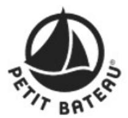
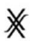
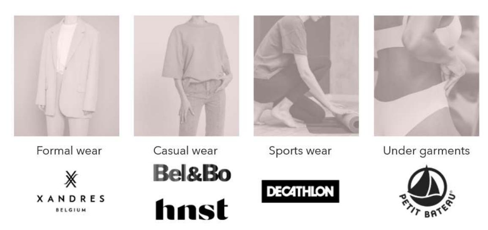
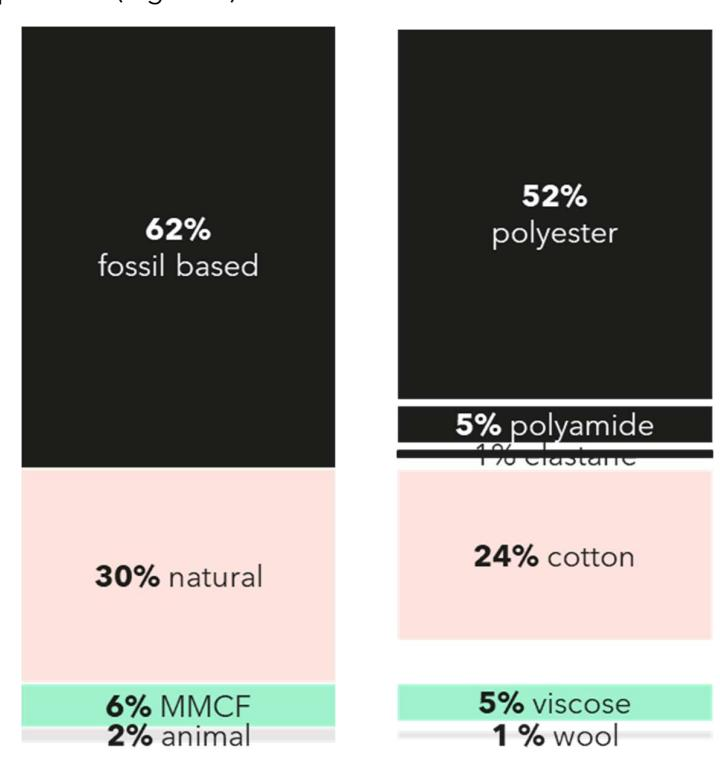
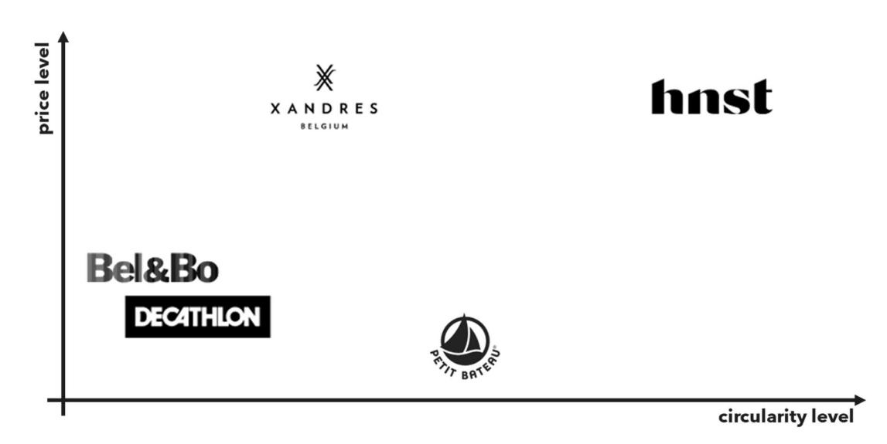

## Horizon 2020 Programme

## Horizon 2020 Programme

#### **SCIRT**

Innovation Action (IA)

This project has received funding from the European Union's Horizon 2020 research and innovation programme under grant agreement No 101003906

> Start date : 2021-06-01 Duration : 36 Months https://scirt-h2020.eu/

## SCIRT

## SCIRT

**Outline F2F demos, including target values for yarns and multi-filaments consisting of recycled materials**

Authors : Mr. Tom DUHOUX (VITO)

#### SCIRT - Contract Number: 101003906

#### Project officer:

| Document title      | Outline F2F demos, including target values for yarns and multi-filaments consisting of recycled |
|---------------------|-------------------------------------------------------------------------------------------------|
| Author(s)           | Mr. Tom DUHOUX                                                                                  |
| Number of pages     | 20                                                                                              |
| Document type       | Deliverable                                                                                     |
| Work Package        | WP01                                                                                            |
| Document number     | D1.2                                                                                            |
| Issued by           | VITO                                                                                            |
| Date of completion  | 2022-02-03 14:28:43                                                                             |
| Dissemination level | Public                                                                                          |

#### **Summary**

This task examines whether the six representative garment types defined for prototyping under WP3 are representative of the main technological, environmental and business challenges in the textiles system (i.e. fibre compositions, technical requirements like dismantling, use of chemicals, business models, waste treatment) and cover the key product segments in the apparel sector. The demo mapping builds on the potential and needs for recycled fibres identified in Task 1.3 and the fibre footprint developed under WP4. Based on the required garment properties, yarn and multifilament specifications will be established, impacting the recycling technologies and experiments researched in WP2. Finally, this task serves as input for impact optimization and circular design guidelines development in WP4 and the set-up of consumer behaviour interventions in WP5.

#### Approval

| Date                | By                        |
|---------------------|---------------------------|
| 2022-02-03 18:09:06 | Mr. Simon NAVARRO (ESTIA) |
| 2022-02-04 08:26:00 | Mrs. Evelien DILS (VITO)  |

## SYSTEM CIRCULARITY & INNOVATIVE RECYCLING OF TEXTILES

Innovation Action

H2020-SC5-2020-2

# Outline and definition of fibre-to-fibre demos

#### Deliverable D1.2

Version N°1

#### Authors:

Tom Duhoux (VITO)

# Disclaimer

The content of this report reflects only the author's view. The European Commission is not responsible for any use that may be made of the information it contains.

# Document information

| Grant Agreement         | n°101003906                                           |
|-------------------------|-------------------------------------------------------|
| Project Title           | System Circularity & Innovative Recycling of Textiles |
| Project Acronym         | SCIRT                                                 |
| Project Coordinator     | Evelien Dils, VITO                                    |
| Project Duration        | 1                                                     |
|                         | st June 2021 – 31 st May 2024 (36 months)             |
| Related Work Package    | WP1                                                   |
| Related Task(s)         | 1.4                                                   |
| Lead Organisation       | VITO                                                  |
| Contributing Partner(s) | Bel&Bo, Decathlon, HNST, Petit Bateau, Xandres        |
| Due Date                | 31.01.2022                                            |
| Dissemination level     | Public                                                |

# History

|  | Date       | Version | Submitted by      | Reviewed by       | Comments |
|--|------------|---------|-------------------|-------------------|----------|
|  | 26.01.2022 | 1       | VITO (Tom Duhoux) | Evelien Dils (PC) |          |
|  |            |         |                   |                   |          |
|  |            |         |                   |                   |          |
|  |            |         |                   |                   |          |

# Table of contents

| 1 Introduction ............................................................................................................................. 7 |                                                                                                                                          |
|------------------------------------------------------------------------------------------------------------------------------------------------|------------------------------------------------------------------------------------------------------------------------------------------|
| 2 Description of the demonstrators ......................................................................................... 7                 |                                                                                                                                          |
| 2.1                                                                                                                                            | Petit Bateau ...................................................................................................................... 7    |
| 2.1.1                                                                                                                                          | Implemented circular design principles ............................................................... 8                                 |
| 2.1.2                                                                                                                                          | Challenges with regard to circular design ........................................................... 8                                  |
| 2.2                                                                                                                                            | HNST ................................................................................................................................. 9 |
| 2.2.1                                                                                                                                          | Implemented circular design principles ............................................................. 10                                  |
| 2.2.2                                                                                                                                          | Challenges with regard to circular design ......................................................... 11                                   |
| 2.3                                                                                                                                            | Bel&Bo ............................................................................................................................ 11   |
| 2.3.1                                                                                                                                          | Implemented circular design principles ............................................................. 12                                  |
| 2.3.2                                                                                                                                          | Challenges with regard to circular design ......................................................... 12                                   |
| 2.4                                                                                                                                            | Xandres .......................................................................................................................... 13    |
| 2.4.1                                                                                                                                          | Implemented circular design principles ............................................................. 14                                  |
| 2.4.2                                                                                                                                          | Challenges with regard to circular design ......................................................... 14                                   |
| 2.5                                                                                                                                            | Decathlon ....................................................................................................................... 14     |
| 3 Representativeness of the demonstrators ......................................................................... 16                         |                                                                                                                                          |
| 3.1                                                                                                                                            | Segments of the apparel market ................................................................................. 16                      |
| 3.2                                                                                                                                            | Fibre use ........................................................................................................................ 18    |
| 3.3                                                                                                                                            | Price segments .............................................................................................................. 19         |

# List of figures

# List of tables

| Table 1: Demo profile Petit Bateau ..... | 8  |
|------------------------------------------|----|
| Table 2: Demo profile HNST .....         | 10 |
| Table 3: Demo profile Bel&Bo.....        | 12 |
| Table 4: Demo profile Xandres .....      | 14 |
| Table 5: Demo profile Decathlon .....    | 15 |

Table 6: Apparent consumption of clothing and household textiles, per product type, EU27, 2019-2020 (ETC/CE, 2021) .............................................................................................. 17

# Summary

This task examines whether the six representative garment types defined for prototyping under WP3 are representative of the main technological, environmental and business challenges in the textiles system (i.e. fibre compositions, technical requirements like dismantling, use of chemicals, business models, waste treatment) and cover the key product segments in the apparel sector. The demo mapping builds on the potential and needs for recycled fibres identified in Task 1.3 and the fibre footprint developed under WP4. Based on the required garment properties, yarn and multifilament specifications will be established, impacting the recycling technologies and experiments researched in WP2. Finally, this task serves as input for impact optimization and circular design guidelines development in WP4 and the set-up of consumer behaviour interventions in WP5.

# Keywords

Fibre-to-fibre (F2F) recycling, circular design challenges, objectives, demonstrators, representativeness

# Abbreviations and acronyms

| Acronym | Description                     |
|---------|---------------------------------|
| B2B     | Business to business            |
| B2C     | Business to consumer            |
| EU      | European Union                  |
| F2F     | Fibre-to-fibre (recycling)      |
| GOTS    | Global Organic Textile Standard |
| MMCF    | Man-made cellulosic fibre       |
| MOQ     | Minimum order quantity          |
| NIR     | Near infra-red                  |
| PA      | polyamide                       |
| PE      | polyester                       |
| PET     | polyethylene terephthalate      |
| PU      | polyurethane                    |
| UV      | Ultraviolet                     |
| WP      | Work Package                    |

# 1 Introduction

Central to the SCIRT project is the demand-driven approach that starts from market needs for recycled fibres and textiles. Within SCIRT this is determined through the partner brands involved and the defined representative demonstrator products. Each of the demonstrators has particular needs with regards to (fabric) quality, yarn thickness, colour, etc. In order to reach these desired output requirements and specifications in a cost-effective way, the parameters of every step in the process - starting from the sorting and dismantling to recycling and spinning - will be different and will need to be defined. The ambition of SCIRT is to map these parameters, to feed them back into the supply chain of post-consumer recycled fibres, yarn, filament and fabric and to align the specifications. This with the ultimate aim to foster demand from the market (market pull) and increase the likelihood of structural incorporation of recycled fibres into design and production in a financially viable way.

The goal of this task and deliverable is to describe the objectives of the different demonstrators within SCIRT and the state-of-play with regard to the implementation of circular design principles, as well as remaining challenges to tackle in order to define the representativeness of the demonstrators. The information used to describe the demonstrators was collected via interviews with the brand partners and demo responsible. The outcome of this task will be used to further describe the (recycling) trials and as input for impact optimization, organizational model development and the set-up of consumer behaviour interventions.

# 2 Description of the demonstrators

## 2.1 Petit Bateau

Petit Bateau (www.petit-bateau.com) is a French apparel brand of mainly baby and children's clothing whose origins date back to 1893. Petit Bateau is part of the Rocher Group and employs more than 3,000 people of which 1,000 work in the Saint Joseph de Troyes factory in France. Petit Bateau controls a large part of the value chain as it operates its own knitting, dyeing, manufacturing and sales facilities. More than 80% of its products are produced in its own factories in France and North Africa.

By 2025, Petit Bateau has the ambition to integrate recycled fibres in 30% of its total collection, which is 30 million pieces per year. By then, the new fibres they still need all will be required to be 'sustainable'. This means that all new cotton needs to be certified organic. The use of Tencel©, linen or other sustainable materials as alternative is open to research.

Within SCIRT, Petit Bateau will focus on the baby bodysuit (baby underwear) to redesign it according to circular economy principles and produce it with the highest amount of recycled materials without compromising on quality, level of durability or health. Currently, the bodysuit is made from 100% organic cotton and OEKO-TEX© certified (https://www.oeko-tex.com/en/our-standards/standard-100-by-oeko-tex). The goal is to produce 6,000 pieces, OEKO-TEX© certified with at least 50% recycled fibres by the end of the SCIRT project. Table 1 gives an overview of the demo profile.

| Product              | Baby bodysuit                                                      |
|----------------------|--------------------------------------------------------------------|
| Material composition | 100% cotton                                                        |
| Fabric type          | Knitted                                                            |
| Production volume    | 6000 pcs                                                           |
| Representativeness   | < 1% of revenue, however, the targeted yarn (Nm 60/1) represents   |
| Sales model          | Own stores and online                                              |
| Main market          | France, EU                                                         |
| Customer             | Mostly women that buy for themselves (10%), for their babies (45%) |

### 2.1.1Implemented circular design principles

Currently, 50% of all the cotton that Petit Bateau sources is GOTS© (https://globalstandard.org/) certified organic cotton. This cotton has a long staple fibre (30 mm) and is sourced in Turkey. This long fibre length contributes to product durability but is difficult to find. Due to this, there is high competition for these fibres resulting in increased prices over the past few years. Next to product durability, product health is also an important topic for Petit Bateau. This results in products having to meet the OEKO-TEX© Standard 100.

Petit Bateau operates its own knitting and dyeing facilities in France (Troyes). The confection (cutting and sewing) takes place in its own factory in Morocco or is done by subcontractors in Morocco and Tunisia.

Petit Bateau offers repair services to its customers in some of its boutiques. They have the ambition to further roll out these services over the coming years. Next to this, Petit Bateau also gives customers advice and information on how to best care for their products. Especially with regard to the removal of spots and stains as many customers do not know how to properly remove them. Petit Bateau plans to further improve their care and maintenance information.

In June 2021, Petit Bateau started a pilot to offer a take back and resell service to its customers. Customers can bring in any type of Petit Bateau product and receive a discount depending on the product and the state of the product. This pilot will give valuable information about the type of products that are brought back in, the (hygienic) state and the share that is resaleable and recyclable.

The long staple cotton fibres are spun into a very fine yarn (Nm 60/1). To date, Petit Bateau has not found yarn (partly) made of recycled cotton and with this yarn count (thickness) on the market. As the yarn will have to meet the OEKO-TEX© Standard 100 criteria, the origin of the recycled fibres will need to be known. For this reason, Petit Bateau prefers to use recycled fibres coming from its own products. However, in order to scale, other sources will need to be found. Next to this, some of the Petit Bateau products are directly bought from suppliers and contain up to 6% of elastane, having a negative impact on recyclability. Additional challenges with regard to using recycling fibres are linked to the possibly negative impact on the production (knitting) speed and the impact on the colours of the yarn as Petit Bateau makes its products in 50 different colours per season (2 seasons per year).

With regard to product design, there are various parts that have a negative impact on recyclability, such as polyester (PE) stitching yarn that is being used to sew the baby bodysuits and metal (brass) snaps to open and close it.

Currently, the production waste (estimated to be about 90 tonnes per year) is collected and processed by a third party.

## 2.2 HNST

HNST (read 'honest') (letsbehonest.eu) is a Belgian circular denim brand and was the first brand to develop and commercialize a jeans made with yarn composed of 50% postconsumer recycled cotton. HNST sources the recycled fibres from collecting campaigns together with local partners, and has so far collected and recycled more than 11,000 discarded and non-reusable jeans. The recycling and entire production process from fibre to jeans takes place in the EU.

Within SCIRT, as a first demonstrator, HNST will focus on jeans to further design it according to circular economy principles and to produce it with as close to 100% recycled materials. Currently, the jeans is made from 56% recycled cotton, 23% cotton and 21% Tencel©. HNST also experiences a market demand to add extra comfort to jeans by adding stretch (elastane). As adding elastane currently does not fit within circular design principles, finding an alternative material to elastane could meet this demand and could also pave the way for a broader uptake by other jeans manufacturers, as elastane is currently used in most jeans put on the market. The final objective is a prototype collection of circular designed jeans, made of the highest percentage of post-consumer recycled fibres technically possible with stretch properties, ready for commercialization.

As a second demonstrator, HNST will also develop a sweater (knitwear), made from the highest percentage of post-consumer recycled fibres technically possible. The specifications of the yarn, will be different compared to the yarn for the jeans, as well as the production process (knitting) and requirements with regards to product properties and colour. Both demonstrators, jeans and sweater, will have digital tracing technology integrated to insure full and accessible supply chain transparency towards end-consumers and all relevant stakeholders in general. Table 2 gives an overview of the demo profile.

| Product              | Jeans                                                       |
|----------------------|-------------------------------------------------------------|
| Material composition | 56% recycled cotton, 23% cotton, 21% Tencel© (main fabric)  |
| Fabric type          | Woven                                                       |
| Production volume    | 2000 pcs                                                    |
| Representativeness   | 99% of revenue                                              |
| Product              | Sweater                                                     |
| Material composition | To be determined                                            |
| Fabric type          | Knitted                                                     |
| Production volume    | Prototype ready for production                              |
| Representativeness   | New product within product portfolio                        |
| Sales model          | Wholesale and online                                        |
| Main market          | Belgium, EU                                                 |
| Customer             | Currently mostly so-called ‘eco-warriors’ that highly value |

Table 2: Demo profile HNST

## 2.2.1Implemented circular design principles

HNST was founded to bring the principles of circular design to reality. This results in many principles already integrated in the design, such as not blending different material types and making sure non-renewable or non-recyclable materials are easily removable. For its main fabric, HNST already makes uses of a high percentage of post-consumer recycled cotton fibres. These recycled fibres are blend with Tencel©, a man-made cellulosic fibre made from wood pulp, and virgin cotton that is sourced from Greece. All these fibre types are cellulose-based and renewable. The pocketing fabric is made from 100% organic cotton. The back patch of the jeans is made from jacron, a paper-like material that is made of FSC certified wood pulp, making it cellulose-based as well. There are no labels in the jeans as product and care information are screen printed on the pocketing fabric. The men jeans have removable buttons and the rivets (metal studs) that are typically made of copper have been substituted by embroideries in order not to disturb or contaminate the recycling process.

HNST has a local production process, as the recycled yarn used as weft is made in Belgium, the warp yarn and denim fabric in Italy and the confection and finishing is done in Portugal. The production processes are also low impact, as the Italian weaver uses the SmartIndigo© (https://www.smartindigo.com/) dyeing technique that does not require any hazardous chemicals.

HNST offers repair services to its customers and has every jeans is sold with a take back guarantee. Customers sending back their discarded HNST jeans receive a discount on the purchase of a new HNST product.

Products sold through the HNST website, are distributed to customers using a RePack©, (https://www.originalrepack.com/hnst/) which is a reusable and recyclable packaging. Customers can easily return the packaging after which it can be reused up to 20 times.

#### 2.2.2 Challenges with regard to circular design

Although many circular design principles have already been integrated into the design of an HNST jeans, there are still some challenges that remain to be tackled. One of those challenges is the PE stitching yarn that is being used. A good alternative that is renewable, preferably cellulose-based and that also meets quality criteria with regard to strength has to date not been found.

For aesthetic reasons, the women jeans of HNST have a zipper instead of removable buttons. This zipper contaminates the recycling process and should be removable. HNST has experimented with dissolving stitching yarn by Resortecs© (https://resortecs.com/), however, the practical and economic feasibility is yet to be determined.

As already highlighted above, currently HNST deliberately does not use elastane in its jeans to give it stretch properties. However, there is a clear market demand for jeans with these properties. Finding a suitable alternative that fits within the circular design principles is a clear challenge.

The impact of PE stitching yarn or using a high amount of recycled textile fibres on microplastics dispersion is still unknown and open to further research (Roos et al., 2017).

Although the fabric made from a high percentage of recycled textile fibres does not negatively affect technical properties, the fabric does contain some visual imperfections that could give the impression of inferior quality to customers.

## 2.3 Bel&Bo

Bel&Bo (www.bel-bo.be) is a 100% Belgian, family owned business with approximately 95 retail stores in Belgium. The mission of Bel&Bo is to offer colourful, fashionable clothing for the whole family at an affordable price and produced in a sustainable way. They do this this by bringing new colourful collections in combination with basics and offering a high service level to their customers when they are looking for the right outfit. As part of their 'So Good So You' sustainability program, Bel&Bo focusses on changing conventional materials to low impact alternatives.

Bel&Bo buys finished garments directly from a supplier, which also results in little insights into the sourcing and manufacturing process. In some cases, the design is done by Bel&Bo, in other cases, the design is done by the supplier as well.

Within SCIRT, the objective is to redesign and redevelop a bestseller product, more specifically a long 3-colour printed dress currently made from 100% viscose, according to circular economy principles at an affordable price (within the current price segment) and to demonstrate the closed-loop. Focusing on a bestseller (product is worth 1% of total annual sales revenue) and this particular material that is used in many of its styles, this representative item could create a lever for scaling up within the business if the outcome of

this demonstrator is successful. Recycling tests will be done to determine improvements with regard to design and material choices in order to enable high-value recycling at endof-life. After validation of the redesign and prototyping, a collection of 1100 pieces will be produced. A close cooperation with their suppliers will be required as Bel&Bo does not have its own production facilities. Table 3 gives an overview of the demo profile.

| Product              | Dress                                                           |
|----------------------|-----------------------------------------------------------------|
| Material composition | 100% viscose (main fabric)                                      |
| Fabric type          | Woven                                                           |
| Production volume    | 18000 pcs                                                       |
| Representativeness   | +/- 1% of revenue                                               |
| Sales model          | Own stores (95) and online                                      |
| Main market          | Belgium                                                         |
| Customer             | Women between 30-55 years that are caring, rather conservative, |

Table 3: Demo profile Bel&Bo

#### 2.3.1Implemented circular design principles

Currently, circular design is not part of the design process, as in some cases the design is also bought from suppliers that sell readymade garments. SCIRT will provide an opportunity for Bel&Bo to enter into conversation with its supplier(s) about introducing these design principles.

Bel&Bo offers repair services to customers via its stores, but does not communicate proactively about this service. The responsibility to organize and offer this service is left with the store manager.

Together with partners Wereldmissiehulp and Wolkat (https://www.wolkat.com/en/projects/wereld-missie-hulp), Bel&Bo offers a take back system to collect all types and brands of discarded clothes from its customers. Depending on the item, customers get rewarded with points on their loyalty card. Currently, Bel&Bo is exploring to further expand the collection of discarded clothes through bi-annual campaigns and how the recycled materials coming from these clothes could be reused into new products or accessories.

## 2.3.2Challenges with regard to circular design

As the fabric is bought by the supplier / manufacturer in Turkey, more information is needed with regard to the origin of the viscose and whether alternative or recycled materials could be used. The lining attached to the viscose fabric (made from Nm 30/1 viscose yarn), is made of polyamide (PA) and could also negatively affect recycling possibilities.

With regard to product design, there are various parts that have a negative impact on recyclability, such as polycotton (polyester and cotton) stitching yarn that is being used to sew the dresses, the PE buttons sewed with PE tread and the elastic waist band.

Currently, no information is available on production waste or how it is collected and treated.

#### 2.4 Xandres

Xandres (www.xandres.com) is a Belgian fashion label specialized in women's clothing, with great emphasis on quality, luxury and environment. Since 2016, Xandres is part of the listed Damartex Group. Xandres is available in more than 150 multi-brand boutiques and has own stores across Belgium. Next to the fashion brand, Xandres also designs, produces & distributes corporate wear (uniforms) under the brand Xandres Corporate. Xandres Corporate develops stylish corporate clothing based on the same commitment to absolute quality and durability. Sustainable sourcing and circular design are two pillars within its CSR strategy. Currently, the lack of good quality circular solutions on the market makes it difficult to accelerate its initiatives.

Within SCIRT, Xandres will focus on a uniform pants currently made in a wool-polyesterelastane blend. This fabric composition is an important composition for all collections within Xandres as it is regularly used for trousers, blazers and dresses. For Xandres Corporate this goes up to 40% of the total in-house produced uniforms (confection). For the Essentials collection this composition covers around 13% of the collection. For Xandres Fashion this is around 2%. Because of the relevance of this blend and its challenges with regard to recyclability and defining possible alternatives for elastane, the objective is to successfully produce & distribute (formal wear) pants which are fully circular. Besides the circularity aspect, the fabric should also be of high quality (minimum as good as the nonrecycled version) and have a nice touch & feel. An important criterium for success is the cost of the produced articles, to be translated into a reasonable price for its customers. After validation of the redesign and prototyping, a collection of 200 pieces will be produced and a closed-loop take back model will be set up. Table 4 gives an overview of the demo profile.

| Product              | Pants                                       |
|----------------------|---------------------------------------------|
| Material composition | 53% PE, 44% wool, 3% elastane (main fabric) |
| Fabric type          | Woven                                       |
| Production volume    | 3000 pcs per year (B2C) – 3 models in total |
| Representativeness   | +/- 10% of revenue                          |
| Sales model          | Own stores, wholesale and online            |

| Main market | Belgium (80%), Netherlands (20%), soon also Germany                                                        |
|-------------|------------------------------------------------------------------------------------------------------------|
| Customer    | Women between 50-70 years 
To date, very few questions from customers with regard to sustainability.
 |

Table 4: Demo profile Xandres

#### 2.4.1Implemented circular design principles

The wool-polyester-elastane fabric is made in Morocco, and already partially uses preconsumer recycled PE. The fabric is also OEKO-TEX© certified, indicating that the fabric has been tested for harmful substances and that it is harmless for human health. Due to the fact that the product is rather timeless of and of high quality, the unsold stock is very low.

Xandres offers a repair service to its customers and actively communicates about this service, but very few pants are brought in for repair, indicating a good product quality. It is the ambition of Xandres to introduce a lifetime product repair guarantee. Small retouches are also offered and done in cooperation with local partners to save on transport.

Currently, Xandres has a take back system for its B2B customers (e.g. take back of the endof-life formal suits for the Belgian Railways).

### 2.4.2 Challenges with regard to circular design

The main challenge is related to the wool-polyester-elastane fabric that to date is nonrecyclable due to the mix of different types of material. Next to this fibre blend, the fabric also has a PE lining which is 'glued' to the fabric with polyamide (PA) dots which will have its own challenges with regard to recyclability and dismantling.

The formal pants also has various trims, such as a zipper (PA), buttons (PE) and labels (PE), that are stitched to the pants with PE stitching yarn. Depending on the recycling possibilities, these will need to be disassembled in order not to contaminate the recycling process.

No information about the treatment of production waste (estimated to be 10 - 15% of the main fabric) is available.

# 2.5 Decathlon

Decathlon (www.decathlon.com) is a French sporting goods retailer founded in 1976. With more than 315 stores in France and over 1511 stores throughout the world in 51 different countries, Decathlon is the largest sporting goods retailer in the world. Making the pleasures and benefits of sporting activities a sustainable practice for the greatest number of people: that is Decathlon's ultimate goal. This is expressed in the design and distribution of sports products online and in stores.

Decathlon is engaged in the reduction of its environmental impact since many years, through different strategies and actions, such as reaching 100% renewable energy in 2026 for all stores and warehouses, reducing the impact of logistic, implementing circular design

principles (e.g. increasing the use of recycled materials in products and impact measurement) and developing the sale of second-hand products.

Within SCIRT, the main focus is to develop a recyclable component for the Nabaiji swimsuit, preferably made from post-consumer recycled fibres and to develop and implement a complete circular loop. This means finding an alternative material to elastane which is often used in swimsuits and to combine materials that are easy to separate or dismantle in order to be recyclable. From the validated component, a new circular swimsuit will be designed, after which a limited series will be produced at a finished goods supplier. The exact production volume will be defined by minimum order quantity (MOQ) of the components and by the number of stores that will be involved in the commercialization of the circular swimsuit. In order to commercialize the circular swimsuit in a limited number of stores and online, specific communication needs to be developed, traceability tools on products (e.g. RFID) need to be implemented and internal IT tools to collect the products after use will need to be developed. Table 5 gives an overview of the demo profile.

| Product              | Swimsuit                                                  |
|----------------------|-----------------------------------------------------------|
| Material composition | PET/PBT (‘Patmos’ component) and new 100% PET component   |
| Fabric type          | Knitted                                                   |
| Production volume    | To be determined by MOQ                                   |
| Sales model          | Own stores and online                                     |
| Main market          | France, EU                                                |
| Customer             | To date, very few questions from customers with regard to |

Table 5: Demo profile Decathlon

#### 2.5.1 Implemented circular design principles

Some of the components are made from (partially) recycled PET, originating from recycled PET bottles. Recycled PET and PA coming from pre-consumer waste are also used in a more limited way due to the lower volumes available. Production losses (approx. 5 – 10%) of PA during the extrusion process are recovered and reused as recycled PA. Currently the volumes of recycled PA on the market are too low to scale the use and to meet the strategic needs and goals of Decathlon.

When there are big volumes to dye, the low impact DyeCoo© (https://www.dyecoo.com/) dye process is used that uses reclaimed CO2 instead of water to dissolve the dye easily. Another low impact technique to is used to dye big volumes of synthetic fibres is dope dyeing where the dyes are applied as pellet pigments to the raw materials before being spun into yarn. This reduces energy, water and chemicals use.

Decathlon has experimented with a take back system for textiles and plans to organize a specific take back campaign for swimsuits during the SCIRT project.

#### 2.5.2 Challenges with regard to circular design principles

The greatest challenge is related to the recyclability of the swimsuit, made from various components. These components are made from different materials depending on the required properties. Most components also have a high elastane content. Polyurethane (PU) is used as padding on e.g. women swimsuits as bra support, and is also used as lamination on babies and children's wetsuits. Swimsuits also have an elastic waist band and a (natural) rubber band stitched at the legs of the swimsuit. Women swimsuits also have an (elastic) shoulder strap and plastic adjustment parts. Combined with the PA lining of the swimsuit, proper disassembly in order to recycle discarded swimsuits will be a major challenge.

Next to the product composition, swimsuits also have coatings and additives to give it the necessary properties, such as chlorine or UV resistance, to make it water-repellent, … . Dope dyed products are also difficult to automatically sort, especially carbon black coloured products as these absorb the NIR light preventing the automatic sorting machine to identify the material composition.

The product lifespan of a swimsuit is mainly determined by the use and care for the product, as chlorine has a negative effect on colour and elasticity which are the main reasons for consumers to dispose their swimsuits, followed by fashion and size changes.

# 3 Representativeness of the demonstrators

## 3.1 Segments of the apparel market

In order to be representative, the SCIRT demonstrators cover complementary product segments or apparel categories. More in particular formal wear (Xandres), casual wear (Bel&Bo, HNST), Sportswear (Decathlon) and under garments (Petit Bateau) (Figure 1). Accessories and footwear are not covered in the SCIRT demos.

Figure 1: Overview of product segments covered by the SCIRT demos

Looking at the product types covered by the SCIRT demos the share these product types have in the total consumption of clothing, the demos represent 5.4 kg out of a total clothing consumption of 6 kg per year per person. These product types represents 90% of clothing consumption (Table 6).

| 2.1 CPA Example items Product group               |                                           |       | EU27 Consumption (kg per person) |       |
|---------------------------------------------------|-------------------------------------------|-------|----------------------------------|-------|
|                                                   | 2010                                      | 2015  | 2019                             | 2020  |
| 15.2 Shoes                                        | 3.4                                       | 3.1   | 3.6                              | 2.7   |
| Total shoes                                       | 3.4                                       | 3.1   | 3.6                              | 2.7   |
| 14.39 Pullovers, cardigans                        | 1.3                                       | 1.1   | 1.3                              | 1.0   |
| 14.31 Stockings, tights, socks                    | 0.6                                       | 0.6   | 0.6                              | 0.5   |
| 14.2 Articles of fur                              | <0.01                                     | <0.01 | <0.01                            | <0.01 |
| 14.19 Baby clothes, sportswear, scarfs,           |                                           |       |                                  |       |
| handkerchiefs                                     | 1.3                                       | 1.2   | 1.3                              | 1.3   |
| 14.14                                             | Blouses, shirts, T-shirts, underpants,    |       |                                  |       |
| pyjamas                                           | 2.8                                       | 2.5   | 2.6                              | 2.0   |
| 14.13                                             | Coats, jackets, trousers, skirts, suits,  |       |                                  |       |
| dresses                                           | 1.8                                       | 1.2   | 1.7                              | 0.8   |
| 14.12 Workwear                                    | 0.2                                       | 0.3   | 0.3                              | 0.3   |
| 14.11 Leather clothes                             | 0.04                                      | 0.03  | 0.02                             | 0.02  |
| Total clothing                                    | 7.4                                       | 8.1   | 7.9                              | 6.0   |
| 13.92                                             | Bed linen, towels, curtains, furnishings, |       |                                  |       |
| tents, sails                                      | 5.1                                       | 4.4   | 5.4                              | 6.1   |
| Total household textiles                          | 5.1                                       | 4.4   | 5.4                              | 6.1   |
| TOTAL (clothing, footwear and household textiles) | 15.7                                      | 16.8  | 16.9                             | 14.8  |

Table 6: Apparent consumption of clothing and household textiles, per product type, EU27, 2019-2020 (ETC/CE, 2021)

## 3.2 Fibre use

According to Textile Exchange's 2021 Preferred Fiber and Materials Market Report, the share for preferred fibres and materials grew significantly in 2020. 'Preferred' fibres and materials have 'improved social and environmental impacts', such as certified or organic cotton, or recycled fibres. However, preferred fibres only represent less than one-fifth of the global fiber market. Less than 0.5% of the global fibre market was from pre- and postconsumer recycled textiles. Global fibre production has almost doubled in the past 20 years from 58 million tons in 2000 to 109 million tons in 2020. Looking into the share of produced fibres, the biggest share (62%) is fossil based, such as PE, PET and PA, followed by natural fibres (30%) such as cotton and wool, and man-made cellulosic fibres (6%) such as viscose and Tencel© (Figure 2). Most recycled fibres used are recycled PET (15% of all PET), followed by PA (2% of all PA). The amount of recycled PET practically entirely originates from recycled PET bottles. This indicates that there is still plenty room for improvements. (Textile Exchange, 2021).

Looking at the fibres used in the various demonstrators, the following fibre types are covered:

 Synthetic fibres: PE(T), PA, elastane Natural fibres: cotton, wool MMCF: viscose, Tencel©

These fibre types represent 88% of the global fibre production, making them vey representative to further explore recycling possibilities and the use of these recycled fibres into new textile products (Figure 2).

 Figure 2: Global fibre production in 2020 (left) and relevant fibre types used within the SCIRT demos (right). Source: Textile Exchange (2021)

## 3.3 Price segments

Each of the different demonstrators is at a different level with regard to the implementation of circular design principles (see above), leaving various challenges to tackle within SCIRT. Next to a different level of circularity, product category and fibre need, the demonstrators also cover different segments of the market with regard to price level. Both Xandres and HNST offer a more expensive product (around € 130), while the products covered within SCIRT of Bel&Bo (around € 50), Decathlon (around € 20) and Petit Bateau (around € 7) are significantly less expensive (Figure 3). The impact on the price and the business model will be determined when addressing the various challenges with regard to circular design principles.

Figure 3: Overview of market segment covered by the SCIRT demos

# Conclusion

The six defined demonstrators, covering complementary product types, all have a different level of implementation with regard to circular design principles and remaining challenges. Combined with the fibre types covered, the demonstrators are considered to be representative for the apparel market.

# Bibliography

ETC/CE (2021). Textiles and the environment – the role of design in Europe's circular economy

Roos, S., Levenstam Arturin, O. and Hanning, A.-C. (2017). Microplastics shedding from polyester fabrics, Mistra Future Fashion 2017:1, SWEREA

Textile Exchange (2021). Preferred fiber and materials - Market report 2021