## Horizon 2020 Programme

#### **SCIRT**

Innovation Action (IA)

This project has received funding from the European Union's Horizon 2020 research and innovation programme under grant agreement No 101003906

> Start date : 2021-06-01 Duration : 36 Months https://scirt-h2020.eu/

## SCIRT

## SCIRT

#### **Vision and roadmap towards a circular fashion system**

Authors : Mrs. Saskia MANSHOVEN (VITO), Saskia Manshoven, Wim Van Opstal

SCIRT - Contract Number: 101003906

#### Project officer:

| Document title      | Vision and roadmap towards a circular fashion system    |
|---------------------|---------------------------------------------------------|
| Author(s)           | Mrs. Saskia MANSHOVEN, Saskia Manshoven, Wim Van Opstal |
| Number of pages     | 76                                                      |
| Document type       | Deliverable                                             |
| Work Package        | WP01                                                    |
| Document number     | D1.4                                                    |
| Issued by           | VITO                                                    |
| Date of completion  | 2022-10-13 15:05:23                                     |
| Dissemination level | Public                                                  |

#### **Summary**

This Deliverable aims to provide an inspiring vision document on circular fashion and a transition roadmap on how this vision can be achieved, resulting from work performed in Task 1.2 and building on inputs from the User Boards in Task 5.2. This report serves as input to policy recommendations that will be further elaborated in WP 5. In this report, we present results from an envisioning exercise involving the participation of a wide range of stakeholders from the fashion system. Using a backcasting approach, we apply an iterative approach to construct and validate several scenario dimensions to reach a circular fashion system as is envisioned in the EU strategy on circular textiles and other major policy documents and industry goals. First, we identify 30 constituent elements of a circular fashion system. Then, we apply survey and focus group research to investigate support for differing policy instruments to be included in a coherent policy mix towards a sustainable, fair and circular fashion system. In the presentation of these results, we include examples of concrete policy measures that could be implemented, provided by stakeholders in our participatory process. A major result of our work is that many stakeholders express a strong support for a policy-led transition towards a circular fashion system. In particular, support for mandatory regulations appears to be high among all types of stakeholders. This should not come as a big surprise, since mandatory regulations enable industry players to move into circular solutions on a level playing field. Our scenario analysis, as well as an in-depth analysis of our focus groups results and survey comments, shows also the need for supporting measures, such as economic incentives and awareness building. A circular fashion system will only be sustainable if all layers of society begin to care about its environmental and social aspects in a sustained way. With this report, we hope to provide information and inspiration for the next work packages in the SCIRT project, to deliver specific innovative technological developments, novel business models, and formulate concrete policy measures that further foster a transition towards a circular, fair, and sustainable fashion system.

#### Approval

| Date                | By                        |
|---------------------|---------------------------|
| 2022-10-13 15:20:43 | Mr. Simon NAVARRO (ESTIA) |
| 2022-10-13 15:49:01 | Mrs. Evelien DILS (VITO)  |

## SCIRT

## SYSTEM CIRCULARITY & INNOVATIVE RECYCLING OF TEXTILES

Innovation Action H2020-SC5-2020-2

**Vision and Roadmap towards a Circular Fashion System**

**Deliverable D1.4**

Version N°1

**Authors:**

Saskia Manshoven, Wim Van Opstal (VITO)

# **Disclaimer**

The content of this report reflects only the authors' view. The European Commission is not responsible for any use that may be made of the information it contains.

# **Document information**

| Grant Agreement      | n°101003906                                                   |
|----------------------|---------------------------------------------------------------|
| Project Title        | System Circularity & Innovative Recycling of Textiles         |
| Project Acronym      | SCIRT                                                         |
| Project Coordinator  | Evelien Dils, VITO                                            |
| Project Duration     | 1                                                             |
|                      | st June 2021 – 31 st May 2024 (36 months)                     |
| Related Work Package | WP1                                                           |
| Related Task(s)      | Task 1.2                                                      |
| Lead Organisation    | VITO                                                          |
|                      | circular.fashion, Decathlon, ESTIA, FFACT, Flanders DC, HNST, |

# **History**

| Date       | Version | Submitted by | Reviewed by | Comments |
|------------|---------|--------------|-------------|----------|
| 16/09/2022 | 01      | VITO         | OVAM, GFA,  |          |
| 13/10/2022 | 02      | VITO         |             |          |

# **Table of contents**

| 1 General methodology............................................................................................................ |                                                                                                                                 | 9                                                                                                           |
|-----------------------------------------------------------------------------------------------------------------------------------|---------------------------------------------------------------------------------------------------------------------------------|-------------------------------------------------------------------------------------------------------------|
| 2 Towards a common vision on circular fashion                                                                                     |                                                                                                                                 | ..................................................................11                                        |
| 2.1                                                                                                                               | Explorative workshop...................................................................................................11       |                                                                                                             |
| 2.2                                                                                                                               | Literature review............................................................................................................14 |                                                                                                             |
| 2.2.1                                                                                                                             | The European Strategy on Sustainable and Circular textiles                                                                      | ...........................14                                                                               |
| 2.2.2                                                                                                                             | Ellen MacArthur Foundation (2020)....................................................................16                         |                                                                                                             |
| 2.2.3                                                                                                                             | Global Fashion Agenda (2021)............................................................................16                      |                                                                                                             |
| 2.2.4                                                                                                                             | UNECE Pledge (2021)...........................................................................................16                |                                                                                                             |
| 2.2.5                                                                                                                             | UNFCCC fashion charter (2021)..........................................................................17                       |                                                                                                             |
| 2.2.6                                                                                                                             | WRAP (2021)..........................................................................................................17         |                                                                                                             |
| 2.2.7                                                                                                                             | OECD Due Diligence Guidance (2018)..............................................................17                              |                                                                                                             |
| 2.2.8                                                                                                                             | Circular Economy Action Agenda Textiles (PACE, 2021).................................18                                         |                                                                                                             |
| 2.2.9                                                                                                                             | Some other initiatives                                                                                                          | ...........................................................................................18               |
| 2.3                                                                                                                               | Elements of a sustainable fashion system..................................................................19                    |                                                                                                             |
| 2.3.1                                                                                                                             | Low impact fibres                                                                                                               | ..................................................................................................21        |
| 2.3.2                                                                                                                             | Low impact processes...........................................................................................21               |                                                                                                             |
| 2.3.3                                                                                                                             | Longer use of garments........................................................................................22                |                                                                                                             |
| 2.3.4                                                                                                                             | Waste prevention                                                                                                                | ..................................................................................................22        |
| 2.3.5                                                                                                                             | Recycling ................................................................................................................23    |                                                                                                             |
| 2.3.6                                                                                                                             | Social justice...........................................................................................................23     |                                                                                                             |
| 2.3.7                                                                                                                             | Value chain collaboration.....................................................................................23                |                                                                                                             |
| 3 Pathways for a transition                                                                                                       |                                                                                                                                 | ......................................................................................................24    |
| 3.1                                                                                                                               | Deepening workshop to build scenarios                                                                                           | ...................................................................25                                       |
| 3.2                                                                                                                               | Stakeholder views on transition scenarios                                                                                       | .................................................................25                                         |
| 3.3                                                                                                                               | Scenario elements for a circular fashion system                                                                                 | .......................................................27                                                   |
| 3.3.1                                                                                                                             | Producer led vs consumer led transition............................................................27                           |                                                                                                             |
| 3.3.2                                                                                                                             | Outer vs inner cycles of circularity.......................................................................28                   |                                                                                                             |
| 3.3.3                                                                                                                             | Global vs local value chains                                                                                                    | .................................................................................29                         |
| 3.3.4                                                                                                                             | Technological development vs behavioural change                                                                                 | ........................................30                                                                  |
| 3.3.5                                                                                                                             | Market-concentration vs                                                                                                         | competition.................................................................31                              |
| 3.3.6                                                                                                                             | Top-down vs bottom-up steering of the transition                                                                                | ...........................................33                                                               |
| 3.4                                                                                                                               | Discussion and conclusions                                                                                                      | .........................................................................................34                 |
| 4 Policy instruments to support the transition......................................................................37            |                                                                                                                                 |                                                                                                             |
| 4.1                                                                                                                               | Policy instruments                                                                                                              | .........................................................................................................37 |

| 4.2                                        | Stakeholder support for policy instruments ..............................................................38                       |
|--------------------------------------------|-----------------------------------------------------------------------------------------------------------------------------------|
| 4.2.1                                      | Low impact fibres ..................................................................................................39            |
| 4.2.2                                      | Low impact processes...........................................................................................41                 |
| 4.2.3                                      | Longer use of garments........................................................................................42                  |
| 4.2.4                                      | Waste prevention ..................................................................................................44             |
| 4.2.5                                      | Recycling ................................................................................................................45      |
| 4.2.6                                      | Social justice...........................................................................................................47       |
| 4.2.7                                      | Value chain collaboration.....................................................................................48                  |
| 4.3                                        | Discussion and conclusions .........................................................................................50            |
| 5 Towards a Roadmap for circular fashion   | ...........................................................................51                                                     |
| 5.1                                        | Ecodesign of textile products......................................................................................51             |
| 5.2                                        | Sustainable fashion production...................................................................................52               |
| 5.3                                        | Sustainable retail and use ............................................................................................54         |
| 5.4                                        | Waste management......................................................................................................55          |
| 5.5                                        | Conclusion.....................................................................................................................55 |
| Annex 1: Survey questions                  | ..........................................................................................................66                      |
| Annex 2: Respondent profiles               | ....................................................................................................73                            |
| Annex 3: Ordered probit regression results | .............................................................................76                                                   |

# **List of figures**

| Figure 1: Backcasting methodology............................................................................................                | 9                                                                                                         |
|----------------------------------------------------------------------------------------------------------------------------------------------|-----------------------------------------------------------------------------------------------------------|
| Figure 2: Example of one of the Mural Boards                                                                                                 | .........................................................................12                               |
| Figure 7: Preferred policy instruments on low impact fibres                                                                                  | ..................................................39                                                      |
| Figure 8: Preferred policy instruments on low impact processes                                                                               | ..........................................41                                                              |
| Figure 14: Gender distribution of survey respondents                                                                                         | ...........................................................73                                             |
| Figure 15: Age distribution of survey respondents                                                                                            | .................................................................73                                       |
| Figure 17: Professional position of survey respondents                                                                                       | .........................................................74                                               |
| Figure 18: Country .......................................................................................................................75 |                                                                                                           |
| Figure 19: Stakeholder type                                                                                                                  | .......................................................................................................75 |

# **List of tables**

| Table 1: Overview of the workshops and activities                               | ..................................................................10 |
|---------------------------------------------------------------------------------|----------------------------------------------------------------------|
| Table 6: Proposed policy instruments related to low impact processes            | ...............................42                                    |
| Table 7: Proposed policy instruments related to longer use of garments          | ............................43                                       |
| Table 8: Proposed policy instruments related to waste prevention                | ......................................45                             |
| Table 10: Proposed policy instruments related to social justice                 | ............................................48                       |
| Table 12: Ordered probit regression on estimated scenario outcomes by companies | .....76                                                              |

# **Summary**

This Deliverable aims to provide an inspiring vision document on circular fashion and a transition roadmap on how this vision can be achieved, resulting from work performed in Task 1.2 and building on inputs from the User Boards in Task 5.2. This report serves as input to policy recommendations that will be further elaborated in WP 5.

In this report, we present results from an envisioning exercise involving the participation of a wide range of stakeholders from the fashion system. Using a backcasting approach, we apply an iterative approach to construct and validate several scenario dimensions to reach a circular fashion system as is envisioned in the EU strategy on circular textiles and other major policy documents and industry goals. First, we identify 30 constituent elements of a circular fashion system. Then, we apply survey and focus group research to investigate support for differing policy instruments to be included in a coherent policy mix towards a sustainable, fair and circular fashion system. In the presentation of these results, we include examples of concrete policy measures that could be implemented, provided by stakeholders in our participatory process.

A major result of our work is that many stakeholders express a strong support for a policyled transition towards a circular fashion system. In particular, support for mandatory regulations appears to be high among all types of stakeholders. This should not come as a big surprise, since mandatory regulations enable industry players to move into circular solutions on a level playing field. Our scenario analysis, as well as an in-depth analysis of our focus groups results and survey comments, shows also the need for supporting measures, such as economic incentives and awareness building. A circular fashion system will only be sustainable if all layers of society begin to care about its environmental and social aspects in a sustained way.

With this report, we hope to provide information and inspiration for the next work packages in the SCIRT project, to deliver specific innovative technological developments, novel business models, and formulate concrete policy measures that further foster a transition towards a circular, fair, and sustainable fashion system.

# **Keywords**

Circular Fashion System, Vision, roadmap, pathways, scenarios, system transition, backcasting, survey

# **Abbreviations and acronyms**

| Acronym | Description                                            |
|---------|--------------------------------------------------------|
| 3D      | 3 dimensional                                          |
| CBM     | Circular Business Model                                |
| CE      | Circular Economy                                       |
| COC     | Chemicals of Concern                                   |
| EOL     | End-of-Life                                            |
| EPR     | Extended Producer Responsibility                       |
| EU      | European Union                                         |
| GDP     | Gross Domestic Product                                 |
| GFA     | Global Fashion Agenda                                  |
| GHG     | Greenhouse Gas                                         |
| ID      | identification                                         |
| NGO     | Non-governmental Organisation                          |
| OECD    | Organisation for Economic Co-operation and Development |
| PACE    | Platform for Accelerating the Circular Economy         |
| PET     | Polyethylene terephthalate                             |
| R&D     | Research & Development                                 |
| SME     | Small and Medium Enterprise                            |
| UK      | United Kingdom                                         |
| UN      | United Nations                                         |
| UNECE   | United Nations Economic Commission for Europe          |
| UNFCCC  | United Nations Framework Convention on Climate Change  |
| VAT     | Value Added Tax                                        |
| WFD     | Waste Framework Directive                              |
| WRAP    | Waste and Resources Action Programme                   |
| WP      | Work Package                                           |

# **Introduction**

This Deliverable aims to provide an inspiring vision document on circular fashion and a transition roadmap on how this vision can be achieved, resulting from work performed in Task 1.2 and building on inputs from the User Boards in Task 5.2. This report serves as input to policy recommendations that will be further elaborated in WP 5.

# **1 General methodology**

Creating a vision on the transition towards a circular fashion system requires a participatory and iterative approach, involving a broad range of stakeholders, such as fibre producers, fashion brands, retailers, waste processors, research bodies, public interest groups and consumers. Therefore, our methodology is a combination of different strands of research activities:

- 1. literature review of existing visions and policy documents, to benefit from the latest existing knowledge and insights, be up to date with relevant ideas and discussion points and be aware of set policy ambitions and commonly accepted goals within the field of fashion (e.g. UN, EU and national goals, sector level pledges,…), instead of creating a new vision from scratch
- 2. participatory co-creation workshops, involving a broad range of stakeholders and sector experts, to build consistent scenarios and identify best practices, challenges, and solutions
- 3. survey analysis, to further widen the stakeholder group and get a broad understanding about sector expectations and preferences on selected pathways, and to assess the sector's support for certain ambitions, taking into account differences among stakeholder groups, regions or personal profiles
- 4. focus group research, to validate findings and dig deeper into the reasons behind challenges and opinions, together with a concise group of selected experts

Visioning is a process concerned with investigating desirable futures for the purposes of assisting a strategy development and providing decision-making guidance (Sisto et al., 2020). Therefore, our methodology is built around a backcasting approach (Figure 1).

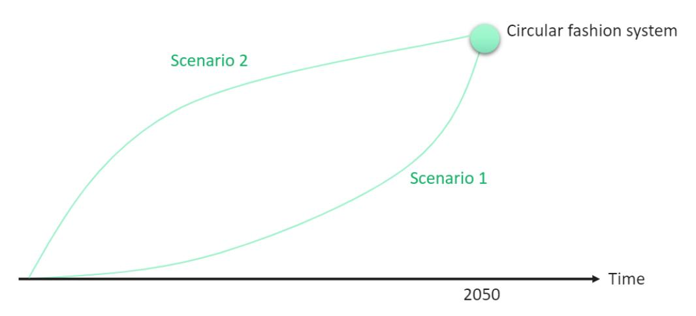

Figure 1: Backcasting methodology

This approach starts with the creation of a desirable future vision for the fashion system. Once it is clear what the ambitions are, necessary steps to achieve this desirable future are explored and different scenarios to reach these goals are compared (Quist and Vergragt, 2006). Backcasting methods are often used when dealing with complex problems that need major transformative change (Dreborg, 1996), such as the transition towards a circular fashion system.

During this process, stakeholder involvement is key. In **Error! Reference source not found.** we provide an overview of workshops and activities to ensure stakeholder involvement in a participative and iterative way. First, all SCIRT partners have contributed to this vision during workshops organised during the first two consortium meetings (June 2021 and January 2022). These inputs were complemented with literature research.

Table 1: Overview of the workshops and activities

| Step   | Date              | Format                             | Objectives                   | No. |
|--------|-------------------|------------------------------------|------------------------------|-----|
|        | June 10 th , 2021 | Online workshop with companies and |                              |     |
|        | January 18 th     |                                    |                              |     |
| Survey | February – May    |                                    |                              |     |
|        |                   | Online questionnaire-based survey  | Validation of scenario’s and |     |
|        | May 11 th and     |                                    |                              |     |
|        | 12 th , 2022      |                                    |                              |     |

Secondly, a broader stakeholder group, including producers and consumers, have been consulted using a survey (February – May 2022). This survey aimed to explore potential pathways to transition from a linear to a future circular textiles industry, using distinct scenarios. Also, stakeholder support for potential policy instruments that could help achieving the vision was assessed. The survey was distributed by newsletters, social media and direct mails from SCIRT project partners, sector federations, research institutions, and fashion companies. This resulted in 382 responses. Because 61 of them were collected by a single major fashion brand among its employees, which could bias the results, we only included the remaining 321 respondents in our analysis. The survey questions and respondent profiles are included in Annexes 1 and 2 to this report.

Finally, the User Board (organised under WP5, 25 participants) have provided further deepening of the insights from the survey during a 2-day workshop in May 2022. Moreover, barriers and challenges were identified, and possible solutions were explored, providing inputs that will be further elaborated in WP2 (technological innovations), WP3 (commercialization approaches), WP4 (design guidelines) and WP5 (social and policy innovations). To identify and map stakeholders to be engaged in the User Board, the Prospex-CQI Stakeholder Mapping methodology (part of the stakeholder integrated research (STIR) approach) was used (Gramberger et al., 2015). This method ensures that all relevant stakeholder categories are covered by the mapping and that those individuals that are able to make the best contribution to the project are selected. This was done at an early stage of the SCIRT project, in close collaboration with project partners. The CQI abbreviation stands for:

- C- Criteria: Defining a set of criteria and categories for stakeholder groups that are or could either be affecting the topic, be affected by it (or both), in order to map all relevant stakeholders,
- Q- Quotas: Setting specific minimum quotas for all categories for each engagement activity;
- I- Individuals: Identifying individuals that fit the categories, with the overall selection fitting the quotas set for each engagement activity.

This multi-levelled approach assures that the needs and expertise of all actors and stakeholders (internal and external to the project) are taken into account.

# **2 Towards a common vision on circular fashion**

# **2.1 Explorative workshop**

The first explorative workshop aimed to explore the value chain of fashion, including the different actors active in each step. Using several online Mural Boards in smaller groups, the process of value creation was studied, guided by the questions:

- What value (economic/environmental/social) is created and for whom?
- What value (economic/environmental/social) is lost by/for whom?
- What solutions allow to preserve value (economic/environmental/social) as long as possible?
- What barriers prevent the preservation of value (economic/environmental/social)?

Using post-its, the participants from the SCIRT consortium contributed their views on these questions, followed by a group discussion.

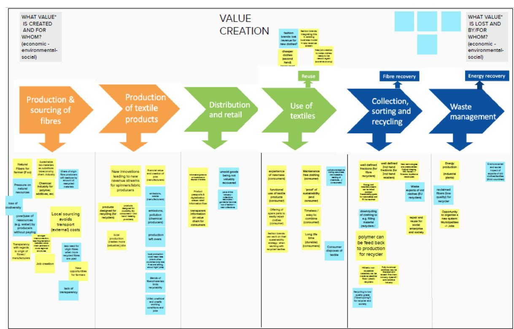

Figure 2: Example of one of the Mural Boards

Based on this exercise, we identified a first overview of relevant objectives for a circular and sustainable, value-conserving, fashion system. These are listed in Table 2.

D1.4 Vision and roadmap towards a circular fashion system

|                    |                            | Distribution and retail      | Use of textiles          | Collection, sorting and  |                     |
|--------------------|----------------------------|------------------------------|--------------------------|--------------------------|---------------------|
|                    | Better process monitoring  | Finding business models that |                          |                          |                     |
|                    |                            | do not require endless       |                          |                          |                     |
|                    | Use state-of-the-art       |                              |                          |                          |                     |
|                    |                            |                              | Second-hand sales        | Collection for reselling | Thermal recovery    |
| Transparency       | Collaboration across the   |                              |                          |                          |                     |
|                    | value chain/production     |                              |                          |                          |                     |
|                    |                            | Move away from fast fashion  | Fashion leasing/         |                          |                     |
|                    |                            |                              |                          | Take back systems        | Recovering residual |
|                    | Circular design (for       |                              |                          |                          |                     |
|                    |                            |                              | Reduce consumption       | Fibre2fibre recycling    | Stop waste exports  |
|                    | Move away from ever        |                              |                          |                          |                     |
|                    |                            |                              | Reuse and upcycling      | Better information for   |                     |
| Avoid fibre blends | Better knowledge about the |                              |                          |                          |                     |
|                    | use of recycled yarns in   |                              |                          |                          |                     |
|                    |                            |                              | Repair services close-by | Better sorting           |                     |
|                    |                            | More local production        | Nudging conscious        |                          |                     |
|                    | Virtualisation of          |                              |                          |                          |                     |
|                    | prototypes (3D             |                              |                          |                          |                     |
|                    |                            | Environmental labels         | Platforms enabling P2P   |                          |                     |
|                    |                            |                              | Adjustable clothing      | Energy-efficient         |                     |

Table 2: Solutions towards a circular fashion system

From the exercise, it was also clear that these objectives can be achieved in different ways. A lot of suggestions involved action by the government in the form of legislation, monitoring and (economic) incentives. Some examples:

- Legislation on transparency, chemicals of concern, etc.
- Policy support to promote the use of recycled fibres
- Binding product norms to assure quality
- Better screening of textiles entering the EU market
- Internalisation of environmental and social costs, e.g. carbon pricing
- Financial incentives, such as VAT exemptions
- Legislation on extended producer responsibility
- Environmental labelling
- Ban on landfill or waste exports

Other suggestions involve (often voluntary) actions by industry, such as:

- Use good quality materials, use recycled materials
- Provide information to consumers
- Adopt new business models that reduce consumption
- Adopt circular design and timeless pieces (basics, never out of stock)
- Local production
- Take-back schemes

Or actions by consumers, such as:

- Reduce consumption, e.g. by buying second hand or renting
- Repairing

# **2.2 Literature review**

In recent years, many public and private institutions have created visions on circular fashion, sometimes including more concrete targets or policy measures. An extensive literature study was done to map these intergovernmental, non-governmental, (national) and sectoral initiatives. An overview of some leading initiatives is provided below.

Based on these existing vision documents a list of 'elements of a circular fashion system' is created in section 2.3.

# **2.2.1 The European Strategy on Sustainable and Circular textiles**

Given its resource intensity, the European Commission has identified the textiles sector as a priority value chain for the Circular Economy in the latest Circular Economy Action Plan. The 2018 revision of the EU Waste Framework Directive (WFD) includes a mandatory separate collection of discarded textiles obligation for Member States by 1 January 2025.

In March 2022, the long-awaited EU Strategy for Sustainable and Circular Textiles was published, including an ambitious 2030 vision on circular fashion from a European perspective (European Commission, 2022):

*"By 2030 textile products placed on the EU market are long-lived and recyclable, to a great extent made of recycled fibres, free of hazardous substances and produced in respect of social rights and the environment. Consumers benefit longer from high quality affordable textiles, fast fashion is out of fashion, and economically profitable re-use and repair services are widely available. In a competitive, resilient and innovative textiles sector, producers take responsibility for their products along the value chain, including when they become waste. The circular textiles ecosystem is thriving, driven by sufficient capacities for innovative fibreto-fibre recycling, while the incineration and landfilling of textiles is reduced to the minimum."*

The Strategy announces several ambitions to make fashion more circular and sustainable:

- 1. Introducing mandatory product-specific eco-design requirements:
  - to increase textiles' performance in terms of durability, reusability, reparability, fibreto-fibre recyclability and mandatory recycled fibre content, to minimise and track the presence of substances of concern and to reduce the adverse impacts on climate and the environment.
  - including mandatory criteria for green public procurement
  - and support for the industry to substitute as much as possible and otherwise minimise the substances of concern in textile products placed on the EU market
- 2. Stopping the destruction of unsold or returned textiles:
  - by introducing a transparency obligation requiring large companies to publicly disclose the number of products they discard and destroy, including textiles, and their further treatment in terms of preparing for reuse, recycling, incineration or landfilling
  - by introducing bans on the destruction of unsold products, including as appropriate, unsold or returned textiles
  - by assessing how emerging technologies, such as digital precision technologies, could reduce the high percentage of returns of clothing bought online, encourage on-demand custom manufacturing, and in this way improve the efficiencies of industrial processes and reduce the carbon footprint of ecommerce.
- 3. Tackling microplastics pollution
  - through binding design requirements aimed at reduction and prevention of microfibre release to be introduced under the Ecodesign for Sustainable Products Regulation
  - including measures targeting manufacturing processes, such as prewashing at industrial manufacturing plants, labelling and the promotion of innovative materials
- 4. Introducing a Digital Product Passport for textiles with mandatory information requirements on:
  - circularity and other key environmental aspects
  - fibre composition and non-textile parts of animal origin
  - sustainability and circularity parameters, products' size and, where applicable, the country where manufacturing processes take place ('made in').
- 5. Assessing green claims to guarantee truly sustainable textiles and avoid greenwashing:
  - information about durability and reparability
  - stricter underpinning of environmental claims and labels

- review the EU Ecolabel criteria for textiles and footwear
- prioritise efforts on fibre-to-fibre recycling, instead of using recycled PET bottles in apparel, which is considered not in line with circular economy
- 6. Extended producer responsibility and boosting reuse and recycling of textile waste
  - by harmonizing EU extended producer responsibility rules for textiles with ecomodulation of fees, with the aim to create an economy for collection, sorting, reuse, preparation for reuse and recycling, as well as incentives for producers and brands to ensure that their products are designed in respect of circularity principles
  - proposing mandatory targets for preparing for re-use and recycling of textile waste as part of the review of the EU waste legislation foreseen for 2024.

#### **2.2.2 Ellen MacArthur Foundation (2020)**

The Ellen MacArthur Foundation is a thought leader on circular economy. In 2020, they published their report 'A new textiles economy: Redesigning fashion's future' (Ellen MacArthur Foundation, 2020). In this report, a vision of circular economy for fashion was presented, focusing on products that are (1) used more, (2) made to be made again and (3) made from safe and recycled or renewable inputs.

More concrete, the main objectives of this vision are:

- 1. phase out substances of concern and microfibre release
- 2. increase clothing utilisation
- 3. radically improve recycling
- 4. make effective use of resources and move to renewable inputs

### **2.2.3 Global Fashion Agenda (2021)**

Global Fashion Agenda (GFA) is a non-profit organisation that fosters industry collaboration on sustainability in fashion to accelerate impact. With the vision of a net positive fashion industry, GFA drives action by mobilising, inspiring, influencing and educating all stakeholders Through policy engagement, GFA proactively advocates for policy changes and supportive measures that reinforce sustainability targets, help establish circular systems and prompt policymakers to take informed action to foster necessary change.

Among other publications, GFA's Fashion CEO Agenda (Global Fashion Agenda, 2021) details a five-priority framework which presents the most crucial environmental and social sustainability areas that businesses should focus on to achieve a net positive fashion industry, namely:

- 1. Respectful and Secure Work Environments
- 2. Better Wage Systems
- 3. Resource Stewardship
- 4. Smart Material Choices
- 5. Circular Systems

### **2.2.4 UNECE Pledge (2021)**

The United Nations Economic Commission for Europe (UNECE) has launched 'the Sustainability Pledge' (UNECE, 2021) that calls for more traceability, transparency, sustainability, and circularity of value chains in the garment and footwear Sector. This "Call to Action" invites all actors in the garment and footwear industry to take action for traceability and transparency in order to accelerate the sustainability and circularity of value chains in this industry. Such actions should make the sustainability and circularity performance of industry actors more visible, going beyond compliance with mandatory regulatory requirements and including voluntary adherence to standards, codes of conduct and relevant frameworks and initiatives. Special attention goes to enhanced traceability of the human rights/social/environmental/ethical impacts of products and materials along the value chain, and enhanced traceability of origin, quality, sustainability and circularity performance, and compliance with health and safety requirements for consumers and workers.

In order to monitor the progress and impact and to facilitate experience sharing, industry actors are requested to report on the implementation of their commitments.

### **2.2.5 UNFCCC fashion charter (2021)**

The United Nations Framework Convention on Climate Change (UNFCCC) focuses on climate action and carbon emissions (UNFCCC, 2021). They have published a vision to achieve net-zero emissions by 2050, including a company pledge to contribute to carbon reduction by:

- monitoring GHG emissions;
- pursuing energy efficiency;
- sourcing 100% renewable energy;
- sourcing 100% priority materials;
- and other measures

# **2.2.6 WRAP (2021)**

The voluntary agreement 'Textiles 2030', led by climate NGO WRAP (WRAP, 2021), builds on the learning and success of the Sustainable Clothing Action Plan (SCAP 2020) and aims to engage the majority of UK fashion and textiles organisations in collabourative climate action. Signatories will collabourate on carbon, water and circular textile targets, and also contribute to national policy discussions with UK governments to shape Extended Producer Responsibility and other critical regulatory developments.

### **2.2.7 OECD Due Diligence Guidance (2018)**

OECD's Due Diligence Guidance (OECD, 2018) provides enterprises with a complete package to operate and source responsibly in the garment and footwear sector. This Guidance was developed through a multi-stakeholder process with in-depth engagement from OECD and non-OECD countries, representatives from business, trade unions and civil society and was overseen by the Working Party on Responsible Business Conduct. It entails guidelines on social justice, low impact processes, chemicals, CO2 emissions.

### **2.2.8 Circular Economy Action Agenda Textiles (PACE, 2021)**

PACE was created in 2018 by the World Economic Forum and is now hosted by the World Resources Institute. PACE's priorities for textiles are (PACE and Accenture, 2021):

- 1. Incentivize and Support Design for Longevity and Recyclability
- 2. Produce Virgin Natural Fibers Sustainably, Including Land Use
- 3. Encourage the Market to Use Less Clothing, and for Longer
- 4. Guide and Support New Business Models for Environmental, Financial, and Social Triple-Win
- 5. Where Used Textiles Trade Occurs, Ensure Environmental and Socio-Economic Benefits
- 6. Strategically Plan Collection, Sorting, and Recycling Operations
- 7. Increase Efficiency and Quality in Textiles Sorting
- 8. Make Recycled Fibers Market Competitive
- 9. Integrate and Advance Decent Work in the Transition to a Circular Economy for Textiles
- 10. Investigate the Socio-Economic Impacts of a Circular Economy for Textiles

### **2.2.9 Some other initiatives**

Many other initiatives on sustainable fashion have been launched in recent years.

Non-governmental initiatives include:

- Detox my fashion campaign by Greenpeace, focusing on the use of hazardous chemicals (https://www.greenpeace.org/international/act/detox/)
- Roadmap to Zero by the ZDHC Foundation, , focusing on the use of hazardous chemicals (https://www.roadmaptozero.com/?locale=en)
- Transparency Pledge by the Clean Clothes Campaign, , focusing on transparency (https://cleanclothes.org/news/2020/break-the-chains-transparency-in-the-2020-supplychains)
- Fashion for Good, focusing on sustainable fashion innovation for start-ups (https://fashionforgood.com/)
- Ecopreneur, focusing on advocacy for policy measures to support sustainable fashion (https://ecopreneur.eu/wp-content/uploads/2019/03/EcoP-Circular-Fashion-Advocacy-Report-28-3-19.pdf)

Also many industry organizations have published visions and action points/requests for policy makers, such as:

- The Sustainable Apparel Coalition and their HIGG index, focusing on the development of tools for measuring sustainability
- The coalition of companies behind The Fashion pact committed to a common core of key environmental goals to (1) stop global warming, (2) restore biodiversity, and
  - (3) protect the oceans. (https://thefashionpact.org/?lang=en)
- Euratex published a vision paper with 12 specific points and 6 enabling conditions to make the EU Textile Circular Economy happen, as well as a list of 10 Action points and requests for supporting legislation and policy measures

(https://euratex.eu/wp-content/uploads/EURATEX-Prospering-in-the-Circular-Economy-2020.pdf)

- The Nordic Fashion Association unites Scandinavian companies that push for a more sustainable fashion and textile industry, and drafted a recommendation for a Nordic Roadmap (http://nordicfashionassociation.com/projects/a-nice-future/). Measures include: o 1, Reduce CWCW (Carbon, Water, Chemicals & Waste), augmented by the very new issue of micro-fibers o 2, Replace DDT (Design Destined 4 Trash) with W2W (Wonderful 2 Wear): a change from growth in volume to growth in value; o 3, Redirect OSG (Out-sourcing Globally) 2 OSL (On-shoring Locally). Outsourcing production to low-cost countries with little control over emissions and social issues, causes a loss of knowledge. o 4, Rethink ED (excluding design) 2 ID (including design)
- EuRIC, the European Recycling Industries' Confederation, highlights some measures to boost recycling markets and create a level playing field between virgin and recycled materials by (https://www.euric-aisbl.eu/position-papers/item/126 euric-preliminary-comments-on-the-new-circular-economy-package): o Levelling the playing field with virgin materials, calling for economic measures to correct market distortions and incentivise the use of recycled materials: o creating well-functioning markets for secondary raw material, by facilitating cross-border circulation of secondary raw materials in combination with EUwide electronic control systems, which will also help to combat illegal shipments o Improving the interplay between EU's waste and chemical laws to address practical challenges o Ecodesign requirements supporting the reparability and recyclability of products

Many research Institutes and think tanks have published reports on circular fashion, including MISTRA (http://mistrafuturefashion.com/wp-content/uploads/2019/10/the-Outlook-Report\_Mistra-Future-Fashion-Final-Program-Report\_31-okt-2019.pdf) , ETC/WMGE (a body of the EEA) (Duhoux et al., 2022; EEA, 2019, 2021; Manshoven et al., 2019), RISE (https://www.ri.se/en/our-stories/sustainable-fashion-is-developed-andoptimised-for-a-purpose ), and SITRA (https://www.sitra.fi/en/projects/circular-economytextile-fashion-industry/)

Even countries have developed visions and ambitions related to textile use, such as The Netherlands (https://www.imvoconvenanten.nl/nl/kleding-en-textiel) , or labels for sustainable textiles, such as Germany (https://www.gruener-knopf.de/).

# **2.3 Elements of a sustainable fashion system**

As can be concluded from the non-exhaustive overview above, a multitude of visions, pledges, roadmaps and guidelines have been published in recent years about sustainable and circular fashion. Some visions focus only on certain aspects of sustainability or circularity, while others take a broader scope. Scientific work, grey literature and journal papers on circular fashion have presented several definitions of circular fashion, such as the following by (Dissanayake & Weerasinghe, 2022):

"*a fashion system that moves towards a regenerative model with an improved use of sustainable and renewable resources, reduction of non-renewable inputs, pollution and waste generation, while facilitating long product life and material circulation via sustainable fashion design strategies and effective reverse logistics processes. Application of circular fashion needs a system perspective where all the designers, manufacturers, suppliers, retailers and consumers are involved and committed with a positive shift in mind set."*

Or the description of the Ellen MacArthur Foundation (Ellen MacArthur Foundation, 2020):

*"A circular economy for fashion creates better products and services for customers, contributes to a resilient and thriving fashion industry, and regenerates the environment. It prioritises the rights and equity of everyone involved in the fashion industry, and will create new opportunities for growth that are distributed, diverse, and inclusive. A circular fashion industry designs products to be used more, made to be made again and made from safe and recycled or renewable inputs."*

Many authors have discussed a broad variety of elements that can be taken along the value chain of fashion. While some authors focus mainly on closing the loop of textiles, by take back schemes and recycling (Jia et al., 2020), others include consumption reduction and inner cycles such as reuse (de Aguiar Hugo et al., 2021).

However, what all visions have in common is that most remain quite vague about what ambition levels should be pursued (e.g. how much recycled content should be achieved by when). Also, it is clear that industry commitments are built around voluntary targets, awareness building and requests for incentives, while very few mandatory regulations have been implemented thus far. The EU Strategy for Sustainable and Circular Textiles announces that mandatory requirements are underway, but how these would look like remains unclear, yet.

Still, it is clear from the extensive literature review that 'sustainable and circular fashion' consists of a broad range of aspects. There is no single solution that fits all products, needs or conditions and there are different approaches that improve circularity in their own way, across the value chain of textiles. Based on detailed study of vision documents, commitments and pledges, the following longlist of elements that should be part of a Circular Fashion Vision has been created (Table 3).

|                                                                             | Elements of a Circular Fashion System                                                                                                                                     |
|-----------------------------------------------------------------------------|---------------------------------------------------------------------------------------------------------------------------------------------------------------------------|
| Low impact fibres                                                           | Waste prevention                                                                                                                                                          |
| Use of recycled fibres                                                      | Minimizing overproduction                                                                                                                                                 |
| Use of renewable fibres                                                     | Minimizing production waste                                                                                                                                               |
| Reduce micro-fibre shedding                                                 | Minimizing packaging waste                                                                                                                                                |
| Low impact processes                                                        | Minimizing post-consumer waste                                                                                                                                            |
| Sustainable agricultural practices                                          | Recycling                                                                                                                                                                 |
| Efficient water use                                                         | Design for recycling                                                                                                                                                      |
| Efficient energy use                                                        | Improved waste collection and sorting systems                                                                                                                             |
| Phase out chemicals of concern                                              | High quality recycling technologies                                                                                                                                       |
| Reduce CO2 emissions                                                        | Phasing out waste exports                                                                                                                                                 |
| Reduce transport and logistics                                              | Social justice                                                                                                                                                            |
| Longer use of garments                                                      | Healthy and safe working conditions                                                                                                                                       |
| Design for durability                                                       | Fair wages                                                                                                                                                                |
| Design for repair                                                           | Increased social protection                                                                                                                                               |
| Long-lasting fashion styles                                                 | No forced labour, nor child labour                                                                                                                                        |
| Re-use and second-hand markets Sharing models (e.g. garment rental systems) | Non-discrimination Value chain collaboration Transparency throughout the value chain Traceability of the supply chain Partnerships between producers and waste processors |

Table 3: Elements of a vision on Circular Fashion

These elements are briefly discussed in the following paragraphs.

### **2.3.1 Low impact fibres**

Textile design is a key determinant of production impact. Moreover, it defines product durability and the feasibility of circular strategies at end of life, such as repairability and recyclability (Botta & Cabral, 2021; Duhoux et al., 2022).

Sustainable design starts with sustainable fibre choices. Many recent research projects focus on the development of low impact fibres, such as recycled or renewable fibres (Duhoux et al., 2022; Ellen MacArthur Foundation, 2017). In the case of renewable fibres, sustainable sourcing is key as the growing of fibre crops uses vast amounts of land, water and chemical inputs (Berg et al., 2019; Oliveira Duarte et al., 2019; Chapagain et al., 2006).

In recent years, the issue of microfibre release from synthetic textiles has gained a lot of attention, causing concerns about the use of synthetic fibres in textiles (Manshoven et al., 2022; Periyasamy & Tehrani-Bagha, 2022).

### **2.3.2 Low impact processes**

In terms of production processes, emphasis has been put on sustainable agricultural practices (Altenbuchner et al., 2018; Trejo & Lewis, 2017), water efficiency (Raja et al., 2019), energy efficiency (Çay, 2018) and the reduction of carbon emissions. It has been estimated that the global apparel industry account for about 3 Gtonnes of CO2 eq., or 6.5% of the world's greenhouse gas emissions (Quantis, 2018). The use of chemical additives in processing is also a cause for concern, as many are found to be hazardous to human health or the environment (KEMI, 2014; Nijkamp et al., 2014), which is why the phasing out of substances of concern is a key prerequisite to achieve circular fashion (Ellen MacArthur Foundation, 2020). Since the fashion sector is highly globalised, impacts related to logistics are considerable and shifting to more sustainable modes of transport or local production facilities should be considered (McDonald et al., 2020).

#### **2.3.3 Longer use of garments**

A longer active use of garments is an important aspect of circular economy, involving durability, repair and reuse, which are enabled by design strategies. In the case of fashion, the notion 'emotional durability' – designing clothes that people want to keep using – may be an important antidote to fast-changing fashion trends that encourage premature disposal of clothing (Fletcher, 2012). For example, using 'classic' or timeless styles and colours helps to create clothes that are less likely to go out of fashion (WRAP, 2013). New business models, involving renting, sharing or collaborative consumption models are often mentioned as new ways of consuming in a more sustainable way, especially since the emergence of digital fashion platforms, although viability can often be challenging (Coscieme et al., 2022; Liu et al., 2022).

#### **2.3.4 Waste prevention**

Current business models in fashion rely on overproduction and sales, which eventually leads to large amounts of waste. It is estimated that only about one third of all garments that are produced are sold full price, another third is discounted and the remaining third is not sold at all and eventually ends up in landfill or incineration (SITRA & Circle Economy, 2015). For some luxury brands, destroying and burning unsold stock is a way to preserve exclusivity and keep prices high, while in fast-fashion it is the combined result of fast-changing trends and bad production planning, making garments 'unsellable' when trends have faded (Napier & Sanguineti, 2018). While some companies proactively deploy strategies to reduce overproduction e.g. by producing on demand, more and more voices are calling for a ban on the destruction of unsold garments (EEB, 2021; EU Strategy for Sustainable and Circular Textiles, 2022).

Apart from addressing overproduction, several waste prevention measures can be taken during production and use phases (EEA, 2021). For example, packaging waste is a point of concern, including pre-consumer packaging (plastic wraps, cardboard boxes), consumerfacing packaging (decorative retail packaging) and the increasing amount of packaging used in growing e-commerce. Many suppliers are experimenting with paper packaging to replace plastic, recycled or biodegradable packaging or reusable packaging (Chi Xu, 2021).

#### **2.3.5 Recycling**

Recycling of textiles is an important challenge. Currently, less than 1% of textiles is recycled into new garments again (Ellen MacArthur Foundation, 2020). Technical challenges related to high-quality sorting and recycling, together with an insufficiently developed market for recycled fibres are main barriers to the development of textile-to-textile recycling. Instead, non-reusable textiles are downcycled into rags, cleaning cloths or insulation materials, or simply incinerated or landfilled.

Design choices are crucial in order to allow high-quality recycling (Bell et al., 2006; Dissanayake & Weerasinghe, 2022). Used textiles should be separately collected and sorted into different fibre fractions, in order to allow high quality recycling and re-spinning into high-quality garments (Nørup et al., 2018; Sandvik & Stubbs, 2019).

Currently, a large share of textiles that are collected in Europe are exported, for reuse or recycling (Watson et al., 2016). However, since their exact fate is often unknown, concerns arise that many of those textiles are eventually ending up in landfills. Also, there is a concern that reusable European garments are distorting local textile markets. Therefore, phasing out waste exports towards developing countries is considered as an important prerequisite, in order to assure adequate waste management and -at the same time- develop a strong recycling market in Europe (Niinimäki et al., 2020; Wolff, 2021).

### **2.3.6 Social justice**

As important pillar of sustainability, also aspects of social justice have to be taken into consideration in order to build a circular fashion system (Padilla-Rivera et al., 2020). This includes healthy and safe working conditions (Alamgir & Banerjee, 2019; Bick et al., 2018), fair wages (Fuxman et al., 2022; Morris et al., 2021), increased social protection (Araujo et al., 2020; Feng & Ngai, 2020), a ban on forced labour and child labour (James, 2022; Nayak et al., 2019), and the abolishment of discrimination in the working environment (Clube & Tennant, 2022; Peleg Mizrachi & Tal, 2022).

### **2.3.7 Value chain collaboration**

Finally, since the fashion value-chain is complex, extremely fragmented and highly globalized, it is a big challenge to assure sustainability along the way. This involves transparency (Ki et al., 2020; Tura et al., 2019) and traceability (Mejías et al., 2019; Sandvik & Stubbs, 2019) throughout the supply chain. Moreover, Garcia-Torres et al. (2021) found that there is a mutually reinforcing relationship among traceability, transparency and crosssector collaboration when working towards sustainable supply chain management in the fashion industry. Partnerships between producers and waste processors are an important prerequisite in order to be able to close resource loops (Bouzon & Govindan, 2015; Manninen et al., 2018).

# **3 Pathways for a transition**

There is not one way to achieve a sustainable and circular fashion system. Making use of a backcasting methodology, we do not try to predict nor forecast which pathways are the most likely to be taken. Instead, backcasting involves defining a common goal, followed by constructing scenarios that describe future states where this common goal is reached, and transition pathways that describe how to move from the current situation to these future states (Henry & Jottier, 2013; Quist & Vergragt, 2006).

Commonly accepted goals for a sustainable and circular fashion system are already documented in the multitude of strategy and vision documents we discussed in section 2.3 Therefore, we opted not to create yet another set of goals, but to focus on the creation of consistent and coherent scenarios to reach the different elements of a circular fashion system as defined in section 2.2. Internal consistency also includes that along a transition pathway, incentives of all actors in the value chain are aligned. Therefore, it is important to co-create these pathways with stakeholders and to understand their opinions about what is feasible, realistic, and desirable.

Based on a literature review, we identified six scenario dimensions. Informed by the input of an explorative workshop, we combined these scenario dimensions into two consistent and coherent scenarios (**Error! Reference source not found.**). Note that these scenarios mainly serve as a backbone for thinking exercises, enabling policy makers and stakeholders to investigate consequences of the policy actions and company policies they envision.

|                                      | Scenario dimensions for a circular fashion system |
|--------------------------------------|---------------------------------------------------|
| Producer-led                         |  Consumer-led                                    |
| Technology-driven                    |  Behaviour-driven                                |
| Top-down                             |  Bottom-up                                       |
| Global                               |  Local                                           |
| Strong market concentration          |  Low market concentration                        |
| Outer circles of CE (e.g. recycling) |  Inner circles of CE (e.g. reuse and repair)     |
| Transition scenario 1                | Transition scenario 2                             |

Table 4: Scenario dimensions for a circular fashion system

These exercises were done in a hybrid deepening workshop (see 3.1). Further exploration of the realism and desirability of these scenarios was done in a broad stakeholder survey (see 3.2). Based on the results of both the workshop and the survey, we present and discuss two balanced pathways (see 3.3).

# **3.1 Deepening workshop to build scenarios**

In a deepening workshop with the consortium and Advisory Group (January 18th, 2022), a thinking exercise was organised, inviting all participants to imagine the transition to a future circular fashion system in 2050, within the boundaries of different scenarios. To create those scenarios, all 6 scenario dimensions were combined pairwise with all other dimensions, creating 15 pairs representing 60 possible transition scenarios towards a circular fashion system.

During the workshop, participants were invited to identify and discuss advantages, disadvantages, barriers, enablers, and existing cases that would fit each of these scenarios. Participants were divided into 5 groups, moderated by experienced researchers, each discussing three pairwise combinations represented by a set of axes (and thus 12 quadrants) (Figure 3).

This exercise allowed us to start with an open view on how to combine these scenario dimensions in a coherent way, and eventually enabled us to validate the construction of two coherent scenarios (see section 3.3 for a detailed discussion).

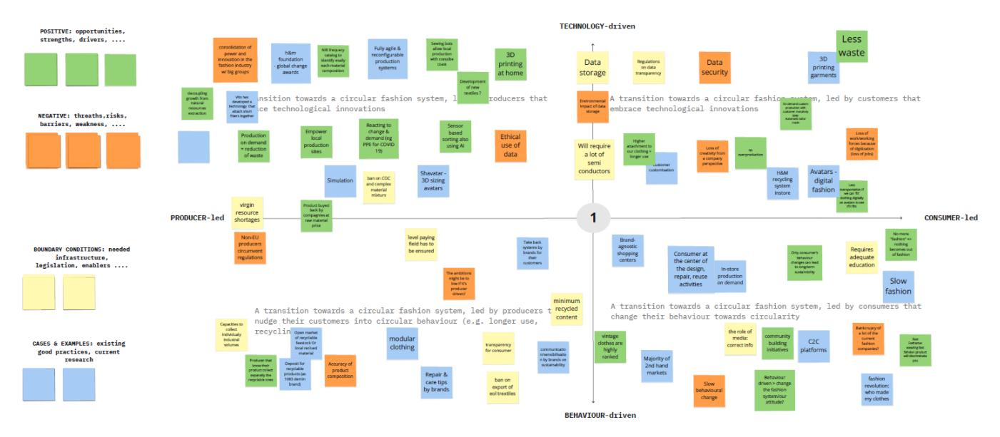

Figure 3: Example of the scenario-building exercise

# **3.2 Stakeholder views on transition scenarios**

In a next step, we used the survey (described in chapter 1) to validate stakeholder support and preferences for the two scenarios along their scenario dimensions. Controlling for profile characteristics, we assessed respondents' expectations, as well as their preferences on each scenario dimension. The questions related to the transition scenarios were phrased as follows:

"*Each question presents a scale with 2 contradicting principles at the extremes. On this scale, indicate what you consider to be the most realistic future scenario. Secondly, indicate what would be your preferred scenario."*

#### An example is given in Figure 4.

19 Shall a transition towards a circular fashion system be **technology-driven** or **behavior driven**? 

|             |      |      |    |  |
|--------------------------|-------------------|-------------------|-----------------|---------------|
| Most realistic scenario: | Technology-driven | Equally important | Behavior driven |               |
| My preferred scenario:   |      |      |    |  |
| Comments (optional)      |                   |                   |                 |               |
|                          |                   |                   |                 |               |

Figure 4: Example question on scenario dimensions

As can be seen from Figure 5, there are some differences between the transition pathway that respondents deem realistic, and the transition pathway that they would prefer. A first glance reveals that, across all scenario dimensions, respondents generally prefer a 'balanced' transition, in which both extreme scenarios are equally important: a circular fashion system should involve global action as well as local action, it should involve recycling (outer circles) as well as reuse and repair (inner circles). The transition should be driven by producer actions as well as consumer demand, top-down as well as bottom-up and it will require both technological developments and behavioural change.

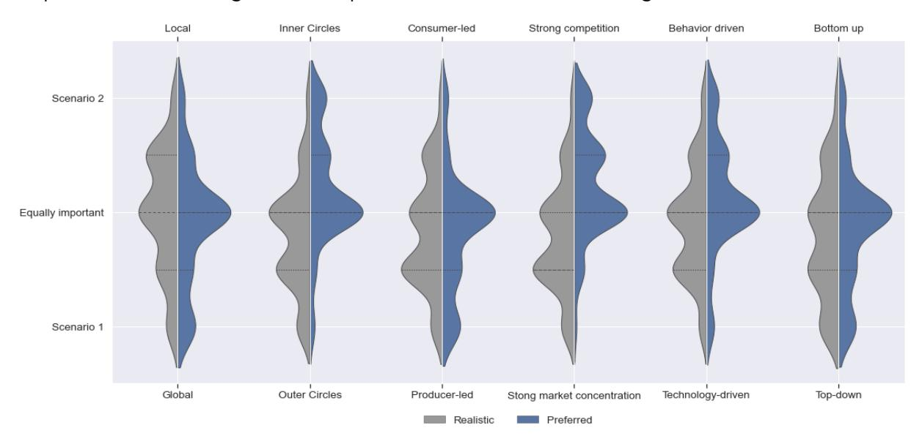

Figure 5: Stakeholder estimations and preferences on scenario elements

There is a slight preference for more focus on inner circles (reuse, repair) than outer circles (recycling) and for a strong market competition (many smaller players) over a strong market concentration (few large players).

On the other hand, looking respondents' expectations about what a realistic transition scenario would look like, a slight inclination towards outcomes that refer to scenario 1 can be observed, except along the local-global dimension.

Apart from these 'overall' observations, it is interesting to see whether preferences and expectations are different between different respondent profiles (e.g. consumers, large companies, SMEs, policy makers, companies with a B2B business model etc.). To analyse these differences, an ordered probit regression was used. We report regression results for companies in Annex 3 and discuss the most significant results in the next subsection when presenting both scenarios.

Survey results were also presented and discussed at the User Board meeting of May 2022 in Vienna. Subsequently, policy recommendations, bottle necks and next steps were discussed in two focus group sessions. The results of these sessions are also reported in 3.3.

### **3.3 Scenario elements for a circular fashion system**

In this section, we will present two scenarios for a circular fashion system. We start with a discussion on each of its constituent scenario dimensions and conclude in section 3.4.

### **3.3.1 Producer led vs consumer led transition**

According to stakeholders, the main benefit of a **producer-led** transition would be the speed of a transition towards circularity, as they consider consumers would have to follow the offer made by companies. As one participant states it: "*producers could push circular initiatives in the market*". Disadvantages mentioned include the fear that producers outside the EU might circumvent mandatory regulations, leaving EU-based companies at a competitive disadvantage, and the fear for a lack of producer responsibility leading to low ambition levels. Mandatory regulations are mentioned as a boundary condition to ensure a level playing field among producers in order to enable circular solutions. Policy measures that were proposed include a ban on chemicals of concern, rules with respect to transparency and traceability, minimum recycled content, and more general environmental and social standards.

A **consumer-led** transition, on the other hand, has the advantage that companies tend to follow market demand of a growing client base that is increasingly aware of sustainability issues, and that is willing to pay for sustainable products. Disadvantages mentioned are a lack of awareness among the general public, beyond the relatively small group of early adaptors, short-sighted decision-making processes by easy-to-convince consumers with respect to (ultra-)fast fashion, and persistent negative perceptions towards second-hand clothing. Boundary conditions are the development of sufficiency-based business models, a sustained attention towards awareness building, mandatory transparency regulations, and, most of all, the development and implementation of true cost models that allow customers to internalize environmental and social externalities in their consumer behaviour.

Overall, survey respondents estimate a producer-led transition as most realistic. Within companies, our survey results show that respondents from EU-countries, reuse centres, fashion manufacturers, and male respondents rather expect a consumer-led transition, while respondents from large companies and respondents with a position in strategic management rather expect a producer-led transition.

However, many survey respondents argue that transition should above all be **policy-led**. As one respondent pointed out: "*It will be policy-led or not happen at all".* This was already mentioned by participants at our workshop in Antwerp and validated by focus group participants in Vienna. On the one hand, stakeholders indicate that demand is a driving factor for producers: "*if the client wants circular, we will make circular".* On the other hand, stakeholders indicate a gap between what customers say they want, and their actual behaviour. As formulated by a survey respondent:

"*Producers can design for longevity, recyclability, whatever but as long as consumers keep on buying and throwing away, chasing novelty, new trends and so on, we will never solve the waste problem. Often the more sustainable choices from a producer's perspective are more expensive. Consumers are not willing to pay for this. I think there is a big role for the government as well."*

This means a strong supportive government policy is necessary for both producer-led and consumer-led scenarios.

### **3.3.2 Outer vs inner cycles of circularity**

Strategies that focus on **outer cycles** of circularity put a strong focus on high quality recycling. Key advantages of this pathway, as indicated by stakeholder participants, are a strong focus on design for recyclability, the development of a market for recycled fibres, and a good compatibility with current production and retail processes. These advantages, however, also count as necessary conditions that should be fulfilled in a coevolutionary way to be able to follow this pathway. Disadvantages include quality losses during recycling loops and the need for recycling technologies that can deal with low volumes and mixed inputs. Boundary conditions include the need for good quality recyclable fibres, the need for agile recycling facilities, the need for standardized quality specifications (e.g. in product passports), and improved systems for sorting and collection to assure volumes. Also here, mandatory regulations are suggested to level playing fields between competing profitdriven firms at a global scale. A specific point of attention is the risk of moving polluting recycling activities towards less-regulated developing countries. On the other hand, the development of recycling solutions in the Global South is indicated as a big opportunity that may foster sustainable development.

**Inner cycle** strategies put a strong focus on reuse and repair. Advantages include the prolonged use of garments, which prevents waste, and opportunities that stem from the development of sharing, renting, and reuse business models, Disadvantages include the carbon footprint of transportation for repair, the low economic viability of repair activities in high wage countries, and asymmetric information with respect to the quality of reused textiles. Also, only a small group of early adaptors is believed to be interested in slow fashion and reused garments. Furthermore, these models are believed to be inapplicable to underwear and sportswear. Boundary conditions are increased consumer awareness, design for repairability, a renewed attention for repair skills at schools, and the use of high quality fibres. Technological innovations, including product passports and RfID tags are believed by some participants to create opportunities to learn more from the use phase, providing feedback loops for design and reducing asymmetric information for reuse.

Results from our survey indicate that, in general, respondents estimate a focus on outer cycle strategies as the most realistic transition pathway. Within companies, male respondents and respondents working in reuse centres estimate inner cycle strategies as more realistic, while respondents in strategic management estimate outer cycle pathways as more realistic.

In focus groups, recycling is regarded as the easiest and cheapest strategy for circularity, while reuse/repair are regarded as more complex, more expensive, and less profitable. Increasing recycling also has a less fundamental impact on production and retail processes, while reuse and repair demand more fundamental changes in product design and sales strategy. This is illustrated by the following comments:

- "*The textiles industry is clearly willing to keep on overproducing textiles to keep on making profits. Recycling is not a threat to their business models whilst repair and reuse are. […]"*
- *"[…], it will be much easier for customers to buy "new" recycled goods than put the time in to do it themselves. An alternative might be to have services that offer to incorporate inner circles, but consumers do not often want that extra step."*

In both cases, design is key to facilitate circular strategies:

*"Some items are not designed to be durable for several reasons e.g. silk garments. Such items should have a system optimized for recycling. Others have to be durable to sustain, for example, sudden harsh condition e.g. rain boots or hiking shoes. These should be made from stronger materials and be designed for longer use."*

### **3.3.3 Global vs local value chains**

Stakeholder participants state that the main advantage of a transition pathway with **global value chains** is the power that comes from a global impact, the potential economies of scale that may follow from it, and the cost-reducing potential of specialization in a globalized economy. While global value chains may enable repair services and the development of reuse markets in low-wage countries, this comes at a trade-off with transportation costs, both in economic and environmental terms. Disadvantages include a risk of increased informational asymmetries because of the complexity of globalized value chains, the neglect of local production specificities and local traditions, an increased pressure on developing countries to receive waste in so called "pollution havens". Global competition may also lead to a race to the bottom with respect to prices and labour standards. Therefore, important boundary conditions include international mandatory regulations on environmental and social standards to create level playing fields.

Another transition pathway encompasses strengthening **local value chains** to move towards a circular fashion system. This increases the responsibility of each region to take care of its waste problems and stimulates to close resource loops at a local level, fostering design for recycling and the use of renewable and recycled content. Also, repair services and reuse markets can be organized at a local scale, e.g. by embracing the potential of work integration social enterprises. Local value chains also have a positive impact on carbon emissions and may enable reshoring of economic activities that have been outsourced towards low-wage countries. The most important disadvantages, however, are diseconomies of scale, rendering certain recycling technologies impossible to implement, and a lack of specialization, leaving regions to allocate resources towards activities they do not have any competitive advantage in. This would lead to higher prices and a less diverse supply towards customers. Boundary conditions include the development of EPR systems to finance collection and recycling at a local level, increased customer awareness, and trade policy measures that ensure that local value chains are not destroyed by international competition.

In our survey, the global-local nexus was the only scenario dimension where respondents deemed a scenario 2 element – i.e. local value chains – as the more realistic pathway. Preferences between both scenarios are, as was the case in other scenario dimensions, more balanced between both. Looking at profile differences within companies, local value chains are expected to be most realistic by companies within business-to-government markets, while global value chains are evaluated as most realistic by respondents in strategic management, designers, and respondents working in waste management.

In the free-format comments of the survey, some more details are given about which activities should be organized locally or globally. Also here, scale is mentioned as an important factor:

- *"This depends very much on case to case. Local hubs are important, but we live in a global world."*
- *"Rental and 2nd hand should be local to be close to the usage + limit the distances. [In these] models, the transport is the main hotspot of CO2 impact. Recycling [should be] mostly global to consider the reality of the industry"*
- *"Start local and scale global."*

Also in terms of legislation, a combination of local and (supra)national or global levels is considered needed:

- *"Legislation is needed at the EU/global level (also when it comes to production chains). However, implementation is needed at the local level and enforcement at the national level."*

#### **3.3.4 Technological development vs behavioural change**

A transition driven by **technological development** is considered by stakeholder participants as beneficial because it could reduce overproduction (e.g. through on-demand production), improve value chain collaboration, and foster high quality recycling processes while remaining relatively independent from political decision-making processes. Technological development could as well empower the feasibility of local production sites and small-scale recycling facilities. Many examples of applications were given, including sensor-based sorting systems using artificial intelligence, 3D printing at home making use of avatars such that clothing is tailer-made, production on demand, and a proliferation of sewing bots. Disadvantages that were mentioned include the risk of a strong market concentration, a risk of job losses, (ethical) data security issues, and carbon emissions that come from data storage. Boundary conditions therefore include an increase in investments in research and development, and regulations on data ownership and transparency.

Many stakeholder participants consider a transition driven by **behavioural change** as sustainable in the long term, giving ownership of this transition to all citizens. A major disadvantage of this pathway, however, is that it may be hard to convince stakeholders that do not care. Therefore, this transition pathway may have a slow uptake. Other disadvantages are the risk of greenwashing by applying misleading labels, and the direct economic impact of applying sufficiency strategies. Boundary conditions include not only awareness building, innovation support for sufficiency-based business models, but also supportive mandatory regulations, harmonized at a supranational level. The latter includes proper labelling regulations, and true cost pricing that empowers consumers to make well-informed choices.

In our survey results, we notice that a technology-driven transition is considered more realistic, however, respondents tend to prefer an equal importance of technology and behavioural change. Within companies, the behavioural pathway is mainly expected by respondents from the EU, and by male respondents and respondent operating in Businessto-Business markets. The technology pathway is rather expected by respondents in strategic or general management.

In the free-format comments that were recorded there is a clear acknowledgement that technological innovation and behavioural change need to go hand-in-hand:

- *"We do need both, but the technology really builds on behavioural changes as well."*
- *"We need a strong lead and vision from technology, responding to concrete needs. We need to involve consumers from day one and change behaviours through the process of innovation."*

One statement indicated that technology is not the problem, but implementation is insufficient: *"Recycling solutions already exist, there is, however, a need to further implement them, to extract end-of-life textiles from domestic waste."*

Finally, it is questioned to what extent the responsibility of behavioural change can be put at the consumers': sustainable behaviour should be made easier, or even the norm:

- *"[…] making it easy to adopt this system would change behaviour […]"*
- *"Focus on behaviour from industry and government, not from [the] consumer"*
- *"Make sustainable product offers the norm, [make] only that available for consumers to choose from good, better or best in class"*

### **3.3.5 Market-concentration vs competition**

A transition pathway with a **strong market concentration**, where a limited number of big companies have significant market power, provides advantages such as economies of scale, and the potential of a fast transition by allocating significant resources to innovation and capital intensive technologies, production processes, and recycling options. Vertical integration is also expected to lead to more efficient supply chains. Disadvantages include the classic drawbacks of market concentration: the expectation of high prices, low qualities, less (cultural) variety, an inappropriate use of information asymmetries by big companies including the risk of cartel formation, and strategic market entry deterrence. Boundary conditions therefore include mandatory regulations to prevent these drawbacks, and an investment in strong democratic institutions that can face the risks of crony capitalism and disputable lobbying practices.

The opposite of strong market concentration means a **strong competition** between market players. A strong competitive environment has the advantage of lower prices and a high incentive to innovate and differentiate market offers to serve a wide variety of customer segments, taking into account local production and consumption conditions. However, each individual producer only has a very limited impact on the entire system. Another disadvantage are diseconomies of scale that follow from small-scale operations and limited market sizes, leading to suboptimal implementation levels of new recycling technologies. Boundary conditions include standardization and embracing technologies to ensure due diligence and auditing of production processes and the adherence to environmental and social standards, but also to make technologies available and implementable at a sufficiently small scale.

Our survey results show a symmetrical distributed preference over both market structures, but a larger expectation that a transition towards a circular fashion system goes along a pathway with a rather strong market concentration. Within companies, we see a higher expectation of a strong market concentration among respondents in strategic management, while more competition is expected in greater extent by male respondents, textile manufacturers, and reuse centres.

In the free-format comments, the desire for a balanced system is expressed:

- *"It would be great if small producers can push the larger producers to follow suit. However, without large producers on board in the process, it will fail."*
- *"Frontrunners are often smaller companies. We need them to make steps, but to make impact we need the big companies as well […]"*

Moreover, some respondents point out that neither 'competition' nor 'market concentration' may be a desirable way forward, instead, cross-industry cooperation should be improved:

- *"To make a transition towards a circular fashion system more often cooperation between partners in the supply chain is needed instead of competition. We really need to rethink our economic system and not always competition is the way forward."*
- *"Know-how should be available to everyone and in every price range. Everyone should have access to the necessary technology."*
- *"Of 2 evils …"*

#### **3.3.6 Top-down vs bottom-up steering of the transition**

According to stakeholder participants, the main benefit of a **top-down** transition pathway would be the power of governments and supranational bodies to impose strong mandatory regulations that may level the playing field within a globalized industry, enabling companies to opt for circular options without having to fear any competitive disadvantage. A top-down approach would also enable an increased transparency of value chains, enable the development of standards, and enhance a focused allocation of resources towards research and development. Disadvantages include the mere fact that there is no international government that is able to impose mandatory regulations for the entire fashion system, leaving plenty of options for freeriding between countries. Even with benevolent governments that share a common vision on sustainability, aligning legislation between countries is a slow and cumbersome process. Top down processes may also lead to overregulation and bureaucratic deadweight losses, impeding innovation and entrepreneurship. Moreover, stakeholder participants do not expect customers to become happy from government intervention on their fashion choices. An important boundary condition is therefore a balanced approach with clear circularity guidelines that leave room for creativity and cultural identity.

A **bottom-up** transition pathway, on the other hand, may allow a change process that is independent from political discussions, and increase ownership of the transition process among all layers of society. It would also contribute to a fashion system that understands local conditions and cultures. However, the development of standards and possibilities for scaling up new technologies are considered to be more cumbersome in a bottom-up approach. Stakeholder participants fear that recycling would only target high value fractions. Also, market access for small innovative circular players is questionable, according to stakeholder participants. Many participants believe only a small group of consumers is ready to pay more for longer lasting products in an era dominated by cheap fast fashion. Boundary conditions include supportive mechanisms to enable promising initiatives to scale up, and a sustained awareness building to support ambition levels of all societal players towards a sustainable, circular, and fair fashion system.

Both in our survey as in focus groups, respondents and participants tend to prefer a balanced approach between top-down and bottom-up. However, a top-down pathway is considered as a more realistic pathway. In the free-format comments the importance of a strong government steering is mentioned:

- *"We need a clear message from government and concrete legislation urgently"*
- *"Nothing moves without regulations"*
- *"Change would happen much quicker with political will, and the power / influence / investment of governments and industry."*
- *"When it comes to producers: we believe in binding targets at the EU-level to push sustainable production and to make recycling and re-use the norm/mandatory."*

Some respondents expressed a sense of urgency: "*Bottom-up would have been nice if it started 30 years ago. Now, we're running out of time!"*

# **3.4 Discussion and conclusions**

The preceding analysis allows us to define two scenarios, describing two different transition pathways towards a circular fashion system while sharing the same goals. In this subsection we will summarize advantages and disadvantages of both scenarios, highlight their macroeconomic consequences, and discuss issues involved when combining elements of both scenarios.

In a **first scenario**, transition is led by producers, driven by technological developments, with a focus on outer cycles, organized along global value chains, making use of a top-down approach, and resulting in fashion industry with a strong market concentration. The main advantages of this scenario are:

- economies of scale, making it easier to mobilize investment capital, target at research and development, and to optimize value chains;
- mandatory legislations that are harmonized at supranational levels enabling a level playing field for all value chain actors;
- incentives to optimize high quality recycling, including investment in new recycling technologies, the creation of mature markets for recyclates, and a strong incentive to design for recycling;
- a focus on recycling would allow producers and retailers to adhere to their current activities and business models that are built around production of new garments and sales, also less behavioural change would be needed;
- new digital technologies could enable more on-demand and tailer-made solutions, which could lead to less overproduction.

The main disadvantages of this scenario are:

- the difficulty of agreeing upon and enforcing ambitious mandatory regulations at a supranational level;
- the vulnerable position of customers and local communities towards producers with large market power (risk of high prices, low qualities, low variety, and entry deterrence towards new companies) and the democratic deficit of a system that is designed by supranational bodies and a limited number of companies;
- long transportation distances, resulting in a high carbon footprint, and complex global value chains that result in information asymmetries.
- less attention for inner cycles of circular economy, such as reuse and longer use, which have a larger environmental advantage

In a **second scenario**, transition is led by consumers, driven by behavioral change, focusing on inner cycles, organized along local value chains, following a bottom-up approach in a strongly competitive environment.

The main advantages of this scenario are

- ownership of the transition process along all layers of society, taking care of cultural differences and local needs and opportunities;

- innovation driven by consumers and companies in a strongly competitive environment, resulting in a wide variety of collections;
- waste prevention by a strong focus on inner cycles (development of repair and reuse market and design for repair and longevity) and innovative business models that embrace sufficiency strategies;
- short resource loops that prevent a large carbon footprint by transportation.

The main disadvantages of this scenario are:

- diseconomies of scale, resulting in higher prices, and major barriers to scale up new developments beyond the minimal scale that may be necessary to implement certain technologies;
- it is not straightforward to convince critical masses of customers and producers to change their behaviour beyond a tipping point where circular strategies become more rewarding than linear strategies;
- a major restructuring of the current global fashion value chain would be necessary, resulting in bankruptcies of current businesses and significant job losses in developing countries.

Both scenarios also have different consequences on the wider economy. With respect to **economic growth**, the first scenario will provide a bigger boost towards GDP growth as many activities will take place in the formal economy and factor productivities will increase because of stronger capital investments and technological developments. The second scenario involves more activities in the informal economy, manual labour, reshoring of activities with low added value, and prevents certain transactions to take place out of sufficiency considerations, resulting in lower GDP growth and a smaller tax base for public finance. With respect to **income inequality**, the first scenario will lead to higher income inequalities within regions and lower inequalities between regions, following from a stronger specialization and increased market power. The second scenario will lead to lower income inequalities within regions, and higher income inequalities between regions, following from locally organized value chains and less international trade.

While scenario-building is a useful approach to inform and inspire thinking processes to develop policy measures and strategies, a transition towards a circular fashion system will always result in a **combination of both pathways**. This is also acknowledged by survey respondents and stakeholder participants. Nevertheless, combining elements from both pathways have some consequences to take into consideration.

In the first scenario, a top-down approach will have to be careful to take consumer needs sufficiently into consideration. Otherwise, the support base for a circular transition will erode. In this scenario, combining the assets of global value chains while embracing the power of local networks may result in less carbon emissions and higher traceability. Also, at a local level, maker spaces could be interesting spots to test new innovations and validate experiments of technological development. While legislation alone will be too slow to spur the transition towards circularity, also the first scenario should embrace elements of behavioural change, making use of smart technological developments (e.g. gamification) and insights from behavioural psychology (e.g. nudging).

In the second scenario, a focus on inner cycles will lead customers to have a more intense relationship with producers. While this scenario is customer-led, companies will have to innovate on business models that allow for these long-term interactions while staying profitable. A focus on inner cycles does not prevent the need for enhanced recycling as well. Local value chains, as envisioned in this scenario, may embed local recycling hubs, preventing the export of used textiles and implementing agile recycling technologies that are profitable at a small scale. Supporting legislation to define standards on quality specifications (e.g. materials passports) will as well be necessary to enable recycling in a strongly competitive environment with many market players. Finally, also in the second scenario, local value chains and a bottom up transition pathway does not preclude the need for collective action among companies, governments and civil society actors to foster the development of improved environmental and social standards.

# **4 Policy instruments to support the transition**

While it is important to know which pathways would be realistic and desirable to achieve a sustainable and circular fashion system, we need to think about how the necessary changes can be brought about and how actors can best be encouraged, supported or enforced to get moving along these pathways.

Several policy instruments of different nature can be imagined. Some objectives may best be enforced by mandatory regulations, while other results may be achieved by encouraging voluntary industry action or awareness raising. However, before choosing a certain instrument, is it useful to assess the stakeholders' support for such a measure, to create support and prevent perverse effects with the fashion system.

Potential policy instrument types are briefly described in 4.1. The results of the online survey assessing stakeholders' support for such measures are presented in 4.2. Finally, a discussion and some conclusions are presented in 4.3.

# **4.1 Policy instruments**

In our survey, we identified 4 main categories of policy instruments: awareness building, voluntary industry targets, non-mandatory policies, and mandatory regulations, presented in an increasing order of compulsion.

Awareness building can be considered as the least compulsory policy instrument and can be implemented by virtually all stakeholders of concern. While consumers become increasingly aware of the environmental footprint of their consumer behaviour, many of them do not see ecological problems associated with a fast fashion consumer culture (de Aguiar Hugo et al., 2021). Awareness building is also necessary among the workforce of companies throughout the fashion supply chain, since this is considered a major enabler for organizations towards the circular economy (Dissanayake & Weerasinghe, 2022).

A second instrument, voluntary industry targets, also leaves many degrees of freedom to all parties involved. However, given pressures by NGOs and customers, not committing to these targets may cause increasingly reputational damage. Moreover, it can also trigger governments to take initiatives themselves (Colucci et al., 2020).

Government policies can be considered as the most compulsory set of instruments. Here, a difference can be made between non-mandatory policies, e.g. the creation of a sound legal framework to enable green public procurement, and mandatory regulations that are enforceable, e.g. product norms (Jia et al., 2020).

While many policy instruments are available, the development of a consistent and coherent policy mix remains a major challenge. Setting novel rules of the game may cause tensions and contestations (Kautto & Lazarevic, 2020). For the fashion system, this is particularly challenging, as it involves a complicated supply chain with many stakeholders. Within these supply chains, stakeholder pressure is recognized as a significant force to adopt circular strategies (Ranta et al., 2018). Therefore, a successful policy mix requires an understanding of stakeholder incentives and their support for differing policy instruments (Capano & Howlett, 2020).

# **4.2 Stakeholder support for policy instruments**

To assess stakeholder support for different levels of policy instruments, we included a set of related questions in our online survey. The questions related to the type of instruments were structured along the different elements of a circular fashion system (see 2.3) and phrased as follows:

*"How ambitious should the fashion system be to reach circularity by 2050? The following questions focus on instruments of increasing ambition levels that can be used to reach circular fashion goals."*

An example is given in Figure 6.

13 How ambitious should the fashion system be by 2050 with respect to the use of **low impact fibres**? 

|                             | No ambitions          | Awareness building    | Voluntary industry targets | Non-mandatory policies (e.g. tax incentives) | Mandatory regulations (e.g. product norms) |
|-----------------------------|-----------------------|-----------------------|----------------------------|----------------------------------------------|--------------------------------------------|
| Use of recycled fibres      | <input type="radio"/> | <input type="radio"/> | <input type="radio"/>      | <input type="radio"/>                        | <input type="radio"/>                      |
| Use of renewable fibres     | <input type="radio"/> | <input type="radio"/> | <input type="radio"/>      | <input type="radio"/>                        | <input type="radio"/>                      |
| Reduce micro-fibre shedding | <input type="radio"/> | <input type="radio"/> | <input type="radio"/>      | <input type="radio"/>                        | <input type="radio"/>                      |
| Other (please specify)      |                       |                       |                            |                                              |                                            |
|                             |                       |                       |                            |                                              |                                            |

Figure 6: Example question on measures

Preliminary results from our survey were presented at stakeholder meetings. Four focus groups and the project's Advisory Board were used to validate the survey results and identify policy recommendations. These focus groups were held simultaneously during the user Board meeting in Vienna (May 2022), and were organised in 4 thematic groups: 'fibre technology', 'textile design', 'retail and use' and 'waste collection and management'. They were moderated by experienced researchers. In a first exercise, the participants were asked to discuss the concrete targets and suitable policy measures to support the transition to a circular fashion system. In a second exercise, participants identified their most important pain points and potential solutions to these pain points. For each exercise, the groups were given 50 minutes to brainstorm and the outcomes were presented in plenary. They are summarised below per element of the vision.

Our results show a very strong support for government policy interventions in general and for mandatory regulations in particular. This especially holds for issues with respect to social justice, where almost all survey respondents are in favour of mandatory regulations. The support for mandatory regulations is the lowest for 'use phase' aspects of a circular fashion system (e.g. sharing models and long-lasting fashion styles). In the next subsections, we will discuss the main results on stakeholder support for policy measures for each element of a circular fashion system, and present an overview of specific measures pointed out by stakeholder participants (Antwerp meeting of January 2022), survey respondents (February-May 2022), and focus group participants (Vienna meeting of May 2022).

#### **4.2.1 Low impact fibres**

With respect to low impact fibres, we notice a very strong support for government intervention (see Figure 7). More than 85% of our respondents prefer mandatory or nonmandatory government instruments to reduce micro-fibre shedding and to increase the use of recycled fibres and renewable fibres. Instead of a race to the bottom, one survey respondent mentions the need for "*economic incentives to race to the top"*. Other suggestions include earmarking tax income towards subventions for new research on fibres and an upstream widening of the scope of audits and regulations, taking into account raw materials (suppliers rank 2).

Figure 7: Preferred policy instruments on low impact fibres

With respect to policy instruments (**Error! Reference source not found.**), survey respondents and focus group participants stressed a large need for transparency on product information, such as production technologies used, chemicals/dyes and traceability of all suppliers involved in the production. All these types of information should be part of a digital product passport for all new collections and can also be used to develop a clear labelling system providing more information towards customers.

When discussing an increased use of recycled fibres, a mandatory ecodesign requirement for recycled fibre content was suggested. Even more stringently, a minimum percentage originating from post-consumer textile waste could be considered.

Finally, they stress the importance to construct a European market for fibres and bring back the whole supply chain within the EU. This should be a consequence of regulations related to EU production, stricter import controls to protect EU manufacturers against imported low quality products and a ban or restriction of exports of post-consumer textiles outside Europe. Such European self-sufficiency would not only facilitate transparency, traceability, and monitoring, but it would also promote innovation to scale up local fibre-to-fibre recycling and reuse within Europe and to construct a market for recycled fibres at a European level.

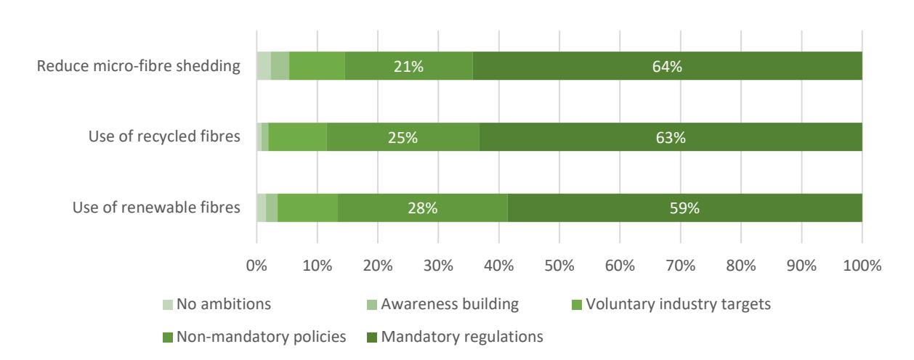

|         | Mandatory regulations     | Non-mandatory       |                            |                    |
|---------|---------------------------|---------------------|----------------------------|--------------------|
|         |                           |                     | Voluntary industry actions | Awareness building |
|         | Ecodesign requirements on |                     |                            |                    |
|         |                           |                     | Recycled content targets   | Labels with %      |
| General | Mandatory uniform digital |                     |                            |                    |
|         |                           | Economic incentives | Training programmes and    |                    |

Table 5: Proposed policy instruments related to low impact fibres

Complementary to mandatory regulations, a variety of economic incentives were proposed, such as tax reductions for using recycled fibres, export taxes on used textiles, or green public procurement guidelines. In a weaker form, ecodesign could also be encouraged in the form of voluntary targets and ecodesign guidelines. The introduction of a product standard, including recycled content targets, was advocated, as current standards such as the Global recycled Standard (GRS) was deemed insufficient to control the system. In terms of awareness raising, there is a need for a culture change and labels could serve as a communication asset to inform consumers to buy responsibly.

Note that the stakeholders clearly focused on the use of recycled fibres as a priority. A shift to renewable fibres was only briefly mentioned in the discussions. But, there is a trade-off: while there is some consensus that the use of fossil fuel-based fibres should be reduced, a shift to natural fibres is not deemed advisable, since natural fibres are weaker and pose challenges to recycling, while their production also comes with environmental burdens related to land use.

Concrete 2030 targets that were proposed related to low impact fibres are focused on the use of recycled fibres and fibre mixes were the following:

- At least 10% recycled content in new garments
- 50% recycled content in all textiles, or at least those of 'large brands' by 2030
- Maximum number of different fibre types in a product

And to the use of product passports and labels to improve transparency and information delivery to the consumer:

- Mandatory digital product passports implemented by 2030, including fibres and chemicals used, production location, and working conditions
- Labels expressing the % recycled content
- 100% transparency of production origin and circumstances by 2030, or -if not feasible in the short term – by 2050

#### **4.2.2 Low impact processes**

Also in the field of core processes of textile/fashion production, stakeholders indicate a strong preference for mandatory regulations in a circular fashion system (see Figure 8).

This support is the highest on issues like chemicals of concern and carbon emissions. With respect to water use, survey respondents mention dying processes and the production of cotton as explicit points of attention. Only with respect to the reduction of transport and logistics, support for mandatory regulations is much lower. Logistics are, however, mostly strongly connected with the business models that fashion companies apply.

Figure 8: Preferred policy instruments on low impact processes

Related to low impact processes, Table 6 shows the proposed policy instruments of varying compulsory level, as brought up by survey respondents and focus group participants.

Sustainable agricultural practices, efficient use of water and energy and reduction of CO2 emissions were not discussed in detail, as these are not specifically related to circular economy, but are regarded as part of a 'general' sustainability strategy. Still, performancebased economic instruments, such as financial incentives and grants, are considered effective in spurring the industry towards more sustainable and state-of-the-art processes. Certifications could be a complementary tool to show compliance.

Overall, there is a very strong support for banning chemicals of concern and the introduction of due diligence guidelines. There is also the desire to shift production processes back to Europe, to improve traceability and transparency, to reduce transport and to facilitate the closing of the loop. This could bring back jobs and skills to Europe, which should go hand in hand with a revaluation of craftmanship and renewed attention for textile-related skills in education.

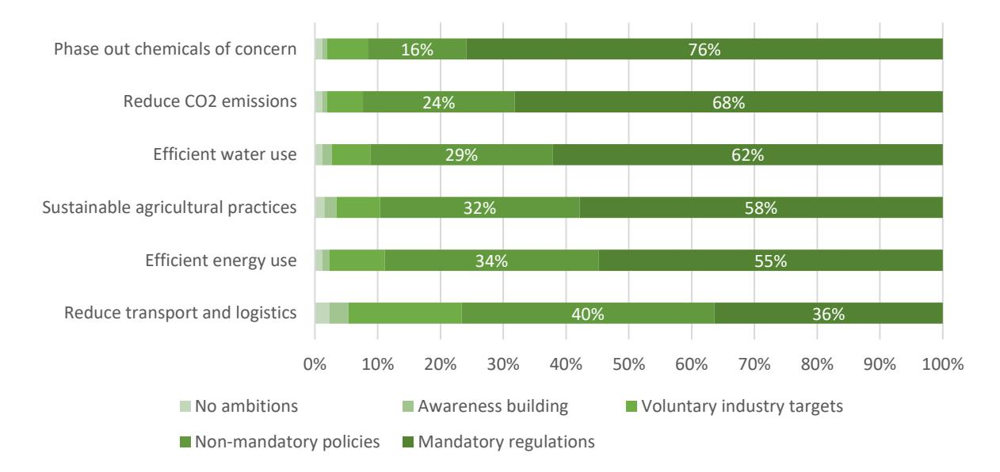

|         | Mandatory regulations | Non-mandatory              |      |           |    |
|---------|-----------------------|----------------------------|------|-----------|----|
| General |                       | Financial incentives, e.g. |      |           |    |
|         |                       | Performance-based grants   | More | valuation | of |

Table 6: Proposed policy instruments related to low impact processes

A concrete 2030 target that was proposed was a ban on certain chemicals of concern. However, it was mentioned that trade-offs may arise in those cases where these chemicals have a role in product properties or durability.

### **4.2.3 Longer use of garments**

While the longer use of garments is a logical prerequisite for a transition towards a circular fashion system, support for mandatory regulations is by far the lowest in this domain (see Figure 9). Mandatory regulations are the least popular with respect to sharing models and long-lasting fashion styles. As one survey respondent pointed out: "*Fashion styles can by no means be long-lasting. Fashion is short-term."* Also support for mandatory rules on re-use is rather low, as illustrated by another survey respondent: "*I think garments are personal items like tooth-brushes – if someone was forced to buy second hand clothing, there must be a strong reason for it".*

Support to ensure minimum durability and repairability, on the other hand, is higher.

Figure 9: Preferred policy instruments on the longer use of garments

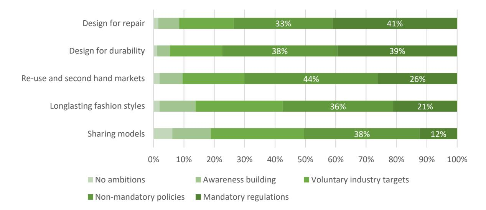

Related to longer use of garments, Table 7 shows the proposed policy instruments of varying compulsory level, as brought up by survey respondents and focus group participants.

There is strong support for the introduction of mandatory ecodesign requirements for durability and repairability, which then could be complemented by mandatory provision repair services by fashion retailers. To slow down the pace at which new fashion trends emerge, a cap on the number of fashion collections per year could be introduced, either by regulation or in a voluntary way. Instead, brands should be encouraged to focus on the development of timeless garments that are never out-of-fashion, high-quality and durable items, while consumers should be educated to achieve a mind shift towards reduced consumption, longer use and repair. To this end, there should be renewed attention for the teaching of repair skills in schools.

Other suggestions include tax incentives for circular business models, such as second-hand sales, or EPR schemes that take repairability and durability into account. It was also mentioned that pricing should reflect true costs, including environmental and social costs.

| Mandatory regulations Non-mandatory instruments  | Voluntary industry   |
|--------------------------------------------------|----------------------|
| Design for durability Ecodesign requirements for |                      |
| Increase guarantee period Durability standards   | Inform consumers     |
| Design for repair Mandatory repair services by   |                      |
| repairability                                    | requirements         |
|                                                  | schemes and          |
| total turnover comes from ‘re                    |                     |
| commerce’                                        | activities           |
| Sharing models                                   | Swapping initiatives |
| General Tax incentives for CBMs                  |                      |
| Minimum                                          | price for clothing   |
| Support repair cafés                             | Educating end-users  |

Table 7: Proposed policy instruments related to longer use of garments

- All garments on EU market have a durability of at least 5 years
- All brands are obliged to offer repair services
- 20% of garment are traded through a circular business model (in order to achieve the 50% CO2 reduction agreed in the Paris agreement)
- Tax incentives are given to brands that achieve 10% of their turnover from recommerce activities
- Repair skills are included in the school curriculum
- Research is done to study the attitude-behaviour gap, to increase the effect of awareness campaigns and information labels.

#### **4.2.4 Waste prevention**

Support for mandatory policies is high with respect to waste prevention (see Figure 10). This especially counts for packaging waste, production waste and waste stemming from overproduction. Respondents, however, are less supportive on mandatory regulations to minimize post-consumer waste.

As recognised by focus group participants, and illustrated in open comment fields by survey respondents, this topic is strongly connected with a reduction of overall production volumes, which is not in line with short term incentives of companies involved throughout the value chain. As one respondent reflects: "*… we cannot hope to recycle our way out of overproduction".* 

Moreover, waste management is sometimes not considered as an issue to be put on the radar of manufacturers and retailers. As one survey respondent points out: "*post-consumer waste handling is probably not within control of fashion systems".*

Figure 10: Preferred policy instruments on waste prevention

Ficus group participants univocally agreed that one ambition should be drastically decreasing the volume of textile waste and that end-of-life (EOL) garments should be

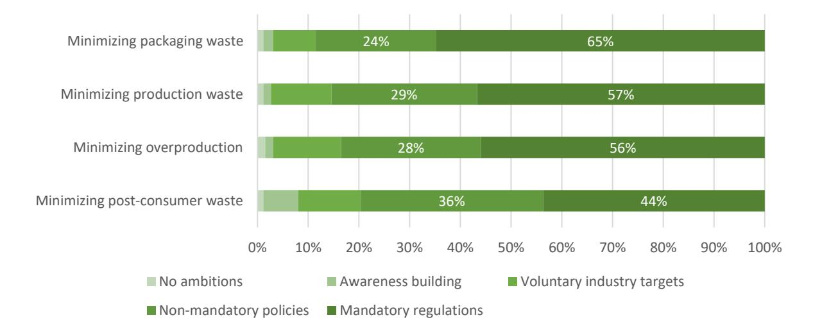

collected for recycling and reuse. Table 8 shows the proposed policy instruments related to waste prevention that were mentioned.

A major problem with the current fashion system is that its business model is built around overproduction and discounting, leading to overconsumption and large amounts of unused or basely used garments ending up as waste. To stop overproduction, restrictions on sales or discounts are proposed, as well as penalties for unsold stock and a ban on the destruction of unsold items. Brands should be encouraged to actively reduce production volumes, for example, by adopting on-demand production processes, and to design durable, repairable and recyclable items, by including these criteria in EPR schemes and charging fees if requirements are not met. To guarantee a level playing field with imported textiles, quality controls on imported textile products are needed. On the other hand, consumers should be nudged to reduce their consumption, by taking away the incentives to overbuy, such as a restriction on sales.

| Mandatory regulations          | Non-mandatory           |
|--------------------------------|-------------------------|
| Restriction on sales/discounts | Penalties for unsold    |
|                                | production (e.g. with   |
| durability                     | and no                  |
| Impose                         | tariffs on cheap        |
| EPR                            | schemes with eco       |
|                                | modulation (durability, |

Table 8: Proposed policy instruments related to waste prevention

A concrete 2030 target that was proposed was the ambition to reduce overall fashion production by 30%, which corresponds roughly to the current share of garment production that is never sold (i.e. 1/3 is sold full-price, 1/3 is sold at a discount, 1/3 is not sold at all) (SITRA & Circle Economy, 2015a). Such reduction of production volumes would contribute to CO2 emission reductions as well, as was mentioned by a survey respondent: "*Reduce the volume of fashion products produced and buy each year, in alignment with Paris agreements.*"

### **4.2.5 Recycling**

With respect to recycling, support for government intervention is the highest on the phasing out of waste exports and on improved systems for waste collection and. When it comes to design for recycling (e.g. by using mono-materials), and high quality recycling technologies, more than 50% of our respondents prefer non-mandatory policy instruments (see Figure 11).

Figure 11: Preferred policy instruments on recycling

Related to recycling, Table 9 shows the proposed policy instruments of varying level of compulsion.

Both survey respondents and focus group participants expressed a large support for an obligatory collection of used textiles, including separate reuse and recycling targets for the industry and waste disposal regulations for consumers, which could be supported by deposit systems to create extra motivation. To support recycling research and building of recycling infrastructure, economic support systems, such as tax incentives, subsidies or financing benefits would be needed, as well as the development of a market for recycled fibres and a harmonization of systems on waste collection and sorting.

Polyester and cotton were mentioned as the first fibre types that should aim for increased collection and sorting in order to accelerate recycling. Tax incentives could help to get the frontrunning companies going, dragging lagging companies along. It was mentioned that some waste-related regulation would need to be adapted to remove barriers (e.g. the need for a waste permit) and that cross-border collaboration between textile industries and federations is crucial.

To enable high-quality recycling, ecodesign requirement on recyclability are needed, which can be done in the form of regulations or as part in eco-modulated EPR schemes

Note that both focus group participants and survey respondents indicate they prefer closed loop recycling (fibre-to-fibre) over open loop recycling (e.g. PET-to-fibre) solutions.

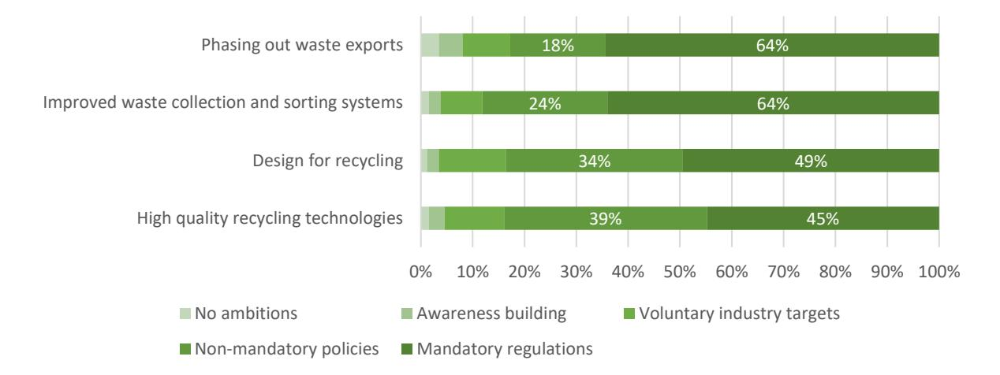

| Mandatory regulations                           | Non-mandatory instruments           | Voluntary industry |           |  |          |
|-------------------------------------------------|-------------------------------------|--------------------|-----------|--|----------|
| Design for recycling Ecodesign requirements for |                                     |                    |           |  |          |
|                                                 |                                     | Deposit systems    | Educate   |  |          |
|                                                 |                                     |                    | consumers |  | on       |
|                                                 |                                     |                    | correct   |  | textiles |
| Separated waste disposal                        |                                     |                    |           |  |          |
| Recycling targets                               | More EU funding for R&I initiatives |                    |           |  |          |
|                                                 |                                     | R&D on recycling   |           |  |          |
|                                                 | Investment incentives for recycling | Recycle into       |           |  |          |
| Ban on export of textile waste                  | Export taxes on used items          |                    |           |  |          |

Table 9: Proposed policy instruments related to recycling

Concrete 2030 targets that were proposed are the following:

- 90% (85-100%) overall collection rate for used textiles (same target as for PET bottles)
- 75% separate collection of textiles, increasing in the future
- 90% of collected materials should be reused or recycled

However, it needs to be taken into account that the monitoring of collection targets would require reliable data on sold and collected textile quantities on the EU market, and in each country.

From a technical point of view, there is the ambition to reduce the share of sorting residues with 50% and to shift to fibre-to-fibre recycling, instead of using recycled PET bottles in textiles. By 2030, 5% of collected used garments should go to local reuse and fibre-to-fibre recycling.

Exports of used textiles should be reduced and stopped, in order to develop an internal European market for recycling.

### **4.2.6 Social justice**

Stakeholder support for mandatory policies on social justice aspects is very high (see Figure 12). While this does not mean that social justice is a given fact within the fashion industry – it does show there is a high awareness and support base that mandatory regulations may be a necessary condition to move the circular fashion system into a sustainable and fair direction. As pointed out in an open field comment: "*laws and regulation are prerequisites for a level playing field for all*".

Note that support for mandatory policies is the lowest for these aspects that may have the biggest direct impact on price competition, being fair wages and an increased social protection.

Figure 12: Preferred policy instruments on social justice

Open field comments in our survey illustrate that social justice is considered a fundamental and unquestionable condition for a circular fashion system:

- "*Social issues are 'old economy'. In 2050 the supply chain is redesigned and low wage labour non-existent"*
- *"Why sticking to 2050? These points should be mandatory from NOW!"*

Despite the high support for mandatory regulations related to social justice, proposed policy instruments mainly mention voluntary Due Diligence guidance (e.g. compliance with OECD guidelines on due diligence) and the internalization of social costs in product pricing. There is also a need for a revaluation of craftmanship (Table 10).

|                                     | Mandatory regulations   | Non-mandatory instruments                                                             | Voluntary industry actions                                     | Awareness building           |
|-------------------------------------|-------------------------|---------------------------------------------------------------------------------------|----------------------------------------------------------------|------------------------------|
| Healthy and safe working conditions |                         | reduce EPR fee for clothes having obtained a label certifying good working conditions |                                                                |                              |
| Fair wages                          |                         |                                                                                       |                                                                |                              |
| Increased social protection         |                         |                                                                                       |                                                                |                              |
| No forced labour, nor child labour  |                         |                                                                                       |                                                                |                              |
| Non-discrimination                  |                         |                                                                                       |                                                                |                              |
| General                             | Human rights protection |                                                                                       | voluntary Human Rights and Environmental Due Diligence (HREDD) | More focus on craftmanship   |
|                                     |                         |                                                                                       |                                                                | Include true cost in pricing |

Table 10: Proposed policy instruments related to social justice

### **4.2.7 Value chain collaboration**

Finally, the support for policy instruments to foster value chain collaboration towards a circular fashion system is in line with most other dimensions: there is a large support for

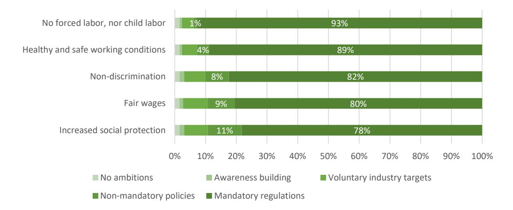

government intervention (see Figure 13). Support for mandatory regulations in the field of partnerships between producers and waste processors, however, is rather low. As we already noticed on the topic of post-consumer waste, we see a confirmation of this finding, as illustrated by the following respondent: "*collection and sorting systems should not be handled by fashion systems, but rather by reuse and recycling systems".* These statements clearly show that not all respondents see waste, recycling, of even reuse as elements that should be embedded into the fashion system at all.

Figure 13: Preferred policy instruments on value chain collaboration

Related to value chain collaboration, Table 11 shows the proposed policy instruments of varying compulsory level. While transparency and traceability can be included in mandatory regulations or product requirements (such as digital product passports), this is clearly more challenging for collaboration between actors, which is intrinsically of voluntary nature. Still, such collaboration can be supported by setting up networking events, setting up of platforms and matchmaking apps, and open innovation projects involving a broad range of value chain actors.

| Mandatory regulations          | Non |                           |           |    |         |      |
|--------------------------------|------|---------------------------|-----------|----|---------|------|
| Full traceability (in and out) |      | Blockchain solutions that |           |    |         |      |
|                                |      | enable traceability of    |           |    |         |      |
|                                |      | collaboration with early |           |    |         |      |
|                                |      |                           | retailers | to | connect | with |
|                                |      | Partner-up with sorters   |           |    |         |      |

Table 11: Proposed policy instruments related to value chain collaboration

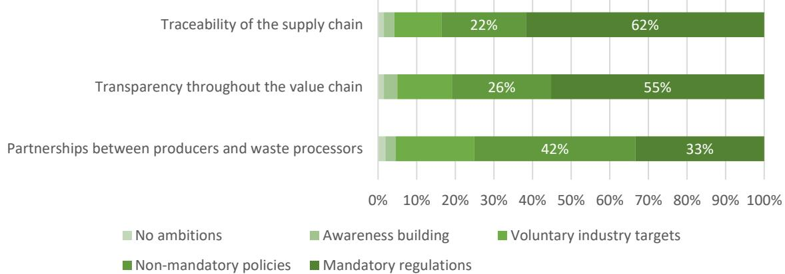

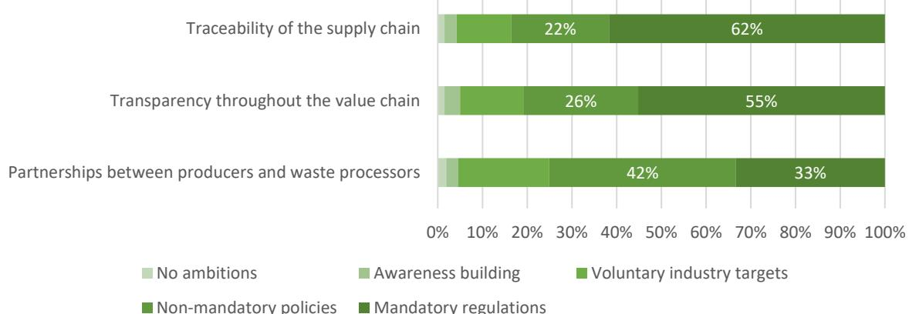

# **4.3 Discussion and conclusions**

Our results show a very strong support for government policy interventions in general and for mandatory regulations in particular. This observation can be understood by taking into account the importance of strategic interaction between actors throughout the value chain. For companies in a competitive environment, mandatory regulations are often a necessary condition for collective action, preventing a race to the bottom of prices, working conditions, or quality standards. When the hands of all market players are tied, companies find themselves in a levelled playing field and are enabled to formulate innovative value propositions in a circular fashion system.

This is also illustrated by participants at the user board: they univocally expressed a strong wish for mandatory regulation, without which the transition to a circular fashion system is deemed not to be possible. Focus group participants expressed in particular a preference for mandatory regulations on ecodesign regulations, the uptake of recycled fibres, product norms with respect to lifespan extension, and social justice. Moreover, during the user board, a major comment was that 2050 is too far away as a relevant horizon – many participants expressed mandatory actions should be taken in a much shorter term, being implemented in full by 2030 (Niemenoja et al., 2022). The very same comment was given by multiple survey respondents in open comment fields.

Given the strong international interlinkages and interdependencies of the fashion system, cooperation between nations is crucial to foster a circular transition. Therefore, supranational bodies like the European Union and the World Trade Organization bear a large responsibility to make progress in this field, since they have instruments to resolve a lack of international cooperation.

While we identify a strong support of mandatory regulations as a necessary condition to progress into a circular fashion system, we also note that non-mandatory instruments, including tax incentives and awareness building, may be important complementary measures. This particularly holds to reach a culture shift or to foster the development of sufficiency-based business models.

# **5 Towards a Roadmap for circular fashion**

A shift towards a sustainable and circular fashion system requires a profound systemic change rather than just small-scale initiatives and isolated success stories. We need conscious design, innovative production methods, new business models, more sustainable behaviour and adequate waste management throughout all stages of the value chain.

The previous chapters illustrated that different targets can be set, and a myriad of approaches can be imagined to progress each of the elements of the vision on a circular fashion system. In a roadmap, necessary actions are made concrete, and further quantification and prioritisation of the actions to be taken is done.

In general, the participants in our research univocally expressed a strong wish for mandatory regulations rather than incentives or voluntary actions. They also expressed a sense of urgency to get regulations implemented, in view of the climate crisis and the uneven access to resources. Stakeholder participants expressed a strong desire to achieve a circular fashion system by 2030, rather than 2050. However, an important constraint that was mentioned, is that mandatory regulations need to be uniform across the whole value chain, and should be accessible, easy and simple in order to avoid unnecessary bureaucracy.

In this task, 30 aspects of concern for a circular fashion system were identified, which can be organized across four lifecycle stages (design, production, use and waste management) that are discussed in the following sections. Overarching, there are three transversal aspects (waste prevention, social justice and value chain collaboration), which have been integrated in the following conclusions throughout.

# **5.1 Ecodesign of textile products**

Everything starts with design: overall, it is often estimated that 80% of a product's environmental impact is determined in the design stage (EU Science Hub, 2022). It is during design that material choices are made (e.g. mineral, bio-based, recycled or fossil-based), that construction choices determining durability and repairability are established (e.g. quality, coatings, potential to disassemble and reassemble), and that future recyclability is set, (e.g. choosing materials and bonding techniques that are easy to separate and sort in conventional recycling plants).

When discussing sustainable products, ecodesign is often mentioned as a way forward. Ecodesign in fashion holds many aspects. It is about using low impact fibres and chemicals, preventing waste throughout the value chain by intelligent design choices, enabling longer use by sturdy assemblies and replaceable parts and high-quality recycling by smart fibre choices and assembly methods.

Stakeholders have expressed a large support for mandatory product-specific ecodesign requirements. These requirements can take several forms:

- **requirements on fibre and chemical composition**, such as a target on recycled content or biobased content; a cap on the number of different materials that can be mixed, a ban on chemicals of concern, or a limit for microplastics release during washing

- **circular performance requirements in terms of durability, repairability and fibre-to-fibre recyclability**, such as quality standards and product norms
- **information requirements** to assure transparency and traceability on a technical (what is in it? How is it constructed?), environmental (how was it produced? What are potential risks?) and social level (where and under what conditions is it produced?) that can be included in (digital) product passports or be translated into clear labels to inform customers.

Ecodesign requirements can be introduced in several ways, by introducing:

- Develop a clear **definition about what sustainable, circular or durable fashion** is about to avoid confusing claims and greenwashing;
- Mandatory or non-mandatory **sector-wide targets** that show the way forward, such as a target for recycled content in textile products;
- Mandatory or non-mandatory **product norms or standards**; that set a quality benchmark, may serve as a requirement for sustainable public procurement, or can be used to ban non-compliant products (e.g. non-repairables, containing COCs, etc.) from the EU market;
- Mandatory **digital product passports**, including a broad range of production data that guarantee traceability and transparency and can be used by waste processors and recyclers to facilitate adequate end-of-life treatment;
- **Voluntary ecolabels** for informing consumers, that allow a brand to pursue a sustainable marketing strategy, while at the same time raising awareness among the general public. Such labels and green claims should be harmonised across the value chain and across the EU, in order to guarantee truly sustainable textiles and avoid greenwashing.

**Extended producer responsibility (EPR) schemes** are often mentioned as useful tools to support brands in adopting circular strategies, such as product take-back schemes and recycling. Ecodesign requirements could also be part of an EPR system, when ecodesign criteria are included in the eco-modulation of fees.

**Collaboration and information sharing** between designers and waste processors, who are at either end of the fashion value chain, is key to assure a successful and high-quality closing of textile loops. Voluntary sector initiatives could provide fruitful environments for joint learning and cooperation.

# **5.2 Sustainable fashion production**

Throughout the value chain of fashion, sustainable production processes have to become the norm, including attention for healthy products, social rights and fair working conditions. Fibre and textiles production processes should be resource and energy efficient, free of harmful chemicals and prevent waste. Overproduction should be avoided.

However, nowadays the majority of the fashion system relies on cheap mass production, mainly in Asia - taking advantage of low labour costs and weak regulations (Manshoven et al., 2019). A shift to more local EU production, could reduce worldwide shipping and facilitate the closure of loops, while creating jobs within Europe. Moreover, it would facilitate traceability of products, assure compliance with environmental and social regulations, and reduce dependency on long-distance supply chains and the associated costs and impacts.

Sustainable production consists of several elements:

- **Efficient water use**, by using water recovery systems and rethinking processing steps;
- **Efficient energy use**, for example, by using new technologies that allow a reduction in processing steps, such as 3D knitting machines that can produce clothes without seams or sewing (Bain, 2018), or by moving to renewable energy sources;
- A **phase out of chemicals of concern**, which cause pollution during production but can also be harmful during use and can hamper recycling processes;
- **Reducing production waste**, by adopting more efficient cutting techniques and the reuse and recycling of internal streams;
- **Reducing microplastics release**, by design adaptations and prewashing at production plants;
- **Social justice**: fair wages, safe working conditions, non-discrimination and adequate social protection of garment workers.

A shift to more sustainable production processes can be brought about by:

- **Market policies**, imposing sustainable production processes, also for imported items, in order to assure a level playing field;
- **Targets and benchmarks** on energy and water use, which can serve as a basis for economic stimuli, such as taxes and labelling systems;
- Economic incentives for producers, such as subsidies to invest in **state-of-the-art production processes** or fees on waste generation;
- **Research, education and knowledge sharing** within the sector;
- A stricter underpinning of **ecolabel criteria and green claims**, to prevent greenwashing and foster transparency and effective changes;
- **Price corrections** that take into account the 'true cost', i.e. the negative environmental and social impacts that are associate with the product.

Overproduction is a significant issue in the fashion industry. The business model of fashion is basically built on it, with fast-changing fashion trends, ever faster moving collections, fuelled by discounts and sales to promote overconsumption. This way of working generates enormous amounts of unsold clothing, as well as barely used clothing ending up as waste.

Overproduction could be tackled in several ways:

- Voluntary shifts in business model, such as **demand-driven production** models;
- Voluntary **caps on the number of fashion lines** that come out each year;
- A shift to fashion styles that go '**never-out-of-fashion'** and that do not need to be discounted after each season;
- **Obligations to report overproduction**, with associated **economic incentives**, such as fees or taxes, to reduce overproduction;
- A **ban on the destruction of unsold items**.

Moreover, a **revaluation of craftmanship** and skills is needed. High-quality fashion entails a lot of manual and labour-intensive production processes. Renewed attention for the craftmanship that goes inside a fashion item can create a culture shift from seeing fashion

as almost disposable to looking at fashion as a high-quality state-of-the-art product that consumers want to keep in in use for longer, and repair and reuse. Moreover, consumers' willingness to pay increases when products are perceived as high-quality, unique, potentially handmade.

### **5.3 Sustainable retail and use**

Sustainable use of fashion entails a combination of strategies:

- **Conscious purchasing choices**. This requires clear information and labelling, so consumers can make well-informed decisions;
- **Longer use of garments**, by increased repair and reuse;
- **Reduced consumption** by encouraging sufficiency and discouraging overconsumption.

All these strategies require behavioural change and a change in consumption culture. In order to bring about these changes, a combination of policy, new business models and awareness building will be needed. Potential actions involve:

- Discourage overconsumption by: o Regulation that **restricts discounting**; o **Cap on number of fashion lines** per year; o **Promote business models** that reduce consumption, e.g. renting systems or service offerings replacing product ownership.
- Encourage longer use of garments by: o Setting **reuse targets** and creating **reuse markets**; o Mandatory (obligation) or non-mandatory (e.g. tax incentives) regulations that spur retailers to offer accessible **repair services**; o Making **repair activities more attractive** to consumers, e.g. by considering reduced VAT on repair services; o Involve social enterprises in reuse activities; o including mandatory criteria on durability/repairability in **public procurement**.
- Building awareness on sustainable consumption by: o Including sustainable lifestyle **education** in school curricula; o teaching **repair skills** in schools; o involving **influencers** to promote sustainable fashion lifestyles; o lead the way and create market demand by including circularity criteria in **green public procurement**; o introduce **labels** that contain information on durability and repairability. o make circular business models more known and **communicate success cases** to show how this can work.
- Strict **regulations on discounts** and sales

To make longer use possible, there is a clear link with initiatives that promote ecodesign (see 5.1.1).

### **5.4 Waste management**

Better collection, sorting and recycling of textile waste is a fundamental aspect of a circular fashion system, preventing used textiles from being incinerated or landfilled.

Recently, the European Commission have issued an obligation stating that all EU Member States need to implement a **mandatory separate collection of used textiles** by 2025 (Directive (EU) 2018/851). As a consequence of the expected increase in collected used textiles, treatment capacity across Europe needs to be expanded in order to allow highquality reuse and recycling from those collected textiles. A considerable increase in **fibreto-fibre recycling** (and decrease in downcycling) is key in achieving a true loop-closure in textiles processing. In this regard, the use of recycled PET bottles in apparel, which is currently a common practice, should be re-evaluated, as this is not considered closed-loop recycling.

Increased collection of textiles can be supported by:

- The setting-up of **extended producer responsibility schemes** (EPR), obliging brands to set up take back schemes for their products;
- **Awareness raising** among consumers to bring in used textiles, which could be further promoted by setting up **deposit systems** in which consumers need to pay a fee when buying new items, which they get refunded when returning the item.

Development of the necessary technology and infrastructure for collection, sorting and recycling can be supported by:

- Setting mandatory **targets for recycling or preparation for reuse.** This is announced to be part of a review of the EU waste legislation in 2024;
- **Streamlining and financing research on recycling** technologies to improve the performance of fibre-to-fibre recycling processes;
- Economic incentives, such as **investment subsidies**.

Currently, a large fraction of European collected textiles are exported for reuse and recycling abroad. However, while it is unclear what actually happens to these textiles. To prevent textiles ending up in landfills outside Europe, and to assure sufficient input for recycling hubs, the export of used textiles could be discouraged, by imposing **stricter export controls** or even a **ban on textile waste exports**.

# **5.5 Conclusion**

In this report, we presented results from an envisioning exercise involving the participation of a wide range of stakeholders from the fashion system. Using a backcasting approach, we applied an iterative approach to construct and validate several scenario dimensions to reach a circular fashion system as is envisioned in the EU strategy on circular textiles and other major policy documents and industry goals. First, we identified 30 constituent elements of a circular fashion system. Then, we applied survey and focus group research to investigate support for differing policy instruments to be included in a coherent policy mix towards a sustainable, fair and circular fashion system. In the presentation of these results, we included examples of concrete policy measures that could be implemented, provided by stakeholders in our participatory process.

A major result of our work is that many stakeholders express a strong support for a policyled transition towards a circular fashion system. In particular, support for mandatory regulations appears to be high among all types of stakeholders. This should not come as a big surprise, since mandatory regulations enable industry players to move into circular solutions on a level playing field. Our scenario analysis, as well as an in-depth analysis of our focus groups results and survey comments, shows also the need for supporting measures, such as economic incentives and awareness building. A circular fashion system will only be sustainable if all layers of society begin to care about its environmental and social aspects in a sustained way.

With this report, we hope to provide information and inspiration for the next work packages in the SCIRT project, to deliver specific innovative technological developments, novel business models, and formulate concrete policy measures that further foster a transition towards a circular, fair, and sustainable fashion system.

# **Bibliography**

Alamgir, F., & Banerjee, S. B. (2019). Contested compliance regimes in global production networks: Insights from the Bangladesh garment industry. *Human Relations*, *72*(2), 272–297. https://doi.org/10.1177/0018726718760150 Altenbuchner, C., Vogel, S., & Larcher, M. (2018). Social, economic and environmental impacts of organic cotton production on the livelihood of smallholder farmers in Odisha, India. *Renewable Agriculture and Food Systems*, *33*(4), 373–385. https://doi.org/10.1017/S174217051700014X Araujo, M. J. F. D., Araujo, M. V. F. D., & Carvalho, M. A. S. R. D. (2020). Unsustainability in the Current Fast-Fashion Industry: The Social Pillar. *International Journal of Environmental Science*, *05*. https://www.iaras.org/iaras/home/caijes/unsustainability-in-the-current-fastfashion-industry-the-social-pillar Bain, M. (2018). *The high-tech future of fashion manufacturing*. Quartz. https://qz.com/1356087/the-high-tech-future-of-fashion-manufacturing/ Bell, S., Davis, B., Javaid, A., & Essadiqi, E. (2006). *Final Report on Design of Recyclable Products*. https://doi.org/10.13140/RG.2.2.18847.36009 Berg, A., Hedrich, S., Ibanez, P., Kappelmark, S., Magnus, K.-H., & Seeger, M. (2019). *Fashion's new must-have: Sustainable sourcing at scale*. McKinsey & Company. https://www.mckinsey.com/~/media/mckinsey/industries/retail/our%20insights/fas hions%20new%20must%20have%20sustainable%20sourcing%20at%20scale/fashi ons-new-must-have-sustainable-sourcing-at-scale-vf.pdf Bick, R., Halsey, E., & Ekenga, C. C. (2018). The global environmental injustice of fast fashion. *Environmental Health*, *17*(1), 92. https://doi.org/10.1186/s12940-018- 0433-7

Botta, V., & Cabral, I. (2021). *Durable, repairable and mainstream—How ecodesign can make our textiles circular*. ECOS. https://ecostandard.org/wpcontent/uploads/2021/04/ECOS-REPORT-HOW-ECODESIGN-CAN-MAKE-OUR-TEXTILES-CIRCULAR.pdf Bouzon, M., & Govindan, K. (2015). Reverse Logistics as a Sustainable Supply Chain Practice for the Fashion Industry: An Analysis of Drivers and the Brazilian Case. In T.-M. Choi & T. C. E. Cheng (Eds.), *Sustainable Fashion Supply Chain Management: From Sourcing to Retailing* (pp. 85–104). Springer International Publishing. https://doi.org/10.1007/978-3-319-12703-3\_5 Capano, G., & Howlett, M. (2020). The Knowns and Unknowns of Policy Instrument Analysis: Policy Tools and the Current Research Agenda on Policy Mixes. *SAGE Open*, *10*(1), 2158244019900568. https://doi.org/10.1177/2158244019900568 Çay, A. (2018). Energy consumption and energy saving potential in clothing industry. *Energy*, *159*, 74–85. https://doi.org/10.1016/j.energy.2018.06.128 Chapagain, A. K., Hoekstra, A. Y., Savenije, H. H. G., & Gautam, R. (2006). The water footprint of cotton consumption: An assessment of the impact of worldwide consumption of cotton products on the water resources in the cotton producing countries. *Ecological Economics*, *60*(1), 186–203. https://doi.org/10.1016/j.ecolecon.2005.11.027 Chi Xu, D. (2021, August 30). Unwrapping Plastic Fashion Packaging: What are the Eco-Friendly Alternatives? *Ecocult*. https://ecocult.com/sustainable-fashion-packaging/ Clube, R. K. M., & Tennant, M. (2022). Social inclusion and the circular economy: The case of a fashion textiles manufacturer in Vietnam. *Business Strategy & Development*, *5*(1), 4–16. https://doi.org/10.1002/bsd2.179

Colucci, M., Tuan, A., & Visentin, M. (2020). An empirical investigation of the drivers of CSR talk and walk in the fashion industry. *Journal of Cleaner Production*, *248*, 119200. https://doi.org/10.1016/j.jclepro.2019.119200 Coscieme, L., Manshoven, S., Gillabel, J., Grossi, F., & Mortensen, L. F. (2022). A framework of circular business models for fashion and textiles: The role of business-model, technical, and social innovation. *Sustainability: Science, Practice and Policy*, *18*(1), 451–462. https://doi.org/10.1080/15487733.2022.2083792 de Aguiar Hugo, A., de Nadae, J., & da Silva Lima, R. (2021). Can Fashion Be Circular? A Literature Review on Circular Economy Barriers, Drivers, and Practices in the Fashion Industry's Productive Chain. *Sustainability*, *13*(21), Article 21. https://doi.org/10.3390/su132112246 Dissanayake, K., & Weerasinghe, D. (2022). Towards Circular Economy in Fashion: Review of Strategies, Barriers and Enablers. *Circular Economy and Sustainability*, *2*. https://doi.org/10.1007/s43615-021-00090-5 Duhoux, T., Le Blévennec, K., Manshoven, S., Grossi, F., Arnold, M., & Mortensen, L. F. (2022). *Textiles and the Environment—The role of design in Europe's circular economy* (ETC/CE Report 2/2022). European Topic Centre Circular Economy and Resource Use. https://www.eionet.europa.eu/etcs/etc-ce/products/etc-ceproducts/etc-ce-report-2-2022-textiles-and-the-environment-the-role-of-design-ineuropes-circular-economy EEA. (2019). *Textiles in Europe's circular economy* (EEA Briefing No. 10/2019). European Environment Agency. https://www.eea.europa.eu/publications/textiles-in-europescircular-economy EEA. (2021). *Progressing towards waste prevention in Europe – the case of textile waste prevention* [Publication]. European Environment Agency. https://www.eea.europa.eu/publications/progressing-towards-waste-prevention-in

- EEB. (2021). *Policy brief on Prohibiting the Destruction of Unsold Goods*. https://eeb.org/wp-content/uploads/2021/10/Prohibiting-the-destruction-ofunsold-goods-Policy-brief-2021.pdf Ellen MacArthur Foundation. (2017). *A New Textiles Economy*. https://emf.thirdlight.com/link/2axvc7eob8zx-za4ule/@/preview/1?o Ellen MacArthur Foundation. (2020). *Vision of a circular economy for fashion*. https://emf.thirdlight.com/link/nbwff6ugh01m-y15u3p/@/preview/1?o EU Science Hub. (2022). *Sustainable Product Policy*. https://joint-researchcentre.ec.europa.eu/scientific-activities-z/sustainable-product-policy\_en EU strategy for sustainable and circular textiles, no. COM(2022) 141 final (2022). https://ec.europa.eu/info/law/better-regulation/have-your-say/initiatives/12822- EU-strategy-for-sustainable-textiles\_en Feng, P., & Ngai, C. S. (2020). Doing More on the Corporate Sustainability Front: A Longitudinal Analysis of CSR Reporting of Global Fashion Companies. *Sustainability*, *12*(6), Article 6. https://doi.org/10.3390/su12062477 Fletcher, K. (2012). Durability, Fashion, Sustainability: The Processes and Practices of Use. *Fashion Practice: The Journal of Design, Creative Process & the Fashion*, *4*, 221–
- 238. https://doi.org/10.2752/175693812X13403765252389 Fuxman, L., Mohr, I., Mahmoud, A. B., & Grigoriou, N. (2022). The new 3Ps of sustainability marketing: The case of fashion. *Sustainable Production and Consumption*, *31*, 384–
- 396. https://doi.org/10.1016/j.spc.2022.03.004 Garcia-Torres, S., Rey-Garcia, M., Sáenz, J., & Seuring, S. (2021). Traceability and transparency for sustainable fashion-apparel supply chains. *Journal of Fashion Marketing and Management: An International Journal*, *26*(2), 344–364. https://doi.org/10.1108/JFMM-07-2020-0125

Gramberger, M., Zellmer, K., Kok, K., & Metzger, M. J. (2015). Stakeholder integrated research (STIR): A new approach tested in climate change adaptation research. *Climatic Change*, *128*(3), 201–214. https://doi.org/10.1007/s10584-014-1225-x Henry, A., & Jottier, D. (2013). Een rekenmodel voor scenario's van duurzame ontwikkeling. *Federal Planning Bureau Working Paper*, *14–13*, 55p. James, M. A. (2022). Child Labor in Your Closet: Efficacy of Disclosure Legislation and a New Way Forward to Fight Child Labor in Fast Fashion Supply Chains. *Journal of Gender, Race & Justice*, *25*, 245. Jia, F., Yin, S., Chen, L., & Chen, X. (2020). The circular economy in the textile and apparel industry: A systematic literature review. *Journal of Cleaner Production*, *259*, 120728. https://doi.org/10.1016/j.jclepro.2020.120728 Kautto, P., & Lazarevic, D. (2020). Between a policy mix and a policy mess: Policy instruments and instrumentation for the circular economy. *Handbook of the Circular Economy*, 207–223. KEMI. (2014). *Chemicals in textiles – Risks to human health and the environment* (No. 6/14). Swedish Chemicals Agency. https://www.kemi.se/files/8040fb7a4f2547b7bad522c399c0b649/report6-14 chemicals-in-textiles.pdf Ki, C.-W. (Chloe), Chong, S. M., & Ha-Brookshire, J. E. (2020). How fashion can achieve sustainable development through a circular economy and stakeholder engagement: A systematic literature review. *Corporate Social Responsibility and Environmental Management*, *27*(6), 2401–2424. https://doi.org/10.1002/csr.1970 Liu, N., Lin, J., Guo, S., & Shi, X. (2022). Fashion platform operations in the sharing economy with digital technologies: Recent development and real case studies. *Annals of Operations Research*. https://doi.org/10.1007/s10479-022-04544-3

- Manninen, K., Koskela, S., Antikainen, R., Bocken, N., Dahlbo, H., & Aminoff, A. (2018). Do circular economy business models capture intended environmental value propositions? *Journal of Cleaner Production*, *171*, 413–422. https://doi.org/10.1016/j.jclepro.2017.10.003 Manshoven, S., Christis, M., Vercalsteren, A., Arnold, M., Nicolau, M., Lafond, E., Mortensen, L. F., & Coscieme, L. (2019). *Textiles and the environment in a circular economy* (Eionet Report ETC/WMGE 6/2019). European Topic Centre for Waste and Materials in a Green Economy. https://www.eionet.europa.eu/etcs/etcwmge/products/etc-reports/textiles-and-the-environment-in-a-circular-economy Manshoven, S., Smeets, A., Malarciuc, C., Tenhunen, A., & Mortensen, L. F. (2022). *Microplastic pollution from textile consumption in Europe* (ETC/CE Report No. 2022/1). European Topic Centre Circular Economy and Resource Use. https://www.eionet.europa.eu/etcs/etc-ce/products/etc-ce-products/etc-ce-report-1-2022-microplastic-pollution-from-textile-consumption-in-europe McDonald, S. D., Manh Hung, N., & Akbari, M. (2020). Transportation and logistics for a sustainable fashion sector. In *Supply Chain Management and Logistics in the Global Fashion Sector* (1st Edition, p. 300). Routledge. https://doi.org/10.4324/9781003089063-10 Mejías, A. M., Bellas, R., Pardo, J. E., & Paz, E. (2019). Traceability management systems and capacity building as new approaches for improving sustainability in the fashion multi-tier supply chain. *International Journal of Production Economics*, *217*, 143–
- 158. https://doi.org/10.1016/j.ijpe.2019.03.022 Morris, J., Koep, L., & Damert, M. (2021). Labels in the Textile and Fashion Industry: Communicating Sustainability to Effect Sustainable Consumption. In A. Matthes, K. Beyer, H. Cebulla, M. G. Arnold, & A. Schumann (Eds.), *Sustainable Textile and*

- *Fashion Value Chains: Drivers, Concepts, Theories and Solutions* (pp. 257–274). Springer International Publishing. https://doi.org/10.1007/978-3-030-22018-1\_14 Napier, E., & Sanguineti, F. (2018). *Fashion Merchandisers' Slash and Burn Dilemma: A Consequence of Over Production and Excessive Waste?* (SSRN Scholarly Paper No. 3289411). https://papers.ssrn.com/abstract=3289411 Nayak, R., Akbari, M., & Maleki Far, S. (2019). Recent sustainable trends in Vietnam's fashion supply chain. *Journal of Cleaner Production*, *225*, 291–303. https://doi.org/10.1016/j.jclepro.2019.03.239 Niemenoja, K., De Wée, T., & Kufrej, M. (2022). *Report from the SCIRT User Board (11-12 May 2022, Vienna)*. Niinimäki, K., Peters, G., Dahlbo, H., Perry, P., Rissanen, T., & Gwilt, A. (2020). The environmental price of fast fashion. *Nature Reviews Earth & Environment*, *1*(4), Article 4. https://doi.org/10.1038/s43017-020-0039-9 Nijkamp, M. M., Maslankiewicz, L., Delmaar, J. E., & Muller, J. J. A. (2014). *Hazardous substances in textile products*. 68. Nørup, N., Pihl, K., Damgaard, A., & Scheutz, C. (2018). Development and testing of a sorting and quality assessment method for textile waste. *Waste Management*, *79*, 8–21. https://doi.org/10.1016/j.wasman.2018.07.008 Oliveira Duarte, L., Kohan, L., Pinheiro, L., Fonseca Filho, H., & Baruque-Ramos, J. (2019). Textile natural fibers production regarding the agroforestry approach. *SN Applied Sciences*, *1*(8), 914. https://doi.org/10.1007/s42452-019-0937-y Padilla-Rivera, A., Russo-Garrido, S., & Merveille, N. (2020). Addressing the Social Aspects of a Circular Economy: A Systematic Literature Review. *Sustainability*, *12*(19), Article
  - 19. https://doi.org/10.3390/su12197912

Peleg Mizrachi, M., & Tal, A. (2022). Regulation for Promoting Sustainable, Fair and Circular Fashion. *Sustainability*, *14*(1), Article 1. https://doi.org/10.3390/su14010502 Periyasamy, A. P., & Tehrani-Bagha, A. (2022). A review on microplastic emission from textile materials and its reduction techniques. *Polymer Degradation and Stability*, *199*, 109901. https://doi.org/10.1016/j.polymdegradstab.2022.109901 Quantis. (2018). *Measuring Fashion: Insights from the Environmental Impact of the Global Apparel and Footwear Industries study.* https://quantis-intl.com/measuring-fashionreport-2018/ Quist, J., & Vergragt, P. (2006). Past and future of backcasting: The shift to stakeholder participation and a proposal for a methodological framework. *Futures*, *38*(9), 1027– 1045. https://doi.org/10.1016/j.futures.2006.02.010 Raja, A. S. M., Arputharaj, A., Saxena, S., & Patil, P. G. (2019). 9—Water requirement and sustainability of textile processing industries. In S. S. Muthu (Ed.), *Water in Textiles and Fashion* (pp. 155–173). Woodhead Publishing. https://doi.org/10.1016/B978- 0-08-102633-5.00009-9 Ranta, V., Aarikka-Stenroos, L., & Mäkinen, S. J. (2018). Creating value in the circular economy: A structured multiple-case analysis of business models. *Journal of Cleaner Production*, *201*, 988–1000. https://doi.org/10.1016/j.jclepro.2018.08.072 Sandvik, I. M., & Stubbs, W. (2019). Circular fashion supply chain through textile-to-textile recycling. *Journal of Fashion Marketing and Management: An International Journal*, *23*(3), 366–381. https://doi.org/10.1108/JFMM-04-2018-0058 Sisto, R., Sica, E., & Cappelletti, G. M. (2020). Drafting the Strategy for Sustainability in Universities: A Backcasting Approach. *Sustainability*, *12*(10), Article 10. https://doi.org/10.3390/su12104288

SITRA, & Circle Economy. (2015). *Service-based business models & circular strategies for textiles*. https://s3-eu-west-1.amazonaws.com/stjm/20160330092502/Servicebased-business-models-and-circular-strategies-for-textiles-2015-SITRA-STJM.pdf Trejo, H. X., & Lewis, T. L. (2017). Slow Fashion and Fiber Farming: Nexus for Community Engagement. *Fashion Practice*, *9*(1), 120–142. https://doi.org/10.1080/17569370.2016.1220544 Tura, N., Hanski, J., Ahola, T., Ståhle, M., Piiparinen, S., & Valkokari, P. (2019). Unlocking circular business: A framework of barriers and drivers. *Journal of Cleaner Production*, *212*, 90–98. https://doi.org/10.1016/j.jclepro.2018.11.202 Watson, D., Palm, D., Brix, L., Armstrup, M., Syversen, F., & Nielsen, R. (2016). *Exports of Nordic Used Textiles. Fate, benefits and impacts* (No. 558; Tema Nord, p. 167). Nordic Council of MInisters. http://norden.divaportal.org/smash/get/diva2:1057017/FULLTEXT03.pdf Wolff, E. A. (2021). The global politics of African industrial policy: The case of the used clothing ban in Kenya, Uganda and Rwanda. *Review of International Political Economy*, *28*(5), 1308–1331. https://doi.org/10.1080/09692290.2020.1751240 WRAP. (2013). *Design for longevity. Guidance on increasing the active life of clothing*. https://wrap.org.uk/sites/default/files/2020-10/WRAP-Design%20for%20Longevity%20Report\_0.pdf

# **Annex 1: Survey questions**

# **SCIRT: Envisioning a Circular Fashion System**

### A large-scale stakeholder survey

SCIRT is a Horizon Europe project in which the fashion industry and research institutes combine their expertise to accelerate the transition to a circular fashion industry.

In order develop an inspiring vision on a circular fashion industry, **your opinion matters.** Therefore, we kindly invite you to participate at this large-scale stakeholder survey, which will take less than 10 minutes of your time.

# Some background characteristics

Your responses will be completely anonymous. For research purposes, however, we would like to ask you some personal and professional background characteristics. 

#### \* 1. What is your gender?

- Male
- Female
- Non-Binary
- I do not want to share this information

\* 2. What is your age? 

- < 25 years
- 26-35 years
- 36-45 years
- 46-55 years
- 56-65 years
- 65 years

\* 3. How many years have you been active in (or working on) the fashion industry? 

- < 3 years
- - 5 years
- - 10 years
- 11 20 years
- +20 years
- I am not working in/on the fashion industry

\* 4. What is your current professional position?

- CEO / General Management
- Strategic Management
- Operational Management
- Expert
- Designer
- Operational or administrative co-worker

- Independent consultant
- Other (please specify)

\* 5. In which **country** do you work?

Dropdown list

\* 6. What type of **stakeholder** do you represent in this survey?

- Company
- Government
- Supranational organization (EC, UN, ILO, WTO, ...)
- Non-Governmental Organization (NGO)
- Sector Federation
- Trade Union or Worker Movement
- Research Institute
- Myself, as a Fashion Customer
- Other (please specify)

\* 7. Please indicate in what part(s) of the **value chain** your company is active.

- Fashion Designer
- Fibre Producer
- Textile Manufacturer (yarn, fabric, ...)
- Fashion Manufacturer (finished goods)
- Logistics and distribution
- Retail & sales
- Reuse shop
- Waste Management Company
- Other (please specify)

8. What **type of market(s)** does your company target?

- Business-to-Consumer (BtC)
- Business-to-Business (BtB)
- Business-to-Business-to-Consumer (BtBtC)
- Business-to-Government (BtG)
- Peer-to-Peer
- Other (please specify)

\* 9. What is the size of your company? (**number of employees**)

- 1 000 employees
- 251 1000 employees
- 51 250 employees
- 11 50 employees
- 1 10 employees
- No employees

\* 10. What is the geographical scope in which you **source**the **majority** of your**materials?**

- Local (< 100 km)
- Regional (< 500 km)
- Supra-regional (< 5000 km)

- Global
- Not applicable

\* 11. What is the geographical scope of your **operational activities (manufacturing/design)**?  0

- Local (< 100 km)
- Regional (< 500 km)
- Supra-regional (< 5000 km)
- Global
- Not applicable

\* 12. What is the geographical scope your **sales activities**?  0

- Local (< 100 km)
- Regional (< 500 km)
- Supra-regional (< 5000 km)
- Global
- Not applicable

# Circularity ambitions

How ambitious should the fashion system be to reach circularity by **2050?**

The following questions focus on instruments of increasing ambition levels that can be used to reach circular fashion goals. 

\* 13. How ambitious should the fashion system be by 2050 with respect to the use of**low impact fibres**?

|                             | No ambitions | Awareness building | Voluntary industry targets | Non-mandatory policies (e.g. tax incentives) | Mandatory regulations (e.g. product norms) |
|-----------------------------|--------------|--------------------|----------------------------|----------------------------------------------|--------------------------------------------|
| Use of recycled fibres      |              |                    |                            |                                              |                                            |
| Use of renewable fibres     |              |                    |                            |                                              |                                            |
| Reduce micro-fibre shedding |              |                    |                            |                                              |                                            |

Other (please specify)

\* 14. How ambitious should the fashion system be by 2050 with respect to **low impact processes**?

|                                    | No ambitions | Awareness building | Voluntary industry targets | Non-mandatory policies (e.g. tax incentives) | Mandatory regulations (e.g. product norms) |
|------------------------------------|--------------|--------------------|----------------------------|----------------------------------------------|--------------------------------------------|
| Sustainable agricultural practices |              |                    |                            |                                              |                                            |
| Efficient water use                |              |                    |                            |                                              |                                            |
| Efficient energy use               |              |                    |                            |                                              |                                            |
| Phase out chemicals of concern     |              |                    |                            |                                              |                                            |
| Reduce CO2 emissions               |              |                    |                            |                                              |                                            |

|                   |  |  |  |  |  |
|--------------------------------|---------------|---------------|---------------|---------------|---------------|
| Reduce transport and logistics |               |               |               |               |               |
| Other (please specify)         |               |               |               |               |               |

Other (please specify)

#### \* 15. How ambitious should the fashion system be by 2050 to support the **longer use of garments**?

|                                              | No ambitions | Awareness building | Voluntary industry targets | Non-mandatory policies (e.g. tax incentives) | Mandatory regulations (e.g. product norms) |  |
|----------------------------------------------|--------------|--------------------|----------------------------|----------------------------------------------|--------------------------------------------|--|
| Design for durability                        |              |                    |                            |                                              |                                            |  |
| Design for repair                            |              |                    |                            |                                              |                                            |  |
| Long-lasting fashion styles                  |              |                    |                            |                                              |                                            |  |
| Re-use and second hand markets               |              |                    |                            |                                              |                                            |  |
| Sharing models (e.g. garment rental systems) |              |                    |                            |                                              |                                            |  |
| Other (please specify)                       |              |                    |                            |                                              |                                            |  |

\* 16. How ambitious should the fashion system be by 2050 with respect to **waste prevention?**

|                                | No ambitions | Awareness building | Voluntary industry targets | Non-mandatory policies (e.g. tax incentives) | Mandatory regulations (e.g. product norms) |
|--------------------------------|--------------|--------------------|----------------------------|----------------------------------------------|--------------------------------------------|
| Minimizing overproduction      |              |                    |                            |                                              |                                            |
| Minimizing production waste    |              |                    |                            |                                              |                                            |
| Minimizing packaging waste     |              |                    |                            |                                              |                                            |
| Minimizing post-consumer waste |              |                    |                            |                                              |                                            |

Other (please specify)

#### \* 17. How ambitious should the fashion system be by 2050 with respect to **recycling?**

|                                               | No ambitions | Awareness building | Voluntary industry targets | Non-mandatory policies (e.g. tax incentives) | Mandatory regulations (e.g. product norms) |
|-----------------------------------------------|--------------|--------------------|----------------------------|----------------------------------------------|--------------------------------------------|
| Design for recycling                          |              |                    |                            |                                              |                                            |
| Improved waste collection and sorting systems |              |                    |                            |                                              |                                            |
| High quality recycling technologies           |              |                    |                            |                                              |                                            |
| Phasing out waste exports                     |              |                    |                            |                                              |                                            |

Other (please specify)

#### \* 18. How ambitious should the fashion system be by 2050 with respect to **social justice?**

|                        |  |       |               |                                 |                               |
|-------------------------------------|---------------|--------------------|----------------------------|----------------------------------------------|--------------------------------------------|
| Healthy and safe working conditions | No ambitions  | Awareness building | Voluntary industry targets | Non-mandatory policies (e.g. tax incentives) | Mandatory regulations (e.g. product norms) |
| Fair wages                          |  |       |               |                                 |                               |

| Increased social protection        |  |  |  |  |  |
|------------------------------------|--|--|--|--|--|
| No forced labour, nor child labour |  |  |  |  |  |
| Non-discrimination                 |  |  |  |  |  |

Other (please specify)

#### \* 19. How ambitious should the fashion system be by 2050 with respect to**value chain collaboration**?

|                                                     | No ambitions | Awareness building | Voluntary industry targets | Non-mandatory policies (e.g. tax incentives) | Mandatory regulations (e.g. product norms) |
|-----------------------------------------------------|--------------|--------------------|----------------------------|----------------------------------------------|--------------------------------------------|
| Transparency throughout the value chain             |              |                    |                            |                                              |                                            |
| Traceability of the supply chain                    |              |                    |                            |                                              |                                            |
| Partnerships between producers and waste processors |              |                    |                            |                                              |                                            |

Other (please specify)

# Pathways towards circularity

This final set of questions aim to explore pathways towards a circular fashion system. Each question presents a scale with 2 contradicting principles at the extremes. On this scale, indicate what you consider to be the most realistic future scenario. Secondly, indicate what would be your preferred scenario.

\* 20. Shall a transition towards a circular fashion system be led by **producers** or by **consumers?**

|                                 | Producer-led | Mostly producer-led | Equally important | Mostly consumer-led | Consumer-led |
|---------------------------------|--------------|---------------------|-------------------|---------------------|--------------|
| <b>Most realistic scenario:</b> |              |                     |                   |                     |              |
| <b>My preferred scenario:</b>   |              |                     |                   |                     |              |

Comments (optional)

\* 21. Shall a transition towards a circular fashion system be **technologydriven** or **behaviour driven**?

|                          | Technology-driven | Mostly technology-driven | Equally important | Mostly behaviour-driven | Behaviour-driven |
|--------------------------|-------------------|--------------------------|-------------------|-------------------------|------------------|
| Most realistic scenario: |                   |                          |                   |                         |                  |
| My preferred scenario:   |                   |                          |                   |                         |                  |

Comments (optional)

\* 22. Shall a transition towards a circular fashion system be induced by a **topdown** (led by governments and industry) approach or a **bottom-up** (led by citizens and SME's) approach?

|                          |  | Mostly top-down | Equally important | Mostly bottom-up | Bottom-up |
|--------------------------|--|-----------------|-------------------|------------------|-----------|
| Most realistic scenario: |  |                 |                   |                  |           |
| My preferred scenario:   |  |                 |                   |                  |           |

Comments (optional)

\* 23. Shall a transition towards a circular fashion system focus on a collaboration at a **global level** or at partnerships at a **local level**?

|                          | Global level | Mostly global level | Equally important | Mostly local level | Local level |
|--------------------------|--------------|---------------------|-------------------|--------------------|-------------|
| Most realistic scenario: |              |                     |                   |                    |             |
| My preferred scenario:   |              |                     |                   |                    |             |

Comments (optional)

\* 24. Shall a transition towards a circular fashion system be facilitated by a fashion industry with **strong market concentration** (a few powerful companies), or with **low market concentration** (a large number of competing companies)?

|                          | Very strong market concentration | Strong market concentration | Equally important | Low market concentration | Very low market concentration (many firms) |
|--------------------------|----------------------------------|-----------------------------|-------------------|--------------------------|--------------------------------------------|
| Most realistic scenario: |                                  |                             |                   |                          |                                            |
| My preferred scenario:   |                                  |                             |                   |                          |                                            |

Comments (optional)

\* 25. Shall a transition towards a circular fashion system focus on outer material circles (**recycling**) or on inner material circles (**re-use**, **repair, longer use,** ...)

|                          | Outer circles (recycling) | Mostly outer circles | Equally important | Mostly inner circles | Inner circles (repair, re-use) |
|--------------------------|---------------------------|----------------------|-------------------|----------------------|--------------------------------|
| Most realistic scenario: |                           |                      |                   |                      |                                |
| My preferred scenario:   |                           |                      |                   |                      |                                |

Comments (optional)

26. Do you have further comments, questions or remarks?

27. Would you be willing to participate in a follow-up survey? If yes, please enter your e-mail address.

# **Annex 2: Respondent profiles**

In this annex, we report respondent profiles of the 321 participants at the survey presented in this study.

Figure 14: Gender distribution of survey respondents

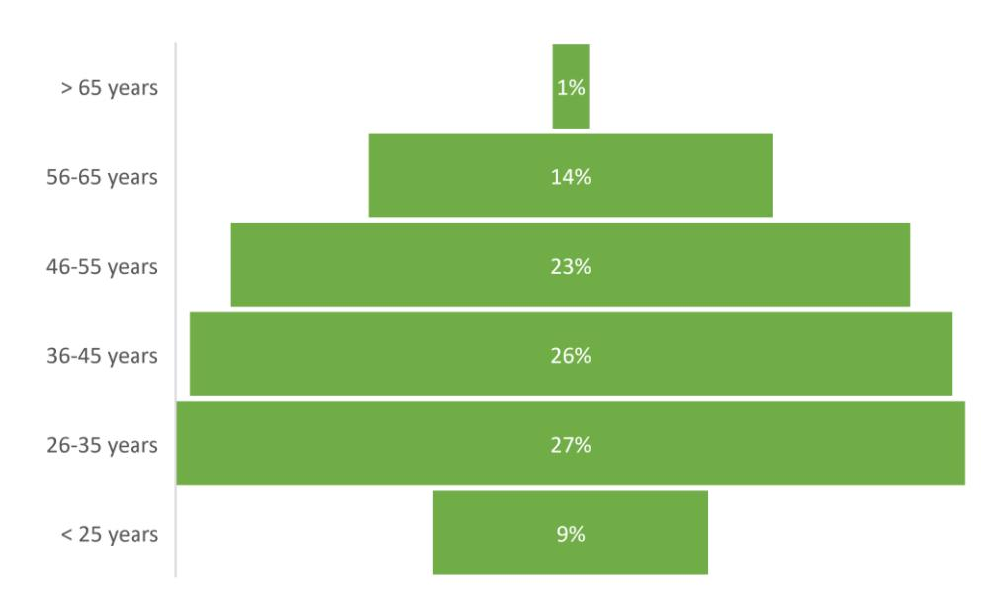

Figure 15: Age distribution of survey respondents

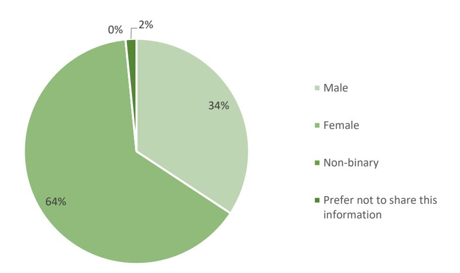

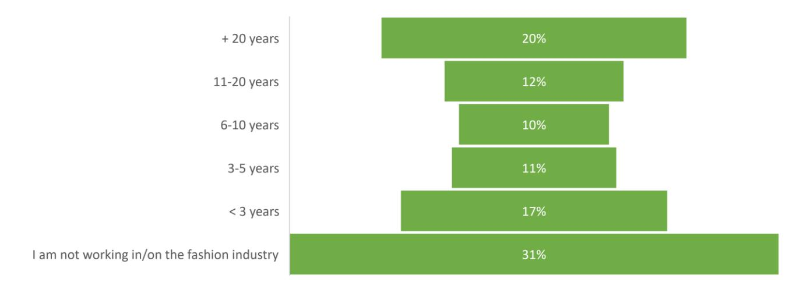

Figure 16: Number of years active in the fashion industry

Figure 17: Professional position of survey respondents

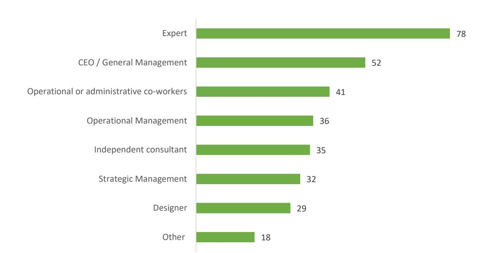

Figure 18: Country

Figure 19: Stakeholder type

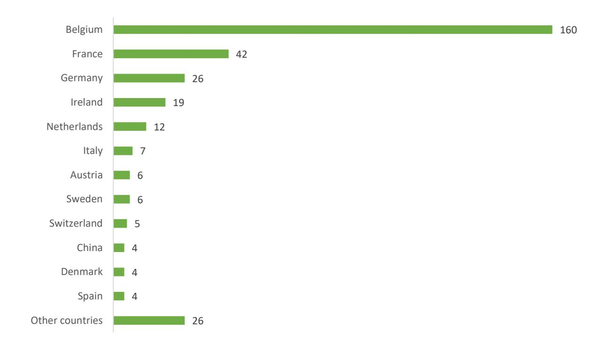

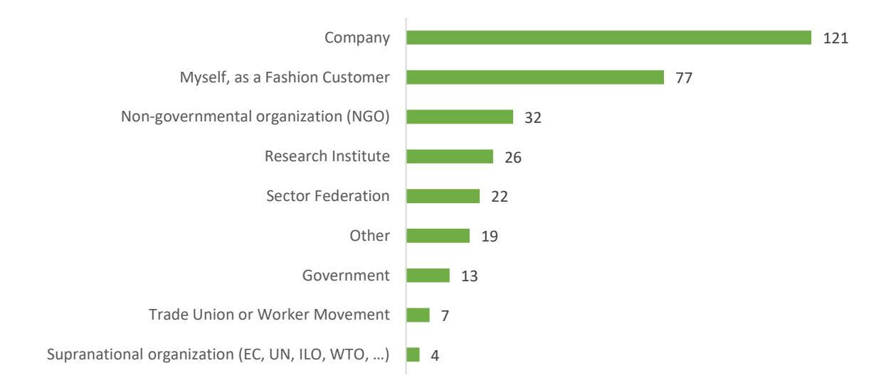

# **Annex 3: Ordered probit regression results**

|                                                        | Consumer-led (+) Producer-led (-) | Behaviour-driven (+) Technology driven (-) | Bottom-up (+) Top-down (-) | Local (+) Global (-) | Competition (+) Market concentration (-) | Inner circles (+) Outer circles (-) |
|--------------------------------------------------------|-----------------------------------|--------------------------------------------|----------------------------|----------------------|------------------------------------------|-------------------------------------|
| Prob > chi2                                            | 0.0006                            | 0.0236                                     | 0.4250                     | 0.0410               | 0.0008                                   | 0.0059                              |
| Pseudo R2                                              | 0.1730                            | 0.1334                                     | 0.0801                     | 0.1254               | 0.1832                                   | 0.1722                              |
| Male                                                   | 0.5709 (0.2510)*                  | 0.6861 (0.2518)**                          |                            | -0.2934 (0.2458)     | 1.0622 (0.2657)**                        | 0.8651 (0.2636)**                   |
| Age (ordinal)                                          | -0.1169 (0.1144)                  | -0.0095 (0.1138)                           |                            | -0.0578 (0.1137)     | 0.0137 (0.1166)                          | -0.1542 (0.1188)                    |
| Position: CEO                                          | -0.1305 (0.4062)                  | -0.9192 (0.4073)*                          |                            | -0.2547 (0.4003)     | -0.3601 (0.4130)                         | -0.3209 (0.4153)                    |
| Position: Strategic management                         | -0.9130 (0.4590)*                 | -1.2498 (0.4520)**                         |                            | -0.8705 (0.4422)*    | -1.0482 (0.4521)*                        | -1.6106 (0.4673)**                  |
| Position: Operational management                       | 0.0531 (0.4225)                   | -0.7779 (0.4192)                           |                            | -0.1339 (0.4140)     | -0.5836 (0.4243)                         | -0.5833 (0.4269)                    |
| Position: Operational or administrative co-worker      | 0.1194 (0.5529)                   | -0.7653 (0.5599)                           |                            | -1.0496 (0.5596)     | -0.8194 (0.5704)                         | -1.0839 (0.5655)                    |
| Position: Designer                                     | 0.5219 (0.5479)                   | -0.5305 (0.5463)                           |                            | -0.8705 (0.4422)*    | 0.1810 (0.5595)                          | -0.2615 (0.5655)                    |
| Country: EU                                            | 1.8152 (0.7349)*                  | 2.3470 (0.7447)**                          |                            | 0.2300 (0.7275)      | 0.5956 (0.7298)                          | 0.3563 (0.7368)                     |
| Value Chain: design                                    | -0.5375 (0.3532)                  | -0.2872 (0.3473)                           |                            | -0.3991 (0.3472)     | -0.2601 (0.3539)                         | -0.1548 (0.3620)                    |
| Value Chain: fibre producer                            | 0.4196 (0.4712)                   | -0.4308 (0.4616)                           |                            | 0.8227 (0.4540)      | 0.2849 (0.4591)                          | 0.6649 (0.4698)                     |
| Value Chain: textile manufacturer                      | 0.6417 (0.3682)                   | 0.5174 (0.3671)                            |                            | -0.3398 (0.3647)     | 1.0064 (0.3783)**                        | -0.0699 (0.3750)                    |
| Value Chain: fashion manufacturer                      | 0.7359* (0.2914)*                 | 0.4122 (0.2877)                            |                            | 0.1757 (0.2867)      | -0.3960 (0.2947)                         | 0.0092 (0.2959)                     |
| Value Chain: logistics                                 | -0.4564 (0.3361)                  | -0.3006 (0.3293)                           |                            | -0.3152 (0.3268)     | -0.5625 (0.3373)                         | -0.0937 (0.3366)                    |
| Value Chain: retail                                    | -0.6112 (0.3173)                  | 0.0232 (0.3131)                            |                            | 0.1486 (0.3109)      | 0.5240 (0.3209)                          | 0.1255 (0.3252)                     |
| Value Chain: reuse centre                              | 1.3649 (0.5921)*                  | 1.0162 (0.5856)                            |                            | 0.4437 (0.5865)      | 1.3386 (0.6005)*                         | 1.3369 (0.6103)*                    |
| Value Chain: waste management                          | -0.2640 (0.4176)                  | 0.2844 (0.4116)                            |                            | -1.3313 (0.4253)**   | -0.4636 (0.4241)                         | -0.1900 (0.4203)                    |
| BtC-market                                             | 0.4908 (0.3031)                   | 0.2597 (0.3002)                            |                            | -0.5106 (0.3026)     | -0.3655 (0.2906)                         | -0.2050 (0.3086)                    |
| BtB-market                                             | 0.1809 (0.2842)                   | 0.5638 (0.2849)*                           |                            | 0.5261 (0.2859)      | -0.4645 (0.3087)                         | 0.4044 (0.2976)                     |
| BtBtC-market                                           | 0.1449 (0.2599)                   | 0.4169 (0.2571)                            |                            | -0.0020 (0.2563)     | 0.4229 (0.2639)                          | 0.0480 (0.2612)                     |
| BtG-market                                             | 0.2405 (0.3643)                   | -0.0835 (0.3638)                           |                            | 0.8398 (0.3770)*     | 0.3083 (0.3783)                          | 0.4171 (0.3777)                     |
| Size (ordinal)                                         | -0.3085 (0.1153)**                | -0.1769 (0.1121)                           |                            | -0.0179 (0.1105)     | 0.1434 (0.1138)                          | 0.0394 (0.1143)                     |
| Geographical scope of sourcing materials (ordinal)     | 0.0048 (0.0057)                   | -0.0038 (0.0058)                           |                            | -0.0083 (0.0057)     | 0.0090 (0.0059)                          | -0.0033 (0.0060)                    |
| Geographical scope of operational activities (ordinal) | 0.0035 (0.0051)                   | -0.0097 (0.0052)                           |                            | 0.0006 (0.0051)      | -0.0047 (0.0052)                         | -0.0045 (0.0053)                    |
| Geographical scope of sales activities (ordinal)       | -0.0121 (0.0080)                  | -0.0096 (0.0080)                           |                            | -0.0113 (0.0079)     | -0.0018 (0.0081)                         | -0.0223 (0.0087)**                  |

Note: Ordered Probit regression results: \* significant at the 5% level, \*\* significant at the 1% level. Standard errors between brackets.

Table 12: Ordered probit regression on estimated scenario outcomes by companies