#### **SCIRT**

Innovation Action (IA)

This project has received funding from the European Union's Horizon 2020 research and innovation programme under grant agreement No 101003906

> Start date : 2021-06-01 Duration : 36 Months https://scirt-h2020.eu/

## SCIRT

#### **Lab-scale samples for (re-)spinning trials after (bio)chemical recycling of multi-material fibre/textile blends**

Authors : Mr. Emanuel BOSCHMEIER (TU Wien)

## Horizon 2020 Programme

SCIRT - Contract Number: 101003906

#### Project officer:

| Document title      | Lab-scale samples for (re-)spinning trials after (bio)chemical recycling of multi-material |
|---------------------|--------------------------------------------------------------------------------------------|
| Author(s)           | Mr. Emanuel BOSCHMEIER                                                                     |
| Number of pages     | 56                                                                                         |
| Document type       | Deliverable                                                                                |
| Work Package        | WP02                                                                                       |
| Document number     | D2.1                                                                                       |
| Issued by           | TU Wien                                                                                    |
| Date of completion  | 2023-02-21 10:40:02                                                                        |
| Dissemination level | Public                                                                                     |

#### **Summary**

In task 2.2, the main target is the removal of a specific fibre from blended textiles in order to reuse the remaining second fibre, allowing its recycling. In detail, TU Wien focuses on the scope of Task 2.2 in project SCIRT on removing elastane from textiles containing this polymer. In order to perform tests on separate elastane from textiles, procurement of pure elastane was necessary. The supply of pure elastane in weaved or yarn form from project partners or external industrial partners was not feasible. Therefore, TU Wien produced pure elastane via enzymatic hydrolysis of a viscose/elastane textile. Chemical analysis of the obtained material was conducted and formed an important base for further research and development. Two different textile materials from a project partner were supplied: post-industrial textile waste of polyethylene terephthalate/elastane and polyamide/elastane. The aim is to remove elastane from these textiles in order to receive pure PET and PA. According to the European Green Deal, that recycled material will find reprocessing. TU Wien is focusing on the solvent-based elastane separation. Five different solvents were selected to conduct tests on. Until now, two solvents are beneficial for removing elastane from the supplied textiles. The characteristics and properties of pure elastane and the supplied textile material were investigated with three methods: ATR-FTIR, DSC and TGA. Research results are exceptionally promising. Multiple proofs have been conducted that the solvent-based elastane separation works, and quantification methods have been developed. BOKU within task 2.2, in collaboration with TU Wien, is mainly aiming the enzymatic removal of the natural fibres from wool/ PET and viscose/PET blends. Particularly, different sets of experiments were performed from both universities towards wool degradation from postindustrial samples obtained from SCIRT project partners. Various proteases were biochemically characterized, and as well various buffer conditions were applied in order to determine the higher performant biocatalyst. The obtained products from wool depolymerization were quantified with biochemical analysis, weight loss, DSC and morphological investigations. Moreover, BOKU is also involved in the degradation of viscose from its blend material together with PET. In this case, commercial cellulase cocktail was used to cleave the cellulosic component. Cellulose degradation from blended textile was compared with degradat...

#### Approval

| Date                | By                         |
|---------------------|----------------------------|
| 2023-02-22 10:03:36 | Mrs. Isabelle CORNU (CETI) |
| 2023-02-22 10:08:59 | Mrs. Evelien DILS (VITO)   |

## SCIRT.

## SYSTEM CIRCULARITY & INNOVATIVE RECYCLING OF TEXTILES

Innovation Action H2020-SC5-2020-2

# **Lab-scale samples for (re-)spinning trials after (bio)chemical recycling of multi-material fibre/textile blends**

**Deliverable D2.1**

#### **Authors:**

Emanuel Boschmeier (TU Wien)

Felice Quartinello (BOKU)

Daniella Mehanni (TU Wien)

Sophia Milahyi (BOKU)

Version N°3

# **Disclaimer**

The content of this report reflects only the author's view. The European Commission is not responsible for any use that may be made of the information it contains.

# **Document information**

| Grant Agreement         | n°101003906                                           |
|-------------------------|-------------------------------------------------------|
| Project Title           | System Circularity & Innovative Recycling of Textiles |
| Project Acronym         | SCIRT                                                 |
| Project Coordinator     | Evelien Dils, VITO                                    |
| Project Duration        | 1                                                     |
|                         | st June 2021 – 31 st May 2024 (36 months)             |
| Related Work Package    | WP2                                                   |
| Related Task(s)         | Task 2.2                                              |
| Lead Organisation       | CETI                                                  |
| Contributing Partner(s) | TU Wien, BOKU                                         |
| Due Date                | 27.05.2022                                            |
| Submission Date         | 25-05-2022                                            |
| Dissemination level     | public                                                |

# **History**

| Date       | Version | Submitted by       | Reviewed by    | Comments            |
|------------|---------|--------------------|----------------|---------------------|
| 25-05-2022 | v1      | Emanuel Boschmeier | Isabelle Cornu | Adding explanations |
| 27-06-2022 | v2      | Emanuel Boschmeier | Isabelle Cornu | accepted            |
| 21-02-2023 | V3      | Emanuel Boschmeier |                |                     |
|            |         | (TU Wien)          | Reviewers      |                     |

# **Table of contents**

| 1             | ABBREVIATIONS AND ACRONYMS.......................................................................................................               | 7                                                                                                                                                          |
|---------------|-------------------------------------------------------------------------------------------------------------------------------------------------|------------------------------------------------------------------------------------------------------------------------------------------------------------|
| 2             | SUMMARY                                                                                                                                         | 8                                                                                                                                                          |
| 3             | INTRODUCTION AND SCOPE..............................................................................................................            | 10                                                                                                                                                         |
| 4             | ELASTANE SEPARATION....................................................................................................................         | 12                                                                                                                                                         |
| 4.1           | S TRUCTURE OF ELASTANE                                                                                                                          | .............................................................................................................................13                            |
| 4.2           | M ATERIAL AND METHODS                                                                                                                           | ............................................................................................................................16                             |
| 4.2.1         |                                                                                                                                                 | Textile material and chemicals.........................................................................................................16                  |
| 4.2.2         | Characterization methods                                                                                                                        | ................................................................................................................17                                         |
| 4.3           | E XPERIMENTAL                                                                                                                                   | ..........................................................................................................................................18               |
| 4.3.1         |                                                                                                                                                 | In-house elastane production...........................................................................................................18                  |
| 4.3.2         | Solvent-based separation of elastane                                                                                                            | ..............................................................................................20                                                           |
| 4.3.3         |                                                                                                                                                 | Proof of elastane separation process...............................................................................................21                      |
| 4.3.4         |                                                                                                                                                 | Determination of elastane content in textiles..................................................................................26                          |
| 5             | WOOL DEGRADATION FROM BLENDS................................................................................................                    | 28                                                                                                                                                         |
| 5.1           | M ATERIAL AND METHODS                                                                                                                           | ............................................................................................................................29                             |
| 5.1.1         | Sample preparation                                                                                                                              | ..........................................................................................................................30                               |
| 5.2           | W OOL HYDROLYSIS FROM BLENDED TEXTILES                                                                                                          | ...................................................................................................31                                                      |
| 5.2.1         | Biochemical characterization of the hydrolysate                                                                                                 | .............................................................................32                                                                            |
|               | 5.2.1.1                                                                                                                                         | Quantification of amino acids.................................................................................................................. 32         |
|               | 5.2.1.2                                                                                                                                         | Ninhydrin Assay........................................................................................................................................ 32 |
|               | 5.2.1.3                                                                                                                                         | Folin-Ciocalteu Assay................................................................................................................................ 32   |
| 5.2.2         |                                                                                                                                                 | Characterization of the recovered PET fibres...................................................................................33                          |
| 5.3           | R ESULTS AND DISCUSSION                                                                                                                         | ............................................................................................................................34                             |
| 5.3.1         | Enzymatic hydrolysis of pure wool                                                                                                               | ...................................................................................................34                                                      |
| 5.3.2         | Enzymatic hydrolysis of wool/PET blend                                                                                                          | ..........................................................................................36                                                               |
|               | 5.3.2.1                                                                                                                                         | Effect of the Enzyme concentration......................................................................................................... 39             |
| 5.3.3         |                                                                                                                                                 | Morphological investigations...........................................................................................................39                  |
| 5.3.4         |                                                                                                                                                 | Thermo-analytical methods..............................................................................................................41                  |
|               | 5.3.4.1 Differential Scanning Calorimetry (DSC)                                                                                                 | 41                                                                                                                                                         |
| 6             | PURE CELLULOSE AND VISCOSE DEGRADATION FROM VISCOSE/POLYESTER                                                                                   | TEXTILE........................... 44                                                                                                                      |
| 6.1           | M ATERIAL AND M ETHODS                                                                                                                          | ...........................................................................................................................45                              |
| 6.1.1         | Cellulase activity determination                                                                                                                | .......................................................................................................45                                                  |
| 6.1.2         |                                                                                                                                                 | Protein quantification.......................................................................................................................45            |
| 6.1.3         | Glucose and Lactic acid quantification via HPLC                                                                                                 | ..............................................................................45                                                                           |
| 6.1.4         | Cellulase recovery                                                                                                                              | .............................................................................................................................45                            |
| 6.1.5         |                                                                                                                                                 | PET characterization.........................................................................................................................46            |
| 6.2           | R ESULTS                                                                                                                                        | ...................................................................................................................................................47      |
| 6.2.1         |                                                                                                                                                 | Pure cellulosic material degradation................................................................................................47                     |
| 6.2.2         |                                                                                                                                                 | Cellulose removal from blended textiles...........................................................................................48                       |
| 6.2.3         |                                                                                                                                                 | Simultaneous Saccharification and Fermentation (SSF) process......................................................48                                       |
| 6.2.4         |                                                                                                                                                 | PET purity characterization...............................................................................................................50               |
| 6.2.5         |                                                                                                                                                 | Cellulases recovery............................................................................................................................51          |
| 7 CONCLUSIONS |                                                                                                                                                 | 52                                                                                                                                                         |
|               | 8 ACKNOWLEDGEMENT                                                                                                                               | 53                                                                                                                                                         |
| 7             | REFERENCES..................................................................................................................................... | 54                                                                                                                                                         |

# **List of figures**

| Figure 1 structure of segmented polyurethane (Xie et al., 2019)                                                                                               | 12                         |
|---------------------------------------------------------------------------------------------------------------------------------------------------------------|----------------------------|
| Figure 2 Post-industrial textile waste provided by Decathlon                                                                                                  | 16                         |
| Figure 3 scheme of own pure elastane production....................................................................                                           | 18                         |
| Figure 4 pictures of enzymatic hydrolysis of a viscose/elastane textile                                                                                       | 19                         |
| Figure 5 scheme of elastane separation                                                                                                                        | 20                         |
| Figure 6 ATR-FTIR spectra of pure elastane and filtration residues.........................................                                                   | 21                         |
| Figure 7 trial on identifying elastane content in textiles with ATR-FTIR spectra....................                                                          | 22                         |
| Figure 8 DSC curves of treated and untreated PET/EL textile                                                                                                   | 23                         |
| Figure 9 DSC curves of treated and untreated PA/EL textile....................................................                                                | 23                         |
| Figure 10 TGA curves of pure EL, pure PA and PA/EL textile...................................................                                                 | 25                         |
| Figure 11 TGA curves of pure EL, pure PET and PET/EL textile                                                                                                  | 25                         |
| Figure 12 DSC calibration graph....................................................................................................                           | 26                         |
| Figure 13 TGA calibration graph....................................................................................................                           | 27                         |
| Figure 14 Macro and microstructure of wool (Plowman, 2013)                                                                                                    | 28                         |
| which were determined using the Ninhydrin (light grey) and Folin-                                                                                             | Ciocalteu Assay (dark      |
| grey)                                                                                                                                                         | 35                         |
| Figure 16 Enzymatic degradation of wool....................................................................................                                   | 36                         |
| which were determined using the Ninhydrin (light grey) and Folin-                                                                                             | Ciocalteu Assay (dark      |
| grey)                                                                                                                                                         | 37                         |
| Figure 18 Studies on Enzyme D using different chemical environments                                                                                           | 38                         |
| treatment methods............................................................................................................................                 | 38                         |
| Figure 20 studies on the effect on different enzyme concentrations                                                                                            | 39                         |
| hydrolysed apparel at 500x                                                                                                                                    | 40                         |
| (a))......................................................................................................................................................... | 43                         |
| cellulase cocktail................................................................................................................................            | 44                         |
| Figure 24 HPLC analysis of glucose released from Viscose and rayon...................................                                                         | 47                         |
| Simultaneous saccharification and fermentation (SSF)                                                                                                          | 48                         |
| Saccharification and Fermentation.................................................................................................                            | 49                         |
| degradation of viscose (red line) and recovered PET from SSF process (yellow line).........                                                                   | 50                         |
| Figure 28 SEM analysis of viscose/PET and recovered PET                                                                                                       | fibres after the cellulose |
| removal................................................................................................................................................       | 50                         |
| cellulases.                                                                                                                                                   | 51                         |

## **List of tables**

| Table 1 widely used substances for hard segments                                                                                           | 13 |
|--------------------------------------------------------------------------------------------------------------------------------------------|----|
| Table 2 mostly used chain extenders                                                                                                        | 14 |
| Table 3 mainly used ether-based substances for soft segments                                                                               | 15 |
| Table 4 list of used solvents............................................................................................................. | 20 |
| Table 5 overview of the set ups performed..................................................................................                | 31 |
| Table 6 Summary of all experimental environments that were applied to pure wool                                                            | 34 |
| Table 7 Summary of the conducted Biochemical Assays                                                                                        | 35 |
| Table 8 Wool degradation efficiency.............................................................................................           | 37 |
| measured via DSC                                                                                                                           | 41 |

# **Keywords**

Textile recycling, elastane separation, solvent-based, elastane content determination, wool, enzymatic degradation, proteases, amino acids, viscose, cellulases, SSF, recovered PET.

# **1 Abbreviations and acronyms**

| Acronym | Description                                    |
|---------|------------------------------------------------|
| ATR     | Attenuated Total Reflectance                   |
| CBH     | Cellobiohydrolase                              |
| CDH     | Cellobiose dehydrogenases                      |
| DNS     | 3,5-dinitrosalicylic acid                      |
| DSC     | Differential Scanning Colometry                |
| EG      | Endoglucanase                                  |
| EL      | Elastane                                       |
| FTIR    | Fourier-transform infrared spectroscopy        |
| HGTP    | High Glycine Tyrosine Protein                  |
| HPLC    | High Pressure Liquid Chromatography            |
| HS      | Hard segment                                   |
| HSP     | High Sulfur Protein                            |
| IF      | Intermediate Filaments                         |
| K       | Kelvin                                         |
| PA      | Polyamide                                      |
| PET     | Polyethylene Terephthalate                     |
| PMO     | Polysaccharide Monooxygenases                  |
| PTUR    | Polyetherurethane                              |
| PUR     | Polyurethane                                   |
| SDS     | Sodium Dodecyl Sulphate                        |
| SEM     | Scanning Electronic Microscope                 |
| SS      | Soft segment                                   |
| SSF     | Simultaneous Saccharification and Fermentation |
| TGA     | Thermal Gravimetric Analysis                   |
| UHSP    | Ultra High Sulfur Protein                      |
| WP      | Work Package                                   |

# **2 Summary**

In task 2.2, the main target is the removal of a specific fibre from blended textiles in order to reuse the remaining second fibre, allowing its recycling.

In detail, TU Wien focuses on the scope of Task 2.2 in project SCIRT on removing elastane from textiles containing this polymer. In order to perform tests on separate elastane from textiles, procurement of pure elastane was necessary. The supply of pure elastane in knitted or yarn form from project partners or external industrial partners was not feasible. Therefore, TU Wien produced pure elastane *via* enzymatic hydrolysis of a viscose/elastane textile. Chemical analysis of the obtained material was conducted and formed an important base for further research and development. Two different textile materials from a project partner were supplied: post-industrial textile waste of polyethylene terephthalate/elastane and polyamide/elastane. The aim is to remove elastane from these textiles in order to receive pure PET and PA. According to the European Green Deal, that recycled material will find reprocessing.

TU Wien is focusing on the solvent-based elastane separation. Five different solvents were selected to conduct tests on. Until now, two solvents are beneficial for removing elastane from the supplied textiles. The characteristics and properties of pure elastane and the supplied textile material were investigated with three methods: ATR-FTIR, DSC and TGA. Research results are exceptionally promising. Multiple proofs have been conducted that the solvent-based elastane separation works, and quantification methods have been developed.

BOKU within task 2.2, in collaboration with TU Wien, is mainly aiming the enzymatic removal of the natural fibres from wool/ PET and viscose/PET blends. Particularly, different sets of experiments were performed from both universities towards wool degradation from postindustrial samples obtained from SCIRT project partners. Various proteases were biochemically characterized, and as well various buffer conditions were applied in order to determine the higher performant biocatalyst. The obtained products from wool depolymerization were quantified with biochemical analysis, weight loss, DSC and morphological investigations.

Moreover, BOKU is also involved in the degradation of viscose from its blend material together with PET. In this case, commercial cellulase cocktail was used to cleave the cellulosic component. Cellulose degradation from blended textile was compared with degradation of pure viscose material in order to optimize the degradation yield. In both cases, the full degradation of the cellulosic material was demonstrated. Recovered PET, then, has been characterized *via* mass determination, ATR-FTIR, SEM, TGA and DSC. From preliminary results high purity of the synthetic fibre was obtained.

BOKU is also focusing to determine the potential application of the released compounds obtained from wool and cellulose degradation. From previous works, amino acids can be potentially used for various industrial applications. In this task, various experiments involved the glucose obtained from viscose hydrolysis. In this sense, BOKU effectively converted the mentioned compound into lactic acid *via* a Simultaneous Saccharification and Fermentation process. The latter compound is a well-known and exploited chemical platform for various processes. Since enzymatic approaches are affected by their costs of production, BOKU studied the possibility to recycle the enzymes. It has been positively demonstrated that

cellulases can be reused for 5 cycles, without a substantial decrease of the protein concentration, activity and degradation efficiency.

The obtained research results are a solid fundament for a promising development of the elastane and PET separation process. According to the Deliverable, TU Wien and BOKU will provide lab-scale samples of more than hundred grams of our recycling methods to project partners for further processing.

# **3 Introduction and scope**

According to the layout of Task 2.2: increased value recycling of clothing and spinning, TU Wien has one focus on removing elastane from textiles containing certain amounts of this material. Within project SCIRT, TU Wien made it his mission to conduct European wide first tests on separate elastane from textiles consisting of polyethylene terephthalate (PET) and elastane or polyamide (PA) and elastane. When the separation process is feasible, pure PET or PA fibres can serve as processing input material. One reprocessing method is the production of recycled PET or PA chips, as done by a project partner. The scope is to build up a well-founded approach, develop a chemical recycling route in laboratory scale and provide a project partner with lab-scale samples for further processing.

The above explained idea is a new approach on working along with the European Union Green Deal and enhancing the circular economy within the apparel industry. Literature research on this topic was started in August 2021 and is still ongoing. Unfortunately, publications regarding this topic are not yet existing, which makes this task difficult but not impossible. Steady contact with stakeholders within and outside project SCIRT brought great interest in this topic.

TU Wien started first laboratory tests on supplied textile waste by using a solvent-based separation of elastane from the fabric. Until now, four different solvents have been tested on their ability to separate elastane. The separation process and material characterization has been approved together with the Research Group Process Analytics of Institute of Chemical Technologies and Analytics at TU Wien. Further material characterization and the development of quantification methods was done in collaboration with the Research Group for Structural Polymers of Institute of Materials Science and Technology at TU Wien.

In parallel, other types of blended materials are also targeted in task 2.2: wool/PET and viscose/PET. Specifically in this case, TU Wien and BOKU University collaborate to selectively apply enzymes to hydrolyze the natural fibres allowing the separation of PET which can be further recycled and reused as mentioned before. In the case of protein-based material, proteases are used to cleave peptide bonds and reduce the wool macrostructure into smaller oligopeptides and amino-acids. On the other hand, cellulases can hydrolyze cellulose into glucose. The separated synthetic fibre is then characterized using Infrared spectroscopy and Scanning electron microscopy analysis (at BOKU), while TGA and DSC measurements were also conducted (at TU Wien).

One of the keystones of the circular economy concept is to produce value-added products. As well the recovered PET and PA, the wool hydrolysate and the glucose from cellulose hydrolysis represent a potential platform for production of new chemicals. The conversion of glucose into bioethanol is well described in literature. This process usually involves primarily the degradation of biomass into glucose and then (after various purification steps) the fermentation process, where the secondary value-added product is obtained.

In SCIRT project, BOKU presents a conversion of glucose into lactic acid *via* a process defined as Simultaneous Saccharification and Fermentation (SSF). In this sense, less purification and preparation steps are necessary. In order to reduce the economic impacts of enzyme costs, BOKU applied an ultrafiltration approach for re-use of cellulases.

# **4 Elastane separation**

Elastane (EL), also called by its brand names spandex or lycra, is a synthetic polymer fibre that enhances the flexibility and stretchability of apparel. Clothes have an increased pressure comfort, make body movements easier and dry faster than ordinary fabrics. These arguments led into the use of elastane fibres in apparel like jackets, trousers, underwear and swimsuits.

Because of its physical and chemical characteristics, elastane is an elastomeric rubber (Szycher, 2013). This fibre material is per definition composed of a great share of a segmented polyurethane. It could stretch up to multiple times its normal length and immediately reverts into origin when the applied force is removed (BISFA, 2017). A segmented polyurethane is composed of hard segments with chain extender and soft segments (Figure 1). Segmented polyurethanes are synthesized by diisocyanates, polyols and chain extenders, that form the characteristic structure. The segments are held together by the urethane groups with its covalent and hydrogen bonds (Xie et al., 2019).

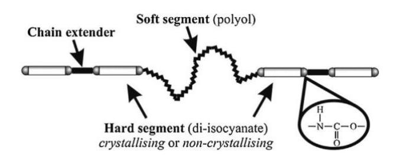

Figure 1 structure of segmented polyurethane (Xie et al., 2019)

In the next chapter, the structure of segmented polyurethanes, which marks the elastane fibre, are evaluated. The evaluation serves as knowledge input for the processes, that TU Wien conducted during the solvent-based separation of elastane.

### **4.1 Structure of elastane**

#### **Hard segment**

In segmented polyurethanes, the hard segments (HS) are built by hydrocarbon molecules that are derived from diisocyanates and low molecular weight hydroxyl chain extenders (Szycher, 2013). The molecules in the HS (see Table 1) have the intention to form chemical bonds with each other, especially hydrogen bonds or urethane linkages that result in the building of a dense and rigid phase. Physical properties like strength, hardness and abrasion resistance are contributed to the HS (Krol, 2007). Because of this circumstance, the HS is representing the crystalline phase within segmented polyurethanes (Xie et al., 2019).

Table 1 widely used substances for hard segments

| Substance                                      | CAS-Nr.       | Reference               |
|------------------------------------------------|---------------|-------------------------|
| HDI (hexamethylene diisocyanate)               | 822-06-0      |                         |
|                                                |               | (Kasprzyk et al., 2021) |
| HMDI (4,4 ′ -Dicyclohexylmethane diisocyanate) | 5124-30-1     |                         |
| TDI (2,4 or 2,6 toluene diisocyanate)          | 2,4: 584-84-9 |                         |

#### **Chain extender**

Low-molecular weight chemicals (see Table 2) are used for the production of elastomeric polyurethanes as linkages between hard segments. The chain extender reacts preferentially with the urethane bonds before the high-molecular-weight soft segments (Xie et al., 2019). These so-called chain extenders enhance the chemical and physical properties of polyurethanes (Szycher, 2013).

Table 2 mostly used chain extenders

| Substance            | CAS-Nr.  | Reference                |
|----------------------|----------|--------------------------|
| BDO (1,4 butanediol) | 110-63-4 |                          |
|                      |          | (Głowińska et al., 2018) |

#### **Soft segment**

Macrodiols or polyols are an indispensable substance for manufacturing polyurethanes, because they define the final structure of the segmented polyurethane. During PUR synthesis, the macrodiols (see Table 3) react with the isocyanat components and form flexible phases, the so-called soft segments (SS) (Xie et al., 2019). Most linkages found in PUR are assigned to the linkages derived from macrodiols (Szycher, 2013). The isocyanatereactive polyols can be polyether or polyester based. However, the focus in this work is only on polyether-based polyurethanes – the polyetherurethane (PTUR). Polyetherurethanes have replaced polyesterurethanes in certain applications because of their better hydrolytic stability (Christenson et al., 2004) and better performance in high humidity conditions (Xie et al., 2019).

Table 3 mainly used ether-based substances for soft segments

| Substance                       | CAS-Nr.    | Reference |
|---------------------------------|------------|-----------|
| PTMO (Polytetramethylene oxide) | 25190-06-1 |           |
| Propylene Glycol                | 4254-15-3  |           |

## **4.2 Material and methods**

### **4.2.1Textile material and chemicals**

Textile waste material for the chemical recycling route by separating elastane was kindly provided by a project partner (Decathlon, France). Two different textiles have been delivered, that are post-industrial waste from a swimwear production plant, see Figure 2. The composition of the black material (left in Figure 2) as stated out on the label is 92% PA and 8% EL and the green textile on the right is composed of 82% PET and 18% EL. The external supply of pure elastane for research purposes was not possible. Therefore, we introduced our own elastane production by performing enzymatic hydrolysis of a 92% viscose and 8% EL fabric. Within the enzymatic hydrolysis, viscose is gently removed from the textile and 100% elastane is the reaction product.

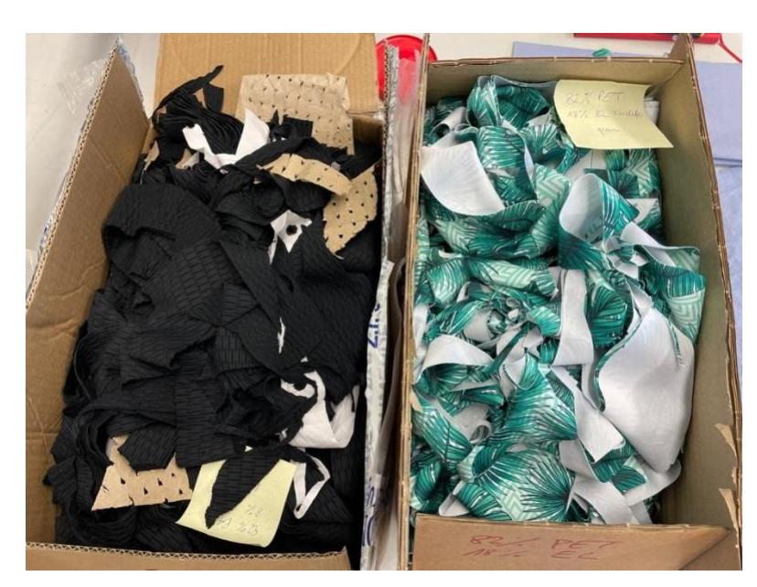

Figure 2 Post-industrial textile waste provided by Decathlon

Chemicals for solvent-based elastane separation were ordered from Sigma Aldrich (Vienna, Austria) or from Lactan GmbH (Graz, Austria). The chemicals were ordered based on literature research or on experience from our research group or colleagues, specialized on petrochemical and organic chemistry.

### **4.2.2Characterization methods**

#### **Attenuated Total Reflectance-Fourier Transform Infrared Spectroscopy (ATR-FTIR)**

Process verification as well as sample characterization has been done with ATR-FTIR spectroscopy. The spectra were collected in the range between 400 cm-1 and 3500 cm-1 with an Infrared Tensor 37 spectrometer (Bruker Optics GmbH, Ettlingen, Germany) with a Platinum diamond reflection ATR accessory.

#### **Differential Scanning Calorimetry (DSC)**

Physical properties and polymer identification was investigated by using TA Q2000 DSC with autosampler (Waters GmbH, Vienna, Austria). The samples (1-5 mg) were integrated in aluminium pans and the measurements were done under nitrogen atmosphere. Samples were thermally treated in the range of -90°C to 280°C with a temperature ramp of 10 K/min. For the determination of specific points of interest like melting temperature or melting enthalpy the TA Universal analysis software was used.

#### **Thermal Gravimetric Analysis (TGA)**

The degradation behaviour of polymers was assessed by TGA with a TGA Q500 equipment (Waters GmbH, Vienna, Austria). Samples (5-10 mg) were placed in a ceramic crucible and heated from 35°C to 700°C using a temperature ramp of 10 K/min. For the determination of degradation behaviour, the TA Universal analysis software was used.

## **4.3 Experimental**

### **4.3.1In-house elastane production**

The supply of pure elastane turned out to be challenging. Steady contact with project partners as well as stakeholders from industry or European Union organizations was held. The difficulties of pure elastane supply are on the one hand the outsourced elastane manufacturing mainly in Asian countries. Manufacturer did not respond to inquiries and the procurement of pure elastane yarn was not possible. On the other hand, fashion brands buy finished products that already contain elastane. However, the experience of our research group in textiles has led to a conclusion.

We ordered a viscose/elastane textile with the aim of removing the viscose part and obtain pure elastane, where the enzymatic hydrolysis of viscose is the non-hazardous route for it. In this biochemical process (see Figure 3), enzymes degrade solid building blocks of viscose, cellulose, into its monomer, glucose. This reaction product remains in the reaction chamber and the solid elastane knit can be obtained. In the left picture in Figure 4 is shown the reaction chamber. The reaction fluid contains enzymes, a pH buffer and further detergents to achieve highest yields. The viscose/elastane fabric is placed in this reaction chamber and incubated for 48 hours. After incubation, the viscose was completely degraded to glucose, which can be seen in the increase of fluid. A light microscope image (Keyence VHX-6000) shows the solid reaction product- pure elastane knit (Figure 4 right picture). Light microscope inspection proved 100% reaction yield, because no residues were found on the elastane knit. Furthermore, the textile label was described as stated out a composition of 92% viscose and 8% elastane. Mass balance during the laboratory tests resulted in 3 w.-% elastane and 97 w.-% viscose.

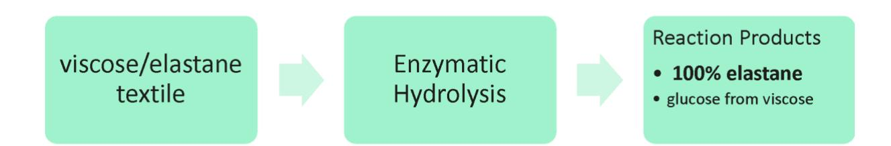

Figure 3 scheme of own pure elastane production

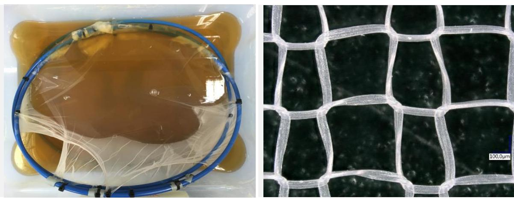

Figure 4 pictures of enzymatic hydrolysis of a viscose/elastane textile

In the next step, the pure elastane knit has been characterized with ATR-FTIR to gain knowledge on the constitution of pure elastane. The knit was therefore placed on the ATR sample holder and 3 measurements were conducted for statistical accuracy. Simultaneous literature research with in-house spectra database and (Fuensanta & Martín-Martínez, 2020) resulted in the conclusion, that this elastane fibre is an ether-based polyurethane, or polyetherurethane (PTUR). This obtained pure elastane knit served as an indispensable item for ongoing research on elastane separation.

### **4.3.2Solvent-based separation of elastane**

Five different solvents were selected to conduct first tests on separating elastane from the black PA/EL and green PET/EL textile (see Figure 5). Practically, four solvents were tested until the final date of this Deliverable, they are mentioned in Table 4. The textile samples with 2-3 g size were placed in a flask with 100% solvent as delivered. By changing reaction parameters like stirring rate, temperature, time etc., different changes in appearance of the reaction chamber could be seen. Two solvents appeared to be very effective, because mass balance offered a mass loss of nearly exactly the elastane content mentioned on the label.

Table 4 list of used solvents

| Solvent | knowledge                                        | Tested? |
|---------|--------------------------------------------------|---------|
| A       | Hazardous, in literature as PUR solvent approved | Yes     |
| B       | Non-hazardous, no literature results             | Yes     |
| C       | Non-hazardous, no literature results             | Yes     |
| D       | Non-hazardous, no literature results             | Yes     |
| E       | Hazardous, in literature as PUR solvent approved | Planned |

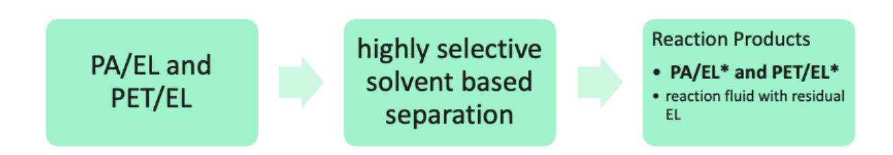

Figure 5 scheme of elastane separation

Because of the fact, that mass balances in laboratory scale have low accuracy, a different and trustful quantification method needs to be found to identify elastane content in the PET/EL and PA/EL textiles before and after treatment. Furthermore, a proof for the solventbased separation process needs to be found. These two topics are presented in the following chapters.

### **4.3.3 Proof of elastane separation process**

#### **Attenuated Total Reflectance-Fourier Transform Infrared Spectroscopy (ATR-FTIR)**

As indicated in Figure 5, the end of the reaction is marked by a visible change of the reaction fluid. It appeared that the fluid caught the colour of the textile which is related to the used colourant of the textile and turned turbid, which is an indication for particles in a fluid. The treated textile was put outside of the flask and has been washed, the reaction fluid was filtered by a filtration paper under vacuum. When filtration was completed, residual particles were left on the filter. These particles were collected, washed and dried before analysis with ATR-FTIR. Figure 6 shows the ATR-FTIR spectra for pure elastane (100% EL), the filtration residue from the green PET/EL textile and the filtration residue from the black PA/EL textile. A qualitative comparison of those three curves demonstrates, that the filtration residues are of the same chemical constitution like pure EL. This figure is therefore the proof of the solvent-based elastane separation by the two used solvents. The elastane in the PET/EL and PA/EL textile could successfully be removed.

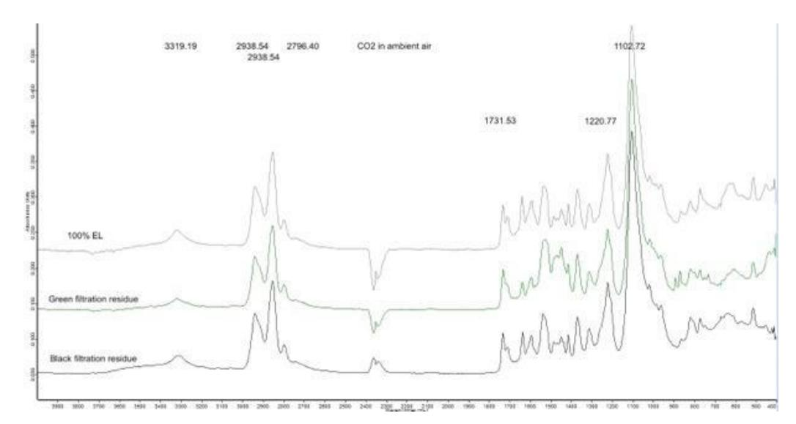

Figure 6 ATR-FTIR spectra of pure elastane and filtration residues

Further investigations with ATR-FTIR of the green PET/EL and black PA/EL textile came to following conclusions:

- The pure elastane obtained from the enzymatic hydrolysis of a viscose/elastane textile has the same chemical composition as the elastane inside the green PET/EL and black PA/EL textiles
- Reuse of the solvent for a second and third run of solvent-based elastane separation resulted in an enrichment of the solvent with elastane particles. Someone could see during the experiments, that at a certain point, the elastane in the fluid tends to agglomerate on the textile surface
- Colourants have no impact on ATR-FTIR measurements
- The two used solvents have no impact on ATR-FTIR measurements, although a washing step is highly recommended

The above-mentioned points underline the feasibility of the developed approach of removing elastane from textiles. However, recognisability of different elastane contents in textiles with ATR-FTIR measurements is not possible. A comparison (see Figure 7) with the spectroscopic method of pure PA and the PA/EL textiles (Figure 7 left) as well as pure PET and the PET/EL textile (Figure 7 right) revealed no possibility of identifying EL contents in textiles with ATR-FTIR method. For ongoing research purposes, a method for identifying elastane contents in textiles is important. A quantification method needs to be developed, see in the next chapter.

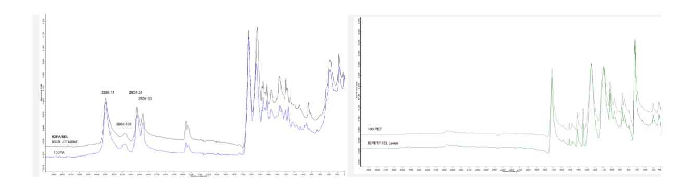

Figure 7 trial on identifying elastane content in textiles with ATR-FTIR spectra

#### **Differential Scanning Calorimetry (DSC)**

Next to the above-described method, textile sample investigations have been conducted by DSC measurements in order to have a second proof of the solvent-based elastane separation process. Figure 8 shows the DSC graph of different samples of the green PET/EL textile. The major peak at around 250°C is attributed to the melting of the PET phase. The curve-step at around 100°C is due to the glass-transition in PET. In Figure 9 is the DSC graph shown from the black PA/EL textile sample by different treatment stages and compared to a pure PA knit. From that curve it was possible to identify that the black PA/EL textile consists of PA66 (hexamethlyenediamine and adipic acid). This is because of the fact, that PA66 has a melting point comparable to PET, in this case the melting peak is at 258,47°C. Otherwise, the pure PA for comparison is identified as PA6 (Caprolactam).

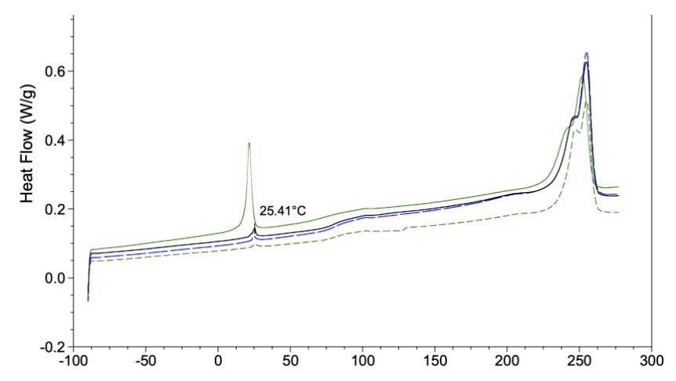

Figure 8 DSC curves of treated and untreated PET/EL textile

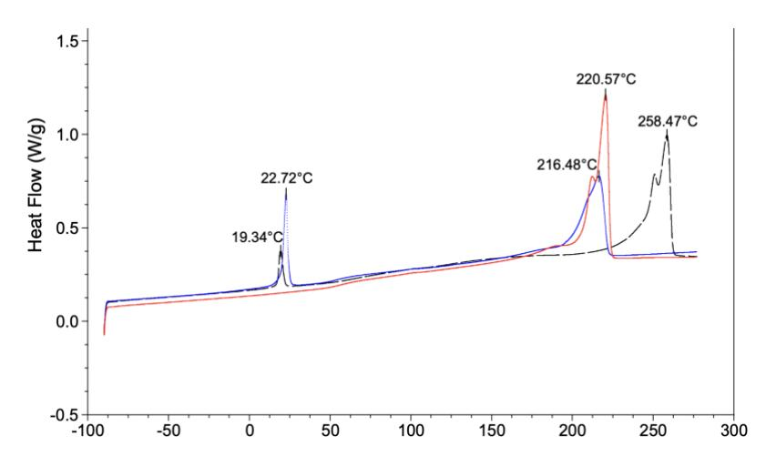

Figure 9 DSC curves of treated and untreated PA/EL textile

It was demonstrated, that a peak resulting from an endothermic process is visible in textiles containing elastane. This peak is therefore an indication for the presence of elastane in a PET/EL or PA/EL textile. Especially in Figure 9 is this circumstance visible. The lowest curve of the three plotted curves represents pure PA knit, the highest curve the black PA/EL textile. At around 20°C, a peak resulting from an endothermic process is visible only derived from the textile blend. DSC measurements of both the PET/EL and PA/EL textile show a strong decline of this peak. This is further proving, that elastane has been removed from the textile.

#### **Thermal Gravimetric Analysis (TGA)**

The third method for proof of solvent-based elastane separation was using TGA. As hypothesised, different degradation behaviour between the materials PET, PA and EL can be obtained. Figure 10 shows the degradation curves (1st derivative of the weight change) of pure EL, pure PA and the black PA/EL textile. Figure 11 shows the degradation curves (1st derivative of the weight change) of pure EL, pure PET and the green PET/EL textile. Pure elastane has a different degradation curve compared to PA and PET. A first degradation peak appears at temperatures between 260°C and 340°C. According to the used literature, this peak is derived from the degradation of the hard segments in the PTUR. As stated out in previous chapters, the hard segments are synthesized from the diisocyanates. This peak is therefore related to the degradation of urethane bonds. The higher the elastane content in textiles, the bigger this peak appears. As assumed, this peak has a strong decline in textiles that have been treated with a solvent. This is a confirmation that elastane has been removed from the textile.

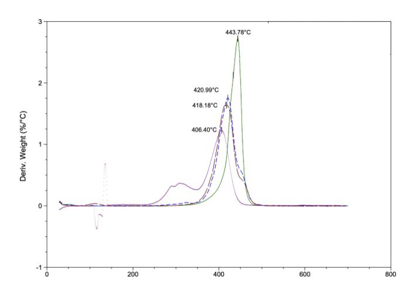

Figure 10 TGA curves of pure EL, pure PA and PA/EL textile

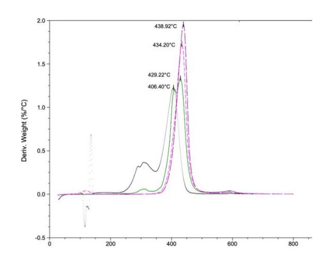

Figure 11 TGA curves of pure EL, pure PET and PET/EL textile

### **4.3.4 Determination of elastane content in textiles**

For further research and development, it is indispensable to develop a method to calculate or quantify elastane content in PET/EL and PA/EL textiles. Based on the outcomes of the previous chapter, ATR-FTIR measurements were not yet possible to use as a quantification method. However, DSC and TGA measurements make it possible to calculate the elastane content. Elastane shows different characteristics under thermal treatment compared to PET and PA, that is visible in a certain process. During the research, we were able to find a first feasible method to quantify elastane in textiles.

#### **Quantification of elastane content** *via* **DSC**

Textiles containing elastane create a unique peak at around room temperature that stands only for elastane. During our research, we were able to perform a magnification of this peak by adapting DSC measurement parameters. The area of this peak is the fundament for a calibration graph, that has been developed. Pure PET, pure PA and pure EL have been used to create mixtures of PET/EL and PA/EL. In this way, we were certain of the exact mass shares. These PET/EL and PA/EL mixtures were put into aluminium pans and placed in the DSC equipment. The area of elastane peaks of each mixture has been calculated by integration and noted. Overall, 48 mixtures of PET/EL and PA/EL have been created and a calibration graph was derived (Figure 12). With this calibration graph and the sufficient accuracy, we are able to calculate the elastane content in every PET/EL and PA/EL textile.

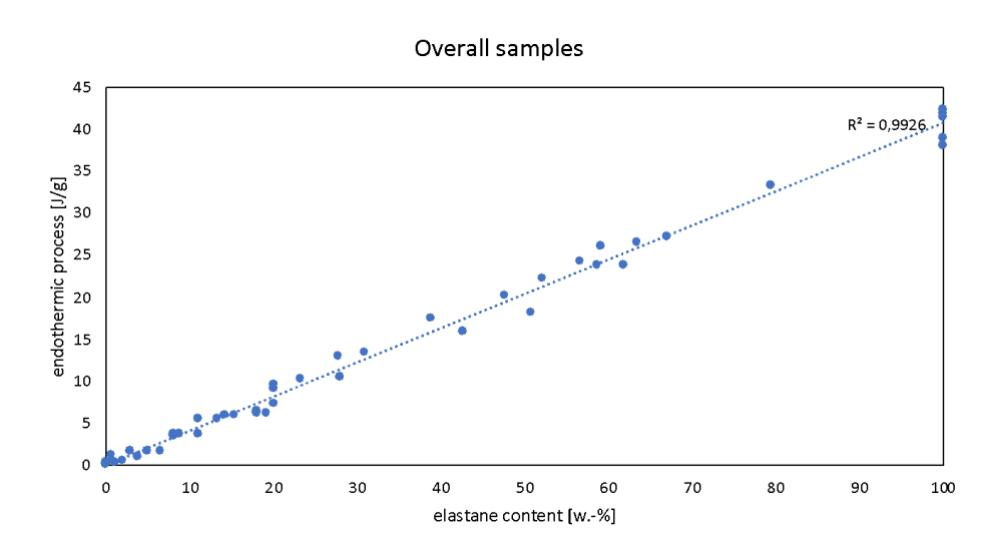

Figure 12 DSC calibration graph

#### **Quantification of elastane content** *via* **TGA**

Elastane-containing fabrics have a different appearance in TGA measurements than pure PA and pure PET fabrics. The degradation of pure PET and pure PA during TGA is singlestep, the degradation of pure elastane is a two-step degradation. During our laboratory work we managed to make use of the different degradation behaviour. Pure PA and pure EL have been used to create mixtures of PA/EL. In this way, we were certain of the exact mass shares. By using the specific weight change of elastane during thermal degradation it is possible to identify the elastane content in textiles of PET/EL and PA/EL. We built a calibration graph for elastane content determination, see Figure 13. With that calibration graph it is possible to identify the elastane content of textiles with the composition of PET/EL and PA/EL.

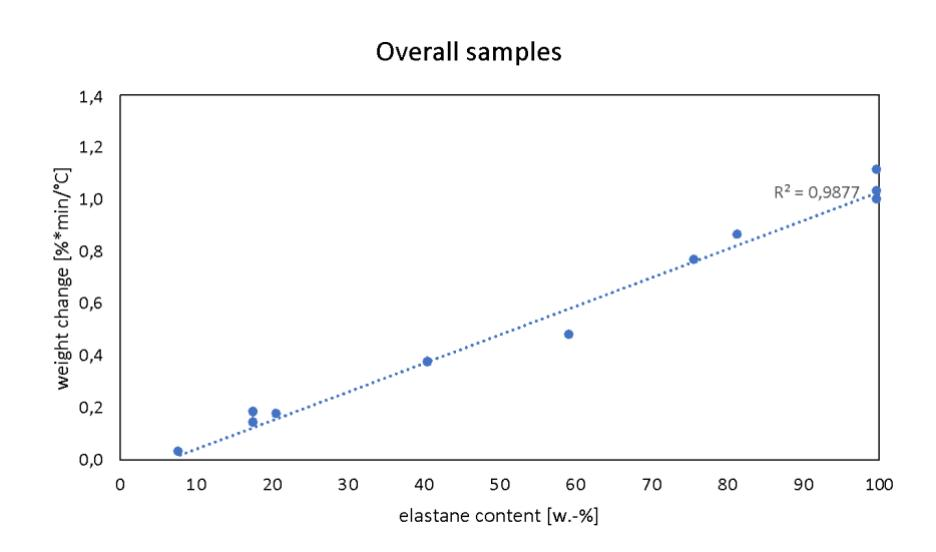

Figure 13 TGA calibration graph

# **5 Wool degradation from blends**

Wool fibres are made out of three different types of spindle-shaped cortical cells surrounded by the cuticle. Approximately 90% of the cortical cells consists of intermediate filaments (Ifs) with molecular weight of 40-65 KDa. The main component are fibrous and low-sulfur α-keratins. The latter protein presents α-helical structure linked via non helical domains. The matrix proteins are divided in: high-sulfur proteins (HSPs)( 11-26 KDa), ultrahigh sulfur proteins (UHSPs) and High glycine-tyrosine protein (HGTPs) (1). The application of enzymes on protein-based materials is process largely used in terms of surface activation, scouring and finishing especially in leather manufacturing, where different lipases are applied (2). On the other hand, proteases have been also applied for improving the shrinking resistance in wool. Proteases are mainly subdivided in exopeptidase and endopeptidases depending the cleaving site on substrate.

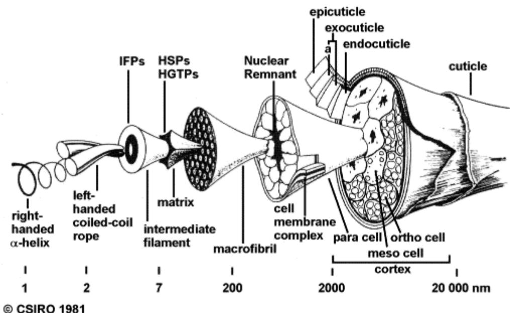

Figure 14 Macro and microstructure of wool (Plowman, 2013)

## **5.1 Material and methods**

Four enzymes for wool degradation were used. One of four is already proven as a goodworking enzyme (Quartinello et al., 2018), the other three are new on the market and kindly provided by Novozymes (Switzerland).

The studies conducted on the hydrolysis of wool can be summarized in four major aims:

- 1. Studies on raw wool using three different experimental setups to consequently determine process variant which suits the enzymatic hydrolysis of wool the best
- 2. Application of the optimal setup to wool/PET fibre blend
- 3. Determination of enzyme(s) with the best performance based on observations in experiments conducted previously
- 4. Additional Parameter Studies for Process Optimization

Due to the chemical structure discussed earlier in this work a pre-treatment was performed making the peptide bonds more accessible to degradation. Therefore, three different setups were chosen for the hydrolysis of the wool fibres. The first and second setup comprise the presence (Setup 2) and absence (Setup 1) of a reducing agent as well as an anionic surfactant. The third setup (Setup 3) includes a pre-washing step at higher temperatures in advance of the actual enzymatic hydrolysis which would otherwise exceed the optimal thermal working range needed for the enzyme. The substrate in setup 3 was washed with the same reducing agent and anionic surfactant as in setup 2 and lastly treated in a solution containing seldom buffer and the protease.

The role of the reducing agent - in this case, sodium bisulfite - is the breakage of the disulfide bridges *via* redox reaction to further enable proteases access to the peptide bonds of keratin (Eslahi, 2013).

The real samples were treated equivalently to prior experiments on the wool samples. Additionally, five samples were taken in defined intervals in order to evaluate the temporal progression of the hydrolysis.

Further, the success of the wool hydrolysis was evaluated applying the following methods:

#### **1. Further (Bio)chemical Investigations:**

- a. Ninhydrin Assay: Determination of the overall Amine Content in the Hydrolysate
- b. Folin-Ciocalteu Assay: Determination of the share of aromatic amino acids (especially Tyrosine)
- c. High-Pressure Liquid Chromatography (HPLC)

#### **2. Morphological Investigations:**

- a. Light Microscopy
- b. Scanning Electron Microscopy (SEM)

#### **3. Thermoanalytical Methods:**

- a. Differential Scanning Analysis (DSC)
- b. Thermogravimetric Analysis (TGA)

### **5.1.1 Sample preparation**

The experiments on pure wool were conducted using stuffing wool (100% virgin wool) from efco creative GmbH. No further sample preparation was necessary.

The textile samples were kindly provided by Xandres®. Additionally, the material composition stated on the label of the provided textile sample is as follows: 53% PET, 44% wool and 3% elastane. The fabric samples were either cut into patches of 6x6 mm or ground into pieces with a fraction size ranging between 0,5 and 4 mm.

# **5.2 Wool hydrolysis from blended textiles**

Savinase 12T® (Novozymes, further referred to as Enzyme **A**) was utilised as a selective peptide bond cleaving enzyme for the reaction on pure wool. Three experimental setups were tested on pure wool, comprising the absence/presence of reducing agents and surfactants (see Table 1).

Table 5 overview of the set ups performed

| Method Name | Reagents                                                     |
|-------------|--------------------------------------------------------------|
| Setup 1     | Buffer + enzyme; 100 g/L wool                                |
| Setup 2     | Buffer + enzyme + 1 g/L SDS; 6 g/L sodium bisulfite; 100 g/L |
| Setup 3     | Pre-Washing Step in SDS and sodium bisulfite @70°C for 1h;   |

The pure wool was treated with 2,5% Savinase 12T® in 100 mL 50mM TRIS-HCl (tris(hydroxymethyl)aminomethane) buffer pH 9 at 50°C for 48 hours at 300 rpm, respectively. Depending on the applied method, 1 g/L of sodium dodecyl sulfate (SDS) and 6 g/L of sodium bisulfite were added. The solid remainders were filtered using filter paper (Grade 388, Sartorius). Lastly, all tests on wool were conducted in triplicates.

As for the fabric samples, experiments were conducted using Setup 2. Accordingly, 30 g/L cut or fractioned textiles were enzymatically treated using 2,5% Protease in 100 mL 50mM TRIS-HCl buffer pH 9 at 50°C for 6-48 hours at 300 rpm. In addition to Savinase 12T®, three different biocatalysts from Novozymes® were used and are further referred to as enzymes B-D. Subsequently, after 48 hours the samples were air-dried and once dry weighed.

For further process optimisation additional tests using different enzyme concentrations (1,5% - 5%) as well as alternations on the used buffer were done. Additionally, several samples were treated post hydrolysis and will be further discussed in the next section.

The share of remaining wool was determined by the total loss of mass by setting the weight of the untreated sample in relation to the treated samples and the total wool content in the fabric of 44% as following:

$$\text{wool recovery (\%)} = \frac{m_2 - m_1}{0,44 * m_2} * 100$$

### **5.2.1Biochemical characterization of the hydrolysate**

#### **5.2.1.1 Quantification of amino acids**

The total content of amino acids released was determined by means of the Ninhydrin Reaction. Ninhydrin specifically binds to primary amino acids, peptide bonds and proteins with free-standing amine groups forming a purple colouring agent which can be detected photometrically. (Böckler, 2002)

In order to determine the total amount of phenol groups in the sample, the Folin-Ciocalteu Assay was conducted and further quantification *via* UV/Vis-Spectrometry. Due to a redox reaction between the phenolic groups and the Folin-Ciocalteu reagent, consisting of wolframatophosphoric acid and molybdatophosphoric acid (Otteneder, 2009), a blue complex is formed. The quantification of the total amount of phenolic group is of interest due to the high content of Tyrosine, an aromatic amino acid, in the matrix surrounding the microfibril (Blainski, 2013).

#### **5.2.1.2 Ninhydrin Assay**

Prior to each analysis, the Ninhydrin colour reagent was freshly prepared by mixing 300 mg hydrindantin, 2g of ninhydrin and 25 mL of 4M sodium acetate buffer pH 5,2. The calibration was done using glycine as standard (0,025-0,2 mol/L using mQ-H2O). Overall, 75µL of ninhydrin reagent were added to 100 µL of sample or standard, vortexed and incubated in an Eppendorf ThermoMixer for 30 minutes at 80°C. After incubation, 100 µL of a stabilising solution consisting of ethanol in water (50% EtOH) were added. The absorbance was measured at 570 nm using an Infinite 200 Pro spectrophotometer (Tecan, Switzerland)

#### **5.2.1.3Folin-Ciocalteu Assay**

The samples were diluted in a ratio of 1:10 and prepared in duplicates. For calibration, a standard series was prepared using a Vanillin Stock with concentrations ranging from 0,05- 1 mg/mL. The Folin-Ciocalteu reagent (FC-reagent) was already prepared.

20 µL of sample or standard and 60 µL of FC-reagent were added to 600 µL of ultrapure water. For the blank, 20µL of ultrapure water was used instead of the sample/standard solution. The mixture was further vortexed and incubated for 5 minutes at 21°C. Subsequently, 200 µL of sodium carbonate (Na2CO3) and 120 µL of ultrapure water were added, which led to a color change from yellow to blue. The analytes were vortexed and shaken for 2 hours in an Eppendorf ThermoMixer at 21°C with 800 rpm. Lastly, absorbance was measured at 760 nm (phenol compounds maximum absorbance) using an Infinite 200 Pro spectrophotometer (Tecan, Switzerland).

### **5.2.2Characterization of the recovered PET fibres**

Subsequent of the hydrolysis of the wool fibres, the PET remainders in the textile blends were morphologically investigated *via* light microscopy (Keyence VHX 6000) scanning electron microscopy (SEM, COXEM EM-30 PLUS). Prior to the optical examination *via* SEM, the textile samples were to be sputter coated using gold. The acceleration voltage was set either at 5-10 kV depending on the material.

### **5.3 Results and discussion**

### **5.3.1 Enzymatic hydrolysis of pure wool**

This section will discuss the yields of the performed pre-studies in detail. The preliminary experiments were necessary to evaluate the role of reducing agents and surfactants as auxiliary agents. The three different environments for the enzymatic hydrolysis of pure wool are summarized in Table 6.

Table 6 Summary of all experimental environments that were applied to pure wool

| Method Name | Comments                                                                |
|-------------|-------------------------------------------------------------------------|
| Setup 1     | Comprises the presence of seldom buffer and enzyme; no reducing         |
| Setup 2     | This setup includes a reducing agent and a surfactant additional to the |

The evaluation of the yield of the reactions was done by performing the Ninhydrin and Folin-Ciocalteu Assay. Furthermore, the results of the biochemical analyses are displayed in Figure 15 for the respective Setups.

The total amount of detectable amine groups in the supernatant equals 11,61±2,07 mmol/100 mL (setup 2). The overall content of phenolic compounds amounts to 3,68±0,44mmol/100 mL (setup 2). The results of the biochemical assays are summarized in addition in Table 3.

Evidentially, Setup 2 comprised the most promising route as it exhibits approximately twice as many amine groups and phenolic compounds. The highest share of amino acids was achieved using sodium bisulfite and SDS (setup 2), as sodium bisulfite breaks down the robust disulfide bridges whilst the surfactant increases the accessibility of the peptide bonds. The first and third methods comprised similar contents of amine groups and phenolic compounds.

Table 7 Summary of the conducted Biochemical Assays

|       |   |            | Total Concentration |
|-------|---|------------|---------------------|
|       |   |            | of Phenolic         |
| Setup | 1 |            |                     |
| (N=3) |   | 5,31±0,06  | 1,26±0,09           |
| Setup | 2 |            |                     |
| (N=3) |   | 11,61±2,07 | 3,68±0,44           |
| Setup | 3 |            |                     |
| (N=2) |   | 5,42±0,85  | 1,56±0,09           |

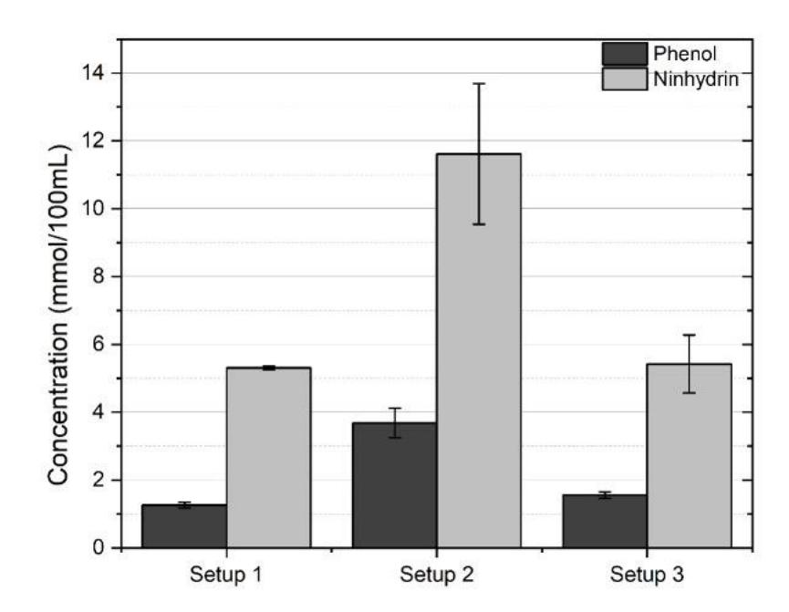

Figure 15 Summary of the overall yields of the hydrolysis of pure wool from Setup 1-3 which were determined using the Ninhydrin (light grey) and Folin- Ciocalteu Assay (dark grey)

Pure wool degradation results from BOKU University were correlated to the results obtained from TU Wien. Specifically, a first preliminary study involved the degradation of 10 g of pure wool in 1 L of buffer. A full degradation of pure wool has been obtained, the left over consists mainly of the lipidic component cuticle of the wool (Figure 15).

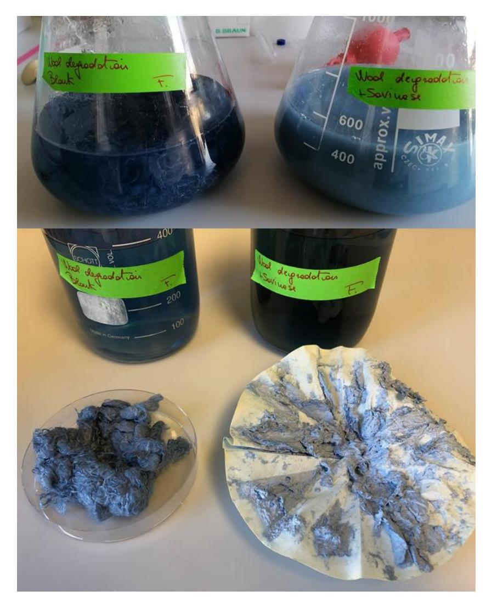

Figure 16 Enzymatic degradation of wool

### **5.3.2 Enzymatic hydrolysis of wool/PET blend**

In a first instance; BOKU and TU, elaborate a set up of experiments where wool/PET/ lycra samples were tested for enzymatic hydrolysis. The enzymes used was Savinase 12T® (at the concentration of 2.5 and 5%) and tested in presence of various buffer. The initial set up was defined as 10gr of blended material in 100 mL of buffer.

As shown in table, the higher yields of hydrolysis was reached when 5% of enzyme and complete buffer was used. Afterwards the reaction set up was improved using 1L of buffer (instead of 100 mL), which further ameliorated the mixing of the reaction and therefore of the degradation (78%).

Table 8 Wool degradation efficiency

|          |    | enzyme concentration | buffer addition | final weight     | final lycra (gr) | wool (gr)   | wool remaining (gr) | yield wool degradation |                      |                 |
|----------|----|----------------------|-----------------|------------------|------------------|-------------|---------------------|------------------------|----------------------|-----------------|
|          |    |                      |                 |                  |                  |             |                     |                        | enzyme concentration | buffer addition |
| Reaction | A  | 1                    | 2.5% enzyme     | only buffer      | 10               | 5.923       | 5.7                 | 4.4                    | 3.823                | 13.114          |
|          |    | 2                    | 5% enzyme       |                  | 10               | 3.952       | 5.7                 | 4.4                    | 3.652                | 17              |
|          | B  | 1                    | 2.5% enzyme     | sodium bisulfite | 10               | 8.69        | 5.7                 | 4.4                    | 2.99                 | 32.045          |
|          |    | 2                    | 5% enzyme       | sodium bisulfite | 10               | 8.88        | 5.7                 | 4.4                    | 3.18                 | 27.727          |
|          | C  | 1                    | 2.5% enzyme     | SDS              | 10               | 8.78        | 5.7                 | 4.4                    | 3.08                 | 30              |
|          |    | 2                    | 5% enzyme       | SDS              | 10               | 8.9         | 5.7                 | 4.4                    | 3.2                  | 27.273          |
|          | D  | 1                    | 2.5% enzyme     | complete         | 10               | 7.695       | 5.7                 | 4.4                    | 1.995                | 54.659          |
|          |    | 2                    | 5% enzyme       | complete         | 10               | 7.313       | 5.7                 | 4.4                    | 1.613                | 63.341          |
|          |    |                      |                 |                  |                  |             |                     |                        |                      |                 |
| Reactor  |    |                      |                 |                  |                  |             |                     |                        |                      |                 |
|          |    |                      |                 |                  |                  |             |                     |                        |                      |                 |
|          |    |                      |                 |                  |                  |             |                     |                        |                      |                 |
| Enzyme   |    | 2.5%                 | buffer addition | initial weight   | wool (gr)        | final lycra | wool remaining (gr) | yield wool degradation |                      |                 |
| V        | 1L |                      | complete        | 10               | 6.668            | 5.7         | 4.4                 | 0.968                  | 78                   |                 |

The second, TU has been tested four different proteases. In Figure 17, the total yields of the hydrolysis of the textile blends with enzymes A-D after 48 hours are displayed. The highest share of recovered wool was achieved using enzyme B (86,1%), followed by enzyme A (81,2%) and enzyme C (68,3%).

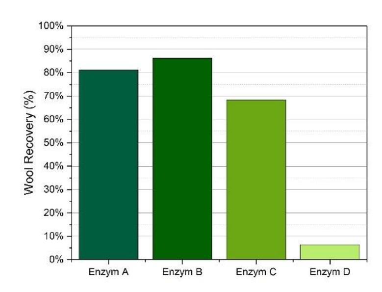

Figure 17 Summary of the overall yields of the hydrolysis of pure wool from Setup 1-3 which were determined using the Ninhydrin (light grey) and Folin- Ciocalteu Assay (dark grey)

Furthermore, additional tests using enzyme D were conducted as the least amount of protein fibre was retrieved in this experimental environment (6,4%). Therefore, the hydrolysis was repeated using a 50 mM TRIS-HCl buffer pH 7 and a 50 mM Sodium Phosphate Buffer pH 7,5 (37°C) instead. The wool recovery was proven to function better in sodium phosphate buffer (12,6%). Moreover, using 50 mM TRIS-HCl buffer pH 7 as a reaction medium didn't improve the overall performance of the protease (see Figure 18). For this reason, further studies implementing enzyme D have been halted.

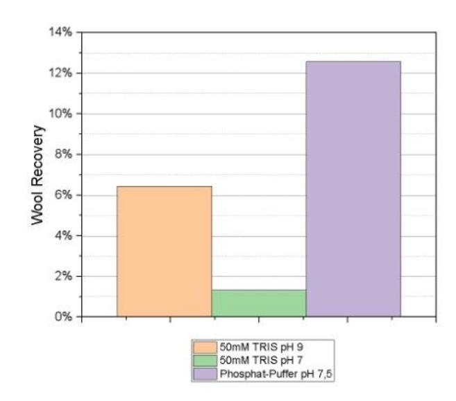

Figure 18 Studies on Enzyme D using different chemical environments

As the morphological investigations showed the presence of damaged fibre residues, a post-treatment after the first hydrolysis was necessary. Therefore, a range of solvents was tested, and the weight difference was determined. The total yield was improved by conducting a second run hydrolysis (see figure 19). The wool recovery has stagnated at around 93% - morphological investigations point out that there is no further wool remaining. In consequence, it was hypothesized that the label composition might differ from the actual share of constituents available in the apparel.

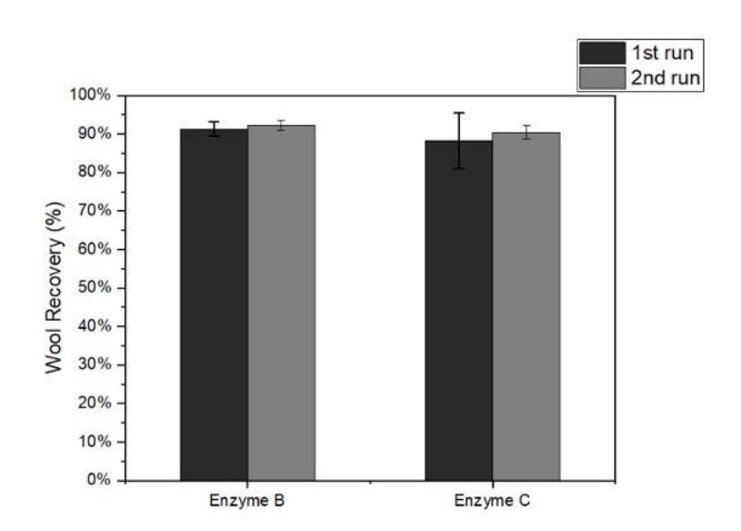

Figure 19 Wool recovery of the treated wool fibres using enzymes B and C and post-treatment methods

#### **5.3.2.1Effect of the Enzyme concentration**

Initially, the enzyme concentration was chosen to amount 2,5 mL per 100 mL. The optimum concentration of the biocatalyst was validated by repeating the hydrolysis by applying Setup 2 (reaction time: 48 hours) and adding 1,5-5 mL of enzyme B. Figure 20 depicts the overall Wool Recovery (%). It is evident that the optimum share of enzyme equals 2,5% with a total wool recovery of 86,1%, and that doubling the amount of protease does not ameliorate the overall performance of the reaction. Lastly, decreasing the enzyme loading led to lower yields (71,7%).

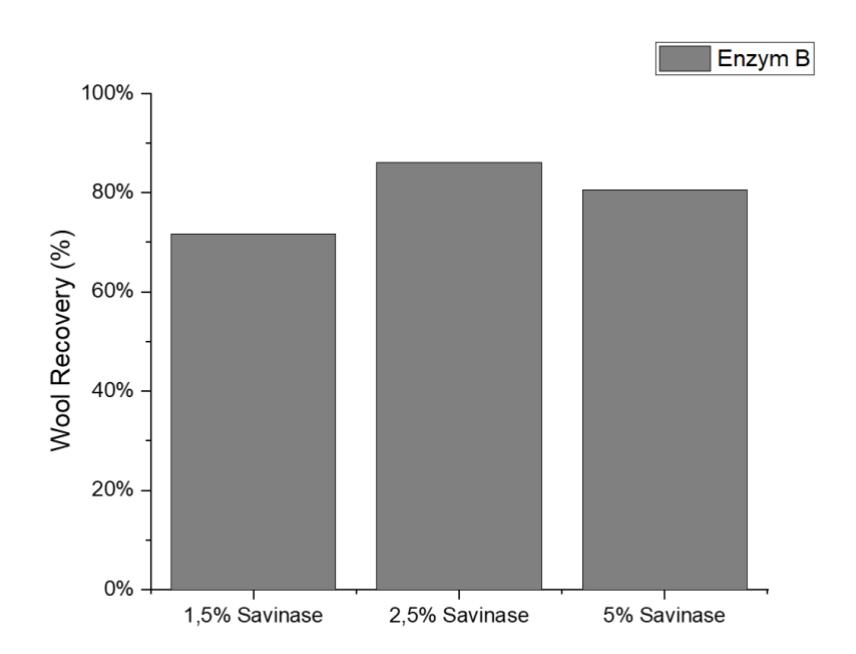

Figure 20 studies on the effect on different enzyme concentrations

### **5.3.3Morphological investigations**

This section will outline the findings of the morphological investigations *via* SEM and reflected light microscopy. In figure 21, SEM images of treated, partially treated and untreated fibre blends can be seen. A distinguishment between wool and PET fibres is possible due to the shed-like structure on the surface of the protein fibre. Moreover, the PET comprises a rather smooth surface structure. The images of the enzymatically treated samples (figures 21b and 21c) show the absence of the wool fibre. Lastly, remaining damaged wool fibres remain visible in the SEM and can be identified through the fibrillation of the fibre.

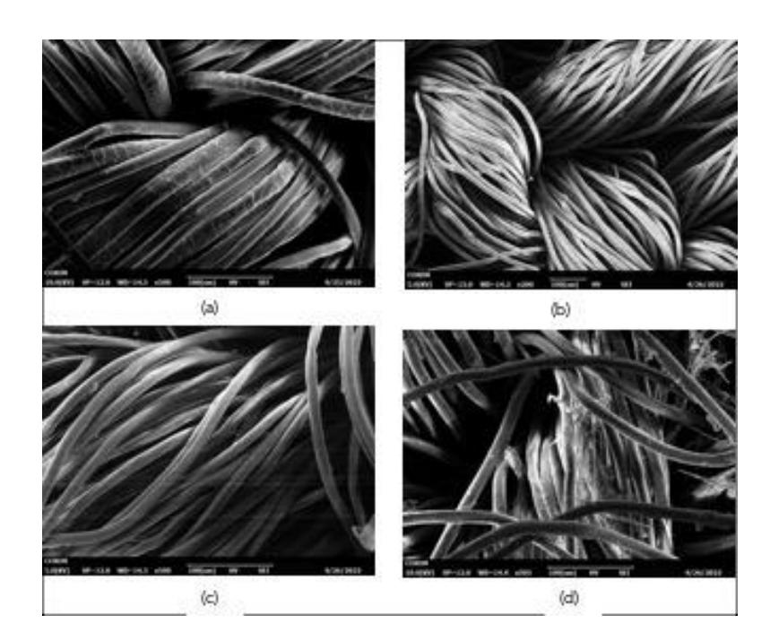

Figure 21 Morphological Studies via SEM of gold coated textile samples: (a) untreated wool/PET blend at 500x, (b & c) fully hydrolysed at 200x and 500x and (d) partially hydrolysed apparel at 500x

### **5.3.4Thermo-analytical methods**

#### **5.3.4.1Differential Scanning Calorimetry (DSC)**

The Differential Scanning Calorimetry comprised a promising and powerful analytical tool for assessing the success of the enzymatic hydrolysis. The analysis *via* DSC is made possible due to the thermal denaturation of the α-keratin (Popescu et al., 2016), which can be identified through a characteristic endothermic peak. In order to qualitatively evaluate the progression of the hydrolysis, the thermal behaviour of several untreated and pure samples has been studied and further been compared with treated samples. Lastly, the characteristic peak temperatures of the untreated samples are listed in Table 4:

Table 9 Overview of the peak temperatures of pure wool and fibre blend samples measured via DSC

| Sample         | Peak Temperatures T [°C] |
|----------------|--------------------------|
| Pure PET fibre | 255,06°C                 |
|                | 247,72°C; 253,88°C       |

The DSC of the samples prior to the hydrolysis as well as the standards are displayed in table figure 22. The first endothermic peak of the apparel and pure wool sample depicts the presence of water. After running a second heating and cooling process, this peak cannot be detected any longer. Further, the characteristic endothermic peaks for wool appear respectively in the range of 230-235°C, followed by a bi-modal endothermic at 247,72°C and 253,88°C for the textile blend as well as the pure PET samples. An exothermic reaction can be witnessed during the cooling process with a peak temperature of around 215°C. This might be the sign of a recrystallisation process taking place. Identically, this exothermic and endothermic effect occurs during the second heating run for PET. Nonetheless, a slight shift to 200°C can be noted while this can be explained through marginal changes in the structure of the PET fibre. Finally, it can be hypothesized that the α-keratin is irreversibly thermally denaturized after the first heating run as no significant changes in the heat flow are observed.

Moreover, the thermal analysis evinces the presence of elastane in the textile sample before and after treatment at 21,20°C. The peak area, as well as the peak temperature, remain relatively constant in all conducted thermal analyses. Thus, it is assumed that the elastane is not attacked throughout the hydrolysis or post-treatment of the textile samples. Based on simultaneous research done in our group, the peak area amounts to 2-3% of elastane content.

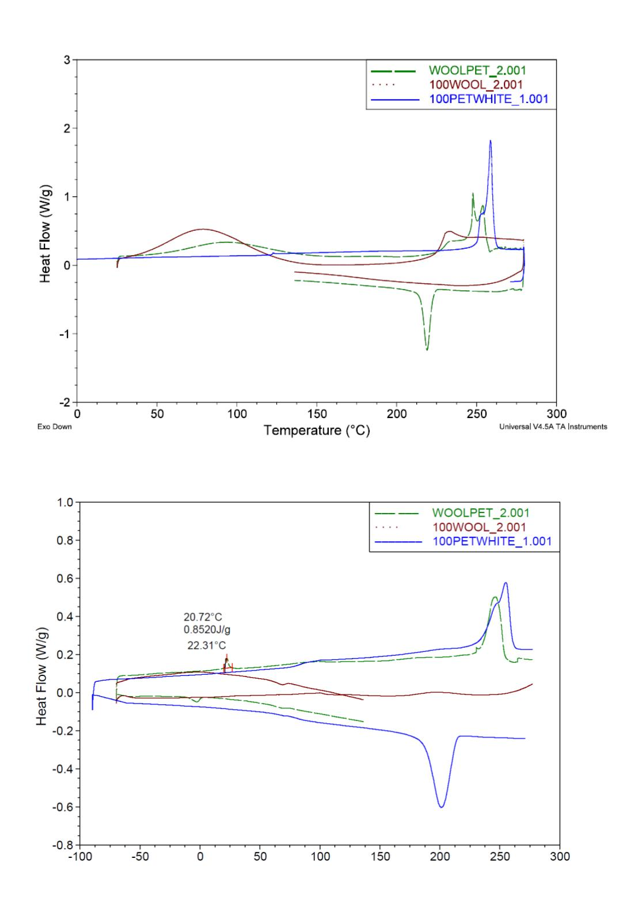

Figure 22 (a) DSC curves of fibre blend (green), pure wool (brown) and pure PET fibre (blue); (b) second run DSC on heating and cooling of samples (colour scheme identical to (a))

# **6 Pure cellulose and Viscose degradation from viscose/polyester textile**

Cellulose, the main component of cotton fibres, consists of β-1,4 glycosically linked β-Dglucopyranose units that, through inter- and intramolecular hydrogen bonds, form highly crystalline microfibrils. In nature, cellulose is degraded by the synergistic action of hydrolases and oxidoreductases: (Plowman, 2013) Exoglucanases or (1→4)-β-d-glucan cellobiohydrolases (CBHs) cleave the disaccharide residue of cellobiose from the nonreducing end of cellulose molecules. Endoglucanases (EGs) or endo-(1 → 4)-β-d-glucan 4-glucanohydrolases cleave the inner amorphous part of the cellulose while (Andlar et al., 2018) β-d-glucosidases or β-d-glucoside glucohydrolases hydrolyse cellobiose, cellotriose, and small oligomers to glucose Lately, some cellulase cocktails are enriched with polysaccharide monooxygenases (PMOs) and cellobiose dehydrogenases (CDHs) that synergistically help to cleave the crystalline part of cellulose matrix (Andlar et al., Dimarogona et al.).

The diagram illustrates the reaction of Cellobiohydrolase (CBH I) and Cellobiohydrolase (CBH II) with ascorbic acid ( $H_2O_2$ ) to yield D-glucose ( $C_6H_5O_2$ ). The reaction is shown as a stack of chemical structures:

- **Cellobiohydrolase (CBH I):** Shown as a blue chemical structure with a blue bond and a red bond at the top left. A blue arrow points to a crystalline region on the left side of the chemical structure.
- **Cellobiohydrolase (CBH II):** Shown as a blue chemical structure with a blue bond and a red bond at the top right. A blue arrow points to a crystalline region on the right side of the chemical structure.
- **Ascorbic acid ( $H_2O_2$ ):** Shown as a blue chemical structure with a blue bond and a red bond at the bottom left. A blue arrow points to a crystalline region on the left side of the chemical structure.
- **D-Glucose ( $C_6H_5O_2$ ):** Shown as a blue chemical structure with a blue bond and a red bond at the top right. A blue arrow points to a crystalline region on the right side of the chemical structure.
- **Cellobiohydrolase (CBH I) (CBH I):** Shown as a blue chemical structure with a blue bond and a red bond at the top left. A blue arrow points to a crystalline region on the left side of the chemical structure.
- **Cellobiohydrolase (CBH II) (CBH II):** Shown as a blue chemical structure with a blue bond and a red bond at the top right. A blue arrow points to a crystalline region on the right side of the chemical structure.
- **Cellobiohydrolase (CBH I) (CBH I) (CBH I):** Shown as a blue chemical structure with a blue bond and a red bond at the top left. A blue arrow points to a crystalline region on the left side of the chemical structure.
- **Cellobiohydrolase (CBH II) (CBH II) (CBH II):** Shown as a blue chemical structure with a blue bond and a red bond at the top right. A blue arrow points to a crystalline region on the right side of the chemical structure.
- **Cellobiohydrolase (CBH I) (CBH I) (CBH I) (CBH I):** Shown as a blue chemical

Figure 23 Simplified scheme of the enzymatic degradation of cellulose operated by cellulase cocktail

In the last decade, the increasing of interest for bio-based economy is driving the attention to the re-utilization of renewable resources for recycling of specific economical valuable compound and the production of bio-based chemicals (e.g. bioethanol) as demonstrated by Vecchiato et al.

### **6.1 Material and Methods**

### **6.1.1Cellulase activity determination**

The total cellulase activity assay was performed as described by Quartinello et al. To quantify the generated reducing sugars, a calibration was performed with d-glucose. Therefore, dglucose standards were prepared in triplicates ranging from 0 mm to 20 mM. 200 µl glucose standard were mixed with 200 µl 1 M NaOH and 200 µL 3,5-dinitrosalicylic acid (DNS) solution and incubated for 5 minutes in a boiling water bath. Standards were diluted with 400 µl ultrapure water and 200 µl of each respective standard were transferred into wells of a 96 well plate. The absorbance at 540 nm was recorded on a Tecan Infinite M200 PRO plate reader.

### **6.1.2 Protein quantification**

Protein concentrations were determined according to Bradford method (Bradford, 1976) using the Bio-Rad "protein assay dye reagent concentrate" (Bio-Rad, Hercules, USA). 200 µL of 5-fold diluted reagent concentrate were added to 10 µL protein dilution in wells of a 96 well plate and incubated for 5 minutes at room temperature and 400 rpm. Afterwards absorption was measured at 595 nm. Dilutions of a 2 mg/mL protein standard by Sigma were used for the calibration.

### **6.1.3 Glucose and Lactic acid quantification via HPLC**

Prior to HPLC analysis, Carrez precipitation of the supernatants obtained from hydrolysis was performed. Therefore, 20 µL of potassium hexacyanoferrate(II) trihydrate solution (106.5 g/L) and 20 µl of zinc sulphate heptahydrate solution (288 g/L) were mixed with 960 µL sample for 5 minutes before centrifuging for 30 min at 17,131 × g, 4 °C (Eppendorf 5427 R centrifuge, with FA-45-48-11 rotor; Eppendorf, Hamburg, Germany). Supernatants were filtered through 0.45 µm polyamide filters into HPLC vials for analysis. For calibration, glucose and lactic acid standards were prepared ranging from 0.01 g/L to 1 g/L. An Agilent 1260 Infinity II system equipped with a Transgenomic ICSep Ion-300 column and a refraction index detector was run with 0.01 M H2SO4 with a flow rate of 0.325 mL/min at 45 °C (Vecchiato et al., 2017).

### **6.1.4 Cellulase recovery**

1 g of cellulose fibres was added to 100 mL of 50 mM citric acid buffer at pH 4.8 containing 1 % v/v of cellulase solution. The hydrolysis was performed for 24 h and different samples were collected after 0, 6 and 24 h and analyzed for protein concentration, enzyme activity and glucose quantification as previously described. Thereafter the hydrolysis solution was centrifuged for 15 minutes at 3700 rpm and 4°C (Eppendorf 5427 R centrifuge, with FA-45- 48-11 rotor; Eppendorf, Hamburg, Germany) to separate the remaining undegraded fibres from the supernatant. Then, the clear solution was filtered through an ultrafiltration membrane with 10 kDa MWCO (VivaSpin 20, Sartorius, Germany) for 25 minutes at 3700 rpm and 4 °C to obtain the glucose solution (permeate) and the enzyme solution (retentate). This step allows the recovery of the enzyme and as well the reduction of potential endproduct inhibition of the enzymes. The enzyme solution was collected, and the membrane was flushed two times with 10 mL hydrolysis buffer, leading to the recovery of enzyme

possibly adsorbed to the membrane. The enzyme solution was finally diluted to 100 mL with hydrolysis buffer as a starting point for the next cycle of degradation of 1 g of fibres. The dilution through sampling was considered in the calculation of protein concentration and volumetric enzyme activity. Samples were taken from the permeate and final 100 ml retentate and analyzed for protein concentration, enzyme activity and glucose concentration. The membranes themselves were cleaned and reused three times by first flushing with 5 ml 100 % ethanol, then centrifuging for 3 minutes at 3700 rpm with 10 mL 70 % ethanol and afterwards flushing two times with ultrapure water. Finally, the membranes were centrifuged for 3 minutes at 3700 rpm with 10 ml purified water and stored at 4 °C until further use.

### **6.1.5 PET characterization**

The spectrum of cotton shows two very distinct peaks, a broad peak between 3600 cm-1 and 3000 cm-1 , associated to stretches from hydroxyl groups (ν(O-H)), and a tall peak at 1020 cm-1 derived from C-O stretches (ν(C-O)). The reduction of these peaks allows an evaluation of the enzymatic degradation of cellulose and depict the purity of recovered PET fibres. Spectra were normalized at the wavelength of 1500 cm 1 , which corresponded to peak related to PET, therefore unaltered by the process.

### **6.2 Results**

### **6.2.1 Pure cellulosic material degradation**

The samples involved in this process were reduced to 2 cm length fibre, in order to increase the available surface for the enzymatic treatment. Samples were washed with ultrapure water and then dried. Prior to the enzymatic hydrolysis step, samples were exposed under UV light for 1 hour to reduce the possible microbial contamination. Afterwards, 1 gram of materials, specifically rayon and pure viscose, were incubated at 50°C and 150 rpm with 100 mL of 50 mM Citric buffer pH 4.8 containing 2 % of cellulase cocktail as described by Quartinello et al.

Both cellulosic materials were fully degraded within 24 h from the incubation. The amount of glucose released from viscose is higher, since rayon contains circa 20% of flame retardant component (Quartinello et al.).

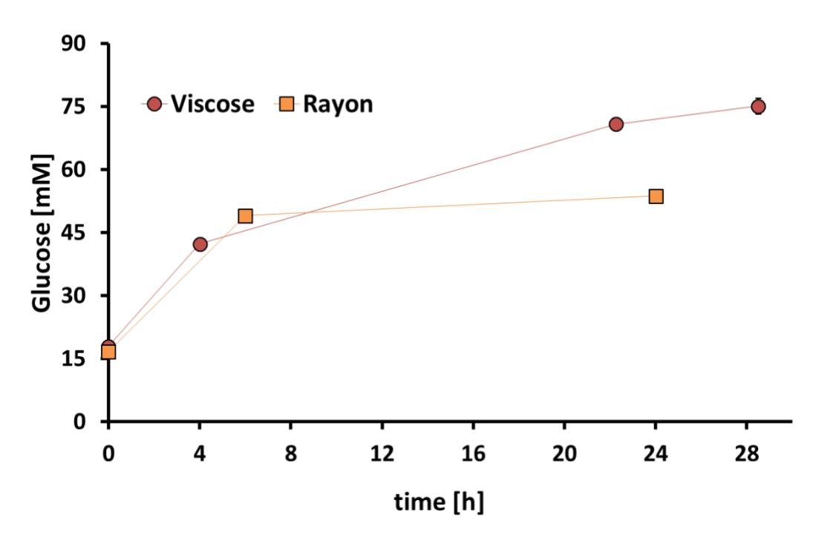

Figure 24 HPLC analysis of glucose released from Viscose and rayon

### **6.2.2 Cellulose removal from blended textiles**

In this step, the sample processed was 50% viscose/PET. The sample was treated as previously described for the pure cellulose fibres. Since the degradation of pure cellulose fabric was demonstrated, in this case 16 gram of materials were used. As expected, the amount of released glucose is strictly dependent from the initial amount of cellulose involved.

### **6.2.3 Simultaneous Saccharification and Fermentation (SSF) process**

Product inhibition of enzymes has long been recognized as significant challenge for any enzymatic approaches. Specifically, cellulases are inhibited by the amount of cellobiose and glucose, which leads a reduction the yield of conversion of cellulose biomass. On the other hand, the amount of end-products glucose is key prerequisite for cost-efficient conversion of cellulosic biomass into new compounds. In this sense, various studies are focusing on finding new enzymes, like β-glucosidase, with higher glucose tolerance (3,4) or as well creating more active/stable and/or engineered enzymes (Shah et al., 2008) Other investigations involve continuous or semi-continuous product removal(Martin et al., 2010).In this scenario, Simultaneous saccharification and fermentation (SSF) can be considered an optimal process to convert directly biomass into other chemical compounds, avoiding different operation steps (e.g purification of glucose). Moreover, SSF could overcome to reduce the enzyme loading and therefore the production costs (7).

BOKU partner project performed an SSF where 50% viscose/PET material were incubated in the same conditions as described before. In this process, cellulase were incubated together with *Weizmannia coagulans* (also known as Bacillus coagulans), which was provided from DSMZ (Germany). Briefly, *W.coagulans* is a rod-shaped facultatively Grampositive bacteria , which has optimal growth at 50°C and pH 5 (same operative conditions of cellulases). It uses glucose and small oligosaccharides as carbon source and able to produce lactic acid. As described in figure 25, BOKU partner perform the hydrolysis of viscose, with parallel separation of PET and production of lactic acid.

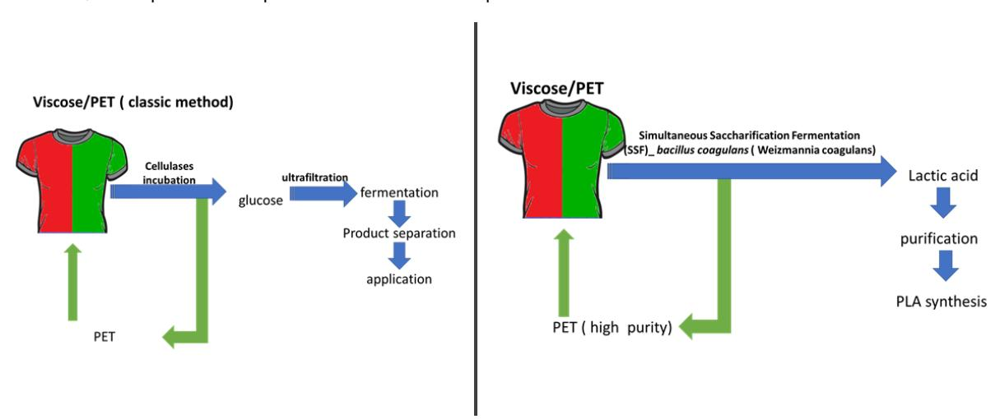

In the performed experiments, 16 gr of 50% viscose/PET was incubated with cellulases (same conditions as before) and after 24 h, *W. coagulans* was added (initial OD600 0.25). The conversion of glucose into lactic acid has been determined via HPLC measurements. The released glucose increases by time due to the continuous hydrolysis of viscose. In presence of the bacteria, this compound is then fully converted into lactic acid, which was not present at the initial stage of the reaction (Figure 26)

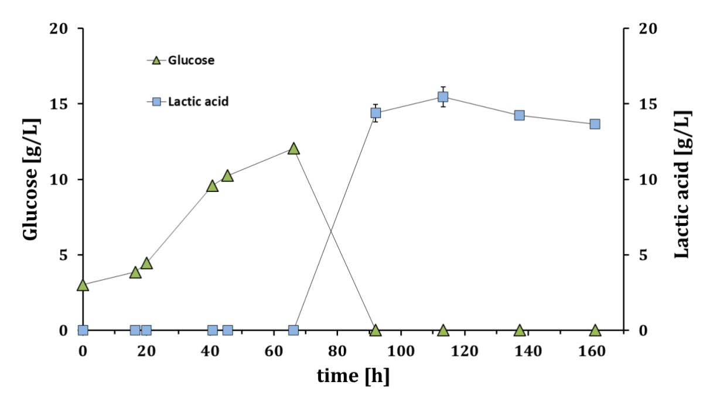

Figure 26 HPLC measurements of glucose and lactic acid in the Simultaneous Saccharification and Fermentation

### **6.2.4PET purity characterization**

Moreover, 8 gr of PET were recovered which corresponds to the full hydrolysis of viscose and recovery of high pure synthetic polyester. This result was further confirmed by ATR-FTIR, where the typical peaks of cellulosic material were not detected, while the ester bonds peaks were increasing (figure 27).

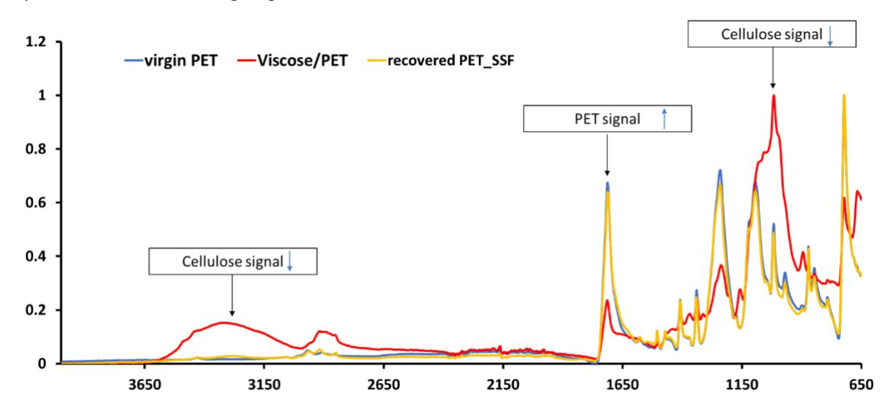

Figure 27 FT-IR analysis of virgin PET (blue line), Viscose/PET before enzymatic degradation of viscose (red line) and recovered PET from SSF process (yellow line)

Clear differences are visible of the blended material before and after the enzymatic degradation of cellulose. The initial blended material shows two distinguished type of fibres: a rough and with irregular surface, which is viscose and PET, which has homogenous and smooth structure. After the enzymatic process only PET fibres are visible (Figure 27)

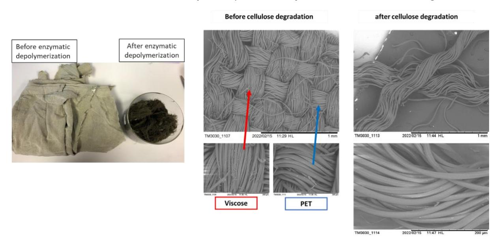

Figure 28 SEM analysis of viscose/PET and recovered PET fibres after the cellulose removal

#### **6.2.5 Cellulases recovery**

By recovery of the cellulase solution through an ultrafiltration membrane (10 kDa cut off) the reuse of the enzymes for five cycles of cellulosic fibre decomposition was enabled. The first hydrolysis cycle was performed with the cellulase stock solution and is termed 'cycle 0'. The following cycles applying the recovered enzyme solution are termed 'cycle 1 – 5'.

The glucose concentration at time 0 of each degradation cycle was considered as the blank for the upcoming reaction and was therefore subtracted from all following glucose concentration values. Equally, the enzyme activity did not significantly decrease during hydrolysis experiments with the recovered cellulase solution. The measured activity in the experimental setup was around 17.8 ± 1.6 FPU/mL for each cycle and timepoint. As visible from figure 28, there is no significant decrease of activity present over the course of cycles 1- 5 in comparison to cycle 0.

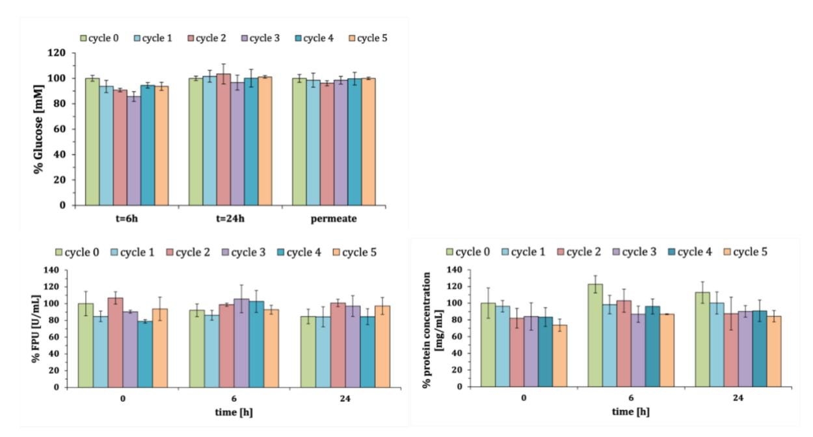

Figure 29 Glucose release, activity assay and protein quantification analysis of recycled cellulases.

# **7 Conclusions**

In conclusion, from the lab-scale trials of (bio)chemical separation of blended textile it was demonstrated:

- Elastane removal from black PA/EL and PET/EL was processed by selection of five different solvents. Two solvents demonstrated to be able to remove 100% of the elastane as calculated from the weight loss. For the sake of accurate validation of total removal, a quantification tool is in development. With this tool, the risk of the supply of unfinished material is lowered. Definitely is the use of a solvent not listed under REACH favoured. Lab tests revealed that solvents with low toxicity to the environment and to animals as well humans seemed to be feasible to solute elastane. With that, an elastane separation process can be developed that creates no hazardous environment to the facility. A necessary upscale to higher material input is planned with such a process.
- Biochemical approaches have been used in these studies to selectively degrade natural fibres and release the pure synthetic ones. Briefly, different proteases were tested towards wool degradation from wool/polyester /elastane blended fabrics. Among them the protease B (2.5% v/v) from Novozymes shown higher percentage of weight loss (approximately of 86%) within one incubation cycle. This value increased performing a second enzymatic degradation reaction reaching 93% of wool degraded from the tested blend. In a similar path, the cellulose degradation from viscose/PET blend (50-50) was performed by application of cellulases (2% v/v). From this experimental set-up was succeeded the full degradation of cellulose into glucose
- A full degradation of cellulosic material from viscose/polyester blended textile, leading a full recovery of highly pure PET, as tested by FT-IR and SEM analysis. The recovered polymer potentially can be used for re-spinning trials. As recently published in a collaboration publication between BOKU and TU-Wien, recycled PET (obtained from cellulosic degradation of blend) was successfully introduced in a spinning-line yarn (comprising 50% of rPET). This material was then twisted and a weft yarn giving the desired fibre specification (Gritsch et al)
- The glucose obtained is well known and exploited platform for production of valuable chemicals. In most of the fermentation processes, the purification of glucose is required: therefore, in this deliverable, it was demonstrated the feasibility (in lab-scale) of the application of Simultaneous Saccharification and Fermentation approach, where the glucose is directly converted into lactic acid in a "one-pot system", avoiding different intermediate purification and sterilization steps. In this work, it was tested 50% viscose/PET blend, further studies will involve different blends ratio to determine to which maximum extent this process can be feasible.
- Referring to the critical risks identified by the project (WP2: (bio)chemical recycling (blended material recycling) fails to produce a sufficient quantity of raw material for use in demos ) the biochemical recycling approaches of man-made polymers could be limited and/or affected by the relevant impact of the enzyme's costs. In addition to the mitigation measures suggested in the risk table (adapt starting materials), the reuse of the enzymes could substantially reduce costs. In this deliverable, it was proved that enzymes can be recycled by ultrafiltration methodology. Specifically, as tested for cellulases, this class of enzymes can be re-used for five cycles without

reduction of degradation activity. For the case of elastane removal, a risk in the process is a non-possibility of solvent recovery next to the usage of solvents listed under REACH. In order to have an uptake to larger scales and a realizable future industrial use, the solvent recovery is essential and the focus lies on no-hazardous solvents. Within the next delivery, these topics will be targeted. The challenge of a non-detectable elastane contents in textiles is covered by the development of an elastane quantification tool. Such a tool lowers the risk of supplying contaminated raw material to the project partner is lowered or even the best – non-existent. Alongside the development of a feasible process, such a tool is from high importance because it is not yet developed.

# **8 Acknowledgement**

Thank you to the contributing colleagues at TU Wien:

Dr. Andreas Schwaighofer (Research Group Process Analytics), Dr. Vasiliki-Maria Archodoulaki (Research Group for Structural Polymers), Stefan Zellhofer (Research Group for Structural Polymers)

# **7 References**

BISFA. (2017). *Terminology of Man-Made Fibres* (p. 117). BISFA. https://bisfa.org/wpcontent/uploads/2021/08/2017-BISFA-Terminology-final-update.pdf Christenson, E. M., Dadsetan, M., Wiggins, M., Anderson, J. M., & Hiltner, A. (2004). Poly(carbonate urethane) and poly(ether urethane) biodegradation:In vivo studies. *Journal of Biomedical Materials Research*, *69A*(3), 407–416. https://doi.org/10.1002/jbm.a.30002 Delebecq, E., Pascault, J.-P., Boutevin, B., & Ganachaud, F. (2013). On the Versatility of Urethane/Urea Bonds: Reversibility, Blocked Isocyanate, and Non-isocyanate Polyurethane. *Chemical Reviews*, *113*(1), 80–118. https://doi.org/10.1021/cr300195n Fuensanta, M., & Martín-Martínez, J. M. (2020). Viscoelastic and Adhesion Properties of New Poly(Ether-Urethane) Pressure-Sensitive Adhesives. *Frontiers in Mechanical Engineering*, *6*, 34. https://doi.org/10.3389/fmech.2020.00034 Fuensanta, M., & Martín-Martínez, J. M. (2021). Structural and Viscoelastic Properties of Thermoplastic Polyurethanes Containing Mixed Soft Segments with Potential Application as Pressure Sensitive Adhesives. *Polymers*, *13*(18), 3097. https://doi.org/10.3390/polym13183097 Głowińska, E., Datta, J., Rodríguez Romero, J. F., Simón Herrero, D., & Carmona, M. (2018). Novel cast polyetherurethanes based on dispersed polymeric polyols. *Polymer Testing*, *68*, 340–349. https://doi.org/10.1016/j.polymertesting.2018.04.034 Gritsch, Sebastian M., et al. "Closing the Cycle: Enzymatic Recovery of High Purity Glucose and Polyester from Textile Blends." Resources, Conservation and Recycling, vol. 188, no. July 2022, 2023, p. 106701, https://doi.org/10.1016/j.resconrec.2022.106701. He, Y., Xie, D., & Zhang, X. (2014). The structure, microphase-separated morphology, and property of polyurethanes and polyureas. *Journal of Materials Science*, *49*(21), 7339–7352. https://doi.org/10.1007/s10853-014-8458-y Kasprzyk, P., Głowińska, E., Parcheta-Szwindowska, P., Rohde, K., & Datta, J. (2021). Green TPUs from Prepolymer Mixtures Designed by Controlling the Chemical Structure of Flexible Segments. *International Journal of Molecular Sciences*, *22*(14), 7438. https://doi.org/10.3390/ijms22147438 Krol, P. (2007). Synthesis methods, chemical structures and phase structures of linear polyurethanes. Properties and applications of linear polyurethanes in polyurethane elastomers, copolymers and ionomers. *Progress in Materials Science*, *52*(6), 915–1015. https://doi.org/10.1016/j.pmatsci.2006.11.001 Shen, Z., Zheng, L., Li, C., Liu, G., Xiao, Y., Wu, S., Liu, J., & Zhang, B. (2019). A comparison of non-isocyanate and HDI-based poly(ether urethane): Structure and properties. *Polymer*, *175*, 186–194. https://doi.org/10.1016/j.polymer.2019.05.010 Szycher, M. (2013). *Szycher's Handbook of Polyurethanes—Second Edition*. Taylor & Francis Group, LLC. Xie, F., Zhang, T., Bryant, P., Kurusingal, V., Colwell, J. M., & Laycock, B. (2019). Degradation and stabilization of polyurethane elastomers. *Progress in Polymer Science*,

#### *90*, 211–268. https://doi.org/10.1016/j.progpolymsci.2018.12.003

Plowman JE. Proteomic database of wool components. J Chromatogr B Anal Technol Biomed Life Sci. 2003;787(1):63–76.

Quartinello F, Vecchiato S, Weinberger S, Kremenser K, Skopek L, Pellis A, et al. Highly Selective Enzymatic Recovery of Building Blocks from Wool-Cotton-Polyester Textile Waste Blends. 2018;(3).

Andlar M, Rezić T, Marđetko N, Kracher D, Ludwig R, Šantek B. Lignocellulose degradation: An overview of fungi and fungal enzymes involved in lignocellulose degradation. Eng Life Sci. 2018;18(11):768–78.

Dimarogona M, Topakas E, Christakopoulos P. Cellulose Degradation By Oxidative Enzymes. Comput Struct Biotechnol J [Internet]. 2012;2(3):e201209015. Available from: http://linkinghub.elsevier.com/retrieve/pii/S2001037014600933

Vecchiato S, Skopek L, Jankova S, Pellis A, Ipsmiller W, Aldrian A, et al. Enzymatic Recycling of High-Value Phosphor Flame-Retardant Pigment and Glucose from Rayon Fibres. ACS Sustain Chem Eng. 2017;acssuschemeng.7b03840.

Quartinello F, Tallian C, Auer J, Schön H, Vielnascher R, Weinberger S, et al. Smart textiles in wound care: Functionalization of cotton/PET blends with antimicrobial nanocapsules. J Mater Chem B. 2019;7(42).

Decker CH, Visser J, Schreier P. β-Glucosidase multiplicity from Aspergillus tubingensis CBS 643.92: Purification and characterization of four β-glucosidases and their differentiation with respect to substrate specificity, glucose inhibition and acid tolerance. Appl Microbiol Biotechnol. 2001;55(2):157–63.

Sonia KG, Chadha BS, Badhan AK, Saini HS, Bhat MK. Identification of glucose tolerant acid active β-glucosidases from thermophilic and thermotolerant fungi. World J Microbiol Biotechnol. 2008;24(5):599–604.

Shah AA, Hasan F, Hameed A, Ahmed S. Biological degradation of plastics: A comprehensive review. Biotechnol Adv. 2008;26(3):246–65.

Martín MA, Siles JA, Chica AF, Martín A. Biomethanization of orange peel waste. Bioresour Technol. 2010;101(23):8993–9.

Kádár Z, Szengyel Z, Réczey K. Simultaneous saccharification and fermentation (SSF) of industrial wastes for the production of ethanol. Ind Crops Prod. 2004;20(1):103–10.

Blainski, A., Lopes, G. C., & de Mello, J. C. (2013). Application and analysis of the folin ciocalteu method for the determination of the total phenolic content from Limonium brasiliense L. Molecules (Basel, Switzerland), 18(6), 6852–6865.

Eslahi, N., Dadashian, F., & Nejad, N. H. (2013). An investigation on keratin extraction from wool and feather waste by enzymatic hydrolysis. Preparative biochemistry & biotechnology, 43(7), 624–648.

Otteneder, O. (2009). Folin-Ciocalteu-Test. RÖMPP [Online]. Abgerufen im Mai 2022, von https://roempp.thieme.de/lexicon/RD-12-01138

Popescu, C., & Gummer, C. (2016). DSC of human hair: a tool for claim support or incorrect data analysis?. International journal of cosmetic science, 38(5), 433–439.

Böckler, F. (2002). Ninhydrin-reaktion. RÖMPP [Online]. Abgerufen im Mai 2022, von https://roempp.thieme.de/lexicon/RD-14-01238