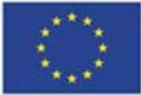

Horizon 2020  
Programme

**SCIRT**

*Innovation Action (IA)*

This project has received funding from the European Union's Horizon 2020 research and innovation programme under grant agreement No 101003906

Start date : 2021-06-01 Duration : 36 Months  
<https://scirt-h2020.eu/>

**SCIRT.**

---

**Report on alternative primary materials**

---

Authors : Mr. Simon FREMEAUX (CETI), Javier Vera Sorroche (CETI)

Project officer:

| Document title      | Report on alternative primary materials         |
|---------------------|-------------------------------------------------|
| Author(s)           | Mr. Simon FREMEAUX, Javier Vera Sorroche (CETI) |
| Number of pages     | 0                                               |
| Document type       | Deliverable                                     |
| Work Package        | WP02                                            |
| Document number     | D2.3                                            |
| Issued by           | CETI                                            |
| Date of completion  | 2022-11-04 10:43:12                             |
| Dissemination level | Public                                          |

### Summary

Even if the objective of the project to develop yarn made from more than 50% of post-consumer recycled fibres is achieved, the remaining percentage needs to be complemented with new, primary fibres. The choice of these primary fibres is crucial as it will not just have an impact on the properties of the yarn, but also on the sustainability performance / impact of the yarn. Also, the final composition of the yarn should fit within a circular design strategy, meaning the fibre blend must not hamper future high-value recycling. The objective of this task is to explore possible alternatives for commonly used primary materials, with a focus on local production (EU based), circularity (compatible with the recycled fibre), low impact (environmental performance) and availability and possibilities to scale (economic potential). Growing cotton, currently accounting for about 40% of the world?s textile production, remains one of the most polluting natural fibres in the world as it covers about 2,4% of the world?s cultivated areas, but uses up to 11% of all pesticides. In 2016, 64% of the world?s cotton was genetically modified. In this task, EU-grown alternatives for cotton will be studied and assessed (economical and environmental), where the most promising fibres will be used to make yarn. Elastane is the generic term used to describe branded textiles such as lycra or spandex. It?s primary attribute is elasticity, e.g. stretch in jeans, shirts or dresses, but it is also used as one of the main components for sportswear. This report will list the potential alternatives to Elastane (preferably bio-based) polymers. The use of such polymer contributes to develop closed-loop recyclable products through extrusion recycling.

### Approval

| Date                | By                         |
|---------------------|----------------------------|
| 2022-11-04 15:33:44 | Mrs. Isabelle CORNU (CETI) |
| 2022-11-07 06:18:49 | Mrs. Evelien DILS (VITO)   |

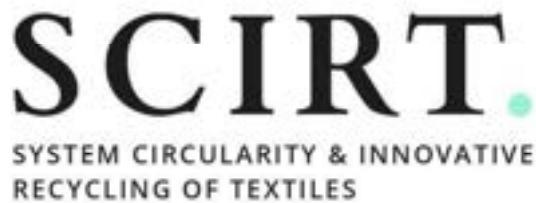

Innovation Action

H2020-SC5-2020-2

## **Alternative for cotton report**

### **Deliverable D2.3: Report on alternative primary materials**

Version N°3

**Authors:**

Simon Fremeaux (CETI)

## Disclaimer

The content of this report reflects only the author's view. The European Commission is not responsible for any use that may be made of the information it contains.

## Document information

| <b>Grant Agreement</b>         | n°101003906                                                       |
|--------------------------------|-------------------------------------------------------------------|
| <b>Project Title</b>           | System Circularity & Innovative Recycling of Textiles             |
| <b>Project Acronym</b>         | SCIRT                                                             |
| <b>Project Coordinator</b>     | Evelien Dils, VITO                                                |
| <b>Project Duration</b>        | 1 st June 2021 – 31 st May 2024 (36 months) |
| <b>Related Work Package</b>    | WP2 Towards a fibre-to-fibre system: design & testing             |
| <b>Related Task(s)</b>         | T2.3 Primary materials                                            |
| <b>Lead Organisation</b>       | CETI                                                              |
| <b>Contributing Partner(s)</b> | VITO                                                              |
| <b>Due Date</b>                | September 30, 2022                                                |
| <b>Submission Date</b>         |                                                                   |
| <b>Dissemination level</b>     |                                                                   |

## History

| Date       | Version | Submitted by | Reviewed by | Comments           |
|------------|---------|--------------|-------------|--------------------|
| 25/08/2022 | 1       | CETI         | CETI / VITO | Lack of data       |
| 27/09/2022 | 2       | CETI         | CETI / VITO | Text modifications |
| 31/10/2022 | 3       | CETI         | CETI / VITO | Final version      |
|            |         |              |             |                    |

# Table of contents

Summary ..... 7

1 Context ..... 8

- 1.1 Cotton – the original natural fibre for textile ..... 8
- 1.2 Worldwide production of cotton ..... 9
- 1.3 Cotton price ..... 9
- 1.4 Environmental effects of cotton growth ..... 10
- 1.5 Life Cycle Assessment ..... 12
- 1.6 Alternative fibres ..... 13

2 Main cellulosic fibres as cotton alternative ..... 15

- 2.1 Organic cotton ..... 15
  - 2.1.1 Origins ..... 15
  - 2.1.2 Worldwide production ..... 16
  - 2.1.3 Organic Cotton price ..... 17
  - 2.1.4 Life Cycle Assessment ..... 18
- 2.2 Flax or Linen ..... 19
  - 2.1.1 Origins ..... 19
  - 2.1.2 Worldwide production ..... 20
  - 2.1.3 Flax fibre price ..... 20
  - 2.1.4 Life cycle Assessment ..... 21

2.3 Hemp ..... 22
 

- 2.1.5 Origins ..... 22
- 2.1.6 Worldwide production ..... 24
- 2.1.7 Hemp fibre price ..... 24
- 2.1.8 Hemp Life Cycle Assessment ..... 24

- 2.4 Viscose / Rayon ..... 25
  - 2.1.1 Origins ..... 25
  - 2.1.2 Worldwide production ..... 26
  - 2.1.3 Staple fibre price ..... 26
  - 2.1.4 Life cycle assessment ..... 27
- 2.5 Lyocell / TENCEL® ..... 29
  - 2.1.1 Origins ..... 29
  - 2.1.2 Worldwide production ..... 30
  - 2.1.3 Lyocell cost ..... 30
  - 2.1.4 Life Cycle Assessment ..... 30
- 2.6 Modal ..... 31
  - 2.1.1 Origins ..... 31

- 2.1.2 Worldwide production..... 32
- 2.1.3 Modal fibre price ..... 32
- 2.1.4 Life Cycle Assessment..... 32
- 3 Other possible cellulosic fibres ..... 33
  - 3.1 Jute ..... 33
  - 3.2 Coir fibre ..... 34
  - 3.3 Manila fibre ..... 34
  - 3.4 Kapok..... 35
  - 3.5 Ramie..... 35
- Conclusion..... 37
- Bibliography..... 38

## List of figures

- Figure 1: Cotton seeds..... 8
- Figure 2: Cotton price evolution, in US dollars per pound..... 9
- Figure 3: main environmental issues of conventional cotton ..... 10
- Figure 4: Water needs of several natural resources ..... 11
- Figure 5: Overview of organic cotton production (Organic Cotton Market Report)..... 16
- Figure 6: Organic cotton production - Trend (Organic Cotton Market Report) ..... 17
- Figure 7: Flax flower..... 19
- Figure 8: Hemp plant..... 22
- Figure 9: Diagram of the staple fibre price evolution(45) ..... 27

## List of tables

Table 1: Cumulative energy demand for the production of 1 kg of fibres (cultivation) and 1 kg of textile (yarn)..... 12

Table 2: Main impact categories for traditional production of 1000 kg of cotton, jute and kenaf fibres ..... 12

Table 3: Cultivation comparison between organic and standard cotton ..... 15

Table 4: Comparison of the cotton trade ..... 16

Table 5: Comparison of the organic and conventional cotton ..... 16

Table 6: Producers repartition of organic cotton ..... 17

Table 7: LCA of organic cotton ..... 18

Table 8: Main comparisons between linen and cotton ..... 19

Table 9: Mechanical properties of flax ..... 20

Table 10: Main producers of flax and their capacity ..... 20

Table 11: Flax LCA..... 21

Table 12: Worlwide hemp producers list..... 24

Table 13: Hemp LCA summarize ..... 24

Table 14: Worldwide viscose production distribution ..... 26

Table 15: Water footprint criteria of Viscose..... 28

Table 16: Footprint criteria of Viscose in different parts of the world ..... 29

Table 17: Footprint criteria of Lyocell..... 31

Table 18: Comparison of cellulosic fibre with Modal ..... 31

Table 19: Modal LCA ..... 33

## Summary

Even if the objective of the project to develop yarn made from more than 50% of post-consumer recycled fibres is achieved, the remaining percentage needs to be complemented with new, primary fibres. The choice of these primary fibres is crucial as it will not just have an impact on the properties of the yarn, but also on the sustainability performance / impact of the yarn. Also, the final composition of the yarn should fit within a circular design strategy, meaning the fibre blend must not hamper future high-value recycling. The objective of this task is to explore possible alternatives for commonly used primary materials, with a focus on local production (EU based), circularity (compatible with the recycled fibre), low impact (environmental performance) and availability and possibilities to scale (economic potential). Growing cotton, currently accounting for about 40% of the world's textile production, remains one of the most polluting natural fibres in the world as it covers about 2,4% of the world's cultivated areas, but uses up to 11% of all pesticides. In 2016, 64% of the world's cotton was genetically modified. In this task, EU-grown alternatives for cotton will be studied and assessed (economical and environmental), where the most promising fibres will be used to make yarn.

## Keywords

Primary materials, sustainable materials, renewable materials, environmental performance, economic potential

## Abbreviations and acronyms

| Acronym | Description           |
|---------|-----------------------|
| WP      | Work Package          |
| LCA     | Life Cycle Assessment |

# 1 Context

## 1.1 Cotton – the original natural fibre for textile

Cotton[1] is today the natural fibre most used in the textile industry thanks to its fineness and the obtaining of fine and breathable textiles.

Its origin dates back millennia and its cultivation has been extended thanks to the industrial revolution and the creation of spinning and weaving technologies in the 18th century. To meet ever-increasing demand, cotton cultivation has been extended to all continents.

The plant is a shrub native to tropical and subtropical regions. It requires a lot of heat and light for its flowering.

From the Malvaceae family, the different cottons are distinguished from each other:

- • Gossypium Herbaceum or “Indian cotton”: the fibres are short and thick
- • Gossypium barbadense: Originally from Peru, they represent 6% of world production. Their culture, introduced in Egypt, produces, in particular with the “Jumel” quality, one of the most beautiful cottons in the world, for the length and the fineness of their fibres.
- • Gossypium Hirsutum: Originally from South America, this cotton represents 85% of world production.

Cotton lint is a soft, fluffy fibre that grows in a boll, or protective case, around the seeds of cotton plants.

The fibre is almost pure cellulose and may contain minor percentages of waxes, fats, pectins and water.

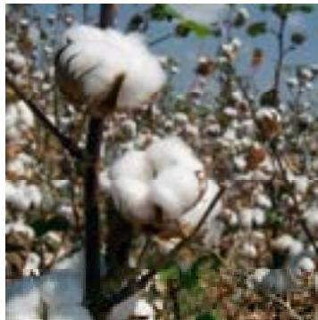

Figure 1: Cotton seeds

Physical and textile properties:

- - Fineness: 1 to 4 dTex
- - Length: 1 to 5 cm
- - Density: 1.5 g/cm3
- - Recovery rate: 8.5%
- - Tenacity: 25 to 50 cN / Tex
- - Elongation: Low, 3 to 7%
- - Absorbancy: 20% (can be improved by very strong bleaching)
- - Action of heat: From 150°C, the fibre turns brown and above 160°C it decomposes.

## 1.2 Worldwide production of cotton

Cotton fibre is the second most used fibre in the textile industry after the polyester (PET). Current estimates for world production are about 25 million tonnes or 110 billion bales annually, accounting for 2.5% of the world's arable land.

India is the world's largest producer of cotton. The United States has been the largest exporter for many years.

The ten largest cotton producers in the world are (2) (3):

| 1  | India         | 6,188,000 tonnes |
|----|---------------|------------------|
| 2  | China         | 6,178,318 tonnes |
| 3  | United States | 3,593,000 tonnes |
| 4  | Pakistan      | 2,374,481 tonnes |
| 5  | Brazil        | 1,412,227 tonnes |
| 6  | Uzbekistan    | 1,106,700 tonnes |
| 7  | Australia     | 885,100 tonnes   |
| 8  | Turkey        | 846,000 tonnes   |
| 9  | Argentina     | 327,000 tonnes   |
| 10 | Greece        | 308,000 tonnes   |

Cotton is the most widespread profitable non-food crop in the world. Its production provides income for more than 250 million people worldwide and employs almost 7% of all labour in developing countries. Approximately half of all textiles are made of cotton.

## 1.3 Cotton price

Cotton is a resource that has its price tracked on the stock exchange. Figure 2 shows the price evolution of cotton during the last ten years(4).

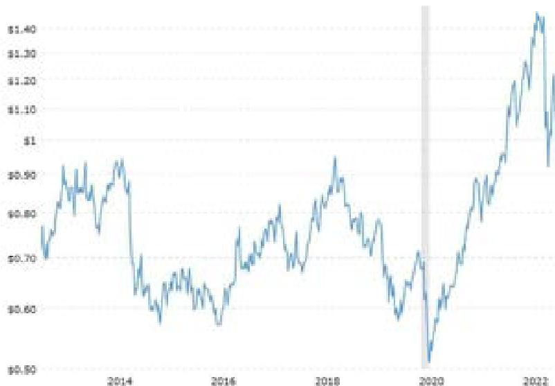

Figure 2: Cotton price evolution, in US dollars per pound

## 1.4 Environmental effects of cotton growth

The cultivation of cotton is today the most cultivated natural fibre in the world and its always important demand is confronted with major environmental problems.

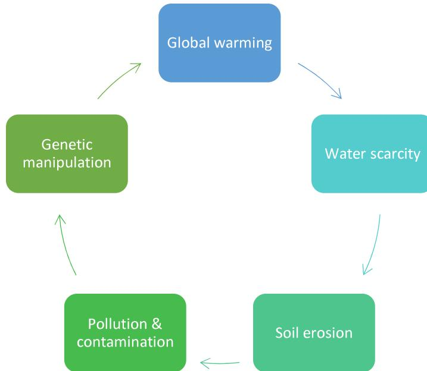

Figure 3: main environmental issues of conventional cotton

- • Global Warming[6]:

To meet the needs of the high demand, the cultivation of cotton requires large quantities of chemical fertilizers. The use of these fertilizers releases nitrous oxide into the atmosphere through evaporation.

This greenhouse gas, 310 times greater than carbon dioxide, contributes to the carbon emission of nearly 220 million tonnes per year.

Another phenomenon contributing to global warming is the practice of deforestation to obtain more arable land for the cultivation of cotton.

- • Water scarcity[8]:

To ensure good growth of the cotton plant, it is mandatory to irrigate surface and ground water. This industrial cultivation has led to the detour of many rivers to meet the needs of cotton cultivation. Thus the diverted water is more prone to evaporation. Cotton is today on of the largest user of water resources among all agricultural products. Approximatively 53% of the cotton lands are irrigated to ensure a good profitability by cultivation area.

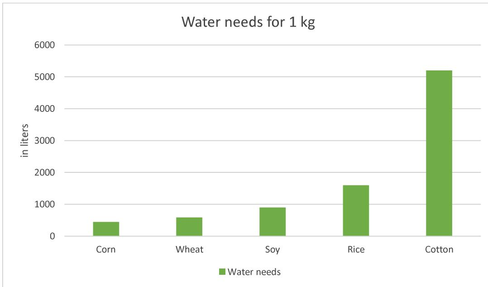

Figure 4: Water needs of several natural resources

This intensive cultivation is thus at the origin of the drying up of the Aral Sea in Central Asia, thus reducing to 10% of its original volume by the diverted rivers feeding it.

Water scarcity is one of the top 10 problems the world could face over the next ten years and two-thirds of the world's population could face water shortages by 2025.

- • Soil erosion and degradation[5]

The irrigation of arable areas intended for the cultivation of cotton is strongly affected by salinization. Soil salinization occurs when evapotranspiration that exceeds precipitation. Irrigation water dissolves calcium carbonate and soluble salts in the soil. Because calcium carbonate is relatively insoluble, it accumulates in topsoil, causing further salt deposition and waterlogging.

The global area dedicated to the cultivation of cotton has remained constant over the past 70 years and represents approximatively 2,5% of the worldwide arable lands. but its cultivation requiring a large quantity of chemical fertilizers has contributed to a strong impoverishment of the soil in many regions of the world and thus requires the expansion in new arable land.

- • Pollution[5]

To increase cotton cultivation, heavy use of chemical fertilizers and pesticides is required. However, these products also threaten soil and water quality, as well as the health of biodiversity through immediate toxicity or long-term accumulation.

Cotton growth consumes 16% of all insecticides sold worldwide and is the fourth largest consumer of agricultural chemicals. In developing countries, about 50% of all pesticides used are for cotton growing.

Over a thousand different chemicals have been used as pesticides and glyphosate is used on around 80% of crops... Extensive use of insecticides unsuitable for growing cotton has caused at least 40 weed species to develop resistance to glyphosate.

To ensure the quality of the cotton fiber, it is necessary to remove the leaves. To optimize this process, the application of chemicals for defoliation is a common practice resulting in additional soil pollution.

- • Genetic manipulation [7]

Genetic manipulation of certain species of cotton has been around for many decades in order to increase the productivity and profitability of their cultivation.

These genetic modifications allow in particular a resistance to insects or a tolerance to herbicides.

Genetically engineered cotton has been accepted by major growers around the world.

However, these genetic modifications have resulted in significant impacts on the use of fertilizers and pesticides.

## 1.5 Life Cycle Assessment

The different items presented in the previous point allow establishing the life cycle assessment of the standard cotton.

Table 1 shows the cumulative energy demand for different natural fibres compared to cotton and Table 2 compares cotton with organic cotton, jute and kenaf on various impact categories.

|                                     | COTTON |         | JUTE  |         | KENAF |         |
|-------------------------------------|--------|---------|-------|---------|-------|---------|
| Cumulative Energy Demand (CED) (MJ) | Fibre  | Textile | Fibre | Textile | Fibre | Textile |
|                                     | 68.5   | 368     | 29.55 | 97      | 31    | 98.5    |

Table 1: Cumulative energy demand for the production of 1 kg of fibres (cultivation) and 1 kg of textile (yarn).

| Impact Category        |                           | Cotton | Organic cotton | Jute  | Kenaf |
|------------------------|---------------------------|--------|----------------|-------|-------|
| Terrestrial acid/nutri | kg SO 2 eq     | 154    |                | 57    | 52    |
| Land occupation        | m 2 org.arable | 7 261  |                | 1 210 | 1 040 |
| Aquatic acidification  | kg SO 2 eq     | 28     | 5,7            | 7,7   | 7,5   |
| Aquatic eutrophication | kg PO 4 P-lim  | 2      | 2,8            | 2,3   | 2,3   |
| Global warming         | kg CO 2 eq     | 2 446  | 978            | 294   | 360   |
| Non-renewable Energy   | MJ primary                | 32 643 | 5 759          | 2 776 | 3 873 |

Table 2: Main impact categories for traditional production of 1000 kg of cotton, jute and kenaf fibres

## 1.6 Alternative fibres

Currently, in the textile industry, the optimum solution to reduce the high environmental impact associated with cotton fibres is to shift towards organic cotton cultivation, as the amount of water and energy consumption is lower than that for the traditional cultivation.

Due to fact that the organic cultivation exhibits a reduced cropping yield, it might result into an inability to cover the market's need. In order to avoid this risk, it is advisable to develop, in parallel, new markets for other natural fibres suitable for textiles, such as hemp and jute.

Various alternatives of cotton have been described in literature(10) (11):

### Hemp:

Hemp has proven promising, however legal and regulatory issues, together with the lack of supply due to its infancy in the product market, block its further exploitation in the market of fibres.

Hemp produces several benefits over cotton, and has proven repeatedly to reign supreme. For one, hemp needs much less land than cotton to grow. More product can be produced in a much smaller territory. In addition, hemp uses much less water (300 to 500 litres) than cotton. While cotton tends to become weaker when wet, hemp retains its strength and durability.

### Bamboo(12)

Like hemp, bamboo requires significantly less water to grow than cotton (approximately one-third less). However, the true beauty of this plant lies in its ability to self-replenish. What is meant by this is bamboo can grow on its own, without the need to continuously replant. The end product of bamboo is also incredibly soft to boot, and has often been compared to Egyptian cotton (one of the finest materials on the market).

Bamboo fibre is a cellulosic fibre extracted or manufactured from natural bamboo. It is made from bamboo pulp. It is generally not made directly from the fibres of the plant, it is a fibre synthesized from bamboo cellulose with similar process than viscose.

### Ramie

This plant is rather unknown to the textile world, but definitely deserves more attention. Fibre from the Ramie plant has the lustre of silk, and is much more absorbent than cotton. The only downside to the fabric is how difficult it is to produce, due to its gummy resin that takes a great amount of labour to remove. In the past, there has been a high demand for the fibre (due to slowed cotton exporting), but not enough resources to meet that demand. However, there is no doubt all of the work is worth it in the end, as Ramie makes for a breathable and comfortable product.

### Flax

Much like the other cotton alternatives we have mentioned, the flax plant requires far less water to grow than cotton. Flax fibre is obtained through a process called retting, which also requires much less water. The fabric is produced by flax is linen; a super soft, ultra-breathable material with anti-microbial properties. However, organic linen is a little harder to obtain than organic cotton, as it is much more labour-intensive to produce.

### Regenerated cellulosic fibres

Regenerated cellulosic fibres can also be an alternative to cotton(12). These fibres are not new to the world of textile fibres but they are probably the most misunderstood of all fibres. It is not a natural fibre, and it is not synthetic. It is a fibre formed by regenerating materials of natural origin into a usable form and hence regenerated cellulosic fibre.

Viscose is an ideal substitute for cotton because of their physiological advantages when viewed in comparison to synthetic fibres. The physiological performance of cellulose fibres - cotton or man-made - is unmatched by any other man-made fibre.

They are hydrophilic and stand for absorbency and breathability. These inherent physiological fibre properties are ideal for moisture management. This function ensures an adequate temperature balance on the skin, especially where textiles touch the skin.

Compared to natural fibres, viscose fibres can be modified in its thickness and other properties like length. Viscose fibre however, in combination with its ability of moisture absorbance and fine fineness offer the best wearing comfort of all fibres. In addition, these fibres are easily dyed in a wide range of colours.

Such other artificial cellulosic fibres as Lyocell or Modal can also be a good alternative to cotton.

The next part of this report describes the different main materials as cotton alternative.

## 2 Main cellulosic fibres as cotton alternative

### 2.1 Organic cotton

#### 2.1.1 Origins

One of the main alternatives of conventional cotton is GOTS (Global Organic Textile Standards) certified organic cotton.

Organic cotton(13) is grown using methods and materials that have a low impact on the environment. Organic production systems replenish and maintain soil fertility, reduce the use of toxic and persistent pesticides and fertilizers, and build biologically diverse agriculture. Third-party certification organizations verify that organic producers use only methods and materials allowed in organic production. Organic cotton is grown without the use of toxic and persistent pesticides and synthetic fertilizers. In addition, the use of genetically engineered seed for organic farming is prohibited.

|                  | ORGANIC                                                                                     | CONVENTIONAL                                                                                                               |
|------------------|---------------------------------------------------------------------------------------------|----------------------------------------------------------------------------------------------------------------------------|
| seed preparation | Natural, untreated GMO-free seeds.                                                          | Typically treated with fungicides or insecticides. Possible GMOs.                                                          |
| soil preparation | Healthy soil through crop rotation. Retains moisture in soil from increased organic matter. | Synthetic fertilizers, loss of soil due to mono- crop culture, intensive irrigation.                                       |
| weed control     | Healthy soil creates natural balance. Beneficial insects and trap crops used.               | Aerial spraying of insecticides and pesticides. Nine of the most commonly used pesticides are known cancer-causing agents. |
| Harvesting       | Natural defoliation from freezing temperatures or through the use of water management.      | Defoliation induced with toxic chemicals.                                                                                  |
| Production       | Warp fibres stabilized using double-plying or nontoxic corn-starch.                         | Warp fibres stabilized using toxic waxes.                                                                                  |

Table 3: Cultivation comparison between organic and standard cotton

Organic cotton is not only a sustainable product but follows human rights and positive marketing:

|            | ORGANIC                                                                                                          | CONVENTIONAL                                                                                       |
|------------|------------------------------------------------------------------------------------------------------------------|----------------------------------------------------------------------------------------------------|
| Fair trade | Social criteria in place to ensure safe, healthy, non-abusive, non-discriminatory environment with living wages. | No social screening. Possible child or forced labour used. Facilities may be unsafe and unhealthy. |
| Marketing  | Positive story can be told to differentiate you from your competitors.                                           | None. As awareness of organic advantage expands, increased potential for negative image.           |

Table 4: Comparison of the cotton trade

The mechanical properties of organic cotton(14) are similar than conventional cotton

| Properties       | Unit          | ORGANIC | CONVENTIONAL |
|------------------|---------------|---------|--------------|
| Length           | [mm]          | 27.9    | 29.2         |
| SFC              | [%;16 mm, W%] | 10.5    | 9.1          |
| Uniformity ratio | [%]           | 81.9    | 82.9         |
| Fineness         | [dtex]        | 18.4    | 17.4         |
| Micronaire       | [Mic]         | 4.9     | 4.5          |
| Tenacity         | [cN/dtex]     | 2.7     | 2.8          |
| Maturity ratio   |               | 1.65    | 1.8          |
| Immature content | [%]           | 6.8     | 6.3          |
| Impurity         | [%]           | 1.7     | 1.1          |

Table 5: Comparison of the organic and conventional cotton

### 2.1.2 Worldwide production

In 2018/2019, 222 134 farmers grew 239 787 tonnes of organic cotton in 19 countries on 418 935 hectares. In addition, 55 833 hectares of cotton-growing land was in-conversion to organic(15).

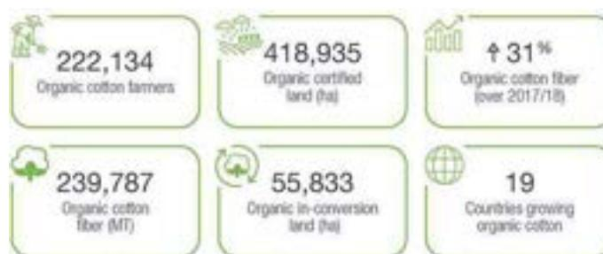

Figure 5: Overview of organic cotton production (Organic Cotton Market Report)

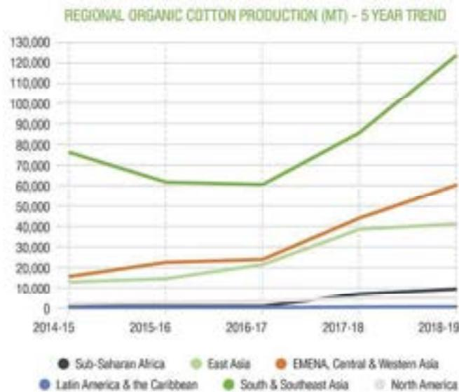

Figure 6: Organic cotton production - Trend (Organic Cotton Market Report)

To create a complete picture of the global organic cotton supply(16), the 2020 Organic Cotton Market Report shares production data from all regions growing certified organic cotton, totalling 19 countries.

According to report findings, 97% of global organic cotton was produced in seven countries:

| Country    | Share |
|------------|-------|
| India      | 51%   |
| China      | 17%   |
| Kyrgyzstan | 10%   |
| Turkey     | 10%   |
| Tajikistan | 5%    |
| Tanzania   | 2%    |
| USA        | 2%    |

Table 6: Producers repartition of organic cotton

Of the 55 833 hectares of land in-conversion to organic, India and Pakistan are leading the way followed by Turkey, Greece, and Tajikistan. Looking to the future, pre-COVID estimates show that global organic cotton production will grow by a further 10% in 2019/20.

### 2.1.3 Organic Cotton price

Organic cotton as a more sustainable material is consequently more expensive than conventional cotton.

The Risk Management Agency (RMA) of United States of America derives prices for certain programs by applying factors and premiums to conventional projected and harvest prices established in accordance with the Commodity Exchange Price Provisions (CEPP).

The ‘CEPP Section II: Cotton’ document(17) authorizes RMA to derive organic practice cotton prices. The following 2022 CY organic practice price premium will be added to the conventional practice cotton prices, in accordance with the CEPP, to derive the organic practice cotton prices:

Organic Practice Cotton Price Premium \$0.40 per pound (1 pound is approx. 0.45 kg).

The organic cottonseeds price has ranged in 2021 from 500 to 700 dollars per tonne.

### 2.1.4 Life Cycle Assessment

According to Textile Exchange, data from its “Life Cycle Assessment of Organic Cotton Fibre” proves that organic cotton causes less environmental damage than conventional cotton(18).

The most significant finding when comparing organic cotton to conventional is a 91% reduced blue water consumption. The table below compares organic cotton to conventional cotton on other impact categories:

| Impact Category        |                           | CONVENTIONAL | ORGANIC |                                           |
|------------------------|---------------------------|--------------|---------|-------------------------------------------|
| Terrestrial acid/nutri | kg SO 2 eq     | 154          |         | 70% less acidification potential          |
| Land occupation        | m 2 org.arable | 7 261        |         |                                           |
| Aquatic acidification  | kg SO 2 eq     | 28           | 5,7     |                                           |
| Aquatic eutrophication | kg PO 4 P-lim  | 2            | 2,8     | 26% reduced eutrophication potential      |
| Global warming         | kg CO 2 eq     | 2 446        | 978     | 46% reduced global warming potential      |
| Non-renewable Energy   | MJ primary                | 32 643       | 5 759   | Minimum 62% reduced primary energy demand |

Table 7: LCA of organic cotton

## 2.2 Flax or Linen

### 2.1.1 Origins

Flax is an annual plant occurring in the form of a stem with a diameter of 2mm and up to 1m in height.

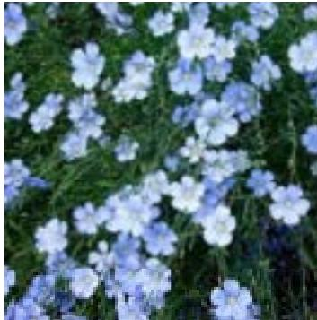

Figure 7: Flax flower

In three months, the plants become straight, slender stalks from 0.9 – 1.2 meters in height, with tapering leaves and small blue, purple or white flowers. The plant with the blue flowers yields the finer fibre the others produce a coarser but strong fibre.

Harvesting: When the plant reaches full growth the plant is pulled up & cut down.

Rippling: Removal of leaves and seeds by a series of upright forks.

Retting: Involves the decomposition of the woody matter enclosing the cellulose fibres.

Breaking and scutching: When the decomposed woody tissue is dry, it is crushed by being passed through fluted iron rollers. The scutching process separates unwanted woody matter from the fibres.

Heckling: This process is like the combing process of cotton fibres. The coarse bundles of fibres are separated from finer bundles and the fibres are also arranged parallel to one another to longer fine fibres.

The following table shows the main differences between cotton and linen fibres(20)

| Category        | Cotton                                 | Linen                                          |
|-----------------|----------------------------------------|------------------------------------------------|
| Point of origin | The cotton plant                       | The flax plant                                 |
| Texture         | Can be fine but not as fine as linen   | Much finer than cotton but not as fine as silk |
| Durability      | Durable but not as strong as linen     | Very durable and strong                        |
| Cost            | Very affordable                        | A lot more expensive than cotton               |
| Sustainability  | Needs lots of water for plants to grow | Needs less water than the cotton plant         |

Table 8: Main comparisons between linen and cotton

Flax fibres are strong and durable, the following table summarizes the flax properties.

| Properties                  | Data              |
|-----------------------------|-------------------|
| Colour                      | yellowish to grey |
| Length                      | 45 to 75 cm       |
| Tensile strength – tenacity | 5.5 to 6.5 g/den  |
| Elongation at a break       | 2.7 to 3.5 %      |
| Elastic recovery            | not enough        |
| Specific gravity            | 1.54              |
| Moisture regain             | 10 to 12%         |

Table 9: Mechanical properties of flax

## 2.1.2 Worldwide production

Flax is a European alternative to cotton.

In 2020, the global production has reached 976 113 tonnes; this represents 2,4% of the global textile fibres market(21).

This production is distributed in the following actors:

| Country            | Quantity (tonnes) |
|--------------------|-------------------|
| France             | 745 570           |
| Belgium            | 81 660            |
| Belarus            | 47 778            |
| Russian federation | 39 262            |
| China              | 23 909            |

Table 10: Main producers of flax and their capacity

In France, the growing of long flax/linen for textile(22) represents 160 000 tonnes (21,5% of the total capacity), representing 80% of the global market.

## 2.1.3 Flax fibre price

Compared to cotton, flax is the world's only natural fibre grown and harvested in Western Europe, where climate and soil conditions are optimal. European production of flax occurs predominantly through the 'Flax Belt' covering parts of France through to The Netherlands. European production and labour contribute to the costly production of linen.

Following the world flax fibre market report analysis(24), the average flax fibre export price stood at \$2 673 per tonne in 2021, which is a decrease of 18.8% compared to the previous year.

Despite difficult harvest conditions in 2020 and 2021, prices have increased on average by 32% from April 2021 to April 2022(25). The average price stands at €3.60 per kilo in April 2022, scutching out, all production regions and all qualities combined", informs the Lin France sector.

## 2.1.4 Life cycle Assessment

The European Confederation of Flax and Hemp(26) (27) (2010) states that the cultivation of 1 ha of flax fibres contributes to stock 3.7 tonnes of CO2 (below-ground carbon).

Moreover, most co-products generated through the flax fibre transformation stages are recirculated into the economy and valorised as new products (C.E.L.C., 2010b).

Flax(27) is also grown on organic converted farms. Its culture is certified without synthetic products (fertilizers, herbicides, fungicides and regulators are prohibited), which ensures a complete absence of residues of these products in the fibre and the soil after harvesting. Today, nearly 200 acres of organic flax are grown in France and international specifications ensures the traceability of fibres from organic flax cultivation to final consume (GOTS label).

- • 333 000 tons of stocked CO2, or 3,7 tonnes/HA (average calculated over the 2004/2011 seasons in FR, BE & NL – Source C.I.P.A.LIN, A.B.V and C.V)
- • 342 000 tonnes of CO2 Greenhouse gas emissions avoided
- • 38 000 tonnes of Petrol equivalents economized
- • 650 000 million cubic meters of Water would be consumed if flax cultivation was replaced by cotton cultivation

The European Confederation of Flax and Hemp has published the initial results of a strategic study based on a life cycle analysis of European flax/linen, conducted using the new PEF (Product Environmental Footprint) method of the European Commissioni.

European Flax®, grown in Western Europe, accounts for 80% of global production and is a market leader. This natural and vegetal fibre is particularly committed to sustainability, with responsible cultivation methods, crop rotation and no GMO, no defoliant, no irrigation (barring exceptional circumstances). Moreover, the fibre is extracted using a 100% mechanical, zero-waste process (scutching) that utilises 100% of the plant(28).

| Impact Category (for 1000kg) | Cotton                   | Flax   |       |
|------------------------------|--------------------------|--------|-------|
| Aquatic eutrophication       | kg PO 4 P-lim | 2      | 0,109 |
| Global warming               | kg CO 2 eq    | 2 446  | 647   |
| Non-renewable Energy         | MJ primary               | 32 643 | 8 970 |

Table 11: Flax LCA

## 2.3 Hemp

### 2.1.5 Origins

Hemp(29) is an annual plant measuring 1 to 5m in height. There are two species: indica ("drug hemp") and vulgaris from which we obtain textile hemp, devoid of psychotropic activity.

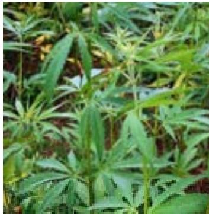

Figure 8: Hemp plant

Hemp gets to maturity in 4 months.

- • Sowing: Planted between March 15th and the last week of May in straight lines or scattered, 35 and 40 kilograms of hemp seeds are planted per hectare. Growers have different varieties available to them depending on the desired harvest (with or without seeds).
- • Growing: Between 100 and 130 days. Hemp grows rapidly (3 to 5 meters) and quickly smothers other unwanted plants around it so no weeding is needed and no phytosanitary treatments are necessary. Any rare parasites are removed by hand as soon as they appear.
- • Harvesting: Based on the desired production, the plant is harvested at the end of August for a partial use without shives and at the end of September if the entire plant is used. With a combine-harvester, the grain can be harvested while maintaining a 20% humidity. In this case, cleaning and drying are also needed to conserve the hemp's dampness at about 10%.
- • Reaping is done with a double-bladed reaper. The straw is then swathed, pressed and baled in workshops where the fibres are removed. Baling must be done as quickly as possible to prevent the straw from retting too much.
- • Transformation by mechanical defibrillation: In the past, hemp was retted in water pits and then scutched like linen. Today, the tow (external cellulose fibre) is separated from the shive (the central, soft part of the stem) by mechanical defibring, a process that uses little energy and no chemical treatments thanks to high-performance industrial equipment and technical know-how. The very light shive is 65 to 70% of the stem's total mass. It has cellulosic and lignosic components and must be dusted, sifted and sorted depending on its final use.

Adapting easily to all types of soil, hemp is appreciated by producers in organic farming because it leaves soil of excellent quality and free of weeds at the end of each season.

Hemp is also the number one fibre in terms of biomass production (10 tons per hectare in 4 months against 1.5 tons per hectare and per year for wood), it produces four times more paper than trees.

Hemp is part of the bast fibre family and contains more than 75% cellulose and 10 to 12% lignin (compared to 60% and 30% respectively for wood).

Hemp[34] is a nutrient-dense variety and comes from the cannabis plant which is grown for industrial and commercial purposes. The seeds, stems, leaves, flowers and roots all have uses ranging from food to biofuels to cosmetics to the medical market. The fibre from the outer stem resulting from these extraction processes is used in particular in textiles and for the manufacture of paper.

During the 1980s, lignin and pectin extraction processes made it easier to separate fine fibres without compromising their strength and durability. This process makes it possible to obtain fine and soft fibres.

Hemp textile is similar in quality to cotton but significantly more absorbent, better insulating, less likely to shrink and highly resistant to pilling. It is also antibacterial and can provide sun protection by helping to block UV rays.

Hemp fibres aren't made from the same plant as marijuana but they are often mistaken for each other. Hemp and cannabis derive from the same species but contain very distinct biochemical components.

Hemp is not perceived as a luxurious fibre by fashion designers, brands, or the general public. It's difficult to sell hemp clothes at a high-price.

Hemp(30) has the following characteristics:

- ○ Three times stronger than cotton
- ○ Good abrasion resistance/very durable
- ○ Anti-microbial and UV resistance
- ○ Naturally resistant to mould, mildew, rot
- ○ Readily takes dyes
- ○ Softens with each washing, without fibre degradation
- ○ Breathable
- ○ Washable or dry cleanable
- ○ Wrinkles easily/poor resiliency
- ○ Poor drapeability
- ○ Not as soft as other fibres

## 2.1.6 Worldwide production

In 2020(31), the global hemp production has reached 245 580 tonnes and distributed as follow:

| Country     | Quantity (tonnes) |
|-------------|-------------------|
| France      | 102 580           |
| China       | 71 865            |
| Korea       | 14 921            |
| Poland      | 14 290            |
| Netherlands | 12 790            |

Table 12: Worldwide hemp producers list

Easily adaptable to all types of soil, hemp is appreciated by organic growers since it leaves an excellent quality, weed-free soil at the end of each season. As the champion of biomass production worldwide (10 tonnes per hectare in 4 months compared to 1,5 tonnes per hectare per year for wood), it produces four times more paper than trees. A member of the bast fibre family, hemp contains over 75% of cellulose and 10 to 12% of lignin (compared with 60% and 30% respectively for wood).

Hemp represents only 0,3 to 0,4% of the fibre market.

### 2.1.7 Hemp fibre price

The main drawback(32) of hemp fabric is its high cost. Hemp is much more expensive than cotton because of its low demand, limited availability, costly production, and a bad reputation.

The American Hemp(33) traders shares prices of degummed fibres for textile application.

The average price of hemp fibre is around \$14,50/kg (50 kg bales) and \$9,37/kg (FOB from China for container 10 tonnes).

### 2.1.8 Hemp Life Cycle Assessment

Hemp(35) is considered a carbon-negative crop, in that it sequesters more CO2 than it generates per harvest cycle. Additionally, hemp generates more fibre per acre in less time and with less water, compared to cotton. Hemp is markedly less fastidious than cotton and can grow in a wider range of climates and soil types. The hemp plant's fast growth and dense canopy serves as its own weed suppressor, eliminating the need for herbicides.

By comparing cotton and hemp processes(36), the differences in sustainability are mainly linked to the growing process of both plants.

|                           | Cotton                     | Hemp                       |
|---------------------------|----------------------------|----------------------------|
| Growth period:            | 160 days                   | 60 to 120 days             |
| CO 2 emissions | emits 1.8 tons             | absorbs 1.63 tons          |
| Water use in cultivation  | 5.2 megalitres per hectare | 2.6 megalitres per hectare |
| Total water consumption   | 10.000 litres per 1 kg     | 2.719 litres per 1 kg      |
| Pesticides                | 4.36 kg per hectare        | no pesticides              |

Table 13: Hemp LCA summarize

In 2015(37), the Stockholm Environment Institute (SEI) published a study on the ecological footprint and water analysis of cotton, hemp and polyester. The study was commissioned by the BioRegional Development Group (BDG), supported by WWF-Cymru.

The study found that producing polyester requires up to 10 times more energy output and emits significantly more carbon dioxide (CO2) than cotton and hemp.

As natural fibres, both hemp and cotton cultivation have water requirements, and each kilogram of cotton requires 9758 kilograms of water use (kilogram = a litre in water volume), while each kilogram of hemp requires between 2401 and 3401 kilograms of water.

The report found that cotton requires the most land area for cultivation while describing hemp as a robust "low maintenance crop requiring low inputs, including agro-chemicals... and it has to date not been plagued by pests."

## 2.4 Viscose / Rayon

### 2.1.1 Origins

Rayon/viscose(38) is a manufactured regenerated cellulosic fibre derived from wood pulp.

Rayon is typically made of wood from eucalyptus, spruce, and pine trees, but can also be made from bamboo.

The viscose process is described as follow:

1. 1. Cellulose extraction: The rayon production process begins with the creation of wood pulp cellulose. To create quality fabric, the cellulose used should be at least 90 percent pure.
2. 2. Alkali cellulose conversion: This cellulose is then dissolved in caustic soda, which produces a chemical reaction that converts cellulose to alkali cellulose. This process removes impurities from the cellulose and prepares it for the next step of the manufacturing process.
3. 3. Pressing: The alkali cellulose is then pressed between two rollers, which removes excess liquid. These pressed sheets are then shredded and crumbled into a substance called "white crumb."
4. 4. Aging and xanthation: The white crumb is then aged via exposure to pure oxygen, and next, it is exposed to carbon disulphide to make a new substance called "yellow crumb."
5. 5. Ripening: The yellow crumb is then dissolved and allowed to "ripen" for a period of a few hours.
6. 6. Filtering and extruding: After it has ripened, the yellow crumb is filtered, and any gas bubbles are removed. Next, it is extruded through a spinneret, which is a device with many holes like a showerhead.
7. 7. Acid bath and completion: Finally, the resulting substance is immersed in a bath of sulphuric acid, which results in rayon filaments. The filaments are then spun, drawn, and washed to produce a fabric that can then be cut to a desired shape and size.

Viscose is a versatile fibre and has similar comfort properties to natural fibres, although the drape and slipperiness of rayon textiles are often more like nylon.

Viscose-based textiles imitate the feel and texture of silk, wool, cotton and linen. The fibres are easy to dye in a wide range of colours. Rayon fabrics are soft, smooth, cool, comfortable, and highly absorbent, but they don't always insulate body heat.

## 2.1.2 Worldwide production

Viscose fibre(40) is mainly produced in Asia which supplies 90% of the global demand.

| Location      | Country   | Share |
|---------------|-----------|-------|
| Asia          | China     | 66%   |
|               | Indonesia | 9%    |
|               | India     | 9%    |
| Europe        | Austria   | 9%    |
| North America |           | 1%    |

Table 14: Worldwide viscose production distribution

Viscose is the most important man-made cellulose fibre, with a market share of around 79% of all man-made cellulose fibres.

The global production(41) has reached in 2020 more than 4,75 million tonnes with an estimated growth rate of 4% during the period 2022-2027.

In 2018(42), this global production reached 5.8 million tonnes with a Chinese contribution of 65%.

The viscose staple fibre market is consolidated in nature, and the top five manufacturers occupy around 60% of the market.

The major players in the market include Lenzing AG, Birla Cellulose, SATERI, Xinjiang Zhongtai Chemical Co. Ltd, and Tangshan Sanyou Group Xingda Chemical Fibre Co. Ltd, among others.

## 2.1.3 Staple fibre price

The viscose fibre, as other textile fibres depends of the global worldwide situation.

In 2022(43), for Birla Cellulose group, the Viscose Staple Fibre (VSF) prices increased with 0,13€/kg, which is around 6% of the previous rates.

The hike in prices is due to a steep rise in prices of cotton, polyester and acrylic staple fibre.

After the increase, average rates of VSF reached between 2,18 €/kg to 2,22 €/ kg.

These prices are not driven by costlier crude oil as it is sourced from wood. But costlier natural fibre pushed the price of the tree-based fibre. General inflationary effect is also a cause for the price rise.

For Lenzing GmbH(44), prices for standard viscose in China rose steadily and by a total of 27% during the first half of the year to reach 2,23 €/kg at the end of June 2022.

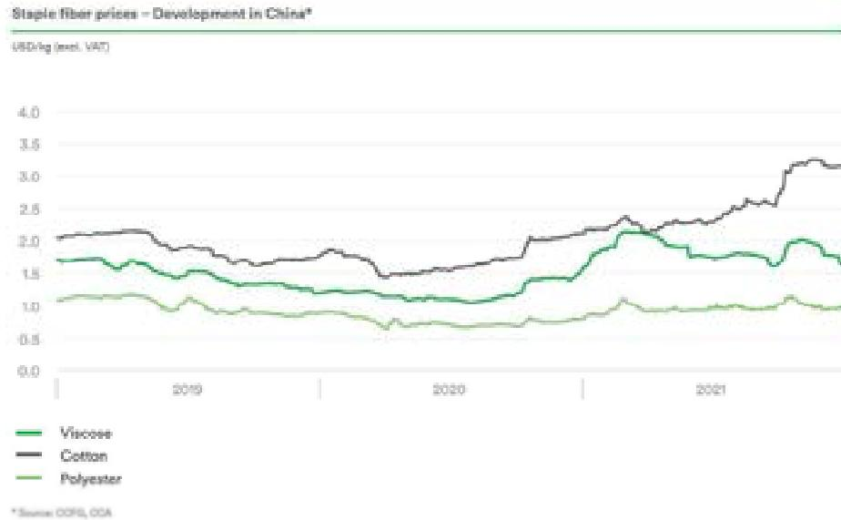

Figure 9: Diagram of the staple fibre price evolution(45)

### 2.1.4 Life cycle assessment

Since viscose[46] is derived from cellulose, the raw material comes mainly from forests and plantations.

The production of viscose faces environmental impacts at each stage of the process:

- - Raw material management: wood
- - Dissolution process
- - Spinning process

#### Raw material management:

Currently, nearly 120 million trees are felled each year for the production of viscose (canopyplanet.org), some of which come from ancient and threatened forests such as the forests of Indonesia, the boreal and temperate tropical forests of Canada and the 'Amazon.

The management and maintenance practices of forests and plantations cultivated for timber production require a series of activities that can have a negative impact on the environment such as:

- - Clearcutting and forest thinning activities,
- - The removal of natural vegetation for the development of trees,
- - The use of agrochemicals,
- - Irrigation at certain stages of development,
- - The construction of access roads,
- - The use of heavy machinery,
- - Etc...

Cellulose dissolution process:The transformation of wood into paper pulp creates significant emissions to air and water, mainly due to the chemicals used in the treatment, but also due to organic compounds in the wood.

The dissolution process notably creates sulphur released into the atmosphere. Even though these releases have decreased in recent years, it is not, however, eliminated.

This process also requires a bleaching step using chlorine products. Although significant restrictions on the management of aquatic discharges have been undertaken over the past thirty years, these discharges are still present.

Despite a desire to reduce the discharges associated with this processing step, nutrient emissions and the discharge of suspended solids are still present and remain a challenge for the pulp industry.

Spinning process:The use of carbon disulphide in the production of viscose and modal fibers generates atmospheric emissions of sulfur compounds.

The amount of air emissions will depend on the amount of carbon disulfide used in the treatment as well as the efficiency of the recovery systems used.

The viscose process produces large volumes of wastewater. Fibre specifications can dictate the amounts of chemicals used, such as sulfuric acid and zinc. Fibres may also require bleaching, and the resulting effluents, as in pulp production, will depend on the bleaching methods applied.

The water footprint[47] is used as an indicator to quantify the impacts on water resources and the aquatic environment. The results show that:

| Criteria – 1 ton of staple fibre | Unit                                      | Data     |
|----------------------------------|-------------------------------------------|----------|
| Water scarcity footprint         | [m 3 H 2 O eq/ton]  | 51,87    |
| Water eutrophication footprint   | [kg PO 4 3- eq/ton] | 12,44    |
| Water acidification footprint    | [kg SO 2 eq/ton]               | 78,20    |
| Water alkaline footprint         | [kg OH - eq/ton]               | 55,68    |
| Water ecotoxicity footprint      | [km 3 H 2 O eq/ton] | 3 828,17 |

Table 15: Water footprint criteria of Viscose

The footprint impact of viscose fibre(48) is also depending of the production area and is summarized in the following table:

| Criteria – 1 ton of staple fibre | Unit                                     | Cotton | Viscose Asia | Viscose Europe |
|----------------------------------|------------------------------------------|--------|--------------|----------------|
| Abiotic depletion                | [kg Sb eq./t]                            | 17     | 40           | 14             |
| Ozone layer depletion            | [ $\times 10^{-3}$ kg CFC11eq./t]        | 0.20   | 0.28         | 0.03           |
| Human toxicity                   | [kg 1,4DB eq./t]                         | 1 700  | 1 490        | 630            |
| Fresh water aquatic ecotoxicity  | [kg 1,4DB eq./t]                         | 17 310 | 160          | 74             |
| Terrestrial ecotoxicity          | [kg 1,4DB eq./t]                         | 1 568  | 16           | 11             |
| Photochemical oxidant formation  | [kg C 2 H 4 eq./t] | 0.7    | 1.8          | 0.5            |
| Acidification                    | [kg SO 2 eq./t]               | 41     | 45           | 14             |
| Eutrophication                   | [kg PO 4 3- eq./t] | 22     | 2.3          | 1.2            |
| 1,4DB = 1,4-dichlorobenzene      |                                          |        |              |                |

Table 16: Footprint criteria of Viscose in different parts of the world

## 2.5 Lyocell / TENCEL®

### 2.1.1 Origins

First developed in 1972, this fibre is manufactured using the process of dry jet-wet spinning.

With the rising environmental concerns(49), the demand for lyocell fibre is escalating across the globe. Its main component, cellulose, is obtained from well-managed forests and its production does not generate by-products that are harmful to the health or the environment. Moreover, technological advancements have led to the manufacturing of lyocell fibre using advanced N-methyl morpholine-N-oxide (NMMO) technology, which is a simple, resource-conserving, and environment-friendly means of regenerating cellulose fibre.

The Lyocell process is the following:

Preparing the wood pulp: Hardwood trees are chopped into small chips and mixed with a chemical which turns them into a wet pulp made of cellulose. This wet pulp is made into sheets that are thin and large in size.

Dissolving the cellulose: These sheets are broken into pieces and put into a heated and pressurized container having amine oxide.

Filtering: The cellulose dissolves in the solvent and is filtered out as a clear solution.

Spinning: The solution is passed through a spinneret through which fibres spring out which are then made to pass through a diluted solution of amine oxide.

Drying and finishing: The water is evaporated from the fibre and some lubricant is applied to it.

Lyocell fibre exhibits similar properties as other cellulose fibres, including ramie, linen, viscose rayon and cotton. It is lightweight, absorbent, breathable, soft, wrinkle-resistant, durable, capable of replicating a range of textures like silk, leather and suede, and can also be dyed in various colours. Nowadays, manufacturers are adopting natural practices to produce lyocell and eliminating the use of chemicals in the production to obtain organic certification.

### 2.1.2 Worldwide production

Although Lyocell was first invented in the USA, today the largest producer is China where most of the production and export takes place in the factories owned by Austria-based 'Lenzing AG'. Some production also takes place in Europe. India, Bangladesh, Vietnam are the emerging producers of Tencel. The major importers continue to be Europe and USA.

Following different sources(50), the Lyocell worldwide production reached in 2018, 415 600 tonnes and is expected to grow to 746 000 tonnes in 2027 with an estimated yearly growth of 6,8% (from 2019 to 2027).

Lyocell fibre(51) represents around 4,3% of the cellulosic market and is the third most used regenerated cellulosic fibre type after viscose and acetate. Birla and Lenzing are covering 27% of the market.

### 2.1.3 Lyocell cost

Lyocell is more expensive than conventional viscose; however, as the demand and production capacity increase, its cost will inevitably reduce. More sustainable lyocell is considered to be a premium fibre, which means it comes at an even higher cost.

The price difference has to do with the technology involved in the production process of lyocell as it costs more to make it, it costs more to buyers as well.

### 2.1.4 Life Cycle Assessment

The lyocell(52) fibre process is considered more sustainable due to the use of a regenerated solvent.

- • In primary energy consumption, the value of lyocell fibre is approximately three times that of viscose fibre.
- • Because viscose fibre uses more sulphide; its acidification potential value is about twice that of lyocell fibre.
- • The global warming potential of lyocell fibre is about two of that of viscose fibre.
- • The ecotoxicity value of viscose fibre is an order of magnitude higher than that of lyocell fibre.

In the lyocell fibre process, electricity, pulp, and steam are the main contributors to the process. At present, this process mainly uses thermal power generation, which makes the environmental impact caused by electricity consumption great. If more economical or cleaner power supply can be considered, the environmental impact will be further improved.

| Criteria – 1 ton of staple fibre | Unit                                     | Cotton | Viscose Europe | Lenzing Europe |
|----------------------------------|------------------------------------------|--------|----------------|----------------|
| Abiotic depletion                | [kg Sb eq./t]                            | 17     | 14             | 7              |
| Ozone layer depletion            | [ $\times 10^{-3}$ kg CFC11eq./t]        | 0.20   | 0.03           | 0.07           |
| Human toxicity                   | [kg 1,4DB eq./t]                         | 1 700  | 630            | 660            |
| Fresh water aquatic ecotoxicity  | [kg 1,4DB eq./t]                         | 17 310 | 74             | 75             |
| Terrestrial ecotoxicity          | [kg 1,4DB eq./t]                         | 1 568  | 11             | 4.6            |
| Photochemical oxidant formation  | [kg C 2 H 4 eq./t] | 0.7    | 0.5            | 0.4            |
| Acidification                    | [kg SO 2 eq./t]               | 41     | 14             | 13             |
| Eutrophication                   | [kg PO 4 3- eq./t] | 22     | 1.2            | 1.9            |

Table 17: Footprint criteria of Lyocell

## 2.6 Modal

### 2.1.1 Origins

Modal(54) rayon was first developed in 1951 in Japan and this fibre is nearly identical to viscose rayon. However, modal rayon uses a simpler manufacturing process that produces less waste than that of viscose.

The modal fibre production process begins with the harvesting of trees to be transformed into cellulose. These trees are broken down into chips and then purified to extract their cellulose content, and the leftover tree products are discarded.

Next, this extracted cellulose is formed into sheets, and these sheets are then immersed or "soaked" in tanks of sodium hydroxide, also known as caustic soda. The concentrations of sodium hydroxide used in this process are much lower than those used to create viscose rayon.

After the soaking is complete, the cellulose is immersed directly in carbon disulphide, which turns the white paste into an orange substance called sodium cellulose xanthate.

This cellulose xanthate is then immersed in caustic soda a second time to create a syrupy solution. Which is immediately forced through a spinneret to create fibres.

These fibres are then immersed in sulfuric acid, stretched and made into yarn. The resulting yarn is then washed, bleached, rinsed, dried and loaded onto spools.

Modal(55) fibre is soft, smooth and shiny, with vivid colour. Compare to the other cellulosic fibres(56), Modal has good properties except its elongation:

| Parameters             |           | Cotton | Modal | Viscose |
|------------------------|-----------|--------|-------|---------|
| Denier                 | [dtex]    | –      | 1.3   | 1.3     |
| Staple/cut length      | [mm]      | 27.3   | 39    | 39      |
| Tenacity conditioned   | [cN/dtex] | 27.9   | 35    | 25      |
| Elongation conditioned | [%]       | 6.6    | 13    | 20      |
| Moisture               | [%]       | 8.5    | 11    | 11      |

Table 18: Comparison of cellulosic fibre with Modal

## 2.1.2 Worldwide production

Modal(57) had a market share of around 2.8% of the total regenerated cellulosic fibre market in 2019, with a production of around 200 000 tonnes.

Its annual growth rate from 2017 to 2022 is estimated at about 9%.

Modal is a well-established fibre, which is globally available and integration should be straightforward.

### 2.1.3 Modal fibre price

Modal is more expensive than conventional viscose; however, as demand and production capacity increase, its cost will inevitably reduce. More sustainable modal is considered to be a premium fibre, which means it comes at an even higher cost.

### 2.1.4 Life Cycle Assessment

The problems related to the sustainability performance of modal fibres(58) are the same as for viscose:

- - Large quantities of water required throughout its production and processing,
- - Heavily polluted wastewater effluents
- - High power consumption
- - High consumption of chemicals

As with viscose, the raw material is another big concern in modal production. If the wood comes from forests not certified by FSC or PEFC, sustainable forest management practices cannot be verified, which means the trees could have been grown on land in competition with food crops or felled illegally in natural forests.

Therefore, sourcing FSC or PEFC certified wood helps to ensure that the livelihoods of these communities are protected. LENZINGTM only uses Austrian rain beech trees for its production of LENZINGTM Modal, which are FSC or PEFC certified. In addition, 95% of the chemicals used are recycled and the manufacture of LENZINGTM Modal is CO2 neutral.

The same sustainable forest management certifications explain Birla Cellulose's LivaecoTM MODAL. Additionally, Birla Cellulose claims to produce LivaecoTM MODAL with significantly lower greenhouse gas and water emissions than conventional modal. Both fibres are fully biodegradable and can be traced through the supply chain, ensuring transparency. The problems related to the sustainability performance of modal fibres(58) are the same as for viscose; significant amounts of water throughout its production and processing, energy and chemical intensive, highly contaminated wastewater effluent and hazardous gases must be treated correctly.

By knowing these facts, the LCA of modal fibre can be compared as follow(59):

| Criteria – 1 ton of staple fibre | Unit                                     | Cotton | Viscose Europe | Modal |
|----------------------------------|------------------------------------------|--------|----------------|-------|
| Abiotic depletion                | [kg Sb eq./t]                            | 17     | 14             | 18    |
| Ozone layer depletion            | [ $\times 10^{-3}$ kg CFC11eq./t]        | 0.20   | 0.03           | 0.04  |
| Human toxicity                   | [kg 1,4DB eq./t]                         | 1 700  | 630            | 770   |
| Fresh water aquatic ecotoxicity  | [kg 1,4DB eq./t]                         | 17 310 | 74             | 93    |
| Terrestrial ecotoxicity          | [kg 1,4DB eq./t]                         | 1 568  | 11             | 16    |
| Photochemical oxidant formation  | [kg C 2 H 4 eq./t] | 0.7    | 0.5            | 0.5   |
| Acidification                    | [kg SO 2 eq./t]               | 41     | 14             | 15    |
| Eutrophication                   | [kg PO 4 3- eq./t] | 22     | 1.2            | 1.3   |

Table 19: Modal LCA

### 3 Other possible cellulosic fibres

There are a lot of possible cellulosic fibres in the world which could be cotton alternatives. This part of the document will summarize a non-exhaustive list of these alternatives.

#### 3.1 Jute

Jute(60) is produced from plants of the Chocorus family.

It is much cheaper to produce and requires less water, fertilizer and pesticides than cotton.

It is a soft and shiny bast fibre(61). The cultivation of jute(62) requires a tropical climate with special conditions such as the monsoon to develop and fall. This is why 95% of world production is located in the Bay of Bengal, and more precisely in Bangladesh and North-East India, in the region of Calcutta.

One hectare produces about 2 tonnes of dry fibre. it is one of the cheapest natural fibres. Jute ranks just behind cotton in its production and the different possible uses.

Processing jute requires a retting process, chemical or biological, to remove the pectin between the bast and the heart of the plant, which helps separate the fibres.

Jute is known for its high shine and is mainly used to make rugs and bags and much less used to make clothes.

World production of Jute(63) reached 2 688 912 tonnes in 2020, with 2 main players India (67%) and Bangladesh (30%).

The carbon footprint of jute (64) is very low and makes it one of the most ecological fibers in the world:

- - It is completely biodegradable,
- - it absorbs carbon dioxide and releases oxygen (faster than trees),
- - it grows without the use of pesticides or fertilizers,
- - it can improve the fertility of the soil in which it grows

## 3.2 Coir fibre

Coir fibre(65) is among the thickest and strongest of all natural fibres that are in commercial use today. It is short, coarse, and extracted from the outer husk of the coconut.

The very low decomposition rate of coir fibre makes it ideal for products like geotextiles. It has one of the highest known concentrations of lignin, making it extremely durable.

Coir fibre can help prevent erosion by encouraging vegetation and by retaining water. Even though they take a long time to decompose, when they do, they do so 100% and without harming the soil. Coir fibre help enriching the soil as they decay.

The global production of coir(66) has reached in 2020, 1 276 624 tonnes with as main actors India (46%), Vietnam (31%) and Sri Lanka (13%).

Coir(67) is adequately eco-friendly; thus, its application would not cause any harm to the environment. Coir is not a by-product of coconut but is a waste product reused for its recipient qualities to create the fibre and turned or woven into usable products. It is one of the countless results of the coconut palm known to India.

## 3.3 Manila fibre

Manila fibre(68) also called Manila hemp and also known as abacá, is a type of buff-coloured fibre obtained from Musa textilis (a relative of edible bananas). It is mostly used for pulping for a range of uses, including speciality papers.

Abacá is an exceptionally strong fibre, nowadays used for special papers like teabag tissue. It is also very expensive, priced several times higher than wood pulp. Manila envelopes and Manila paper take their name from this fibre.

It is not actually hemp, but named so because hemp was long a major source of fibre, and other fibres were sometimes named after it. The name refers to the capital of the Philippines, one of the main producers of Manila hemp. The hatmaking straw made from Manila hemp is called tagal or tagal straw.

The global production of manila fibres(69) has reached in 2020, 106 114 tonnes with as main actors the Philippines (64%) and Ecuador (35%).

Abaca(70) is a sustainable fibre because it can be made into various products that answer the present needs and demands without having to compromise environmental standards. Its production has a low environmental impact and it's a renewable resource; can be grown and harvested with very little chemical processing.

Abaca plant's water-holding capacity prevents soil erosion, landslides and floods. It protects farming communities from possible disasters. Since abaca can also be planted along with other crops and plants, such as coconut palms, it promotes biodiversity rehabilitation. This is the opposite of monoculture plantations that destroy the nutrients of the soil and lead to the use of harmful chemicals that pollute groundwater supplies, ultimately destroying the natural ecosystems around it. Even the waste materials of abaca production are used by farmers as organic fertilisers which still benefits the environment.

## 3.4 Kapok

Kapok fibre(71) is elastic and light, but above all an excellent ecological alternative. This particular material that comes from the fruits of a very widespread tree in South America, the Ceiba pentadra, also called Ciba.

The fruits are very similar to those of cotton, but kapok fibre is very light to the point of being also called vegetable wool.

The tree from which it comes, the Ciba, is majestic and many legends associate it with sacred and religious traditions. The trunk is covered with large thorns and can reach 60 meters in height and three in diameter. It has very large leaves formed from smaller leaves; the fruits contain a dense mass of fibres.

Another advantage of kapok fibre lies in its natural life cycle: of natural and biological origin, it grows spontaneously without the addition of fertilizers and pesticides and its extraction does not require intensive cultivation, thus respecting the environment.

The global fibre(72) production has reached in 2020, 65 232 tonnes with 2 main actors: Indonesia 73% and Thailand 27%

## 3.5 Ramie

Ramie (or "Chinese nettle") comes from stems that can be 1.5 to 3m in height.

There are 4 stages in the growing of ramie:

- - Harvest: the stems are cut when flowering
- - Shelling: the bark of the stems is removed
- - Degumming: fibres are separated by dissolving the vegetable glue
- - Bleaching.

The fibre yield is about 2 tonnes per hectare per year.

The global annual production(73) of ramie is around 61 000 tons with China as the main producer of ramie fibre with a market share of 95%.

Due to the difficulty of producing ramie fibres(74), especially with traditional methods, the fibre continues to face challenges. Also, the unwoven ramie fibre's low elasticity and brittle quality continue to limit its use. It has not achieved the acceptance and usage that it is capable of as a sustainable natural fibre.

Generally, ramie is a sustainable fabric; it is plant-based and biodegradable. But certain aspects of ramie production to answer the question of its sustainability have to be integrated.

Chemical use in cultivation: according to a 2018 experimental study assessing ramie's life cycle, producing 100 kg requires about 16 kg of potassium oxide, 12.8 kg of nitrogen, and 3 kg of phosphorus oxide. These are chemical fertilizers that have environmental impacts. The fertilizers can leach into groundwater or emit gases into the atmosphere. To control weeds and insects, the researchers used 7.5 kg of diuron and 0.42 kg of cyhalothrin per hectare. These chemicals are toxic, and some countries regulate or ban them. The chemicals find their way into water and air, where they pose a threat to the environment.

However, since ramie is naturally resistant to bacteria, rot, fungi, and other pests, farmers can grow it without pesticides or insecticides. The lateral roots formation does not give much space

for weed growth, so it does not need herbicides. The plant's natural pace of propagation and growth is remarkably fast; therefore, sustainable and profitable ramie farming does not necessarily need chemical fertilizers.

**Degumming:** To separate the raw fibre from the adhesive bark in the production process, some manufacturers use chemicals. These chemicals include sulphuric acid, sodium hydroxide, and hypochlorous. The wastewater from degumming is toxic. It has very high PH levels, chemical oxygen demand (COD), and biochemical oxygen demand (BOD). Research suggests that the degumming process contributes to freshwater pollution, ground acidification, and ozone. So, it needs to be appropriately treated before being disposed of. Degumming can be done without chemicals using traditional all-natural methods, but the method is typically not fast enough for profitable large-scale manufacturing.

**Water consumption:** In an experiment, to grow 100 kg of ramie, farmers used about 715 kg of water for spraying herbicides and insecticides. It was unclear if there was irrigation and how much water was used. However, it can be assumed that irrigation would have consumed more water. Ramie is not a water-intensive crop, and it does not consume nearly as much water as cotton, which is a global favourite in natural fibres. So, on a farm where there is no use of pesticides or herbicides, rainfall is enough to grow the ramie crop.

**Energy consumption and emissions:** Using harvester machines is one of the many sources of carbon emissions in ramie farms. Mechanical decortication, spinning, and weaving also consume energy.

**Biodegradability:** Like any other cellulose fibre, ramie is biodegradable. Although it goes through some chemical processes, it will still completely break down into organic matter. Ramie's degradability makes it more sustainable than other fibres that do not decompose because it does not break down into microscopic pollutants at the end of its life.

**Durability:** Ramie may not require a lot of chemical or natural resource inputs, but it is very much labour-intensive. Isolating the fibre in the inner bark requires much scraping, pounding, heating, washing, or exposure to degumming chemicals. Weaving is also tricky because of the yarn's hairy surface.

## Conclusion

Although cotton is and remains a globally produced fibre with significant capacities, the combination of different more virtuous alternatives and appropriate consumption methods will reduce the overall carbon footprint of the textile industry.

Other alternatives to cotton, mainly centred on the recovery of cellulose, have recently emerged and can also contribute to reducing the use of cotton:

- - Circulose® from Renewcell company which is a cellulose coming from cellulosic textile wastes to make viscose, modal and/or lyocell fibres,
- - Infinna® from Infinited Fiber company which takes cellulose from cellulosic textile wastes to make cellulosic staple fibre,
- - Refibra® from Lenzing Group which takes cellulose from cotton scraps using the Tencel process to make equivalent Tencel fibre
- - OnceMore® from SÖDRA in partnership with LENZING from polycotton separation and cellulose recovery with partial content of textiles scraps using the viscose process
- - SPINNOVA which has developed a process of wood and/or cellulosic wastes pulp transformation into fibre without chemicals

These more or less mature initiatives already make it possible to think about the cellulosic fibres of tomorrow.

## Bibliography

- (1)<https://en.wikipedia.org/wiki/Cotton>
- (2)<https://worldpopulationreview.com/country-rankings/cotton-production-by-country>
- (3)<https://www.statista.com/statistics/263055/cotton-production-worldwide-by-top-countries/>
- (4)<https://www.macrotrends.net/2533/cotton-prices-historical-chart-data>
- (5)<https://www.worldwildlife.org/industries/cotton#:~:text=Runoff%20of%20pesticides%2C%20fertilizers%2C%20and,indirectly%20through%20long%20Dterm%20accumulation.>
- (6)<https://www.trvst.world/sustainable-living/fashion/environmental-impact-of-cotton/>
- (7)[https://ota.com/sites/default/files/indexed\\_files/Cotton%20and%20the%20Environment%20Final%20July%202018.pdf](https://ota.com/sites/default/files/indexed_files/Cotton%20and%20the%20Environment%20Final%20July%202018.pdf)
- (8)<https://cottontoday.cottoninc.com/cotton-and-water-better-management-of-an-increasingly-scarce-resource/>
- (9)<https://www.mdpi.com/2079-6439/7/12/101>
- (10)<https://www.fibre2fashion.com/industry-article/8392/4-sustainable-cotton-alternatives>
- (11)Replacing Cotton: Fabrics that Represent the Future of Sustainable Fashion - Behind The Scenes | Worms Safety (wsafety-news.com)
- (12)[https://fr.wikipedia.org/wiki/Fibre\\_de\\_bambou](https://fr.wikipedia.org/wiki/Fibre_de_bambou)
- (12)<https://www.fibre2fashion.com/industry-article/7129/viscose-fibre-an-ideal-substitute-for-cotton>
- (13)What is Organic Cotton? | Global Organic Textile Standards (GOTS) | Organic Cotton 101 | Organic Cotton Processing | Organic Cotton Plus
- (14)Organic Cotton - an overview | ScienceDirect Topics
- (15)Organic Cotton Market Report - Textile Exchange
- (16)2020 Organic Cotton Market Report (OCMR) Released - Textile Exchange
- (17) 2022 Crop Year Organic Rice Price Factor, Organic Cotton Price Premium, Popcorn Price Factors, and Sunflower Price Factors | RMA (usda.gov)
- (18) Report Template EN - 2014-03-17 (textileexchange.org)
- (19) the-life-cycle-assessment-of-organic-cotton-fiber\_38172.pdf (ajsosteniblebcn.cat)
- (20) Cotton vs Linen: 11 Differences Between Linen and Cotton (sewingiscool.com)
- (21) <https://knoema.com/data/agriculture-indicators-production+flax-fibre-and-tow>
- (22)
- (23) <https://knoema.com/data/agriculture-indicators-production+flax-fibre-and-tow>
- (24) <https://www.indexbox.io/store/world-flax-fiber-market-report-analysis-and-forecast-to-2020/>

(25)<https://www.lafranceagricole.fr/cultures/article/756395/le-lin-fibre-un-march-dynamique#:~:text=Malgr%C3%A9%20des%20conditions%20de%20r%C3%A9coltes.informe%20la%20fili%C3%A8re%20Lin%20France>

(26)Journal of Cleaner Production - Volume 281, 25 January 2021, 125177 - Flax fiber for technical textile: A life cycle inventory

(27)<http://news.europeanflax.com/en/lin/linen-eco-system/>

(28)European Flax | Analyse de cycle de vie et jeu de données - [https://news.europeanflax.com/LCA\\_wp-content\\_uploads\\_2022\\_06\\_Synthese-ACV-EN](https://news.europeanflax.com/LCA_wp-content_uploads_2022_06_Synthese-ACV-EN)

(29)<http://news.europeanflax.com/en/chanvre/growing-hemp/>

(30)<https://www.fabriclink.com/University/Hemp.cfm>

(31)<https://knoema.com/data/agriculture-indicators-production+hemp-tow-waste?unit=constant-prices>

(32)<https://www.panaprium.com/blogs/i/hemp-expensive-cotton>

(33)<https://www.hemptraders.com/F-DG1-p/f-dg1.htm>

(34)Hemp vs. Cotton: Sustainability - Hemp Info Guide

(35)<https://www.ravenox.com/blogs/news/hemp-rope-vs-cotton-ropes>

(36)<https://ops-clothing.com/blogs/en/actual-cost-of-cotton-production-compared-to-hemp-production>

(37)Hemp vs. Cotton: Sustainability - Hemp Info Guide

(38)<https://sewport.com/fabrics-directory/viscose-fabric>

(39)VISCOSE Fibre – Properties And Its Uses - Style2Designer.com

(40)[https://waterfootprint.org/media/downloads/Viscose\\_fibres\\_Sustainability.pdf](https://waterfootprint.org/media/downloads/Viscose_fibres_Sustainability.pdf)

(41)<https://www.mordorintelligence.com/industry-reports/viscose-staple-fiber-market>

(42)<https://www.prnewswire.com/news-releases/global-and-china-viscose-fiber-industry-report-2019-2025-featuring-17-chinese-and-foreign-viscose-fiber-manufacturers-300852381.html>

(43)<https://www.fibre2fashion.com/news/textile-news/viscose-staple-fibre-prices-increase-by-upto-10-kg-in-india-279838-newsdetails.htm#:~:text=The%20average%20rates%20will%20be%20E2%82%B9172%20per%20kg%20for%20bulk%20buyers>

(44)[https://www.lenzing.com/?type=88245&tx\\_filedownloads\\_file%5bfileName%5d=fileadmin/content/PDF/07\\_Finanzen/Halbjahresberichte/EN/Halbjahresbericht\\_2022\\_EN.pdf](https://www.lenzing.com/?type=88245&tx_filedownloads_file%5bfileName%5d=fileadmin/content/PDF/07_Finanzen/Halbjahresberichte/EN/Halbjahresbericht_2022_EN.pdf)

(45)<https://reports.lenzing.com/annual-report/2021/management-report/general-market-environment.html>

(46)Viscose fibres production (waterfootprint.org)

(47) 007 JUXIANG ZHU\_Industria Textila 1\_2020.pdf (revistaindustriatextila.ro)

(49)<https://www.globenewswire.com/fr/news-release/2021/04/29/2219431/28124/en/Worldwide-Lyocell-Fiber-Industry-to-2026-by-Product-Application-and-Region.html>

(50)<https://www.businesswire.com/news/home/20191125005611/en/Global-Lyocell-Fabric-Market-to-Reach-745.9-KT-by-2027-%E2%80%93-Coherent-Market-Insights>

(51)<https://win-win.info/index.php/sustainable-concepts/regenerated-cellulosic-fibres/>

(52)Comparison of life cycle assessment between lyocell fiber and viscose fiber in China | SpringerLink

(53) (PDF) Life Cycle Assessment of man-made cellulose fibres ([researchgate.net](https://researchgate.net))

(54) <https://sewport.com/fabrics-directory/modal-fabric>

(55) <https://www.ur-textiles.com/modal-fabric-news1/>

(56)[https://www.researchgate.net/publication/323463955\\_Study\\_of\\_mechanical\\_and\\_comfort\\_properties\\_of\\_modal\\_with\\_cotton\\_and\\_regenerated\\_fibers\\_blended\\_woven\\_fabrics](https://www.researchgate.net/publication/323463955_Study_of_mechanical_and_comfort_properties_of_modal_with_cotton_and_regenerated_fibers_blended_woven_fabrics)

(57) <https://win-win.info/index.php/sustainable-concepts/regenerated-cellulosic-fibres/>

(58) <https://win-win.info/index.php/sustainable-concepts/regenerated-cellulosic-fibres/>

(59) (PDF) Life Cycle Assessment of man-made cellulose fibres ([researchgate.net](https://researchgate.net))

(60)<https://purechakra.com/blogs/a-hippie-spirituality-blog/sustainable-clothing-top-alternatives-to-cotton>

(61) <https://www.fiberjournal.com/considering-cotton-and-natural-fiber-alternatives/>

(62) <https://www.tissushop.fr/blog/culture-jute/>

(63) <https://knoema.com/data/agriculture-indicators-production+jute>

(64) <https://theecohub.com/what-is-jute-eco-friendly-jute-used/>

(65) <https://coirproducts.co.uk/products/coir-fibre/>

(66) <https://knoema.com/data/agriculture-indicators-production+coir>

(67)<https://oikos-international.org/news/coir-the-golden-fibre-an-alternative-for-a-sustainable-world/>

(68) [https://en.wikipedia.org/wiki/Manila\\_hemp](https://en.wikipedia.org/wiki/Manila_hemp)

(69)<https://knoema.com/data/agriculture-indicators-production+manila-fibre>

(70)<https://ecowarriorprincess.net/2021/05/sustainable-fibres-what-is-abaca-how-is-it-used/>

(71) [https://www.haier-europe.com/fr\\_FR/blog/kapok-fibre-du-futur/](https://www.haier-europe.com/fr_FR/blog/kapok-fibre-du-futur/)

(72) <https://knoema.com/data/agriculture-indicators-production+kapok>

(73) <https://knoema.com/data/ramie>

(74)<https://www.trvst.world/sustainable-living/fashion/ramie-fabric-sustainability/#h-ramie-fiber-in-today-s-textile-industry>

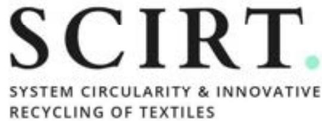

Innovation Action

H2020-SC5-2020-2

## **Elastane alternatives report**

### **Deliverable D2.3: Report on alternative primary materials**

#### **Elastane study case**

Version N°1

#### **Authors:**

Javier Vera Sorroche (CETI)

## **Disclaimer**

The content of this report reflects only the author's view. The European Commission is not responsible for any use that may be made of the information it contains.

## Document information

| <b>Grant Agreement</b>         | n°101003906                                                       |
|--------------------------------|-------------------------------------------------------------------|
| <b>Project Title</b>           | System Circularity & Innovative Recycling of Textiles             |
| <b>Project Acronym</b>         | SCIRT                                                             |
| <b>Project Coordinator</b>     | Evelien Dils, VITO                                                |
| <b>Project Duration</b>        | 1 st June 2021 – 31 st May 2024 (36 months) |
| <b>Related Work Package</b>    | WP2 Towards a fibre-to-fibre system: design & testing             |
| <b>Related Task(s)</b>         | T2.3 – Primary materials                                          |
| <b>Lead Organisation</b>       | CETI                                                              |
| <b>Contributing Partner(s)</b> | CETI                                                              |
| <b>Due Date</b>                | M24                                                               |
| <b>Submission Date</b>         |                                                                   |
| <b>Dissemination level</b>     | PU                                                                |

## History

| Date       | Version | Submitted by | Reviewed by | Comments |
|------------|---------|--------------|-------------|----------|
| 31/10/2022 | 1       | CETI         | VITO        | X        |
|            |         |              |             |          |
|            |         |              |             |          |
|            |         |              |             |          |

## Table of contents

Summary ..... 6

Introduction..... 7

1 Background and Literature Review ..... 8

- 1.1 Introduction of polymers ..... 8
- 1.2 An overview of bioplastics ..... 9

2 Introduction to Elastane ..... 11

- 2.1 Generalities and composition of Elastane..... 11
- 2.2 Elastane production ..... 12
- 2.3 Elastane fiber market research ..... 13
  - 2.1.1 Market size ..... 13
  - 2.1.2 Technology insights..... 13
  - 2.1.3 Elastane fiber market by application ..... 14
- 2.4 Recycling methods for elastane ..... 15

3 Elastane alternatives..... 16

- 3.1 TPU ..... 17
- 3.2 TPE-E ..... 17
- 3.3 TPE-A ..... 19
- 3.4 Other solutions..... 20

4 Recyclability of elastane alternatives ..... 21

5 Conclusions..... 22

6 Bibliography ..... 24

## List of figures

Figure 1: Structure of thermoplastics, elastomers and thermosets2 ..... 8

Figure 2: Vulcanization step7 ..... 9

Figure 3: Bioplastics classification10 ..... 10

Figure 4: Elastane chemical structure20 ..... 11

Figure 5: Solution wet spinning process24 ..... 12

Figure 6: Schematic representation of melt, dry and wet spinning processes27 ..... 12

Figure 7 Elastane Market forecast to grow28 ..... 13

Figure 8: Elastane fiber market by production method28 ..... 14

Figure 9: Elastane fiber market by application28 ..... 14

Figure 10: Elastane fiber market report highlights28 ..... 15

Figure 11: NaturePlast material properties37 ..... 18

Figure 12: Ecoflex compatibility and Ecovio composition35 ..... 18

Figure 13: PLA, PBS and Joncryl blends properties39 ..... 19

Figure 14: PBAF vs PBAT performance43 ..... 20

Figure 15 Melt spinning of CO2 in TPU ..... 21

Figure 16: Recycling solutions for Elastane replacements ..... 21

## **List of tables**

Table 1 Elastane alternatives..... 22

## Summary

This deliverable, D2.3, presents a state of the art of new (preferably bio-based) polymers that can replace Elastane and can contribute to the development of closed-loop recyclable textile products.

## Keywords

Primary materials, sustainable materials, renewable materials, environmental performance, economic potential

## Abbreviations and acronyms

| Acronym | Description                             |
|---------|-----------------------------------------|
| WP      | Work Package                            |
| Tg      | Glass Transition Temperature            |
| Tm      | Melting Temperature                     |
| TPE     | Thermoplastic Elastomer                 |
| TPS     | Styrenic Block Copolymers               |
| TPU     | Thermoplastic Polyurethanes             |
| TPE-E   | Thermoplastic Copolyester Elastomer     |
| TPE-A   | Thermoplastic Copolyamide               |
| TPO     | Thermoplastic Polyolefin                |
| TPV     | Thermoplastic Vulcanizate               |
| PBAT    | Polybutylene Adipate Terephthalate      |
| PLA     | Acide Polylactique                      |
| PBS     | Polybutylene Succinate                  |
| PBAF    | Polybutylene Adipate Furandicarboxylate |

## Introduction

### Task 2.3: Primary materials [CETI, VITO] (M4 – M34)

Even if the objective to develop yarn made from more than 50% of post-consumer recycled fibres is achieved, the remaining percentage needs to be complemented with new, primary fibres. The choice of these primary fibres is crucial as it will not just have an impact on the properties of the yarn, but also on the sustainability performance / impact of the yarn. Also, the final composition of the yarn should fit within a circular design strategy, meaning the fibre blend must not hamper future high-value recycling. The objective of this task is to explore possible alternatives for commonly used primary materials, with a focus on local production (EU based), circularity (compatible with the recycled fibre), low impact (environmental performance) and availability and possibilities to scale (economic potential). This task will be divided in 2 subtasks, with one task focussing on alternative primary materials for cotton (natural fibres) and the second task focussing on alternative primary material for Elastane, e.g. lycra (synthetic fibres).

(a) Alternative for cotton

Growing cotton, currently accounting for about 40% of the world's textile production, remains one of the most polluting natural fibres in the world as it covers about 2,5% of the world's cultivated areas, but swallows up 25% of insecticides and 10% of herbicides, according to the World Health Organization. In 2016, 64% of the world's cotton was genetically modified. In this task, EU-grown alternatives for cotton will be studied and assessed (economical and environmental), where the most promising fibres will be used to make yarn. The closed-loop recyclability of the yarn will be tested. This task links with Task 3.2, 3.3 and 3.5.

(b) Alternative for Elastane

Elastane is the generic term used to describe branded textiles such as lycra or spandex. It's primary attribute is elasticity, e.g. stretch in jeans (link with Task 3.2), shirts or dresses (link with Task 3.4), but it is also used as one of the main components for sportswear (link with Task 3.1). This task will investigate the processability and behaviour of new (preferably bio-based) polymers. The use of such polymer contributes to develop closed-loop recyclable products through extrusion recycling (Task 3.1). Spin-ability evaluation of the polymers and prototyping filaments will be carried out in order to evaluate the performance. Melt-spinning trials will be performed using several filament cross sections. In collaboration with Decathlon, these filaments will be then knitted to develop a new generation of swimsuits.

# 1 Background and Literature Review

## 1.1 Introduction of polymers

A polymer results from the accumulation of many monomers forming long chains, by a chemical process which is polymerization1.

Polymers can be classified into 3 categories such as: thermoplastics, thermosets and elastomers, as described in Figure 1.

Figure 1: Structure of thermoplastics, elastomers and thermosets2

**Thermoplastics** are composed of linear chains and are generally semi-crystalline. They have semi-crystalline zones in an amorphous matrix. The bonds between the chains are quite weak due to weak Van der Waals interactions or medium hydrogen bonds3. When the polymer is heated above the glass transition temperature  $T_g$ , the material becomes rubbery and the chains begin to slip between them. Above the melting temperature  $T_m$ , the thermal agitation breaks the weak cross-links between the chains, they separate and slide relative to each other, making the polymer liquid. When the polymer is cooled below  $T_m$ , the bonds reform and the chains come together, the viscous polymer solidifies. Thus, the crosslinking is reversible. Once heated, the polymer melts and will no longer be cross-linked, it can take on a different shape under the action of pressure exerted and be reused. This is why **thermoplastics are generally recyclable4**.

The cooling rate has an impact on the crystallization kinetics and therefore on the crystallinity of the polymer, indeed, to obtain a high level of crystallinity, the polymer must undergo controlled and slow cooling. Otherwise, the crystallites do not have time to form, the polymer will be amorphous and therefore glassy5. The interconnections between the chains as well as the degree of crystallinity of the polymers have an influence on their properties.

**Thermosets** are also generally semi-crystalline but are unlike thermoplastics, highly cross-linked to form a 3-dimensional network between short molecular chains4. Cross-linking is chemical, the bonds between the branches are covalent bonds that are formed during a cross-linking step or a vulcanization step. Vulcanization is a chemical process that consists of incorporating a vulcanizing agent, usually sulphur, into an elastomer.

The objective is to form bridges between molecular chains after curing. This step provides the energy required to form the chemical bonds. The bridges act like springs and make the elastomer much more elastic, this stage is almost irreversible. These cross links do not separate under the action of heat but break by degrading the polymer when the temperature is excessive since the energy required to break these bonds is very high6. As a result, **thermosetting polymers are generally not or very difficult to recycle.**

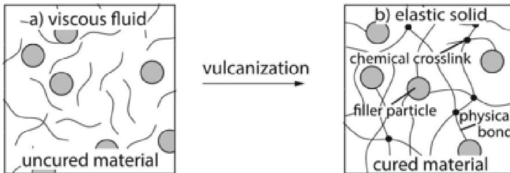

Figure 2: Vulcanization step7

Another class of polymers is **elastomers**. They are made from linear amorphous polymers whose cohesive force between the chains is very low. Their glass transition temperature is very low, around  $-40^{\circ}\text{C}$  and therefore well below ambient temperature and their operating temperature. At room temperature, they are very viscous liquids, they are rubbery, soft and deformable due to the very low cohesive forces between the chains in this state.

In order to limit the sliding of the linear chains, a slight cross-linking blocks the chains to a certain extent and creates a three-dimensional structure. At rest, the macromolecular chains of the elastomer fold back on themselves thanks to a very great freedom of rotation of the links constituting these chains. When a stress is exerted on the polymer, the chains will unfold by aligning themselves and then regain their folded conformation as soon as the force is removed. The elastic deformation of these polymers is completely reversible8.

**Elastomers can be thermoplastic or thermosetting.** A majority of elastomers are thermosetting, they comprise bridges between the chains and therefore covalent cross-linking of the macromolecular chains. Their formation requires a cross-linking step or a vulcanization step.

Some elastomers are thermoplastic, if they do not undergo a vulcanization or cross-linking step and they retain mechanical properties similar to those of vulcanized rubber, they are called TPE. They retain the advantages of the two categories described above, their crosslinking is reversible under the action of temperature, so they are recyclable4.

The nature of these elastomers depends on the cross-linking bonds between the macromolecular chains9.

## 1.2 An overview of bioplastics

Bioplastics refer to polymers that can be biosourced and/or biodegradable, a schematic representation is shown in Figure 3.

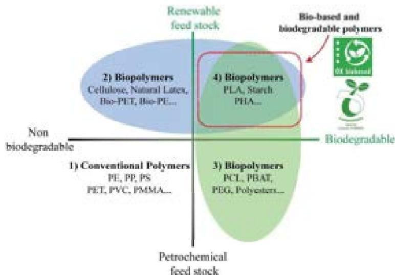

Figure 3: Bioplastics classification10

Carbon (C) backbones of bio-based polymers are derived from a renewable resource. As fossil resources become increasingly scarce, biosourced materials are being explored and developed. Currently, the most widely used raw materials for bioplastics are plant-based.

The main polymers constituting plant matter are starch, proteins, pectins, cellulose, hemicelluloses and lignins, which can be used in materials. This is the case for starch, which can come from corn, potatoes, wheat or manioc. But also, the proteins present in oilseeds such as flax or sunflower but also in oilseeds such as soy. Beet pectins are also used in the plastics industry11.

Biodegradable polymers are plastics formulated from ingredients that can be naturally metabolized by micro-organisms in the environment. Other polymers may be composable, in which case they are also biodegradable, again depending on their chemical structure. To be composable, the materials will have to degrade under specific conditions, over a limited time and meet standards such as NF EN 13432: 200012 and NF T 51-800: 201513.

Some synthetic polymers are biodegradable while other biobased polymers are not. Indeed, the composition and the end of life of the polymer are two independent parameters, but they depend on the chemical structure of the material. Although not all biopolymers are biodegradable, development and innovation in polymers from bio-based materials offers a solution for waste disposal problems14.

## 2 Introduction to Elastane

### 2.1 Generalities and composition of Elastane

Elastane, also called spandex or Lycra®, is a synthetic polymer that belongs to the elastomers. Polyurethane fibers such as these could not originally be considered thermoplastics because their melting temperature was higher than their degradation temperature15. The structure of elastane has a cross-linked network and therefore elastane cannot be considered a typical thermoplastic16. It has a significant impact on the environment, from its manufacture to its end of life17.

It is mostly produced with synthetic, non-renewable resources, requires a lot of energy and toxic and polluting chemicals. This material is harmful from its manufacture but also during its use by the release of microfibers in water during washing and this, until the end of its life18. Elastane is not biodegradable or compostable and its recycling would present significant advantage from an ecological and economic point of view.

As elastane is an elastomer, it can be stretched and recoil when released retaining its original shape. The fibers have a maximum elongation of up to 500% of their length. Their elastic character comes from their polyurethane molecular structure composed of two types of segments: long amorphous segments made of polyester or polyether, and short rigid segments of polyurethane-urea, as shown in Figure 419.

Figure 4: Elastane chemical structure20

Chemically, it is composed of a long chain polyglycol associated with a short di-isocyanate, and contains at least 85% polyurethane, molecule derived from petroleum21. The structure of the fibers is due to the rigid parts of the polymers, which bind together. The amorphous segments have a random molecular structure and will elongate when a force is applied to stretch the fibers. They are thus responsible for increasing the length of the fibers because they will straighten.

Once the force is removed, the amorphous segments recoil and the fiber returns to its relaxed state. These fibers are well suited to the clothing sector since, in addition to being elastic, they are resistant to abrasion, perspiration and detergents. These fibers also have the advantage of being compatible with other materials and can be spun with other fibers depending on the desired properties. Combining natural fibers such as cotton or synthetic materials such as polyester with elastane, makes them stretchy and last longer, the amount of this elastomer will depend on the final application of the product.

To achieve a garment with better fit, drape and movement, a small amount of elastane such as 2% is enough to make a difference to the garment. For items with better support and fit such as swimwear, underwear or active sportswear, elastane is usually in the range of 10-20%. Items intended for high performance garments such as compression garments may contain up to 20-30% elastane22.

## 2.2 Elastane production

Elastane fibers are mainly produced by solution dry spinning23. Solution dry spinning is the most cost efficient process in fiber manufacturing. Although fibers manufactured through this process offer better elastic recovery, which is the reason for the largest market share compared to other production methods, this process is very solvent-intensive.

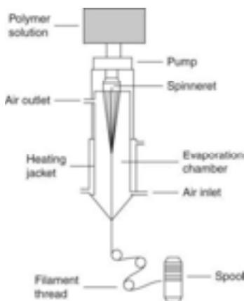

Figure 5: Solution wet spinning process24

- • The first step is the formation of a prepolymer by mixing two reactants: a macro glycol with a diisocyanate monomer, in a reaction vessel and with specific temperatures and pressures. The macro glycol can be a polyester or a polyether, they are high molecular weight diol. The characteristics of the fibers depend directly on the ratio between the two reactants, in general the classic ratio is 1:2.
- • The prepolymer then performs a chain extension reaction with an equivalent amount of diamine acid which plays a role of chain extenders. The resulting substance will then need to be exposed to a solvent to make it easier to handle with the resulting product.
- • The polymer is then pumped into a spinning cell through a spinneret, forming liquid polymer strands. The strands will have to be heated and exposed to nitrogen and solvent gases, to be able to pass the liquid state to the solid state, they are then grouped and twisted to form elastane fibers.
- • A finishing treatment will then end the manufacturing process to prevent the fibers from sticking to each other, the elastane can be manufactured25.

Two other methods are available to produce elastane: solution wet spinning and melt spinning, but these account for only a small proportion, less than 5%, of elastane production26. Each of these methods involve the initial step of reacting monomers to produce a prepolymer.

- • Solution wet spinning is a method that will dissolve polymers in a solvent where the polymer is extruded into a coagulation bath. The polymer will precipitate into a filament.
- • Melt spinning consists of melting the polymer and sending it under pressure through a spinneret.

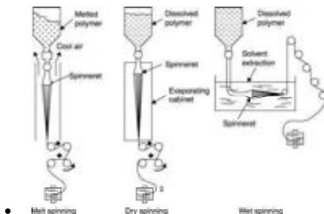

Figure 6: Schematic representation of melt, dry and wet spinning processes27

## 2.3 Elastane fiber market research

### 2.1.1 Market size

China is the largest producer of elastane and accounts for about 75% of the total world production. Initially, the United States was the leading producer, however, the elastane manufacturing has seen this shift to China due to the cheap labour available in this Asian country.

In 2019, USD 7.39 billion was the estimated global market size for elastane. Elastane market demand is expected to further increase from 2020 to 2030 with the annual growth rate of 7.31 % (CAGR). Moreover, with rapid increase in the population and consumer disposable, thrusts the elastane demand in sports and active wears. Therefore, this drives the further market growth. Healthy lifestyle is very important for wellbeing of humans which encourage people to participate in sports activities. As a result, this will enhance the market demand for sportswear for example cycling pants.23,28

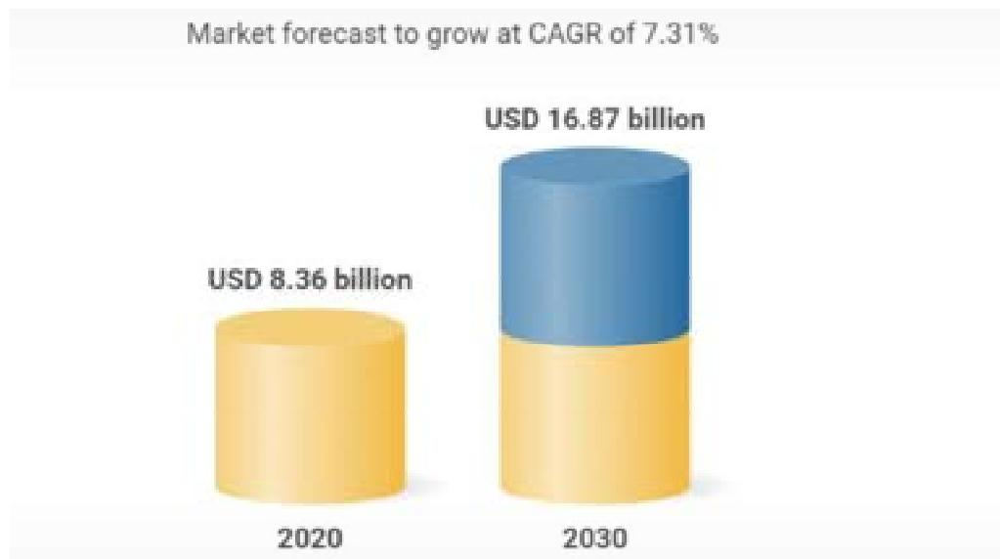

Figure 7 Elastane Market forecast to grow28

### 2.1.2 Technology insights

In 2019, solution dry spinning covers the 94% of the global market share. From 2020 to 2030, this share value is expected to increase with the fast growing CAGR. However, dry spinning process provides high productivity as compared to wet spinning and melt spinning process.

23,28

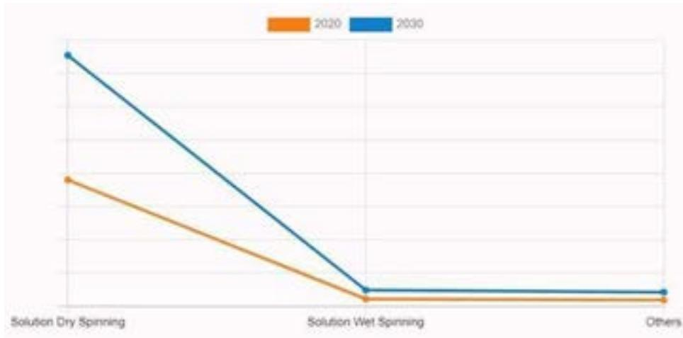

Figure 8: Elastane fiber market by production method28

### 2.1.3 Elastane fiber market by application

In 2019, more than 74% of the market share was covered by the clothing segment. Due to the increasing demand for sports and active wears, this market share will further expand from 2020 to 2027 with high CAGR.23,28

Nonetheless, this market share is not limited to sportswear but elastane vastly being used in medical applications. For example, elastane is extensively used in manufacturing compress bandages, stretchable bandages, etc. Therefore, medical application segment will also project the significant growth in market share over the forecast years.

In addition, elastane can also be used in film industry. For example, actors wear elastane made motion capture suits in front of green screens. This will supplementary expand the product demand and, thus, driving the market growth.

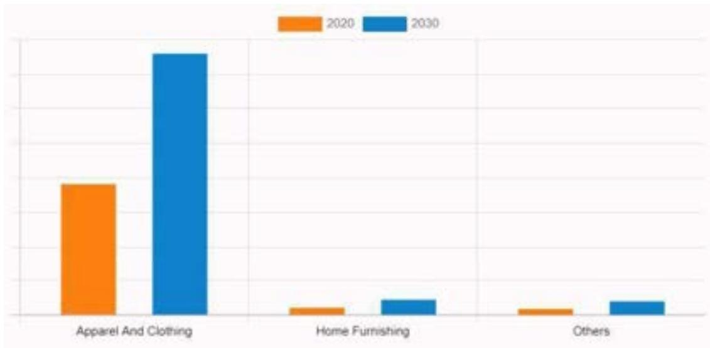

Figure 9: Elastane fiber market by application28

| Aspects                                         | Details                                                                                                                                                                                                                                                                                                                 |
|-------------------------------------------------|-------------------------------------------------------------------------------------------------------------------------------------------------------------------------------------------------------------------------------------------------------------------------------------------------------------------------|
| <b>By Production Method</b>                     | <ul> <li>• Solution Dry Spinning</li> <li>• Solution Wet Spinning</li> <li>• Others</li> </ul>                                                                                                                                                                                                                          |
| <b>By Application</b>                           | <ul> <li>• Home Furnishing</li> <li>• Others</li> <li>• Apparel and Clothing</li> </ul>                                                                                                                                                                                                                                 |
| <b>By Region</b>                                | <ul> <li>• <b>North America</b> (U.S., Canada, Mexico)</li> <li>• <b>Europe</b> (France, Germany, Italy, U.K., Netherlands, Rest of Europe)</li> <li>• <b>Asia-Pacific</b> (China, Japan, India, South Korea, Rest Of Asia Pacific)</li> <li>• <b>LAMEA</b> (Brazil, Argentina, South Africa, Rest of LAMEA)</li> </ul> |
| <b>Key Market Players</b>                       | Hyosung Corporation, Invista, Asahi Kasei Corporation, Toray Industries, Inc., Indorama Industries Ltd., TK Chemical Corporation, Zhejiang Huafon Spandex Co. Ltd., Xiamen Lilong Spandex Co., Ltd., Yantai Spandex Co., Ltd., Taekwang Industrial Co. Ltd.                                                             |
| <b>Other players in the value chain include</b> | Xinxiang Bailu Chemical Fibre Group Co. Ltd., Baoding Swan Spandex Co., Ltd., Spandex Corporation Ltd., Jiangsu Shuangliang Spandex Co., Ltd., Highsun Group, Yantai Tayho Advanced materials Co. Ltd.                                                                                                                  |

Figure 10: Elastane fiber market report highlights28

## 2.4 Recycling methods for elastane

Currently, defects in chemical resistance and temperature stability are difficulties when this type of polyurethane is processed as degradation can occur and affect the fiber properties.

If a heat treatment is used for elastane blends, the macromolecules of elastane degrade into short-chain residues that must be removed from the blend29. It is currently impossible to (thermo-)mechanically separate elastane from recyclable fibers, and very difficult to chemically separate elastane. It is also very difficult to separate mechanically, chemically or thermally elastane from recyclable fibers from discarded textiles19. This is mainly due to the exceptional mechanical properties and chemical structure of this fiber. Depending on the fiber blends, the recycling processes are different.

Elastane is typically blended in small amounts (1–5%) with other fibers, such as polyester, cotton or wool, but also in larger amounts (around 20%) with polyamide in sportswear. For most mechanical recycling technologies, a presence of more than 10% of elastane can be problematic as these are more difficult to shred or unravel. This will create a jam as soon as these textiles fray, and which will block the other fibers30.

For other recycling methods such as the chemical one, the textiles undergo a depolymerization step in order to obtain monomers that will have to be repolymerized. This process will degrade the quality of the fibers mixed with the elastane and requires a lot of energy and solvents. This

monomer recycling technology requests a minimum of 80-90% PET or PA6 for economic reasons31. The elastane ends up as waste in the solid residue or sludge, however, the fate of elastane is unknown as it is possible that elastane is also degraded under solvolysis conditions.

Another recycling method is thermo-mechanical recycling, where again there is a degradation of the mixed fibers. Current recycling methods have harmful effects that do not offer any real advantage to the recycling of these textiles, especially since elastane is generally present in small quantities, around 1 to 10%32.

### 3 Elastane alternatives

In order to avoid the environmental problems encountered with elastane, several companies are trying to respond to this problem by seeking either alternatives or methods for separating and recycling this polymer. The alternatives, that is to say, materials with properties similar to elastane but with a lower ecological impact and not hampering future textile fiber recycling are particularly interesting in responding to the initial problem.

To meet SCIRT requirements, the challenge, then, is to find these more ecological materials available on the market, which can be melt-spinnable while retaining the exceptional properties of elastane, i.e.:

- • The materials must have an environmental advantage, i.e. be recyclable, compostable or biodegradable and/or be synthesized from biosourced or recycled raw materials. The materials must be available on the market and preferably in Europe to limit their transport and therefore their carbon footprint.
- • In addition, it will be necessary to switch from spinning to melt spinning, which does not use solvents or harmful chemicals.
- • Finally, the materials must, once spun, approach the exceptional properties of elastane, and correspond to the specifications of the SCIRT demonstrators.

One category of polymers is particularly interesting: the **thermoplastic elastomers (TPE)**. Several types of TPE are available on the market or under development. There are several subcategories of TPEs33:

- ○ Styrenic Block Copolymers (TPS),
- ○ Thermoplastic Polyurethanes (TPU),
- ○ Thermoplastic Copolyester Elastomer (TPE-E),
- ○ Thermoplastic Copolyamide (TPE-A),
- ○ Thermoplastic Polyolefin (TPO),
- ○ Thermoplastic Vulcanizate (TPV).

As stated, TPEs are recyclable due to their chemical structure and more particularly the hydrogen or Van der Waals chemical bonds between the chains, this is a real advantage when talking about the durability of fibers and textile materials.

The types of TPE most frequently found when looking for alternatives to elastane are presented below.

### 3.1 TPU

These are thermoplastic polyurethane elastomers formed by segmented linear copolymer blocks, composed of hard and soft segments. The hard segments are diisocyanate molecules and the soft segments are diols, mainly ester or ether groups. The composition and percentage of these segments are different in different TPUs and affect their properties15.

This type of polymer is available on the market through the following suppliers and grades:

- • *Estane Eco* from Lubrizol35: Estane Eco is part of Lubrizol's bio-based TPU made with renewable material content from approximately 30 to 70% of total volume.
- • *Elastollan* from BASF35: Elastollan is a brand name for a thermoplastic polyurethane from BASF, recyclable due to its thermoplastic properties.
- • *Freeflex* from BASF35: Freeflex is another brand name for a thermoplastic polyurethane from BASF, recyclable due to its thermoplastic properties.

### 3.2 TPE-E

These are thermoplastic copolyester elastomers formed by segmented linear copolymer blocks, composed of ester and ether segments.

- • *Hytrel* from DuPont36: Hytrel is a TPE-E from DuPont that can be partially bio-based. These thermoplastic elastomers contain 20-60% renewable material depending on the grade.

- • *NP Soft* from Natureplast37: This range includes a set of compounds based on biosourced, up to 80% and biodegradable polyesters.

| PROPERTIES                                                                                                                                                                                                                   | APPLICATIONS                                                                                        | TRANSFORMATION                                     |
|------------------------------------------------------------------------------------------------------------------------------------------------------------------------------------------------------------------------------|-----------------------------------------------------------------------------------------------------|----------------------------------------------------|
| <ul> <li>• Up to 80% biobased</li> <li>• Some of them are biodegradables through industrial composting</li> <li>• Highly flexible</li> <li>• Abrasion resistance</li> <li>• Some of them are fit for food contact</li> </ul> | <ul> <li>• Sports and leisure</li> <li>• Transports</li> <li>• Regular consumption goods</li> </ul> | <ul> <li>• Primarily injection moulding</li> </ul> |

Figure 11: NaturePlast material properties37

## PBAT

PBAT stands for polybutylene adipate terephthalate and is a biodegradable random copolymer in the TPE-E category. This polymer is obtained by polycondensation between butanediol, adipic acid and terephthalic acid. It has proven to be an excellent and one of the most suitable combination in terms of properties and biodegradability.

- • *Ecoflex* from BASF35: Ecoflex is a PBAT, it is a polymer that is not bio-based, but is the first biodegradable and compostable polymer by BASF. It is compatible with various other polymers that will be used to obtain specific characteristics depending on the application, as shown in Figure 12.
- • *Ecovio* from BASF35: Ecovio is a polymer from BASF which is compostable and partly bio-based. It is a blend of PBAT and PLA. The PLA is responsible for the partially bio-based composition of this polymer while the PBAT will provide the elasticity of the material.

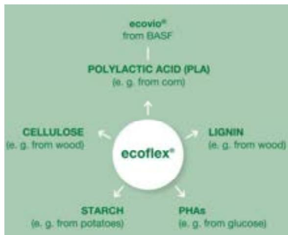

Figure 12: Ecoflex compatibility and Ecovio composition35

## PBS

PBS or polybutylene succinate is another class of TPE-E that has the advantage of being biodegradable. PBS can be blended with other polymers such as PLA.

- • *BioPBS* from Mitsubishi38: Mitsubishi BioPBS are polymers made from renewable raw materials such as recycled or biobased polymers. They are biodegradable.

### PLA

PLA is another type of TPE-E. It is formed from lactic acid, which is an intermediate resulting from the fermentation of sugar or starch from beet or corn. The lactic acid is then polymerised into PLA by a second fermentation process. They have the properties of thermoplastics, can be manufactured by melt and are recyclable. It is not an elastic material as a single component but can become so if combined with other components such as:

- • *Joncryl* from BASF35: It is an additive that can add mechanical properties to blends such as PBS and PLA. PLA and PBS properties are increased, and these are shown below in Figure 13.

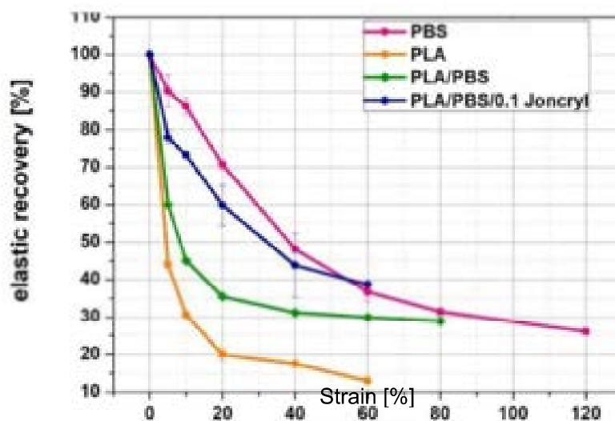

Figure 13: PLA, PBS and Joncryl blends properties39

- • *Ecovio* from BASF35: It is a compostable and partly bio-based polymer that is a blend of PBAT and PLA. The PLA is responsible for the partially bio-based composition of this polymer while the PBAT will provide the elasticity of the material.

## 3.3 TPE-A

These are polyether block amides. This copolymer is composed of hard segments which are polyamide groups and soft segments which are polyether groups.

- • *Pebax* from Arkema40: Pebax elastomers are produced by Arkema and are partially bio-based, from castor oil. They are block copolymers made up of rigid polyamide blocks and soft polyether blocks.

### 3.4 Other solutions

Some materials are still under development and are not commercially available. Other polymers seem to be a viable alternative to elastane but very little is known about them.

- • *Tefabloc* from Mitsubishi38: This range of polymer is still under development. Tefabloc polymers are made from renewable resources such as recycled or bio-based polymers. These polymers maintain the highly desirable combination of the toughness traditionally associated with polyamides and the elasticity more often seen with polyethers or polyesters.
- • *reSound OM* from Avient41: These biopolymers utilize between 40 and 50% bio-renewable content derived from sugarcane and offer performance comparable to standard TPEs.
- • *reSound R* from Avient41: ReSound R from Avient are made from post-consumer recycled or post-industrial recycled material, until 80%
- • *Terratek flex* from Green Dot42: Terratek Flex is a starch-based elastomer from Green Dot, verified to meet standards for compostability in an industrial composting environment. It is formulated with up to 35% biobased content.

#### PBAF

PBAF has significant merits in terms of elastic performance as well as biodegradability, compared to its terephthalic counterpart, PBAT. PBAF is still under development but should be an interesting alternative to replace elastane. Figure 14 displays PBAF performances.

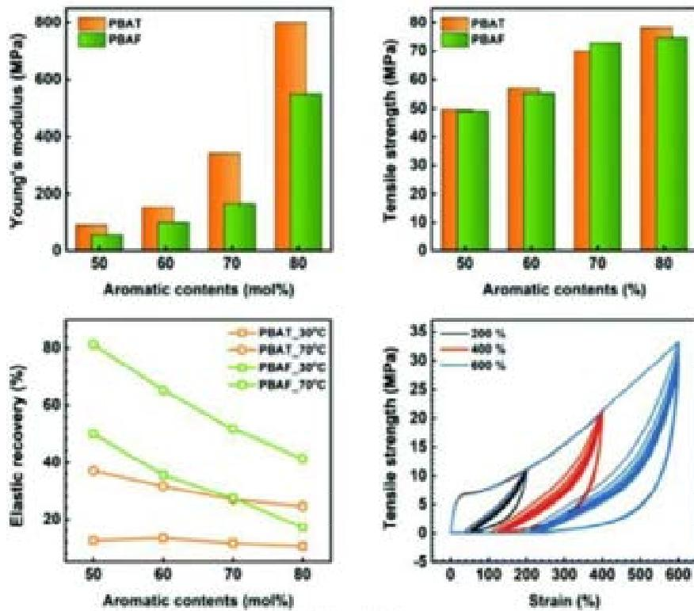

Figure 14: PBAF vs PBAT performance43

#### CO2 for in TPU

This is a lab scale technology currently examined to replace elastane at industrial scale, which would eliminate the use and recovery of solvents from elastane production, as shown in Figure1544.

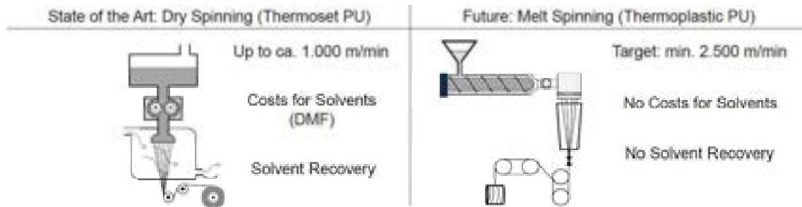

Figure 15 Melt spinning of CO2 in TPU

## 4 Recyclability of elastane alternatives

It is clear that there is an urgent need to develop an alternative for elastane that does not exhibit the bonding properties that inhibit recycling, or to develop improved, cost-effective methods for removing elastane from fabric blends to facilitate recycling.

Until now, this report has presented a list of alternative (thermoplastic) materials, whose elastic properties are similar to that of elastane. These materials were shortlisted to be suitable for melt spinning applications and so these can be used to produce:

- 1- short fibers (staple fibers) that can be blended with natural fibers (wool or cotton) and have uses for mechanical recycling, and
- 2- feedstock for the thermo-mechanical EREMA recycling process.

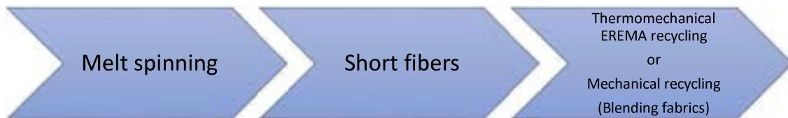

Figure 16: Recycling solutions for Elastane replacements

From literature review, a recent patent45 claims that PBAT processed via melt spinning exhibits good spinnability at relatively low spinning temperature and relatively high spinning speed. PBAT fibers were found to have elasticity, good mechanical properties, heat resistance and soft hand feel. These were also blended with cotton and wool fibers for producing medical supplies, cloth products of the food industry and disposable protective clothing.

More recently, International Fiber Group has launched Rilsan® PA11 into the fabric market, similar to a TPE-A based material or Pebax grades, which is 100% bio-based, derived from renewable castor oil, and has a proven legacy in meeting some of the world's most demanding material challenges. The trademark properties of PA11 include lightweight, flexibility, durability, and overall toughness.

## 5 Conclusions

The high demand for elastane fabrics across the world for manufacturing sportswear, socks, hosiery, swimwear and other clothing is expected to further grow the elastane fiber market. Looking forward, it is expected that the market reaches a value of US\$ 16.87 Billion by 2030 exhibiting a CAGR of 7.31% during 2020-2030. However, manufacturing elastane fabrics involves the use of harmful chemicals, and if these chemicals are not disposed of properly, they could damage the environment. Moreover, elastane is not biodegradable and current recycling methods do not offer any real advantage to the recycling of fabrics containing elastane.

This deliverable, D2.3, presents a state of the art of new (preferably bio-based) polymers that can replace (fossil-based) elastane and can contribute to the development of closed-loop recyclable textile products. However, from an economic perspective, it must be mentioned that the production of bio-based plastics is still much more expensive than fossil-based, mainly due to the low oil price, high investment costs of new infrastructure, and the current energy crisis.

If preferable bio-based solutions are needed, Mitsubishi, Lubrizol, BASF and Arkema might have solutions for alternative materials to elastane. These shortlisted materials are summarized in Table 1.

Among worldwide material suppliers, BASF and Arkema have bio-based solutions to replace elastane in Europe, which would limit transport and therefore carbon footprint.

Although this report focuses on alternative materials to elastane, the state of the art also includes alternative solutions to elastane that are suitable for both thermo-mechanical and mechanical recycling processes. This work shows that TPE-A and TPE-E based materials, such as PBAT and Pebax, have already been investigated and tested to deliver textile to textile solutions; PBAT staple fibers can be blended with cotton and wool to create textile products for the food industry and disposable protective clothing.

Overall, the state of the art conducted during this work suggests that those materials provided by BASF and ARKEMA are preferable, since they are bio-based, local, and have been reported to work well for melt spinning applications and circular textile recycling solutions.

Table 1 Elastane alternatives

| Supplier   |    | Name            | Category           | €/kg      | Melt spinning grade | Thermo-mechanical recycling | Mechanical recycling |
|------------|----|-----------------|--------------------|-----------|---------------------|-----------------------------|----------------------|
| Mitsubishi | JP | Tefabloc A      | Bio-based          | Not found | To be examined      | YES                         | Not found            |
| Mitsubishi | JP | Tefabloc R      | Recycled materials | Not found | To be examined      | YES                         | Not found            |
| Lubrizol   | US | Estane Eco      | Bio-based          | Not found | To be examined      | YES                         | Not found            |
| BASF       | DE | Ecoflex F Blend | Bio-based          | 5         | YES                 | YES                         | YES                  |
| Arkema     | FR | Pebax 30R51     | Bio-based          | 18        | YES                 | YES                         | YES                  |
| Arkema     | FR | Pebax 40R53     | Bio-based          | 18        | YES                 | YES                         | YES                  |

## 6 Bibliography

- 1- **Polymer Chemistry. (2004).** Google Books. [https://books.google.fr/books?id=0qFQ5OuKoy8C&printsec=frontcover&hl=fr&source=gbs\\_ge\\_summary\\_r&cad=0#v=onepage&q=elastomer&f=false](https://books.google.fr/books?id=0qFQ5OuKoy8C&printsec=frontcover&hl=fr&source=gbs_ge_summary_r&cad=0#v=onepage&q=elastomer&f=false)
- 2- **Vashchuk, A., Fainleib, A. M., Starostenko, O., & Grande, D. (2018).** Application of ionic liquids in thermosetting polymers : Epoxy and cyanate ester resins. *Express Polymer Letters*, 12(10), 898-917. <https://doi.org/10.3144/expresspolymlett.2018.77>
- 3- **Elastomer - Chemical interlinking : from elastomers to rubbery solids. (2019).** Encyclopedia Britannica. <https://www.britannica.com/science/elastomer/Chemical-interlinking-from-elastomers-to-rubbery-solids>
- 4- **McKeen, L. W. (2017).** Elastomers and Rubbers. *Film Properties of Plastics and Elastomers*, 419-448. <https://doi.org/10.1016/b978-0-12-813292-0.00013-7>
- 5- **FONTANILLE, M., & GNANOU, Y. (2009).** Structure morphologique des polymères. *Plastiques et composites*. <https://doi.org/10.51257/a-v1-am3038>
- 6- **CHATAIN, M. (1998).** Matières thermodurcissables - Introduction. *Plastiques et composites*. <https://doi.org/10.51257/a-v1-am3405>
- 7- **Restrepo-Zapata, N. C., Osswald, T. A., & Hernández-Ortiz, J. P. (2014).** Vulcanization of EPDM rubber compounds with and without blowing agents : Identification of reaction events and TTT-diagram using DSC data. *Polymer Engineering & Science*, 55(9), 2073-2088. <https://doi.org/10.1002/pen.24049>
- 8- **Thermoplastic Elastomers : Types, Uses, Properties & Processing of TPEs Material. (2021).** Omnexus. <https://omnexus.specialchem.com/selection-guide/thermoplastic-elastomer>
- 9- **Thermoplastic Elastomers. (2022).** pslc. <https://pslc.ws/macrog/tpe.htm>
- 10- **Jonathan Cailloux. (2016).** Modified Poly(lactic acid) sheets manufactured by One-Step Reactive Extrusion-Calendering: Thermal, Rheological, Mechanical and Fracture Behaviours. [https://www.researchgate.net/publication/341652080\\_Modified\\_Polylactic\\_acid\\_sheets\\_manufactured\\_by\\_One-Step\\_Reactive\\_Extrusion-Calendering\\_Thermal\\_Rheological\\_Mechanical\\_and\\_Fracture\\_Behaviours/figures?lo=1](https://www.researchgate.net/publication/341652080_Modified_Polylactic_acid_sheets_manufactured_by_One-Step_Reactive_Extrusion-Calendering_Thermal_Rheological_Mechanical_and_Fracture_Behaviours/figures?lo=1)
- 11- **A. (2020, 4 mai).** *Les matériaux biosourcés, une alternative pour l'avenir.* SESAME. <https://revue-sesame-inrae.fr/les-materiaux-biosources-une-alternative-pour-lavenir/>
- 12- **NF EN 13432. (2000).** Afnor EDITIONS. <https://www.boutique.afnor.org/fr-fr/norme/nf-en-13432/emballage-exigences-relatives-aux-emballages-valorisables-par-compostage-et/fa049121/454>
- 13- **NF T51-800. (2015).** Afnor EDITIONS. <https://www.boutique.afnor.org/fr-fr/norme/nf-t51800/plastiques-specifications-pour-les-plastiques-aptes-au-compostage-domestiqu/fa060127/1525>
- 14- **Bourgeois, M. (2011, 10 avril).** *Fibres agrosourcées.* Techniques de l'Ingénieur. <https://www.techniques-ingenieur.fr/base-documentaire/procedes-chimie-bio-agro-th2/chimie-du-vegetal-et-produits-biosources-42570210/fibres-agrosourcees-n2520/>
- 15- **Drobny, J. G. (2014).** Thermoplastic Polyurethane Elastomers. *Handbook of Thermoplastic Elastomers*, 233-253. <https://doi.org/10.1016/b978-0-323-22136-8.00009-0>

16- Bhat, G., Chand, S., & Yakopson, S. (2001). Thermal properties of elastic fibers. *Thermochimica Acta*, 367-368, 161-164. [https://doi.org/10.1016/s0040-6031\(00\)00673-0](https://doi.org/10.1016/s0040-6031(00)00673-0)

17- Reviewing the Production Process, Physical and Chemical Properties of Spandex Fibers. (2020). Austin Publishing Group. <https://austinpublishinggroup.com/textile-engineering/fulltext/arte-v5-id1051.php>

18- Sewport. (2022). What is Lycra Fabric: Properties, How its Made and Where. Retrieved September 28, 2022, from <https://sewport.com/fabrics-directory/lycra-fabric>

19- Hart, D. (2020, 18 juin). *Three challenges that will stretch spandex in 2020*. Wood Mackenzie. <https://www.woodmac.com/news/opinion/three-challenges-that-will-stretch-spandex-in-2020/>

20- hN. (2018, 20 décembre). *Yaa Assignment On Spandex Fiber*. TEXTILE FOR INSPIRATION. <https://textileground.blogspot.com/2018/12/yaa-assignment-on-spandex-fiber.html>

21- Otaigbes, J., & Madbouly, A. (2009). The processing, structure and properties of elastomeric fibers. Handbook of Textile Fibre Structure, 325-351. <https://doi.org/10.1533/9781845696504.2.325>

22- Clothing from spandex fibres. (2021). CLOTHING FROM SPANDEX FIBRES. Textile News, Apparel News, Fashion News. <https://textilevaluechain.in/news-insights/clothing-from-spandex-fibres/>

23- Global Spandex Market Size, Share Report, 2020–2027. (2020). Grand View Research. <https://www.grandviewresearch.com/industry-analysis/spandex-market>

24- Imura, Y., Hogan, R., & Jaffe, M. (2014). Dry spinning of synthetic polymer fibers. *Advances in Filament Yarn Spinning of Textiles and Polymers*, 187-202. <https://doi.org/10.1533/9780857099174.2.187>

25- Otaigbes, J., & Madbouly, A. (2009b). The processing, structure and properties of elastomeric fibers. *Handbook of Textile Fibre Structure*, 325-351. <https://doi.org/10.1533/9781845696504.2.325>

26- Kiron, M. I. (2021, 11 janvier). *Spandex Fiber : Properties, Manufacturing Process and Uses*. Textile Learner. <https://textilelearner.net/spandex-fiber-properties-manufacturing/>

27- T. (2021, 26 juin). *Melt Spinning Process | Dry Spinning Process | Wet Spinning Process*. Textile Tutorials. <https://textiletutorials.com/melt-spinning-process-dry-spinning-process-wet-spinning-process/>

28- Spandex Market Research Report: By Production Process (Solution Dry-Spinning Process, Solution Wet-Spinning Process, Others), By Type (Four-way stretch type, Two-way stretch Type) and By Application (Technical textiles, Home Textiles, Medical Textiles, Apparels) – Forecast to 2030 <https://www.alliedmarketresearch.com/spandex-fiber-market>

29- Lv, F., Yao, D., Wang, Y., Wang, C., Zhu, P., & Hong, Y. (2015). Recycling of waste nylon 6/spandex blended fabrics by melt processing. *Composites Part B : Engineering*, 77, 232-237. <https://doi.org/10.1016/j.compositesb.2015.03.038>

30- Langley, K., & Kim, Y. (2006). Manufacturing nonwovens and other products using recycled fibers containing spandex. Recycling in Textiles, 137-164. <https://doi.org/10.1533/9781845691424.3.137>

31- Duhoux, T., et al (2021). Study on the technical, regulatory, economic and environmental effectiveness of textile fibres recycling. The Publications Office of the European Union. Consulté le 29 septembre 2022, à l'adresse <https://op.europa.eu/en/publication-detail/-/publication/739a1cca-6145-11ec-9c6c-01aa75ed71a1>

32- Wang, C. (2021, 24 novembre). *What is Spandex Fabric ? What is Spandex Fabric Used for?* Spandex Fabric, Lycra Material » Wingtex China. <http://wingtex.cn/what-is-spandex-fabric/what-is-spandex-fabric-used-for/>

33- Phon Tech - Professional in Thermoplastic Elastomers Compounding - KNOWLEDGE BASE - What is Thermoplastic Elastomer (TPE). (2022). Phon-Tech. <https://www.phon-tech.com.tw/faq/detail/8/What+is+Thermoplastic+Elastomer+%28TPE%29%3F.html>

34- Lubrizol. (2022). Lubrizol. <https://www.lubrizol.com>

35- BASF. (2022). BASF. <https://www.basf.com/fr/fr.html>

36- DuPont | Invent a better now. (2022). DuPont. <https://www.dupont.com>

37- NATUREPLAST. (2022, 8 juillet). *Natureplast Le spécialiste des Bioplastiques*. <https://natureplast.eu>

38- Mitsubishi Chemical Group. (2022). m-chemical. <https://www.m-chemical.co.jp/en/index.html>

39- International Fiber Journal. (2019, 16 octobre). *Improving the elastomeric performance of bio-based fibers*. <https://fiberjournal.com/improving-the-elastomeric-performance-of-bio-based-fibers/>

40- Accueil - Arkema.com. (2022). Arkema. <https://www.arkema.com/global/fr/>

41- Welcome to Avient | Specialty Polymer Formulations. (2022). Avient. <https://www.avient.com>

42- Green Dot Bioplastics. (2022, 26 juillet). Green Dot Bioplastics - A Bioplastic Material Science Company. <https://www.greendotbioplastics.com>

43- H. (2020). *Remarkable elasticity and enzymatic degradation of bio-based poly(butylene adipate- co -furanoate) : replacing terephthalate - Green Chemistry (RSC Publishing) DOI:10.1039/D0GC01688H*. Royal Society of Chemistry. <https://pubs.rsc.org/en/content/articlehtml/2020/gc/d0gc01688h>

44- Bioplastics magazine 17(2), Seiten/Artikel-Nr.:14-15

45- PBAT (poly(butylene adipate-co-terephthalate)) fiber and preparation method thereof. (s. d.). 2012. (China Brevet n° CN103668540B, 2012)

