## Horizon 2020 Programme

#### **SCIRT**

Innovation Action (IA)

This project has received funding from the European Union's Horizon 2020 research and innovation programme under grant agreement No 101003906

> Start date : 2021-06-01 Duration : 36 Months https://scirt-h2020.eu/

## SCIRT

## **Fibre footprint at garment level of six SCIRT prototypes**

Authors : Mrs. Anse SMEETS (VITO), Lise Asscherickx (VITO), Veronique Van Hoof (VIT0), Tom Duhoux (VITO)

SCIRT - Contract Number: 101003906

#### Project officer:

| Document title      | Fibre footprint at garment level of six SCIRT prototypes                         |
|---------------------|----------------------------------------------------------------------------------|
| Author(s)           | Mrs. Anse SMEETS, Lise Asscherickx (VITO), Veronique Van Hoof (VIT0), Tom Duhoux |
| Number of pages     | 48                                                                               |
| Document type       | Deliverable                                                                      |
| Work Package        | WP04                                                                             |
| Document number     | D4.1                                                                             |
| Issued by           | VITO                                                                             |
| Date of completion  | 2022-03-29 16:36:45                                                              |
| Dissemination level | Public                                                                           |

#### **Summary**

This Deliverable provides an overview of the environmental and social impacts generated by the SCIRT demonstrator products to be prototyped under WP3, in the as-is textile system. This not only with the aim of gathering insight in the textiles system and their specific supply chains but also to provide a preliminary baseline in terms of sustainability performance, taking into account the foreseen circularity improvements to be realized within the project. The footprint builds on the demonstrator mapping realized in Task 1.4 and the approach, applied methodologies, assumptions and limitations of the analyses are described. For each demonstrator product the environmental impacts are quantified from cradle-to-gate. Social impacts from fibre production and manufacturing, as well as the use and end-of-life phase are approached qualitatively. Due to limited data availability ? both with regards to foreground data and (social) background data ? the resulting footprints and risk indicators remain indicative and should be interpreted with caution. In case methodological adjustments are implemented or additional/more detailed/more accurate data becomes available that might improve the results, an update of the Fibre Footprint will be provided. The Fibre Footprint methodology applied and data collected in this Task serve as a basis for the development of the True Cost Model in Task 4.2.

#### Approval

| Date                | By                       |
|---------------------|--------------------------|
| 2022-03-29 16:37:14 | Mrs. Anse SMEETS (VITO)  |
| 2022-03-29 16:46:22 | Mrs. Evelien DILS (VITO) |

## SCIRT

## SYSTEM CIRCULARITY & INNOVATIVE RECYCLING OF TEXTILES

Innovation Action

H2020-SC5-2020-2

# **Fibre Footprint**

## **Deliverable D4.1**

Version N°2.0

#### **Authors:**

Anse Smeets (VITO)

An Vercalsteren (VITO)

Lise Asscherickx (VITO)

Veronique Van Hoof (VITO)

Tom Duhoux (VITO)

# **Disclaimer**

The content of this report reflects only the author's view. The European Commission is not responsible for any use that may be made of the information it contains.

# **Document information**

| Grant Agreement         | n°101003906                                           |
|-------------------------|-------------------------------------------------------|
| Project Title           | System Circularity & Innovative Recycling of Textiles |
| Project Acronym         | SCIRT                                                 |
| Project Coordinator     | Evelien Dils, VITO                                    |
| Project Duration        | 1                                                     |
|                         | st June 2021 – 31 st May 2024 (36 months)             |
| Related Work Package    | WP4                                                   |
| Related Task(s)         | T4.1                                                  |
| Lead Organisation       | VITO                                                  |
| Contributing Partner(s) | Bel&Bo, Decathlon, HNST, Petit Bateau, Xandres        |
| Due Date                | 28/02/2022                                            |
| Submission Date         | 31/03/2022                                            |
| Dissemination level     | PU                                                    |

# **History**

| Date       | Version | Submitted by | Reviewed by  | Comments         |
|------------|---------|--------------|--------------|------------------|
| 11/01/2022 | 0.1     | Anse Smeets  |              | General template |
| 02/02/2022 | 1.0     | Anse Smeets  | Evelien Dils | First draft      |
| 17/03/2022 | 2.0     | Anse Smeets  | Evelien Dils | Final version    |

# **Table of contents**

| 1     | Introduction............................................................................................................................. 8 |
|-------|---------------------------------------------------------------------------------------------------------------------------------------------|
| 2     | Methodology and approach 9                                                                                                                  |
|       | Environmental impacts................................................................................................... 9                  |
| 2.1.1 | Petit Bateau ............................................................................................................12                 |
| 2.1.2 | HNST.......................................................................................................................13               |
| 2.1.3 | Bel&Bo....................................................................................................................14                |
| 2.1.4 | Xandres...................................................................................................................15                |
| 2.1.5 | Decathlon...............................................................................................................16                  |
| 2.2.1 | Turkey .....................................................................................................................18              |
| 2.2.2 | Morocco .................................................................................................................18                 |
| 2.2.3 | China.......................................................................................................................19              |
| 2.2.4 | Tunisia.....................................................................................................................19              |
| 2.2.5 | North Macedonia...................................................................................................19                        |
| 2.2.6 | Other.......................................................................................................................20              |
| 3     | Demonstrator Fact Sheets ...................................................................................................21              |
| 3.1.1 | Product profile.......................................................................................................21                    |
| 3.1.2 | Cradle-to-gate value chain...................................................................................22                             |
| 3.1.3 | Footprints ...............................................................................................................23                |
|       | Environmental ...................................................................................................................23         |
|       | Social ..................................................................................................................................24 |
| 3.1.4 | Use and EOL phase...............................................................................................25                          |
| 3.2.1 | Product profile.......................................................................................................26                    |
| 3.2.2 | Cradle-to-gate value chain...................................................................................27                             |
| 3.2.3 | Footprints ...............................................................................................................28                |
|       | Environmental ...................................................................................................................28         |
|       | Social ..................................................................................................................................29 |
| 3.2.4 | Use and EOL phase...............................................................................................30                          |
|       | Bel&Bo – Dress ..............................................................................................................31             |
| 3.3.5 | Product profile.......................................................................................................31                    |
| 3.3.6 | Cradle-to-gate value chain...................................................................................32                             |

| 3.3.7                                                                                                                                       | Footprints ...............................................................................................................33         |
|---------------------------------------------------------------------------------------------------------------------------------------------|--------------------------------------------------------------------------------------------------------------------------------------|
| Environmental                                                                                                                               | ...................................................................................................................33                |
| Social                                                                                                                                      | ..................................................................................................................................34 |
| 3.3.8                                                                                                                                       | Use and EOL phase...............................................................................................35                   |
|                                                                                                                                             | Xandres – Pants .............................................................................................................36      |
| 3.4.1                                                                                                                                       | Product profile.......................................................................................................36             |
| 3.4.2                                                                                                                                       | Cradle-to-gate value chain...................................................................................37                      |
| 3.4.3                                                                                                                                       | Footprints ...............................................................................................................38         |
| Environmental                                                                                                                               | ...................................................................................................................38                |
| Social                                                                                                                                      | ..................................................................................................................................39 |
| 3.4.4                                                                                                                                       | Use and EOL phase...............................................................................................40                   |
|                                                                                                                                             | Decathlon – Swimsuit....................................................................................................41           |
| 3.5.1                                                                                                                                       | Product profile.......................................................................................................41             |
| 3.5.2                                                                                                                                       | Cradle-to-gate value chain...................................................................................42                      |
| 3.5.3                                                                                                                                       | Footprints ...............................................................................................................43         |
| Environmental                                                                                                                               | ...................................................................................................................43                |
| Social                                                                                                                                      | ..................................................................................................................................44 |
| 3.5.4                                                                                                                                       | Use and EOL phase...............................................................................................45                   |
| 4 Conclusion.............................................................................................................................46 |                                                                                                                                      |

# **Summary**

This Deliverable provides an overview of the environmental and social impacts generated by the SCIRT demonstrator products to be prototyped under WP3, in the as-is textile system. This not only with the aim of gathering insight in the textiles system and their specific supply chains but also to provide a preliminary baseline in terms of sustainability performance, taking into account the foreseen circularity improvements to be realized within the project. The footprint builds on the demonstrator mapping realized in Task 1.4 and the approach, applied methodologies, assumptions and limitations of the analyses are described. For each demonstrator product the environmental impacts are quantified from cradle-to-gate. Social impacts from fibre production and manufacturing, as well as the use and end-of-life phase are approached qualitatively. Due to limited data availability – both with regards to foreground data and (social) background data1 – the resulting footprints and risk indicators remain indicative and should be interpreted with caution. In case methodological adjustments are implemented or additional/more detailed/more accurate data becomes available that might improve the results, an update of the Fibre Footprint will be provided. The Fibre Footprint methodology applied and data collected in this Task serve as a basis for the development of the True Cost Model in Task 4.2.

# **Keywords**

Demonstrators, baseline, life cycle assessment, social risks, use phase, reuse potential, recycling potential

# **Abbreviations and acronyms**

| Acronym | Description          |
|---------|----------------------|
| AT      | Austria              |
| AU      | Australia            |
| B2B     | Business to business |
| BE      | Belgium              |
| CN      | China                |
| DE      | Germany              |

1 Foreground processes are processes that are specific for the garment's life cycle and for which direct information access is available. Foreground processes differ between demonstrators; some have access to information further up the supply chain than others. Examples are: yarn production, fabric production, and confection. Background processes are processes that are not specific for the garment's life cycle and for which information is not directly accessible. Examples are: emissions related to fibre production, transport and production of chemicals.

| EOL    | End-of-life                                    |
|--------|------------------------------------------------|
| ES     | Spain                                          |
| FR     | France                                         |
| GB     | Great Britain                                  |
| GR     | Greece                                         |
| IT     | Italy                                          |
| LCA    | Life Cycle Assessment                          |
| MA     | Morocco                                        |
| MK     | North Macedonia                                |
| NIR    | Near infra-red                                 |
| NPK    | Nitrogen phosphorus potassium                  |
| PA     | Polyamide                                      |
| PE     | Polyester                                      |
| PEF    | Product Environmental Footprint                |
| PEFCR  | Product Environmental Footprint Category Rules |
| PET    | Polyethylene terephthalate                     |
| PSILCA | Product Social Impact Life Cycle Assessment    |
| PT     | Portugal                                       |
| PU     | Polyurethane                                   |
| S-LCA  | Social Life Cycle Assessment                   |
| TR     | Turkey                                         |
| TU     | Tunisia                                        |
| WP     | Work Package                                   |

# **1 Introduction**

A key component of the SCIRT project revolves around assessing the sustainability performance of circular textile systems compared to more linear ones, and monitoring the progress realized within the project. The main lever in this will be the development of a True Cost Model in Task 4.2. As a first step, the 4.1 Fibre Footprint Task assesses the environmental and social performance of the SCIRT demonstrator products in the as-is (mostly linear) set-up. This footprint serves as preliminary baseline value, defining the project starting point and allowing for progress monitoring as the demonstrators (further) implement circularity approaches and increase the recycled content in their products.

This Task takes into account the garment life cycle (raw material extraction, product manufacturing, transport to central distribution centre, use and disposal) – be it not all from a quantitative perspective. To this end, interviews were organised with the SCIRT demos and combined with an extensive Excel questionnaire for specific data gathering. Additionally, a review of existing data on impacts of individual fibres and manufacturing processes took place. The data retrieved in this manner is combined and complemented with data from (S-)LCA databases.

Next, a cradle-to-gate screening LCA was carried out for every product to determine the environmental hotspots and the related social risks were analysed. Environmental impacts were assessed in line with the PEFCR for t-shirts, to the extent possible and calculated using the Environmental Footprint (EF) 3.0 Method. The functional unit (FU) is defined as "one packaged garment at the central distribution centre's entry gate". Social impacts are assessed in a qualitative way and translated to risk indicators based on sector and production location at country level.

The resulting fact sheets provide an overview of the environmental impacts and social risks generated during the partial product supply chain from raw materials extraction through distribution of the representative demo garments. The use and EOL phase are described qualitatively, highlighting the aspects that influence their sustainability performance. The assessment framework and data gathered in this task will serve as the basis to develop the True Cost Model in Task 4.2.

# **2 Methodology and approach**

## **Environmental impacts**

The environmental impacts for each demonstrator product were assessed using the LCA methodology.

### **Goal and scope definition**

In this task the environmental impacts were quantified from raw material extraction through transport to the central distribution centre, so focusing on the cradle-to-gate processes. The functional unit (FU) is defined as "one packaged garment at the central distribution centre's entry gate".

The system boundaries 2as defined for this assessment are shown in the figure below. The guidelines as prescribed by the PEFCR for t-shirts were taken into account, however since this Task does not concern a PEF study, it was only followed to a certain extent.

### **Life cycle data inventory**

To organize the necessary data collection, an extensive Excel questionnaire was developed and bilateral interviews were organised with the SCIRT demonstrators. The questionnaire queried data on all processes included in the system boundaries, i.e. yarn production, fabric production, finishing, confection, and distribution.

All input- and output flows of these processes were requested, such as electricity and heat input, water consumption, chemicals input, transport, production losses and other solid wastes, waste water output, emissions to air and waste water. The specific (foreground) data retrieved in this manner was combined and complemented with (background) data from the Ecoinvent database. In case of data gaps, additional background data was gathered from literature.

### **Life cycle impact assessment**

The modelling was carried out using the SimaPro software package (version 9.3). The applied life cycle impact assessment method is the Environmental Footprint (EF) 3.0 Method. Not every impact category calculated by this method is shown in the environmental profiles. The displayed categories were selected based on the most important impact categories identified in the PEFCR for t-shirts, supplemented with some other categories that are frequently reported in literature, i.e. land use and human toxicity (cancer and non-cancer) (Sandin et al., 2019).

The impact categories as calculated by the EF 3.0 Method are shown in the table below. The categories displayed in the environmental profiles in this Task are marked in bold.

This project has received funding from the Horizon 2020 Programme under grant agreement n°101003906.

2 'Yarn production' in the diagram also includes all upstream life cycle stages, i.e. raw material extraction and transport of raw materials to the yarn production location.

| EF Impact Impact category                                                                                              |                                                                                          |
|------------------------------------------------------------------------------------------------------------------------|------------------------------------------------------------------------------------------|
| indicator Unit Category                                                                                                | Characterization model                                                                   |
| Climate change Radiative forcing as Global                                                                             |                                                                                          |
| kg CO2 eq Warming Potential (GWP100)                                                                                   | Baseline model of 100 years of the IPCC (based on IPCC 2013)                             |
| kg CO2 eq Radiative forcing as Global Climate change - biogenic Warming Potential (GWP100)                             | Baseline model of 100 years of the IPCC (based on IPCC 2013)                             |
| Climate change –                                                                                                       |                                                                                          |
| kg CO2 eq Radiative forcing as Global land use and land Warming Potential use change (GWP100)                          | Baseline model of 100 years of the IPCC (based on IPCC 2013)                             |
| Ozone depletion Ozone Depletion Potential                                                                              |                                                                                          |
| kg CFC-11 eq (ODP) Comparative Toxic Unit for                                                                          | Steady-state ODPs as in (WMO 2014 + integrations)                                        |
| CTUh Human toxicity, cancer humans (CTUh) Comparative Toxic Unit for                                                   | USEtox model 2.1 (Fankte et al, 2017)                                                    |
| CTUh Human toxicity, non-cancer humans (CTUh)                                                                          | USEtox model 2.1 (Fankte et al, 2017)                                                    |
| Particulate matter Impact on human health disease incidence                                                            | PM method recommended by UNEP (UNEP 2016)                                                |
| relative to U 235                                                                                                      |                                                                                          |
| kBq U 235 eq Human exposure efficiency Ionising radiation, human health                                                | Human health effect model as developed by Dreicer et al. 1995 (Frischknecht et al, 2000) |
| kg NMVOC eq Photochemical Tropospheric ozone ozone formation, concentration increase human health                      | LOTOS-EUROS model (Van Zelm et al, 2008) as implemented in ReCiPe 2008                   |
| Acidification Accumulated Exceedance                                                                                   |                                                                                          |
| mol H+ eq (AE)                                                                                                         | Accumulated Exceedance (Seppälä et al. 2006, Posch etal, 2008)                           |
| mol N eq Eutrophication, Accumulated Exceedance terrestrial (AE)                                                       | Accumulated Exceedance (Seppälä et al. 2006, Posch etal, 2008)                           |
| kg P eq Eutrophication, Fraction of nutrients freshwater reaching freshwater end compartment (P) Fraction of nutrients | EUTREND model (Struijs et al, 2009) as implemented in ReCiPe                             |
| kg N eq Eutrophication, marine reaching marine end compartment (N) Comparative Toxic Unit for                          | EUTREND model (Struijs et al, 2009) as implemented in ReCiPe                             |
| CTUe Ecotoxicity, freshwater ecosystems (CTUe)                                                                         | USEtox model 2.1 (Fankte et al, 2017)                                                    |
| Land use x Soil quality index 3                                                                                        | Soil quality index based on                                                              |
| x Biotic production                                                                                                    |                                                                                          |
| x Erosion resistance                                                                                                   |                                                                                          |
| x Mechanical filtration                                                                                                |                                                                                          |
| x (pt)                                                                                                                 | Dimensionless LANCA (Beck et al. 2010 and Bos et al. 2016)                               |
| x Kg biotic production                                                                                                 |                                                                                          |
| x kg soil Groundwater replenishment                                                                                    |                                                                                          |
| x m3 water m3 groundwater                                                                                              |                                                                                          |
| Water use User deprivation potential                                                                                   |                                                                                          |
| (deprivation- weighted water                                                                                           |                                                                                          |
| m 3 world eq consumption)                                                                                              | Available WAter REmaining (AWARE) as recommended by UNEP, 2016                           |
| (ADP ultimate reserves)                                                                                                |                                                                                          |
| kg Sb eq Resource use, Abiotic resource depletion minerals and metals                                                  | CML 2002 (Guinée et al., 2002) and van Oers et al. 2002.                                 |
| Abiotic resource depletion –                                                                                           |                                                                                          |
| MJ Resource use, fossils fossil fuels (ADP-fossil)                                                                     | CML 2002 (Guinée et al., 2002) and van Oers et al. 2002                                  |

The following sections describe the processes modelled, main assumptions made and limitations encountered for each of the demonstrators.

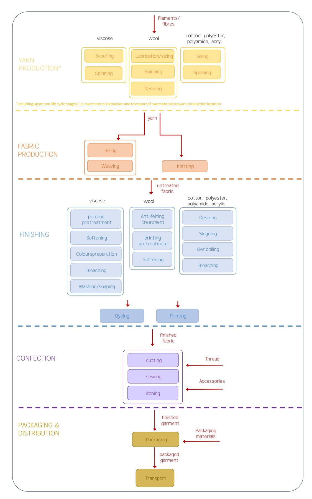

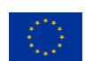

## **2.1.1 Petit Bateau**

Six processes are taken into account: organic cotton yarn spinning, knitting, dyeing, confection, packaging and distribution.

Main assumptions, proxy datasets and limitations:

- Production of organic cotton fibres was modelled using a proxy dataset, which was created by adjusting the conventional cotton fibres market dataset from Ecoinvent ("Fibre, cotton {GLO}| market for fibre, cotton | cut-off, U"). This modelling choice was made because the existing organic cotton fibres market dataset is suspected to contain an error in the underlying organic seed-cotton production dataset, leading to an unexpected credit for human toxicity (non-cancer). Sandin et al. (2019) also reported doubts about this organic cotton dataset, suspecting an underestimation of the climate change impact and energy use (Sandin et al., 2019).
- The following alterations were made to the underlying seed-cotton production (conventional) dataset ("Seed-cotton {IN-GJ}| seed-cotton production, conventional | Cut-off, U"): o increase of land transformation and occupation; o elimination of tillage4 ; o elimination of water use for irrigiation; o elimination of pesticides (and related emissions to soil); o replacement of NPK fertilizers by manure; o decrease or elimination of emissions to air. These alterations were copied from the original organic seed-cotton dataset from Ecoinvent ("Seed-cotton, organic {IN-OR}| seed-cotton production, organic | Cutoff, U").
- Default loss percentage in spinning of 12,3% (Sandin et al., 2019)
- Estimates for water and lubricant use in knitting (Sandin et al., 2019)
- Recycling of confection waste in padding and insulation was modelled using the circular footprint formula (CFF), as prescribed by the PEF guide
- Estimates for transport distances to confection
- Background data for chemicals (Murugesh & Selvadass, 2013) was used as the reported dyes/ components of dyes were not available in the Ecoinvent database.

4 Tillage is the mechanical manipulation of the soil for the purpose of crop production affecting significantly the soil characteristics such as soil water conservation, soil temperature, infiltration and evapotranspiration processes. (Busari et al., 2015)

## **2.1.2 HNST**

10 processes are taken into account: fibre production for warp and weft yarn, spinning of warp and weft yarn, dyeing of warp yarn, weaving of denim fabric and pocket lining fabric, confection, packaging and distribution.

Main assumptions, proxy datasets and limitations:

- Global market data for modelling cotton fibres, adjusted as described below
- Production of organic cotton fibres for the pocket lining was modelled using a proxy dataset, which was created by adjusting the conventional cotton fibres market dataset from Ecoinvent ("Fibre, cotton {GLO}| market for fibre, cotton | cutoff, U"). This modelling choice was made because the existing organic cotton fibres market dataset is suspected to contain an error in the underlying organic seedcotton production dataset, leading to an unexpected credit for human toxicity (non-cancer). G. Sandin et al. (2019) also reported doubts about this organic cotton dataset, suspecting an underestimation in comparison with the Cotton Inc (2016) report of the climate change impact and energy use (Sandin et al., 2019). The following alterations were made to the underlying seed-cotton production (conventional) dataset ("Seed-cotton {IN-GJ}| seed-cotton production, conventional | Cut-off, U"): o increase of land transformation and occupation; o elimination of tillage5 ; o elimination of water use for irrigiation; o elimination of pesticides (and related emissions to soil); o replacement of NPK fertilizers by manure; o decrease or elimination of emissions to air. These alterations were copied from the original organic seed-cotton dataset from Ecoinvent ("Seed-cotton, organic {IN-OR}| seed-cotton production, organic | Cutoff, U").
- Lyocell fibres used as a proxy for Tencel™. Tencel™ is in fact lyocell, except it is produced in a more environmentally friendly way; it consumes less water and solvents are recycled in the process [\(https://www.tencel.com/sustainability\)](https://www.tencel.com/sustainability). The calculated impact of the warp yarn is therefore expected to be overestimated.
- Use of polyester fibres as a proxy for the max. 5% undefined rest fibres content in warp yarn
- The electricity required for warp yarn spinning is assumed equal to the electricity required for weft yarn spinning
- Use of recycled materials as inputs and recycling of production waste in the entire product supply chain were taken into account using the circular footprint formula (CFF), as prescribed by the PEF guide
- Use of proxy for indigo pigment and estimate for the amount of indigo pigment and caustic soda is considered the only other chemical used for dyeing (Smart-Indigo™ dyeing process (Sedo Engineering SA, n.d.))
- Estimates for transport distances to confection

5 Tillage is the mechanical manipulation of the soil for the purpose of crop production affecting significantly the soil characteristics such as soil water conservation, soil temperature, infiltration and evapotranspiration processes. (Busari et al., 2015)

## **2.1.3 Bel&Bo**

Five processes are taken into account: woven viscose fabric, woven polyamide lining, confection, packaging and distribution

Since limited to no foreground data regarding the processes preceding confection was available, two processes (one per used fibre type) were modelled using background data from literature and from Ecoinvent. These processes are shown as lumped processes, which means they entail all preceding process steps) in order to indicate a lower level of detail compared to other demonstrators. These two lumped process are:

- Woven viscose fabric, which contains viscose fibres production, viscose yarn spinning, viscose weaving and viscose dyeing/finishing (Koc & Kaplan, 2007; Murugesh & Selvadass, 2013; van der Velden et al., 2014)
- Woven polyamide lining, which contains polyamide fibres production, polyamide yarn spinning, lining weaving and lining dyeing/finishing (Koc & Kaplan, 2007; Murugesh & Selvadass, 2013; van der Velden et al., 2014)

It should be noted that such a lack of foreground data generally results in a lower environmental impact.

Main assumptions and limitations:

- Default loss percentage of 6,25% in weaving (ADEME, n.d.)
- Production waste is incinerated without energy recovery (Sandin et al., 2019)
- Estimates for transport distances for packaging materials and distribution of finished garment
- Use of background data for dyed fabrics (see references above)
- Polyester resin as a proxy for raw material of plastic buttons

## **2.1.4 Xandres**

11 processes are taken into account: dyed wool yarn, dyed recycled polyester yarn, dyed polyester yarn, dyed elastane yarn, undyed elastane yarn, weaving of main fabric, weaving of lining, weaving of interlining, confection, packaging and distribution.

Since very limited foreground data regarding the processes preceding weaving was available, four processes (one per used fibre type) were modelled using background data. These processes are shown as lumped processes, which means they entail all preceding process steps) in order to indicate a lower level of detail compared to other demonstrators. These four lumped process are:

- Dyed wool yarn, which contains wool fibre production, wool yarn spinning and wool yarn dyeing (Brent & Hietkamp, 2003; Murugesh & Selvadass, 2013; van der Velden et al., 2014);
- Dyed recycled polyester yarn, which contains recycled PET fibres production, recycled polyester yarn spinning and recycled polyester yarn dyeing(Koc & Kaplan, 2007; Murugesh & Selvadass, 2013; van der Velden et al., 2014);
- Dyed polyester yarn, which contains PET fibres production, polyester yarn spinning and polyester yarn dyeing (Koc & Kaplan, 2007; Murugesh & Selvadass, 2013; van der Velden et al., 2014);
- Dyed elastane yarn, which contains elastane fibres production, elastane yarn spinning and elastane yarn dyeing (Koc & Kaplan, 2007; Murugesh & Selvadass, 2013; van der Velden et al., 2014).

Main assumptions, proxy datasets and limitations:

- Background data from literature for the amounts of acrylic acid and electricity used for weaving (Sandin et al., 2019)
- Estimates for transport distances for wool, from Australia to Morocco
- Production waste is incinerated without energy recovery (Sandin et al., 2019)
- Estimates for transport distances of materials to confection
- Recycling of packaging waste is modelled using the Circular Footprint Formula (CFF), as prescribed by the PEF guide.
- Use of background data from Ecoinvent for all dyed yarns (see references above), for wool this is adjusted for the Australian grid mix and estimated transport distance from Australia to Morocco
- Use of background data from Ecoinvent for non-woven lining
- Polyester resin as a proxy for PA adhesive dots
- The finishing steps for the three fabrics are not modelled, as no specific nor generic data was available for finishing alone

## **2.1.5 Decathlon**

13 processes are taken into account: polyester yarn, elastane yarn, nylon 6 yarn, nylon 6-6 yarn, knitting of the main component, knitting of the shoulder strap, knitting of the lining, finishing of the main component, finishing of the shoulder strap, finishing of the lining, confection, packaging and distribution.

Main assumptions, proxy datasets and limitations:

- Estimates for transport modes and distances between the different production locations
- Use of market data for chemicals when the origin is unknown
- Polyurethane foam was used as a proxy for polyurethane polymer as the raw material input for elastane spinning
- Background data (Sandin et al., 2019) used for the energy use, chemicals use and waste water quantities in elastane spinning
- Background data for energy use in warp knitting (main fabric and shoulder straps) and circular knitting (lining) (ADEME, n.d.)
- Spinning and knitting waste is incinerated without energy recovery (Sandin et al., 2019)
- Due to limited foreground data availability which also varied between swimsuit components, the finishing processes were modelled using a combination of foreground and background data. The table below shows which type of data was used to model the different flows of the finishing processes: :

| Fabric          | Main component | Shoulder straps | Lining |
|-----------------|----------------|-----------------|--------|
| Foreground data | chemicals      |                 |        |
| Background data | energy         |                 |        |

\* The energy needed to finish the lining was considered equal to the energy for finishing the shoulder straps.

It should be noted that limited foreground data use generally results in a lower environmental impact.

- Transport distance for distribution by train from Wuhan (China) to Dourges (France) is estimated at 10.000 km

# **Social impacts**

In order to select the most relevant and critical social impact categories to report on in this deliverable, a poll was launched among SCIRT partners and Advisory Board members during the November 2021 consortium meeting. Based on their experience with the textiles industry, they were able to select the five most pressing social impact categories among the ones listed in the S-LCA PSILCA database.

1. What are, in your opinion, the most pressing social impact categories to report on for the global textiles sector?  
   *Please select five categories*

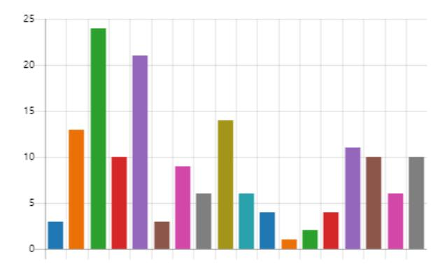

The following five categories came out as most pressing:

 Workers – Fair salary Workers – Health and safety Local community – Safe and healthy living conditions Workers – Child labour Value chain actors – Fair competition

The results of this poll were complemented with insights from a social risk expert from the Clean Clothes Campaign, gathered during an in depth interview. As a result three additional impact categories were selected to report on:

6 Workers – Forced labour 7 Workers – Gender wage gap 8 Workers – Freedom of association and collective bargaining The social impacts listed for each demonstrator product also focus on the cradle-to-gate processes. The same system boundaries apply as for the environmental impact analysis, but unlike the environmental dimension they are presented in a qualitative manner. Social impacts are translated to risk indicators based on sector and production locations at country level. There is no information from demonstrator specific production facilities taken into account for this analysis.

The risk indicators (very low risk Æ very high risk) from the S-LCA PSILCA database – both versions 2 and 3 – serve as a basis for the assessment. Whenever more recent or accurate data was available in literature, the PSILCA data was substituted.

Below an overview is provided of the external sources that were used as a complement to the PSILCA database to construct the social risk indicators for the different production countries in scope.

## **2.2.6 Turkey**

Impact of Syrian refugee crisis on child and forced labour:

- Schone Kleren Campagne Made in Turkije: <https://www.schonekleren.nl/thema/turkije/>
- Fair Labor Association Mitigating child labor risks in cotton: [https://www.fairlabor.org/our-work/special-projects/project/mitigating-child-labor](https://www.fairlabor.org/our-work/special-projects/project/mitigating-child-labor-risks-cotton)[risks-cotton](https://www.fairlabor.org/our-work/special-projects/project/mitigating-child-labor-risks-cotton)
- Fair Wear Foundation Country Study 2017-2018: <https://www.fairwear.org/programmes/countries/turkey>

Fair salary:

- The Industry We Want The Industry Wage Gap: <https://www.theindustrywewant.com/wages>

Freedom of association and collective bargaining:

- Global Rights Index 2021: <https://www.globalrightsindex.org/en/2021/countries/tur>

Other impact categories:

- Fair Wear Foundation Country Study 2017-2018: <https://www.fairwear.org/programmes/countries/turkey>

## **2.2.7 Morocco**

Fair salary:

- The Industry We Want The Industry Wage Gap: <https://www.theindustrywewant.com/wages>

Freedom of association and collective bargaining:

- Global Rights Index 2021: <https://www.globalrightsindex.org/en/2021/countries/mar>

Other impact categories:

- International Labor Organization Country Brief 2017

## **2.2.8 China**

Fair salary:

- The Industry We Want The Industry Wage Gap: <https://www.theindustrywewant.com/wages>

Freedom of association and collective bargaining:

- Global Rights Index 2021: <https://www.globalrightsindex.org/en/2021/countries/chn>

Other impact categories:

- Schone Kleren Campagne Made in China: <https://www.schonekleren.nl/thema/china/>

## **2.2.9 Tunisia**

Fair salary:

- The Industry We Want The Industry Wage Gap: <https://www.theindustrywewant.com/wages>

Freedom of association and collective bargaining:

- Global Rights Index 2021: <https://www.globalrightsindex.org/en/2021/countries/tun>

Other impact categories:

- Fair Wear Foundation Country Study 2021: <https://www.fairwear.org/programmes/countries/tunisia>

## **2.2.10 North Macedonia**

Freedom of association and collective bargaining:

- Global Rights Index 2021: <https://www.globalrightsindex.org/en/2021/countries/mkd>

Other impact categories:

- Fair Wear Foundation Country Study 2021: <https://www.fairwear.org/programmes/countries/north-macedonia>

## **2.2.11 Other**

Freedom of association and collective bargaining:

- Global Rights Index 2021:<https://www.globalrightsindex.org/en/2021/countries>

# **Use phase and end-of-life**

The use and EOL phase are described qualitatively, highlighting the aspects that influence their sustainability performance. Results are based on demonstrator inputs and literature (ETC/CE et al., 2022; Laitala et al., 2018; OVAM, 2021).

The quality of a garment heavily influences the length of its use life, but is hard to assess in an objective manner. A recent study on ecodesign criteria by OVAM (OVAM, 2021) states that quality is mainly defined by the used material, construction of the yarns and fabrics, length of the fibre and shape of the fibre. However, also other parameters like colour fastness play a role. Unfortunately limited demonstrator data was available on these technical product parameters, especially for demonstrators who have little insight in their upstream supply chain. All information received is included in the fact sheets.

# **3 Demonstrator Fact Sheets**

# **Petit Bateau**

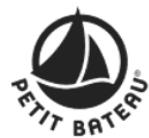

## **3.1.1 Product profile**

| Product              | Baby bodysuit                                                      |
|----------------------|--------------------------------------------------------------------|
| Weight               | 56 g                                                               |
| Material composition | 100% organic cotton                                                |
| Fabric type          | Knitted                                                            |
| Production volume    | 6000 pcs                                                           |
| Representativeness   | < 1% of revenue, however, the targeted yarn (Nm 60/1) represents   |
| Sales model          | Own stores and online                                              |
| Main market          | France, EU                                                         |
| Customer             | Mostly women that buy for themselves (10%), for their babies (45%) |

## **3.1.2 Cradle-to-gate value chain**

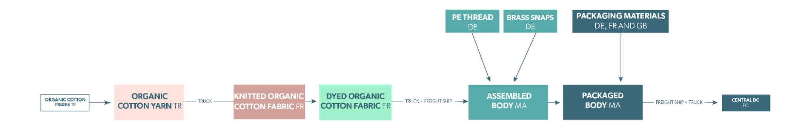

## **3.1.3 Footprints**

### **Environmental**

Environmental profile of 1 packaged body, delivered to the central distribution centre

**A large contributor** to the overall impact of a body is confection. It is the main contributor to climate change, particulate matter, acidification, terrestrial eutrophication, water use and resource use (fossil as well as minerals and metals). The impact of confection is mainly caused by the electricity use in the process and more specifically the composition of the Moroccan electricity mix; it relies heavily on fossil fuels. Also organic cotton yarn production is a hotspot; it shows large contributions (> 35%) to particulate matter, human toxicity, eutrophication (marine, freshwater and terrestrial), land use and water use. These impacts can be explained by the cultivation of (organic) cotton fibre.

**Negligible contributions** to the general environmental impact from packaging and distribution are observed.

## **Carbon footprint: 3,2 kg CO2eq.**

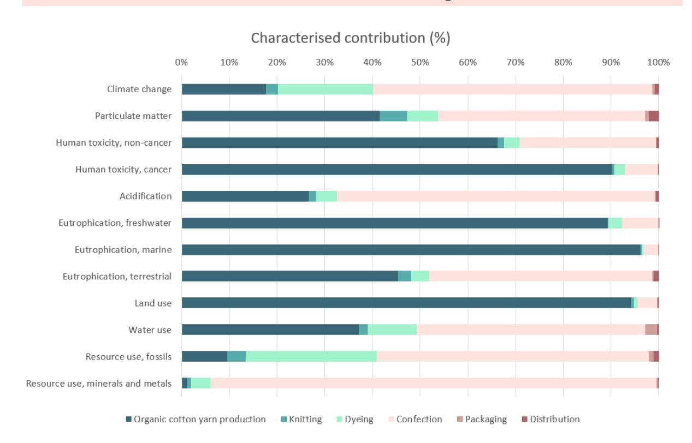

### **Social**

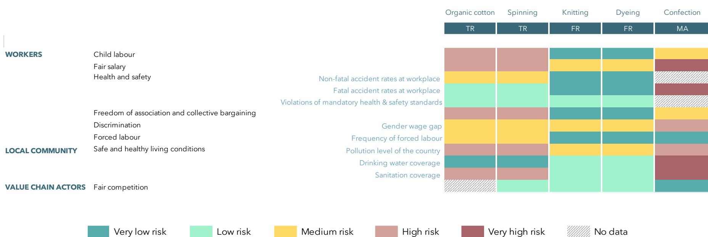

|                                                  | Organic cotton Spinning Knitting Dyeing Confection |
|--------------------------------------------------|----------------------------------------------------|
|                                                  | TR TR FR FR MA                                     |
| WORKERS Child labour                             |                                                    |
| Non -fatal                                       | accident rates at workplace                        |
| Fatal                                            | accident rates at workplace                        |
| Violations of mandatory health                   | & safety standards                                 |
| Freedom of association and collective bargaining |                                                    |
| Discrimination                                   | Gender wage gap                                    |
| Forced labour                                    | Frequency of forced labour                         |
| LOCAL COMMUNITY                                  | Pollution level of the country                     |
|                                                  | Drinking water coverage                            |
|                                                  | Sanitation coverage                                |
| VALUE CHAIN ACTORS Fair competition              |                                                    |
| Health and safety                                |                                                    |
| Safe and healthy living conditions               |                                                    |
| Very low risk Low risk Medium risk               | High risk Very high risk No data                   |

**Disclaimer.** The risk indicators are based on general data at sector and country level. No data is taken into account from demonstrator specific production facilities.

## **3.1.4 Use and EOL phase**

| Washing frequency     | Stains rapidly, washed heavily                            |
|-----------------------|-----------------------------------------------------------|
| Washing temperature   | Powerful (high temperature) wash required                 |
| Washing load          | Entire machine load can be used for cotton                |
| Drying                | Often tumble dried, although not recommended by           |
| Ironing               | Not ironed                                                |
| Microplastics release | Assumed to be limited, only shedding from PE stitching    |
|                       | yarn and potentially dyes 6                               |
| Quality 7             |                                                           |
|                       | Use of long staple fibres of 26-28 mm                     |
| Size and fit          | Shortly used by babies and toddlers                       |
| Repairability         | Repair services offered in some shops                     |
| Trend sensitivity     | Timeless design                                           |
| Care instructions     | Provided, including instructions for the removal of spots |
| Resales               | High, popular items on Vinted, take back and resell       |
| Composition           | Monomaterial fabric (100% cotton)                         |
| Stitching and trims   | PE stitching yarn and metal (100% brass) snaps            |
| Electricity use       | Water use Chemical use Microplastics release              |
|                       | Positive influence Negative influence                     |

6 Open to further research

7 "Experts consider the used material, construction of the yarns and fabrics, length of the fibre, shape of the fibre, etc. as important parameters that influence the quality." (OVAM, 2021)

# **HNST**

## **3.2.1 Product profile**

| Product              | Jeans                                                        |
|----------------------|--------------------------------------------------------------|
| Weight               | 507 g                                                        |
| Material composition | 56% recycled cotton, 23% cotton, 21% Tencel ™ (main fabric)  |
| Fabric type          | Woven                                                        |
| Production volume    | 2000 pcs                                                     |
| Representativeness   | 99% of revenue                                               |
| Sales model          | Wholesale and online                                         |
| Main market          | Belgium, EU                                                  |
| Customer             | Currently mostly so- called ‘eco warriors’ that highly value |

## **3.2.2 Cradle-to-gate value chain**

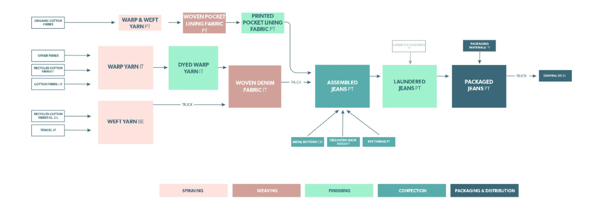

## **3.2.3 Footprints**

#### **Environmental**

#### Environmental profile of 1 packaged jeans, delivered to the central distribution centre

The profile shows a relatively **large contribution** to the overall impact of warp yarn fibre production compared to weft yarn fibre. The ratio of warp to weft yarn fibres used in the jeans is approximately 60:40 on mass basis, which means the weight difference does not fully explain the difference in impact. The composition of the yarn does; the warp contains +/- 40% virgin cotton, 60% recycled cotton with other fibres while the weft is composed of 50% Tencel™ and 50% recycled cotton. Although lyocell was used as a proxy for Tencel™, it is clear that this fibre has a lower overall environmental impact than cotton. Warp yarn fibre production is the largest contributor to eutrophication, land use and water use. This can be attributed to cotton cultivation. Since overall Tencel™ is expected to be more environmentally friendly (due to e.g. lower water consumption and recycling of solvents) than lyocell fibre, the impact (and the contribution to the impact categories) of the weft yarn production is expected to be lower in reality. Spinning, weaving and dyeing are mainly electricity-driven, therefore their contributions to e.g. climate change, fossil resources use and acidification are larger than to impact categories that are less affected by energy use.

Confection is also an important contributor to the general impact, mostly on human toxicity, acidification, resource use, climate change, terrestrial eutrophication and particulate matter. This mainly results from electricity consumption and the use of metal for the buttons.

**Small to negligible contributions** of packaging and distribution are observed to the overall impact. Also for spinning of warp yarn and spinning of weft yarn this is limited.

## **Carbon footprint: 7,2 kg CO2eq.**

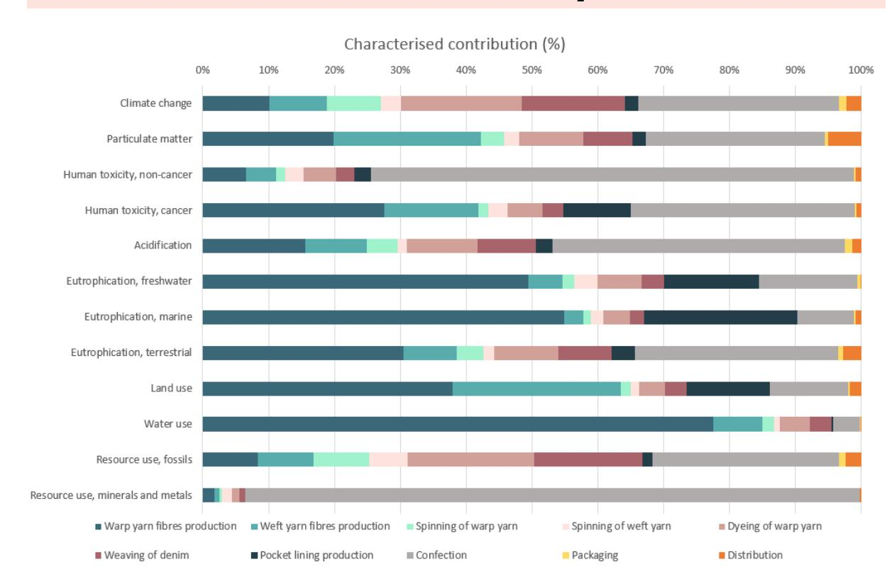

### **Social**

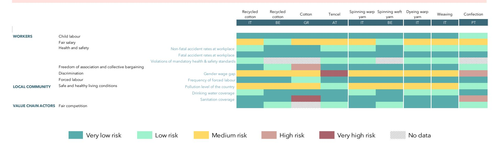

**Disclaimer.** The risk indicators are based on general data at sector and country level. No data is taken into account from demonstrator specific production facilities.

## **3.2.4 Use and EOL phase**

| Washing frequency                      | Jeans are typically worn more than once before laundering                                                                          |
|----------------------------------------|------------------------------------------------------------------------------------------------------------------------------------|
|                                        | Pro-biotic spray provided to reduce washing                                                                                        |
| Washing temperature                    | Mild wash recommended                                                                                                              |
| Washing load                           | Entire machine load can be used for cotton                                                                                         |
| Drying                                 | Tumble drying allowed based on care instructions, but HNST recommends to line dry                                                  |
| Ironing                                | Requires ironing or other ways for wrinkle removal                                                                                 |
| Microplastics release PRODUCT USE SPAN | Assumed to be limited, only from PE stitching yarn 8 Cotton has a moderate tensile strength                                        |
| Quality 9                              |                                                                                                                                    |
|                                        | Main fabric weight of 380 g/m2 (11 oz)                                                                                             |
| Size and fit                           | No elastane used                                                                                                                   |
| Repairability                          | Repair services offered                                                                                                            |
| Trend sensitivity                      | Timeless fit                                                                                                                       |
| Care instructions REUSE POTENTIAL      | Provided                                                                                                                           |
| Take back RECYCLING POTENTIAL          | Take back guarantee, customer gets rewarded with a discount on next item                                                           |
| Take back                              | Take back guarantee, customer gets rewarded with a discount on next item                                                           |
| Composition                            | Blending of different material types avoided (no use of elastane)                                                                  |
|                                        | Non-renewable/non-recyclable components are avoided/easily                                                                         |
| Stitching and trims                    | removable (buttons on men jeans, embroidered rivets, printing of care instructions) Use of PE stitching yarn Zipper on women jeans |
| Electricity use                        | Water use Chemical use Microplastics release                                                                                       |
|                                        | Positive influence Negative influence                                                                                              |

8 Open to further research

9 "Experts consider the used material, construction of the yarns and fabrics, length of the fibre, shape of the fibre, etc. as important parameters that influence the quality." (OVAM, 2021)

# **Bel&Bo – Dress**

## **3.3.5 Product profile**

| Product              | Dress                                                           |
|----------------------|-----------------------------------------------------------------|
| Weight               | 274 g                                                           |
| Material composition | 100% viscose (main fabric)                                      |
| Fabric type          | Woven                                                           |
| Production volume    | 18000 pcs                                                       |
| Representativeness   | +/- 1% of revenue                                               |
| Sales model          | Own stores (95) and online                                      |
| Main market          | Belgium                                                         |
| Customer             | Women between 30-55 years that are caring, rather conservative, |

## **3.3.6 Cradle-to-gate value chain**

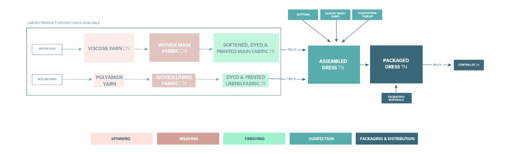

## **3.3.7 Footprints**

### **Environmental**

Environmental profile of 1 packaged dress, delivered to the central distribution centre

Overall, the **major contributor** to all impact categories is woven viscose fabric. This process is a lumped process modelled using background information since no foreground data was available on the production steps to make woven viscose fabric, i.e. fibre sourcing, viscose yarn spinning, viscose fabric weaving and dyeing/finishing. The fabric impact can mainly be attributed to dyeing processes and production of fibres. Woven lining was modelled analogously to woven viscose fabric. The contribution of woven viscose fabric is larger than that of woven lining, but this is entirely due to the ratio viscose fabric/lining in the assembled dress. Confection has the second largest contribution to most impact categories, which is mainly due to the buttons' impact (made from polymers) on the one hand and due to electricity consumption on the other hand, depending on the impact category.

The **calculated carbon footprint is small**, typically due to limited availability of foreground data.

## **Carbon footprint: 7,7 kg CO2eq.**

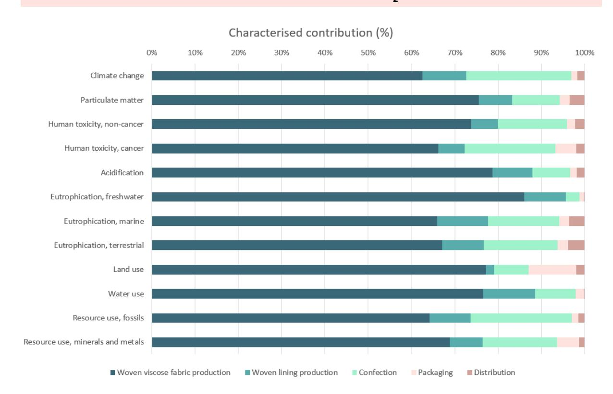

### **Social**

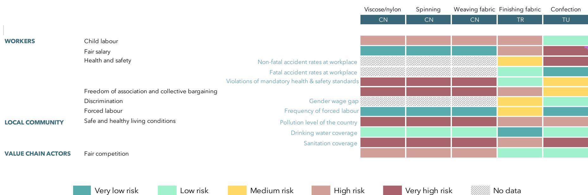

|                                                  | Viscose/nylon Spinning Weaving fabric Finishing fabric Confection |
|--------------------------------------------------|-------------------------------------------------------------------|
|                                                  | CN CN CN TR TU                                                    |
| WORKERS Child labour                             |                                                                   |
| Non -fatal                                       | accident rates at workplace                                       |
| Fatal                                            | accident rates at workplace                                       |
| Violations of mandatory health                   | & safety standards                                                |
| Freedom of association and collective bargaining |                                                                   |
| Discrimination                                   | Gender wage gap                                                   |
| Forced labour                                    | Frequency of forced labour                                        |
| LOCAL COMMUNITY                                  | Pollution level of the country                                    |
|                                                  | Drinking water coverage                                           |
|                                                  | Sanitation coverage                                               |
| VALUE CHAIN ACTORS Fair competition              |                                                                   |
| Health and safety                                |                                                                   |
| Safe and healthy living conditions               |                                                                   |
| Very low risk Low risk Medium risk               | High risk Very high risk No data                                  |

**Disclaimer.** The risk indicators are based on general data at sector and country level. No data is taken into account from demonstrator specific production facilities.

## **3.3.8 Use and EOL phase**

| Washing frequency   | Product worn next to skin is often laundered after one use       |
|---------------------|------------------------------------------------------------------|
| Washing temperature | Mild wash suffices                                               |
| Washing load        | Lower-than-full machine load is recommended for viscose          |
| Drying              | Tumble drying is not recommended for viscose                     |
| Ironing             | Requires ironing (medium heat setting) or other ways for wrinkle |
| Quality 11          |                                                                  |
| Repairability       | Repair services offered but not pro-actively communicated        |
| Trend sensitivity   | Seasonal patterns and colours                                    |
| Care instructions   | Provided                                                         |
| Composition         | Fabric needs to be disassembled from lining                      |
| Stitching and trims | Elastic waist band, Polycotton (polyester and cotton) stitching  |
| Electricity use     | Water use Chemical use Microplastics release                     |
|                     | Positive influence Negative influence                            |

10 Open to further research

11 "Experts consider the used material, construction of the yarns and fabrics, length of the fibre, shape of the fibre, etc. as important parameters that influence the quality." (OVAM, 2021)

# **Xandres – Pants**

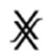

## **3.4.1 Product profile**

| Product              | Pants                                                           |
|----------------------|-----------------------------------------------------------------|
| Weight               | 505 g                                                           |
| Material composition | 53% PE, 44% wool, 3% elastane (main fabric)                     |
|                      | 100% PE with PA dots as adhesive (interlining)                  |
| Fabric type          | Woven                                                           |
| Production volume    | 3000 pcs per year (B2C) – 3 models in total                     |
|                      | 50000 pcs per year (B2B) – including blazers with same material |
| Representativeness   | +/- 10% of revenue                                              |
| Sales model          | Own stores, wholesale and online                                |
| Main market          | Belgium (80%), Netherlands (20%), soon also Germany             |
| Customer             | Women between 50-70 years                                       |
|                      | To date, very few questions from customers with regard to       |

## **3.4.2 Cradle-to-gate value chain**

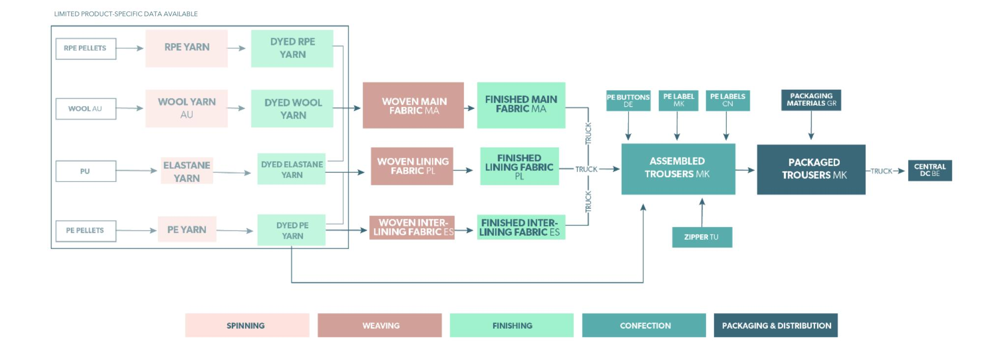

## **3.4.3 Footprints**

#### **Environmental**

Environmental profile of 1 packaged pair of pants, delivered to the central distribution centre

Dyed wool yarn production is the **major contributor** to every impact category as a result of sheep farming. Its impact on climate change, for instance, accounts for almost 75% of the total carbon footprint of the garment and is caused mainly by methane emission (greenhouse gas that is over 25 times more potent than carbon dioxide) by the ruminating sheep. Also land transformation and ammonia deposition caused by sheep farming explain the impacts of the wool yarn on all impact categories. Due to lack of foreground data on the dyed yarns, these processes are lumped process entailing fibre sourcing, spinning into yarn and yarn dyeing. It may look surprising that the impact of recycled polyester yarn in the garment is higher than that of (virgin) polyester yarn for all impact categories, however this is due to the weight ratio of recycled polyester yarn to virgin polyester yarn in the assembled garment. The same holds true when comparing the contributions of recycled polyester yarn to elastane yarn. Confection contributes mainly to human toxicity, water use and fossil resource use, which is largely due to electricity consumption.

The impact of weaving of the main fabric is larger than the impact of weaving the (inter)lining, due to the wool transport from Australia to Morocco which is accounted for in this process.

The contributions to the impact of packaging and distribution are **negligible** for all categories.

## **Carbon footprint: 27,9 kg CO2eq.**

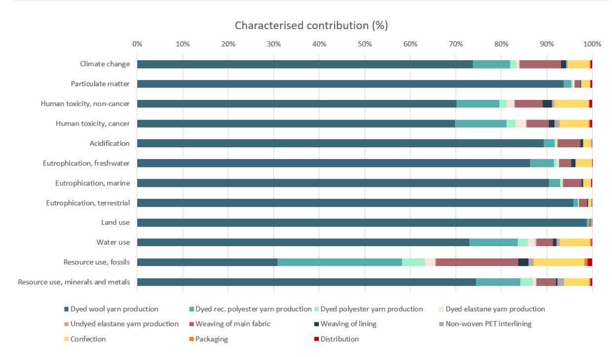

### **Social**

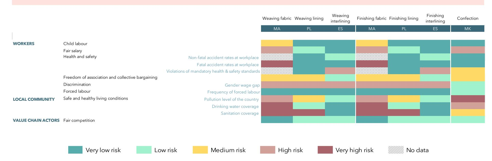

**Disclaimer.** The risk indicators are based on general data at sector and country level. No data is taken into account from demonstrator specific production facilities.

## **3.4.4 Use and EOL phase**

|                       | Trousers are typically worn more than once before laundering       |
|-----------------------|--------------------------------------------------------------------|
|                       | Wool resists staining and develops little odor                     |
| Washing temperature   | Low temperatures are required for wool                             |
| Washing load          | Lower-than-full machine loads is recommended for mixed             |
| Drying                | Tumble drying is not recommended for both wool and elastane        |
| Ironing               | The formal character of the product requires ironing or other      |
| Microplastics release | Yes                                                                |
| Quality 12            | Too little information available                                   |
|                       | Fit is maintained thanks to elastane, although is loses elasticity |
| Repairability         | Repair services offered                                            |
| Trend sensibility     | Timeless design                                                    |
| Care instructions     | Provided                                                           |
| Take back             | Take back system for B2B customers                                 |
| Take back             | Take back system for B2B customers                                 |
| Stitching and trims   | PA zipper, PE buttons and labels                                   |
| Electricity use       | Water use Chemical use Microplastics release                       |
|                       | Positive influence Negative influence                              |

This project has received funding from the Horizon 2020 Programme under grant agreement n°101003906.

12 "Experts consider the used material, construction of the yarns and fabrics, length of the fibre, shape of the fibre, etc. as important parameters that influence the quality." (OVAM, 2021)

# **Decathlon – Swimsuit**

## **3.5.1 Product profile**

| Product              | Swimsuit                                                  |
|----------------------|-----------------------------------------------------------|
| Weight               | 140 g                                                     |
| Material composition | 82% PET, 18% elastane (main fabric)                       |
|                      | 80% PA (nylon 6), 20% elastane (shoulder strap)           |
| Fabric type          | Knitted                                                   |
| Production volume    | To be determined by MOQ                                   |
| Sales model          | Own stores and online                                     |
| Main market          | France, EU                                                |
| Customer             | To date, very few questions from customers with regard to |

## **3.5.2 Cradle-to-gate value chain**

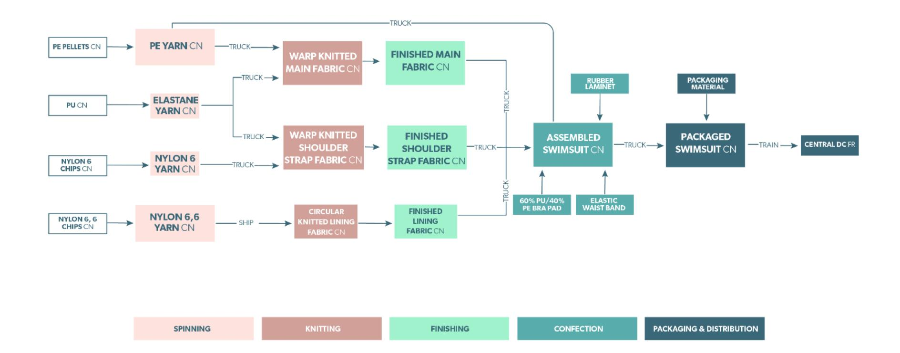

## **3.5.3 Footprints**

#### **Environmental**

Environmental profile of 1 packaged swimsuit, delivered to the central distribution centre

A **large contributor** to the overall impact is nylon 6,6 yarn production, which is a result of the production of nylon 6,6 polymer. Its impact is higher than polyester yarn production for most impact categories, although more polyester than nylon 6,6 ends up in the assembled garment. The overall impact of nylon 6 is a lot lower than that of nylon 6,6 only because of the weight ratio in the swimsuit. Confection also takes a significant piece of the pie; for most impact categories it is the main (or second largest) contributor to the impact. This is a result of electricity consumption during confection.

The impact of finishing the main component is, for most impact categories, higher than for finishing the shoulder straps and lining. This is mostly due to the weight ratio of the different components in the final product, but is also related to the fact that background data was used for chemicals for finishing the shoulder straps and lining. The use of background data generally results in a lower impact as less data are captured in such average data sets.

Due to the long transport distance from China to France, the overall contribution of the distribution step to the impact of a swimsuit is considerable.

Chiefly, the overall impact of the combined yarn production is shown to be higher than that of the combined finishing processes, which is higher than the impact of confection, followed by the combined knitting processes and lastly packaging and distribution.

## **Carbon footprint: 2,4 kg CO2eq.**

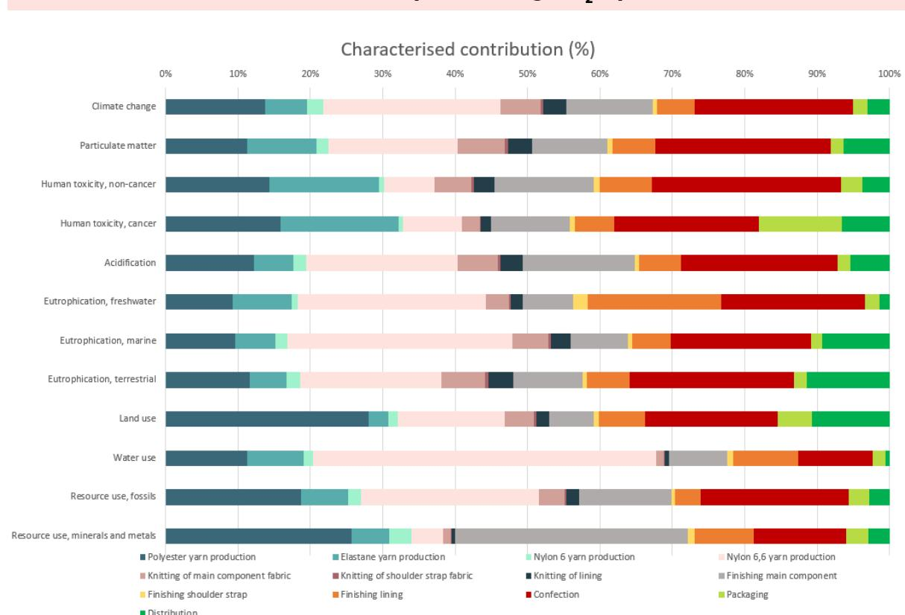

### **Social**

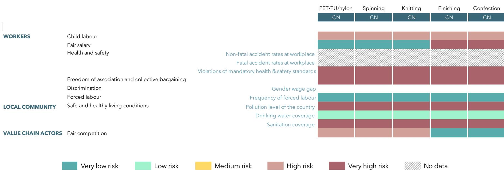

|                                                  | PET/PU/nylon Spinning Knitting Finishing Confection |
|--------------------------------------------------|-----------------------------------------------------|
|                                                  | CN CN CN CN CN                                      |
| WORKERS Child labour                             |                                                     |
| Non -fatal                                       | accident rates at workplace                         |
| Fatal                                            | accident rates at workplace                         |
| Violations of mandatory health                   | & safety standards                                  |
| Freedom of association and collective bargaining |                                                     |
| Discrimination                                   | Gender wage gap                                     |
| Forced labour                                    | Frequency of forced labour                          |
| LOCAL COMMUNITY                                  | Pollution level of the country                      |
|                                                  | Drinking water coverage                             |
|                                                  | Sanitation coverage                                 |
| VALUE CHAIN ACTORS Fair competition              |                                                     |
| Health and safety                                |                                                     |
| Safe and healthy living conditions               |                                                     |
| Very low risk Low risk Medium risk               | High risk Very high risk No data                    |

**Disclaimer.** The risk indicators are based on general data at sector and country level. No data is taken into account from demonstrator specific production facilities.

## **3.5.4 Use and EOL phase**

| Washing frequency      | Swimwear is typically laundered after one use                     |
|------------------------|-------------------------------------------------------------------|
| Washing temperature    | Mild wash suffices                                                |
| Washing load           | Lower-than-full machine load is recommended for synthetics        |
| Drying                 | Tumble drying is not recommended due to elastane                  |
| Ironing                | Not required                                                      |
| Microplastics release  | Yes, although continuous fibres are used who tend to shed less    |
| Quality 13             |                                                                   |
|                        | Yarn size of Nm 200 – 225                                         |
| Size and fit           | Elasticity loss over time due to exposure to chlorine             |
| Repairability          | No actions undertaken                                             |
| Trend sensitivity      | Seasonal fits, colours and patterns                               |
| Care instructions      | Provided                                                          |
| Resales                | Resales for reuse purposes is not considered for hygiene          |
| Take back              | Occasional experiments with take back campaigns                   |
| Sorting                | Black dope dyed products difficult to sort with NIR               |
| Stitching and trims    | PU padding, elastic waist band, shoulder straps, (natural) rubber |
| Additives and coatings | Yes, to achieve chlorine resistance and water-repellence          |
| Electricity use        | Water use Chemical use Microplastics release                      |
|                        | Positive influence Negative influence                             |

13 "Experts consider the used material, construction of the yarns and fabrics, length of the fibre, shape of the fibre, etc. as important parameters that influence the quality." (OVAM, 2021)

This project has received funding from the Horizon 2020 Programme under grant agreement n°101003906.

# **4 Conclusion**

For each of the demonstrator products the Fibre Footprint provides a preliminary overview of the sustainability performance throughout the product life cycle, either in a quantitative or qualitative way. Due to limitations in data availability – both for foreground data and (social) background data - the resulting carbon footprints and social risk indicators remain indicative. They should be interpreted with caution and merely serve as a building block for the more deep diving environmental and social impact assessments planned in Task 4.2 on the True Cost Model. In case methodological adjustments are implemented or additional/more detailed/more accurate data becomes available that might improve the results, an update of the Fibre Footprint will be provided.

# **Bibliography**

ADEME, A. de la transition écologique. (n.d.). Base IMPACTS (2.01) [Computer software]. Brent, A. C., & Hietkamp, S. (2003). Comparative evaluation of Life Cycle Impact assessment methods with a South African case study. The International Journal of Life Cycle Assessment, 8(1), 27. https://doi.org/10.1007/BF02978746 Busari, M. A., Kukal, S. S., Kaur, A., Bhatt, R., & Dulazi, A. A. (2015). Conservation tillage impacts on soil, crop and the environment. International Soil and Water Conservation Research, 3(2), 119–129. https://doi.org/10.1016/j.iswcr.2015.05.002 ETC/CE, Manshoven, S., Smeets, A., Malarciuc, C., Tenhunen, A., & Mortensen, L. F. (2022). Microplastic pollution from textile consumption in Europe (Eionet Report No. 2022/1). European Topic Centre Circular Economy and Resource Use. https://www.eionet.europa.eu/etcs/etc-ce/products/etc-ce-products/etc-ce-report-1-2022-microplastic-pollution-from-textile-consumption-in-europe Koc, E., & Kaplan, E. (2007). An investigation on energy consumption in yarn production with special reference to ring spinning. Fibres and Textiles in Eastern Europe, 15, 18–24. Laitala, K., Grimstad Klepp, I., & Henry, B. (2018). Does Use Matter? Comparison of Environmental Impacts of Clothing Based on Fiber Type. Sustainability, 10(2524). https://doi.org/10.3390/su10072524 Murugesh, K. B., & Selvadass, M. (2013). Life cycle assessment for the dyeing and finishing process of organic cotton knitted fabrics. Journal of Textile and Apparel, Technology and Management, 8. OVAM. (2021). Ecodesign criteria for consumer textiles. OVAM. https://www.ovam.be/sites/default/files/atoms/files/Ecodesign%20criteria%20for% 20consumer%20textiles%20-%20OVAM\_Centexbel\_2022.pdf

Sandin, G., Roos, S., Spak, B., Zamani, B., & Peters, G. (2019). Environmental assessment of Swedish clothing consumption – six garments, sustainable futures. https://doi.org/10.13140/RG.2.2.30502.27205 Sedo Engineering SA. (n.d.). Smart-Indigo: Because is makes a difference. Retrieved March 29, 2022, from https://www.smartindigo.com/fileadmin/Dateiliste/downloads/Technical\_specificat ion\_Smart-Indigo.pd van der Velden, N., Patel, M., & Vogtländer, J. (2014). LCA benchmarking study on textiles made of cotton, polyester, nylon, acryl, or elastane. Int. J. Life Cycle Assess, 19, 331–356.