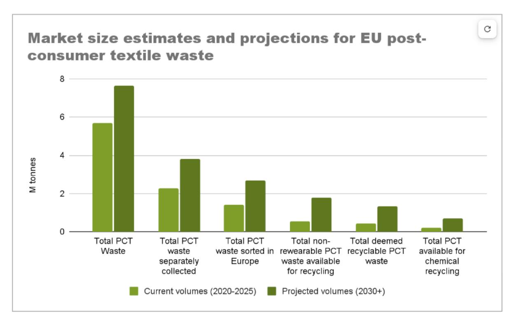
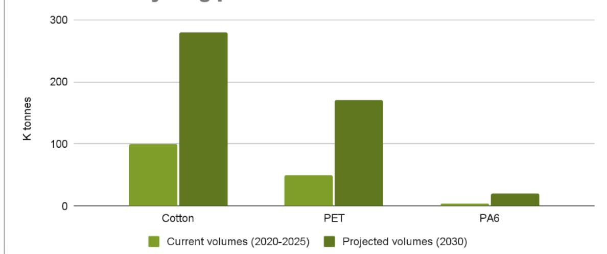
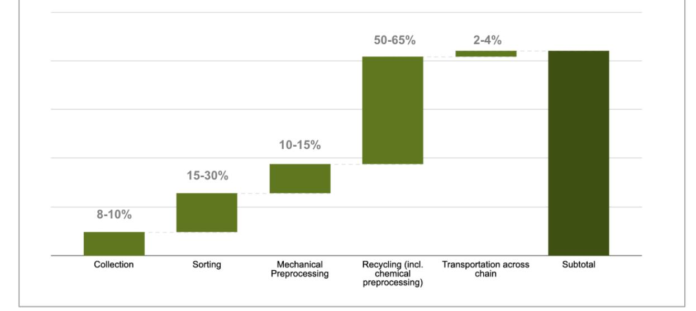
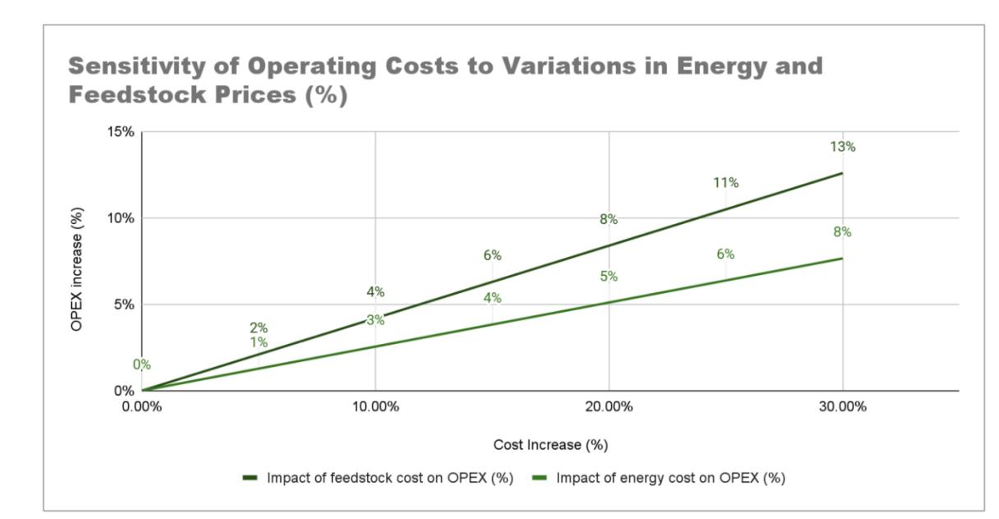
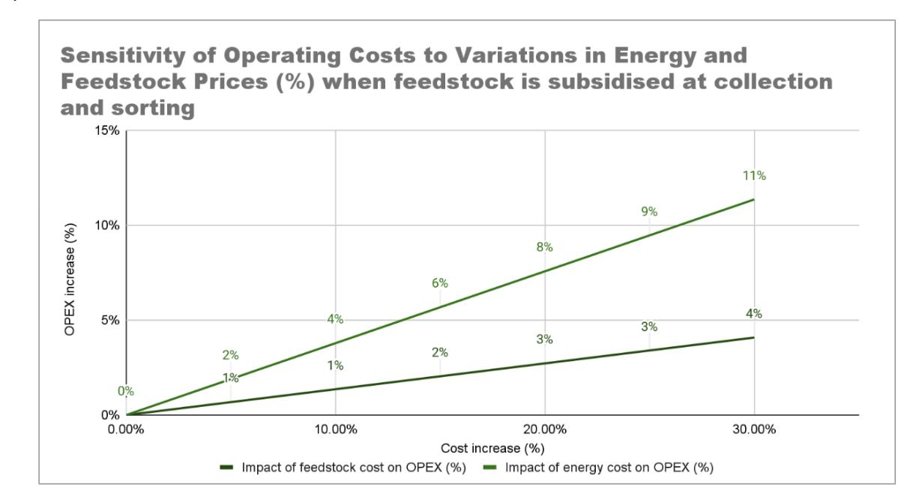
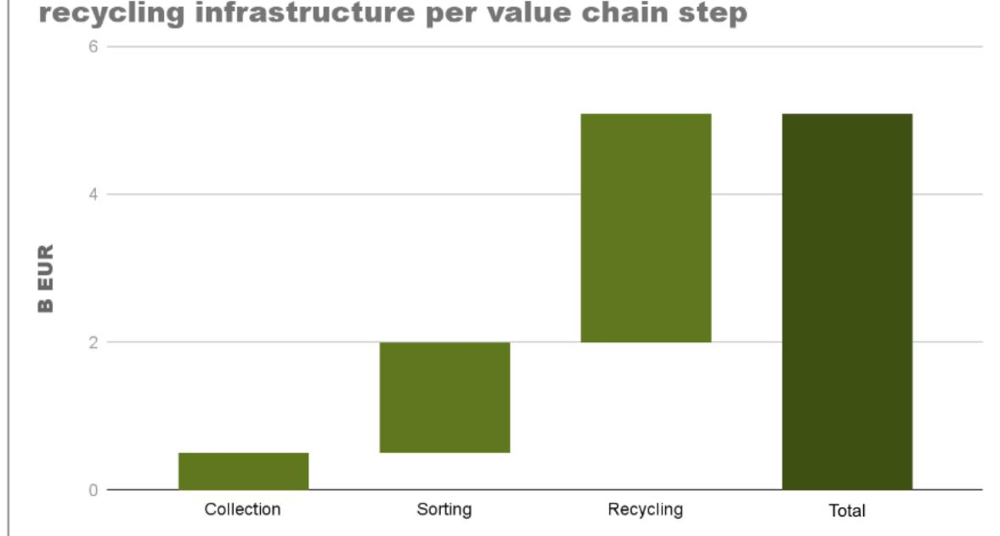

# **BUSINESS MODELS AND FINANCIAL VIABILITY REPORT**

# Table of Contents

| 1.                            | Introduction........................................................................................................................................................................................................3             |
|-------------------------------|-----------------------------------------------------------------------------------------------------------------------------------------------------------------------------------------------------------------------------------|
| 2.                            | Market Potential Post-Consumer Textile Waste in Europe.................................................................................6                                                                                          |
| 3.                            | Business Model Feasibility & Barriers to Scale......................................................................................................12                                                                            |
| 5. Conclusion & Key Takeaways | 32                                                                                                                                                                                                                                |
| Annex                         | ...............................................................................................................................................................................................................................39 |
| SWOT Analysis                 | ...................................................................................................................................................................................................39                             |

# About the T-REX Project

The T-REX Project brings together leading stakeholders across the textile value chain to develop a harmonised blueprint for closed-loop recycling of post-consumer household textile waste in the EU. The project's goal is to transform end-of-use textiles into valuable feedstock, supporting scalable circular business models and advancing the shift towards a more sustainable textile industry.

Over a three-year period, the T-REX Project has demonstrated the full recycling process of polyester, polyamide 6, and cellulosic materials into new garments, while exploring economically viable business models to ensure feasibility of the value chain. During this time, the challenges surrounding textile-to-textile (T2T) recycling were clearly highlighted.

# Executive Summary

The textile industry is a major contributor to environmental impact, 1 over 6.95 million tonnes of textile waste generated annually in the European Union alone. Most of this waste is landfilled or incinerated, partially reused and with only a fraction being recycled. As global textile consumption continues to rise, the urgency to transition towards circular systems becomes increasingly critical. As part of its 2023 Waste Framework Directive revision, the EU proposed harmonised EPR rules for textiles to boost collection, sorting, reuse, and recycling while promoting circular design. Central to this is T2T recycling, which transforms nonrewearable waste into high-quality materials, reducing reliance on virgin resources and lowering the sector's environmental impact.

The Textile Recycling Excellence (T-REX) Project plays an important role in supporting these EU goals. By bringing together stakeholders from across the textile value chain, the project aims to develop a harmonised blueprint for the collection, sorting, and recycling of postconsumer textile waste. Through product demonstrators, lifecycle analysis, technoeconomic assessment, digital tool integration, and technical guidance to design recyclable garments, the project explored the viability of a closed loop recycling system. It aimed at mapping key cost pressures and opportunities, providing critical insights to inform future investments, foster innovation, and support effective policy making for scaling T2T recycling.

Benchmarking the cost of Europe-based chemically recycled fibres against virgin alternatives highlights a significant challenge to business viability under current market conditions. Virgin fibre prices are highly volatile, driven by global market dynamics, while the

1 Management of used and waste textiles in Europe's circular economy, European Environmental Agency (2024)

production costs for T2T recycled fibres in Europe remain relatively stable, dominated by fixed factors such as feedstock, energy, and infrastructure costs. As a result, recycled fibres carry a higher cost than their virgin counterparts.

Cost remains a key challenge to chemical recycling due to feedstock, energy, and labour. One of the core challenges is the limited availability of sufficient, high-quality postconsumer textiles that meet the recyclers' technical requirements. Low collection rates, contamination, complex blends, and lack of standardised sorting, makes supply of waste inconsistent and costly. Before recycling even begins, costs are incurred for collection, transport, sorting, and pre-processing. These costs accumulate rapidly, especially since high material losses during sorting and pre-processing mean that larger amounts of input material are needed to produce the required output. Furthermore, Europe's high electricity costs, combined with the inherently energy-intensive nature of textile recycling processes further compound the issue compared to regions with lower energy prices.

Despite these hurdles, with the volume of post-consumer textile waste projected to rise to 7.3 million tonnes by 20302 , it is essential that methods such as recycling are explored to move away from other end-of-use scenarios such as landfill, incineration, or exports. The Life Cycle Assessment (LCA)3 conducted as part of the T-REX Project shows that recycling textiles has the potential to reduce the environmental impacts of fibre production, particularly when high recycling rates and renewable energy sources are employed.

Recycling can offer a solution to handle the inevitable volumes of non-reusable textile waste and an opportunity to sustain the European textile industry's competitiveness, however, it must be part of a broader strategy that includes reuse, repair, and demand consideration. To unlock the potential of T2T recycling, Europe must activate three interdependent levers:

Demand: Stimulate market uptake by introducing mandatory targets for recycled content to ensure predictable demand. Encourage adoption through eco-modulated Extended Producer Responsibility (EPR) fees, incentivise brands that use recycled fibres, and support circular business models that secure a stable feedstock supply and drive long-term market demand.

Cost: Reduce production costs across the value chain by improving textile collection rates and sorting efficiency through harmonised EPR systems and investment in automated sorting technologies (e.g., NIR/MIR, AI). Lower energy costs via process optimisations, renewable energy investments, and supportive policies for industrial electricity pricing. Boost recycling yields by investing in R&D for material purification, design for recyclability, and advanced pre-processing technologies. Finally, streamline and integrate infrastructure to achieve economies of scale and minimise logistical inefficiencies.

Capital: Unlock infrastructure investment by leveraging EPR schemes to de-risk investments in collection, sorting, and recycling systems. Promote shared investment models to maximise

2 Scaling textile recycling in Europe–turning waste into value, McKinsey & Company (2022)

3 T-REX projects learnings. Available here https://trexproject.eu/learnings/

synergies across the value chain (e.g. co-located sorting and pre-processing facilities) and expand access to green financing mechanisms and public-private partnerships to reduce the cost of capital and accelerate deployment of recycling technologies.

This report, building on the T-REX Project's findings, outlines the business viability and feasibility of scaling T2T recycling in Europe. Recognising the diversity and complexity of the textile recycling landscape, the report acknowledges that building a viable value chain requires considering a wide range of technologies and market actors beyond the three core demonstrators participating in the project. The goal is to identify key opportunities and propose actionable strategies to mainstream circular textile systems, acknowledging that significant policy action will be paramount to reaching a tipping point where recycled materials become competitive with virgin alternatives.

Building a viable business case for scaling textile recycling hinges on collaboration across the entire value chain and will require all stakeholders - brands, recyclers, collectors, sorters, manufacturing partners, policymakers, and investors - to share risk and align efforts.

# 1. Introduction

Textile waste presents a critical environmental and social challenge for the textile industry. Intensified by the accelerated consumption of fast fashion and the widespread disposal of garments after minimal use, the volume of textile waste continues to accumulate at a pace faster than it can be handled.4 In response, various recycling technologies, ranging from mechanical to chemical processes, are being developed to address the limitations of current end-of-use scenarios (landfill, incineration) and support the transition towards a more circular textile economy.

Chemical recycling of textiles involves breaking down textile waste to a molecular level through chemical processes, producing high-purity outputs that can be reintroduced into the fashion supply chain. This enables the recovery of fibres from both complex and processed textiles, supporting circularity by creating recycled materials with properties comparable to their virgin counterparts used to produce garments.5

The recycling process involves four critical steps: collection, sorting, preprocessing, and chemical recycling. Collection consolidates post-consumer textile (PCT) waste, while sorting differentiates between reusable, recyclable, and non-recyclable fractions. Sorting can be manual, automated, or semi-automated, with automation offering the potential for higher throughput and improved accuracy, despite current technological constraints.

4 The impact of textile production and waste on the environment, European Parliament (2024)

5 What is chemical recycling? Fashion for Good

Preprocessing, which bridges sorting and recycling, includes mechanical methods such as cutting, shredding, and de-trimming, as well as chemical treatments to remove contaminants like elastane and dyes. These steps are essential for preparing high-quality feedstock suitable for chemical recycling, but their implementation varies widely across facilities. Mechanical preprocessing can be handled by sorters and preprocessing pilot facilities, while chemical preprocessing is typically conducted by recyclers.6

Currently, the European Union generates approximately 6.95 million tonnes (around 16kg per person) of textile waste each year, from which 82% is post-consumer7 . However, the volume of textiles actually collected for reuse or recycling remains significantly lower, primarily due to limited collection infrastructure, insufficient collection rates, with most of the waste ending up in landfill and incineration. The complexity of textile materials, including multi-fibre blends, elastane content, and disruptive elements like trims and coatings, poses additional challenges. These disruptors necessitate more advanced sorting, separation, and decontamination processes, which current recycling infrastructures are not yet equipped to manage at the required scale. As a result, less than 2% of textiles produced are recycled back into new textiles within European markets (SFC report), while around 50% continue to be downcycled or disposed of.8

Europe's waste challenge can be evaluated within three broad scenarios. The first is the status quo: a linear, low-cost model where most post-consumer textiles are incinerated, landfilled, or exported to the Global South, often with limited environmental and social safeguards. This pathway externalises the true environmental and human costs, making it appear more financially attractive than circular options like chemical recycling.9 While this scenario is outside the scope of the T-REX Project, future techno-economic assessments should incorporate the full cost landscape, including avoided disposal costs and environmental externalities, to enable more accurate comparisons. The second scenario within the scope of the T-REX Project, explores the feasibility of building a closed-loop, fully European value chain for T2T recycling. This includes local collection, sorting, pre-processing, recycling, and yarn spinning. However, this model is resource-intensive and cost-prohibitive under current conditions and may not be realistic in the context of the highly globalised textile industry. Europe's value chain is not currently structured to operate independently at scale, and attempting to do so may undermine the cost-effectiveness and scalability of T2T recycling. The third and more likely scenario lies between the two: enabling circular recycling systems within a globalised textile market. Here, the goal is to integrate high-quality

6 T2T Polyester Benchmarking Study, Fashion for Good (2025)

7 Techno-scientific assessment of the management options for used and waste textiles in the European Union, JRC (2023)

8 Sorting for Circularity, Fashion for Good (2022)

9 Average costs for landfill and incineration approximately 110 EUR/t and 150 EUR/t respectively (incl. tax), JRC ISSN 1831-9424 (2023). Although (OPEX and CAPEX), along with externalities for textiles ending up in mixed municipal waste can reach 700 EUR/t. JRC ISSN 1831-9424 (2025). Also, landfilling is increasingly restricted due to bans and higher taxes implemented across many European countries.

European sorting and recycling with existing global capacities, such as yarn spinning in Asia, without reverting to the low-cost, high-impact disposal model. This hybrid model acknowledges the economic realities of global textile flows while striving to embed circularity into the system. The key challenge is ensuring that circular pathways are not undermined by cost comparisons with environmentally detrimental practices but are instead supported by regulatory frameworks and investment that reflect their long-term value.

The T-REX Project focuses on the chemical recycling of post-consumer textiles, specifically polyester (PET), polyamide 6 (PA6), and cotton textiles. The techno-economic assessment conducted as part of this project evaluates the entire T2T recycling value chain, from collection and sorting to preprocessing, chemical recycling, and yarn spinning, encompassing material flows, yields, losses, and associated costs.

The analysis in this report specifically focuses on the economics of chemical recycling within a European context. It does not attempt to compare Europe with other regions, such as Asia, nor does it address global shifts in textile waste processing. Instead, it concentrates on extrapolating the financial performance of current technologies designed to handle postconsumer textile waste within European infrastructure. The scope is limited to the recycling process up to the output of the recycler, excluding subsequent steps such as yarn spinning or textile manufacturing.

While our analysis draws on data from T-REX demonstrator trials, the figures presented do not solely reflect consortium partners but aim to represent industry-wide averages. Given that many recycling technologies are still at pilot stage and have yet to achieve economies of scale, current cost estimates may not fully be reflective of future commercial-scale operations. The data has served as a foundation to identify key roadblocks and inform future actions.

In the following sections, we will examine the potential market for post-consumer textile waste, benchmark considerations for recycled fibre costs versus conventional alternatives, and present main cost drivers, feedstock challenges, and required infrastructure investments, concluding with strategies to strengthen Europe's T2T recycling value chain.

# 2. Market Potential Post-Consumer Textile Waste in Europe

# 2.1. Market size estimates for EU post-consumer textile waste in 2025

As previously mentioned, Europe generates around 6.95 million tonnes of textile waste, from which almost 5.7 million tonnes are post-consumer waste (82%). 10 The journey from raw post-consumer waste to viable feedstock for advanced recycling is fraught with inefficiencies. Estimates suggest that only 35 - 40% of post-consumer textiles are collected separately for reuse or recycling. This represents 1.9 to 2.3 million tonnes annually across the EU, while the remaining 3.3 to 3.7 million tonnes are typically discarded in mixed household waste ending up being incinerated or landfilled or stockpiled in homes.11

Of the post-consumer textiles collected, a significant portion (~58%) is deemed rewearable, from which around 40% is exported outside the EU and only a small portion of 10-15% is resold locally (which is the main source of income for the sorters) Around 1.4 million tonnes were sorted in 2022, while the current capacity in EU for the sorting of separately collected waste is 1.5 -2.0 million tonnes. 12

Based on current data from leading sorters, non-rewearable textiles, those not suitable for reuse in second-hand markets, constitute approximately 32-40% of the post-consumer textiles (PCT) collected in Europe. Of this non-rewearable fraction, sources suggest that 70- 74% is available for recycling can technically be recycled.13 Within this fraction, materials are primarily managed through a combination of mechanical recycling, emerging chemical recycling, and waste disposal routes. The recyclable material fraction is primarily destined for mechanical recycling (currently around 20%)14, with a growing share -albeit still limitedbeginning to feed into chemical recycling processes15 and 6–10% of non-rewearable textiles still destined for incineration or landfill. According to Sorting for Circularity, 53% of nonrewearable PCT waste is suitable for chemical recycling. However, the share of textiles currently entering any recycling stream is closer to 1-2%, according to the European

10 Management of used and waste textiles in Europe's circular economy, European Environmental Agency (2024)

11 Techno-scientific assessment of the management options for used and waste textiles in the European Union, JRC (2023)

12 Management of used and waste textiles in Europe's circular economy, European Environmental Agency (2024) and Techno-scientific assessment of the management options for used and waste textiles in the European Union, JRC (2023)

13 Percentages from Scaling textile recycling in Europe–turning waste into value, McKinsey & Company (2022) and Sorting for Circularity, Fashion for Good (2022) respectively.

14 Techno-scientific assessment of the management options for used and waste textiles in the European Union, JRC (2023)

15 Potential to rise to up to 40% of non-rewearables according to expert interviews with sorters

Parliament and Sorting for Circularity EU, indicating a significant gap between technical potential and actual practice. This fragmentation and loss across the value chain highlight the severe accessibility challenge for recyclers. The effectiveness of collection schemes varies widely across member states, and many remain underfunded, inconsistently implemented, or underutilised by consumers. The lack of harmonised policy and infrastructure results in a fragmented system that struggles to divert enough from incineration or landfill.

| Step                        |                       | Volume         | Share                     |
|-----------------------------|-----------------------|----------------|---------------------------|
| Total textile waste         | 6.95 million tonnes   |                |                           |
| Total PCT Waste             | 5.7 million tonnes    |                | 82%                       |
| 1.9                         | to 2.3 million tonnes |                | 35–40%                    |
| 1.2                         | to 1.5                | million tonnes | 60-70% of collected       |
| 0.5                         | to 0.65               | million tonnes | 32-40% of sorted          |
| PCT waste                   |                       |                |                           |
| 0.35 to 0.5 million tonnes  |                       |                | 70-74% of non-rewearables |
| 0.19 to 0.26 million tonnes |                       |                | 53% of deemed recyclable  |
| 0.02 to 0.04                |                       | million tonnes | 1 2% of collected         |

*Table 1. Summary Table: Current market size estimates for European textile waste* 

# 2.2. Market size estimates for EU post-consumer textile waste in 2030

Considering the mandatory separate collection and potential increase in consumption, the volume of post-consumer textile waste collected in Europe by 2030 will likely be significantly higher than the 6.95 million tonnes recorded around 2020. The upcoming revision of the Waste Framework Directive is a critical step in this direction. By setting binding targets for textile recycling and reuse, the directive aims to reshape the management of postconsumer textile waste, driving higher recycling rates and reducing landfill and incineration volumes. However, without these systemic changes, the gap between theoretical waste availability and the actual availability of quality feedstock for advanced recycling will persist, limiting the industry's ability to scale circular solutions.16

16 EU strategy for sustainable and circular textiles, European Commission

By 2030, volume of textile waste in Europe is projected to experience a substantial increase to between 8.5 and 9 million tonnes, or just under 20 kg per person annually. 17This represents a growth of approximately 22–30% in total waste volume over the forthcoming decade. This alarming trend suggests that by the year 2030, the amount of post-consumer textile waste could reach a staggering 7.3 million tonnes. This projection underscores the urgent need for effective and scalable waste management solutions within the textile industry to mitigate the environmental impact of this growing stream.

By 2030, the volume of non-rewearable textile waste is expected to reach approximately 1.7 million tonnes across Europe. Of this, around 1.2 million tonnes could be technically viable for fibre-to-fibre recycling, increasing its share from around 3% to 5% of total post-consumer textile waste. Approximately 700,000 tonnes are expected to be suitable for chemical recycling specifically. An anticipated expansion in collection and sorting capacity is a critical enabler, as it directly influences the volume of feedstock available for recycling.

Looking further ahead, McKinsey's analysis points to an even greater long-term potential: with the maturation of recycling technologies, infrastructure scale-up, and systemic policy support, up to 70% of non-wearable textile waste could eventually be recycled fibre-to-fibre.

*Figure 1. Market size current (2020-2025) and future (2030+) estimates for post-consumer textile waste streams in the EU.*

17 Scaling textile recycling in Europe–turning waste into value, McKinsey & Company (2022) and assumptions based on an average annual growth rate of in per capita textile consumption.

## 2.3. Feedstock availability by material type

We assessed the market size per feedstock material, PET, PA6, and cotton, to identify the opportunities available for recyclers, quantify the volumes they would need to process, and better understand the infrastructure and capacity requirements for each material. This allows for a more precise estimation for future investment needs, ensuring that technology development, facility planning, and policy support are aligned with the actual market potential and challenges of each fibre type.

According to Refashion (2023) and Fashion for Good (2022), 95% of non-reusable textile feedstock is composed of three main material types. These materials represent the primary inputs for potential chemical recycling. The composition breakdown and growth projections are listed below, based on increased collection and sorting efficiency by 2030:

- 100% Cotton makes up 28-42% of PCT. By 2030, this could represent approximately ±250,000 tonnes with another ±50,000 tonnes potentially recoverable from cotton rich blends, such as poly-cotton or cotton-viscose compositions (where cotton content exceeds 50%). Separation of these blends is not straightforward today, however, it could be expected with the emerging technologies in this area.
- 100% Polyester (PET) accounts for 11-19% of PCT. This could reach 130,000 tonnes, with another 40,000 tonnes that can be potentially recovered from polyester rich blends like poly-cotton blends (around 40% of which are considered polyester rich) and other polyester rich blends with fibres such as viscose (48%), wool (19%), elastane (11%), acrylic (11%), and polyamide (10%). As with the case of cotton, while these blends are theoretically recyclable, current separation and purification processes have limitations and improvements in sorting and processing technologies will be key to unlocking this potential.
- 100% Polyamide comprises 1.3 % of PCT (up to 2% if blends are included like polyamide, elastane which can be recycled), with 80% of this being PA6 and 20% PA66. Given the assumed better collection systems, expected volumes may rise to >20,000 tonnes.

These projections are based on current available statistics and collection practices. Should a ban on textile waste exports from the EU (starting with non-OECD countries) come into effect, the volumes available for recycling within Europe would likely increase further. Additionally, the current material breakdown focuses only on monolayer textiles; moving forward, there is potential to include feedstock from multilayer textiles as well, which could represent an additional 3% of the collected volumes.

It is important to note a clear discrepancy between the composition of non-reusable textile waste and global fibre production data. According to Textile Exchange's 2023 Materials Market Report18, synthetic fibres accounted for 67% of global fibre production, with polyester

18 Materials Market Report 2024, Textile Exchange

alone representing 57.2%, while cotton made up just 19.9%. However, in the breakdown of post-consumer textile waste composition, cotton containing textiles were found to represent around 43%, while polyester accounted for only 19%. This mismatch can be attributed to several factors. One likely explanation is that a significant portion of polyester is used in workwear and technical textiles, which tend to have longer lifespans, follow different collection channels, or are not yet entering the post-consumer waste streams at scale. Additionally, cotton apparel consumption might potentially be higher in markets like the EU, the US and Asia, while other regions, particularly those with lower purchasing power, rely more heavily on polyester due to its lower cost. Finally, it could reflect consumer disposal behaviour as polyester fibres are more durable and might end up longer in households or in the second-hand market.

For the purposes of the T-REX Project, which focuses specifically on post-consumer textile waste in Europe, we continued our analysis using the material composition data observed within this waste stream, while acknowledging these global discrepancies and underlying causes.

| Material Type       | Share of Chemically |          |                 |
|---------------------|---------------------|----------|-----------------|
| 100% Cotton         | 28-40%              | >100,000 | 250,000-300,000 |
| 100%Polyester (PET) | 11-19%              | ~ 50,000 | 130,000-170,000 |
| PA6)                | 2% (80% PA6)        | ~ 5,000  | >20,000         |

*Table 2. Summary Table: Breakdown of feedstock availability by material type*

## Volumes of post consumer textile waste suitable for chemical recycling per material stream

*Figure 2. Current (2020-2025) and projected (2030+) volumes of post-consumer textile waste suitable for chemical recycling per material stream.* 

Concluding the second chapter, it is found that the volume of closed-loop, T2T recyclable post-consumer textile waste in Europe is projected to reach approximately 1.2 million tonnes. Of this, over 700,000 tonnes could be suitable for chemical recycling, primarily with cotton (250,000 - 300,000 tonnes), polyester (130,000-200,000 tonnes), and polyamide 6 (20,000 tonnes) sources that could feed into chemical recycling requirements, representing the key material streams.

This signals not just a critical waste management challenge, but an economic opportunity. If Europe can build and optimise the necessary infrastructure for collection and sorting, this emerging T2T recycling system has the potential to unlock significant industrial value, reduce dependency on virgin materials, and create new jobs across collection, sorting, and recycling operations. However, translating this potential into actual, economically viable feedstock for recyclers requires overcoming the substantial cost and infrastructure barriers that currently limit the market. The subsequent sections of this report will delve into the economic feasibility and the strategic interventions needed to bridge this gap.

# 3. Business Model Feasibility & Barriers to Scale

As explained in the previous chapter, there is significant market potential for post-consumer textile waste in Europe. With volumes projected to reach 7.3 million tonnes by 2030 and growing pressure from consumers and regulators alike, the opportunity to scale T2T recycling is both urgent and promising. But translating this theoretical potential into a viable business case and achieving viable feedstock for recyclers as well as an acceptable level of price competitiveness versus benchmarked alternatives is where the challenge begins. While technologies are continuing to mature and pilot demonstrations show strong potential, the business case for scaling T2T recycling in Europe remains fragile, primarily due to three interlinked barriers:

- High operating costs across the value chain from the perspective of T2T recyclers are driven by energy, raw materials, labour and logistics prices, and the current cost of feedstock.
- Feedstock barriers due to limited access to sufficient and consistent postconsumer feedstock, especially material that meets the quality specifications required by advanced recyclers.
- Systemic and capital barriers due to lack of infrastructure for collection, sorting, pre-processing and recycling at scale that reflects the future capacities.

This section will explore the above three barriers in the following structure:

- How can T2T recycled outputs produced in the EU compete in a global textile value chain by benchmarking them against their conventional counterparts? (Section 3.1);
- What are the key cost drivers associated with the high operating costs across the value chain for T2T products, based on techno-economic assessment data developed by the TREX consortium? (Section 3.2);
- What are the feedstock barriers currently faced by the textile recycling ecosystem from a technical point of view? (Section 3.3);
- What are the infrastructure needs (from a systemic and capital perspective) in order to properly scale T2T recycling in Europe? (Section 3.4).

# 3.1. T2T recycling prices benchmarking considerations

To understand the economic viability of T2T recycling, it is essential to benchmark the production costs of T2T recycled materials against their virgin counterparts. This benchmarking quantifies the cost gap, often 2 to 4 times higher for recycled outputs when compared to virgin materials and contextualises the challenges recyclers face in competing with global virgin fibre markets disregarding legislative interventions.

The techno-economic assessment that informed this report is built on a combination of value chain mapping, primary data, and secondary research. The analysis began by identifying the key value chain steps and actors involved in T2T recycling. Using data from demonstrator projects, the modelling was linearly adjusted to reflect potential industrialscale operations. These inputs were complemented by publicly available information from industry reports, literature reviews, and desk research, as well as proprietary datasets from Fashion for Good. Where needed, assumptions were validated through expert consultations. The resulting model is technology-agnostic and does not reflect the economics of any single provider but rather offers an aggregated view across multiple approaches to establish an indicative cost and performance benchmark for the sector.

To develop the techno-economic model, we began by estimating feedstock prices using data from the demonstrator project, supplemented by public sources and validated through expert consultation. We then calculated the operating expenditure (OPEX) for T2T recycling by material stream, incorporating key cost categories: utilities (electricity and gas), chemicals, water, transport, maintenance, waste management and disposal, labour, overhead, and feedstock. A 15% CAPEX allocation was added to account for infrastructure amortisation.

Using these inputs, we assessed the cumulative cost added at each stage of the value chain; collection, sorting, pre-processing, and recycling, by combining primary and secondary data sources. This step also included a cross-check against publicly available benchmarks to ensure consistency. Finally, we developed an average cost profile across the three main fibre types (polyester, cotton, and polyamide 6) to provide a generalised view of current cost structures and identify key cost drivers across the system.

| <b>T2T CHEM. RECYCLING:</b>              | <b>RELEVANT BENCHMARK</b>                        | <b>PRODUCT BENCHMARK</b>                                                            | <b>REGION(S)</b>                                            | <b>BENCHMARKING CONSIDERATIONS</b>                                                                                                                                                                                                              |
|------------------------------------------|--------------------------------------------------|-------------------------------------------------------------------------------------|-------------------------------------------------------------|-------------------------------------------------------------------------------------------------------------------------------------------------------------------------------------------------------------------------------------------------|
| <b>RECYCLED PET</b>                      | <b>PET</b> (virgin)                           | <b>Filament yarn</b> E.g., multi-filament 75 denier (staple fibre lower quality) | Europe Asia                                              | Majority of virgin PET production is Asia-based; currently very low cost of China-based production due to effects of Ukraine war on oil prices as well as state subsidies                                                                       |
|                                          | <b>rPET</b> (bottles)                         | <b>Filament yarn</b> E.g., multi-filament 75 denier (staple fibre lower quality) | Europe Asia                                              | Feedstock competing with bottle industry, fashion industry expected to move away from bottle rPET                                                                                                                                               |
| <b>RECYCLED POLYAMIDE</b>                | <b>PA6 (virgin)</b>                              | <b>Filament yarn</b>                                                                | Europe Asia                                              | Both CAPEX and OPEX (i.e. energy costs) are considerably lower in China vs. Europe; benchmark fluctuates depending on fossil raw material prices                                                                                                |
| <b>RECYCLED CELLULOSICS</b>              | <b>Viscose</b> (virgin wood)                  | Fiber                                                                               | Asia                                                        | Moderate volatility, driven mainly by global pulp prices and energy inputs; imported viscose (non-FSC) benefits from low Asian costs, however EU carbon/tariff policies may increase long-term costs                                            |
|                                          | <b>Preferred viscose</b> (FSC certified wood) | Fiber                                                                               | Europe Asia                                              | Eco-certified viscose (EcoVero, FSC) offers more stable prices and aligns with EU market needs                                                                                                                                                  |
|                                          | <b>Cotton</b> (virgin)                        | Fiber                                                                               | Asia                                                        | Price differs across conventional, organic, regenerative, premium cotton; all with high volatility due to agricultural dependency, geopolitical and trade exposure, climate impacts; differ based on fibre quality, certification, origin, etc. |
| <b>Cotton</b> (mechanically recycled) | Fiber                                            | Europe Asia                                                                      | Typically lower priced, less volatility, however but also l |                                                                                                                                                                                                                                                 |

*Figure 3. Benchmarking considerations when comparing Europe-based T2T chemically recycled fibres against conventional alternatives.* 

*Note: We aim to highlight here the complexity of the comparison to virgin materials and the different considerations that need to be examined when benchmarking a recycled fibre to its market counterpart.* 

Benchmarking recycled fibres against their conventional alternatives presents inherent complexity. Virgin fibre prices (particularly for synthetics like polyester) are currently at low levels, driven by low oil prices, and are subject to significant fluctuations influenced by raw material costs, supply and demand dynamics, and international trade policies. In contrast, recycling costs are relatively more stable, as they are tied to infrastructure, energy, and feedstock preparation. This makes direct benchmarking challenging: when comparing recycled fibres to virgin counterparts, it is important to account for this difference in price volatility and the broader systemic considerations involved. The benchmarking analysis reveals that the textile recycling industry faces challenges in achieving price competitiveness with their respective benchmarks, when using European PCT waste as feedstock. On average across the three material streams, the accumulated cost premium for Europe-based T2T chemically recycled outputs is >2x that of their virgin or other recycled benchmarks, largely reflecting the full cost of the whole circular ecosystem, including collection, sorting, and pre-processing requirements.

Cost optimisation across all production stages is crucial to reduce the final price of recycled materials (in staple fibre or filament yarn formats). While feedstock costs are one factor influencing the final price, increased collection and sorting rates in Europe by 2030 could help reduce feedstock costs for textile recyclers and thus support cost reduction at the end stage. However, even with these improvements, the resulting materials may still be priced at premium compared to their virgin counterparts due to the complex nature of these innovations and the tough competition with highly optimised and established virgin material production supply chains such as polyester. Though they could pose an opportunity to strengthen Europe's role in global textile recycling and support domestic spinners in offering both virgin and recycled yarns at more accessible prices.

## 3.2. Operating Cost

One of the main barriers for scaling T2T recycling is the high operating costs across the value chain, driven by labour, logistics, energy, and the current cost of feedstock.

The textile recycling value chain involves multiple steps, each adding cumulative costs before recycling even begins. Every step from collection to pre-processing adds cost, making feedstock a significant OPEX driver for recyclers. The following graph illustrates the average cost distribution across the T2T recycling value chain for polyester (PET), polyamide (PA6), and cellulosic fibres. It reflects typical cost ranges per process step expressed as a percentage of the total cost.

## Distribution of costs along value chain steps, across PET, PA, Cellulosics

*Figure 4: Relative contribution of each step of the value chain to total costs, averaged across PET, PA6 and cellulosics. Based on internal calculations and expert interviews.* 

Collection accounts for approximately 8–10% of costs, followed by sorting at 15–30%, and mechanical pre-processing at 10–15%. These upstream steps are largely shared across fibre types, as most systems use similar infrastructure for collection and initial preparation. However, variations do exist for sorting, due to specific fibre requirements and purity thresholds. For instance, sourcing adequate quantities of polyamide incurs higher feedstock costs due to its lower presence in waste streams, though these premiums typically impact feedstock pricing rather than sorting costs directly. Transportation, by contrast, contributes a relatively modest 2–4%, although this may fluctuate based on geographic context and logistical set-up.

It's also important to note that recyclers vary in how much of the pre-processing they internalise. Some technologies rely on external sorting and preprocessing facilities, while others have integrated these steps into their operations. This variation can shift the cost between feedstock procurement and in-house OPEX, potentially altering the cost structure. Recycling itself represents the largest cost share at 50–65%, though this varies widely between technologies. For example, as seen within T-REX, polyester depolymerisation tends to be less costly than polyamide and cellulosic processes, however cost analysis should be done at a case-by-case basis as these cost dynamics can vary across recyclers and specific processing contexts.

When comparing chemical recycling routes for cotton and synthetics like polyester, important differences emerge, driven by fibre characteristics, process configurations, and regional energy inputs. While some cost elements are shared, fibre-specific process demands shape the overall OPEX distribution. Energy requirements and chemical inputs vary significantly per technology. Labour costs remain consistently high across all recycling technologies, reflecting the high cost of skilled labour in Europe. Other categories like maintenance, transport, and overhead are relatively stable across fibre types. This breakdown assumes scenarios where feedstock costs are at least partially subsidised, which can reduce the feedstock share of OPEX to ~18%. Without such mechanisms, however, feedstock becomes the largest cost component, potentially reaching up to 40%.,

#### *Feedstock*

Today, sorted textile waste destined for recycling is priced based on collection and sorting costs. Depending on the scenario, recyclers could face feedstock costs ranging from €280 to over €600 per tonne for polyester and cotton. For polyamide, the cost would be 2 to 3 times the cost of polyester feedstock due to the inherently small percentages of polyamide in textile waste (which directly challenges the business case).

Currently, feedstock prices remain high due to the limited availability of suitable material for recycling and the costly processes required for sorting and preparation of such materials. These elevated costs are likely to persist in the short term. However, by improving system efficiencies over time (greater automation and digitisation), lower feedstock prices are expected due to enhanced throughput, yield, and material purity. Reducing feedstock costs is critical to the scalability of T2T recycling: T-REX Project's sensitivity analysis showed that feedstock costs are currently the most impactful cost driver on OPEX (30-53%). From Figure 5A and 5B below, a ±30% change in feedstock price can cause a ~13% fluctuation in total OPEX. This is exacerbated by recyclers' stringent quality specifications for their processes, which require clean, pure, and homogenous feedstock inputs.

Estimates from our assessments suggest that feedstock related OPEX could decrease by a factor of 2.2 to 8 (depending on material type), if textile waste was made available to recyclers at reduced cost (meaning, if sorting and pre-processing suppliers were to receive feedstock for free). To support the business case for T2T recycling, feedstock costs for recyclers should ideally remain below or in line with traditional waste management fees, such as incineration. While this is not the sole determinant of economic viability, it is a key factor in ensuring competitiveness.

To support this, EPR schemes should prioritise investment in expanding and modernising collection and sorting infrastructure, with a strong focus on automation to unlock these cost efficiencies. They should also aim to harmonise their approaches across Member States. For example, Refashion -the designated Producer Responsibility Organisation (PRO) in Francepays registered sorters €80 per tonne for textiles sorted for reuse and €180 per tonne for those sorted for recycling, including fibre garnetting.19 Such payment structures can provide

19 Refashion,<https://pro.refashion.fr/en/sorting-operators>

a financial incentive for increased recycling and help ensure a more consistent supply of feedstock for recyclers.

A)

B)

*Figure 5: A) Visualisation of the impact of energy and feedstock cost fluctuations on the operating costs (OPEX) of a recycling process with market priced feedstock. B) Visualisation of the impact of energy and feedstock cost fluctuations on the operating costs (OPEX) of a recycling process when feedstock is subsidized at collection and sorting.* 

#### *Energy*

Most chemical recycling methods are inherently energy intensive, requiring substantial thermal, electrical, and chemical inputs to break down and regenerate fibres. As such, as per the project's techno-economic assessments, energy usage is one of the largest cost drivers, accounting for 14% to 34% of OPEX, driven by heating, reaction and, solvent-based process requirements depending on the fibre type and technology.

To create economic viability for T2T recycling operations, energy efficiency improvements and an accelerated transition to renewable energy are critical. Energy costs are highly sensitive to regional pricing and policy environments, meaning that the cost structure for recycling operations can vary significantly depending on geography and future energy market developments. In Europe, energy prices are currently among the highest globally, influenced by geopolitical tensions, structural market issues, and regulatory factors. Figure 5A shows that a ±30% fluctuation in energy prices can shift OPEX by around 8% on average, underlining the weight of this factor in the overall economics of recycling. If Europe aims to build and retain competitive T2T recycling capacity domestically, targeted measures are needed, such as industrial electricity price support or green energy contracts, to mitigate this disadvantage.

At the same time, Europe's cleaner electricity grids offer a potential upside. Since many of the emerging chemical recycling technologies rely primarily on electricity (rather than thermal heat powered by fossil fuels), aligning them with renewable energy sources can significantly reduce their carbon footprint. Furthermore, as carbon pricing mechanisms such as the EU Emissions Trading System (ETS) expand to cover more sectors, having an energyefficient, low-carbon electricity supply will become an even stronger competitive lever. In contrast, cheaper but fossil-heavy electricity in other regions could expose producers to increasing carbon costs over time.

## *Chemical Inputs & Chemical Management*

Chemical and solvent inputs represent a widely variable but substantial share of OPEX across all recycling systems, ranging from 7% to 29% of OPEX, varying widely depending on the recycling process. Many of these systems incorporate solvent and chemical recovery loops, significantly reducing net material costs over time, ultimately making the share of these inputs in total OPEX less significant at scale. Chemical management and procurement strategies, if well established, have the potential to influence chemical costs and ultimately reduce its implications on OPEX, making them less significant at scale. As these technologies scale, improving recovery efficiency and integrating closed-loop systems for solvent and chemical recovery will be key to reducing these costs and boosting overall process economics.

## *Labour*

Labour costs represent 10% to 14% of OPEX in the textile recycling chain. While less sensitive than feedstock or energy, their impact is still significant and widely variable across European countries, highlighting the role of beneficial site-selection for operations as recyclers scale. For example, in 2025, the average hourly labour cost for companies in the Netherlands was 45€/h, varying significantly from Spain (26€/h).20 Recycling operations are already highly automated, but the impact of potential efficiency improvements through automation is a much bigger need in the previous value chain steps like sorting. From our estimates, a ±30% fluctuation in labour costs can result in an average 3.3% change in OPEX for recyclers. For recycling, even though dependant on labour costs, the processes are highly automated and will further benefit from economies of scale. Collection and sorting remain labour-intensive, with manual handling still required to separate reusable items and ensure feedstock purity, making labour a more significant cost driver in these upstream stages.

#### *Other costs*

In the "other costs" category the following sub-categories are included: logistics, waste management, maintenance and water. Logistics, including transportation between facilities contributes to the overall cost build-up. As volumes grow, efficient scaling of transport, through full truck loads, space-efficient packing, and flexible logistics models, is needed to maintain cost viability. Given the fragmented nature of the European textile waste system, optimising logistics, through co-location of sorting, pre-processing, and recycling facilities, offers a critical cost-saving opportunity.

## *Summary of operating cost section:*

When comparing chemical recycling routes for the different material types, important differences emerge driven by fibre characteristics, process configurations, and regional energy inputs. While some cost elements are shared, fibre-specific process demands can shape and vary the overall OPEX distribution. Demands such as energy requirements and chemical inputs vary significantly per technology. Labour costs remain consistently high across all recycling technologies, reflecting current labour dependencies and high labour costs in Europe. Other categories like maintenance, transport and overheads are relatively stable across fibre types and minor contributors but still represent optimisable areas pointing to the need for automation, digitisation, and integrated infrastructure to reduce costs.

To conclude, the OPEX analysis across polyester, cotton, and polyamide 6 T2T recycling highlights the significant cost pressures that must be addressed for large-scale viability. Energy and raw material inputs (such as feedstock and chemicals) are the dominant drivers across all three fibre types, accounting for 50–70% of total operational costs. As these technologies mature and scale, more robust data will become available to better understand process efficiencies that could shift the distribution of costs, particularly in areas such as labour and energy use, where early-stage operations tend to be less optimised.

20 Eurostat, calculation Rexecode.

## 3.3. Feedstock barriers

One of the biggest barriers encountered is feedstock quality and availability, and this was consistently confirmed throughout the T-REX Project. As previously mentioned, today, less than 2% of textile waste is recycled fibre-to-fibre in Europe, however, the systems in place today are not aligned with the material specifications required by most recycling technologies. Throughout the T-REX pilots, accessing feedstock that meets the recyclers' technical requirements proved very difficult. Material complexities, ranging from fibre blends to chemical finishes and non-textile components, can pose technical barriers for recyclers. As a result, a substantial proportion of collected textiles is rendered unrecyclable or leads to high yield losses during pre-treatment and processing.

Data from Refashion 21 provides a detailed breakdown of the composition and complexity of collected textiles.

- Among cotton-based garments: 75% are single-layer items with disruptors such as trims or coatings. 9% of items are multilayered, and 11% of cotton items contain elastane - a known contaminant in recycling processes which is disruptive if present in large percentages. Additionally, 7% of cotton textiles are blends of two materials, and 5% consist of three or more materials.
- In polyester garments: 80% are single-layer garments, with 78% containing disruptors such as trims or coatings, and 20% are multilayered. 7.5% are two-material blends, 8% contain three-material blends and 1.5% have four different fibre types.
- There was no information on PA6 on this report.

The wide variety of blended textiles feedstock and its range of compositions highlight the need for more intensive separation steps before recycling, to successfully remove undesired contaminants and increase recyclable portions of collected textiles. These contaminants (such as dyes, coatings, finishes, additives and trims, soft or hard) can hinder the recycling process by disrupting polymer recovery and lowering recyclate quality. Currently, removing these contaminants is executed through costly preprocessing steps (internalised or externalised). These steps range from mechanical steps (like cutting, detrimming and mechanical removal of other components) to chemical steps (washing/cleaning, decolourisation, filtration of harder to separate fibres). However, further complexities arise since even after pre-processing, residual impurities can still be present and reduce yields, as well as product quality.

Currently, Near-infrared (NIR) technology struggles to identify carbon black and multiple layers. This poses a challenge for recycling dark-coloured garments (17%) and multilayered items (8.5% by weight) according to the same Refashion report (2023).

21 Study on recycling disruptors and facilitators in Clothing, Household linen and Footwear, Refashion (2025) and Characterisation study of the incoming and outgoing streams from sorting facilities, Refashion (2023)

Due to this feedstock quality, sorting and pre-processing processes face significant material attrition. Data from pilot trials and demonstrators highlight significant material losses in mechanical preprocessing, even when processing high purity, pre-sorted textiles. While the losses are amplified by the pilot-scale environment, where smaller volumes and frequent start-stop operations expose inefficiencies more sharply, the challenges remain highly relevant. High material attrition directly increases feedstock requirements: for example, losing 30% of collected textiles during sorting and pre-treatment can raise feedstock costs by 40% or more for recyclers. This reflects the challenges of achieving polymer purity and necessitates additional feedstock and costly purification steps.

## 3.4. Systemic & Capital barriers

While technological progress has been made in T2T recycling, the physical infrastructure required to support this transformation is lagging far behind. Building a circular textile economy in Europe will require not only new technologies but also massive capital investments to establish collection, sorting, pre-processing, and recycling capacities that are currently insufficient to handle existing and projected waste volumes.

Europe's sorting infrastructure is currently fragmented, small-scale, and heavily reliant on manual processes with only a handful of automated sorting lines operational at scale. Collection systems across Europe are highly inconsistent, varying by country, municipality, and even city, in terms of coverage, and collection models. In many regions, textiles are still collected as mixed waste or co-collected with other materials, leading to higher contamination rates and lower quality of collected textiles. Pre-processing, which is crucial to prepare textiles for recycling, remains laborious and inefficient to a degree. Recycling plants themselves are often pilot-scale facilities, far from the industrial capacities needed for a meaningful impact. To bridge the gap between ambition and reality, strategic investments are required across four critical infrastructure areas:

### *Collection & Sorting*

Expanding textile collection capacity is the foundation of a circular system. Investments are needed to increase bin density, deploy smart technologies for real-time monitoring, and to optimise logistics, with capital investments estimated at approximately €450–500 million22 to support the projected increase in collection capacity. According to Refashion, today, Europe had only six automated sorting lines and three pilots in 2023.23 With manual sorting yielding 100–150 kg per person per hour and automated systems achieving 900–1500 kg/h, with some late-stage technologies going up to 4000kg/hr, automation is necessary to

22 ECAP Study (2018), JRC ISSN 1831-9424 (2025), JRC ISSN 1831-9424 (2023), McKinsey, Scaling textile recycling in Europe–turning waste into value (2022)

23 Refashion[, https://parisgoodfashion.fr/fr/news/automatisation-du-recyclage-textile-on-fait-le-point-756/](https://parisgoodfashion.fr/fr/news/automatisation-du-recyclage-textile-on-fait-le-point-756/)

handle large waste volumes where economic margins are thin. Manual capacity alone needs to expand by 65,000 to 90,000 tonnes per year post-2025.24 Simultaneously, modernising sorting through automation, particularly with Near-Infrared (NIR) and Mid-Infrared (MIR) technologies, is essential to manage diverse material streams and achieve the purity levels required by recyclers. The integration of AI further improves sorting precision and enables quality-based separation for recycling and reuse. While technical limitations remain, particularly with dark or chemically similar fibres, the relatively low CAPEX of NIR systems (€250,000–€500,000) presents a compelling investment case, especially as recycler demand for consistent, high-quality feedstock rises. To meet projected recycling flows, total investment is estimated at ~€1.5 billion25. A previous analysis by Eigen Draads concluded that setting up a pre-processing facility with a capacity of 20,000 tonnes per year, including NIR-based automated sorting and equipment for removal of plastic and metal disruptors, would require an investment of € 5.3 million for the machine procurement.26.

Co-locating automated sorting and preprocessing facilities with existing manual sorting centres can reduce logistics costs and improve overall system efficiency. Geographically, manual sorting capacity is concentrated in a few key countries including France, Germany, Poland, the Netherlands, Belgium, Romania, Hungary, and Spain. Expanding and optimising sorting infrastructure across Europe, particularly in regions currently underserved, will be critical to building a functional circular economy for textiles.

#### *Preprocessing*

Pre-processing encompasses the mechanical and chemical activities required to prepare feedstock for recycling. Currently, these processes are divided between sorters and recyclers. Mechanical pre-processing typically occurs during sorting (though not universally), and chemical recyclers often undertake chemical preparation (and may also integrate some mechanical steps).

As a result, there is no standardised pre-processing approach and thus pre-processing remains a bottleneck, with current yields at 40–50% and significant material losses due to inadequate fibre preparation. Greater alignment is needed through the assessment of common feedstock specifications and identification of overlaps between mechanical and chemical pre-processing steps.

Investment is also needed to improve material quality and increase yields. Collaboration between sorters and recyclers is essential to drive investment in pre-processing infrastructure and enable the separation of fibres into fractions suitable for various recycling

24 Circular economy perspectives in the EU textile sector, JRC (2021)

25 JRC ISSN 1831-9424 and internal calculations

26 Sorting for Circularity, Fashion for Good (2022)

pathways. When building a new sorting and mechanical pre-processing facility, maximising the number of recyclers who can utilise the output will improve return on investment and accelerate deployment. Currently, many sorting technologies are configured to sort for a single fibre type, or at best two, to meet the strict feedstock specifications required by specific recycling technologies. Because of this narrow sorting focus, significant volumes of textiles that do not fit those exact criteria are often discarded as waste, even though they could be used by other recyclers or in alternative value streams. Future sorting solutions should be designed to sort for multiple fibre streams simultaneously, enabling higher material recovery. At the same time, stronger collaboration across different recyclers and value chain actors is needed to ensure that all sorted fractions can find viable end markets, rather than becoming stranded or landfilled.

Furthermore, investigation into the potential to standardise and centralise parts of chemical pre-processing (i.e., as standalone step providing input to multiple recyclers) can be beneficial, given the theoretical potential to unlock efficiencies across the value chain and enable recyclers to offload parts of OPEX / CAPEX. Benefits of such approaches will highly depend on costs associated with pre-processing infrastructure and associated business cases.

#### *Recycling*

Recycling, particularly chemical recycling, represents the largest CAPEX need. Building new plants, integrating advanced pre-processing steps, and scaling various technologies is essential to meet expected volumes. An estimated investment for scaling recycling infrastructure across Europe is between €3 billion and €3.1 billion. This reflects the costs associated with building new plants, integrating pre-processing steps, and adapting to different fibre types and technology maturities.

## Breakdown of total investment required to address T2T recycling infrastructure per value chain step

*Figure 6. Total investment of 5 billion required to reach the projected capacities required to address the collection, sorting and recycling flows for the projected 7.3 million tonnes of post-consumer textile waste in Europe.* 

To truly transform Europe's textile industry into a circular economy, a total investment is estimated at around 5-5.1 billion. This is essential to overcome the current infrastructural deficits across the entire value chain. This investment will be critical in bolstering collection capabilities to capture a larger volume of post-consumer textiles, modernising and expanding sorting facilities with automated technologies to efficiently process diverse material streams, and establishing advanced recycling infrastructure, particularly chemical recycling plants, to close the loop and meet ambitious targets.

#### *Spinning*

The existence of local yarn spinning infrastructure and capacity is one step to ensure the recycled outputs can enter the textile value chain successfully, as it removes logistical burdens (costs and time) to valorise the material. Both the EU and Asia possess existing spinning infrastructure, with the latter being the more dominant one in the overall fibre spinning capacity globally. Despite existing spinning infrastructure, Europe faces challenges due to competitiveness with Asian spinners, mainly due to more attractive costs associated with scale and market dominance. However, considering a scenario where EU recycling infrastructure is successfully set up, these downstream facilities could be readily integrated into the value chain. These wouldn't require CAPEX investment to integrate recycled inputs, but rather an interim, short term, investment associated with OPEX optimisation to ensure the production of high quality and competitive recycled yarns.

Concluding, Europe has an established collection and sorting ecosystem when compared to other global regions, mainly driven by a mature second-hand market supported by a network of sorters, collectors and social enterprises. These actors all form a solid foundation that could be further leveraged if incentivised through regulatory mechanisms to further optimise collection, sorting and preprocessing activities in order to increase the share of redirected material towards fibre-to-fibre recycling, as well investing the necessary capital to further optimise and scale the infrastructure needed.

# 4. Strategies to Close the Price Gap

As outlined in the previous chapter, scaling T2T recycling in Europe is currently facing 3 key barriers: limited access to quality feedstock, high operating costs, and insufficient infrastructure. Overcoming these challenges requires coordinated action across Demand, Cost, and Capital.

## 4.1. Stimulating Demand and Market Uptake

While reducing costs is essential, scaling T2T recycling in Europe also hinges on creating stable and predictable demand for recycled fibres. Without guaranteed demand, recyclers face significant business risks, limiting investment and slowing technological advancement. Stimulating demand requires a combination of regulatory mandates, economic incentives, and proactive industry commitments.

One of the most effective tools to accelerate demand is the implementation of mandatory recycled content targets. By requiring a minimum percentage of recycled fibres in new products, policymakers can create a reliable market for recycled materials, reducing uncertainty for investors and recyclers. These mandates should be tailored to fibre types and product categories, accounting for technological readiness and availability of recycled feedstock.

Brands play a pivotal role in stimulating demand for recycled fibres;

- By committing to recycled content targets, brands can directly influence market dynamics and support recyclers in achieving scale.
- Moreover, brands must integrate design-for-recyclability principles in line with standards to be set by ESPR. This will ensure that feedstock over time becomes less complex and less costly to recycle. The T-REX Technical Guidance: Designing Garments for Textile-to-Textile Recyclability is a first step into this direction, focusing on material composition as the key driver of recyclability.
- Collectively, brands can work with policymakers through public-private collaboration, offering insights on demand trends and helping shape supportive policy tools like tax incentives or eco-modulated EPR schemes.

Through eco-design requirements, like recycled content targets, and eco-modulated EPR fees, regulators hold the power to influence market dynamics and secure demand. Through eco-modulation, EPR fees can be adjusted, so that products that meet circular design criteria, such as durability, recyclability, and use of recycled materials benefit from lower fees, while producers pay higher fees for non-compliant products. It is worthwhile noting that while front-runner brands have made significant voluntary commitments for incorporating recycled content into products, self-imposed action often falls short of the targets, when brands are faced with other business challenges and therefore shifting priorities. To drive the necessary scale of demand for T2T recycled content, regulation is a crucial lever to ensure sustained demand and build the market, enabling business continuity for T2T recycling.

The T-REX Project consortium's policy paper outlines several key recommendations; 27

- Standardised definitions of recycled content: Clear and harmonised definitions to prevent market distortion. Feedstock eligibility should include post-consumer, preconsumer, and post-industrial textile waste.
- Support for all credible recycling technologies: Policies should enable all proven T2T recycling solutions which from their side should be backed by robust traceability systems to verify both feedstock origin and recycled content claims.
- Flexible and adaptive regulation: Frameworks that can evolve with technological progress, avoiding rigid rules that might hinder innovation or disrupt global textile waste flows. Disruptions to supply chains directly affect demand and investment.

Additionally, it is recommended to review end-of-waste criteria in a harmonized way that will consider outputs of recycling technologies. These criteria would enable recyclers to classify their outputs as secondary raw material rather than waste and thus facilitate crossborder trade beyond the EU. This clarity would reduce business risk, incentivize investments and support market development in and outside of the EU, and reduce waste.

While regulatory and corporate actions are critical, demand stimulation must also be considered from the consumer perspective. Transparent communication about the environmental benefits of recycled fibres, supported by robust lifecycle data (e.g. from T-REX LCA studies), can help build consumer acceptance of potential green premiums and foster responsible purchasing behaviors. Collaborative labelling schemes and public awareness campaigns can further reinforce trust and drive market uptake. Initiatives aimed at engaging citizens, such as those outlined in T-REX Project's citizen engagement whitepaper28, offer valuable inspiration for encouraging more responsible consumption and participation in circular systems.

# 4.2. Reducing the Cost Gap

One of the most significant barriers to T2T recycling in Europe is the persistent cost gap between recycled and virgin fibres. The TEA clearly identified feedstock, energy, and labour as the dominant cost drivers across the textile recycling value chain. Closing this gap requires a multi-pronged strategy focused on reducing input costs, improving operational efficiency, and leveraging scale.

27 T-REX learning; T-REX policy paper

28 T-REX learning, Project Citizen Engagement White Paper (2025)

EPR schemes here hold a lot of power to subsidise some of the costs by:

- Covering key operational costs, particularly those related to collection and sorting for reuse and recycling, the latter encompassing fibre garnetting\*29 to facilitate material preparation for recycling, that supports the preparation of a standardised feedstock quality.
- Harmonising collection systems across the EU, helping to increase collection rates and reduce fragmentation, thereby improving the volume and quality of feedstock available for recycling.

Feedstock availability and cost represent a huge economic challenge for recyclers. For T2T recycling to become commercially viable, the cost of feedstock must be close to traditional waste management routes, such as landfilling or incineration; when feedstock costs surpass these benchmarks, recyclers struggle to build a sustainable business model. To address this, Extended Producer Responsibility (EPR) systems can play an important role. By redirecting EPR fees to cover or subsidise the cost of feedstock, part of the financial burden on recyclers can be alleviated to support market competitiveness. While several EU countries like France and the Netherlands have already implemented EPR frameworks, a harmonised and sufficiently ambitious EU-wide approach is still lacking. The Netherlands currently proposes an EPR fee of €0.24/kg (or €240/tonne), evidence suggests this will fall short of closing the gap and France's eco-modulation system provides bonuses of up to €1,000 per tonne for closed-loop recycled content that could effectively reduce feedstock costs for recyclers and brands.30 Considering the findings from the OPEX analysis, it becomes clear that even if future cost reductions are achieved through improved feedstock availability, process efficiencies, and scale, current EPR fee proposals remain insufficient to fully close the price gap between virgin and recycled fibres. An illustrative example adapted from JRC and Ecologic analysis shows that even with increased EPR fees (e.g. €600–€1,000/tonne), the cost impact per garment remains modest. For a basic T-shirt, this would translate to about 0.5-0.8% of retail price or 2–4% of the production cost - a relatively small margin, especially if shared across the value chain31

Eco-modulation of EPR Fees should be mandated in areas such as:

- Designing for Durability for Lower fees for products designed to last longer.
- Increased Recyclability for lower fees for products made with easily recyclable materials or designed for disassembly.

\*29 Garnetting has been defined by Textile Exchange as 'a technique for opening up hard and soft waste textile products with a view to recycling them and involves the breaking up of yarns and fabric (soft and hard wastes) to a fluffy, fibrous condition for reuse. The objective is to reduce (waste material) to its fibrous state for reuse in textile manufacturing

30 Carbonfact, Overview of All Textile Extended Produced Responsibility Laws (2025)

31 Ecologic, Extended Producer Responsibility and Ecomodulation of Fees (2021), Directive of the European Parliament and of the Council amending Directive 2008/98/EC on waste (2023)

- Using Recycled Content for lower fees for products incorporating a higher percentage of recycled fibres.

Beyond financial measures, improving collection rates through harmonised, mandatory EPR schemes is essential to enhance processing efficiencies across the textile recycling value chain ensuring a steady supply of recyclable material. The goal under an optimistic scenario is to achieve a 50% separate collection rate for post-consumer textiles in Europe by 2030. Increasing the number of collection points equipped with real-time tracking sensors and introducing digital route optimisation tools can reduce operational costs and improve textile recovery rates. Enhanced collection is especially important for niche materials like PA6, which currently make up only 1–2% of sorted volumes.

Achieving stable, high-volume input flows is also critical for sorters to realise economies of scale. Close collaboration with charities, municipalities, and collectors is therefore key to securing consistent volumes and improving the quality and availability of feedstock for recyclers. Manual sorting remains essential to separate reusable items from low-value postconsumer textile (PCT) fractions and to support sorter profitability. Semi-automated sorting for the time being offers a cost-effective and scalable solution, balancing efficiency and cost.

Looking ahead, optimisation of advanced sorting technologies is critical to lowering costs by improving material yields. Sorting yield is a critical cost driver; losing 30% of input material during sorting can increase the cost of sorted textiles by up to 40%. Even when targeting 95% purity, material losses can still range from 3% to 20%, making it vital to minimise these losses through improved sorting precision and system efficiency. Investments in Near-Infrared (NIR) and Mid-Infrared (MIR) spectroscopy, paired with AI-driven classification systems, can increase throughput, reduce dependency on expensive manual labour, and enable sorting of complex blends with higher precision. These tools, alongside RFID tags and Digital Product Passports, also support traceability and compatibility with downstream recycling processes.

In parallel, the development of regional storage hubs, close to collection points, would allow better material flow management, reduce transportation costs, and buffer inconsistencies in feedstock supply. Co-locating sorting and mechanical pre-processing (i.e. detrimming, cutting etc.) under one roof, close to recycling facilities, offers significant cost savings by streamlining logistics, reducing material handling, and enabling smoother process flows. These integrated hubs could also serve as regional anchors, buffering feedstock fluctuations and enabling steady operational capacity. Finally, even though it will not yield immediate impact, design for recyclability will ultimately lead to increased share of garments that meet recyclers' technical requirements and can enter fibre-to-fibre recycling streams, reducing material losses and lowering costs across the system.

## 4.3. Mobilising Capital for Infrastructure and Scaling

Based on the T-REX TEA, the total CAPEX required to build sufficient textile recycling infrastructure in Europe by 2030 is estimated at €5-5.1 billion. Investments must address not only capacity expansion but also technological modernisation, particularly in sorting and pre-processing, where automation and precision are essential for feedstock quality. Additionally, investments should consider system integration, enabling seamless flows between collection, sorting, pre-processing, and recycling to maximise efficiency and reduce costs.

Given the scale and capital intensity of the challenge, private sector investment alone will not suffice. Public-private partnerships (PPPs) are essential to share risks and accelerate infrastructure development. Governments and public institutions can play a catalytic role by providing:

- Blended finance solutions: Combining public grants, concessional loans, and private equity to make projects bankable.
- Guarantees and risk-sharing mechanisms: Reducing perceived financial risks for investors, especially in early-stage recycling technologies.
- Green bonds and sustainability-linked loans: Mobilising capital through financial instruments tied to environmental performance metrics.

Such de-risking mechanisms are crucial for attracting long-term capital from institutional investors, who are increasingly seeking sustainable investment opportunities but require stable returns and risk mitigation.

Policy interventions can further support capital mobilisation by creating favourable market conditions and reducing investment uncertainties. Key measures include:

- Clear and ambitious recycled content mandates, providing visibility and certainty on future demand for recycled fibres.
- Standardised definitions and metrics for recyclability, facilitating alignment across the industry and reducing project risks.
- Streamlined permitting processes for recycling infrastructure, accelerating project timelines and reducing regulatory bottlenecks.
- Fiscal incentives, such as tax credits for investments in recycling infrastructure and accelerated depreciation schemes for green technologies.

Given the fragmentation of the current textile recycling ecosystem, collaborative investment models will be key to achieving scale efficiently. Shared infrastructure, such as regional sorting hubs, multi-tenant pre-processing facilities, and joint recycling plants, can optimise capital allocation and reduce operational costs through economies of scale. Industry consortia, supported by public co-funding, can pool resources to build and operate such facilities, ensuring access to high-quality recycling infrastructure for a broader range of players, including SMEs and innovators.

By aligning financial, regulatory, and industrial efforts, Europe can transform its textile waste challenge into a sustainable, circular economy opportunity.

# 5. Conclusion & Key Takeaways

The European textile industry stands at a pivotal juncture. The linear model of 'take-makedispose' is no longer tenable, and the transition to a circular system is now a business imperative, not just an environmental aspiration. T2T recycling presents a critical opportunity for Europe to reduce its reliance on virgin materials, address the mounting textile waste challenge, and advance towards a circular economy. With increasing post-consumer textile volumes and ambitious EU sustainability targets, T2T recycling could become a cornerstone of Europe's circular textile strategy. With significant investment in collection and sorting infrastructure, the volume of waste available for all types of recycling could grow to around 1.2 million tonnes by 2030, with approximately 700,000 million tonnes technically suitable for chemical fibre-to-fibre recycling (rising from 3% to 15% of total post-consumer textile waste). However, realising this vision requires overcoming substantial economic and operational barriers.

This report highlighted the complexities of establishing a viable business case. High costs across collection, sorting, pre-processing, and recycling, coupled with the challenges of securing sufficient, high-quality feedstock, make recycled fibres significantly more expensive than virgin alternatives. Infrastructure gaps, fragmented supply chains, and the immaturity of recycling technologies at an industrial scale further compound these challenges. While traditional waste management routes such as incineration or landfill may currently offer more favourable economics, considering the opportunity costs, such as lost material value and environmental externalities, strengthens the economic case for investing in T2T recycling.

From our analysis, three core barriers stand out: high costs, particularly for feedstock, energy, and labour; limited infrastructure across collection, sorting, and recycling; and unpredictable demand for recycled content. Meanwhile, operating costs are heavily weighted toward energy and chemical inputs, accounting for up to 70% of OPEX across all fibre types. Sorting and pre-processing stages, shared across the three material streams, are especially energy- and labour-intensive, highlighting a strong potential for cost reduction through automation and integrated infrastructure. To close these gaps. Based on the technologies studied an estimated €5 - 5.1 billion in infrastructure investment is needed by 2030 to build out scalable systems across Europe. The strategic levers for change, outlined in Chapter 4, focus on stimulating predictable demand, reducing production costs, and unlocking capital. These include mandatory recycled content targets, eco-modulated EPR schemes, better design for recyclability, investment in automation and renewable energy, and public-private financing models. Demand-side action from brands and supply-side efficiency improvements will need to work together, supported by smart regulation and shared infrastructure.

Yet, this work is not without limitations. Obtaining reliable data has proven challenging, as much of the analysis relies on early-stage demonstrators and commercially sensitive information, including intellectual property, that remains partially confidential. Also, the absence of comprehensive waste mapping and operational benchmarks across Europe poses a challenge in modelling with precision. The industry is still evolving, and actual costs, yields, and investment requirements will become clearer as more technologies reach commercial maturity.

Path Forward: Future research efforts should prioritise more granular and standardised data collection across the T2T recycling value chain. This includes the development of harmonised, EU-wide systems to systematically track the volumes, material composition, and quality of post-consumer textile waste, as well as quantifying material losses. Such transparency is essential to inform infrastructure planning, refine techno-economic models, and ensure alignment between feedstock availability and recycling capacity. In parallel, further investigation is required to assess the technical efficacy and cost-performance of advanced pre-processing technologies across various fibre types and contamination profiles. Understanding the compatibility of different feedstock conditions with emerging recycling technologies will be critical to optimising process yields, reducing input variability, and enhancing the overall economic viability of T2T recycling systems at scale.

The T-REX Project, through its Blueprint, TEA, LCA, s-LCA, Design Guidance, and policy recommendations, provides a comprehensive foundation for the challenges and opportunities of scaling T2T recycling. Success requires leveraging these integrated insights through strategies targeting demand, cost, and capital. This involves not only technological innovation and adherence to design best practices, as detailed in the Technical Economic Assessment and T-REX Technical Guidance, but also robust policy frameworks like ESPR, substantial investment, and strong industry collaboration. This could make T2T recycled materials an environmentally sound and economically viable cornerstone of a circular textile economy.

# References

- 1. BCG & GFA (2017) Pulse of the Fashion Industry. Available at <https://globalfashionagenda.org/pulse-of-the-industry/>
- 2. Carbonfact (2025) Overview of all Textile Extended Producer Responsibility (EPR) Laws. Available: https://www.linkedin.com/pulse/overview-all-textile-extended-prod ucer-responsibility-epr-laws-gr28f/
- 3. Charnley, F., Cherrington, R., Mueller, F., Jain, A., Nelson, C., Wendland, S. and Ventosa, S. (2024). Retaining product value in post-consumer textiles: How to scale a closed-loop system. *Resources, conservation and recycling*, 205, pp.107542– 107542. do[i:https://doi.org/10.1016/j.resconrec.2024.107542.](https://doi.org/10.1016/j.resconrec.2024.107542)
- 4. Circle Economy (2023) DESTINATIONS OF DUTCH USED TEXTILES. Available: <https://www.circle-economy.com/resources/destinations-of-dutch-used-textiles>
- 5. Circle Economy (2025) Circularity Gap Report. Available at [https://www.circularity](https://www.circularity-gap.world/)[gap.world/](https://www.circularity-gap.world/)
- 6. ECOS Environmental Coalition on Standards. (2021). Report: Durable, repairable and mainstream: How ecodesign can make our textiles circular - ECOS. [online] Available at: [https://ecostandard.org/publications/report-durable-repairable-and](https://ecostandard.org/publications/report-durable-repairable-and-mainstream-how-ecodesign-can-make-our-textiles-circular/)[mainstream-how-ecodesign-can-make-our-textiles-circular/](https://ecostandard.org/publications/report-durable-repairable-and-mainstream-how-ecodesign-can-make-our-textiles-circular/)
- 7. Eionet Portal. (2024). ETC CE Report 2024/5 Textile waste management in Europe's circular economy. Available at: [https://www.eionet.europa.eu/etcs/etc](https://www.eionet.europa.eu/etcs/etc-ce/products/etc-ce-report-2024-5-textile-waste-management-in-europes-circular-economy)[ce/products/etc-ce-report-2024-5-textile-waste-management-in-europes](https://www.eionet.europa.eu/etcs/etc-ce/products/etc-ce-report-2024-5-textile-waste-management-in-europes-circular-economy)[circular-economy.](https://www.eionet.europa.eu/etcs/etc-ce/products/etc-ce-report-2024-5-textile-waste-management-in-europes-circular-economy)
- 8. Ellen MacArthur Foundation (2019). Circular Economy Reports & Publications From The Ellen MacArthur Foundation. [online] Ellenmacarthurfoundation.org. Available at: [https://www.ellenmacarthurfoundation.org/publications.](https://www.ellenmacarthurfoundation.org/publications)
- 9. Ellen Macarthur Foundation (2021). Rethinking business models for a thriving fashion industry. [online] [www.ellenmacarthurfoundation.org.](http://www.ellenmacarthurfoundation.org/) Available at: [https://www.ellenmacarthurfoundation.org/fashion-business-models/overview.](https://www.ellenmacarthurfoundation.org/fashion-business-models/overview)

- 10. European Environment Agency (2022). Textiles and the environment: the role of design in Europe's circular economy — European Environment Agency. [www.eea.europa.eu.](http://www.eea.europa.eu/) Available at: [https://www.eea.europa.eu/publications/textiles](https://www.eea.europa.eu/publications/textiles-and-the-environment-the)[and-the-environment-the.](https://www.eea.europa.eu/publications/textiles-and-the-environment-the)
- 11. European Environment Agency. (2023). EU exports of used textiles in Europe's circular economy. Available at: [https://www.eea.europa.eu/publications/eu](https://www.eea.europa.eu/publications/eu-exports-of-used-textiles)[exports-of-used-textiles](https://www.eea.europa.eu/publications/eu-exports-of-used-textiles)
- 12. European Environment Agency (2021) A framework for enabling circular business models in Europe. Available at: [https://www.eea.europa.eu/publications/a](https://www.eea.europa.eu/publications/a-framework-for-enabling-circular)[framework-for-enabling-circular.](https://www.eea.europa.eu/publications/a-framework-for-enabling-circular)
- 13. Eurostat (2024). Home Eurostat. ec.europa.eu. Available at: [https://ec.europa.eu/eurostat/en/.](https://ec.europa.eu/eurostat/en/)
- 14. Huygens, D., Foschi, J., Caro, D., Patinha, C.C., Faraca, G., Foster, G., Solis, M., Marschinski, R., Napolano, L., Fruergaard, A.T. and Tonini, D. (2023). Technoscientific assessment of the management options for used and waste textiles in the European Union. JRC Publications Repository. Available at: [https://publications.jrc.ec.europa.eu/repository/handle/JRC134586.](https://publications.jrc.ec.europa.eu/repository/handle/JRC134586)
- 15. Implementing circular business models in the textile and clothing industry, Aalto University School of Science, Department of Industrial Engineering and Management, Maarintie 8, 02150, Espoo, Finland
- 16. Jornal-t.pt. (2019). Sasia estreia nova geração de máquinas de reciclagem têxtil. [online] Available at: [https://jornal-t.pt/noticia/sasia-estreia-nova-geracao-de](https://jornal-t.pt/noticia/sasia-estreia-nova-geracao-de-maquinas-de-reciclagem-textil/)[maquinas-de-reciclagem-textil/.](https://jornal-t.pt/noticia/sasia-estreia-nova-geracao-de-maquinas-de-reciclagem-textil/)
- 17. Juanga-Labayen, J.P.; Labayen, I.V.; Yuan, Q. A Review on Textile Recycling Practices and Challenges. *Textiles* 2022, 2, 174-188.<https://doi.org/10.3390/textiles2010010>
- 18. Ley, K., Catharina Martinez-Pardo, Schelenz, M., Khanna, P., Parker, G., Lange, T. and Evans, E. (2025). Scaling Next-Gen Materials in Fashion: An Executive Guide. [online] BCG Global. Available at: [https://www.bcg.com/publications/2025/scaling-next](https://www.bcg.com/publications/2025/scaling-next-gen-materials-in-fashion)[gen-materials-in-fashion.](https://www.bcg.com/publications/2025/scaling-next-gen-materials-in-fashion)
- 19. McKinsey & Company (2022). Circular Fashion in Europe: Turning Waste into Value | McKinsey. McKinsey. Available at: [https://www.mckinsey.com/industries/retail/our](https://www.mckinsey.com/industries/retail/our-insights/scaling-textile-recycling-in-europe-turning-waste-into-value)[insights/scaling-textile-recycling-in-europe-turning-waste-into-value.](https://www.mckinsey.com/industries/retail/our-insights/scaling-textile-recycling-in-europe-turning-waste-into-value)

- 20. Minor, A.-J., Goldhahn, R., Liisa Rihko-Struckmann and Sundmacher, K. (2023). Chemical Recycling Processes of Nylon 6 to Caprolactam: Review and Techno-Economic Assessment. *Chemical Engineering Journal*, 474, pp.145333–145333. do[i:https://doi.org/10.1016/j.cej.2023.145333.](https://doi.org/10.1016/j.cej.2023.145333)
- 21. New Cotton Project. (n.d.). Home. Available at: [https://newcottonproject.eu/.](https://newcottonproject.eu/)
- 22. Nørup, N., Pihl, K., Damgaard, A. and Scheutz, C. (2019). Evaluation of a European textile sorting centre: Material flow analysis and life cycle inventory. *Resources, Conservation and Recycling*, 143, pp.310–319. do[i:https://doi.org/10.1016/j.resconrec.2019.01.010.](https://doi.org/10.1016/j.resconrec.2019.01.010)
- 23. Palamutcu, S. (2010). Electric energy consumption in the cotton textile processing stages. *Energy*, 35(7), pp.2945–2952. do[i:https://doi.org/10.1016/j.energy.2010.03.029.](https://doi.org/10.1016/j.energy.2010.03.029)
- 24. Paunonen, S., Kamppuri, T., Katajainen, L., Hohenthal, C., Heikkilä, P. and Harlin, A. (2019). Environmental impact of cellulose carbamate fibers from chemically recycled cotton. *Journal of Cleaner Production*, 222, pp.871–881. do[i:https://doi.org/10.1016/j.jclepro.2019.03.063.](https://doi.org/10.1016/j.jclepro.2019.03.063)
- 25. Voss R., Lee R.P., and Keller F. (2023) , Towards a Structured Framework for Techno-Economic Analyses of Chemical Recycling Technologies, Chemie Ingenieur Technik, <https://doi.org/10.1002/cite.202200245>
- 26. Refashion (2023) Characterisation study of the incoming and outgoing streams from sorting facilities Summary Report. Available at: [https://pro.refashion.fr/sites/default/files/rapport](https://pro.refashion.fr/sites/default/files/rapport-etude/Overview_Characterisation_study_Refashion_2023_EN.pdf)[etude/Overview\\_Characterisation\\_study\\_Refashion\\_2023\\_EN.pdf.](https://pro.refashion.fr/sites/default/files/rapport-etude/Overview_Characterisation_study_Refashion_2023_EN.pdf)
- 27. Refashion (2025). Terra study on optical sorting technologies. Available at: [https://pro.refashion.fr/en/terra-study-optical-sorting-technologies.](https://pro.refashion.fr/en/terra-study-optical-sorting-technologies)
- 28. Refashion (2020) European Watch on Technologies for optical sorting recognition and delissage of Textile Materials. Available on [https://pro.refashion.fr/sites/default/files/fichiers/Terra\\_summary\\_study\\_on\\_textile](https://pro.refashion.fr/sites/default/files/fichiers/Terra_summary_study_on_textile_material_sorting_VUK300320.pdf) [\\_material\\_sorting\\_VUK300320.pdf](https://pro.refashion.fr/sites/default/files/fichiers/Terra_summary_study_on_textile_material_sorting_VUK300320.pdf)
- 29. Joint Research Center (2021). Circular Economy Perspectives in the EU Textile sector. Available at: [https://publications.jrc.ec.europa.eu/repository/handle/JRC125110.](https://publications.jrc.ec.europa.eu/repository/handle/JRC125110)
- 30. Joint Research Center (2021). Study on the technical, regulatory, economic and environmental effectiveness of textile fibres recycling. Available at

[https://op.europa.eu/en/publication-detail/-/publication/739a1cca-6145-11ec-](https://op.europa.eu/en/publication-detail/-/publication/739a1cca-6145-11ec-9c6c-01aa75ed71a1)[9c6c-01aa75ed71a1](https://op.europa.eu/en/publication-detail/-/publication/739a1cca-6145-11ec-9c6c-01aa75ed71a1)

- 31. Joint Research Center (2023) Techno-scientific assessment of the management options for used and waste textiles in the European Union. Available at <https://publications.jrc.ec.europa.eu/repository/handle/JRC134586>
- 32. Sorting For Circularity Europe Fashion for Good. Available at: [https://www.fashionforgood.com/case-study/sorting-for-circularity-europe-an](https://www.fashionforgood.com/case-study/sorting-for-circularity-europe-an-evaluation-and-commercial-assessment-of-textile-waste-across-europe/)[evaluation-and-commercial-assessment-of-textile-waste-across-europe/](https://www.fashionforgood.com/case-study/sorting-for-circularity-europe-an-evaluation-and-commercial-assessment-of-textile-waste-across-europe/)
- 33. Swedish Environmental Research Institute (2025) MATURITY OF FIBRE-TO-FIBRE RECYCLING IN EUROPE. Available at [https://ivl.diva](https://ivl.diva-portal.org/smash/get/diva2:1933003/FULLTEXT01.pdf)[portal.org/smash/get/diva2:1933003/FULLTEXT01.pdf](https://ivl.diva-portal.org/smash/get/diva2:1933003/FULLTEXT01.pdf)
- 34. Study on recycling disruptors and facilitators in Clothing, Household linen and Footwear. (2025). Available at: [https://recycle.refashion.fr/wp](https://recycle.refashion.fr/wp-content/uploads/2025/04/Study-on-recycling-disruptors-and-facilitators-in-Clothing-Household-linen-and-Footwear-CHF.pdf)[content/uploads/2025/04/Study-on-recycling-disruptors-and-facilitators-in-](https://recycle.refashion.fr/wp-content/uploads/2025/04/Study-on-recycling-disruptors-and-facilitators-in-Clothing-Household-linen-and-Footwear-CHF.pdf)[Clothing-Household-linen-and-Footwear-CHF.pdf.](https://recycle.refashion.fr/wp-content/uploads/2025/04/Study-on-recycling-disruptors-and-facilitators-in-Clothing-Household-linen-and-Footwear-CHF.pdf)
- 35. T-REX Project-Citizen-Engagement-White-Paper (2025) Available at: [https://trexproject.eu/wp-content/uploads/2025/05/T-REX-Project-Citizen-](https://trexproject.eu/wp-content/uploads/2025/05/T-REX-Project-Citizen-Engagement-White-Paper.pdf)[Engagement-White-Paper.pdf](https://trexproject.eu/wp-content/uploads/2025/05/T-REX-Project-Citizen-Engagement-White-Paper.pdf)
- 36. T-REX Project policy paper (2025) Available at: [https://trexproject.eu/wp](https://trexproject.eu/wp-content/uploads/2025/03/T-REX-Project-Policy-Recommendations-for-Implementing-ESPR-in-the-EU.pdf)[content/uploads/2025/03/T-REX-Project-Policy-Recommendations-for-](https://trexproject.eu/wp-content/uploads/2025/03/T-REX-Project-Policy-Recommendations-for-Implementing-ESPR-in-the-EU.pdf)[Implementing-ESPR-in-the-EU.pdf](https://trexproject.eu/wp-content/uploads/2025/03/T-REX-Project-Policy-Recommendations-for-Implementing-ESPR-in-the-EU.pdf)
- 37. T-REX Technical Guidance: Designing Garments for Textile-to-Textile Recyclability (2025) Available at [https://trexproject.eu/wp-content/uploads/2025/05/T-REX-](https://trexproject.eu/wp-content/uploads/2025/05/T-REX-Technical-Guidance-For-Recyclable-Garments.pdf)[Technical-Guidance-For-Recyclable-Garments.pdf](https://trexproject.eu/wp-content/uploads/2025/05/T-REX-Technical-Guidance-For-Recyclable-Garments.pdf)
- 38. Textile Exchange. (n.d.). Textile Exchange Preferred Fiber and Materials Market Report 2021. [online] Available at: [https://textileexchange.org/news/textile](https://textileexchange.org/news/textile-exchange-preferred-fiber-and-materials-market-report-2021/)[exchange-preferred-fiber-and-materials-market-report-2021/.](https://textileexchange.org/news/textile-exchange-preferred-fiber-and-materials-market-report-2021/)
- 39. Torun Hammar, Diego Peñaloza, Anne-Charlotte Hanning, Noora Haatanen, Juhana Pakkasmaa (2023) Life cycle assessment of textile fibre-to-fibre recycling by cellulose carbamate technology, Journal of Cleaner Production, Volume 426. <https://doi.org/10.1016/j.jclepro.2023.139189>
- 40. Uekert, T., Singh, A., DesVeaux, J.S., Ghosh, T., Bhatt, A., Yadav, G., Afzal, S., Walzberg, J., Knauer, K.M., Nicholson, S.R., Beckham, G.T. and Carpenter, A.C. (2023). Technical,

Economic, and Environmental Comparison of Closed-Loop Recycling Technologies for Common Plastics. *ACS Sustainable Chemistry & Engineering*, 11(3), pp.965–978. do[i:https://doi.org/10.1021/acssuschemeng.2c05497.](https://doi.org/10.1021/acssuschemeng.2c05497)

- 41. Wall, S. (2023). Financial Insights Based on S&P Global Market Intelligence. [online] Simply Wall St. Available at: [https://simplywall.st/stocks/at/consumer-durables/vie](https://simplywall.st/stocks/at/consumer-durables/vie-lth/linz-textil-holding-shares/health)[lth/linz-textil-holding-shares/health](https://simplywall.st/stocks/at/consumer-durables/vie-lth/linz-textil-holding-shares/health)

# Annex

## SWOT Analysis

#### Strengths

- Technology Readiness: There is a wide array of recycling technologies ready to scale, particularly with the right investment and regulatory support.
- Established Ecosystem in Europe: Europe benefits from a collection and sorting network, driven by a mature second-hand market, offering a solid foundation to build and align systems towards textile recycling if the right incentives and financial help are set in place.
- Localised system: Geographically concentrated and structured flow of postconsumer textiles, from households to collection and sorting systems, located close to downstream recyclers, reinforcing the case for a localised, circular value chain.
- Growing Waste Volume: With 7–7.5 million tonnes of gross textile waste projected by 2030, there is significant feedstock availability to support recycling at scale. Polyester, cotton, man-made cellulosic fibres (MMCF), and polyamide are the dominant fibres in the clothing and home textiles value chain today, as they represent 90% of the volume. These are also the technologies that are more mature and will further grow.
- Pre-Processing Awareness: There is now sector-wide recognition of the importance of pre-processing, paving the way for integration and innovation in this critical stage.
- Environmental Impact: Textile recycling has strong potential to reduce the environmental impacts associated with fibre production. However, the magnitude of these benefits depends heavily on both the type of material being recycled and the specific recycling technology used.
- Growing interest and commitment from brands, driven by the urgent need for solutions that address both climate impact and textile waste. Brands are actively seeking scalable recycling options to meet sustainability targets, creating market pull and momentum for T2T recycling solutions.

### Opportunities

- Quantity: Fibre-to-fibre recycling could reach 18% to 26% of gross textile waste in 2030, if collection rates EU-27 and Switzerland's post-consumer household textile waste increase 50% to 80%.

- Legislation: Extended Producer Responsibility [EPR] funding and green premium (potentially shared by brands and consumers, could potentially help the industry finance the transition + EU regulation on separate textile-waste collection by 2025 + Improving design for circularity = reduce the requirements for pre-processing) o Establish precise regulations to foster demand and support sorting and preprocessing infrastructure development. o Align waste policies across EPR and waste shipment regulations to facilitate recycling processes. o Harmonise used textile sorting requirements to facilitate efficient recycling across the EU. o Project proven feedback mechanisms for how funds should be used while respecting regulatory boundaries. o Set pragmatic ESPR-driven goals for recycled content to create demand without compromising the existing economic model.
- Investments: Targeted investmentsin sorting, pre-processing, and recyclability studies especially for blended textiles, can unlock a significantly larger share of currently non-reusable textile waste. Improved and more coordinated collection systems are critical, as they determine the volume, consistency, and quality of feedstock entering the recycling chain, directly impacting recycling yield and process efficiency. o There is a strong opportunity to improve overall system efficiency by investing in and scaling pre-processing technologies that are better aligned with recycling requirements. Enhanced pre-processing improves feedstock quality, reduces contamination, and boosts recyclers' yields.
- Pre-processing integration: Integrating pre-processing within fibre-sorting facilities could streamline operations and maximise the number of recyclers able to use the output, improving return on investment and accelerating deployment. However, integration must be tailored to individual technologies, which vary in their feedstock requirements and preferred pre-treatment approaches.
- Additionally, valorising by-products and side streams from the chemical recycling process (e.g. syngas, solvents, cellulose residues) presents a revenue opportunity for recyclers and brands, supporting stronger business cases while core technologies mature.
- Clean energy potential: Recycling technologies are compatible with renewable energy sources, while they are energy-intensive, coupling these processes with clean electricity can reduce their carbon footprint and potentially influence future OPEX costs.
- Strengthen value chain integration by coordinating technological advancements and developing design and processing guidelines. Design guidelines will support

streamlining future feedstock. By aligning product specifications with the needs of recycling technologies, the quality and consistency of post-consumer textile waste can be significantly improved. This will lead to an increase in material yields and reduce contamination as well as enabling more cost-efficient sorting, preprocessing, and recycling.

- Improved Stakeholder Collaboration: Increased communication and coordination across collectors, sorters, pre-processors, and recyclers is key to improving operational alignment and ultimately feedstock quality.

#### Weaknesses

- Quantity: o Less than 1% of textile waste is currently fibre-to-fibre recycled; most technologies are at pilot or early demonstration stage, limiting scale and process efficiency insights. o Low technology readiness levels (TRLs) for many recycling solutions delay scalability and widespread adoption and it makes it hard for the data collection and extrapolation of the projected scale as process efficiencies that will help bring down costs are mostly assumed and can't be fully shown yet.
- Quality: o Concerns over the quality, consistency, and traceability of available feedstock limit recyclers' ability to ensure reliable inputs. o Variability in feedstock specifications across recyclers creates challenges for standardising preparation and supply at scale. o Elastane and other contaminants can be difficult to detect and remove, and in large quantities are impacting input quality and recyclability.
- Organisation: o Fragmented collection, sorting, and pre-processing landscape across Europe increases cost and complexity. o Limited profitability for sorters in handling non-reusable post-consumer textiles due to a lack of downstream value capture. o High transportation impacts due to spatial separation of value chain steps (e.g. sorting and recycling facilities in different regions). o Weak coordination and misalignment between the waste and recycling sectors hinders efficient feedstock flow.
- Technology: o Manual sorting is still dominant; NIR technology not yet fully optimised for all fibre types and contaminants. o Broad and fragmented R&D scope slows technical progress, and limits focus on solving priority bottlenecks. o Recyclers often lack direct purchasing access to feedstock, limiting their ability to secure necessary volumes efficiently.

- o Pre-processing remains a major bottleneck in the T2T recycling value chain. The lack of automated, scalable solutions leads to high material losses and variable feedstock quality, directly impacting the yield and cost-efficiency of downstream recycling processes.
- Cost: o Recycled fibres remain more expensive than virgin counterparts due to high feedstock prices, and current value chain complexity and inefficiencies (losses at sorting and preprocessing steps). o Limited business case for recycling non-rewearable post-consumer garments without economic incentives or cost-sharing models.
- Legislation: o Lack of harmonised standards and definitions for recyclability and recycled content weakens market confidence and comparability. o Lack of standardization of EPR rules across EU countries may lead to further complexity in the T2T recycling value chain
- Collaborative Industry Efforts: Progress is hindered by siloed efforts; solving systemic challenges requires coordinated, cross-industry collaboration across brands, recyclers, sorters, and policymakers.

#### Threats

- Quality: o While textile waste volumes are increasing, much of the collected material is of low quality or contaminated, reducing the economic viability for sorters and recyclers. Persistent presence of elastane, coatings, and fibre blends in garments continues to limit the percentage of feedstock that meets recyclers' input specifications. o The presence of harmful substances such as PFAS and other banned or legacy chemicals in post-consumer textiles poses significant technical and regulatory challenges. Their identification is not yet widespread, increasing the risk of non-compliance and environmental harm in recycling processes. o Mismatches between actual fibre content and product labelling reduce yield and process efficiency in chemical recycling, where precise input knowledge is crucial. These inconsistencies hinder automation and degrade trust in material traceability systems.
- Organisation: o The ongoing export of unsorted or poorly sorted textile waste to non-EU countries reduces the availability of feedstock for domestic recycling and undermines circularity objectives. This externalisation of waste hampers investment in European recycling capacity. o There are few options for valorising textile waste that fails to meet the purity levels required by chemical recyclers. Without secondary use pathways or repurposing solutions, these materials become a cost and waste burden.

- o Responsibilities for the quality and traceability of waste after sorting and preprocessing are not clearly defined. This regulatory gap creates uncertainty and risk, especially when recyclers receive materials that are outside of specification or non-compliant.
- Cost: o Persistently low oil prices drive down the cost of virgin synthetic fibres, making it difficult for T2T recycled fibres to compete on price and weakening the business case for recycling. o High energy prices in Europe significantly impact the operational costs of T2Trecycling, particularly for energy-intensive processes.
- Geopolitical factors: o Dependency on geopolitical factors. Changes in the global macroeconomic and geopolitical factors may lead to shifting sustainability priorities by brands and governments.