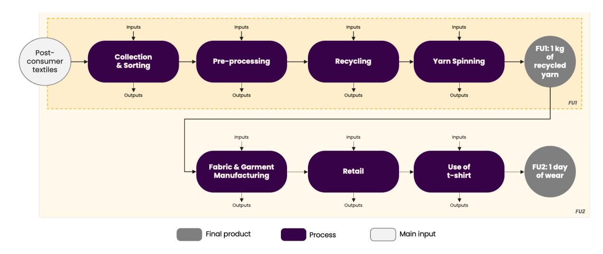
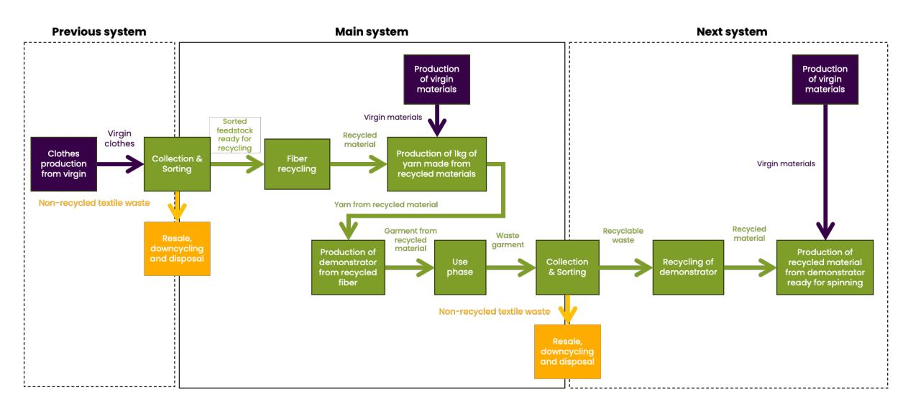
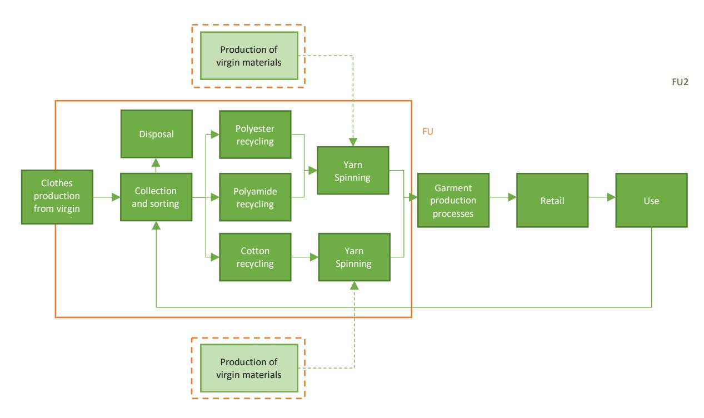
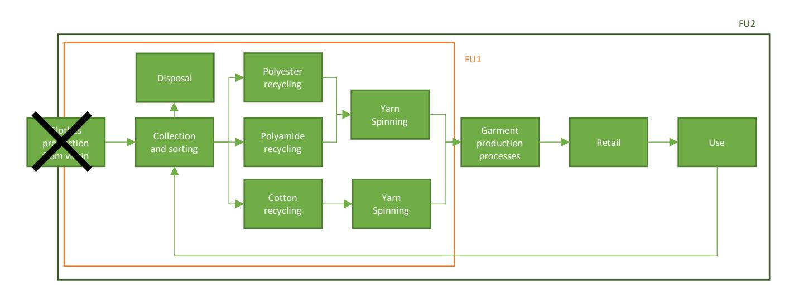
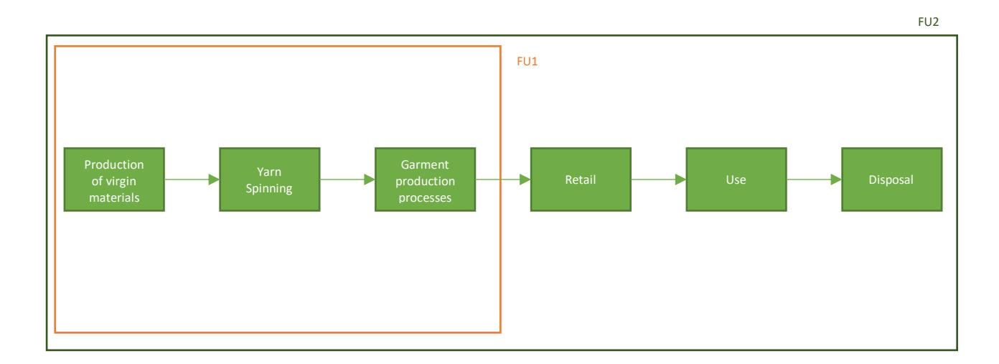
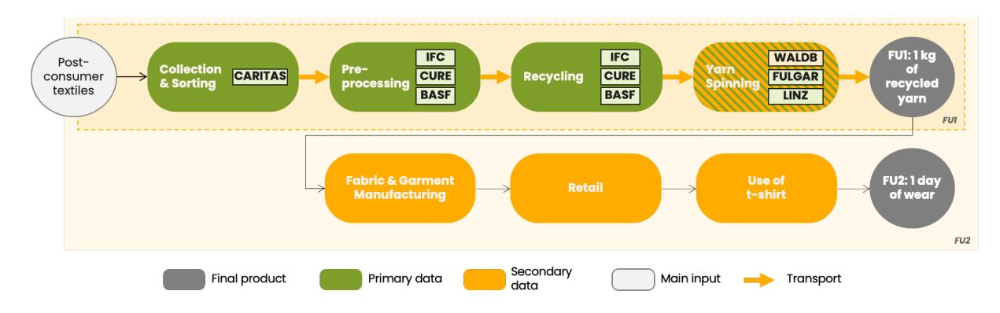
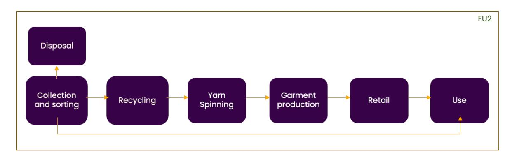
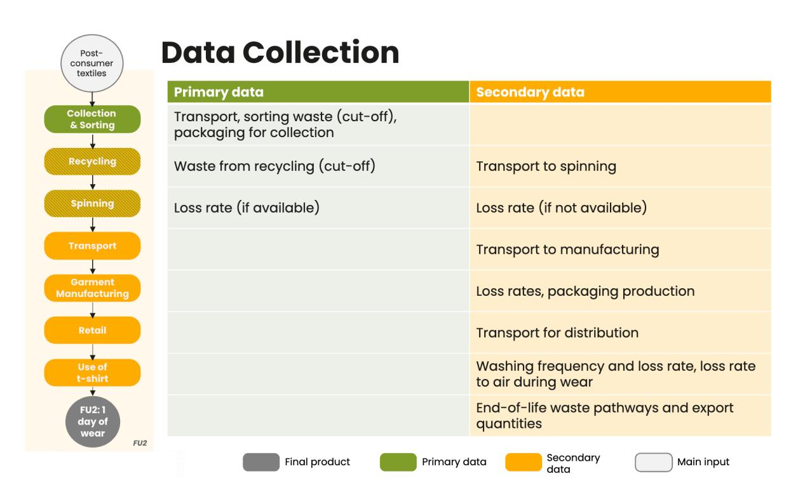

# Life Cycle Assessment & Plastic Leakage Analysis - Summary report

## **Contents**

| Contents | I Acronyms and abbreviations II                                                                                                                                                  |
|----------|----------------------------------------------------------------------------------------------------------------------------------------------------------------------------------|
| 1        | Background and objectives of the WP4 .......................................................................................................1                                    |
| 2        | Goal & Scope..................................................................................................................................................................2  |
| 2.1      | General description of the studied products ...............................................................................2                                                     |
| 2.2      | Functional unit....................................................................................................................................................3             |
| 2.3      | System boundaries........................................................................................................................................ 4                      |
| 3        | Methodological framework & assumptions ...........................................................................................10                                             |
| 3.1      | Impact analysis method...........................................................................................................................10                              |
| 3.2      | Data collection.................................................................................................................................................13               |
| 3.3      | Limitations...........................................................................................................................................................13         |
| 4        | Key results & conclusions ....................................................................................................................................14                 |
| 4.1      | Interpretation....................................................................................................................................................14             |
| 4.2      | Areas for further improvement.............................................................................................................15                                     |
|          | Plastic Leakage Assessment ..............................................................................................................................................16      |
| 1        | Goal & Scope................................................................................................................................................................16   |
| 1.1      | Goal .........................................................................................................................................................................16 |
| 1.2      | Functional unit..................................................................................................................................................16              |
| 1.3      | System description.......................................................................................................................................16                      |
| 1.4      | Macro- vs. microplastic............................................................................................................................. 17                          |
| 2        | Methodological framework & assumptions 17                                                                                                                                        |
| 2.1      | Data collection................................................................................................................................................. 17              |
| 2.2      | Scenarios .............................................................................................................................................................18        |
| 2.3      | Limitations...........................................................................................................................................................18         |
| 3        | Key results and recommendations ..............................................................................................................19                                 |

## **Acronyms and abbreviations**

| CFF   | Circular Footprint Formula                     |
|-------|------------------------------------------------|
| DQR   | Data Quality Rating                            |
| EA    | Environmental Action                           |
| EF    | Environmental Footprint                        |
| EPLCA | European Platform on Life Cycle Assessment     |
| FU    | Functional Unit                                |
| GeR   | Geographical representativeness                |
| IFC   | Infinited Fiber Company                        |
| ILCD  | Life Cycle Data System                         |
| ISO   | International Organization for Standardization |
| IUCN  | International Union for Conservation of Nature |
| LCA   | Life Cycle Assessment                          |
| LCI   | Life Cycle Inventory                           |
| LCIA  | Life Cycle Impact Assessment                   |
| P     | Precision                                      |
| PA6   | Polyamide 6, aka Nylon 6 or Polycaprolactam    |
| PEF   | Product Environmental Footprint                |
| PEFCR | Product Environmental Footprint Category Rules |
| PLP   | Plastic Leak Project                           |
| S-LCA | Social Life Cycle Assessment                   |
| T2T   | Textile-to-textile                             |
| T-REX | Textile Recycling Excellence                   |
| TeR   | Technological representativeness               |
| TiR   | Time-related representativeness                |
| WP    | Work Package                                   |

## **Life Cycle Assessment**

#### **1 Background and objectives of the WP4**

One of the main objectives of WP4 is to conduct an environmental impact analysis, with a particular focus on Life Cycle Assessment (LCA) and Plastic Leakage Analysis. This report, corresponding to Deliverable D4.2, focuses on the LCA and Plastic Leakage Analysis, aimed at assessing the sustainability of the circular value chains in a comprehensive manner. The goal is to examine the effects of recyclability and durability (lifetime) of the T-REX solutions. The assessment will focus on greenhouse gas emissions (carbon footprint), primary energy use (energy footprint), water use (water footprint), and land use.

In the preceding deliverable, D4.1, the project established a comprehensive framework, whose objective was to define a shared structure for environmental assessments, thereby ensuring a common understanding among all project partners. This framework provided the foundation for deliverable D4.2, enabling consistent, systematic data collection and a robust evaluation of the environmental performance of the value chains developed in WP4. Several elements from that framework are revisited and further refined in this report to enable a more targeted and robust assessment of the environmental performance of T-REX solutions.

Define the framework of the process design, techno-economic and ergonomic and assessment ensure a common understanding from all the partners of the work to be performed throughout the work package and a common basis for the assessment of the developed value chain.

Perform a comprehensive environmental Life Cycle Assessment of the T-REX solutions, in particular on the effects of recyclability or durability (lifetime). It will focus on greenhouse gas emissions (carbon footprint), primary energy use (energy footprint), water use (water footprint) and land use.

Figure 1: Tasks in WP4

The results have been used in an iterative approach along the project to guide the development of the investigated value chains towards sustainability and quantify the potential benefits of the developed solutions compared to existing ones. Further, they are a good foundation to properly inform future suppliers and customers and will help assessing. the potential impacts or lack thereof from building new business models at scale based on the T-REX demonstrator project. A second key objective is to steer the development of the T-REX value chains toward more sustainable solutions by applying robust sustainability metrics and actively engaging relevant stakeholders.

The study is closely aligned with the Product Environmental Footprint Category Rules (PEFCR) Apparel & Footwear (PEFCR Apparel & Footwear v3.0, 2025). The LCA results and data will also be fed into the European Platform on Life Cycle Assessment (EPLCA) following the specific Environmental Footprint data and format requirements and could contribute towards developing CFF parameters for future versions of the PEFCR apparel and footwear.

#### **2 Goal & Scope**

The objective of this LCA is to evaluate the environmental impacts of chemically recycled fibers — specifically, textile-to-textile recycled polyester, Polyamide 6 (PA6), and cellulosic fibers — using the most recent and robust data along with state-of-the-art LCA methods.

The environmental performance was assessed following the main guidelines of the Life Cycle Data System (ILCD) Handbook, as well as the International Organization for Standardization (ISO) series of norms 14040–44, and the recent ISO norm 14046 on water footprinting (International Organization for Standardization, 2006).

While the LCA methodology aligns with ISO 14040 and 14044 standards, this report has not undergone third-party critical review as required for comparative assertions. As such, the results presented here are not intended for claims or public comparative disclosure.

The following sections detail the goal and scope of this study, including:

- A general description of the product functions and systems studied,
- Definition of the functional unit,
- System boundaries.

#### **2.1 General description of the studied products**

As aforementioned, the study focuses on three types of recycled fibers — polyester, PA6, and cellulosic fibers — all derived from textile waste collected in Europe and processed at three separate recycling facilities. [Table 1](#page-5-1) provides the specifications of the fiber characteristics separately for each fiber type.

Table 1 - Fiber specifications (from Deliverable 1.1 – [Criteria and specifications guidelines for collection to meet](https://trexproject.eu/wp-content/uploads/2023/05/T-REX-Project-D1.1.pdf)  [yarn needs for sport garments\)](https://trexproject.eu/wp-content/uploads/2023/05/T-REX-Project-D1.1.pdf).

| Fiber     | Generic   |        |      |                                                  |
|-----------|-----------|--------|------|--------------------------------------------------|
|           | PA6       | Sorted |      |                                                  |
|           |           |        | BASF | The purest possible fraction, with a distinction |
| Polyester | Polyester | Sorted |      |                                                  |
|           | Cotton    | Sorted |      |                                                  |

The recycled fibers are spun to yarn and then further processed into a garment (T-shirts for the T-Rex demonstrator), with each fiber type manufactured to the specifications below:

- Polyester: interlock circular knit, dyed with disperse dyes, finished via conventional cut-and-sew.
- Polyamide 6: seamless circular knit; followed by sewn garment assembly.
- Regenerated Cellulosic fibers: single-jersey circular knit, dyed with reactive dyes, finished via cut-and-sew.

#### **2.2 Functional unit**

For this study, there are two relevant functional units:

- 1. The first functional unit (FU1) is defined as "one kilogram of yarn from recycled materials". The types of fibers studied are detailed in Table 1. Recycled yarn is not a final product but an important intermediate product which has to go through several processing steps to be converted to various end products in the textile, nonwoven and industrial segments.
- 2. The second functional unit (FU2) is defined as "one day of wear of a garment demonstrator made of recycled yarn".
- 3. All the quantities of materials needed were scaled to the two functional units. An average t-shirt is assumed to weight 0.170 kg (PEFCR Apparel & Footwear v3.0, 2025).

#### **2.3 System boundaries**

The Life Cycle Assessment is a comprehensive, multi-criteria environmental analysis. It includes the entire value chain and considers multiple environmental issues. This approach, which is intended to be exhaustive, offers a complete vision to avoid any transfer of impacts when comparing options. The elements of the value chain as well as the number of indicators to be studied are adapted to fit the reality of the operations and business model. The temporal scope and geographical scope of the study is 2021 onwards and Europe, respectively.

The included process steps, end-of-life methodology, allocation methods and cut-off criteria are detailed in the following paragraphs.

#### **2.3.1 Included process steps**

The system boundary of this study is defined in accordance with the two functional units mentioned in section 2.2:

- For FU1, the boundary is cradle-to-gate for 1 kg of recycled yarn. This includes all upstream and intermediate steps — from the collection and sorting of postconsumer textiles, through pre-processing and recycling, to the spinning of yarn and encompasses the extraction and processing of all corresponding raw materials and energy inputs.
- For FU2, the boundary extends beyond the yarn spinning factory gate to include the downstream value chain: fabric and garment manufacturing, retail, the product's use stage and end-of-life. It is then scaled to the function unit one day of wear using a standard lifetime as defined in the PEFCR A&F (PEFCR Apparel & Footwear v3.0 (2025)). This broader system boundary is used to assess the full environmental impact of a garment demonstrator made from recycled yarn, including the use of the garment.

Furthermore, transportation between each process step shown in the diagram [\(Figure 2\)](#page-7-0) is included within the system boundary to ensure completeness. In this report, the terms "spinning" or "yarn spinning" are used for the process of converting fibers into yarn. "Garment manufacturing" or simply "manufacturing" is used for fabric production and garment assembly. "Virgin material production" refers to the creation of raw, unused fibers that are used to produce yarn for the first time.

Figure 2: Process steps

As is generally done in an LCA, all identifiable "upstream" activities in the steps above are considered to provide as comprehensive a view as possible of the product's cradle-to-gate life cycle impacts. For example, when considering the environmental impacts of transportation, not only are truck and ship emissions considered, but the impacts of all processes and inputs needed to produce the fuel, and the vehicle are also included. This way, all inputs' production chains are traced back to the original extraction of raw materials.

#### **2.3.2 End-of-life and recycled content**

Since recycling systems create a material loop, a specific approach in the LCA is necessary to account for the recycled content and the end-of-life. [Figure 3](#page-8-0) explicit the link between the previous and the next product generations around the main recycling loop.

- Previous system: the virgin material is produced and used at the end of the "first life", virgin garments are collected and sorted which is part of the previous system but also of the main system; only the suitable fraction proceeds to the main system, while the rest is channeled to resale, downcycling or final disposal.
- Main (T-Rex) system: After the collection & sorting, the selected waste is fiberrecycled, converted into recycled material, spun into yarn, and used to produce the demonstrator garment (e.g., a T-shirt). After its use, the garment is collected and sorted again: recyclable material re-enters the loop, whereas non-recyclable residues leave via the same resale/down-cycling/disposal routes.
- Next system: After the collection & sorting, the recyclable portion of the demonstrator garment becomes feedstock for another fiber-recycling cycle, closing the circular chain.

Green elements represent material flows that go from one system to the next, purple elements show virgin inputs that enter the textile-to-textile value chain, and orange elements display streams permanently exiting the circular route.

Figure 3: Overview of the textile-to-textile recycling value chain

To model the textile-to-textile recycling value chain, we consider two relevant approaches in Europe, namely the Product Environmental Footprint (PEF) approach and the cut-off approach (Zampori & Pant, 2019). In this study, the PEF approach is used as a baseline, and the cut-off approach as a sensitivity analysis.

[Figure 4](#page-9-0) shows the system boundaries of recycled yarn made from textile waste. The PEF method considers the impacts of the previous life cycle and includes the credits of preventing use of virgin material in the next life cycle. This means preventing use of virgin material will give credits (i.e. negative impacts) to the recycled system. This is done by using the Circular Footprint Formula (CFF) as described in the Product Environmental Footprint (PEF) method and for which the parameters required are provided by the Product Environmental Footprint Category Rules (PEFCR) Apparel & Footwear (published in May 2025) (PEFCR Apparel & Footwear v3.0, 2025).

Figure 4 - System boundaries according to the PEF method

[Figure 5](#page-9-1) shows the system boundaries of recycled yarn made from textile waste using the cut-off approach. The cut-off method attributes no impacts to the recyclable material. All impacts from its production and use up to the collection point are attributed to its first life. Consequently, there are no credits for the avoided production of primary product.

Figure 5 - System boundaries according to the cut-off method

The CFF is used to model the end of life of products as well as the recycled content.

The CFF relies on several parameters which account for: physical characteristics of products sent to recycling (e.g. the material quality after recycling and the heating value of the material); impacts of processes (impact of energy production, recycling and substituted virgin material production); and the market reality for a recycled product (PEFCR Apparel & Footwear v3.0, 2025).

The formula addresses different aspects of the recycling in a combination of "material + energy + disposal" as shown below.

**Material** 
$$(1 - R_1)E_V + R_1 \times (AE_{recycled} + (1 - A)E_V \times \frac{Q_{SIN}}{Q_P}) + (1 - A)R_2 \times (E_{recyclingEoL} - E_V^* \times \frac{Q_{SOUT}}{Q_P})$$
**Energy**  $(1 - B)R_3 \times (E_{ER} - LHV \times X_{ER,heat} \times E_{SE,heat} - LHV \times X_{ER,elec} \times E_{SE,elec})$ 
**Disposal**  $(1 - R_2 - R_3) \times E_D$ 

Figure 6: Circular Footprint Formula

With the following parameters:

- A: allocation factor of burdens and credits between supplier and user of recycled materials.
- B: allocation factor of energy recovery processes. It applies both to burdens and credits. It shall be set to zero for all PEF studies.
- Qsin: quality of the ingoing secondary material, i.e. the quality of the recycled material at the point of substitution.
- Qsout: quality of the outgoing secondary material, i.e. the quality of the recyclable material at the point of substitution.
- Qp: quality of the primary material, i.e. quality of the virgin material.
- R1: it is the proportion of material in the input to the production that has been recycled from a previous system.
- R2: it is the proportion of the material in the product that will be recycled (or reused) in a subsequent system. R2 shall therefore take into account the inefficiencies in the collection and recycling (or reuse) processes. R2 shall be measured at the output of the recycling plant.
- R3: it is the proportion of the material in the product that is used for energy recovery at EoL.
- Erecycled (Erec): specific emissions and resources consumed (per functional unit) arising from the recycling process of the recycled (reused) material, including collection, sorting and transportation process.
- ErecyclingEoL (ErecEoL): specific emissions and resources consumed (per functional unit) arising from the recycling process at EoL, including collection, sorting and transportation process.
- Ev: specific emissions and resources consumed (per functional unit) arising from the acquisition and pre-processing of virgin material.

- E\*v: specific emissions and resources consumed (per functional unit) arising from the acquisition and pre-processing of virgin material assumed to be substituted by recyclable materials.
- EER: specific emissions and resources consumed (per functional unit) arising from the energy recovery process (e.g. incineration with energy recovery, landfill with energy recovery, etc.).
- ESE,heat and ESE,elec: specific emissions and resources consumed (per functional unit) that would have arisen from the specific substituted energy source, heat and electricity respectively.
- ED: specific emissions and resources consumed (per functional unit) arising from disposal of waste material at the EoL of the analysed product, without energy recovery.
- XER,heat and XER,elec: the efficiency of the energy recovery process for both heat and electricity.
- LHV: lower heating value of the material in the product that is used for energy recovery.

#### **2.3.3 Allocation**

When a process generates more than one product (joint production), it is necessary to divide the environmental impacts from the process between the products. There are two methods for this: allocation or system expansion.

Allocation refers to "partitioning the input or output flows of a process or a product system between the product system under study and one or more other product systems" (ISO 14040:2006). This allows to convert multi-product activities into single-product activities. The allocation key determines the share of each input and emission assigned to the reference product and to the other products that have economic value.

In system expansion, the whole system with all the co-products and their functions is considered (e.g., the production of viscose also provides other chemical co-products such as sodium sulphate). Modelling system expansion requires that the use of co-products can be unambiguously identified.

Multifunctionality is ruled by the hierarchy of the ISO 14040-44 standards (ISO 2006a and 2006b), which states that allocation should first be avoided (by system expansion, including in the analysis all the functions of the system). Then, if not avoidable, partitioning according to physical relationship should be preferred to, finally, economic or other allocation (ISO 14044:2006, art. 4.3.4.2).

In this project, the multifunctionality was occurring for the sorting process and the cellulosic fibers recycling process. The economic allocation method was chosen. No allocation was needed for the other recycling processes, as the studied recycling processes do not generate any other products than the recycled material for yarn spinning.

| Process                     | Allocation method | Source                     |
|-----------------------------|-------------------|----------------------------|
| Collection & Sorting        | Economic          | Average Selling Price from |
| Cellulosic fibers Recycling | Economic          | No allocation              |

#### **2.3.4 Cut-off criteria**

All product components and production processes were included when the necessary information was readily available, or a reasonable estimate could be made. It should be noted that capital equipment and infrastructure available in the ecoinvent database (the version used for this project is v3.10) were included in this study's background data to be as comprehensive as possible.

#### **3 Methodological framework & assumptions**

The following sections give details on the impact analysis method used and summarize the data collection.

#### **3.1 Impact analysis method**

The LCIA method used is the Environmental Footprint (EF) 3.1 with its 16 indicators. The uncertainty and study limitations are determined qualitatively once primary data has been collected. Four main indicators, namely global warming, non-renewable energy resource depletion, land use and water scarcity footprint (bold in [Table 3\)](#page-13-0) are studied in-depth.

The climate change indicator considers the potential impact on climate change from greenhouse gas emissions associated with a product, process, or organization. It considers the capacity of a greenhouse gas to influence radiative forcing, expressed in terms of a reference substance and specified time horizon. The Resource use, fossils indicator quantifies the depletion of fossil-based resources, such as coal, oil, and natural gas, throughout a product's life cycle. The land use indicator in the PEF EF method evaluates the environmental impacts associated with land occupation and transformation, capturing effects on biodiversity, soil quality, and ecosystem services across the product's life cycle. The water use indicator assesses the freshwater consumption across the supply chain using the AWARE (Available WAter REmaining) methodology. This methodology measures water scarcity by evaluating water availability in a region after accounting for human and environmental needs.

The final deliverable includes impact assessment results for all indicators listed in [Table 3](#page-13-0) . The single score contribution analysis helps to determine the most relevant indicators.

#### Table 3: Impact categories

| EF impact category Impact indicator Unit | Characterization model Robust              |
|------------------------------------------|---------------------------------------------|
| total 1 Global Warming                   |                                             |
| kg CO2-eq                                | Bern model - Global warming potential       |
| Ozone depletion Ozone Depletion          |                                             |
| kg CFC-11-eq                             | EDIP model based on the ODPs of the         |
| CTUh                                     | Based on USEtox2.1 model (Fantke et al.     |
| CTUh                                     | Based on USEtox2.1 model (Fantke et al.     |
| Particulate matter Impact on human       |                                             |
| kBq U235 -eq                             | Human health effect model as                |
| kg NMVOC -eq                             | LOTOS-EUROS model (Van Zelm et al,          |
| Acidification Accumulated                |                                             |
| mol H+ -eq                               | Accumulated Exceedance (Seppa ̈ la ̈ et al. |
| mol N -eq                                | Accumulated Exceedance (Seppa ̈ la ̈ et     |
| kg P -eq                                 | EUTREND model (Struijs et al, 2009) as      |
| kg N -eq                                 | EUTREND model (Struijs et al, 2009) as      |
| CTUe                                     | Based on USEtox2.1 model (Fantke et al.     |
| (dimensionless) 2                        |                                             |
| Water use User deprivation               |                                             |
| m3 world -eq                             | Available WAter REmaining (AWARE)           |
| kg Sb -eq                                | van Oers et al., 2002 as in CML 2002        |
| depletion – fossil fuels                 |                                             |
| MJ                                       | van Oers et al., 2002 as in CML 2002        |

1 The indicator "Climate Change, total" is a combination of three sub-indicators: Climate change –Change fossil; Climate change –Change biogenic; Climate change – land use and land use change. The sub-indicators are further described in section 4.4.10 of Annex I. The sub-categories 'Climate change –fossil', 'Climate change – biogenic' and 'Climate change - land use and land use change' shall be reported separately, if they show a contribution of more than 5% each to the total score of climate change.

2 This index is the result of the aggregation, performed by JRC, of 4 indicators (biotic production, erosion resistance, mechanical filtration, and groundwater replenishment) provided by the LANCA model for assessing impacts due to land use as reported in De Laurentiis et al, 2019.

3 The results of this impact category shall be interpreted with caution, because the results of ADP after normalization may be overestimated. The European Commission intends to develop a new method moving from depletion to dissipation model to better quantify the potential for conservation of resources.

The results for the most relevant indicators are then analyzed in depth. First, a detailed results analysis helps to identifies the most important contributors among the chosen indicators. Secondly, a benchmark comparison is carried out to evaluate the environmental performance of recycled materials against their virgin counterparts for polyester, polyamide, and cellulosic fibers. The results are benchmarked with an LCA and plastic leakage analysis of products made from conventional polyester, PA6, and cotton and modelled using conventional (i.e. standard) parameters available in the database used, with the same specifications as the recycled product. The following benchmarks were used:

- Virgin polyester, Source: ecoinvent 3.10
- Virgin polyamide 6, Source: GaBi
- Virgin cotton fiber, Source: WALDB 2.7.

[Figure 7](#page-14-0) shows the system boundaries for the benchmark products. At the disposal stage, these can also include recycling, according to the default parameters specified in the PEFCR (PEFCR Apparel & Footwear v3.0, 2025).

Figure 7 - System boundaries of the benchmark products

Finally, a sensitivity analysis is conducted to assess the robustness of the results by varying key parameters within realistic ranges for relevant processes and elementary flows. The scenarios for this analysis were selected in close coordination with partners of the T-REX Consortium and finalized during the consortium meeting held on March 11, 2025. The following parameters were varied to better understand their influence on the overall environmental impact:

- Geographical location of recycling, yarn spinning, and fabric & garment manufacturing processes, impacting the transport distances
- Energy source for the recycling & yarn spinning processes
- A scenario assuming 95% textile-to-textile recycling rate at end-of-life

#### **3.2 Data collection**

In this chapter, the Life Cycle Inventory data used for modelling the recycling processes of polyester, polyamide, and cellulosic fibers is presented, broken down by individual process steps. Transport-related data is consolidated and presented separately in a dedicated chapter, while all other sections follow the structure outlined in [Figure 2](#page-7-0) and [Figure 8.](#page-15-2)

Primary data has been collected in collaboration with other work packages and project partners for the process steps colored in green in [Figure 8.](#page-15-2) Wherever possible, this primary data has been generalized to reflect an industrial-scale, European context, rather than prototype conditions. It is still important to keep in mind that some quantities of the preprocessing and recycling processes are based on lab and pilot-scale measurements. This may lead to an overestimation of the products' impact when compared to benchmarks derived from industrial-scale values.

In cases where primary data was unavailable, secondary data or proxy data from literature research was used to fill the gaps. The assumptions made align with the Product Environmental Footprint Category Rules (PEFCR) wherever applicable. Background data sources include ecoinvent 3.10 and WALDB 2.7.

Figure 8: Data Sources of different production processes

#### **3.3 Limitations**

While the findings offer valuable direction, they should be interpreted with an understanding of the data gaps and methodological constraints. This LCA is subject to several limitations that influence the accuracy and robustness of the results:

- The validity of the comparison between the recycled materials and the benchmark is limited because the fibers partly have different characteristics
- Modelling of virgin material production relies on non-supplier-specific, secondary data, leading to uncertainties in supply chain-specific impacts.
- Secondary, global data was used for yarn spinning of polyester chips and garment manufacturing which might not represent supplier-specific processes and does not specifically represent European scenarios but global ones.
- The use stage and the end-of-life was modelled based on the PEFCR, which is a representation of average scenarios

- Data for the collection and sorting stages was only provided by one partner in Spain that might not be a good representation for generic Europe
- The LCA for pre-processing and recycling for polyamide was conducted by BASF. The datasets are considered a black box, which limits both transparency and the ability to validate or adapt the model for further use.

#### **4 Key results & conclusions**

#### **4.1 Interpretation**

Recycling of textiles has the potential to significantly reduce the environmental impacts associated with fiber production. However, the extent of these reductions is highly dependent on both the type of material being recycled and the recycling technology applied. Different fibers and processes yield different levels of efficiency and environmental performance.

One of the main contributors to environmental impact typically arises from the most energy-intensive stages of the process. This highlights the importance of improving energy efficiency and sourcing low-impact energy. This is true as well for the recycling process as for the rest of the manufacturing and supply chain, where downstream processes include energy-intensive processes such as dyeing. It is therefore key that the recycling process yields fibers which can be further manufactured with advanced, environmentally friendly processes.

Sensitivity analyses show that land transport and the geographical location of production have relatively minor influence on the overall results. This is a result of the highly global supply chain, where the garment manufacturing mostly happens in Asia. An all-European supply chain is at the time being not likely.

In contrast, the electricity mix used—especially in energy-intensive steps—has a more substantial impact. A first step is of course to favorize energy-efficient processes, especially in the wet processes.

Achieving 95% textile-to-textile recycling can considerably reduce end-of-life burdens and enhance the benefits of replacing virgin materials. These benefits are often reflected in the form of negative impacts (i.e., avoided burdens). However, from a system-level perspective, such benefits only hold true if overall material consumption remains stable or decreases. If consumption continues to grow, the absolute environmental impact may still increase, despite relative improvements.

While recycling is a vital tool in improving sustainability across the textile value chain, it is not a stand-alone solution. The manufacturing and use stages remain significant contributors to environmental impacts. Avoiding processes such as full fiber spinning and garment manufacturing—by promoting reuse or low-intervention recycling (e.g., without redyeing)—can result in even greater environmental gains.

Integrating reuse and minimally processed recycling pathways into collection and sorting systems is essential. These strategies are complementary, as they respond to different quality levels in post-consumer textile waste and help maximize resource recovery. Furthermore, the recyclability of garments and fibers plays a crucial role in reducing endof-life impacts. This reinforces the need for design for recyclability from the product development onward.

Business models for a future-proofed circular supply chain should focus on longevity of the products, recyclability of the garments, while ensuring energy-efficient processes along the whole production chain.

#### **4.2 Areas for further improvement**

To enhance the overall sustainability of textile-to-textile recycling systems, several improvement areas have been identified. First, efforts should focus on increasing the efficiency of pre-processing and recycling stages, particularly by reducing their energy intensity. Second, alternative supply chain models should be explored—ones that prioritize reuse and enable low-intervention recycling approaches, such as avoiding re-dyeing or additional chemical treatments. Finally, the implementation of robust collection and sorting systems is essential. These systems must be capable of accurately identifying textile materials by type and condition to ensure they are directed toward the most appropriate end-of-life pathway, whether that be reuse, mechanical recycling, or chemical recycling.

## **Plastic Leakage Assessment**

#### **1 Goal & Scope**

#### **1.1 Goal**

The aim of this plastic leakage assessment is to measure and compare the plastic leakage from T-REX garments against that from existing products on the market. The evaluation allows to confirm if the project succeeded in creating lower impact textile items and identify areas within the value chain that offer opportunities for enhanced environmental efficiency.

#### **1.2 Functional unit**

The plastic leakage assessment relies on a functional unit for comparison of alternative products that may substitute each other in fulfilling a certain function for the user or consumer. The FU describes this function in quantitative terms and serves as an anchor point of the comparison ensuring that the compared alternatives do indeed fulfil the same function. Therefore, it is critical that this parameter is clearly defined and measurable.

To assess the plastic leakage of the T-REX garments, the same FU as used in FU2 of the LCA is applied. For the cradle-to-grave impact of a t-shirt, the FU defined as 1 day of wear, based on average lifetime of a t-shirt being 45 uses (in alignment with Apparel and Footwear PEFCR v3.0(PEFCR Apparel & Footwear v3.0, 2025)).

### **1.3 System description**

The system to be assessed includes the whole life cycle of a garment envisioned to be developed within the T-REX project.

The system covers all activities from the raw material extraction, the manufacturing of the fibers, the packaging and transport as well as the use and the final disposal or reuse of the materials as shown in [Figure 9.](#page-18-5) The system boundaries are the same as in the LCA. The PLP methodology uses a cut-off approach, avoided disposal therefore is not considered. The European location and a 2021-year horizon have been used.

#### **1.4 Macro- vs. microplastic**

Plastics enter the environment by one of two core streams: visible macroplastics mainly from mismanaged waste, and mostly invisible primary microplastics released from various sources, such as synthetic clothing during washing.

Macroplastic are plastic items with a diameter ≥ 5 mm. Microplastics are plastic items with a diameter < 5 mm(European Commission, 2025). They are mainly due to plastic losses to water, and soil all along the life cycle. Macroplastic can degrade into microplastics over time, but this is outside of the temporal scope of the assessment. During the use stage, microplastics occur mainly in the form of fiber fragments. Fiber fragments can also be emitted for natural and regenerated fibers, but since they are not made up of plastic, they are not considered in the scope of this assessment.

#### **2 Methodological framework & assumptions**

#### **2.1 Data collection**

Primary data was collected from project partners when available and possible. Data gaps were then filled with secondary data and proxies which are further listed in the following sections. [Figure 10](#page-19-3) summarizes the overall data collected and used for the assessment.

Figure 10: Summary of data collected for the plastic leakage assessment

#### **2.2 Scenarios**

To evaluate the plastic leakage in the different textile value chains possible, 3 different scenarios are explored:

- Virgin product with current recycling rate: plastic leakage of products using virgin raw materials. At the end-of-life, the average textile end-of-life scenario is used.
- Recycled product with current recycling rate: plastic leakage of products using recycled materials from textile waste. At the end-of-life, the average textile endof-life scenario is used.
- Recycled product with textile-to-textile recycling: plastic leakage of products using recycled materials from textile waste. At the end-of-life, the product is recycled again. This represents the scenario of full deployment of the recycling value chains.

#### **2.3 Limitations**

This plastic leakage assessment is subject to several limitations that influence the accuracy and robustness of the results:

- **Data availability and quality**: Plastic leakage data (both primary and secondary) is currently limited. As a result, multiple assumptions were necessary throughout the assessment, particularly for leakage rates and fate scenarios.
- **Inventory-level scope**: The study considers plastic leakage only at the inventory level (e.g., quantities released), without assessing the environmental fate or persistence of the leaked materials.
- **Exclusions**: Factors such as polymer degradation, retention in ecosystems, and the influence of material properties on fate and impact (e.g. biodegradability) were not modeled in detail.
- **End-of-life variability**: Leakage from end-of-life scenarios depends heavily on geographic-specific waste management practices.
- **No consideration of natural fiber fragments**

While the findings offer valuable direction, they should be interpreted with an understanding of the data gaps and methodological constraints.

#### **3 Key results and recommendations**

The apparel industry plays a key role in reducing plastic leakage across the value chain. Addressing this issue requires both a global approach and localized solutions, tailored to specific contexts—such as improved recycling infrastructure or garment deposit schemes.

Plastic leakage is strongly influenced by end-of-life and lifetime parameters—priority should be placed on product longevity, consumer behavior, and waste system improvements, especially in regions receiving second-hand exports.

Macroplastic leakage is dominated by end-of-life impacts, primarily due to mismanaged waste in export markets. Levers for reduction include:

- Extending garment life and raising consumer awareness
- Promoting reuse and recycling within regions with better waste systems
- Improving infrastructure and regulation in export destinations

For synthetics, microplastic leakage is largely driven by laundering. Reduction measures include:

- Developing low-shedding fibers and applying anti-shed coatings
- Capturing microfibers in closed-loop manufacturing systems

For cotton and regenerated cellulose, microplastic leakage is largely driven by tire wear during transport. Reduction measures include reducing transport distances and optimizing logistics.

Extending product life through durability and reuse is a critical strategy. In parallel, a holistic perspective is needed, integrating the environmental impacts of plastic leakage, but also of other fiber fragments alongside other environmental impacts to avoid burden-shifting (MariLCA project, 2025). Finally, ongoing research and data sharing are essential to fill knowledge gaps, particularly around sources, pathways, and long-term environmental fate of textile-related plastic pollution.

## **References**

Boucher, J., Dubois, C., Kounina, A., & Puydarrieux, P. (s.d.). *Laying the foundation for the development of a standardised plastic footprint measurement tool: Review of plastic footprint methodologies.* Dai, J., & Dong, H. (2014). Intensive cotton farming technologies in China: Achievements, challenges and countermeasures. *Field Crops Research, 155*, 99–110. De Falco, F., Cocca, M., Avella, M., & Thompson, R. C. (2020). Microfiber release to water, via laundering, and to air, via everyday use: A comparison between polyester clothing with differing textile parameters. *Environmental Science & Technology, 54*(6), 3288– 3296. ecoinvent. (2022). *Allocation, cut-off by classification, ecoinvent database version 3.9.* Zürich: ecoinvent Association. European Commission. (2021). *Commission Recommendation (EU) 2021/2279 of 15 December 2021 on the use of the Environmental Footprint methods to measure and communicate the life cycle environmental performance of products and organisations.* Brussels: Official Journal of the European Union. European Commission. (2025). *Microplastics.* Brussels: European Commission. Retrieved from: https://environment.ec.europa.eu/topics/plastics/microplastics\_en. Eurostat. (2023). Waste statistics. Eurostat. Retrieved from https://ec.europa.eu/eurostat/statisticsexplained/index.php?title=Waste\_statistics#Waste\_treatment. International Organization for Standardization. (2006). *ISO 14040:2006(E) Environmental management — Life cycle assessment — Principles and framework.* Geneva: International Organization for Standardization. International Organization for Standardization. (2006). *ISO 14044:2006 Environmental management – Life cycle assessment – Requirements and guidelines.* Geneva: International Organization for Standardization. Kounina, A., Daystar, J., Chalumeau, S., Devine, J., Geyer, R., Pires, S. T., . . . Boucher, J. (2024). The global apparel industry is a significant yet overlooked source of plastic leakage. *Nature Communications, 15*. Loelovich, M. (2015). *Recent Findings and the Energetic Potential of Plant Biomass as a Renewable Source of Biofuels – A Review.* Retrieved from https://www.researchgate.net/figure/Net-Combustion-Energy-LHV-of-Dry-Biomass-Samples\_tbl3\_271324880. (2025). *MariLCA project.* https://marilca.org/. Peano, L. (2020). *Plastic Leak Project – Methodological guidelines. Vol. 1.* PEFCR Apparel & Footwear v3.0. (2025). *The Product Environmental Footprint for Apparel and Footwear.* PEFCR Apparel & Footwear. Retrieved from https://pefapparelandfootwear.eu/. (2025). *PLASTEAX database.* https://plasteax.earth/. Plastic Footprint Network. (2023). *Technical recommendations for microplastics from textiles.* Plastic Footprint Network. Retrieved from https://www.plasticfootprint.earth/wpcontent/uploads/2023/11/PFN\_Technical\_Microplastic\_Textile\_V1\_November\_202 3.pdf.

Quantis. (2023). *WALDB v2.5, method: EU Commission, 2019, EF 3.1.* Retrieved from https://quantis.com/who-we-guide/our-impact/sustainability-initiatives/waldb/. Quantis. (2025). *Product Environmental Footprint Representative Product (PEF-RP) Study Report: Apparel and Footwear.* Quantis. Rebolledo-Leiva, R., Moreira, M. T., & González-García, S. (2022). Environmental assessment of the production of itaconic acid from wheat straw under a biorefinery approach. *Bioresource Technology, 345*(126481). Shen, L., Worrell, E., & Patel, M. K. (2010). Environmental impact assessment of man-made cellulose fibres. *Resources, Conservation and Recycling, 55*(2), 260–274. Zampori, L., & Pant, R. (2019). *Suggestions for updating the Product Environmental Footprint (PEF) method.* Luxembourg: Publications Office of the European Union.