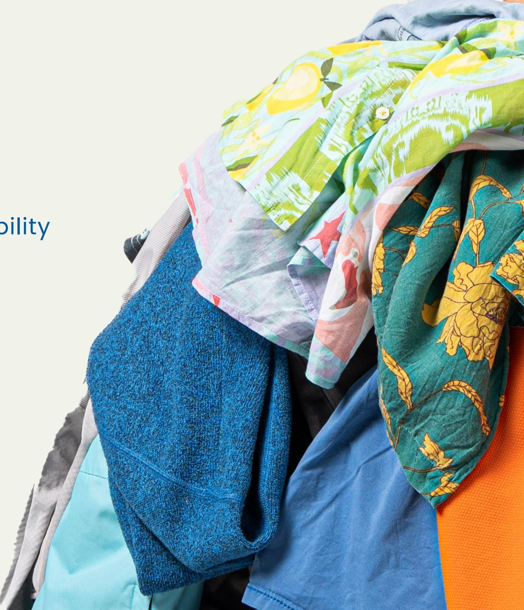

# **TECHNICAL GUIDANCE**

Designing Garments for Textile-to-Textile Recyclability

## **T-REX PROJECT**

**Textile Recycling Excellence Project** (T-REX) was a three-year research project, active from 2022-2025, funded by the European Union's Horizon Europe research and innovation programme. Thirteen partners from across the value chain came together to collaborate towards demonstrating a potential scalable solution for textile-to-textile recycling. This involved the collection, sorting and pre-processing of household textile waste to demonstrate the chemical recycling process of **cotton, polyester and polyamide 6** from waste into new garments.

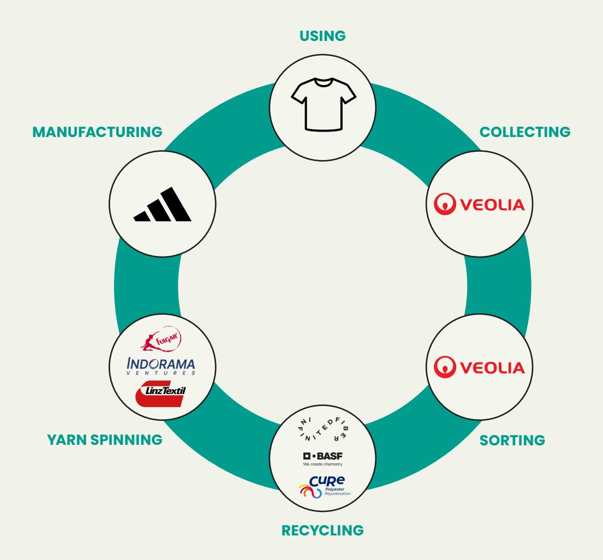

## **SUPPORTING TOPICS**

## **CONTENTS**

## **PART 1: KNOWLEDGE BASE**

**INTRODUCTION**

**DESIGNING FOR CIRCULARITY**

**OVERVIEW OF THE TEXTILE RECYCLING PROCESS**

**SORTING FOR TEXTILE-TO-TEXTILE RECYCLING**

**DE-TRIMMING: PREPARATION FOR RECYCLING**

**CHEMICAL RECYCLING**

**04 05**

**07**

**08**

**09**

**10**

**12 13**

**14**

**15**

**16 17** **25**

**26**

**27**

**28**

**18**

**19**

**20**

**21**

**22**

**23**

**THINKING IN GARMENT LEVELS**

**GENERAL GUIDANCE: FABRICS**

**GENERAL GUIDANCE: TRIMS & PRINTS**

**TRAFFIC LIGHTS FOR MATERIAL**

**RECYCLABILITY**

**TRAFFIC LIGHTS ON GARMENT LEVELS**

**COTTON RECYCLING: MATERIAL OVERVIEW COTTON RECYCLING: GARMENT EXAMPLE**

**POLYESTER RECYCLING: MATERIAL OVERVIEW**

**POLYESTER RECYCLING: GARMENT EXAMPLE**

**POLYAMIDE 6 RECYCLING: MATERIAL OVERVIEW**

**POLYAMIDE 6 RECYCLING: GARMENT EXAMPLE**

**WRAPPING UP & LOOKING AHEAD** 

**OVERVIEW OF SOFT TRIMS & PRINTS MATERIAL COMPOSITION** 

**OVERVIEW OF HARD TRIMS MATERIAL COMPOSITION GARMENT EXAMPLE PAGE**

**GLOSSARY**

**RESOURCES & ACKNOWLEDGEMENTS**

## **PART 2: DESIGN TOOLBOX APPENDIX**

Learn about the industrial processes involved in textile recycling

Receive step-by-step guidance on how to create recyclable garments

**29**

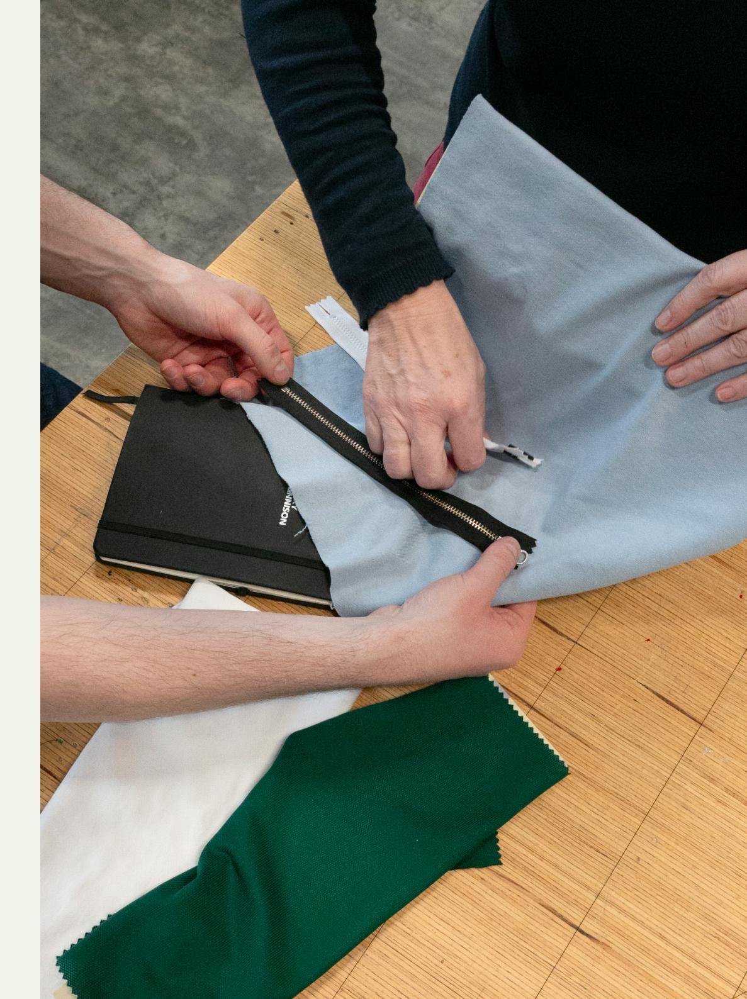

## **INTRODUCTION**

The apparel industry is facing growing pressure to shift the way it currently makes, uses and disposes of clothing. Emerging technologies, changing consumer expectations and new policies are laying the foundations to move from a linear to a **circular industry**.

The research conducted in the T-REX Project explores how we can best design garments to accelerate circularity. This Technical Guidance brings together the key insights from the project. It offers practical guidance on how to create recyclable garments while **stepping away from the mono-material approach**.

More specifically, the document contains detailed guidance to **improve the recyclability of garments made from cotton, polyester and polyamide 6**. This information is based on the **chemical recycling** technologies of T-REX project partners Infinited Fiber Company, CuRe Technology and BASF, respectively.

As design is at the core of the industry, **designers and material developers can become a driving force** behind the transition to a circular apparel industry. This guidance aims to equip them with the tools to create recyclable products in a realistic and impactful way. Since circularity requires industry-wide collaboration, we encourage all stakeholders interested in a circular apparel industry to explore this Technical Guidance.

# DESIGNING FOR CIRCULARITY

This Technical Guidance focuses specifically on material and product development for chemical recycling. However, it is important to be aware of the **wider scope of circular approaches**, as together they are the preferred alternative to the linear 'take, make, dispose' model.

Whilst the three main principles to design for circularity are all important, they should be utilised and prioritised according to the intended use of the product. Since **the ideal circular clothing item would consider not one but all of these design approaches**, they should be seen as complementary, rather than mutually exclusive.

## THREE MAIN PRINCIPLES TO DESIGN FOR CIRCULARITY:

### DEMAND

Designing for demand means only using resources when there is a need for it, by focussing on the product purpose, minimising over-production and reducing the impact of the materials and production processes.

### DURABILITY

Design for durability will increase the lifespan of a garment by focussing on the physical and emotional longevity of products, together with their repairability and reusability.

### RECYCLABILITY

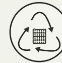

Design for recyclability prevents waste generation by ensuring clothing can be processed into raw materials for the production of new garments.

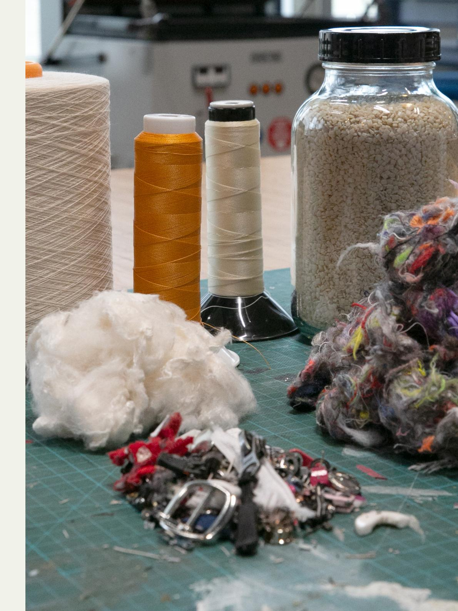

## **PART 1**

## **KNOWLEDGE BASE**

This part **explores the main processes involved in textile-to-textile recycling** that are important to know from a design perspective.

Having a basic understanding of these processes will provide context to the design recommendations in Part 2.

## **OVERVIEW OF THE TEXTILE RECYCLING PROCESS**

**Post-consumer textile-to-textile recycling is a multi-step process**: when discarded clothes are collected, they go through several processes before they can be recycled.

An overview of how clothing flows through these processes can be found below. The following pages go into more detail on these processing phases and how they influence a garment's recyclability.

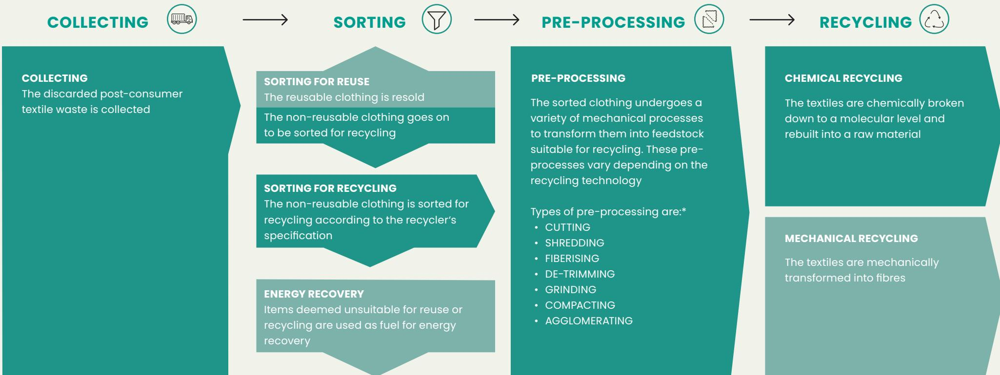

# SORTING FOR TEXTILE-TO-TEXTILE RECYCLING

When the collected clothing arrives at the sorter, it is first assessed on reusability. Afterwards, the **non-reusable items** are sorted for recycling, as shown below. In this process, **NIR (Near-Infrared) technology** is used to scan the fabric surface with infrared light to identify the fabric composition. Based on the outcome of this scan, a match with recycler's requirements is made. **NIR is an important indicator of how to design for recyclability:**

- • Blended materials decrease accuracy of NIR scanning
- • Finishes and coatings cannot be detected by NIR
- • Garment elements with a different composition to the main fabric (like elbow patches and pocket bags) can go unnoticed as NIR only scans specific points
- • The overall composition of multilayer garments is difficult to detect as NIR only scans the garment surface

**Part 2: Design Toolbox**, will go into detail on how fabric selection and garment design can have a positive impact on the sorting efficiency.

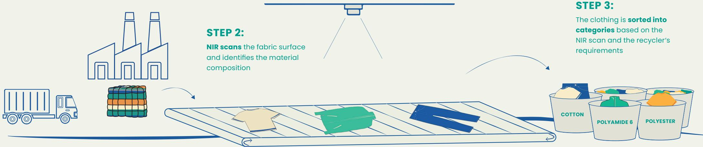

**STEP 1:**  
**Non-reusable clothing**  
arrives for sorting at  
the recycling station

## **DE-TRIMMING: PREPARATION FOR RECYCLING**

Pre-processing encompasses all steps that sorted clothes go through before they can be recycled. **From a design perspective, de-trimming is the most important step to be familiar with.** The purpose of the process is to remove the trims (buttons, labels, zippers, etc.) from garments, which would be problematic during recycling. It is often done manually, but **automated de-trimming techniques are being developed to remove trims more efficiently.** The process flow of automated de-trimming is shown below.

De-trimming can result in significant material loss as some fabric often stays attached to the trims when removing them. **Designers can therefore positively influence the process by reducing trims where possible**. More details on trim usage can be found in **Part 2: Design Toolbox**

## **STEP 1:**

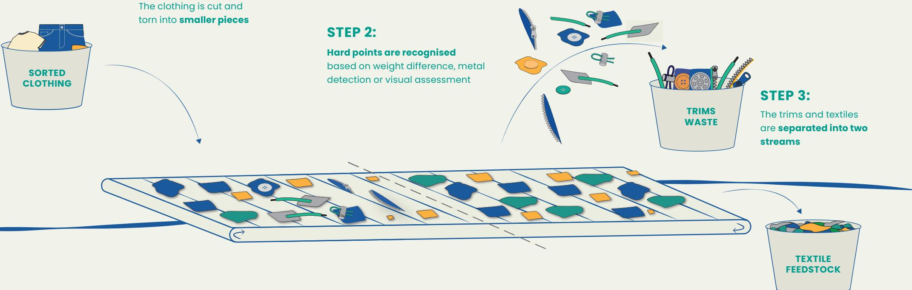

The clothing is cut and

## **DEBUNKING MYTHS**

**Detachable trims** are often considered better for recyclability. In reality, they don't have much impact as industrial scale pre-processors don't have time to manually check and remove detachable trims

## **CHEMICAL RECYCLING**

**Chemical recycling is particularly effective in processing mixed-material textile waste**, which is difficult to recycle using traditional mechanical or thermo-mechanical methods. Chemical recyclers apply advanced technologies to break down textile waste into its basic chemical building blocks and re-build new raw material from there. The process includes purification where **colorants and a selective range of contaminants are removed**.

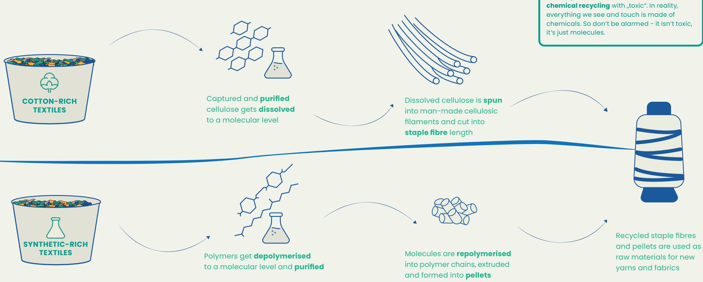

The recovered high-quality materials can replace virgin materials in the creation of new textiles. **With chemical recycling in mind, designers can be more flexible in the use of material blends, colours and trims compared to other recycling technologies**. More detail on which material blends and contaminants can be handled based on the technical capabilities of specific recycling technologies can be found in **Part 2: Design Toolbox**.

### **DEBUNKING MYTHS**

You may associate the word "chemical" in **chemical recycling** with "toxic". In reality, everything we see and touch is made of

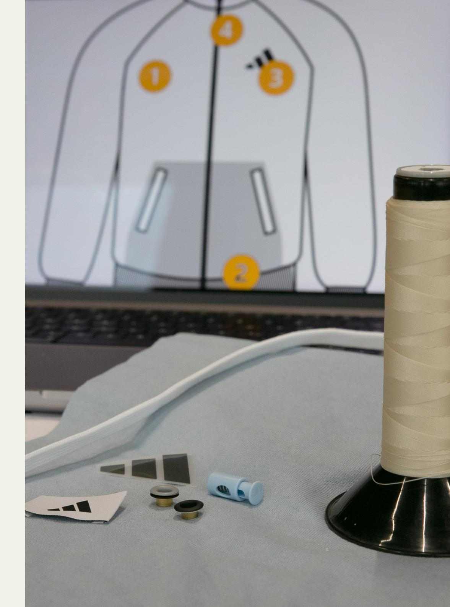

## **PART 2**

This section provides guiding recommendations to improve the recyclability of **single-layer garments** for chemical recycling.

The toolbox **steps away from the mono-material approach** and provides some leniency in the usage of blends.

## **DESIGN TOOLBOX**

## **THINKING IN GARMENT LEVELS**

Garment design involves a lot of materials and product components that influence its overall functionality, durability and recyclability. Following the typical design process, we have identified **four key levels that form the basic structure of designing for recyclability**. The deliberate choices that are made in each of these areas will significantly impact the garment's recyclability, as this is the moment when its efficiency in sorting, pre-processing and recycling is determined.

**The main fabric is the basis of a recyclable garment design**: this is generally the part of the garment that will be recycled. The first and most important step is therefore to develop a main fabric with a recyclable composition. The other garment elements (secondary fabrics, prints, soft & hard trims) with a different composition to the main material are generally seen as contaminants because these need to be removed from the garment.

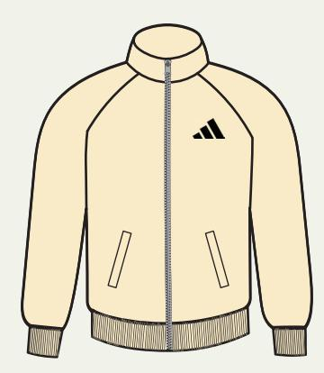

- The main fabric constitutes the largest component and main surface area of the garment
- Based on the main fabric, it is determined during sorting for recycling if a garment is suitable for a specific recycling technology

- Soft trims and prints are supple and generally have a strong bond with the fabric
- These items are usually not detected during sorting and cannot be removed during de-trimming

- Secondary fabrics are commonly used as small parts inside or outside the garment
- These fabrics are usually not detected during sorting for recycling

- Hard trims are solid and are generally heavier than the fabric
- These items can normally be removed during de-trimming

**FABRICS**

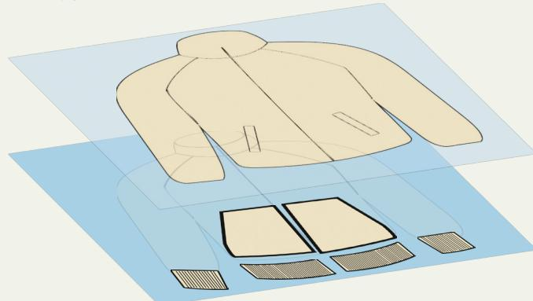

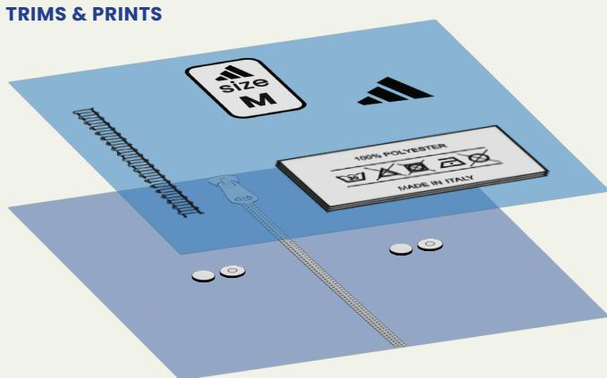

## **LEVEL 1: MAIN FABRIC**

### **LEVEL 3: SOFT TRIMS AND PRINTS**

### **LEVEL 2: SECONDARY FABRICS**

### **LEVEL 4: HARD TRIMS**

## **GENERAL GUIDANCE: FABRICS**

Designing for recyclability starts with the fabric as this will generally be the feedstock for textile recycling. Focussing on the design and application of fabrics for their recyclability, **monomaterial is always the preferred approach**.

### **MAIN & SECONDARY FABRICS MATERIAL COMPOSITION FABRIC DYES, PRINTS, FINISHES AND COATINGS**

**Recycled materials** can be used as they can become feedstock for chemical recycling.

Material specific reactive, disperse and acid **dyes**, as well as fabric **allover prints**, can be used as they don't harm recycling.

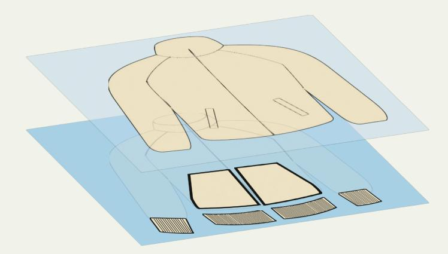

Some **blends of two materials** can be detected in sorting and potentially be recycled, if material thresholds have been considered.

**Finishes and coatings** should only be used when they enhance the functionality and durabilty of the garment. Depending on the recycling technology, some finishes and coatings can be accepted, but others can significantly harm the process.\*

**Blends with elastic fibres** are difficult to detect in sorting and can complicate recycling, so try to minimise their usage.

**Blends of three or more materials** can often not be accurately detected in sorting and can cause contamination of feedstock, resulting in inefficient recycling.

Considering that we also want to design for demand and durability, **this guidance provides some leniency when it comes to the use of blends**. However, it is important to know that material blends are not without consequences since they result in waste and can significantly complicate recycling.

**Mono-materials** are preferred.

## **GENERAL GUIDANCE: TRIMS & PRINTS**

**Trims and prints are generally considered contaminants** that can complicate recycling. Consequently, there are **two ways to deal with them**: they should either be removed from the fabric during de-trimming, or they can stay attached to the fabric but then shouldn't be harmful to the recycling process. Hard trims can more easily be removed during de-trimming because of their weight difference to the fabric. This is more difficult for soft trims and direct prints due to their similarity in weight and their strong bond with the fabric.

### **SOFT & HARD TRIMS**

### **HARD TRIMS**

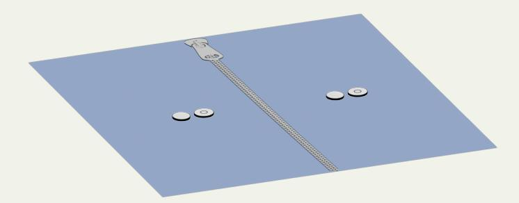

## **GRAPHIC PRINTS**

### **Additional embellishments in the form of direct prints**

### **Examples of soft components:**

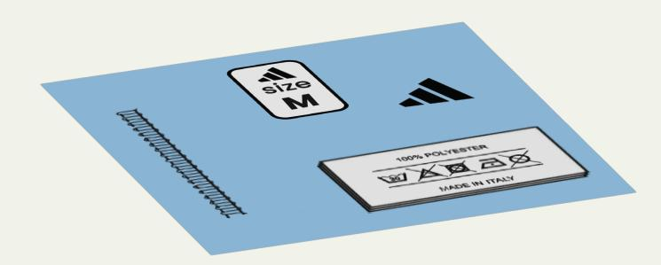

Heat transfers, inner elastics, soft elastics, tapes, pipings, labels, bonding films, seam tapes, interlinings, hook & loop closures, drawcords, sewing threads, embroideries, foams

## **Examples of hard components:**

Zipper teeth, sliders and pullers, buttons, cord stoppers, snap buttons, rivets, eyelets, buckles, key rings, aglets

Hard trims will most likely be **removed during pre-processing** so they can also be made of a different material composition.

Depending on the recycling technology, **some graphic prints can be handled** in recycling. As these prints typically consist of a variety of different components that are not specified individually, it is complex to define their compatibility with recycling in more detail.\*

Keep graphic prints as small as possible to prevent them from jeopardising the garment's recyclability.

Soft trims with the **same material composition** as the main fabric (mono-material) are preferred.

Depending on the recycling technology, some soft trims with a **different material composition** can still be handled in recycling.

As **sewing thread**, **care**, **and size labels** are a small part of the garment weight, they can generally be made of their usual material.

Therefore, our general advice is to **first focus on making soft trims and graphic prints compatible with the corresponding recycling technology**, and then to address the hard trims. However, the general rule applies that all trims and prints that don't match the material of the main fabric need to be removed. This can result in a significant increase of processing waste.

### **SOFT TRIMS**

## **TRAFFIC LIGHTS FOR MATERIAL RECYCLABILITY**

When designing for recyclability, we need to carefully consider the specific materials used in a design. Each material component of a garment can be useful or harmful for recycling, and therefore impact whether the garment becomes a valuable feedstock for recycling. To structure the degree of recyclability of materials, we have created **a traffic light system that will be used as the guiding principle on the following pages**.

Each recycling technology specialises in recycling one specifc material, and can handle different contaminants. As a result, **it is technology-dependent which traffic light colour a material is labelled with**: for one technology, cotton may be green while for another it is yellow. In this guideline, the traffic light system is applied to company-specific recycling technologies tested within the T-REX project: **Infinited Fiber Company, BASF and CuRe Technology**, which recycle cotton, polyamide 6 and polyester, respectively.

### **BEST CASE COMPLEMENTARY COMPATIBLE DISRUPTER**

The material is recyclable and can become a new raw material for garments

The material is recyclable and can become a new raw material for garments, but can only be accepted to a certain threshold

The material is accepted to a certain threshold, but it has a negative impact on the recycling process, its economics and environmental impact

The material is disruptive for recycling and makes the whole garment unrecyclable

## **TRAFFIC LIGHTS ON GARMENT LEVELS**

Below is a **general methodology for how to apply the material traffic lights to the garment levels**. This principle applies to all recycling technologies, and is not material-specific. On the following pages, we illustrate how to apply this colour-coding system to cotton, polyester and polyamide 6 garments.

## **2. SECONDARY FABRIC**

| 
Preferably select green or light green materials
    |  | Preferably select green or light green materials           |
|-------------------------------------------------------------------------|--|-------------------------------------------------------------------------|
| 
Yellow materials can be selected, if below the maximum threshold
 |  | 
Yellow materials can be selected, if below the maximum threshold
 |

### **3. SOFT TRIMS & PRINTS**

| Preferably select green or light green materials                 | 
 
 |
|------------------------------------------------------------------|--------------|
| Yellow materials can be selected, if below the maximum threshold | 
 
 |

## **1. MAIN FABRIC**

| Select only 1 green material above the minimum threshold                                        |  |  |
|-------------------------------------------------------------------------------------------------|--|---------------|
| If a blend is required, add only 1 light green or 1 yellow material below the maximum threshold |  |  |

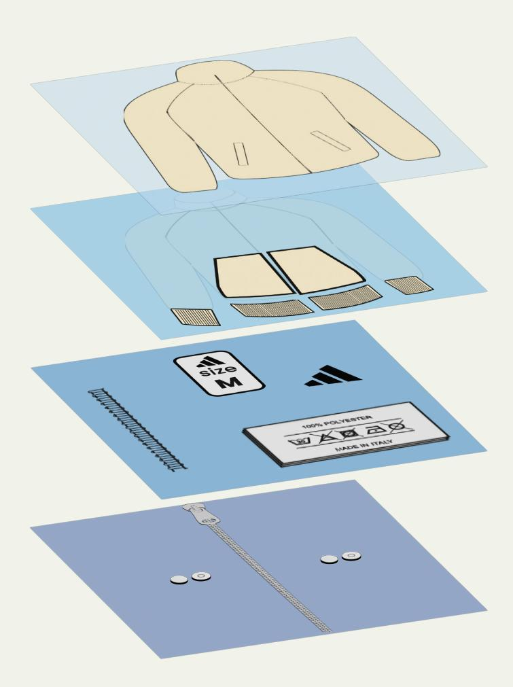

### **4. HARD TRIMS**

| 
Reduce the use of hard trims to minimise waste. All materials can be used because hard trims will be removed during de-trimming
 | 

 |
|--------------------------------------------------------------------------------------------------------------------------------------------|---------------------------------------------------------------------------|
|--------------------------------------------------------------------------------------------------------------------------------------------|---------------------------------------------------------------------------|

### **+ WEIGHT CALCULATION ON GARMENT LEVEL**

---

| The accumulated weight of all (light) green and yellow materials should adhere to their thresholds, and red materials should be removable or avoided |  |
|------------------------------------------------------------------------------------------------------------------------------------------------------|--|
|------------------------------------------------------------------------------------------------------------------------------------------------------|--|

---

## **COTTON RECYCLING: MATERIAL OVERVIEW**

Infinited Fiber Company recycles textile waste by extracting cellulose from cotton-rich textiles, and regenerating them into high-quality man-made cellulosic fibres called Infinna™.

The table visualises the input materials that can be processed by Infinited Fiber Company. **The specified thresholds are related to the total weight of the material on a garment level.**

| MATERIAL | MATERIAL |         |                       | MATERIAL |
|----------|----------|---------|-----------------------|----------|
|          | CO       | 80-100% |                       |          |
|          | PE       | 0-1%    |                       |          |
|          |          |         | accumulated to 1% max |          |

| MATERIAL                                                 | MATERIAL LABELLING | WEIGHT THRESHOLD ON GARMENT LEVEL |
|----------------------------------------------------------|--------------------|-----------------------------------|
| Cellulose acetate                                        | <b>CA</b>          | <b>RED</b>                        |
| Polyurethane                                             | <b>PU</b>          | <b>RED</b>                        |
| Silicone                                                 |                    | <b>RED</b>                        |
| Polyoxymethylene (thermoplastic)                         | <b>POM</b>         | <b>RED</b>                        |
| Acrylic polymer                                          |                    | <b>RED</b>                        |
| Ferreous and non-ferrous metal                           |                    | <b>RED</b>                        |
| Glass particles (e.g. part of reflective heat transfers) |                    | <b>RED</b>                        |

Today, Infinited Fiber Company can incorporate 20% man-made cellulosic fibers (MMCFs) into the process. These fibres do not disrupt the operation, and produce similar high quality Infinna™ fibres as cotton feedstock. In the future, by adjusting process parameters, the feedstock can contain up to 100% MMCFs.

## **COTTON RECYCLING: GARMENT EXAMPLE**

| GENERAL TRAFFIC LIGHTS | PRODUCT: HOODIE |          |          |       |                  |
|------------------------|-----------------|----------|----------|-------|------------------|
|                        |                 |          | 100% CO  | 75,4% |                  |
|                        |                 | 97,1% CO |          |       | 0,1% (removable) |
|                        |                 | POSITION | MATERIAL |       |                  |
|                        |                 | POSITION | MATERIAL |       |                  |

## **POLYESTER RECYCLING: MATERIAL OVERVIEW**

| MATERIAL | MATERIAL |         | MATERIAL |
|----------|----------|---------|----------|
|          | PET      | 90-100% |          |
|          | CO       | 0-5%    |          |

CuRe Technology uses a low carbon footprint process to depolymerise polyester, purify it and then rebuild it into new raw materials.

The table visualises the input materials that can be processed by CuRe Technology. **The specified thresholds are related to the total weight of the material on a garment level.**

| MATERIAL                         | MATERIAL LABELLING  | WEIGHT THRESHOLD ON GARMENT LEVEL |
|----------------------------------|---------------------|-----------------------------------|
| Polyacrylonitrile                | <b>PAN</b>          |                                   |
| Polylactide                      | <b>PLA</b>          |                                   |
| Animal fibres (wool, silk, down) | <b>WO, SE, DOWN</b> |                                   |
| Acrylonitrile butadiene styrene  | <b>ABS</b>          |                                   |
| Polyoxymethylene (thermoplastic) | <b>POM</b>          |                                   |
| Natural and synthetic rubber     |                     |                                   |
| Thermoplastic elastomer          | <b>TPE</b>          |                                   |
| Thermoplastic rubber             | <b>TPR</b>          |                                   |
| Acrylic polymer                  |                     |                                   |

This table outlines the projected capabilities of CuRe Technology's commercial scale facility, which is in the planning phase. When suppling textile waste to the current CuRe Technology pilot facility, please check the latest recycler specifications.

## **POLYESTER RECYCLING: GARMENT EXAMPLE**

| GENERAL TRAFFIC LIGHTS | PRODUCT: FOOTBALL JERSEY |           |          |         |
|------------------------|--------------------------|-----------|----------|---------|
|                        |                          | 99,8% PET |          | 0,1% PU |
|                        |                          | POSITION  | MATERIAL |         |

| MATERIAL | MATERIAL |         |           | MATERIAL |
|----------|----------|---------|-----------|----------|
|          | PA6      | 80-100% |           |          |
|          |          |         | to 5% max |          |

## **POLYAMIDE 6 RECYCLING: MATERIAL OVERVIEW**

BASF depolymerises polyamide 6 textile waste and converts it into a virgin-like material called loopamid®.

| <b>MATERIAL</b>                  | <b>MATERIAL LABELLING</b> | <b>WEIGHT THRESHOLD ON GARMENT LEVEL</b> |
|----------------------------------|---------------------------|------------------------------------------|
| Polyoxymethylene (thermoplastic) | <b>POM</b>                | <b>[</b>                                 |
| Ferrous and non-ferrous metal    |                           | <b>[</b>                                 |

This table specifically addresses the recycling of polyamide 6 and visualises the input materials that can be processed by BASF. **The specified thresholds are related to the total weight of the material on a garment level.**

> BASF can handle commonly used finishes and coatings on PA6 outerwear garments.

Polyamides always have a number (like polyamide 6 or 6.6), which refers to the chemical structure and corresponding properties of the polymer. From a recycling perspective, a distinction between the types of polyamides is required.

## **POLYAMIDE 6 RECYCLING: GARMENT EXAMPLE**

| GENERAL TRAFFIC LIGHTS PRODUCT: LEGGINGS |                |
|------------------------------------------|----------------|
| 92.3% PA6                                | not applicable |
| POSITION                                 | MATERIAL       |
| POSITION                                 | MATERIAL       |
| POSITION                                 | MATERIAL       |
| POSITION                                 | MATERIAL       |

## **WRAPPING UP & LOOKING AHEAD**

### **THIS TECHNICAL GUIDANCE IS AN IMPORTANT FIRST STEP**

This T-REX Technical Guidance **shares detailed information from technical trials to guide designers and product developers in creating recyclable garments**. By stepping away from a complete mono-material approach, we intend to enable more flexibility when designing for recyclability. While we believe this guidance offers a valuable starting place, it is only the first step. Limitations to the scope of this document means that future research will be necessary to fill knowledge gaps.

As such, this Technical Guidance is intended as a report from a research project and should not be used for any commercial purposes. None of the involved research partners can be held liable for the guidance provided in this document.

### **WE CAN'T SOLVE IT ALL IN ONE TRY**

The information in this Technical Guidance is based on results from the T-REX Project and the recycling technologies from Infinited Fiber Company, CuRe Technology and BASF. Since these **companies are in the process of scaling**, the material tables may change over time.

Additionally, **other recycling technologies on the market may have different feedstock specifications**. An industry-wide standard for recyclability should consider these technologies, and therefore, the specifications of such a standard may differ from the information provided in this document. Designers and material developers should stay informed about these industry-wide developments within textile-to-textile recycling.

### **FURTHER RESEARCH IS REQUIRED**

Garments can be very complex, and not every aspect could be tested within the scope of the T-REX research project. **Further research** is needed to establish more detailed information on:

- The recyclability of a broad range of chemistry in **coatings, finishes and graphic prints**.
- The recyclability of **multi-layer garments**, as they add an extra level of complexity, both in the design as well as the sorting, pre-processing and recycling phase.

### **ALL STAKEHOLDERS NEED TO CONTRIBUTE**

In the T-REX research project, we discovered that conversations between all stakeholders – brands, producers, sorters, pre-processors, recyclers and policy makers – are key for the textile recycling value chain to grow. **It's a shared responsibility to scale textile-to-textile recycling in Europe**, and it requires all stakeholders across the industry to commit to ensuring its success. Based on the learnings from developing this Technical Guidance, we particularly see potential in the following areas:

- Brands need to collaborate with their material suppliers **to make all material compositions available**, and to develop **weight calculation tools** to successfully apply the traffic light system on a garment level.
- Sorters and pre-processors are an indispensable part of textile-to-textile recycling value chain. **Investment is required** for these technologies to reach maturity, and for the supply chain to become economically viable.
- Ecodesign for Sustainable Products Regulation (ESPR) is essential in establishing **standardisation for recyclability**, for which this Technical Guidance can serve as a blueprint.

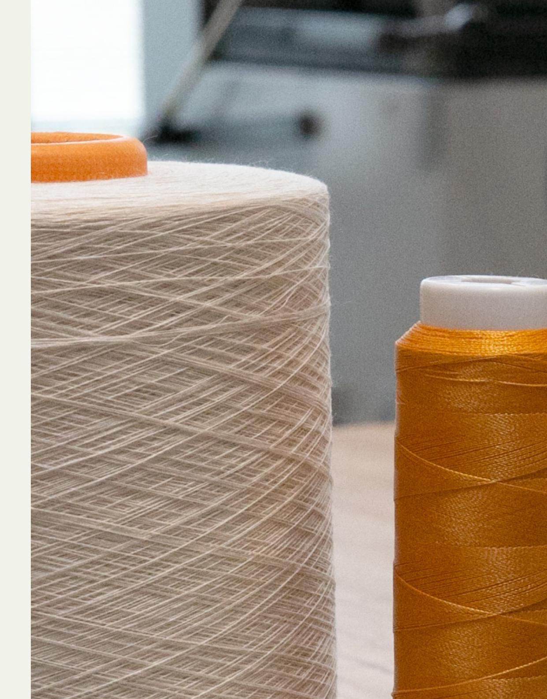

**APPENDIX**

## **OVERVIEW OF SOFT TRIMS & PRINTS MATERIAL COMPOSITION**

### = commonly used materials for the specified trim type

| Polyester - polyethylene terephthalate | <b>PET</b>       | ✗ | ✗ | ✗ | ✗ | ✗ | ✗ | ✗ | ✗ | ✗ | ✗ | ✗ |
|----------------------------------------|------------------|----------------|----------------|----------------|----------------|----------------|----------------|----------------|----------------|----------------|----------------|----------------|
| Polyester - polybutylene terephthalate | <b>PBT</b>       |   | ✗ |   |   |   |   |   |   |   |   |   |
| Polyamide 6 / nylon 6                  | <b>PA6</b>       | ✗ | ✗ | ✗ | ✗ | ✗ |   |   | ✗ | ✗ | ✗ | ✗ |
| Polyamide / nylon others               | <b>PA OTHERS</b> | ✗ | ✗ | ✗ |   |   |   | ✗ |   |   | ✗ | ✗ |
| Cotton                                 | <b>CO</b>        | ✗ | ✗ |   | ✗ | ✗ |   |   | ✗ |   |   |   |
| Elastane                               | <b>EL</b>        |   | ✗ |   |   |   |   |   |   | ✗ |   |   |
| Viscose                                | <b>CV</b>        |   |   |   | ✗ |   |   | ✗ |   |   |   |   |
| Polypropylene                          | <b>PP</b>        | ✗ |   |   | ✗ |   |   |   |   | ✗ |   |   |
| Polyethylene                           | <b>PE</b>        |   |   |   |   |   |   |   |   |   |   |   |
| Polyurethane                           | <b>PU</b>        | ✗ | ✗ | ✗ | ✗ |   |   | ✗ |   | ✗ |   | ✗ |
| Rubber                                 |     |   | ✗ |   |   |   |   | ✗ |   |   |   |   |
| Silicone                               |     |   | ✗ |   | ✗ |   |   |   | ✗ |   |   |   |
| Acrylic polymer                        |     |   |   |   |   |   |   |   |   | ✗ |   |   |
| Thermoplastic rubber                   | <b>TPR</b>       |   |   |   |   |   |   |   |   |   |   |   |
| Thermoplastic elastomer                | <b>TPE</b>       |   |   |   |   | ✗ |   |   |   |   |   | ✗ |
| Thermoplastic polyurethane             | <b>TPU</b>       |   |   | ✗ |   |   |   |   |   |   | ✗ | ✗ |
| Glass particles                        |     |   | ✗ | ✗ | ✗ |   |   | ✗ |   |   |   |   |
| Aluminium                              |     |   | ✗ | ✗ |   |   |   |   | ✗ |   |   |   |

**MATERIAL**

## **OVERVIEW OF HARD TRIMS MATERIAL COMPOSITION**

**MATERIAL**

| Button | Snap button | Cord    |       |           |          |            |        |      |        |       |
|--------|-------------|---------|-------|-----------|----------|------------|--------|------|--------|-------|
|        |             | stopper | Aglet | Metal zip | Coil zip | Vislon zip | Puller | Hook |        |       |
|        |             |         |       |           |          |            |        |      | buckle | Rivet |

### = commonly used materials for the specified trim type

## **GARMENT EXAMPLE PAGE**

| GENERAL TRAFFIC LIGHTS | PRODUCT: |          |          |
|------------------------|----------|----------|----------|
|                        |          | POSITION | MATERIAL |
|                        |          | POSITION | MATERIAL |

## **GLOSSARY**

| Circularity |            | Non-reusable clothing  |                   |
|-------------|------------|------------------------|-------------------|
| TERM        | DEFINITION | TERM                   | DEFINITION        |
|             |            | Pre-processing         | All steps that so |
|             |            | Mono-material approach | A garment desi    |

| TERM                   | DEFINITION                                                                 |
|------------------------|----------------------------------------------------------------------------|
| Pre-processing         | All steps that sorted non-reusable clothing goes through before recycling. |
| Mono-material approach | A garment design strategy that utilises fabrics and other components       |

## **RESOURCES ACKNOWLEDGEMENTS**

**CEN** (2023). Textiles – Environmental aspects – Vocabulary (ISO Standard No. 5157:2023).

**Fashion for Good** - FFG (2022). Sorting for circularity Europe: An evaluation and commercial assessment of textile waste across Europe. https://reports.fashionforgood.com/report/sorting-for-circularity-europe/

**McKinsey & Company** (2024). What is circularity? https://www.mckinsey.com/featured-insights/mckinsey-explainers/what-is-circularity

**T-REX** (2022). Creating a circular system from post-consumer textile waste. https://trexproject.eu/

**Directorate-General for Environment** (n.d.). EU strategy for sustainable and circular textiles. European Commission.

https://environment.ec.europa.eu/strategy/textiles-strategy\_en

## **European Environment Agency** (2025, March 26). Textiles.

https://www.eea.europa.eu/en/topics/in-depth/textiles

### **Product Bureau** (n.d.) Textiles. European Commission.

https://susproc.jrc.ec.europa.eu/product-bureau/product-groups/467/home

**Regulation 2024/1781**. Regulation (EU) 2024/1781 of the European Parliament and of the Council of 13 June 2024 establishing a framework for the setting of ecodesign requirements for sustainable products, amending Directive (EU) 2020/1828 and Regulation (EU) 2023/1542 and repealing Directive 2009/125/EC.

https://eur-lex.europa.eu/legal-content/EN/TXT/?uri=CELEX%3A32024R1781& qid=1719580391746

**Doris Hondtong**, Circular Product Developer, Arapaha

**Anja Kossel-Scharf**, Textile Engineer, adidas

**Natalia Mena Garza**, Senior Manager Technology Innovation, adidas

**Kasia Gorniak**, Doctoral Researcher, Aalto University

**Essi Karell**, Researcher, Aalto University

For general questions on the **Technical Guidance,** please contact: Doris Hondtong, dorishondtong@gmail.com

For more information on the **recycling technologies**, please contact:

Infinited Fiber Company: https://infinitedfiber.com

CuRe Technology: https://curetechnology.com

Loopamid by BASF: https://www.loopamid.com/global/en

For more information on the **T-REX Project**, please visit:

https://trexproject.eu

This Technical Guidance would not have been possible without the support of Moda re- / Formació i Treball, Nouvelles Fibres Textiles, SOEX, Synergies TLC, Valvan NV and Vecoplan.

Thank you to the designers who tested the Technical Guidance.

Graphic design & photography:

deerstreet-experience GmbH: https://www.deerstreet.de

Copyright © 2025 by T-REX Project

### **REFERENCES**

## **FURTHER READING LEGISLATION**

### **CONTRIBUTORS**

## **CONTACTS**

### **SUPPORTED BY**

Funded by the European Union. Views and opinions expressed are however those of the authors only and do not necessarily reflect those of the European Union. Neither the European Union nor the granting authority can be held responsible for them.