**trustex**

# Advancing sustainable textiles in the circular economy through innovative EPR schemes

Co-funded by  
the European Union

Project funded by

Schweizerische Eidgenossenschaft  
Confederation suisse  
Confederazione Svizzera  
Confederazion vizira

Swiss Confederation

Federal Department of Economic Affairs,  
Education and Research EAER  
State Secretariat for Education,  
Research and Innovation SERI

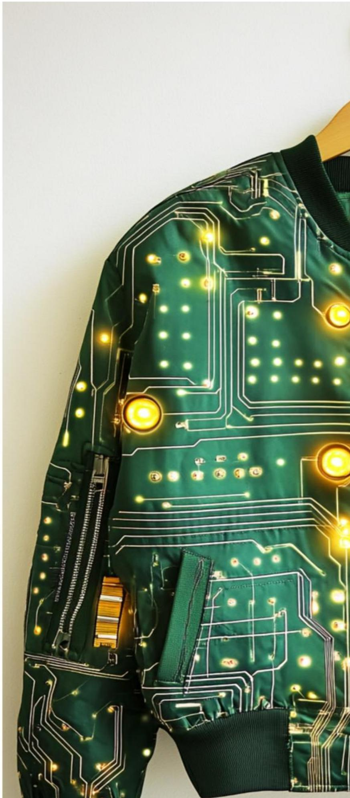

Project Title Advancing Sustainable Textiles in the Circular Economy Through Innovative EPR Schemes Acronym: TRUSTex Call: HORIZON-CL6-2024-CircBio-01-2 N°: D1.1 Topic: Circular solutions for textile value chains based on extended producer responsibility (Innovation Action) Start date: 1 st January 2025 Duration: 36 months List of participants: TEAM2, LIST, CENTEXBEL, NEOVILI, CETIM Reporters Thomas LAURENT & Elodie KHAMPHOUI (TEAM2), Vanesa LOPEZ (CETIM), Milena AMARAL (NEOVILI), Philippe COLIGNON (CENTEXBEL), Michael SAIDANI & Marie-Sophie RODRICH (LIST) Deliverable: Deliverable 1.1 (D1.1) Due date submission: 27 February 2026 Submission date:

| Definitions: List of tables List of figures Introduction                            | Table of contents Executive Summary :                                              | 6 7 7 7 10 |
|-------------------------------------------------------------------------------------|------------------------------------------------------------------------------------|------------|
| 1. Value chain of textile and existing circular routes toward this value chain      |                                                                                    | 12         |
| 1.1.                                                                                | Complete value chain and different representation                                  | 12         |
| 1.2.                                                                                | Synthetic value chain                                                              | 21         |
| 2. Offer from economic actors                                                       |                                                                                    | 24         |
| 2.1.                                                                                | Material flow in this value chain                                                  | 24         |
| 2.2.                                                                                | Eco-design and narrowing material flows                                            | 27         |
| 2.3.                                                                                | Circular procurement and regenerative strategies                                   | 28         |
| 2.4.                                                                                | Industrial symbiosis and cycling material flows                                    | 29         |
| 2.5.                                                                                | Functionality-based economy and slowing resource use                               | 29         |
| 2.6.                                                                                | Cross-cutting barriers and enabling policy frameworks                              | 30         |
| 3. Examine consumer demand and behaviour, focusing on extending the duration of use |                                                                                    | 31         |
| 3.1.                                                                                | Fashion circularity: shift towards longevity and durability                        | 31         |
| 3.2.                                                                                | Consumer awareness and behaviour                                                   | 32         |
| 3.2.1.                                                                              | Consumer awareness                                                                 | 32         |
| 3.2.2.                                                                              | Purchase habits complexity and consumer behaviour                                  | 34         |
| 3.2.3.                                                                              | Adhesion to alternative consumption models (second-hand clothes, rental, auctions) | 41         |
| 3.3.                                                                                | Brand initiatives supporting circularity and longevity                             | 42         |
| 3.3.1.                                                                              | Brand-led initiatives for circularity and longevity                                | 42         |
| 3.3.2.                                                                              | Sustainable clothing market share                                                  | 45         |
| 3.4.                                                                                | Conclusions: Challenges and opportunities                                          | 46         |
| 4. Existing waste management practices                                              |                                                                                    | 47         |
| 4.1.                                                                                | Introduction                                                                       | 47         |
| 4.2.                                                                                | EU Waste Framework Directive                                                       | 48         |
| 4.2.1.                                                                              | Definitions                                                                        | 49         |
| 4.2.2.                                                                              | Waste hierarchy                                                                    | 50         |

| 4.2.3.  | End of waste status                                                                | 50 |
|---------|------------------------------------------------------------------------------------|----|
| 4.2.4.  | Mandatory separate collection of textiles                                          | 51 |
| 4.3.    | The need for harmonisation and mandatory reporting                                 | 51 |
| 4.4.    | Use and end-of-life                                                                | 51 |
| 4.5.    | Textile waste in EU                                                                | 52 |
| 4.6.    | Overall waste collection figures in EU                                             | 52 |
| 4.7.    | Sorting capacities                                                                 | 53 |
| 4.8.    | Reuse, recycling and treatment capacities in EU                                    | 54 |
| 4.9.    | Waste collection and treatment options or Link collection/treatment                | 55 |
| 4.9.1.  | Post-production and pre-consumer waste                                             | 58 |
| 4.9.2.  | Post-consumer textile waste management                                             | 59 |
| 4.9.3.  | Management options for used and waste textiles                                     | 59 |
| 4.10.   | Textile waste management processes                                                 | 64 |
| 4.10.1. | Reuse                                                                              | 66 |
| 4.10.2. | Refurbish/remanufacture                                                            | 67 |
| 4.10.3. | Repurpose (upcycling or downcycling)                                               | 67 |
| 4.10.4. | Recycling                                                                          | 68 |
| 4.11.   | EU exports of used textiles in Europe’s circular economy                           | 76 |
| 4.12.   | The destruction of returned and unsold textiles in Europe’s circular economy (105) | 79 |
| 4.12.1. | Key figures                                                                        | 79 |
| 4.12.2. | Definitions                                                                        | 79 |
| 4.12.3. | Unsold products’ destruction                                                       | 80 |
| 4.12.4. | Policy options for reducing returns and overproduction                             | 81 |
| 4.13.   | The case of France, under EPR managed by Refashion                                 | 81 |
| 4.14.   | Textile waste collection and treatment in Belgium                                  | 84 |
| 4.14.1. | Flanders                                                                           | 84 |
| 4.14.2. | Wallonia/Brussels                                                                  | 85 |
| 5.      | Circularity barriers and improvement pathways                                      | 86 |

| 5.1.          | Linear system in Textile                                                                                                              | 86        |
|---------------|---------------------------------------------------------------------------------------------------------------------------------------|-----------|
| 5.2.          | Production and distribution of textile                                                                                                | 87        |
| 5.3.          | Consumption                                                                                                                           | 88        |
| 5.4.          | End-of-Life                                                                                                                           | 89        |
| 5.4.1.        | Collect                                                                                                                               | 89        |
| 5.4.2.        | Sorting                                                                                                                               | 90        |
| 5.4.3.        | Reuse                                                                                                                                 | 90        |
| 5.4.4.        | Refurbish/remanufacture                                                                                                               | 90        |
| 5.4.5.        | Repurpose (upcycling or downcycling)                                                                                                  | 90        |
| 5.4.6.        | Recycling                                                                                                                             | 90        |
| 5.4.7.        | Energy valorisation                                                                                                                   | 91        |
| 5.4.8.        | Landfills and incineration (without producing energy)                                                                                 | 91        |
| 5.4.9.        | Overall system review                                                                                                                 | 92        |
| 5.5.          | Swot analysis of linear and circular system                                                                                           | 94        |
| 6.            | Conclusion                                                                                                                            | 103       |
| 7.            | Bibliography ANNEX 1: extract from Order of 11 December 2018 establishing the criteria for exiting waste status for                   | 105       |
|               | objects and chemical products that have been prepared for reuse (FRANCE)                                                              | (111) 115 |
|               | ANNEX 2 : Used textile and Transboundary shipment                                                                                     | 118       |
|               | ANNEX 3: Regulation (EC) No 1013/2006 of 14 June 2006 on shipments of waste synthesis: (112)                                          | 119       |
|               | ANNEX 4: New shipment rules of waste for plastic Waste (113)                                                                          | 124       |
|               | ANNEX 5: Recycling operators ANNEX 6: Typology of alternative business models, their modes of operation, and practical examples (Gray | 127       |
| et al., 2022) |                                                                                                                                       | 128       |

This project has received funding from the European Union's Horizon Research and Innovation program under grant agreement N° 101181901 and from the Swiss State Secretariat for Education, Research and Innovation (SERI). Posts and shares reflect only the views of all the involved partners. Neither the European Union nor the granting authority can be held responsible for them. This draft deliverable has not yet been validated by the granting authorities.

# Executive Summary:

The deliverable D1.1 provided a structured analysis of the textile value chain and identifies key barriers and improvement pathways toward circularity. The objective is to establish a shared analytical framework for the TRUSTex project, enabling a systemic understanding of material flows, value retention opportunities and structural bottlenecks across the sector.

The deliverable develops a synthetic representation of the textile value chain, covering raw material production, manufacturing, distribution, consumption, and end-of-life management. This model integrates existing circular routes, such as reuse, refurbishment, repurposing, and recycling into a coherent framework.

The synthetic value chain serves as a reference tool to visualise where value is created, degraded, or lost. It highlights critical leverage points and demonstrates that circularity must be addressed across the entire system rather than through isolated downstream interventions.

### **Supply-Side Circular Strategies**

The analysis examines circular strategies implemented by economic actors, including:

- Ecodesign to improve durability, repairability, and recyclability
- Circular procurement and regenerative material strategies
- Industrial symbiosis and material flow optimisation
- Functionality-based business models aimed at slowing resource use

### **Consumer Demand and Behaviour**

Consumer behaviour plays a central role in determining product lifetimes and overall material flows. Although awareness of sustainability issues has increased, purchasing decisions are still primarily influenced by affordability, availability and fashion trends.

Alternative consumption models such as second-hand markets, rental services, and resale platforms are expanding but remain marginal relative to mainstream retail. Extending product lifetimes through durability, repair services, and supportive market conditions emerges as a critical pathway to reduce environmental pressure.

### **Waste Management and End-of-Life Practices**

The deliverable reviews existing textile waste management practices within the EU regulatory context. Key challenges include:

- Rising volumes of post-consumer textiles
- Limited harmonisation in reporting and definitions
- Insufficient sorting and recycling capacities
- Technical constraints linked to fibre blends and product design

Reuse remains the most value-preserving pathway, but depends on sorting quality and market demand. Recycling technologies are developing, yet remain constrained by material complexity and economic competitiveness. Without upstream changes in design and consumption patterns, end-of-life solutions alone cannot ensure systemic circularity.

### **Systemic Barriers and Pathways for Improvement**

The assessment identifies structural barriers embedded within the current linear model, including :

- Production and distribution systems optimised for speed and volume
- Market incentives favouring virgin materials
- Consumption patterns reinforcing short use cycles
- Fragmented governance and infrastructure
- Circularity therefore requires coordinated interventions across the entire value chain. Strategies that prioritise value retention durability, reuse, repair, and improved design offer greater systemic impact than recycling alone

D1.1 establishes the conceptual and analytical foundation for subsequent project activities. By identifying leverage points and systemic bottlenecks, it supports the development of tools, governance mechanisms, and innovation pathways aimed at improving traceability, coordination, and circular performance within the textile sector.

# Definitions:

➢ ULTRA FAST FASHION: More than 43 collections/year and/or (batch of 10 000 to 30 000 units). ➢ FAST FASHION: 25-42 collections/ year.

Together fast and ultra-fast fashion will reach 63% of the market in 2030 with 102 million tons of textile (1).

➢ QUICK FASHION: 13-25 collections/year ➢ CLASSICAL FASHION: 3 – 12 collections/ year ➢ SLOW FASHION: < 3 collections per year ➢ CSR: Corporate Societal Responsibility ➢ CSI: Corporate Societal Irresponsibility

# List of tables

| Table 1. Synthesis of circular offers through circular economy building blocks.          | 30  |
|------------------------------------------------------------------------------------------|-----|
| Table 2. Table summarizing how consumers assess textile durability and longevity.        | 33  |
| Table 3. Habits regarding the second life of clothes (Men vs Women) (54).                | 38  |
| Table 4. Table comparing motivations and barriers for alternative clothing models.       | 42  |
| Table 5. SWOT of the European textile industry operating in a linear economy             | 94  |
| predominantly linear economy.                                                            | 96  |
| Table 7. SWOT of contemporary circular business models operating in a linear economy.    | 98  |
| Table 8. SWOT of the European textile industry operating in a circular economy.          | 100 |
| economy.                                                                                 | 100 |
| Table 10. SWOT of contemporary circular business models operating in a circular economy. | 101 |

# List of figures

| Figure 1: Textile product value chain.                                                             | 12 |
|----------------------------------------------------------------------------------------------------|----|
| Figure 2: Industrial Value Chain from SOCOTA company (Madagascar). (7)                             | 13 |
| Figure 3: Curve of value added in the global garment value chain (CIR, 2020).                      | 13 |
| Figure 4: Structure of the global value chain for apparel. (8)                                     | 14 |
| Figure 5: Stakeholders associated with the textile value chain for apparel and their location. (9) | 14 |
| Figure 6: Circular value chain (Regiogreentex project).                                            | 15 |
| Figure 7: Circular Textile Value Chain. (9)                                                        | 16 |

This project has received funding from the European Union's Horizon Research and Innovation program under grant agreement N° 101181901 and from the Swiss State Secretariat for Education, Research and Innovation (SERI). Posts and shares reflect only the views of all the involved partners. Neither the European Union nor the granting authority can be held responsible for them. This draft deliverable has not yet been validated by the granting authorities.

| textiles systems (source: ETC/WMGE and EEA).                                                            | 17                                                                                            |
|---------------------------------------------------------------------------------------------------------|-----------------------------------------------------------------------------------------------|
| Figure 9: Textile waste valorisation ecosystem.                                                         | 18                                                                                            |
| Figure 10: Complete value chain of textile developed in TRUSTex project.                                | 19                                                                                            |
| Figure 11: First complete synthetic value chain/material flow of textile.                               | 21                                                                                            |
| Figure 12: First synthetic Value chain of textile, beginning of the work from T1.1.                     | 22                                                                                            |
| Figure 13: Final synthetic value chain.                                                                 | 23                                                                                            |
| Figure 14: Textile Material Flows (Ellen MacArthur Foundation, 2017).                                   | 25                                                                                            |
| Figure 15: Shared supplier base.                                                                        | 26                                                                                            |
| Figure 16: Comparison between smartphone industry and garment industry.                                 | 26                                                                                            |
| Figure 17: The four strategies to achieve circular objectives: narrow, slow, regenerate and cycle. (15) | 27                                                                                            |
| Figure 18 : The textile consumption of the average EU citizens (2022). (48)                             | 35                                                                                            |
| Figure 19 : Consumer purchasing behaviour for ethical or ecological reasons. Survey question:           | “ Did you                                                                                     |
| reduce your purchases for ethical or ecologic reasons?                                                  | ” . Response options: 1) yes, 2) no and I don ’ t have                                        |
| intention to do so, 3) No but I have intention to do so 4) I don                                        | ’ t know. 40                                                                                  |
| Figure 20 : Breakdown of cost of a t-Shirt 29 €                                                         | (letshirtfrancais.fr, 2019) 43                                                                |
| Figure 21 : Breakdown cost for a t-shirt in retail shop                                                 | 43                                                                                            |
| Figure 22 : Ranking of brands overview from top to bottom performance                                   | 46                                                                                            |
| Figure 23 : Waste hierarchy (Waste Framework Directive)                                                 | 50                                                                                            |
| Figure 24 : Generation of textile waste in 2020, in kg per capital.                                     | 53                                                                                            |
| and waste textiles in Europe ’ s circular economy (95)                                                  | 54                                                                                            |
| Figure 26 : Existing and planned sorting capacity in 2024 (87)                                          | 54                                                                                            |
| Figure 27 : Treatment of textile waste in the EU, 2010-2020, in percentages -                           | EEA Management of used and                                                                    |
| waste textiles in Europe ’ s circular economy (95).                                                     | 55                                                                                            |
| year 2019 -                                                                                             | JRC Techno-scientific assessment of the management options for used and waste textiles in the |
| EU (94)                                                                                                 | 56                                                                                            |
| in the EU-27 for the reference year 2019 -                                                              | JRC Techno-scientific assessment of the management options for                                |
| used and waste textiles in the EU.                                                                      | 57                                                                                            |
| in the EU-27 for the reference year 2019 -                                                              | JRC Techno-scientific assessment of the management options for                                |
| used and waste textiles in the EU                                                                       | 58                                                                                            |
| Figure 31:Textile waste streams (Centexbel).                                                            | 65                                                                                            |

This project has received funding from the European Union's Horizon Research and Innovation program under grant agreement N° 101181901 and from the Swiss State Secretariat for Education, Research and Innovation (SERI). Posts and shares reflect only the views of all the involved partners. Neither the European Union nor the granting authority can be held responsible for them. This draft deliverable has not yet been validated by the granting authorities.

| waste reduction - TEX2CE White paper ‘                                                          | Textile fibre recycling technologies ’ 69                              |
|-------------------------------------------------------------------------------------------------|------------------------------------------------------------------------|
| Figure 33 : Mechanical recycling - TEX2CE White paper                                           | ‘ Textile fibre recycling technologies ’ 70                            |
| Figure 34 : Mechanical typical recycling line (Andritz Line).                                   | 70                                                                     |
| Figure 35 : Thermomechanical recycling -                                                        | TEX2CE White paper ‘ Textile fibre recycling technologies ’ 71         |
| Figure 37 : General process scheme for the recycling of cotton textiles via a pulping process - | TEX2CE White                                                           |
| paper ‘ Textile fibre recycling technologies ’                                                  | 72                                                                     |
| the same - TEX2CE White paper ‘ Textile fibre recycling technologies                            | ’ 73                                                                   |
| gasification - TEX2CE White paper ‘                                                             | Textile fibre recycling technologies ’ 74                              |
| Figure 40 : SRF pellets (photo Centexbel).                                                      | 74                                                                     |
| Figure 41 : Process of wild landfills ‘                                                         | textile; export for reuse can be done directly or after several resale |
| phase.                                                                                          | 75                                                                     |
| Figure 42 : Yearly volume of used textiles exported from the EU (Circularity Metrics Lab).      | 76                                                                     |
| Figure 43 : Flow of used textiles collected in the EU                                           | 78                                                                     |
| Figure 44 : Proportion of textile products destroyed.                                           | 80                                                                     |
| Figure 46 : Refashion Annual barometer of consumption of textiles and footwear in France.       | 84                                                                     |
| Figure 47 : Processing of end-of-life textiles -                                                | Circular Flanders 85                                                   |
| Figure 48 : Value Hills of a product, linear system and circular system                         | 87                                                                     |
| Figure 49 : Past Linear Value chain (before Circular system was implemented).                   | 87                                                                     |

This project has received funding from the European Union's Horizon Research and Innovation program under grant agreement N° 101181901 and from the Swiss State Secretariat for Education, Research and Innovation (SERI). Posts and shares reflect only the views of all the involved partners. Neither the European Union nor the granting authority can be held responsible for them. This draft deliverable has not yet been validated by the granting authorities.

## **Introduction**

Clothing is of great importance in everyday life. Over 430 million people are employed in fashion and textile production globally (Uniform Market, 2025). Over 75% of employed people are women. Indirectly, the sector creates additional jobs in upstream or downstream industries such as mechanical engineering, design and logistics. With a worldwide annual turnover of 1.84 trillion Euros, the garment industry is a significant sector in the global economy (Uniform Market, 2025). For Europe, it represents 1,3 million employees in 197 000 companies (2). In the last 15 years, global production of apparel has approximately doubled and demand for textile fibres is projected to increase from 62 million tonnes in 2017 to 102 million tonnes in 2030 (BCG & GFA, 2017).

In recent years, the clothing industry has been characterised by increasing numbers of collections issued each year, with associated rapid obsolescence. Fashion brands compete on the speed of fashion cycles and the production of short-lived consumer goods. The two largest European clothing brands (Zara & H&M) roll-out 24 and 16 collections per year, respectively (3). The time span between design, production and sale is about one month (4). The predominantly linear business model based on selling high volumes of shortlived clothing has led to a high per capita consumption of material resources and associated waste generation. Instead of reusing clothing and recycling the materials that it contains, it is estimated that 87 % of the total fibre input at global level is landfilled or incinerated following first use (EMF, 2017). This results in an annual loss of value estimated at more than USD 100 billion.

The textiles industry has a high impact on the environment (e.g. global warming, water consumption, conversion of ecosystems to agricultural land, use of chemicals, microplastics emissions). The Ellen MacArthur Foundation (2017) estimated that the global greenhouse gas (GHG) emissions from textile production totalled 1.2 billion tonnes of CO2 equivalents in 2015. Environmental impacts are caused along the full lifecycle of textile products, from the extraction of raw resources through production, transport and use. Either the production phase or use phase dominates the overall impacts depending on the impact category. Regarding human, freshwater and marine toxicity for example, it is the use phase (e.g. laundry of garments) that dominates; regarding land use and eutrophication and, to a lesser extent, regarding greenhouse gas emissions, the production phase is dominant (JRC, 2014).

Since a large part of textiles consumed in the EU are produced outside the EU, impacts associated with resource extraction, production and GHG emissions also occur elsewhere in the world. Around 85 % of the primary raw materials used, 92 % of the water used, 93 % of the land used and 76 % of the greenhouse gases emitted for the production of clothing, footwear and household textiles consumed in the EU occur in non-EU countries (5). The global warming impact of textiles imported into the EU is substantial. In a life cycle assessment of the French textile sector, Manshoven et al. (2019) (5) estimated the carbon footprint for the sector at 442 kg CO2equivalents per person per year. These environmental impacts are a direct result of the global mass production and consumption of textile products, which are often very short-lived, especially in the case of clothing. While several approaches have been implemented to reduce environmental pressure during the textile supply chain, such as cleaner production and use of more sustainable fibre types, these measures have been outweighed by the ever-increasing amounts of textiles placed on the market. To reverse the trend, the challenge is therefore to promote sustainable consumer behaviour aimed at reducing the use of short-lived clothing. The circular economy framework could provide an additional significant impact reduction potential, where high quality, durable products are repaired and recirculated so that they are in active use for as long and as much as possible, and at end of life the materials they contain are recycled into new (possibly textile) products.

The transition from the current linear economy-oriented textiles production and consumption system towards a circular one is a process to which all stakeholders along the value chain can contribute. Contributions would include changing how textiles are designed, produced, sold, used, collected and treated at the end of life. Circularity in the textile industry can be achieved through circular business models, developing and promoting recycling technologies, political measures and changes in consumer behaviour. The European Environment Agency (EEA,2021) states that there are four main circular business

This project has received funding from the European Union's Horizon Research and Innovation program under grant agreement N° 101181901 and from the Swiss State Secretariat for Education, Research and Innovation (SERI). Posts and shares reflect only the views of all the involved partners. Neither the European Union nor the granting authority can be held responsible for them. This draft deliverable has not yet been validated by the granting authorities.

model types, each supporting the shift towards circularity: (1) ensuring products' longevity and durability; (2) access-based models (renting and leasing); (3) textile collection and resale; and (4) recycling and reusing materials" (6).

**This report on 'Material Flow and Circular Models' aims to provide an overview of the basic principles related to circular textiles. To this end, it compiles a wealth of data to offer a comprehensive overview of related matters in the form of a reference document.**

The objective of the work described here is to highlight the value chain of textile and especially circular pathways. To review actual strengths, weaknesses, opportunities and threats of this circular value chain and then develop these different points:

- (i) analyse the offer from economic actors, including sustainable procurement, eco-design, industrial symbiosis, and functionality-based economy;
- (ii) examine consumer demand and behaviour, focusing on extending the duration of use;
- (iii) assess waste management practices;
- (iv) contrast circular models with linear processes to identify barriers to circularity and develop improvement pathways.

This project has received funding from the European Union's Horizon Research and Innovation program under grant agreement N° 101181901 and from the Swiss State Secretariat for Education, Research and Innovation (SERI). Posts and shares reflect only the views of all the involved partners. Neither the European Union nor the granting authority can be held responsible for them. This draft deliverable has not yet been validated by the granting authorities.

## **1. Value chain of textile and existing circular routes toward this value chain**

Through this report, the objective is to describe a circular value chain of textile following the seven pillars of circular economy (7), which are:

- 1. Sustainable procurement (responsible purchasing)
- 2. Eco-design
- 3. Industrial (and territorial) ecology
- 4. Functional economy
- 5. Responsible consumption
- 6. Extending the lifespan
- 7. Recycling, end of product life.

Some pillars are rather linked to new producers' practice such as:

- industrial and territorial ecology
- functional economy
- eco-design

Others are more linked to consumers' behaviour:

- consume less
- think collaborative
- use durably
- well sort its own waste

## 1.1.Complete value chain and different representation

The working group in this task is composed of different experienced partners all over textile's value chain. The desk research as well as the partner experiences has led to different ways of representing the value chain of textile.

Two main European projects have led to main inputs for this value chain: SCIRT project and REGIOGREENTEX project.

Through the D1.1 of SCIRT project (8), many representations could be foreseen to represent textile value chain. First of all, here is the product value chain:

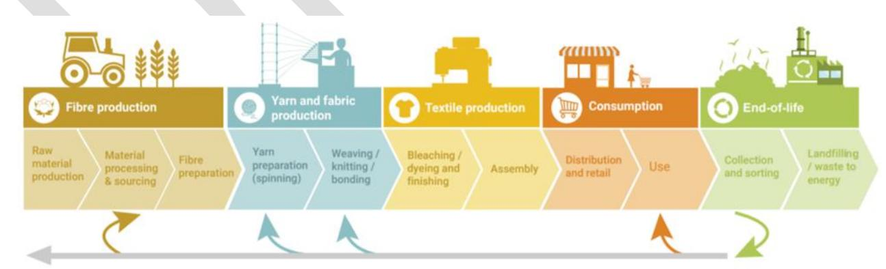

*Figure 1: Textile product value chain.*

This value chain represents synthetically the main steps of the textile product. However, as it has the advantage to be synthetic, fashion-oriented and closed loop, it doesn't consider all internal product flow or even post-industrial recycling product flow. For instance:

- Fibre recycling
- Yarn recycling
- Fabric recycling
- Finishing at each step of product value chain: fibre, yarn, fabric, garment

An alternative representation is the industrial value chain:

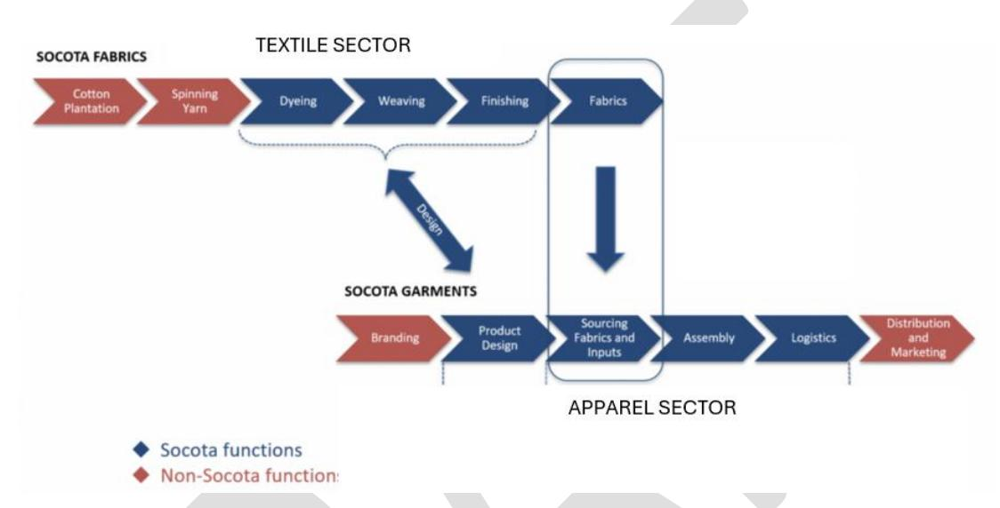

*Figure 2: Industrial Value Chain from SOCOTA company (Madagascar). (7)*

[Figure 2](#page-12-0) depicts the value chain of the textile industry's main activities. It provides a clearer understanding of where circular economy principles should be implemented to achieve a comprehensive circular strategy in the textile sector. Based on this industrial value chain, we can develop a detailed added-value chain for each of these main activities:

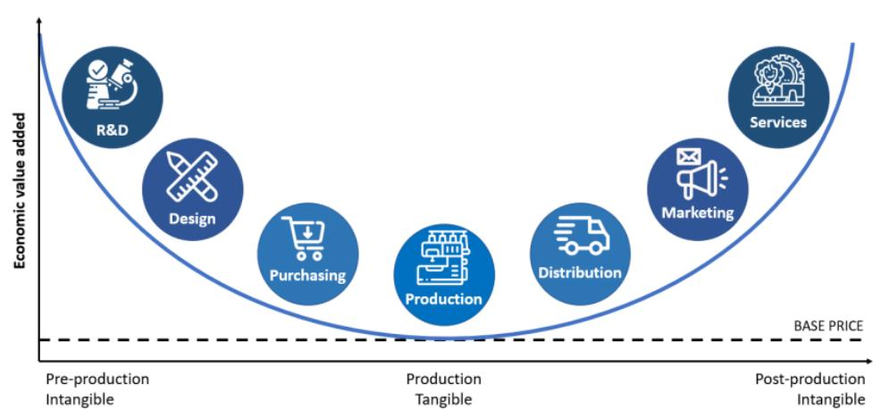

*Figure 3: Curve of value added in the global garment value chain (CIR, 2020).*

### Or in other representation:

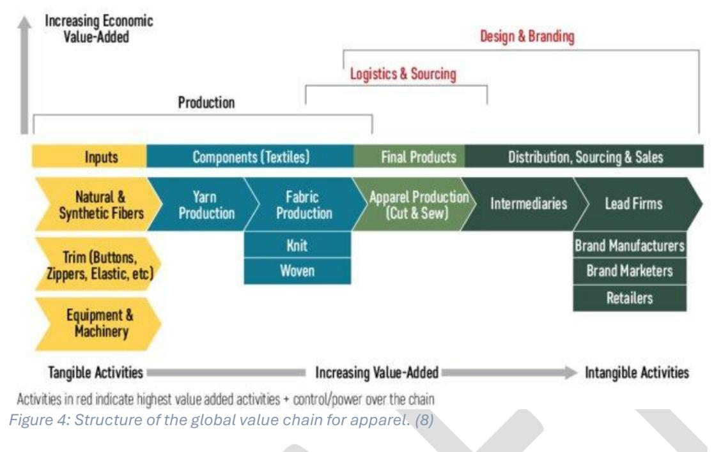

Interesting entering data for the value chain is also the categories of stakeholder and their location:

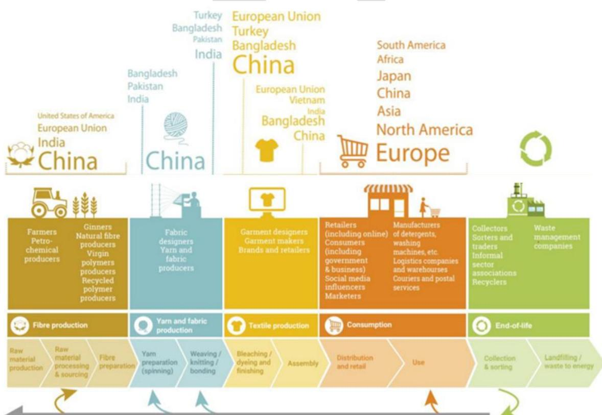

*Figure 5: Stakeholders associated with the textile value chain for apparel and their location. (9)*

The most complete circular value chain considered in the Task 1.1 work was the one developed in the Regiogreentex project:

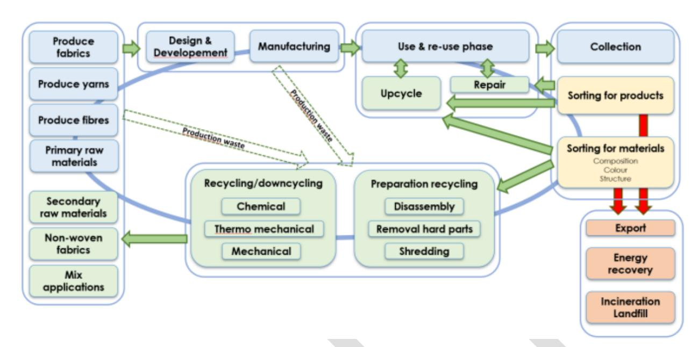

*Figure 6: Circular value chain (Regiogreentex project).*

The value chain presented i[n Figure 6](#page-14-0) was the one we focused on in our project to establish a synthetic value chain.

Another circular textile value chain is the one developed by UNEP [\(Figure 7\)](#page-15-0). It presents a lot of circular action that are available on the market (reuse, repair, refuse…). However, this value chain presents certain limitations or ambiguities:

- Finishing appears at the end of the value chain, although technically it occurs throughout the entire production process,
- Repair and reuse are shown as stemming from collection, whereas consumers can repair items themselves or resell products for reuse independently,
- Recycling is represented exclusively as a closed-loop process.

This project has received funding from the European Union's Horizon Research and Innovation program under grant agreement N° 101181901 and from the Swiss State Secretariat for Education, Research and Innovation (SERI). Posts and shares reflect only the views of all the involved partners. Neither the European Union nor the granting authority can be held responsible for them. This draft deliverable has not yet been validated by the granting authorities.

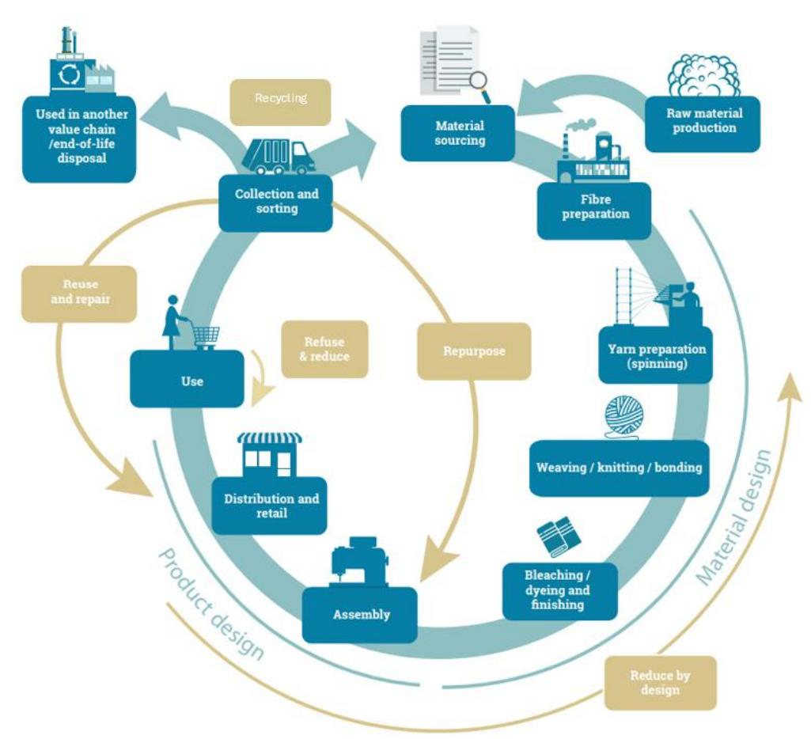

*Figure 7: Circular Textile Value Chain. (9)*

Another significant value chain representation identified in our research is the one developed by the European Environment Agency (EEA), which describes how the textile value chain should be structured when considering both circularity and the externalities required to implement these changes. The EEA conceptualizes the circular economy as a system where circularity is integrated across all lifecycle phases: materials, eco-design, production and distribution, consumption and stock, and waste management. This approach was most recently articulated in the 2019 EEA report (10).

[Figure 8](#page-16-0) illustrates a textiles system and shows options for circular business models, regulation and behavioural change in each phase of the lifecycle.

This project has received funding from the European Union's Horizon Research and Innovation program under grant agreement N° 101181901 and from the Swiss State Secretariat for Education, Research and Innovation (SERI). Posts and shares reflect only the views of all the involved partners. Neither the European Union nor the granting authority can be held responsible for them. This draft deliverable has not yet been validated by the granting authorities.

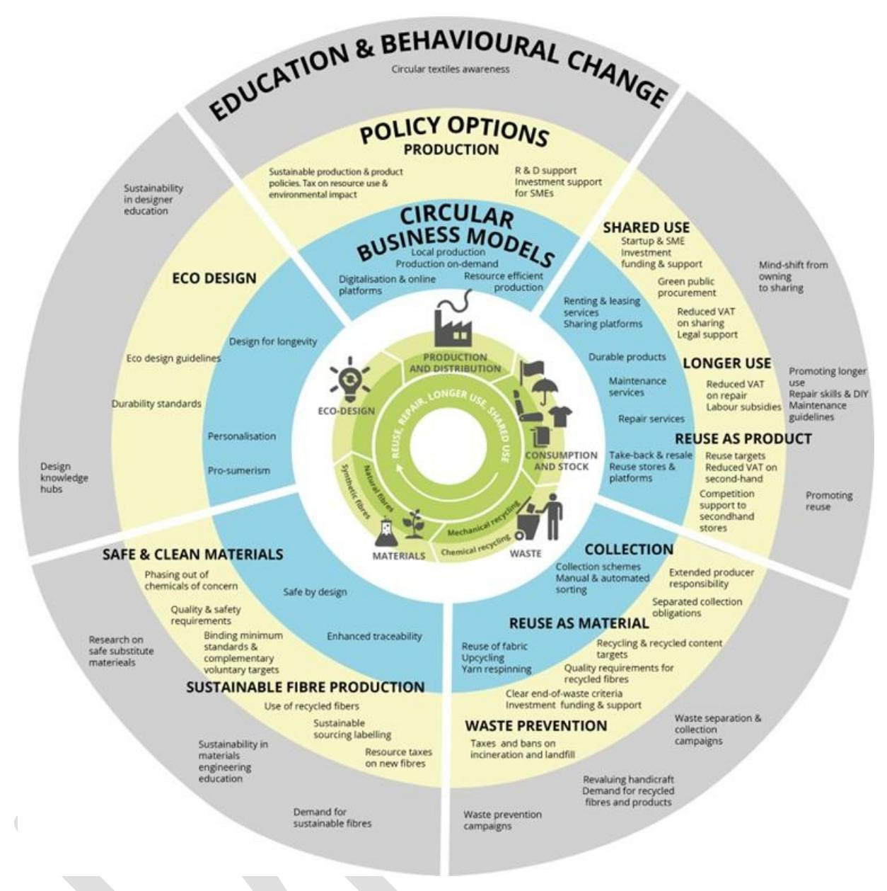

*Figure 8: The role of circular business models, policy options, education and behavioural change in circular textiles systems (source: ETC/WMGE and EEA).*

Another way of defining the circular value chain is by representing the global ecosystem:

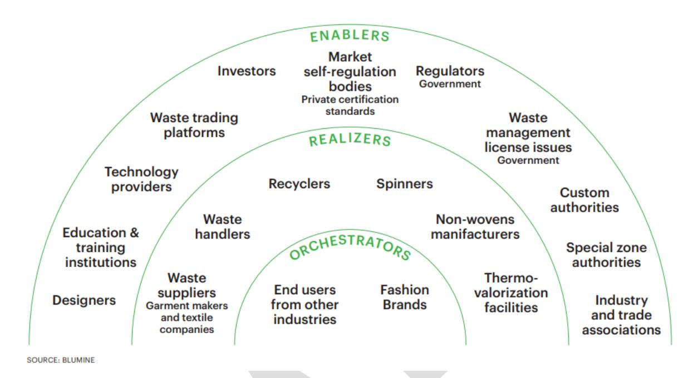

*Figure 9: Textile waste valorisation ecosystem.*

The research phase yielded multiple value chain representations. This section highlights the most significant frameworks that formed the foundation of our work. Drawing upon research findings, data, diagrams, and expertise contributed by T1.1 partners, an internal workshop was conducted to construct a complete textile value chain and material flow model encompassing all textile market segments, which is presented in [Figure 10.](#page-18-0)

This project has received funding from the European Union's Horizon Research and Innovation program under grant agreement N° 101181901 and from the Swiss State Secretariat for Education, Research and Innovation (SERI). Posts and shares reflect only the views of all the involved partners. Neither the European Union nor the granting authority can be held responsible for them. This draft deliverable has not yet been validated by the granting authorities.

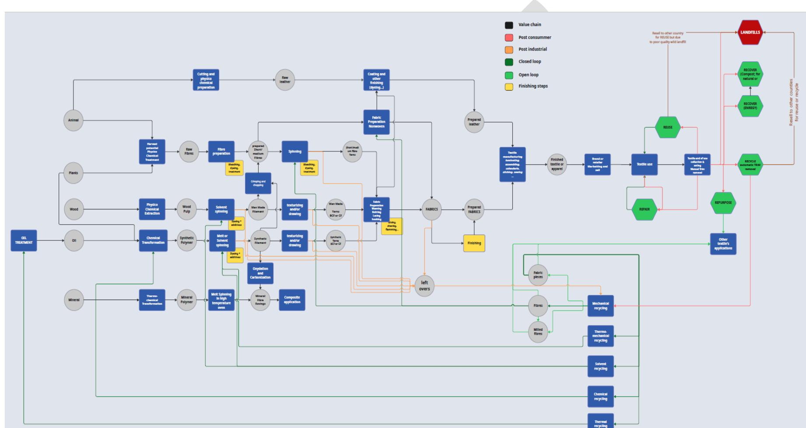

*Figure 10: Complete value chain of textile developed in TRUSTex project.*

Following this work, we concluded that while this representation is highly comprehensive, it would hinder understanding of the system and complicate subsequent tasks within other work packages and the overall project.

We therefore began developing a more simplified version of this value chain, depicted i[n Figure 11,](#page-20-1) ensuring that it would:

- Represent the entire textile value chain as comprehensively as possible, including all circular economy components,
- Remain accessible to anyone, even those unfamiliar with the textile sector, without oversimplifying the chain's complexity and technical aspects,
- Be immediately readable and understandable without requiring extensive explanation,
- Reflect reality as accurately as possible.

This project has received funding from the European Union's Horizon Research and Innovation program under grant agreement N° 101181901 and from the Swiss State Secretariat for Education, Research and Innovation (SERI). Posts and shares reflect only the views of all the involved partners. Neither the European Union nor the granting authority can be held responsible for them. This draft deliverable has not yet been validated by the granting authorities.

## 1.2.Synthetic value chain

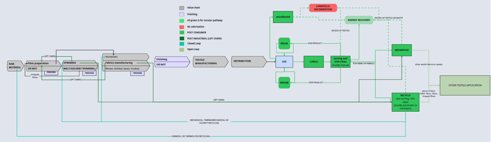

*Figure 11: First complete synthetic value chain/material flow of textile.*

This representation proved unsatisfactory in terms of comprehension. Partners agreed that it was overly complex and difficult to understand. Based on this assessment, a completely new circular value chain was developed [\(Figure 12\)](#page-21-0):

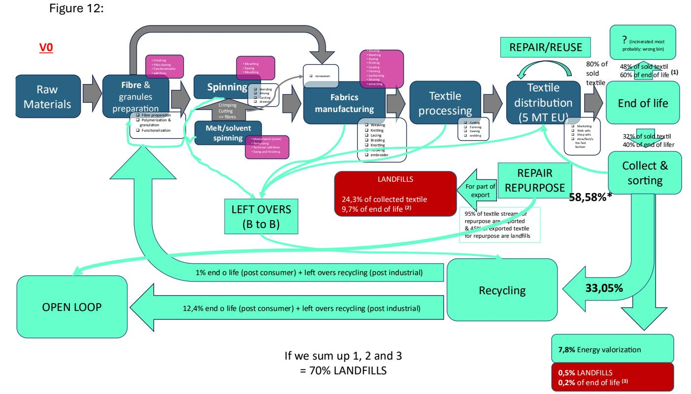

*Figure 12: First synthetic Value chain of textile, beginning of the work from T1.1.*

Following iterative refinement, the partners agreed upon a final version [\(Figure 13\)](#page-22-0) that was subsequently validated with diverse value chain stakeholders, including producers, recyclers, consultants, policymakers, industry associations, circular economy networks, and national environmental agencies.

Their feedback informed further revisions to the value chain. It should be emphasized that despite the goal of comprehensive representation, clarity and universal comprehensibility take precedence over exhaustive detail.

Moreover, due to data availability challenges and substantial inter-country variability, the value chain is presented without quantitative indicators at this stage. Relevant numerical data are provided in the end-oflife section of this report.

This project has received funding from the European Union's Horizon Research and Innovation program under grant agreement N° 101181901 and from the Swiss State Secretariat for Education, Research and Innovation (SERI). Posts and shares reflect only the views of all the involved partners. Neither the European Union nor the granting authority can be held responsible for them. This draft deliverable has not yet been validated by the granting authorities.

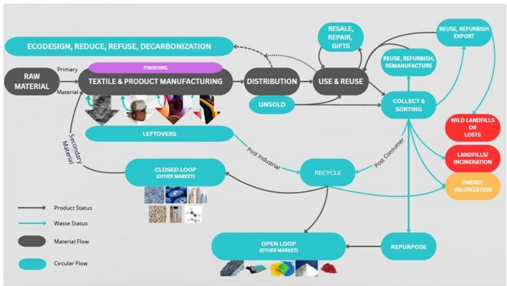

*Figure 13: Final synthetic value chain.*

To ensure terminological consistency across all the project, the circular economy strategies (R-strategies) are aligned with the definition provided in ISO-59040-Circular Economy Vocabulary. Where necessary, operational clarifications specific to the textile value chain are provided, while maintaining coherence with ISO terminology:

➢ **REFUSE:** Avoiding the acquisition of a product that would otherwise enter the consumption cycle, thereby preventing resource use and waste generation ➢ **REDUCE:** Decreasing the quantity of materials, energy or resources used throughout the product lifecycle, including design, manufacturing, distribution and use ➢ **ECODESIGN:** Integration of environmental considerations into product design and development to reduce lifecycle environmental impacts while maintaining functionality and performance ➢ **DECARBONIZATION:** Reduction of greenhouse gas emission associated with production, logistics, use and end-of-life phases through process optimisation, material substitution and energy transition measures *(Note: Decarbonisation is not an R-strategy per se under ISO but a transversal environmental objective)* ➢ **REPAIR:** Restoration of a defective or damaged product to a condition where it can fulfil its intended function, without changing its original purpose ➢ **REUSE:** Any operation by which a product or component that is not waste is used again for the same purpose for which it was conceived ➢ **RESALE:** A form of reuse involving transfer of ownership through commercial exchange, without the product becoming waste ➢ **DONATION:** A form of reuse involving transfer of ownership without financial compensation, without the product becoming waste

➢ **COLLECT:** The gathering of products or materials after the user discards them, potentially leading to waste status depending on regulatory interpretation. For this project, collection reflects the user's intention to discard the product ➢ **SORTING:** Separation of collected products or waste into categories to determine appropriate subsequent circular value retention processes ➢ **OVERSORTING:** Additional sorting performed before recycling to separate textile items by composition, colour... ➢ **REFURBISH:** For this project, refurbishment refers to restoring a textile product classified as waste to a usable condition (as distinct from repair, which applies to products still in use) ➢ **REPURPOSE:** Using a product or material for a function different from the one originally intended, without significant reprocessing ➢ **RECYCLING:** Any recovery operation by which waste materials are reprocessed into products, materials, or substances whether for the original or other purposes ➢ **UPCYLING:** Recycling that results in materials or products of higher functional or economic value than the original waste ➢ **DOWNCYCLING:** Recycling that results in materials or products of lower functional or economic value than the original waste ➢ **FINISHING:** Mechanical, physicochemical, or chemical treatments applied to textile materials to modify performance, appearance or functional characteristics

## **2. Offer from economic actors**

## 2.1.Material flow in this value chain

After their first use, most clothing items are either landfilled or incinerated (see [Figure 14\)](#page-24-0). This results in a significant loss of material value, particularly when garments could still be reused or repurposed. In some cases, discarded products were never even sold, having been disposed of due to overproduction. Globally, consumers discard wearable clothing valued at €410 billion annually (9). Research by the Ellen MacArthur Foundation reveals that only 13% of fiber input for clothing is recycled, with merely 1% recycled in a closed loop [\(Figure 14\)](#page-24-0) – the approach that retains the highest value for fibers. The associated economic loss is estimated at over €90 billion (Ellen MacArthur Foundation, 2017). The report also emphasizes the significant lack of information and transparency regarding textile end-of-life pathways.

This project has received funding from the European Union's Horizon Research and Innovation program under grant agreement N° 101181901 and from the Swiss State Secretariat for Education, Research and Innovation (SERI). Posts and shares reflect only the views of all the involved partners. Neither the European Union nor the granting authority can be held responsible for them. This draft deliverable has not yet been validated by the granting authorities.

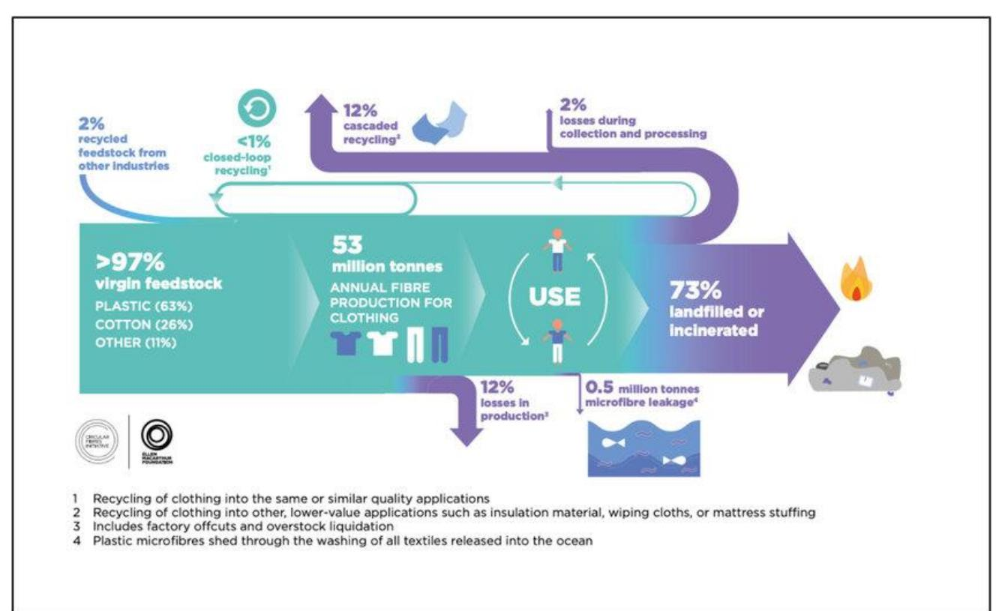

This project has received funding from the European Union's Horizon Research and Innovation program under grant agreement N° 101181901 and from the Swiss State Secretariat for Education, Research and Innovation (SERI). Posts and shares reflect only the views of all the involved partners. Neither the European Union nor the granting authority can be held responsible for them. This draft deliverable has not yet been validated by the granting authorities. To fully understand how circularity functions in the textile sector, we must examine not only the material flows and flow charts described in [Figure 15,](#page-25-0) but also trade flows. Unlike many other industries, the textile sector – particularly apparel, sportswear, and household textiles – operates with a shared supplier base.

*Figure 14: Textile Material Flows (Ellen MacArthur Foundation, 2017).*

This means that a single supplier may serve multiple market segments, such as fast fashion, conventional fashion, household textiles, and sportswear. Consequently, when developing regulations to enhance circularity and ensure fair labour practices and human rights, this interconnected supply structure must be considered to establish effective governance and regulatory frameworks.

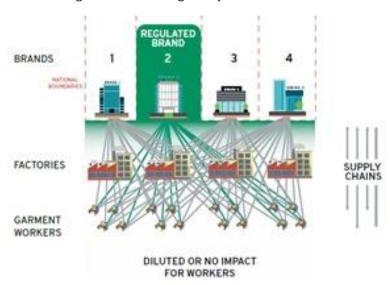

*Figure 15: Shared supplier base.*

The second distinctive characteristic of the textile industry is that, unlike sectors such as computing or smartphones, it lacks dominant market leaders. Market share is far more fragmented and distributed among a multitude of companies, as described i[n Figure 16:](#page-25-1)

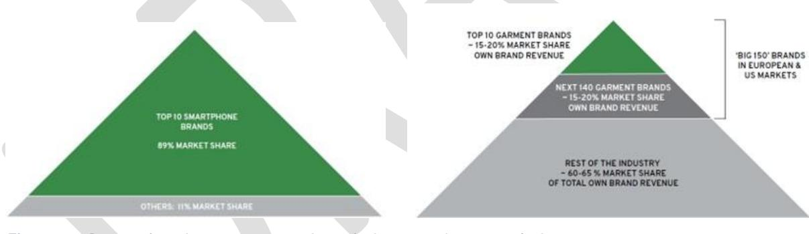

*Figure 16: Comparison between smartphone industry and garment industry.*

As shown in the figures, the 150 largest companies with total revenues exceeding €1 billion (across all product categories, not only textiles) account for only 30-40% of total sales. The remaining 60-70% is generated by companies with revenues below €1 billion, many with less than €40 million, and a significant proportion with less than €4 million. This demonstrates that small and medium-sized enterprises (SMEs) worldwide hold a substantial share of the textile market, which must be considered when developing effective regulations. (11)

The global textile industry remains overwhelmingly structured around a linear "take-make-waste" model, with an estimated circularity rate of only 0.3% (12). Of the approximately 3.25 billion tonnes of materials consumed annually by the sector, more than 99% originate from primary virgin sources, while synthetic fibres derived from fossil fuels account for around 63% of total raw material input. This structural dependence on virgin materials generates severe environmental pressures, notably across marine and freshwater eutrophication, water scarcity, and climate change. The textile industry contributes to over 5%

of global marine eutrophication and more than 4% of freshwater eutrophication, primarily driven by fertilizer runoff from cotton cultivation and chemical-intensive dyeing processes. In addition, it accounts for approximately 3.5% of total water scarcity impacts associated with global manufacturing and nearly 3.5% of global greenhouse gas emissions, with material production and energy-intensive wet processing representing the largest sources of emissions (12).

To address these systematic challenges, economic actors across the textile value chain – including manufacturers, brands, retailers, and service providers – are increasingly reshaping their strategic offers to support the decoupling of growth from resource depletion. These offers are structured around four core circular economy strategies: narrowing, slowing, regenerating, and cycling resource flows [\(Figure 17\)](#page-26-1).

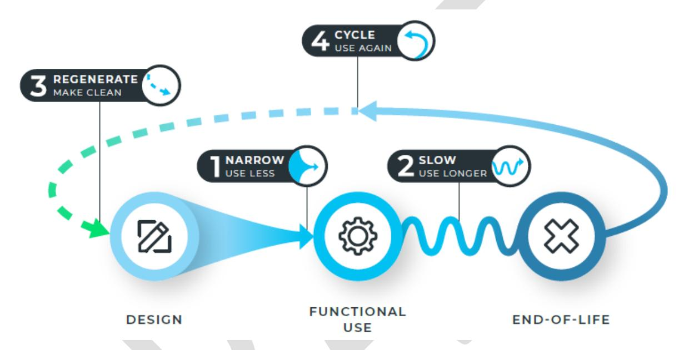

*Figure 17: The four strategies to achieve circular objectives: narrow, slow, regenerate and cycle. (15)*

In practice, these strategies are operationalized through eco-design, circular procurement, industrial symbiosis, and functionality-based business models (12) (13). This analysis is based on desk-based review of state-of-the art academic and grey literature and synthesizes insights from scientific, industry, and policy-making communities. Identified practices are assessed through the lens of circular economy building blocks to highlight best practices, persistent gaps, and implementation barriers.

While the analysis is primarily illustrated using examples from apparel, the identified circular strategies and barriers apply across the wider textile ecosystem, including footwear, accessories, technical and performance wear, and household textiles. These segments share common challenges related to material complexity, design for disassembly, recycling infrastructure, and regulatory compliance, although the relative importance of specific barriers varies by product category.

## 2.2.Eco-design and narrowing material flows

Eco-design is consistently identified as the most critical leverage point for economic actors, as approximately 80% of a product's environmental impacts are determined during the design phase (12) (14). Beyond its role in improving circularity, eco-design also acts as a strategic lever for the textile industry's decarbonization, which is a critical imperative given that material production - including fabric manufacturing, dyeing, and finishing - accounts for approximately 55% of the sector's total greenhouse gas emissions (12). This challenge is particularly pronounced in product categories such as footwear and

This project has received funding from the European Union's Horizon Research and Innovation program under grant agreement N° 101181901 and from the Swiss State Secretariat for Education, Research and Innovation (SERI). Posts and shares reflect only the views of all the involved partners. Neither the European Union nor the granting authority can be held responsible for them. This draft deliverable has not yet been validated by the granting authorities.

technical or performance garments, where complex material combinations, coatings, and adhesives are integral to functional performance and further constrain recyclability.

Consequently, economic actors are increasingly focusing their strategic offers on extending garment lifespans by improving both physical and emotional durability – that is, the extent to which consumers continue to value and use garments over time. Quality-related failures – such as poor colour fastness, fabric pilling, or weak seams – remain leading drivers of premature garment disposal, indicating that durabilityoriented design remains insufficiently mainstreamed (13) (14). The integration of Computer-Aided Design (CAD) software plays a crucial role at this stage by allowing digital pattern creation and direct transfer to automated cutting machines, reducing manual errors and significantly improving fabric utilisation efficiency (12).

To address emissions associated with energy- and water-intensive production processes, economic actors are increasingly adopting cleaner manufacturing technologies. These include supercritical CO₂ dyeing processes (e.g. DyeCoo technology), which eliminate water use and can reduce energy consumption by up to 80%, as well as digital textile printing, which can reduce CO₂ emissions by up to 7.8 kg per kilogram of fabric compared to conventional screen printing. In parallel, manufacturing facilities are being redesigned to integrate renewable energy sources -such as solar photovoltaic panels, wind power, and hydropower - to lower operational carbon footprints. Collaborative initiatives, including *Clean by Design* and the *Better Plants Initiative*, further support these efforts by providing technical assistance to improve mill-level energy efficiency (12).

Despite these advances, a major structural gap persists in material composition. Approximately 78% of textile products placed on the market consists of multi-material blends, such as polycotton fabrics or garments containing elastane, which significantly complicate both mechanical and chemical recycling processes, reducing material recovery rates and the quality of recycled fibre (12). To address this barrier, best practices are emerging around mono-material design strategies and design-for-disassembly solutions. These include innovative technologies such as heat-dissolvable stitching threads, which enable automated separation of components while maintaining high material purity and reducing contamination during recycling. In addition, these can reduce a product's overall CO₂ emissions by nearly 50% compared to incineration by enabling effective high-quality recycling at end-of-life. (12) (14).

Despite technological progress, the widespread adoption of advanced eco-design practices remains constrained by a persistent "green skills gap". Around 40% of European companies – particularly small and medium-sized enterprises (SMEs) – report difficulties in accessing the expertise required for circular design, advanced material selection, and compliance with evolving eco-design and decarbonization requirements. This skills shortage represents a critical bottleneck for scaling circular and low carbon offers across the textile value chain (14) (15).

## 2.3.Circular procurement and regenerative strategies

Circular procurement strategies aim to reduce dependence on fossil-fuel-based synthetics while lowering the environmental footprint of textile production. Economic actors are increasingly shifting toward natural and bio-based fibres, such as organic cotton, or man-made cellulosic fibres like Lyocell. Organic cotton production, for example, can reduce greenhouse gas emissions by up to 46% compared to conventional cotton systems. In addition, organic cotton offers environmental advantages through reduced agrochemical use and improved soil health. However, these benefits are accompanied by significant landuse trade-offs, as organic cotton typically exhibits lower yields compared to conventional cotton, which increases land-use requirements per unit of fibre. Empirical evidence indicates that organic cotton yields are approximately 18.4% lower than conventional methods, and modelling suggests that a large-scale transition toward more sustainable natural fibre production could require up to a 14% increase in agricultural land to achieve equivalent output volumes (12).

This project has received funding from the European Union's Horizon Research and Innovation program under grant agreement N° 101181901 and from the Swiss State Secretariat for Education, Research and Innovation (SERI). Posts and shares reflect only the views of all the involved partners. Neither the European Union nor the granting authority can be held responsible for them. This draft deliverable has not yet been validated by the granting authorities.

At scale, increased land demand may intensify competition for agricultural land and, in some contexts, risk indirect land-use change, as cotton cultivation has historically expanded at the expense of forests and other natural habitats. The land-use implications of textile production extend beyond cotton. For instance, the global wool industry is also highly land-intensive, requiring approximately 0.2 hectares of land to produce six sweaters. As a result, textile consumption now ranks as the third-largest contributor to land-use impacts from a lifecycle perspective, with an average footprint of around 400 m² of land per person (12). Beyond environmental degradation, large-scale land acquisition for fibre production can contribute to community displacement, land-tenure conflicts, and reduced local food security. Moreover, declining agricultural productivity due to soil erosion and nutrient depletion - particularly in intensive non-organic systems - can further displace food production and strain rural economies.

These trade-offs are especially relevant for household textiles and technical wear, which rely heavily on cotton-based and synthetic fibres respectively and therefore face distinct constraints in transitioning toward lower-impact material inputs.

While "recycled content" has become a prominent feature of circular market offers, most secondary materials currently used in textiles are sourced from open-loop recycling systems, particularly recycled PET bottles originating from the packaging sector. According to both policy and industry assessments, this practice does not effectively close material loops within the textile industry and may delay investment in dedicated textile-to-textile recycling infrastructure. As a result, experts increasingly emphasize the strategic importance of fibre-to-fibre recycling to retain material value within the sector and reduce longterm dependency on virgin feedstock (12) (14).

## 2.4.Industrial symbiosis and cycling material flows

Industrial symbiosis refers to collaborative arrangements that enable the sharing of resources, infrastructure, and waste streams across industries to optimize material throughput. In the textile sector, this approach is increasingly materializing through the development of regional recycling hubs, particularly in countries such as Italy, France, and Portugal. These hubs aim to centralize the collection, sorting, and processing of post-consumer textile waste, using advanced technologies, such as Near-Infrared (NIR) sorting and artificial intelligence to achieve the material purity required for high-quality secondary feedstock (12) (14). Household textiles, due to their higher volumes and more stable material compositions, may offer early opportunities for scaled fibre-to-fibre recycling within such regional systems, compared to more complex product categories like footwear. Complementing these infrastructure developments, the implementation of Best Available Techniques (BATs) is a key pillar of circular manufacturing, helping to narrow material flows by reducing processing losses and fabric waste during yarn and fabric production (12).

However, beyond technological readiness, governance and coordination emerge as critical gaps. Many hubs rely on complex collaboration between municipalities, producer responsibility organizations (PROs), recyclers, and private operators. For smaller economic actors, logistical costs remain prohibitive, as transporting individual garments for repair, sorting, or specialized recycling is often economically unviable. Moreover, qualitative evidence indicates that importers and local agents frequently lack influence over upstream design and material decisions made by global brands, limiting their capacity to implement symbiosis-based solutions at the regional level (15).

## 2.5.Functionality-based economy and slowing resource use

The functionality-based economy – including Product-as-a-Service (PaaS) models such as rental, leasing, subscription services, and resale – shifts the value proposition from individual ownership of garments to access-based use models, in which consumers pay for the right to use a product while responsibility or maintenance, redistribution, and end-of-life management increasingly remains with the provider (12) (13). These models directly support the "slowing" of resource flows by increasing garment utilisation rates and extending use phases. They are particularly well suited to categories such as children's clothing or special-

This project has received funding from the European Union's Horizon Research and Innovation program under grant agreement N° 101181901 and from the Swiss State Secretariat for Education, Research and Innovation (SERI). Posts and shares reflect only the views of all the involved partners. Neither the European Union nor the granting authority can be held responsible for them. This draft deliverable has not yet been validated by the granting authorities.

occasion wear, where products are often underused or outgrown before reaching the end of their functional life. Beyond apparel, functionality-based models are also increasingly relevant for technical wear, outdoor equipment, professional uniforms, and certain accessories, where high utilization rates can be achieved through leasing and subscription schemes (13).

For functionality-based models to generate net environmental benefits, they must achieve a sufficiently high displacement rate, meaning that access-based services effectively replace the purchase of new garments rather than supplementing consumption. Empirical evidence highlights that transport, cleaning, storage, and reverse logistics can significantly offset environmental gains if utilization rates remain low. A key gap identified is the risk of rebound effects, whereby consumers use the perceived sustainability of resale or rental platforms to justify maintaining high overall consumption levels. To mitigate this risk, economic actors are encouraged to target frequent shoppers and integrate demand-reduction mechanisms to ensure that functionality-based offers genuinely displace fast-fashion throughput (13). A detailed overview of how these models are operationalized to support circular economy is provided in Annex 6, based on the framework developed by Gray et al. (2022) (13).

## 2.6.Cross-cutting barriers and enabling policy frameworks

Several cross-cutting regulatory and operational barriers continue to shape the feasibility of circular offers. The Digital Product Passport (DPP), introduced under the EU Strategy for Sustainable and Circular Textiles, is expected to significantly improve traceability, transparency, and information exchange across textile value chains. Nevertheless, economic actors express concerns regarding increased administrative burdens and the technical challenges associated with collecting reliable data from fragmented global suppliers (14) (15).

Similarly, the implementation of Extended Producer Responsibility (EPR) schemes – while essential for financing collection, sorting, and recycling infrastructure – raises concerns regarding rising costs and financial risk, particularly for SMEs (15). As of January 2025, mandatory separate collection of textiles in the EU requires producers to assume financial responsibility for the end-of-life management of their products (16). At the same time, eco-modulation of EPR fees presents a potential opportunity to incentivize circular design choices, provided that fee structures are transparent, harmonized, and proportionate (14).

Overall, successful implementation of circular economy strategies in the textile sector will require harmonized international standards, sustained investment in logistics and recycling infrastructure, and significant upskilling of the workforce to manage the technical, digital, and organizational complexities of circular value chains (14) (15) (16).

To synthesize the analysis, [Table 1](#page-29-1) maps the main strategic offers developed by economic actors against the four circular economy building blocks – narrowing, slowing, regenerating, and cycling resource flows, highlighting key enabling practices as well as the principal structural gaps and barriers. This applies across apparel, footwear, accessories, technical textiles, and household textiles, with differing feasibility and impact depending on product complexity, material composition, and use patterns.

*Table 1. Synthesis of circular offers through circular economy building blocks.*

| Building block    | Strategic offer (economic |                           |                      |
|-------------------|---------------------------|---------------------------|----------------------|
|                   |                           | Best practices & enablers | Main gaps & barriers |
| Narrow (use less) | Eco-design for material   |                           |                      |

|                                                                                                       | costs of small-batch production                                                                                                                                                     |
|-------------------------------------------------------------------------------------------------------|-------------------------------------------------------------------------------------------------------------------------------------------------------------------------------------|
| Slow (use longer) Functionality-based economy (PaaS rental, leasing); repair and maintenance services | High displacement of Rebound effects; new purchases; repair structural cost bonuses; durable and disadvantage of manual repair compared to low timeless design priced new garments |
| Regenerate (clean)                                                                                    | Circular procurement of Waterless dyeing (e.g. Lower yield of organic                                                                                                               |
|                                                                                                       | organic fibre certification                                                                                                                                                         |
| bio-based materials; non-toxic dyeing processes                                                       | cotton (-18.4%) and supercritical CO2); increased land-use schemes use of hazardous chemicals in supply chains                                                                      |
| Cycle (again) Fibre-to-fibre industrial symbiosis initiatives                                         | recycling; Regional recycling hubs; High prevalence of automated sorting using multi-material blends NIR and AI reliance on open-loop recycling (e.g. PET bottles)                  |

## **3. Examine consumer demand and behaviour, focusing on extending the duration of use**

## 3.1.Fashion circularity: shift towards longevity and durability

The need for sustainable and circular approaches in the fashion industry has become increasingly urgent due to its substantial environmental and social footprint. Growing concerns about resources scarcity, environmental pollution, and unethical labour conditions have intensified the call for meaningful change. In response, the industry is turning to circular economy principles that fundamentally rethink how garments are designed, produced, used, and valued throughout their entire life cycle. Circular practices emphasize extending product life cycles by designing for durability and encouraging waste reduction through reuse and recycling. Durability refers to the enduring wear of a garment without significant deterioration and requiring minimum maintenance, without presenting changes in its original functions and properties. It depends on the design, production, and manufacturing choices as well as on the use and care. Eco-design is an important practice for the development of durable garments. However, it is important to consider not only the physical durability of the garments, but also its emotional durability.

A longer durability of textiles contributes to the increase of the garment lifespan, reducing the production of waste and lowering the need for virgin materials and chemicals substances. Alongside, durable textiles can also be reused, contributing to the growth of the second-hand market. Low cost and trend-driven fashion together with the absence of minimum quality requirements are usually the main reasons for low quality products, increase production cycles, and practices of fast disposal. According to previous studies, around 60% of the discarded garments are disposed of because of failures or low-quality aspects, such as pilling, colour fastness, dimension stability, among other factors (17).

This project has received funding from the European Union's Horizon Research and Innovation program under grant agreement N° 101181901 and from the Swiss State Secretariat for Education, Research and Innovation (SERI). Posts and shares reflect only the views of all the involved partners. Neither the European Union nor the granting authority can be held responsible for them. This draft deliverable has not yet been validated by the granting authorities.

The design phase of a product has a substantial role in its durability, as this stage defines its critical attributes such as fibres, dimensions, thickness, yarn number, twist and density, fabric binding, assembling techniques (weaving or seaming), and finishing processes (colouring, printing, applications of fasteners and accessories). These choices ultimately shape the garment's overall quality and durability. In addition to physical resilience, garments must also possess emotional durability, meaning the capacity to remain desirable to consumers over time, as mentioned previously. Therefore, designing emotionally engaging and timeless pieces is key to prolonging their use and countering wasteful consumption patterns (17).

Durability also directly influences reusability, as it is unlikely that a low-quality product will be reused. Furthermore, a whole structure and business model are needed for the collection and redistribution of these materials. Nowadays, only around 20% of the textiles are collected for recycling or reuse in Europe, while the remaining 80% are directly discarded, either landfilled or incinerated. Regarding the collected share, 50% is destined to be reused, even though this business competes with the fast fashion low prices (17).

In that sense, consumers play a vital role in garment longevity, as their choices regarding use, care, and emotional attachment directly influence how long a product remains in active circulation. Certain care practices in the use phase can be highly effective in extending clothes' lifespan. Following the recommended washing and drying conditions, proper storage in cool and dry places, currently repairing small tears and replacing missing buttons regularly, avoiding over-washing (which will reduce wear and tear) are some of them (18).

Closely related to durability is the concept of repairability. A garment that is poorly made is unlikely to be considered worth repairing. Therefore, durability and repairability must be integrated from the design stage to encourage continued use and reduce waste. Recent studies have examined existing legislation, policies, standards, and other instruments responsible for covering textile products design and how they address material efficiency based on parameters of durability, reusability, repairability, and recyclability. The findings indicate that these tools focus primarily on durability (50%) and recyclability (45%), while reusability (25%) and repairability (20%) receive less detailed attention. This is probably due to the overlap of durability and reusability as a non-durable material will not be reused; and the overlap of recyclability and repairability at the stage of the design requirements (17).

## 3.2.Consumer awareness and behaviour

## 3.2.1. Consumer awareness

Sources: (19) (20) (21) (22) (23) (24) (25) (26) (27) (28) (29) (30) (31) (32) (33) (34) (35) (36) (37) (38) (39) (40) (41) (42) (43)

Academic desk research (22-42) provides evidence across three major areas shaping how consumers are developing sustainability awareness and adopting practices to extend textile longevity. The first area reveals how *psychological and social factors* shape textile purchasing, use, and disposal decisions, with emotional connections and perceived value determining retention and maintenance habits. The second area shows how consumers evaluate *durability* when selecting textiles, assessing design features, materials, and construction quality that enable longevity and repair. The third area captures how consumers apply *practical knowledge for maintaining, repairing, and repurposing* textiles through traditional techniques and emerging approaches. Together, these areas illustrate how sustainability consciousness and care practices are evolving as consumers navigate textile end-of-life extension through their purchasing choices, behavioural patterns, and maintenance skills.

Consumer attitudes and behaviours form the basis of textile longevity practices and the post-consumer phase. Factors influencing consumer engagement in the circular economy include economic, social, and psychological elements that affect textile product lifecycle management. Consumer motivations for textile

This project has received funding from the European Union's Horizon Research and Innovation program under grant agreement N° 101181901 and from the Swiss State Secretariat for Education, Research and Innovation (SERI). Posts and shares reflect only the views of all the involved partners. Neither the European Union nor the granting authority can be held responsible for them. This draft deliverable has not yet been validated by the granting authorities.

longevity are driven by the willingness to purchase sustainable clothing (21) and moderated by consumer environmental concern.

Emotional attachment to products plays a critical role, as people are reluctant to dispose of items they value (19). This attachment is influenced by product design and emotional bonding through personal identity and memories associated with products. Concepts like quality perception in textiles, health considerations, and the quality and price ratio significantly impact purchasing and retention decisions. Consumer decision-making involves motivations, values, beliefs, and norms within a broader product lifecycle expansion dimension, where economic factors and incentive-based textile disposal motivations compete with emotional attachment. Behaviours are shaped by consumer awareness and sustainable practices, though often limited by consumer constraints including purchase habits, ownership, and inconvenience of repair.

Repair propensity varies among consumers, with Scott et al. (22) finding that replacement cost and initial item cost were significant for the average repair propensity sample while attachment to a product was significant for the high repair propensity sample. Consumer segments exhibit different attitudes, subjective norms, and perceived behavioural control regarding textile disposal. External motivators such as incentives for textile retention and return and financial rewards can significantly influence behaviour. As Ribeiro et al. (28) note, consumers expressed a readiness to extend the lifespan of their products and displayed concern about ensuring a responsible end-of-life for their belongings, suggesting receptivity to incentive programs. Additional factors like social influence, brand familiarity and availability contribute to decisionmaking. There is an observed shift in consumer mindset with increasing concern about ensuring a responsible end-of-life for belongings, though conflicting priorities between commercial and sustainable practice and the belief that fashion is an unlimited reusable resource present challenge.

Consumers prioritize durability, quality, and repairability when selecting textiles, but often rely on indirect cues like price and material, with clear information and design features enabling longer use and repair highly valued. Consumers consistently rate durability as a top priority when choosing textiles, often above other sustainability attributes except price. They look for indicators such as material quality, construction robustness, and the potential for repair or extended use (23) (20) (31) (34).

## [Table 2](#page-32-0) summarizes how consumers assess textile durability and longevity.

*Table 2. Table summarizing how consumers assess textile durability and longevity.*

| Feature           | Consumer Evaluation          |                  |                                                      |
|-------------------|------------------------------|------------------|------------------------------------------------------|
|                   |                              | Longevity/Repair | References                                           |
| Material Quality  | Preference for high-quality, |                  |                                                      |
|                   | robust fabrics               | High             |                                                      |
|                   |                              |                  | Benkirane et al., 2022; Wakes et al., 2020) (23)     |
|                   |                              |                  | (28) (30) (34)                                       |
|                   | as durability cues           | High             | (Klemm & Kaufman, 2024; Benkirane et al., 2022;      |
|                   |                              |                  | Wakes et al., 2020) (23) (30) (34)                   |
| Design for Repair | Value for repairability and  |                  |                                                      |
|                   | modularity                   | High             | (Klemm & Kaufman, 2024; Munten & Vanhamme,           |
|                   |                              |                  | 2023; Laitala et al., 2021) (23) (25) (31)           |
|                   |                              |                  | Guo et al., 2024; Wakes et al., 2020) (26) (31) (32) |

| Price | Used as a quality/durability |            |                                                        |
|-------|------------------------------|------------|--------------------------------------------------------|
|       | signal                       | Unreliable | (Laitala et al., 2021; Guo et al., 2024; Wakes et al., |
|       |                              |            | 2020) (31) (32) (34)                                   |

Durable design forms the foundation of textile longevity through specific features that support both extended use and repair. Reinforced seams, high-quality fasteners, and modular components have emerged as key design elements that enable products to withstand regular use while remaining repairable when damage occurs (23) (27) (30). These design choices reflect a shift toward creating textiles that can be maintained rather than replaced.

Material selection plays a crucial role in consumer perceptions and actual product performance. Consumers consistently favour natural or recycled fibres, perceiving them as strong and long-lasting options for their wardrobes. However, research shows that actual durability depends on both material choice and construction quality, with the interaction between these factors determining ultimate product lifespan (23) (28) (30) (34). This gap between perception and reality highlights the complexity of achieving true durability in textile products.

Repairability has become a significant factor influencing consumer behaviour and purchase decisions. Products marketed as repairable or accompanied by accessible repair services are increasingly seen as higher quality and more durable, creating a positive association that influences buying choices (23) (25) (31). This trend suggests that consumers are beginning to value the potential for product maintenance as an indicator of overall quality.

Information and labelling remain critical yet underdeveloped aspects of supporting consumer decisionmaking. While clear durability and repairability labels could help consumers make informed choices aligned with sustainability goals, such information is often lacking in the current marketplace (26) (31) (32) (34). This information gap represents both a challenge and an opportunity for advancing sustainable textile consumption.

While consumers express willingness to extend product life and value repair, barriers include lack of repair skills, low cost of new items, and insufficient product information. Emotional attachment and perceived value also influence decisions to repair or keep textiles longer (24) (29) (44). Consumers often rely on traditional skills such as sewing, mending, and altering garments (e.g., sewing on buttons, hemming, patching holes) to maintain and repair textiles. These skills are more prevalent among older generations and those with prior textile education or family traditions. Community-based initiatives like repair cafés and workshops, help transfer these skills, foster social connections, and empower individuals to extend the life of their clothing (29) (37) (33) (39) (43). Emotional attachment to garments and a sense of stewardship also motivate repair and maintenance (29). Newer approaches include online tutorials, social media guides, and digital platforms that teach repair and upcycling skills, making knowledge more accessible to younger and less experienced consumers (37) (39) (43). Community "Do-It-Yourself" events and collaborative upcycling projects encourage skill development and creative repurposing, such as transforming old garments into new products or accessories (38) (43). Technological advances, like 3D printing with recycled textile filaments, are emerging but remain niche (36).

## 3.2.2. Purchase habits complexity and consumer behaviour

*In the last few decades, the textile industry has evolved towards a "fast fashion" approach: inexpensive clothes, made of cheap materials, to be worn only for one season or less and then discarded. According to a report by the EEA, the average [EU citizen bought 19kg of](#page-34-1) textile, comprising clothing (8kg), footwear (4kg),* 

*and home textiles (7kg) in 2022 (* Figure 18 [: The textile consumption of the average EU citizens \(2022\). \(48\)\)](#page-34-1), up from 17kg in 2019, which is enough to fill a large suitcase per person each year, and generated about 6.94 million tons of textile waste,

This project has received funding from the European Union's Horizon Research and Innovation program under grant agreement N° 101181901 and from the Swiss State Secretariat for Education, Research and Innovation (SERI). Posts and shares reflect only the views of all the involved partners. Neither the European Union nor the granting authority can be held responsible for them. This draft deliverable has not yet been validated by the granting authorities. For example, garments made from organic cotton can cost 20-30% more than conventional options due to limited supply and higher farming cost. These increased prices are often passed on to consumers, making sustainable fashion less accessible to price-sensitive shoppers (47). This, combined with the deteriorating European economic context (low income, job insecurity, social gap), have driven to an increase in online

which amounts to 16kg per person (45). This way of production and consumption of textiles cause significant pressures on the environment and climate change being the 3rd highest source of pressure on water and land use in the EU, also the 5th using raw materials and greenhouse gas emissions (46).

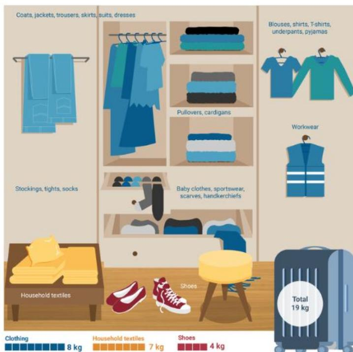

*Figure 18 : The textile consumption of the average EU citizens (2022). (48)*

The relationship between consumers and the fashion industry is multifaceted, with numerous factors that must be considered to fully comprehend habits and consumer behaviour. Consumers' behaviour in the fashion market is controlled by time, money and other variable factors such as their self attributes and unconscious biases matter as well. Maslow's hierarchy needs to function to influence consumers' purchasing intention from different dimensions, such as income disparities, gender disparities, and fast fashion. Over time, fashion has transitioned from being perceived primarily as a symbol of social hierarchy to one that represents personal style.  

Most of the studies conducted so far mainly focus on consumer behaviour during the purchase phase, but it is also necessary to understand the use and post-use phases to understand consumer behaviour and its relationship with the fashion industry. Therefore, in this study, all the phases involved are considered.  

## *3.2.2.1. (Pre-) purchase phase*

Regarding the selection of sustainable clothing, multiple obstacles have been identified through the examination of studies. These can be grouped into different categories, (a) price (b) transparency (c) knowledge (d) stereotypes and habits and (e) availability.  

shopping and fast-fashion trends where brands produce about 52 "micro seasons" a year which is a new collection every week. This low-quality, low-cost overproduction drives to overconsumption.

Transparency and traceability play an important role in consumer awareness, helping individuals to make informed decisions based on ethical and environmental principles.  The literature highlights that consumers may have low trust in sustainability claims due to the lack of transparency, the perception that sustainable garments are not truly environmentally friendly, and the belief that purchasing eco-friendly clothing does not actually contribute to mitigating environmental impacts. Additionally, consumers often perceive that companies make minimal effort toward environmental and social responsibility. Moreover, consumers frequently struggle to understand the language used to describe sustainable fashion, which creates confusion, frustration, and scepticism, discouraging them from adopting sustainable behaviours. Several studies have indicated that the lower the consumers' knowledge about sustainable fashion, the lower their purchase behaviour toward these products.

Eco-labelling and certification provide credibility and impact, avoiding greenwashing and dealing with consumers' lack of trust. Information related to where the materials come from, processes involved in garment production, and working conditions of people involved in manufacturing should be readily accessible. Such transparency may encourage consumers to demand more sustainable products from fashion brands. It has also been highlighted that familiarity with eco-labels and the ability of labels to clearly explain the attributes of sustainable fashion promote purchase behaviours toward these types of garments.  This becomes possible when consumers distinguish between perceived and functional obsolescence, moving beyond trend-driven purchasing to demand higher-quality, longer-lasting products (48).

Consumption is strongly driven by psychological factors, including social norms, advertising, and emotional needs. Cultural perspectives, different values, beliefs, socio-economic conditions, stereotypes and habits also tailor consumers' behaviour. The perception of self via clothing, change in personal circumstances, and difficulty in combining garments are some of the barriers pointed out. Added to that, people feel social pressure to regularly update their wardrobe as repeating the same outfit too many times would not be socially accepted. Based on these perceptions, experiments where participants had their clothing options reduced for a defined period were carried out. The results showed that initially, people felt frustrated, worried about people's judgment, and incapable of self-expression. Over time, these feelings changed to positive ones such as feeling more confident, less superficial, and that they were saving money. Moreover, the participants declared the experience made them feel less stressed about their clothing practice and that they would change their consumption habits (49). Indeed, due to limited knowledge and prevailing stereotypes, consumers may view sustainable clothing as less fashionable than conventional apparel- for instance, associating with "hippie" style, inferior design, lack of special features, or poor fit. These perceptions are influenced by gaps in understanding, perceived performance risks, societal expectations, and negative attitudes toward garment attributes.

Concerning (e) availability, consumers may perceive purchasing sustainable garments as effortful, due to difficulties in finding them in traditional retail stores, limited awareness of sustainable brands, and the scarce availability of apparel with desired features. The literature suggests that the less accessible a store is perceived to be, and less available sustainable fashion items are perceived, the lower the likelihood of purchase.  

As we have seen, there are many factors that influence the purchasing decision, which make it necessary to adopt a holistic approach that can break many of the usual patterns, while promoting critical thinking and a commitment to sustainable values.  

Continued use of garments allows for extending their life cycle, reducing consumption, and mitigating environmental impact. This is mainly influenced by the physical characteristics of the garments (comfort, fit, ease of care, aesthetic appearance, and wardrobe organization), while barriers are generally related to the consumer's psychological state, including social pressure to continuously update their wardrobe, as

mentioned previously. The physical attributes also affect durability, and laundry practices play a key role in both garment longevity and environmental impact. Factors such as washing temperature, frequency, and detergent type directly influence outcomes, while barriers include lack of knowledge, perceptions of cleanliness, and fear of appearing unkempt. Studies have demonstrated people's perceptions regarding laundry practices: in general, consumers preferred to wash clothes at high temperatures, as it is perceived that this is the only way to achieve cleanliness; consumers often exhibit suboptimal practices regarding detergent dosage, machine load, and program due to lack of knowledge; and people do not relate garment washing and drying instructions to sustainability (49).

Additionally, several studies have investigated the motivation behind washing garments. Jack (50) revealed that washing is related to multiple aspects: (1) physical – dirt, smell; (2) habits; (3) emotional – to freshen, remove history, prepare for new situations, show affection; (4) community censorship; and (5) self-auditing. Some reports describe that the frequency of washing is more closely linked to habits (length of wear and garment type) than to visible dirt or odour detection (44), while others found that soiling level is the main reason for washing (51) (52). Conversely, reasons not to wash include convenience, garment longevity, and preservation of emotions. Moreover, these differences are influenced by consumers' country of origin, garment type, and garment composition. Clothing type, such as jeans, t-shirts, or jackets, appears to be the most important factor, as odour detection frequency varies; underwear, socks, and sportswear are washed more frequently due to stronger odour detection (49).

It seems necessary to raise awareness about the environmental impacts of washing, including chemical use, water and energy consumption, and microplastic release in certain cases, as well as how it may influence garment longevity. Although washing habits are influenced by subjective factors, promoting more objective behaviours, where washing is only performed when physically necessary, such as in the presence of dirt or odour, can improve both sustainability and garment life.

Repairing garments is another important means of extending use. However, for many people, it is easier to replace garments than to repair them due to low costs of new clothing and the lack of repair skills. Literature shows that most consumers do not repair any clothing, mostly because of perceived low quality, repair costs, and lack of knowledge. Nevertheless, repair becomes relevant for higher-quality garments or those with emotional attachment. Women and the elderly are more likely to engage in repair activities, and selfrepair is more commonly chosen than professional services (49).

An important element related to repair is the 2-year warranty legally applicable in EU to all garments bought in stores or online, also during sales. This warranty covers defects, not the wear and tear. More specifically, the retailer has to offer redress under the legal guarantee if the item doesn't match the product description, has different qualities from the model advertised, is not fit for purpose, doesn't show the quality and performance normal in products of the same type, or wasn't correctly installed due to shortcomings in the instructions. According to the law, the product may be repaired, replaced or refunded. In most countries, there is a "hierarchy of remedies" where the first option is to repair or replace, and the refund is only proceeded if the other options are not possible (53). Brands do not communicate much about it, and lots of consumers have no idea it exists. Getting this best kept secret out could stimulate the repair sector, the willingness of users to get products repaired, and also push brands to deliver better products.

Overall, combining continued garment use, careful laundry practices, and repair activities, along with attention to garment quality and characteristics, supports longer garment lifecycles, reduced consumption, and lower environmental impact. These behaviours also contribute to more mindful and sustainable fashion consumption patterns, while reducing the social and psychological pressures that often drive overconsumption.

## *3.2.2.2. Post-use phase*

Clothing disposal occurs when consumers consider garments to be obsolete. The reasons for discarding them include technical/physical factors, such as wear and tear, poor quality, poor fit, or lack of storage space, and psychological factors, such as changes in fashion trends, loss of interest, or the perception that the garments is no longer needed. Emotional attachment often prolongs ownership, but at the same time can hinder reuse or sustainable recycling.

The disposal method depends on the reasons for discarding the garment and its characteristics, such as quality, price, or type. Low-quality garments, such as fast fashion items, are often disposed of unsustainably (e.g., thrown in the trash), whereas high-quality or branded garments are more frequently reused through resale, donation, or swapping. The most common sustainable disposal methods are donations to charities, gifting or exchanging with family and friends, while resale and recycling are less common due to the effort required and lack of knowledge. Factors such as availability of donation and recycling infrastructure, as well as consumer education and gender, also influence these practices, with well-educated women being more likely to dispose of their garments sustainably [\(Table 3\)](#page-37-0).

*Table 3. Habits regarding the second life of clothes (Men vs Women) (54).*

|       | I give to associations | I give to people in my circle | I resale on internet | I keep them in my dressing | I through them in the rubbish bin |
|-------|------------------------|-------------------------------|----------------------|----------------------------|-----------------------------------|
| MEN   | 59%                    | 29%                           | 11%                  | 15%                        | 14%                               |
| WOMEN | 65%                    | 41%                           | 32%                  | 14%                        | 7%                                |

## *3.2.2.3. Theories of Behaviour*

The Theory of Planned Behaviour (TPB), one of the most widely used models in social psychology and consumer research (Ajzen, 1991; Armitage & Conner, 2001; Rozenkowska, 2023; Ulker-Demirel & Ciftci, 2020), proposes as a basis for argument that consumer attitude, understood as an overall positive or negative evaluation of performing a given behaviour, has a significant influence on shaping behavioural intentions and, ultimately, on affecting the chances of behavioural modification (Hagger & Hamilton, 2023; Armitage & Conner, 2001; Sok et al., 2020; Tornikoski & Maalaoui, 2019). This attitudinal dimension, together with perceived behavioural control, the individual's perceived ability to carry out the behaviour, a construct closely related to self-efficacy, should be considered two major factors supporting the adoption of green consumer behaviour (Hagger & Hamilton, 2023; Hagger et al., 2022; Sok et al., 2020) **(55)**. More specifically, the decision to adopt a certain behaviour is directly linked to an individual's behavioural intentions, combined with the degree of actual control a person has over it (Hagger & Hamilton, 2023; Sok et al., 2020; Tornikoski & Maalaoui, 2019). Consumer behavioural intentions, in turn, result largely from three constructs: attitudes toward the behaviour, subjective norms, that is, the perceived social pressure from important others, and perceived behavioural control (Hagger & Hamilton, 2023; Hagger & Hamilton, 2025; Sok et al., 2020; Tornikoski & Maalaoui, 2019) **(55)**. Notably, perceived behavioural control also reflects perceived barriers and resources and can directly predict behaviour when it accurately represents actual control (Hagger & Hamilton, 2023; Sok et al., 2020; Hagger et al., 2022). Meta-analyses confirm the model's robustness, showing that TPB typically explains about 20–30% of the variance in behaviour and approximately 35–40% of the variance in intentions across many domains (Armitage & Conner, 2001; McEachan et al., 2011), including environmental and pro-social behaviours such as recycling, conservation and green consumption (Ajzen, 2020; Yuriev et al., 2020; Rozenkowska, 2023; Sok et al., 2020), as well as consumer behaviour more broadly (Rozenkowska, 2023; Paul et al., 2016). This gap between intention and behaviour is, in fact, one of the recognised limitations of the TPB. Critics

have pointed to intention–behaviour gaps, the limited role of emotion and habit in the original model, and

This project has received funding from the European Union's Horizon Research and Innovation program under grant agreement N° 101181901 and from the Swiss State Secretariat for Education, Research and Innovation (SERI). Posts and shares reflect only the views of all the involved partners. Neither the European Union nor the granting authority can be held responsible for them. This draft deliverable has not yet been validated by the granting authorities.

the need to integrate additional factors such as identity, past behaviour and personal norms (Ajzen, 2011; Sniehotta et al., 2014; Sussman & Gifford, 2018; Armitage & Conner, 1999; Han et al., 2017; Paul et al., 2016). Consequently, many contemporary studies now employ "extended TPB" models, adding such variables to improve predictive power (Yuriev et al., 2020; Hagger & Hamilton, 2025; Rozenkowska, 2023; Paul et al., 2016; Han et al., 2017).

Across textile and apparel studies, positive attitudes, supportive subjective norms, and higher perceived behavioural control (PBC) reliably increase intentions to buy or use sustainable or circular textiles (Kang, Liu and Kim, 2013; La Rosa and Jorgensen, 2021; Shamsi et al., 2023; Kumar, Garg and Singh, 2022; Abbate et al., 2023).

Product knowledge, perceived consumer effectiveness, and personal relevance strengthen attitudes, norms and PBC, thereby raising purchase intention for sustainable textiles and apparel (Kang, Liu and Kim, 2013; Kumar, Garg and Singh, 2022).

PBC (perceived ease, affordability, availability) often has one of the strongest direct effects on intention (Hosta and Žabkar, 2020; Shamsi et al., 2023; Kumar, Garg and Singh, 2022).

Social influences from family, friends and social media strengthen subjective norms and green purchase intentions (La Rosa and Jorgensen, 2021; Shamsi et al., 2023; Abbate et al., 2023; Xie and Madni, 2023; Ali et al., 2022).

Self-concept and social identity as a "sustainable" or "eco-fashion" consumer encourage engagement with second-hand, circular or collaborative fashion models, especially when these options allow identity expression (style, uniqueness) (Hong et al., 2024; McNeill and Venter, 2019). Pro-environmental self-identity and values enhance attitudes and personal norms, which then drive sustainable consumption behaviour (Hong et al., 2024; Lavuri, Roubaud and Grebinevych, 2023). Social norms and personal norms both predict sustainable fashion intentions and behaviour (Hosta and Žabkar, 2020; Hong et al., 2024; Lavuri, Roubaud and Grebinevych, 2023).

Millennial and fast-fashion consumers often show pro-sustainability attitudes but unsustainable purchasing, producing an attitude–behaviour gap and feelings of guilt or irritation (cognitive dissonance) (Jung, Choi and Oh, 2020; Cairns, Ritch and Béréziat, 2021; Chakraborty and Sadachar, 2023).

Some resolve dissonance defensively (e.g., prioritising style, price, or social expectations over sustainability), weakening the impact of green attitudes and norms (Jung, Choi and Oh, 2020; Cairns, Ritch and Béréziat, 2021).

Others use dissonance as a motivator to realign identity and behaviour, increasing later intentions to buy sustainable or divest apparel (Cairns, Ritch and Béréziat, 2021; Chakraborty and Sadachar, 2023).

(56) (57) (58) (59) (60) (61) (62) (63) (64) (65).

The Theory of Value-Belied-norm highlights the connection between and egoistic and altruistic values and defends that the involvement would be motivated by the perception that what is being performed to address sustainable development is not enough, or that their involvement could help with it. Social context also has a great impact on their behaviour, including the groups consumers fell they belong to and the groups they don't perceive themselves to be a part of. This theory also points out the importance of educating consumers as a powerful tool to impact on their beliefs.

A study report (66) have demonstrated the following results on 210 consulted citizens:

- No consideration that fast fashion companies are societally irresponsible,
- Consumer behaviour is based more on themself than on other,
- No sensitivity on CSI; sensibilization should change this result,
- On all variables, the more influencing is physical availability. If some ethic brands should be present in shopping centre it will change behaviour.

At the customer level, it is harder to impose refuse, reduce or consume more sustainable. As 4 to 9% of discarded textile are not even worn, reduce consumption seems to be a very important point to address at consumer level. This over consumption is strongly linked to fast fashion or ultra-fast fashion matter.

A study has been conducted in France by YouGov (54) to understand better the overconsumption phenomena (54). Results showed that consumers' garment buying preferences are:

- Clothing of major brands: 43% (in which 65% have between 18-24 years
- Second hand clothing: 8%
- Thrift store: 8%
- Designer clothing: 4%
- Luxury clothing: 3%

In this building action, the more relevant eco-responsible elements considered by consumers are:

- Animal respect: 76%
- Human production condition: 75%
- Transport impact: 62%
- Local production: 62%
- Recycling: 61%
- Water consumption in production: 48%
- Smaller restocking: 20%

In regard of animal respect, only furs, leather and silk are concerned by animal abuse, which represents less than 5% of textile products and, in consequence, smaller impact. In Figure 19 [: Consumer purchasing](#page-39-0)  [behaviour for ethical or ecological reasons. Survey question:](#page-39-0) "Did you reduce your purchases for ethical or ecologic reasons?"[. Response options: 1\) yes, 2\) no and I don](#page-39-0)'t have intention to do so, 3) No but I [have intention to do](#page-39-0) so 4, consumers' intention to reduce consumption due to ecological consideration when buying new garments is displayed. Most interviewers (37%) answered "No, and have no intention to do". However, 28% affirmed they already do it and 22% disclaimed that had the intention to do so which together sums up to 50%. These results suggests that consumers' awareness can be an import tool to change consumption current attitude, even though changing behaviour would be a bigger challenge.

**Have you ever reduce your purchases for ethical/ecological**

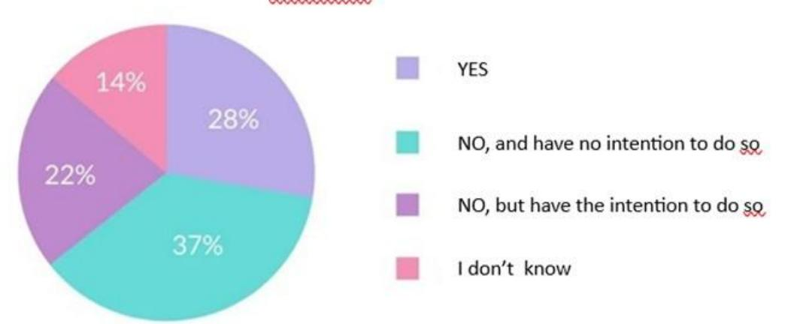

*Figure 19 : Consumer purchasing behaviour for ethical or ecological reasons. Survey question:* "*Did you reduce your purchases for ethical or ecologic reasons?*"*. Response options: 1) yes, 2) no and I don*'*t have intention to do so, 3) No but I have intention to do so 4) I don't know.*

This project has received funding from the European Union's Horizon Research and Innovation program under grant agreement N° 101181901 and from the Swiss State Secretariat for Education, Research and Innovation (SERI). Posts and shares reflect only the views of all the involved partners. Neither the European Union nor the granting authority can be held responsible for them. This draft deliverable has not yet been validated by the granting authorities.

According to YouGov (54), French consumers who consider Shein or Temu for their purchases are predominantly women (70%). They are over-represented among parents of minor children (37%). Their most important criteria to buy are:

- 1. Price: 81%
- 2. Quality: 65%
- 3. Lifespan: 27%
- 4. Origin of production: 24%
- 5. Brand: 22%
- 6. Fibre and material used: 20%
- 7. Environmental impact: 13%

In a difficult economic climate, this audience is looking for low prices, bargains, and online shopping. 35% are segmented as "bargain hunters," and 32% as frugal and thrifty. Their most important criterion for purchasing clothing is price (81% of respondents). Quality is important to only 65% of them. Durability and longevity are cited by only 19% of respondents each. The place of manufacture is not a major factor in motivating their clothing purchases as it is a selection criterion for only 8% of these fast fashion buyers. Following the same study, 19% of consumer turn to more ethical brands and 10% buy luxury brands because they last more.

Another study from l'Observatoire Cetelem (67) assessed the main reasons why consumers buy:

- 1. 88% of consumer buy "to treat oneself"
- 2. 82% of consumer buy "to bring dream in their life"
- 3. 73% of consumer would buy in a more qualitative textile to last more (luxury brand)

In terms of positive feeling, three brands arrive at the last position: Primark, Shein, Temu. The three first brands are: Jules, Comptoir des Cotonniers and Vinted. This means that customers are aware that ultrafast fashion is negative, even if they still believe that some fast fashion brands are classical fashion brands.

Consumer surveys in France show that 9 of the 10 most popular brands are associated with fast fashion strategies, highlighting the continued market dominance of volume-based models. It is true after the pandemic, a new trend emphasizing environmental concern has emerged; however, this is not reflected in actual consumer behaviour. In fact, while 30% of consumers express an intention to purchase ethical products, only 3% consistently do so (68). According to another study developed in Spain by 40dB and the" Asociación para la Gestión del Residuo Textil y el Calzado", between 2023 and 2024, people are aware of the textile circularity importance.

## 3.2.3. Adhesion to alternative consumption models (second-hand clothes, rental, auctions)

Consumers are increasingly adopting second-hand clothing, with rental and swapping models growing but facing more barriers; motivations include economic, environmental, and self-expressive values, while concerns about hygiene, trust, and convenience remain key obstacles.

Second-hand clothing has emerged as the most widely adopted alternative model in sustainable textile consumption. Over two-thirds of surveyed consumers report buying second-hand, with the market projected to outpace fast fashion by 2029. Motivations for this shift include economic savings, environmental benefits, and the thrill of unique finds. Younger generations, especially Gen Z, are leading this trend, often viewing second-hand shopping as enjoyable and socially acceptable, transforming what was once stigmatized into a mainstream practice (69) (70) (71) (72) (73) (74) (75).

Rental models show growing adoption but remain niche compared to second-hand buying. Clothing rental finds its strongest foothold in occasion wear and among consumers motivated by novelty, quality, and sustainability concerns. However, several barriers prevent wider adoption, including limited availability, perceived inconvenience, and concerns about hygiene and trust in rental schemes. These challenges

This project has received funding from the European Union's Horizon Research and Innovation program under grant agreement N° 101181901 and from the Swiss State Secretariat for Education, Research and Innovation (SERI). Posts and shares reflect only the views of all the involved partners. Neither the European Union nor the granting authority can be held responsible for them. This draft deliverable has not yet been validated by the granting authorities.

suggest that while rental offers promise for reducing textile consumption, significant infrastructure and perception shifts are needed for mainstream acceptance (69) (71) (76) (77) (78) (79).

Swapping and auction models represent smaller but significant alternatives in the collaborative consumption landscape. Swapping appeals particularly to those seeking social interaction, enjoyment, and economic benefits, though it faces barriers including unfamiliarity, social risk, and concerns about product quality. Auctions, while less discussed in the literature, share similar motivations and barriers with swapping models. Both approaches highlight how alternative consumption models can combine practical benefits with social and experiential value (69) (80) (81).

*Table 4. Table comparing motivations and barriers for alternative clothing models.*

| Model Key Motivations Main Barriers Citations |                                           |
|-----------------------------------------------|-------------------------------------------|
| Second-hand Economic, environmental,          |                                           |
| Brand et al., 2023                            | (69); Hur, 2020 (70); Styvén &            |
| Mariani, 2020                                 | (72); Wang et al., 2022 (73); Zaman       |
| et al., 2019                                  | (74); Liu et al., 2024 (75).              |
| Rental Novelty, quality,                      |                                           |
| Brand et al., 2023                            | (69); Herold & Prokop, 2023               |
| (71); Helinski & Schewe, 2022                 | (76); Shrivastava et                      |
| al., 2021                                     | (77); Rese & Baier, 2025 (78); Kim-Vick & |
| Cho, 2024                                     | (79).                                     |
| Swapping Social value, enjoyment,             |                                           |
| Brand et al., 2023                            | (69); Lang & Zhang, 2019 (80);            |
| McNeill & Venter, 2019                        | (81).                                     |

Emotional value and self-expression emerge as strong drivers of alternative consumption models, particularly among younger consumers who view these practices as extensions of their identity and values (82) (81) (79). Economic and environmental benefits, while important considerations, are not always the primary motivators for participation in these models. Many consumers are drawn instead by the fun or uniqueness of the experience, suggesting that the appeal of alternative consumption extends beyond practical or ethical considerations to encompass entertainment and discovery (69) (70) (72) (73) (75). Despite growing interest, significant barriers continue to limit broader adoption of alternative consumption models. Hygiene concerns, lack of trust in systems and providers, and lingering social stigma particularly affect rental and swapping models, preventing them from achieving the mainstream acceptance that second-hand purchasing has begun to enjoy. These barriers reveal that while attitudes are shifting, practical and psychological obstacles must still be addressed to fully realize the potential of collaborative consumption in extending textile lifespans 69) (70) (82) (80) (81) (78). [Table 4](#page-41-2) compares motivations and barriers for alternative clothing models.

## 3.3.Brand initiatives supporting circularity and longevity

## 3.3.1. Brand-led initiatives for circularity and longevity

Before discussing about circularity and longevity initiatives it is important to remind the breakdown of cost and market consideration about retailers:

This project has received funding from the European Union's Horizon Research and Innovation program under grant agreement N° 101181901 and from the Swiss State Secretariat for Education, Research and Innovation (SERI). Posts and shares reflect only the views of all the involved partners. Neither the European Union nor the granting authority can be held responsible for them. This draft deliverable has not yet been validated by the granting authorities.

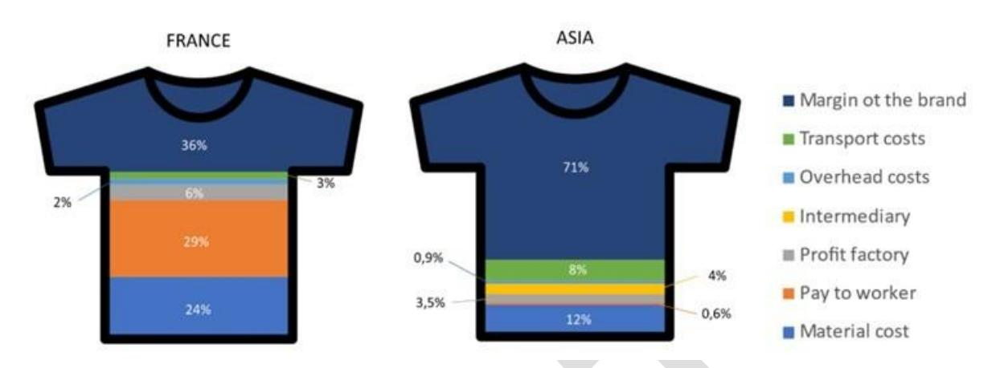

*Figure 20 : Breakdown of cost of a t-Shirt 29*€ *(letshirtfrancais.fr, 2019)*

Driven by greater awareness and concern, apparel companies are beginning to change their production processes, starting with relocating production.Clean Clothes Campaign (2021) shows that a worker's wage only accounts for 0.6% of the final retail price of a T-shirt when it is produced in Asia, while this accounts for 29% when the production takes place in France. The graphic depicted in Figure 20 [: Breakdown of cost](#page-42-0)  of a t-Shirt 29€ [\(letshirtfrancais.fr, 2019\)](#page-42-0) allows to understand that final cost of a t-shirt for the same market share, is not a matter of cost but a matter of margin. In reality, the situation is a little contrasted, if we deal with a direct brand shop or a retailer:

## BREAKDOWN OF COSTS OF A T-SHIRT

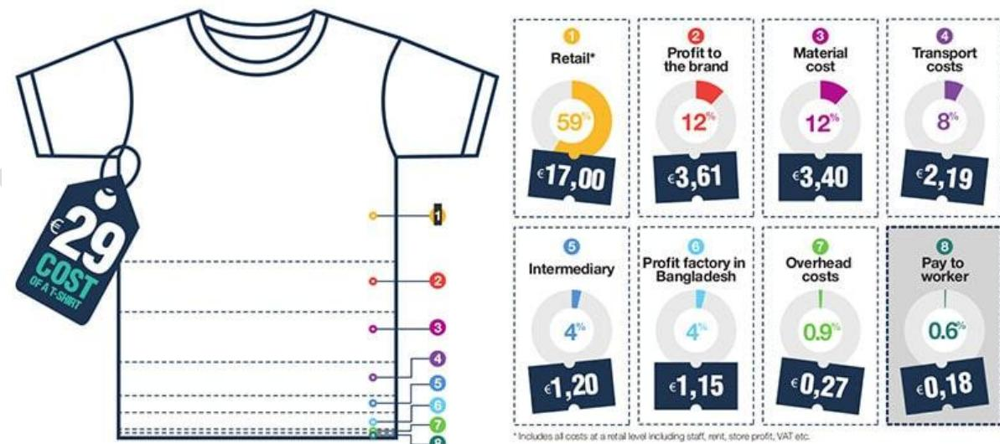

*Figure 21 : Breakdown cost for a t-shirt in retail shop*

Anyway, we see that retail account for 59% of price, where you have to remove direct or indirect cost for the retail shop and 12% for the brand profit. You see that we clearly go back then to 71% described i[n Figure 21](#page-42-1) [: Breakdown cost for a t-shirt in retail shop.](#page-42-1)

Considering growing concerns about the climate crisis and new regulations regarding textile waste, brands are implementing programs to support the longevity of their products. Ecoalf is a company that since its foundation in 2009, had sustainable production generating minimal impact as its main principle. As the first Spanish fashion brand to receive a BCorp certificate, in 2018, and elected by Merco Rancking as the most responsible company with the environment in Spain (2022), Ecoalf is compromised to the development of functional, sustainable, and high-quality products. Designed to last, Ecoalf products are made of durable materials, and favour neutral colour palettes and classic silhouettes in order to encourage people to wear them for several seasons. In collaboration with Michelin, for example, they have produced sneakers using Cordura, the most durable recycled polyester available. Moreover, 55% of their products take only one type of material, so they can be easily recycled. In 15 years of existence, over 600 new fabrics were developed using recycled materials such as nylon, polyester, wool, and cotton. Part of the recycled fibres are fabricated from waste collected from the sea. The collection of solid residues from the oceans is also a project of Fundación Ecoalf, called "Upcycling Oceans". It is an international initiative that has started in Spain, 10 years ago, in partnership with fishing sector to recover trash that gets caught in fishing nets. Nowadays, the project has extended to Thailand, Greece, Italy, France, and Egypt. From its beginning, over 1700 tons of trash was recovered from the sea. Although virgin natural fibres are added to some of their products, these fibres are equally produced under conditions that suppose low environmental impact, as in the cases of linen, hemp, and organic cotton. The company has been working on the reduction CO2 emissions and agreed to become a neutral brand by 2030 (83).

Patagonia is an American retailer pioneer in sustainable fashion, world widely recognized for its compromise with the environment. Besides working only with ecofriendly materials, fair trade practices, their products are designed to have long durability, lasting for several years. Additionally, the brand encourages consumers to repair their clothes, offering these services that can also be requested online. Costumers are also encouraged to recycle their Patagonia clothes and promote buying second-hand gears, extending even more product life cycle (84).

Moda Re-, conducted by Spanish Cáritas, is another Spanish initiative dedicated to fashion circularity. Moda Re- is a non-profit cooperative that dedicates to the full management of discarded clothes, being currently the leader in collecting and managing textile residues in Spain. The association focuses on the circular economy, in the creation of jobs for vulnerable people, and optimization of collecting and recycling processes of worn clothes. After 30 years of Cáritas work in collecting and recycling clothes, the brand Moda Re- was created in 2020. Committed to provoke people's conscientization and collaboration in recycling, reusing and consuming in a responsible way, Moda Re- has over 170 modern stores in Spain, where second-hand clothes are sold (85)**.**

Story MFG is a British fashion brand deeply committed to sustainability, ethical production, and long-lasting garments. They have a "Positive Product Manifesto" in which they declare that fashion should be kind to both people and the planet, without sacrificing aesthetics or quality. They are compromised to use ecofriendly and cruelty-free (vegan) materials such as organic natural and biodegradable fibres; and less harmful processes, avoiding toxic chemicals and, for example, performing dyeing with plant-based materials. Their products are designed to last for years as they embrace slow fashion and declare that the best way to be sustainable is to buy less. Furthermore, Story MFG has an ethical production, counting on artisans such as tailors, dyers, weavers, and embroiderers, ensuring fair wages and safe working conditions (86).

Nudie Jeans is a Swedish company dedicated to the production of sustainable jeans with focus on longevity. Their products are made of 100% certified organic cotton and by suppliers who ensure safe, ethical work. With the aim of encouraging consumers to use their jeans for longer periods, the brand offers free repair for life. In the year of 2024, they repaired over 68,000 pairs of jeans, extending their life and reducing waste. They also collect pre-owned Nudie jeans to resell them as second-hand garments or recycling into new products (87).

This project has received funding from the European Union's Horizon Research and Innovation program under grant agreement N° 101181901 and from the Swiss State Secretariat for Education, Research and Innovation (SERI). Posts and shares reflect only the views of all the involved partners. Neither the European Union nor the granting authority can be held responsible for them. This draft deliverable has not yet been validated by the granting authorities.

Additionally, several institutions and companies from different stages of the textile value chain united to set up a pact that will help to implement circularity in the sector. In Spain, the "Circular Fashion Pact" has its foundations elaborated by Cataluña government and 31 agents of the industry with the objective to identify and solve the challenges of the sector, to define the common goals and propose the means to change the textile industry to a circular model. By now, 55 entities and companies have joined it. This pact is one of the pilot actions promoted by the EU in the interreg Europe CircE project (European regions towards Circular Economy), that is led by 8 partners: Lombardy Region, Government of Catalonia, Marshal's Office of Lower Silesia, Province of Gelderland, London Waste and Recycling Board (LWARB), Creation Development EcoEntrepises (CD2E), Sofia Municipality, and Association of Municipalities and Towns of Slovenia (SOS). The project took place in 2017, in the topic of Environmental and resource efficiency, and had as principal goal to straight the diffusion of circular economy in Europe, consistently with the 2015 European Commission's Circular Economy Package.

## 3.3.2. Sustainable clothing market share

Consumption is one of the major challenges and key driver of the textile system, being the complexity of consumer behaviour a significant barrier to the adoption of sustainability and circularity (88).

The sustainable fashion market can be segmented by different perspectives such as product type, fabric type, distribution channel and region. Concerning product type, a report published by Custom Market Insights (89) for the forecast period of 2024-2033, confirms that the apparel dominates the market, with a share of 45.5% in 2023. An increasing demand for eco-friendly and ethically produced apparel is also observed, and in this field, the organic fabrics dominated the market in 2023 with a material market share of 39.5%.

A country level analysis developed by the Global Market Insights (90) revealed that Europe holds a promising share of the sustainable clothing market, of around 23.1% in 2024, with the expectation of CAGR (Compound Annual Growth Rate) of 8.7% in the period of 2025-2034. An important rise of European consumers in regard to sustainable clothes has been observed. A study performed in France showed that in 2023, 44.9% of French consumers had purchased eco-friendly clothing in the past year. The thriving second-hand closing market such as Vinted that achieved a valuation of USD 5.26 billion in 2023, highlights that the European sustainable market is experiencing an import growth. In Germany, 69% of consumers claims considering environmental and social compatibility important when purchasing clothing or footwear. Moreover, the UK's circular economy sector generates around USD 30 billion in revenue, emphasizing the economic potential of the sustainable clothing market. The five biggest companies in the sustainable clothing market, such as Adidas, Patagonia, Eileen Fisher, Everlane and Under Armour Inc. hold a share of 10-15% (Figure 22 [: Ranking of brands overview from top to bottom performance\)](#page-45-1). Adidas reported an annual revenue of USD 24.7 billion in 2024 and have launched programs such as "Made to be Remade" and "Wear Londer". Other major players in this market are Vuori, Pangaia, Outerknown, Able, Hanesbrands Inc., Pact, Tentree, and Afends.

This project has received funding from the European Union's Horizon Research and Innovation program under grant agreement N° 101181901 and from the Swiss State Secretariat for Education, Research and Innovation (SERI). Posts and shares reflect only the views of all the involved partners. Neither the European Union nor the granting authority can be held responsible for them. This draft deliverable has not yet been validated by the granting authorities.

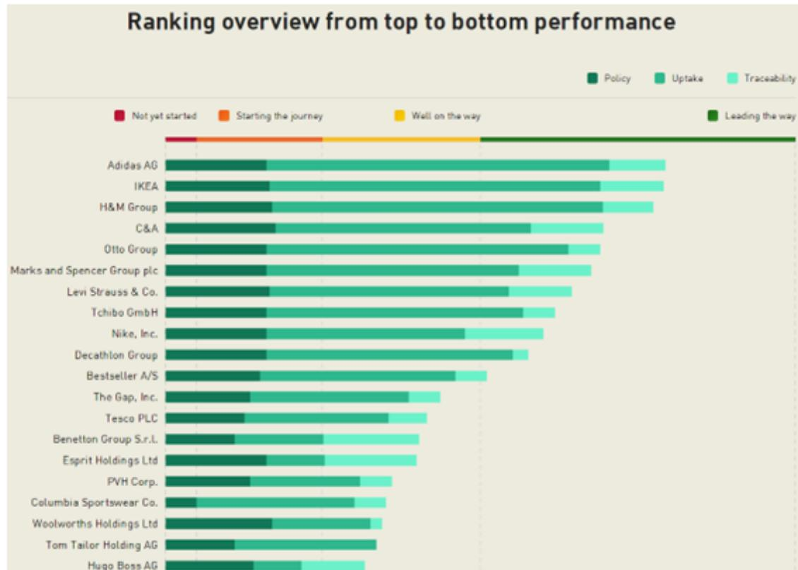

*Figure 22 : Ranking of brands overview from top to bottom performance*

Regarding distribution channel, the main segmentation is between online and offline, even though, offline may also be dived into brand outlets, independent boutiques and others. An important dominance of online channels was observed in 2024, with a revenue of USD 2.1 billion and a market share of around 57.4%. This expansion is related to the possibilities of better communication of detailed information about sustainable practices, materials used and production process, providing convenient shopping experience united to sustainable options.

The main market drivers for the potential growth are the consumer demand for ethical practices, regulatory pressures and industry initiatives, and economic opportunities in the Circular Economy. On the other side, Industry pitfalls are mainly the high production costs and infrastructure challenges, greenwashing and consumer scepticism.

## 3.4.Conclusions: Challenges and opportunities

Making clothes last longer and reducing textile waste faces several interconnected challenges. On the production side, the majority of garments are discarded due to quality issues such as fabric pilling, colour fading, or loss of shape. Simultaneously, regulations do not yet sufficiently incentivize brands to design clothes for easy reuse or repair. Consumer behaviour compounds the problem: price remains the primary purchasing criterion, social pressure drives constant wardrobe renewal, and a significant gap exists between stated intentions and actual behaviour. Most consumers lack repair skills, struggle to assess garment durability before purchase, and do not recognize the environmental impact of their laundry practices. Additionally, only a small fraction of textiles in Europe are collected for recycling or reuse, while newer models such as clothing rental and swapping remain constrained by hygiene concerns, lack of trust, and social reluctance.

Despite these obstacles, promising trends are emerging. The European sustainable fashion market is growing steadily, with strong projected expansion over the coming decade. Second-hand clothing has gained widespread acceptance and is expected to outpace fast fashion growth in the near future, driven by younger consumers and popular resale platforms. Online shopping channels, which now represent the majority of the market, facilitate brand transparency regarding production processes. Concurrently, online tutorials and community initiatives such as repair cafés are helping consumers develop maintenance and repair skills. Several leading brands are demonstrating the commercial viability of sustainable approaches through durable design, free lifetime repair services, and garment take-back programs. Design improvements also offer significant potential: reinforced stitching, higher-quality fastenings, and replaceable components extend garment lifespans and facilitate repair. Consumers increasingly perceive repairable products as higher quality, which encourages more deliberate purchasing decisions. Finally, evolving European regulations and underutilized consumer protections – such as the two-year legal warranty applicable to all garments sold in the EU – provide powerful mechanisms to drive industry transformation. TRUSTex is positioned to contribute to this transition by developing trusted, evidencebased EPR frameworks that align regulatory incentives with the behavioural and structural shifts identified in this analysis, ultimately supporting longer garment lifespans and more responsible consumption patterns across the EU.

## **4. Existing waste management practices**

## 4.1.Introduction

Describing the existing waste management practices across the EU is a real challenge. The purpose of this section is to focus on the existing practices. All future perspectives will be scrutinized in other tasks or WPs.

Some initial figures are helpful to sense the scale of the matter.

Consumption and waste generation of textiles in the EU are closely linked. Between 2010 and 2022, apparent consumption of clothing, footwear and household textiles increased from 14–17 kg per person to 19 kg per person, rising from 6.3 million tons in 2010 to 8.55 million tons in 2022. In the same year, EU Member States generated around 6.94 million tons of textile waste (16 kg per person), a level that has remained relatively stable since 2016 (91).

Despite a gradual improvement in separate collection systems, only about 15% of household textile waste was separately collected in 2022, leaving the majority unrecovered for reuse or recycling. While landfilling of textiles has declined over time, incineration has increased. Moreover, a significant share of textiles – an estimated 4-9% of products placed on the market – is destroyed before first use.

Exports of used textiles have nearly tripled since 2000, reaching 1.4 million tons annually. Although intended for reuse or recycling, exported textiles often follow complex pathways involving sorting, re-export, recycling, landfilling, incineration or dumping, particularly in destination regions in Africa and Asia.

Any textile product that reaches the market, whether in a warehouse or a store, will eventually become waste that requires treatment of some kind.

Despite a common legislative framework, textile waste management across the EU resembles a patchwork of practices rather than a uniform system. There can be many reasons for that, like divergent policy priorities, a different industrial infrastructure, contrasting interest in circular economy or sustainability, historical waste systems, etc.

This project has received funding from the European Union's Horizon Research and Innovation program under grant agreement N° 101181901 and from the Swiss State Secretariat for Education, Research and Innovation (SERI). Posts and shares reflect only the views of all the involved partners. Neither the European Union nor the granting authority can be held responsible for them. This draft deliverable has not yet been validated by the granting authorities.

As a matter of fact, textile waste management requires coordinating lots of activities and developing a robust collaboration between very different actors across the public and private sectors, social enterprises, NGOs, etc.

For many countries, regions and municipalities, managing textile waste comes with several new constraints, as it is now expected to be treated in such a way that as much of the waste as possible is sorted for reuse or recycling rather than being incinerated or landfilled. This presents a number of challenges.

This is clearly visible with rates of textile collection, reuse, and recycling that vary widely across EU Member States, with some countries capturing a substantial share of post-consumer textiles, while others continue to rely predominantly on mixed waste disposal and incineration or landfilling.

Another factor to consider regarding the information presented hereunder is the timing of the reviewed documents, none of which were issued later than 2024, and the timing of the regulations, which stipulate for example that a selective collection of textile waste must be organised by 1 January 2025. The impacts of the latter are therefore not visible in the reports.

The analysis of existing waste management practices in Europe requires to consider a series of reports published by the EEA, JRC, or deliverables from projects.

Before starting analysing data about waste management practices, even though they will be covered in detail in T1.2 (Regulatory landscape analysis), it is necessary to look at some regulations to understand what should be taken into consideration under this review.

## 4.2.EU Waste Framework Directive

The reference document for Europe is the Directive 2008/98/EC of the European parliament and of the council on waste (92).

This Directive lays down measures to protect the environment and human health by preventing or reducing the generation of waste, the adverse impacts of the generation and management of waste and by reducing overall impacts of resource use and improving the efficiency of such use, which are crucial for the transition to a circular economy and for guaranteeing the Union's long-term competitiveness. This directive applies to technical textiles and apparel.

A revision (Directive (EU) 2025/1892 of the European parliament and of the council of 10 September 2025, amending Directive 2008/98/EC on waste) (93) has been published in October 2025, aiming to bring about a more circular and sustainable management of textile waste, in line with the vision of the EU Strategy for Sustainable and Circular Textiles.

Its implementation plan is as follows:

- Revised Directive's entry into force: 17 October 2025.
- Deadline for Member States to transpose the new provisions: 17 June 2027.
- Deadline for Member States to set up textiles EPR schemes: 17 April 2028.

Under these EU rules on waste, Member States are required to set up separate collection of textiles by 1 January 2025.

In particular, the 2025 amendment of the WFD introduced mandatory and harmonised Extended Producer Responsibility (EPR) schemes for textiles in all EU Member States. EPR schemes require producers to take responsibility for the entire lifecycle of their products, in particular at the end of the product's life. Under these new rules on textile waste, the level of the financial contributions of the producers will be based on the circularity and environmental performance of textile products (referred to as "eco-modulation").

This project has received funding from the European Union's Horizon Research and Innovation program under grant agreement N° 101181901 and from the Swiss State Secretariat for Education, Research and Innovation (SERI). Posts and shares reflect only the views of all the involved partners. Neither the European Union nor the granting authority can be held responsible for them. This draft deliverable has not yet been validated by the granting authorities.

These new rules on textile waste are expected to foster research and development in innovative technologies that promote circularity in the textile sector. It also supports social enterprises involved in textile collection, sorting, reuse, and recycling, and will ultimately incentivise producers to design more circular products.

In a nutshell, waste management should be aligned with the WFD and the waste hierarchy. The main obligations are the following:

- Separate collection of textiles by 1 January 2025.
- Used and waste textiles separately collected to be considered as waste upon collection.
- Sorting operations to ensure the treatment in line with the waste hierarchy.
- Obligation for prior sorting and inspections requirements for the shipment of used textiles, and statement the bales were sorted (+ sorting criteria). Waste shipment regulations (WSR) apply otherwise.

There is no intention to ban export, but to differentiate 2nd hand textiles from waste.

Note the links between different initiatives:

- Waste Framework Directive (WFD) for textiles,
- End-of-waste criteria (not available yet, JRC working on this end 2025),
- Ecodesign for Sustainable Products Regulations (ESPR),
- Waste Shipment Regulations (WSR).

## 4.2.1. Definitions

Documents related to waste management practices come with a specific vocabulary. Here is a selection of key words, as defined in the directive 2008/98/EC.

'**Waste**' means any substance or object which the holder discards or intends or is required to discard.

'**Waste producer**' means anyone whose activities produce waste (original waste producer) or anyone who carries out pre-processing, mixing or other operations resulting in a change in the nature or composition of this waste

'**Waste holder**' means the waste producer or the natural or legal person who is in possession of the waste

'**Dealer**' means any undertaking which acts in the role of principal to purchase and subsequently sell waste, including such dealers who do not take physical possession of the waste

'**Broker**' means any undertaking arranging the recovery or disposal of waste on behalf of others, including such brokers who do not take physical possession of the waste

'**Waste management**' means the collection, transport, recovery (including sorting), and disposal of waste, including the supervision of such operations and the aftercare of disposal sites, and including actions taken as a dealer or broker

'**Collection**' means the gathering of waste, including the preliminary sorting and preliminary storage of waste for the purposes of transport to a waste treatment facility

'**Separate collection**' means the collection where a waste stream is kept separately by type and nature so as to facilitate a specific treatment

More definitions from JRC (94):

'**Post-industrial waste**' is waste generated during the manufacturing of textile products and their precursors

'**Pre-consumer waste**' is waste generated at retail stages (e.g. unsold textiles)

'**Post-consumer waste**' is textiles that have been disposed of after consumption and use by the citizen or end-users of commercial and industrial activities (hotel, care, automotive, etc.), commonly referred to household and commercial post-consumer textile waste, respectively.

## 4.2.2. Waste hierarchy

The following waste hierarchy (figure 24) shall apply as a priority order in waste prevention and management legislation and policy:

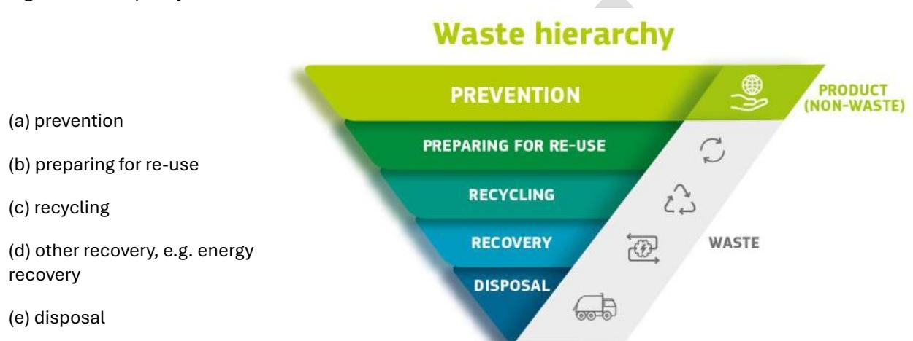

#### *Figure 23 : Waste hierarchy (Waste Framework Directive)*

When applying the waste hierarchy, Member States shall take measures to encourage the options that deliver the best overall environmental outcome.

## 4.2.3. End of waste status

As mentioned, hereabove, 'Waste' means any substance or object which the holder discards or intends or is required to discard.

2025/1982 (23) "*In the context of this amending Directive, 'used textiles' should be understood as separately collected textiles that are discarded by the end user, whether or not they are discarded with the intention and possibility for them to be re-used. At that stage, used textiles could be either fit for re-use or waste, as they have not been assessed. For that reason, used textiles that are separately collected should be considered to be waste upon collection unless they are directly handed over by end users and directly and professionally assessed as fit for re-use at the collection point by the re-use operator or social economy entities. 'Used textiles assessed as fit for re-use' should be understood as textiles that have been assessed as fit for re-use after collection, sorting, preparing for re-use or after the direct professional assessment at the collection point. Used textiles assessed as fit for re-use should not be considered to be waste textile.*"

Member States shall take appropriate measures to ensure that waste which has undergone a recycling or other recovery operation is considered to have ceased to be waste if it complies with the following conditions:

- (a) the substance or object is to be used for specific purposes,
- (b) a market or demand exists for such a substance or object,
- (c) the substance or object fulfils the technical requirements for the specific purposes and meets the existing legislation and standards applicable to products,

(d) the use of the substance or object will not lead to overall adverse environmental or human health impacts.

## 4.2.4. Mandatory separate collection of textiles

On January 1, 2025, the European Union enforced new regulations mandating the separate collection of textile waste. The latter becomes mandatory for used and waste textile, textile-related and footwear products.

For this to happen, separate collection, sorting, re-use and recycling capacities within the EU must be strengthened. This requires significant investments to build infrastructure, and to develop new technological solutions.

This should also logically lead to an increase of the collected textile waste, a deterioration of the waste's quality and an increased pressure on the waste management processes.

## 4.3.The need for harmonisation and mandatory reporting

Further guidelines and harmonisation of collection and sorting approaches would be useful for improving the standardisation of reporting and helping set performance targets, e.g. targets for separate collection, preparation for reuse and recycling (95).

There can be lots of variations sources, as shown in the following examples:

- The variations in data concerning generated and collected textile waste could stem from differing interpretations of what constitutes waste versus used textiles.
- In general, countries classify textile products as textile waste when the holder intends to dispose of them. However, these textiles can regain their status as reusable after undergoing sorting processes.
- The distinction between whether textiles are classified as waste or reusable can be based on whether the collection method is handled by humans or not. For example, textiles in Cyprus are considered waste when disposed of in collection bins; however, when exchanged between people or handed over, they are still considered products.
- There are currently few specific reporting requirements for used textiles not considered waste, which leads to data discrepancies. While it is mandatory for Member States to report on quantities of municipal waste, this obligation extends to municipal textile waste only if it is legally classified as waste. If used textiles are not considered waste, there is no corresponding reporting requirement.

## 4.4.Use and end-of-life

Lifespan of textile products vary a lot from a single use product (one time use or throw away products) like CEmarked medical mouth masks made from nonwovens to many years like geotextiles, for example a dike reinforcement fabric. There are also different types of users. There is the private consumer that uses product in his day-to-day life and professional use where products are used more intensively like workwear garments.

During the use of textile products their materials are worn, and products may get dirty and contaminated. Most textiles, like clothing and home textiles, are washed and also otherwise maintained during the lifecycle in order to keep them in use. In these processes other materials and chemicals can be added to the textiles for functionalization or to protect it. Some examples of chemicals and contaminants are washing residues and softeners, contaminants due to the user actions like painting resulting in pain stains, or soiling like dirt, human skin, fat and food residues.

This project has received funding from the European Union's Horizon Research and Innovation program under grant agreement N° 101181901 and from the Swiss State Secretariat for Education, Research and Innovation (SERI). Posts and shares reflect only the views of all the involved partners. Neither the European Union nor the granting authority can be held responsible for them. This draft deliverable has not yet been validated by the granting authorities.

When the products are considered not fit for use any more, they are discarded by the user. This is the endof-life stage. Some of the reasons for discarding a textile product can be that the product is broken, soiled or out of fashion. Most end-of-life textiles are a blend of different materials and contaminations of materials. This makes textile waste of low value, with few current recycling options. Due to this low value, textiles mostly end up on landfill or are used for energy recuperation. Household textiles are collected separately, but mostly they end up in mixed waste.

Society at large is aware of the challenges related to textile waste and there are various on-going initiatives aimed at solving these. In the European Union (EU) the separate collection of textile waste will be mandatory by 2025 (Directive (EU) 2018/851). The European Commission (EC) has identified textiles as a priority product category for the circular economy, and the European textile strategy published in early 2022 will be implemented in forthcoming years.

## 4.5.Textile waste in EU

There are several waste categories to consider when assessing the situation at EU level. While the data are not necessarily 100% representative of the actual situations, given discrepancies in collected data from country to country or also between regions, several reports provide valuable info about the waste streams.

Important notes: discrepancies may be present in the data due to different collection systems in each Member State and varied interpretations of the waste categories; for instance, in some countries, textiles collected for reuse may not be classified as waste but as products. Reporting inconsistencies may also be present due to the voluntary nature of reporting on non-waste textiles, resulting in gaps in datasets on reusable textiles and a paucity of comprehensive data on textile waste.

The EU generated an estimated 6.95 Mt of textile waste in 2020 - around 16kg per person. Of this, 4.4kg per person were collected separately for reuse and recycling, and 11.6kg per person ended up in mixed household waste (95).

Of the total textile waste, 82% had been used as clothing or household textiles (post-consumer waste). The rest was textile waste generated from manufacturing or unsold textiles.

There is minimal data available from Member States on the proportions of pre-consumer textile waste, such as unsold textiles, generated at retail stages. An estimated 4-9% of all textile products put on the market in Europe are destroyed before use, amounting to between 264 kt and 594 kt of textiles each year (95).

## 4.6.Overall waste collection figures in EU

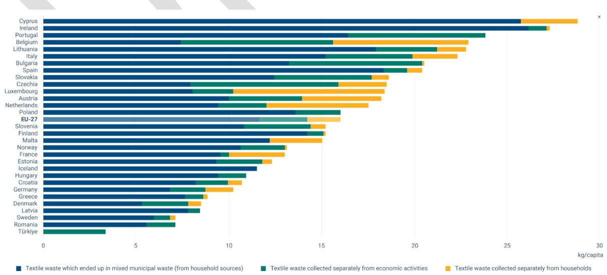

The waste collection is a key element in the waste management process. Basically, in Europe, the waste that cannot be collected separately will end up in incineration or in landfills. The waste that can be sorted will be oriented towards different treatment solutions.

Figure 24 [: Generation of textile waste in 2020, in kg per capital.](#page-52-1) illustrates textile waste generation per country in 2020. It shows textile waste collected from economic activities and textile waste collected from households, alongside textile waste which ended up in mixed household waste (in kg per capita).

- At EU level, an average 72.5% of the textile waste ended up mixed with household waste, intended for destruction through incineration, possibly with energy recovery, or disposed of in landfill sites.
- The highest separate collection rates are recorded for Belgium, Luxembourg and Netherlands.

Textile waste currently collected in Europe is predominantly deposited in street containers (bring points). Such facilities are often complemented by civic amenity sites where residents can dispose of household waste and recyclables that are not collected through regular curbside collection services.

The average capture rate for textile waste in Europe is only 12 %, indicating that the rest ends up in mixed municipal waste and is consequently landfilled or incinerated. These data show significant room for improvement in separate collection systems for textiles. As shown in the graph hereabove, Luxembourg (50%) and Belgium (50%) have the highest figures for collecting textiles separately, followed by the Netherlands (37%) and Austria (30%) (95).

With the implementation of EU regulation on separate textile waste collection by 2025, the collection rates for textiles from households are expected to increase, though the overall quality of collected items may decrease. This is likely to reduce the incentive for reuse (Janmark et al., 2022; van Duijn et al., 2022; Long and Lee-Simion, 2022) and could lead to more recycling – a less environmentally-sustainable option than reuse.

## 4.7.Sorting capacities

It is estimated that the EU has the capacity to store approximately 1.5 Mt of used and waste textiles annually. However, collection rates vary significantly across Member States (Figure 25 [: Overview of the](#page-53-1)  [capture rates for textiles and shoes per country, 2020, EEA Management of used and waste textiles in](#page-53-1)  Europe'[s circular economy \(95\)\)](#page-53-1). Given that sorting is labour-intensive and must usually be undertaken manually, the process is more cost-effective in countries with relatively lower labour costs (ETC CE, 2023; van Duijn et al., 2022). Current and planned sorting capacity is also unevenly distributed across Europe, as

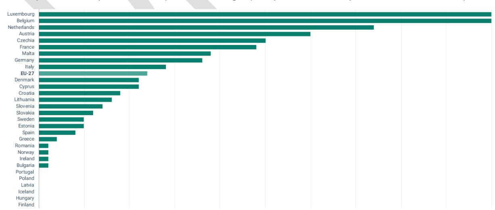

This project has received funding from the European Union's Horizon Research and Innovation program under grant agreement N° 101181901 and from the Swiss State Secretariat for Education, Research and Innovation (SERI). Posts and shares reflect only the views of all the involved partners. Neither the European Union nor the granting authority can be held responsible for them. This draft deliverable has not yet been validated by the granting authorities.

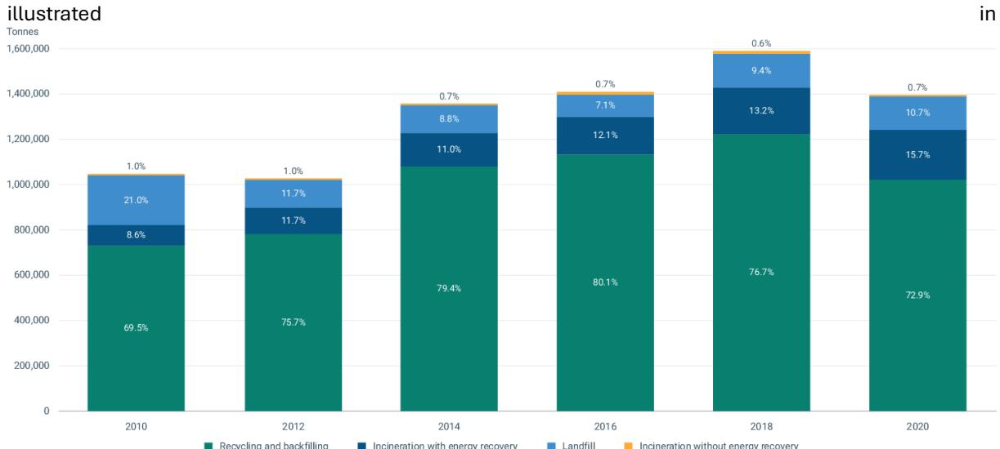

Figure 27 [: Treatment of textile waste in the EU, 2010-2020, in percentages -](#page-54-1) EEA Management of used and waste textiles in Europe'[s circular economy \(95\).,](#page-54-1) with concentration in countries offering cost advantages. Sorting facilities in countries where the purchase of collected textiles is costlier often source textiles from neighbouring countries. Germany, Poland and Lithuania are also major exporters of used and waste textiles to areas outside the EU. The fate of used textiles exported from the EU is highly uncertain.

*Figure 25 : Overview of the capture rates for textiles and shoes per country, 2020, EEA Management of used and waste textiles in Europe*'*s circular economy (95)*

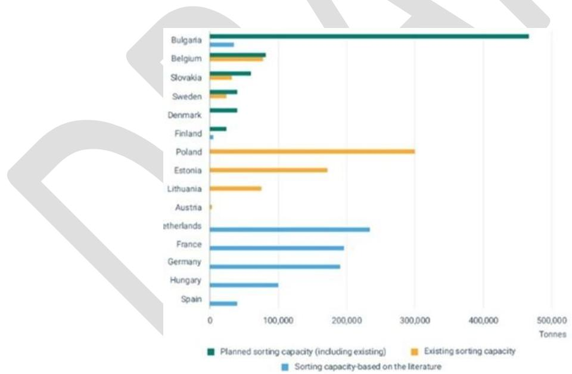

*Figure 26 : Existing and planned sorting capacity in 2024 (87)*

## 4.8.Reuse, recycling and treatment capacities in EU

Figure 27 [: Treatment of textile waste in the EU, 2010-2020, in percentages -](#page-54-1) EEA Management of used and waste textiles in Europe'[s circular economy \(95\).\)](#page-54-1) illustrates a notable reduction in the landfilling of textiles within the EU. In 2010, 21% of textile waste was landfilled, but by 2020, this figure had decreased to 11%. This translates into a reduction from 220 kt in 2010 to 150 kt in 2020. While landfilling of textiles decreased in most countries up to 2020, it increased in Bulgaria, Estonia, France, Poland, Latvia, Lithuania, the Netherlands and Hungary (Eurostat, 2023b).

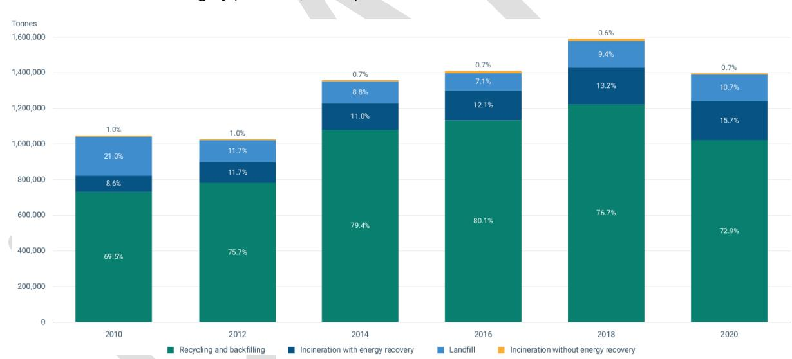

*Figure 27 : Treatment of textile waste in the EU, 2010-2020, in percentages - EEA Management of used and waste textiles in Europe*'*s circular economy (95).*

However, the data may have been influenced by the trade in used and waste textiles between EU countries. This is because textiles discarded during sorting operations and subsequently landfilled – including imported textiles waste – are reported in the receiving country.

Simultaneously, the quantity of textile waste redirected for energy recovery rose from 9% in 2010 to 16% in 2020. This corresponds to an increase from 90 kt in 2010 to 220 kt in 2020.

## 4.9.Waste collection and treatment options or Link collection/treatment

The collection mode and the waste treatment are often very much linked. Each municipality, organisation, retailer can collect used textiles and have them treated through specific channels and relationships they built, locally or not.

The following sections, based on report JRC R3 "Techno-scientific assessment of the management options for used and waste textiles in the European Union (2023)" (94), illustrate that aspect of waste management practices.

The general objective of this study finalized in 2023 (before separate collection of textile waste was made mandatory) was to summarise the techno-scientific knowledge base of different recycling, recovery and disposal options for waste textiles.

First, it is indicated that post-consumer textile waste is the largest waste fraction, and that annually more than 8 million tons used, and waste textiles are incinerated or landfilled, a much higher share than re-use, preparing for re-use and recycling together. Textile waste recycling is limited and currently dominated by transforming apparel and home textiles into cleaning rags and insulation materials but closed-loop recycling facilities are emerging in the EU, particularly for post-industrial textile waste.

With respect to textile waste management, the recently launched EU strategy for sustainable and circular textiles envisages "a circular textiles ecosystem that has sufficient capacities for innovative fibre-to-fibre recycling, while the incineration and landfilling of textiles is reduced to the minimum".

Data: it is noted that substantial uncertainties apply to the available data, and that official statistics and waste generation data were incomplete and only of limited use for this analysis.

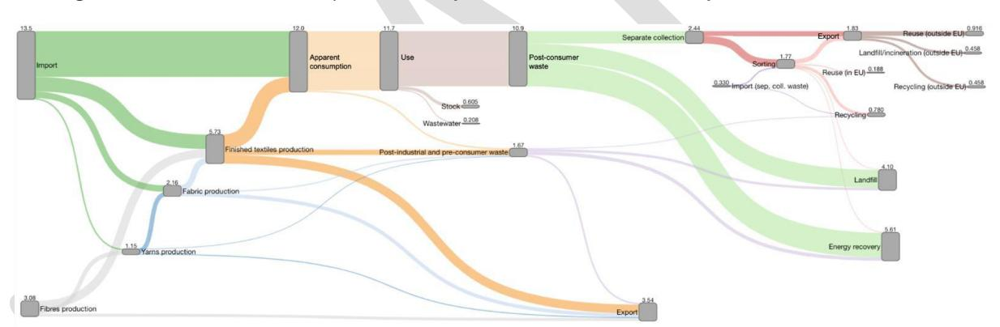

*Figure 28 : Mass Flow Analysis for textile production and waste management in the EU-27 for the reference year 2019 - JRC Techno-scientific assessment of the management options for used and waste textiles in the EU (94)*

Zooming in a graph (Figure 28 [: Mass Flow Analysis for textile production and waste management in the EU-](#page-55-0)27 for the reference year 2019 - [JRC Techno-scientific assessment of the management options for used and](#page-55-0)  [waste textiles in the EU \(94\)\)](#page-55-0) that shows the 'Mass Flow Analysis' or MFA for textile production and waste management in the EU-27 for the reference year 2019 (mass flows expressed in Mt yr-1), some key figures related to waste management emerge.

Regarding the waste collection (Figure 29 [: Focus on waste collection of Mass Flow Analysis for textile](#page-56-0)  [production and waste management in the EU-27 for the reference year 2019 -](#page-56-0) JRC Techno-scientific [assessment of the management options for used and waste textiles in the EU.\)](#page-56-0):

- 12.6 Mt textile waste was generated in EU in 2019,
- 86.7% (10.9Mt) is post-consumer waste, 13.3% (1.67Mt) post-industrial and pre-consumer waste,

- 77.2% (9.71 Mt) end up in landfill (33% 4.1Mt) and energy recovery though incineration (44.2% 5.61Mt),
- 19.4% (2.44Mt) are separately collected out of which 75% (1.83Mt) are exported.

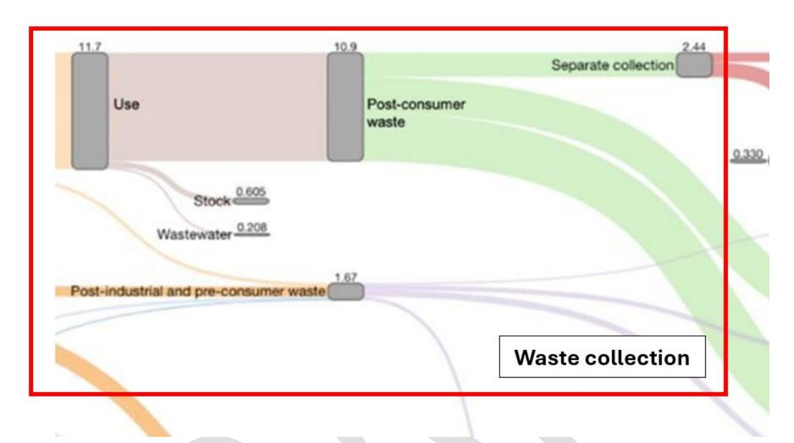

*Figure 29 : Focus on waste collection of Mass Flow Analysis for textile production and waste management in the EU-27 for the reference year 2019 - JRC Techno-scientific assessment of the management options for used and waste textiles in the EU.*

Regarding the waste treatment (Figure 30 [: Focus on waste treatment of Mass Flow Analysis for textile](#page-57-1)  [production and waste management in the EU-27 for the reference year 2019 -](#page-57-1) JRC Techno-scientific [assessment of the management options for used and waste textiles in the EU\)](#page-57-1):

- The total reuse represents 8.7% (1.1Mt) of total waste, and 10% of the post-consumer waste.
- For EU only, reuse represents 1.5% (0.188Mt) of total waste, 1.7% of post-consumer waste and 7.7% of separately collected waste (the cream)
- Reuse outside EU (0.916Mt) is almost 5 times higher than reuse in EU (0.188Mt)
- Recycling in EU represents 6.2% (0.78Mt) of total waste and 32% of sorted textiles; recycling outside EU, 3.6% (0.458Mt)

This project has received funding from the European Union's Horizon Research and Innovation program under grant agreement N° 101181901 and from the Swiss State Secretariat for Education, Research and Innovation (SERI). Posts and shares reflect only the views of all the involved partners. Neither the European Union nor the granting authority can be held responsible for them. This draft deliverable has not yet been validated by the granting authorities.

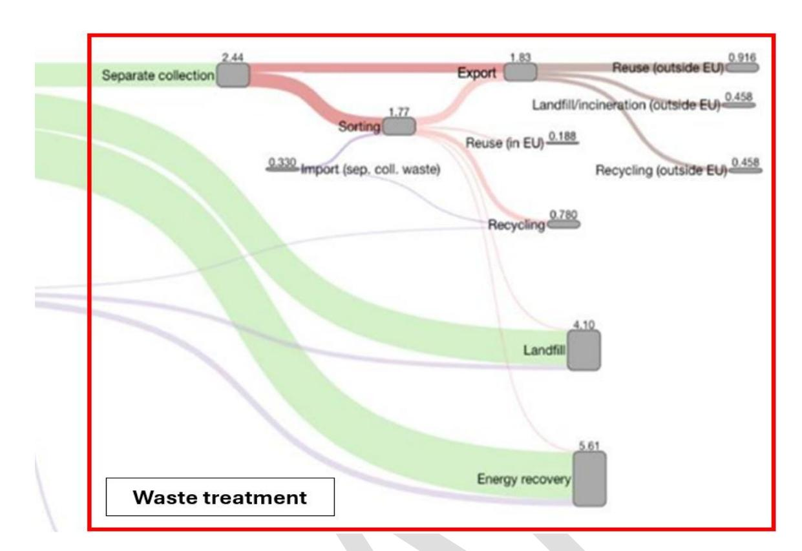

*Figure 30 : Focus on waste treatment of Mass Flow Analysis for textile production and waste management in the EU-27 for the reference year 2019 - JRC Techno-scientific assessment of the management options for used and waste textiles in the EU*

Only a small share of the used and waste textiles was separately collected in the EU (20%), leading to a missed opportunity to recover valuable material out of the more than 9Mt of textile waste being incinerated and landfilled. A large share of the separately collected waste (75%) was sent to third countries, possibly contributing to adverse environmental and social impacts in the country of destination.

It will be particularly interesting to measure the impact of the obligation to implement selective textile waste collection in all categories.

As far as recycling is concerned, only a fraction of the volume treated (0.03-0.05Mt) ends up as spinnable fibres. The rest is mostly transformed into cleaning wipes and non-woven materials (e.g. insulation material for the construction or automotive sector).

## 4.9.1. Post-production and pre-consumer waste

Post-industrial waste (1.3Mt, 10.3% of all textile waste) and pre-consumer waste (0.33Mt, 2.6% of all textile waste) constitute a smaller fraction of the total waste. Post-industrial waste was assumed to be 37%, where 8%, 13%, and 20% are attributed to Yarns, Fabrics, and Finished textiles productions, respectively (94).

It is estimated that, even though it is the preferred feedstock for some operators, that only 0.17Mt, 10%) of the total generated post-industrial (mostly yarns and fabrics waste) and pre-consumed textile waste is recycled. The remaining waste is assumed to be split between incineration with energy recovery and landfilling.

This project has received funding from the European Union's Horizon Research and Innovation program under grant agreement N° 101181901 and from the Swiss State Secretariat for Education, Research and Innovation (SERI). Posts and shares reflect only the views of all the involved partners. Neither the European Union nor the granting authority can be held responsible for them. This draft deliverable has not yet been validated by the granting authorities.

## 4.9.2. Post-consumer textile waste management

Post-consumer waste represents the biggest category of waste (10.9Mt, 87%). 2.44Mt (22%) are collected separately. This implies that a significant share (8.5Mt) of the textile waste generated is not separately collected and thus largely diverted to incineration or landfill (recovery and disposal operations).

From the separately collected volume, it is estimated that possibly 50% are sent out of EU (mainly Asian and African countries) without prior sorting.

The exports to Asia are mostly subject to sorting and processing in the country of destination, and then recycled locally (mostly for the production of industrial rags or filling materials), or re-exported to other (mostly African) countries. The import of used textiles seems to be mainly meant for local re-use in Africa, but it is likely that a substantial share of this material is ultimately non-re-usable. Hence, the management of unsorted textile waste in certain receiving countries is not necessarily socially and environmentally sound because of the insufficient quality of this material for re-use (only 58% is deemed suitable for re-use after sorting of similar fractions in the EU), a potential lack of aptness for re-use in country different than the country of origin, and the absence of a good recycling and disposal infrastructure in the receiving countries.

Re-use within the EU of separately collected waste is estimated at about 10% of the separately collected and sorted waste, or 0.18Mt. Re-use within the EU, either in the same country of collection or following shipment to other EU regions, is the so-called 'cream' fraction within the collected material and generates an important share of the revenues for the sorters.

The fraction after sorting that does not meet the requirements for re-use is mostly recycled, and low amounts of waste for energy recovery or disposal (5-10%) are generated after the sorting process (Nørup et al., 2019a; Watson et al., 2020a; Le Relais, 2023). Watson et al. (2020b) report that 32% of the separately collected waste is recycled. If these results are extrapolated to the total sorted fraction, this would correspond to 0.55-0.60Mt. Most of this fraction is mechanically recycled for further use as cleaning rags or non-woven materials for the non-woven textile sector and other industrial applications (e.g. insulation material for construction or automotive sector), either in or outside the EU.

The share that is actually recycled for further applications as apparel is low, as recently reported by the Fashion for Goods report (Van Duijn et al., 2022). Together with the recycled share of post-industrial and pre-consumer waste, the total mass that is effectively entering textile recycling plants, corresponds to the estimated recycling capacity in the EU (0.70 – 0.85 Mt). (94)

## 4.9.3. Management options for used and waste textiles *4.9.3.1. Separate collection*

Separate collection of waste fractions diverts recyclable materials from the residual or mixed municipal solid waste and thus provides opportunities to make more value out of valuable resources that would otherwise be landfilled and incinerated.

There are two ways to collect the different categories of textile waste:

- Pick-up schemes include door-to-door and curbside collection, where collection rounds on the territory are typically organised for the most voluminous and common waste streams, referring to bio-waste, dry recyclables and residual waste;
- Drop-off/bring schemes include road and underground containers with a number of containers placed on public areas, where households or businesses can deliver waste. For textiles in particular, retailers can also set up take back systems where citizens can dispose of their used textiles.

This project has received funding from the European Union's Horizon Research and Innovation program under grant agreement N° 101181901 and from the Swiss State Secretariat for Education, Research and Innovation (SERI). Posts and shares reflect only the views of all the involved partners. Neither the European Union nor the granting authority can be held responsible for them. This draft deliverable has not yet been validated by the granting authorities.

### *4.9.3.2. Post-industrial waste*

Post-industrial textile residues are generated during the manufacturing process (e.g. cut-off leftovers), and their management is controlled by the textile manufacturer. It may involve on-site recycling, posterior management by an industrial waste management as a third-party (business-to-business), or disposal. Postindustrial waste is usually clean and undamaged and of a well-known chemical composition, and can thus often be recycled without any additional cleaning or sorting. Therefore, it is a preferred source for mechanical recycling processes (see section 4.3.4).

## *4.9.3.3. Pre-consumer waste*

Unsold textile goods are labelled as pre-consumer waste and their management is generally unclear. In some cases, they are rebranded and sold in outlet shops, donated to charity organisations and/or exported to other EU or extra-EU countries (Granum, 2013). In other cases, unsold goods are destroyed by companies.

## *4.9.3.4. Post-consumer waste from households*

In the EU, municipalities, charities, social enterprises, second-hand shops and retail companies (e.g. via take-back schemes) play a varying role in the collection of post-consumer textile waste. The organisations involved in separate collection are typically also responsible for sorting the collected textile material.

### • **Municipalities**

Municipalities generally have to oversee the handling of the citizens' waste, and have moreover the power to decide on who may set up the collection infrastructure.

Collection via drop-off schemes is reported to be the dominant form of used textile collection in many European countries. For example, in France, 78-83 % of collection is via bring banks, of which three quarters are placed on streets and other public ground, and the remainder on private ground, while 88 % of collection in Germany is via bring banks. It is important to mention that the quality of the collected textile waste is thought to be linked to whether the collection system is manned or unmanned. Especially if the municipality collects textile waste for re-use purposes only, an unmanned collection system typically implies that 20- 30% of the collected textile waste are suitable for recycling but not for re-use. Curbside collection is another way of collecting textiles, yet it is significantly less prevalent, in part due to higher costs but also due to risk of theft. Currently, it comprises only 1.8% of collection in France and 3% in Germany. In Austria, curbside collection via special textile waste bags is carried out by a small number of municipalities but has become rarer in recent years. A handful of municipal waste companies have begun curbside collection of textiles waste in Denmark, the Netherlands and Sweden, generally using bags that are sealed and placed with other dry recyclables. There is no curbside collection in the Baltic States.

### • **Charity organisations**

Charity organisations have traditionally been the main collectors of used textiles and remain dominant in many EU countries. They collect textiles mainly through bring banks (street or civic-site containers) and over-the-counter donations in charity shops. Unmanned container-based collection yields high volumes but lower-quality items. After collection, textiles are transported to a central sorting location.

Shop-based collection generally produces higher-quality textiles for direct re-use.

Charities aim primarily to sell reusable items without repair, so they request clean, wearable textiles to avoid getting non-reusable products that have a negative economic impact. They may sort donations either fully in-house or partially before selling unsorted fractions to other actors.

They rarely offer curbside collection, except for occasional fee-based pick-up services.

Although charities historically handled nearly all used-textile collection in many regions (e.g., 87% in Sweden in 2013), new actors - commercial collectors, second-hand shops, social enterprises, and online resale platforms - have increasingly entered the sector. Their involvement varies a lot from country to country. In France, where an EPR managed by a PRO is in place, charities can register as official collectors.

Major international charity collectors include Oxfam and Caritas, often supported partly by unpaid or volunteer labour.

#### • **Social enterprises or organisations**

Social enterprises involved in the collection of textiles partly differ from charities in that their employees are not volunteers, they normally have a social or environmental goal and can be for-profit or non-profit. Social enterprises can organise textile collection via curbside, drop-off or in-store systems.

In the EU there are many examples of social entities that collect used textiles or textile waste. In the Netherlands, Flanders and Austria, socio-economic re-use organisations under the HERWIN and RepaNet networks specialise in receiving used goods including textiles across the counter for processing and repair in the shop (ECAP, 2018). These national networks are all part of the European RREUSE network, an international non-profit network of social enterprises. In 2021, RREUSE had 31 members across 29 countries. As of 2021, 341Kt of textiles were collected by RREUSE members, of which 39Kt were re-used locally (RREUSE, 2022).

#### • **Second-hand shops**

Second-hand shops have recently increased their role in the handling of used textiles, although they are usually not estimated to represent a significant share of total used textiles collection. It is challenging to estimate the used textiles volumes that are handled through second-hand shops, particularly given the recent popularity of online platforms for direct consumer-to-consumer sale or exchange (e.g. Vinted, Vestiaire Collection). Collection of reusable textiles over the counter in second-hand shops is not classified as waste collection in Europe, since the receiver has had the chance to inspect items to check suitability for re-use.

Indoor collection in second-hand shops is estimated to represent 13% of total collection in France, and 4% in Germany, while it is not thought to represent a significant share of the textile flows in the Baltic States and in the Nordic countries. Similar to the case of charities, the main aim of second-hand shops is re-use, or reselling, therefore only textiles in very good quality are accepted at the counter, and the focus is almost exclusively on apparel and apparel accessories.

Second-hand shops are normally run by private actors, that retain a part or the total of the price at which second-hand textiles are sold.

### • **Retail companies**

Brands such as Patagonia, Zara, and H&M have already introduced their own take-back scheme. Some brands have established brand mail-back systems, i.e. users are asked to mail their unwanted clothes back to brands. Some other brands opted for retailer drop-off containers, where users bring their garments at the retailers' shops. For example, H&M's Recycle Your Clothes initiative collected 18.8Kt in 2020 via drop-off containers at their shops (H&M Group, 2020).

In some cases, in-store collection is incentivised by rewarding citizens with a voucher with which they can immediately get money off a new purchase in exchange of their used textiles.

## *4.9.3.5. Non-household post-consumer waste*

Workwear garments are unlikely to reach the end of their functional life before being discarded, making them suitable for re-use if technical and security issues can be overcome. The collection systems for

This project has received funding from the European Union's Horizon Research and Innovation program under grant agreement N° 101181901 and from the Swiss State Secretariat for Education, Research and Innovation (SERI). Posts and shares reflect only the views of all the involved partners. Neither the European Union nor the granting authority can be held responsible for them. This draft deliverable has not yet been validated by the granting authorities.

workwear comprise three principles routes: commercial recycling (and re-use) collections, take-back and commercial collections, and household waste disposal.

If separately collected, the majority of workwear is bulked with home textiles and clothing, and delivered to sorting stations. It seems likely that disposal together with other waste streams is a common management route for other technical textiles, often designed for very specific applications, being contaminated or subject to wear and contamination during first use (e.g. medical, cleaning and agricultural textiles) and/or being intimately intermingled with other materials (e.g. construction and automotive applications). For instance, most textile products placed on the healthcare market are currently incinerated or sent to landfill because of the contamination with drugs, body fluids and blood during use. Cars and car parts including textiles are increasingly being dismantled, but incineration with energy recovery or other use outside the textile sector for the textile fraction is common. Agricultural textiles may also be designed to biodegrade after use. Textiles in carpets, mattresses and furniture are bulky waste streams that may contain a variable share of textiles. Such materials are typically collected via kerbside or in civic amenity sites. Alternatively, the company that sells new products or an appointed recycler may pick up the used mattress, carpet or piece of furniture from the customer.

## *4.9.3.6. Sorting*

Establishing or scaling-up sorting and recycling processes is essential to capture as much value as possible from collected materials. The sorting of post-consumer-textiles is a critical process for assessing its re-use potential and recycling potential. Post-industrial and pre-consumer waste are not sorted as separately collected fractions will have a well identified composition and quality, but customer returns may undergo a quality check. Bulky waste is typically separated in different fractions, textiles and non-textiles.

#### • **Manual sorting of post-consumer waste from households**

This involves a quality control on the textiles for damage, stains, puncture or signs of discoloration, loss of quality, and other defects (e.g. pilling). In manual sorting the need for highly trained staff is crucial to sort the textiles rapidly in categories based on type, size, style, and quality.

Many sorting facilities sort the textiles in over several hundred different categories, mostly for re-use in different markets. A lot of the manual sorting of European textile waste is carried out outside the EU or in the Baltic States and Eastern Europe, where the labour cost is lower than in western Europe.

## • **Automated sorting**

Textiles for recycling need to have a known fibre composition, since there are requirements and limitations of fibre composition on the input material going to recycling processes (Watson et al., 2020b; Dahlbom et al., 2023). Automatic sorting technologies are faster and more precise compared to manual sorting to assess fibre composition (900-4500 kg per hour versus 100-150 kg per person per hour for manual sorting). The most promising technology is spectroscopy (NIR – Near Infra Red) that analyses the material composition via electromagnetic waves, and interactions and measurements of the wave and chemical structures.

A lot of sorting technology have emerged in the past year, mainly based on video, IR analysis, Xray, gravity. For information purpose, here are some brands that have developed some technologies (non-exhaustive list):

- **TOMRA**: AUTOSORT technology (near infrared sorting)
- **VALVAN**: FIBRESORT developed the fibre sort (Near Infrared Sorting) and TRIMCLEAN machine (clean the trims)
- **NEW RETEX**: Near infrared, Xray, video recognition. Avantage of that technology is that it analyses piece by piece, contrary to other who deal more with trim on a belt
- **PELLENC ST/ ANDRITZ**: near infrared recognition technology

This project has received funding from the European Union's Horizon Research and Innovation program under grant agreement N° 101181901 and from the Swiss State Secretariat for Education, Research and Innovation (SERI). Posts and shares reflect only the views of all the involved partners. Neither the European Union nor the granting authority can be held responsible for them. This draft deliverable has not yet been validated by the granting authorities. It is estimated that the EU has the capacity to sort approximately 1.5 million tonnes of used and waste textiles annually. Given that sorting is labour-intensive and typically performed manually, the process is more cost-effective in countries with relatively lower labour costs (ETC CE, 2023; van Duijn et al., 2022).

- **PICVISA**: Ecosort (Nir and video sorter); ECOPICK (AI based robot recognition: object recognition); ECOCLIP (optical sorting for trim);

Although sorting technologies have emerged over the past decade, significant limitations remain:

- **Cost barriers and social economy considerations**: The high cost of these technologies makes investment prohibitive for most collectors, particularly those from the social economy sector, which represents the largest share of collectors in many countries. Moreover, these organizations' primary mission is to provide employment opportunities for people facing difficulties. Consequently, there is an inherent conflict of interest between their social purpose and automation.
- **Performance and efficiency challenges**: NIR (Near-Infrared) and automated sorting technologies achieve an average efficiency of 95% with simple textiles, and can even exceed 99% for easily identifiable materials such as denim. However, real-world operational conditions significantly reduce these rates. Production rate requirements lead to material overlap on sorting lines, and the presence of multilayer textiles further complicates identification. Interviewed recyclers using such machines report that efficiency can drop drastically to 88%. This decline poses two major problems: o Output quality: Reduced purity of sorted material streams. o Material loss: Increased quantities of discarded textiles, leading to additional costs from multiple passes through the machine and/or disposal of rejected waste. Despite these limitations, interviewed stakeholders consider automation a significant advancement in terms of sorting productivity compared to manual methods. However, current output quality appears to be lower than manual sorting.
- **Material damage concerns**: Additionally, some trim removal technologies, such as pickers based on pin systems, can damage textile materials during the trim removal process before fiber opening on pulling lines. For mechanical recycling applications, such technologies effectively damage the waste material twice, compromising final output quality.

### **Collect and sorting crisis:**

The business model for textile collection and sorting is primarily based on revenue from selling reusable textiles. However, with growing textile volumes and declining quality, there is a significant financial gap between collection and sorting costs and resale revenues. As a result, some collection organizations such as Le Relais and Emmaüs have been forced to suspend parts of their operations.

#### Other matter:

In some non-EU countries, textile sorting is performed manually at very low wages, sometimes in waste dumps, leading to serious social and health problems. Even within Europe, lower-wage countries benefit from access to higher-quality collected textiles. The sorted textiles from these countries are often:

- More competitively priced than virgin raw materials;
- Available in larger quantities, which is crucial for securing supplies of recycled materials and supporting circular economy strategies.

In response to this unfair competition, collectors are requesting financial support to automate sorting operations. While automation is part of the solution, it remains insufficient when dealing with diverse material compositions. Unless design for circularity is widely adopted to facilitate sorting, it will be difficult to achieve quality levels comparable to manual sorting. Innovation and technical expertise could enhance automated sorting performance, but this would require close collaboration between recyclers and sorters to share knowledge – a practice that is currently uncommon in the competitive textile industry.

Consequently, sorting facilities in countries where purchasing collected textiles is more expensive often source materials from neighbouring countries.

The Netherlands and Poland are among the largest receivers of exported used and waste textiles, with estimated annual sorting capacities of 200,000 tonnes and 300,000 tonnes, respectively.

According to the EEA (96), three major challenges affect textile sorting:

- 1. **Technology-related challenges**: Manual sorting remains the preferred method in textile collection, primarily because the reuse market is the main client of textile sorters. However, to enable and enhance fiber-to-fiber recycling, manual sorting is not optimal. The industry requires significant investment to adapt to new regulations and maximize textile sorting opportunities.
- 2. **Design-related challenges**: Mechanical recycling performs best with mono-material textiles, necessitating widespread adoption of "Design for Circularity" principles to facilitate effective sorting and recycling.
- 3. **Volume and cost-related challenges**: The *Sorting for Circularity* report (2022) found that in most of the six focus countries studied, the volume of textile waste collected annually exceeded local sorting capacity. Consequently, collected textiles are frequently sorted abroad for economic reasons.

If sorting and recycling capacities are not scaled up in Europe, there is a significant risk that large volumes of collected textile waste will continue to be incinerated, landfilled, or exported to regions outside the EU.

## *4.9.3.7. Post-sorting options*

The JRC report covers a series of post-sorting options such as repair, recycling, etc., but more from a technical perspective.

We would advise to consult the report for more info (94). Some information are detailed in the following sections.

## 4.10. Textile waste management processes

Textile waste management practices rely on a series of systems that ensure textiles are designed sustainably, collected separately, reused whenever possible, recycled at the highest value, and disposed of only as a last resort.

In the European Union, textile waste management practices comprise the regulatory and operational measures that govern the prevention, separate collection, sorting, reuse, recycling, and final treatment of textile products, in accordance with the EU waste hierarchy and emerging producer responsibility obligations aimed at supporting a circular textile economy.

The processes that need to be established must cover a considerable number of key elements. This could lead to a high level of complexity.

**Collection System Design** = How post-consumer textiles enter the system

- Coverage and density of collection points
- Municipal vs. private/charity-led collection
- Mandatory vs. voluntary schemes
- Urban–rural coverage balance

**Sorting and Treatment Capacity** = First steps after collection

- Degree of manual vs. automated sorting
- Availability of non-destructive solutions
- Dependence on export for sorting/reuse

#### **Reuse Integration** = Priority given to reuse over recycling

- Role of social enterprises, NGOs and the private sector
- Market share of second-hand textiles
- Consumers' demand per category (vintage, regular, cheap)
- Support mechanisms (tax incentives, subsidies)

#### **Governance** = Who controls and coordinates the system

- Centralised vs. decentralised governance
- Role of municipalities
- Producer responsibility organisations
- Public–private partnerships

### **End-of-Life Outcomes** = Final treatment routes

- Share of textiles landfilled, transformed into SRFs or incinerated
- Export rates
- Domestic recycling rates

Depending on the availability of solutions, their cost, or the knowledge they exist, similar types of waste will be managed differently. For example, apparel could end up being donated for reuse, collected by a waste management company, sent to a recycler, etc. The following diagram (**Erreur ! Source du renvoi introuvable.**) illustrates the main routes taken by different types of waste. There are lots of options and it is by no means exhaustive.

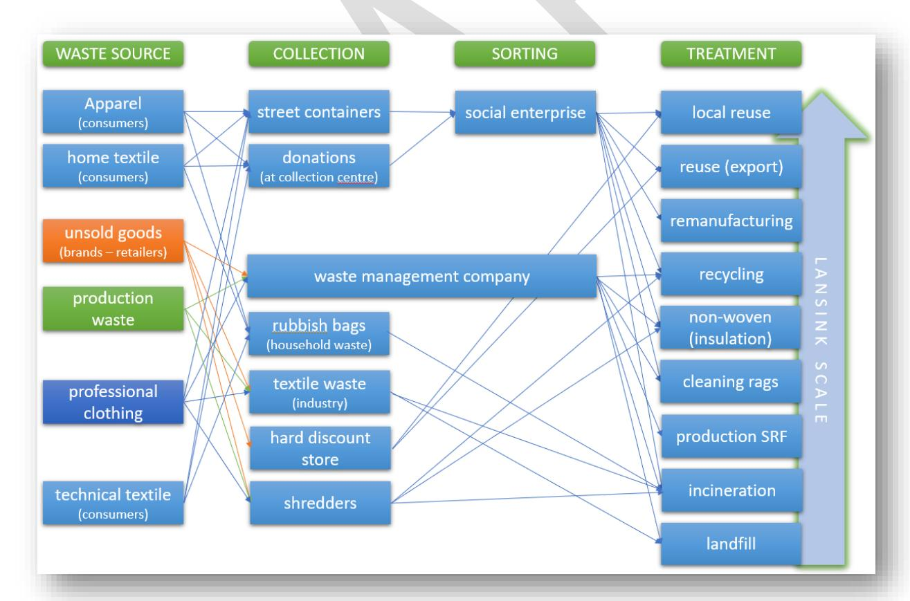

*Figure 31:Textile waste streams (Centexbel).*

The waste hierarchy should prevail in the selection of solutions to deliver the best overall environmental outcome.

## 4.10.1.Reuse

Seeing the all over literature there are four main limitations to Reuse (meaning collected textile and put again in the market for re-use purpose: meaning same application without transformation):

- Even if it has lastly change a lot due to the lack of budget of Citizen, second hand textile still suffer a little from a bad reputation. At that moment no criterium of quality are labelled on those textiles. Some make some progress by identifying problems but still remain marginal.
- Poor quality of textile: due to fast fashion, quality of garments is poor and after a first use could not be reused due to defects inside the textile.
- Lack of collection: still miss a lot of part of textile not collected.
- Miss also an industry to refurbish textile; especially regarding stains or fading. For holes or tears, seamstress already exist in most of Social and solid economy.

The reuse of textiles is a form of consumption that is constantly increasing in popularity and has many positive effects. However, there are still challenges associated with the reuse of textiles, for example problems related to time use or availability. Often, the consumer chooses the easiest and fastest way to get rid of unnecessary textiles or buying new ones.

The textile industry produces increasing amounts of waste, as the consumption of textiles only increases, and at the same time valuable resources and materials are wasted (Arnould ym. 2023, 35). Textile waste can primarily be reduced if consumers purchase a reasonable amount of clothing and other textiles and keep them in circulation for as long as possible.

Extending the service life of textiles has been found to be the most direct way to solve the textile industry's environmental problems. As textiles circulate for as long as possible, buying new ones decreases. (Arnould ym. 2023, 35.) The reuse of textiles means that the product or part of the product is used again for the same purpose for which it was originally designed (Suomen tekstiili ja muoti n.d).

Currently, only about two percent of consumer goods are reused, although according to an international study, the potential is 10–20 percent or even 50 percent, depending on the product. Up to 66 percent of clothes lie unused in wardrobes. Reuse and the related potential have not been considered sufficiently in social development. In waste management, much more has been invested in utilizing energy and organizing the recycling of materials (Circwaste 2022.)

## **The multiple benefits of reuse**

In addition to environmental issues, reuse offers other positive effects too. It gives tools to eliminate poverty and inequality, for many less well-off households, reuse may be a significant factor in terms of economy and livelihood. Necessary items can be purchased at a significantly lower price than new (Circwaste 2022.)

Recycling also provides plenty of jobs. According to RREUSE, a network of European re-use operators, reuse creates 70 jobs per 1000 tonnes of material. There are many types of jobs, such as low-threshold jobs as well as jobs that require a high level of expertise and know-how. Among other things, it is possible for the longterm unemployed to get a job in reuse. In Finland, reuse and recycling are one of the most significant fields in which you can find employment with the help of supported employment (Circwaste 2022.)

### **Slow Downs and challenges of increasing reuse**

In gathering data for a thesis, a survey was conducted regarding the reuse of textiles, and it brought out various reflections on the challenges and successes related to reuse of textiles. Reusing textiles is a part of

This project has received funding from the European Union's Horizon Research and Innovation program under grant agreement N° 101181901 and from the Swiss State Secretariat for Education, Research and Innovation (SERI). Posts and shares reflect only the views of all the involved partners. Neither the European Union nor the granting authority can be held responsible for them. This draft deliverable has not yet been validated by the granting authorities.

almost every Finn's life, at least in some way. For some, it means selling unnecessary textiles, for some it means giving textiles to a charity or buying used ones at a flea market.

Based on the survey results, it was possible to conclude that consumers are driven by the ease of reusing textiles. Textiles are taken to where it is easiest to take them and what is most easily available. The same applies to buying used clothes, i.e. we buy where they are easiest to find. Reuse could therefore be increased best by making the services easily available to consumers, such as in physical shops or shopping centres.

According to the survey, certain types of clothing, such as party wear, are rarely purchased, and the reason may be that their availability is limited or hard to identify. It is difficult to know which store to go to find a party dress that suits you and is still the right size. It's easier to go to a traditional store where you know you'll find what you're looking for. Part of the reason for choosing the easiest option is probably the challenges of time management. Selling used and buying new takes time, and facilitating this and discussing the theme are important measures to increase the reuse of textiles.

Based on the survey, selling and donating are more popular than buying used. In an ideal situation, these would be in balance, but currently, judging by the results of the survey, products are sold and donated in much larger quantities than there are buyers for the products. This creates imbalance in the market.

Charitable donations are a popular way to put clothes into circulation. One of the reasons for the popularity of charities is their accessibility and ease of use. The service is available to everyone and there are drop-off points all over Finland. This could also be used as a model in other reuse services. By improving accessibility and the ease of use, the load of clothes can be distributed more evenly between different services.

## 4.10.2.Refurbish/remanufacture

The main challenge arises when products – and consequently the waste they generate – are not designed for repair. Refurbishing low-quality textiles is clearly not economically viable, and the same applies to remanufacturing.

For repair and remanufacturing to be feasible business models, textiles must meet a minimum quality threshold.

## 4.10.3.Repurpose (upcycling or downcycling)

Upcycling or downcycling, are terms largely used to distinguish close loop recycling or open loop recycling. However, it leads to a lot of incomprehension.

Some people consider the term "down or up cycling" regarding the value of the product produced. Then we consider that "recycling" is a close loop as it should be at the same level of price. But what about considering a garment with higher quality and more sustainable? Is it recycling or upcycling?

Other consider up or down in reference to technical properties. In that sense what about a denim and a filtration media. Denim is clearly at a higher level of properties

If we also consider sustainable or durable value, a garment will last less than a rag and even less than a furniture and less than thermal insulation textile for building. So, what about ranking up, down or recycling?

- Price consideration or use of the product: o Garment is recycled o Furniture will be upcycled o Insulation textile and rag will be downcycled o Moreover, what about energy valorization?
- Technical consideration (considering Mechanical resistance)

- o Garment and rag are upcycled (higher resistance) o Furniture would be recycled or downcycled o Insulation panel will be downcycled
- Sustainable consideration: o Sustainable panel is upcycled o Rag could be upcycled or recycled depending the time of use o Furniture will be recycled o Garment will be downcycled as it is the product which last the less

Taking those considerations, we should agree that recycling into a product could be identified in several manner as up, re or down cycle. For more clarity, it is so advisable to talk about repurpose or recycle.

Anyway, repurpose and open loop recycling should be pushed as most of the open loop recycled products last more than apparel textiles.

When we work in waste management, one of the most important problems is compartmentalization of different areas of activity. In waste management, waste from one could be a gold mine for another market. Unfortunately, global supply chain or commercial activity are strongly linked to the market or activity domain where the product is dedicated. Building market will not talk to plastic or textile market, because market is leaded by sells. It is hard to sell building to textile distributor or manufacturer. Generally, you deal with architect, Construction groups or public buyers. And in a market everything is structured around building. This mentality is replicable to any domain of activities.

Only innovation can break down barriers. That is where call could help to push inter-disciplinary and transmarket circular solutions.

One other problem that is typically link to all waste market is the is the knowledge of the location of the waste. Mapping where and how much waste are available is the starting point of every circular model. Some public agency could help for that. Anyway, the quantity available are always moving and a system that make inventory of this mapping each year or 2 years is clearly not sufficient.

## 4.10.4.Recycling

Textile recycling has been developed in the early XIX century in Italy to face a major crisis on the supply of wool. Semi worsted or worsted carding system have been reviewed to open textile fabric back into fibre. The first pulling line was born.

It is important to understand that recycling channels are specific to materials. They are not very flexible. In other words, it is sometimes necessary to adapt the material to be recycled to the available process, for example through rigorous sorting, rather than the other way around. Mechanical recycling, to produce lowgrade material, currently offers more possibilities.

For this reason, it is appropriate to present recycling technologies as a common offering for all waste streams, which can be implemented according to needs and material/process compatibility.

There are currently four main types of technology at different stages of development (97). There are some variations within each of these categories.

This project has received funding from the European Union's Horizon Research and Innovation program under grant agreement N° 101181901 and from the Swiss State Secretariat for Education, Research and Innovation (SERI). Posts and shares reflect only the views of all the involved partners. Neither the European Union nor the granting authority can be held responsible for them. This draft deliverable has not yet been validated by the granting authorities.

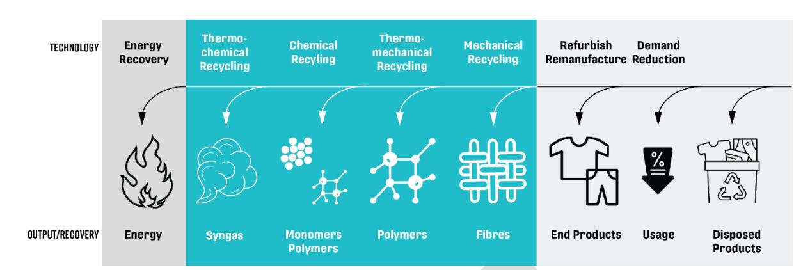

*Figure 32 : Categorization of textile recycling technologies (blue) in the wider scope of solutions for textile waste reduction - TEX2CE White paper* '*Textile fibre recycling technologies*'*.*

Regardless of the availability of each technology, the choice will essentially depend on the type of material to be processed and the desired end product: original fibres frayed to varying degrees of fineness, monomers or polymers for producing new filaments/fibres, synthesis gas, etc.

Important note: at the time of writing this section, the recycling sector, like the collection and sorting sector, is facing significant difficulties. The most striking consequence is that recyclers generally refuse to carry out recycling operations without a guarantee of markets for the end products. It is up to the company offering material for recycling to find a reliable customer!

The information shared below is limited to the essentials. Numerous publications are available on the web for more details. Here are 2 documents' recommendations:

- TEX2CE White paper Textile fibre recycling technologies (98)
- Study on the Technical, Regulatory, Economic and Environmental Effectiveness of Textile Fibres Recycling (99)

### *4.10.4.1. Preparation for recycling*

Recycling requires preparation, a key and often demanding step that can either enable or prevent recycling from taking place.

First and foremost, each recycler defines a set of criteria specific to the technology or technologies they use, in line with their flow management, costs, etc. The final decision on the feasibility of recycling always rests with the recycler, based on the offer proposed.

Important selection criteria include:

- The material(s)
- The nature of the products to be recycled: production scraps, fabric pieces, clothing, etc.
- The presence of disruptive elements such as coatings, various accessories, etc.
- The presence of undesirable chemicals due to treatment or contamination
- The condition of the products to be recycled: cleanliness, wear and tear, age, etc.
- The quantity to be recycled
- Frequency: one-off or regular deliveries

As a general rule, preparation will involve one or more of the following steps, depending on the recycler's requirements:

- Sorting by product: for example, knitwear or woven fabrics, T-shirts, etc.

- Colour sorting: visual or using a camera if automated
- Sorting by composition: manual (not very accurate) or NIR (Near Infra Red) technology
- De-linting = removing non-textile items from the products (buttons, leather labels, etc.)

Naturally this preparation concern mostly garment and post consumer waste. If we consider post industrial or technical waste, nearly no preparation are required for mechanical recycling. Except if you consider thermomechanical, physico chemical, chemical or thermal recycling.

## *4.10.4.2. Mechanical recycling*

Mechanical recycling (Figure 33 [: Mechanical recycling -](#page-69-0) TEX2CE White paper 'Textile fibre recycling [technologies](#page-69-0)'., Figure 34 [: Mechanical typical recycling line \(Andritz Line\).\)](#page-69-1) is currently the most accessible method at an industrial level. It is suitable for a wide variety of textiles, subject to specific adjustments. Most materials can be processed, including blends. The technology is well established and is still evolving in an attempt to refine the process and enable more fibre-to-fibre recycling, with a view to producing yarns. The cost of the facilities is very low compared to other recycling.

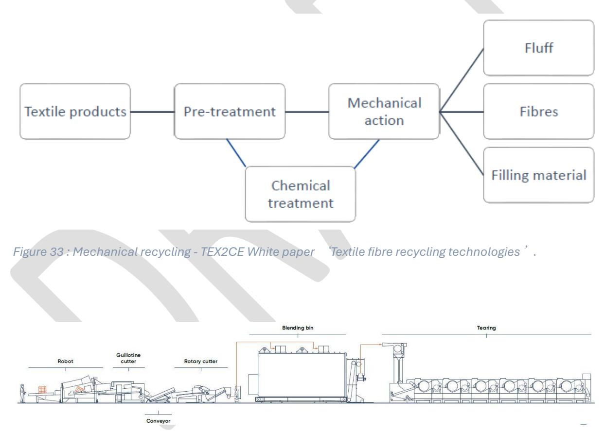

*Figure 34 : Mechanical typical recycling line (Andritz Line).*

It enables the production of four main categories of products:

- Shredded material: the textiles to be recycled are shredded fairly coarsely. Not all fibres are separated, and small fragments of fabric may be found. This material is used, for example, in the manufacture of insulation.
- Cut material for patch work or rag applications.

- Fibres for spinning: the fibres must be extracted from the fabrics so that they can be fed into a spinning process. To do this, they must have sufficient properties in terms of length, strength, etc. It should be noted that these fibres will generally only make up a small proportion of the final product (e.g. 70% virgin fibres, 30% recycled fibres).
- Fibres for veil and non-wovens: less expectation are required to make nonwoven. For most of the application they are thermoformed after (automotive). Nonwoven technology can so be adapted in regard to fibre shape: Airlaid, airlay, wetlaid (less used due to drying) or Carding.

Preparation is essential, as mechanical recycling does not alter the nature or colour of the fibres.

A major problem in mechanical recycling is the presence of non-textile elements in the products, such as buttons, leather labels, rivets, zippers, etc. Their removal can be done mechanically for applications such as insulation that require less fineness. On the other hand, for spinning, the fibres must be free of any hard elements, particularly metal, which generally requires manual delining, which is very time-consuming and therefore very costly. This explains the preference for production scraps that contain only fabric, selvedges, etc., but no accessories added during manufacture.

When considering the yield of this type of recycling, it is important to take into account the significant reduction in fibre length. In the case of short fibres, such as cotton, this is clearly an obstacle to the use of recycled fibres in spinning.

Moreover, for cost reason, production rate should be high. Then it remains unopen yarn and unopen fabric that can lower the quality of the final product especially in close loop (yarn) production.

Moreover, this high-speed process tends to lower the length of fibres. Man from the trade know that random alignment of fabric in cutting process already create a great dispersity in fibre length. Moreover, pulling line will lower this length from 15 to 30% depending on pulling line speed, drum pin density and space between opening roller and retaining rollers. Mainly due to a big amount (around 30% in number) of short length fibre (< 7 mm), the recycled fibre is limited in a close loop use (spinning industry mainly). It will be less a problem considering production of insulation layer in garment by producing a nonwoven.

Only one process is revendicated for close loop recycling. This process was developed by PURFI GLOBAL and is named "unspinning process". This process allows to remove fibres directly from fabrics without damaging its length. It is so revolutionary but is unfortunately only applicable to fabric rolls and so not adapted to other textile products (garment, yarn, separated pieces).

## *4.10.4.3. Thermomechanical recycling*

The principle of recycling is simple. It involves taking thermoplastic material used to manufacture various textiles (polyester, polyamide, polypropylene, etc.), heating it to melt it, and then using this material [\(Figure](#page-70-0)  35 : Thermomechanical recycling - TEX2CE White paper '[Textile fibre recycling technologies](#page-70-0)'.).

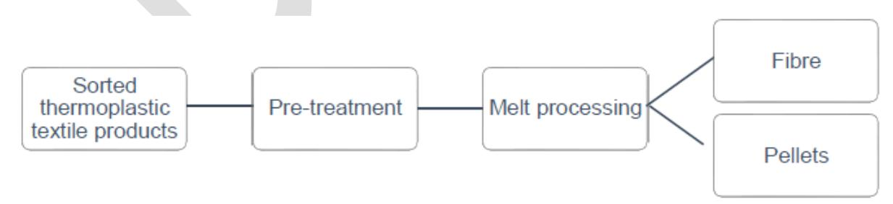

*Figure 35 : Thermomechanical recycling - TEX2CE White paper* '*Textile fibre recycling technologies*'*.*

This project has received funding from the European Union's Horizon Research and Innovation program under grant agreement N° 101181901 and from the Swiss State Secretariat for Education, Research and Innovation (SERI). Posts and shares reflect only the views of all the involved partners. Neither the European Union nor the granting authority can be held responsible for them. This draft deliverable has not yet been validated by the granting authorities.

In this recycling method, the textile material is first delaminated, then prepared for the process (grinding + compacting) and extruded after melting. Depending on the purity and properties of the material, different directions can be taken: production of filaments for 3D printing, production of filaments for textiles, production of pellets for various applications. While this technology is simple in principle, its implementation can be quite tricky. The presence of impurities, trims or finishing poses a lot of problems, and certain properties of the material can be degraded by the process, requiring the use of costly additives or additional treatment such as SSP or LSP (Solid or Liquid state polycondensation). A lot of projects tested this technology (REAPS, SCIRT). Post-consumer waste has always been tricky to process. This problem has obliged to move, in most of the case, to post industrial waste for the trials.

Industrial initiatives:

- Seaqual initiative
- Ocean Safe

## *4.10.4.4. Physicochemical recycling (dissolution)*

Most of man-made or natural fibres as well as some synthetic fibres could be dissolved in some specific solvent (Figure 36 [: Schematic principle of dissolution \(yellow: solvent molecule; blue : polymer molecules\).](#page-71-0)  [\(92\)\)](#page-71-0).

In this process, no chemical reaction takes place. Solvent molecules just place in between marcomolecular molecules (polymers) creating space that allow polymer to become a gel or a liquid.

*Figure 36 : Schematic principle of dissolution (yellow: solvent molecule; blue : polymer molecules). (92)*

## Mostly, cellulosic fibres are recycled at industrial scale (mostly cotton).

Physico-chemical recycling of cotton involves extracting cellulose from cotton using process similar to viscose or lyocell manufacturing processes. The cotton fibres are broken mechanically and then dissolved to form a cellulosic gel that can be used to manufacture yarn by solvent spinning for textile applications (Figure 37 [: General process scheme for the recycling of cotton textiles via a pulping process -](#page-71-1) TEX2CE White paper '[Textile fibre recycling technologies](#page-71-1)'.).

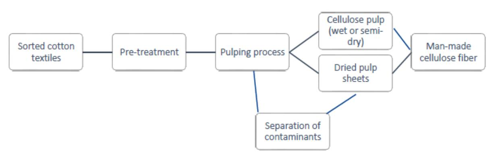

*Figure 37 : General process scheme for the recycling of cotton textiles via a pulping process - TEX2CE White paper* '*Textile fibre recycling technologies*'*.*

At the industrial scale we can name (non-exhaustive list):

- Worn again
- Lenzing AG (Refibra)
- CIRC
- Circulose

Some tests have been made on wool, Polyamide, Polypopylene, acrylic and PET, but remain at labscale actually.

### *4.10.4.5. Chemical recycling*

Chemical recycling encompasses various technologies based on the chemical decomposition of materials. It can be applied mostly on synthetic textiles fibres.

- Synthetic fibres

The chemical recycling of synthetic fibres uses chemical reactions to break down textile fibres into their basic components, polymers or monomers, which can be used as (secondary) raw materials for the manufacture of new fibres of the same composition (Figure 38 [: General process scheme for the recycling](#page-72-0)  [of synthetic fibres like polyamide and polyester into the same -](#page-72-0) TEX2CE White paper 'Textile fibre recycling [technologies](#page-72-0)'.). The advantage of this process is that it produces a material that is as close as possible to the virgin material.

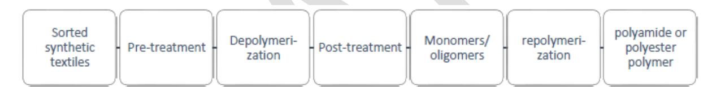

*Figure 38 : General process scheme for the recycling of synthetic fibres like polyamide and polyester into the same - TEX2CE White paper* '*Textile fibre recycling technologies*'*.*

Some examples of initiative for chemical recycling, recovering monomers:

- At semi-industrial scale:
- Recycelit (PET)
- Carbios (PET)
- Eastman (PET)
- CIRC (PET)
- Aquafil (Polyamide 6, PA6)
  - At lab scale with semi-industrial scale coming nearly:
- Ecollant (Polyamide)
  - At lab pilote scale
- Synthetica (Polyamide)

## *4.10.4.6. Thermolysis recycling*

Thermolysis recycling of textiles is a process that uses heat to break down textile materials into basic chemical components, which are most often used to produce energy or secondary raw materials

This project has received funding from the European Union's Horizon Research and Innovation program under grant agreement N° 101181901 and from the Swiss State Secretariat for Education, Research and Innovation (SERI). Posts and shares reflect only the views of all the involved partners. Neither the European Union nor the granting authority can be held responsible for them. This draft deliverable has not yet been validated by the granting authorities.

(chemicals) for industry (Figure 39 [: General process scheme for thermo-chemical recycling via pyrolysis,](#page-73-0)  liquefaction, or gasification - TEX2CE White paper '[Textile fibre recycling technologies](#page-73-0)'.).

It should be noted that this process is not always considered recycling, especially if it is used to produce fuels rather than materials that can be reused in the manufacture of other products. In such cases, it may be considered energy recovery.

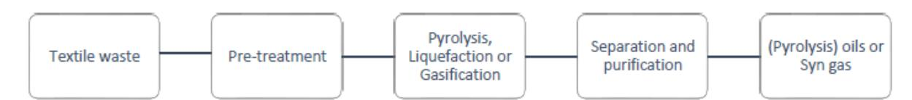

*Figure 39 : General process scheme for thermo-chemical recycling via pyrolysis, liquefaction, or gasification* 

*- TEX2CE White paper* '*Textile fibre recycling technologies*'*.*

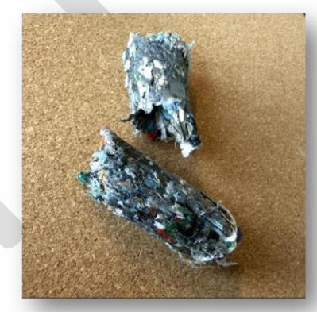

## *4.10.4.7. Production of solid recovered fuel (SRF)*

Although it is not recycling, it is worth mentioning the existence of a process for producing solid recovered fuel (SRF) (Figure 40 [: SRF pellets \(photo](#page-73-1)  [Centexbel\).\)](#page-73-1). The process involves treating solid waste (a mixture of textiles, plastics, etc.) to obtain an alternative fuel with high calorific value, which is most often used to fuel cement kilns. SRF generally comes in the form of pellets of varying density, depending on its intended use.

*Figure 40 : SRF pellets (photo Centexbel).*

## *4.10.4.8. Incineration with energy recovery*

The waste is burned in an incinerator. The resulting heat is used to heat water and create steam, which then turns a turbine. This turbine then generates electricity and/or heat for district heating. Fumes are filtered to limit pollution, and solid residues are treated or recycled.

## *4.10.4.9. Landfilling*

While landfilling of textiles decreased in most countries up to 2020, it increased in Bulgaria, Estonia, France, Poland, Latvia, Lithuania, the Netherlands and Hungary (Eurostat, 2023b). However, the data may have been influenced by the trade in used and waste textiles between EU countries. This is because textiles discarded during sorting operations and subsequently landfilled – including imported textiles waste – are reported in the receiving country.

Around 10–12% of locally processed textile waste in the EU was landfilled in 2022, but a significant proportion of discarded clothing also ends up in landfills outside Europe after export. This is particularly the case in Africa, but these flows are not systematically recorded in official European statistics (91).

Naturally, this way of ending life of textile is clearly not acceptable, especially if we consider the wild landfills in or out of Europe: Chili, Ghana, Kenya, Cambodia even in Romania.

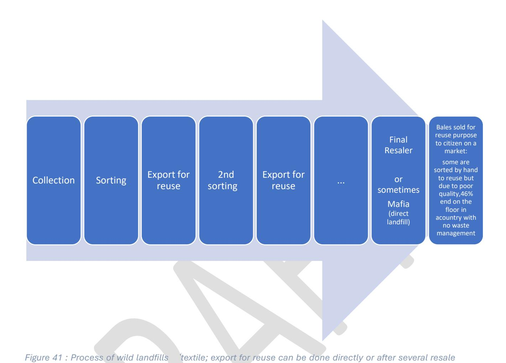

*phase.*

Some of the reused textile can be sold to resellers that guarantee reuse purpose. Anyway, those bales can be resold to citizen or other resellers for reuse purpose, but due to the main sorting process in between, a significant part f those bale contains poor quality textiles. Even more with the growing of fast fashion volume. It is evaluated that 46% of those bales are thrown away due to poor quality. Due to the lack of waste management or sometimes due to local mafia, the waste end in landfill. However, this reuse market generates significant employment or generate significant profits or simply could be necessary to poor populations. That is why this problem is hard to solve. (100) (101)

In other task, meeting with stakeholders especially NGO for those countries were made. It appears that this global wild landfill is not done voluntary but more due to a lack of waste management system. However, in some countries organized crime is still making money with this kind of waste management.

Therefore, it is clearly a hard political problem to address. Helping countries to have an appropriate waste management system could help to fight against wild landfills and pollution but also against organized crime. In another hand, waste is a valuable material and will be more and more in the future. We should not facilitate lower wage countries to access to this resource as we invest and finance a system to allow Europe sovereignty. Moreover, socially and ethically but also for health reasons, we should not agree or promote management of our waste (worst one) by other countries than European one. However, in most advanced management countries, landfill is well managed to avoid soil or air pollution.

This project has received funding from the European Union's Horizon Research and Innovation program under grant agreement N° 101181901 and from the Swiss State Secretariat for Education, Research and Innovation (SERI). Posts and shares reflect only the views of all the involved partners. Neither the European Union nor the granting authority can be held responsible for them. This draft deliverable has not yet been validated by the granting authorities. The fate of EU-exported used textiles in receiving countries is highly uncertain as limited and mostly anecdotal evidence is available. In the African countries studied, the import of used textiles seems to be mainly meant for local reuse. This is because there is a demand for cheap, used clothes from Europe, which

Anyway, we must avoid as much as possible this end of life.

Moreover, a large proportion of textiles are not collected separately and end up in mixed household waste, potentially being sent to landfill.

## 4.11. EU exports of used textiles in Europe's circular economy

Europe faces major challenges managing used textiles, including textiles waste. As reuse and recycling capacities in Europe are limited, a large share of used textiles collected in the EU is traded and exported to Africa and Asia, and their fate is highly uncertain 102).

Note: the graph and figures reported in this section are an update (EEA 05/25) of the data originally reported (EEA 02/23).

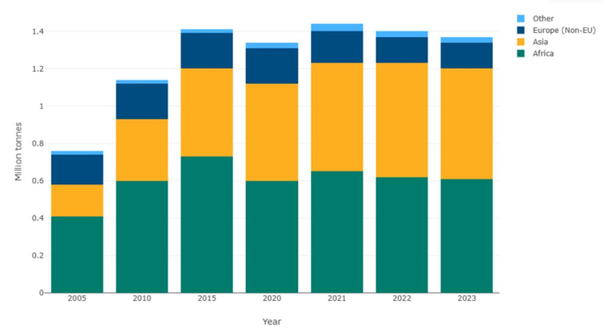

*Figure 42 : Yearly volume of used textiles exported from the EU (Circularity Metrics Lab).*

Between 2005 and 2023, the export of used textiles from EU countries more than doubled to around 1.37Mt in 2023 (Figure 42 [: Yearly volume of used textiles exported from the EU \(Circularity Metrics Lab\).\)](#page-75-1) or 3.1 kg per person, and previous EEA publications have shown that it nearly tripled since 2000. The volume has been relatively stable since 2015, with Africa and Asia as the main receiving continents. In 2020, there was a drop in exports due to the Covid-19 pandemic (103).

The exports mainly include worn clothes and other worn textile articles and only a minor amount of rags and textile scraps. There is currently very limited information on the quality of used textiles due to the absence of specific reporting requirements for textiles that are not considered as waste, meaning it is not possible to distinguish between sorted and unsorted quantities. Between 2005 and 2023 the main recipients of exported used textiles were Africa and Asia, with Asia steadily catching up with Africa to equal levels of 44,6% and 43,2% respectively in 2023. While exported textiles to Africa are mostly reused or end up in dumps or burned in open landfills, textiles exported to Asia are largely recycled or re-exported (104).

seem to be preferred to new items. What is not fit for reuse mostly ends up in open landfills and informal waste streams (102).

The following diagram (Figure 43 [: Flow of used textiles collected in the EU\)](#page-77-0) provides an interesting overview of the used garments streams. Note the starting point for the waste streams refers to "38% of textiles collected separately for reuse or recycling". This seems to be in contradiction with levels reported in other sections that are as low as 12-15% of textiles collected separately. The latter percentages are for all of EU countries whereas the 38% refers to countries who collect data related to textile waste.

Worth noting that only 10% of the collected textiles end up in the second-hand stores in Europe. The major part is heading non-EU European countries (11%), Africa (46%) and Asia (41%). The share between the different possible treatments, being mostly reuse and recycling, is not precisely known.

This project has received funding from the European Union's Horizon Research and Innovation program under grant agreement N° 101181901 and from the Swiss State Secretariat for Education, Research and Innovation (SERI). Posts and shares reflect only the views of all the involved partners. Neither the European Union nor the granting authority can be held responsible for them. This draft deliverable has not yet been validated by the granting authorities.

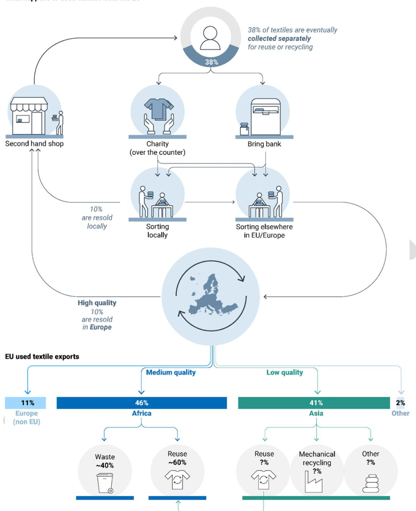

This project has received funding from the European Union's Horizon Research and Innovation program under grant agreement N° 101181901 and from the Swiss State Secretariat for Education, Research and Innovation (SERI). Posts and shares reflect only the views of all the involved partners. Neither the European Union nor the granting authority can be held responsible for them. This draft deliverable has not yet been validated by the granting authorities. In the African countries studied, the import of used textiles seems to be mainly meant for local reuse. This is because there is a demand for cheap, used clothes from Europe, which seem to be preferred to new items. What is not fit for reuse mostly ends up in open landfills and informal waste streams. Several African countries have been debating banning used textile imports as a way to protect and strengthen local textile

*Figure 43 : Flow of used textiles collected in the EU*

The fate of EU-exported used textiles in receiving countries is highly uncertain as limited and mostly anecdotal evidence is available. The findings summarised below are based on analysing different sources, and an overview and discussion of the available information is included in the underpinning report (102).

production (Sustainable Amor, 2020). This indicates that imports also bring negative social and environmental impacts (102).

In Asia, however, most of the used textiles are imported to so-called economic zones where they are sorted and processed. In the countries studied for this briefing, import for local reuse is restricted. Instead, used textiles seem to be recycled locally, mostly downcycled into industrial rags or filling, or re-exported either for recycling in other Asian countries or reuse in Africa. Textiles that cannot be recycled or re-exported are likely to end up in the general waste management system, most of which is landfilling (102).

## 4.12. The destruction of returned and unsold textiles in Europe's circular economy (105)

Unsold or returned textile goods mostly correspond to overproduction and have a negative impact on the environment, in multiple ways. One part of these volumes is destroyed, in similar ways as textile waste.

This briefing proposes different perspectives to analyse this area of concern.

EU policymakers have recently decided to introduce a direct ban on the destruction of textiles and footwear with some exemptions for small, micro and medium-sized companies. In this briefing, the EEA provides an overview of what is currently known about the volumes and destruction of returned and unsold textiles in Europe. The growth of online shopping, flexible return practices, changed consumer preferences and fastfashion business strategies in Europe have resulted in increased shares of returned and unsold textiles. Over the past years, fast fashion as well as luxury brands, have been reported to destroy returned or unsold clothing, shoes and other textiles. Textile product destruction, where products are destroyed by retailers, brands or manufacturers before use, is an example of a resource 'take-make-waste' approach, highlighting the inefficiency of current linear production-consumption systems which cause avoidable negative impacts on the environment and climate (105).

## 4.12.1.Key figures

Unsold goods are intended to be sold and are not considered waste. However, these products can end up in waste streams, contributing to the total amount of waste that needs to be managed.

- According to available studies, it is estimated that 4-9% of all textile products sold in Europe are destroyed before they are used. This amounts to 264,000-594,000 tons of textiles being destroyed each year.
- In Europe, the average return rate for clothing purchased online is estimated at 20%. In other words, one out of every five garments sold online is returned. Return rates for online purchases are up to three times higher than for in-store purchases. It is estimated that 22-43% of all returned clothing purchased online ends up being destroyed.
- The industry faces an expensive challenge with returned and unsold textiles. Most are resold or sold in outlets. However, the fashion and textiles industry has been destroying returned and unsold clothing and other textile products for decades, which has had significant negative effects on the environment and climate change.
- Due to the EU's recent decision to ban the destruction of textiles and footwear, a way must be found to sell all returned and unsold textiles to avoid destruction.

## 4.12.2.Definitions

In its briefing, the EEA considers the destruction of returned or unsold products as the discarding or intentional damaging of these products after which they become waste. As such, recycling is considered destruction, given the need to, for example, shred or dismantle products for this purpose. Considering recycling, incineration and landfilling of returned or unsold products as destruction also corresponds to how product destruction is defined in the Ecodesign for Sustainable Products Regulation (ESPR) proposal

This project has received funding from the European Union's Horizon Research and Innovation program under grant agreement N° 101181901 and from the Swiss State Secretariat for Education, Research and Innovation (SERI). Posts and shares reflect only the views of all the involved partners. Neither the European Union nor the granting authority can be held responsible for them. This draft deliverable has not yet been validated by the granting authorities.

and regulation, i.e. products that are destroyed without ever being used for their intended purpose (EC, 2022). Roberts et al. (2023) also define product destruction as 'a situation whereby consumer products are willingly disposed of before use'.

### Other definitions to be considered (105):

- **Returned goods**: products that have been sold but have been returned by the customer to the retailer under their right to return. These products may be fully functional or damaged.
- **Unsold – overstock**: products that are produced but have never been sold. These products come straight from the production line.
- **Unsold – obsolete products**: products for which there is no longer any demand.
- **Unsold – damaged products**: products that have been damaged in transit or storage.
- **Unsold recalled/defective products**: products taken off the market due to a defect or quality issues.

## 4.12.3.Unsold products' destruction

The following graph (Figure 44 [: Proportion of textile products destroyed.\)](#page-79-1) shows the proportion of textiles destroyed out of the total volume of online sales and the total volume of products placed on the market (stock), based on available data. As products sold online form part of the total volume of products put on the market, there is some overlap in the data. This is because it is unclear what proportion of unsold products are returned items. Based on the available data, it is estimated that 4–9% of all textile products placed on the market are destroyed without ever being used for their intended purpose.

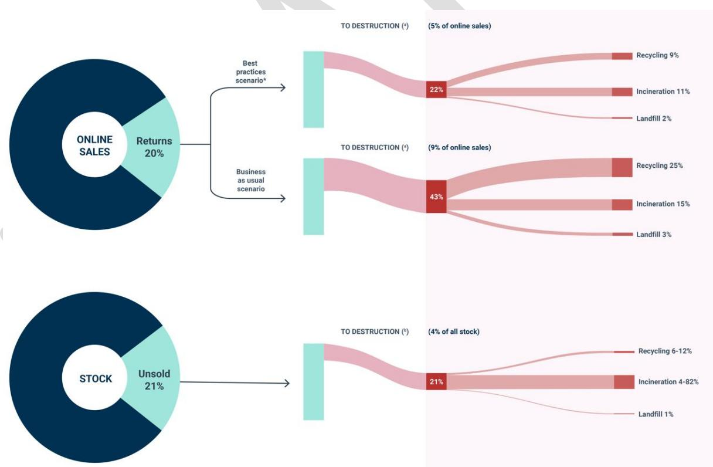

*Figure 44 : Proportion of textile products destroyed.*

Reducing excessive returns and optimising forecasting could reduce the volumes of returned and unsold textiles but does not effectively tackle the underlying systemic reason, namely that overproduction and

This project has received funding from the European Union's Horizon Research and Innovation program under grant agreement N° 101181901 and from the Swiss State Secretariat for Education, Research and Innovation (SERI). Posts and shares reflect only the views of all the involved partners. Neither the European Union nor the granting authority can be held responsible for them. This draft deliverable has not yet been validated by the granting authorities.

destruction is deemed acceptable in the textiles industry and even makes economic sense. This could be tackled through the introduction of policies.

## 4.12.4.Policy options for reducing returns and overproduction

To achieve a genuine shift away from large quantities of customer returns and unsold goods, a combination of hard and soft policy interventions can be employed. Hard policy instruments, such as laws and taxes, restrict consumer choices and alter financial incentives. In contrast, soft policies typically include 'moral persuasion', educational campaigns, and, more recently, behavioural public policy approaches, such as nudging (Banerjee et al., 2021). Ultimately, policy interventions can aim to increase production costs so that overproduction becomes a financial liability for brands, incentivising them to redistribute goods.

EU ban on the destruction of unsold textiles and footwear

One of the key actions proposed in the EU Strategy for Sustainable and Circular Textiles was to stop the destruction of unsold and returned textiles.

On 5 December 2023, the Council of the European Union and the European Parliament reached a provisional political agreement on the proposed Eco-Design Requirements for Sustainable Products (ESPR) regulation. This new legislation replaces the 2009 Ecodesign Directive, extending its scope beyond energyrelated products to significantly improve circularity, energy efficiency, resource effectiveness, and other environmental sustainability aspects for specific product categories sold in the EU. Article 20 of the proposed ESPR introduces a general transparency obligation for economic operators discarding unsold consumer products, requiring them to disclose the number of such products discarded per year. The same article also allows for the adoption of specific measures to prohibit the destruction of certain types of unsold consumer products.

The EU's co-legislators are currently deciding whether to impose a direct ban on the destruction of unsold textile products. Small and micro companies would be exempt from this ban, while medium-sized companies would benefit from a six-year exemption. The ban would take effect 2 years after the regulation comes into force (Council of the European Union, 2023).

Some proponents believe that forcing companies to publicly disclose the amount of unsold goods and returns would draw attention to the scale of the problem, indirectly forcing them to reduce these amounts due to the risk of negative branding (Roberts et al., 2023).

The introduction of extended producer responsibility (EPR) systems for textiles across the EU is likely to facilitate moving unsold textiles up the waste hierarchy. The main purpose of an EPR scheme is to transfer responsibility for waste management, including collection and treatment, to the companies that sell products.

The coming years will reveal how effective the textiles industry will be in avoiding the destruction of returned and unsold textiles in Europe, with the new EU ban coming into force.

It is interesting to note that several factors can influence the volumes of products to be considered.

## 4.13. The case of France, under EPR managed by Refashion

With France being the most advanced EU land when it comes to EPR, it is particularly interesting to dig into the activity report of Refashion for 2024 106).

Refashion manages the collection and subsequent treatment of clothing, household linen and footwear (CHF). The key figures for 2024 are the following:

- 3.5 billion articles placed on the market, representing an estimated 0.89Mt
- 0.29Mt waste was separately collected, out of which 0.21Mt waste was sorted

- 47.948 self-deposit banks are available in 16.728 municipalities. This represents 1 collection point per 1.414 inhabitants
- Sorting carried out in 73 sorting centres (55 in France)
- 99.88% were valorised o 56.8% reused o 24.32% transformed in material for recycling o 10.15% transformed in cleaning clothes o 7.97% transformed in SRF (Solid Recovered Fuel) o 0.64% incinerated with energy recovery
- 79.8% of non-reusable products were recycled

On the repair front, consumers can benefit from vouchers called "Bonus Réparation" if they use the service of a certified professional.

- 554.062 products were repaired. 80% of repairs covered footwear, 20% clothing

More details are available in the table hereunder (Figure 45 [: Refashion Key Performance Indicators of the](#page-82-0)  [Clothing Household Linen and Footwear Industry.\)](#page-82-0):

This project has received funding from the European Union's Horizon Research and Innovation program under grant agreement N° 101181901 and from the Swiss State Secretariat for Education, Research and Innovation (SERI). Posts and shares reflect only the views of all the involved partners. Neither the European Union nor the granting authority can be held responsible for them. This draft deliverable has not yet been validated by the granting authorities.

*Figure 45 : Refashion Key Performance Indicators of the Clothing Household Linen and Footwear Industry.*

In the following extract (Figure 46 [: Refashion Annual barometer of consumption of textiles and footwear in](#page-83-2)  [France.](#page-83-2) ), Refashion highlights a series of key elements related to 2024, the rise of sales being the number 1 (107).

**# outwextiles change from footwear market to the market on the market**

With 4 categories responsible for 90% of growth in this department stockings, sweaters, casual/jeans pants and T-shirts.

- Pregnation for adults, when and men.
- **Decline in the children's and especially the baby section, with fewer births and a shift towards second-hand items.**

- The ever-increasing apetance for **'very accessible prices'** explains the rise, as shown by the **strong growth of pure players [+29.9%] and discounters [+10.3%]**.
- And also a **'catch-up effect'**, linked to a less constrained household budget due to the lower impact of inflation than in previous years.

This project has received funding from the European Union's Horizon Research and Innovation program under grant agreement N° 101181901 and from the Swiss State Secretariat for Education, Research and Innovation (SERI). Posts and shares reflect only the views of all the involved partners. Neither the European Union nor the granting authority can be held responsible for them. This draft deliverable has not yet been validated by the granting authorities.

*Figure 46 : Refashion Annual barometer of consumption of textiles and footwear in France.*

## 4.14. Textile waste collection and treatment in Belgium

There are no statistics available at national level. The following figures provide a good overview for the 3 main regions: Flanders, Wallonia and Brussels.

The top priority for all sorting centres is local reuse, which provides the best revenue. However, this segment is under pressure due to the overall decline in the quality of collected textile products.

The sector is progressively adapting its processes to meet the increasingly stringent requirements of recyclers for the quality of the feedstock they need. These improvements are mainly being achieved through the use of semi-automated sorting lines and NIR (near-infrared) equipment to determine fibre content.

## 4.14.1.Flanders

The latest figures available cover the waste collection and treatment for 2022 (108).

In Flanders, consumers can dispose of their textiles through three channels: residual waste, selective collection of textiles, or via direct drop-off at a reuse centres. The 33.000 tons still discarded via residual waste in 2022 were incinerated with energy recovery. The remaining 50.000 tons of textiles selectively collected in Flanders were intended for reuse or recycling. This flow has continued to fluctuate around that value over the last decade (48.5 kt to 54.7 kt) (108).

Figure 47 [: Processing of end-of-life textiles -](#page-84-1) Circular Flanders illustrates the main streams and actions related to textile waste streams. For the selectively collected textiles (street containers, direct drop-off at reuse centres), reuse was the first option (5.4% reuse in Flanders, 29.1% outside). 18.5% were processed through open loop recycling.

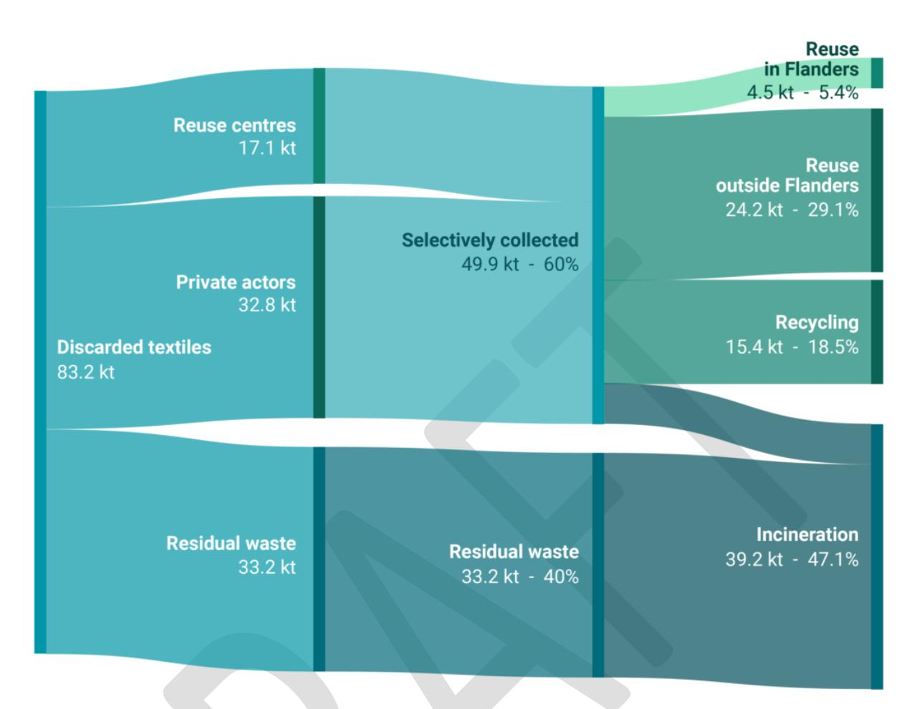

*Figure 47 : Processing of end-of-life textiles - Circular Flanders*

## 4.14.2.Wallonia/Brussels

The latest figures available cover the waste collection and treatment for 2023 (109). These figures cover the activities of the members of RESSOURCES, the federation for social and circular enterprises of the Brussels and Wallonia regions.

Nearly 30,000 tonnes were collected selectively in 2023 in Wallonia and Brussels, through 2 different methods:

- National/regional: implemented by three operators who collect most textiles via collection bins and sort them in industrial or semi-industrial centres.
- Local: implemented by smaller operators who mostly collect textiles via their points of sale.

These two systems do not offer the same results in terms of reuse.

Local collection allows for better control at source of the textiles deposited, which significantly increases overall quality. The reuse rate is significantly higher than that of operators working at national or regional level.

One major observation has remained consistent for several years: the overall quality of collected textiles is continuously declining. On the one hand, the rise of fast fashion and ultra-fast fashion is leading to a worrying deterioration in the quality of clothing. On the other hand, better-made items are increasingly

This project has received funding from the European Union's Horizon Research and Innovation program under grant agreement N° 101181901 and from the Swiss State Secretariat for Education, Research and Innovation (SERI). Posts and shares reflect only the views of all the involved partners. Neither the European Union nor the granting authority can be held responsible for them. This draft deliverable has not yet been validated by the granting authorities.

finding their way to social enterprises after having already circulated through various second-hand sales networks, particularly online (109).

The main figures:

- Total collection: 29.5 Kt (26 kt in street containers)
- Split Wallonia/Brussels: W 23.8 kt, BRU 5.7 kt
- Local reuse: 3 kt, export for reuse: 8 kt
- Preparation for recycling: 4.5 kt
- Incineration: 2.6 kt

## **5. Circularity barriers and improvement pathways**

The transition from linear to circular models in the textile industry represents a fundamental shift in how materials are sourced, used and managed at end-of-life. This section contrasts the prevailing linear models with emerging circular approaches, highlights the systemic and operational barriers to circularity, and proposes targeted improvement pathways for fostering circular value chains in both technical textiles and apparel sectors.

Through all this report we have developed linear and circular models regarding three different steps of the value chain:

- Distribution
- Consumption
- End of life

The objective of this part is to highlight and discuss some point seen before to output the barriers of circularity in overall textile system. Moreover, we will review linear and circular system in a swot analysis to compare problematic of different constraints in the two different systems.

## 5.1.Linear system in Textile

In the previous part, the material flow as well as circularity flow was developed and discussed. Based on the diagram depicted in Figure 48 [: Value Hills of a product, linear system and circular system,](#page-86-0) we will try to overview all the system especially circular one to think about the improvement pathways. The conclusion will help WP4 to have an overview of what should be the implementation on ERP to enhance the circularity system.

Considering a pure linear system, there will not have any circularity system advantage. To describe this linear system, it is more convenient to compare value hill in between linear system and circular system:

This project has received funding from the European Union's Horizon Research and Innovation program under grant agreement N° 101181901 and from the Swiss State Secretariat for Education, Research and Innovation (SERI). Posts and shares reflect only the views of all the involved partners. Neither the European Union nor the granting authority can be held responsible for them. This draft deliverable has not yet been validated by the granting authorities.

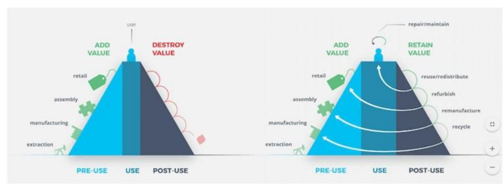

*Figure 48 : Value Hills of a product, linear system and circular system*

If we have a look to textile history in the past century, human have faced many shortages of textile. So reuse, repurpose and recycle have always been present in the textile history.

At the beginning of the XIX Century, there was a shortage of wool (1820). In the Prato region, one of the leading regions in wool and associated fibre, Giovan Battista Mazzoni started (1824) to develop Woven fabric made out of regenerated wool. They started in Italy to modify worsted and semi worsted carding machine (industrial machine made to comb fibre with pins) to develop the first pulling/ tearing/garneting line.

After that, the industry started to regenerate fibre with this kind of machine, especially internal leftovers.

Moreover, human has for a long time made donation or resale garment.

To comply to this textile reality, it is more truthful to depict the following diagram (Figure 49 [: Past Linear](#page-86-1)  [Value chain \(before Circular system was implemented\).\)](#page-86-1) as the linear value chain base*:*

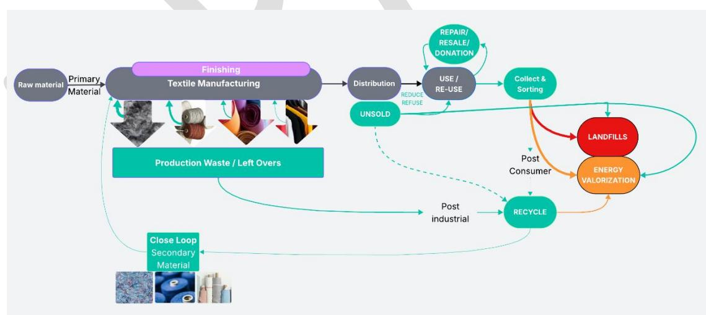

*Figure 49 : Past Linear Value chain (before Circular system was implemented).*

Considering that diagram, we must admit that for century there was a partial circularity in textile value chain. Anyway, it has nothing to do with what has been done since the 1990's where most of textile recycling companies in Europe start to emerge for apparel, technical textile and carpet industry.

Since that time a lot of regulations have emerged, and collection and sorting have increased a lot in a lot of European countries.

Considering the linear chain what should be promote are:

Consumption change: promote sustainable consumption: ecodesign, refuse, reduce. The way of doing it will be more developed in following point in circular value chain review and have been largely developpe in part 2 of this report. The main important point remaining lower drastically the fast fashion consumption.

At the textile manufacturing level, the objective is to develop as much as possible Company Societal Responsibility. Managing environmental and human aspects in all companies should be compulsory or at least encourage financially*.*

## 5.2.Production and distribution of textile

Recommendations:

- Promote ECODESIGN and durability of products through regulations: incorporation of Recycled material, Increase durability, reparability and recyclability… It should be done possibly through Eco modulation fee.
- Make available ECODESIGN or ENVIRONMENTAL IMPACTS of products available (label on product). This label should be very simple to understand for any consumer and retake all data from products. An eco score taking into consideration: durability, LCA impacts, fast fashion concern should be the best way to do it. A standardization to a score easy understandable such as A, B, C, D, E or something similar, should probably the best way.
- Consolidate labelled data on durability and environmental impacts by independent European organism or consulting cabinet. Too much data coming from other continent consultant cabinet are not reliable even concerning environmental label or European law : Reach, Oeko tex, Recyclass, ISO 9001, ISO 14000, ISO 26000…. 1 in 4 imported products found to be non-compliant with REACH and CLP. Most of the examined product are coming from China as well as from the United Arab Emirates, India, Thailand, North Macedonia and Madagascar. (110)
- Find a way to Characterize recycled product and find a specific custom code to ensure that recycled material is really.
- Take care about recycling rate. Impose a recycling rate is a good point to increase circularity. Anyway, for the moment recycled material has lower or even poor quality. If the goal is to push product more sustainable increase rate of recycling too much will not go necessarily in the good direction, except if we ameliorate recycling process or if we use chemical recycling, for the moment.
- Push declaration from all distributors about o List minimum of standard test and value for fabrics as well as yarn as well as stitches: to determine durability: ▪ Mechanical: traction, fatigue in normal condition after ageing : thermal, UV, Rain, wash abrasion, ▪ Friction: martindale: normal and moist after ageing : UV, sweat ▪ Colour fastness normal and under UV, water and saline water condition ▪ Non exhaustive list.. o List minimum of value to determine environmental and social impacts: CSRD report o List minimum of criteria to declare for distributor, to determine whether a brand is slow, quick, fast or ultrafast fashion: number of collections per year for all the brand, price level, number of pieces produced per product, time to market average per product.

## 5.3.Consumption

Consumer behaviour plays a central role in the transition toward circular textile systems. While Section 3 provides a detailed analysis of consumption patterns, this section focuses on the key barriers to circularity at the consumption stage and identifies levers for improvement.

#### - Main barriers

Despite increasing awareness of environmental and social issues related to textiles, consumer behaviour remains largely driven by price, convenience, and availability, reinforcing linear consumption models. The following barriers are particularly significant:

- Attitude–behaviour gap: Although a growing share of consumers express concern for sustainability, this is rarely translated into purchasing decisions. Fast and ultra-fast fashion remain dominant due to low prices and constant product availability.
- Limited perceived consumer impact: Many consumers doubt that individual actions can meaningfully influence environmental or social outcomes, reducing motivation to change habits.
- Physical and informational barriers: Circular alternatives (second-hand, rental, repair services) are often less visible, less accessible, or perceived as inconvenient compared to conventional retail.
- Habitual consumption patterns: Clothing consumption is strongly shaped by routine, social norms, and identity, making behavioural change slow and resistant.
- Product quality and durability issues: Low-quality garments with short lifespans discourage repair, reuse, or resale, accelerating disposal.

#### - Improvement pathways

Addressing consumption-related barriers requires coordinated action across the value chain:

- Improving availability and visibility of circular options: Integrating second-hand, repair, and rental services into mainstream retail environments can reduce friction for consumers.
- Designing for durability and reuse: Higher product quality and standardised durability information can support longer use phases and secondary markets.
- Enhancing consumer information: Clear, credible labelling and communication on durability, repairability, and environmental impact can support informed choices.
- Leveraging social norms and education: Awareness campaigns and social initiatives can help shift perceptions of circular consumption from niche to normal practice.
- Aligning price signals: Economic incentives (e.g. reduced VAT on repair or second-hand products) can make circular choices more competitive with fast fashion.

Overall, consumption remains a critical bottleneck for textile circularity. Without reducing overconsumption and extending product lifetimes, upstream efficiency gains and downstream recycling improvements will have limited impact.

## 5.4.End-of-Life

## 5.4.1. Collect

The text concludes that increasing collection volume is insufficient without a corresponding increase in recycling capacity and sorting precision. Success requires:

- Mandatory sorting by fabric composition.
- Eco-design focused on durability and reparability.
- Better communication to ensure citizens know how and where to dispose of textiles.

### Recommendations:

- Manage collection locally, by municipalities and association that know the territory. Prefer point where everyone has to go: Supermarket, City Hall, city parks…
- Communicate clearly the location of collecting points and make the information easily available (signs, flyers, communication…)
- Manage door to door collection, specifically where amount of textile waste volume overpasses a minimum threshold. The cost is a very important matter in circularity of textile. if we go to citizen scale door to door collection, the costs will not be relevant with the circularity of textile. We advise so, in each country to determine the minimum threshold volume of textile where door to door collection become profitable. Maybe focus on big volume of collection (schools, companies, harbours, …)
- Manage local reuse or recycling in order to absorb/ treat locally the volume collected
- Invest in local recycling facilities but in the meantime/parallel fight against fast fashion to decrease volume of discarded textile (through eco modulation). Both points of action are very important to not overextend collection points which will lead to over cost that will make recycled or reuse textile not attractive financially.
- Sensibilize and communicate on the interest of collection
- Sensibilize and communicate about
- For wet and dirty cloth: look at the management of that waste locally and adapt: o Technology of treatment (for same collection with other textile waste) o And / or make a separate collection for textile energy valorisation.
- Review each year results, to see if there is a growing rate

## 5.4.2. Sorting

### Recommendations:

- Automatize sorting: lot of invest and lot of financial support.
- Push collaboration in between different recyclers, sorters and distributors to enhance sorted quality.
- Enlarge sorting to post industrial waste in order to promote REUSE, REPURPOSE of post industrial waste.
- Push innovation in sorting technology, to increase quality of output.
- Push in the meantime ecodesign to make easier sorting and subsequently recycling (mono material, easy dismantling of multilayer or multimaterial textiles).

## 5.4.3. Reuse

### Recommendations:

- Reuse should be supported and facilitated as far as possible in the future. The contribution of consumers to the increase in reuse is key. (financial support).
- It can best be implemented by making services easier and improving accessibility (innovate in business models for collectors, association, social enterprises as well as distributors).
- By increasing awareness and attracting consumers to reuse, both in the field of selling and buying, we get the full benefit of reuse.
- ERP system should financially help consuming second hand market and push innovation (new business models: way of selling second hand, push functional economy…).

## 5.4.4. Refurbish/remanufacture

#### Recommendations:

- Ecodesign: Eco modulation fee regarding design for repairing or remanufacturing and sufficient quality/durability of the product.

- Label quality/ durability of products to push qualitative consumption.
- Same recommendations as REUSE to push second hand market.
- Help invest for repairing or remanufacturing.

## 5.4.5. Repurpose (upcycling or downcycling)

#### Recommendations:

- Account on public agency and PRO to record data but enforce stakeholders: companies and collectors to declare data to follow in real time the flow of waste material available and mapping it.
- Encourage break down of barrier in between the different economic sectors to work together in innovation project on recyclability (Enforce call in between 2 or 3 different sectors for circularity or decarbonation).

## 5.4.6. Recycling

### Recommendations:

- Impose a certain recycling content adapted to reality of the recycling. For the moment, real close loop is hardly targetable due to the decrease of recycled fibre or plastic quality. If we really want to achieve product high quality and durability, a maximum of 20 to 30% should be targeted.
- Regulation should push also open loop and local recycling by pushing intersectoral innovation and mapping of waste.
- Finance the innovation in all type of recycling and push intersectoral project and projects that increase quality of sorting and mechanical recycling at industrial scale. For mechanical recycling finance project that are really looking outside the box not those who optimize process with existing technology. For several year those projects have been financed without any or too small, improve of outcoming quality of recycled material.

### A list of recyclers is available in [ANNEX 5: Recycling operators](#page-126-0)

## 5.4.7. Energy valorisation

#### Recommendations:

- Invest in Energy facilities to cover all discarded textile waste stream and cover energy necessity for the country or Europe.
- Determine a maximum percentage of textile waste to dedicate to valorization: to ensure a minimum of energy consumption without affecting all other circular parts (REUSE, REPURPOSE, RECYCLE).

## 5.4.8. Landfills and incineration (without producing energy)

#### Recommendations:

- Push and finance, for European countries, a system of waste management.
- For out countries out Europe, help financially and technically to push for a waste management system.
- But in the meantime, take measures and regulation to reduce drastically export of textile waste
- Find a solution to REUSE that allows exit from waste status and as seen before easy export. Regulation should cover this matter and directly control that exported textiles for reuse purposes are really reused. For instance, make waste status still available until arriving to an existing and proven REUSE shop or platform.
- Make regulation that decrease amount of landfills textiles.

## 5.4.9. Overall system review

| Phase Main conclusion | or existing circular system Main barriers and levers |
|-----------------------|------------------------------------------------------|
| Distribution 80% of   | environmental impact are                             |
| Strategy of ecodesign | is mainly focused on                                 |
| Biosourced            | product could be an                                  |
| alternative.          | Anyway this is an intensive                          |
| Empirical             | evidence highlights that                             |
| transport,            | cleaning, storage, and                               |
| reverse logistics     | can significantly offset                             |
| environmental         | gains                                                |
| if utilization        | rates remain low                                     |
| Circular              | procurement of bio based                             |
| Consumer              | Consumer behaviour is complex due to                 |
| social level and      | the feeling to be good,                              |
| critical role,        | as people are reluctant to                           |
| Repair                | propensity varies among                              |
| subjective            | norms and perceived                                  |
| to identify           | these products                                       |
| Consumer              | play an important role un                            |
| garment longevity     | by care practices, but                               |
| they can              | be lost with too much                                |
| information:          | Use instructions,                                    |
| maintenance           | instruction, production                              |
| country,              | legal information, warranty                          |
| Rental model shows    | growing adoption                                     |
|                       | Raise consumer awareness regarding care              |
|                       | and influence in extending garment                   |
|                       | Overcome social norms, advertising and               |
|                       | Push circularity model (span time                    |
|                       | increase, reparability, donations to charity,        |
|                       | hand market functionality economy                    |
|                       | Consumer’s lack of skills for repairing or           |

| Phase Main conclusion |           | or existing circular system                | Main barriers and levers       |
|-----------------------|-----------|--------------------------------------------|--------------------------------|
| End of Life           |           | existing collection, sorting and recycling |                                |
| Unharmonized          | and       | sometime                                   | unfair                         |
| redistribution        | of        | Eco modulated                              | fee                            |
| regulation            | appearing | with                                       | distant                        |
| development           | of        | the market                                 | and                            |
|                       |           |                                            | automation and more efficiency |

This project has received funding from the European Union's Horizon Research and Innovation program under grant agreement N° 101181901 and from the Swiss State Secretariat for Education, Research and Innovation (SERI). Posts and shares reflect only the views of all the involved partners. Neither the European Union nor the granting authority can be held responsible for them. This draft deliverable has not yet been validated by the granting authorities.

## 5.5.Swot analysis of linear and circular system

#### **Business as usual system (LINEAR)**

*Table 5. SWOT of the European textile industry operating in a linear economy*

| STRENGTH      | WEAKNESSES                                                          |
|---------------|---------------------------------------------------------------------|
| OPPORTUNITIES | THREATS                                                             |
| o             | Consumers' cultural habit of fashion shopping as a leisure activity |
|               | that turn to waste unused.                                          |

This project has received funding from the European Union's Horizon Research and Innovation program under grant agreement N° 101181901 and from the Swiss State Secretariat for Education, Research and Innovation (SERI). Posts and shares reflect only the views of all the involved partners. Neither the European Union nor the granting authority can be held responsible for them. This draft deliverable has not yet been validated by the granting authorities.

- o Consumers' cultural habit to value new fashion with brands over physical product quality of clothing o Consumers' general preference for new clothes as opposed to a certain aversion to second-hand clothes, possibly attributed to the perception of used cloths displaying lower social status
- Consumption of second-hand clothing remains generally low compared to consumption of new clothing although there are a few examples of where this exceeds 15 % of consumption (Baltic States)
- The absence of legal obligations, such as extended producer responsibility, helps to externalise social and environmental costs.
- High degree of fragmentation and globalisation in the whole textile value chain makes it difficult to implement more sustainable/circular approaches and better social justice and workers' rights.
- Increasing drought and soil degradation due to global warming threatens agricultural cotton production in key growing countries. Consequence can be shortages in supply of fibre raw materials followed by increasing commodity prices.
- Rising public awareness of microplastic pollution in the environment can lead to a decline in the consumer acceptance of synthetic fibres (such as polyester) and may lead to stricter legal requirements.

This project has received funding from the European Union's Horizon Research and Innovation program under grant agreement N° 101181901 and from the Swiss State Secretariat for Education, Research and Innovation (SERI). Posts and shares reflect only the views of all the involved partners. Neither the European Union nor the granting authority can be held responsible for them. This draft deliverable has not yet been validated by the granting authorities.

### *Table 6. SWOT of contemporary textile collectors, sorters and re-users/recyclers operating in a predominantly linear economy.*

| STRENGTH                                       | WEAKNESSES                             |
|------------------------------------------------|----------------------------------------|
| of collection and sorting for these markets. - | The used textile sector has in general |
| OPPORTUNITIES                                  | THREATS                                |

This project has received funding from the European Union's Horizon Research and Innovation program under grant agreement N° 101181901 and from the Swiss State Secretariat for Education, Research and Innovation (SERI). Posts and shares reflect only the views of all the involved partners. Neither the European Union nor the granting authority can be held responsible for them. This draft deliverable has not yet been validated by the granting authorities.

- Demand for recycled fibres and fabrics is low due to the low cost of virgin fibres and lack of producer and consumer interest in recycled content.
- Many textiles are produced using fibre blends which hinders closed loop recycling.
- There is a lack of information on the fibre composition and chemical content of post-consumer textiles. Collected textiles include products from thousands of different producers. This this makes it difficult to gather material inputs for advanced recycling technologies that require specific fibre composition.
- The vast majority of clothing consumed in Europe is produced elsewhere. This presents logistics obstacles to closed-loop recycling of waste arising in Europe.
- There is currently little planning reliability for investments in textile recycling and technical innovation due to lack of policy targets for circularity, and lack of data on the overall fibre composition of non-reusable textile waste
- Data on current status of circularity in textiles is limited due to lack of EU-level requirement for reporting on the separate collection and treatment of postconsumer textiles. This inhibits optimal design of policy measures for increasing circularity

#### *Table 7. SWOT of contemporary circular business models operating in a linear economy.*

| STRENGTH      | WEAKNESSES                                                     |                 |
|---------------|----------------------------------------------------------------|-----------------|
| OPPORTUNITIES | THREATS                                                        |                 |
|               | efforts in repair and maintenance of post-consumer textiles. - | Significant and |

This project has received funding from the European Union's Horizon Research and Innovation program under grant agreement N° 101181901 and from the Swiss State Secretariat for Education, Research and Innovation (SERI). Posts and shares reflect only the views of all the involved partners. Neither the European Union nor the granting authority can be held responsible for them. This draft deliverable has not yet been validated by the granting authorities.

- Influencers in social media and communication of ideas, guidelines, etc via the Internet help the growing CB community in the EU (and internationally), to network, exchange ideas and further innovate.
- A growing sharing economy from a wide range of sectors in organising and promoting sharing platforms and repair/rehabilitation enterprises upon which CBM in the textile sector can build/piggyback. Consumers who are already familiar with the idea of sharing and reusing other products could be more easily nudged to adopt these habits in the clothing sector as well.
- Eco labels for textiles present potential to introduce CE requirements and sustainability claims.
- Green public procurement provides opportunities for kick-starting CBM and further promotion of more circular textile services.
- Competition from traditional clothing recyclers and new economy-of-scale recycling technologies, \* CBM = Circular Business Model

This project has received funding from the European Union's Horizon Research and Innovation program under grant agreement N° 101181901 and from the Swiss State Secretariat for Education, Research and Innovation (SERI). Posts and shares reflect only the views of all the involved partners. Neither the European Union nor the granting authority can be held responsible for them. This draft deliverable has not yet been validated by the granting authorities.

#### **Circular economy scenario**

#### *Table 8. SWOT of the European textile industry operating in a circular economy.*

| STRENGTH                                                                                                                                                                                                                                                                                                                                                                                                                                                                                                                                                                                                                                                                                                                                                                        | WEAKNESSES                                                                                                                                                                                                                                                                                                                                                                                                                                                                                                                              |
|---------------------------------------------------------------------------------------------------------------------------------------------------------------------------------------------------------------------------------------------------------------------------------------------------------------------------------------------------------------------------------------------------------------------------------------------------------------------------------------------------------------------------------------------------------------------------------------------------------------------------------------------------------------------------------------------------------------------------------------------------------------------------------|-----------------------------------------------------------------------------------------------------------------------------------------------------------------------------------------------------------------------------------------------------------------------------------------------------------------------------------------------------------------------------------------------------------------------------------------------------------------------------------------------------------------------------------------|
| <ul> <li>• EU textile companies still operate on a global scale, exercising control over the top level in the textile supply chains.</li> <li>• Well-established supply chain and retail systems still exist but need to be adjusted to cope with product take-back and handling via return logistics.</li> <li>• Big fashion brands are likely to continue dominating the market and retail system.</li> <li>• Cost savings due to economy of scale logistics still apply but perhaps to a lesser extent.</li> <li>• Functional textiles and high-quality garments may gain in EU domestic demand.</li> <li>• In the new circular economy, locally placed businesses may have competitive advantages over brands based outside Europe in offering CBM to consumers.</li> </ul> | <ul> <li>• Many linear-based blends will find the transition to a circular economy challenging requiring top management level commitment, new approaches to product design, material sourcing, meeting minimum quality standards etc.</li> <li>• An increasing focus on durable and re-usable clothing that is also repairable will reduce volume of consumption and force existing brands to look for new ways to make money. This can be higher prices for the higher quality garments, offering repair services and more.</li> </ul> |
| OPPORTUNITIES                                                                                                                                                                                                                                                                                                                                                                                                                                                                                                                                                                                                                                                                                                                                                                   | THREATS                                                                                                                                                                                                                                                                                                                                                                                                                                                                                                                                 |
| <ul> <li>• With higher availability of domestic supply with recycled fibres and fabrics, the dependence of producers on virgin resources with volatile prices will lessen.</li> <li>• Domestic value creation of the EU textile industry may increase as a result of relocating parts of the production chain back in the EU.</li> </ul>                                                                                                                                                                                                                                                                                                                                                                                                                                        | <ul> <li>• Possibly lacking consumer acceptance of recycled content in fashion products and higher prices for higher quality products.</li> <li>• The introduction of extended producer responsibility and other regulatory / policy actions towards the circular economy of EU green deal may reduce the possibility to externalise social and environmental costs. This will lead to better cost truth in the market and curb the sale of lowpriced, low-quality clothing.</li></ul>                                                  |

#### *Table 9. SWOT of contemporary textile collectors, sorters and re-users/recyclers operating in a circular economy.*

| STRENGTH                                                                                                                                                                                                                                                          | WEAKNESSES                                                                                                                                                                                                                                     |
|-------------------------------------------------------------------------------------------------------------------------------------------------------------------------------------------------------------------------------------------------------------------|------------------------------------------------------------------------------------------------------------------------------------------------------------------------------------------------------------------------------------------------|
| <ul> <li>Established textile collectors, sorters and wholesalers are well-placed to take advantage of the new opportunities presented by a new circular economy and already have global value chains in place to sell reusable and recyclable textiles</li> </ul> | <ul> <li>Many contemporary collectors of used textiles, especially charitable collectors, may not be ready for the transition and need for flexibility and competitiveness in business models that the circular economy will bring.</li> </ul> |

This project has received funding from the European Union's Horizon Research and Innovation program under grant agreement N° 101181901 and from the Swiss State Secretariat for Education, Research and Innovation (SERI). Posts and shares reflect only the views of all the involved partners. Neither the European Union nor the granting authority can be held responsible for them. This draft deliverable has not yet been validated by the granting authorities.

| <ul> <li>Established collection and reuse actors may be able to outcompete start-ups if they move fast to adapt their business models.</li> </ul>                                                                                                                                                                                                                                                                                                                                                                                                                                                                                                                                                                                                                                                                                                                                                                                                                                                                           | <ul> <li>VAT/tax-free status of charitable collectors may be challenged as calls for level playing field in a growing economic sector increase.</li> <li>Automated sorting capacity for the large quantities of non-reusable textile waste that will become available is not in place and will require significant investments</li> </ul>                                                                                                                                                                                                                                                                                                                                  |
|-----------------------------------------------------------------------------------------------------------------------------------------------------------------------------------------------------------------------------------------------------------------------------------------------------------------------------------------------------------------------------------------------------------------------------------------------------------------------------------------------------------------------------------------------------------------------------------------------------------------------------------------------------------------------------------------------------------------------------------------------------------------------------------------------------------------------------------------------------------------------------------------------------------------------------------------------------------------------------------------------------------------------------|----------------------------------------------------------------------------------------------------------------------------------------------------------------------------------------------------------------------------------------------------------------------------------------------------------------------------------------------------------------------------------------------------------------------------------------------------------------------------------------------------------------------------------------------------------------------------------------------------------------------------------------------------------------------------|
| <b>OPPORTUNITIES</b>                                                                                                                                                                                                                                                                                                                                                                                                                                                                                                                                                                                                                                                                                                                                                                                                                                                                                                                                                                                                        | <b>THREATS</b>                                                                                                                                                                                                                                                                                                                                                                                                                                                                                                                                                                                                                                                             |
| <ul> <li>The introduction of collection, reuse and recycling targets in the EU may increase the access to post-consumer textiles as a feedstock for sale on reuse and recycling markets.</li> <li>Mandatory or voluntary eco-design criteria on durability, reparability and recyclability of textiles will increase the quality and value of the collected stock and improve economic viability of the sector.</li> <li>Green public procurement, ecolabels and minimum standards for recycled content in new clothing would increase the market demand and price for recycled fibres and improve the economic viability of collection, sorting and recycling.</li> <li>Circular economic thinking will become mainstreamed both in businesses and among consumers and demand for pre-used (second hand) clothing will increase in Europe.</li> <li>Investment risk for new recycling technologies and facilities will be significantly reduced and large investors will place their money in these industries.</li> </ul> | <ul> <li>Increased C2C exchanges of used clothing via CBM exchange platforms and competition from other circular businesses may reduce charitable and commercial collectors' access to the best quality reusable clothing and significantly undermine their business model.</li> <li>Post-consumer collection targets in the EU could overwhelm capacity of the post-consumer textile sector. Investments in the expansion of sorting and recycling capacity will become necessary.</li> <li>Recycling opportunities will be severely hampered by lack of information and traceability of the chemical content of post-consumer textiles. Could be solved throug</li></ul> |

#### *Table 10. SWOT of contemporary circular business models operating in a circular economy.*

| STRENGTH                                                                                                                                                                                                                                                                                                                                                                                                                                                                                                                                             | WEAKNESSES                                                                                                                                                                                                                                                                                                                                                                                                                                                                         |
|------------------------------------------------------------------------------------------------------------------------------------------------------------------------------------------------------------------------------------------------------------------------------------------------------------------------------------------------------------------------------------------------------------------------------------------------------------------------------------------------------------------------------------------------------|------------------------------------------------------------------------------------------------------------------------------------------------------------------------------------------------------------------------------------------------------------------------------------------------------------------------------------------------------------------------------------------------------------------------------------------------------------------------------------|
| <ul> <li>• Under changed market regime (circular) and favourable regulatory circumstances, the CBM will move out of a niche market and become mainstreamed</li> <li>• Existing CBM can harness their experiences and customer reputation to grow.</li> <li>• Small and local CBs can benefit from spatial proximity to customers and personal customer interaction. This lowers the transport distances and service response time. Upscaled CE enterprises should strive to anchor in spatial proximity to customers as this is an asset.</li> </ul> | <ul> <li>• The up-scaling process in CBM will make these initiatives more commercial and profit-oriented, consequently limiting the access to volunteer work force, causing higher labour costs.</li> <li>• Growing out of a niche market will partly disconnect CBM from their initial customer base, which has been motivated by mere idealistic motives. Instead, the future customer base will be more sensitive to product price, service quality and convenience.</li> </ul> |

|                                                                                                                                                                                                                                                                                                                                                                                                                                                                                                                                                                                | <ul> <li>• The present CBMs will lose a unique selling point as circular economy turns to be the default business concept.</li> </ul>                                                                                                                                                                                                                                                                                                                                                                                                                                                                                              |
|--------------------------------------------------------------------------------------------------------------------------------------------------------------------------------------------------------------------------------------------------------------------------------------------------------------------------------------------------------------------------------------------------------------------------------------------------------------------------------------------------------------------------------------------------------------------------------|------------------------------------------------------------------------------------------------------------------------------------------------------------------------------------------------------------------------------------------------------------------------------------------------------------------------------------------------------------------------------------------------------------------------------------------------------------------------------------------------------------------------------------------------------------------------------------------------------------------------------------|
| <b>OPPORTUNITIES</b>                                                                                                                                                                                                                                                                                                                                                                                                                                                                                                                                                           | <b>THREATS</b>                                                                                                                                                                                                                                                                                                                                                                                                                                                                                                                                                                                                                     |
| <ul> <li>• The increasing demand for repair and maintenance services for clothing is likely to create a huge opportunity for new jobs across the EU MS. This applies above all for local businesses (SME) but may also promote Internet-based CBM. The availability of quality clothing to the sharing, secondhand and repair businesses will increase and so does the market demand for such services.</li> <li>• Emerging CBMs may be more attractive to venture capital, as the circular economy offers them favourable market conditions and legal foundations.</li> </ul> | <ul> <li>• The up-scaling process in CBM is likely to increase internal competition and will consequently result in a selection process among CE enterprises according to market mechanisms.</li> <li>• SME-sized CBMs will compete with the established fashion industry and retail sector, which will also have to adapt to the circular system. These established companies will either imitate the entrepreneurial ideas of the small CBMs or develop their own circular services. Ultimately, the challenge for small CE enterprises to establish themselves in the market is the same as for all new enterprises.</li> </ul> |

This project has received funding from the European Union's Horizon Research and Innovation program under grant agreement N° 101181901 and from the Swiss State Secretariat for Education, Research and Innovation (SERI). Posts and shares reflect only the views of all the involved partners. Neither the European Union nor the granting authority can be held responsible for them. This draft deliverable has not yet been validated by the granting authorities.

 Fragmented Textile market: 35% of the market owned by big player in the market where 65% remain to small, medium size or company of intermediate size. Lack of invest Share turnover with new circular actors (collectors/sorter, association, recycler Cost to review all business model: non profitable at first Make more durable with a certain recycled content of poor quality (except if chemical recycling, dissolution or promote less chemicals for thermomechanical but also invest for both thermomechanical and mechanical: gentle recycling meaning longer machine to produce same amount or two time or even 3 time more machine or reviewed totally the process to process higher molecular weight recycled polymers or longer recycled fibre)

#### Recommendations:

- Through the collect recommendation as well as reduce, refuse, ecodesign, resale, reuse recommendation, develop a tool that will allow to predict collection evolution through the year to frame the global need of future recycling capacity through Europe
- Invest massively in recycling capacity
- Invest massively in innovative solution for mechanical, dissolution, thermomechanical and chemical recycling
- To support the previous measure: reindustrialize massively in textile capacity in Europe. There is no meaning to industrialize massively in recycling capacity if the goal is to export secondary material outside where price will not be competitive in short term. In the long term, this will irremediably lead to a collapse of European recycling capacity and a pure relocation of the textile recycling industry in Asia or other country. Recycling and circularity are a major lever for Europe to recover textile's industrial and material sovereignty
- Invest massively in automatization of collection, sorting and recycling to become competitive in long term.
- Build a complementary system to be more efficient: Chemical, thermomechanical, mechanical recycling
- Push regulation for ecodesign to simplify sorting and recycling process.
- Build up a circular local model that will address a fairest business

## **6. Conclusion**

This deliverable has analysed the textile value chain through the lens of circularity, highlighting how current linear production, distribution, consumption, and end-of-life practices continue to generate significant environmental and social impacts. While circular solutions already exist across the value chain, their deployment remains fragmented and insufficient to counterbalance the growth of fast and ultra-fast fashion systems.

The analysis confirms that circularity cannot be achieved through isolated actions. Improvements in recycling technologies, while necessary, are constrained by product design, material complexity, and economic conditions. Similarly, consumer awareness alone has proven insufficient to significantly reduce overconsumption or extend product lifetimes. These findings underline the need for systemic coordination across all stages of the value chain.

Three structural bottlenecks emerge as particularly critical:

- Distribution and market structures that prioritise speed, volume, and low prices continue to drive overproduction and short product lifespans.
- Consumption patterns remain shaped by habits, convenience, and affordability, creating a persistent gap between stated intentions and actual behaviour.
- End-of-life systems, including collection, sorting, and recycling, are under increasing pressure from growing textile volumes and declining product quality.

Within this context, the most effective circular strategies are those that preserve value for as long as possible, notably through durability, repair, reuse, and resale. Recycling should be regarded as a complementary pathway rather than a primary solution, particularly in the absence of upstream changes in design and consumption.

The synthetic value chain developed in this work provides a shared reference framework to visualise material flows, identify points of value loss, and locate priority intervention areas. It highlights the importance of aligning eco-design, distribution strategies, consumer engagement, and end-of-life management within a coherent system rather than treating them as separate domains.

This deliverable therefore lays the groundwork for the next phases of the TRUSTEX project. By clarifying where circularity breaks down and which levers offer the highest potential impact, it supports the development of targeted tools, governance mechanisms, and digital solutions aimed at improving traceability, coordination, and decision-making across the textile value chain.

Ultimately, achieving a truly circular textile system will require structural changes in business models, policy frameworks, and market incentives, alongside technological innovation. The insights presented here confirm that circularity is not only a technical challenge, but a transformation of how textiles are designed, distributed, used, and valued throughout their lifecycle.

This project has received funding from the European Union's Horizon Research and Innovation program under grant agreement N° 101181901 and from the Swiss State Secretariat for Education, Research and Innovation (SERI). Posts and shares reflect only the views of all the involved partners. Neither the European Union nor the granting authority can be held responsible for them. This draft deliverable has not yet been validated by the granting authorities.

#### **7. Bibliography**

- 1. *What is fast fashion?* **Kinsey, Mc.**
- 2. **EURATEX.** *FACTS & KEY FIGURES 2024 OF THE EUROPEAN TEXTILE AND CLOTHING INDUSTRY.* 2024.
- 3. **vorgelegt von B.A. Sebastian Forbrig, Dipl.-Ing. Thomas Fische, Ass. Jur. Beate Heinz.** *BEDARF, KONSUM UND WIEDERVERWENDUNG VON BEKLEIDUNG UND TEXTILIEN IN DEUTSCHLAND.* e.v, Bundesverband Sekundärrohstoffe und Entsorgung (BVSE), Fachverband Textilrecycling (FTR). 2020.
- 4. *Fast fashion: response to changes in the fashion industry.* **BHARDWAJ, Vertica and FAIRHURST, Ann.** s.l. : The international review of retail, distribution and consumer research, 2010, Vols. 20. Jg., Nr. 1, S. 165-
- 173.
- 5. **Saskia Manshoven (VITO), Maarten Christis (VITO), An Vercalsteren (VITO), Mona Arnold (VTT), Mariana Nicolau (CSCP), Evelyn Lafond (OVAM), Lars Fogh Mortensen, Luca Coscieme (EEA).** *Textiles and the envionment in a circular economy.* ETC and EEA. 2019. Eionet Report - ETC/WMGE 2019/6.
- 6. **Andreas Köhler, David Watson, Steffe Trzepacz, Clara Löw, Ran Liu, Jennifer Danneck (Oeko-Institut and PlanMiljø) Antonios Konstantas, Shane Donatello, Giorgia Faraca (JRC B.5).** *Circular economy perspectives in the EU Textile sector.* JRC. 2021. Technical report.
- 7. **ADEME.** *Économie circulaire : définition, enjeux et concepts.* 2023.
- 8. **Mr. Simon NAVARRO, Simon Navarro (ESTIA), Bixente Demarcq (ESTIA), Sabine Giron (ESTIA), Alex Marquoin (ESTIA).** *State-of-the art of the fashion system.* SCIRT PROJECT, ESTIA. 2022. Deliverables 1.1. SCIRT - Contract Number: 101003906.
- 9. *Sustainability and Circularity in the Textile Value Chain: Global Stocktaking.* **(UNEP), United Nation Environment Programm.** 21 October 2020.
- 10. **AGENCY, EUROPEAN ENVIRONMENT.** *Paving the way for a circular economy: Insights on status and potentials.* s.l. : Luxembourg: Publications Office of the European Union, 2019. EA Report No. 10/2019. ISBN 978-92-9480-117-3. doi:10.2800/846052.
- 11. **INITIATIVE, KATALYST.** *Working Paper 1, 2, 3, 4.* 2025.
- 12. **Circle Economy Foundation.** *The Circularity Gap Report Textiles 2024.* s.l. : Amsterdam: Circle Economy, 2024.
- 13. *Reducing the Environmental Impact of Clothing: An Exploration of the Potential of Alternative Business Models.* **Gray, S., Druckman, A., Sadhukhan, J., & James, K.** s.l. : Sustainability, 2022, Vols. 14(10), 6292.
- 14. **European Commission.** *EU Strategy for Sustainable and Circular Textiles.* s.l. : Communication from the Commission to the European Parliament, the Council, the European Economic and Social Committee and the Committee of the Regions. COM(2022) 141 final, 2022.
- 15. *The perspectives of economic actors on EU Strategy for Sustainable and Circular Textile.* **Kylänlahti-Harmaala, M.** s.l. : Master's Thesis, Tampere University of Applied Sciences, 2023.

This project has received funding from the European Union's Horizon Research and Innovation program under grant agreement N° 101181901 and from the Swiss State Secretariat for Education, Research and Innovation (SERI). Posts and shares reflect only the views of all the involved partners. Neither the European Union nor the granting authority can be held responsible for them. This draft deliverable has not yet been validated by the granting authorities.

- 16. **Global Fashion Agenda.** *Mapping of Global Extended Producer Responsibility (EPR) for Textiles.* s.l. : Public Affairs Team update, 2025.
- 17. **ECOS.** Environmental Coalition on Standards (2021). Durable, repairable and mainstream How ecodesign can make our textiles circular. . [Online] 2021. https://ecostandard.org/publications/reportdurable-repairable-and-mainstream-how-ecodesign-can-make-our-textiles-circul.
- 18. **DIRECTORY, Sustainability.** *What Role Does Consumer Education Play in Extending Product Lifespans?* 2025.
- 19. *Emotional bonding with personalised products.* **Mugge, R., Schoormans, J. P. L., & Schifferstein, H.**
- **N. J.** 5, 2009, Journal of Engineering Design, Vol. 20, pp. 467–476.
- 20. *Internal competitiveness and market leadership in the adoption of green technologies in the Portuguese textiles and apparel industry.* **Ribeiro, V. M., & Soares, I.** 2024, Sustainable Energy Technologies and Assessments, Vol. 69.
- 21. *Creating Awareness among Consumers on Purchase of Sustainable Textile Products in Pakistan.* **Saeed, A., Sadaf, S., & Hassan, K.** 1, 2023, Human Nature Journal of Social Sciences, Vol. 4, pp. 360–372.
- 22. *To repair or not to repair: What is the motivation.* **Scott, K. A., & Weaver, S. T.** 2014, Journal of Research for Consumers, pp. 43–44.
- 23. *The importance of circular attributes for consumer choice of fashion and textile products in Australia.*  **Klemm, C., & Kaufman, S.** 2024, Sustainable Production and Consumption.
- 24. *Holding on or letting go: Conflicting narratives of product longevity.* **Berg, L., & Hebrok, M. (2024).** 2024, Resources, Conservation and Recycling.
- 25. *To reduce waste, have it repaired! The quality signaling effect of product repairability.* **Munten, P., & Vanhamme, J.** 2023, Journal of Business Research.
- 26. *Consumer Perceptions of Product Lifetimes and Labelling: Implications for Introducing a Durability Label.* **Milios, L., & Dalhammer, C.** 2023, Circular Economy.
- 27. *Design-Durability: Insights from Product Case Analyses.* **Jetti, R., & Dhar, D.** 2024, Archives of Design Research.
- 28. *Consumers' Engagement and Perspectives on Sustainable Textile Consumption.* **Ribeiro, P., Batista, P., Mendes-Palma, F., Pintado, M., & Oliveira-Silva, P.** 2023, Sustainability.
- 29. *Consumers' textile disposal practices and their perceived value in the circular economy: A platform focused ethnography approach.* **Pera, R., & Ferrulli, E.** 2023, Business Strategy and the Environment.
- 30. *A New Longevity Design Methodology Based on Consumer-Oriented Quality for Fashion Products.*  **Benkirane, R., Thomassey, S., Koehl, L., & Perwuelz, A.** 2022, Sustainability.
- 31. *Increasing repair of household appliances, mobile phones and clothing: Experiences from consumers and the repair industry.* **Laitala, K., Klepp, I., Haugrønning, V., Throne-Holst, H., & Strandbakken, P.** 2021, Journal of Cleaner Production, Vol. 282.

This project has received funding from the European Union's Horizon Research and Innovation program under grant agreement N° 101181901 and from the Swiss State Secretariat for Education, Research and Innovation (SERI). Posts and shares reflect only the views of all the involved partners. Neither the European Union nor the granting authority can be held responsible for them. This draft deliverable has not yet been validated by the granting authorities.

- 32. *A Framework for Measuring Physical Garment Durability.* **Guo, Y., Morris, K., Sumner, M., & Taylor, M.** 2024, Cleaner and Responsible Consumption.
- 33. *Unpicking the Gender Gap: Examining Socio-Demographic Factors and Repair Resources in Clothing Repair Practice.* **McQueen, R., McNeill, L., Huang, Q., & Potdar, B.** 2022, Recycling.
- 34. *Is Price an Indicator of Garment Durability and Longevity?* **Wakes, S., Dunn, L., Penty, D., Kitson, K., & Jowett, T.** 2020, Sustainability.
- 35. *Consumers and self-repair: What do they repair, what skills do they have and what are they willing to learn?* **Lundberg, P., Vainio, A., Viholainen, N., & Korsunova, A.** 2024, Resources, Conservation and Recycling.
- 36. *In Situ Functionalisation and Upcycling of Post*‐*Consumer Textile Blends into 3D Printable Nanocomposite Filaments.* **Apostolopoulou**‐**Kalkavoura, V., Fijoł, N., Lombardo, S., Ruiz**‐**Caldas, M., & Mathew, A.** 2024, Advanced Sustainable Systems, Vol. 8.
- 37. *Extending the Lifetime of Clothing through Repair and Repurpose: An Investigation of Barriers and Enablers in UK Citizens.* **Zhang, L., & Hale, J.** 1, 2022, Sustainability, Vol. 14, pp. 0821 - 10821.
- 38. *Challenges and opportunities for scaling up upcycling businesses – The case of textile and wood upcycling businesses in the UK.* **Singh, J., Sung, K., Cooper, T., West, K., & Mont, O.** 2019, Resources, Conservation and Recycling.
- 39. *Consumer Perceptions Related to Clothing Repair and Community Mending Events: A Circular Economy Perspective.* **Diddi, S., & Yan, R.** 2019, Sustainability.
- 40. *Consumer upcycling as emancipated self-production: Understanding motivations and identifying upcycler types.* **Coppola, C., Vollero, A., & Siano, A.** 2020, Journal of Cleaner Production, Vol. 124812.
- 41. *A qualitative study on internal motivations and consequences of consumer upcycling.* **Shi, T., Huang, R., & Sarigöllü, E.** 2022, Journal of Cleaner Production.
- 42. *Fashion sensitive young consumers and fashion garment repair: Emotional connections to garments as a sustainability strategy.* **McNeill, L., Hamlin, R., McQueen, R., Degenstein, L., Garrett, T., Dunn, L., & Wakes, S.** International Journal of Consumer Studies, : s.n., 2020, Vol. 44, pp. 361-368.
- 43. *Towards Circular Fashion: Design for Community-Based Clothing Reuse and Upcycling Services under a Social Innovation Perspective.* **Wu, D., Zhuang, M., Zhang, X., & Zhao, Y.** 2022, Sustainability.
- 44. *The Impact of Odour on Laundering Behaviour: An Exploratory Study.* **McQueen, Rachel H., Lori J. Moran, Cassandra Cunningham, Peter M. Hooper, y K. A.-Mariko Wakefield.** 2019, International Journal of Fashion Design, Technology and Education, pp. 20-30.
- 45. **European Environment Agency.** Consumption of clothing, footwear, other textiles in the EU reaches new record high. [Online] 26 Mar 2025. [Cited: 01 Nov 2025.] https://www.eea.europa.eu/en/newsroom/news/consumption-of-clothing-footwear-other-textiles-in-theeu-reaches-new-record-high.

This project has received funding from the European Union's Horizon Research and Innovation program under grant agreement N° 101181901 and from the Swiss State Secretariat for Education, Research and Innovation (SERI). Posts and shares reflect only the views of all the involved partners. Neither the European Union nor the granting authority can be held responsible for them. This draft deliverable has not yet been validated by the granting authorities.

46. —. Textiles. [Online] May 02, 2025. [Cited: Nov 01, 2025.] https://www.eea.europa.eu/en/topics/indepth/textiles.

47. **Market Data Forecast.** Europe Apparel Market - Europe Apparel Market Size, Share, Trends & Growth Forecast Report By Type (Formal Wear, Casual Wear, Sportswear, Night Wear and Others), End-User (Men, Women and Children) and Country . *(UK, France, Spain, Germany, Italy, Russia, Sweden, Denmark, Switzerland, Netherlands, Turkey, Czech Republic & Rest of Europe), Industry Analysis From 2024 to 2033.*  [Online] Oct 2025. [Cited: 01 Nov 2025.] https://www.marketdataforecast.com/market-reports/europeapparel-market.

48. **Sustainability Directory.** What Role Does Consumer Education Play In Extending Product Lifespans? [Online] 14 February 2025. [Cited: 29 August 2025.] https://fashion.sustainabilitydirectory.com/question/what-role-does-consumer-education-play-in-extending-product-lifespans.

49. *How Can Consumers Behave Sustainably in the Fashion Industry? A Systematic Literature Review of Determinants, Drivers, and Barriers across the Consumption Phases.* **Schiaroli, Valerio, Luca Fraccascia, & Rosa Maria Dangelico.** 2024, Journal of Cleaner Production, Vol. 483.

50. *Laundry routine and resource consumption in Australia.* **Jack, Tullia.** 6, s.l. : International Journal of Consumer Studies, 2013, Vol. 37. https://doi.org/10.1111/ijcs.12048.

51. *Wool Wash: Technical Performance and Consumer Habits.* **Laitala, Kirsi, & Ingun Grimstad Klepp.** 5, 2016, Tenside Surfactants Detergents, Vol. 53, pp. 458-69.

52. *Changing Laundry Habits in Norway.* **Laitala, Kirsi, Ingun G. Klepp, y Casper Boks (2012).** 2, 2012, International Journal of Consumer Studies, Vol. 36, pp. 228-37.

53. **Europen Univion.** Your Europe - Consumer guarantees. [Online] [Cited: 07 Jan 2026.] https://europa.eu/youreurope/business/dealing-with-customers/consumer-contracts-

guarantees/consumer-guarantees/index\_en.htm.

### 54. **Yougov.** *les francais et la fashion ethique.*

55. Ajzen, I., 2020. The theory of planned behavior: Frequently asked questions. *Human Behavior and* 

*Emerging Technologies*.

Ajzen, I., 2011. The theory of planned behaviour: Reactions and reflections. *Psychology & Health*, 26, pp.

1113 - 1127.

Armitage, C., & Conner, M., 2001. Efficacy of the Theory of Planned Behaviour: a meta-analytic review..

*The British journal of social psychology*, 40 Pt 4, pp. 471-99.

Yuriev, A., Dahmen, M., Paillé, P., Boiral, O., & Guillaumie, L., 2020. Pro-environmental behaviors through the lens of the theory of planned behavior: A scoping review. *Resources, Conservation and Recycling*. Hagger, M., & Hamilton, K., 2023. Longitudinal tests of the theory of planned behaviour: A meta-analysis.

*European Review of Social Psychology*, 35, pp. 198 - 254. Sussman, R., & Gifford, R., 2018. Causality in the Theory of Planned Behavior. *Personality and Social Psychology Bulletin*, 45, pp. 920 - 933.

Sniehotta, F., Presseau, J., & Araújo-Soares, V., 2014. Time to retire the theory of planned behaviour. *Health Psychology Review*, 8, pp. 1 - 7.

Ajzen, I., 1991. The theory of planned behavior. *Organizational Behavior and Human Decision Processes*, 50, pp. 179-211.

Hagger, M., & Hamilton, K., 2025. Progress on theory of planned behavior research: advances in research synthesis and agenda for future research. *Journal of Behavioral Medicine*, 48, pp. 43 - 56.

- Rozenkowska, K., 2023. Theory of planned behavior in consumer behavior research: A systematic literature review. *International Journal of Consumer Studies*. Miller, Z., 2017. The Enduring Use of the Theory of Planned Behavior. *Human Dimensions of Wildlife*, 22, pp. 583 - 590. Ulker‐Demirel, E., & Ciftci, G., 2020. A systematic literature review of the theory of planned behavior in tourism, leisure and hospitality management research. *Journal of Hospitality and Tourism Management*. Hagger, M., Cheung, M., Ajzen, I., & Hamilton, K., 2022. Perceived behavioral control moderating effects in the theory of planned behavior: A meta-analysis.. *Health psychology : official journal of the Division of Health Psychology, American Psychological Association*. Krueger, J., & Carsrud, A., 1993. Entrepreneurial intentions: Applying the theory of planned behaviour. *Entrepreneurship and Regional Development*, 5, pp. 315-330. Sok, J., Borges, J., Schmidt, P., & Ajzen, I., 2020. Farmer Behaviour as Reasoned Action: A Critical Review of Research with the Theory of Planned Behaviour. *Journal of Agricultural Economics*. Han, H., Meng, B., & Kim, W., 2017. Emerging bicycle tourism and the theory of planned behavior. *Journal of Sustainable Tourism*, 25, pp. 292 - 309. Paul, J., Modi, A., & Patel, J., 2016. Predicting green product consumption using theory of planned behavior and reasoned action. *Journal of Retailing and Consumer Services*, 29, pp. 123-134. McEachan, R., Conner, M., Taylor, N., & Lawton, R., 2011. Prospective prediction of health-related behaviours with the Theory of Planned Behaviour: a meta-analysis. *Health Psychology Review*, 5, pp. 144 -
- 97. Armitage, C., & Conner, M., 1999. The theory of planned behaviour: Assessment of predictive validity and 'perceived control. *British Journal of Social Psychology*, 38, pp. 35-54. Tornikoski, E., & Maalaoui, A., 2019. Critical reflections – The Theory of Planned Behaviour: An interview with Icek Ajzen with implications for entrepreneurship research. *International Small Business Journal: Researching Entrepreneurship*, 37, pp. 536 - 550.

#### 56. 57. 58. 59. 60. 61. 62. 63. 64. 65. 66.

Core predictors of intention and often behaviour (Kang, Liu and Kim, 2013; La Rosa and Jorgensen, 2021; Shamsi et al., 2023; Kumar, Garg and Singh, 2022) Subjective & personal norms Channel social pressure and moral obligation (Hosta and Žabkar, 2020; Hong et al., 2024; La Rosa and Jorgensen, 2021; Shamsi et al., 2023; Abbate et al., 2023; Xie and Madni, 2023) Social / eco-identity Shapes attitudes, norms, and meaning of acts (Hong et al., 2024; Cairns, Ritch and Béréziat, 2021; McNeill and Venter, 2019; Lavuri, Roubaud and Grebinevych, 2023) Cognitive dissonance Arises when identity/attitudes conflict with fast fashion; can inhibit or catalyse sustainable action (Jung, Choi and Oh, 2020; Cairns, Ritch and Béréziat, 2021; Chakraborty and Sadachar, 2023) Hosta, M., & Žabkar, V., 2020. Antecedents of Environmentally and Socially Responsible Sustainable Consumer Behavior. *Journal of Business Ethics*, pp. 1-21. Kang, J., Liu, C., & Kim, S., 2013. Environmentally sustainable textile and apparel consumption: the role of consumer knowledge, perceived consumer effectiveness and perceived personal relevance. *International Journal of Consumer Studies*, 37, pp. 442-452. Hong, Y., Mamun, A., Yang, Q., & Masukujjaman, M., 2024. Predicting sustainable fashion consumption intentions and practices. *Scientific Reports*, 14. Jung, H., Choi, Y., & Oh, K., 2020. Influencing Factors of Chinese Consumers' Purchase Intention to Sustainable Apparel Products: Exploring Consumer "Attitude–Behavioral Intention" Gap. *Sustainability*. La Rosa, A., & Jorgensen, J., 2021. Influences on Consumer Engagement with Sustainability and the Purchase Intention of Apparel Products. *Sustainability*. Shamsi, M., Anwar, I., Chaudhary, A., Akhtar, S., & Ahmad, A., 2023. Sustainable Transition through Circular Textile Products: An Empirical Study of Consumers' Acceptance in India. *Sustainability*.

This project has received funding from the European Union's Horizon Research and Innovation program under grant agreement N° 101181901 and from the Swiss State Secretariat for Education, Research and Innovation (SERI). Posts and shares reflect only the views of all the involved partners. Neither the European Union nor the granting authority can be held responsible for them. This draft deliverable has not yet been validated by the granting authorities.

Abbate, S., Centobelli, P., Cerchione, R., Nadeem, S., & Riccio, E., 2023. Sustainability trends and gaps in the textile, apparel and fashion industries. *Environment, Development and Sustainability*, pp. 1 - 28. Xie, S., & Madni, G., 2023. Impact of Social Media on Young Generation's Green Consumption Behavior through Subjective Norms and Perceived Green Value. *Sustainability*. Cairns, H., Ritch, E., & Béréziat, C., 2021. Think Eco, Be Eco? The tension between attitudes and behaviours of millennial fashion consumers. *International Journal of Consumer Studies*. McNeill, L., & Venter, B., 2019. Identity, self‐concept and young women's engagement with collaborative, sustainable fashion consumption models. *International Journal of Consumer Studies*. Ali, M., Ullah, S., Ahmad, M., Cheok, M., & Alenezi, H., 2022. Assessing the impact of green consumption behavior and green purchase intention among millennials toward sustainable environment. *Environmental Science and Pollution Research International*, 30, pp. 23335 - 23347. Chakraborty, S., & Sadachar, A., 2023. Did Anything Good Come Out of the Pandemic? COVID-19-Stress Induced Self-Regulatory Sustainable Apparel Consumption among the Millennials in the U.S.. *Sustainability*. Kumar, N., Garg, P., & Singh, S., 2022. Pro-environmental purchase intention towards eco-friendly apparel: Augmenting the theory of planned behavior with perceived consumer effectiveness and environmental concern. *Journal of Global Fashion Marketing*, 13, pp. 134 - 150. Lavuri, R., Roubaud, D., & Grebinevych, O., 2023. Sustainable consumption behaviour: Mediating role of pro-environment self-identity, attitude, and moderation role of environmental protection emotion.. *Journal of environmental management*, 347, pp. 119106.

66. **Desmoutier, Charlotte.** *Pourquoi les consommateurs achètent-ils des vêtements qu'ils ne trouvent pas éthiques ? Analyse du fossé attitude-comportement pour des articles de fast fashion.* s.l. : UCLouvain, 2020.

67. *Le luxe, un superflu aujourd'hui nécessaire ?* **Interactive, Harris.**

68. **Wiederhold, Marie and Martinez, Luis F.** Ethical consumer behavior in Germany: The attitude-behavior gap in the green apparel industry. *International Journal of Consumer Studies.* 4, Mar 2018, Vol. 42, pp. 419- 429.

69. *I rent, swap or buy second-hand – comparing antecedents for online collaborative clothing consumption models.* **Brand, S., Jacobs, B., & Taljaard-Swart, H.** 2023, International Journal of Fashion Design, Technology and Education,, Vol. 16, pp. 275 - 287.

70. *Rebirth fashion: Secondhand clothing consumption values and perceived risks.* **Hur, E.** 2020, Journal of Cleaner Production, Vol. 122951., p. 273.

71. *Is fast fashion finally out of season? Rental clothing schemes as a sustainable and affordable alternative to fast fashion?* **Herold, P., & Prokop, D.** 2023, Geoforum.

72. *Understanding the Intention to Buy Secondhand Clothing on Sharing Economy Platforms: The Influence of Sustainability.Distance from the Consumption System, and Economic Motivations.* **Styvén, M., & Mariani, M.** 202à, Behavioral Marketing eJournal.

73. *Young consumers' motivations and barriers to the purchase of second-hand clothes: An empirical study of China.* **Wang, B., Fu, Y., & Li, Y.** 2022, Waste management,, Vol. 143, pp. 157-167.

74. *Consumer orientations of second-hand clothing shoppers.* **Zaman, M., Park, H., Kim, Y., & Park, S.** 2019, Journal of Global Fashion Marketing, Vol. 10, pp. 163 - 176.

This project has received funding from the European Union's Horizon Research and Innovation program under grant agreement N° 101181901 and from the Swiss State Secretariat for Education, Research and Innovation (SERI). Posts and shares reflect only the views of all the involved partners. Neither the European Union nor the granting authority can be held responsible for them. This draft deliverable has not yet been validated by the granting authorities.

- 75. *Consumer Engagement in Fashion Circularity in China: Exploring Consumer Online Fashion Resale through the Lens of Social Practice Theory.* **Liu, S., Liu, C., & Lang, C.** 2024, Sustainability.
- 76. *The Influence of Consumer Preferences and Perceived Benefits in the Context of B2C Fashion Renting Intentions of Young Women.* **Helinski, C., & Schewe, G.** 2022, Sustainability.
- 77. *Sustainability through online renting clothing: Circular fashion fueled by instagram micro-celebrities.*  **Shrivastava, A., Jain, G., Kamble, S., & Belhadi, A.** 123772., 2021, Journal of Cleaner Production, Vol. 278.
- 78. *Rental clothing box subscription: The importance of sustainable fashion labels.* **Rese, A., & Baier, D.** 2025, Journal of Retailing and Consumer Services.
- 79. *Gen Z consumers' intention to adopt online collaborative consumption of second-hand luxury fashion goods.* **Kim-Vick, J., & Cho, E.** 2024, Journal of Global Fashion Marketing, Vol. 15, pp. 440 - 458.
- 80. *Second-hand clothing acquisition: The motivations and barriers to clothing swaps for Chinese consumers.* **Lang, C., & Zhang, R.** 2019, Sustainable Production and Consumption.
- 81. *Identity, self*‐*concept and young women's engagement with collaborative, sustainable fashion consumption models.* **McNeill, L., & Venter, B.** 2019, International Journal of Consumer Studies.
- 82. *Consumers' Value and Risk Perceptions of Circular Fashion: Comparison between Secondhand, Upcycled, and Recycled Clothing.* **Kim, I., Jung, H., & Lee, Y.** 2021, Sustainability.
- 83. **ECOALF.** [Online] 2025. https://ecoalf.com/pages/upcycling-the-oceans.
- 84. **Patagonia.** [Online] 2025. https://eu.patagonia.com/gb/en/home/.
- 85. **Re, Moda.** [Online] May 2025. https://modare.org/.
- 86. **MFG, Story.** [Online] May 2025. https://www.storymfg.com/.
- 87. **Jeans., Nudie.** [Online] May 2025. https://nudiejeans.com.
- 88. *What Drives the Circular Economy? Textile Sorting or Consumption Reduction. .* **Valtere, M., Bezrucko,**
- **T. and Lauka, D. et al.** Circular Economy and Sustainability : s.n., 2025.
- 89. **Insights, Custom Market.** Global Sustainable Fashion Market 2024-2033. . [Online] 2023. https://www.custommarketinsights.com/report/sustainable-fashion-market/.
- 90. **Insights, Global Market.** Global Sustainable Clothing Market Report 2025-2034. [Online] 2023. https://www.gminsights.com/industry-analysis/sustainable-clothing-market.
- 91. **Agency, European Environment.** Circularity of the EU textiles value chain in numbers. *European Environment Agency.* [Online] 26 March 2025. https://www.eea.europa.eu/en/analysis/publications/circularity-of-the-eu-textiles-value-chain-innumbers?.
- 92. **Parliament, European.** Directive 2008/98/EC of the European Parliament and of the Council of 19 November 2008 on waste and repealing certain Directives . *EUR-Lex.* [Online] 19 November 2008. https://eur-lex.europa.eu/eli/dir/2008/98/oj.

This project has received funding from the European Union's Horizon Research and Innovation program under grant agreement N° 101181901 and from the Swiss State Secretariat for Education, Research and Innovation (SERI). Posts and shares reflect only the views of all the involved partners. Neither the European Union nor the granting authority can be held responsible for them. This draft deliverable has not yet been validated by the granting authorities.

93. —. Directive (EU) 2025/1892 of the European Parliament and of the Council of 10 September 2025 amending Directive 2008/98/EC on waste. *EUR-Lex.* [Online] 10 September 2025. https://eurlex.europa.eu/eli/dir/2025/1892/oj/eng.

94. **JRC.** *Techno-scientific assessment of the management options for used and waste textiles in the European Union.* s.l. : JRC, 2023. RC134586.

95. **Agency, European Environment.** Management of used and waste textiles in Europe's circular economy. *European Environment Agency.* [Online] 21 May 2024. https://www.eea.europa.eu/en/analysis/publications/management-of-used-and-waste-textiles-ineuropes-circular-economy?activeTab=f7004f7d-8e77-4cc5-a7cf-9edae23534c4.

96. **Recover.** Textile sorting: challenges and strategies for achieving circularity in the industry. [Online] https://recoverfiber.com/newsroom/textile-sorting-challenges-and-strategies-for-achieving-circularity-inthe-industry.

97. **Birgit Stubbe, Stijn Van Vrekhem, Sofie Huysman, Rémi Tilkin, Isabel De Schrijver, Myriam Vanneste.** *TEX2CE White paper Textile fibre recycling technologies.* s.l. : TEX2CE , 2023.

98. **Project, TEX2CE.** [Online] 2023. • https://www.centexbel.be/sites/default/files/2025- 04/TEX2CE%20white%20paper%20textile%20recycling%20technologies%202023\_final.pdf.

99. **Commission, European.** Study on the Technical, Regulatory, Economic and Environmental Effectiveness of Textile Fibres Recycling. *CENTEXBEL.* [Online] 2021. https://www.centexbel.be/en/news/study-technical-regulatory-economic-and-environmentaleffectiveness-textile-fibres-recycling.

100. *Quelles solutions pour ces pays qui reçoivent des milliers de tonnes de déchets textiles par jour ?*  **DOMEON, Ludivine.** Ouest france.

101. *Can reviving local fashion solutions heal Ghana's textile waste crisis?* **Iftikhar, Shumaila.** 2025, Analystnews Logo.

102. **Agency, European Environment.** EU exports of used textiles in Europe's circular economy. *European Environment Agency.* [Online] 27 February 2023. https://www.eea.europa.eu/en/analysis/publications/euexports-of-used-textiles.

103. **Lab, Circularity Metrics.** Circularity Metrics Lab. *European Environment Agency.* [Online] 8 May 2025. https://www.eea.europa.eu/en/circularity/sectoral-modules/textiles/eu-export-of-used-

textiles?activeTab=658e2886-cfbf-4c2f-a603-061e1627a515.

104. **Experts, ETC/EEA.** *EU exports of used textiles in Europe's circular economy.* s.l. : European Environment Agency, 2023.

105. **Agency, European Environment.** The destruction of returned and unsold textiles in Europe's circular economy. *European Environment Agency.* [Online] 4 March 2024. https://www.eea.europa.eu/en/analysis/publications/the-destruction-of-returned-and-unsold-textiles-ineuropes-circular-economy.

This project has received funding from the European Union's Horizon Research and Innovation program under grant agreement N° 101181901 and from the Swiss State Secretariat for Education, Research and Innovation (SERI). Posts and shares reflect only the views of all the involved partners. Neither the European Union nor the granting authority can be held responsible for them. This draft deliverable has not yet been validated by the granting authorities.

106. **REFASHION.** Refashion 2024 Activity Report. *REFASHION.* [Online] 2025.

- https://pro.refashion.fr/en/news/filiere/refashion-activity-report-2024.
- 107. **Re\_fashion.** *Annual barometer of consumption of textiles and footwear in France.* [Online] 17 June 2025. https://media-pro.refashion.fr/2025/11/barometer\_consumption\_textile\_france\_refashion2024.pdf.
- 108. **Flanders, Circular.** Processing of end-of-life textiles. *Circular Flanders.* [Online] https://cemonitor.be/en/indicator/consumer-goods/waste/processing-of-end-of-lifetextiles/?utm\_source=chatgpt.com.
- 109. **RESSOURCES.** *Observatoire du réemploi et de la réparation 2021-2023 - Entreprises sociales et circulaires en Wallonie et à Bruxelles.* s.l. : RESSOURCES (Federation social and circular enterprises, 2024.
- 110. *1 in 4 imported products found to be non-compliant with REACH and CLP.* **ECHA.** ECHA/NR/20/30,
- 111. **The Minister of State, Minister for the Ecological and Inclusive Transition,.** Arrêté du 11 décembre 2018 fixant les critères de sortie du statut de déchet pour les objets et produits chimiques ayant fait l'objet d'une préparation en vue de la réutilisation. 20 December 2018.
- 112. **COUNCIL, THE EUROPEAN PARLIAMENT AND OF THE.** REGULATION (EC) No 1013/2006 on shipments of waste. 2006.
- 113. **environment.ec.europa.eu.** Waste shipments. [Online] Synthesis about The new Regulation on waste shipments entered into force on 20 May 2024.. https://environment.ec.europa.eu/topics/waste-andrecycling/waste-shipments\_en.
- 114. **Centexbel.** *Mapping and gap analysis of value chains for sustainable and circular textiles.* Deliverable 1.3. REGIOGREENTEX : n° 101083731.
- 115. **ReFASHION.** *ÉTUDE RELATIVE AUX IMPACTS ENVIRONNEMENTAUX DE LA FILIÈRE REP TLC USAGÉS ISSUS DE LA CONSOMMATION DES MÉNAGES.* 2025.
- 116. *Stitches to Riches? Apparel Employment, Trade, and Economic Development in South Asia.* **Gladys Lopez-Acevedo, Stacey Frederick.** s.l. : World bank group, 2016.
- 117. *Can Madagascar inspire reform of global fashion's US\$2.5 trillion supply chains?* **Lehmann, Fabrice.** 30 June 2020, Trade for Development News.
- 118. **Programme, UN - Environment.** *Sustainability and Circularity in the Textile Value Chain- A global Roadmap.* 2023.
- 119. **Climate, EU Environment and.** [Online] https://www.linkedin.com/showcase/eu-environmentclimate/posts/?feedView=all.
- 120. **Agency, European Environment.** Capture rate for waste textiles and shoes in the EU. [Online] 27 February 2025. https://www.eea.europa.eu/en/circularity/sectoral-modules/textiles/capture-rate-forwaste-textiles-and-shoes-in-the-eu.
- 121. *5,4kg de textiles par habitant jetés au lieu d'être recyclés.* **Hirsch, Hugo.** 2025, Paper JAM.
- 122. *Textiles.* **REssources.** 2025, Ressources.
- 123. *Cercle National du Recyclage | France's textile recycling sector in crisis.* **ACR+.** 2025.

- 124. *The issue of clothing waste in FRANCE.* **COSH.** COSH.
- 125. *Textile waste: the French are mobilized but not sufficiently informed.* **network, Fashion.** 2021, ParisGoodFashion.
- 126. *How Europe's Secondhand Clothes Are Trashing Romania.* **Andrei, Banner:.** OCCRP.
- 127. *Romania reuses and recycles up to 10% of textile waste.* **FORUM, GREEN.** 2024.
- 128. *Kiabi, Primark, Decathlon... Quelles sont les marques de vêtements préférées des Français?* **RMC.**
- 129. *Management of used and waste textiles in Europe's circular economy.* **EEA.** 2025.
- 130. **European Commission.** Textiles Ecosystem TCLF (Textiles, clothing, leather and footwear) industries. [Online] https://single-market-economy.ec.europa.eu/sectors/textiles-ecosystem\_en.
- 131. **KRIB.** Which European countries are leaders in clothing recycling? [Online] https://krib.bg/en/%D0%BA%D0%BE%D0%B8- %D0%B5%D0%B2%D1%80%D0%BE%D0%BF%D0%B5%D0%B9%D1%81%D0%BA%D0%B8- %D1%81%D1%82%D1%80%D0%B0%D0%BD%D0%B8-%D1%81%D0%B0- %D0%B2%D0%BE%D0%B4%D0%B5%D1%89%D0%B8-%D0%B2- %D1%80%D0%B5%D1%86%D0%B8/#:~:text=Luxembourg%20and%20Belgium%2.
- 132. *Laundry Routine and Resource Consumption in Australia.* **TULLIA, Jack.** 6, 2013, International Journal of Consumer Studies, Vol. 3è, pp. 666-74.
- 133. *Apparel Consumer Behavior and Circular Economy: Towards a Decision-Tree Framework for Mindful Clothing Consumption.* **Patwary, Sarif, Md Ariful Haque, Jehad A. Kharraz, Noman Khalid Khanzada, Muhammad Usman Farid, y Nallapaneni Manoj Kumar.** 1, Sustainability, Vol. 15.
- 134. **Moda, OTYM - Observatorio de Textil yInforme de Circularidad Textil y.** *Moda.* 2025.
- 135. *The role of thermodynamics and kinetics in rubber-bitumen systems: a theoretical overview.* **Haopeng Wang, Panos Apostolidis, Panos Apostolidis, Jiqing ZhuShow , Sandra Erkens et al.** International Journal of Pavement Engineering, Vol. 2020.
- 136. **Commission, European.** Study on the Technical, Regulatory, Economic and Environmental Effectiveness of Textile Fibres Recycling. *CENTEXBEL.* [Online] 2021. https://www.centexbel.be/en/news/study-technical-regulatory-economic-and-environmentaleffectiveness-textile-fibres-recycling.

This project has received funding from the European Union's Horizon Research and Innovation program under grant agreement N° 101181901 and from the Swiss State Secretariat for Education, Research and Innovation (SERI). Posts and shares reflect only the views of all the involved partners. Neither the European Union nor the granting authority can be held responsible for them. This draft deliverable has not yet been validated by the granting authorities.

ANNEX 1: extract from Order of 11 December 2018 establishing the criteria for exiting waste status for objects and chemical products that have been prepared for reuse (FRANCE) (111)

#### Article 2:

Articles and chemicals prepared for reuse cease to be waste when all of the following criteria are met:

- (a) The waste entering the preparation for reuse meets the criteria set out in Section 1 of **Annex I.**
- (b) The waste entering the preparation for reuse is treated in accordance with the criteria set out in Section 2 of **Annex I.**
- (c) The articles and chemicals resulting from the preparation for reuse meet the criteria set out in Section 3 of **Annex I**.
- (d) The operator has entered into a transfer agreement for the articles or chemicals resulting from the preparation for reuse, either individually or in batches as appropriate, or offers them for sale to individuals in a distribution outlet operated by the operator. In the case of gas cylinders whose transfer is subject to a deposit system, the deposit slip mentioned in Article D. 543-260 of the Environmental Code serves as the transfer contract;
- (e) The operator meets the requirements set out in Articles 3 to 7 of this decree.

### ANNEX I:

CRITERIA FOR END-OF-WASTE STATUS FOR WASTE THAT HAS BEEN PREPARED FOR REUSE

**Section 1:** Waste Entering into Preparation for Reuse

1.1. The only waste accepted in the preparation process for reuse is as follows:

- Printer cartridges classified as waste and covered by one of the following codes: 08 03 12\* "Waste inks containing hazardous substances", 08 03 13 "Waste inks other than those covered by 08 03 12", 08 03 17\* "Waste printing toner containing hazardous substances", or 08 03 18 "Waste printing toner other than those covered by 08 03 17", or 16 02 16 "Components removed from discarded equipment other than those covered by 16 02 15";

- Packaging classified as waste under one of the following waste codes: 15 01 01 "Paper/cardboard packaging", 15 01 02 "Plastic packaging", 15 01 03 "Wooden packaging", 15 01 04 "Metal packaging", 15 01 05 "Composite packaging", 15 01 06 "Mixed packaging", 15 01 07 "Glass packaging", or 15 01 09 "Textile packaging", 15 01 10\* "Packaging containing residues of hazardous substances or contaminated by such residues"

- Empty pressure vessels classified as waste under code 15 01 11\* "Metal packaging containing a hazardous solid porous matrix (e.g., asbestos), including empty pressure vessels";

- Tires classified as waste under code 16 01 03 "Used Tires";

-Waste electrical and electronic equipment covered by one of the codes 16 02 13\* "Discarded equipment containing hazardous components other than those referred to in headings 16 02 09 to 16 02 12", 16 02 14 "Discarded equipment other than those referred to in headings 16 02 09 to 16 02 13", 20 01 35\* "Discarded electrical and electronic equipment containing hazardous components, other than those referred to in headings 20 01 21 and 20 01 23", 20 01 36 "Discarded electrical and electronic equipment other than those referred to in headings 20 01 21, 20 01 23 and 20 01 35", or 20 03 07 "Bulky waste"

This project has received funding from the European Union's Horizon Research and Innovation program under grant agreement N° 101181901 and from the Swiss State Secretariat for Education, Research and Innovation (SERI). Posts and shares reflect only the views of all the involved partners. Neither the European Union nor the granting authority can be held responsible for them. This draft deliverable has not yet been validated by the granting authorities.

-gases in pressure vessels and discarded chemicals covered by one of the codes 16 05 04\* "Gas in pressure vessels (including halons) containing hazardous substances", 16 05 05 "Gas in pressure vessels other than those referred to in heading 16 05 04", 16 05 06\* "Laboratory chemicals based on or containing hazardous substances, including mixtures of laboratory chemicals", 16 05 07\* "Mineral chemicals based on or containing hazardous substances, discarded", 16 05 08\* "Organic chemicals based on or containing hazardous substances, discarded", or 16 05 09 "Discarded chemicals other than those referred to in headings 16 05 6, 16 05 07 or 16 05 08";

- Textiles classified as waste under one of the codes 19 12 08 "Textiles", 20 01 10 "Clothing", or 20 01 11 "Textiles";

- Furniture items classified as waste under code 20 03 07 "Bulky waste".

1.2. Waste entering the preparation process for reuse must not contain asbestos or persistent organic pollutants at concentrations exceeding the limits set out in Annex IV of Regulation (EC) No 850/2004 of 29 April 2004 on persistent organic pollutants and amending Directive 79/117/EEC.

1.3. Discarded pressure vessels containing gases are accepted for preparation for reuse only if they are recovered in their original sealed container with an intact safety opening system.

1.4. Waste received at the facility site that is not immediately prepared for reuse is received and stored separately from other types of waste managed at the facility site.

**Section 2:** Treatment Techniques and Processes

2.1. Preparation for reuse must include a technical inspection (visual and tactile inspection, leak tests, electrical tests, for example) and an administrative inspection (consistency check between the waste's accompanying documents and the waste itself, for example) of the waste, in order to identify the operations required to ensure that the waste can be directly reused for the same purpose as originally intended for the object or chemical from which it originated. This inspection ensures that:

- the waste from an object possesses the technical characteristics that allow it to perform the same functions as the object from which it originated, either as is or after repair;

- the characteristics of the containerized gas or the discarded chemical comply with the technical identification data sheet and/or the safety data sheet for the gas or chemical from which it originated. For discarded chemicals that are collected in bulk or packaged in containers with damaged opening mechanisms, a systematic analysis is performed to verify that they have not been contaminated. This analysis must ensure that the composition of the waste is identical to that of the original chemical. The techniques used for sampling and analysis must guarantee the representativeness, reliability, and traceability of the measurement results. Analyses performed according to the "Waste Characterization - Determination of the Elemental and Substance Content of Waste" method described in standard XP X30- 489 of 2013 meet these requirements.

- If there is an expiry date for the containerized gas or discarded chemical, competent personnel must ensure that the period until that date is sufficient to guarantee the safe subsequent use of the containerized gas or chemical. This expiry date must be marked on the container of the gas or chemical, even after any repackaging.

Waste that does not meet these conditions is not eligible for end-of-waste status.

2.2. Preparation for reuse must include, where appropriate, cleaning or repair steps to ensure that the waste can be directly reused for the same purpose as originally intended for the object or chemical from which it originated.

This project has received funding from the European Union's Horizon Research and Innovation program under grant agreement N° 101181901 and from the Swiss State Secretariat for Education, Research and Innovation (SERI). Posts and shares reflect only the views of all the involved partners. Neither the European Union nor the granting authority can be held responsible for them. This draft deliverable has not yet been validated by the granting authorities.

2.3. Objects and chemicals that have undergone preparation for reuse must be stored separately from any other types of objects or chemicals that may be handled on the site of the facility.

**Section 3:** Quality of Articles and Chemicals Prepared for Reuse

3.1. Articles and chemicals prepared for reuse are in a condition that allows for direct use without further waste treatment.

3.2. Articles and chemicals prepared for reuse are packaged or repackaged and stored using practices that preserve their integrity and quality.

3.3. Articles and chemicals prepared for reuse have the same use as the article or chemical from which they were originally derived:

-for an article, the same use corresponds to the principal function of the article or assembly of articles from which it was originally derived. Regarding packaging that has contained hazardous substances or is contaminated by such residues, identical use means using it as packaging for a substance or mixture whose properties are compatible with the properties of the hazardous substance or residue that was present in the packaging. There must be no risk of contamination that would be detrimental to the use of the new contents.

- For a chemical product, identical use means one of the uses mentioned in the REACH registration dossier for the substance (if it is a substance as defined by REACH) or substances (if it is a mixture as defined by REACH) from which it was originally derived.

3.4. Objects and chemical products that have been prepared for reuse must comply with the requirements of the Consumer Code regarding the placing of products on the market and the existing regulatory requirements for this type of product.

This project has received funding from the European Union's Horizon Research and Innovation program under grant agreement N° 101181901 and from the Swiss State Secretariat for Education, Research and Innovation (SERI). Posts and shares reflect only the views of all the involved partners. Neither the European Union nor the granting authority can be held responsible for them. This draft deliverable has not yet been validated by the granting authorities.

#### ANNEX 2 : Used textile and Transboundary shipment Transboundary Shipments of Used Textiles

1/ If used textiles are considered waste, then their shipment is subject to the requirements of Regulation (EC) No 1013/2006 of 14 June 2006 on shipments of waste and Regulation (EC) No 1418/2007 of 29 November 2007 on the export of certain wastes for recovery, listed in Annex III or IIIA to Regulation (EC) No 1013/2006, to certain countries to which the OECD Decision on the control of transboundary movements of waste does not apply.

For example, exports of used textiles:

- to Iraq, are subject to a notification procedure,
- to Pakistan, are subject to an information procedure,
- to the United Arab Emirates, are prohibited.

2/ If used textiles are no longer considered waste, the requirements of these two regulations do not apply when they are transferred abroad. This is subject to the strict condition that the exporter provides proof that the competent authority of destination, consulted regarding the classification of the substance or object being transferred, has not raised any objection.

This project has received funding from the European Union's Horizon Research and Innovation program under grant agreement N° 101181901 and from the Swiss State Secretariat for Education, Research and Innovation (SERI). Posts and shares reflect only the views of all the involved partners. Neither the European Union nor the granting authority can be held responsible for them. This draft deliverable has not yet been validated by the granting authorities.

#### SHIPMENTS WITHIN THE COMMUNITY WITH OR WITHOUT TRANSIT THROUGH THIRD COUNTRIES:

1. Shipments of the following wastes shall be subject to the procedure of prior written notification and

- consent as laid down in the provisions of this Title:
- (a) if destined for disposal operations: all wastes;
- (b) if destined for recovery operations:
- (i) wastes listed in Annex IV, which include, *inter alia*, wastes listed in Annexes II and VIII to the Basel Convention,
- (ii) wastes listed in Annex IVA,
- (iii) wastes not classified under one single entry in either Annex III, IIIB, IV or IVA,
- (iv) mixtures of wastes not classified under one single entry in either Annex III, IIIB, IV or IVA unless listed in Annex IIIA.
- 2. Shipments of the following wastes destined for recovery shall be subject to the general information requirements laid down in Article 18, if the amount of waste shipped exceeds 20 kg:
- (a) waste listed in Annex III or IIIB;
- (b) mixtures, not classified under one single entry in Annex III, of two or more wastes listed in Annex III, provided that the composition of these mixtures does not impair their environmentally sound recovery and provided that such mixtures are listed in Annex IIIA, in accordance with Article 58.

EXPORTS FROM THE COMMUNITY TO THIRD COUNTRIES:

Exports of waste for disposal:

Export prohibited except to EFTA countries (Iceland, Liechtenstein, Norway and Switzerland) also parties of the basel convention.

- 1. All exports of waste from the Community destined for disposal shall be prohibited.
- 2. The prohibition in paragraph 1 shall not apply to exports of waste destined for disposal in EFTA countries which are also Parties to the Basel Convention.
- 3. However, exports of waste for disposal to an EFTA country Party to the Basel Convention shall also be prohibited:
- (a) where the EFTA country prohibits imports of such waste; or
- (b) if the competent authority of dispatch has reason to believe that the waste will not be managed in an environmentally sound manner, as referred to in Article 49, in the country of destination concerned.
- 4. This provision shall be without prejudice to the take-back obligations as laid down in Articles 22 and 24. Exports of waste for recovery: Exports to non-OECD Decision countries
- 1. Exports from the Community of the following wastes destined for recovery in countries to which the OECD Decision does not apply are prohibited:

(a) wastes listed as hazardous in Annex V;

(b) wastes listed in Annex V, Part 3;

(c) hazardous wastes not classified under one single entry in Annex V;

(d) mixtures of hazardous wastes and mixtures of hazardous wastes with non-hazardous wastes not classified under one single entry in Annex V;

(e) wastes that the country of destination has notified to be hazardous under Article 3 of the Basel Convention;

(f) wastes the import of which has been prohibited by the country of destination; or

(g) wastes which the competent authority of dispatch has reason to believe will not be managed in an environmentally sound manner, as referred to in Article 49, in the country of destination concerned.

2. This provision shall be without prejudice to the take-back obligations as set out in Articles 22 and 24.

3. Member States may, in exceptional cases, adopt provisions to determine, on the basis of documentary evidence provided in an appropriate way by the notifier, that a specific hazardous waste listed in Annex V is excluded from the export prohibition if it does not display any of the properties listed in Annex III to Directive 91/689/EEC, taking into account, as regards the properties H3 to H8, H10 and H11 defined in that Annex, the limit values laid down in Commission Decision 2000/532/EC of 3 May 2000 replacing Decision 94/3/EC establishing a list of wastes pursuant to Article 1(a) of Council Directive 75/442/EEC on waste and Council Decision 94/904/EC establishing a list of hazardous waste pursuant to Article 1(4) of Council Directive 91/689/EEC on hazardous waste ( [10](https://eur-lex.europa.eu/legal-content/EN/TXT/HTML/?uri=CELEX:02006R1013-20250101&qid=1454069470717#E0010) ).

4. The fact that waste is not listed as hazardous in Annex V, or that it is listed in Annex V, Part 1, List B, shall not preclude, in exceptional cases, characterisation of such waste as hazardous and therefore subject to the export prohibition if it displays any of the properties listed in Annex III to Directive 91/689/EEC, taking into account, as regards the properties H3 to H8, H10 and H11 defined in that Annex, the limit values laid down in Commission Decision 2000/532/EC, as provided for in Article 1(4), second indent, of Directive 91/689/EEC and in the introductory paragraph of Annex III to this Regulation.

5. In the cases referred to in paragraphs 3 and 4, the Member State concerned shall inform the envisaged country of destination prior to taking a decision. Member States shall notify such cases to the Commission before the end of each calendar year. The Commission shall forward the information to all Member States and to the Secretariat of the Basel Convention. On the basis of the information provided, the Commission may make comments and, where appropriate, adapt Annex V in accordance with Article 58.

Exports of waste for recovery: Exports to OECD Decision countries

1. Where waste listed in Annexes III, IIIA, IIIB, IV and IVA, waste not classified or mixtures of wastes not classified under one single entry in either Annex III, IV or IVA are exported from the Community and destined for recovery in countries to which the OECD Decision applies, with or without transit through countries to which the OECD Decision applies, the provisions of Title II (SHIPMENTS WITHIN THE COMMUNITY WITH OR WITHOUT TRANSIT THROUGH THIRD COUNTRIES) shall apply mutatis mutandis, with the adaptations and additions listed in paragraphs 2, 3 and 5.

### 2. The following adaptations shall apply:

(a) mixtures of wastes listed in Annex IIIA destined for an interim operation shall be subject to the procedure of prior written notification and consent if any subsequent interim or non-interim recovery or disposal operation is to take place in a country to which the OECD Decision does not apply;

This project has received funding from the European Union's Horizon Research and Innovation program under grant agreement N° 101181901 and from the Swiss State Secretariat for Education, Research and Innovation (SERI). Posts and shares reflect only the views of all the involved partners. Neither the European Union nor the granting authority can be held responsible for them. This draft deliverable has not yet been validated by the granting authorities.

- This project has received funding from the European Union's Horizon Research and Innovation program under grant agreement N° 101181901 and from the Swiss State Secretariat for Education, Research and Innovation (SERI). Posts and shares reflect only the views of all the involved partners. Neither the
- (b) waste listed in Annex IIIB shall be subject to the procedure of prior written notification and consent;
- (c) the consent as required in accordance with Article 9 may be provided in the form of tacit consent from the competent authority of destination outside the Community.
- 3. As regards exports of waste listed in Annexes IV and IVA, the following additional provisions shall apply:
- (a) the competent authorities of dispatch and, where appropriate, transit in the Community shall send a stamped copy of their decisions to consent to the shipment to the customs office of export and to the customs office of exit from the Community;
- (b) a copy of the movement document shall be delivered by the carrier to the customs office of export and customs office of exit from the Community;
- (c) as soon as the waste has left the Community, the customs office of exit from the Community shall send a stamped copy of the movement document to the competent authority of dispatch in the Community stating that the waste has left the Community;
- (d) if, 42 days after the waste has left the Community, the competent authority of dispatch in the Community has received no information from the facility about receipt of the waste, it shall without delay inform the competent authority of destination; and
- (e) the contract referred to in the second subparagraph, point 4 of Article 4 and in Article 5 shall stipulate that:
  - (i) if a facility issues an incorrect certificate of recovery with the consequence that the financial guarantee is released, the consignee shall bear the costs arising from the duty to return the waste to the area of jurisdiction of the competent authority of dispatch and from its recovery or disposal in an alternative and environmentally sound manner,
  - (ii) within three days of receipt of the waste for recovery, the facility shall send signed copies of the completed movement document, except for the certificate of recovery referred to in subpoint iii, to the notifier and the competent authorities concerned, and
  - (iii) as soon as possible but no later than 30 days after completion of recovery, and no later than one calendar year following the receipt of the waste the facility shall, under its responsibility, certify that the recovery has been completed and shall send signed copies of the movement document containing this certification to the notifier and to the competent authorities concerned.
- 4. The shipment may take place only if:
- (a) the notifier has received written consent from the competent authorities of dispatch, destination and, where appropriate, transit or, if tacit consent from the competent authorities of destination and transit outside the Community is provided or can be assumed and if the conditions laid down are met;
- (b) Article 35(4)(b), (c) and (d) is complied with.
- 5. If an export as described in paragraph 1 of waste listed in Annexes IV and IVA is in transit through a country to which the OECD Decision does not apply, the following adaptations shall apply:
- (a) the competent authority of transit to which the OECD Decision does not apply shall have 60 days following the date of transmission of its acknowledgement of receipt of the notification in which to request additional information on the notified shipment, to provide, if the country concerned has decided not to require prior written consent and has informed the other Parties thereof in accordance with Article 6(4) of the Basel Convention, tacit consent or to give a written consent with or without conditions; and

European Union nor the granting authority can be held responsible for them. This draft deliverable has not yet been validated by the granting authorities.

(b) the competent authority of dispatch in the Community shall take the decision to consent to the shipment as referred to in Article 9 only after having received tacit or written consent from that competent authority of transit to which the OECD Decision does not apply, and not earlier than 61 days following the date of transmission of the acknowledgement of the competent authority of transit. The competent authority of dispatch may take the decision before the conclusion of the 61-day time limit if it has the written consent of the other competent authorities concerned.

6. Where waste is exported, it shall be destined for recovery operations within a facility which, under applicable national law, is operating or is authorised to operate in the country of destination.

7. If a customs office of export or a customs office of exit from the Community discovers an illegal shipment, it shall without delay inform the competent authority in the country of the customs office which shall:

(a) without delay inform the competent authority of dispatch in the Community; and

(b) ensure detention of the waste until the competent authority of dispatch has decided otherwise and has communicated that decision in writing to the competent authority in the country of the customs office in which the waste is detained.

Annexes III, IIIA, IIIB, IV, IVA and V

**ANNEX III:** LIST OF WASTES SUBJECT TO THE GENERAL INFORMATION REQUIREMENTS LAID DOWN IN ARTICLE 18 ('GREEN' LISTED WASTE)

Any reference in Annex IX of the Basel Convention to list A shall be understood as a reference to Annex IV to this Regulation

For waste shipped within the Union, Basel entry B3011 does not apply and the following entry applies instead:

- Plastic waste almost exclusively consisting of one non-halogenated polymer, including but not limited to the following polymers: PE, PP, PS,ABS,PET, PC, Polyethers
- Plastic waste almost exclusively consisting of one cured resin or condensation product, including but not limited to the following resins: Urea formaldehyde, phenol formaldehyde, melamine formaldehyde, Epoxy or alky resins
- Plastic waste almost exclusively consisting of one of the following fluorinated polymers: FEP, PFA, MFA, PVF, PVDF, PTFE
- PVC

**ANNEXIIIA:** MIXTURES OF TWO OR MORE WASTES LISTED IN ANNEX III AND NOT CLASSIFIED UNDER ONE SINGLE ENTRY AS REFERRED TO IN ARTICLE 3

**ANNEXIIIB:** ADDITIONAL GREEN LISTED WASTE AWAITING INCLUSION IN THE RELEVANT ANNEXES TO THE BASEL CONVENTION OR THE OECD DECISION AS REFERRED TO IN ARTICLE 58

**ANNEX IV:** LIST OF WASTES SUBJECT TO THE PROCEDURE OF PRIOR WRITTEN NOTIFICATION AND CONSENT ('AMBER' LISTED WASTE):

List available in the original document but for the context especially:

- ANNEX II AND VIII Of basel convention
- Ceramic based fibres with similar characteristics to asbestos,
- Plastic waste, including mixtures of such wastes, containing or contaminated with Annex I constituents, to an extent that it exhibits an Annex III characteristic (note the related entry EU3011 in part I of Annex III, and the related entry EU48 in part I)

**ANNEXIV A**: Listed in ANNEX III BUT SUBJECT TO THE PROCEDURE OF PRIOR WRITTEN NOTIFICATION AND CONSENT

**ANNEX V:** Waste subject to the export prohibition in article 36

- 1. This Annex applies without prejudice to Directives 91/689/EEC and 2006/12/EC.
- 2. This Annex consists of three parts, Parts 2 and 3 of which apply only when Part 1 is not applicable. Consequently, to determine whether a specific waste is listed in this Annex, an initial check must be made to ascertain whether the waste is listed in Part 1 of this Annex, and, if it does not, whether it is listed in Part 2, and, if it does not, whether it is listed in Part 3.

**Part 1** is divided into two sub-sections: List A lists wastes which are classified as hazardous by Article 1(1)(a) of the Basel Convention, and therefore covered by the export prohibition, and **List B** lists wastes which are not covered by Article 1(1)(a) of the Basel Convention, and therefore not covered by the export prohibition.

Thus, if a waste is listed in Part 1, a check must be made to ascertain whether it is listed in List A or in List B. Only if a waste is not listed in either List A or List B of Part 1, must a check be made to ascertain whether it is listed either among the hazardous waste listed in Part 2 (i.e. types of waste marked with an asterisk) or in Part 3, and if this is the case, it is covered by the export prohibition.

3. Wastes listed in List B of Part 1 or which are among the non-hazardous waste listed in Part 2 (i.e. wastes not marked with an asterisk) are covered by the export prohibition if they are contaminated by other materials to an extent which

(a) increases the risks associated with the waste sufficiently to render it appropriate for submission to the procedure of prior written notification and consent, when taking into account the hazardous characteristics listed in Annex III to Directive 91/689/EEC; or

(b) prevents the recovery of the waste in an environmentally sound manner.

**Part 1 List B3**: Plastic wastes, Paper, textile wastes

Exporting **clean, non-hazardous waste** (which is destined for recycling) (B3011) from the EU to non-OECD countries is only authorised under specific conditions

This project has received funding from the European Union's Horizon Research and Innovation program under grant agreement N° 101181901 and from the Swiss State Secretariat for Education, Research and Innovation (SERI). Posts and shares reflect only the views of all the involved partners. Neither the European Union nor the granting authority can be held responsible for them. This draft deliverable has not yet been validated by the granting authorities.

Exporting **clean, non-hazardous waste** (which is destined for recycling) (B3011) from the EU to non-OECD countries is only authorised under specific conditions

The new entries (Y48, A3210 and B3011) have been implemented in the EU Waste Shipment Regulation (EC) 1013/2006 through [Delegated Regulation \(EU\) 2020/2174.](https://eur-lex.europa.eu/legal-content/EN/TXT/?uri=uriserv%3AOJ.L_.2020.433.01.0011.01.ENG&toc=OJ%3AL%3A2020%3A433%3ATOC) New entries for shipments within the OECD (AC300) and the EU (EU48 and EU3011) have also been introduced.

Waste shipments between EU Member States :

For intra-EU shipments, different procedures apply depending on the type of waste, its envisaged treatment and the destination country.

For all waste destined for disposal or in the case of hazardous and most mixed waste destined to recovery the **prior notification and consent procedure** applies. This means that an operator planning such shipments needs the prior consent of all authorities from the countries concerned (from origin to destination, including transit) before the shipment can take place.

For shipments of "green-listed" non-hazardous wastes within the EU and OECD for recovery, **general information requirements** apply. Any basic information on the waste that is shipped, like the quantity, treatment, origin and destination, must be made available before the shipment starts.

The Waste Shipment Regulation empowers the Commission to extend the scope of green-listed waste for shipments between EU Member States. In order to explore the potential green-listing of certain waste, the Commission has launched a Public Consultation, seeking the views of all stakeholders on the matter. Please provide your input, underpinned by rationale, data and evidence, via the following [link.](https://ec.europa.eu/info/law/better-regulation/have-your-say/initiatives/14712-Green-listing-certain-waste-for-the-purposes-of-shipments-to-recovery-between-Member-States_en) Find out more information on the green-listing of waste [here.](https://environment.ec.europa.eu/topics/waste-and-recycling/waste-shipments/implementation-waste-shipment-regulation_en)

With the new Regulation, procedures will move away from a paper-based approach to an electronic one. A central EU system will ensure the smooth operation of this exchange from May 2026.

### Export of waste from EU countries

A general ban on waste exports for disposal and a ban on hazardous waste exports for recovery to non-OECD countries continue to apply.

For exports for recovery, new rules will apply from **May 2027** onwards. Those rules differentiate between OECD countries and non-OECD countries.

### Rules for OECD countries

Overall, the procedural framework for exports to OECD countries outside the EU is very similar to the regime for shipments between Member States.

Specifically, regarding exports to OECD countries, trends will be **monitored** by the Commission. If there are concerns that certain exports are increasing and likely to cause environmental damage in the country of destination, the Commission will engage in **dialogue** with this country. Ultimately, such exports will be **suspended** if the waste is not managed in an environmentally sound manner.

Particular scrutiny will apply to the export of **plastic waste**.

### Rules for non-OECD countries

Exports for disposal and hazardous waste exports for recovery to **non-OECD countries** will continue to be banned, as is already the case under current rules.

Starting from **21 May 2027**, the European Union will enforce stricter rules on non-hazardous waste exports.

The export of non-hazardous waste, also known as 'green-listed' waste, will generally be prohibited to non-OECD countries. Exceptions may be granted to non-OECD countries meeting specific environmental conditions in the new Regulation.

Non-OECD country authorities wishing to import waste from the EU [are invited to notify the European](https://environment.ec.europa.eu/topics/waste-and-recycling/waste-shipments/implementation-waste-shipment-regulation_en#notification-by-non-oecd-countries-willing-to-receive-waste)  [Commission](https://environment.ec.europa.eu/topics/waste-and-recycling/waste-shipments/implementation-waste-shipment-regulation_en#notification-by-non-oecd-countries-willing-to-receive-waste) of their willingness and demonstrate their ability to treat this waste environmentally soundly, as per Annexes VIII and IX of the Regulation.

#### Obligations of waste exporters :

- Companies **exporting waste from the EU** will have to demonstrate that the waste exported is properly managed in the facility that manages the waste in the recipient country.
- Companies must ensure that **independent audits** are carried out in the facilities to which they ship waste, demonstrating that those facilities manage waste in an **environmentally sound manner**. In the absence of a positive audit, the companies must **stop exporting their waste** to the facility concerned.

#### Monitoring of illegal waste shipments

- The EU **'Waste Shipment Enforcement Group'** has been established to increase cooperation and coordination against illegal shipments of waste, comprising environmental, customs, police and other relevant national inspection authorities, as well as European and international law enforcement networks. Find our more about Waste Shipment Enforcement Group [here.](https://environment.ec.europa.eu/topics/waste-and-recycling/waste-shipments/implementation-waste-shipment-regulation_en)
- The Commission will be empowered through its anti-fraud office [OLAF](https://anti-fraud.ec.europa.eu/index_en) -to **support transnational investigations** by EU Member States on waste trafficking.
- Third countries will be supported in **fighting waste trafficking** through various channels of international cooperation.

Plastic waste export rules :

Shipments of plastic waste are subject to a [specific regime.](https://environment.ec.europa.eu/topics/waste-and-recycling/waste-shipments/plastic-waste-shipments_en)

Any authorised export of plastic waste outside the EU will be subject to the [Prior Informed Consent \(PIC\)](https://www.basel.int/Implementation/Controllingtransboundarymovements/Overview/tabid/4325/Default.aspx)  [Procedure,](https://www.basel.int/Implementation/Controllingtransboundarymovements/Overview/tabid/4325/Default.aspx) a key provision of the Basel Convention.

### New rules on 'e-waste'

The classification and rules for shipments of electrical and electronic waste (known as 'e-waste') were recently changed to take account of new international rules agreed under the Basel Convention on this point.

New entries were introduced in the Annexes of the Basel Convention to classify e-waste. Hazardous ewaste is classified under entry A1181, while non-hazardous e-waste is classified under entry Y49. This new classification is effective from 1 January 2025.

To implement this new classification, the EU has adopted two delegated acts (Commission Delegated Regulations (EU)) [\(2024/3229](https://eur-lex.europa.eu/legal-content/EN/TXT/?uri=OJ:L_202403229) and [2024/3230\)](https://eur-lex.europa.eu/legal-content/EN/TXT/?uri=OJ:L_202403230) to amend the EU's Waste Shipments Regulation.

From 1 January 2025:-

- The export of all e-waste from the EU to non-OECD countries will be prohibited;
- The export of all e-waste from the EU to OECD countries will be subject to the "prior informed consent" procedure;

This project has received funding from the European Union's Horizon Research and Innovation program under grant agreement N° 101181901 and from the Swiss State Secretariat for Education, Research and Innovation (SERI). Posts and shares reflect only the views of all the involved partners. Neither the European Union nor the granting authority can be held responsible for them. This draft deliverable has not yet been validated by the granting authorities.

- The import of all e-waste from third countries into the EU will be subject to the "prior informed consent" procedure;
- The shipment of e-waste between EU Member States will be subject to the "prior informed consent" procedure, except for shipments of non-hazardous e-waste classified, where appropriate, under entries GC010 and GC020, which will remain subject to the general information procedure until the end of 2026.

In order to explore the potential of green-listing certain non-hazardous e-waste for shipments within the EU, the Commission has launched a Public Consultation, seeking the views of all stakeholders on the matter. Please provide your input, underpinned by rationale, data and evidence, via the following [link.](https://ec.europa.eu/info/law/better-regulation/have-your-say/initiatives/14712-Green-listing-certain-waste-for-the-purposes-of-shipments-to-recovery-between-Member-States_en)

#### Timeline

Key dates related to the Waste Shipments Regulation

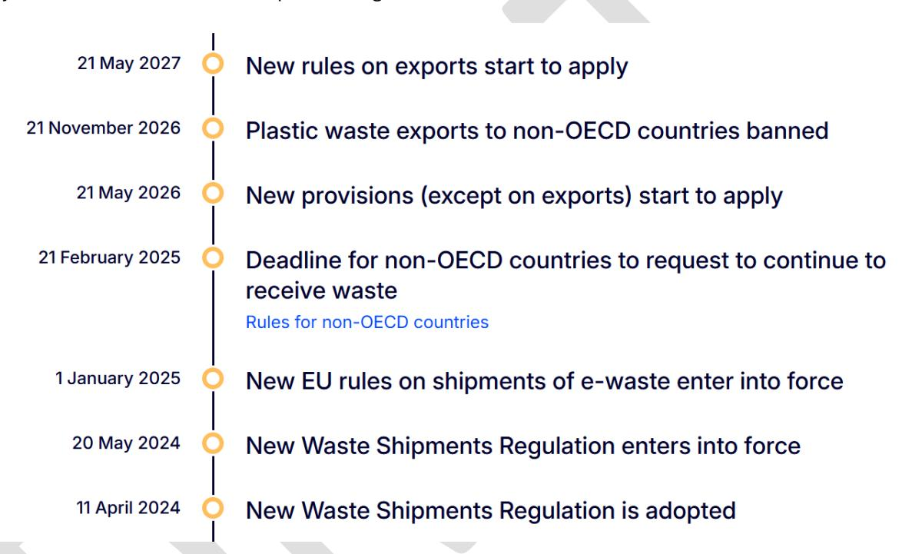

This project has received funding from the European Union's Horizon Research and Innovation program under grant agreement N° 101181901 and from the Swiss State Secretariat for Education, Research and Innovation (SERI). Posts and shares reflect only the views of all the involved partners. Neither the European Union nor the granting authority can be held responsible for them. This draft deliverable has not yet been validated by the granting authorities.

#### ANNEX 5: Recycling operators

Main actor in recycling with their turn over or volume treated:

#### Collectors/Mechanical:

- Boer goup (**NL**): 112 kt/ y of textile. 77 million € turnover. o Franken huis (boer group): Post consumer waste (0,6 kt/y)
- European Textile group (**Czech**): 10 million € revenue in reuse; 2 million in charity. Then bale into containers.
- RECOVER/ Ferre yarns (Hilaturas Ferre): **Spain**, Pakistan, Bangladesh, Vietnam, and El Salvador. Turnover 8,5 Million € (2021) / 18 Million €
- Altex gmbh (**Germany**): involved in recovered fibre but also product made out of it (insulation panel). Turnover: 17 million € (2024)
- Le relais/Minot (France): 80% of textile are collected by le relais in France.
- Textile house (**Slovakia**): collect and reuse, refurbish and reuse/recycle 20 kt of material per year. 20 million € revnue.
- Re&up (Tk)
- TEXAID
- Humana
- Procotex
- Vosges TLC
- Derotex
- Purfi global
- SEMATEX (BE): 5000 tons (recycling)
- Dalia textil bvba (BE) : sell for reuse
- ECO TEXTILE
- DAVY GROUP
- ASTRI Recycling Srl (It), Rifo.
- Coretex (It)
- ITR srl (It)
- SOEX
- TEXTILE REcyclinG iNTERNATIOnAl

#### • Södra (Sweden)

### Thermomechanical:

- AIN FIBRE
- FIL&Fab
- Aquafil
- Muovi

### Dissolution:

- Renewcell
- Lenzing AG: Refibra
- Circulose
- Worn again
- Ecollant

### Chemical:

- Recycelit
- Synthetica

- Eastman
- Carbios
- CIRC

ANNEX 6: Typology of alternative business models, their modes of operation, and practical examples (Gray et al., 2022)

| Alternative Business Model                   | Mode of Operation                                                                                                                                                                                                                 | Business Model Type     | Examples                                                                                                                                                                                    | Literature |
|----------------------------------------------|-----------------------------------------------------------------------------------------------------------------------------------------------------------------------------------------------------------------------------------|-------------------------|---------------------------------------------------------------------------------------------------------------------------------------------------------------------------------------------|------------|
| Design for extended garment lifespan         | Clothing items are designed and made to last in use for longer, using improved physical durability and emotional durability.                                                                                                      | Slow fashion            | Garment design and testing protocols are used by retailers to sell items that stand up to wear and tear; and classic styles that the wearer will want to keep wearing.                      | [37–39]    |
| Digital style consultancies and applications | Raw material demand and production impacts are reduced by increasing use over time of the same garment, by the same person through advice and help on styling, garment care and, reaching repair services.                        | Slow fashion            | Digital applications and platforms such as 'Save Your Wardrobe' help the wearer to track their wardrobes or to choose garments that they are more likely to wear and keep for longer.       | [40]       |
| Repair cafes                                 | Businesses and social enterprises provide space, either online or physical, for clothes mending and making activities.                                                                                                            | Reuse and repair        | Repair cafes provide community spaces to encourage repair through events, with a focus on skill sharing and keeping clothes from going to waste.                                            | [41,42]    |
| Sharing platforms                            | Online platforms provided for consumers to swap and share clothes. These provide a way for people to exchange clothes, creating new opportunities for clothing to be worn again, as well as for social interaction.               | Reuse and repair        | Online platform for clothes swapping for credits or directly swapping one item for another. May also store clothes between wearers and provide merchandising, e.g., Swap Society in the US. | [43]       |
| Repair services                              | Repair services help keep garments in use for longer. Often included within other models, e.g., resale and rental businesses will repair the garments they provide if needed but may also operate as a standalone business model. | Product Service Systems | Traditional repair services replace broken zips, mend seams, etc., often included in an alteration and/or dry-cleaning business.                                                            | [42]       |

| Alternative Business Model | Mode of Operation                                                                                                                                                                                                                                                                                                                                                                 | Business Model Type       | Examples                                                                                                                                                                                                                                                                                     | Literature |
|----------------------------|-----------------------------------------------------------------------------------------------------------------------------------------------------------------------------------------------------------------------------------------------------------------------------------------------------------------------------------------------------------------------------------|---------------------------|----------------------------------------------------------------------------------------------------------------------------------------------------------------------------------------------------------------------------------------------------------------------------------------------|------------|
| Subscription rental        | With subscription packages, customers rent garments and periodically change the garments in the package they are renting. Several items are rented at once for a month to three months and returned at the end of that period so they can go out to another customer.                                                                                                             | Product Service Systems   | The Devout provides an example of a subscription rental business. Others include Upchoose for baby clothes in the US and the Little Loop for kids clothes in the UK, indicating that this model works for items with enduring appeal and also for people whose needs are changing over time. | [20]       |
| Leasing                    | Leasing is similar to rental models in that the business provides garments to more than one owner during its lifespan, although usually the lease period is longer than with a rental model. Design for durability and repair is an enabler for leasing-type models.                                                                                                              | Product Service Systems   | Mud Jeans provide an example of a clothing leasing model.                                                                                                                                                                                                                                    | [20]       |
| Clothing libraries         | Similar to rental models, clothing libraries work by providing physical premises and organized/facilitated clothes sharing; much like a municipal library for books, but for clothing.                                                                                                                                                                                            | Collaborative Consumption | Examples include LENA, a clothing library in the Netherlands. Clothing libraries operate in a way that is similar to rental and leasing, but likely to be not-for-profit.                                                                                                                    | [24,43]    |
| Swapping events            | Clothes swapping events show the sharing economy in action and allow people to renew their wardrobes without increasing the number of items in them. They usually take place in person, in or near to city centres. People attending events pay a fee for entry and are often asked to bring clothes with them to donate to the event. They can then choose clothes to take home. | Collaborative Consumption | Swap shops and swap events are often community-organised and may be one-offs or organised as fundraisers for other types of organisation. Henninger et al. (2019) provide examples in the UK, Germany, and Finland.                                                                          | [49]       |

| Alternative Business Model | Mode of Operation                                                                                                                                                            | Business Model Type     | Examples                                                                                                                                                                                                                                                                   | Literature |
|----------------------------|------------------------------------------------------------------------------------------------------------------------------------------------------------------------------|-------------------------|----------------------------------------------------------------------------------------------------------------------------------------------------------------------------------------------------------------------------------------------------------------------------|------------|
| Redesign                   | Used garments and textile products are redesigned, upcycled and sold again, often transformed to a new type of product but reusing or repurposing the materials.             | Product Service Systems | Examples often use materials from outside clothing/home textiles to ensure supply of material with a consistent look and feel. Manshoven et al. provide the example of hotel towels being redesigned to give a consistent source of soft material to produce baby clothes. | [9,44]     |
| Online resale businesses   | Resale of secondhand clothing online so that it can be worn again, as it is. Items are received or bought by the business and sold again with minimum refurbishment.         | Reuse and repair        | Resale online makes it possible to sell secondhand items covering specialist markets, styles, and specialist sizing, with the digital presence achieving a wide reach. Examples include Rerun Clothing in the UK.                                                          | [45,46]    |
| Online resale platforms    | Platforms for resale provide a model for people to sell their own garments on.                                                                                               | Product Service Systems | Well-known models such as eBay have seen competition from newer businesses such as Vinted which have shown strong growth in recent years.                                                                                                                                  | [20]       |
| Take-back                  | Retailers use existing provision such as charity donation and resale to handle collected, used garments. Take-back models often export a large proportion of items received. | Product Service Systems | Marks and Spencer's 'Shwopping' uses existing retail infrastructure to collect clothing in stores that can then be sold on by the charity Oxfam.                                                                                                                           | [47]       |
| In-store resale            | Vintage stores, market stalls and secondhand boutiques buy used garments and sell them to new consumers so that they gain a 'second life'.                                   | Reuse and repair        | There are very many vintage stores, market stalls selling secondhand clothes, and secondhand boutiques. Most are small businesses.                                                                                                                                         | [42]       |
| Charity resale             | Charity retailers receive donations and sell on to consumers, largely via high street shops (although some also have an                                                      |                         |                                                                                                                                                                                                                                                                            |            |