the Swiss State Secretariat for Education, Research and Innovation (SERI). Posts and shares reflect only the views of all the involved partners. Neither

This draft deliverable has not yet been validated by the granting authorities

# Advancing sustainable textiles in the circular economy through innovative EPR schemes

# Advancing sustainable textiles in the circular economy through innovative EPR schemes

| Table of Contents                      |                                                        |
|----------------------------------------|--------------------------------------------------------|
| Metadata & Project Information         | 3                                                      |
| Africa Textile Circularity –           | Social & Economic Impacts                              |
| Grey Literature Review                 | 5                                                      |
| Systematic Literature Review –         | African Textile Circularity & Socio-Economic           |
| EU Post-Consumer Textile Circularity – | Social & Economic Impacts                              |
| Grey Literature Review                 | 75                                                     |
| Systematic Literature Review –         | Post-Consumer Circularity in the EU Textile Sector 135 |
| Sustainability Transitions –           | Social & Economic Impacts in Global Value Chains       |
| Grey Literature Review                 | 162                                                    |
| Systematic Literature Review –         | Sustainability Transitions in Global Value Chains 222  |

#### **Acronym**: TRUSTex

**Call**: HORIZON-CL6-2024-CircBio-01-2

**Topic**: HORIZON-CL6-2024-CircBio-01-2 — *Circular solutions for textile value chains based on extended producer responsibility (Innovation Action)*

**Start date**: 1st January 2025

**Duration**: 36 months (WP1/T1.3 runs Months 1–24)

**List of participants:** LIST (Coordinator), H-DA, FESI, SANKO Tekstil, CTB, CETIM, HUMANA, TEAM2, RESORTECS, MADE2FLOW, PI, UCD, TOMRA, VTT, LMDDC, ENA, Terra Matters, NEOVILI SA\*, SCANTRUST SA\* (\*Associated Partners).

### **Deliverable: D1.6 — Literature review socio-economic impact**

### **Due date submission: M11 (postponed from M9) – 30/11/2025**

**Submission date:** 28/11/2025

| Document Number:    | D1.6 — Literature Review on Socio-Economic Impacts — T1.3               |
|---------------------|-------------------------------------------------------------------------|
| Document Title:     | Consolidated Literature Review of Socioeconomic Impacts and Third      |
| Dissemination level | PU – Public, fully open,                                                |
| Period:             | PR1                                                                     |
| WP:                 | WP1 – Baseline Analysis & Impact Assessment                             |
| Task:               | T1.3 — Socio-economic impacts & circularity externalities in EU         |
|                     | This consolidated deliverable brings together six literature reviews —  |
|                     | three grey literature reviews and three systematic literature reviews — |

|  | Version | Date | Description |
|--|---------|------|-------------|
|  |         |      |             |

| <b>Version 1</b> | 27/11/2025 | Draft version of Deliverable D1.6 (grey and systematic literature review)         |
|------------------|------------|-----------------------------------------------------------------------------------|
| <b>Version 2</b> | 30/11/2025 | Final revised version of Deliverable D1.6 (grey and systematic literature review) |

**Textile Circularity and Work**

**Africa Textile Circularity -Social and Economic Impacts**

**Review of the Grey Literature**

### **Table of Contents**

| Glossary                                                   | 7  |
|------------------------------------------------------------|----|
| Terminology                                                | 10 |
| Executive Summary                                          | 10 |
| Introduction                                               | 13 |
| Section1: Africa Worn Clothing and Textile Waste           | 15 |
| Worn Clothing Trade in Africa                              | 15 |
| Textile Waste in Africa                                    | 25 |
| Socioeconomic Impacts of the Textile Waste in Africa       | 27 |
| Section 2: Africa Circularity Solutions                    | 29 |
| Reframe Africa’s Role as Innovator in the Circular Economy | 29 |
| Build Local Circular Ecosystems                            | 30 |
| Support People Working in Circularity                      | 31 |
| Governance Mechanisms for a Just Circular Sector in Africa | 33 |
| Transformative Legislation Ensuring Accountability         | 35 |
| Public Awareness and Consumer Change                       | 37 |
| Conclusion                                                 | 38 |
| References                                                 | 39 |

# **GLOSSARY**

| Term                      | Definition                                                        |
|---------------------------|-------------------------------------------------------------------|
| Colonialism               | Historical systems of domination that continue to shape trade,    |
| Contract-based Hiring     | Employment through fixed-term or casual contracts, often          |
| Cooperatives              | Member-owned organisations pooling resources to achieve           |
| Dandora                   | Large waste site in Nairobi, Kenya.                               |
| Decent Wages              | Pay that allows workers to meet basic needs and live with         |
| Dioxins                   | Toxic chemicals released from burning chlorine-containing         |
| Domestic Post-Consumer    | Goods discarded by consumers within the same country.             |
| Due Diligence Legislation | Laws obliging companies to identify and address human rights      |
| Economic Justice          | Fair distribution of resources, opportunities and power to ensure |
| Externalities             | Social or environmental costs or benefits of economic activity    |
| Fibre Composition         | Material makeup of textiles (e.g., cotton, polyester), affecting  |
| Fibre-to-Fibre Recycling  | Processes that recover fibres from old textiles to produce new    |
| Formal Employment         | Registered jobs with contracts, protections and legal rights.     |
| Formalisation             | Process of integrating informal workers and businesses into       |
| Gikomba                   | Major second-hand clothing market in Nairobi, Kenya.              |

| Grey Literature            | Research and reports not formally published in academic           |
|----------------------------|-------------------------------------------------------------------|
| HS6309                     | Customs code for worn clothing in global trade.                   |
| Illegal Dumpsites          | Unregulated waste disposal sites causing environmental and        |
| Imported Waste             | Waste goods entering a country from another country.              |
| In-store Collection Points | Retail-based drop-off systems for used textiles to be recycled or |
| Inclusive Engagement       | Ensuring diverse stakeholders, including marginalised groups,     |
| Informal Markets           | Unregulated markets not taxed or monitored, central to the        |
| Informal Work              | Workers without formal contracts or protections often in          |
| Informal Workers           | Workers without formal contracts or protections often in          |
| Kantamanto Market          | One of West Africa’s largest second -hand clothing markets, in    |
| Kayayei (Female Porters)   | Young women in Ghana who carry heavy loads, including             |
| Micro-enterprises          | Small businesses with fewer than ten workers, can be formal or    |
| Microplastics              | Tiny plastic particles from synthetic fibres, harmful to          |
| Minimum Wage Laws          | Legal minimum pay employers must provide workers.                 |
| Neocolonialism             | Modern practices replicating colonial patterns of dependency      |
| Open-air Landfills         | Waste sites without containment or treatment, exposing            |
| Overproduction             | Producing more goods than demanded often leading to waste         |
| Participatory Frameworks   | Governance structures that enable equal input from diverse        |
| Power Imbalance            | Unequal distribution of influence or resources across value       |
| Post-consumer waste        | Textiles discarded after use by consumers.                        |
| Pre-consumer waste         | Waste materials generated during production before reaching       |
| Precarious Jobs            | Insecure, low-paid employment lacking protections.                |

| Product Origin         | The country where a product is manufactured, relevant for trade   |
|------------------------|-------------------------------------------------------------------|
| Re-exporting Countries | Countries that import goods and then export them again with       |
| Recycling              | Converting waste materials into new raw materials or products.    |
| Repurposing            | Using products for new functions without major transformation.    |
| Reuse                  | Extending product life by using it again in original or new ways. |
| Second-hand Clothing   | Previously owned garments sold for reuse.                         |
| Social Protections     | Systems of government support that provide security against       |
| Socioeconomic Impacts  | Combined social and economic effects of industries, policies or   |
| Sovereignty            | A state’s authority to govern independently.                      |
| Structural Adjustment  | Economic reforms imposed by global financial institutions.        |
| Synthetic Fibres       | Man-made fibres such as polyester, nylon, acrylic and elastane.   |
| Trade Frameworks       | Agreements and policies governing international trade.            |
| Trade Liberalisation   | Removal of tariffs and quotas to encourage free trade.            |
| Ultra-fast Fashion     | Extreme fast fashion model with very short design-to-retail       |
| UN Comtrade Database   | UN-managed database for tracking international trade flows.       |
| Up-cyclers             | Entrepreneurs/organisations transforming waste into higher       |
| Upcycling              | Reusing or repurposing materials to increase value, functionality |
| Waste Colonialism      | Exporting waste from wealthier nations to poorer ones,            |
| Waste Hierarchy        | Framework ranking waste management from prevention to             |
| Wellbeing              | Overall quality of life, including physical, mental and social    |
| Worker Wellbeing       | The physical, mental and social quality of workers’ lives.        |
| Working Conditions     | Terms and environment of employment, including wages, safety      |
| Worn-clothing Trade    | Global business of exporting/importing second-hand clothes        |

# **Terminology**

The terms "Global North" and "Global South" are widely used in policy and academic reports to describe economic and political divisions, and they are used widely in the grey literature reports we analysed. However, these labels are contested and "Global Minority" (for wealthier, industrialised countries) and "Global Majority" (for the broader population of lower-income nations) are given as alternatives, reflecting demographic realities and shifting power structures. However, these terms are still gaining traction and may not be universally understood. Other labels such has "high-income countries" (HICs) and "low- and middle-income countries" (LMICs) or regional names when describing groups of countries are also used. As much as possible, we will try to focus on the specific countries to ensure the focus on the specific dynamics present in those countries, however other categories will be used as they have been reported or when discussing trading regions HICs and LMICs will be used.

When we discuss the "textile industry", we focus on textiles in apparel and sportswear sectors and exclude other sectors such furnishings and technical textiles used in automotive or health care industries. However, most reports do not define their boundaries of the textile industry so this classification cannot be guaranteed in the analysis.

In keeping with the definitions given by the trade associations we use the term "worn-clothing trade" to identify and highlight the trade in items categorised as 6309 in trade terms. Whenever we discuss the trade, we use this term. However, when we talk about the selling of imported worn clothing, we use the term "second-hand clothing" and for the markets where the selling happens "second-hand clothing markets". So worn clothing is when clothes are imported and exported but when they are sold to consumers garments are second-hand clothing through second-hand clothing markets.

# **Executive Summary**

Africa's circularity industry is a patchwork of different structures and initiatives happening in different countries and regions. Ghana, Kenya, Tanzania, Mozambique and Nigeria are central to the worn-clothing trade with millions of worn-clothing garments exported to these countries. Other countries are involved in the selling second-hand clothes to local communities such as Angola, Guinea-Bissau and Zambia. This report will analyse the grey literature, reports from international governing bodies, non-governmental organisations (NGOs) and other national and international

groups that are not published in academic journals, to uncover the structure, dynamics, tensions and possible solutions to ensure a just and fair African circularity industry.

### **Africa's Circularity Industry**

The global fashion industry's shift to ultra-fast fashion has led to overproduction, with companies releasing between 2,000 and 10,000 new items daily compared to two traditional fashion seasons annually. As a result, textile consumption is rising while the average garment lifespan is decreasing. Much of the excess clothing ends up in oversupplied second-hand markets or as waste. From 2000 to 2019, the European Union's (EU's) exports of worn clothing increased from 550,000 to 1.7 million tonnes. Africa now receives 35% of all global worn-clothing exports.

Ghana is the largest importer of worn clothing in Africa with 15 million garments arriving daily. In 2023, Ghana received approximately 54,000 tonnes of worn clothing worth USD 44 million from the EU27+. Kenya imported an estimated 197,000 tonnes from across the globe in 2023 but saw a 40% decline in EU imports compared to 2013, suggesting a change in worn-clothing trade dynamics.

The worn-clothing trade and second-hand clothes markets support the livelihoods of millions of people but are marked by widespread informality. In Ghana, around 22000 formal jobs exist in the sector with a 1 to 2 ratio of formal to informal workers. In Kenya, over 2 million people depend on the sector, with a formal to informal job ratio of 1 to 10. Across, the Southern and Eastern regions, Angola, Guinea-Bissau, Malawi, Mozambique, and Zambia, 1.28 million people are employed in worn-clothing related activities. With each tonne of imported worn clothing sustaining around 6.5 jobs.

Economically, the worn-clothing sector contributes significantly to African countries. In Ghana, the total positive economic impact is USD 76 million with USD 29.5 million in import duty revenue alone. Kenya's trade with the EU contributes USD 9.2 million to gross domestic product (GDP) and supports 36,00 formal jobs. In Mozambique, the sector adds USD 2.7 million to GDP and supports around 1,000 formal jobs.

However, environmental and social costs are significant. Waste in clothing bales ranges from below 5 to 40 percent, overwhelming local waste systems. Informal workers, particularly women, face poor and hazardous working conditions. Unsafe burning of unsellable garments and lack of infrastructure worsen environmental degradation. The influx of worn clothing can also undermine local textile industries. For example, Ghana's textile workforce declined from over 30,000 to a few thousand. Domestic producers struggle to compete with the volume and low prices of imports, stifling innovation and sustainable industrial development.

Power imbalances persist. African countries have limited ability to regulate worn clothing imports. The 2016 East African Community's attempt to ban imports was reversed under US pressure tied to trade benefits under the African Growth and Opportunity Act (AGOA). These events reveal the limited sovereignty African countries have in managing the impact of the global textile worn clothing and textile waste industries.

### **Building a Just and Fair African Circularity Sector**

As the EU advances its circularity policies, it must ensure these do not replicate historical inequalities. Exporting used textiles without supporting local capacity risks turning circularity into another form of waste colonialism. Key actions for the EU and for the industry include increasing legislation and EPR schemes that ensure transparency in textile waste exports; support formalisation of local second-hand economies; ensure decent wages, working conditions and worker wellbeing; allows for investment in local circular infrastructure and manufacturing; and ensure trade frameworks respect the sovereignty and sustainability goals of importing countries.

Africa's potential role in the global circular economy is often misunderstood. Rather than simply being a recipient of second-hand goods or waste, many African countries are sites of innovation, with dynamic repair cultures, circular micro-enterprises and emerging sustainable manufacturing initiatives. In cities across the continent, informal workers have already developed reuse and repurposing skills, often without state support or recognition. These decentralised systems, although undervalued, point to locally grounded models of circularity that differ markedly from those promoted in HICs and from which there is a lot to learn.

To strengthen these systems and ensure they contribute to a just and fair circularity system, investments is essential. This includes building infrastructure for reuse, repair, and upcycling, as well as supporting small and medium-sized enterprises (SMEs) and cooperatives already working in this sector.

Equally important is the need to ensure decent work for those people who are already skilled in circular practices, particularly in informal and often precarious jobs. Workers who sort, repair, sell and manage waste clothing, many of them women, face long hours, low pay, unsafe conditions and limited social protections. Addressing these issues requires formal recognition, improved working conditions, access to childcare and healthcare and protections from exploitation.

Finally, international and regional regulations can help align circularity efforts with broader goals of economic justice. These include harmonised import standards, extended producer responsibility (EPR) schemes that consider impacts on trading partner economies and due diligence legislation that addresses overproduction at its source. Global governance frameworks should treat Africa not as a dumping ground for excess but as a strategic and equal partner in shaping sustainable textile futures.

# **Introduction**

Africa Circularity is the third report in a three-part series of reports focusing on the grey literature related to the textile and textile circularity industries. The first report looked at Global Textile Value Chains and the second part focused on EU circularity. This final report focuses on circularity in Africa citing the literature on the trade in worn clothing, the markets were buying and selling of second-hand clothes takes place, and the socioeconomic impacts of these sectors, particularly on jobs, wages, working conditions and wellbeing.

This report reviews non-peer-reviewed materials often referred to as grey literature that address the experiences and conditions of workers in the textile and garment supply chains, drawing on sources not typically found in academic journals (Hussain et al., 2025).

According to Hussain et al. (2025), grey literature plays an outsized role in defining and advancing circular economy strategies, often without critical scrutiny. For example, it has been widely cited that circular fashion models could generate €500 billion in additional revenue (Ellen MacArthur Foundation, 2017). However, more critical evaluations place this figure much lower at approximately US\$10–17 billion and predict a potential one-third drop in overall fashion sector revenue. This report does not aim to validate or dismiss these claims, but rather to document the current narratives and explore their socioeconomic implications. Future publications will engage more deeply with academic research to substantiate or contest these positions.

Through this series, we aim to develop an evidence base that supports informed decision-making by stakeholders in the textile and circularity sectors, including workers, unions, policy actors, and TRUSTex consortium partners. Our objective is to ensure that sustainability transitions and regulatory mechanisms enhance, rather than jeopardize, the livelihoods of those both within the EU and in partner economies. We also invite participation from across the value chain—including producers, retailers, brands, NGOs, EPR bodies, and actors involved in collection, reuse, and recycling—to collaboratively address the industry's pressing social and economic concerns.

In recent decades, the global fashion industry has witnessed unprecedented growth, driven by an acceleration in production cycles and consumption patterns (Trunk et al., 2023). Textile consumption continues to increase, even as the average lifespan of garments steadily declines (Engelhardt et al., 2023). This growth is fuelled in large part by ultra-fast fashion platforms. These companies produce 2,000 to 10,000 new items daily, as compared to two traditional six-month fashion cycles (Diamond,2023). The result is a massive surplus of clothing, much of which ends up unsold, discarded, or funnelled into second-hand markets, where supply far outstrips demand (Hussain et al., 2025).

As overproduction continues, worn-clothing exports have surged, particularly from Europe and North America to the Global South. Ghana is the leading importer, with a volume of 15 million garments daily in 2023 (Reinkenhoff and Ahlmann, 2023). While about 50% of used garments collected in Europe remain within Europe, Ukraine and Russia; 35% are sent to Africa; 13% to Asia; and 2% to the Americas. Between 2000 and 2019, European Union (EU) exports of worn clothing tripled, from 550,000 tonnes to nearly 1.7 million tonnes (Lingås et al., 2023). However, there is a contradiction in the numbers related to waste textiles, with WasteAid (2024) reporting around 1% of used clothes in bales in Uganda were waste, while Trunk et al. (2023) estimated as much as half of the clothes exported to Kenya in 2021 were waste.

Africa has become a central hub in this global system, both as a consumer of second-hand clothing and, increasingly, as a recipient of textile waste. Countries such as Ghana, Kenya, Tanzania, Nigeria and Mozambique have emerged as key receivers for worn-clothing imports. While some garments enter thriving second-hand clothing markets, many are unsuitable for resale and burden local waste systems (The Or Foundation, 2022; Trunk et al., 2023).

The worn clothing trade in Africa is a striking paradox. On one hand, it generates jobs and supplies affordable garments to low-income populations, while on the other, it contributes to pollution, unmanageable textile waste, hazardous working conditions and adverse health effects (Trunk et al., 2023).

The difference in the evolution of circularity in high-income countries (HICs) compared to low-tomiddle-income countries (LMICs), shows how very different jobs can be created in an evolving industry. What is certain is that not all circularity jobs are the same. Jobs in the second-hand clothing markets and waste management of textiles in LMICs are routinely dangerous with exposure to toxins and harmful chemicals coupled with a lack of adequate wages, employment and social security. LMIC governments also find it difficult to invest in high-value and high-income circularity practices due to a number of historical and current circumstances. Coupled with

advanced technology use in the circularity industry in HICs, this is making it even more difficult for LMICs to embrace circularity (Circle Economy, 2024).

As worn clothing and textile waste from across the globe continue to reshape economic and environmental landscapes across African nations, a deeper investigation is needed. This includes examining working conditions, income security, health and safety standards, and the presence, or absence, of worker representation (**United Nations Development Programme (UNDP) et al., 2024**). Particular attention must be given to the rights and vulnerabilities of marginalised groups, including women who bear a disproportionate share of the problems of the worn-clothing trade. This report will investigate the grey literature that identifies the structure of the circularity industry in different African countries, the challenges facing these countries and proposed solutions to these challenges.

### **1 SECTION 1: AFRICA WORN CLOTHING & TEXTILE WASTE**

This section explores how second-hand clothes and textile waste, largely originating from the Global North, are shaping economic opportunities and environmental challenges across African countries. By tracing the journey of used garments from donation bins in Europe and North America to markets and landfills across Africa, we reveal the structural benefits and inequalities embedded in the global worn-clothing trade. We highlight the jobs made possible by the wornclothing trade but also the poor working conditions for people involved in worn-clothing trade, the second-hand clothing markets and waste industries and call for systemic change in global wornclothing trade governance and practice.

### **1.1 Worn-Clothing Trade in Africa**

This section focuses on the volume of worn clothing exported by major exporting countries, imported by major African countries, emerging African importing countries and African countries involved in re-exporting.

### **Major Exporting Countries to Africa**

Globally, the worn clothing trade is dominated by a small group of powerful exporters, most notably the United States, Canada and several European countries such as Germany, Belgium and the Netherlands. Total largest global worn-clothing exporters for 2021 are the US (USD 834 million), China (USD 709 million), UK (USD 386 million), Germany (USD 359 million) and South Korea (USD 324 million) (Diamond, 2023 and Observatory of Economic Complexity, 2021). These nations function not only as collection points for worn clothing but also as key sorting and redistribution hubs, playing a decisive role in determining the volume, quality and final destinations of worn clothing (UN Comtrade Database, 2025; Lingås et al, 2023).

Within the EU, countries such as Belgium, Germany, Italy, the Netherlands and Poland have large-scale textile sorting infrastructures that process worn clothing sourced from across the EU for re-export.

The two main countries receiving exports from other countries are Ghana and Kenya. The value of worn-clothing exports to Ghana (2022) from the United Kingdom: USD 64 million, China: USD 41 million and Canada: USD10 million (Observatory of Economic Complexity, 2021; Odonkor, 2024). While exports to Kenya in 2021 are valued at China: USD 72.2 million, EU+UK: USD 30.2 million, US: USD 8.7 million (Diamond, 2023; Observatory of Economic Complexity, 2021). Tanzania and Nigeria are also key importing countries, however, the focus on these countries in the grey literature is much more limited.

#### *Ghana*

Over the past two decades, imports of worn clothing have increased steadily across the African continent and are projected to continue to rise (Lingås et al., 2023). In Ghana figures for 2022 showed the worn clothing import trade was worth estimates of USD 164 million (Circle Economy, 2024; Odonkor, 2024), USD 182 million (Reinkenhoff and Ahlmann, 2023), or USD 214 million (Diamond, 2023).

According to the grey literature, Ghana is the largest recipient of worn clothing imports from the European Union (Economics, 2024). In 2023, USD 44 million worth of worn clothing were imported from the EU27+, which is approx. 54,000 tonnes of worn clothing. Over the past decade, the volume of clothing imports has increased by 6%, while the total value has grown by 28% (Oxford Economics, 2024).

#### *Kenya*

Kenya is another major importer of worn clothing in sub-Saharan Africa. Each year, Kenya imports approximately 190,000 tonnes of worn clothing (Oxford Economics, 2024). In 2021, Kenya imported 183,830 tonnes of worn clothing, representing a 39 % increase from 2017 (Diamond, 2023; Kenya National Bureau of Statistics Economic Survey, 2022). In 2023, import volumes reached an estimated 197,000 tonnes (Diamond, 2023; Kenya National Bureau of Statistics Economic Survey, 2022). These figures underline the continued growth of the sector. However, it is important to note a marked decline in worn-clothing imports to Kenya from the EU27+. By 2023, imports from the EU27+ had dropped to 25,430 tonnes, valued at USD 26 million, a decrease of 36 % in value and 40 % in volume compared to 2013 levels (Oxford Economics, 2024). This decline highlights changing trade patterns and may indicate a growing reliance on worn-clothing sources beyond the EU.

### **Regional Hubs and Re-exporting Countries in Africa**

The largest percentage of trade flows of worn clothing across the world occur in Africa representing 35% of total global worn-clothing trade flows. These include Ghana 4%, Kenya 3.8%, Tanzania 3.3% and Nigeria 2.8% and Mozambique 1.7% (Consulting for Africa and Abalon Capital Limitada, 2025; UN Comtrade Data).

Both Ghana and Kenya serve as critical entry points for worn-clothing imports and facilitate redistribution across the continent. Ghana plays a significant role not only as a destination for worn clothing imports but also as a re-exporter of worn clothing. Key destinations for worn clothing passing through Ghana in 2021 and 2022 included Burkina Faso, Niger, Kenya, Benin, the United Kingdom and the United States (Odonkor, 2024). This highlights the importance of regional trade networks, with neighbouring West African countries alongside prominent international markets such as the UK and the US.

Kenya is as a key sorting and processing centre for worn clothing, not only meeting domestic demand but also exporting used clothing as a commodity to other African countries and international destinations. Rwanda is the largest recipient for worn clothing from Kenya, followed by the Democratic Republic of Congo; with smaller volumes exported to South Africa and Sudan (Consulting for Africa and Abalon Capital Limitada, 2025).

#### **Power Imbalance in the Worn-Clothing Trade**

Despite the extensive consumption of worn clothing, the financial benefits of and jobs created from the worn-clothing trade, power dynamics are a key characteristic of the worn-clothing trade. Non-governmental organisations and scholars have raised important questions about whether this trade constitutes a form of neocolonialism or whether it represents a resourceful adaptation by local actors to structural economic challenges (The Or Foundation, 2022).The concept of neocolonialism is particularly relevant here, as the flow of worn clothing from across the world into African countries often mirrors historic colonial trade patterns, where wealthier nations extract value while offloading externalities (The Or Foundation, 2022).

Environmental lobby groups have further argued that this system amounts to "waste colonialism," whereby clothing that is no longer desirable or sellable in Western countries is exported to LMICs under the guise of charity or economic opportunity (Consulting For Africa and Abalon Capital Limitada, 2025).

The dominance of Western exporters and their influence over global trade rules limits the bargaining power of African nations, many of which are forced to accept imports with minimal capacity to regulate quality or volume (The Or Foundation, 2022). These dynamics reflect broader neocolonial logics, where economic dependency is maintained through market structures (Consulting for Africa and Abalon Capital Limitada, 2025).

The continued framing of worn clothing as "aid" or "sustainable consumption" masks its exploitative dimensions, allowing exporting countries to avoid accountability for the environmental and social consequences (Lingås et al., 2023). Worn clothing becomes not merely a commodity, but a vehicle through which structural inequalities are reproduced under the guise of development.

Attempts by African countries to assert control over this system have met with resistance. In 2016, members of the East African Community (EAC), including Kenya, Uganda and Rwanda, proposed a regional ban on the import of worn clothing by 2019 to protect domestic textile industries. However, the US retaliated by declaring the ban a violation of the African Growth and Opportunity Act (AGOA), threatening to withdraw trade benefits (Consulting for Africa and Abalon Capital Limitada, 2025). Under pressure, Kenya and Uganda reversed their bans to maintain access to AGOA while Rwanda upheld its policy and was subsequently suspended from the agreement (Consulting for Africa and Abalon Capital Limitada, 2025). This episode illustrates how the sovereignty of African states is often constrained by the geopolitical leverage of wealthier nations, particularly when economic aid and trade access are used as tools of compliance.

These tensions are deepening as new international circular economy policies emerge. While such policies claim to promote sustainability, they also risk reinforcing trade imbalances. Emerging EU regulations, for instance, highlight growing friction between national sovereignty and international trade frameworks, especially for African nations trying to regulate what enters their borders (Trunk et al., 2023). Despite the language of partnership, governments of some African countries face significant structural and political constraints when challenging the influx of worn clothing imports.

Ultimately, the worn-clothing trade exposes systemic inequality within global economies. As worn clothing makes its way into African markets and ultimately landfills, it becomes a physical

manifestation of environmental neglect and economic coercion (Trunk et al., 2023). The burden of managing this waste, socially, financially, and ecologically, falls disproportionately on nations with limited infrastructure and fiscal capacity. Without a fundamental rebalancing of trade relations and stronger protections for importing countries, circularity itself risks becoming yet another form of neocolonialism under the guise of sustainability (Lingås et al., 2023).

### **1.2 Socioeconomic Impacts of the Worn-Clothing Industry in Africa**

The trade in worn clothing in different African countries has led to both negative and positive impacts. The trade provides opportunities for many African countries to gain access to cheap and plentiful supplies of clothing, financial benefits for African nations and job opportunities for people across Africa. However, this comes at considerable cost in terms of the power African nations have to shape and determine their own policies and destinies as well as the considerable informal economy and insecure jobs that have grown from the worn-clothing trade and the impact on local textile industries.

### **Worn Clothing Consumption**

The worn-clothing trade means that affordable second-hand clothing is available for people in multiple African countries including Ghana, Kenya, Angola, Malawi and Mozambique.

#### *Ghana*

The worn clothing trade is now central to Ghana's retail economy and is deeply embedded in the country's cultural and socioeconomic fabric (Odonkor, 2024). Approximately 95% of Ghana's population consumes worn clothing (Odonkor, 2024).

#### *Kenya*

Imports of worn clothing in Kenya offer affordable clothing options to millions of consumers (Diamond, 2023; Mitumba Consortium Association of Kenya, 2025). The industry is crucial to meeting basic needs because without it, an estimated 24.2 million Kenyans, many living below the poverty line, would be unable to access sufficient clothing (Diamond, 2023; Mitumba Consortium Association of Kenya, 2025).

#### *Angola*

In Angola, worn-clothing consumption is commonplace (Feyertag and Diamond, 2024). It is estimated that between 80 to 90% of the Angolan population relies on worn clothing as their primary source of apparel (Feyertag and Diamond, 2024). Based on a minimum clothing requirement of seven garments per person per year, equivalent to approximately two kilograms, national demand is estimated at around 24,000 tonnes of SHC annually (Feyertag and Diamond, 2024).

This figure underscores Angola's significant reliance on imported worn garments, despite the sector's underrepresentation in formal trade and labour statistics. This high consumption level highlights Angola's strong dependence on imported worn clothing, despite the limited visibility of the sector in existing economic or trade data.

### *Malawi*

There is also evidence that Malawi's worn-clothing imports provide affordable clothing options for a large segment of the population, contributing to social welfare and economic inclusion (Feyertag and Diamond, 2024). The same report further indicates that over 1.28 million people are employed in the worn clothing sector in Malawi, with each tonne of SHC imported sustaining on average 6.5 jobs. This represents up to 25% of total service sector employment, in countries where most of the population relies on non-mechanised agriculture to support their livelihoods.

#### *Mozambique*

In Mozambique, estimates by one local development organisation, Development Aid from People to People (ADPP), estimate that from their operations alone, they contribute to the consumption of worn clothing by 534,000 people (ADPP Annual Report, 2023).

#### **Financial Benefits for African Countries**

Across multiple African countries, including Ghana, Kenya, Zambia, Angola, Benin, Nigeria, Malawi, Guinea Bissau, the worn-clothing trade is contributing to the countries' financial wellbeing (Feyertag and Diamond, 2024).

#### *Ghana*

In Ghana, the socioeconomic contribution of worn clothing imports including direct, indirect values is estimated to be US\$76 million (Oxford Economics, 2024). In recent years, worn-clothing imports generated an estimated US\$29.5 million in direct government revenues through import duties, excluding levies and exemptions.

The worn-clothing sector in Kenya plays a critical role in the country's economy, contributing significantly to government revenue. In economic terms, the worn-clothing trade between Kenya and the EU27+ made a direct contribution to Kenya's GDP of approximately USD9.2 million and supported around 3,600 formal jobs (Oxford Economics, 2024). This underscores the sector's importance not only for consumer access but also as a source of fiscal revenue. The wornclothing re-exporting trade also generates significant government revenue, reinforcing Kenya's strategic role within the regional worn clothing trade (Diamond, 2023; Consortium Association of Kenya, 2025).

### *Mozambique*

In Mozambique, the worn-clothing trade and second-hand market sectors are a modest but important contributor to the national economy. The sectors generated an estimated direct contribution of USD 2.7 million to Mozambique's Gross Domestic Product (GDP) (Oxford Economics, 2024). This impact is driven primarily by relatively high salaries and wages paid to workers employed within the industry (Feyertag and Diamond, 2024).

### *Emerging African Countries*

For countries in Southern African, financial contributions from the worn clothes trade were estimated to be more than USD 73.5 million in 2022, in Zambia and its regional peers such as Angola, Guinea Bissau, Malawi, Mozambique and Zambia, including import tariffs, value-added tax (VAT), and associated freight costs (Feyertag and Diamond, 2024).These revenues provide essential resources for government budgets and public services in contexts of limited fiscal options.

### **Jobs and Livelihoods**

While importing and the worn-clothing trade are highlighted as essential to fiscal benefits and jobs in African countries, the selling of second-hand clothing at markets forms the backbone of urban, informal economies across Africa, generating employment for millions of people, including traders, porters, tailors, sorters, transporters and recyclers (Odonkor, 2024).

Second-hand clothes markets also offer vital economic opportunities for women, allowing them to earn income while also managing household work, thereby contributing to gender inclusion particularly in low-income, urban settings (UNDP et al., 2024).

#### *Ghana*

The worn-clothing trade and second-hand clothing sectors in Ghana support approximately 22,000 formal jobs (Oxford Economics, 2024) and a wide network of small-scale retailers. Most of whom earn between GH¢500 and GH¢1,000 per month (approximately US\$40–75), reflecting Ghana's relatively low cost of living (Odonkor, 2024). In comparison, the Ghanian minimum wage is GH¢375 per month (Reinkenhoff and Ahlmann, 2023). Importantly, 88% of second-hand clothing retailers serve as the primary earners in their households, underlining the sector's role in sustaining livelihoods.

#### *Kenya*

In Kenya, the second-hand clothing markets, locally known as *mitumba*, employ over 2 million people, many of whom depend on earnings from resale and garment alterations (Diamond, 2023). For example, it is estimated that the worn-clothing trade between Kenya and the EU27+ made a direct contribution to employment ensuring approx. 3,600 formal jobs (Oxford Economics, 2024). For many, worn and second-hand clothing offer a vital source of livelihood and economic inclusion.

### *Mozambique*

Second-hand clothing markets in Mozambique account for 296 permanent jobs, 23 sales outlets, 2,400 wholesalers and small traders, and over 534,000 customers (ADPP, Annual Report, 2023). Worn-clothing imports from the EU27+ to Mozambique supported the creation of approximately 1,000 formal jobs in 2023. Although the scale of Mozambique's worn-clothing sector is smaller compared to Ghana or Kenya, its economic footprint is nonetheless meaningful, particularly in the context of formal employment generation and household income (Feyertag and Diamond, 2024).

### *Emerging African Countries*

Across Angola, Guinea-Bissau, Malawi, Mozambique, and Zambia, more than 1.28 million people are employed in the worn-clothing trade and second-hand markets sectors supporting 2.5 million people across these countries when you consider families in households (Feyertag and Diamond, 2024). On average, each tonne of imported worn clothing sustains approximately 6.5 jobs, highlighting the labour-intensive nature of the trade and its contribution to employment across the region (Feyertag and Diamond, 2024). This represents up to 25% of total service sector employment, in countries where most of the population relies on non-mechanised agriculture to support their livelihoods. (Feyertag and Diamond, 2024). This is particularly important in countries, such as Guinea-Bissau, Malawi, Mozambique and Zambia where two-thirds of people still live in extreme and multi-dimensional poverty (Feyertag and Diamond, 2024).

#### *Upcycling and Repurposing*

Beyond import trade and second-hand markets, textile repurposing is a vital function of the informal worn clothing economy, where tailors and up-cyclers alter garments to align with local tastes and extend product lifecycles (Engelhardt et al., 2024). This practice not only creates micro-enterprises for repair and customisation but also contributes to circularity at a grassroots level. Case studies across Ghana, Kenya, and Mozambique consistently highlight this adaptive capacity within informal economies (Odonkor, 2024).

### **Informality**

Additionally, while the worn-clothing trade and second-hand clothing markets sustain livelihoods for many, they also reinforce structural inequalities embedded in global fashion supply chains (The Or Foundation, 2022). The worn clothing trade and second-hand clothing markets, despite their scale and economic significance, remain largely informal and unregulated across most of Africa. These sectors are characterised by a high degree of informality, with informal employment significantly outnumbering formal sector jobs. More than 80% of the imported clothing is sold through informal markets, reinforcing the sector's central role in African economies (Oxford Economics, 2024; The Or Foundation, 2022). However, according to recent findings (Oxford Economics, 2024), the ratio of informal to formal jobs varies by country, highlighting structural differences in labour market dynamics.

#### *Ghana*

In Ghana, for every one person employed in the formal trade or second-hand markets sectors, there are approximately two people working informally a 2:1 ratio (Oxford Economics 2024). This indicates a substantial informal workforce but also a relatively stronger presence of formal jobs compared to regional counterparts.

The informal second-hand clothing sector, especially in major markets like Kantamanto, employs more than 30,000 people. Most workers in this sector are women, operating in open-air spaces and grappling with poor working conditions, job insecurity, and a lack of social support or upskilling opportunities (Trunk et al., 2023). The risks are compounded by infrastructural vulnerabilities, such as fires caused by faulty warehouse construction, the absence of fire safety systems and the unsafe burning of unsellable garments (The Or Foundation, 2022).

#### *Kenya*

In Kenya, the disparity between formal and informal jobs is more pronounced. The ratio of informal to formal employment in the second-hand clothing markets sector is 10:1 (Oxford Economics 2024). This means that for every individual in formal employment, ten others work in informal roles. This highlights the extent to which Kenya's second-hand clothing markets sector operates outside of formal regulatory and labour protection frameworks, despite its economic significance.

### *Mozambique*

Mozambique falls between these two extremes, with a ratio of 3:1 (Oxford Economics 2024). For every person employed formally in the sector, three are working informally, reflecting a labour market that is still heavily informal but with a relatively more balanced structure than Kenya.

These figures reveal the scale of informality in the worn-clothing trade and second-hand markets sectors pointing to challenges that must be addressed. The lack of formal jobs presents a critical barrier to national fiscal contributions and policymaking, while leaving workers in the sector vulnerable to unsafe working conditions, low wages and little or no access to labour protections (UNDP et al., 2024**).** 

### **Disruption of Local Textile and Fashion Industries**

Despite its economic significance, the worn-clothing trade has played a significant role in the decline of domestic textile and garment manufacturing across many African countries (Consulting for Africa and Abalon Capital Limitada, 2025). While the erosion of local industries cannot be attributed solely to worn-clothing imports, its impact must be understood within a broader context of structural adjustment and trade liberalisation (Oxford Economics, 2024).

Oxford Economics (2024) concluded that it remains unclear whether domestic textile industries would have remained viable even in the absence of the worn clothing trade, pointing instead to the combined effects of liberalisation policies in the 1980s and 1990s, which facilitated worn clothing imports just as many state-supported industries collapsed. These situations created conditions where local producers struggled to compete with the low prices and volumes of imported worn clothing (Feyertag and Diamond, 2024). This unequal exchange imposes serious consequences on receiving countries.

Ghana's textile industry, for example, which once employed over 30,000 workers, has dwindled to only a few thousand today (The Or Foundation, 2022). This structural shift has created significant challenges for young designers and fashion entrepreneurs, who face price pressures and shifting consumer expectations heavily shaped by the influx of imported worn clothing (The Or

Foundation, 2022). It is argued that the import of worn clothing suppressed local textile industries, undermined African textile and clothing production potential while also stifling innovation, employment and sustainable industrial development (Feyertag and Diamond, 2024).

Imports of worn clothing in Kenya effectively reducing the domestic demand for new garment production. Worn clothing provides access to fashionable and quality garments at affordable prices to large sections of the population (Diamond, 2023).

### **1.3 Textile Waste in Africa**

This section details the textile waste within Africa countries by focusing on the definition of textile waste, power imbalances that exacerbate textile waste issues, waste infrastructure and hotspots.

### **From Reuse to Refuse: What is Textile Waste?**

There is ongoing debate within the grey literature concerning what constitutes "waste" in the context of the worn-clothing trade. The Or Foundation (2022) argues that clothes are waste when they have lost their social capital, suggesting that value is determined by an item's ability to circulate within social or economic systems. In contrast, other definitions focus more narrowly on material utility and marketability. For example, Oxford Economics (2024) defines waste as the proportion of second-hand clothes that holds no economic value, items that cannot be sold due to poor quality, irreparable damage, or cultural unsuitability. This distinction is especially important in the African context, where some worn-clothing imports are immediately discarded upon arrival (The Or Foundation, 2022; Oxford Economics, 2024).

Waste within the worn-clothing supply chain is typically segmented into three categories:

- Pre-consumer waste (e.g., unsold inventory or production offcuts),
- Domestic post-consumer waste (clothing discarded by local populations), and
- Imported waste

The last category poses the greatest challenge for LMICs, particularly in Africa (The Or Foundation, 2022; Oxford Economics, 2024).

#### **Waste Volumes**

During the sorting stage, items are subjected to categorisation based on their potential for reuse, recycling, or disposal aligning with the waste hierarchy. Sorting centres in the EU27+ typically identify four main categories (Oxford Economics, 2024)

- Clothes suitable for retail in Europe,
- Those destined for markets in the Global South,
- Textiles that are non-reusable and earmarked for recycling,
- Clothes that cannot be repurposed.

However, the substantial volume of textile waste is generated by the industry, much of which ultimately finds its way into incineration facilities or landfills (Odonkor, 2024). It is estimated that globally 87% of clothing is landfilled or incinerated (Odonkor, 2024). As the production of clothing has increased significantly in the past two decades, an increasing proportion of clothing is made from cheap synthetic fibres (Trunk et al., 2023). Synthetics account for 69% of all fibre production and have become the foundation of the fashion industry. According to some commentators, HICs in the Global North are using the trade of worn-clothing as a pressure-release valve to deal with fashion's enormous waste problem (Trunk et al., 2023). 1 in 3 pieces of used clothing shipped to Kenya contains plastic and is of such a low quality that it immediately becomes waste (Trunk et al., 2023).

### **Waste Infrastructure and Pollution Hotspots**

Most African cities lack formal textile recycling infrastructure, resulting in unsellable second-hand clothes being discarded in open-air landfills, illegal dumpsites, or directly into waterways (Trunk et al., 2023). In informal markets, waste is frequently disposed of through open burning, an environmentally hazardous practice that persists due to the absence of adequate waste management systems and limited investment in sustainable disposal alternatives (The Or Foundation, 2022).

Kantamanto Market in Ghana, is one of the largest second-hand clothing markets in the world, importing 15 million garments each week (The Or Foundation, 2022). The Kpone landfill in Tema, Ghana, is now operating beyond its capacity, and receives a substantial volume of textile waste originating from the Kantamanto market. The landfill processes at least 1,000 tons of textile waste weekly (The Or Foundation, 2022). Analysis of garments destined for disposal reveals that approximately 33% of this waste stream consists of unblended cotton, 30% various blended fibres and 11.5% unblended polyester. These figures highlight the complex material composition that complicates recycling efforts and disposal.

In 2021, over 900 million items of worn clothing are estimated to have been exported to Kenya. Of these, up to 458 million worn clothing items were waste, and up to 307 million of these likely to contain plastic-based fibres (Trunk et al., 2023). Kenya is host to the Gikomba market, one of the largest markets in East Africa. Unfortunately, the market has inadequate waste management

infrastructure and contributes to environmental and public health issues. Textile waste from Gikomba also frequently obstructs drainage systems, exacerbating urban flooding and sanitation problems (The Or Foundation, 2022). The landfill in Kenya, Dandora, one of the biggest in Africa, has similar problems to Kpone, having been declared full in 2001. It is still in operation with waste pickers including children sorting the waste in this site (Trunk et al., 2023).

Not all of the grey literature presents such high levels of imported textiles being unusable. Nigeria hosts some of the largest second-hand markets in West Africa, but less than 4% of imported clothing bales are deemed unsellable. Stringent quality control measures at the point of entry are implemented to ensure the quality of clothes into the country (Bank & Vogue, 2025). In Uganda, which imported 800 million kg of second-hand clothing in 2023, one study in Owino Market found that only around 1% of bales were unusable, with 96.5-96.7% placed on the market and 2.4-2.6% repurposed as rags (WasteAid, 2024). The explanation for the low waste levels at Owino are the way in which clothes are categorised in this study compared to other studies. The report highlights that, for example, the Changing Markets Foundation study in Kenya by Trunk et al. (2023: 21) include in their definition of waste items that are "culturally or climatically unsuitable, size inappropriate [and] unsellable", whereas WasteAid only includes garments that are destined for disposal and have no economic value. Both reports approach the lowest grade category of clothing – fagi or fagia – differently. WasteAid report that these items are sold to low-income consumers and that there is demand for these items, with 12% of retailers purchasing whole bales of fagi. In contrast, Trunk et al. report that much of this is unsold, cut up for rags or disposed of, which is why they include it in their waste estimations.

As the global fashion industry produces more than it can sell, African second-hand clothes markets bear both the visible and hidden costs, ranging from environmental pollution and land degradation to adverse outcomes among vulnerable populations engaged in sorting and recycling activities (The Or Foundation, 2022). The current lack of organised sorting centres significantly impedes the advancement of circular economy initiatives across these contexts (UNDP et al., 2024).

### **1.4 Socioeconomic Impact of Textile Waste in Africa**

### **Health and Environmental Risks in Waste-Affected Communities**

- Burning waste textiles is often seen as the only viable method to reduce waste volumes. However, it releases toxic pollutants into the air, posing serious health risks to market workers and nearby communities. The continued reliance on incineration contributes to

significant environmental degradation and increases in respiratory illnesses (Trunk et al., 2023).

- Frequent burning of synthetic textiles releases hazardous pollutants, including dioxins and microplastics, which pose long-term health threats in densely populated urban areas (The Or Foundation, 2022). Textile rags, the majority made from plastics, are also used to cook and smoke food (Trunk et al., 2023). These harms are rarely attributed to the brands who produce these clothes, yet they are borne daily by those least responsible for overproduction and waste excesses (Lingås et al., 2023).
- Municipal authorities, meanwhile, are left to manage thousands of tonnes of nonbiodegradable textile waste with limited budgets, overstretched infrastructure, and insufficient technical capacity (The Or Foundation, 2022). Local governments in Accra and Nairobi have had to divert scarce public funds to clear second-hand clothes waste, funds that would otherwise support essential services such as healthcare, education, and transport (The Or Foundation, 2022). In effect, global fashion brands are externalising their waste management costs onto urban governments and vulnerable communities in Africa, who neither produced the waste nor consented to its receipt (Trunk et al., 2023).

#### **Gendered Impacts: Women at the Forefront**

Women make up the majority of the workforce across the textile waste management sector in LMICs, particularly in Africa and South Asia (Fashion for Good et al., 2022; UNDP et al., 2024). In Ghana, for instance, *kayayei* (female porters) are paid as little as \$1 per load to carry waste textiles to dumpsites (UNDP et al., 2024). Young women transporting heavy clothing bales have to endure a huge physical burden coping with joint and bone issues as well as exhaustion. Despite being promoted as charitable or sustainable, the worn clothing trade often obscures the environmental and social injustices embedded within it (The Or Foundation, 2022).

As the circularity industry evolves under mounting environmental scrutiny and policy reform from HICs, there is a real risk that marginalised workers, particularly women, could be pushed further into informal, precarious jobs with lower wages and harsher conditions (The Or Foundation, 2022). Without structured transition plans, the shift toward a circular economy could exacerbate existing inequalities, further marginalising a workforce already operating in hazardous and undervalued conditions.

Women in the waste management sector often work in or near unsanitary dump sites, handle polluting garments and care for children impacted by pollution-related illnesses. Despite this, they remain underrepresented in policy dialogues (UNDP et al., 2024).

### **2 SECTION 2: AFRICA CIRCULARITY SOLUTIONS**

The movement of worn clothing from European sorting hubs to African ports such as Tema in Ghana and Mombasa in Kenya exemplifies economic interdependence alongside an uneven distribution of social and environmental burdens along the worn-clothing supply chain (Lingås et al., 2023). While exporters profit from offloading surplus goods, recipient countries often bear the costs associated with waste management, informal labour practices and the decline of domestic textile production (The Or Foundation, 2022). These established logistics networks are supported by trade policy frameworks that tend to favour HIC exporters, reinforcing asymmetries in control and accountability. Solutions to these issues highlighted by the grey literature are discussed below.

### **2.1 Reframe Africa's Role as Innovator in the Circular Economy**

Reports advocate for Africa to shift from being a passive recipient of textile waste to becoming a global leader in circular textile innovation through investments in policy, education and technology (Reinkenhoff & Ahlmann, 2023). Reframing Africa's role within the global textile economy is a critical in reducing waste, building better jobs and supporting local industries. Moving from a "receiver" of discarded clothing to an innovator in the circular textile sector requires action at both policy and economic levels. This includes investment in infrastructure such as textile sorting hubs, repair centres and upcycling clusters, as well as the tightening of import regulations to block lowquality or non-recyclable textiles (UNDP et al., 2024).

Countries like Pakistan have already emerged as global sorting centres, offering ways to become central to textile circularity. Regionally, frameworks such as the African Continental Free Trade Area (AfCFTA) and the East African Community (EAC) could be used to establish harmonised waste tracking systems, cross-border circular trade and regional quality standards (Consulting for Africa and Abalon Capital Limitada, 2025). While shifting Africa's role in the worn-clothing trade will require confronting entrenched power asymmetries with HICs, it also presents an opportunity to redefine the continent's future in the textile industry, away from waste dependency and toward a resilient, circular and inclusive economy (Consulting for Africa and Abalon Capital Limitada, 2025).

Rather than absorbing the environmental burden of fashion overproduction from HICs, African countries have the potential to lead in textile reuse, upcycling, and green manufacturing (UNEP, 2023). For example, the success of circular models in sectors such as e-waste management in Nigeria demonstrates how innovation and regulation can drive sustainability (UNEP, 2023). It is

essential that the EU provides preferential treatment for upcycled products, heralded as a key alternative to fast fashion items, from African countries such as Ghana (Circle Economy, 2024. These products are often classified as HS6309 despite many of them being high-value items preventing African countries full involvement in the high-value sectors of circularity (Circle Economy, 2024). What is more, these items, due their worn-clothing designation are routinely blocked from entry back into the EU (Circle Economy, 2024).

### **Inclusive Consultation**

One key mechanism that would ensure Africa's central place in creating, developing and managing policies and practices in worn-clothing trade is inclusive consultation. Inclusive consultation is essential for reducing textile waste and creating sustainable circular textile economies (Fashion for Good et al., 2022). Developing participatory processes and broadening stakeholder engagement during the drafting of circular textile policies can yield more effective, equitable and enforceable outcomes (Landbell GreenForest Solutions, 2024).

In particular, the inclusion of marginalised groups such as informal market traders, waste pickers, small-scale recyclers and local textile producers, is critical to ensuring that policies reflect on-theground realities and address the structural risks embedded in current value chains (UNDP, et al., 2024). These groups are often the most adversely affected by the environmental, social and economic consequences of the worn-clothing trade and subsequent textile waste yet are routinely excluded from formal policy dialogue.

Evidence from Kenya's EPR consultations illustrates the value of inclusive engagement. Stakeholder participation during the textile reform process led to collaborative strategies for textile sorting, reuse, and repair, effectively reducing landfill dependency while preserving livelihoods (Diamond, 2023) This highlights how inclusive consultation not only enhances policy legitimacy and effectiveness but also fosters grassroots innovation and ownership (Lingås et al., 2023). Scaling such participatory frameworks across the continent, via public forums, co-design workshops, and participatory mapping, can support context-sensitive textile circularity while ensuring that the EU's own policy strategies are responsive to voices from different African countries and LMICs in the Global South.

### **2.2 Build Local Circular Ecosystems**

A key strategy for reducing textile waste lies in proactive local government intervention combined with targeted support for private-sector innovation, particularly in advancing circular infrastructure (Odonkor, 2024). Governments can play a catalytic role by funding initiatives focused on reuse

facilities, repair schemes, fibre-to-fibre recovery, recycling technologies (UNEP, 2022), which could foster resilient, locally rooted economies across Africa.

The current landscape reflects a largely reactive model of waste management and industrial policy. In contrast, circular approaches that promote and generate jobs in tailoring, upcycling, and material recovery could have a fundamental impact on African countries (Diamond, 2023; Odonkor, 2022; UNDP et al., 2024). Encouraging local textile ecosystems not only addresses issues of waste but also fosters entrepreneurship and reduces dependency on low-quality imports.

However, the success of such initiatives depends on access to capital and technology, which remains limited across much of the continent. To address this, governments could earmark a portion of revenue from import taxes on worn clothing to fund textile innovation and infrastructure (Oxford Economics, 2024).

Kenya offers an innovative model, having introduced incentives and policy support for domestic textile manufacturers to improve competitiveness and reduce reliance on worn clothing (Nyagari, 2025). Scaling this approach regionally could accelerate the transition toward a circular textile economy rooted in local value creation and environmental responsibility.

To scale such practices, we recommend that African governments and development partners prioritise investments in skill development, infrastructure for local textile innovation and policy incentives that promote circular business models. Supporting micro-enterprises in repair and upcycling, as seen in Kenya, Ghana, and Mozambique, not only mitigates waste but also builds inclusive economies rooted in community knowledge and resource efficiency. With the right support, Africa can transition from a passive receiver of discarded fashion to a leader in regenerative textile systems (The Or Foundation, 2022)

### **2.3 Support People Working in Circularity**

#### **Tackle Informal Labour Insecurity**

Making sure local governments have enough resources to ensure decent wages and establish social security mechanisms is an essential step toward improving livelihoods and reducing exploitation in the worn clothing and textile waste sectors. Informal workers, who form the backbone of these industries across much of Africa, are often excluded from wage protection, healthcare access and retirement benefits, leaving them highly vulnerable to economic shocks and exploitation (Fashion for Good et al., 2022; The Or Foundation, 2022).

For example, in Ghana, many second-hand clothes traders earn approximately USD 40–75 (Odonkor, 2022), which, while contributing to household income, falls short of ensuring a dignified standard of living (Oxford Economics, 2024). Income insecurity creates desperation, forcing workers to accept poor conditions and heightening their exposure to forced labour.

Due to the informal and temporary nature of most employment in the sector, workers are rarely covered by labour protections or social safety nets. Contract-based hiring is common, and compliance with minimum wage laws, health benefits or pension schemes is minimal. Women, who dominate much of the informal textile and waste labour force throughout the world, are disproportionately affected by the absence of formal contracts, maternity protections, and healthcare coverage (Fashion for Good et al., 2022).

### **Integrate Informal Workers**

Informal workers, particularly waste pickers, often operate in isolation from other stakeholders in the circularity ecosystem, despite playing a critical. Their contributions remain largely unrecognised and undervalued, even though they play an essential role. Integrating informal waste workers into formal frameworks is vital to achieving the goals of the circular economy (UNDP et al., 2022). However, people who work in the informal sector have to be consulted and included in the creation of initiatives and programmes. Universal policies for formalising work can have unintended consequences, so including the people working in this sector in programme and policy development is essential (

Employment in the informal sector significantly exceeds that in the formal economy in many African countries. In the worn-clothing trade alone, approximately 43,000 workers in Ghana, 68,000 in Kenya, and 15,000 in Mozambique are in informal employment (Oxford Economics, 2024). Formalising these roles could strengthen both the economic and communities dependent on the worn clothing value chain. Failing to acknowledge and integrate informal workers risks pushing them into increasingly precarious and underpaid forms of labour as value chains evolve (Circle Economy, 2024). Policy interventions must focus on formalising employment in the wornclothing, second-hand market and waste management sectors and providing social protection to workers.

#### **Ensure Training and Upskilling for Informal Workers**

Investment is also needed in local circularity sectors in skill development and material recovery (Oxford Economics, 2024). Supporting partnerships between worn-clothing traders, local artisans and designers can result in high-quality, locally produced goods, and increase the economic value of the sector (Odonkor, 2024).

Capability building and skills development among informal workers particularly traders and waste pickers has been shown to play a key role in integrating them into the circularity industry across different countries. Many informal workers in sorting have developed expertise through informal, on-the-job training. However, this system is vulnerable to inefficiencies, such as inconsistent sorting quality and the loss of high-quality materials, often caused by high turnover and the absence of standardised procedures (Fashion for Good et al., 2022).

Providing training in sustainable and circular practices including efficient sorting techniques, quality control, occupational health and safety and resource optimisation can significantly enhance the performance and resilience of the people working in this sector. It can also serve as a way to enhance their role and value, while also improving their working conditions (The Or Foundation, 2022). More importantly, strengthening vocational training and upskilling initiatives can create pathways for informal workers to transition into more secure, formal employment, while advancing circularity goals (Fashion for Good et al., 2022).

### **Promote Gender Inclusion and Worker Well-Being**

The worn-clothing sector in many African countries is marked by deep structural inequalities particularly for women. Across the world, it is clear that women often occupy the most precarious roles, earning the lowest wages, facing unsafe working conditions and lacking social security (Fashion for Good et al., 2022). Despite Oxford Economics (2024) suggesting there is gender pay parity in some part of the world, this is not true for informal women workers in most LMICs, particularly in Africa. In Kenya and Mozambique for instance, the employment provided by informal traders is characterised by low wages and workers have to rely on other sources of income.

Addressing these disparities requires targeted interventions by multiple actors. For example, it is necessary for governments to have enough resources, through different international and national governance mechanisms, as well as ensure collaboration with other circularity industry stakeholders to ensure policies and initiatives that offer childcare support, access to healthcare and leadership training, which can help narrow the wage and opportunity gap for women.

### **2.4 Governance Mechanisms for a Just Circular Sector in Africa**

There are several ways in which governments, as well as collaborations of textile industry stakeholders can ensure that the sector transforms to ensure justice and fairness are ensured across the circularity sector.

#### **Supply Chain Transparency**

Transparency in the worn-clothing supply chain is essential to address the volume of textile waste entering Africa, particularly from HICs (Trunk et al., 2023). The worn-clothing trade operates through opaque and fragmented networks, limiting traceability and making it nearly impossible for governments or consumers to distinguish between high-quality reusable garments and nonrecyclable textile waste until it reaches ports and markets (The Or Foundation, 2022).

To mitigate this, African governments, along with other national governments worldwide, must enforce greater transparency requirements across the worn-clothing supply chain. By mandating disclosure of product origin, fibre composition, and intended use, as well as social and economic indicators, policymakers could intervene earlier in the import process, rejecting or taxing shipments that fail to meet minimum standards for sustainability, reuse or recyclability (UNDP) et al., 2024).

While documentation through platforms like the UN Comtrade database exists, it often hard to trace the true origin of garments, particularly when rerouted through sorting hubs hindering accountability (Trunk et al., 2023). Improved data transparency would not only clarify the source of textile flows and the brands involved but also empower African traders with better information and negotiating leverage. Ultimately, supply chain transparency is not simply a regulatory fix; it is a political mechanism for redistributing knowledge and power, enabling Africa to transition from a passive recipient of textile waste to a proactive agent in global circular textile governance (Consulting for Africa and Abalon Capital Limitada, 2025).

#### **Legislative Reform**

Effective legislation aimed at reducing textile waste and ensuring human rights, fair wages and decent working conditions must focus both upstream and downstream in the value chain, from product design, material sourcing and manufacturing; to consumption, disposal and end-of-life management (Consulting for Africa and Abalon Capital Limitada, 2025). However, existing policies overwhelmingly target the symptoms, waste accumulation, rather than the structural drivers of overproduction. Instruments such as Extended Producer Responsibility (EPR) and the Corporate Sustainability Due Diligence Directive (CSDDD), explained in the following sections,

which are designed to intervene at the point of production and supply chain governance, remain significantly underutilised where they are most needed.

This gap is particularly consequential for African nations, which are often relegated to downstream roles, managing the environmental and socioeconomic fallout of textile waste without participating in decisions about design or export standards (The Or Foundation, 2022). Strengthening upstream regulatory frameworks in exporting countries, especially within the EU and other HICs, could begin to rebalance this inequity (Lingås et al, 2023). This would not only improve transparency and accountability but also give African governments greater leverage to regulate the quality and composition of imports, mitigating the disproportionate burden of global textile overproduction (Trunk et al., 2023).

Current regulatory frameworks across many African nations remain outdated or incomplete, (Reinkenhoff and Ahlmann, 2023). Legal and regulatory reform is essential to address this gap. Governments should enact laws that impose stricter import criteria on textiles, penalise noncompliant traders, and support structured sorting and disposal processes. Integrating these reforms within regional mechanisms like the African Continental Free Trade Area (AfCFTA) would further harmonise standards and close cross-border regulatory loopholes. Ultimately, robust legislation would empower African nations to manage textile flows on their own terms, safeguarding environmental and community health and reclaiming agency in the global textile economy.

#### **Trade Agreements**

Trade agreements play a crucial yet underexplored role in shaping the flow of textile waste into Africa. Many trade deals involving HICs countries lack provisions for environmental or social protection or waste management, effectively allowing second-hand clothes imports with minimal oversight (Consulting for Africa and Abalon Capital Limitada, 2025).

To change this, African countries must advocate for trade agreements that incorporate environmental and social safeguards, worn-textile standards and waste traceability measures (The Or Foundation, 2022). Embedding these provisions would help ensure trade supports sustainable development rather than perpetuating the unchecked export of textile waste.

### **2.5 Transformative Legislation Ensuring Accountability**

The literature points to several legislative tools that could be beneficial for governments in Africa as well as the people working the African circularity sector.

### **Corporate Sustainability Due Diligence Directive (CSDDD)**

A critical upstream legislative tool is the Corporate Sustainability Due Diligence Directive (CSDDD). This directive requires companies to proactively prevent environmental and human rights violations, rather than reacting only after harm occurs, such as exploitative labour, poor factory conditions or excessive textile waste. Importantly, the CSDDD compels brands to question whether their product design choices drive overproduction, if raw materials are ethically sourced and whether supplier practices downstream lead to unsustainable waste accumulation or worker exploitation (EU Commission, 2024).

The CSDDD has significant implications for Africa, especially as many garments shipped as second-hand clothes to the continent originate in fashion systems that prioritise speed and profit over longevity. By addressing these systemic drivers of waste at source, the CSDDD can shift responsibility from downstream clean-up to upstream prevention. The directive promotes the production of textiles that are longer-lasting, recyclable and repairable, thereby reducing the flow of low-quality, non-reusable clothing into African markets (The Or Foundation, 2022). Furthermore, companies are legally obligated to trace the life cycle of their products, including labelling, durability, and disposal pathways, making them accountable for the externalities of their business models.

The major drawback with CSDDD is its lack of inclusion of human rights and social obligations downstream to reuse, recycling and waste management workers. Something that needs to be addressed before CSDDD can fully live up to its governance potential (Circle Economy, 2024).

### **Toward an Equitable EPR Framework for Africa's Textile Sector**

Extended Producer Responsibility (EPR) also presents a promising policy tool for redistributing the financial and operational burden of textile waste management from under-resourced municipal systems and informal economies in LMICs to those most responsible for overproduction, namely, producers and importers (Forest Solutions, 2024). Importantly, EPR should not be confined to downstream interventions; rather, it must be reconceptualised as a comprehensive framework that includes all actors along the textile value chain, from material sourcing and design to post-consumer use. Moving from EPR to universal producer responsibility (UPR). In doing so, EPR schemes can serve as a lever to prevent waste at its origin, incentivise sustainable product design and ensure accountability throughout the lifecycle of a garment (Diamond, 2023).

In the African context, particularly within the worn-clothing trade, EPR could regulate the quality of textile imports and address the environmental and social consequences of externalised impacts and waste (UNDP et al., 2024). Implementing robust upstream legislative tools like EPR in exporting countries could give African governments a stronger mandate to demand transparency, set quality thresholds, and reject substandard goods before they cross borders (The Or Foundation,2022). In this sense, EPR is not only a waste management solution, it is a mechanism for addressing global power asymmetries and restoring agency to countries historically relegated to the margins of the textile supply chain (The Or Foundation, 2022).

EPR in its current formulation, requires importers of worn clothing, including global fashion brands and local textile producers, to handle post-consumer waste. If properly enforced, EPR could reduce the volume of unusable garments entering African markets and, if enhanced to UPR, generate sustainable funding streams for local circularity initiatives, such as textile cooperatives and jobs in the repair and recycling sectors.

Despite its promise, implementing EPR across Africa faces structural hurdles, most notably inadequate infrastructure, financing gaps and weak enforcement (Macharia, 2022). To succeed, EPR schemes must reflect local realities, with fees benchmarked to domestic waste management costs. Moreover, the health and safety of waste sector workers, especially women, who remain disproportionately exposed to dangers and disease, must be prioritised.

Importantly, worn clothing should be classified more accurately under UN Comtrade Code 6309 to differentiate reusable clothing from non-recyclable waste, thereby enabling governments to pursue action under international dumping laws (Consulting for Africa and Abalon Capital Limitada, 2025). Understanding and categorising waste streams is essential for designing effective waste management strategies and for challenging narratives that misrepresent all worn clothing as inherently sustainable. Understanding the threshold where garments shift from reusable resources to burdensome refuse is critical to reforming trade policy and achieving genuine sustainability in global textile flows (United Nations Development Programme (UNDP et al., 2024). EPR should not be seen solely as a waste policy but as a strategic instrument for ensuring a just and fair circularity sector.

### **2.6 Public Awareness and Consumer change**

Finally, addressing issues of textile waste in the worn-textile trade also requires behavioural change at the consumer level, underpinned by education and community engagement (UNDP et al., 2024). Lessons from sustainability campaigns in other sectors highlight the importance of citizen involvement in fostering responsible consumption habits (UNDP et al., 2024).

Consumers must be empowered to make informed choices, such as purchasing fewer but higherquality garments made from recycled materials, where human rights are upheld across the value chain while also being able to return worn textiles to in-store collection points, or donating to certified organisations like Humana and Bank & Vogue. Promoting everyday practices, such as buying second-hand clothes, engaging in clothing swaps and extending garment lifespans through repair and reuse, is vital to cultivating a circular textile culture (Circle Economy, 2024).

Equally important is the need to normalise the consumption of second-hand clothing, not only in Africa but also in HICs, where social perceptions often stigmatise reuse (UNDP et al., 2024). Education campaigns aimed at shifting attitudes towards fashion waste, and the exploitation of workers, and encouraging circular practices can help dismantle the throwaway culture embedded in fashion. By integrating behavioural insights into policy and public engagement strategies, governments and stakeholders can foster long-term shifts that align consumer habits with sustainable textile systems (UNDP et al., 2024).

## **CONCLUSION**

Achieving a fair and sustainable circular economy in Africa requires more than improved recycling systems or enhanced material recovery infrastructure. At its core, the transition must be grounded in accountability. A pressing question is whether actors in HICs, including multinational brands that profit from linear models of disposability, should be held legally and ethically responsible for the environmental and social costs offloaded onto cities and communities in LMICs.

The current global structure of the worn clothing trade reinforces asymmetries of value, control, and responsibility. African countries such as Ghana and Kenya serve as end-markets for large volumes of worn clothing, some of which arrives in unusable condition. These imports place considerable pressure on waste management systems, exacerbate informality in the labour market, and may disrupt local textile industries. Without enforceable legal frameworks that integrate principles of environmental and social justice, EPR and equitable burden-sharing, these dynamics will persist.

A just transition is urgently needed: one that re-centres African agency, prioritises ecological sustainability, and affirms human dignity over systemic dependency and environmental harm. Such a transition must go beyond technical interventions and address the structural inequalities embedded in the global fashion and textile economy. Africa must not remain a dumping ground for surplus textiles but must be empowered to become a driver of sustainable, circular textile value chains.

To realise this vision, sustained investment and cooperation from international stakeholders, including the EU, are essential. Strategic interventions are needed to strengthen waste management systems, establish material recovery facilities and support the development of local circular industries (UNDP et al., 2024). In doing so, it is crucial to empower local actors, not merely as implementers of externally defined solutions, but as co-creators of a sustainable future.

The burden of textile waste and the risks associated with informal labour are deeply gendered. Women form a significant proportion of the second-hand clothing workforce, particularly in informal roles that are often precarious and unprotected. Any meaningful circular economy strategy must centre the rights, needs and voices of women. Without inclusive planning, environmental gains risk being achieved at the expense of gender equity and broader social justice.

While the worn-clothing trade and second-hand clothing sectors provides widespread incomegenerating opportunities for low-skilled and vulnerable populations, the dominance of informal employment remains a concern. This not only undermines wage security and worker protections but also limits tax revenues and regulatory oversight. Targeted policy interventions to reduce informality could enhance the sector's contribution to inclusive development while improving labour conditions and fiscal accountability. Alongside investment, industrial planning, inclusive governance and legislation, these solutions could lead to the transformation of the circularity industry in Africa.

### **REFERENCES**

- 1. Aid Development from People-to-People Mozambique (ADPP), 2023. Annual Report 2023. Available at: [https://www.adpp](https://www.adpp-mozambique.org/images/ADPP_2023_ANNUAL_REPORT.pdf)[mozambique.org/images/ADPP\\_2023\\_ANNUAL\\_REPORT.pdf](https://www.adpp-mozambique.org/images/ADPP_2023_ANNUAL_REPORT.pdf) [Accessed 12Jun. 2025].
- 2. Bank & Vogue. (2025). The Role of the African Market in the Global Second-hand Clothing Trade. [online] Available at: [https://www.bankvogue.com/the-role-of-the-african](https://www.bankvogue.com/the-role-of-the-african-market-in-the-global-secondhand-clothing-trade/)[market-in-the-global-secondhand-clothing-trade/](https://www.bankvogue.com/the-role-of-the-african-market-in-the-global-secondhand-clothing-trade/)
- 3. Consulting for Africa and Abalon Capital Limitada (2025). *Current Status of Mozambique's Second-Hand Clothing Market: Opportunities and Challenges*. [online] Available at:<https://indd.adobe.com/view/7fb1110f-3339-4173-aa67-b6bf44d1dcf2> [Accessed 8 Jun. 2025].
- 4. Circle Economy. (2024). Socioeconomic Impacts of EU Circular Textile Policies on Trading Partners. Available at: https://ce-public-documents.s3.eu-west-1.amazonaws.com/textiles-9e4ca4f0/Impact+of+EU+policies+on+trading+partners.pdf

- 5. Diamond, P (2023). The Quality Of Second-Hand Clothes Imported to Kenya and the Associated Environmental Impacts. Information Research Solutions. [pdf] Available at: [https://mitumbaassociation.org/wp-content/uploads/2023/11/The-Quality-of-Second-](https://mitumbaassociation.org/wp-content/uploads/2023/11/The-Quality-of-Second-Hand-Clothes-Imported-to-Kenya-and-the-Associated-Environmental-Impacts.pdf)[Hand-Clothes-Imported-to-Kenya-and-the-Associated-Environmental-Impacts.pdf](https://mitumbaassociation.org/wp-content/uploads/2023/11/The-Quality-of-Second-Hand-Clothes-Imported-to-Kenya-and-the-Associated-Environmental-Impacts.pdf)
- 6. Ellen MacArthur Foundation. (2017). A new textiles economy: redesigning Fashion's future. Available at: https://www.ellenmacarthurfoundation.org/assets/downloads/publications/A-New-Textiles-Economy\_Full-Report\_Updated\_1–12- 17.pdf%0Ahttps://www.ellenmacarthurfoundation.org/publications/a-new-textileseconomy-redesigning-fashions-future
- 7. Engelhardt, C., Berste, E., Kölsch, F. and Krieger, D. (2024). Used Textiles at Kantamanto Market. [online] Bonn: Deutsche Gesellschaft für Internationale Zusammenarbeit (GIZ) GmbH. Available at: https: //humana.at/wpcontent/uploads/2024/08/humana-people-to-people-oesterreich-giz-studie-used-textilesat-kantamanto-market-mai-2024-01.pdf
- 8. European Union (2025). Corporate sustainability due diligence. Available at : [https://commission.europa.eu/business-economy-euro/doing-business-eu/sustainability](https://commission.europa.eu/business-economy-euro/doing-business-eu/sustainability-due-diligence-responsible-business/corporate-sustainability-due-diligence_en)[due-diligence-responsible-business/corporate-sustainability-due-diligence\\_en](https://commission.europa.eu/business-economy-euro/doing-business-eu/sustainability-due-diligence-responsible-business/corporate-sustainability-due-diligence_en)
- 9. Fashion for Good, (2022). Wealth in Waste: India's Potential to Lead Circular Textile Sourcing. Fashion for Good, Sattva Consulting, Reverse Resources and Saahas Zero Waste. Available at:<https://www.fashionforgood.com/report/wealth-in-waste/> .
- 10. Feyertag, J and Diamond, P (2024). Job Creation in Africa's Second-hand Clothing Sector Evidence from Angola, Guinea-Bissau, Malawi, Mozambique and Zambia. Available: [https://www.humana.org/images/publications/job-creation.pdf.](https://www.humana.org/images/publications/job-creation.pdf)
- 11. Hussain T, Kuzmina K and Koria M (2025) The Emperor's old clothes: a critical review of circular fashion in gray literature. Frontiers in Sustainability Number 6:1499273. doi: 10.3389/frsus.2025.1499273
- 12. Kenya National Bureau of Statistics (2022). Economic Survey.
- 13. Lingås, D., Manshoven, S., Fogh-Mortensen, L. and Paulsen (100), F. (2023), EU Exports of Us Ed Textiles in Europe ' s Circular Economy available at: [https://www.eea.europa.eu/publications/eu-exports-of-used-textiles.](https://www.eea.europa.eu/publications/eu-exports-of-used-textiles)
- 14. Landbell Green Solutions (2024). Extended Producer Responsibility (EPR) for a clean Kenya.
- 15. Macharia, A. (2024). EPR Implementation Model for Kenya. [online] Nairobi: National Environment Management Authority (NEMA). Available at: [https://ad.nema.go.ke/wp](https://ad.nema.go.ke/wp-content/uploads/2024/10/EPR-Implementation-model-for-Kenya.pdf)[content/uploads/2024/10/EPR-Implementation-model-for-Kenya.pdf](https://ad.nema.go.ke/wp-content/uploads/2024/10/EPR-Implementation-model-for-Kenya.pdf)

- 16. Mitumba Consortium Association of Kenya (2025), The Second-Hand Clothes Trade in Kenya, Nairobi, available at: [https://mitumbaassociation.org.](https://mitumbaassociation.org/)
- 17. Nyagari, J. (2025). Advancing sustainability in Kenya textile sector. Available at: https://www.gatsbyafrica.org.uk
- 18. Odonkor, S., 2024. Evaluation of the socio-economic and environmental impact of the second-hand clothes trade in Ghana. Metropolitan Research and Education Bureau and E-volution International. [pdf] Available at: [https://www.humanaitalia.org/wp](https://www.humanaitalia.org/wp-content/uploads/2024/10/240514-Ghana-Evaluation-of-the-Socio-Economic-and-Environmental-Impact-of-the-Second-Hand-Clothes-Trade.pdf)[content/uploads/2024/10/240514-Ghana-Evaluation-of-the-Socio-Economic-and-](https://www.humanaitalia.org/wp-content/uploads/2024/10/240514-Ghana-Evaluation-of-the-Socio-Economic-and-Environmental-Impact-of-the-Second-Hand-Clothes-Trade.pdf)[Environmental-Impact-of-the-Second-Hand-Clothes-Trade.pdf](https://www.humanaitalia.org/wp-content/uploads/2024/10/240514-Ghana-Evaluation-of-the-Socio-Economic-and-Environmental-Impact-of-the-Second-Hand-Clothes-Trade.pdf)
- 19. Oxford Economics (121). (2024), The Socio-Economic Impact of Second-Hand Clothes in Africa and the EU27+. Commissioned by Humana People to People and Sympany+, Oxford, available at: https://www.oxfordeconomics.com/resource/the-socioeconomicimpact-of-second-hand-clothes-in-africa-and-the-eu27/.
- 20. Reinkenhoff, A.K. and Ahlmann, T., (2023). Second Hand Second Thoughts? On Structures, Processes and Players in the Global Trade in Used Clothes. FairWertung e.V. [pdf] Available at: [https://www.kleiderstiftung.de/fileadmin/user\\_upload/Downloads/ENG\\_DV\\_FairWertung\\_](https://www.kleiderstiftung.de/fileadmin/user_upload/Downloads/ENG_DV_FairWertung_Secondhand_-_Second_Thoughts_2023_engl.pdf) [Secondhand\\_-\\_Second\\_Thoughts\\_2023\\_engl.pdf](https://www.kleiderstiftung.de/fileadmin/user_upload/Downloads/ENG_DV_FairWertung_Secondhand_-_Second_Thoughts_2023_engl.pdf)
- 21. The Or Foundation. (2022). Waste Makes Visible Our Separation from Nature. Available at: [https://theordev2.s3.amazonaws.com/2023-01/Waste%20Landscape%20Report%20-](https://theordev2.s3.amazonaws.com/2023-01/Waste%20Landscape%20Report%20-%20Compressed.pdf) [%20Compressed.pdf.](https://theordev2.s3.amazonaws.com/2023-01/Waste%20Landscape%20Report%20-%20Compressed.pdf)
- 22. The Observatory of Economic Complexity (2021). Ghana (GHA) Exports, Imports, and Trade Partners
- 23. WasteAid (2024): A study of textile waste at Owino Market, Kampala towards a circular textile economy in Uganda.
- 24. [https://oec.world/en/profile/country/gha?yearlyTradeFlowSelector=flow1&yearSelector1=2](https://oec.world/en/profile/country/gha?yearlyTradeFlowSelector=flow1&yearSelector1=2022) [022](https://oec.world/en/profile/country/gha?yearlyTradeFlowSelector=flow1&yearSelector1=2022)
- 25. Trunk, U., Harding-Rolls, G. & Urbancic, N (2023). Take-back trickery An investigation into clothing take-back schemes [Online]. Changing Markets Foundation. Available: [https://changingmarkets.org/report/take-back-trickery-an-investigation-into-clothing-take](https://changingmarkets.org/report/take-back-trickery-an-investigation-into-clothing-take-back-schemes/)[back-schemes/.](https://changingmarkets.org/report/take-back-trickery-an-investigation-into-clothing-take-back-schemes/)
- 26. Trunk, U., Harding-Rolls, G., Banegas, X., Urbancic, N., Rautner, M. and Holkar, V. (2023). Trashion: The Stealth Export of Waste Plastic Clothes to Kenya, Changing Markets Foundation. Available at: [https://changingmarkets.org/wp](https://changingmarkets.org/wp-content/uploads/2023/02/CM-Trashion-online-reports-layout.pdf)[content/uploads/2023/02/CM-Trashion-online-reports-layout.pdf](https://changingmarkets.org/wp-content/uploads/2023/02/CM-Trashion-online-reports-layout.pdf)
- 27. United Nations Development Programme (UNDP), Circle Economy, IKEA Social Entrepreneurship & Ashoka, (2024). Circularity & Informality: Redefining Narratives. [pdf]

Available at: [https://www.undp.org/acceleratorlabs/publications/circularity-informality](https://www.undp.org/acceleratorlabs/publications/circularity-informality-redefining-narratives)[redefining-narratives](https://www.undp.org/acceleratorlabs/publications/circularity-informality-redefining-narratives)

- 28. United Nations Environment Programme (UNEP) (2023). Circular Economy Approaches for the Electronics Sector in Nigeria. [online] Available at: [https://saicmknowledge.org/sites/default/files/resources/GEF%20Project%20Summary%2](https://saicmknowledge.org/sites/default/files/resources/GEF%20Project%20Summary%20Final_0.pdf) [0Final\\_0.pdf.](https://saicmknowledge.org/sites/default/files/resources/GEF%20Project%20Summary%20Final_0.pdf)
- 29. United Nations Comtrade Database (2022). Trade Data. Available at: https://comtradeplus.un.org/TradeFlow?Frequency=A&Flows=X&CommodityCodes=6309 &Partners=0&Reporters=all&period=2022&AggregateBy=none&BreakdownMode=plus

# **Textile Circularity and Work**

**Africa Textile Circularity - Social and Economic Impacts**

**Systematic Literature Review**

**Circular, fair? Societal and economic implications on circularity in Africa**

### **Table of Contents**

|     | GLOSSARY …………………………………………………………………………………………..455 Executive Summary           | 47                                     |
|-----|------------------------------------------------------------------------------|----------------------------------------|
| 1.  | The significance of Equitable Circularity                                    | 48                                     |
| 2.  | Methodology: Systematic Literature Review                                    | 51                                     |
| 2.1 | Search and selection strategy                                                | 52                                     |
| 2.2 | Category selection                                                           | 53                                     |
| 2.3 | Validity and reliability                                                     | 53                                     |
| 3.  | Results 54                                                                   |                                        |
| 3.1 | Descriptive Results                                                          | 54                                     |
| 3.2 | Thematic Findings                                                            | 54                                     |
|     | 3.2.1 Economic Vulnerability and Structural Dependency in Informal Recycling | 54                                     |
|     | Illustrative case study                                                      | 57                                     |
|     | 3.2.2 Invisible Labour of Informal Workers                                   | 58                                     |
|     | Integrating informal workers into formal systems                             | 58                                     |
|     | 3.2.3 Hierarchies and Inequalities within the Informal Waste Sector          | 61                                     |
|     | Circular migration                                                           | 62                                     |
|     | 3.2.4 Governance and Power Asymmetries                                       | 62                                     |
|     | 3.2.5 Gender, Social Disparities and Occupational Hazards                    | 63                                     |
| 4.  | Discussion                                                                   | 65                                     |
| 5.  | Policy Implications                                                          | 67                                     |
|     | References                                                                   | …………………………………………………………………………………………..69 |

### **GLOSSARY**

| Term                      | Definition                                                        |
|---------------------------|-------------------------------------------------------------------|
| Colonialism               | Historical systems of domination that continue to shape trade,    |
| Contract-based Hiring     | Employment through fixed-term or casual contracts, often          |
| Cooperatives              | Member-owned organisations pooling resources to achieve           |
| Dandora                   | Large waste site in Nairobi, Kenya.                               |
| Decent Wages              | Pay that allows workers to meet basic needs and live with         |
| Dioxins                   | Toxic chemicals released from burning chlorine-containing         |
| Domestic Post-Consumer    | Goods discarded by consumers within the same country.             |
| Due Diligence Legislation | Laws obliging companies to identify and address human rights      |
| Economic Justice          | Fair distribution of resources, opportunities and power to ensure |
| Externalities             | Social or environmental costs or benefits of economic activity    |
| Fibre Composition         | Material makeup of textiles (e.g., cotton, polyester), affecting  |
| Fibre-to-Fibre Recycling  | Processes that recover fibres from old textiles to produce new    |
| Formal Employment         | Registered jobs with contracts, protections and legal rights.     |
| Formalisation             | Process of integrating informal workers and businesses into       |
| Gikomba                   | Major second-hand clothing market in Nairobi, Kenya.              |
| Grey Literature           | Research and reports not formally published in academic           |
| HS6309                    | Customs code for worn clothing in global trade.                   |
| Illegal Dumpsites         | Unregulated waste disposal sites causing environmental and        |
| Imported Waste            | Waste goods entering a country from another country.              |

| In-store Collection Points | Retail-based drop-off systems for used textiles to be recycled or |
|----------------------------|-------------------------------------------------------------------|
| Inclusive Engagement       | Ensuring diverse stakeholders, including marginalised groups,     |
| Informal Markets           | Unregulated markets not taxed or monitored, central to the        |
| Informal Work              | Workers without formal contracts or protections often in          |
| Informal Workers           | Workers without formal contracts or protections often in          |
| Kantamanto Market          | One of West Africa’s largest second -hand clothing markets, in    |
| Kayayei (Female Porters)   | Young women in Ghana who carry heavy loads, including             |
| Micro-enterprises          | Small businesses with fewer than ten workers, can be formal or    |
| Microplastics              | Tiny plastic particles from synthetic fibres, harmful to          |
| Minimum Wage Laws          | Legal minimum pay employers must provide workers.                 |
| Neocolonialism             | Modern practices replicating colonial patterns of dependency      |
| Open-air Landfills         | Waste sites without containment or treatment, exposing            |
| Overproduction             | Producing more goods than demanded often leading to waste         |
| Participatory Frameworks   | Governance structures that enable equal input from diverse        |
| Power Imbalance            | Unequal distribution of influence or resources across value       |
| Post-consumer waste        | Textiles discarded after use by consumers.                        |
| Pre-consumer waste         | Waste materials generated during production before reaching       |
| Precarious Jobs            | Insecure, low-paid employment lacking protections.                |
| Product Origin             | The country where a product is manufactured, relevant for trade   |
| Re-exporting Countries     | Countries that import goods and then export them again with       |
| Recycling                  | Converting waste materials into new raw materials or products.    |
| Repurposing                | Using products for new functions without major transformation.    |
| Reuse                      | Extending product life by using it again in original or new ways. |
| Second-hand Clothing       | Previously owned garments sold for reuse.                         |
| Social Protections         | Systems of government support that provide security against       |

| Socioeconomic Impacts | Combined social and economic effects of industries, policies or   |
|-----------------------|-------------------------------------------------------------------|
| Sovereignty           | A state’s authority to govern independently.                      |
| Structural Adjustment | Economic reforms imposed by global financial institutions.        |
| Synthetic Fibres      | Man-made fibres such as polyester, nylon, acrylic and elastane.   |
| Trade Frameworks      | Agreements and policies governing international trade.            |
| Trade Liberalisation  | Removal of tariffs and quotas to encourage free trade.            |
| Ultra-fast Fashion    | Extreme fast fashion model with very short design-to-retail       |
| UN Comtrade Database  | UN-managed database for tracking international trade flows.       |
| Up-cyclers            | Entrepreneurs/organisations transforming waste into higher       |
| Upcycling             | Reusing or repurposing materials to increase value, functionality |
| Waste Colonialism     | Exporting waste from wealthier nations to poorer ones,            |
| Waste Hierarchy       | Framework ranking waste management from prevention to             |
| Wellbeing             | Overall quality of life, including physical, mental and social    |
| Worker Wellbeing      | The physical, mental and social quality of workers’ lives.        |
| Working Conditions    | Terms and environment of employment, including wages, safety      |
| Worn-clothing Trade   | Global business of exporting/importing second-hand clothes        |

# **Executive Summary**

This report synthesises key thematic findings on informal workers in Africa's circular economy (CE), emphasizing how economic marginalisation, power asymmetries, and governance gaps limit their equitable participation. Informal recycling remains one of the continent's most established circular practices, yet it is characterised by economic vulnerability and structural dependency. Workers face unstable incomes, exploitative intermediaries, and lack of access to infrastructure or direct market links. Dependence on middlemen who set prices and control market access, leaves waste pickers the continent earning a fraction of the materials' final value. Although CE initiatives aim to expand recycling, they often reinforce rather than reduce these inequalities when social inclusion is neglected. The privatisation and formalisation of municipal solid waste management (MSWM) have further displaced informal workers. Private-sector entry into waste management frequently excludes these actors, closing off dumpsites and restricting access to recyclable materials without providing alternative employment. Despite their marginalisation, informal workers contribute substantially to urban waste management, recovering thousands of tonnes of recyclables and saving municipalities millions in disposal costs. However, their "invisible labour" operates under unsafe, unregulated, and unprotected conditions. Integration efforts through cooperatives or formal contracts often weaken due to weak institutional support, mistrust, and entrenched power hierarchies. The sector itself is hierarchically ranked, encompassing collectors, dismantlers, migrants, and children with varying levels of risk and agency. Gender disparities are pronounced: women face wage gaps, harassment, and limited representation, while both men and women suffer from toxic exposure and health hazards. Migrants and child workers remain particularly vulnerable, falling outside labour and health protections. Overall, informal workers form the backbone of Africa's CE yet remain excluded from its benefits. Effective CE policy must move beyond technical recycling targets toward inclusive, justice-based approaches that stabilise incomes, address power imbalances, improve health and safety, and recognize informal recyclers as key environmental and economic actors.

# **1. The significance of Equitable Circularity**

Over the past decade, the concept of the circular economy (CE) has gained significant attention in academia, industrial practice and policy. Initially driven by environmental concerns and the need to reduce material waste, CE has evolved into a broader framework focused on resource efficiency, sustainability, and economic transformation (Siwawa, 2024). This has led to a growing body of research exploring how CE is being implemented globally, including Africa. However, most of prior research on CE have focused primarily on its environmental and technical dimensions such as material efficiency, waste reduction, recycling technologies and product design innovations (Siwawa,2024; Senekane et al.,2022), while the social and economics dimensions of circularity received less attention. This narrow focus has often framed CE as a technological tool or an industry strategy, rather than a socio-economic transformation with implications for livelihoods, communities, governance and equity. In other words, the ''human'' element has been neglected in the literature.

There is an increasing recognition of CE's social and economic implications, particularly in the Global North. There is awareness that the success of CE transitions depends not only on technological innovation but also on the social systems, labour relations and economic structures through which materials are recovered and upcycled for value addition (Sverdlik et al., 2020). Scholars and policy makers, mostly from the Global North (GN), are now examining how CE interacts with informal economies, indigenous waste practices and community-based methods (Maphosa&Maphosa,2020). However, the current discourse, which is focused on the GN, often fails to understand, evaluate or report on context-specific, locally driven social innovation from the Global South (GS). For instance, indigenous knowledge and local waste management traditions, such as community composting, repair culture, and reuse practices, have long embodied circular principles, yet they are frequently excluded from the current CE discourse (Maphosa&Maphosa,2020).

In many African cities, such CE practices are being practiced, although not through formal infrastructures and/or high-technological solutions, but mostly through informal systems, particularly in the domain of waste management (Andeobu, et al., 2023; Siwawa, 2024). In fact, these informal systems co-exist with and sometimes duplicate "formal'' CE systems such as municipal waste collection systems. Informal workers, which include waste pickers, recyclers, burners and waste collectors that form the backbone of circular practices in urban centres across the continent already perform many of the practices that CE policies seek to formalize. This report utilized the term informal workers to include all the individuals working with waste in these informal supply chain settings. These individuals play a vital role in collecting, sorting and repurposing materials that would otherwise end up in landfills.

These grassroots systems already indicate that resource efficiency and circularity are taking shape in Africa. More importantly, such CE initiatives also extend life cycle of products, for example plastics or second-hand clothes, while reducing the environmental impact. Hence, despite the absence of "formal'' CE policies, strategies and large-scale recycling facilities or support from the governmental institutions, these informal practices highlight the potential for integrating traditional, context-specific and community-based approaches into broader and more structured CE frameworks (Godfrey et al., 2016).

The informal workers are deeply embedded in the circular value chain, playing critical roles in collecting, sorting, recycling, and repurposing waste materials, in most cases for free. Usually, informal workers work independently or within an informal network, mostly through cooperatives, salvaging recyclable materials from households, streets and dumpsites and then selling them to buy back centres (BBCs) that are intermediaries or recycling firms in the recycling value chain (Kasinja and Tilley,2018). Despite operating largely outside formal economic and policy frameworks, their activities significantly reduce the waste volume waste in landfills, leading municipal waste management to reduce cost and environmental impact (Samson et al., 2022). And yet, there is a paradox: the informal workers generate environmental and economic value by reducing municipal waste management burdens, conserving natural resources through material recovery, lowering greenhouse gas emissions and creating livelihoods for marginalized populations. However, they remain excluded from formal waste management systems and policy frameworks (Adama,2012), resulting in these informal workers remaining under-recognised, underprotected, and under-compensated (Adama,2012).

Globally, over two billion informal workers lack access to social protection and face significant occupational and socioeconomic risks (Sverdlik et al., 2020, Andeobu, et al., 2023). Waste pickers in particular, often work in hazardous conditions without legal protections, and face ongoing stigma and exclusion from formal waste governance structures (Mlotshwa et al., 2022). Working conditions vary widely across the sector, encompassing long hours, exposure to toxic substances, lack of access to healthcare, and informal payment arrangements with little job security (Uhunamure et al., 2021). For example, in cities like Lagos, Nairobi and Accra, many waste pickers spend entire days at open dumpsites, manually sorting through mixed waste without protective gear, often inhaling fumes from burning plastics or coming in contact with hazardous materials, while earning only a small daily income on fluctuating market prices for recyclables (Nzeadibe et al.,2012). Furthermore, many waste pickers are women, children, or migrants' groups that face compounded vulnerability within these informal systems (Nzeadibe et al.,2012).

While there is increasing acknowledgement of the need to "integrate" informal workers into CE planning (Gall et al.,2020), much of the existing literature remains fragmented and policy discourse tends to treat the informal sector as a monolith. Research on CE in Africa rarely explores how circularity itself affects wages, labour conditions, and the well-being of communities involved in waste-based livelihoods. CE initiatives on the African continent are often framed around opportunities for innovations, job creations and environmental protection, particularly in sectors such as waste management, agriculture and manufacturing (Dlamini and Simatele, 2016). Most of the emerging research focuses on technological solutions, policy frameworks and investment potential, with limited attention paid to the human and social dimensions of circularity (Siwawa, 2024).

Global sustainability frameworks, such as Extended Producer Responsibility (EPR), are directly linked to CE and they are introduced in African contexts, but they risk further marginalising informal workers unless grounded in a clear understanding of the social realities in Africa. ERP is an environmental policy approach that aim to hold producers accountable for the entire lifecycle of their products, particularly for take back, recycling and final disposal (European Commission,2025). By shifting the responsibility for waste management from government and consumers to the producers, ERP aims to encourage more sustainable product design, to reduce waste generation and to promote material recovery. In theory, EPR supports circularity by creating economic incentives for the producers to minimize waste and maximize resource efficiency. However, as indicated above, in many countries in Africa, the waste management landscape is dominated by informal systems that already perform much of the collection, sorting and recycling work.

The introduction of formal EPR schemes in Africa can be considered an idea coming from the GN, but the structures and elements of these schemes that are compatible with high income countries, may therefore have unintended consequences for Africa. Thus, it is of vital importance to recognize and integrate existing informal workers to the development and implementation of such schemes. Formalization and standardization, which include EPR schemes, may disrupt local livelihoods, exclude informal workers from the value chains or divert resources toward large entities rather than community-based recyclers.

This literature review addresses this critical gap by examining how CE transitions are currently impacting informal workers across Africa. By analysing existing academic studies to understand how emerging CE frameworks, such as recycling policies and EPR schemes are reshaping labour dynamics within the informal sector and by exploring both the opportunities and challenges. This review seeks to uncover how circular initiatives affect workers' livelihoods, income stability and social inclusion. This approach is important, because it locates CE within the human context in Africa, showing that successful transitions toward circularity in Africa does not only depend on technological innovation or policy design, but also on the equal participation and protection of those working in these chains even before the GN introduced the concept of CE.

Through a systematic analysis of 53 peer-reviewed academic studies, it explores the social and economic dimension of circularity in Africa. Specifically, the literature review seeks to answer the following question:

#### • How does the circular economy affect social and economic dimension across Africa?

In doing so, the review contributes to emerging scholarly and policy conversations by foregrounding the social and economic dimensions of circularity in Africa. Five (5) themes emerged from the analysis: *Economic Vulnerability and Structural Dependency In Informal Sector*; *Invisible Labour of Informal Workers*; *Hierarchies and Inequalities within the Informal Waste Sector*; *Governance and Power Asymmetries* and *Gender, Social Disparities*, *and Occupational Hazards*.

The next section details the methodology, the focus of the literature, which is then followed by the discussion and practical implications of the analysis.

# **2.Methodology: Systematic Literature Review**

A systematic literature review is a structured, transparent and replicable method for identifying, evaluating and synthesizing existing research on a specific topic (Fink, 2005). This approach helps to identify knowledge gap, consolidate fragmented studies and refine research focus. For this report, a systematic literature review was adopted as the primary methodology, and the selected academic papers were analysed using content analysis to ensure rigorous and comprehensive understanding of the topic (Sauer and Seuring,2023).

## **2.1 Search and selection strategy**

The materials under review were collected from one of the most reliable and influential academic databases, Web of Science (WoS). WoS is a multidisciplinary citation and abstract database, used to search literature and determine the impact of scholarly works, including social sciences which houses various disciplines. The search for publications was mainly done using structured keyword search as detailed below as indicated in Table 1.

| Regions AB=(Africa* OR Algeria OR Angola OR Benin OR Botswana OR (Burkina AND |                       |
|-------------------------------------------------------------------------------|-----------------------|
| d'Ivoire) OR Congo OR Djibouti OR Egypt OR (Equatorial AND                    | Guinea) OR            |
| Morocco OR Mozambique OR Namibia OR Niger OR                                  | Nigeria OR Réunion OR |
| Circularity AND AB= (Circular* OR waste OR EPR OR post-consumer OR (post AND  |                       |

Table 1: Keywords used in SLR

All identified records were imported into endnote, a qualitative software. The initial screening of the papers is conducted by looking removing duplicates, with five duplicates being identified. After this process, articles that did not focus on social or economic issues were removed, for example, studies in the field of medicines, physics or marine ecosystems, as they fell outside the scope of this research, which centres on the socio-economic dimensions of CE transitions. This refinement left a total of 604 relevant paper for analysis.

The process of screening title, abstracts and keywords followed, if a paper is not addressing the social and economic issues related to circularity, it was removed, resulting in 551 papers. Papers whose focus is not on social and economic issues of circularity transitions were removed. Full screening of remaining papers followed, only a total of 53 papers were selected for this review for further analysis as indicated in Figure 1

Figure 1: Systematic review framework

## **2.2 Category selection**

The constructs for the literature were derived inductively. The purposes for using an inductive approach are to (a) condense raw textual data into a brief, summary format; (b) establish clear links between the evaluation or research objectives and the summary findings derived from the raw data; and (c) develop a framework of the underlying structure of experiences or processes that are evident in the raw data (Thomas,2006). A few categories were derived inductively through generalization of the literature review. Respective categories of the constructs were refined during the process of the literature review. This ensured that both established categories and the ones that did not receive much attention within the literature were included in the review process.

### **2.3 Validity and reliability**

Validity and reliability were ensured by clearly reporting the inclusion and exclusion criteria, applying a comprehensive and search strategy across relevant databases, and using structured procedures for study selection. Reliability was supported by reporting the use of standardised data extraction tools and involving multiple reviewers to independently screen studies.

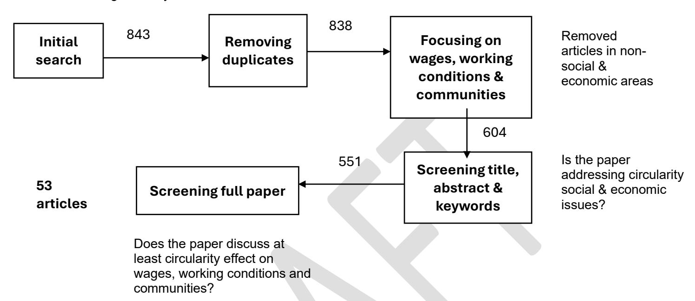

# **3.Results**

### **3.1 Descriptive Results**

This section presents the geographical distribution of the reviewed studies, highlighting the regional distribution and spread of CE research across the African continent. South Africa accounts for 16 papers; 30%), while Ghana represent (15 papers; 28%) together representing more than half of the reviewed literature. Nigeria follows with seven studies (13%), while Ethiopia contributes three papers (6%). A smaller number of studies originate from other countries, including Kenya, Morocco, Zimbabwe, Malawi, Lesotho, Uganda, Cameroon, and Abidjan/Ivory Coast (each contributing one paper, or approximately 2%). Additionally, three studies (6%) adopt a cross-country comparative approach.

In terms of methodological choices, it shows that qualitative research dominates the field, accounting for 37 papers (70%), followed by quantitative designs (15 papers; 28%) and mixed methods (2 papers; 4%). Quantitative and mixed-method approaches, while less common, contribute important empirical benchmarks for policy comparison and impact evaluation. With regard to research strategies, interviews are the most frequently employed method (28 papers; 53%), followed by surveys and systematic reviews (15 papers each; 28%). Ethnography is used in only two studies (4%), and secondary data analysis in a single paper (2%).

### **3.2 Thematic Findings**

The following section outlines the key issues and challenges highlighted in the literature regarding informal workers in Africa's CE. It explores how economic marginalisation, governance gaps, power imbalances and unsafe working conditions intersect to shape the lived realities of these workers and limit the equitable potential of CE initiatives.

### **3.2.1 Economic Vulnerability and Structural Dependency in Informal Recycling**

Informal recycling represents one of the most tangible, visible and traditions of circularity in Africa, where waste is continuously collected, reused and re-integrated into production cycles often through regulated recycling systems (Schenck et al. 2018). Focusing on this sector therefore provides insights into how circular practices already function in practice and how social and economic inequalities shape participation in emerging CE systems. Across the 53 papers analysed, economic vulnerability and structural dependency within the informal recycling was frequently highlighted.

Economic vulnerability refers the exposure of informal workers to unstable income, price fluctuations and lack of financial security. Structural dependency, on the other hand, refers to their reliance on unequal market relationships, intermediaries and broader economic systems that limit their bargaining power (Kasinja and Tilley, 2018). This underlines that informal workers depend on intermediaries or actors within the value chain, but this dependence reinforces their marginalized economic position (Blaauw et al., 2020). For instance, many waste pickers in cities such as Johannesburg or Accra sell recovered materials to middlemen or scrap dealers who control access to formal recycling markets and set purchasing prices (Kasinja and Tilley,2018). Because informal workers often lack storage space, market information or direct links to recycling industries, they are forced to accept low and fluctuating prices, receiving only a fraction of the materials final value (Kasinja and Tilley, 2018). This dependency not only limits their income stability but also perpetuates structural inequalities within the CE system (Loots & Ntsala, 2024).

This underscores the precarious nature of the livelihoods among informal workers who are often excluded from formal waste management systems and left to work outside of the main city economy (Loots & Ntsala, 2024; Schenck et al. 2018; Obeng-Odoom, 2018; Kasinja and Tilley,2018). Their earnings are typically unstable, fluctuating in response to volatile global commodity prices, such as for papers, plastics, or metals, and further constrained by the irregular supply of recyclable materials at the local level (Bening et al.,2022). This economic insecurity is exacerbated by a widespread lack of infrastructure, including limited access to storage facilities, protective equipment's, and reliable transportation, all of which restrict their ability to collect, sort, and deliver materials efficiently or in bulk (Kasinja and Tilley , 2018). Without direct access to buyers or recycling facilities, most informal workers are forced to sell their materials to intermediaries, who extract significant value while offering minimal compensation (Sibanda & Erwin., 2023).

To illustrate, in Nairobi, waste pickers working at Dandora dumpsite often rely on middlemen who purchase plastics and metals at the very low prices before reselling them to formal recycling companies at a substantial markup. Similarly, in Lagos, collectors of aluminium and plastic bottles typically operate through informal brokerage network that control prices and storage deposit, limiting workers ability to negotiate fair payment (Ogwueleka & Naveen, 2021). In the southern part of continent, South Africa, waste pickers face similar challenges, where private recycling firms or buy back centres act as gatekeeper to the formal waste economy (Godfrey, 2021). Across these contexts, intermediaries capture most of the profit generated along the recycling chain, while those carrying out most labour and work that is saving the environment, remain at the economic margins of the circular value creation (Kasinja and Tilley, 2018).

Literature analysis also shows that informal recycling is often considered a survival strategy for those who have been pushed out of the formal economy. In other words, when individuals lose access to stable and formal employment, they turn to informal recycling as a means of survival (Loots & Ntsala, 2024).This situation, however, creates structural dependency, where large groups of people rely on informal waste collection not by choice, but because there are limited alternatives for earing an income (Oteng Ababio,2012).

Current CE policies tend to prioritise the expansion of recycling activities as a primary indicator of progress. However, such a narrow focus risks reinforcing economic and structural dependencies rather than transforming them (Bening et al.,2022). Simply increasing recycling rate does not address deeper social and economic challenges, particularly those linked to precarious labour markets, informality and inequality (Boampong et al., 2021). Without efforts to integrate social objectives, CE initiatives may reproduce existing vulnerabilities within the informal sector, where waste pickers and recyclers work (Boampong et al., 2021).

Data also shows that that income in informal recycling is volatile and it is contingent on various factors, such as market conditions, material availability and intermediaries' control (Akormedi et al., 2013; Gall et al., 2020).Across the continent, many waste pickers earn less than the average income for similar basic jobs, despite the large amount of work they do, a situation that reflects not a lack of effort, but deep structural barriers. For example, across South Africa most waste pickers earn an average income of about R2,900/month (139 Euros), which is 70% below the national minimum wage (Yu et al., 2020).

These issues are attributed to limited access to stable markets, exploitative intermediary networks and price volatility in the global trade of recyclables in the pursuit of a race to the bottom at the expense of the informal workers (Bening et al.,2022). The situation is perpetuated by the absence of regulatory protection, collective bargaining power and access to formal waste management contracts, leading the informal workers to get more marginalised (Gall et al., 2020).Thus, while circular value chains may create income opportunities, the literature suggests those are often insufficient to lift actors out of poverty, or to reduce long term vulnerability, unless they are paired with interventions that stabilize income flows, mitigate market risk, and reduce points of value extraction that bypass the informal collector (Viljoen at al., 2018).

The informal workers also face costs and constraints that limit their power over improving working conditions. To illustrate, many informal workers still lack access to appropriate tools (like trolleys), face long hours, operate in unsafe or unsanitary environments, and cannot negotiate better contracts or higher prices (Godfrey,2021). Most papers similarly underscore that although some informal workers can influence income by using a trolley or starting early, most structural barriers in terms of education, access to markets, material quality, intermediaries remain outside of their control (Oguntoyinbo,2012). Structural dependency is not just about economic vulnerability, but it is about unequal power relations in value chains, leading informal actors to be heavily dependent on middlemen, public infrastructure, collection systems, and regulatory regimes which they cannot influence (Maphosa&Maphosa,2020). This limits the informal workers' ability to move from subsistence levels to more stable, dignified work.

### *Illustrative case study*

### **Private Sector Entry'' into Municipal Solid Waste Management (MSWM)**

Most of prior research highlights how the involvement of private sector in MSWM further marginalizes working conditions for the informal workers. The transition from informal to formal MSWM systems, especially when private entities are involved, often produces an urban displacement that undermines informal livelihoods (Sandhu et al., 2017). Usually, the goal is to improve efficiency, sanitation and regulation without considering the social dimension of circularity. Implementing modern MSWM infrastructure may be good for managing waste, however, it may also lead to a reduction in employment opportunities for informal workers (Oteng‑Ababio et al.,2013)**.** This is a phenomenon observed across the literature where the modern waste management project disrupts waste pickers employment by enclosing the waste landfill areas.

For example, Hartmann (2017) observed that a large-scale modernisation project that converted an open dump into a sanitary landfill led hundreds of waste pickers to be replaced. Many were not offered roles in the new system and were excluded from the planning and execution phases of the project (Hartmann, 2017). When private companies are contracted to handle waste collection and recycling, they usually operate under formal contracts and regulations that exclude informal workers who lacks safety certification or legal recognitions. Once the systems are formalized, these areas may be close or fenced or monitored, which means cutting off access to recyclable materials. The introduction of private or municipal control means that waste which was previously regarded as ''free materials'' now becomes an asset of the formal entities such as municipality, which in the end informal workers lose jobs in the new regulated economy (Hartmann, 2017).

When private sector takes over the projects, not all informal workers are integrated into the private waste management company. The opportunities available in the new MSWM structure tend to prioritise those with higher education, urban proximity, or connections. Hartmann (2017) shows that among those displaced, only a minority secured employment with private or municipal contracts, often in low-profile positions, while many remained outside or reverted to the informal sector. The result is a limited opportunity space; the formalization process fails to increase the number or quality of livelihoods lost through displacement by private sector in the MSWM (Gall et al., 2020).

This displacement is especially problematic for the informal workers because, as they reported, they did not know about alternative employment pathways offering commensurate incomes (Loots & Ntsala, 2024). Even with training or other skills, many felt locked into recycling because their skillsets, lack of alternative options and/or limited mobility. The analysis reveals that alternative solutions by the means of microloans or re-training rarely match the value what they would earn from informal waste picking (Hartmann,2017).

### **3.2.2 Invisible Labour of Informal Workers**

Being considered 'invisible environmentalists' of the world, informal workers contribute significantly to waste removal collection in many cities (Schenck et al., 2019 & Wiego 2013; Dlamini and Simatele, 2016). Prior research shows that informal workers make a significant economic contribution to urban waste management systems. Estimates indicates that waste pickers collectively recover around 85,853 tonnes of recyclables material each year (Oduro-Appiah et al., (2020). This recovery effort translates into an average recycling rate of about 6.4%, a substantial contribution given that it occurs largely outside formal municipality waste systems. Informal workers, subsequently, play a significant role not only in diverting waste from landfills but also in promoting a more sustainable approach to waste management (Siwawa,2024). They do so by operating at multi points in the waste streams-collecting materials directly from households, streets and dumpsites and channelling them into reuse and recycling markets. Their activities reduce the volume of waste that ends up in landfills, conserve by keeping materials in circulation and lower the environmental burden of waste disposal (Oduro-Appiah et al., 2020).

By diverting large quantities of waste, informal workers also create significant economic implications, enabling municipalities to save an estimated euro 21 million annually in solid waste management cost (Kistan et al.,2020; Samson et al., 2022). Despite these contributions, informal workers frequently work informally, often without institutional support, recognition or protection. They remain undervalued while providing essential environmental services and supporting cities in meeting recycling and sustainability target (Godfrey et al., 2022). Moreover, their work is characterised by precarious and exploitative conditions, informal workers occupy the lowest tier of the recycling chain, engaging in collecting, sorting and transporting materials under unsafe and unregulated conditions Oduro-Appiah et al., 2020).

### *Integrating informal workers into formal systems*

Although informal workers perform essential environmental services (recycling, resource recovery, reducing landfill loads), policies and institutional arrangements often fail to integrate them into regulated waste management systems (Yu et al., 2020; Quartey et al., 2015, Linda et al., 2017). The analysis points to various models for integrating informal workers into formal systems as argued by Scheinberg (2012. Regardless of the model, improving working conditions for informal workers remains central but it requires a top-down policy approach, particularly in regions where informal labour is deeply embedded in waste economies. Integration is not merely a technical or policy issue, but participatory governance structures are necessary to include informal workers in decision-making processes (Dias 2016).

Barries to integration are widespread. These include lack of formal contracts, informal or verbal agreement, deficient business model and structural exclusion from markets or municipal systems (Samson et al., 2022). Most informal workers are temporarily integrated into municipal systems, often than a year, after which they return to informal employment. CE initiatives may offer work but not mobility, trapping workers into a circular job trap, where economic opportunities do not necessary translate into economic upliftment as illustrated in Figure 1.2 Profit are often captured by actors higher in the value chain, such as buy back centres (BBCs), which is common across African countries.

Figure 2. Informal worker's Vicious circle

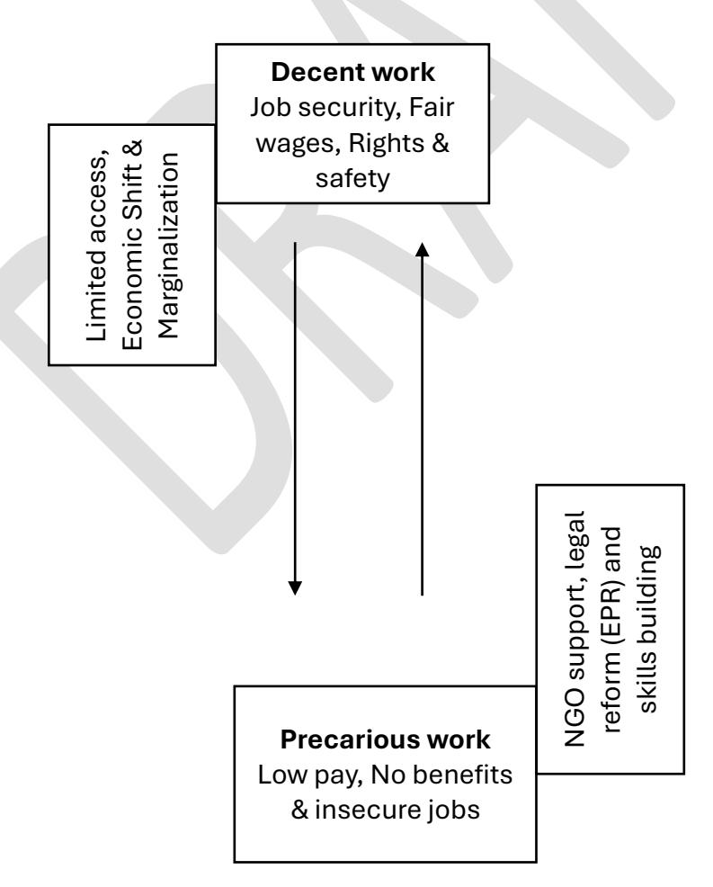

#### Developed by the first author

Formalisation through cooperatives has been another attempted integration mechanism, but outcomes are inconsistent and frequently fragile (Kasinja and Tilley, 2018). In the Blantyre (Malawi) case, formalization is met with substantial resistance, as informal workers fear income loss. Conflicts often arise among informal workers regarding how profits are shared and who contributes fairly to collective efforts (Kasinja and Tilley, 2018). Because of these issues, such as disagreement over income distribution, mistrust of who benefits without contributing and fear of being controlled by other, informal workers are generally not eager to form cooperatives on their own. As a results, cooperatives usually only when external organisations or third parties such as Non governments Organisations (NGOs) or development agencies take initiatives to organize an support them(Godfrey et al.,2017).Similarly, in South Africa, cooperatives suffer from poor infrastructure, insufficient volumes of material, weak linkages within formal municipal systems, unclear business models, and very high failure rates Godfrey et al.,2017.

The assumption that formalization automatically improves economic welfare can be misleading. Literature shows that formalization can impose additional challenges, including membership rules, governance burdens, administrative costs that low-income workers cannot sustain (Kasinja and Tilley, 2018). Formal cooperatives often replicate imbalanced power dynamics, as, although formally recognised, many do not secure stable material flows or establish fair contracts. Consequently, informal intermediaries (middlemen) continue to extract large shares of value (Linda et al., 2017).

The historical exclusion of informal workers, however, calls for more than just integration. Integration should be framed through a justice framework, not just through the lens of a management strategy because this management logic recognizes social stigmatization of waste work as insignificant. Power imbalance between informal workers and municipalities or private companies need to be solved Amuzu, 2018). Furthermore, recognizing waste pickers as key environmental and social actors by governments and policy makers is of vital importance.

In addition, informal workers have historically been scorned, treated as nuisances and criminals by the state, as well as by the communities through which they navigate (Samson et al.,2022). In South Africa, they are subjected to harassment, eviction from dumpsites or confiscation of materials by municipalities to formalise or privatise waste management systems (Samson et al.,2022). In addition, they have been punished and penalised for waste sorting in affluent neighbourhoods, even though this sorting activity actually provides an essential environmental service to the communities (Samson et al.,2022). These attitudes hinder efforts to recognise informal workers, as individuals who needs to be integrated into CE initiatives, undermine the representation and recognition of one of the most important actors in CE.

### **3.2.3 Hierarchies and Inequalities within the Informal Waste Sector**

Informal sector is not a single, homogeneous system; rather it encompasses a wide range of actors, ranging from collectors, dismantlers, burners, children, women, migrants, each occupying distinct positions along the waste value chain with differing levels of income, risk and agency (Lebbie et al.,2021). Collectors, who gather waste from the streets, bins, and landfills, generally earn the least, while, at the same time, facing constant physical strain and environmental hazards such as cuts, infections, and exposure to toxic substances.

This diversity highlights that the informal sector cannot be understood as a single category of marginalized workers. Instead, it represents a spectrum of economic relationships, ranging from extreme vulnerability and survivalism to relatively stable, semi formal enterprises. Recognising these differences is crucial for designing effective policies; interventions that treat the informal sector as monolithic risk overlooking the unequal dynamics, various risk and different capacities for integration that exist within it.

Child labour is another critical concern in this sector. In Ghana, for example, approximately 21% of children aged 5-17 are involved in work, with a significant proportion engaged in hazardous activities (Castellani, et al., 2022; UNICEF, 2019). Children often participate in collecting, sorting or dismantling materials to supplement household income, reflecting the intersection of economic necessity and vulnerability (Castellani, et al., 2022). Such hierarchical structures extend beyond age; migrants workers face additional challenges due to insecure legal status, lack of social protection and limited bargaining power within informal markets.

Structural hierarchical inequalities also manifest in the distribution of value long the recycling chain. This reflects broader power imbalance, which is reflected into decision making, market access and resources which are largely controlled by actors in the higher up of the value chain, whereas informal workers have limited representation in governance structures (Scheinberg, 2012; Samson et al., 2022). Policies that assume all informal workers face identical circumstances risk reinforcing existing inequalities. Those already in relatively secure positions, such as intermediaries or organised cooperatives, may benefits disproportionately, leaving the most vulnerable workers excluded.

### *Circular migration*

A key insight emerging from the literature is that informal workers are highly mobile, often engaging what we coin as ''circular migration''. This refers to a continuous movement between rural and urban areas across the national borders in the pursuit of "waste rich'' opportunities (Acquah et al., 2021 & Burns et al., 2019). This mobility is typically driven by poverty, unemployment, environmental stress and season fluctuations in agricultural livehoods.

In Ghana, informal workers migrate seasonally from the northern regions to urban centres, escaping drought and declining agricultural productivity (Amuzu, 2018). Similarly, informal workers tend to follow waste streams, moving across regions and even national borders to access opportunities in waste-rich areas (Akormedi et al.,2013). In Nigeria, 55.7% of the waste pickers are migrants from neighbouring states, 23.85 of these are refugees from as Chad and the Niger Republic (Ogwueleka & Naveen, 2021).

Across the southern part of Africa, informal workers migrate from Zimbabwe to South Africa, in search of more stable or lucrative waste recovery activities. This mobility underscores the adaptive strategies employed by informal workers but also presents challenges for policy frameworks that often lack mechanisms to address the trans-regional nature of informal waste economies. Most if not all, waste governance frameworks are locally or nationally bounded, "immigrants'' rarely account for the trans-regional nature of the informal labour protections. Migrant waste workers often fall outside the reach of the labour protections, health services and municipal support systems, leaving them invisible within both migration policy and waste management policy.

### **3.2.4 Governance and Power Asymmetries**

A recurring theme in the literature is power and how the waste sector is governed. Who hold power in this sector? How is this sector governed? One of the patterns through which these two elements are demonstrated is through Buy back centres (BBCs), who profit at the expense of informal workers. The BBCs are small and sometimes medium recycling businesses that purchase recyclable materials such as plastics, metals, glass or papers from informal workers and sell or supply these materials to large recycling companies or manufacturing or export markets. In the context of Africa, they act as intermediaries between informal workers and formal recycling industry. In theory, BBCs provide an essential market link by giving informal workers a place to sell materials and earn income. However, the literature shows that in practice these centres often control pricing, quality assessment and access to market, creating conditions that favour the centres and disadvantage the collectors (Scheinberg, 2012; Oduro-Appiah et al., 2020).

The literature identified various methods into which BBCs creates this exploitative behaviour. The most discussed is the" no standard price'', which means BBCs set the purchase prices for recyclable with little transparency. Informal workers lack information about market prices and rates or even bargaining power, often forced to accept below market prices or even the global demand for recyclables is high. The second one is the regulatory gap, because the BBCs operate without regulations. This allows them to avoid accountability for poor business practices and environmental violations associated with their supply chain (Bleck & Wettberg,2013).

The marketisation of informal labour is another approach shaping governance and power imbalance in the waste sector. This occur through state corporate partnership and growing involvement of private waste management firms, which further illustrates the governance dynamics shaping urban waste systems (Obeng Odoom, 2018). Such governance choices often prioritize the generation of opportunities for corporate profit over the welfare and inclusion of informal workers. In many instances, privatisation or public -private partnership have displaced informal workers from their roles entirely or confined them to insecure, low paid and unrecognized positions within the formal systems. This trend reflects a deeper power imbalance in waste governance, decision making authority and economic benefits are concentrated among municipalities, private firms and intermediaries, while informal workers, the backbone of urban recycling, remain excluded from formal representation and protection.

### **3.2.5 Gender, Social Disparities and Occupational Hazards**

A recurrent theme in the literature is that informal waste work is not gender neutral. Women in informal waste work may experience stronger social stigma, particularly because the work is seen as "dirty" and also because waste picking in public spaces challenges gender norms in some societies (Sibanda and Erwin,2023). In addition, they frequently face gender-based harassment and violence in collection areas and landfill sites (Sibanda and Erwin,2023). Studies in South Africa landfill sites report that women earn on average 22% less per month than men and exhibit worse chronic health outcomes despite higher health seeking behaviour (Wilson et al., 2022). Similarly, Ghana, occupational health and safety practices are influenced by ethnicity, origin, income, with women especially disadvantaged in access to protective equipment's and experiencing risk (Akormedi et al.,2023).

Informal waste work also exposes men and women alike to serious health hazards. The most dangerous roles are those involved in informal recycling and burning of electronic waste, where workers handle toxic fumes, heavy metals, and carcinogenic compounds without adequate protection (Burns et al., 2019). These processes release pollutants that cause respiratory disease, skin disorders, and long-term neurological damage (Bleck & Wettberg, 2012). In Ghana, dismantlers working on e-waste have been found to experience elevated levels of toxic contaminants and almost no access to personal protective equipment, placing them at high risk of chronic illness (Melaku & Tiruneh, 2020).

The informal recycling economy is also occupationally stratified. Workers often start as collectors and, over time, progress to more technical and lucrative roles such as dismantlers (Bleck & Wettberg, 2012; Acquah et al., 2022). Each role involves distinct physical exposures, lifting, walking, standing, or handling hazardous materials. Dismantlers tend to earn more because of their specialised skills, while burners, who recover metals by burning cables, earn the least (Euro 13 per day compared to Euro 23 for collectors and Euro 43 for dismantlers) (Akormedi et al., 2013). Despite these differences in pay, those in the more technical roles face the highest toxic exposure.

Health risks are not limited to physical injury or disease. Research increasingly points to psychological and social stressors, including stigma, anxiety, and depression, which remain understudied (Aminuddin & Rahman, 2015). Waste pickers frequently report musculoskeletal pain, gastrointestinal and dermatological conditions, and mental health challenges linked to economic insecurity and social exclusion (Edokpayi et al., 2017). The likelihood of occupational health risks increases with the number of days worked, by an estimated 1.4 times for each additional day spent at landfill sites (Uhunamure et al., 2021). In the absence of institutional protection, many workers rely on self-organised networks for mutual aid during illness or financial hardship.

Gendered divisions of labour remain deeply embedded within the informal waste economy. Men typically undertake physically intensive and hazardous tasks, such as dismantling and burning electronic waste, while women often perform lower-paid and less recognised roles such as sorting or vending (Akormedi et al., 2013). Women are also under-represented in leadership positions within cooperatives, unions, or associations, limiting their influence over decisions on working conditions or sectoral reforms (Wilson et al., 2022).

These gendered and age-based inequalities intersect with other axes of vulnerability, including child labour and migration status. At sites like Agbogbloshie in Ghana, children, many of whom have limited access to education, collect, sort, and burn materials, exposing themselves to toxic substances and physical injuries (ILO, 2004). Women waste pickers, meanwhile, are disproportionately affected by lifestyle diseases and HIV, while migrant workers face additional marginalisation due to insecure legal status and exclusion from social protection (Wilson et al., 2022). Such overlapping disadvantages demonstrate that health risks and economic precarity are unevenly distributed across the informal waste sector.

Together, these patterns highlight the need for intersectional policy responses that address economic vulnerability, occupational safety, and social protection simultaneously. Policies aimed at integrating informal workers into CE systems should recognise gendered divisions of labour and ensure that opportunities for decent work, fair income, and adequate social safeguards are extended to both men and women across the recycling value chain (Chitaka et al., 2022). Without explicit attention to gender and health, CE policies risk perpetuating rather than resolving structural inequalities within the informal waste economy.

# **4. Discussion**

Taken together, the literature shows that CE interventions in Africa have produced mixed outcomes for wages, working conditions and community wellbeing. While circularity has generated employment, improved waste recovery and reduced environmental burdens, these benefits often coexist with low incomes, precarious labour, health and safety risks, and unequal distribution of benefits (Samson et al., 2022). The promise of circularity, which includes better livelihoods, safer work and stronger communities, is therefore not automatically realised.

A major theme emerging from the literature is that waste governance is shaped by unequal power relations. Weak enforcement of regulations allows environmental degradation, child labour and occupational hazards to persist, as existing policies are poorly implemented or fail to cover informal operations. Decision-making power and economic value tend to be concentrated at the top of the recycling hierarchy, while informal workers carry the burden of risk, insecurity and poor working conditions.

Buy Back Centres (BBCs) illustrate these imbalances clearly. Although they provide a crucial market link by purchasing recyclables from informal waste pickers, they often control pricing, quality and market access in ways that disadvantage workers (Scheinberg, 2012; Oduro-Appiah et al., 2020). The lack of price transparency and absence of regulation enable BBCs to capture the largest share of profits, leaving waste collectors vulnerable to exploitation. In this sense, market-based CE schemes, particularly those involving corporate partnerships, tend to prioritise profit over the welfare and inclusion of informal actors (Obeng Odoom, 2018).

The evidence also suggests that when institutional support is weak and markets remain unregulated, circular economy initiatives can deepen dependency and vulnerability rather than promote inclusive development. In many African cities, informal workers depend on unstable waste flows and exploitative intermediaries. Expanding recycling capacity without addressing unemployment, lack of social protection or poor labour conditions will not resolve the structural roots of informality. Effective circular economy transitions must therefore engage with broader social and labour market dynamics (Quartey et al., 2015).

Community impacts are also uneven. Groups that are already disadvantaged, such as women, migrants and children, tend to absorb most of the social and health costs, while private and formal actors capture the greater share of economic benefits. Formalisation through cooperatives or producer responsibility frameworks has shown potential, but only when accompanied by stable material supply, equitable value sharing, social safety nets and genuine inclusion of informal workers in governance.

The integration of informal waste pickers into circular systems is a multidimensional process that involves service provision, market participation and rights-based recognition (Scheinberg, 2012; Dias, 2016). However, without strong governance, formalisation may reinforce existing hierarchies instead of dismantling them. Evidence from South Africa indicates that municipal recycling contracts often benefit cooperative leaders and intermediaries more than the workers themselves (Samson et al., 2022).

Ensuring decent work within circular economy systems requires that inclusion be tied to occupational safety measures such as access to protective equipment, safe tools and hazard mitigation. Guaranteeing fair pricing for recyclables and transparent transactions can help reduce exploitative practices by intermediaries. Supporting local value addition through sorting, cleaning or upcycling can enable small cooperatives and informal groups to capture more of the economic surplus and improve their livelihoods. Cooperatives established without institutional and financial support rarely succeed. Strengthening them requires participatory governance, transparent revenue sharing, conflict resolution mechanisms and formal recognition of informal workers within municipal and national waste management plans (Kasinja and Tilley, 2018).

The literature also draws attention to the gendered and health dimensions of informality. Women face stronger social stigma, lower pay and higher exposure to disease, while men are often concentrated in physically demanding and hazardous activities such as dismantling or burning electronic waste (Wilson et al., 2022; Akormedi et al., 2013). Children and migrants represent additional layers of vulnerability, working in unsafe environments without access to legal protection or healthcare (ILO, 2004; Chitaka et al., 2022).

Addressing these disparities requires intersectional approaches that combine occupational safety, gender equity and social protection. Policies should ensure access to protective equipment's, healthcare and training for all workers, regardless of legal or employment status. Collecting disaggregated data by gender, age and migration status will make it possible to track outcomes and evaluate whether CE projects genuinely improve livelihoods over time (Odeyingbo et al., 2025).

Migration and mobility also shape the informal waste economy. Many waste pickers move between urban areas or across borders in search of better opportunities, often without access to social protection or recognition (Acquah et al., 2021; Ogwueleka and Naveen, 2021). Integrating migration into policy design is essential to ensure that mobile workers have access to healthcare, legal protection and economic support across borders (Chitaka et al., 2022).

Despite systemic neglect, informal workers have developed collective structures that provide resilience and social support. In South Africa, the South African Waste Pickers Association (SAWPA) has built a national platform for waste pickers to negotiate prices, access resources and advocate for recognition (International Alliance of Waste Pickers, 2025). Such initiatives show that even within vulnerable systems, informal actors demonstrate significant agency and capacity for organisation. Supporting these efforts is vital for building a just and inclusive circular transition.

Finally, addressing the inequities within circular systems requires transparent and participatory governance frameworks that recognise informal workers as legitimate environmental actors. Policies should redistribute power along the recycling value chain through fair pricing, representation and labour standards. Integrating BBCs and private firms into CE frameworks must go beyond acknowledging their market role and include social safeguards and accountability mechanisms. In summary, the success of CE transitions in Africa depends on how they are governed, not simply on their implementation. A just and inclusive circular economy should prioritise social equity, decent work and the recognition of informal workers, ensuring that those who sustain the recycling system also share in its benefits.

# **5. Policy Implications**

The literature consistently demonstrates that informal workers operate under conditions of income instability and structural exploitation, earning far below the minimum wage or average income for comparable low-skill occupations (Oduro-Appiah et al., 2020; Oteng-Ababio, 2012). As discussed earlier, intermediaries such as BBCs capture most of the value by purchasing recyclables at low prices, while workers performing the most labour-intensive and hazardous tasks remain in lowearning positions. Against this background, the call for a minimum income or living wage for informal workers emerges as a key policy response. Such a measure would ensure that the economic benefits of recycling are shared more equitably across the value chain.

The regulation and transparency of BBCs also require urgent policy action. Oversight mechanisms should be established to promote transparent pricing, fair trade practices and accountability in BBC operations. Local governments should require that BBCs publicly display purchase prices, comply with local labour standards and record transactions to prevent exploitative relationships. The regulation and transparency of BBCs also require urgent policy action. Oversight mechanisms should be established to promote transparent pricing, fair trade practices and accountability in BBC operations. Local governments should require that BBCs publicly display purchase prices, comply with local labour standards and record transactions to prevent exploitative relationships.

A second implication relates to the need for inclusive formalisation that reflects the diversity of the informal recycling sector. Rather than enforcing uniform models, policies should be context-specific and recognise the different categories of informal waste participants, including pickers, traders, dismantlers and burners. This approach would allow the design of tailored interventions such as flexible taxation schemes, access to affordable credit and targeted loan facilities for informal operators.

Health, safety and social protection also feature prominently in the literature. Policymakers should guarantee universal access to healthcare, insurance and occupational safety for informal workers. Practical interventions could include the establishment of mobile clinics at dumpsites, subsidised healthcare or insurance schemes supported by local governments, and the provision of protective gear through partnerships with non-governmental organisations and local health departments.

Gender equity and child labour are additional areas that require targeted attention. Policies must address the gendered division of labour within the informal recycling economy and mitigate child labour risks. This can be achieved through education incentives for children and empowerment initiatives for women, including skills training, leadership opportunities and access to financial resources. Municipal waste management plans across the region should incorporate gender action frameworks to ensure these challenges are addressed systematically.

Although less frequently discussed in the literature, one of the most promising interventions is supporting informal workers to form cooperatives and collective organisations. Such structures enhance bargaining power, income stability and social recognition while enabling workers to negotiate more effectively with intermediaries and local authorities. Strengthening collective action can therefore play a vital role in achieving social justice and inclusion within circular economy systems.

Finally, the concept of "integration," though often cited, remains underdefined and lacks practical operationalisation. Broadly, it refers to improving waste pickers' access to materials, raising incomes, enhancing working conditions, and ensuring their participation in decision-making about recycling and waste governance (Samson et al., 2022; Scheinberg, 2012; Dias, 2012; Godfrey et al., 2016). Achieving genuine integration requires recognising waste pickers as essential environmental service providers, valuing their knowledge, and embedding their participation in the design and governance of circular economy frameworks.

# **References**

Acquah, A. A., D'Souza, C., Martin, B. J., Arko-Mensah, J., Botwe, P. K., Tettey, P., Dwomoh, D., Nti, A. A., Kwarteng, L., Takyi, S., Quakyi, I. A., Robins, T. G., & Fobil, J. N. (2021). A preliminary assessment of physical work exposures among electronic waste workers at Agbogbloshie, Accra, Ghana. International Journal of Industrial Ergonomics, 82, 103096. Akormedi M, Asampong E, Fobil JN, (2013). Working conditions and environmental exposures among electronic waste workers in Ghana. Int. J. Occup. Environ. Health 19, 278–286. 10.1179/2049396713Y.0000000034. Andeobu, L., Wibowo, S., & Grandhi, S. (2023). Informal E waste recycling practices and environmental pollution in Africa: What is the way forward? International Journal of Hygiene and Environmental Health, 252, Article 114192. https://doi.org/10.1016/j.ijheh.2023.114192. Bening, C. R., Kahlert, S., & Asiedu, E. (2022). The true cost of solving the plastic waste challenge in developing countries: The case of Ghana. Journal of Cleaner Production, 330, 129649. https://doi.org/10.1016/j.jclepro.2021.129649. Blaauw, P., Pretorius, A., Viljoen, K. et al. (2020). Adaptive Expectations and Subjective Well-being of Landfill Waste Pickers in South Africa's Free State Province. Urban Forum 31, 135–155. https://doi.org/10.1007/s12132-019-09381-5 Bleck, D., Wettberg, W. (2013). Reduction of Occupational Risks Associated with the Informal Collection of Recyclable Materials in Addis Ababa, Ethiopia. Waste Biomass Valor 4, 173–179 https://doi.org/10.1007/s12649-012-9116-8. Burns, K. N., Sayler, S. K., & Neitzel, R. L. (2019). Stress, health, noise exposures, and injuries among electronic waste recycling workers in Ghana. Journal of Occupational Medicine and Toxicology, 14(1), 1. https://doi.org/10.1186/s12995-018-0222-9.

Castellani, P., Ferronato, N., & Torretta, V. (2022). Setting priorities to achieve Sustainable

Development Goals through appropriate waste management systems in Uganda. Environmental Development, 44, Article 100764. https://doi.org/10.1016/j.envdev.2022.100764.

Chitaka, T. Y., Moyo, T., Gihring, K., & Schenck, C. (2022). The myth of livelihoods through urban mining: The case of e-waste pickers in Cape Town. South African Journal of Science, 118(special issue: Waste as a Resource), 1-8. https://doi.org/10.17159/sajs.2022/12456

Dlamini, S. Q., & Simatele, D. (2016). Unrecognised informal solid waste recycling in an emerging African megacity: A study of Johannesburg, South Africa. WIT Transactions on Ecology and the Environment, 202, 13 25. https://doi.org/10.2495/WM160021

Fink, A. (2005). Conducting research literature reviews: From paper to the internet. Thousand/. Oaks, CA: Sage Publications

Gall, M., Wiener, M., Chagas de Oliveira, C., Lang, R. W., & Hansen, E. G. (2020). Building a circular plastics economy with informal waste pickers: Recyclate quality, business model, and societal impacts. Resources, Conservation & Recycling, 156, Article 104685. https://doi.org/10.1016/j.resconrec.2020.104685.

Godfrey, L., Muswema, A., Strydom, W. (2017). Co-operatives as a development mechanism to support job creation and sustainable waste management in South Africa. Sustain Sci 12, 799–812 (2017). https://doi.org/10.1007/s11625-017-0442-4.

Godfrey, L. (2021). Quantifying economic activity in the informal recycling sector in South Africa. South African Journal of Science, 117(9/10), Article #8921. https://doi.org/10.17159/sajs.2021/8921.

Hartmann, C. (2018). Waste picker livelihoods and inclusive neoliberal municipal solid waste management policies: The case of the La Chureca garbage dump site in Managua, Nicaragua. Waste Management, 71, 565–577. https://doi.org/10.1016/j.wasman.2017.10.008

ILO (2004). Addressing the exploitation of children in scavenging (waste picking): A thematic evaluation on action on child labour. A global report for the ILO. Geneva.

International Alliance of Waste Pickers. (n.d.). Where are we? Retrieved October 13, 2025, from https://globalrec.org/where-are-we/

Kasinja, C., & Tilley, E. (2018). Formalization of Informal Waste Pickers' Cooperatives in Blantyre, Malawi: A Feasibility Assessment. Sustainability, 10(4), 1149. https://doi.org/10.3390/su10041149.

Kistan, J., Ntlebi, V., Made, F., Kootbodien, T., Wilson, K., Tlotleng, N., & others. (2020). Health care access of informal waste recyclers in Johannesburg, South Africa. PLoS ONE, 15(7), e0235173. https://doi.org/10.1371/journal.pone.0235173

Korhonen, J., Honkasalo, A., & Seppälä, J. (2018). Circular economy: The concept and its limitations. Ecological Economics, 143, 37–46.

Lebbie, T. S., Moyebi, O. D., Asante, K. A., Fobil, J., Brune-Drisse, M. N., Suk, W. A., Sly, P. D., Gorman, J., & Carpenter, D. O. (2021). E-waste in Africa: A serious threat to the health of children. International Journal of Environmental Research and Public Health, 18(16), 8488. https://doi.org/10.3390/ijerph18168488.

Loots, O., & Ntsala, P. G. (2024). Resisting disposability: Survivalist entrepreneurs in South

Africa's informal recycling sector. The Journal for Transdisciplinary Research in Southern Africa, 20(1), a1455. https://doi.org/10.4102/td.v20i1.1455.

Maphosa, V., & Maphosa, M. (2020). E-waste management in Sub-Saharan Africa: A systematic literature review. Cogent Business & Management, 7(1). https://doi.org/10.1080/23311975.2020.1814503

Melaku, H. S., & Tiruneh, M. A. (2020). Occupational health conditions and associated factors among municipal solid waste collectors in Addis Ababa, Ethiopia. Risk Management and Healthcare Policy, 13, 2415–2423. https://doi.org/10.2147/RMHP.S276790

Mochungong P,I (2010). The plight of clinical waste pickers: evidence from the Northwest region of Cameroon. J Occup Health.;52(2):142-5. Doi: 10.1539/joh. q9004. Epub 2010 Jan 28. PMID: 20110620.

Mlotshwa, N., Dayaram, T., Khanyile, A., Sibanda, P. A., Erwin, K., & Fleetwood, T. (2022). Working with waste: Hazards and mitigation strategies used by waste pickers in the inner city of Durban. International Journal of Environmental Research and Public Health, 19(20), 12986. https://doi.org/10.3390/ijerph192012986

Nzeadibe, T.C., Anyadike, R.N.C. & Njoku-Tony, R.F. (2012). A Mixed Methods Approach to Vulnerability and Quality of Life Assessment of Waste Picking in Urban Nigeria. Applied Research Quality Life 7, 351–370. https://doi.org/10.1007/s11482-012-9171-0.

Obeng Odoom, F. (2018). Enclosing the urban commons: Crises for the commons and commoners. Sustainable Cities and Society, 40, 648 656. https://doi.org/10.1016/j.scs.2018.01.001

Odeyingbo, O.A.; Deubzer, O.K.; Ogunmokun, O.A (2025) Assessment of the Impact of the Revised National E-Waste Framework on the Informal E-Waste Sector of Nigeria. Recycling, 10, 117. https://doi.org/10.3390/recycling10030117

Oduro-Appiah, K., Scheinberg, A., Afful, A., & de Vries, N. (2020). The contribution of participatory engagement strategies to reliable data gathering and inclusive policies in developing countries: Municipal solid waste management data in the Greater Accra Metropolitan Area of Ghana. African Journal of Science, Technology, Innovation and Development, 13(6), 735–746. https://doi.org/10.1080/20421338.2020.1797267.

Oguntoyinbo, O. O. (2012). Informal waste management system in Nigeria and barriers to an inclusive modern waste management system: A review. Public Health, 126(5), 441 447. https://doi.org/10.1016/j.puhe.2012.01.030

Oteng‑Ababio, M., Melara Arguello, J. E., & Gabbay, O. (2013). Solid waste management in African cities: Sorting the facts from the fads in Accra, Ghana. Habitat International, 39, 96–104. https://doi.org/10.1016/j.habitatint.2012.10.010.

Oteng Ababio, M. (2012). The role of the informal sector in solid waste management in the GAMA, Ghana: Challenges and opportunities. Tijdschrift voor Economische en Sociale Geografie, 103(4), 412 425. https://doi.org/10.1111/j.1467 9663.2011.00690.

Quartey, E. T., Tosefa, H., Danquah, K. A. B., & Obrsalova, I. (2015). Theoretical Framework for Plastic Waste Management in Ghana through Extended Producer Responsibility: Case of Sachet Water Waste. International Journal of Environmental Research and Public Health, 12(8), 9907- 9919. https://doi.org/10.3390/ijerph120809907.

Samson, M., Kadyamadare, G., Ndlovu, L., & Kalina, M. (2022). 'Wasters, agnostics, enforcers, competitors, and community integrators': Reclaimers, S@S, and the five types of residents in Johannesburg, South Africa. World Development, 150, Article 105733. https://doi.org/10.1016/j.worlddev.2021.105733

Sandhu, K., Burton, P. W., & Dedekorkut‑Howes, A. (2017). Between hype and veracity: Privatization of municipal solid waste management and its impacts on the informal waste sector. Waste Management, 59, 545‑556. https://doi.org/10.1016/j.wasman.2016.10.012

Sauer, P.C., Seuring, S (2023). How to conduct systematic literature reviews in management research: a guide in 6 steps and 14 decisions. Rev Manag Sci 17, 1899–1933. https://doi.org/10.1007/s11846-023-00668-3.

Senekane, M. F., Makhene, A., & Oelofse, S. (2022). A Critical Analysis of Indigenous Systems and Practices of Solid Waste Management in Rural Communities: The Case of Maseru in Lesotho. International Journal of Environmental Research and Public Health, 19(18), 11654. https://doi.org/10.3390/ijerph191811654.

Siwawa, V. (2024). Effect of the ICT enabled reclaimer system on the informal waste recycling system in Cape Town, South Africa: The Regenize model. Electronic Journal of Information Systems in Developing Countries. Wiley. https://doi.org/10.1002/isd2.12345

Sverdlik, A., Kothiwal, K., Kadungure, A., Agarwal, S., Machemedze, R., Verma, S., & Loewenson, R. (2024). Understanding the interplay of occupational, public health, and climate related risks for informal workers: A new framework with findings from Zimbabwe and India. Social Science & Medicine, 348, Article 116750. https://doi.org/10.1016/j.socscimed.2024.116750.

Thomas, D. R. (2006). A General Inductive Approach for Analysing Qualitative Evaluation Data. American Journal of Evaluation, 27(2), 237 246. https://doi.org/10.1177/1098214005283748.

UNICEF (2019). UNICEF Ghana: Prevention of Child Labour. UNICEF Country Office, Accra-North, Ghana.

United Nations (2025). Sustainable Development Goals. Retrieved from https://sdgs.un.org/goals

Viljoen, K., Blaauw, D., & Schenck, R. (2018). 'Sometimes you don't make enough to buy food': An analysis of South African street waste pickers' income. Journal of Economic and Financial Sciences, 11(1), a186. https://doi.org/10.4102/jef.v11i1.186

Wilson KS, Kootbodien T, Made F, Mdleleni S, Tlotleng N, Ntlebi V, Naicker N. Men and women waste pickers on landfills in Johannesburg, South Africa: divergence in health, and socioeconomic status. Int Arch Occup Environ Health. 2022 Mar;95(2):351-363. doi: 10.1007/s00420-021-01787- 8. Epub 2021 Nov 5. PMID: 34739598.

Yu, D., Blaauw, D., & Schenck, R. (2020). Waste pickers in informal self-employment: Over worked and on the breadline. Development Southern Africa, 37(6), 971 996. https://doi.org/10.1080/0376835X.2020.1770578

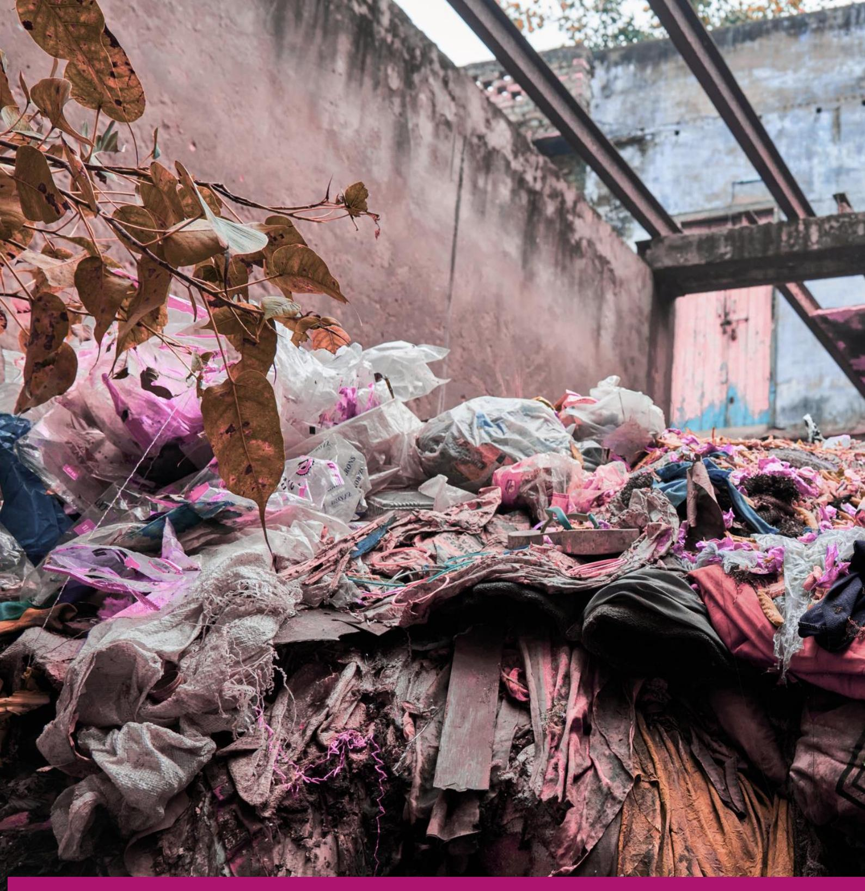

**Textile Circularity and Work**

**EU Textile Circularity -Social and Economic Impacts**

**Review of the Grey Literature**

### **Table of Contents**

| Glossary                                                      | 77  |
|---------------------------------------------------------------|-----|
| Terminology                                                   | 80  |
| Executive Summary                                             | 81  |
| Introduction                                                  | 85  |
| Section1: EU’s Worn and Textile Waste                         | 86  |
| EU Clothing and Textiles                                      | 86  |
| EU Consumption of Clothing and Textiles                       | 89  |
| Unsold Goods in the EU                                        | 92  |
| Socioeconomic Impacts of the Worn-clothing Industry in the EU | 94  |
| Textile Waste generation in the EU                            | 97  |
| EU Worn Clothing and Textile Waste Trade                      | 99  |
| Socioeconomic Impacts of Worn Clothing in the EU              | 102 |
| Section 2: Circularity as a Solution                          | 104 |
| Circularity Strategies                                        | 104 |
| Challenges to a Just Circularity Transition                   | 109 |
| Proposed Solutions to the Challenges                          | 115 |
| Section 3: Extended Producer Responsibility Schemes           | 118 |
| Extended Producer (EPR) Schemes                               | 118 |
| Focus on Waste Management                                     | 120 |
| Worn-Clothing Exports                                         | 121 |
| Ultimate Producer Responsibility                              | 122 |
| Labour Market and Social Challenges                           | 123 |
| EPR Schemes and LMIC’s                                        | 126 |
| Solutions                                                     | 126 |
| Conclusion                                                    | 128 |
| References                                                    | 129 |

# **GLOSSARY**

| Term                           | Definition                                                   |
|--------------------------------|--------------------------------------------------------------|
| 6309                           | United Nations Harmonised System (UN HS) classification      |
| 6310                           | UN HS classification code for rags; used or new, scrap       |
| Child Labour                   | Work that deprives children of their childhood, dignity,     |
| Circular Strategies            | Business and design approaches that extend product           |
| Colonialism                    | Historical systems of domination that continue to shape      |
| Design for Durability          | Design strategies that extend product life and enable        |
| Digital Literacy               | The ability to use digital tools and technologies.           |
| Digital Product Passport (DPP) | A digital record containing data about a product’s           |
| Digital Traceability Tools     | Technologies that track a product’s journey across the       |
| Downcycling                    | Recycling that converts materials into lower-value products. |
| Eco-design                     | Designing products with environmental impacts in mind,       |
| Eco-modulation Fees            | EPR fees adjusted according to a product’s environmental     |
| EU Legislation                 | Laws created by the EU, including regulations, directives    |
| EU Regulation                  | A binding legal act of the European Union that applies       |

| EU Strategy for Sustainable and Circular Textiles EU Waste Framework Directive Extended Producer Responsibility (EPR) | durable, repairable, recyclable and sustainable. disposal. Policy holding producers accountable for products’ environmental impacts throughout their life cycle. |
|-----------------------------------------------------------------------------------------------------------------------|------------------------------------------------------------------------------------------------------------------------------------------------------------------|
| Fibre-to-fibre Recycling                                                                                              | Processes that recover fibres from old textiles to produce new fabrics.                                                                                          |
| Gender Inequality                                                                                                     | Unequal treatment or opportunities for people based on gender.                                                                                                   |
| Greenwashing                                                                                                          | Misleading claims that exaggerate a company’s environmental performance or sustainability.                                                                       |
| Grey Literature                                                                                                       | Research and reports not formally published in academic journals, such as NGO papers or industry reports.                                                        |
| High-income Countries (HICs)                                                                                          | Nations with high gross national income per capita that often generate large volumes of textile waste.                                                           |
| Incineration                                                                                                          | Burning of waste textiles, which reduces volume but emits greenhouse gases and pollutants.                                                                       |
| Informal Work                                                                                                         | Workers without formal contracts or protections often in precarious jobs.                                                                                        |
| Informal Workers                                                                                                      | Workers without formal contracts or protections often in precarious jobs.                                                                                        |
| Informal Sector                                                                                                       | Economic activities not regulated by governments, including waste picking, resale and repair.                                                                    |
| Industry Contribution                                                                                                 | The share of an industry’s value or output to the economy.                                                                                                       |
| Industry Employment                                                                                                   | The number of jobs generated by a particular industry sector.                                                                                                    |
| Just Transition                                                                                                       | A framework ensuring that the shift to a low-carbon workers, communities and vulnerable groups.                                                                  |
| Landfill                                                                                                              | A site where waste is disposed of by burial, often leading to environmental and health impacts.                                                                  |
| Labour Standards                                                                                                      | Rules and guidelines governing working conditions, wages, hours and rights at work.                                                                              |
| Living Wages                                                                                                          | Earnings sufficient to provide workers and their families with a decent standard of living.                                                                      |
| LMICs (Low- Income Countries)                                                                                         | and middle second-hand textiles.                                                                                                                                |
| Low-income Countries (LICs)                                                                                           | Nations with relatively low gross national income per capita, often reliant on informal textile economies.                                                       |
| Make-Take-Dispose Model                                                                                               | The linear economic system of producing, consuming and discarding products without circular recovery.                                                            |
| Mixed Municipal Waste                                                                                                 | Household waste that has not been separated for recycling often containing textiles.                                                                             |
| Modular Design                                                                                                        | A design approach that uses interchangeable components to allow easier repair, upgrade or recycling.                                                             |

| Mono-material                   | Products made from a single type of material simplifying       |
|---------------------------------|----------------------------------------------------------------|
| Online Returns                  | Products returned by consumers after online purchases,         |
| PFAS (Per-                      | and polyfluoroalkyl                                            |
| Polluter Pays or Pollute to {ay | The principle that those who cause environmental damage        |
| Post-consumer Waste             | Textiles discarded after use by consumers.                     |
| Post-industrial Waste           | Waste generated during textile and garment manufacturing.      |
| Precarious Employment           | Insecure, low-paid employment lacking protections.             |
| Pre-consumer Waste              | Waste materials generated during production before             |
| Recycling                       | Converting waste materials into new raw materials or           |
| Redirected Markets              | Alternative outlets for unsold textiles, such as second-hand   |
| Resale Platforms                | Online or physical marketplaces for selling second-hand        |
| Reverse Logistics               | Movement of goods back through the supply chain for            |
| Second-hand Clothing            | Previously owned garments sold for reuse.                      |
| Social Enterprises              | Organisations that typically operate with business methods     |
| Social Protection               | Systems of government support that provide security            |
| Socioeconomic Impacts           | Combined social and economic effects of industries,            |
| Sorting Centres                 | Facilities where collected textiles are classified for resale, |
| Synthetic Textile Materials     | Man-made fibres such as polyester, nylon, acrylic and          |
| Take-back Schemes               | Programmes where brands or retailers collect used              |
| Technical Textiles              | Textile products engineered for functional purposes (e.g.      |
| Textile Circularity             | A system where textiles are designed, produced, used and       |
| Textile Circularity Industry    | The emerging sector focused on circular business models        |
| Textile Credit Mechanisms       | Financial tools to support circularity by rewarding            |

| Turnover                 | Total revenue a company generates before expenses are          |
|--------------------------|----------------------------------------------------------------|
| UN Comtrade Data         | The UN’s global trade database, providing import and           |
| Upcycling                | Reusing or repurposing materials to increase value,            |
| Upskilling               | Training workers with new skills to adapt to changing          |
| Waste Colonialism        | The export of waste, especially low-value textiles, from       |
| Waste Dumping            | The uncontrolled or illegal disposal of waste.                 |
| Waste Management         | The collection, transportation, processing and disposal or     |
| Waste Pickers            | Workers usually in informal economies who collect and sort     |
| Waste Reduction          | Efforts to minimise the amount of waste generated through      |
| Waste Shipment Directive | EU law regulating the transboundary movement of waste to       |
| Wellbeing                | Overall quality of life, including physical, mental and social |
| Worn Clothing            | Garments that have been previously owned or used.              |
| Worn-Clothing Exports    | Outgoing shipments of previously owned or used garments,       |
| Worn-Clothing Imports    | Incoming shipments of previously owned or used garments        |

# **Terminology**

The terms "Global North" and "Global South" are widely used in policy and academic reports to describe economic and political divisions, and they are used widely in the grey literature reports we analysed. However, these labels are contested, and "Global Minority" (for wealthier, industrialised countries) and "Global Majority" (for the broader population of lower-income nations) are given as alternatives, reflecting demographic realities and shifting power structures. However, these terms are still gaining traction and may not be universally understood. Other labels such has "high-income countries" (HICs) and "low- and middle-income countries" (LMICs) or regional names when describing groups of countries are also used. As much as possible, we

will try to focus on the specific countries to ensure the focus on the specific dynamics present in those countries, however other categories will be used as they have been reported.

When we discuss the "textile industry", we focus on textiles in apparel and sportswear sectors and exclude other sectors such furnishings and technical textiles used in automotive or health care industries. However, most reports do not define their boundaries of the textile industry so this classification cannot be guaranteed in the analysis.

In keeping with the definitions given by the trade associations we use the term "worn-clothing trade" to identify and highlight the trade in items categorised as 6309 in trade terms. Whenever we discuss the trade, we use this term. However, when we talk about the selling of imported worn clothing, we use the term "second-hand clothing" and for the markets where the selling happens "second-hand clothing markets". So worn clothing is when clothes are imported and exported but when they are sold to consumers, garments are second-hand clothing

# **Executive Summary**

The EU textile circularity industry is going through a period of rapid change and expansion due to EU regulation and the growing awareness of the enormous resource extraction of the industry and its impact on our climate and natural world. This report looks at literature not routinely considered in academic research, the grey literature, reports that are not in academic journals and may not be peer reviewed; to try to understand the current conversation, research and insights into the structure, dynamics and social and economic impacts of the EU textile circularity industry.

### **EU Worn Clothing Trade and Second-hand Clothes**

In 2023, the EU clothing and textiles sector had a turnover of €170 billion (Duhoux et al., 2024) and employs 1.3 million people across 197,000 companies (European Environment Agency, 2025). Over 99% of clothing companies are micro enterprises or small and medium enterprises (SMEs) (Gözet et al., 2021). In 2020, 6.9 million tonnes of finished textile products were produced in the EU, with EU textile production mainly focused on technical textiles (European Environment Agency, 2025). 9% of the volume of the textiles produced in the EU are related to clothing but represent 38% of production value (Duhoux et al., 2022). However, between 60% and 70% of textiles produced in the EU are made of synthetic materials, polyester or polyester blends (Doyle et al., 2024).

In 2022, the EU imported 153 billion worth 11 million tonnes of textile products, mainly from Asia (Gözet et al., 2021), with clothing accounting for almost half of the imports (45%) followed by household textiles (21%), footwear (17%) and other textiles (12%) (European Environment Agency, 2025). Approximately 13 million people working full-time (mainly in Asia) produced the clothing, textiles and footwear consumed in the EU countries in 2020. Textiles, and food, has the lowest share of European employment of any sector (European Environment Agency, 2025).

In the EU In 2022, an average EU citizen consumed 19kg of textiles: 8kg of clothing; 7kg of household textiles and 4kg of footwear (European Environment Agency, 2025; Duhoux et al., 2025). Spending €282 billion on clothing, that is €630 per person on clothing, and €68 billion on footwear (Duhoux et al., 2024). Approximately 8.5 million tonnes of textiles were consumed in the EU in 2022 (Duhoux et al., 2025).

The EU generates between 11kg and 16kg of textile waste per person annually 6.94 million tonnes of textile waste in 2022 82% of waste is post-consumer waste, followed by post-industrial (17%) and pre-consumer waste (1%) (European Environment Agency, 2025, Deckers et al., 2024, Duhoux et al., 2025, Gözet et al., 2021).

The amount of textile waste sent to landfill in Europe decreased from 21% in 2010 to 12% in 2022 but the amount of textile waste sent for incineration increased from 10% in 2020 to 14% in 2022. Approximately 4-9% of all textile products in the EU are destroyed before use, accounting for between 264,000 and 594,000 tonnes of textiles destroyed each year (European Environment Agency, 2025).

In some EU countries, such as Austria, Germany, Italy and the Netherlands, all textile collection sites classify their textiles as waste, regardless of the quality of the textiles, however, the definition of textile waste varies between the EU countries. Current discussions focus on more detailed distinctions between textiles suitable for reuse, recycling and disposal (Circle economy, 2023a). However, the capture rate for textiles was below 15%, which means that 85% of all textile waste from households was not collected separately and ended up as mixed household waste (European Environment Agency, 2025).

More misleading categorisation comes from worn clothing exported from the EU. These are categorised under two main product codes: 6309 for "worn textiles and clothing" and 6310 for "sorted and unsorted used rags and textiles scraps". In general, textiles under code 6309 are not considered waste, whereas textiles under code 6310 are generally considered as waste (Lingås

et al., 2023). The use of 6310 is often avoided due to extra regulations on waste exports, leading to unintended consequences such as bundling mixed-quality textiles in 6309.

There are also issues with data. UN Comtrade data indicates the initial destinations of used textile exports not their final destinations and varies according to who is reporting it. The trade relationships between second hand clothes exporters and importers are the most safeguarded area of the value chain (Circle economy, 2023a).

### **Circularity as a Solution**

Circularity solutions could play a role in reshaping the textile industry but not enough is being done to deliver real social and economic benefits. While there is growing momentum behind circular strategies like eco-design, take-back schemes, resale platforms, and fibre-to-fibre recycling; the grey literature shows these initiatives come with trade-offs. Many circular solutions are technically promising but fail to create fair, inclusive systems especially for workers, lowincome consumers and communities in LMIC.

There are five barriers consistently holding circularity back:

- 1. Limited demand for circular products
- 2. Poor quality of secondary materials
- 3. Gaps in infrastructure
- 4. Inadequate workforce skills
- 5. Weak or misaligned policy

Behind these technical issues lie deeper socioeconomic challenges. For example, circular clothing can be significantly more expensive than fast fashion, putting it out of reach for many consumers. Meanwhile, informal repair workers, waste pickers, and small producers, especially in low-income regions, are often left out of decision making, implementation and management of initiatives, even though they are key to making circular systems function.

Solutions do exist, but they need to go further. Social enterprises are emerging as an important bridge connecting circular practices with job creation, skills training, and local development. However, they remain under-recognised and underfunded. Policy tools aimed at enhancing corporate sustainability and accountability in supply chains hold significant potential. However, regulatory approaches risk producing unintended consequences such as disadvantaging smallscale producers or incentivising superficial sustainability efforts rather than meaningful change. Training programmes, take-back systems, and digital traceability tools all sound promising but without structural support, they are unlikely to benefit the people most affected by fashion's current impacts.

Ultimately, we need a more critical and people-centred view of circularity. If we want to move beyond surface-level change, we need to design systems that work for both people and the environment. That means putting just transition principles at the heart of circular strategies and ensuring that economic opportunity, affordability, and equity are built in from the start, not added as an afterthought.

#### **EPR Regulations**

Although EPR has been suggested as a solution to many of the issues with textile waste and circularity, the grey literature is equivocal on whether it is a solution or, in its current forms, causing problems.

EPR schemes for textiles have been around for less than 20 years with France pioneering a mandatory scheme in 2007. Since then, other EU countries and US states have followed suit, with several African, Asian and Latin American countries also developing their own EPR schemes.

These schemes are based on the principle of the polluter pays. With producers paying a fee for introducing items onto the market with the fee paying for the processes at the end of the first consumer phase, usually managed through producer responsibility organisations (PROs).

However, problems with EPR schemes include:

- Focus on waste management, not on design for durability or prevention of waste
- Eco-modulation fees are too small to incentivise design and production changes
- EPR packaging fees tend to be higher than textile fees
- Export loopholes and weak enforcement exacerbate waste dumping in countries outside of the EU
- EU EPR fees rarely follow the product to ultimate destinations to cover waste management and recycling in countries outside of the EU
- EPR schemes ignore labour and social rights and issues

Solutions have been proposed to ensure the effective implementation of EPR schemes:

- Create ultimate producer responsibility (UPR) schemes rather than EPR schemes to account for the cross-border trade in worn clothing
- Cover the costs of recovering, recycling and disposal of textiles over the life cycle of clothing within and beyond the EU
- Allocate proportion of EPR fees to social enterprises and job creation for those far from the labour market
- Involve social enterprises and municipalities in the running of the schemes.
- EPR schemes should focus on training workers and providing safety equipment and highlight the important role waste management workers play in circularity
- EPR schemes can address the issue of informality by facilitating access to social security and support transition to formal work
- International alignment and global justice must happen
- Ensure labour and quality standards and economic wellbeing
- EPR schemes should reflect the true cost of textile waste while also prioritising waste reduction.

EPR schemes could be a key part of solving some of the issues with the current textile industry, however, the industry has to be careful to ensure that they are implemented properly.

# **Introduction**

This report on the EU Textile Circularity Industry is the second in a three-part series of reports focusing on the grey literature related to the textile industry. The first part focused on Global Textile Value Chains while the final part will focus on Africa Circularity. This report highlights the structure, operations and the socioeconomic impacts of the EU textile circularity sector. The report focuses specifically on the people working in the sector, their wages, working conditions and wellbeing.

In this series of reports non-academic sources, commonly known as grey literature, (Hussain et al., 2025) will be analysed to understand the conditions and concerns facing workers in the EU textile circularity industry. These materials, while often influential in shaping circularity policy, are often not subject to peer review or transparency standards.

Hussain et al. (2025) caution that the authority granted to grey literature in shaping national and international strategies on circularity is disproportionate to its transparency or rigour. One widely circulated claim, for example, suggests that circular business models will create €500 billion in new revenue (Ellen MacArthur Foundation, 2017). However, other analysis challenges this optimism, estimating increases closer to US\$10–17 billion and anticipating potential revenue declines across the fashion sector. This report does not attempt to verify these claims but instead investigates the current narratives shaping policy and practice. It offers a snapshot of socioeconomic tensions and opportunities as they appear in the grey literature, with more empirically grounded academic analysis to follow in subsequent work.

The ambition of this report series is to provide insights that help prevent unintended harm during sustainability transitions. Our audience includes not only EU-based workers, unions, and policymakers, but also stakeholders across the global textile industry, especially those in countries trading with the EU. Members of the TRUSTex consortium and beyond are encouraged to draw on these insights to inform fairer and more inclusive strategies. We also call on actors throughout the sector, such as brands, manufacturers, retailers, NGOs, producers and those involved in sorting, repairing, and recycling; to engage with the findings and co-create solutions to the pressing social and economic challenges facing the industry.

With increasing legislation in the textile industry regulating circularity; extended producer responsibility (EPR); and the EU Waste Framework Directive (WFD); we see both positive impacts such as increasing demand for circular designs, circular business models and circularity service suppliers but also unintended consequences for people making clothes, selling used clothes or managing textile waste. This report will uncover and focus on these tensions and highlight the solutions proposed by the grey literature.

### 1. **SECTION 1: EU'S WORN CLOTHING & TEXTILE WASTE**

### **1.1. EU Clothing and Textiles**

In 2023, the EU clothing and textiles sector had a turnover of €170 billion, an increase from €167 billion in 2022 (Duhoux et al., 2024). The sector employs 1.3 million people across 197,000 companies (European Environment Agency, 2025), of which 67% are clothing companies (Doyle et al., 2024). 99% of these companies are micro enterprises or small-and-medium-sized enterprises (SMEs) (Gözet et al., 2021).

The EU is the leading region for the production of high-quality clothing and innovation for textile research and design (Gözet et al., 2021). In 2020, 6.9 million tonnes of finished textile products were produced in the EU, accounting for a value of €77 billion. Textile production in the EU has mainly specialised in technical textiles, for example non-woven, industrial textiles, fabrics to be used in healthcare, sportswear and agriculture, and in high-value clothing and footwear (European Environment Agency, 2025).

Technical textiles account for 27% of total textile industry turnover in 2019, making up a significant amount of EU textiles. The European technical textiles market is expected to have a Compound Annual Growth Rate of 4.54% between 2022 and 2027 (Doyle et al., 2024). Italy, Germany and France are the biggest European producers of technical textiles (Doyle et al., 2024).

Even though only 9% of textiles produced in the EU are related to clothing they represent 38% of production value (€29 billion). Clothes are high-value products in comparison to their low volumes (Duhoux et al., 2022). However, between 60% and 70% of textiles produced in the EU are made of synthetic materials, either polyester or polyester blends (Doyle et al., 2024).

In 2022, the EU imported €153 billion worth, or 11 million tonnes, of textile products (Gözet et al., 2021), an increase from 8.7 million tonnes in 2020 (Duhoux et al., 2022). Clothing accounted for about half of total imports (45%) in volume, followed by household textiles (21%), footwear (17%) and other textiles (12%) (European Environment Agency, 2025). The majority of imported products came from countries in Asia. In 2020, 29% of the imports, valued at €23 billion, came from China; followed by 19% from Bangladesh (€15 billion); and 11% from Turkey (€9 billion) (Doyle et al., 2024).

Approximately 13 million people are employed full-time across global textile supply chains to produce the amount of textiles and footwear consumed in EU countries in 2020. With only a quarter of this employment in the EU (Duhoux et al., 2022). The textile and food sectors have the lowest share of employment in Europe (European Environment Agency, 2025).

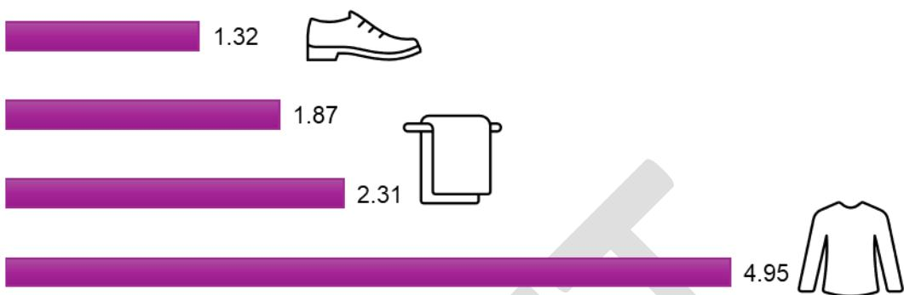

### **Petroleum-based textiles dominating the EU**

Europe is the largest importer of synthetic textiles and is a significant exporter of synthetic textiles globally. In 2022, 3.3 million tonnes of fibres and yarns were produced in the EU. In the same year, about 2.3 million tonnes of fibres and yarns were imported and 0.82 million tonnes exported, leading the total use of fibres and yarns by the EU to reach 4.8 million tonnes in 2022. 2.8 million tonnes (58% of the fibres used by EU textile industry in 2022) were synthetic (Duhoux et al., 2025).

Synthetic fibres and yarns are often blended with natural fibres for cost or functionality reasons. Synthetic textiles persist in the biosphere in the form of macro-, micro- and nano plastics (unless they are incinerated). Between 1.6 and 61.1 kilo tonnes of microplastics are unintentionally released into the environment in the EU each year (Duhoux et al., 2025).

Textiles also create about 35% of the total global fluoropolymer demand. The EU textiles sector uses one third of all per-and polyfluoroalkyl substances (PFAS), accounting for 41,000 to 143,000 tonnes. The sector is the biggest contributor to PFAS pollution in Europe (Doyle et al., 2024). The effects of PFAS are concerning, for example, during the production phase, workers are exposed to these chemicals. In facilities where fluorochemical and fluoropolymer products are made, higher PFAS levels were found in workers' blood in the Rimar Miteni factory in the Veneto region of Italy, where PFAS levels were concerningly high.

The existence of PFAS in durable long-lasting items raises questions for when they are reused. On the one hand, reusing items extends their lifespan, but, on the other hand, it increases the potential of PFAS exposure over time. For example, legacy PFAs, even though they were banned years ago, are still detected in long-lasting textile products. It is suggested that reused products might pose fewer risks, as volatile PFAS chemicals are mostly released during their initial use. But repurposing textiles containing PFAS for uses other than their original design and purpose can create risks. Thus, it is vital to ensure that reuse is handled appropriately and does not increase potential human risks. The end-use of a repurposed product should not be different to the primary use (Doyle et al., 2024).

Recycling of PFAS-containing textiles also extends the duration of PFAS remaining in circulation, posing health risks. Incorporating PFAS-containing textiles into a wide range of secondary products could also expose humans to more significant risks than the primary products. Once recycled, it is difficult to trace the presence of PFAS. Consequently, legacy PFAS may still remain in products, even if their use has been restricted (Doyle et al., 2024).

### **1.2. EU Consumption of Clothing and Textiles**

Between 2000 and 2015, clothing production doubled but the number of times an item was used before it was thrown away decreased by 36% (Ellen MacArthur Foundation, 2021, Rise & Centexbel, 2024). Apparent consumption in the EU, the combined amount of production and imports, minus exports was 15kg per person in 2020. This consisted of, on average, 6kg clothing, 6.1kg household textiles and 2.7kg footwear (Duhoux et al., 2022; Doyle et al., 2024).

The total production and imports minus exports per person in 2020, in kilograms.

In 2022, an average EU citizen consumed 19kg of textiles, out of which 8kg was clothing; 7kg was household textiles and 4kg was footwear (European Environment Agency, 2025, Duhoux et al., 2025).

The average amount of items consumed by an EU citizen in 2022, in kilograms

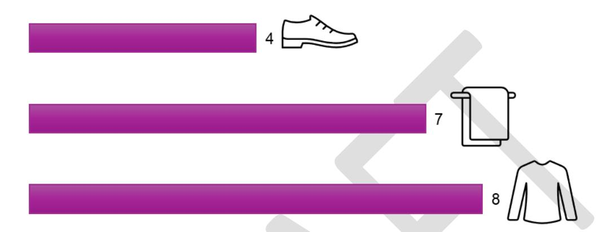

In the same year, EU households spent around €282 billion on clothing (€630 per person) and €68 billion on footwear (Duhoux et al., 2024).

The amount that EU households spent on clothing and footwear, in billions of euros.

These numbers were €600 on clothing person and €150 on footwear per person in 2019 (Duhoux et al., 2022).

However, it is difficult to identify true consumption volumes as different studies cite different numbers, varying from 12-25 kg per person (Duhoux et al., 2025). Overall, the figures signal that approximately 8.5 million tonnes of textiles were consumed in the EU in 2022 (Duhoux et al., 2025).

The vast majority of clothing are discarded before the end of their technical lifespan. As these items have the potential for reuse, they are often sold in second-hand shops across or outside the EU. EU households also purchase about 80,000 tonnes (1.3kg per person) of intimate products each year, including underwear, lingerie and pyjamas, among others. These products are more likely to be once until the end of their technical life and are rarely reuses. Intimate products generally end up in mixed waste. Household textiles (bedlinen used in a domestic and business context) are also not suitable for reuse and are usually discarded before their service life finishes (Gözet et al., 2021).

If it follows current trends, consumption of clothing and footwear is expected to increase 63% by 2030, from the current 62 million tonnes to 102 million tonnes globally (Rise & Centexbel, 2024). However, an estimated 75% decrease in the purchase of new clothing is needed to stay in line with the planetary boundaries. Relatedly, in 2021, on average, 2.3kg of clothing per person were reused in the EU. This corresponds to a total of 451,268 tonnes of clothing reused in the EU. In the same year, the average consumption of new clothing was 15.9 kg per person in the EU, meaning that about 13% of the total consumption of clothing constituted reused clothing (Duhoux et al., 2025).

### **Environmental impact**

The total greenhouse gas emissions in the supply chain of textile products purchased by EU households were 159 million tonnes of CO2 equivalent, or 355 kg per person in 2022. This makes the textiles the sixth most important climate impact among household consumption domains (Duhoux et al., 2025). Between 2010 and 2022, consumption levels increased by 15 %, but greenhouse gas emissions per person decreased by 22%, indicating an absolute decoupling of emissions from consumption as a result of a reduction in the GHG emission intensity of textile consumption. Nonetheless, the increasing consumption patterns offset these efficiency gains. Only 30% of emissions take place in Europe, while the remaining 70% of GHG emissions is generated outside Europe. So, the EU outsources the majority of the carbon footprint generated across the production of textiles purchased and consumed by EU households (Duhoux et al., 2025).

Textiles is the fourth highest consumption domain for water use. In 2022, 12 m3 per person of blue water, including surface water or groundwater during irrigation, industry processes or

household use, was used in the production of textile products purchased by EU households, accounting for 6.000 million m3 in total. Furthermore, in 2022, 323 m3 per person of land use was used for the production of textile products purchased by EU households, accounting 144.000 km2 . This is approximately twice the size of the Czech Republic (Duhoux et al., 2025).

The numbers around raw material consumption differ significantly, as there are some uncertainties about this indicator (European Environment Agency, 2025). Textiles production in the EU requires about 175 million tonnes of raw materials, representing 391 kg per person in the EU (Doyle et al., 2024). It was also stated that in 2022, 234 million tonnes of raw materials were utilised to produce all clothing, footwear and household textiles consumed by EU households, accounting for about 523kg per person. Numbers are inconclusive but what is known is that only about 32% of raw materials are produced or extracted in Europe, with the remaining 68% of raw materials stem from outside Europe (European Environment Agency, 2025).

Synthetic fibres made from oil and gas dominate the sector, which account for 60-70% of all textiles sold globally (Doyle et al., 2024). Comparing raw material consumption with the total apparent consumption of textiles in the EU however signals a relative decoupling: consumption per person increased by 15% between 2010 and 2022, but raw material use for textiles consumption in the EU decreased by 24%, leading raw material intensity of textile consumption to decrease (Duhoux et al., 2025).

### **1.3. Unsold Goods in the EU**

Data on unsold stock is difficult to find, as only a limited number of European retailers gives these figures. They indicate that 10–27% of products are unsold through their core channels although these figures are not reliable (Duhoux, et al, 2024, p.16). This suggests that, in the EU, 60-80% of the items are sold through core channels. Of the unsold items, 90% are sold in redirected markets, while the remaining 10% are used for recycling.

In France, where data is more reliable, unsold clothing and footwear represent 4.1% of the total turnover of the clothing and footwear sector, accounting for a market value of €1.7 billion (Duhoux et al., 2024). According to the French Agency for Ecological Transition (ADEME), 31% of unsold textiles were unsold because of minor defects, 65% of these ended up at outlet stores at significantly discounted prices, 20% donated, 6% recycled, 4% repaired, 4% incinerated and 1% ended up in landfills (Duhoux et al., 2024).

In the Netherlands, a study conducted in 2016 found that 33% clothing was sold at a discounted price. 6.5% (21.5 million items) valued at €313 million was unsold, of which 3% was sent for recycling, 2.7% for incineration and the rest not specified (Duhoux et al., 2024).

In Norway, there was 825 tonnes of unsold clothing in 2021, accounting for 0.7% of the textiles on the market. 82% of unsold clothes were donated to charity, with 98% exported to Eastern Europe or Asia; 17% sold at outlets and the remaining 2% destroyed. However, another report from Norway indicated that 82% of unsold textiles were incinerated, 11% went to charity and 3% was sold through outlets, while the remaining 4% was defined as other (Duhoux et al., 2024).

A European average of unsold clothing is almost impossible to calculate because figures are not necessarily representative of different European countries and/or they refer to different years, while using different definitions of unsold items (Duhoux et al., 2024). There is also construct unclarity. Some reports refer to end-of-life treatment in general terms, such as destruction, but some differentiate different actions such as recycling and incineration. The German Environment Ministry (BMUV) states that "only few credible numbers exist on the destruction of goods, because not all goods are recorded, and companies cannot be inspected comprehensively" (Duhoux et al., 2024).

Charity organisations receive donated unsold goods from the original seller to redistribute. However, charity organisations in Belgium, France and Germany state that volumes coming from traditional distributors are decreasing because the original sellers discount prices to sell the products with at least some financial return (Duhoux et al., 2024).

There are also quality concerns in donated clothes. In France, donated clothes do not match the needs of the charities. From the luxury sector, charities see an increase in volumes, which only sell online, but overall quality is decreasing. Subsequently, it is estimated that somewhere between 4-9% of all textile products put on the market in the EU are destroyed without being used for their intended purpose (Duhoux et al., 2024).

#### **Online returns**

The share of online sales for textile and clothing products more than doubled in the EU, from 5% in 2009 to 11% in 2022. Clothing, including sportswear, shoes and accessories, is the most popular category of physical products purchased online in the EU, with 68% of internet shoppers purchasing from this category in 2022.

In the EU, a customer purchasing an item online has the right to cancel or return the order within 14 days without justification, even when the product functions as advertised. Retailers must refund the customer within 14 days of receiving the request, which also includes the shipping costs. For products purchased in a shop, there is no EU legal right to return the products, unless the item is broken or not functional. The return rate for products sold online is about three times higher than for products sold in physical stores (Duhoux et al., 2024).

The average return rate for clothing is 20% in the EU, which shows that one in every five clothing items purchased online is returned. For fashion, 70% of returns are because of poor fit or style. The average return rate for footwear is 30% (Duhoux et al., 2024). Returns are difficult to predict, so little is known about which products might be returned, when and in what condition.

In particular, sizing variations, different sizing systems, lack of clarity around the sizing information, country conventions, differences across brands, different ways of converting a local size to another, and so on, are some of the most pressing issues. These uncertainties, coupled with lenient return policies, encourage customers to overorder and return.

There are different destinations for returned products. Some can be restocked and sold again at full price (Grade A). Some might have minor defects or be out of style; therefore, they can only be resold at reduced price (Grade B). Products that cannot be resold (Grade C) can be donated to charity, liquidated or sold to middleman or destroyed. Some products that are restocked or go to secondary markets are also destroyed. Around 22-44% of returned products never reach a new customer and are destroyed (European Environment Agency, 2025).

### **1.4. Socioeconomic Impacts of the Worn-clothing Industry in the EU**

#### **Worn-clothing Industry Contribution**

In the EU, the worn-clothing industry has a significant direct socioeconomic impact. In 2023, it contributed €3 billion to the region's GDP. This was split between profits (24% and €700 million) and employee compensation (76% and €2.3 billion) (Oxford Economics, 2024). This is greater than the value-added output of the EU clothing manufacturing sector, apart from Italy. The GDP contribution was the highest in Germany, France and Italy, with €670 million, €400 million and €300 million, respectively.

In 2023, the worn-clothing industry in the EU supported an estimated total economic contribution of €7 billion to GDP in the EU. This is equal to 10% of Lithuania's GDP that year. 43% of this total contribution was supported by the worn-clothing industry's direct operations. In addition, the supply chain spending of companies associated with collecting, sorting and retailing companies and their suppliers represented 28% of the total contribution, while consumption spending enabled by wages paid to employees across the EU supply chains represented 29% of the total contribution. This means that for every €1 directly generated by the worn-clothing industry, a further €1.34 was generated somewhere else in the European economy (Oxford Economics, 2024).

### **Worn-clothing Industry Employment**

The worn-clothing industry also creates significant employment in the EU. 110,000 jobs were created in 2023, which equals the combined number of people employed in Germany's, France's and Spain's clothing manufacturing industries in 2021. Most jobs were created in Germany (20,000 jobs), of which 71% were created in retail stores, while 13,000 jobs were created in Italy and 12,000 in Poland (Oxford Economics, 2024).

The worn-clothing industry also supported an additional 40,000 indirect jobs (through supply chain spending and wage-induced consumption spending of employees), with total employment in the EU worn-clothing industry reaching 150,000 jobs in 2023. The job multiplier effect sustained by the worn-clothing industry is estimated to be 1.42, highlighting that 420 jobs were created and sustained in the EU for every 1,000 direct jobs in the worn-clothing industry (Oxford Economics, 2024).

The worn-clothing industry also created significant job opportunities in less economically developed regions in the EU, such as Bulgaria, Romania and Poland. It is estimated that 22,000 jobs, representing 20% of the worn-clothing industry's direct employment, were created in Bulgaria, Romania, and Poland, which are the EU states with the lowest GDP per person in 2023. The industry also generated jobs for approximately 9,200 people in Spain, which was the EU state with the highest unemployment rate in 2023 (Oxford Economics, 2024).

#### **Worn-clothing Collection, Sorting and Second-hand Clothing Retail**

An estimated 62% of gross value added (GVA) was generated across the collection, sorting and retail activities in the EU. Companies in charge of collection and sorting contributed 19% of the total GVA contribution. The collection of clothes created most jobs within Northern and Western

European countries in the EU, with 62% of all jobs created by worn-clothing collection companies in the bloc. Sorting centres generated more employment in Eastern and Southern Europe, with 60% of the sorting related jobs in 2023. Jobs created by retail were even across the EU, with 55% of retail jobs created in Northern and Western Europe, compared to 45% in Eastern and Southern Europe (Oxford Economics, 2024).

Collection companies, on average, employ between 20-100 workers. The majority of this workforce is dominated by men (75%). Most employees are aged 25-49 (70%), with the majority completing secondary education (85%) but employees have few opportunities for skills development or career progression (Oxford Economics, 2024).

Sorting companies employ about between 50-200 workers. The majority of the workforce are women (69%), with the majority aged between 25-49 (80%) but also workers aged 50-64 (12%) (Oxford Economics, 2024).

Retail operations, on the other hand, have varying numbers. Employees are mostly female (92% on average), but the majority of this workforce do not occupy leadership position. Most workers are aged 25-49 (70%). Second-hand-clothing retailers also provide important employment opportunities for younger generations aged 15-24, representing 11% of the workforce. Those aged 50-64 represent 17% of the total workforce (Oxford Economics, 2024).

### **Worn-Clothing Wages and Gender Equality**

In the EU, there are also wider socioeconomic impacts. In HICs in the Global North, the average employee wage paid by the worn-clothing industry was €20,000 per employee in 2023. Comparing the gross average employee salaries paid by the industry in each EU country with the gross minimum wage in the same country, it is estimated that the worn-clothing industry paid, on average, about 12% more than the domestic minimum wage. This suggests that the wornclothing industry contributes to living wages for thousands of people in the EU, even though jobs do not require formal education (Oxford Economics, 2024).

The worn-clothing industry in the EU also promoted equal payment for female employees, with women accounting for 79% of its workforce. No difference in pay between men and women was reported. 77% of the industry's employees' educational background was basic, in comparison to 60% in the overall workforce in the EU. This underlines that the worn-clothing industry provides accessible employment opportunities, with little formal educational requirements. In retail, educational background also varies, with 66% having secondary education, 16% with short-term tertiary education, 13% with tertiary education and 5% with primary school recognition (Oxford Economics, 2024).

### **1.5. Textile Waste Generation in the EU**

The EU has reached a level of relative decoupling when it comes to waste generation. That is, waste generation is growing at a slower pace than the economy, expressed through gross domestic product (GDP). However, absolute decoupling is not happening, so waste generation is not decreasing when the EU economy is growing. Between 2008 and 2018, total waste generation reached more than 182 million tonnes, accounting for an increase of 8.5% (Gözet et al., 2021).

The EU created about 6.94 million tonnes of textile waste in 2022, representing 16 kg per person (European Environment Agency, 2025; Deckers et al., 2024, Duhoux et al., 2025). Post-consumer waste accounts for 82% of all textile waste created, (another estimate cites post-consumer as 87% of the total textile waste in the EU (Rise & Centexbel, 2024), followed by post-industrial (17%) and pre-consumer waste (1%) (Deckers et al., 2024).

The amount of textile waste sent to landfill in Europe decreased from 21% in 2010 to 12% in 2022, but the amount of textile waste sent for incineration in Europe increased from 10% in 2020 to 14% in 2022. About 4-9% of all textile products in the EU are destroyed before use, accounting for between 264,000 and 594,000 tonnes of textiles destroyed each year (European Environment Agency, 2025). This corresponds to 3.8 and 8.5% of textile waste generated (Deckers et al., 2024).

In Austria, Germany, Italy and the Netherlands, all textile collection sites are classified as waste, regardless of the quality of the textiles, but other EU counties do not automatically do this. Little is known about the quality of textile waste. Waste is, therefore, a misleading term as the definition of textile waste varies between EU countries. Discussions about the existing definitions are ongoing, as distinctions need to be made between textiles suitable for reuse, recycling and disposal (Circle Economy, 2023a).

Following the EU Waste Framework Directive, EU Member states are required to report on the separate collection and treatment of post-consumer textiles. While reporting requirements vary by the EU member states, they are expected to establish separate collection systems for textiles (Lingås et al., 2023).

According to the European Environment Agency, in 2022, the collection rate was below 15%, which means that 85% of all textile waste from households was not collected separately and ended up as mixed household waste (European Environment Agency, 2025). In other reports it was claimed that one third of the waste is separately collected for reuse and recycling, while two thirds are stored in households or end up as domestic waste (Gözet et al., 2021). The number of waste textiles and footwear separately collected was claimed to be 4.6kg per person in 2022 (Duhoux et al., 2025) and 4.4kg per person in 2020 (Deckers et al., 2024), in comparison to what is not separately collected, which was 11.1kg per person in 2022 (Duhoux et al., 2025) and 11.6kg per person in 2020 (Deckers et al., 2024).

In 2020, the countries with the highest shares of textiles in mixed municipal waste were Ireland (9.3%) and Slovenia (8.4%); the lowest were Denmark (2%), Greece (2%) and Latvia (2.84%) (Deckers et al., 2024). It was also suggested that the amount of separately collected textile waste was as low as 1kg per person in Sweden, Finland, Hungary, Latvia, Greece and Ireland, in comparison to 15.5kg per person in Belgium in 2020. Another report cited that the amount of textile waste collected separately was about 4.5% in Latvia, 11% in Italy, 38% in France and 45% in Denmark and the Netherlands in 2019 (Duhoux et al., 2025). The differences between the EU states are attributed to the differences between the countries in terms of policies, infrastructure, support and incentives for sorting and recycling initiatives, as well as behavioural elements.

Belgium and the Netherlands appear to be the most active member states in increasing the collection of textiles (Lingås et al., 2023). In the Netherlands, the total quantity of discarded textiles was 305,100 tonnes in 2018, 194,000 tonnes in 2020 and 202,000 tonnes in 2021 (Circle economy, 2023a), accounting for about 5-6% of mixed household waste (Gözet et al., 2021). While separately collected worn clothing was 136,000 tonnes in 2018, 90,000 in 2020 and 115,000 tonnes in 2021. In 2018, 84% of the textiles collected in the Netherlands were sold abroad, of which 53% were suitable for reuse, 33% were recycled and 14% were non-recyclable or unfit for reuse. In 2022, around 248,000 tonnes of worn clothing were exported from the Netherlands. In 2022, the highest volume export country was Poland, which received 10% of the total export volume from the Netherlands (Circle Economy, 2023a).

However, not all of the worn clothing exported originated from the Netherlands; 63% of the clothes sorted in the Netherlands had been imported, mostly from Germany, Belgium and France (Oxford Economics, 2024). Similarly, in France, 58% of the collected and sorted clothes were reusable, 32% recyclable and 10% waste; in Lithuania, 69% of textiles sorted were reusable, 23% recyclable and 8% across sorting centres (Oxford Economics, 2024). Despite the Netherlands' substantial sorting capacity, 55% of the textiles collected locally were sent abroad for sorting.

Therefore, it is important to note that the textiles landscape is global, and countries cannot and should not be analysed in isolation (Circle Economy, 2023a).

**Table 2** Breakdown according to type or source of textile waste generation by country

|               | Post-industrial | Pre-consumer | Post-consumer Household sources | Non-household sources |
|---------------|-----------------|--------------|---------------------------------|-----------------------|
| Austria 1     | 9%              |              | 62%                             | 29%                   |
| Belgium 1     | 34%             |              | 51%                             | 15%                   |
| Czechia 1     | 54%             |              | 46%                             |                       |
| Italy 1       | 35%             | 6%           | 48%                             | 11%                   |
| Lithuania 2   | <1%             | 4%           | 89%                             | 6%                    |
| Luxembourg 1  | 18%             |              | 82%                             |                       |
| Netherlands 2 |                 |              | 65%                             | 35%                   |
| Poland 2      | 25%             |              | 75%                             |                       |
| Slovenia 2    | 13%             | 1%           | 58%                             | 29%                   |
| Spain 1       | 2%              |              | 98%                             |                       |
| Sweden 1      |                 |              | 84%                             | 16%                   |
| Average       | 17%             | 1%           | 69%                             | 13%                   |

Source: Adopted from Deckers et al. (2024). The paper calculated based on what was reported in the ETC EC survey by the countries. 1 refers to data year 2020; 2 refers to data year 2021.

### **1.6. EU Worn-Clothing and Textile Waste Trade**

Worn clothing is traded as a commodity. Worn clothes are considered waste under the Waste Framework Directive; however, after collection and sorting, a significant share of clothing lose their waste status and are reclassified as second-hand clothing (Circle economy, 2023). In the case of cross-border movements, the Waste Shipment Directive only applies to waste, not to worn clothing. Worn clothing exported from the EU are categorised under two main product codes under the combined nomenclature classification system: 6309 for "*worn clothing and other worn articles"* and *6310 for "sorted and unsorted used rags and textiles scraps*".

In general, textiles under code 6309 are rarely considered waste, whereas textiles under code 6310 may be considered waste (Lingås et al., 2023). The use of 6310 is often avoided due to extra regulations on waste exports; consequently, the default is to trade both usable and unusable textiles under the classification 6309. The export of textile waste has no code, but textiles are listed in the European List of Waste. National authorities must, therefore, assess whether or not worn clothing to be exported are classified as waste (Lingås et al., 2023).

In the last 20 years, the EU exported worn clothing classified as 6309 and as 6310; however, the volumes associated with 6310 have remained stable despite the general increase in exports. The reasons are unknown; however, it may be that the majority of exports are still fit for reuse, or, alternatively, the classification and categorisation do not accurately reflect what is being exported (Lingås et al., 2023). A substantial amount of these exported textiles is unsorted, and called "originals", but most likely contain items both fit and unfit for reuse. These "originals" are likely to be classified as 6309 although they might include rags and scraps. It is likely that these classifications do not describe what is being exported (Lingås et al., 2023).

UN Comtrade data, although helpful, only indicates the initial destination of used textile exports, not their final destinations. Data also varies depending on who is reporting it. Exporters and importers may report different numbers for different reasons, for example goods can be classified differently, and it is known that the trade relationships between worn-clothing exporters and importers are the most safeguarded area of the value chain (Circle Economy, 2023a). Data on commodities that might be considered waste, therefore, is open to interpretation.

The amount of worn clothing exported from the EU, including both 6309 and 6310, increased from 550,000 tonnes in 2000 to around 1.7 million tonnes in 2019, representing 3.8kg per person in 2019 (Doyle et al., 2024). In other words, 25% of the 14.8kg of clothing, footwear and household textiles consumed per person in 2020 (European Environment Agency, n.d.). In another report (European Environment Agency, 2025), the volume of worn clothing exported from the EU is, however, claimed to be stable at 1.4 million tonnes since 2019. The value of these exports has decreased, from €0.76 per kg in 2000 to €0.57 in 2019 (Lingås et al., 2023). This highlights that importing countries are paying less for these textiles, but the specific reasons behind this are unknown. It is speculated that a decrease in quality has led to a decrease in value, and/or markets may have reached saturation. Yet, the volume of exports is increasing despite decreasing prices (Lingås et al., 2023).

Worn clothing is subject to a complex trade between EU countries. Over the last two decades, 75% of all EU exports of worn clothing came from only five countries. Between 2000 and 2010, Belgium, Germany, Italy, the Netherlands and the UK dominated exports from the EU. In 2019, Germany exported more than any other country and Poland and Lithuania entered the top five EU exporters, replacing the UK and Belgium (Lingås et al., 2023).

Final destinations, however, vary significantly. The top five destinations for Germany are Belgium, Italy, the Netherlands, Poland, and Romania. While the top five for the Netherlands are Belgium

and Germany, Cameroon, Pakistan, and Tunisia. The top five countries for Belgium, Italy and Poland are all outside of the EU (Lingås et al., 2023). What happens to these textiles after they are exported is unknown.

Estonia, Latvia and Lithuania are important importers of worn clothing for sorting and processing purposes. In 2018, more than 90,000 tonnes of worn clothing were imported by the Baltic states with a significant share of these textiles coming from Nordic countries (Deckers et al., 2024). Italy and Poland have significant sorting and recycling capacity, receiving substantial amounts of worn clothing from the other EU countries: 40,291 tonnes and 38,640 tonnes respectively in 2023 (Deckers et al., 2024). Poland's sorting capacity is around 200,000 tonnes annually, with 131,985 tonnes of worn clothing collected domestically (Circle economy, 2023a). In 2022, Poland had an export value of €183 million for worn clothing (6309) and €23 million for rags (6310). The main destinations for sorted and exported textiles (6309), by weight, were Pakistan, Togo and Ukraine.

Between 2005 and 2023 the main importers of worn clothing from the EU were Africa and Asia. In 2023, Africa received 44.6% of worn clothing from the EU, while Asia received 43.2% (Duhoux et al., 2025). In comparison to Africa, Asia has developed strong local textile production facilities, leading to their share of exports increasing. For example, the EU did not export worn clothing to Pakistan until 2003. As of 2019, Pakistan was the biggest importer of worn clothing from the EU, mostly either recycled or re-exported. Imports to Asia predominantly go to economic zones where textiles are recycled rather than reused locally or re-exported. This means that worn clothing exported by the EU are increasingly ending up as industrial wipes and rags. Little is known about the reasons behind this, and research is needed to explore the quality of what is exported from the EU (Lingås et al., 2023).

Although there are significant differences between Northern and Sub-Saharan Africa, despite the imports to Africa being meant for reuse, about 40% ends up in landfills (Lingås et al., 2023). In 2023, the EU exported €1.96 billion worth, or 2.2 million tonnes, of worn clothing classified as 6309 globally, of which, 701,618 tonnes, or €615 million worth, were destined for Africa, accounting for about 31% of the overall export volume (Oxford Economics, 2024). Major EU exporters to Africa include Germany (€297 million), the Netherlands (€209 million), Poland (€183 million), and Italy (€120 million), with 47%, 13% and 18% of the imports in Ghana, Kenya and Mozambique to originate from the EU in 2023.

Intermediary countries, such as the United Arab Emirates (UAE) and Pakistan that sort and process worn clothing collected in the EU are also important exporters for other countries in the Global South. The UAE was the largest trading partner, with 231,801 tonnes of exports worth

€132 million in 2023. Pakistan was the second-largest volume destination at 208,665 tonnes with a value of €48 million. Worn clothing sent from the EU to both Oman and the UAE for sorting and processing, and then being shipped to Africa, highlight the significant indirect export flow from the EU to Africa (Oxford Economics, 2024).

In 2023, the EU exported €39 million or 53,970 tonnes of worn clothing (classified as 6309) to Ghana, with volumes increasing by 6%, and values increasing by 28% over the last decade. In contrast, the EU's exports classified as 6309 to Kenya declined significantly by 2023, falling to 25,430 tonnes (€23 million), a 40% reduction in volume (and a 36% reduction in value) since 2013. Also, by 2023, exports from the EU to Mozambique declined from 19,736 tonnes (€19 million) to 7,600 tonnes (€6.8 million), representing a 61% reduction in volume and a 64% reduction in value (Oxford Economics, 2024).

Worn clothing exported by the EU has lots of uncertainties. The types of textiles exported as well as the quality levels are uncertain. Data is not consistent on the quantities and what happens to worn clothing and textile waste in Europe. The UN Comtrade commodity codes do not reflect the quality and the destiny of exported textiles. It is also known that Asian importers act as importexport hubs, making the situation more complicated. It is vitally important to understand where worn clothing go after the first receiving country, to identify what ultimately happens to worn clothing exported from the EU (European Environment Agency, n.d.; Lingås et al.,2023).

### **1.7. Socioeconomic Impact of Worn Clothing in the EU**

#### **Worn-Clothing Exports and Sorting**

Worn clothing is traded in and across value chains globally with some EU countries acting as import-export hubs for worn clothing. As sorting is labour intensive, it is more economical to do this in countries where labour costs are lower. A large share of unsorted collected textiles from the EU are, therefore, sent to Eastern Europe for sorting, then re-exported through the hubs in the EU to be sent to Asia and Africa for reuse and recycling. However, there are significant data gaps on textile flows within and beyond Europe due to the lack of transparent, comprehensive and reproducible data preventing monitoring of progress and development of actionable policy options (Duhoux et al., 2025).

### **Worn-clothing Trade Employment**

Worn clothing value chains create significant employment opportunities, especially for women, across the sorting, cleaning, repairing, distributing, selling and recycling of worn clothing (Mitumba Consortium Association of Kenya, 2025). Job creation appears to be the most important socioeconomic benefit of worn-clothing exports (Circle Economy, 2023a). According to the ILO, new activities in recycling and reprocessing resulted in the creation of over 10 million jobs in Latin America and the Caribbean, and around 0.5 million jobs in Europe (Circle Economy et al., 2023).

### **Textile Waste and the Informal Sector**

However, the trade in worn clothing is also perceived as an excuse for exporting waste, shifting HICs in the Global North's waste problems to LMICs in the Global South. The value transformation of discarded textiles to commodities usually happens in the under-explored informal sector, and there are concerns and risks related to job quality, especially in disposal countries. The informal nature of worn clothing processing is usually linked to precarious and less safe working conditions, including lack of minimum wage and secure employment, debt and power asymmetry between the actors involved (Circle Economy, 2023a). Even where waste management systems for worn clothing are formalised and managed, they generally rely on informal labour. High levels of informality in this sector are also linked to a lack of workers' representation and unionisation, as well as high risk of health issues and accidents.

### **Worn Clothing and Gender Inequality**

The worn-clothing and second-hand clothing sectors create more jobs for women, but with gender-specific disadvantages. Recycling and sorting companies are mostly owned and run by men, whilst most of lower-wage, non-technical and manual labour-intensive actions are performed by women. This echoes the characteristics of the linear clothing and textiles value chains where women represent the majority of the workforce, with lower salaries and poorer working conditions (Mohommad et al., 2022).

#### **Worn Clothing and Colonialism**

One of the most significant, positive, socioeconomic impacts of worn-clothing exports from the EU is the delivery of inexpensive but good quality clothes to those in LMICs. Not only the poorer population, but also the middle and upper-middle class purchase second-hand clothing as a quality and sustainable option (Bank & Vogue, 2025).

However, the domination of HICs in the Global North's clothing styles is considered cultural imperialism, promoting a standardised concept of fashion. European worn clothing, which are too low quality for reuse in Europe are sent to Africa, with an assumption that Africa, even without acknowledging its diverse nature, needs the HICs imposed styles, designs and clothing. This is one reason why East African countries have attempted to ban worn-clothing imports (Consulting for Africa (CFA) and Abalon Capital Limitada, 2025). These issues result in calls for more research to understand the socio-cultural, psycho-social and socio-economic impacts of the worn clothing value chains in both importing and exporting countries (Circle Economy et al., 2023a).

## **2. SECTION 2: CIRCULARITY AS A SOLUTION**

The circular economy is increasingly heralded as the solution to reducing textile waste, keeping clothing in use beyond their first owner, and ensuring that the value of garments is preserved, not just in material terms, but through the jobs, skills, and livelihoods they can support across the textile industry.

Adopting circular strategies means shifting from the traditional make-take-dispose business model and including strategies that aim to eliminate harmful materials in production processes, ensuring longer durability of products, reusing them when possible, and recycling those that cannot be resold or donated (Ellen MacArthur Foundation, 2021). Extending the usability of clothing and recycling textile fibres is becoming increasingly necessary, as between 2000 and 2015 the production of clothing doubled, while their use rate decreased by 36% (Ellen MacArthur Foundation, 2021)

### **2.1 Circularity Strategies**

A key circularity activity is take-back schemes for worn clothes, where consumers return old clothes to retail stores in exchange for retail vouchers or deposit them in recycling bins. Textile take-back schemes allow consumers to return worn, damaged, outdated items so that they can be reused, repaired, resold or recycled. These schemes help keep garments in circulation and reduce textile waste. Brand and retailer involvement in such schemes is essential to building a functioning circular textile economy (WRAP, 2025).

By engaging consumers, take-back schemes can be successful. When clear instructions are given to the consumers, these schemes have the potential to increase the collection rate by 46% (Dowling et al., 2025). Collecting more used items also makes second-hand clothing available to

buy, therefore providing an accessible and affordable alternative to people who might not be able to afford to buy new clothing.

The transition to the circular economy is expected to create millions of jobs globally. Estimates predict the creation of about 10 million jobs in Latin America and the Caribbean, and 0.5 million in Europe; while displacing 5 million jobs in the Asia Pacific region, 1 million in Africa, and 0.2 million in the Middle East (Circle Economy et al., 2023). However, job losses can be avoided if companies are legislated and advised on how to diversify their businesses and redeploy and reskill their workforce (Circle Economy et al., 2023).

Unfortunately, this transition is not accessible to everyone as it demands systemic change, beginning in upstream stages of supply chains with clothing design innovation. The majority of the grey literature focuses on the environmental impact of this transition, neglecting its social impact. This is a serious failing for the circular economy as without a social impact focus there will be no just transition - a transition that ensures a positive environmental impact, the creation of decent well-paid jobs and the inclusion of those whose lives are impacted most.

This section of the report highlights how circularity can be implemented, the challenges hampering the effective implementation of just circular business models, and summarises the solutions proposed in the literature to address the challenges.

Circularity can be implemented building on three core pillars: eco-design, business model innovation and the role of social enterprises. These are the starting points for evaluating the social and economic challenges facing the transition to a circular textile industry and the potential solutions to these challenges.

### **Eco-Design: Designing for Circularity**

Design and design thinking are central to the success of the circular economy. Reports such as Duhoux et al. (2022) and the Upstream Circularity Playbook (Syrett and Lammas., 2024) consistently frame eco-design as the foundation on which the circular economy must be built, shaping how products are made, used, and recovered. Key design strategies include:

- Modular design: Creating products in separate, easy-to-remove components so that they can be repaired, replaced or recycled without discarding the entire item.
- Mono-material use: Using only one type of material (e.g. 100% cotton or 100% polyester) to simplify recycling at an item's end-of-life.

- Design for durability, repairability, and recyclability: Ensuring products are made to last, can be easily fixed when damaged and are constructed for material recovery.

These strategies collectively aim to extend product life cycles and reduce waste. Modular and mono-material designs simplify the replacement and separation of components for reuse or recycling, while designing for durability and repairability ensures products can withstand repeated use and are easy to maintain (Duhoux et al., 2022; European Environment Agency, 2024).

Eco-design must also anticipate downstream use beyond the first consumer, aligning product materials with appropriate recycling technologies. This includes distinguishing between closedloop systems, where materials are recycled back into the same product type (e.g. old t-shirts into new t-shirts), and open-loop systems, where materials are repurposed into different products (e.g. textiles recycled into insulation or industrial rags) (Syrett and Lammas., 2024).

Producers should be incentivised to design clothing that have embed these principles and, at the same time, consumers should be encouraged to value longevity in clothing and only purchase circular products if and when needed. In particular, they should be encouraged to keep and use clothes for as long as possible by creating personal, meaningful, or customisable products. This strategy, called *design for emotional durability*, helps foster stronger consumer relationships by making products that people want to keep and care for, and relies on storytelling (e.g., the origin of a garment), aesthetic appeal, high-quality construction, and customisation that reflects individual identity (Duhoux et al., 2022; Ellen MacArthur Foundation, 2021).

Klee klee, a Shanghai-based slow-fashion brand, demonstrates this approach in practice, by narrating the history of each product, its material provenance and its care instructions (Ellen MacArthur Foundation, 2021). Another example is GANNI Repeat, a clothes sharing platform established in Denmark and the UK, who in collaboration with LEVI's and Nanna Bernholm, designed a small capsule collection made from unused fabrics only available on their rental platform, inviting customers to rent rather buy these exclusive items (Ellen MacArthur Foundation, 2021).

Producers can use traceability solutions, such as the Digital Product Passport (DPP), as a way to communicate the history of a product, and to inform consumers about where a clothing item came from, where its materials were produced, where was it sewn, and how it got to its owner. By embedding information directly into garments, traceability is enabled across the value chain, promoting proper garment care and helping consumers and recyclers to understand how to manage products at their end-of-life (Ellen MacArthur Foundation, 2021). These tools also

support transparency, compliance and engagement, especially as new regulations on circularity and extended producer responsibility emerge in the EU and beyond.

Finally, several grey literature reports encourage the adoption of collaborative approaches to circular design. Rather than driven solely by brands, circular design should incorporate insights from across the value chain including manufacturers, recyclers, repair networks and both formal and informal waste sectors. This ensures design decisions reflect real-world challenges and recovery pathways (Syrett et al., 2024; United Nations Environment Programme, 2023a).

Despite growing interest, the implementation of these design strategies is still limited to pilots and niche brands. Questions remain about how scalable these approaches are, and what their wider impacts will be, particularly in relation to labour conditions and equity across the supply chain.

### **Circular Business Models: Redefining Value and Ownership**

The transition to a circular economy requires rethinking how businesses create, define and deliver value, making business model innovation key to circularity. There are three main types of circular business models, each representing a different approach to extending the value of products and reducing waste:

- More Use per User: This business model aims to extend the lifespan of clothing for individual users. Brands that focus on durability, timeless design, and services such as repair, alteration, or upcycling, fall into this category. For example, a fashion label offering in-store repair services or encouraging customers to mend their garments.
- More Users per Product: This approach maximises the number of people who can use a single item over time. It includes business models based on resale, rental, leasing, and peer-to-peer sharing.
- Beyond Physical Products: These business models generate value without producing physical garments, helping to reduce resource use entirely. Examples include digital fashion used for social media or gaming avatars, or fashion brands offering virtual try-ons and styling services instead of physical product consumption (Dowling et al., 2025, Ellen MacArthur Foundation, 2021).

These business models aim to decouple revenue from resource extraction. Decoupling means that economic value is created without increasing raw material use but instead extends product life cycles and encourages shared use. Services like rental, resale, and subscription-based clothing platforms, which are vital for this decoupling, are projected to account for 23% of the

fashion market by 2030, potentially reducing greenhouse gas emissions across the value chain by 16% (Ellen MacArthur Foundation, 2021).

Circularity depends on value retention, whether material (e.g. preserving fabric quality), financial (e.g. maintaining resale-price value), and/or social (e.g. supporting living wages and local employment) across a product's lifecycle, value-retention strategies should be implemented at all stages of the supply chain and product lifespan Beyond the design phase, value-retention strategies include:

- Durable production: Prioritising high-quality materials and construction methods to extend product life and reduce the need for replacement (Duhoux et al., 2022).
- Reverse logistics infrastructure: Coordinated systems for collecting, sorting, and redistributing textiles ensures that producers can retain the value of their items even after first use, while generating local employment (WRAP, 2025; United Nations Environment Programme, 2023a).
- User-friendly return systems: Take-back schemes and digital produce passports support reuse, resale, and recycling by simplifying garment collection (Syrett and Lammas, 2024) and allow consumers to transfer a valuable item to another potential user.
- Repair and sharing services: Localised repair, tailoring, and rental platforms extend garment use and create new service-based jobs (Ellen MacArthur Foundation, 2021).
- Fibre-to-fibre recycling: This process breaks down textile waste and turns it back into raw fibres that can be used to make new clothing. By reusing existing materials instead of relying on new ones, fibre-to-fibre recycling helps reduce both greenhouse gas emissions and textile waste (Syrett et al., 2024; Circle Economy, 2023). By recycling fibres into new ones, producers are able to preserve the material value of the fibres and extending their life cycle.

While these models and strategies provide a good starting point for creating a circular textile industry, there are distinct challenges to their implementation. In particular, value-retention strategies (material, financial and social) are unevenly supported by infrastructure and policy. In many regions, especially in LMICs, local repair networks and informal recyclers already play a key role in material recovery but are usually excluded from decision making, planning, implementation or investment, despite their essential contribution to circularity (United Nations Environment Programme, 2023a). There is a strong emphasis on experimentation and innovation, particularly in HICs, but less on the structural reforms needed to make these models viable and inclusive.

The role of social enterprises and community-led initiatives offers a practical approach to implementing circularity rooted in local needs, values, and social relationships. This is known as a socially embedded pathway. These enterprises have created "business" models that underpin social and equitable goals by acting as buyers, employers or service providers to communities and people who might otherwise be ignored or excluded from consumer or labour markets.

Some of these businesses operate for profit, such as Goonj in India, which links small villages and cities to reduce disparities in the resources of both regions, (Technoserve et al., 2023); meanwhile, others operate as non-profit organisations or charities, such as Salvation Army, which is involved in the collection of worn clothes (Dowling et al., 2025). Platforms like Sojo, which offers local tailoring through an app with bicycle delivery, and repair cafes illustrate how community-based models can operationalise circularity on the ground.

These initiatives embed circular practices such as repair, reuse, and skills development within local contexts, supporting both material-value retention and social-value creation. By strengthening local service infrastructure, they also reduce transport emissions and promote inclusive employment. Their role is noted as part of broader efforts to localise circular business models and build user engagement at the community level (Ellen MacArthur Foundation, 2021).

Their strength lies in blending circular principles with local development. However, they get limited attention by a broad spectrum of stakeholders, including financial institutions. A good example of how blending circularity with local development comes from RLabs, a South African non-profit social enterprise, which is supporting local micro-entrepreneurs in the waste-collection business to access micro-loans of working capital and connects them with established recycling businesses. This allows the micro-businesses to access capital, new business opportunities and to avoid them being forced into the informal sector (Technoserve et al., 2023).

Although there are several examples worldwide of pioneering social enterprises, such as RLabs, there is a substantial gap in recognising their scalability, innovation and significance for systemic change (Technoserve et al., 2023).

### **2.2 Challenges to a Just Circularity Transition**

While the circular economy aims to minimise waste and keep materials in use for as long as possible, for circularity to be truly sustainable, it must also be just, ensuring that the transition supports living wages, safe working conditions, and inclusive opportunities across the value chain.

The circular economy could ensure environmental and social benefits in the textile sector; however, several challenges hamper its implementation and effectiveness. These challenges appear to be systemic and often rooted in existing inequalities. The key barriers can be grouped into the following themes:

- Lack of demand for circular products
- Scarce supply of secondary materials
- Skills shortages
- Inadequate and fragmented infrastructure
- Incoherent policies and laws that regulate circular practices

### **Lack of Demand for Circular Products**

Decisions by consumers are a critical factor for the success of circular business models, particularly when they support practices such as repair, reuse, resale, and return schemes (European Environment Agency, 2024; United Nations Environment Programme, 2023). These practices extend the life of products and reduce waste and have the potential to support social and economic outcomes: such as supporting local repair economies, fostering more inclusive participation in circular systems and lowering the cost of essential goods. In particular, consumers are the 'gate keepers' of circular systems, because decreasing their reliance on fast fashion, could unlock the potential of slow or second-hand fashion (Coscieme et al., 2022, Trunk et al., 2023a).

It is often assumed that marketing campaigns and transparency are enough to redirect consumers' interests towards more sustainable products (Coscieme et al., 2022, Trunk et al., 2023a). Unfortunately, this thinking ignores two fundamental points: the customers' buying power (or lack of buying power), and the socio-emotional component of each individual's fashion style (Coscieme et al., 2022, Technoserve et al., 2023).

Consumer buying power and the ability to pay for recycled fashion items are key because prices of recycled items are estimated to be 150%-220% more expensive than non-recycled items (Kearney, 2020, Technoserve et al., 2023). While it is not challenging to find a customer segment that is interested in circular and sustainable fashion, it is a lot more challenging to find one that can pay a premium that covers all the extra costs associated with the collection of used clothes and re-processing into new ones (Kearney, 2020). A market analysis conducted by Kearney (2020) showed that the majority of customers would accept price increases of up to 10%, while price increases higher than 30% would be accepted only by 15% of all customers.

Furthermore, decades of fashion marketing and media collaboration have embedded the idea of an individual's fashion style as a reflection of their personal identity. Coscieme et al. (2022) point out that customers who see clothing as a "second skin", or a "non-verbal social communication" may show more unsustainable behaviour to blindly follow fast-fashion trends. The psychology and culture of "throwaway" or "wear once" clothing needs to be recognised and challenged, particularly the complicity of the fashion media in these cultures as they undermine the demand for more durable clothing and encourages the disposal of perfectly good clothing for the latest fashion trends (Coscieme et al., 2022).

### **Supply Scarcity of Secondary Materials**

A critical barrier to the development of circular practices in the fashion industry is the availability of secondary materials to upcycle into new garments. Currently, the global average for fibre-tofibre recycling is less than 1% (Textile Exchange, 2024), with the highest fibre recycling rate for wool fibres at 6%. These figures are worse if we look at the numbers for clothes collected in take-back programmes. While companies advertise that collected items will either be redistributed as second-hand clothes or recycled to produce new ones, the vast majority are incinerated even though many of the clothes are still wearable, repairable or recyclable (Dowling et al., 2025, Trunk et al., 2023a). This undermines the efforts that consumers put into collecting their old garments and gives them false hope that they are choosing a sustainable option.

Equally concerning is the poor technical quality of recycled fibres (Kassatly and Townsend, 2024). This is particularly true for polyester, which makes up 54% of the textile fibres produced across the globe in 2022, and 60 to 70% clothing items produced in Europe (Doyle et al., 2024, Textile Exchange, 2024). Brands have used the recycled polyester content of their clothing as part of their sustainability marketing campaigns; however, this "greenwashing" is not only criticised but is in the process of being regulated (Trunk et al., 2024).

Alarmingly, only *750 tonnes* out of 71 million tonnes of polyester textile fibres produced every year are recycled to produce new clothes (Textile Exchange, 2024) with 99% of recycled polyester for clothing coming from plastic bottles (Bates Kassatly and Townsend, 2024, Trunk et al., 2024). Unfortunately, using plastic bottles to make polyester fibres means destroying both material and financial value.

Recycling plastic bottles into new plastic bottles can happen almost infinitely, with just a small addition of virgin material, maintaining both material and financial value in the plastic bottle circularity system. However, using these bottles for producing recycled polyester for clothing results in inferior quality polyester compared to virgin polyester and the need to blend with large quantities of virgin polyester. Not only that, but once the bottles have been turned into polyester for clothing, they are impossible to recycle, ending the life of the material. This downcycling practice, where material and financial value is lost, results in garments of lower quality with shorter life cycles, making them even less durable (Bates Kassatly and Townsend, 2024).

### **Skills Shortages**

The shift to circular models requires not only technological innovation but also a workforce equipped with new skills. Several reports, including WRAP (2025) and the Upstream Circularity Playbook (Syrett and Lammas., 2024), emphasise the need for investment in training and upskilling. Skills and expertise include people learning to sort waste by material type, digital literacy training for tracking and tracing tools, repair and upcycling specialists in local reuse hubs, and managerial best practices in the context of circular economy and sustainability. The current general lack of skills represents a challenge to the transition to a robust circular economy and needs to be addressed to ensure that there is meaningful training and upskilling not just superficial change.

The lack of skills both at the floor-shop and managerial levels is partially attributed to the inadequacy of professional and university training. For example, the skills necessary to sort clothing into reusable, recyclable or non-recyclable items are not an innate competence that people have. Several studies have shown how consumers struggled to classify the quality of an item, leading to up to 60% of the items incorrectly sorted as non-recyclable when they were still reusable (Bates Kassatly and Townsend, 2024, Dowling et al., 2025). The lack of skills at the managerial level stems from the bias and focus of business schools on championing profit over any other decision-making criteria, almost entirely neglecting social and environmental outcomes which are also key for the circular economy (Technoserve et al., 2023).

Upskilling the workforce is challenging in two ways. Persuading people working in waste facilities and their managers that training is necessary will be difficult, while training and upskilling also creates a significant cost for companies, particularly for those located in HICs (Syrett and Lammas, 2024, Dowling et al., 2025).

### **Inadequate and Fragmented Infrastructure**

Infrastructure is critical to circularity, but its development remains slow and uneven. Key technologies like digital product passports, AI-enabled sorting and fibre-to-fibre (F2F) recycling are often hindered by economic or policy delays. While these tools are widely promoted, there is little evidence of their readiness or scalability.

In western European countries, one barrier is the high costs of establishing collecting, sorting and recycling operations and ensuring living wages (Syrett and Lammas, 2024, Dowling et al., 2025). In other regions, especially those with large informal sectors, infrastructure shortages are a major barrier to implementing circularity at scale (United Nations Environment Programme, 2023a; WRAP, 2025). Despite growing recognition of the problem, it remains unclear who is responsible for funding and maintaining these systems. Funding roles are often undefined (European Environment Agency, 2024), and small businesses and actors from the Global South are frequently left out of infrastructure planning altogether, raising important questions about fairness and equity.

### **Incoherent Policies and Laws Regulating Circular Practices**

There is growing momentum around legislation, including EPR, WFD, Ecodesign for Sustainable Products Regulation (ESPR), Corporate Sustainability Due Diligence Directive (CSDDD) and DPPs. The EU is seen as a leader in sustainability legislation and is introducing policies that could radically challenge and change current business practices (business-as-usual). Notwithstanding this potential, there are several pitfalls that can still prevent the implementation of a just circularity.

For example, the CSDDD would render European and Non-European companies responsible and liable for all their supply chain operations, with the effect that human rights violations will be reduced due to the burden of responsibility no longer cascaded only onto lower-tier suppliers (Transformers Foundation, 2024, Recover, 2025). This policy has the potential to strengthen the scope and enforcement of the EU Forced Labour Regulation. Although the CSDDD was approved in May 2024, its application is still in discussion, delaying its expected benefits.

While the CSDDD would be beneficial to ensuring a just circularity in the textile industry, other policies, such as the WFD and the ESPR are not as promising. In particular, a review of the ESPR has shown that its core assumptions and requirements are based on unverified data and assumptions, which would worsen the fashion industry's environmental and social impacts (Bates Kassatly and Townsend, 2024). For example, ESPR would require including a minimum percentage of recycled materials, ignoring their poor performance and generating clothing of inferior quality. This in turn will stimulate overproduction, requiring the production of more items that do not last as long those produced only with virgin materials. Simultaneously, it would introduce the need for standards and certifications to access global markets.

If this were to happen, a vast number of small farmers in LMICs would be delisted by global brands because of the high costs of certification, even those certifications fail to ensure

operational and sustainability-related improvements (Kassatly and Townsend, 2024), increasing the already large economic and social disparities between high- and low-income farmers.

The introduction of the ESPR will also introduce mandatory digital traceability solutions, such as the DPP. This would require sophisticated data collection systems from the raw material stage of the supply chain (Transformers Foundation, 2024, Recover, 2025). While this would represent a significant step towards transparent and traceable supply chains, data collection and sharing feasibility for lower-tier suppliers, particularly in low-income and low-technology regions, will be difficult and in some cases impossible (Transformers Foundation, 2024).

The WFD requires collected textile items to be sorted and treated as close as possible to the collection point, requiring a complex infrastructure (Transformers Foundation, 2024, Recover, 2025). This infrastructure, the personnel to build and manage it, and the technology required are currently not available. This poses serious questions on the immediate applicability of this policy.

Another policy that introduces unintended consequences is the EPR policy. EPR requires either the producer or the importer to register with a Producer Responsibility Organisation (PRO) and pay them to register the weight of the textile waste produced or collected. Ideally, the registered textiles would be recycled into secondary fibres for new clothing. However, it is cheaper to downcycle them into insulation materials or to incinerate them for energy because the policy does not mandate a minimum percentage of upcycled materials. While the intention of the EPR is worthy, it creates an unintended consequence of a "pay-to-pollute" tax (Trunk et al., 2023a).

The lack of oversight and sanctions for each of these policies have also led many companies to create misleading marketing campaigns promoting their take-back programmes and labelling of "recycled" products (Trunk et al., 2023a, Transformers Foundation, 2024). New policies that guide and regulate labelling of recycled and recyclable products have been published in recent years in both in the United States and in Europe (Transformers Foundation, 2024), in an attempt to prevent companies from greenwashing.

Finally, the lack of harmonisation between local policies can create supply chain disruptions by delaying or impeding shipments between different countries (Dowling et al., 2025), or opportunistic behaviours, for example, by misusing the United Arab Emirates as a trade-free zone and by exploiting workers in low-income Asian and African countries that have weaker or unenforced policies (Trunk et al., 2023a). It is often assumed that legislation will automatically trigger transformation, but this ignores the impacts of political agendas, enforcement capability or the unintended consequences that can arise, especially in a dynamic environment where legislative and political developments can lead to unpredictable outcomes (Dowling et al., 2025,

Trunk et al., 2023a). Without harmonised and enforceable global standards, circularity risks becoming a label without substance.

### **2.3 Proposed Solutions to the Challenges**

Although the challenges presented pose serious doubts about the realisation of a just circular economy, there are cases of how solutions can be created and adopted. Along with these practical examples, reports point to aspirational solutions that, as of today, could work only in theory.

However, it is important to point out that none of the following solutions described is optimal. While most make economic and/or ecological sense, they seldomly create social benefits. Indeed, the solutions generally overlook the people working in the textile and circularity industries and mainly focus on the expected financial and environmental benefits. A just circular textile industry must ensure that people working in the industry are consulted and included and ensured living wages, training and protection.

#### **Shifting Consumers Behaviour to Generate Demand for Circular Fashion**

To address the challenge of demand, several grey literature reports argue that consumers must shift their buying habits to support a more environmentally just and sustainable future (Coscieme et al., 2022). The general suggestion is to abandon fast-fashion models (Duhoux et al. 2022). In particular, it is suggested that consumers in HICs should significantly reduce their consumption, and fashion social media influencers and journalists be incentivised to promote this transition (Syrett and Lammas, 2024, Coscieme et al., 2022) At the same time, consumers in LMICs should significantly increase their consumption to ensure the development of their local economies (Coscieme et al., 2022, Trunk et al., 2023a).

Another solution to generate a slow-fashion model for consumers in HICs is to redesign the buying experience with technology, making fashion a digital experience. Shops and online retailers could be provided with body scanners to design clothing specifically for each customer, therefore, switching the production to a design-to-order model (Ellen MacArthur Foundation, 2021, Dowling et al., 2025). While real examples of how fashion could be digitalised exist (e.g., DressX), the idea of fully digital fashion appears futuristic and far from a realistic solution for most people. It assumes widespread digital access and interest that simply is not there, especially outside wealthy, "tech-savvy" circles. There is a real risk that focusing too much on technology solutions diverts attention from deeper, more systemic changes that are needed to make fashion more fair, inclusive and sustainable. This solution, although it may be desirable, is aspirational as

it overlooks the much more significant impacts of textile production and attributes the devastating environmental damage of the fashion industry entirely to consumers.

Other recommendations seek to incentivise consumers to rely on second-hand clothing markets, both physical and digital (Ellen MacArthur Foundation, 2021, Gillabel et al., 2021, WRAP, 2025). These models support micro-entrepreneurship and local repair ecosystems, potentially offering social value through community-based economy. However, access, affordability, and scalability remain uneven, and the broader socioeconomic impact, particularly in rural or LMICs, are not yet fully understood. These approaches may not offer universally applicable solutions and should be critically assessed within their specific market and cultural contexts. Similar solutions point customers towards subscription-based rental models (e.g., Hack Your Closet), which make fashion more affordable and reduce overconsumption, but they still face practical hurdles. These solutions are more realistic, but concerns around hygiene, delivery logistics, and user habits, especially around returning or caring for items, can limit their scale. These challenges need to be tackled for the model to be both inclusive and viable long term.

### **Rethinking Textile Supply Chains**

To tackle supply and infrastructure challenges, solutions focus on reorganising raw materials and clothing production as well as post-consumer collection and reuse activities. Raw materials supply and production processes solutions, however, are currently very limited. Indeed, most of them are almost entirely aspirational rather than workable solutions. For example, some grey literature reports suggest that polyester fibres could be entirely substituted by African cotton (Bates Kassatly and Townsend, 2024). While it is desirable from the African socioeconomic standpoint, as it would develop local farmers by bringing a large share of business to several LMICs, it would leave entire communities based on polyester jobless, shifting social disparities from one community to another.

Similarly, recommendations suggested to fully eliminate virgin materials by 2030 (Circle Economy, 2023b, United Nations Environment Programme, 2023a), are idealistic at best considering the limitations of the current fibre-to-fibre recycling technologies as well as the impacts on jobs. This solution would severely impact the livelihood of communities all over the world, for example in China for virgin linen production and India for virgin cotton, leaving thousands of people jobless. As the transition to the circular economy unfolds, jobs in raw material production and manufacturing will be lost, and others in repair, resale, sorting, remanufacturing and recycling will be created (United Nations Environment Programme, 2023a). With the increase in new jobs, it will be fundamental to ensure that displaced workers will find new jobs that provide quality employment and the necessary skills development, but also health

and safety rights and wage protection (United Nations Environment Programme, 2023a). Without strong job alternatives and long-term industrial planning, these "solutions" could do more social harm than environmental good and risk being more symbolic than practical, particularly in Asian regions where informal jobs dominate.

We also found solutions to tackle the environmental impact of textile production processes, both of raw and recycled materials. In terms of raw material use, additive manufacturing has been suggested as a valuable option to reduce waste and extend the lifespan of garments. Yet, the impact on traditional garment-making jobs is not understood. This technology could reduce the need for manual skills, potentially disrupting livelihoods in regions that rely on conventional textile production (Circle Economy, 2023b).

Moving downstream, solutions at the post-consumer stage, focus on creating appropriate and effective infrastructures. In particular, regional sorting hubs could streamline the sorting process at an appropriate scale (Dowling et al., 2025, Syrett and Lammas, 2024). Additionally, upgrading infrastructures with AI-driven sorting technologies, such as FiberSort®, could also help to streamline sorting operations (Pakistan Textile Waste, 2025, Syrett and Lammas, 2024, WRAP ,2025). While it makes financial sense to centralise the sorting operations and technology investments, government has to be mindful that this could displace workers at local hubs and also displace manual labour unless reskilling is prioritised.

#### **Assuring Equitable Access to Training**

Tackling the shortage of technical and managerial skills to implement circularity remains a significant challenge. The grey literature offers very limited guidance in this area, with only general recommendations such as involving NGOs or government bodies in delivering training, although no specific initiatives are cited. The Ellen MacArthur Foundation is occasionally referenced as a source of open-access materials and courses, but its use as a formal training pathway appears limited (Technoserve et al., 2023).

This challenge stems from inadequate professional and university training and the solutions proposed are simplistic and do not tackle the causes of inequitable access to training through industrial planning, therefore, providing finding a temporary fix to a much bigger problem.

#### **Redesigning Polices**

Redesigning polices as a solution, again, appears to be aspirational, with advocacy and lobbying suggested as the main ways to ensure regulatory boards adopt better environmental and social practices (Coscieme et al., 2022, Syrett and Lammas, 2024, Technoserve et al., 2023). Multiple

reports suggest the enforcement of traceability systems, such as the DPP piloted by E-On Circular ID. The argument is that this would increase transparency and compliance in the industry, however, as stated previously, adopting DPPs in regions where these technologies are more costly or not as prevalent would be prohibitive and lead to several unintended social consequences (Ellen MacArthur Foundation, 2021, European Environment Agency, 2024, Dowling et al., 2025, Syrett and Lammas, 2024).

Another recommendation from the grey literature is the harmonisation of traceability policies across countries, continents and globally. Unfortunately, persuading different countries and regions to agree on the same rules and systems has always been a challenge. Without alignment, policies risk having different requirements, leading to uneven applications, and limiting their benefits, especially for businesses operating across multiple markets (Trunk et al., 2023a, United Nations Environment Programme, 2023a).

For EPR policies, the main suggestion is the definition of harmonised requirements at continent level at the minimum and, more idealistically, at the global level to avoid clashes between local policies (Circle Economy, 2023b, Trunk et al., 2023a, UNEP, 2023a). Other desired changes would seek to eliminate the unintended "pay to pollute" incentives of current EPRs, by introducing a minimum reuse rate of the collected items as upcycled clothing (Bates Kassatly and Townsend, 2024, Trunk et al., 2023a).

Other options revolve around the definition of policies that incentivise the redesign of clothing, for example, that payments that reward those organisations that are upcycling clothing, and progressive fees to tax the number of items made available on the market (Trunk et al., 2023a). However, again, both solutions are aspirational with the former raising technical feasibility issues for the quality of recycled yarns, and the latter, while taxing those that overproduce, would encounter fierce lobbying from established brands, particularly in the high volume fast-fashion sector.

# **3. SECTION 3: EXTENDED PRODUCER RESPONSIBILITY SCHEMES**

### **3.1 Extended Producer (EPR) Schemes**

This section focuses on Extended Producer Responsibility (EPR) schemes. EPR schemes aim to hold producers responsible for the entire lifecycle of products placed in the market including the post-consumer phase. The post-consumer phase starts from the collection of items that no longer wanted through to recycling and waste management at the end of the product's life. Germany introduced the first EPR schemes in 1991 to deal with packaging waste and this served as a blueprint for EPR schemes adopted by other countries (Bünemann et al., 2020). France, Austria, Belgium, Luxembourg, Sweden, Spain, Portugal, Hungary, Finland, Ireland and the UK all adopted EPR schemes in the 1990s (Bünemann et al., 2020; ten Brink et al., 2017; Watkins, et al., 2019). An EPR for electronic waste was first introduced by Sweden in 1998, which influenced the EU's Waste Electrical Equipment (WEEE) Directive (2002) mandating all members states to introduce EPR schemes for WEEE. Then in 2000, the EU End-of-Life Vehicles (ELV) Directive mandated EPR schemes for vehicle waste.

EPR schemes for textiles are a fairly recent development. France was the pioneer, introducing a mandatory EPR scheme for textiles, footwear and household linen in 2007, while the EU is only now in the process of mandating EPR schemes for textiles. The EU Strategy for Sustainable and Circular Textiles (2022) requires all EU member states to introduce mandatory EPR schemes for textiles by the end of 2026, with separate waste collection systems in place by January 2025. The Netherlands, Hungary, Latvia and Sweden had all introduced mandatory schemes by the end of 2024. In the US, EPR schemes are state led. California required producers to take responsibility for textile waste under the Responsible Textile Recovery Act (2024), which gives producers several years to put in place the necessary systems. New York has a Senate Bill for textile waste responsibility but, as of writing, this has not yet been enacted. Various low-to-middle-income countries (LMICs) are also developing textile EPR schemes including Ghana, Kenya, Chile and India (Ellen MacArthur Foundation, 2024).

The logic of early EPR schemes was to shift the cost of waste management from municipalities to producers based on the "polluter pays" principle. Multiple schemes are based on producers paying a fee for introducing items on to the market. The fees are then used to pay for the sorting, recycling and disposal of the end-of-life products. Generally, the schemes are managed through Producer Responsibility Organisations (PROs) who collect the fees from the producers and then collect and manage the waste to meet the legal requirements of the EPR scheme. The PRO in the French textile EPR is Refashion. They collect fees from producers based on the quantity and type of textile placed on the market. The scheme had 47,551 collection points in 2023 and collected 268,161 tonnes of textile waste, or approximately 32% of the volume of textiles placed on the market (Refashion, 2023).

However, there are a number of issues with EPR schemes, including insufficient focus on waste prevention, the export of textile waste to countries in the Global South without a share of EPR fees accompanying the textiles, and a range of social and labour market issues resulting in the importing countries.

### **3.2 Focus on Waste Management**

The focus on "polluter pays" accentuates *waste management* rather than *waste reduction*. Principle 16 of the Rio Declaration (1992) states:

"National authorities should endeavour [sic] to promote the internalization of environmental costs and the use of economic instruments, taking into account the approach that the polluter should, in principle, bear the cost of pollution, with due regard to the public interest and without distorting international trade and investment" (Röling and Darut, 2023).

The EU adopts a similar approach in their definition of EPR schemes, stating that producers must be financially responsible "for the management of the waste stage of a product's life cycle" (Röling and Darut, 2023; p 2), again, stressing the management of waste while ignoring the prevention of waste. While EPR schemes have led to improved collection and recycling, they have largely failed to address how products are designed and made, which is the path to minimising waste.

Many schemes do not reward producers for making more sustainable products, and where schemes do introduce lower fees for eco-design (what is known as "ecomodulation" of fees), the fee differentiation is too small to incentivise changes in production given the costs involved in redesign or change in materials (Arya and Bhutani, 2023; ten Brink et al. 2017; Röling & Darut, 2023; Simon, 2025). This places the focus on disposal of products rather than on upstream solutions, perpetuating linear models of production. It is estimated that less than 1% of textile products are currently recycled into new textile products (Watkins and Gionfra, 2019).

Related to this, while in theory appropriately set fees could drive changes in production, insufficient financial incentives have led to producers preferring to pay to pollute rather than engage in meaningful eco-design. Textile EPR fees are no more than 2% of a product's price and can be as low as 0.1% (Simon, 2024). In the French textile EPR, fees average approx. €0.12 per kg (or €0.03 per item) for standard textile products, with up to a 50 percent "ecomodulation" discount if the product contains at least 15 percent recycled fibres (Refashion, 2023). The EPR introduced in the Netherlands has set the fee at approximately €0.10 per kg (Girling, 2025). For comparison, *plastic packaging fees are between €0.20 and €0.65 per kg* (Watkins & Gionfra, 2019).

The EU Waste Framework Directive ensures the differentiation of fees based on the environmental impact of the product. However, this means fees cannot be set at a level that would bring about significant behavioural change by producers (Simon, 2024; Simon, 2025). The Or Foundation (2023) recommends that EPR fees for textiles should start at €0.50 per *item* with higher prices for large volumes brought on to the market. This amount would include sufficient funds to cover all costs externalised to importing countries and provide incentives to transform current fast-fashion business models. (It is worth noting that there is some confusion in the grey literature about the average textile EPR fees between fee per kg and per item. For example, The Or Foundation (2023) infers that the French scheme averages €0.12 cents per item when it is per kg. It then recommends a starting fee of €0.50 per item, which equates to approx. €2.00 per kg).

### **3.3 Worn-Clothing Exports**

Loopholes in policy exist in relation to the export of waste textiles. The Basel Convention on the Transboundary Movements of Hazardous Waste prohibits the export of toxic waste, such as vehicles or chemicals. It was agreed in 1989 and came into force in 1992 following the public outcry over dumping of toxic waste in Africa (Arya & Bhutani, 2023, Demartini et al., 2020). The agreement is ratified by 188 United Nations members and has since been amended to include plastic waste and e-waste (Ellen MacArthur Foundation, 2024). The export of other waste material is also covered by various EU directives, including the Waste Framework Directive and Waste Shipment Regulation, with certain waste exports banned and others tightly regulated to ensure it is treated to EU standards and fully documented.

However, in the case of textiles and electronics, products are often classified (or misclassified) as second-hand, reusable goods or even humanitarian aid, exploiting ambiguities in the regulatory frameworks (Arya & Bhutani, 2023). In the case of textiles, the amount of unusable used clothing in bales has increased significantly, reflecting the rise of fast fashion and the use of cheap, synthetic fibres, with a range of studies pointing to a large proportion of textiles exported as 6309 containing reusable and un-reusable textiles (European Environment Agency, 2023, Ellen MacArthur Foundation, 2024).

One report (Trunk et al., 2023b) claims around half of second-hand clothes sent to Kenya are too damaged to be re-used and these end up discarded in landfill, rivers or burnt. They also point out that around two-thirds of the unusable clothes contain plastics, which are not covered by the Basel Convention, and which cause significant environmental and health issues. The plastic in discarded clothes fragments releasing toxic waste into water supplies and soil and emitting methane into the atmosphere. Where clothes are incinerated, fumes contain toxins that can contribute to lung and respiratory illnesses, stroke and cardiovascular diseases, birth defects and cancer (Trunk et al., 2023b).

The levels of waste in exported clothes identified in Africa is a pattern repeated across LMICs, with the Atacama Desert in Chile, where tens of thousands of tonnes of textile waste have been dumped, gaining international notoriety (Gramunt de Azqueta et al., 2023). Estimates suggest that globally 80% of end-of-life textiles end up in landfill or incinerated (Ellen MacArthur Foundation, 2024).

One clear disadvantage of EPR schemes is that they generally stop at the point of export and a share of EPR fees do not follow these products to cover the costs of waste management and recycling. Therefore, the financial and operational burden of dealing with the end-of-life product is externalised to the importing countries. One report claimed that African countries lose out on €340-380 million in EPR fees each year for second-hand electronics and €294-409 million for second-hand vehicles (Arya & Bhutani, 2023; Röling & Darut, 2023). No figures are cited for textiles but given the reported increase in quantities of worn clothing being exported, various reports point to the significant waste management burden placed on importing countries (Ellen MacArthur Foundation, 2024, 85, 38). In the case of the French textile EPR, which collected ecofees of €101m in 2023, it is estimated that around 80% of collected textiles are exported (Gramunt de Azqueta et al., 2023), while 95% of reusable textiles are exported (Ellen MacArthur Foundation, 2024).

### **3.4 Ultimate Producer Responsibility**

The concept of "*ultimate producer responsibility*" (UPR) has been proposed to take account of products that cross borders so that a proportion of EPR fees travel to the countries where the product will reach its end-of-life stage (Girling, 2025). No EPR schemes as of yet include international transfers and no requirement was included in the 2023 amendments to the EU Waste Framework Directive, which requires EU Member States to set up separate collections for textiles EPR schemes. There is nothing to stop member states from enacting such a requirement in transposing the Directive in domestic legislation but there is no requirement to do so, and there is no evidence that any of the EPR fees accompany the exported textiles (Girling, 2025, The Or Foundation, 2023).

The EU amendments relating to textiles focus more on reducing illegal shipments of waste by better sorting of worn clothing before export. All textiles are to be considered as waste until such time that they have been identified by a trained recycling operator as "items suitable for re-use" (European Commission, 2023). However, the EU Commission admits that there is insufficient appreciation of what constitutes textile waste and that a harmonised end-of-waste criteria for textiles still needs to be developed. The Or Foundation (2023) argued in response to the

amendments, that the Commission's approach completely misunderstands the nature of the problem.

Fashion is context dependent – many people choose clothes because they are fashionable and stop wearing them because they are no longer fashionable. The fact that an item of clothing is reusable does not mean that it will be reused. If a potentially wearable item is discarded by the original owner because the item is no longer desired, it may also not be desirable in another country for the same fashion reasons. The assumption that everything classified by a trained operator in an EU country will be sellable in a LMIC is misguided. Any items that the importer thinks cannot be resold will immediately become waste, and many items that can be resold will need cleaning, mending or some form of alteration.

The Or Foundation (2023) argues that any EPR scheme should cover the costs of recycling, recovering or disposing of textiles through their entire life cycle, within and outside the EU. They note that the crisis in textile is not one of inadequate recycling, but of overproduction. A theme consistent across much of the grey literature (see for example, Coscieme et al., 2022, Hachfeld and Schenk, 2024, Or Foundation, 2022)

### **3.5 Labour Market and Social Challenges**

EPR schemes largely ignore labour rights and social issues. Some of the schemes within the EU do involve social enterprises and include targets for providing employment and providing upskilling for marginalised groups in the labour market. RREUSE and Municipal Waste Europe (2024) note that this involves higher upfront costs for social enterprises that may be competing with for-profit operators and argues that these costs should be covered by the EPR fees. The French scheme, for example, allocates 5% of the EPR fee to create 70,000 jobs for disadvantaged workers by 2030. They recommend extending this across Europe. They also point to the need for EPR schemes to have social enterprise and municipality involvement in running them as this will lead to more inclusive aims and objectives than those run entirely by private sector operators (RREUSE and Municipal Wate Europe, 2024).

By far the most significant social and labour issues addressed in the grey literature relate to the workers in the Global South that are processing imported materials. Some of these issues have been referred to in earlier parts of this report, but just to reiterate them:

- Health and safety risks: Reports point to the head-carrying of bales of clothes up to 55kg by women and girls as young as nine in places like the Kantamanto Market in Ghana, leading to lifelong spinal injuries (Or Foundation, 2023). Other reports highlight the

burning of textile waste to cook food, provide heating or fuel brick kilns, producing toxic gases which cause immediate health issues such as asthma and skin reactions with potential more serious long-term health consequences such as cardiovascular complications and cancer (Gramunt de Azqueta et al., 2023; Trunk et al., 2023b).

- Precarious employment: a recurring theme in the grey literature is the informal and precarious nature of the employment relationship, the lack of decent work and quality employment, income insecurity, a lack of legal protections, no freedom of association or collective bargaining, harsh working conditions and a lack of training (Bünemann et al., 2020, Ellen MacArthur Foundation, 2024, Trunk et al., 2023a).
- Gender equality and child labour: Numerous reports point to the predominant employment of women and young girls in clothes sorting and recycling in importing countries. Women also lack representation in decision-making or in PROs and waste sector leadership positions. A number of reports also point to gender-related health issues such as pregnant women being exposed to toxic fumes (Bünemann et al., 2020, Ellen MacArthur Foundation, 2024, Talbott et al., 2022; UNEP, 2023)
- Unprofitable business models: Underpinning many of the issues workers face is an unprofitable business model for importers of textiles in LMICs given the increase in unsellable waste clothing in bales. The Or Foundation (2023) claims that, allowing for transportation, storage, electricity and other costs, the average retailer in their study of the Kantamanto Market is in debt by €1.49 per item when a bale is opened. This causes these often-small businesses to operate in subsistence debt cycles.
- Impact on local textile sectors: the importing of large volumes of textiles has had a devastating impact on local textile industries in countries like Ghana, Nigeria, Kenya, Tanzania, Haiti and Honduras. While it has provided affordable clothing and increased employment in the informal economy, it has also decimated skilled employment in textile production and fashion. For example, the Nigerian textile sector once employed around 200,000 workers but has almost disappeared, while in Ghana, textile-related jobs fell by 80% between 1975 and 2000 (Gramunt de Azqueta et al., 2023). Thus, the large scale importing of second-hand clothes weakens local economies and creates economic dependency.

The phrase "waste colonialism" is used to describe the large-scale export of waste to LMICs, much of it under the guise of reusable products or recycling. High-income countries utilise international trade to export their unwanted textiles and other forms of waste to countries without the financial or technical capacity to safely manage, recycle or safely dispose of these imports, decimating local economies and causing negative labour market outcomes and a range of health issues (Or Foundation, 2023; Trunk et al., 2023b).

### **3.6 EPR Schemes in LMICs**

In response to the scale of the environmental, economic and social impacts of worn clothing imports some countries have introduced blanket bans on imports (e.g. Algeria, Bolivia, Ecuador, Paraguay, Sudan and Vietnam), while others make imports uneconomical by imposing high customs tariffs (e.g. Colombia, Burundi and Rwanda). Brazil only allows worn-clothing donations from certified charities. Other countries are considering bans (e.g. Kenya, Uganda, and Tanzania) (Gramunt de Azqueta et al., 2023, Law Library of Congress, 2024).

There are, however, a number of EPR schemes in LMICs relating to plastics and electronic waste, with some discussion about expanding these to include textiles. The only textile EPR referenced in a LMIC is a voluntary pilot scheme in Colombia (Ellen MacArthur Foundation, 2024). However, EPR schemes in other sectors do provide some important lessons.

The Nigerian Government in conjunction with the United Nations Environment Programme (UNEP) and local stakeholders, conducted a 300-tonne e-waste collection and recycling pilot EPR in Lagos. More than 100,000 workers are employed in e-waste, mostly in the informal sector, and health and safety practices are lax meaning they are exposed to harmful materials (United Nations Environment Programme, 2023b). Additionally, there is little training in relation to sound environmental practices leading to mercury and other pollutants being released into the environment.

One of the keys aims of the pilot was to address the social and environmental impacts of e-waste. To promote participation by recycling centres, financial assistance was made available to upgrade facilities and registration with the scheme was free for the first year. There was a strong focus on sustainable waste management, and environmental, health and safety criteria were integrated into the contracts with the recycling centres taking part. The project provided training and personal safety equipment for e-workers. Many of the workers were women and hence the project placed an emphasis on education around gender issues. Many were also undocumented, so the scheme facilitated access to government social security and were supported to become formal employees of the centres (United Nations Environment Programme, 2023b).

Similar issues relating to workers in the informal sector were raised in relation to other EPR schemes. The example of a mandatory EPR for packaging waste in Chile was cited by a number of reports as good practice. In Chile, informal waste workers can enrol on a national register, which then allows them to formally participate in EPR SCHEMES and ensures they have access to worker representation. Additionally, operators must submit an Inclusion Plan, which sets out the training, financing and inclusion of the waste workers. One of the aims is to highlight the

important role waste workers play in the waste value chain (Bünemann et al., 2020; Ellen MacArthur Foundation, 2024).

Several reports point to the need for waste workers and their representatives to be included as partners and legitimate stakeholders in the design of EPR SCHEMES and waste systems, for pathways to be created towards decent work, and for greater efforts to prevent the marginalisation and precarity that many of the workers experience (Bünemann et al., 2020; Talbott et al., 2022).

### **3.7 Solutions**

There are multiple solutions and mechanisms in the grey literature for ensuring the effective creation and implementation of EPR schemes from international alignment of policies to legislating for labour and quality standards, true costings and prioritising design to tackle overproduction rather than focusing on waste management.

### **International Alignment and Global Justice**

EPR financial responsibility should extend to exported textiles and textile waste so that producers take full responsibility for the entire life cycle of the products they place on the market. Currently, some of the environmental and social costs of waste management have been externalised to LMICs. EPR schemes in theory are meant to ensure polluters pay for the full costs of their products but the connection between fees and textiles is broken once the textiles are exported. Fees should follow the textiles and EU member states should mandate that authorised EPR schemes in destination countries receive adequate funding for the sorting, reuse, recycling and disposal of textiles as a condition of exporting (Or Foundation, 2023).

One innovative idea suggested by the NGO T\_Neutral (Gramunt de Azqueta et al., 2023), to bridge the gap between EPR schemes in HICs and where textiles end their life in LMICs, is a system of *Textile Credit Mechanisms* similar to carbon credits. They envisage a voluntary, market-based system designed to incentivise and finance the recovery, recycling and waste management of textile waste. The suggestion is that certified projects that remove a quantity of traceable textiles from circulation meeting certain environmental and social standards would be issued a commensurate textile credit certificate. Producers would buy these textile credits on a voluntary textile credit market to offset textiles they have placed on the market but not recovered.

By purchasing textile credits producers take responsibility for their own products at the end of their useful life. They envisage such a system strengthening the corporate social responsibility commitments of major fashion brands and being integrated with EPR schemes in LMICs, where a portion of EPR fees would then go towards buying textile credits from the countries to which textiles are exported. This would contribute to more accurate funding of textile waste management in LMICs (Gramunt de Azqueta et al., 2023).

### **Improve Labour Standards and Integrate Informal Workers**

EPR schemes in countries importing textiles should establish clear guidelines to ensure union representation and collective bargaining, fair and regular compensation, health and safety training, improved working conditions and worker voice. Worker representatives should be involved in designing and implementing EPR schemes to ensure they are inclusive and that worker interests are taken into account. EPR schemes should facilitate the legal registration of informal workers to ensure access to legal rights, representation and social protection (Ellen MacArthur Foundation, 2024; Simon, 2024; Talbott et al., 2022). Gender-based inequalities must be specifically addressed by providing education around gender-specific health risks and empowering women in the textile sector (Bünemann et al., 2020).

### **Minimum Quality Standards and Economic Sustainability**

Guaranteeing worker rights and environmental standards is dependent on a business model underpinned by quality second-hand products and fair pricing of imported textiles. Mandating quality standards and sorting prior to export will ensure that exported textiles are genuinely usable. Bales could be labelled with information on quality, the sorting criteria and estimated resale value. This does not guarantee that all exported clothes will sell, due to fashion trends, but it will reduce the quantity of waste textiles that traders in the importing countries are burdened with. This will also have a knock-on effect of increasing prices as the quantity of clothes exported will be reduced (Or Foundation, 2023; Trunk et al., 2023b). A proportion of EPR fees that transfer with exported clothes can be used to address labour standards and guarantee minimum pricing for traders or access to micro-finance and hardship grants during periods of market volatility.

#### **EPR Fees Reflect True Cost of Textile Waste**

Insufficient fees to fully manage all the costs associated with end-of-life management of textiles, including social and environmental externalities, was a key concern for several reports. As discussed above, a proportion of EPR fees should be exported with second-hand textiles to cover all the environmental and social externalities associated with textiles. Current schemes that base fees on the weight of textiles do not reflect true end-of-life costs (GACERE, n.d.). The Or

Foundation recommends that starting prices for EPR fees for textiles within the EU should be €0.50 per item.

### **EPR Schemes Prioritising Textile Waste Reduction**

Greater focus in EPR schemes should be placed on reducing overall textile waste, not just managing it better. The EU Commission through the Ecodesign Directive has introduced targets on improving the durability of items. While this can help with items lasting longer it ignores fastfashion trends and why consumers buy new products. The key problem is an over-supply of cheap and low-quality clothing. The Waste Framework Directive needs to be amended to include waste reduction targets for textiles and to allow for "ecomodulation" of fees that actually change consumer behaviour. Additionally, the use of toxic materials in textiles or those that make recycling difficult should be banned and EPR schemes should encourage closed-loop recycling rather than downcycling, so that textiles are repurposed as textiles, and recycled plastic is not repurposed as polyester (Ellen MacArthur Foundation, 2024; Trunk et al., 2023a).

### **CONCLUSION**

This report on the EU's textile circularity social and economic impacts summarised the structure and dynamics of the EU's worn-clothing and textile waste sectors, highlighting the challenges that often hamper them from generating a positive socioeconomic impact and summarising the solutions that the literature proposes including circularity strategies and EPR schemes, which are currently implemented in the textile industry.

Many circularity strategies and initiatives have been developed, with several cases of successful circular business model implementation. Yet, a holistic view of their benefits is necessary to create not only environmental but also social benefits. While striving for innovative products and services, it is fundamental not to forget the workers behind them.

Indeed, as of 2023, wages in the textile industry were on average significantly lower compared to any other industry in Africa, Asia and the Americas, by 44%, 41% and 21% respectively, but also in Europe by 31% (Circle Economy, 2023b). It is also equally important not forget the 61.5 million informal workers who work in the shadows and the grey areas of the industry, who in countries such as India and Bangladesh represent more than 90% of the industry workers (Circle Economy, 2023b).

Therefore, as establishing more circular business models will create new jobs, it will be fundamental to have policies that support and incentivise firms to formalise jobs, and ensure the provision of living wages and decent working conditions. In particular, targeting EPR fees will help recoupling the waste producer fee with its wasted textiles, thus incentivising a more responsible production and a more inclusive economy.

Only by addressing these issues, the potential of a just transition to the circular economy can be realised.

### **REFERENCES**

1 Arya, A. and Bhutani, A. n.d. Study on Items Shipped for Reuse and Extended Producer Responsibility Fees, Circulation Innovation Lab. 2023. Available at: [https://eeb.org/wp](https://eeb.org/wp-content/uploads/2023/05/items-shipped-for-reuse-and-EPR-fees_EEB-2023-.pdf)[content/uploads/2023/05/items-shipped-for-reuse-and-EPR-fees\\_EEB-2023-.pdf](https://eeb.org/wp-content/uploads/2023/05/items-shipped-for-reuse-and-EPR-fees_EEB-2023-.pdf) 2 Bank & Vogue. 2025. The Role of the African Market in the Global Second-hand Clothing Trade. [online] Available at: https://www.bankvogue.com/the-role-of-the-african-market-in-the global-secondhand-clothing-trade/ 3 Bates Kassatly, V. and Townsend, T. 2024. European Union Ecodesign for Sustainable Products Regulation: Summary of inconsistencies and potential deficiencies in the Preliminary Study on New Product Priorities - with specific reference to Textiles and Footwear. Cotton Research and Development Corporation. Available at: https://crdc.com.au/publications/ESPR-critique 4 Bünemann, a., Brinkmann, J., Löhle, S. and Bartnik, S. 2020. EPR Toolbox: Know-how to Enable Extended Producer Responsibility for Packaging, PREVENT Waste Alliance. Available at: [https://prevent-waste.net/wp-content/uploads/2023/07/PREVENT-Toolbox](https://prevent-waste.net/wp-content/uploads/2023/07/PREVENT-Toolbox-interactivePDF_2022lowres.pdf)[interactivePDF\\_2022lowres.pdf](https://prevent-waste.net/wp-content/uploads/2023/07/PREVENT-Toolbox-interactivePDF_2022lowres.pdf) 5 Circle Economy. 2023a, Destinations of Dutch Used Textiles, Amsterdam, available at: https://circulareconomy.europa.eu/platform/sites/default/files/2024-03/Destination of Dutch used textiles\_0.pdf 6 Circle Economy. 2023b. The Circularity Gap Report – Textiles. [Online] Available at: https://www.circularity-gap.world/2023#download. 7 Circle Economy, International Labour Organisation (ILO) and Solutions for Youth Employment (S4YE). 2023. Decent work in the circular economy: an overview of the existing evidence base. Available at: https)://www.circle-economy.com/resources/decent-work-in-the-circulareconomy 8 Consulting for Africa and Abalon Capital Limitada. 2025. Current Status of Mozambique's Second-Hand Clothing Market: Opportunities and Challenges. [online] Available at: https://indd.adobe.com/view/7fb1110f-3339-4173-aa67-b6bf44d1dcf2 [Accessed 8 Jun. 2025].

9 Coscieme, L., Akenji, L., Latva-Hakuni, E., Vladimirova, K., Niinimäki, K., Henninger, C., Joyner-Martinez, C., Nielsen, K., Iran, S. & D´Itria, E. 2022. Unfit, Unfair, Unfashionable - Resizing Fashion for a Fair Consumption Space. Berlin: Hot or Cool. Available: https://hotorcool.org/wp-content/uploads/2022/12/Hot\_or\_Cool\_1\_5\_fashion\_report\_.pdf. 10 Deckers, J., Duhoux, T. and Due, S. 2024. Textile Waste Management in Europe's Circular Economy. Available at: https://www.eionet.europa.eu/etcs/etc-ce. 11 Demartini, S., Dubytz, K., Kelpsaite, L. and Wambui, M. 2022. Bending Toward Circular: Using Extended Producer Responsibility Schemes to Transition to Appliance Circular Economy, CLASP. Available at: https://www.clasp.ngo/wp-content/uploads/2022/09/EPR-Circular-Economy-report-ES.pdf 12 Dowling, F., Enzer, A.-G., Sabaiduc, C. & Carter, H. 2025. ACT UK - Innovations in Post-Consumer Textile Collections Report. Wrap. Available: https://www.wrap.ngo/resources/report/act-uk-innovations-post-consumer-textile-collectionsreport. 13 Doyle, H., Flexman, K., Keyte, I., Tyers, J., Valverde, B.S. and Whiting, R. 2024. An Assessment on PFAS in Textiles in Europe's Circular Economy, Brussels. Available at: https://www.eea.europa.eu/en/analysis/publications/pfas-in-textiles-in-europes-circulareconomy. 14 Duhoux, T., Le Blévennec, K., Manshoven, S., Grossi, F., Arnold, M., and Mortensen, L.F. 2022. Textiles and the Environment: The Role of Design in Europe's Circular Economy. ETC/WMGE Report. Available at: https://www.eionet.europa.eu/etcs/etc-ce/products/etc-ceproducts/etc-ce-report-2-2022-textiles-and-the-environment-the-role-of-design-in-europescircular-economy. 15 Duhoux, T., Lingås, D. and Mortensen, L.F. 2024. Volumes and Destruction of Returned and Unsold Textiles in Europe's Circular Economy. Available at: https://www.eionet.europa.eu/etcs/etc-ce/products/etc-ce-report-2024-4-volumes-anddestruction-of-returned-and-unsold-textiles-in-europes-circular-economy. 16 Duhoux, T., Smeets, A., Kress, L. and Mortensen, L.F. 2025. Measuring Europe's Textiles Circularity – through the Lenses of the EEA Circularity Metrics Lab, available at: https://www.eionet.europa.eu/etcs/etc-ce/products/etc-ce-report-2025-7-measuringeurope2019s-textiles-circularity-2013-through-the-lenses-of-the-eea-circularity-metrics-lab. 17 Ellen MacArthur Foundation. 2021. Circular Business Models: Redefining Growth for a Thriving Fashion Industry. Ellen MacArthur Foundation. 18 Ellen MacArthur Foundation. 2024. Pushing the Boundaries of EPR Policy for Textiles. Available at:

[https://content.ellenmacarthurfoundation.org/m/25149f10b584fe49/original/Pushing-the](https://content.ellenmacarthurfoundation.org/m/25149f10b584fe49/original/Pushing-the-boundaries-of-EPR-policy-for-textiles.pdf)[boundaries-of-EPR-policy-for-textiles.pdf](https://content.ellenmacarthurfoundation.org/m/25149f10b584fe49/original/Pushing-the-boundaries-of-EPR-policy-for-textiles.pdf)

19 Ellen MacArthur Foundation. 2017. A new textiles economy: redesigning Fashion's future. Available at: https://www.ellenmacarthurfoundation.org/a-new-textiles-economy (Accessed October 26, 2022). 20 European Commission. 2023. Factsheet - Extended Producer Responsibility for textiles. Available at: https://ec.europa.eu/commission/presscorner/api/files/attachment/875561/Factsheet%20- %20Extended%20Producer%20Responsibility%20for%20textiles.pdf 21 European Environment Agency 2023. EU Exports of Used Textiles in Europe's Circular Economy. Available at: [https://www.eea.europa.eu/publications/eu-exports-of-used](https://www.eea.europa.eu/publications/eu-exports-of-used-textiles/eu-exports-of-used-textiles/pdfStatic)[textiles/eu-exports-of-used-textiles/pdfStatic](https://www.eea.europa.eu/publications/eu-exports-of-used-textiles/eu-exports-of-used-textiles/pdfStatic) 22 European Environment Agency 2024. Accelerating the Circular Economy in Europe: State and Outlook 2024. EEA Report 13/2023. doi:10.2800/055236. 23 European Environment Agency. n.d. "EU exports of used textiles in Europe's circular economy", available at: https://www.eea.europa.eu/en/analysis. 24 European Environment Agency. 2025. Circularity of the EU Textiles Value Chain in Numbers, Briefing, available at: https://www.eea.europa.eu/en/analysis/publications/circularity-of-the-eutextiles-value-chain-in-numbers. 25 GACERE. n.d. Circular Economy and Extended Producer Responsibility, Global Alliance on Circular Economy and resource Efficiency. 26 Gillabel, J., Manshoven, S., Grossi, F., Mortensen, L. F. and Coscieme, L. 2021. Business Models in a Circular Economy. ETC/EEA Report. 27 Girling, J. 2025. Textiles EPR FAQs, WRAP. Available at: [https://www.wrap.ngo/resources/report/textiles-extended-producer-responsibility-epr](https://www.wrap.ngo/resources/report/textiles-extended-producer-responsibility-epr-frequently-asked-questions)[frequently-asked-questions](https://www.wrap.ngo/resources/report/textiles-extended-producer-responsibility-epr-frequently-asked-questions) 28 Gözet, B., Wilts, H., Manshoven, S. and Bakas, I. 2021, Progress towards Preventing Waste in Europe — the Case of Textile Waste Prevention, Copenhagen, available at: https://www.eea.europa.eu/en/analysis/publications/progressing-towards-waste-prevention-in. 29 Gramunt de Azqueta, C., Gramunt de Azqueta, M. and Termignoni, M. 2023. Undressing the Planet: Exploring a Feasible Global Responsibility Model for Textile Circularity, T\_Neutral. Available at: [https://tneutral.com/wp](https://tneutral.com/wp-content/uploads/2023/12/T_NEUTRAL_UndressingThePlanet_CaseStudy_EN.pdf)[content/uploads/2023/12/T\\_NEUTRAL\\_UndressingThePlanet\\_CaseStudy\\_EN.pdf](https://tneutral.com/wp-content/uploads/2023/12/T_NEUTRAL_UndressingThePlanet_CaseStudy_EN.pdf) 30 Hachfeld, D., and Schenk, E., 2024. One-Earth Fashion: 33 Transformation Targets fora Just Fashion System within Planetary Boundaries. Available at: https://www.publiceye.ch/fileadmin/img/Mode/One\_earth\_fashion/One-Earth\_Fashion\_Executive\_Summary\_2024.pdf

31 Hussain T., Kuzmina, K., and Koria, M. 2025. The Emperor's old clothes: a critical review of circular fashion in gray literature. Frontiers in Sustainability Number 6:1499273. doi: 10.3389/frsus.2025.1499273 32 Kearney. 2020. Why today's pricing is sabotaging sustainability [Online]. Available: https://www.kearney.com/industry/consumer-retail/article/-/insights/why-todays-pricing-issabotaging-sustainability [Accessed 29 May 2025]. 33 Law Library of Congress. 2024. Textile Waste Bans in Selected Countries. Available at: <https://tile.loc.gov/storage-services/service/ll/llglrd/2024555214/2024555214.pdf> 34 Lingås, D., Manshoven, S., Fogh-Mortensen, L. and Paulsen, F. 2023. EU Exports of Used Textiles in Europe ' s Circular Economy. Available at: https://www.eea.europa.eu/publications/eu-exports-of-used-textiles/eu-exports-of-usedtextiles/pdfStatic 35 Mitumba Consortium Association of Kenya. 2025, The Second-Hand Clothes Trade in Kenya, Nairobi. Available at: https://mitumbaassociation.org. 36 Mohommad, A. 2021. IMF Working Paper: Employment Effects of Environmental Policies – Evidence From Firm-Level Data (WP/21/140). International Monetary Fund. Available at: https://www.imf.org/en/Publications/WP/Issues/2021/05/14/Employment-Effects-of-Environmental-Policies-Evidence-From-Firm-Level-Data-50236 37 Oxford Economics. 2024. The Socio-Economic Impact of Second-Hand Clothes in Africa and the EU27+, Oxford. Available at: https://www.oxfordeconomics.com/resource/thesocioeconomic-impact-of-second-hand-clothes-in-africa-and-the-eu27/. 38 Pakistan Textile Waste Industry. 2025. Comprehensive Overview of the Pakistan Textile Waste Industry. DOI: 10.13140/RG.2.2.26550.82242. 39 Recover. 2025. THE ULTIMATE GUIDE TO EU TEXTILE LEGISLATION IN 2025 - REVIEW ALL THE RELEVANT PIECES OF LEGISLATION IN THE EUROPEAN RADAR. 40 Refashion. 2023. Key Performance Indicators of the Clothing Household Linen and Footwear Industry: Re\_Fashion Activity Report. Available at: [https://rapport-activite-](https://rapport-activite-2023.refashion.fr/static/eng-kpi-s-ra23-vdef.pdf)[2023.refashion.fr/static/eng-kpi-s-ra23-vdef.pdf](https://rapport-activite-2023.refashion.fr/static/eng-kpi-s-ra23-vdef.pdf) 41 Rise and Centexbel. 2024. Circular Transition Scenarios & Software for Post-Consumer Textile Waste Channelling, available at: https://static1.squarespace.com/static/631f2bee92571234987af5a2/t/662fb7f044df2d7be141b 9bb/1714403317892/CISUTAC\_D2.1\_Transition\_scenarios\_final.pdf. 42 Röling, J. and Darut, A. 2023. Let's Reshape EPR for a Game Changing Policy Tool that Supports Prevention, Reuse, Separate Collection and High-Quality Recycling. 43 RREUSE and Municipal Waste Europe. 2024. Extended Producer Responsibility for Textiles. Available at: [https://www.rreuse.org/publications/joint-position-paper-on-extended-producer](https://www.rreuse.org/publications/joint-position-paper-on-extended-producer-responsibility-epr-for-textiles)[responsibility-epr-for-textiles](https://www.rreuse.org/publications/joint-position-paper-on-extended-producer-responsibility-epr-for-textiles)

44 Simon, J. M. 2024. Extended Producer Responsibility Compatible with Planetary Boundaries, Zero Waste Europe. Available at: [https://zerowasteeurope.eu/library/extended-producer](https://zerowasteeurope.eu/library/extended-producer-responsibility-compatible-with-planetary-boundaries/)[responsibility-compatible-with-planetary-boundaries/](https://zerowasteeurope.eu/library/extended-producer-responsibility-compatible-with-planetary-boundaries/) 45 Simon, J. M. 2025. Designing EPR to Foster the EU's Competitiveness and Strategic Autonomy, Zero Waste Europe. Available at: [zerowasteeurope.eu/wp](https://zerowasteeurope.eu/wp-content/uploads/2025/04/ZWE_Apr25_DesiginingEPR_report.pdf)[content/uploads/2025/04/ZWE\\_Apr25\\_DesiginingEPR\\_report.pdf](https://zerowasteeurope.eu/wp-content/uploads/2025/04/ZWE_Apr25_DesiginingEPR_report.pdf) 46 Syrett, H. and Lammas, F. 2024. REVERSE LOGISTICS FOR CIRCULAR FASHION SYSTEMS AN EXPLORATION OF UNTAPPED POTENTIAL. Agenda, G. F. Available: [maersk.com/~/media\\_sc9/maersk/insights/files/reverse-logistics-for-circular-fashion-systems](https://www.maersk.com/~/media_sc9/maersk/insights/files/reverse-logistics-for-circular-fashion-systems-whitepaper.pdf)[whitepaper.pdf](https://www.maersk.com/~/media_sc9/maersk/insights/files/reverse-logistics-for-circular-fashion-systems-whitepaper.pdf) 47 Talbott, T.C., Chandran, P., Allen, C., Narayan, L. and Boampong, Q. 2022. Extended Producer Responsibility (EPR) and Waste Pickers, WIEGO. Available at: https://www.wiego.org/wp-content/uploads/2023/03/technical-brief-no15-ENG.pdf 48 Technoserve, Ikea Social Entrepreneurship & The World Economic Forum's Global Alliance for Social Entrepreneurship. 2023. Inclusive Loops: The Crucial Role of Social Enterprises in the Circular Economy. Available at: https://www.technoserve.org/wpcontent/uploads/2023/12/Inclusive-Loops-Social-Enterprises-in-the-Circular-Economy-Report.pdf 49 Ten Brink, P., Watkins, E., Gionfra, S., Schweitzer, j., Pantzar, M. and Janssens, C. 2017. EPR in the EU Plastics Strategy and the Circular Economy: A Focus on Plastic Packaging, Institute for European Environmental Policy. Available at: https://zerowasteeurope.eu/wpcontent/uploads/2019/11/zero\_waste\_europe\_IEEP\_EEB\_report\_epr\_and\_plastics.pdf 50 Textile Exchange. 2024. Materials Market Report. Available: https://2d73cea0.delivery.rocketcdn.me/app/uploads/2024/09/Materials-Market-Report-2024.pdf. 51 The Or Foundation. 2022. Waste Makes Visible Our Separation from Nature. Available at: https://theordev2.s3.amazonaws.com/2023-01/Waste%20Landscape%20Report%20 %20Compressed.pdf. 52 The Or Foundation. 2023. How to Ensure Waste Colonialism is Not Written into Law and That Fashion's Biggest Polluters have to Change. Available at: [https://theordev2.s3.amazonaws.com/2024-01/TheOrFoundation-](https://theordev2.s3.amazonaws.com/2024-01/TheOrFoundation-WasteDirectiveProposalAnalysisAndSuggestedAmendments-Small.pdf)[WasteDirectiveProposalAnalysisAndSuggestedAmendments-Small.pdf](https://theordev2.s3.amazonaws.com/2024-01/TheOrFoundation-WasteDirectiveProposalAnalysisAndSuggestedAmendments-Small.pdf) 53 Transformers Foundation. 2024. An Apparel Supplier's Guide 2.0 - Key Sustainability Legislation in the EU, US, and UK. Available: https://www.transformersfoundation.org/s/An-Apparel-Supplier\_s-Guide-Key-Sustainability-Legislation-in-the-EU-US-and-UK.pdf. 54 Trunk , U., Harding-Rolls, G. & Urbancic, N. 2023a. Take-back trickery - An investigation into clothing take-back schemes. Changing Markets Foundation. Available:

https://changingmarkets.org/report/take-back-trickery-an-investigation-into-clothing-take-backschemes/.

55 Trunk, U., Harding-Rolls, G., Banegas, X., Urbancic, N., Rautner, M. and Holkar, V. 2023b. Trashion: The Stealth Export of Waste Plastic Clothes to Kenya, Changing Markets Foundation. Available at: [https://changingmarkets.org/wp-content/uploads/2023/02/CM-](https://changingmarkets.org/wp-content/uploads/2023/02/CM-Trashion-online-reports-layout.pdf)[Trashion-online-reports-layout.pdf](https://changingmarkets.org/wp-content/uploads/2023/02/CM-Trashion-online-reports-layout.pdf) 56 Trunk , U., Urbancic, N. & Nguyen, A. 2024. Fashions Plastic Paralysis - How brands resist change and fuel microplastic pollution. Changing Markets Foundation. Available: https://changingmarkets.org/report/fashions-plastic-paralysis/. 57 United Nations Environment Programme. 2023a. Sustainability and Circularity in the Textile Value Chain: A Global Roadmap. Paris: UNEP. 58 United Nations Environment Programme. 2023b. Case Study 3, Piloting the Extended Producer Responsibility Scheme in Nigeria, United Nations Environment Programme: Available at: [https://saicmknowledge.org/sites/default/files/resources/Case\\_Study\\_3.pdf](https://saicmknowledge.org/sites/default/files/resources/Case_Study_3.pdf) 59 Watkins, E. and Gionfra, S. 2019. How to Implement Extended Producer Responsibility (EPR): A Briefing for Governments and Businesses, Institute for European Environmental Policy. Available at: [wwf\\_germany\\_epr\\_briefing\\_\\_\\_final\\_230819\\_2.pdf](https://d2ouvy59p0dg6k.cloudfront.net/downloads/wwf_germany_epr_briefing___final_230819_2.pdf) 60 WRAP 2025. Transitioning to a UK Circular Textiles Ecosystem. WRAP Report.

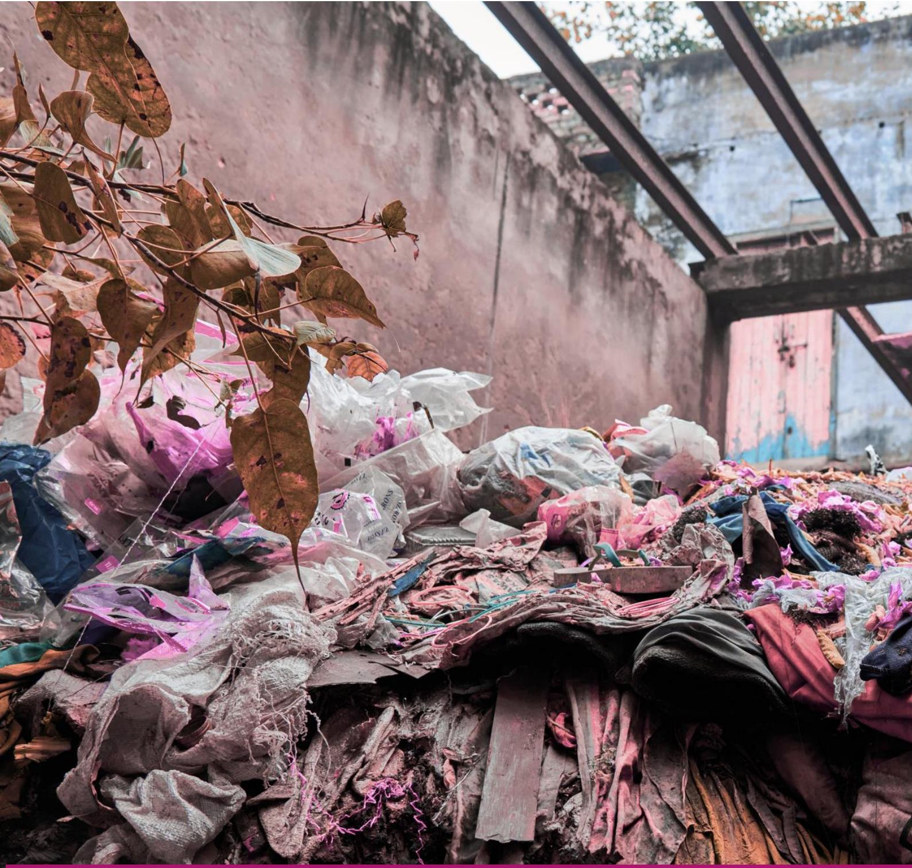

**Textile Circularity and Work**

**EU Textile Circularity -Social and Economic Impacts**

**Systematic Literature Review**

**Green and dirty jobs in the EU: how is the circular economy impacting workers' socioeconomic status?**

### **Table of Contents**

| Glossary                                | 137 |
|-----------------------------------------|-----|
| Executive Summary                       | 140 |
| Introduction                            | 140 |
| Method                                  | 142 |
| Results                                 | 143 |
| Descriptive Analysis                    | 143 |
| Material Evaluation – Thematic Analysis | 145 |
| Recommendations for Future Research     | 154 |
| Conclusion                              | 157 |
| References                              | 158 |

### **List of Tables**

### **List of Figures**

| Figure 1: Paper collection process                                       | 143 |
|--------------------------------------------------------------------------|-----|
| (n=45); Panel (c) Distribution of reviewed articles over journals (n=45) | 145 |
| Panel                                                                    | 145 |
| system due to the application of the circular economy                    | 150 |

### **Glossary**

| Gossary                                                                           |                                                                                                                                                                                                       |
|-----------------------------------------------------------------------------------|-------------------------------------------------------------------------------------------------------------------------------------------------------------------------------------------------------|
| Term AI-driven Sorting Technologies                                               | Definition separate and sort textiles for recycling or resale.                                                                                                                                        |
| Child Labour                                                                      | Work that deprives children of their childhood, dignity, health, education or development.                                                                                                            |
| Circular Strategies                                                               | Business and design approaches that extend product recycling.                                                                                                                                         |
| Decent Work Digital Product Passport (DPP)                                        | Work that guarantees fair income, rights, security, and A digital record containing data about a product’s                                                                                            |
| Downcycling Ecodesign for Sustainable Products Regulation (ESPR)                  | Recycling that converts materials into lower-value products.                                                                                                                                          |
| EU Legislation                                                                    | Laws created by the EU, including regulations, directives and                                                                                                                                         |
| EU Regulation EU Waste Framework Directive Extended Producer Responsibility (EPR) | A binding legal act of the European Union that applies directly to all member states. disposal. Policy holding producers accountable for products’ environmental impacts throughout their life cycle. |
| Fibre-to-fibre Recycling                                                          | Processes that recover fibres from old textiles to produce new fabrics.                                                                                                                               |
| Gender Inequality                                                                 | Unequal treatment or opportunities for people based on gender.                                                                                                                                        |
| Greenwashing                                                                      | Misleading claims that exaggerate a company’s environmental performance or sustainability.                                                                                                            |
| Grey Literature                                                                   | Research and reports not formally published in academic journals, such as NGO papers or industry reports.                                                                                             |
| Informal Work                                                                     | Workers without formal contracts or protections often in precarious jobs.                                                                                                                             |
| Informal Workers                                                                  | Workers without formal contracts or protections often in precarious jobs.                                                                                                                             |
| Informal Sector                                                                   | Economic activities not regulated by governments, including waste picking, resale and repair.                                                                                                         |
| Industry Employment                                                               | The number of jobs generated by a particular industry sector.                                                                                                                                         |
| Just Transition                                                                   | A framework ensuring that the shift to a low-carbon workers, communities and vulnerable groups.                                                                                                       |
| Landfill                                                                          | A site where waste is disposed of by burial, often leading to environmental and health impacts.                                                                                                       |

| Term                  | Definition                                                      |
|-----------------------|-----------------------------------------------------------------|
| Labour Standards      | Rules and guidelines governing working conditions, wages,       |
| Living Wages          | Earnings sufficient to provide workers and their families with  |
| Polluter Pays         | The principle that those who cause environmental damage         |
| Post-consumer Waste   | Textiles discarded after use by consumers.                      |
| Post-industrial Waste | Waste generated during textile and garment manufacturing.       |
| Precarious Employment | Insecure, low-paid employment lacking protections.              |
| Pre-consumer Waste    | Waste materials generated during production before reaching     |
| Reuse                 | Reuse by another consumer of discarded products which are       |
| Repair                | Repair and maintenance of defective products so they can be     |
| Refurbish             | Restore an old product and bring it up to date.                 |
| Remanufacture         | Use parts of discarded products in a new product with the       |
| Recycle               | Converting waste materials into new raw materials or            |
| Reverse Logistics     | Movement of goods back through the supply chain for             |
| Second-hand Clothing  | Previously owned garments sold for reuse.                       |
| Social economy        | Types of organisations such as cooperatives, social and         |
| Social Enterprises    | Organisations that typically operate with business methods      |
| Social Protection     | Systems of government support that provide security against     |
| Socioeconomic Impacts | Combined social and economic effects of industries, policies    |
| Sorting Operations    | Operation of classifying used products for resale, recycling or |
| Textile Circularity   | A system where textiles are designed, produced, used and        |
| Upcycling             | Reusing or repurposing materials to increase value,             |

| Term                  | Definition                                                     |
|-----------------------|----------------------------------------------------------------|
| Upskilling            | Training workers with new skills to adapt to changing          |
| Waste Management      | The collection, transportation, processing and disposal or     |
| Waste Pickers         | Workers usually in informal economies who collect and sort     |
| Waste Reduction       | Efforts to minimise the amount of waste generated through      |
| Wellbeing             | Overall quality of life, including physical, mental and social |
| Worn Clothing         | Garments that have been previously owned or used.              |
| Worn-Clothing Exports | Outgoing shipments of previously owned or used garments,       |
| Worn-Clothing Imports | Incoming shipments of previously owned or used garments        |

### **List of Acronyms**

| Acronym | Meaning                                   |
|---------|-------------------------------------------|
| AI      | Artificial Intelligence                   |
| CE      | Circular economy                          |
| EPR     | Extended Producer Responsibility          |
| EU      | European Union                            |
| OHS     | Operational Health and Safety             |
| SE      | Social Economy                            |
| SES     | Socio-Ecological Systems                  |
| SC      | Supply Chain                              |
| SME     | Small and Medium Enterprise               |
| WEEE    | Waste Electrical and Electronic Equipment |
| WFD     | Waste Framework Directive                 |

# Executive Summary

This report syntheses how the transition to the circular economy (CE) impacts the socioeconomic conditions of workers in EU, particularly focusing on postconsumer operations, namely collection and sorting of used products, repair, reuse, remanufacture and recycle.

We observed how the institution of environmental policies requires SC structural changes which lead to organisations having to reconfigure workers' jobs, creating opportunities for new employees, reskilling others to ensure their capability of fulfilling their updated job description, and displacing others. A similar impact is generated by digitalisation and automation of factories, which can reduce employment rates but allows to offer higher wages. As organisations seek to maximise profits, they often outsource services (or privatise in the case of municipalities), which leads to worsened working conditions and a perilous increased distance from trade union that face notable challenges in protecting these workers through collective bargaining. Lastly, we observed how CE impacts informal workers, primarily waste pickers, that face wages uncertainty due to the evolution the evolution of economic and stock market trends, and how social and solidarity enterprises, who could integrate these vulnerable and marginalised workers face challenges in doing so due to a limited consideration and margin of action from policies. Lastly, we observed how waste pickers suffer from the duality of "green" versus "dirty" jobs and the consequent social stigma, and the perilous nature of the jobs in the waste sector.

The report indicates recommendations on future research directions and calls for a systemic evaluation of new policies to ensure the creation of protection mechanisms to their unintended consequences.

# **1.**Introduction

The Circular Economy (CE) is gaining momentum requiring firms to explore novel ways to valorise waste (Abbate et al., 2024, Provin et al., 2024). This transition is pushed further by policy agendas, such as the European Union (EU) Waste Framework Directive (WFD), Extended Producer Responsibility (EPR) and the Circular Economy Action Plan, which collectively establish a dominant recycling narrative. These recent policies mandate that producers must recover post-consumer products via collection and reverse logistics and embed minimum recycled material quotas into new production (Recover, 2025). However, this strong technocratic focus, coupled with the integration of the CE transition into the plan for green economic growth, ignores the just transition and, in particular, the impacts of the transition on employees, (Mccauley, 2025).

Similarly, the academic research discourse on the CE transition focuses on managerial, technological and environmental aspects (e.g., Jia et al., 2020, Miller et al., 2025), while largely ignoring the workforce responsible for implementing these changes (Gregson et al., 2016), thus, leaving the human dimension of the circularity transition underexplored (Llorente-González and Vence, 2020, Mies and Gold, 2021, Valencia et al., 2023). Where such research does exist, it predominately concentrates on developing countries and the occupational risks of collecting and recycling hazardous materials exported by developed countries. Research conducted in developed countries largely emphasises the positive impacts of CE initiatives (Mies and Gold, 2021), pointing to economic growth and job creation as the predominant social benefits (Repp et al., 2021, Llorente-González and Vence, 2020). Although global GDP is expected to increase by 3,5% due to circular activities (Bone et al., 2025), the estimates of employment effects vary dramatically, spanning from the creation of 10 million jobs worldwide for repair, remanufacture and recycling to the displacement of 15 million workers just in the EU retail sector alone (ILO, 2023, Repp et al., 2021, Metta et al., 2025). These conflicting figures demonstrate that the belief in automatic positive outcomes from the circular transition is misplaced (Van Opstal et al., 2024).

Although the discourse on job creation – or displacement – is far from being consolidated, it is important to acknowledge the relevance of other socio-economic aspects of the CE that are currently overlooked. In particular, the wages and working conditions of employees – their job security, well-being, job quality, training, dignity at work, representation and bargaining power – are rarely integrated into CE discourse (Kirov and Hohnen, 2015, Repp et al., 2021). This oversight is particularly notable in the context of the EU, where the literature prioritises the technical and environmental outcomes of recycling governance over social impacts.

As the upcoming EU policies on enforced end-of-life management (i.e. collection and sorting for reuse, repair, remanufacture, refurbish, recover or recycle - hereafter postconsumer CE operations) have the potential to change the current CE operations, it is important to understand the current socio-economic conditions of workers in post-consumers operations. It is important to understand how they are influenced by developments in the CE and also how policy changes will impact them. Therefore, this study seeks to address this objective in answering the following research questions:

RQ: How do post-consumer circular operations impact on workers' socioeconomic conditions in the EU?

# **2.**Method

To answer the research question, a systematic literature review has been conducted. Seuring and Müller (2008) suggest that systematic literature reviews follow four specific phases, namely material collection, descriptive analyses, category selection, and material evaluation, to ensure rigour, transparency, and replicability.

The present research has been based on a paper collection selected from the Scopus and Web of Science databases in September 2025. The search was based on the query in Table 1 below.

*Table 1: Document search query (topic-abstract-keywords)*

| Search Topics Search | Query Terms    |            |             |                 |             |                  |            |             |
|----------------------|----------------|------------|-------------|-----------------|-------------|------------------|------------|-------------|
| circular*            | OR "waste      |            | collection" | OR              | "waste      | sorting"         | OR "reuse" | OR          |
| OR “EPR”             | OR             | "extended  | producer    | responsibility" |             | OR "second-hand" |            | OR          |
| "second              | hand" OR       | "green     | job*"       |                 |             |                  |            |             |
| Workers’ socio      |                |            |             |                 |             |                  |            |             |
| bargaining”          | OR             | "freedom   | of          | association" OR |             | “trade union*”   | OR         | “social     |
| dialogue” OR         | labour         | OR         | labor       | OR              | “employment | relation*”       | OR         | “industrial |
| relation*”           | OR “labour     | standard*” |             | OR              | wellbeing   | OR well-being    | OR         | "modern     |
| slavery"             | OR "informal*" |            | OR "decent  | work"           | OR “just    | transition”      |            |             |

*Note: On Scopus the search was initialised with "TITLE-ABS-KEY()" while on Web of Science with "ts=()"*

The paper search has been restricted to published journal articles or articles in press written in English in a selected list of disciplines (reported in Figure 1). After merging the data collected by the two databases to remove duplicates, a first screening process was done by reading titles, keywords and abstracts. The exclusion criteria utilised removed from the sample those papers that were not examining the socio-economic conditions of workers in downstream circular operations. Additionally, further inclusion criteria were applied to select papers that were based on empirical research in the European global region or were conceptual research papers. A second screening process was done by reading the full papers following the exclusion criteria mentioned above, that lead to a final sample of 45 papers. The entire sample selection procedure is mapped in Figure 1, reporting the number of documents included and excluded at each step.

The category selection has been informed by the list of socio-economic issues and has been inductively augmented via inductive coding to highlight the ways in which CE operations can impact the workers' socio-economic conditions.

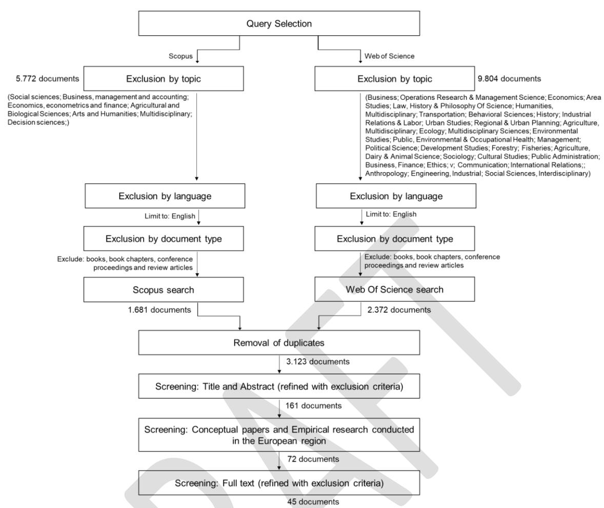

*Figure 1: Paper collection process*

# **3.**Results

### **3.1** Descriptive analyses

Figure 2 illustrates the research activity conducted by the 45 analysed papers. The research productivity (Figure 2 – Panel a) shows a slow growth in interest in the topic of socio- economic conditions of CE workers, with a recent surge of interest in the last two years (2024 and 2025). Of the analysed papers, 53% were published in sustainability- related academic journals (*e.g., Resources, Conservation and Recycling; Sustainability; Journal of Cleaner Production; Ecological Economies; Sustainable Technology and Entrepreneurship; Sustainability – Science, Practice and Policy; Journal of Industrial Ecology; Cleaner Production Letters. Figure 2 – Panel c*), while the other 21 papers (47%) were published in journals from a diverse range of disciplines. Panel b (Figure 2) shows the methodological approach adopted in the analysed papers. The papers are predominantly

empirical studies (58%, with 14/45 qualitative, 11/45 quantitative, and 1 mixed methods), conceptual (24%)andanalytical(18%) studies complete the sample.

An indicator of the nascency of this field is represented by the depth and breadth of the theoretical tenets (Govindan et al., 2024, Touboulic and Walker, 2015). Only three of 45 papers (Clube and Tennant, 2020, Kirov and Hohnen, 2015, Repp et al., 2021) adopted a theoretical framework to guide the research (i.e., vulnerabilisation framework, justice theory and stakeholder theory), while the remaining 41 works remained atheoretical.

As previous research had demonstrated that context matters (Maleki et al., 2023, Tran et al., 2024, Tran et al., 2020), we collected information on the country where the data were collected from and the type of waste on which the circular operation was established. Western and Northern European countries are well represented, while Eastern countries are not represented (Figure 3 – Panel a). The waste types are rather diverse, with electronic, municipal and textile waste being explicitly represented, while 25 papers (out of 45) do not elaborate on working conditions in a specific waste stream, but more generally in the context of the circular economy (Figure 3 – Panel b). However, given the focus of this study is textiles, it is striking that there are so few papers that have looked at working conditions in textile waste. There is a clear gap in the literature when it comes to the textile sector.

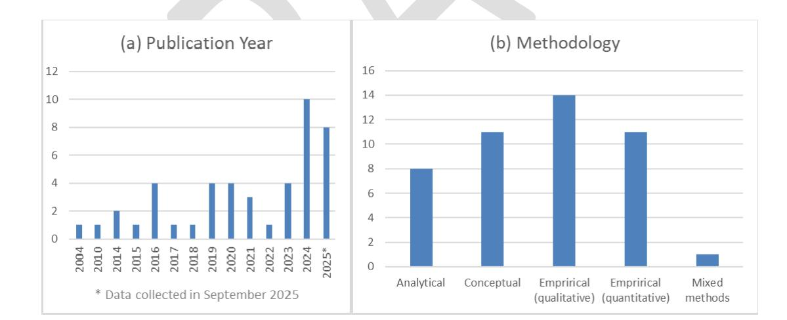

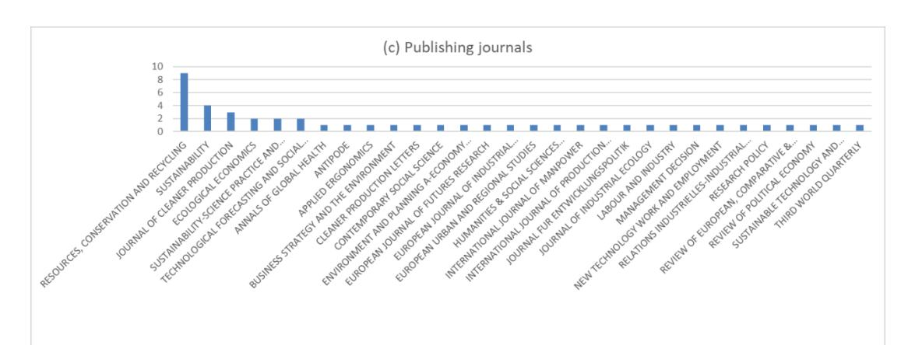

*Figure 2: Reviewed article descriptives: Panel (a) Distribution of reviewed articles per year (n=45); Panel (b) Distribution of reviewed articles over methodologies adopted (n=45); Panel (c) Distribution of reviewed articles over journals (n=45)*

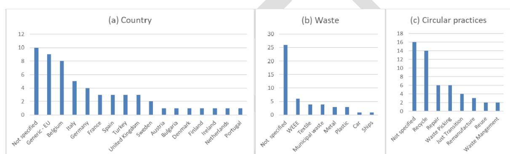

*Figure 3: Context of the reviewed articles' research. Panel (a) Country of analysis (n=57); Panel (b) Waste material analysed (n= 48); Panel (c) Circular practices (n= 53)*

### **3.2** Material evaluation – thematic analyses

The material evaluation proceeded to first assess what are the socioeconomic impacts of the postconsumer CE operations, and then how these came about, through which mechanisms. It should be noted that given so few papers have looked at textile waste, many of the findings drawn upon here relate to other waste sectors or waste more generally. Some of these findings may not be directly relevant to textile waste but this will need to be ascertained through empirical study.

### **3.2.1** What are the impacts of post-consumer circular operations on workers' socioeconomic conditions in the EU?

#### *Job reconfiguration*

so the creation, displacement and redefinition (i.e., change in job description) of jobs. Nearly half of the analysed papers concurred that employment opportunities would arise for new shop-floor workers in sorting and recycling centres (Schroeder et al., 2019, Gregson et al., 2016).

Several works in the literature, both academic and grey, have proposed estimates of the job creation potential of the CE. However, these estimates are problematic. Repp et al. (2021) observed that the figures are often based on starkly different assumptions and context boundaries; thus, it is unsurprising that they propose anywhere between the creation of 10 million jobs globally to the displacement of 15 million in the EU. As such, these estimates are not reliable nor universally valid, and must be critically contextualised (Pansera et al., 2024). For example, a study by Metta et al. (2025) evaluating circularity scenarios in the Dutch textile industry demonstrated the complexity of predicting job creation. Their results showed that new post-consumer jobs (collection, sorting, reuse and recycling) would only exceed displaced jobs in retail if consumer behaviours substantially changed to favour circular over new clothing. Conversely, the baseline scenario where circular consumption remained at its current actual value, showed that the jobs lost in retail would exceed those created.

The question of job creation cannot be divorced from the quality of any jobs created. A just transition implies decent work (SDG 8) and quality jobs, as specified in the Paris Agreement. Empirical studies have provided further meaningful details into the nature of job creation. For example, Kirov and Hohnen's study (2015) of municipal waste collection centres noted that the increasing privatisation of waste collection services is endangering the job security of older employees, who are often replaced with younger workers with greater physical capacity. This aligns with claims that job creation will primarily benefit unskilled young workers (Valverde and Avilés-Palacios, 2021). Additionally, while some job opportunities may arise in collection and recycling centres, several papers question who will benefit, noting that local citizens often refuse these jobs, leaving them to be filled by migrant workers (Irvine, 2023, Millward-Hopkins, 2024).

On job creation, the literature presents two seemingly opposing yet complementary viewpoints on the future demand for skilled or unskilled workers. One side of this debate elaborates that firms will favour informal skills in hiring rather than formal education, claiming that on-the-job training or personal experience in green jobs are more effective in providing workers with the necessary skills set (e.g., evaluate material composition, know machinery and processes for reuse and recycle) compared to education programs (Bone et al., 2025, Borms et al., 2023). This skills shortage will then lead employers to enact skills-based hirings, giving secondary attention to human capital (i.e., education). Jobs will be offered, yet few will receive a competitively high salary (Bone et al., 2025). On the other side of this debate, other works claim that demand for skilled workers in white collar jobs will increase. Bozkurt and Stowell (2016) observed how the introduction e-waste collection policies would have affected the development of green skills in existing SMEs. The observed SMEs did not require to hire new shop-floor workers, as the tasks to disassemble the e-waste could have been learned and performed by the existing workforce. Nonetheless, new managerial roles were opened to ensure the compliance with the new waste policies. Although the authors denied the need for new blue-collar worker, they still acknowledged that CE policies and operations would introduce the need for new white-collar workforce.

CE policies have the merit of generating formal jobs, and at the same time also unintended informal jobs. For instance, a deposit scheme for plastic bottles in Germany to incentivise recycling, led lowincome people to become part-time informal waste pickers (Hafner and Zirkl, 2019). The creation of informal work is not a solution to unemployment or low income, and remains problematic, as it leaves workers at the margins of society with social benefits (Irvine, 2023). The predominant informal job in the EU in CE operations is waste picking. There are no available estimates on how many this workers could be in each country or across the region, but one certainty shared by many is that not all of them can be formalised (Yıldız-Geyhan et al., 2017, Yıldız-Geyhan et al., 2019, Irvine, 2023).

#### *Training for circular skills development*

The development of "green skills" is overlooked in the analysis sample of papers with only a few addressing it directly. Receiving on-the-job training would satisfy the need of workers to feel part of a society, supporting a sense of job satisfaction through the perception of job security, thus improving their wellbeing (Clube and Tennant, 2020).

Developing the right set of skills for each workers' position should be informed by the market and policy needs (Multani and Bachus, 2024). The authors assert that skills development is necessary in upstream CE operations, such as ecodesign, and this would help target the current lack of circular skills on the market. The work of Bozkurt and Stowell (2016) arrived at a similar conclusion. Indeed, the authors had observed a non-profit organisation that had not been able to implement a valuable training program for e-waste workers because they couldn't see the market needs and thus weren't able to transfer marketable skills to the trained employees.

Lastly, Ampe (2024) offers a problematisation on the lack of circular skills. Indeed, the author echoes the grey literature in lamenting the high costs of retraining and retaining employees rather than displacing them (Syrett and Lammas, 2024). This could be the case of a recycling company evaluating the need to expand its business model to include repair processes. Yet, they would need to invest into developing the right technical skills and hiring permanent employees that could be tasked with this branch of the business. Ampe (2024) notes that, although this would be socially and environmentally desirable as it would provide meaningful jobs and extend products' life-cycle, maintaining this would be economically challenging.

#### *Operational health and safety*

After job creation, operational health and safety (OHS) is the second most discussed and recognised socio-economic impact of the CE.

Within the OHS risks observed, those stemming from the collection, dismantling and recycling of e-waste are particularly concerning. Indeed, e-waste contains several substances (e.g., lead, mercury and other heavy metals, halogenated compounds, dioxins) that can lead to serious chronic health threats (Nikou and Sardianou, 2023, Engkvist, 2010, Cordisco et al., 2022, Perkins et al., 2014, Kirov and Hohnen, 2015). Although in the EU there are in place EPR and e-waste reverse logistics systems to collect and recycle these products, it is important to highlight that the recycling of this type of waste has created informal child labour exploitation due to the dexterity of children's small hands in the Global South (Perkins et al., 2014), therefore it is remains important to monitor that this abuse does not get perpetuated in the EU as well.

Workers in municipal recycling centres suffer OHS risks mostly from heavy lifting, handling chemicals, and breathing dust (Engkvist, 2010). Similarly, worker in car disassembly suffer from OHS risks from getting cut by broken and rusty components and breathing gasoline fumes (Kazmierczak et al., 2004). Although a great deal of physical strength is required to perform the tasks, mechanical tools alleviate much of the burdensome work. In both contexts, the highlighted risks can be minimised with the use of appropriate protective equipment, yet they cannot be fully eliminated. Another extremely burdensome operation is the dismantling of ships. Gregson et al. (2016) reported that workers in this field were subjected to severe OHS risks by breathing asbestos fumes and extreme physical work, that oftentimes led workers to faint. In textile recycling, female employees often endure arduous working conditions. They report standing for long hours to sort textile rags, often without protective equipment because they need to rely on tactile perception to discern each item's quality (Gregson et al., 2016). As a consequence, these workers often suffer from allergies or skin conditions.

Lastly, informal waste pickers also suffer from challenging working conditions. Scavenging through waste puts them at risk of contracting infection diseases from syringes in medical waste, injuries from heavy lifting and exhaustion after walking up to 13 km per day (Yıldız-Geyhan et al., 2017, Irvine, 2023, Perkins et al., 2014).

Although the EU prides itself on being a leader in respecting human rights, 21% of its postconsumer CE workers are not paid (Llorente-González and Vence, 2020, Millward-Hopkins, 2024). This trend of undervaluation of workers is evident also in paid jobs. For example, textile recyclers in the United Kingdom in 2011 reported a low pay of around £200 per week that, even including the remunerations of overtime hours, was less than two thirds of a median salary in the country (Gregson et al., 2016).

Waste pickers, who make up 1% of the global urban population (Datambien, 2013, Irvine, 2023), live on a highly variable income, as it depends on how much material they collect, the type of collected materials and their fluctuating prices (Irvine, 2023, Yıldız-Geyhan et al., 2017, Yıldız-Geyhan et al., 2019). The majority of waste pickers in Spain were earning less than 600€ per month, far below the living wage threshold (Irvine, 2023). Nikou and Sardianou (2023) observed that waste collection increases when income inequality increases, proving that in times of financial constraints people rely on informal channels to get access to immediate revenue. As not all waste pickers can be formalised, the Spanish government had proposed they were taxed as independent businesses to have access to social benefits. Yet this initiative failed as it was cutting the workers' salary by 60%, significantly crippling their livelihood (Irvine, 2023). Formal jobs also suffer from low wages. For instance, when municipal waste collection services become privatised, companies compete on price in public tenders, leading to an erosion in wages and working conditions. Workers are often expected to complete the same amount of work in fewer hours, leading to lower wages and work intensification (Kirov and Hohnen, 2015).

## **3.2.2** How do post-consumer circular operations **impact on workers'socioeconomic conditions in theEU?**

After recognising what are the impacts of the circular economy on the socio-economic conditions of workers, we proceeded to analysing how these impacts arise through which mechanisms.

To map these mechanisms, we used the theory of socio-ecological systems (SES) (Holling, 2001, Wieland, 2021). According to SES, reality can be viewed as the compendium of non-hierarchical systems (i.e., individual, organisation, supply chain, political-economic, and planetary system). These systems exist and operate at their own distinct temporal and spatial scale but are dynamically interconnected. They are constantly evolving and influencing each other in a process of mutual evolution. This idea of co-evolution is a key assumption of SES theory. It builds on the premise that no system exists in isolation but is part of a compendium of interrelated open systems (Holling, 2001, Schad and Bansal, 2018, Grewatsch et al., 2023).

Figure 4 illustrates the seven observed interactions between the different systems that impact workers in the individual system, which derive from:

- a. Responding to climate change.
- b. Evolving economic and stock market trends.
- c. Seeking profit maximisation.
- d. Suffering the social stigma of the "dirty work" of waste.
- e. Keeping up with digitalisation as a global trend.
- f. Working in the risky waste jobs.
- g. Embracing the social economy.

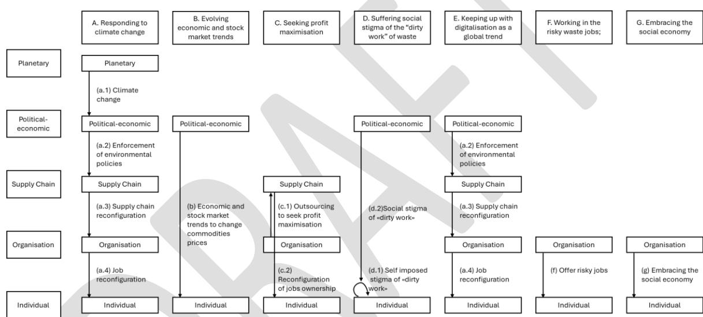

*Figure 4: Socio-ecological systems interactions that affect workers in the individual system due to the application of the circular economy*

#### a. Responding to climate change

Climate change requires urgent action to avoid the irremediable overshoot of planetary boundaries. Although climate change is only of the many grand challenges that modern society have to face, it is arguably the one that is perceived as the biggest and most urgent threat (Grewatsch et al., 2023, Ika and Munro, 2022). The political-economic system perceives the urgency to safeguard the planetary system and its agents (e.g., local governments, policymakers, European Commission) react by enforcing new environmental policies onto the supply chain system to reduce its environmental impact (e.g., EPR, WFD). Accordingly, the supply chain system needs to undergo an internal reconfiguration to establish that the necessary processes are active and functioning (e.g. an effective reverse logistics system to collect end-of-life products). As new supply chain processes are activated, they will be filled by organisations that will have to evaluate how to best incorporate the new activities into their business model. This also entails reconfiguring their internal resources (i.e. employees). This reconfiguration of the jobs impacts workers within the individual system, offering r new employment opportunities, such as the compliance managers, skilled technicians, software developers, sustainability officers, product designers, craft workers, and so on (Bozkurt and Stowell, 2016; Multani and Bachus, 2024). Through this mechanism, workers at the individual level can redefine their resources by receiving new employment opportunities (or see their employment jeopardised by a terminated SC process) and receive the necessary on-the-job training to carry it out.

#### b. Evolving economic and stock market trends

Within the individual system, we observe waste pickers, whose income depends on the amount of material they are able to collect and the prices thereof. According to the literature, in the EU there is no collective agreement between municipalities and independent or associated waste pickers, thus the informal workers must sell the materials they collect to agent representing scrapyards. The internal dynamic of the political-economic system of economic trends and daily stock market activity influence the prices of commodities, thus impacting the resources (i.e. wage) that workers can accumulate at the individual level (Izidoro and Trevizan, 2025, Irvine, 2023).

#### c. Seeking profit maximisation

Firms within the organisation systems act towards the primary goal of maximising their profit. One way of pursuing this target for municipalities is through the outsourcing of anchored services, such as waste management. This practice imposes a change in the supply chain systems, by adding new tiers and reconfiguring who is in charge of what process. This goes back to impacting the individual system, as workers become vulnerable to losing their jobs and are put in more precarious working conditions. Indeed, as the outsourcing of anchored services goes through public tenders, private firms compete on the cheapest price for the same service; therefore, workers will be tasked with the same amount of work to be conducted in fewer working hours, leading to work intensification, less job security and lower pay (Kirov and Hohnen, 2015). Moreover, when waste management becomes outsourced, unless there are some preestablished transfer of undertakings law (i.e., succession of rights and obligation from one service provide to the next), unions find it difficult to establish collective bargaining mechanisms to protect workers' wellbeing and working conditions (Kirov and Hohnen, 2015). New workers, however, are not covered by these rights and can be employed on lower wages and conditions. With the stagnation of social dialogue and high staff turnover in low paying sector, unions can only have limited impact on the workers socio- economic conditions.

#### d. Suffering the social stigma of the "dirty work" of waste.

Society within the political-economic system imposes its preconception onto the individual system about the discriminatory nature of waste work, without considering the actual fundamental role this work, and workers have in societies. Yet, working in waste collection, sorting and recycling operations can be considered dirty, demeaning, demanding and oftentimes dangerous, as it involves direct contact with items and materials discarded by society (Gregson et al., 2016, Hafner and Zirkl, 2019, Bozkurt and Stowell, 2016). The major motivation for workers to become employed in collection, sorting or recycling operations is that reportedly they have no other options to earn a living (Engkvist, 2010, Irvine, 2023, Millward- Hopkins, 2024, Yıldız-Geyhan et al., 2017, Yıldız-Geyhan et al., 2019). This is particularly true for those marginalised from the society, such as those who have criminal records, or for migrants (Yıldız- Geyhan et al., 2017, Yıldız-Geyhan et al., 2019), while local workforce can wait for alternative employment and do not engage with this "dirty work" (Hafner and Zirkl, 2019). Being stigmatised can make people ashamed of themselves and negatively affect their psychological health and wellbeing. This narrative of the "dirty work" clashes with the "green job and skills" narrative that presented above for remanufacturing and repair operations. Although "dirty jobs" such as waste picking are fundamental to reducing pollution and the achievement of law-imposed end-of-life material collection targets (i.e., EPR targets), they are not recognised for their actual "green" contribution and are left with a demeaning label of "unclean" jobs (Izidoro and Trevizan, 2025, Gregson et al., 2016). Moreover, the social stigma is heightened by the criminalisation attributed to waste picking, as for instance in several European countries have installed sealed waste bins from which waste pickers struggle to extract materials, which unintentionally puts them at risk of injuries (Izidoro and Trevizan, 2025).

This stigma is not only society-inflicted, as denoted by Spanish waste pickers (Irvine, 2023), but it also self-inflicted in the case of bottle pickers in Germany (Hafner and Zirkl, 2019). These people, although relying on social welfare, cannot live on their income, and have no other option that scavenging through municipal waste bins to seek for bottles or cans to exchange for some extra revenue. The judgment and stigma for these people was observed to come from themselves in the first place, as they were ashamed of having to go bottle picking when they already had another employment. This made them become "part- or leisure-time marginalised" (Hafner and Zirkl, 2019). Therefore, the workers in the induvial system are impacting themselves and this stigmatisation is reinforced by that coming from the political-economic system.

Many of these workers never get the opportunity to escape this stigma. For example, waste pickers cannot find job alternatives or women in textile sorting and recycling complain that the workday is so exhausting that, after a full day of standing in the same spot to sift through rags, they have no energy left to seek for another job (Gregson et al., 2016, Irvine, 2023). In other instances, the waste work had been extremely romanticised by its workers. This is the case for ship recycling, a job that is so physically demanding, that workers – primarily males – took pride from doing such a "masculine" heavy work (Gregson et al., 2016).

#### e. Keeping up with digitalisation as a global trend

The constant evolution of the political-economic system has steadily increased the relevance of the transition to the digitalisation and the recent advent of AI as the new technological innovation. These trends are observed by the organisation system which prepares to integrating novel technological solutions, including AI applications in their workplaces. The organisation systems undergoes and internal reconfiguration of resources, and this will be reflected on the individual system, which will have to adjust to this change.

One the one side, the literature sees the negative effects that for example industrial robots or machinery with artificial intelligence (AI) applications can have. Indeed, these can threaten the workers' job security and reduce the industry's employment rates, with an imbalance towards the displacement of women, who are three times more likely than men to lose their job (Mccauley, 2025, Zhu et al., 2023), thus displacing resources within the individual system. On the other hand, machines with AI features can facilitate the worker's task and improve working conditions, yet they require training to familiarise with the machine and to allow the workers to see the technology like a support tool rather than a threat (Süße et al., 2023). Nonetheless, it remains that in tasks that require situational intelligence, human intelligence is irreplaceable (Héry and Malenfer, 2020). Additionally, technological solutions for traceability can help reduce OHS risks, as the workers would know the exact composition and history of a product, thus providing them with specific instructions on how to disassemble and recycle it (Héry and Malenfer, 2020).

#### f. Working the risky waste jobs

The organisation system, while supporting the creation of resources in the individual system, also hampers it through the provision of risky jobs. Although, it is the nature of the jobs that is risky (e.g., contaminated rags, toxic WEEE, shredded glass, exhaust fumes; Gregson et al., 2016, Perkins et al., 2014, Yıldız-Geyhan et al., 2019, Yıldız-Geyhan et al., 2017), they still have the potential to negatively impact the resources accumulated by workers at the individual level.

### g. Embracing the social economy.

Within the organisation system we observe social economy (SE) organisation such as cooperatives, social and solidarity enterprises whose mission is to deliver social good through their business, guided by attention to society rather than profit primacy (Van opstal et al., 2025, Malagón Vélez, 2021). By embracing this principle of solidarity, these organisations can be a key enabler of a just circular transition (Van opstal et al., 2025) and provide the individual system with new resources in the form of job opportunities, training and job security. Social enterprises are highly regarded for two main reasons: their potential of creating collectives of informal workers to help assert some forms of job security, and when in need of developing training programs to upskill (or reskills) workers or vulnerable individuals to increase their employability. For the SE to provide meaningful training to workers, it is fundamental that they remain grounded in the organization system where they can observe for-profit organisations and understand which are the necessary skills for the positions to train (Bozkurt and Stowell, 2016). Shouldn't this happen, the SE risks providing the individual level with resources and knowledge that will not increase the workers' employability and thus leave the margins of society (Bozkurt and Stowell, 2016), thus failing to exchange the intended resource from one system to another and failing to improve the workers' socio-economic conditions.

Regarding the assertion of job security, it is recognized that workers collectives, particularly for informal waste pickers, are fundamental to ensure the representation in policies and at the municipal level. For instance, Brazilian waste pickers can benefit from the application of the protector-receiver principle, a Payment for Environmental Services fee that remunerates them for their contribution to the environment (i.e., planetary system) and EPR schemes (i.e., politicaleconomic system). Moreover, they benefit also from strong cooperatives that secured contracts with municipalities to let waste pickers collect certain materials (Izidoro and Trevizan, 2025, Gutberlet, 2021).

Irvine (2023), when interviewing waste pickers in Spain, recorded that these workers were not interested in forming a sectoral alliance or relying on cooperative or solidarity enterprises. These latter types of organisations are extensively developed in the Global South and have proven records of strong political influence and bargaining with municipalities so that informal workers have access to social services and decent working conditions (Gutberlet, 2021). The analysed literature only hints at these and doesn't show a strong presence within the EU. The only noticeable difference related to the nationality of the workers: while in the Global South waste pickers are local workers, in the EU they are primarily migrants.

### **3.3** Recommendations for future research

The analysed literature gave us an understanding of how post-consumer CE operations impact the socio-economic conditions of workers. Nonetheless, there is more that can still be uncovered.

Although the most researched socio-economic issue is job creation, authors still believe it is a viable research direction. For example, Mcmahon et al. (2021) call for the estimation of the job creation potential for different e-waste products. At the same time, authors are also suggesting to go beyond the quantification of jobs, and address the gap on the job quality, and how wages and working conditions can be improved (Llorente- González and Vence, 2020, Pansera et al., 2024).

As mentioned before, the percentage of unpaid workers in circular postconsumer operations is significant (Llorente-González and Vence, 2020, Millward-Hopkins, 2024). This quota of workers includes also charity workers in the repair economy, who willingly donate their time but are not compensated. Although unpaid workers represent a large quota of workers in these sectors, they remain underrepresented in the literature. As such, future research could explore what do working conditions look like for unpaid workers and evaluate the potential tensions that employing both paid and unpaid workers generate within an organisation.

Technological innovations on the shop floor can improve the working conditions. While top managers are extremely enthusiastic due to the improved operational efficiency, workers struggle to accept it as they fear they will be displaced as a consequence (Süße et al., 2023, Gandia et al., 2025). As we have observed that displacement happens more to women rather than men (Zhu et al., 2023), we call for future research to determine how does digitalisation impact gender justice and further determine under which conditions it has proportional impacts on employees of different genders. Lastly, we echo the call proposed by Gandia et al. (2025) to develop a theory that can integrate the technological dimension of innovation with the psychological perspective of workers. This would allow to redefine the boundaries of sustainable business models, integrating technical and social aspects.

Although many papers discussed the fundamental role of waste pickers in sorting and collecting waste and being enablers of circular operations, they remain on the margins of society (Dinler, 2018, Hafner and Zirkl, 2019, Irvine, 2023, Gregson et al., 2016). This needs to change, as these workers deserve to be included and embraced by the society they contribute to. We call for participatory research with policy makers to design new EPR policies that can recognise the actual and fundamental role that waste pickers give to PROs and the achievement of collection targets (Izidoro and Trevizan, 2025). At the same time we call for further research that examines how these workers make sense of and cope with the social stigma their subjected to and trapped into. Moreover, the literature analysed in the context of postconsumer circular operations has shown that workers struggle to escape poverty and improve their socio-economic conditions. In other contexts, it is instead recognised that social mobility is a lengthy but feasible process (Hofmarcher, 2021). Therefore, we call for participatory research to better understand the root causes of social stagnation, the barriers to social mobility and to codesign pathways for this workers to climb the social ladder.

The last topic on which we direct the attention of future research is the social economy. The literature regards them as the answer to many challenges that for-profit organisations encounter in transitioning to a just circularity, as they flipped the classic economic paradigm (i.e., use human resources to maximise profit) to create people's wellbeing via economic profitability (Malagón Vélez, 2021). Nonetheless, these institutions remain at the margins, not being practically included by policies as well. As such, we call for participatory research with secondary stakeholders, such policymakers, municipalities and institutions, to identify inclusion best practices from the world (e.g., Gutberlet, 2021) and how to replicate them in the EU. Moreover, future research could elaborate how social innovations can emerge from niche social economy institutions and become established practices.

# Conclusion

This work aimed at capturing from the existing literature how are post-consumer circular operations impacting workers' socio-economic conditions. By analysing 45 published academic papers, we observed that post-consumer CE can impact workers through seven different mechanisms stemming from the institution of environmental policies imposing SC structural changes, digitalisation and automation of factories, outsourcing and privatisation of services to maximise profits, engaging with secondary stakeholders such as social enterprises, the evolution of economic trends, the duality of "green" versus "dirty" jobs and the consequent social stigma, and the perilous nature of the jobs in the waste sector.

As the results show, the introduction of CE operations doesn't always create positive outcomes (e.g., job creation, increase of wages, upskilling of workers) but also created negative outcomes (e.g., job loss, increased OHS risks, increased distance from trade unions). As we highlight recommendations on when to direct future research to address some of the current shortcomings of CE practice and policies, we underline the importance of a careful and systemic evaluating the impacts of new policies to ensure a deep understanding of both the intended and unintended consequences which will cascade into the possibilities of designing protection mechanisms for the latter.

# References

- 1. Abbate, S., Centobelli, P. & Di Gregorio, M. 2024. Wine waste valorisation: crushing the research domain. Review of Managerial Science.
- 2. Ampe, K. 2024. Whose circular repair economy counts? Four competing discourses of electronics repair. Resources, Conservation and Recycling, 205, 107611.
- 3. Bone, M., González Ehlinger, E. & Stephany, F. 2025. Skills or degree? The rise of skill- based hiring for AI and green jobs. Technological Forecasting and Social Change, 214, 124042.
- 4. Borms, L., Van Opstal, W., Brusselaers, J. & Van Passel, S. 2023. The working future: An analysis of skills needed by circular startups. Journal of Cleaner Production, 409, 137261.
- 5. Bozkurt, Ö. & Stowell, A. 2016. Skills in the green economy: recycling promises in the UK e‑ waste management sector. New technology, work and employment, 31, 146–160.
- 6. Clube, R. K. & Tennant, M. 2020. The Circular Economy and human needs satisfaction: Promising the radical, delivering the familiar. Ecological Economics, 177, 106772.
- 7. Cordisco, A., Melloni, R. & Botti, L. 2022. Sustainable circular economy for the integration of disadvantaged people: a preliminary study on the reuse of Lithium-ion batteries. Sustainability, 14, 8158.
- 8. Dinler,D. Ş. 2018.Newforms ofwage labour and struggle in the informal sector:the case of waste pickers in Turkey. Class dynamics of development. Routledge.
- 9. Engkvist, I.-L. 2010. Working conditions at recycling centres in Sweden–Physical and psychosocial work environment. Applied Ergonomics, 41, 347–354.
- 10. Ferrão, P., Ribeiro, P., Rodrigues, J., Marques, A., Preto, M., Amaral, M., Domingos, T. & Lopes,
  - A. 2014. Environmental, economic and social costs and benefits of a packaging waste management system: A Portuguese case study. Resources, Conservation and Recycling, 85, 67–78.
- 11. Gandia, J. a. G., Gavrila, S. G., De Lucas Ancillo, A. & Del Val Núñez, M. T. 2025. Towards sustainable business in the automation era: Exploring its transformative impact from top management and employee perspective. Technological Forecasting and Social Change, 210, 123908.
- 12. Govindan, K., Demartini, M., Formentini, M., Taticchi, P. & Tonelli, F. 2024. Unravelling and mapping the theoretical foundations of sustainable supply chains: A literature review and research agenda. Transportation Research Part E: Logistics Transportation Review, 189, 103685.
- 13. Gregson, N., Crang, M., Botticello, J., Calestani, M. & Krzywoszynska, A. 2016. Doing the 'dirty

work 'of the green economy: Resource recovery and migrant labour in the EU. European urban and regional studies, 23, 541–555.

- 14. Grewatsch, S., Kennedy, S. & Bansal, P. 2023. Tackling wicked problems in strategic management with systems thinking. Strategic Organization, 21, 721–732.
- 15. Gutberlet, J. 2021. Grassroots waste picker organizations addressing the UN sustainable development goals. World Development, 138, 105195.
- 16. Hafner, R. & Zirkl, F. 2019. Waste demarginalized? A comparative analysis of the socioeconomic effects of informal recycling activities. Argentina, Brazil and Germany revisited. Journal für Entwicklungspolitik/Mattersburger Kreis für Entwicklungspolitik an den Österreichischen Universitäten, 35, 145–167.
- 17. Héry, M. & Malenfer, M. 2020. Development of a circular economy and evolution of working conditions and occupational risks—a strategic foresight study. European Journal of Futures Research, 8, 8.
- 18. Hofmarcher, T. 2021. The effect of education on poverty: A European perspective. Economics of Education Review, 83, 102124.
- 19. Holling, C. S. 2001. Understanding the Complexity of Economic, Ecological, and Social Systems. Ecosystems (New York), 4, 390–405.
- 20. Ika, L. A. & Munro, L. T. 2022. Tackling grand challenges with projects: Five insights and a research agenda for project management theory and practice. International Journal of Project Management, 40, 601–607.
- 21. Irvine, B. 2023. Working the waste commodity frontier: metabolic value and informal waste work. Antipode, 55, 458–479.
- 22. Izidoro, L. G. & Trevizan, A. F. 2025. Waste pickers in extended producer responsibility policies: A comparative analysis of Brazil and the European Union. Review of European, Comparative & International Environmental Law, 34, 352–364.
- 23. Jia, F., Yin, S., Chen, L. & Chen, X. 2020. The circular economy in the textile and apparel industry: A systematic literature review. Journal of cleaner production, 259, 120728.
- 24. Kazmierczak, K., Winkel, J. & Westgaard, R. H. 2004. Car disassembly and ergonomics in Sweden: current situation and future perspectives in light of new environmental legislation. International Journal of Production Research, 42, 1305–1324.
- 25. Kirov, V. & Hohnen, P. 2015. Trade unions strategies to address inclusion of vulnerable employees in "anchored" services in Europe. InternationalJournal ofManpower, 36, 848– 873.
- 26. Llorente-González, L. J. & Vence, X. 2020. How labour-intensive is the circular economy? A policy-orientated structural analysis of the repair, reuse and recycling activities in the European Union. Resources, Conservation and Recycling, 162, 105033.

- 27. Malagón Vélez, L. E. 2021. Aportes conceptuales de la economía social y solidaria a la economía circular. Cuadernos de Administración, 37, e5010824.
- 28. Maleki, H., Aghazadeh, H., Mahdiraji, H. A., Vrontis, D. & Mohammadi, E. 2023. Disentangling sustainability and resiliency factors in buyer-supplier relationships: A state- of-the-art review. Journal of Business Research, 164, 114037.
- 29. Mccauley, D. 2025. Just circularities: Intersecting livelihoods, technology, and justice in just transition and circular economy. Journal of Cleaner Production, 500, 145176.
- 30. Mcmahon, K., Ryan-Fogarty, Y. & Fitzpatrick, C. 2021. Estimating job creation potential of compliant WEEE pre-treatment in Ireland. Resources, Conservation and Recycling, 166, 105230.
- 31. Metta, J., Bachus, K. & Rousseau, S. 2025. Socio-economic and volume effects of a circular value chain for clothing. Ecological Economics, 235, 108625.
- 32. Mies, A. & Gold, S. 2021. Mapping the social dimension of the circular economy. Journal of Cleaner Production, 321, 128960.
- 33. Miller, E. M., Patala, S. & Ovaska, J.-P. 2025. Forging the future: Reconfiguring value chains through circular economy meta-organizing. Organization & Environment, 10860266241297340.
- 34. Millward-Hopkins, J. 2024. The social implications of circular clothing economies in the global North. Sustainability, 16, 7094.
- 35. Multani, M. & Bachus, K. 2024. Which labour for the CE? An exploration of narratives on labour and circularity in Flanders. Resources, Conservation and Recycling, 207, 107690.
- 36. Nikou, V. & Sardianou, E. 2023. Bridging the socioeconomic gap in E-waste: Evidence from aggregate data across 27 European Union countries. Cleaner Production Letters, 5, 100052.
- 37. Pansera, M., Barca, S., Martinez Alvarez, B., Leonardi, E., D'alisa, G., Meira, T. & Guillibert, P. 2024. Toward a just circular economy: conceptualizing environmental labor and gender justice in circularity studies. Sustainability: Science, Practice and Policy, 20, 2338592.
- 38. Perkins, D. N., Drisse, M.-N. B., Nxele, T. & Sly, P. D. 2014. E-waste: a global hazard. Annals of global health, 80, 286–295.
- 39. Provin, A. P., Medeiros D'alva, A., De Aguiar Dutra, A. R., Salgueirinho Osório De Andrade Guerra, J. B. & Leal Vieira Cubas, A. 2024. Closing the cycle: Circular economy strategies for the textile industry using banana farming waste. Journal of cleaner production, 470, 143352.
- 40. Recover 2025. THE ULTIMATE GUIDE TO EU TEXTILE LEGISLATION IN 2025 REVIEW ALL THE RELEVANT PIECES OF LEGISLATION IN THE EUROPEAN RADAR.
- 41. Repp, L., Hekkert, M. & Kirchherr, J. 2021. Circular economy-induced global employment shifts in apparel value chains: Job reduction in apparel production activities, job growth in

- reuse and recycling activities. Resources, conservation and recycling, 171, 105621.
- 42. Schad, J. & Bansal, P. 2018. Seeing the forest and the trees: How a systems perspective informs paradox research. Journal of Management Studies, 55, 1490–1506.
- 43. Schroeder, P., Anggraeni, K. & Weber, U. 2019. The relevance of circular economy practices to the sustainable development goals. Journal of Industrial Ecology, 23, 77–95.
- 44. Seuring, S. & Müller, M. 2008. From a literature review to a conceptual framework for sustainable supply chain management. Journal of Cleaner Production, 16, 1699–1710.
- 45. Süße, T., Kobert, M.& Kries,C. 2023. Human-AI interaction in remanufacturing: exploring shop floor workers' behavioural patterns within a specific human-AI system. Labour and Industry, 33, 344–363.
- 46. Syrett, H. & Lammas, F. 2024. REVERSE LOGISTICS FOR CIRCULAR FASHION SYSTEMS AN EXPLORATION OF UNTAPPED POTENTIAL [Online]. Global Fashion Agenda. Available: [https://www.maersk.com/~/media\\_sc9/maersk/insights/files/reverse-logistics-for](https://www.maersk.com/~/media_sc9/maersk/insights/files/reverse-logistics-for-circular-fashion-systems-whitepaper.pdf)[circular-fashion-systems-whitepaper.pdf](https://www.maersk.com/~/media_sc9/maersk/insights/files/reverse-logistics-for-circular-fashion-systems-whitepaper.pdf).
- 47. Touboulic, A. & Walker, H. 2015. Theories in sustainable supply chain management: a structured literature review. International journal of physical distribution & logistics management, 45, 16–42.
- 48. Tran, D. T. M., Thai, V. V., Duc, T. T. H. & Nguyen, T. T. 2024. The role of organisational and contextual factors in supply chain collaboration and competitive advantage: the case of the garment industry in Vietnam. International Journal of Logistics Management, 35, 1628–1652.
- 49. Tran, T., Yuen, K., Wang, X. & Li, K. 2020. The antecedents of sustainable shipping management and organisational performance: resource accumulation and orientation perspectives. INTERNATIONAL JOURNAL OF PHYSICAL DISTRIBUTION & LOGISTICS MANAGEMENT, 50, 833–854.
- 50. Valencia, M., Bocken, N., Loaiza, C. & De Jaeger, S. 2023. The social contribution of the circular economy. Journal of Cleaner Production, 408, 137082.
- 51. Valverde, J.-M. & Avilés-Palacios, C. 2021. Circular economy as a catalyst for progress towards the sustainable development goals: a positive relationship between two self- sufficient variables. Sustainability, 13, 12652.
- 52. Van Opstal, W., Borms, L., Brusselaers, J., Bocken, N., Pals, E. & Dams, Y. 2024. Towards sustainable growth paths for work integration social enterprises in the circular economy. Journal of Cleaner Production, 470, 143296.
- 53. Vanopstal,W.,Bocken,N.&Brusselaers,J.2025.UnlockingtheSocialCircularEconomy: Value

Propositions and Organizational Design of Social Circular Hubs. Business Strategy and the Environment, n/a.

- 54. Wieland, A. 2021. Dancing the Supply Chain: Toward Transformative Supply Chain Management. Journal of Supply Chain Management, 57, 58–73.
- 55. Yıldız-Geyhan, E., Altun-Çiftçioğlu, G. A. & Kadırgan, M. a. N. 2017. Social life cycle assessment of different packaging waste collection system. Resources, Conservation and Recycling, 124, 1–12.
- 56. Yıldız-Geyhan, E., Yılan, G., Altun-Çiftçioğlu, G. A. & Kadırgan, M. a. N. 2019. Environmental and social life cycle sustainability assessment of different packaging waste collection systems. Resources, Conservation and Recycling, 143, 119–132.
- 57. Zhu, H., Zhang, X. & Yu, B. 2023. The impact of the industrial robots on the employment rate and wages: prospects of circular economy and sustainable development. Management Decision, 62, 2855–2874.

Textile Circularity and Work

Global Textile Value Chain - Social and Economic Impacts

Grey Literature Review

### **Table of Contents**

| Glossary                                             | 164 |
|------------------------------------------------------|-----|
| Executive Summary                                    | 169 |
| Global Textile Industry                              | 170 |
| Global Textile Industry Solutions                    | 172 |
| Introduction                                         | 173 |
| Section 1: Global Textile Value Chain                | 175 |
| Supply Chain Dynamics: What are Global Value Chains? | 175 |
| Current Challenges for Global Value Chains?          | 176 |
| Global Trade                                         | 178 |
| Textile Value Chains                                 | 179 |
| Procurement Practices                                | 181 |
| Impact of Legislation on Procurement Decisions       | 183 |
| Work and Wage Dynamics                               | 187 |
| Section 2: Potential Solutions                       | 193 |
| Systematic Change and Just Transition                | 194 |
| Purchase Practice Innovations: Shared Responsibility | 198 |
| Public Procurement and Social Value                  | 202 |
| Living Wages                                         | 203 |
| Ensuring Decent Work                                 | 205 |
| Worker Protection and Health                         | 210 |
| Gender Equality                                      | 213 |
| Labelling, Data and Technology                       | 215 |
| Diversification and Textile Production Hubs          | 216 |
| Conclusion                                           | 217 |
| References                                           | 218 |

### **Table of Figures and Tables**

Table 1 Social reporting in global value chains (Yi et al., 2022

# **GLOSSARY**

| <b>Term</b>                                                     | <b>Definition</b>                                                                                                                                                                                 |
|-----------------------------------------------------------------|---------------------------------------------------------------------------------------------------------------------------------------------------------------------------------------------------|
| <b>Blockchain Technology</b>                                    | A secure, decentralised digital ledger often applied to trace supply chains.                                                                                                                      |
| <b>Collective Bargaining Agreements (CBAs)</b>                  | Contracts negotiated between employers and trade unions setting terms of employment.                                                                                                              |
| <b>Child Labour</b>                                             | Work that deprives children of their childhood, dignity, health, education or development.                                                                                                        |
| <b>Cleaner Production Partnership Programme (China)</b>         | A government initiative promoting resource efficiency and pollution reduction in Chinese manufacturing.                                                                                           |
| <b>Climate Adaptation</b>                                       | Adjustments in systems, practices, and behaviours to minimise harm from climate change impacts such as extreme heat and flooding, e.g. air conditioning, flood defences, drought-resistant crops. |
| <b>Climate Mitigation</b>                                       | Actions to reduce or prevent greenhouse gas emissions, e.g. renewable energy, energy efficiency, carbon capture.                                                                                  |
| <b>Codes of Conduct</b>                                         | Voluntary principles or rules set by companies to govern ethical and social standards in operations and supply chains.                                                                            |
| <b>Corporate Sustainability Due Diligence Directive (CSDDD)</b> | European Union (EU) law requiring companies to identify, prevent, and address adverse human rights and environmental impacts in their operations and supply chains.                               |
| <b>Corporate Social Responsibility (CSR)</b>                    | Business practices that integrate social and environmental concerns beyond legal obligations.                                                                                                     |
| <b>Corporate Sustainability Reporting Directive (CSRD)</b>      | EU directive requiring detailed sustainability disclosures by companies.                                                                                                                          |
| <b>Decent Work</b>                                              | Work that guarantees fair income, rights, security, and dignity, as defined by the International Labour Organization.                                                                             |
| <b>Digitalisation of Data</b>                                   | Conversion of information into digital formats for easier processing and sharing.                                                                                                                 |

| <b>Digital Product Passport (DPP)</b>                                               | A digital record containing data about a product's composition, origin and lifecycle to support circularity.                                                                                          |
|-------------------------------------------------------------------------------------|-------------------------------------------------------------------------------------------------------------------------------------------------------------------------------------------------------|
| <b>Ecodesign for Sustainable Products Regulation (ESPR)</b>                         | An EU regulation aimed at improving the environmental performance of products by setting requirements for durability, reparability, recyclability and resource efficiency throughout their lifecycle. |
| <b>Environmental, Social, Governance (ESG)</b>                                      | A framework for evaluating corporate performance on sustainability and ethics.                                                                                                                        |
| <b>Ethical Trade Initiative Base Code</b>                                           | A set of labour practice standards based on ILO conventions used to improve global working conditions.                                                                                                |
| <b>EU Forced Labour Act</b>                                                         | Proposed EU regulation banning products made with forced labour from the EU market.                                                                                                                   |
| <b>EU LIFE Programme</b>                                                            | The EU's funding instrument for environment, climate action and nature conservation projects.                                                                                                         |
| <b>EU Registration, Evaluation, Authorisation, Restriction of Chemicals (REACH)</b> | EU regulation for managing chemical safety and risks.                                                                                                                                                 |
| <b>European Union (EU)</b>                                                          | Political and economic union of European countries with shared institutions, laws and policies.                                                                                                       |
| <b>Excessive Working Hours</b>                                                      | Work beyond safe or legal limits, risking health, safety and wellbeing.                                                                                                                               |
| <b>Flooding</b>                                                                     | Overflow of water onto land, increasingly frequent due to extreme weather and climate change.                                                                                                         |
| <b>Freedom of Association</b>                                                       | The right of workers to form and join trade unions or other worker organisations.                                                                                                                     |
| <b>Gender Inequality</b>                                                            | Unequal treatment or opportunities for people based on gender.                                                                                                                                        |
| <b>Gender Pay Gap</b>                                                               | The difference in average earnings between men and women.                                                                                                                                             |
| <b>Green Factory</b>                                                                | A manufacturing facility designed to minimise environmental impacts through energy efficiency, renewables and sustainable practices.                                                                  |
| <b>Grey Literature</b>                                                              | Research and reports not formally published in academic journals, such as NGO papers or industry reports.                                                                                             |

| <b>Global Reporting Initiative (GRI)</b>            | An independent organisation providing sustainability reporting standards used worldwide.                                                                                                             |
|-----------------------------------------------------|------------------------------------------------------------------------------------------------------------------------------------------------------------------------------------------------------|
| <b>Global Value Chains (GVCs)</b>                   | Complex networks of production and consumption connecting actors across two or more countries.                                                                                                       |
| <b>Heat Stress</b>                                  | Harmful effects on health and productivity caused by high temperatures often worsened by climate change.                                                                                             |
| <b>High-income Countries (HICs)</b>                 | Countries classified by the World Bank as having high gross national income per capita.                                                                                                              |
| <b>Homeworkers</b>                                  | People who produce goods or services from their home, often excluded from formal protections.                                                                                                        |
| <b>Human Rights</b>                                 | The basic rights and freedoms inherent to all people, such as dignity, equality and security as enshrined in the United Nations Declaration on Human Rights.                                         |
| <b>ILO Conventions</b>                              | International labour standards set by the ILO, covering specific rights such as forced labour, child labour and collective bargaining.                                                               |
| <b>ILO Fundamental Principles of Rights at Work</b> | Core ILO standards for all ILO member states focused on freedom of association and collective bargaining, elimination of forced labour, abolition of child labour and elimination of discrimination. |
| <b>Informal Work</b>                                | Workers without formal contracts or protections often in precarious jobs.                                                                                                                            |
| <b>Informal Workers</b>                             | Employment not regulated by formal contracts or labour laws often lacking social protections.                                                                                                        |
| <b>Just Transition</b>                              | A framework ensuring that the shift to a low-carbon economy is fair and inclusive, protecting and including workers, communities and vulnerable groups.                                              |
| <b>Labour Laws</b>                                  | National regulations governing employment relationships, including wages, hours, contracts and worker protections.                                                                                   |
| <b>Labour Rights</b>                                | Rights that protect workers, covering wages, working hours, conditions, safety and freedom of association.                                                                                           |
| <b>Living Wage</b>                                  | Earnings sufficient to provide workers and their families with a decent standard of living.                                                                                                          |

| <b>Low- and Middle-income Countries (LMICs)</b>                                                                    | Countries classified by the World Bank as having lower or moderate income levels based on gross national income per capita.                                                 |
|--------------------------------------------------------------------------------------------------------------------|-----------------------------------------------------------------------------------------------------------------------------------------------------------------------------|
| <b>Migrant Workers</b>                                                                                             | Individuals who move across borders for employment who are often vulnerable to exploitation.                                                                                |
| <b>Organisation of Economic Cooperation and Development (OECD) Guidelines for Multinational Enterprises (MNEs)</b> | Recommendations on responsible business conduct for multinational enterprises from the OECD.                                                                                |
| <b>OECD Well-being Framework</b>                                                                                   | A framework for measuring and improving wellbeing across dimensions such as health, income, safety and environment.                                                         |
| <b>Open-Source Data Systems</b>                                                                                    | Platforms where data is freely available, accessible and shareable.                                                                                                         |
| <b>Overproduction</b>                                                                                              | Producing more goods than demanded often leading to waste and dumping.                                                                                                      |
| <b>Product Environmental Footprint (PEF)</b>                                                                       | An EU methodology for measuring and comparing the environmental impacts of products across their entire lifecycle using a standardised, multi-criteria assessment approach. |
| <b>Product Labelling</b>                                                                                           | Symbols, badges or certifications providing consumers with environmental or social sustainability or ethical information about a product.                                   |
| <b>Public Procurement</b>                                                                                          | Government acquisition of goods and services, often used as a lever for sustainability and social value.                                                                    |
| <b>Responsible Procurement Practices</b>                                                                           | Buying practices that integrate social, environmental and ethical considerations.                                                                                           |
| <b>SASB (Sustainability Accounting Standards Board)</b>                                                            | A body (now part of International Sustainability Standards Board (ISSB)) that developed industry-specific sustainability disclosure standards for investors.                |
| <b>SMETA Audits</b>                                                                                                | A widely used ethical audit methodology (by Sedex) to assess labour, health & safety, environment and business ethics.                                                      |

| Social Protection risks. Social Taxonomy objectives. Social Value practices.                                                                                                                                                                                                                                                            | Systems of government support that provide security against poverty, unemployment, illness and social An EU classification system for defining economic activities that significantly contribute to social The wider economic, social, and environmental                                                                                                                                                                                                                                                                   |
|-----------------------------------------------------------------------------------------------------------------------------------------------------------------------------------------------------------------------------------------------------------------------------------------------------------------------------------------|----------------------------------------------------------------------------------------------------------------------------------------------------------------------------------------------------------------------------------------------------------------------------------------------------------------------------------------------------------------------------------------------------------------------------------------------------------------------------------------------------------------------------|
| Socioeconomic impacts Combined social and economic effects of industries, policies or practices.                                                                                                                                                                                                                                        |                                                                                                                                                                                                                                                                                                                                                                                                                                                                                                                            |
| List of 17 global goals adopted by the United Nations Sustainable Development Goals                                                                                                                                                                                                                                                     |                                                                                                                                                                                                                                                                                                                                                                                                                                                                                                                            |
| in 2015 to guide countries towards (SDGs)                                                                                                                                                                                                                                                                                               | environmental,                                                                                                                                                                                                                                                                                                                                                                                                                                                                                                             |
| social and economic wellbeing Systemic Change improvements. Transparent Supply Chain Data UN Declaration of Human Rights human rights. UN Expert Group on Well-Being UN Guiding Principles on Business and Human Rights (UNGPs) United States (US) Uyghur Forced Labor Prevention Act (UFLPA) Xinjiang, China. Wellbeing social health. | by 2030. Transformations in underlying structures, institutions, norms and behaviours rather than isolated Availability of accurate, accessible information about sourcing, production and trade. Foundational 1948 UN document defining universal A UN group advancing global measurement and policy frameworks for wellbeing. A global framework outlining corporate responsibility to respect human rights. A US law banning imports linked to forced labour in Overall quality of life, including physical, mental and |

# **Executive Summary**

Despite the abundance of grey literature (characterised as reports or artefacts that are not published in academic journals or peer-reviewed) focusing on ways to make sure the textile industry operates in a way that protects people and livelihoods as well as minimises ecological impact, the sector is still characterised by the destruction of our climate and living spaces, in addition to the wholesale exploitation and lack of protection of millions of people working in the textile value chain.

Institutions and vocal consumers highlight the root causes and solutions to seemingly intractable issues but the priority of corporate and media interests, particularly at the expense of environmental and societal wellbeing, means the entrenched issues of inequality, exploitation and instability are becoming more difficult to challenge and tackle.

In the grey literature there are clear solutions to these issues, including the focus on systemic transformation related to power, influence and creating changes in the way we think and act towards clothing. There is a focus on just transition, climate mitigation and adaptation, responsible purchasing practices, ensuring wellbeing, labour and human rights of people across the world and recognising and including those in the informal sector who encounter under-paid work and under-valued skills.

Clearly, there is no lack of knowledge or solutions but there does seem to be a failure of accountability and actions across the value chain to support systemic change built on collective intelligence and courage. Voluntary sustainability governance mechanisms are underpinned by selective insight and awareness and are starved of action. Mandatory legislation is held ransom to vested interests. A case in point is the recently introduced Corporate Sustainability Due Diligence Directive (CSDDD) in the EU. What seemed to be global leadership by the EU in securing necessary standards is now turning into an ideological battle with regulations watered down or rejected. The European Union can and should be the leader in this field. Society thrives on fairness and purpose. The European Commission must ensure that their focus on the economy should not come at the expense of societal wellbeing.

Despite decades of policy reports, academic research and activism and advocacy on labour rights and environmental degradation in global supply chains, systemic change has been minimal. The grey literature has shown us solutions and pathways to create the necessary transformational change in the industry. We do not lack solutions, but we have failed in implementing them.

This report is one of three contributions to the development of an initial conceptual framework on supply chain circularity transitions and the structure, implementation and impacts of Extended Producer Responsibility (EPR) schemes. To maintain a systemic perspective while still allowing for depth in the analysis, the reports are organised across three thematic areas: transitions within textile and clothing value chains and the socioeconomic implications of circularity in Europe and in Africa.

# **Global Textile Industry**

Global value chains (GVCs) are not a recent phenomenon; they have gained increasing relevance over the past decades, as trade liberalisation has led to the growing participation of countries in these complex networks, connecting nations from both the Global North and the Global South (Distelhorst and Fu, 2017). However, mounting environmental, geopolitical, economic and social challenges threaten their stability and sustainability. Climate change continues to escalate, placing GVCs at risk of disasters such as extreme weather phenomena and biodiversity loss, with potential economic losses of up to 50% of global gross domestic product (GDP) by 2090 (Trust et al., 2025). Geopolitical instability and protectionism further disrupt trade and supply chain planning, while economic systems focused on GDP growth fail to capture the true costs and benefits of global production (Bergeling, Oger and Van Melkebeke, 2025). These challenges disproportionately affect vulnerable populations in the Global South, where colonial legacies and exploitative labour practices persist, particularly harming women of colour and migrants (Taneja et al., 2025).

Textile and clothing production is especially affected, as the textile value chain is extremely complex and globalised, with high-value activities concentrated in high-income countries (HICs) mainly in the Global North, and production in low- and middle-income countries (LMICs) particularly in the Global South. Although the textile industry has created millions of jobs throughout the world, the concentration of high-value jobs in high-value parts of the supply chain in HICs in North America, Europe and Australia has in parallel created low-value and exploitative jobs in low-value parts of the supply chain in LMICs focused on raw material and textile production in South and South East Asia, particularly Bangladesh, Cambodia, India, Pakistan and Vietnam, textile sorting centres in Pakistan and Dubai, and reselling or waste dumping particularly in Ghana, Kenya and Chile.

In this context, brands' procurement practices play a crucial role in global value chain dynamics. Procurement decisions in the apparel industry are overwhelmingly grounded in suppliers' comparative advantages, notably price and volume. Low labour costs have made Asia a key sourcing region, even though suppliers now face increasing pressure to stay competitive amid inflation and rising living costs (Bauer et al., 2023). Subcontracting is also common, with suppliers delegating production to small-scale or informal factories, usually in order to meet unexpected demand. These facilities typically receive less oversight, increasing the risk of labour abuses, including child labour and unsafe conditions (Kliuha et al., 2025). Overall, procurement decisions are shaped by cost pressures, power imbalances and fragmented accountability, with limited incentives to prevent the exploitation of the people working in this sector.

Drawing on Kliuha et al.'s (2025) study of the Bangladeshi garment sector, we highlight some of the problems impacting textile value chains:

- Most garment workers earn below a liveable salary, forcing them to accept unsafe and unjust conditions. Delayed or withheld payments worsen this issue, considering that most workers rely on regular wages to survive.
- Excessive working hours are caused by low wages and the pressure to meet demanding productivity targets. Forced overtime, sometimes unpaid, is widespread and breaches legal limits with time off rare, and sick leave or breaks penalised, especially in informal settings.
- Abusive working environments persist with women, in particular, experiencing intimidation, verbal abuse and physical or sexual violence. In some regions, this is aggravated by the lack of formal contracts for the majority of workers.
- Climate risks, including heat stress and flooding, increasingly endanger garment workers in the Global South. Extreme temperatures, as well as flooding, reduce productivity and constitute a safety risk, exacerbating wage instability and unsafe working conditions.
- Freedom of association is often curtailed, despite ILO protections. Workers fear retaliation for union involvement and many lack access to grievance mechanisms, limiting their ability to advocate for improvements in their workplace.
- Gender inequality pervades the sector. Women face a significant wage gap, are concentrated in low-skilled roles and are more vulnerable to harassment. Structural barriers hinder advancement, leaving them disproportionately exposed to poor working conditions.
- Child labour still exists in textile supply chains, mostly due to financial pressures. Children often enter the workforce to help their families pay for essentials, since their parents are not paid a living wage.
- Lastly, labour laws and codes of conduct are frequently insufficient to face these challenges. Many brands rely on voluntary compliance schemes that fail to address root issues, being

that they rarely exceed weak domestic regulations. The result is a fragmented system offering inadequate protection for workers.

All in all, these issues reveal a systemic failure to ensure decent work across global apparel supply chains.

# **Global Textile Industry Solutions**

However, the reports do reveal solutions for each and all of these issues. These solutions entail major changes to the textile industry, to structures of power, trade and finance agreements, to procurement practices and mindsets. These solutions are not tinkering around the edges but call for a structural rethinking of textiles and clothes. They include:

- Systemic change and just transition in the textile sector
- Mandatory responsible purchasing practices
- Public procurement focused on social value
- Mandatory living wages and social protection
- Required decent work and working hours
- Binding worker protection and health
- Assurance of freedom of association
- Working with communities to ensure gender equality
- Accurate and relevant labelling, data and technology developed with communities
- Diversification away from textiles in production hubs

Taking the ideas of just transition seriously means ensuring we stay within the planetary boundaries while ensuring that people are included in these changes, protected from potential adverse and rebound effects, and where everyone can meet their basic needs in order to live with dignity and respect. This means dismantling the supremacy of economic growth and the assumptions that are so baked into our societies that we find it impossible to see, including the assumption that a small minority should be in charge, the wealthy can accumulate unlimited wealth, we can extract from the Earth without end and labour is a resource that is cheap and jobs monotonous (Coscieme et al., 2022).

The good news is that including communities in decision making and action (for example, through participatory methods) has had positive benefits and outcomes (Taskforce on Inequality and Socially Related Financial Disclosures, 2025). However, this will take concerted action like we

have never seen before, and a harmonious and consensual process of transition is unlikely to happen until we are in real crisis (Public Eye, 2024).

Legislation is seen as one of the key drivers for systemic change (Circle Economy, 2024). Countries around the world are beginning to take these issues seriously with the EU leading the way with the CSRD and CSDDD regulations, embedding the ILO Decent Work Guidelines among other international standards.

However, the extent to which policy makers are prepared to engage with fundamental questions of inequality and wealth distribution remains unclear from current policy directions. A truly circular textile sector must focus on the entire industry and systemic solutions will only work with the inclusion of both businesses and society.

# **Introduction**

Our reports on textile circularity and work are split into three parts: Global Textile Values Chains, EU Circularity and Africa Circularity. The first part, Global Textile Value Chains, is focused on the upstream production of textiles and clothing mainly based in South Asia. The objective of this report is to review the grey literature, reports and articles not published in academic journals (Hussain et al., 2025) that focus on the people working in textile value chains producing textiles and clothing.

As noted by Hussain et al. (2025), the grey literature, although it is not peer reviewed nor necessarily open to oversight, is used disproportionately in defining and promoting circularity and in policy and national plans. This can lead to unchallenged assumptions such as that circular fashion practices will yield €500 billion in revenue growth (Ellen MacArthur Foundation, 2017). This figure is disputed and a more realistic assessment of revenue of US\$10-17 billon is given, an overall reduction in revenue for the entire fashion industry by up to a third (Hussain et al., 2025). Given the issues with the grey literature, this report will be used as a rhetorical snapshot of the conditions, results and possible solutions of socioeconomic issues in the industry, while our subsequent reports will focus on the academic literature.

Our aim across these reports is to build an evidence base to inform industry stakeholders including people working in the textile value chain and textile circularity industry, as well as worker representatives, policymakers and members of the TRUSTex consortium, ensuring that sustainability transitions and regulations do not inadvertently harm the wellbeing and livelihoods

of people in the EU or in trading-partner countries. We would also urge stakeholders in the textile industry including brands, retailers, manufacturers, the farming community, social enterprises, NGOs, producer responsibility organisations, textile waste collectors, sorters, sellers, repairers, repurposes and recyclers to use the reports to understand the current social and economic challenges and to collaborate on the solutions to these issues.

This report will focus on the grey literature that identifies practices that are having a detrimental or positive social and economic impact across global textile value chains, particularly for people working in the industry. The fashion industry employs more than 300 million people globally (Ellen MacArthur Foundation, 2017): 2-3% of the total global workforce (Bauer et al., 2023). However, this labour force, consisting of mainly women and informal workers, is routinely exploited and with wages significantly below industry averages, particularly in Africa and Asia; in addition, up to 90% of workers, for example, in India and Bangladesh's textile industries, are informally employed with no job, wage or social protections (Circle Economy, 2024).

Understanding the evolving structure of global textile value chains requires moving beyond the sole focus on academic texts to engage with the grey literature: a diverse and growing body of reports, advocacy documents, investigative journalism, civil society publications and internal industry analyses. These materials offer crucial insights into the realities of production and work, insights often excluded from scholarly debates. They highlight the enduring asymmetries that shape the industry: from trade and procurement practices that tolerate or even incentivise illegal subcontracting and informal work, to rising environmental hazards such as heat and flooding that directly endanger workers' health and safety. Across the value chain, issues such as genderbased violence, wage theft, union repression, child labour and the absence of enforceable labour rights remain persistent and deeply embedded in the structure of global textile trade.

Fortunately, the grey literature does not just identify injustices, it also gives us ideas for systemic change. These include calls for radical transformation rather than incremental reform: just transition frameworks that centre social and economic equity; alternative purchasing practices that reward decent work; and public procurement models grounded in shared value rather than lowest cost. Proposals span living wages, workplace protections and strategies for gender equity, as well as technical solutions such as robust product labelling, transparent supply chain data and the responsible application of digital technologies. By engaging with the grey literature, we can understand the necessary changes and focus on how production and value chain governance must shift if sustainability in the textile industry is to become truly inclusive and just.

# **1.SECTION 1. GLOBAL TEXTILE VALUE CHAINS**

Textile and clothing production plays a major role in our social and economic systems. The industry currently accounts for approximately 3 percent of global GDP and employment opportunities, with clothing sales having doubled since the beginning of the 20th century (Bauer et al., 2023). This growth has been driven by rapid-turnover business models, commonly referred to as fast fashion, whose massive production volumes and price competitiveness have placed immense pressure on global value chains (Bauer et al., 2023). But due to fashion's substantial environmental, social and economic impact, the sector has also been identified as a critical lever for sustainable development, contributing to the achievement of many Sustainable Development Goals (SDGs) (Bates Kassatly and Townsend, 2024). In this section, we contextualise the importance of textile and clothing production within global value chains, highlighting its main environmental, social and economic challenges. We further examine the social dynamics of supply chain organisation, exploring brands' procurement practices and the labour conditions of garment workers.

### **1.1 Supply Chain Dynamics: What are Global Value Chains?**

Every time the production of goods crosses the border of at least one country, from the initial stage of raw material extraction to the final step of manufacturing, we are confronted with what academic and grey literature define as a global value (or supply) chain. Despite global value chains not being a recent phenomenon, they have gained relevance over the past few decades, as trade liberalisation has led to the growing participation of countries in these complex networks, connecting nations from both the Global North and the Global South (Distelhorst and Fu, 2017).

Although it is possible to derive multiple benefits from GVC participation, such as specialisation in specific production activities, as well as economic and social development – particularly in lowand middle-income countries (LMICSs) – the complexity of these multi-tiered networks also poses significant challenges in terms of monitoring, regulation and ensuring positive outcomes within GVCs, specifically for workers in the Global South (Copenhagen Economics, 2025).

This can be explained by the unbalanced dynamics of global value chains, as in most cases buyers, typically located in the Global North – as is the case with the European apparel value chain, have "significant leverage over suppliers in developing countries," which "can have a profound impact on the labour standards of suppliers" (Distelhorst and Fu, 2017, p. 2).

Distelhorst and Fu (2017), in a report conducted for the International Labour Organisation (ILO), outlined three main debates in the literature regarding the impact of GVC participation on workers in LMICs. GVCs:

- create incentives to improve workers' livelihoods, as firms competing in global markets must meet higher labour standards.
- conversely, they create incentives for social downgrading, since suppliers seek to reduce production costs – often at the expense of workers; and,
- consumers can also play a role in improving working conditions in GVCs by exerting pressure on brands.

To better understand these debates, however, it is fundamental to analyse GVCs through a broader lens, namely by situating them within the larger systems that also influence production networks. For this reason, we will now look at the contemporary challenges affecting global value chains at environmental, geopolitical, economic and social levels.

### **1.2 Current Challenges for Global Value Chains**

#### **Environmenta**l

The overwhelming majority of climate-related literature paints a bleak picture. Global greenhouse gas (GHG) emissions have yet to plateau and resource consumption continues to rise, leading to a significant global overshoot of planetary boundaries[1](#page-175-0) (Bergeling, Oger and Van Melkebeke, 2025). While there is still time to reverse some of the consequences of climate change, 'businessas-usual' scenarios appear insufficient to achieve this. Current projections place global value chains at risk of climate-related disasters such as "extreme heat, extreme precipitation and floods, severe and prolonged droughts," as well as "hardship due to loss of biodiversity and ecosystem services" (Bergeling, Oger and Van Melkebeke, 2025, p. 12). These impacts could result in economic losses of up to 50% of global GDP by 2090 (Bergeling, Oger and Van Melkebeke, 2025, 2025), along with a loss of employment opportunities and severe disruptions to existing production networks (Judd et al., 2023).

### **Geopolitical**

Framework developed by researchers from the Stockholm Resilience Centre which divides critical Earth systems into nine measurable boundaries. As of the latest assessment conducted in 2023, Humanity has exceeded six of these nine boundaries.

From rising protectionist policies to ongoing conflicts across multiple continents, global value chains are confronted with varied geopolitical challenges. These disruptions have not only destabilised global trade routes but also introduced major uncertainties for businesses worldwide (Bergeling, Oger and Van Melkebeke, 2025). Whereas some regions may consider reshoring production in response to this volatility, such strategies are neither feasible nor desirable in all contexts (Copenhagen Economics, 2025). Actors operating within GVCs must learn how to navigate an environment marked by misinformation and polarisation, which further undermines their ability to respond effectively to other pressing challenges – for example, those related to environmental and social sustainability (Bergeling, Oger and Van Melkebeke, 2025).

### **Economic**

In a world of growing uncertainty and urgency to meet fundamental human needs within planetary boundaries, mainstream economic systems are being challenged in their ability to provide effective responses to these complex issues. Notably, as Bergeling, Oger and Van Melkebeke (2025) observe, scholars have begun to question the viability of pursuing GDP growth as a means to achieve socioecological objectives. Even though it is a prominent indicator in global economic discourse – considering that it is easy to measure, operationalise and compare – "it fails to distinguish between 'good and bad' economic activity" and lacks the capacity to reflect "the burdens and benefits of GDP growth" (Bergeling, Oger and Van Melkebeke, 2025, p. 26). This may help explain, for instance, why a country that experiences economic improvement through participation in GVCs may not see those gains directly translated to workers – since GDP growth does not necessarily equate to improvements in wellbeing.

#### **Social**

The previous challenges have clear social impacts within GVCs. Climate change directly affects workers' livelihoods, particularly in producer countries that are vulnerable to climate-related disasters such as flooding and extreme heat (Judd et al., 2023). Within apparel value chains, it is estimated that around half of all garment workers are already being significantly impacted by these environmental issues (Global Reporting Initiative, 2025). These impacts can range from health and safety concerns – such as heat stress, the spread of diseases, rising mental health issues and even loss of life – to economic consequences, including reduced productivity and increased pressure to migrate (Global Reporting Initiative, 2025). It is also crucial to emphasise that the social consequences of climate change are marked by profound inequalities. As previously discussed, low- and middle-income countries in the Global South are expected to bear the brunt of climate-related disasters, despite contributing the least to their underlying causes (Taneja et al., 2025).

Inequalities within GVCs are also rooted in colonialist legacies embedded in contemporary socioeconomic systems. According to Taneja et al. (2025, pp. 17-18), "[w]ages in the Global South are between 87% and 95% lower than wages in the Global North for work of equal skill". They continue: "The historical injustices arising from slavery and indentured labour evolved into new forms of exploitation and modern-day abusive labour practices that continue to disadvantage workers in the Global South" (Taneja et al., 2025, p. 41). From their perspective, GVCs are a manifestation of this dynamic, in which large corporations headquartered in the Global North control production networks by exploiting both labour and natural resources in the Global South. Women of colour and migrants are particularly vulnerable in this system (Taneja et al., 2025). And while in some cases participation in GVCs may have contributed to improving livelihoods, in others it has merely reinforced systemic poverty and environmental degradation.

### **1.3 Global Trade**

### **Impact of EU Legislation on Other Countries**

Considering the deep interconnections among actors in GVCs, changes in one part of the system are likely to have significant effects on others – especially when those changes occur in regions that tend to dominate these networks, such as the European Union (EU). Currently, free trade and competitiveness are central pillars of contemporary GVCs (Copenhagen Economics, 2025). Nevertheless, as the EU strengthens its trade policies to align with its environmental and social objectives, these shifts will also influence how firms in the Global South participate in international markets.

The past few years have seen a wave of legislation introduced by European bodies. While brands in the Global North appear to bear responsibility for implementing these regulations, it has progressively been observed that they shift this responsibility onto their suppliers (Bates Kassatly and Townsend, 2024). This is particularly concerning given that, as previously discussed, GVCs are characterised by deep inequalities, which means that suppliers in the Global South may have fewer resources to meet these new demands. Some authors even argue that current EU policies targeting the textile industry specifically, such as the Product Environmental Footprint (PEF) and the Ecodesign for Sustainable Products Regulation (ESPR), "will cause hardship to the poorest, whilst making little contribution to reducing GHG emissions and other environmental impacts in the apparel supply chain", noting that up to 3% of the global population depends on income from natural-fibre production, which these policies do not consistently support (Bates Kassatly and Townsend, 2024, p. 7).

For these reasons, it is essential that the EU takes into account the extraterritorial effects of its policies and ensures that they are "not only well-intentioned but also well-designed," which "requires a deep understanding of the global value chain in all its aspects, including local political and socioeconomic realities" (Copenhagen Economics, 2025, p. 22). This is particularly important for sustainability-oriented legislation, seeking to generate positive social outcomes.

### **Sustainability Shaping Global Trade**

Climate change is also set to profoundly reshape global trade dynamics, with a tendency to exacerbate existing inequalities and vulnerabilities. Current policy responses may be falling short on two important fronts. First, many focus exclusively on the ecological dimensions of climate change, overlooking its social consequences (Bates Kassatly and Townsend, 2024). However, it is clear that environmental policies will have a significant (sometimes positive, sometimes negative) impact on labour (Mohommad, 2021). Second, these policies tend to prioritise climate mitigation over adaptation, despite the fact that workers around the world are already experiencing the impacts of extreme temperatures (Bauer et al., 2023).

Moreover, most environmental policies come with a significant financial investment. Both mitigation and adaptation strategies will require substantial investment, and it remains unclear who will bear these costs. Although suppliers in the Global South are often the ones who must adapt most extensively to climate-related challenges, it is crucial not to overlook the role that brands have played in shaping the climate crisis – and, consequently, their responsibility in financing the necessary efforts (Bauer et al., 2023).

Finally, another key debate concerns how climate change will disrupt global supply chains and likely drive relocation efforts. However, these shifts are not only costly, requiring infrastructure development and workforce training in new regions, but they can also "have profound consequences on workers that are left behind, in addition to the broader economies of these production centres" (Bauer et al., 2023, p. 36).

### **1.4 Textile Value Chains**

Textile and clothing production takes place within a highly intricate and complex supply chain that typically spans multiple countries. It begins with product development and proceeds through a multi-step production process involving raw material extraction, processing, spinning, weaving, dyeing, manufacturing and more – all before reaching consumers (Copenhagen Economics, 2025). While this production chain is generally based in supplier countries in the Global South,

high-value-added activities such as design, marketing and retailing are concentrated in the Global North; as a result, actors in this region tend to exert greater control over the value chain.

Suppliers of fashion brands are commonly categorised into different tiers. Tier 1 includes the factories with which brands interact directly, often during the manufacturing stage. Tier 2 refers to suppliers of components such as fabric, buttons and other materials, while Tier 3 and beyond encompass the raw material stage. Although some suppliers operate under a vertically integrated model, the industry today is largely oriented towards specialisation, with certain firms and countries playing a more prominent role in specific stages of production (Copenhagen Economics, 2025).

There are also important players at the end of the value chain working to extend a product's lifecycle through reuse or disposal. However, despite growing interest in circularity within apparel value chains, the industry remains predominantly linear in its operations. According to Circle Economy (2024), only 0.3% of the materials used in fashion in 2021 originated from recycled sources. This figure is especially concerning when compared to the broader circularity rate across industries, which – although declining each year due to increased reliance on virgin materials – still stood at 6.9%.

As a region belonging to the Global North, the European Union primarily operates at the product development stage of the apparel value chain, generating high levels of value creation. In 2023, 86% of the value created within the European apparel supply chain occurred in the continent (Copenhagen Economics, 2025). For the production stage, EU-based firms mainly collaborate with suppliers in Asia and North Africa (particularly in China, Turkey, India, Pakistan, Bangladesh, Vietnam and Morocco), contributing to job creation primarily in textile manufacturing and raw material production. For instance, "in 2023, the European textile sector contributed €15 billion in value added in Asia and €13 billion in the rest of the world" (Copenhagen Economics, 2025, p. 7). This globalised production model emerged around the 1990s, when the European textile workforce transitioned from low-skilled to medium- and high-skilled labour. At present, the EU is not competitive across all segments of the value chain, making global trade essential for the sector's economic progress (Copenhagen Economics, 2025).

Due to the fragmentation of the apparel value chain, its connections are also very volatile. Although some brands recognise the benefits of maintaining long-term relationships with their suppliers, factors such as price competitiveness and other economic incentives lead to frequent shifts within the supply chain. These disruptions undermine worker protection, limit investment and weaken suppliers' capacity to adapt to environmental degradation (Judd et al., 2023). In this context, brands' procurement practices play a crucial role in GVC dynamics.

### **1.5 Procurement Practices**

#### **How Procurement Decisions are Made**

When building their supply chains, brands consider a variety of factors. As Copenhagen Economics (2025, p. 7) puts it, it's all about suppliers' "comparative advantages", which typically boil down to price and production volume (Bauer et al., 2023). These two factors account for most procurement decisions, partially explaining the shift towards sourcing from Asian suppliers, where low labour costs have made the region an attractive global hub for apparel production (Kliuha et al., 2025). In fact, labour represents a significant share of a garment's final price, and unlike raw materials – whose costs have surged in recent years – labour costs have remained relatively stable. But with rising living expenses and inflation, this stability has translated into increased pressure on suppliers to remain competitive on the global stage (Bauer et al., 2023).

As GVCs face increasing disruptions, additional factors are beginning to influence brands' sourcing decisions. Important apparel production hubs are especially vulnerable to climate risks; consequently, as climate change intensifies, "physical risk exposure or adaptation preparedness" will become even more critical in influencing brands' procurement practices (Bauer et al., 2023, p. 33). Geopolitical instability is also a significant concern, prompting brands to diversify their sourcing strategies (Copenhagen Economics, 2025). Because of these and other reasons, suppliers must be able to adapt to constantly changing demands, making flexibility an important priority (Bauer et al., 2023).

But beyond brands' decisions, external and internal dynamics can influence procurement in apparel value chains. From the workers' perspective, it is particularly important to consider power dynamics and subcontracting practices, which often lead to increased activity in the informal economy.

#### **Power Dynamics in Supply Chains**

Even though we have already discussed the power imbalance between brands in the Global North and suppliers in the Global South in apparel GVCs, it is even more accurate to distinguish between large and small brands, as the former undoubtedly exert the greatest influence over supply chain practices. This dynamic was particularly evident during the COVID-19 pandemic, when multinational brands cancelled orders almost overnight, leaving suppliers ill-equipped to support their workers during a period of extreme hardship (Judd et al., 2023). Similar patterns are emerging in response to climate-related disasters, where suppliers in the Global South are often left to absorb the cost of adapting to flooding and extreme heat. These imbalances significantly

increase pressure on suppliers, ultimately placing workers at even greater risk of labour rights' violation (Bauer et al., 2023).

#### **Subcontracting**

Another practice shaping procurement is known as indirect sourcing. This occurs when suppliers "subcontract part or all the production to relatively low-cost small-scale factories, middlemen, or unregistered production units", typically in response to unexpectedly large orders that they cannot fulfil on time (Kliuha et al., 2025, p. 48). Consequently, brands are not always aware of where their products are actually being made, and subcontracted factories are commonly subject to less oversight and fewer audits. This lack of transparency increases the risk of worker exploitation and safety violations (Kliuha et al., 2025). For instance, a study conducted by Kliuha et al. (2025) in Bangladesh found that all worker-related issues, from child labour to abuse, were more prevalent in subcontracting factories than in those operating directly with brands.

### **Informal and Home-based Work**

In addition to factory settings, indirect sourcing can also extend into the informal economy, where transparency is even more limited. During the production stages of textile and clothing supply chains, the informal economy includes home-based workers who carry out tasks such as "sewing, cut pieces, embroidery, and finishing in private households or informal workshops rather than factory sites" (Kliuha et al., 2025, p. 7). These workers are at heightened risk of exploitation and also face other challenges, such as the prevalence of child labour (where children work alongside their parents) and problematic payment methods, like being paid per piece produced (Kliuha et al., 2025). Although informal and home-based workers are not frequently mentioned in discussions of apparel value chains, some field studies – such as Kliuha et al.'s (2025) portrait of Bangladeshi suppliers – have illustrated their active participation in the export market.

#### **Sumaiya's Story**

**&quot;I am 25 years old and live in a village in the Greater Dhaka area. I have been working from home for the garment sector for three years now, but I moved to the area a long time ago with my family when my father could no longer find work in the village where I was born. But this is a rural area too. We do not have much to do after our household chores are finished, and prices of household commodities have increased so that is why I took this job. Other women from my village also do this, so we work and earn to help the family and there's a sense of togetherness in this. If I am honest, we don't always have enough food** 

**to eat, even if we are a smaller family we do not have much money left after paying our rent, so we rely on vegetables and lentils (...).**

**I buy my own tools and equipment that I need for the work, but it helps me get jobs easily, and I have been able to grow more skilled at finding work. At the moment, I make small, embroidered flowers which will be added to dresses for export. Sometimes we have a problem of loadshedding in the village which means the electricity gets overloaded and stops (...).**

**I do not have a contract, but I agree with the middleman if I want to take on some more work and we talk about the price per piece and when the factory needs it delivered by. Sometimes I have to collect and drop off the pieces by myself, and I also pay for the transport. Protection for me means that I get paid on time for this and the correct piece rate. Sometimes the middleman does not give me the full amount that was agreed. I do complain that the piece rate is low, but I want the work, so I do not push too much. This work is also seasonal. I would prefer to have regular work throughout the year, but it helps.** 

**I get up around 5 am to do morning prayers, clean the house, and prepare food for my husband and child. I sit to work around 9 am and work till lunch time when they come back from work and school to have lunch. After they leave, I can rest a bit and work more through to the evening around the mealtime. Only if we have an urgent deadline do I have to work into the night but usually I can stop working at 9 pm. I like the work because I can take breaks when I need to and do my household chores too. We do not get paid for longer hours we just need to finish the pieces. If I am sick, the middleman takes more work to other people or gives me less. It means less payment, but I can decide if I hide my sickness and keep working, or if I stop. They deal with the factory, which is better for me.** 

**The main things me and my other village homebased workers want are regular work yearround, free school for my child that is nearby, uninterrupted energy supply and increased piece rate. The other home-based workers agree that we would like to be more united and form a trade union to raise our voice for our rights, because it is different from working in a factory." (Kliuha et al., 2025, p. 62)**

### **1.6 Impact of Legislation on Procurement Decisions**

Since the Rana Plaza disaster in Bangladesh in 2013, apparel value chains have been shaped by increasingly stringent regulation, coming from both mandatory legislation and voluntary

frameworks (Bauer et al., 2023). In the next sections, we review some of the most significant mechanisms influencing brands' procurement practices.

### **EU CSRD and CSDDD**

In the European Union, despite some fluctuations steered by the political leanings of national governments, the overall trend appears to be towards strengthening worker protection and increasing supply chain transparency. Several directives aim to support these goals; however, among the most relevant for textile and clothing supply chains are the Corporate Sustainability Reporting Directive (CSRD) and the Corporate Sustainability Due Diligence Directive (CSDDD). While the former focuses primarily on reporting requirements, the latter is expected to influence how large firms "conduct and report on human rights and environmental due diligence activities along their value chains" (Bauer et al., 2023, p. 38). It is important to note that these directives have been severely watered down in the recent EU Omnibus simplification package and may have become limited in their implementation.

#### **Reporting and Certifications**

Beyond the EU, there are multiple frameworks with the intent of increasing transparency in procurement practices. Bauer et al. (2023) spotlight the Global Reporting Initiative (GRI) and the Sustainability Accounting Standards Board (SASB) as the most relevant reporting schemes concerning labour conditions. Nevertheless, unlike the CSRD and CSDDD, these and other similar initiatives are voluntary, meaning that firms can choose whether or not to adopt them. Another challenge lies in their vagueness, given that these reporting mechanisms tend to focus more on firms' inputs than on actual outcomes (Bauer et al., 2023).

There are many indicators that could be implemented to improve reporting on social dynamics in global value chains. Yi et al. (2022) list some of the most important ones for suppliers at different stages of the supply chain, as summarised in Table 1.

**Table 1. Social reporting in global value chains (Yi et al., 2022, pp. 17-18)**

| Tier   | Social reporting indicators                     |
|--------|-------------------------------------------------|
| Tier 1 | Average hours of training per year per employee |
| Tier 2 | Fiscal disclosure                               |
|        | CEO – worker pay ratio                          |

| - | Union density and collective bargaining coverage |
|---|--------------------------------------------------|
| - | Worker participation                             |
| - | Contingent and subcontracted workers             |
| - | Hiring of vulnerable groups                      |
| - | Long-term work contracts                         |
| - | Employee turnover rate                           |
| - | Responsible and ethical sourcing                 |

The authors also call attention to the fact that reporting on labour rights must be contextual, as data needs to be integrated with the specific geographical, cultural, political and social realities in which it is collected. Similarly, it is important for brands not to "cherry-pick" the indicators they choose to report on, since this not only presents an incomplete picture, but also hinders the ability of suppliers, governments and citizens to compare different cases – an important feature contributing to the effectiveness of voluntary reporting initiatives (Yi et al., 2022).

Alongside reporting, firms may turn to third-party certifications as a mechanism to ensure worker protection within their supply chains – although, in the fashion industry, most certifications tend to focus on the environmental dimension of sustainability (Bates Kassatly and Townsend, 2024). Even so, since the burden of certifications typically falls on the suppliers' side – and given that the vast majority come with a significant cost – there are several reasons why suppliers may choose not to pursue them. As Bates Kassatly and Townsend (2024) explain:

"Some farmers might choose not to seek certification for various reasons, including a lack of economic incentive (i.e., benefits of certification do not outweigh the high administrative and financial costs that are often associated with certification), a lack of information about certification, a lack of implementation capacity, or poor enabling conditions (e.g., financing, choice of inputs, regulatory support), among other factors. Standards and certifications provide some degree of assurance and set of minimum expectations, but this does not mean noncertified is 'bad'".

(Bates Kassatly and Townsend, 2024, p. 48)

Besides providing a robust framework for compliance with recent EU legislation, labour indicators (and related metrics) are also increasingly recognised as valuable tools for assessing the social outcomes of economic activities. This has been particularly significant in shaping the development of a social taxonomy framework in the EU, intended to guide private investors in evaluating the social sustainability of their operations. Although this mechanism does not replace local or national regulations, it is grounded on international standards, like those set by the ILO. According to the Platform on Sustainable Finance (2022), a comprehensive EU social taxonomy should pursue three main objectives: (1) ensuring decent work across the value chain, including mechanisms for social dialogue and collective bargaining, the payment of living wages and access to social protection; (2) securing adequate living standards and wellbeing for end-users, particularly through product safety and quality, data protection and responsible marketing practices; and (3) fostering inclusive and sustainable communities and societies, by promoting equitable growth, sustainable livelihoods, land rights and protecting the human rights of vulnerable populations.

### **1.7 Work and Wage Dynamics**

Up to this point, we have explored labour rights and worker wellbeing through a broad lens. However, to fully understand the social issues embedded within global value chains, particularly in the textile and clothing sector, it is fundamental to examine the various components that contribute to improvement of workers' conditions and livelihoods. The following sections will concentrate on some of the most relevant issues connected with worker exploitation in fashion supply chains. This characterisation is inspired by Kliuha et al.'s (2025) analysis of the Bangladeshi garment sector and draws primarily on their findings. Nevertheless, we argue that it offers a meaningful reflection of the global context.

#### **Wage Issues**

Wages stand out as one of the most significant contributors to worker wellbeing, considering that it is a significant indicator of both quality of life and vulnerability to exploitation. Low wages leave workers with little choice but to accept poor working conditions, seeing that they struggle to meet their basic needs.

There are other factors to consider when discussing wage dynamics beyond the amount workers are paid. For example, delayed payments and wage withholding can have a detrimental impact on workers' wellbeing, due to the fact that most are unable to save and rely solely on their wages to cover daily expenses. This issue often trickles down from suppliers to workers – suppliers

themselves operate on tight margins and depend on timely payments from buyers to meet their wage obligations. Delays frequently occur at this level as well (Kliuha et al., 2025).

Finally, it is also important to consider how wages are paid, as studies of the Bangladeshi garment sector have shown that cash payments are typically associated with a higher risk of worker exploitation. Bank transfers and digital payments promote greater transparency and, consequently, reduce workers' vulnerability (Kliuha et al., 2025).

#### **Working Hours**

Even though national laws define what constitutes decent working hours, it is undeniable that the majority of garment workers in the Global South work more than legally permitted. This is mostly due to low wages, as overtime pay is in many cases essential for workers to meet their basic living expenses (Kliuha et al., 2025). As a result, working schedules frequently violate domestic labour regulations. Working overtime beyond what is allowed under national law is even considered an indicator of forced labour by the ILO (Distelhorst and Fu, 2017; Kliuha et al., 2025).

Another common factor contributing to prolonged working hours is the pressure to meet high productivity targets, especially as buyers' deadlines approach. When workers struggle to meet these targets, managers may even impose unpaid overtime under the threat of job loss (Kliuha et al., 2025).

These issues also extend to the lack of time off, for instance, in Bangladesh, most workers report working at least six days per week, with the situation being even worse for at-risk garment workers, like those in the informal economy. Workers typically do not have access to other timerelated benefits, such as sick leave, and any breaks are often penalised or deducted from their salaries (Kliuha et al., 2025).

### **Working Conditions and Abuse**

Garment workers also face endemic labour and human rights violations, spanning from intimidation to physical punishment and sexual assault. These forms of abuse often occur in response to pauses in work – whether to eat, use the bathroom or simply take a short break. Once again, it is important to underline that the ILO considers verbal abuse and similar forms of coercion as indicators of forced labour (Kliuha et al., 2025).

In some cases, factories also lack adequate safety and hygiene standards, affecting all workers but especially women. In Kliuha et al.'s (2025) research in Bangladesh, female garment workers reported difficulties working during their menstrual periods, as they were either not allowed to take bathroom breaks or, when they did, the facilities were in poor condition.

All these issues are aggravated by the fact that, most of the time, workers do not have the necessary tools to respond to or escape situations of abuse. This can be due to fear of losing their jobs, as previously mentioned, but also because of the absence of written employment agreements, which would help solidify their rights. This problem is even more pronounced in the informal economy, where an overwhelming majority of home-based workers lack formal contracts (Kliuha et al., 2025).

### **Heat Stress and Flooding**

According to estimates put forward by the ILO, around 70% of workers worldwide face increased health risks due to climate-related issues (Global Reporting Initiative, 2025). Among these, heat stress and flooding are particularly alarming for workers in apparel value chains, especially those located in the Global South (Bauer et al., 2023; Judd et al., 2023).

Recent reports have already documented the negative effects of extreme temperatures on workers' health and productivity. In factories across South Asia, for instance, temperatures can exceed 32ºC – conditions which, according to Judd et al. (2023, pp. 6–7), would require "roughly as much rest as work in an hour in order to maintain safe core body temperatures", meaning "30 minutes of work require 30 minutes of rest". Even more concerning, at 35ºC, workers face serious health risks and potential death. These scenarios are already a reality in many garmentproducing countries, and they are worsened by issues we have previously discussed, like excessive working hours and insufficient breaks for rest and hydration (Kliuha et al., 2025).

Flooding, also a consequence of climate change, can further impact garment workers on multiple levels. More frequent flooding events will undoubtedly disrupt productivity and reduce working days, leading to a decline in workers' earnings. But there are additional significant health implications as floods can spread diseases and exacerbate chronic conditions related to prolonged exposure to humidity (Judd et al., 2023).

### **Freedom of Association Issues**

As power dynamics in global value chains are marked by profound imbalances, freedom of association – that is, workers' ability to participate in unions or associations that represent them in the workplace – is crucial for improving wages and working conditions through collective action. Although this right is guaranteed by the ILO, many garment-producing countries are accused of

undermining freedom of association through intimidation of union leaders or threats of job loss (Judd et al., 2023; Kliuha et al., 2025).

In some cases, workers even lack grievance mechanisms through which they could anonymously raise work-related concerns with management without fear of retaliation (Kliuha et al., 2025). Due to these factors, overall union participation and worker engagement in other forms of protest remain relatively low across value chains in the Global South (Kliuha et al., 2025).

#### **Gender Inequality**

When analysing GVCs, it is also important to consider gender dynamics. These can lead to inequalities on several levels, including remuneration, labour participation and harassment. In both the Global North and the Global South, female workers tend to earn less than their male counterparts for the same positions (Bergeling, Oger and Van Melkebeke, 2025) – in Bangladesh, for example, this wage gap amounts to approximately 2,000 BDT, which is a significant difference considering the national minimum wage is, as of 2025, 12,500 BDT (Kliuha et al., 2025).

#### **Ayesha's Story**

**"I'm 19 years old and live in Chattogram. I have been working for a garment factory as a sewing machine operator for six months now. We moved here because my family did not have enough food to eat in our home village, so my parents came to seek a better income. After moving here, we still could not overcome our financial constraints. I heard that the [ready-made garment] factories recruit frequently so I got in line in front of the factory and got the job.**

**But in Chattogram life is difficult, very few factories keep up with the laws like minimum wage or have visits from buyers which means managers can get away with abuse, especially towards us female workers. Just to name a few problems: I have extreme work pressure, there is verbal abuse inside the factory for those who fall short of completing their targets. My friends have also said they have been physically assaulted, disrespected and supervisors touch them inappropriately whenever they find an opportunity. We hold back from reporting because of embarrassment (...).**

**I start work at 8am and end somewhere around 9-10pm. We are not given any break to eat our morning snacks. Really the only thing I think of from when I enter the factory is fulfilling my target. The hours are long, but I can't afford not to do the extra hours. I rely on the overtime to pay some of our family's basic expenses, and they've also fired people for not doing that too. For those hours I get 7,500 BDT (68 USD) per month, but this is not** 

**enough to survive these days... We don't get sick leave either – our salary is cut for any kind of absence.**

**My friends and I would all agree women are treated differently at work. I think the supervisor cannot cross a line with verbal abuse with male workers because male workers do not tolerate it. But for us, they disrespect our families, shout at us for small things and even push women from their chairs if they are not filling their targets. But they never do that to men. We don't feel safe, but we don't have any way to address it. When people have tried to raise issues with management the situation does not improve.**

**Our salaries should be increased; our overtime payment should not be cut. We need collective efforts to change the situation. My friends would also say we need a female committee or union to address the issues we face as women in the factories – from having separate toilets to the men to stopping the verbal and physical abuse we face."** (Kliuha et al., 2025, p. 47)

Gender dynamics also shape the type of work typically undertaken by women in apparel value chains. Even though trade liberalisation has contributed to increased female participation in the workforce, structural barriers continue to limit women's access to higher-level or more specialised roles (Distelhorst and Fu, 2017). This gendered division of labour is particularly visible in clothing production, where women predominantly occupy low and semi-skilled positions, such as sewing machine operators (Kliuha et al., 2025).

These dynamics can heighten their vulnerability to workplace abuse, especially when women feel unable to speak out against male supervisors. Although both male and female garment workers experience labour rights violations, research indicates that women are nearly twice as likely to face harassment (specifically sexual harassment) within the workplace (Kliuha et al., 2025).

#### **Child Labour**

Overall, the presence of child labour in apparel production networks has declined in recent years; nonetheless, it remains an issue of concern, with particular prevalence in the informal economy. Since minors are illegally employed as garment workers, they are especially vulnerable to inadequate pay, abuse and poor working conditions – issues that are accentuated in subcontracting arrangements, where transparency is even more limited (Kliuha et al., 2025).

To fully understand this reality, it is vital to explore why children enter factory work in the first place. While the reasons may vary from case to case, Kliuha et al.'s (2025, p. 31) study in Bangladesh identifies "family financial needs" as the main motivation. They elaborate: "This

included the need to contribute to debt repayment, rent, food and medical bills. All minor participants in FGDs [focus group discussions] expressed regret about leaving school but felt they had little choice" (Kliuha et al., 2025, p. 31).

#### **Lack of Labour Laws and Codes of Conduct**

Many of the challenges outlined above are well known within the industry, and over the years, activists and civil society have increasingly pressured brands to improve worker wellbeing across apparel supply chains. Despite this, adequate regulation remains insufficient in most garmentproducing countries. In response, some firms have introduced private compliance mechanisms (i.e. labour codes of conduct) in an attempt to address gaps in governance (Distelhorst and Fu, 2017). But these voluntary initiatives mostly fall short, considering they rarely go beyond existing domestic laws and are limited in their enforcement.

This is because global brands continue to benefit from the very conditions that these mechanisms seek to improve – namely, low wages and poor working environments that keep production costs down (Judd et al., 2023). The result is an industry governed by what Judd et al. (2023, p. 47) describe as a "patchwork of legal minimum requirements": voluntary and inadequate tools to counteract the systemic weaknesses in national labour protections.

#### **Fatima's Story**

**"I'm 14 years old and live in Chattogram. I have been working for a garment factory as a helper for one year now. I was born in a village far away, but my parents moved here to find work when I was young as we were facing hardship and family issues, so this is the only home I know.**

**I don't go to school anymore because we had money problems at home and my parents couldn't afford the expenses anymore. I regret leaving school, but I feel I don't have a choice; I had to find work to help the family with debt repayments and money for food. The other option for work at my age and with my minimal education is domestic work. We can't even do many tasks. They hire us at low wages, teach us the tasks and so I just have to focus only on those tasks. I feel that school life is better for me.**

**I work at a small factory, and I know I am cheap labour for them and that is why I was hired. Management didn't verify my age or give me a contract of any kind; they just needed the help.**

**I found the job through my sister, but I know friends here who just came to the gate one day and the officer hired them.**

**The work is very exhausting and there is high pressure to complete our work. I have to work continuously when I am here and cannot take a rest break. Even when it is hot and the fans do not work properly, we have to keep working in the intense heat. And I think we are not treated the same as adults. We have to do more (...)**

**I usually start work at 7am and end at 10pm, so my days are long. I am upset about the hours and do not have personal time for myself or my family. For this I earn about 3,000 BDT (\*27 USD) a month. Of course, I am not happy about that amount either. If we want a salary increase, we have to protest but we can't really address this with anyone. My friend says they will fire us if we try to protest so we are afraid to speak up. And sometimes they delay the payments too and promise the amount next month.**

**Me and my friends are all shouted at and verbally abused inside the factory, so we don't feel safe. They say bad things about our parents and for the women they shout inappropriate things too, it is definitely worse for us girls. Sometimes my manager hit me on the back and slapped me on the head when I did something they did not like, and they pushed my friend too. If the work hours were reduced a little, we could stay at home and do other work for additional income. That way our family life would be better."** (Kliuha et al.,

2025, p. 32)

# **2.SECTION 2. POTENTIAL SOLUTIONS**

Although there are serious systemic problems facing global textile value chains and the people working in and living near farms, factories and operations, the grey literature proposes a number of solutions. These solutions could help create a more stable climate, reduce harmful toxins, protect clean water sources and foster environments where people can create a life that is abundant and full. The problem is that we need to raise awareness of these solutions and ensure their implementation.

Solutions include systemic changes and just transition (Circle Economy, 2024, Public Eye, 2024, Coscieme et al., 2022., Taskforce on Inequality and Socially Related Financial Disclosures, 2025), which will require not only a mindset shift but fundamental action from all quarters of society. It will take action on environmental mitigation and adaptation which are essential to ensuring that people not only survive but thrive (Bauer et al., 2023; Judd et al., 2023). We also

need to tackle issues of colonialism and racial injustice, such as through more equitable financial and trade systems (Public Eye, 2024).

When we look at the root causes of our current crises: climate change and pollution, dangerous conditions for people working in the textile industry, the rise of right-wing populist politics, key to them is inequality and how we think about power and who gets to be wealthy in our societies (Public Eye, 2024). This acceptance and celebration of the extreme concentration of wealth in the hands of a few gives rise to the erosion of trust in institutions, unstable societies, civil unrest and violence (Taskforce on Inequality and Socially Related Financial Disclosures, 2025). It is no longer enough to tinker at the edges. We have to focus on the real issues facing us motivate, encourage and implement changes even when they are difficult.

The next sections will focus on the solutions that are proposed by multiple actors including regional associations, national associations and civil society. Solutions to the social and economic issues in the textile industry from the grey literature include ensuring:

- Systemic change and just transition
- Responsible purchasing practices
- Public procurement and social value
- Living wages
- Working hours
- Decent work
- Worker protection and health
- Freedom of association
- Gender equality
- Child labour
- Industry, jobs and skills development
- Diversification in textile hubs

The solutions to the issues in global textile value chains range from transforming power and value structures in the industry to focusing on wellbeing, working rights and human rights, as well as investing in skills, knowledge and both industrial and people development.

### **2.1 Systemic Change and Just Transition**

One of the most prominent themes across the reports is that we transform the current textile industry into one that is fair, just and circular and where our behaviours and actions stay within the planetary boundaries safe zone (Circle Economy, 2024; Coscieme et al., 2022; Ellen

MacArthur Foundation, 2017; Niinimäki et al., 2020; Public Eye, 2024). Our current system has made economic growth the overarching goal, allowing extractive business and investment practices and meaning that society has to pay the social and environmental costs of these practices (Public Eye, 2024).

Our foundational framing of what is normal and expected in the textile industry is problematic and in order to change the current system we must challenge our current thinking. Four key assumptions of our economic system are:

- 1. A small minority should be in charge (Power assumption)
- 2. The wealthy can accumulate wealth as much as they like (Value assumption)
- 3. We can extract resources from the Earth infinitely (Material assumption)
- 4. Labour should be cheap and jobs monotonous (Labour assumption) (Coscieme et al., 2022)

A shift to a system that works for the many not the few requires radical collaboration and changes by all actors in the system including governments, brands, retailers, producers, manufacturers, fashion media, consumers, researchers and civil society (Public Eye, 2024).

A just transition is the recognition of the interdependency between people and the environment; that we change our current strategies and behaviours to ensure a liveable planet by staying within the planetary boundaries relating to climate, land, water, soil, air and ecosystems, while, at the same time, including and protecting those impacted by these changes, particularly marginalised people and communities (Taskforce on Inequality and Socially-Related Financial Disclosures, 2025).

The International Labour Organization (ILO) and the United Nations (UN) Office for the High Commissioner for Human Rights together stated that a just transition means changing to a 'human-rights economy' that is characterised by fairness, equity, inclusion and sustainability, and which creates decent work opportunities as well as reducing poverty and inequality. This should be done while ensuring the human rights of workers, particularly Indigenous Peoples and communities affected by environmental impacts and the actions needed to address these (Taskforce on Inequality and Socially Related Financial Disclosures, 2025).

The report by the Intergovernmental Panel on Climate Change (2022) and Convention on Biological Diversity (2022) both reported findings that actions prioritising the inclusion of communities in decision making and practice led to more sustainable outcomes, reduced tradeoffs and supported climate-resilient development (Taskforce on Inequality and Socially Related Financial Disclosures, 2025).

The inclusion of people and communities in planning and achieving just transitions is key and several standards provide guidance on this including ISSB, UK Transition Plan Taskforce, the Taskforce on Nature-related Financial Disclosures (TNFD), the Science Based Targets Network, the Global Reporting Initiative (GRI), the European Sustainability Reporting Standards (ESRS), and the European Financial Reporting Advisory Group (EFRAG) (Taskforce on Inequality and Socially-Related Financial Disclosures, 2025). Each of these has focused on how to ensure social inclusion and what has to be actioned and reported to ensure a just transition.

The ESRS and EFRAG, for example, state four social reporting standards that reporting entities should refer to when reporting on material impacts of their transition plans on different communities including:

- Workers
- Communities
- Consumers
- End-users

EFRAG provides guidance specifically for a just transition and how these groups should be included in the planning and implementation of the transition. Guidance includes open narrative form reporting as well as providing the results of measures including the number of people reskilled, quality of jobs created and agreements reached with Indigenous Peoples and communities (Taskforce on Inequality and Socially Related Financial Disclosures, 2025).

A just transition also has to include shifting power between the actors in the textile industry. Currently, the textile industry is characterised by wealth concentration in a few large brands with mitigation and adaptation measures disproportionately falling on less wealthy producers and manufacturers, with knock-on effects for the wages of the people working in those organisations (Bauer et al., 2023; Judd et al., 2023).

A word of warning comes from the Public Eye (2024) report, which states economic transformation on such an enormous scale has rarely been the result of a harmonious and consensual process of decision making by those in power. The message being that if change is not implemented collaboratively and we continue on as business-as-usual, change may come at the price of those in power.

- Systemic Change and Just Transition Legislation and Regulation

In the majority of the reports focused on the textile industry, legislation (creating laws) and regulation (enforcing laws) were identified as key levers in changing and enforcing social and ecological compliance, due diligence and action. Other reports (Coscieme et al., 2022) also highlight the importance of legislation and regulation, while another national trade report called for mandatory compliance on legislation (UKFT, 2025). Our current financial, trade and economic systems, however, have been developed to ensure the wealth and economic growth of a privileged minority mainly in high-income countries.

The EU was on its way to being a leader in both environmental and social sustainability legislation but recent efforts by lobbying groups and the turn to 'growth' and 'economic competitiveness' by the European Commission has put well-developed and necessary legislation in jeopardy. At this point, we are still waiting to see what the European Commission will do and how it will change CSRD and CSDDD regulation. However, other legislation such as the EU Forced Labour Act has come into come into force kickstarting systemic change in work and working conditions.

Systemic change and a just transition can only happen if underpinned by effective and inclusive legislation. Legislation and leadership by regional and national governments is key to transformation in the textile industry. Circle Economy (2024), in their extensive report on circularity in textiles, called for a transformation to a socially just circular transition. This means that labour rights and fair wages must be at the heart of regulation, including global EPR schemes that encompass standards for wages and working conditions in the supply chain. The ILO Decent Work Guidelines and CSDDD, when ratified, must be enforced worldwide (Circle Economy, 2024).

However, the current power dynamics in textile supply chains are heavily skewed towards shifting of investment and accountability to usually less resourced suppliers and manufacturers placing an undue burden on them and cascading pressure onto their workers both through decreasing their wages and through psychological and sometimes physical harm. A report by a collaboration of suppliers in the textile industry provided key points for legislators on creating a level playing field for a just transition based on shared responsibility:

- Reduce dependence on top-down initiatives, which place an undue burden on suppliers who already bare much of the burden of sustainability and due diligence investment and initiatives.

- Include suppliers in the textile value chain in legislation development and decision making particularly as production experts to ensure informed, equitable, impactful, inclusive legislation.
- Ensure that brands are jointly responsible and that suppliers do not bear the burden of responsibility (The Remedy Project and adelphi consult, 2024)

This is not about reinventing the wheel. This is about streamlining and making much more effective the guidance and measures we already have. We have key frameworks, standards and targets in place. Now, we need mandatory enforcement (Public Eye, 2024). For example, ILO Conventions, the UN Guiding Principles on Business and Human Rights and OECD Due Diligence Guidelines for Multinational Enterprises provide overarching standards for sustainable practice and underpin much of the current and proposed legislation. If the textile industry follows and adopts these initiatives this will be the gold standard for practice and may lead to less fragmented compliance. However, brands will still have their own interpretations and initiatives, so suppliers have to engage with brands to ensure harmonisation of interpretations (The Remedy Project and adelphi consult, 2024). Simplifying and enforcing these standards will give certainty to the reporting system resulting in a lessening of the reporting and investment burden on suppliers throughout the value chain.

### **2.2 Purchase Practice Innovation: Shared Responsibility**

Relying on consumer behaviour as the main drive of the fashion industry is completely misleading (Public Eye, 2024). Power structures including trade and finance governance are key to driving a just transformation alongside the business and marketing strategies that create desirable offerings, such as fast fashion products, which are then promoted to consumers (Public Eye, 2024).

Brands and major retailers have the most influence, within the regulatory regime, over the decisions about the products and services they produce due to their ability to determine the design of products and services, how textiles and clothes are made, what they are made of, how fibres are produced, items shipped and how they are sold (Coscieme et al., 2022). Not only do brands have the most influence on the supply chain but they also have political influence and job creation ability in LMIC production centres where they can 'affect, counteract or promote' sustainability legislation (Coscieme et al., 2022). This has been used mainly to counteract sustainability legislation (Coscieme et al., 2022). One of the root causes of inequality and sustainability impacts in the textile industry is the concentration of power in the hands of a few and must be challenged and power redistributed in textile supply chains.

Currently, price pressure and environmental and social investment and accountability are routinely passed onto suppliers (and their workers) through a compliance mindset adopted by brands (Bauer et al., 2023; Coscieme et al., 2022; The Remedy Project and adelphi consult, 2024). Narrow margins for suppliers mean there is little room for investment in wages, working conditions, renewable energy sources (particularly in energy-intensive wet processes) or regenerative agriculture techniques (Public Eye, 2024).

The ecological transformation is falling to suppliers, who are forced to pass the costs of transformation onto workers by reducing wages, working conditions or not investing in desperately needed social and ecological initiatives, making the transformation almost impossible (Bauer et al., 2023; Coscieme et al., 2022; The Remedy Project and adelphi consult, 2024). Brands can no longer pass compliance costs solely onto suppliers but need to share responsibility (The Remedy Project and adelphi consult, 2024; UKFT, 2024).

Suppliers are also finding it difficult to cope with multiple reporting frameworks, increased data requests and the growing complexity of regulation, which is leading to supplier fatigue and the abuse of reporting systems (Judd et al., 2023; The Remedy Project and adelphi consult, 2024). Brands have their own interpretations of legislation, and different EU countries their own transposition of EU legislation. This complexity is cascaded onto suppliers, who then must implement multiple initiatives (The Remedy Project and adelphi consult, 2024). One voluntary governance framework, the Higg system, has been singled out as 'notoriously detailed and complex' (Judd et al., 2023), which has led to the open secret of abuse of the system (Judd et al., 2023).

Responsible purchasing practices must be embedded in supply chain management education and training (Bauer et al., 2023; UKFT, 2025; The Remedy Project and adelphi consult, 2024). However, training on responsible purchasing practices including ethical compliance, human rights due diligence and ensuring ethical pricing and purchasing practices is lacking and needs to be encouraged and promoted by the industry and the education sector (UKFT, 2025).

#### ● Visibility and Direct Sourcing

Subcontracting practices exacerbate worker and labour rights violations. If there are too many layers in a supply chain, visibility and transparency are much more difficult and ensuring good practice is almost impossible (UKFT, 2025). The Circle Economy report (2024) recommends not only adopting labour law reform from different parts of the world including Mexican labour law reform, California Transparency, UK Modern Slavery, EU Forced Labour Acts, but also:

- Ensuring that standards restrict the number of subcontracting layers
- Incentivising direct contracts between manufacturers and contractors
- Ensuring transparency of subcontracting (Circle Economy, 2024)
- Protecting and formalising the Informal Sector

A major effort is needed across supply chain actors to formalise unprotected workers or people working in the 'informal sector'. Informal work "refers to economic activities that are not regulated by the government and local social protections like health insurance or unemployment benefits. These activities are unregistered with workers not protected by formal labour laws" (Circle Economy, 2024: p. 26).

We must ensure that those who are most vulnerable to exploitation, hazardous work and precarious employment, particularly women, are brought into the protected or formal sector (Circle Economy, 2024) but this must be managed in a careful and context-specific way, by including and centring those who are working in the sector, to avoid unintended consequences. Social dialogue between the people working, suppliers and brands in the textile sector and social dialogue organisations including unions and social dialogue experts is key. This should happen in parallel with brands and HICs' governments using their political influence to create and enforce standards for formalising work.

Since much of the textile industry in Bangladesh and India is in the informal sector (estimates of 90% or more of people working in textiles are in this sector) (Circle Economy, 2024), working conditions are worse in HICs with high rates of informality (Italy, Poland, UK), and with high rates of unprotected workers in waste management and recycling, involving informal-sector unions such as WIEGO in policy making and implementation is imperative. Currently, there is a lack of legislation and a lack of research in this sector both in textiles and in circularity and this should be a priority (Circle Economy, 2024).

#### ● Purchasing Practice Legislation

With the recent CSDDD legislation (albeit in a significantly diluted form), the EU Forced Labor Act (EFLA) (2024) and Ecodesign for Sustainable Products Regulation (2024), brands and suppliers must now ensure they have supply chain visibility (insight into who's in their supply chain) and traceability (the ability to track where supplies have come from). This means that brands are becoming more involved in lower-tier supplier management (The Remedy Project and adelphi consult, 2024).

However, with these regulations who should shoulder the responsibility of sustainable supply chain management is changing. Brands and manufacturers must share costs of human rights and environmental due diligence and adaptation and should adopt binding agreements similar to the Accord on Fire and Building Safety in Bangladesh, where brands help suppliers finance these costs (Bauer et al., 2023; Judd et al., 2023; The Remedy Project and adelphi consult, 2024). Provisions for responsible purchasing practices must also be embedded in supplier codes of conducts and contracts (Bauer et al., 2023; The Remedy Project and adelphi consult, 2024).

If EU CSDDD is implemented, and is not significantly changed, this legislation states that human rights and environmental due diligence are the responsibility of both brands and suppliers, with brands no longer to unilaterally pass responsibility onto suppliers. This is seen as a shift from a compliance-mindset to a shared due diligence mindset (The Remedy Project and adelphi consult, 2024).

There are clauses within the CSDDD regulation that allow suppliers to push back on the demands made by the brands that are not seen as fair and suppliers can question and block brand demands if they pose a risk to the supplier, the people working in the supplier premises and/or the environment. Brands' unfair purchasing practices can be disclosed as part of the supplier's risk assessment and contracts can be used as a basis for fairer purchasing practices. Suppliers can demand more ethical purchasing practices and unite and work with brands to ensure fairness and transparency sourcing initiatives such as:

- Responsible Contracting Project
- Sustainable Terms of Trade Initiative
- The Common Framework for Responsible Purchasing Practices (The Remedy Project and adelphi consult, 2024)

This is especially important since multiple other pieces of legislation including EU Forced Labor Act, German Supply Chain Due Diligence Act and the US UFLPA all have clauses for individuals working in supply chains to sue suppliers. If current behaviour from brands is consistent brands will introduce contract clauses that shift liability to suppliers (The Remedy Project and adelphi consult, 2024).

It is imperative that suppliers work with brands to ensure the streamlining and clarification of reporting frameworks to reduce supplier fatigue and decrease compliance costs, which will be a better outcome for suppliers, workers and consumers (The Remedy Project and adelphi consult, 2024).

Where compliance programmes are free to suppliers and where brands must share in the costs, such as the Social and Labor Convergence Program (SLCP), which is an offshoot of the Higg system, have been regarded as successful by suppliers (UKFT, 2025).

Additional policy instruments that could ensure responsible purchasing practices are the use of incentives and grants by governments and other bodies including tax allowances and benefits for responsible practices, sustainability funding programmes for SMEs and improved production technology funding (UKFT, 2025).

### **2.3 Public Procurement and Social Value**

Public procurement and social value initiatives have a strong part to play in leading responsible procurement practices and providing a just transition in the fashion industry. Public procurement is essential for leading the way as governments purchase significant volumes of textiles, for example, uniforms for health and other public sector workers, and can therefore have an influence by supporting sustainability-oriented fashion companies and sustainability labelling initiatives textiles (Bratt et al., 2013; Hall, Löfgren and Peters, 2016; Coscieme et al., 2022)

For example, the UK government has implemented social value as a key pillar of their public procurement strategy. Social value is defined as "doing good through business practices" (The Shared Value Business, 2025, p. 5). The UK government uses the social value method to ensure positive social impact from their spending.

Social value is different to corporate social responsibility (CSR), Environment, Social, Governance (ESG) frameworks, social sustainability and social innovation as it is a specific method based on specific legislation. Public Services (Social Value) Act (2013) states "that government should 'consider' the social and environmental good that it could create through its spend power" (The Shared Value Business, 2025, p. 5). Public procurement directives were then introduced to embed social value into public procurement including Procurement Policy Note (2020) 06/20: government departments had to evaluate social value with a minimum 10% weighting for social value in tenders. This meant that £50bn worth of goods and services was in scope for social value.

Additionally, the Procurement Act (2023) and National Procurement Policy Statement (2025) developed strategic priorities for public spending including fair work and ethical behaviour. The Social Value Model is used by public procurement to identify and evaluate social value in the purchasing process. It identifies the outcomes that tenders must be based on including:

- Fair work
- Skills for growth
- Resilient, innovative and flexible supply chains
- Sustainable procurement practices
- Support the reduction in crime
- Employment and training for those facing barriers to employment
- Create a pipeline for opportunities for contract workers, reduce barriers to entry for underrepresented people
- Increase productivity through physical and mental wellbeing in the supply chain and communities (The Shared Value Business, 2025)

Organisations tendering for public contracts must identify what social change they want to create (outcome); how to create that change (action); and what information will show that the change has been made (indication) (The Shared Value Business, 2025).

### **2.4 Living Wages**

The wages of people working in farms and factories delivering to brands is one of the most important, if not the most important, lever of control that brands have on their costs (Bauer et al., 2023). That means if brands are trying to cut costs, price pressure on suppliers will be focused on how to cut people's wages. This cascade of wage pressure from brands to people working in their supply chains must stop. "Being paid a living wage is a fundamental human right" (Taskforce on Inequality and Socially Related Financial Disclosures, 2025: p12) and supports business and society because access to better housing and education promotes wellbeing, productivity and capacity-building. Living wages also contribute to health, the ability to develop skills and knowledge for people and their families and creates economic and societal value (Taskforce on Inequality and Socially Related Financial Disclosures, 2025).

Living wages are calculated differently in different countries but effectively allow people working in those countries to earn a wage that will mean they can afford essential social services. Every aspect of people's wellbeing and human rights is centred on income and wealth and is only possible with a living wage:

- Health
- Safety
- Housing
- Work and job quality (including the elimination of child labour)
- Social connections

- Work-life balance
- Civic engagement
- Knowledge and skills (Judd et al., 2023; Taskforce on Inequality and Socially Related Financial Disclosures, 2025)

With the changes in climate and the resulting whiplash weather events of heating and flooding, the needs of people working in the textile industry that are not met by regulatory or voluntary policies, need to be met by income through living wages and social protections. This includes the ability to cool homes, reliable electricity, safe transportation, access to medical care and enabling people to get fresh drinking water and nutrition. Social protection systems must give access to health insurance, emergency relief and income support to ensure workers can be resilient in the face of heat and floods (Judd et al, 2023).

Living wages are so important because income loss and pressure intensify with climate risks, which leads to increases in the prices of healthcare and medicine, electricity, housing and transportation – expenses that can only be covered by decent living wages (Judd et al., 2023; Taskforce on Inequality and Socially-Related Financial Disclosures, 2025). Investments by businesses in living wages for the people working in their operations and supply chains and by governments providing social protection for their citizens makes good business sense.

However, due to inequality in the global textile workforce, living wages are essential for human rights but only the starting point for economic justice. The Public Eye (2024) report states that due to the prevalence of colonial and racist assumptions, LMIC's garment workers earn a fraction of what HIC's workers earn for the same tasks. This colonialism is perpetuated by trade and finance governance and is not accounted for through normal differences between advanced and developing countries (Public Eye, 2024).

Further evidence in support of living wages comes from the lessons learned by governments during COVID-19. Research found that in fragile social protection systems in LMICs, living wages and social protections were the most adaptable and successful ways to ensure better outcomes from complex crises (Judd et al., 2023). People working in LMICs must have access to pay and health protection particularly when work stops suddenly, due to heat, flooding, health emergencies and cancelled orders. The emergency provisions for people and their employers during COVID-19 highlighted how much could be provided and should be provided and expanded (Judd et al., 2023).

- Living Wage Legislation

Current frameworks are just catching up with the demands and growing calls for living wages throughout textile supply chains. The Human Rights Declaration highlights the need for living wages, and in 2024, the ILO developed their living wage criteria (Judd et al., 2023; ILO, 2024a, 2024b; Taskforce on Inequality and Socially Related Financial Disclosures, 2025). Living wages and social protections have to be ensured by businesses and governments, particularly during crises or disruptions, as these are essential for the resilience of people working in supply chains. Not providing these assurances will negatively impact businesses, governments and society (Bauer et al., 2023; Public Eye, 2024).

The NGO Fair Labor has established several programmes for understanding the benefits of engaging workers in conversations about compensation, specifically in Bangladesh and Vietnam. They concluded that these initiatives not only led to a higher percentage of living wage payments but also increased worker satisfaction, as the wage increases allowed workers to cover basic living expenses and even save money. Even so, as the NGO emphasises, schemes like these must emerge from a dialogue between all stakeholders (suppliers, workers and brands) – and buyers, in particular, need to take these dynamics into account in their procurement decisions, observing wages as a shared responsibility (Fair Labor, 2025).

### **2.5 Ensuring Decent Work**

Providing decent working conditions is imperative to ensure the dignity of everyone working in the textile industry. Since COVID-19, decent work has become a major issue with production centre workers interest in human and working rights intensifying (Judd et al., 2023). If working conditions are not improved and climate adaptation measures not taken by brands, the consequences of not investing include major loss of earnings in the short- and, even more, in the long-term (Bauer et al., 2023; Judd et al., 2023)

However, a paradigm shift on labour and knowledge is needed (Public Eye, 2024). We need to change our mindset that labour is cheap and plentiful, and as long as it is out of sight, dangerous and exploitative (Public Eye, 2024). The assumption that needs to be at the heart of work in the textile supply chains is that work is humane, good and fair. It's much less about the absence of harm or violating someone's human rights and more about wellbeing, dignity and satisfaction in the workplace (Public Eye, 2024; Taskforce on Inequality and Socially Related Financial Disclosures, 2025).

Public Eye's (2024) report identified assumptions about work that no longer make sense for us as a society. These include that the assumption of:

- Stress and pressure to perform at work is normal
- Workplaces should not be optimised for speed and control
- A reliance on repetitive tasks
- Mindless following of orders
- Precarious work
- Anonymity and exchangeability
- Discrimination and violence

Instead, our assumptions should be:

- The appreciation and wellbeing of people working in textile supply chains
- Workplaces optimised for safe and healthy environments
- Work should be characterised by alternation and responsibility
- Co-creation and collaboration, learning and personal development
- Security of work
- Care and attention
- Equality and solidarity

Decent work is defined by the ILO as encompassing a 'fair' income, work security, social protections, equality of opportunity and workers' rights (Circle Economy, 2024). However, decent work is more about changing perspective on work and labour, as well as transforming normative work systems. We need to focus on collaboration and consultation with workforces, even democratising workplaces and sharing ownership. People working in supply chains should have the power to collaborate and change the system if it is not working, particularly people who are routinely ignored, including women and Indigenous Peoples (Public Eye, 2024; Taskforce on Inequality and Socially Related Financial Disclosures, 2025).

- Foundation of Decent Work Legislation: UNGP, ILO, OECD frameworks

Much of the current, proposed mandatory and voluntary regulation for living wages and decent work in the textile industry is based on well-established frameworks. The main foundational frameworks are the UN ILO Conventions, the United Nation's Guiding Principles and the OECD framework (Judd et al., 2023). For example, the ILO Conventions, which are the foundation of the Ethical Trade Initiative's Base Code and the most adopted framework by brands in the UK (UKFT, 2025), states:

- Living wages are paid
- Working conditions are safe and hygienic

- Working hours are not excessive
- Employment is freely chosen
- Regular employment is provided
- Freedom of association
- Child labour shall not be used
- No discrimination is practiced (UKFT, 2025)

Public Eye (2024) gives a similar set of targets for companies:

#### Pay Living Wages

- Wages of all workers increase to at least living wage levels
- Gender pay equality is achieved

#### Ensure Decent Working Hours

- Regular working hours are limited to 40 hours per week, prospectively less
- Long-term and reliable production planning becomes the norm in fashion supply chains

### Guarantee Safe and Healthy Workplaces

- Health and safety units operate effectively in all workplaces
- Workers are protected by effective industrial safety programs
- Workers are effectively protected from heat, cold and other climatic hazards in their workplaces and from loss of income in the event of climate-related emergencies

#### Protect Trade Union Rights

- Freedom of association is no longer systematically violated
- Collective bargaining is the norm, and at least half of workers are covered by CBAs
- Women, migrants, homeworkers and other groups of often discriminated workers are represented more equally in trade unions and their leadership

#### Provide Secure Employment Relationships and Social Protection

- All workers have formal and fair employment and contractual relationships
- Public social protection schemes are improved, at least 75% of workers enjoy social protection in line with ILO minimum standards (ILO C102)

- All workplaces implement inclusive and gender-responsive policies and protection committees to prevent and eliminate discrimination, violence and harassment
- All workers have access to a confidential complaint and grievance mechanism

Other reports suggest including specific human rights measurements including ensuring zero difference between pay for men and women performing equal work, zero child labour, while the SDGs give useful reference points on gender equality and income growth including the measure of the bottom 40% of the population's income to outpace the national average (Taskforce on Inequality and Socially Related Financial Disclosures, 2025).

The United Nations Guiding Principles (UNGPs) translates the standards provided by the ILO Conventions into actionable practices with policy commitments, due diligence processes and remediation processes, while the OECD develops practices for embedding responsible business conduct into organisational policies and systems and also gives advice for environmental due diligence for a holistic framework of responsible business conduct (UKFT, 2025).

These standards provide guidance and benchmarks for decent work, with organisations integrating these frameworks into their supplier codes of conduct and their own practices (UKFT, 2025; Taskforce on Inequality and Socially Related Financial Disclosures, 2025).

Monitoring, assessment and reporting is much more complex with multiple auditing systems and approaches. Some examples are SMETA audits, which include ETI Base Code and UN Guiding Principles; The Business Social Compliance Initiative (BSCI), which is founded on ILO Conventions, OECD Guidelines for MNEs and UN Declaration for Human Rights; as well as Fast Forward and Sedex (UKFT, 2025). This complexity is a disadvantage for the industry with costs of systems focused on suppliers (The Remedy Project and adelphi consult, 2024; UKFT, 2025). Auditing is also criticised for its inability to capture reality and for the routine and seemingly easy abuse of the system (Judd et al., 2023; The Remedy Project and adelphi consult, 2024).

Despite the existence of well-defined frameworks, there needs be a much wider stakeholder consultation to ensure the harmonisation of auditing and sustainability requirements by ensuring that legislation, across EU states for example, are consistent (The Remedy Project and adelphi consult, 2024) and that those who are most impacted by these frameworks and the resulting legislation are involved in their development, implementation and management (Circle Economy, 2024).

- Human Rights and Wellbeing Frameworks

Wellbeing frameworks are those that ensure the dignity and satisfaction of people above the minimum threshold of human rights, which means people have more potential to thrive than struggle (Taskforce on Inequality and Socially Related Financial Disclosures, 2025). These frameworks are based on outcomes, not policies or programmes. Frameworks include the OECD Well-Being Framework (2011) and the establishment of the United National Expert Group on Well-Being (2024) (Taskforce on Inequality and Socially Related Financial Disclosures, 2025). This framework focuses on material conditions: income, wealth, employment and housing; as well as quality-of-life conditions such as health, safety, work-life balance and social connections. It is clear that these conditions are interlinked with impacts on well-being in one dimension, for instance income, impacting the other conditions for the individuals involved, their families and even their communities (Taskforce on Inequality and Socially Related Financial Disclosures, 2025).

Frameworks that focus on the minimum threshold beneath which people cannot live a dignified and satisfied life are the human rights frameworks and have been ratified by the majority of countries in the world. Each person in the world is equally entitled to these rights (Taskforce on Inequality and Socially Related Financial Disclosures, 2025).

The business case for human rights is well established with studies showing that negative impacts on human rights can have severe financial consequences for businesses and the investment community including reputational damage, operational losses and legal costs (Taskforce on Inequality and Socially Related Financial Disclosures, 2025). Positive impacts, on the contrary, lead to higher productivity, performance, creativity and relationship building and lower levels of absenteeism (Taskforce on Inequality and Socially Related Financial Disclosures, 2025). For working people, the benefits are also clear. Studies have shown a causal link between wellbeing and job quality with productivity, recruitment and talent retention (Bellet et al., 2023; Peroni et al., 2022; Taskforce on Inequality and Socially Related Financial Disclosures, 2025).

We already have established frameworks for decent work legislation. These frameworks support the wellbeing and human rights of people working in and near supply chains. To ensure a level playing field and a shift towards a more fair, just and better society these frameworks should evolve from voluntary input and policy-based governance to mandatory outcome-based governance through legislation (Bauer et al., 2023; Public Eye, 2024; UKFT, 2025).

Much of the current legislation is based on inputs or processes for social compliance by companies or organisations. Currently there is no consistency in the approach, data gathering or reporting with input metrics including if they have a policy in place that outlines their approach and if there are risks involved in their operations and supply chains (Bauer et al., 2023). For

legislation to be relevant, reliable and to ensure change, metrics need to focus on outcomes, or states of being, for people (Taskforce on Inequality and Socially Related Financial Disclosures, 2025).

### **2.6 Worker Protection and Health**

There are several ways that people working in textile supply chains must be protected: protections for their jobs and working conditions; freedom of association, collective bargaining and living wages are key to social protection as being able to negotiate for and afford medicine, transport and electricity, which reduces days lost to illness and financial stress; social protection by the state must also ensure that people have pay and health protection when there are crises (Judd et al., 2023).

The 'Higher Ground' Reports by Judd et al. (2023) and Bauer et al. (2023) highlight the importance of climate adaptation for protecting textile workers, particularly in at risk production centres including cities in Bangladesh, Cambodia, Pakistan and Vietnam. Brands and retailers as well as governments need to invest in climate adaptation, not just climate mitigation that is focused on managing GHG emissions. Climate adaptation means investing in the infrastructure that will protect people when climate emergencies, such as severe heat and floods, happen. It also means that stringent standards are enforced, and that there is both social protection and living wages for people working in the textile industry.

Climate adaptation strategies have to focus on the workplace. These must include freedom of association and collective bargaining, better working conditions and standards (work hours, effort levels, rest breaks, hydration and ventilation), and heat and flood emergencies treated as health hazards. Climate adaptation strategies in the workplace must also include:

- People having access to paid leave and health provisions and embedding the right to stop working if their health is in danger but without income loss.
- Early warning systems put in place by governments and factories to warm of excessive temperatures or flooding (through smartphone and public address systems).
- Force majeure clauses for heat and flood incidents with adjustments made in production, delivery, wages and leave (Judd et al., 2023)

In parallel to workplace strategies, climate adaptation structures within factories and around community housing need to be installed. Workplaces need to have adequate cooling systems and access to water and hydration facilities, while green factories with passive cooling systems and flood defences should be encouraged. Improved national infrastructure is urgently needed

(climate-resilient factory building with cooling and flood defences, building drainage systems and flood barriers in industrial areas). Governments should also invest in infrastructure such as shading in streets, drinking water systems and flood barriers for communities, in addition to:

- Creating and enforcing sanctions for adaptation including fines, suspension of production and export licences
- Increasing building standards to ensure adequate ventilation and cooling as well as flood defences
- Governments should also play a role by investing in cooling practices such as shading in streets, roofing innovations such as reflective or cool roofs, adequate public drinking water and sewage systems, flood barriers, and waste management (Bauer et al., 2023; Judd et al., 2023).

These can all be monitored through social audits or other social dialogue mechanisms with workers central to development, implementation and management of these systems (Bauer et al., 2023).

Overall, climate adaptation makes economic and long-term sense. Suppliers cannot bear all the costs of climate adaptation and have neither the scale nor the finances to do so. Investing now in these changes will lead to a more just and sustainable future. Climate adaptation will save millions of jobs and protect billions in earnings, and once nations and companies understand that climate adaptation is much less expensive than the costs involved in moving large-scale production and loss of earnings, the business and societal benefits are clear (Judd et al., 2023). However, it is important to note that, when it comes to putting cooling systems in factories where fossil fuels are the main source of energy, this will lead to an increase in the use of energy and GHG emissions (Bauer et al., 2023). Therefore, it is imperative to have collaboration across governments and business to ensure that initiatives to improve climate adaptation do not come at the expense of climate mitigation and vice versa.

#### **Green Factory Results**

- Introduction of LED lighting in factories reduced temperatures by almost 2.5% in India (Judd et al., 2023).
- In Bangladesh the use of LED lighting led to a 1.25% increase in productivity annually. Other interventions, such as green or shaded roofs, exhaust and industrial fans, work breaks and hydration also reduced temperatures in Bangladesh by 2 degrees and improved productivity by 1.41% annually. Together, these measures represent an increase of over 2.5% in productivity each year (Judd et al., 2023).

- In Cambodia, one factory managed to keep workplace temperatures below 30.5 degrees (wet bulb temperature – with heat and humidity – where work and rest should be split 50-
  - 50) on all but one day of the year by using an evaporative water-cooling system, exhaust fans, 13-meter-high ceilings and a heat shield on the roof (Judd et al., 2023).
- In Pakistan, one factory kept temperatures below 31 degrees on hottest days of the year using exhaust fans, chillers (refrigerant air-cooling systems) and water-evaporative aircoolers (Judd et al., 2023).
- Worker and Community Health Legislation

The UN ILO Global Work Standards or the Fundamental Principles of Rights at Work are the foundational principles for worker health and include standards focused on workplace health and safety, discrimination, child labour, forced labour, freedom of association and collective bargaining.

However, although the ILO conventions provide the standards for governments to create legislation for worker protections, this has not happened in some countries, with Vietnam ratifying the ILO health and safety conventions, while Bangladesh, Cambodia and Pakistan have not (Judd et al., 2023). However, conventions have to be written into national laws even if they are ratified (Judd et al., 2023). The issues of heat and humidity are addressed in two ILO recommendations ensuring ventilation and drinking water for people in workplaces. Working hours should also be appropriate for temperatures and humidity, and must include staggered shifts, earlier, less overtime, longer rest breaks and adapted effort levels during hot periods.

One example where heat legislation has been enacted is in Qatar, where it is mandated, that work must stop when temperatures reach 32.1 degrees (Judd et al., 2023). This was in response to the deaths of hundreds or thousands of workers during the 2022 Men's Football World Cup construction (Judd et al., 2023). In most countries, however, there are inadequate national and voluntary regulations dealing with both heat stress and flooding, and poor processes of monitoring and reporting.

Regulation and assessment procedures need to become mandatory and ensure the health and safety of people working in textile supply chains through the consistent, daily readings and reporting of temperatures and humidity and actions taken when there are extreme heat or flood events (Judd et al., 2023). One proposal is for mandatory protocols for climate adaptation measures modelled on the Accord on Fire and Building Safety in Bangladesh (2013) with commitments from brands to assist suppliers with implementation and financing included in existing human rights and environmental due diligence legislation, as well as including outcomesbased metrics related to climate events in reporting frameworks, for example in the upcoming International Sustainability Standards Board (ISSB) (Bauer et al., 2023; Judd et al., 2023).

The food industry provides an excellent example of an adaptation solution that is legally enforceable. The Fair Food Program for agricultural supply chains ensures that members treat high temperatures, and other weather-related incidents, as health issues. Not only do brands and buyers provide assistance for suppliers for costs of compliance and ensure higher wages through a payment 'one penny per pound', but workers are central to creating and implementing the heat stress plan (Judd et al., 2023).

Further examples where adaptation to ensure worker's health and safety during extreme weather events come from Levi-Strauss's voluntary regulation. They ensure that workplace practices are adapted when there are extreme temperatures including hydration facilities, ventilation, work planning and schedule alteration and training people in heat stress awareness (Judd et al., 2023).

The ILO Better Work Program, one of the only voluntary private regulation schemes to even consider extreme weather impacting people working in textile supply chains, assesses and advises on heath stress but with variable results. Subjective judgements of whether temperatures were acceptable were used in Cambodia, Bangladesh and Vietnam but temperature readings only took place in Cambodia. For drinking water violations, Bangladesh was improving over time, while Vietnam and Cambodia showed no improvement with other measures of adaptation patchy or completely missing (Judd et al., 2023). But other schemes, like the Higg program, have no mandate for measuring temperatures or dealing with flooding and the SLCP, the labour section of Higg, only states that members must comply with national laws, which we know are mostly inadequate when it comes to heat and floods (Judd et al., 2023).

As well as legislation for climate adaptation and GHG emissions we also need strong regulation and enforcement for other health and safety issues (Circle Economy, 2024). For example, programmes that focus on water management and pollution prevention, like China's Cleaner Production Partnership Programme; that promote cleaner production, like the EU Life Programme; or which ensure toxins and chemical standards are enforced such as EU REACH (Circle Economy, 2024).

### **2.7 Gender Equality**

Women in the textile industry disproportionately face low wages, precarious labour, dangerous working conditions, a lack of social or job protection and are more likely to work in the unprotected, or informal sector, particularly in Africa and Asia (Circle Economy, 2024). Women have fewer opportunities to get promoted and lack access to essential services such as health, education or finance (Circle Economy, 2024). Informality is particularly prevalent in the waste management sector with women disproportionately affected. Even in the informal sector women earn less than men. Automation and demand for technical skills marginalises women and informal workers creating more barriers to decent work (Circle Economy, 2024).

Gender inequality impacts wellbeing, human rights, human and social capital and drives risks and impacts (Taskforce on Inequality and Socially Related Financial Disclosures, 2025). Therefore, ending gender inequality (Circle Economy, 2024), discrimination, gender-based violence and harassment (Public Eye, 2024) through wages, decent work and health legislation and enforcement as well as education, skills development, is key.

Job quality and skill development are key to a transformation in the textile circularity industry (Circle Economy, 2024), particularly for women. In order to ensure quality and wellbeing it is important to have better conditions and access to tools and resources, as well as develop literacy, experience, time and accuracy in regenerative agriculture, production, design, retail and resale and post-first consumer loops (Public Eye, 2024)

There are numerous programmes in different parts of the world focused on developing skills in the industry that should be emulated and scaled, including India's Integrated Skills Development Scheme, the Circular Fashion Partnership in Bangladesh, Germany's Energiewende programme that supports workers transitioning to green jobs, the EU Just Transition Fund, Singapore's SkillsFuture, the Wageningen University circular fashion course and in Ghana the Or Foundation's circular design and entrepreneur courses (Circle Economy, 2024).

Particularly within the textile industry, where women make up the majority of people working, it is imperative to implement programmes that will decrease the gender pay gap and gender inequality (Circle Economy, 2024) – successful initiatives that should be incentivised and expanded. Programmes needed include:

- Technical training programmes for women
- Mentorship programmes for women
- Financial support for women
- Scholarships for advanced textile training (Circle Economy, 2024)

There are already schemes across different parts of Asia and Africa that should be developed in production and circularity hub countries including:

- HERproject by BSR delivering leadership and technical skills
- Skill India Mission providing scholarship and mentorship
- Fashion Revolution's Women in Textiles programme
- Pakistan's Women's Economic Empowerment initiative
- Gender Equity Seal of United Nations Development Programme, which encourages gender equality practices and can be used throughout the world
- Rwanda's Gender Equity Seal (Circle Economy, 2024)

Enforcing mandatory measures from the UN ILO Global Work Standards that include standards focused on gender inequality and discrimination could result in a foundational shift in the treatment of women in the workplace (Taskforce on Inequality and Socially Related Financial Disclosures, 2025).

### **2.8 Labelling, Data and Technology**

Another solution, proposed by Circle Economy (2024) is global labelling for social issues. The organisations suggest labelling standards and third-party verification beyond the focus on fibre composition to include labour practices, gender pay disparities, child labour prevention methods and migrant worker treatment. This is in line with the EU's ESPR legislation which came into force in 2024.

The themes of data and technology are key solutions proposed by a number of reports (Circle Economy, 2024; Judd et al., 2023; The Remedy Project and adelphi consult, 2024; UKFT, 2025). The effective collection and reporting of data on social and economic issues could help to ensure accurate measurements and transparency. For example, for climate adaption data, factories should be required to report temperature and humidity data while ensuring that data are accurate and reliable (Judd et al., 2023).

Unfortunately, due to lack of reliable and standardised data, it is very difficult to estimate the extent of social and economic impacts in textile value chains. Even when it comes to global emissions from fashion, estimates vary from 2% (Sadowski, Perkins and McGarvey, 2021) to 10% (United Nations Climate Change, 2018), with multiple other estimates in between, and this is on a topic that has had more focus (Coscieme et al., 2022). The lack of clarity, data and estimates for work-related issues is even more glaring.

Therefore, solutions have to include streamlined social and economic standards to allow easier and more regular data collection and reporting and upskilling; education and training on data

techniques are vital in ensuring accurate reliable socially related data. (The Remedy Project and adelphi consult, 2024)

Mapping and traceability tools are also recommended to ensure visibility and transparency, particularly as legislation is demanding more data and documentation, such as the EU Forced Labor Act and the US UFLPA (The Remedy Project and adelphi consult, 2024). Suggestions include digitalisation of data (The Remedy Project and adelphi consult, 2024), open-source data systems for information on working conditions and the use of blockchain technology, modelled on technologies such as IBM Food Trust blockchain (Circle Economy, 2024).

### **2.9 Diversification for Textile Production Hubs**

Regions and countries have to be careful that their reliance on the textile industry does not leave them vulnerable to crises and shocks. Strategies and actions to diversify away from dependence on the textile industry are imperative for countries like Bangladesh and Pakistan who are heavily reliant on this sector (Judd et al., 2023). The national plans of these countries state they will, or have already, decrease their reliance on cut-and-sew apparel operations. For example, Vietnam has introduced some of the most stringent environmental and building enforcement standards while at the same time moving into higher value production segments across multiple industries. Cambodia is diversifying from textiles and is now focusing on electronics and bicycles, while Bangladesh and Pakistan are investing in circular fibre recycling initiatives (Judd et al., 2023). However, even with these measures, avoiding economic losses by 2030 is not possible as climate impacts of heating and cooling will affect major textile production hubs due to costs of cooling and flood defences, as well as process and work management changes that will need to happen (Judd et al., 2023).

Diversification is particularly important if production centres' national electricity grids cannot change fast enough from coal or other fossil fuels to renewable energy. Brands headquartered in the EU, where stringent sustainability regulation is in place or is in process, or the US with its current tariff uncertainty, are focusing on nearshoring and reshoring strategies to ensure certainty of processes, prices and visibility in their supply chains. In one report, by the UK Fashion and Textile (UKFT) Association, several strategies to encourage UK fashion manufacturing focused on encouraging brands to use highly skilled, specialised manufacturers to ensure cutting-edge skills and capabilities as well as visibility and consistency (UKFT, 2025)

The UKFT reports that the UK is diversifying into the textile manufacturing sector and is trying to persuade brands and retailers to reshore or nearshore their manufacturing in the UK. Shifts in the industry from offshoring (for cheap labour) to nearshoring (for flexibility, responsiveness,

sustainability and visibility) creates opportunities for new capabilities and models in the UK fashion and textile industry (UKFT, 2025).

However, the UK brands and retailers need an attitudinal change to social and ethical issues in supply chains and cultural transformation for the UK fashion and textile industry:

- Better training and purchasing practices, as well as understanding manufacturing costs could help non-compliance and build a stable system in the UK.
- Buyer KPIs must be redefined, so buyers focus on net margins and profits of product lines and not intake margins.
- The value proposition must be redefined and sold to brands, with reduction and inventory and waste and fast market response bringing long term benefits.
- Collaborative approach with shared values, say manufacturers (UKFT, 2025).

Higher operating costs in the UK can be offset by rapid response manufacturing, reducing dead or unsold inventory (many brands still have both). Other opportunities include fully factored production and made-to-order manufacturing with AI and production technology. Open book approaches to teach brands about costs are also important, so negotiations are better informed and transparency results in better relationships. Relationship building is more effective than auditheavy approaches. These techniques are used to persuade brands to switch to UK manufacturers as they reduce the risks of offshore production, overproduction and waste (UKFT, 2025).

With dynamic shifts in the textile industry, traditional production centres need to ensure their diversification from the textile industry and the development of skills, strategies and behaviour within that industry, including building capabilities and upskilling to ensure wellbeing and uphold human rights.

### **CONCLUSION**

The review of the grey literature has revealed both the urgency and the complexity of transforming global textile value chains. This literature offers grounded, often first-hand, accounts of how power asymmetries, harmful procurement practices and regulatory gaps affect workers, communities and nations. It uncovers the ways in which informal and subcontracted labour, particularly prevalent in Southeast Asia, are central to the functioning of global textile value chains, operating under exploitative and unsafe conditions. From freedom of association violations to extreme heat and flood exposure, the reports document widespread risks and injustice that remain largely invisible to consumer and missing from policy development in HICs.

The grey literature makes clear that these harms are not incidental or confined, they are systemic. They are the result of governance structures that enable brands to externalise risk, shift costs and abdicate responsibility across fragmented value chains. The persistent lack of living wages, the use of child labour and the continuation of gender-based inequalities are not anomalies but outcomes of how value chains are designed and governed. Any vision of sustainability that ignores these factors or fails to address the issues of living wages, decent work and distributive justice is likely to reproduce the harms it claims to resolve.

Despite these negative experiences, pathways for change are clear. Across NGOs, unions, advocacy organisations and responsible business initiatives, there is growing consensus around certain key principles: systemic reform, not technical fixes; redistribution of value and power; and governance models that embed equity and accountability from farm to disposal. Proposals for purchasing practice reform, rights-based due diligence, shared value in public procurement and expanded worker protections point to a future in which circularity and social justice are not competing agendas but mutually reinforcing.

To move from analysis to action, the grey literature offers not only a critique of current systems but also a blueprint for reimagining how the global textile value chain could function. As future reports build on this foundation through academic literature and research, our goal must be to align sustainability and justice in meaningful, measurable and enforceable ways, centring the workers and communities that have long borne the costs of inaction.

### **REFERENCES**

2 Bates Kassatly, V. and Townsend, T. (2024). European Union Ecodesign for Sustainable Products Regulation: Summary of inconsistencies and potential deficiencies in the Preliminary Study on New Product Priorities - with specific reference to Textiles and Footwear. Cotton Research and Development Corporation. Available at: https://crdc.com.au/publications/ESPR-critique. 3 Bauer, A., Williams, S., Judd, J, and Kuruvilla, S. (2023). Climate Resilience and Fashion's Costs of Adaptation. ILR Global Labor Institute. Available at: https://www.ilr.cornell.edu/sites/default/files-d8/2023 09/Higher%20Ground%20Report%202%20FINAL.pdf 4 Bellet, C., De Neve, J-E. and Ward, G. (2023), "Does Employee Happiness Have an Impact on Productivity?", Management Science, Vol. 70, No. 3., pages: 1656-1679. Available at: [https://doi.org/10.1287/mnsc.2023.4766.](https://doi.org/10.1287/mnsc.2023.4766) (Taskforce on Inequality and Socially Related Financial Disclosures, 2025)

5 Bergeling, E., Oger, A. and Van Melkebeke, T. (2025). A European Wellbeing Economy: Avenues for Political Action. Green European Foundation and European Environmental Policy. Available at: https://ieep.eu/publications/a-european-wellbeing-economy-avenues-forpolitical-action/ 6 Bratt, C., Hallstedt, S., Robèrt, K.-H., Broman, G. and Oldmark, J. (2013). Assessment of criteria development for public procurement from a strategic sustainability perspective. Journal of Cleaner Production, 52, 309–316. https:// doi.org/https://doi.org/10.1016/j.jclepro.2013.02.007. 7 Circle Economy. (2024). The Circularity Gap Report: Textiles. Closing the Circularity Gap in the textile industry. Available at: https://www.circularity-gap.world/textiles 8 Copenhagen Economics. (2025). European Textiles' Global Value Chain. Available at: https://www.eurocommerce.eu/app/uploads/2025/03/european-textiles-global-value-chainfinal-1.pdf 9 Coscieme, L., Akenji, L., Latva-Hakuni, E., Vladimirova, K., Niinimäki, K., Henninger, C., Joyner-Martinez, C., Nielsen, K., Iran, S. & D´Itria, E. 2022. Unfit, Unfair, Unfashionable - Resizing Fashion for a Fair Consumption Space [Online]. Berlin: Hot or Cool. Available: https://hotorcool.org/wp-content/uploads/2022/12/HotorCool15fashionreport.pdf. 10 Distelhorst, G. and Fu, D. (2017). Wages and working conditions in and out of global supply chains: A comparative empirical review. International Labour Organization. Available at: https://www.ilo.org/media/418221/download 11 Ellen MacArthur Foundation. (2017). A new textiles economy: redesigning Fashion's future. Available at: https://www.ellenmacarthurfoundation.org/assets/downloads/publications/A-New-Textiles-EconomyFull-ReportUpdated1–12- 17.pdf%0Ahttps://www.ellenmacarthurfoundation.org/publications/a-new-textiles-economyredesigning-fashions-future (Accessed October 26, 2022). 12 Fair Labor. (2025). Enabling Higher Wages for Garment Workers Through Purchasing Practices: Case studies from Vietnam and Bangladesh. 2025 OECD Forum Virtual Side Session. Available at: https://www.oecd-events.org/garment/session/52741fa3-b2d1-ef11- 88cf-6045bd903ca2/enabling-higher-wages-for-garment-workers-through-purchasingpractices-case-studies-from-vietnam-and-bangladesh 13 Global Reporting Initiative. (2025). The impact of the climate crisis on workers: what is the role of due diligence and transparent reporting? 2025 OECD Forum Virtual Side Session. Available at: https://www.oecd-events.org/garment/session/e4b86ebb-6fce-ef11-88cf-6045bd903ca2/the-impact-of-the-climate-crisis-on-workers-what-is-the-role-of-due-diligenceand-transparent-reporting14 Hall, P., Löfgren, K. and Peters, G. (2016). Greening the street-level procurer: Challenges in the strongly decentralized Swedish system. Journal of Consumer Policy, 39(4), 467–483. https://doi.org/10.1007/s10603-015-9282-8. 15 Hussain T, Kuzmina K and Koria M (2025) The Emperor's old clothes: a critical review of circular fashion in grey literature. Frontiers in Sustainability Number 6:1499273. doi: 10.3389/frsus.2025.1499273 16 International Labour Organization (2024a). "Adopted Conclusions." Accessed 21st May 2025. Available at: [https://www.](https://www/)ilo.org/resource/adopted conclusions. 17 International Labour Organization (2024b). "ILO Reaches Agreement on the Issue of Living Wages." Accessed 21st May 2025. Available at: [https://www.ilo.org/resource/news/ilo](https://www.ilo.org/resource/news/ilo-reaches-agreement-issue-living-wages)[reaches-agreement-issue-living-wages](https://www.ilo.org/resource/news/ilo-reaches-agreement-issue-living-wages) 18 Intergovernmental Panel on Climate Change, 2022. Sixth Assessment Report, Climate Change 2022: Mitigation of Climate Change, The Intergovernmental 19 Panel on Climate Change, Working Group III. Available at: https://www.ipcc.ch/report/ar6/wg3/. 20 Judd, J., Bauer, A., Kuruvilla, S. and Williams, S. (2023). Fashion's Climate Breakdown and its Effect for Workers. ILR Global Labor Institute. Available at: https://www.ilr.cornell.edu/sites/default/files-d8/2024-09/GLI%20Report%201Rev9-19-24.pdf 21 Kliuha, A., Bosatta, L., Schwarz, K., Kara, S., Uddin, A. K. M. A., Karlin, D., Langdon, G., Hayes, S. and Rahman, S. (2025). Modern slavery and child labour in Bangladesh's garment sector: Documenting risks and informing solutions. GoodWeave International and Rights Lab. Available at: https://goodweave.org/wp-content/uploads/2025/02/Modern-Slavery-and-Child-Labour-in-the-RMG-Sector-of-Bangladesh-Report.pdf 22 Mohommad, A. (2021). IMF Working Paper: Employment Effects of Environmental Policies – Evidence from Firm-Level Data (WP/21/140). International Monetary Fund. Available at: https://www.imf.org/en/Publications/WP/Issues/2021/05/14/Employment-Effects-of-Environmental-Policies-Evidence-From-Firm-Level-Data-50236 23 Niinimäki, K., Peters, G., Dahlbo, H., Perry, P., Rissanen, T. and Gwilt, A. (2020). The environmental price of fast fashion. Nature Reviews Earth & Environment, 1(4), 189– 200. https://doi.org/10.1038/s43017-020-0039-9. 24 Peroni, C., Pettinger, M. and F. Sarracino (2022), "Productivity Gains from Worker Well-being in Europe", International Productivity Monitor, No. 43. Available at: [https://www.csls.ca/ipm/43/IPM43Peroni.pdf.](https://www.csls.ca/ipm/43/IPM_43_Peroni.pdf) 25 Platform on Sustainable Finance. (2022). Final Report by Subgroup 4: Social Taxonomy. Available at: https://finance.ec.europa.eu/system/files/2021-07/sf-draft-report-socialtaxonomy-july2021en.pdf

26 Public Eye (2024), One-Earth Fashion: 33 Transformation Targets for a Just Fashion System within Planetary Boundaries. Public Eye Report. 27 Sadowski, M., Perkins, L. and McGarvey, E. (2021). Roadmap to Net Zero: Delivering Science-Based Targets in the Apparel Sector. World Resources Institute, Washington, D.C. https://doi.org/10.46830/wriwp.20.00004. 28 Taneja, A., Kamande, A., Guharay Gomez, C., Abed, D., Lawson, M. and Mukhia, N. (2025). Takers Not Makers: The unjust poverty and unearned wealth of colonialism. Oxfam. https://oxfamilibrary.openrepository.com/handle/10546/621668 29 Taskforce on Inequality and Socially Focused Disclosure (2025). Proposed Technical Scope-Recommendations for the TISFD from its Founding Partners. TISFD Report. Available at: [https://cdn.prod.website](https://cdn.prod.website-files.com/672d08b2d88b396e31d7fdc0/67c733a0b831ea41fb3c64b8_TISFD%20Proposed%20Technical%20Scope_Final.pdf)[files.com/672d08b2d88b396e31d7fdc0/67c733a0b831ea41fb3c64b8\\_TISFD%20Proposed%](https://cdn.prod.website-files.com/672d08b2d88b396e31d7fdc0/67c733a0b831ea41fb3c64b8_TISFD%20Proposed%20Technical%20Scope_Final.pdf) [20Technical%20Scope\\_Final.pdf](https://cdn.prod.website-files.com/672d08b2d88b396e31d7fdc0/67c733a0b831ea41fb3c64b8_TISFD%20Proposed%20Technical%20Scope_Final.pdf) 30 The Remedy Project and adelphi consult (2024). An Apparel Supplier's Guide 2.0: Key Sustainability Legislation in the EU, US and UK. Available at: [https://adelphi.de/system/files/document/2024-supplier-policy-mapping](https://adelphi.de/system/files/document/2024-supplier-policy-mapping-engagement_compressed-1.pdf)[engagement\\_compressed-1.pdf](https://adelphi.de/system/files/document/2024-supplier-policy-mapping-engagement_compressed-1.pdf) 31 The Shared Value Business (2025). Social Value Put Simply: An introduction to Social Value in UK Government Contracting. The Shared Value Business Report. Available at: https://tsvb.co.uk/wp-content/uploads/2025/03/Social-Value-Ebook-with-new-SVM-28.02.25.pdf 32 Trust, S., Saye, L., Bettis, O., Bedenham, G., Hampshire, O., Lenton, T. M., & Abrams, J. F. (2025). Planetary Solvency: Finding our Balance with Nature. Institute and Faculty of Actuaries & University of Exeter. Available at: [https://actuaries.org.uk/document](https://actuaries.org.uk/document-library/thought-leadership/thought-leadership-campaigns/climate-papers/planetary-solvency-finding-our-balance-with-nature/)[library/thought-leadership/thought-leadership-campaigns/climate-papers/planetary-solvency](https://actuaries.org.uk/document-library/thought-leadership/thought-leadership-campaigns/climate-papers/planetary-solvency-finding-our-balance-with-nature/)[finding-our-balance-with-nature/](https://actuaries.org.uk/document-library/thought-leadership/thought-leadership-campaigns/climate-papers/planetary-solvency-finding-our-balance-with-nature/) 33 UKFT (2025). Responsible UK Fashion and Textile Supply Chains: Building a Sustainable Future UK Fashion & Textile Association Report. Available at: https://unbxd.ams3.digitaloceanspaces.com/ukft.org/wpcontent/uploads/2025/03/19141735/Responsible-Supply-Chains-Report.pdf 34 United Nations Climate Change (2018, September 6). UN helps fashion industry shift to low carbon. https://unfccc.int/ news/un-helps-fashion-industry-shift-to-low-carbon. 35 Yi, I., Bruelisauer, S., Utting, P., McElroy, M., Mendell, M., Novkovic, S. and Lee, Z. (2022). Authentic Sustainability Assessment: A User Manual for the Sustainable Development Performance Indicators. UNRISD. Available at: <https://cdn.unrisd.org/assets/library/reports/2022/manual-sdpi-2022.pdf>

Textile Circularity and Work

Global Textile Value Chain - Social and Economic Impacts

Systematic Literature Review

"S"IS FOR SILENCED: SUSTAINABILITY TRANSITIONS AND THEIR IMPACT ON WAGES AND WORKING CONDITIONS IN VALUE CHAINS

### **Table of Contents**

|     | List of Acronyms Terminology……………………………………………………………………………………………..224 Executive Summary | 224 225 |
|-----|----------------------------------------------------------------------------------------|---------|
| 1.  | The Importance of Social Issues in Value Chains                                        | 225     |
| 2.  | Systematic Literature Review Methodology                                               | 228     |
| 2.1 | Search and Selection Strategy                                                          | 228     |
| 2.2 | Focus of the Literature                                                                | 229     |
| 3   | Sustainability Transitions Framework                                                   | 230     |
| 3.1 | What are Sustainability Transitions?                                                   | 230     |
| 3.2 | Sustainability Transitions Taxonomy                                                    | 231     |
| 4   | Sustainability Transitions Social Impact Framework                                     | 234     |
| 4.1 | Key Intervention Points: Procurement, legislation and systemic change                  | 234     |
| 4.2 | Structural Shifts for Social Impact in Value Chains                                    | 238     |
| 5   | Insights for legislators                                                               | 244     |
|     | Conclusion…...                                                                         | 247     |
|     | References……                                                                           | 250     |

# **List of Acronyms**

**CE** Circular economy **CSR** Corporate social responsibility **ESG** Environmental, social and governance **EU** European Union **MOC** Multinational oil company **SDGs** Sustainable Development Goals **SLR** Systematic literature review **UN** United Nations

**WCED** World Commission on Environment and Development

# **Terminology**

Many of the terms used in this report, particularly those within the taxonomy of sustainability transitions, carry multiple definitions that vary across different types of sources, such as industry reports, legislation and academic literature. In this report, the definitions adopted reflect the 81 academic articles included in our analysis, which were selected through a systematic literature review (SLR), a widely recognised methodological approach in academic research.

Nonetheless, alternative definitions may also be relevant, even if they fall outside the scope of our review. For instance, within sustainability transitions, we identified notable gaps in how the circular economy (CE) is conceptualised. Most CE-related articles adopt an economic perspective, which did not align with the specific focus of our study. However, in order to maintain coherence across the reports produced within the TRUSTex project, while preserving the methodological integrity of the SLR, we propose a more comprehensive definition that reflects a broader range of research. The definition is as follows:

- The circular economy is defined as an alternative to the traditional linear economy (make, use, dispose), aiming to keep products, materials and resources at their highest utility and value for as long as possible. This is achieved through strategies such as reducing, reusing, repairing, refurbishing, remanufacturing and recycling, with the ultimate goal of minimising waste and environmental impact while promoting economic and social value (Murray, Skene and Haynes, 2015; Korhonen et al., 2018; Millar, Mclaughlin and Börger, 2019;

Alhawari et al., 2021; Kirchherr et al., 2023). The CE is often described as restorative and regenerative by design, meaning it seeks not only to reduce harm but to actively restore and regenerate natural systems (Korhonen et al., 2018; Mclaughlin and Börger, 2019; Velenturf et al., 2019; Morseletto, 2020).

# **Executive Summary**

This report traces the many roads toward sustainability and asks how each journey reshapes the lives and dignity of those who work within them. We find that even though transitions such as CSR, the circular economy, just transition, post-growth, bioeconomy and general sustainability narratives promise progress, they can be defined inconsistently, revealing tensions between economic interests and socioecological wellbeing. Our analysis shows that change happens on three fronts: through company action, government policy and broader systemic transformation. Real impact, however, requires shifting the system itself – aligning diverse interests, recognizing trade-offs and addressing broader interconnections between political, economic, cultural, social and environmental arenas. Consequently, we explore four significant shifts proposed by academic literature on social sustainability transition: treating labour rights as human rights, supporting collective worker action, replacing top-down compliance with worker-centred accountability and ensuring all stakeholders (especially local communities) shape sustainability decisions. By recentring people in sustainability transitions, this report puts forward relevant insights for how the European Union and its partners can move towards powerful and long-lasting improvements in workers' lives within global value chains.

# **1. The Importance of Social Issues in Value Chains**

The academic literature analysing social issues in value chains, such as worker's wages, working conditions and livelihoods, is vast and insightful, providing both a detailed diagnosis of the challenges and a range of potential solutions across industries and regions. Yet, this body of knowledge is also fragmented across disciplines and sometimes even inconsistent in its conclusions, making it difficult to draw a coherent picture of what truly drives progress. This report brings together evidence to provide a comprehensive picture of how social sustainability is addressed in global value chains, by identifying major trends, exposing critical gaps and highlighting the most pressing issues that must be confronted to advance social justice and decent work worldwide. Drawing on a systematic literature review – a method commonly used in academia to summarise existing research – the report informs the next steps for the European Union (EU) and other key stakeholders looking to ensure fair wages and dignified conditions throughout value chains. Only by laying these social foundations can we begin to build value chains that are truly sustainable.

When the United Nations (UN) formalised the concept of sustainable development in the now renowned and extensively cited Brundtland Report, it identified three pillars: the environmental pillar, concerned with Earth's resources and ecosystems; the social pillar, dedicated to advancing individual and societal well-being; and the economic pillar, emphasising progress and prosperity (WCED, 1987). This framework has become well established and widely adopted in academic, corporate and governmental institutions, whether through the operationalisation of the three-pillar model via Elkington's (1997) triple bottom line approach, or the most recent iteration of the sustainable development concept, the Sustainable Development Goals (SDGs), adopted by the UN in 2015. As well as the environmental, social and economic action needed to achieve sustainable development – the ability to "[meet] the needs of the present without compromising the ability of future generations to meet their own needs" (WCED, 1987, p. 41) – these frameworks also recognise that the three pillars are interconnected and mutually dependent. Nonetheless, these ideas are not always reflected in academic discourse or professional practice.

While the economic and environmental dimensions are extensively explored, for example, providing measures for cost efficiency and technological innovation for emissions, waste and resource consumption reduction, the social dimension continues to receive comparatively little attention and is treated as an accessory concern rather than integral to the sustainability concept (Ashby, Leat and Hudson‑Smith, 2012; Rajeev et al., 2017; Pagell and Wilhelm, 2025). Frameworks such as Life Cycle Sustainability Assessment explicitly mandate equal treatment of social dimensions alongside environmental and economic pillars through prescriptive principles (Valdivia et al., 2021), actual implementation continues to reveal a persistent gap between this normative equality and the subordinated role social considerations receive in practice. But if we are to ensure that people are protected, respected and empowered in sectors, economies and countries that thrive, we must acknowledge that social issues merit attention and that they can act as the catalyst for positive change in other spheres (Gopalakrishnan et al., 2012). If we can change the mindsets and actions of people, we are closer to changing the value chain.

There is a growing body of literature recognising the importance of social issues in transitions towards sustainability, here defined as structural processes of transformation towards more just and ecologically viable modes of production and consumption in value chains (Markard, Raven and Truffer, 2012). Nevertheless, it remains sparse and dispersed across academic fields (Rajeev et al., 2017; Pagell and Wilhelm, 2025). This trend reflects the broader sustainability literature, which, as the sustainable development concept has evolved, has fragmented into multiple frameworks focusing on different aspects of sustainable development (Sanchez-Planelles, Segarra-Oña and Peiro-Signes, 2021). Some examples include Corporate Social Responsibility (CSR), Environmental, Social and Governance (ESG), circularity, the well-being economy and degrowth.

This report takes a broader view of sustainability transitions beyond the EU's primary focus on circular economy, which typically focuses on the economic pillar of sustainable development. Additionally, since the circular economy field is relatively new and emerging, the research and literature is small and fragmented. It is also often more valuable to learn from other more mature transitions to understand what has worked well or has had negative unintended consequences. Therefore, this report will provide an overview of different sustainability transitions, of which circular economy is one example, and their impacts on wages, work and working conditions by exploring interventions aimed at improving worker well-being in value chains and highlighting their potential commonalities and differences. Our research questions are:

**RQ 1**: How are sustainability transitions conceptualised in value chains?

**RQ 2**: How do social sustainability transitions in value chains impact workers' wages, livelihoods and working conditions across different industries and regions?

By exploring RQ 1, we develop a taxonomy of sustainability transitions within value chains, clarifying constructs and characteristics that unite (or distinguish) different transitions. The lack of consistency in defining these concepts hinders both academic research and professional practice, as definitions shape and constrain the boundaries, goals and paradigms of the systems undergoing transformation. RQ 2 focuses specifically on the social issues affected by the sustainability transitions, examining studies across industries and regions to understand how sustainabilityoriented interventions in value chains can improve the working and living conditions of participants in these systems. This analysis is complemented by comparisons of how different types of sustainability transitions affect these issues, providing a comprehensive overview of the literature that seeks to build more just and equitable value chains.

In total, 81 articles were analysed, corresponding to six different types of sustainability transitions: corporate social responsibility, circular economy, just transition, post-growth, bioeconomy and general sustainability. However, we found differences within the definitions of these concepts, meaning that, even though certain studies may fall under the same category, this does not mean that authors are using the same constructs. Following this exercise, our review examined how social issues are considered in interventions towards sustainability in value chains. We mapped three levels of action – procurement, legislation and systemic change – arguing that it is crucial to engage with the root causes of sustainability challenges, which lie in the political, social, economic and cultural systems that constitute global value chains. After that, we identified four principal interventions with systemic transformative potential:

- Replacing top-down approaches with inclusive stakeholder participation.
- Elevating labour standards to fundamental human rights.
- Strengthening collective action.
- Moving from vertical, audit-based compliance to worker-centred, horizontal accountability.

Across different transition types, we found that post-growth approaches are the most attuned to structural inequalities, while circular economy studies rarely discuss social issues, concentrating mostly on informality, likely given their primary economic focus on extending resource use. Finally, CSR and general sustainability are the most criticised for reproducing existing dynamics of power imbalance – but their authors also provide tools to counteract the criticism.

The remainder of this report is structured as follows. Section 2 outlines the methodology adopted in the systematic literature review, detailing the strategy for article search and selection, as well as providing a descriptive analysis of the 81 articles included. Section 3 introduces our conceptual framework, with particular attention to the definition of sustainability transitions and our proposed taxonomy. Section 4 further develops this framework, by focusing on the social side of the sustainability concept and solutions discussed in the context of value chain transitions. Finally, we summarise our insights and recommendations on Section 5, concluding with future research, legislation and practice directions on Section 6.

# **2. Systematic Literature Review Methodology**

Systematic literature reviews provide synthesised and critical examinations of bodies of research connected by common themes and constructs (Post et al., 2020). They are commonly employed in academic scholarship to identify research gaps that warrant further investigation and to advance theory through the integration of findings (Tranfield et al., 2003).

### **2.1 Search and Selection Strategy**

To capture a broad overview of studies relevant to this research, the authors designed the search to be as extensive as possible, whilst ensuring a degree of synthesis appropriate to the project's timeframe and objectives. Two databases were used for this systematic literature review (Scopus and Web of Science), since they were deemed the most relevant for the themes under analysis. The search was conducted across titles, abstracts and keywords, covering all years available and restricted to articles written in English. Owing to the large number of records retrieved, the search was further limited to specific academic fields, including social sciences, business, environment, engineering and related areas.

The keywords were derived from the research questions and grouped into three categories: value chains ("supply chain" OR "procurement" OR "sourcing" OR "brand" OR "value chain" OR "production network"), social issues ("worker\*" OR "working conditions" OR "wage\*" OR "freedom of association" OR "wellbeing" OR "well-being" OR "modern slavery" OR "informal\*" OR "decent AND work" OR "forced AND lab\*" OR "exploitation" OR "collective AND bargaining" OR "enforcement" OR "lab\* AND inspect\*" OR "occupational AND health AND safety") and sustainability transitions ("post growth" OR "post-growth" OR "degrowth" OR "sufficiency" OR "circular\*" OR "social sustainability" OR "social justice" OR "just transition" OR "CSR" OR "ESG").

In total, 2,135 articles were retrieved from Scopus and Web of Science. Considering the broad inclusion of articles in the initial search, strict exclusion criteria were applied to ensure relevance to the research questions. We began by screening duplicates across the two databases, which reduced the results to 2,025 articles. Titles, keywords and abstracts were then thoroughly analysed using three main exclusion criteria aligned with the keyword groups: (1) the article was not situated within a value chain context (e.g. studies set in urban or national contexts were excluded), or it focused exclusively on the relationship between companies and consumers without considering the role of suppliers; (2) the article did not address work or working conditions, or it did so solely through a quantitative lens, neglecting the qualitative aspects of employment opportunities under consideration; and (3) sustainability transitions were not the primary focus of analysis (e.g. they were only an outcome of a different intervention), or the transitions examined did not align with our systemic interpretation of the concept (as further detailed in Section 3). Following this two-stage screening process, 1,910 articles were excluded (1,386 after the title and keywords analysis; 524 after the abstract analysis), leaving a total of 115. These were subjected to detailed reading, during which 34 papers were eliminated using the same criteria. The final dataset therefore comprised of 81 articles.

### **2.2 Focus of the Literature**

For the purposes of analysis, we categorised the articles according to the primary sustainabilityrelated keyword employed by the authors. Of the final 81 papers, 41 (51%) adopted corporate social responsibility (CSR) as their main sustainability intervention, 8 (10%) focused on the circular economy, 7 (9%) employed a just transition framework, 5 (6%) engaged with post-growth approaches (including degrowth and the well-being economy) and 1 (1%) adopted a bioeconomy lens. The remaining 19 articles (23%) were classified under general sustainability, either because this was the principal term used in the study or because the authors combined multiple approaches (e.g. CSR and sustainability) while grounding their theoretical framework in the broader concept of sustainable development. It is important to note that this classification was shaped by our research questions and objectives, which emphasise the social dimension of sustainability. As such, articles focusing solely on environmental or economic aspects were not included in this systematic literature review.

# **3 Sustainability Transitions Framework**

Even though sustainability has become a broadly used term, its definition varies considerably across academic literature, legislation and industry reports. To ensure a shared understanding, this section clarifies what sustainability – and more importantly, sustainability transitions – represent within the context of this research.

## **3.1 What are Sustainability Transitions?**

Research on sustainability transitions is a growing field in academia, spanning a broad range of disciplines, ontologies and epistemologies (Markard, Raven and Truffer, 2012). Its conceptual foundations are grounded in studies of socio-technical systems and transitions, in which actors, institutions, material artefacts and knowledge interact to produce structural transformation (Geels, 2004; Geels and Schot, 2010; Markard, Raven and Truffer, 2012). These transitions represent more than technological advancement; they require profound, paradigm shifts that unfold over extended periods of time. Applied to sustainability research, sustainability transitions mean looking at shifting patterns of environmental and human behaviour, together with the feedback loops generated by their interaction (Hölscher, Wittmayer and Loorbach, 2018). In this report, we adopt Markard, Raven and Truffer's (2012) definition of sustainability transitions, conceptualised as "longterm, multi-dimensional, and fundamental transformation processes through which established socio-technical systems shift to more sustainable modes of production and consumption" (p. 956). This definition is especially relevant as it stems from a synthesis of 540 academic articles in the field, seeking to bridge the gap between research and policy.

An overwhelming majority of scholars agree that transitions towards sustainability are necessary, though they lack consensus on what they entail (Davelaar, 2021). The challenge stems from failing to engage with the roots of sustainability issues (Abson et al., 2017). Short-term fixes, commonly linked to technological innovation, have taken precedence over dealing with the structures and paradigms that are the foundation of deep socio-technical transformations (Abson et al., 2017; Riechers et al., 2022).

Building on the definition of Markard, Raven and Truffer (2012), we argue that sustainability transitions can only be achieved through interventions at the structural level (Meadows, 1999). This requires a critical examination of the assumptions that shape our understanding of sustainability – a complex yet urgently necessary task, given the concept's diverse and sometimes even contradictory interpretations. For that reason, we continue the development of our conceptual framework by analysing the types of sustainability transitions identified in the review, specifically looking at their similarities and differences.

## **3.2 Sustainability Transitions Taxonomy**

Despite the large number of articles focusing on sustainability transitions, relatively few have developed a taxonomy for the various pathways involved. We draw attention to the EU Taxonomy for Sustainability Activities (2025), which although originating outside academic discourse, can provides a relevant reference framework. In parallel, we undertook a similar exercise within academic literature by compiling the definitions for each sustainability transition type keyword: CSR, circular economy, just transition, post-growth (including degrowth and the well-being economy) and general sustainability. We found that, in multiple cases, the only commonality was the term used, since even similar conceptualisations of sustainability transitions presented strong divergences. In 15 articles (19%), there was no explicit definition of the concept, leaving its interpretation open to the reader. In the rest of this section, we examine each type of sustainability transition by comparing the definitions provided in the remaining 66 articles.

Sustainability. Even though sustainability was employed as an umbrella term to capture a variety of studies, this is, somewhat paradoxically, one of the concepts where we find the greatest commonalities. Three types of definition (sometimes overlapping) are identified:

- Definitions according to the Brundtland Report's concept of sustainable development (Winter and Lasch, 2016; Arrigo, 2020; Duong and Ha, 2021);
- Definitions aligned with the SDGs (Goebe et al., 2018; Cai and Choi, 2020; Mutta et al., 2021); and
- Definitions based on the triple bottom line approach (Turker and Altuntas, 2014; Goebe et al., 2018; Jain, Leka and Zwetsloot, 2018; Kopplin, 2023).

These definitions represent macro-level transitions, but there is also a second strand of literature that adopts a micro-level lens defining sustainability according to organisational practices, like manufacturing strategies to reduce resource consumption (Gopalakrishnan et al., 2012; Abdullah et al., 2017; Picasso et al., 2021; Cao, Pil and Lawson, 2024), or specific industries, notably in food production systems (Teh et al., 2019; Leitheiser et al., 2022). However, these micro-level definitions still reflect some of the macro-level characteristics described above, notably the operationalisation of the concept's environmental, social and economic dimensions.

CSR. Representing the majority of studies under review, CSR as a sustainability transition fragments into different characteristics that at times complement, but also contradict, one another. One example of these contradictions happens when authors define CSR strategies according to their objectives: most adopt an "altruistic" approach, framing CSR as a force for the common good (Lund-Thomsen and Lindgreen, 2014; Jammulamadaka, 2016; Lund-Thomsen, Lindgreen and Vanhamme, 2016; Görg, Hanley and Seric, 2018; Trần and Jeppesen, 2018), while some emphasise how CSR benefits the firm (Crinis, 2019). Despite recent work being mostly critical of corporate practices (Crinis, 2019; Reinecke and Donaghey, 2021; LeBaron et al., 2022), innovative approaches, such as worker-driven social responsibility (Ben-Ozer, 2024), are also put forward.

A recurring theme across the literature, however, is that any CSR strategy must extend beyond the minimum legal requirements (Jammulamadaka, 2012; Perry and Towers, 2012; Görg, Hanley and Seric, 2018; Maalouf and Hoque, 2022). Beyond this, further divergences emerge. For most authors, CSR constitutes a voluntary activity (Robinson, 2010; Anner, 2018; Donaghey and Reinecke, 2018), whereas others highlight its non-binding nature as a fundamental flaw of the concept (Salminen, 2018). This debate is connected to the prevailing view that CSR is conceived as an action taken at the level of an individual firm (Jammulamadaka, 2016; Crinis, 2019; Maalouf and Hoque, 2022; Sinkovics et al., 2025), even though some definitions also include external actors such as governments and civil society (Posthuma and Bignami, 2014; Jamali, Lund-Thomsen and Khara, 2017; Donaghey and Reinecke, 2018). Finally, certain authors define CSR with reference to the tools most commonly associated with it, like codes of conduct (Yu, 2007; Prieto-Carrón, 2008; Wells, 2009; De Neve, 2014) and audits (Reinecke and Donaghey, 2021).

*Circular economy*. Literature on this type of sustainability transition is particularly effective at defining what it is not: the circular economy is the opposite of the linear economy, the take-makewaste system (Fehrer and Wieland, 2021; Suarez-Visbal et al., 2024a; Suarez-Visbal et al., 2024b). Unfortunately, in the articles under analysis, it is not as straightforward in defining what it is. In the few cases where a clear definition was provided, authors often referred to the sustainability Rstrategies (such as reduce, reuse and recycle, among others) (Fehrer and Wieland, 2021; Bhatnagar et al., 2024; Suarez-Visbal et al., 2024a).

A significant tension emerged between authors who conceptualise the circular economy mainly as a system to minimise waste (Suarez-Visbal et al., 2024b) versus those who framed it more broadly as rethinking production and consumption practices (Fehrer and Wieland, 2021; Suarez-Visbal et al., 2024a). Similarly, there was no consensus regarding which dimensions of sustainability should be associated with the concept. The circular economy is, as the name implies, most often described as an economic system (Murray, Skene, and Haynes, 2017; Suarez-Visbal et al., 2024a), typically with a focus on environmental benefits (Fehrer and Wieland, 2021; Suarez-Visbal et al., 2024b). Only one article (Murray, Skene and Haynes, 2017) explicitly included human well-being as part of the definition. This lack of attention to the social dimension helps explain why circular economy articles represent only 10% of our sample, despite being a growing field of research, though some recent frameworks and policy interpretations are beginning to integrate it.

*Just transition*. The articles analysed under a just transition framework propose definitions that fall into two distinct, though not entirely opposing, fields. The first group conceptualises just transition as an elevated consideration of social issues in the context of environmental transitions – regularly in the energy sector – seeking to balance the three pillars of sustainable development (Karaosman and Marshall, 2023 ; Gong and Lewis, 2024; Mohlakoana et al., 2024; Szabó and Newell, 2024; Burcu and Jackson, 2025). The second group adopts a similar conceptualisation but situates it in contexts that are not necessarily environmental, such as political, economic and labour transitions (De Ruyter et al., 2024; Lempinen, Parks and Korpikoski, 2025). This does not mean, however, that the latter group neglects environmental issues; instead, these are generally framed within other systems.

*Post-growth*. United in their rejection of infinite economic growth – albeit to varying degrees – several approaches fall under the post-growth umbrella. Degrowth, as defined by Vgontzas (2022), advocates for a reduction in production and consumption activities. Post-growth, conceptualised by Luzzini et al. (2024) and Corcoran, Cook and Jóhannsdóttir (2024), strives to limit economic expansion within planetary boundaries while simultaneously responding to fundamental human needs. A comparable perspective is advanced through the Doughnut Economics framework (Lotfi, Walker and Rendon-Sanchez, 2021). Finally, Sharpe, Retamal and Brydges (2023) articulate a vision of a well-being economy, grounded in the principle that redistribution provides a solution to both environmental excesses and societal deficiencies. All these approaches adopt a macro-level perspective, though some authors also illustrate how they can translate into micro-level, firmspecific practices (Vgontzas, 2022; Sharpe, Retamal and Brydges, 2023; Luzzini et al., 2024).

*Bioeconomy*. Saes et al. (2023, p. 2) define the bioeconomy as "a new scientific paradigm to replace neoclassical economics, in which the economy is considered part of nature". This was the only article in our sample to adopt the term.

# **4 Sustainability Transitions Social Impact Framework**

This section examines how sustainability transitions affect workers' wages, livelihoods and working conditions across industries and regions. As transitions of the same type were defined in diverging (and at times conflicting) ways, we chose to structure the following sections around themes associated with the social dimension of sustainability rather than around the transitions themselves.

Drawing on our findings, and in line with systems thinking (Meadows, 1999), we divided our analysis into three levels of impact: shallow points of intervention, where companies are the primary drivers; mid-level points of intervention, centred on the role of governments; and deep, systemic points of intervention, which involve a broader range of actors. From this analysis, we identify four overarching interventions that we argue are essential to achieving social sustainability across all types of sustainability transitions.

### **4.1 Key Intervention Points: Procurement, legislation and systemic change**

#### *Company intervention*

Procurement practices are extensively recognised as having a significant impact on multiple aspects of social sustainability in value chains, from wages to working conditions (Robinson, 2010; Anner, 2018; Jindra et al., 2019; Karaosman and Marshall, 2023; Bae and Kuruvilla, 2025). Nevertheless, they are often framed in terms of doing "less bad" rather than actively doing good. This is especially evident in CSR and sustainability-related literature, where authors point to frequent inconsistencies between the CSR policies adopted by companies and their actual procurement practices.

In particular, pressures on suppliers related to cost, time and expectations are repeatedly noted (Yu, 2007; Husain and Lund-Thomsen, 2015; Trần and Jeppesen, 2018; Arrigo, 2020; Khan and Halme, 2025). Regularly, these tensions stemmed from procurement practices themselves as they undermine workers' wages, working conditions and livelihoods, creating the need for CSR in the first place (Lindgreen and Vanhamme, 2016; Reinecke and Donaghey, 2021) So, are companies treating the symptoms of a disease they are also causing? The answer depends on the objectives of the firm's CSR.

When CSR is oriented outwardly – as a marketing strategy or as a means of reducing external pressures from investors or civil society (Yu, 2007; Crinis, 2019; Arrigo, 2020) – it results in what can be called a "race to ethical and legal minimum" (Yu, 2007, p. 515). In these instances, CSR and sustainability policies are offloaded onto suppliers, who have no choice but to bear the costs and adjustments required, as these are instrumental to maintaining competitiveness on the global stage (Jamali, Lund-Thomsen and Khara, 2017; Kopplin, 2023 Khan and Halme, 2025; Sinkovics et al., 2025). However, they do not guarantee any genuine improvement in workers' well-being (New, 2015; Görg, Hanley and Seric, 2018; Crinis, 2019), as they are concealing exploitative business models that do not prioritise workers' interests (Robinson, 2010; LeBaron et al., 2022; Barkay, 2024). Empirically, this dynamic is clearly shown in a study of German purchasing managers where sustainability was regularly sidelined because employees were financially incentivised to reduce production and sourcing costs (Goebe et al., 2018).

There are, however, conditions where CSR and sustainability policies do deliver positive social outcomes. Most critically, sustainability must be embedded in buyers' procurement practices, especially through the allocation of costs, sometimes referred to as sustainability sourcing premiums (Yu, 2007; Husain and Lund-Thomsen, 2015; Díaz, Ramos and Díez, 2016; Goebe et al., 2018; Karaosman and Marshall, 2023; Sinkovics et al., 2025). This is easier to achieve when sustainability is integrated into company culture (Klerkx, Villalobos and Engler, 2012; Dickson and Chang, 2015; Celka and Sales, 2019; Hristov, Chirico and Ranalli, 2021; Cao, Pil and Lawson, 2024) and supported by institutional frameworks, such as legislation (Salminen, 2018; Deberdt and Le Billon, 2022). CSR policies can also serve as a temporary substitute where effective legal requirements are lacking, since companies exercise significant control over their value chains (Robinson, 2010; Khan and Halme, 2025). But this should be regarded as a transitional measure rather than a long-term solution (Donaghey and Reinecke, 2018). In addition, some authors emphasise the "business case" for social sustainability, arguing that aligning procurement practices with CSR policies has the potential to improve value chain performance (Duong and Ha, 2021), and does not necessarily result in economic losses (Picasso et al., 2021).

Finally, we note that social considerations are not incorporated into all types of sustainability transition procurement practices. Circular economy initiatives, in particular, have been criticised for overlooking workers' wages, working conditions and livelihoods in their business models (Murray, Skene and Haynes, 2017; Bhatnagar et al., 2024; Suarez-Visbal et al., 2024a; Suarez-Visbal et al., 2024b).

### *Government intervention*

In light of the various limitations associated with the role of companies and voluntary policies in driving social sustainability transitions, prior research turns to the role of governments. Since companies mostly base their practices on the legal requirements that circumscribe their operations (Van Tulder, Van Wijk and Kolk, 2008; Dickson and Chang, 2015; Gong and Lewis, 2024), legislation and other institutional frameworks beyond the firm can have an even greater impact on improving workers' wages, working conditions and livelihoods, especially when involving a broad range of stakeholders, including labour unions and worker representatives (Perry and Towers, 2012; Dumont and Baret, 2017; Trần and Jeppesen, 2018; Maalouf and Hoque, 2022). This argument is shared across most types of sustainability transitions analysed in this SLR: CSR, general sustainability, circular economy and just transition, where authors emphasise that companies should not replace the role of governments (Jammulamadaka, 2012; Jain, Leka and Zwetsloot, 2018; De Ruyter et al., 2024; Murguía and Bastida, 2024; Suarez-Visbal et al., 2024b; Szabó and Newell, 2024).

Governments are also highlighted as essential for planning long-term transition policies (Lempinen, Parks and Korpikoski, 2025), ensuring freedom of association and collective action (Anner, 2018; Donaghey and Reinecke, 2018) and providing social protection to workers (Jammulamadaka, 2012; Mohlakoana et al., 2024). However, we also found examples where government-led action showed to be ineffective or even undermined workers' livelihoods, as with Chinese just transition policies in which coal business owners, rather than workers, were the primary beneficiaries (Gong and Lewis, 2024). And this issue is not unique to the just transition paradigm. Governments, particularly in the Global South, frequently prioritise economic competitiveness in the international stage, at the expense of workers' well-being (Yu, 2007). This may be due to the tremendous influence that corporations – specifically multinationals – can exert over governmental decisionmaking (Crinis, 2019), or to the absence of a clear separation between the two. In Bangladesh, for example, between 10% and 30% of Parliament members are also garment factory owners, creating a potential conflict of interest (Ben-Ozer, 2024). To mitigate these risks, scholars recommend involving a varied range of stakeholders in the development of binding social sustainability policies (Wells, 2009; Karaosman and Marshall, 2023; Suarez-Visbal et al., 2024b) and develop adequate enforcement measures (Crinis, 2019; LeBaron et al., 2022).

Another serious limitation is that, due to the complexity of contemporary value chains, legislation does not always extend to all workers – and those excluded are often the ones most in need of protection. Informal and migrant workers either lack complete legal coverage, or even when such protection exists, it is not consistently enforced (Posthuma and Bignami, 2014; Teh et al., 2019; Iddris et al., 2025). New (2015) makes this point explicitly in relation to modern slavery policies, calling for stronger legislation grounded in radical transparency. "Soft law" instruments, such as non-binding agreements, may temporarily bridge this gap by paving the way for legislation and exerting market pressure on governments. Yet, once again, they should be seen only as transitional measures rather than permanent solutions (Teh et al., 2019), and it must be ensured that implementation responsibilities lie with companies, not shifted solely onto suppliers (Burcu and Jackson, 2025).

#### *Systemic intervention*

A common argument in the sustainability transitions literature is that systemic change is necessary (Turker and Altuntas, 2014; Jain, Leka and Zwetsloot, 2018; Karaosman and Marshall, 2023; Gong and Lewis, 2024; Luzzini et al., 2024). However, this concept can be difficult to understand. To clarify it, we divide our findings of systemic change into three main groups: (1) pursuing radical alignment, (2) considering trade-offs, and (3) recognising systems within systems.

Pursuing radical alignment is a necessary condition for systemic change as lack of alignment, such as between companies and suppliers, or even companies and governments, is a key reason for lack of progress on social issues. At the company level, it is essential that sustainability corporate policies are aligned with procurement decisions (Yu, 2007; Husain and Lund-Thomsen, 2015; Trần and Jeppesen, 2018; Karaosman and Marshall, 2023). Alignment must also extend to relationships between companies and their suppliers, typically achieved through burden-sharing (Sinkovics et al., 2025). The same arguments apply to governments, where minimising potential clashes and conflicts of interest is equally critical (Yu, 2007; Ben-Ozer, 2024). But what makes radical alignment a deep point of intervention is when it is not pursued incrementally but as a structural shift where all actions converge towards the same knowledge and belief frameworks (Kourula and Delalieux, 2014; Hristov, Chirico and Ranalli, 2021; Luzzini et al., 2024). Only under these conditions can value chains effectively consider – and proactively prevent – the second prerequisite for systemic change: considering trade-offs.

In sustainability transitions, trade-offs are typically identified as environmental, social or economic. In a number of studies, the implementation of environmental policies, whether by companies or governments, led to detrimental social outcomes, and vice versa (Dauvergne and LeBaron, 2013; Lund-Thomsen, Lindgreen and Vanhamme, 2016; Dumont and Baret, 2017; Mutta et al., 2021; Ross et al., 2023; Lempinen, Parks and Korpikoski, 2025). Indeed, it is argued that this tension gave rise to the just transition paradigm, as noted in our taxonomy section (Karaosman and Marshall, 2023; Gong and Lewis, 2024; Mohlakoana et al., 2024; Szabó and Newell, 2024; Burcu and Jackson, 2025). Taking a systemic perspective requires understanding that environmental, social and economic dimensions are deeply interconnected, hence any action must weigh these trade-offs and plan accordingly (Gopalakrishnan et al., 2012; Lotfi, Walker and Rendon-Sanchez, 2021; Burcu and Jackson, 2025). Compromises may also extend beyond these three domains. For example, studies identified trade-offs between the number and quality of employment opportunities (Mohlakoana et al., 2024); tensions between productivity and CSR policies (Robinson, 2010); and the unintended negative consequences of efforts to eliminate child labour in Pakistan's football manufacturing industry (Jamali, Lund-Thomsen and Khara, 2017). Regardless of their nature, trade-offs can be more effectively anticipated and managed if we consider the third and final prerequisite for systemic change: recognising systems within systems.

Value chains are socioeconomic systems themselves, but they also exist within broader ecological, cultural and political systems. Research exploring post-growth frameworks is especially effective in showing how economic and social paradigms, like capitalism, shape the actions of firms and governments (Lotfi, Walker and Rendon-Sanchez, 2021; Vgontzas, 2022; Luzzini et al., 2024). But this acknowledgment also appears across other strands of transition literature. From modern slavery (New, 2015) to gender issues (Uduji, Okolo-Obasi and Uduji, 2025), it is essential to address the larger systems from which these inequalities emerge. In a similar fashion, in terms of just transitions, prior research argues that without systemic change, policies risk reproducing prevailing patterns of exploitation between countries and regions (Karaosman and Marshall, 2023; Szabó and Newell, 2024). Positioning value chains within broader socioeconomic (Dumont and Baret, 2017; Deberdt and Le Billon, 2022; Barkay, 2024), political (Prieto-Carrón, 2008) and cultural realities (Trần and Jeppesen, 2018) is therefore vital to move beyond treating symptoms and begin transforming the paradigms that create them (Leitheiser et al., 2022).

### **4.2 Structural Shifts for Social Impact in Value Chains**

So far, the report has identified patterns and differences in the implementation of sustainability transitions across three levels: companies, governments and systems. Building on this, we now introduce practical examples of interventions that have the potential to enact systemic change, as this is the most impactful level according to the literature. The four interventions are: from top-down policies to inclusive governance, from tick-box exercises to recognition of rights, from individual to collective action and from vertical to horizontal accountability.

#### *From top-down to inclusive governance*

Common to all sustainability transitions is the recognition that a broad range of stakeholders must be involved in any intervention that wants to improve workers' wages, working conditions and livelihoods (Robinson, 2010; Dickson and Chang, 2015; Lund-Thomsen, Lindgreen and Vanhamme, 2016; Celka and Sales, 2019; Fehrer and Wieland, 2021; Saes et al., 2023; Sharpe, Retamal and Brydges, 2023; De Ruyter et al., 2024; Suarez-Visbal et al., 2024a; Lempinen, Parks and Korpikoski, 2025). This requires going beyond direct suppliers (Schrempf-Stirling and Palazzo, 2016) or customers (Luzzini et al., 2024) to include actors such as firms' employees (Gopalakrishnan et al., 2012), labour unions (Donaghey and Reinecke, 2018; Barkay, 2024), local organisations (Turker and Altuntas, 2014; Crinis, 2019; Jindra et al., 2019) and communities (Bhatnagar et al., 2024) – both at the development and implementation stage of sustainability transitions (Crinis, 2019). Despite this acknowledgement, top-down approaches are the dominant approach to the application of social sustainability tools such as codes of conduct and third-party audits. This top-down approach is known to limit their effectiveness (Van Tulder, Van Wijk and Kolk, 2008; Lund-Thomsen and Coe, 2015; Fontana and Egels-Zandén, 2018; Karaosman and Marshall, 2023; Khan and Halme, 2025).

In order to counteract this, and to support sustainability policies that not only include all stakeholders but are also co-created with them, effective governance mechanisms (Sharpe, Retamal and Brydges, 2023; Szabó and Newell, 2024), transparent communication (Turker and Altuntas, 2014) and long-term collaboration, namely between companies and suppliers (Perry and Towers, 2012; Cao, Pil and Lawson, 2024; Corcoran, Cook and Jóhannsdóttir, 2024; Mohlakoana et al., 2024), are crucial features. Moreover, several authors argue against "one-size-fits-all" approaches, instead promoting policies adapted to different realities (Trần and Jeppesen, 2018; De Ruyter et al., 2024; Sinkovics et al., 2025). This is not only geographical and cultural adaptation, specifically when Global North companies attempt to impose their values on Global South suppliers (Wells, 2009; Deberdt and Le Billon, 2022; Sinkovics et al., 2025), but also adaptation to distinct gender, racial and socioeconomic realities (Prieto-Carrón, 2008; De Neve, 2014; Grosser and Tyler, 2022). For instance, in one study of the Pakistani football manufacturing industry, multiple CSR programmes were implemented, but the approach that delivered the most positive results was a" home-grown" model, specifically tailored to the socioeconomic and cultural realities of women workers in the region (Husain and Lund-Thomsen, 2015).

When these circumstances are not taken into account, sustainability policies risk becoming just another form of economic and cultural imperialism (Lund-Thomsen, Lindgreen and Vanhamme, 2016), exacerbating structural inequalities and power imbalances (Wells, 2009; Jamali, Lund-Thomsen and Khara, 2017; Anner, 2018; Reinecke and Donaghey, 2021). Even approaches designed to foster deep collaboration with diverse stakeholders can fail if their integration into wider inequality-inducing systems is ignored (Lund-Thomsen and Lindgreen, 2014). This was evident in a case study of a CSR tool applied by multinational oil companies (MOCs) in Nigeria with the intent of increasing stakeholder integration (Uduji, Okolo-Obasi and Uduji's, 2025). Known as the "global memorandum of understanding", this participatory tool allowed local communities "to choose what development they want while MOCs make available funding for five years, to ensure that the communities have stable and dependable funding" (Uduji, Okolo-Obasi and Uduji, 2025, p. 2). Although it produced some incremental improvements, structural inequalities prevented informal women workers from accessing these financial compensations, thereby limiting the tool's effectiveness in improving their livelihoods (Uduji, Okolo-Obasi and Uduji, 2025).

Concerns about the structural vulnerability of women and informal workers cut across sustainability transitions, but they take centre stage in the circular economy literature (Dauvergne and LeBaron, 2013; Suarez-Visbal et al., 2024a; Suarez-Visbal et al., 2024b; Iddris et al., 2025). Typical circularity initiatives, such as waste picking and recycling, rely heavily on informal workers who are largely unprotected by both firms and governments (Suarez-Visbal et al., 2024b; Iddris et al., 2025). While formalisation might seem like an intuitive solution, it does not automatically lead to better working conditions, as waste is increasingly seen by companies as profitable, creating incentives for further cost-cutting (Dauvergne and LeBaron, 2013). For this reason, and considering that formalisation is still essential, particularly for combating modern slavery (New, 2015), the first priority must be to guarantee equal treatment between formal and informal workers, ensuring that the latter are not stigmatised or considered "illegal" (Jindra et al., 2019; Deberdt and Le Billon, 2022).

Integrating stakeholders into sustainability transitions requires a broader reflection on why their involvement did not occur in the first place, as firms may reproduce prevailing imperialist and colonialist patterns in their value chains (Jammulamadaka, 2016). Without recognising and systemically transforming this reality, even all-encompassing agreements can lack the capability to address structural inequalities, instead using workers' voices as a decoy to distract from the failure of sustainability policies to achieve their intended outcomes (Barkay, 2024).

### *From tick-box exercises to recognition of rights*

When analysing how sustainability transitions can improve workers' well-being many indicators emerge. Health and safety, working hours and wages are among the most frequently referenced, followed by gender equality, inclusion and diversity (Winter and Lasch, 2016; Jain, Leka and Zwetsloot, 2018; Duong and Ha, 2021; Kopplin, 2023; Bhatnagar et al., 2024; Suarez-Visbal et al., 2024b). Other important indicators include child and forced labour, freedom of association, types of contracts, overall employment conditions, and access to training and education (Winter and Lasch, 2016; Saes et al., 2023). Some authors ground their indicators in international standards (Winter and Lasch, 2016), such as the ILO's decent work framework (Mohlakoana et al., 2024) or the UN's SDGs (Cai and Choi, 2020; Mutta et al., 2021), while others develop their own models, drawing on conceptual or empirical insights (Dumont and Baret, 2017; Duong and Ha, 2021; Lotfi, Walker and Rendon-Sanchez, 2021; Bhatnagar et al., 2024).

But beyond the indicators selected by companies and government to assess social issues in value chains, a systems-thinking approach urges us to examine how these indicators are conceptualised from the outset: in particular, as labour standards or as fully-fledged human rights (Jamali, Lund-Thomsen and Khara, 2017; Grosser and Tyler, 2022; Barkay, 2024; Cao, Pil and Lawson, 2024). Although government policies have focused on safeguarding fundamental human rights in the workplace – for instance, through measures against forced and child labour or human trafficking (Jamali, Lund-Thomsen and Khara, 2017; Crinis, 2019; Burcu and Jackson, 2025) – companies limit themselves to improving "labour standards", which are seen as secondary concerns in comparison with human rights (Barkay, 2024). Yet, the lines are starting to blur, as companies are now recognised as bearing political responsibilities (Egels-Zandén, 2016; Schrempf-Stirling and Palazzo, 2016). Jamali, Lund-Thomsen and Khara (2017) argue that, in sustainability transitions, there should be no such thing as a separation between human and labour dimensions, since they are, at their core, interdependent and mutually reinforcing (Jamali, Lund-Thomsen and Khara, 2017). Adopting a rights-based model has even been revealed to enhance the effectiveness of CSR initiatives, with Grosser and Tyler (2022) exploring how framing sexual violence and harassment as violations of fundamental human rights can help challenge the structural gender inequalities perpetuated by such tools.

Fundamentally, the human-rights approach represents far more than a shift in terminology. It signals a redefinition of the systems' goals by recognising that workers are entitled to decent work not because they are workers, but because they are humans (Cao, Pil and Lawson, 2024). If this were the underlying assumption of sustainability transitions, their tools would not be deployed merely as marketing strategies to protect reputations (Arrigo, 2020) or as tick-box exercises to ensure minimal legal compliance (Hristov, Chirico and Ranalli, 2021). Improving wages and working conditions would no longer be framed as an additional cost to firms, but as an investment in a broader system of human prosperity (Hristov, Chirico and Ranalli, 2021). Furthermore, a human-rights approach makes it harder for companies and governments to treat workers' struggles as isolated cases, rather than manifestations of structural problems, as framing issues at the individual level is a way of undermining workers' collective power (Barkay, 2024).

### *From individual to collective*

Discussions around freedom of association are overwhelmingly present in the CSR literature, where it is identified as an imperative right for overcoming the limitations of this sustainability transition (Lund-Thomsen and Lindgreen, 2014; Posthuma and Bignami, 2014; Lund-Thomsen and Coe, 2015; Lund-Thomsen, Lindgreen and Vanhamme, 2016; Ben-Ozer, 2024; Bae and Kuruvilla, 2025). For example, while the implementation of codes of conduct in apparel value chains in Bangladesh, China, India, Indonesia, Mexico and Vietnam fell short of raising wages, industrial relations' literature shows that collective bargaining would have been more effective in increasing them (Bae and Kuruvilla, 2025). Nonetheless, other authors point to clear tensions between CSR policies and collective action, which may undermine the collective action's potential (Wells, 2009). When labour unions are established within the scope of a company's CSR policy, highlighted in the study of Reebok's value chain in China, unions were more aligned with the company's interests than with those of the workers (Yu, 2007). There is also a clear correlation between the dissemination of CSR policies and the decline in labour union membership in the Global North (Barkay, 2024) showing that the CSR transition is not only failing to improve wages and employment conditions but is also eroding workers' collective organising power, thus doubling its negative social impact.

Therefore, to effectively move from individual to collective action in value chains, several conditions must be met. First, institutional support is crucial, typically understood as companies and governments protecting and promoting freedom of association among workers (Donaghey and Reinecke, 2018; Bae and Kuruvilla, 2025). Once these rights are established, they must also be communicated to workers – for instance, through training initiatives or through independent, free press outlets (Lund-Thomsen and Coe, 2015). Even though suppliers collaborate with each other to ensure freedom of association (Fontana and Egels-Zandén, 2018), formal unionisation can remain low, partly because labour unions are sometimes perceived as puppets of governments, companies or factory owners, rather than truly independent representatives of the workforce (Lund-Thomsen and Coe, 2015). Rising union membership is essential for strengthening collective strategies such as strikes; otherwise, workers risk dispersion and vulnerability (Lund-Thomsen and Coe, 2015; Fontana and Egels-Zandén, 2018; Vgontzas, 2022). Moreover, labour unions play a particularly important role in moments of heightened insecurity – as in the case of migrant workers seeking better employment conditions (Crinis, 2019), or unions securing social protection during energy plant closures in Finland and the US (Lempinen, Parks and Korpikoski, 2025), as these moments triggered stronger calls for collective action. Similarly, in the circular economy literature, where informality is a major concern, collective action is seen as one of the key conditions to systemic social change (Fehrer and Wieland, 2021; Ross et al., 2023).

To conclude this section, we highlight a powerful example of how collective behaviour is undermined by growth-oriented socioeconomic systems (Vgontzas, 2022). Returning to the principle of recognising systems within systems, ethnographic work in Amazon's warehouses exemplified how the company's expansion actively diminished workers' collective agency, namely by isolating and exerting "gendered and racialized surveillance of the workforce" (Vgontzas, 2022, p. 59). Accordingly, a degrowth transition could yield concrete social benefits, not only at the macroeconomic level but also as a form of "shopfloor micropower", considering that "curtailing network growth would mean curtailing both the surveillance tools that have eroded worker autonomy as well as the network redundancies that have eroded worker capacity to disrupt operations through strikes and other actions" (Vgontzas, 2022, p. 52).

### *From vertical to horizontal accountability*

If sustainability transitions largely function as top-down, tick-box exercises, neglecting collective agency and systemic thinking, how do governments and corporations ensure that they genuinely improve wages, livelihoods and working conditions? This is where debates around compliance arise, mostly within the CSR and the sustainability literatures. Due to the shortcomings of these transitions, monitoring tools are commonly employed by companies, typically in the form of audits (Winter and Lasch, 2016; Deberdt and Le Billon, 2022; Maalouf and Hoque, 2022; Cao, Pil and Lawson, 2024) and third-party standards like certifications and multi-stakeholder initiatives (MSIs) (Jain, Leka and Zwetsloot, 2018; Celka and Sales, 2019; LeBaron et al., 2022; Karaosman and Marshall, 2023). But once again, their effectiveness is repeatedly questioned (Jammulamadaka, 2012; Teh et al., 2019; Deberdt and Le Billon, 2022; Karaosman and Marshall, 2023).

Many limitations of compliance mechanisms echo criticisms we have already discussed: how companies fail to align the sustainability objectives they impose on their suppliers with their own procurement practices – a particular weakness of MSIs (LeBaron et al., 2022); how audits commonly rely on standardised approaches that are poorly adapted to local realities (Lund-Thomsen and Coe, 2015; Jindra et al., 2019; Leitheiser et al., 2022); and even how compliance mechanisms fall short in addressing structural power imbalances (Anner, 2018; Teh et al., 2019). Sustainability compliance tools can function as surveillance instruments, "restricting the autonomy and freedom of workers who are located in social and cultural environments that differ quite radically from the places where ethical policies are formulated" (De Neves, 2014, p. 187). Finally, their voluntary and non-binding nature significantly limits their effectiveness (Salminen, 2018; Murguía and Bastida, 2024).

In light of these shortcomings, authors have proposed innovative approaches to sustainability compliance, such as social participation committees and dialogue-based programmes (Anner, 2018; Reinecke and Donaghey, 2021). Even though these methods may not completely resolve the issues – like how the presence of factory managers in social participation committees discourages workers from voicing concerns (Anner, 2018) – they succeed in bringing diverse stakeholders together, even if just for companies to gain a more accurate understanding of conditions on the factory floor (Reinecke and Donaghey, 2021). Similarly, the concept of worker driven social responsibility combines principles of collective action with more traditional CSR policies: "[t]he workers, sometimes in conjunction with other entities, formulate a binding code of conduct tailored to the dimensions of the relevant value chain, and corporations agree to boycott subcontractors who violate it" (Ben-Ozer, 2024, p. 86).

One of the most widely recognised examples of effective social compliance is the Accord on Fire and Building Safety in Bangladesh (also known as the Accord) – a binding agreement signed by over 200 corporations and negotiated with the participation of labour unions and industry federations to improve safety in apparel value chains in the country, following the Rana Plaza disaster in 2013 (Ben-Ozer, 2024). Several studies highlight the Accord as a successful case study of compliance mechanisms for advancing social sustainability in value chains, particularly emphasising its legally binding nature (Donaghey and Reinecke, 2018; Salminen, 2018). Although it is not without flaws, as the Accord is sometimes used as a reputational tool by companies, the Accord demonstrates a path towards a more inclusive and balanced system of accountability (Salminen, 2018).

Overall, the features that appear to enhance the effectiveness of social compliance mechanisms align closely with the paradigm shifts described previously. Rather than adopting a top-down approach in which companies dictate conditions, monitor implementation and penalise noncompliance, a deeper form of collaboration can be instrumental in identifying the root of the problems and determining the most effective solutions. In fact, those best positioned to provide these insights may not be companies or governments, but the workers themselves – those who experience the issues firsthand on a daily basis (Posthuma and Bignami, 2014).

# **5 Insights for legislators**

Building on the conceptual framework outlined in the previous sections, we identified patterns in the literature illustrating how sustainability transitions should be implemented in value chains across industries and regions. We have distilled these patterns into actionable insights for legislators and other stakeholders aiming to improve workers' wages, working conditions and livelihoods.

- 1. Establish fair legal minimums. Corporate sustainability policies are built on legislation (Jammulamadaka, 2012; Perry and Towers, 2012; Görg, Hanley and Seric, 2018; Maalouf and Hoque, 2022), which means that fair legal minimums hold the key for systemic sustainability transitions. Examples include ensuring living wages (LeBaron et al., 2022), reducing working hours (Luzzini et al., 2024) and guaranteeing fundamental human rights, which should not be separated from labour standards (Jamali, Lund-Thomsen and Khara, 2017). Legislation may evolve from previously voluntary and private initiatives (Jain, Leka and Zwetsloot, 2018); however, it must be developed with a wide range of stakeholders (Robinson, 2010; Celka and Sales, 2019; Saes et al., 2023;

Sharpe, Retamal and Brydges, 2023; De Ruyter et al., 2024; Suarez-Visbal et al., 2024a; Lempinen, Parks and Korpikoski, 2025), adapted to local realities (Trần and Jeppesen, 2018; De Ruyter et al., 2024; Sinkovics et al., 2025) and effectively enforced (Crinis, 2019).

- 2. Promote freedom of association and collective bargaining. Labour unions and other forms of collective action are essential to addressing the structural inequalities embedded in global value chains (Lund-Thomsen and Lindgreen, 2014; Posthuma and Bignami, 2014; Lund-Thomsen and Coe, 2015; Lund-Thomsen, Lindgreen and Vanhamme, 2016; Ben-Ozer, 2024; Bae and Kuruvilla, 2025). Legislators and firms must ensure that workers' right to organise is both protected and supported, providing the necessary tools and resources to exercise this right without fear of persecution. Collective action is particularly critical for informal and migrant workers, who mostly lack direct access to government protection and are therefore among the most vulnerable members of value chains (Crinis, 2019)
- 3. Ensure shared responsibilities between companies and suppliers. Sustainability transitions require multiple interventions, many of which take place at suppliers' facilities. These interventions, from raising wages to securing third-party certifications, carry significant costs that suppliers are rarely able to absorb because they operate under tight margins, as companies exert pressure to lower production costs (Robinson, 2010; Anner, 2018; Jindra et al., 2019; Karaosman and Marshall, 2023; Bae and Kuruvilla, 2025). For this reason, responsibility for change must include companies, whose procurement practices have to comply with decent work standards to ensure they are not themselves creating the problems in the first place (Lund-Thomsen, Lindgreen and Vanhamme, 2016; Reinecke and Donaghey, 2021). Any subsequent changes required at the supplier- level, especially those involving additional costs, should then be financially supported by companies, who have more resources and capacity to provide such backing (Yu, 2007; Husain and Lund-Thomsen, 2015; Trần and Jeppesen, 2018; Arrigo, 2020; Khan and Halme, 2025).
- 4. Do not confuse informal with illegal. Informality is, has been and likely always be a part of production systems. And while it is usually frowned upon from a Global North perspective, this view does not necessarily apply worldwide (Jammulamadaka, 2016). Informality does raise decent work challenges, with most issues taking place in outsourcing settings (New, 2015; Lund-Thomsen, Lindgreen and Vanhamme, 2016), however, that formalisation does not automatically translate into improved working conditions (Dauvergne and LeBaron, 2013). What does make a difference is ensuring

equal levels of protection for both formal and informal workers, rather than treating informal workers as "illegal" and placing them in situations of greater vulnerability (Jindra et al., 2019; Deberdt and Le Billon, 2022).

- 5. Support instead of replacing Global North actors looking to improve working conditions in Global South settings should be aware of how their own values and beliefs are embedded in the tools employed by governments and companies to drive social sustainability transitions (Wells, 2009; Deberdt and Le Billon, 2022; Sinkovics et al., 2025). This imposition of Global North values not only undermines the effectiveness of tools such as codes of conduct (Husain and Lund-Thomsen, 2015), but also works as a form of colonialism and imperialism (Lund-Thomsen, Lindgreen and Vanhamme, 2016). In situations where the agency and power of Global South actors is limited – for instance, due to local government action or inaction – Global North firms and governments must

use their leverage as powerful actors to include Global South actors. Crucially, this must be done in a supportive role, and never as a substitute for home-grown action (Wells, 2009).

- 6. Prioritise systemic, solution-oriented research and action. Decades of literature have already made us well aware of the fundamental challenges facing workers in global value chains. The time has come to move from diagnosis and talk to action. Sustainability transitions research has outlined a starting point for necessary change, but persistent, structural issues remain, such as entrenched power asymmetries (Wells, 2009; Lund-Thomsen and Lindgreen, 2014; Barkay, 2024) and the reliance on "one-size-fits-all" solutions that fail to address diverse realities (Trần and Jeppesen, 2018; De Ruyter et al., 2024; Sinkovics et al., 2025). What is needed now is research and action that recognises and navigates these trade-offs: acknowledging the influence of broader systemic dynamics while amplifying local knowledge, which often already holds practical solutions for improving working conditions and livelihoods but lacks the resources to implement them.

# **Conclusion**

In this report, we set out to understand how sustainability transitions, especially as they relate to their impact on social issues, are conceptualised. Our analysis of all the relevant articles in the field led to a taxonomy of six overarching transitions – sustainability, CSR, circular economy, just transition, post-growth and bioeconomy. However, we caution that these concepts can be misleading, as even within the same category, authors adopt different approaches to defining them. For instance, CSR is described by some researchers as an altruistic tool employed by firms to generate social good (Lund-Thomsen and Lindgreen, 2014; Jammulamadaka, 2016; Lund-Thomsen, Lindgreen and Vanhamme, 2016; Görg, Hanley and Seric, 2018; Trần and Jeppesen, 2018), while others emphasise its value primarily in terms of benefits to the firm (Crinis, 2019). Another example is post-growth, which is treated as an umbrella term encompassing multiple strands of growth-defying narratives: some rejecting growth entirely, like degrowth (Vgontzas, 2022), and others leveraging it in service of well-being, like the well-being economy (Sharpe, Retamal and Brydges, 2023). Comparable divergences appear across the other sustainability transitions.

Next, we uncovered how the social dimension of sustainability is positioned within these transitions as a way of improving workers' wages, working conditions and livelihoods. To understand where change would be most impactful, we identified three levels of action: the procurement level, driven by companies; the legislative level, driven by governments; and the systemic level, driven by a multitude of stakeholders. The procurement level, albeit essential, is the least impactful, since

although companies may contribute positively to workers' well-being, they also operate within broader socioeconomic systems that prioritise practices contrary to this goal, generating strong conflicts. Legislation represents a mid-level point of intervention. Enforceable measures introduced by national governments and international organisations are crucial to holding companies accountable in these systems; nevertheless, governmental institutions face their own trade-offs, such as the social costs of implementing environmental policies or the prioritisation of global economic competitiveness over the interests of local actors. This is why we turn to paradigm-level change – one of the deepest points of intervention. To conceptualise how to achieve systemic change in value chains, we identified three main pillars: pursuing radical alignment, considering trade-offs and recognising systems within systems.

Expanding on the intersection between systems thinking and sustainability transitions in value chains, we identified four interventions that could generate systems-level change, even when applied at a procurement or legislative level. The first intervention rejects top-down approaches and instead calls for the participation of diverse stakeholder groups in any tool, agreement or policy addressing social sustainability. This involves amplifying local knowledge and dismantling power asymmetries in value chains, with particular attention to the most vulnerable actors. Second, we propose elevating labour standards to the level of fundamental human rights, so that they are no longer treated as mere compliance exercises but as core responsibilities grounded in our shared humanity. Workers are, first and foremost, human beings – and must be treated as such. Third, we emphasise the importance of collective behaviour, whether through formal or informal practices of worker unionisation, which have consistently been shown to be among the most effective tools for improving wages, working conditions and livelihoods across diverse contexts. Current sustainability policies frequently frame workers at the individual level, undermining their collective agency. Finally, our fourth shift questions traditional compliance assessment mechanisms, like audits and third-party certifications, and advocates for a more horizontal form of accountability, where workers are central – not only in negotiating compliance agreements, but also in implementing them. When combined with binding commitments by companies and labour unions, as exemplified by the Accord in Bangladesh, this approach has the potential to deliver meaningful and lasting results.

Finally, we wanted to understand how different types of sustainability transitions impact workers' wages, working conditions and livelihoods. Even if our proposed sustainability taxonomy has inherent limitations due to divergences within the literature, several clear patterns nevertheless emerge. Systemic thinking, especially the recognition of structural inequalities, is most prominent in post-growth approaches, even though these principles can also be translated into the firm level (Vgontzas, 2022). Circular economy literature, in turn, lacks a distinct social dimension; in spite of that, several authors strongly emphasise issues of informality, given that circular value chains heavily depend on unprotected and vulnerable workers. CSR and general sustainability literature attract the sharpest criticisms, particularly for reproducing the very patterns that create existing problems, since their tools are mostly designed by companies, follow companies' values and belief systems, and ultimately benefit little beyond companies themselves. At the same time, this body of work also generated the most solutions, specifically around innovative methods of accountability and the promotion of freedom of association and collective action. Finally, just transition literature consistently underscores the potential trade-offs of sustainability transitions, calling for strong legislative long-term frameworks that minimise social risks by being built in collaboration with diverse stakeholders.

Other relevant limitations of our work include the scope of articles selected. Despite aiming to encompass as many relevant studies as possible, our approach was constrained by the absence of a pre-existing sustainability transitions taxonomy, which required us to empirically deduct the necessary keywords. In addition, our strong focus on the social dimension of the sustainability concept may have left other types of transitions underexplored; however, as previously discussed, the literature has already extensively examined environmental and economic dimensions, making our focus complementary. Still, we sought to consider how all sustainability dimensions intersect, even though social issues were the primary target of our research questions.

Future research avenues that the European Union could support, directly informed by the findings of this study, include longitudinal investigations that evaluate the effectiveness of social sustainability interventions across time and contexts. Further research is also necessary on the various sustainability transitions, adopting multi-level and multi-ontological approaches that encompass both large-scale quantitative analyses and in-depth qualitative studies to capture the complexity and contextual specificity of outcomes. In addition, there is a continued need for looking at persistent and systemic challenges in textile value chains, including but not limited to wage disparities, informality and human rights violations. Research should also be directed towards examining the implementation and impact of EU regulatory frameworks both within the Union and in extraterritorial contexts, as well as assessing how legislative developments in other regions influence labour conditions and competitiveness within the EU. Finally, we recommend dedicated research on each of the policy recommendations proposed in this report to identify the most effective mechanisms for their design, implementation and long-term governance.

# **References**

- 1. Abdullah, I. Wan Mahmood, W. H., Md Fauadi, H. F., Ab Rahman, M. N. and Mohamed,
  - S. B. (2017) 'Sustainable manufacturing practices in Malaysian palm oil mills: Priority and current performance', Journal of Manufacturing Technology Management, 28(3), pp. 278–298. Available at: https://doi.org/10.1108/JMTM-09-2016-0128.
- 2. Abson, D.J., Fischer, J., Leventon, J., Newig, J., Schomerus, T., Vilsmaier, U., von Wehrden, H., Abernethy, P., Ives, C.D., Jager, N.W. and Lang, D.J. (2017) 'Leverage points for sustainability transformation', Ambio, 46, pp. 30–39. Available at: https://doi.org/10.1007/s13280-016-0800-y.
- 3. Alhawari, O., Awan, U., Bhutta, M. and Ülkü, M. (2021) 'Insights from Circular Economy Literature: A Review of Extant Definitions and Unravelling Paths to Future Research', Sustainability, 13(2), p. 859. Available at:https://doi.org/10.3390/su13020859.
- 4. Anner, M. (2018) 'CSR Participation Committees, Wildcat Strikes and the Sourcing Squeeze in Global Supply Chains', British Journal of Industrial Relations, 56(1), pp. 75–
  - 98. Available at: https://doi.org/10.1111/bjir.12275.
- 5. Arrigo, E. (2020) 'Global Sourcing in Fast Fashion Retailers: Sourcing Locations and Sustainability Considerations', Sustainability, 12(2), p. 508. Available at: https://doi.org/10.3390/su12020508.
- 6. Ashby, A., Leat, M. and Hudson‑Smith, M. (2012) 'Making connections: a review of supply chain management and sustainability literature', Supply Chain Management: An International Journal, 17(5), pp. 497–516. Available at: https://doi.org/10.1108/13598541211258573.
- 7. Bae, J. and Kuruvilla, S. (2025) 'Corporate Social Responsibility and Wages in the Global Apparel Supply Chain', Corporate Social Responsibility and Environmental Management, 32(4), pp. 4655–4670. Available at: https://doi.org/10.1002/csr.3204.
- 8. Barkay, T. (2025) 'Internal CSR and the decline of organised labour: a possible elective affinity?', Social Responsibility Journal, 21(1), pp. 154–179. Available at: https://doi.org/10.1108/SRJ-01-2024-0013.
- 9. Ben-Ozer, Y. (2024) 'Worker Driven Social Responsibility: A Workable Model to Transform Exploitative Labor Markets or a Context-Specific Success?', Geography Research Forum, 43, pp. 81-104, Available at: https://grf.bgu.ac.il/index.php/GRF/article/view/632
- 10. Bhatnagar, A., Härri, A., Jarkko Levänenn and Niinimäki, K.. (2024) 'Exploring the role of social life cycle assessment in transition to circular economy: A systematic review', Resources, Conservation and Recycling, 207, p. 107702. Available at: https://doi.org/10.1016/j.resconrec.2024.107702.

- 11. Burcu, O. and Jackson, B. (2025) 'China's Solar Dominance: Worker Rights in the Pursuit of a Just Transition', Business and Human Rights Journal, 10(1), pp. 172–195. Available at: https://doi.org/10.1017/bhj.2025.16.
- 12. Cai, Y.J. and Choi, T.M. (2020) 'A United Nations' Sustainable Development Goals perspective for sustainable textile and apparel supply chain management', Transportation Research Part E: Logistics and Transportation Review, 141, p. 102010. Available at: https://doi.org/10.1016/j.tre.2020.102010.
- 13. Cao, Y., Lawson, B. and Pil, F.K. (2024) 'Social sustainability and human rights in global supply chains', International Journal of Operations & Production Management, 44(1), pp. 370–390. Available at: https://doi.org/10.1108/IJOPM-10-2022-0670.
- 14. Celka, A. and Sales, A. (2019) 'From Crisis to CSR Leadership: A Case Study of Successful Implementation Under External Pressures', in Sales, A. (ed.) Corporate Social Responsibility and Corporate Change. Cham: Springer, pp. 271–289. Available at: https://doi.org/10.1007/978-3-030-15407-3\_14.
- 15. Corcoran, C.K., Cook, D. and Jóhannsdóttir, L. (2024) 'A qualitative inquiry into sustainable transitions and business models in Icelandic energy-related companies', Sustainable Production and Consumption, 46, pp. 208–222. Available at: https://doi.org/10.1016/j.spc.2024.02.013.
- 16. Crinis, V. (2019) 'Corporate Social Responsibility, Human Rights and Clothing Workers in Bangladesh and Malaysia', Asian Studies Review, 43(2), pp. 295–312. Available at: https://doi.org/10.1080/10357823.2019.1588850.
- 17. Davelaar, D. (2021) 'Transformation for sustainability: a deep leverage points approach', Sustainability Science, 16(3), pp. 727–747. Available at: https://doi.org/10.1007/s11625- 020-00872-0.
- 18. Dauvergne, P. and LeBaron, G. (2013) 'The Social Cost of Environmental Solutions', New Political Economy, 18(3), pp. 410–430. Available at: https://doi.org/10.1080/13563467.2012.740818.
- 19. De Neve, G. (2014) 'Fordism, flexible specialization and CSR: How Indian garment workers critique neoliberal labour regimes', Ethnography, 15(2), pp. 184–207. Available at: https://doi.org/10.1177/1466138112463801.
- 20. De Ruyter, A., de Bentley, G., Hearne, D., Bailey, D. and Nielsen, B. (2024) 'A "just transition" for workers in the automotive sector? Survey evidence from the West Midlands', Contemporary Social Science, 19(1–3), pp. 199–222. Available at: https://doi.org/10.1080/21582041.2024.2353684.
- 21. Deberdt, R. and Le Billon, P. (2022) 'The Green Transition in Context—Cobalt Responsible Sourcing for Battery Manufacturing', Society & Natural Resources, 35(7), pp. 784–803. Available at: https://doi.org/10.1080/08941920.2022.2049410.

- 22. Díaz D.B., Ramos, R.G. & Díez, E.B. (2016) 'Key Corporate Social Responsibility Initiatives: An Empirical Evidence from Spain', in Idowu, S. O. (ed.) Key Initiatives in Corporate Social Responsibility: Global Dimension of CSR in Corporate Entities. Cham: Springer, pp. 71-102. Available at: https://doi.org/10.1007/978-3-319-21641-6.
- 23. Dickson, M.A. and Chang, R.K. (2015) 'Apparel Manufacturers' Path to World Class Corporate Social Responsibility: Perspectives of CSR Professionals', in T. M. Choi and T.C.E. Cheng (eds) Sustainable Fashion Supply Chain Management. Cham: Springer International Publishing (Springer Series in Supply Chain Management), pp. 107–127. Available at: https://doi.org/10.1007/978-3-319-12703-3\_6.
- 24. Donaghey, J. and Reinecke, J. (2018) 'When Industrial Democracy Meets Corporate Social Responsibility — A Comparison of the Bangladesh Accord and Alliance as Responses to the Rana Plaza Disaster', British Journal of Industrial Relations, 56(1), pp. 14–42. Available at: https://doi.org/10.1111/bjir.12242.
- 25. Dumont, A.M. and Baret, P.V. (2017) 'Why working conditions are a key issue of sustainability in agriculture? A comparison between agroecological, organic and conventional vegetable systems', Journal of Rural Studies, 56, pp. 53–64. Available at: https://doi.org/10.1016/j.jrurstud.2017.07.007.
- 26. Durach, C.F., Kembro, J.H. & Wieland, A. (2021) 'How to advance theory through literature reviews in logistics and supply chain management', International Journal of Physical Distribution & Logistics Management, 51(10), pp. 1090–1107. Available at: https://doi.org/10.1108/IJPDLM-11-2020-0381.
- 27. Duong, N.H. and Ha, Q.A. (2021) 'The Impacts of Social Sustainability Practices on Supply Chain Performance: Mediating Role of Supply Chain Integration', Journal of Distribution Science, 19(11), pp. 37–48. Available at: https://doi.org/10.15722/JDS.19.11.202111.37.
- 28. Egels-Zandén, N. (2016) 'Not made in China: Integration of social sustainability into strategy at Nudie Jeans Co', Scandinavian Journal of Management, 32(1), pp. 45–51. Available at: https://doi.org/10.1016/j.scaman.2015.12.003.
- 29. Elkington, J. (1997) Cannibals with Forks: The Triple Bottom Line of 21st Century Business. Oxford: Capstone.
- 30. European Commission. (2025) 'EU Taxonomy for Sustainable Activities', Directorate-General for Financial Stability, Financial Services and Capital Markets Union, European Commission. https://finance.ec.europa.eu/sustainable-finance/tools-and-standards/eutaxonomy-sustainable-activities\_en
- 31. Fehrer, J.A. and Wieland, H. (2021) 'A systemic logic for circular business models', Journal of Business Research, 125, pp. 609–620. Available at: https://doi.org/10.1016/j.jbusres.2020.02.010.

- 32. Fontana, E. and Egels-Zandén, N. (2019) 'Non-Sibi, Sed Omnibus: Influence of Supplier Collective Behaviour on Corporate Social Responsibility in the Bangladeshi Apparel Supply Chain', Journal of Business Ethics, 159(4), pp. 1047–1064. Available at: https://doi.org/10.1007/s10551-018-3828-z.
- 33. Geels, F.W. (2004) 'From sectoral systems of innovation to socio-technical systems: Insights about dynamics and change from sociology and institutional theory', Research Policy, 33(6-7), pp. 897–920. Available at: https://doi.org/10.1016/j.respol.2004.01.015.
- 34. Geels, F.W. and Schot, J. (2010) 'Reflections: process theory, causality and narrative explanation', in Grin, J., Rotmans, J. and Schot, J. (eds.) Transitions to sustainable development: new directions in the study of long term transformative change. Abingdon: Routledge. Available at: https://doi.org/10.4324/9780203856598.
- 35. Goebel, P., Reuter, C., Pibernik, R., Sichtmann, C. and Bals, L. (2018) 'Purchasing managers' willingness to pay for attributes that constitute sustainability', Journal of Operations Management, 62(1), pp. 44–58. Available at: https://doi.org/10.1016/j.jom.2018.08.002.
- 36. Gong, W. and Lewis, J.I. (2024) 'The politics of China's just transition and the shift away from coal', Energy Research & Social Science, 115, p. 103643. Available at: https://doi.org/10.1016/j.erss.2024.103643.
- 37. Gopalakrishnan, K., Yusuf, Y.Y., Musa, A., Abubakar, T. and Ambursa, H.M. (2012) 'Sustainable supply chain management: A case study of British Aerospace (BAe) Systems', International Journal of Production Economics, 140(1), pp. 193–203. Available at: https://doi.org/10.1016/j.ijpe.2012.01.003.
- 38. Görg, H., Hanley, A. and Seric, A. (2018) 'Corporate Social Responsibility in Global Supply Chains: Deeds Not Words', Sustainability, 10(10), p. 3675. Available at: https://doi.org/10.3390/su10103675.
- 39. Grosser, K. and Tyler, M. (2022) 'Sexual Harassment, Sexual Violence and CSR: Radical Feminist Theory and a Human Rights Perspective', Journal of Business Ethics, 177(2), pp. 217–232. Available at: https://doi.org/10.1007/s10551-020-04724-w.
- 40. Hölscher, K., Wittmayer, J.M. & Loorbach, D. (2018) 'Transition versus transformation: What's the difference?', Environmental Innovation and Societal Transitions, 27, pp. 1–3. Available at: https://doi.org/10.1016/j.eist.2017.10.007
- 41. Hristov, I., Chirico, A. and Ranalli, F. (2022) 'Corporate strategies oriented towards sustainable governance: advantages, managerial practices and main challenges', Journal of Management and Governance, 26(1), pp. 75–97. Available at: https://doi.org/10.1007/s10997-021-09581-x.
- 42. Husain, S. & Lund Thomsen, P. (2023) 'CSR and Sexual and Reproductive Health', in Blowfield, M., Karam, C. & Jamali, D. (eds.) Development-Oriented Corporate Social

- Responsibility: Volume 1. Abingdon: Routledge. Available at: https://doi.org/10.4324/9781351285568-12.
- 43. Iddris, K., Grant, R. and Oteng-Ababio, M. (2025) 'Toward a Circular Economy for a Sociotechnical Transition in Ghana's e-waste Sector', The Journal of Environment & Development, p. 10704965251366949. Available at: https://doi.org/10.1177/10704965251366949.
- 44. Jain, A., Leka, S. and Zwetsloot, G.I.J.M. (2018) Managing Health, Safety and Well-Being: Ethics, Responsibility and Sustainability. Dordrecht: Springer Netherlands (Aligning Perspectives on Health, Safety and Well-Being). Available at: https://doi.org/10.1007/978-94-024-1261-1.
- 45. Jamali, D., Lund-Thomsen, P. and Khara, N. (2017) 'CSR Institutionalized Myths in Developing Countries: An Imminent Threat of Selective Decoupling', Business & Society, 56(3), pp. 454–486. Available at: https://doi.org/10.1177/0007650315584303.
- 46. Jammulamadaka, N. (2013) 'The responsibility of corporate social responsibility in SMEs', International Journal of Organizational Analysis. Edited by P. Stokes, 21(3), pp. 385–395. Available at: https://doi.org/10.1108/IJOA-Mar-2012-0566.
- 47. Jammulamadaka, N. (2016) 'Bombay textile mills: exploring CSR roots in colonial India', Journal of Management History, 22(4), pp. 450–472. Available at: https://doi.org/10.1108/JMH-07-2016-0039.
- 48. Jindra, B. et al. (2019) 'Social upgrading and cooperative corporate social responsibility in global value chains: the case of Fairphone in China', Global Networks, 19(3), pp. 371–
  - 393. Available at: https://doi.org/10.1111/glob.12232.
- 49. Karaosman, H. and Marshall, D. (2023) 'Impact pathways: just transition in fashion operations and supply chain management', International Journal of Operations & Production Management, 43(13), pp. 226–237. Available at: https://doi.org/10.1108/IJOPM-05-2022-0348.
- 50. Khan, I.S. and Halme, M. (2025) 'Institutionalized Exploitation in Pakistan's Textile Supply Chain: Consequences of Buyer‑Enforced Sustainability Management System', Business Strategy & Development, 8(3), p. e70177. Available at: https://doi.org/10.1002/bsd2.70177.
- 51. Kirchherr, J., Yang, N., Schulze-Spüntrup, F., Heerink, M. and Hartley, K. (2023) 'Conceptualizing the Circular Economy (Revisited): An Analysis of 221 Definitions'. Resources, Conservation and Recycling, 194, p. 107001. Available at: https://doi.org/10.1016/j.resconrec.2023.107001
- 52. Klerkx, L., Villalobos, P. and Engler, A. (2012) 'Variation in implementation of corporate social responsibility practices in emerging economies' firms: A survey of Chilean fruit

- exporters', Natural Resources Forum, 36(2), pp. 88–100. Available at: https://doi.org/10.1111/j.1477-8947.2012.01440.x.
- 53. Kopplin, C.S. (2023) 'Sports fashion and sustainability: a perfect match?', International Journal of Sports Marketing and Sponsorship, 24(5), pp. 891–912. Available at: https://doi.org/10.1108/IJSMS-04-2023-0078.
- 54. Korhonen, J., Nuur, C., Feldmann, A. and Birkie, S. (2018) 'Circular economy as an essentially contested concept', Journal of Cleaner Production, 175, pp. 544-552. Available at: https://doi.org/10.1016/j.jclepro.2017.12.111
- 55. Kourula, A. and Delalieux, G. (2016) 'The Micro-level Foundations and Dynamics of Political Corporate Social Responsibility: Hegemony and Passive Revolution through Civil Society', Journal of Business Ethics, 135(4), pp. 769–785. Available at: https://doi.org/10.1007/s10551-014-2499-7.
- 56. LeBaron, G. et al. (2022) 'The Ineffectiveness of CSR: Understanding Garment Company Commitments to Living Wages in Global Supply Chains', New Political Economy, 27(1), pp. 99–115. Available at: https://doi.org/10.1080/13563467.2021.1926954.
- 57. Leitheiser, S. et al. (2022) 'Regeneration at a distance from the state: From radical imaginaries to alternative practices in Dutch farming', Sociologia Ruralis, 62(4), pp. 699–
  - 725. Available at: https://doi.org/10.1111/soru.12403.
- 58. Lempinen, H., Parks, V. and Korpikoski, A. (2025) 'Unions, fossil fuel workers, and the energy transition: learning from plant closures in Finland and the U.S.', Climate Policy, pp. 1–13. Available at: https://doi.org/10.1080/14693062.2025.2460665.
- 59. Lotfi, M., Walker, H. and Rendon-Sanchez, J. (2021) 'Supply Chains' Failure in Workers' Rights with Regards to the SDG Compass: A Doughnut Theory Perspective', Sustainability, 13(22), p. 12526. Available at: https://doi.org/10.3390/su132212526.
- 60. Lund-Thomsen, P. and Coe, N. (2015) 'Corporate Social Responsibility and Labor Agency: The Case of Nike in Pakistan', Journal of Economic Geography, 15(2), pp. 275-
  - 296. Available at: https://doi.org/10.1093/jeg/lbt041.
- 61. Lund-Thomsen, P. and Lindgreen, A. (2014) 'Corporate Social Responsibility in Global Value Chains: Where Are We Now and Where Are We Going?', Journal of Business Ethics, 123(1), pp. 11–22. Available at: https://doi.org/10.1007/s10551-013-1796-x.
- 62. Lund-Thomsen, P., Lindgreen, A. and Vanhamme, J. (2016) 'Industrial Clusters and Corporate Social Responsibility in Developing Countries: What We Know, What We do not Know, and What We Need to Know', Journal of Business Ethics, 133(1), pp. 9–24. Available at: https://doi.org/10.1007/s10551-014-2372-8.
- 63. Luzzini, D. et al. (2024) 'Rethinking Supply Chain Management in a Post‑Growth Era', Journal of Supply Chain Management, 60(4), pp. 92–106. Available at: https://doi.org/10.1111/jscm.12332.

- 64. Maalouf, M.M. and Hoque, I. (2022) 'Estimating the effect of buyers' commitment to corporate social responsibility on safety risks in garment factories in Bangladesh', Cleaner and Circular Bioeconomy, 2, p. 100018. Available at: https://doi.org/10.1016/j.clcb.2022.100018.
- 65. Markard, J., Raven, R. & Truffer, B. (2012) 'Sustainability transitions: An emerging field of research and its prospects', Research Policy, 41(6), pp. 955–967. Available at: https://doi.org/10.1016/j.respol.2012.02.013.
- 66. Meadows, D.H. (1999) 'Leverage points: Places to intervene in a system'. The Sustainability Institute. Available at: https://donellameadows.org/archives/leveragepoints-places-to-intervene-in-a-system/ (Accessed: 15 September 2025).
- 67. Millar, N., Mclaughlin, E. and Börger, T. (2019) 'The Circular Economy: Swings and Roundabouts?. Ecological Economics', 158, pp. 11-19. Available at: https://doi.org/10.1016/j.ecolecon.2018.12.012
- 68. Mohlakoana, N. et al. (2024) 'Demistifying [sic] employment in South Africa's Just Energy Transition: Exploring emerging decent work themes', Development Southern Africa, 41(3), pp. 649–665. Available at: https://doi.org/10.1080/0376835X.2024.2352074.
- 69. Morseletto, P. (2020) 'Restorative and regenerative: Exploring the concepts in the circular economy', Journal of Industrial Ecology, 24, pp. 763–773. Available at: https://doi.org/10.1111/jiec.12987
- 70. Murray, A., Skene, K. and Haynes, K. (2015) 'The Circular Economy: An Interdisciplinary Exploration of the Concept and Application in a Global Context', Journal of Business Ethics, 140, pp. 369–380. Available at: https://doi.org/10.1007/s10551-015-2693-2
- 71. Murguía, D.I. and Bastida, A.E. (2024) 'The elephant in the mine: Why voluntary sustainability standards are insufficient to ensure responsible mining', The Extractive Industries and Society, 19, p. 101485. Available at: https://doi.org/10.1016/j.exis.2024.101485.
- 72. Murray, A., Skene, K. and Haynes, K. (2017) 'The Circular Economy: An Interdisciplinary Exploration of the Concept and Application in a Global Context', Journal of Business Ethics, 140(3), pp. 369–380. Available at: https://doi.org/10.1007/s10551-015-2693-2.
- 73. Mutta, D. et al. (2021) 'Sustainable Business Models for Informal Charcoal Producers in Kenya', Sustainability, 13(6), p. 3475. Available at: https://doi.org/10.3390/su13063475.
- 74. New, S.J. (2015) 'Modern slavery and the supply chain: the limits of corporate social responsibility?', Supply Chain Management: An International Journal, 20(6), pp. 697–
  - 707. Available at: https://doi.org/10.1108/SCM-06-2015-0201.
- 75. Pagell, M. and Wilhelm, M. (2025) 'Putting the S in Sustainable Supply Chain Management: A People-Centric Research Agenda', Journal of Supply Chain Management, 61(1), pp. 83–95. Available at: https://doi.org/10.1111/jscm.12337.

- 76. Perry, P. and Towers, N. (2012) 'Fashioning a Socially Responsible Garment Supply Chain', in Choi, T.M. (ed.) Fashion Supply Chain Management: Industry and Business Analysis. Hershey, PA: IGI Global, pp. 327–362. Available at: https://doi.org/10.4018/978-1-60960-756-2.ch019.
- 77. Picasso, F.G. et al. (2023) 'Socially responsible supply chain initiatives and their outcomes: a taxonomy of manufacturing companies', Supply Chain Management: An International Journal, 28(1), pp. 90–106. Available at: https://doi.org/10.1108/SCM-11- 2020-0578.
- 78. Post, C., Sarala, R., Gatrell, C. and Prescott, J.E. (2020) 'Advancing theory with review articles', Journal of Management Studies, 57(2), pp. 351–376. Available at: https://doi.org/10.1111/joms.12549
- 79. Posthuma, A. and Bignami, R. (2014) '"Bridging the Gap"? Public and Private Regulation of Labour Standards in Apparel Value Chains in Brazil', Competition & Change, 18(4), pp. 345–364. Available at: https://doi.org/10.1179/1024529414Z.00000000065.
- 80. Prieto-Carrón, M. (2008) 'Women Workers, Industrialization, Global Supply Chains and Corporate Codes of Conduct', Journal of Business Ethics, 83(1), pp. 5–17. Available at: https://doi.org/10.1007/s10551-007-9650-7.
- 81. Rajeev, A., Pati, R.K., Padhi, S.S. and Govindan, K. (2017) 'Evolution of sustainability in supply chain management: A literature review', Journal of Cleaner Production, 162, pp. 299–314. Available at: https://doi.org/10.1016/j.jclepro.2017.05.026.
- 82. Reinecke, J. and Donaghey, J. (2021) 'Political CSR at the Coalface The Roles and Contradictions of Multinational Corporations in Developing Workplace Dialogue', Journal of Management Studies, 58(2), pp. 457–486. Available at: https://doi.org/10.1111/joms.12585.
- 83. Riechers, M. et al. (2022) 'Operationalising the leverage points perspective for empirical research', Current Opinion in Environmental Sustainability, 57, 101206. Available at: https://doi.org/10.1016/j.cosust.2022.101206
- 84. Robinson, P.K. (2010) 'Responsible Retailing: The Practice of CSR in Banana Plantations in Costa Rica', Journal of Business Ethics, 91(S2), pp. 279–289. Available at: https://doi.org/10.1007/s10551-010-0619-6.
- 85. Ross, A.G., Connolly, K., Rhoden, I. and Vögele, S. (2023) 'Resource-use intensity and the labour market: More for less?', Environmental Impact Assessment Review, 102, p. 107173. Available at: https://doi.org/10.1016/j.eiar.2023.107173.
- 86. Saes, M.S.M., Saes, B.M., Feitosa, E.R.M., Poschen, P., Val, A.L. and Marcovitch, J. (2023) 'When Do Supply Chains Strengthen Biological and Cultural Diversity? Methods and Indicators for the Socio-Biodiversity Bioeconomy', Sustainability, 15(10), p. 8053. Available at: https://doi.org/10.3390/su15108053.

- 87. Salminen, J. (2018) 'The Accord on Fire and Building Safety in Bangladesh: A New Paradigm for Limiting Buyers' Liability in Global Supply Chains?', The American Journal of Comparative Law, 66(2), pp. 411–451. Available at: https://doi.org/10.1093/ajcl/avy030.
- 88. Sanchez-Planelles, J., Segarra-Oña, M. & Peiro-Signes, A. (2020) 'Building a theoretical framework for corporate sustainability', Sustainability, 13(1), p. 273. Available at: https://doi.org/10.3390/su13010273.
- 89. Schrempf-Stirling, J. and Palazzo, G. (2016) 'Upstream Corporate Social Responsibility: The Evolution from Contract Responsibility to Full Producer Responsibility', Business & Society, 55(4), pp. 491–527. Available at: https://doi.org/10.1177/0007650313500233.
- 90. Sharpe, S., Retamal, M. and Brydges, T. (2023) 'Beyond growth: a wellbeing economy for the textile and garment sector', Public Health Research & Practice, 33(2). Available at: https://doi.org/10.17061/phrp3322313.
- 91. Sinkovics, N., Hoque, S.F., Sinkovics, R.R. and Gunaratne, D. (2025) 'Negotiating the ethical terrain in global value chains on the road towards the SDGs', Asian Business & Management, 24(1), pp. 55–96. Available at: https://doi.org/10.1057/s41291-025-00287-
  - 8.
- 92. Suarez-Visbal, L. J., Rosales-Carreón, J., Corona, B., Hoffman, J. and Worrell, E. (2024a) 'Transformative circular futures in the textile and apparel value chain: Guiding policy and business recommendations in the Netherlands, Spain, and India.', Journal of Cleaner Production, 447, p. 141512. Available at: https://doi.org/10.1016/j.jclepro.2024.141512.
- 93. Suarez-Visbal, L. J., Rosales-Carreón, J., Corona, B., Alomoto, W. and Worrell, E. (2024b) 'Walking the circular talk: Analyzing the soft and hard aspects of circular economy implementation of ten business cases within the textile and apparel value chain', Journal of Cleaner Production, 476, p. 143683. Available at: https://doi.org/10.1016/j.jclepro.2024.143683.
- 94. Szabó, J. and Newell, P. (2024) 'Driving towards a just transition? The case of the European car industry', Energy Research & Social Science, 115, p. 103649. Available at: https://doi.org/10.1016/j.erss.2024.103649.
- 95. Teh, L. C., Caddell, R., Allison, E. H., Finkbeiner, E. M., Kittinger, J. N., Nakamura, K. and Ota, Y. (2019) 'The role of human rights in implementing socially responsible seafood', PLOS ONE. Edited by H.M. Patterson, 14(1), p. e0210241. Available at: https://doi.org/10.1371/journal.pone.0210241.
- 96. Trần, A.N. & Jeppesen, S. (2018) 'Industry matters: Comparative study of Vietnam's SME managers and workers on meaning and impacts of CSR in two manufacturing sectors', in Spence, L.J., Frynas, J.G., Muthuri, J.N. & Navare, J. (eds.) Research Handbook on

 Small Business Social Responsibility. Cheltenham: Edward Elgar Publishing, pp. 47–76.

- Available at: https://doi.org/10.4337/9781784711825.00010.
- 97. Tranfield, D., Denyer, D. & Smart, P. (2003) 'Towards a methodology for developing evidence‑informed management knowledge by means of systematic review', British Journal of Management, 14(3), pp. 207–222. Available at: https://doi.org/10.1111/1467- 8551.00375.
- 98. Turker, D. and Altuntas, C. (2014) 'Sustainable supply chain management in the fast fashion industry: An analysis of corporate reports', European Management Journal, 32(5), pp. 837–849. Available at: https://doi.org/10.1016/j.emj.2014.02.001.
- 99. Uduji, J.I., Okolo-Obasi, N.E. and Uduji, J.U. (2025) 'Promoting gender equality and women's empowerment in aquaculture value chain: the role of corporate social responsibility in Nigeria's Niger Delta', Journal of Economic and Administrative Sciences [Preprint]. Available at: https://doi.org/10.1108/JEAS-01-2025-0029.
- 100. Valdivia, S., Backes, J. G., Traverso, M., Sonnemann, G., Cucurachi, S., Guinée,
  - J. B., ... and Goedkoop, M. (2021) 'Principles for the application of life cycle sustainability assessment', The International Journal of Life Cycle Assessment, 26(9), 1900-1905. Available at: https://doi.org/10.1007/s11367-021-01958-2
- 101. Van Tulder, R., Van Wijk, J. and Kolk, A. (2009) 'From Chain Liability to Chain Responsibility: MNE Approaches to Implement Safety and Health Codes in International Supply Chains', Journal of Business Ethics, 85(S2), pp. 399–412. Available at: https://doi.org/10.1007/s10551-008-9742-z.
- 102. Velenturf, A., Archer, S., Gomes, H., Christgen, B., Lag-Brotons, A. and Purnell, P. (2019) 'Circular economy and the matter of integrated resources', The Science of the Total Environment, 689, pp. 963–969. Available at: https://doi.org/10.1016/j.scitotenv.2019.06.449
- 103. Vgontzas, N. (2022) 'Toward Degrowth: Worker Power, Surveillance Abolition, and Climate Justice at Amazon', New Global Studies, 16(1), pp. 49–67. Available at: https://doi.org/10.1515/ngs-2022-0008.
- 104. Wells, D. (2009) 'Local Worker Struggles in the Global South: reconsidering Northern impacts on international labour standards', Third World Quarterly, 30(3), pp. 567–579. Available at: https://doi.org/10.1080/01436590902742339.
- 105. Winter, S. and Lasch, R. (2016) 'Environmental and social criteria in supplier evaluation – Lessons from the fashion and apparel industry', Journal of Cleaner Production, 139, pp. 175–190. Available at: https://doi.org/10.1016/j.jclepro.2016.07.201.
- 106. World Commission on Environment and Development (WCED) (1987) Our Common Future. New York: United Nations. Available at: https://digitallibrary.un.org/record/139811?v=pdf (Accessed: 15 September 2025).

107. Yu, X. (2008) 'Impacts of Corporate Code of Conduct on Labor Standards: A Case Study of Reebok's Athletic Footwear Supplier Factory in China', Journal of Business Ethics, 81(3), pp. 513–529. Available at: https://doi.org/10.1007/s10551-007-9521-2.