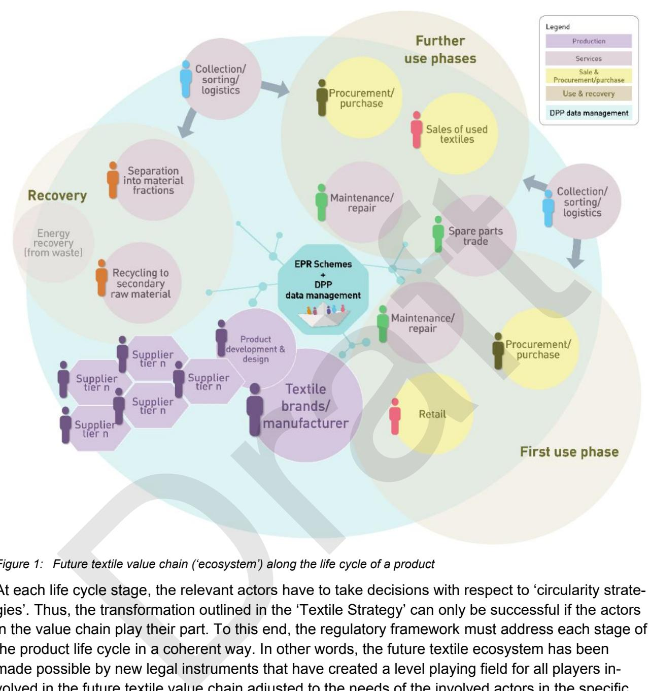
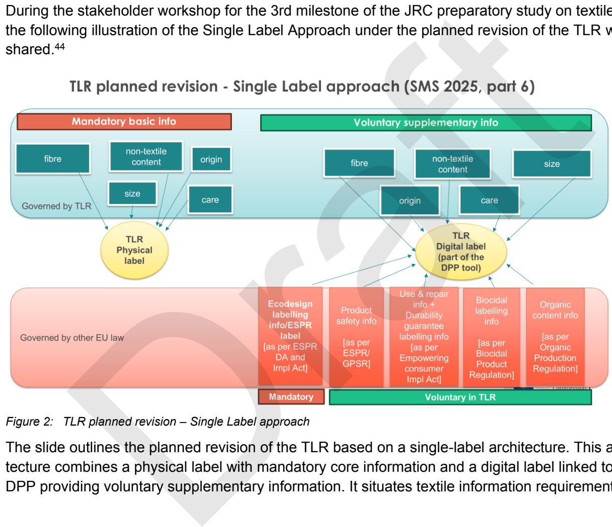

## **Project information**

**Project full title**: Advancing Sustainable Textiles in the Circular Economy Through Innovative EPR Schemes

**Acronym**: TRUSTex

**Call**: HORIZON-CL6-2024-CircBio-01-2

**Topic**: Circular solutions for textile value chains

based on extended producer responsibility (Innovation Action)

**Start date**: 1 st January 2025 Draft

**Duration**: 36 months

## **Members of the Consortium**:

# **Deliverable details**

| Document Number:    | D1.2                                                                            |
|---------------------|---------------------------------------------------------------------------------|
| Document Title:     | Regulatory Landscape Analysis Report                                            |
| Dissemination level | PU – Public, fully open                                                         |
| Period:             | PR1 / PR2                                                                       |
| WP:                 | WP1                                                                             |
| Task:               | T1.2                                                                            |
| Reviewer            | Nikolas Charalampogiannis (ENA), Ghaya Rziga (LIST), Xavier Verni               |
|                     | looks into how the regulations, initiatives and strategies enable or hinder the |
|                     | the level of the European Union (Chapter 2 focussing on ESPR and waste          |
|                     | ter 7), then turns to selected Member States (Chapter 3 ) and finally third     |
|                     | textiles flows and waste management (Chapter 4 ). Chapter 5 summarises the      |
|                     | Version Date Description                                                        |
| Version 1.0         | (version for review) 02.02.2026 D1.2                                            |
| Version 1.1         | (after first round of review) 23.02.2026 D1.2                                   |
| Version 1.2         | (after second round of review with Part B on SoC)                               |
|                     | D r a ft                                                                        |
|                     | 28.02.2026 D1.2                                                                 |

| D                                                             |            |             |
|---------------------------------------------------------------|------------|-------------|
| Version                                                       | Date       | Description |
| Version 1.0 (version for review)                              | 02.02.2026 | D1.2        |
| Version 1.1 (after first round of review)                     | 23.02.2026 | D1.2        |
| Version 1.2 (after second round of review with Part B on SoC) |            |             |
|                                                               | 28.02.2026 | D1.2        |

### **Overview**

|     | Table of contents Project information Deliverable details List of figures List of tables...................................................................................................................................XI List of acronyms Legal definitions and other terms used in this report..............................................................XIV | .VII III .........................................................................................................................IV .................................................................................................................................XI ...........................................................................................................................XII |
|-----|-----------------------------------------------------------------------------------------------------------------------------------------------------------------------------------------------------------------------------------------------------------------------------------------------------------------------------------------------------------------------|---------------------------------------------------------------------------------------------------------------------------------------------------------------------------------------------------------------------------------------------------------------------------------------------------------------------------------------------------------------------------------------------------------|
| 0   | Executive Summary                                                                                                                                                                                                                                                                                                                                                     | 1                                                                                                                                                                                                                                                                                                                                                                                                       |
| 1   | Introduction                                                                                                                                                                                                                                                                                                                                                          | 3                                                                                                                                                                                                                                                                                                                                                                                                       |
| 1.1 |                                                                                                                                                                                                                                                                                                                                                                       | Problem situation................................................................................................................... 3                                                                                                                                                                                                                                                                  |
| 1.2 | Research question                                                                                                                                                                                                                                                                                                                                                     | 5                                                                                                                                                                                                                                                                                                                                                                                                       |
| 1.3 | Methodological approach                                                                                                                                                                                                                                                                                                                                               | 5                                                                                                                                                                                                                                                                                                                                                                                                       |
| 1.4 | Assessment levels and structure of the report                                                                                                                                                                                                                                                                                                                         | 10                                                                                                                                                                                                                                                                                                                                                                                                      |
| 2   | Significant regulatory framework in the EU...........................................................................                                                                                                                                                                                                                                                 | 11                                                                                                                                                                                                                                                                                                                                                                                                      |
| 2.1 | Methodological approach on EU level.................................................................................                                                                                                                                                                                                                                                  | 11                                                                                                                                                                                                                                                                                                                                                                                                      |
| 2.2 | ESPR...................................................................................................................................                                                                                                                                                                                                                               | 11                                                                                                                                                                                                                                                                                                                                                                                                      |
| 2.3 | Waste Framework Directive                                                                                                                                                                                                                                                                                                                                             | 16                                                                                                                                                                                                                                                                                                                                                                                                      |
| 2.4 | EU core framework as evaluation yardstick                                                                                                                                                                                                                                                                                                                             | 21                                                                                                                                                                                                                                                                                                                                                                                                      |
| 2.5 | Textile related regulatory context on EU Level....................................................................                                                                                                                                                                                                                                                    | 23                                                                                                                                                                                                                                                                                                                                                                                                      |
| 2.6 | Findings on EU level                                                                                                                                                                                                                                                                                                                                                  | 52                                                                                                                                                                                                                                                                                                                                                                                                      |
| 3   | Regulatory Framework in EU Member States........................................................................                                                                                                                                                                                                                                                      | 59                                                                                                                                                                                                                                                                                                                                                                                                      |
| 3.1 | Methodological approach at the Member State level                                                                                                                                                                                                                                                                                                                     | 59                                                                                                                                                                                                                                                                                                                                                                                                      |
| 3.2 | The Netherlands –                                                                                                                                                                                                                                                                                                                                                     | EPR scheme......................................................................................... 62                                                                                                                                                                                                                                                                                                  |
| 3.3 | France –                                                                                                                                                                                                                                                                                                                                                              | textile regime including EPR scheme................................................................... 65                                                                                                                                                                                                                                                                                               |
| 3.4 | Latvia –                                                                                                                                                                                                                                                                                                                                                              | EPR scheme.......................................................................................................... 71                                                                                                                                                                                                                                                                                 |
| 3.5 | Germany –                                                                                                                                                                                                                                                                                                                                                             | Act to Promote Circular Economy and Safeguard the Environmentally                                                                                                                                                                                                                                                                                                                                      |
|     | Compatible Management of Waste                                                                                                                                                                                                                                                                                                                                        | 75                                                                                                                                                                                                                                                                                                                                                                                                      |
| 3.6 | Other innovative measures on Member State level                                                                                                                                                                                                                                                                                                                       | 77                                                                                                                                                                                                                                                                                                                                                                                                      |
| 3.7 | Findings on Member State level..........................................................................................                                                                                                                                                                                                                                              | 80                                                                                                                                                                                                                                                                                                                                                                                                      |
| 4   | Third countries                                                                                                                                                                                                                                                                                                                                                       | 89                                                                                                                                                                                                                                                                                                                                                                                                      |
| 4.1 | Problem statement and methodological approach on the level of third countries                                                                                                                                                                                                                                                                                         | 89                                                                                                                                                                                                                                                                                                                                                                                                      |
| 4.2 | Scope and selection for the RLA.........................................................................................                                                                                                                                                                                                                                              | 91                                                                                                                                                                                                                                                                                                                                                                                                      |
| 4.3 | Regulatory analysis by country                                                                                                                                                                                                                                                                                                                                        | 92                                                                                                                                                                                                                                                                                                                                                                                                      |
| 4.4 | Findings on third country level.............................................................................................                                                                                                                                                                                                                                          | 98                                                                                                                                                                                                                                                                                                                                                                                                      |
| 5   | Synthesis of the findings.......................................................................................................                                                                                                                                                                                                                                      | 103                                                                                                                                                                                                                                                                                                                                                                                                     |
| 5.1 | Gaps and frictions concerning the life cycle stages                                                                                                                                                                                                                                                                                                                   | 103                                                                                                                                                                                                                                                                                                                                                                                                     |
| 5.2 | Results for the three analytic lenses                                                                                                                                                                                                                                                                                                                                 | 106                                                                                                                                                                                                                                                                                                                                                                                                     |
| 5.3 | Overall synthesis: Gaps, interface problems and implications for the overarching                                                                                                                                                                                                                                                                                      |                                                                                                                                                                                                                                                                                                                                                                                                         |
|     | objectives                                                                                                                                                                                                                                                                                                                                                            | 112                                                                                                                                                                                                                                                                                                                                                                                                     |
| 6   | Bibliography Dr                                                                                                                                                                                                                                                                                                                                                       | a ft 115                                                                                                                                                                                                                                                                                                                                                                                                |

| 7                                                                                                     | Annex 1: Regulatory context at EU level –                                                                                           | other textile-relevant legislative acts 117 |
|-------------------------------------------------------------------------------------------------------|-------------------------------------------------------------------------------------------------------------------------------------|---------------------------------------------|
| 7.1                                                                                                   | Scope and methodological approach                                                                                                   | 117                                         |
| 7.2                                                                                                   | REACH.............................................................................................................................. | 120                                         |
| 7.3                                                                                                   | Regulation on persistent organic pollutants                                                                                         | 123                                         |
| 7.4                                                                                                   | Regulation on classification, labelling and packaging of substances and mixtures                                                    | 124                                         |
| 7.5                                                                                                   | General Product Safety Regulation...................................................................................                | 124                                         |
| 7.6                                                                                                   | Market Surveillance Regulation.........................................................................................             | 125                                         |
| 7.7                                                                                                   | Product Environmental Footprint Category Rules: apparel and footwear                                                                | 126                                         |
| 7.8                                                                                                   | Corporate Sustainability Due Diligence Directive..............................................................                      | 126                                         |
| 7.9                                                                                                   | Corporate Sustainability Reporting Directive.....................................................................                   | 127                                         |
| 7.10                                                                                                  | Green Claims Directive...................................................................................................           | 128                                         |
| 7.11                                                                                                  | Unfair Commercial Practices Directive and EmpCo                                                                                     | 128                                         |
| 7.12                                                                                                  | Directive on ‘Right to Repair’                                                                                                      | 129                                         |
| 7.13                                                                                                  | Taxonomy Regulation.....................................................................................................            | 129                                         |
| 7.14                                                                                                  | New Legislative Framework                                                                                                           | 130                                         |
| 7.15                                                                                                  | Standards                                                                                                                           | 130                                         |
| 8 Annex 2: Chronological overview of key regulatory milestones....................................... |                                                                                                                                     | 132                                         |
| 9 Annex 3: Results of the Policy Workshop, Brussels 18.11.2025                                        |                                                                                                                                     | 135                                         |
| Key Results from the World Café Discussions                                                           |                                                                                                                                     | 140                                         |
|                                                                                                       | Dr a                                                                                                                                | ft                                          |

This project has received funding from the European Union's Horizon Research and Innovation program under grant agreement N° 101181901 and from the Swiss State Secretariat for Education, Research and Innovation (SERI). Posts and shares reflect only the views of all the involved partners. Neither the European Union nor the granting authority can be held responsible for them. This draft deliverable has not yet been validated by the granting authorities VII

### **Table of contents**

| Project information Deliverable details List of figures List of acronyms | List of tables...................................................................................................................................XI Legal definitions and other terms used in this report..............................................................XIV | III .........................................................................................................................IV .................................................................................................................................XI ...........................................................................................................................XII |
|--------------------------------------------------------------------------|----------------------------------------------------------------------------------------------------------------------------------------------------------------------------------------------------------------------------------------------------------------------------|----------------------------------------------------------------------------------------------------------------------------------------------------------------------------------------------------------------------------------------------------------------------------------------------------------------------------------------------------------------------------------------------------|
| 0                                                                        | Executive Summary                                                                                                                                                                                                                                                          | 1                                                                                                                                                                                                                                                                                                                                                                                                  |
| 1 Introduction                                                           |                                                                                                                                                                                                                                                                            | 3                                                                                                                                                                                                                                                                                                                                                                                                  |
| 1.1                                                                      | Problem situation...................................................................................................................                                                                                                                                       | 3                                                                                                                                                                                                                                                                                                                                                                                                  |
| 1.2                                                                      | Research question                                                                                                                                                                                                                                                          | 5                                                                                                                                                                                                                                                                                                                                                                                                  |
| 1.3                                                                      | Methodological approach                                                                                                                                                                                                                                                    | 5                                                                                                                                                                                                                                                                                                                                                                                                  |
| 1.3.1                                                                    | Political programs and strategies as normative orientation                                                                                                                                                                                                                 | 5                                                                                                                                                                                                                                                                                                                                                                                                  |
| 1.3.2                                                                    | Future textile ecosystem based on circularity strategies                                                                                                                                                                                                                   | 7                                                                                                                                                                                                                                                                                                                                                                                                  |
| 1.3.3                                                                    |                                                                                                                                                                                                                                                                            | Regulatory points of reference along the product life cycle..................................................... 8                                                                                                                                                                                                                                                                                 |
| 1.3.4                                                                    |                                                                                                                                                                                                                                                                            | Textile products and the EU internal market............................................................................ 9                                                                                                                                                                                                                                                                          |
| 1.4                                                                      | Assessment levels and structure of the report                                                                                                                                                                                                                              | 10                                                                                                                                                                                                                                                                                                                                                                                                 |
| 2                                                                        | Significant regulatory framework in the EU...........................................................................                                                                                                                                                      | 11                                                                                                                                                                                                                                                                                                                                                                                                 |
| 2.1                                                                      | Methodological approach on EU level.................................................................................                                                                                                                                                       | 11                                                                                                                                                                                                                                                                                                                                                                                                 |
| 2.2                                                                      | ESPR...................................................................................................................................                                                                                                                                    | 11                                                                                                                                                                                                                                                                                                                                                                                                 |
| 2.2.1                                                                    | Overall aim.............................................................................................................................                                                                                                                                   | 12                                                                                                                                                                                                                                                                                                                                                                                                 |
| 2.2.2                                                                    | Ecodesign requirements                                                                                                                                                                                                                                                     | 12                                                                                                                                                                                                                                                                                                                                                                                                 |
| 2.2.3                                                                    | Unsold textiles........................................................................................................................                                                                                                                                    | 13                                                                                                                                                                                                                                                                                                                                                                                                 |
| 2.2.4                                                                    | Digital Product Passport (DPP)..............................................................................................                                                                                                                                               | 13                                                                                                                                                                                                                                                                                                                                                                                                 |
| 2.2.5                                                                    | Demand-side incentives via EU Ecolabel and Green Public Procurement                                                                                                                                                                                                        | 14                                                                                                                                                                                                                                                                                                                                                                                                 |
| 2.2.6                                                                    | Product life cycle perspective                                                                                                                                                                                                                                             | 14                                                                                                                                                                                                                                                                                                                                                                                                 |
| 2.2.7                                                                    | Conclusions and deriving assessment criteria.......................................................................                                                                                                                                                        | 15                                                                                                                                                                                                                                                                                                                                                                                                 |
| 2.3                                                                      | Waste Framework Directive                                                                                                                                                                                                                                                  | 16                                                                                                                                                                                                                                                                                                                                                                                                 |
| 2.3.1                                                                    | Overall aim.............................................................................................................................                                                                                                                                   | 17                                                                                                                                                                                                                                                                                                                                                                                                 |
| 2.3.2                                                                    | Textile relevant provisions                                                                                                                                                                                                                                                | 17                                                                                                                                                                                                                                                                                                                                                                                                 |
| 2.3.3                                                                    | Extended Producer Responsibility (EPR) for textiles.............................................................                                                                                                                                                           | 17                                                                                                                                                                                                                                                                                                                                                                                                 |
| 2.3.4                                                                    | Product life cycle perspective                                                                                                                                                                                                                                             | 19                                                                                                                                                                                                                                                                                                                                                                                                 |
| 2.3.5                                                                    | Conclusions and deriving assessment criteria.......................................................................                                                                                                                                                        | 20                                                                                                                                                                                                                                                                                                                                                                                                 |
| 2.4                                                                      | EU core framework as evaluation yardstick                                                                                                                                                                                                                                  | 21                                                                                                                                                                                                                                                                                                                                                                                                 |
| 2.5                                                                      | Textile related regulatory context on EU Level....................................................................                                                                                                                                                         | 23                                                                                                                                                                                                                                                                                                                                                                                                 |
| 2.5.1                                                                    | Textile Labelling Regulation...................................................................................................                                                                                                                                            | 23                                                                                                                                                                                                                                                                                                                                                                                                 |
|                                                                          | 2.5.1.1 Brief profile                                                                                                                                                                                                                                                      | 23                                                                                                                                                                                                                                                                                                                                                                                                 |
|                                                                          | 2.5.1.2                                                                                                                                                                                                                                                                    | Assessment............................................................................................................... 25                                                                                                                                                                                                                                                                       |
|                                                                          | 2.5.1.3                                                                                                                                                                                                                                                                    | Critical assessment................................................................................................... 27                                                                                                                                                                                                                                                                          |
|                                                                          | 2.5.1.4 Conclusion                                                                                                                                                                                                                                                         | 29                                                                                                                                                                                                                                                                                                                                                                                                 |
| 2.5.2                                                                    | EU Ecolabel criteria                                                                                                                                                                                                                                                       | 29                                                                                                                                                                                                                                                                                                                                                                                                 |
|                                                                          | 2.5.2.1 Brief profile                                                                                                                                                                                                                                                      | 29                                                                                                                                                                                                                                                                                                                                                                                                 |
|                                                                          | 2.5.2.2                                                                                                                                                                                                                                                                    | Assessment............................................................................................................... 32                                                                                                                                                                                                                                                                       |
|                                                                          | 2.5.2.3                                                                                                                                                                                                                                                                    | Critical assessment................................................................................................... 33                                                                                                                                                                                                                                                                          |
|                                                                          | 2.5.2.4 Conclusion                                                                                                                                                                                                                                                         | 35                                                                                                                                                                                                                                                                                                                                                                                                 |
| 2.5.3                                                                    | Green Procurement                                                                                                                                                                                                                                                          | 35                                                                                                                                                                                                                                                                                                                                                                                                 |
|                                                                          | 2.5.3.1 Brief profile                                                                                                                                                                                                                                                      | 36                                                                                                                                                                                                                                                                                                                                                                                                 |
|                                                                          | 2.5.3.1.1                                                                                                                                                                                                                                                                  | Directive 2014/24/EU...................................................................................... 36                                                                                                                                                                                                                                                                                      |
|                                                                          | 2.5.3.1.2                                                                                                                                                                                                                                                                  | EU Green Public Procurement criteria for textiles products and services...... 37                                                                                                                                                                                                                                                                                                                   |
|                                                                          | 2.5.3.1.3 Aggregate brief profile for Green Procurement                                                                                                                                                                                                                    | 38                                                                                                                                                                                                                                                                                                                                                                                                 |
|                                                                          | 2.5.3.2                                                                                                                                                                                                                                                                    | Assessment............................................................................................................... 40                                                                                                                                                                                                                                                                       |
|                                                                          | 2.5.3.3                                                                                                                                                                                                                                                                    | Critical assessment................................................................................................... 41                                                                                                                                                                                                                                                                          |
|                                                                          | 2.5.3.4 Conclusion                                                                                                                                                                                                                                                         | 41                                                                                                                                                                                                                                                                                                                                                                                                 |
| 2.5.4                                                                    | Waste Shipment Regulation                                                                                                                                                                                                                                                  | 42                                                                                                                                                                                                                                                                                                                                                                                                 |
|                                                                          | 2.5.4.1 Brief profile                                                                                                                                                                                                                                                      | 42                                                                                                                                                                                                                                                                                                                                                                                                 |
|                                                                          | 2.5.4.2                                                                                                                                                                                                                                                                    | Assessment............................................................................................................... 45                                                                                                                                                                                                                                                                       |
|                                                                          | 2.5.4.3                                                                                                                                                                                                                                                                    | Critical assessment................................................................................................... 47                                                                                                                                                                                                                                                                          |
|                                                                          | Dr                                                                                                                                                                                                                                                                         | a ft                                                                                                                                                                                                                                                                                                                                                                                               |

|       | 2.5.4.4 Conclusion                                                                                                                         | 48                                                                                                                            |
|-------|--------------------------------------------------------------------------------------------------------------------------------------------|-------------------------------------------------------------------------------------------------------------------------------|
| 2.5.5 | End-of-waste criteria and interfaces with shipment of waste.................................................                               | 48                                                                                                                            |
| 2.5.6 | Key insights from the broader regulatory context                                                                                           | 49                                                                                                                            |
|       | 2.5.6.1 Product performance lens (evaluation lens 1)                                                                                       | 49                                                                                                                            |
|       | 2.5.6.2                                                                                                                                    | Information requirement lens (evaluation lens 2)...................................................... 50                     |
|       | 2.5.6.3                                                                                                                                    | Economic incentives (evaluation lens 3) .................................................................. 51                 |
|       | 2.5.6.4                                                                                                                                    | Summary................................................................................................................... 51 |
| 2.6   | Findings on EU level                                                                                                                       | 52                                                                                                                            |
| 2.6.1 | Coverage of the life-cycle stages...........................................................................................               | 52                                                                                                                            |
| 2.6.2 | Results for the three analytic lenses......................................................................................                | 55                                                                                                                            |
|       | 2.6.2.1                                                                                                                                    | Performance requirements (evaluation lens 1)......................................................... 56                      |
|       | 2.6.2.2                                                                                                                                    | Information requirements (evaluation lens 2)............................................................ 56                   |
|       | 2.6.2.3                                                                                                                                    | Economic incentives (evaluation lens 3)................................................................... 57                 |
| 2.6.3 | Conclusions............................................................................................................................    | 57                                                                                                                            |
| 3     | Regulatory Framework in EU Member States........................................................................                           | 59                                                                                                                            |
| 3.1   | Methodological approach at the Member State level                                                                                          | 59                                                                                                                            |
| 3.1.1 | Brief profile (description of the legal act)                                                                                               | 59                                                                                                                            |
| 3.1.2 | Assessment against content-related evaluation lenses.........................................................                              | 60                                                                                                                            |
| 3.1.3 | Scope: selected Member States............................................................................................                  | 61                                                                                                                            |
| 3.2   | The Netherlands –                                                                                                                          | EPR scheme......................................................................................... 62                        |
| 3.2.1 | Brief profile............................................................................................................................. | 63                                                                                                                            |
| 3.2.2 | Assessment............................................................................................................................     | 65                                                                                                                            |
| 3.3   | France –                                                                                                                                   | textile regime including EPR scheme................................................................... 65                     |
| 3.3.1 | Brief profile............................................................................................................................. | 66                                                                                                                            |
| 3.3.2 | Assessment............................................................................................................................     | 69                                                                                                                            |
| 3.4   | Latvia –                                                                                                                                   | EPR scheme.......................................................................................................... 71       |
| 3.4.1 | Brief profile............................................................................................................................. | 71                                                                                                                            |
| 3.4.2 | Assessment............................................................................................................................     | 73                                                                                                                            |
| 3.5   | Germany – Act to Promote Circular Economy and Safeguard the Environmentally                                                               |                                                                                                                               |
|       | Compatible Management of Waste                                                                                                             | 75                                                                                                                            |
| 3.5.1 | Brief profile............................................................................................................................. | 75                                                                                                                            |
| 3.5.2 | Assessment............................................................................................................................     | 76                                                                                                                            |
| 3.6   | Other innovative measures on Member State level                                                                                            | 77                                                                                                                            |
| 3.6.1 | French Law targeting ultra-fast fashion                                                                                                    | 77                                                                                                                            |
| 3.6.2 | Green Public Procurement (GPP)..........................................................................................                   | 77                                                                                                                            |
| 3.6.3 | Repair incentives                                                                                                                          | 79                                                                                                                            |
| 3.7   | Findings on Member State level..........................................................................................                   | 80                                                                                                                            |
| 3.7.1 | Stages in the life cycle addressed by national legislation......................................................                           | 81                                                                                                                            |
| 3.7.2 | Level of ambition regarding the three analytic lenses                                                                                      | 83                                                                                                                            |
| 3.7.3 | Comparison of national EPR schemes against the WFD baseline........................................                                        | 84                                                                                                                            |
| 3.7.4 | Overall findings in terms of circularity strategies                                                                                        | 87                                                                                                                            |
|       | 3.7.4.1                                                                                                                                    | Product performance (evaluation lens 1).................................................................. 87                  |
|       | 3.7.4.2                                                                                                                                    | Information requirements (evaluation lens 2)............................................................ 87                   |
|       | 3.7.4.3 Economic incentives, incl. EPR schemes (evaluation lens 3)                                                                         | 87                                                                                                                            |
|       | 3.7.4.4 Circularity strategies in the value chain                                                                                          | 88                                                                                                                            |
| 4     | Third countries                                                                                                                            | 89                                                                                                                            |
| 4.1   | Problem statement and methodological approach on the level of third countries                                                              | 89                                                                                                                            |
| 4.1.1 | Brief profile............................................................................................................................. | 90                                                                                                                            |
| 4.1.2 | Assessment criteria................................................................................................................        | 91                                                                                                                            |
| 4.2   | Scope and selection for the RLA.........................................................................................                   | 91                                                                                                                            |
| 4.3   | Regulatory analysis by country                                                                                                             | 92                                                                                                                            |
| 4.3.1 | Pakistan                                                                                                                                   | 92                                                                                                                            |
|       | 4.3.1.1 Brief profile                                                                                                                      | 92                                                                                                                            |
|       | 4.3.1.2                                                                                                                                    | Assessment............................................................................................................... 93  |
| 4.3.2 | Kenya..................................................................................................................................... | 94                                                                                                                            |
|       | 4.3.2.1 Brief profile                                                                                                                      | 94                                                                                                                            |
|       | 4.3.2.2                                                                                                                                    | Assessment............................................................................................................... 97  |
|       | D r                                                                                                                                        | a ft                                                                                                                          |

| 4.4            | Findings on third country level.............................................................................................             | 98                                                                                                                              |
|----------------|------------------------------------------------------------------------------------------------------------------------------------------|---------------------------------------------------------------------------------------------------------------------------------|
| 4.4.1          | Import filters and quality gates (“product performance”, evaluation lens 1)                                                              | 99                                                                                                                              |
| 4.4.2          | Information requirements: Classification and traceability / Data and documentation                                                       |                                                                                                                                 |
|                | duties (evaluation lens 2).....................................................................................................          | 100                                                                                                                             |
| 4.4.3          | Economic incentives, incl. EPR schemes (evaluation lens 3)                                                                               | 100                                                                                                                             |
| 4.4.4          | Cross-border impact on circularity strategies in the value chain                                                                         | 101                                                                                                                             |
| 5              | Synthesis of the findings.......................................................................................................         | 103                                                                                                                             |
| 5.1            | Gaps and frictions concerning the life cycle stages                                                                                      | 103                                                                                                                             |
| 5.1.1          | Design phase                                                                                                                             | 103                                                                                                                             |
| 5.1.2          | Data on ESPR ‘product aspects’ and 'performance requirements'......................................                                      | 103                                                                                                                             |
| 5.1.3          | Informed decisions of potential customers (in terms of B2C, B2B and B2G)......................                                           | 104                                                                                                                             |
| 5.1.4          | Maintenance and repair services during the use phase(s)..................................................                                | 104                                                                                                                             |
| 5.1.5          | Effective and efficient collection and sorting of used textiles ..............................................                           | 104                                                                                                                             |
| 5.1.6          | Economic incentives throughout the lifespan of a textile product........................................                                 | 105                                                                                                                             |
| 5.1.7          | Synthesis of the results for the life cycle stages..................................................................                     | 106                                                                                                                             |
| 5.2            | Results for the three analytic lenses                                                                                                    | 106                                                                                                                             |
| 5.2.1          | Product performance (evaluation lens 1).............................................................................                     | 106                                                                                                                             |
|                | 5.2.1.1                                                                                                                                  | EU level................................................................................................................... 106 |
|                | 5.2.1.2 Member State level                                                                                                               | 107                                                                                                                             |
|                | 5.2.1.3                                                                                                                                  | Third country level................................................................................................... 107      |
|                | 5.2.1.4                                                                                                                                  | Implications for the overarching objectives............................................................. 107                    |
| 5.2.2          | Information requirements (evaluation lens 2)                                                                                             | 108                                                                                                                             |
|                | 5.2.2.1                                                                                                                                  | EU level................................................................................................................... 108 |
|                | 5.2.2.2 Member State level                                                                                                               | 109                                                                                                                             |
|                | 5.2.2.3                                                                                                                                  | Third country level................................................................................................... 109      |
|                | 5.2.2.4                                                                                                                                  | Implications for the overarching objectives............................................................. 109                    |
| 5.2.3          | Economic incentives (evaluation lens 3)..............................................................................                    | 110                                                                                                                             |
|                | 5.2.3.1                                                                                                                                  | EU level................................................................................................................... 110 |
|                | 5.2.3.2 Member State level                                                                                                               | 111                                                                                                                             |
|                | 5.2.3.3                                                                                                                                  | Third country level................................................................................................... 111      |
|                | 5.2.3.4                                                                                                                                  | Implications for the overarching objectives............................................................. 111                    |
| 5.2.4          | Synthesis of the results for the three lenses........................................................................                    | 111                                                                                                                             |
| 5.3            | Overall synthesis: Gaps, interface problems and implications for the overarching                                                         |                                                                                                                                 |
|                | objectives                                                                                                                               | 112                                                                                                                             |
| 6 Bibliography |                                                                                                                                          | 115                                                                                                                             |
| 7              | Annex 1: Regulatory context at EU level –                                                                                                | other textile-relevant legislative acts 117                                                                                     |
| 7.1            | Scope and methodological approach                                                                                                        | 117                                                                                                                             |
| 7.2            | REACH..............................................................................................................................      | 120                                                                                                                             |
| 7.2.1          | Brief profile........................................................................................................................... | 120                                                                                                                             |
| 7.2.2          | Lens-based assessment......................................................................................................              | 121                                                                                                                             |
| 7.2.3          | Critical assessment..............................................................................................................        | 122                                                                                                                             |
| 7.2.4          | Conclusion                                                                                                                               | 123                                                                                                                             |
| 7.3            | Regulation on persistent organic pollutants                                                                                              | 123                                                                                                                             |
| 7.4            | Regulation on classification, labelling and packaging of substances and mixtures                                                         | 124                                                                                                                             |
| 7.5            | General Product Safety Regulation...................................................................................                     | 124                                                                                                                             |
| 7.6            | Market Surveillance Regulation.........................................................................................                  | 125                                                                                                                             |
| 7.7            | Product Environmental Footprint Category Rules: apparel and footwear                                                                     | 126                                                                                                                             |
| 7.8            | Corporate Sustainability Due Diligence Directive..............................................................                           | 126                                                                                                                             |
| 7.9            | Corporate Sustainability Reporting Directive.....................................................................                        | 127                                                                                                                             |
| 7.10           | Green Claims Directive...................................................................................................                | 128                                                                                                                             |
| 7.11           | Unfair Commercial Practices Directive and EmpCo                                                                                          | 128                                                                                                                             |
| 7.12           | Directive on ‘Right to Repair’                                                                                                           | 129                                                                                                                             |
| 7.13           | Taxonomy Regulation.....................................................................................................                 | 129                                                                                                                             |
| 7.14           | New Legislative Framework                                                                                                                | 130                                                                                                                             |
| 7.15           | Standards                                                                                                                                | 130                                                                                                                             |
|                | Dr                                                                                                                                       | a ft                                                                                                                            |

| 8 | Annex 2: Chronological overview of key regulatory milestones....................................... | 132 |
|---|-----------------------------------------------------------------------------------------------------|-----|
| 9 | Annex 3: Results of the Policy Workshop, Brussels 18.11.2025                                        | 135 |
|   | Key Results from the World Café Discussions                                                         | 140 |
|   | World Café 1: Eco-Modulated Fees                                                                    | 140 |
|   | World Café 2: DPP - data det and governance framework                                               | 140 |
|   | World Café 3: Requirements for effective market surveillance                                        | 141 |

#### **List of figures**

| Figure 1: | Future textile value chain (‘ecosystem’) along the life cycle of a product 8                                 |
|-----------|--------------------------------------------------------------------------------------------------------------|
| Figure 2: | TLR planned revision – Single Label approach 28                                                              |
| Figure 3: | Excerpt from Commission Decision 2014/350/EU with assessment and verification requirements............... 30 |

#### **List of tables**

| Table 1:  | Ecodesign for Sustainable Products Regulation (EU) 2024/1781 (ESPR) -                                                                                      |                                                                                                                        | Brief Profile............................... 15 |
|-----------|------------------------------------------------------------------------------------------------------------------------------------------------------------|------------------------------------------------------------------------------------------------------------------------|-------------------------------------------------|
| Table 2:  | Assessment criteria derived from the ESPR..................................................................................................                |                                                                                                                        | 16                                              |
| Table 3:  | Directive 2008/98/EC on waste, as last amended by Directive (EU) 2025/1892 (WFD) -                                                                         |                                                                                                                        | Brief Profile 20                                |
| Table 4:  | Assessment criteria derived from the WFD                                                                                                                   |                                                                                                                        | 21                                              |
| Table 5:  | Assessment criteria derived from the core regulatory framework..................................................................                           |                                                                                                                        | 22                                              |
| Table 6:  | Textile Labelling Regulation -                                                                                                                             | Brief Profile.....................................................................................................     | 25                                              |
| Table 7:  | Textile Labelling Regulation -                                                                                                                             | Assessment....................................................................................................         | 26                                              |
| Table 8:  | EU Ecolabel criteria -                                                                                                                                     | Brief Profile                                                                                                          | 32                                              |
| Table 9:  | EU Ecolabel criteria -                                                                                                                                     | Assessment                                                                                                             | 33                                              |
| Table 10: | Green Procurement -                                                                                                                                        | Brief Profile                                                                                                          | 39                                              |
| Table 11: | Green Procurement -                                                                                                                                        | Assessment                                                                                                             | 40                                              |
| Table 12: | Waste Shipment Regulation -                                                                                                                                | Brief Profile                                                                                                          | 45                                              |
| Table 13: | Waste Shipment Regulation -                                                                                                                                | Assessment                                                                                                             | 46                                              |
| Table 14: | Key insights from the broader regulatory context with a view to the three lenses                                                                           |                                                                                                                        | 52                                              |
| Table 15: | Stages in the textile life cycle addressed at EU level.....................................................................................                |                                                                                                                        | 53                                              |
| Table 16: | Identified regulatory gaps at EU level along the life-cycle stages..................................................................                       |                                                                                                                        | 55                                              |
| Table 17: | Interplay on EU level regarding the three lenses...........................................................................................                |                                                                                                                        | 58                                              |
| Table 18: | Brief profile for Member States......................................................................................................................      |                                                                                                                        | 60                                              |
| Table 19: | The lenses for assessing regulatory instruments                                                                                                            |                                                                                                                        | 61                                              |
| Table 20: | The Netherlands: Brief Profile -                                                                                                                           | EPR for Textiles Decree                                                                                                | 64                                              |
| Table 21: | The Netherlands: Assessment -                                                                                                                              | EPR for Textiles Decree                                                                                                | 65                                              |
| Table 22: | France: Assessment -                                                                                                                                       | textile regime including EPR scheme                                                                                    | 70                                              |
| Table 23: | Latvia: Brief Profile -                                                                                                                                    | Latvian EPR scheme.................................................................................................... | 73                                              |
| Table 24: | Latvia: Assessment -                                                                                                                                       | Latvian EPR scheme...................................................................................................  | 74                                              |
| Table 25: | Germany: Brief Profile -                                                                                                                                   | Act to Promote Circular Economy (KrWG)                                                                                 | 76                                              |
| Table 26: | Germany: Assessment -                                                                                                                                      | Act to Promote Circular Economy (KrWG)                                                                                 | 76                                              |
| Table 27: | Profile Overview on the level                                                                                                                              | of the Member States - Stages in the textile life cycle addressed (part 1).......                                      | 81                                              |
| Table 28: | Profile Overview on the level                                                                                                                              | of the Member States - Stages in the textile life cycle addressed (part 2).......                                      | 83                                              |
| Table 29: | Overview of the level of ambition in Member State legislation.......................................................................                       |                                                                                                                        | 84                                              |
| Table 30: | Comparison of national EPR schemes against WFD baseline regarding product scope...............................                                             |                                                                                                                        | 85                                              |
| Table 31: | Comparison of national EPR schemes against WFD baseline                                                                                                    |                                                                                                                        | 86                                              |
| Table 32: | Brief profile for third countries........................................................................................................................  |                                                                                                                        | 90                                              |
| Table 33: | Assessment criteria for third countries...........................................................................................................         |                                                                                                                        | 91                                              |
| Table 34: | Pakistan: Profile -                                                                                                                                        | Import Policy Order 2020 (IPO 2020)                                                                                    | 93                                              |
| Table 35: | Pakistan: Assessment -                                                                                                                                     | Import Policy Order 2020 (IPO 2020)......................................................................              | 94                                              |
| Table 36: | Kenya: Profile -                                                                                                                                           | PVoC, in addition to Order No. 78 of the Standards Act                                                                 | 97                                              |
| Table 37: | Kenya: Assessment -                                                                                                                                        | PVoC, in addition to Order No. 78 of the Standards Act                                                                 | 98                                              |
| Table 38: | Synthesis at third-country level: border-facing legal functions, interplay with EU circularity strategies                                                  |                                                                                                                        |                                                 |
|           | and leakage risks......................................................................................................................................... |                                                                                                                        | 101                                             |
| Table 39: | Synthesis of the results for the three lenses................................................................................................              |                                                                                                                        | 112                                             |
| Table 40: | Synthesis of structural gaps and leverage points by overarching circular-economy objective.....................                                            |                                                                                                                        | 113                                             |
| Table 41: | Scope and selection note (EU level)............................................................................................................            |                                                                                                                        | 117                                             |
| Table 42: | EU legal acts mapped                                                                                                                                       |                                                                                                                        | 117                                             |
| Table 43: | REACH - Brief Profile                                                                                                                                      |                                                                                                                        | 121                                             |
| Table 44: | REACH - Assessment                                                                                                                                         |                                                                                                                        | 122                                             |
| Table 45: | Chronological overview of key regulatory milestones for textile CE at EU and Member State level............                                                |                                                                                                                        | 132                                             |
| Table 46: | Interplay between ESPR and EPR schemes (WFD)                                                                                                               |                                                                                                                        | 137                                             |
| Table 47: | Gaps and interface problems with related policy levers...............................................................................                      |                                                                                                                        | 138                                             |
| Table 48: | Synthesis of structural gaps and leverage points by overarching circular                                                                                   |                                                                                                                        |                                                 |
|           | D                                                                                                                                                          | r a ft                                                                                                                 |                                                 |
|           |                                                                                                                                                            |                                                                                                                        | -economy objective..................... 139     |

This project has received funding from the European Union's Horizon Research and Innovation program under grant agreement N° 101181901 and from the Swiss State Secretariat for Education, Research and Innovation (SERI). Posts and shares reflect only the views of all the involved partners. Neither the European Union nor the granting authority can be held responsible for them. This draft deliverable has not yet been validated by the granting authorities XII

#### **List of acronyms**

| AGEC      | Loi anti-gaspillage pour une économie circulaire (French anti-Waste law for a circular economy)       |
|-----------|-------------------------------------------------------------------------------------------------------|
| Art.      | Article(s)                                                                                            |
| AVV Klima | Allgemeine Verwaltungsvorschrift zur Beschaffung klimafreundlicher Leistungen (German administrative  |
| BVerwG    | Bundesverwaltungsgericht (Federal Administrative Court of Germany)                                    |
| B2B       | Business to business                                                                                  |
| B2C       | Business to consumer                                                                                  |
| B2G       | Business to government authorities and other public bodies                                            |
| CBI       | Confidential business information                                                                     |
| CE        | Circular Economy                                                                                      |
| CEBM      | Circular economy business model(s)                                                                    |
| CEN       | Comité Européen de Normalisation (European Committee for Standardisation)                             |
| CENELEC   | Comité Européen de Normalisation Électrotechnique (European Committee for Electrotechnical Standardi |
| CET       | Common External Tariff (East African Community tariff framework)                                      |
| CLP       | Regulation (EC) 1272/2008 on classification, labelling and packaging of substances and mixtures       |
| CN        | Combined Nomenclature                                                                                 |
| CoC       | Certificate of Conformity                                                                             |
| COM       | European Commission                                                                                   |
| CSDDD     | Corporate Sustainability and Due Diligence Directive (EU) 2024/1760                                   |
| CSRD      | Corporate Sustainability Reporting Directive (EU) 2022/2464                                           |
| DPP       | Digital Product Passport                                                                              |
| EACCMA    | East African Community Customs Management Act                                                         |
| EACJ      | East African Court of Justice                                                                         |
| EC        | European Commission                                                                                   |
| ECHA      | European Chemicals Agency                                                                             |
| ECOS      | Environmental Coalition on Standards                                                                  |
| EEA       | European Environmental Agency                                                                         |
| EEB       | European Environmental Bureau                                                                         |
| eFTI      | electronic Freight Transport Information                                                              |
| Eionet    | European Topic Centre Circular Economy and Resource Use                                               |
| EmpCo     | Empowering Consumers Directive (EU) 2024/825                                                          |
| EoL       | End-of-life                                                                                           |
| EoW       | End-of-waste (criteria)                                                                               |
| EPA       | Economic Partnership Agreement                                                                        |
| EPR       | Extended Producer Responsibility                                                                      |
| ESPR      | Ecodesign for Sustainable Products Regulation (EU) 2024/1781                                          |
| EU        | European Union                                                                                        |
| EUON      | European Union Observatory for Nanomaterials                                                          |
| FTA       | Free Trade Agreement                                                                                  |
| GHS       | UN Globally Harmonized System of Classification and Labelling of Chemicals                            |
| GPP       | Green public procurement                                                                              |
| GHG       | Greenhouse gas                                                                                        |
| GSP+      | Generalised Scheme of Preferences Plus (EU unilateral trade preference regime)                        |
| HS        | Harmonized System (customs nomenclature for goods classification)                                     |
| IPO       | Import Policy Order (Pakistan)                                                                        |
| JRC       | Joint Research Centre (of the European Commission)                                                    |
| KEBS      | Kenya Bureau of Standards                                                                             |
| KS EAS    | Kenya Standard (adopting an) East African Standard                                                    |
| KSG       | Bundes-Klimaschutzgesetz (German Federal Climate Protection Act)                                      |
| KrWG      | Kreislaufwirtschaftsgesetz (German Act to Promote Circular Economy and Safeguard the Environmentally |
| LCC       | Life-cycle costing as set out in Art. 68 Directive 2014/24/EU (see legal definitions)                 |
| MEA       | Multilateral Environmental Agreement(s)                                                               |
| MS        | Member State(s)                                                                                       |
| MSR       | Market Surveillance Regulation (EU) 2019/1020                                                         |

| NCEAP  | New Circular Economy Action Plan, COM(2020) 98 final                                                        |
|--------|-------------------------------------------------------------------------------------------------------------|
| NLF    | New Legislative Framework                                                                                   |
| No.    | Number                                                                                                      |
| OECD   | Organisation for Economic Co-operation and Development                                                      |
| PCDS   | Product Circularity Data Sheet (Luxembourg), ISO 59040                                                      |
| PEFCR  | A&F Product Environmental Footprint Category Rules for Apparel and Footwear                                 |
| PIANoo | Professioneel en Innovatief Aanbesteden, Netwerk voor Overheidsopdrachtgevers (Dutch Public Procure        |
| POPs   | Regulation (EU) 2019/1021 on Persistent Organic Pollutants                                                  |
| PRO    | Producer Responsibility Organisation                                                                        |
| PSQCA  | Pakistan Standards and Quality Control Authority                                                            |
| PVoC   | Pre-Export Verification of Conformity                                                                       |
| REACH  | Regulation (EC) No 1907/2006 on Registration, Evaluation, Authorisation and Restriction of Chemicals        |
| RLA    | Regulatory Landscape Analysis                                                                               |
| SCIP   | Database for information on S ubstances of C oncern I n articles as such or in complex objects ( P roducts) |
|        | established under the WFD (EU-wide information system managed by the ECHA)                                  |
| SMEs   | Micro, small and medium-sized enterprises (see legal definitions)                                           |
| SMCs   | Companies that have outgrown the SME definition, the so-called small mid-cap enterprises                    |
| SoC    | Substance of concern (as defined in Art. 2(27) ESPR)                                                        |
| SPP    | Sustainable Public Procurement                                                                              |
| S.R.O. | Statutory Regulatory Order (binding subordinate legislation used in Pakistan)                               |
| SSbD   | Safe and Sustainable by Design                                                                              |
| SVHC   | Substance(s) of very high concern (as defined according to Art. 57 and 59(1) REACH)                         |
| SWMA   | Sustainable Waste Management Act (Kenya)                                                                    |
| TFEU   | Treaty on the Functioning of the European Union                                                             |
| TLR    | Textile Labelling Regulation (EU) 1007/2011                                                                 |
| UIN    | Unique identification number                                                                                |
| UNECE  | United Nations Economic Commission for Europe                                                               |
| VAT    | Value-added tax                                                                                             |
| WFD    | Waste Framework Directive 2008/98/EC, last amended by Directive (EU) 2025/1892                              |
| WSR    | Waste Shipment Regulation (EU) 2024/1157                                                                    |
|        | Dra ft                                                                                                      |

## **Legal definitions and other terms used in this report**

- 'Circular Economy' (CE): According to the "new Circular Economy Action Plan [NCEAP] For a cleaner and more competitive Europe" (COM(2020) 98, p. 14) a CE aims at "preventing waste, increasing recycled content, promoting safer and cleaner waste streams, and ensuring high-quality recycling". CE responds to the problem statement in the Green Deal (COM(2019) 640, p. 7/ CE NCEAP, p. 3): "half of total greenhouse gas emissions and more than 90% of biodiversity loss and water stress come from resource extraction and processing." With the aim of "keeping its resource consumption within planetary boundaries", the EU is pursuing a "strategy for a climate-neutral, resource-efficient and competitive economy", which simultaneously leads to "a toxic-free environment" (NCEAP, 3 and 14). 'circularity strategies' in the sense of this report are everyday practices that contribute to a resource-preserving, low in toxicity and climate-friendly 'Circular Economy' (CE) 'collection' means the gathering of waste, including the preliminary sorting and preliminary storage of waste for the purposes of transport to a waste treatment facility (Art. 3(10) WFD) 'consumer' means any natural person who, in relation to contracts covered by this Directive, is acting for purposes which are outside that person's trade, business, craft or profession (Art. 2(2) Directive (EU) 2019/771, as referenced by Art. 2 ESPR.) 'customer' means a natural or legal person that purchases, hires or receives a product for their own use whether or not acting for purposes which are outside their trade, business, craft or profession (Art. 2(35) ESPR); the term thus includes private consumer as well as public or private procurers; 'disposal' means any operation which is not recovery even where the operation has as a secondary consequence the reclamation of substances or energy. Annex I sets out a non-exhaustive list of disposal operations (Art. 3(19) WFD) 'ecodesign requirement' means a performance requirement or an information requirement aimed at making a product, including processes taking place throughout the product's value chain, more environmentally sustainable (Art. 2(7) ESPR) 'information requirement' means an obligation for a product to be accompanied by information as specified in Article 7(2) (Art. 2(9) ESPR) 'life cycle' means the consecutive and interlinked stages of a product's life, consisting of raw material acquisition or generation from natural resources, pre-processing, manufacturing, storage, distribution, installation, use, maintenance, repair, upgrading, refurbishment and reuse, and end-of-life (Art. 2(12) ESPR) 'life-cycle costing' [under Directive 2014/24/EU] shall to the extent relevant cover parts or all of the following costs over the life cycle of a product, service or works: (a) costs, borne by the contracting authority or other users, (…) (b) costs imputed to environmental externalities linked to the product, service or works during its life cycle, provided their monetary value can be determined and verified (…). (Art. 68(1) Directive 2014/24/EU) Whenever a common method for the calculation of life-cycle costs has been made mandatory by a legislative act of the Union, that common method shall be applied for the assessment of life-cycle costs. (…) (Art. 68(3) Directive 2014/24/EU) 'microenterprises': Within the SME category, a microenterprise is defined as an enterprise which employs fewer than 10 persons and whose annual turnover and/or annual balance sheet total does not exceed EUR 2 million (Art. 2(3) of Annex I to Commission Recommendation 2003/361/EC, as referenced by Art. 2 ESPR) 'performance requirement' means a quantitative or non-quantitative requirement for or in relation to a product to achieve a certain performance level in relation to a product parameter referred to in Annex I (Art. 2(8) ESPR) 'premature obsolescence' means a product design feature or subsequent action or omission resulting in the product becoming non-functional or performing less well without such changes of functionality or performance being the result of normal wear and tear (Art. 2(21) ESPR); the EmpCo Directive (EU) 2024/825 uses the phrase 'early obsolescence' in Recitals (2), (16), (23)) 'preparing for re-use' means checking, cleaning or repairing recovery operations, by which products or components of products that have become waste are prepared so that they can be re-used without any other pre-processing (Art. 3(16) WFD) 'prevention' means measures taken before a substance, material or product has become waste, that reduce:
  - (a) the quantity of waste, including through the re-use of products or the extension of the life span of products; (b) the adverse impacts of the generated waste on the environment and human health; or
- (c) the content of hazardous substances in materials and products (Art. 3(12) WFD) 'producer responsibility organisation' means a legal entity that financially, or financially and operationally, organises the fulfilment of extended producer responsibility obligations on behalf of producers (Art. 3(4d) WFD as amended by Directive (EU) 2025/1892) Draft

'recovery' means any operation the principal result of which is waste serving a useful purpose by replacing other materials which would otherwise have been used to fulfil a particular function, or waste being prepared to fulfil that function, in the plant or in the wider economy. Annex II sets out a non-exhaustive list of recovery operations (Art. 3(15) WFD) 'recycling' means any recovery operation by which waste materials are reprocessed into products, materials or substances whether for the original or other purposes. It includes the reprocessing of organic material but does not include energy recovery and the reprocessing into materials that are to be used as fuels or for backfilling operations (Art. 3(17) WFD) 're-use' means any operation by which products or components that are not waste are used again for the same purpose for which they were conceived (Art. 3(13 WFD) 'small enterprises': Within the SME category, a small enterprise is defined as an enterprise which employs fewer than 50 persons and whose annual turnover and/or annual balance sheet total does not exceed EUR 10 million (Art. 2(2) of Annex I to Commission Recommendation 2003/361/EC, as referenced by Art. 2 ESPR) 'SMEs': The category of micro, small and medium-sized enterprises (SMEs) is made up of enterprises which employ fewer than 250 persons and which have an annual turnover not exceeding EUR 50 million, and/or an annual balance sheet total not exceeding EUR 43 million (Art. 2(1) of Annex I to Commission Recommendation 2003/361/EC, as referenced by Art. 2 ESPR) 'supply chain' means all upstream activities and processes of the product's value chain, up to the point where the product reaches the customer (Art. 2(10) ESPR) 'textile product' means any raw, semi-worked, worked, semi-manufactured, manufactured, semi-made-up or made-up product which is exclusively composed of textile fibres, regardless of the mixing or assembly process employed; (Art. 3(1)(a) TLR; Art. 2(2) stipulates that products containing at least 80 % by weight of textile fibres shall be treated in the same way as textile products, as well as specific textile components of floor coverings, mattresses, and camping goods when those components themselves make up at least 80 % of the relevant layer or covering) 'unsold consumer product' means any consumer product that has not been sold including surplus stock, excess inventory and deadstock and products returned by a consumer on the basis of their right of withdrawal in accordance with Article 9 of Directive 2011/83/EU or, where applicable, during any longer withdrawal period provided by the trader (Art. 2(37) ESPR) 'value chain' means all activities and processes that are part of the life cycle of a product, as well as its possible (Art. 2(11) ESPR) 'waste hierarchy': The following waste hierarchy shall apply as a priority order in waste prevention and management legislation and policy: (a) prevention; (b) preparing for re-use; (c) recycling; (d) other recovery, e.g. energy recovery; and (e) disposal (Art. 4(1) WFD) 'waste management' means the collection, transport, recovery (including sorting), and disposal of waste, including the supervision of such operations and the after-care of disposal sites, and including actions taken as a dealer or broker (Art. 3(9) WFD) 'waste' means any substance or object which the holder discards or intends or is required to discard (Art. 3(1) WFD) Draft

### **0 Executive Summary**

The Regulatory Landscape Analysis (RLA) under Task 1.2 of the TRUSTex project examines the current and emerging regulatory framework governing textile waste, digitalisation, and sustainability in the European Union, selected Member States and relevant third countries. It evaluates how this framework enables or constrains the implementation of 'circularity strategies' across the entire textile value chain. The report also takes into account the insights gained during the policy workshop organised as part of this task in Brussels on 18 November 2025 (see [Annex 3\)](#page-149-0).

The analysis combines lifecycle-oriented legal mapping with stakeholder validation, which was carried out during a workshop held in Brussels in November 2025. Its methodological reference points are the Ecodesign for Sustainable Products Regulation (ESPR) and the Waste Framework Directive (WFD). The assessment follows the product life-cycle concept defined in Art. 3(12) ESPR. Overall, the RLA evaluates regulatory coherence against the overarching objectives of a resourcepreserving, clean (low in toxicity) and decarbonised (climate-friendly) Circular Economy (CE).

The findings show that the main barriers to a circular economy for textiles are structural interface problems rather than isolated regulatory gaps. These issues arise at the interSection of product, waste, chemicals, trade, and information regimes. The existing framework remains strongly oriented towards the downstream sector: The regulatory measures primarily focus on collection and waste management obligations. However, binding design-stage requirements are still limited. Measures to prolong the use phase(s), including repair services, are not part of the current regulatory framework. However, this legal landscape is about to change once the textile-related dele-

gated acts under the ESPR and WFD are adopted and properly implemented.

For the time being, the absence of item- or batch-level, machine-readable product information prevents efficient sorting and high-yield fibre-to-fibre recycling. This sustains avoidable material losses. Chemical-safety legislation provides an important baseline but is not sufficiently integrated with circular-economy instruments. Substances of concern can therefore persist in secondary material streams and weaken clean material cycles. Divergent end-of-waste (EoW) approaches and legal uncertainty about the marketability of recovered textiles further inhibit demand for recycled material and discourage investment. Draft

These structural shortcomings impede decarbonisation. Low-emission circular pathways depend on long product lifetimes, clean material cycles and high-yield recycling that can displace carbonintensive virgin production. Discontinuities at the EU's external boundary reinforce the problem. HS-based classification, consignment-level documentation and discretionary importer declarations interrupt information flows. The regulatory landscape is also characterised by staggered entry-intoforce and implementation timelines across EU and Member-State instruments. This creates a transitional period in which regulatory alignment is decisive for system transformation.

Achieving a resource-preserving, clean and decarbonised textile CE depends on the extent to which current and emerging legal frameworks enable circularity strategies across the full life cycle and beyond EU borders. The RLA finds selective enabling effects, notably the potential of forthcoming ESPR delegated acts to introduce measurable ecodesign requirements and harmonised batch-level DPP data but highlights persistent structural frictions. Effective implementation will require interoperable data standards and identifiers across value-chain actors. Furthermore, economic instruments such as eco-modulated extended producer responsibility (EPR) schemes and green public procurement (GPP) could be made conditional on verifiable circular-performance attributes drawn from DPP data.

Overall, the RLA concludes that progress is contingent on enhanced regulatory coherence. Circularity strategies are enabled where legal obligations, digital information systems and economic incentives align; they are constrained where interaction remains fragmented across product, waste, chemicals and trade regimes, including discontinuities at the EU external boundary. In short: current frameworks enable circularity only partially and unevenly; advancing toward resource-preserving, clean and decarbonised textile value chains requires targeted alignment across life-cycle stages.

As for 'Substances of Concern' the following results are to be highlighted, covered in an additional document as 'Part B' to this Deliverable: The question of chemical risks related to textiles products is of great importance. According to a review of the EU Rapid Alert System by the European Environment Agency, 70 alerts regarding chemical risk for textiles have been issued in 2023.1

The information related to chemicals composition of textiles articles is scarce and the future DPP for textiles under ESPR should contribute to enhance access to this information, in particular with regard to SoC as defined in Article 2(27). Within the project, a non-exhaustive indicative list of potential SoC was developed based on publicly available information with a focus to the sector of use "Manufacture of textiles, leather, fur". In total, 3858 substances or groups of substances were identified to be possibly added to textiles products or used during the manufacture process. Among them, 1606 substances or groups of substances fulfil the SoC criteria, i.e. around 40%. Some of these substances or groups of substances are already regulated at EU level but not always covering textiles products (POPs Regulation, REACH Regulation, CLP Regulation and Regulation (EU) 2024/590 on substances that deplete the ozone layer) To further check the accuracy of this list, an exchange with different stakeholders among the textiles supply chain will be organised. Draf[t](#page-16-0)

This project has received funding from the European Union's Horizon Research and Innovation program under grant agreement N° 101181901 and from the Swiss State Secretariat for Education, Research and Innovation (SERI). Posts and shares reflect only the views of all the involved partners. Neither the European Union nor the granting authority can be held responsible for them.

1 See the results under [https://www.eea.europa.eu/en/circularity/sectoral-modules/textiles/number-of-annual-chemical-risk-alerts-for](https://www.eea.europa.eu/en/circularity/sectoral-modules/textiles/number-of-annual-chemical-risk-alerts-for-textile-products-in-the-eu?activeTab=299d83df-026e-4240-9801-80c7077b9263)[textile-products-in-the-eu?activeTab=299d83df-026e-4240-9801-80c7077b9263.](https://www.eea.europa.eu/en/circularity/sectoral-modules/textiles/number-of-annual-chemical-risk-alerts-for-textile-products-in-the-eu?activeTab=299d83df-026e-4240-9801-80c7077b9263) The EEA provides this explanation on methodological aspects:

&quot;The number of alerts is influenced by EU and national initiatives for market surveillance of specific products or substances since inspection campaigns often only target a small fraction of products on the market. The REACH4Textiles project, for example, found 16% of tested products to be non-compliant with the REACH regulation, indicating that the problem goes way beyond what is currently detected [Reference to the results of th[e REACH4textiles project c](https://www.centexbel.be/en/knowledge-hub/depth-articles/substances-concern/reach4textiles-project-results)oordinated by the TRUSTex partner Centexbel].

Stepping up enforcement activities at the EU level may increase the detection of hazardous chemicals in products sold on the EU market and thus increase the number of alerts. More stringent legislation on chemicals may also lead to an increase in alerts."

#### **1 Introduction**

This Chapter outlines the analytical framework for the Regulatory Landscape Analysis (RLA). Section [1.1](#page-17-1) introduces the problem situation that gives rise to the guiding research question in Section [1.2.](#page-19-0) Section [1.3](#page-19-1) continues with the methodological approach, while Section [1.4](#page-24-0) points out the assessment levels and the structure of the report.

#### **1.1 Problem situation**

The EU Textile Strategy2 describes the problem constellation as follows:

"The production and consumption of textile products continue to grow and so does their impact on climate, on water and energy consumption and on the environment. […] In the EU, the consumption of textiles, most of which are imported, now accounts on average for the fourth highest negative impact on the environment and on climate change and third highest for water and land use from a global life cycle perspective. About 5.8 million tonnes of textiles are discarded every year in the EU, approximately 11 kg per person, and every second somewhere in the world a truckload of textiles is landfilled or incinerated."

Subsequent studies using broader value-chain accounting approaches estimate substantially higher textile waste generation levels in the EU-27, reaching up to 12.6 million tonnes per year.[3](#page-17-3) Due to a lack of transparent reporting standards and definitions for waste across the various Member States, there is considerable uncertainty surrounding the exact waste statistics.4 However, before the WFD amendment of 2018 came into effect in 2025, only a fraction of the discarded textiles was collected separately, leading to the majority being directed to incineration or landfill.5

Furthermore, substances of concern (SoCs) are problematic in the textile industry. The sheer number of chemicals in use makes it difficult to achieve transparency and traceability, and to handle chemicals appropriately and soundly in the supply chain. The JRC preparatory study refers to a report detailing the use of "more than 8 000 chemicals". Further figures used in the study claim "the number of chemicals in use in the textile industry exceeds 15 000".6 The chemical risks posed by textile products are a recurring compliance issue: The JRC preparatory study for textiles reports that, for EU Safety Gate7 alerts on "Clothing, textiles and fashion items" for the time span from 2019 to 2023, chemical risks constituted 22.5% of notifications – the third most frequent category.[8](#page-17-8) [D](#page-17-7)r[a](#page-17-6)[ft](#page-17-4)

This project has received funding from the European Union's Horizon Research and Innovation program under grant agreement N° 101181901 and from the Swiss State Secretariat for Education, Research and Innovation (SERI). Posts and shares reflect only the views of all the involved partners. Neither the European Union nor the granting authority can be held responsible for them. This draft deliverable has not yet been validated by the granting authorities

2 European Commission, EU Strategy for Sustainable and Circular Textiles (EU Textile Strategy), COM(2022) 141 final, 30.03.2022, p.1.

JRC, Delre et. al. (2025). Preparatory study on textiles for product policy instruments, 3rd milestone (Working Document), as of 15.12.2025, p. 23, citing JRC, Huygens et al. (2023). Techno-scientific assessment of the management options for used and waste textiles in the European Union. JRC134586, in press. doi:10.2760/6292. Current documents related to the Preparatory Study can be found here: [https://susproc.jrc.ec.europa.eu/product-bureau/product-groups/467/documents.](https://susproc.jrc.ec.europa.eu/product-bureau/product-groups/467/documents) Last accessed on Last accessed on 20.01.2026.

4 JRC, Delre et. al. (2025). Preparatory Study on textiles for product policy instruments, 3rd Milestone, p.131, citing JRC, Huygens et al. (2023). Techno-scientific assessment of the management options for used and waste textiles in the European Union. JRC134586, in press. doi:10.2760/6292. Current documents related to the Preparatory Study can be found here: [https://susproc.jrc.ec.eu-](https://susproc.jrc.ec.europa.eu/product-bureau/product-groups/467/documents)

[ropa.eu/product-bureau/product-groups/467/documents.](https://susproc.jrc.ec.europa.eu/product-bureau/product-groups/467/documents) Last accessed 20.01.2026. 5 See the EEA's Circularity Metrics Lab on textiles,<https://www.eea.europa.eu/en/circularity/sectoral-modules/textiles> (last accessed 30.09.2025), for these and more metrics. See also JRC, Delre et al. (2024). Preparatory Study on textiles for product policy instruments, 2nd Milestone, pp. 19 et seq. for further insights into the European textile sector.

JRC, Delre et. al. (2025). Preparatory Study on textiles for product policy instruments, 3rd Milestone, pp. 148, 149. 7 Se[e ec.europa.eu/safety-gate-alerts/.](https://ec.europa.eu/safety-gate-alerts/screen/search?resetSearch=true) 

8 JRC, Delre et. al. (2024). Preparatory Study on textiles for product policy instruments, 2nd Milestone, p. 141.

Textiles are also a major source of microplastic pollution.[9](#page-18-0) Meanwhile, evidence on exposure pathways, toxicity and environmental impacts of nanomaterials in textiles remains fragmented, limiting reliable lifecycle risk assessment. [10](#page-18-1)

The production of raw materials generates the largest negative environmental impact of the textile sector. A lifecycle assessment carried out as part of the preparatory study attributed 60-63% of this impact to the production of these materials. [11](#page-18-2) 80% of greenhouse gas (GHG) emissions generated by the textile sector are attributable to the production phase; the production of textile products consumed in the EU equated to 270 kg of CO₂ per person in the EU in 2020. [12](#page-18-3)

Whilst the impact within EU territory is significant, most of the adverse effects on health, the environment and the climate occur abroad due to globally organised supply chains. Recent evidence consolidates this picture: most upstream impacts for apparel, home/interior textiles and footwear occur outside the EU, with apparel being the largest contributor; for example, an estimated 80% of primary raw material use and 75% of GHG emissions arise beyond EU borders.13 The situation is further affected by "less stringent environmental and labour requirements" in third countries.[14](#page-18-5) In essence, the problems associated with the production and consumption of textiles are characterised by three adverse effects: [D](https://www.eionet.europa.eu/etcs/etc-ce/products/etc-ce-products/etc-ce-report-1-2022-microplastic-pollution-from-textile-consumption-in-europe/@@download/file/ETC_microplastics%20and%20textiles.pdf)ra[ft](#page-18-4)

− The production of textiles consumes natural resources in a relevant amount (e.g. material for yarns, fresh water etc.). − The production of textiles is linked with the emission of problematic chemical substances (wastewater from industrial installations, ingredients in the final product that are released during use or as wastewater from washing machines, including microplastics) − The (over-) production and consumption of textiles contributes to the greenhouse effect (emissions from all stages of the textile value chain).

The existing legal framework has been unable to address these societally undesirable effects effectively. Therefore, the emerging regulatory framework must respond to all three dimensions of these adverse effects. This is precisely the objective of the 'circularity strategies' pursued by the EU through its 'Circular Economy' concept, as set out in the New Circular Economy Action Plan and the EU Strategy for Sustainable and Circular Textiles (for details see Box 1 on page 6). Therefore, this analysis assumes that EU-level policies substantially contribute to addressing these three adverse effects.

This project has received funding from the European Union's Horizon Research and Innovation program under grant agreement N° 101181901 and from the Swiss State Secretariat for Education, Research and Innovation (SERI). Posts and shares reflect only the views of all the involved partners. Neither the European Union nor the granting authority can be held responsible for them.

This draft deliverable has not yet been validated by the granting authorities

9 European Environmental Agency (EEA), Manshoven et. al. (2022). Microplastic pollution from textile consumption in Europe, Eionet report, https://www.eionet.europa.eu/etcs/etc-ce/products/etc-ce-products/etc-ce-report-1-2022-microplastic-pollution-from-textileconsumption-in-europe/@@download/file/ETC\_microplastics%20and%20textiles.pdf. Last accessed 06.11.2025.

10 A report published by the European Chemicals Agency's (ECHA) European Union Observatory for Nanomaterials (EUON) "addresses the growing integration of nanotechnology in the textile industry, which has introduced advanced functionalities such as antimicrobial properties, enhanced durability, water repellence and UV protection. Despite these benefits, significant concerns have emerged about the potential release of nanomaterials throughout the life cycle of a textile product - including during washing, wear and disposal - and possible associated risks to human health and the environment." ECHA, Martínez et. al. (2025). Information on Nano-Enabled Textiles,

p. 1, available here: [echa.europa.eu/documents/2435000/3268573/nanotextiles.pdf.](https://echa.europa.eu/documents/2435000/3268573/nanotextiles.pdf?utm) Last accessed 19.02.2026. 11 JRC, Delre et. al. (2025). Preparatory Study on textiles for product policy instruments, 3rd Milestone, p. 162.

12 EEA, Duhoux et al. (2022). Textiles and the Environment: The role of design in Europe's circular economy, [www.cscp.org/wp-con](http://www.cscp.org/wp-content/uploads/2022/03/ETC_Design-of-Textiles.pdf)[tent/uploads/2022/03/ETC\\_Design-of-Textiles.pdf,](http://www.cscp.org/wp-content/uploads/2022/03/ETC_Design-of-Textiles.pdf) pp. 18, 19, citing Stadler et al. (2018). 'Exiobase 3: developing a time series of detailed environmentally extended multi-regional input-output tables', Journal of Industrial Ecology 22(3), pp. 502-515, available here: [https://doi.org/10.1111/jiec.12715.](https://doi.org/10.1111/jiec.12715)

13 JRC, Delre et. al. (2024). Preparatory Study on textiles for product policy instruments, 2nd milestone, p. 27.

14 JRC, Delre et. al. (2025). Preparatory Study on textiles for product policy instruments, 3rd Milestone, pp. 146, 483, (4080-4083, 11780- 11785), citing Centobelli et al. (2022). Slowing the fast fashion industry: An all-round perspective, Green Sustain Chem 38. [https://doi.org/10.1016/j.cogsc.2022.100684.](https://doi.org/10.1016/j.cogsc.2022.100684)

#### **1.2 Research question**

From a 'Circular Economy' perspective, it is essential to understand how the regulatory landscape fits together in the EU, its Member States and third countries, given the growing number of existing and emerging legislative measures. This involves determining whether its components are aligned, or if there are any gaps or frictions, in order to reorient the textiles production and consumption system in a coherent manner. Against this backdrop, the further analysis of the 'regulatory landscape' addresses the following key question:

To what extent do current and emerging legal frameworks relevant to textiles, enable circularity strategies; and where does their interplay reveal gaps or frictions that hinder this transition?

This report addresses the 'regulatory landscape' by providing an overview of the most relevant legislative elements that contribute to a resource-preserving, low in toxicity and climate-friendly 'Circular Economy' (CE). Circularity strategies in the sense of this report are everyday practices that contribute to these overarching goals. Not covered by the research question is a comprehensive behavioural analysis of the contextual and motivational factors influencing the everyday practices of the actors in the textile value chain.

Furthermore, social sustainability requirements fall outside the scope of this RLA as they do not pertain directly to a resource-preserving, low in toxicity and climate-friendly CE. There is no doubt that issues of social responsibility, particularly the working conditions within textile supply and value chains, are important topics for the broader sustainability landscape.15 This is reflected in Recital 116 ESPR16 obliging the European Commission to "carry out an evaluation [until July 2028] on the potential benefits of inclusion of social sustainability requirements within the scope of this Regulation." The report might "be accompanied by a legislative proposal to amend this Regulation." For the time being those social responsibility requirements are not included in the ESPR. [D](#page-23-0)[r](#page-22-0)a[f](#page-19-3)t

### **1.3 Methodological approach**

The research question, through the notion of 'circularity strategies', entails a normative orientation. A set of European political programs and strategies (Section 1.3.1) outline a future textile ecosystem (Section 1.3.2), highlighting the key leverage points for legal acts aimed at this objective along the stages of the product life cycle (Section 1.3.3). As textile products are goods within the internal market, the corresponding EU framework defines the reference framework for further analysis (Section 1.3.4) at the national level.

## *1.3.1 Political programs and strategies as normative orientation*

In terms of European political programming, the Green Deal and the New Circular Economy Action Plan (2020) provide the fundamental normative orientation which the Strategy for Sustainable and Circular Textiles (2022) applies to textiles, articulating the 2030 vision and key actions. Subsequent

This project has received funding from the European Union's Horizon Research and Innovation program under grant agreement N° 101181901 and from the Swiss State Secretariat for Education, Research and Innovation (SERI). Posts and shares reflect only the views of all the involved partners. Neither the European Union nor the granting authority can be held responsible for them. This draft deliverable has not yet been validated by the granting authorities

15 For these and other "unintended effects of circular economy policies of the European Union" in the textile sector see Solis et al. (2025). An empirical exploration of the unintended effects of circular economy policies in the European Union: The case of textiles. [https://doi.org/10.1016/j.spc.2025.01.021.](https://doi.org/10.1016/j.spc.2025.01.021) Last accessed on 30.01.2026.

16 Recital 116 ESPR reads as follows: It is appropriate that the Commission assess the potential benefits of setting requirements also in relation to social aspects of products. As part of that assessment, the Commission should consider to what extent those requirements could complement Union law, thereby addressing adverse impacts on human and social rights arising from companies' operations and from products. The Commission should therefore carry out an evaluation within four years of the date of entry into force of this Regulation on the potential benefits of inclusion of social sustainability requirements within the scope of this Regulation. The Commission should submit to the European Parliament, to the Council, the European Economic and Social Committee, and to the Committee of the Regions a report on the evaluation. Where appropriate, the report should be accompanied by a legislative proposal to amend this Regulation.

initiatives (e.g. the Clean Industrial Deal/Competitiveness Compass/Single Market Strategy) maintain this general direction. Box 1 provides a concise overview of the EU's political programmes and strategies.

#### *Box 1: Overarching political programmes and concepts (relevant for 'circularity strategies')*

#### **European Green Deal,**[17](#page-20-1) **Competitiveness Compass**[18](#page-20-2) **& Clean Industrial Deal**[19](#page-20-3)

The Green Deal places sustainability and citizen well-being at the heart of EU policymaking and sets the path to climate neutrality by 2050 (reduction of 55% of GHG emissions by 2030 under the European Climate Law), framing a shift to a resource-efficient, low-toxic and competitive economy. The 2025 Competitiveness Compass and the Clean Industrial Deal sustain this trajectory, prioritising circularity to reduce dependencies, lower CO₂ emissions and strengthen resilience.

### **New Circular Economy Action Plan – NCEAP (2020)**20

The NCEAP operationalises the waste hierarchy with priority on prevention and advances measures on durability, reusability, upgradeability and repairability, the management of hazardous substances, and higher energy/resource efficiency. It highlights digital enablers (e.g. Digital Product Passports, tagging, watermarks) and performance-based incentives, and points to a safe operating space for natural resource use.

### **EU Strategy for Sustainable and Circular Textiles (2022)**21

The Textile Strategy sets the 2030 vision: long-lived, recyclable, largely recycled-fibre and low-toxicity textiles; profitable re-use and repair; producer responsibility along the value chain; and fibre-to-fibre recycling that minimises incineration and landfilling. Key actions include mandatory ecodesign performance requirements, DPP/information requirements, tackling microplastics, stopping the destruction of unsold/returned textiles, green claims, and EPR to boost re-use and recycling; it also addresses export challenges (waste vs. second-hand) and points to the need for harmonised end-of-waste criteria.

#### **Single Market Strategy**22

This strategy envisages the DPP as a digital container for consolidating a wide range of product-related information, including the ESPR. It is expected to function as the 'single source of truth' providing access to all the essential documents required under EU product legislation, and to serve as the primary tool for disclosing and sharing product information across both new and revised regulatory frameworks. The Single Market Strategy also mentions the possible inclusion of the DPP via the New Legislative Framework (NLF) review.

The brief summary in Box 1 confirms that these political programmes and strategies in their entirety can be seen as the overarching normative orientation for the European Union's 'circularity strategies'. They address the three main challenges which characterise the problem situation as highlighted in Section 1.1. These strategies occur as overarching policy objectives: resource-preserving, clean (low in toxicity) and decarbonised (climate-friendly). They are primarily set out in two legal frameworks: The ESPR and the WFD. They are also embedded in other secondary legal acts at EU level, that can be seen as the closer textile related regulatory context (see Chapter 2). Additionally, other more general frameworks play a role, such as CSDDD, CSRD, Green Claims and EmpCo or chemicals regulation under REACH (see the overview in Chapter 7). [D](#page-17-1)ra[f](#page-20-5)t

This project has received funding from the European Union's Horizon Research and Innovation program under grant agreement N° 101181901 and from the Swiss State Secretariat for Education, Research and Innovation (SERI). Posts and shares reflect only the views of all the involved partners. Neither the European Union nor the granting authority can be held responsible for them.

This draft deliverable has not yet been validated by the granting authorities

17 European Commission, The European Green Deal, COM(2019) 640 final, 11.12.2019.

18 European Commission, A Competitiveness Compass for the EU, COM(2025) 30 final, 29.01.2025.

19 European Commission, The Clean Industrial Deal: A Joint Roadmap for Competitiveness and Decarbonisation, COM(2025) 85 final, 26.02.2025.

20 European Commission, A new Circular Economy Action Plan: For a cleaner and more competitive Europe, COM(2020) 98 final.

20 European Commission, A new Circular Economy Action Plan: For a cleaner and more competitive Europe, COM(2020) 98 final. 21 European Commission, EU Strategy for Sustainable and Circular Textiles (EU Textile Strategy), COM(2022) 141 final, 30.03.2022, p. 2.

22 European Commission, The Single Market: our European home market in an uncertain world – A Strategy for making the Single Market simple, seamless and strong (Single Market Strategy), COM(2025) 500 final, 21.05.2025.

## *1.3.2 Future textile ecosystem based on circularity strategies*

In the future textile ecosystem, circularity strategies are widely implemented. A variety of actors will have contributed to this development, i.a. by establishing an enhanced infrastructure that expands beyond already widespread practices such as local tailoring and repair services or peer-to-peer reuse through second-hand platforms and informal exchange networks. This infrastructure will for provide repair, and refurbishment services, collecting and sorting systems for used textiles aimed at extending product lifespans. In parallel, the product design processes will have integrated ecodesign performance requirements based, i.a., on the set of data provided by the DPP. The textile sector has been aligned with the circular strategy, as described in the vision for the textile sector set out in the Textile Strategy (see Section 1.3.1 and Box 1 on page 6).

[Figure 1](#page-22-1) illustrates the future textile ecosystem throughout the life cycle of a textile product. The life cycle is structured into first use, further use, and recovery phases, with actor roles represented at each stage. The different phases visualise the key leverage points for adjusting the textile value chain to circular strategies. EPR schemes and DPP data management function as cross-cutting coordination and information layers that enable circular strategies across the value chain. The visualisation complements the product-focused logic of the ESPR by highlighting actor roles, interactions and decision-making processes within the future textile ecosystem. Draf[t](#page-20-0)

This project has received funding from the European Union's Horizon Research and Innovation program under grant agreement N° 101181901 and from the Swiss State Secretariat for Education, Research and Innovation (SERI). Posts and shares reflect only the views of all the involved partners. Neither the European Union nor the granting authority can be held responsible for them.

*Figure 1: Future textile value chain ('ecosystem') along the life cycle of a product*

At each life cycle stage, the relevant actors have to take decisions with respect to 'circularity strategies'. Thus, the transformation outlined in the 'Textile Strategy' can only be successful if the actors in the value chain play their part. To this end, the regulatory framework must address each stage of the product life cycle in a coherent way. In other words, the future textile ecosystem has been made possible by new legal instruments that have created a level playing field for all players involved in the future textile value chain adjusted to the needs of the involved actors in the specific stage in the product life cycle. To this end, legislative acts at EU level must provide an appropriate framework that Member States can flesh out, while also helping to minimise undesirable effects in third countries (for the related assessment levels see Section [1.4\)](#page-24-0).

# *1.3.3 Regulatory points of reference along the product life cycle*

Each legal act tackles textile-related issues from a specific angle. Therefore, the description of the relevant provisions is organised according to the life cycle of a textile product. According to the definition in Art. 3(12) ESPR the term

'life cycle' means the consecutive and interlinked stages of a product's life, consisting of raw material acquisition or generation from natural resources, pre-processing, manufacturing, storage, distribution, installation, use, maintenance, repair, upgrading, refurbishment and reuse, and end-of-life;

'Circularity strategies' can only be promoted, and the textile sector can only be aligned with sustainable development goals – such as significantly reducing textile waste – if various instruments address life-cycle stages coherently and are supported by digital applications.

For each life cycle stage guiding questions for the regulatory landscape analysis (RLA) can be derived.

- i. The starting point is the design phase. *Does the legislation require or incentivise that circular-economy principles be considered in product development, such as the selection of materials or the proportion of recycled content? Does it contain provisions that support decisions towards circular strategies?*
- ii. The product design largely determines the sourcing from suppliers and the production processes that lead to the fabrics and trims integrated into the final product. Design decisions regarding circular strategies must be based on data that reflects the impact on 'performance requirements', as set out in the ESPR. *Does the legal act oblige suppliers to generate and share data relevant for the* 'performance requirements'? *Does it require that those data to be integrated into the DPP data set?*
- iii. Potential customers (in terms of B2C, B2B and B2G) can support circular strategies if they are in a position to make informed decisions in this respect. *Does the legal act improve the information available to potential customers with regard to circular strategies?*
- iv. Maintenance and repair services during the use phase(s) can prolong the lifespan of the textile item. *Does the legal act stipulate or support* maintenance and repair *activities?*
- v. Effective and efficient collection and sorting of used textiles is essential for enabling further use and high-quality recycling. *Does the legal act improve the conditions for collection and sorting in line with the waste hierarchy?* Draft

In addition, economic incentives can influence decisions at various stages throughout the lifespan of a textile product. The guiding question here reads as follows: *Does the legal act provide economic incentives or set out specific economic instruments that are aligned with circularity strategies?* 

The transition of the production and consumption patterns outlined in the 'Textile Strategy' must be supported by legal acts addressing decisions at all aforementioned stages of the textile product life cycle; i.a. by economic incentives.

If a legal act does not contain any direct requirements for a particular stage, this is noted. Any indirect effects intended by the legal act are also considered (e.g. EPR schemes are intended to impact product design). Both effects are reflected in the evaluation profile of the legislative acts (see sections [2.2.6](#page-28-1) and [2.3.4](#page-33-0) for the EU level and [Table 18](#page-74-1) for the national level).

# *1.3.4 Textile products and the EU internal market*

In the European Union, textile products are goods on the internal market. This allows the EU to exercise its regulatory powers in accordance with Part 3, Chapter 3 of the Treaty on the Functioning of the European Union (TFEU), "Approximation of laws". Art. 114 TFEU entitles the EU to adopt 'harmonisation measures' with regard to the "functioning of the internal market" (Art. 26(1) TFEU). Thus, the "free movement" of textile products within the EU is subject to regulation. However, any harmonisation effort in this respect must also, according to Art. 114(3) TFEU, integrate aspects

"concerning health, safety, environmental protection and consumer protection"; the legislative bodies (Commission, European Parliament and Council) are obliged to "take as a base a high level of protection, taking account in particular of any new development based on scientific facts." Accordingly, the EU has regulated the marketing of textiles in many ways and established a programmatic and legislative framework in this respect ('acquis communautaire').

## **1.4 Assessment levels and structure of the report**

The regulatory landscape relevant for the production and consumption of textiles can be divided into three layers.

- 1. At the *EU level*, the programmatic and legislative framework sets out the level of ambition and establishes the criteria for analysing the regulatory landscape. The overarching strategies and guidelines provide normative orientation (see Section 1.3.1). It is the responsibility of the related secondary EU legislation to implement these targets in a regulatory manner. Chapter 2 addresses these issues using a two-step approach.
  - a) First, the evaluation yardstick is established. According to the analytical scope of the research question, two legal acts are prominent. The ESPR, adopted in 2024, already contains basic substantive requirements for the upcoming delegated act for textiles. The latest legal version of the Waste Framework Directive (WFD), adopted in September 2025, formulates EPR requirements for textiles. These requirements are intertwined to some extent. Together, they provide the criteria against which the current regulatory landscape is assessed (see Section 2.2.7).
  - b) Other legal acts also contribute to the regulatory context of textiles at EU level. Section [2.5](#page-37-0) evaluates the most relevant bodies of law. Additionally, a number of regulations and directives establish the (broader) context for the textile value chain. To provide a comprehensive overview, the annex summarises these acts (see Chapter 7). Section 2.6 summarises the findings on EU level.
- 2. In view of the research question, the two core legal frameworks mentioned above under a) are to be specified further by means of a delegated act. From a forward-looking perspective, regulatory elements at the level of *Member State* that can be considered 'best practice' are of particular interest. Consequently, the analysis in Chapter 3 primarily aims to identify national approaches that could inspire other Member States or even serve as a role model for future EUlevel initiatives (e.g., the delegated acts yet to be adopted under the ESPR and the WFD).
- 3. The textile sector is organised globally. To complete the picture the RLA includes a description of selected *third countries* with particular relevance for the export of used textiles and textile waste (see Chapter 4). [D](#page-103-0)[r](#page-73-0)[a](#page-131-0)[f](#page-19-2)[t](#page-25-0)

In light of the research question, the methodological design must be adjusted for each of the aforementioned layers (EU, its Member States, and third countries) in light of the research question (see sections [2.1,](#page-25-1) [3.1](#page-73-1) and [4.1\)](#page-103-1).

Chapter [5](#page-117-0) summarises the findings of the analysis on the three aforementioned levels of regulation and draws conclusions based on findings relevant to the TRUSTex project.

## **2 Significant regulatory framework in the EU**

Building on the research question (Section [1.2\)](#page-19-0), this Chapter and Chapter [7](#page-131-0) together provide a structured overview of the current and future EU regulatory framework relevant to the textile sector. While this Chapter investigates the core regulatory framework with the aim at providing the normative yardstick for the subsequent analysis, Chapter [7](#page-131-0) sheds light on the regulatory context relevant for textiles. To this end, it provides insights in additional legal acts on EU level.

Section [2.1](#page-25-1) sets out the methodological approach to evaluate the core EU regulatory framework. The core provisions of EU secondary legislation are presented in Section [2.2](#page-25-2) (ESPR) and in Section [2.3](#page-30-0) (WFD and related waste provisions). These two legal frameworks constitute the cornerstones of the future regulatory landscape in the textile sector. Although the exact requirements still need to be specified in delegated acts, the basic principles of the future regulatory framework are already apparent. Together, they provide the yardstick and analytic lenses (Section 2.4) through which to evaluate the regulatory context on EU level (Section 2.5) and the legal landscape at the level of individual Member States in Chapter 3.

## **2.1 Methodological approach on EU level**

The core approaches to tackling textile-related problems at EU level form the basis for the subsequent analysis of the particularly significant regulatory context on EU level and the legals acts on national level. In particular, the upcoming delegated acts under the ESPR and the 2025 amendment of the WFD in conjunction with other waste related provision. These two legislative frameworks are subject to this Chapter (see sections 2.2 and 2.3) in order to derive the evaluation yardstick for the subsequent analysis (Section 2.4). [D](#page-66-0)[r](#page-35-0)[a](#page-30-0)[f](#page-37-0)[t](#page-35-0)

However, quite a few other legislative acts on EU level are also relevant for the textile sector and its transition towards 'circularity strategies'. The particularly significant legal acts are evaluated in Section [2.5.](#page-37-0) Chapter 7 provides an overview of the broader context of these European regulations and directives; key findings from this broader regulatory context are highlighted in Section [2.5.6\)](#page-63-0). Section 2.6 summarises the findings on EU level based on the current status of the most relevant legal framework.

# **2.2 ESPR**

The Ecodesign for Sustainable Products Regulation (EU) 2024/1781 (ESPR) entered into force on 18.07.2024, replacing the Ecodesign Directive 2009/125/EC. According to the explanation on the Website of the European Commission23 it

(…) extends the Ecodesign Directive in two ways.

Firstly, while the latter applies only to energy-related products, the ESPR extends this scope to cover virtually all physical products. Only a few exemptions apply, for example, for food and feed, and medicinal products.

Secondly, the ESPR reinforces the range of ecodesign requirements that can be set for products, which can comprise requirements relating to durability, circularity and the overall reduction of the environmental and climate footprint of products, amongst many others.

This project has received funding from the European Union's Horizon Research and Innovation program under grant agreement N° 101181901 and from the Swiss State Secretariat for Education, Research and Innovation (SERI). Posts and shares reflect only the views of all the involved partners. Neither the European Union nor the granting authority can be held responsible for them.

This draft deliverable has not yet been validated by the granting authorities

23 European Commission ESPR Website, available here: [https://commission.europa.eu/energy-climate-change-environment/standards](https://commission.europa.eu/energy-climate-change-environment/standards-tools-and-labels/products-labelling-rules-and-requirements/ecodesign-sustainable-products-regulation_en)[tools-and-labels/products-labelling-rules-and-requirements/ecodesign-sustainable-products-regulation\\_en.](https://commission.europa.eu/energy-climate-change-environment/standards-tools-and-labels/products-labelling-rules-and-requirements/ecodesign-sustainable-products-regulation_en) Last accessed on 22.12.2025.

This will strengthen the Single Market by avoiding diverging legislation in each Member State and create economic opportunities for innovation and job creation, notably in remanufacturing, maintenance, recycling and repair.

The ESPR is the self-proclaimed "cornerstone of the European Commission's approach to more environmentally sustainable and circular products." [24](#page-26-2)

Once specified in a delegated act by the European Commission, the ESPR defines binding market entry conditions for products (including components and intermediate products; cf. Art. 2(2) and (3) of the ESPR).

#### *2.2.1 Overall aim*

Under the ESPR, products must meet environmental and resource-efficiency targets "while staying within planetary boundaries" (Recital 6). According to Art. 1(1) the Regulation

establishes a framework for the setting of ecodesign requirements that products have to comply with to be placed on the market or put into service, with the aim of improving the environmental sustainability of products in order to make sustainable products the norm and to reduce the overall carbon footprint and environmental footprint of products over their life cycle, and of ensuring the free movement of sustainable products within the internal market.

This Regulation also establishes a digital product passport, provides for the setting of mandatory Green Public Procurement requirements and creates a framework to prevent unsold consumer products from being destroyed.

To this end, the Regulation establishes the legal basis for the aforementioned product-related instruments aiming to influence all stages in the life cycle of a product (see Section 2.2.6).

## *2.2.2 Ecodesign requirements*

The ESPR establishes a dynamic framework for setting ecodesign requirements, such as performance and information requirements, for different product groups. Those requirements shall be specified in 'delegated acts'. The ESPR aims at "ensuring that the performance of frontrunners in sustainability progressively becomes the norm" (Recital 6).

In general, according to the 'product aspects' set out in Art. 5(1), based on the product parameters referred to in Annex I, products must be designed for long-term use and easy repair, reuse, remanufacturing and safe recycling. The 'product aspects' also cover the presence of a wide range of 'substances of concern' (Art. 2(27)), including those identified as SVHC und REACH (see also Section [7.2\)](#page-134-0), those with hazardous properties according to the CLP-Regulation (see Section [7.4\)](#page-138-0), substances covered by the POPs Regulation (see Section 7.3) or substances that inhibit circularity, i.e. "negatively affect the reuse and recycling of materials in the product in which it is present" (Art. 2(27) (d)). Dra[f](#page-28-1)t

In terms of textiles/apparel the Commission's working plan predicts a "[h]igh potential to improve product lifetime extension, material efficiency and to reduce impacts on water, waste generation,

This project has received funding from the European Union's Horizon Research and Innovation program under grant agreement N° 101181901 and from the Swiss State Secretariat for Education, Research and Innovation (SERI). Posts and shares reflect only the views of all the involved partners. Neither the European Union nor the granting authority can be held responsible for them. This draft deliverable has not yet been validated by the granting authorities

24 See footnote [23.](#page-25-4)

climate change and energy consumption." [25](#page-27-2) The working plan foresees a delegated act on textiles/apparel by 2027, in accordance with the priorities set in Art. 18(5) ESPR.[26](#page-27-3) These requirements would be effective starting in late 2027 or 2028.

### *2.2.3 Unsold textiles*

Additionally, the destruction of unsold apparel, clothing accessories, and footwear shall be prohibited from 19.07.2026 (Art. 25(1), Annex VII ESPR).[27](#page-27-4) The prohibition shall not apply to micro and small enterprises and shall become applicable to medium-sized enterprises only as of 19.07.2030. Under the same timeframe, economic operators shall have to disclose information on unsold consumer products they discard in accordance with Art. 24 ESPR. "This measure is intended to function as a reputational dis-incentive for this practice while it is also envisaged to create an improved evidence base on the extent to which the destruction of unsold consumer products takes place." 28

## *2.2.4 Digital Product Passport (DPP)*

The Digital Product Passport, as defined in Art. 9 et. seq. of the ESPR, provides the information backbone for the ecodesign requirements of the ESPR. It establishes a harmonised EU-wide infrastructure for collecting, managing, and sharing product data along the value chain.29 This ensures that relevant, reliable information is available to support ecodesign objectives, enable transparency, guide decision-making, and foster the uptake of circular economy business models (CEBM). The ESPR stipulates that, insofar as specified by the applicable delegated act, DPP data must comprehensively cover the product aspects identified under Article 5(1).30 The data must be accurate, complete, up to date (Art. 9(1)), and structured to serve the product performance objectives in Art. 5. Access to DPP data must comply with Art. 14-16, ensuring both transparency and confidentiality. Once set out in delegated acts, ecodesign requirements become binding conditions for market access – in practice: no data, no market (Art. 3(1) and 27(2)). Moreover, the dataset shared via Dr[a](#page-27-7)[ft](#page-27-6)

This project has received funding from the European Union's Horizon Research and Innovation program under grant agreement N° 101181901 and from the Swiss State Secretariat for Education, Research and Innovation (SERI). Posts and shares reflect only the views of all the involved partners. Neither the 13

European Union nor the granting authority can be held responsible for them.

This draft deliverable has not yet been validated by the granting authorities

25 European Commission, Ecodesign for Sustainable Products and Energy Labelling Working Plan 2025-2030, COM(2025) 187 final, pp. 3, 5.

26 Slightly deviating from Art. 18(5) ESPR, the working plan places footwear in a separate product category from textiles due to the distinct use of materials, product functionality and supply chains. It also has lower impacts than the list of priority final products. However, given the significance of these impacts and the potential use of ecodesign requirements for the eco-modulation of extended producer responsibility fees for footwear under the Waste Framework Directive, a study will be commissioned during the implementation of this working plan. The study will evaluate the potential to improve the environmental sustainability of footwear under the ESPR and will be completed by the end of 2027.' See COM(2025) 187 final, p. 9.

27 Commission Implementing Regulation (EU) 2026/2 lays down rules for the application of the ESPR as regards the details and format for the disclosure of information on discarded unsold consumer products; these rules shall apply from 02.03.2027.

28 Proposal for a Directive of the European Parliament and of the Council amending Directive 2008/98/EC on waste, COM(2023) 420 final, p. 7.

29 Article 2(11) ESPR defines 'value chain' as "all activities and processes that are part of the life cycle of a product, as well as its possible remanufacturing".

30 Article 5(1) sets the overarching performance objectives for products placed on the EU market, aligned with circular economy principles. These include durability, repairability, reusability, upgradability, possibility of remanufacturing, recyclability, recycled content, and avoidance of substances of concern. Collectively, these requirements embody the so-called R-strategies (e.g., repair, reuse, recycle), which form the normative benchmark for the role of the DPP. DPP data must therefore enable all relevant actors to assess, verify, and act upon these product aspects throughout the product's life cycle.

the DPP includes not only obligatory data but also those that are shared on a voluntary basis according to Annex III para 1 point (a) of the ESPR.[31](#page-28-2) The Commission plans to adopt the DPP secondary legislation, which aims to complete the operational framework of the DPP, by mid-2026.

## *2.2.5 Demand-side incentives via EU Ecolabel and Green Public Procurement*

The ESPR recognises the market incentives provided by customer decisions. In this respect, Chapter X "Incentives" refers to the EU Ecolabel and Green Public Procurement (GPP; see also Section [2.5.3\)](#page-49-1). In terms of GPP the ESPR envisages in Art. 65(2) that public authorities and other public entities "buy more environmentally sustainable products without entailing disproportionate costs." To this end Art. 65(3) ESPR empowers the European Commission to adopt implementing acts to set out "minimum requirements in the form of technical specifications, award criteria, contract performance conditions or targets". These requirements shall integrate the 'product aspects' defined in Art. 5(1) ESPR (see Section 2.2.2) with a view to reward frontrunners (Art. 65(3) subparagraphs 2 - 5 ESPR).

# *2.2.6 Product life cycle perspective*

When broken down into the product life cycle and the relevant legislative reference points (see Section 1.3.3), the ESPR's intentions can be summarised as follows:

- i. In how far the ESPR requires or incentivises circular-economy principles at the product development stage depends on the content of the delegated act for the textiles. The ESPR framework generally aims to align product design with the directly binding requirements that specify the 'product aspects' outlined in Art. 5(1), in order to implement 'circularity strategies' at the earliest possible stage of product development.
- ii. With respect to the availability of data underpinning design-related performance requirements, the scope and the granularity of data to be generated and shared via the DPP also depends on the content of the delegated acts. According to the legal text the 'information requirements' should cover all relevant information on the 'product aspects'.
- iii. To enable demand-side decision making, the ESPR relies on the DPP as the central information tool along the supply chain. Provided the above preconditions are met, the data set shared via the DPP enables all actors in the supply chain actors, including potential commercial or public customers (B2B/B2G) and private consumers, to make informed decisions. This is supported by Ecolabels and measures to stipulate Green Public Procurement.
- iv. In relation to the extension of product lifespans, maintenance and repair services are covered by the 'product aspects' set out in Art. 5(1). The extent to which the delegated acts will contain provisions stipulating the widespread use of these services remains uncertain.
- v. As regards the conditions for collection, sorting, further use phases and recycling, the ESPR provides that the DPP data set, in principle, can support second (and third) hand use. Machine readable data carriers potentially enable targeted and automated sorting, although there are no provisions in the ESPR regulating the end-of-life. Draft

Finally, with a view to aligning economic incentives with circular-economy strategies, the ESPR operates primarily through indirect mechanisms. These include establishing a level playing field that

This project has received funding from the European Union's Horizon Research and Innovation program under grant agreement N° 101181901 and from the Swiss State Secretariat for Education, Research and Innovation (SERI). Posts and shares reflect only the views of all the involved partners. Neither the European Union nor the granting authority can be held responsible for them. This draft deliverable has not yet been validated by the granting authorities

31 Annex III starts with the following wording (cursive added by the authors): "The requirements related to the digital product passport laid down in the delegated acts adopted pursuant to Article 4 shall specify what data *are to* or *can be* included in the digital product passport […]".

improves the competitiveness of CEBM. Furthermore, the ESPR framework can create demandside pull through EU Ecolabel (Section [2.5.2\)](#page-43-1) and GPP requirements (Section [2.5.3\)](#page-49-1). The following table presents the brief profile for the ESPR framework.

*Table 1: Ecodesign for Sustainable Products Regulation (EU) 2024/1781 (ESPR) - Brief Profile* 

| Legal act Regulation (EU) 2024/1781 establishing ecodesign requirements for sustainable products (ESPR).                  |                                                          |
|---------------------------------------------------------------------------------------------------------------------------|----------------------------------------------------------|
| Framework regulation covering nearly all physical goods                                                                   | (including textiles, components and intermediate prod   |
| ucts; cf. Art.                                                                                                            | 2(2), (3)), placed on the EU market or put into service. |
| Objectives Provide binding market-entry conditions so products are designed for long use, repair, reuse, remanufacturing  |                                                          |
| Key measures Once a delegated act specifies the ‘ecodesign requirements’, economic operators can place products on the EU |                                                          |
| market only in compliance with the requirements on performance (i.e., the R-Strategies set out in Art.                    | 5(1)) and                                                |
| ply of and demand for environmentally sustainable products                                                                | (Art. 65(3)).                                            |
| Textile-relevant pro                                                                                                     |                                                          |
| Textiles/apparel prioritised in the Commission work plan with a delegated act foreseen in 2027 (Art.                      | 18(5) priori                                            |
| ties). Prohibition on destruction of unsold apparel/accessories/footwear from 19.07.2026 (Art.                            | 25(1), Annex VII),                                       |
| on discarding unsold consumer textile products (Art.                                                                      | 24).                                                     |
| textiles and DPP´s are set via delegated acts                                                                             | as Regulation of the European Commission.                |
| Design phase                                                                                                              | Generation and                                           |
| directly Y                                                                                                                | Y Y Y N                                                  |
| indirectly                                                                                                                | Y                                                        |
| Incentives are foreseen for textiles with the EU Ecolabel at Member State level (Art.                                     | 64(1)). Moreover, the Com                               |
| (Art. 65(3)).                                                                                                             |                                                          |
| Art. 2 provides a large number of core definitions around the term product (including components and intermedi           |                                                          |
| Thus, the terminology fits well into the existing ‘acquis communautaire’.                                                 |                                                          |
| Status & timing In force since 18.07.2024. Textiles delegated act                                                         | foreseen by 2027. DPP delegated act planned by mid-2026. |
| 2.2.7 Conclusions and deriving assessment                                                                                 | criteria                                                 |
| erarchy (Art. 4 WFD) with its primary goal being prevent waste from the outset.                                           |                                                          |
| as they can improve product durability, repairability, recyclability and recycled content.                                | The ESPR                                                 |

## *2.2.7 Conclusions and deriving assessment criteria*

Ecodesign requirements can be of key importance for waste prevention and high-quality recycling, as they can improve product durability, repairability, recyclability and recycled content. The ESPR and its delegated acts are therefore highly relevant in the context of circularity, because they link upstream ecodesign obligations with downstream waste and recycling frameworks (including EPR schemes).

The ESPR constitutes the binding framework that operationalises circularity objectives through market-entry product requirements and a mandatory DPP. Once the textile-specific delegated act is adopted, it can embed durability, repairability, recyclability, resource and energy efficiency, and safe chemistry directly into textile products. The ban on the destruction of unsold apparel and related disclosure obligations further addresses avoidable waste and enhances transparency. While the ESPR does not establish EPR schemes or eco-modulated fees, which fall under the WFD (Section [2.3.3\)](#page-31-2), its classes/scores and DPP data can be leveraged by Member States and Producer Responsibility Organisations (PROs) to activate economic incentives, complemented by demand-side instruments such as the EU Ecolabel and Green Public Procurement.

This project has received funding from the European Union's Horizon Research and Innovation program under grant agreement N° 101181901 and from the Swiss State Secretariat for Education, Research and Innovation (SERI). Posts and shares reflect only the views of all the involved partners. Neither the European Union nor the granting authority can be held responsible for them. This draft deliverable has not yet been validated by the granting authorities

Taking the ESPR as a central yardstick for the Regulatory Landscape Analysis, the assessment lenses are derived directly from the mechanisms through which the ESPR operationalises circulareconomy objectives. In particular, the ESPR translates circularity goals into binding product performance requirements as conditions for market access, into mandatory information requirements implemented through the DPP, and into (indirect) economic incentives created via a level playing field and demand-side instruments. These three elements (product performance, information/DPP, and economic incentives) therefore form the assessment lenses used to evaluate the extent to which other legal acts align with, complement or constrain the ESPR framework in supporting circularity strategies in the textile value chains.

*Table 2: Assessment criteria derived from the ESPR*

| Table 2: Assessment criteria derived from the ESPR                                                  |                                       |
|-----------------------------------------------------------------------------------------------------|---------------------------------------|
|                                                                                                     | Explanation Criteria in a nut        |
| Art. 3(1):                                                                                          | market access only in compliance with |
| Art. 5: product aspects,                                                                            | incl. durability, repairabil         |
| Art. 6: performance requirements,                                                                   |                                       |
| Recitals 29-30:                                                                                     | classes/scores,                       |
| In addition: Art.                                                                                   | 25 with Annex VII: ban on destruc    |
|                                                                                                     | set out in Art. 5(1)                  |
|                                                                                                     | (ESPR ‑ aligned)                      |
| DPP data set                                                                                        |                                       |
| Art. 3(1):                                                                                          | market access only with DPP data set  |
| Art. 7: information requirements,                                                                   |                                       |
| Art. 9-11:                                                                                          | Digital Product Passport,             |
| Art. 14-16:                                                                                         | access, interoperability, CBI safe   |
| Art. 24: disclosure on discarded unsold products                                                    |                                       |
|                                                                                                     | (ESPR ‑ aligned) in                   |
| tary EU Ecolabel (Section                                                                           | 2.5.2) at Member State                |
| level (Art.                                                                                         | 64(1)). Moreover, the Commission is   |
| mechanisms (Section                                                                                 | 2.5.3) by means of imple             |
| menting acts (Art.                                                                                  | 65(3).                                |
|                                                                                                     | eco-modulation (Section 2.3.3); eco  |
|                                                                                                     | enable other incentives indirectly    |
| The ESPR’s effectiveness ultimately depends on the timely adoption and appropriate scoping          | and                                   |
| content of textile-specific delegated and implementing acts to convert framework potential into op |                                       |
| D                                                                                                   | r a ft                                |

# **2.3 Waste Framework Directive**

The Waste Framework Directive 2008/98/EC (WFD) forms the legal framework for waste management in the EU. Directive (EU) 2025/1892 amending Directive 2008/98/EC on waste entered into force on 16.10.2025. Its amendments relate in particular to waste from textiles and food. Member States have to transpose the Directive's provisions into national law within 20 months and establish extended producer responsibility (EPR) schemes for textile and footwear products by 17.04.2028 in accordance with Art. 8, 8a, and 22a to 22d (Art. 22a(14)).

With the amendment of the WFD, the focus for the textile sector is particularly reinforced by the introduction of a harmonised system of Extended Producer Responsibility (EPR) schemes. The

Commission is expected to adopt implementing acts on fee modulation criteria pursuant to the revised WFD and consistent with the ecodesign requirements adopted pursuant to the ESPR (Art. 22d(7)) starting in 2027, i.e. after the according ecodesign delegated acts under the ESPR.

#### *2.3.1 Overall aim*

## According to its Art. 1 the WFD

lays down measures to protect the environment and human health by preventing or reducing the generation of waste, the adverse impacts of the generation and management of waste and by reducing overall impacts of resource use and improving the efficiency of such use, which are crucial for the transition to a circular economy and for guaranteeing the Union's long-term competitiveness.

To this end, the WFD establishes the waste hierarchy in Art. 4. This also applies to textiles and provides for prevention, reuse, recycling, other recovery, and ultimately disposal as the final option.

### *2.3.2 Textile relevant provisions*

For the textile sector, the requirements for preventing waste generation and promoting durable, repairable, and recyclable textile products (Art. 9(1), 10, 11) are particularly relevant, as well as the obligation that came into force to collect textiles separately no later than 01.01.2025 (Art. 11(1) para 3).

Additionally, the WFD requires Member States to use economic instruments to promote the waste hierarchy (Art. 4(3), Annex IVa). Specific 'measures' are mentioned, such as waste fees, productrelated charges, public procurement with sustainability criteria, and return or deposit systems. In Art. 8a(1) letter c, reporting requirements under EPR were first established, concerning data on products, waste, and material flows.

Moreover, Art. 9(1)(i) and (2), under the title "Prevention of waste" aims to "promote the reduction of the content of hazardous substances in materials and products" by defining a reporting obligation that applies to suppliers of articles (as defined under REACH), requiring them to provide information regarding the presence of SVHC in articles, including textile articles, in line with Art. 33 REACH. The SCIP database, operated by the European Chemicals Agency (ECHA), collects this information. 32 Competent surveillance authorities, waste treatment operators and consumers have access to these data. These data requirements form the basis for a later integration into digital systems such as the DPP. Binding recycling quotas for textiles are still not foreseen, even though they should originally have been examined under Art. 11(6) of the WFD.33 [D](#page-31-3)raft

# *2.3.3 Extended Producer Responsibility (EPR) for textiles*

The new Art. 22a to 22d place a strong emphasis on extended producer responsibility (EPR) for textiles. Specifically, this means that producers will in the future have to bear the costs when it comes to collection, sorting, preparing for re-use or recovery, data collection and reporting, public

This project has received funding from the European Union's Horizon Research and Innovation program under grant agreement N° 101181901 and from the Swiss State Secretariat for Education, Research and Innovation (SERI). Posts and shares reflect only the views of all the involved partners. Neither the European Union nor the granting authority can be held responsible for them. This draft deliverable has not yet been validated by the granting authorities

32 Against this background, the proposed repeal of the SCIP database would mark a structural change. Within the context of the omnibus simplification package from December 2025, the Commission proposed an amendment to Art. 9 WFD that would repeal both the SCIP database and the corresponding reporting obligation. The Commission justifies this approach with low compliance and enforcement rates and disproportionate administrative burden and indicates an intention to replace the current system with more effective digital information instruments, in particular the forthcoming DPP and the One Substance One Assessment (OSOA) Package. See COM(2025) 986 final; see als[o ec.europa.eu/commission/presscorner/detail/en/ip\\_25\\_2997.](https://ec.europa.eu/commission/presscorner/detail/en/ip_25_2997) Last accessed on 18.02.2025.

33 The Commission justifies the omission of quotas by citing the current lack of recycling infrastructure, sorting capacities, and technological maturity (Reasons and objectives of the proposal).

awareness campaigns and other costs listed in Art. 22a(8). Additionally, Member States may decide to oblige producers to foot the bill associated with handling textile waste that ends up in mixed municipal waste (Art. 22a(9)). All products listed in the new Annex IVc are affected, especially clothing, footwear, accessories, and home textiles. Microenterprises with fewer than ten employees and an annual turnover and balance sheet not exceeding EUR 2 million[34](#page-32-0) benefit from a temporary derogation under Art. 41 para 4: they are subject to simplified annual reporting under Art. 22c(18)(a)(i) until 17.04.2029, when Articles 22a to 22d will apply to them in full. This introduces a phased-in extension of full textile EPR obligations to microenterprise with the aim not to overburden small businesses.

Articles 22a to 22b regulate how Member States must organise the mandatory EPR systems for textiles. Transparency plays an important role here, as producers must register and regularly report data. If this data is compatible, a link to the DPP can be seen here and a possible digitalisation of waste flows. The idea of ecologically differentiated fees also comes into play: those who place products on the market that are more durable, repairable, or recyclable could pay lower contributions. This is intended to steer design decisions toward a CE.

Art. 22a(3) establishes a differentiated regime for authorised representatives depending on the producer's place of establishment. Under the first subparagraph, producers established in another Member State shall be required to appoint an authorised representative. By contrast, for producers established in third countries, Member States are merely permitted, but not obliged, to impose such a requirement under the second subparagraph. 35 The Commission has proposed to suspend the first subparagraph until 01.01.2035 while leaving the facultative regime for third-country producers substantively unchanged.36

Art. 22c stipulates provisions for Producer Responsibility Organisations (PROs), i.e. legal entities appointed by producers to operationalise and fulfil their EPR obligations. Art. 22c(5) point (a) bases eco-modulation on the ecodesign criteria adopted under the ESPR. That means that modulation must reflect intrinsic product characteristics, e.g. durability, recyclability, repairability, not business models per se. Art. 22c(6) introduces an optional mechanism that allows Member States to link fees to producers' business practices, e.g. product lifespan, frequency of collections, or overproduction. Art. 22c(7) is effectively a coordination safeguard and empowers the Commission to adopt implementing acts to ensure fee modulation criteria are consistent with the ESPR and internal market rules. Dr[af](#page-32-1)t

Art. 22c(20) stipulates that PROs must regularly report on the quantities of products placed on the market, their separate collection and subsequent management. The Commission may even specify exactly how and to what extent the data is to be reported through implementing acts, Art. 22c(30) para 3. Social economy entities that operate their own separate collection points should also pro-

This project has received funding from the European Union's Horizon Research and Innovation program under grant agreement N° 101181901 and from the Swiss State Secretariat for Education, Research and Innovation (SERI). Posts and shares reflect only the views of all the involved partners. Neither the European Union nor the granting authority can be held responsible for them.

34 This aligns with the definition of microenterprises in Art. 2(3) of Annex I to Commission Recommendation 2003/361/EC, as referenced by Art. 2 ESPR.

35 See Sections [5.2.2.1,](#page-122-1) [5.2.3.1,](#page-124-1) an[d 5.3](#page-126-0) for a critical evaluation of this and other provisions.

36 The Omnibus proposal COM(2025) 983 of 10.12.2025 proposes to suspend the application of Art. 22a(3) WFD until 01.01.2035, thereby temporarily removing the mandatory authorised representative obligation for producers established in other Member States. With respect to third-country producers, the proposed suspension provision retains this option but adds an explicit alternative, allowing Member States to instead ensure traceability and enforcement with regard to third-country producers through "alternative means." The substantive legal position of third-country textile producers is therefore not materially altered, the obligation remains facultative at EU level.

vide information to the competent authority on their collection of textiles and subsequent management of such collected textiles by way of minimum reporting obligations; Member States may exempt social economy entities from their reporting obligations set out in Art. 22c(12).

Art. 22d covers the management of waste textiles. The goal is that the waste is correctly collected, sorted, and recycled, and not simply exported somewhere where it is disposed of under questionable conditions. Member States must therefore ensure in their national implementation that high standards are upheld and monitor accordingly. Art. 22d(2) para 1 stipulates that used and waste textile, textile-related and footwear products that are separately collected are considered to be waste upon collection. Member States will therefore have to ensure that separately collected textiles undergo sorting operations before shipment to combat illegal shipments of waste to third countries disguised as non-waste. Unsorted textile waste will be subject to the WSR. (See Recitals (48, (50))

The WFD introduces no direct market pressure via quotas but does so indirectly through EPR and separate collection.

The WFD continues to refer in several places, including the reasoning, to the waste hierarchy (Art. 4 WFD), but remains with the principle 'separate collection, EPR payment, but no recycling quota.'

## *2.3.4 Product life cycle perspective*

Broken down to the product life cycle and the respective legislative points of reference (see Section [1.3.3\)](#page-22-0), the intentions of the WFD can be summarised as follows:

- i. The WFD places prevention at the top of the EU waste hierarchy. It does not itself set binding product-design requirements (those are the remit of product legislation such as the ESPR). Instead, the WFD seeks to influence design indirectly by making prevention and reuse priorities for Member States and by enabling economic instruments that can be used to incentivise more durable, repairable and recyclable products. Moreover, by establishing reporting requirements on SVHC in materials and trims the WFD creates an incentive to design SVHC-free textile products.
- ii. The WFD does not impose product-level labelling or require producers to feed data into a DPP. That said, WFD-driven instruments (notably the SCIP database (see Art. 9(2)), linked to the reporting requirement set out in Art. 33(1) REACH as well as EPR schemes and national reporting/traceability requirements) create obligations on producers, PROs or other obliged entities to report data for waste-management and compliance purposes; those obligations could be a source of data that could be linked to a DPP if other legislation or implementing measures require it.
- iii. The SCIP database, established by the WFD, allows all kinds of customers to retrieve data on the SVHC content of textile articles (at least theoretically). Furthermore, the requirements for generating and sharing data are intended to improve waste management outcomes. WFD measures (i.e. collected data and EPR funding) can support information campaigns and public awareness about reuse/repair/separate collection and can require Member States to promote reuse infrastructures that help consumers and downstream users choose reuse over disposal.
- iv. The WFD explicitly elevates 'preparing for reuse' in the waste hierarchy and obliges Member States to promote reuse and repair activities. The WFD does not itself prescribe technical product requirements for R-Strategies. Draft

- v. It is at end of life that the WFD is most directly operative. It requires Member States to establish separate collection systems aimed at enabling high-quality recycling and preparing for reuse. The WFD intends to improve the conditions for collection, keep streams segregated and boost the quantity and quality of material available for reuse and high-quality recycling, based, i.a., on the data from the SCIP-database.

The WFD sets out the polluter-pays principle and establishes minimum requirements for EPR regimes, including the possibility and encouragement of eco-modulation. EPR schemes are intended to create a lever to influence product design and business models toward circular strategies. The following table presents the brief profile for the WFD.

*Table 3: Directive 2008/98/EC on waste, as last amended by Directive (EU) 2025/1892 (WFD) - Brief Profile*

| Table 3:                    | Directive 2008/98/EC on waste, as last amended by Directive (EU) 2025/1892                            | (WFD) Brief Profile                                                                                                                                        |
|-----------------------------|-------------------------------------------------------------------------------------------------------|------------------------------------------------------------------------------------------------------------------------------------------------------------|
| Legal act                   |                                                                                                       | Directive 2008/98/EC on waste, as last amended by Directive (EU) 2025/1892                                                                                 |
| Scope of applica tion      | Establishes the waste hierarchy (Art.                                                                 | 4) and EPR (Art. 8, 8a, 22a-22d). Textiles and footwear products are within the EPR scheme, especially clothing, footwear, accessories, and home textiles. |
|                             | EUR 2 million are exempt from most                                                                    | obligations by an addition to Article 41 until 17.04.2029.                                                                                                 |
| Objectives                  |                                                                                                       | Promotion of the circular economy, protection of human health and the environment in the generation and man                                               |
|                             | agement of waste. (Art. 1)                                                                            |                                                                                                                                                            |
| Key measures                | Establishes the waste hierarchy (Art.                                                                 | 4) oriented towards ‘prevention of waste’ and requirements for textile EPR                                                                                 |
|                             | schemes (Art. 8, 8a, 22a-22d).                                                                        | Criteria for eco-modulated EPR-fees are specified in a delegated act.                                                                                      |
| Textile-relevant            | Separate collection of textiles (Art.                                                                 | 11(1) para 3) and EPR schemes (Art. 8, 8a, 22a-22d).                                                                                                       |
| provisions                  | Relevant for textiles are                                                                             | also the SVHC data sharing and reporting obligations for suppliers of articles                                                                             |
| (Art. Harmonisation status  | 9(1)(i) and (2) WFD/Art.                                                                              | 33 REACH). EU Directive; requires Member State implementation (see ‘status & timing’).                                                                     |
| Life cycle stages addressed | Design phase Generation and sharing of data                                                           | Customer infor Maintenance/ Collection/ mation Repair Sorting                                                                                             |
| directly N                  | Y                                                                                                     | Y N Y                                                                                                                                                      |
| indirectly Y                |                                                                                                       | Y                                                                                                                                                          |
| Economic incen tives       | The EPR schemes for textiles (Art. sustainability-oriented behaviour throughout the entire lifecycle. | 8, 8a, 22a-22d) aim to provide economic incentives that, ultimately, encourage                                                                             |
| Art. Definitions &          |                                                                                                       | 3 provides core definitions around the waste hierarchy as stipulated in Art. 4. Eco-modulation is ESPR-aligned                                             |
| (Art. scope alignment       | 22a(4)). With a view to alignment with the WSR, Art. criteria are expected to be formulated soon.     | 22d(2) para 1 stipulates that Member States shall en                                                                                                      |
| Status & timing             |                                                                                                       | The new Directive (EU) 2025/1892 amending the old Directive 2008/98/EC on waste entered into force on                                                      |
|                             | to 22d (Art.                                                                                          | 22a(14)). The obligation for separate collection from 01.01.2025, remains in place (Art. 11 (1)).                                                          |
|                             |                                                                                                       | influence over direct design mandates. Nevertheless, the WFD creates incentives through data                                                               |
|                             | sharing and reporting obligations, as well as through                                                 | EPR schemes and eco-modulated fees,                                                                                                                        |
| which                       |                                                                                                       | can influence product design and producer behaviour in conjunction with the ESPR.                                                                          |

The WFD has a strong focus on waste: it aims to restructure how waste is collected, financed and treated in order to prioritise prevention, reuse and recycling. In terms of the product life cycle, the WFD has the greatest impact at the end-of-life/collection, reuse and financing stages, and has less influence over direct design mandates. Nevertheless, the WFD creates incentives through data sharing and reporting obligations, as well as through EPR schemes and eco-modulated fees, which can influence product design and producer behaviour in conjunction with the ESPR.

# *2.3.5 Conclusions and deriving assessment criteria*

In summary, the WFD revision brings additional measures for textiles in EU waste policy: while previously only collection was regulated, producers will in the future also be responsible for further waste management. Moreover, data on SVHC content in articles have to be generated in shared via the SCIP database, electronically accessible by customers and waste management operators.

A regulatory weakness is linked to its primary focus on waste. In legal and practical terms, it is difficult to answer precisely the question of under which conditions textiles fall under the waste regime and under which they cease to be waste and can become secondary raw material (for details see Section [2.5.5\)](#page-62-1).

Under the future mandatory EPR schemes, textile producers will pay a fee for each product placed on the market. Fees will vary according to environmental sustainability criteria, such as those under the ESPR. This eco-modulation approach, for which criteria will be set out in a delegated act, ties producers' costs to the environmental performance of their products, encouraging more circular design. The schemes' revenue is intended to fund collection systems and the management of collected textiles, including reuse, recycling, and disposal. Revenue will also go towards supporting consumer awareness, research, and innovation in sustainable product design and waste prevention. The WFD does not explicitly oblige Member States to provide support for repair and refurbishment services to prevent waste. However, national implementation that included such support mechanisms would align with the waste hierarchy and the directive's overarching objectives (see Section 2.3.1).

*Table 4: Assessment criteria derived from the WFD*

| mechanisms would align with the waste hierarchy                       | and the directive's overarching objectives (see                                                                                                                                                                                                                              |
|-----------------------------------------------------------------------|------------------------------------------------------------------------------------------------------------------------------------------------------------------------------------------------------------------------------------------------------------------------------|
| Section 2.3.1).                                                       |                                                                                                                                                                                                                                                                              |
| Recycling quotas are not anchored such targets later on.              | in the WFD for the time being, though a review may introduce                                                                                                                                                                                                                 |
| With regard to textiles, the                                          | revised WFD primarily operates through the economic/EPR and infor                                                                                                                                                                                                           |
| mation lenses, thereby operationalising                               | circularity objectives. Although it does not explicitly set out                                                                                                                                                                                                              |
| Table 4: Assessment criteria derived from the WFD                     |                                                                                                                                                                                                                                                                              |
| Decisive provisions Derived assessment lenses                         | Explanation Criteria in a nut shell                                                                                                                                                                                                                                         |
| Art. 22c(5) Product perfor mance tion.                               | point (a): ESPR-aligned eco-modula WFD does not set product perfor EPR eco-modula mance requirements. However, the tion tied to ESPR.                                                                                                                                     |
| No immediate provisions on                                            | product performance economic incentives, once EPR requirements. schemes (with eco-modulated fees)                                                                                                                                                                            |
|                                                                       | are established, will drive product per formance in line with ecodesign re quirements.                                                                                                                                                                                     |
| ments/ DPP data set                                                   |                                                                                                                                                                                                                                                                              |
| Art. 9(1)(i) and (2)/Art. Information require                        | 33 REACH: SVHC data WFD mandates data/reporting at EPR Data sharing on                                                                                                                                                                                                       |
| sharing and reporting obligations articles                            | for suppliers of level as producers must register and SVHC in articles. regularly report data. If this data is Reporting re                                                                                                                                                 |
| Art. 22c(20), 8a(1)c: stipulates that PROs must                       | compatible, a link to the DPP can be quirements for regularly report on the quantities of products seen here and a possible digitalisa PROs. placed on the market, their separate collection and tion of waste flows. subsequent management. No provisions on DPP data set. |
| Economic incentives Art. 8, 8a, 22a-22d: Member States must establish | WFD sets the legal basis (minimum) National EPR                                                                                                                                                                                                                              |
| EPR schemes in line with the WFD’s                                    | provisions, for national EPR schemes. schemes with including fee modulation and PRO governance. eco-modulation.                                                                                                                                                              |

The effectiveness of the revised Directive will depend heavily on a robust EPR implementation on national level, eco-modulation, DPP incorporation and enforcement. The new EPR provisions offer the potential to address structural issues in textile waste management. In this respect, the WFD provides a framework that aims to make producers financially responsible for end-of-life textiles by requiring them to implement EPR schemes with eco-modulation options, establish producer responsibility organisations (PROs) and report regularly. This reporting includes data that can be used to finance collection, reuse and recycling.

# **2.4 EU core framework as evaluation yardstick**

To establish a binding yardstick for appraisal, the analysis concentrates on two cross-cutting legal pillars that together operationalise the programmatic objectives across the textiles value chain.

This project has received funding from the European Union's Horizon Research and Innovation program under grant agreement N° 101181901 and from the Swiss State Secretariat for Education, Research and Innovation (SERI). Posts and shares reflect only the views of all the involved partners. Neither the European Union nor the granting authority can be held responsible for them. This draft deliverable has not yet been validated by the granting authorities

− The Ecodesign for Sustainable Products Regulation (ESPR) provides the product-side lever by turning sustainability objectives into binding product performance requirements and information obligations via the Digital Product Passport (DPP), with market access contingent on compliance once delegated acts apply. − The Waste Framework Directive (WFD) provides the system-side lever by embedding the waste hierarchy and setting minimum requirements for producer responsibility (EPR), including ecomodulation and data/reporting rules, alongside separate collection of textiles.

To operationalise the overarching objectives of a resource-preserving, clean and decarbonised CE (Section [1.3.1\)](#page-19-2), the analysis of the ESPR and the WFD leads to three corresponding regulatory approaches ('lenses') that will be used to appraise the regulatory context in more detail at EU and national levels. These approaches are: binding product performance requirements and information requirements delivered via the DPP; and, in addition, economic incentives aligned with the waste hierarchy, in particular EPR.

*Table 5: Assessment criteria derived from the core regulatory framework*

| tional levels. These approaches are: hierarchy, in particular EPR.   | binding product performance requirements and information                                                                                                                                                                                                                                                                                                                                                                                                                                                       |
|----------------------------------------------------------------------|----------------------------------------------------------------------------------------------------------------------------------------------------------------------------------------------------------------------------------------------------------------------------------------------------------------------------------------------------------------------------------------------------------------------------------------------------------------------------------------------------------------|
| The table below                                                      | sets out this binding EU legal baseline in concise form, identifying the relevant                                                                                                                                                                                                                                                                                                                                                                                                                              |
| ber States used in Chapter                                           | 3.                                                                                                                                                                                                                                                                                                                                                                                                                                                                                                             |
| Table 5:                                                             | Assessment criteria derived from the core regulatory framework                                                                                                                                                                                                                                                                                                                                                                                                                                                 |
| Derived assess ment lenses                                          | Decisive provisions Criteria in a nutshell                                                                                                                                                                                                                                                                                                                                                                                                                                                                     |
| ESPR                                                                 | WFD Product performance based on ‘prod                                                                                                                                                                                                                                                                                                                                                                                                                                                                        |
| Art. 3(1):                                                           | market access only in                                                                                                                                                                                                                                                                                                                                                                                                                                                                                          |
| Art. 5:                                                              | product aspects, incl. dura                                                                                                                                                                                                                                                                                                                                                                                                                                                                                   |
| Art. 6:                                                              | performance requirements,                                                                                                                                                                                                                                                                                                                                                                                                                                                                                      |
| Recitals 29-30:                                                      | classes/scores,                                                                                                                                                                                                                                                                                                                                                                                                                                                                                                |
| In addition: Art.                                                    | 25 with Annex                                                                                                                                                                                                                                                                                                                                                                                                                                                                                                  |
| VII:                                                                 | ban on destruction of unsold                                                                                                                                                                                                                                                                                                                                                                                                                                                                                   |
| Product perfor                                                      | Art. 22c(5) point (a): ESPR                                                                                                                                                                                                                                                                                                                                                                                                                                                                                   |
| mance                                                                | uct aspects’ set out in Art. 5(1) and compliance with ecodesign re aligned eco-modulation.                                                                                                                                                                                                                                                                                                                                                                                                                    |
| quirements: apparel.                                                 | Annex I (ESPR ‑ aligned). No immediate provisions on prod uct performance requirements. EPR eco-modulation linked to ESPR bility, repairability/upgradeability, performance requirements under reusability, recyclability/design WFD. for-disassembly, expected waste, resource/energy efficiency, pres ence of hazardous chemicals,                                                                                                                                                                        |
| DPP data set                                                         |                                                                                                                                                                                                                                                                                                                                                                                                                                                                                                                |
| Art. 3(1):                                                           | market access only with                                                                                                                                                                                                                                                                                                                                                                                                                                                                                        |
| Art. 7:                                                              | information requirements,                                                                                                                                                                                                                                                                                                                                                                                                                                                                                      |
| Art. 9-11:                                                           | Digital Product Pass                                                                                                                                                                                                                                                                                                                                                                                                                                                                                          |
| Art. 14-16:                                                          | access, interoperabil                                                                                                                                                                                                                                                                                                                                                                                                                                                                                         |
| Art.                                                                 | 24: disclosure on discarded                                                                                                                                                                                                                                                                                                                                                                                                                                                                                    |
| Information re                                                      | Art. 9(1)(i) and (2)/Art. 33 REACH Data set underpinning the perfor                                                                                                                                                                                                                                                                                                                                                                                                                                           |
|                                                                      | (Section 7.2): SVHC data sharing                                                                                                                                                                                                                                                                                                                                                                                                                                                                               |
|                                                                      | and SCIP reporting obligations for                                                                                                                                                                                                                                                                                                                                                                                                                                                                             |
|                                                                      | Art. 22c(20), 8a(1)c: stipulates                                                                                                                                                                                                                                                                                                                                                                                                                                                                               |
| quirements/ DPP data set port, ity, CBI safeguards, unsold products. | mance requirements (ESPR ‑ aligned), i.e. information requirements support suppliers of articles ing the performance requirements op erationalised by the data set in the that PROs must regularly report DPP which becomes a market-access on the quantities of products condition (‘no data no market’ ap placed on the market, their sepa proach). rate collection and subsequent Reporting requirements for PROs un management. der WFD. Beside the SCIP notification, no provisions on DPP data set. |
| Art.                                                                 | 64(1): EU Ecolabel (Sec                                                                                                                                                                                                                                                                                                                                                                                                                                                                                       |
| tion 2.5.2)                                                          | at Member State level.                                                                                                                                                                                                                                                                                                                                                                                                                                                                                         |
| Art.                                                                 | 65(3): empowers Commis                                                                                                                                                                                                                                                                                                                                                                                                                                                                                        |
| for GPP mechanisms                                                   | (Sec                                                                                                                                                                                                                                                                                                                                                                                                                                                                                                          |
| tion 2.5.3)                                                          | by means of imple                                                                                                                                                                                                                                                                                                                                                                                                                                                                                             |
| Economic incen tives menting acts.                                  | Art. 8, 8a, 22a-22d: Member Voluntary EU Ecolabel and possibly States must establish EPR mandatory GPP. schemes in line with the WFD’s National EPR schemes (with eco-mod sion to set minimum requirements provisions, including fee modula ulation) for textiles to be established tion and PRO governance. under WFD.                                                                                                                                                                                      |

Other instruments, such as REACH/CLP/POPs relating to chemicals, product safety rules, market surveillance, waste shipments, textile labelling and green claims, are considered as flanking context to the core regulatory framework. However, they do not, on their own, influence the three appraisal lenses in a comprehensive and harmonised manner on their own.

The ESPR operationalises the policy objectives through two essential elements:

- 1. Product performance requirements, and
- 2. Information obligations, including the DPP data set.

The latter is also addressed to some extent by the WFD. Moreover, it stipulates additional provisions for

- 3. Economic incentives, in particular EPR schemes.

These essential elements anchor the three appraisal lenses used in the following analysis.

## **2.5 Textile related regulatory context on EU Level**

In addition to the two aforementioned regulatory cornerstones at EU level – the 2024 ESPR and the 2025 WFD – there are a number of other legal acts that aim to influence the behaviour of actors in the textile value chain.

Three legal acts are particularly important for customer decisions: those addressing textile labelling (see Section 2.5.1), the EU Ecolabel for textiles (Section 2.5.2), and the role of green procurement (Section 2.5.3). The ESPR has already recognised the importance of the latter two (see Section [2.2.5\)](#page-28-0). For the time being, the first is the groundwork for material-related information in the textile supply chain while the latter two intend to shape the demand side.

Furthermore, at the end of life the Waste Shipment Regulation aims to steer material streams for the waste stage and export to third countries (Section 2.5.4).

The analysis of these instruments proceeds in a uniform way. First, a brief profile is prepared, capturing scope, objectives, textile-relevant provisions, harmonisation status, life cycle stages addressed, status and timing. Second, each act is appraised against the three lenses derived from the EU core framework (product performance, information/DPP, and economic incentives/EPR, see Section 2.4). Alignment with EU baseline, gaps, friction and interface are extracted. Finally, the findings are synthesised in a concluding paragraph. [D](#page-62-1)r[af](#page-56-0)t

Chapter 2.5.5 highlights the issue of end-of-waste (EoW) criteria and interfaces with shipment of waste.

[Table 42](#page-131-3) gives an overview of all the EU legal acts mapped, categorised by their scope and primary focus as regards the life cycle perspective. Key insights from the broader regulatory context (see Annex 1 in Chapter 7) are summarised in Section 2.5.6.

## *2.5.1 Textile Labelling Regulation*

The Textile Labelling Regulation (EU) 1007/2011 (TLR) regulates the labelling of textile products at all stages of the industrial processing and commercial distribution of that product.

## **2.5.1.1 Brief profile**

The Regulation requires all products made up of at least 80% of textile fibres or components to carry a label clearly identifying the product's fibre composition. It stipulates in Art. 5 that only the textile fibre[37](#page-37-3) names listed in Annex I may be used to ensure transparency regarding material composition (Art. 1, 4). In Art. 12, there is a specific labelling requirement for non-textile parts of animal origin, which is especially relevant for products with leather or fur. Additionally, Annex IV defines

This project has received funding from the European Union's Horizon Research and Innovation program under grant agreement N° 101181901 and from the Swiss State Secretariat for Education, Research and Innovation (SERI). Posts and shares reflect only the views of all the involved partners. Neither the European Union nor the granting authority can be held responsible for them.

37 As defined in Art. 3(b) Textile Labelling Regulation (EU) 1007/2011.

special labelling requirements for complex textile products, and Annex V lists products exempt from the labelling requirement.

Broken down to the product life cycle and the respective legislative points of reference (see Section [1.3.3\)](#page-22-0), the relevant provisions can be summarised as follows:

- i. Regarding the design phase, the TLR does not set substantive product performance or design requirements, i.e. no obligations on durability, repairability, recyclability or material design. Its normative content is limited to rules on how fibre composition must be named and presented. Nevertheless, the obligation to be able to substantiate declared compositions for market surveillance creates an upstream administrative requirement that influences manufacturers' and suppliers' documentation and, to a limited extent, material choice and supplier disclosure practices.
- ii. With a view to product-related data within the supply chain data), the TLR prescribes a harmonised data point, the fibre composition, and permits transmission of composition information through commercial documents (Art. 14(2), (3)). The Regulation contains no digital infrastructure requirement; it only refers to the possible use of electronic labels or languageindependent symbols/codes (Art. 24(3)(e)). Annexes delimit the allowed fibre names, special rules for complex products and exemptions.
- iii. The TLR mandates customer information in that it requires harmonised, correct labelling of fibre composition at market placement and point of sale (Art. 1, 4, 5; Annex I; Annex IV; Annex V), including a specific rule for non-textile parts of animal origin (Art. 12). This harmonisation addresses transparency and comparability of material composition for consumers and enforcement authorities. The TLR does not mandate sustainability, circularity or performance indicators for customers.
- iv. In theory, the TLR's obligations follow the product into downstream stages of maintenance and repair. The TLR supports maintenance/repair only insofar as composition information assists care and repair. This presupposes that the physical label is still readable at this point. The Regulation contains no provisions that actively promote or enable maintenance or repair services.
- v. Collection, sorting and recycling: Harmonised fibre composition data facilitates identification of feedstocks and can support separate collection, sorting and recycling by providing a standardised composition datum, assuming that the physical label is still readable at end of life. The TLR includes no recyclability specifications, no requirements on labelling recyclability, and no measures that directly enable separate collection or high-value recycling. Draft

The TLR contains no economic incentives or price-levelling tools. Its effect on markets is limited to information provision that may indirectly support secondary markets (re-use, second-hand, recycling).

The Regulation's harmonised composition field can be mapped into a DPP where a DPP is implemented, and Art. 24(3)(e) contemplates electronic labelling. Nevertheless, the TLR does not mandate a DPP or specify DPP-relevant fields beyond composition. Its narrow remit and pre-dating of recent material and technological innovations limit its interoperability with broader CE instruments (ESPR, EmpCo, NCEAP) unless complemented by additional or revised requirements.

#### *Table 6: Textile Labelling Regulation - Brief Profile*

| Legal act (ti                                                                                                          |                                                                                     |
|-------------------------------------------------------------------------------------------------------------------------|-------------------------------------------------------------------------------------|
| names and related labelling and marking of the fibre composition of textile products tle & cita tion) TLR)             | (Textile Labelling Regulation,                                                      |
| Textile products when made available on the Union market Scope of                                                       | (Art. 2(1)) and products containing at least 80% of textile                         |
| fibres or components as referred to in Art. application                                                                 | 2(2).                                                                               |
| Objectives Improving the functioning of the internal market and to providing accurate information to consumers          | (Art. 1).                                                                           |
| evant provi                                                                                                            |                                                                                     |
| The TLR concerns textile products; they Textiles-rel                                                                   | shall only be made available on the market provided that such products are          |
| labelled, marked or accompanied with commercial documents in compliance with the TLR (Art. sions Harmonisa tion status | 4).                                                                                 |
| stages ad                                                                                                              |                                                                                     |
| Design phase Generation and Life cycle dressed                                                                          | Customer infor Maintenance/ Collection/ sharing of data mation Repair Sorting t    |
| directly N Y                                                                                                            | – limited to fi                                                                    |
|                                                                                                                         | Y – limited to fi                                                                  |
|                                                                                                                         | N N bre composition bre composition                                                 |
| indirectly N                                                                                                            | Y Y                                                                                 |
| The TLR’s economic effects Economic Incentives Status & In force; Commission plans revision. timing                     | are limited to information provision that may indirectly support secondary markets. |

In summary, the TLR intervenes at the point of market placement and point of sale by mandating correct, harmonised disclosure of fibre composition; as such, its primary lifecycle effect is on the post-design information layer regarding generation and sharing of data and customer information. Although it does not set design or product performance requirements, the requirement to declare fibre composition influences upstream material choices and supplier disclosure practices because manufacturers must be able to substantiate declared compositions for market surveillance. The composition data required by the TLR addresses downstream life cycle stages only insofar as composition information assists care, repair, sorting and collecting. This also presupposes that the physical label is still readable at this point. D[ra](#page-35-0)ft

### **2.5.1.2 Assessment**

Applying the assessment criteria set out in Section 2.4 leads to the following results.

#### *Table 7: Textile Labelling Regulation - Assessment*

| Lens Code (ena                        |                                 |
|----------------------------------------|---------------------------------|
| Short justification                    | Other remarks, including align |
| (ESPR ‑ aligned)                       |                                 |
| Neutral Art. 4 (General requirement on |                                 |
| visions of Chapter 2 and ac           |                                 |
| textile fibre composition              | and                             |
| (ESPR ‑ aligned)                       |                                 |
| Art. 5 (prescribes that only the       |                                 |
| Art. 14(2), (3) allows transmis       |                                 |
| the supply chain; Art. 24(3)(e)        |                                 |
| with                                   | correct fibre composition.      |
| This                                   | information requirement         |
| e.g.                                   | no producer ID beyond           |
| tions                                  | according to materials,         |
| content, chemical content              | etc.                            |
| The TLR                                | allows transmission             |
| supply chain                           | but does not con               |
| tain                                   | a DPP mandate.                  |
| (WFD ‑ aligned)                        |                                 |
| Neutral / The TLR does not create eco |                                 |
| nomic incentives.                      | By providing                    |
| that can support                       | EPR design                      |
| sorting). It does not                  | mandate                         |

With a view to the information requirements lens, the Regulation mandates a harmonised, mandatory composition data element and allows its transmission along the supply chain. It enables a core DPP data field (fibre composition / % w/w) and harmonised point-of-sale transparency. It does not, however, create a digital infrastructure, a machine-readable obligation or wider product-level traceability fields. While composition data can be incorporated into DPPs, the TLR's information remit is narrower than instruments that would require comprehensive traceability or life-cycle data.

The TLR contains no provisions that establish or enable EPR schemes or economic incentives for circular outcomes. However, by supplying mandatory, harmonised composition data at point of sale, the TLR can underpin EPR design and waste-management logistics (for instance by aiding feedstock identification for separate collection or sorting) if combined with complementary measures.

#### **2.5.1.3 Critical assessment**

Looking at whether the TLR supports 'circularity strategies' it should be emphasised that the TLR's mandatory field is fibre composition (raw material identity and percentages). That single harmonised datum improves transparency about what fibres a product contains, but it does not require disclosure or verification of the performance parameters listed in Art. 5(1) ESPR, e.g. durability scores, minimum recycled-content percentages, repairability metrics, or an environmental/carbon footprint. Because those ESPR product aspects are the parameters through which the Commission can set performance requirements, a labelling regime that only captures composition cannot on its own substantiate sustainability claims across the range of ESPR product aspects.

Fibre composition information as currently mandated by the TLR can support downstream activities only where composition information is sufficient and readable. Physical labels are frequently unreadable or removed in practice38 which causes the loss of material-composition data that is essential for reuse, manual sorting and downstream recycling. Although physical labelling aids manual sorting, its susceptibility to damage or removal limits reliability; a machine-readable digital label or a DPP that can be automatically recognised by recycling facilities would standardise and centralise data capture and improve feedstock identification and process efficiency.39

A DPP could additionally carry verifiable information on the sustainability and circularity performance of recycled fibres, reducing information asymmetries and making investment in certified, high-quality recycling technologies more attractive. The absence of mandated digital infrastructure or broader traceability fields constrains interoperability with instruments that require richer, machine-readable product data, such as the DPP under the ESPR.

With a view to the Regulation's scope, the TLR mandates a harmonised disclosure of textile fibre composition (and certain rules for non-textile parts of animal origin), while materials used in footwear remain subject to separate rules under Directive 94/11/EC40 .

The Regulation's narrow remit, limited to raw fibre declaration and a small set of ancillary rules, leaves other materials and added components outside its mandatory disclosure regime. This has coincided with a fragmented mix of voluntary and national labelling schemes across Member States. The TLR also predates technological advances as it does not account for technological and material innovations, such as blended fibres, bio-based materials, and new recycling processes. As a result, new textile types and circular production models often remain outside its labelling scope, creating uncertainty for multiple actors along the value chain, such as suppliers, producers and consumers.41 [D](#page-41-4)r[a](#page-41-3)[ft](#page-41-2)

The limited scope of the TLR undermines coherence with broader EU initiatives under the NCEAP, ESPR and EmpCo. Without integration of environmental performance criteria or traceability requirements, the existing labelling regime offers little support for the EU's shift toward a CE.

This project has received funding from the European Union's Horizon Research and Innovation program under grant agreement N° 101181901 and from the Swiss State Secretariat for Education, Research and Innovation (SERI). Posts and shares reflect only the views of all the involved partners. Neither the European Union nor the granting authority can be held responsible for them.

38 GINETEX estimated that about 62% of consumers cut off garment labels, see GINETEX 2017, A barometer for textile care labelling in Europe, available at: [https://www.ginetex.net/thematique/GB/europe/a-barometer-for-textile-care-labelling-in-europe.](https://www.ginetex.net/thematique/GB/europe/a-barometer-for-textile-care-labelling-in-europe) Last accessed on 29.12.2025.

39 Duhoux et al. (2021). Study on the technical, regulatory, economic and environmental effectiveness of textile fibres recycling, p. 122 et. seq., available at[: https://www.ecologic.eu/18392.](https://www.ecologic.eu/18392) Last accessed on 29.12.2025.

40 Directive 94/11/EC on the labelling of the materials used in the main components of footwear for sale to the consumer. The Directive does not apply to second-hand or worn footwear, protective footwear under Directive 89/686/EEC, footwear regulated by Directive 76/769/EEC, or toy footwear.

41 European Commission, Review of Regulation (EU) 1007/2011, [https://single-market-economy.ec.europa.eu/sectors/textiles-ecosys](https://single-market-economy.ec.europa.eu/sectors/textiles-ecosystem/regulation-eu-10072011_en)[tem/regulation-eu-10072011\\_en,](https://single-market-economy.ec.europa.eu/sectors/textiles-ecosystem/regulation-eu-10072011_en) last accessed on 29.12.2025.

The Commission therefore plans to revise the TLR, although the legislative timetable has slipped. The Commission considers introducing more comprehensive, possibly mandatory, "specifications for physical and digital labelling of textiles, including sustainability and circularity parameters based on requirements under the [ESPR]."[42](#page-42-1) A key tension is that the TLR applies to all textile products, whereas the DPP under the ESPR may initially cover only products in scope of the ESPR, i.e. likely apparel, creating a potential coverage gap. The TLR mainly governs how information is presented (physical vs. digital), while the ESPR and its delegated acts determine what information must be supplied. Stakeholders want the revision to mandate richer sustainability information, e.g. on recycled content, microplastics release, durability or chemical content. [43](#page-42-2)

During the stakeholder workshop for the 3rd milestone of the JRC preparatory study on textiles, the the following illustration of the Single Label Approach under the planned revision of the TLR was shared. [44](#page-42-3)

*Figure 2: TLR planned revision – Single Label approach*

The slide outlines the planned revision of the TLR based on a single-label architecture. This architecture combines a physical label with mandatory core information and a digital label linked to the DPP providing voluntary supplementary information. It situates textile information requirements

This project has received funding from the European Union's Horizon Research and Innovation program under grant agreement N° 101181901 and from the Swiss State Secretariat for Education, Research and Innovation (SERI). Posts and shares reflect only the views of all the involved partners. Neither the European Union nor the granting authority can be held responsible for them.

This draft deliverable has not yet been validated by the granting authorities

42 European Parliament, Legislative Train Schedule on Revision of the textile labelling regulation as of 14.12.2025, [https://www.euro](https://www.europarl.europa.eu/legislative-train/package-circular-economy-package/file-textile-labeling-regulation)[parl.europa.eu/legislative-train/package-circular-economy-package/file-textile-labeling-regulation.](https://www.europarl.europa.eu/legislative-train/package-circular-economy-package/file-textile-labeling-regulation) Last accessed on 29.12.2025.

43 EEB, Macinstosh (2024). Circular textiles policy review. Considerations for EU trading partner countries. p. 33; Millet (2022). How toxic are the textiles we consume? And how can the EU trade tools tackle it?. [https://www.lamodefrancaise.org/wp-content/up](https://www.lamodefrancaise.org/wp-content/uploads/2023/02/RAPPORT-A.MILLET-IMPORTATIONS-PRODUITS-TOXIQUES.pdf)[loads/2023/02/RAPPORT-A.MILLET-IMPORTATIONS-PRODUITS-TOXIQUES.pdf,](https://www.lamodefrancaise.org/wp-content/uploads/2023/02/RAPPORT-A.MILLET-IMPORTATIONS-PRODUITS-TOXIQUES.pdf). Last accessed on 29.12.2025, p. 43 (I.B.3). Millet states that "[t]he consumer is entitled to know the chemical components of risk in clothing and textiles. We recommend first to be inspired by the Californian law and to indicate the presence of dangerous products, "toxic, carcinogenic and mutagenic". The location of the production of the fabric and of the clothing also need to be dissociated if the two steps are not carried out in the same place. The materials must appear and leave no doubt about the mix of synthetic and natural fibers."

44 The slides of the workshop (Day 1) can be found here[: susproc.jrc.ec.europa.eu/product-bureau/product-groups/467/documents.](https://susproc.jrc.ec.europa.eu/product-bureau/product-groups/467/documents) Last accessed on 05.02.2026.

within the EU policy framework, indicating additional labelling elements across EU product legislation.[45](#page-43-3)

Overall, the TLR's narrow, composition-focused remit provides a useful, harmonised data point for the broader CE architecture but its limited scope has produced a fragmented labelling landscape and leaves many circularity-relevant data gaps unaddressed. The Commission's planned revision recognises these limits, but the Regulation currently remains primarily an internal-market and consumer-protection instrument rather than a CE instrument.

### **2.5.1.4 Conclusion**

In sum, the TLR enables a core DPP data field (fibre composition / % w/w), but its narrow information scope, lack of a DPP mandate, and absence of economic incentives mean it must be complemented by other regulatory tools to drive 'circularity strategies'.

Under the current TLR, reliance on physical labelling constrains the volume, granularity and updatability of information creates practical limits for (complex) products and hampers consistent transmission of data beyond the point of sale. A DPP could address these limitations by enabling a single, continuously accessible and machine-readable information layer that supplements physical labels and allows richer, lifecycle-relevant data that go beyond TLR requirements to be made available to all actors along the value chain. Dr[a](#page-43-5)ft

## *2.5.2 EU Ecolabel criteria*

The EU Ecolabel criteria for textile products46 were established in 2014. Producers can apply the EU Ecolabel certification if their products meet the established ecological criteria which promotes visibility of 'greener' products. The criteria are currently in process to be prolonged to 31.12.2028 while being revised to align with the EU Textile Strategy and the ESPR.47 Applying for the EU Ecolabel is voluntary. Compliance with the criteria is verified by independent third parties.

## **2.5.2.1 Brief profile**

Commission Decision 2014/350/EU establishes EU Ecolabel criteria for textile products in accordance with the EU Ecolabel Regulation (EC) No 66/2010. The EU Ecolabel may be awarded to products which have a reduced environmental impact during their entire life cycle. The Regulation provides that specific EU Ecolabel criteria are to be established according to product groups.

Art. 1 defines 'textile products' within scope of the Decision. This includes clothing, interior textiles and incorporated non-fibre. The Annex sets out criteria for awarding the EU Ecolabel under Regulation (EC) 66/2010 as well as the related assessment and verification requirements (Art. 5). The criteria are divided into sub-categories: textile fibres, components and accessories, chemicals and processes, fitness for use, corporate social responsibility, supporting information. The Annex explains under table 1:

"Each criteria contains detailed verification requirements which require the applicant to compile declarations, documentation, analyses, test reports and other evidence relating to the product(s) and their supply chain."

This project has received funding from the European Union's Horizon Research and Innovation program under grant agreement N° 101181901 and from the Swiss State Secretariat for Education, Research and Innovation (SERI). Posts and shares reflect only the views of all the involved partners. Neither the European Union nor the granting authority can be held responsible for them.

This draft deliverable has not yet been validated by the granting authorities

45 See also: European Commission, The Single Market: our European home market in an uncertain world – A Strategy for making the Single Market simple, seamless and strong (Single Market Strategy). COM(2025) 500 final, 21.05.2025, p. 10.

46 Commission Decision 2014/350/EU of 5 June 2014 establishing the ecological criteria for the award of the EU Ecolabel for textile products (notified under document C(2014) 3677), see also EU Ecolabel Regulation 66/2010.

47 Se[e https://environment.ec.europa.eu/topics/circular-economy/eu-ecolabel/product-groups-and-criteria/clothing-and-textiles\\_en,](https://environment.ec.europa.eu/topics/circular-economy/eu-ecolabel/product-groups-and-criteria/clothing-and-textiles_en) as of 25.12.2025.

## The figure below details the criteria sets and their respective verification sources.

| Criteria set                                                                                                                                                                                                                                                                    | Verification source                                                                                                                                                                                                                                                                            |
|---------------------------------------------------------------------------------------------------------------------------------------------------------------------------------------------------------------------------------------------------------------------------------|------------------------------------------------------------------------------------------------------------------------------------------------------------------------------------------------------------------------------------------------------------------------------------------------|
| (a)Textile fibre criteria: The complete material composition of the product(s), identifying and showing compliance for textile fibres, components and accessories;                                                                                                              | Fibre and component manufacturers, their raw material and chemical suppliers and testing laboratories working in accordance with the specified test methods.                                                                                                                                   |
| (b)Chemicals and processes: The substances, production recipes and technologies used to manufacture and impart specific qualities and functions to the product at the spinning, pre-treatment, dyeing, printing and finishing stages and to treat air and wastewater emissions; | Production sites, their chemical suppliers and testing laboratories working in accordance with the specified test methods. Where required product analytical testing shall be carried out annually during the license period and submitted to the appropriate competent body for verification. |
| (c)Fitness for use: The performance of the product(s) as defined by specific testing procedures which address colour fastness under specific conditions, resistance to pilling and abrasion, and the durability of repellency, easycare and flame retardancy functions;         | Testing laboratories working in accordance with specified test methods.                                                                                                                                                                                                                        |
| (d)Corporate Social Responsibility: Compliance of the applicants selected cut/make/trim suppliers with the defined ILO standards.                                                                                                                                               | Independent verifiers or documentary evidence based on the auditing of cut/make/trim production sites.                                                                                                                                                                                         |

*Figure 3: Excerpt from Commission Decision 2014/350/EU with assessment and verification requirements48*

Broken down to the product life cycle and the respective legislative points of reference (see Section [1.3.3\)](#page-22-0), the EU Ecolabel's intentions and relevant provisions can be summarised as follows:

- i. Regarding the design stage, the Decision aims to reward durable and high-quality textile products (Recital 5). Substance restrictions, fibre-specific sustainability criteria and recycledcontent rules constrain design choices. Textile fibre criteria do not apply to fibres that account for less than 5 % of the product weight or are used solely as padding or lining. Textile fibre criteria may be waived where recycled fibres constitute ≥ 70 % by weight of all fibres or of an individual fibre type, except polyamide and polyester (Section 1 on textile fibre criteria). Minimum sustainability thresholds apply to key fibres, including organic or integrated pest management (IPM) cotton content and pesticide restrictions (criterion 1(a)-(c)), traceability of certified cotton (criterion 1(d)), retting and wastewater treatment for bast fibres (criterion 2), ectoparasiticide and effluent limits for wool (criterion 3), recycled-content or emission-control routes for polyamide (criterion 6), antimony limits plus minimum recycled PET content for polyester (criterion 7). Production-stage environmental controls also include air-emission limits for acrylic manufacture (criterion 4), organotin prohibition and workplace-exposure limits for elastane (criterion 5), and minimum recycled content or N₂O-emission limits for nylon monomer production (Criterion 6). Lead based pigments may not be used (criterion 8). Criterion 9 sets out restrictions for man-made cellulose fibres. Criteria 10-12 apply to components and accessories. Draf[t](#page-44-1)

Criteria 13 et seq. set out chemicals and process criteria. Criterion 13(a) requires exclusion of hazardous substances listed in the Ecolabel Restricted Substance List (RSL) from final products and production recipes above specified concentration limits. Criterion 13(b) prohibits REACH substances of very high concern (SVHCs, Art. 59 candidate list/Art. 57 criteria) in

This project has received funding from the European Union's Horizon Research and Innovation program under grant agreement N° 101181901 and from the Swiss State Secretariat for Education, Research and Innovation (SERI). Posts and shares reflect only the views of all the involved partners. Neither the European Union nor the granting authority can be held responsible for them. This draft deliverable has not yet been validated by the granting authorities

48 Commission Decision 2014/350/EU Annex Table 1.

the final product, including components and accessories, unless an explicit derogation applies. Additional restricted dyes are listed in Appendix 2. Accordingly, the Ecolabel explicitly builds on and tightens REACH requirements.

Criteria 17 et seq. set out fitness-for-use criteria, i.a. on pilling (criterion 24) and durability-offunction testing for finishes (Criterion 25). Appendix 3 additionally specifies best available techniques for washing, drying and curing energy efficiency.

These requirements together shape upstream design decisions concerning fibres, chemicals, components and finishes.

- ii. The Decision operationalises the design-stage restrictions through supplier communication, screening and verification duties. Recycled content must be traceable back to the reprocessing of the feedstock and verified via independent chain-of-custody certification or supplier documentation, while recycled fibres (except PET-bottle polyester) must comply with the RSL (see Section 1 on textile fibre criteria). Criterion 13(a) mandates communication of the RSL to suppliers and agents responsible for spinning, dyeing, printing and finishing. The RSL establishes verification and annual testing requirements for each production stage and for the final product. According to the Annex, "[s]ubstances and recipes used at each production stage shall be screened against the latest version of the candidate list published by ECHA. The applicant shall compile declarations of compliance from each production stage supported by screening documentation. Where a derogation has been granted then the applicant shall show that use of the substance is in compliance with the concentration limits and derogation conditions set out in the RSL." In short, the Ecolabel extends REACH's legal baseline but is more prescriptive and verificationintensive: it closes compliance gaps by lowering tolerances, listing additional restricted dyes (Appendix 2), and transferring responsibility for proof upstream into the supplier chain. More generally, applicants must compile declarations, documentation, analyses and test reports linking materials and processes to the Ecolabel criteria.
- iii. The Ecolabel enables standardised sustainability claims linked to verified thresholds, allowing additional wording alongside the EU Ecolabel for attributes such as recycled content or certified cotton (Criterion 28). It mandates verification-grade supply-chain information and a narrow consumer guidance duty. For water-, oil- and stain-repellent finishes, consumers must receive guidance on maintaining functionality (criterion 25 para 2). Substance restrictions and information communicated via the Ecolabel may nonetheless indirectly support maintenance and end-of-life activities.
- iv. The Ecolabel sets out fitness for use criteria (17 et seq.), e.g. regarding dimensional changes after washing and drying, colour fastness and fabric resistance to pilling and abrasion. Functional finishes (e.g. repellency, easy-care, flame retardancy) must demonstrate retained performance after durability testing (criterion 25). Maintenance-related guidance is confined to preserving functionality of certain water, oil and stain repellents.
- v. Durability requirements, recycled-content thresholds, substance restrictions and Ecolabel information indirectly facilitate reuse and higher-quality recycling. Draft

The EU Ecolabel functions as a voluntary market-based incentive rewarding environmentally preferable and durable textile products across their life cycle.

*The table below provides a summary of the brief profile for the TLR. Table 8: EU Ecolabel criteria - Brief Profile*

| Legal act (title & citation) 66/2010.)                                                                                              |                                                                                                   |
|-------------------------------------------------------------------------------------------------------------------------------------|---------------------------------------------------------------------------------------------------|
| Textile products as defined in Art. Scope of ap                                                                                    | 1, i.a. clothing, interior textiles, non-fibre accessories incorporated into these,               |
| may be awarded the EU Ecolabel voluntarily when meeting the criteria set out in the Annex (Art. plication                           | 5).                                                                                               |
| Objectives “The criteria aim, in particular, at identifying products that have a lower environmental impact along their life cycle, |                                                                                                   |
| ufactured using less hazardous substances, designed and specified to be of high quality and durable.” (Recital                      | 5)                                                                                                |
| vant provi                                                                                                                         |                                                                                                   |
| The Decision sets the Textile-rele                                                                                                 | criteria for awarding the voluntary EU Ecolabel under Regulation (EC) No 66/2010 as well as       |
| the related assessment and verification requirements (see sions                                                                     | Annex).                                                                                           |
| Commission Decision Harmonisa tion status                                                                                          | (see Art. 288 para 4 Treaty on the Functioning of the European Union (TFEU)).                     |
| stages ad                                                                                                                          |                                                                                                   |
| Design phase Life cycle dressed                                                                                                     | Generation and Customer infor Maintenance/ Collection/ sharing of data mation Repair Sorting     |
| directly Y                                                                                                                          | Y Y N N                                                                                           |
| indirectly                                                                                                                          | Y Y                                                                                               |
| EU Ecolabel criteria provide economic incentives Economic In centives impact. Status & tim ing                                    | by allowing buyers to identify products with a lower environmental Textile Strategy and the ESPR. |
| 2.5.2.2 Assessment                                                                                                                  |                                                                                                   |
| The table below assesses the EU Ecolabel criteria against                                                                           | the three lenses derived from the core EU regulatory framework (ESPR and WFD).                    |

## **2.5.2.2 Assessment**

#### *Table 9: EU Ecolabel criteria - Assessment*

| Lens Code (ena                                                                                 |                                                     |
|-------------------------------------------------------------------------------------------------|-----------------------------------------------------|
|                                                                                                 | Short justification Other remarks, including align |
| (ESPR ‑ aligned)                                                                                |                                                     |
| Enables (vol                                                                                   |                                                     |
| Annex                                                                                           | (criteria on textile fi                            |
| and                                                                                             | processes, fitness for                              |
| use). Recital                                                                                   | 5 (policy objec                                    |
|                                                                                                 | but is not binding like ESPR obli                  |
|                                                                                                 | align with textile delegated act                    |
| (ESPR ‑ aligned)                                                                                |                                                     |
| and                                                                                             | verification requirements                           |
| per criterion:                                                                                  | supplier decla                                     |
|                                                                                                 | Requires comprehensive docu                        |
| (WFD ‑ aligned)                                                                                 |                                                     |
|                                                                                                 | instrument per se, but market-visi                 |
| sion, however, compiles information for certification purposes                                  | and does not prescribe a machine                   |
| The Ecolabel’s verifiable, harmonised performance and substance evidence increases market visi |                                                     |
| bility and lowers information costs. Member States                                              | or PROs could use Ecolabel certification as an      |

## **2.5.2.3 Critical assessment**

Textiles are the third most popular product group in terms of number of products awarded an EU Ecolabel license: as of September 2025, 11.168 licenses have been awarded to clothing and textiles products. [49](#page-47-2) However, EU Ecolabel-certified textile products still represent only a fraction of the

This project has received funding from the European Union's Horizon Research and Innovation program under grant agreement N° 101181901 and from the Swiss State Secretariat for Education, Research and Innovation (SERI). Posts and shares reflect only the views of all the involved partners. Neither the European Union nor the granting authority can be held responsible for them.

This draft deliverable has not yet been validated by the granting authorities

49 See European Commission, EU Ecolabel facts and figures at [https://environment.ec.europa.eu/topics/circular-economy-topics/eu](https://environment.ec.europa.eu/topics/circular-economy-topics/eu-ecolabel/businesses/ecolabel-facts-and-figures_en)[ecolabel/businesses/ecolabel-facts-and-figures\\_en.](https://environment.ec.europa.eu/topics/circular-economy-topics/eu-ecolabel/businesses/ecolabel-facts-and-figures_en) Last accessed on 12.01.2026.

large EU textile market.[50](#page-48-0) Only 38% of EU citizens recognise the EU Ecolabel (ranging from 70% in Ireland and 64% in Portugal over 56% in Austria, Germany and the Netherlands down to 30% in France). [51](#page-48-1)

There are a wide range of barriers to uptake by economic operators. Ecolabels focus on top-performing products and often involve higher prices, which limits uptake among price-sensitive consumers.[52](#page-48-2) Certification and third-party verification costs, combined with weak consumer demand, may discourage firms from adopting ecolabels, creating a self-reinforcing cycle of low demand and limited supply that hinders circularity strategies.[53](#page-48-3) The EU Ecolabel mitigates these barriers by referencing existing standards and applying turnover-based certification fees (0.15 % of the annual turnover of the product in the European Economic Area, at least EUR 15.000 but no more than EUR 25.000 + VAT per year). 54 Outdated ecolabel criteria reduce their effectiveness in fast-moving industries. 55 The European Commission tackles this by currently revising the criteria for textiles to align with the Textile Strategy and the ESPR.

A dilemma that may arise when setting ecolabel criteria lies in balancing environmental ambition with market uptake:56 criteria that are too stringent may ensure higher environmental performance but raise compliance costs, discourage producer participation and limit the number of certified products, reducing overall impact. By contrast, criteria that are too lenient can boost certification uptake and support wider adoption, but risk diluting environmental benefits, confusing consumers and undermining the label's credibility. An optimal approach must therefore weigh environmental effectiveness against economic feasibility and consumer understanding to sustain circularity strategies. [D](#page-48-8)raft

Legally, there are no provisions that stipulate transparency with regard to the total cost of ownership of a product,57 including all direct and indirect costs for the customer. An even broader scope is addressed by the concept of lifecycle costing (LCC): here also external costs, e.g. in terms of climate impact, are considered.58 Therefore, potential customers cannot see the long-term benefits of products carrying the EU Ecolabel.

Against this backdrop, when comparing different options, customers rely primarily on the upfront purchase price as the only readily quantifiable parameter, with the eco-label being a non-quantifiable variable. Assuming that customer decisions regarding textile products are based on rational considerations, this hinders 'circularity strategies' on the supply side. This assumption might be

This project has received funding from the European Union's Horizon Research and Innovation program under grant agreement N° 101181901 and from the Swiss State Secretariat for Education, Research and Innovation (SERI). Posts and shares reflect only the views of all the involved partners. Neither the European Union nor the granting authority can be held responsible for them.

This draft deliverable has not yet been validated by the granting authorities

50 Eurostat and other European statistical databases do not publish data on the number of individual textiles units sold or placed on the market which makes accurate comparison difficult. 5.4 million tonnes of new clothing and household textiles items were placed on the EU-27 market in 2018 according to JRC, Köhler et. al. (2021). Circular Economy Perspectives in the EU Textile sector, [https://dx.doi.org/10.2760/858144.](https://dx.doi.org/10.2760/858144) Last accessed on 30.01.2026.

51 See European Commission, Flash Eurobarometer on the EU Ecolabel at [https://europa.eu/eurobarometer/surveys/detail/3072,](https://europa.eu/eurobarometer/surveys/detail/3072) as of October 2023. Last accessed on 30.01.2026.

52 Prakash et. al. (2021). Barrier Analysis and Strategies for Ecolabels and Sustainable Public Procurement Implementation, p. 23.

53 Prakash et. al. (2021), pp. 26, 30.

54 Prakash et. al. (2021), p. 30.

55 Prakash et. al. (2021), p. 35.

56 See Zhao/Duan (2025). Economic and environmental impacts of ecolabeling under different product cost structures, Omega, Volume 133, ISSN 0305-0483, [https://doi.org/10.1016/j.omega.2025.103275.](https://doi.org/10.1016/j.omega.2025.103275) Last accessed on 30.01.2026.

57 For this approach, see Roda/Garetti (2020). Application of a Performance-Driven Total Cost of Ownership (TCO) Evaluation Model for Physical Asset Management. In: Crespo Márquez, A., Macchi, M., Parlikad, A. (eds) Value Based and Intelligent Asset Management. Springer, Cham[. https://doi.org/10.1007/978-3-030-20704-5\\_3.](https://doi.org/10.1007/978-3-030-20704-5_3) Last accessed on 30.01.2026.

58 For an example in the field of public procurement, see § 13 of the German Climate Protection Act (Klimaschutzgesetz). For more details see Prakash et al. (2021), p. 16.

more realistic in the field of procurement decisions of companies of public bodies (see Section [2.5.3\)](#page-49-1) Public authorities can amplify the impact of ecolabels through 'Green Public Procurement' (GPP). Because many authorities lack the resources to develop and verify their own criteria, ecolabels such as the EU Ecolabel can serve both as ready-made standards and as proof of compliance. Their systematic use in public procurement increases both environmental benefits and market visibility. [59](#page-49-2) This effect can be boosted trough use of DPPs that offer accurate, complete and up-to-date data. Under the ESPR, products awarded the EU Ecolabel are presumed to comply with corresponding ecodesign provisions (Art. 41(4) ESPR), reinforcing coherence between voluntary and mandatory sustainability instruments.

While the EU Ecolabel remains voluntary, the overall labelling landscape provides further opportunities to disclose textile related information. In addition to the TLR and the future information requirements under the ESPR, a longevity label can be expected under the EmpCo regime (see Section [7.11\)](#page-142-1): The "Commission will establish a harmonised label for commercial guarantees of durability. This will be a new product label for producers willing to promote the durability of their products and for consumers interested to choose for products with a longer lifespan."60

## **2.5.2.4 Conclusion**

In sum, the EU Ecolabel establishes life-cycle performance criteria and detailed verification requirements that can drive ESPR-consistent outcomes in practice. However, because the scheme is voluntary, focuses on top-performing products and compiles information for certification rather than prescribing a machine-readable DPP or automated exchange protocols, it cannot by itself deliver circularity strategies. The Ecolabel's documentary evidence and verification are source data that could populate a DPP and support economic incentives. Aligning the criteria with other instruments such as the ESPR and the EmpCo can strengthen coherence between voluntary certification and mandatory ecodesign obligations. Dra[ft](#page-49-3)

## *2.5.3 Green Procurement*

Procurement decisions of public bodies are relevant in the textile sector, i.e. when it comes to work clothes or building equipment (towels, bed linen, curtains, etc.). 61 Private organisations might also follow a 'code of conduct' prioritising more sustainable products.

For public bodies certain regulations apply. On EU level, public procurement of products such as textiles is subject to harmonised procedures under Directive 2014/24/EU,62 which permits and in-

This project has received funding from the European Union's Horizon Research and Innovation program under grant agreement N° 101181901 and from the Swiss State Secretariat for Education, Research and Innovation (SERI). Posts and shares reflect only the views of all the involved partners. Neither the European Union nor the granting authority can be held responsible for them.

59 Prakash et. al. (2021), p. 24.

60 Communication from the Commission: Ecodesign for Sustainable Products and Energy Labelling Working Plan 2025-2030, COM(2025) 187 final, p. 10 et seq.

61 Apparently, the market share in this segment of the market is growing steadily.

62 Directive 2014/24/EU of the European Parliament and of the Council of 26 February 2014 on public procurement and repealing Directive 2004/18/EC. The other two EU procurement Directives are generally not relevant to textiles: Directive 2014/23/EU regulates the award of Concession Contracts Directive and Directive 2014/25/EU pertains to procurement by entities operating in the water, energy, transport and postal services sectors.

creasingly supports the inclusion of environmental and social criteria in tendering (see Section [2.5.3.1.1\)](#page-50-1). The European Commission has published 'Green Public Procurement' (GPP) [63](#page-50-2) criteria for textiles products and services; these were last updated in 2017 (see Section [2.5.3.1.2\)](#page-51-0). [64](#page-50-3)

## **2.5.3.1 Brief profile**

Directive 2014/24/EU constitutes the binding procurement framework while the GPP criteria based on the EU Ecolabel can be used voluntarily. In addition, the ESPR contemplates the use and possible future mandatory setting of GPP implementing acts tied to product delegated acts (Art. 65(3) ESPR).

# *2.5.3.1.1 Directive 2014/24/EU*

Directive 2014/24/EU can be read as a life-cycle-capable procedural framework that allows contracting authorities to integrate environmental considerations at all relevant stages of a product's life cycle, provided that the principles of equal treatment, transparency and proportionality are respected (Art. 18(1); Recital 91).

The Directive applies to public supply and service contracts above the thresholds laid down in Art. 4, as clarified in Art. 1(1). Below-threshold procurements fall outside the harmonised procedural regime, while the exceptions in Articles 7-12 are not of particular relevance for textiles. Where applicable, the Directive sets the procedural conditions under which sustainability-related requirements may be introduced but does not itself regulate products placed on the market.

At the design stage, contracting authorities may integrate environmental and functional requirements through technical specifications. Annex VII point (1)(b) defines technical specifications broadly to include quality levels, environmental and climate performance, design requirements, safety, dimensions, packaging, labelling and user instructions, as well as production processes and methods at any stage of the life cycle. Art. 42(2) and (3) allows such specifications to be formulated in terms of performance or functional requirements, including environmental characteristics, or by reference to standards, provided that they afford equal access and do not create unjustified obstacles to competition. This enables requirements related to durability, reparability or recyclability to be addressed ex ante, subject to precision and proportionality constraints. Draft

Environmental characteristics of production processes and sourcing may be addressed indirectly through technical specifications and verification requirements. Art. 43(1) permits contracting authorities to require specific labels as a means of proof that products or services meet environmental or social characteristics, provided that the conditions set out in that provision are fulfilled. Art. 44 complements this by allowing test reports, certification and other appropriate means of proof, while requiring acceptance of equivalent evidence. These provisions allow procurement to reflect upstream environmental impacts without imposing product regulation as such.

Across the procurement process, contracting authorities may require bidders to provide documentation demonstrating compliance with technical specifications, labels or standards (Art. 42-44). Where life-cycle costing (LCC) is applied, Art. 68(2) requires the authority to specify in advance the

This project has received funding from the European Union's Horizon Research and Innovation program under grant agreement N° 101181901 and from the Swiss State Secretariat for Education, Research and Innovation (SERI). Posts and shares reflect only the views of all the involved partners. Neither the European Union nor the granting authority can be held responsible for them.

This draft deliverable has not yet been validated by the granting authorities

63 GPP is defined as "a process whereby public authorities seek to procure goods, services and works with a reduced environmental impact throughout their life cycle when compared to goods, services and works with the same primary function that would otherwise be procured". See Communication from the Commission to the European Parliament, the Council, the European Economic and Social Committee and the Committee of the Regions Public. Procurement for a better environment. COM/2008/0400 final, 4.

64 SWD(2017) 231 final, available here: [https://circabc.europa.eu/ui/group/442780903fae-4515-bcc2-44fd57c1d0d1/library/e9bfd88e](https://circabc.europa.eu/ui/group/442780903fae-4515-bcc2-44fd57c1d0d1/library/e9bfd88e-f2f7-4545-aa8a-87e731d132ad/details)[f2f7-4545-aa8a-87e731d132ad/details,](https://circabc.europa.eu/ui/group/442780903fae-4515-bcc2-44fd57c1d0d1/library/e9bfd88e-f2f7-4545-aa8a-87e731d132ad/details) last accessed 30.12.2025. See also JRC, Dodd/Gama Caldas (2017). Revision of the EU green public procurement (GPP) criteria for textile products and services – Technical report with final criteria. doi:10.2760/906174. Last accessed on 30.12.2025.

data to be provided by tenderers and the method used to calculate LCC. While this allows structured information requests, the Directive does not prescribe a harmonised digital information format; information flows therefore remain dependent on labels, certificates and ad hoc reporting until sector-specific instruments (such as ESPR DPPs) become applicable.

The Directive explicitly supports life-cycle thinking at the award stage. Art. 67(1)-(3) requires contracts to be awarded on the basis of the most economically advantageous tender, which may include qualitative, environmental and social aspects linked to the subject matter of the contract at any stage of the life cycle. Art. 68(1)(a)(ii)-(iii) allows LCC to include costs of use (including energy and resource consumption) and maintenance. In addition, Art. 70 permits the inclusion of environmental conditions in contract performance clauses, enabling requirements related to maintenance, repair or service performance during the use phase.

End-of-life considerations may be reflected through LCC and contract performance conditions. Art. 68(1)(a)(iv) allows the inclusion of end-of-life costs such as collection and recycling, and Art. 67(3) confirms that award criteria may relate to any life-cycle stage. However, Art. 68(3) limits this approach where no common EU method for calculating LCC exists; Annex XIII currently does not list textile-specific methods.

Throughout all life-cycle stages, procurement decisions are subject to the general principles of equal treatment, non-discrimination, transparency and proportionality (Art. 18(1)). Art. 18(2) further requires Member States to ensure that contractors comply with applicable environmental, social and labour law in contract performance. Art. 84 et seq. impose reporting obligations at individual and national level. Recital 91 situates these provisions within the broader requirement under Article 11 TFEU to integrate environmental protection into Union policies, clarifying procurement's role as an enabling instrument for sustainable development rather than a standalone regulatory regime.

Taken together, the Directive enables sustainability considerations to be integrated across the entire product life cycle but does so through procedural and evidentiary mechanisms rather than harmonised substantive product requirements.

## *2.5.3.1.2 EU Green Public Procurement criteria for textiles products and services*

The EU's voluntary GPP criteria for textile products and services65 can be understood as a life-cycle-oriented operationalisation of environmental procurement that complements the procedural framework of Directive 2014/24/EU. Their overarching objective is to facilitate the purchase of goods and services with reduced environmental impacts by public authorities (Section 1, p. 2). The criteria are explicitly based on the EU Ecolabel for textile products and extend beyond product supply to cover textile-related services, including laundry, maintenance and take-back systems (Section 1, p. 2).66 [D](#page-51-2)raft

Section 1.1 defines the textile products and fibres covered by the criteria, while Section 1.2 sets out the scope for textile services, notably laundry, maintenance and take-back services. The criteria are structured along the procurement process (selection criteria, technical specifications, award criteria and contract performance clauses) and are offered in two tiers: Core criteria, designed for ease of application and low administrative burden, and Comprehensive criteria, which target higher environmental performance and innovation (Section 1, p. 2).

This project has received funding from the European Union's Horizon Research and Innovation program under grant agreement N° 101181901 and from the Swiss State Secretariat for Education, Research and Innovation (SERI). Posts and shares reflect only the views of all the involved partners. Neither the European Union nor the granting authority can be held responsible for them. This draft deliverable has not yet been validated by the granting authorities 37 66 See also JRC, Delre et. al. (2025). Preparatory study on textiles for product policy instruments, 3rd milestone, p. 97 (2259 et. seq.).

65 SWD(2017) 231 final, available here: [https://circabc.europa.eu/ui/group/442780903fae-4515-bcc2-44fd57c1d0d1/library/e9bfd88e](https://circabc.europa.eu/ui/group/442780903fae-4515-bcc2-44fd57c1d0d1/library/e9bfd88e-f2f7-4545-aa8a-87e731d132ad/details)[f2f7-4545-aa8a-87e731d132ad/details,](https://circabc.europa.eu/ui/group/442780903fae-4515-bcc2-44fd57c1d0d1/library/e9bfd88e-f2f7-4545-aa8a-87e731d132ad/details) last accessed 30.12.2025.

At the design and material selection stage, the criteria address fibre sourcing as a key life-cycle hotspot (Section 2, pp. 7 et seq.). Requirements may favour sustainably sourced fibres and materials with reduced environmental footprints, reflecting EU Ecolabel logic.

Environmental impacts arising during production are addressed through chemical restrictions applicable both to final products and to manufacturing processes. Annex 1 sets out product substance restrictions with individual or cumulative concentration limits, while Annex 2 establishes productionprocess substance restrictions that go beyond REACH requirements.

Durability and extended product lifetime are treated as central levers for reducing environmental impacts. Section 2 identifies durability and lifespan extension as a distinct hotspot category, while Annex 3 provides durability tests that may be referenced in tenders.

The use phase is addressed through criteria on energy conservation during use, particularly relevant where textiles are procured together with service contracts (e.g. laundry services). These criteria recognise that significant environmental impacts arise during washing, drying and maintenance and can be mitigated through service-level requirements integrated into procurement documents (Section 2).

End-of-life considerations are incorporated through criteria on design for reuse and recycling and through service-related requirements for take-back systems. Section 1.2 and Section 3 allow contracting authorities to include obligations relating to collection, reuse or recycling in service tenders and contract performance clauses.

Verification across all life-cycle stages relies on test reports, certifications and ecolabels. Section 1.3 highlights EU Ecolabel or equivalent Type I ecolabels (ISO 14024) as preferred means of proof, while explicitly referring to Article 44(2) of Directive 2014/24/EU, which requires acceptance of other appropriate means of evidence. The criteria are, as far as possible, designed to be verifiable using standardised European or international methods (Section 1, p. 2). Draft

Section 4 situates life-cycle costing (LCC) as a cross-cutting tool that can complement the substantive criteria. LCC is presented as a method to estimate total cost of ownership, including use, maintenance and potentially environmental externalities, thereby supporting long-term, cost-effective procurement decisions where initial purchase price alone would be misleading.

Overall, the EU textile GPP criteria translate life-cycle "hotspots" into tender-ready, voluntary requirements that can be deployed across the design, production, use and end-of-life phases of textile products and services. Their effectiveness, however, depends on voluntary uptake, administrative capacity and the availability of reliable verification data, rather than on binding harmonised obligations.

## *2.5.3.1.3 Aggregate brief profile for Green Procurement*

When broken down into the product life cycle and the relevant legislative reference points (see Section [1.3.3\)](#page-22-0), the framework in interplay applicable for textile GPP addresses is able to address all of the life-cycle stages:

- i. Technical specifications in contracts based on the GPP criteria but also under Art. 18(2), 67(2), (3), Art. 68 Directive 2014/24/EU may require design for durability, repairability, recyclability and therefore address the design stage.
- ii. Generation and sharing of data are partially addressed as procurement may request test reports, ecolabel certificates and LCC data, although there is no uniform requirement for DPPs in the current voluntary criteria.
- iii. GPP entails some requirements regarding information, labelling, user instructions and accepted verification elements vis a vis the contracting authority.

- iv. Contract clauses and service criteria permit specifying maintenance/repair obligations.
- v. With a view to collection/sorting, GPP criteria may include take-back service clauses. Additionally, design for recyclability and contractual performance clauses can indirectly foster collection/sorting systems.

Economic incentives are provided directly when GPP criteria are applied. Preference in award procedures for products meeting GPP criteria or Type I ecolabels may create demand signals for sustainable textiles. LCC allows contracting authorities to favour lower total-cost offerings.

The following table presents the brief profile for GPP.

*Table 10: Green Procurement - Brief Profile*

| Table 10: Green Procurement - Brief Profile                                                                              |                                                                                       |
|--------------------------------------------------------------------------------------------------------------------------|---------------------------------------------------------------------------------------|
| Public Procurement criteria for textiles products and services, SWD(2017) 231 final (GPP criteria) and Art.              | 65 ESPR                                                                               |
| (see Section 2.2.5).                                                                                                     |                                                                                       |
| The Directive applies to public procurement procedures above the monetary thresholds set in Art.                         | 4, i.e. starting from                                                                 |
| EUR 134 000 depending on the type of contract. For exceptions see Section                                                | 3 (Art. 7-12), none that are particularly                                             |
| The voluntary textile GPP criteria cover textiles, components and intermediate products (Section                         | 1.2 of the criteria;                                                                  |
| scope as in Art. 1(2), 2(2), (3)                                                                                         | ESPR) as well as textile services (Section 1.2 of the criteria: laundry, maintenance, |
| Objectives With a view to GPP: Promote market uptake of higher-performing, more durable and recyclable textiles; support |                                                                                       |
| labels). (see Recital 91, Art.                                                                                           | 18(2), 67(2), (3), Art. 68 of Directive 2014/24/EU).                                  |
| ties to purchase goods, services and works with reduced environmental impacts.” (Section                                 | 1, p. 2 of the GPP crite                                                             |
| vant provi                                                                                                              |                                                                                       |
| Technical specifications permitting performance-                                                                         | or function-based environmental requirements (Art. 42, Annex VII).                    |
| Award criteria and contract performance clauses that may include environmental and social aspects (Art.                  | 67,                                                                                   |
| Art. 70). LCC (Art. 68) to assess total cost of ownership (acquisition, use, maintenance, end-of-life).                  |                                                                                       |
| Acceptance of labels (EU Ecolabel or equivalent) and other means of proof (Art.                                          | 43, Art. 44).                                                                         |
| Possibility to require EMAS / recognised management systems as evidence of environmental management (Art.                | 62).                                                                                  |
| As regards GPP criteria:                                                                                                 |                                                                                       |
| tion during use, and design for reuse/recycling.                                                                         | Criteria split into Core and Comprehensive options; include product                   |
| substance restrictions, production process limits, and durability tests (Annexes).                                       | Includes textile services covered                                                     |
| with specific service criteria (verification of operations, contractual obligations).                                    | Verification routes explicitly include                                                |
| menting acts for certain product groups in the future (Art.                                                              | 65(3), though scope and timing are uncertain.                                         |
| stages ad                                                                                                               |                                                                                       |
| Design phase Generation and                                                                                              |                                                                                       |
| directly Y Y (partially)                                                                                                 | Y Y N                                                                                 |
| Economic incentives are provided directly when GPP criteria are applied, creating demand-side pull. The                  | Commis                                                                               |
| sion is empowered to set minimum requirements for GPP mechanisms by means of implementing acts (Art.                     | 65(3)                                                                                 |
| Directive 2014/24/EU is in force. The EU voluntary textile GPP criteria                                                  | were last formally updated in 2017. JRC/Com                                          |
| mission work has explored revision and monitoring.                                                                       | Commission has signalled examination of mandatory GPP min                            |
| uct acts (Art. 65(3) ESPR).                                                                                              |                                                                                       |

Currently, the voluntary status of the GPP criteria in combination with limited monitoring data, administrative capacity issues and legal caution about market access barriers limits uptake and the impacts on circularity strategies. The DPP and ESPR-linked implementing acts could change this if minimum procurement requirements are adopted according to Art. 65(3) ESPR.

## **2.5.3.2 Assessment**

Applying the assessment criteria set out in Section [2.4,](#page-35-0) on the premise that GPP criteria are applied in the procurement procedure in accordance with Directive 2014/24/EU, leads to the following results:

*Table 11: Green Procurement - Assessment*

| Lens Code (ena                |                                                     |
|--------------------------------|-----------------------------------------------------|
|                                | Short justification Other remarks, including align |
| (ESPR ‑ aligned)               |                                                     |
| Art.                           | 42(2)-(3) (technical specifi                       |
| cations), Art.                 | 67(1)-(3) (MEAT),                                   |
| Art. 68 (LCC).                 |                                                     |
| ESPR: Art.                     | 65(3) (possibility to                               |
|                                | use LCC (Art. 42, 67, 68), so                       |
|                                | binding. Currently voluntary tex                   |
|                                | market barriers (Art. 42 safe                      |
| (ESPR ‑ aligned)               |                                                     |
| Neutral Directive 2014/24/EU:  | Art. 42-                                            |
| ulate                          | verification routes, i.a.                           |
| based                          | on EU Ecolabel, test re                            |
|                                | proof, but current voluntary                        |
|                                | are in force, contracting au                       |
|                                | mented, and procurement                             |
|                                | ria/LCC methods may require                         |
|                                | further standardisation of met                     |
|                                | rics and clear rules that an im                    |
|                                | plementing act under Art. 65(3)                     |
| (WFD ‑ aligned)                |                                                     |
| Enabling Directive 2014/24/EU: | Art. 68                                             |
| LCC and Art.                   | 67 (award on                                        |
|                                | ble authorities to purchase and                     |
| ESPR                           | and Commission signals                              |
| tween ecodesign,               | GPP and de                                         |
| mand-side levers (Art.         | 65).                                                |

Overall, GPP functions as a procedural enabler rather than a substantive product-regulation instrument in the textiles sector. Directive 2014/24/EU provides a robust legal framework that allows contracting authorities to integrate environmental considerations across the procurement process, notably through performance-based technical specifications, quality-based award criteria (MEAT), and LCC. Within this framework, the voluntary EU GPP criteria for textiles translate sustainability objectives into concrete tender-ready requirements on durability, chemical safety, fibre sourcing,

This project has received funding from the European Union's Horizon Research and Innovation program under grant agreement N° 101181901 and from the Swiss State Secretariat for Education, Research and Innovation (SERI). Posts and shares reflect only the views of all the involved partners. Neither the European Union nor the granting authority can be held responsible for them. This draft deliverable has not yet been validated by the granting authorities

energy use during the use phase, and design for reuse and recycling. In this sense, GPP is broadly aligned with ESPR logic on product performance and life-cycle thinking, but its practical impact remains contingent on voluntary uptake and administrative capacity at contracting authority level.

With respect to information requirements and data flows, GPP currently plays a limited role. While procurement law permits the use of labels, test reports and certifications as means of proof, the existing textile GPP criteria rely on fragmented verification routes (notably EU Ecolabel or equivalent Type I ecolabels) rather than a harmonised digital information backbone.

In terms of economic incentives and interaction with EPR, GPP has a complementary role. Procurement rules allow contracting authorities to internalise use-phase, maintenance and end-of-life costs through LCC. There arises a potential legal uncertainty as to whether contracting authorities may lawfully favour bidders on the basis of their participation in, or performance under, specific national EPR arrangements, given the risk of infringing the principles of equal treatment and non-discrimination (Art. 18(1) Directive 2014/24/EU) and the requirement that award criteria be objectively linked to the subject matter of the contract (Art. 42(2), Art. 67(3) Directive 2014/24/EU).

## **2.5.3.3 Critical assessment**

Due to their voluntary nature and limited data, assessing GPP uptake remains difficult. Low adoption is attributed, among others, to the lack legal obligations and legal certainty, as well as a lack of data on the effectiveness and economic benefits of applying GPP criteria, monitoring difficulties and expertise among staff.67 The EU Textile Strategy calls for wider use of sustainable (and socially responsible) procurement criteria and the Commission is examining the introduction of mandatory GPP criteria,68 likely reflecting a broader shift towards binding GPP rules.

The ESPR allows for product regulations to include GPP criteria and implementing acts for GPP will be developed in parallel with the corresponding delegated acts under the ESPR. 69 The Commission clarified 70 that it is enabled by the ESPR to introduce mandatory minimum Green Public Procurement requirements through implementing acts where ESPR-regulated products are relevant for public buyers and where procuring the most environmentally sustainable products is economically feasible. Such measures are intended to create lead markets, incentivise investment and enhance EU industrial competitiveness in line with the Clean Industrial Deal. The aim is to incentivise the supply of and demand for environmentally sustainable products and considering the value and volume of public contracts for the relevant product groups as well as economic feasibility. With regard to Art. 65(3) subparagraph 5, the implementing act might require a minimum percentage of 50 % of procurement conducted at the level of contracting authorities or entities, or at an aggregated national level, of the most environmentally sustainable products. [D](#page-55-5)raft

## **2.5.3.4 Conclusion**

GPP functions primarily as a procedural enabler. Directive 2014/24/EU gives contracting authorities tools (performance specs, MEAT, LCC) and the voluntary EU textile GPP criteria translate sustainability objectives into tender-ready requirements on durability, chemical safety, fibre sourcing,

This project has received funding from the European Union's Horizon Research and Innovation program under grant agreement N° 101181901 and from the Swiss State Secretariat for Education, Research and Innovation (SERI). Posts and shares reflect only the views of all the involved partners. Neither the European Union nor the granting authority can be held responsible for them. This draft deliverable has not yet been validated by the granting authorities

67 Report from the Commission, Implementation and best practices of national procurement policies in the Internal Market. COM/2021/245 final.

68 Within the JRC Preparatory Study on Textiles for Product Policy Instruments (current Working Document: JRC, Delre et. al. (2025). Preparatory Study on textiles for product policy instruments, 3rd Milestone).

69 Art. 65(3) ESPR.

70 COM(2025) 187 final.

use-phase energy and design for reuse/recycling. Its practical effect is limited, i.a. by voluntary uptake, fragmented verification routes, scarce data, variable administrative capacity and legal uncertainty. The ESPR can strengthen GPP effectiveness via implementing acts.

## *2.5.4 Waste Shipment Regulation*

The Waste Shipment Regulation (EU) 2024/1157 (WSR) regulates the shipment of waste within the EU as well as imports and exports to or from third countries. It aligns the EU framework with the Basel Convention for exports of hazardous waste.[71](#page-56-2)

Currently, vast quantities of used textiles are exported to countries such as Pakistan and Kenya (see Chapter 4). 72 Some of the material feeds the local second-hand market, but a large proportion ends up in the environment. Due to the rapid growth of fast- and ultrafast-fashion business models within the EU, fabrics increasingly contain synthetic fibres. Consequently, discarded "synthetic clothing represents a less-recognised but substantial element of global plastic pollution." 73

## **2.5.4.1 Brief profile**

## According to its Art. 1 the WSR

lays down measures to protect the environment and human health and to contribute to climate neutrality and to achieving a circular economy and zero pollution by preventing or reducing the adverse impacts which can result from shipments of waste and from the treatment of the waste at its destination.

Its aim is to prevent the EU from exporting "its waste challenges to third countries and that illegal shipments of waste are better addressed."74 Recital 11 states:

To ensure a real transition towards a circular economy for shipments of waste from its place of origin to the best place of treatment for such waste, the principle of proximity, as well as material efficiency and the need to reduce the environmental footprint of waste should be taken into account.

The applicability of WSR to textiles depends on whether the materials qualify as "waste" within the meaning of Art. 3(1) of the WFD (Section 2.3), to which Art. 3 para 2 WSR refers. Waste means any substance or object which the holder discards or intends or is required to discard. Once textiles are discarded or separately collected they are considered to be waste (see Art. 22(d) WFD). Unless they are sorted and successfully prepared for reuse (see Art. 3(16) WFD) or recycled and meeting end-of-waste (EoW, see Section 2.5.5) criteria in Art. 6(1) WFD (see also Art. 29(1) subpara 2 et. seq. WSR), they remain waste. Consequently, their transboundary movement is subject to the WSR control regime for waste shipments. The weak spot, therefore, is the waste/non-waste distinction: 75 By declaring a shipment "for reuse" the entire (and burdensome) waste requirements [D](#page-62-1)[ra](#page-30-0)f[t](#page-56-4)

This project has received funding from the European Union's Horizon Research and Innovation program under grant agreement N° 101181901 and from the Swiss State Secretariat for Education, Research and Innovation (SERI). Posts and shares reflect only the views of all the involved partners. Neither the European Union nor the granting authority can be held responsible for them.

This draft deliverable has not yet been validated by the granting authorities

71 See Council Decision (93/98/EEC) of 1 February 1993 on the conclusion, on behalf of the Community, of the Convention on the control of transboundary movements of hazardous wastes and their disposal (Basel Convention), OJ EU, No. L 39, 16.2.1993, pp. 1–2.

72 According to EEA (2023), p. 2, in "2019, 46% of used textiles ended up in Africa". The figures are "based on data from the United Nations (Comtrade)", the UN's global trade data platform, accessible at[: comtradeplus.un.org/.](https://comtradeplus.un.org/) 

73 See Trunk et al. (2023). Trashion: The stealth export of waste plastic clothes to Kenya, p.8. Accessible at [changingmarkets.org/wp](https://changingmarkets.org/wp-content/uploads/2023/02/CM-Trashion-online-reports-layout.pdf)[content/uploads/2023/02/CM-Trashion-online-reports-layout.pdf,](https://changingmarkets.org/wp-content/uploads/2023/02/CM-Trashion-online-reports-layout.pdf) last accessed on 30.01.2026.

74 Recital 3, which continues as follows: "In addition to the environmental and social benefits, such action can also result in reducing the Union's strategic dependencies on raw materials. Keeping more of the waste generated within the Union will, however, require improved recycling and waste management capacity."

75 The legal boundary between the two is pivotal: ambiguous reliance on these headings – without statutory thresholds, quality definitions or use-value criteria – enables mis-declaration and conceals waste under the label of re-use. Where used textiles fall under the legal definition of waste, the Basel Convention and WSR impose binding rules on transboundary movement, including prior informed consent and requirements for environmentally sound management. If, however, consignments are (correctly) declared as re-use goods, these obligations do not apply, making the legal classification and import control regime in the destination country a key determinant of leakage risk and monitoring continuity.

are not applicable. The box below summarises the regulatory pathways determining WSR applicability for textiles.

*Box 2: Regulatory pathways determining WSR applicability for textiles*

- 1. Are textiles discarded or separately collected? (Art. 3(1), Art. 22(d) WFD) → No: Product for direct reuse → WSR does not apply. → Yes: Classified as waste → proceed to Step 2.
- 2. Prepared for reuse? (Art. 3(16) WFD) → Yes: Ceases to be waste → Outside WSR scope. → No: Still classified as waste → proceed to Step 3.
- 3. Recycled output meets end-of-waste criteria? (Art. 6(1) WFD) → Yes: Secondary raw material → Outside WSR scope. → No: Remains waste → WSR control regime applies (Art. 3(2), Art. 29 WSR).

The WSR refers to the principles of proximity and self-sufficiency in waste disposal according to Art. 16 of the WFD (see Recital 22), meaning that recycling within the EU takes precedence and export is only permitted if no appropriate treatment is available within the EU. Thus, the regulation aims to encourage environmentally friendly waste management practices.

In reflection of widespread practices Recital 14 emphasises:

In order to properly implement and enforce this Regulation, Member States should take the necessary measures to ensure that waste is not shipped under the guise of used goods, secondhand goods, byproducts or substances or objects that have reached end-of-waste status.

The WSR has a strong focus on control mechanisms (Art. 4/37 and seq., Recital 34), which means for textile companies that exports to third countries are associated with increased proof requirements (notification), especially for second-hand textiles. The WSR also obliges Member States to ensure that inspections are carried out (Art. 60) based on inspections plans (Art. 62). To this end, the Member States have to establish effective mechanisms on national level (Art. 64) and between Member States to cooperate and coordinate enforcement cooperation. In this respect IMPEL, the EU network for the Implementation and Enforcement of Environmental Law plays an important role. [76](#page-57-0) [D](#page-57-1)raft

The WSR entered into force on 20.05.2024; most provisions apply from 21.05.2026 and most export rules will apply from 21.05.2027.The regulation is relevant for the textile industry because Annex IIIA(3)(e) expressly covers mixtures of wastes classified under Basel entry B3030 (textile wastes). 77 This means that mixtures composed solely of B3030 textile sub-categories may be 'green' listed for intra-EU recycling shipments, provided their composition does not impair environmentally sound management (ESM) and they are not mixed with other (non-textile) wastes.

This facilitates cross-border shipments for recycling purposes within the EU, which in turn supports the development of circular and innovative business models (Recitals 3, 22). The fact, that textile waste has been 'green-listed' is also relevant for the export in non-OECD countries: Starting from

This project has received funding from the European Union's Horizon Research and Innovation program under grant agreement N° 101181901 and from the Swiss State Secretariat for Education, Research and Innovation (SERI). Posts and shares reflect only the views of all the involved partners. Neither the European Union nor the granting authority can be held responsible for them. This draft deliverable has not yet been validated by the granting authorities

76 See IMPEL's [guidance on waste shipment inspection planning,](https://www.impel.eu/contents/guidance/Guidance-on-Effective-Waste-Shipment-Inspection-Planning.pdf) as of 01.01.2026.

77 This entry classifies items traded under HS Codes 6309 and 6310 as 'wastes'.

21.05.2027 the export of 'green-listed' waste is generally be prohibited. Exceptions may be granted to non-OECD countries meeting specific environmental conditions in the new Regulation.[78](#page-58-0)

- i. In a life cycle perspective (see [Table 12](#page-59-1) at page [45\)](#page-59-1), the following can be summarised: The WSR itself does not establish requirements for product design or the environmental performance of textiles; rather it indirectly promotes R-strategies (recycling, preparing for re-use) by facilitating waste shipments for recovery purposes within the EU for 'green' listed waste. With respect to textile waste, 'material recovery', as defined in Art. 3(15a) WFD, might be the most relevant approach leading to an increasing availability of secondary raw materials that meet the performance, quality and cost criteria considered in the design phase.
- ii. In terms of data generation and sharing, the WSR requires the exclusive use of digital information systems for waste shipments starting 24 months after its entry into force, i.e. from 21.05.2026 (Art. 27 et. seq., Recital 28). Digitalisation of waste shipment procedures is one of the key deliverables of the new WSR, and the Commission is working to develop a system for the electronic submission and exchange of information and documents related to shipments of waste.79 The Digital Waste Shipment System (DIWASS) will be used for document and information exchange from 21 May 2026. It aims at strengthening traceability and enforcement to prevent illegal shipments of waste. [D](#page-58-4)raft

This digitalisation creates a basis for later integration with the DPP, although a direct connection is not explicitly regulated in the regulation itself. Specifically mentioned are the eFTI environment for freight80 (Recital 29) and Single Window for customs (Art. 27(3)).

- iii. The WSR does not stipulate customer information.
- iv. Measures to enhance maintenance and repair services are not in the scope of the WRS.
- v. By regulating transboundary movement, classification and prior consent waste shipments the WSR addresses the end-of-life and waste-management stage of the textile lifecycle. Unmixed materials are privileged; thus, separate collection and sorting is encouraged.

By easing intra-EU recovery shipments for pre-qualified streams (green-listing) and by tightening export controls for disposal, the WSR alters the economic calculus of end-of-life operations[81](#page-58-3) and thus indirectly feeds back into product-level decisions about recoverability and choice of materials that are amenable to intra-EU recycling. However, the precondition for this shift in priorities is that the enforcement mechanisms effectively tackle the practices mentioned in Recital 14. There are obvious weaknesses in the WSR that circumvention strategies can exploit to export used garments under a misleading declaration.82

This project has received funding from the European Union's Horizon Research and Innovation program under grant agreement N° 101181901 and from the Swiss State Secretariat for Education, Research and Innovation (SERI). Posts and shares reflect only the views of all the involved partners. Neither the 44

European Union nor the granting authority can be held responsible for them. This draft deliverable has not yet been validated by the granting authorities

78 Non-OECD country authorities wishing to import waste from the EU are invited to notify the European Commission of their willingness and demonstrate their ability to treat this waste environmentally soundly, as per Annexes VIII and IX of the Regulation. See [environ](https://environment.ec.europa.eu/topics/waste-and-recycling/waste-shipments/implementation-waste-shipment-regulation_en.)[ment.ec.europa.eu/topics/waste-and-recycling/waste-shipments/implementation-waste-shipment-regulation\\_en.](https://environment.ec.europa.eu/topics/waste-and-recycling/waste-shipments/implementation-waste-shipment-regulation_en.) Ghana and Kenya did not submit a request to the European Commission within the deadline (21.02.2025). 14 countries have registered as destination for B3030 "Textile Waste".

79 See Commission Implementing Regulation (EU) 2025/1290 of 2 July 2025 on "the interoperability between the central system for the electronic submission and exchange of information and documents related to shipments of waste and other systems or software (…)", OJ EU as of 14.7.2025.

80 eFTI stands for electronic Freight Transport Information.

81 See Boschmeier et al. (2023). Market assessment to improve fibre recycling within the EU textile sector, Waste Management & Research 2024, Vol. 42(2) 135-145. [https://doi.org/10.1177/0734242X231178222.](https://doi.org/10.1177/0734242X231178222) Last accessed on 30.12.2025.

82 For an analysis of the issue at stake see European Commission, COM(2018) 32 on the "interface between chemical, product and waste legislation", p. 5 (p.6 in the pdf-document); accompanied by SWD(2018) 20, p. 13 (p. 14 in the pdf-document).

#### *Table 12: Waste Shipment Regulation - Brief Profile*

| Legal act (title & citation)                                                                                                    | (Waste Shipment Regulation, WSR)                                                                                                                                                                                       |
|---------------------------------------------------------------------------------------------------------------------------------|------------------------------------------------------------------------------------------------------------------------------------------------------------------------------------------------------------------------|
| Regulates Scope of ap                                                                                                          | the shipment of waste, including textile waste, within the EU as well as imports and exports to or from third                                                                                                          |
| countries plication                                                                                                             | (Art. 2).                                                                                                                                                                                                              |
| Objectives WSR aims to prevent the EU from exporting its waste challenges to third countries and to promote the environmentally |                                                                                                                                                                                                                        |
| sound management of waste Textiles-rele                                                                                        | (Art. 1).                                                                                                                                                                                                              |
| vant provi wastes). sions                                                                                                      |                                                                                                                                                                                                                        |
| EU Regulation (fully harmonised); dynamic via amendments to Annexes Harmonisation                                               | and mechanisms to assure that certain non                                                                                                                                                                             |
| OECD countries demonstrated status                                                                                              | their ability to manage such waste via request to the Commission (Art. 42).                                                                                                                                            |
| stages ad                                                                                                                      |                                                                                                                                                                                                                        |
| Design phase                                                                                                                    | Generation and shar                                                                                                                                                                                                   |
| Life cycle                                                                                                                      | Customer information Maintenance/ Collection/ ing of data Repair Sorting                                                                                                                                               |
| directly N                                                                                                                      | Y – insofar as used                                                                                                                                                                                                    |
|                                                                                                                                 | N N Y – insofar as used                                                                                                                                                                                                |
|                                                                                                                                 | ment, unmixed frac                                                                                                                                                                                                    |
| indirectly Y – insofar as sec                                                                                                  |                                                                                                                                                                                                                        |
| and cost criteria                                                                                                               | are                                                                                                                                                                                                                    |
|                                                                                                                                 | N N                                                                                                                                                                                                                    |
| WSR entered                                                                                                                     | into force on 20 May 2024; most provisions will apply from 21 May 2026 and most export rules will apply                                                                                                                |
| from 21 May 2027.                                                                                                               | The Commission should assess whether to add entries on mixtures of waste footwear, waste clothing                                                                                                                      |
| and other textile waste to Annex IIIA                                                                                           | (Recital 20). The end-of-waste criteria might in future be clarified by means of imple                                                                                                                                |
| menting                                                                                                                         | act according to Art. 6(2) WFD.                                                                                                                                                                                        |
| 2.5.4.2 Assessment                                                                                                              |                                                                                                                                                                                                                        |
| rived in Section 2.4 leads to the following results                                                                             | (see Table 13).                                                                                                                                                                                                        |
| D dressed Status & tim ing                                                                                                     | r aft textiles are handled textiles handled as as waste waste designated for transfrontier ship tions of textiles are privileged ondary raw materials meeting the quality available due to con trolled waste streams |

## **2.5.4.2 Assessment**

This project has received funding from the European Union's Horizon Research and Innovation program under grant agreement N° 101181901 and from the Swiss State Secretariat for Education, Research and Innovation (SERI). Posts and shares reflect only the views of all the involved partners. Neither the European Union nor the granting authority can be held responsible for them. This draft deliverable has not yet been validated by the granting authorities

#### *Table 13: Waste Shipment Regulation - Assessment*

| Lens Code (ena                          |                                  |
|------------------------------------------|----------------------------------|
| Short justification                      | Other remarks, including align  |
| (ESPR ‑ aligned)                         |                                  |
| Neutral General framework (Title I–II)   |                                  |
| of-life control and                      | shipment in                     |
| strument. By                             | making intra-EU                  |
| covery,                                  | and ESPR-aligned                 |
|                                          | Harmonisation for shipment       |
|                                          | tion. WSR definitions are WFD   |
|                                          | aligned, see Art. 3. Definitions |
|                                          | ries would have to be mapped     |
|                                          | ally. Classification issues (HS  |
|                                          | tion remain salient. End-of     |
|                                          | Art. 6(2) WFD.                   |
| (ESPR ‑ aligned)                         |                                  |
| Enables Art. 18 (General information re |                                  |
| Art. 20 (Keeping of documents            |                                  |
| and information), Art. 27(3)             |                                  |
| (central interoperable digital           |                                  |
| dures in Art. 34, 35, Titles IV, V       |                                  |
| and VI; Art. 14, 15 (pre-con            |                                  |
| green/amber                              | list, pre-con                   |
|                                          | High harmonisation for ship     |
|                                          | etc. are outside the WSR’s       |
| (WFD ‑ aligned)                          |                                  |
| Neutral Provisions on export controls    |                                  |
| and prohibitions: e.g. Art. 35-          |                                  |
| and Member States in Art. 46,            |                                  |
| 47); Art. 11(1)(iii) stipulates          |                                  |
| waste destined for disposal in           |                                  |
| ban or stricter controls for ex         |                                  |
| Art. 39; Annex III/IIIA green list       |                                  |
| dures. Shipment to countries             |                                  |
| (Art. 41) und the conditions of          |                                  |
| Art. 42.                                 |                                  |
| The WSR stipulates                       | tighter ex                      |
| country exports                          | that increase                    |
| chains. But                              | green-listing is                 |
| procedures which                         | creates fric                    |
|                                          | The WSR reinforces WFD’s         |
|                                          | waste hierarchy and principles   |
|                                          | (Art. 11(1)(iii)). The WSR is    |

The WSR does not set out any requirements in terms of product performance. If properly enforced, it will contribute to establishing a market for secondary raw materials, leading to a higher proportion of recycled content (as provided for in Art. 5(1)(k) of the ESPR), with collateral benefits in terms of resource consumption and climate impact, provided that the 'risk-cycle' of problematic substances is avoided.

Its mandatory digital shipment system provides a technical platform that could be interoperable with DPPs. The Regulation's mandatory digital procedures increase the traceability of shipments and create a technical basis for later integration with DPP. This should make enforcement and audits easier in practice.

The WSR does not provide direct economic incentives. Nevertheless, as argued above, properly enforced bans on waste exports can indirectly influence the market situation for material recovery operations within the EU. The same applies to the shipment to pre-approved facilities (Art. 35 et. seq., Recitals 27, 52 and 53).

## **2.5.4.3 Critical assessment**

With regard to the economic impacts of EPR schemes (see Section 2.3.3), the B3030 entry may create frictions: Common mixtures of textile waste with items that are not under Annex III (e.g. footwear, accessories, or household textiles) fall outside the scope of the WSR's green list. This creates obstacles and regulatory uncertainty. While textiles are themselves not classified as hazardous, their current listing means shipments exhibiting certain contaminant characteristics can trigger controls. Practically, inadvertent inclusions (for example, batteries left in garment pockets) can render a consignment a "mixed" waste shipment subject to additional controls.

A study by the United Nations Economic Commission for Europe (UNECE), supported by the EU, highlights that recent research finds that the current World Customs Organization Harmonized System (HS) is insufficiently granular for used textiles and textile waste. 83 As the WSR builds on the HS nomenclature for customs classification, these shortcomings directly affect the effectiveness of EU controls on transboundary shipments of used textiles and textile waste. The study notes that existing HS codes are overly aggregated. HS 6309 alone covers at least six materially different categories of reusable or recyclable textile destined for distinct end-uses, and there is no specific HS code for recycled textile fibres. This aggregation is compounded by the fact that related items (e.g., footwear, bedding, headgear, and plastic-covered garments) are classified under other chapters, which can trigger customs rejection when they appear in a shipment. Dr[a](#page-61-1)[ft](#page-31-2)

Together, these trade and waste classification gaps create real obstacles to circular cross-border textile flows and hence circularity strategies. The study therefore calls for improved and more differentiated trade codes to better reflect textile condition and intended use.84

Recital 20 calls upon the Commission to assess whether to add entries on mixtures of textile waste to Annex IIIA of the WSR as well. Industry stakeholders also call for the inclusion of waste from footwear, mattresses, and wood in the Annex III green list of the WSR for shipments within the EU. [85](#page-61-3) The WSR opens the door to facilitating cross-border shipments of mixtures of textile waste

This project has received funding from the European Union's Horizon Research and Innovation program under grant agreement N° 101181901 and from the Swiss State Secretariat for Education, Research and Innovation (SERI). Posts and shares reflect only the views of all the involved partners. Neither the European Union nor the granting authority can be held responsible for them.

This draft deliverable has not yet been validated by the granting authorities

83 United Nations, Economic and Social Council (2025). Economic Commission for Europe – Economic Commission for Latin America and the Caribbean Study: Making Trade Work for Circularity: Improving Circularity in Second Hand Clothing Through Trade Regulation, ECE/TRADE/C/CEFACT/2025/10. [unece.org/sites/default/files/2025-06/ECE-TRADE-C-CEFACT-2025-10E\\_0.pdf,](https://unece.org/sites/default/files/2025-06/ECE-TRADE-C-CEFACT-2025-10E_0.pdf) pp. 18, 19 (49, 50). Last accessed on 30.12.2025.

84 United Nations, Economic and Social Council (2025). ECE/TRADE/C/CEFACT/2025/10, p. 19 (50).

85 EuroCommerce (2025). Position Paper, 31.10.2025, available at: [https://www.eurocommerce.eu/2025/10/waste-shipment-regulation](https://www.eurocommerce.eu/2025/10/waste-shipment-regulation-harmonizing-classification-of-waste-to-accelerate-the-circular-economy/)[harmonizing-classification-of-waste-to-accelerate-the-circular-economy/.](https://www.eurocommerce.eu/2025/10/waste-shipment-regulation-harmonizing-classification-of-waste-to-accelerate-the-circular-economy/) Last accessed on 03.11.2025.

for recovery, but whether and which textile categories will be placed on the 'green/recovery' list is a political follow-up.

#### **2.5.4.4 Conclusion**

In summary, the WSR is responsible for end-of-life control and transboundary movement of textile waste. It provides an enforceable digital infrastructure for data that coordination between shipmentlevel traceability and DPP fields at the end of life.

With regard to specific input streams such as synthetic fibres, the WSR does not categorically prohibit their transboundary movement on the basis of material composition alone; rather, it governs such streams according to their waste classification and intended recovery operation, with differentiated procedures for intra-EU shipments and exports. The WSR can make certain shipments less attractive economically and logistically, disincentivising undesirable export pathways for synthetic fibre waste without imposing a material-based ban.

Through export controls and the creation of a green list, the WSR favours waste recovery within the EU and creates economic conditions that support the circular economy. However, the nonwaste declaration provides an easy escape from the burdensome procedures under the WSR. Thus, misdeclaration may persist, allowing the continued practice of disguising textile waste as 'second-hand' or reusable goods. Harmonised end-of-waste (EoW, see Section 2.5.5) criteria after sorting, and targeted inspections, as foreseen in the WSR, can close this loophole.

In a future perspective, an amendment of HS codes (HS 6309/6310) and their procedural treatment for used textiles should be considered,86 since they do not differentiate between waste textiles, reuse-grade textiles and textiles destined for recycling. Moreover, the current definitions do not align with the practices in sorting and recycling used textiles. 87 This misalignment undermines traceability and quality controls in cross-border flows (see Section 4.4).

### *2.5.5 End-of-waste criteria and interfaces with shipment of waste*

A key interface problem arises between the WSR, EU waste law under the WFD, chemical legislation (REACH), and product rules. In 2018, the European Commission explored "the four most critical issues identified in the way the legislation on chemicals, products and waste work together and how these are hampering a circular economy development."88 Of the identified issues, three pertain to SoCs specifically and one pertains to end-of-waste (EoW) criteria: "EU's rules on end-ofwaste are not fully harmonised, making it uncertain how waste becomes a new material and product." This topic is closely linked to the definition and practical implementation of the waste criteria in the WFD (see Art. 6 WFD) and the WSR (Section 2.5.4). D[r](#page-62-2)[a](#page-112-0)[ft](#page-62-1)

Waste legally ceases to be waste and can become secondary raw material only once it meets EoW criteria, yet the procedure for establishing this status differs across Member States. Member States may for example rely on "ex-ante verification and decisions by competent authorities (on the

This project has received funding from the European Union's Horizon Research and Innovation program under grant agreement N° 101181901 and from the Swiss State Secretariat for Education, Research and Innovation (SERI). Posts and shares reflect only the views of all the involved partners. Neither the European Union nor the granting authority can be held responsible for them.

This draft deliverable has not yet been validated by the granting authorities

86 For recommendations see Habib/Parris (2024). Proposal for Trade Code Reform: Final Report, Cambridge University Centre for Resilience and Sustainable Development, [https://www.landecon.cam.ac.uk/sites/default/files/2024-11/Tex](https://www.landecon.cam.ac.uk/sites/default/files/2024-11/Textile%20Trade%20Codes_Challenge%20Note_FINAL.pdf)[tile%20Trade%20Codes\\_Challenge%20Note\\_FINAL.pdf.](https://www.landecon.cam.ac.uk/sites/default/files/2024-11/Textile%20Trade%20Codes_Challenge%20Note_FINAL.pdf) Last accessed 30.01.2026.

87 See ECE/TRADE/C/CEFACT/2025/10, para 50 on pp. 19 with further references. 88 Commission communication on the implementation of the circular economy package: options to address the interface between chemical, product and waste legislation, COM(2018) 32 final, 16.1.2018, p. 1.

basis of European, national or ad hoc criteria) and/or ex-post verification of 'self-assessment' by industry (be it or not underpinned by effective enforcement and/or notification systems)".[89](#page-63-2) The resulting divergence may "generate legal uncertainty for operators and authorities (…); create difficulties, in establishing and checking that all the conditions set in the Waste Framework Directive are met for a waste material; create difficulties, in the application and enforcement of chemicals and product legislation, which requires, as a starting point, to know whether a given material is still waste or has ceased to be waste (…)." This in turn fragments market access for recovered materials and negatively affects operator investments in recycling and uptake of recovered materials. It also complicates cross-border shipments under the WSR.[90](#page-63-3) "Millions of tonnes of [recovered] substances" are placed on the market under unclear status, sometimes claiming REACH registration exemptions without effective oversight,91 potentially undermining both circularity and regulatory compliance.92

To address these issues and to "close the loop" in product lifecycles, the Commission envisages EU-level harmonisation of EoW criteria. In Recital 49, the WFD states the Commission will propose an implementing act for setting EoW criteria for textiles based on the ongoing work of the Joint Research Centre (JRC). The JRC is developing scientific proposals for end-of-waste criteria for textiles, following a scoping study93 to identify key material streams, with work having started in 2023 and expected to finish in 2026. The drawing up of these criteria consists of techno-economic environmental assessments that verify material safety and the existence of a market for candidate waste materials. Harmonisation could involve a central repository of adopted EU and national EoW criteria, clearer procedural guidance verification, and alignment with chemical and product legislation through risk-based verification and traceable material composition data. 94 [D](#page-138-1)raft

## *2.5.6 Key insights from the broader regulatory context*

This Section summarises key insights from the broader regulatory context (see Annex 1 in Chapter [7\)](#page-131-0) against the three assessment levels derived from the core framework.

# **2.5.6.1 Product performance lens (evaluation lens 1)**

The broader regulatory framework analysed does not introduce autonomous, binding sustainability performance requirements for textile products beyond those developed under the ESPR. Instead, it operates indirectly by stabilising minimum safety, quality and compliance baselines and by strengthening enforcement conditions.

In particular, the Market Surveillance Regulation (MSR, Section 7.6) and the General Product Safety Regulation (GPSR, Section 7.5) enhance the effectiveness of existing and future product requirements by expanding the obligations of economic operators, including online marketplaces, and by strengthening enforcement powers across Member States. These instruments reduce the scope for non-compliant textile products to be placed on the internal market, thereby levelling the

This project has received funding from the European Union's Horizon Research and Innovation program under grant agreement N° 101181901 and from the Swiss State Secretariat for Education, Research and Innovation (SERI). Posts and shares reflect only the views of all the involved partners. Neither the European Union nor the granting authority can be held responsible for them. This draft deliverable has not yet been validated by the granting authorities

89 Commission Staff Working Document accompanying the document COM(2018) 32 final, SWD(2018) 20 final, pp. 12 et. seq.

90 SWD(2018) 20 final, p. 13.

91 SWD(2018) 20 final, p. 12.

92 Friege et al. (2019). Environ Sci Eur 31:51, How should we deal with the interfaces between chemicals, product and waste legislation?, doi.org/10.1186/s12302-019-0236-7.

93 JRC, Orveillon et. al. (2022). Scoping possible further EU-wide end-of-waste and by-product criteria, EUR 31007 EN, Publications Office of the European Union, Luxembourg, 2022, ISBN 978-92-76-49046-3, doi:10.2760/067213, JRC128647.

94 SWD(2018) 20 final, pp. 13. et seq; Friege et al. (2019).

playing field, i.e. addressing competitive distortions that would otherwise disadvantage products designed in line with durability, safety and chemical compliance objectives.

REACH (Section [7.2\)](#page-134-0) addresses the environmental and health impacts of the properties of chemical substances and mixtures. In this respect, it contributes to the product performance pillar. By restricting or subjecting to authorisation hazardous substances (Annex XVII; SVHC regime), REACH directly determines the permissible chemical composition of textiles placed on the EU market. This has material implications for product safety and environmental performance and constitutes a necessary precondition for sustainable textile design. At the same time, REACH's design features, most notably the SVHC listing approach, the 0.1% w/w threshold, and the limited regulatory reach over polymers and certain finished articles, create structural coverage gaps. These gaps affect the feasibility of safe recycling and high-quality secondary material use, thereby constraining circularity strategies.

The Directive on 'Right to Repair' (Section 7.12) addresses barriers to repair and reuse in the postsale phase, but the manufacturer's obligation to repair does not currently apply to textiles as a product category (Art. 1(3), Annex II).

Overall, the broader framework reinforces but does not drive product performance improvements, leaving the ESPR as the central instrument for defining binding sustainability-related product requirements for textiles.

# **2.5.6.2 Information requirement lens (evaluation lens 2)**

Across the analysed instruments, a common trend emerges towards increased transparency, lifecycle-based information, and digitalisation, albeit through different regulatory logics and addressees.

The main focus of REACH lies on generating and sharing of data that are relevant for the productions process. Furthermore, it establishes mandatory product-related information flows through Art. 33, requiring suppliers to communicate the presence of SVHCs in articles above 0.1% w/w to recipients in the supply chain, whereas consumers are entitled to receive information upon request. This information is directly compatible with ESPR SoC requirements and can be technically integrated into a DPP. However, as mentioned above, REACH alone cannot deliver comprehensive chemical transparency at product level. For DPP purposes, REACH therefore provides a baseline dataset, which must be supplemented by ESPR information requirements. [D](#page-141-0)raft

Company-level reporting obligations under the Corporate Sustainability Reporting Directive (CSRD, Section 7.9) require large EU and certain non-EU companies to disclose sustainability information covering their entire value chains, including activities in third countries. While this reporting is not product-specific, it contributes to the broader information infrastructure necessary for product-level transparency and may indirectly support data generation relevant for DPPs under the ESPR.

At the consumer-facing level, the Unfair Commercial Practices Directive (UCPD), as amended by the Empowering Consumers Directive (EmpCo), (Section [7.11\)](#page-142-1) tightens the conditions under which environmental claims may be made. By prohibiting generic or unsubstantiated claims and self-developed labels, these instruments increase the legal relevance of verifiable, standardised product information. The withdrawal of the proposed Green Claims Directive (Section [7.10\)](#page-142-0) leaves this regulatory approach partially fragmented, with substantiation requirements enforced primarily through consumer law rather than a dedicated verification regime.

Methodological initiatives such as the Product Environmental Footprint Category Rules for apparel and footwear (PEFCR A&F, Section [7.7\)](#page-140-0) provide a harmonised framework for quantifying environmental impacts and may serve as a technical reference for information requirements under other instruments, including the ESPR, EU Ecolabel or GPP.

Finally, 'Omnibus' proposals, the planned revision of the New Legislative Framework (NLF, Section [7.14\)](#page-144-0) and ongoing ICT standardisation efforts (Section [7.15\)](#page-144-1) promote electronic, machinereadable documentation. These developments may lower procedural barriers to the implementation of DPP and to cross-border enforcement, without determining their substantive content. Taken together, the broader framework supports the informational objectives of the ESPR but does so in a dispersed manner. The DPP functions as a potential integrative mechanism rather than as a feature replicated across instruments.

## **2.5.6.3 Economic incentives (evaluation lens 3)**

The broader regulatory context influences economic behaviour primarily through indirect marketstructuring effects.

Enhanced market surveillance and enforcement reduce unfair competition from non-compliant or unsafe textile products. However, these effects depend on consistent implementation and enforcement at Member State level.

Corporate sustainability obligations under the Corporate Sustainability Due Diligence Directive (CSDDD, Section 7.8) and CSRD affect only a limited subset of economic actors, primarily large companies. In its weakened form, the CSDDD excludes downstream activities such as disposal, recycling and landfilling from the scope of due diligence obligations, leaving significant environmental impacts associated with the textile end-of-life phase outside its regulatory reach. As a result, incentives to address these impacts remain weak and uneven.

Financial-market-related instruments, including ongoing work under the Taxonomy Regulation (Section 7.13), increasingly differentiate between linear and circular economic activities, but textilerelevant criteria remain incomplete. Consequently, any incentive effects for the textile sector remain indirect and unevenly distributed.

## **2.5.6.4 Summary**

Overall, the broader framework does not systematically support circularity strategies.

Across the broader regulatory context, product performance effects are predominantly indirect, with

binding sustainability requirements concentrated in ESPR and chemical law. Information obligations are the most developed pillar, with multiple instruments contributing partial, datasets that the DPP is positioned to integrate. Company reporting, Article 33 REACH duties, PEFCR and digitalisation initiatives supply data inputs for a DPP. Coverage gaps mean the DPP must extend and harmonise these streams to deliver complete product-level transparency. Economic incentives remain fragmented, while direct economic incentives are delivered mainly by EPR levers (Section [2.3.3\)](#page-31-2), the EU Ecolabel (Section [2.5.2\)](#page-43-1) and green/ecolabel procurement preferences (Section [2.5.3\)](#page-49-1). [D](#page-143-1)raft

*Table 14: Key insights from the broader regulatory context with a view to the three lenses* 

| Assessment lens Enabling context Constraining context             |                                   |
|-------------------------------------------------------------------|-----------------------------------|
| Product performance REACH (chemical restrictions/authorisations); |                                   |
| MSR/GPSR (enforcement of product (safety) re                     |                                   |
| stream impacts); absence of textile-relevant                      | repaira                          |
| bility/durability requirements                                    | outside ESPR.                     |
| Information / DPP REACH (Art. 33, SVHC communication as prod     |                                   |
| REACH threshold-                                                  | and list-based limits (incomplete |
| pressure on large economic operators.                             | REACH                             |

# **2.6 Findings on EU level**

By the end of 2025, it is not possible to predict what the delegated acts under the ESPR and the WFD will look like: The specifications for the DPP, the ecodesign requirements for textiles and the eco-modulation criteria for a textile EPR scheme have yet to be unveiled. Thus, the following findings are based on the current status of the most relevant legal framework at EU level. It covers the key evaluation lenses (Section 2.6.2) as well as the life-cycle stages (see Section 2.6.1) with conclusions summarised in Section 2.6.3.

## *2.6.1 Coverage of the life-cycle stages*

The overall regulatory landscape at EU level presents a mixed picture. The ESPR and the WFD provide a clear indication of how the objectives set out in the Textile Strategy can be achieved (Section 2.4). However, in the absence of the delegated acts foreseen under these instruments, binding legal effects remain largely unrealised. The following findings emerge when looking solely at the existing body of legislative acts that constitute the core regulative context for textiles, namely the Textile Labelling Regulation (TLR), the EU Ecolabel framework, green (public) procurement provisions and the Waste Shipment Regulation (WSR), using the ESPR and WFD as analytical reference points. ing between provisions that tackle the stages directly, indirectly or not at all. [D](#page-35-0)ra[ft](#page-66-1)

The following table provides an overview of the life cycle stages addressed at EU level, distinguish-

*Table 15: Stages in the textile life cycle addressed at EU level* 

| Design phase                                                                           | Generation /                                                               |                                       |
|----------------------------------------------------------------------------------------|----------------------------------------------------------------------------|---------------------------------------|
| Ecodesign for Sustainable Products Regulation -                                        | ESPR (for reference)                                                       |                                       |
| directly Y                                                                             | Y Y                                                                        | Y N N                                 |
| indirectly                                                                             |                                                                            | Y Y                                   |
| Waste Framework Directive -                                                            | WFD (for reference)                                                        |                                       |
| directly N                                                                             | Y Y                                                                        | N Y Y                                 |
| indirectly Y                                                                           |                                                                            | Y                                     |
| Textile Labelling Regulation -                                                         | TLR                                                                        |                                       |
| directly N                                                                             | Y – limited to                                                             |                                       |
|                                                                                        | Y – limited                                                                |                                       |
|                                                                                        |                                                                            | N N N                                 |
| indirectly N                                                                           |                                                                            | Y Y N                                 |
| EU Ecolabel criteria (voluntary)                                                       |                                                                            |                                       |
| directly Y                                                                             | Y Y                                                                        | N N N                                 |
| indirectly                                                                             |                                                                            | Y Y Y                                 |
| directly Y                                                                             | Y Y                                                                        | Y N Y                                 |
| Waste Shipment Regulation -                                                            | WSR                                                                        |                                       |
| directly N                                                                             | Y – insofar as                                                             |                                       |
|                                                                                        | N                                                                          | N Y – insofar as                      |
| indirectly Y                                                                           | N                                                                          | N Y                                   |
| Table 15 and Table 41                                                                  | lead to the conclusion that the contextual conditions to date have not bee |                                       |
| When broken down into the five life-cycle stages                                       | (see Section                                                               | 1.3.3), the following observations    |
| i. Design phase.                                                                       |                                                                            |                                       |
| The current core EU legislation does not impose binding obligations requiring circular |                                                                            | economy                               |
| remain voluntary. The WSR                                                              | addresses the design stage                                                 | insofar as secondary raw materials me |
| ing the quality and cost criteria are available due to controlled waste streams.       |                                                                            | The TLR is limited                    |
| Dr                                                                                     | a                                                                          | ft                                    |

## i. Design phase.

As a result, circular design decisions are neither systematically required nor consistently incentivised at EU level.

## ii. Data on 'product aspects' and 'performance requirements', as set out in the ESPR.

The existing framework generates some fragmented product-related data but does not mandate its integration into a DPP.

The TLR establishes a harmonised data point on fibre composition and allows its transmission along the supply chain. The EU Ecolabel entails extensive documentation and third-party verification that could populate DPP datasets. The WSR mandates digitalised, harmonised information on waste shipments and recovery operations that is directly reusable for end-of-life provenance fields – insofar as used textiles are handled as waste

None of these instruments requires a machine-readable, interoperable DPP or specifies a comprehensive set of performance-related data fields. Consequently, product-level information remains dispersed and insufficient to support circularity strategies.

iii. Informed decisions of potential customers (in terms of B2C, B2B and B2G).

The regulatory framework improves transparency on material composition but does not provide comprehensive information enabling customers to assess circular performance.

The TLR ensures harmonised fibre-composition labelling at the point of sale, and the EU Ecolabel supplies verified lifecycle information for a limited share of products. Public procurement law allows contracting authorities to rely on labels, test reports and certifications when awarding contracts, thereby enabling informed procurement decisions where such information is available.

Nevertheless, circularity indicators are not consistently communicated to potential customers, and voluntary schemes have limited market penetration. As a result, informed demand for circular textile products remains structurally constrained.

iv. Maintenance and repair services during the use phase(s).

The current EU legislation provides only marginal support for maintenance and repair of textile products.

The TLR may indirectly assist repair and care by identifying fibre composition, provided that labels remain readable which is often not the case. The EU Ecolabel includes limited user guidance for specific finishes. Public procurement rules allow maintenance and repair requirements to be included in contract performance clauses, particularly in service-based contracts.

However, textiles are currently excluded from the scope of the EU right-to-repair framework, and no binding obligations promote maintenance or repair activities.

v. Effective and efficient collection and sorting of used textiles (in line with the waste hierarchy). End-of-life management is primarily governed by waste legislation. The WFD establishes the waste hierarchy, separate collection (and the framework for EPR).

The WSR introduces controls for waste shipments and facilitates certain intra-EU recovery flows through green-listing. It supports collection and sorting only insofar as used textiles are handled as waste designated for transfrontier shipment and unmixed fractions of textiles are privileged. Nonwaste declarations allow misclassification of textile waste as reusable goods. The absence of harmonised EU end-of-waste (EoW) criteria and divergent national verification practices create legal uncertainty, hinder alignment with chemicals and product law, and fragment market access for recovered materials. Draft

Fibre-composition information under the TLR can support sorting and recycling in principle, but only where labels remain available at end of life. Chemical contamination, partly resulting from gaps in REACH coverage, further limits high-quality recycling and secondary material use.

### vi. Economic incentives (cross-cutting)

Economic incentives can influence decisions at various stages throughout the lifespan of a textile product. The current framework shapes economic behaviour mainly through indirect incentives. The WSR increases the relative economic attractiveness of in-EU recovery by tightening export controls. The EU Ecolabel enhances market visibility. Public procurement law permits life-cycle costing (LCC) and the integration of environmental criteria in award decisions, enabling demandside support for circular products where applied. However, the absence of harmonised, verifiable product performance data and binding design requirements limits the effectiveness of eco-modulation, procurement leverage and economic incentives. As a result, circular business models are not systematically rewarded, while linear models such as fast fashion remain economically attractive.

The table below summarises concrete regulatory gaps identified on the basis of the existing EU acquis, assessed against the objectives of the EU Textile Strategy and using the ESPR and WFD as analytical reference points.

*Table 16: Identified regulatory gaps at EU level along the life-cycle stages*

| Life ‑ cycle stage Current coverage (EU level) Identified gaps                       |                    | Core leverage point                                                     |
|--------------------------------------------------------------------------------------|--------------------|-------------------------------------------------------------------------|
| Design phase EU Ecolabel criteria; public                                            |                    |                                                                         |
| 2014/24/EU) and voluntary                                                            |                    |                                                                         |
| No binding EU                                                                        | ‑                  | wide perfor                                                            |
|                                                                                      |                    | design ‑ related performance                                            |
| Ecolabel verification data and                                                       |                    |                                                                         |
| Informed decisions of potential                                                      |                    |                                                                         |
| customers (B2C/B2B/B2G)                                                              |                    |                                                                         |
|                                                                                      | Fragmented and non | ‑ compa                                                                |
| right ‑ to ‑                                                                         |                    | repair obligations; no                                                  |
| tion; voluntary take ‑ back via                                                      |                    |                                                                         |
| WFD (Art. 6) sets legal con                                                         |                    |                                                                         |
| No textile                                                                           | ‑                  | specific EU targets                                                     |
| status                                                                               |                    | of recovered materials.                                                 |
|                                                                                      |                    | Adoption of textile ‑ specific tar                                     |
|                                                                                      |                    | gets and end ‑ of ‑ life require                                       |
|                                                                                      |                    | Adoption of harmonised EoW                                              |
| (cross ‑ cutting)                                                                    |                    |                                                                         |
| (LCC/MEAT) emerging finan                                                           |                    |                                                                         |
| cial ‑ market instruments.                                                           |                    |                                                                         |
|                                                                                      |                    | Linking DPP ‑ verified perfor                                          |
|                                                                                      |                    | mance to EPR eco ‑ modulation                                           |
|                                                                                      |                    | and procurement require                                                |
| When disaggregated across the life cycle of textile products, the current            |                    | framework creates building                                              |
| blocks but reveals significant gaps and inconsistencies. The                         |                    | existing framework relies predominantly                                 |
| on voluntary schemes, procedural mechanisms and indirect market-structuring effects. |                    | Conse                                                                  |
| quently, the framework was                                                           |                    | unable to contribute substantially to the Textile Strategy's objectives |

When disaggregated across the life cycle of textile products, the current framework creates building blocks but reveals significant gaps and inconsistencies. The existing framework relies predominantly on voluntary schemes, procedural mechanisms and indirect market-structuring effects. Consequently, the framework was unable to contribute substantially to the Textile Strategy's objectives (see Section [1.3.1\)](#page-19-2).

## *2.6.2 Results for the three analytic lenses*

Analysis based on the three evaluation lenses reveals that the current legal framework is highly fragmented. This applies to legal acts stipulating environmental performance (Section [2.6.2.1\)](#page-70-0), information requirements (Section [2.6.2.2\)](#page-70-1), and economic stimulation (Section [2.6.2.3\)](#page-71-0).

In the following subsections the results for the three lenses are summarised.

### **2.6.2.1 Performance requirements (evaluation lens 1)**

To date, there is no EU-wide legislation setting out binding environmental performance standards for textiles at EU level. Instead, the EU legal framework consists of a set of complementary instruments that stabilise minimum safety and compliance baselines and selectively enable higher performance without mandating it.

In terms of material composition, a number of substance-related provisions currently exist, such as the restrictions set out in REACH Annex XVII and the POP Regulation. The information requirements set out in Art. 33 of REACH discourage products containing SVHCs above 0.1%.

Ultra-fast fashion is increasing the amounts of synthetic fibres, which under the current framework conditions ultimately leads to global plastic pollution. Enforcement instruments such as the MSR and GPSR strengthen compliance conditions across the internal market.

Economic operators can voluntarily apply for the EU Ecolabel, an EU-harmonised performance benchmark that is aligned with ESPR objectives However, uptake is low. Green procurement offers a demand-side channel to operationalise performance criteria based on life-cycle considerations, yet its impact is currently curtailed by its non-binding nature and limited uptake. Standards support the framework by defining durability, care instructions and test methods, enabling the measurement and verification of product performance without themselves creating substantive obligations. Draft

Against this backdrop, the ESPR emerges as the central future anchor for binding sustainabilityrelated product performance requirements for textiles, with the surrounding framework primarily serving an enabling role rather than acting as a driver of circularity strategies.

# **2.6.2.2 Information requirements (evaluation lens 2)**

The EU regulatory landscape is trending toward greater transparency and digitalisation, but information requirements remain dispersed across multiple instruments and are not yet harmonised into a common, machine-readable DPP format.

The Textile Labelling Regulation provides a narrow but standardised taxonomy for fibre composition and permits supply-chain transmission of composition data, making it a natural source for DPP fibre-composition fields.

REACH (Art. 33) supplies a mandatory baseline for chemical transparency (SVHC > 0.1% w/w) that is directly compatible with ESPR SoCs but is insufficient on its own to deliver full product-level chemical disclosure.

The EU Ecolabel requires comprehensive documentary evidence and third-party verification that can populate DPP records, yet it is certification-oriented rather than DPP-native.

The Waste Shipment Regulation enables mapping of end-of-life provenance into DPP fields, by mandating digitalised shipment and consignment information and creating interoperable systems for movement and recovery data. The absence of harmonised EU EoW criteria for textiles creates a structural transparency and information deficit at the interface between waste, product and chemicals law. Divergent national verification practices and limited traceable data make it difficult to determine when sorted textiles cease to be waste, weakening cross-border traceability and allowing misdeclaration.

Public procurement rules permit reliance on labels and means of proof (including Ecolabels and test reports), but current voluntary GPP criteria do not mandate a shared DPP standard. Once ESPR delegated acts and interoperable formats exist, procurement can operationalise and automate verification using DPP data.

Complementary regimes, such as CSRD company reporting, consumer-protection rules under EmpCo, PEFCR methodological references, and Omnibus IV / ICT standardisation efforts, could strengthen the information ecosystem but address different scales (e.g. company, claim substantiation, methodological harmonisation) rather than product-level interoperability.

In sum, the DPP is the most promising integrative mechanism for lifecycle information, yet its effectiveness depends on ESPR-anchored requirements, agreed data standards and machine-readable interoperability across the existing instruments.

## **2.6.2.3 Economic incentives (evaluation lens 3)**

In the current EU regulatory framework, two legal acts are of particular importance with regard to economic incentives stipulating 'circularity strategies' for textile products (see Table 15). The EU Ecolabel for textiles increases market transparency for products that have been granted an Ecolabel under the relevant conditions. It also produces verifiable performance evidence that Member States, PROs or purchasers could use when designing eco-modulated fees or preferential procurement rules. However, market penetration remains marginal to date. This may change in the future as Green Public Procurement (GPP) initiatives gain momentum and spread to private organisations. Voluntary GPP, while conceptually a powerful demand-side lever, is also constrained in practice by its limited uptake. Draf[t](#page-67-0)

The Waste Shipment Regulation tightens export controls and eases certain intra-EU recovery movements, thereby increasing the relative economic attractiveness of in-EU recovery while also creating friction for mixed or non-green-listed flows. Complementary instruments, such as CSRD/CSDDD corporate obligations (limited to larger actors), have the potential to re-shape incentives but, in their current form, deliver only partial signals.

For the time being the current framework does not provide any substantial economic incentives for 'circular strategies'. On the contrary, the current regulatory landscape makes business models such as fast or ultra-fast fashion attractive.

From an economic incentive's perspective, business models aligned with 'circularity strategies' are not substantially rewarded by the legal framework.

# *2.6.3 Conclusions*

The findings regarding the current regulatory 'acquis communautaire' reinforce the importance of the normative objectives underlying the three analytical lenses presented in Section 2.4. When viewed in conjunction with a closer examination of life cycles, it becomes apparent that in all three regulatory fields – performance and information requirements as well as economic incentives – there are significant gaps that need to be filled in order to stipulate 'circularity strategies' across the textile value chain. The table below illustrates the interplay of the core regulatory framework on EU level with a view to the three lenses.

#### *Table 17: Interplay on EU level regarding the three lenses*

| Assessment lens Enabling context                       | Constraining context                                  |
|--------------------------------------------------------|-------------------------------------------------------|
| Product performance                                    | ESPR (primary source of binding textile product       |
| care, test methods); MSR/GPSR                          | (enforcement                                          |
|                                                        | stream impacts); absence of textile-relevant repaira |
|                                                        | bility/durability requirements outside ESPR.          |
| Information / DPP                                      | ESPR (central instrument for information require     |
|                                                        | textile labelling requirements); REACH (Art. 33,      |
|                                                        | REACH threshold- and list-based limits (incomplete    |
| delegated acts is essential in order to close the gaps | (see Chapter 5 for further considerations in          |
| Dr                                                     | aft                                                   |

## **3 Regulatory Framework in EU Member States**

Market entry and product related requirements in the internal market fall under the shared competence between the Union and the Member States (Art. 4(2) TFEU). To the extent that the Union has not exercised its competence, the Member States are entitled to exercise their competence (Art. 2(2)2 TFEU).

Unlike EU Regulations, which are directly applicable and uniformly binding, EU Directives bind Member States only as to the results to be achieved and require national transposition, leaving discretion as to form and means. This means that the practical impact of EU Directives, such as the WFD, is largely determined at national level. Furthermore, Member States must underpin provisions set out in EU Regulations, such as the ESPR, with national implementation and enforcement measures. In particular, they are obliged to establish a regime of sanctions for non-compliant behaviour that are "effective, proportionate and dissuasive" 95 and to maintain effective market surveillance activities. Moreover, Member States can introduce innovative initiatives within the EU framework. In a scenario aligned with the 'Textile Strategy', a multi-layered regulatory landscape is established to speed up transformative processes. Conversely, regulatory gaps and frictions would impede progress in this respect. [D](#page-74-0)ra[f](#page-73-3)t

Extended producer responsibility (EPR) schemes illustrate this multi-level structure: while the WFD establishes EPR as a general regulatory obligation, the concrete design of EPR schemes is defined primarily through national legal acts. At the same time, EU Regulations, in particular the ESPR, introduce harmonised performance and information requirements that are directly applicable and closely linked to internal market objectives, thereby limiting national regulatory discretion in these areas.

## **3.1 Methodological approach at the Member State level**

The analysis of the relevant legal acts in the EU Member States is based on a brief description of each act (see Section 3.1.1), followed by an assessment of how it relates to the three main topics (Section 3.1.2).

# *3.1.1 Brief profile (description of the legal act)*

The subject of the regulatory landscape analysis (RLA) at the Member State level is existing legal acts. Each legal act constitutes a unit of analysis. Where the amendment procedure for the Act is currently underway, the textile-related aspects are included in the analysis. When there are several legal acts involved, an integrated approach is used to analyse them.

Each analysis opens with a short scope and selection note explaining why the mapped legal acts are included. For every act, the analysis then provides a brief description on the textile relevant provisions. The description is structured according to the life cycle of a textile product (see [Figure 1](#page-22-1) on page [8,](#page-22-1) which illustrates the stages of the life cycle defined below). The related reference points for legal requirements start with the design phase and follow the subsequent phases in the product life cycle (see Section [1.3.3\)](#page-22-0). Unless otherwise indicated, all references to provisions in the profiles refer to the respective legal act.

This project has received funding from the European Union's Horizon Research and Innovation program under grant agreement N° 101181901 and from the Swiss State Secretariat for Education, Research and Innovation (SERI). Posts and shares reflect only the views of all the involved partners. Neither the European Union nor the granting authority can be held responsible for them. This draft deliverable has not yet been validated by the granting authorities 95 The wording is identical in Art. 74(1) ESPR and 36(2) WFD, as is the case with much other EU secondary legislation.

The description leads to a 'profile' of the respective regulatory approach, outlining objectives, scope of application, any textile relevant provisions, the relevant articles and annexes, addressed stages of the life cycle and the implementation status and timing of entry into force (see [Table 18\)](#page-74-1).

*Table 18: Brief profile for Member States*

|                                                               | [e.g., Regulation (EU) 2024/1781 – ESPR]                                     |
|---------------------------------------------------------------|------------------------------------------------------------------------------|
| Objectives                                                    | [Stated purposes / recitals / article references]                            |
| Scope of application                                          | [Textile products groups / actors]                                           |
| Textile-relevant provi                                       |                                                                              |
|                                                               | Design phase Generation and                                                  |
| directly                                                      | Y/N Y/N Y/N Y/N Y/N                                                          |
| indirectly                                                    | Y/N Y/N Y/N Y/N Y/N                                                          |
| Economic incentives                                           | [direct or indirect nature, e.g. EPR schemes, taxes etc.]                    |
| 3.1.2 Assessment against content-related evaluation lenses    |                                                                              |
| Building on the assessment criteria set out in Section        | 2.4, each legal act is then appraised throu                                  |
| Under the product                                             | performance lens, the analysis examines whether the act sets binding require |
| Under the information/DPP lens, the analysis                  | assesses whether the act requires the generation,                            |
| Under the economic-incentives/EPR lens, the analysis          | considers whether the act embeds the                                         |
| waste hierarchy and sets requirements consistent with the WFD | (for example minimum EPR re                                                 |
| Each of the aforementioned lenses                             | receives a code: ‘+’, ‘=’ or ‘-‘. 'Plus' stands for a more ambitio           |
| Dr                                                            | af t                                                                         |

# *3.1.2 Assessment against content-related evaluation lenses*

Each of the aforementioned lenses receives a code: '+', '=' or '-'. 'Plus' stands for a more ambitious approach at the level of the Member State; 'minus' for less ambitious national legislation. The code '=' appears when the level of ambition is more or less identical. In light of the research question, this categorisation assumes that legislative acts with the code '+' or '=' enable circularity strategies in the textile sector, while those with the code '–' reveal gaps or interface problems that may constrain circularity strategies. Every code is briefly justified with pinpoint references to the relevant provisions (see [Table 19\)](#page-75-1). Unless otherwise indicated, all references to provisions in the tables refer to the respective legal act.

Gaps, friction and interface problems as well as other remarks are highlighted and mapped to the lenses.

*Table 19: The lenses for assessing regulatory instruments*

| Lens  |            | tion):                                |
|-------|------------|---------------------------------------|
| (ESPR | ‑          | aligned)                              |
| DPP   | mance      | [e.g., Art. 5(1)(a); Annex I, Sec. …] |
| (ESPR | ‑          | aligned)                              |
| (WFD  | ‑ aligned) |                                       |

To support readability, each assessment of a legal act concludes with a brief synthesis addressing the three lens codes (product performance; information/DPP; economic incentives/EPR). As indicated in relation to the key question, this report assesses the legal frameworks themselves; effectiveness in practice is not in the scope of the analysis. Therefore, implementation realities, such as the willingness of stakeholders to comply, market responses and enforcement measures, are referenced only where they are supported by empirical evidence.

## *3.1.3 Scope: selected Member States*

## In view of the research question,

To what extent do current and emerging legal frameworks relevant to textiles, enable circularity strategies; and where does their interplay reveal gaps or frictions that hinder this transition?

those regulatory elements at *Member State level* that lie at the interSection of EU and national law are of particular interest (see introduction to Chapter 3). Directly applicable EU rules (notably the ESPR) set harmonised performance and information requirements tied to internal-market objectives, thereby constraining national discretion in those areas. The primary scope for regulatory variation regarding circularity strategies for textiles, innovation and potential implementation gaps lies in national EPR legislation under the WFD. As an economic incentive, EPR schemes can influence decisions at various stages throughout the lifespan of a textile product. Focusing the memberstate-level analysis on legal acts establishing national EPR schemes is therefore essential to assess how EU-level circularity objectives are operationalised and to identify areas of regulatory convergence, divergence and friction within a multi-layered regulatory landscape. The Member States selected for analysis in this report were chosen because they exemplify different regulatory responses that are directly relevant to the research question and at least one of the lenses, i.e., they either already implement circularity strategies for textiles and may thus be models, or are large market states whose law affects scale and that are exemplary for the regulatory landscape in Member States. Operational criteria for inclusion are legal salience, and clear implementation status. Applying those filters yields a focused set of jurisdictions that collectively illustrate frontrunning approaches, entrenched implementation models, and potential sources of cross-border friction, enabling the RLA to identify where the multi-level framework is coherent, and where gaps remain. In particular: the Netherlands and France are early implementers and strong domestic circularity policies, including EPR schemes, and action on textile production, transparency and waste. Latvia is included as another example of rapid national EPR transposition.[96](#page-75-2) Germany represents the D[ra](#page-73-0)ft

This project has received funding from the European Union's Horizon Research and Innovation program under grant agreement N° 101181901 and from the Swiss State Secretariat for Education, Research and Innovation (SERI). Posts and shares reflect only the views of all the involved partners. Neither the European Union nor the granting authority can be held responsible for them.

This draft deliverable has not yet been validated by the granting authorities

96 Note that due to the rapid evolution of EPR policies some information may become outdated quickly.

EU's largest internal market and a relatively mature waste-law regime (KrWG) that still requires substantial alignment with the amended WFD.

Hungary is another Member State that has already implemented an EPR system, [97](#page-76-1) though its implementation is primarily structured as a centrally administered, fee-based compliance system, with limited product-stream-specific governance. [98](#page-76-2) Therefore, the Hungarian EPR system offers limited additional insights or best practices relevant to textile circularity.

Italy is excluded from this analysis as its ongoing EPR developments lack clear implementation status as of December 2025. [99](#page-76-3) A Spanish EPR regime[100](#page-76-4) and a Greek EPR scheme[101](#page-76-5) are also still in draft and therefore not included in this analysis.

## **3.2 The Netherlands – EPR scheme**

The Dutch National Circular Economy Programme 2025 (2023 - 2030) 102 contains goals for a CE in the Netherlands as the country aims for a completely circular economy by 2050. The policy programme also contains measures for specific product groups, like textiles, and supporting measures, e.g. for GPP.103 The Netherlands aim for a "half-way point in the transition" towards its goal in 2030, with a target of 50% sustainable materials in textiles by then, 50% recycling quota and 15% reuse. 104 To achieve these goals the Netherlands also introduced the Denim Deal in 2020 with the aim to bolster the use of post-consumer recycled cotton in denim products marketed in the Dra[ft](#page-76-6)

This project has received funding from the European Union's Horizon Research and Innovation program under grant agreement N° 101181901 and from the Swiss State Secretariat for Education, Research and Innovation (SERI). Posts and shares reflect only the views of all the involved partners. Neither the European Union nor the granting authority can be held responsible for them.

This draft deliverable has not yet been validated by the granting authorities

97 Hungary's legal framework for a textile EPR is based on the Hungarian Waste Management Act (Act CLXXXV of 2012) and is operationalised through Government Decree No. 80/2023 (III. 14.) on the system of extended producer responsibility, available at: [njt.hu/jogszabaly/2023-80-20-22,](https://njt.hu/jogszabaly/2023-80-20-22) last accessed on 27.01.2026; complemented by Ministerial Decree No. 8/2023 (VI. 2.) on EPR fees and revenue allocation.

98 The central distinguishing feature of the Hungarian textile EPR system is its strong state-driven centralisation. All EPR obligations for textiles must be fulfilled collectively through a single, state-appointed concessionaire, MOHU MOL Hulladékgazdálkodási Zrt., which acts as the exclusive PRO and is required to operate nationwide (Government Decree 80/2023, §§ 3, 4, see also §§ 7, 13).

Producers are subject to mandatory registration prior to market access, quarterly data reporting and record-keeping obligations covering product categories, quantities, material composition and treatment routes (§§ 23-27; Annex 4). The PRO and its subcontractors are bound by documentation and reporting duties, ensuring formal traceability of textile waste streams (§§ 3, 28-29). However, these data provisions primarily serve regulatory control and compliance purposes and do not generate product-level circularity information or consumer-facing transparency, nor do they establish links to DPP-type instruments (§ 28).

The Hungarian textile EPR regime remains narrowly focused on the EoL stage. Producers finance collection, transport, sorting and treatment through a uniform EPR fee of 145 HUF/kg (ca. EUR 0,37) for textiles (product code T01), as laid down in Ministerial Decree 8/2023 (VI. 2.), Annex 1. While the legal framework formally allows for eco-modulation (Act CLXXXV of 2012, § 30a-30c; Government Decree 80/2023, § 32), these instruments have not yet been operationalised for textiles. The regime offers no textile-specific targets for reuse or recycling and does not structurally prioritise reuse and repair.

99 Italy is expected to implement EPR legislation for the textile sector in 2026 via a sectoral decree to the Legislative Decree No. 152/2006, as amended (Articles 178-bis and 178-ter). The draft decree "Schema di decreto per l'istituzione del regime di responsabilità estesa del produttore per la filiera dei prodotti tessili di abbigliamento, calzature, accessori, pelletteria e tessili per la casa" can be found here: [https://www.mase.gov.it/portale/-/schema-di-decreto-per-l-039-istituzione-del-regime-di-responsabilita-estesa-del](https://www.mase.gov.it/portale/-/schema-di-decreto-per-l-039-istituzione-del-regime-di-responsabilita-estesa-del-produttore-per-la-filiera-dei-prodotti-tessili-di-abbigliamento-calzature-accessori-pelletteria-e-tessili-per-la-casa-avvio-della-consultazione-pubblica)[produttore-per-la-filiera-dei-prodotti-tessili-di-abbigliamento-calzature-accessori-pelletteria-e-tessili-per-la-casa-avvio-della-consult](https://www.mase.gov.it/portale/-/schema-di-decreto-per-l-039-istituzione-del-regime-di-responsabilita-estesa-del-produttore-per-la-filiera-dei-prodotti-tessili-di-abbigliamento-calzature-accessori-pelletteria-e-tessili-per-la-casa-avvio-della-consultazione-pubblica)[azione-pubblica,](https://www.mase.gov.it/portale/-/schema-di-decreto-per-l-039-istituzione-del-regime-di-responsabilita-estesa-del-produttore-per-la-filiera-dei-prodotti-tessili-di-abbigliamento-calzature-accessori-pelletteria-e-tessili-per-la-casa-avvio-della-consultazione-pubblica) last accessed 20.01.2026.

100 According to Ley 7/2022, de 8 de abril, de residuos y suelos contaminados para una economía circular (here: [www.boe.es/bus](https://www.boe.es/buscar/act.php?id=BOE-A-2022-5809)[car/act.php?id=BOE-A-2022-5809,](https://www.boe.es/buscar/act.php?id=BOE-A-2022-5809) last accessed on 07.01.2026) "within a maximum period of three years from the entry into force of this law [10.04.2022], extended producer responsibility regimes shall be developed for textiles, furniture and furnishings, and nonpackaging plastics for agricultural use in application of Title IV of this law."

101 In Greece, textile EPR is provided for in Law 4819/2021, which establishes the legal basis and obligation to introduce a textile EPR scheme and separate collection of textiles. However, the textile EPR system is not yet fully operationalised through sector-specific implementing acts. Se[e elinyae.gr/ethniki-nomothesia/n-48192021-fek-129a-2372021,](https://www.elinyae.gr/ethniki-nomothesia/n-48192021-fek-129a-2372021) last accessed on 27.01.2026.

102 Se[e www.government.nl/topics/circular-economy/circular-dutch-economy-by-2050,](https://www.government.nl/topics/circular-economy/circular-dutch-economy-by-2050) last accessed on 26.01.2026.

103 ibid.

104 Nationaal Programma Circulaire Economie 2023 - 2030, Section 3.1.3, p. 62, available at [www.rijksoverheid.nl/onderwerpen/duur](https://www.rijksoverheid.nl/onderwerpen/duurzame-economie/documenten/beleidsnotas/2023/02/03/nationaal-programma-circulaire-economie-2023-2030)[zame-economie/documenten/beleidsnotas/2023/02/03/nationaal-programma-circulaire-economie-2023-2030,](https://www.rijksoverheid.nl/onderwerpen/duurzame-economie/documenten/beleidsnotas/2023/02/03/nationaal-programma-circulaire-economie-2023-2030) last accessed on 26.01.2026.

Netherlands. Signatories of the voluntary initiative aimed to use 20% post-consumer recycled cotton fibres in 3 million pairs of jeans produced until the end of 2023.

However, the Netherlands' Circular Economy Programme itself does not constitute a legally binding act but rather a policy programme. Concrete and binding provisions that steer the textile sector in the direction of circularity strategies can be found in Dutch EPR legislation.

Dutch EPR obligations are set out in three regulations:[105](#page-77-1) Besluit regeling uitgebreide producentenverantwoordelijkheid (Decree on extended producer responsibility scheme), Besluit UPV textile (Decree of 14.04.2023, laying down rules for extended producer responsibility for textile products (EPR for Textiles Decree)), and Ministeriële regeling UPV textile (Ministerial regulation EPR textiles).[106](#page-77-2) The EPR for Textiles Decree lays down the central specific obligations for textile EPR in the Netherlands.

### *3.2.1 Brief profile*

The EPR for textiles Decree is adopted pursuant to Articles 8 and 8a of the Waste Framework Directive (2008/98/EC) and makes 'producers', including importers, responsible for the recycling and preparation for re-use of newly manufactured clothing and household linens placed on the Dutch market (§ 1; § 2.3). The material and producer scope are implemented by requiring individual producers to assume responsibility, while permitting collective discharge of that responsibility through recognised PROs (§ 2). Producers not established in the Netherlands must appoint an authorised representative established in the Netherlands to fulfil producer obligations (§ 2.3).

Structured according to the stagewise approach (see Section 1.3.3) the provisions relevant to the textile sector can be summarised as follows.

- i. The Decree establishes an EPR scheme intended to promote circular strategies across the product life cycle, from resource-efficient design to take-back and recovery (§ 1). In practice, these incentives take the form of reuse/recycling targets and weight-based fees rather than product-level obligations or eco-modulated fees; the Decree does not apply eco-modulation. (§§ 1, 4).
- ii. The Decree requires producers to report annually to the Minister of Infrastructure and Water Management on quantities of textile products placed on the Dutch market, but it contains no provisions requiring suppliers to generate or share product-level data aligned with ESPR performance requirements, nor does it require integration into a DPP (§ 2.3).
- iii. The Decree's reporting obligations are primarily authority-facing and do not materially improve consumer or business access to product-attribute information. There are no requirements to disclose durability, repairability or other product attributes to potential customers, and no consumer-facing interoperable data tools are mandated (§ 2.3).
- iv. The Decree does not contain measures that explicitly foster maintenance or repair services. Preparation for re-use is addressed at the waste-management stage, but the instrument does not link waste-stage re-use obligations to incentives that would promote repair or lifetime extension during the use phase. Dr[af](#page-22-0)t

This project has received funding from the European Union's Horizon Research and Innovation program under grant agreement N° 101181901 and from the Swiss State Secretariat for Education, Research and Innovation (SERI). Posts and shares reflect only the views of all the involved partners. Neither the European Union nor the granting authority can be held responsible for them. This draft deliverable has not yet been validated by the granting authorities

105 An overview of the Dutch textile EPR and links to all legal documents can be found at this address: [https://www.afvalcirculair.nl/uitge](https://www.afvalcirculair.nl/uitgebreide-producentenverantwoordelijkheid-upv/overzicht-upv/upv-textiel/)[breide-producentenverantwoordelijkheid-upv/overzicht-upv/upv-textiel/.](https://www.afvalcirculair.nl/uitgebreide-producentenverantwoordelijkheid-upv/overzicht-upv/upv-textiel/) Last accessed on 30.10.2025.

106 Ministeriële regeling UPV textile of 10.12.2024, No. IENW/BSK-2024/339548, amending the Extended Producer Responsibility Scheme textiles in relation to the amendment of the reporting form.

- v. Producers are responsible for establishing and financing a suitable collection system and for ensuring that discarded textiles are processed to meet the statutory targets (§§ 1, 4). The Decree sets quantitative take-back targets for preparation for re-use and recycling, for example, a 50% reuse/recycling target with 25% fibre-to-fibre by 2025, and membership of a PRO is the standard compliance route. Reporting is weight-based and bi-annual across four categories (consumer clothing, workwear, private household linens, professional-use textiles); producers also submit an annual placement report (§ 2.3). These provisions materially strengthen collection and sorting arrangements, but enforcement and operational detail remain matters for implementation and monitoring (§ 6).

*Table 20: The Netherlands: Brief Profile - EPR for Textiles Decree*

| (§ 6). The Decree operates a weight-based fee system, set at EUR 0.24/kg from 01.07.2025 (prorated for the preceding year), combined with quantified reuse/recycling targets. This together creates economic pressure to increase collection and recycling and to favour more durable design. However, the scheme does not employ eco-modulated fees that would directly reward higher circulation performance (§§ 1, 4; § 2.3). The Dutch Decree establishes clear producer responsibility, mandatory reporting and quantified reuse/recycling targets, and it obliges producers to fund collection systems. These measures are chor a lifecycle approach to textiles (§§ 1, 2.3, 4; § 6). At the same time, the Decree relies on weight-based fees and aggregate reporting rather than product-level data, eco-modulation or explicit repair-support measures; it therefore provides primarily indirect economic incentives for circular design while leaving key data-sharing, eco-design and use-phase interventions to regulatory market follow-up. |                                                                                                                                                                                                                                                                                                                                                       |  |  |  |  |
|----------------------------------------------------------------------------------------------------------------------------------------------------------------------------------------------------------------------------------------------------------------------------------------------------------------------------------------------------------------------------------------------------------------------------------------------------------------------------------------------------------------------------------------------------------------------------------------------------------------------------------------------------------------------------------------------------------------------------------------------------------------------------------------------------------------------------------------------------------------------------------------------------------------------------------------------------------------------------------------------------------------------------------------------------------------|-------------------------------------------------------------------------------------------------------------------------------------------------------------------------------------------------------------------------------------------------------------------------------------------------------------------------------------------------------|--|--|--|--|
| <i>Table 20: The Netherlands: Brief Profile - EPR for Textiles Decree</i>                                                                                                                                                                                                                                                                                                                                                                                                                                                                                                                                                                                                                                                                                                                                                                                                                                                                                                                                                                                      |                                                                                                                                                                                                                                                                                                                                                       |  |  |  |  |
| Legal act (title & citation)                                                                                                                                                                                                                                                                                                                                                                                                                                                                                                                                                                                                                                                                                                                                                                                                                                                                                                                                                                                                                                   | Besluit van 14 april 2023, houdende regels voor uitgebreide producentenverantwoordelijkheid voor textielproducten (Besluit uitgebreide producentenverantwoordelijkheid textiel).                                                                                                                                                                      |  |  |  |  |
| Objectives                                                                                                                                                                                                                                                                                                                                                                                                                                                                                                                                                                                                                                                                                                                                                                                                                                                                                                                                                                                                                                                     | Overall: environmental protection (§ 3), ensuring that there is more re-use, less wastage and less pollution (§ 2.2), e.g. by promotion of fibre-to-fibre recycling (§ 3).                                                                                                                                                                            |  |  |  |  |
| Scope of application                                                                                                                                                                                                                                                                                                                                                                                                                                                                                                                                                                                                                                                                                                                                                                                                                                                                                                                                                                                                                                           | Applies to producers, incl. importers, placing newly manufactured (including returned) clothing, work and corporate wear, and household linens on the market. Excluded are i.a. footwear, belts, headgear, bags, blankets, bedspreads, curtains and cleaning cloths. Unsold stocks are excluded if they have not been placed on the market (§ 9.1.4). |  |  |  |  |
| Textile- relevant provisions                                                                                                                                                                                                                                                                                                                                                                                                                                                                                                                                                                                                                                                                                                                                                                                                                                                                                                                                                                                                                                   | Establishes producer responsibility for the recycling and preparing for re-use of the textile products which they place on the Dutch market (§ 1). Producers must annually repo                                                                                                                                                                       |  |  |  |  |

In summary, it can be said that the Decree formulates binding requirements for collection and sorting, linked to economic incentives that are also intended to indirectly influence product design.

This project has received funding from the European Union's Horizon Research and Innovation program under grant agreement N° 101181901 and from the Swiss State Secretariat for Education, Research and Innovation (SERI). Posts and shares reflect only the views of all the involved partners. Neither the European Union nor the granting authority can be held responsible for them.

This draft deliverable has not yet been validated by the granting authorities

107 See [https://www.afvalcirculair.nl/textiel/inspiratievoorbeelden/nieuwe-regels-inzameling-hergebruik-recycling/.](https://www.afvalcirculair.nl/textiel/inspiratievoorbeelden/nieuwe-regels-inzameling-hergebruik-recycling/) Last accessed on 30.10.2025.

#### *3.2.2 Assessment*

Applying the assessment criteria set out in Section [3.1.2](#page-74-0) leads to the following results.

*Table 21: The Netherlands: Assessment - EPR for Textiles Decree*

|                                                                                                   | 3. Explanation 4. Other remarks, including gaps, friction |
|---------------------------------------------------------------------------------------------------|-----------------------------------------------------------|
| (ESPR ‑ aligned)                                                                                  |                                                           |
|                                                                                                   | vant performance requirements                             |
| (ESPR ‑ aligned)                                                                                  |                                                           |
| § 2.3                                                                                             | Limited to reporting require                             |
| (WFD ‑ aligned)                                                                                   |                                                           |
| § 1 seq.                                                                                          | The Decree stablishes a textiles                          |
|                                                                                                   | EPR scheme with quantitative                              |
| The Decree creates economic incentives by stipulating an EPR scheme for textiles that is          | more                                                      |
| ambitious than the ‘old’ WFD and that is                                                          | set to be aligned with the amendments of the WFD by       |
| 2028. This scheme does not make use of eco-modulation. Thus, the                                  | Decree indirectly impacts the                             |
| product performance lens by incentivising actors to make product                                  | decisions that are aligned with                           |
| circular strategies. It does not stipulate information or data requirements                       | aligned with the DPP.                                     |
| 3.3 France – textile regime including                                                             | EPR scheme                                                |
| Core EPR rules in France existed pre-2020 and were then strengthened by the AGEC Law              | 108 and                                                   |
|                                                                                                   | 109 adopted by minis                                     |
| terial order for the approved PRO; 110 dedicated funding instruments for repair and reuse (Repair |                                                           |
| Fund, Reuse Fund); platform liability rules for online marketplaces; and detailed transparency    | and                                                       |
| audit obligations for PROs.                                                                       |                                                           |
| D raft                                                                                            |                                                           |

# **3.3 France – textile regime including EPR scheme**

This project has received funding from the European Union's Horizon Research and Innovation program under grant agreement N° 101181901 and from the Swiss State Secretariat for Education, Research and Innovation (SERI). Posts and shares reflect only the views of all the involved partners. Neither the 65 ducers through their mandatory participation in the approved PRO, and it is enforceable via the approval and oversight regime.

European Union nor the granting authority can be held responsible for them.

This draft deliverable has not yet been validated by the granting authorities

108 AGEC [loi anti-gaspillage pour une économie circulaire] loi n° 2020-105 relative à la lutte contre le gaspillage et à l'économie circulaire of 10.02.2020 relating to the fight against waste and the circular economy modifying the Code de l'environnement (French Anti-Waste law for a circular economy), available at[: https://www.legifrance.gouv.fr/loda/id/JORFTEXT000041553759.](https://www.legifrance.gouv.fr/loda/id/JORFTEXT000041553759) Last accessed on 30.10.2025.

109 Ministère de la Transition écologique. Cahier des charges des éco-organismes de la filière à responsabilité élargie du producteur des textiles, chaussures et linge de maison (TLC), referencing l'arrêté du 23 novembre 2022 portant cahiers des charges des éco-organismes et des systèmes individuels de la filière à responsabilité.élargie du producteur des textiles, chaussures et linge de maison (TLC) and the modifying arrêté du 1er mars 2023. Available here (in French): [ecologie.gouv.fr/sites/default/files/docu](https://www.ecologie.gouv.fr/sites/default/files/documents/CDC_EO_TLC_consolide_mars%202023.pdf)[ments/CDC\\_EO\\_TLC\\_consolide\\_mars%202023.pdf,](https://www.ecologie.gouv.fr/sites/default/files/documents/CDC_EO_TLC_consolide_mars%202023.pdf) last accessed on 30.01.2026.

110 The cahier des charges is a legally binding administrative instrument adopted by ministerial order as part of the approval decision for the PRO (here: Re\_fashion). It operationalises Articles L.541-10 et seq. and L.541-10-27 by setting binding quantitative targets, financial rules, monitoring obligations and funding allocations. While formally addressed to the PRO, it is functionally binding on pro-

Furthermore, France has established horizontal consumer-information and labelling law (Triman, Info-Tri and environmental disclosure rules). [111](#page-80-1) The decree on labelling and the methodology for calculating the environmental cost (coût environnemental) of textile clothing products[112](#page-80-2) entered into force on 01.10.2025. The addressees include any legal or natural person who calculates or voluntarily communicates the environmental cost of textile clothing products, in particular manufacturers, importers or distributors of these products, and any legal or natural person who communicates a score relating to one or more environmental impacts of a textile product. The 'Ecobalyse' is an online tool authorised by the French Government to calculate and express the environmental cost of products.[113](#page-80-3) Manufacturers, importers, distributors and any person placing products on the French market may now voluntarily calculate and submit their product eco scores on the public Ecobalyse portal designed for this purpose (Art. D. 541-243). Ecobalyse will work as an environmental labelling tool. If a brand communicates any other environmental score regarding a product, it must also communicate the coût environnemental (Art. D. 541-245). From October 2026 on, any natural or legal person will be allowed to calculate and publish the coût environnemental of a product without needing the approval of the brand (Art. D 541-244).

The Ecobalyse is based on but going beyond the EU's Product Environmental Footprint (PEF) method (see Section 7.7). In the future, the ecoscore is supposed to be connected to the French EPR scheme to deploy eco-modulation.

The French textile regime creates a layered framework in which primary legislation defines producer responsibility and objectives, while secondary law and administrative instruments operationalise targets, financing and transparency, and consumer-information law governs market-stage transparency.

# *3.3.1 Brief profile*

Article L.541-10 of the French Environmental Code establishes extended EPR schemes for producer-funded waste prevention, collection and recovery and empowers collective eco-organismes (PROs) or approved individual systems; the provision and its sub-paragraphs (notably L.541-10-1) list the product categories subject to EPR and explicitly cover new textile products for clothing, footwear and certain textile and décor items placed on the French market, including overseas territories. Statutory and practical exemptions exist for certain items (e.g. some leather and fur, some second-hand imports). The French framework requires obligated entities to either join an approved collective eco-organisme (i.e. a PRO) or establish an approved individual compliance system. However, since an approved textile PRO is in place in France (Re\_fashion (ex-Eco-TLC) is the incumbent eco-organisme for textiles), producers are in practice required to join Re\_fashion, as the option to set up an individual system is available only where no approved PRO exists for the relevant product stream (Article L.541-10-1). Draft

Structured according to the stagewise approach (see Section [1.3.3\)](#page-22-0) the provisions relevant to the textile sector can be summarised as follows.

This project has received funding from the European Union's Horizon Research and Innovation program under grant agreement N° 101181901 and from the Swiss State Secretariat for Education, Research and Innovation (SERI). Posts and shares reflect only the views of all the involved partners. Neither the European Union nor the granting authority can be held responsible for them. This draft deliverable has not yet been validated by the granting authorities

111 France has established the 'coût environnemental' (French Eco Score) as part of the environmental labelling scheme ('affichage environnemental') for textiles, introduced under the AGEC law and formalised by the 2021 Climate and Resilience Law, Loi n° 2021- 1104 du 22 août 2021 portant lutte contre le dérèglement climatique et renforcement de la résilience face à ses effets. See Art. 2 of the Climate and Resilience Law

112 Arrêté du 6 septembre 2025 relatif à la signalétique et à la méthodologie de calcul du coût environnemental des produits textiles d'habillement (NOR : TECD2515463A).

113 Available at[: https://ecobalyse.beta.gouv.fr/.](https://ecobalyse.beta.gouv.fr/) Last accessed on 30.10.2025.

- i. The French framework actively targets design through a mix of planning obligations and economic incentives. Articles L.541-10 et seq. require contribution to waste-prevention and eco-design plans and enable eco-contributions with eco-modulation (bonuses/penalties) that reward durability, recognised environmental certification and recycled content and penalise characteristics that reduce recyclability (e.g. metalloplastic fibres). These measures create performance-oriented financial incentives that favour design choices improving end-of-life outcomes. The cahier des charges operationalises these objectives by embedding eco-modulation criteria and related targets in the PRO's approval and funding rules. (L.541-10; L.541-10-4; Cahier des charges; implementing specifications.)
- ii. France combines EPR registration/declaring duties with horizontal disclosure obligations to produce product-level information. Obligated producers/distributors must register, obtain a unique identification number (UIN) and declare volumes; qualifying actors (turnover > EUR 10 million or >10,000 units/year) must publish digital product sheets disclosing recycled content, presence of hazardous substances, microfibre release warnings and locations of key production stages. These disclosure duties generate substantial production-stage data useful for ESPR performance assessment. The UIN and the requirement to make data machine-readable support data aggregation and public oversight. (L.541-10 to L.541-10-12; R.541-227–R.541-230.)
- iii. The legal architecture delivers a two-tier market information system. The Triman / Info-Tri regime mandates visible sorting labels and disposal instructions on products subject to separate collection and requires corresponding machine-readable digital Info-Tri data. The environmental-cost label for textiles is generally voluntary but becomes mandatory where environmental impact claims or scores are communicated. The environmental disclosure rules require accessible, standardised product sheets at point of sale and online. In parallel, PRO transparency duties (publication of eco-modulation criteria, lists of contractors, and public reporting) increase institutional transparency. Collectively, these measures substantially improve market-stage information available to consumers, businesses and public purchasers. (R.541-12-17-24; R.541-227-230; L.541-10- 15; L.541-10-14¸ D541-243.)
- iv. France provides explicit, legally backed support for repair and lifetime extension. Article L.541-10-4 and implementing rules establish a Repair Fund and a repair bonus that subsidises eligible repairs (minimum 10% of estimated repair cost; typical range EUR 6- 25), and distributors are required to inform customers about the Repair Fund and bonus at the point of sale. These measures are financed through EPR contributions and are operationalised via the cahier des charges and implementing decrees, thereby creating direct financial incentives and consumer information that reduce repair costs and support repair infrastructure. (L.541-10-4; R.541-146-R.541-152; Decree No. 2024-123; Cahier des charges.)
- v. End-of-life governance combines statutory EPR duties with detailed operational specifications in the cahier des charges. Producers must finance and organise prevention, collection, treatment and recovery and must join the approved eco-organisme Re\_fashion (if none existed, they could set up an individual system) (L.541-10 et seq.; L.541-10-1). The cahier des charges sets binding quantitative targets (progressive collection increases aiming for 60% by 2028; minimum recycling rates of 70% from 2024 and 80% from 2027; fibre-content specific recycling targets; reuse tonnages of 120,000 tonnes/year from 2024; and a maximum 0.5% allowance for disposal without material Draft

recovery). It also prescribes subsidies for sorting, capacity expansion grants and regional reuse reintegration targets. These instruments strengthen collection, sorting and downstream treatment to prioritise material recovery and reuse in line with the waste hierarchy. (L.541-10; L.541-10-27; Cahier des charges)

Economic measures form an integrated package: unit/fee codes multiplied by units placed on the market, eco-modulation (bonus/malus), earmarked Repair and Reuse Funds (multi-year staged allocations totalling tens of millions of euros annually as phased increases), targeted subsidies for sorting and capacity expansion, and mandated shares of fees for information and research and development. The cahier des charges specifies subsidy levels (e.g. per-tonne subsidies and investment grants) and earmarking rules (minimum percentages for awareness and research and development). Together, these statutory and administrative instruments create coherent, performancelinked economic incentives aligned with durability, repair, reuse and high-quality recycling. (L.541- 10 et seq.; Cahier des charges; L.541-10-4; L.541-10-5; L.541-10-27.)

#### *Table 9: France: Brief Profile - French textile regime including EPR scheme*

| Table 9: France: Brief Profile - French textile regime including EPR scheme                                           |                                                                                               |
|-----------------------------------------------------------------------------------------------------------------------|-----------------------------------------------------------------------------------------------|
| Primary EPR Legal act                                                                                                 | law: Article L. 541-10 et seq., especially L.541-10-1, -4, -9 and -27 of the Code de l’envi  |
| ronnement. Plus, (title & citation)                                                                                   | cahier des charges (operational specification).                                               |
| For consumer information and data: Art.                                                                               | R.541-12-17 to R.541-12-24; Art. R.541-227 to R.541-230 of the Code de l’environnement.       |
| For the repair regime: Art. n° 2024-123.                                                                              | L.541-10-4; R.541-146 to R.541-152 of the Code de l’environnement; Décret                     |
| Objectives The objective of the French textile EPR scheme is to prevent waste, reduce the environmental impacts       |                                                                                               |
| Scope of application Distributors (brands/manufacturers, importers, retailers, and distance sellers)                  | of (new) textile products                                                                     |
| seas territories); excl. professional clothing, bags, some leather, fur and second-hand imports.                      | No mini                                                                                      |
| Textile relevant provi sions                                                                                         | sumer information (Triman logo and sorting instructions).                                     |
| Design phase Life cycle stages ad dressed                                                                            | Generation and Customer infor Maintenance/ Collection/ sharing of data mation Repair Sorting |
| directly N                                                                                                            | N Y Y Y                                                                                       |
| indirectly Y                                                                                                          | Y                                                                                             |
| Economic incentives The French textile EPR system relies on economic incentives, primarily through eco-modulated pro |                                                                                               |
| ducer fees paid to the national PRO Re_fashion. Producers benefit from fee reductions                                 | when placing                                                                                  |
| more sustainable products on the market (e.g.,                                                                        | higher durability, recycled content, recognised environ                                      |
| mental certifications), while malus payments                                                                          | apply to products with poorer environmental performance. haviour toward lifetime extension.   |
| In force. Subject to frequent updates. Implementation status & timing                                                 | Re_fashion is currently updating its eco-modulation criteria.                                 |

This project has received funding from the European Union's Horizon Research and Innovation program under grant agreement N° 101181901 and from the Swiss State Secretariat for Education, Research and Innovation (SERI). Posts and shares reflect only the views of all the involved partners. Neither the European Union nor the granting authority can be held responsible for them.

The French textile framework is a multi-instrument regulatory system in which EPR provides the statutory mandate and financing channel, while the cahier des charges, consumer-information law, repair/reuse funds, platform liability rules and PRO oversight translate objectives into targets, data obligations and financial incentives. Policy effects at each life-cycle stage arise from the interaction of statutory EPR duties with adjacent legal instruments; the cahier des charges in particular is legally significant because it binds operational delivery and financing to concrete, time-bound targets and subsidies that shape upstream design and downstream treatment alike. (L.541-10 et seq.; Cahier des charges 2023–2028; R.541-12-17 onward.) Taken together, this architecture produces regulatory coverage across all life cycle stages, at least indirectly.

### *3.3.2 Assessment*

Applying the assessment criteria set out in Section 3.1.2 leads to the following results [\(Table 22\)](#page-84-0). Dra[f](#page-74-0)t

#### *Table 22: France: Assessment - textile regime including EPR scheme*

| 2. Decisive provisions | 3. Explanation 4. Other remarks, including |
|------------------------|--------------------------------------------|
| (ESPR ‑ aligned)       |                                            |
| Partially less         |                                            |
| Art. L541-10-4         | and R541-146                               |
| to R541-152            | (repair bonus);                            |
| Re_fashion             | eco-modulation                             |
|                        | Obliges producers and ‘eco                |
|                        | organismes’ (PROs) to pro                 |
|                        | economic incentives (and                   |
|                        | PRO specifications) rather                 |
| (ESPR ‑ aligned)       |                                            |
| as implemented).       | Environ                                   |
| mental labelling rules | for en                                    |
| vironmental impact and | man                                       |
| ments correct disposal |                                            |
| (R.541-227 -           | R.541-230,                                 |
| R.541-12-17 –          | R.541-12-24).                              |
|                        | sumption choices. Although                 |
| (WFD ‑ aligned)        |                                            |
| More ambitious         |                                            |
| nancing and collection | plus                                       |
|                        | The Law is the national legal              |
|                        | fee/eco-modulation for dura               |

The French textile framework does not establish fixed, nationally binding product performance thresholds comparable to those envisaged under the ESPR. While it promotes eco-design and applies eco-modulated fees linked to performance-related criteria, these function as economic steering instruments rather than harmonised product performance requirements. The practical impact

on product performance therefore depends on how eco-modulation criteria are specified in secondary instruments and in the cahier des charges, and on their alignment with future ESPR delegated acts. Divergence between EU-level performance metrics and national bonus-malus criteria may create risks of regulatory friction and compliance complexity for cross-border operators.

From an ESPR and DPP perspective, the French regime is partially aligned but not equivalent. It establishes robust national systems for registration, UINs, audited reporting and environmental disclosure, including machine-readable product information for qualifying producers. These measures support national traceability and transparency but are not structured around a harmonised EU DPP data model or interoperability requirements. Alignment with ESPR DPP specifications will therefore be necessary to avoid fragmentation and duplicative reporting.

France goes beyond current EU minimums by combining full-cost EPR, eco-modulated fees, binding operational targets in the cahier des charges and dedicated funding for repair, reuse and sorting. This architecture provides strong financial and operational levers to support circularity strategies.

## **3.4 Latvia – EPR scheme**

The Latvian EPR scheme was established under the EPR regulation No. 359 (Noteikumi par ražotāja paplašinātās atbildības sistēmas izveidi un piemērošanu tekstilizstrādājumiem).114 It is closely linked to the Latvian Natural Resources Tax. 115 This tax is an ecological levy mechanism imposed on products that cause environmental pollution (including textiles). Manufacturers or importers of textiles must generally pay this tax (Art. 3 Natural Resources Tax). They can be exempted from the tax if they can prove that they have joined an approved collective EPR system. The system therefore serves primarily as a mechanism for tax exemption (point 1 of the EPR Regulation).as an economic incentive rather than as an unconditional regulatory obligation. Producers who do not participate in the EPR system remain liable to pay the tax. Consequently, EPR participation is not mandatory in an absolute sense, but functions as an alternative to tax payment. The tax amounts to EUR 0.50 per kg of textiles placed on the market.116 Latvijas Zaļais Punkts is an approved PRO that handles textile EPR and charges EUR 0.13/kg as a system contribution instead of EUR 0.50/kg tax. 117 [D](#page-85-5)r[af](#page-85-3)[t](#page-85-2)

# *3.4.1 Brief profile*

Structured according to the stagewise approach (see Section 1.3.3) the provisions relevant to the textile sector can be summarised as follows.

- i. The Latvian textile EPR framework does not contain any eco-design requirements and does not provide eco-modulation or product-specific performance criteria. The Regulation therefore does not require or incentivise the integration of circular-economy principles into product development, such as material selection, recycled content or design

This project has received funding from the European Union's Horizon Research and Innovation program under grant agreement N° 101181901 and from the Swiss State Secretariat for Education, Research and Innovation (SERI). Posts and shares reflect only the views of all the involved partners. Neither the European Union nor the granting authority can be held responsible for them.

This draft deliverable has not yet been validated by the granting authorities

114 Available here in Latvian (no official English translation available): [likumi.lv/ta/id/352752-noteikumi-par-razotaja-paplasinatas-atbild](https://likumi.lv/ta/id/352752-noteikumi-par-razotaja-paplasinatas-atbildibas-sistemas-izveidi-un-piemerosanu-tekstilizstradajumiem)[ibas-sistemas-izveidi-un-piemerosanu-tekstilizstradajumiem,](https://likumi.lv/ta/id/352752-noteikumi-par-razotaja-paplasinatas-atbildibas-sistemas-izveidi-un-piemerosanu-tekstilizstradajumiem) last accessed on 30.01.2026.

115 Available here in Latvian (English translation outdated): [likumi.lv/ta/id/124707-dabas-resursu-nodokla-likums,](https://likumi.lv/ta/id/124707-dabas-resursu-nodokla-likums) last accessed on 30.01.2026.

116 OECD, Brown/Börkey (2024). Extended producer responsibility in the garments sector (OECD Environment Working Papers No. 253), p. 21. Available at: [https://doi.org/10.1787/8ee5adb2-en,](https://doi.org/10.1787/8ee5adb2-en) last accessed on 28.01.2026.

117 Latvijas Zaļais Punkts. Cik maksāsim par apģērbu, apaviem un mājas tekstilu pēc 1. jūlija?. Available at: [https://www.zalais.lv/ak](https://www.zalais.lv/aktuali/jaunumi/cik-maksasim-par-apgerbu-apaviem-un-majas-tekstilu-pec-1-julija)[tuali/jaunumi/cik-maksasim-par-apgerbu-apaviem-un-majas-tekstilu-pec-1-julija,](https://www.zalais.lv/aktuali/jaunumi/cik-maksasim-par-apgerbu-apaviem-un-majas-tekstilu-pec-1-julija) last accessed on 28.01.2026.

for disassembly. Any potential influence on design decisions is limited to weak, indirect effects resulting from cost internalisation and the existence of quantitative reuse and re-

- cycling targets. (Annex 4, Section 2.3; Point 6.)
- ii. The Regulation does not impose obligations on suppliers to generate or share productlevel data relevant to ESPR performance requirements, nor does it require integration of such data into a DPP. In addition, the Regulation does not contain an explicit legal definition of "producer" comparable to Art. 3(4b) WFD, but applies the producer concept implicitly through tax liability, registration and contractual participation. (Point 2 in conjunction with Annex 1; Annex 4, Sections 1.2, 3.1, 3.6–3.7.)
- iii. The framework primarily establishes authority-facing reporting obligations and does not improve product-related information available to potential customers for making circular purchasing decisions. While recognised PROs are required to conduct regular information and awareness-raising campaigns focusing on correct separate collection and general environmental awareness, the Regulation does not require the provision of product-attribute information to consumers. (Point 31; Annex 4, Sections 3.1, 3.4–3.9.)
- iv. The Regulation does not stipulate, or support maintenance and repair activities aimed at prolonging product lifetimes. Preparation for re-use is regulated only at the wastemanagement stage and is not linked to obligations to promote or facilitate repair, refurbishment or other lifetime-extension measures during the use phase. (Annex 4, Section 2.3.)
- v. The Regulation establishes a nationwide system for separate collection of textiles and assigns approved collective systems responsibility for organising and financing collection, sorting, preparation for re-use and recycling. Binding quantitative targets for preparation for re-use and recycling apply, with a target of 25% from 2026, positioning collection and sorting as the core operational focus of the scheme. Reporting and documentation obligations ensure basic traceability of textile waste flows, but the absence of machine-readable registers and EU-level data interoperability requirements limits the effectiveness of monitoring and system integration. (Point 2; Point 31; Annex 4, Sections 2.2–2.5, 3.1, 3.4–3.7.) Draft

The Latvian textile EPR system is primarily structured as a tax-based, compliance-oriented model rather than a performance-based incentive framework. Financial responsibility rests entirely with producers, and contributions within the collective system must cover all EPR-related costs. Tax exemption from the Natural Resources Tax operates as the main economic instrument to encourage participation in a PRO, but the possibility to opt to pay the tax instead of joining the EPR scheme creates a structural circumvention route. The framework does not provide eco-modulated fees or other economic incentives that would actively reward circular design, repairability or higher circular performance. (Point 6; Point 7; Annex 2; Annex 4, Section 3.2.) The table below summarises the EPR scheme's brief profile.

#### *Table 23: Latvia: Brief Profile - Latvian EPR scheme*

| Legal act (title & citation)                                                                                                                                           |                                                                                                                   |
|------------------------------------------------------------------------------------------------------------------------------------------------------------------------|-------------------------------------------------------------------------------------------------------------------|
| Regulation No. 359: Rules on the establishment of textile                                                                                                              | EPR, issued in accordance with the Natural                                                                        |
| Resources Tax Law                                                                                                                                                      | (Dabas resursu nodokļa likums)                                                                                    |
| Objectives “The purpose of the natural resources tax is to promote economically efficient use of natural resources,                                                    |                                                                                                                   |
| measures.” (Art.                                                                                                                                                       | 2 Natural Resources Tax) This purpose can be extended to the EPR scheme as it was issued in accordance with this. |
| Scope of application EPR rules apply                                                                                                                                   | to “textile waste managers” or the “payer of the natural resources tax” (point I.1., II.5                         |
| cluding importers and first sellers), (Art.                                                                                                                            | 3 National Resources Tax), confirming the tax-based and broadened addressee logic of the Latvian EPR framework.   |
| Annex 1 lists the specific product groups to which EPR obligations apply in Latvia, point I.2                                                                          | EPR regu                                                                                                         |
| footwear, garments and clothing accessories whose                                                                                                                      | main component is not textile material (e.g. leather, rubber, plastic).                                           |
| Textile-relevant provi sions                                                                                                                                          |                                                                                                                   |
| nancing collection, sorting and treatment, and for consumer awareness measures. regulation)                                                                            | (point II. of the EPR                                                                                             |
| Design phase Life cycle stages ad dressed                                                                                                                             | Generation and Customer infor Maintenance/ Collection/ sharing of data mation Repair Sorting                     |
| directly N                                                                                                                                                             | N N N Y                                                                                                           |
| indirectly N (weak incen                                                                                                                                              |                                                                                                                   |
| tives)                                                                                                                                                                 | Y N (not regarding N product attrib utes)                                                                        |
| Economic incentives Establishes EPR with a system of tax exemption and reuse and recycling targets and thus some nomic incentives. Implementation status & timing 35). | eco                                                                                                              |
| 3.4.2 Assessment                                                                                                                                                       |                                                                                                                   |
| Applying the assessment criteria set out in Section                                                                                                                    | 3.1.2 leads to the following results (Table 24)                                                                   |

#### *3.4.2 Assessment*

#### *Table 24: Latvia: Assessment - Latvian EPR scheme*

| 2. Decisive provisions 3. Explanation                                                            | 4. Other remarks, including |
|--------------------------------------------------------------------------------------------------|-----------------------------|
| (ESPR ‑ aligned)                                                                                 |                             |
| quirements                                                                                       | or incentives re           |
| bition is therefore clearly                                                                      | less                        |
| (ESPR ‑ aligned)                                                                                 |                             |
| collected, reused,                                                                               | and recy                   |
| sitise consumers                                                                                 | are in                      |
|                                                                                                  | istrative, not product- or  |
| (WFD ‑ aligned)                                                                                  |                             |
| absolute sense.                                                                                  | The absence                 |
| lower level of                                                                                   | ambition.                   |
| re-use and recycling. However, the scheme exhibits a structurally limited level of ambition when |                             |

Overall, the Latvian textile EPR is characterised by a strong emphasis on downstream waste management, underpinned by reporting and audit requirements and binding targets for preparation for re-use and recycling. However, the scheme exhibits a structurally limited level of ambition when assessed against both ESPR- and WFD-aligned benchmarks. It does not extend regulatory steering to product performance or product-level information. The integration of EPR with the Natural Resources Tax, combined with the absence of eco-modulated fees, weakens the scheme's capacity to operate as a decisive economic steering instrument. As a result, the Latvian framework functions primarily as a waste-management and compliance mechanism rather than as an upstream driver of circularity strategies.

#### **3.5 Germany – Act to Promote Circular Economy and Safeguard the Environmentally-Compatible Management of Waste**

The German Act to Promote Circular Economy and Safeguard the Environmentally-Compatible Management of Waste (Kreislaufwirtschaftsgesetz (KrWG)) is the national implementation of the EU's WFD (2008/98/EC).[118](#page-89-2)

### *3.5.1 Brief profile*

Structured according to the stagewise approach (see Section [1.3.3\)](#page-22-0) the provisions relevant to the textile sector can be summarised as follows.

- i. The design phase of products is subject to § 23 KrWG which establishes a general 'product responsibility' for developers, producers, processors, treaters and/or distributors in order to fulfil the objectives of the CE (from the resource-efficient development of durable products to take-back and recovery). However, the norm merely sets out a 'basic obligation' which has to be specified through legal ordinances based on §§ 24 et seq. KrWG and § 23(4) KrWG. Up to now there are no bylaws adopted for the textile sector (neither for any other sector).
- ii. The KrWG does not contain provisions on product related data.
- iii. The KrWG does not contain provisions improving the information available to customers. However, regarding customer segment federal authorities and other public bodies § 45(2) KrWG stipulates that they must give preference to resource-saving products in their work processes, procurement measures, use, construction projects and other contract awards, provided that they are suitable for the intended use and do not result in disproportionate additional costs. This might indirectly create an economic advantage for those products and services.
- iv. The KrWG does not entail measures that directly foster maintenance and repair services.
- v. § 20(2) point 6 KrWG obliges public waste management authorities to collect textile waste separately and to organise a proper recovery or disposal. There are no specifications in terms of enabling further use and high-quality recycling. [D](#page-89-3)raft

The KrWG does not stipulate direct economic incentives related to textiles. However, under § 45(2), federal authorities and other public bodies must give preference to resource-saving products where sensible in procurement.

Other obligations regarding textiles include waste prevention programmes on federal and state level. According to § 33(3) No.2 d) KrWG the programmes shall, at the minimum, include measures supporting the reuse of products and the creation of systems to promote repair and reuse activities.119 However, these programmes have no direct legal effect on actors in the textile sector.

§ 47 et seq. KrWG contain general monitoring requirements. Although this primarily concerns the handling of waste after it has been generated, it also relates to compliance with legal obligations

This project has received funding from the European Union's Horizon Research and Innovation program under grant agreement N° 101181901 and from the Swiss State Secretariat for Education, Research and Innovation (SERI). Posts and shares reflect only the views of all the involved partners. Neither the European Union nor the granting authority can be held responsible for them.

This draft deliverable has not yet been validated by the granting authorities

118 Gesetz zur Förderung der Kreislaufwirtschaft und Sicherung der umweltverträglichen Bewirtschaftung von Abfällen. English version of the text as of October 2020: [https://www.bundesumweltministerium.de/en/law/circular-economy-and-safeguard-the-environmen](https://www.bundesumweltministerium.de/en/law/circular-economy-and-safeguard-the-environmentally-compatible-management-of-waste)[tally-compatible-management-of-waste.](https://www.bundesumweltministerium.de/en/law/circular-economy-and-safeguard-the-environmentally-compatible-management-of-waste) Last accessed on 30.10.2025.

119 See Section 5.9 of the federal waste prevention programme ('Abfallvermeidungsprogramm', with the participation of the federal states) updated in 2021, accessible in German at: [https://www.bundesumweltministerium.de/themen/kreislaufwirtschaft/abfallpoli](https://www.bundesumweltministerium.de/themen/kreislaufwirtschaft/abfallpolitik/abfallvermeidungsprogramm)[tik/abfallvermeidungsprogramm.](https://www.bundesumweltministerium.de/themen/kreislaufwirtschaft/abfallpolitik/abfallvermeidungsprogramm) Last accessed on 02.11.2025.

throughout products' life cycle, such as waste prevention, the requirement to obtain a permit, keeping of registers and proof of proper disposal of hazardous waste. Prevention of waste in accordance with legal ordinances issued on the basis of §§ 24, 25 KrWG would be subject to monitoring, but such regulations regarding textiles have not yet been issued.

*Table 25: Germany: Brief Profile - Act to Promote Circular Economy (KrWG)*

| Legal act (title & citation)                                                                                                                 |                                                                                                                                      |
|----------------------------------------------------------------------------------------------------------------------------------------------|--------------------------------------------------------------------------------------------------------------------------------------|
| amended by Article                                                                                                                           | 5 of the Act of 2 March 2023 (Federal Law Gazette I No. 56, p. 3).                                                                   |
| Objectives Promotion of the circular economy, protection of human health and the environment in the generation                               |                                                                                                                                      |
| and management of waste (§                                                                                                                   | 1)                                                                                                                                   |
| Scope of application Circular economy within the meaning of this Act refers to the prevention and recovery of waste                          | (defini ft                                                                                                                          |
| tion in §3(19) in line with waste hierarchy in accordance with Art.                                                                          | 4 WFD (§ 6) regarding a wide range                                                                                                   |
| of waste (see §                                                                                                                              | 2(1), § 3) incl. textiles.                                                                                                           |
| Textile relevant provi                                                                                                                      |                                                                                                                                      |
| Applies to textile waste                                                                                                                     | (§§ 2(1), (2), 3); stipulates the obligation to collect and dispose of textiles sepa                                                |
| rately (§ sions                                                                                                                              | 20). Obliges producers and holders of waste and public waste management authorities. Up to now, no EPR scheme for textiles included. |
| Design phase Life cycle stages ad dressed                                                                                                   | Generation and Customer infor Maintenance/ Collection/ sharing of data mation Repair Sorting                                        |
| directly N                                                                                                                                   | N N N Y                                                                                                                              |
| indirectly only appellative                                                                                                                  | N N N                                                                                                                                |
| Economic incentives Indirectly, though public procurement preference for resource-saving products in § 45(2). Implementation status & timing |                                                                                                                                      |
| 01.01.2025 (§                                                                                                                                | 20(2) sentence 2).                                                                                                                   |

### *3.5.2 Assessment*

| tion in §3(19) in line with waste hierarchy in accordance with Art.  | 4 WFD (§ 6) regarding a wide range                                                        |
|----------------------------------------------------------------------|-------------------------------------------------------------------------------------------|
| of waste (see § 2(1), § 3) incl. textiles.                           |                                                                                           |
| Textile relevant provi                                              |                                                                                           |
| Applies to textile waste (§§ 2(1), (2), 3);                          | stipulates the obligation to collect and dispose of textiles sepa                        |
| rately (§ 20).                                                       | Obliges producers and holders of waste and public waste management authorities. Up to     |
| Design phase Generation and                                          |                                                                                           |
| directly N N                                                         | N N Y                                                                                     |
| indirectly only appellative N                                        | N N                                                                                       |
| Economic incentives                                                  | Indirectly, though public procurement preference for resource-saving products in § 45(2). |
| 01.01.2025 (§ 20(2) sentence 2).                                     |                                                                                           |
| In summary, the KrWG                                                 | formulates binding requirements for collection and sorting in line with the               |
| 3.5.2 Assessment                                                     |                                                                                           |
| Applying the assessment criteria set out in Section                  | 3.1.2 leads to the following results (Table 26)                                           |
| Table 26: Germany: Assessment Act to Promote Circular Economy (KrWG) |                                                                                           |
| 3. Explanation                                                       | 4. Other remarks, including gaps, friction                                                |
| (ESPR ‑ aligned)                                                     |                                                                                           |
| §§ 6, 20, 23-                                                        |                                                                                           |
| Obligation to separately                                             | collect                                                                                   |
| recovery or disposal                                                 | (§ 20).                                                                                   |
|                                                                      | Does not contain any textile relevant per                                                |
|                                                                      | formance requirements or quotas.                                                          |
| (ESPR ‑ aligned)                                                     |                                                                                           |
| § 47 et. seq.                                                        | No product specific data are re                                                          |
| waste management (§§                                                 | 47 et                                                                                     |
| (WFD ‑ aligned)                                                      |                                                                                           |
| §§ 23-25 No direct                                                   | economic incentives                                                                       |
| § 45(2),                                                             | federal authorities and                                                                   |
|                                                                      | responsibility as set out in §§ 23-25, but                                                |
| D                                                                    | ra ft                                                                                     |

Regarding the product performance lens, the KrWG addresses merely the collection and sorting of textile waste directly. It does not stipulate information or data requirements, customer information or maintenance/repair. The KrWG indirectly addresses the design phase. It provides a regulatory framework for promoting circular value creation, particularly through its provisions on product responsibility in §§ 23-25 KrWG. However, to date, the legislator has not utilised this legislative potential or the corresponding authorisation bases to formulate binding requirements for textiles that go beyond the obligation to recover or dispose of and collect them properly.

As for the information requirements lens, the KrWG requests no product specific data from the actors in the value chain.

The KrWG does not stipulate EPR schemes for textiles. § 20 KrWG obliges public waste management authorities to collect textiles separately and to recycle or dispose of them properly. Building on this, EPR schemes could be set up as part of the upcoming implementation of the revised WFD. Already established is the obligation for federal public bodies to prefer resource-preserving products in their procurement practices. To the extent that the authorities implement this, it will create economic incentives.

In a general perspective, the KrWG still has to be aligned with the amendments of the WFD in 2025.

## **3.6 Other innovative measures on Member State level**

The following subsections highlight other innovative measures at Member State level that can enable circularity strategies.

## *3.6.1 French Law targeting ultra-fast fashion*

France will introduce a new law aimed at reducing the environmental impact of the textile industry by targeting ultra-fast ("ultra-express") fashion practices: the loi visant à réduire l'impact environnemental de l'industrie textile, No. 1557, amending the French Environmental Code Every item sold by so-called "ultra-express" (as defined in Art. 1 of the draft law) fashion brands in France will incur a penalty. The 'ecoscore' (coût environnemental), which will be based on an existing calculation tool (Ecobalyse), helps determine whether a garment receives a penalty. This penalty is set at EUR 5 in 2025, EUR 6 in 2026, and up to EUR 10 in 2030. The surcharge will be capped at 50% of the item's retail price. The fines collected from ultra-fast fashion companies will be spent on supporting French sustainable fashion producers. [D](#page-91-3)raft

The law also bans advertising that promotes ultra-fast fashion. This restriction also applies to digital influencers who, for monetary compensation, use their platforms to promote products or brands engaging in such practices.

The law has not yet been passed. The proposal was voted on by the Sénat on 10.06.2025 and discussed in the joint committee (CMP).120 The bill was notified to the European Commission and has received a negative opinion regarding potential market barriers through increased fast-fashion fees. [121](#page-91-4) The French legislator is now revising the law to comply with EU law. Implementation is anticipated for 2026.

## *3.6.2 Green Public Procurement (GPP)*

On EU level, public procurement of products such as textiles is subject to harmonised procedures under Directive 2014/24/EU, which permits and increasingly supports the inclusion of environmental and social criteria in tendering (see Section [2.5.3\)](#page-49-1). Furthermore, the European Commission has published voluntary GPP criteria for textiles products and services (ibid).

This project has received funding from the European Union's Horizon Research and Innovation program under grant agreement N° 101181901 and from the Swiss State Secretariat for Education, Research and Innovation (SERI). Posts and shares reflect only the views of all the involved partners. Neither the European Union nor the granting authority can be held responsible for them.

This draft deliverable has not yet been validated by the granting authorities

120 Proposition de loi, modifiée par le Sénat, visant à réduire l'impact environnemental de l'industrie textile, AN, n° 1557, AN, N° 1557, 17e législature, déposée le mardi 10 juin 2025. [https://www.assemblee-nationale.fr/dyn/17/textes/l17b1557\\_proposition-loi,](https://www.assemblee-nationale.fr/dyn/17/textes/l17b1557_proposition-loi) last accessed on 24.10.2025.

121 See Notification Detail and draft law in various languages at[: https://technical-regulation-information-system.ec.europa.eu/en/notifica](https://technical-regulation-information-system.ec.europa.eu/en/notification/27032)[tion/27032,](https://technical-regulation-information-system.ec.europa.eu/en/notification/27032) last accessed on 31.01.2026.

Against this EU-level framework, Member States retain discretion in how GPP is operationalised. The Netherlands is widely regarded as a frontrunner in this regard, having developed a comprehensive policy architecture with an action plan, manifesto, strategy and supporting tools for GPP to systematically embed environmental (and social criteria) across public purchasing. [122](#page-92-0) The Dutch "Inkopen met impact" is a policy strategy adopted by the Dutch cabinet setting out how the central government (Rijksoverheid) will use its purchasing power to pursue sustainability, social and innovation objectives. While not a binding legal act, it is a cabinet policy (kabinetsbeleid) that functions as a government-wide procurement strategy that is binding as an internal policy for ministries and central government bodies. Policy development and practical support are concentrated in PIA-NOo[123](#page-92-1) (the national public-procurement expertise centre), which supplies legal guidance, training and help-desk services to contracting authorities. Since 2017, public procurers in the Netherlands have had access to the SPP Criteria Tool,124 a digital platform designed to facilitate the systematic integration of sustainability requirements into public tenders. The tool currently provides 27 criteria for the category of "working clothes", drawing on, i.a., EU GPP criteria. The criteria are reviewed and updated annually through a structured process involving experts and stakeholders. Procurers may select between three levels of sustainability ambition (basic, significant and ambitious), with even the basic level exceeding minimum legal requirements. The tool has achieved widespread uptake and attracted international interest.125 [D](#page-92-4)r[a](#page-92-3)ft

In summary, green procurement in the Netherlands is widely voluntary except for mandatory requirements following from EU Directives, but the national governments set a non-binding example by adhering to higher procurement standards themselves.

Implementation has produced measurable uptake in the Netherlands but also persistent gaps: by 2021, 67% of public purchases reportedly included environmental criteria and over 170 organisations had signed a manifesto to increase SPP uptake, yet cost considerations frequently still prevail over sustainability according to the assessment of the 2015-2020 plan. Practical instruments to improve systematic practice include the SPP criteria database, the CO2 Performance Ladder and Rijkswaterstaat's DuboCalc for LCA-based option appraisal, both of which translate environmental performance into bid-price adjustments, and mandatory supplier reporting with financial sanctions for non-compliance.126

There have been several cases studies, singular and local/regional examples of GPP in the Netherlands, e.g. the procurement of sustainable workwear at Ghent University Hospital. 127 The Dutch Province of Zeeland has adopted a Sustainable Procurement action plan. 128 The Dutch ministry of

This project has received funding from the European Union's Horizon Research and Innovation program under grant agreement N° 101181901 and from the Swiss State Secretariat for Education, Research and Innovation (SERI). Posts and shares reflect only the views of all the involved partners. Neither the European Union nor the granting authority can be held responsible for them.

This draft deliverable has not yet been validated by the granting authorities

122 Dutch National Circular Economy Programme 2023-2030, Section 4.5, p. 120. See here for an overview and links to all documents (in Dutch): [www.pianoo.nl/en/sustainable-public-procurement-spp/policy-and-implementation-spp,](https://www.pianoo.nl/en/sustainable-public-procurement-spp/policy-and-implementation-spp) last accessed on 26.01.2026. The Netherlands use the term Sustainable Public Procurement (SPP).

123 [www.pianoo.nl/en,](http://www.pianoo.nl/en) last accessed on 26.01.2026.

124 Available at[: https://www.mvicriteria.nl/en,](https://www.mvicriteria.nl/en) last accessed on 26.01.2026.

125 EEB (2024). Green Public Procurement: easy, affordable, achievable, available at[: eeb.org/en/library/green-public-procurement-easy-](https://eeb.org/en/library/green-public-procurement-easy-affordable-achievable/)

[affordable-achievable/,](https://eeb.org/en/library/green-public-procurement-easy-affordable-achievable/) last accessed on 26.01.2026.

126 Nilsson Lewis/Machlowska (2022). Decarbonizing the EU's road and construction sectors through green public procurement: the case of Sweden and the Netherlands. Policy brief. Stockholm Environment Institute, Stockholm[. http://doi.org/10.51414/sei2022.026,](http://doi.org/10.51414/sei2022.026) pp. 3 et. seq. The brief also explores GPP in Sweden, which is also widely practiced, though voluntary.

127 See [green-forum.ec.europa.eu/green-business/green-public-procurement/good-practice-library/tailored-change-procuring-sustaina](https://green-forum.ec.europa.eu/green-business/green-public-procurement/good-practice-library/tailored-change-procuring-sustainable-workwear-ghent-university-hospital_en)[ble-workwear-ghent-university-hospital\\_en,](https://green-forum.ec.europa.eu/green-business/green-public-procurement/good-practice-library/tailored-change-procuring-sustainable-workwear-ghent-university-hospital_en) last accessed on 26.01.2026.

128 See [green-forum.ec.europa.eu/green-business/green-public-procurement/good-practice-library/sustainable-procurement-plan-2021-](https://green-forum.ec.europa.eu/green-business/green-public-procurement/good-practice-library/sustainable-procurement-plan-2021-2024-province-zeeland_en) [2024-province-zeeland\\_en,](https://green-forum.ec.europa.eu/green-business/green-public-procurement/good-practice-library/sustainable-procurement-plan-2021-2024-province-zeeland_en) last accessed on 26.01.2026.

defence won the Procura+ Award in 2017 with its procurement of towels and overalls made from recycled fibres.[129](#page-93-1)

Other EU countries have adopted horizontal statutory duties to integrate climate or environmental objectives into public procurement. In Germany, for example, the Bundes-Klimaschutzgesetz (KSG) is a binding statute that creates a legal duty to take climate protection into account in public procurement. §13 KSG imposes a "Berücksichtigungsgebot" (duty to consider climate protection) in planning, selection and execution of investment and procurement decisions for the Federal Government (and for authorities acting under federal law). The KSG is operationalised for federal purchasers by an implementing administrative regulation (the Allgemeine Verwaltungsvorschrift zur Beschaffung klimafreundlicher Leistungen, "AVV Klima") and has been interpreted by the German Federal Administrative Court (Bundesverwaltungsgericht, BVerwG) as affecting the content-scope of procurement decisions.130

In France the Climate and Resilience Law (Loi Climat et Résilience n° 2021-1104) has introduced binding climate- and environmental-integration duties in public procurement, including mandatory inclusion of environmental considerations in public contracts and requirements to take account of LCC.

Overall, GPP approaches can steer towards more circular purchasing and hence incentivise circularity strategies, but GPP remains fragmented and largely voluntary.

## *3.6.3 Repair incentives*

Vienna, the capital of Austria, has established a repair bonus scheme (Wiener Reparaturbon) that may serve as a model of public subsidy for repair rather than replacement. Textile repairs are within the scope of the Viennese repair bon. Under this programme, residents of Vienna can receive a subsidy of up to 50% of the repair cost (max EUR 100) for eligible repair services (and full coverage of the cost estimate up to EUR 55) in participating businesses of the repair network (Reparaturnetzwerk Wien). The Viennese repair bonus works as follows: After registering on the city's portal, residents can download one of a limited number of digital repair vouchers (Bons). The voucher is then presented directly when commissioning the repair at a participating business.[131](#page-93-3) Modelled on the Viennese repair bonus were other Austrian repair schemes, though these exclude textiles.132 [D](#page-79-0)raft

The French repair bonus (see Section 3.3), financed by the textile EPR scheme, is another example of a similar repair incentive. Under the French Repair Fund (Article L.541-10-4), annual resources of EUR 44 million will be made available in stages between 2023 and 2028 through a stepwise increase (approximately EUR 7.3 million per year). For reuse and preparation for reuse, an additional EUR 22 million per year is allocated through the Reuse Fund, likewise introduced progressively over the period 2023-2028 (one sixth, or approximately EUR 3.6 million per year). These funds are intended to support new second-hand structures, reuse infrastructure and actors of the social economy.

This project has received funding from the European Union's Horizon Research and Innovation program under grant agreement N° 101181901 and from the Swiss State Secretariat for Education, Research and Innovation (SERI). Posts and shares reflect only the views of all the involved partners. Neither the European Union nor the granting authority can be held responsible for them.

This draft deliverable has not yet been validated by the granting authorities

129 Se[e procuraplus.org/activities/case-studies,](https://procuraplus.org/activities/case-studies) last accessed on 26.01.2026.

130 Decision of 04.05.2022 - BVerwG 9 A 7.21, ECLI:DE: BVerwG:2022:040522U9A7.21.0.

131 For more information see[: https://www.reparaturnetzwerk.at/wiener-reparaturbon-infos/.](https://www.reparaturnetzwerk.at/wiener-reparaturbon-infos/) Last accessed on 05.11.2025.

132 E.g. the national Austrian repair scheme that ended in 2025, and the Austrian device rescue bonus (Geräte-Retter-Prämie) that is set to start in December 2025 and that will cover the repair of electrical and electronic equipment. For more information see: [https://www.reparaturbonus.at/.](https://www.reparaturbonus.at/) Last accessed on 05.11.2025.

Furthermore, ten EU Member States (namely Austria, Belgium, Czechia, Ireland, Luxembourg, Malta, the Netherlands, Poland, Slovenia and Sweden) have already introduced reduced VAT rates on clothing repair activities. [133](#page-94-1) VAT rates are regulated at European level by Council Directive 2006/112/EC of 28 November 2006 on the common system of value added tax. Annex III to the Directive specifies the list of supplies of goods and services that may be subject to reduced rates under Article 98. Since 2022, this has included 'supply of repairing services of household appliances, shoes and leather goods, clothing and household linen (including mending and alteration' in Annex III(19). For example: Sweden has a standard VAT rate of 25%, but applies a reduced rate of 12% to, i.a., the repair of shoes, leather goods, clothing and household linen. [134](#page-94-2)

The French draft law on the implementation of a circular value-added tax aims to reduce the VAT rate on textile repairs as well.135 It proposes to supplement Article 278-0 bis of the General Tax Code[136](#page-94-4) by a paragraph 'repairs to bicycles, electrical appliances, footwear and leather goods, clothing and household linen', i.e. value added tax is levied at a reduced rate of 5.5% regarding these repairs.

Such repair incentives aim to extend the useful life of textiles. They go beyond pure economic incentives. By subsidising repairs, repair bonuses and tax reduction may help normalise the idea that mending is feasible and worthwhile, thus shifting consumer attitudes toward products. Channelling support through a repair network also increases the visibility of repair services and produces a desirable capacity-building effect. The effectiveness of reduced VAT rates on repairs may be limited where price reductions are modest or where a large share of repair activity takes place in the informal sector, as informal providers may not charge VAT and therefore do not directly benefit from reduced rates. However, modest direct savings and signalling policy support for lifetime extension can be amplified by lasting behavioural and institutional co-benefits that strengthen local repair ecosystems and the broader circularity of textiles. [D](#page-101-0)[r](#page-19-0)aft

# **3.7 Findings on Member State level**

This Section summarises the findings of the landscape analysis at Member State level. In line with the key question formulated at the outset (see sections 1.2 and 3.1.3), the focus is on regulatory approaches that facilitate 'circularity strategies'. In addition, it involves identifying gaps and friction points. Against this backdrop, Section 3.7.1 provides an overview of national instruments mapped to the life cycle stages they address. Section 3.7.2 compares the level of ambition identified in the analysed regulations, including a comparison between national EPR schemes and the WFD baseline. Section 3.7.4 provides a summary of the overall findings in terms of circularity strategies.

This project has received funding from the European Union's Horizon Research and Innovation program under grant agreement N° 101181901 and from the Swiss State Secretariat for Education, Research and Innovation (SERI). Posts and shares reflect only the views of all the involved partners. Neither the European Union nor the granting authority can be held responsible for them. 136 Available at[: https://www.legifrance.gouv.fr/codes/article\\_lc/LEGIARTI000047622738.](https://www.legifrance.gouv.fr/codes/article_lc/LEGIARTI000047622738) Last accessed on 30.10.2025.

This draft deliverable has not yet been validated by the granting authorities

133 Manoochehri et al. (2022). An overview of Europe's repair sector, ETC CE Report 2022/6, p. 37. Available at [: https://www.eionet.eu](https://www.eionet.europa.eu/etcs/etc-ce/products/etc-ce-products/etc-ce-report-6-2022-an-overview-of-europes-repair-sector)[ropa.eu/etcs/etc-ce/products/etc-ce-products/etc-ce-report-6-2022-an-overview-of-europes-repair-sector.](https://www.eionet.europa.eu/etcs/etc-ce/products/etc-ce-products/etc-ce-report-6-2022-an-overview-of-europes-repair-sector) See also : Institut National de l'Économie Circulaire (INEC), Ledoux/Jacquillat (2023). Rapport sur la TVA circulaire, Proposition pour la mise en place d'une TVA circulaire, p. 24. Available in French at: [https://institut-economie-circulaire.fr/wp-content/uploads/2023/11/RAPPORT-TVA-CIRCU-](https://institut-economie-circulaire.fr/wp-content/uploads/2023/11/RAPPORT-TVA-CIRCULAIRE.pdf)[LAIRE.pdf.](https://institut-economie-circulaire.fr/wp-content/uploads/2023/11/RAPPORT-TVA-CIRCULAIRE.pdf) Last accessed on 05.11.2025.

134 Mervärdesskattelagen (Swedish tax law regarding VAT), 1994:200, Chapter 7 § 1(6). Available in Swedish at: [https://www.riks](https://www.riksdagen.se/sv/dokument-och-lagar/dokument/svensk-forfattningssamling/mervardesskattelag-1994200_sfs-1994-200/#K8)[dagen.se/sv/dokument-och-lagar/dokument/svensk-forfattningssamling/mervardesskattelag-1994200\\_sfs-1994-200/#K8.](https://www.riksdagen.se/sv/dokument-och-lagar/dokument/svensk-forfattningssamling/mervardesskattelag-1994200_sfs-1994-200/#K8) See also EEB/Eunomia (2022). Circular Taxation: A policy approach to reduce resource use and accelerate the transition to a circular economy, p. 24. Available at: [https://eeb.org/library/circular-taxation/.](https://eeb.org/library/circular-taxation/) Last accessed on 05.11.2025.

135 Proposition de loi relative à la mise en place d'une taxe sur la valeur ajoutée circulaire, n° 1329, déposée le jeudi 17 avril 2025. Available at[: https://www.assemblee-nationale.fr/dyn/17/textes/l17b1329\\_proposition-loi.](https://www.assemblee-nationale.fr/dyn/17/textes/l17b1329_proposition-loi) Last accessed on 24.10.2025. The draft was submitted to the National Assembly on 17.04.2025.

## *3.7.1 Stages in the life cycle addressed by national legislation*

The legislative acts of the Member States address the stages of the lifecycle differently. The following table provides an overview of the stages per country analysed in sections [3.2](#page-76-0) to [3.5](#page-89-0) (the Netherlands, France, Latvia and Germany), distinguishing between provisions that tackle the stages directly or indirectly.

*Table 27: Profile Overview on the level of the Member States - Stages in the textile life cycle addressed (part 1)*

| Design phase                                          | Generation /                         |
|-------------------------------------------------------|--------------------------------------|
| directly N N                                          | N N Y (separate                      |
| indirectly Y (e.g. via                                |                                      |
|                                                       | N N                                  |
| France: textile regime including EPR                  |                                      |
| directly N N                                          | Y (manda                            |
|                                                       | Y (Repair                            |
|                                                       | Y (separate                          |
|                                                       | Y (eco-modu                         |
| indirectly Y (eco-modu                               |                                      |
| Y                                                     | (UIN, ma                            |
| directly N N                                          | N N Y (separate                      |
| indirectly weak incen                                |                                      |
| Y                                                     | (authority                          |
| directly N (general                                   |                                      |
| N                                                     | N N Y (separate                      |
| indirectly (only appella                             |                                      |
| N                                                     | N N (limited to                      |
| Key findings along the life cycle stages (see Section | 1.3.3) can be summarised as follows: |
| i. Design phase.                                      |                                      |

#### i. Design phase.

Only France provides clear legal levers that target design in a performance-oriented way (e.g., with eco-modulation powers). The Netherlands' Decree exerts indirect design pressure via reuse/recycling targets and fees but lacks product-level eco-modulation; Latvia and Germany provide little or only aspirational obligations.

ii. Data on 'product aspects' and 'performance requirements', as set out in the ESPR. France is the only jurisdiction with explicit product-level disclosure duties (UIN, machine-readable product sheets for qualifying actors). The Netherlands and Latvia rely on authority-facing, weightbased reporting; Latvia lacks machine-readable registers. Germany's KrWG contains no productdata obligations for textiles.

iii. Informed decisions of potential customers (in terms of B2C, B2B and B2G).

France implements two-tier customer information (Triman/Info-Tri plus digital product sheets). The Netherlands and Latvia provide mainly public awareness and authority reporting rather than consumer-facing, interoperable product attributes.

iv. Maintenance and repair services during the use phase(s).

France has legally backed repair support (Repair Fund, repair bonus and according information).

v. Effective and efficient collection and sorting of used textiles (in line with the waste hierar-

chy). All four systems create obligations for collection/sorting to varying degrees: France and the Netherlands set quantified targets and PRO obligations; Latvia mandates nationwide separate collection with targets; Germany obliges separate collection by waste authorities but lacks detailed reuse/recycling specifications.

With a view to economic incentives, France combines unit fees, eco-modulation, earmarked Repair/Reuse Funds and subsidies. The Netherlands uses weight-based fees and targets. Latvia uses EPR as an opt-out of the natural resources tax, yielding weak incentives for circularity strategies design. Germany provides no direct textile economic incentives beyond procurement preference.

A cross-cutting finding is the imbalance across life-cycle stages. While all four systems establish relatively strong collection and sorting obligations, legally binding measures targeting the use phase are largely limited to France. This creates a systemic focus at Member State level on downstream waste management rather than upstream waste prevention and use-phase circularity. Looking at other innovative approaches, the table below provides an overview of the measures highlighted in Section 3.6 and how they address the life cycle stages. Draft

#### *Table 28: Profile Overview on the level of the Member States - Stages in the textile life cycle addressed (part 2)*

|                           | Design phase Generation /                                                                       |
|---------------------------|-------------------------------------------------------------------------------------------------|
| directly N                | Y (core func                                                                                   |
|                           | N N N                                                                                           |
| indirectly Y              | (via LCA                                                                                        |
| directly                  | Y ((disincentiv                                                                                |
|                           | N Y (market                                                                                     |
|                           | N N Y (price signal                                                                             |
| indirectly                | Y (uses                                                                                         |
|                           | ecoscore as                                                                                     |
| directly                  | Y (technical                                                                                    |
|                           | N Y (repairability                                                                              |
|                           | N Y (market pull                                                                                |
| indirectly                | Y (limited to                                                                                   |
|                           | N Y (if, e.g. take                                                                             |
| directly N                | N Y (e.g. in                                                                                    |
|                           | N Y (subsidies,                                                                                 |
| indirectly                | Y (indirect de                                                                                 |
|                           | Overall, France’s policy mix illustrates how data-driven transparency can be combined with regu |
| ate complementary demand- | and supply-side levers. Together these instruments act across sev                               |
| with, EU PEF              | standards and ESPR ecodesign requirements risks comparability and internal-mar                  |
| tra-fast” fashion and     | potential market barriers. Localised repair schemes raise concerns about d                      |
|                           | modulation create strong circularity incentives. Ecobalyse could be mapped to PEF/DPP fields a  |

Best-practice approaches indicate that direct integration of environmental scoring into EPR ecomodulation create strong circularity incentives. Ecobalyse could be mapped to PEF/DPP fields and integrated into EPR eco-modulation to reward better product performance. GPP specifications together with repair-friendly procurement and national repair funding further incentivise circularity strategies.

# *3.7.2 Level of ambition regarding the three analytic lenses*

The table below provides an overview of the level of ambition regarding the three lenses in the analysed Member State legislation (sections [3.2](#page-76-0) to [3.5\)](#page-89-0).

#### *Table 29: Overview of the level of ambition in Member State legislation*

| (Section 3.2)                                                                                                    |                                                                          |
|------------------------------------------------------------------------------------------------------------------|--------------------------------------------------------------------------|
| (Section 3.3)                                                                                                    |                                                                          |
|                                                                                                                  | (Section 3.4)                                                            |
|                                                                                                                  | (Section 3.5)                                                            |
| (ESPR ‑ aligned)                                                                                                 |                                                                          |
| (-)/(=), partially aligned                                                                                       | due to statu                                                            |
|                                                                                                                  | sponsibility (=); not as an enforceable                                  |
| (ESPR ‑ aligned)                                                                                                 |                                                                          |
|                                                                                                                  | (-), authority-facing reporting (-), monitoring of waste flows, no prod |
| (WFD ‑ aligned)                                                                                                  |                                                                          |
|                                                                                                                  | (-), weak incentives (-), indirect and limited incentive via             |
| opt-outs dilute economic incentives and product performance                                                      | signals.                                                                 |
| schemes (…) are established by 17 April 2028.” Thus, the analysis was expected to identify                       | less ambitious national legal acts. These are no                         |
| 3.7.3 Comparison of national EPR schemes against the WFD baseline                                                |                                                                          |
| The following comparison assesses the national textile EPR schemes analysed in sections 3.2, 3.3                 | and 3.4 against the baseline established                                 |
| the Waste Framework Directive (WFD). The analysis first examines alignment in product coverage and then compares | regulatory architectu                                                    |
| obligations and economic steering mechanisms overall                                                             |                                                                          |
| Dra                                                                                                              | ft                                                                       |

#### *3.7.3 Comparison of national EPR schemes against the WFD baseline*

The 2024 amendment of the WFD introduced Annex IVc, which establishes a harmonised minimum product scope for EPR based on Combined Nomenclature (CN) codes. This scope explicitly encompasses apparel, clothing accessories, household and furnishing textiles, as well as all categories of footwear, including non-textile-dominant products. Consequently, national EPR schemes can no longer operate within an entirely discretionary product definition. The following table compares the baseline product scope established under WFD with the sectoral coverage of the analysed national textile EPR schemes.

*Table 30: Comparison of national EPR schemes against WFD baseline regarding product scope*

| Product category                                                                      | WFD (Annex IVc mini                                              |
|---------------------------------------------------------------------------------------|-------------------------------------------------------------------|
|                                                                                       | Netherlands France Latvia                                         |
| Clothing / apparel                                                                    | Included (CN 61-62) Included Included Included                    |
| Footwear                                                                              | Included (CN 6401-                                                |
|                                                                                       | Excluded Included Included                                        |
|                                                                                       | Largely excluded Partially included                               |
| Household linen                                                                       | Included (CN 6302) Included Included Included                     |
|                                                                                       | Excluded Partially included Included                              |
| Professional / workwear                                                               | Covered where within                                              |
|                                                                                       | Included Mostly excluded un                                      |
|                                                                                       | CN apparel scope                                                  |
|                                                                                       | Mostly excluded Mostly excluded Included                          |
| Furniture / mattresses                                                                | Outside Annex IVc Separate stream Separate stream Separate stream |
| Given the binding obligation under the WFD                                            | to establish extended producer responsibility sche                |
| derstood as transitional. Annex IVc introduces a harmonised minimum scope based on CN | pro                                                               |

Within this framework, France and Latvia appear broadly aligned with or exceeding the harmonised scope, whereas the Dutch regime, still limited to clothing and household linen and excluding footwear and furnishing textiles, represents a misalignment pending announced legislative amendment.

Given the binding obligation under the WFD to establish extended producer responsibility schemes for textiles and footwear by April 2028, existing divergences in national product scope are best understood as transitional. Annex IVc introduces a harmonised minimum scope based on CN product categories and is neutral as to the distinction between household and professional use. Accordingly, professional or workwear is covered wherever it falls within the relevant CN headings for apparel or textile articles. Remaining uncertainties are limited to borderline classification issues, such as hybrid technical garments or products whose material composition or function complicates their allocation within the CN structure. Overall, the amended Directive substantially narrows Member State discretion while still allowing limited interpretative variation at the margins.

The table below compares the national EPR schemes analysed in sections [3.2](#page-76-0) to [3.4](#page-85-0) against the baseline of the Waste Framework Directive (WFD), in order to identify areas of regulatory convergence and residual gaps within the emerging textile EPR landscape.

#### *Table 31: Comparison of national EPR schemes against WFD baseline*

| WFD                                 | The Netherlands France Latvia                                                                                                                                                                                                                                                                                                                                                                                                                                                                                                                                                                                                     |
|-------------------------------------|-----------------------------------------------------------------------------------------------------------------------------------------------------------------------------------------------------------------------------------------------------------------------------------------------------------------------------------------------------------------------------------------------------------------------------------------------------------------------------------------------------------------------------------------------------------------------------------------------------------------------------------|
| Scope                               | Manufacturers, importers, distributors Manufacturers, importers, retailers and Manufacturers, importers, retailers and The first entity placing a textile product,                                                                                                                                                                                                                                                                                                                                                                                                                                                                |
| and online sellers                  | (‘producers’, Art. 3(4b),                                                                                                                                                                                                                                                                                                                                                                                                                                                                                                                                                                                                         |
| accessories, footwear,              | Annex IVc) on the                                                                                                                                                                                                                                                                                                                                                                                                                                                                                                                                                                                                                 |
| EU market                           | for the first time.                                                                                                                                                                                                                                                                                                                                                                                                                                                                                                                                                                                                               |
| ligations                           | until 17.04.2029 (Art. 41 para 4).                                                                                                                                                                                                                                                                                                                                                                                                                                                                                                                                                                                                |
|                                     | foreign companies (i.e. ‘producers’) sell                                                                                                                                                                                                                                                                                                                                                                                                                                                                                                                                                                                        |
| Key textile-relevant                | distant sellers (i.e. ‘producers’) placing clothing, footwear, accessories and (4c) WFD) placing textiles/footwear (ap ing clothing, work and corporate wear or clothing, footwear, and household textiles household textiles, on the market (i.e. ‘producers’). parel, household and furnishing textiles, household linens (excl. i.a. footwear) di on the French market for the first time. rectly to consumers. Microenterprises subject to simplified ob Obligation of economic operators to fund Obligation to fund and organise collec Obligation to fund and organise collec Obligation to ensure nationwide separate |
| repair and                          | recycling infrastructure for tex                                                                                                                                                                                                                                                                                                                                                                                                                                                                                                                                                                                                 |
| tiles (Art.                         | 22a(8)(a)).                                                                                                                                                                                                                                                                                                                                                                                                                                                                                                                                                                                                                       |
|                                     | mixed municipal waste (Art. 22a(9)).                                                                                                                                                                                                                                                                                                                                                                                                                                                                                                                                                                                              |
|                                     | cling target by 2027. 120.000 tonnes re                                                                                                                                                                                                                                                                                                                                                                                                                                                                                                                                                                                          |
| obligations                         | collection of textiles Compliance and/or organise collection, sorting, reuse, tion, sorting, reuse, repair and recycling. tion, sorting, reuse, repair and recycling. achieved collectively via recognised PROs as an alternative to payment of the Member States may require producers to use target per year. Natural Resources Tax. cover costs for textiles ending up in Eco-modulation via bonuses/penalties.                                                                                                                                                                                                                |
| EU registration Information/report | and annual data reporting Annual reporting obligations. Annual reporting obligations. Semi-annual and annual audited report                                                                                                                                                                                                                                                                                                                                                                                                                                                                                                      |
| ing requirements                    | in EU harmonised format (Art. 22c(20)). No EU-harmonised product-level data re No EU-harmonised product-level data re ing obligations. Consumer awareness campaigns. porting. porting. No EU-harmonised product-level data re                                                                                                                                                                                                                                                                                                                                                                                                  |
| (Art. 22a(8)(c))                    |                                                                                                                                                                                                                                                                                                                                                                                                                                                                                                                                                                                                                                   |
|                                     | Information-to-consumer obligations Information-to-consumer obligations. porting. Consumer-facing awareness-raising obli gations.                                                                                                                                                                                                                                                                                                                                                                                                                                                                                                |
| Governance                          | Requirement to join (one of multiple)                                                                                                                                                                                                                                                                                                                                                                                                                                                                                                                                                                                             |
| PROs (Art.                          | 22c(1)).                                                                                                                                                                                                                                                                                                                                                                                                                                                                                                                                                                                                                          |
| (Art. 22a(3)).                      |                                                                                                                                                                                                                                                                                                                                                                                                                                                                                                                                                                                                                                   |
|                                     | producers who are not established in the                                                                                                                                                                                                                                                                                                                                                                                                                                                                                                                                                                                          |
|                                     | Producers must join PRO Re_fashion Producers can either join PRO or estab Collective compliance via recognised lish own compliance system. (option to establish own compliance sys PROs only. EPR functions as an alterna Mandatory authorised representatives for Mandatory authorised representatives for tem only if no PRO is established for tex tive to payment of the Natural Resources producers established in another MS; op tiles (L.541-10-1)). Tax.                                                                                                                                                             |
|                                     | No requirement to appoint authorised tional for third-country producers Netherlands. Mandatory authorised representatives for representative. foreign producers.                                                                                                                                                                                                                                                                                                                                                                                                                                                                  |
| content) (Art.                      | 22c(5)), allowing for more                                                                                                                                                                                                                                                                                                                                                                                                                                                                                                                                                                                                        |
| modulation (Art.                    | 22c(6).                                                                                                                                                                                                                                                                                                                                                                                                                                                                                                                                                                                                                           |
| Fee principle and allocation        | Weight based; varies per PRO. Unit based; varies per category. Weight based, where appropriate quan tity-based, transparent fee; reduced for Eco-modulation via bonuses/penalties. sources tax. ecodesign (durable/recyclable/recycled                                                                                                                                                                                                                                                                                                                                                                                           |
|                                     | Across the four schemes, the Member States implement the WFD’s core EPR architecture (producer funding and organisation of collection,                                                                                                                                                                                                                                                                                                                                                                                                                                                                                            |
|                                     | sorting and recovery) and basic reporting duties, but they diverge in ambition and design. France exceeds the WFD baseline by embedding                                                                                                                                                                                                                                                                                                                                                                                                                                                                                           |
| amendments;                         | Latvia remains closest to the baseline in form but weaker in effect because of lower targets, a tax-opt-out that permits circumven                                                                                                                                                                                                                                                                                                                                                                                                                                                                                               |

Across the four schemes, the Member States implement the WFD's core EPR architecture (producer funding and organisation of collection, sorting and recovery) and basic reporting duties, but they diverge in ambition and design. France exceeds the WFD baseline by embedding binding quantitative targets, earmarked repair/reuse funds, mandatory market-level disclosure and operationalised eco-modulation; the Netherlands broadly meets WFD requirements but relies on weight-based fees and aggregate reporting and is dependent on forthcoming WFD-aligned amendments; Latvia remains closest to the baseline in form but weaker in effect because of lower targets, a tax-opt-out that permits circumvention and the absence of product-level data.

The implication is that France's integrated package offers the strongest upstream steering for circularity strategies and may serve as a model for other national textile regimes including EPR schemes.

### *3.7.4 Overall findings in terms of circularity strategies*

Against the backdrop of the analytical scope at the level of the Member States and based on the summary of the above tables, this Section addresses the following questions: Which regulations are particularly well-suited to enabling circularity strategies and thereby contributing to the overarching objectives of the EU regulatory framework? What can we learn from them? Where can gaps and frictions be identified?

# **3.7.4.1 Product performance (evaluation lens 1)**

Market entry and product related requirements in the internal market fall under the shared competence between the Union and the Member States (Art. 4(2) TFEU). To the extent that the Union has not exercised its competence, the Member States are entitled to exercise their competence (Art. 2(2)2 TFEU). Comprehensive environmental performance and related information requirements were not in place on EU level in the past. Legally speaking, the Member States could have used the vacuum for their own legislative initiatives. In fact, very few attempts in this direction can be observed in the decades before 2024. As a result, this would have led to distortions in the internal market and additional transaction costs for economic operators. Thus, the regulatory restraint on the side of the Member States appears rational in an economic and political perspective. Draft

Nevertheless, some Member States have introduced requirements stipulating eco-design and reuse. For example, France's textile regime is the only one, as of now, that provides clear legal levers by way of eco-modulation that target product performance. In the Netherlands, the Circular Economy Programme introduced goals and targets and foresees measures to enable circularity strategies. In Germany, the KrWG entails a basic obligation formulation a product responsibility; however, without any specifying by-laws.

# **3.7.4.2 Information requirements (evaluation lens 2)**

Information requirements linked to individual products are rarely embedded in national legislation. France is the only jurisdiction with explicit product-level disclosure duties and two-tier customer information (Triman/Info-Tri plus digital product sheets).

Across the analysed regimes, the main structural gap is the limited use of product-level data outside France. This constrains traceability, weakens alignment with ESPR/DPP-type approaches and prevents the deployment of targeted, performance-based incentives such as eco-modulation. As a result, most systems rely on generic cost internalisation rather than differentiated signals that would directly reward durable, repairable or recyclable product design.

# **3.7.4.3 Economic incentives, incl. EPR schemes (evaluation lens 3)**

The 2018 revision of the WFD promoted the establishment of textile EPR schemes in several Member States: The Netherlands and France are the frontrunners in this regard. A key bestpractice insight from the French textile regime is the effectiveness of combining performancelinked economic incentives, information/ data obligations and operational implementation

tools within a single EPR architecture. Rather than relying solely on cost internalisation, the French model links producer financing to eco-modulation criteria that reward durability, recycled content and repairability, while simultaneously generating traceable product data and creating funding streams for repair, reuse and sorting/collection infrastructure.

Other Member States' legislation, such as the German KrWG, already gives these countries legal levers needed to manage textiles in line with EU requirements and circularity strategies: a mandatory separate-collection and proper-disposal backbone as well as an EPR engine ready to be switched on for textiles. The analysed regulatory architecture at these Member States' level is therefore supportive; the challenge is execution at scale via the activation of a robust textile EPR scheme to turn legal potential into circular results.

### **3.7.4.4 Circularity strategies in the value chain**

Producer responsibility typically ends at the point of export (see Section 2.5.4 on the Waste Shipment Regulation). The same can be said of the existing EPR schemes. This creates a gap in circularity strategies in destination countries. Cross-border EPR arrangements would strengthen international flows of higher-quality used textiles and improve their end-of-life management globally.137 Dra[ft](#page-56-0)

This project has received funding from the European Union's Horizon Research and Innovation program under grant agreement N° 101181901 and from the Swiss State Secretariat for Education, Research and Innovation (SERI). Posts and shares reflect only the views of all the involved partners. Neither the European Union nor the granting authority can be held responsible for them. This draft deliverable has not yet been validated by the granting authorities

137 ECE/TRADE/C/CEFACT/2025/10, p. 18 (48).

## **4 Third countries**

This Chapter examines how third-country legal frameworks influence the integrity of EU circularity strategies at and beyond the border. Section [4.1](#page-103-1) sets out the assessment criteria used to judge which elements of third-country law matter for the research question. Section [4.2](#page-105-0) then specifies which legal frameworks are in scope and why, given these criteria. Section [4.3](#page-106-0) presents the exemplary country analysis, applying the criteria to each national act. Building on this, Section 4.4 distils the findings, highlighting where third-country rules extend EU circularity controls across borders and where gaps or frictions still allow leakage. Not covered by the research question are, for reasons set out in Section 1.2, aspects of issues of social responsibility, particularly the working conditions within textile supply and value chains. Insofar as the export of used textiles is concerned, the EU intends to strengthen the conditions in the WSR (see Section 2.5.4).

### **4.1 Problem statement and methodological approach on the level of third countries** Exporting used textiles from the EU can cause problems with circularity.

At the international level, the Basel Convention currently allows transboundary shipments of textile waste without requiring prior informed consent from the importing State or proof that the recipient can manage the material in an environmentally sound manner. Customs classification compounds the problem: the Harmonized System (notably HS 6309 and HS 6310) insufficiently differentiates high-quality reusable garments from deteriorated or contaminated waste. This enables misclassification and undermines traceability and monitoring beyond the EU border.

The EU's Waste Shipment Regulation (see Section 2.5.4.2 on the Waste Shipment Regulation) attempts to reduce such externalisation by restricting exports to non-EU countries unless specified environmental safeguards are met, but practical uncertainty persists because the Regulation does not yet reliably distinguish reusable textiles from waste. The fact that textile waste has been 'green-listed' under the WSR is also relevant for the export to non-OECD countries because, starting from 21.05.2027, the export of 'green-listed' waste is generally prohibited. Exceptions may be granted to non-OECD countries meeting specific environmental conditions in the new Regulation.138 Ghana and Kenya for example did not submit a request to the European Commission to become a destination for B3030 "Textile Waste" within the deadline (21.02.2025). 14 countries have registered, among them India, Tunisia and Pakistan.139 [D](#page-103-2)[ra](#page-59-0)[ft](#page-19-0)

The weak spot, however, is the waste/non-waste distinction: By declaring a shipment "for reuse" the entire (and burdensome) waste requirements are not applicable.

This project has received funding from the European Union's Horizon Research and Innovation program under grant agreement N° 101181901 and from the Swiss State Secretariat for Education, Research and Innovation (SERI). Posts and shares reflect only the views of all the involved partners. Neither the European Union nor the granting authority can be held responsible for them. This draft deliverable has not yet been validated by the granting authorities

138 Non-OECD country authorities wishing to import waste from the EU are invited to notify the European Commission of their willingness and demonstrate their ability to treat this waste environmentally soundly, as per Annexes VIII and IX of the Regulation; https://environment.ec.europa.eu/topics/waste-and-recycling/waste-shipments/implementation-waste-shipment-regulation\_en.

139 ibid.

For now, exports from the EU drain the resources needed for high-quality reuse and fibre-tofibre recycling in Europe. Furthermore, exports may result in the externalisation of environmental and social harms to countries with limited re-use/recycling capacity and weak waste management systems. [140](#page-104-2)

Against this background, the Chapter focuses on which third-country legal provisions governing entry, categorisation, quality controls and documentation either enable circularity aligned with EU objectives or create gaps and frictions that allow material to leak from the EU circular economy.

## *4.1.1 Brief profile*

*Table 32: Brief profile for third countries*

| This Chapter                                                      | therefore targets legal factors in third countries that influence EU outflows of                 |
|-------------------------------------------------------------------|--------------------------------------------------------------------------------------------------|
| EU border-crossing textile flows. Within this scope, this Chapter | analyses the relevant provi                                                                     |
| sions with a view to the overall research question (Section       | 1.2) adapted to third countries as                                                               |
| In practical terms, this Chapter                                  | examines how the legal framework in third countries governs                                      |
| the entry, categorisation, and treatment of used textiles         | and textile waste originating from the                                                           |
| 4.1.1 Brief profile                                               |                                                                                                  |
| Each analysis first                                               | provides a ‘brief profile’ of the respective regulatory approach, outlining                      |
| (see table below).                                                |                                                                                                  |
| Table 32: Brief                                                   | profile for third countries                                                                      |
| Legal acts (title & citation)                                     | [e.g., Regulation (EU) 2024/1781 – ESPR]                                                         |
| Scope of application                                              | [Where the acts target (import) activities / textile products groups / actors]                   |
| Objectives                                                        | [Stated purposes]                                                                                |
| Textile-relevant provisions                                       | [Provisions on textiles, incl. referenced standards/protocols]                                   |
| Harmonisation status                                              | [Level of harmonisation and reference framework / linkage to multilateral instruments]           |
| Definitions & scope alignment                                     | [Key definitions in national acts / reference to HS codes / alignment with EU/Basel definitions] |
| Status & timing                                                   | [In force / application dates / review clauses]                                                  |
| Dr economy. follows: EU.                                          | af t                                                                                             |

## Additionally, relevant trade agreements are highlighted.

Unless otherwise indicated, all references to provisions in the profiles refer to the respective legal act.

This project has received funding from the European Union's Horizon Research and Innovation program under grant agreement N° 101181901 and from the Swiss State Secretariat for Education, Research and Innovation (SERI). Posts and shares reflect only the views of all the involved partners. Neither the European Union nor the granting authority can be held responsible for them. This draft deliverable has not yet been validated by the granting authorities

140 See EEB/ECOS (2025). Joint position paper on Redefining used textiles and textile waste - End-of-waste criteria for reuse and a global EPR scheme. Brussels, May 2025. Available at: [eeb.org/wp-content/uploads/2025/05/ECOS-and-EEB-position](https://eeb.org/wp-content/uploads/2025/05/ECOS-and-EEB-position-on-End-of-Waste-criteria-for-reuse-textiles-final.pdf)[on-End-of-Waste-criteria-for-reuse-textiles-final.pdf,](https://eeb.org/wp-content/uploads/2025/05/ECOS-and-EEB-position-on-End-of-Waste-criteria-for-reuse-textiles-final.pdf) last accessed on 29.01.2026

The profile provides a structured overview of the content of the relevant legal act. It establishes the basis for subsequent content-related assessment.

### *4.1.2 Assessment criteria*

To address the research question and consider how legal frameworks in third countries govern the entry, categorisation, and treatment of used textiles originating from the EU, the analysis considers whether these rules contain measures addressing leakage through legal definitions, material quality controls, and documentation, and whether they support material flows in line with EU circularity objectives.

*Table 33: Assessment criteria for third countries*

| nitions, material quality controls, and documentation,                             | and whether they support material                                                                 |
|------------------------------------------------------------------------------------|---------------------------------------------------------------------------------------------------|
| third-country framework                                                            | is assessed across five dimensions (see Table 33).                                                |
| Table 33: Assessment criteria for third countries                                  |                                                                                                   |
| Criteria                                                                           | Justification                                                                                     |
|                                                                                    | Are (digital) reporting or tracking requirements compatible with EU-style DPP or WSR obliga      |
| and EPR mechanisms                                                                 |                                                                                                   |
|                                                                                    | Do the provisions recognise and align with EU concepts and procedures (e.g., definitions and      |
|                                                                                    | shipment controls), thereby facilitating the CE-oriented handover across borders rather than hin |
|                                                                                    | dering it?                                                                                        |
| ing of used textiles at the border                                                 | (see already Section 2.5.4 on the WSR).                                                           |
| country legal acts interact with EU border-crossing textile flows                  | and affect the circularity per                                                                   |
| 4.2 Scope and selection for the RLA                                                |                                                                                                   |
| countries that receive a large share of EU exports of used textiles/textile waste. | The JRC                                                                                           |
| D                                                                                  | ra ft                                                                                             |

# **4.2 Scope and selection for the RLA**

The regulatory landscape analysis focuses on legal frameworks that govern EU bordercrossing flows of used textiles and textile waste. The selection follows a volume indicator: countries that receive a large share of EU exports of used textiles/textile waste. The JRC study 3rd milestone notes that "[a] global mapping of the textile waste management is currently not available. However, the United Nations and the European Environment Agency investigated the fate of used textile products." These statistics allow the identification of volume-relevant countries.

Based on these criteria, the analysis covers first Pakistan, as the largest importing country of second-hand apparel by mass, and as a country that has applied to become a destination for B3030 Textile Waste. Second, Kenya is analysed as another large importing country, [141](#page-105-3) and

This project has received funding from the European Union's Horizon Research and Innovation program under grant agreement N° 101181901 and from the Swiss State Secretariat for Education, Research and Innovation (SERI). Posts and shares reflect only the views of all the involved partners. Neither the European Union nor the granting authority can be held responsible for them. This draft deliverable has not yet been validated by the granting authorities

141 JRC, Delre et. al. (2025). Preparatory Study on textiles for product policy instruments, 3rd Milestone, pp. 48 et. seq. (1196- 1198, 1204).

one that has not yet applied to become a destination for B3030 Textile Waste (see Section [4.1\)](#page-103-1).

Subject of the assessment is the domestic legislation. The country profiles also consider trade agreements where they materially influence the legal treatment of incoming textile flows – e.g. by setting conditions for import licensing, conformity recognition or customs cooperation.

The assessment considers the effects on the EU. It evaluates measures taken by third countries in terms of their border-related legal functions (import filters, classification, documentation, interoperability) and their impact on leak containment and continuity of monitoring. Wider impacts on other third countries (e.g. crowding-out effects) are considered insofar as they affect flows into the EU but are not covered by this assessment.

In terms of the product lifecycle stages introduced in Section 1.3.3 the analysis is restricted to the end-of-life phase and the potential links to economic incentives via EPR schemes.

### **4.3 Regulatory analysis by country**

This Section applies the criteria from 4.1 to the countries identified in 4.2, read against the international context set out in the same section. Each entry begins with the relevant brief profile (as set out in Section 4.1.1), followed by an assessment against the criteria set out in Section 4.1.2, focusing on import filters, classification, documentation/data duties, economic instruments/EPR, and interoperability with the EU framework. Dr[a](#page-105-0)[ft](#page-22-0)

## *4.3.1 Pakistan*

The relevant legal framework in Pakistan governing imports, including those of used textiles and waste, is regulated by the Import Policy Order 2020 (IPO 2020). This was issued by the Ministry of Commerce through S.R.O. 902(I)/2020 in exercise of the powers conferred by sub-Section (1) of Section 3 of the Imports and Exports (Control) Act, 1950, (XXXIX of 1950). [142](#page-106-3)

### **4.3.1.1 Brief profile**

The IPO 2020 is Pakistan's central framework for determining which goods can be imported and on what terms. It operates alongside the customs regime established under the Customs Act.[143](#page-106-4) A key operational instrument within this framework set out by Art. 18 of the Customs Act are 'Notifications' in form of Statutory Regulatory Orders (S.R.O.) – a piece of directly binding subordinate legislation published in the Gazette and issued by the relevant authorities (notably the Ministry of Commerce) under delegated powers to implement, amend or supplement primary legislation, most frequently by specifying tariff measures and import conditions (e.g. specific restrictions or prohibitions) for particular product categories. The product categories are based on the Harmonized System (HS), as set out in the Pakistan Customs

This project has received funding from the European Union's Horizon Research and Innovation program under grant agreement N° 101181901 and from the Swiss State Secretariat for Education, Research and Innovation (SERI). Posts and shares reflect only the views of all the involved partners. Neither the European Union nor the granting authority can be held responsible for them. This draft deliverable has not yet been validated by the granting authorities

142 Pakistan, Import Policy Order (2020), S.R.O. 902 (i)/2020. Order can be found here: [https://www.commerce.gov.pk/wp-con](https://www.commerce.gov.pk/wp-content/uploads/2020/09/Import-Policy-Order-25-09-2020.pdf)[tent/uploads/2020/09/Import-Policy-Order-25-09-2020.pdf.](https://www.commerce.gov.pk/wp-content/uploads/2020/09/Import-Policy-Order-25-09-2020.pdf) 

143 Pakistan, The Customs Act, 1969 (1969), Act can be found here: [download1.fbr.gov.pk/Docs/20117161572837289cus](https://download1.fbr.gov.pk/Docs/20117161572837289customsAct.pdf)[tomsAct.pdf,](https://download1.fbr.gov.pk/Docs/20117161572837289customsAct.pdf) last accessed on 28.01.2026.

Tariff Codes, which link product classifications to the relevant duties, restrictions, and compliance requirements.[144](#page-107-2) In practice, textiles fall under the HS 6309 and HS 6310 categories (see also sections [4.1](#page-103-1) and [2.5.4\)](#page-56-0).

*Table 34: Pakistan: Profile - Import Policy Order 2020 (IPO 2020)*

| Import Policy Order 2020 —                                                                                              | S.R.O. 902(I)/2020, notified 25.09.2020 (Ministry of Commerce).                          |
|-------------------------------------------------------------------------------------------------------------------------|------------------------------------------------------------------------------------------|
| pendices (A–C)                                                                                                          | or additional S.R.O.; quality standards are those notified by the Pakistan Standards and |
| Objectives To regulate import flows in the public interest by setting prohibitions, restrictions and conditions, and by |                                                                                          |
| vant provisions                                                                                                         |                                                                                          |
| No bespoke Chapter                                                                                                      | for textiles or for HS 6309 (worn clothing) in the IPO text. Worn clothing and textile   |
| on the Customs Act 1969.                                                                                                | 145                                                                                      |
| National law relying on HS nomenclature                                                                                 | [as of 01.01.2022] and Basel Convention implementation                                   |
| The IPO does not define ‘re-use’                                                                                        | vs ‘waste’ for textiles nor an ‘end-of-waste’ threshold; classification is               |
| based on HS codes. Along with the annexes, it determines how imports should be handled. Imports                         |                                                                                          |
| while Appendix-C contains codes for the import ban on used goods                                                        | (with explicit exceptions). This leaves                                                  |
| Status & timing In force since 25 Sept 2020; periodically amended (e.g., S.R.O. 46/2021, S.R.O. 588/2021).              |                                                                                          |
| 4.3.1.2 Assessment                                                                                                      |                                                                                          |
| thresholds apply largely undefined.                                                                                     | The following table evaluates how the Pakistani legal                                    |

## **4.3.1.2 Assessment**

This project has received funding from the European Union's Horizon Research and Innovation program under grant agreement N° 101181901 and from the Swiss State Secretariat for Education, Research and Innovation (SERI). Posts and shares reflect only the views of all the involved partners. Neither the European Union nor the granting authority can be held responsible for them. This draft deliverable has not yet been validated by the granting authorities

144 Pakistan, Import Policy Order (2020), S.R.O. 902 (i)/2020, Order 8, p. 6. The Order can be found here: [https://www.com](https://www.commerce.gov.pk/wp-content/uploads/2020/09/Import-Policy-Order-25-09-2020.pdf)[merce.gov.pk/wp-content/uploads/2020/09/Import-Policy-Order-25-09-2020.pdf,](https://www.commerce.gov.pk/wp-content/uploads/2020/09/Import-Policy-Order-25-09-2020.pdf) last accessed on 28.01.2026.

145 Pakistan, Notification S.R.O. 928 (I)/2024, Nr. 285. p. 17. The Notification can be found here: [20246301562619990sro.928.pdf,](https://download1.fbr.gov.pk/SROs/20246301562619990sro.928.pdf) last accessed on 28.01.2026.

*Table 35: Pakistan: Assessment - Import Policy Order 2020 (IPO 2020)*

| Criteria Justification                                                                                     |                                                                                        |
|------------------------------------------------------------------------------------------------------------|----------------------------------------------------------------------------------------|
| Framework allows import of worn clothing under general conditions, with specifications via Appendix        | A-C.                                                                                   |
| But currently there are                                                                                    | no general filtering mechanism exists for low-quality textile inflows. Health/sanitary |
| certification may be required                                                                              | (Appendix-N). No IPO-level minimum quality thresholds for re-use.                      |
| No textile EPR or quality-differentiated import taxation in the IPO. The fiscal duties are ruled by S.R.O. |                                                                                        |
| that include the HS 6309/6310                                                                              | textiles and prescribe a rate of regulatory duty of 10 % of the Transaction            |
| law, but no direct interoperability exists with EU regulatory instruments                                  | (e.g. EU WSR/ESPR/DPP).                                                                |

While Pakistan remains the largest destinations for EU exports of used textiles, its current legal framework does not provide strong import-side filters for circularity. Weak classification standards, limited documentation duties and the absence of EPR provisions make it difficult to prevent leakage or ensure continued monitoring once consignments leave the EU. As a result, Pakistan operates as a partial legal gatekeeper: it may deter some low-quality inflows, but it cannot reliably prevent leakage or ensure the quality of downstream circular processing. At the same time, the IPO appendices and applicable fiscal duties provide some leverage points for targeted quality controls and future legal adjustment. [D](#page-108-4)[r](#page-108-3)aft

### *4.3.2 Kenya*

In the case of textile imports in Kenya, the primary regulatory instrument is the Kenya Bureau of Standards (KEBS) conformity and standardisation system, primarily implemented through the Pre-Export Verification of Conformity (PVoC) programme for regulated imports based on the Standards Act in addition with the Order Nr. 78 (2020).146 The following subChapter uses the brief profile to show how this is embedded in the overarching legal framework of the Kenyan import system in order to understand Kenya's legal framework and thereby be able to assess its impact in relation to the European 'circularity strategies'.

## **4.3.2.1 Brief profile**

The relevant legal framework in Kenya applies the East African Community Customs Management Act (EACCMA) as the regional customs framework that governs import procedures, enforcement, and border administration.147 Meanwhile, tariff treatment is operationalised through the East African Community Common External Tariff (CET) as a regionally adapted tariff, which relies on HS-based product classification as the common reference system for

This project has received funding from the European Union's Horizon Research and Innovation program under grant agreement N° 101181901 and from the Swiss State Secretariat for Education, Research and Innovation (SERI). Posts and shares reflect only the views of all the involved partners. Neither the European Union nor the granting authority can be held responsible for them. This draft deliverable has not yet been validated by the granting authorities 94 28.01.2026.

146 Kenya, The Standards (Verification of Conformity to Standards and other Applicable Regulations) Order, Legal Notice 78 of 2020 (2022). The Order can be found here[: https://new.kenyalaw.org/akn/ke/act/ln/2020/78/eng@2022-12-31/source,](https://new.kenyalaw.org/akn/ke/act/ln/2020/78/eng@2022-12-31/source) last accessed on 28.01.2026.

147 Kenya, The East African Community Customs Management Act (EACCMA), 2004, Revised Edition 200, Act can be found here: [kra.go.ke/images/publications/East\\_African\\_Community\\_Customs\\_Management\\_Act\\_2004.pdf,](https://www.kra.go.ke/images/publications/East_African_Community_Customs_Management_Act_2004.pdf) last accessed on

identifying goods and attaching applicable measures.[148](#page-109-0) In practice, textiles fall under the HS 6309 and HS 6310 categories (see also sections [4.1](#page-103-1) and [2.5.4\)](#page-56-0). Alongside customs clearance, Kenya operates a national product standards and conformity regime through the KEBS. Notably, this regime includes PVoC requirements, which can affect the importation and clearance documentation of regulated product categories. The legal basis for the PVoC is set out in the Legal Notice 78 (2020) regarding the Standards Act.[149](#page-109-1) The PVoC Manual describes Route A (consignment inspection and testing) for used products: consignments must undergo testing (in accordance with the relevant requirements) and a physical inspection to demonstrate compliance with the applicable standards and regulatory requirements. Route A is generally open to all used products (i.e. exports by traders or manufacturers) and test reports must be from a recognised laboratory.150 The PVoC guide does not specifically cover used textiles. However, there are 'Protocols' that set out specific requirements for used textiles:

The 'Protocols for the Importation of Used Textiles and Used Footwear into Kenya' stipulate that all used textiles must undergo a physical inspection and certification process in accordance with KEBS PVoC requirements (based on Kenya Standard KS EAS 356:2019 on 'Requirements for Inspection and Acceptance of Used Textile Products', among others) prior to importation.151 This includes an inspection of the supplier's sorting and baling facilities, verification of fumigation and an inspection of packaged shipments by the PVoC service provider. A Certificate of Conformity (CoC) must accompany each shipment. Importers must also register with KEBS and clearance is only permitted at designated ports of entry. The protocols also require cleaning and fumigation (with a fumigation certificate), adherence to bale rules (one garment category per bale), mandatory bale labelling (including mass, garment category, and the contact details of the supplier, importer, and consignee, as well as the country of origin), and a self-declaration by the supplier that the shipment contains no prohibited items (including used nightwear, hospital wear, bath towels, and undergarments such as briefs, bras, camisoles, and socks/stockings). Although the 'Protocols for the Importation of Used Textiles and Used Footwear into Kenya' were introduced in August 2020 in the context of the COVD-19 pandemic, no official notice of revocation or invalidation has been identified. The protocol refers to the sale of used textiles. This implies that these imports are not classified as waste. The Sustainable Waste Management Act (SWMA) determines what constitutes waste. Draft

This project has received funding from the European Union's Horizon Research and Innovation program under grant agreement N° 101181901 and from the Swiss State Secretariat for Education, Research and Innovation (SERI). Posts and shares reflect only the views of all the involved partners. Neither the European Union nor the granting authority can be held responsible for them. This draft deliverable has not yet been validated by the granting authorities

148 Kenya, EAC Customs Union. Common External Tariff, 2022, Legal Notice No. EAC/117/2022. Tariff can be found here[:ikesra.kra.go.ke/server/api/core/bitstreams/feedaa46-f1b4-4313-b49f-0d7b0e4a77d3/content,](https://ikesra.kra.go.ke/server/api/core/bitstreams/feedaa46-f1b4-4313-b49f-0d7b0e4a77d3/content) last accessed on 28.01.2026.

149 Kenya, The Standards (Verification of Conformity to Standards and other Applicable Regulations) Order, Legal Notice 78 of 2020 (2022).

150 Kenya, PVoC Program Operations Manual, 2023, Section 6.1.1 in addition with Section 5.4. The Manual can be found here: [www.kebs.org/wp-content/uploads/2023/11/PVOC-MANUAL\\_v13.pdf,](http://www.kebs.org/wp-content/uploads/2023/11/PVOC-MANUAL_v13.pdf) last accessed on 28.01.2026.

151 Kenya, Protocols for impartation of used textiles and used footwear into Kenya, 2020. The Protocols can be found here: [www.tralac.org/documents/resources/covid-19/countries/4042-protocols-for-importation-of-used-textiles-and-used-footwear](http://www.tralac.org/documents/resources/covid-19/countries/4042-protocols-for-importation-of-used-textiles-and-used-footwear-into-kenya-12-august-2020/file.html)[into-kenya-12-august-2020/file.html,](http://www.tralac.org/documents/resources/covid-19/countries/4042-protocols-for-importation-of-used-textiles-and-used-footwear-into-kenya-12-august-2020/file.html) last accessed on 28.01.2026.

The SWMA establishes the central distinction as to whether an item is considered 'waste': waste means "(a) any substance, material or object that is intended or required to be discarded or disposed of by its holder, whether or not it can be reused, recycled or recovered (...); and (b) a substance, material or object that may be designated as waste by the Cabinet Secretary in consultation with the Authority by notice in the Gazette" [152](#page-110-0) At the same time, the SWMA establishes a clear import connection by explicitly defining "importation of waste" as a 'waste management activity'. Thus, the SWMA is particularly relevant when textiles are transported to Kenya as waste (e.g. 'waste for recycling'). However, for used textiles intended for reuse, the SWMA is not usually the primary import filter. Protocol 2020 explicitly classifies used textiles as 'importation and sale' and links them to PVoC and the KS EAS 356:2019 standard, i.e. a goods/conformity regime rather than a waste import regime. Nevertheless, 'used textiles' can legally be considered waste if they are declared or treated as such, or if they do not comply with the PVoC Programme. The PVoC d to be waste.153 There is also a clause that allows waste to become a resource again (end-of-waste logic). The SWMA contains a "cease to be waste" clause (e.g. after approved and actual reuse). 154

Kenya implemented the Sustainable Waste Management (Extended Producer Responsibility) Regulations in 2024.155 The SWMA defines products, including imported goods. EPR applies to all products listed in the First Schedule, including textiles. However, this does not apply to imported second-hand textiles. Examining the protocol for second-hand textiles suggests that it could also apply to products intended for reuse. But this is not legally cleared. What is certain is that imported waste does not fall under EPR. The applicable legal basis for this is the SWMA, not the EPR. Therefore, EPR is not relevant to the present analysis currently. The Table below provides a brief overview of Kenya's legal framework and its textile specific import regulations. Dr[aft](#page-110-2)

This project has received funding from the European Union's Horizon Research and Innovation program under grant agreement N° 101181901 and from the Swiss State Secretariat for Education, Research and Innovation (SERI). Posts and shares reflect only the views of all the involved partners. Neither the European Union nor the granting authority can be held responsible for them.

152 Kenya, Sustainable Waste Management Act (2022) Chapter 387C, p. 7. The Act can be found here: [nema.go.ke/wp-con](https://nema.go.ke/wp-content/uploads/2025/10/SWMA-2022.pdf)[tent/uploads/2025/10/SWMA-2022.pdf,](https://nema.go.ke/wp-content/uploads/2025/10/SWMA-2022.pdf) last accessed on 29.01.2026.

153 Kenya, The Standards (Verification of Conformity to Standards and other Applicable Regulations) Order, Legal Notice 78 of 2020 (2022), Section 8, p. 2.

154 Kenya, Sustainable Waste Management Act (2022) Chapter 387C, p. 7 (i), (ii) or (iii).

155 Kenya, The Sustainable Waste Management (Extended Producer Responsibility) Regulation, no. 176 of 2024 (2024), First Schedule, p. 11. The Regulation can be found here: [kenyalaw.org/kl/fileadmin/pdfdownloads/Acts/EnvironmentalManage](https://kenyalaw.org/kl/fileadmin/pdfdownloads/Acts/EnvironmentalManagementandCo-ordinationAct_No8of1999.pdf)[mentandCo-ordinationAct\\_No8of1999.pdf,](https://kenyalaw.org/kl/fileadmin/pdfdownloads/Acts/EnvironmentalManagementandCo-ordinationAct_No8of1999.pdf) last accessed on 29.01.2026.

*Table 36: Kenya: Profile - PVoC, in addition to Order No. 78 of the Standards Act*

| Legal acts (title                                                                                                    |                                                                                                  |
|----------------------------------------------------------------------------------------------------------------------|--------------------------------------------------------------------------------------------------|
| formity to Standards                                                                                                 | (PVoC) and the SWMA is the pivotal regulation for waste.                                         |
| PVoC Programme                                                                                                       | is a conformity assessment programme applied to products at the respective exporting             |
| Objectives The objective of the PVoC is to ensure quality of products, health and safety, and environmental protec  |                                                                                                  |
| are subjected; safeguard the country’s national security                                                             | and prevent deceptive trade practices.                                                           |
| tors. Establish a sustainable waste management system, reduce waste and pollution, promote resource                  |                                                                                                  |
| Textile provisions are governed in ‘Kenya Standard KS EAS 356:2019 Textiles –                                        | Requirements for Inspec                                                                         |
| tion and Acceptance of Used Textile Products’                                                                        | and in the ‘Protocols for impartation of used textiles and                                       |
| used footwear into Kenya                                                                                             | (2020)’                                                                                          |
| National law relying on HS nomenclature                                                                              | [as of 01.01.2022] and Basel Convention implementation                                           |
| through related environmental/legal instruments;                                                                     | no explicit alignment with EU ESPR/DPP constructs in                                             |
| The PVoC                                                                                                             | does not define ‘re-use’ vs ‘waste’ for textiles nor an ‘end-of-waste’ threshold; classification |
| rests on HS headings and                                                                                             | on the PVoC conformity. There is a clause for waste becoming a reusable prod                    |
| Status & timing The PVoC as it appears in Version 13 of March 2023 and Order No. 78 of (2020) with legislation as of |                                                                                                  |
| The EU Kenya Economic Partnership Agreement (EPA) has been in force since 01.07.2024.                                |                                                                                                  |
| mination' of the pending proceedings.                                                                                | 156 The EPA does not introduce any rules relating spe                                           |
| cifically to used textiles or textile waste but                                                                      | rather establishes an environmental and circular                                                |
| to encourage the shift to a circular economy' as one of the areas of cooperation.                                    | 157                                                                                              |
| 4.3.2.2 Assessment                                                                                                   |                                                                                                  |
| Based on the brief profile of Kenya's legal import framework                                                         | (see Section 4.3.3.1), it is possi                                                              |
| ble to assess border-related functions. The table below contains the results of                                      | the criteria de                                                                                 |
| Dr                                                                                                                   | aft                                                                                              |

# **4.3.2.2 Assessment**

Based on the brief profile of Kenya's legal import framework (see Section 4.3.3.1), it is possible to assess border-related functions. The table below contains the results of the criteria derived in Section [4.1.2.](#page-105-1)

This project has received funding from the European Union's Horizon Research and Innovation program under grant agreement N° 101181901 and from the Swiss State Secretariat for Education, Research and Innovation (SERI). Posts and shares reflect only the views of all the involved partners. Neither the European Union nor the granting authority can be held responsible for them. This draft deliverable has not yet been validated by the granting authorities

156 East African Court of Justice (2025), East African Court of Justice halts implementation of Kenya-EU Economic Partnership Agreement. Information can be found here: [www.eacj.org/?news=east-african-court-of-justice-halts-implementation-of-kenya](https://www.eacj.org/?news=east-african-court-of-justice-halts-implementation-of-kenya-eu-economic-partnership-agreement)[eu-economic-partnership-agreement,](https://www.eacj.org/?news=east-african-court-of-justice-halts-implementation-of-kenya-eu-economic-partnership-agreement) last accessed on 29.01.2026.

157 European Commission, Economic Partnership Agreement 2024/1648. (2024), Annex V, Article 5. EPA can be found here: [eur-lex.europa.eu/legal-content/EN/TXT/PDF/?uri=OJ:L\\_202401648,](https://eur-lex.europa.eu/legal-content/EN/TXT/PDF/?uri=OJ:L_202401648) last accessed on 29.01.2026.

*Table 37: Kenya: Assessment - PVoC, in addition to Order No. 78 of the Standards Act*

| Criteria Justification                                                                                  |                                                               |
|---------------------------------------------------------------------------------------------------------|---------------------------------------------------------------|
| Used textiles must undergo physical examination and certification under PVoC                            | in addition with the Protocol and                             |
| does not provide any clear guidance on this, either,                                                    | which can create opportunities for misdeclaration at the bor |
| inspection records, bale labelling/self-declaration). For waste-type flows, SWMA/EPR provide compliance | obliga                                                       |

Overall, Kenya's framework facilitates key circularity strategies for EU-origin used textiles, primarily through robust quality control measures at the border: the PVoC regime and the 2020 used-textiles protocol require inspection, fumigation, conformity certification and clear labelling. These measures can deter the import of low-quality or contaminated textiles and promote reuse. However, system frictions remain at the reuse/waste boundary. While the SWMA defines 'waste' via a general discard/dispose test and links waste governance to import, it does not establish a textile-specific demarcation that would eliminate the risk of misdeclaration for borderline consignments. Kenya currently lacks a digital product/shipment traceability architecture comparable to an EU DPP/WSR monitoring model, limiting the continuity of CE monitoring beyond the EU border. [D](#page-104-0)raft

The EPA agreement primarily supports EU circularity strategies in a systemic manner (MEA implementation, cooperation mandate and policy space for trade-environment measures), while the operational import and quality filters for used textiles continue to be based primarily on the Kenyan national regime (e.g. KEBS/PVoC and the 2020 Protocol).

## **4.4 Findings on third country level**

This Section summarises the findings of the regulatory landscape analysis at third-country level. In line with the research question formulated at the outset (Section 4.1), the central profile aspects (Section 4.1.1) and the assessment criteria set out in Section 4.1.2, the analysis evaluates how selected third-country legal frameworks governing the entry, classification and treatment of used textiles interact with EU circularity strategies beyond the Union's borders.

In addition to highlighting provisions that may extend or reinforce EU circularity controls, the Section explicitly assesses leakage risks arising from legal gaps, definitional ambiguities and limited traceability. Against this backdrop, sections [4.4.1,](#page-113-0) [4.4.2](#page-114-0) and [4.4.3](#page-114-1) present the findings along the three analytical lenses, based on the assessment criteria.

At third-country level, the original product performance lens (evaluation lens 1) is operationalised differently than at EU and Member State level. Whereas within the EU this lens captures intrinsic product design and performance requirements, the third-country analysis necessarily focuses on the border-stage of the material lifecycle, where EU-origin textile streams are reclassified as goods for reuse or as waste. Accordingly, evaluation lens 1 is translated into an assessment of "import filters and quality gates", i.e. whether the receiving jurisdiction applies legally binding criteria and enforcement mechanisms that restrict the inflow of low-quality, contaminated or non-reusable textile consignments.

The information-requirements lens is operationalised through the criteria on classification and traceability and data and documentation duties, while economic incentives and EPR mechanisms remain as the third and final lens. Interoperability with the EU framework is treated as a cross-cutting dimension that informs the interpretation of all criteria.

Section 4.4.4 provides a summary of the findings and overall implications for circularity strategies.

*4.4.1 Import filters and quality gates ("product performance", evaluation lens 1)*  With a view to third-country effect, Kenya and Pakistan adopt different operational approaches to imported textile consignments. Both jurisdictions rely on customs and inspection regimes to control incoming material, but only Kenya has a sector-specific protocol with explicit quality gates (the "Protocols for the Importation of Used Textiles and Used Footwear into Kenya", with reference to KS EAS 356:2019). Kenya's regime sets concrete quality-related requirements (e.g. fumigation, maximum bale size, sorting standards) and empowers authorities to require return or destruction of non-conforming consignments at the importer's cost. Pakistan's regime grants customs a formal competence to verify import declarations and to refer uncertain cases to the Commerce Division for determination, but it lacks detailed, published criteria or procedural guidance for distinguishing reusable goods from waste. Draft

Kenya's protocol and referenced national standard operate as a quality gate at the border: by requiring specific sorting, fumigation and bale-size standards and by triggering return/destruction where those standards are not met, Kenya's rules can prevent low-quality or contaminated consignments from entering the domestic reuse market and thereby support EU objectives of preventing externalisation of contaminated or non-reusable textiles. The existence of explicit physical examination and certification requirements under the protocol create a predictable enforcement mechanism that aligns with the EU concern for preserving highquality reuse streams.

Gaps and leakage risks remain as the Harmonized System (HS) headings 6309/6310 do not differentiate reliably between high-quality reusable garments and deteriorated or contaminated waste, and neither Kenya nor Pakistan has adopted a harmonised, legally binding test or criterion that resolves this ambiguity at import. This HS-level ambiguity, that is also built into the WSR (see Section [2.5.4\)](#page-56-0) allows importers to influence classification through their own declarations; where national inspection regimes lack clear, objective criteria (as for example in Pakistan) this creates a high risk of mis-declaration and leakage of substandard material into domestic markets. In short: Kenya's used textile specific quality gates can reduce leakage; Pakistan's absence of clear performance criteria at the border may increase it.

#### *4.4.2 Information requirements: Classification and traceability / Data and documentation duties (evaluation lens 2)*

Kenya's PVoC-style procedures and the textile import Protocol impose documentary and information obligations on importers (Certificate of Conformity, importer registration, inspection records, bale labelling/self-declaration), to support quality assessment and tracing; though not on product level, but rather on shipment level. Pakistan's customs framework empowers authorities to verify declarations and to escalate to the Commerce Division, but it does not set out detailed documentary requirements or standardised evidentiary criteria for declaring a consignment 'for reuse' versus 'waste'.

Kenya's documentary regime creates a stronger continuity of monitoring beyond the EU border: When importers must produce verifiable documentation (sorting reports, conformity with maximum bale-size and fumigation rules, reference to KS EAS 356:2019), the receiving jurisdiction generates provenance and quality data that can be used to corroborate the EU-side declaration and to check whether a shipment truly qualifies as reusable. This improves crossborder traceability in some regards and reduces the scope for declarations that undermine EU circularity controls.

Pakistan's lack of specified information standards and Kenya's dependence on protocol compliance rather than harmonised, internationally comparable fields means documentation remains uneven. Crucially, neither system resolves the root problem that HS 6309/6310 lack objective, granular criteria: without common classification procedure or standardised documentary fields accepted by both sending and receiving authorities, importers can exploit the grey area. Where Kenya's documentation requirements are enforced, they mitigate leakage; where documentation regimes are weak, or discretionary (notably in Pakistan) traceability is insufficient to prevent misclassification and onward leakage. Draft

## *4.4.3 Economic incentives, incl. EPR schemes (evaluation lens 3)*

Pakistan applies an across-the-board customs duty on goods classified under HS 6309 and 6310 (calculated on the transaction value under the IPO and S.R.O. 928(1)/2024). This tariff is not differentiated by quality or reusability. Kenya operates an enforcement regime that imposes financial consequences on importers of non-conforming consignments (return or destruction at importer expense). Kenya also participates in trade governance with the EU through the Economic Partnership Agreement (EPA), Annex V, which includes cooperation on environmental and circular economy objectives. However, the EPA does not set textilespecific import rules and its implementation has been suspended by the East African Court of Justice.

Kenya's rule that non-conformity triggers return, or destruction creates an economic disincentive for the importation of low-quality consignments and thereby aligns, in practice, with EU aims to retain high-quality reuse and to avoid externalisation of harm.

Pakistan's uniform tariff on 6309/6310 (10% of Transaction Value) does not reward upstream sorting or differential quality; in fact, without a meaningful classification or certification regime it lacks a mechanism to prefer high-quality consignments. Although, in theory, Pakistan could enact more granular import controls or tariff differentiation, doing so would require clear, verifiable criteria and certification procedures that trading partners would need to respect.

Achieving this is operationally difficult without improved HS granularity or mutual recognition of conformity evidence. From the EU perspective, the lack of economic differentiation in Pakistan's treatment of used textiles reduces incentives for exporters or intermediaries to improve sorting and documentation, thereby increasing leakage risk. By contrast, Kenya's strict return/destruction rule and the financial exposure it creates for importers act as an economic brake on low-quality exports and therefore help to contain leakage.

*Table 38: Synthesis at third-country level: border-facing legal functions, interplay with EU circularity strategies and leakage risks*

| 4.4.4                                                            | Cross-border impact on circularity strategies in the value chain                                                                                                                                                                                                                                                                                                                                                                                                                                             |
|------------------------------------------------------------------|--------------------------------------------------------------------------------------------------------------------------------------------------------------------------------------------------------------------------------------------------------------------------------------------------------------------------------------------------------------------------------------------------------------------------------------------------------------------------------------------------------------|
|                                                                  | The table below reflects border-facing legal functions of the analysed instruments, their inter                                                                                                                                                                                                                                                                                                                                                                                                             |
| action with EU circularity controls                              | and leakage risks.                                                                                                                                                                                                                                                                                                                                                                                                                                                                                           |
| Table 38: and leakage risks                                      | Synthesis at third-country level: border-facing legal functions, interplay with EU circularity strategies                                                                                                                                                                                                                                                                                                                                                                                                    |
| Criterion Kenya                                                  | Pakistan Effect on EU circularity and leak age risk                                                                                                                                                                                                                                                                                                                                                                                                                                                         |
| Harmonisation status                                             | National protocols/PVoC and KS National law relies on HS nomen Lack of harmonisation sustains EAS 356:2019; not internationally clature; Basel Convention imple structural leakage; operational harmonised; Basel Convention mented via national instruments; practice mitigates some risk only implemented via national instru no ESPR/DPP alignment in IPO. in Kenya. ments; limited mapping to HS or                                                                                                   |
| EU EoW Definitions & scope                                       | concepts. PVoC does not define reuse vs IPO does not define reuse vs Kenya has legal flexibility to rec ognise genuine reuse; Pakistan’s                                                                                                                                                                                                                                                                                                                                                                    |
|                                                                  | agement Act provides basic EoW                                                                                                                                                                                                                                                                                                                                                                                                                                                                               |
| alignment Import filters & quality                               | waste; no EoW threshold; scope waste; Sustainable Waste Man depends on HS and Appendix HS/Appendix reliance increases mechanism, though currently too listings, creating a grey zone. misalignment and leakage. general to allow subsumption; Order No. 78 (2020) links non conformity to waste designation. Kenya’s protocol/PVoC create Protocols for Importation of Used IPO permits import of worn cloth                                                                                              |
| gates (“product perfor                                          | Textiles and Used Footwear; KS ing via Appendices A–C; sanitary operational quality gates; Paki                                                                                                                                                                                                                                                                                                                                                                                                             |
| mance” lens) Information require ments: Classification          | EAS 356:2019; PVoC Ver.13 certification may apply (Appendix stan lacks general textile-specific (Mar 2023); fumigation, bale size, N); no IPO-level minimum quality filters, increasing leakage risk. sorting; non-conformity may trig thresholds. ger return/destruction; Order No. 78 (2020) payments. HS 6309/6310 plus PVoC con HS 6309/6310; IPO has no defi HS ambiguity enables discretion formity; no harmonised legal test nition of reuse vs waste or end ary classification; Kenya partially |
| & traceability / Data & for reuse vs waste. documentation duties | of-waste; reliance on HS and Ap mitigates via protocol practice pendix listings. and downstream visibility; weak PVoC/protocol require product                                                                                                                                                                                                                                                                                                                                                             |
|                                                                  | ened cross-border traceability and importer documentation; KS General customs documentation;                                                                                                                                                                                                                                                                                                                                                                                                                 |
|                                                                  | and continuity of monitoring in EAS 356:2019 referenced; certifi limited CE-relevant fields; no digi Pakistan. cate-based, not DPP-native. tal documentation aligned with WSR/DPP. Kenya’s non-conformity costs act                                                                                                                                                                                                                                                                                        |
| No textile EPR                                                   | or alignment                                                                                                                                                                                                                                                                                                                                                                                                                                                                                                 |
| Economic incentives & EPR mechanisms                             | No textile EPR or alignment therewith; Order No. 78 (2020) as a de facto disincentive; Paki stan’s uniform duty provides no links non-conformity payments to tory duty on HS 6309/6310 waste designation; no quality-dif (S.R.O.; transaction value per quality-based incentive.                                                                                                                                                                                                                           |
| Interoperability with the EU framework                           | Customs Act Art. 25). ferentiated import tax. Protocols/PVoC complement EU IPO reflects HS and Basel-re Kenya more compatible with EU WSR objectives; EU-Kenya EPA lated restrictions; no ESPR/DPP leak-containment in practice; Pa provides cooperation framework interoperability; Pakistan listed kistan relies on EU-side controls. (implementation stayed by EACJ for B3030; GSP+ provides con injunction); Kenya not listed as textual environmental framework applicant for B3030. only.           |

In conclusion, the country-level review shows that third-country regimes do not currently provide the documentation standards needed to enable robust tracking and tracing of imported or exported textile material flows; outside China,[158](#page-116-0) there are no widespread, substantive import controls.

The analysed legal frameworks are heterogeneous but share a set of structural weaknesses that are critical for EU circularity outcomes. Border-facing controls rely predominantly on HSbased classification and importer declarations, without harmonised, objective criteria to distinguish reusable textiles from waste. Trade and preference agreements, if applied, can provide a systemic layer for environmental cooperation but do not translate into binding, product-level import controls. Taken together, these features result in fragmented traceability, creating persistent opportunities for leakage of low-quality or waste-like textile flows from the EU circular economy.

If the EU intends its circularity strategies to operate effectively beyond its borders, it must ensure reliable traceability of new and used textile flows, clearly define the conditions under which (used) textiles may be exported, and secure compliance through effective oversight and enforcement. Crucially, measures must prevent the systematic re-declaration of waste as "second-use" textiles and close the definitional and classification gaps that enable such mis-declaration. Without these steps, i.e. aligned documentary standards, binding export conditions and credible cross-border enforcement, third-country legal frameworks will continue to permit leakage that undermines EU circularity objectives. Draft

This project has received funding from the European Union's Horizon Research and Innovation program under grant agreement N° 101181901 and from the Swiss State Secretariat for Education, Research and Innovation (SERI). Posts and shares reflect only the views of all the involved partners. Neither the European Union nor the granting authority can be held responsible for them. This draft deliverable has not yet been validated by the granting authorities

158 See Li/Mu (2025). China's National Sword Policy on Waste Import Margins: A Difference-in-Differences Approach. Sustainability 2024, 16, 776. https://doi.org/10.3390/su16020776.

## **5 Synthesis of the findings**

This Chapter summarises the findings of previous appraisals in relation to the guiding research question:

To what extent do current and emerging legal frameworks relevant to textiles, enable circularity strategies; and where does their interplay reveal gaps or frictions that hinder this transition?

In addressing this question, the analysis consolidates findings across different analytical perspectives (also referred to as 'evaluation lenses') and life-cycle stages. In this way, it evaluates the implications for the overarching policy objectives of a resource-preserving, low-toxicity and climate-friendly Circular Economy (see Section 1.3.1).

Section 5.1 re-maps the findings onto the five life-cycle stages in order to show where regulatory gaps and frictions arise along the textile life cycle. The following analysis in Section [5.2](#page-120-0) is organised along the three evaluation lenses derived from the yardstick provided by the EU core framework (see Section 2.4). This Section also provides a cross-lens synthesis that identifies gaps, interface problems and policy levers with a view to the overarching objectives. Finally, Section 5.3 distils the findings across analytical lenses, life-cycle stages and cross-border interfaces by identifying the most consequential cross-cutting patterns, gaps and interface problems. Furthermore, the Section highlights the key leverage points for achieving a resource-preserving, clean and decarbonised circular economy for textiles as overarching objectives of the 'Textile Strategy'. Dra[f](#page-19-2)t

## **5.1 Gaps and frictions concerning the life cycle stages**

When broken down into the five life-cycle stages, the following observations can be made regarding the gaps and frictions identified in the analysis.

### *5.1.1 Design phase*

The current EU framework does not impose binding design obligations that systematically integrate circular-economy principles into textile product development. REACH influences the choice of materials based on chemical safety. Meanwhile, voluntary instruments such as the EU Ecolabel and procurement only weakly incentivise circular design.

The measures taken by Member States is uneven. France uses eco-modulation to influence design; the Netherlands applies indirect pressure through reuse and recycling targets; and several states, including Germany and Latvia, rely on appellative or administrative measures. The net effect is a regulatory bias toward downstream management rather than upstream prevention, producing insufficient incentives to circular design.

## *5.1.2 Data on ESPR 'product aspects' and 'performance requirements'*

The obligation to generate product-level data and link them to machine-readable data carriers remains fragmented and contingent on future ESPR delegated acts; existing instruments (TLR, REACH Art. 33, Ecolabel, WSR, SCIP) produce valuable but dispersed inputs that might be included into the DPP data set according to Art. 10(2) ESPR.

National reporting tends to be aggregate or authority-facing, so product-linked registers are rare outside France, and many Member States lack textile product-data duties altogether.

This fragmentation leaves designers and regulators without data needed to operationalise performance requirements or verify compliance.

**5.1.3 Informed decisions of potential customers (in terms of B2C, B2B and B2G)**

*5.1.3 Informed decisions of potential customers (in terms of B2C, B2B and B2G)*  Transparency on material and performance attributes is partial: The TLR standardises fibrecomposition labelling only, and the EU Ecolabel covers only a small market segment. Public procurement law permits lifecycle criteria, yet voluntary uptake and limited DPP interoperability mean procurement rarely delivers scalable market pull for circular products.

Consequently, consumers and professional buyers lack consistently comparable indicators to choose circular options, which suppresses demand for higher-performing textiles.

### *5.1.4 Maintenance and repair services during the use phase(s)*

Although ESPR product aspects include repairability, textiles are currently excluded from the EU right-to-repair regime and no binding EU measures compel repair-friendly design or repair provision. Member-state measures exist in pockets (France's repair funds; local vouchers, such as in Vienna).

However, these measures are far from facilitating the transition to a circular economy (CE) across the entire textile market, as envisaged in the EU Textile Strategy. In this respect, the delegated acts foreseen for the regulatory areas of the three evaluation lenses remain decisive. Without ambitious provisions in all three areas, it is unlikely that customer demand will increase substantially, nor that the necessary infrastructure can be established and maintained.

## *5.1.5 Effective and efficient collection and sorting of used textiles*

The effective and efficient collection and sorting of used textiles is a prerequisite for subsequent end-of-life activities, such as further use and high-quality recycling. In this respect, the 2018 amendment to the WFD stipulated that textiles should be collected separately as of 01.01.2025. The WFD intends to improve the conditions for collection, keep streams segregated and boost the quantity and quality of material available for reuse and high-quality recycling, based, i.a., on the data from the SCIP-database. Draft

However, the infrastructure for sorting activities falls outside the directive's regulatory scope. From a logistics perspective, it makes sense to organise this on a regional level. National legislation would need to be enacted to establish the necessary sorting infrastructure to cover the entire textile fraction. The ESPR provides that the DPP data set, in principle, can support second (and third) hand use. The sorting process prior to recycling itself would substantially benefit from machine-readable data carriers with data points tailored to the needs of the sorting facilities and subsequent processes.

For the time being, separate collection and recycling of post-consumer textiles have overwhelmed the existing sorting infrastructure administratively and financially,[159](#page-119-1) notably due to missing harmonised sorting standards, insufficient and unreliable information on material composition, low and variable product quality, and high material heterogeneity driven by fibre blends and non-recyclability-by-design. [160](#page-119-2) The WFD's separate collection requirement hence risks becoming a formal obligation with limited practical effect.

Lastly, mandating the separate collection of textiles for recycling does not guarantee that the collected textiles are recyclable. Product design remains the decisive factor in determining whether collected textiles can actually be recycled.

Thus, without performance requirements and tailored data points in the delegated acts at EU level and ambitious EPR structures provided by national legislation, the envisaged breakthrough appears unrealistic. These two elements reinforce each other. Therefore, regulatory activities should consider these interdependencies and seek to achieve the most harmonious fit between the two legislative areas.

In addition, cross-border movements of used textiles reduce the availability of suitable inputs for Union-based reuse and high-quality recycling. The Waste Shipment Regulation (WSR) regulates transboundary movement through classification, prior consent and the green-listing of pre-qualified recovery streams and alters the economic calculus of recovery operations. However, the WSR's intention to redirect material flows depends on the effective enforcement of measures against misdeclaration and circumvention. Without interoperability between the data sets of the DPP and the technological means of customs and export controls, the leakage of high-value fractions under misleading declarations will continue to undermine the development of Union-based reuse and fibre-to-fibre recycling. Draft

From an end-of-life perspective, sorting and recycling must be regulated as integral components of a functioning system. This requires organisational, technical and legal measures to ensure that the envisaged data sets can be used effectively. For traceability based on the DPP to generate practical value at the end of the product's life, regulatory measures must ensure that sorting and recycling processes are structured in a way that enables the systematic, economically sensible use of the offered data. These regulatory requirements apply equally within Member States and, where relevant, in cross-border contexts.

*5.1.6 Economic incentives throughout the lifespan of a textile product* The WFD and ESPR create an enabling architecture for EPR and eco-modulation, but in practice incentives are dominated by undifferentiated cost internalisation rather than by positive rewards for circular design. France is the notable exception, combining eco-modulation,

This project has received funding from the European Union's Horizon Research and Innovation program under grant agreement N° 101181901 and from the Swiss State Secretariat for Education, Research and Innovation (SERI). Posts and shares reflect only the views of all the involved partners. Neither the European Union nor the granting authority can be held responsible for them. This draft deliverable has not yet been validated by the granting authorities

159 Environmental groups such as Zero Waste Europe warn that the measures are "too little, too late." They stress that municipalities and sorters are already overburdened by textile waste collection obligations and lack adequate funding from EPR systems. See Reaction on Waste Framework Directive: new food and textile waste measures are welcomed but ''too little, too late'', says Zero Waste Europe, 09.09.2025, available at: [https://zerowasteeurope.eu/press-release/waste-framework-di](https://zerowasteeurope.eu/press-release/waste-framework-directive-new-food-and-textile-waste-measures-are-welcomed-but-too-little-too-late-says-zero-waste-europe/)[rective-new-food-and-textile-waste-measures-are-welcomed-but-too-little-too-late-says-zero-waste-europe/.](https://zerowasteeurope.eu/press-release/waste-framework-directive-new-food-and-textile-waste-measures-are-welcomed-but-too-little-too-late-says-zero-waste-europe/) Last accessed on 23.10.2025.

160 Duhoux et. al. (2021), p. 118, citing Roos et al. (2019), p. 34.

earmarked repair/reuse funding and traceable data; most Member States use weight-based fees or aspirational targets that do not differentiate by product performance.

At EU borders, waste shipment rules and third-country enforcement-linked cost exposure can deter low-quality exports, but flat tariffs or weak documentary standards fail to reinforce EU circularity aims. Producer responsibility typically ends at the point of export (see Section [2.5.4](#page-56-0) on the Waste Shipment Regulation). The same can be said of the existing EPR schemes. This creates a gap in circularity strategies in destination countries. Cross-border EPR arrangements would strengthen international flows of higher-quality used textiles and improve their end-of-life management globally.161

## *5.1.7 Synthesis of the results for the life cycle stages*

Across life-cycle stages there is a consistent downstream bias: legislation concentrates on collection and waste management while upstream design, maintenance, product-level data and incentive alignment are underdeveloped. Fragmentation of data formats, limited batchor item-level obligations, uneven national implementation and third-country documentary weakness together risk lower sorting yields, higher contamination, limited eco-modulation uptake and continued externalisation of low-value flows. Without coordinated ESPR delegated acts that mandate batch- or item-level DPP fields, harmonised identifiers and enforceable eco-modulation linked to verified data, the legislative package is unlikely to deliver resourcepreserving, low-toxicity and decarbonised textile value chains. [D](#page-125-3)raft

## **5.2 Results for the three analytic lenses**

This Section summarises the key findings of the analysis from the three perspectives – product performance, information requirements and economic incentives – with the aim of comparing the current legal and regulatory framework with the ESPR-oriented target state, and identifying the resulting gaps, frictions and priority policy levers.

Each subSection follows a common structure. First, it examines the EU level. Then, it considers Member State approaches. Finally, it looks at third-country frameworks. It then draws a conclusion specific to the lens used, with a view to the overarching objectives.

Section 5.2.4 brings these three perspectives together, highlighting cross-cutting patterns, gaps, interface issues, and their implications.

## *5.2.1 Product performance (evaluation lens 1)*

The following findings can be summarised with regard to the environmental performance requirements of textiles for the different levels of the analysis.

### **5.2.1.1 EU level**

At EU level, no general product requirements have yet been set for textiles (see Section [2.6.2.1\)](#page-70-0). Instead, the regulatory landscape is composed of complementary instruments that set minimum safety baselines and enable, but do not yet uniformly require, higher environmental performance. On the other hand, the framework established by the ESPR (see

This project has received funding from the European Union's Horizon Research and Innovation program under grant agreement N° 101181901 and from the Swiss State Secretariat for Education, Research and Innovation (SERI). Posts and shares reflect only the views of all the involved partners. Neither the European Union nor the granting authority can be held responsible for them. This draft deliverable has not yet been validated by the granting authorities

161 ECE/TRADE/C/CEFACT/2025/10, p. 18 (48).

Section [2.2\)](#page-25-2) indicates with its 'product aspects' set out in Art. 5(1) et seq. ESPR a clear normative orientation. In terms of environmental performance, there are provisions for 'substances of concern' in Art. 5(1)(g) of the ESPR, one parameter of the 'product aspects' for which there are already several definitive provisions, such as the restrictions set out in REACH Annex XVII and the POP Regulation. The information requirements set out in Art. 33 of REACH discourage products containing substances of very high concern (SVHCs) at concentrations above 0.1% per article (in terms of textiles this means 'component'). However, for other problematic substances covered by the definition in Art. 2(27) points (b)-(d) there are no EU-wide requirements set so far.

Voluntary and demand-side instruments, notably the EU Ecolabel and Green Public Procurement, create useful benchmarks and market pull for higher-performing textiles. Standards bodies supply the measurement and test methods needed to operationalise performance criteria. Uptake, however, remains limited because these instruments are non-binding and because product-group-specific ecodesign measures (delegated acts) are still being rolled out under the ESPR working plan. [Dra](#page-101-1)ft

Against this backdrop, the ESPR emerges as the central future anchor for binding sustainability-related product performance requirements for textiles.

## **5.2.1.2 Member State level**

At the level of Member States, the regulatory discretion left by limited EU secondary legislation has largely been left unfilled (see Section 3.7.4.1). Only a few national initiatives exist and several lack binding implementing rules, notably Germany's KrWG, which contains a generic product-responsibility obligation without specifying by-laws.

A small number of Member States have adopted textile specific measures. Notably, France's textile regime, which to date is the only national framework using eco-modulation to target product performance. The Netherlands' Circular Economy Programme entails circularity goals and measures; yet, they have to be transformed into binding requirements.

## **5.2.1.3 Third country level**

Third countries that receive used textiles and textile waste have little to no leverage in terms of the quality of incoming materials at product level. In theory, third countries can exclude specific fractions of the material streams. However, this would be difficult to enforce in practice, unless all used textiles are excluded, as in China.

Product performance considerations are operationalised through border-stage controls rather than upstream product standards. Third countries rely on customs and inspection regimes, and sometimes they apply used-textile-specific quality gates, which set some shipment-level requirements for import.

### **5.2.1.4 Implications for the overarching objectives**

The current legal framework sets out ambitious general principles for the intended performance of the product. However, there are significant gaps in terms of specific market entry and performance criteria. Without additional specifications in the delegated acts, shifting towards 'circularity strategies' seems unattainable.

With regard to resource preservation, the lack of mandatory durability, repairability and recyclability requirements limits material-efficiency gains to voluntary schemes and isolated national measures. In terms of clean cycles, the existing restrictions on chemicals provide a necessary baseline, but a wide range of chemicals are used throughout the value chain that could potentially be present in final products. Furthermore, the delegated act must address the remaining gaps relating to substances that impair recyclability or contaminate secondary material streams. From a decarbonisation perspective, the absence of binding design-for-circularity requirements constrains high-quality reuse and fibre-to-fibre recycling and, in turn, limits achievable life-cycle emission reductions.

Ultimately, without a coherent and ambitious ESPR delegated act that operationalises performance requirements across these dimensions, the framework is unlikely to deliver substantial progress towards a reduction in resource consumption or a product design leading to lowin-toxicity products with an improved climate footprint.

### *5.2.2 Information requirements (evaluation lens 2)*

The second lens examines whether legal measures ensure that product data relevant to circularity strategies is generated, documented and shared in a usable way throughout the value chain. From a future perspective the data management will be handled via the ESPR Digital Product Passport (DPP) in a highly automated manner.

The following sections summarise the findings, beginning with those relating to the EU, then the Member States, and finally third countries.

### **5.2.2.1 EU level**

The ESPR/DPP establishes the target state by setting binding, product-group-specific information requirements via delegated acts that specify data fields, granularity, and update frequency. The DPP will be a market access condition. Once the delegated acts on DPP and textiles have been adopted, the architecture will be legally binding.

However, certain horizontal framework choices risk undermining this architecture at its external interface. In particular, the asymmetric treatment of authorised representatives under Article 22a(3) WFD, which leaves the obligation for third-country producers to appoint an authorised representative to Member-State discretion, introduces the risk of divergent national approaches.162 This optionality may create enforcement and information gaps for third-country producers, who are structurally harder to subject to effective oversight, and thereby weaken the completeness and reliability of DPP-linked data for imported textiles. [D](#page-122-2)raft

In addition, the large stock of textiles already placed on the market or in wardrobes ('legacy textiles') will result in a transitional period in which only fraction of textiles is linked to the data set in the DPP.

For the time being, the information requirements remain fragmented across instruments, failing to create a sufficiently harmonised and queryable product dataset for textiles. The Textile

This project has received funding from the European Union's Horizon Research and Innovation program under grant agreement N° 101181901 and from the Swiss State Secretariat for Education, Research and Innovation (SERI). Posts and shares reflect only the views of all the involved partners. Neither the European Union nor the granting authority can be held responsible for them. This draft deliverable has not yet been validated by the granting authorities

162 For a comparison between existing national EPR schemes and WFD baseline see Section [3.7.2.](#page-97-0)

Labelling Regulation standardises fibre-composition data. REACH Art. 33 provides a baseline trigger for chemical transparency regarding SVHCs. Additional regimes, such as the EU Ecolabel, waste-shipment rules, public procurement and company-level reporting generate some data. However, none these are DPP-native or interoperable by default.

Thus, only very limited data is available. Moreover, this data is only linked to a product if the economic operator chooses to establish a DPP-like system on a voluntary basis. This voluntary and partial uptake is likely to constrain interoperability and delay the emergence of the integrated information environment required to support circularity strategies at scale.

### **5.2.2.2 Member State level**

Several national measures introduce additional reporting, labelling or registry obligations, particularly under EPR schemes. Those data potentially improve data availability for actors in the value chain. In most cases, however, these requirements are administrative or aggregate in nature and are not systematically linked to individual products. The absence of identifiers at item-level limits their usefulness for sorting, reuse and recycling decisions significantly. France remains the only analysed jurisdiction with explicit product-level disclosure duties and structured consumer information tools, while other national approaches rely primarily on scheme-level data and heterogeneous formats. As a result, national measures provide useful signal-building but risk interoperability problems and regulatory fragmentation vis-à-vis the future ESPR/DPP architecture.

## **5.2.2.3 Third country level**

Third-country frameworks in some cases mandate registration and record-keeping and, shipment documentation, which can improve downstream visibility of material flows and corroborate EU-side reuse declarations. These systems, however, operate predominantly at category or shipment/consignment level and rely primarily on HS-based declarations; they rarely ensure item- or batch-level fields on composition, sorting status, or SoCs, nor do they provide interoperable identifiers comparable to those envisaged under the EU DPP. The limited granularity of HS headings for used textiles and waste textiles further weakens traceability and allows discretionary classification by importers. Overall, third-country information regimes might enable coarse-grained tracking of material streams in principle. However, they remain insufficient to support DPP-grade traceability or interoperable lifecycle data exchange. Draft

## **5.2.2.4 Implications for the overarching objectives**

Many current duties stop at the product category or aggregate level. Fibre-to-fibre recyclers, in contrast, require composition data at the model- or batch level, linked to machine-readable data carriers for each item. This enables highly automated sorting processes to be carried out with accurate sorting results that meet the required specifications. Likely results are lower sorting accuracy, higher rejects and frequent downcycling because critical attributes are not machine-readably linked to individual articles or batches, constraining circularity strategies.

This project has received funding from the European Union's Horizon Research and Innovation program under grant agreement N° 101181901 110 In the current EU regulatory framework, the EU Ecolabel can supply verifiable performance evidence usable for eco-modulation and Green Public Procurement (GPP), yet their market penetration is marginal, and uptake remains voluntary. The Waste Shipment Regulation and corporate reporting rules create some complementary signals, but taken together current instruments mostly support cost internalisation rather than actively rewarding business models

Current horizontal disclosure rules and legacy-stock dynamics do not ensure visibility of legacy substances and imported article composition. This creates contamination and compliance risks for re-use and recycling streams and undermines confidence in secondary-material quality in the transitional period.

Divergent national registries and reporting templates risk misalignment with the ESPR DPP schema, thereby diluting network effects and increasing costs.

A resource-efficient 'Circular Economy' necessitates accurate, item-linked machine-readable attributes that raise sorting accuracy, reduce downcycling, and support performance-based incentives (such as eco-modulated EPR schemes) that reward circularity strategies. For a 'Circular Economy' as envisaged in the 'Textile Strategy', verifiable low-toxicity outcomes require a chain of custody for each component of a textile product. Without interoperable data on SoCs linked to data carriers at each item, re-use and recycling pathways face unmanaged hazard carry-over that defeats both safety and circularity goals.

With a view to the objective of a decarbonised 'Circular Economy', high-yield fibre-to-fibre recycling depends on tight input specifications; missing composition/finish data (see Sections [2.5.1](#page-37-1) and 2.5.2) increase rejects and energy intensity.

From a future perspective, once the majority of used textiles are fitted with machine-readable data carriers, export material streams will be easier to monitor. This should consequently be aligned with monitoring in the destination country. This would enable import requirements to be enforced more effectively. Furthermore, transparency of the overall material streams would be enhanced. This requires regulatory and technical alignment between exporter-side DPP outputs and destination-country documentary and quality-gate requirements in order to close the traceability gap beyond the EU's borders and ensure that data remain effective across jurisdictions. Draft

## *5.2.3 Economic incentives (evaluation lens 3)*

The following findings can be summarised with regard to the economic incentives lens for the different layers of the analysis.

## **5.2.3.1 EU level**

The EU legislation recognises the importance of economic incentives and provides the legal architecture for EPR schemes. The revised WFD acknowledges the (ultra-)fast fashion problem but leaves its correction to Member States' discretion: Art. 22c(6) WFD allows for ecomodulation to link fees to producers' business practices, not just product-based ecodesign criteria, leading to overproduction and -consumption. The addition holds significant potential for incentivising producers to lower production volumes and levels of waste generation. While this flexibility allows frontrunners, like France or the Netherlands, to experiment with stronger fee differentiation, it risks creating uneven implementation and limited overall impact at EU level.

aligned with circularity strategies. Thus, fast-fashion business models remain economically attractive.

### **5.2.3.2 Member State level**

At Member-State level, several jurisdictions have implemented textile EPR schemes or possess legal levers to activate them; France in particular is a frontrunner with a view to economic incentives. The French textile regime demonstrates a best-practice model by combining eco-modulated fees, some product-level information and targeted funding for reuse and repair.

Outside France, most national approaches rely on aggregate cost internalisation and heterogeneous data formats, which constrains deployment of differentiated incentives and risks fragmentation when DPP-based, item- or batch-level systems are rolled out.

## **5.2.3.3 Third country level**

Economic incentives in third countries influence the export of used textiles from the EU. Measures linked to enforcement (e.g. Kenya's return-and-destruction rule) increase the cost of non-conforming consignments and can deter the export of low-quality goods. In contrast, flat trade tariffs or undifferentiated duties provide no quality signal and may encourage leakage. Consequently, export-side cost exposure can support EU circularity objectives, but only where destination regimes attach economic consequences to material quality or documentation. Draft

## **5.2.3.4 Implications for the overarching objectives**

The following findings can be formulated regarding the implications for the overarching objectives. These implications draw on the findings of the other two analytical lenses, as economic incentives can realise their full steering effect only where coupled with performance and information requirements.

Incentives (eco-modulation of EPR fees, preferential procurement) linked to performance requirements reward designs that reduce material loss and avoid downcycling. To prevent 'riskcycling' of chemicals with problematic properties, economic signals must be tied to verifiable chemical-safety and substance disclosure.

High-yield, low-emissions recycling becomes commercially viable only if input quality is assured by data-linked incentives that lower rejects and energy intensity.

Where destination countries attach economic consequences to low-quality or non-compliant textile consignments, export costs increase and leakage risks decline, reinforcing EU circularity objectives.

### *5.2.4 Synthesis of the results for the three lenses*

The table below synthesises the results for the three analytic lenses.

*Table 39: Synthesis of the results for the three lenses* 

| Lens                | Target state Status quo Gaps and interface |
|---------------------|--------------------------------------------|
|                     | cled material quality)                     |
|                     | legal anchor, but dele                    |
| Information / DPP   | Machine-readable,                          |
| Economic incentives | Eco-modulated EPR                          |
| plus                | procurement and                            |
|                     | formance and data.                         |

The three lenses show a consistent pattern: the ESPR provides a credible legal target, but the status quo remains fragmented, with important gaps at the chemistry-circularity interface, in batch-level data coverage, and in the operational linkage between data and economic incentives. France is the single national counterexample that brings the three elements together; most Member States and third countries either supply aggregate signals or operate category-level systems that cannot support high-yield, low-toxicity circular pathways.

## **5.3 Overall synthesis: Gaps, interface problems and implications for the overarching objectives**

Taken together, the findings show that the principal barriers to a circular textile economy are not isolated regulatory gaps but structural interface problems. The table below illustrates these and their implications for the overarching policy objectives.

*Table 40: Synthesis of structural gaps and leverage points by overarching circular-economy objective*

| Cross-cutting pattern Core gap / interface |                        |
|--------------------------------------------|------------------------|
|                                            | quirements stipulating |
| textiles                                   | create legal un       |
| mains                                      | insufficiently ad     |
| aligned with EoW crite                    |                        |
| Possible                                   | loopholes (e.g.        |
| risks                                      | placing contami       |
| nated                                      | material on the        |
| Art.                                       | 22c(6) WFD).           |

Additionally, the regulatory landscape for textiles is characterised by a staggered sequence of entry-into-force, application and implementation milestones at EU and Member State level. A consolidated chronological overview of these milestones is provided in Chapter [8.](#page-146-0)

From a resource-preserving perspective, the framework remains downstream-oriented: while collection and waste management obligations are comparatively well developed, binding design-stage provisions that prioritise durability, reuse and repair are largely absent, and prevention objectives rely on voluntary schemes or isolated national measures. The absence of item- or batch-level, machine-readable data prevents effective sorting, reuse and fibre-to-fibre recycling, resulting in persistent downcycling and avoidable material losses.

With regard to clean cycles, chemical-safety legislation establishes a baseline but remains insufficiently integrated with circular-economy tools. Substances that impede reuse or recycling are not consistently restricted or disclosed. The lack of interoperable, product-level traceability enables hazard carry-over into secondary material streams, particularly for legacy textiles. The fragmentation of end-of-waste procedures and the resulting legal uncertainty about when recovered textiles become marketable secondary raw materials is an interface problem that weakens demand for recyclates and discourages investment. Draft

These shortcomings directly limit decarbonisation outcomes, as low-emission circular pathways depend on long product lifetimes, clean material cycles and high-yield recycling to displace carbon-intensive virgin production. The problem is amplified at the EU's external boundary: consignment-level documentation, HS-based classification and discretionary importer declarations break the continuity of product-level information and performance signals, allowing low-quality and potentially contaminated textile fractions to be externalised.

Achieving a resource-preserving, clean and decarbonised textile system therefore requires an integrated approach in which ESPR-mandated, batch-level DPP data are harmonised across interfaces and are systematically linked to economic instruments such as eco-modulated EPR, procurement and infrastructure funding, so that circular performance is rewarded and preserved throughout the full life cycle and beyond EU borders.

These findings are supported by the TRUSTex policy workshop (HORIZON-CL6-2024- CircBio-01-2) that brought together practitioner and policy-maker views on the ESPR-EPR interface and highlighted interdependent policy areas. The workshop emphasised, i.a., that DPP-verified, component-level data are a necessary precondition for credible eco-modulation and for AI-supported market surveillance. Stakeholders recommended linking fee differentiation to verifiable DPP attributes while providing simplified compliance for SMEs and strengthened enforcement resources.

In short, to deliver resource-preserving, clean and decarbonised outcomes, policy must therefore pursue three tightly coupled actions. First, implement ESPR delegated acts that set measurable product standards and mandate batch-level DPP fields. Second, harmonise data standards, identifiers and enforceable access/update rules to ensure interoperability (including alignment with major trading partners for used/waste textiles). Third, operationalise economic levers that are conditional on DPP-verified attributes, so producers are rewarded for circularity strategies.

## **6 Bibliography**

Boschmeier, E. et al. (2023). Market assessment to improve fibre recycling within the EU textile sector, Waste Management & Research 2024, Vol. 42(2) 135–145. [https://doi.org/10.1177/0734242X231178222.](https://doi.org/10.1177/0734242X231178222) Centobelli, P. et al. (2022). Slowing the fast fashion industry: An all-round perspective. Green Sustain Chem 38. [https://doi.org/10.1016/j.cogsc.2022.100684.](https://doi.org/10.1016/j.cogsc.2022.100684) Duhoux, T. et al. (2021). Study on the technical, regulatory, economic and environmental effectiveness of textile fibres recycling. Final Report to the European Commission, Directorate-General for Internal Market, Industry, Entrepreneurship and SMEs. European Commission: Brussels. [https://www.ecologic.eu/18392.](https://www.ecologic.eu/18392) European Chemicals Agency (ECHA), Martínez, C. E. et. al. (2025). Information on Nano-Enabled Textiles. Reference: ECHA/2024/LVP/0001, doi: 10.2823/5322214. [echa.europa.eu/documents/2435000/3268573/nan](https://echa.europa.eu/documents/2435000/3268573/nanotextiles.pdf?utm)[otextiles.pdf.](https://echa.europa.eu/documents/2435000/3268573/nanotextiles.pdf?utm) European Environmental Agency (EEA), Manshoven et. al., S. (2022). Microplastic pollution from textile consumption in Europe, Eionet report. https://www.eionet.europa.eu/etcs/etc-ce/products/etc-ce-products/etcce-report-1-2022-microplastic-pollution-from-textile-consumption-in-europe/@@download/file/ETC\_micro[plastics%20and%20textiles.pdf.](https://www.eionet.europa.eu/etcs/etc-ce/products/etc-ce-products/etc-ce-report-1-2022-microplastic-pollution-from-textile-consumption-in-europe/@@download/file/ETC_microplastics%20and%20textiles.pdf) EEA (2024). Briefing no. 11/2024. PFAS in textiles in Europe's circular economy. doi: 10.2800/3823488. EEA, Duhoux, T. et al. (2022). Textiles and the Environment: The role of design in Europe's circular economy. www.cscp.org/wp-content/uploads/2022/03/ETC\_Design-of-Textiles.pdf. European Environmental Bureau (EEB), Macintosh, E. (2024). Circular textiles policy review: Considerations for EU trading partner countries. https://eeb.org/library/circular-textiles-policy-review-considerations-for-eu[trading-partner-countries/.](https://eeb.org/library/circular-textiles-policy-review-considerations-for-eu-trading-partner-countries/) EEB (2024). Green Public Procurement: easy, affordable, achievable. eeb.org/en/library/green-public-procurement-easy-affordable-achievable/. EEB/Environmental Coalition on Standards (ECOS) (2025). Joint position paper on Redefining used textiles and textile waste - End-of-waste criteria for reuse and a global EPR scheme. Brussels, May 2025. [eeb.org/wp](https://eeb.org/wp-content/uploads/2025/05/ECOS-and-EEB-position-on-End-of-Waste-criteria-for-reuse-textiles-final.pdf)content/uploads/2025/05/ECOS-and-EEB-position-on-End-of-Waste-criteria-for-reuse-textiles-final.pdf. EEB/Eunomia (2022), Circular Taxation: A policy approach to reduce resource use and accelerate the transition to a circular economy. https://eeb.org/library/circular-taxation/. EuroCommerce (2025). Position Paper, 31.10.2025. https://www.eurocommerce.eu/2025/10/waste-shipment-regulation-harmonizing-classification-of-waste-to-accelerate-the-circular-economy/. Friege, H. et al. (2019). Environ Sci Eur 31:51, How should we deal with the interfaces between chemicals, product and waste legislation?. https://doi.org/10.1186/s12302-019-0236-7. GINETEX (2017). A barometer for textile care labelling in Europe. https://www.ginetex.net/thematique/GB/europe/a-barometer-for-textile-care-labelling-in-europe. Habib, N.M./Parris, H (2024). Proposal for Trade Code Reform: Final Report, Cambridge University Centre for Resilience and Sustainable Development. https://www.landecon.cam.ac.uk/sites/default/files/2024-11/Textile%20Trade%20Codes\_Challenge%20Note\_FINAL.pdf. Institut National de l'Économie Circulaire (INEC), Ledoux, E./Jacquillat, E. (2023). Rapport sur la TVA circulaire, Proposition pour la mise en place d'une TVA circulaire. https://institut-economie-circulaire.fr/wp-content/uploads/2023/11/RAPPORT-TVA-CIRCULAIRE.pdf. Joint Research Centre (JRC), Delre, A. et. al. (2024).Preparatory study on textiles for product policy instruments, 2 nd milestone (Working Document), as of 18.12.2024, current documents related to the Preparatory Study can be found here: https://susproc.jrc.ec.europa.eu/product-bureau/product-groups/467/documents. JRC, Delre, A. et. al. (2025). Preparatory study on textiles for product policy instruments, 3 rd milestone (Working Document), as of 15.12.2025. JRC, Dodd, N./Gama Caldas, M. (2017). Revision of the EU Green Public Procurement (GPP) criteria for textile products and services – Technical report with final criteria, Publications Office, 2017, [https://data.eu](https://data.europa.eu/doi/10.2760/906174)[ropa.eu/doi/10.2760/906174.](https://data.europa.eu/doi/10.2760/906174) JRC, Huygens, D. et al. (2023). Techno-scientific assessment of the management options for used and waste textiles 7955 in the European Union. JRC134586, in press. doi: 10.2760/6292. [data.eu](https://data.europa.eu/doi/10.2760/6292)[ropa.eu/doi/10.2760/6292.](https://data.europa.eu/doi/10.2760/6292) [D](https://www.landecon.cam.ac.uk/sites/default/files/2024-11/Textile%20Trade%20Codes_Challenge%20Note_FINAL.pdf)[r](https://eeb.org/wp-content/uploads/2025/05/ECOS-and-EEB-position-on-End-of-Waste-criteria-for-reuse-textiles-final.pdf)[a](https://www.eurocommerce.eu/2025/10/waste-shipment-regulation-harmonizing-classification-of-waste-to-accelerate-the-circular-economy/)[ft](https://www.eionet.europa.eu/etcs/etc-ce/products/etc-ce-products/etc-ce-report-1-2022-microplastic-pollution-from-textile-consumption-in-europe/@@download/file/ETC_microplastics%20and%20textiles.pdf)

This project has received funding from the European Union's Horizon Research and Innovation program under grant agreement N° 101181901 and from the Swiss State Secretariat for Education, Research and Innovation (SERI). Posts and shares reflect only the views of all the involved partners. Neither the European Union nor the granting authority can be held responsible for them. This draft deliverable has not yet been validated by the granting authorities

JRC, Köhler, A. et. al. (2021). Circular Economy Perspectives in the EU Textile sector. [https://data.eu](https://data.europa.eu/doi/10.2760/858144)[ropa.eu/doi/10.2760/858144.](https://data.europa.eu/doi/10.2760/858144) JRC, Orveillon, G. et. al. (2022). Scoping possible further EU-wide end-of-waste and by-product criteria, EUR 31007 EN, Publications Office of the European Union, Luxembourg, 2022, ISBN 978-92-76-49046-3, doi:10.2760/067213, JRC128647. [https://data.europa.eu/doi/10.2760/067213.](https://data.europa.eu/doi/10.2760/067213) Li, B./Mu, Y. (2024). Impact of China's National Sword Policy on Waste Import Margins: A Difference-in-Differences Approach. Sustainability 2024, 16, 776. [www.mdpi.com/2071-1050/16/2/776.](https://www.mdpi.com/2071-1050/16/2/776) Manoochehri, S. et. al. (2022). An overview of Europe's repair sector. European Topic Centre on Circular Economy and Resource Use (EU ETC). [https://www.eionet.europa.eu/etcs/etc-ce/products/etc-ce-products/etc](https://www.eionet.europa.eu/etcs/etc-ce/products/etc-ce-products/etc-ce-report-6-2022-an-overview-of-europes-repair-sector)[ce-report-6-2022-an-overview-of-europes-repair-sector.](https://www.eionet.europa.eu/etcs/etc-ce/products/etc-ce-products/etc-ce-report-6-2022-an-overview-of-europes-repair-sector) Millet, A. (2022). How toxic are the textiles we consume? And how can the EU trade tools tackle it?. https://www.lamodefrancaise.org/wp-content/uploads/2023/02/RAPPORT-A.MILLET-IMPORTATIONS-[PRODUITS-TOXIQUES.pdf.](https://www.lamodefrancaise.org/wp-content/uploads/2023/02/RAPPORT-A.MILLET-IMPORTATIONS-PRODUITS-TOXIQUES.pdf) Nilsson Lewis, A./Machlowska, M. (2022). Decarbonizing the EU's road and construction sectors through Green Public Procurement: the case of Sweden and the Netherlands. Policy brief. Stockholm Environment Institute, Stockholm. http://doi.org/10.51414/sei2022.026. OECD, Brown, A./Börkey, P. (2024). Extended producer responsibility in the garments sector (OECD Environment Working Papers No. 253). OECD Publishing. https://doi.org/10.1787/8ee5adb2-en. OECD (2016). Extended Producer Responsibility: Updated Guidance for Efficient Waste Management. OECD Publishing, Paris. https://doi.org/10.1787/9789264256385-en. Prakash, S. et. al. (2021). Barrier Analysis and Strategies for Ecolabels and Sustainable Public Procurement Implementation. https://globalecolabelling.net/wp-content/uploads/2023/07/Barrier-Analysis-report\_single[page.pdf.](https://globalecolabelling.net/wp-content/uploads/2023/07/Barrier-Analysis-report_single-page.pdf) Roda, I./Garetti, M. (2020). Application of a Performance-Driven Total Cost of Ownership (TCO) Evaluation Model for Physical Asset Management. In: Crespo Márquez et al. (eds) Value Based and Intelligent Asset Management. Springer, Cham. https://doi.org/10.1007/978-3-030-20704-5\_3. Roos, S. et. al (2019). White Paper on Textile Recycling. Mistra Future Fashion report number: 2019:09. doi: 10.13140/RG.2.2.31018.77766. Solis, M. et al. (2025). An empirical exploration of the unintended effects of circular economy policies in the European Union: The case of textiles, Sustainable Production and Consumption, Volume 54, 2025, 452-465, ISSN 2352-5509. https://doi.org/10.1016/j.spc.2025.01.021. Stadler, K. et al. (2018). 'Exiobase 3: developing a time series of detailed environmentally extended multi-regional input-output tables', Journal of Industrial Ecology 22(3). https://doi.org/10.1111/jiec.12715. Trunk, U. et al. (2023). Trashion: The stealth export of waste plastic clothes to Kenya. [changingmarkets.org/wp](https://changingmarkets.org/wp-content/uploads/2023/02/CM-Trashion-online-reports-layout.pdf)content/uploads/2023/02/CM-Trashion-online-reports-layout.pdf. United Nations, Economic and Social Council (2025). Economic Commission for Europe – Economic Commission for Latin America and the Caribbean Study: Making Trade Work for Circularity: Improving Circularity in Second Hand Clothing Through Trade Regulation, ECE/TRADE/C/CEFACT/2025/10. https://unece.org/sites/default/files/2025-06/ECE-TRADE-C-CEFACT-2025-10E\_0.pdf. Zhao, S./Duan, H. (2025). Economic and environmental impacts of ecolabeling under different product cost structures, Omega, Volume 133, ISSN 0305 [Dr](https://changingmarkets.org/wp-content/uploads/2023/02/CM-Trashion-online-reports-layout.pdf)[aft](https://globalecolabelling.net/wp-content/uploads/2023/07/Barrier-Analysis-report_single-page.pdf) -0483, https://doi.org/10.1016/j.omega.2025.103275.

# **7 Annex 1: Regulatory context at EU level – other textile-relevant legislative acts**

This Chapter evaluates EU legal acts that, in a broader sense, provide the regulatory context relevant to textile products. Section [7.1](#page-131-1) sets out the scope and methodological approach of the analysis.

# **7.1 Scope and methodological approach**

This Section maps legal acts that (i) materially affect textiles and circularity, (ii) are relevant for EU import/export and waste flows, (iii) have legal salience for the textile market, (iv) are recent or subject to foreseeable reform or have a clear implementation status (criteria in [Table 41\)](#page-131-2).

The analysis considers existing legislation as well as anticipated developments, as outlined in respective proposals and policy documents.

*Table 41: Scope and selection note (EU level)*

| Table 41: Scope and selection note (EU level)                  |                                                                                      |
|----------------------------------------------------------------|--------------------------------------------------------------------------------------|
| Criterion                                                      | Application in sections 2.1, 2.5 and this Annex                                      |
| Legal salience                                                 | Binding regulations/directives and, where relevant, delegated/implementing acts; de |
| serve as a reference point when analysing national legal acts. | They are listed according to the life c                                              |
| of a textile product (see Section                              | 1.3.3), i.e. design phase (1), generation/ sharing of data (2), custo                |
| Table 42: EU legal acts mapped                                 |                                                                                      |
| Legal act (short title) Type                                   | Policy area / scope Primary focus (life cycle per                                   |
|                                                                | Core framework (sections 2.2, 2.3, 2.4)                                              |
| Regulation                                                     | Product sustainability framework; delegated                                          |
|                                                                | pair. Enables better EoL activities and will be                                      |
|                                                                | Stages 1-4 (design, data, cus                                                       |
| D                                                              | raft                                                                                 |

*Table 42: EU legal acts mapped*

| D                                                              |                                                                                                                                                                                                                                                                            |
|----------------------------------------------------------------|----------------------------------------------------------------------------------------------------------------------------------------------------------------------------------------------------------------------------------------------------------------------------|
| Legal act (short title) Type                                   | Policy area / scope Primary focus (life cycle per spective)                                                                                                                                                                                                               |
|                                                                | Core framework (sections 2.2, 2.3, 2.4)                                                                                                                                                                                                                                    |
| Regulation                                                     | Product sustainability framework; delegated                                                                                                                                                                                                                                |
| pair.                                                          | Enables better EoL activities and will be                                                                                                                                                                                                                                  |
| Ecodesign for Sus tainable Products Regulation (ESPR) lation. | Stages 1-4 (design, data, cus acts incl. textiles. tomer information and mainte nance/repair). Sets ecodesign requirements and estab lishes DPP/data obligations that also support consumer information and maintenance/re linked to economic incentives via eco-modu |
| Directive                                                      | Defines waste management rules, the waste                                                                                                                                                                                                                                  |
| hierarchy and                                                  | stipulates EPR schemes.                                                                                                                                                                                                                                                    |
| Waste Framework Di rective (WFD) (+ EoW criteria)             | Stages 5 and 6, (EoL, eco nomic incentives), also ad dresses stages 2 and 3 (data, customer information)                                                                                                                                                                 |
|                                                                | Narrower regulatory context (Section 2.5)                                                                                                                                                                                                                                  |

This project has received funding from the European Union's Horizon Research and Innovation program under grant agreement N° 101181901 and from the Swiss State Secretariat for Education, Research and Innovation (SERI). Posts and shares reflect only the views of all the involved partners. Neither the European Union nor the granting authority can be held responsible for them.

This draft deliverable has not yet been validated by the granting authorities

| Instrument (short title) | Type       | Policy area / scope Primary focus (life cycle per |
|--------------------------|------------|----------------------------------------------------|
|                          | Regulation | Regulates the labelling of textile products at     |
| EU Ecolabel              | voluntary  |                                                    |
| curement (GPP)           |            |                                                    |
|                          |            | Steers demand and thus creates market in          |
|                          |            | acts under the ESPR (Art. 65(3)).                  |
|                          | Regulation | Governs shipment/traceability and enforce         |
| Instrument (short title) | Type       | Policy area / scope Primary focus (life cycle per |
| REACH                    | Regulation | Regulates substances in articles and mix          |
| POPs                     | Regulation | POP rules prohibit or restrict POP sub            |
|                          |            | stances and requires destruction or irreversi     |
|                          |            | ble transformation of POP-contaminated             |
| CLP                      | Regulation | Harmonises the classification, labelling and       |
|                          |            | Stages 2-3 (data, customer in                     |
|                          | Regulation | Addresses minimum product safety and               |
|                          |            | compliance and supports enforcement.               |
| Regulation (MSR)         |            |                                                    |
|                          | Regulation | Market surveillance requires information           |
|                          |            | Dra f t                                            |

163 See also COM(2025) 187 final and Commission ESPR FAQ, Ref. Ares(2024)678054 - 25/09/2024, available at: FA[Q 25c48e7c-9ce3-41cb-](https://circabc.europa.eu/rest/download/25c48e7c-9ce3-41cb-96ac-d2942a8a29d6?ticket=)[96ac-d2942a8a29d6,](https://circabc.europa.eu/rest/download/25c48e7c-9ce3-41cb-96ac-d2942a8a29d6?ticket=) last accessed on 17.12.2025.

This project has received funding from the European Union's Horizon Research and Innovation program under grant agreement N° 101181901 and from the Swiss State Secretariat for Education, Research and Innovation (SERI). Posts and shares reflect only the views of all the involved partners. Neither the European Union nor the granting authority can be held responsible for them.

This draft deliverable has not yet been validated by the granting authorities

This project has received funding from the European Union's Horizon Research and Innovation program under grant agreement N° 101181901 and from the Swiss State Secretariat for Education, Research and Innovation (SERI). Posts and shares reflect only the views of all the involved partners. Neither the European Union nor the granting authority can be held responsible for them. 119 Although REACH is not part of the narrower circularity-related regulatory core, it is accorded special analytical treatment because ESPR's own legal structure makes REACH the operative baseline for any

This draft deliverable has not yet been validated by the granting authorities

| Product Environmen non-bind tal Footprint Category ing sector                                                                                                                                                                                                                                | Provides a non-binding harmonised frame Stages 1, 2 (design, data) work to quantify environmental impacts for                                                                                                                                                                                                                                                                                                                                                                                                                                                                                                                                                                                                                                                                                                                            |
|------------------------------------------------------------------------------------------------------------------------------------------------------------------------------------------------------------------------------------------------------------------------------------------------|-------------------------------------------------------------------------------------------------------------------------------------------------------------------------------------------------------------------------------------------------------------------------------------------------------------------------------------------------------------------------------------------------------------------------------------------------------------------------------------------------------------------------------------------------------------------------------------------------------------------------------------------------------------------------------------------------------------------------------------------------------------------------------------------------------------------------------------------|
| Rules Apparel & PEFCR Footwear (PEFCR A&F)                                                                                                                                                                                                                                                     | apparel and footwear; may serve as tech nical reference for ESPR, EU Ecolabel and GPP information requirements.                                                                                                                                                                                                                                                                                                                                                                                                                                                                                                                                                                                                                                                                                                                          |
| Directive (CSDDD)                                                                                                                                                                                                                                                                              |                                                                                                                                                                                                                                                                                                                                                                                                                                                                                                                                                                                                                                                                                                                                                                                                                                           |
| Directive Corporate Sustaina                                                                                                                                                                                                                                                                  | Requires some companies to identify/assess Stage 2 (data), also impacts                                                                                                                                                                                                                                                                                                                                                                                                                                                                                                                                                                                                                                                                                                                                                                   |
| bility Due Diligence                                                                                                                                                                                                                                                                           | environmental and human-rights impacts stage 6 (economic incentives) across supply chains (excl. downstream ac tivities) and implement measures.                                                                                                                                                                                                                                                                                                                                                                                                                                                                                                                                                                                                                                                                                         |
| rective (CSRD)                                                                                                                                                                                                                                                                                 |                                                                                                                                                                                                                                                                                                                                                                                                                                                                                                                                                                                                                                                                                                                                                                                                                                           |
| Directive Corporate Sustaina                                                                                                                                                                                                                                                                  | Data/disclosure instrument, expands manda Stage 2 (data), also impacts                                                                                                                                                                                                                                                                                                                                                                                                                                                                                                                                                                                                                                                                                                                                                                   |
|                                                                                                                                                                                                                                                                                                | tory company-level sustainability reporting                                                                                                                                                                                                                                                                                                                                                                                                                                                                                                                                                                                                                                                                                                                                                                                               |
|                                                                                                                                                                                                                                                                                                | and sets reporting standards (not product                                                                                                                                                                                                                                                                                                                                                                                                                                                                                                                                                                                                                                                                                                                                                                                                |
|                                                                                                                                                                                                                                                                                                | claims by companies to prevent greenwash                                                                                                                                                                                                                                                                                                                                                                                                                                                                                                                                                                                                                                                                                                                                                                                                 |
| rective (EmpCo)                                                                                                                                                                                                                                                                                |                                                                                                                                                                                                                                                                                                                                                                                                                                                                                                                                                                                                                                                                                                                                                                                                                                           |
| Directives                                                                                                                                                                                                                                                                                     | EmpCo amends UCPD to strengthen con                                                                                                                                                                                                                                                                                                                                                                                                                                                                                                                                                                                                                                                                                                                                                                                                      |
| Directive                                                                                                                                                                                                                                                                                      | Aims to improve access to spare parts/repair                                                                                                                                                                                                                                                                                                                                                                                                                                                                                                                                                                                                                                                                                                                                                                                              |
|                                                                                                                                                                                                                                                                                                | information and support repair sector. Obli                                                                                                                                                                                                                                                                                                                                                                                                                                                                                                                                                                                                                                                                                                                                                                                              |
| Regulation                                                                                                                                                                                                                                                                                     | Addresses (sustainable) finance, classifica                                                                                                                                                                                                                                                                                                                                                                                                                                                                                                                                                                                                                                                                                                                                                                                              |
|                                                                                                                                                                                                                                                                                                | Revision shall promote harmonised compli                                                                                                                                                                                                                                                                                                                                                                                                                                                                                                                                                                                                                                                                                                                                                                                                 |
| quirements and economic incentives. Flanking acts are included where they materially affect one                                                                                                                                                                                                | o                                                                                                                                                                                                                                                                                                                                                                                                                                                                                                                                                                                                                                                                                                                                                                                                                                         |
| more of the three lenses (see Section                                                                                                                                                                                                                                                          | 2.5). The legal acts are therefore divided into a narrower and                                                                                                                                                                                                                                                                                                                                                                                                                                                                                                                                                                                                                                                                                                                                                                            |
| D bility Reporting Di Green Claims Di Directive rective (pro posal/with drawn) Unfair Commercial Practices Directive (UCPD) and Empow ering Consumers Di Directive on Right to Repair EU Taxonomy Regu lation New Legislative Revision, Framework (NLF) horizontal regulatory framework | raft stage 6 (economic incentives) specific). Intended to introduce a dedicated substantia Stages 3, 2 (customer infor tion and verification regime for environmental mation, data) ing. Stage 3 (customer infor sumers’ tools against misleading environ mation), also impacts stage 6 mental claims; focuses on reliable consumer (economic incentives) information and preventing greenwashing. gation to repair not applicable to textiles. Stage 6 (economic incentives) tion of economic activities; differentiates be tween linear and circular economic activities for financial markets; currently textile-rele vant criteria are incomplete. ance structures and electronic documenta tion; support cross-border enforcement and procedural interoperability (without determin ing substantive sustainability content). |

On this basis, the legal acts listed in the table above are included in the EU mapping. Primary focus lies on the ESPR and the WFD that provide the three lenses: performance requirements, information requirements and economic incentives. Flanking acts are included where they materially affect one or more of the three lenses (see Section 2.5). The legal acts are therefore divided into a narrower and a broader regulatory context based on whether they materially affect one or more of the three lenses.

The Textile Labelling Regulation, the EU Ecolabel, Green Procurement rules and the Waste Shipment Regulation fall in this category, as they set or condition product performance, information/DPP, or EPR/waste-hierarchy levers. They are central instruments governing EU-wide placing on the market, intra-EU movement and export of textiles/waste. (See Section [2.5\)](#page-37-0)

substances-related policy action. Art. 6(3) ESPR expressly prevents performance requirements from restricting substances "for reasons relating primarily to chemical safety," while the immediately following clause permits ESPR measures to reduce significant risks to health or the environment where that reduction follows from product-oriented sustainability objectives. This is, in short, a functional demarcation that preserves REACH as the lex specialis for intrinsic chemical risk but creates an intentional overlap zone for product measures. Art. 7(5) further requires life-cycle tracking of SoCs as a core information element of the DPP, unless equivalent tracking already exists under other Union acts; this makes REACH's substance identification, restriction and information architecture the natural operational anchor for ESPR's SoC-related DPP and performance requirements. For these reasons, REACH is treated as a primary analytical reference for the substances dimension of the RLA.

For a more comprehensive map of the regulatory landscape at EU level, the broader regulatory framework and its role in textile 'circularity strategies' are briefly highlighted in the following sections. The sequence of the analysis is organised according to the life cycle of a textile product (see Section [1.3.3](#page-22-0) and [Table 42\)](#page-131-3).

Key insights from this broader regulatory against the three assessment levels derived from the core framework are summarised in Section 2.5.6.

Unless otherwise indicated, all references to provisions in the profiles refer to the respective legal act or instrument.

## **7.2 REACH**

The Regulation (EC) No 1907/2006 concerning the Registration, Evaluation, Authorisation and Restriction of Chemicals (REACH) is the central horizontal EU framework governing the use of chemical substances in products, including textiles.

# *7.2.1 Brief profile*

REACH aims to protect human health and the environment by restricting the placing on the market and the use of certain substances listed in its Annex XVII, i.e. substances of very high concern (SVHC). REACH requires supply chain actors to register chemical substances, assess their risks, and, where necessary, restrict or authorise their use. Art. 33 REACH stipulates up a supply chain communication duty requiring suppliers of articles containing SVHC above 0.1% to communicate certain information to the recipients of those articles. Draft

REACH affects the textile sector, as various substances restricted or requiring authorisation under REACH may be used in textiles, such as certain phthalates (entries 51, 52 Annex XVII) or Azocolourants and Azodyes (entry 43 Annex XVII). REACH is also highly relevant for circularity strategies because certain chemicals may limit the ability to safely recycle textiles or integrate them into new products. The objective and scope of REACH therefore intersect with both design-phase sustainability requirements (e.g., under the ESPR) and end-of-life management rules (e.g., under EPR and the WFD), influencing the feasibility and safety of circular practices.

This project has received funding from the European Union's Horizon Research and Innovation program under grant agreement N° 101181901 and from the Swiss State Secretariat for Education, Research and Innovation (SERI). Posts and shares reflect only the views of all the involved partners. Neither the European Union nor the granting authority can be held responsible for them. This draft deliverable has not yet been validated by the granting authorities

*Table 43: REACH - Brief Profile*

| Legal act (title & citation) Scope of appli cation                                           | (REACH)                                                                                                                                   |
|-----------------------------------------------------------------------------------------------|-------------------------------------------------------------------------------------------------------------------------------------------|
| Objectives Textiles-specific provisions                                                       | Protect human health and the environment; ensure free circulation of substances on the internal market; enhance com                      |
| Harmonisation                                                                                 | microplastics (adopted 2023; phased application).                                                                                         |
| status                                                                                        | dates; closely linked to CLP (see Section 7.4) and, for waste-stage info, the WFD SCIP regime.                                            |
| Life cycle stages addressed                                                                   | Design phase Generation and Customer infor Maintenance/ Collection/ sharing of data mation Repair Sorting                                |
| directly                                                                                      | Y Y Y N N                                                                                                                                 |
| indirectly                                                                                    | Y Y                                                                                                                                       |
| Status & timing                                                                               | In force since 2007; continuously updated (new/updated restrictions; Candidate List growth). Microplastics restriction committee process. |
| 7.2.2 Lens-based assessment                                                                   |                                                                                                                                           |
| mixtures. In this respect, it contributes to the product performance pillar. REACH does so    | by restricting                                                                                                                            |
| communication in articles (Art. chy.                                                          | 33); this information can be ingested by the DPP. REACH, however,                                                                         |
| REACH is aligned with ESPR information requirements on SoCs (Art.                             | 7(5) ESPR) that will likely be lim                                                                                                       |
| ited to SVHC in a concentration above 0,1 % weight by weight (w/w) in the delegated acts.     | 164 Where                                                                                                                                 |
| main thresholding at 0.1% w/w and the way SVHCs are listed mean that some substances and uses |                                                                                                                                           |

## *7.2.2 Lens-based assessment*

REACH is aligned with ESPR information requirements on SoCs (Art. 7(5) ESPR) that will likely be limited to SVHC in a concentration above 0,1 % weight by weight (w/w) in the delegated acts.164 Where REACH information is included in the DPP data set, it is compatible with automated digital data transfer and facilitates machine-readable exchange of SVHC information. However, known coverage gaps remain thresholding at 0.1% w/w and the way SVHCs are listed mean that some substances and uses are omitted, and polymers and certain articles are not fully captured by REACH reporting requirements. REACH does not overlap with the WFD's EPR levers and is therefore neutral with respect to EPR-type

This project has received funding from the European Union's Horizon Research and Innovation program under grant agreement N° 101181901 and from the Swiss State Secretariat for Education, Research and Innovation (SERI). Posts and shares reflect only the views of all the involved partners. Neither the European Union nor the granting authority can be held responsible for them. 121

This draft deliverable has not yet been validated by the granting authorities

164 Art. 7(6) (a) ESPR asks that the delegated acts "ensure consistency with existing information requirements under Union law and minimise the administrative burden".

incentives. In sum, REACH advances 'clean' products, is partially supportive of DPP-level information, and does not provide EPR-type incentives.

*Table 44: REACH - Assessment*

| Lens Code (ena                                         |                                                     |
|---------------------------------------------------------|-----------------------------------------------------|
|                                                         | Short justification Other remarks, including align |
| (ESPR ‑ aligned)                                        |                                                     |
| citals & Art.                                           | 55 (substitution)                                   |
|                                                         | concern’ – an ESPR product                          |
|                                                         | aspect – by restricting/author                     |
|                                                         | on SoCs (Art. 7(5) ESPR) likely                     |
| (ESPR ‑ aligned)                                        |                                                     |
| Art.                                                    | 33 (duty to communicate                             |
| (WFD ‑ aligned)                                         |                                                     |
| Neutral                                                 | REACH is a command-and                             |
| 7.2.3 Critical assessment                               |                                                     |
| ited number of PFAS that have been designated as SVHCs, | tracing these remains highly challenging.           |

# *7.2.3 Critical assessment*

While a number of chemicals commonly used in textile production are either restricted or require authorisation, others are not yet sufficiently regulated, such as many PFAS. With the exception of a limited number of PFAS that have been designated as SVHCs, tracing these remains highly challenging. This lack of transparency stems from the fact that REACH's registration requirements do not generally apply to polymers or to finished articles under REACH. The European Environment Agency has identified this problem and states that "PFAS in textiles represent a barrier to circularity through longer use of textile products, reuse and recycling as the risk of contamination and release increase." [165](#page-136-2)

This project has received funding from the European Union's Horizon Research and Innovation program under grant agreement N° 101181901 and from the Swiss State Secretariat for Education, Research and Innovation (SERI). Posts and shares reflect only the views of all the involved partners. Neither the European Union nor the granting authority can be held responsible for them.

This draft deliverable has not yet been validated by the granting authorities

165 EEA (2024), Briefing no. 11/2024. PFAS in textiles in Europe's circular economy. doi: 10.2800/3823488.

The European Chemicals Industry Action Plan[166](#page-137-2) reaffirms the Commission's commitment to minimise PFAS-emissions and propose a PFAS restriction under REACH on the basis of ECHA's opinion on the 'universal' PFAS restriction dossier, particularly in consumer products. PFAS use in critical applications should remain possible under strict conditions if no alternatives exist. The proposal also entails the development of an EU-wide PFAS monitoring framework to centralise data. The action plan was accompanied by Omnibus VI on chemical regulation.

Part of the EU Textiles Strategy[167](#page-137-3) explicitly addresses the release of microplastics from synthetic textiles, such as polyester, through use by wear and washing. Microplastic release is also identified as a product parameter for which performance requirements for prioritised products such as textiles should be set in Annex 1 of the ESPR. In 2023, the European Commission adopted a REACH restriction on microplastics intentionally added to products,168 banning or limiting the manufacture, marketing and use of synthetic polymer microplastic (SPM) particles in products that are likely to release them during normal use.

The EU's chemical legislation is complex and ever evolving. New restrictions challenge value chain actors and market surveillance. This necessitates advanced and effective enforcement mechanisms as well as complimenting regulations that improve the tracking of SoCs throughout the product's life. The implementation of the DPP for textiles will be a powerful tool in this regard.

## *7.2.4 Conclusion*

REACH plays a central role in the product performance pillar by restricting and, where applicable, authorising hazardous substances used in textiles and by mandating communication SVHC in articles under Article 33; this information can be integrated into the DPP. It aligns with the ESPR's information requirements on SoCs. Where incorporated into DPP datasets, REACH information is compatible with automated, machine-readable data exchange. Nonetheless, structural coverage gaps remain, notably due to thresholding, the listing approach for SVHC, and the incomplete coverage of polymers and certain articles. REACH does not introduce economic instruments aligned with the waste hierarchy. Accordingly, it advances the objective of 'clean' products and according information/data but is neutral with respect to EPR-type incentives. Draft

# **7.3 Regulation on persistent organic pollutants**

Persistent organic pollutants (POPs) are governed by Regulation (EU) 2019/1021. The Regulation aims to protects human health and the environment by prohibiting or restricting the manufacture, placing on the market and use of listed POP substances (Art. 3; Annexes I, II), ensuring the safe management and notification of stockpiles (Art. 5), and minimising releases through emission inventories and control measures (Art. 6; Annex III). It also requires the environmentally sound disposal of POP-contaminated waste. Waste containing substances listed in Annex IV must be destroyed or irreversibly transformed

This project has received funding from the European Union's Horizon Research and Innovation program under grant agreement N° 101181901 and from the Swiss State Secretariat for Education, Research and Innovation (SERI). Posts and shares reflect only the views of all the involved partners. Neither the European Union nor the granting authority can be held responsible for them.

This draft deliverable has not yet been validated by the granting authorities

166 European Commission. A European Chemicals Industry Action Plan. COM(2025) 530 final, 16 et. seq.

167 EU Textile Strategy, COM(2022) 141 final, 30.03.2022, p. 5.

168 Regulation (EU) 2023/2055 of 25 September 2023 amending Annex XVII to Regulation (EC) No 1907/2006 of the European Parliament and of the Council concerning the Registration, Evaluation, Authorisation and Restriction of Chemicals (REACH) as regards synthetic polymer microparticles.

and may not be recycled, recovered or reused above the concentration limits set in Annex IV (Art. 7(2)- (4); Annex V, Part 1).

POPs creates binding constraints at the design stage and at EoL management, where recycling is excluded above defined concentration limits. For circular textile value chains, these waste-stage rules may constrain material recirculation where legacy hazardous substances are present. They therefore reinforce the need for upstream substitution, traceability and safer chemical design in textile products.

## **7.4 Regulation on classification, labelling and packaging of substances and mixtures**

Hazard communication for chemicals in the EU is governed by Regulation (EC) No 1272/2008 on classification, labelling and packaging of substances and mixtures (CLP). The Regulation is based on the UN Globally Harmonized System of Classification and Labelling of Chemicals (GHS).169 CLP aims to protect human health and the environment by ensuring that hazards are identified, classified and clearly communicated to workers and consumers through standardised labelling and packaging before substances or mixtures are placed on the market. Compliance obligations apply across the supply chain and are closely linked to REACH.

CLP applies in principle to all substances and mixtures placed on the EU market, unless explicitly exempted (Art 1). Waste streams fall outside CLP. Within scope, hazardous substances must be classified, labelled and notified to the EU Classification and Labelling Inventory within one month of being placed on the market (Art. 40, 41).

For circular textile systems, this establishes the upstream hazard-communication boundary and supports safer chemical management and traceability. CLP therefore operates primarily at the data-generation and information-transfer stages, with only indirect influence on design through hazard knowledge.

## **7.5 General Product Safety Regulation**

Most non-food consumer product placed or made available on the EU market, including textiles, must comply with the General Product Safety Regulation (GPSR). 170 GPSR establishes an EU-level, directly applicable baseline for safe consumer products, extends obligations on economic operators (including online sellers), and strengthens market-surveillance tools and cross-border cooperation. For textiles this raises chemical and mechanical-safety expectations at design stage and reduces the market presence of unsafe and non-compliant textiles that would compete unfairly with longer-lived circular products. GPSR does not itself set sustainability performance requirements but increases enforcement capacity relevant to circularity (e.g., preventing hazardous inputs that block recycling). While the Regulation's objective "is to improve the functioning of the internal market while providing for a high level of consumer protection" (Art. 1(1)) it also names "the need for the product to be safe over its entire lifespan" (Recital 23).To that end, the GPSR establishes general safety requirements and specific obligations for economic operators, such as manufacturers and importers, and providers of online marketplaces. D[ra](#page-138-3)[ft](#page-138-2)

This project has received funding from the European Union's Horizon Research and Innovation program under grant agreement N° 101181901 and from the Swiss State Secretariat for Education, Research and Innovation (SERI). Posts and shares reflect only the views of all the involved partners. Neither the European Union nor the granting authority can be held responsible for them. 124 170 Regulation (EU) 2023/988 of the European Parliament and of the Council of 10 May 2023 on general product safety, see Art. 2 for scope.

This draft deliverable has not yet been validated by the granting authorities

169 See [unece.org/about-ghs.](https://unece.org/about-ghs) Last accessed on 17.02.2026.

### **7.6 Market Surveillance Regulation**

The Regulation (EU) 2019/1020 on market surveillance and compliance of products (MSR) strengthens the EU system for checking that non-food products, including textiles, placed on the internal market comply with applicable Union harmonisation rules.

It replaces the market surveillance provisions of Regulation (EC) No 765/2008 and applies from 16.07.2021. The MSR applies to products covered by Union harmonisation legislation listed in its annexes and aims to make enforcement more consistent across Member States and better adapted to challenges such as e-commerce.

The MRS clarifies and expands the obligations of economic operators, ranging from manufacturers to importers, distributors and, recognising the challenges of modern commerce, online marketplaces and fulfilment service providers. It also reinforces EU-level cooperation mechanisms and information exchange between authorities. It does so by giving national market surveillance authorities a common set of investigative and enforcement powers (including more effective enforcement tools to address online sales, sampling and penalties) and creates improved EU-level cooperation mechanisms (Single Liaison Offices, a network of authorities and faster information exchange and alerting). "[A]pparel, footwear and accessory products containing restricted substances that exceed required limits are among the product categories most frequently reported in the European market by market surveillance authorities and notified in the RAPEX system."171 The explicit inclusion of online marketplaces and fulfilment service providers in the operator chain helps tackle a previous gap in the system: a significant share of non-compliant textile products enters or is sold through e-commerce channels. This reduces unfair competition and helps protect upstream investments in safer, longer-lasting products. Draft

Art. 4 MSR requires that, for certain product categories, an economic operator established in the EU must be responsible for specific compliance-related tasks, including ensuring that the product is accompanied by the required documentation and bears the necessary conformity markings. This obligation is triggered when a product is made available to end users in the EU, including via online sales channels. Textile products are currently not covered, as they do not fall under any of the harmonisation acts enumerated in Art. 4(5) MSR. However, the explicitly referenced Directive 2009/125/EC has been repealed and replaced by the ESPR, which establishes a comparable internal-market harmonisation framework and provides delegated acts, including for textiles. Consequently, once the Commission adopts a delegated act for textile products, the Art. 4(3) obligation will extend to textiles. Third-country manufacturers placing textile products on the EU market will at that point be required to ensure that a responsible economic operator is established in the Union, with implications for supply chain structuring and contractual arrangements with EU-based importers or authorised representatives. 172

In the context of textile circularity, the MSR plays a structurally important enabling role. By reducing the placement of non-compliant and unsafe textile products on the EU market it mitigates unfair competition from low-cost, non-compliant imports. This supports circularity strategies by protecting investments

This project has received funding from the European Union's Horizon Research and Innovation program under grant agreement N° 101181901 and from the Swiss State Secretariat for Education, Research and Innovation (SERI). Posts and shares reflect only the views of all the involved partners. Neither the European Union nor the granting authority can be held responsible for them.

This draft deliverable has not yet been validated by the granting authorities

171 See SWD(2022) 105 final, 25.

172 The ESPR itself already contains an allocation of obligations to manufacturers, importers and authorised representatives (Art. 27 et. seq. ESPR). Art. 4 MSR would therefore operate as an enforcement backstop.

in safer, more durable and compliant products and by reinforcing chemical and safety baselines that are preconditions for high-quality recycling and reuse.

## **7.7 Product Environmental Footprint Category Rules: apparel and footwear**

The Product Environmental Footprint Category Rules: apparel and footwear (PEFCR A&F)[173](#page-140-2) were conceived by part of the textile industry. The PEFCR A&F establish "a science-based and impartial method" for the calculation of the Product Environmental Footprint across a product's entire lifecycle adhering to the Commission's 2021 Recommendation on the Use of Environmental Footprinting Methods.[174](#page-140-3) In May 2025, the Commission gave the green light on the PEFCR A&F, which can now be used by the industry for compliance purposes and to voluntarily quantify and report the environmental impacts of specific textile products.175 The Commission is expected to adopt a new recommendation on the use of environmental footprint methods and publish a new EF database generation, the EF 4.0, in 2026, necessitating updates to the PEFCR A&F.176 For textile circularity, the PEFCR measuring framework functions as a technical reference rather than a binding regulatory instrument. It can support consistent hotspot analysis at the design stage and may inform information requirements under other instruments, including the ESPR, EU Ecolabel and GPP. However, its industry-led governance and methodological choices may limit its suitability as the sole basis for binding ecodesign or circularity requirements. PEFCR A&F therefore contributes to data generation and methodological alignment, but does not itself ensure comprehensive coverage of durability, recyclability or circularity-relevant parameters. D[r](#page-140-7)aft

### **7.8 Corporate Sustainability Due Diligence Directive**

The CSDDD177 entered into force on 25.07.2024. It establishes a corporate due diligence duty, i.e. binding obligations for very large companies to identify, prevent, mitigate, and, where necessary, remedy adverse human rights and environmental impacts linked to their operations, subsidiaries, and parts of their value chain. Affected companies also have to adopt and put into effect, to the best of their abilities, a transition plan aligned with the 2050 climate neutrality objective of the Paris Agreement as well as intermediate targets under the European Climate Law. Both EU and non-EU companies are covered, if they meet certain size and/or revenue thresholds.178 SMEs are not directly in scope, but many will be indirectly affected via supply chain obligations.

The adopted CSDDD creates binding due-diligence and reporting duties for very large companies, plus a civil-liability regime, but narrowing amendments (scope thresholds, exclusion of downstream disposal

This project has received funding from the European Union's Horizon Research and Innovation program under grant agreement N° 101181901 and from the Swiss State Secretariat for Education, Research and Innovation (SERI). Posts and shares reflect only the views of all the involved partners. Neither the European Union nor the granting authority can be held responsible for them. 126

This draft deliverable has not yet been validated by the granting authorities

173 See pefapparelandfootwear.eu/ and [environment.ec.europa.eu/news/new-eu-rules-measuring-environmental-impact-clothes-and-shoes-](https://environment.ec.europa.eu/news/new-eu-rules-measuring-environmental-impact-clothes-and-shoes-2025-06-25_en)[2025-06-25\\_en.](https://environment.ec.europa.eu/news/new-eu-rules-measuring-environmental-impact-clothes-and-shoes-2025-06-25_en)

174 ibd.; Commission Recommendation (EU) 2021/2279 of 15.12.2021 on the use of the Environmental Footprint methods to measure and communicate the life cycle environmental performance of products and organisations.

175 JRC, Delre et. al. (2024). Preparatory Study on textiles for product policy instruments, 2nd Milestone, p. 8.

176 Se[epefapparelandfootwear.eu/,](https://sp.h-da.de/zoe/ITP/Freigegebene%20Dokumente/04%20Schwerpunkte%20ausbauen/Green%20Deal%20als%20Chance/06_Textilbranche/TRUSTex/WP1/pefapparelandfootwear.eu/) last accessed on 16.10.2025.

177 Directive (EU) 2024/1760 of the European Parliament and of the Council of 13 June 2024 on corporate sustainability due diligence and amending Directive (EU) 2019/1937 and Regulation (EU) 2023/2859.

178 The CSDDD obliges EU limited liability companies and partnerships with more than 1.000 employees and a global turnover exceeding EUR 450 million, as well as non-EU companies with a turnover of more than EUR 450 million in the EU.

activities, limits on civil liability and removed governance tools such as mandatory links between executive pay and sustainability) substantially reduce its bite. For the textile sector this means important accountability gaps remain for downstream harms, and only the largest market players, will be (directly) in scope.

By excluding disposal, dismantling, recycling, and landfilling from the scope of downstream due-diligence duties, the CSDDD leaves a structural blind spot where the textile sector generates major environmental harms by way of microplastics release, reuse/export of unrecyclable bales, waste-to-landfill practices. This reduces incentives for brands to take responsibility for end-of-life impacts and limits legal remedies for affected communities. The requirement that damage affect a 'protected legal interest' in combination with the national-law framing of what that means, creates heterogeneity in remedies across Member States and makes some environmental harms harder to litigate under CSDDD. This reduces the directive's potential as a pan-EU accountability tool for cross-border textile harms.[179](#page-141-1) Following ongoing political pressure to roll back or simplify certain obligation, the Commission has made proposals for simplification by cutting sustainability reporting and due diligence laws under an 'Omnibus' package in February 2025.180 This could affect application dates, scope (especially for value chains), and information requirements. The transposition deadline is currently set for 26.07.2027, with rules starting to apply one year later, following a staggered approach.

On 08.12. 2025, negotiators from the European Parliament and Member States agreed to significantly weaken the CSDDD during the trilogue procedure. The rules will now only apply to companies with more than 5,000 employees and an annual turnover of at least 1.5 billion euros, rather than to companies with 1,000 employees and a turnover of 450 million euros, as originally planned. Additionally, civil liability for human rights violations and the obligation to draw up climate transformation plans have been removed. Penalties for serious violations will be capped at three per cent of annual turnover instead of five per cent. Furthermore, the implementation of CSDDD has been postponed: companies will not have to implement the new rules until July 2029. The agreement still has to be formally confirmed by the Parliament and the EU Council. Draft

In summary, the weakened form of the CSDDD significantly limits its relevance for textile circularity strategies. As a result, incentives for brands to address waste, export of unrecyclable textiles, and recycling-related harms remain weak. The high scope thresholds further limit direct applicability to only the largest market actors. Consequently, while the CSDDD strengthens upstream corporate accountability, it does not provide a robust regulatory lever for end-of-life governance or circularity in textiles.

# **7.9 Corporate Sustainability Reporting Directive**

The Corporate Sustainability Reporting Directive (EU) 2022/2464 (CSRD)181 entered into force on 05.01.2023.

This project has received funding from the European Union's Horizon Research and Innovation program under grant agreement N° 101181901 and from the Swiss State Secretariat for Education, Research and Innovation (SERI). Posts and shares reflect only the views of all the involved partners. Neither the European Union nor the granting authority can be held responsible for them. 127

This draft deliverable has not yet been validated by the granting authorities

179 EEB, Macintosh (2024). Circular textiles policy review. Considerations for EU trading partner countries, p. 36.

180 COM(2025)80 and 81, SWD(2025) 80 final.

181 Directive (EU) 2022/2464 of the European Parliament and of the Council of 14 December 2022 amending Regulation (EU) No 537/2014, Directive 2004/109/EC, Directive 2006/43/EC and Directive 2013/34/EU, as regards corporate sustainability reporting.

The CSRD modernises and expands EU sustainability reporting obligations for large companies and certain non-EU companies operating in the EU. It introduces harmonised reporting based on the European Sustainability Reporting Standards (ESRS) and requires disclosure of sustainability risks and impacts across companies' value chains, including relevant third-country activities. The phased application of the CSRD begins with reporting for the 2024 financial year for the first group of companies, with additional categories brought into scope in subsequent years.[182](#page-142-2) Harmonised reporting requirements are meant to reduce reporting costs for companies.[183](#page-142-3)

In the context of textile circularity, the CSRD contributes to the broader information infrastructure that can indirectly support product-level transparency. CSRD reporting may supply upstream and valuechain data relevant for DPPs under the ESPR. However, its company-level nature and aggregation limit its capacity to deliver comprehensive product-level information. The CSRD therefore functions as a complementary data source rather than as a direct driver of circularity strategies.

## **7.10 Green Claims Directive**

The Commission proposed the EU Green Claims Directive 2023/008 (COD) with the aim to better protect consumers from misleading and poorly substantiated environmental claims. The proposal sets out criteria for how companies should prove their environmental claims before making them. These claims must be verified by an independent and accredited third party, based on scientific evidence, consider the entire lifecycle of the product, and be specific rather than generic. The proposal establishes rules for environmental labels to ensure they are trustworthy and transparent, prohibiting self-made labels without third-party verification.

On 20.06.2025, the Commission announced its intention to withdraw its proposal in this regard. It remains to be seen whether the Commission will continue the trilogue negotiations with the European Parliament and the Council, revise the directive, or abandon its efforts to regulate explicit environmental claims altogether.

# **7.11 Unfair Commercial Practices Directive and EmpCo**

The Unfair Commercial Practices Directive 2005/29/EC (UCPD)184 is the EU's current principal legal instrument for regulating fair business-to-consumer (B2C) commercial practices. It applies to unfair B2C commercial practices, i.e. 'any [unfair] act, omission, course of conduct or representation, commercial communication including advertising and marketing, by a trader, directly connected with the promotion, sale or supply of a product to consumers' (Art. 3(1), 2(d)). The UCPD prohibits commercial practices in B2C transactions that are unfair, particularly those that are misleading and aggressive (Art. 5). Annex I contains a 'blacklist' of prohibited commercial practices (Art. 5(5). Draft

Big textile companies such as H&M and Decathlon have been investigated under UCPD rules and have since pledged to do better and have revised their sustainability communications.

This project has received funding from the European Union's Horizon Research and Innovation program under grant agreement N° 101181901 and from the Swiss State Secretariat for Education, Research and Innovation (SERI). Posts and shares reflect only the views of all the involved partners. Neither the European Union nor the granting authority can be held responsible for them.

This draft deliverable has not yet been validated by the granting authorities

182 Proposal for a Directive amending Directives 2006/43/EC, 2013/34/EU, (EU) 2022/2464 and (EU) 2024/1760 as regards certain corporate sustainability reporting and due diligence requirements, COM(2025) 81 final, Reasons for and objectives of the proposal, pp. 1, 2. 183 JRC, Delre et. al. (2025). Preparatory Study on textiles for product policy instruments, 3rd Milestone, p. 37.

184 As amended by Directive (EU) 2019/2161.

The Empowering Consumers Directive (EU) 2024/825 (EmpCo) [185](#page-143-2) introduces further rules to address unfair commercial practices pertaining to misleading environmental and social claims and early obsolescence practices, i.a. by adding to the UCPD's 'blacklist'. These rules will become applicable from 27.09.2026.

Generic environmental claims, such as 'climate neutral' or 'green', will be prohibited unless supported by 'recognised excellent environmental performance relevant to the claim' (amended Annex I (4a) UCPD). The use of self-developed environmental labels will be prohibited if they are 'not based on a certification scheme or not established by public authorities.' (amended Annex I (2a) UCPD). A new Art. 6(2)(d) UCPD prohibits 'empty' environmental claims related to future environmental performance. The EmpCo also addresses carbon neutrality claims based on offsetting and other misrepresentations. Furthermore, the EmpCo amends Directive 2011/83/EU on consumer rights and adds new information requirements in Art. 5 and 6: traders must actively provide clearly visible and easily accessible information about legal and commercial guarantees as well as the durability and repairability of their products.

## **7.12 Directive on 'Right to Repair'**

The European Directive 2024/1799 on common rules promoting the repair of goods ('Right to Repair Directive') entered into force on 30.07.2024. Member States must transpose the Directive into their national legal systems by 31.07.2026 at the latest.

It aims at promoting repair and reuse in the after-sales phase outside the liability of the seller, addressing some of the obstacles that might prevent consumers from opting for repair of goods instead purchasing a new good (recitals (4), (5) of the Directive). The 'Right to Repair' Directive thereby conceptually complements the ESPR's supply-side requirements and the EmpCo's demand-side requirements. However, the central Articles 5 and 6 regarding the manufacturer's (information on) obligation to repair only apply to goods for which and to the extent that repairability requirements are provided for by Union legal acts listed in Annex II. (Art. 1(3)) This currently excludes textile products. Draft

## **7.13 Taxonomy Regulation**

Regulation (EU) 2020/852 on the establishment of a framework to facilitate sustainable investment (Taxonomy Regulation) establishes a classification system for environmentally sustainable economic activities used by financial market participants and large companies. For the textile sector, its relevance lies in its potential to steer capital towards circular and lower-impact business models.

The Regulation is implemented through a set of delegated acts with technical screening criteria. While textile-relevant criteria have been developed, they have not yet been formally incorporated into the Commission's Taxonomy Compass. As a result, although draft criteria exist for key textile-related activi-

This project has received funding from the European Union's Horizon Research and Innovation program under grant agreement N° 101181901 and from the Swiss State Secretariat for Education, Research and Innovation (SERI). Posts and shares reflect only the views of all the involved partners. Neither the European Union nor the granting authority can be held responsible for them. 129

This draft deliverable has not yet been validated by the granting authorities

185 Directive (EU) 2024/825 of the European Parliament and of the Council of 28 February 2024 amending Directives 2005/29/EC and 2011/83/EU as regards empowering consumers for the green transition through better protection against unfair practices and through better information. The Directive will enter into application on 27.09.2026.

ties (including textile finishing, apparel and footwear manufacturing, repair and remanufacturing, second-hand sales, product-as-a-service models and leather tanning) these criteria are not yet operationalised in delegated acts under the Taxonomy Regulation.[186](#page-144-2)

Consequently, the practical incentive effects of the Taxonomy for the textile sector remain limited and only partially implemented. The Taxonomy does not regulate product design or end-of-life practices directly but may influence strategic investment and business-model choices that affect circularity at a systemic level.

## **7.14 New Legislative Framework**

The New Legislative Framework (NLF) provides a blueprint for product harmonisation legislation aligning 30 EU legal acts. It governs conformity assessment, market surveillance and the relationship between harmonised standards and EU product legislation.

Planned revisions aim to better integrate digital documentation and to facilitate interoperability and cross-border enforcement. The adoption of the updated NLF is tentatively foreseen for Q3 of 2026. The NLF can reduce legal and administrative frictions for the implementation of DPPs and support consistent enforcement of product-related obligations relevant to circularity.

### **7.15 Standards**

Standards can support the EU's policies and legislation in various fields.187 Multiple standards addressing the textile industry exist, e.g. such relating to the identification SoCs, the durability of textile products or information on their maintenance and care.

International standards on care symbols, namely ISO 3758:2023, provide the reference for care and maintenance instructions for end-users. The JRC preparatory study on textiles notes both the usefulness of symbols and ongoing user-comprehension issues, 188 which may serve as a reminder that harmonised pictograms alone are not a panacea for consumer understanding.

The ISO has created standards on a common terminology regarding environmental aspects used in the textile industry, such as ISO 5157:2023, which "provides general terms and definitions used in the textile value chain related to environmental and circular economy aspects including design, production, retail, use and reuse, recycling processes, repair and disposal." D[ra](#page-144-4)[f](#page-144-3)t

Standards potentially related to circularity and environmental aspects are mostly still under development;[189](#page-144-5) EU harmonised textile standards coordinated by CEN-CENELEC are to be completed in 2026.

This project has received funding from the European Union's Horizon Research and Innovation program under grant agreement N° 101181901 and from the Swiss State Secretariat for Education, Research and Innovation (SERI). Posts and shares reflect only the views of all the involved partners. Neither the European Union nor the granting authority can be held responsible for them. 130

This draft deliverable has not yet been validated by the granting authorities

186 See here for the Taxonomy Compass[: https://ec.europa.eu/sustainable-finance-taxonomy/taxonomy-compasscurrent,](https://ec.europa.eu/sustainable-finance-taxonomy/taxonomy-compasscurrent) and here for the Platform on Sustainable Finance advising the Commission[: https://finance.ec.europa.eu/sustainable-finance/overview-sustainable-finance/plat](https://finance.ec.europa.eu/sustainable-finance/overview-sustainable-finance/platform-sustainable-finance_en?utm)[form-sustainable-finance\\_en?utm,](https://finance.ec.europa.eu/sustainable-finance/overview-sustainable-finance/platform-sustainable-finance_en?utm) last accessed on 22.01.2026.

187 See Regulation (EU) No 1025/2012 of the European Parliament and of the Council of 25 October 2012 on European standardisation. 188 JRC, Delre et.al. (2025), Preparatory study on textiles for product policy instruments, 3rd milestone, p. 122, 3225-3230, citing Yan et al. (2008), Use of care labels: linking need for cognition with consumer confidence and perceived risk. J Fash Mark Manag Int J 12(4): 532– 544. doi: 10.1108/13612020810906173 and Nayak/Ratnapandian (2018), Care and Maintenance of Textile Products Including Apparel and Protective Clothing. doi: 10.1201/b22481.

189 See JRC, Delre et. al. (2025). Preparatory Study on textiles for product policy instruments, 3rd Milestone, 945 et. seq., esp. 977-978, see Section 10.3 for supporting information about tests and standards in the textile industry: 2023

The JRC Preparatory study on textiles identifies standards used in the textile industry, some of which address 'product aspects' as set out in Art. 5(1) ESPR.[190](#page-145-0) The standards landscape shows some gaps for circular textiles according to the study: Coverage is concentrated on woven and knitted products, with just one standard for non-woven technologies. In addition, no standards were identified that allow verification of virgin versus recycled fibre origin or reliable identification of fibre types in mechanically recycled materials.

These deficiencies may hinder traceability, quality control and market confidence in recycled textiles, thereby constraining circularity strategies.

In parallel, standardisation efforts are advancing in the field of digitalisation. The CEN-CENELEC Joint Technical Committee 24 (JTC 24) is developing horizontal standards for the DPP, including specifications for system architecture, identifiers, interoperability and data exchange. These framework standards are intended to support the technical implementation of DPP requirements under the ESPR. Complementary international data and identification standards are frequently referenced as practical building blocks for product identification and data access. Dr[a](#page-145-2)ft

More broadly, the Rolling Plan for ICT Standardisation aims to act as 'a unique bridge between EU policies and standardisation activities concerning information and communication technologies (ICT).'[191](#page-145-1) The Rolling Plan provides a framework for identifying where standards are needed (e.g., data interoperability, e-identification). ICT Standards are "at the heart of the digital transformation that is needed to convert our economy to a low emission, circular one." 192

This project has received funding from the European Union's Horizon Research and Innovation program under grant agreement N° 101181901 and from the Swiss State Secretariat for Education, Research and Innovation (SERI). Posts and shares reflect only the views of all the involved partners. Neither the European Union nor the granting authority can be held responsible for them.

This draft deliverable has not yet been validated by the granting authorities

190 JRC, Delre et. al. (2025), Preparatory study on textiles for product policy instruments, 3rd milestone, Section 4.2 (p. 41 et. seq.) and Section 13.4 (p. 360 et. seq.).

191 European Commission. Rolling Plan for ICT Standardisation, available here: [interoperable-europe.ec.europa.eu/collection/rolling-plan-ict](https://interoperable-europe.ec.europa.eu/collection/rolling-plan-ict-standardisation/rolling-plan-2025)[standardisation/rolling-plan-2025.](https://interoperable-europe.ec.europa.eu/collection/rolling-plan-ict-standardisation/rolling-plan-2025) Last accessed on 30.12.2025.

192 ibid, 6.

## **8 Annex 2: Chronological overview of key regulatory milestones**

*Table 45: Chronological overview of key regulatory milestones for textile CE at EU and Member State level*

| 8 Annex 2: Chronological overview of key regulatory milestones                     |                                                                                                      |
|------------------------------------------------------------------------------------|------------------------------------------------------------------------------------------------------|
| Table 45: Chronological overview of key regulatory milestones for textile CE at EU | and Member State level                                                                               |
| Date Level Instrument / provision                                                  | Legal effect                                                                                         |
| 12.12.2008 EU Directive 2008/98/EC (Waste Framework                                |                                                                                                      |
| 01.06.2012 Member                                                                  |                                                                                                      |
| German Circular Economy Law                                                        | (Kreislauf                                                                                          |
| wirtschaftsgesetz,                                                                 | KrWG)                                                                                                |
| 10.02.2020 Member                                                                  |                                                                                                      |
| French EPR: AGEC law, Art.                                                         | L.541-10 et                                                                                          |
|                                                                                    | French textile EPR framework (existent since 2007)193 strengthened and expanded: AGEC Law and subse |
| 16.07.2021 EU Regulation (EU) 2019/1020 (Market Surveil                           |                                                                                                      |
| 15.12.2021 EU Commission Recommendation (EU)                                       |                                                                                                      |
| 01.07.2023 Member                                                                  |                                                                                                      |
| Dutch Textile EPR Decree                                                           | National extended producer responsibility (EPR) scheme for textiles becomes applicable.              |
| 18.07.2024 EU Ecodesign for Sustainable Products                                   |                                                                                                      |
|                                                                                    | gated acts and DPP rules.                                                                            |
| 01.07.2024 Member                                                                  |                                                                                                      |
| Latvian textile EPR regulation                                                     | Latvian EPR framework for textiles enters into force.                                                |
| 25.07.2024 EU Corporate Sustainability Due Diligence Di                           |                                                                                                      |
| 30.07.2024 EU Directive (EU) 2024/1799 on ‘Right to Re                            |                                                                                                      |
| 20.05.2024 EU Regulation (EU) 2024/1157 on shipments                               |                                                                                                      |
| May 2025 EU Product Environmental Footprint Category                               |                                                                                                      |
| 193 Re_fashion website, available at: pro.refashion.fr/en/marketer/understanding   |                                                                                                      |
|                                                                                    | D r aft -epr?utm. Last accessed on 30.01.2026.                                                       |

193 Re\_fashion website, available at: pro.refashion.fr/en/marketer/understanding

This project has received funding from the European Union's Horizon Research and Innovation program under grant agreement N° 101181901 and from the Swiss State Secretariat for Education, Research and Innovation (SERI). Posts and shares reflect only the views of all the involved partners. Neither the European Union nor the granting authority can be held responsible for them.

This draft deliverable has not yet been validated by the granting authorities

This project has received funding from the European Union's Horizon Research and Innovation program under grant agreement N° 101181901 and from the Swiss State Secretariat for Education, Research and Innovation (SERI). Posts and shares reflect only the views of all the involved partners. Neither the European Union nor the granting authority can be held responsible for them.

This draft deliverable has not yet been validated by the granting authorities

133

|               | expected for 2026. French draft: Loi visant à réduire l’impact                                                                                                                               |
|---------------|----------------------------------------------------------------------------------------------------------------------------------------------------------------------------------------------|
| 10.06.2025    | Member environnemental de l’industrie textile (No. State lowing Commission scrutiny. Anticipated for 2026. 1557)                                                                             |
| 19.07.2025    | EU Art. 75 ESPR General application of the ESPR begins 12 months after entry into force, unless otherwise specified.                                                                         |
| 01.01.2025    | EU Art. 11(1) para. 3 WFD Obligation for separate collection of textile waste becomes legally binding.                                                                                       |
| 01.01.2025    | Member                                                                                                                                                                                       |
|               | e.g., § 20(2) sentence 2 KrWG Separate collection obligation for textile waste becomes applicable (e.g. under German law). State                                                             |
| February 2025 | EU Commission ‘Omnibus’ simplification pro posals due-diligence obligations (incl. CSDDD).                                                                                                  |
| 08.12.2025    | EU CSDDD trilogue agreement (political) Political agreement reached to substantially narrow scope, remove civil liability and postpone application to July 2029; subject to formal adoption. |
| 16.10.2025    | EU Directive (EU) 2025/1892 amending the WFD gered.                                                                                                                                          |
| 01.10.2025    | Member                                                                                                                                                                                       |
|               | French Decree on ‘coût environnemental’ French environmental labelling methodology for textile clothing products becomes applicable. State                                                   |
| 21.05.2026    | EU Regulation (EU) 2024/1157 (WSR) Most new WSR provisions become applicable, including revised rules for intra-EU shipments of waste.                                                       |
|               | EU ESPR – DPP delegated act Adoption planned; following adoption, new DPP obligations expected to apply approximately 18 months later.                                                       |
| 19.07.2026    | EU Art. 25(1), Annex VII ESPR Prohibition on the destruction of unsold apparel, clothing accessories and footwear becomes applica ble (micro and small enterprises exempt).                 |
|               | Art. 24 ESPR Obligation to disclose information on the discarding of unsold consumer products becomes applicable, creating a reputational disincentive and evidence base.                    |
| 27.09.2026    | EU Directive (EU) 2024/825 (EmpCo) New rules on misleading environmental/social claims and early obsolescence practices become applicable.                                                   |
| October 2026  | Member French Decree on ‘coût environnemental’,                                                                                                                                              |
|               | Art. D541-244 Environmental Code State                                                                                                                                                       |
| 21.05.2027    | EU / Third Regulation (EU) 2024/1157 (WSR), Annex country IIIA(3)(e) listed’ for intra-EU shipments if ESM is ensured.                                                                      |
| 16.06.2027    | EU / Mem Directive (EU) 2025/1892 amending the ber State WFD into force).                                                                                                                   |
|               | EU Art. 18(5) ESPR Commission work plan foresees adoption of a textiles-specific ecodesign delegated act.                                                                                    |
|               | EU Art. 22d(7) WFD Commission expected to start adopting implementing acts on EPR fee-modulation criteria, aligned with ESPR ecodesign requirements.                                         |
| 17.04.2028    | EU / Mem                                                                                                                                                                                    |
|               | Art. 22a(14) WFD Deadline for Member States to establish EPR schemes for textile and footwear products. ber State                                                                            |
| 31.12.2028    | EU EU Ecolabel criteria for textile products Current textile Ecolabel criteria expected to expire while revised criteria aligned with the EU Textile Strategy and ESPR are prepared.         |
| by July 2028  | EU Recital 116 ESPR Commission must complete evaluation on the potential inclusion of social sustainability requirements; may be accompanied by a legislative proposal.                      |

This project has received funding from the European Union's Horizon Research and Innovation program under grant agreement N° 101181901 and from the Swiss State Secretariat for Education, Research and Innovation

(SERI). Posts and shares reflect only the views of all the involved partners. Neither the European Union nor the granting authority can be held responsible for them.

This draft deliverable has not yet been validated by the granting authorities

| July 2029 (ex-pected) | EU | CSDDD (post-trilogue compromise) | Earliest expected application of due-diligence obligations under the December 2025 political agreement, subject to formal adoption. |
|-----------------------|----|----------------------------------|-------------------------------------------------------------------------------------------------------------------------------------|
| 19.07.2030            | EU | Art. 25(1), Annex VII ESPR       | Prohibition on destruction of unsold textiles becomes applicable to medium-sized enterprises.                                       |

# **9 Annex 3: Results of the Policy Workshop, Brussels 18.11.2025**

In the context of Task 1.2 the task team organised a policy workshop organised in Brussels on 18 November 2025.[194](#page-149-1) Representatives from business and environmental associations, industry experts and European Commission employees also attended the workshop. It was held under the title:

#### **Enforceable Product Policies**

# **for Circular Economy Business Models in the textile sector**

The workshop particularly addressed the Interplay of ESPR ecodesign requirements and EPR schemes, as set out by the WFD. The deliberations in this respect can be summarised as follows: From a systematic perspective, achieving a harmonious fit between the Ecodesign for Sustainable Products Regulation (ESPR) and Extended Producer Responsibility (EPR) schemes requires close attention to the specific regulatory context. Together with the Waste Framework Directive (WFD), the ESPR constitutes the core of the EU regulatory framework for circularity and circular economy business models (CEBMs) in the textile sector. When the interplay of both frameworks is organised to leverage their complementary strengths, additional benefits can be expected. This applies to market actors as well as to societal benefits at large, when supported by more effective market surveillance activities. The table below summarises the most important aspects, also mentioned in the closing remarks of the policy workshop.

The key feature of the ecodesign requirements195 under the ESPR is that they establish binding rules for products entering the EU internal market. Despite the fact that the precise content of the performance and information requirements still have to be specified in the delegated acts, the framework provided by the legal text of the ESPR already contains a set of quite specific conditions. Moreover, the general criteria for data quality, namely that data "shall be accurate, complete and up to date" (Art. 9(1)(2) ESPR) as well as "verifiable" (Art. 5(12) ESPR), combined with the Regulation's more detailed provisions imply that the dataset of the Digital Product Passport (DPP) must be structured in a hierarchical manner. That structure would allow identification of each component of a final product as well as of the material composition of each component. Furthermore, the environmental impact of a final product is determined by the environmental impact of its components throughout the entire supply chain. Dr[a](#page-149-2)ft

From an EPR perspective, this offers the opportunity to assign eco-modulation in a manner that stipulates product design aligned with the R-strategies and thus contributes to the 'waste hierarchy' as set out in the WFD. For eco-modulation to be credible and proportionate, Member States should link fee differentiation to DPP-verified product attributes, provide simplified compliance paths for SMEs where necessary, and ensure accompanying enforcement resources to deter misreporting. The enhanced transparency and traceability also allow for technological innovations in end-of-life (EoL) activities ranging from:

- higher transparency and quality assurance for second and further use phases,
- advanced and automated sorting and disassembly of EoL textiles, which in turn
- lead to a more homogeneous input to recycling processes, which ultimately
- provide secondary raw materials that are trustworthy for other market actors, including product designers.

This project has received funding from the European Union's Horizon Research and Innovation program under grant agreement N° 101181901 and from the Swiss State Secretariat for Education, Research and Innovation (SERI). Posts and shares reflect only the views of all the involved partners. Neither the European Union nor the granting authority can be held responsible for them. 135 195 According to Art. 2(7) ESPR 'ecodesign requirement' means a performance requirement or an information requirement aimed at

This draft deliverable has not yet been validated by the granting authorities

194 For details se[e https://trustexproject.eu/events/.](https://trustexproject.eu/events/)

making a product, including processes taking place throughout the product's value chain, more environmentally sustainable.

Further benefits to be gained from the interplay of the two regulatory regimes can be found in the middle column of the following table.

*Table 46: Interplay between ESPR and EPR schemes (WFD)*

| ESPR                            | Interplay EPR schemes (WFD)         |
|---------------------------------|-------------------------------------|
| Regulation                      |  Directive                         |
| Harmonised market entry         | condi                              |
|                                 | Standardised EPR requirements       |
|                                 | providing a more precise and tar   |
| performance (‘product aspects)’ | Reward mechanisms stipulate inno   |
| Preserve resources.             | Create jobs in the EU in the use    |
| Reduce climate impact.          | Customer engagement through en     |
|                                 | related CO 2 emissions.             |
|                                 | EoL material streams in (IMPEL) 196 |

When the ESPR and EPR schemes provided by the WFD are considered together, three key regulatory areas can be identified (see [Table 47\)](#page-152-0). Firstly, 'performance requirements' based on 'product aspects' are defined. Secondly, these are underpinned by 'information requirements' that stipulate communication and cooperation throughout the entire value chain. Thirdly, both aforementioned ESPR-based instruments indirectly provide economic incentives and enable new circular economy business models. Additionally, the WFD reinforces this economic stimulus through EPR schemes with eco-modulated fees.

For all three key areas, the legislator defines a target state. These are contrasted with the current situation (status quo), revealing gaps and interface problems. The final column of the following table highlights the most important policy levers that address these gaps and interface problems.[197](#page-152-2)

*Table 47: Gaps and interface problems with related policy levers*

|                                            | ble highlights the most important policy levers that address these gaps and interface problems. 1                                                                                                                                                                                                                                                                                                                                                                                                                                                                                                                                                                                      |
|--------------------------------------------|----------------------------------------------------------------------------------------------------------------------------------------------------------------------------------------------------------------------------------------------------------------------------------------------------------------------------------------------------------------------------------------------------------------------------------------------------------------------------------------------------------------------------------------------------------------------------------------------------------------------------------------------------------------------------------------|
| Table 47:                                  | Gaps and interface problems with related policy levers                                                                                                                                                                                                                                                                                                                                                                                                                                                                                                                                                                                                                                 |
| Key regulatory areas Product perfor mance | Target state Status quo Gaps and interface Priority policy levers problems Binding, product-group EU: ESPR creates the le Fragmented/partial Use ESPR delegated specific measures (du gal anchor, but delegated coverage; circularity acts to set measurable rability, repairability, re acts/metrics not yet fully relevant chemicals not thresholds; align with cyclability, restricted specified; chemical law fully addressed; lim REACH/POP; man SoCs, minimum recy covers many hazards but ited market pull. date harmonised test                                                                                                                                         |
|                                            | cled material quality) misses circularity-relevant standards and link to with harmonised tests substances. ecolabels, eco-modu                                                                                                                                                                                                                                                                                                                                                                                                                                                                                                                                                        |
|                                            | Member States: few bind- lation, procurement. and verifiable thresh olds. ing product standards; France most advanced.                                                                                                                                                                                                                                                                                                                                                                                                                                                                                                                                                                |
| Information / DPP                          | Machine-readable, EU: DPP target exists but Lack of item-/batch Mandate item-/batch item-/batch-level DPP legacy systems and frag level data; heteroge level DPP fields in del records as market-ac mented instruments are neous formats; legacy egated acts; standard cess condition (with non-interoperable. and imports opaque; ise identifiers and data standardised scheme, weak cross-border in models; require up Member States: mostly identifiers, role-based teroperability. date/access rules and aggregate/EPR-level re access, update obliga customer/ market-sur porting; France exception tions). veillance read rights. with product-level digital sheets. |
| Economic incentives                        | Eco-modulated EPR EU: legal architecture ex Predominant reliance Make eco-modulation plus procurement and ists but incentives weak in on undifferentiated mandatory in textile fiscal levers that re practice; Ecolabel/Green cost internalisation; EPR; link fee modula ward durable/repaira Public Procurement lack of linkage be tion to DPP-verified at ble/recyclable products (GPP) limited uptake. tween incentives and tributes; scale public and high-quality recy item-/batch-level per procurement toward Member States: France cled material. formance and data. DPP-verified criteria. implements eco-modula tion; others rely on cost internalisation.          |

The gap analysis in the three overarching objectives shows a consistent pattern: the ESPR provides a credible legal target, but the status quo remains fragmented, with important gaps at the chemistry-circularity interface, in batch-level data coverage, and in the operational linkage between data and economic incentives. France is the single national counterexample that brings the three elements together; most Member States either supply aggregate signals or operate category-level systems that cannot support high-yield, low-toxicity circular pathways.

This project has received funding from the European Union's Horizon Research and Innovation program under grant agreement N° 101181901 and from the Swiss State Secretariat for Education, Research and Innovation (SERI). Posts and shares reflect only the views of all the involved partners. Neither the European Union nor the granting authority can be held responsible for them.

This draft deliverable has not yet been validated by the granting authorities

196 IMPEL (Implementation and Enforcement of Environmental Law) is a European network that aims to ensure effective implementation and enforcement of European environmental law by promoting professional collaboration, information and best-practice exchange between environmental regulators, see [www.impel.eu/.](https://www.impel.eu/)

197 See TRUSTex Deliverable 2.1 (Regulatory Landscape Analysis) for further details.

Taken together, the findings show that the principal barriers to a circular textile economy are not isolated regulatory gaps but structural interface problems. The table below illustrates these and their implications for the overarching policy objectives.

*Table 48: Synthesis of structural gaps and leverage points by overarching circular-economy objective*

| Overarching objective | Cross-cutting pattern                                                               | Core gap / interface problem                                                                                                                                                 | Consequence for circularity                                                                                                                                                                                                                                                | Core leverage point                                                                                                                                                 |                                                                                                                          |
|-----------------------|-------------------------------------------------------------------------------------|------------------------------------------------------------------------------------------------------------------------------------------------------------------------------|----------------------------------------------------------------------------------------------------------------------------------------------------------------------------------------------------------------------------------------------------------------------------|---------------------------------------------------------------------------------------------------------------------------------------------------------------------|--------------------------------------------------------------------------------------------------------------------------|
| Resource-preserving   | Regulatory emphasis on downstream stages.                                           | Product design is not systematically oriented towards durability, repairability and recyclability.                                                                           | Short product lifetimes, high material throughput and loss. Due to fast/ultra-fast fashion trends the quality of collected textiles decreases so that the business models of (often social) companies collecting, sorting and selling textiles tends to be less viable. | Binding ESPR design requirements stipulating longer uses phases and reuse, thus contributing to waste prevention. EPR fees can support re-use/repair activities. |                                                                                                                          |
|                       | Circular processes at all life-cycle stages depend on product-specific information. | Absence of batch level data linked to data carriers at the items prevents effective sorting and high-value reuse.                                                            | Predominance of downcycling.                                                                                                                                                                                                                                               | Item-/batch-level, machine-readable DPP data usable by operators.                                                                                                   |                                                                                                                          |
|                       | Uncertain market status of recovered materials.                                     | Divergent End of Waste (EoW) procedures between MS and inconsistent treatment of recovered textiles create legal uncertainty on when waste becomes a secondary raw material. | Fragmented market access; lower investment and demand for recycled material.                                                                                                                                                                                               | Harmonised EoW criteria via EU implementing act.                                                                                                                    |                                                                                                                          |
|                       | Clean (low-toxicity)                                                                | Chemical control is not fully aligned with circular use.                                                                                                                     | SoCs that compromise re-use, recyclability remains insufficiently addressed.                                                                                                                                                                                               | Contaminated second use and secondary material cycles.                                                                                                              | Integration of circularity-relevant substances into ESPR/REACH logic. Article-level disclosure.                          |
|                       |                                                                                     | Chemical control is not aligned with EoW-criteria.                                                                                                                           | Possible loopholes (e.g. direct import from outside EU without DPP) bear the risk of placing contaminated material on the market.                                                                                                                                          | Contaminated secondary streams                                                                                                                                      | Require EoW verification to use DPP composition/SoC fields. Exclusion of used textiles without (proper) DPP data set. |
|                       | Legacy stock escape transparency.                                                   | Hazardous substa                                                                                                                                                             |                                                                                                                                                                                                                                                                            |                                                                                                                                                                     |                                                                                                                          |

### **Key Results from the World Café Discussions**

The World Café discussions complemented the main synthesis by examining three operational dimensions of the ESPR-EPR interplay: eco-modulated fees, DPP data governance and market surveillance. Across all tables, participants converged on one overarching insight: the DPP centrally functions as a systemic governance instrument that connects product design, economic incentives and enforcement.

## **World Café 1: Eco-Modulated Fees**

The first discussion focused on how EPR fee structures can meaningfully operationalise the waste hierarchy. Therefore, the core orientation was:

- Prevention, reuse and repair must take precedence over recycling.
- Eco-modulation should reward durability, repairability, recyclability and recycled content.
- Complex material compositions and problematic blends should be financially disincentivised where environmentally justified.

A strong consensus emerged around the chemicals–circularity nexus: circularity cannot be considered safe or sustainable without transparency on substances of concern. Chemical traceability within the DPP was therefore seen as indispensable for credible fee differentiation.

Furthermore, two structural governance tensions were highlighted:

- Harmonisation vs. national implementation: ESPR operates at EU level, while EPR remains largely national.
- The export dilemma: products placed on one market frequently generate waste in another jurisdiction, raising unresolved questions about cross-border responsibility and whether fees should "travel with the product." Draft

## **World Café 2: DPP - data det and governance framework**

The second discussion examined which DPP data points are required to enable effective, wastehierarchy-aligned EPR schemes.

A central governance insight was that data access must be role-based. Different actors such as manufacturers, retailers, PROs, recyclers, repair services and consumers, require differentiated levels of information.

Key data categories identified:

- Material composition (including fibre blends and recycled content)
- Chemical transparency (including legacy substances)
- Durability and repair information
- Lifecycle and intervention history
- Recyclability and end-of-life options
- Collection and logistical information

These data points could enable more precise eco-modulation by linking fee differentiation to DPPverified attributes. However, participants emphasised the importance of carefully addressing tradeoffs (e.g. durability versus recyclability, microplastics from washing, global supply chain effects). Also, system credibility was identified as a critical condition. Concerns about greenwashing and misreporting underlined the need for data verification, independent auditing and alignment with Green Claims regulation. Trust in both, the system architecture and the data itself, was considered foundational.

### **World Café 3: Requirements for effective market surveillance**

The third discussion addressed how the DPP can strengthen enforcement of ESPR and EPR obligations. Participants suggested that:

- customs authorities should verify the presence of a DPP at market entry, comparable to CEmarking logic.
- Market surveillance authorities could use interoperable interfaces and AI-supported tools to check consistency between physical products and declared DPP data.
- DPP information could also support PROs in verifying correct eco-modulated fee payments.

At the same time, the risk of DPP fraud and data manipulation was acknowledged. Robust verification mechanisms and sufficient institutional capacity are therefore essential. A shared conclusion was that transparency and traceability are necessary but not sufficient conditions. A genuine level playing field requires significantly increased surveillance resources, both human and technological. Draft

## **Deliverable D1.2: Regulatory Landscape Analysis Report**

#### **PART B – Indicative List of potential substances of concern (SoC) under ESPR regulation**

## **Table of Contents**

| 1. | Introduction                                                                 | 2 |
|----|------------------------------------------------------------------------------|---|
| 2. | Methodology                                                                  | 2 |
| 3. | Further work                                                                 | 4 |
| 4. | Annex I: TRUSTex Draft Indicative List of potential SoC under ESPR : TRUSTex |   |
|    | pSoC                                                                         | 5 |

## **1. Introduction**

The objective of this part is to tentatively develop an indicative list1 of potential SoC for the sector of use (SU) 5 - Manufacture of textiles, leather, fur and the article category (AC) 5 - Fabrics, textiles and apparel as defined in the ECHA guidance called "Guidance on Information Requirements and Chemical Safety Assessment - Chapter R.12: Use description – Version 3 – December 20152 ".

The SoC criteria are defined under the ESPR regulation (Art.2 – Definitions – Point 27), i.e. any substance that:

- 1. meets the criteria laid down in Article 57 of Regulation (EC) No 1907/2006 and is identified in accordance with Article 59 (1) of that Regulation.
- 2. is classified in Part 3 of Annex VI to Regulation (EC) No 1272/2008 in one of the following hazard classes or hazard categories:
- (i) carcinogenicity categories 1 and 2;
- (ii) germ cell mutagenicity categories 1 and 2;
- (iii) reproductive toxicity categories 1 and 2;
- (iv) endocrine disruption for human health categories 1 and 2;
- (v) endocrine disruption for the environment categories 1 and 2;
- (vi) persistent, mobile and toxic or very persistent, very mobile properties;
- (vii) persistent, bioaccumulative and toxic or very persistent, very bioaccumulative properties;
- (viii) respiratory sensitisation category 1;
- (ix) skin sensitisation category 1;
- (x) hazardous to the aquatic environment categories chronic 1 to 4;
- (xi) hazardous to the ozone layer;
- (xii) specific target organ toxicity repeated exposure categories 1 and 2;
- (xiii) specific target organ toxicity single exposure categories 1 and 2;
- 3. is regulated under Regulation (EU) 2019/1021; or
- 4. negatively affects the reuse and recycling of materials in the product in which it is present.

The criteria d has not been considered as no public data were available. Moreover, the topic of non-intentionally added substances (NIAS) is not tackled in this part.

# **2. Methodology**

To develop this indicative list of potential SoC, a two-step approach based on publicly available data was used:

### • **Step 1: identification of substances**

To identify the possible substances, present in the textiles articles or used during the manufacturing process, the following databases or lists were consulted:

- Online ECHA database on registered substances (February 2025): use of filter SU5 & AC 5. This information is not available now on the ECHA CHEM database)
- SCIP database: a request was made to ECHA to extract data concerning TARIC codes linked to textiles articles, excluding leather articles (TARIC code from 50-63) to identify SVHC in textiles articles above 0.1%. The file was received end of September 2025.
- List of hazardous substances publicly available:
- EU ecolabel for textile products3
- JRC Preparatory study on textiles for product policy instruments 3 rd milestone4

- Online Apparel and Footwear International RSL Management Group RESTRICTED SUBSTANCES LIST Version 11 | 20265
- Online Bluesign System Substances List (BSSL) Version 16.0 | 01 July 20256
- Évaluation des effets sensibilisants ou irritants cutanés des substances chimiques présentes dans les articles chaussants et textiles d'habillement ©ANSES Study 2018 7
- ChemSIN list8 , extraction made in February 2025
- European Environmental Bureau, excel file coming from the "Response to JRC questionnaire to collect information on Substances and Substances of Concern in Textile Apparel"
- Chemicals in textiles– Risks to human health and the environment Report from a government assignment – ©KEMI 20149
- Online Guideline DETOX TO ZERO by OEKO-TEX®- January 2022
- ZDHC Chemical Watch List 02/202610
- ZDHC MRSL version 3.111

**3858 substances or groups of substances** were identified to be possibly used in the textiles industry supply chain. Among these substances, around **40%** (including "cease manufacture" and "no longer valid" status) were **not registered under REACH** regulation. We would like to remind you that this "no registration" maybe linked to tonnage (< 1 ton per year) but also to substances that are exempted from registration under REACH.

#### • **Step 2: Applying the ESPR criteria**

Based on this list of substances, the criteria a, b and c of the SoC definition under ESPR were applied using ECHA lists available in the ECHA CHEM database. **1606 substances or group of substances**, i.e. around **40%**, were identified (see list in Annex I) as fulfilling one of the criteria a, b or c.

The ECHA lists used to enable the filtering were:

- ESPR Criteria a: Identification of substances of very high concern (SVHC) List: 451 substances or group of substances
- ESPR Criteria b:
- Endocrine Disruptor List: 18 substances or groups of substances
- Persistent Bioaccumulable and Toxic List: 12 substances or groups of substances
- CLP Annex VI harmonised classifications List12
- Carcinogenicity categories 1 and 2; 402 substances or groups of substances
- Germ cell mutagenicity categories 1 and 2: 187 substances or groups of substances
- Reproductive toxicity categories 1 and 2; 234 substances or groups of substances
- Respiratory sensitisation category 1: 52 substances or groups of substances
- Skin sensitisation category 1: 248 substances or groups of substances
- Hazardous to the aquatic environment categories chronic 1 to 4 : 720 substances or groups of substances
- Hazardous to the ozone layer13: 4 substances plus 122 substances regulated under Regulation (EU) 2024/590
- Specific target organ toxicity repeated exposure categories 1 and 2: 388 substances or groups of substances
- Specific target organ toxicity single exposure categories 1 and 2: 12 substances STOT SE1
- ESPR Cirteria c: Substances subject to POPs (Persistent Organic Pollutants) Regulation List: 350 substances or group of substances

#### **3. Further work**

To enable to see if a substance was already regulated at EU level, the information (Annex XVII and Annex XIV of REACH; POPs) was added to the excel file. The information is available in the Annex I. This information can support the authorities in choosing the best option to regulate a substance or a group of substances.

In the Annex I, a result strictly superior to zero means that the substance or groups of substances is concerned by the regulation. For annex XVII of REACH, the numbers in the column correspond to the entry in the annex.

To exchange with different stakeholders among the textiles supply chain, this list will be shared to get some feedback and will be updated along the project.

# **4. Annex I: TRUSTex Draft Indicative List of potential SoC under ESPR : TRUSTex pSoC**

| Name of substance or                            | group EC Number        | CAS Number     | POPs | Annex XVII    | Annex XIV |
|-------------------------------------------------|------------------------|----------------|------|---------------|-----------|
| 1,1'-(ethane-1,2-diyl)bis[pentabromobenzene]    | 284-366-9              | 84852-53-9     | 0    | Not concerned | 0         |
| 1-vinylimidazole                                | 214-012-0              | 1072-63-5      | 0    | Not concerned | 0         |
|                                                 | 219-943-6              | 2580-56-5      | 0    | Not concerned | 0         |
| Alkanes, C14-17, chloro                         | 287-477-0              | 85535-85-9     | 0    | Not concerned | 0         |
| Boric acid                                      | 233-139-2              | 10043-35-3     | 0    | Not concerned | 0         |
| Bumetrizole                                     | 223-445-4              | 3896-11-5      | 0    | Not concerned | 0         |
| Dibutylbis(pentane-2,4-dionato-O,O')tin         | 245-152-0              | 22673-19-4     | 0    | 82            | 0         |
| Dioctyltin dilaurate                            | 222-883-3              | 3648-18-8      | 0    | 82            | 0         |
| Disodium tetraborate, anhydrous                 | 215-540-4              | 1330-43-4      | 0    | Not concerned | 0         |
| Melamine                                        | 203-615-4              | 108-78-1       | 0    | Not concerned | 0         |
| Sodium dichromate                               | 234-190-3              | 10588-01-9     | 0    | Not concerned | 1         |
|                                                 | 466-490-7              | Not applicable | 0    | Not concerned | 0         |
| Triphenyl phosphate                             | 204-112-2              | 115-86-6       | 0    | Not concerned | 0         |
|                                                 | Not applicable         | Not applicable | 0    | Not concerned | 0         |
| Reaction mass of                                | 4,4'-[2,2,2-trifluoro |                |      |               |           |
| benzyl(diethylamino)diphenylphosphonium         | 4-                     |                |      |               |           |
|                                                 | Not applicable         | Not applicable | 0    | Not concerned | 0         |
| Reaction mass of                                | 4,4'-[2,2,2-trifluoro |                |      |               |           |
|                                                 | Not applicable         | Not applicable | 0    | Not concerned | 0         |
| Bis(α,α-dimethylbenzyl) peroxide                | 201-279-3              | 80-43-3        | 0    | Not concerned | 0         |
|                                                 | 700-960-7              | Not applicable | 0    | Not concerned | 0         |
|                                                 | 438-340-0              | 119344-86-4    | 0    | Not concerned | 0         |
|                                                 | 221-573-5              | 3147-75-9      | 0    | Not concerned | 0         |
| diphenyl(2,4,6-trimethylbenzoyl)phosphine oxide | 278-355-8              | 75980-60-8     | 0    | Not concerned | 0         |

Page 6 sur 46

| Name of substance or group Perfluoroheptanoic acid and its salts potassium perfluoroheptanoate                                           | EC Number Not applicable Not applicable | CAS Number Not applicable 21049 | POPs 0 | Annex XVII Annex XIV Not concerned 0 |
|------------------------------------------------------------------------------------------------------------------------------------------|-----------------------------------------|---------------------------------|--------|--------------------------------------|
|                                                                                                                                          |                                         |                                 | 0      | 82                                   |
| -ethylhexyl) tetrabromophthalate                                                                                                         | 247                                     |                                 |        |                                      |
|                                                                                                                                          | 5                                       | 26040                           |        |                                      |
| Bis(2                                                                                                                                    |                                         |                                 | 0      | Not concerned                        |
| Barium diboron tetraoxide                                                                                                                | 237                                     |                                 |        |                                      |
|                                                                                                                                          | 4                                       | 13701                           |        |                                      |
|                                                                                                                                          |                                         |                                 | 0      | Not concerned                        |
| -sulphonyldiphenol                                                                                                                       | 201                                     |                                 |        |                                      |
|                                                                                                                                          | 5                                       | 80                              |        |                                      |
| 4,4'                                                                                                                                     |                                         |                                 | 0      | Not concerned                        |
| -isopropylidenediphenol                                                                                                                  | 201                                     |                                 |        |                                      |
|                                                                                                                                          | 9                                       | 79                              |        |                                      |
| 2,2',6,6' -tetrabromo -4,4'                                                                                                              |                                         |                                 | 0      | Not concerned                        |
| -(hydroxymethyl)acrylamide                                                                                                               | 213                                     |                                 |        |                                      |
|                                                                                                                                          | 2                                       | 924                             |        |                                      |
| N                                                                                                                                        |                                         |                                 | 0      | Not concerned                        |
| -methoxyethoxy)vinylsilane                                                                                                               | 213                                     |                                 |        |                                      |
|                                                                                                                                          | 0                                       | 1067                            |        |                                      |
| tris(2                                                                                                                                   |                                         |                                 | 0      | Not concerned                        |
| -cresol                                                                                                                                  | 204                                     |                                 |        |                                      |
|                                                                                                                                          | 1                                       | 119                             |        |                                      |
| -di -butyl -methylenedi 6,6' -tert -2,2' p (±) -trimethyl -[(4 methylphenyl)methylene]bicyclo[2.2.1]heptan -one covering any of          |                                         |                                 | 0      | Not concerned                        |
|                                                                                                                                          | Not applicable                          | Not applicable                  |        |                                      |
| the individual isomers and/or combinations thereof (4 MBC)                                                                               |                                         |                                 | 0      | Not concerned                        |
|                                                                                                                                          | Not applicable                          | 1782069                         |        |                                      |
| (3E) -trimethyl -(4 methylbenzylidene)bicyclo[2.2.1]heptan -one                                                                          |                                         |                                 | 0      | Not concerned                        |
|                                                                                                                                          | Not applicable                          | 95342                           |        |                                      |
| (1R,3E,4S) -trimethyl -(4 methylbenzylidene)bicyclo[2.2.1]heptan -one                                                                    |                                         |                                 | 0      | Not concerned                        |
|                                                                                                                                          | Not applicable                          | 852541                          |        |                                      |
| (1S,3Z,4R) -trimethyl -(4 methylbenzylidene)bicyclo[2.2.1]heptan -one                                                                    |                                         |                                 | 0      | Not concerned                        |
|                                                                                                                                          | Not applicable                          | 741687                          |        |                                      |
| (1R,4S) -trimethyl -(4 methylbenzylidene)bicyclo[2.2.1]heptan -one                                                                       |                                         |                                 | 0      | Not concerned                        |
|                                                                                                                                          | Not applicable                          | 852541                          |        |                                      |
| (1S,3E,4R) -trimethyl -(4 methylbenzylidene)bicyclo[2.2.1]heptan -one                                                                    |                                         |                                 | 0      | Not concerned                        |
|                                                                                                                                          | Not applicable                          | 852541                          |        |                                      |
| (1R,3Z,4S) -trimethyl -(4 methylbenzylidene)bicyclo[2.2.1]heptan -one Phenol, alkylation products (mainly in para position) with C12rich |                                         |                                 | 0      | Not concerned                        |
|                                                                                                                                          | Not applicable                          | Not applicable                  |        |                                      |
| branched alkyl chains from oligomerisation, covering any individual isomers and/ or combinations thereof (PDDP)                          |                                         |                                 | 0      | Not concerned                        |
| -dodecyl, branched                                                                                                                       | Not applicable                          | 210555                          |        |                                      |
| Phenol, 4                                                                                                                                |                                         |                                 | 0      | Not concerned                        |
|                                                                                                                                          | Not applicable                          | 57427                           |        |                                      |
| Phenol, tetrapropylene                                                                                                                   |                                         |                                 | 0      | Not concerned                        |
|                                                                                                                                          | Not applicable                          | 27147                           |        |                                      |
| Phenol, 4 -isododecyl                                                                                                                    |                                         |                                 | 0      | Not concerned                        |
| -isododecylphenol                                                                                                                        | Not applicable                          | 27459                           |        |                                      |
|                                                                                                                                          |                                         |                                 | 0      | Not concerned                        |
| Phenol, (tetrapropenyl) derivatives                                                                                                      | Not applicable                          | 74499                           |        |                                      |
|                                                                                                                                          |                                         |                                 | 0      | Not concerned                        |
| orthoboric acid, sodium salt                                                                                                             | 237                                     |                                 |        |                                      |
|                                                                                                                                          | 2                                       | 13840                           |        |                                      |
|                                                                                                                                          |                                         |                                 | 0      | Not concerned                        |
| boric acid (H3BO3), sodium salt, hydrate                                                                                                 | Not applicable                          | 25747                           |        |                                      |
|                                                                                                                                          |                                         |                                 | 0      | Not concerned                        |
| Boric acid (H3BO3), disodium salt                                                                                                        | Not applicable                          | 22454                           |        |                                      |
|                                                                                                                                          |                                         |                                 | 0      | Not concerned                        |
| boric acid (H3BO3), sodium salt (1:1)                                                                                                    | Not applicable                          | 14890                           |        |                                      |
|                                                                                                                                          |                                         |                                 | 0      | Not concerned                        |
| -chain chlorinated paraffins (MCCP)                                                                                                      | 799                                     |                                 |        |                                      |
|                                                                                                                                          | 8                                       | Not applicable                  |        |                                      |
| Medium                                                                                                                                   |                                         |                                 | 0      | Not concerned                        |
| and tetrachlorotetradecane                                                                                                               | 950                                     |                                 |        |                                      |
|                                                                                                                                          | 5                                       | Not applicable                  |        |                                      |
| di -, tri                                                                                                                                |                                         |                                 | 0      | Not concerned                        |
| Tetradecane, chloro derivs.                                                                                                              | Not applicable                          | 198840                          |        |                                      |
|                                                                                                                                          |                                         |                                 | 0      | Not concerned                        |
| -16, chloro                                                                                                                              | Not applicable                          | 1372804                         |        |                                      |
| Alkanes, C14                                                                                                                             |                                         |                                 | 0      | Not concerned                        |
| -methylpropylidene)bisphenol                                                                                                             | 201                                     |                                 |        |                                      |
|                                                                                                                                          | 1                                       | 77                              |        |                                      |
| -(1 4,4'                                                                                                                                 |                                         |                                 | 0      | Not concerned                        |

| Name of substance or group 2 -(4 -tert -butylbenzyl)propionaldehyde and its individual stereoisomers (2R) 3 -(4 -tert -butylphenyl) 2 -methylpropanal (2S) -(4 -butylphenyl) -methylpropanal 3 -tert 2 2,2 -bis(bromomethyl)propane -1,3 -diol (BMP); 2,2dimethylpropan -ol, tribromo derivative/3 -bromo -2,2bis(bromomethyl) -propanol 1 1 -DBPA) (TBNPA); 2,3 -dibromo -1propanol (2,3 | EC Number 799 -970 2 Not applicable Not applicable 799 -968 1 | CAS Number Not applicable 75166 -31 3 75166 -30 2 Not applicable | POPs 0 0 0 0 | Annex XVII Annex XIV Not concerned 0 Not concerned 0 Not concerned 0 Not concerned 0 |
|-------------------------------------------------------------------------------------------------------------------------------------------------------------------------------------------------------------------------------------------------------------------------------------------------------------------------------------------------------------------------------------------|---------------------------------------------------------------|------------------------------------------------------------------|--------------|--------------------------------------------------------------------------------------|
| -propanol (TBNPA)                                                                                                                                                                                                                                                                                                                                                                         | 622                                                           |                                                                  |              |                                                                                      |
|                                                                                                                                                                                                                                                                                                                                                                                           | 8                                                             | 1522                                                             |              |                                                                                      |
| -bromo -bis(bromomethyl)                                                                                                                                                                                                                                                                                                                                                                  |                                                               |                                                                  | 0            | Not concerned                                                                        |
| -ol, tribromo derivative (TBNPA)                                                                                                                                                                                                                                                                                                                                                          | 253                                                           |                                                                  |              |                                                                                      |
|                                                                                                                                                                                                                                                                                                                                                                                           | 0                                                             | 36483                                                            |              |                                                                                      |
| -dimethylpropan Dioctyltin dilaurate, stannane, dioctyl -, bis(coco acyloxy) derivs., and any other stannane, dioctyl -, bis(fatty acyloxy) derivs. wherein                                                                                                                                                                                                                               |                                                               |                                                                  | 0            | Not concerned                                                                        |
| C12 is the predominant carbon number of the fatty acyloxy moiety                                                                                                                                                                                                                                                                                                                          | 799                                                           |                                                                  |              |                                                                                      |
|                                                                                                                                                                                                                                                                                                                                                                                           | 9                                                             | Not applicable                                                   |              |                                                                                      |
|                                                                                                                                                                                                                                                                                                                                                                                           |                                                               |                                                                  | 0            | Not concerned                                                                        |
| -, bis(coco acyloxy) derivs.                                                                                                                                                                                                                                                                                                                                                              | Not applicable                                                | Not applicable                                                   |              |                                                                                      |
| dioctyltin dilaurate; stannane, dioctyl                                                                                                                                                                                                                                                                                                                                                   |                                                               |                                                                  | 0            | Not concerned                                                                        |
| -, bis(coco acyloxy) derivs. Stannane, dioctyl                                                                                                                                                                                                                                                                                                                                            | 293                                                           |                                                                  |              |                                                                                      |
|                                                                                                                                                                                                                                                                                                                                                                                           | 5                                                             | 91648                                                            |              |                                                                                      |
|                                                                                                                                                                                                                                                                                                                                                                                           |                                                               |                                                                  | 0            | 82                                                                                   |
| -methoxyethoxy)ethyl)ether                                                                                                                                                                                                                                                                                                                                                                | 205                                                           |                                                                  |              |                                                                                      |
|                                                                                                                                                                                                                                                                                                                                                                                           | 7                                                             | 143                                                              |              |                                                                                      |
| Bis(2 -(2                                                                                                                                                                                                                                                                                                                                                                                 |                                                               |                                                                  | 0            | Not concerned                                                                        |
| -hydroxybenzoate                                                                                                                                                                                                                                                                                                                                                                          | 202                                                           |                                                                  |              |                                                                                      |
|                                                                                                                                                                                                                                                                                                                                                                                           | 7                                                             | 94                                                               |              |                                                                                      |
| Butyl 4                                                                                                                                                                                                                                                                                                                                                                                   |                                                               |                                                                  | 0            | Not concerned                                                                        |
| -methylimidazole                                                                                                                                                                                                                                                                                                                                                                          | 211                                                           |                                                                  |              |                                                                                      |
|                                                                                                                                                                                                                                                                                                                                                                                           | 7                                                             | 693                                                              |              |                                                                                      |
|                                                                                                                                                                                                                                                                                                                                                                                           |                                                               |                                                                  | 0            | Not concerned                                                                        |
| Perfluorobutane sulfonic acid (PFBS) and its salts                                                                                                                                                                                                                                                                                                                                        | 799                                                           |                                                                  |              |                                                                                      |
|                                                                                                                                                                                                                                                                                                                                                                                           | 0                                                             | Not applicable                                                   |              |                                                                                      |
|                                                                                                                                                                                                                                                                                                                                                                                           |                                                               |                                                                  | 0            | Not concerned                                                                        |
| -sulphonate                                                                                                                                                                                                                                                                                                                                                                               | 249                                                           |                                                                  |              |                                                                                      |
|                                                                                                                                                                                                                                                                                                                                                                                           | 3                                                             | 29420                                                            |              |                                                                                      |
| Potassium 1,1,2,2,3,3,4,4,4 -nonafluorobutane                                                                                                                                                                                                                                                                                                                                             |                                                               |                                                                  | 0            | 82                                                                                   |
|                                                                                                                                                                                                                                                                                                                                                                                           |                                                               |                                                                  | 0            | 82                                                                                   |
|                                                                                                                                                                                                                                                                                                                                                                                           |                                                               |                                                                  | 0            | 19 & 23                                                                              |
| magnesium perfluorobutanesulfonate                                                                                                                                                                                                                                                                                                                                                        | Not applicable                                                | 507453                                                           |              |                                                                                      |
| lithium perfluorobutanesulfonate                                                                                                                                                                                                                                                                                                                                                          | Not applicable                                                | 131651                                                           |              |                                                                                      |
| morpholinium perfluorobutanesulfonate                                                                                                                                                                                                                                                                                                                                                     | Not applicable                                                | 503155                                                           |              |                                                                                      |
| -triethylethanaminium 1,1,2,2,3,3,4,4,4nonafluorobutane N,N,N sulfonate                                                                                                                                                                                                                                                                                                                   | Not applicable                                                | 25628                                                            |              |                                                                                      |
| Diisohexyl phthalate                                                                                                                                                                                                                                                                                                                                                                      | 276                                                           |                                                                  |              |                                                                                      |
|                                                                                                                                                                                                                                                                                                                                                                                           | 2                                                             | 71850                                                            |              |                                                                                      |
|                                                                                                                                                                                                                                                                                                                                                                                           |                                                               |                                                                  | 0            | Not concerned                                                                        |
| -one                                                                                                                                                                                                                                                                                                                                                                                      | 400                                                           |                                                                  |              |                                                                                      |
|                                                                                                                                                                                                                                                                                                                                                                                           | 6                                                             | 71868                                                            |              |                                                                                      |
| -methyl -(4 -methylthiophenyl) -morpholinopropan                                                                                                                                                                                                                                                                                                                                          |                                                               |                                                                  | 0            | Not concerned                                                                        |
| -nonylphenyl, branched and linear) phosphite (TNPP)                                                                                                                                                                                                                                                                                                                                       | 799                                                           |                                                                  |              |                                                                                      |
|                                                                                                                                                                                                                                                                                                                                                                                           | 5                                                             | Not applicable                                                   |              |                                                                                      |
| Tris(4                                                                                                                                                                                                                                                                                                                                                                                    |                                                               |                                                                  | 0            | Not concerned                                                                        |
| tris(nonylphenyl) phosphite                                                                                                                                                                                                                                                                                                                                                               | 247                                                           |                                                                  |              |                                                                                      |
|                                                                                                                                                                                                                                                                                                                                                                                           | 6                                                             | 26523                                                            |              |                                                                                      |
|                                                                                                                                                                                                                                                                                                                                                                                           |                                                               |                                                                  | 0            | Not concerned                                                                        |
| -nonylphenyl, branched) phosphite                                                                                                                                                                                                                                                                                                                                                         | 701                                                           |                                                                  |              |                                                                                      |
|                                                                                                                                                                                                                                                                                                                                                                                           | 2                                                             | Not applicable                                                   |              |                                                                                      |
| tris(4                                                                                                                                                                                                                                                                                                                                                                                    |                                                               |                                                                  | 0            | Not concerned                                                                        |
| -, phosphite (3:1)                                                                                                                                                                                                                                                                                                                                                                        | Not applicable                                                | 3050                                                             |              |                                                                                      |
| Phenol, 4 -nonyl                                                                                                                                                                                                                                                                                                                                                                          |                                                               |                                                                  | 0            | Not concerned                                                                        |
| -, phosphite (3:1)                                                                                                                                                                                                                                                                                                                                                                        | Not applicable                                                | 31631                                                            |              |                                                                                      |
| Phenol, p -isononyl                                                                                                                                                                                                                                                                                                                                                                       |                                                               |                                                                  | 0            | Not concerned                                                                        |
| -, phosphite                                                                                                                                                                                                                                                                                                                                                                              | Not applicable                                                | 106599                                                           |              |                                                                                      |
| Phenol, p -sec -nonyl                                                                                                                                                                                                                                                                                                                                                                     |                                                               |                                                                  | 0            | Not concerned                                                                        |
| -butylphenol                                                                                                                                                                                                                                                                                                                                                                              | 202                                                           |                                                                  |              |                                                                                      |
|                                                                                                                                                                                                                                                                                                                                                                                           | 0                                                             | 98                                                               |              |                                                                                      |
| -tert                                                                                                                                                                                                                                                                                                                                                                                     |                                                               |                                                                  | 0            | Not concerned                                                                        |
|                                                                                                                                                                                                                                                                                                                                                                                           | 8                                                             | 13252                                                            |              |                                                                                      |
| -tetrafluoro -(heptafluoropropoxy)propionic acid, its salts and its acyl halides                                                                                                                                                                                                                                                                                                          |                                                               |                                                                  | 0            | 19                                                                                   |
| -2(heptafluoropropoxy)propanoate                                                                                                                                                                                                                                                                                                                                                          | Not applicable                                                | 62037                                                            |              |                                                                                      |
| ammonium 2,3,3,3 -tetrafluoro                                                                                                                                                                                                                                                                                                                                                             |                                                               |                                                                  | 0            | Not concerned                                                                        |
|                                                                                                                                                                                                                                                                                                                                                                                           | Not applicable                                                | 75579                                                            |              |                                                                                      |
| Propanoic acid, 2,3,3,3 -tetrafluoro -(heptafluoropropoxy) -, ( )                                                                                                                                                                                                                                                                                                                         |                                                               |                                                                  | 0            | Not concerned                                                                        |

Page 8 sur 46

| Name of substance or group Propanoic acid, 2,3,3,3 -tetrafluoro 2 -(heptafluoropropoxy) -, (+)                                                              | EC Number Not applicable | CAS Number 75579 -39 4 | POPs 0 | Annex XVII Annex XIV Not concerned 0 |
|-------------------------------------------------------------------------------------------------------------------------------------------------------------|--------------------------|------------------------|--------|--------------------------------------|
| -methylpentane                                                                                                                                              | 401                      |                        |        |                                      |
|                                                                                                                                                             | 1                        | 6807                   |        |                                      |
| -bis(4' -hydroxyphenyl)                                                                                                                                     |                          |                        | 0      | Not concerned                        |
| -2one                                                                                                                                                       | 239                      |                        |        |                                      |
|                                                                                                                                                             | 9                        | 15087                  |        |                                      |
| -trimethyl -(phenylmethylene)bicyclo[2.2.1]heptan                                                                                                           |                          |                        | 0      | Not concerned                        |
| Terphenyl, hydrogenated                                                                                                                                     | 262                      |                        |        |                                      |
|                                                                                                                                                             | 7                        | 61788                  |        |                                      |
|                                                                                                                                                             |                          |                        | 0      | Not concerned                        |
| Octamethylcyclotetrasiloxane                                                                                                                                | 209                      |                        |        |                                      |
|                                                                                                                                                             | 7                        | 556                    |        |                                      |
| Lead                                                                                                                                                        | 231                      |                        |        |                                      |
|                                                                                                                                                             | 4                        | 7439                   |        |                                      |
| Ethylenediamine                                                                                                                                             | 203                      |                        |        |                                      |
|                                                                                                                                                             | 6                        | 107                    |        |                                      |
|                                                                                                                                                             |                          |                        | 0      | Not concerned                        |
| Dodecamethylcyclohexasiloxane                                                                                                                               | 208                      |                        |        |                                      |
|                                                                                                                                                             | 8                        | 540                    |        |                                      |
|                                                                                                                                                             |                          |                        | 0      | Not concerned                        |
| Dicyclohexyl phthalate                                                                                                                                      | 201                      |                        |        |                                      |
|                                                                                                                                                             | 9                        | 84                     |        |                                      |
|                                                                                                                                                             |                          |                        | 0      | Not concerned                        |
| Decamethylcyclopentasiloxane                                                                                                                                | 208                      |                        |        |                                      |
|                                                                                                                                                             | 9                        | 541                    |        |                                      |
|                                                                                                                                                             |                          |                        | 0      | 82                                   |
| -tricarboxylic acid 1,2 anhydride                                                                                                                           | 209                      |                        |        |                                      |
|                                                                                                                                                             | 0                        | 552                    |        |                                      |
| Benzene Reaction products of 1,3,4 -thiadiazolidine -dithione,                                                                                              |                          |                        | 0      | Not concerned                        |
| -heptylphenol, branched and linear (RPHP) formaldehyde and 4                                                                                                | Not applicable           | Not applicable         |        |                                      |
|                                                                                                                                                             |                          |                        | 0      | Not concerned                        |
|                                                                                                                                                             | Not applicable           | 1471311                |        |                                      |
| Reaction product of 1,3,4 -thiadiazolidine -dithione, formaldehyde and phenol, heptyl derivs.                                                               |                          |                        | 0      | Not concerned                        |
| Cadmium hydroxide                                                                                                                                           | 244                      |                        |        |                                      |
|                                                                                                                                                             | 5                        | 21041                  |        |                                      |
| Cadmium carbonate                                                                                                                                           | 208                      |                        |        |                                      |
| Dodecachloropentacyclo[12.2.1.16,9.02,13.05,10]octadeca                                                                                                     | 9                        | 513                    |        |                                      |
|                                                                                                                                                             | Not applicable           | Not applicable         |        |                                      |
| -diene (“Dechlorane Plus” ) ™ (1S,2S,5R,6R,9S,10S,13R,14R)1,6,7,8,9,14,15,16,17,17,18,18 Dodecachloropentacyclo[12.2.1.1⁶,⁹.0²,¹³.0⁵,¹⁰]octadeca -7,15diene |                          |                        | 0      | Not concerned                        |
|                                                                                                                                                             | Not applicable           | 135821                 |        |                                      |
| (1S,2S,5S,6S,9R,10R,13R,14R)1,6,7,8,9,14,15,16,17,17,18,18 Dodecachloropentacyclo[12.2.1.1⁶,⁹.0²,¹³.0⁵,¹⁰]octadeca -7,15diene                               |                          |                        | 0      | Not concerned                        |
|                                                                                                                                                             | Not applicable           | 135821                 |        |                                      |
| rel -(1R,4S,4aS,6aR,7R,10S,10aS,12aR)1,2,3,4,7,8,9,10,13,13,14,14 dodecachloro                                                                              |                          |                        | 0      | Not concerned                        |
|                                                                                                                                                             | Not applicable           | Not applicable         |        |                                      |
| -dodecahydro 1,4,4a,5,6,6a,7,10,10a,11,12,12a 1,4:7,10dimethanodibenzo[a,e]cyclooctene                                                                      |                          |                        | 0      | Not concerned                        |
| -sulphonic acid and its salts                                                                                                                               | Not applicable           | Not applicable         |        |                                      |
| Perfluorohexane                                                                                                                                             |                          |                        | 0      | Not concerned                        |
| -Hexanesulfonic acid, 1,1,2,2,3,3,4,4,5,5,6,6,6 -tridecafluoro,                                                                                             | Not applicable           | 92011                  |        |                                      |
| cesium salt (1:1) Dibenzo[k,n][1,4,7,10,13]tetraoxathiacyclopentadecinium, 19                                                                               |                          |                        | 0      | 82                                   |
|                                                                                                                                                             | Not applicable           | 928049                 |        |                                      |
| -(1,1 -dimethylethyl)phenyl] -hexahydro [4 -, -tridecafluoro -hexanesulfonate (1:1)                                                                         |                          |                        | 0      | 82                                   |
| -Hexanesulfonic acid, 1,1,2,2,3,3,4,4,5,5,6,6,6 -tridecafluoro,                                                                                             | Not applicable           | 55120                  |        |                                      |
| lithium salt (1:1)                                                                                                                                          |                          |                        | 0      | 82                                   |

Page 9 sur 46

| Name of substance or group Quinolinium, 1 -(carboxymethyl) 4 -[2 -[4 -[4                                                                                               | EC Number      | CAS Number | POPs | Annex XVII Annex XIV |
|------------------------------------------------------------------------------------------------------------------------------------------------------------------------|----------------|------------|------|----------------------|
|                                                                                                                                                                        | Not applicable | 1462414    |      |                      |
| (2,2diphenylethenyl)phenyl] 1,2,3,3a,4,8bhexahydrocyclopent[b]indol -yl]ethenyl] -, -tridecafluoro -hexanesulfonate (1:1)                                              |                |            | 0    | 19                   |
|                                                                                                                                                                        | Not applicable | 153443     |      |                      |
| Iodonium, diphenyl -, 1,1,2,2,3,3,4,4,5,5,6,6,6 -tridecafluoro 1hexanesulfonate (1:1) Methanaminium, N,N,N -trimethyl -, salt with -tridecafluoro -hexanesulfonic acid |                |            | 0    | 19                   |
|                                                                                                                                                                        | Not applicable | 189274     |      |                      |
| (1:1)                                                                                                                                                                  |                |            | 0    | 82                   |
| -Hexanesulfonic acid, 1,1,2,2,3,3,4,4,5,5,6,6,6 -tridecafluoro                                                                                                         | Not applicable | 202189     |      |                      |
| , compd.with 2 -methyl -propanamine (1:1)                                                                                                                              |                |            | 0    | 82                   |
|                                                                                                                                                                        | Not applicable | 213740     |      |                      |
| Iodonium, bis[4 -(1,1 -dimethylethyl)phenyl] -, -tridecafluoro -hexanesulfonate (1:1)                                                                                  |                |            | 0    | 82                   |
| -Hexanesulfonic acid, 1,1,2,2,3,3,4,4,5,5,6,6,6 -tridecafluoro,                                                                                                        | Not applicable | 341035     |      |                      |
| gallium salt (9CI)                                                                                                                                                     |                |            | 0    | 82                   |
|                                                                                                                                                                        | Not applicable | 341548     |      |                      |
| Sulfonium, bis(4 -methylphenyl)phenyl -, -tridecafluoro -hexanesulfonate (1:1)                                                                                         |                |            | 0    | 82                   |
| -Hexanesulfonic acid, 1,1,2,2,3,3,4,4,5,5,6,6,6 -tridecafluoro                                                                                                         | Not applicable | 350836     |      |                      |
| , scandium(3+) salt (3:1)                                                                                                                                              |                |            | 0    | 82                   |
|                                                                                                                                                                        | Not applicable | 41184      |      |                      |
| -Hexanesulfonic acid, 1,1,2,2,3,3,4,4,5,5,6,6,6 -tridecafluoro , neodymium(3+) salt (3:1)                                                                              |                |            | 0    | 82                   |
|                                                                                                                                                                        | Not applicable | 41242      |      |                      |
| -Hexanesulfonic acid, 1,1,2,2,3,3,4,4,5,5,6,6,6 -tridecafluoro, yttrium(3+) salt (3:1) Sulfonium, (thiodi -phenylene)bis[diphenyl -, salt with                         |                |            | 0    | 82                   |
| -hexanesulfonic acid (1:2) -tridecafluoro                                                                                                                              | Not applicable | 421555     |      |                      |
|                                                                                                                                                                        |                |            | 0    | 82                   |
| Iodonium, bis[4 -(1,1 -dimethylpropyl)phenyl] -, salt with                                                                                                             | Not applicable | 421555     |      |                      |
| -tridecafluoro -hexanesulfonic                                                                                                                                         |                |            | 0    | 82                   |
|                                                                                                                                                                        | Not applicable | 425670     |      |                      |
| Sulfonium, tris[4 -(1,1 -dimethylethyl)phenyl] -, -tridecafluoro -hexanesulfonate (1:1)                                                                                |                |            | 0    | 82                   |
|                                                                                                                                                                        | Not applicable | 1000597    |      |                      |
| Phosphonium, triphenyl(phenylmethyl) -, -tridecafluoro -hexanesulfonate (1:1)                                                                                          |                |            | 0    | 12                   |
| -1sulfonate                                                                                                                                                            | Not applicable | 108427     |      |                      |
| N,N,N -tributylbutan -aminium tridecafluorohexane                                                                                                                      |                |            | 0    | 12                   |
| -triethylethanaminium tridecafluorohexane                                                                                                                              |                |            |      |                      |
| -sulfonate                                                                                                                                                             | Not applicable | 108427     |      |                      |
| N,N,N                                                                                                                                                                  |                |            | 0    | 12                   |
| -Hexanesulfonic acid, 1,1,2,2,3,3,4,4,5,5,6,6,6 -tridecafluoro                                                                                                         | Not applicable | 1187817    |      |                      |
| , compd. With pyrrolidine (1:1)                                                                                                                                        |                |            | 0    | 12                   |

Page 10 sur 46

| Name of substance or group Ethanaminium, N -[4 -[[4 -(diethylamino)phenyl][4 -(ethylamino)1 naphthalenyl]methylene -cyclohexadien -ylidene] -Nethyl ] -2,5 1 -1hexanesulfonate (1:1) 1,1,2,2,3,3,4,4,5,5,6,6,6 -tridecafluoro Methanaminium, N -(dimethylamino)phenyl][4 -[4 -[[4 (ethylamino) 1 -naphthalenyl]methylene ] -2,5 -cyclohexadien 1ylidene] -methyl -tridecafluoro N -, 1,1,2,2,3,3,4,4,5,5,6,6,6 1hexanesulfonate (1:1) Methanaminium, N -(dimethylamino)phenyl][4 -[4 -[[4 (phenylamino) 1 -naphthalenyl]methylene ] -2,5 -cyclohexadien1 ylidene] -methyl -tridecafluoro N -, 1,1,2,2,3,3,4,4,5,5,6,6,6 1hexanesulfonate (1:1) | EC Number -, Not applicable Not applicable Not applicable | CAS Number 1310480 -24 0 1310480 -27 3 1310480 -28 4 | POPs 0 0 0 | Annex XVII Annex XIV 19 & 23 0 19 & 23 0 19 & 23 0 |
|------------------------------------------------------------------------------------------------------------------------------------------------------------------------------------------------------------------------------------------------------------------------------------------------------------------------------------------------------------------------------------------------------------------------------------------------------------------------------------------------------------------------------------------------------------------------------------------------------------------------------------------------|-----------------------------------------------------------|------------------------------------------------------|------------|----------------------------------------------------|
|                                                                                                                                                                                                                                                                                                                                                                                                                                                                                                                                                                                                                                                | Not applicable                                            | 1329995                                              |            |                                                    |
| Beta -Cyclodextrin, compd. with 1,1,2,2,3,3,4,4,5,5,6,6,6tridecafluoro -hexanesulfonic acid ion(1 )(1:1)                                                                                                                                                                                                                                                                                                                                                                                                                                                                                                                                       |                                                           |                                                      | 0          | 19                                                 |
| -Cyclodextrin, compd. with                                                                                                                                                                                                                                                                                                                                                                                                                                                                                                                                                                                                                     | Not applicable                                            | 1329995                                              |            |                                                    |
| Gamma 1,1,2,2,3,3,4,4,5,5,6,6,6tridecafluoro -hexanesulfonic acid ion(1 )(1:1)                                                                                                                                                                                                                                                                                                                                                                                                                                                                                                                                                                 |                                                           |                                                      | 0          | 19                                                 |
| Sulfonium, triphenyl -tridecafluoro                                                                                                                                                                                                                                                                                                                                                                                                                                                                                                                                                                                                            | Not applicable                                            | 144116                                               |            |                                                    |
| -, 1,1,2,2,3,3,4,4,5,5,6,6,6 1hexanesulfonate (1:1) Sulfonium, [4 -[(2 -methyl -oxo -propen yl)oxy]phenyl]diphenyl -tridecafluoro1 -, 1,1,2,2,3,3,4,4,5,5,6,6,6                                                                                                                                                                                                                                                                                                                                                                                                                                                                                |                                                           |                                                      | 0          | 19                                                 |
|                                                                                                                                                                                                                                                                                                                                                                                                                                                                                                                                                                                                                                                | Not applicable                                            | 911027                                               |            |                                                    |
| hexanesulfonate (1:1)                                                                                                                                                                                                                                                                                                                                                                                                                                                                                                                                                                                                                          |                                                           |                                                      | 0          | 82                                                 |
|                                                                                                                                                                                                                                                                                                                                                                                                                                                                                                                                                                                                                                                | Not applicable                                            | 910606                                               |            |                                                    |
| Sulfonium, (4 -methylphenyl)diphenyl -, -tridecafluoro -hexanesulfonate (1:1) Iodonium, bis[(1,1 -dimethylethyl)phenyl] -, salt with -tridecafluoro -hexanesulfonic acid (1:1)                                                                                                                                                                                                                                                                                                                                                                                                                                                                 |                                                           |                                                      | 0          | 82                                                 |
|                                                                                                                                                                                                                                                                                                                                                                                                                                                                                                                                                                                                                                                | Not applicable                                            | 866621                                               |            |                                                    |
| (9CI)                                                                                                                                                                                                                                                                                                                                                                                                                                                                                                                                                                                                                                          |                                                           |                                                      | 0          | 82                                                 |
|                                                                                                                                                                                                                                                                                                                                                                                                                                                                                                                                                                                                                                                | Not applicable                                            | 72033                                                |            |                                                    |
| -Hexanesulfonic acid, 1,1,2,2,3,3,4,4,5,5,6,6,6 -tridecafluoro , compd. with N,N -diethylethanamine (1:1)                                                                                                                                                                                                                                                                                                                                                                                                                                                                                                                                      |                                                           |                                                      | 0          | 82                                                 |
|                                                                                                                                                                                                                                                                                                                                                                                                                                                                                                                                                                                                                                                | Not applicable                                            | 82382                                                |            |                                                    |
| -Hexanesulfonic acid, 1,1,2,2,3,3,4,4,5,5,6,6,6 -tridecafluoro, sodium salt                                                                                                                                                                                                                                                                                                                                                                                                                                                                                                                                                                    |                                                           |                                                      | 0          | 82                                                 |
|                                                                                                                                                                                                                                                                                                                                                                                                                                                                                                                                                                                                                                                | Not applicable                                            | Not applicable                                       |            |                                                    |
| Nonadecafluorodecanoic acid (PFDA) and its sodium and ammonium salts                                                                                                                                                                                                                                                                                                                                                                                                                                                                                                                                                                           |                                                           |                                                      | 0          | Not concerned                                      |
| sodium nonadecafluorodecanoate                                                                                                                                                                                                                                                                                                                                                                                                                                                                                                                                                                                                                 | Not applicable                                            | 3830                                                 |            |                                                    |
|                                                                                                                                                                                                                                                                                                                                                                                                                                                                                                                                                                                                                                                |                                                           |                                                      | 0          | 82                                                 |
| Nonadecafluorodecanoic acid                                                                                                                                                                                                                                                                                                                                                                                                                                                                                                                                                                                                                    | 206                                                       |                                                      |            |                                                    |
|                                                                                                                                                                                                                                                                                                                                                                                                                                                                                                                                                                                                                                                | 3                                                         | 335                                                  |            |                                                    |
|                                                                                                                                                                                                                                                                                                                                                                                                                                                                                                                                                                                                                                                |                                                           |                                                      | 0          | 82                                                 |
| Ammonium nonadecafluorodecanoate                                                                                                                                                                                                                                                                                                                                                                                                                                                                                                                                                                                                               | 221                                                       |                                                      |            |                                                    |
|                                                                                                                                                                                                                                                                                                                                                                                                                                                                                                                                                                                                                                                | 5                                                         | 3108                                                 |            |                                                    |
|                                                                                                                                                                                                                                                                                                                                                                                                                                                                                                                                                                                                                                                |                                                           |                                                      | 0          | 82                                                 |
| -heptylphenol, branched and linear                                                                                                                                                                                                                                                                                                                                                                                                                                                                                                                                                                                                             | Not applicable                                            | Not applicable                                       |            |                                                    |
|                                                                                                                                                                                                                                                                                                                                                                                                                                                                                                                                                                                                                                                |                                                           |                                                      | 0          | Not concerned                                      |
|                                                                                                                                                                                                                                                                                                                                                                                                                                                                                                                                                                                                                                                | Not applicable                                            | 30784                                                |            |                                                    |
| Phenol, 4 -(1 -ethyl -dimethylpropyl)                                                                                                                                                                                                                                                                                                                                                                                                                                                                                                                                                                                                          |                                                           |                                                      | 0          | Not concerned                                      |
| -yl)phenol                                                                                                                                                                                                                                                                                                                                                                                                                                                                                                                                                                                                                                     | Not applicable                                            | 72861                                                |            |                                                    |
| -(2,3,3 -trimethylbutan                                                                                                                                                                                                                                                                                                                                                                                                                                                                                                                                                                                                                        |                                                           |                                                      | 0          | Not concerned                                      |
| -yl)phenol                                                                                                                                                                                                                                                                                                                                                                                                                                                                                                                                                                                                                                     | Not applicable                                            | 33104                                                |            |                                                    |
| -(2,4 -dimethylpentan                                                                                                                                                                                                                                                                                                                                                                                                                                                                                                                                                                                                                          |                                                           |                                                      | 0          | Not concerned                                      |
| -yl)phenol                                                                                                                                                                                                                                                                                                                                                                                                                                                                                                                                                                                                                                     | Not applicable                                            | 37872                                                |            |                                                    |
| -(3 -ethylpentan                                                                                                                                                                                                                                                                                                                                                                                                                                                                                                                                                                                                                               |                                                           |                                                      | 0          | Not concerned                                      |
| -yl)phenol                                                                                                                                                                                                                                                                                                                                                                                                                                                                                                                                                                                                                                     | Not applicable                                            | 30784                                                |            |                                                    |
| -(2 -methylhexan                                                                                                                                                                                                                                                                                                                                                                                                                                                                                                                                                                                                                               |                                                           |                                                      | 0          | Not concerned                                      |
| -yl)phenol                                                                                                                                                                                                                                                                                                                                                                                                                                                                                                                                                                                                                                     | Not applicable                                            | 911371                                               |            |                                                    |
| -(3,3 -dimethylpentan                                                                                                                                                                                                                                                                                                                                                                                                                                                                                                                                                                                                                          |                                                           |                                                      | 0          | Not concerned                                      |

Page 11 sur 46

| Name of substance 4 -(3 -methylhexan 2 -yl)phenol -(4,4 -dimethylpentan -yl)phenol 4 2 -(4 -methylhexan -yl)phenol 4 2 4 -(5 -methylhexan 2 -yl)phenol -(2,2 -dimethylpentan -yl)phenol 4 3 4 -(5 -methylhexan 3 -yl)phenol -(heptan -yl)phenol 4 3 4 -(heptan 2 -yl)phenol -(heptan -yl)phenol 4 4 4 -(3 -ethylpentyl)phenol -(3 -methylhexyl)phenol 4 -(4 -methylhexyl)phenol 4 4 -(5 -methylhexyl)phenol -(2,4 -dimethylpentan -yl)phenol 4 3 Phenol, 4 -tert -heptyl -(2,3 -dimethylpentan -yl)phenol 4 2 -(3 -methylhexan -yl)phenol 4 3 Perfluorononan 1 -oic ammonium heptadecafluorononanoate | or group -acid and its sodium and ammonium salts                                 | EC Number Not applicable Not applicable Not applicable Not applicable Not applicable Not applicable Not applicable Not applicable Not applicable Not applicable Not applicable Not applicable Not applicable Not applicable Not applicable Not applicable Not applicable Not applicable Not applicable | CAS Number 854904 -93 1 911371 -07 8 71945 -81 8 857629 -71 1 861010 -65 3 854904 -92 0 6465 -74 3 6863 -24 7 6465 -71 0 911370 -98 4 102570 -52 5 1139800 -98 8 100532 -36 3 1824346 -00 0 288864 -02 8 861011 -60 1 30784 -32 8 Not applicable 4149 | POPs 0 0 0 0 0 0 0 0 0 0 0 0 0 0 0 0 0 0 | Annex XVII Annex XIV Not concerned 0 Not concerned 0 Not concerned 0 Not concerned 0 Not concerned 0 Not concerned 0 Not concerned 0 Not concerned 0 Not concerned 0 Not concerned 0 Not concerned 0 Not concerned 0 Not concerned 0 Not concerned 0 Not concerned 0 Not concerned 0 Not concerned 0 Not concerned 0 |
|-------------------------------------------------------------------------------------------------------------------------------------------------------------------------------------------------------------------------------------------------------------------------------------------------------------------------------------------------------------------------------------------------------------------------------------------------------------------------------------------------------------------------------------------------------------------------------------------------------|----------------------------------------------------------------------------------|--------------------------------------------------------------------------------------------------------------------------------------------------------------------------------------------------------------------------------------------------------------------------------------------------------|-------------------------------------------------------------------------------------------------------------------------------------------------------------------------------------------------------------------------------------------------------|------------------------------------------|----------------------------------------------------------------------------------------------------------------------------------------------------------------------------------------------------------------------------------------------------------------------------------------------------------------------|
|                                                                                                                                                                                                                                                                                                                                                                                                                                                                                                                                                                                                       |                                                                                  |                                                                                                                                                                                                                                                                                                        |                                                                                                                                                                                                                                                       | 0                                        | 82                                                                                                                                                                                                                                                                                                                   |
| -acid                                                                                                                                                                                                                                                                                                                                                                                                                                                                                                                                                                                                 |                                                                                  | 206                                                                                                                                                                                                                                                                                                    |                                                                                                                                                                                                                                                       |                                          |                                                                                                                                                                                                                                                                                                                      |
|                                                                                                                                                                                                                                                                                                                                                                                                                                                                                                                                                                                                       |                                                                                  | 3                                                                                                                                                                                                                                                                                                      | 375                                                                                                                                                                                                                                                   |                                          |                                                                                                                                                                                                                                                                                                                      |
| Perfluorononan -oic                                                                                                                                                                                                                                                                                                                                                                                                                                                                                                                                                                                   |                                                                                  |                                                                                                                                                                                                                                                                                                        |                                                                                                                                                                                                                                                       | 0                                        | 82                                                                                                                                                                                                                                                                                                                   |
| sodium heptadecafluorononanoate                                                                                                                                                                                                                                                                                                                                                                                                                                                                                                                                                                       |                                                                                  | Not applicable                                                                                                                                                                                                                                                                                         | 21049                                                                                                                                                                                                                                                 |                                          |                                                                                                                                                                                                                                                                                                                      |
|                                                                                                                                                                                                                                                                                                                                                                                                                                                                                                                                                                                                       |                                                                                  |                                                                                                                                                                                                                                                                                                        |                                                                                                                                                                                                                                                       | 0                                        | 82                                                                                                                                                                                                                                                                                                                   |
| Nitrobenzene                                                                                                                                                                                                                                                                                                                                                                                                                                                                                                                                                                                          |                                                                                  | 202                                                                                                                                                                                                                                                                                                    |                                                                                                                                                                                                                                                       |                                          |                                                                                                                                                                                                                                                                                                                      |
|                                                                                                                                                                                                                                                                                                                                                                                                                                                                                                                                                                                                       |                                                                                  | 0                                                                                                                                                                                                                                                                                                      | 98                                                                                                                                                                                                                                                    |                                          |                                                                                                                                                                                                                                                                                                                      |
|                                                                                                                                                                                                                                                                                                                                                                                                                                                                                                                                                                                                       |                                                                                  |                                                                                                                                                                                                                                                                                                        |                                                                                                                                                                                                                                                       | 0                                        | Not concerned                                                                                                                                                                                                                                                                                                        |
|                                                                                                                                                                                                                                                                                                                                                                                                                                                                                                                                                                                                       | -butyl)phenol (UV350)                                                            | 253                                                                                                                                                                                                                                                                                                    |                                                                                                                                                                                                                                                       |                                          |                                                                                                                                                                                                                                                                                                                      |
|                                                                                                                                                                                                                                                                                                                                                                                                                                                                                                                                                                                                       |                                                                                  | 1                                                                                                                                                                                                                                                                                                      | 36437                                                                                                                                                                                                                                                 |                                          |                                                                                                                                                                                                                                                                                                                      |
| -(2H -benzotriazol -yl) -(tert -butyl)                                                                                                                                                                                                                                                                                                                                                                                                                                                                                                                                                                | -(sec                                                                            |                                                                                                                                                                                                                                                                                                        |                                                                                                                                                                                                                                                       | 0                                        | Not concerned                                                                                                                                                                                                                                                                                                        |
|                                                                                                                                                                                                                                                                                                                                                                                                                                                                                                                                                                                                       |                                                                                  | 8                                                                                                                                                                                                                                                                                                      | 3864                                                                                                                                                                                                                                                  |                                          |                                                                                                                                                                                                                                                                                                                      |
| -di -butyl -(5 -chlorobenzotriazol -tert                                                                                                                                                                                                                                                                                                                                                                                                                                                                                                                                                              | -yl)phenol (UV-327)                                                              |                                                                                                                                                                                                                                                                                                        |                                                                                                                                                                                                                                                       | 0                                        | Not concerned                                                                                                                                                                                                                                                                                                        |
| -propanesultone                                                                                                                                                                                                                                                                                                                                                                                                                                                                                                                                                                                       |                                                                                  | 214                                                                                                                                                                                                                                                                                                    |                                                                                                                                                                                                                                                       |                                          |                                                                                                                                                                                                                                                                                                                      |
|                                                                                                                                                                                                                                                                                                                                                                                                                                                                                                                                                                                                       |                                                                                  | 9                                                                                                                                                                                                                                                                                                      | 1120                                                                                                                                                                                                                                                  |                                          |                                                                                                                                                                                                                                                                                                                      |
| -sec -butyl -(2,4 -dimethylcyclohex -butyl -(4,6 -dimethylcyclohex [1], 5 -sec                                                                                                                                                                                                                                                                                                                                                                                                                                                                                                                        | -en -yl) -methyl -1,3dioxane -yl) -5methyl -en                                   |                                                                                                                                                                                                                                                                                                        |                                                                                                                                                                                                                                                       | 0                                        | Not concerned                                                                                                                                                                                                                                                                                                        |
|                                                                                                                                                                                                                                                                                                                                                                                                                                                                                                                                                                                                       |                                                                                  | LIST117                                                                                                                                                                                                                                                                                                | LIST117                                                                                                                                                                                                                                               |                                          |                                                                                                                                                                                                                                                                                                                      |
| dioxane [2] Reaction mass of 5 -[(2R) -butan -yl] 2,4dimethylcyclohex -en -yl] -methyl [(2R)butan -yl] -[(1R,6R)                                                                                                                                                                                                                                                                                                                                                                                                                                                                                      | -[(1R,2R) -dioxane and 5 -dimethylcyclohex -yl] -en                              |                                                                                                                                                                                                                                                                                                        |                                                                                                                                                                                                                                                       | 0                                        | Not concerned                                                                                                                                                                                                                                                                                                        |
|                                                                                                                                                                                                                                                                                                                                                                                                                                                                                                                                                                                                       |                                                                                  | 7                                                                                                                                                                                                                                                                                                      | Not applicable                                                                                                                                                                                                                                        |                                          |                                                                                                                                                                                                                                                                                                                      |
| 5methyl -dioxane and 5 -[(2S) -butan 2,4dimethylcyclohex -yl] -methyl -en [(2S)butan -yl] -[(1S,2R) 5methyl -dioxane and 5 -[(2S) -butan 4,6dimethylcyclohex -yl] -methyl -en                                                                                                                                                                                                                                                                                                                                                                                                                         | -yl] -[(1R,2R) -dioxane and 5 -dimethylcyclohex -en -yl] -yl] -[(1S,6R) -dioxane |                                                                                                                                                                                                                                                                                                        |                                                                                                                                                                                                                                                       | 0                                        | Not concerned                                                                                                                                                                                                                                                                                                        |
|                                                                                                                                                                                                                                                                                                                                                                                                                                                                                                                                                                                                       |                                                                                  | Not applicable                                                                                                                                                                                                                                                                                         | 676367                                                                                                                                                                                                                                                |                                          |                                                                                                                                                                                                                                                                                                                      |
| -Dioxane, 2 -[(1S,2S) -dimethyl (1 -methylpropyl) -, trans                                                                                                                                                                                                                                                                                                                                                                                                                                                                                                                                            | -cyclohexen -yl] -5methyl                                                        |                                                                                                                                                                                                                                                                                                        |                                                                                                                                                                                                                                                       | 0                                        | Not concerned                                                                                                                                                                                                                                                                                                        |
|                                                                                                                                                                                                                                                                                                                                                                                                                                                                                                                                                                                                       | -1,3dioxane                                                                      | Not applicable                                                                                                                                                                                                                                                                                         | Not applicable                                                                                                                                                                                                                                        |                                          |                                                                                                                                                                                                                                                                                                                      |
| -butyl -(4,6 -dimethylcyclohex -sec                                                                                                                                                                                                                                                                                                                                                                                                                                                                                                                                                                   | -yl) -methyl -en                                                                 |                                                                                                                                                                                                                                                                                                        |                                                                                                                                                                                                                                                       | 0                                        | Not concerned                                                                                                                                                                                                                                                                                                        |

| Name of substance or group 1,3 -Dioxane, 2 -(2,4 -dimethyl 3 -cyclohexen 1 -yl) 5 -methyl 5 (1methylpropyl) 1,3 -Dioxane, 2 -[(1R,2R) -2,4 -dimethyl 3 -cyclohexen 1 -yl] -5methyl -(1 -methylpropyl) -, cis 5 -Dioxane, 2 -[(1R,2R) -dimethyl -cyclohexen -yl] -5methyl 1,3 -2,4 3 1 -(1 -methylpropyl) -, cis -rel 5 -Dioxane, 2 -[(1R,2R) -dimethyl -cyclohexen -yl] -5methyl 1,3 -2,4 3 1 5 -(1 -methylpropyl) -, trans -Dioxane, 2 -[(1R,2R) -dimethyl -cyclohexen -yl] -5methyl 1,3 -2,4 3 1 -(1 -methylpropyl) -rel 5 -, trans 1,3 -Dioxane, 2 -[(1R,2S) -2,4 -dimethyl 3 -cyclohexen 1 -yl] -5methyl -(1 -methylpropyl) -, cis 5 1,3 -Dioxane, 2 -[(1R,2S) -2,4 -dimethyl 3 -cyclohexen 1 -yl] -5methyl -(1 -methylpropyl) 5 -, trans -Dioxane, 2 -[(1S,2R) -dimethyl -cyclohexen -yl] -5methyl 1,3 -2,4 3 1 -(1 -methylpropyl) -, cis 5 -Dioxane, 2 -[(1S,2R) -dimethyl -cyclohexen -yl] -5methyl 1,3 -2,4 3 1 5 -(1 -methylpropyl) -, trans -Dioxane, 2 -[(1S,2S) -dimethyl -cyclohexen -yl] -5methyl 1,3 -2,4 3 1 5 (1 -methylpropyl) -, cis -butyl -(2,4 -dimethylcyclohex -yl) -methyl -1,3dioxane 5 -sec 2 3 -en 1 5 1,2 -benzenedicarboxylic acid, di -C6 -10 -alkyl esters or mixed decyl and hexyl and octyl diesters -Benzenedicarboxylic acid, mixed decyl and hexyl and octyl | EC Number Not applicable Not applicable Not applicable Not applicable Not applicable Not applicable Not applicable Not applicable Not applicable Not applicable LIST116 Not applicable | CAS Number 117933 -89 8 676367 -05 8 343934 -04 3 676367 -09 2 343934 -05 4 676367 -04 7 676367 -08 1 676367 -03 6 676367 -07 0 676367 -02 5 LIST116 Not applicable | POPs 0 0 0 0 0 0 0 0 0 0 0 0 0 | Annex XVII Annex XIV Not concerned 1 Not concerned 1 Not concerned 1 Not concerned 1 Not concerned 1 Not concerned 1 Not concerned 1 Not concerned 1 Not concerned 1 Not concerned 1 Not concerned 2 Not concerned 0 Not concerned |
|---------------------------------------------------------------------------------------------------------------------------------------------------------------------------------------------------------------------------------------------------------------------------------------------------------------------------------------------------------------------------------------------------------------------------------------------------------------------------------------------------------------------------------------------------------------------------------------------------------------------------------------------------------------------------------------------------------------------------------------------------------------------------------------------------------------------------------------------------------------------------------------------------------------------------------------------------------------------------------------------------------------------------------------------------------------------------------------------------------------------------------------------------------------------------------------------------------------------------------------------------------------------------------------------------|----------------------------------------------------------------------------------------------------------------------------------------------------------------------------------------|---------------------------------------------------------------------------------------------------------------------------------------------------------------------|--------------------------------|------------------------------------------------------------------------------------------------------------------------------------------------------------------------------------------------------------------------------------|
| diesters                                                                                                                                                                                                                                                                                                                                                                                                                                                                                                                                                                                                                                                                                                                                                                                                                                                                                                                                                                                                                                                                                                                                                                                                                                                                                          | 1                                                                                                                                                                                      | 68648                                                                                                                                                               |                                |                                                                                                                                                                                                                                    |
| -alkyl esters                                                                                                                                                                                                                                                                                                                                                                                                                                                                                                                                                                                                                                                                                                                                                                                                                                                                                                                                                                                                                                                                                                                                                                                                                                                                                     | 271                                                                                                                                                                                    |                                                                                                                                                                     |                                |                                                                                                                                                                                                                                    |
|                                                                                                                                                                                                                                                                                                                                                                                                                                                                                                                                                                                                                                                                                                                                                                                                                                                                                                                                                                                                                                                                                                                                                                                                                                                                                                   | 0                                                                                                                                                                                      | 68515                                                                                                                                                               |                                |                                                                                                                                                                                                                                    |
| -Benzenedicarboxylic acid, di -C6 Reaction mass of 2 -ethylhexyl 10 -ethyl -dioctyl -oxo -8oxa dithia -stannatetradecanoate and 2 -ethylhexyl 10ethyl -[(2 -[[2 ethylhexyl)oxy] -oxoethyl]thio] -octyl -oxo -8oxa -dithia                                                                                                                                                                                                                                                                                                                                                                                                                                                                                                                                                                                                                                                                                                                                                                                                                                                                                                                                                                                                                                                                         |                                                                                                                                                                                        |                                                                                                                                                                     | 0                              | Not concerned                                                                                                                                                                                                                      |
| stannatetradecanoate (reaction mass of DOTE and MOTE)                                                                                                                                                                                                                                                                                                                                                                                                                                                                                                                                                                                                                                                                                                                                                                                                                                                                                                                                                                                                                                                                                                                                                                                                                                             | 915                                                                                                                                                                                    |                                                                                                                                                                     |                                |                                                                                                                                                                                                                                    |
|                                                                                                                                                                                                                                                                                                                                                                                                                                                                                                                                                                                                                                                                                                                                                                                                                                                                                                                                                                                                                                                                                                                                                                                                                                                                                                   | 3                                                                                                                                                                                      | Not applicable                                                                                                                                                      |                                |                                                                                                                                                                                                                                    |
| -ethylhexyl 10 -ethyl -dioctyl -dithia                                                                                                                                                                                                                                                                                                                                                                                                                                                                                                                                                                                                                                                                                                                                                                                                                                                                                                                                                                                                                                                                                                                                                                                                                                                            |                                                                                                                                                                                        |                                                                                                                                                                     | 0                              | Not concerned                                                                                                                                                                                                                      |
|                                                                                                                                                                                                                                                                                                                                                                                                                                                                                                                                                                                                                                                                                                                                                                                                                                                                                                                                                                                                                                                                                                                                                                                                                                                                                                   | 4                                                                                                                                                                                      | 15571                                                                                                                                                               |                                |                                                                                                                                                                                                                                    |
| -oxo -oxa 4stannatetradecanoate (DOTE)                                                                                                                                                                                                                                                                                                                                                                                                                                                                                                                                                                                                                                                                                                                                                                                                                                                                                                                                                                                                                                                                                                                                                                                                                                                            |                                                                                                                                                                                        |                                                                                                                                                                     | 0                              | 19                                                                                                                                                                                                                                 |
| -butylphenol (UV-320)                                                                                                                                                                                                                                                                                                                                                                                                                                                                                                                                                                                                                                                                                                                                                                                                                                                                                                                                                                                                                                                                                                                                                                                                                                                                             | 223                                                                                                                                                                                    |                                                                                                                                                                     |                                |                                                                                                                                                                                                                                    |
|                                                                                                                                                                                                                                                                                                                                                                                                                                                                                                                                                                                                                                                                                                                                                                                                                                                                                                                                                                                                                                                                                                                                                                                                                                                                                                   | 6                                                                                                                                                                                      | 3846                                                                                                                                                                |                                |                                                                                                                                                                                                                                    |
| -benzotriazol -yl -di -tert                                                                                                                                                                                                                                                                                                                                                                                                                                                                                                                                                                                                                                                                                                                                                                                                                                                                                                                                                                                                                                                                                                                                                                                                                                                                       |                                                                                                                                                                                        |                                                                                                                                                                     | 0                              | Not concerned                                                                                                                                                                                                                      |
| Sodium perborate, perboric acid, sodium salt                                                                                                                                                                                                                                                                                                                                                                                                                                                                                                                                                                                                                                                                                                                                                                                                                                                                                                                                                                                                                                                                                                                                                                                                                                                      | LIST115                                                                                                                                                                                | LIST115                                                                                                                                                             |                                |                                                                                                                                                                                                                                    |
|                                                                                                                                                                                                                                                                                                                                                                                                                                                                                                                                                                                                                                                                                                                                                                                                                                                                                                                                                                                                                                                                                                                                                                                                                                                                                                   |                                                                                                                                                                                        |                                                                                                                                                                     | 0                              | Not concerned                                                                                                                                                                                                                      |
| Perboric acid (HBO(O2)), sodium salt, tetrahydrate                                                                                                                                                                                                                                                                                                                                                                                                                                                                                                                                                                                                                                                                                                                                                                                                                                                                                                                                                                                                                                                                                                                                                                                                                                                | Not applicable                                                                                                                                                                         | 10486                                                                                                                                                               |                                |                                                                                                                                                                                                                                    |
|                                                                                                                                                                                                                                                                                                                                                                                                                                                                                                                                                                                                                                                                                                                                                                                                                                                                                                                                                                                                                                                                                                                                                                                                                                                                                                   |                                                                                                                                                                                        |                                                                                                                                                                     | 0                              | Not concerned                                                                                                                                                                                                                      |
| Sodium perborate monohydrate                                                                                                                                                                                                                                                                                                                                                                                                                                                                                                                                                                                                                                                                                                                                                                                                                                                                                                                                                                                                                                                                                                                                                                                                                                                                      | Not applicable                                                                                                                                                                         | 10332                                                                                                                                                               |                                |                                                                                                                                                                                                                                    |
|                                                                                                                                                                                                                                                                                                                                                                                                                                                                                                                                                                                                                                                                                                                                                                                                                                                                                                                                                                                                                                                                                                                                                                                                                                                                                                   |                                                                                                                                                                                        |                                                                                                                                                                     | 0                              | Not concerned                                                                                                                                                                                                                      |
| Perboric acid, sodium salt, tetrahydrate ()                                                                                                                                                                                                                                                                                                                                                                                                                                                                                                                                                                                                                                                                                                                                                                                                                                                                                                                                                                                                                                                                                                                                                                                                                                                       | Not applicable                                                                                                                                                                         | 37244                                                                                                                                                               |                                |                                                                                                                                                                                                                                    |
|                                                                                                                                                                                                                                                                                                                                                                                                                                                                                                                                                                                                                                                                                                                                                                                                                                                                                                                                                                                                                                                                                                                                                                                                                                                                                                   |                                                                                                                                                                                        |                                                                                                                                                                     | 0                              | Not concerned                                                                                                                                                                                                                      |
| Perboric acid (H3BO2(O2)), monosodium salt, trihydrate                                                                                                                                                                                                                                                                                                                                                                                                                                                                                                                                                                                                                                                                                                                                                                                                                                                                                                                                                                                                                                                                                                                                                                                                                                            | Not applicable                                                                                                                                                                         | 13517                                                                                                                                                               |                                |                                                                                                                                                                                                                                    |
|                                                                                                                                                                                                                                                                                                                                                                                                                                                                                                                                                                                                                                                                                                                                                                                                                                                                                                                                                                                                                                                                                                                                                                                                                                                                                                   |                                                                                                                                                                                        |                                                                                                                                                                     | 0                              | Not concerned                                                                                                                                                                                                                      |
| Perboric acid, sodium salt                                                                                                                                                                                                                                                                                                                                                                                                                                                                                                                                                                                                                                                                                                                                                                                                                                                                                                                                                                                                                                                                                                                                                                                                                                                                        | 234                                                                                                                                                                                    |                                                                                                                                                                     |                                |                                                                                                                                                                                                                                    |
|                                                                                                                                                                                                                                                                                                                                                                                                                                                                                                                                                                                                                                                                                                                                                                                                                                                                                                                                                                                                                                                                                                                                                                                                                                                                                                   | 0                                                                                                                                                                                      | 11138                                                                                                                                                               |                                |                                                                                                                                                                                                                                    |
|                                                                                                                                                                                                                                                                                                                                                                                                                                                                                                                                                                                                                                                                                                                                                                                                                                                                                                                                                                                                                                                                                                                                                                                                                                                                                                   |                                                                                                                                                                                        |                                                                                                                                                                     | 0                              | Not concerned                                                                                                                                                                                                                      |
|                                                                                                                                                                                                                                                                                                                                                                                                                                                                                                                                                                                                                                                                                                                                                                                                                                                                                                                                                                                                                                                                                                                                                                                                                                                                                                   | Not applicable                                                                                                                                                                         | 125022                                                                                                                                                              |                                |                                                                                                                                                                                                                                    |
| Borate(2 -), tetrahydroxybis[ (peroxy κO2)]di -, sodium, μ κO1: hydrate (1:2:6)                                                                                                                                                                                                                                                                                                                                                                                                                                                                                                                                                                                                                                                                                                                                                                                                                                                                                                                                                                                                                                                                                                                                                                                                                   |                                                                                                                                                                                        |                                                                                                                                                                     | 0                              | Not concerned                                                                                                                                                                                                                      |

Page 13 sur 46

| Name of substance or group Borate(2 -), tetrahydroxybis[ μ (peroxy κO1: κO2)]di -, sodium (1:2)                                                                        | EC Number Not applicable | CAS Number 90568 -23 3 | POPs 0 | Annex XVII Annex XIV Not concerned 1 |
|------------------------------------------------------------------------------------------------------------------------------------------------------------------------|--------------------------|------------------------|--------|--------------------------------------|
| -Benzenedicarboxylic acid, dihexyl ester, branched and linear                                                                                                          | 271                      |                        |        |                                      |
|                                                                                                                                                                        | 5                        | 68515                  |        |                                      |
|                                                                                                                                                                        |                          |                        | 0      | Not concerned                        |
| Trixylyl phosphate (TXP)                                                                                                                                               | 246                      |                        |        |                                      |
|                                                                                                                                                                        | 8                        | 25155                  |        |                                      |
|                                                                                                                                                                        |                          |                        | 0      | Not concerned                        |
| -thiol)                                                                                                                                                                | 202                      |                        |        |                                      |
|                                                                                                                                                                        | 9                        | 96                     |        |                                      |
| Imidazolidine -thione (2 -imidazoline Disodium 4 -amino -[[4' -[(2,4 -diaminophenyl)azo][1,1'biphenyl] yl]azo] -hydroxy -(phenylazo)naphthalene -2,7disulphonate (C.I. |                          |                        | 0      | Not concerned                        |
|                                                                                                                                                                        | 3                        | 1937                   |        |                                      |
| Direct Black 38)                                                                                                                                                       |                          |                        | 0      | 82                                   |
| Disodium 3,3' -biphenyl]                                                                                                                                               |                          |                        |        |                                      |
|                                                                                                                                                                        | 4                        | 573                    |        |                                      |
| -[[1,1' -4,4' diylbis(azo)]bis(4aminonaphthalene -sulphonate) (C.I. Direct Red 28)                                                                                     |                          |                        | 0      | 82                                   |
| Dihexyl phthalate                                                                                                                                                      | 201                      |                        |        |                                      |
|                                                                                                                                                                        | 5                        | 84                     |        |                                      |
|                                                                                                                                                                        |                          |                        | 0      | 82                                   |
| Cadmium sulphide                                                                                                                                                       | 215                      |                        |        |                                      |
|                                                                                                                                                                        | 8                        | 1306                   |        |                                      |
|                                                                                                                                                                        |                          |                        | 0      | 19 & 23                              |
| Dipentyl phthalate (DPP)                                                                                                                                               | 205                      |                        |        |                                      |
|                                                                                                                                                                        | 9                        | 131                    |        |                                      |
|                                                                                                                                                                        |                          |                        | 0      | 19 & 23                              |
| Cadmium oxide                                                                                                                                                          | 215                      |                        |        |                                      |
|                                                                                                                                                                        | 2                        | 1306                   |        |                                      |
|                                                                                                                                                                        |                          |                        | 0      | 19 & 23                              |
| Monteponite (CdO)                                                                                                                                                      | Not applicable           | 12139                  |        |                                      |
|                                                                                                                                                                        |                          |                        | 0      | Not concerned                        |
| Cadmium                                                                                                                                                                | 231                      |                        |        |                                      |
|                                                                                                                                                                        | 8                        | 7440                   |        |                                      |
|                                                                                                                                                                        |                          |                        | 0      | 82                                   |
| -Nonylphenol, branched and linear, ethoxylated                                                                                                                         | 799                      |                        |        |                                      |
|                                                                                                                                                                        | 1                        | Not applicable         |        |                                      |
|                                                                                                                                                                        |                          |                        | 0      | Not concerned                        |
| -ol                                                                                                                                                                    | 247                      |                        |        |                                      |
|                                                                                                                                                                        | 7                        | 26264                  |        |                                      |
| -(nonylphenoxy) -tetraoxatetradecan                                                                                                                                    |                          |                        | 0      | Not concerned                        |
| -nonylphenoxy)ethoxy]ethanol                                                                                                                                           | 243                      |                        |        |                                      |
|                                                                                                                                                                        | 4                        | 20427                  |        |                                      |
| -(4 -[2                                                                                                                                                                |                          |                        | 0      | Not concerned                        |
| -ol                                                                                                                                                                    | Not applicable           | 14409                  |        |                                      |
| -(4 -Nonylphenoxy) octaoxahexacosan                                                                                                                                    |                          |                        | 0      | Not concerned                        |
| -Nonylphenol, branched, ethoxylated                                                                                                                                    | 500                      |                        |        |                                      |
|                                                                                                                                                                        | 8                        | 127087                 |        |                                      |
|                                                                                                                                                                        |                          |                        | 0      | 19                                   |
| Nonylphenol, branched, ethoxylated                                                                                                                                     | 500                      |                        |        |                                      |
|                                                                                                                                                                        | 1                        | 68412                  |        |                                      |
|                                                                                                                                                                        |                          |                        | 0      | 82                                   |
| -yl)phenoxy]ethoxy}ethanol                                                                                                                                             | 687                      |                        |        |                                      |
|                                                                                                                                                                        | 9                        | 1119449                |        |                                      |
| -{2 -(3,6 -dimethylheptan -[4 Nonylphenol, ethoxylated (polymer) Poly(oxy -ethanediyl), (nonylphenyl) -hydroxyNonylphenol, α ω ethoxylated (10 -EO)                    |                          |                        | 0      | Not concerned                        |
|                                                                                                                                                                        | 6                        | 9016                   |        |                                      |
| Nonylphenol, ethoxylated (8 -EO) Nonylphenol, ethoxylated (15 -EO) Nonylphenol, ethoxylated (6,5 -EO) Nonylphenol ethoxylates (NPEOs)                                  |                          |                        | 0      | 82                                   |
| -ol                                                                                                                                                                    | Not applicable           | 34166                  |        |                                      |
| -(4 -nonylphenoxy) -pentaoxaheptadecan                                                                                                                                 |                          |                        | 0      | Not concerned                        |
| Nonylphenol, ethoxylated (EO = 10)                                                                                                                                     | 931                      |                        |        |                                      |
|                                                                                                                                                                        | 2                        | Not applicable         |        |                                      |
|                                                                                                                                                                        |                          |                        | 0      | Not concerned                        |
| -nonylphenoxy)ethanol                                                                                                                                                  | Not applicable           | 104                    |        |                                      |
| -(4                                                                                                                                                                    |                          |                        | 0      | Not concerned                        |
| -diethoxylate                                                                                                                                                          | Not applicable           | 156609                 |        |                                      |
| -Nonylphenol t                                                                                                                                                         |                          |                        | 0      | Not concerned                        |
|                                                                                                                                                                        | Not applicable           | 20636                  |        |                                      |
| -Tetraoxatetradecan -ol, 14 -(4 -nonylphenoxy)                                                                                                                         |                          |                        | 0      | Not concerned                        |
|                                                                                                                                                                        | Not applicable           | 27177                  |        |                                      |
| -Pentaoxaheptadecan -ol, 17 -(nonylphenoxy)                                                                                                                            |                          |                        | 0      | Not concerned                        |
|                                                                                                                                                                        | Not applicable           | 65455                  |        |                                      |
| -Nonaoxanonacosan -ol, 29 (isononylphenoxy)                                                                                                                            |                          |                        | 0      | Not concerned                        |
| -yl)phenoxy]ethanol                                                                                                                                                    | 687                      |                        |        |                                      |
|                                                                                                                                                                        | 3                        | 1119449                |        |                                      |
| -[4 -(3,6 -dimethylheptan                                                                                                                                              |                          |                        | 0      | Not concerned                        |
| Nonylphenolpolyglycolether                                                                                                                                             | 932                      |                        |        |                                      |
|                                                                                                                                                                        | 7                        | Not applicable         |        |                                      |
|                                                                                                                                                                        |                          |                        | 0      | Not concerned                        |

Page 14 sur 46

| Name of substance or group Nonylphenol, ethoxylated (EO = 4) Isononylphenol, ethoxylated | EC Number LIST056 609 |   | CAS Number LIST056 | POPs 0 | Annex XVII Annex XIV Not concerned 2 |
|------------------------------------------------------------------------------------------|-----------------------|---|--------------------|--------|--------------------------------------|
|                                                                                          |                       | 2 | 37205              |        |                                      |
|                                                                                          |                       |   |                    | 0      | 82                                   |
| Trilead dioxide phosphonate                                                              | 235                   |   |                    |        |                                      |
|                                                                                          |                       | 2 | 12141              |        |                                      |
|                                                                                          |                       |   |                    | 0      | 19                                   |
| Tricosafluorododecanoic acid                                                             | 206                   |   |                    |        |                                      |
|                                                                                          |                       | 2 | 307                |        |                                      |
|                                                                                          |                       |   |                    | 0      | 82                                   |
| Tetralead trioxide sulphate                                                              | 235                   |   |                    |        |                                      |
|                                                                                          |                       | 9 | 12202              |        |                                      |
|                                                                                          |                       |   |                    | 0      | 19                                   |
| Sulfurous acid, lead salt, dibasic                                                       | 263                   |   |                    |        |                                      |
|                                                                                          |                       | 1 | 62229              |        |                                      |
|                                                                                          |                       |   |                    | 0      | 82                                   |
| -doped Silicic acid (H2Si2O5), barium salt (1:1), lead                                   | 272                   |   |                    |        |                                      |
|                                                                                          |                       | 5 | 68784              |        |                                      |
|                                                                                          |                       |   |                    | 0      | 82                                   |
| Pyrochlore, antimony lead yellow                                                         | 232                   |   |                    |        |                                      |
|                                                                                          |                       | 1 | 8012               |        |                                      |
|                                                                                          |                       |   |                    | 0      | 82                                   |
| Pentalead tetraoxide sulphate                                                            | 235                   |   |                    |        |                                      |
|                                                                                          |                       | 7 | 12065              |        |                                      |
|                                                                                          |                       |   |                    | 0      | 19                                   |
| Pentacosafluorotridecanoic acid                                                          | 276                   |   |                    |        |                                      |
|                                                                                          |                       | 2 | 72629              |        |                                      |
|                                                                                          |                       |   |                    | 0      | 82                                   |
| Orange lead (lead tetroxide)                                                             | 215                   |   |                    |        |                                      |
|                                                                                          |                       | 6 | 1314               |        |                                      |
|                                                                                          |                       |   |                    | 0      | 19 & 23                              |
| -toluidine                                                                               | 202                   |   |                    |        |                                      |
|                                                                                          |                       | 0 | 95                 |        |                                      |
| o                                                                                        |                       |   |                    | 0      | 82                                   |
| -aminoazotoluene                                                                         | 202                   |   |                    |        |                                      |
|                                                                                          |                       | 2 | 97                 |        |                                      |
| o                                                                                        |                       |   |                    | 0      | 82                                   |
| -isopentyl phthalate                                                                     | Not applicable        |   | 776297             |        |                                      |
| -pentyl n                                                                                |                       |   |                    | 0      | Not concerned                        |
| -dimethylformamide                                                                       | 200                   |   |                    |        |                                      |
|                                                                                          |                       | 5 | 68                 |        |                                      |
| N,N                                                                                      |                       |   |                    | 0      | 82                                   |
| Methyloxirane (Propylene oxide)                                                          | 200                   |   |                    |        |                                      |
|                                                                                          |                       | 2 | 75                 |        |                                      |
|                                                                                          |                       |   |                    | 0      | Not concerned                        |
| Lead titanium zirconium oxide                                                            | 235                   |   |                    |        |                                      |
|                                                                                          |                       | 4 | 12626              |        |                                      |
|                                                                                          |                       |   |                    | 0      | 19                                   |
| Lead titanium trioxide                                                                   | 235                   |   |                    |        |                                      |
|                                                                                          |                       | 9 | 12060              |        |                                      |
|                                                                                          |                       |   |                    | 0      | 19                                   |
| Lead oxide sulfate                                                                       | 234                   |   |                    |        |                                      |
|                                                                                          |                       | 7 | 12036              |        |                                      |
|                                                                                          |                       |   |                    | 0      | 12                                   |
| Lead monoxide (lead oxide)                                                               | 215                   |   |                    |        |                                      |
|                                                                                          |                       | 0 | 1317               |        |                                      |
|                                                                                          |                       |   |                    | 0      | 19 & 23                              |
| Lead dinitrate                                                                           | 233                   |   |                    |        |                                      |
|                                                                                          |                       | 9 | 10099              |        |                                      |
|                                                                                          |                       |   |                    | 0      | 12                                   |
| Lead cyanamidate                                                                         | 244                   |   |                    |        |                                      |
|                                                                                          |                       | 9 | 20837              |        |                                      |
|                                                                                          |                       |   |                    | 0      | Not concerned                        |
| Lead bis(tetrafluoroborate)                                                              | 237                   |   |                    |        |                                      |
|                                                                                          |                       | 0 | 13814              |        |                                      |
|                                                                                          |                       |   |                    | 0      | 19                                   |
| Hexahydromethylphthalic anhydride                                                        | 247                   |   |                    |        |                                      |
|                                                                                          |                       | 1 | 25550              |        |                                      |
|                                                                                          |                       |   |                    | 0      | Not concerned                        |
| -methylphthalic anhydride                                                                | 256                   |   |                    |        |                                      |
|                                                                                          |                       | 4 | 48122              |        |                                      |
| Hexahydro                                                                                |                       |   |                    | 0      | Not concerned                        |
| -methylphthalic anhydride                                                                | 243                   |   |                    |        |                                      |
|                                                                                          |                       | 0 | 19438              |        |                                      |
| Hexahydro                                                                                |                       |   |                    | 0      | Not concerned                        |
| -methylphthalic anhydride                                                                | 260                   |   |                    |        |                                      |
|                                                                                          |                       | 1 | 57110              |        |                                      |
| Hexahydro                                                                                |                       |   |                    | 0      | Not concerned                        |
| Heptacosafluorotetradecanoic acid                                                        | 206                   |   |                    |        |                                      |
|                                                                                          |                       | 4 | 376                |        |                                      |
|                                                                                          |                       |   |                    | 0      | 82                                   |
| Henicosafluoroundecanoic acid                                                            | 218                   |   |                    |        |                                      |
|                                                                                          |                       | 4 | 2058               |        |                                      |
|                                                                                          |                       |   |                    | 0      | 82                                   |
| -18, lead salts Fatty acids, C16                                                         | 292                   |   |                    |        |                                      |
|                                                                                          |                       | 7 | 91031              |        |                                      |
|                                                                                          |                       |   |                    | 0      | 82                                   |
| Dioxobis(stearato)trilead                                                                | 235                   |   |                    |        |                                      |
|                                                                                          |                       | 8 | 12578              |        |                                      |
|                                                                                          |                       |   |                    | 0      | 19                                   |
| Dinoseb (6                                                                               |                       |   |                    |        |                                      |
| -dinitrophenol)                                                                          | 201                   |   |                    |        |                                      |
|                                                                                          |                       | 7 | 88                 |        |                                      |
| -butyl -sec                                                                              |                       |   |                    | 0      | Not concerned                        |
| Diisopentyl phthalate                                                                    | 210                   |   |                    |        |                                      |
|                                                                                          |                       | 4 | 605                |        |                                      |
|                                                                                          |                       |   |                    | 0      | 82                                   |
| Dibutyltin dichloride (DBTC)                                                             | 211                   |   |                    |        |                                      |
|                                                                                          |                       | 0 | 683                |        |                                      |
|                                                                                          |                       |   |                    | 0      | 82                                   |
| -azodi(formamide)) (ADCA)                                                                | 204                   |   |                    |        |                                      |
|                                                                                          |                       | 8 | 123                |        |                                      |
| Diazene -dicarboxamide (C,C'                                                             |                       |   |                    | 0      | Not concerned                        |
| -dicarboxylic anhydride                                                                  | 201                   |   |                    |        |                                      |
|                                                                                          |                       | 9 | 85                 |        |                                      |
| Cyclohexane                                                                              |                       |   |                    | 0      | Not concerned                        |
| -dicarboxylic anhydride                                                                  | 236                   |   |                    |        |                                      |
|                                                                                          |                       | 3 | 13149              |        |                                      |
| cis -cyclohexane                                                                         |                       |   |                    | 0      | Not concerned                        |
| -dicarboxylic anhydride                                                                  | 238                   |   |                    |        |                                      |
|                                                                                          |                       | 9 | 14166              |        |                                      |
| -cyclohexane trans                                                                       |                       |   |                    | 0      | Not concerned                        |
| -)]dioxotrilead [Phthalato(2                                                             | 273                   |   |                    |        |                                      |
|                                                                                          |                       | 5 | 69011              |        |                                      |
|                                                                                          |                       |   |                    | 0      | 82                                   |

Page 15 sur 46

| Name of substance or group                                                                   | EC Number      | CAS Number     | POPs | Annex XVII Annex XIV |
|----------------------------------------------------------------------------------------------|----------------|----------------|------|----------------------|
| -cresidine)                                                                                  | 204            |                |      |                      |
|                                                                                              | 1              | 120            |      |                      |
| -methoxy m -toluidine (p                                                                     |                |                | 0    | 19                   |
| -Nonylphenol, branched and linear                                                            | LIST133        | LIST133        |      |                      |
|                                                                                              |                |                | 0    | Not concerned        |
| -, branched                                                                                  | 284            |                |      |                      |
|                                                                                              | 5              | 84852          |      |                      |
| Phenol, 4 -nonyl                                                                             |                |                | 0    | Not concerned        |
| -dimethylpentyl)phenol                                                                       | Not applicable | 186825         |      |                      |
| -(1 -Ethyl                                                                                   |                |                | 0    | Not concerned        |
| -dimethylpentyl)phenol                                                                       | Not applicable | 142731         |      |                      |
| -(1 -Ethyl                                                                                   |                |                | 0    | Not concerned        |
| -Trimethylhexyl)phenol                                                                       | Not applicable | 521947         |      |                      |
| -(1,1,5                                                                                      |                |                | 0    | Not concerned        |
| -yl)phenol                                                                                   | Not applicable | 186825         |      |                      |
| -(3 -ethylheptan                                                                             |                |                | 0    | Not concerned        |
| Nonylphenol                                                                                  | 246            |                |      |                      |
|                                                                                              | 0              | 25154          |      |                      |
|                                                                                              |                |                | 0    | 82                   |
| -diamine) -methyl -phenylenediamine (toluene                                                 | 202            |                |      |                      |
|                                                                                              | 1              | 95             |      |                      |
| m                                                                                            |                |                | 0    | 82                   |
| -aminoazobenzene                                                                             | 200            |                |      |                      |
|                                                                                              | 6              | 60             |      |                      |
|                                                                                              |                |                | 0    | 82                   |
| -tetramethylbutyl)phenol, ethoxylated                                                        | 799            |                |      |                      |
|                                                                                              | 7              | Not applicable |      |                      |
| -(1,1,3,3                                                                                    |                |                | 0    | Not concerned        |
| -tetramethylbutyl)phenol, ethoxylated                                                        | 923            |                |      |                      |
|                                                                                              | 0              | Not applicable |      |                      |
| -(1,1,3,3                                                                                    |                |                | 0    | Not concerned        |
| -tetramethylbutyl)phenol, ethoxylated                                                        | 935            |                |      |                      |
|                                                                                              | 3              | Not applicable |      |                      |
| -(1,1,3,3                                                                                    |                |                | 0    | Not concerned        |
| -tetramethylbutyl)phenol, ethoxylated                                                        | 933            |                |      |                      |
|                                                                                              | 6              | 9004           |      |                      |
| -(1,1,3,3                                                                                    |                |                | 0    | Not concerned        |
|                                                                                              | Not applicable | 9036           |      |                      |
| Poly(oxy -ethanediyl), α -[(1,1,3,3 -tetramethylbutyl)phenyl] ω hydroxy                      |                |                | 0    | Not concerned        |
| -tetramethylbutyl)phenoxy]ethanol                                                            | Not applicable | 2315           |      |                      |
| -[4 -(1,1,3,3                                                                                |                |                | 0    | Not concerned        |
| -tetramethylbutyl)phenoxy]ethoxy]ethanol                                                     | Not applicable | 2315           |      |                      |
| -(1,1,3,3 -[2 -[4                                                                            |                |                | 0    | Not concerned        |
|                                                                                              | 0              | 9002           |      |                      |
| Polyethylene glycol p -(1,1,3,3 -tetramethylbutyl)phenyl ether Polyoxyethylated octyl phenol |                |                | 0    | Not concerned        |
| Not concerned                                                                                | LIST065        | LIST065        |      |                      |
|                                                                                              |                |                | 0    | Not concerned        |
| -oxydianiline                                                                                | 202            |                |      |                      |
|                                                                                              | 0              | 101            |      |                      |
| 4,4'                                                                                         |                |                | 0    | 12                   |
| -toluidine                                                                                   | 212            |                |      |                      |
|                                                                                              | 8              | 838            |      |                      |
| 4,4' -methylenedi o                                                                          |                |                | 0    | 82                   |
| -oxazolidine                                                                                 | 421            |                |      |                      |
|                                                                                              | 7              | 143860         |      |                      |
| -ethyl -methyl -(3 -methylbutyl)                                                             |                |                | 0    | Not concerned        |
| -propyl bromide)                                                                             | 203            |                |      |                      |
|                                                                                              | 0              | 106            |      |                      |
| -bromopropane (n                                                                             |                |                | 0    | Not concerned        |
| -diethoxyethane                                                                              | 211            |                |      |                      |
|                                                                                              | 1              | 629            |      |                      |
|                                                                                              |                |                | 0    | Not concerned        |
| -Benzenedicarboxylic acid, dipentyl ester, branched and linear                               | 284            |                |      |                      |
|                                                                                              | 2              | 84777          |      |                      |
|                                                                                              |                |                | 0    | Not concerned        |
| -methylenedianiline (Michler’s base)                                                         | 202            |                |      |                      |
|                                                                                              | 2              | 101            |      |                      |
| -tetramethyl N,N,N',N' -4,4'                                                                 |                |                | 0    | Not concerned        |
| Lead(II) bis(methanesulfonate)                                                               | 401            |                |      |                      |
|                                                                                              | 5              | 17570          |      |                      |
|                                                                                              |                |                | 0    | Not concerned        |
| Formamide                                                                                    | 200            |                |      |                      |
|                                                                                              | 0              | 75             |      |                      |
|                                                                                              |                |                | 0    | Not concerned        |
| Diboron trioxide                                                                             | 215            |                |      |                      |
|                                                                                              | 8              | 1303           |      |                      |
|                                                                                              |                |                | 0    | Not concerned        |
| -bis(dimethylamino)benzophenone (Michler’s ketone)                                           | 202            |                |      |                      |
|                                                                                              | 5              | 90             |      |                      |
| 4,4'                                                                                         |                |                | 0    | Not concerned        |
|                                                                                              | 0              | 59653          |      |                      |
| -tris[(2S and 2R) -epoxypropyl] -triazine (1H,3H,5H) -trione ( β -TGIC)                      |                |                | 0    | Not concerned        |
| -trione (TGIC)                                                                               | 219            |                |      |                      |
|                                                                                              | 3              | 2451           |      |                      |
| -Tris(oxiran -ylmethyl) -triazinane                                                          |                |                | 0    | Not concerned        |
|                                                                                              | 9              | 110            |      |                      |
| 1, 2 -dimethoxyethane; ethylene glycol dimethyl ether (EGDME)                                |                |                | 0    | Not concerned        |
| Zirconia Aluminosilicate Refractory Ceramic Fibres                                           | 936            |                |      |                      |
|                                                                                              | 2              | Not applicable |      |                      |
|                                                                                              |                |                | 0    | Not concerned        |
| Refractories, fibers, aluminosilicate                                                        | 604            |                |      |                      |
|                                                                                              | 4              | 142844         |      |                      |
|                                                                                              |                |                | 0    | Not concerned        |

| Name of substance or group                                          | EC Number      | CAS Number     | POPs | Annex XVII Annex XIV |
|---------------------------------------------------------------------|----------------|----------------|------|----------------------|
| Potassium hydroxyoctaoxodizincatedichromate                         | 234            |                |      |                      |
|                                                                     | 8              | 11103          |      |                      |
|                                                                     |                |                | 0    | Not concerned        |
| -dimethylacetamide                                                  | 204            |                |      |                      |
|                                                                     | 4              | 127            |      |                      |
| N,N                                                                 |                |                | 0    | 19                   |
| Formaldehyde, oligomeric reaction products with aniline             | 500            |                |      |                      |
|                                                                     | 1              | 25214          |      |                      |
|                                                                     |                |                | 0    | Not concerned        |
| -methoxyethyl) phthalate                                            | 204            |                |      |                      |
|                                                                     | 6              | 117            |      |                      |
| Bis(2                                                               |                |                | 0    | 12                   |
| Arsenic acid                                                        | 231            |                |      |                      |
|                                                                     | 9              | 7778           |      |                      |
|                                                                     |                |                | 0    | 82                   |
| Aluminosilicate Refractory Ceramic Fibres                           | Not applicable | Not applicable |      |                      |
|                                                                     |                |                | 0    | Not concerned        |
|                                                                     | 2              | 140            |      |                      |
| -(1,1,3,3 -tetramethylbutyl)phenol Octylphenol (OP), mixed isomers  |                |                | 0    | Not concerned        |
| -Anisidine -Methoxyaniline, o                                       | 201            |                |      |                      |
|                                                                     | 1              | 90             |      |                      |
|                                                                     |                |                | 0    | 82                   |
| -methylenedianiline                                                 | 202            |                |      |                      |
|                                                                     | 9              | 101            |      |                      |
| 2,2' -dichloro -4,4'                                                |                |                | 0    | 12                   |
| -dichloroethane                                                     | 203            |                |      |                      |
|                                                                     | 1              | 107            |      |                      |
|                                                                     |                |                | 0    | Not concerned        |
| -ethoxyethyl acetate                                                | 203            |                |      |                      |
|                                                                     | 2              | 111            |      |                      |
|                                                                     |                |                | 0    | Not concerned        |
| -pyrrolidone (NMP) -Methyl                                          | 212            |                |      |                      |
|                                                                     | 1              | 872            |      |                      |
|                                                                     |                |                | 0    | 82                   |
|                                                                     | 6              | 68515          |      |                      |
| -Benzenedicarboxylic acid, di -C7 -branched and linear alkyl esters |                |                | 0    | Not concerned        |
|                                                                     | 1              | 71888          |      |                      |
| -Benzenedicarboxylic acid, di -C6 -branched alkyl esters, C7 rich   |                |                | 0    | 82                   |
| -trichloropropane                                                   | 202            |                |      |                      |
|                                                                     | 1              | 96             |      |                      |
|                                                                     |                |                | 0    | Not concerned        |
| Cobalt(II) sulphate                                                 | 233            |                |      |                      |
|                                                                     | 2              | 10124          |      |                      |
|                                                                     |                |                | 0    | Not concerned        |
| Cobalt(II) dinitrate                                                | 233            |                |      |                      |
|                                                                     | 1              | 10141          |      |                      |
|                                                                     |                |                | 0    | Not concerned        |
| Cobalt(II) diacetate                                                | 200            |                |      |                      |
|                                                                     | 8              | 71             |      |                      |
|                                                                     |                |                | 0    | Not concerned        |
| Chromium trioxide                                                   | 215            |                |      |                      |
|                                                                     | 8              | 1333           |      |                      |
|                                                                     |                |                | 0    | Not concerned        |
| Acids generated from chromium trioxide and their oligomers          | LIST055        | LIST055        |      |                      |
|                                                                     |                |                | 0    | Not concerned        |
| Oligomers of chromic acid and dichromic acid                        | LIST054        | LIST054        |      |                      |
|                                                                     |                |                | 0    | Not concerned        |
| Chromic acid                                                        | 231            |                |      |                      |
|                                                                     | 5              | 7738           |      |                      |
|                                                                     |                |                | 0    | Not concerned        |
| Tetraboron disodium heptaoxide, hydrate                             | 235            |                |      |                      |
|                                                                     | 3              | 12267          |      |                      |
|                                                                     |                |                | 0    | Not concerned        |
| Boric acid, crude natural                                           | 234            |                |      |                      |
|                                                                     | 4              | 11113          |      |                      |
|                                                                     |                |                | 0    | Not concerned        |
| Acrylamide                                                          | 201            |                |      |                      |
|                                                                     | 7              | 79             |      |                      |
|                                                                     |                |                | 0    | 82                   |
| -chloroethyl) phosphate                                             | 204            |                |      |                      |
|                                                                     | 5              | 115            |      |                      |
| Tris(2                                                              |                |                | 0    | Not concerned        |
| -temp.                                                              | 266            |                |      |                      |
|                                                                     | 2              | 65996          |      |                      |
| Pitch, coal tar, high                                               |                |                | 0    | Not concerned        |
| Lead sulfochromate yellow (C.I. Pigment Yellow 34)                  | 215            |                |      |                      |
|                                                                     | 7              | 1344           |      |                      |
|                                                                     |                |                | 0    | 19                   |
| Lead chromate molybdate sulphate red (C.I. Pigment Red 104)         | 235            |                |      |                      |
|                                                                     | 9              | 12656          |      |                      |
|                                                                     |                |                | 0    | 19                   |
| Lead chromate                                                       | 231            |                |      |                      |
|                                                                     | 0              | 7758           |      |                      |
|                                                                     |                |                | 0    | 82                   |
| Diisobutyl phthalate (DIBP)                                         | 201            |                |      |                      |
|                                                                     | 2              | 84             |      |                      |
|                                                                     |                |                | 0    | 82                   |
| Hexabromocyclododecane (HBCDD)                                      | Not applicable | Not applicable |      |                      |
|                                                                     |                |                | 0    | Not concerned        |
| Dibutyl phthalate (DBP)                                             | 201            |                |      |                      |
|                                                                     | 4              | 84             |      |                      |
|                                                                     |                |                | 0    | 82                   |
| Diarsenic pentaoxide                                                | 215            |                |      |                      |
|                                                                     | 9              | 1303           |      |                      |
|                                                                     |                |                | 0    | 19 & 27              |
| Bis(tributyltin) oxide (TBTO)                                       | 200            |                |      |                      |
|                                                                     | 0              | 56             |      |                      |
|                                                                     |                |                | 0    | Not concerned        |
| -ethylhexyl)phthalate (DEHP)                                        | 204            |                |      |                      |
|                                                                     | 0              | 117            |      |                      |
| Bis (2                                                              |                |                | 0    | 12                   |

| Name                                                    | of substance or group                                    | EC Number |   | CAS Number | POPs | Annex XVII Annex XIV |
|---------------------------------------------------------|----------------------------------------------------------|-----------|---|------------|------|----------------------|
| Benzyl butyl phthalate (BBP                             |                                                          | 201       |   |            |      |                      |
|                                                         |                                                          |           | 7 | 85         |      |                      |
|                                                         |                                                          |           |   |            | 0    | 82                   |
| Diaminodiphenylmethane (MDA)                            |                                                          | 202       |   |            |      |                      |
|                                                         |                                                          |           | 4 | 101        |      |                      |
| 4,4'                                                    |                                                          |           |   |            | 0    | 12                   |
| Octylphenol, ethoxylated                                |                                                          | 932       |   |            |      |                      |
|                                                         |                                                          |           | 6 | 9002       |      |                      |
|                                                         |                                                          |           |   |            | 0    | Not concerned        |
| -nonylphenol                                            |                                                          | 203       |   |            |      |                      |
|                                                         |                                                          |           | 4 | 104        |      |                      |
|                                                         |                                                          |           |   |            | 0    | Not concerned        |
| Isononylphenol                                          |                                                          | 234       |   |            |      |                      |
|                                                         |                                                          |           | 4 | 11066      |      |                      |
|                                                         |                                                          |           |   |            | 0    | Not concerned        |
| -Aminobiphenyl                                          |                                                          | 202       |   |            |      |                      |
|                                                         |                                                          |           | 1 | 92         |      |                      |
|                                                         |                                                          |           |   |            | 0    | 82                   |
| Bisphenol -A (BPA)/4,4'                                 | -isopropylidenediphenol                                  | 201       |   |            |      |                      |
|                                                         |                                                          |           | 8 | 80         |      |                      |
|                                                         |                                                          |           |   |            | 0    | 82                   |
|                                                         | -propanediol (BBMP)                                      | 221       |   |            |      |                      |
|                                                         |                                                          |           | 7 | 3296       |      |                      |
| -bis(bromomethyl) C.I. Basic Violet 3 [4                | -[4,4' bis(dimethylamino)benzhydrylidene]cyclohexa -dien |           |   |            | 0    | Not concerned        |
|                                                         |                                                          |           | 6 | 548        |      |                      |
| 1ylidene]dimethylammonium chloride                      |                                                          |           |   |            | 0    | 82                   |
|                                                         |                                                          |           | 8 | 6786       |      |                      |
| C.I. Solvent Blue 4 -α,α (phenylamino)naphthalene       | -bis[4 -(dimethylamino)phenyl] -methanol                 |           |   |            | 0    | Not concerned        |
|                                                         | -(methylamino)trityl alcohol                             | 209       |   |            |      |                      |
|                                                         |                                                          |           | 2 | 561        |      |                      |
| -bis(dimethylamino 4,4'                                 | ) -4''                                                   |           |   |            | 0    | Not concerned        |
| Trichloroethylene                                       |                                                          | 201       |   |            |      |                      |
|                                                         |                                                          |           | 4 | 79         |      |                      |
|                                                         |                                                          |           |   |            | 0    | Not concerned        |
| -methoxyethyl)ether                                     |                                                          | 203       |   |            |      |                      |
|                                                         |                                                          |           | 4 | 111        |      |                      |
| Bis(2                                                   |                                                          |           |   |            | 0    | Not concerned        |
| -ethoxyethanol                                          |                                                          | 203       |   |            |      |                      |
|                                                         |                                                          |           | 1 | 110        |      |                      |
|                                                         |                                                          |           |   |            | 0    | Not concerned        |
|                                                         |                                                          |           | 7 | 109        |      |                      |
| -Methoxyethanol EGME (ethylene glycol monomethyl ether) |                                                          |           |   |            | 0    | Not concerned        |
| EGMEA (Ethylene glycol monomethyl ether acetate)        |                                                          | 203       |   |            |      |                      |
|                                                         |                                                          |           | 9 | 110        |      |                      |
|                                                         |                                                          |           |   |            | 0    | Not concerned        |
| -hexane                                                 |                                                          | 203       |   |            |      |                      |
|                                                         |                                                          |           | 6 | 110        |      |                      |
| n                                                       |                                                          |           |   |            | 0    | Not concerned        |
|                                                         |                                                          |           | 3 | 112        |      |                      |
| bis(2methoxyethoxy)ethane                               | TEGDME (Triethylene glycol dimethyl ether)               |           |   |            | 0    | Not concerned        |
| Cadmium fluoride                                        |                                                          | 232       |   |            |      |                      |
|                                                         |                                                          |           | 0 | 7790       |      |                      |
|                                                         |                                                          |           |   |            | 0    | 82                   |
| Cadmium chloride                                        |                                                          | 233       |   |            |      |                      |
|                                                         |                                                          |           | 7 | 10108      |      |                      |
|                                                         |                                                          |           |   |            | 0    | 12                   |
| Cadmium sulphate                                        |                                                          | 233       |   |            |      |                      |
|                                                         |                                                          |           | 6 | 10124      |      |                      |
|                                                         |                                                          |           |   |            | 0    | 12                   |
| Cadmium nitrate; cadmium dinitrate                      |                                                          | 233       |   |            |      |                      |
|                                                         |                                                          |           | 6 | 10325      |      |                      |
|                                                         |                                                          |           |   |            | 0    | 12                   |
| Potassium dichromate                                    |                                                          | 231       |   |            |      |                      |
|                                                         |                                                          |           | 6 | 7778       |      |                      |
|                                                         |                                                          |           |   |            | 0    | Not concerned        |
| Ammonium dichromate                                     |                                                          | 232       |   |            |      |                      |
|                                                         |                                                          |           | 1 | 7789       |      |                      |
|                                                         |                                                          |           |   |            | 0    | 82                   |
| Potassium chromate                                      |                                                          | 232       |   |            |      |                      |
|                                                         |                                                          |           | 5 | 7789       |      |                      |
|                                                         |                                                          |           |   |            | 0    | Not concerned        |
| Strontium chromate                                      |                                                          | 232       |   |            |      |                      |
|                                                         |                                                          |           | 6 | 7789       |      |                      |
|                                                         |                                                          |           |   |            | 0    | Not concerned        |
|                                                         |                                                          |           | 2 | 24613      |      |                      |
| Chromium III chromate; chromic chromate tris(chromate)  | -Dichromium                                              |           |   |            | 0    | Not concerned        |
| Sodium chromate                                         |                                                          | 231       |   |            |      |                      |
|                                                         |                                                          |           | 5 | 7775       |      |                      |
|                                                         |                                                          |           |   |            | 0    | Not concerned        |
| Diarsenic trioxide; arsenic trioxide                    |                                                          | 215       |   |            |      |                      |
|                                                         |                                                          |           | 4 | 1327       |      |                      |
|                                                         |                                                          |           |   |            | 0    | 19                   |
| Lead hydrogen arsenate                                  |                                                          | 232       |   |            |      |                      |
|                                                         |                                                          |           | 2 | 7784       |      |                      |
|                                                         |                                                          |           |   |            | 0    | 82                   |
| Triethyl arsenate                                       |                                                          | 605       |   |            |      |                      |
|                                                         |                                                          |           | 8 | 15606      |      |                      |
|                                                         |                                                          |           |   |            | 0    | Not concerned        |
| Lead azide                                              |                                                          | 236       |   |            |      |                      |
|                                                         |                                                          |           | 1 | 13424      |      |                      |
|                                                         |                                                          |           |   |            | 0    | 19                   |
| Lead di(acetate)                                        |                                                          | 206       |   |            |      |                      |
|                                                         |                                                          |           | 4 | 301        |      |                      |
|                                                         |                                                          |           |   |            | 0    | 82                   |
| -trinitroresorcinoxide, lead styphnate Lead 2,4,6       |                                                          | 239       |   |            |      |                      |
|                                                         |                                                          |           | 0 | 15245      |      |                      |
|                                                         |                                                          |           |   |            | 0    | 19                   |
| Glutaraldehyde                                          |                                                          | 203       |   |            |      |                      |
|                                                         |                                                          |           | 5 | 111        |      |                      |
|                                                         |                                                          |           |   |            | 0    | Not concerned        |

Page 18 sur 46

| Name of substance or group                   | EC Number                |   | CAS Number | POPs | Annex XVII Annex XIV |
|----------------------------------------------|--------------------------|---|------------|------|----------------------|
| -Dimethylpropyl) phenol                      | 201                      |   |            |      |                      |
|                                              |                          | 9 | 80         |      |                      |
| p -(1,1                                      |                          |   |            | 0    | Not concerned        |
| -Heptylphenol                                | 217                      |   |            |      |                      |
|                                              |                          | 0 | 1987       |      |                      |
|                                              |                          |   |            | 0    | Not concerned        |
| Phenol, heptyl derivates                     | 276                      |   |            |      |                      |
|                                              |                          | 1 | 72624      |      |                      |
|                                              |                          |   |            | 0    | Not concerned        |
| -, branched                                  | 291                      |   |            |      |                      |
|                                              |                          | 0 | 90481      |      |                      |
| Phenol, nonyl                                |                          |   |            | 0    | Not concerned        |
| -methylhexyl)phenol                          | 257                      |   |            |      |                      |
|                                              |                          | 1 | 52427      |      |                      |
| -(1 -Ethyl                                   |                          |   |            | 0    | Not concerned        |
| -Dimethylheptyl)phenol                       | 250                      |   |            |      |                      |
|                                              |                          | 5 | 30784      |      |                      |
| p -(1,1                                      |                          |   |            | 0    | Not concerned        |
| -Methyloctyl)phenol                          | 241                      |   |            |      |                      |
|                                              |                          | 4 | 17404      |      |                      |
| -(1 p                                        |                          |   |            | 0    | Not concerned        |
| -Isononylphenol                              | 247                      |   |            |      |                      |
|                                              |                          | 6 | 26543      |      |                      |
| p                                            |                          |   |            | 0    | Not concerned        |
| -, branched                                  | 310                      |   |            |      |                      |
|                                              |                          | 3 | 121158     |      |                      |
| Phenol, dodecyl                              |                          |   |            | 0    | Not concerned        |
| DBPA)                                        | 202                      |   |            |      |                      |
|                                              |                          | 9 | 96         |      |                      |
| -Dibromopropan -ol (2,3                      |                          |   |            | 0    | Not concerned        |
| Calcium arsenate                             | 231                      |   |            |      |                      |
|                                              |                          | 5 | 7778       |      |                      |
|                                              |                          |   |            | 0    | 82                   |
| Cadmium sulphate                             | 233                      |   |            |      |                      |
|                                              |                          | 6 | 31119      |      |                      |
|                                              |                          |   |            | 0    | Not concerned        |
| Pentazinc chromate octahydroxide             | 256                      |   |            |      |                      |
|                                              |                          | 0 | 49663      |      |                      |
|                                              |                          |   |            | 0    | Not concerned        |
| Dichromic acid                               | 236                      |   |            |      |                      |
|                                              |                          | 5 | 13530      |      |                      |
|                                              |                          |   |            | 0    | Not concerned        |
| Cobalt(II) carbonate                         | 208                      |   |            |      |                      |
|                                              |                          | 4 | 513        |      |                      |
|                                              |                          |   |            | 0    | Not concerned        |
| Cobalt(II) dinitrate                         | 233                      |   |            |      |                      |
|                                              |                          | 1 | 10026      |      |                      |
|                                              |                          |   |            | 0    | Not concerned        |
| Cobalt dichloride                            | 231                      |   |            |      |                      |
|                                              |                          | 4 | 7646       |      |                      |
|                                              |                          |   |            | 0    | Not concerned        |
| Pigment White 1                              | 215                      |   |            |      |                      |
|                                              |                          | 6 | 1319       |      |                      |
|                                              |                          |   |            | 0    | 19 & 23              |
| Silicic acid, lead salt                      | 234                      |   |            |      |                      |
|                                              |                          | 3 | 11120      |      |                      |
|                                              |                          |   |            | 0    | 12                   |
| Acetic acid, lead salt, basic                | 257                      |   |            |      |                      |
|                                              |                          | 3 | 51404      |      |                      |
|                                              |                          |   |            | 0    | 82                   |
| Trilead diarsenate                           | 222                      |   |            |      |                      |
|                                              |                          | 5 | 3687       |      |                      |
|                                              |                          |   |            | 0    | 82                   |
| Lead dipicrate                               | 229                      |   |            |      |                      |
|                                              |                          | 2 | 6477       |      |                      |
|                                              |                          |   |            | 0    | 82                   |
| Tetraethyllead                               | 201                      |   |            |      |                      |
|                                              |                          | 4 | 78         |      |                      |
|                                              |                          |   |            | 0    | 82                   |
| Bisphenol AF                                 | 216                      |   |            |      |                      |
|                                              |                          | 7 | 1478       |      |                      |
|                                              |                          |   |            | 0    | Not concerned        |
| Dimethyl sulfate                             | 201                      |   |            |      |                      |
|                                              |                          | 1 | 77         |      |                      |
|                                              |                          |   |            | 0    | Not concerned        |
| -Dinitrotoluene                              | 204                      |   |            |      |                      |
|                                              |                          | 0 | 121        |      |                      |
|                                              |                          |   |            | 0    | Not concerned        |
| -Dioxane                                     | 204                      |   |            |      |                      |
|                                              |                          | 8 | 123        |      |                      |
|                                              |                          |   |            | 0    | Not concerned        |
| Disodium octaborate, anhydrous               | 234                      |   |            |      |                      |
|                                              |                          | 0 | 12008      |      |                      |
|                                              |                          |   |            | 0    | Not concerned        |
| Orthoboric acid sodium salt                  | 215                      |   |            |      |                      |
|                                              |                          | 1 | 1333       |      |                      |
|                                              |                          |   |            | 0    | Not concerned        |
| Boric acid, trisodium salt                   | 238                      |   |            |      |                      |
|                                              |                          | 6 | 14312      |      |                      |
|                                              |                          |   |            | 0    | Not concerned        |
| Sodium perborate                             | 239                      |   |            |      |                      |
|                                              |                          | 9 | 15120      |      |                      |
|                                              |                          |   |            | 0    | Not concerned        |
| Sodium perborate, anhydrous                  | 231                      |   |            |      |                      |
|                                              |                          | 4 | 7632       |      |                      |
|                                              |                          |   |            | 0    | Not concerned        |
| Hydrazine                                    | 206                      |   |            |      |                      |
|                                              |                          | 9 | 302        |      |                      |
|                                              |                          |   |            | 0    | Not concerned        |
| Hydrazine hydrates                           | 616                      |   |            |      |                      |
|                                              |                          | 0 | 7803       |      |                      |
|                                              |                          |   |            | 0    | Not concerned        |
| Perfluorobutane sulfonic acid                | 206                      |   |            |      |                      |
|                                              |                          | 1 | 375        |      |                      |
|                                              |                          |   |            | 0    | 82                   |
| Perfluoroheptanoic acid                      | 206                      |   |            |      |                      |
|                                              |                          | 9 | 375        |      |                      |
|                                              |                          |   |            | 0    | 82                   |
| Potassium 2,3,3,3 -tetrafluoro -(heptafluoro | -propoxy) propionate 266 |   |            |      |                      |
|                                              |                          | 3 | 67118      |      |                      |
|                                              |                          |   |            | 0    | 82                   |

Page 19 sur 46

| Name of substance or group                                                                                                                                                                 |     | EC Number      |    | CAS Number     | POPs | Annex XVII Annex XIV |
|--------------------------------------------------------------------------------------------------------------------------------------------------------------------------------------------|-----|----------------|----|----------------|------|----------------------|
|                                                                                                                                                                                            |     |                | 8  | 2062           |      |                      |
| -tetrafluoro -(heptafluoro -propoxy) propionyl fluoride                                                                                                                                    |     |                |    |                | 0    | 82                   |
|                                                                                                                                                                                            |     | Not applicable |    | Not applicable |      |                      |
| -Benzenedicarboxylic acid, di -C6 -alkyl esters or mixed decyl and hexyl and octyl diesters                                                                                                |     |                |    |                | 0    | Not concerned        |
|                                                                                                                                                                                            |     |                | 5  | 27986          |      |                      |
| Ethanol, 2 -(nonylphenoxy)                                                                                                                                                                 |     |                |    |                | 0    | Not concerned        |
|                                                                                                                                                                                            |     |                | 5  | 27176          |      |                      |
| Ethanol, 2 -(nonylphenoxy)ethoxy] -[2                                                                                                                                                      |     |                |    |                | 0    | Not concerned        |
| Nonylphenol octaethoxylate                                                                                                                                                                 |     | 248            |    |                |      |                      |
|                                                                                                                                                                                            |     |                | 6  | 27177          |      |                      |
|                                                                                                                                                                                            |     |                |    |                | 0    | Not concerned        |
|                                                                                                                                                                                            | -ol | 247            |    |                |      |                      |
|                                                                                                                                                                                            |     |                | 5  | 26571          |      |                      |
| -(Nonylphenoxy) -octaoxahexacosan1 -Nonylphenol, ethoxylated -Nonylphenol, ethoxylated 2.5 EO -Nonylphenol, ethoxylated ≥ 2.5 < 5 EO                                                       |     |                |    |                | 0    | Not concerned        |
|                                                                                                                                                                                            |     |                | 0  | 26027          |      |                      |
| -Nonylphenol, ethoxylated ≥ 5 < 8 EO -Nonylphenol, ethoxylated ≥ 8 < 11 EO -Nonylphenol, ethoxylated ≥ 11 < 15 EO -Nonylphenol, ethoxylated ≥ 15 < 30 EO -Nonylphenol, ethoxylated > 30 EO |     |                |    |                | 0    | 82                   |
| -Nonylphenoxy) ethoxy] ethoxy] ethoxy] ethanol                                                                                                                                             |     | 230            |    |                |      |                      |
|                                                                                                                                                                                            |     |                | 5  | 7311           |      |                      |
| -[2 -[2 -[2 -(4                                                                                                                                                                            |     |                |    |                | 0    | Not concerned        |
| -ol                                                                                                                                                                                        |     | 248            |    |                |      |                      |
|                                                                                                                                                                                            |     |                | 1  | 27942          |      |                      |
| -(4 -Nonylphenoxy) -hexaoxaicosan                                                                                                                                                          |     |                |    |                | 0    | Not concerned        |
|                                                                                                                                                                                            |     |                | 8  | 2497           |      |                      |
| -(1,1,3,3 -Tetramethylbutyl)phenoxy] -[4 3,6,9,12,15,18hexaoxaicosan -ol                                                                                                                   |     |                |    |                | 0    | Not concerned        |
| Perfluamine                                                                                                                                                                                |     | 206            |    |                |      |                      |
|                                                                                                                                                                                            |     |                | 2  | 338            |      |                      |
|                                                                                                                                                                                            |     |                |    |                | 0    | Not concerned        |
| Dechlorane plus                                                                                                                                                                            |     | 236            |    |                |      |                      |
|                                                                                                                                                                                            |     |                | 9  | 13560          |      |                      |
|                                                                                                                                                                                            |     |                |    |                | 0    | Not concerned        |
| BTBPE                                                                                                                                                                                      |     | 253            |    |                |      |                      |
|                                                                                                                                                                                            |     |                | 3  | 37853          |      |                      |
|                                                                                                                                                                                            |     |                |    |                | 0    | Not concerned        |
| phenolphthalein                                                                                                                                                                            |     | 201            |    |                |      |                      |
|                                                                                                                                                                                            |     |                | 7  | 77             |      |                      |
|                                                                                                                                                                                            |     |                |    |                | 0    | Not concerned        |
| -butylbenzyl)propionaldehyde                                                                                                                                                               |     | 201            |    |                |      |                      |
|                                                                                                                                                                                            |     |                | 8  | 80             |      |                      |
| -(4 -tert                                                                                                                                                                                  |     |                |    |                | 0    | Not concerned        |
| -xyIoI (Musk Xylol) (perfusing)                                                                                                                                                            |     | 201            |    |                |      |                      |
|                                                                                                                                                                                            |     |                | 4  | 81             |      |                      |
| t -butyI -trinitro m                                                                                                                                                                       |     |                |    |                | 0    | Not concerned        |
| -butylphenol                                                                                                                                                                               |     | 211            |    |                |      |                      |
|                                                                                                                                                                                            |     |                | 5  | 732            |      |                      |
| -tri -tert                                                                                                                                                                                 |     |                |    |                | 0    | Not concerned        |
| -chlorophenyl) sulphone                                                                                                                                                                    |     | 201            |    |                |      |                      |
|                                                                                                                                                                                            |     |                | 9  | 80             |      |                      |
| bis(4                                                                                                                                                                                      |     |                |    |                | 0    | Not concerned        |
| -methylacetamide                                                                                                                                                                           |     | 201            |    |                |      |                      |
|                                                                                                                                                                                            |     |                | 6  | 79             |      |                      |
| N                                                                                                                                                                                          |     |                |    |                | 0    | Not concerned        |
| Methoxyacetic acid                                                                                                                                                                         |     | 210            |    |                |      |                      |
|                                                                                                                                                                                            |     |                | 6  | 625            |      |                      |
|                                                                                                                                                                                            |     |                |    |                | 0    | Not concerned        |
| -oic acid ammonium salt                                                                                                                                                                    |     | 222            |    |                |      |                      |
|                                                                                                                                                                                            |     |                | 7  | 4149           |      |                      |
| perfluorononan                                                                                                                                                                             |     |                |    |                | 0    | 82                   |
| -pyrophoric) cadmium oxide (non                                                                                                                                                            |     | 215            |    |                |      |                      |
|                                                                                                                                                                                            |     |                | 2  | 1306           |      |                      |
|                                                                                                                                                                                            |     |                |    |                | 0    | 19 & 23              |
| -, branched                                                                                                                                                                                |     | 310            |    |                |      |                      |
|                                                                                                                                                                                            |     |                | -3 | 121158         |      |                      |
| phenol, dodecyl                                                                                                                                                                            |     |                |    |                | 0    | Not concerned        |
| phenol, (tetrapropenyl) derivatives                                                                                                                                                        |     | 616            |    |                |      |                      |
|                                                                                                                                                                                            |     |                | 8  | 74499          |      |                      |
|                                                                                                                                                                                            |     |                |    |                | 0    | Not concerned        |
| Octamethyltrisiloxane                                                                                                                                                                      |     | 203            |    |                |      |                      |
|                                                                                                                                                                                            |     |                | 4  | 107            |      |                      |
|                                                                                                                                                                                            |     |                |    |                | 0    | Not concerned        |
| -ol                                                                                                                                                                                        |     | 265            |    |                |      |                      |
|                                                                                                                                                                                            |     |                | 6  | 65455          |      |                      |
| -(isononylphenoxy ) -hexaoxaicosan                                                                                                                                                         |     |                |    |                | 0    | Not concerned        |
|                                                                                                                                                                                            |     |                | 0  | 57321          |      |                      |
| -(nonylphenoxy) 3,6,9,12,15,18,21,24,27,30,33,36,39,42tetradecaoxatetratetracontanol                                                                                                       |     |                |    |                | 0    | Not concerned        |
| -3,6,9,12,15,18,21,24,27nonaoxanonacosanol                                                                                                                                                 |     | 248            |    |                |      |                      |
|                                                                                                                                                                                            |     |                | 1  | 27177          |      |                      |
| -(nonylphenoxy )                                                                                                                                                                           |     |                |    |                | 0    | Not concerned        |
| -ol                                                                                                                                                                                        |     | 248            |    |                |      |                      |
|                                                                                                                                                                                            |     |                | 0  | 27177          |      |                      |
| -(nonylphenoxy) -hexaoxaicosan                                                                                                                                                             |     |                |    |                | 0    | Not concerned        |

| Name of substance or group reaction mass of 2,2,3,3,5,5,6,6 -octafluoro 4 (1,1,1,2,3,3,3heptafluoropropan -yl)morpholine and 2 2,2,3,3,5,5,6,6octafluoro 4 -(heptafluoropropyl)morpholine | EC Number 473 -390 | 7 | CAS Number Not applicable | POPs 0 | Annex XVII Annex XIV Not concerned 0 |
|-------------------------------------------------------------------------------------------------------------------------------------------------------------------------------------------|--------------------|---|---------------------------|--------|--------------------------------------|
| -tridecafluorooctyl methacrylate                                                                                                                                                          | 218                |   |                           |        |                                      |
|                                                                                                                                                                                           |                    | 9 | 2144                      |        |                                      |
|                                                                                                                                                                                           |                    |   |                           | 0      | 82                                   |
| Reaction products of phosphoryl trichloride and 2methyloxirane                                                                                                                            | 807                |   |                           |        |                                      |
|                                                                                                                                                                                           |                    | 0 | 1244733                   |        |                                      |
|                                                                                                                                                                                           |                    |   |                           | 0      | Not concerned                        |
| -Perfluorooctyl acrylate (6:2 FTA)                                                                                                                                                        | 241                |   |                           |        |                                      |
|                                                                                                                                                                                           |                    | 8 | 17527                     |        |                                      |
| 1H,1H,2H,2H                                                                                                                                                                               |                    |   |                           | 0      | 82                                   |
| Diuron                                                                                                                                                                                    | 206                |   |                           |        |                                      |
|                                                                                                                                                                                           |                    | 4 | 330                       |        |                                      |
|                                                                                                                                                                                           |                    |   |                           | 0      | Not concerned                        |
| -benzotriazole                                                                                                                                                                            | 202                |   |                           |        |                                      |
|                                                                                                                                                                                           |                    | 1 | 95                        |        |                                      |
| 1H                                                                                                                                                                                        |                    |   |                           | 0      | Not concerned                        |
| -3; Oxybenzone                                                                                                                                                                            | 205                |   |                           |        |                                      |
|                                                                                                                                                                                           |                    | 5 | 131                       |        |                                      |
| Benzophenone                                                                                                                                                                              |                    |   |                           | 0      | Not concerned                        |
| propiconazole (ISO)                                                                                                                                                                       | 262                |   |                           |        |                                      |
|                                                                                                                                                                                           |                    | 4 | 60207                     |        |                                      |
|                                                                                                                                                                                           |                    |   |                           | 0      | Not concerned                        |
| Chlorpyrifos                                                                                                                                                                              | 220                |   |                           |        |                                      |
|                                                                                                                                                                                           |                    | 4 | 2921                      |        |                                      |
|                                                                                                                                                                                           |                    |   |                           | 0      | Not concerned                        |
| Creosote oil, acenaphthene fraction                                                                                                                                                       | 292                |   |                           |        |                                      |
|                                                                                                                                                                                           |                    | 3 | 90640                     |        |                                      |
|                                                                                                                                                                                           |                    |   |                           | 0      | 82                                   |
| Acrylonitrile                                                                                                                                                                             | 203                |   |                           |        |                                      |
|                                                                                                                                                                                           |                    | 5 | 107                       |        |                                      |
|                                                                                                                                                                                           |                    |   |                           | 0      | Not concerned                        |
| Diantimony trioxide                                                                                                                                                                       | 215                |   |                           |        |                                      |
|                                                                                                                                                                                           |                    | 0 | 1309                      |        |                                      |
|                                                                                                                                                                                           |                    |   |                           | 0      | Not concerned                        |
| Distillates (petroleum), hydrotreated middle                                                                                                                                              | 265                |   |                           |        |                                      |
|                                                                                                                                                                                           |                    | 2 | 64742                     |        |                                      |
|                                                                                                                                                                                           |                    |   |                           | 0      | Not concerned                        |
| Formaldehyde                                                                                                                                                                              | 200                |   |                           |        |                                      |
|                                                                                                                                                                                           |                    | 8 | 50                        |        |                                      |
|                                                                                                                                                                                           |                    |   |                           | 0      | 82                                   |
| -toluidine                                                                                                                                                                                | 202                |   |                           |        |                                      |
|                                                                                                                                                                                           |                    | 4 | 99                        |        |                                      |
| -dimethyl N,N p                                                                                                                                                                           |                    |   |                           | 0      | Not concerned                        |
| Silicon carbide                                                                                                                                                                           | 206                |   |                           |        |                                      |
|                                                                                                                                                                                           |                    | 8 | 409                       |        |                                      |
|                                                                                                                                                                                           |                    |   |                           | 0      | Not concerned                        |
| Tetrafluoroethylene                                                                                                                                                                       | 204                |   |                           |        |                                      |
|                                                                                                                                                                                           |                    | 9 | 116                       |        |                                      |
|                                                                                                                                                                                           |                    |   |                           | 0      | 12                                   |
| Trisodium nitrilotriacetate                                                                                                                                                               | 225                |   |                           |        |                                      |
|                                                                                                                                                                                           |                    | 6 | 5064                      |        |                                      |
|                                                                                                                                                                                           |                    |   |                           | 0      | Not concerned                        |
| Benzidine                                                                                                                                                                                 | 202                |   |                           |        |                                      |
|                                                                                                                                                                                           |                    | 1 | 92                        |        |                                      |
|                                                                                                                                                                                           |                    |   |                           | 0      | 82                                   |
| -toluidine -Chloro                                                                                                                                                                        | 202                |   |                           |        |                                      |
|                                                                                                                                                                                           |                    | 6 | 95                        |        |                                      |
| o                                                                                                                                                                                         |                    |   |                           | 0      | 82                                   |
| -Naphthylamine                                                                                                                                                                            | 202                |   |                           |        |                                      |
|                                                                                                                                                                                           |                    | 4 | 91                        |        |                                      |
|                                                                                                                                                                                           |                    |   |                           | 0      | 82                                   |
| -nitrotoluidine -Amino                                                                                                                                                                    | 202                |   |                           |        |                                      |
|                                                                                                                                                                                           |                    | 8 | 99                        |        |                                      |
|                                                                                                                                                                                           |                    |   |                           | 0      | 82                                   |
| -Chloroaniline -Chloraniline/4                                                                                                                                                            | 203                |   |                           |        |                                      |
|                                                                                                                                                                                           |                    | 0 | 106                       |        |                                      |
| p                                                                                                                                                                                         |                    |   |                           | 0      | 12                                   |
| -phenylenediamine                                                                                                                                                                         | 210                |   |                           |        |                                      |
|                                                                                                                                                                                           |                    | 1 | 615                       |        |                                      |
| -Diaminoanisole/4 -methoxy m                                                                                                                                                              |                    |   |                           | 0      | 82                                   |
| -Dichlorobenzidine                                                                                                                                                                        | 202                |   |                           |        |                                      |
|                                                                                                                                                                                           |                    | 0 | 91                        |        |                                      |
| 3,3’                                                                                                                                                                                      |                    |   |                           | 0      | 82                                   |
| -Dimethoxybenzidine                                                                                                                                                                       | 204                |   |                           |        |                                      |
|                                                                                                                                                                                           |                    | 4 | 119                       |        |                                      |
| 3,3’                                                                                                                                                                                      |                    |   |                           | 0      | 12                                   |
| -toluidine -Dimethylbenzidine /4,4' -bi                                                                                                                                                   | 204                |   |                           |        |                                      |
|                                                                                                                                                                                           |                    | 0 | 119                       |        |                                      |
| 3,3’ o                                                                                                                                                                                    |                    |   |                           | 0      | 12                                   |
| -Thiodianiline                                                                                                                                                                            | 205                |   |                           |        |                                      |
|                                                                                                                                                                                           |                    | 9 | 139                       |        |                                      |
| 4,4’                                                                                                                                                                                      |                    |   |                           | 0      | 19                                   |
| -Trimethylaniline                                                                                                                                                                         | 205                |   |                           |        |                                      |
|                                                                                                                                                                                           |                    | 0 | 137                       |        |                                      |
|                                                                                                                                                                                           |                    |   |                           | 0      | 19                                   |
| 2,6 Xylidine                                                                                                                                                                              | 201                |   |                           |        |                                      |
|                                                                                                                                                                                           |                    | 7 | 87                        |        |                                      |
|                                                                                                                                                                                           |                    |   |                           | 0      | 82                                   |
| -toluidinium chloride                                                                                                                                                                     | 221                |   |                           |        |                                      |
|                                                                                                                                                                                           |                    | 8 | 3165                      |        |                                      |
| -Chloro o                                                                                                                                                                                 |                    |   |                           | 0      | 82                                   |
| -Naphthylammoniumacetate                                                                                                                                                                  | 209                |   |                           |        |                                      |
|                                                                                                                                                                                           |                    | 0 | 553                       |        |                                      |
|                                                                                                                                                                                           |                    |   |                           | 0      | 82                                   |
| -phenylene diammonium sulphate                                                                                                                                                            | 254                |   |                           |        |                                      |
|                                                                                                                                                                                           |                    | 9 | 39156                     |        |                                      |
| -Methoxy m                                                                                                                                                                                |                    |   |                           | 0      | 82                                   |
| -aminobenzene hydrochloride -Trimethyl                                                                                                                                                    | Not applicable     |   | 21436                     |        |                                      |
|                                                                                                                                                                                           |                    |   |                           | 0      | 82                                   |
| -isopropyl) phosphate (TDCPP)                                                                                                                                                             | 237                |   |                           |        |                                      |
|                                                                                                                                                                                           |                    | 2 | 13674                     |        |                                      |
| Tris(1,3 -dichloro                                                                                                                                                                        |                    |   |                           | 0      | Not concerned                        |
| -Trichlorophenol (TriCP)                                                                                                                                                                  | 201                |   |                           |        |                                      |
|                                                                                                                                                                                           |                    | 9 | 88                        |        |                                      |
|                                                                                                                                                                                           |                    |   |                           | 0      | Not concerned                        |
| -Dichlorobenzene                                                                                                                                                                          | 203                |   |                           |        |                                      |
|                                                                                                                                                                                           |                    | 5 | 106                       |        |                                      |
|                                                                                                                                                                                           |                    |   |                           | 0      | 12                                   |

| Name of substance                                                                                                                                         | or group                                     | EC Number |   | CAS Number | POPs | Annex XVII Annex XIV |
|-----------------------------------------------------------------------------------------------------------------------------------------------------------|----------------------------------------------|-----------|---|------------|------|----------------------|
| -Chlorobenzotrichloride                                                                                                                                   |                                              | 226       |   |            |      |                      |
|                                                                                                                                                           |                                              |           | 1 | 5216       |      |                      |
| p                                                                                                                                                         |                                              |           |   |            | 0    | 82                   |
| Benzotrichloride                                                                                                                                          |                                              | 202       |   |            |      |                      |
|                                                                                                                                                           |                                              |           | 5 | 98         |      |                      |
|                                                                                                                                                           |                                              |           |   |            | 0    | 82                   |
| Benzyl Chloride                                                                                                                                           |                                              | 202       |   |            |      |                      |
|                                                                                                                                                           |                                              |           | 6 | 100        |      |                      |
|                                                                                                                                                           |                                              |           |   |            | 0    | 12                   |
| C.I. Disperse Blue 1                                                                                                                                      |                                              | 219       |   |            |      |                      |
|                                                                                                                                                           |                                              |           | 7 | 2475       |      |                      |
| C.I. Disperse Orange 149 -hydroxy -(3                                                                                                                     | -isopropoxypropyl) -4methyl                  |           |   |            | 0    | 82                   |
| -(phenylazo)phenylazo] -oxo -[4                                                                                                                           | -3pyridinecarbonitrile -dihydro              | 400       |   |            |      |                      |
|                                                                                                                                                           |                                              |           | 3 | 85136      |      |                      |
| C.I. Disperse Yellow 3 -[(2 -hydroxy                                                                                                                      |                                              |           |   |            | 0    | Not concerned        |
|                                                                                                                                                           |                                              |           | 8 | 2832       |      |                      |
| N -[4 5methylphenyl)azo]phenyl]acetamide C.I. Acid Violet 49 -[4 -[[4 -(dimethylamino)phenyl][4 [ethyl(3sulphonatobenzyl)amino]phenyl]methylene]cyclohexa | -2,5dien                                     |           |   |            | 0    | 82                   |
| -sulphonatobenzyl)ammonium, sodium salt                                                                                                                   |                                              | 216       |   |            |      |                      |
|                                                                                                                                                           |                                              |           | 9 | 1694       |      |                      |
| -ylidene](ethyl)(3                                                                                                                                        |                                              |           |   |            | 0    | Not concerned        |
|                                                                                                                                                           |                                              |           | 2 | 569        |      |                      |
| C.I. Basic Red 9 -4,4' -(4 -iminocyclohexa 2,5dienylidenemethylene)dianiline hydrochloride C.I. Direct Blue 6 Tetrasodium 3,3' -[[1,1'                    | -biphenyl]                                   |           |   |            | 0    | 82                   |
| 4,4'diylbis(azo)]bis[5 -amino -hydroxynaphthalene                                                                                                         | -2,7disulphonate]                            | 220       |   |            |      |                      |
|                                                                                                                                                           |                                              |           | 1 | 2602       |      |                      |
| C.I. Direct Brown 95 -Disodium [5 -[[4' -[[2,6 -sulphophenyl)azo]phenyl]azo][1,1' -biphenyl]                                                              | -dihydroxy -[(2hydroxy -4yl]azo]salicylato(4 |           |   |            | 0    | 82                   |
|                                                                                                                                                           |                                              |           | 1 | 16071      |      |                      |
| )]cuprate(2 )                                                                                                                                             |                                              |           |   |            | 0    | 19                   |
| Cobalt (Co)                                                                                                                                               |                                              | 231       |   |            |      |                      |
|                                                                                                                                                           |                                              |           | 0 | 7440       |      |                      |
|                                                                                                                                                           |                                              |           |   |            | 0    | 82                   |
| Nickel (Ni)                                                                                                                                               |                                              | 231       |   |            |      |                      |
|                                                                                                                                                           |                                              |           | 4 | 7440       |      |                      |
|                                                                                                                                                           |                                              |           |   |            | 0    | 82                   |
| -Chloroethylene                                                                                                                                           |                                              | 200       |   |            |      |                      |
|                                                                                                                                                           |                                              |           | 0 | 75         |      |                      |
| Vinyl Chloride                                                                                                                                            |                                              |           |   |            | 0    | 82                   |
| -nitrosodimethylamine (NDMA)                                                                                                                              |                                              | 200       |   |            |      |                      |
|                                                                                                                                                           |                                              |           | 8 | 62         |      |                      |
| N                                                                                                                                                         |                                              |           |   |            | 0    | Not concerned        |
| -nitrosodipropylamine (NDPA)                                                                                                                              |                                              | 210       |   |            |      |                      |
|                                                                                                                                                           |                                              |           | 0 | 621        |      |                      |
| N                                                                                                                                                         |                                              |           |   |            | 0    | Not concerned        |
| -nitrosomorpholine (NMOR)                                                                                                                                 |                                              | 627       |   |            |      |                      |
|                                                                                                                                                           |                                              |           | 6 | 59         |      |                      |
| N                                                                                                                                                         |                                              |           |   |            | 0    | Not concerned        |
| Quinoline                                                                                                                                                 |                                              | 202       |   |            |      |                      |
|                                                                                                                                                           |                                              |           | 6 | 91         |      |                      |
|                                                                                                                                                           |                                              |           |   |            | 0    | 82                   |
| Benzene                                                                                                                                                   |                                              | 200       |   |            |      |                      |
|                                                                                                                                                           |                                              |           | 7 | 71         |      |                      |
|                                                                                                                                                           |                                              |           |   |            | 0    | 82                   |
| Captafol                                                                                                                                                  |                                              | 219       |   |            |      |                      |
|                                                                                                                                                           |                                              |           | 3 | 2425       |      |                      |
|                                                                                                                                                           |                                              |           |   |            | 0    | Not concerned        |
| Carbaryl                                                                                                                                                  |                                              | 200       |   |            |      |                      |
|                                                                                                                                                           |                                              |           | 0 | 63         |      |                      |
|                                                                                                                                                           |                                              |           |   |            | 0    | Not concerned        |
| Chlordimeform                                                                                                                                             |                                              | 228       |   |            |      |                      |
|                                                                                                                                                           |                                              |           | 5 | 6164       |      |                      |
|                                                                                                                                                           |                                              |           |   |            | 0    | Not concerned        |
| Chlorthalonil                                                                                                                                             |                                              | 217       |   |            |      |                      |
|                                                                                                                                                           |                                              |           | 1 | 1897       |      |                      |
|                                                                                                                                                           |                                              |           |   |            | 0    | Not concerned        |
| Ethylendibromid                                                                                                                                           |                                              | 203       |   |            |      |                      |
|                                                                                                                                                           |                                              |           | 5 | 106        |      |                      |
|                                                                                                                                                           |                                              |           |   |            | 0    | Not concerned        |
| Heptachloroepoxide                                                                                                                                        |                                              | 213       |   |            |      |                      |
|                                                                                                                                                           |                                              |           | 0 | 1024       |      |                      |
|                                                                                                                                                           |                                              |           |   |            | 0    | Not concerned        |
| Trifluralin                                                                                                                                               |                                              | 216       |   |            |      |                      |
|                                                                                                                                                           |                                              |           | 8 | 1582       |      |                      |
|                                                                                                                                                           |                                              |           |   |            | 0    | Not concerned        |
| Carbon Tetrachloride                                                                                                                                      |                                              | 200       |   |            |      |                      |
|                                                                                                                                                           |                                              |           | 8 | 56         |      |                      |
|                                                                                                                                                           |                                              |           |   |            | 0    | Not concerned        |
| Chloroform                                                                                                                                                |                                              | 200       |   |            |      |                      |
|                                                                                                                                                           |                                              |           | 8 | 67         |      |                      |
|                                                                                                                                                           |                                              |           |   |            | 0    | 82                   |
| -Dichloroethylene                                                                                                                                         |                                              | 200       |   |            |      |                      |
|                                                                                                                                                           |                                              |           | 0 | 75         |      |                      |
|                                                                                                                                                           |                                              |           |   |            | 0    | 82                   |
| Pentachloroethane                                                                                                                                         |                                              | 200       |   |            |      |                      |
|                                                                                                                                                           |                                              |           | 1 | 76         |      |                      |
|                                                                                                                                                           |                                              |           |   |            | 0    | 82                   |
| Tetrachloroethylene (PERC)                                                                                                                                |                                              | 204       |   |            |      |                      |
|                                                                                                                                                           |                                              |           | 9 | 127        |      |                      |
|                                                                                                                                                           |                                              |           |   |            | 0    | Not concerned        |
| Trichloroethane                                                                                                                                           |                                              | 201       |   |            |      |                      |
|                                                                                                                                                           |                                              |           | 9 | 79         |      |                      |
|                                                                                                                                                           |                                              |           |   |            | 0    | 82                   |
| 1,2,Dichloropropane                                                                                                                                       |                                              | 201       |   |            |      |                      |
|                                                                                                                                                           |                                              |           | 2 | 78         |      |                      |
|                                                                                                                                                           |                                              |           |   |            | 0    | Not concerned        |

| Name of substance or group                                                                                         | EC Number       | CAS Number | POPs | Annex XVII Annex XIV |
|--------------------------------------------------------------------------------------------------------------------|-----------------|------------|------|----------------------|
| Aniline                                                                                                            | 200             |            |      |                      |
|                                                                                                                    | 3               | 62         |      |                      |
|                                                                                                                    |                 |            | 0    | 82                   |
| Isophorone                                                                                                         | 201             |            |      |                      |
|                                                                                                                    | 0               | 78         |      |                      |
|                                                                                                                    |                 |            | 0    | Not concerned        |
| -Tetrahydrofuran                                                                                                   | 203             |            |      |                      |
|                                                                                                                    | 8               | 109        |      |                      |
| THF                                                                                                                |                 |            | 0    | Not concerned        |
| Merhylene chloride (dichloromethane)                                                                               | 200             |            |      |                      |
|                                                                                                                    | 9               | 75         |      |                      |
|                                                                                                                    |                 |            | 0    | 82                   |
| Nickel chromate                                                                                                    | 238             |            |      |                      |
|                                                                                                                    | 5               | 14721      |      |                      |
|                                                                                                                    |                 |            | 0    | 19                   |
| Nickel dichromate                                                                                                  | 239             |            |      |                      |
|                                                                                                                    | 5               | 15586      |      |                      |
|                                                                                                                    |                 |            | 0    | 19                   |
| Calcium chromate                                                                                                   | 237             |            |      |                      |
|                                                                                                                    | 8               | 13765      |      |                      |
|                                                                                                                    |                 |            | 0    | Not concerned        |
| Chromium (VI) compounds, with the exception of and of compounds specified elsewhere in Annex VI to Regulation (EC) | barium chromate |            |      |                      |
|                                                                                                                    | LIST117         | LIST117    |      |                      |
| No 1272/2008                                                                                                       |                 |            | 0    | Not concerned        |
|                                                                                                                    | LIST118         | LIST118    |      |                      |
| Arsenic acid and its salts, except those specified elsewhere in Annex VI to Regulation (EC) No 1272/2008           |                 |            | 0    | Not concerned        |
| Gallium arsenide                                                                                                   | 215             |            |      |                      |
|                                                                                                                    | 8               | 1303       |      |                      |
|                                                                                                                    |                 |            | 0    | 19 & 27              |
| Silicic acid, lead nickel salt                                                                                     | Not applicable  | 68130      |      |                      |
|                                                                                                                    |                 |            | 0    | 82                   |
| Lead acetate                                                                                                       | 215             |            |      |                      |
|                                                                                                                    | 3               | 1335       |      |                      |
|                                                                                                                    |                 |            | 0    | 19                   |
| Acetaldehyde                                                                                                       | 200             |            |      |                      |
|                                                                                                                    | 8               | 75         |      |                      |
|                                                                                                                    |                 |            | 0    | Not concerned        |
| -Naphthylphenylamine                                                                                               | 205             |            |      |                      |
|                                                                                                                    | 9               | 135        |      |                      |
|                                                                                                                    |                 |            | 0    | Not concerned        |
| -fluorophenol -Amino                                                                                               | 402             |            |      |                      |
|                                                                                                                    | 0               | 399        |      |                      |
|                                                                                                                    |                 |            | 0    | 82                   |
| Not concerned                                                                                                      | LIST072         | LIST072    |      |                      |
|                                                                                                                    |                 |            | 0    | Not concerned        |
| Benzidine, sulfate (1:1)                                                                                           | 208             |            |      |                      |
|                                                                                                                    | 1               | 531        |      |                      |
|                                                                                                                    |                 |            | 0    | 82                   |
| Benzidine, sulfate                                                                                                 | 244             |            |      |                      |
|                                                                                                                    | 4               | 21136      |      |                      |
|                                                                                                                    |                 |            | 0    | 82                   |
| Benzidine acetate                                                                                                  | 252             |            |      |                      |
|                                                                                                                    | 8               | 36341      |      |                      |
|                                                                                                                    |                 |            | 0    | 82                   |
| -Dimethylbenzidine and its salts                                                                                   | LIST059         | LIST059    |      |                      |
| 3,3'                                                                                                               |                 |            | 0    | Not concerned        |
| -Dianisidines and its salts                                                                                        | LIST064         | LIST064    |      |                      |
| o                                                                                                                  |                 |            | 0    | Not concerned        |
| -Thiodianiline and its salts                                                                                       | LIST066         | LIST066    |      |                      |
| 4,4'                                                                                                               |                 |            | 0    | Not concerned        |
| -Toluidine                                                                                                         | 203             |            |      |                      |
|                                                                                                                    | 1               | 106        |      |                      |
| p                                                                                                                  |                 |            | 0    | 12                   |
| -naphthol                                                                                                          | 212             |            |      |                      |
|                                                                                                                    | 2               | 842        |      |                      |
| -phenylazo                                                                                                         |                 |            | 0    | Not concerned        |
| All form                                                                                                           | LIST128         | LIST128    |      |                      |
|                                                                                                                    |                 |            | 0    | Not concerned        |
| -isocyanate                                                                                                        | 202             |            |      |                      |
|                                                                                                                    | 0               | 101        |      |                      |
| Diphenylmethane -di                                                                                                |                 |            | 0    | 12                   |
| -isocyanate Diphenylmethane -di                                                                                    | 219             |            |      |                      |
|                                                                                                                    | 4               | 2536       |      |                      |
|                                                                                                                    |                 |            | 0    | 82                   |
| -isocyanate Diphenylmethane -di                                                                                    | 227             |            |      |                      |
|                                                                                                                    | 9               | 5873       |      |                      |
|                                                                                                                    |                 |            | 0    | 82                   |
| Methylenediphenyl diisocyanate                                                                                     |                 |            |      |                      |
| mixed isomers                                                                                                      | 247             |            |      |                      |
|                                                                                                                    | 0               | 26447      |      |                      |
|                                                                                                                    |                 |            | 0    | 82                   |
| -isocyanate Toluene -di                                                                                            | 209             |            |      |                      |
|                                                                                                                    | 5               | 584        |      |                      |
|                                                                                                                    |                 |            | 0    | 82                   |
| -isocyanate Toluene -di                                                                                            | 202             |            |      |                      |
|                                                                                                                    | 0               | 91         |      |                      |
|                                                                                                                    |                 |            | 0    | 82                   |
| -TDI mixture                                                                                                       | 247             |            |      |                      |
|                                                                                                                    | 4               | 26471      |      |                      |
| -/2,6                                                                                                              |                 |            | 0    | 82                   |
| Sodium dichromate dihydrate                                                                                        | 616             |            |      |                      |
|                                                                                                                    | 6               | 7789       |      |                      |
|                                                                                                                    |                 |            | 0    | Not concerned        |
| Cobalt(II) sulphate                                                                                                | 600             |            |      |                      |
|                                                                                                                    | 9               | 10026      |      |                      |
|                                                                                                                    |                 |            | 0    | Not concerned        |
| -diene                                                                                                             | 204             |            |      |                      |
|                                                                                                                    | 0               | 126        |      |                      |
| -Chlorobuta                                                                                                        |                 |            | 0    | Not concerned        |
| Epichlorohydrin                                                                                                    | 203             |            |      |                      |
|                                                                                                                    | 8               | 106        |      |                      |
|                                                                                                                    |                 |            | 0    | Not concerned        |
| -pyrrolidone                                                                                                       | 201             |            |      |                      |
|                                                                                                                    | 4               | 88         |      |                      |
| N -Vinyl                                                                                                           |                 |            | 0    | Not concerned        |
| Vinyl acetate                                                                                                      | 203             |            |      |                      |
|                                                                                                                    | 4               | 108        |      |                      |
|                                                                                                                    |                 |            | 0    | Not concerned        |
| -ethanolamine                                                                                                      | 214             |            |      |                      |
|                                                                                                                    | 4               | 1116       |      |                      |
| N -Nitroso -di                                                                                                     |                 |            | 0    | Not concerned        |

| Name of substance                                                 | or group                                               | EC Number      |   | CAS Number | POPs | Annex XVII Annex XIV |
|-------------------------------------------------------------------|--------------------------------------------------------|----------------|---|------------|------|----------------------|
| Acetone oxime                                                     |                                                        | 204            |   |            |      |                      |
|                                                                   |                                                        |                | 1 | 127        |      |                      |
|                                                                   |                                                        |                |   |            | 0    | Not concerned        |
| Azobenzene                                                        |                                                        | 203            |   |            |      |                      |
|                                                                   |                                                        |                | 5 | 103        |      |                      |
|                                                                   |                                                        |                |   |            | 0    | Not concerned        |
| Azobenzene                                                        |                                                        | Not applicable |   | 17082      |      |                      |
|                                                                   |                                                        |                |   |            | 0    | Not concerned        |
| -Butanone oxime                                                   |                                                        | 202            |   |            |      |                      |
|                                                                   |                                                        |                | 6 | 96         |      |                      |
|                                                                   |                                                        |                |   |            | 0    | Not concerned        |
| -Butyl glycidyl ether                                             |                                                        | 219            |   |            |      |                      |
|                                                                   |                                                        |                | 4 | 2426       |      |                      |
|                                                                   |                                                        |                |   |            | 0    | Not concerned        |
| -propanol                                                         |                                                        | 202            |   |            |      |                      |
|                                                                   |                                                        |                | 9 | 96         |      |                      |
| -Dichloro                                                         |                                                        |                |   |            | 0    | Not concerned        |
| Aziridine                                                         |                                                        | 205            |   |            |      |                      |
|                                                                   |                                                        |                | 9 | 151        |      |                      |
| Ethyleneimine                                                     |                                                        |                |   |            | 0    | Not concerned        |
| Glycidyl methacrylate                                             |                                                        | 203            |   |            |      |                      |
|                                                                   |                                                        |                | 9 | 106        |      |                      |
|                                                                   |                                                        |                |   |            | 0    | Not concerned        |
| -Methylaziridine                                                  |                                                        | 200            |   |            |      |                      |
|                                                                   |                                                        |                | 7 | 75         |      |                      |
|                                                                   |                                                        |                |   |            | 0    | Not concerned        |
| Potassium bromate                                                 |                                                        | 231            |   |            |      |                      |
|                                                                   |                                                        |                | 8 | 7758       |      |                      |
|                                                                   |                                                        |                |   |            | 0    | Not concerned        |
| Thiourea                                                          |                                                        | 200            |   |            |      |                      |
|                                                                   |                                                        |                | 5 | 62         |      |                      |
|                                                                   |                                                        |                |   |            | 0    | Not concerned        |
| -butyl phosphate                                                  |                                                        | 204            |   |            |      |                      |
|                                                                   |                                                        |                | 2 | 126        |      |                      |
| Tri n                                                             |                                                        |                |   |            | 0    | Not concerned        |
| -Vinylcyclohexene                                                 |                                                        | 202            |   |            |      |                      |
|                                                                   |                                                        |                | 9 | 100        |      |                      |
|                                                                   |                                                        |                |   |            | 0    | Not concerned        |
| -Nitropropane                                                     |                                                        | 201            |   |            |      |                      |
|                                                                   |                                                        |                | 1 | 79         |      |                      |
|                                                                   |                                                        |                |   |            | 0    | Not concerned        |
| Dibenzo[def,p]chrysene                                            |                                                        | 205            |   |            |      |                      |
|                                                                   |                                                        |                | 4 | 191        |      |                      |
|                                                                   |                                                        |                |   |            | 0    | Not concerned        |
| Benzo[rst]pentaphene                                              |                                                        | 205            |   |            |      |                      |
|                                                                   |                                                        |                | 5 | 189        |      |                      |
|                                                                   |                                                        |                |   |            | 0    | Not concerned        |
| Dibenzo[b,def]chrysene                                            |                                                        | 205            |   |            |      |                      |
|                                                                   |                                                        |                | 0 | 189        |      |                      |
|                                                                   |                                                        |                |   |            | 0    | Not concerned        |
| (HBC 160 B1 / EtBr)                                               |                                                        | 200            |   |            |      |                      |
|                                                                   |                                                        |                | 8 | 74         |      |                      |
| Bromoethane                                                       |                                                        |                |   |            | 0    | Not concerned        |
| (HCC 040 / MC)                                                    |                                                        | 200            |   |            |      |                      |
|                                                                   |                                                        |                | 4 | 74         |      |                      |
| Methyl chloride                                                   |                                                        |                |   |            | 0    | Not concerned        |
| Alachlor                                                          |                                                        | 240            |   |            |      |                      |
|                                                                   |                                                        |                | 8 | 15972      |      |                      |
|                                                                   |                                                        |                |   |            | 0    | Not concerned        |
| -chloropropane                                                    |                                                        | 202            |   |            |      |                      |
|                                                                   |                                                        |                | 3 | 96         |      |                      |
| -Dibromo                                                          |                                                        |                |   |            | 0    | Not concerned        |
| Isoproturon                                                       |                                                        | 251            |   |            |      |                      |
|                                                                   |                                                        |                | 4 | 34123      |      |                      |
|                                                                   |                                                        |                |   |            | 0    | Not concerned        |
| Linuron                                                           |                                                        | 206            |   |            |      |                      |
|                                                                   |                                                        |                | 5 | 330        |      |                      |
|                                                                   |                                                        |                |   |            | 0    | Not concerned        |
| Simazine                                                          |                                                        | 204            |   |            |      |                      |
|                                                                   |                                                        |                | 2 | 122        |      |                      |
|                                                                   |                                                        |                |   |            | 0    | Not concerned        |
| Thiacloprid                                                       |                                                        | 601            |   |            |      |                      |
|                                                                   |                                                        |                | 9 | 111988     |      |                      |
|                                                                   |                                                        |                |   |            | 0    | Not concerned        |
| Vinclozolin                                                       |                                                        | 256            |   |            |      |                      |
|                                                                   |                                                        |                | 6 | 50471      |      |                      |
|                                                                   |                                                        |                |   |            | 0    | Not concerned        |
| Phenylhydrazine                                                   |                                                        | 202            |   |            |      |                      |
|                                                                   |                                                        |                | 5 | 100        |      |                      |
|                                                                   |                                                        |                |   |            | 0    | Not concerned        |
| -treated                                                          |                                                        | 309            |   |            |      |                      |
|                                                                   |                                                        |                | 6 | 100684     |      |                      |
| Petrolatum (petroleum), clay                                      |                                                        |                |   |            | 0    | Not concerned        |
|                                                                   |                                                        |                | 4 | 101316     |      |                      |
| Hydrocarbons, C6 refined                                          | -rich, hydrotreated light naphtha distillates, solvent |                |   |            | 0    | Not concerned        |
|                                                                   |                                                        |                | 0 | 101316     |      |                      |
| Lubricating oils (petroleum), C>25, solvent dewaxed, hydrogenated | -extd., deasphalted,                                   |                |   |            | 0    | Not concerned        |
|                                                                   |                                                        |                | 7 | 101316     |      |                      |
| Lubricating oils (petroleum), C24 -50, solvent hydrogenated       | -extd., dewaxed,                                       |                |   |            | 0    | Not concerned        |
|                                                                   | -range coker                                           | 309            |   |            |      |                      |
|                                                                   |                                                        |                | 8 | 101316     |      |                      |
| Naphtha (petroleum), hydrodesulfurized full                       |                                                        |                |   |            | 0    | Not concerned        |
| Naphtha (petroleum), sweetened light                              |                                                        | 309            |   |            |      |                      |
|                                                                   |                                                        |                | 5 | 101795     |      |                      |
|                                                                   |                                                        |                |   |            | 0    | Not concerned        |
| -diene                                                            |                                                        | 203            |   |            |      |                      |
|                                                                   |                                                        |                | 8 | 106        |      |                      |
| Buta (6 -(4 -hydroxy -(2 -methoxyphenylazo)                       | -sulfonato -7naphthylamino)                            |                |   |            | 0    | Not concerned        |
| -triazin -diyl)bis[(amino                                         | -1methylethyl)ammonium] formate                        | 402            |   |            |      |                      |
|                                                                   |                                                        |                | 7 | 108225     |      |                      |
|                                                                   |                                                        |                |   |            | 0    | Not concerned        |
| Nickel Sulfide                                                    |                                                        | 234            |   |            |      |                      |
|                                                                   |                                                        |                | 7 | 11113      |      |                      |
|                                                                   |                                                        |                |   |            | 0    | Not concerned        |
| Benzophenone                                                      |                                                        | 204            |   |            |      |                      |
|                                                                   |                                                        |                | 6 | 119        |      |                      |
|                                                                   |                                                        |                |   |            | 0    | Not concerned        |

Page 24 sur 46

| Name of substance or group                                | EC Number      |   | CAS Number | POPs | Annex XVII Annex XIV |
|-----------------------------------------------------------|----------------|---|------------|------|----------------------|
| -treated                                                  | 310            |   |            |      |                      |
|                                                           |                | 7 | 121575     |      |                      |
| Pitch, coal tar, high -temp., heat                        |                |   |            | 0    | Not concerned        |
| -epoxypropyl phenyl ether                                 | 204            |   |            |      |                      |
|                                                           |                | 2 | 122        |      |                      |
|                                                           |                |   |            | 0    | Not concerned        |
| Hydrazobenzene                                            | 204            |   |            |      |                      |
|                                                           |                | 5 | 122        |      |                      |
|                                                           |                |   |            | 0    | Not concerned        |
| Nickel monoxide                                           | 215            |   |            |      |                      |
|                                                           |                | 7 | 1313       |      |                      |
|                                                           |                |   |            | 0    | 19 & 23              |
| Millerite                                                 | Not applicable |   | 1314       |      |                      |
|                                                           |                |   |            | 0    | 19 & 23              |
| -bioxirane                                                | 215            |   |            |      |                      |
|                                                           |                | 1 | 1464       |      |                      |
| 2,2'                                                      |                |   |            | 0    | Not concerned        |
| Chromyl dichloride                                        | 239            |   |            |      |                      |
|                                                           |                | 8 | 14977      |      |                      |
|                                                           |                |   |            | 0    | Not concerned        |
| Nickel (II) sulphide                                      | 240            |   |            |      |                      |
|                                                           |                | 2 | 16812      |      |                      |
|                                                           |                |   |            | 0    | 19                   |
| Bromoethylene                                             | 209            |   |            |      |                      |
|                                                           |                | 6 | 593        |      |                      |
|                                                           |                |   |            | 0    | Not concerned        |
| -run                                                      | 265            |   |            |      |                      |
|                                                           |                | 0 | 64741      |      |                      |
| Naphtha (petroleum), heavy straight                       |                |   |            | 0    | Not concerned        |
| -run                                                      | 265            |   |            |      |                      |
|                                                           |                | 6 | 64741      |      |                      |
| Naphtha (petroleum), full -range straight                 |                |   |            | 0    | Not concerned        |
| -run                                                      | 265            |   |            |      |                      |
|                                                           |                | 8 | 64741      |      |                      |
| Naphtha (petroleum), light straight                       |                |   |            | 0    | Not concerned        |
| Natural gas condensates (petroleum)                       | 265            |   |            |      |                      |
|                                                           |                | 3 | 64741      |      |                      |
|                                                           |                |   |            | 0    | Not concerned        |
| Natural gas (petroleum), raw liq. Mix                     | 265            |   |            |      |                      |
|                                                           |                | 9 | 64741      |      |                      |
|                                                           |                |   |            | 0    | Not concerned        |
| Naphtha (petroleum), heavy catalytic cracked              | 265            |   |            |      |                      |
|                                                           |                | 7 | 64741      |      |                      |
|                                                           |                |   |            | 0    | Not concerned        |
| Naphtha (petroleum), light catalytic cracked              | 265            |   |            |      |                      |
|                                                           |                | 2 | 64741      |      |                      |
|                                                           |                |   |            | 0    | Not concerned        |
| Naphtha (petroleum), light catalytic reformed             | 265            |   |            |      |                      |
|                                                           |                | 1 | 64741      |      |                      |
|                                                           |                |   |            | 0    | Not concerned        |
| -range alkylate                                           | 265            |   |            |      |                      |
|                                                           |                | 7 | 64741      |      |                      |
| Naphtha (petroleum), full                                 |                |   |            | 0    | Not concerned        |
| Naphtha (petroleum), light alkylate                       | 265            |   |            |      |                      |
|                                                           |                | 8 | 64741      |      |                      |
|                                                           |                |   |            | 0    | Not concerned        |
| Naphtha (petroleum), heavy catalytic reformed             | 265            |   |            |      |                      |
|                                                           |                | 9 | 64741      |      |                      |
|                                                           |                |   |            | 0    | Not concerned        |
| Naphtha (petroleum), light hydrocracked                   | 265            |   |            |      |                      |
|                                                           |                | 4 | 64741      |      |                      |
|                                                           |                |   |            | 0    | Not concerned        |
| Naphtha (petroleum), isomerization                        | 265            |   |            |      |                      |
|                                                           |                | 5 | 64741      |      |                      |
|                                                           |                |   |            | 0    | Not concerned        |
| Naphtha (petroleum), light thermal cracked                | 265            |   |            |      |                      |
|                                                           |                | 6 | 64741      |      |                      |
|                                                           |                |   |            | 0    | Not concerned        |
| Distillates (petroleum), heavy hydrocracked               | 265            |   |            |      |                      |
|                                                           |                | 7 | 64741      |      |                      |
|                                                           |                |   |            | 0    | Not concerned        |
| Naphtha (petroleum), heavy hydrocracked                   | 265            |   |            |      |                      |
|                                                           |                | 8 | 64741      |      |                      |
|                                                           |                |   |            | 0    | Not concerned        |
| Naphtha (petroleum), heavy thermal cracked                | 265            |   |            |      |                      |
|                                                           |                | 0 | 64741      |      |                      |
|                                                           |                |   |            | 0    | Not concerned        |
| -refined light                                            | 265            |   |            |      |                      |
|                                                           |                | 6 | 64741      |      |                      |
| Naphtha (petroleum), solvent                              |                |   |            | 0    | Not concerned        |
| Distillates (petroleum), sweetened middle                 | 265            |   |            |      |                      |
|                                                           |                | 7 | 64741      |      |                      |
|                                                           |                |   |            | 0    | Not concerned        |
| Naphtha (petroleum), sweetened                            | 265            |   |            |      |                      |
|                                                           |                | 2 | 64741      |      |                      |
|                                                           |                |   |            | 0    | Not concerned        |
| -refined heavy paraffinic                                 | 265            |   |            |      |                      |
|                                                           |                | 8 | 64741      |      |                      |
| Distillates (petroleum), solvent                          |                |   |            | 0    | Not concerned        |
| -refined light paraffinic                                 | 265            |   |            |      |                      |
|                                                           |                | 3 | 64741      |      |                      |
| Distillates (petroleum), solvent                          |                |   |            | 0    | Not concerned        |
| Residual oils (petroleum), solvent deasphalted            | 265            |   |            |      |                      |
|                                                           |                | 0 | 64741      |      |                      |
|                                                           |                |   |            | 0    | Not concerned        |
| -refined heavy naphthenic                                 | 265            |   |            |      |                      |
|                                                           |                | 6 | 64741      |      |                      |
| Distillates (petroleum), solvent                          |                |   |            | 0    | Not concerned        |
| -refined light naphthenic                                 | 265            |   |            |      |                      |
|                                                           |                | 1 | 64741      |      |                      |
| Distillates (petroleum), solvent                          |                |   |            | 0    | Not concerned        |
| -refined                                                  | 265            |   |            |      |                      |
|                                                           |                | 6 | 64742      |      |                      |
| Residual oils (petroleum), solvent                        |                |   |            | 0    | Not concerned        |
| Extracts (petroleum), heavy paraffinic distillate solvent | 265            |   |            |      |                      |
|                                                           |                | 7 | 64742      |      |                      |
|                                                           |                |   |            | 0    | Not concerned        |
| Naphtha (petroleum), hydrotreated heavy                   | 265            |   |            |      |                      |
|                                                           |                | 3 | 64742      |      |                      |
|                                                           |                |   |            | 0    | Not concerned        |
| Naphtha (petroleum), hydrotreated light                   | 265            |   |            |      |                      |
|                                                           |                | 9 | 64742      |      |                      |
|                                                           |                |   |            | 0    | Not concerned        |
| Distillates (petroleum), hydrotreated heavy naphthenic    | 265            |   |            |      |                      |
|                                                           |                | 0 | 64742      |      |                      |
|                                                           |                |   |            | 0    | Not concerned        |
| Distillates (petroleum), hydrotreated light naphthenic    | 265            |   |            |      |                      |
|                                                           |                | 6 | 64742      |      |                      |
|                                                           |                |   |            | 0    | Not concerned        |
| Distillates (petroleum), hydrotreated heavy paraffinic    | 265            |   |            |      |                      |
|                                                           |                | 1 | 64742      |      |                      |
|                                                           |                |   |            | 0    | Not concerned        |

| Name of substance or group                                                   | EC Number | CAS Number | POPs | Annex XVII    | Annex XIV |
|------------------------------------------------------------------------------|-----------|------------|------|---------------|-----------|
| Distillates (petroleum), hydrotreated light paraffinic                       | 265-158-7 | 64742-55-8 | 0    | Not concerned | 0         |
| Distillates (petroleum), solvent-dewaxed light paraffinic                    | 265-159-2 | 64742-56-9 | 0    | Not concerned | 0         |
| Residual oils (petroleum), hydrotreated                                      | 265-160-8 | 64742-57-0 | 0    | Not concerned | 0         |
| Slack wax (petroleum)                                                        | 265-165-5 | 64742-61-6 | 0    | Not concerned | 0         |
| Residual oils (petroleum), solvent-dewaxed                                   | 265-166-0 | 64742-62-7 | 0    | Not concerned | 0         |
| Distillates (petroleum), solvent-dewaxed heavy paraffinic                    | 265-169-7 | 64742-65-0 | 0    | Not concerned | 0         |
| Naphtha (petroleum), catalytic dewaxed                                       | 265-170-2 | 64742-66-1 | 0    | Not concerned | 0         |
| Foots oil (petroleum)                                                        | 265-171-8 | 64742-67-2 | 0    | Not concerned | 0         |
| Paraffin oils (petroleum), catalytic dewaxed heavy                           | 265-174-4 | 64742-70-7 | 0    | Not concerned | 0         |
| Paraffin oils (petroleum), catalytic dewaxed light                           | 265-176-5 | 64742-71-8 | 0    | Not concerned | 0         |
| Naphtha (petroleum), hydrodesulfurized light                                 | 265-178-6 | 64742-73-0 | 0    | Not concerned | 0         |
| Gas oils (petroleum), hydrodesulfurized                                      | 265-182-8 | 64742-79-6 | 0    | Not concerned | 0         |
| Distillates (petroleum), hydrodesulfurized middle                            | 265-183-3 | 64742-80-9 | 0    | Not concerned | 0         |
| Stoddard Solvent; Naphtha (petroleum), hydrodesulfurized heavy               | 232-489-3 | 8052-41-3  | 0    | Not concerned | 0         |
| Stoddard Solvent; Naphtha (petroleum), hydrodesulfurized heavy               | 265-185-4 | 64742-82-1 | 0    | Not concerned | 0         |
| Solvent naphtha (petroleum), light aliph.                                    | 265-192-2 | 64742-89-8 | 0    | Not concerned | 0         |
| Solvent naphtha (petroleum), light arom.                                     | 265-199-0 | 64742-95-6 | 0    | Not concerned | 0         |
| Petrolatum (petroleum), oxidized                                             | 265-206-7 | 64743-01-7 | 0    | Not concerned | 0         |
| Distillates (petroleum), straight-run light                                  | 270-077-5 | 68410-05-9 | 0    | Not concerned | 0         |
|                                                                              | 270-088-5 | 68410-71-9 | 0    | Not concerned | 0         |
| Distillates (petroleum), light distillate hydrotreating process, low-boiling | 270-093-2 | 68410-97-9 | 0    | Not concerned | 0         |
| Alkanes, C4-5                                                                | 270-654-1 | 68475-60-5 | 0    | Not concerned | 0         |
| Aromatic hydrocarbons, C6-8, naphtha-raffinate pyrolyzatederived             | 270-658-3 | 68475-70-7 | 0    | Not concerned | 0         |
| Distillates (petroleum), catalytic reformed depentanizer                     | 270-660-4 | 68475-79-6 | 0    | Not concerned | 0         |
| Fuel gases                                                                   | 270-667-2 | 68476-26-6 | 0    | Not concerned | 0         |
| Hydrocarbons, C3-11, catalytic cracker distillates                           | 270-686-6 | 68476-46-0 | 0    | Not concerned | 0         |
| Hydrocarbons, C≥5, C5-6-rich                                                 | 270-690-8 | 68476-50-6 | 0    | Not concerned | 0         |
| Hydrocarbons, C5-rich                                                        | 270-695-5 | 68476-55-1 | 0    | Not concerned | 0         |
| Gases (petroleum), depropanizer dry, propene-rich                            | 270-772-3 | 68477-90-7 | 0    | Not concerned | 0         |
| Naphtha (petroleum), full-range coker                                        | 270-991-4 | 68513-02-0 | 0    | Not concerned | 0         |
| Naphtha (petroleum), light catalytic reformed, arom.-free                    | 270-993-5 | 68513-03-1 | 0    | Not concerned | 0         |
| Petroleum products, hydrofiner-powerformer reformates                        | 271-058-4 | 68514-79-4 | 0    | Not concerned | 0         |
| Naphtha (petroleum), full-range alkylate, butane-contg.                      | 271-267-0 | 68527-27-5 | 0    | Not concerned | 0         |
| Naphtha (petroleum), arom                                                    | 271-635-0 | 68603-08-7 | 0    | Not concerned | 0         |
| Gasoline, straight-run, topping-plant                                        | 271-727-0 | 68606-11-1 | 0    | Not concerned | 0         |

Page 26 sur 46

| Name of substance or group                                                | EC Number | CAS Number | POPs | Annex XVII    | Annex XIV |
|---------------------------------------------------------------------------|-----------|------------|------|---------------|-----------|
| Extracts (petroleum), solvent-refined heavy paraffinic distillate solvent | 272-180-0 | 68783-04-0 | 0    | Not concerned | 0         |
| Naphtha (petroleum), unsweetened                                          | 272-186-3 | 68783-12-0 | 0    | Not concerned | 0         |
| Naphtha (petroleum), light, sweetened                                     | 272-206-0 | 68783-66-4 | 0    | Not concerned | 0         |
| Naphtha (petroleum), full-range reformed                                  | 272-895-8 | 68919-37-9 | 0    | Not concerned | 0         |
|                                                                           | 272-931-2 | 68921-08-4 | 0    | Not concerned | 0         |
| Naphtha (petroleum), catalytic reformed                                   | 273-271-8 | 68955-35-1 | 0    | Not concerned | 0         |
|                                                                           | 276-736-3 | 72623-85-9 | 0    | Not concerned | 0         |
| Lubricating oils (petroleum), C15-30, hydrotreated neutral oilbased       | 276-737-9 | 72623-86-0 | 0    | Not concerned | 0         |
| Lubricating oils (petroleum), C20-50, hydrotreated neutral oilbased       | 276-738-4 | 72623-87-1 | 0    | Not concerned | 0         |
| Beryllium                                                                 | 231-150-7 | 7440-41-7  | 0    | Not concerned | 0         |
| Lubricating oils                                                          | 278-012-2 | 74869-22-0 | 0    | Not concerned | 0         |
| Ethylene oxide                                                            | 200-849-9 | 75-21-8    | 0    | Not concerned | 0         |
| Triphenyltin hydroxide                                                    | 200-990-6 | 76-87-9    | 0    | 82            | 0         |
| Isoprene                                                                  | 201-143-3 | 78-79-5    | 0    | Not concerned | 0         |
| Gasoline, natural                                                         | 232-349-1 | 8006-61-9  | 0    | Not concerned | 0         |
| Naphtha                                                                   | 232-443-2 | 8030-30-6  | 0    | Not concerned | 0         |
| Ligroine                                                                  | 232-453-7 | 8032-32-4  | 0    | Not concerned | 0         |
| Naphtha (petroleum), catalytic reformed light, arom.-free fraction        | 285-510-3 | 85116-59-2 | 0    | Not concerned | 0         |
| Solvent naphtha (coal), xylene-styrene cut                                | 287-502-5 | 85536-20-5 | 0    | Not concerned | 0         |
| Gasoline                                                                  | 289-220-8 | 86290-81-5 | 0    | Not concerned | 0         |
| Triphenyltin acetate                                                      | 212-984-0 | 900-95-8   | 0    | 82            | 0         |
| Alkanes, C12-26-branched and linear                                       | 292-454-3 | 90622-53-0 | 0    | Not concerned | 0         |
| Slack wax (petroleum), clay-treated                                       | 292-660-3 | 90669-78-6 | 0    | Not concerned | 0         |
| Aromatic hydrocarbons, C8, catalytic reforming-derived                    | 295-279-0 | 91995-18-5 | 0    | Not concerned | 0         |
|                                                                           | 295-298-4 | 91995-38-9 | 0    | Not concerned | 0         |
|                                                                           | 295-301-9 | 91995-40-3 | 0    | Not concerned | 0         |
|                                                                           | 295-331-2 | 91995-68-5 | 0    | Not concerned | 0         |
| Foots oil (petroleum), hydrotreated                                       | 295-394-6 | 92045-12-0 | 0    | Not concerned | 0         |
| Naphtha (petroleum), heavy catalytic cracked, sweetened                   | 295-431-6 | 92045-50-6 | 0    | Not concerned | 0         |
| Naphtha (petroleum), hydrodesulfurized full-range                         | 295-433-7 | 92045-52-8 | 0    | Not concerned | 0         |
| Naphtha (petroleum), hydrodesulfurized light, dearomatized                | 295-434-2 | 92045-53-9 | 0    | Not concerned | 0         |

| Name of substance or group                                    | EC Number | CAS Number  | POPs | Annex XVII    | Annex XIV |
|---------------------------------------------------------------|-----------|-------------|------|---------------|-----------|
| Naphtha (petroleum), isomerization, C6-fraction               | 295-440-5 | 92045-58-4  | 0    | Not concerned | 0         |
| Naphtha (petroleum), light catalytic cracked sweetened        | 295-441-0 | 92045-59-5  | 0    | Not concerned | 0         |
| Naphtha (petroleum), light, C5-rich, sweetened                | 295-442-6 | 92045-60-8  | 0    | Not concerned | 0         |
| Hydrocarbons, C4-11, naphtha-cracking, arom.-free             | 295-445-2 | 92045-63-1  | 0    | Not concerned | 0         |
| Hydrocarbons, C6-7, naphtha-cracking, solvent-refined         | 295-446-8 | 92045-64-2  | 0    | Not concerned | 0         |
| Petrolatum (petroleum), hydrotreated                          | 295-459-9 | 92045-77-7  | 0    | Not concerned | 0         |
| Slack wax (petroleum), hydrotreated                           | 295-523-6 | 92062-09-4  | 0    | Not concerned | 0         |
| Aromatic hydrocarbons, C9-12, benzene distn.                  | 295-551-9 | 92062-36-7  | 0    | Not concerned | 0         |
| Distillates (petroleum), C6-rich                              | 296-903-4 | 93165-19-6  | 0    | Not concerned | 0         |
| Aromatic hydrocarbons, C7-12, C8-rich                         | 297-401-8 | 93571-75-6  | 0    | Not concerned | 0         |
| Gasoline, C5-11, high-octane stabilized reformed              | 297-458-9 | 93572-29-3  | 0    | Not concerned | 0         |
| Hydrocarbons, C7-12, C>9-arom.-rich, reforming heavy fraction | 297-465-7 | 93572-35-1  | 0    | Not concerned | 0         |
|                                                               | 297-466-2 | 93572-36-2  | 0    | Not concerned | 0         |
| Lubricating oils (petroleum), base oils, paraffinic           | 297-474-6 | 93572-43-1  | 0    | Not concerned | 0         |
| Gas oils, paraffinic                                          | 300-227-8 | 93924-33-5  | 0    | Not concerned | 0         |
|                                                               | 305-588-5 | 94733-08-1  | 0    | Not concerned | 0         |
|                                                               | 305-594-8 | 94733-15-0  | 0    | Not concerned | 0         |
| (epoxyethyl)benzene                                           | 202-476-7 | 96-09-3     | 0    | Not concerned | 0         |
| Hydrocarbons, C17-30, hydrotreated distillates, distn. lights | 308-132-3 | 97862-82-3  | 0    | Not concerned | 0         |
| Leucomalachite green                                          | 204-961-9 | 129-73-7    | 0    | Not concerned | 0         |
| alpha, alpha-Dichlorotoluene                                  | 202-709-2 | 98-87-3     | 0    | Not concerned | 0         |
| Bis(chloromethyl)ether                                        | 208-832-8 | 542-88-1    | 0    | Not concerned | 0         |
| 2,4-diaminoanisole sulphate                                   | 254-323-9 | 39156-41-7  | 0    | Not concerned | 0         |
| 2-naphthylammonium chloride                                   | 210-313-6 | 612-52-2    | 0    | Not concerned | 0         |
| Benzidine sulphate                                            | 244-236-4 | 21136-70-9  | 0    | Not concerned | 0         |
| Benzidine acetate                                             | 252-984-8 | 36341-27-2  | 0    | Not concerned | 0         |
| toluidinium chloride                                          | 208-740-8 | 540-23-8    | 0    | Not concerned | 0         |
| toluidine sulphate (1:1)                                      | 208-741-3 | 540-25-0    | 0    | Not concerned | 0         |
| 4-chloro-o-toluidine hydrochloride                            | 221-627-8 | 3165-93-3   | 0    | 82            | 0         |
| N,N-Dimethylaniline                                           | 204-493-5 | 121-69-7    | 0    | Not concerned | 0         |
| biphenyl-3,3',4,4'-tetrayltetraamine                          | 202-110-6 | 91-95-2     | 0    | Not concerned | 0         |
| Pymetrozine                                                   | 602-927-1 | 123312-89-0 | 0    | Not concerned | 0         |
| Transfluthrin                                                 | 405-060-5 | 118712-89-3 | 0    | Not concerned | 0         |

Page 28 sur 46

| Name of substance or group Petroleum; Crude oil; [A complex combination of hydrocarbons, It consists predominantly of aliphatic, alicyclic and aromatic hydrocarbons. It may also contain small amounts of nitrogen, oxygen and sulfur compounds. This category encompasses light, medium, and heavy petroleums, as well as the oils extended from tar sands. Hydrocarbonaceous materials requiring major chemical changes for their recovery or conversion to petroleum refinery feedstocks such as crude shale oils; upgraded shale oils and liquid coal fuels are not included in this definition.] | EC Number Not applicable | CAS Number 8002 -05 9 | POPs 0 | Annex XVII Annex XIV Not concerned 0 |
|--------------------------------------------------------------------------------------------------------------------------------------------------------------------------------------------------------------------------------------------------------------------------------------------------------------------------------------------------------------------------------------------------------------------------------------------------------------------------------------------------------------------------------------------------------------------------------------------------------|--------------------------|-----------------------|--------|--------------------------------------|
| 4                                                                                                                                                                                                                                                                                                                                                                                                                                                                                                                                                                                                      | Not applicable           | 68476                 |        |                                      |
| Hydrocarbons, C3 Naphtha (petroleum), solvent -refined heavy; Low boiling point modified naphtha; [A complex combination of hydrocarbons obtained as the raffinate from a solvent extraction process. It consists predominantly                                                                                                                                                                                                                                                                                                                                                                        |                          |                       | 0      | Not concerned                        |
|                                                                                                                                                                                                                                                                                                                                                                                                                                                                                                                                                                                                        | Not applicable           | 64741                 |        |                                      |
| of aliphatic hydrocarbons having carbon numbers predominantly in the range of C7 through C12 and boiling in the range of approximately 90°C to 230°C (194°F to 446°F).]                                                                                                                                                                                                                                                                                                                                                                                                                                |                          |                       | 0      | Not concerned                        |
| Solvent naphtha (petroleum), hydrotreated light naphthenic; Low boiling point hydrogen treated naphtha; [A complex combination of                                                                                                                                                                                                                                                                                                                                                                                                                                                                      |                          |                       |        |                                      |
|                                                                                                                                                                                                                                                                                                                                                                                                                                                                                                                                                                                                        | Not applicable           | 92062                 |        |                                      |
| hydrocarbons obtained by treating a petroleum fraction with hydrogen in the presence of a catalyst. It consists predominantly of cycloparaffinic hydrocarbons having carbon numbers predominantly in the range of C6 through C7 and boiling in the range of approximately 73°C to 85°C (163°F to 185°F).]                                                                                                                                                                                                                                                                                              |                          |                       | 0      | Not concerned                        |
|                                                                                                                                                                                                                                                                                                                                                                                                                                                                                                                                                                                                        | 3                        | 3327                  |        |                                      |
| (3 -chloro                                                                                                                                                                                                                                                                                                                                                                                                                                                                                                                                                                                             |                          |                       | 0      | Not concerned                        |
| Petroleum gases, liquefied                                                                                                                                                                                                                                                                                                                                                                                                                                                                                                                                                                             | Not applicable           | 68476                 |        |                                      |
|                                                                                                                                                                                                                                                                                                                                                                                                                                                                                                                                                                                                        |                          |                       | 0      | Not concerned                        |
| -dihydroxybenzene;                                                                                                                                                                                                                                                                                                                                                                                                                                                                                                                                                                                     | 204                      |                       |        |                                      |
|                                                                                                                                                                                                                                                                                                                                                                                                                                                                                                                                                                                                        | 8                        | 123                   |        |                                      |
| -ethyl -[[(1 -oxoallyl)oxy] methyl] -propanediyl diacrylate; 2,2                                                                                                                                                                                                                                                                                                                                                                                                                                                                                                                                       |                          |                       | 0      | Not concerned                        |
| bis(acryloyloxymethyl)butyl acrylate; trimethylolpropane triacrylate                                                                                                                                                                                                                                                                                                                                                                                                                                                                                                                                   | 239                      |                       |        |                                      |
|                                                                                                                                                                                                                                                                                                                                                                                                                                                                                                                                                                                                        | 3                        | 15625                 |        |                                      |
|                                                                                                                                                                                                                                                                                                                                                                                                                                                                                                                                                                                                        |                          |                       | 0      | Not concerned                        |
| dimethylcarbamoyl chloride                                                                                                                                                                                                                                                                                                                                                                                                                                                                                                                                                                             | 201                      |                       |        |                                      |
|                                                                                                                                                                                                                                                                                                                                                                                                                                                                                                                                                                                                        | 6                        | 79                    |        |                                      |
|                                                                                                                                                                                                                                                                                                                                                                                                                                                                                                                                                                                                        |                          |                       | 0      | Not concerned                        |
| -dihydroxybenzene                                                                                                                                                                                                                                                                                                                                                                                                                                                                                                                                                                                      | 204                      |                       |        |                                      |
|                                                                                                                                                                                                                                                                                                                                                                                                                                                                                                                                                                                                        | 5                        | 120                   |        |                                      |
|                                                                                                                                                                                                                                                                                                                                                                                                                                                                                                                                                                                                        |                          |                       | 0      | Not concerned                        |
| Dibutyltin di(acetate)                                                                                                                                                                                                                                                                                                                                                                                                                                                                                                                                                                                 | 213                      |                       |        |                                      |
|                                                                                                                                                                                                                                                                                                                                                                                                                                                                                                                                                                                                        | 8                        | 1067                  |        |                                      |
|                                                                                                                                                                                                                                                                                                                                                                                                                                                                                                                                                                                                        |                          |                       | 0      | 12                                   |
| Dibutyltin dilaurate                                                                                                                                                                                                                                                                                                                                                                                                                                                                                                                                                                                   | 201                      |                       |        |                                      |
|                                                                                                                                                                                                                                                                                                                                                                                                                                                                                                                                                                                                        | 8                        | 77                    |        |                                      |
|                                                                                                                                                                                                                                                                                                                                                                                                                                                                                                                                                                                                        |                          |                       | 0      | 82                                   |
| Dibutyltin oxide                                                                                                                                                                                                                                                                                                                                                                                                                                                                                                                                                                                       | 212                      |                       |        |                                      |
|                                                                                                                                                                                                                                                                                                                                                                                                                                                                                                                                                                                                        | 1                        | 818                   |        |                                      |
|                                                                                                                                                                                                                                                                                                                                                                                                                                                                                                                                                                                                        |                          |                       | 0      | 82                                   |
| Monocrotophos                                                                                                                                                                                                                                                                                                                                                                                                                                                                                                                                                                                          | 230                      |                       |        |                                      |
|                                                                                                                                                                                                                                                                                                                                                                                                                                                                                                                                                                                                        | 7                        | 6923                  |        |                                      |
|                                                                                                                                                                                                                                                                                                                                                                                                                                                                                                                                                                                                        |                          |                       | 0      | Not concerned                        |
| Phenol                                                                                                                                                                                                                                                                                                                                                                                                                                                                                                                                                                                                 | 203                      |                       |        |                                      |
|                                                                                                                                                                                                                                                                                                                                                                                                                                                                                                                                                                                                        | 7                        | 108                   |        |                                      |
|                                                                                                                                                                                                                                                                                                                                                                                                                                                                                                                                                                                                        |                          |                       | 0      | Not concerned                        |
| Glyoxal                                                                                                                                                                                                                                                                                                                                                                                                                                                                                                                                                                                                | 203                      |                       |        |                                      |
|                                                                                                                                                                                                                                                                                                                                                                                                                                                                                                                                                                                                        | 9                        | 107                   |        |                                      |
|                                                                                                                                                                                                                                                                                                                                                                                                                                                                                                                                                                                                        |                          |                       | 0      | Not concerned                        |
| Dimethyl propylphosphonate                                                                                                                                                                                                                                                                                                                                                                                                                                                                                                                                                                             | 242                      |                       |        |                                      |
|                                                                                                                                                                                                                                                                                                                                                                                                                                                                                                                                                                                                        | 3                        | 18755                 |        |                                      |
|                                                                                                                                                                                                                                                                                                                                                                                                                                                                                                                                                                                                        |                          |                       | 0      | Not concerned                        |
| -Methoxyethyl acrylate                                                                                                                                                                                                                                                                                                                                                                                                                                                                                                                                                                                 | 221                      |                       |        |                                      |
|                                                                                                                                                                                                                                                                                                                                                                                                                                                                                                                                                                                                        | 3                        | 3121                  |        |                                      |
|                                                                                                                                                                                                                                                                                                                                                                                                                                                                                                                                                                                                        |                          |                       | 0      | Not concerned                        |
| Dibutyltin maleate                                                                                                                                                                                                                                                                                                                                                                                                                                                                                                                                                                                     | 201                      |                       |        |                                      |
|                                                                                                                                                                                                                                                                                                                                                                                                                                                                                                                                                                                                        | 5                        | 78                    |        |                                      |
|                                                                                                                                                                                                                                                                                                                                                                                                                                                                                                                                                                                                        |                          |                       | 0      | 82                                   |
| -ethylhexanoate) Dibutyltin bis(2                                                                                                                                                                                                                                                                                                                                                                                                                                                                                                                                                                      | 220                      |                       |        |                                      |
|                                                                                                                                                                                                                                                                                                                                                                                                                                                                                                                                                                                                        | 2                        | 2781                  |        |                                      |
|                                                                                                                                                                                                                                                                                                                                                                                                                                                                                                                                                                                                        |                          |                       | 0      | 82                                   |
| Methyl bromide                                                                                                                                                                                                                                                                                                                                                                                                                                                                                                                                                                                         | 200                      |                       |        |                                      |
|                                                                                                                                                                                                                                                                                                                                                                                                                                                                                                                                                                                                        | 2                        | 74                    |        |                                      |
|                                                                                                                                                                                                                                                                                                                                                                                                                                                                                                                                                                                                        |                          |                       | 0      | Not concerned                        |
| (FIC 013 I1 / TFIM)                                                                                                                                                                                                                                                                                                                                                                                                                                                                                                                                                                                    | 219                      |                       |        |                                      |
|                                                                                                                                                                                                                                                                                                                                                                                                                                                                                                                                                                                                        | 5                        | 2314                  |        |                                      |
| Trifluoroiodomethane                                                                                                                                                                                                                                                                                                                                                                                                                                                                                                                                                                                   |                          |                       | 0      | Not concerned                        |

| Name                                                                                                   | of substance or group                                     | EC Number |   | CAS Number | POPs | Annex XVII Annex XIV |
|--------------------------------------------------------------------------------------------------------|-----------------------------------------------------------|-----------|---|------------|------|----------------------|
| Carbendazim                                                                                            |                                                           | 234       |   |            |      |                      |
|                                                                                                        |                                                           |           | 0 | 10605      |      |                      |
|                                                                                                        |                                                           |           |   |            | 0    | Not concerned        |
| DNOC                                                                                                   |                                                           | 208       |   |            |      |                      |
|                                                                                                        |                                                           |           | 1 | 534        |      |                      |
|                                                                                                        |                                                           |           |   |            | 0    | Not concerned        |
| Phosphamidon                                                                                           |                                                           | 236       |   |            |      |                      |
|                                                                                                        |                                                           |           | 5 | 13171      |      |                      |
|                                                                                                        |                                                           |           |   |            | 0    | Not concerned        |
| Dibutyltin hydrogen borate (DBB)                                                                       |                                                           | 401       |   |            |      |                      |
|                                                                                                        |                                                           |           | 5 | 75113      |      |                      |
|                                                                                                        |                                                           |           |   |            | 0    | 82                   |
| Fenthion                                                                                               |                                                           | 200       |   |            |      |                      |
|                                                                                                        |                                                           |           | 9 | 55         |      |                      |
|                                                                                                        |                                                           |           |   |            | 0    | Not concerned        |
| -Ethoxyaniline                                                                                         |                                                           | 205       |   |            |      |                      |
|                                                                                                        |                                                           |           | 5 | 156        |      |                      |
|                                                                                                        |                                                           |           |   |            | 0    | Not concerned        |
| -butyl hydroperoxide                                                                                   |                                                           | 200       |   |            |      |                      |
|                                                                                                        |                                                           |           | 7 | 75         |      |                      |
| tert                                                                                                   |                                                           |           |   |            | 0    | Not concerned        |
| -phenylenediamine                                                                                      |                                                           | 203       |   |            |      |                      |
|                                                                                                        |                                                           |           | 7 | 108        |      |                      |
| m                                                                                                      |                                                           |           |   |            | 0    | Not concerned        |
| -aminophenol                                                                                           |                                                           | 204       |   |            |      |                      |
|                                                                                                        |                                                           |           | 2 | 123        |      |                      |
|                                                                                                        |                                                           |           |   |            | 0    | Not concerned        |
| -aminophenol                                                                                           |                                                           | 202       |   |            |      |                      |
|                                                                                                        |                                                           |           | 1 | 95         |      |                      |
|                                                                                                        |                                                           |           |   |            | 0    | Not concerned        |
| Octabromodiphenyl ether (OctaBDE)                                                                      |                                                           | 251       |   |            |      |                      |
|                                                                                                        |                                                           |           | 9 | 32536      |      |                      |
| C.I. Basic Green 4 -[4 [ α -[4 (dimethylamino)phenyl]benzylidene]cyclohexa                             | -dien                                                     |           |   |            | 0    | 82                   |
|                                                                                                        |                                                           |           | 8 | 569        |      |                      |
| 1ylidene]dimethylammonium chloride C.I. Basic Green 4 -Bis[[4 (dimethylamino)benzhydrylidene]cyclohexa | -[4 -dien                                                 |           |   |            | 0    | Not concerned        |
|                                                                                                        |                                                           |           | 7 | 2437       |      |                      |
| 1ylidene]dimethylammonium] oxalate, dioxalate                                                          |                                                           |           |   |            | 0    | Not concerned        |
| Mercury (Hg)                                                                                           |                                                           | 231       |   |            |      |                      |
|                                                                                                        |                                                           |           | 7 | 7439       |      |                      |
|                                                                                                        |                                                           |           |   |            | 0    | 82                   |
| Styrene, Free                                                                                          |                                                           | 202       |   |            |      |                      |
|                                                                                                        |                                                           |           | 5 | 100        |      |                      |
|                                                                                                        |                                                           |           |   |            | 0    | Not concerned        |
| Not concerned                                                                                          |                                                           | LIST100   |   | LIST100    |      |                      |
|                                                                                                        |                                                           |           |   |            | 0    | 20                   |
| Diisooctyl phthalate (DIOP)                                                                            |                                                           | 248       |   |            |      |                      |
|                                                                                                        |                                                           |           | 5 | 27554      |      |                      |
|                                                                                                        |                                                           |           |   |            | 0    | Not concerned        |
| Carbon Disulfide                                                                                       |                                                           | 200       |   |            |      |                      |
|                                                                                                        |                                                           |           | 6 | 75         |      |                      |
|                                                                                                        |                                                           |           |   |            | 0    | Not concerned        |
| Toluene                                                                                                |                                                           | 203       |   |            |      |                      |
|                                                                                                        |                                                           |           | 9 | 108        |      |                      |
|                                                                                                        |                                                           |           |   |            | 0    | 12                   |
|                                                                                                        | -, acetate)                                               | 274       |   |            |      |                      |
|                                                                                                        |                                                           |           | 2 | 70657      |      |                      |
| -Propanol,2 -PG2MEA 1                                                                                  | -methoxy                                                  |           |   |            | 0    | Not concerned        |
| -Methoxyethoxy)ethanol -(2                                                                             |                                                           | 203       |   |            |      |                      |
|                                                                                                        |                                                           |           | 6 | 111        |      |                      |
|                                                                                                        |                                                           |           |   |            | 0    | 12                   |
| -ol                                                                                                    |                                                           | 216       |   |            |      |                      |
|                                                                                                        |                                                           |           | 5 | 1589       |      |                      |
| -Methoxypropan                                                                                         |                                                           |           |   |            | 0    | Not concerned        |
| Imidazole                                                                                              |                                                           | 206       |   |            |      |                      |
|                                                                                                        |                                                           |           | 2 | 288        |      |                      |
|                                                                                                        |                                                           |           |   |            | 0    | Not concerned        |
| Lead hexafluorosilicate                                                                                |                                                           | 247       |   |            |      |                      |
|                                                                                                        |                                                           |           | 1 | 25808      |      |                      |
|                                                                                                        |                                                           |           |   |            | 0    | 82                   |
|                                                                                                        |                                                           | LIST119   |   | LIST119    |      |                      |
| VI to Regulation (EC) No 1272/2008                                                                     | Lead compounds, except those specified elsewhere in Annex |           |   |            | 0    | Not concerned        |
| Lead alkyls                                                                                            |                                                           | LIST120   |   | LIST120    |      |                      |
|                                                                                                        |                                                           |           |   |            | 0    | Not concerned        |
| Trilead bis(orthophosphate)                                                                            |                                                           | 231       |   |            |      |                      |
|                                                                                                        |                                                           |           | 5 | 7446       |      |                      |
|                                                                                                        |                                                           |           |   |            | 0    | 82                   |
|                                                                                                        | (AEEA)                                                    | 203       |   |            |      |                      |
|                                                                                                        |                                                           |           | 5 | 111        |      |                      |
| Aminoethylethanolamine                                                                                 |                                                           |           |   |            | 0    | Not concerned        |
| -Chloroacetamide                                                                                       |                                                           | 201       |   |            |      |                      |
|                                                                                                        |                                                           |           | 2 | 79         |      |                      |
|                                                                                                        |                                                           |           |   |            | 0    | Not concerned        |
| Pyrithione zinc                                                                                        |                                                           | 236       |   |            |      |                      |
|                                                                                                        |                                                           |           | 3 | 13463      |      |                      |
|                                                                                                        |                                                           |           |   |            | 0    | Not concerned        |
| Lead diacetate                                                                                         |                                                           | 612       |   |            |      |                      |
|                                                                                                        |                                                           |           | 2 | 6080       |      |                      |
|                                                                                                        |                                                           |           |   |            | 0    | Not concerned        |
| Disodium tetraborate, decahydrate                                                                      |                                                           | 603       |   |            |      |                      |
|                                                                                                        |                                                           |           | 9 | 1303       |      |                      |
|                                                                                                        |                                                           |           |   |            | 0    | Not concerned        |
| Disodium tetraborate, pentahydrate                                                                     |                                                           | 601       |   |            |      |                      |
|                                                                                                        |                                                           |           | 1 | 12179      |      |                      |
|                                                                                                        |                                                           |           |   |            | 0    | Not concerned        |
| Disodium octaborate, tetrahydrate                                                                      |                                                           | 602       |   |            |      |                      |
|                                                                                                        |                                                           |           | 3 | 12280      |      |                      |
|                                                                                                        |                                                           |           |   |            | 0    | Not concerned        |
| Sodium perborate derivatives                                                                           |                                                           | LIST132   |   | LIST132    |      |                      |
|                                                                                                        |                                                           |           |   |            | 0    | Not concerned        |

Page 30 sur 46

| Name                                                      | of substance or group                 | EC Number      |     | CAS Number | POPs | Annex XVII Annex XIV |
|-----------------------------------------------------------|---------------------------------------|----------------|-----|------------|------|----------------------|
| (NEP)                                                     |                                       | 220            |     |            |      |                      |
|                                                           |                                       |                | 6   | 2687       |      |                      |
| N -Ethyl -pyrrolidone                                     |                                       |                |     |            | 0    | 82                   |
| Trichloromethylstannane Methyltin trichloride             |                                       | 213            |     |            |      |                      |
|                                                           |                                       |                | 8   | 993        |      |                      |
|                                                           |                                       |                |     |            | 0    | 82                   |
| Dimethyltin dichloride                                    |                                       | 212            |     |            |      |                      |
|                                                           |                                       |                | 2   | 753        |      |                      |
|                                                           |                                       |                |     |            | 0    | 82                   |
| Dichlorodioctyl stannane                                  |                                       | 222            |     |            |      |                      |
|                                                           |                                       |                | 2   | 3542       |      |                      |
|                                                           |                                       |                |     |            | 0    | 82                   |
| Binapacryl                                                |                                       | 207            |     |            |      |                      |
|                                                           |                                       |                | 9   | 485        |      |                      |
|                                                           |                                       |                |     |            | 0    | Not concerned        |
| Clothianidin                                              |                                       | 606            |     |            |      |                      |
|                                                           |                                       |                | 3   | 210880     |      |                      |
|                                                           |                                       |                |     |            | 0    | Not concerned        |
| Dinoterb                                                  |                                       | 215            |     |            |      |                      |
|                                                           |                                       |                | 8   | 1420       |      |                      |
|                                                           |                                       |                |     |            | 0    | Not concerned        |
| Phoxim                                                    |                                       | 238            |     |            |      |                      |
|                                                           |                                       |                | 3   | 14816      |      |                      |
|                                                           |                                       |                |     |            | 0    | Not concerned        |
| Thiamethoxam                                              |                                       | 428            |     |            |      |                      |
|                                                           |                                       |                | 4   | 153719     |      |                      |
|                                                           |                                       |                |     |            | 0    | Not concerned        |
| Acetamipirid (ISO)                                        |                                       | 603            |     |            |      |                      |
|                                                           |                                       |                | 1   | 135410     |      |                      |
|                                                           |                                       |                |     |            | 0    | Not concerned        |
| Acetamipirid [2]                                          |                                       | 682            |     |            |      |                      |
|                                                           |                                       |                | 8   | 160430     |      |                      |
|                                                           |                                       |                |     |            | 0    | Not concerned        |
| -methylformamide                                          |                                       | 204            |     |            |      |                      |
|                                                           |                                       |                | 6   | 123        |      |                      |
| N                                                         |                                       |                |     |            | 0    | Not concerned        |
| Tetrahydrofurfuryl alcohol                                |                                       | 202            |     |            |      |                      |
|                                                           |                                       |                | 6   | 97         |      |                      |
|                                                           |                                       |                |     |            | 0    | Not concerned        |
| Lead sulphate                                             |                                       | 231            |     |            |      |                      |
|                                                           |                                       |                | 9   | 7446       |      |                      |
|                                                           |                                       |                |     |            | 0    | 82                   |
| -carboxymethyliminobis(ethylenenitrilo)tetra(acetic acid) |                                       | 200            |     |            |      |                      |
|                                                           |                                       |                | 8   | 67         |      |                      |
| N                                                         |                                       |                |     |            | 0    | Not concerned        |
| Potassium permanganate                                    |                                       | 231            |     |            |      |                      |
|                                                           |                                       |                | -5. | 7722       |      |                      |
|                                                           |                                       |                |     |            | 0    | Not concerned        |
| Diethylene triamine pentaacetic acid (DTPA), sodium salt  |                                       | Not applicable |     | 140        |      |                      |
|                                                           |                                       |                |     |            | 0    | Not concerned        |
| Dodecylphenol, mixed isomers                              |                                       | 248            |     |            |      |                      |
|                                                           |                                       |                | 8   | 27193      |      |                      |
|                                                           |                                       |                |     |            | 0    | Not concerned        |
|                                                           | -3phenoxyphenyl)propyl)dimethylsilane | 405            |     |            |      |                      |
|                                                           |                                       |                | 7   | 105024     |      |                      |
| (4 -ethoxyphenyl)(3 -(4 -fluoro                           |                                       |                |     |            | 0    | Not concerned        |
| Pendimethalin                                             |                                       | 254            |     |            |      |                      |
|                                                           |                                       |                | 2   | 40487      |      |                      |
|                                                           |                                       |                |     |            | 0    | Not concerned        |
| Phosmet                                                   |                                       | 211            |     |            |      |                      |
|                                                           |                                       |                | 4   | 732        |      |                      |
|                                                           |                                       |                |     |            | 0    | Not concerned        |
| -, branched                                               |                                       | 701            |     |            |      |                      |
|                                                           |                                       |                | 1   | 1801269    |      |                      |
| phenol, 3 -dodecyl                                        |                                       |                |     |            | 0    | Not concerned        |
| -, branched                                               |                                       | 640            |     |            |      |                      |
|                                                           |                                       |                | 9   | 210555     |      |                      |
| phenol, 4 -dodecyl                                        |                                       |                |     |            | 0    | Not concerned        |
| salicylic acid                                            |                                       | 200            |     |            |      |                      |
|                                                           |                                       |                | 3   | 69         |      |                      |
|                                                           |                                       |                |     |            | 0    | Not concerned        |
| ammonium bromide                                          |                                       | 235            |     |            |      |                      |
|                                                           |                                       |                | 8   | 12124      |      |                      |
|                                                           |                                       |                |     |            | 0    | Not concerned        |
| methyl salicylate                                         |                                       | 204            |     |            |      |                      |
|                                                           |                                       |                | 7   | 119        |      |                      |
|                                                           |                                       |                |     |            | 0    | Not concerned        |
| cyclohexylamine                                           |                                       | 203            |     |            |      |                      |
|                                                           |                                       |                | 0   | 108        |      |                      |
|                                                           |                                       |                |     |            | 0    | Not concerned        |
| methyl isocyanate                                         |                                       | 210            |     |            |      |                      |
|                                                           |                                       |                | 3   | 624        |      |                      |
|                                                           |                                       |                |     |            | 0    | Not concerned        |
| -Bis(isocyanatomethyl)benzene                             |                                       | 222            |     |            |      |                      |
|                                                           |                                       |                | 4   | 3634       |      |                      |
|                                                           |                                       |                |     |            | 0    | 82                   |
|                                                           | isocyanate                            | 225            |     |            |      |                      |
|                                                           |                                       |                | 2   | 5124       |      |                      |
| Dicyclohexylmethane -di                                   |                                       |                |     |            | 0    | 82                   |
| -isocyanate                                               |                                       | 212            |     |            |      |                      |
|                                                           |                                       |                | 8   | 822        |      |                      |
| Hexamethylene -di                                         |                                       |                |     |            | 0    | 82                   |
| -isocyanate Isophorone -di                                |                                       | 223            |     |            |      |                      |
|                                                           |                                       |                | 6   | 4098       |      |                      |
| Napthylene -di -isocyanate                                |                                       |                |     |            | 0    | 82                   |
|                                                           |                                       |                | 4   | 3173       |      |                      |
| with an aerodynamic diameter of below 50                  | μm]                                   |                |     |            | 0    | 82                   |
| -isocyanate                                               |                                       | 220            |     |            |      |                      |
|                                                           |                                       |                | 4   | 2778       |      |                      |
| Tetramethylxylene -di                                     |                                       |                |     |            | 0    | 82                   |
| Phthalic acid anhydride                                   |                                       | 201            |     |            |      |                      |
|                                                           |                                       |                | 5   | 85         |      |                      |
| -Triphenodio1azinedisulfonic acid, 6,13 [(2,5             | dichloro disulfophenyl)amino] -fluoro |                |     |            | 0    | Not concerned        |
|                                                           |                                       |                | 7   | 85153      |      |                      |
| yl]amino]propyl]amino]                                    | -, he1asodium salt                    |                |     |            | 0    | Not concerned        |

Page 31 sur 46

| Name of substance or group                                                                                                                                                                                                                                                                                                                                                                                                                                                                                                    | EC Number      | CAS Number | POPs | Annex XVII Annex XIV |
|-------------------------------------------------------------------------------------------------------------------------------------------------------------------------------------------------------------------------------------------------------------------------------------------------------------------------------------------------------------------------------------------------------------------------------------------------------------------------------------------------------------------------------|----------------|------------|------|----------------------|
| -Amylase                                                                                                                                                                                                                                                                                                                                                                                                                                                                                                                      | 232            |            |      |                      |
|                                                                                                                                                                                                                                                                                                                                                                                                                                                                                                                               | 6              | 9000       |      |                      |
| alpha                                                                                                                                                                                                                                                                                                                                                                                                                                                                                                                         |                |            | 0    | Not concerned        |
| Cellulase                                                                                                                                                                                                                                                                                                                                                                                                                                                                                                                     | 232            |            |      |                      |
|                                                                                                                                                                                                                                                                                                                                                                                                                                                                                                                               | 4              | 9012       |      |                      |
|                                                                                                                                                                                                                                                                                                                                                                                                                                                                                                                               |                |            | 0    | Not concerned        |
| Laccase                                                                                                                                                                                                                                                                                                                                                                                                                                                                                                                       | 420            |            |      |                      |
|                                                                                                                                                                                                                                                                                                                                                                                                                                                                                                                               | 4              | 80498      |      |                      |
|                                                                                                                                                                                                                                                                                                                                                                                                                                                                                                                               |                |            | 0    | Not concerned        |
| trypsin                                                                                                                                                                                                                                                                                                                                                                                                                                                                                                                       | Not applicable | 9002       |      |                      |
|                                                                                                                                                                                                                                                                                                                                                                                                                                                                                                                               |                |            | 0    | Not concerned        |
| maleic anhydride                                                                                                                                                                                                                                                                                                                                                                                                                                                                                                              | 203            |            |      |                      |
|                                                                                                                                                                                                                                                                                                                                                                                                                                                                                                                               | 6              | 108        |      |                      |
|                                                                                                                                                                                                                                                                                                                                                                                                                                                                                                                               |                |            | 0    | Not concerned        |
| succinic anhydride                                                                                                                                                                                                                                                                                                                                                                                                                                                                                                            | 203            |            |      |                      |
|                                                                                                                                                                                                                                                                                                                                                                                                                                                                                                                               | 0              | 108        |      |                      |
|                                                                                                                                                                                                                                                                                                                                                                                                                                                                                                                               |                |            | 0    | Not concerned        |
| -isocyanatosulphonyltoluene; tosyl isocyanate                                                                                                                                                                                                                                                                                                                                                                                                                                                                                 | 223            |            |      |                      |
|                                                                                                                                                                                                                                                                                                                                                                                                                                                                                                                               | 8              | 4083       |      |                      |
|                                                                                                                                                                                                                                                                                                                                                                                                                                                                                                                               |                |            | 0    | Not concerned        |
|                                                                                                                                                                                                                                                                                                                                                                                                                                                                                                                               | 9              | 89         |      |                      |
| benzene -tetracarboxylic dianhydride; benzene -1,2:4,5 1,2:4,5tetracarboxylic dianhydride; pyromellitic dianhydride                                                                                                                                                                                                                                                                                                                                                                                                           |                |            | 0    | Not concerned        |
| papain                                                                                                                                                                                                                                                                                                                                                                                                                                                                                                                        | Not applicable | 9001       |      |                      |
|                                                                                                                                                                                                                                                                                                                                                                                                                                                                                                                               |                |            | 0    | Not concerned        |
| proteinase, microbial neutral                                                                                                                                                                                                                                                                                                                                                                                                                                                                                                 | Not applicable | 9068       |      |                      |
|                                                                                                                                                                                                                                                                                                                                                                                                                                                                                                                               |                |            | 0    | Not concerned        |
| -methylethylidene)bis(4,1phenyleneoxymethylene)]bisoxirane                                                                                                                                                                                                                                                                                                                                                                                                                                                                    | 216            |            |      |                      |
|                                                                                                                                                                                                                                                                                                                                                                                                                                                                                                                               | 5              | 1675       |      |                      |
| 2,2' -[(1                                                                                                                                                                                                                                                                                                                                                                                                                                                                                                                     |                |            | 0    | Not concerned        |
| -iminodi(ethylamine)                                                                                                                                                                                                                                                                                                                                                                                                                                                                                                          | 203            |            |      |                      |
|                                                                                                                                                                                                                                                                                                                                                                                                                                                                                                                               | 4              | 111        |      |                      |
| 2,2'                                                                                                                                                                                                                                                                                                                                                                                                                                                                                                                          |                |            | 0    | Not concerned        |
|                                                                                                                                                                                                                                                                                                                                                                                                                                                                                                                               | 2              | 147014     |      |                      |
| -ethoxyethyl -(4 -(2,6 -dihydro -dioxo -phenyl -1,5dioxaindacen yl)phenoxy)acetate                                                                                                                                                                                                                                                                                                                                                                                                                                            |                |            | 0    | Not concerned        |
| -ethylhexyl acrylate                                                                                                                                                                                                                                                                                                                                                                                                                                                                                                          | 203            |            |      |                      |
|                                                                                                                                                                                                                                                                                                                                                                                                                                                                                                                               | 7              | 103        |      |                      |
|                                                                                                                                                                                                                                                                                                                                                                                                                                                                                                                               |                |            | 0    | Not concerned        |
| -hydroxyethyl methacrylate                                                                                                                                                                                                                                                                                                                                                                                                                                                                                                    | 212            |            |      |                      |
|                                                                                                                                                                                                                                                                                                                                                                                                                                                                                                                               | 2              | 868        |      |                      |
|                                                                                                                                                                                                                                                                                                                                                                                                                                                                                                                               |                |            | 0    | Not concerned        |
|                                                                                                                                                                                                                                                                                                                                                                                                                                                                                                                               | 9              | 170222     |      |                      |
| -phthalimidoethyl N -(2 -nitrophenylazo)phenyl] -Nmethyl -[4 -cyano β -alaninate A mixture of: sodium/potassium 7 -((2 -hydroxy -[[[3 -[[4 naphthyl)azo)phenyl]azo]phenyl]sulfonyl]amino] -naphthalene1,3                                                                                                                                                                                                                                                                                                                     |                |            | 0    | Not concerned        |
|                                                                                                                                                                                                                                                                                                                                                                                                                                                                                                                               | 8              | 141880     |      |                      |
| disulfonate A mixture of: trisodium (2,4(or 2,6 or 4,6) -bis(3,5 -dinitro 2oxidophenylazo) -hydroxyphenolato)(2(or 4 or 6) -(3,5 -dinitro -oxidophenylazo) -hydroxy -4(or 2 or 6) -(4 -(4 -nitro 2sulfonatoanilino)phenylazo)phenolato)ferrate(1 -); trisodium bis(2,4(or 2,6 or 4,6) -bis(3,5 -dinitro -oxidophenylazo)                                                                                                                                                                                                      |                |            | 0    | Not concerned        |
|                                                                                                                                                                                                                                                                                                                                                                                                                                                                                                                               | 1              | 115100     |      |                      |
| 5hydroxyphenolato)ferrate(1 -); trisodium (2,4(or 2,6 or 4,6)bis(3,5 dinitro -oxidophenylazo) -hydroxyphenolato)(2(or 4 or 6) -(3,5 dinitro -oxidophenylazo) -hydroxy -4(or 2 or 6) -(4nitro sulfonatophenylazo)phenolato)ferrate(1 -); trisodium (2,4(or 2,6 or 4,6) bis(3,5 -dinitro -oxidophenylazo) hydroxyphenolato)(2(or 4 or 6) -(3,5 -dinitro -oxidophenylazo) -hydroxy -4(or 2 or 6) -(3 sulfonatophenylazo)phenolato)ferrate(1 -); disodium 3,3' -(2,4dihydroxy 1,3(or 1,5 or 3,5)phenylenediazo)dibenzenesulfonate |                |            | 0    | Not concerned        |
| Benzyl alcohol                                                                                                                                                                                                                                                                                                                                                                                                                                                                                                                | 202            |            |      |                      |
|                                                                                                                                                                                                                                                                                                                                                                                                                                                                                                                               | 9              | 100        |      |                      |
|                                                                                                                                                                                                                                                                                                                                                                                                                                                                                                                               |                |            | 0    | Not concerned        |
| Butyl methacrylate                                                                                                                                                                                                                                                                                                                                                                                                                                                                                                            | 202            |            |      |                      |
|                                                                                                                                                                                                                                                                                                                                                                                                                                                                                                                               | 1              | 97         |      |                      |
|                                                                                                                                                                                                                                                                                                                                                                                                                                                                                                                               |                |            | 0    | Not concerned        |
|                                                                                                                                                                                                                                                                                                                                                                                                                                                                                                                               | 7              | 129009     |      |                      |
| Disodium 6 -(4,6 -dichloro -triazin -ylamino) -hydroxy -2(4 -(2 (sulfonatooxy)ethylsulfonyl)phenylazo)naphthalene -3sulfonate                                                                                                                                                                                                                                                                                                                                                                                                 |                |            | 0    | Not concerned        |

| Name of substance or group                                                                                                                                                                                                                                                                                                                                                                                                                                           | EC Number |   | CAS Number     | POPs | Annex XVII Annex XIV |
|----------------------------------------------------------------------------------------------------------------------------------------------------------------------------------------------------------------------------------------------------------------------------------------------------------------------------------------------------------------------------------------------------------------------------------------------------------------------|-----------|---|----------------|------|----------------------|
| Maleic acid                                                                                                                                                                                                                                                                                                                                                                                                                                                          | 203       |   |                |      |                      |
|                                                                                                                                                                                                                                                                                                                                                                                                                                                                      |           | 5 | 110            |      |                      |
|                                                                                                                                                                                                                                                                                                                                                                                                                                                                      |           |   |                | 0    | Not concerned        |
|                                                                                                                                                                                                                                                                                                                                                                                                                                                                      |           | 2 | 149850         |      |                      |
| Methyl N -acetylamino) -(2 -nitrophenylazo)phenyl] -[3 -cyano N -[(1 -methoxy)acetyl]glycinate -bis{6 -chloro -(4 -vinylsulfonylphenylazo) N,N' -[6 disulfonicacid -hydroxy -napht -ylamino] -triazin -yl} -N(2                                                                                                                                                                                                                                                      |           |   |                | 0    | Not concerned        |
|                                                                                                                                                                                                                                                                                                                                                                                                                                                                      |           | 9 | 171599         |      |                      |
| hydroxyethyl) -ethane -diamine, sodium salt Octasodium -(6 -(4 -chloro -(3 -(N -methyl -(4 -chloro N                                                                                                                                                                                                                                                                                                                                                                 |           |   |                | 0    | Not concerned        |
|                                                                                                                                                                                                                                                                                                                                                                                                                                                                      |           | 1 | 148878         |      |                      |
| (3,5disulfonato -naphthylazo) -hydroxy -naphthylamino) 1,3,5triazin -yl)aminomethyl)phenylamino) -triazin ylamino)3,5 -disulfonato -hydroxy -naphthylazo)naphthalene 1,5disulfonate                                                                                                                                                                                                                                                                                  |           |   |                | 0    | Not concerned        |
| -phosphine oxide                                                                                                                                                                                                                                                                                                                                                                                                                                                     | 423       |   |                |      |                      |
|                                                                                                                                                                                                                                                                                                                                                                                                                                                                      |           | 5 | 162881         |      |                      |
| Phenyl bis(2,4,6 -trimethylbenzoyl) reaction mass of: pentasodium -amino -hydroxy -{(E) [2(sulfonatooxy)ethylsulfonyl]phenylazo} -{(E) -sulfonato [2(sulfonatooxy)ethylsulfonyl]phenylazo}naphthalene 2,7disulfonate,tetrasodium 4 -amino -hydroxy -{(E) [2(sulfonatooxy)ethylsulfonyl]phenylazo} -[(E) -sulfonato (vinylsulfonyl)phenylazo]naphthalene disulfonate,tetrasodium 4 -amino -hydroxy -{(E) -sulfonato -(sulfonatooxy)ethylsulfonyl]phenylazo} -[(E) -[2 |           |   |                | 0    | Not concerned        |
|                                                                                                                                                                                                                                                                                                                                                                                                                                                                      |           | 9 | 371921         |      |                      |
| (vinylsulfonyl)phenylazo]naphthalene -disulfonatetrisodium 4 amino -hydroxy -[(E) -(vinylsulfonyl)phenylazo] -[(E) -2sulfonato -(vinylsulfonyl)phenylazo]naphthalene -2,7disulfonate,trisodium 4 amino -hydroxy -[(2hydroxyethylsulfonyl) -phenylazo] [(E) sulfonato (vinylsulfonyl)phenylazo]naphthalene -2,7disulfonate,trisodium 4 amino -hydroxy -[(E) -4(vinylsulfonyl)phenylazo] -[(E) -sulfonato -(2 hydroxyethylsulfonyl)phenylazo]naphthalene -disulfonate  |           |   |                | 0    | Not concerned        |
| Reaction mass of: Pentasodium bis(6 -anilino                                                                                                                                                                                                                                                                                                                                                                                                                         |           |   |                |      |                      |
| -1,2'diolato)cobaltate(III) 3,5'disulfonatonaphthalene -azobenzene                                                                                                                                                                                                                                                                                                                                                                                                   | 444       |   |                |      |                      |
|                                                                                                                                                                                                                                                                                                                                                                                                                                                                      |           | 0 | 508202         |      |                      |
|                                                                                                                                                                                                                                                                                                                                                                                                                                                                      |           |   |                | 0    | Not concerned        |
|                                                                                                                                                                                                                                                                                                                                                                                                                                                                      |           | 2 | 147703         |      |                      |
| Sodium 3 -(2 -acetamido -(4 -(2 hydroxybutoxy)phenylazo)phenylazo)benzenesulfonate                                                                                                                                                                                                                                                                                                                                                                                   |           |   |                | 0    | Not concerned        |
| -nitrobenzenesulphonate                                                                                                                                                                                                                                                                                                                                                                                                                                              | 204       |   |                |      |                      |
|                                                                                                                                                                                                                                                                                                                                                                                                                                                                      |           | 3 | 127            |      |                      |
| Sodium 3 Tetrasodium 5 -[4 -chloro -(N -ethyl -anilino) -triazin -2ylamino] hydroxy -(1,5 -disulfonatonaphthalen -ylazo)naphthalene                                                                                                                                                                                                                                                                                                                                  |           |   |                | 0    | Not concerned        |
|                                                                                                                                                                                                                                                                                                                                                                                                                                                                      |           | 5 | 130201         |      |                      |
| disulfonate Tripotassium/trisodium 5 -(4 -chloro -(N -(4 -(4 -chloro -(5hydroxy                                                                                                                                                                                                                                                                                                                                                                                      |           |   |                | 0    | Not concerned        |
|                                                                                                                                                                                                                                                                                                                                                                                                                                                                      |           | 6 | Not applicable |      |                      |
| disulfonato -(2 -sulfonatophenylazo) -4naphthylamino) -triazin yl -(N methyl)amino)phenyl)amino) -triazin -ylamino) -4hydroxy -(2 sulfonatophenylazo)naphthalene -disulfonate                                                                                                                                                                                                                                                                                        |           |   |                | 0    | Not concerned        |
|                                                                                                                                                                                                                                                                                                                                                                                                                                                                      |           | 3 | 844491         |      |                      |
| trisodium 4 -hydroxy -(sulfonatomethylamino) -(2 (2sulfatoethylsulfonyl)phenylazo)naphthalene -sulfonate Trisodium 7 -(4 -(4 -fluoro -(2 -(2 vinylsulfonylethoxy)ethylamino ) -triazine -ylamino)                                                                                                                                                                                                                                                                    |           |   |                | 0    | Not concerned        |
|                                                                                                                                                                                                                                                                                                                                                                                                                                                                      |           | 5 | 106359         |      |                      |
| 2ureidophenylazo)naphthalene -trisulfonate                                                                                                                                                                                                                                                                                                                                                                                                                           |           |   |                | 0    | Not concerned        |

Page 33 sur 46

| Name of substance or group Trisodium bis[(3' -nitro -5' -sulfonato -(6 -amino 2 -[4 -(2 -hydroxy 1naphtylazo)phenylsulfonylamino]pyrimidin -azo)benzene 5 2',4diolato)]chromate(III)     | EC Number 418 -220 | 4 | CAS Number Not applicable | POPs 0 | Annex XVII Annex XIV Not concerned 0 |
|------------------------------------------------------------------------------------------------------------------------------------------------------------------------------------------|--------------------|---|---------------------------|--------|--------------------------------------|
| Acetophenone Azine                                                                                                                                                                       | 211                |   |                           |        |                                      |
|                                                                                                                                                                                          |                    | 0 | 729                       |        |                                      |
| C.I. Disperse Red 17 -methyl                                                                                                                                                             |                    |   |                           | 0      | Not concerned                        |
|                                                                                                                                                                                          |                    | 5 | 3179                      |        |                                      |
| -2,2' -[[3 [(4nitrophenyl)azo]phenyl]imino]bisethanol Navy Blue: A mixture of: disodium (6 -(4 -anisidino) sulfonato -(3,5                                                               |                    |   |                           | 0      | 82                                   |
|                                                                                                                                                                                          |                    | 4 | 118685                    |        |                                      |
| dinitro oxidophenylazo) naphtholato)(1(5 -chloro oxidophenylazo) naphtholato)chromate(1 -); trisodium bis(6 -(4 anisidino) -sulfonato -(3,5 -dinitro oxidophenylazo) naphtholato)chromat |                    |   |                           | 0      | 12                                   |
| D                                                                                                                                                                                        | 202                |   |                           |        |                                      |
|                                                                                                                                                                                          |                    | 1 | 94                        |        |                                      |
|                                                                                                                                                                                          |                    |   |                           | 0      | Not concerned                        |
| Azinophosmethyl                                                                                                                                                                          | 201                |   |                           |        |                                      |
|                                                                                                                                                                                          |                    | 1 | 86                        |        |                                      |
|                                                                                                                                                                                          |                    |   |                           | 0      | Not concerned                        |
| Dichlofluanid                                                                                                                                                                            | 214                |   |                           |        |                                      |
|                                                                                                                                                                                          |                    | 7 | 1085                      |        |                                      |
|                                                                                                                                                                                          |                    |   |                           | 0      | Not concerned                        |
| Esfenvalerate                                                                                                                                                                            | 613                |   |                           |        |                                      |
|                                                                                                                                                                                          |                    | 9 | 66230                     |        |                                      |
|                                                                                                                                                                                          |                    |   |                           | 0      | Not concerned                        |
| Malathione                                                                                                                                                                               | 204                |   |                           |        |                                      |
|                                                                                                                                                                                          |                    | 7 | 121                       |        |                                      |
|                                                                                                                                                                                          |                    |   |                           | 0      | Not concerned                        |
| Quintozene                                                                                                                                                                               | 201                |   |                           |        |                                      |
|                                                                                                                                                                                          |                    | 0 | 82                        |        |                                      |
|                                                                                                                                                                                          |                    |   |                           | 0      | Not concerned                        |
|                                                                                                                                                                                          |                    | 9 | 731                       |        |                                      |
| Tolylfluanide -Dichloro -[(dimethylamino)sulphonyl]fluoro N N (p -tolyl)methanesulphenamide                                                                                              |                    |   |                           | 0      | Not concerned                        |
| -ylthio)methyl thiocyanate; TCMTB                                                                                                                                                        | 244                |   |                           |        |                                      |
|                                                                                                                                                                                          |                    | 0 | 21564                     |        |                                      |
| (benzothiazol                                                                                                                                                                            |                    |   |                           | 0      | Not concerned                        |
|                                                                                                                                                                                          |                    | 6 | 15141                     |        |                                      |
| -ethyl [(5 -nitrothiazol yl)azo] -toluidino]ethyl acetate; C.I. -[N m Disperse Blue 124                                                                                                  |                    |   |                           | 0      | Not concerned                        |
| dimethylxanthylium chloride; Basic Red 1 bis(ethylamino)                                                                                                                                 | 213                |   |                           |        |                                      |
|                                                                                                                                                                                          |                    | 9 | 989                       |        |                                      |
| –2,7                                                                                                                                                                                     |                    |   |                           | 0      | 82                                   |
| Dipropylenetriamine                                                                                                                                                                      | 200                |   |                           |        |                                      |
|                                                                                                                                                                                          |                    | 2 | 56                        |        |                                      |
|                                                                                                                                                                                          |                    |   |                           | 0      | Not concerned                        |
| Hexamethylenetetramine                                                                                                                                                                   | 202                |   |                           |        |                                      |
|                                                                                                                                                                                          |                    | 8 | 100                       |        |                                      |
|                                                                                                                                                                                          |                    |   |                           | 0      | Not concerned                        |
| -Phenylenediamine                                                                                                                                                                        | 203                |   |                           |        |                                      |
|                                                                                                                                                                                          |                    | 7 | 106                       |        |                                      |
| p                                                                                                                                                                                        |                    |   |                           | 0      | 12                                   |
| dihydrochloride                                                                                                                                                                          | 210                |   |                           |        |                                      |
|                                                                                                                                                                                          |                    | 9 | 624                       |        |                                      |
| -Phenylenediamine p                                                                                                                                                                      |                    |   |                           | 0      | Not concerned                        |
| (CMK/CMC)                                                                                                                                                                                | 200                |   |                           |        |                                      |
|                                                                                                                                                                                          |                    | 6 | 59                        |        |                                      |
| -Chloro -methylphenol                                                                                                                                                                    |                    |   |                           | 0      | Not concerned                        |
| Permethrin                                                                                                                                                                               | 258                |   |                           |        |                                      |
|                                                                                                                                                                                          |                    | 9 | 52645                     |        |                                      |
|                                                                                                                                                                                          |                    |   |                           | 0      | Not concerned                        |
| Pyrithione sodium                                                                                                                                                                        | 223                |   |                           |        |                                      |
|                                                                                                                                                                                          |                    | 5 | 3811                      |        |                                      |
|                                                                                                                                                                                          |                    |   |                           | 0      | Not concerned                        |
| (MIT)                                                                                                                                                                                    | 220                |   |                           |        |                                      |
|                                                                                                                                                                                          |                    | 6 | 2682                      |        |                                      |
| -Methyl -isothiazolin -one                                                                                                                                                               |                    |   |                           | 0      | Not concerned                        |
| Mixture (3:1) of CIT and MIT                                                                                                                                                             | 911                |   |                           |        |                                      |
|                                                                                                                                                                                          |                    | 6 | 55965                     |        |                                      |
|                                                                                                                                                                                          |                    |   |                           | 0      | Not concerned                        |
| (MBIT)                                                                                                                                                                                   | 695                |   |                           |        |                                      |
|                                                                                                                                                                                          |                    | 4 | 2527                      |        |                                      |
| -Methyl -benzothiazol -3(2H) one                                                                                                                                                         |                    |   |                           | 0      | Not concerned                        |
| (OIT)                                                                                                                                                                                    | 247                |   |                           |        |                                      |
|                                                                                                                                                                                          |                    | 7 | 26530                     |        |                                      |
| n -Octyl -isothiazolin -one                                                                                                                                                              |                    |   |                           | 0      | Not concerned                        |
| (BIT)                                                                                                                                                                                    | 220                |   |                           |        |                                      |
|                                                                                                                                                                                          |                    | 9 | 2634                      |        |                                      |
| -Benzoisothiazol -3(2H) -one                                                                                                                                                             |                    |   |                           | 0      | Not concerned                        |
| (DCOIT)                                                                                                                                                                                  | 264                |   |                           |        |                                      |
|                                                                                                                                                                                          |                    | 8 | 64359                     |        |                                      |
| Dichlorooctyl isothiazolinone                                                                                                                                                            |                    |   |                           | 0      | Not concerned                        |
|                                                                                                                                                                                          |                    | 1 | 99688                     |        |                                      |
| Monomethyldibromodiphenylmethane/ A mixture of isomers of: bromobenzylbromotoluene                                                                                                       |                    |   |                           | 0      | 82                                   |
| Butyl acrylate                                                                                                                                                                           | 205                |   |                           |        |                                      |
|                                                                                                                                                                                          |                    | 7 | 141                       |        |                                      |
|                                                                                                                                                                                          |                    |   |                           | 0      | Not concerned                        |
| -Butylacrylate                                                                                                                                                                           | 216                |   |                           |        |                                      |
|                                                                                                                                                                                          |                    | 7 | 1663                      |        |                                      |
| tert                                                                                                                                                                                     |                    |   |                           | 0      | Not concerned                        |
| Ethyl acrylate                                                                                                                                                                           | 205                |   |                           |        |                                      |
|                                                                                                                                                                                          |                    | 8 | 140                       |        |                                      |
|                                                                                                                                                                                          |                    |   |                           | 0      | Not concerned                        |

Page 34 sur 46

|                                                             | Name of substance or group                                                                               | EC Number |   | CAS Number | POPs | Annex XVII Annex XIV |
|-------------------------------------------------------------|----------------------------------------------------------------------------------------------------------|-----------|---|------------|------|----------------------|
| Ethyl methacrylate                                          |                                                                                                          | 202       |   |            |      |                      |
|                                                             |                                                                                                          |           | 5 | 97         |      |                      |
|                                                             |                                                                                                          |           |   |            | 0    | Not concerned        |
| Methyl acrylate                                             |                                                                                                          | 202       |   |            |      |                      |
|                                                             |                                                                                                          |           | 6 | 96         |      |                      |
|                                                             |                                                                                                          |           |   |            | 0    | Not concerned        |
| Methyl methacrylate                                         |                                                                                                          | 201       |   |            |      |                      |
|                                                             |                                                                                                          |           | 1 | 80         |      |                      |
|                                                             |                                                                                                          |           |   |            | 0    | Not concerned        |
| -diol                                                       |                                                                                                          | 203       |   |            |      |                      |
|                                                             |                                                                                                          |           | 6 | 110        |      |                      |
| -Butyne                                                     |                                                                                                          |           |   |            | 0    | Not concerned        |
| -Rosin                                                      |                                                                                                          | 232       |   |            |      |                      |
|                                                             |                                                                                                          |           | 7 | 8050       |      |                      |
| Colophony                                                   |                                                                                                          |           |   |            | 0    | Not concerned        |
| -oil rosin                                                  |                                                                                                          | 232       |   |            |      |                      |
|                                                             |                                                                                                          |           | 6 | 8052       |      |                      |
| Colophony -Tall                                             |                                                                                                          |           |   |            | 0    | Not concerned        |
| Resorcinol                                                  |                                                                                                          | 203       |   |            |      |                      |
|                                                             |                                                                                                          |           | 2 | 108        |      |                      |
|                                                             |                                                                                                          |           |   |            | 0    | Not concerned        |
| Mercaptobenzothiazole                                       |                                                                                                          | 205       |   |            |      |                      |
|                                                             |                                                                                                          |           | 8 | 149        |      |                      |
|                                                             |                                                                                                          |           |   |            | 0    | Not concerned        |
| -Limonene                                                   |                                                                                                          | 227       |   |            |      |                      |
|                                                             |                                                                                                          |           | 5 | 5989       |      |                      |
| D                                                           |                                                                                                          |           |   |            | 0    | Not concerned        |
| -Limonene                                                   |                                                                                                          | 205       |   |            |      |                      |
|                                                             |                                                                                                          |           | 0 | 138        |      |                      |
| DL                                                          |                                                                                                          |           |   |            | 0    | Not concerned        |
| -Limonene                                                   |                                                                                                          | 227       |   |            |      |                      |
|                                                             |                                                                                                          |           | 6 | 5989       |      |                      |
| L                                                           |                                                                                                          |           |   |            | 0    | Not concerned        |
| Atrazine                                                    |                                                                                                          | 217       |   |            |      |                      |
|                                                             |                                                                                                          |           | 8 | 1912       |      |                      |
|                                                             |                                                                                                          |           |   |            | 0    | Not concerned        |
| Dichlorvos                                                  |                                                                                                          | 200       |   |            |      |                      |
|                                                             |                                                                                                          |           | 7 | 62         |      |                      |
|                                                             |                                                                                                          |           |   |            | 0    | Not concerned        |
| Pyrazon                                                     |                                                                                                          | 216       |   |            |      |                      |
|                                                             |                                                                                                          |           | 2 | 1698       |      |                      |
|                                                             |                                                                                                          |           |   |            | 0    | Not concerned        |
| Trichlorfon                                                 |                                                                                                          | 200       |   |            |      |                      |
|                                                             |                                                                                                          |           | 3 | 52         |      |                      |
|                                                             |                                                                                                          |           |   |            | 0    | Not concerned        |
| Zineb                                                       |                                                                                                          | 235       |   |            |      |                      |
|                                                             |                                                                                                          |           | 1 | 12122      |      |                      |
|                                                             |                                                                                                          |           |   |            | 0    | Not concerned        |
| Thiram                                                      |                                                                                                          | 205       |   |            |      |                      |
|                                                             |                                                                                                          |           | 2 | 137        |      |                      |
|                                                             |                                                                                                          |           |   |            | 0    | Not concerned        |
| -sodium                                                     |                                                                                                          | 205       |   |            |      |                      |
|                                                             |                                                                                                          |           | 0 | 137        |      |                      |
| Metam                                                       |                                                                                                          |           |   |            | 0    | Not concerned        |
| Linalool                                                    |                                                                                                          | 201       |   |            |      |                      |
|                                                             |                                                                                                          |           | 4 | 78         |      |                      |
|                                                             |                                                                                                          |           |   |            | 0    | Not concerned        |
|                                                             |                                                                                                          |           | 7 | 97         |      |                      |
| Phenol, 2 -methoxy                                          | -(1 -propenyl)                                                                                           |           |   |            | 0    | Not concerned        |
|                                                             | benzenediamine                                                                                           | 202       |   |            |      |                      |
|                                                             |                                                                                                          |           | 7 | 101        |      |                      |
| N -(1 -methylethyl) -N'                                     | -phenyl                                                                                                  |           |   |            | 0    | Not concerned        |
| Cinnamaldehyde                                              |                                                                                                          | 203       |   |            |      |                      |
|                                                             |                                                                                                          |           | 9 | 104        |      |                      |
|                                                             |                                                                                                          |           |   |            | 0    | Not concerned        |
| Geraniol                                                    |                                                                                                          | 203       |   |            |      |                      |
|                                                             |                                                                                                          |           | 1 | 106        |      |                      |
|                                                             |                                                                                                          |           |   |            | 0    | Not concerned        |
| Benzyl salicylate                                           |                                                                                                          | 204       |   |            |      |                      |
|                                                             |                                                                                                          |           | 9 | 118        |      |                      |
|                                                             |                                                                                                          |           |   |            | 0    | Not concerned        |
| Mequinol                                                    |                                                                                                          | 205       |   |            |      |                      |
|                                                             |                                                                                                          |           | 8 | 150        |      |                      |
|                                                             |                                                                                                          |           |   |            | 0    | Not concerned        |
| Citral                                                      |                                                                                                          | 226       |   |            |      |                      |
|                                                             |                                                                                                          |           | 6 | 5392       |      |                      |
|                                                             |                                                                                                          |           |   |            | 0    | Not concerned        |
|                                                             | -on) (UV3638)                                                                                            | 418       |   |            |      |                      |
|                                                             |                                                                                                          |           | 1 | 18600      |      |                      |
| -(1,4 -Fenylen)bis((4H                                      | -benzoxazin                                                                                              |           |   |            | 0    | Not concerned        |
|                                                             |                                                                                                          |           | 4 | 31906      |      |                      |
| -Cyclohexene -Naphthalenedisulfonic acid, 3,3' -triazine    | -carbo1aldehyde, 4 -(4 -hydro1y piperazinediylbis[(6chloro -[1,4 diyl)imino[2 -(acetylamino)             |           |   |            | 0    | Not concerned        |
|                                                             |                                                                                                          |           | 9 | 81898      |      |                      |
| tetrasodium salt Sodium 4 -(4 -chloro chlorophenyl) hydroxy | -(N -ethylanilino ) triazin -methyl -1H -pyrazol                                                         |           |   |            | 0    | Not concerned        |
|                                                             |                                                                                                          |           | 2 | 136213     |      |                      |
| ylazo)benzenesulfonate Glycine, N -[13                      | -(acetylamino)phenyl ] N (carbo1ymethyl) and Me diesters, reaction products with diazotied 2choloro      |           |   |            | 0    | Not concerned        |
|                                                             |                                                                                                          |           | 7 | 188070     |      |                      |
| nitrobenzenamine                                            |                                                                                                          |           |   |            | 0    | Not concerned        |
| -amino -[(4 -amino [(4,6 -dic hloro                         | -sulfofenyl)ami no] -dihydro anthra cenesulfonic acid, disodium salt, re action products with 2 -triazin |           |   |            |      |                      |
|                                                             |                                                                                                          |           | 4 | 500717     |      |                      |
|                                                             | yl)ethylamino] phenyl]sulfonyl]ethyl hydrogen sulfa te, sodium salts                                     |           |   |            | 0    | Not concerned        |

Page 35 sur 46

| Name of substance or group                                                                                                                                                                  | EC Number      | CAS Number | POPs | Annex XVII Annex XIV |
|---------------------------------------------------------------------------------------------------------------------------------------------------------------------------------------------|----------------|------------|------|----------------------|
| Zinc diethyldithiocarbamate (ZDEC)                                                                                                                                                          | 238            |            |      |                      |
|                                                                                                                                                                                             | 9              | 14324      |      |                      |
|                                                                                                                                                                                             |                |            | 0    | Not concerned        |
|                                                                                                                                                                                             | 9              | 103055     |      |                      |
| -dichloro -(1,1,2,3,3,3 -hexafluoropropoxy) N -[2,5 phenylaminocarbonyl] -difluorobenzamide                                                                                                 |                |            | 0    | Not concerned        |
| -methyl                                                                                                                                                                                     | 260            |            |      |                      |
|                                                                                                                                                                                             | 3              | 57018      |      |                      |
| Tolclofos                                                                                                                                                                                   |                |            | 0    | Not concerned        |
| Carbosulfan                                                                                                                                                                                 | 259            |            |      |                      |
|                                                                                                                                                                                             | 9              | 55285      |      |                      |
|                                                                                                                                                                                             |                |            | 0    | Not concerned        |
| -Diaminotoluene                                                                                                                                                                             | 202            |            |      |                      |
|                                                                                                                                                                                             | 1              | 95         |      |                      |
|                                                                                                                                                                                             |                |            | 0    | 82                   |
| -methylvinyl)cyclohexene                                                                                                                                                                    | 229            |            |      |                      |
|                                                                                                                                                                                             | 3              | 6876       |      |                      |
| -methyl -(1 trans                                                                                                                                                                           |                |            | 0    | Not concerned        |
| -yl) disulphide                                                                                                                                                                             | 204            |            |      |                      |
|                                                                                                                                                                                             | 9              | 120        |      |                      |
| di(benzothiazol                                                                                                                                                                             |                |            | 0    | Not concerned        |
|                                                                                                                                                                                             | 0              | 4719       |      |                      |
| 2,2',2" -(hexahydro -triazine -triyl)triethanol; 1,3,5tris(2 hydroxyethyl)hexahydro -triazine                                                                                               |                |            | 0    | Not concerned        |
| turpentine, oil                                                                                                                                                                             | Not applicable | 8006       |      |                      |
|                                                                                                                                                                                             |                |            | 0    | Not concerned        |
| -trimethylcyclohexylamine                                                                                                                                                                   | 220            |            |      |                      |
|                                                                                                                                                                                             | 8              | 2855       |      |                      |
| -aminomethyl                                                                                                                                                                                |                |            | 0    | Not concerned        |
| -ethanediyl)] diacrylate                                                                                                                                                                    | 256            |            |      |                      |
|                                                                                                                                                                                             | 2              | 42978      |      |                      |
| (1 -methyl -ethanediyl)bis[oxy(methyl                                                                                                                                                       |                |            | 0    | Not concerned        |
| -diol diacrylate                                                                                                                                                                            | 235            |            |      |                      |
|                                                                                                                                                                                             | 9              | 13048      |      |                      |
| hexamethylene diacrylate; hexane                                                                                                                                                            |                |            | 0    | Not concerned        |
| tetramethylene dimethacrylate                                                                                                                                                               | 218            |            |      |                      |
|                                                                                                                                                                                             | 1              | 2082       |      |                      |
|                                                                                                                                                                                             |                |            | 0    | Not concerned        |
| pentaerythritol triacrylate                                                                                                                                                                 | 222            |            |      |                      |
|                                                                                                                                                                                             | 8              | 3524       |      |                      |
|                                                                                                                                                                                             |                |            | 0    | Not concerned        |
| Polymer of allylamine hydrochloride                                                                                                                                                         | 415            |            |      |                      |
|                                                                                                                                                                                             | 2              | 71550      |      |                      |
|                                                                                                                                                                                             |                |            | 0    | Not concerned        |
|                                                                                                                                                                                             | Not applicable | 75511      |      |                      |
| N -butyl -(2 -chloro -nitrophenylhydrazono) -cyano -2methylprop -dicarboximide ene                                                                                                          |                |            | 0    | Not concerned        |
| -; HEPA                                                                                                                                                                                     | Not applicable | 68131      |      |                      |
| amines, polyethylenepoly                                                                                                                                                                    |                |            | 0    | Not concerned        |
| -methylpropionamidine] dihydrochloride                                                                                                                                                      | 221            |            |      |                      |
|                                                                                                                                                                                             | 0              | 2997       |      |                      |
| 2,2' -azobis[2                                                                                                                                                                              |                |            | 0    | Not concerned        |
| -dimethylaminoethyl methacrylate                                                                                                                                                            | 220            |            |      |                      |
|                                                                                                                                                                                             | 8              | 2867       |      |                      |
|                                                                                                                                                                                             |                |            | 0    | Not concerned        |
|                                                                                                                                                                                             | 5              | 55406      |      |                      |
| -iodo -propynyl butylcarbamate; 3 -iodoprop -yl -yn butylcarbamate lithium sodium hydrogen 4 -amino -(5 -(5 -chloro -2,6difluoropyrimidin -ylamino) -sulphonatophenylazo) -5hydroxy -(4 -(2 |                |            | 0    | Not concerned        |
| -2,7disulphonate (sulphonatooxy)ethylsulphonyl)phenylazo)naphthalene                                                                                                                        | 401            |            |      |                      |
|                                                                                                                                                                                             | 2              | 108624     |      |                      |
| tetrasodium 4 -amino -hydroxy -(4 -(2 -(2 (sulfonatooxy)ethylsulfonyl)ethylcarbamoyl)phenylazo) -(4                                                                                         |                |            | 0    | Not concerned        |
| -2,7disulfonate                                                                                                                                                                             | 404            |            |      |                      |
|                                                                                                                                                                                             | 5              | 116889     |      |                      |
| (2(sulfonatooxy)ethylsulfonyl)phenylazo)naphthalene                                                                                                                                         |                |            | 0    | Not concerned        |
| ethylene dimethacrylate                                                                                                                                                                     | 202            |            |      |                      |
|                                                                                                                                                                                             | 2              | 97         |      |                      |
|                                                                                                                                                                                             |                |            | 0    | Not concerned        |
| Ziram                                                                                                                                                                                       | 205            |            |      |                      |
|                                                                                                                                                                                             | 3              | 137        |      |                      |
|                                                                                                                                                                                             |                |            | 0    | Not concerned        |
| -3ylazo)phenyl)amine                                                                                                                                                                        | 425            |            |      |                      |
|                                                                                                                                                                                             | 2              | 186450     |      |                      |
| N -benzyl N -ethyl -(4 -(5 -nitro -benzo[c]isothiazol                                                                                                                                       |                |            | 0    | Not concerned        |
| dibenzoyl peroxide; benzoyl peroxide                                                                                                                                                        | 202            |            |      |                      |
|                                                                                                                                                                                             | 6              | 94         |      |                      |
| trisodium 3 -[2 -acetylamino -[4 -chloro -[4 (2sulfonatoxyethylsulfonyl)phenylamino] -triazine                                                                                              |                |            | 0    | Not concerned        |
|                                                                                                                                                                                             | 7              | 215612     |      |                      |
| 2ylamino]phenylazo]naphthalene -disulfonate                                                                                                                                                 |                |            | 0    | Not concerned        |
| -1,3diaminopropane                                                                                                                                                                          | 203            |            |      |                      |
|                                                                                                                                                                                             | 9              | 109        |      |                      |
| -aminopropyldimethylamine; N,N -dimethyl                                                                                                                                                    |                |            | 0    | Not concerned        |
| -diethylaminoethyl methacrylate                                                                                                                                                             | 203            |            |      |                      |
|                                                                                                                                                                                             | 7              | 105        |      |                      |
|                                                                                                                                                                                             |                |            | 0    | Not concerned        |

Page 36 sur 46

| Name of                                                                                                          | substance or group                                                                               |                                  | EC Number      |   | CAS Number | POPs | Annex XVII Annex XIV |
|------------------------------------------------------------------------------------------------------------------|--------------------------------------------------------------------------------------------------|----------------------------------|----------------|---|------------|------|----------------------|
|                                                                                                                  | -triazine; cyanuric chloride                                                                     |                                  | 203            |   |            |      |                      |
|                                                                                                                  |                                                                                                  |                                  |                | 9 | 108        |      |                      |
| -trichloro                                                                                                       |                                                                                                  |                                  |                |   |            | 0    | Not concerned        |
| trimethoxyvinylsilane; trimethoxy(vinyl)silane                                                                   |                                                                                                  |                                  | 220            |   |            |      |                      |
|                                                                                                                  |                                                                                                  |                                  |                | 8 | 2768       |      |                      |
|                                                                                                                  |                                                                                                  |                                  |                |   |            | 0    | Not concerned        |
| isobutyl acrylate                                                                                                |                                                                                                  |                                  | 203            |   |            |      |                      |
|                                                                                                                  |                                                                                                  |                                  |                | 8 | 106        |      |                      |
| -mentha -diene; 1 -isopropyl p                                                                                   | -methylcyclohexa                                                                                 | -1,3diene;                       |                |   |            | 0    | Not concerned        |
| -terpinene alpha                                                                                                 |                                                                                                  |                                  | 202            |   |            |      |                      |
|                                                                                                                  |                                                                                                  |                                  |                | 1 | 99         |      |                      |
|                                                                                                                  |                                                                                                  |                                  |                |   |            | 0    | Not concerned        |
|                                                                                                                  |                                                                                                  |                                  |                | 5 | 188907     |      |                      |
| -amino -[[4 -[[2 sulfonic acid                                                                                   | -(sulfooxy)ethyl]sulfonyl]phenyl]azo]                                                            | -1naphthalene                    |                |   |            | 0    | Not concerned        |
| pentaerythritol tetraacrylate                                                                                    |                                                                                                  |                                  | 225            |   |            |      |                      |
|                                                                                                                  |                                                                                                  |                                  |                | 1 | 4986       |      |                      |
| tetrasodium 1,2 -bis(4 -fluoro -[5 ylamino) -trimethyl                                                           | -(1 -amino -3sulfonatophenylamino]                                                               | -2sulfonatoanthrachinon -triazin |                |   |            | 0    | Not concerned        |
|                                                                                                                  |                                                                                                  |                                  |                | 4 | 143683     |      |                      |
| ylamino)ethane α -[3 -(1 -oxoprop -eny)l [3(1oxoprop -enyl)                                                      | -oxypropyl]dimethoxysilyloxy -oxypropyl]dimethoxysilyl                                           | ω                                |                |   |            | 0    | Not concerned        |
|                                                                                                                  |                                                                                                  |                                  | Not applicable |   | 193159     |      |                      |
| poly(dimethylsiloxane) (tetrasodium 1 -(4 -(3 -acetamido disulfonatostilben -ylazo)anilino                       | -(4' -nitro -2,2' ) -(2,5                                                                        | -disulfonatoanilino)1,3,5        |                |   |            | 0    | Not concerned        |
|                                                                                                                  |                                                                                                  |                                  | Not applicable |   | 115099     |      |                      |
| triazin -yl) -carboxypyridinium) hydroxide reaction mass of: tetrasodium 7                                       | -(4 -[4 -chloro                                                                                  | -[methyl                         |                |   |            | 0    | Not concerned        |
|                                                                                                                  |                                                                                                  |                                  | Not applicable |   | 148878     |      |                      |
| (3sulfonatophenyl)amino ] ureidophenylazo)naphthalene chloro -[methyl -(4 ureidophenylazo)naphthalene            | -triazin -ylamino] -trisulfonate; tetrasodium 7 -sulfonatophenyl)amino] -1,3,6trisulfonate (1:1) | -(4 -[4 -1,3,5triazin -ylamino]  |                |   |            | 0    | Not concerned        |
| isobutyl methacrylate                                                                                            |                                                                                                  |                                  | 202            |   |            |      |                      |
|                                                                                                                  |                                                                                                  |                                  |                | 0 | 97         |      |                      |
|                                                                                                                  |                                                                                                  |                                  |                |   |            | 0    | Not concerned        |
| -epoxypropyl acrylate; glycidyl acrylate                                                                         |                                                                                                  |                                  | 203            |   |            |      |                      |
|                                                                                                                  |                                                                                                  |                                  |                | 3 | 106        |      |                      |
|                                                                                                                  |                                                                                                  |                                  |                |   |            | 0    | Not concerned        |
|                                                                                                                  | -1,3diyldioxy)dibenzophenone                                                                     |                                  | 424            |   |            |      |                      |
|                                                                                                                  |                                                                                                  |                                  |                | 0 | 23911      |      |                      |
| 2,2'' -dihydroxy -4,4'' -(2 -hydroxy                                                                             | -propane                                                                                         |                                  |                |   |            | 0    | Not concerned        |
|                                                                                                                  |                                                                                                  | -ethylhexyl phosphite            | 418            |   |            |      |                      |
|                                                                                                                  |                                                                                                  |                                  |                | 3 | 126050     |      |                      |
| 2,2' -methylenebis(4,6 -di -tert -butyl                                                                          | -phenyl)                                                                                         |                                  |                |   |            | 0    | Not concerned        |
| -xylenol                                                                                                         |                                                                                                  |                                  | 208            |   |            |      |                      |
|                                                                                                                  |                                                                                                  |                                  |                | 3 | 526        |      |                      |
|                                                                                                                  |                                                                                                  |                                  |                |   |            | 0    | Not concerned        |
|                                                                                                                  |                                                                                                  |                                  |                | 1 | 27624      |      |                      |
| -diamino -[(2 -sulfoxyl -[4 ethyl)sulfonyl]phenylazo]benzenesulfonic acid                                        |                                                                                                  |                                  |                |   |            | 0    | Not concerned        |
|                                                                                                                  | -((hexyl)oxy)phenol                                                                              |                                  | 411            |   |            |      |                      |
|                                                                                                                  |                                                                                                  |                                  |                | 6 | 147315     |      |                      |
| -(4,6 -diphenyl -triazin                                                                                         | -yl)                                                                                             |                                  |                |   |            | 0    | Not concerned        |
|                                                                                                                  |                                                                                                  | -phenol                          | 430            |   |            |      |                      |
|                                                                                                                  |                                                                                                  |                                  |                | 3 | 154825     |      |                      |
| -[4 -(4 -methoxyphenyl) -phenyl -diamino -dichloro -((6 dimethylethyl)phenyl)sulfonyl)amino)                     | -triazin -(((4 -(1,1                                                                             | -yl] -naphthalenyl)sulfonyl)4,11 |                |   |            | 0    | Not concerned        |
| triphenodioxazinedisulfonic acid, lithium potassium sodium salt                                                  |                                                                                                  |                                  | 440            |   |            |      |                      |
|                                                                                                                  |                                                                                                  |                                  |                | 9 | 371921     |      |                      |
|                                                                                                                  |                                                                                                  |                                  |                |   |            | 0    | Not concerned        |
| -cyanophenyl)vinyl]phenyl}vinyl)benzonitrile                                                                     |                                                                                                  |                                  | 419            |   |            |      |                      |
|                                                                                                                  |                                                                                                  |                                  |                | 8 | 79026      |      |                      |
| -(2 -{4 -(4 -[2                                                                                                  |                                                                                                  |                                  |                |   |            | 0    | Not concerned        |
|                                                                                                                  |                                                                                                  |                                  |                | 9 | 134724     |      |                      |
| -phenyl -[4 (tetrahydrofurfuryloxy)phenyl] dione -(2 -Chloro -nitrophenylazo) -cyano [N(methoxycarbonylmethyl) N | -methoxy -(1                                                                                     | -dioxa -sindacen                 |                |   |            | 0    | Not concerned        |
|                                                                                                                  |                                                                                                  |                                  |                | 8 | 204277     |      |                      |
| methoxycarbonylethyl)amino]acetanilide                                                                           |                                                                                                  |                                  |                |   |            | 0    | Not concerned        |

| Name A 2:1:1 mixture of: trisodium N(1') (or 6) -hydroxy -(or 4 -amino hydroxyprop -enylazo) 1 -5',5''' disulfonatobis(naphthalene chromate; trisodium N(1') hydroxyprop -enylazo) 1 -5',5''' disulfonatobis(naphthalene chromate; trisodium N(1') ) -hydroxy -(or 4 -amino 6 disulfonatobis(naphthalene O(1),O(2')) -chromate A mixture of: pentasodium 7 -hydroxy -sulfonato 1 3 2 1naphthyl]azo]phenyl]amino] naphthyl]azo] -hydroxynaphthalen 4 pentasodium 7 -amino 8 -[4 naphthalen -ylazo) 1 7 sulfonatonaphthalen -ylazo] 1 sulfonato -naphthalen 1 -ylazo] pentasodium 7 -amino 8 -[4 naphthalen -ylazo) 1 sulfonatophenylazo] -sulfonato 6 hydroxynaphthalene 2 [4[4 -[4 -(4 -hydroxy 7 -sulfonato sulfonatophenylamino]phenylazo] 1ylazo]naphthalene 2 -(4 -amino -sulfonato [4 7 phenylamino]phenylazo] 6 sulfonate | of substance or group -N(2):N(1''') -N(2'') η 6 -[2amino 4 -hydroxy)phenylazo] -6''(1 -carbaniloyl 2 2 -disulfamoyl3,3'' -azobenzene -diolatoO(1),O(2')) -2,1' -1,2' -N(2):N(1''') -N(2'') η -6,6''bis(1 -carbaniloyl 2 -disulfamoyl3,3'' -2,1'azobenzene -diolatoO(1),O(2')) -1,2' -N(2):N(1''') -N(2'') η -6,6''bis[2 -amino 4 -(or -2hydroxy)phenylazo]5',5''' -disulfamoyl -3,3'' -2,1'azobenzene -diolato -1,2' -amino [(6 -amino 3 -[[4 -[[4 -[[4 -[[4 -naphthyl)azo]7 -sulfonato -sulfonatophenyl]azo]6sulfonato 3 1 -sulfonate; a mixture of: 2 -[4 -[4 -[4 -(2 -amino -5hydroxy 7 -sulfonato -phenylamino] -sulfonatophenylazo] 3 6 4 -hydroxynaphthalene 2 -sulfonate and -(6 -amino -hydroxy -sulfonato -[4 -[4[4 1 3 -7sulfonatonaphthalen -ylazo] -phenylamino] 1 3 -naphthalen -ylazo] 1 4 -sulfonate; tetrasodium 7 -amino -hydroxy 4 3 -naphthalen 1 -ylazo) 2 -sulfonato -naphthalen 6 -sulfonate; tetrasodium 7 -amino -4hydroxy 3 -[4 -[4 -naphthalen -ylazo) -2sulfonato 1 -sulfonato -naphthalen -1ylazo]naphthalene 2 | EC Number 402 -850 415 -350 | 1 3 | CAS Number Not applicable Not applicable | POPs 0 0 | Annex XVII Annex XIV Not concerned 0 Not concerned 0 |
|---------------------------------------------------------------------------------------------------------------------------------------------------------------------------------------------------------------------------------------------------------------------------------------------------------------------------------------------------------------------------------------------------------------------------------------------------------------------------------------------------------------------------------------------------------------------------------------------------------------------------------------------------------------------------------------------------------------------------------------------------------------------------------------------------------------------------------|---------------------------------------------------------------------------------------------------------------------------------------------------------------------------------------------------------------------------------------------------------------------------------------------------------------------------------------------------------------------------------------------------------------------------------------------------------------------------------------------------------------------------------------------------------------------------------------------------------------------------------------------------------------------------------------------------------------------------------------------------------------------------------------------------------------------------------------------------------------------------------------------------------------------------------------------------------------------------------------------------------------------------------------------|-----------------------------|-----|------------------------------------------|----------|------------------------------------------------------|
|                                                                                                                                                                                                                                                                                                                                                                                                                                                                                                                                                                                                                                                                                                                                                                                                                                 | -hydroxide                                                                                                                                                                                                                                                                                                                                                                                                                                                                                                                                                                                                                                                                                                                                                                                                                                                                                                                                                                                                                                  | 423                         |     |                                          |          |                                                      |
|                                                                                                                                                                                                                                                                                                                                                                                                                                                                                                                                                                                                                                                                                                                                                                                                                                 |                                                                                                                                                                                                                                                                                                                                                                                                                                                                                                                                                                                                                                                                                                                                                                                                                                                                                                                                                                                                                                             |                             | 6   | 169314                                   |          |                                                      |
| aluminium -magnesium -zinc                                                                                                                                                                                                                                                                                                                                                                                                                                                                                                                                                                                                                                                                                                                                                                                                      | -carbonate                                                                                                                                                                                                                                                                                                                                                                                                                                                                                                                                                                                                                                                                                                                                                                                                                                                                                                                                                                                                                                  |                             |     |                                          | 0        | Not concerned                                        |
| Copper chloride                                                                                                                                                                                                                                                                                                                                                                                                                                                                                                                                                                                                                                                                                                                                                                                                                 |                                                                                                                                                                                                                                                                                                                                                                                                                                                                                                                                                                                                                                                                                                                                                                                                                                                                                                                                                                                                                                             | 231                         |     |                                          |          |                                                      |
|                                                                                                                                                                                                                                                                                                                                                                                                                                                                                                                                                                                                                                                                                                                                                                                                                                 |                                                                                                                                                                                                                                                                                                                                                                                                                                                                                                                                                                                                                                                                                                                                                                                                                                                                                                                                                                                                                                             |                             | 9   | 7758                                     |          |                                                      |
|                                                                                                                                                                                                                                                                                                                                                                                                                                                                                                                                                                                                                                                                                                                                                                                                                                 |                                                                                                                                                                                                                                                                                                                                                                                                                                                                                                                                                                                                                                                                                                                                                                                                                                                                                                                                                                                                                                             |                             |     |                                          | 0        | Not concerned                                        |
| Copper oxide                                                                                                                                                                                                                                                                                                                                                                                                                                                                                                                                                                                                                                                                                                                                                                                                                    |                                                                                                                                                                                                                                                                                                                                                                                                                                                                                                                                                                                                                                                                                                                                                                                                                                                                                                                                                                                                                                             | 215                         |     |                                          |          |                                                      |
|                                                                                                                                                                                                                                                                                                                                                                                                                                                                                                                                                                                                                                                                                                                                                                                                                                 |                                                                                                                                                                                                                                                                                                                                                                                                                                                                                                                                                                                                                                                                                                                                                                                                                                                                                                                                                                                                                                             |                             | 1   | 1317                                     |          |                                                      |
|                                                                                                                                                                                                                                                                                                                                                                                                                                                                                                                                                                                                                                                                                                                                                                                                                                 |                                                                                                                                                                                                                                                                                                                                                                                                                                                                                                                                                                                                                                                                                                                                                                                                                                                                                                                                                                                                                                             |                             |     |                                          | 0        | Not concerned                                        |
| Copper sulphate                                                                                                                                                                                                                                                                                                                                                                                                                                                                                                                                                                                                                                                                                                                                                                                                                 |                                                                                                                                                                                                                                                                                                                                                                                                                                                                                                                                                                                                                                                                                                                                                                                                                                                                                                                                                                                                                                             | 231                         |     |                                          |          |                                                      |
|                                                                                                                                                                                                                                                                                                                                                                                                                                                                                                                                                                                                                                                                                                                                                                                                                                 |                                                                                                                                                                                                                                                                                                                                                                                                                                                                                                                                                                                                                                                                                                                                                                                                                                                                                                                                                                                                                                             |                             | 6   | 7758                                     |          |                                                      |
|                                                                                                                                                                                                                                                                                                                                                                                                                                                                                                                                                                                                                                                                                                                                                                                                                                 |                                                                                                                                                                                                                                                                                                                                                                                                                                                                                                                                                                                                                                                                                                                                                                                                                                                                                                                                                                                                                                             |                             |     |                                          | 0        | Not concerned                                        |
| Decanoic acid                                                                                                                                                                                                                                                                                                                                                                                                                                                                                                                                                                                                                                                                                                                                                                                                                   |                                                                                                                                                                                                                                                                                                                                                                                                                                                                                                                                                                                                                                                                                                                                                                                                                                                                                                                                                                                                                                             | 206                         |     |                                          |          |                                                      |
|                                                                                                                                                                                                                                                                                                                                                                                                                                                                                                                                                                                                                                                                                                                                                                                                                                 |                                                                                                                                                                                                                                                                                                                                                                                                                                                                                                                                                                                                                                                                                                                                                                                                                                                                                                                                                                                                                                             |                             | 4   | 334                                      |          |                                                      |
|                                                                                                                                                                                                                                                                                                                                                                                                                                                                                                                                                                                                                                                                                                                                                                                                                                 |                                                                                                                                                                                                                                                                                                                                                                                                                                                                                                                                                                                                                                                                                                                                                                                                                                                                                                                                                                                                                                             |                             |     |                                          | 0        | Not concerned                                        |
| Diphenylamine                                                                                                                                                                                                                                                                                                                                                                                                                                                                                                                                                                                                                                                                                                                                                                                                                   |                                                                                                                                                                                                                                                                                                                                                                                                                                                                                                                                                                                                                                                                                                                                                                                                                                                                                                                                                                                                                                             | 204                         |     |                                          |          |                                                      |
|                                                                                                                                                                                                                                                                                                                                                                                                                                                                                                                                                                                                                                                                                                                                                                                                                                 |                                                                                                                                                                                                                                                                                                                                                                                                                                                                                                                                                                                                                                                                                                                                                                                                                                                                                                                                                                                                                                             |                             | 4   | 122                                      |          |                                                      |
|                                                                                                                                                                                                                                                                                                                                                                                                                                                                                                                                                                                                                                                                                                                                                                                                                                 |                                                                                                                                                                                                                                                                                                                                                                                                                                                                                                                                                                                                                                                                                                                                                                                                                                                                                                                                                                                                                                             |                             |     |                                          | 0        | Not concerned                                        |
|                                                                                                                                                                                                                                                                                                                                                                                                                                                                                                                                                                                                                                                                                                                                                                                                                                 |                                                                                                                                                                                                                                                                                                                                                                                                                                                                                                                                                                                                                                                                                                                                                                                                                                                                                                                                                                                                                                             |                             | 4   | 151841                                   |          |                                                      |
| Hydroxy aluminium bis(2,4,8,10 12Hdibenzo[d,g][1.3.2]dioxaphosphocin                                                                                                                                                                                                                                                                                                                                                                                                                                                                                                                                                                                                                                                                                                                                                            | -butyl -hydroxy -tetra -tert -oxide)                                                                                                                                                                                                                                                                                                                                                                                                                                                                                                                                                                                                                                                                                                                                                                                                                                                                                                                                                                                                        |                             |     |                                          | 0        | Not concerned                                        |
| Manganese sulphate                                                                                                                                                                                                                                                                                                                                                                                                                                                                                                                                                                                                                                                                                                                                                                                                              |                                                                                                                                                                                                                                                                                                                                                                                                                                                                                                                                                                                                                                                                                                                                                                                                                                                                                                                                                                                                                                             | 232                         |     |                                          |          |                                                      |
|                                                                                                                                                                                                                                                                                                                                                                                                                                                                                                                                                                                                                                                                                                                                                                                                                                 |                                                                                                                                                                                                                                                                                                                                                                                                                                                                                                                                                                                                                                                                                                                                                                                                                                                                                                                                                                                                                                             |                             | 9   | 7785                                     |          |                                                      |
| Monosodium aqua -[5 -[[2,4                                                                                                                                                                                                                                                                                                                                                                                                                                                                                                                                                                                                                                                                                                                                                                                                      | -dihydroxy -[(2 -hydroxy                                                                                                                                                                                                                                                                                                                                                                                                                                                                                                                                                                                                                                                                                                                                                                                                                                                                                                                                                                                                                    |                             |     |                                          | 0        | Not concerned                                        |
| 3,5dinitrophenyl)azo]phenyl]azo]                                                                                                                                                                                                                                                                                                                                                                                                                                                                                                                                                                                                                                                                                                                                                                                                | -naphthalensulfonate], iron complex                                                                                                                                                                                                                                                                                                                                                                                                                                                                                                                                                                                                                                                                                                                                                                                                                                                                                                                                                                                                         | 400                         |     |                                          |          |                                                      |
|                                                                                                                                                                                                                                                                                                                                                                                                                                                                                                                                                                                                                                                                                                                                                                                                                                 |                                                                                                                                                                                                                                                                                                                                                                                                                                                                                                                                                                                                                                                                                                                                                                                                                                                                                                                                                                                                                                             |                             | 9   | 126851                                   |          |                                                      |
|                                                                                                                                                                                                                                                                                                                                                                                                                                                                                                                                                                                                                                                                                                                                                                                                                                 |                                                                                                                                                                                                                                                                                                                                                                                                                                                                                                                                                                                                                                                                                                                                                                                                                                                                                                                                                                                                                                             |                             |     |                                          | 0        | Not concerned                                        |
| -diethylaniline                                                                                                                                                                                                                                                                                                                                                                                                                                                                                                                                                                                                                                                                                                                                                                                                                 |                                                                                                                                                                                                                                                                                                                                                                                                                                                                                                                                                                                                                                                                                                                                                                                                                                                                                                                                                                                                                                             | 202                         |     |                                          |          |                                                      |
|                                                                                                                                                                                                                                                                                                                                                                                                                                                                                                                                                                                                                                                                                                                                                                                                                                 |                                                                                                                                                                                                                                                                                                                                                                                                                                                                                                                                                                                                                                                                                                                                                                                                                                                                                                                                                                                                                                             |                             | 8   | 91                                       |          |                                                      |
| N,N                                                                                                                                                                                                                                                                                                                                                                                                                                                                                                                                                                                                                                                                                                                                                                                                                             |                                                                                                                                                                                                                                                                                                                                                                                                                                                                                                                                                                                                                                                                                                                                                                                                                                                                                                                                                                                                                                             |                             |     |                                          | 0        | Not concerned                                        |
| Octanoic acid                                                                                                                                                                                                                                                                                                                                                                                                                                                                                                                                                                                                                                                                                                                                                                                                                   |                                                                                                                                                                                                                                                                                                                                                                                                                                                                                                                                                                                                                                                                                                                                                                                                                                                                                                                                                                                                                                             | 204                         |     |                                          |          |                                                      |
|                                                                                                                                                                                                                                                                                                                                                                                                                                                                                                                                                                                                                                                                                                                                                                                                                                 |                                                                                                                                                                                                                                                                                                                                                                                                                                                                                                                                                                                                                                                                                                                                                                                                                                                                                                                                                                                                                                             |                             | 5   | 124                                      |          |                                                      |
| Pentasodium 7 -(4 -(4 -(5 -amino                                                                                                                                                                                                                                                                                                                                                                                                                                                                                                                                                                                                                                                                                                                                                                                                | -sulfonato -(4 -((2                                                                                                                                                                                                                                                                                                                                                                                                                                                                                                                                                                                                                                                                                                                                                                                                                                                                                                                                                                                                                         |                             |     |                                          | 0        | Not concerned                                        |
|                                                                                                                                                                                                                                                                                                                                                                                                                                                                                                                                                                                                                                                                                                                                                                                                                                 |                                                                                                                                                                                                                                                                                                                                                                                                                                                                                                                                                                                                                                                                                                                                                                                                                                                                                                                                                                                                                                             |                             | 1   | 171599                                   |          |                                                      |
| (sulfonatoethoxy)sulfonyl)phenylazo)phenylamino) triazin2 -yl)amino                                                                                                                                                                                                                                                                                                                                                                                                                                                                                                                                                                                                                                                                                                                                                             | -chloro -ureidophenylazo)naphtalene -trisulfonate                                                                                                                                                                                                                                                                                                                                                                                                                                                                                                                                                                                                                                                                                                                                                                                                                                                                                                                                                                                           |                             |     |                                          | 0        | Not concerned                                        |

Page 38 sur 46

| Name of substance or group Pentasodium bis{7 -[4 -(1 -butyl 5 -cyano -1,2 -dihydro 2 -hydroxy4 methyl -pyridylazo)phenylsulfonylamino -nitro 6 -oxo 3 ] -5'                                                                                                                                                                                                            | EC Number |   | CAS Number     | POPs | Annex XVII Annex XIV |
|------------------------------------------------------------------------------------------------------------------------------------------------------------------------------------------------------------------------------------------------------------------------------------------------------------------------------------------------------------------------|-----------|---|----------------|------|----------------------|
|                                                                                                                                                                                                                                                                                                                                                                        |           | 2 | 178452         |      |                      |
| 3,3'disulfonatonaphthalene -azobenzene -diolato} chromate -1,2' (III) Potassium sodium 6,13 -dichloro -bis{2 -[4 -[3 (2hydroxysulphonyloxyethanesulfonyl)phenylamino] (2,5disulfonatophenylamino) -triazin                                                                                                                                                             |           |   |                | 0    | Not concerned        |
|                                                                                                                                                                                                                                                                                                                                                                        |           | 0 | 154336         |      |                      |
| 2ylamino]ethylamino}benzo[5,6][1,4]oxazino[2,3b]phenoxazine disulfonate reaction mass of: tetrasodium 4 -amino -(5 -(2,6 difluoropyrimidin -ylamino) -sulfonatophenylazo) -hydroxy -(4 -(sulfatoethylsulfonyl)phenylazo)naphthalene -2,7disulfonate                                                                                                                    |           |   |                | 0    | Not concerned        |
|                                                                                                                                                                                                                                                                                                                                                                        |           | 5 | Not applicable |      |                      |
| tetrasodium 4 -amino -(5 -(4,6 -difluoropyrimidin -2ylamino) sulfonatophenylazo) -hydroxy -(4 (2sulfatoethylsulfonyl)phenylazo)naphthalene -disulfonate reaction mass of: tetrasodium 7 -(4 -(4 -fluoro -(4 -(2 sulfonatoethylsulfonyl)phenylamino ) -triazin -ylamino)                                                                                                |           |   |                | 0    | Not concerned        |
|                                                                                                                                                                                                                                                                                                                                                                        |           | 1 | Not applicable |      |                      |
| 2ureidophenylazo)naphthalene -trisulfonate tetrasodium 7(4 hydroxy -(4 -(2 -sulfonatoethylsulfonyl)phenylamino)1,3,5 ylamino) -ureidophenylazo)naphthalene -1,3,6trisulfonate reaction mass of: trisodium 3 -(5 -(2,6 -difluoropyrimidin -4ylamino) sulfonatophenylazo) -(4 -fluoro -morpholin -yl1,3,5 -triazin ylamino) -hydroxy -naphthalenedisulfonate trisodium 3 |           |   |                | 0    | Not concerned        |
|                                                                                                                                                                                                                                                                                                                                                                        |           | 6 | Not applicable |      |                      |
| difluoropyrimidin -ylamino) sulfonatophenylazo) -(4 -fluoro -morpholin -yl -triazin2 ylamino) -hydroxy -naphthalenedisulfonate reaction mass of: trisodium 5 -{4 -chloro -[N -ethyl -(3 (2sulfonatooxy)ethylsulfonyl)aniline] -triazin -ylamino}                                                                                                                       |           |   |                | 0    | Not concerned        |
|                                                                                                                                                                                                                                                                                                                                                                        |           | 5 | Not applicable |      |                      |
| 4hydroxy -[4 -(vinylsulfonyl)phenylazo{naphthalene trisodium 5 -chloro -ethyl -3(vinylsulfonyl)anilino] -[N Reaction product of: -amino -ureidophenylazo] -[[4                                                                                                                                                                                                         |           |   |                | 0    | Not concerned        |
|                                                                                                                                                                                                                                                                                                                                                                        |           | 9 | Not applicable |      |                      |
| [(2(sulfooxy)ethyl)sulfonyl]]benzenesulfonic acid with 2,4,6trifluoropyrimidine and partial hydrolysis to the corresponding vinylsulfonyl derivative,mixed potassium/sodium salt                                                                                                                                                                                       |           |   |                | 0    | Not concerned        |
|                                                                                                                                                                                                                                                                                                                                                                        |           | 1 | Not applicable |      |                      |
| reaction product of: C.I. Leuco Sulfur Black 1 with (3 -chloro 2hydroxypropyl)trimethylammonium chloride                                                                                                                                                                                                                                                               |           |   |                | 0    | Not concerned        |
| Sodium antimonate                                                                                                                                                                                                                                                                                                                                                      | 239       |   |                |      |                      |
|                                                                                                                                                                                                                                                                                                                                                                        |           | 7 | 15432          |      |                      |
|                                                                                                                                                                                                                                                                                                                                                                        |           |   |                | 0    | Not concerned        |
| Symclosene                                                                                                                                                                                                                                                                                                                                                             | 201       |   |                |      |                      |
|                                                                                                                                                                                                                                                                                                                                                                        |           | 8 | 87             |      |                      |
|                                                                                                                                                                                                                                                                                                                                                                        |           |   |                | 0    | Not concerned        |
|                                                                                                                                                                                                                                                                                                                                                                        |           | 0 | 182926         |      |                      |
| Trisodium 2,4 -diamino -bis -[4 -(2 sulfonatoethoxy)sulfonyl)phenylazo]benzenesulfonate                                                                                                                                                                                                                                                                                |           |   |                | 0    | Not concerned        |
| Trizinc bis(orthophosphate)                                                                                                                                                                                                                                                                                                                                            | 231       |   |                |      |                      |
|                                                                                                                                                                                                                                                                                                                                                                        |           | 3 | 7779           |      |                      |
|                                                                                                                                                                                                                                                                                                                                                                        |           |   |                | 0    | Not concerned        |
| Troclosene sodium                                                                                                                                                                                                                                                                                                                                                      | 220       |   |                |      |                      |
|                                                                                                                                                                                                                                                                                                                                                                        |           | 7 | 2893           |      |                      |
|                                                                                                                                                                                                                                                                                                                                                                        |           |   |                | 0    | Not concerned        |
| Zinc chloride                                                                                                                                                                                                                                                                                                                                                          | 231       |   |                |      |                      |
|                                                                                                                                                                                                                                                                                                                                                                        |           | 0 | 7646           |      |                      |
|                                                                                                                                                                                                                                                                                                                                                                        |           |   |                | 0    | Not concerned        |
| Zinc oxide                                                                                                                                                                                                                                                                                                                                                             | 215       |   |                |      |                      |
|                                                                                                                                                                                                                                                                                                                                                                        |           | 5 | 1314           |      |                      |
|                                                                                                                                                                                                                                                                                                                                                                        |           |   |                | 0    | Not concerned        |
| Zinc sulphate                                                                                                                                                                                                                                                                                                                                                          | 231       |   |                |      |                      |
|                                                                                                                                                                                                                                                                                                                                                                        |           | 3 | 7733           |      |                      |
|                                                                                                                                                                                                                                                                                                                                                                        |           |   |                | 0    | Not concerned        |
| -Trichlorophenol (TriCP)                                                                                                                                                                                                                                                                                                                                               | 202       |   |                |      |                      |
|                                                                                                                                                                                                                                                                                                                                                                        |           | 8 | 95             |      |                      |
|                                                                                                                                                                                                                                                                                                                                                                        |           |   |                | 0    | Not concerned        |
| -Tetrachlorophenol (TeCP)                                                                                                                                                                                                                                                                                                                                              | 200       |   |                |      |                      |
|                                                                                                                                                                                                                                                                                                                                                                        |           | 8 | 58             |      |                      |
|                                                                                                                                                                                                                                                                                                                                                                        |           |   |                | 0    | Not concerned        |
| -Chlorotoluene                                                                                                                                                                                                                                                                                                                                                         | 202       |   |                |      |                      |
|                                                                                                                                                                                                                                                                                                                                                                        |           | 3 | 95             |      |                      |
|                                                                                                                                                                                                                                                                                                                                                                        |           |   |                | 0    | Not concerned        |
| -Chlorotoluene                                                                                                                                                                                                                                                                                                                                                         | 203       |   |                |      |                      |
|                                                                                                                                                                                                                                                                                                                                                                        |           | 5 | 108            |      |                      |
|                                                                                                                                                                                                                                                                                                                                                                        |           |   |                | 0    | Not concerned        |
| -Chlorotoluene                                                                                                                                                                                                                                                                                                                                                         | 203       |   |                |      |                      |
|                                                                                                                                                                                                                                                                                                                                                                        |           | 0 | 106            |      |                      |
|                                                                                                                                                                                                                                                                                                                                                                        |           |   |                | 0    | Not concerned        |

Page 39 sur 46

| Name of substance or group                                                                                                                                                                                                              | EC Number | CAS Number | POPs | Annex XVII Annex XIV |
|-----------------------------------------------------------------------------------------------------------------------------------------------------------------------------------------------------------------------------------------|-----------|------------|------|----------------------|
| -Dichlorobenzene                                                                                                                                                                                                                        | 208       |            |      |                      |
|                                                                                                                                                                                                                                         | 1         | 541        |      |                      |
|                                                                                                                                                                                                                                         |           |            | 0    | Not concerned        |
| -Trichlorobenzene                                                                                                                                                                                                                       | 204       |            |      |                      |
|                                                                                                                                                                                                                                         | 0         | 120        |      |                      |
|                                                                                                                                                                                                                                         |           |            | 0    | 19                   |
| -Dichlorobenzene                                                                                                                                                                                                                        | 202       |            |      |                      |
|                                                                                                                                                                                                                                         | 9         | 95         |      |                      |
|                                                                                                                                                                                                                                         |           |            | 0    | Not concerned        |
| Arsenic (As)                                                                                                                                                                                                                            | 231       |            |      |                      |
|                                                                                                                                                                                                                                         | 6         | 7440       |      |                      |
|                                                                                                                                                                                                                                         |           |            | 0    | 82                   |
| Copper (Cu)                                                                                                                                                                                                                             | 231       |            |      |                      |
|                                                                                                                                                                                                                                         | 6         | 7440       |      |                      |
|                                                                                                                                                                                                                                         |           |            | 0    | 82                   |
| Selenium (Se)                                                                                                                                                                                                                           | 231       |            |      |                      |
|                                                                                                                                                                                                                                         | 4         | 7782       |      |                      |
|                                                                                                                                                                                                                                         |           |            | 0    | 82                   |
| Not concerned                                                                                                                                                                                                                           | LIST101   | LIST101    |      |                      |
|                                                                                                                                                                                                                                         |           |            | 0    | 20                   |
| Not concerned                                                                                                                                                                                                                           | LIST057   | LIST057    |      |                      |
|                                                                                                                                                                                                                                         |           |            | 0    | 82                   |
| Not concerned                                                                                                                                                                                                                           | LIST106   | LIST106    |      |                      |
|                                                                                                                                                                                                                                         |           |            | 0    | 20                   |
| Not concerned                                                                                                                                                                                                                           | LIST107   | LIST107    |      |                      |
|                                                                                                                                                                                                                                         |           |            | 0    | 20                   |
| Not concerned                                                                                                                                                                                                                           | LIST108   | LIST108    |      |                      |
|                                                                                                                                                                                                                                         |           |            | 0    | 20                   |
| -Perfluorooctanol (6:2 FTOH)                                                                                                                                                                                                            | 211       |            |      |                      |
|                                                                                                                                                                                                                                         | 1         | 647        |      |                      |
| 1H,1H,2H,2H                                                                                                                                                                                                                             |           |            | 0    | 82                   |
|                                                                                                                                                                                                                                         | 2         | 93         |      |                      |
| -(2,4,5 -trichlorophenoxy) propionic acid, its salts and compounds; -TP; Fenoprop                                                                                                                                                       |           |            | 0    | Not concerned        |
| T                                                                                                                                                                                                                                       | 202       |            |      |                      |
|                                                                                                                                                                                                                                         | 3         | 93         |      |                      |
|                                                                                                                                                                                                                                         |           |            | 0    | Not concerned        |
| Azinophosethyl                                                                                                                                                                                                                          | 220       |            |      |                      |
|                                                                                                                                                                                                                                         | 6         | 2642       |      |                      |
|                                                                                                                                                                                                                                         |           |            | 0    | Not concerned        |
| -ethyl                                                                                                                                                                                                                                  | 225       |            |      |                      |
|                                                                                                                                                                                                                                         | 0         | 4824       |      |                      |
| Bromophos                                                                                                                                                                                                                               |           |            | 0    | Not concerned        |
| Chlorbenzilat                                                                                                                                                                                                                           | 208       |            |      |                      |
|                                                                                                                                                                                                                                         | 2         | 510        |      |                      |
|                                                                                                                                                                                                                                         |           |            | 0    | Not concerned        |
| Chlorfenvinphos                                                                                                                                                                                                                         | 207       |            |      |                      |
|                                                                                                                                                                                                                                         | 0         | 470        |      |                      |
|                                                                                                                                                                                                                                         |           |            | 0    | Not concerned        |
| Coumaphos                                                                                                                                                                                                                               | 200       |            |      |                      |
|                                                                                                                                                                                                                                         | 3         | 56         |      |                      |
|                                                                                                                                                                                                                                         |           |            | 0    | Not concerned        |
| Cyfluthrin                                                                                                                                                                                                                              | 269       |            |      |                      |
|                                                                                                                                                                                                                                         | 7         | 68359      |      |                      |
|                                                                                                                                                                                                                                         |           |            | 0    | Not concerned        |
| Cyhalothrin                                                                                                                                                                                                                             | 415       |            |      |                      |
|                                                                                                                                                                                                                                         | 7         | 91465      |      |                      |
|                                                                                                                                                                                                                                         |           |            | 0    | Not concerned        |
| Cypermethrin                                                                                                                                                                                                                            | 257       |            |      |                      |
|                                                                                                                                                                                                                                         | 9         | 52315      |      |                      |
|                                                                                                                                                                                                                                         |           |            | 0    | Not concerned        |
| Deltamethrin                                                                                                                                                                                                                            | 258       |            |      |                      |
|                                                                                                                                                                                                                                         | 6         | 52918      |      |                      |
|                                                                                                                                                                                                                                         |           |            | 0    | Not concerned        |
| Diazinon                                                                                                                                                                                                                                | 206       |            |      |                      |
|                                                                                                                                                                                                                                         | 8         | 333        |      |                      |
|                                                                                                                                                                                                                                         |           |            | 0    | Not concerned        |
|                                                                                                                                                                                                                                         | 3         | 141        |      |                      |
| Dicrotophos (E) -(dimethylamino ) -methyl -oxoprop -1enyl dimethyl phosphate                                                                                                                                                            |           |            | 0    | Not concerned        |
| Ethylparathione; Parathion                                                                                                                                                                                                              | 200       |            |      |                      |
|                                                                                                                                                                                                                                         | 7         | 56         |      |                      |
|                                                                                                                                                                                                                                         |           |            | 0    | Not concerned        |
|                                                                                                                                                                                                                                         | 2         | 465        |      |                      |
| Isodrine -(1α,4α,4 aβ,5β,8β8 aβ) -hexachloro -hexahydro -dimethanonaphthalene 1,4,4a,5,8,8a -1,4:5,8 Kelevane -Methano -cyclobuta(cd)pentalene -2pentanoic acid, -1H 1,1a,3,3a,4,5,5,5a,5b,6 -decachlorooctahydro2 -hydroxy -gamma -oxo |           |            | 0    | Not concerned        |
|                                                                                                                                                                                                                                         | 9         | 4234       |      |                      |
| ethyl ester                                                                                                                                                                                                                             |           |            | 0    | Not concerned        |
| -methylphenoxy)acetic acid                                                                                                                                                                                                              | 202       |            |      |                      |
|                                                                                                                                                                                                                                         | 6         | 94         |      |                      |
| -(4 -chloro MCPA                                                                                                                                                                                                                        |           |            | 0    | Not concerned        |
| MCPB                                                                                                                                                                                                                                    | 202       |            |      |                      |
|                                                                                                                                                                                                                                         | 3         | 94         |      |                      |
|                                                                                                                                                                                                                                         |           |            | 0    | Not concerned        |
| -methyl                                                                                                                                                                                                                                 | 206       |            |      |                      |
|                                                                                                                                                                                                                                         | 1         | 298        |      |                      |
| Parathion                                                                                                                                                                                                                               |           |            | 0    | Not concerned        |
| Phosdrin/Mevinphos                                                                                                                                                                                                                      | 232       |            |      |                      |
|                                                                                                                                                                                                                                         | 1         | 7786       |      |                      |
|                                                                                                                                                                                                                                         |           |            | 0    | Not concerned        |
|                                                                                                                                                                                                                                         | 2         | 31218      |      |                      |
| Propethamphos -trans -isopropyl [[(ethylamino)methoxyfosfinothioyl]oxy]crotonate                                                                                                                                                        |           |            | 0    | Not concerned        |
|                                                                                                                                                                                                                                         | 2         | 41198      |      |                      |
| Profenophos -(4 -bromo -chlorophenyl) O -ethyl S -propyl O phosphorothioate                                                                                                                                                             |           |            | 0    | Not concerned        |
| Quinalphos                                                                                                                                                                                                                              | 237       |            |      |                      |
|                                                                                                                                                                                                                                         | 6         | 13593      |      |                      |
|                                                                                                                                                                                                                                         |           |            | 0    | Not concerned        |
| Tetrachloroethane                                                                                                                                                                                                                       | 201       |            |      |                      |
|                                                                                                                                                                                                                                         | 8         | 79         |      |                      |
|                                                                                                                                                                                                                                         |           |            | 0    | 82                   |

Page 40 sur 46

| Name of                                                                                                                                               | substance or group                   | EC Number      |   | CAS Number | POPs | Annex XVII Annex XIV |
|-------------------------------------------------------------------------------------------------------------------------------------------------------|--------------------------------------|----------------|---|------------|------|----------------------|
| Sodium hypochlorite                                                                                                                                   |                                      | 231            |   |            |      |                      |
|                                                                                                                                                       |                                      |                | 3 | 7681       |      |                      |
|                                                                                                                                                       |                                      |                |   |            | 0    | Not concerned        |
| Acrylaldehyde                                                                                                                                         |                                      | 203            |   |            |      |                      |
|                                                                                                                                                       |                                      |                | 4 | 107        |      |                      |
| Acrolein                                                                                                                                              |                                      |                |   |            | 0    | Not concerned        |
| -Methylaniline                                                                                                                                        |                                      | 202            |   |            |      |                      |
|                                                                                                                                                       |                                      |                | 9 | 100        |      |                      |
| N                                                                                                                                                     |                                      |                |   |            | 0    | Not concerned        |
| Dichlorophen                                                                                                                                          |                                      | 202            |   |            |      |                      |
|                                                                                                                                                       |                                      |                | 1 | 97         |      |                      |
|                                                                                                                                                       |                                      |                |   |            | 0    | Not concerned        |
| Triclosan                                                                                                                                             |                                      | 222            |   |            |      |                      |
|                                                                                                                                                       |                                      |                | 2 | 3380       |      |                      |
|                                                                                                                                                       |                                      |                |   |            | 0    | Not concerned        |
| Monochlorobenzene                                                                                                                                     |                                      | 203            |   |            |      |                      |
|                                                                                                                                                       |                                      |                | 5 | 108        |      |                      |
|                                                                                                                                                       |                                      |                |   |            | 0    | Not concerned        |
| Chlorotoluene, unspecific mixture                                                                                                                     |                                      | 246            |   |            |      |                      |
|                                                                                                                                                       |                                      |                | 2 | 25168      |      |                      |
|                                                                                                                                                       |                                      |                |   |            | 0    | Not concerned        |
| Chlorophenol                                                                                                                                          |                                      | 246            |   |            |      |                      |
|                                                                                                                                                       |                                      |                | 4 | 25167      |      |                      |
|                                                                                                                                                       |                                      |                |   |            | 0    | Not concerned        |
| -chlorophenol                                                                                                                                         |                                      | 202            |   |            |      |                      |
|                                                                                                                                                       |                                      |                | 2 | 95         |      |                      |
|                                                                                                                                                       |                                      |                |   |            | 0    | Not concerned        |
| -cresyl phosphate                                                                                                                                     |                                      | 201            |   |            |      |                      |
|                                                                                                                                                       |                                      |                | 5 | 78         |      |                      |
| Tri o                                                                                                                                                 |                                      |                |   |            | 0    | Not concerned        |
|                                                                                                                                                       |                                      |                | 3 | 76253      |      |                      |
| Monomethyltetrachlorodiphenyl methane/ Dichloro[(dichlorophenyl)methyl]methylbenzene                                                                  |                                      |                |   |            | 0    | 82                   |
| Octadecyl acrylate                                                                                                                                    |                                      | 225            |   |            |      |                      |
|                                                                                                                                                       |                                      |                | 3 | 4813       |      |                      |
|                                                                                                                                                       |                                      |                |   |            | 0    | Not concerned        |
| Biphenyl                                                                                                                                              |                                      | 202            |   |            |      |                      |
|                                                                                                                                                       |                                      |                | 5 | 92         |      |                      |
|                                                                                                                                                       |                                      |                |   |            | 0    | Not concerned        |
| Cyclohexane                                                                                                                                           |                                      | 203            |   |            |      |                      |
|                                                                                                                                                       |                                      |                | 2 | 110        |      |                      |
|                                                                                                                                                       |                                      |                |   |            | 0    | 12                   |
| -Pentane                                                                                                                                              |                                      | 203            |   |            |      |                      |
|                                                                                                                                                       |                                      |                | 4 | 109        |      |                      |
| n                                                                                                                                                     |                                      |                |   |            | 0    | Not concerned        |
| -Trimethylbenzene                                                                                                                                     |                                      | 202            |   |            |      |                      |
|                                                                                                                                                       |                                      |                | 9 | 95         |      |                      |
|                                                                                                                                                       |                                      |                |   |            | 0    | Not concerned        |
| -Trimethylbenzene                                                                                                                                     |                                      | 203            |   |            |      |                      |
|                                                                                                                                                       |                                      |                | 4 | 108        |      |                      |
|                                                                                                                                                       |                                      |                |   |            | 0    | Not concerned        |
| Trimethyltin chloride                                                                                                                                 |                                      | 213            |   |            |      |                      |
|                                                                                                                                                       |                                      |                | 8 | 1066       |      |                      |
|                                                                                                                                                       |                                      |                |   |            | 0    | 12                   |
| Tripropyltin chloride                                                                                                                                 |                                      | 218            |   |            |      |                      |
|                                                                                                                                                       |                                      |                | 3 | 2279       |      |                      |
|                                                                                                                                                       |                                      |                |   |            | 0    | 82                   |
|                                                                                                                                                       | (TCyHT)                              | 215            |   |            |      |                      |
|                                                                                                                                                       |                                      |                | 5 | 1449       |      |                      |
| Tricyclohexyltin compounds                                                                                                                            |                                      |                |   |            | 0    | 19                   |
| Tricyclohexyltin chloride                                                                                                                             |                                      | 221            |   |            |      |                      |
|                                                                                                                                                       |                                      |                | 5 | 3091       |      |                      |
|                                                                                                                                                       |                                      |                |   |            | 0    | 82                   |
| Trioctyltin chloride                                                                                                                                  |                                      | 219            |   |            |      |                      |
|                                                                                                                                                       |                                      |                | 8 | 2587       |      |                      |
|                                                                                                                                                       |                                      |                |   |            | 0    | 82                   |
| Triphenyltin                                                                                                                                          |                                      | 694            |   |            |      |                      |
|                                                                                                                                                       |                                      |                | 7 | 668        |      |                      |
|                                                                                                                                                       |                                      |                |   |            | 0    | 82                   |
| Triphenyltin chloride                                                                                                                                 |                                      | 211            |   |            |      |                      |
|                                                                                                                                                       |                                      |                | 4 | 639        |      |                      |
| -Nonylphenol, branched and linear, ethoxylated EO4-Nonylphenol, branched and linear, ethoxylated EO4-Nonylphenol, branched and linear, ethoxylated    | ≥ 5 < 8                              |                |   |            | 0    | 82                   |
|                                                                                                                                                       |                                      | Not applicable |   | 1442463    |      |                      |
| EO4-Nonylphenol, branched and linear, ethoxylated EO4-Nonylphenol, branched and linear, ethoxylated EO4-Nonylphenol, branched and linear, ethoxylated | ≥ 8 < 11 ≥ 11 < 15 ≥ 15 < 30 > 30 EO |                |   |            | 0    | Not concerned        |
|                                                                                                                                                       |                                      |                | 6 | 756        |      |                      |
| -Nonafluoro                                                                                                                                           | -(trifluoromethyl ) -pentanone       |                |   |            | 0    | Not concerned        |
|                                                                                                                                                       | -141b)                               | 605            |   |            |      |                      |
|                                                                                                                                                       |                                      |                | 2 | 1717       |      |                      |
| Dichlorofluoroethane (HCFC                                                                                                                            |                                      |                |   |            | 0    | Not concerned        |
| Aldicarb                                                                                                                                              |                                      | 204            |   |            |      |                      |
|                                                                                                                                                       |                                      |                | 2 | 116        |      |                      |
|                                                                                                                                                       |                                      |                |   |            | 0    | Not concerned        |
| Cyfluthrin                                                                                                                                            |                                      | 701            |   |            |      |                      |
|                                                                                                                                                       |                                      |                | 8 | 1820573    |      |                      |
|                                                                                                                                                       |                                      |                |   |            | 0    | Not concerned        |
| -methyl (ISO)                                                                                                                                         |                                      | 213            |   |            |      |                      |
|                                                                                                                                                       |                                      |                | 6 | 919        |      |                      |
| Demeton S                                                                                                                                             |                                      |                |   |            | 0    | Not concerned        |
| Dichlofenthion                                                                                                                                        |                                      | 202            |   |            |      |                      |
|                                                                                                                                                       |                                      |                | 5 | 97         |      |                      |
|                                                                                                                                                       |                                      |                |   |            | 0    | Not concerned        |

| Name of substance or group Disulfoton Ethion Fenchlorphos Fenitrothion Glyphosate Imidacloprid (ISO) Monolinuron Paraquat dichloride Pirimiphos-methyl Nonanoic acid Benzyl benzoate 2-phnylpropene 2,2'-methylenebis[6-(2H-benzotriazol-2-yl)-4-(1,1,3,3tetramethylbutyl)- phenol (UV-360) 2,2'-methylenebis[6-(2H-benzotriazol-2-yl)-4-(1,1,3,3tetramethylbutyl)- phenol (UV-360) Galaxolide 1,1-Dichloroethane 2,4-dichlorophenol 1,2-DichIoroethyIene, cis and trans 1,2-DichIoroethyIene, trans 1,2-DichIoroethyIene, cis 3-ChIorophenoI 4-ChIorophenoI Zinc (Zn) Dimethyldioctadecylammonium chloride Cadmium sebacate Mono-, di- and tri- octyltin derivatives fipronil (ISO); (±)-5-amino-1-(2,6-dichloro-a,a,a-trifluoro-paratolyl)-4- | EC Number 206-054-3 209-242-3 206-082-6 204-524-2 213-997-4 428-040-8 217-129-5 217-615-7 249-528-5 203-931-2 204-402-9 202-705-0 403-800-1 600-456-6 214-946-9 200-863-5 204-429-6 208-750-2 205-860-2 205-859-7 203-582-6 203-402-6 231-175-3 203-508-2 224-754-7 Not applicable | CAS Number 298-04-4 563-12-2 299-84-3 122-14-5 1071-83-6 138261-41-3 1746-81-2 1910-42-5 29232-93-7 112-05-0 120-51-4 98-83-9 103597-45-1 103597-45-1 1222-05-5 75-34-3 120-83-2 540-59-0 156-60-5 156-59-2 108-43-0 106-48-9 7440-66-6 107-64-2 4476-04-4 2587-76-0 | POPs 0 0 0 0 0 0 0 0 0 0 0 0 0 0 0 0 0 0 0 0 0 0 0 0 0 0 | Annex XVII Not concerned Not concerned Not concerned Not concerned Not concerned Not concerned Not concerned Not concerned Not concerned Not concerned Not concerned Not concerned Not concerned Not concerned Not concerned Not concerned Not concerned Not concerned Not concerned Not concerned Not concerned Not concerned 82 Not concerned 82 12 | Annex XIV 0 0 0 0 0 0 0 0 0 0 0 0 0 0 0 0 0 0 0 0 0 0 0 0 0 0 |
|-------------------------------------------------------------------------------------------------------------------------------------------------------------------------------------------------------------------------------------------------------------------------------------------------------------------------------------------------------------------------------------------------------------------------------------------------------------------------------------------------------------------------------------------------------------------------------------------------------------------------------------------------------------------------------------------------------------------------------------------------|------------------------------------------------------------------------------------------------------------------------------------------------------------------------------------------------------------------------------------------------------------------------------------|----------------------------------------------------------------------------------------------------------------------------------------------------------------------------------------------------------------------------------------------------------------------|----------------------------------------------------------|-------------------------------------------------------------------------------------------------------------------------------------------------------------------------------------------------------------------------------------------------------------------------------------------------------------------------------------------------------|---------------------------------------------------------------|
| trifluoromethylsulfinyl-pyrazole-3-carbonitrile                                                                                                                                                                                                                                                                                                                                                                                                                                                                                                                                                                                                                                                                                                 | 424-610-5                                                                                                                                                                                                                                                                          | 120068-37-3                                                                                                                                                                                                                                                          | 0                                                        | 12                                                                                                                                                                                                                                                                                                                                                    | 0                                                             |
| Methomyl                                                                                                                                                                                                                                                                                                                                                                                                                                                                                                                                                                                                                                                                                                                                        | 240-815-0                                                                                                                                                                                                                                                                          | 16752-77-5                                                                                                                                                                                                                                                           | 0                                                        | Not concerned                                                                                                                                                                                                                                                                                                                                         | 0                                                             |
| Pirimiphos-ethyl                                                                                                                                                                                                                                                                                                                                                                                                                                                                                                                                                                                                                                                                                                                                | 245-704-0                                                                                                                                                                                                                                                                          | 23505-41-1                                                                                                                                                                                                                                                           | 0                                                        | Not concerned                                                                                                                                                                                                                                                                                                                                         | 0                                                             |
| amines, coco alkyl                                                                                                                                                                                                                                                                                                                                                                                                                                                                                                                                                                                                                                                                                                                              | Not applicable                                                                                                                                                                                                                                                                     | 61788-46-3                                                                                                                                                                                                                                                           | 0                                                        | Not concerned                                                                                                                                                                                                                                                                                                                                         | 0                                                             |
| dimethyl 3,3'-(N-(4-(4-bromo-2,6-dicyanophenylazo)- 3hydroxyphenyl)imino)dipropionate                                                                                                                                                                                                                                                                                                                                                                                                                                                                                                                                                                                                                                                           | 407-310-9                                                                                                                                                                                                                                                                          | 122630-55-1                                                                                                                                                                                                                                                          | 0                                                        | Not concerned                                                                                                                                                                                                                                                                                                                                         | 0                                                             |
| N-[2-(2-butyl-4,6-dicyano-1,3-dioxo-2,3-dihydro-1H-isoindol-5ylazo)- 5-diethylamino-phenyl]acetamide                                                                                                                                                                                                                                                                                                                                                                                                                                                                                                                                                                                                                                            | 449-940-7                                                                                                                                                                                                                                                                          | 368450-39-9                                                                                                                                                                                                                                                          | 0                                                        | Not concerned                                                                                                                                                                                                                                                                                                                                         | 0                                                             |

Page 42 sur 46

| Name of substance or group reaction mass of: tert -alkyl(C12 -C14)ammonium bis[1 -[(2hydroxy 5 nitrophenyl)azo] -naphthalenolato(2 -)] -chromate(1 2 ); tert -alkyl(C12 -C14)ammonium bis[1 -[(2 -hydroxy -4nitrophenyl)azo] 2 -naphthalenolato(2 -)] -chromate(1 -); tertalkyl(C12 -C14)ammonium bis[1 -(1,1 -dimethylpropyl) -2hydroxy -nitrophenyl]azo] -[[5 3 2 naphthalenolato(2 -)] -chromate(1 ); tert -alkyl(C12 -C14)ammonium [[1 -[(2 -hydroxy -5nitrophenyl)azo] 2 naphthalenolato(2 -)] -[(2 -hydroxy -5nitrophenyl)azo] -[1 2 naphthalenolato(2 -)]] -chromate(1 -); tertalkyl(C12 -C14)ammonium [[1 [[5 -(1,1 -dimethylpropyl) -2hydroxy 3 -nitrophenyl]azo] 2 naphthalenolato(2 -)] -[(2hydroxy -nitrophenyl)azo] -[1 5 2 naphthalenolato(2 -)]] chromate(1 -); tert -alkyl(C12 -C14)ammonium ((1 -(4(or 5) -nitro2 oxidophenylazo) -naphtholato)(1 -(3 -nitro -oxido -5pentylphenylazo) 2 2 2 -naphtholato))chromate(1 ) reaction mass of isomers of: C7 9 -alkyl 3 -(3,5 -di -tert -butyl 4hydroxyphenyl)propionate -(5 -(bis(2 -methoxyethyl)amino) -((5 -nitro -benzisothiazol | EC Number Not applicable Not applicable | CAS Number 117527 -94 3 125643 -61 0 | POPs 0 0 0 | Annex XVII Annex XIV Not concerned 0 Not concerned 0 Not concerned |
|---------------------------------------------------------------------------------------------------------------------------------------------------------------------------------------------------------------------------------------------------------------------------------------------------------------------------------------------------------------------------------------------------------------------------------------------------------------------------------------------------------------------------------------------------------------------------------------------------------------------------------------------------------------------------------------------------------------------------------------------------------------------------------------------------------------------------------------------------------------------------------------------------------------------------------------------------------------------------------------------------------------------------------------------------------------------------------------------------|-----------------------------------------|--------------------------------------|------------|--------------------------------------------------------------------|
| N -yl)azo)phenylacetamide sodium salt of 4 -amino -bis[[5 -chloro -[(2 -methyl -[[4 4sulfophenyl)amino] -triazin -yl]amino]                                                                                                                                                                                                                                                                                                                                                                                                                                                                                                                                                                                                                                                                                                                                                                                                                                                                                                                                                                       | 8                                       | 105076                               |            |                                                                    |
|                                                                                                                                                                                                                                                                                                                                                                                                                                                                                                                                                                                                                                                                                                                                                                                                                                                                                                                                                                                                                                                                                                   | Not applicable                          | 141250                               |            |                                                                    |
| sulfophenyl]azo] -hydroxy -naphthalenedisulfonic acid                                                                                                                                                                                                                                                                                                                                                                                                                                                                                                                                                                                                                                                                                                                                                                                                                                                                                                                                                                                                                                             |                                         |                                      | 0          | Not concerned                                                      |
| -oxydi(benzenesulphonohydrazide)                                                                                                                                                                                                                                                                                                                                                                                                                                                                                                                                                                                                                                                                                                                                                                                                                                                                                                                                                                                                                                                                  | 201                                     |                                      |            |                                                                    |
|                                                                                                                                                                                                                                                                                                                                                                                                                                                                                                                                                                                                                                                                                                                                                                                                                                                                                                                                                                                                                                                                                                   | 1                                       | 80                                   |            |                                                                    |
| 4,4'                                                                                                                                                                                                                                                                                                                                                                                                                                                                                                                                                                                                                                                                                                                                                                                                                                                                                                                                                                                                                                                                                              |                                         |                                      | 0          | Not concerned                                                      |
| -2thione                                                                                                                                                                                                                                                                                                                                                                                                                                                                                                                                                                                                                                                                                                                                                                                                                                                                                                                                                                                                                                                                                          | 208                                     |                                      |            |                                                                    |
|                                                                                                                                                                                                                                                                                                                                                                                                                                                                                                                                                                                                                                                                                                                                                                                                                                                                                                                                                                                                                                                                                                   | 7                                       | 533                                  |            |                                                                    |
| dazomet (ISO); tetrahydro -dimethyl -thiadiazine sodium 1 -amino -[2 -methyl -(4                                                                                                                                                                                                                                                                                                                                                                                                                                                                                                                                                                                                                                                                                                                                                                                                                                                                                                                                                                                                                  |                                         |                                      | 0          | Not concerned                                                      |
| -2sulfonate                                                                                                                                                                                                                                                                                                                                                                                                                                                                                                                                                                                                                                                                                                                                                                                                                                                                                                                                                                                                                                                                                       | 400                                     |                                      |            |                                                                    |
|                                                                                                                                                                                                                                                                                                                                                                                                                                                                                                                                                                                                                                                                                                                                                                                                                                                                                                                                                                                                                                                                                                   | 8                                       | 84057                                |            |                                                                    |
| methylphenylsulfonylamino)phenylamino]anthraquinone reaction mass of: 2 -ethyl -(2 -[[4 -[N N acetoxyethyl)amino]phenyl]azo] -dichlorobenzothiazole; 2                                                                                                                                                                                                                                                                                                                                                                                                                                                                                                                                                                                                                                                                                                                                                                                                                                                                                                                                            |                                         |                                      | 0          | Not concerned                                                      |
|                                                                                                                                                                                                                                                                                                                                                                                                                                                                                                                                                                                                                                                                                                                                                                                                                                                                                                                                                                                                                                                                                                   | Not applicable                          | 111381                               |            |                                                                    |
| -ethyl -(2 -acetoxyethyl)amino]phenyl]azo] [[4 -[N N 6,7dichlorobenzothiazole (1:1) benzenesulfonic acid, 3,3' (methylenebis((dihydroxyphenylene)azo))bis -, potassium sodium salt; potassium sodium 3 -[(E) -(6 -{3,4 -dihydroxy -[(Z)                                                                                                                                                                                                                                                                                                                                                                                                                                                                                                                                                                                                                                                                                                                                                                                                                                                           |                                         |                                      | 0          | Not concerned                                                      |
|                                                                                                                                                                                                                                                                                                                                                                                                                                                                                                                                                                                                                                                                                                                                                                                                                                                                                                                                                                                                                                                                                                   | Not applicable                          | 243869                               |            |                                                                    |
| (3 -sulfonatophenyl)diazenyl]benzyl} 2,3dihydroxyphenyl)diazenyl]benzenesulfonate                                                                                                                                                                                                                                                                                                                                                                                                                                                                                                                                                                                                                                                                                                                                                                                                                                                                                                                                                                                                                 |                                         |                                      | 0          | Not concerned                                                      |
| amines, tallow alkyl                                                                                                                                                                                                                                                                                                                                                                                                                                                                                                                                                                                                                                                                                                                                                                                                                                                                                                                                                                                                                                                                              | Not applicable                          | 61790                                |            |                                                                    |
| Copolymer of vinyl -alcohol and vinyl acetate partially acetilized with 4                                                                                                                                                                                                                                                                                                                                                                                                                                                                                                                                                                                                                                                                                                                                                                                                                                                                                                                                                                                                                         |                                         |                                      | 0          | Not concerned                                                      |
| -1methylpyridinium methylsulfate                                                                                                                                                                                                                                                                                                                                                                                                                                                                                                                                                                                                                                                                                                                                                                                                                                                                                                                                                                                                                                                                  | Not applicable                          | 125229                               |            |                                                                    |
| (2 -(4 -formylphenyl)ethenyl) Main component 6 (isomer): asym. 1:2 Cr(III) -complex of: A: 3hydroxy -(2 -hydroxy -naphthalene -ylazo)naphthalene -1sulfonic acid, Na -salt and B: 1 -[2 -hydroxy -(4                                                                                                                                                                                                                                                                                                                                                                                                                                                                                                                                                                                                                                                                                                                                                                                                                                                                                              |                                         |                                      | 0          | Not concerned                                                      |
|                                                                                                                                                                                                                                                                                                                                                                                                                                                                                                                                                                                                                                                                                                                                                                                                                                                                                                                                                                                                                                                                                                   | 1                                       | 30785                                |            |                                                                    |
| methoxyphenylazo)phenylazo]naphthalene -ol; Main component 8 (isomer): asym. 1:2 Cr -complex of: A: 3 -hydroxy -(2 hydroxynaphthalene -ylazo) -naphthalene -sulfonic acid, Na -salt and B: 1 -[2 -hydroxy -(4 -methoxy -phenylazo) -phenylazo]naphthalene -ol                                                                                                                                                                                                                                                                                                                                                                                                                                                                                                                                                                                                                                                                                                                                                                                                                                     |                                         |                                      | 0          | Not concerned                                                      |
| -ene                                                                                                                                                                                                                                                                                                                                                                                                                                                                                                                                                                                                                                                                                                                                                                                                                                                                                                                                                                                                                                                                                              | 430                                     |                                      |            |                                                                    |
|                                                                                                                                                                                                                                                                                                                                                                                                                                                                                                                                                                                                                                                                                                                                                                                                                                                                                                                                                                                                                                                                                                   | 2                                       | 26912                                |            |                                                                    |
| -(2 -propenyloxy)tricyclo[5.2.1.0(2,6)]dec -3(or )                                                                                                                                                                                                                                                                                                                                                                                                                                                                                                                                                                                                                                                                                                                                                                                                                                                                                                                                                                                                                                                |                                         |                                      | 0          | Not concerned                                                      |
| isooctyl acrylate                                                                                                                                                                                                                                                                                                                                                                                                                                                                                                                                                                                                                                                                                                                                                                                                                                                                                                                                                                                                                                                                                 | 249                                     |                                      |            |                                                                    |
|                                                                                                                                                                                                                                                                                                                                                                                                                                                                                                                                                                                                                                                                                                                                                                                                                                                                                                                                                                                                                                                                                                   | 8                                       | 29590                                |            |                                                                    |
|                                                                                                                                                                                                                                                                                                                                                                                                                                                                                                                                                                                                                                                                                                                                                                                                                                                                                                                                                                                                                                                                                                   |                                         |                                      | 0          | Not concerned                                                      |
| -cymene                                                                                                                                                                                                                                                                                                                                                                                                                                                                                                                                                                                                                                                                                                                                                                                                                                                                                                                                                                                                                                                                                           | 202                                     |                                      |            |                                                                    |
|                                                                                                                                                                                                                                                                                                                                                                                                                                                                                                                                                                                                                                                                                                                                                                                                                                                                                                                                                                                                                                                                                                   | 7                                       | 99                                   |            |                                                                    |
| -isopropyl -methylbenzene; p                                                                                                                                                                                                                                                                                                                                                                                                                                                                                                                                                                                                                                                                                                                                                                                                                                                                                                                                                                                                                                                                      |                                         |                                      | 0          | Not concerned                                                      |
| -enylamine                                                                                                                                                                                                                                                                                                                                                                                                                                                                                                                                                                                                                                                                                                                                                                                                                                                                                                                                                                                                                                                                                        | 204                                     |                                      |            |                                                                    |
|                                                                                                                                                                                                                                                                                                                                                                                                                                                                                                                                                                                                                                                                                                                                                                                                                                                                                                                                                                                                                                                                                                   | 5                                       | 112                                  |            |                                                                    |
| (Z) -octadec                                                                                                                                                                                                                                                                                                                                                                                                                                                                                                                                                                                                                                                                                                                                                                                                                                                                                                                                                                                                                                                                                      |                                         |                                      | 0          | Not concerned                                                      |

Page 43 sur 46

| Name of substance or group                                                                                                                                                                                     | EC Number      | CAS Number     | POPs | Annex XVII Annex XIV |
|----------------------------------------------------------------------------------------------------------------------------------------------------------------------------------------------------------------|----------------|----------------|------|----------------------|
| -isopropoxyphenylsulfonyl)phenol                                                                                                                                                                               | 405            |                |      |                      |
|                                                                                                                                                                                                                | 5              | 95235          |      |                      |
| -(4 reaction mass of branched and linear C7 -C9 alkyl 3 -(2Hbenzotriazol -[3                                                                                                                                   |                |                | 0    | Not concerned        |
| -4hydroxyphenyl]propionates                                                                                                                                                                                    | Not applicable | 127519         |      |                      |
| -yl) -(1,1 -dimethylethyl)                                                                                                                                                                                     |                |                | 0    | Not concerned        |
| -methylenebis(cyclohexylamine)                                                                                                                                                                                 | 229            |                |      |                      |
|                                                                                                                                                                                                                | 1              | 6864           |      |                      |
| 2,2' -dimethyl -4,4' lithium sodium (4 -((5 -chloro -hydroxyphenyl)azo) -dihydro -methyl -3H -pyrazol -onato(2 -))( -((4,5 -dihydro -methyl -1(4                                                               |                |                | 0    | Not concerned        |
|                                                                                                                                                                                                                | 7              | 149564         |      |                      |
| methylphenyl) -pyrazol -yl)azo) -hydroxy -oxo -1H 5nitrobenzenesulfonato(3 -)) chromate(2 )                                                                                                                    |                |                | 0    | Not concerned        |
| -chlorophenoxy)phenol; [DCPP]                                                                                                                                                                                  | 429            |                |      |                      |
|                                                                                                                                                                                                                | 0              | 3380           |      |                      |
| -chloro -(4 -(bis -(2 -methoxy -ethyl) -amino] -(6 -bromo -methyl -1,3dioxo N -[5                                                                                                                              |                |                | 0    | Not concerned        |
| -phenyl]acetamide                                                                                                                                                                                              | 444            |                |      |                      |
|                                                                                                                                                                                                                | 4              | 452962         |      |                      |
| dihydro -isoindol -ylazo) -1H                                                                                                                                                                                  |                |                | 0    | Not concerned        |
|                                                                                                                                                                                                                | 0              | 221452         |      |                      |
| ethyl 2 -{[3 -acetylamino -(6 -bromo -methyl -dioxo -2,3dihydro 1H -isoindol -ylazo)phenyl]ethylamino}propionate                                                                                               |                |                | 0    | Not concerned        |
| -aminophenol                                                                                                                                                                                                   | 209            |                |      |                      |
|                                                                                                                                                                                                                | 2              | 591            |      |                      |
|                                                                                                                                                                                                                |                |                | 0    | Not concerned        |
|                                                                                                                                                                                                                | 9              | 52583          |      |                      |
| N -(5 -(bis(2 -methoxyethyl)amino ) -((2 -cyano -4,6dinitrophenyl) azo)phenyl)acetamide -{}{4 -[5 -amino -[4 -(2 -sulfoxyethylsulfonyl)phenylazo ] sulfophenylamino] -chloro -triazin -ylamino}} -hydroxy -3(1 |                |                | 0    | Not concerned        |
|                                                                                                                                                                                                                | Not applicable | 157707         |      |                      |
| sulfo -naphthalen -ylazo) -naphthalene -disulfonicacid sodium salt                                                                                                                                             |                |                | 0    | Not concerned        |
| reaction mass of: ethyl 2 -((4 -(5,6 -dichlorobenzothiazol 2ylazo)phenyl)ethylamino)benzoate; ethyl 2 -((4                                                                                                     |                |                |      |                      |
|                                                                                                                                                                                                                | Not applicable | 160987         |      |                      |
| (6,7dichlorobenzothiazol -ylazo)phenyl)ethylamino)benzoate                                                                                                                                                     |                |                | 0    | Not concerned        |
| amines, hydrogenated tallow alkyl                                                                                                                                                                              | Not applicable | 61788          |      |                      |
|                                                                                                                                                                                                                |                |                | 0    | Not concerned        |
| Nonylphenol, ethoxylated (polymer)                                                                                                                                                                             | 938            |                |      |                      |
|                                                                                                                                                                                                                | 6              | Not applicable |      |                      |
|                                                                                                                                                                                                                |                |                | 0    | Not concerned        |
| Trichloroethane                                                                                                                                                                                                | 200            |                |      |                      |
|                                                                                                                                                                                                                | 3              | 71             |      |                      |
|                                                                                                                                                                                                                |                |                | 0    | Not concerned        |
| -11)                                                                                                                                                                                                           | 200            |                |      |                      |
|                                                                                                                                                                                                                | 3              | 75             |      |                      |
| Trichlorofluoromethane (CFC                                                                                                                                                                                    |                |                | 0    | Not concerned        |
| -12)                                                                                                                                                                                                           | 200            |                |      |                      |
|                                                                                                                                                                                                                | 9              | 75             |      |                      |
| Dichlorodifluoromethane (CFC                                                                                                                                                                                   |                |                | 0    | Not concerned        |
| -113)                                                                                                                                                                                                          | 200            |                |      |                      |
|                                                                                                                                                                                                                | 1              | 76             |      |                      |
| -Trichloro -trifluoroethane (CFC                                                                                                                                                                               |                |                | 0    | Not concerned        |
| -113a)                                                                                                                                                                                                         | 206            |                |      |                      |
|                                                                                                                                                                                                                | 6              | 354            |      |                      |
| -Trichloro -trifluoroethane (CFC                                                                                                                                                                               |                |                | 0    | Not concerned        |
| -114)                                                                                                                                                                                                          | 200            |                |      |                      |
|                                                                                                                                                                                                                | 7              | 76             |      |                      |
| -Dichloro -tetrafluoroethane (CFC                                                                                                                                                                              |                |                | 0    | Not concerned        |
| -114a)                                                                                                                                                                                                         | 206            |                |      |                      |
|                                                                                                                                                                                                                | 8              | 374            |      |                      |
| -Dichloro -tetrafluoroethane (CFC                                                                                                                                                                              |                |                | 0    | Not concerned        |
| -115)                                                                                                                                                                                                          | 200            |                |      |                      |
|                                                                                                                                                                                                                | 2              | 76             |      |                      |
| Monochloropentafluoroethane (CFC                                                                                                                                                                               |                |                | 0    | Not concerned        |
| -1211)                                                                                                                                                                                                         | 206            |                |      |                      |
|                                                                                                                                                                                                                | 9              | 353            |      |                      |
| Bromochlorodifluoromethane (Halon                                                                                                                                                                              |                |                | 0    | Not concerned        |
| -1301)                                                                                                                                                                                                         | 200            |                |      |                      |
|                                                                                                                                                                                                                | 6              | 75             |      |                      |
| Bromotrifluoromethane (Halon                                                                                                                                                                                   |                |                | 0    | Not concerned        |
| -2402)                                                                                                                                                                                                         | 204            |                |      |                      |
|                                                                                                                                                                                                                | 9              | 124            |      |                      |
| Dibromotetrafluoroethane (Halon                                                                                                                                                                                |                |                | 0    | Not concerned        |
| -13)                                                                                                                                                                                                           | 200            |                |      |                      |
|                                                                                                                                                                                                                | 4              | 75             |      |                      |
| Chlorotrifluoromethane (CFC                                                                                                                                                                                    |                |                | 0    | Not concerned        |
| -111)                                                                                                                                                                                                          | Not applicable | 354            |      |                      |
| Pentachlorofluoroethane (CFC                                                                                                                                                                                   |                |                | 0    | Not concerned        |
| -112)                                                                                                                                                                                                          | 200            |                |      |                      |
|                                                                                                                                                                                                                | 6              | 76             |      |                      |
| -Tetrachloro -difluoroethane (CFC                                                                                                                                                                              |                |                | 0    | Not concerned        |
| -112a)                                                                                                                                                                                                         | 200            |                |      |                      |
|                                                                                                                                                                                                                | 0              | 76             |      |                      |
| -Tetrachlorodifluoroethane (CFC                                                                                                                                                                                |                |                | 0    | Not concerned        |
| -211)                                                                                                                                                                                                          | Not applicable | 422            |      |                      |
| Heptachlorofluoropropane (CFC                                                                                                                                                                                  |                |                | 0    | Not concerned        |
| -212)                                                                                                                                                                                                          | Not applicable | 3182           |      |                      |
| Hexachlorodifluoropropane (CFC                                                                                                                                                                                 |                |                | 0    | Not concerned        |
| -213)                                                                                                                                                                                                          | Not applicable | 2354           |      |                      |
| Pentachlorotrifluoropropane (CFC                                                                                                                                                                               |                |                | 0    | Not concerned        |
| -214)                                                                                                                                                                                                          | Not applicable | 29255          |      |                      |
| Tetrachlorotetrafluoropropane (CFC                                                                                                                                                                             |                |                | 0    | Not concerned        |

Page 44 sur 46

| Name of substance or group            | EC Number      | CAS Number | POPs | Annex XVII Annex XIV |
|---------------------------------------|----------------|------------|------|----------------------|
| -214)                                 | 218            |            |      |                      |
|                                       | 6              | 2268       |      |                      |
| -Tetrachloro -tetrafluoropropane (CFC |                |            | 0    | Not concerned        |
| -Trichloropentafluoropropane          | 616            |            |      |                      |
|                                       | 1              | 76         |      |                      |
|                                       |                |            | 0    | Not concerned        |
| -215)                                 | 216            |            |      |                      |
|                                       | 4              | 1652       |      |                      |
| -Trichloropentafluoropropane (CFC     |                |            | 0    | Not concerned        |
| -Trichloropentafluoropropane          | Not applicable | 4259       |      |                      |
|                                       |                |            | 0    | Not concerned        |
| -Trichloropentafluoropropane          | Not applicable | 1599       |      |                      |
|                                       |                |            | 0    | Not concerned        |
| -216)                                 | 211            |            |      |                      |
|                                       | 3              | 661        |      |                      |
| Dichlorohexafluoropropane (CFC        |                |            | 0    | Not concerned        |
| -216ca)                               | 211            |            |      |                      |
|                                       | 9              | 662        |      |                      |
| -dichloro -hexafluoropropane (CFC     |                |            | 0    | Not concerned        |
| -217)                                 | 207            |            |      |                      |
|                                       | 2              | 422        |      |                      |
| Monochloroheptafluoropropane (CFC     |                |            | 0    | Not concerned        |
| -217ba)                               | 200            |            |      |                      |
|                                       | 3              | 76         |      |                      |
| -Chloro -heptafluoropropane (CFC      |                |            | 0    | Not concerned        |
| -21 B2)                               | 700            |            |      |                      |
|                                       | 6              | 1868       |      |                      |
| Dibromofluoromethane (HBFC            |                |            | 0    | Not concerned        |
| -22 B1)                               | 216            |            |      |                      |
|                                       | 1              | 1511       |      |                      |
| Bromodifluoromethane (HBFC            |                |            | 0    | Not concerned        |
| -31 B1)                               | 609            |            |      |                      |
|                                       | 1              | 373        |      |                      |
| Bromofluoromethane (HBFC              |                |            | 0    | Not concerned        |
| -121 B4)                              | Not applicable | 353        |      |                      |
| Tetrabromofluoroethane (HBFC          |                |            | 0    | Not concerned        |
| -122 B3)                              | Not applicable | 353        |      |                      |
| Tribromodifluoroethane (HBFC          |                |            | 0    | Not concerned        |
| -123 B2 / Halon 2302)                 | 206            |            |      |                      |
|                                       | 1              | 354        |      |                      |
| -Dibromo -trifluoroethane (HBFC       |                |            | 0    | Not concerned        |
| -124 B1)                              | Not applicable | 354        |      |                      |
| Bromotetrafluoroethane (HBFC          |                |            | 0    | Not concerned        |
| -131 B3)                              | Not applicable | 172912     |      |                      |
| Tribromofluoroethane (HBFC            |                |            | 0    | Not concerned        |
| -132 B2)                              | 200            |            |      |                      |
|                                       | 2              | 75         |      |                      |
| -Dibromo -difluoroethane (HBFC        |                |            | 0    | Not concerned        |
| -133a B1)                             | 207            |            |      |                      |
|                                       | 7              | 421        |      |                      |
| -trifluoroethane (HBFC -Bromo         |                |            | 0    | Not concerned        |
| -141 B2)                              | 206            |            |      |                      |
|                                       | 5              | 358        |      |                      |
| -Dibromofluoroethane (HBFC            |                |            | 0    | Not concerned        |
| -142 B1)                              | 807            |            |      |                      |
|                                       | 7              | 359        |      |                      |
| -difluoroethane (HBFC -Bromo          |                |            | 0    | Not concerned        |
| -151 B1)                              | 212            |            |      |                      |
|                                       | 3              | 762        |      |                      |
| -fluoroethane (HBFC -Bromo            |                |            | 0    | Not concerned        |
| -224 B3)                              | Not applicable | 666        |      |                      |
| Tribromotetrafluoropropane (HBFC      |                |            | 0    | Not concerned        |
| -225 B2)                              | Not applicable | 431        |      |                      |
| Dibromopentafluoropropane (HBFC       |                |            | 0    | Not concerned        |
| -226 B1)                              | Not applicable | 2252       |      |                      |
| Bromohexafluoropropane (HBFC          |                |            | 0    | Not concerned        |
| -232 B4)                              | Not applicable | 148875     |      |                      |
| Tetrabromodifluoropropane (HBFC       |                |            | 0    | Not concerned        |
| -233 B3)                              | Not applicable | 431        |      |                      |
| Tribromotrifluoropropane (HBFC        |                |            | 0    | Not concerned        |
| -234 B2)                              | Not applicable | 460        |      |                      |
| Dibromotetrafluoropropane (HBFC       |                |            | 0    | Not concerned        |
| -235 B1)                              | Not applicable | 460        |      |                      |
| Bromopentafluoropropane (HBFC         |                |            | 0    | Not concerned        |
| -242 B3)                              | Not applicable | 666        |      |                      |
| Tribromodifluoropropane (HBFC         |                |            | 0    | Not concerned        |
| -243 B2)                              | Not applicable | 460        |      |                      |
| Dibromotrifluoropropane (HBFC         |                |            | 0    | Not concerned        |
| -244 B1)                              | Not applicable | 460        |      |                      |
| Bromotetrafluoropropane (HBFC         |                |            | 0    | Not concerned        |
| -251 B1)                              | Not applicable | 75372      |      |                      |
| Tribromofluoropropane (HBFC           |                |            | 0    | Not concerned        |
| -252 B2)                              | Not applicable | 51584      |      |                      |
| Dibromodifluoropropane (HBFC          |                |            | 0    | Not concerned        |
| -253 B1)                              | 630            |            |      |                      |
|                                       | 3              | 460        |      |                      |
| -trifluoropropane (HBFC -Bromo        |                |            | 0    | Not concerned        |
| -261 B2)                              | Not applicable | 453        |      |                      |
| -Dibromo -fluoropropane (HBFC         |                |            | 0    | Not concerned        |
| -262 B1)                              | Not applicable | 461        |      |                      |
| Monobromodifluoropropane (HBFC        |                |            | 0    | Not concerned        |
| -271 B1)                              | Not applicable | 1871       |      |                      |
| -Bromo -fluoropropane (HBFC           |                |            | 0    | Not concerned        |
| -1011)                                | 200            |            |      |                      |
|                                       | 3              | 74         |      |                      |
| Chlorobromomethane (BCM / Halon       |                |            | 0    | Not concerned        |
| -1202)                                | 200            |            |      |                      |
|                                       | 5              | 75         |      |                      |
| Dibromodifluoromethane (Halon         |                |            | 0    | Not concerned        |

Page 45 sur 46

| Name of substance or group           | EC Number      | CAS Number | POPs | Annex XVII Annex XIV |
|--------------------------------------|----------------|------------|------|----------------------|
| -21)                                 | 200            |            |      |                      |
|                                      | 8              | 75         |      |                      |
| Dichlorofluoromethane (HCFC          |                |            | 0    | Not concerned        |
| -22)                                 | 200            |            |      |                      |
|                                      | 9              | 75         |      |                      |
| Monochlorodifluoromethane (HCFC      |                |            | 0    | Not concerned        |
| -31)                                 | 209            |            |      |                      |
|                                      | 2              | 593        |      |                      |
| Monochlorofluoromethane (HCFC        |                |            | 0    | Not concerned        |
| -121)                                | 206            |            |      |                      |
|                                      | 8              | 354        |      |                      |
| -Tetrachloro -fluoroethane (HCFC     |                |            | 0    | Not concerned        |
| -121a)                               | 206            |            |      |                      |
|                                      | 2              | 354        |      |                      |
| -Tetrachloro -fluoroethane (HCFC     |                |            | 0    | Not concerned        |
| -122)                                | 206            |            |      |                      |
|                                      | 9              | 354        |      |                      |
| Trichlorodifluoroethane (HCFC        |                |            | 0    | Not concerned        |
| -123)                                | 206            |            |      |                      |
|                                      | 3              | 306        |      |                      |
| Dichlorotrifluoroethane (HCFC        |                |            | 0    | Not concerned        |
| -123a)                               | 206            |            |      |                      |
|                                      | 4              | 354        |      |                      |
| -Dichloro -trifluoroethane (HCFC     |                |            | 0    | Not concerned        |
| -124)                                | 220            |            |      |                      |
|                                      | 6              | 2837       |      |                      |
| Monochlorotetrafluoroethane (HCFC    |                |            | 0    | Not concerned        |
| -124a)                               | 206            |            |      |                      |
|                                      | 0              | 354        |      |                      |
| -Chloro -tetrafluoroethane (HCFC     |                |            | 0    | Not concerned        |
| -131)                                | Not applicable | 359        |      |                      |
| Trichlorofluoroethane (HCFC          |                |            | 0    | Not concerned        |
| -132)                                | 207            |            |      |                      |
|                                      | 3              | 431        |      |                      |
| -Dichloro -difluoroethane (HCFC      |                |            | 0    | Not concerned        |
| -132b)                               | 216            |            |      |                      |
|                                      | 2              | 1649       |      |                      |
| -Dichloro -difluoroethane (HCFC      |                |            | 0    | Not concerned        |
| -133)                                | Not applicable | 1330       |      |                      |
| Monochlorotrifluoroethane (HCFC      |                |            | 0    | Not concerned        |
| -133a)                               | 200            |            |      |                      |
|                                      | 0              | 75         |      |                      |
| -Chloro -trifluoroethane (HCFC       |                |            | 0    | Not concerned        |
| -141)                                | Not applicable | 430        |      |                      |
| -Dichloro -fluoroethane (HCFC        |                |            | 0    | Not concerned        |
| -142 (b))                            | 200            |            |      |                      |
|                                      | 8              | 75         |      |                      |
| Chlorodifluoroethane (HCFC           |                |            | 0    | Not concerned        |
| -151a)                               | Not applicable | 1615       |      |                      |
| -Chloro -fluoroethane (HCFC          |                |            | 0    | Not concerned        |
| -221)                                | Not applicable | 29470      |      |                      |
| Hexachlorofluoropropane (HCFC        |                |            | 0    | Not concerned        |
| -222)                                | Not applicable | 134237     |      |                      |
| Pentachlorodifluoropropane (HCFC     |                |            | 0    | Not concerned        |
| -222c)                               | Not applicable | 422        |      |                      |
| -Pentachloro -difluoropropane (HCFC  |                |            | 0    | Not concerned        |
| -223)                                | Not applicable | 29470      |      |                      |
| Tetrachlorotrifluoropropane (HCFC    |                |            | 0    | Not concerned        |
| -223ca)                              | Not applicable | 422        |      |                      |
| -Tetrachloro -trifluoropropane (HCFC |                |            | 0    | Not concerned        |
| -224)                                | Not applicable | 127564     |      |                      |
| Trichlorotetrafluoropropane (HCFC    |                |            | 0    | Not concerned        |
| -224ca)                              | 207            |            |      |                      |
|                                      | 8              | 422        |      |                      |
| -Trichloro -tetrafluoropropane (HCFC |                |            | 0    | Not concerned        |
| -225 (ca))                           | 207            |            |      |                      |
|                                      | 9              | 422        |      |                      |
| Dichloropentafluoropropane (HCFC     |                |            | 0    | Not concerned        |
| -225cb)                              | 208            |            |      |                      |
|                                      | 9              | 507        |      |                      |
| Dichloropentafluoropropane (HCFC     |                |            | 0    | Not concerned        |
| -226cb)                              | 207            |            |      |                      |
|                                      | 3              | 422        |      |                      |
| Chloro -hexafluoropropane (HCFC      |                |            | 0    | Not concerned        |
| -226)                                | Not applicable | 28987      |      |                      |
| Monochlorohexafluoropropane (HCFC    |                |            | 0    | Not concerned        |
| -226da)                              | 207            |            |      |                      |
|                                      | 7              | 431        |      |                      |
| -Chloro -hexafluoropropane (HCFC     |                |            | 0    | Not concerned        |
| -231)                                | Not applicable | 421        |      |                      |
| Pentachlorofluoropropane (HCFC       |                |            | 0    | Not concerned        |
| -232ca)                              | Not applicable | 1112       |      |                      |
| -Tetrachloro -difluoropropane (HCFC  |                |            | 0    | Not concerned        |
| -233cb)                              | Not applicable | 421        |      |                      |
| -Trichloro -trifluoropropane (HCFC   |                |            | 0    | Not concerned        |
| -232)                                | Not applicable | 460        |      |                      |
| Tetrachlorodifluoropropane (HCFC     |                |            | 0    | Not concerned        |
| -233)                                | Not applicable | 7125       |      |                      |
| Trichlorotrifluoropropane (HCFC      |                |            | 0    | Not concerned        |
| -234)                                | Not applicable | 127564     |      |                      |
| Dichlorotetrafluoropropane (HCFC     |                |            | 0    | Not concerned        |
| -235ca)                              | Not applicable | 679        |      |                      |
| -Chloro -pentafluoropropane (HCFC    |                |            | 0    | Not concerned        |
| -235)                                | Not applicable | 134251     |      |                      |
| Monochloropentafluoropropane (HCFC   |                |            | 0    | Not concerned        |
| -241)                                | Not applicable | 134190     |      |                      |
| Tetrachlorofluoropropane (HCFC       |                |            | 0    | Not concerned        |
| -242)                                | Not applicable | 127564     |      |                      |
| Trichlorodifluoropropane (HCFC       |                |            | 0    | Not concerned        |
| -243)                                | Not applicable | 116890     |      |                      |
| Dichlorotrifluoropropane (HCFC       |                |            | 0    | Not concerned        |

|                                                                       | Name of substance or group | EC Number      | CAS Number  | POPs | Annex XVII    | Annex XIV |
|-----------------------------------------------------------------------|----------------------------|----------------|-------------|------|---------------|-----------|
| Monochlorotetrafluoropropane -                                        | (HCFC-244)                 | Not applicable | 134190-50-4 | 0    | Not concerned | 0         |
| Trichloromonofluoropropane -                                          | (HCFC-251)                 | Not applicable | 134190-51-5 | 0    | Not concerned | 0         |
| Dichlorodifluoropropane -                                             | (HCFC-252)                 | Not applicable | 134190-52-6 | 0    | Not concerned | 0         |
| Monochlorotrifluoropropane -                                          | (HCFC-253)                 | Not applicable | 134237-44-8 | 0    | Not concerned | 0         |
| Monochlorotrifluoropropane -                                          | (HCFC-253)                 | Not applicable | 26588-23-8  | 0    | Not concerned | 0         |
| 3-Chloro-1,1,1-trifluoropropane -                                     | (HCFC-253fb)               | 207-307-0      | 460-35-5    | 0    | Not concerned | 0         |
| Dichlorofluoropropane -                                               | (HCFC-261)                 | 206-999-1      | 420-97-3    | 0    | Not concerned | 0         |
| 1-Chloro-2,2-difluoropropane -                                        | (HCFC-262ca)               | Not applicable | 420-99-5    | 0    | Not concerned | 0         |
| 2-Chloro-2-fluoropropane -                                            | (HCFC-271b)                | Not applicable | 420-44-0    | 0    | Not concerned | 0         |
| Monochlorodifluoropropane -                                           | (HCFC-262)                 | Not applicable | 421-02-3    | 0    | Not concerned | 0         |
| Monochlorofluoropropane -                                             | (HCFC-271)                 | Not applicable | 430-55-7    | 0    | Not concerned | 0         |
| Monochlorohexafluoropropane -                                         | (HCFC-226)                 | Not applicable | 359-58-0    | 0    | Not concerned | 0         |
| Bromotrifluoroethane -                                                | (HBFC-133 B1)              | Not applicable | 421-06-7    | 0    | Not concerned | 0         |
| Chlorofluoroethane -                                                  | (HCFC-151)                 | Not applicable | 762-50-5    | 0    | Not concerned | 0         |
| Pentrabromofluorapropane -                                            | (HBFC-231 B5)              | LIST048        | LIST048     | 0    | Not concerned | 0         |
| Tetrabrobofluoropropane -                                             | (HBFC-241 B4)              | LIST049        | LIST049     | 0    | Not concerned | 0         |
| Monochloropentafluoropropane -                                        | (HCFC-235)                 | Not applicable | 460-92-4    | 0    | Not concerned | 0         |
| Hexabromofluoropropane -                                              | (HBFC-221 B6)              | LIST051        | LIST051     | 0    | Not concerned | 0         |
| Pentabromodifluoropropane -                                           | (HBFC-222 B5)              | LIST052        | LIST052     | 0    | Not concerned | 0         |
| Tetrabromotrifluoropropane -                                          | (HBFC-223 B4)              | LIST053        | LIST053     | 0    | Not concerned | 0         |
| 2,2'-iminodiethanol                                                   |                            | 203-868-0      | 111-42-2    | 0    | Not concerned | 0         |
| Ethylbenzene                                                          |                            | 202-849-4      | 100-41-4    | 0    | Not concerned | 0         |
| m-Toluidine                                                           |                            | 203-583-1      | 108-44-1    | 0    | Not concerned | 0         |
| Sulphuryl difluoride                                                  |                            | 220-281-5      | 2699-79-8   | 0    | Not concerned | 0         |
| 4-nitrophenol                                                         |                            | 202-811-7      | 100-02-7    | 0    | Not concerned | 0         |
| pyrogenic, synthetic amorphous, nano, surface treated silicon dioxide |                            | Not applicable | 68909-20-6  | 0    | Not concerned | 0         |
|                                                                       |                            | Not applicable | 64742-88-7  | 0    | Not concerned | 0         |
| benzoic acid                                                          |                            | 200-618-2      | 65-85-0     | 0    | Not concerned | 0         |
| Methanol                                                              |                            | 200-659-6      | 67-56-1     | 0    | 82            | 0         |
| Sulfur dioxide                                                        |                            | 231-195-2      | 7446-09-5   | 0    | Not concerned | 0         |