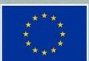
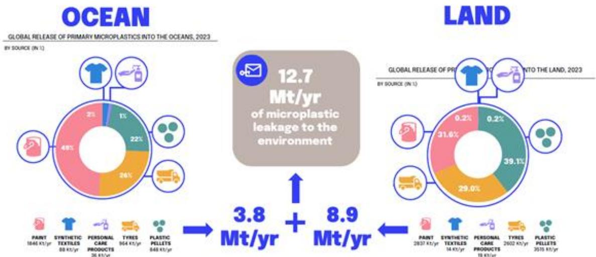
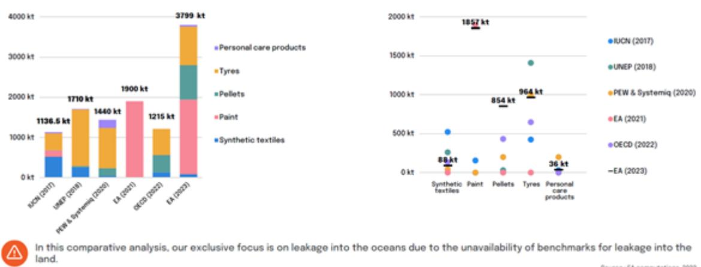
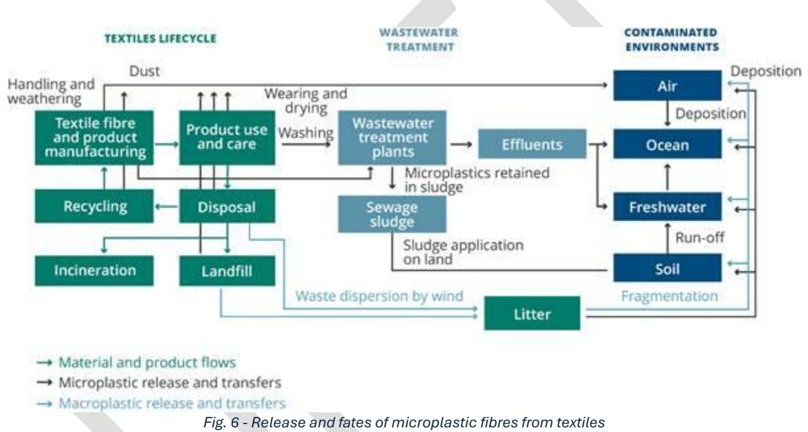

# Advancing sustainable textiles in the circular economy through innovative EPR schemes

Co-funded by  
the European Union

## Project funded by

Schweizerische Eidgenossenschaft  
Confédération suisse  
Confederazione Svizzera  
Confederaziun svizra

Swiss Confederation

Federal Department of Economic Affairs,  
Education and Research EAER  
**State Secretariat for Education,  
Research and Innovation SERI**

D1.4 – Environmental impacts: This draft deliverable has not yet been validated by the granting authorities.

# **Table of Contents**

| 1. Main objectives of Task 1.4                                 | 6                                                                                             |
|----------------------------------------------------------------|-----------------------------------------------------------------------------------------------|
| 2. Summary                                                     | 7                                                                                             |
| 3. Literature review                                           | 12                                                                                            |
| 3.1.                                                           | LiteratureI review methodology 12                                                             |
| 3.2.                                                           | Selected literature references in the short-lists 13                                          |
| 3.3.                                                           | Analysis of short-listed literature 16                                                        |
| 3.3.1                                                          | Environmental impacts of cotton and polyester textile management strategies: Comparison       |
| of separate collection for reusing and textile waste recycling | 16                                                                                            |
| 3.3.2                                                          | Life cycle assessment and the emergence of product circularity: A review with context to      |
| the textile supply chain in Australia                          | 18                                                                                            |
| 3.3.3                                                          | The hidden cost of textiles production, Cleaner and Responsible Consumption 19                |
| 3.3.4                                                          | The Ecodesign Transformation of Smart Clothing: Towards a Systemic and Coupled Social–        |
| Ecological–Technological System Perspective                    | 21                                                                                            |
| 3.3.5                                                          | Towards circular textiles: Life cycle assessment of homewear produced from regenerative       |
| cotton and post-industrial waste versus conventional cotton    | 22                                                                                            |
| 3.3.6                                                          | Tracing the carbon footprint of cotton garments from seed to garment: Evidence from an        |
| empirical study of multiple sites in China                     | 23                                                                                            |
| 3.3.7                                                          | Product Environmental Footprint Category Rules (PEFCR) – Apparel and footwear 24              |
| 3.3.8                                                          | Exploring the Environmental Impact of Textile Recycling in Europe: A Consequential Life       |
| Cycle Assessment                                               | 28                                                                                            |
| 3.3.9                                                          | Life cycle assessment applications to reuse, recycling and circular practices for textiles: A |
| review                                                         | 29                                                                                            |
| 3.3.10                                                         | Reducing the carbon footprint of the textile sector: an overview of impacts and solutions     |
| 3.3.11.                                                        | The Circularity Gap Report – Textile, Circle Economy 31                                       |
| 3.3.12                                                         | Evaluation of environmental impacts of cotton polo shirt production in Bangladesh using       |
| life cycle assessment                                          | 32                                                                                            |
| 3.3.13                                                         | Sustainable circular practices in the textile product life cycle: A comprehensive             |
| approach to environmental impact mitigation                    | 35                                                                                            |
| 3.3.14                                                         | LCA-based assessment of the management of European used textiles 37                           |
| 3.3.15                                                         | Sustainability and Circularity in the Textile Value Chain – A Global Roadmap 38               |
| 3.3.16                                                         | A systematic review of the life cycle environmental performance of cotton textile             |
| products                                                       | 39                                                                                            |
| 3.3.17                                                         | Environmental impacts of textiles in the use stage: A systematic review 40                    |
| 3.3.18                                                         | Environmental sustainability assessment of a polyester T-shirt – Comparison of                |
| circularity strategies                                         | 41                                                                                            |
| 3.3.19                                                         | Environmental footprints of disposable and reusable personal protective equipment ‒ a         |
| product life cycle approach for body coveralls                 | 43                                                                                            |
| 3.3.20                                                         | Leakage of microplastics into oceans and land: EA’s global assessment & benchmark of          |
| literature                                                     | 45                                                                                            |
| 3.3.21                                                         | Environmental assessment of fabric wet processing from gate-to-gate perspective:              |
| Comparative study of weaving and materials                     | 47                                                                                            |
| 3.3.22                                                         | Modeling the environmental and social impacts of the handloom industry in Bangladesh          |
| through life cycle assessment                                  | 49                                                                                            |
| 3.3.23                                                         | Climate Change and the Textile Industry: The Carbon Footprint of Dyes 50                      |

| 3.3.24 Design 51                        |                                                                                             |
|-----------------------------------------|---------------------------------------------------------------------------------------------|
| 3.3.25                                  | Progress on Life Cycle Assessment in Textiles and Clothing 52                               |
| 3.3.26                                  | Using LCA and Circularity Indicators to Measure the Sustainability of Textiles—Examples     |
| of Renewable and Non-Renewable Fibres   | 54                                                                                          |
| 3.3.27                                  | A review on microplastic emission from textile materials and its reduction techniques 56    |
| 3.3.28                                  | Reducing the Environmental Impact of Clothing: An Exploration of the Potential of           |
| Alternative Business Models             | 57                                                                                          |
| 3.3.29                                  | Microplastics from textiles: towards a circular economy for textiles in Europe – briefing58 |
| 3.3.30                                  | Analysis of the polyester clothing value chain to identify key intervention points for      |
| sustainability                          | 61                                                                                          |
| 3.3.31                                  | An inventory framework for inclusion of textile chemicals in life cycle assessment 64       |
| 3.3.32                                  | Assessing Environmental Impact of Textile Supply Chain Using Life Cycle Assessment          |
| Methodology                             | 66                                                                                          |
| 3.3.33 Microplasticvezels uit kleding - | Achtergrondrapport mogelijke maatregelen (Microplastic                                      |
| fibres from clothing -                  | Background report on possible measures) 68                                                  |
| 4. Conclusions and outlook              | 73                                                                                          |

**Project full title**: Advancing Sustainable Textiles in the Circular Economy Through Innovative EPR Schemes

**Acronym**: TRUSTex

**Call**: HORIZON-CL6-2024-CircBio-01-2

**Topic**: Circular solutions for textile value chains based on extended producer responsibility (Innovation Action)

**Start date**: 1st January 2025

**Duration**: 36 months

**List of participants:** Sébastien Zinck, Marie-Sophie Roderich (LIST), Álvaro Fernández Braña, Carlos Bernardez (CETIM), Philippe Colignon (Centexbel).

**Deliverable:** D1.4

**Due date submission:** 28/02/2026

**Submission date**: 27/02/2026

| Document Number:    | D1.4                                                            |
|---------------------|-----------------------------------------------------------------|
| Document Title:     | Environmental impacts                                           |
| Dissemination level | PU – Public, fully open                                         |
| Period:             | PR1                                                             |
| WP:                 | WP1                                                             |
| Task:               | T1.4                                                            |
|                     | Sébastien Zinck, Marie-Sophie Roderich (LIST), Álvaro Fernández |

| Version | Date       | Description                      |
|---------|------------|----------------------------------|
| V1      | 27/01/2026 | Reviewed by T1.4 Partners        |
| V2      | 10/02/2026 | Reviewed by the TRUSTex Partners |
| V3      | 26/02/2026 | Modified by T1.4 Partners        |
| V4      | 27/02/2026 | Submitted by TRUSTex PC          |

# 1.Main objectives of Task 1.4

The main objectives of Task T1.4 were:

#### • **Objective 1):**

To get a comprehensive **understanding of the main environmental hotspots** (regarding both life cycle stages and impact categories, like GHG emissions, as well as microplastics release and the use of substances of concern) from LCA-related studies and reports focused on the textile sector, plus to identify the **main LCA methodologies** which are generally applied.

#### • **Objective 2):**

To identify **LCA indicators**, **datasets** and **characterisation factors** considered for textile products when assessing the impacts related microplastics releases and substances of concern.

This review provides some information about LCA methodological choices applied on textile (inputs for Task 2.3) as well as eco-design insights for textile products and processes (inputs for Task 3.1).

## 2. Summary

This summary presents the main learnings from this literature analysis which was focused on the following aspects: environmental hotspots (in terms of life cycle stages as well as of environmental impact categories), Life Cycle Assessment (LCA) methodological choices, impacts related to the release of microplastics and substances of concern, and eco-design insights in the textile sector.

**N.B.: The sub-sections related to 'LCA methodological choices' and to 'eco-design insights' respectively provide the inputs expected by the Tasks T2.3 and T3.1. Those inputs are completed by the analyses of each short-listed document (section 3.3.1 to 3.3.33)**

### Regarding environmental hotspots:

- - The textile industry is the second largest consumer of water globally and contributes to 20% of industrial water pollution. Cotton production causes significant water stress in key producing nations like China, India, and Pakistan. A single cotton t-shirt can consume more than 2,700 L of water.
- - This industry remains largely dependent on virgin material, as over 99% of the 3.25 billion tonnes of materials consumed annually are coming from virgin sources. The textile industry remains only 0.3% circular.
- - The number of actors involved in the textile value chain can exceed 50. Across this industry, there is a wide variety of materials, such as 15,000 chemicals, 10,000 dyes, and 5,000 auxiliary chemicals. Not including certain substances may underestimate the impacts and miss potential hotspots.
- - Polyester production is an energy-intensive process (125 MJ/kg of fibre), generating around 27.2 kg of CO2-eq./kg of fabric.
- - Cotton production requires significant amounts of agricultural land, water, fertilizers, and pesticides, while polyester production demands substantial fossil resources and energy.
- - During the production stage, dyeing, textile formation (knitting and weaving) and pre-treatment processes (scouring, preparation) are key environmental hotspots.
- - Materials production (fabric manufacturing, trims, wet processing) accounts for 55% of the textile industry's total GHG emissions.
- - The use stage is an important contributor to GHG emissions: reusing 1 kg of clothing could save up to 25 kg of CO2-eq. emissions.
- - Washing, drying, and ironing consume substantial quantities of electricity, water, and chemicals, with care operations sometimes exceeding the impacts of the production stage.
- - The environmental impacts of transport in reuse scenarios remain negligible compared to the avoided impacts of production from virgin materials (even in long-distance export cases).
- - The growth of "fast fashion" leads to a quick global increase in textile waste. Studies show that 87% of clothes produced globally each year are landfilled or burned.

- Textile recycling involves converting discarded garments into fibres, polymers or oligomers for use in manufacturing new products. However, this process is currently limited by infrastructure, material quality and costs. Consequently, most textiles are downcycled rather than reused as clothing.
- When textiles aren't separately collected and are incinerated with municipal waste, they rank as the second most climate-damaging waste fraction after plastics. Incineration of synthetic textiles produces emissions exceeding 2 kg CO₂ eq/kg waste. Energy recovery through incineration offers only marginal benefits (1% to 3% reduction).
- Elastane content in garments is identified as a major barrier to recycling.
- The use of metal catalysts in chemical recycling (glycolysis) is a potential source of pollution.

# **Regarding LCA methodological choices:**

# - Main impact categories and characterization models (LCIA methods):

According to the Product Environmental Footprint Category Rules (PEFCR) published in 2025, Table 1 presents the most relevant environmental impact categories to consider for apparel and footwear products:

*Table 1 – Main environmental impact categories and units, and characterization models advised by the PEFCR for apparel and footwear products*

| Impact category         | Unit                | Characterization model                    |
|-------------------------|---------------------|-------------------------------------------|
| Sub-categories          | to be               |                                           |
| reported separately     | when                |                                           |
| ‘ Fossil ’, ‘ Biogenic  | ’ and ‘ Land        |                                           |
| use and land use change | ’                   |                                           |
|                         | kg CO₂              | -eq Bern model - Global Warming Potential |
| Particulate matter      | Disease incidence   | PM model (Fantke et al., 2016 in UNEP     |
| Ecotoxicity, freshwater | CTUe (Comparative   |                                           |
| Land use                | Dimensionless (pt - |                                           |
| Water use               | m³ deprivation      | Available WAter REmaining (AWARE)         |
|                         | kg Sb-eq.           | van Oers et al., 2002 as in CML 2002      |
| Resource use, fossils   | MJ (Megajoules)     | van Oers et al., 2002 as in CML 2002      |
|                         |                     | method, v.4.8 (Abiotic resource           |
|                         |                     | depletion - fossil fuels)                 |

Besides of this current EU methodological framework for certain textile product categories, another consensual report ('Sustainability and Circularity in the Textile Value

Chain – A Global Roadmap’ (2023), UNEP) mentions biodiversity loss and microplastic pollution (specifically, microfiber losses to oceans) as impact categories to consider when assessing the environmental impacts of textiles.

Besides, various LCA studies also consider other impact categories for textile: acidification (textiles account for over 3% of global acidification), eutrophication, ozone layer depletion, human toxicity (cancer and non-cancer) and ionizing radiation.

In terms of characterization models, the ReCiPe method is often cited. But others are applied as well (notably in the PEFCR): CML-baseline (2001, 2002), EF 2.0 and 3.0, EDIP, ILCD, IPCC Assessment Reports, PAS 2050/2395, and USEtox.

- - Main datasets:

Ecoinvent is the most mentioned database. However, Sphera/ex-Gabi MLC (Managed LCA Content), ELCD, Global Industry Data (2021), as well as non-EU datasets (e.g. China Life Cycle database (CLCD) for China), The Global LCA Data Access, and industrial-scale process data are also mentioned.

- - Key methodological challenges mentioned:

Regarding the impacts on water, there are gaps in Life Cycle Inventory (LCI) data. More indepth characterization of textile effluents is needed to enable improved precision in impact assessments.

Biodiversity indicators are notably absent across textile sector frameworks, despite their importance for natural regeneration. While some LCIA methods like IMPACT World+ consider biodiversity, there is generally a lack of standardized indicators to comprehensively assess effects on biodiversity, deforestation, ecosystem pressure, and taxonomic services.

Toxicity aspects are measured with the LCIA method USEtox, which includes human toxicity (cancer and non-cancer effects) and freshwater ecotoxicity, but marine water or terrestrial ecotoxicity are not included for the moment. Moreover, while toxicity is assessed within the PEF framework, it does not comprehensively cover all aspects of chemical safety that are addressed by dedicated European chemical regulations and assessment methodologies.

The PEFCR framework includes an assessment of microfibre/fibre fragment release during washing, which is recognized as an emerging environmental concern. However, this current assessment is limited, and it is recommended to update the approach to cover the entire life cycle and include impacts on all environmental compartments (marine, freshwater, air, and land).

### **Regarding microplastics release:**

General information: Microplastics are plastic particles smaller than 5 mm. There are two categories: primary microplastics, i.e. plastic particles intentionally added to products or released directly through production processes and product use; and secondary microplastics, which originate from the fragmentation of larger plastic waste, mainly from mismanaged sources such as litter, fishing gear, packaging, and landfill losses.

According to the European Environment Agency, about 8% of European microplastics (16-35% globally) released to oceans are from synthetic textiles (which represented

nearly 65% of global textile production by 2020). It represents around 13,000 tons of textile microfibres that are released annually to surface waters. Clothing is responsible for approximately 35% of primary microplastic emissions worldwide.

**About sources of microplastics:** The majority of microplastics from textiles are released the first few times textiles are washed. Fast fashion accounts for particularly high levels of such releases because fast fashion garments account for a high share of first washes, as they are used for only a short time and tend to wear out quickly due to their low quality. Fibre release depends on textile type, yarn structure, fabric density, surface treatment (e.g. fleece), and washing conditions. New garments often shed the most fibres.

Research indicates that there is no general difference in the volume of microfiber loss between fabrics made from virgin polyester and those made from recycled polyester. Furthermore, the application of dyes and other finishes to natural fibres such as cotton affects their biodegradability and results in chemicals and dyestuff being shed into the environment.

### **Regarding substances of concern release:**

- - Up to 3,500 hazardous substances are used in production, including heavy metals, formaldehyde, phthalates, antimony (catalyst residues), bisphenol A (BPA), aromatic amines from dyes, nonylphenol ethoxylates (NPEOs), antimicrobial agents, and PFCs, causing cancer, endocrine disruption, and skin irritation risks.
- - Textile washing releases residual manufacturing chemicals and micro/nanoparticles into water bodies and enables human exposure via dermal contact, inhalation, or ingestion.
- - Studies using USEtox show heavy metals (cadmium, chromium VI, mercury, copper, zinc) pose the highest potential health and ecological hazards in textile wastewater.
- - Microplastic pollution raises growing environmental and health concerns, although significant uncertainties remain regarding its long-term impacts. Microplastics are ingested or inhaled by a wide range of organisms, including humans, and have been detected in many foods, beverages, water, and air, making chronic exposure unavoidable in modern life. Potential risks include physical harm, inflammatory and toxic effects, and the release of hazardous chemicals and pathogens carried by microplastics. While the full ecological and socio-economic consequences are not yet well understood, microplastics are known to be released throughout product life cycles, including textiles, and to spread across water, air, and soil environments.

During the use phase (washing), polyester garments release microfibers that are estimated to be between 100 and 240 times more harmful to the environment than cotton microfibers due to their persistence and potential to leach harmful chemicals.

## Regarding eco-design insights:

*(N.B.: The application of LCA remains recommended to identify potential trade-offs between the eco-design principles listed below)*

- - Prefer cotton coming from sustainable agricultural practices (if possible, from local suppliers). For instance, the use of organic or bio-based fertilisers is a potential strategy for preserving soil microbial balance.  
  In case of cotton coming from standard agriculture, suppliers with practices such as the optimisation of the use of fertilisers, pesticides and water, and the use of pesticides with lower toxicity should be preferred.
- - Choose recycled, recyclable, biodegradable and/or safe materials, e.g. recycled polyester fibre (enabling GHG emissions reduction up to 72% compared to virgin), cellulose or polylactic acid / PLA (with high biodegradability and biocompatibility potential)
- - Reduce the use of polyester fabrics and promote the use of organic natural fibres (e.g. wool, cotton).
- - Regarding specifically microplastics release:
  - o Use yarns that shed fewer fibres (longer fibres, filament instead of staple fibres, highly twisted yarns), e.g. replace fleece by wool alternatives (but proceed to a thorough evaluation to avoid environmental drawbacks).
  - o Reduce surface brushing/raising, which creates a fuzzy surface.
  - o Apply ultrasonic cutting to decrease fibre loss.
  - o Remove loose fibres post-production via pre-washing or in-line vacuum systems, ensuring proper disposal of fibres from wash water.
- - Prefer technologies that reduce resource use such as laser cutting, 3D knitting, and digital textile printing.
- - For dyeing processes:
  - o Switch to natural colorants (e.g. combined with plasma treatment)
  - o Adopt ecofriendly techniques such as supercritical carbon dioxide dyeing and the photocatalytic technology
  - o Develop modified polyester fibres with higher dyeing rate to reduce the resource consumption
  - o Reuse process water
  - o Increase energy efficiency
- - Use enzymes instead of harmful chemicals in de-sizing and scouring.
- - Eliminate outdated production equipment to improve energy efficiency.
- - Design for longevity, e.g.: produce cotton textile with high-quality and durable cotton products, as it would extend their lifespan and reduce the frequency of replacements.
- - Design for recyclability: prefer fibres with higher recyclability potential, monomaterial designs with reduced elastane enable.
- - Reduce maintenance needs by washing the garment less frequently (e.g., every second use) and avoiding tumble drying is the single most effective strategy, reducing environmental impacts by 37%.

# 3. Literature review

# 3.1. Literature review methodology

A systematic literature review was performed via a PRISMA Statement-inspired approach1 [.](#page-11-2) A final short-list of **33 publications** was identified following three steps:

- **Step 1 – Identification**: scoping of the literature search and initial material collection
- **Step 2 – Screening**: based on quantitative exclusion criteria and principles
- **Step 3 – Eligibility**: additional screening of the literature based on qualitative principles and a revision of the abstract in the case of articles

For **Step 1**, scientific literature references were collected via Scopus® and Google Scholar using three different search strategies:

- **Search strategy 1** (see fig. 1) to address Objective 1) related to environmental hotpots of textiles.
- **Search strategy 2** (see fig. 2) to address the'microplastics'sub-focus of Objective
  - 2)
- **Search strategy 3** (see fig. 3) to address the 'substances of concern' sub-focus of Objective 2)

For each search strategy, 'fabric' (as a synonym of textile) as well as Trustex's targeted product categories (i.e. clothing, garment, footwear, workwear, apparel, household textile) were also included.

|                                                                                                                        |  |  |
|-------------------------------------------------------------------------------------------------------------------------------------|--|---------------|
| 
textile OR clothing OR garment OR fabric OR footwear OR workwear OR apparel OR household textile
                         |  |               |
| AND                                                                                                                                 |  |               |
| 
LCA OR life cycle assessment OR life cycle analysis OR carbon footprint OR environmental footprint
                       |  |               |
| AND                                                                                                                                 |  |               |
| 
environmental impact OR impact categories OR greenhouse gas emission OR CO2 OR indicator OR methodology OR methodologies
 |  |               |

*Fig. 1 – Search strategy 1*

| textile OR clothing OR garment OR fabric OR footwear OR workwear OR apparel OR household textile |
|--------------------------------------------------------------------------------------------------|
| AND                                                                                              |
| LCA OR life cycle assessment OR life cycle analysis OR environmental footprint                   |
| AND                                                                                              |
| microplastic OR micro-plastic OR microfibre OR micro-fibre OR micro-fiber OR microfiber          |
| AND                                                                                              |
| characterisation factor OR dataset OR LCA data OR methodology OR methodologies                   |

1 Page, M.J.; McKenzie, J.E.; Bossuyt, P.M.; Boutron, I.; Hoffmann, T.C.; Mulrow, C.D.; Shamseer, L.; Tetzlaff, J.M.; Akl, E.A.; Brennan, S.E.; et al. The PRISMA 2020 statement: An updated guideline for reporting systematic reviews. *BMJ* **2021**, *372*, n71.

| textile OR clothing OR garment OR fabric OR footwear OR workwear OR apparel OR household textile                                                  |
|---------------------------------------------------------------------------------------------------------------------------------------------------|
| AND                                                                                                                                               |
| LCA OR life cycle assessment OR life cycle analysis OR environmental footprint                                                                    |
| AND                                                                                                                                               |
| substances of concern OR substance of concern OR hazardous substances OR hazardous substances OR toxicity OR human health OR chemicals of concern |
| AND                                                                                                                                               |
| characterisation factor OR dataset OR LCA data OR methodology OR methodologies                                                                    |

Concerning the grey literature, some core keywords such as 'textile', 'fabric', 'LCA', 'life cycle assessment' were first used in the Google search engine and then complemented by the terms 'microplastic' or 'substances of concern'. Several free-of-access-reports (e.g. policy and sectoral) were downloaded and checked.

Trustex partners were also invited to propose complementary literature references.

Concerning **Step 2**, a first screening was done on the identified scientific literature references by only considering the scientific articles and reviews. Regarding the grey literature, only policy and sectoral reports coming from recognised organisations (e.g. UNEP) were kept. Moreover, in both cases, only literature references published between 2018 and 2026 were considered.

Lastly, for **Step 3**, the literature references selected so far were then filtered further by first checking their abstracts and then their core contents: **33** documents which included the searched information (see §1. Main objectives of T1.4) were finally kept in the shortlist.

# 3.2. Selected literature references in the short-lists

Caption for Table 1:

REP = Report; PUB = Publication; WEB = Webpage; G = General LCA-related information mentioned; M = Microplastics issues mentioned; S = Substances of concerned issues mentioned

*Table 2 – List of identified documents for T1.4 review*

| §     | Type | G | M | T | Title                                                                         |
|-------|------|---|---|---|-------------------------------------------------------------------------------|
| 3.3.1 | PUB  | X | X | X | Fois, F., Terenzi, V., Tratzi, P., Serrecchia, S., Bianconi, D., Petracchini, |
|       |      |   |   |   | F., Paolini, V. ( 2026 ). Environmental impacts of cotton and polyester       |
|       |      |   |   |   | reusing and textile waste recycling. Environmental Impact Assessment          |
|       |      |   |   |   | Review , 116, 108088. https://doi.org/10.1016/j.eiar.2025.108088              |
| 3.3.2 | PUB  | X | X | X | Islam, N., Hall, M.R., MacMillan, C., & Gordon, S. ( 2026 ). Life cycle       |
|       |      |   |   |   | context to the textile supply chain in Australia. Environmental Impact        |
|       |      |   |   |   | Assessment Review , 117, 108198.                                              |
| 3.3.3 | PUB  | X |   | X | Cabrera-Jiménez, R., Gallardo-Llamas, A., & Guillén-Gosálbez, G.              |
|       |      |   |   |   | ( 2025 ). The hidden cost of textiles production. Cleaner and                 |

| Responsible Consumption                                                          | , 19, 100325.                                                 |
|----------------------------------------------------------------------------------|---------------------------------------------------------------|
| 3.3.4 PUB X X Zhu, S., & Liu, X. (                                               | 2025 ). The Ecodesign Transformation of Smart                 |
| Clothing: Towards a Systemic and Coupled Social                                  | – Ecological –                                                |
| Technological System Perspective.                                                | Sustainability , 17(5), 2102.                                 |
| 3.3.5 PUB X X Mata, T.M., Ruge, I.,                                              | Dias, H., Batista, I., Pinto, T., Figueiredo, R.,             |
| Figueiredo, A., & Martins, A.A. (                                                | 2025 ). Towards circular textiles: Life                       |
| and post-industrial waste versus conventional cotton.                            | Journal of                                                    |
| Cleaner Production                                                               | , 528, 146738.                                                |
| 3.3.6 PUB X Wang, S., Chong, C.,                                                 | Huang, W., Guo, S., Wang, Y., Zhang, Y., Pan, Z.,             |
| Wang, J., Li, X.,                                                                | Zhao, W., Zhang, Z., & Wang, Z. ( 2025 ). Tracing the         |
| from an empirical study of multiple sites in China.                              | Resources,                                                    |
| Conservation and Recycling                                                       | , 217, 108200.                                                |
| 3.3.7 REP X X X European Commission. (                                           | 2025 ). Product Environmental Footprint                       |
| Category Rules (PEFCR)                                                           | – Apparel and footwear , Version 3.1. (Valid to:              |
| 3.3.8 PUB X Sandin, G., Lidfeldt, M., &                                          | Nellström, M. ( 2025 ). Exploring the                         |
| environmental impact                                                             | of textile recycling in Europe: A consequential               |
| life cycle assessment.                                                           | Sustainability , 17, 1931.                                    |
| 3.3.9 PUB X X Abagnato, S.,                                                      | Rigamonti, L., & Grosso, M. ( 2024 ). Life cycle              |
| textiles: A review.                                                              | Waste Management , 182, 74 – 90.                              |
| 3.3.10 PUB X X X Leal Filho, W.,                                                 | Dinis, M. A. P., Liakh, O., Paço, A., Dennis, K., Shollo, F., |
| & Sidsaph, H. (                                                                  | 2024 ). Reducing the carbon footprint of the textile          |
| sector: an overview of impacts and solutions.                                    | Textile Research Journal ,                                    |
| 3.3.11 REP X X X Circle Economy (                                                | 2024 ). The Circularity Gap Report Textiles 2024 , link       |
| 3.3.12 PUB X X Islam, S.; Mehedi Hasan, A.K.M.;                                  | Rahman Bhuiyan, M. A. & Bhat, G.                              |
| ( 2024 ). Evaluation of environmental impacts of cotton polo shirt               |                                                               |
| production in Bangladesh using life cycle assessment.                            | Science of the                                                |
| Total Environment                                                                | 926, 172097.                                                  |
| 3.3.13 PUB X X X Edirisinghe, L.G.L.M.,                                          | de Alwis, A.A.P., & Wijayasundara, M. ( 2024 ).               |
| Environmental Challenges                                                         | , 16, 100985.                                                 |
| 3.3.14 REP X X LCA-based assessment of the management of European used textiles, |                                                               |
| EuRIC textiles, NORION Consult,                                                  | 2023 , link                                                   |
| 3.3.15 REP X X United Nations Environment Programme (                            | 2023 ). Sustainability and                                    |
| Circularity in the Textile Value Chain                                           | – A Global Roadmap                                            |

| 3.3.16 | PUB | X |   | X | Chen, S., Zhu, L., Sun, L., Huang, Q., Zhang, Y., Li, X., Ye, X., Li, Y., & Wang, L. (2023). A systematic review of the life cycle environmental performance of cotton textile products. <i>The Science Of The Total Environment</i> , 883, 163659. <a href="https://doi.org/10.1016/j.scitotenv.2023.163659">https://doi.org/10.1016/j.scitotenv.2023.163659</a>                           |
|--------|-----|---|---|---|------------------------------------------------------------------------------------------------------------------------------------------------------------------------------------------------------------------------------------------------------------------------------------------------------------------------------------------------------------------------------------------------|
| 3.3.17 | PUB | X |   | X | Luo, Y., Wu, X., & Ding, X. (2023). Environmental impacts of textiles in the use stage: A systematic review. <i>Sustainable Production and Consumption</i> , 36, 233–245. <a href="https://doi.org/10.1016/j.spc.2023.01.006">https://doi.org/10.1016/j.spc.2023.01.006</a>                                                                                                                 |
| 3.3.18 | PUB | X | X | X | Horn, S., Mölsä, K. M., Sorvari, J., Tuovila, H., & Heikkilä, P. (2023). Environmental sustainability assessment of a polyester T-shirt – Comparison of circularity strategies. <i>Science of the Total Environment</i> , 884, 163821. <a href="https://doi.org/10.1016/j.scitotenv.2023.163821">https://doi.org/10.1016/j.scitotenv.2023.163821</a>                                        |
| 3.3.19 | PUB | X | X | X | Snigdha, M., Hiloidhari, M., & Bandyopadhyay, S. (2023). Environmental footprints of disposable and reusable personal protective equipment – A product life cycle approach for body coveralls. <i>Journal of Cleaner Production</i> , 394, 136166. <a href="https://doi.org/10.1016/j.jclepro.2023.136166">https://doi.org/10.1016/j.jclepro.2023.136166</a>                                |
| 3.3.20 | REP |   | X |   | EA - Environmental Action. (2023). Leakage of microplastics into oceans and land - EA's global assessment & benchmark of literature – 2023 update (Version 1.2). <a href="https://www.e-a.earth/wp-content/uploads/2024/03/EA_2023_Update_Primary_Microplastics_20_24_03_11-1.pdf">https://www.e-a.earth/wp-content/uploads/2024/03/EA_2023_Update_Primary_Microplastics_20_24_03_11-1.pdf</a> |
| 3.3.21 | PUB | X |   |   | Zhang, S., Xu, C., Xie, R., Yu, H., Sun, M., & Li, F. (2023). Environmental assessment of fabric wet processing from gate-to-gate perspective: Comparative study of weaving and materials. <i>Science of the Total Environment</i> , 857, 159495. <a href="https://doi.org/10.1016/j.scitotenv.2022.159495">https://doi.org/10.1016/j.scitotenv.2022.159495</a>                             |
| 3.3.22 | PUB | X |   |   | Mahiat, T., Alam, M.A., Argho, M., et al. (2023). Modeling the environmental and social impacts of the handloom industry in Bangladesh through life cycle assessment. <i>Model. Earth Syst. Environ.</i> , 9, 239–252. <a href="https://doi.org/10.1007/s40808-022-01491-7">https://doi.org/10.1007/s40808-022-01491-7</a>                                                                     |
| 3.3.23 | PUB | X |   |   | Li, X., Zhu, L., Ding, X., Wu, X., & Wang, L. (2023). Climate change and the textile industry: The carbon footprint of dyes. <i>AATCC Journal of Research</i> , 11(2), 109-123. <a href="https://doi.org/10.1177/24723444231212954">https://doi.org/10.1177/24723444231212954</a>                                                                                                           |
| 3.3.24 | PUB | X |   | X | Fonseca, A., Ramalho, E., Gouveia, A., Henriques, R., Figueiredo, F., & Nunes, J. (2023). Systematic insights into a textile industry: Reviewing life cycle assessment and eco-design. <i>Sustainability</i> , 15, 15267. <a href="https://doi.org/10.3390/su152115267">https://doi.org/10.3390/su152115267</a>                                                                             |
| 3.3.25 | PUB | X | X | X | Muthu, S.S. (Ed.). (2023). Progress on Life Cycle Assessment in Textiles and Clothing. Springer. <a href="https://link.springer.com/book/10.1007/978-981-19-9634-4">https://link.springer.com/book/10.1007/978-981-19-9634-4</a>                                                                                                                                                               |
| 3.3.26 | PUB | X |   |   | Wiedemann, S.G., Nguyen, Q.V., & Clarke, S.J. (2022). Using LCA and circularity indicators to measure the sustainability of textiles - Examples of renewable and non-renewable fibres. <i>Sustainability</i> , 14, 16683. <a href="https://doi.org/10.3390/su142416683">https://doi.org/10.3390/su142416683</a>                                                                             |

| 3.3.27 3.3.28 3.3.29 3.3.30 3.3.31 3.3.32 | PUB WEB PUB PUB PUB | X X X X X X X | Periyasamy, A.P., & Tehrani-Bagha, A. ( 2022 ). A Polymer , 199, 109901. Gray, S., Druckman, A., Sadhukhan, J., & James, K. ( 2022 ). Reducing of the potential of Sustainability , 14, 6292. X 2022 X & Seide, G. ( 2021 ). Analysis of the sustainability. Environ Sci Eur , 33, 2. 020-00447-x X 2019 Int J Life Cycle Assess , 24, 838 – 847 6 X 2018 ). Assessing environmental impact of textile supply chain using life cycle , 109(12), |
|-------------------------------------------|---------------------|---------------|-------------------------------------------------------------------------------------------------------------------------------------------------------------------------------------------------------------------------------------------------------------------------------------------------------------------------------------------------------------------------------------------------------------------------------------------------|
|                                           |                     |               | 1574 – 1585.                                                                                                                                                                                                                                                                                                                                                                                                                                    |
| 3.3.33                                    | REP                 | X             | RIVM - Rijksinstituut voor Volksgezondheid en Milieu (Royal Institute                                                                                                                                                                                                                                                                                                                                                                           |
|                                           |                     |               | for Public Health and the Environment), 2019 , Microplasticvezels uit                                                                                                                                                                                                                                                                                                                                                                           |
|                                           |                     |               | kleding - Achtergrondrapport mogelijke maatregelen (Microplastic                                                                                                                                                                                                                                                                                                                                                                                |
|                                           |                     |               | fibres from clothing - Background report on possible measures),                                                                                                                                                                                                                                                                                                                                                                                 |

# 3.3. Analysis of short-listed literature

# 3.3.1 Environmental impacts of cotton and polyester textile management strategies: Comparison of separate collection for reusing and textile waste recycling

Type of document: Scientific publication

Textile product categories addressed by the publication: Cotton, polyester

Reference: *Fois, F., Terenzi, V., Tratzi, P., Serrecchia, S., Bianconi, D., Petracchini, F., Paolini, V. (2026). Environmental impacts of cotton and polyester textile management strategies: Comparison of separate collection for reusing and textile waste recycling. Environmental Impact Assessment Review, 116, 108088.*

*<https://doi.org/10.1016/j.eiar.2025.108088>*

## **Environmental hotspots:**

#### • Climate change:

The production phase – and particularly the demand for virgin raw materials and agricultural land (for cotton) or primary polymers (for polyester) – significantly contributes to CO₂ emissions.

#### • Resource consumption:

Cotton production requires significant agricultural land, water, fertilizers, and pesticides, while polyester production demands substantial fossil resources and energy.

The rapid production of cheap, low-quality garments intended for limited use fuels a continuous cycle of consumption and disposal. Per-capita textile production increased from 6 to 13 kg per year between 1975 and 2018, with a projected global total of 102 million tonnes in 2030.

# • Water use and pollution:

The textile industry is the second largest consumer of water globally and contributes to 20% of industrial water pollution due to dyeing and fabric treatment processes.

### • Waste:

The industry generates approximately 92 million tons of textile waste annually, a figure projected to grow with population increases and the spread of fast fashion. Much of this waste ends up in landfills, is incinerated, or exported to countries without adequate waste management infrastructure.

# **LCA methodological choices:**

- LCIA method: ReCiPe 2016
- Main LCA indicators:
  - climate change in kg CO₂-eq.
  - fossil depletion (kg Oil-eq.)
  - water depletion (10⁻² m³)
- Datasets: ecoinvent v3.7

# **About microplastics release:**

The textile sector is responsible for 35% of primary oceanic microplastics.

The characterization factors used for microplastics release are expressed in potentially disappeared fraction (PDF) of species per square meter per year per kilogram emitted (PDF⋅m2⋅yr/kg).

# **About substances of concern:**

During the use phase (washing), polyester garments release microfibers that are estimated to be between 100 and 240 times more harmful to the environment than cotton microfibers due to their persistence and potential to leach harmful chemicals.

LCA indicator: Freshwater ecotoxicity [kg 1,4-DCBeq][2](#page-16-0)

2 DCB: 1,4-dichlorobenzene

#### **Eco-design insights:**

The study highlights that closed-loop systems, increased separate collection rates, and promotion of reuse are the most effective strategies to reduce environmental impacts across these hotspots: those reflections should be refined/specified and then considered in design for reuse and recycling of new textiles products.

# 3.3.2 Life cycle assessment and the emergence of product circularity: A review with context to the textile supply chain in Australia

# Type of document: Scientific publication

Textile product categories addressed by the publication: All

Reference: *Islam, N., Hall, M.R., MacMillan, C., & Gordon, S. (2026). Life cycle assessment and the emergence of product circularity: A review with context to the textile supply chain in Australia. Environmental Impact Assessment Review, 117, 108198. <https://doi.org/10.1016/j.eiar.2025.108198>*

#### **Environmental hotspots:**

- Water use and pollution:

The textile industry faces significant challenges related to water consumption and textile effluent management.

- Resource consumption:

Cotton cultivation: Higher water and pesticide usage during cultivation, which can impact ecosystems and exacerbate water scarcity.

Synthetic fibres: Polyester fibres derived from petrochemicals require less water than cotton but have higher energy demands.

#### • Waste:

Globally, more than 100 billion pieces of clothing are produced annually, of which 33% are discarded within the first year of purchase.

# **LCA methodological choices:**

- Main impact categories:
  - Global warming potential fossil, biogenic, and land use/land change related (kg CO₂ eq.)
  - Primary energy resources renewable and non-renewable (MJ)
  - Abiotic depletion potential fossil fuels, minerals, and metals
  - Acidification potential
  - Eutrophication potential
  - Photochemical oxidant/ozone formation potential
  - Ozone depletion potential
  - Particulate matter
  - Ionizing radiation
  - Land use change
- Remarks regarding the impacts on water: There are gaps in Life Cycle Inventory
  - (LCI) data. More in-depth characterization of textile effluents is needed to enable

improved precision in impact assessments. The lack of standardization in measuring water impacts is problematic: one study may focus on direct water withdrawals of an entire process, while another might measure direct and indirect water consumption of only the pretreatment and dyeing stages.

- Remarks regarding the impacts on biodiversity: Biodiversity indicators are notably absent across textile sector frameworks, despite their importance for natural regeneration. While some LCIA methods like IMPACT World+ consider biodiversity, there is generally a lack of standardized indicators to comprehensively assess effects on biodiversity, deforestation, ecosystem pressure, and taxonomic services.

#### **About microplastics release:**

Manufacturing processes, including dyeing, and consumer wear and washing behaviours determine the release of polyester and other synthetic microfibre contamination into the environment.

### **About substances of concern:**

Emissions and pollution from chemicals, hazardous substances, acidification, eutrophication, and various toxicity impacts (human toxicity and ecotoxicity) are significant concerns.

# 3.3.3 The hidden cost of textiles production, Cleaner and Responsible Consumption

# Type of document: Scientific publication

Textile product categories addressed by the publication: Bio-based fibres (viscose, lyocell, PLA, PHA - Polyhydroxyalkanoates, and PEF - Polyethylene Furanoate), plantbased fibres (hemp and flax), cotton, polyester

Reference: *Cabrera-Jiménez, R., Gallardo-Llamas, A., & Guillén-Gosálbez, G. (2025). The hidden cost of textiles production. Cleaner and Responsible Consumption, 19, 100325. <https://doi.org/10.1016/j.clrc.2025.100325>*

# **Environmental hotspots:**

The production stage has the highest environmental impact compared to other life cycle stages.

Cotton fibres:

- require 2.3% of world's agricultural land and 2.6% of total agricultural water
- account for 16% of global insecticide use and 4% of herbicide consumption
- contribute to water stress

Polyester fibres:

- are non-biodegradable (derived from petroleum)
- have a lower water footprint but imply other environmental concerns

### **LCA methodological choices:**

- • Impact categories:
  - ○ Global Warming Potential (GWP) - kg CO2 eq.
  - ○ Terrestrial Acidification - kg SO2 eq.
  - ○ Freshwater Ecotoxicity - kg 1,4-DCB eq.
  - ○ Freshwater Eutrophication - kg P eq.
  - ○ Marine Eutrophication Potential - kg N eq.
  - ○ Marine Ecotoxicity Potential - kg 1,4-DCB eq.
  - ○ Terrestrial Ecotoxicity Potential - kg 1,4-DCB eq.
  - ○ Human Toxicity Potential (carcinogenic) - kg 1,4-DCB eq.
  - ○ Human Toxicity Potential (non-carcinogenic) - kg 1,4-DCB eq.
  - ○ Agricultural Land Use - m2 a crop eq.
  - ○ Water Use - m3
  - ○ Fossil Fuel Potential - kg oil eq.
  - ○ Surplus Ore Potential - kg Cu eq.
  - ○ Ionizing Radiation Potential - kg Co-60 eq.
  - ○ Ozone Depletion Potential - kg CFC-11 eq.
  - ○ Particulate Matter Formation - kg PM2.5 eq.
  - ○ Photochemical Oxidant Formation Potential (humans) - kg NOx eq.
  - ○ Photochemical Oxidant Formation Potential (ecosystems) - kg NOx eq.

- • Main impact categories relevant for textile:

GWP, water use, land use, and freshwater ecotoxicity

- • LCIA methods:
  - - CML 2001 and CML-baseline: used for various impact categories:
    - ○ Abiotic resource depletion
    - ○ Acidification potential
    - ○ Eutrophication potential
    - ○ Freshwater ecotoxicity potential
    - ○ Human toxicity potential
    - ○ Marine aquatic ecotoxicity
    - ○ ODP (ozone depletion potential)
    - ○ Photochemical ozone formation
    - ○ Terrestrial ecotoxicity
  - - USEtox: used for ecotoxicity potential (ETP)
  - - IPCC 2013 model: used for climate change
  - - EDIP 2003: used for GWP, TA, EP, POF
  - - Eco-costs method: mentioned as an impact assessment approach
  - - AWARE method: mentioned in context of water use assessment
  - - Swiss method of ecological scarcity - used for ecopoints
- • Main datasets:

Ecoinvent (version 3.8) was the main life cycle inventory (LCI) database used in his publication. This was complemented with data from Chapagain et al. (2006) regarding average global blue water consumption for cotton production, regional water usage values and global production volumes, and average fertilizer consumption.

#### **About microplastics release:**

Approximately 0.55 million tons of microfibers from plastic-based textiles are released annually, mostly during washing.

Current impact assessment methods lack standardized characterization factors for microplastics.

# 3.3.4 The Ecodesign Transformation of Smart Clothing: Towards a Systemic and Coupled Social–Ecological–Technological System Perspective

### Type of document: Scientific publication

Addressed textile product categories: Smart clothing

Reference: *Zhu, S., & Liu, X. (2025). The Ecodesign Transformation of Smart Clothing: Towards a Systemic and Coupled Social–Ecological–Technological System Perspective. Sustainability, 17(5), 2102.<https://doi.org/10.3390/su17052102>*

General information about smart clothing: Smart clothing integrates textile materials, wearable sensors, flexible electronics, and data communication systems. Its applications include healthcare and medical monitoring, sports and fitness, industrial safety, and environmental detection. Its global market was valued at USD 3.57 billion in 2023 and is estimated to reach USD 8.96 billion by 2030.

# **Environmental hotspots:**

#### • Production stage:

Manufacturing processes consume significant amounts of energy and chemicals.

The production and end-of-life stages require specialised materials and protocols, including toxic substances, semiconductors and heavy metals (lead, mercury and chromium). Therefore, environmental footprint goes beyond traditional textile related impacts.

### • Use stage:

Product obsolescence and limited reparability are key environmental hotspots.

### • End-of-life stage:

Materials choices and integration of electronic materials done for smart clothing make recycling difficult.

# **About substances of concern:**

The improper disposal at the end-of-life stage increases environmental risks through electronic waste leakage and toxic material contamination of soil and water systems.

# **Eco-design insights:**

Based on the identification of environmental hotspots and with the aim of achieving a circular production model, the study proposes 28 eco-design strategies covering 6 key perspectives. Some of those strategies defined are:

#### • Materials stage:

Choose recyclable, biodegradable and safe materials. For instance, recycled polyester fibre (rPET) is the ideal base material for eco-textiles (potential of reducing energy consumption by 50-58% and greenhouse emissions by 72% compared to virgin equivalent), while its flexibility makes it particularly suitable for embedded electronic components. Cellulose and polylactic acid (PLA) also demonstrate great environmental performance potential due to their biodegradability and biocompatibility.

Prefer local resources.

- Production stage:

Prefer on-demand and low carbon manufacturing.

### • Use stage:

Prefer modular design and easy non-destructive disassembly. Consider durability and attach cultural value to the products: unlike conventional clothing, smart clothing requires greater durability to ensure the reliability and environmental resilience of electronic components. User-centred and emotionally durable design enhances participatory sustainability through customisation and modular assembly. Upgradeability allows to evolve with technological advances, reducing obsolescence and extending product lifecycle.

# 3.3.5 Towards circular textiles: Life cycle assessment of homewear produced from regenerative cotton and post-industrial waste versus conventional cotton

# Type of document: Scientific publication

Addressed textile product categories: Cotton textile

Reference: *Mata, T.M., Ruge, I., Dias, H., Batista, I., Pinto, T., Figueiredo, R., Figueiredo, A., & Martins, A.A. (2025). Towards circular textiles: Life cycle assessment of homewear produced from regenerative cotton and post-industrial waste versus conventional cotton. Journal of Cleaner Production, 528, 146738.*

*[https://doi.org/10.1016/j.jclepro.2025.146738.](https://doi.org/10.1016/j.jclepro.2025.146738)*

# **Environmental hotspots:**

# • Production stage:

Cotton cultivation, spinning, knit finishing, and cutting are identified as the most impactful production steps, collectively accounting for the majority of the product's environmental footprint.

The main sources of impacts during cotton cultivation are:

- Fertilizers (responsible for 94.0% of climate change impacts, 96.0% of freshwater ecotoxicity)
- Insecticides
- Herbicides
- Growth regulators
- Defoliants
- Adjuvants

The main sources of impacts during knit finishing processes are:

- Surfactants
- Softeners (softening agent: 74.5% contribution to climate change, 78.7% to freshwater ecotoxicity)
- Lubricants for reducing friction
- Non-foaming dye lubricants
- Fabric cleaners
- pH stabilizers
- Scouring or stabilizing agents
- Fabric softeners

# **LCA methodological choices:**

- Main impact categories and units:
- Climate change 1000-year horizon (kg CO₂-eq)
- Land use (m²a crop-eq), water consumption (m³)
- Ozone layer depletion (kg CFC-11-eq)
- Freshwater ecotoxicity (kg 1,4-DCB-eq)
- Freshwater eutrophication (kg P-eq)
- Non-renewable Energy Resources (Fossil) ( kg oil-eq)

Remark: These indicators were specifically selected based on their aalignment with known environmental hotspots in textile production, relevance to key sustainability challenges in the textile sector, and consistency with industry-recognized frameworks, particularly the Higg Index indicators.

- Main LCIA method:

ReCiPe 2016 (v1.03) midpoint method with an egalitarian perspective

- Main datasets:

ecoinvent v3.9.1 datasets + peer-reviewed literature

# **About substances of concern:**

The chemicals used in textile processing have the following consequences:

- lead to resource depletion, pollution, and ecosystem degradation
- contribute significantly to freshwater ecotoxicity (86.0% in knit finishing processes)
- release ozone-depleting substances
- impact freshwater eutrophication (65.2% in knit finishing)

# **Eco-design insights**:

The extensive use of chemicals in textile processing presents significant environmental concerns: this highlights the need for targeted actions to mitigate their effects.

# 3.3.6 Tracing the carbon footprint of cotton garments from seed to garment: Evidence from an empirical study of multiple sites in China

### Type of document: Scientific publication

Textile product categories addressed by the publication: Cotton garments

Reference: *Wang, S., Chong, C., Huang, W., Guo, S., Wang, Y., Zhang, Y., Pan, Z., Wang, J., Li, X., Zhao, W., Zhang, Z., & Wang, Z. (2025). Tracing the carbon footprint of cotton garments from seed to garment: Evidence from an empirical study of multiple sites in China. Resources, Conservation and Recycling, 217, 108200. <https://doi.org/10.1016/j.resconrec.2025.108200>*

### **Environmental hotspots:**

- Production stage:

Production is the most emitting life cycle stage (44.70% of total emissions), the primary contributor being the consumption of steam/natural gas.

The average carbon footprint per cotton garment was estimated at 6.96 kg CO2-eq.

The cotton production stage is responsible of 22.54% of the total CO2-eq. emissions. The primary factors are:

- Electricity consumption (49.18% coming from the cultivation step)
- Nitrous oxide (N2O): 18.84% oCO2-eq. emissions
- Fertilizers: 14.1% of emissions

The carbon footprint of seed cotton was estimated at 3.89 kg CO2-eq. per kg.

The spinning stage is responsible of 19.91% of the total VO2-eq. emissions).

For the dyeing stage, steam usage is the predominant factor (56% of the CO2-eq. emissions of this step).

# **LCA methodological choices:**

- Main impact category:

GHG emissions

- LCIA method:

IPCC 2019

- Datasets:

China Domestic Life Cycle Database (CLCD), China Product Carbon Footprint Factor Database (CPCD) and Ecoinvent 3.9 (for some missing data not available in the Chinese databases).

# **Eco-design insights:**

Mitigation strategies should focus on improving energy efficiency in garment production and promoting sustainable agricultural practices in cotton farming.

# 3.3.7 Product Environmental Footprint Category Rules (PEFCR) – Apparel and footwear

# Type of document: EU framework

Textile product categories addressed by the publication: apparel, footwear

Reference: *European Commission. (2025). Product Environmental Footprint Category Rules (PEFCR) – Apparel and footwear, Version 3.1. (Valid to: 31st December 2027).*

#### **Environmental hotspots:**

- Raw materials stage:

The production of cotton fibres has high impact across multiple textile product categories (T-shirts, shirts, pants, underwear, etc.).

The production of cashmere fibres has significant impacts for sweaters and jackets. Leather production (chrome tanned) has major impacts for footwear categories.

#### • Manufacturing stage:

Dyeing processes (batch dyeing with various dye types), textile formation (knitting and weaving) and pre-treatment processes (scouring, preparation) are key hotspots.

# **LCA methodological choices:**

- Exhaustive list of impact categories:
  - Climate change (total) / Unit: kg CO₂-eq Includes three sub-categories that must be reported separately when they contribute >5% each: o Climate change - Fossil o Climate change - Biogenic o Climate change - Land use and land use change
  - Ozone depletion / Unit: kg CFC-11-eq
  - Human toxicity, cancer/ Unit: CTUh (Comparative Toxic Unit for humans)
  - Human toxicity, non-cancer / Unit: CTUh
  - Particulate matter / Unit: disease incidence
  - Ionising radiation / Unit: kBq U-235-eq
  - Photochemical ozone formation / Unit: kg NMVOC-eq
  - Acidification / Unit: mol H⁺-eq
  - Eutrophication, terrestrial / Unit: mol N-eq
  - Eutrophication, freshwater / Unit: kg P-eq
  - Eutrophication, marine / Unit: kg N-eq
  - Ecotoxicity, freshwater / Unit: CTUe (Comparative Toxic Unit for ecosystems)
  - Land use / Unit: Dimensionless (pt points)
  - Water use / Unit: m³ depriv. (cubic metres deprivation)
  - Resource use, minerals and metals / Unit: kg Sb-eq (antimony equivalent)
  - Resource use, fossils / Unit: MJ (Megajoules)
- Most relevant impact categories for apparel and footwear products:
  - Climate change: 16-24% contribution (consistently significant across all product types)
  - Particulate matter: 15-20% contribution
  - Ecotoxicity, freshwater: particularly relevant
  - Water use: especially important for products containing natural fibres like cotton
  - Resource use (fossils): significant for synthetic fibre-based products
  - Resource use (minerals and metals): relevant for products with hardware and accessories
  - Land use: important for natural fibre production

- • LCIA methods:

Characterization model per impact category, with related robustness level (Level I: most robust models; Level II: intermediate robustness; Level III: lower robustness, but still scientifically valid):

- - Climate change (total): Bern model - Global Warming Potential (GWP) over a 100-year time horizon based on IPCC 2021 (Forster et al., 2021); Robustness: I
- - Ozone depletion: EDIP model based on the ODPs of the World Meteorological Organisation (WMO) over an infinite time horizon (WMO 2014 + integrations); Robustness: I
- - Human toxicity, cancer and Human toxicity, non-cancer: Based on USEtox2.1 model (Fantke et al. 2017), adapted as in Saouter et al., 2018; Robustness: III
- - Particulate matter: PM model (Fantke et al., 2016 in UNEP 2016); Robustness: I
- - Ionising radiation, human health: Human health effect model as developed by Dreicer et al., 1995 (Frischknecht et al, 2000); Robustness: II
- - Photochemical ozone formation, human health: LOTOS-EUROS model (Van Zelm et al, 2008) as applied in ReCiPe 2008; Robustness: II
- - Acidification and Eutrophication, terrestrial: Accumulated Exceedance (Seppälä et al. 2006, Posch et al, 2008) ; Robustness: II
- - Eutrophication, freshwater Eutrophication, marine: EUTREND model (Struijs et al, 2009) as applied in ReCiPe 2008; Robustness: II
- - Ecotoxicity, freshwater: Based on USEtox2.1 model (Fantke et al. 2017), adapted as in Saouter et al., 2018; Robustness: III
- - Land use (occupation and transformation): Soil quality index based on LANCA model (De Laurentiis et al. 2019) and on the LANCA CF version 2.5 (Horn and Maier, 2018); Robustness: III
- - Water use: Available WAter Remaining (AWARE) model (Boulay et al., 2018; UNEP 2016); Robustness: III
- - Resource use, minerals and metals: van Oers et al., 2002 as in CML 2002 method, v.4.8; Robustness: III
- - Resource use, fossils: van Oers et al., 2002 as in CML 2002 method, v.4.8 (Abiotic resource depletion - fossil fuels); Robustness: III

- • Main datasets:

The EF database is the primary source of datasets and provides many relevant datasets for apparel and footwear assessments. When a needed dataset is not listed in the PEFCR, users must follow this hierarchical order:

1. 1. Use an EF compliant dataset available on the Life Cycle Data Network
2. 2. Use an EF compliant dataset from a free or commercial source
3. 3. Use another EF compliant dataset as a proxy (must be documented in the limitations section)
4. 4. Use an ILCD Entry Level (EL) compliant dataset (maximum 10% of total environmental impact)
5. 5. If no compliant proxy is available, exclude it and document as a data gap

Specific datasets selection criteria for raw materials:

- - For natural materials, a dataset based on the closest animal or vegetal species shall be chosen. For synthetic materials, the closest material based on the synthesis route of the polymer shall be selected.
- - Should different datasets be available for that material proxy in the EF database (e.g. leather, cattle), the closest one shall be selected (e.g., chrome, olive-leaf or vegetable tanning).
- - When multiple locations are available for the same raw material (e.g., coconut fibre from Philippines, India or Sri Lanka):
  - ○ Natural Materials: For natural materials, the location with the closest climate conditions shall be chosen (e.g. dry conditions requiring more irrigation);
  - ○ For synthetic materials, the location with the most similar electricity mix shall be chosen (e.g. high share of renewables in the local electricity mix). This assessment shall be based on the information provided by the EF database documentation first, and on the International Energy Agency otherwise if needed
- - Should the user of the PEFCR have no information on the origin of the material, a global location (GLO) shall be used.

### **About microplastics release:**

The PEFCR includes an assessment of microfibre/fibre fragment release during washing, which is recognized as an emerging environmental concern. Synthetic materials like polyester release significantly more fibre fragments than natural materials like cotton during the use phase.

The TMC (The Microfibre Consortium) test method allows a quantification of fibre release from fabrics during simulated domestic laundering. The fibre fragment impact assessment is included in the PEFCR, though it is noted to have high uncertainty.

In the context of unintended release of fibres and subsequent pollution, the term "fibre fragment / fibre fragmentation" is the preferred terminology to avoid confusion with the textile industry definition of microfibre (which refers to synthetic fibres with a linear density of less than 1 denier).

The PEFCR acknowledges that the current assessment is limited and recommends updating the approach to cover the entire life cycle and include impacts on all environmental compartments (marine, freshwater, air, and land).

### **About substances of concern:**

The PEFCR includes several toxicity-related impact categories:

- - Human toxicity, cancer - measured using Comparative Toxic Unit for humans (CTUh)
- - Human toxicity, non-cancer - measured using CTUh
- - Ecotoxicity, freshwater - measured using Comparative Toxic Unit for ecosystems (CTUe)

### Remarks on the limitations:

Toxicity aspects are measured with the LCIA method USEtox, which includes human toxicity (cancer and non-cancer effects) and freshwater ecotoxicity, but marine water or terrestrial ecotoxicity are not included for the moment.

Moreover, while toxicity is assessed within the PEF framework, it does not comprehensively cover all aspects of chemical safety that are addressed by dedicated European chemical regulations and assessment methodologies.

### **Ecodesign insights:**

It is important to focus on:

- Material selection (considering both the impacts at the raw materials and production stages as well as at end-of-life, i.e. recyclability issues)
- Manufacturing efficiency (especially regarding dyeing and finishing)
- Design for durability to extend use phase
- - Circularity and end-of-life treatment options

# 3.3.8 Exploring the Environmental Impact of Textile Recycling in Europe: A Consequential Life Cycle Assessment

# Type of document: Scientific publication

Addressed textile product categories: All

Reference: *Sandin, G., Lidfeldt, M., & Nellström, M. (2025). Exploring the environmental impact of textile recycling in Europe: A consequential life cycle assessment. Sustainability, 17, 1931. <https://doi.org/10.3390/su17051931>*

# **Environmental hotspots:**

- End-of-life stage:

It is assumed that the increase in recycling is made possible by a mix of recycling technologies, with an estimated 80–90% being chemical recycling, which uses chemicals, water and energy (and moreover does not preserve fibres).

# **LCA methodological choices:**

- Main impact categories and units:
  - Global Warming Potential (GWP100) measured in t CO2-eq.)
  - Water deprivation measured in m³ world eq.
- LCIA method:

For water deprivation: AWARE (Available WAter REmaining) method for water scarcity footprints (from WULCA).

- Datasets:

Mix of Ecoinvent v3.9 and Sphera Managed LCA Content (MLC) database version 10.7.1.28. for energy and end-of life processes.

#### **Eco-design insights:**

Reduce the production of primary fibres (i.e. avoid virgin textile production) to significantly decrease the impact of textile on both climate and water deprivation. Produce high-quality recycled fibres and implement policies aimed at reducing primary fibre production.

# 3.3.9 Life cycle assessment applications to reuse, recycling and circular practices for textiles: A review

# Type of document: Scientific publication.

Addressed textile product categories: Post-consumer textiles: garments, healthcare equipment, household textiles (carpet, mattresses), and industrial textiles (insulation panels).

Reference: *Abagnato, S., Rigamonti, L., & Grosso, M. (2024). Life cycle assessment applications to reuse, recycling and circular practices for textiles: A review. Waste Management, 182, 74–90.*

*<https://doi.org/10.1016/j.wasman.2024.04.016>*

### **Environmental hotspots:**

#### • Production stage:

The production of virgin fibres is identified as a primary contributor to impacts. Using recycled fibres instead of virgin ones generally leads to lower impacts. This is particularly evident in studies applying system expansion, where avoided virgin production accounts for a large share of the reported benefits.

#### • Use stage:

Washing and drying activities greatly influence the results, particularly for reusable healthcare products or durable textiles where maintenance is frequent. The modelling of consumer habits, such as washing frequency and laundry load, can cause results to vary significantly.

#### • End-of-life stage:

If textiles are not separately collected and are instead sent for energy recovery with municipal solid waste, they are the second most impacting fraction on climate change after plastics. Incineration of synthetic textiles leads to emissions exceeding 2 kg CO₂ eq/kg waste. Landfilling remains poorly represented in LCAs, although long-term plastic persistence and leachate emissions are recognized as critical but under-assessed impacts.

Elastane content in garments is identified as a major barrier to recycling, and its production significantly contributes to the carbon footprint in separation processes (approx. 41%).

The use of metal catalysts in chemical recycling (glycolysis) is a potential source of pollution.

## **LCA methodological choices:**

- LCIA methods: CML, ReCiPe, EF, ILCD.
- Main LCA indicators:
  - Climate change.
  - Water depletion.
  - Land use.
  - Acidification.
- Datasets: Studies rely on industrial-scale process data and consumer surveys.

### **About microplastics release:**

The release of microfibers during washing is a critical environmental concern currently being evaluated as a potential interim midpoint indicator for future sustainability assessment tools.

Research indicates that there is no general difference in the volume of microfiber loss between fabrics made from virgin polyester and those made from recycled polyester.

# **Eco-design insights:**

- Design for recyclability (e.g. mono-materials, reduced elastane content) is identified as a key enabler for future circular systems. Elastane is identified as a major barrier to recycling.
- Extending the product's service life particularly through reuse and repair offer the highest environmental benefits. Doubling the service life of products (e.g., using a cotton towel for 100 washes instead of 50) can reduce climate change impacts by 25% and water consumption by 47%.
- The most effective impact reduction comes from integrating reuse, mechanical recycling, and chemical recycling into a comprehensive waste management strategy, rather than relying on a single technology.

# 3.3.10 Reducing the carbon footprint of the textile sector: an overview of impacts and solutions

Type of document: Scientific publication

Addressed textile product categories: all

Reference: *Leal Filho, W., Dinis, M. A. P., Liakh, O., Paço, A., Dennis, K., Shollo, F., & Sidsaph, H. (2024). Reducing the carbon footprint of the textile sector: an overview of impacts and solutions. Textile Research Journal, 94(15-16), 1798-1814.* 

*<https://doi.org/10.1177/00405175241236971>*

# **Environmental indicators and hotspots:**

- GHG emissions:

The fashion industry is recognized as one of the most polluting industries, accountable for 10% of all GHG emissions. For instance, the carbon footprint of clothing and footwear consumption increased between 2000 and 2015, rising from 1.0 to 1.3 Gt CO2eq.

Specific processes are identified as prevalent carbon footprint contributors: wet treatment and finishing process, followed by fibre production. The production of synthetic fibres such as polyester and nylon is particularly carbon intensive.

### • Water use and pollution:

The fashion industry is responsible for approximately 20% of all global wastewater. Solutions include reducing the use of hazardous chemicals in dyeing and finishing processes to minimize water pollution. Moreover, the cultivation of natural fibres like cotton is requires substantial amounts of water and pesticides.

#### • Waste:

The growth of "fast fashion" leads to a quick global increase in textile waste. Studies show that 87% of clothes produced globally each year are landfilled or burned.

# **About microplastics release:**

Materials such as polyester (and more generally synthetic fibres) are non-biodegradable and contribute to long-term environmental issues when disposed of.

# **About substances of concern:**

Synthetic fibre production requires significant amount of chemicals, manufacturing processes for materials like wool often involve harmful chemicals, and textile dyes impact water, soil and ecosystems.

## **Eco-design insights:**

Reusing 1 kg of clothing could save up to 25 kg of CO2-eq. emissions.

# 3.3.11. The Circularity Gap Report – Textile, Circle Economy

# Type of document: Policy and analytical report.

Addressed textile product categories: All.

Reference: *Circle Economy (2024). The Circularity Gap Report Textiles 2024.* [link](https://cgr-reports.s3.eu-west-1.amazonaws.com/cgr-textiles-3a1e7a73/Circularity+Gap+Report+Textiles+-+20241129.pdf)

# **Environmental hotspots:**

# • Material production:

The production stage, including fabric and trim manufacturing and finishing (wet processing), is the largest source of Greenhouse Gas (GHG) emissions, responsible for 55% of the industry total.

# • Resource consumption:

The textile industry consumes 3.25 billion tonnes of materials annually, with over 99% coming from virgin sources, primarily fossil-fuel-based synthetics.

# • Water scarcity and eutrophication:

Textiles contribute to over 5% of marine eutrophication and 4% of freshwater eutrophication globally, largely due to fertilizer runoff from cotton farming and chemicals in dyeing. The industry consumes 93 billion cubic meters of water annually.

## • Waste generation:

Approximately 30% of garments produced go unsold annually, entrenching a cycle of overproduction and waste.

### **LCA methodological choices:**

- LCIA method: Not specified. Life Cycle Impact Assessment (LCIA) integrated with Environmentally Extended Multi-Region Input-Output Analysis (EE-MRIOA).
- Main impact categories (inspired by the Planetary Boundaries Framework):
  - Material footprint.
  - Marine and freshwater eutrophication.
  - Water scarcity.
  - Climate change.
  - Terrestrial and freshwater acidification.
  - Air pollution.
  - Biodiversity loss.
  - Human health.
- Datasets: Global industry data (from 2021).

### **About microplastics release:**

Microplastic pollution is a critical issue; synthetic textiles are responsible for 16% to 35% of microplastics entering the oceans, with 0.2 to 0.5 million tonnes released annually through washing and wear.

#### **About substances of concern:**

Up to 3,500 hazardous substances, including heavy metals, formaldehyde, phthalates, and perfluorinated compounds (PFCs), are used in production, leading to risks of cancer, endocrine disruption, and skin irritation.

# **Eco-design insights:**

- Encouraging brands to adopt circular design practices is essential for improving textile reuse and recyclability. Implement standards like the EU's Ecodesign Directive, along with scaling initiatives such as the Jeans Redesign guidelines.
- Promote best practices and technologies that reduce resource use (such as DyeCoo waterless dyeing), laser cutting, 3D knitting, and digital fabric printing.
- Supercritical CO₂ dyeing eliminates water use and cuts energy consumption by 80%; traditional methods can consume up to 150 litres of water per kilogram of fabric. Digital textile printing uses precise amounts of dye and ink, significantly reducing waste and water.

# 3.3.12 Evaluation of environmental impacts of cotton polo shirt production in Bangladesh using life cycle assessment

**Reference:** Islam, S.; Mehedi Hasan, A.K.M.; Rahman Bhuiyan, M. A. & Bhat, G. (2024). Evaluation of environmental impacts of cotton polo shirt production in Bangladesh using life cycle assessment. *Science of the Total Environment* 926, 172097. <https://doi.org/10.1016/j.scitotenv.2024.172097>

**Abbreviations:**

ADP (abiotic depletion potential)

AP (acidification potential)

EP (eutrophication potential)

FAETP (freshwater aquatic ecotoxicity potential)

GWP (global warming potential)

HTP (human toxicity potential)

LUP (land use potential)

MAETP (marine aquatic ecotoxicity potential)

PCOP (photochemical oxidation potential)

SODP (stratospheric ozone depletion potential)

TAETP (terrestrial ecotoxicity potential)

**Environmental hotspots:**

• Overall:

The cultivation and harvesting steps of fibre production, along with the dyeing operation, are the major contributors to overall environmental impacts. Cotton fibres consist of about 90 % of total used fibres in Bangladesh and is the most globally used natural fibre. Dyeing alone accounts for the highest environmental impacts among several categories, namely: AP (54.4 %), GWP (38.4 %), EP (33.5 %) and SODP (50.1 %). Here, the impacts are in general attributed to the energy resources consumed for the operation and other resources like water and dyes. Chemical substances of concern used for dyeing process may play some role regarding toxicity but, apart from mentioning the use of caustic soda, the article does not give further details on the issue.

• Production stage:

Yarn production has significant impacts on the environmental categories AP, GWP, EP, MAETP, and ADP. Among the various steps, the ring frame spinning contributed to the maximum impacts, as a considerable amount of electrical energy was used to run the spinning machine.

Environmental impacts were comparatively lower in grey fabric manufacturing steps as knitting is a purely mechanical method with no use of sizing chemicals, which is essential part of woven fabric production. The GWP for the production of 1000 kg grey fabric was 146 kg CO2-eq.

Apparel manufacturing stages have lower environmental impact compared to some other stages. Here, most of the impacts come from the sewing section, which consumed considerable amount of electricity to operate machines.

• Greenhouse gas emissions:

Cotton production is a substantial source of greenhouse emissions, generating 0.3% to 1% of the potential global warming due to the consumption of fuels or energy inputs such as diesel, power for irrigation, machinery and labour in agriculture, fertilisers, and herbicides.

GWP mainly occurs during fibre production (29.2%) and the dyeing of fabric (38.4%). GWP is directly and indirectly related to the use of massive amount of steam, water, chemicals and energy during dyeing. The emissions of carbon dioxide, methane and nitrous dioxide gases in processes like burning of fossil fuels, deforestation, transportation, land use, and industrial activities have contribution to the greenhouse effect and global warming.

#### • Non-renewable resource consumption:

ADP impact is manly related with yarn manufacturing stage (32.6 %) due to the use of large amounts of electricity which is generated using natural gas and crude oil.

### • Acidification:

For producing polo shirts, AP is mainly associated with fibre production (24.8 %) and dyeing process (54.4 %). The reasons are the use of fertilisers, which generate ammonia and nitrogen oxides emissions, and the use of chemical substances that cause AP during dyeing.

### • Eutrophication:

EP mainly occurs during dyeing (33.5 %), yarn manufacturing (27.8%), and fibre production (21.0%) stages. Large amounts of electricity in yarn manufacturing, frequent use of fertilisers during cotton cultivation, and different dyeing chemicals are the common sources of eutrophication in this study.

# • Land use:

LUP contribution is related with the fibre production stage (52.5 %), where soil quality changes due to the use of fertilisers and pesticides, and with the dyeing stage (41.2 %), where solid waste is deposited in open land.

# • Ozone depletion:

SODP of cotton polo shirt production is almost negligible (9.09E-05 kg CFC-11-eq for 1000 pieces of polo shirts), but mainly produced by the use of fertilisers, electricity and chemical production.

# **About substances of concern:**

Cotton fibre production (i.e., cultivation and harvesting) accounts for the highest percentage of environmental impacts among several categories, in particular those more related to toxicity: FAETP (87.8 %), HTO (93.0 %) and TAETP (98.8%), as well as PCOP (95.3%), MAP (96.2%) and LUP (52.5 %). This contribution to toxicity impacts may be well attributed to substances of environmental concern, namely: pesticides and other phytosanitary agents. However, the article does not go deeper into the assessment of the effects caused by these substances.

Most of FAETP impact comes from fibre production (87.8 %), due to the use of fertilisers and chemical substances of concern ‒ insecticide, fungicide ‒ and hence, their subsequent leaching or runoff into freshwater.

HTP is mentioned to be caused by the inhalation or dermal exposure of several chemical substances, including SOx, NOx,CO and PM10, substances released during combustion of diesel, from fertiliser in cotton cultivation, and from electricity mix. However, about 93% of HTP is related to the cotton fibre production process, hence the use of chemical substances of concern like pesticides might be relevant.

MAETP is related with the yarn manufacturing (32.8 %), fibre production (23.3 %), and dyeing (22.9 %). These is due inorganic components emitted during use of various energy sources, herbicides, and phosphorus fertilizers during fibre production.

Finally, it is remarkable that more than 98 % of TAETP impact is due to the use of pesticides in cotton fields.

#### **Eco-design insights:**

The use of fertilisers, pesticides and water for cotton cultivation appear as a key contribution to environmental impacts: it is recommended to optimise their application. Soil should be evaluated before fertilising.

The use of organic or bio-fertilisers is a potential strategy for preserving soil microbial balance.

Pesticides with lower toxicity should be applied.

Regarding the dyeing process, it is also confirmed as a significant source of impacts. The article suggests switching to natural colorants, reusing process water and increasing energy efficiency.

# 3.3.13 Sustainable circular practices in the textile product life cycle: A comprehensive approach to environmental impact mitigation

Type of document: Scientific publication

Addressed textile product categories: Cotton and polyester textile products

Reference: *Edirisinghe, L.G.L.M., de Alwis, A.A.P., & Wijayasundara, M. (2024). Sustainable circular practices in the textile product life cycle: A comprehensive approach to environmental impact mitigation. Environmental Challenges, 16, 100985. [https://doi.org/10.1016/j.envc.2024.100985.](https://doi.org/10.1016/j.envc.2024.100985)*

# **Environmental hotspots:**

- Raw materials stage:

The raw materials stage is identified as the most environmentally impactful stage across the product lifecycle with:

- High water consumption during cotton cultivation
- Medium-level greenhouse gas (GHG) emissions
- High consumption of pesticides and generation of pesticide residues, which pollute water sources
- Health issues for workers due to exposure to pesticides and agrochemicals
- Soil erosion

The wet processing phase (dyeing and finishing) are identified as particularly critical with:

- High energy-intensity and reliance on fossil fuels
- Discharge of hazardous effluents, e.g. untreated dye-containing wastewater into natural water bodies, negatively impacting photosynthetic activity of aquatic ecosystems
- High water consumption

- Greenhouse gas (GHG) emissions mentioned across multiple lifecycle stages including fiber production, yarn and fabric production, packaging, distribution, consumption, and end-of-life
- Persistent organic pollutants (POPs) emissions into air during packaging
- Water consumption particularly high during cotton cultivation and wet processing (dyeing and finishing)
- Wastewater discharge from wet processing and washing during consumption
- Pesticide residues polluting water sources from cotton growing
- Water pollution from end-of-life disposal activities

### **About microplastics release:**

The textile industry is a significant contributor to oceanic primary microplastic pollution, accounting for 35% of this type of pollution.

The microplastic/microfiber pollution mainly comes from polyester fibre during consumption and at end-of-life.

# **About substances of concern:**

The main chemicals identified here as sources of substances of concern are:

- Pesticides: High consumption during cotton cultivation, generating pesticide residues that pollute water sources;
- Agrochemicals: Workers experience health issues due to exposure to pesticides and agrochemicals during the fiber production stage;
- Finishing chemicals: Some finishing chemicals are considered as 'not environmentally friendly': if water effluents are not properly pre-treated, they will pollute water sources;
- Dyes: Dye-containing wastewater from textile wet processing negatively impacts the photosynthetic activity of aquatic ecosystems when discharged untreated into natural water bodies;
- Hazardous effluents: The dyeing and finishing stages involve the discharge of hazardous effluents;
- POPs emissions: Emissions of persistent organic pollutants (POPs) into air during the packaging phase, classified as high impact.

### **Eco-design insights:**

Yarn products should be designed with disassembly and recyclability in mind: this would facilitate the separation of different components, making it easier to recycle or repurpose the yarn at the end of its life.

Textile should be produced with high-quality and durable cotton products, extending their lifespan and reducing the frequency of replacements.

The selection of environmentally friendly dyeing and finishing processes, such as waterbased or low-impact dyes, can reduce the environmental impact of chemical treatments in yarn production.

# 3.3.14 LCA-based assessment of the management of European used textiles

### Type of document: Technical report.

Addressed textile product categories:Used textiles, with a specific focus on used T-shirts categorized by quality grades: Crème (100% cotton), B-grade (30/70 polycotton), and Cgrade (100% polyester).

Reference: *Norion Consult & EuRIC (2023). LCA-based assessment of the management of European used textiles. European Recycling Industries' Confederation (EuRIC).* [link](https://circulareconomy.europa.eu/platform/sites/default/files/2023-02/LCA-based%20assessment%20of%20the%20management%20of%20European%20used%20textiles_corrected.pdf)

# **Environmental hotspots:**

- Production stage:

For new garments, fibre production and manufacturing drive almost the entire impacts; for instance, producing cotton fibre is nearly twice as impactful as the actual T-shirt production.

- Transportation stage:

Transport impacts in reuse scenarios remain negligible relative to avoided virgin production impacts, even in long-distance export cases.

- Reuse stage:

Reusing a T-shirt saves more than 3 kg of CO₂ compared to buying a new one.

### **LCA methodological choices:**

- LCIA method: EF 3.0. o Remark regarding the assessment: the study models three scenarios for the degree to which a second-hand purchase replaces a new one, considering different replacement rates (RR): 10% (low), 40% (central), and 80% (high).
- Main LCA indicators:
  - Climate change (kg CO₂ eq).
  - Water use (m3 deprived). o Remark: a single score (in points) is provided as weighted average overall environmental impact from the EF impact categories.
- Datasets: Global industry data (from 2021).

# **About substances of concern:**

- Avoiding the production of new feedstock (cotton and polyester) provides the largest savings in chemical load and water consumption.
- Chemical recycling processes for cotton have the highest climate impact among recycling options because the avoided impact of materials (sulfate or sulfite pulp) is relatively low.

# **Eco-design insights:**

- Enhancing garment durability is a key strategy to extend the initial use phase and maximize the reusability of collected textiles. The study emphasizes the

importance of implementing and enforcing the Ecodesign for Sustainable Products Regulation.

- Textiles should follow a cascading management system. Initially, used garments should be recycled into yarn for new clothing, with this process repeated until fibers are too short for further yarn production. Subsequently, textiles can be mechanically recycled into secondary products such as industrial wipes or filling materials. Only at the end of this lifecycle should chemical recycling be employed to regenerate high-quality yarn.

# 3.3.15 Sustainability and Circularity in the Textile Value Chain – A Global Roadmap

### Type of document: Public report

Addressed textile product categories: All

Reference: *United Nations Environment Programme (2023). Sustainability and Circularity in the Textile Value Chain – A Global Roadmap*

# **Environmental hotspots:**

- GHG emissions:

The major hotspots for GHG are distributed as follows:

- Fibre production: 36% of climate impact
- Yarn and fabric production: 24%
- Textile production (bleaching/dyeing and finishing): 12%
- Assembly: 12%
- Use phase: 10%
- Freshwater use:

The major hotspots for water consumption and water scarcity footprint take place during:

- Fibre production
- Bleaching/dyeing and finishing
- Use phase

Total water consumption of the textile sector: 215 trillion litres per year

- Other key impacts:

Other significant environmental hotspots that also need to be addressed:

- Chemical pollution (including chemicals of concern). In average, 0.58 kg of chemicals are required to produce 1 kg of textile, many of which might be harmful to human health and the environment.
- Biodiversity loss
- Microplastic pollution to oceans (with textile being responsible for 9% of annual microplastic losses to oceans).

# **LCA methodological choices:**

- Main impact categories and units:

5 significant environmental impact categories are highlighted:

- Climate measured through greenhouse gas (GHG) emissions in kg CO₂

- Freshwater use including water consumption and water scarcity footprint in m³
- Land use in hectares
- Chemical pollution including chemicals of concern
- Biodiversity loss
- Microplastic pollution specifically microfiber losses to oceans

For overall textile sector impacts, the following units are proposed:

- Water consumption: trillion litres per year
- GHG emissions: billion tons per year (for sector totals)
- Chemical usage: kg of chemicals per kg of textiles produced
- Microplastic pollution: percentage of annual microfiber pollution to oceans (%)
- Fertilizers and pesticides: percentage of global usage (%)
- Main datasets:

The Global LCA Data Access provides environmental and lifecycle data for the textile sector.

#### **About substances of concern:**

Chemical pollution, including chemicals of concern, is identified as one of the five significant environmental impacts of the textile value chain that needs to be addressed. It is challenging to identify all industrial chemicals used and emitted due to limited capacity, lack of transparency and poor tracking systems.

Eliminating human health impacts due to poor chemical management by 2030 could generate an annual value of around €7 billion globally

4% of nitrogen fertilizers and phosphorous globally are used in cotton production.

16% of all insecticides and 7% of all herbicides are used in cotton production.

# **Eco-design insights:**

- Chemicals of concern should not be used, sustainable alternatives should be found, and chemical inventories should be made available. Information on chemicals used in products should be transparent to protect workers and consumers and support circularity.
- Impacts could be minimized through reduced material consumption, especially raw materials and hazardous chemicals.
- Optimize efficiency by minimizing fabric cut-out.
- Enable design for longevity, recycling, or disassembly.
- Improvements in quality and durability.
- • Fibre choice for higher recyclability

# 3.3.16 A systematic review of the life cycle environmental performance of cotton textile products

Type of document: Scientific publication

Addressed textile product categories: Cotton textile products

Reference: *Chen, S., Zhu, L., Sun, L., Huang, Q., Zhang, Y., Li, X., Ye, X., Li, Y., & Wang, L. (2023). A systematic review of the life cycle environmental performance of cotton textile*  *products. The Science Of The Total Environment, 883, 163659. <https://doi.org/10.1016/j.scitotenv.2023.163659>*

#### **Environmental hotspots:**

#### • GHG emissions:

Most carbon footprint studies have focused on raw materials extraction, while little attention has been paid to the use and end of life phases. In general, the phase that contributes the most to the environmental impacts is industrial production, especially the weaving and making-upstage. Cotton textile products have a great potential for carbon storage during the raw material extraction stage.

#### • Water use:

Cotton cultivation, bleaching and dying processes consume a large amount of water. consumed during. Studies for cotton fibres produced under different cultivation systems with the same conditions revealed that water consumption for cotton production per ton of seed cotton is 1.71E+06 kg for conventional cotton and 1.88E+06 kg for organic cotton. Production using organic cotton has a water consumption 10% higher, per ton of seed, than conventional production.

# **LCA methodological choices:**

- Main impact categories:
  - Global warming potential
  - Acidification potential
  - Water consumption
  - Toxicity
  - Eutrophication potential

## **About substances of concern:**

The pesticides and fertilizers used in cotton cultivation and chemicals applied in cotton textile production release toxic compounds into the environment.

# 3.3.17 Environmental impacts of textiles in the use stage: A systematic review

Type of document: Scientific publication.

Addressed textile product categories: Apparel, household textiles, industrial textiles.

Reference: *Luo, Y., Wu, X., & Ding, X. (2023). Environmental impacts of textiles in the use stage: A systematic review. Sustainable Production and Consumption, 36, 233–245. <https://doi.org/10.1016/j.spc.2023.01.006>*

# **Environmental hotspots:**

- Maintenance processes: Washing, drying, and ironing consume substantial quantities of electricity, water, and chemicals, with care operations sometimes exceeding the impacts of the production stage.

- Behavioural variability: The contribution of the use stage to the total lifecycle varies wildly across studies (from 2% to 93%) primarily due to differences in consumer behaviour assumptions.
- Laundering parameters: Temperature, load size, and equipment efficiency are critical variables that significantly alter environmental performance.

# **LCA methodological choices:**

- LCIA method: IPCC Assessment Report, PAS 2050/2395, ISO 14046, ReCiPe 2008/2016, USEtox, CML 2001/2002.
- Main impact categories:
  - Carbon footprint (IPCC)
  - Water footprint (ISO 14046)
  - Midpoint categories (ReCiPe)
- Datasets: ecoinvent is the most widely used database for life cycle environmental impact studies of textiles.
- Remark regarding methodology: the review identifies inconsistent functional units (product- vs. use-oriented) and non-uniform system boundaries as major barriers to comparing results between studies.

# **About substances of concern:**

The detergents, conditioners, and chemicals used in repeated care operations contribute to the environmental burden through wastewater emissions.

Experimental tests on self-cleaning or durable-press finishes highlight the potential for chemicals to reduce maintenance needs, though their own production impacts must be balanced.

# 3.3.18 Environmental sustainability assessment of a polyester Tshirt – Comparison of circularity strategies

Type of document: Scientific publication.

Addressed textile product categories: Polyester sports T-shirt.

Reference: *Horn, S., Mölsä, K. M., Sorvari, J., Tuovila, H., & Heikkilä, P. (2023). Environmental sustainability assessment of a polyester T-shirt – Comparison of circularity strategies. Science of the Total Environment, 884, 163821. <https://doi.org/10.1016/j.scitotenv.2023.163821>*

# **Environmental hotspots:**

- Production stage:

The production stage is the second most significant contributor, particularly for respiratory inorganics, where fabric production and T-shirt confectioning jointly cause 49% of the impact.

- Use stage:

Washing and drying are the dominant contributors, causing between 46% (respiratory inorganics) and 74% (resource depletion) of net life cycle impacts.

#### • End-of-life stage:

Energy recovery through incineration offers only marginal benefits (1% to 3% reduction in net impacts)

### **LCA methodological choices:**

- LCIA method:

EF2.0 method with weighting factors from PEFCR.

Remark regarding data analysis: Monte Carlo simulation with 5,000 runs was used to address uncertainties, identifying that use-phase data (washing frequency and number of wears) causes the highest result uncertainty.

- Main impact categories:
  - Climate change.
  - Water consumption.
  - Freshwater and marine eutrophication.
  - Acidification.
  - Disease incidents due to particulate matter emissions (respiratory inorganics).
  - Resource depletion of energy carriers.
- Datasets: ecoinvent v3.3.

# **About microplastics release:**

Polyester textiles release microfibers and microplastics at multiple life-cycle stages, including firer production, knitting, cutting/sewing, and especially during the use phase (washing). Domestic washing is identified as a major pathway for polyester microfibers entering wastewater systems, from which they are not fully removed by wastewater treatment plants, leading to emissions into aquatic environments.

# **About substances of concern:**

- The polyester T-shirt life cycle involves multiple substances of concern, including antimony (catalyst residues), bisphenol A (BPA), aromatic amines from dyes, nonylphenol ethoxylates (NPEOs), formaldehyde, phthalates (e.g. DEHP), and antimicrobial agents.
- During the use phase, washing can mobilize residual manufacturing chemicals and micro- and nanoparticles, leading to emissions into water bodies and potential human exposure via dermal contact, inhalation, or ingestion.
- Polyester microfibers are considered environmentally persistent and may contribute to ecotoxicological risks, particularly in aquatic ecosystems, due to both particle toxicity and chemical leaching.

- Chemical risks are evaluated qualitatively using risk assessment concepts (PNEC, DNEL/DMEL) rather than standard LCA toxicity indicators, reflecting current data gaps.

## **Eco-design insights:**

- Manufacturers should prioritize durability and reusability for example, using technologies that allow overprinting of team logos – to support longer lifecycles.
- Reduce maintenance needs by washing the garment less frequently (e.g., every second use) and avoiding tumble drying is the single most effective strategy, reducing environmental impacts by 37%.
- Reusing the garment is the most efficient way to reduce risks related to harmful substances by lowering the need for new production.
- The design of garments for long-term use, recyclability, and chemical safety is essential for a more sustainable value chain.

# 3.3.19 Environmental footprints of disposable and reusable personal protective equipment ‒ a product life cycle approach for body coveralls

# Type of document: Scientific publication.

Addressed textile product categories: Medical protective clothing (Personal Protective Equipment (PPE) body coveralls): disposable (polypropylene) vs. reusable (polycotton blend).

Reference: *Snigdha, M., Hiloidhari, M., & Bandyopadhyay, S. (2023). Environmental footprints of disposable and reusable personal protective equipment – A product life cycle approach for body coveralls. Journal of Cleaner Production, 394, 136166. <https://doi.org/10.1016/j.jclepro.2023.136166>*

# **Environmental hotspots:**

- Production stage:

Extraction of polypropylene granulate from fossil fuels for disposable PPE involves energy-intensive injection moulding and pellets formation. For reusable PPE, cotton cultivation is a major driver of land and water use.

- Water use:

This is the only category where reusable PPE performs worse, due to the huge blue and green water consumption of cotton farming and laundering.

- End-of-life:

Plastic-based disposable PPE persists for years and releases microplastics and toxic leachates in landfills, while incineration releases persistent organic pollutants (POPs) like dioxins and furans.

### **LCA methodological choices:**

- LCIA method: ReCiPe 2016 (H) midpoint and Cumulative Energy Demand (CED).
- Main LCA indicators:
  - Global warming potential (kg CO2 eq).
  - Terrestrial acidification (kg SO2 eq).
  - Freshwater eutrophication (kg P eq).
  - Terrestrial ecotoxicity (kg 1,4-DCB).
  - Human carcinogenic toxicity (kg 1,4-DCB).
  - Water consumption (m3 ).
- Datasets: relevant literature, government reports, expert consultation, telephonic interviews with industry personnel, the Ecoinvent global database and mathematical modelling.

### **About microplastics release:**

Disposable PPE synthetic polymers disintegrate into microplastics and nanoplastics in urban and coastal zones. Laundering of reusable coveralls also discharges microfibers that threaten aquatic environments.

# **About substances of concern:**

- Disposable PPE contains toxic additives like UV stabilizers, flame retardants, and phthalates, which pose a threat as endocrine disruptors.
- Sterilization requires Ethylene Oxide (EO) gas, which is highly carcinogenic.
- Cotton-polyester laundry discharges grey water and microfibers that threaten aquatic environments.

# **Eco-design insights:**

- Reusable PPE coveralls demonstrate better environmental performance than disposable ones across most impact categories (global warming potential, terrestrial acidification, freshwater eutrophication, terrestrial ecotoxicity, human carcinogenic toxicity). Reusable coveralls can undergo 15-20 washing cycles, significantly reducing environmental impact per use. Reusable PPE is inert in landfill environments, whereas disposable polypropylene PPE releases microplastics that bioaccumulate in aquatic organisms and enter the human food web.
- Sensitivity analysis shows that replacing fossil fuel-based electricity with 100% solar PV for manufacturing can provide additional environmental benefits.
- Polyester fibres should be sourced from recycled PET bottles to solve plastic litter problems while producing durable fibres.
- Shift to organic cotton with micro-irrigation and organic fertilizers (without pesticides) to reduce water consumption and soil toxicity.
- Effluents and contaminants should be removed with appropriate water treatment technology in dyeing, washing, and bleaching processes.

# 3.3.20 Leakage of microplastics into oceans and land: EA's global assessment & benchmark of literature

### Type of document: Public report

Addressed textile product categories: Textiles, focus on clothing

Reference: *EA - Environmental Action. (2023). Leakage of microplastics into oceans and land - EA's global assessment & benchmark of literature – 2023 update (Version 1.2). [https://www.e-a.earth/wp-](https://www.e-a.earth/wp-content/uploads/2024/03/EA_2023_Update_Primary_Microplastics_2024_03_11-1.pdf)*

*[content/uploads/2024/03/EA\\_2023\\_Update\\_Primary\\_Microplastics\\_2024\\_03\\_11-1.pdf](https://www.e-a.earth/wp-content/uploads/2024/03/EA_2023_Update_Primary_Microplastics_2024_03_11-1.pdf)*

This report focusses on both leakage into the oceans and leakage into the land. It gives an overview on the global quantification of microplastic leakage.

#### The main objectives are to:

- establish a benchmark for the leakage values derived from the key reports published on the topic until now
- perform new calculations with up-to-date data for the main sources of microplastics.

#### **About substances of concern**

As shown in figure 1, every year more than 3.8 Mt of microplastics are leaked into the oceans, and 8.9 Mt into the land. Paint, pellets, and tyres account for more than 93% of it. The quantities linked to synthetic textiles are relatively reduced with 2.3% (88 Kt/yr) for emissions in oceans and 0.16% (14 Kt/yr) on the land.

Most recent estimation of leakage into the **OCEANS**, by type of microplastic.

New estimation of leakage into the **LAND**, by type of microplastic.

*Fig. 4 - Summary of microplastics leakage sources into the ocean and on the land*

# **Microplastics leakage calculation:**

Earth action developed the following formula for its calculation:

Leakage = Activity (-) \* Loss rate (%) \* Release rate (%), using the following definitions:

- **Activity** : driver of the loss (e.g. washing), determines how much plastic is involved in the system.
- **Loss Rate** : share of mass of plastic removed from the plastic object during the activity (e.g. textile fibre shedding during washing).
- **Release Rate:** Fraction of the loss released into the different environmental compartment. The infrastructure may capture some of the microplastics during the leakage pathway (e.g. a water waste treatment plant), reducing the release rate.

Figure 2 shows how the calculated values compare to existing benchmark values (spread between 2017 and 2022).

## Comparison with benchmark values

*Fig. 5 - Comparison with benchmark values*

# 3.3.21 Environmental assessment of fabric wet processing from gate-to-gate perspective: Comparative study of weaving and materials

# Type of document: Scientific publication

Addressed textile product categories: Woven/knitted cotton and polyester fabrics

Reference: *Zhang, S., Xu, C., Xie, R., Yu, H., Sun, M., & Li, F. (2023). Environmental assessment of fabric wet processing from gate-to-gate perspective: Comparative study of weaving and materials. Science of the Total Environment, 857, 159495. <https://doi.org/10.1016/j.scitotenv.2022.159495>*

Scenarios definition in pretreatment, dyeing, post treatment, setting characteristics:

- Woven polyester: cumbersome treatment process, some airflow dyeing, drying machine, old machines with high energy consumption.
- Woven cotton: burnisher, conventional overflow, steam vaporisation, high temperature.
- Knitted polyester: water washing, low bath ratio, scalding machines. High temperature.
- Knitted cotton: low bath ratios for scouring cylinders, conventional overflow, dry machine, exhausted gas.

#### • Production life cycle stage:

- Wet processing is the most environmentally unfriendly industrial manufacturing process in textile. It is divided into pretreatment (scouring, desizing, bleaching, and mercerizing), dyeing, washing and finishing components.
- Dyeing is the main environmental impact contributor in the main impact categories especially in midpoint global warning (37%) and ozone depletion potential (37%) and endpoint human health (36%) and ecosystems (32%).
- Pretreatment is the main contributor to water consumption potential (48%) ante second largest contributor to ecosystem (23%) and human health (23%).
- Wide application of softeners in setting stage leads to high impact in land use (84%) and marine eutrophication (55%) and human toxicity-noncancer (51%).
- Comparison between wet processing scenarios: o Woven polyester has the worst environmental performance due to the higher energy and water consumption and higher emissions while knitted cotton has the best. o In term of freshwater ecotoxicity impact, the difference between the polyester and cotton garments is particularly significant (polyester about 9 times higher) due to highly crystalline structure of polyester and lower dyeing rates. o Regarding global warming, woven cotton and polyester techniques caused a 4.58 and 1.69-fold higher than for knitted cotton and polyester. o About the water and resource consumption, woven polyester fabric had the peak water use and fossil resource scarcity, which were mainly contributed by dyeing and pretreatment units.
- Water consumption and pollution:

The textile industry is water intensive and generates massive wastewater and pollutants.

- Resource consumption:

Energy efficiency is only 35%, which is related to high energy consumption.

# **Eco-design insights:**

- Promoting ecofriendly techniques for dyeing unit as supercritical carbon dioxide dyeing and photocatalytic technology.
- Combine plasma treatment with natural dyes to decrease the use of synthetic dyestuffs and lower pollution.
- Eliminate outdated equipment to improve energy efficiency.
- Use enzymes instead of harmful chemicals in de-sizing and scouring.
- Reduce the use of polyester fabrics and promote the use of natural fibres as wool and cotton.
- Develop modified polyester fibres with higher dyeing rate to reduce the resource consumption.

# 3.3.22 Modeling the environmental and social impacts of the handloom industry in Bangladesh through life cycle assessment

Type of document: Scientific publication

Addressed textile product categories: Handloom as a way for Sustainable fashion

Reference: *Mahiat, T., Alam, M.A., Argho, M., et al. (2023). Modeling the environmental and social impacts of the handloom industry in Bangladesh through life cycle assessment. Model. Earth Syst. Environ., 9, 239–252. [https://doi.org/10.1007/s40808-](https://link.springer.com/article/10.1007/s40808-022-01491-7#citeas) [022-01491-7](https://link.springer.com/article/10.1007/s40808-022-01491-7#citeas)*

# **Environmental hotspots:**

- The growth to a sustainable fashion is expected to surge by 63% by 2030, thereby exacerbating pressure on natural resources and intensifying pollution and waste generation.
- This problem is based on a dominant linear model industry, which has been reinforced by fast fashion.

# **LCA methodological choices:**

- Main LCIA method:
- The functional unit is the production of one tonne of 100% cotton fabric, and a gate-to-gate approach is adopted, excluding cotton cultivation, since this does not take place in Bangladesh and is common to all three systems.
- Impacts are calculated using SimaPro and the ReCiPe 2016 model.
- The S-LCA uses UNEP-SETAC guidelines to assess the social impacts associated with fabric manufacturing, considering different stakeholder groups. Subcategories are analysed using qualitative and semi-quantitative indicators obtained from field surveys. The results of these surveys are then transformed into social impact scores. o Main LCA impact categories:
- The main environmental impacts: carbon footprint, water consumption, energy consumption, and pollutant load.
- Handloom (HL) has lower impacts in energy consumption, carbon footprint and ecotoxicity. It generates significant toxicity and water pollution impacts.
- Power Loom (PL) generates high environmental impacts due to the high electricity consumption and the intensive use of synthetic chemicals in gluing, as bleaching and dyeing processes. Water consumption is also high, particularly in the dyeing process.
- The social impacts use a Relative Importance Factor (RIF), with data from the Bangladesh Loom Census, official reports, field surveys, and interviews with experts.
- The analysed social impacts include working conditions, gender equality, local employment, health and safety, migration, and cultural heritage preservation.

- HL industry performs better overall in social terms, as local employment, female participation, gender equality, and cultural heritage preservation.
- Weaknesses in occupational health and safety were identified, as a lack of social benefits and a high rate of migration among weavers.
- PL industries perform better in occupational safety, regulated working hours and job stability because they comply with current labour legislation. However, they contribute less to cultural preservation and have lower female participation, particularly in SMEs, where wages are insufficient and discrimination is more prevalent than in large industries.
- The comparative environmental footprint is assessed in based on the indicators above mentioned from industries in Bangladesh and India, China and Sri Lanka.
- Bangladesh has a lower carbon footprint than China and Sri Lanka. China has the greatest environmental impact. Sri Lanka is the most energy-efficient and least toxic, due to differences in system boundaries and the transport of raw materials

# **Eco-design insights:**

- Handloom (HL) has high sustainable, ecological and ethical potential, in line with the Sustainable Development Goals (SDGs), and evaluating it through environmental and social life cycle analysis for a transition to a more sustainable textile industry.
- An integrated assessment of environmental and social impacts has identified Bangladesh's HL sector as a significantly more sustainable alternative to PL one. It is suggested that HL production should complement PL rather than replace it, improving the overall sustainability performance of the value chain.
- To propose public policy recommendations focused on promoting HL as ecological and heritage products, creating a national brand, using geographical indications, providing incentives for sustainable brands, and strengthening institutions through partnerships, accessible financing, and better global market connections.
- To emphasise the importance of technical and educational support, this includes partially modernising processes, using renewable energy, offering contemporary design training and integrating hand weaving into educational programmes.
- Overall, revitalising the HL sector is a strategic opportunity to lead the transition towards sustainable fashion. This would involve balancing environmental, social and economic factors, and demonstrate that recovering HL can provide an innovative solution to the global challenges at the fashion system.

# 3.3.23 Climate Change and the Textile Industry: The Carbon Footprint of Dyes

# Type of document: Scientific publication

Addressed textile product categories: Disperse dyes (Disperse Blue 79, Disperse Red 167 and Disperse Orange 61) used in textiles (mainly polyester, nylon and other synthetic fabrics

Reference: *Li, X., Zhu, L., Ding, X., Wu, X., & Wang, L. (2023). Climate change and the textile industry: The carbon footprint of dyes. AATCC Journal of Research, 11(2), 109-123. <https://doi.org/10.1177/24723444231212954>*

#### **Environmental hotspots:**

Material inputs (especially dispersing agent melamine-formaldehyde resin, liquid ammonia and other chemical materials) account for over 65% of total CO2-eq emissions.

# **LCA methodological choices:**

- Main impact category:

Carbon Footprint (CF) - measured in t CO2 eq.

- Main datasets:

Ecoinvent and Gabi database used for emission factors including:

### **Eco-design insights:**

- Optimization of the production process and technology for dispersing agent MF, liquid ammonia, electricity, and steam.
- Exploration of green process technology or clean dispersants.
- Use of clean energy sources such as photovoltaic power, biomass energy to reduce GHG emissions.

# 3.3.24 Systematic Insights into a Textile Industry: Reviewing Life Cycle Assessment and Eco-Design

# Type of document: Scientific publication

Addressed textile product categories: All

Reference: *Fonseca, A., Ramalho, E., Gouveia, A., Henriques, R., Figueiredo, F., & Nunes, J. (2023). Systematic insights into a textile industry: Reviewing life cycle assessment and eco-design. Sustainability, 15, 15267[. https://doi.org/10.3390/su152115267](https://doi.org/10.3390/su152115267)*

# **Environmental hotspots:**

From a cradle-to-gate perspective, certain materials show particularly high environmental impacts:

- Wool yarn production (by worsted processing): 95.70 kg CO₂ eq/kg
- Silk fabric: 80.90 kg CO₂ eq/kg
- Polyester (cradle-to-grave): highest values reaching 40.28 kg CO₂ eq/kg

# **LCA methodological choices:**

- Main impact categories:

Climate Change/Global Warming Potential (CC/GWP), water footprint, eutrophication, acidification, human toxicity.

- Main LCIA methods:
  - IPCC (Intergovernmental Panel on Climate Change)

- ReCiPe 22 mentions, CML baseline
- Others: TRACI, ILCD, Environmental Footprint, EDIP, EcoIndicator 99, and CED (Cumulative energy demand) also used

A lack of consistency in the choice of impact categories was noticed across the reviewed studies. While multiple impact categories were analyzed (such as carbon footprint, water footprint, eutrophication, acidification, and human toxicity), only results related climate change / global warming potential were presented in detail because other categories had inconsistent usage and different defining units.

### **About substances of concern:**

- Textile dyeing and finishing processes contribute to wastewater pollution, which is challenging to treat, harmful to aquatic ecosystems, and a threat to human health.
- Improper disposal of textile waste in landfills or incineration sites leads to the release of hazardous chemicals into the environment.
- Chemicals and add-ons to the material also contribute to the overall impact in the manufacturing phase

### **Eco-design insights:**

From a circular economy perspective, both the design and use phases are identified as being of central importance, as these can provide significant points for optimization. Ecodesign tools can be introduced to optimize the energy efficiency of technologies and appliances.

# 3.3.25 Progress on Life Cycle Assessment in Textiles and Clothing

Type of document: Scientific publication (book)

Addressed textile product categories: All

Reference: *Muthu, S.S. (Ed.). (2023). Progress on Life Cycle Assessment in Textiles and Clothing. Springer[. https://link.springer.com/book/10.1007/978-981-19-9634-4](https://link.springer.com/book/10.1007/978-981-19-9634-4)*

# **Environmental hotspots:**

- Raw materials stage:

Conventional cotton cultivation generates large amounts of ammonia emissions and requires extensive energy use.

- Production stage:

Spinning:

- Most burdensome to climate change potential, abiotic depletion, and acidification categories.
- Knitting uses 926 MJ and weaving consumes roughly 10,430 MJ.

Dyeing and Finishing:

- Major contributor to abiotic depletion damage due to large quantities of coal, steam, water, dyes, and auxiliaries needed.
- Batch dyeing uses 150 L of water per kilogram of cloth dyed, accounting for 20% of the world's water pollution.
- Greenhouse Gas Emissions:

The textile and apparel sector emits approximately 1.7 billion tons of CO₂ annually, representing 6 to 10% of world carbon emissions. Clothing and textiles account for approximately 4% of an individual's secondary carbon footprint in the developed world.

- Water Consumption and Pollution:

The textile & clothing industry is the second-highest consumer of water globally. The industry contributes significantly to global water pollution, with batch dyeing accounting for 20% of the world's water pollution. The textile sector utilizes between 792 and 931 billion cubic meters of water annually. Cotton production causes significant water stress in key producing nations like China, India, and Pakistan.

- Resource consumption:

A single cotton t-shirt can consume more than 2,700 L of water. Cotton production accounts for 2.6% of global water usage, consuming almost 10,000 L of water to produce one kilogram of cotton fabric.

- Waste:

Approximately 92 million tons of textile waste is disposed of annually. The UK fashion and textile sector alone produces 3.1 million tonnes of waste.

# **LCA methodological choices:**

- Main impact categories:
  - Resource depletion
  - Water use
  - Greenhouse gas emissions
  - Chemical toxicity
  - Water pollution
  - Abiotic depletion
  - Acidification
  - Energy consumption
- Main datasets:

Ecoinvent database (v1.01) is mainly used.

For new and more sustainable materials (bio-based textiles, recycled fibres, and biodegradable polymers), there is a lack of long-term data to assess their true sustainability compared to traditional textiles.

# **About microplastics release:**

Washing clothes discharges approximately 500,000 tons of plastic micro-fibres into the ocean annually, which is equivalent to 50 billion plastic bottles.

# **About substances of concern:**

Several substances of concern, used throughout various stages of textile manufacturing, are identified per production step:

- Fibre production:
  - Pesticides
  - Heavy metals (in viscose and polyester production)
- Dyeing and printing:
  - Azo dyes
  - Heavy metals (used to attach dyes to fibres)
  - Organochlorines (chlorinated solvents, chlorinated benzenes)
  - Solvents, formaldehydes
  - Nonylphenols/nonylphenol ethoxylates (NPEOs)
- Finishing treatments:
  - Phthalates
  - Organotins
  - Perfluorinated compounds (including PFOS, PFOA)
  - Triclosan
  - Short-chain chlorinated paraffins (SCCPs)
  - Formaldehyde, triazones, carbamates
- Other processes:
  - Pentachlorophenol (de-sizing)
  - Mineral oils, including polyaromatic hydrocarbons (knitting)
  - Chlorinated phenols (transport and storage as biocides)

### Additional information:

- Of the 8,000 chemicals used in textile production, approximately 10% are harmful to the environment and human health.
- Chemical exposure results in the loss of 53 million disability-adjusted life years and two million lives.
- Up to 80% of untreated textile effluent is used to irrigate crops in some countries, causing health issues.
- Chemical releases produce colourful wastewater and affect aquatic ecosystems.

### **Eco-design insights:**

- Substituting harmful chemicals,
- Adopting renewable energy sources for production processes
- Choosing biodegradable materials
- • Promoting resource efficiency, waste reduction and product longevity

# 3.3.26 Using LCA and Circularity Indicators to Measure the Sustainability of Textiles—Examples of Renewable and Non-Renewable Fibres

# Type of document: Scientific publication

Addressed textile product categories: PET sweaters (both from fossil feedstock-derived and bio-based, respectively 'PET-f' and 'PET-b')

Reference: *Wiedemann, S.G., Nguyen, Q.V., & Clarke, S.J. (2022). Using LCA and circularity indicators to measure the sustainability of textiles - Examples of renewable and non-renewable fibres. Sustainability, 14, 16683.*

*<https://doi.org/10.3390/su142416683>*

#### **Environmental hotspots:**

#### • Materials and production stages:

Significant hotspot as responsible of 60% of GHG emissions and 49% of fossil energy demand.

The manufacturing phase is identified as a significant hotspot accounting for 60% of GHG emissions for PET-f sweaters.

For PET-b (bio-based PET) sweaters specifically, the raw material acquisition and preprocessing phase showed significantly higher impacts compared to fossil-based PET:

- GHG emissions 1.9 times larger
- Water consumption ≥25 times larger
- Land occupation 60 times larger

Both the raw material acquisition and use phases were identified as hotspots for water impacts.

# **LCA methodological choices:**

- Main impact categories and methods:
- GHG emissions in kg CO2-eq., assessed via GWP 100 (100-year time horizon)
- Fossil energy demand in megajoules (MJ) with lower heating values (LHV)
- Land occupation/Land use in pts, assessed via LANCA characterisation factors modified by European Commission's Joint Research Centre (Note: LANCA characterization factors did not include marine landscapes, so land occupation impacts from offshore processes (such as oil extraction) were not included)
- Water stress in L-e (liters equivalent), assessed via the water stress index (WSI) method. Country- or regional-scale Water Stress Index (WSI) characterization factors were used for: o Corn production in the US o Manufacturing in China o Use and End-of-Life (EoL) phases in the EU
- Main datasets: Ecoinvent v3.6

Background LCI data for production of electricity, chemicals, fuel and diesel (used for transport), and infrastructure materials were derived from the ecoinvent v3.6 'attributional' database.

Global market petroleum unit process from ecoinvent v3.6 was used for PET-f raw material acquisition.

US corn production unit process from ecoinvent v3.6 was used for PET-b raw material extraction and pre-processing phase.

# **Ecodesign insights:**

Phasing out toxic substances such as dyes.

# 3.3.27 A review on microplastic emission from textile materials and its reduction techniques

### Type of document: Scientific publication

Addressed textile product categories: Textiles, focus on clothing

Reference: *Periyasamy, A.P., & Tehrani-Bagha, A. (2022). A review on microplastic emission from textile materials and its reduction techniques. Polymer Degradation and Stability, 199, 109901.* <https://doi.org/10.1016/j.polymdegradstab.2022.109901>

This report reviews how textiles, especially synthetic clothing, contribute to microplastic pollution through the release of tiny fibre fragments during washing, drying, wearing, and production. As global textile consumption grows, especially through fast fashion, this source of pollution is becoming increasingly important.

# **Scale of textile and plastic production:**

Global plastic production increased from 2 billion tons (1950) to over 8 billion tons (2017) and is expected to reach 34 billion tons by 2050. Global fibre production rose from 57 million tons (2000) to 111 million tons (2020) and is projected to reach 145 million tons by 2030.

By 2020, synthetic fibres accounted for nearly 65% of global textile production.

Furthermore, the application of dyes and other finishes to natural fibres such as cotton affects their biodegradability and results in chemicals and dyestuff being shed into the environment.

This rapid growth in textile production directly increases microplastic emissions.

- Clothing is responsible for approximately 35% of primary microplastic emissions worldwide.
- The main pathway is domestic washing.
- Wastewater treatment plants remove up to 95% of fibres, but 5% still reaches rivers and oceans.

# **Potential health impacts:**

Human health can be negatively impacted mainly in 3 ways:

- Inhalation, both indoor and outdoor
- Ingestion, through contaminated food and water
- Direct dermal contact of the particles through personal care products, textiles, etc.

# **Factors that Influence fibre shedding;**

The number of fibres released depends on many factors:

- **Fabric and fibre type**: synthetic fabrics shed more persistent microplastics; fleece, knitted, and fluffy fabrics release more fibres than tightly woven ones; fabrics made from short fibres shed more than those made from continuous filaments; older and worn garments release more fibres.

- **Washing conditions**: fibre release increases with higher water temperature, longer wash cycles, strong agitation, high spin speed, etc. Powder detergents and enzyme-based detergents can increase fibre loss, while some liquid detergents and fabric softeners may reduce it.
- **Drying methods**: tumble dryers release large amounts of fibres into the air and waste filters. Air drying produces far fewer emissions.
- **Textile finishing and treatments**: processes such as brushing, sanding, bleaching, and denim distressing weaken fibres and increase shedding. Some chemical finishes slow down fibre degradation and increase environmental persistence.

Possible measures to reduce fibre emissions address the potential sources highlighted hereabove, for example:

- **Better textile design**: use of longer fibres and stronger yarns, reduction of surface fuzz, improved fabric durability, etc.
- **Improved washing practices**: wash at low temperatures, use gentle cycles, use liquid detergent, reduce washing frequency, prefer air drying
- **Mechanical finishing: p**rocesses like singeing and calendaring remove loose fibres but are often temporary solutions
- **Enzymatic treatments**: some enzyme treatments remove surface fuzz on cotton fabrics and reduce shedding, though long-term effectiveness is unclear.

# **Regulations:**

Some countries have introduced measures such as washing machine filters and plastic reduction policies. However, most regulations do not specifically control fibre emissions from textiles, and global standards are still limited.

# **Conclusion:**

Textile-related microplastics are a major and growing source of environmental pollution. Domestic washing is the main contributor.

Fabric type, garment design, washing methods, and finishing processes strongly affect fibre release.

Some technical solutions exist, but they are not sufficient to drive major improvements. Consumer behavior, industry practices, and policy changes are all necessary to reduce emissions.

# 3.3.28 Reducing the Environmental Impact of Clothing: An Exploration of the Potential of Alternative Business Models

Type of document: Scientific publication

Addressed textile product categories: All

Reference: *Gray, S., Druckman, A., Sadhukhan, J., & James, K. (2022). Reducing the environmental impact of clothing: An exploration of the potential of alternative business models. Sustainability, 14, 6292. <https://doi.org/10.3390/su14106292>*

### **Environmental hotspots:**

#### • Overall:

The use phase significantly contributes to the overall life cycle impacts of clothing. Key impacts in this phase include those due to washing and wearing.

#### • GHG emissions:

Apparel and footwear have been estimated to account for between 5% and 10% of global greenhouse gas emissions. High increasing rates of consumption have increased emissions faster than efficiency measures designed to reduce them.

#### • Resource consumption:

The rate of extraction of the raw materials needed for garment production and the burdens imposed to the environment by subsequent stages along the products' life cycle are unsustainable. Alternative business models focused on providing used clothing aim to reduce pressure on raw materials and primary production by extending the lifetime of each garment.

### • Waste:

Clothing is acquired, worn, and discarded in larger volumes than ever before. Sustainable consumption requires producing less waste. Repair services, for instance, help keep clothes from going to waste.

# 3.3.29 Microplastics from textiles: towards a circular economy for textiles in Europe – briefing

Type of document: Publication/Briefing

Addressed textile product categories: Textiles, with no distinction

Reference: *European Environment Agency. (2022). Microplastics from textiles: towards a circular economy for textiles in Europe.*

## **Environmental hotspots:**

#### • Overall:

Over 14 million tons of microplastics have accumulated on the world's ocean floor and these amounts are increasing every year, causing harm to ecosystems, animals and people. About 8% of European microplastics (16-35% globally) released to oceans are from synthetic textiles. Between 200,000 and 500,000 tons of microplastics from textiles enter the global marine environment each year.

Although difficult to quantify, research indicates that at least 14 million tonnes of microplastics have accumulated on the ocean floor, with around 1.5 million tonnes entering oceans each year. Microplastics are released across the entire plastics value chain and are generally classified as primary or secondary based on their formation processes. **Primary microplastics** are plastic particles intentionally added to products or released directly through production processes and product use, such as cosmetics, artificial turf, tyre abrasion, paints, and synthetic textiles. **Secondary microplastics** originate from the fragmentation of larger plastic waste, mainly from mismanaged sources such as litter, fishing gear, packaging, and landfill losses.

#### • Textiles:

Textiles are a significant source of microplastic pollution, primarily through the release of fibre-shaped microplastics known as microfibres, mainly, but not only, from synthetic textiles. Textiles can also be a source of other shapes of microplastics, originating from materials or accessories used in clothes and textile products, such as prints, coatings, buttons and glitter.

Globally, synthetic textiles are estimated to discharge 0.2–0.5 million tons of microplastics into the oceans each year, with washing of synthetic garments contributing between 16% and 35% of releases. In Europe, around 13,000 tons of textile microfibres are released annually to surface waters.

Microfibres are emitted throughout the textile life cycle (figure 3) —during manufacturing, washing, wearing, and disposal—and disperse through water, air, and soil. Fast fashion is a particularly important contributor due to high synthetic fibre content, frequent first washes, and fast garment wear. Microfibres from textiles are a major source of microplastic pollution in water, air, and soil.

### • Use stage**:**

The majority of microplastics from textiles are released the first few times textiles are washed. Fast fashion accounts for particularly high levels of such releases because fast fashion garments account for a high share of first washes, as they are used for only a short time and tend to wear out quickly due to their low quality.

Environmental degradation and product wear generate microplastics (0.001-5mm in size) and nanoplastics (less than 0.001mm) from both deliberate sources (e.g. microbeads, pellets) and unintentional sources (e.g. tyre abrasion, synthetic textiles).

Washing conditions and machine type strongly influence microfibre shedding, while incomplete wastewater treatment allows microfibres to reach aquatic environments.

Mismanaged plastic waste from land-based sources is a major contributor to marine pollution, with an estimated 6–15 million tonnes of plastic entering the environment annually, about 80% of which becomes marine litter.

### **About substances of concern release:**

Microplastic pollution raises growing environmental and health concerns, although significant uncertainties remain regarding its long-term impacts. Microplastics are ingested or inhaled by a wide range of organisms, including humans, and have been detected in many foods, beverages, water, and air, making chronic exposure unavoidable in modern life. Potential risks include physical harm, inflammatory and toxic effects, and the release of hazardous chemicals and pathogens carried by microplastics. While the full ecological and socio-economic consequences are not yet well understood, microplastics are known to be released throughout product life cycles, including textiles, and to spread across water, air, and soil environments.

### **Eco-design insights:**

Microplastics, particularly textile microfibres, have complex formation, release, and environmental and health impacts, which remain largely unknown. It makes it difficult to assess the severity and necessary measures. In Europe, research is needed on release mechanisms, transport, fates, impacts, and scalable solutions. Meanwhile, EU policies, including the 2018 Plastics Strategy and the 2020 Circular Economy Action Plan, prioritize reducing textile microplastic emissions. Prevention focuses on three pathways: sustainable design and production, care and use practices to limit emissions, and improved disposal and end-of-life processing:

- • **Design and production:** shifting textile design toward natural fibres has been suggested to reduce microfibre shedding, but challenges exist. Natural fibres can also shed during wear and tear, and rapid biodegradation may release chemical additives like dyes. Not all natural-resource-based fibres are biodegradable—for example, bio-based polyester behaves like conventional polyester and contributes to environmental microfibre accumulation.

Production processes, especially those involving abrasive friction, can increase microfibre release from synthetic fibres, yarns, and fabrics. Alternative production methods and textile constructions could reduce shedding during product use. Industrial manufacturing is a significant microfibre source, particularly if wastewater treatment is insufficient. Pre-washing synthetic fabrics at manufacturing plants can capture a large proportion of microfibres, leveraging industrial wastewater treatment systems, which are more common in Europe.

- • **Use and care taking:** microfibre release during washing can be reduced through technological and behavioural measures. Washing machines with dedicated filters, such as those required in France from 2025, can cut microfibre emissions by up to 80%. And detergent choice also matters.

Microfibre release is highest during the first few washes, making fast fashion a major contributor due to frequent garment turnover. Reducing consumption, extending garment use, and adopting circular business models can lower microplastic pollution. Reusing and preparing clothes for reuse also reduces

microfibre shedding and resource use compared with producing new garments, providing additional environmental benefits.

- **Disposal and end-of-life processing**: proper textile waste collection, reuse, and recycling can reduce microplastic emissions and prevent littering, wind-blown waste, and secondary microplastic contamination. However, much European textile waste is exported, often to countries with inadequate waste management, risking microfibre release from washing, open landfills, or improper disposal.
- **Wastewater treatment** is critical for capturing microplastics from washing, with advanced technologies able to remove up to 98% of particles. Yet only about 56% of EU households are connected to such high-performing tertiary treatment. Moreover, very small microplastics (<0.02 mm) remain challenging to remove. Most captured microplastics accumulate in sewage sludge, which is widely used as fertiliser, creating another pathway into terrestrial and aquatic ecosystems. Effective sludge treatment and regulation are needed to prevent further microplastic spread.
- **Key research priorities** to better understand textile microfibre pollution include:
  - developing standardized sampling and measurement methods for micro- and nanofibres
  - studying shedding during manufacturing, wearing, washing, and waste treatment
  - exploring innovative production and waste management technologies to prevent and capture microplastics
  - assessing the environmental spread, ecotoxicity, and health impacts of microfibres, including long-term and chemical effects
  - promoting sustainable textile consumption, including purchasing, use, washing, and end-of-life practices.

# **Conclusion:**

Ongoing public and industry support, along with interdisciplinary collaboration between technical, behavioural, and regulatory approaches, is essential to address these complex issues. EU strategies, including the Sustainable Textiles Strategy and the Circular Economy Action Plan, aim to facilitate more sustainable production, use, and disposal of textiles, reduce fast fashion and short garment lifespans, and target microplastics through labelling, standardization, and harmonized measurement methods.

# 3.3.30 Analysis of the polyester clothing value chain to identify key intervention points for sustainability

# Type of document: Scientific publication

Addressed textile product categories: Value chain for PET textiles across environmental sustainability

 Reference: *Palacios-Mateo, C., van der Meer, Y., & Seide, G. (2021). Analysis of the polyester clothing value chain to identify key intervention points for sustainability. Environ Sci Eur, 33, 2[. https://doi.org/10.1186/s12302-020-00447-x](https://link.springer.com/article/10.1186/S12302-020-00447-X#citeas)*

### **Environmental hotspots :**

#### • Materials stage:

Conventional polyester is petroleum-based, so raw materials, generating high environmental and social impacts. To improve sustainability, it must be replaced with recycled or renewable raw materials with lower environmental footprint.

### • Production stage:

The traditional batch method of textile dyeing consumes a lot of water, energy and chemicals, but alternatives such as dope dyeing or supercritical CO₂ reduce the environmental impact. Synthetic dyes are common, persistent and toxic. Natural dyes are more sustainable, but their use is limited.

### • Transportation stage:

Transportation in the textile supply chain involves moving raw materials, chemicals and products between multiple countries. This generates a high carbon footprint and poses a risk of spillage. Shortening the supply chain by reducing distances can decrease environmental impact, improve traceability, and enhance legal accountability.

#### • Use stage:

Clothing use mainly consumes water and energy during washing, drying and ironing. Consumption depends on user behaviour, the efficiency of the equipment and the washing temperature. Air drying and washing at low temperatures significantly reduces environmental impact, whereas using tumble dryers and irons increases energy consumption.

### • End-of-life stage:

It takes a long time for polyester garments to degrade in landfills. They release microfibres and pollutants. The EU is seeking to reduce the amount of clothing disposed of in this way to 10% by 2035.

Although incineration transforms textiles into toxic gases and ash, it may be preferable to landfill if energy is recovered and pollution is controlled.

Textile recycling involves converting discarded garments into fibres, polymers or oligomers for use in manufacturing new products. However, this process is currently limited by infrastructure, material quality and costs. Consequently, most textiles are downcycled rather than reused as clothing.

# **LCA methodological choices**

# o Main impact categories:

- The environmental impact of doing laundry depends on the type and amount of detergent used. Many detergents end up in water, where they can affect ecosystems through toxicity, eutrophication and endocrine disruption.

# **About microplastics release:**

- The production of polyester textiles involves transforming PET pellets into filaments, yarns and fabrics through processes that generate waste and release

microfibres into the air. While optimised design and renewable energy can mitigate these impacts, exposure to microfibres and chemicals poses significant health risks to workers.

- Garments release microfibres when they are worn, washed and dried. These microfibres are dispersed through the air, water and soil, and can reach rivers, oceans, sediments, agricultural soils and even food. This has an impact on aquatic and terrestrial ecosystems, alters soils and plants, and poses a potential risk to human health through ingestion and inhalation.
- The amount of microfibres released depends on the type of textile (fibre, construction and age of garment) and external factors such as washing and drying. Controlling this release is complex due to global accumulation and the lack of measurement standards.

### **About substances of concern release:**

- PET is obtained by condensing Ethylene Glycol and Terephthalic Acid (TPA) at high temperatures to form a highly resistant, poorly biodegradable polymer. The production process generates emissions and waste, with environmental risks if the pellets are released into the environment.
- Many of detergents, flame retardants and softeners, are used in the finishing step of textile manufacturing, which can affect human health and the environment. Using safe, bio-based alternatives, reducing product complexity, and ensuring transparency and traceability improves sustainability and facilitates recycling.

# **Eco-design insights:**

- The most sustainable way to reduce resources and waste is to reuse garments by extending their useful life through second-hand sales or donations, provided their prolonged use offsets the environmental impact of transport and distribution.
- The controlled biodegradation of PET fibres using enzymes or microorganisms could transform polymers into monomers, and ultimately into carbon dioxide, water, or biopolymers. This offers a sustainable solution for textile waste.
- The sustainability actions could be implemented during production, use and Endof-Life. These actions have three different types: legislation, economic inventive or funding, and education or communication.
- For the production stage, the measures (such as strict taxes on GHG emissions) are from various sources, including inputs, outputs, design, transport or retail.
- Meanwhile, in the use phase, the measures (such as incentivising the use of renewable energy in households) are directly related to resources, detergents or microfibres.
- At the End-of-Life stage, the measures (such as investing in new sorting technologies) could be originated from various sources depending on the issue, including resources, pre-disposal, disposal, recycling, incineration or biodegradation/biotransformation.
- The new measures are based on a combination of all the options outlined above it is important that stakeholders from different sectors (such as government, NGOs, industry, research and consumers) are involved at the same time. For

example, if we only consider consumer education, there will not be a major change in society. However, it will help people to understand why these types of measures are necessary.

- Another example of a legislative decision that steered society towards sustainability was the ban on chlorofluorocarbons (CFCs), which led to the recovery of the ozone layer.
- In terms of waste management, European regulations have given waste incineration plants a technological boost, as evidenced by European Directive 2000/76/EC. However, further progress is needed to modernise incinerator infrastructure.
- New laws are needed today so that society can reject the use of fossil fuels. This can be achieved through sanctions on CO₂ emissions, more restrictive parameters or incentives to encourage the switch to renewable energies.
- Another recommendation to prevent microfibre loss and capture microfibres is to install external filters on washing machine drums, thereby increasing the sustainability of the value chain.

# 3.3.31 An inventory framework for inclusion of textile chemicals in life cycle assessment

Type of document: Scientific publication

Addressed textile product categories: Textile-related chemicals and their life cycle inventory

Reference: *Roos, S., Jönsson, C., Posner, S., et al. (2019). An inventory framework for inclusion of textile chemicals in life cycle assessment. Int J Life Cycle Assess, 24, 838– 847. <https://doi.org/10.1007/s11367-018-1537-6>*

# **Environmental hotspots:**

The cotton bleaching process uses various bleaching agents with different levels of toxicity. In 'best available technology' scenarios, hydrogen peroxide is used in average scenarios and sodium chlorite in worst-case scenarios (the latter being more toxic).

These variations have a significant impact on chemical emissions and, consequently, the toxicity to humans and the environment of the process.

During treatment processes, the use of detergents and auxiliary agents generate emissions of substances that include not only the original ingredients, but also transformation products and by-products, which may be more toxic, that are released into the air and water.

The inventory includes approximately 30 processes (such as garment manufacturing, dyeing and finishing) with different chemical input and output profiles. Combining multiple substances (such as dyes, fixatives and solvents) in these steps can create

hotspots if not quantified, particularly in dyeing and finishing, where thousands of different compounds are used.

### **LCA methodological choices**

- • Main LCIA methods:
  - - In the LCI, each chemical product has been modulated according to the Life Cycle Impact Assessment (LCIA) step. The corresponding emissions data have also been integrated.
  - - The inventory includes 58 models of input chemicals. Instead of classifying chemicals by their specific composition, it is based on generic chemical functions related to textile processes. For each function, one or more representative products have been created, allowing the current and whole diversity of the sector to be captured.
  - - The use of the modular inventory framework developed is a practical tool for LCA studies of textile products, both in screening assessments and in more detailed analyses by modifying data sets based on chemical product recipes.
  - - It is suggested that the chemical inventory and LCI datasets be used as standardised templates for data collection, facilitating consistency and comparability between studies. Its usefulness is highlighted in supporting macro-level decision-making by various actors in the textile sector, as well as in guiding operational decisions at the plant level.
  - - To validate the framework, it is essential to use case studies to verify its practical applicability and assess the extent to which the results adequately differentiate between processes while maintaining a level of simplification consistent with the LCA tradition of using proxies and modelled datasets.
- • Main impact categories:
  - - According to the Ellen MacArthur Foundation methodology, the most significant environmental impacts in the textile industry are climate change, energy use, land use, and water consumption.
  - - LCI modelling calculates toxicity impacts using the USEtox model, assessing human toxicity and aquatic ecotoxicity assuming instantaneous emissions and transformations over time. The model uses substance-specific characterization factors to convert inventory data into potential impacts.
- • Main datasets:
  - - A nomenclature will be provided for each of the textile-related chemicals, taking into account the structure and terms, as well as the LCI information. This nomenclature is intended to facilitate communication between the LCA developer and textile experts for the collection of the LCI data.
  - - This approach recognises that different products can perform the same function (different bleaching agents) and that the same substance can perform different functions (hydrogen peroxide in bleaching and as an oxidising agent).
  - - The LCIs developed cover the most common textile production processes, as well as the equipment and substances typically used. They are structured as unit processes, in line with widely used databases such as ecoinvent, which facilitates their integration into LCA studies. These datasets are primarily intended for

preliminary LCA studies, although they can also serve as templates for more

- detailed analyses.
- The cotton fabric bleaching example shows how input chemicals and their emissions are integrated into a specific LCI dataset. It also presents the functional category of detergency in greater detail, explaining how the substances present in the chemicals are modelled, their degradation products, and their allocation to the corresponding output streams.
- Finally, five archetype garment models (T-shirt, jeans, dress, jacket, and uniform production) have been constructed from the LCI datasets, representing common combinations of materials, fabric construction, and finishing processes. These archetypes serve as a practical guide for LCA professionals, facilitating understanding of how to combine different processes and datasets to assess the environmental impact of complete textile products.

# **About substances of concern release:**

Different chemicals are described by their integrated content, including impurities and products. In addition, average scenarios for emissions to air and water associated with its use in the process are defined. In this way, providing a more complete and consistent representation of the emission flows resulting from the use of chemicals in the textile industry.

# **Eco-design insights:**

This framework can be used in various impact reduction interventions in high-level decisions, or as on-site decisions in textile production itself. The main point is the need to expand and complete the inventory of chemicals and LCI datasets, incorporating processes and materials not currently represented, such as other textile fibres or printing techniques, and updating new information from the sector. It also proposes the future integration of new data, taking advantage of the flexibility of the model and the possible development of additional characterization factors for impact assessment, expanding the chemical inventory.

# 3.3.32 Assessing Environmental Impact of Textile Supply Chain Using Life Cycle Assessment Methodology

Type of document: Scientific publication.

Addressed textile product categories: Apparel: three types of garments (cotton knit shirts, polyester knit shirts, and wool sweaters) representing natural, synthetic, and animal fibres consumed in Australia.

Reference: *Moazzem, S., Daver, F., Crossin, E., & Wang, L. (2018). Assessing environmental impact of textile supply chain using life cycle assessment methodology. The Journal of The Textile Institute, 109(12), 1574–1585.*

*<https://doi.org/10.1080/00405000.2018.1434113>*

### **Environmental hotspots:**

- Use stage:

For cotton and polyester apparel, the consumer use stage is the main contributor to climate change.

- Raw material production:

For wool apparel, the production stage (specifically sheep farming/livestock agriculture) is the dominant contributor, accounting for 37% of the total lifecycle impact.

- Energy use:

Across all stages, electricity and heat consumption are the primary drivers of greenhouse gas emissions, particularly during fibre production and machine care.

# **LCA methodological choices:**

- LCIA method: CML-baseline (2001).
- Main impact categories: Climate change (kg CO2 eq).
- Datasets: ecoinvent v3, AusLCI (Australian Life Cycle Inventory) database.

### **About substances of concern release:**

- Wastewater contamination: Wet processing (pre-treatment, dyeing, and finishing) is the most significant stage for environmental emissions due to large volumes of wastewater containing unfixed chemicals, auxiliaries, and dyes.
- Standard wastewater parameters like COD and BOD are used to estimate methane emissions from industrial treatment.

# **Eco-design insights:**

- Optimizing the consumer use stage is critical, as it is the main contributor to climate change for both cotton and polyester garments. Designs should enable efficient consumer practices, including reducing washing frequency, using cold water, washing full loads, and line drying instead of machine drying—strategies that can reduce CO₂-equivalent emissions by approximately 33%. Compatibility with high efficiency washing machines is also important, as reducing machine energy consumption by up to 40% can lower emissions by around 10%.
- Extending product lifetime is essential to reduce the overall environmental impact of apparel. Circular economy principles should be integrated from the design stage, ensuring garments can be donated, reused, or recycled at end-of-life. Recycling textiles requires less energy and fewer resources than producing new fibres, and designs should facilitate both mechanical and chemical recycling.
- Manufacturing efficiency should be optimized at every stage fibre, yarn, fabric, and garment production – as energy use is the primary driver of environmental impact. By integrating durability, recyclability, consumer use efficiency, and optimized manufacturing and transport, apparel can achieve significantly lower overall environmental impacts.

# 3.3.33 Microplasticvezels uit kleding - Achtergrondrapport mogelijke maatregelen (Microplastic fibres from clothing - Background report on possible measures)

Type of document: RIVM Briefrapport

Addressed textile product categories: All, focus on clothing

Reference: *RIVM - Rijksinstituut voor Volksgezondheid en Milieu (Royal Institute for Public Health and the Environment), 2019, Microplasticvezels uit kleding - Achtergrondrapport mogelijke maatregelen (Microplastic fibres from clothing - Background report on possible measures), <https://www.rivm.nl/bibliotheek/rapporten/2019-0013.pdf>*

#### **General information:**

Microplastics are plastic particles smaller than 5 millimeters. They can enter the environment through various pathways and eventually accumulate in surface waters, soils, and the atmosphere. Microplastics are classified as primary or secondary, depending on their origin.

Primary microplastics are intentionally produced in small sizes, such as those used in cosmetics, abrasive cleaning agents, and pre-production plastic pellets.

Secondary microplastics are formed through the degradation of larger plastic products, including car tyres, paint, and textiles.

## **About microplastics release:**

- Approximately 70% of the textiles produced globally are made from synthetic materials. Clothing may consist either of 100% synthetic textiles or of blended textiles. In the Netherlands, microplastic fibres from clothing were estimated to contribute approximately 110 tons per year to emissions.
- Emissions to water:

After washing, microplastic fibres are transported through sewer systems to wastewater treatment plants that remove a substantial fraction of microplastics, which are retained in sewage sludge. Research on removal efficiency remains limited. RIVM studies assume a removal efficiency of 50–90%, while more recent research suggests that 87–99% of microplastics may be captured. Removal efficiency depends strongly on the treatment technology used.

Most treated wastewater in the Netherlands is discharged into surface waters such as rivers, canals, estuaries, and coastal waters. Consequently, remaining microplastic fibres are released directly into these aquatic environments.

Microplastics have been found in organisms living in the deepest ocean trenches (7,000– 10,890 m depth).

- Emissions to air:

Microplastic fibres are also released into the atmosphere during textile production and normal wear. Studies of indoor and outdoor air consistently detect microplastics, with approximately one-third of indoor airborne fibres composed of plastic polymers.

Research shows that fibres originating from textiles are present in all examined air samples, indicating that airborne exposure represents an additional and widespread pathway for environmental and human exposure.

- • Risks and effects:

The environmental and human health effects of microplastics and microplastic fibres are not yet fully understood. Although microplastics can be ingested through food consumption, there is limited evidence regarding the magnitude of this exposure, which hampers reliable human health risk assessments.

Microplastic fibres are also released during the wearing of clothing and become airborne. The extent to which these fibres can be inhaled and deposited in the respiratory system depends largely on their size. Occupational studies in the textile industry have detected acrylic, polyester, and nylon fibres in lung tissue samples. These fibres have been associated with increased respiratory irritation and allergic reactions, indicating potential health risks for exposed workers.

- • Effects on aquatic organisms:

Most studies focus on ingestion by marine organisms and indicate that microplastic intake can cause harmful physical and toxicological effects. Physically, microplastics may attach to organisms, restrict movement, or block digestive systems. Chemically, microplastics pose additional risks due to the presence of hazardous substances. These include additives introduced during textile production, such as dyes, anti-wrinkle agents, antibacterial compounds, and plasticizers. Some of these substances are known to have reproductive, carcinogenic, or mutagenic effects.

Furthermore, microplastics can absorb organic pollutants from surrounding seawater. The extent of this adsorption varies by location and environmental conditions. Many organic contaminants accumulate in the ocean surface layer, where low-density microplastics also concentrate. As a result, microplastics act as carriers for chemical pollutants, enabling their long-distance transport.

- • Textiles and clothing:

Global textile fibre production:

Approximately 70% of worldwide textile fibres are synthetic, representing the main potential source of microplastic pollution. In the Netherlands, the proportion of natural fibres, particularly cotton, is higher (~50–60% cotton vs. 30–40% polyester). Remaining fibres include wool, viscose, nylon, and acrylic. Global fibre production continues to rise, particularly polyester. Many textiles are blends, combining natural and synthetic fibres.

Fibre density:

Fibre density influences buoyancy in water and, consequently, environmental transport and bioavailability: lighter fibres remain suspended longer in the water, making them more accessible to aquatic organisms and heavier fibres sink more quickly, accumulating in sediments and increasing exposure to benthic organisms.

Processing into clothing:

The transformation of fibres into yarn and textiles affects microplastic fibre shedding. Factors include polymer type, yarn size, yarn length, fabric construction (e.g. knitted, woven), surface finishing (brushing, shearing), sewing, storage, washing, and drying. Surface treatments, such as brushing or raising (used in fleece), increase fibre release. Fibre loss is highest during the first industrial wash before products are shipped.

#### Additives in textiles:

Textile production involves additives to confer colour, flame retardancy, or many other properties and considerable water consumption. Some of these chemicals have potential reproductive, carcinogenic, or mutagenic effects.

#### **Eco-design insights:**

Various strategies can be applied in the textile and clothing industry to reduce the release of microplastic fibres during production, use, and disposal:

### • Development and sale of alternatives to synthetic clothing**:**

Microplastic fibres are primarily released from synthetic textiles. One measure is to produce and sell garments made from environmentally friendly natural fibres. Innovative alternatives include fibres from bamboo, hemp, algae, fungi, pineapple leaves, PLA (polylactic acid), and soya protein fibre (SPF). These fibres are designed to be biodegradable, but chemical modification or additives may reduce or prevent actual compostability.

### • Improvements in production methods:

There are numerous possibilities to optimise production processes and reduce fibre release, for example:

- use yarns that shed fewer fibres (longer fibres, filament instead of staple fibres, highly twisted yarns)
- reduce surface brushing/raising, which creates a fuzzy surface.
- apply ultrasonic cutting to decrease fibre loss.
- remove loose fibres post-production via pre-washing or in-line vacuum systems, ensuring proper disposal of fibres from wash water.

#### • Avoiding fleece:

Fleece sheds the most fibres due to its brushed and fuzzy surface structure, which provides insulation. Alternatives (e.g., wool, down) exist but require a thorough evaluation as they may have environmental drawbacks.

### • Consumer information by producers and retailers:

There are possibilities for producers and retailers to inform the consumers. Care instructions can guide consumers to reduce fibre release, e.g. wash less frequently, air garments instead, wash at lower temperatures.

Developing standardized tests for fibre release and including the results on clothing labels could inform consumers about the environmental impact.

Retailers could encourage purchase of low-shedding textiles and reduce availability of high-shedding items.

- Government measures to reduce microplastic fibre release:

Governments can play an important role in reducing microplastic fibre emissions from clothing by stimulating, regulating, and facilitating measures across the supply chain. New regulation measures could include the development of test standards to measure microfibre release during washing, the establishment of maximum allowable limits for microplastic fibre release, etc. Financial incentives could help support the research of new materials, promote the development and deployment of microplastic filters in

washing machines, introduce tax measures to encourage purchase of washing machines equipped with microplastic filters, etc.

Governments can lead campaigns to educate consumers on clothing choices that reduce microplastic release, on proper care instructions, etc.

Industry agreements could be made to integrate microplastics as a specific theme alongside water pollution and chemical use.

#### • Measures for washing machine and dryer manufacturers:

Microplastic emissions from household laundry can be reduced through improved appliance design, user behaviour, and detergent formulation. Microplastic filters can be integrated into new washing machines or retrofitted to existing ones. Their effectiveness depends on strict respect of user's guidelines.

In addition, dryers generate significant fibre release during tumbling, with lint accumulating in filters that should be disposed of as residual waste or removed using specific vacuum cleaners.

Detergent formulation also plays a role, highlighting the need for manufacturers to develop low-shedding detergents and provide labelling that informs consumers about their environmental impact.

### • Consumer measures to reduce microplastic fibre emissions:

Consumers can significantly reduce microplastic fibre emissions through informed clothing choices, careful laundry practices, and proper household cleaning.

When purchasing clothing, preference should be given to garments that release fewer fibres, particularly those made from environmentally friendly natural materials, while avoiding fleece, roughened synthetics, glitter, and loose synthetic fringes.

During use, clothing should be washed only when necessary, with stains spot-cleaned and garments refreshed by airing, and laundering should be carried out using liquid detergents, low temperatures, and gentle programs.

A series of fibre-capturing measures could also be taken like specific washbags, microplastic filters for household washing machines.

During drying, lint traps should be cleaned regularly and their contents discarded with household waste, while air-drying is preferable to minimise fibre emissions.

### • Wastewater treatment measures:

Wastewater treatment plants are already somewhat effective but not sufficient to completely prevent microplastics from reaching surface waters.

The combination of advanced filtration, improved sedimentation, and innovative adsorption techniques may further reduce emissions.

And monitoring and standardized measurement are essential to optimize treatment strategies.

# Conclusion:

Studies show that synthetic clothing releases substantial amounts of microplastic fibres, mainly during washing.

This study aims to provide background information, key influencing factors, environmental pathways, potential risks, and possible mitigation measures.

Fibre release is influenced by textile type, yarn structure, fabric density, ageing, washing temperature, and detergent use, while released fibres spread through wastewater systems, air, reaching even deep-sea environments.

Effective emission reduction requires coordinated measures across the entire value chain, including production, retail, consumer behaviour, appliance design, detergent formulation, and wastewater treatment. As no single solution is sufficient, integrated strategies should be evaluated using tools such as cost–benefit and life-cycle analyses to ensure balanced environmental, economic, and societal outcomes.

## 4. Conclusions and outlook

This literature review confirms that the textile sector carries a substantial environmental burden across its entire value chain, from raw material extraction through production, use, and end-of-life management. The evidence consistently points to the production phase – encompassing raw material sourcing, fabric manufacturing, and wet processing (dyeing and finishing) – as the dominant contributor to greenhouse gas emissions, resource consumption, water use, and chemical pollution. The reviewed studies also highlight that end-of-life management strategies matter considerably. Reuse and mechanical recycling generally outperform chemical recycling.

However, several important limitations or challenges must be acknowledged regarding this literature review:

- - **Methodological inconsistency across studies:** A recurring finding is the lack of harmonisation in LCA methodologies applied to textile products. Functional units vary significantly — some studies assess impacts per kilogram of fibre or fabric, others per garment or per unit of use — making direct comparisons unreliable. System boundaries are similarly inconsistent, with some studies covering cradle-to-gate, others cradle-to-grave. This fragmentation limits the ability to draw firm, sector-wide quantitative conclusions.  
  For instance, the environmental impact attributed to the use stage is highly inconsistent, with its contribution to the total lifecycle varying from 2% to 93%. This is primarily due to different assumptions regarding consumer behaviour, such as washing frequency, load sizes, and the use of tumble dryers.  
  Besides, still regarding the use stage, while the study analysed in section 3.3.9 mentions that ‘doubling the service life of products [...] can reduce climate change impacts by 25% and water consumption by 47%’, a study by Norion Consult3 explains that clothing reuse has a 70 times lower environmental impact than buying new.  
  Moreover, although most textile waste is landfilled or incinerated, landfilling remains poorly represented in LCA models, particularly regarding the long-term persistence of synthetic fibres and the release of toxic leachates into soil.
- - **Selective coverage of impact categories:** While climate change and, to a lesser extent, water use are relatively well documented, other impact categories - such as biodiversity loss, land use, human toxicity, and eutrophication - are addressed far less consistently and with varying units and characterisation models. This means that the full environmental cost of textile production and disposal remains underestimated in most individual studies. The picture that emerges is therefore likely incomplete, with certain burdens systematically under-reported.
- - **Life Cycle Inventory (LCI) gaps:** There is a notable deficiency in granular LCI data regarding water effluents. The lack of in-depth characterisation of textile wastewater limits the precision of impact assessments for one of the industry's most polluting stages.

3 <https://euric.org/resource-hub/press-releases-statements/press-release-clothing-reuse-has-a-70-times-lower-environmental-impact-reveals-new-study>

- - **Emerging materials:** For newer alternatives such as bio-based textiles and recycled fibres, there is a significant lack of long-term data to assess their true sustainability performance compared to traditional materials.
- - **Significant uncertainty in quantification of microplastics release:** Figures for microplastic release vary considerably across reports and methodologies. Estimates for synthetic textiles' contribution to ocean microplastic pollution range from 16% to 35% depending on the source and calculation approach, reflecting genuine scientific uncertainty rather than simply differences in scope. Standardised measurement protocols and characterisation factors for microplastics in LCA remain underdeveloped, meaning that current LCA studies are unlikely to capture microplastic impacts in a robust or comparable manner. Moreover, most research focuses heavily on the washing phase, leaving shedding during manufacturing, wearing, and end-of-life disposal (especially via wind-blown waste or secondary fragmentation) poorly quantified.
- - **Unresolved challenges regarding the release of substances of concern:** While the reviewed literature acknowledges that up to 3,500 hazardous substances are used across the textile supply chain, the integration of substance-level toxicity data into LCA frameworks remains quite limited. And, although LCIA methods like USEtox are widely used, they currently fail to include marine or terrestrial ecotoxicity, focusing primarily on freshwater environments. Furthermore, LCA toxicity indicators do not fully align with or cover the chemical safety aspects addressed by specific European regulations.  
  Data gaps, confidentiality around chemical formulations, and the complexity of multi-substance interactions mean that human and ecosystem toxicity impacts are very likely underestimated in the studies reviewed. The fate and transport of these substances — particularly through wastewater and textile waste disposal — warrants further dedicated research.
- - **Geographical and product category biases:** The reviewed literature skews toward certain geographies (notably Asia, particularly China and Bangladesh, as major production hubs) and certain product categories (cotton apparel, polyester garments). Other textile categories — including workwear, household textiles, and technical textiles — are comparatively underrepresented in this review. Environmental impacts in sourcing and production contexts specific to Europe are also less well documented, which may limit the direct applicability of findings to European policy and EPR scheme design.
- - **Circular economy scenarios remain prospective:** Many eco-design and circularity insights in the reviewed literature are based on modelled or scenario-based analyses rather than empirical data from implemented circular systems. Real-world performance of recycling technologies, reuse systems, and extended producer responsibility (EPR) schemes — such as those being developed within the TRUSTex project itself — remains to be validated at scale.

In sum, while the body of evidence reviewed provides a solid foundation for identifying environmental hotspots and priority intervention areas in the textile sector, the field would benefit significantly from greater methodological standardisation, expanded impact category coverage, improved data on chemical and microplastic releases, and

more geographically and product-diversified empirical studies. These gaps should be kept in mind when using the findings of this deliverable to inform LCA methodologies and eco-design guidance within the TRUSTex project.