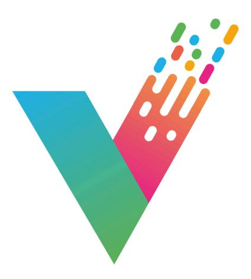
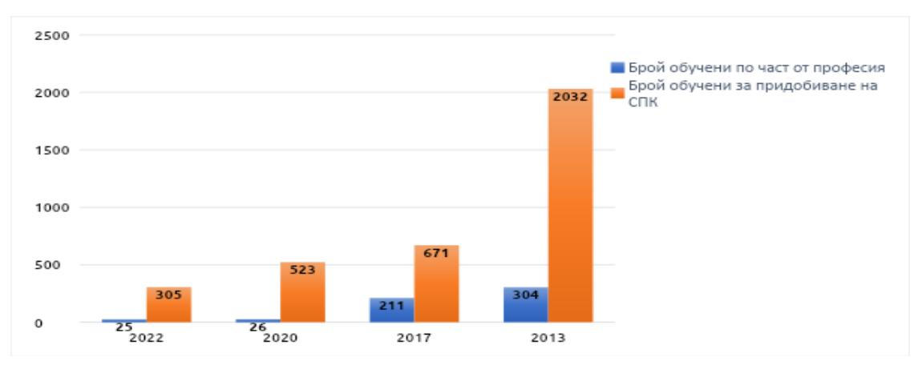
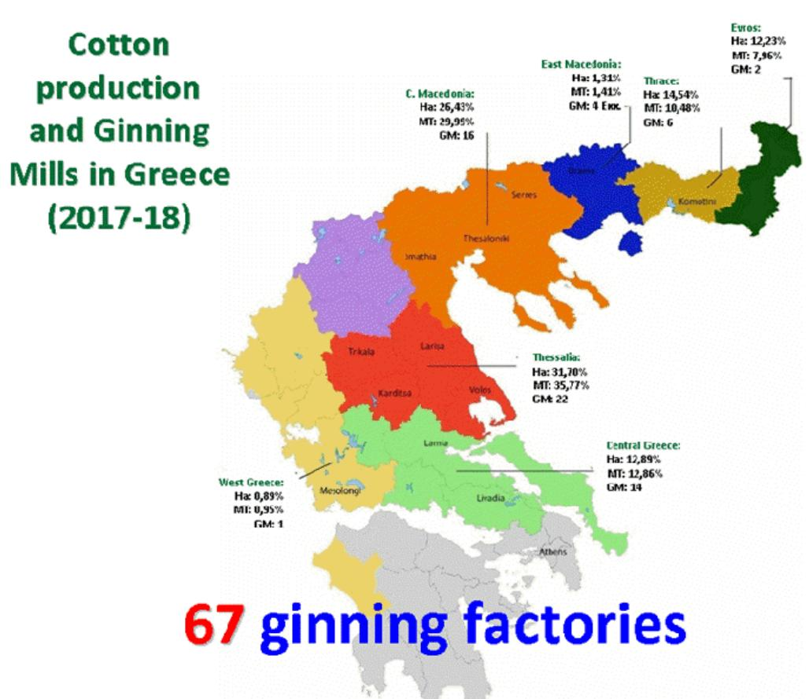
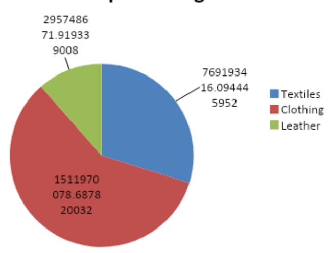
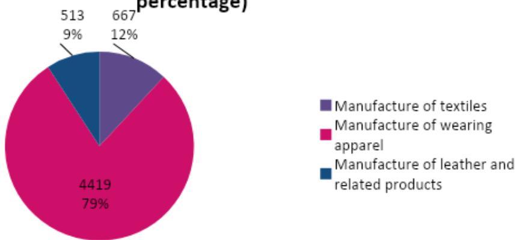
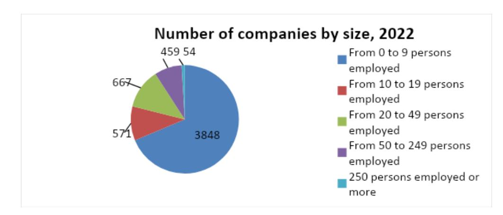
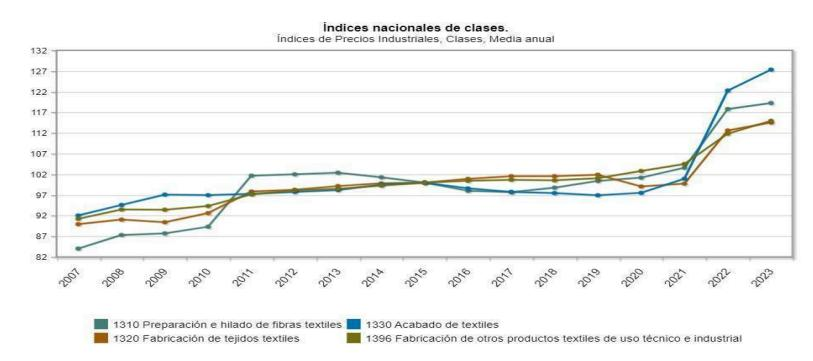
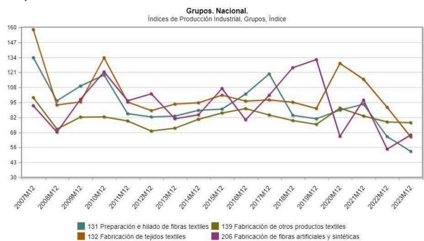

## Vocational Education & Training towards re-inventing apparel procedures

# VETRINE STUDY

Deliverable 2.2

Delivery date: 10/04/2024

Co-Funded by the Erasmus+ Programme of the European Union under grant agreement 101110642. Funded by the European Union. Views and opinions expressed are however those of the author(s) only and do not necessarily reflect those of the European Union or the European Education and Culture Executive Agency (EACEA). Neither the European Union nor EACEA can be held responsible for them.

#### **Revision history**

| Number | Date       | Description |
|--------|------------|-------------|
| 0.1    | 26/10/2023 | Draft       |
| 0.2    | 29/03/2024 | Draft       |
| 0.3    | 10/04/2024 | Final       |

#### **Statement of Originality**

This deliverable contains original unpublished work except where clearly indicated otherwise. Acknowledgement of previously published material and of the work of others has been made through appropriate citation, quotation, or both.

#### **Copyright**

This work is licensed by the VETRINE Consortium under a Creative Commons Attribution-ShareAlike 4.0 International License, 2023. For details, see http://creativecommons.org/licenses/by-sa/4.0/

**The VETRINE Consortium consists of**: Eurotraining Educational Organization, Kauno Technologijos Universitetas, Chimar (Hellas) Ae, Centro Tecnologico das Industrias Textil e do Vestuario de Portugal, Associacao Textil e Vestuario de Portugal, Nevrokopska Profesionalna Gimnaziya Dimitar Talev, Pirin-Tex Eood, Centro de Estudios Aeg Arroka Sl, Confederacion de la Industria Textil Asociacion, Cedecs-Tcbl, Centre Scientifique & Technique del'industrie Textile Belge Asbl, Novel Group Sarl.

#### **Disclaimer**

All information included in this document is subject to change without notice. The Members of the VETRINE Consortium make no warranty of any kind with regard to this document, including, but not limited to, the implied warranties of merchantability and fitness for a particular purpose. The Members of the Consortium shall not be held liable for errors contained herein or direct, indirect, special, incidental or consequential damages in connection with the furnishing, performance, or use of this material.

#### **Funding Acknowledgement**

The VETRINE project has received funding from the European Union EACEA.A – Erasmus+, EU Solidarity Corps under Grant Agreement n. 101110642.

Views and opinions expressed are however those of the author(s) only and do not necessarily reflect those of the European Union or the European Education and Culture Executive Agency (EACEA). Neither the European Union nor EACEA can be held responsible for them.

| Project      | acronym:           | VETRINE                                 |
|--------------|--------------------|-----------------------------------------|
| Project      | full title:        | Vocational Education & Training towards |
|              |                    | re-inventing apparel procedures         |
| Grant        | agreement no.:     | 101110642                               |
| Deliverable  | number and         | name D2.2 “Vetrine Study”               |
| Distribution | level:             | PU Public                               |
| Responsible  | author(s)/partner: | Asun Alonso / AEG                       |
| Contributing | author(s) /        |                                         |
|              |                    | All partners                            |
| Reviewed     | by:                | External Quality Board                  |
| Total        | number of pages:   | 60 max.                                 |

# **1. Executive summary**

This VETRINE study is deliverable D2.2 of the VETRINE project, which seeks to diminish the environmental impact of Textile and Clothing (T&C) production through specifically developed vocational education and training modules in the form of a Capacity Building Programme (CBP) that will be created based on the information that the study provides. This information comes from research carried out into the categories that appear in sections 3, 4, 5 and 6 in this document as follows:

- 3. Focus Groups report summary
- 4. Report on raw materials used during apparel production and the negative level of their environmental footprint
- 5. Analysis of Vocational Education and Training (VET) Educational Protocols
- 6. Analysis of T&C national markets and prospect of applying sustainability concepts

Section 3 contains a summary of the qualitative and quantitative information gathered while bringing VET learners together with the market-linked professionals in Focus Group (FG) sessions so that they could discuss about the difficulties they face and the gaps in skills and knowledge they perceive towards a more sustainable approach in their activities. Section 4 reports on the very first element involved in the whole T&C production process: the raw material and its impact on the environment, while Sections 5 and 6 address VET learners and the market-linked separately through a research into the VET institutions role in knowledge acquisition of T&C learners and an analysis of six national T&C production markets respectively.

The VETRINE project partners that have carried out research in this document are the following:

- for the raw materials report there is KAUNO Technologijos Universitetas (Lithuania)
- for the VET Educational Protocols there are AEG (Spain), "DIMITAR TALEV" (Bulgaria), CITEVE (Portugal) and EUROTRAINING (Greece)
- for the T&C market-linked companies there are ATP (Portugal), CEDECS-TCBL (France), CHIMAR (Greece), CENTEXBEL (Belgium), PIRINTEX (Bulgaria), TEXFOR (Spain)

The research by the above partners on FG sessions, raw materials, VET Educational Protocols and the current features of the T&C markets has rendered these key insights:

- FG sessions: most VET learners are in T&C studies because they like fashion and fashion design but are less interested in other activities connected with the speciality such as pattern making, cutting, spinning, … leaving the market-linked companies with worrying staff shortages and difficult generational relief. They are interested in sustainability but feel that they have a gap in skills and knowledge in the topic and are generally interested in an online course with 2030 Sustainable Development Goals (SDGs) content, among other technical and business management contents. Market-linked companies feel that sustainability processes in the T&C sector are necessary but come at a cost in investment and need of specialised know-how, which is difficult to find.

- The report on T&C raw materials classifies the fibres according to their natural plant or animal origin, or those man-made from natural or synthetic polymers. Although there are many harmful substances used in the growing and manufacturing processes, organic cotton production is growing by 25-30% per year and World Agriculture Commission predicts it will account for about a third of all cotton by 2030.

- Section 5 of VET educational protocols show that many institutions offer T&C studies and can be found concentrated in areas where the T&C sector companies are established. There are also T&C studies providers at university level. While in Bulgaria there has been a drastic decrease in the numbers of trainees in the textile sector by 2022, in Spain the number of VET students has increased almost 30% in the last five years whereas. However, this increase does not include T&C families of studies, which do not attract a significant number of enrolments, probably due to low wages in the sector. Sustainability related modules in the courses contents are scarce at present but there are indicators that will make sustainable development topics much more present in the very near future.

- Section 6 is about the T&C markets in the 6 partners countries that present diverse indicators that reflect their varying situations. The following figures correspond to 2021 and 2022: for Portugal, T&C is one of the most important sources of employment and revenue with around 12,000 companies (50% of which are sole person companies) across the entire textile and clothing sector, which contributes to a turnover of 8.8 billion euros, a production of 8.6 billion euros and a gross added value of 2.7 billion euros.

The Portuguese textile and clothing sector employs almost 130,000 workers (18% of total workforce). Portugal is one of the most important players in terms of European Textile and Clothing industry, ranking in the fourth place concerning employment and in the fifth place concerning turnover and gross added value.

France is seeing a slow but constant increase in T&C employment currently at 63,000 workers and has a recognised added value in the fashion luxury segment; it is in second position in Europe (after Germany) with a turnover of 15.5 billion euros and has around 26,872 companies, most of them small and medium sized.

The T&C sector in Greece contributes to 15% of the country's Gross Domestic Product (GDP) with a 5.5 billion euros turnover and employs 120,000 people. 92% of the approximately 6,000 Greek T&C related companies are unipersonal companies or have up to 9 employees.

Belgium has an overall turnover of 5 billion euros and around 18,500 employees distributed into 40 small companies and 31 weaving and knitwear companies; it is more oriented towards design, sales and marketing rather than to production and confection.

Bulgaria has an important T&C sector with around 53,000 jobs, most of which correspond to small companies. The sector is undergoing a slow but steady decline over the last years. Rather than designing, they are focused on cut and make, ie., they receive the designs, patterns and materials from the customer and they confection the garment.

Spain's T&C sector has over 3,569 companies left after severe outsourcing, employs 47,117 workers and contributes with 2.9% to the country's GDP. Several companies boast a pioneering role in adopting sustainable procedures and the industry is geographically limited to 3 areas: Catalonia, Valencia and Galicia.

# **Table of Contents**

| 1. 2. 2.1 3. Focus 4. Report negative 4.1 4.1.1 4.1.2 4.1.3 4.2 4.2.1 4.2.2 4.2.3 4.3 4.4 5. Analysis 5.1 5.1.1 5.1.2 5.1.3 5.1.4 5.1.5 | Executive summary Introduction Context and objectives Groups report summary on raw materials used in level of their environmental Fibres used in textile materials Natural fibres Natural plant fibres Natural animal fibres Man-made fibres from natural polymers Man-made natural polymers fibres Man-made natural polymers fibres Other man-made natural polymers fibres Man-made fibres from synthetic Sustainability aspects of Vet Educational Protocols AEG (SPAIN) VET institutions and courses on offer Level of studies of the courses offered Courses geographical distribution Textile VET educational protocols content Direction towards sustainable initiatives | 3 8 9 textile production and the footprint 10 10 11 produced from cellulose 12 produced from proteins 13 13 polymers 13 14 15 (EQF) 15 16 16 in T&C 18 |
|-----------------------------------------------------------------------------------------------------------------------------------------|--------------------------------------------------------------------------------------------------------------------------------------------------------------------------------------------------------------------------------------------------------------------------------------------------------------------------------------------------------------------------------------------------------------------------------------------------------------------------------------------------------------------------------------------------------------------------------------------------------------------------------------------------------------------------------|--------------------------------------------------------------------------------------------------------------------------------------------------------|
| 5.1.6                                                                                                                                   | Conclusions                                                                                                                                                                                                                                                                                                                                                                                                                                                                                                                                                                                                                                                                    | 19                                                                                                                                                     |
| 5.2                                                                                                                                     | “DIMITAR TALEV” (BULGARIA)                                                                                                                                                                                                                                                                                                                                                                                                                                                                                                                                                                                                                                                     |                                                                                                                                                        |
| 5.2.1                                                                                                                                   | VET institutions and courses on offer                                                                                                                                                                                                                                                                                                                                                                                                                                                                                                                                                                                                                                          | 19                                                                                                                                                     |
| 5.2.2                                                                                                                                   | Level of studies of the courses offered                                                                                                                                                                                                                                                                                                                                                                                                                                                                                                                                                                                                                                        | (EQF) 20                                                                                                                                               |
| 5.2.3                                                                                                                                   | Courses geographical distribution                                                                                                                                                                                                                                                                                                                                                                                                                                                                                                                                                                                                                                              | 20                                                                                                                                                     |
| 5.2.4                                                                                                                                   | Textile VET educational protocols content                                                                                                                                                                                                                                                                                                                                                                                                                                                                                                                                                                                                                                      | 21                                                                                                                                                     |
| 5.2.5                                                                                                                                   | Direction towards sustainable initiatives                                                                                                                                                                                                                                                                                                                                                                                                                                                                                                                                                                                                                                      | in T&C 23                                                                                                                                              |
| 5.2.6                                                                                                                                   | Conclusions                                                                                                                                                                                                                                                                                                                                                                                                                                                                                                                                                                                                                                                                    | 23                                                                                                                                                     |
| 5.3                                                                                                                                     | CITEVE (PORTUGAL)                                                                                                                                                                                                                                                                                                                                                                                                                                                                                                                                                                                                                                                              |                                                                                                                                                        |
| 5.3.1                                                                                                                                   | VET institutions and courses on offer                                                                                                                                                                                                                                                                                                                                                                                                                                                                                                                                                                                                                                          | 23                                                                                                                                                     |
| 5.3.2                                                                                                                                   | Level of studies of the courses offered                                                                                                                                                                                                                                                                                                                                                                                                                                                                                                                                                                                                                                        | (EQF) 23                                                                                                                                               |
| 5.3.3                                                                                                                                   | Courses geographical distribution                                                                                                                                                                                                                                                                                                                                                                                                                                                                                                                                                                                                                                              | 24                                                                                                                                                     |
| 5.3.4                                                                                                                                   | Textile VET educational protocols content                                                                                                                                                                                                                                                                                                                                                                                                                                                                                                                                                                                                                                      | 24                                                                                                                                                     |
| 5.3.5                                                                                                                                   | Direction towards sustainable initiatives                                                                                                                                                                                                                                                                                                                                                                                                                                                                                                                                                                                                                                      | in T&C 24                                                                                                                                              |
| 5.3.6                                                                                                                                   | Conclusions                                                                                                                                                                                                                                                                                                                                                                                                                                                                                                                                                                                                                                                                    | 24                                                                                                                                                     |

# **5.4 EUROTRAINING (GREECE)**

| 5.4.1 VET institutions and courses on offer            | 25 |
|--------------------------------------------------------|----|
| 5.4.2 Level of studies of the courses offered (EQF)    | 26 |
| 5.4.3 Courses geographical distribution                | 26 |
| 5.4.4 Textile VET educational protocols content        | 26 |
| 5.4.5 Direction towards sustainable initiatives in T&C | 27 |
| 5.4.6 Conclusions                                      | 27 |

# **6. Analysis of Clothing & Textile national markets and prospect of applying sustainability concepts**

#### **6.1 ATP (PORTUGAL)**

| 6.1.1   | Textile      | sector / General overview                        | 28                             |
|---------|--------------|--------------------------------------------------|--------------------------------|
| 6.1.1.1 | Key-figures; | No. of companies, turnover,                      | employment, import & export 28 |
| 6.1.1.2 | Fibres,      | yarns, dyeing & finishing fabrics                | and clothing 28                |
| 6.1.1.3 |              | Geographical distribution                        | 29                             |
| 6.1.1.4 |              | Evolution and trends                             | 29                             |
| 6.1.2   | Green        | Textiles Initiatives                             |                                |
| 6.1.2.1 |              | Fibres, textiles, and clothing green initiatives | 30                             |
| 6.1.3   | National     | policies and initiatives regarding textiles      | 30                             |
| 6.1.4   | Next         | steps                                            | 31                             |

## **6.2 CEDECS-TCBL (FRANCE)**

| 6.2.1 Textile sector / General overview                                      | 31 |
|------------------------------------------------------------------------------|----|
| 6.2.1.1 Key-figures; No. of companies, turnover, employment, import & export | 31 |
| 6.2.1.2 Fibres, yarns, dyeing & finishing fabrics and clothing               | 33 |
| 6.2.1.3 Geographical distribution                                            | 33 |
| 6.2.1.4 Evolution and trends                                                 | 34 |
| 6.2.2 Green Textiles Initiatives                                             | 34 |
| 6.2.2.1 Fibres, textiles, and clothing green initiatives                     | 34 |
| 6.2.3 National policies and initiatives regarding textiles                   | 35 |
| 6.2.4 Next steps                                                             | 36 |

# **6.3 CHIMAR (GREECE)**

| 6.3.1 Textile sector / General overview                                      | 38 |
|------------------------------------------------------------------------------|----|
| 6.3.1.1 Key-figures; No. of companies, turnover, employment, import & export | 38 |
| 6.3.1.2 Fibres, yarns, dyeing & finishing fabrics and clothing               | 39 |
| 6.3.1.3 Geographical distribution                                            | 39 |
| 6.3.1.4 Evolution and trends                                                 | 40 |
| 6.3.2 Green Textiles Initiatives                                             | 40 |
| 6.3.2.1 Fibres, textiles, and clothing green initiatives                     | 40 |
| 6.3.3 National policies and initiatives regarding textiles                   | 41 |
| 6.3.4 Next steps                                                             | 42 |

# **6.4 CENTEXBEL (BELGIUM)**

6.4.1 Textile sector / General overview 43 6.4.1.1 Key-figures; No. of companies, turnover, employment, import & export 43 6.4.1.2 Fibres, yarns, dyeing & finishing fabrics and clothing 43 6.4.1.3 Geographical distribution 44

| 6.4.1.4 Evolution and trends                                                 | 44        |
|------------------------------------------------------------------------------|-----------|
| 6.4.2 Green Textiles Initiatives                                             | 44        |
| 6.4.2.1 Fibres, textiles, and clothing green initiatives                     | 44        |
| 6.4.3 National policies and initiatives regarding textiles                   | 45        |
| 6.4.3 Next steps                                                             | 45        |
| <b>6.5 PIRINTEX (BULGARIA)</b>                                               |           |
| 6.5.1 Textile sector / General overview                                      | 45        |
| 6.5.1.1 Key-figures; No. of companies, turnover, employment, import & export | 46        |
| 6.5.1.2 Fibres, yarns, dyeing & finishing fabrics and clothing               | 48        |
| 6.5.1.3 Geographical distribution                                            | 48        |
| 6.5.1.4 Evolution and trends                                                 | 48        |
| 6.5.2 Green Textiles Initiatives                                             | 49        |
| 6.5.2.1 Fibres, textiles, and clothing green initiatives                     | 49        |
| 6.5.3 National policies and initiatives regarding textiles                   | 49        |
| 6.5.4 Next steps                                                             | 49        |
| <b>6.6 TEXFOR (SPAIN)</b>                                                    |           |
| 6.6.1 Textile sector / General overview                                      | 50        |
| 6.6.1.1 Key-figures; No. of companies, turnover, employment, import & export | 50        |
| 6.6.1.2 Fibres, yarns, dyeing & finishing fabrics and clothing               | 50        |
| 6.6.1.3 Geographical distribution                                            | 51        |
| 6.6.1.4 Evolution and trends                                                 | 51        |
| 6.6.2 Green Textiles Initiatives                                             | 51        |
| 6.6.2.1 Fibres, textiles, and clothing green initiatives                     | 52        |
| 6.6.3. National policies and initiatives regarding textiles                  | 52        |
| 6.6.4 Next steps                                                             |           |
| <b>7. Conclusions</b>                                                        | <b>54</b> |
| <b>8. Annexes</b>                                                            | <b>59</b> |

# **2. Introduction**

#### 2.1 Context and objectives

The relevance of the T&C industry in our societies is undeniable, both in terms of individual satisfaction of basic garments and accessories needs and also in terms of economic activity as well as its impact on the environment. The fashion supply chain involves many steps: from the production of the natural and synthetic raw materials used to the conceptual and artistic activity of the design; from the manufacturing and production processes to the final transportation and distribution until it reaches retail establishments for the public to purchase or it is purchased online.

The exacerbation of this cycle due to the overproduction and overconsumption of apparel has led to major environmental negative impacts. According to the European Environmental Agency, demand of apparel products is expected to increase by 63% by 2030. It seems that currently there is no project implemented in Europe that focuses on the paths followed for the production of an apparel piece, which involves the many actors and processes mentioned above, out which the VETRINE project will focus on these three: the raw materials, the textile learners, the market-linked companies. The transportation and final consumer are broader target activities and groups that can also benefit from the information contained in the VETRINE study that we present in this document.

Even the most cursory reflection on the current state of T&C production in any European Union country leads to the conclusion that all apparel linked areas entail an individual, social and industrial activity with a major negative impact on our environment and with few signs of rapid correction in the near future, given that demand is progressively increasing and so is production. Inditex, the Spanish T&C giant with brands Zara, Zara Home, Pull&Bear, Massimo Dutti, Bershka, Stradivarius, Oysho and Uterqüe has seen its dividend soar 28% after earning a record 5,400 million euros in 2023. This helped the company grow almost 8% on the stock market and sets a new all-time high, improving its profitability by 30%, while sales are close to 36,000 million, up 10%. It seems consumers' appetite for T&C items still presents a wide-spread upward trend in all markets because Inditex sells worldwide, with Europe accounting for 63.5% of its sales in 2023.

It is with the primary aim to diminish the environmental footprint that this trend represents at every stage in the T&C production that the VETRINE project sets out to provide tools in the form of a CBP for textile learners and professionals to be able to complement the existing VET institutions educational protocols contents and the current market-linked companies' own in-house learning and training schemes. VET learners and professionals could benefit as regards filling in their skills and knowledge gaps towards more sustainable practices throughout the whole cycle including fibres' choices, design and manufacturing, energy consumption, distribution and post-consumer habits such as repair, recycling and upcycling.

This VETRINE study is produced in order to obtain an accurate and up-to-date picture of the stand of the processes and actors involved in T&C in connection with their sustainability practices, as well as to gain insight into their direction towards said "greener" practices and to use this up-to-date data and insight as the starting point from which to build up content for the CBP. It also aims to raise awareness among stakeholders and to establish the flow of information between VET institutions, HEIs and labour market representatives leading to a more sustainable T&C sector.

# **3. Focus Groups report summary**

The FG sessions are part of the VETRINE project Work Package (WP) 2 as a tool to gather mostly qualitative but also quantitative information. The collection and analysis of this data gathered by the FG sessions (November 2023 - January 2024) has left us with the picture of what VET learners and market-linked players think of where the T&C learning and business activity stands in Bulgaria, Greece, Portugal and Spain. VETRINE project's objective of 440 participants was extended to 528 and that of 20 FG sessions to 27 and a combined number of 52 hours conversation, thanks to all partners' efforts and desire to obtain a respondents' presence in the FG sessions as varied and numerously representative of the T&C sector as possible. This commitment led to a slight delay in finishing the report, which has proved worthwhile.

The market-linked partners of VETRINE that coordinated the sessions as seen below:

- Bulgaria: PIRINTEX
- Greece: CHIMAR
- Portugal: ATP
- Spain: TEXFOR

with the participation of the following VET institutions:

- Bulgaria: DIMITAR TALEV
- Greece: EUROTRAINING
- Portugal: CITEVE
- Spain: AEG

When asked about the current state of the T&C industry in the country, Bulgarian market-linked companies described the situation as not good due to a shortage of work force and the impact of the "shadow" economy, which affects working conditions and thus does not attract labour to this activity. However, on the plus side, companies have a considerable volume of orders, hence the issues do not arise from a lack of work but from other structural limits, like the rising costs that more sustainable processes imply, the lack of sufficient knowledge and skills on sustainability on the part of the already scarce labour force and the additional difficulty of dealing with new regulations and certifications imposed by the transitions to a greener T&C sector. Market-linked companies were also concerned about what they perceive as a low enthusiasm purchasing phase in consumers.

Greek market-linked companies found the T&C sector traditional yet dynamic, focused on cost efficiency and productivity and not so much concerned by sustainability aspects but with an incipient concern by a minority of companies for environmental challenges and practices, often spurred by some consumers' demand for greener practices. However, most companies are still in the process of facing challenges related to their lack of speed at embracing changes, competitiveness, economic and environmental issues and grappling with legislation. The companies that have a more sustainable approach in T&C processes do so basically in recycling and upcycling.

It is the Portuguese market-linked companies that place the country in a better position in T&C due to a long tradition in the sector and its focus in manufacturing and export. There is a tradition of family businesses in close geographical proximity,which favours healthy

business competition but also profitable synergies. They share a common concern about lack of skilled workers and the need for constantly updating and upgrading technical and sustainable knowledge and practices if the sector is to survive. Also in the peninsula, the Spanish counterparts point to the lack of workers as one of the major issues facing T&C companies, along with the realisation that the small number of companies left in the country after savage outsourcing must compete in quality excellence because competing in prices is out of reach in face of the low cost production coming from third countries in Central Europe, East Asia, Turkey, Morocco and others, that are only rarely subject to regulations and certifications controls and also lack product traceability.

All in all, market-linked companies' biggest concerns regarding T&C sustainability are: financial and cost related issues and skilled work force availability. And about the sector's current stand: outsourcing has made many companies disappear and unfair competition, rising costs if greener practices are to be adopted and a regulatory system difficult to navigate, have left those still in the market struggling. However, a number of companies are offering high value and quality products and investing on technology to stay in business and follow the transition to greener procedures.

VET learners are in textile studies mostly because they have always liked fashion and fashion design. There is a unanimous opinion that they perceive gaps in their learning paths as regards sustainability like a deeper understanding of what sustainable procedures involve, how to carry them out, with what types of raw materials, using what type of digital tools, etc. Also, they lack a general knowledge of how to manage a T&C business: marketing, financial aspects. They are aware of the impact of T&C on the environment in varying degrees and are interested in an online CBP featuring autonomous lessons on given topics, preferably including 2030 Agenda for Sustainable Development content too.

# **4. Report on raw materials used in textile production and the negative level of their environmental footprint**

# **4.1 Fibres used in textile materials**

This chapter will present a classification of fibres, used in fashion and apparel industry, their properties and sustainability aspects. All organic textile fibres can be divided into three groups: natural, man-made from natural polymers and man-made from synthetic polymers. Inorganic fibres, such as carbon, glass, metal, ceramic, asbestos**,** are mainly used for technical textiles, including specific clothing like protective clothing for racers, firefighters, astronauts, etc.

#### 4.1.1 Natural fibres

Natural fibres can be classified according to their origin and are those that occur in fibre form in nature. Traditionally, natural fibres sources are broken down into plant, animal, and mineral.

#### 4.1.2 Natural Plant fibres

Fibres from plant or vegetable sources are more properly referred to as cellulose-based and can be further classified by plant. Classification of natural plant fibres differs in different literature sources. Some classification includes plant fibres received from different parts of plant - stalk, leaf, bast or seed [1], some - all mentioned plus fruit, hard and soft wood, grass/reeds. Classification of plant fibres are presented in the table below:

Table 1 Classification of natural plant fibres.

| No | Part of plant | Names                                                  |
|----|---------------|--------------------------------------------------------|
| 1  | Seed          | Cotton, Kapok, Loofah, Milk weed                       |
| 2  | Bast          | Flax, Ramie, Hemp, Nettle, Jute, Kenaf, Roselle, Mesta |
| 3  | Stalk         | Wheat, Rice, Maize, Barley, Oat, Rye                   |
| 4  | Leaf          | Abaca, Sisal, Banana, Henequen, Agave, Manila          |

Until now, cotton is one of the most used fibres in fashion and apparel industry. There are four types of cotton fibres: Pima and Egyptian cotton (the finest fibre, extra soft and long), Upland cotton (very short fibres, 90% of the world's total cotton production is made from it), organic cotton [2]. Pima cotton fabric is very highly sought after, as it is resistant to fading, tearing, and wrinkling. Organic cotton is grown within a rotation system that builds soil fertility and protects biodiversity, without the use of any synthetic chemicals or Genetically Modified Organisms. Organic cotton production is growing by 25-30% per year and World Agriculture Commission predicts that organic cotton will account for about a third of all cotton by 2030. Coloured cotton, which comes in natural, "earth" colours, is already grown, too. Softness, durability, strength, air permeability, antistatic and hygroscopicity are the main characteristics of cotton fibre [2]. All mentioned properties and sustainability in growing are big advantages of organic cotton as well. Flax and hemp fibre are the most popular from bast plant group. Hemp has been used long time ago and now its usage becomes once again important. Hemp is the strongest natural fibre in the world. Flax and hemp fibres are long, lustrous, durable, absorb moisture and are resistant to microorganisms attacks, dye well, and their smooth surface repels dirt. They can conduct heat and block ultraviolet light [2, 3]. Several species of the nettle family produce bast fibre like flax, and many of those species have been used to produce fibre for making textiles and clothing for thousands of years [4]. Pure ramie can be spun into a fine yarn, either dry or wet. Unfortunately, but until now there are a lot of problems in processing nettle into fibre and yarn, as well as in industrial weaving, knitting, and finishing. Bast fibres are used for yarns in clothing and home textile; for ropes, canvas, and paper as well in production of technical textile – agro-textile, car panels and fibreboard. Blending with cotton, linen, silk and wool gives hemp a softer feel, while adding resistance and durability to the product [2, 5]. Bast fibres kenaf and jute, alone or mixed with synthetic and carbon fibres, are tested in composites material. The advanced performance of natural kenaf and jute composites can compete with synthetic materials. Leaf fibres or hard fibres are a type of plant fibre mainly used for cordage, producing ropes, rug or carpet backing [2]. Highly eco-friendly peat fibre obtained from cotton grass sedge steams, are renewable and could be used in manufacturing of spun yarns by blending with cotton or woollen fibres. Such yarns have good strength and elongation values and are suitable for knitting. Comparatively high level of lignin in the peat fibre allows for manufacturing of special apparel because of higher flame retardancy and antibacterial properties [6].

# 4.1.3 Natural Animal fibres

Fibres from animal sources are more properly known as protein-based fibres. They are harvested from an animal (hair and wool) or removed from a cocoon or a web (silk). Examples of this fibre include wool fibre obtained from sheep, goats, lamas, rabbits. Hairs of Angora goat, Cashmere goat, camel, alpaca, llama [2, 7], and even dogs, are also used as textile fibres, especially in clothing. The properties of wool fibres differ from each other. Silk fibre is a protein fibre from silk glands of an insect. Silk is a continuous filament fibre. Wool is soft, offers very good protection against the cold, does not allow sweating thanks to its thermoregulatory properties. Sheep's wool is one of the most hygroscopic fibres. The insulating properties of sheep's wool are maintained even when wet, thanks to the

high air lock in the wool. Wool also could be organic or coloured in its nature. Organic Wool is the certified wool, which is processed without antibiotics, anti-parasitic chemicals, and growth hormones.

Nowadays, yarns with some amount of dog hair are becoming an attractive trend, while they have been used many years ago for socks and gloves knitting in the Northern Countries. Textile garments made from woollen yarns with dogs' hair protect against cold, have good medically proved, functional and thermal properties, is breathable and elastic. Hairs of various breeds of dogs can be used in yarn manufacturing, for example, Poodle, Shih-Tzu, Bobtail, Spaniel, Yorkshire Terrier, and others.

# **4.2 Man-made fibres from natural polymers**

Cellulose, different proteins, algae and other natural polymers are raw material for man-made fibres. Man-made fibres from natural polymers are used daily, and our daily life would look quite different without them [8]. Such fibres are not only used in all kinds of textiles and apparel, but also in a wide range of technical applications. Transport or mobility (road, air) would be more primitive if no man-made fibres from natural polymers were available.

In general, the invention of man-made natural polymers fibres is the contribution of mankind to the protection of natural rare minerals, the protection of resources, the care of the environment and the consideration of the global balance. The use of such fibres is considered a valuable eco-design strategy because of using post-consumer or other waste. However, from an environmental point of view, usually its production involves the use of chemical products, that are very harmful. Classification of man-made fibres from natural polymers are presented in the table below:

Table 2 Classification of man-made fibres produced from natural polymers.

| No | Made from:            | Names                                   |
|----|-----------------------|-----------------------------------------|
| 1  | cellulose             | Viscose, Bamboo, Lyocell, Copper fibres |
| 2  | cellulose derivatives | Acetate, Triacetate, Semidiacetate      |
| 3  | algae                 | Alginate                                |
| 4  | vegetable proteins    | Soy, Zein, Peanut                       |
| 5  | animal proteins       | Casein, Keratin, Fibroin, Collagen      |
| 6  | polyisoprene          | Natural rubber                          |

# 4.2.1 Man-made natural polymers fibres produced from cellulose

The biggest group of man-made natural polymers fibres are produced from cellulose or its derivatives. For example, viscose and acetates are made of the same cellulose polymers that make up cotton, hemp, flax, and the structural fibres of wood. Here the cellulose is acquired in a radically altered state (usually from wood-pulp operations) and is further modified in order to be regenerated into practical cellulose-based fibres. Viscose fibres can be used in fashion and clothing industry because they have good properties in terms of physiological comfort as they are absorbent [9]. Fibres made from natural polymers have properties close to natural fibres and are largely degradable in nature, but usually do not achieve as good mechanical properties as man-made from synthetic polymers fibres. Biodegradable fibres, such as ingeo® (corn fibre), and other, can also be used in fashion and apparel industry. Corn fibres could be spun into a yarn, or it could be a multifilament yarn. They offer the beauty and appeal of an eco-friendly, natural based fibre, having the performance and durability of high technical synthetic fibres. So, these fibres are often used instead of polyester (PES) fibre and has a lot of advantages compared to it. Corn fibres are less flammable, more elastic, hydrophilic and ultraviolet resistant [10]. The eco-friendly and biodegradable and well known in the market "bamboo" fibre, is in reality

is a regenerated cellulosic fibre, produced from stems and leaves of bamboo. This fibre is softer than cotton, with a texture similar to a blend of cashmere and silk. Garments of such "bamboo" fibre can absorb and evaporate human sweat. Thus, the wearer feels extremely cool and comfortable even in hot summer. The fibres need less dyestuff than other cellulosic fibres [8].

#### 4.2.2 Man-made natural polymers fibres produced from proteins

Protein, as a textile raw material, came into use at the end of the 19th century. Proteins from casein and soy are most popular. Soybean protein fibre has not only the superior quality of natural fibres but also the physical properties of synthetic ones [11]. It also has antibacterial properties that resist E.coli bacillus, staphylococcus aureus and candida albicans. Soya fibre is most suitable for middle and high quality clothing, also for home textile, especially when in contact with the skin. Casein protein fibre is manufactured from milk waste through a bioengineering technique. It is made from 100% renewable resources and thanks to an eco-efficient production technology, it is biodegradable, antibacterial, soft, warm and fabrics provide high wearing comfort [12]. Man-made natural protein fibres can be used for clothing and beddings.

#### 4.2.3 Other man-made natural polymers fibres

In order to reduce the negative impact of man-made fibres on nature and the environment not only less harmful chemicals are used, but also new raw materials are created. The problems started to change when the technological processes and waste are turned into a closed loop. Shrimp or crab shells, a waste of the food industry are raw materials for the chitosan fibres, dextrose (fermented corn-starch) - for Polylactic acid fibre (also known as PLA) and brown seaweeds are used in producing alginate fibres [13]. All such fibres have advantages and disadvantages. Mainly they are biodegradable, antimicrobial and not toxic, so they can be used in medical textile, beddings, clothing, sportswear. Unfortunately, they can not be used alone and must be blended with another fibres. Moreover, till now such fibres are quite expensive comparing to other natural or man-made from natural polymers fibres.

# **4.3 Man-made fibres from synthetic polymers**

Another group of man-made fibres (and by far the larger group) is the synthetic polymers. These fibres are made of polymers that do not occur naturally but instead are produced entirely in the chemical plant or laboratory, almost always from by-products of petroleum or natural gas. Synthetic fibres can be mass-produced to almost any set of required properties. Millions of tons are produced every year.

Synthetic polymers are strong and stiff in nature, creating fabrics that hold up well to wear and tear [8]. Textile made from them holds shapes well, is durable, easy to wash, resists wrinkling. Most of them tend to repel water and have very quick drying. Their comparative low price is a very big advantage as well. Elastomeric fibres are commonly used in clothing because they tend to manufacture elastic, form-fitting outfits that are stretchy and comfortable in nature. They have multiple names, including Lycra, Spandex or Elastane. Various blends have been created, when natural fibres are mixed with synthetic fibres getting better wear and feel for the user. Polyacrylonitrile (PAN) and wool, cotton and Polyamide or nylon (PA) or viscose and PES fibres are mixed very often. Using PES and polyurethane threads in sportswear or athletic clothes, allows them to resist moisture, making it correct for the body. According to Statista.com [14], Polyester (PES) had 54% of the global fibre market share, 5% polyamide (PA) and 5% other synthetic fibres in 2022 year. So, even though they all are harmful for the environment, not biodegradable, are creating microplastics, which polluted oceans, man-made fibres from synthetic polymers still are very widely used. Some of them, like PA, PES, Polyacrylonitrile (PAN), Polyurethane (PU), are more often used in apparel production, other ones more for technical textile.

#### **4.4 Sustainability aspects**

As it was mentioned before, six main man-made fibres from synthetic polymers and cotton (22%) have 86% of the global fibre market share in textile industry. All of them are in limited supply, cause environmental problems, and the increasing demand for them is harming the planet. Natural fibres are biodegradable over time, and this is valid for cotton as well. But, because of its extreme water needs, often heavy use of pesticides and fertilisers and the toxic health effects on farmers who struggle with economic despair, it is no wonder that cotton is often called the world's 'dirtiest' crop [15]. So, only when the natural plant fibre, cotton for example once again, is cultivated without any harmful pesticides and with the help of composted manures and cover crops can it be called 'organic cotton', which is 100% eco friendly fibre.

There are different ways how to avoid or decrease negative impact on the environment: use of recycled fibres, replacing one synthetic fibre for the better one, adding additives that help harmful fibres to degrade in the water, soil or landfill, etc. For example, it is calculated that carbon footprint of Polypropylene (PP) yarn is lower and thus more environmentally friendly compared to PES yarn [16]. In addition to the numerical results obtained and considering that PP yarn is the most advantageous among synthetic polymers in terms of recycling and the mechanical properties, the authors of this study recommend using PP yarn instead of other synthetic yarns.

Circular production and consumption of clothing has become a key goal for the textile industry in Europe. However, concerning the goal of zero carbon raises the question: is it possible to achieve this aim with just 1% of recycled garments turned into new apparel globally [17]? The European Commission has set several ambitious aims and wants to ensure that by 2030: "…all textile products placed on the EU market are durable, repairable and recyclable, to a great extent made of recycled fibres, free of hazardous substances, produced in respect of social rights and the environment." The Commission says it will: "set design requirements for textiles to make them last longer, easier to repair and recycle" and "stop overproduction and overconsumption, and discourage the destruction of unsold or returned textiles." In January 2023, the Commission launched a new campaign titled 'ReSet The Trend', which aims to encourage consumers across Europe to move away from fast fashion [17].

All discussed steps, as well as usage of new innovative textile, such as fabric made from coffee grounds, seaweed, lotus, pineapple leaves, fermented wine, or other raw materials, are very important for the foundation of the greener planet and our future.

# **REFERENCES**

- 1. Robert R., Frank, Boca, Raton *Bast and other plant fibre.* CRC Press, 2005.
- 2. [http://gpktt.weebly.com/natural-fibre.html.](http://gpktt.weebly.com/natural-fibre.html) Viewed 16 Jan. 2024.
- 3. Abdul Moudood at al. *Flax fibre and its composites: An overview of water and moisture absorption impact on their performance* Journal of Reinforced Plastics and Composites, 2019, Vol. 38(7) pp. 323–339.
- 4. [http://orgprints.org/6926/1/AJAA18\\_3\\_2003\\_nettle.pdf.](http://orgprints.org/6926/1/AJAA18_3_2003_nettle.pdf) Viewed 17 Jan. 2024.
- 5. [https://www.fibre2fashion.com/industry-article/8701/hemp-fibre-for-high-quality-t](https://www.fibre2fashion.com/industry-article/8701/hemp-fibre-for-high-quality-textile) [extile](https://www.fibre2fashion.com/industry-article/8701/hemp-fibre-for-high-quality-textile) Viewed 17 Jan. 2024.
- 6. Daiva Mikucioniene at al. *Comparative Analysis of Peat Fibre Properties and Peat Fibre-Based Knits Flammability* Autex Research Journal, Vol 19, No 2 June, 2019, pp. 157-164.
- 7. [https://www.woolmark.com/fibre/.](https://www.woolmark.com/fibre/) Viewed 23 Jan. 2024.
- 8. Eberle H. et al., *Clothing technology: from fibre to fashion*, Verlag Europa-Lehrmittel, Haan: Vollmer GmbH & Co, 2014.
- 9. Viscose Textile [Exchange.](https://textileexchange.org/viscose/?gad_source=1&gclid=CjwKCAiAlcyuBhBnEiwAOGZ2S7aR1IUMmMT6C7P6oMT47minwaT8pAikzYlhtWwZgZSWj0LXG-V2uxoCx_MQAvD_BwE) Viewed 30 Jan. 2024.

- 10. What Is Fabric Made With Corn? | Eco World [\(ecoworldonline.com\)](https://ecoworldonline.com/what-is-fabric-made-with-corn/) Viewed 7 Feb. 2024.
- 11. <https://www.textiletoday.com.bd/soyabean-fiber-properties-processes-uses/>. Viewed 7 Feb. 2024.
- 12. What is Milk Fiber Yarn and How is it Produced? [\(textilejourney.com\)](https://www.textilejourney.com/post/what-is-milk-fiber-yarn-and-how-is-it-produced). Viewed 8 Feb. 2024.
- 13. [Biopolymer](https://www.trevira.de/en/fibres/biopolymer-fibres) fibres (trevira.de). Viewed 9 Feb. 2024.
- 14. Global textile fiber market share by type 2022 | [Statista.](https://www.statista.com/statistics/1250812/global-fiber-production-share-type/) Viewed 16 Jan. 2024.
- 15. Why Cotton Is Called the World's Dirtiest Crop | The [Modern](https://www.moderndane.com/blogs/the-modern-dane-blog/why-cotton-is-called-the-worlds-dirtiest-crop) Dane. Viewed 8 Feb. 2024.
- 16. Tugce. Demirdelen at al. *Investigation of the Carbon Footprint of the Textile Industry: PES- and PP-Based Products with Monte Carlo Uncertainty Analysis*. Sustainability, Vol *15*(19), 2023, pp. 2-22, 14237.
- 17. Will a circular economy help the [European](https://www.zerocarbonacademy.com/posts/will-a-circular-economy-help-the-european-textile-industry-reach-net-zero) textile industry reach net zero? [\(zerocarbonacademy.com\).](https://www.zerocarbonacademy.com/posts/will-a-circular-economy-help-the-european-textile-industry-reach-net-zero) Viewed 9 Feb. 2024.

# **5. Analysis of Vet Educational Protocols**

# **5.1 AEG (SPAIN)**

5.1.1 VET [institutions](https://docs.google.com/document/d/1mbNl1I0nVJ-WZuQczwy7h8NSTo8-dWKm/edit#heading=h.4d34og8) and courses on offer

As regards VET, we have the following institutions divided by their level of education [1]:

For Basic VET there are 22 institutions that offer courses in:

- Basic Vocational Qualification in Mending and Repair of Textile and Leather Goods (14)
- Basic Vocational Qualification in Upholstery and Curtain Making (8)

For Intermediate VET there are 66 institutions that offer courses in:

- Technician in Footwear and Fashion Accessories (7)
- Technician in Clothing and Fashion (52)
- Technician in Manufacture and Finishing of Textile Products (7)

For Higher VET there are 65 institutions that offer courses in:

- Higher Technician in Textile and Leather Technical Design (5)
- Higher Technician in Footwear and Accessories Design and Production (3)
- Higher Technician in Pattern Making and Fashion (42)
- Higher Technician in Made-to-Measure and Show Costumes (15) courses in 3 different levels: basic, intermediate and higher.

All in all, there are 153 VET educational institutions in Spain offering 9 different textile

# 5.1.2 Level of studies of the courses [offered](https://docs.google.com/document/d/1mbNl1I0nVJ-WZuQczwy7h8NSTo8-dWKm/edit#heading=h.2s8eyo1) (EQF)

Spain has two main types of educational institutions that offer courses in textile studies: Vocational Education and Training (VET) and universities. As regards VET schools, the level of studies falls into 3 categories, as mentioned above: basic VET, intermediate VET and higher VET. These are the equivalent levels of studies in the European Qualifications Framework (EQF):

- Basic VET is equivalent to EQF 3
- Intermediate VET is equivalent to EQF 4
- Higher VET is equivalente to EQF 5

As regards universities, on 10th July 2015, the Council of Ministers approved the equivalence of the Degree of Industrial Technical Engineer in Textile to level 6 of the EQF, which is equivalent to any other Technical Engineering in any other European country and is made up of 240 European Credit Transfer and Accumulation System (ECTS). 3 universities offer this degree in Spain: the Polytechnic University of Cataluña (UPC) in Terrassa (Barcelona), the Polytechnic University of Valencia (UPV) in Alcoy (Valencia) and the University of Salamanca (USAL) in Béjar (Salamanca). Other than textile engineering studies, there are 18 main university degrees in Textile Design and Fashion of which 7 are in Catalonia and 6 in Madrid. Together, these two locations provide 72.2% of these main university courses offer. Some are: IED Barcelona Higher School of Design, ESDI Higher School of Design, Technology and Design University (UDIT), Rey Juan Carlos University, … The rest are located in the north, in the provinces of A Coruña and Bizkaia (Bilbao), in the south in Granada, and in the south east in Valencia. Besides these best known and most popular universities for T&C courses, there are many other universities in different provinces that offer degrees as well as different institutional organisations, like AITEX Technical Textile Institute, which has the staggering number of 54 T&C courses on offer. All university degrees are equivalent to EQF 6.

#### 5.1.3 Courses [geographical](https://docs.google.com/document/d/1mbNl1I0nVJ-WZuQczwy7h8NSTo8-dWKm/edit#heading=h.17dp8vu) distribution

At university level, it is not surprising that 2 of the 3 autonomous regions where the Degree of Industrial Technical Engineer in Textile is available correspond with the areas that have retained the majority of T&C industrial activity and auxiliary businesses, namely the Catalonia autonomous region, with the Polytechnic University of Cataluña (UPC) in Terrassa (Barcelona), and the Valencia autonomous region, with the Polytechnic University of Valencia (UPV) in Alcoy ( Valencia). Finally, University of A Coruña (A Coruña) also offers a degree in Industrial Fashion Management.

The distribution of the courses at the 3 VET levels also corresponds with the areas where T&C companies activity is more relevant. Thus we can see that for a course in Footwear and Fashion Accessories (7 institutions) the offer is located in areas that are producers of the raw material (leather), for a start, and have a standing artisanal production tradition that in time became more developed and at a larger scale, as it happens in the towns of Ubrique (Cádiz) and Valverde del Camino (Huelva), in the south of Spain and Arnedo (La Rioja) in the north east and the very well known shoe manufacturing centre of the town of Elche (Alicante), where most of the domestic and for export shoe production comes from. The courses that are offered in bigger numbers of VET institutions are:

- Clothing and Fashion Technician (52 institutions)
- Higher Technician in Pattern Making and Fashion (42 institutions)

These courses are located in a much wider geographical area and can be found in most of the 17 autonomous regions that conform Spain. But despite this wider distribution, there is still a notable concentration of VET institutions in certain areas. 57.7% of courses EQF level 4 and 61.9% of courses EQF level 5 are located in Catalonia, Valencia, Andalucía and Madrid and the rest scattered in other areas. The distribution coincides with those most populated metropolitan areas of 4 autonomous regions which are also the areas where T&C market-linked activity has been preserved, especially in Catalonia and Valencia.

# 5.1.4 Textile VET educational protocols content

In the school year 2021-2022 [2] (the most recent one for which there is comprehensive available data), there were 1,027,367 VET students in all VET levels (EQF 3, 4, or 5) in all family of studies, not only in T&C. This corresponds to an upward trend in VET enrollment as we can see in the table below:

Table 3 Number of students enrolled in VET courses.

| Academic  | year Basic VET | Intermediate | VET Higher | Total VET VET students |
|-----------|----------------|--------------|------------|------------------------|
| 2016-2017 | 69,528         | 343,920      | 377,937    | 791,485                |
| 2017-2018 | 72,180         | 344,266      | 398,908    | 815,354                |
| 2018-2019 | 73,810         | 350,220      | 413,169    | 837,199                |
| 2019-2020 | 76,440         | 368,259      | 446,706    | 891,405                |
| 2020-2021 | 75,952         | 401,066      | 507,335    | 984,353                |

As can be seen above, the number of VET students has increased significantly over the last five years, by 29.8% overall. Of particular note is the 40.7% increase in higher VET. The intermediate level has increased by 22.2% and basic VET by 8.3% in this period. It is worth highlighting the very significant increase in the distance learning system (not shown in the table), at 157.1%, which is a good indicator of the interest for other types of learning such as continuing, online, upskilling, one-off courses, on demand courses, etc. Despite the number of VET institutions, the number of courses offered and their geographical distribution in the areas where the prospective jobs may be found, the percentage of students enrolled in textile related VET studies is low compared to other VET specialities as show in the table below:

Table 4 Percentage distribution of students enrolled in Vocational Training according to vocational family. Academic year 2021-2022.

|             | VET            | family of studies | Basic VET       | Intermediate VET | Higher VET |
|-------------|----------------|-------------------|-----------------|------------------|------------|
|             | Administration | and Management    | 16.2%           | 13.2%            | 13.2%      |
| Electricity | and            | Electronics       | 13%             | 6.9%             | 4.9%       |
| Healthcare  |                |                   | no courses here | 25.5%            | 17%        |
| Hospitality | and            | Tourism           | 8.7%            | 3.9%             | 4.2%       |
| IT and      |                | Communications    | 16.9%           | 10.5%            | 14%        |
| Textile,    | Clothing       | & Leather         | 0.6%            | 0.4%             | 0.4%       |

The low numbers in T&C related courses enrollment explain the shortage of staff that marke-linked companies all over the territory have been reporting for some time now. Consistently, the same pattern of low numbers of VET learners leading to work force shortages emerges in a key activity for our country, such as hospitality and tourism, whose market-linked companies must resort to Morocco's VET schools to hire hotel, bar and restaurant staff. These shortages, specially those in tourism staff, make headlines on national media day in, day out. The difficulty that market-linked companies in T&C and tourism face while hiring heavily contrasts with 28% average youth unemployment rate in Spain, the highest in the EU, according to 9th January 2024 data from the European Statistical Monitor (Eurostat) and it may be explained due to the low wages and unappealing working conditions in both sectors, which make learners choose other courses in the best of cases, or drop out of formal education and stay at home at worst. In 2023 [3] in Spain, 9.82% of population between 15-24 years of age neither worked nor studied or

was in training (NEET). Of all Organization for Economic Cooperation and Development (OECD) 38 countries worldwide, Spain is the one with the highest drop-out rate (29.3%) in vocational programmes and vocational studies. The percentage of NEET has fallen from 12.45% in 2018 to 9.82 in 2023, as said above, so fortunately there seems to be a change in trends that may be explained by the growing numbers of VET students as seen in table 3 opting for higher VET, where more finish their studies. We may be starting to succeed in reversing the studies choice scheme that Spain has had for decades, where university studies were largely favoured over VET education when the factual truth is that in the first years after graduation, university graduates have a lower employability rate than those who have completed higher VET. Specifically, almost 83% of VET graduates are in work 3 or 4 years after graduation, a figure that is not reached before 5 years in the case of university graduates. The last available data for T&C studies in Basque VET [4] show that there was an offer of 186 positions, which 156 students enrolled in (that is 83.87% of the offer covered). The employability rate was 81.16%.

In the school year 2021-2022, a total of 199 basic VET students took the work placement module in T&C market-linked companies; this number of trainees went up to 795 for intermediate VET and mounted up to 833 for higher VET students, which clearly shows that the higher the VET EQF level, the higher the number of students who finish their studies and reach the work placement module. This is corroborated by the fact that basic VET students start T&C courses in bigger numbers (0.6%) than intermediate and higher VET students (0.4%) (table 4) but drop out of their studies in bigger proportion.

The work placement module comes at the end of any of the T&C 2000-hour, 2-year course. Higher and intermediate VET students must stay 400 hours in work placement, i.e., 20% of their courses' tuition hours. Work placement hours must reach 240 for basic VET (12% of the course hours).

As mentioned above, the work placement module is the last module in chronological content of T&C related courses, which last for 2 academic years. We can see further contents for intermediate VET courses in Annex 1.

#### 5.1.5 Direction towards sustainable initiatives in T&C

As we can see in Annex 1 only one module includes sustainability considerations. However, since Education is transferred to the autonomous communities and each school in turn can modify up to 20% of the syllabus, many institutions already introduce sustainability requirements to be present in the project based learning (PBL) methodologies that most VET institutions are currently implementing. This approach is soon to be compulsory when the recently passed new Organic Law 3/2022, of 31 March 2022, on the organisation and integration of Vocational Training comes into force. In its Article 3, letter "l", General Principles, it is included:

- Continuous updating, agile adaptation and proactive and anticipatory detection of emerging changes and needs in the productive sectors, in particular those associated with digitalisation, ecological transition, environmental sustainability, territorial innovation, health and care for people.

The new course 2024-2025 will have integrated modules on sustainability processes obligatorily in all families of studies, including T&C courses**.** And all 1st and 2nd year students will be doing dual learning. This is very good news at a national institutional level because it proves that the direction towards sustainable initiatives does not rely only on the particular efforts of some VET providers but that it is framed in a wider, general concern for a green shift that must include our future professionals from their learning stages.

#### 5.1.6 Conclusions

Spain has got a sufficient number of VET centres and universities accessible from different geographical points (more present in Catalonia, Valencia and Galicia) that offer a varied range of courses in T&C. The number of VET students in all families of studies has grown almost 30% in the last 5 years, with 1,027,367 VET students in the school year 2021-2022 in all VET levels (EQF 3, 4, or 5).

However, the percentage of students who choose VET T&C studies is small. Students should be encouraged to take up T&C studies to cover the demand of skilled and knowledgeable work force that the industry demands.

VET institutions have already been implementing sustainability modules in their courses' contents in some areas, mostly on a voluntary basis because current syllabuses do not make abundant reference to green topics. This is about to change with a new Vocational Education and Training law, so the future looks better equipped as regards learning about and working for environmental sustainability.

# **REFERENCES**

- 1. Ministry of Education, VET and Sports. VET permanent data. Viewed 19 Jan 2024 <https://todofp.es/que-estudiar/loe/textil-confeccion-piel.html>
- 2. Ministry of Education and VET. "Statistics on Vocational Training Students academic year 2021-2022" Published 12 May 2023. Viewed 23 Jan 2024. [https://www.educacionyfp.gob.es/dam/jcr:3fd4f22f-a477-479a-8e9a-b92f5e2344a6](https://www.educacionyfp.gob.es/dam/jcr:3fd4f22f-a477-479a-8e9a-b92f5e2344a6/nota-2021-2022.pdf) [/nota-2021-2022.pdf](https://www.educacionyfp.gob.es/dam/jcr:3fd4f22f-a477-479a-8e9a-b92f5e2344a6/nota-2021-2022.pdf)
- 3. VET Observatory 2023. Published 2024. Viewed 23 Jan 2024. [https://www.observatoriofp.com/indicadores-destacados/espana/poblacion-de-15](https://www.observatoriofp.com/indicadores-destacados/espana/poblacion-de-15-a-24-anos-que-ni-estudia-ni-trabaja#:~:text=En%20el%20a%C3%B1o%202023%2C%20el,en%20Espa%C3%B1a%20es%20de%20504.915) [a-24-anos-que-ni-estudia-ni-trabaja#:~:text=En%20el%20a%C3%B1o%202023%2C](https://www.observatoriofp.com/indicadores-destacados/espana/poblacion-de-15-a-24-anos-que-ni-estudia-ni-trabaja#:~:text=En%20el%20a%C3%B1o%202023%2C%20el,en%20Espa%C3%B1a%20es%20de%20504.915) [%20el,en%20Espa%C3%B1a%20es%20de%20504.915](https://www.observatoriofp.com/indicadores-destacados/espana/poblacion-de-15-a-24-anos-que-ni-estudia-ni-trabaja#:~:text=En%20el%20a%C3%B1o%202023%2C%20el,en%20Espa%C3%B1a%20es%20de%20504.915).
- 4. DV Education. Published 30 March 2024. Viewed 25 March 2024. [https://www.diariovasco.com/sociedad/educacion/alumnos-salen-trabajo-2024033](https://www.diariovasco.com/sociedad/educacion/alumnos-salen-trabajo-20240330065931-nt.html) [0065931-nt.html](https://www.diariovasco.com/sociedad/educacion/alumnos-salen-trabajo-20240330065931-nt.html)

# **5.2 "DIMITAR TALEV" (BULGARIA)**

#### 5.2.1 VET [institutions](https://docs.google.com/document/d/1mbNl1I0nVJ-WZuQczwy7h8NSTo8-dWKm/edit#heading=h.4d34og8) and courses on offer

In Bulgaria, VET is primarily conducted within the school education system. According to data from the Ministry of Education and Science, the total number of students in vocational education was 186,135 in the 2000/2001 academic year, and in the 2013/2014 academic year, these schools had a total of 140,882 students. Thus, over 14 years, the number of students in vocational high schools decreased by nearly 25,000. Urgent measures were required to stimulate students to pursue vocational education, resulting in a total of 150,149 students being enrolled in vocational tracks in the 2022/2023 academic year.

Currently, the textile industry is characterised by one of the lowest wage levels in the sector, leading to a decrease in interest among the younger generation in training for those professional fields. The sector's staffing is the result of the operation of 54 vocational high schools. At the same time, a discrepancy is observed between the offered vocational education and the needs of the business, as well as a low proportion of graduates in the textile field who find employment in the sector. In the 2022/2023 academic year, out of a total of 150,149 students trained in textile professions, 4,035 students were trained in the sector "Production Technologies - Textiles, Clothing, Footwear, and Leather." Of these, 3,139 were trained in a daytime form of education, 819 students in work-based learning - dual education system, and 77 students in part-time

education. The VET by specialties and the number of trained students for the 2022/2023 academic year are presented in the table below:

Table 5 VET by specialties and the number of trained students for the 2022/2023 academic year.

| №  |                | Professional field       | Certificate of Professional Qualification | European Qualification s Framework | Total number of students |
|----|----------------|--------------------------|-------------------------------------------|------------------------------------|--------------------------|
| 1  | Textile        | Clothing Production      | 2                                         | 3                                  | 1340                     |
|    | Construction,  | Modeling, and Technology |                                           |                                    |                          |
|    | of Textile     | Clothing                 |                                           |                                    |                          |
|    |                |                          | 3                                         | 4                                  | 1302                     |
| 3  | Fashion        | Design                   | 3                                         | 4                                  | 476                      |
| 4  | Boutique       | Clothing                 | 3                                         | 4                                  | 248                      |
|    | Computer-Aided | Design and Pattern       |                                           |                                    |                          |
|    | Making         | for Textile Fabrics      |                                           |                                    |                          |
|    |                |                          | 3                                         | 4                                  | 203                      |
| 6  | Tailoring      |                          | 1                                         | 2                                  | 147                      |
|    | Construction,  | Modeling, and Technology |                                           |                                    |                          |
|    | of Footwear    | Products                 |                                           |                                    |                          |
|    |                |                          | 3                                         | 4                                  | 82                       |
| 8  | Spinning       | Production               | 3                                         | 4                                  | 68                       |
| 9  | Weaving        | Production               | 3                                         | 4                                  | 53                       |
| 10 | Shoemaking     |                          | 1                                         | 2                                  | 42                       |
| 11 | Finishing      | and Dyeing Production    | 3                                         | 4                                  | 25                       |
| 12 | Knitting       | Production               | 3                                         | 4                                  | 24                       |
| 13 | Textile        | Production               | 1                                         | 2                                  | 23                       |
|    | Construction,  | Modeling, and Technology |                                           |                                    |                          |
|    | of Leather     | Goods                    |                                           |                                    |                          |
|    |                |                          | 3                                         | 4                                  | 14                       |
| 15 | Custom-Made    | Clothing                 | 3                                         | 4                                  | 10                       |
| 16 | Stage          | Costume                  | 3                                         | 4                                  | 8                        |

# 5.2.2 Level of studies of the courses [offered](https://docs.google.com/document/d/1mbNl1I0nVJ-WZuQczwy7h8NSTo8-dWKm/edit#heading=h.2s8eyo1) (EQF)

The Pre-school and School Education Act (PSEA) defines the following educational degrees and stages, which are correlated with the EQF and NQF:

- Primary education, initial stage (grades 1-4) (European Qualifications Framework (EQF)/ National Qualifications Framework (NQF) Level 1).
- Primary education, lower secondary stage (grades 5-7) (EQF/NQF Level 2).
- Secondary education, first upper secondary stage (grades 8-10) (no level determined by EQF/ NQF).
- Secondary education, second upper secondary stage (grades 11-12) (EQF/NQF Level 4).
- Higher education, bachelor, and professional bachelor (EQF Level 6; NQF Level 6A, 6B).
- Higher education, master (EQF/NQF Level 7).
- Higher education, doctorate (EQF/NQF Level 8).

In the Vocational Education and Training Act in the Republic of Bulgaria, professions and specialties are classified by the degree of professional qualification, respectively first, second, third, and fourth. From the conducted study, it is evident that the majority of students in the VET system enrol in level 4 programs of the European Qualifications Framework (EQF). The share of those enrolled in VET after secondary education (level 5 of EQF) is minimal.

#### 5.2.3 Courses [geographical](https://docs.google.com/document/d/1mbNl1I0nVJ-WZuQczwy7h8NSTo8-dWKm/edit#heading=h.17dp8vu) distribution

Geographical Regions, Number of population according to National Statics Institute of Bulgaria (NSI) for 2022, Number of schools training in textile and clothing, Number of students trained in textile and clothing as seen in the table below:

Table 6 Courses geographical distribution and numbers of students in T&C.

|           | Geographical Regions | Number of population according to NSI for 2022 | Number of schools training in textile and clothing | Number of students trained in textile and clothing |
|-----------|----------------------|------------------------------------------------|----------------------------------------------------|----------------------------------------------------|
| Northwest | region               | 676,769                                        | 12                                                 | 463                                                |
| North     | Central              | 690,653                                        | 5                                                  | 413                                                |
| Northeast |                      | 825,762                                        | 6                                                  | 330                                                |
| Southeast |                      | 951,026                                        | 6                                                  | 677                                                |
| South     | Central              | 1,303,361                                      | 10                                                 | 727                                                |
| Southwest | region               | 2,017,527                                      | 16                                                 | 1,425                                              |

# 5.2.4 Textile VET educational protocols content

# ● Vocational Training Centres

Vocational training centres (VTCs) in Bulgaria provide vocational training for individuals over 16 years of age. The training is aimed at acquiring, updating, and improving professional qualifications or requalification in a profession or part of a profession with levels I, II, and III of professional qualification. It does not include general education preparation, which should be acquired before inclusion in the respective vocational training program. The number of operating VTCs is constantly increasing, from 908 at the end of 2013 to 1,476 organisations in 2023. For many unemployed, especially those in disadvantaged groups, inclusion in vocational training conducted by VTCs is an opportunity for equitable participation in the labour market, and for the employed – to retain their jobs. The National Agency for Vocational Education and Training (NAVET) reports that by mid-October 2021, the number of trained individuals had significantly decreased – by about 15,000. These data were presented during the national conference "Vocational Training and Career Development – Small Stories of Great Successes," held on October 27, 2022, in Sofia. According to NAVET, by October 2022, there was a drastic decrease in the number of trainees in the textile sector. Analysing the number of trained individuals in sector 542 "Production Technologies - Textiles, Clothing, Footwear, and Leather," we observe the following figure 1:

Figure 1. The number of trainees in the textile sector as of October 2022

#### ● Higher Education Institutions

Some of the Higher Education Institutions that provide educational programs in the field of textile are the following, with their courses content:

- Technical University Sofia: Professional fields include "Design and Technologies for Clothing and Textiles - designing new products using innovative software products; conducting experimental research and developing technological documentation; designing and planning the production of textile products and clothing, performing quality control over production. ".
- Technical University Gabrovo: Professional fields include "Design, Engineering, and Technologies in Textiles - research and analysis of new textile materials; designing of classic and fancy yarns; computer design of knitwear and fabrics; automated design of knitwear and sewing products with CAD/CAM systems; designing specific nodes of textile machines; organisation and management of technological processes in textile production."
- University of Chemical Technology and Metallurgy Sofia: Professional fields include "Technological Design of Textiles and Leathers - unique in the country, including the study of chemical and biotechnological processes in the production of textiles and leathers; design of products with functional consumer properties – dyeing, printing, antimicrobial, easy care, non-flammability, etc.; computer design of footwear and textile products with CAD-CAM systems; obtaining and characterising bio composite materials with applications in medicine and cosmetics, etc.; recycling and utilisation of waste from production and post-consumption."
- Southwestern University "Neofit Rilski" Blagoevgrad: Professional fields include "Modelling, Technologies, and Management in the Sewing Industry - textile material science and testing, machines and processes in spinning, weaving, and knitting production, non-woven textile materials, finishing of textile materials; construction and modelling of clothing, clothing technology, machines and equipment in the sewing production, technological lines in the sewing production, complex manufacturing of sewing products, management, and marketing of the sewing production." and "Fashion - artist-designer, stylist, and designer of clothing and accessories. Skills and abilities for artistic design, construction, and modelling of contemporary clothing, artistic processing of materials (decoration, patterning, weaving, etc.), marketing, and advertising of clothing. Skills are developed for creating artistic-thematic fashion collections, their realisation, and presentation."
- Varna Free University "Chernorizets Hrabar" Varna: Professional fields include "Fashion Design - design of women's, men's, and children's clothing and skills for designing and realising clothing in a different assortment. Through theory and practical experience, students learn the methods of clothing production, as well as the possibilities for advertising and market realisation of products for the fashion industry. Authorial thinking is developed for building style and uniqueness."

From NAVET's page (https://www.navet.government.bg/bg/registar-na-tsentrovete-za-profesiona/), one can obtain the register of licensed VTCs, totalling 252 organisations offering training in: Textile Production; Clothing Production; Footwear and Leather Goods Production; Embroidery; Sewing, etc. The network of institutions licensed by NAVET is relatively evenly distributed across the country, providing easier access to vocational training and the opportunity to choose from a larger number of professions, including for citizens with limited incomes. Training in VTCs is financed with public funds (about 20%), by employers (about 25%), and about half of the trainees have financed their participation in a qualification course themselves.

#### 5.2.5 Direction towards sustainable initiatives in the apparel sector

In recent years, sustainable initiatives in the clothing sector have been introduced into master's programs in higher education. Each university develops courses and programs that are primarily focused in the field of fashion design.

This master's course prepares students for leading roles in the design of fashion and luxury products and collections, especially in the increasingly important area of sustainable fashion, including:

- Sustainable fashion design
- Fashion design
- Textile design
- Research on textiles and materials
- Art direction
- Merchandising
- Fashion consulting
- Course modules
- Fashion graphic design (Photoshop & Illustrator)
- Design and planning of a collection
- Development and processing of an accessory collection
- Costs and processing of a collection
- Buying techniques and merchandising
- Draping and 3D modelling of models
- Textile design
- Eco-fashion and sustainable fabrics

#### 5.2.6 Conclusions

In Bulgaria there are 252 licensed VTCs and 54 Vocational High School offering training in a big variety of T&C courses. However, sustainability aspects are not present in the vast majority of these courses contents. In recent years this is being reversed at master's levels programmes by the introduction of sustainable initiatives.

Despite the interesting number of courses offered in T&C, enrollment is constantly decreasing probably due to unattractive salaries and working conditions in the sector. This calls for different measures that have been adopted to promote VET studies, which are fairly evenly distribute around the country.

# **5.3 CITEVE (PORTUGAL)**

# 5.3.1 VET [institutions](https://docs.google.com/document/d/1mbNl1I0nVJ-WZuQczwy7h8NSTo8-dWKm/edit#heading=h.4d34og8) and courses on offer

There is no mechanism in Portugal to quantify the number of organisations providing vocational training inT&C and the number of training courses available. The several existing mapping tools allow us to count these indicators separately. However, it should be noted that the figures presented in this report may vary slightly due to the difficulty of global mapping. In Annex 2, you may find the list of organisations that offer training in textiles and clothing for levels 4 to 5, namely: Vocational Courses - Ministry of Education – EQF 4; Apprenticeship System Courses - Institute for Employment and Vocational Training (IEFP) – EQF 4; Apprenticeship + Courses – EQF 5; Adult Education and Training – EQF 4 - Educational and dual certification.

# 5.3.2 Level of studies of the courses [offered](https://docs.google.com/document/d/1mbNl1I0nVJ-WZuQczwy7h8NSTo8-dWKm/edit#heading=h.2s8eyo1) (EQF)

The VET entities are focused on developing training actions in the fields of the green transition, intersecting the areas of digitalisation and smart. There is a growing number of advanced programmes in this area. The courses in Annex 2 are of long duration, ranging from 1 to 3 years, and are provided by public and/or proven organisations, duly certified and accredited in accordance with the legislation in force. Then we have some short-term

courses that have been developed by education partners who are part of the Be@t [project](https://bioeconomy-at-textiles.com/) (a project created as part of the Recovery and Resilience Plan). The training is developed in Sustainability, Design for Circularity and Eco-engineering - with the attribution of a certificate of vocational frequency. You can see the list of EQF levels in Annex 3.

#### 5.3.3 Courses [geographical](https://docs.google.com/document/d/1mbNl1I0nVJ-WZuQczwy7h8NSTo8-dWKm/edit#heading=h.17dp8vu) distribution

Training in the textile and clothing industry in Portugal is more concentrated in the North, specifically in the Porto metropolitan area, the Ave region and the Tâmega e Sousa region. Only the northern Lisbon metropolitan area offers qualifications other than the Fashion Design Technician course. In terms of level 4 qualifications, the majority of courses offering this level of certification are part of adult education and training courses. As far as initial training for young people is concerned, the Fashion Design Technician qualification stands out, with a wide distribution of supply and demand throughout the country. For the other qualifications, there have been occasional openings of courses, always based on the selection made by the training operators, the needs of the job market and the Ministry of Education's approval of initial training courses and classes for young people.

#### 5.3.4 Textile VET educational protocols content

Currently, the National Qualifications Framework has 19 qualifications linked to Textiles and Clothing, distributed between qualification EQF levels 4 and 5**.** The same instrument is currently being revised and updated by the National Agency for Vocational Education and Training (ANQEP), so new qualifications are expected in the sector, as well as the elimination of others that are no longer considered relevant to the needs of the labour market. In view of the requirements of regulatory benchmarks, as well as the global economy, a new level 5 qualification - Quality and Sustainability Specialist. A list of the main contents covered in the courses that were listed in 5.3.1 appears in Annex 4.

#### 5.3.5 Direction towards sustainable initiatives in T&C

In order to guarantee the sustainability of the sector, technical training for young people is needed at level 4, with regard to production processes and industrial sewing and textile production technologies. Knowledge related to LEAN (original manufacturing philosophy that aims to eliminate waste and achieve the best possible efficiency) methodologies and product quality is very important for the competitiveness of companies and all workers need to have it. According to education and training operators, the areas of knowledge that have been most sought after by companies linked to the fashion sectors are: *production technologies and processes*, *design*, *work planning and organisation*, *quality control*, *raw materials and advanced digitalization skills*. *Environmental and sustainability concerns*, *health and safety at work* are also important issues and should be part of all qualifications. It is crucial that technical training is adapted to the specificities of the sector and sub-sector of activity.

#### 5.3.6 Conclusions

In Portugal, the entities that provide qualified training in T&C are divided between Vocational Schools, Public Basic Schools (3rd cycle and secondary) and Training Entities (public and private), duly accredited. In addition to the cognitive, technical and technological skills specific to each qualification, there are skills that are vital to the challenges facing companies: namely, the digital transition, the green transition, technological and material innovation, marketing and attractiveness. Soft skills are also increasingly valued by professionals, such as social and communication skills, digital skills, creative skills, organisational skills and quality control and management skills. All existing qualifications, as well as the new ones that are emerging, must be adjusted to the needs of the sector and the complex process of technological evolution, as well as to future trends and new working methodologies.

### **5.4 EUROTRAINING (GREECE)**

#### 5.4.1 VET [institutions](https://docs.google.com/document/d/1mbNl1I0nVJ-WZuQczwy7h8NSTo8-dWKm/edit#heading=h.4d34og8) and courses on offer

Nearly all VET institutions offer a blend of theoretical knowledge and practical skills. Courses cover a wide range of subjects from the history of fashion and costume to advanced technological applications in pattern making, using computer aided design (CAD) and computer aided manufacturing (CAM) systems, indicating a holistic approach that prepares students for the multifaceted nature of the fashion industry.

There's a lack of focus on environmentally friendly practices in the current VET programs as observed, it highlights a potential area for development within the curriculum. The curriculum across VET institutions spans the entire fashion design and production process, from initial concept and design (including drawing, styling, and colour theory) to the technical aspects of pattern making and garment construction (including cutting and sewing techniques).This comprehensive coverage ensures that graduates are well-prepared to enter various roles within the fashion industry.

The course offerings reveal a high level of adaptability and specialisation within the fashion sector. Students have the opportunity to specialise in different areas, such as Haute Couture, Pret-a-Porter, menswear, womenswear, children's wear, and even niche areas like swimwear and activewear, showcasing the programs' responsiveness to industry trends and demands. We can see a diverse range of VET institutions in Greece offering specialised courses in the textile and fashion sectors:

Design and Fashion Illustration: courses cover freehand, linear, and technical fashion drawing, including the sketching of fashion figures (stylization) and fabric illustration, which are fundamental skills for any fashion designer.

Pattern Making: there's a strong emphasis on pattern making across various levels of complexity, from basic patterns to advanced techniques for haute couture, prêt-à-porter, and custom tailoring, including CAD and CAM systems.

Fabric Technology and Textile Science: understanding fabric types, their properties, and applications is crucial. Courses cover the entire spectrum from fibre to fabric, including innovative materials and stretch fabrics like lycra and spandex.

Fashion History and Sociology: a comprehensive understanding of fashion history and its socio-cultural implications is provided, equipping students with the knowledge to draw inspiration from historical trends and understand the market's evolution.

Fashion Business and Marketing: several institutions offer courses on fashion marketing, business planning, cost estimation, and market research, highlighting the importance of commercial acumen in the fashion industry.

Styling and Aesthetics: courses on styling, colour theory, and aesthetics are designed to refine students' ability to create cohesive, visually appealing fashion ensembles, considering personal styling and the psychology of colour.

Technical Skills: beyond design and theory, there's a focus on applied technical skills such as cutting, sewing, draping (moulage), and high sewing techniques, ensuring students can execute their designs to a professional standard.

Digital Fashion Design: the use of digital tools for fashion design and pattern making is emphasised, reflecting the industry's move towards digitalization. This includes creating collections and portfolios using CAD software.

#### 5.4.2 Level of studies of the courses [offered](https://docs.google.com/document/d/1mbNl1I0nVJ-WZuQczwy7h8NSTo8-dWKm/edit#heading=h.2s8eyo1) (EQF)

The certification EQF Level 5 indicates that the programs provide learners with comprehensive knowledge and skills that are higher than secondary education but are focused on a specific vocation or profession. In the context of the textile and fashion industry, EQF level 5 typically encompasses programs that equip students with advanced technical skills, specialised knowledge, and the ability to apply learning in professional contexts, potentially leading to supervisory and management roles within the sector. In Greece, specifically EUROTraining (vocational educational centre of national scop**e)** offers some seminars or courses are measured in hours and do not have a direct classification within the EQF levels. This means that these offerings are designed to provide specific skills or knowledge enhancement in particular areas rather than leading to a formal qualification recognized across the EQF levels. These courses can still be valuable for professional development, offering targeted learning opportunities that can complement existing qualifications or provide specialised skills relevant to the textile sector. There are also some comprehensive programs offering 180 ECTS credits and aligned with the workload of a full-time, three-year Bachelor's degree program in the European Higher Education Area (EHEA). ECTS credits facilitate the transfer of qualifications and student mobility across Europe, enhancing the recognition of the qualifications earned through these VET programs.

#### 5.4.3 Courses [geographical](https://docs.google.com/document/d/1mbNl1I0nVJ-WZuQczwy7h8NSTo8-dWKm/edit#heading=h.17dp8vu) distribution

The geographical distribution of VET institutions offering textile and fashion courses in Greece indicates a significant concentration in major urban centres, with the majority located in Athens and Thessaloniki. This distribution is reflective of the general trend in educational and industrial facilities, where larger cities often serve as hubs due to their economic, cultural, and logistical advantages. Athens, as the capital, and Thessaloniki, as the second-largest city, naturally attract a variety of educational institutions, including those specialising in vocational training for the textile sector.

Additionally, there's a mention of a university and a public VET institution in Kilkis, a smaller region compared to Athens and Thessaloniki. This suggests an effort to broaden the availability of specialised education beyond the major urban centres, providing opportunities for students in different regions of Greece.

The availability of many online programmes marks a significant shift in vocational education, reflecting a global trend towards more accessible learning platforms. Online courses can bridge the gap for those who are geographically distant from physical institutions or who require more flexible study schedules. This distribution pattern underscores the importance of major cities as educational centres but also highlights the growing role of digital technology in expanding the reach of vocational training.

#### 5.4.4 Textile VET educational protocols content

The textile-related courses provided by various VET institutions in Greece cover a wide range of topics essential for those aspiring to enter the fashion industry. These courses are designed to equip students with both theoretical knowledge and practical skills. Below is a table summary of the courses offered and the diversity and depth of the curriculum.

Table 7 Focus areas and courses key content.

| Focus Areas                                       |              |             | Key content        |                     |                    |
|---------------------------------------------------|--------------|-------------|--------------------|---------------------|--------------------|
| VET 1 Fashion design, garment technology Fashion  | forecasting, |             | fashion            | drawing,            | accessory          |
| design,                                           | colour       | theory,     | fabric             | technology,         | pattern            |
| making,                                           | fashion      | styling,    | history            | of costume          |                    |
| VET 2 Fashion history, design techniques,         |              |             |                    |                     |                    |
| styling, industry knowledge                       |              |             |                    |                     |                    |
| Foundational                                      |              | design      | and drawing,       | styling,            | creative           |
| practice,                                         | professional |             | presentation       |                     | of collections     |
| VET 3 Fashion design, body anatomy, fabric        |              |             |                    |                     |                    |
| Freehand                                          | and          | fashion     | drawing,           | fabric              | illustration,      |
| colour                                            | theory,      | market      | analysis,          | wearable            | technology,        |
| business                                          | planning     |             |                    |                     |                    |
| VET 4 Theoretical garment production, trend       |              |             |                    |                     |                    |
| Body                                              | drawing,     | basic       | garment            | design              | principles, fabric |
| categories,                                       |              | personal    | collection         | development,        | cutting            |
| and                                               | sewing       | techniques  |                    |                     |                    |
| VET 5 &                                           |              |             |                    |                     |                    |
| VET 6                                             |              |             |                    |                     |                    |
| Art and costume history, fashion                  |              |             |                    |                     |                    |
| drawing, styling, textile science                 |              |             |                    |                     |                    |
| Applied                                           | cutting      | and         | sewing,            | workspace           | management,        |
| trend                                             | forecasting, |             | styling workshops, |                     | sociology of       |
| VET 7 Introduction to the fashion industry Figure | drawing,     | garment     | terminology,       |                     | colour and         |
| fabric                                            | science,     | historical  | fashion,           | collection          | design             |
| VET 8 Role of the fashion designer, colour        |              |             |                    |                     |                    |
| theory, technical sketching                       |              |             |                    |                     |                    |
| Basic                                             | and freehand |             | figure             | drawing,            | styling, trend     |
| forecasting,                                      |              | development |                    | of mini collections |                    |
| VET 9 Sewing techniques, pattern drafting Skirt   | making,      | bodice      | and jumpsuit       | construction,       | coat               |
| making,                                           | pant,        | shirt,      | and jacket         | construction        |                    |
| VET 10 Comprehensive fashion design and           |              |             |                    |                     |                    |
| Art and                                           | costume      | history,    | fashion            | design              | and drawing,       |
| styling,                                          | textile      | science,    | trend              | forecasting,        | workshop           |

### 5.4.5 Direction towards sustainable initiatives in T&C

The direction of current VET institutions in Greece towards incorporating environmentally friendly practices within the apparel sector reveals a significant gap between educational curricula and the industry's needs for sustainability. According to the examination of VET curricula and feedback from focus groups, it is apparent that VET programs do not actively promote actions or initiatives aimed at steering the apparel sector towards adopting environmentally sustainable practices.

From the VET institutions' course offerings, it is evident that there is a lack of specific classes dedicated to sustainability within the fashion and textiles domain. If there are any efforts made or knowledge acquired regarding sustainability, these are pursued on a personal and voluntary basis by individuals rather than being an integrated component of the formal educational framework provided by VET institutions. The findings highlight an urgent need for VET institutions to update and expand their curricula to include dedicated courses on sustainable practices, materials, and technologies relevant to the apparel sector.

#### 5.4.6 Conclusions

In Greece, the Vocational Education and Training (VET) in the textile and fashion sectors shows a promising direction toward integrating comprehensive skills and knowledge essential for the industry. The educational content offered by VET institutions, while diverse and in-depth, could benefit from a greater emphasis on sustainability to align more closely with the current demands of the fashion industry. This gap presents an opportunity for curriculum development to include sustainable practices more comprehensively.

# **6. Analysis of Clothing & Textile national markets and prospect of applying sustainability concepts**

#### **6.1 ATP (PORTUGAL)**

#### **6.1.1 Textile sector / General overview**

Portugal has a long- tradition, know-how and reliability in textiles and clothing**.** It has evolved over the centuries, adapting to new technologies and market demands. Traditionally, the industry has been dominated by small and medium-sized companies, often family-run businesses located mainly in the north region of the country, where with proximity it is possible to find a complete and integrated cluster with a very diverse offer, from raw materials to final products for fashion, home textiles and technical textiles.

Today, Portugal is known for its high-quality textile and clothing products, but also by its flexibility, quick response and service oriented to the customer needs, applying the best practices concerning social and environment requirements. The industry has embraced innovation, sustainability, and circularity, investing in new processes and technologies with a strong support by the scientific and technological system.

The Portuguese textile and clothing industry has an international vocation, exporting to over 180 markets with greater presence in European and North American markets, being the "Made in Portugal" well recognised and valued worldwide.

#### 6.1.1.1 Key-figures; No. of companies, turnover, employment, import & export

Portugal has around 6,000 medium and larger size companies and around 6,000 individual companies, across the entire textile and clothing sector, which contribute to a turnover of 8.8 billion euros, a production of 8.6 billion euros and a gross added value of 2.7 billion euros. The Portuguese textile and clothing sector employs almost 130,000 workers.

Over the last decade this sector has increased its turnover and exports by almost 50%, being considered a success story throughout Europe.

In terms of international trade, this sector exports more than 6 billion euros and imports around 5.4 billion euros, with clothing representing around 59% of exports and 57% of imports, home textiles representing 14% of exports and 8% of imports and the remaining textile products (raw materials and technical textiles) representing around 14% of exports and 8% of imports.

The Portuguese Textile and Clothing Industry is one of the most important industries in Portugal, representing 18% of the employment, and 11% of the gross value added in the manufacturing Industry, and 9% of national goods exports.

Portugal is one of the most important players in terms of European Textile and Clothing industry, ranking in the fourth place concerning employment and in the fifth place concerning turnover and gross added value.

# 6.1.1.2 Fibres, yarns, dyeing & finishing fabrics and clothing

In Portugal clothing manufacturing is still the biggest activity, employing 64% of the total employment in this industry, contributing with 52% for the gross added value and 50% of the turnover and production of the sector.

Home textiles represents 9% of the employment, 10% of the turnover, production, and gross added value of the sector. Weaving and knitting is still a quite important activity in Portugal, representing altogether 8% of the employment, 15% of the turnover and

production and 12% of the gross added value. Dyeing and finishing activities represents 7% of employment, turnover and production.

Portugal has a strong tradition and activity in the knitted fabrics (knitting) and knitted clothing. We believe that with the collection and processing of textile waste, mandatory from 2025, Portugal will have a boost in spinning activity, reversing the cycle that began with globalisation, which resulted in a drop in the number of spinning mills in Portugal.

#### 6.1.1.3 Geographical distribution

The Portuguese Textile and Clothing Industry is concentrated in the North region of Portugal, one of the most important regions in the European Union regarding this industry. In the North Region we have 86% of the employment and 89% of the turnover of this industry, being Guimarães, Barcelos and Vila Nova de Famalicão the most important Municipalities. In the Centre Region of Portugal, we have 11% of the employment and 10% of the turnover of textiles and clothing industry, being Ovar and Covilhã the most important Municipalities.

#### 6.1.1.4 Evolution and trends

As part of the Strategic Plan that the Textile Clothing Association (ATP) presented for the Portuguese textile and clothing sector until 2030, called "Prospective Vision and ITV Strategies 2030", a reflection was made on the macro-trends that will guide the development of this sector and the strategic priorities were identified, as well as the paths and possible development scenarios.

To boost growth, productivity and competitiveness, it is essential to invest in the following strategic priorities:

- 1. DIFFERENTIATION through technological innovation, creativity, design and service, increasing the value offered to customers. Investing in new market segments and new customers and moving up the value chain. Seizing opportunities and embracing new trends such as digitalisation, sustainability and the circular economy.
- 2. SUSTAINABILITY, focusing on a circular economy, the use of cleaner energies, the careful selection of raw materials and intelligent use of resources, more efficient and innovative production methods, the reduction and recovery of waste, as well as improving transparency, traceability and evaluation of the life cycle of products.
- 3. DIGITALISATION of operations in the value chain, from design to retail, including production, packaging and distribution**,** making it possible to increase speed, integration, transparency and information. Digitalisation will also help to overcome some of the challenges associated with sustainability (digital technology to support the transition to the circular economy or to promote the sharing of product life cycle information and increase transparency and traceability in the value chain).
- 4. COOPERATION throughout the value chain, between the different players and at various levels, to create greater flexibility and value, gain scale, develop new businesses or new investments and/or projects that foster the creation of new products, new materials, new processes, technologies, new ways of organising work and improving industrial performance.
- 5. TRAINING AND VALUING HUMAN RESOURCES through the acquisition of skills to meet new challenges (new skills are needed throughout the value chain), focusing on basic

training and lifelong learning for all employees. It is essential to attract and retain

knowledge and talent in this sector, improve its attractiveness and enhance the different professions.

6. INTERNATIONALISATION continuing to focus on diversifying markets and clients, approaches to markets, improving communication of the differentiation and advantages of the offer.

7. CAPITALISATION by increasing equity and solvency, essential for financing growth and supporting the risks and impacts inherent in business growth.

Although this is a big challenge, especially in the economic context in which we are living, we will continue to invest in the sector's growth, implementing new policies to stimulate entrepreneurship, investment, innovation, sustainability, but above all the creation of value for the textile and clothing sector, so that by 2030 (or sooner) we can reach 10 billion euros in turnover, as predicted in the GOLD scenario projected by ATP.

#### **6.1.2 Green Textiles Initiatives**

#### 6.1.2.1 Fibres, textiles, and clothing green initiatives

In Portugal, there has been strong investment in reducing the environmental impact of the production process, a growing commitment to traceability and transparency in the process, as well as the circularity of the business. There has been great concern in the selection of raw materials, innovation and research into the development and use of organic and recycled raw materials.

One important initiative in this field is the BE@T [project](https://bioeconomy-at-textiles.com/).

The BE@T project will contribute to the generation and consolidation of a truly innovative, sustainable and circular National Textile and Clothing Industry, through the development of traceable textile products and materials of biological, renewable origin and with improved environmental credentials, without affecting their performance levels.

These new materials will be obtained from renewable raw materials**,** produced as locally as possible (including forests, agro-industrial waste and alternative natural fibres), processed using advanced and sustainable production and finishing technologies and processes, and innovative eco-design and eco-engineering approaches will be explored to ensure the circularity of all the textile products generated in this structuring project.

BE@T will contribute to a culture of sustainability and responsible consumption by informing and involving consumers, textile chain agents, brands and other relevant stakeholders.

One important objective of BE@T project is to boost the relocation of the supply of textile raw materials back to Europe (re-industrialise Europe)**,** increase the safety and traceability of textile products and foster integrated cooperation between various value chains through the synergistic implementation of territorial solutions for a truly circular and sustainable textile and clothing industry.

# **6.1.3 National policies and initiatives regarding textiles**

Key policies and strategic incentives have been established to support the circular and sustainable economy and climate neutrality: [National](https://apambiente.pt/clima/plano-nacional-de-energia-e-clima-pnec) Energy and Climate Plan 2030 (only in Portuguese language), Roadmap for Carbon [Neutrality](https://descarbonizar2050.apambiente.pt/en/roadmap/) 2050, and the [Action](https://circulareconomy.europa.eu/platform/sites/default/files/strategy_-_portuguese_action_plan_paec_en_version_3.pdf) Plan for the Circular [Economy](https://circulareconomy.europa.eu/platform/sites/default/files/strategy_-_portuguese_action_plan_paec_en_version_3.pdf) in Portugal . These policies aim to promote sustainable industry practices, reduce energy and material consumption, and fight climate change by fostering

innovation, sustainable waste management, and the development of new business models. Regarding the textile and clothing sector, we would like to highlight some of many interesting collective initiatives, in Annex 5.

#### **6.1.4 Next steps**

Portugal has engaged in a comprehensive approach towards implementing the Sustainable Development Goals (SDGs) within its national policies, with particular attention to the textiles sector through the broader lens of circular economy and environmental sustainability initiatives.

Moreover, Portugal encourages the private sector and civil society's participation in the SDGs through the "Alliance SDGs Portugal," coordinated by the UN Global Compact Network Portugal. This multi-stakeholder platform is dedicated to raising awareness, implementing, monitoring, and evaluating the contributions to the SDGs at a national level. It focuses on building partnerships and fostering dialogue and cooperation across various sectors (textiles and fashion included) to ensure a holistic and inclusive approach to sustainable development.

# **6.2 CEDECS-TCBL (FRANCE)**

### **6.2.1 Textile sector / General overview**

France GDP is 2,502 billion euros [1] (2021). It is the 7th largest GDP in the world and the 2nd largest in the European Union with 17% of the total GDP of the EU-27 [2].

France is a world's leading player in the Fashion and Luxury sector [3], which in 2018 represented a direct turnover of 154 billion euros (excluding taxes), and has the following structure (billion euros, excluding taxes) [4].

- 87.5 = 66.3 for textile and clothing industry + 21.2 for leather and footwear
- 46.4 = cosmetics and fragrances
- **-** 8.7 = glasses
- **-** 7.3 = watches/jewellery
- **-** 4.2 = related services

The added value of the Fashion and Luxury sector (as described above) was in 2018 of 68.9 billion euros - directly (37.5 billion euros) and indirectly (31.4 billion euros) -, i.e. 3.1% of GDP 2018.

The added value of TCLF is 5.8 billion euros (2022)

- 2.5 billion for Leather and Footwear
- 1.9 billion for Textile
- 1.4 billion for Clothing [5]

The Fashion and Luxury sector also contributed directly (616,000) and indirectly (384,000) to 1 million jobs in France (i.e. 3.4% of employment in 2018).

- In 2022, Textile, Clothing and Leather and Footwear industries occupy 87,000 full time equivalent people in 30,600 companies, of which more than 70% (63,000) are in Textile and Clothing [6].

#### 6.2.1.1 Key-figures; Nr. of companies, turnover, employment, import & export

In 2022 [7], the Textile and Clothing sector in France represents a direct turnover of 15.5 billion euros of which exports represent 12.9 billion euros. In Europe, France is one of the main EU producers with Germany and Spain of Textile and Clothing [8].

Based on INSEE ESANE 2021 [9], and as seen in the table below, the majority of companies in the T&C sector are micro companies (94% for textile and 97% for clothing), however the majority of the turnover is done by SMEs and ETI/Large companies.

On average, a SME has 8.1 million euros turnover in textile and 5.6 million euros in clothing. See the table below for no. of companies, turnover and exports:

Table 8 T&C no. of companies, turnover and exports.

|                 | Number of Turnover companies (million | before tax Exports euros) euros) | (million |
|-----------------|---------------------------------------|----------------------------------|----------|
| Textile         | 9,133                                 | 6,584                            | 2,462    |
| Micro companies | 8,613                                 | 564                              | na       |
| SMEs            | 503                                   | 4,076                            | 1,487    |
| Large / ETI     | 17                                    | 1,944                            | 932      |
| Clothing        | 17,739                                | Est 9,000                        | na       |
| Micro companies | 17,370                                | na                               | na       |
| SMEs            | 350                                   | 1,964                            | 415      |
| Large / ETI     | 19                                    | 3,424                            | 1,200    |

*Micro-companies have less than 10 headcount and/or 2 million euros*

*SMEs have less than 50 headcount and/or 10 million euros*

*ETI have less than 250 headcount and/or 50 million euros*

In the Foreign trade, exports represent 12.9 billion euros and imports 25.5 billion euros. As seen in the below table, the structure of exports and imports is similar, with garments first (with respectively 48% of Exports and 56% of Imports), followed by the technical textiles and fabrics, where the relative proportion of exports is more important than the proportion of imports, thanks to established companies in these 2 sectors. See table below:

Table 9 T&C materials exports and imports.

|                          | Exports €B | Imports €B % | Exports | Imports % |
|--------------------------|------------|--------------|---------|-----------|
| Yarns and fibres         | 1,017      | 1,271        | 7,9     | 5,1       |
| Fabrics (woven, knitted) | 1,375      | 1,433        | 10,6    | 5,7       |
| Home textiles            | 751        | 2,275        | 5,8     | 9,1       |
| Technical textiles       | 3,207      | 5,555        | 24,8    | 22,2      |
| Garments                 | 6,178      | 14,150       | 47,8    | 56,4      |
| Others                   | 401        | 391          | 3,1     | 1,6       |
|                          | 12,929     | 25,075       |         |           |

Destinations of exports and sources of imports.

European Countries are the major countries for exports – notably Germany, Italy, Spain and Belgium, whereas the majority of imports come from China and Bangladesh – as a consequence of delocalization to low labour cost countries in the 1980s and quota allowances in the 2000s.

#### 6.2.1.2 Fibres, yarns, dyeing & finishing fabrics, and clothing

Among textile companies, 84% are generalists and 16% specialists.

- 7,745 enterprises (84%) manufacture textiles (mainly for home and technical applications), account for 4,496 million euros and exports of 1,344 million euros.
- 16% are specialised producers in o Finishing: 809 companies, with a turnover of 2,230 million euros o Weaving: 328 companies with a turnover of 1,063 million euros and exports of 463 million euros o Fibre producing and spinning: 251 companies with a turnover of 803 million euros and exports of 630 million euros.
- In Europe, France occupies the second place among producers of textile with a turnover of 6.5 billion euros (27% being technical ones), just after Germany, but ahead of countries with a strong textile tradition such as Italy and the United Kingdom [12].
- Technical textiles are produced for a diversity of potential clients e.g. sports & leisure followed by industry (20%), medical (16%), protective equipment (10%), construction (10%) and agrotextiles (8%) [13].

Among clothing companies:

- 97% (7184 companies) produce a variety of clothes, from mainstream to luxury, for a turnover of 5,074 million euros and exports of 1,493 million euros
- 515 companies are specialised in knitwear with a turnover of 847 million euros and 152 million euros of exports [14].

#### 6.2.1.3 Geographical distribution

Based on national statistics on employment (ETP), TCLF main regions are:

- Auvergne Rhône- Alpes : 22,920
- Ile de France : 19,200
- Pays de Loire : 11,790
- Hauts de France : 11,680
- Grand Est : 11,260 [15].

Each major TCLF production area tends to develop a specificity, based on its industrial tradition, combined with a growing emphasis on sustainable and eco-friendly production methods, and the necessity to minimise logistics between areas of production and of sales.

In this context:

- Auvergne Rhône-Alpes Traditionally focused on silk weaving, it lost 50% of its workforce between 1993 and 2008, however has become the French leader in technical and industrial textiles, for which it generates 70% of the national turnover in this sector [16].
- Champagne in Ile de France (notably Troyes) is famous for knitwear and hosiery, lingerie.
- Pays de Loire has a tradition of knitwear and lace.
- Northern France was famous for the wool industry, cotton and linen spinning. Most companies closed their doors and the sector also reinvented itself through technical textiles. In 1995, the State and the region set up a regional technical textiles mission.
- Grand Est is synonymous with Vosges for household high quality linen and organic cotton, and Alsace, specialised in textile dyeing and printing. Research and

development is also focused on the weaving of natural fibres (hemp, nettle), and in hosiery production.

#### 6.2.1.4 Evolution and trends

#### Production trends

Between 1998 and 2018, the TCLF industry lost a third of its workforce and more than half of its production [17]. The globalisation of the economy has constituted a particularly strong challenge for this sector. More recently, this decline has been slowing down as Covid 19 and the war in Ukraine demonstrated how fragile world logistics was, and as new policies are being developed as part of the European Green Deal and in the context of the Paris Agreement.

The French industry still has major assets in Technical Textiles (as seen above in 6.2.1.2) and creativity, know-how, or global influence in premium/luxury Fashion (or Couture).

#### Consumption trends

Since 2010 (and apart from Covid Year 2020 and 2021), the French consumption of Textile and Clothing has in consumer value diminished from 38,5 billion euros is stable to around 35 billion euros [18], including online sales.

As far as volume is concerned, the long-term transformation of the market is an hour-glass shaped one:

- higher volumes at very low price and much lower volumes at mainstream price. In a summary of 10 years of Clothing (Kantar, 2009-2019)[ 19], the consumption of garments was of 2,298 million articles
- Small volumes at the higher premium and luxury prices.

Altogether in 2019, the volume per household was on average 104 articles/year (fairly stable), with a decrease in value of -2%.

In recent years, the demand for mainstream textile and clothing by households has slowed down even further (the ultra-low-cost effect), impacted by lower revenues, a preference for savings to consumption, fears about the future, and higher inflation.

However, there is an expressed desire for Sustainable and Slow Fashion - buying less articles of better quality-, and for Made in France – local production. According to IFOP 2018, [20] top criteria to purchase a product are Quality (37%), Price (37%), then Country of manufacturing (10%) followed by Durability, Impact on environment, Country of the Manufacturer/Brand (all less than 5%). The Made in France label is perceived as very positive: Participating in maintaining employment in France (93% of respondents); Supporting the country's businesses (93%); Preserving national know-how (92%) or more simply carrying out a "useful act" (88%).

#### **6.2.2 Green Textiles Initiatives**

France has actively supported green initiatives and promoted sustainability. This priority is shared at European level with the identification of textiles as a priority sector in the European action plan on the circular economy [21].

#### 6.2.2.1 Fibres, textiles, and clothing green initiatives

The Fashion Pact.: since August 2019, 56 companies managing 250 fashion and textile brands have committed to reduce their CO2 emissions, preserve their natural environments, fight against ocean pollution with plastics.

# Transparency

- On manufacturing and value chains, via mobile apps and websites. One of the pioneers, Fairly Made (launched 2018) has been adopted by 150 brands.

- On costs, via costs explanations on brands websites. One of the pioneers was 1083 (brand of jeans), who explained how marketing costs were replaced with fibres, fabrics, design and people costs).

Sustainability training: it has become mandatory to include sustainability education, which varies in contents depending on whether it is provided by higher education institutions, VET or in-house programs dedicated to specific craftsmanship.

Made in France and Origine France Garantie: as mentioned above, these labels have been developed by local French brands to reassure consumers on the quality and durability of their products.

Using recycled materials: the push to use recycled materials in the new garments is high. Sports brands like Caprin, a Trail Running clothing brand, is using a recycled polyester made in Italy [22], and Triloop designs clothing with recycled polyamide (material made from fishing nets) [23].

Relocation of manufacturing: to reduce GES of logistics. Some brands like Le Coq Sportif has relocated its design and manufacturing of its limited series in France, and Bleuforêt, who always kept its production in France (Vosges), has recently relocated the manufacturing of its Olympia Brand.

#### **6.2.3 National policies and initiatives regarding textiles**

#### National initiatives

The most recent one is the Repair Incentive. The French Ministry of Ecology introduced in October 2023 a scheme that will subsidise the repair of clothing and shoes: 7 euros for heels and between 10 and 25 euros for clothing [24]. The goals are to extend the life of the estimated 3.3 billion pieces of TCLF, and "to encourage workshops and retailers to offer repair services" with "the hope of re-creating jobs", says Bérengère Couillard, the secretary of state for ecology said. The bonus will be available for the next five years from a total fund of 54 million euros.

Paris Good Fashion: since 2018, this ecosystem of nearly 100 organisations has worked to show Paris Capital of Fashion in parallel to the Olympic Games 2024, working through information, workshops and challenges.

The French government also supports:

- Promotion on sustainable fashion, such as eco-friendly fashion shows, sustainable fashion weeks.
- Information to raise awareness about the environmental impact of so-called fast fashion, notably through ADEME (Agence de la transition écologique).
- Promotion of "labels" such as Oeko-Tex or GOTS (Global Organic Textile Standard).
- Investment in R&D for sustainable textile technologies, notably through BPI (Banque Publique d'Investissement): to develop biodegradable textiles, to reduce water/pollution in dyeing processes, or to integrate digital and nano technologies in smart textiles; to support the Factory of the Future in order to automatize production methods.
- Programs for sustainable entrepreneurship in tech-led industries Fashion Tech is one of the selected 10 sectors[25] and creative industries.
- Development of waste collection, life extension and recycling, notably through Refashion [26]. In 2021: 244,500 tons were collected from 44,830 voluntary drop-off points; 190,550 tons were sorted by the 66 Refashion sorting centres; 58% tonnage was reused, 33% were recycled and 9% provided solid based recovered fuel (SRF) [27].

- Circular economy initiatives, one of the 10 projects of France 2030 [28] e.g. development of polymers for spinning, eco-conception to facilitate recycling, life-cycle analysis LCA) including social issues (S-LCA).

#### National laws

The AGEC law (2020)[29] to reduce waste and promote more circularity in all sectors, has accelerated the promotion of: a) collecting used TCLF and reuse them in recycling or upcycling streams; b) greater emphasis on eco-conception and reduction of mixed fabrics – notably incompatible or difficult to disassembly ; c) usage of sustainability labels or indicators – 11 methodologies of environmental impact have been assessed since 2022, to define a unique French method, applicable from 2024.

The Climate & Resilience Law (2021). Resulting from the work of the *Citizens' Climate Convention*, the law aimed to create an environmental label [30] comparable to the Nutri-Score for food (A, Healthy to E, Unhealthy). From January 1, 2023, this came into force for textile clothing products.

The Extended Producer Regulation (2021). The French government has defined new rules and expectations for eco-organizations with EPR in the TCLF sector (only one, Refashion, is accredited). Under this EPR policy, producers, distributors, and importers are required to responsibly manage the end-of-life for products marketed in the country by either creating their own approved recycling program or by contributing financially to an accredited Producer Responsibility Organization (PRO). This PRO is associated to

- **-** general objectives: achieve a minimum annual collection of 60% of waste quantity (by mass) by 2028; recycle 70% of quantities sorted by 2024 and 80% by 2027
- **-** a bonus/malus system, for companies ahead/behind the scheme

The new Info-Tri signage, also developed by Refashion, and validated by ADEME and the Ministry of Ecological Transition has become mandatory on all TCLF sold in France from February 1, 2023.

#### **6.2.4 Next steps**

France T&C industry has developed in the recent years, from a turnover of 12.9 billion euros in 2014 to 15.5 billion euros in 2022 (+20%), and this development has been led by exports from 8.1 billion euros in 2014 to 12.9 billion euros in 2022 (+59%). The Textile industry has two major strengths, technical textiles and fabrics, which have been used by sportswear, premium-luxury fashion and Business to Business sectors. The clothing industry has followed the world trend towards high volume – low costs, even going into ultra-low-costs at the bottom end of the market.

Sustainability has become a priority in the agenda, both from the tech and the slow production perspectives. This is triggered by some key factors: required conformity with the National and European sustainability standards and demanding legal framework for more sustainable production schemes and for more recycling; necessary reconstruction of more local and circular value chains, after the Covid and wars stopped international logistics; an expressed desire from consumers (at least 30% of them) to have a mainstream and accessible market that provide quality and durability.

These evolutions naturally put further pressure on the French industry, as it requires investment to develop and use eco-friendly fibres and fabrics, to better apply circular design approaches (and change from linear models), to demonstrate and show environmental print and traceability together with keeping production performance and relocating production close to local consumption (going back to a European distribution of active textile clusters).

If new supply should be developed, demand should also be transformed at a larger scale, and more should be done to explain the true cost of fashion and to facilitate the re-creation of a mainstream sector in the market, allowing for durable and quality clothes.

# **REFERENCES**

- 1. INSEE, September 2023
- 2. Commerce Commissioner in France, May 2020, Market Panorama, Based on information from Eurostat
- 3. Textile, Clothing, Leather, Footwear + Cosmetics, Jewellery, Glasses, Services
- 4. Quadrat Etudes for IFM and DEFI, 2018, "Fashion in France: Assessment of its economic weight", based on INSEE ESANE 2016
- 5. INSEE, 2022, Valeur ajoutée et [rémunération](https://www.insee.fr/fr/statistiques/7455951?sommaire=6793644) en 2022 − Les comptes de la Nation en 2022 | [Insee](https://www.insee.fr/fr/statistiques/7455951?sommaire=6793644)
- 6. INSEE, 2022, Caractéristiques de l'industrie par activité <https://www.insee.fr/fr/statistiques/2015432>
- 7. [https://www.textile.fr/documents/RAPPORT-D-ACTIVITE-UIT-JANV-DEC-2022-Vwe](https://www.textile.fr/documents/RAPPORT-D-ACTIVITE-UIT-JANV-DEC-2022-Vweb.pdf) [b.pdf](https://www.textile.fr/documents/RAPPORT-D-ACTIVITE-UIT-JANV-DEC-2022-Vweb.pdf)
- 8. Eurostat Structural Business Statistics
- 9. INSEE ESANE 2021 [https://www.insee.fr/fr/statistiques/7651413?sommaire=7651565&q=chiffres+text](https://www.insee.fr/fr/statistiques/7651413?sommaire=7651565&q=chiffres+textile+%26%20habillement+France#consulter-sommaire) [ile+%26%20habillement+France#consulter-sommaire](https://www.insee.fr/fr/statistiques/7651413?sommaire=7651565&q=chiffres+textile+%26%20habillement+France#consulter-sommaire)
- 10. UIT 2022, based on Opcalia database of companies > 20 people
- 11. UIT 2014, based on Opcalia database of companies > 20 people
- 12. DGE [https://www.entreprises.gouv.fr/files/files/directions\\_services/secteurs-profe](https://www.entreprises.gouv.fr/files/files/directions_services/secteurs-professionnels/etudes/textileF.pdf) [ssionnels/etudes/textileF.pdf](https://www.entreprises.gouv.fr/files/files/directions_services/secteurs-professionnels/etudes/textileF.pdf)
- 13. <https://www.etextilemagazine.com/france-heart-of-the-textile-industry-and-fashion.html>
- 14. INSEE ESANE 2021 [https://www.insee.fr/fr/statistiques/7651413?sommaire=7651565&q=chiffres+text](https://www.insee.fr/fr/statistiques/7651413?sommaire=7651565&q=chiffres+textile+%26%20habillement+France#consulter-sommaire) [ile+%26%20habillement+France#consulter-sommaire](https://www.insee.fr/fr/statistiques/7651413?sommaire=7651565&q=chiffres+textile+%26%20habillement+France#consulter-sommaire)
- 15. INSEE Flash Hauts de France n°137, 12 May 2022
- 16. UFIMH, France, <https://www.observatoiremodetextilescuirs.com/branches/habillement>
- 17. INSEE Première Industry and Agriculture division, n°1714, Octobre 2018
- 18. <https://fr.statista.com/statistiques/1421158/depenses-menages-habillement/>
- 19. [https://www.kantar.com/fr/inspirations/consommateurs-acheteurs-et-distributeurs/2022-10](https://www.kantar.com/fr/inspirations/consommateurs-acheteurs-et-distributeurs/2022-10-ans-de-fashion) [-ans-de-fashion](https://www.kantar.com/fr/inspirations/consommateurs-acheteurs-et-distributeurs/2022-10-ans-de-fashion)
- 20. IFOP, August 2018, Les Français et Le Made In France <https://www.ifop.com/publication/les-francais-et-le-made-in-france-vague-2018/>
- 21. Plan d'action européen sur l'économie circulaire de la Commission européenne, mars 2020
- 22. <https://caprin-sport.com/>
- 23. <https://triloop.fr/>
- 24. REFASHION-RA22-KeyFigures-Web, [https://refashion.fr/pro/sites/default/files/fichiers/REFASHION-RA22-INTRO\\_ENG\\_](https://refashion.fr/pro/sites/default/files/fichiers/REFASHION-RA22-INTRO_ENG_Key-Figures.pdf) [Key-Figures.pdf](https://refashion.fr/pro/sites/default/files/fichiers/REFASHION-RA22-INTRO_ENG_Key-Figures.pdf)
- 25. French Tech started in 2013 and now includes 10 sectors: Green, Fin, Transport, Health, Deep, Fash, Construction, Food, Mar, and HR
- 26. The only eco-organization accredited by French authorities to cover the textile industry's legal obligation. A nonprofit private company, financed by the eco-contributions of its members.
- 27. <https://www.ecologie.gouv.fr/produits-textiles-tlc>
- 28. Plastics, Composite materials, Textiles, Strategic metals, Paper and cardboard, New energy technologies, Batteries, Electrical and electronic waste, Household wastes

- 29. [https://refashion.fr/pro/fr/tout-savoir-sur-la-loi-agec?utm\\_source=google&utm\\_me](https://refashion.fr/pro/fr/tout-savoir-sur-la-loi-agec?utm_source=google&utm_medium=cpc&utm_content=145544941858&utm_campaign=16021437040&gad_source=1&gclid=CjwKCAiA3JCvBhA8EiwA4kujZkQUqvoElfbC8AmK89vcpLGVHcpi7ugX5-tBuCzO4RiKtlBT9dGfahoCwm0QAvD_BwE) [dium=cpc&utm\\_content=145544941858&utm\\_campaign=16021437040&gad\\_sourc](https://refashion.fr/pro/fr/tout-savoir-sur-la-loi-agec?utm_source=google&utm_medium=cpc&utm_content=145544941858&utm_campaign=16021437040&gad_source=1&gclid=CjwKCAiA3JCvBhA8EiwA4kujZkQUqvoElfbC8AmK89vcpLGVHcpi7ugX5-tBuCzO4RiKtlBT9dGfahoCwm0QAvD_BwE) [e=1&gclid=CjwKCAiA3JCvBhA8EiwA4kujZkQUqvoElfbC8AmK89vcpLGVHcpi7ugX5](https://refashion.fr/pro/fr/tout-savoir-sur-la-loi-agec?utm_source=google&utm_medium=cpc&utm_content=145544941858&utm_campaign=16021437040&gad_source=1&gclid=CjwKCAiA3JCvBhA8EiwA4kujZkQUqvoElfbC8AmK89vcpLGVHcpi7ugX5-tBuCzO4RiKtlBT9dGfahoCwm0QAvD_BwE) [tBuCzO4RiKtlBT9dGfahoCwm0QAvD\\_BwE](https://refashion.fr/pro/fr/tout-savoir-sur-la-loi-agec?utm_source=google&utm_medium=cpc&utm_content=145544941858&utm_campaign=16021437040&gad_source=1&gclid=CjwKCAiA3JCvBhA8EiwA4kujZkQUqvoElfbC8AmK89vcpLGVHcpi7ugX5-tBuCzO4RiKtlBT9dGfahoCwm0QAvD_BwE)
- 30. [https://www.vie-publique.fr/loi/278460-loi-22-aout-2021-climat-et-resilience-conve](https://www.vie-publique.fr/loi/278460-loi-22-aout-2021-climat-et-resilience-convention-citoyenne-climat) [ntion-citoyenne-climat](https://www.vie-publique.fr/loi/278460-loi-22-aout-2021-climat-et-resilience-convention-citoyenne-climat)

# **6.3 CHIMAR (GREECE)**

#### **6.3.1. Textile sector / General overview**

The textile industry has traditionally been one of the most important sectors of the Greek economy. The sector showed great growth in the 70s and 80s, when it occupied an important position in the national economy. However, it has faced significant problems in recent decades, mainly due to market liberalisation and competition from countries with low production costs, especially in labour-intensive sub-sectors [5]. A big part of the industry is still carried out in family enterprises with family members as staff using often old machinery. Greek artisans have been known for their intricate embroidery and weaving techniques.

6.3.1.1. Key-figures; No. of companies, turnover, employment, import & export The textile industry includes the spinning, weaving and knitting sectors. Together with the clothing sector, according to the Greek Textile Industry Association (ICAP 2001a), it contributes 15% to the formation of the country's GDP and employs around 120,000 people, which is 28% of the manufacturing workforce. It accounts for 28% of industrial production and 23% of exports. There are more than 500 apparel manufacturing companies which produce all kinds of clothing products from luxury apparel to low-cost garments. In particular, the cotton ginning sector is still a key sub-sector within the Greek economy, with a significant impact. Almost half of the existing ginning mills have been in operation for more than 50 years, of course now technologically updated and renovated, giving the ginners a lot of experience, expertise and professionalism in their field. In many cases, they are now in their second, and in some cases even third, generation, which contributes to the maturity of the industry. There are 35 ginning companies active in the market, operating 67 ginning units located close to the cotton growing areas. Today, in Greece there are approximately 6,000 companies in the whole textile sector, from which 3,900 are in clothing and 1,500 in fabrics manufacturing. The vast majority, approximately 92%, of the businesses in the textile sector are small enterprises (1-9 employees). The turnover of the textiles industry in Greece is €2.5 billion [7]. See figure 2 below for the location of the ginning factories.

**Cotton  
production  
and Ginning  
Mills in Greece  
(2017-18)**

Figure 2. Locations of cotton production and ginning mills in Greece, 2017-2018 *[6].*

### 6.3.1.2. Fibres, yarns, dyeing & finishing fabrics, and clothing

Greece is the main cotton producing country in the European Union, accounting for 80% of total European cotton production. At the same time, it is one of the top ten cotton producing and exporting countries in the world. The implementation of the Common Agricultural Policy and compliance with EU directives and regulations ensures the application of good agricultural practices in cotton cultivation and sustainable cotton production in Greece. In this direction, a working group for cotton sector issues - the Cotton Working Group - was established in 2016 at the Ministry of Rural Development and Food of Greece and is expected to operate until 2019. The Greek National Agricultural Organisation, ELGO-DEMETER, a statutory body under the Ministry of Rural Development and Food, and the Inter-branch Organisation of Greek Cotton (DOV) (together ELGO-DOV) have joined forces to promote and implement the AGRO-2 standards for Greek cotton production [6].

Information for the Greek cotton is available on the websites:

#### <https://hca.org.gr/>

<https://bettercotton.org/where-is-better-cotton-grown/better-cotton-in-greece-agro-2/>

Cotton is a key fabric in the fashion and textile industry - a fast-growing global industry. Today, the fashion industry, a \$1.3 billion industry, employs over 300 million people worldwide. But both production and the management of waste textiles come at a high environmental cost.

# 6.3.1.3. Geographical distribution

The T&C activity in the country t is evenly distributed with almost every county in the country having at least one small or large textile production unit. In the context of fibre and textile production, Greece benefits from its favourable geographic location and

climate. Out of the more than 500 apparel manufacturing companies, 86 are located in Athens, 88 in Thessaloniki, and the rest is spread out across major cities and towns in Greece.

#### 6.3.1.4. Evolution and trends

The development of a new EU Strategy on Textiles aims to implement eco-design measures to promote circularity within textile products. This strategy seeks to enhance the business and regulatory landscape for sustainable and circular textiles within the EU. It will achieve this by incentivizing and supporting product-as-service models, circular materials, and production processes. Furthermore, the strategy aims to provide guidance to Member States to achieve high levels of separate collection of textile waste by the deadline of 2025. Additionally, it aims to bolster the sorting, re-use, and recycling of textiles through innovative approaches, encouraging industrial applications, and implementing regulatory measures such as extended producer responsibility.

#### **6.3.2. Green Textiles Initiatives**

In Greece, the current transposition of the Directive on Waste (EU) 2018/851, establishes the introduction of a new Extended Producer Responsibility (EPR) scheme for textiles for reuse, preparation for reuse and recycling (Article 8 of the draft legislation 'Draft Law of the Ministry of the Environment 'Promotion of Recycling'). Specifically, by the 31 December 2023, textile producers and/or importers are obliged to design, organise and operate single or multiple Producer Responsibility Organisations (PROs), within the context of paragraph 9 of article 2 of law 2939 / 2001 (A '179), for all the products they put on the market. Other legal requirements include the definition of compliance with the EPR scheme, responsibilities, such as: EPR fees charged to the producers, cost of separate collection, design and organisation of scheme, data collection and reporting to 3rd party auditors, data availability and awareness raising. Minimum requirements concerning the separate collection, transportation, treatment of textiles as well as the data availability and quality had to be approved by 3 January 2022: preparation for reuse and recycling of textiles [7].

#### 6.3.2.1. Fibres, textiles, and clothing green initiatives

The companies that today are active in Greece in the management of used clothes and footwear are the following:

- East West Greece (in the Northern Greece): <https://eastwest-greece.com/>
- Recycom (mostly in Athens and areas of Southern Greece): <https://www.recycom.gr>
- Fabric Republic (mostly in Athens): <https://www.fabricrepublic.gr/>
- Green Fence: <https://greenfence.gr/katastrofi-rouxon/>
- TexCycle: <https://texcycle.gr/recycling-management/>

These companies offer citizens special recycling bins for collecting clothes, shoes, accessories (belts, scarves, scarves, scarves, gloves, etc.), linen (curtains, towels, pillowcases, etc.) and bags. After sorting, the best quality clothes are offered free of charge to vulnerable groups in Greece in cooperation with community authorities, social stores or other organisations. Further, clothing is made available to cover basic needs in emergency situations such as natural disasters. The remaining percentage is exported to partner Recycling Centres abroad (due to the lack of a textile material management factory in Greece) for reuse. Part of the material, the clothes unsuitable for reuse, is recycled for the creation of cleaning clothes, insulating and thermal insulation material, car seat padding, etc., as well as reusable cotton and wool fibre, which is of low quality and cannot be reused for the production of fabric [9, 10].

According to Recycom data, 85% of the clothes we buy are thrown away, 15 kg of clothing is thrown away by the average European every year, and it is worth knowing that 8,000

litres of water are needed to make a pair of jeans. So, as well as throwing away clothes that could be of value to someone else, we should also consider the environmental cost of deciding to throw away a garment because it is torn or simply because we don't like it anymore [9].

Reycom's actions resulted in 13,591 Tn of clothing prevented from being thrown into landfills from 2012 to date, and in 2021, 9,000 kg of clean clothing was given to citizens in need [9, 11].

Fabric Republic company in cooperation with the detergent company SKIP installed special recycling bins in five central points of Athens. In one year, more than 17 tons of clothes were collected, resulting in more than 30,000 fellow human beings and 95 institutions benefiting with clothing, while our planet "saved" 890 tons of CO2 ! [1]. The clothes and footwear they recycle is used to produce cleaning rags for use in industrial plants, insulation materials for cars, mattress and furniture stuffing and reusable cotton and wool fibre, which is of low quality and cannot be reused in the production of fabric. It is expected that in the near future there will be funding for development and research into the production of recycled fabric as the benefits would be enormous. There are already discussions about the obligation that the fashion and clothing industry giants have to fund such a research programme as they are responsible for the huge amounts of mass production of raw materials globally with the consequent damage to the environment.

The well-known company H&M, which operates globally, has taken specific actions, some of which are being implemented in Greece too [12]. For example:

- The Take care program, for those who want to keep an old favourite garment. More than 10% of the total climate impact of a garment occurs after we leave the store. Actions such as how often you wash your clothes or whether you throw them in the trash instead of recycling them have an impact. So, the way we take care of them really does matter! H&M offers the Take Care service, available in all online stores, which provides information on how we can make your clothes last longer.
- The Garment Collecting Program that launched in 2013, involves recycling garments that we no longer want. For every full bag of old clothes returned to the H&M checkout, the customer receives a reward of a voucher to use on a subsequent purchase. Clothes that can be worn are promoted as used clothing. If the clothes or fabrics are not suitable to be worn again, they are turned into other products, such as processed collections or cleaning clothes. All other clothing and fabrics are shredded into textile fibres and used to create other products such as insulation materials.

Another major company, Intimissimi, is also launching a regular collection programme for old clothes. Clothes and underwear are divided into 4 categories and depending on the type recycled, the consumer receives a voucher corresponding to a certain value for the purchases [13].

Today, less than 1% of the materials used to make clothes are recycled every year. This means that thousands of tonnes of textiles end up in landfills. By reusing or recycling fashion, we can reverse this [14].

# **6.3.3. National policies and initiatives regarding textiles**

Today, the situation of textiles recycling in Greece is more or less the same as in the rest of the world. In recent years, in Greece too, there have been serious moves to recycle clothing and footwear. This is expressed in many ways. An easy practice is the one adopted by large clothing companies. With boxes placed inside their stores, they encourage their customers, together with the purchase of new clothes, to think about what they do not need from their old ones and place them in the recycling bins. Some of these store chains, to give more incentives to customers who will want to recycle, offer with each bag of discards we deliver, discount coupons for future purchase [8].

#### **6.3.4 Next steps**

Some actions that could alleviate the problem include:

Household economy: do not throw away clothing so easily, just because it is out of fashion or because some of its fibres are slightly damaged or indelibly stained. If you go online, you can find a plethora of videos offering infinite solutions for recycling, repairing or cleaning [8]. Of course, we do not have to forget that overconsumption is also an enemy of the environment. We have to learn how to choose clothes that will stand through time and maintain them properly, so we do not have to keep buying new ones [3].

In the near future there should be funding for development and research into the production of recycled fabric as the benefits would be enormous. There are already discussions about the obligation of the fashion and clothing industry giants to fund such a research programme as they are responsible for the huge amounts of mass production of raw materials globally with the consequent environmental impact [8].

# **REFERENCES**

- 1. https://www.lifo.gr/thegoodlifo/good-living/ti-na-kaneis-ta-royha-poy-den-hreiazes ai-anti-na-ta-petaxeis-sta-0
- 2. [https://intonature.gr/fabric-republic-epanachrisimopoiisi-kai-anakyklosi-rouxon-se](https://intonature.gr/fabric-republic-epanachrisimopoiisi-kai-anakyklosi-rouxon-se-oli-tin-ellada/)[oli-tin-ellada/](https://intonature.gr/fabric-republic-epanachrisimopoiisi-kai-anakyklosi-rouxon-se-oli-tin-ellada/)
- 3. https://www.huffingtonpost.gr/entry/anakeklose-ti-mporeis-na-kaneis-ta-roecha-p oe-den-chreiazesai-anti-na-ta-petaxeis-sta-skoepidia\_gr\_5d8dd513e4b0019647a6a 777
- 4. [https://www.euronews.com/business/2023/10/03/from-trash-to-treasure-recycling](https://www.euronews.com/business/2023/10/03/from-trash-to-treasure-recycling-europes-cast-off-clothes-for-the-fashion-conscious) [-europes-cast-off-clothes-for-the-fashion-conscious](https://www.euronews.com/business/2023/10/03/from-trash-to-treasure-recycling-europes-cast-off-clothes-for-the-fashion-conscious)
- 5. Hellenic Institute of Health and Safety at Work, Textile Industry, 2007 [http://ellinikiendisi.gr/data/documents/DOC-11-1042-ELLINIKI-KLWSTOYFANTOUR](http://ellinikiendisi.gr/data/documents/DOC-11-1042-ELLINIKI-KLWSTOYFANTOURGIA.pdf) [GIA.pdf](http://ellinikiendisi.gr/data/documents/DOC-11-1042-ELLINIKI-KLWSTOYFANTOURGIA.pdf)
- 6. https://textile-future.com/archives/16015
- 7. Final-Report\_EPR-for-textiles-and-mattresses-\_210316.pdf. [https://ypen.gov.gr/wp-content/uploads/2021/09/Final-Report\\_EPR-for-textiles-an](https://ypen.gov.gr/wp-content/uploads/2021/09/Final-Report_EPR-for-textiles-and-mattresses-_210316.pdf) [d-mattresses-\\_210316.pdf](https://ypen.gov.gr/wp-content/uploads/2021/09/Final-Report_EPR-for-textiles-and-mattresses-_210316.pdf)
- 8. [https://www.athinodromio.gr/%CE%B1%CE%BD%CE%B1%CE%BA%CF%8D%CE%](https://www.athinodromio.gr/%CE%B1%CE%BD%CE%B1%CE%BA%CF%8D%CE%BA%CE%BB%CF%89%CF%83%CE%B7-%CE%B5%CE%BD%CE%B4%CF%85%CE%BC%CE%AC%CF%84%CF%89%CE%BD-%CE%BA%CE%B1%CE%B9-%CF%85%CF%80%CE%BF%CE%B4%CE%B7%CE%BC%CE%AC%CF%84%CF%89%CE%BD/) [BA%CE%BB%CF%89%CF%83%CE%B7-%CE%B5%CE%BD%CE%B4%CF%85%CE%](https://www.athinodromio.gr/%CE%B1%CE%BD%CE%B1%CE%BA%CF%8D%CE%BA%CE%BB%CF%89%CF%83%CE%B7-%CE%B5%CE%BD%CE%B4%CF%85%CE%BC%CE%AC%CF%84%CF%89%CE%BD-%CE%BA%CE%B1%CE%B9-%CF%85%CF%80%CE%BF%CE%B4%CE%B7%CE%BC%CE%AC%CF%84%CF%89%CE%BD/) [BC%CE%AC%CF%84%CF%89%CE%BD-%CE%BA%CE%B1%CE%B9-%CF%85%CF%](https://www.athinodromio.gr/%CE%B1%CE%BD%CE%B1%CE%BA%CF%8D%CE%BA%CE%BB%CF%89%CF%83%CE%B7-%CE%B5%CE%BD%CE%B4%CF%85%CE%BC%CE%AC%CF%84%CF%89%CE%BD-%CE%BA%CE%B1%CE%B9-%CF%85%CF%80%CE%BF%CE%B4%CE%B7%CE%BC%CE%AC%CF%84%CF%89%CE%BD/) [80%CE%BF%CE%B4%CE%B7%CE%BC%CE%AC%CF%84%CF%89%CE%BD/](https://www.athinodromio.gr/%CE%B1%CE%BD%CE%B1%CE%BA%CF%8D%CE%BA%CE%BB%CF%89%CF%83%CE%B7-%CE%B5%CE%BD%CE%B4%CF%85%CE%BC%CE%AC%CF%84%CF%89%CE%BD-%CE%BA%CE%B1%CE%B9-%CF%85%CF%80%CE%BF%CE%B4%CE%B7%CE%BC%CE%AC%CF%84%CF%89%CE%BD/)
- 9. <https://itsestella.com/enas-pliris-odigos-gia-tin-anakyklosi-rouxon-estella/>
- 10. <https://www.recycom.gr>
- 11. [https://www.energymag.gr/epikairotita/epiheiriseis/71458\\_recycom-poia-einai-i-et](https://www.energymag.gr/epikairotita/epiheiriseis/71458_recycom-poia-einai-i-etaireia-poy-anakyklonei-ta-royha-mas) [aireia-poy-anakyklonei-ta-royha-mas](https://www.energymag.gr/epikairotita/epiheiriseis/71458_recycom-poia-einai-i-etaireia-poy-anakyklonei-ta-royha-mas)
- 12. [https://www2.hm.com/el\\_gr/aiforia-stin-hm/our-work/close-the-loop.html](https://www2.hm.com/el_gr/aiforia-stin-hm/our-work/close-the-loop.html)
- 13. [https://myfabricoflife.com/recycling\\_clothes/](https://myfabricoflife.com/recycling_clothes/)
- 14. [https://www2.hm.com/el\\_gr/aiforia-stin-hm/our-work/close-the-loop.html.](https://www2.hm.com/el_gr/aiforia-stin-hm/our-work/close-the-loop.html)

# **6.4 CENTEXBEL (BELGIUM)**

#### **6.4.1. Textile sector /General overview**

The textile industry in Belgium has an overall turnover of 5 billion euro (2022; data Fedustria) and consists of the following product groups:

− Interior textiles: 40% − Technical textiles: 44% − Clothing textiles: 10% − Finishing of textiles: 4% − Yarn production: 2%

The Belgian textile industry had about 18,500 employees working in the product groups above.

The "clothing textiles" product group includes

− fabrics and knitted fabrics for: sportswear, casual wear, rainwear, nightwear, workwear, underwear, fashion clothing, linings − finished knitted products such as baby and children's wear, jogging pants, sweaters, other outerwear, leg wear, T-shirts.

#### 6.4.1.1.Key-figures; No. of companies, turnover, employment, import & export

The table below shows data for small companies:

# Table 10 No. of employees, turnover, export quota & share for small companies.

| Number of companies (only companies with ≥10 employees)      | 40     |
|--------------------------------------------------------------|--------|
| Number of employees                                          | 940    |
| Turnover (in million EUR)                                    | 168    |
| Exported quota                                               | 20 %   |
| Activity evolution in 2022 (in volume)                       | +5,3 % |
| Share in the total added value of the Belgian textile sector | 4 %    |

The next table below presents weaving and knitwear data:

# Table 11 No. of employees, turnover, export quota, …of weaving and knitwear companies.

|                                                              | Weaving | Knitwear |
|--------------------------------------------------------------|---------|----------|
| Number of companies                                          | 11      | 20       |
| Number of employees                                          | 1,000   | 300      |
| Turnover (in million EUR)                                    | 280     | 135      |
| Exported quota                                               | 90 %    | 60 %     |
| Activity evolution in 2022 (in volume)                       | -19,5 % | -15 %    |
| Share in the total added value of the Belgian textile sector | 10 %    | 10 %     |

#### 6.4.1.2 Fibres, yarns, dyeing & finishing fabrics, and clothing

The "Textile finishing" product group:

− washes, bleaches, dyes, prints and coats several textile products (yarns, fibres, carpets, knitted goods, non-woven goods, garment goods etc.), − makes them soil-resistant, shrink-proof, flame-retardant, etc.

The activity of textile finishing is either integrated into a textile mill or carried out by independent specialist suppliers (contract finishers). Via textile finishing, colour and additional functionality is added to a textile product.

Key figures of finishing companies in Belgium: important for this subsector is the implementation of the Best Available Techniques. The sector was impacted by the high energy prices and needs to deal with the restrictions implied by the Registration, Evaluation, Authorisation and Restriction of Chemicals (REACH).

Chemicals are crucial for textile finishing. They are needed to dye textiles and introduce specific properties. The use of certain standard chemicals is restricted of forbidden in the context of the European REACH which results into the need to find new additives and the accompanying costs for these new developments.

#### 6.4.1.3 Geographical distribution

As Belgium is small there are no real data about geographical distribution. In general, most textiles companies are located in the North of Belgium e.g., Flanders.

#### 6.4.1.4 Evolution and trends

- There is a change from production to head-tail companies. In Belgium the activities in the clothing sector are more oriented towards design, sales & marketing and not so much towards production or confection of clothing.
- A lot of emphasis is put on circularity. We see new companies coming up that focus on new technologies for example, the eco-design frontrunner company Resortecs, which provides a technology for dismantling clothing as their stitches can be removed by a heat treatment; Purfi, which is able to recycle fabrics into fibres that can be used again in the production of new yarn.
- Another evolution we see is the set-up of platforms that enable companies to get an overview of activities in the circular economy, the players in this field and their activities. That enables companies to find partners for cooperation or setting up the whole value chain for their circular products.
- Take-back actions are already seen, however mainly by the retailers. This might change in the future when EPR will become mandatory.
- Another focus that clearly is a shift in the companies is the transition towards green and ecological developments.
- Belgium is a pioneer and quite active in setting up the re-hubs.
- There is also emphasis on circular purchasing.

#### **6.4.2 Green Textiles Initiatives**

In 2022 the state of affairs was reported about circular economy in Belgium, showing that Belgium is strong in recycling and in circular material use. It also shows where additional efforts are needed for Belgium to be a complete circular hub in Europe.

## 6.4.2.1 Fibres, textiles and clothing green initiatives

To make the shift to a circular economy, the textile sector is cooperating with other companies and through e.g. Flanders Circular (by means of the Production Industry Work Agenda). Belgian clothing textiles manufacturers are strongly committed switching to more circular solutions, starting from recycled fibres.

'Circular economy' is more than just recycling, which is indeed an important element of it. But other aspects are as important for circularity in clothing textiles: life extension (via proper use or proper maintenance), repair and reuse. Thus, setting up a complete value chain is important by building partnerships with e.g. textiles maintenance companies or companies that handle the repair of garments.

#### **6.4.3. National policies and initiatives regarding textiles**

By pursuing a policy of due diligence, the aim is to implement processes throughout an entire value chain that make it possible to trace the risk of human rights and environmental violations, as well as taking measures to avoid and remedy them. In the context of the possible introduction of European policies in this regard, the clothing textiles sector, owing to the fact it is global in nature, is one of the sectors coming under greater attention.

An important condition regarding due diligence is that there will be no one-size-fits-all arrangement – it will be sector-specific. Moreover, the uniqueness of SMEs should not be overlooked. If realistically applied, due diligence will not only benefit people and the environment, but also lead to fairer competition across all borders. The European Directive on due diligence was originally announced for the autumn of 2021. However, because of the great importance, this was not an overnight process and the original proposal needed to be thoroughly revised. An approval is expected in the spring of 2023. Fedustria is collaborating constructively and taking initiatives to prepare our companies for it and guide them.

The Clothing Textiles product group is also following other European initiatives with great attention, for example the free trade agreements that the EU is negotiating with India, Australia, New Zealand, etc. Unfair competition from mainly China, but also Turkey, is also regularly being reported to the Belgian authorities.

#### **6.4.4 Next steps**

In May 2021 the Belgian Employer organisation published together with various sector federations its 'Vision on Circular Economy 2030', which is a roadmap for the coming years. This is an ambitious vision: by 2030 the position of the Belgian industry as leader in circular economy needs to be consolidated. Belgium is considered as a pioneer at this moment and needs to maintain this position. There is a large incentive to support the companies and guide them towards a sustainable economy. There is however a need for a clear policy framework that stimulates the transition towards a circular economy.

This vision fits with the SDGs and aims to obtain a maximal value creation by means of an increased competitiveness, an easier access to materials, the availability of alternative fuels and job creation. To fulfil the goal of this vision there is a need for innovation and open economy. Five ambitions have been formulated by the Belgian employers' organisation and its partners:

- 1. Maximising the availability of materials
- 2. Being pioneer in circular design and production
- 3. Being pioneer in circular business models
- 4. Pioneer in mining of high value materials
- 5. Increasing the use of enablers for the circular economy by speeding up the measures for making the transition towards the circular economy

#### **6.5 PIRINTEX (BULGARIA)**

#### **6.5.1 Textile sector /General overview**

The TCLF sector in Bulgaria is one of the traditional industrial sectors in the country and has always been regarded as an important one in the country's economy. The large share (ca. 90%) of the manufactured production is exported to the EU market, as the main countries of export are Germany, Italy, Greece, France. The main foreign investments in the industry are from Germany and Italy.

The TCLF industry is one of the major branches of Bulgaria's manufacturing industry, with the Clothing subsector having the largest share in it in terms of production value, exports and employment. Over the last 3 decades the TCLF sector has been one of the biggest

employers in the country (together with the state administration and the tourism and recreation sector).

The majority of the TCLF companies in Bulgaria work on C&M basis, which means that design, patterns and materials are provided by the customer. An important factor for Bulgarian TCLF companies being preferred as suppliers by the European fashion brands is their proximity to their main markets, their flexibility and the relatively low labour costs.

The main sectorial organisation in the country is the Bulgarian Association for Textiles, Apparel and Leather (BATOK), which has about 150 member companies located throughout the whole country. Its members represent the whole spectrum of subsectors such as ladies' wear, men's wear, children's wear, workwear, underwear etc. One of the main goals of the association, beside the others, is to support its members in the process of internationalisation and access to foreign markets, as well as to support them in the process of skills development.

# 6.5.1.1 Key-figures; No. of companies, turnover, employment, import & export

The TCLF industry is one of the major branches of Bulgaria's manufacturing industry, with the clothing subsector having the largest share in it in terms of production value, exports and employment. Over the last 3 decades the TCLF sector has been one of the biggest employers in the country (together with the state administration and the tourism and recreation sector).

As of 2023 it employed around 70,000 people most of whom work in small and medium enterprises (usually with around 40-100 people). This number has been gradually declining since 2010 when it amounted to 174,000 people (i.e. 60% decrease in the period 2010 – 2023). The largest share of the employment in the TCLF industry is in the clothing subsector, which employs approximately 53,000 workers (76% of the total employment in the TCLF industry).The TCLF sector employs nearly 4% of the total labour force in Bulgaria, and one fifth of the workforce employed in the manufacturing in the country. In 2022, the TCLF sector exported goods in value of 2.58 billion EUR, as this number has been increasing ever since 2010. Approximately 90% of the goods produced by the Bulgarian TCLF industry are exported. The main subsector in exports is the clothing subsector (manufacturing of wearing apparel) with an export share of 59%. The textile subsector accounted for 30%, and the leather subsector ( footwear included) accounted for 11% of the total TCLF exports, as can be seen in figure 3 below:

Figure 3 TCLF exports from Bulgaria in 2022

The number of enterprises in the TCLF industry is 5,599, according to the last available data from EUROSTAT. The majority of them (79%) are engaged in the clothing subsector, 12% are in the textile subsector, and 9% in the leather subsector (7% in footwear), as can be seen in figure 4 below:

Companies in the TCLF subsectors, 2022 (number and percentage)

Figure 4 No. and percentage of companies in TCLF subsectors

Out of these 5,599 companies, 69% are micro-enterprises from 0 to 9 persons employed. The large enterprises were 54 in 2017, while the rest were small and medium-sized companies.

We can see in the figure below the number of companies by size in 2022 data:

Figure 5 No. of Bulgarian companies by size in 2022

The number of TCLF companies in Bulgaria has remained steady over the past decade as there has been no significant change since 2010, when this number amounted to 5,584 companies. This is mainly due to the increase of the number of micro-companies, which compensates for the reduction of the number of SMEs and large companies.

#### 6.5.1.2 Fibres, yarns, dyeing & finishing fabrics, and clothing

The figure below presents the production value of different textile subcategories, with data from 2022:

## Production value of Textile subcategories, 2022

Figure 6 Production value of textile subcategories, 2022

#### 6.5.1.3 Geographical distribution

The sector is spread all across the country's territory whereby the regions with the strongest concentration of TCLF manufacturing are Ruse, Pleven, Plovdiv and Blagoevgrad. Nevertheless, the TCLF industry is well represented in every region in Bulgaria. This is also the reason that in most regional centres there used to be technical secondary schools for the TCLF sector. Nowadays, however most of these technical schools have been restructured for education in other specialties following the general drop of interest for industrial professions among the young population in Bulgaria.

#### 6.5.1.4 Evolution and trends

The TCLF industry in Bulgaria is exposed to the influence from external factors such as political, economic, technological, social, impacting both consumption and production. Further to this, the Covid-19 pandemic has had a substantial impact on the structure and employment of the Bulgarian TCLF industries. The character of the external factors together with the increasing pace of change since the beginning of the last decade presents a rather negative perspective for the industries and their employees in the upcoming years.

In the background of the negative trend, which is still going on in the post Covid-19 reality, industries are in a process of adaptation to those changes in terms of their offer, by incorporating changes in terms of production (such as alterations in manufacturing methods, production of higher added value goods or investments in upgrading the workforce). However, the employment continues to decrease and this is expected to be the major challenge in front of the industries in the coming years. In fact, the number of employed persons in the Bulgarian TCLF industries dropped from nearly 200,000 people to less than 70,000 people during the last decade, indicating a massive outflow from these traditional sectors for the country. This process has been further exacerbated by the Covid-19 pandemic which further contributed to the decrease of the TCLF employment.

#### **6.5.2 Green Textiles Initiatives**

National green textiles initiatives follow the global trends and promote sustainability. Separate collection of textiles is still voluntary but there are upcoming legislative changes that will make it mandatory. There are no shortage of good examples, some of them are: -Eurotex, with its TexCycle brand. They are the first company to initiate and establish cooperation with local authorities for separate collection of unnecessary textiles - Texaid Bulgaria, through its textile eco-center for sorting textiles

- Remix - create a complete solution for a circular wardrobe and made Bulgaria one of the main centres.

The good news is that more and more companies in the textile sector are receiving certifications**:** ISO 9001:2015 Quality management systems, ISO 14001:2018 Environmental management System, ISO 45001:2018 Health and safety management system.

#### 6.5.2.1 Fibres, textiles and clothing green initiatives

A major association in Bulgaria for green initiatives is Bulgarian Association Circular Textile (BACT). The Association unites companies, experts in separate collection and utilisation of textile waste, its preparation for reuse and their entry in the second-hand clothing market. The association consists of about 50 Bulgarian and international companies with years of experience in the sector. They not only develop according to the sector requirements and the best practices, but also in correspondence with the principles of sustainability and resource efficiency. The association is a member of the European Recycling Industries' Confederation, the Bulgarian Industrial Association, Bureau of International Recycling and also the German-Bulgarian Chamber of Industry and Commerce.

#### **6.5.3 National policies and initiatives regarding textiles**

Sustainability policies and initiatives in the sector support fair working conditions, less harmful emissions, efficiency in the use of resources, safe use of chemicals, standards for marking to consumers through labels, construction of systems for the repair and reuse of textiles to avoid disposal.

#### **6.5.4 Next steps**

Bulgaria is one of 193 countries who approved the document from 25 September 2015 United Nations Sustainable Development "Transforming our world: the 2030 Agenda for Sustainable Development'. Main objectives of this program are – no poverty, zero hunger, good health and well-being, quality education, gender equality, clean water and sanitation, affordable and clean energy, decent work and economic growth, industry, innovation and infrastructure, reduced inequalities, sustainable cities and communities, responsible consumption and production, climate action, peace, justice and strong institutions and partnerships for the goals.

According to Sustainable Development Report, Bulgaria ranks 44 th out 166 countries globally. We have made some progress in achieving Goals 1 (no poverty), 2 (zero hunger), 3 ( good health and well-being) and 16 (peace), while at the same time regressing in the quality of education (Goal 4) and reducing inequalities (Goal 10).

#### Data sources

- Database NSI (IS ["Monitorstat"\)](https://monitorstat.nsi.bg/en/Strategy?GroupId=b2f70ffc-d61f-4caf-99b6-2cb39c3dbf19&ObjectTypeId=e7692c5d-6cc1-4125-9ca8-aeb3da2511ba)
- Database [Eurostat](https://ec.europa.eu/eurostat/web/sdi/indicators)
- Database [UN](https://unstats.un.org/sdgs/indicators/database/)
- Database Sustainable [Development](https://www.nsi.bg/en/node/19409) 2005 2016
- Textiles in Europe's circular [economy](https://www.eea.europa.eu/themes/waste/resource-efficiency/textiles-in-europe-s-circular-economy)

#### **6.6 TEXFOR (SPAIN)**

#### **6.6.1 Textile sector /General overview**

The T&C sector in Spain has seen better days in terms of number of companies, which has decreased 12% in the last few years, mostly due to a massive outsourcing of manufacturing and confection industries to countries with lower wages and worse working conditions. However, those that remain have come up stronger by investing in modern technologies and adapting to new greener processes, which has created high quality products and added value to the sector.

#### 6.6.1.1 Key-figures; No. of companies, turnover, employment, import & export

The Spanish textile sector embraces a large number of companies. There were 3,569 in 2022. This can be reflected in the employment with 47,117 workers and the generation of a 2.9% GDP with €6.65 bill revenue in 2022. Regarding trade, Spain's textile industry has reached a balance of €4,982mill in export and €5,798mill in import, leading to a negative commercial balance. The figure below shows the industrial price index of the textile industry over the last 17 years:

The partners that make this trade possible: Turkey as our key supplier and Morocco as the client.

Figure 7 National Institute of Statistics: industrial price index of the textile industry.

#### 6.6.1.2 Fibres, yarns, dyeing & finishing fabrics, and clothing

Along with industrialization, the cotton sector grew in Catalonia, producing 60% of it globally and becoming one of the main textiles together with merino wool and silk. Thanks to the improvement in technology, companies have developed few strategies that make them competitive in Europe and more efficient producers. The export destinations for cotton increased from 10% to 46% today and companies persist in participating in international show trades as cotton, wool and silk's popularity grows globally.

Cotton passes through the transformation of the fibres to yarns, which end up producing textiles by their insertion of one into another. Finally, the improvement of the woven fabric enters the phases of dyeing, stiffen finishing and stamping. After these processes, cotton fabric becomes clothing, home textile and for industrial purposes [1].

Merino Wool is originally from Spain, and it is characteristic for its richness and significance. The monopoly that the nation had in this commodity disappeared some centuries ago, but now the sustainable strategies that have been introduced in this fibre production and manufacturing have brought an international interest that has put its Spanish origin in the spotlight again [2].

#### 6.6.1.3 Geographical distribution

Historically, the industry sector started to develop in Catalonia, in the Barcelona metropolitan area. Nothing has changed since and it remains the main area of the country with the biggest textile activity. This area is specialised on confection, production of cotton and wool among the textiles that compose the industry.

Furthermore, this high concentration follows down the mediterranean coast in Valencia, who jointly with Galicia, north-west Spain, complete the powerful. This last one differences from the others due to their great brand image on companies focused on fashion, where Inditex Group takes the lead [3].

#### 6.6.1.4 Evolution and trends

In the last decades, textile production shows a positive tendency. However, some downward traits were experienced recently, such as the economic crisis caused by the Covid-19 pandemic. This led to a global status of catastrophe causing many companies to disappear and decreasing the level of employment [4].

Moreover, once the industry started to see again some hope, the energy crisis appeared. This affected factories which significantly needed the use of energy and electricity and consequently, costs went up [5]. In 2024, organisations located in Catalonia will have to deal with the coming drought, expecting low levels of water to produce textiles. To keep evolving, new approaches and innovations have to be developed in the production process of textiles. Sustainable measures are the exceptional factor that will make a change in the whole sector. The figure below shows the industrial production indexes of different textile processes:

Figure 8 Index of Production Textile Industry 2007-2022

#### **6.6.2 Green Textiles Initiatives**

Spain plays the starring role of Green Textile Initiatives, which greatly benefits all the sector. It has been a pioneer in implementing green measures before others started to change as regards environmental issues.

### 6.6.2.1 Fibres, textiles and clothing green initiatives

Regarding raw materials, if we take a look at Merino wool, it has made Spain shine again in this sector because its sustainable and ethical practices. It's a representation of ecological election as it's a fibre not harmful for the environment. It is biodegradable, which means that recycling is possible here. Moreover, the animal welfare is crucial in the production and Spain plays a good role at that. Spain's major cotton production is concentrated in Andalucía, south of the country. In 2022, 150,000 tons of cotton were collected which

makes Spain, jointly with Greece, the main producers of this raw material in Europe (Spain 17%) [6].

In Spain, theT&C industrial sector is atomized in different SMEs and different production units (fibre preparation, spinners, weavers, dyeing and finishing facilities, stamp, etc.) there are not many cases of vertical facilities and there are focus on different specific products and sectors (automotive, home textiles, fashion, personal protective equipment, etc).

By 2030, hand in hand with the EU Strategy for Sustainable and Circular Textiles, EU member states will have to comply with different requisites as: ecodesign norm, traceability from Digital Product Passport and EPR schemes with a specific classification of textiles to reduce waste and promote second use and recycling. To that purpose, Euratex developed this past year a project under the name of Rehubs [7] with the purpose of developing a net specialised in the collection and recycling of fibres around Europe that aims to reuse 2.5 million tons textile waste by 2030 [8].

In Spain, cotton takes the lead as textile's recycling is concerned. The mechanic process of recycling cotton has developed one of the main sustainable and respectful processes of the textile industry with the environment. Recycled cotton production is based on two sources: pre-consumption, composed by the waste generated in different industrial process mainly sewing garments and other textile products and post-consumption waste, which nowadays the same yarn spinners are facing the challenge of recycling [9].

The spinners are mainly SMEs with different specialisations, and they are able to produce 60,000tns/year of yarns with recycled cotton.

Spain's industry, due to competitiveness, has needed to develop R+D activities to reduce consumption, which has led to efficiency. If we look for national examples, Tejidos Royo [10] has two particular projects: on the one hand, Refibra™ by TENCEL®, which is the first fibres made of cellulose derived from post-industrial waste. In that way, the necessity of brand-new raw materials disappears offering a promoter for circular and sustainable economy. On the other hand, the new dye Eco-Alquimia 360º is making a change in the value chain of producing textiles. Its primary objective is to eliminate the use of water and other chemistry products, leading into a reduction of energy in the process.

#### **6.6.3 National policies and initiatives regarding textiles**

Most of the recent polices applied to the fashion and textile industry are launched by the European Commission and are adapted and implemented by the national governments. The Spanish government has also specific norms and legislations regarding sustainability and environmental care.

Also, the new model of production is based on minimising waste to keep a health environment. Furthermore, the National Policy on Waste announces in a near future a new norm which prohibits the destruction of current and past production excesses that were left unsold. Ecodesign has been considered as a key tool to facilitate recycling, reuse and valorization of waste [11].

#### **6.6.4 Next steps**

The European Union has developed the Green-Deal for a more sustainable industrialization. By 2050, it expects to dissociate the economic growth from pollution and keep working on a circular economy. If we look closely to circular economy, it is crucial to consider textiles here due to textile's characteristic culture of waste and devaluation. Spain's Circular Plan 2030 asks for prolonging the usage of the product through the change of the composition of the textiles and the carbon used in the process of production.

# **REFERENCES**

- 1. (s. f.). *AITPA : El sector algodonero*. [https://www.aitpa.es/?page\\_id=335](https://www.aitpa.es/?page_id=335)
- 2. *Entorno Específico (Sector textil)*. (s. f.). Entretextiles. <http://entretextiles.weebly.com/entornoespeciacutefico-sector-textil.html>
- 3. Montenegro Rodriguez, C.A. (2021). El reto del sector textil ante la pandemia de la COVID-19 en España.
- 4. Pérez Abeina, A. (2020). Análisis de la coyuntura: evolución del sector textil español.
- 5. Fieito. (2024). *Lana merino: características, propiedades y sostenibilidad*[.https://fieito.com/lana-merino-caracteristicassostenibilidad/#La\\_lana](https://fieito.com/lana-merino-caracteristicassostenibilidad/#La_lana_merino_en_Espana) [\\_merino\\_en\\_Espana](https://fieito.com/lana-merino-caracteristicassostenibilidad/#La_lana_merino_en_Espana)
- 6. [https://www.mapa.gob.es/es/agricultura/temas/producciones-agricolas/cultivos-he](https://www.mapa.gob.es/es/agricultura/temas/producciones-agricolas/cultivos-herbaceos/algodon/Informacion%20general%20algodon.aspx) [rbaceos/algodon/Informacion%20general%20algodon.aspx](https://www.mapa.gob.es/es/agricultura/temas/producciones-agricolas/cultivos-herbaceos/algodon/Informacion%20general%20algodon.aspx)
- 7. Modaes. (2023, 3 octubre). Euratex lanza el proyecto Rehubs y nombra un director. [https://www.modaes.com/entorno/euratex-lanza-el-proyecto-rehubs-y-pone-a-un-e](https://www.modaes.com/entorno/euratex-lanza-el-proyecto-rehubs-y-pone-a-un-experto-en-industria-textil-al-frente) [xperto-en-industria-textil-al-frente](https://www.modaes.com/entorno/euratex-lanza-el-proyecto-rehubs-y-pone-a-un-experto-en-industria-textil-al-frente)
- 8. May, E. (2022). Gloria Jover: The Spanish textile industry and its commitment to sustainability - Première Vision. *Première Vision*.
- 9. Perinelli, C. (2022, 27 abril). *Vantaggi E Sfide Del Cotone Riciclato » Vesti La Natura*. Vesti la Natura.
- 10. Innovation Tejidos Royo. (s. f.). <https://tejidosroyo.com/innovation/>
- 11. Green Fashion, Gipuzkoa Klustera. (2021). *El sector de la moda textil en España. Innovación, formación, legislación y otras temáticas.*

# **7. Conclusions**

It is a fact that every single citizen in the world has a relationship with some type of T&C item, whether in the form of clothing to satisfy the most basic need for protection against the elements, or as a fabric for furniture or decorative elements in homes or as an essential part of an unimaginable diversity of products for everyday, technological, industrial, etc. use. To meet these multiple needs, there is a large worldwide industry that has developed from the first transformations of plants into fibres for fabrics and animal skins and furs for various uses, to a current industrial and technological production of enormous proportions. So enormous that the supply of natural raw materials like cotton, hemp, linen, jute or wool, silk or hair had to be supplemented with man-made fibres of different origins, like fibres made from synthetic polymers coming almost always from by-products of petroleum or natural gas. These synthetic polymers are not biodegradable, create microplastics, which pollute the oceans, and are widely used (64% of used fibres come from polyester, polyamide and other synthetic fibres). Even raw materials from natural origin like cotton undergo extensive exploitation due to high demand leading to vast amounts of pesticides usage and chemical fertilisers to ensure maximum crop yields.

It only takes a little awareness of the amount of textiles we use at any given moment of our lives to realise that the activity around the textile and clothing industry involves several stakeholders in our society. There we have the raw materials producers that grow the crops, then the ginning, the spinning to obtain the yarn; the chemical industry for the production of synthetic fibres, fertilisers, dyes; there is also the weaving, dyeing and finishing, to which should be added the subsequent design and manufacture of the final product, its transportation, marketing and selling to the end consumers.

Traditionally, all these processes had been transmitted from generation to generation in small family concerns where artisan production was usually the norm. With the passage of time and an ever-increasing demand came professionalisation and many of the family business grew into much bigger producers who needed a bigger work force. To supply the production market with professionals that come from outside the family, you have to teach them first. And so the institutions where you can acquire all the skills and knowledge you need to work in T&C came into being.

The partners countries in this study have many VET providers for T&C studies and also universities that provide a huge number of all sort of courses that cover all the needs of the industry but that are not massively chosen by students, who generally prefer other line of studies than those related to T&C, specially in the manufacturing processes. What most attracts students is the designing, fashion design in particular. However, as gathered from the information in the FG sessions held previous to this study, the market-linked companies refer a lack of skilled labour in the sector, specially at the production and manufacturing stages.

Earlier we have mentioned the different processes involved in T&C but it seems that what to do with the textile product after its usage, how to dispose of it, how to recycle or upcycle it, has not come into the equation until just recently, neither at producer companies' level nor at VET institutions level. Most VET learners expressed that they were only aware of the T&C negative impact on the environment to some extent and recognised a lack of knowledge in many sustainability related aspects.

Therefore, they were consistently in favour of an online CBP to help them cover their knowledge gaps in many topics, among which there are:

- the many processes involved in the whole textile value chain
- eco-design
- eco-friendly usage of raw materials: their characteristics and performance, where to find trustworthy sustainable yarn and fabric providers
- deeper understanding of what sustainable processes involve and how to carry them out throughout all the design and production stages
- skilled usage of digital tools and advanced technologies
- recycling, upcycling and waste management
- managerial, financial and marketing aspects of a small textile related business
- soft skills such as social and communication skills, creative skills, organisational skills and quality control and management skills

VET institutions and universities must work closely with the market-linked companies in order to offer courses that answer to the industry's demands. Also, they must present both the T&C courses contents and the T&C professional activity in an attractive way for young people, who need to take up T&C studies in bigger numbers so that the industry does not have problems of generational replacement and the different T&C markets of the partner countries of this study can maintain and increase employment and its contribution to economic and social development.

Currently, the interest and enrollment of young VET and university learners in T&C studies is low. Despite an almost 30% increase in VET studies in Spain, T&C family of studies are not attractive, with just 1.4% of students enrolled in any T&C VET level; in Bulgaria, the number of Vocational Training Centers (VTC) is increasing but the number of trainees is decreasing, to the point of a "drastic" decrease of 15,000 students by October 2021.

The market-linked companies must deal with the staff shortage that derives from the lack of interest for T&C studies and try to work around the fact, like Bulgarian companies do, of having orders that go unfulfilled due to labour scarcity. However, companies have managed to produce the following indicators of the state of the T&C industry in 2022, in approximate figures:

| Country  | No. of T&C companies | Turnover (in | billions) No. of employees |
|----------|----------------------|--------------|----------------------------|
| PORTUGAL | 12,000               | €8.8         | 130,000                    |
| FRANCE   | 26,872               | €15.5        | 63,000                     |
| GREECE   | 6,000                | €2.5         | 120,000                    |
| BELGIUM  | 71                   | €5           | 18,500                     |
| BULGARIA | 5,905                | €2.77        | 53,000                     |
| SPAIN    | 3,569                | €6.6         | 47,117                     |

These numbers reveal that as far as turnover is concerned among the project's partners France is in a leading position followed by Portugal and Spain. It also shows that Bulgaria has overtaken Greece and that Belgium obtains a better turnover than both Greece and Bulgaria with far fewer workers, which probably speaks of more efficient production processes but also of Belgium's orientation towards activities in the clothing sector that yield more added value like designing, sales and marketing, while Greece and Bulgaria are heavily export oriented (90% of Bulgarian production of textile goods manufactured is exported) and must compete with yet other countries (China, Bangladesh, Turkey, …) in lower segment prices.

The 3 leading positions also correspond to a general impression (supported by data as in the improvement in the French turnover of 12.9 bill euros in 2014 to 15.5 in 2022) that in the French, Portuguese and Spanish markets the T&C industry is slowly but steadily recovering from various setbacks in the last years, like the following, among others:

- brutal outsourcing, specially in Spain in the last 15 years
- the Covid-19 pandemic, that has hit all countries alike
- rising energy costs all over Europe
- regulation to comply with more sustainable practices
- staff shortages at all levels but specially for production processes
- third countries' deregulated and unfair competition
- consumer changeable moods

Despite the positive trend observed in the French, Spanish and Portuguese markets, all partner countries market-linked companies face enormous challenges connected to environmental issues:

- the heavy investments aimed at technological and material innovation that must be devoted to comply with current and upcoming European and national legislations (Water Framework Directive, Waste Framework Directive, Environmental Impact Assessment (EIA), Industrial Emissions Directive (IED), REACH Regulation, Climate and Energy Package, Air Quality Directive, Circular Economy Action Plan) and global directives as 2030 Sustainable Development Goals (SDGs)
- the need to switch to more eco-friendly and sustainable raw materials (albeit the much higher prices, scarce offer and little reliable traceability)
- the pressure to develop production processes that are less harmful for the environment and become more efficient and sustainable using the minimum possible of resources: fibres, leather, trimmings, water, electricity, dyes, chemicals, fertilisers
- the urgency to address the production processes waste and the post-use treatment of textiles (recycling, upcycling)
- the coordination with VETs and universities so that prospective employees acquire significantly valuable skills and knowledge for the green transition and become an asset to the companies and the engine for change
- the necessary revision of the salary policy in the T&C sector in order to attract the much needed skilled labour
- their role in educating the consumer so that quality and eco-friendly features are valued over the fast-fashion purchasing frenzy that characterises current consumer markets. The European Commission itself launched a campaign in January 2023 called "ReSet the Trend", which aims to encourage consumers across Europe to move away from fast fashion

Most partner countries market-linked companies and governments are already well aware of the challenges in sustainability and have started to pass national laws and make changes investing in new technologies and Research and Development activities. They are also committed to recycling and promoting circular economy and there are countless private only or mixed private and public sponsored initiatives in the form of consortiums, associations, institutes, organisations, etc., that are working towards an effective implementation of sustainable procedures and practices and have sustainability at the top of their agendas.

For countries that present a slower growth in the T&C markets or that are actually shrinking, like the T&C Greek market, it will be more challenging even to face sustainability issues. Being the biggest cotton producer in Europe (80% of total cotton production comes from Greece) leaves the country with a lot to do to reduce the negative impact of the so called world "dirtiest crop" but also with a lot of possibilities to influence the market. There is the Greek National Agricultural Organisation, which has joined other institutions to join forces in order to promote and implement standards for Greek cotton production.

Given the current economic world dynamics, we are faced with struggling to maintain a delicate balance between letting companies make profits by constant turnover growth through boosting sales and consumption on the one hand, and taking care of dwindling resources, avoiding polluting procedures and managing correct waste accumulation and disposal on the other, on behalf of our threatened planet's environment. The ideal solution would be to shift entire social, economic and company work cultures to a more sustainable framework that would eventually be integrated in all aspects of our lives. Since this is a rather radical change that affects the fundamentals of how we understand our economy and our social and work relations so far, we may better start with ourselves as consumers, our VETs and universities as skills and knowledge providers and our market-linked companies as T&C producers for the consumer and as employers of VET and university graduates.

This study confirms some of the early hypotheses that guided the creation of the VETRINE projet, namely that there are gaps in VET education related in particular to sustainability, as well as in technical knowledge and business operational knowledge. From data gathered in FG sessions, it is clear that market-linked actors are starting to comply with their share of responsible change towards more sustainable procedures in T&C despite the challenges. The textile and fashion industry is at the heart of 2023 SDGs and the European Commission's Green New Deal as it is worth 2% of the world's GDP, employs millions of people, and is one of the largest polluters in the world.

Hopefully we will see an unstoppable advance in sustainability and care for our environment and how we surge forwards, towards a mentality, an economy and a production system of recycling, upcycling and circular economy that will also find a great asset in more youngsters fostering an interest in T&C studies so that with valuable skills and knowledge they can help companies change.

Everything starts with education, as it is commonly heard. As said above, the results in this study prove the need for a CBP that fills the gaps in current VET education as regards T&C sustainability procedures because these topics are far from sufficiently covered in current T&C courses contents in all partners' countries. Sustainability related content is set to gain more presence in courses contents eventually, either by impending new education

regulations or by the sheer interests of VET and university institutions, but there is a huge need to fill this gap in the shortest possible time frame in the near future. This flexibility and speed can be provided by a CBP.

We have established that the VETRINE project seeks to diminish the environmental impact of T&C production through specifically developed vocational education and training modules in the form of a CBP. Considering the project's aim and the information on the VET learners awareness concerning sustainability issues and the current stand of market-linked companies we may wonder: is it possible to achieve this aim with just 1% of recycled garments turned into new apparel globally at present?

To diminish the negative environmental impact of T&C worldwide may sound certainly difficult considering the very small percentage of garments that undergo sustainable procedures but at least in the VETRINE project partner countries there are various educational institutions, market-linked companies and regulators working on it with considerable determination, commitment and efforts, despite the challenges.

# **8. Annexes**

**Annex 1 2 intermediate VET** courses content and number of tuition hours in Spain

| Intermediate VET EQF 4 1st and | 2nd          | year course       | contents: professional modules (tuition hours) |
|--------------------------------|--------------|-------------------|------------------------------------------------|
| Technician in Clothing         |              |                   |                                                |
| and Fashion Fashion            | and          | trends (90).      |                                                |
| Principles                     | of           | electromechanical | maintenance (90).                              |
| Textile                        | materials    | and               | leather (190).                                 |
| Cutting                        | of materials |                   | (220).                                         |
| Industrial                     | dressmaking  |                   | (280).                                         |
| Training                       | and          | career guidance   | (90).                                          |
| Pattern                        | making       | (130).            |                                                |
| Tailoring                      | (210).       |                   |                                                |
| Garment                        | finishing    | (150).            |                                                |
| Information                    |              | and customer      | service (90).                                  |
| Business                       | and          | Entrepreneurship  | (60).                                          |
| Workplace                      | training     | (400)             |                                                |
| Technician in                  |              |                   |                                                |
| Manufacture and                |              |                   |                                                |
| Finishing of Textile           |              |                   |                                                |
| Principles                     | of           | electromechanical | maintenance (90).                              |
| Textiles                       | and          | leather           | (190).                                         |
| Application                    |              | of dressings      | (130).                                         |
| Preparation                    |              | and dyeing        | (260).                                         |
| Openwork                       | Weaving      |                   | Techniques (200).                              |
| Training                       | and          | job orientation   | (90).                                          |
| Textile                        | finishing    | (110).            |                                                |
| Printing                       | (150).       |                   |                                                |
| Spinning                       | and          | Nonwovens         | Manufacturing Techniques (130).                |
| Pick-up                        | knitting     | techniques        | (1109.                                         |
| Warp                           | knitting     | techniques        | (80).                                          |
| Business                       | and          | Entrepreneurship  | (60).                                          |
| Workplace                      | training     | (400).            |                                                |

#### **4 higher VET** courses and number of tuition hours in Spain

| Higher VET EQF 5 1st | and 2nd    | year        | course           | contents: professional modules (tuition hours) |
|----------------------|------------|-------------|------------------|------------------------------------------------|
| Higher Technician in |            |             |                  |                                                |
| Textile and Leather  |            |             |                  |                                                |
| Technical Design     |            |             |                  |                                                |
| Samples              | of         | textile and | leather          | goods (140).                                   |
| Spinning             |            | processes   | and              | analysis (200).                                |
| Textile              | and        | non-woven   |                  | processes and analysis (220).                  |
| Finishing            | and        | Printing    | Processes        | (220)                                          |
|                      | Vocational | Training    | and              | Guidance (90)                                  |
|                      | Timetable  | reserved    | for the          | module taught in English (90)                  |
| Textile              | and        | Leather     | Design           | Analysis (120)                                 |
| Leather              | dyeing     | and         | finishing        | processes (100).                               |
| Technical            | design     | of          | textiles         | (140).                                         |
| Technical            | Design     | of          | Leather          | Finishing (140).                               |
| Business             | and        |             | Entrepreneurship | (60)                                           |
|                      | Timetable  | reserved    | for the          | module taught in English (40).                 |
| Textile              | and        | Leather     | Technical        | Design Project (40).                           |
|                      | Workplace  | training    | (400).           |                                                |

| Higher VET EQF 5   |     | 1st and 2nd year course contents: professional modules (tuition hours)   |
|--------------------|-----|--------------------------------------------------------------------------|
| Higher Technician  | in  |                                                                          |
| Footwear and       |     |                                                                          |
| Accessories Design | and |                                                                          |
|                    |     | Fitting and pattern making of footwear and accessories (240).            |
|                    |     | Footwear and trends (90).                                                |
|                    |     | Textile, clothing and leather materials (140).                           |
|                    |     | Technical design of footwear and accessories (155).                      |
|                    |     | Training and job orientation (90).                                       |
|                    |     | Industrialisation of footwear patterns (155).                            |
|                    |     | Timetable reserved for the module taught in English (90).                |
|                    |     | Prototyping (100).                                                       |
|                    |     | Design Analysis in Textile and Leather (120).                            |
|                    |     | Production Organisation in Industrial Clothing (80).                     |
|                    |     | Footwear Production Processes (80).                                      |
|                    |     | Quality Management, Occupational Risk Prevention and Environmental       |
|                    |     | Protection (120).                                                        |
|                    |     | Business and Entrepreneurship (60).                                      |
|                    |     | Timetable reserved for the module taught in English (40).                |
|                    |     | Design and Production Project of Footwear and Accessories (40).          |
|                    |     | Workplace training (400).                                                |
| Higher Technician  | in  |                                                                          |
| Pattern Making and |     |                                                                          |
|                    |     | Textile, clothing and leather materials (140).                           |
|                    |     | Techniques in dressmaking (190).                                         |
|                    |     | Processes in industrial clothing (140).                                  |
|                    |     | Fashion and trends (90).                                                 |
|                    |     | Industrial pattern making in textile and leather (220).                  |
|                    |     | Training and job orientation (90).                                       |
|                    |     | Module taught in English in the first year (90).                         |
|                    |     | Quality management, occupational risk prevention and environmental       |
|                    |     | protection (120).                                                        |
|                    |     | Organisation of production in industrial clothing manufacturing (80).    |
|                    |     | Design analysis in textile and leather (120).                            |
|                    |     | Prototyping (100).                                                       |
|                    |     | Pattern industrialisation and scaling (80).                              |
|                    |     | Pattern making and fashion project (40).                                 |
|                    |     | Timetable reserved for the module taught in English in the second course |
|                    |     | Business and Entrepreneurship (60).                                      |
|                    |     | Workplace training (400).                                                |
| Higher Technician  | in  |                                                                          |
| Made-to-Measure    | and |                                                                          |
| Show Costumes      |     |                                                                          |
|                    |     | Textile, clothing and leather materials (150).                           |
|                    |     | Techniques of modelling and pattern making for made-to-measure clothing  |
|                    |     | Fashion and trends in clothing (90).                                     |
|                    |     | Tailoring of made-to-measure clothing (265).                             |
|                    |     | Training and job orientation (90).                                       |
|                    |     | Timetable reserved for the module taught in English (90).                |
|                    |     | Tailor-made wardrobe resource management (100).                          |
|                    |     | Show wardrobe (120).                                                     |
|                    |     | Classical tailoring (145).                                               |
|                    |     | Tailor-made costume design (135)                                         |
|                    |     | Business and Entrepreneurship (60).                                      |
|                    |     | Timetable reserved for the module taught in English (40).                |
|                    |     | Tailor-made costume and performance design (40).                         |
|                    |     | Workplace training (400).                                                |

# **Annex 2** Organisations and long duration courses for levels 4 to 5 in Portugal

| Organisation | Course City                                  |
|--------------|----------------------------------------------|
| EPRALIMA     | Clothing Pattern Maker Ponte de              |
| MODATEX      | Clothing Pattern Maker Porto                 |
|              | St. Tirso                                    |
|              | Garment Modelling Technician                 |
|              | Clothing Design Technician                   |
|              | Weaving Technician                           |
|              | Textile Enrichment Technician                |
|              | Specialist in Textile Design for Weaving     |
|              | Specialist in Textile Design for Knitwear    |
|              | Specialist in Textile Design for Printing    |
| ESPROMINHO   | Clothing Pattern Maker Braga                 |
|              | Fashion Design Technician                    |
| Escola       | de Moda do                                   |
|              | Garment Modelling Technician Porto           |
|              | Fashion Coordination and Production          |
|              | Fashion Design Technician                    |
|              | Clothing Design Technician                   |
|              | Specialist in Fashion Coordination and       |
| MAGESTIL     | Fashion Coordination and Production          |
|              | Specialist in Fashion Coordination and       |
|              | Fashion Design Technician                    |
| Escola       | Artística e                                  |
| Profissional | Árvore                                       |
|              | Fashion Coordination and Production          |
|              | Fashion Design Technician                    |
|              | Specialist in Fashion Coordination and       |
| IEFP         | Amadora Garment Modelling Technician Amadora |
|              | Fashion Design Technician                    |
| EPAVE        | Fashion Coordination and Production          |
|              | Póvoa de                                     |
|              | Specialist in Fashion Coordination and       |
| ETG          | Escola                                       |
| Profissional | e                                            |
| Tecnológica  | de                                           |
| Gestão       | de Barcelos                                  |
|              | Fashion Design Technician Barcelos           |
| ESPE         | – Escola                                     |
| Profissional | de                                           |
|              | Fashion Design Technician Espinho            |
| Escola       | Secundária                                   |
| Camilo       | Castelo                                      |
|              | Fashion Design Technician Castelo            |
| Escola       | Secundária                                   |
| Avelar       | Brotero                                      |
|              | Fashion Design Technician Coimbra            |
| Escola       | Secundária                                   |
| Júlio        | Dantas                                       |
|              | Fashion Design Technician Lagos              |

| Organisation      | Course City                                                  |
|-------------------|--------------------------------------------------------------|
| Escola            | Básica e                                                     |
| Secundária        | Dr.                                                          |
| Azevedo           | Neves                                                        |
|                   | Fashion Design Technician Amadora                            |
| CENATEX           | – Escola                                                     |
| Profissional      | Cenatex                                                      |
|                   | Fashion Design Technician Guimarães                          |
| ETAP              | – Escola                                                     |
|                   | Fashion Design Technician Vila Nova de                       |
| Escola            | Profissional                                                 |
| de Vouzela        |                                                              |
|                   | Fashion Design Technician Vouzela                            |
| Escola            | Profissional                                                 |
| de Pinhal         | do Rei                                                       |
|                   | Fashion Design Technician Marinha                            |
| IEFP              | Médio Tejo Fashion Design Technician Lisboa                  |
| IEFP              | Évora Fashion Design Technician Évora                        |
| Escola            | Secundária de                                                |
| Marco             | Canaveses                                                    |
|                   | Fashion Design Technician Marco de                           |
| Centro            | de Educação                                                  |
| e Desenvolvimento |                                                              |
| D. ª              | Maria Pia                                                    |
|                   | Fashion Design Technician Lisboa                             |
| Escola            | Secundária de                                                |
|                   | Fashion Design Technician Lisboa                             |
| IEFP              | Guarda Fashion Design Technician Guarda                      |
| IEFP              | Lisboa Clothing Design Technician Lisboa                     |
| Konkrets,         | Ldª Clothing Design Technician Braga                         |
| Gest              | H Consultores                                                |
| Recursos          | Humanos                                                      |
|                   | Clothing Machine Technician Lousada                          |
| CITEVE            | Specialist in Fashion Product Industrialization Vila Nova de |
|                   | Specialist in Fashion Trade Famalicão                        |
|                   | Specialist in Textile Dyeing and Finishing                   |
|                   | Specialist in Technical and Functional Textiles              |
|                   | Specialist in Textile Process Management                     |
| AFTEBI            | Specialist in Textile Dyeing and Finishing                   |
|                   | Specialist in Textile Process Management                     |

# **Annex 3** Level of studies EQF of the courses' offered in Portugal

**Annex 4** Educational protocols: courses' content offered in Portugal

| Courses         |                |               |                  | Contents/Syllabus      |               |               |                     |
|-----------------|----------------|---------------|------------------|------------------------|---------------|---------------|---------------------|
| Technician –    |                |               |                  |                        |               |               |                     |
| EQF 4           |                |               |                  |                        |               |               |                     |
| Quality         | standards      | and           | notions          | Environmental          | quality:      |               | Companies and       |
| environmental   |                | conservation; |                  | Pollution              | prevention;   | Reducing      | waste and           |
| making          | the most of    | resources.    |                  |                        |               |               |                     |
| Tailoring – EQF |                |               |                  |                        |               |               |                     |
| Environment,    | Safety,        | Hygiene       | and              | Health at              | Work basic    | concepts      | : The main          |
| environmental   |                | problems;     | The              | application of         | good          | environmental | practices;          |
| The             | obligations of |               | employers        | and workers            | in            | accordance    | with current        |
| legislation;    | The main       | risks         | present          | in the                 | workplace and | professional  | activity            |
| and apply       | the            | appropriate   | prevention       | and                    | protection    | measures.     |                     |
| Technician –    |                |               |                  |                        |               |               |                     |
| EQF 4           |                |               |                  |                        |               |               |                     |
| Unit of         |                |               |                  |                        |               |               |                     |
| present in all  |                |               |                  |                        |               |               |                     |
| EQF 4 courses   |                |               |                  |                        |               |               |                     |
| Environmental   | systems:       |               | Socio-historical | approach               | to ways       | of            | representing and    |
| acting          | on the         | environment;  |                  | Political-geographical |               | perspectives  | on the              |
| environment;    | Physical       | and           | chemical         | dimension              | of            | environmental | systems;            |
| Mathematical    | concepts       | for           |                  | diagnosing and         | intervening   | in            | environmental       |
| Environmental   |                | cultures:     | Culture          | of                     | Reduction,    | Reuse and     | Recycling;          |
|                 | Communication  | aspects of    | individual       | and                    | collective    | environmental | rights and          |
| duties;         | Key concepts:  |               | Information;     | awareness-raising;     |               | environmental | defence;            |
| sustainability; | labour         | rights        | and              | duties; civic          | network;      | global        | movement;           |
| Be@t Project    |                |               |                  |                        |               |               |                     |
| Environmental   |                | Management    | and              | Sustainability         | Concepts      | and           | Principles: Textile |
| value           | chain; Use of  | natural       | resources        | in ITV; ESG            | risk          | management;   | Product life        |
| cycle           | analysis;      | Traceability  | and              | transparency           | in ITV;       | Industrial    | symbioses and       |
| innovative      | business       | models;       |                  | Environmental          | footprint;    | Carbon        | neutrality;         |

| Courses 1. 2. 3. 4. | Clothing Garment Fashion Fashion |            | Pattern Modelling Coordination Design | Maker Technician | Technician and | Production Technician | EQF 4 4 4 4 |
|---------------------|----------------------------------|------------|---------------------------------------|------------------|----------------|-----------------------|-------------|
| 5.                  | Tailor                           |            |                                       |                  |                |                       | 4           |
| 6.                  | Clothing                         | Design     |                                       | Technician       |                |                       | 4           |
| 7.                  | Clothing                         | Machine    |                                       | Technician       |                |                       | 4           |
| 8.                  | Weaving                          | Technician |                                       |                  |                |                       | 4           |
| 9.                  | Textile                          | Enrichment |                                       | Technician       |                |                       | 4           |
| 10.                 | Specialist                       | in         | Fashion                               | Coordination     |                | and Production        | 5           |
| 11.                 | Specialist                       | in         | Fashion                               | Product          |                | Industrialization     | 5           |
| 12.                 | Specialist                       | in         | Fashion                               | Trade            |                |                       | 5           |
| 13.                 | Specialist                       | in         | Textile                               | Dyeing           | and            | Finishing Processes   | 5           |
| 14.                 | Specialist                       | in         | Technical                             | and              | Functional     | Textiles              | 5           |
| 15.                 | Specialist                       | in         | Textile                               | Process          | Management     |                       | 5           |
| 16.                 | Specialist                       | in         | Textile                               | Design           | for            | Weaving               | 5           |
| 17.                 | Specialist                       | in         | Textile                               | Design           | for            | Knitwear              | 5           |
| 18.                 | Specialist                       | in         | Textile                               | Design           | for            | Printing              | 5           |
| 19.                 | Specialist                       | in         | Textile                               | Process          | Management     |                       | 5           |

| Courses  |                         |                 |                  |                 | Contents/Syllabus |                  |                |                  |
|----------|-------------------------|-----------------|------------------|-----------------|-------------------|------------------|----------------|------------------|
| Energy   | efficiency              | and             | energy           | transition;     | Water             | conservation     | and            | management       |
|          | practices;              | Waste           | management.      |                 |                   |                  |                |                  |
| Social   |                         | Responsibility  | Audits:          | Context of      | social            | audits; Social   | audit          | benchmarks:      |
| SMETA,   | BSCI,                   | SA 8000,        | NP 4469;         | Social          | audit             | methodologies.   |                |                  |
|          | GOTS/OCS and            | GRS/RCS         |                  | Certification   | Requirements:     | GOTS/OCS         | and            | GRS /RCS;        |
|          | Requirements            | of the          | standard:        | Guidelines      | and               | good practices   | for            | applying the     |
|          | ReSOLVE Tool            | and the         | Butterfly        | Diagram:        | Technical         | and Biological   |                | Cycles; Linear   |
|          | economy vs.             | circular        | economy;         | Butterfly       | diagram;          | ReSOLVE          | tool.          |                  |
|          | Communicating           | for             | Sustainability   | and             | Circularity:      | Conscious        | Fashion        | Brands and       |
|          | Industry; SDGs          | and             | the redesign     | of              | fashion           | storytelling;    | Communicating  | for              |
|          | Circularity,            | from            | marketing to     | cause;          | The Power         | of Purpose       | in             | Storytelling.    |
| Good     | Sustainability          |                 | Practices        | STeP by         | OEKO-TEX®:        | Concept          | of             | sustainability;  |
| Good     |                         | sustainability  | practices        | based           | on the            | modules          | of the         | STeP by          |
|          | OEKO-TEX®               | reference       | system.          |                 |                   |                  |                |                  |
| Textile  |                         | Certifications  | for              | Sustainability: | Framework         | for              | certifications | in the           |
| context  | of                      | VTS;            | Advantages       | of              | implementation    | and              |                | certification in |
|          | organizations;          | Types           | of certification |                 | applicable to     | VTS.             |                |                  |
|          | Sustainability-inducing |                 | Innovation       |                 | Management        | Framework:       |                | Innovation and   |
|          | sustainability;         | Innovation      |                  | governance      | and               | sustainability;  | Innovation     | initiatives      |
| that     | induce                  | sustainability. |                  |                 |                   |                  |                |                  |
| Life     | Cycle                   | Assessment      | (LCA):           | Analysis        | of the LCA        | concept;         | Phases         | of an LCA        |
| analysis | of                      | the NP EN       | ISO              | 14040:2008      | and NP            | EN ISO           | 14044:2008     | standards;       |
| Stages   | of a                    | product's       | life             | cycle; Life     | cycle             | inventory of     | a textile      | product;         |
|          | Support tools           | for             | calculating      | environmental   | impact            | categories.      |                |                  |
|          | Responsible             | Textile         | Business: A      | Source          | of Competitive    | Advantage        | for            | T&C: What        |
|          | Responsible             | Business        | is from          | a               | holistic and      | strategic        | point of       | view; The        |
|          | challenges of           |                 | sustainability;  | The             | important         | role of social   |                | innovation and   |
|          | business ethics;        |                 | Responsible      | consumers.      |                   |                  |                |                  |
|          | Methodologies           | and             | Circular         | Systems in      | Fashion           | Design:          | Analysis of    | the main         |
| Circular | Design                  | practices,      | exploring        |                 | concepts such     | as the life      | cycle of       | a product        |
| and      | the value               | chain.          |                  |                 |                   |                  |                |                  |
| From     | Dead                    | Stock to a      | New              | Product:        | Inventory for     | Designers:       | What is        | dead stock;      |
| Sources  | of                      | dead            | stock; The       | importance      | of                | considering      | dead           | stock when       |
|          | developing              | new products    | as a             | strategy        | for               | sustainability;  | Circularity    | strategies       |
|          | associated              | with the        | analysis and     | reuse           | of dead           | stock; Framework | for            | analysing        |
| dead     | stock.                  |                 |                  |                 |                   |                  |                |                  |
|          | Marketing               | Strategies      | for Sustainable  |                 | Consumption:      | Exploring        | the            | Framework of     |
| the      | 8 Principles            | of              | Sustainable      | Fashion         | Communication;    |                  | Strategic      | Adaptation       |
| for      | Different               | Contexts.       |                  |                 |                   |                  |                |                  |

#### **Annex 5** Interesting collective initiatives in Portugal

#### **RDC@ITV - Roadmap for decarbonising Textile and Clothing Industry**

The textile and clothing sector is very intensive in terms of energy consumption and fossil-based raw materials/products. It is therefore a sector with significant greenhouse gas (GHG) emissions (630 kt CO2e in 2019) and requires the implementation of effective decarbonisation measures.

This is how the [RDC@ITV](https://www.citeve.pt/inteligencia_tecnologica/projetos/rdc_itv-44a4e4d5) project came about. Its main objective is to develop a roadmap for decarbonising this sector and, subsequently, to support companies in the sector in making decisions regarding the most effective technologies/measures to adopt in order to meet the carbon neutrality targets set for 2050.

To this end, the main vectors and trajectories for decarbonising the sector will be defined and a tool will be developed to determine the carbon footprint and based on this assessment and the company's typology, identify the most appropriate strategies for decarbonisation.

### **GIATEX- Intelligent Water Management in Textile and Clothing Industry**

The [GIATEX](https://www.citeve.pt/technological_intelligence/projects/giatex_2-dffadbca) project aims to respond to the challenges faced by textile manufacturing companies in terms of intensive water consumption.

The aim is to develop a set of tools to enable companies to:

- 1. Reduce their specific water consumption (use of less intensive ennobling technologies and adoption of treatment technologies that allow water to be reused)
- 2. Support decisions on the final destination of water (through the integration of process monitoring and control systems and a new water management support tool).