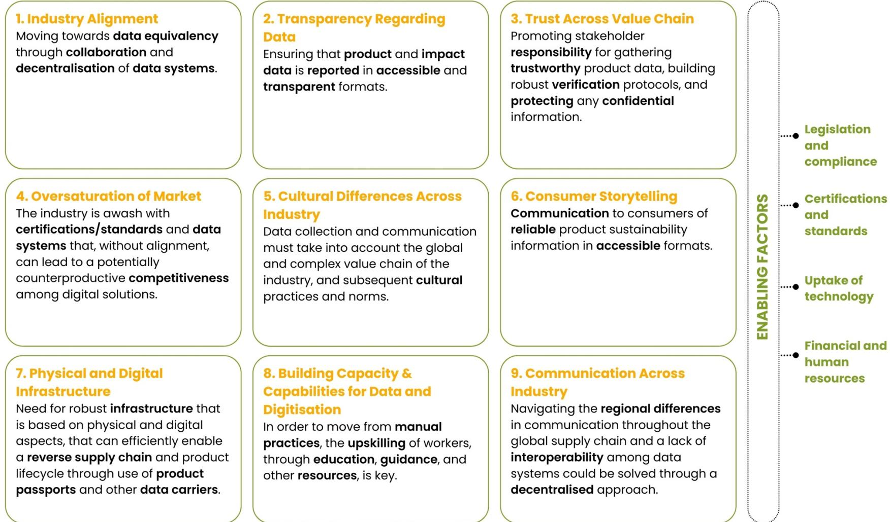
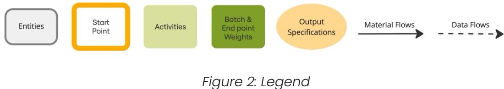
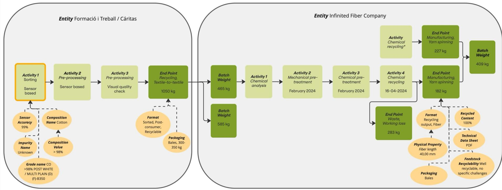
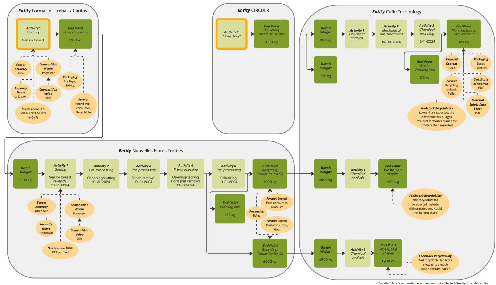
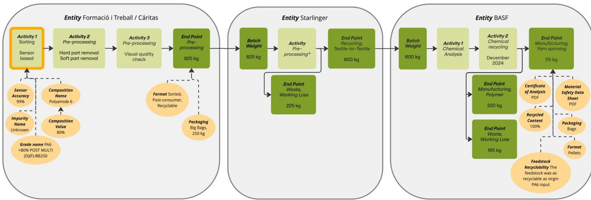

# Piloting a data model for textile-to-textile recycling

REPORT | MAY 2025

This project has received funding from the European Union's Horizon Europe research and innovation programme

## **Table of Contents**

| <b>Part 1: Introduction</b> .....                                             | <b>2</b>  |
|-------------------------------------------------------------------------------|-----------|
| <i>UNCOVERING INDUSTRY GAPS AND OPPORTUNITIES + PILOTING A SOLUTION</i> ..... | 3         |
| <b>Part 2: Pilot Summary</b> .....                                            | <b>4</b>  |
| <i>PILOT OBJECTIVES</i> .....                                                 | 5         |
| <i>DEVELOPMENT OF THE DATA MODEL</i> .....                                    | 5         |
| <i>THE T-REX DATA MODEL</i> .....                                             | 7         |
| <i>TESTING OF THE DATA MODEL</i> .....                                        | 8         |
| <b>Part 3: DPPs in the Textile Waste Supply Chain</b> .....                   | <b>16</b> |
| <b>Part 4: Next Steps</b> .....                                               | <b>17</b> |
| <i>ACKNOWLEDGEMENTS</i> .....                                                 | 18        |
| <b>Annex 1: T-REX Data Model</b> .....                                        | <b>19</b> |

# **Part 1: Introduction**

The textile industry has a significant environmental impact, contributing to global pollution through energy, water, and chemical usage, and accounting for 8-10% of global carbon emissions from apparel and footwear production1 .

Approximately 7 million kilograms of gross textile waste is generated within the EU and Switzerland on an annual basis2 . The disposal of this post-consumer textile waste in landfills or through incineration worsens the environmental challenge, highlighting the urgent need for effective solutions in end-of-life management strategies. The Textile Recycling Excellence, [T-REX](https://trexproject.eu/) Project, supported by the Horizon Europe program, aims to guide the textiles industry in seizing business opportunities in closed-loop textile recycling using post-consumer textile waste feedstock.

In November of 2023, the research team published the whitepaper titled [Connecting Threads: Assessing Digital](https://trexproject.eu/news-article/t-rex-project-releases-first-white-paper/)  [Solutions and Needs for Circular Textiles,](https://trexproject.eu/news-article/t-rex-project-releases-first-white-paper/) a first step in identifying, assessing and sharing key learnings about digital solutions, their types, needs and opportunities to support circular textile value chains. Adopting digital systems in the textiles industry offers benefits such as streamlined processes, enhanced transparency, collaboration facilitation, data-driven decision-making, and sustainability promotion. However, numerous challenges exist in transparency and standardisation of data structures and platforms, these must be addressed for effective implementation of sustainable tools. Moreover, the legislative environment in the European Union strongly urges the textile industry to adopt practices and uptake technologies to better support the creation of digital and physical infrastructure that support textile circularity.3

1 European Parliament (2022). The impact of textile production and waste on the environment. Available [here.](https://www.europarl.europa.eu/news/en/headlines/society/20201208STO93327/the-impact-of-textile-production-and-waste-on-the-environment-infographic)

2, 3 McKinsey (2022). Scaling textile recycling in Europe–turning waste into value. Available here.

## **UNCOVERING INDUSTRY GAPS AND OPPORTUNITIES + PILOTING A SOLUTION**

Through comprehensive primary and secondary research, three key areas were explored in the [whitepaper](https://trexproject.eu/news-article/t-rex-project-releases-first-white-paper/) – digital platform usage, data exchange protocols and challenges in the supply chain, and factors influencing the exchange of vital product data. This analysis yielded valuable insights into the opportunities and gaps associated with digitisation and circularity, with nine overarching themes identified.

The nine identified themes are highly interconnected and rely significantly on the industry's efforts to achieve data standardisation and system interoperability, which serve as crucial foundations for this digital transformation. In addition to these factors, various other enabling factors contribute to driving the industry's journey towards digitisation, such as legislation and compliance, certifications and standards, uptake and scaling of technology, and large-scale financial resources and upskilled human capital.

The research team set out to address these findings within the pilot, with the aim to standardise and digitise key data for chemical recycling, enabling more efficient textile-totextile recycling. Textile waste information is largely shared via paper records distributed over email, with very little standardisation in data sourcing, formatting, or communication. Therefore, the team set out to develop and test an excel-based data model for sorters, preprocessing actors, and recyclers in the T-REX Consortium. Through doing so, the pilot specifically aimed to address the following themes identified in the whitepaper - Theme 1: Industry Alignment, Theme 2: Transparency Regarding Data, Theme 3: Trust Across Value Chain, Theme 7: Physical and Digital Infrastructure, and Theme 8: Building Capacity & Capabilities for Data and Digitation. By addressing these themes, the pilot aimed to lay foundations upon which further digitisation could be built.

Figure 1: Nine overarching themes

# **Part 2: Pilot Summary**

## **PILOT OBJECTIVES**

Standardising data collection is an important aspect of the development of textile-to-textile recycling as it can help to structure the communication between economic partners in the textile recycling value chain. In the T-REX project, a blueprint was created for the textile-to-textile recycling of post-consumer household textiles. This provided the context for the pilot to research how data flows could trace the textile waste flowing through this recycling value chain.

The objective of the pilot was to develop and test a data model that would meet the minimum data requirements to capture the textile-to-textile recycling value chain within the T-REX project. The pilots began at the sorting stage and concluded at the recycling stage.

## **DEVELOPMENT OF THE DATA MODEL**

Before designing the data model, the research team first investigated the minimum data requirements in the T-REX waste value chain (sorting, preprocessing, and recycling). As part of this foundational research, an initial list of data points was developed based on existing Digital Product Passport (DPP) data protocols from TrusTrace, circular.fashion and EON.

Building on these protocols, the research team conducted several interviews with consortium members and external partners to identify which data points they independently collect, exchange and consider the highest value to their chemical recycling process. This shaped the information that was captured with the minimum data requirements of the data model.

Ensuring the data model's digital interoperability was a crucial next step in its development. TEXroad, a digital solutions organisation specialising in data-driven improvements to textile management infrastructure, provided expert guidance to the research team on implementing these measures. The table below details the findings from this development phase.

| Sorting                                   |                                                                                                                                                                                                                                                                                                                                                                                                                                                                                                                                                                                                                                                                                                                                                                                                        |                                                                                                                                                                                                                                                                                                                  |
|-------------------------------------------|--------------------------------------------------------------------------------------------------------------------------------------------------------------------------------------------------------------------------------------------------------------------------------------------------------------------------------------------------------------------------------------------------------------------------------------------------------------------------------------------------------------------------------------------------------------------------------------------------------------------------------------------------------------------------------------------------------------------------------------------------------------------------------------------------------|------------------------------------------------------------------------------------------------------------------------------------------------------------------------------------------------------------------------------------------------------------------------------------------------------------------|
| Data Field Name                           | Pilot Findings                                                                                                                                                                                                                                                                                                                                                                                                                                                                                                                                                                                                                                                                                                                                                                                         | Further Research                                                                                                                                                                                                                                                                                                 |
| Showstopper Hazardous Materials Recycling | A showstopper is a material that renders an entire batch of textile waste unusable for recycling when present. The idea of incorporating showstopper data into the model was explored to encourage sorting facilities to check for these materials in each batch. Recyclers also saw it as a valuable data point. However, it was ultimately excluded due to findings that sorting facilities currently lack the technical and economic means to provide this level of accuracy. For traceability and safety purposes, recyclers would like to know if there are hazardous materials present in their recycling feedstock. Similarly to showstoppers, sorters lack the means to accurately identify and sort by hazardous materials. Therefore, this data point was also excluded from the data model. | The material complexity of textile waste makes the identification of showstoppers difficult. A Digital Product Passport (DPP) could potentially be a valuable resource to identify all materials present in a garment, allowing showstoppers to be more easily identified and removed during sorting. See above. |
| Data Field Name                           | Pilot Findings It’s a common practise on an industrial scale for recyclers to mix feedstock from different batches to achieve the desired feedstock quality. While the data model is equipped to capture this complexity, it would require a digital system to follow and combine the batches, as well as connect them to the material flows in the real world. This level of complexity was however not within the scope of the T-REX project.                                                                                                                                                                                                                                                                                                                                                        | Further Research More research should be conducted on how similar data from different data systems can be aligned and exchanged so data flows in the digital world match material flows in the real world.                                                                                                       |

*Table 1: Findings of the data model development phase*

## **THE T-REX DATA MODEL**

The data model illustrates the minimum data requirements within the T-REX textile recycling value chain. As a result, the data model should not be seen as a final end-product. Instead, it should serve as a living document for stakeholders in the textile waste supply chain to build upon for data standardisation research.

The complete T-REX data model can be found in [Annex 1](#page-19-0).

It consists of the following four groups of data:

- Entity Data data points describing the economic entity that is processing materials o Example: company name, address and registry information
- Batch Data data points that identify and quantify a distinct batch of materials as it is processed by a specific entity and/or it flows along the value chain o Example: the batch ID number, weight, activities carried out during processing steps, types of downstream stakeholders in the value chain that can receive the outputs, and the quantity of each output batch based on these types of downstream stakeholders

- Output Specifications data points that characterise batches of materials and/or define the material requirements of a step in the value chain o Examples of sorting output specifications: sensor accuracy, feedstock material composition o Examples of pre-processing output specifications: feedstock format (full garments, cut pieces, fibres, pellets, etc.) o Examples of recycling output specifications: recycled content in output, feedstock recyclability, and technical documents on output material (Certificate of Analysis; Material Safety Data Sheet; Technical Data Sheet).
- - Material Streams – data points that are used in place of a data system that connects the value chain, these are data points that describe the streams of textile waste arriving at the collector o Example: total collection quantity, from which countries it came and which of that was internally collected or externally purchased.

## **TESTING OF THE DATA MODEL**

To test the data model, several interviews were conducted with consortium members and external partners, to cover each step in the waste supply chain. The T-REX project focuses on three material streams: cotton (recycled by Infinited Fiber Company), polyester (recycled by CuRe Technology), and polyamide 6 (recycled by BASF). For each of these streams, one of the performed pilot runs was captured with the data model, of which the results are visualised in the flow charts below.

It should be noted that the data visualised in these flow charts is based on pilot scale processes that, within the T-REX project, also ran in an experimental setting with small batch quantities. As a result, the data (especially the Batch & End Point Weights) are only indicative of the T-REX project and cannot be taken as representative of the operations of the entities.

*Figure 2: Legend*

*Figure 3: Cotton recycling data stream*

Figure 4: Polyester recycling data stream

*Figure 5: Polyamide 6 recycling data stream*

The goal of the data collection portion of the pilot was to (1) investigate if it was possible to receive critical datapoints (2) determine how to structure this data, (3) receive feedback on specific data points within the data model.

Each stakeholder interview consisted of collecting data through use of the data model and receiving feedback on the data model. See below for the findings from this testing phase:

| Collecting                                                        |                                                                                                                                                   |
|-------------------------------------------------------------------|---------------------------------------------------------------------------------------------------------------------------------------------------|
| Pilot Findings Data Point Data Field Name ID                      | Further Research                                                                                                                                  |
| Material Stream Collection was not within the scope 400,00-       | of the                                                                                                                                            |
| pilot. Nonetheless, 412,XX                                        | data points were collection data so that subsequent data developed to document the collection systems can digitally trace existing material       |
| quantities and origins Sorting                                    | of feedstock in the flows project. The collectors that were interviewed were able to provide the data requested.                                  |
| Data Point ID Pilot Findings Data Point ID                        | Further Research                                                                                                                                  |
| 201,10 Activity Date Since sorting is often a continuous process, |                                                                                                                                                   |
| sorters cannot always provide specific                            | dates processing of materials over time to increase for activities. This is especially the case when they work with an existing sorting category. |
| 310,00 Sensor                                                     |                                                                                                                                                   |
| Sensor accuracy                                                   | may be considered                                                                                                                                 |
| confidential Accuracy technology.                                 | information by the company that manufactured the automated sorting                                                                                |

| 321,10 Composition                |                                                    |
|-----------------------------------|----------------------------------------------------|
| Contamination                     | Sorters were unable to provide details on          |
| Some NIR scanning technology      | can detect                                         |
| this on a garment level, but this | information is                                     |
| Pilot Findings                    | Further Research                                   |
| 201,00 Activity                   | Within the current structure of the data model,    |
|                                   | Development of activity values list to allow for a |
| Pilot Findings                    | Further Research                                   |
| 201,00 Activity                   | This is difficult to standardise as recyclers      |

| 201,10 Activity Date Recyclers typically only communicate the |                                                            |
|---------------------------------------------------------------|------------------------------------------------------------|
| 211,00 End Point (Out                                         |                                                            |
| “Waste”                                                       | is one, which again has several sub                       |
| Recyclers required clarity on                                 | how to define                                              |
| 360,00 Recycled                                               |                                                            |
|                                                               | Develop data points that could trace the non              |
| Not all recyclers provided                                    | these documents. Better integrate uploaded documents (COA, |

|        | General Pilot Findings |                                                                                                                                                                       |                                                                                                     |
|--------|------------------------|-----------------------------------------------------------------------------------------------------------------------------------------------------------------------|-----------------------------------------------------------------------------------------------------|
|        | Data Field Name        | Pilot Findings Stakeholders in the textile waste supply chain (aggregators, sorters, preprocessors, and recyclers) often perform a variety of intersecting activities | Further Research Reflect the overlapping activities of waste supply chain actors in the data model. |
| 200,10 | Batch Weight           | It’s important to clarify whether this refers to                                                                                                                      |                                                                                                     |
|        |                        | the net weight, defined as the weight of the                                                                                                                          |                                                                                                     |
|        |                        | feedstock without packaging.                                                                                                                                          | Establish a standard system for reporting batch weight                                              |

*Table 2: Findings of the data model testing phase*

# **Part 3: DPPs in the Textile Waste Supply Chain**

The Digital Product Passport (DPP) has the potential to provide key data points for the textile waste supply chain, but this requires a strong data communication foundation into which DPPs can be integrated.

DPPs are specifically helpful for providing sorters with product information to inform sorting decisions. Near Infrared (NIR) scanners are currently used in the sorting process to determine the composition of the main fabric of a garment, but have limitations in accuracy and trim identification. DPPs can offer a solution to this by providing verified information on material composition, finishes, prints, and trims which can help sorters better grade feedstock per recycler requirements.

However, a hurdle of DPP data is that it is connected to individual garments, whereas textile waste is gathered on a batch or shipment level. Existing protocols result in garments arriving in batches to sorting centres, making it hard for sorters to gather individual garment-level datapoints within a textile waste batch and communicate critical data to downstream stakeholders. During subsequent preprocessing and recycling steps, textile feedstock is physically modified thus removing the DPP entirely until a new product is made requiring a DPP of its own.

# **Part 4: Next Steps**

The aim of this pilot was to digitise the T-REX waste supply chain with the goal of capturing and somewhat standardising the critical data that flows through the sorters, aggregators, and preprocessors, through to the recyclers. The pilot testing of the data model, therefore, took place in an experimental setting with this small group of supply chain stakeholders and under specific assumptions.

Furthermore, a data system is required to move data documented by the developed data model across the value chain by aligning the data flows in the digital world with the material flows in the real world. While the data model structures and holds the information, it is the data systems that allow the data to move across the value chain. As such, this textile waste data model and its subsequent data system would have to be further optimised to be used on an industrial scale, a scale that realistically contains multiple intersecting waste flows, a network of supply chain stakeholders, and many data communication intricacies.

In addition to the specific next steps given in Part 2 of the report, the following complexities were not explored within this data model and merit further research:

- Applying the data model in the supply chain by following a specific flow of textile waste from aggregation, sorting, all preprocessing steps, and recycling. While the ambition of the pilot was to execute this within the T-REX project supply chain, the intricacy of the feedstock flows and lack of data systems made it hard to track a specific batch.
- Building the associated data system to extend past batch level. The T-REX project focused on specific feedstock batches per recycler but in practice and especially as recycling scales, recyclers will combine and store feedstock batches from many sources on a shipment level. The data model should be able to follow the movement of feedstock through these complexities and realities of the textile waste supply chain.
- Ensuring the data from the reverse supply chain is interoperable with data models and digital systems currently in use in the product creation process and existing supply chain. This will allow for relevant recycled content material data to be communicated through the fibre, yarn, fabric, and garment manufacturing steps.

- Ensuring interoperability between traceability platforms and certification schemes by aligning data models.
- Denoting feedstock sources (Post-Industrial, Pre-Consumer, and Post-Consumer) that are typically used in textile-to-textile recycling. The T-REX project was focused solely on post-consumer waste, but textile recyclers typically will use a combination of these three source types for operations. Non-textile feedstocks (such as bottles, packaging, etc) can also be included as it is somewhat common for recyclers in the value chain to combine their feedstock sources.

Iterative work in the space of digitisation is necessary to establish a strong foundation of data sharing in the textile industry, especially data around textile waste and recycled content. Projects such as EU Horizon's [PESCO-UP](https://www.pesco-up.eu/) aim to further build digital capabilities for textile waste supply chain data by developing tools and practices for data sharing between relevant supply chain actors.

### **ACKNOWLEDGEMENTS**

The research team would like to thank Traci Kinden of [TEXroad](https://www.texroad.org/) for sharing her expertise and providing guidance during the planning and execution of this pilot and subsequent report. Thank you also to the T-REX consortium and external project partners for their participation in the pilot testing, namely the teams from ModaRe Caritas, Valvan, Nouvelles Fibres Textiles, Veolia, CuRe Technology, BASF, and Infinited Fiber Company.

# **Annex 1: T-REX Data Model**

| Entity Data    | T     | T-REX Data Field  | Examples (not a           |                                                                                                                                                               |
|----------------|--------|-------------------|---------------------------|---------------------------------------------------------------------------------------------------------------------------------------------------------------|
| Data Category  |        | Name              | complete values list)     | Data Format Definition                                                                                                                                        |
| Entity Details | 100,10 | Entity Name       | Trident Courage           | Open text (brief) with any company type                                                                                                                       |
| Entity Details | 100,21 | Street            | Bankova Str.              | Open text Street, house number, city, postal code, and (brief) country must appear together.                                                                  |
| Entity Details | 100,22 | City              | Kyiv                      | Open text Street, house number, city, postal code, and (brief) country must appear together.                                                                  |
| Entity Details | 100,23 | House Number      | 11                        | Open text Street, house number, city, postal code, and (brief) country must appear together.                                                                  |
| Entity Details | 100,24 | Province / Region | Kyiv                      | Open text Street, house number, city, postal code, and (brief) country must appear together.                                                                  |
| Entity Details | 100,25 | Postal Code       | 01220                     | Open text Street, house number, city, postal code, and (brief) country must appear together.                                                                  |
| Entity Details | 100,26 | Country           | Ukraine GLN OSH           | Text (from Street, house number, city, postal code, and standard list) country must appear together. The name of the registry used to identify the Text (from |
| Entity Details | 100,30 | Registry name     | Dutch Chamber of Commerce | standard list) Chamber of Commerce, EU-VAT, etc).                                                                                                             |
| Entity Details | 100,40 | Registry Other    |                           | Open text (brief) standard list.                                                                                                                              |

|                |        |                    |                                  | Alphanumeric                   |                                       |
|----------------|--------|--------------------|----------------------------------|--------------------------------|---------------------------------------|
| Entity Details | 100,50 | Registry ID Number | FR202206770RY8G Collector Sorter | text (fixed format) Text (from | listed.                               |
| Entity Details | 100,60 | Entity Type        |                                  |                                |                                       |
|                |        |                    | Pre-processor Recycler           | standard list)                 | Determined by activities carried out. |

| Batch Data             | T     | T-REX Data Field  | Examples (not a                 |                                       |                                               |
|------------------------|--------|-------------------|---------------------------------|---------------------------------------|-----------------------------------------------|
| Data Category          |        | Name              | complete values list)           | Data Format                           | Definition                                    |
| Batch Details          | 200,00 | Batch Number      | 123456                          | Alphanumeric text                     |                                               |
| Flow and Batch Details | 200,10 | Batch Weight      | 10                              | Number (fixed format)                 | available unit.                               |
| Flow and Batch Details | 200,20 | Batch Weight Unit | tonnes                          | Text (from                            |                                               |
|                        |        |                   |                                 | standard list)                        | Unit of measurement used for the Batch Weight |
| Flow and Batch Details | 201,00 | Activity 1        | Sorting, Sensor based, TrinamiX | Text (from standard list) Date format | batch of materials.                           |
| Flow and Batch Details | 201,10 | Activity 1 Date   | 15-apr-24                       | (standard)                            | a year                                        |
| Flow and Batch Details | 202,XX | Activity 2…       |                                 |                                       |                                               |

|                        |        |                      | Bales                | Text (from                |                                                       |
|------------------------|--------|----------------------|----------------------|---------------------------|-------------------------------------------------------|
| Flow and Batch Details | 210,00 | Packaging            |                      |                           |                                                       |
|                        |        |                      | Boxes Capsacks       | standard list)            | How the batch or shipment is packed                   |
| Flow and Batch Details | 211,00 | End Point 1          | Next step, Fine sort | Text (from standard list) | here) or broken down into several.                    |
| Flow and Batch Details | 211,10 | End Point 1 Quantity | 5000                 | Number (fixed format)     | included in End Point 1 (211,00)                      |
| Flow and Batch Details | 211,20 | End Point 1 Quantity | kg                   | Text (from                |                                                       |
|                        |        | Unit End Point       | Tonnes Includes      | standard list) Text (from | Unit of the quantity in End Point 1 Quantity (211,10) |
| Flow and Batch Details | 211,20 | Packaging            | Excludes             | standard list)            | excludes packaging weight                             |
| Flow and Batch Details | 212,XX | End Point 2…         | Recycle, Textile to  | Text (from                |                                                       |
|                        |        |                      | textile              | standard list)            | Multiple end points are possible for a single batch.  |

| Output Specification Data   | T     | T-REX Data Field | Examples (not a |                          |                                                                               |
|-----------------------------|--------|------------------|-----------------|--------------------------|-------------------------------------------------------------------------------|
| Data Category Input Output  |        | Name             |                 | Data Format Alphanumeric | Definition                                                                    |
| Specifications Input Output | 300,00 | Grade Name       |                 | text Number as a         | the outputs or the actor buying the inputs materials batches or of equipment. |
| Specifications              | 310,00 | Sensor Accuracy  | 95%             | format)                  | In the case of a sensor, this is accuracy as provided by the manufacturer.    |

|                                          |        |                           | Fiber composition from representative sample size of                       |                                       | the accuracy level.                           |
|------------------------------------------|--------|---------------------------|----------------------------------------------------------------------------|---------------------------------------|-----------------------------------------------|
| Specifications Input Output Input Output | 311,00 | Sensor Accuracy Method    | sorted textile batches was lab tested using a dissolution method Recycling | Open text (multi-line) Text (from     |                                               |
| Specifications                           | 320,00 | Format                    | feedstock, post consumer, fiber                                           | standard list)                        |                                               |
| Specifications Input Output              | 321,00 | Composition Name          | Cotton                                                                     | Text (from standard list) Number as a |                                               |
| Specifications                           | 321,10 | Composition Value         | 96,50%                                                                     |                                       |                                               |
| Input Output Input Output                |        | Composition               | Minimum                                                                    | format) Text (from                    | % of the total by weight for Composition Name |
| Specifications Input Output              | 321,20 | Threshold Contamination 1 | Maximum Exact Animal fibers                                                | standard list) Text (from             |                                               |
| Specifications                           | 330,00 | Name                      | Polyeurathane Elastane                                                     | standard list)                        |                                               |

| Input Output                             |        | Contamination 1                       |      | 332,00; 333,00; etc.) Number as a For both input and output specifications |
|------------------------------------------|--------|---------------------------------------|------|----------------------------------------------------------------------------|
| Specifications                           | 330,10 |                                       |      |                                                                            |
| Input Output                             |        | Amount Contamination 1                | 5,00 | format) Text (from                                                         |
| Specifications Input Output              | 330,20 | Threshold Contamination 2             |      | standard list) composition                                                 |
| Specifications                           | 331,XX | Name…                                 |      | For input and output specifications                                        |
| Specifications Input Output              | 340,00 | Physical Property 1 Name              |      | Text (from standard list) additional data fields                           |
| Specifications                           | 340,10 | Physical Property 1                   |      |                                                                            |
| Input Output                             |        | Measure                               | 5    | Number (fixed format) property                                             |
| Specifications                           | 340,20 | Physical Property 1                   |      |                                                                            |
| Input Output                             |        | Unit                                  | mm   | Text (from                                                                 |
|                                          |        |                                       |      | standard list) Unit of the numerical value measurement                     |
| Specifications Input Output Input Output | 340,30 | Physical Property Verification Method |      | Open text (multi-line) physical property                                   |
| Specifications                           | 341,XX | Physical Property 2…                  |      |                                                                            |

| Input Output                |        | Feedstock                        | Well recyclable, no | Open text                                                          |
|-----------------------------|--------|----------------------------------|---------------------|--------------------------------------------------------------------|
| Specifications Input Output | 350,00 | Recyclability                    |                     | (multi-line) batch as determined by recycler Number as a           |
| Specifications Input Output | 360,00 | Recycled Content Certificate of  | 100%                | format) additives.                                                 |
| Specifications              | 370,00 |                                  |                     |                                                                    |
|                             |        | Analysis (COA)                   |                     | PDF laboratory analysis.                                           |
| Specifications Input Output | 371,00 | Material Safety                  |                     |                                                                    |
| Input Output                |        | Data Sheet (MSDS) Technical Data |                     | PDF their output material. detailed information on the properties, |
| Specifications              | 372,00 |                                  |                     |                                                                    |
|                             |        | Sheet (TDS)                      |                     | PDF output material.                                               |

| Material Streams Data | T     | T-REX Data Field                | Examples (not a       |                                                                                                                                              |
|-----------------------|--------|---------------------------------|-----------------------|----------------------------------------------------------------------------------------------------------------------------------------------|
| Data Category         |        | Name Total Collection           | complete values list) | Data Format Definition Number                                                                                                                |
| Material Streams      | 400,00 |                                 |                       |                                                                                                                                              |
|                       |        | Quantity Total Collection       | 900                   | (fixed format) time frame Text (from                                                                                                         |
| Material Streams      | 400,10 | Quantity Unit External Purchase | tonnes                | standard (400,00) list) Number                                                                                                               |
| Material Streams      | 401,00 |                                 |                       |                                                                                                                                              |
|                       |        | Quantity                        | 400                   | (fixed                                                                                                                                       |
|                       |        | External Purchase               |                       | determined 6 months’ time frame and that format) was purchased from external collectors Text (from Unit of the quantity in External Purchase |
| Material Streams      | 401,10 |                                 |                       |                                                                                                                                              |
|                       |        | Quantity Unit External Purchase | tonnes                | standard Quantity (401,00) list) Text (from Name of the country where the external                                                           |
| Material Streams      | 402,00 |                                 |                       |                                                                                                                                              |
|                       |        | Country 1 Name                  | Germany               | standard collector is located list)                                                                                                          |

|                  | Numeric value for the post-consumer textile Number External Purchase waste that was purchased from the collector                                                                                          |
|------------------|-----------------------------------------------------------------------------------------------------------------------------------------------------------------------------------------------------------|
| Material Streams | 402,10                                                                                                                                                                                                    |
|                  | Country 1 Quantity 30 (fixed based in the country determined in External format) Purchase Country 1 Name External Text (from Collection Unit of the quantity in External Collection                       |
| Material Streams | 402,20 standard Country 1 Quantity Country 1 Name list) Unit External                                                                                                                                     |
| Material Streams | 403,XX Collection Country 2 Name… Numeric value for the post-consumer textile Number                                                                                                                      |
| Material Streams | 410,00                                                                                                                                                                                                    |
|                  | Quantity 500                                                                                                                                                                                              |
|                  | determined 6 months’ time frame that was Internal Collection (fixed collected through the company's own format) collection bins and additional internal collection systems Text (from Internal Collection |
| Material Streams | 410,10 tonnes standard Unit of the quantity in External Collection Quantity Unit list) Text (from Internal Collection Name of the country from where the internal                                         |
| Material Streams | 411,00                                                                                                                                                                                                    |
|                  | Country 1 Name Germany standard collection bins are located list)                                                                                                                                         |

|                  | Numeric value for the post-consumer textile waste that was collected through the Number Internal Collection                                                                                                 |
|------------------|-------------------------------------------------------------------------------------------------------------------------------------------------------------------------------------------------------------|
| Material Streams | 411,10                                                                                                                                                                                                      |
|                  | Country 1 Quantity 80 (fixed internal collection systems in the country format) determined in Internal Collection Country 1 Name Internal Collection Text (from Unit of the quantity in External Collection |
| Material Streams | 411,20 Country 1 Quantity standard Country 1 Name Unit list) Internal Collection                                                                                                                            |
| Material Streams | 412,XX Country 2 Name…                                                                                                                                                                                      |