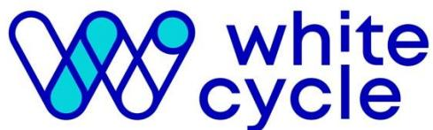
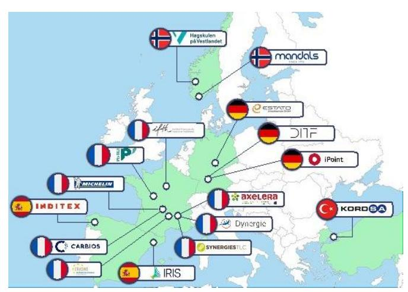
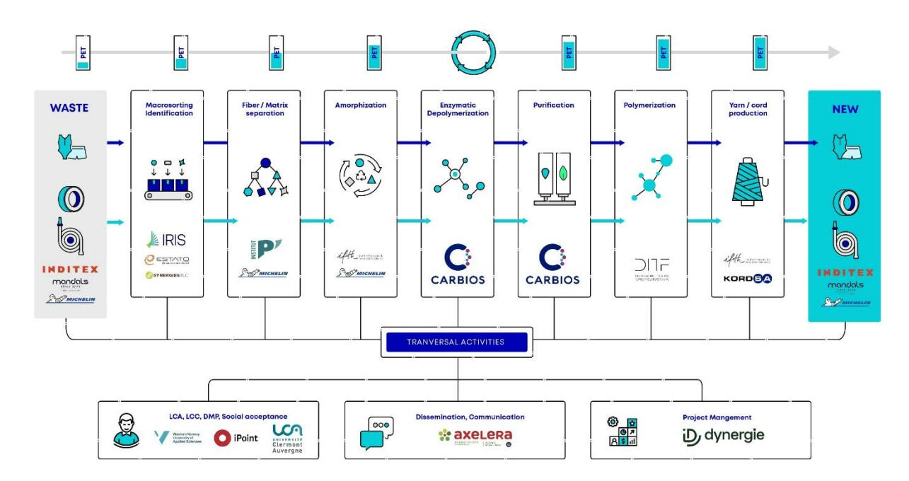
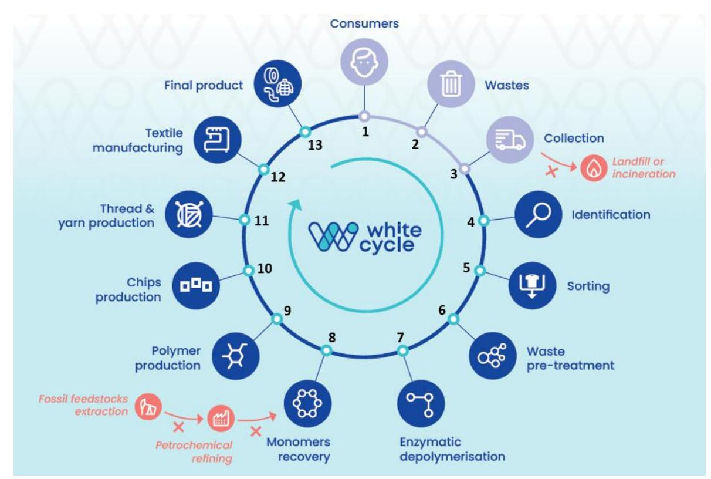

## white cycle

**Driving circular innovations in technical textiles: Strengthening sustainable industrial value chain Policy recommendations** 

#### **PROJECT ACRONYM: WHITECYCLE**

**Deliverable:** 

**D.7.10 - Policy brief**

**Grant Agreement: N° 101059639**

**Date: 2025-30-05**

**Version: 1.7**

**Website: www.whitecycle-project.eu**

#### **Status**

| <input checked="" type="checkbox"/> Final             |                                                                                           |
|-------------------------------------------------------|-------------------------------------------------------------------------------------------|
| <input type="checkbox"/> In Progress. Please explain: | <input type="checkbox"/> Iterative Process – This year’s results have been 100% achieved. |
|                                                       | <input type="checkbox"/> Delay – This year’s results were not fully achieved.             |

#### **Tracking Changes**

| Version | Author               | Description of the changes                                    |
|---------|----------------------|---------------------------------------------------------------|
| V1.0    | Clémentine Devarenne | First full draft shared with the consortium                   |
| V1.2    | Clémentine Devarenne | Second version incorporating the main ideas and structure     |
| V1.3    | Alexandra Poch       |                                                               |
| V1.4    | Clémentine Devarenne | Review and improvements of the document                       |
| V1.5    | Olivier Cardon       | Final review                                                  |
| V1.6    | Clémentine Devarenne | Update of the document based reflecting the recent regulatory |
|         |                      | changes and addition of key recommendations based on feedback |
|         |                      | -Rewriting of Challenge and Recommendation No. 2 page 15/19   |
|         |                      | -Addition of a glossary page 32                               |
| V1.7    | Clémentine Devarenne | Document updated based on the review by the project monitors. |
|         |                      | -Addition of sections 1.5 and 1.6                             |

#### **Level of Dissemination**

☐ Confidential

☒ Public

#### **Author(s)**

|              | Partner name | Name of the author                                 |
|--------------|--------------|----------------------------------------------------|
| Main Author  | AXELERA      | Clémentine Devarenne                               |
| Contributor  | IRIS         | Alexandra Poch                                     |
| Contributor  | UCA          | Henri Sourgou                                      |
| Contributor  | HVL          | Valeria J. Schwanitz, August Wierling              |
| Contributor  | CARBIOS      | Aurelie Gardarin                                   |
| Contributor  | NFT          | Emmanuel PRETET                                    |
| Contributor  | DITF         | Iris ELSER                                         |
| Contributor  | I POINT      | Manoj Subedi                                       |
| Contributor  | IFTH         | Carole Aubry                                       |
| Contributors | MICHELIN     | Olivier Cardon, Francesca Nante, Clémence Routhiau |
| Contributor  | MANDALS      | Hege Baggethun                                     |

# **TABLE OF CONTENT**

| Summary of the key messages Public summary and objectives of the deliverable Presentation of the project                                | 6 7 8 10                          |
|-----------------------------------------------------------------------------------------------------------------------------------------|-----------------------------------|
| 1. Governance challenges and recommendations.......................................................................                     | 10                                |
| treatment and recovery                                                                                                                  | 10                                |
| across Member States................................................................................................................... | 13                                |
| efficiency and growth of the textile recycling value chain............................................................                  | 15                                |
| innovation and improve overall system performance..................................................................                     | 17                                |
| composition and insufficient eco-design development................................................................                     | 19                                |
| sustainable product design, and global supplier compliance to ensure cost-effective recycling.                                          | 19                                |
| 1.7 Challenge n°4: Impacts assessment of large scale closed-loop recycling processes                                                    | 20                                |
| environmentally and economically sustainable............................................................................                | 21                                |
| 2. Economic challenges and recommendations...........................................................................                   | 23                                |
| 2.1 Challenge n°1: Competition from non-European countries                                                                              | in technical textile recycling or |
| recycled textile-based products....................................................................................................     | 23                                |
| expanding infrastructure to enhance competitiveness.                                                                                    | 24                                |
| textile recycling value chain across Europe...................................................................................          | 26                                |
| accelerate the growth of textile recycling technologies...............................................................                  | 29                                |
| 3. Societal challenges and recommendations..............................................................................                | 30                                |
| 3.1 Challenge n°1: Consumer acceptance for products containing recycled PET.                                                            | 30                                |
| 3.2 Recommendation n°1: Aligning development of recycled products with consumer                                                         |                                   |
| r-PET 31                                                                                                                                |                                   |
| Conclusion                                                                                                                              | 32                                |

# Whitecycle policy brief

## Summary of the key messages

### Governance

- • Establishment of a unified EU policy framework to guide and support the transition to a circular textile economy, ensuring that policies are both effective and aligned across Member States
- • Set stronger regulatory targets and enhanced full traceability to drive innovation and improve overall system performance
- • Encourage the adoption of innovative models for conducting Life Cycle Assessments in closed-loop recycling systems to ensure that these systems are both environmentally and economically sustainable
- • To enable a truly circular textile economy, the composition of products should be carefully managed from the design stage, supported by clear EU policies that also apply to products manufactured outside Europe, in order to prevent future recycling difficulties and associated costs

### Economic

- • Strengthening EU's market presence by fostering innovation and expanding infrastructure to enhance competitiveness
- • Introduce stronger financial incentives to stimulate investment and accelerate the growth of textile recycling technologies

### Societal

- • Aligning development of recycled products with consumer preferences, fostering trust, and encouraging behaviors to support the use of products made of r-PET

### End of life Tyres

Set EU-harmonised end-of-waste criteria **for secondary raw materials derived from end-of-life tyres** to ensure legal certainty and free circulation within the Single Market.

Developing and deploying traceability technologies for tracking **wastes and the recycled content in products**.

Promote policies that recognise the **added value of material recovery from end-of-life tyres** to deploy an economically **viable recycling value chain**.

Incentivise investments in end-of-life tyre recycling processes **to ensure their industrial scale-up**.

### End of life Hoses

Introduce mandatory eco-design standards for textiles, with a strong focus on repairability, alongside requirements **for recycled content, durability, and recyclability**.

Establish labelling standards and a product passport indicating the percentage and type of textile reinforcement, polymer composition, and recycling instructions.

Provide subsidies **for textile manufacturers to adopt recycling technologies and offer tax incentives to companies** using recycled materials.

Developing and deploying traceability technologies **for tracking wastes** and the recycled content in products.

### End of life garments

Introduce **comprehensive financial support mechanisms**. For example offering subsidies for textile manufacturers to invest in recycling technologies, and tax incentives for companies that use recycled content in their products.

Establish **clear and harmonised guidelines for eco-modulated fees**, ensuring they are based on the environmental performance of products and fully aligned with Ecodesign requirements and enforcement mechanisms.

Include **environmental impact, recyclability, repairability, and supply chain data** in the DPP.

# **Public summary and objectives of the deliverable**

This policy brief, delivered at the mid-term stage of the WhiteCycle project, aims to provide policymakers with an overview of the challenges and key recommendations identified by the project consortium that are affecting the deployment and implementation of the projects related to complex and technical textiles circularity. It focuses on identifying critical enablers and barriers within the current and future policy landscape that influence the success and scalability of similar initiatives.

The brief will offer recommendations on how existing policies can be adapted, or new policies created, to support the rapid deployment of textiles circular projects. This document has been carefully structured to provide a clear and actionable understanding of the key challenges and recommendations related to technical textile waste management, recycling, and recovery. To ensure clarity and avoid a simple "list effect," we have grouped the content into three overarching categories: Governance, Economic, and Societal. This thematic organization makes it easier to identify where specific barriers lie and how they can be addressed effectively.

The challenges and recommendations included in the document are applicable across all types of technical textile waste studied which WhiteCycle: textile in tyres, hoses, and garments. By formulating cross-cutting insights, we aim to highlight the common needs shared by these sectors while enabling a unified approach.

To avoid overly generic recommendations, each challenge and recommendation is accompanied by a detailed table that breaks down the specific issues and proposed actions at each step of the project value chain, from collection and sorting to processing and final recovery. This ensures that our guidance remains practical and tailored, as the relevance and effectiveness of solutions can vary significantly depending on the stage in the chain.

Additionally, in recognition of the specificities of each waste type, the document provides targeted insights for each material stream (textile in tyres, hoses, and garments), complemented by a summary of the three priority recommendations for each category. This helps to quickly identify the key priorities and actionable strategies tailored to each waste stream.

This deliverable serves as a foundation for ongoing dialogue, offering valuable insights for future discussions with stakeholders, sister projects, and institutional actors. These early insights will serve as a basis for further discussion and refinement during the final project workshop. At this workshop, stakeholders, sister projects, and institutional representatives will be invited to contribute to refining the recommendations and exploring ways to create a more favourable environment for scaling similar projects across Europe.

# **Presentation of the project**

PET is widely used in plastics and textiles leading to over 20 Mt/y of complex waste worldwide for which no closed-loop recycling is viable today. Most complex waste is landfilled or incinerated. There is an urgent need to develop a circular solution to convert complex PET wastes from plastics and textiles back into high-added value products.

WHITECYCLE unites 3 brand-owners, 1 PET converter, 2 waste managers, 1 digital deeptech for smart sorting, the world leading enzymatic recycling SME, 1 LCA company, 3 UNIs/RTOs, 1 cluster and 1 management firm.

The consortium aims to demonstrate two new processes combining strong scientific and industrial know-how: (i) innovative identification, sorting and separation technologies that will dramatically increase the PET content of complex waste streams to 80%, and (ii) a disruptive enzymatic recycling process that is expected to yield pure PET monomers sustainably even for impure waste streams. PET monomers obtained will be repolymerised and recycled.

Thus, 2 t of waste will be used to demonstrate 3 highly technical PET containing pilot series: 100 tyres, 1,500 m of lay-flat hoses and 400m2 of multicomponent fabric that will be coated and used to manufacture 4 lines of technical garments. Process design kits, LCA and production cost estimates will be provided to PET manufacturers and waste management companies for rapid deployment and assure social acceptance. First projections show that WHITECYCLE's recycled PET will be competitive to answer market demand. The project will conduct a full circle loop from real complex waste feedstock to

*Figure 1: Mapping of partner locations in Europe*

*Figure 2: WhiteCycle key steps* 

representative product of the 3 use-cases at TRL 5. Then, a strong upscale study will allow the process steps to reach TRL 6 to 8. By 2030, WHITECYCLE will enable the annual recycling of more than 2 Mt of PET, which corresponds to the amount of additional recycled PET needed to meet the EU's 2030 targets. This could reduce emissions by around 2 Mt CO2eq and avoid the landfilling and/or incineration of more than 2 Mt of PET.

The following diagram illustrates WhiteCycle's circular approach, and the key steps undertaken throughout the project.

*Figure 3: WhiteCycle circular approach* 

# **Challenges identified by the consortium and associated recommendations**

The deployment of technical textile recovery initiatives faces a range of challenges, many of which have been identified by the project consortium. These challenges might hinder the effective scaling and implementation of these initiatives, despite their potential to drive sustainability and innovation in the textile sector. The consortium has highlighted that these challenges manifest in various forms, creating complex obstacles to progress.

The challenges are multifaceted, cutting across various domains. The consortium has identified the following key dimensions to organise challenges:

- 1. governance,
- 2. economic, and
- 3. societal.

These diverse challenges require tailored solutions and addressing them will be key to enabling the broader adoption of circular technical textile recovery across Europe.

#### 1. Governance challenges and recommendations

#### 1.1 Challenge n°1: Lack of a harmonized regulatory framework in Europe for textile waste treatment and recovery

One of the key challenges facing the European textile industry is the lack of a harmonised regulatory framework for treating textile waste and recovering textiles. While some countries have made strides in establishing national regulations for textile waste management, these efforts remain fragmented across the EU. This lack of uniformity creates significant obstacles for both producers and consumers, hindering the efficient recycling and recovery of textile materials on a large scale.

Currently, EU member states are pursuing a range of divergent policies: while some prioritize textile waste collection and recycling, others lack comprehensive legislation altogether. This fragmented regulatory landscape creates uncertainty and hinders investment in recycling technologies.

At the European level, there is currently no clear and harmonized definition of what is encompassed by the term "textiles" within the regulatory framework. Textiles cover a wide range of products with highly diverse uses and compositions, including clothing, home textiles, car seat covers, and complex or technical textiles such as those used in tires. Each type of textile has specific characteristics in terms of both material composition and recovery potential, which implies different requirements for collection, sorting, and recycling. However, current regulations do not sufficiently reflect this diversity, thereby hindering the development of tailored recycling streams. It is therefore necessary to harmonize, at the European level, the structuring of textile waste management systems based on the specificities of each waste stream.

This challenge affects various stages of the WhiteCycle circular value chain in different ways (Figure 3). Table 1 below outlines the key challenges on each step, highlighting how varying levels of policy implementation influence the effectiveness and development of the overall value chain. A challenge for all stages of the value chain is the low level of standardized and digitized data on processes, input, intermediate flows and final output. Well-organised and agreed-upon FAIR data flows are a prerequisite for optimal material flows within a circular economy.

| Step Name of the N° stage                                                      | Key challenges                                                                     |
|--------------------------------------------------------------------------------|------------------------------------------------------------------------------------|
| 1,2 Post consumer                                                              |                                                                                    |
| For example, professional                                                      | clothing falls under the Extended Producer                                         |
| Responsibility (EPR) scheme for tools                                          | and gardening products, while clothing                                             |
| intended for the general public is managed by the EPR                          | scheme for textiles,                                                               |
| looking items such as two jackets textile wastes                               | may be managed by entirely different systems                                       |
| In addition, in countries with established systems                             | (e.g., France, Germany),                                                           |
| consumer textile waste.                                                        | 1 Moreover, systems waste, contributing to higher landfill and incineration rates. |
| 3 Wastes collection                                                            |                                                                                    |
| volume and quality of recyclable materials.                                    | In more than half of the EU-27                                                     |
| mostly to capture reusable textiles.                                           | The average capture rate for textile waste in                                      |
| and is consequently landfilled or incinerated.                                 | These data show significant room                                                   |
| Czechia reported a collection rate of 25% in 2020.                             | 1                                                                                  |
| 4 Identification                                                               |                                                                                    |
| identify the material content (PET, PP)                                        | of technical textiles because of additives                                         |
| 5 Sorting                                                                      |                                                                                    |
| Moreover, variable infrastructure types and processes across countries leading |                                                                                    |
| to diverse sorting methods and quality, affecting recyclability.               | In addition, health                                                                |
| and safety regulations further complicate the process,                         | as they are not                                                                    |

1 *[European Environment Agency](https://www.eea.europa.eu/publications/management-of-used-and-waste-textiles/management-of-used-and-waste?utm_source=chatgpt.com) - Management of used and waste textiles in Europe's circular economy, May 2024*

| risks in textiles.                                                           | Lastly, the lack of harmonized and digitalized standards across      |
|------------------------------------------------------------------------------|----------------------------------------------------------------------|
| 6 Pre-treatment                                                              |                                                                      |
| complicates the processing and pretreatment of this waste.                   | Indeed, these                                                        |
| composition, makes                                                           | waste treatment complex.                                             |
| Moreover, few facilities are currently equipped to carry out this operation, | as it                                                                |
| may be required.                                                             | This regulatory gap leads to uncertainty regarding acceptable        |
| impurity levels,                                                             | suitable processing methods (such impurities can be removed at       |
| streams                                                                      | to ensure that only suitable materials are used in the production of |
| 11 Thread and yarn                                                           |                                                                      |
| Irregular quality and contamination levels                                   | due to varying sorting standards                                     |
| 12 Textile                                                                   |                                                                      |
| 13 Final products                                                            |                                                                      |

*Table 1: Assessment of how regulatory fragmentation in Europe affects the WhiteCycle circular value chain*

### 1.2 Recommendation n°1: Establishment of a unified EU policy framework to guide and support the transition to a circular textile economy, ensuring that policies are both effective and aligned across Member States

A harmonized regulatory framework at the EU level would help address these challenges by setting common standards for textile waste treatment and material recovery (incl. FAIR data standards). This could include establishing clear guidelines for the collection, sorting, and recycling of textiles, as well as creating a standardized system for tracking the recycled content in products. A unified framework would encourage the development of more efficient recycling infrastructures, increase market confidence in recycled materials, and create a more predictable regulatory environment for manufacturers operating across multiple European countries. All actors across the circular textile value chain need to discuss and agree upon FAIR data standards. However, it needs a central organisation to establish them among all industries (e.g., European Statistical Offices).

Moreover, to enhance Europe's environmental responsibility and strengthen its circular economy, it is crucial to implement legislation aimed at reducing the export of waste to non-EU countries. Currently, exporting waste, particularly textiles, to countries with weaker environmental regulations contributes to pollution and health risks, while undermining Europe's sustainability objectives. By addressing this issue, Europe can foster better waste management practices and significantly reduce the environmental impact of its waste exports.

First, limiting waste exports aligns with circular economy principles by ensuring that waste is processed, recycled, or repurposed locally rather than offshored. This would reduce the ecological burden on lessregulated countries, where improper waste handling can lead to pollution and health hazards. Additionally, it encourages investment in local recycling infrastructure, promoting innovation and creating green jobs within the EU.

In addition, reducing waste exports enhances the transparency and accountability of Europe's waste management systems. It ensures that waste handling follows stringent environmental standards, reducing the risk of improper disposal in countries with less oversight. This also minimizes Europe's reliance on external countries, whose waste management policies may change unpredictably, jeopardizing sustainable practices.

The following table 2 outlines the recommendations formulated by the consortium to address the challenges arising from the lack of harmonized regulations across the EU in the WhiteCycle circular value chain. The preliminary recommendations aim to induce and harmonize EU-level policies that can create a more cohesive and efficient framework, driving the transition towards a truly circular textile economy.

| Step |                       |                                                                                                                                                                                                              |
|------|-----------------------|--------------------------------------------------------------------------------------------------------------------------------------------------------------------------------------------------------------|
|      | Name of the stage     | Recommendations with low collection rates.                                                                                                                                                                   |
| 1,2  | Post consumer textile |                                                                                                                                                                                                              |
|      | wastes                | Introduce standardized labelling on textile products (including products textiles responsibly, ensuring clarity across all EU countries. importance of recycling, tailored to regional needs and behaviours. |

| 3    | Wastes collection dedicated recycling streams alongside reuse initiatives. separate textile disposal, especially in low-performing regions. including information on coatings and additives. chemicals. |
|------|---------------------------------------------------------------------------------------------------------------------------------------------------------------------------------------------------------|
| 4    | Identification                                                                                                                                                                                          |
|      | (NIR) spectroscopy or UFH-RFID, to better identify materials regardless of coatings or additives. accessible to recyclers and industry stakeholders. across the EU.                                     |
| 5    | Sorting                                                                                                                                                                                                 |
|      | Compile and disseminate a best practices guide on sorting and recycling consistency of recycling efforts across countries.                                                                              |
| 6    | Pre-treatment Standardize quality control measures of textiles after the sorting step Enzymatic depolymerisation, Monomers recovery, Standardize purification processes.                                |
| 9,10 | Polymer production                                                                                                                                                                                      |
|      | Standardize quality control measures at polymerization facilities, concerning defined impurities. and chips production                                                                                  |
|      | safety of products (for example by providing funding for projects with publicly available results, creating data bases).                                                                                |
| 11   | Thread and yarn production                                                                                                                                                                              |
| 12   | Textile manufacturing standards across different countries.                                                                                                                                             |
| 13   | Final product                                                                                                                                                                                           |
|      | Develop specific recycling standards for high-performance textile promoting the use of recycled materials. performance applications like tires and hoses                                                |

### 1.3 Challenge n°2: The absence of harmonized and clear EU-level targets undermines the efficiency and growth of the textile recycling value chain

The latest textile waste regulations in 2025 from the EU mark a significant step towards sustainability and circularity in the textile industry. These new rules were developed in the context of growing concerns about the environmental impact of textile waste and fast fashion, aiming to make textiles more durable, repairable, reusable, and recyclable. The legislative path included the European Commission's 2022 strateg[y](#page-14-1)2 for sustainable textiles, which sought to reduce waste and stimulate innovation, and was shaped by discussions on producer responsibility, eco-design, consumer protection against greenwashing, and waste shipment controls.

Key elements of the 2025 regulations[3,](#page-14-2)[4,](#page-14-3)[5](#page-14-4) include the requirement for EU countries to establish separate collection systems for textile waste, making it illegal to dispose of textiles with household waste. Extended Producer Responsibility (EPR) schemes are mandated, making producers financially responsible for the collection, sorting, and recycling of textile products, including those sold online or by producers outside the EU.

These schemes are set to be harmonized across member states, with fees based on the environmental impact of products (eco-modulation). The eco-design regulation enacted in 2024 introduces minimum standards for product durability and reparability and bans the destruction of unsold clothing from 2026. Consumer protection was enhanced through bans on unsubstantiated green claims.

The EPR framework applies to a broad range of textile categories, including clothing and accessories, hats, footwear, blankets, bed and kitchen linen, and curtains. However, technical textiles, such as those used in products like hoses, tyres, and other industrial applications, do not appear to be included under the current textile EPR scope. Lastly, several key elements of the EPR framework still require greater precision to ensure effective and harmonised implementation across the EU.

Moreover, the textile industry currently lacks specific targets for the incorporation of recycled content into textile products placed on the EU market. This absence of mandatory recycled content requirements creates uncertainty for manufacturers, hindering the adoption of sustainable practices and limiting demand for recycled textile fibers. In contrast, the EU Packaging and Packaging Waste Directiv[e](#page-14-5)6 has set clear recycling targets and mandatory recycled content quotas for packaging, incentivizing manufacturers to include more recycled materials in their products. This framework has been effective in increasing the use of recycled materials in packaging, highlighting the potential benefits of similar regulations in the textile sector.

The lack of enforceable recycled content targets in textiles, coupled with the absence of clear textile recycling targets, presents a significant barrier to scaling circular practices within the industry. The Ellen MacArthur Foundation (2021) [7](#page-14-6) has emphasized that the textile sector remains largely unregulated

2 *[Fast fashion: EU laws for sustainable textile consumption](https://www.europarl.europa.eu/topics/en/article/20201208STO93327/fast-fashion-eu-laws-for-sustainable-textile-consumption) – European Parliament, 2020*

3 *Parliament adopts new EU rules to reduce textile and food waste – European Parliament, September 2025*

4 *MEPs set to approve new rules to reduce textile and food waste – European Parliament, September 2025*

5 *Textile waste directive & EPR, CENTEXBEL, 2025*

*6 [Directive \(EU\) 2019/904 on Single-Use Plastics European Commission.](https://environment.ec.europa.eu/strategy/circular-economy-action-plan_en)*

7 *Ellen MacArthur Foundation (2021) – [Circular Fibres Initiative: A New Textiles Economy Report.](https://www.ellenmacarthurfoundation.org/)*

when it comes to recycled content, which hampers progress towards a more sustainable and circular industry. Without such regulations, manufacturers are under no obligation to incorporate recycled materials, ultimately reducing market demand for recycled textile fibers and prolonging the reliance on virgin materials.

In addition, the digitization of material flows is a key enabler for ensuring traceability and transparency in the textile value chain. At present, the lack of reliable systems to track and differentiate between virgin and recycled textile materials presents a major challenge. This lack of traceability not only impedes the setting and verification of recycled content targets but also undermines the credibility of recycling claims across the industry. For the EU to effectively address these challenges, it is essential to develop and implement robust traceability systems whether chemical, digital (e.g., product passports or blockchain technology), or hybrid solutions that allow for the clear identification and verification of recycled materials.

Furthermore, adapting the conditions for granting end-of-waste status to textile waste is a critical step. In the current regulatory environment, there are no standardized or widely accepted criteria for declaring textile waste as "non-waste" after recycling. This uncertainty creates additional regulatory barriers and limits the scale at which textiles can be recycled. A shift in the regulatory framework to grant end-of-waste status post-recycling, particularly for materials intended for reuse or recycling within the European Union, would provide the legal clarity and incentives needed to stimulate greater investment in recycling infrastructure and technology.

The absence of harmonized and clear EU-level targets undermines the efficiency and growth of the textile recycling value chain, creating varying challenges at each stage. These key challenges are outlined in Table 3 below.

| Step N° | Name of the stage                                                                                    | Key challenges                                                                                                                |
|---------|------------------------------------------------------------------------------------------------------|-------------------------------------------------------------------------------------------------------------------------------|
| 1,2     | Post consumer                                                                                        |                                                                                                                               |
|         | textile wastes                                                                                       | Different EU member States have vastly differing collection rates, limiting the quantity and quality of recyclables captured. |
| 4       | Identification                                                                                       |                                                                                                                               |
|         |                                                                                                      | materials within Europe. Without these targets, the market lacks the certainty                                                |
|         |                                                                                                      | Additionally, the absence of robust traceability systems, such as digital product                                             |
| 5       | Sorting                                                                                              |                                                                                                                               |
| 6       | Pre-treatment Enzymatic depolymerisation, Monomers recovery, Polymer production and chips production | identification and pre-treatment steps. recycling practices are essential for progress.                                       |

| 11 | Thread and yarn production                                                           |
|----|--------------------------------------------------------------------------------------|
|    | highly technical nature of textiles used in tires, which are challenging to recycle. |
|    | Last but not least, the digitization of material flows along the entire value chain  |
| 12 | Textile manufacturing return on investment and the incentive to innovate.            |
| 13 | Final product                                                                        |

*Table 3: Assessment of how the absence of harmonized and clear EU-level targets affects the WhiteCycle circular value chain*

### 1.4 Recommendation n°2: Set stronger regulatory targets and enhanced full traceability to drive innovation and improve overall system performance

Despite the adoption of the latest EU regulations on textile waste, Extended Producer Responsibility (EPR), and the Waste Framework Directive (WFD), several key issues still require definition and clarification. Notably, there is an ongoing need to harmonize and operationalize EPR schemes across different Member States, including finalizing exact timelines for full implementation, with current proposals suggesting deadlines around late 2026 or early 2027.

Further clarity is needed on the scope of textile waste covered, particularly expanding definitions beyond household textiles to include commercial and institutional textile waste.

The role of social enterprises in collection, sorting, reuse, and recycling also requires formal recognition and support within the regulatory framework to ensure effective circular economy outcomes. Additionally, guidelines on eco-modulated fees based on the environmental performance of products need to be clearly aligned with ecodesign requirements and enforcement rules. Practical challenges around separate textile waste collection systems, improving sorting and recycling infrastructure, and preventing illegal exports of non-reusable textile waste remain critical areas for further regulatory support.

Finally, ensuring coherence between the Waste Framework Directive, EPR schemes, and other sustainability policies, like the ESPR and Digital Product Passport, is essential for a comprehensive and effective textile waste management system in the EU. These remaining issues highlight the evolving nature of EU textile waste legislation and the need for ongoing stakeholder engagement and regulatory refinement.

To ensure the effective implementation of the Ecodesign for Sustainable Products Regulation (ESPR), EU single market strategy and the Digital Product Passport (DPP), several critical areas require further clarification and development. Continued attention is needed to define the technical and organisational architecture, including data identifiers, data carriers such as QR codes or NFC, data formats, and storage methods. These elements are currently being developed by European standardisation bodies and are expected to be finalised by spring 2026, though they remain subject to revisions. Clarification is also essential regarding the scope and content of the DPP specifically, what types of information it should include, such as environmental impact, recyclability, repairability, and supply chain data while balancing transparency, data privacy, and usability for companies. Implementation timelines must take into account sector-specific challenges, particularly for SMEs, with the textiles sector among those prioritised for early adoption around 2027.

Ensuring harmonised data standards and interoperability across industries and supply chains is another key issue, especially in supporting seamless data exchange and ensuring the durability of digital carriers throughout the product lifecycle. In relation to the circular economy, there is a need for clearer guidance on how the DPP will support traceability of textile waste, reuse, and recycling, along with more precise thresholds for recycled content, durability, and end-of-life documentation. Further work is also required to define how to manage damaged or non-standardised data, maintain long-term access to product information, and establish operational procedures for cross-sector data sharing, including supply chain responsibilities and enforcement mechanisms. Whietcycle project supports the ongoing discussions and recognises these as key topics that must still be addressed to ensure the DPP can effectively drive sustainability and circularity within the textiles sector and beyond.

Table 4 below presents the consortium's recommendations to support the development of clear, harmonised, and quantified objectives for the processes and products targeted by the WhiteCycle project.

| Step |                                                                                                  |
|------|--------------------------------------------------------------------------------------------------|
|      | Name of the stage Recommendations                                                                |
| 3    | Wastes collection Establish clear, quantified, time-bound, and enforceable targets for textile   |
|      | infrastructure including collection, sorting, and recycling by guaranteeing                      |
|      | the volume and quality of input materials required for viable and efficient                      |
| 4    | Identification                                                                                   |
| 5    | Sorting                                                                                          |
| 6    | Pre-treatment operations. Enzymatic depolymerisation,                                            |
|      | textiles wastes. A potential solution would be to assign end-of-waste status Monomers recovery,  |
|      | administrative processes, and promote the development of local                                   |
| 9,10 | Polymer production and chips production                                                          |
| 11   | Thread and yarn adherence to environmental standards. production                                 |
| 12   | Textile manufacturing The competitiveness of recycled PET versus virgin PET can only be achieved |
| 13   | Final product materials while facilitating gradual market growth.                                |

|  | unrecycled plastic charged to Member States), to incentivize compliance and drive progress in textile circularity. |  |
|---------------|--------------------------------------------------------------------------------------------------------------------|---------------|
|               |                                                                                                                    |               |

*Table 4: Recommendations for introducing enforceable targets on each step of Whitecycle circular value chain*

### 1.5 Challenge n°3: Cost effective recycling is hindered by the lack of traceability of product composition and insufficient eco-design development

The development of cost‑effective recycling in Europe is increasingly hindered by the lack of reliable traceability of product composition and by the insufficient integration of eco‑design principles in products placed on the market. Ongoing 2025–2026 EU discussions on stronger circular‑economy and product‑policy frameworks underline that recyclers face higher operational costs and lower material yields when they process complex, multi‑material and chemically heterogeneous products whose composition is not transparently disclosed along the value chain. Policymakers have noted that, in the absence of widely deployed digital product passports and harmonised rules on information transfer, recyclers cannot systematically identify polymers, additives or hazardous substances, which reduces process efficiency and limits the production of high‑quality secondary raw materials that can compete with virgin inputs. At the same time, recent EU debates on updated eco‑design requirements highlight that many products still enter the market with limited reparability, poor recyclability and unnecessary material complexity, so regulatory targets on recycled content and recovery risk remaining costly to achieve as long as design‑for‑recycling and design‑for‑disassembly are not mainstreamed across sectors.

### 1.6 Recommendation n°3: Establishing a comprehensive EU policy framework on traceability, sustainable product design, and global supplier compliance to ensure cost-effective recycling

Establishing a comprehensive EU policy framework on traceability, sustainable product design, and global supplier compliance is emerging as a central recommendation in current European circular-economy debates, because it directly conditions the feasibility of cost-effective recycling. Recent and upcoming instruments such as the Ecodesign for Sustainable Products Regulation (ESPR), the revised Construction Products Regulation, and the planned Circular Economy Act move product policy away from a narrow waste focus toward full life-cycle requirements, including recyclability, durability, reparability, and minimum recycled-content levels, which are meant to lower recycling costs by standardising and simplifying materials placed on the market[8,](#page-18-2)[9](#page-18-3) . A key element of this framework is the progressive roll-out of Digital Product Passports and related traceability tools, with a central EU registry and obligations for manufacturers and importers to upload composition, substance, and repair information; these measures are designed to give recyclers reliable data on product and material

8 **EU rPET more positive in 2026: Petcore – [Argus Janury 2026](https://www.argusmedia.com/en/news-and-insights/latest-market-news/2780256-eu-rpet-more-positive-in-2026-petcore)**

9 **EU Commission fast-tracks support for plastics recyclers – [Resource recycling INC Janury 2026](https://resource-recycling.com/plastics/2026/01/06/eu-commission-fast-tracks-support-for-plastics-recyclers/)**

composition, thereby improving sorting efficiency, process control, and the production of high-quality secondary raw materials that can compete with virgin inputs. At the same time, the EU's wider sustainability agenda including due-diligence rules and the forthcoming Circular Economy Act aims to extend these requirements to global suppliers, so that imported products comply with the same traceability and eco-design standards as EU-made goods, closing loopholes, supporting level-playing-field competition, and ensuring that investments in recycling infrastructure are economically viable under a unified, predictable regulatory framework.

#### 1.7 Challenge n°4: Impacts assessment of large scale closed-loop recycling processes

Performing an impact assessment for large-scale closed-loop recycling processes presents several challenges. This is primarily due to the novelty of the technologies, the complexity of the systems involved, and the need for more comprehensive and dynamic evaluation methods.

Closed-loop recycling, particularly in the context of circular economy models, is still an emerging field and many open questions remain, such as where to draw assessment borders when it comes to multiple recycling steps. It adds to the difficulties that the technologies involved are often new, with limited or no previous data for comparison. Traditional impact assessment models, including Life Cycle Assessment (LCA), are still based on linear production and consumption models, which makes applying them to new technologies difficult. In closed-loop recycling, materials are reused multiple times, which introduces feedback loops and non-linear processes that LCA models are not always designed to handle. What is more is that existing reporting standards, certification routines, and related ISO norms, such as 14001, have to be revised. Currently, there is no clear benchmark or standard to compare the environmental or social impacts of these novel systems.

Another limitation of traditional impact assessments is their focus on CO2 emissions as the primary environmental indicator. While carbon emissions are undeniably important, they don't fully capture the complexity of environmental impacts in closed-loop recycling systems. Closed-loop systems may significantly reduce CO2 emissions, but they can still have substantial impacts in other areas, such as resource depletion, water usage, chemical toxicity, microplastic pollution, or biodiversity loss. A more holistic approach to impact assessment is needed. This means incorporating a wider range of environmental, social, and economic indicators. The following examples shed light on the avenue ahead.

Closed-loop recycling technologies are often in a state of flux, with innovations emerging rapidly and scaling at different rates depending on the region, industry, or type of material. This uncertainty can complicate the assessment process, as impacts may change quickly due to technological advances or shifts in economic conditions. For example, new recycling techniques may emerge that dramatically reduce energy consumption or improve material quality, which would significantly alter the impact profile of the process. Moreover, the composition of material flows creating the products is currently not known across the value chain, lacking on top standardization and digitization.

Furthermore, closed-loop recycling systems are inherently designed to minimize waste and keep materials in use for as long as possible. However, evaluating the long-term benefits of such systems requires a much longer time horizon than traditional assessments. Many closed-loop processes have slow-to-realize benefits that unfold over years or even decades, such as the gradual reduction of virgin material use or the cumulative environmental savings across multiple product lifecycles.

In addition, large-scale closed-loop recycling processes are typically part of complex, interconnected supply chains that involve multiple stakeholders, technologies, and stages. Assessing the impact of these systems requires not just evaluating the individual steps in the recycling process but also how those steps interact with each other and the larger system. It is unclear where to draw the boundaries of the system that needs to be assessed and also to clarify responsibilities if multiple companies are involved in closed-loop production processes.

For instance, the efficiency of material collection, sorting, transportation, and processing can vary widely depending on infrastructure, location, and technological integration. Furthermore, the environmental impacts of closed-loop systems are influenced by external factors like energy grid composition, transportation networks, and market demand for recycled products. These factors can introduce significant variability, making it hard to generalize or standardize the assessment process.

To effectively manage the complexities of a closed-loop value chain, it is crucial to address the tracking of responsibilities across multiple companies involved. This requires incorporating new, yet-to-be-fullyunderstood impacts of material compounds, such as PFAS, microplastics, and other emerging contaminants, which complicate both recycling processes and consumer safety. For a truly circular economy to flourish, it will be essential to establish robust systems for data sharing, standardized material tracking, and clearer regulations that empower companies to make informed, sustainable decisions.

#### 1.8 Recommendation n°4: Encourage the adoption of innovative models for conducting Life Cycle Assessments in closed-loop recycling systems to ensure that these systems are both environmentally and economically sustainable.

To effectively assess the impacts of large-scale closed-loop recycling systems, new models are needed to better capture the complexities of material reuse, energy consumption, and product lifespan. Current models often fail to account for the degradation of materials over multiple cycles and how these factors affect sustainability. Advanced models should track material flows, quality degradation, and product longevity over time, moving away from static lifecycle assessments to dynamic, adaptive evaluations.

These models must also emphasize the circularity of materials, how efficiently they return to the system and their environmental impact. In addition to environmental factors, assessments should include social and economic considerations, such as resource conservation, water usage, pollution, and the social implications of recycling, including job creation and community impacts.

A more long-term, systemic approach is necessary, focusing on the cumulative effects of material reuse and projections of future environmental and social changes. To support this shift, increased funding for research and development is crucial to create tools that can provide comprehensive, accurate assessments of large-scale recycling processes. This will ensure that recycling systems are both effective and sustainable in the long run.

The following recommendations are made:

- Supporting research of impact assessment to solve open questions on how to address closedloops consistently and within defined borders.
- Supporting standardized documentation and digitization of material flows
- Supporting reporting standardized, including infrastructures so that targets groups have seamless access to the necessary information. This includes producers and consumers alike.
- Alignment of impact assessment efforts and revisions with ongoing initiatives that target reporting, including product passports.

- Addressing regulatory gaps from the handling of sensitive/competitive data to revising and extending current norms such as ISO 14001

#### 2. Economic challenges and recommendations

#### 2.1 Challenge n°1: Competition from non-European countriesin technical textile recycling or recycled textile-based products

The European textile recycling sector faces significant economic challenges due to competition from non-European countries, particularly those with lower labor and operational costs. Many Asian nations, for example, can offer more affordable waste recovery and recycling services, making it difficult for European recyclers to compete on price[1,10.](#page-22-2) As a result, a considerable volume of used textiles collected in Europe is exported for sorting, reuse, or recycling in these countries, where labor costs are significantly lower. According to the European Environment Agency (EEA), since 2000, the export of used textiles from the EU has nearly tripled, reaching 1.4 million tonnes in both 2019 and 2023[11,](#page-22-3)  [12](#page-22-4) . While these exports are intended for reuse or recycling, studies show that EU textile exports enter a complex trade pattern involving sorting, reuse, recycling, landfilling, and sometimes incineration, primarily across African and Asian countries.

Textile sorting and recycling are labor-intensive processes. In Western Europe, high labor costs make local sorting and recycling economically marginal, especially when compared to countries in Asia or Eastern Europe, where wages are much lower. Non-European countries often have less stringent environmental and labor regulations, reducing operational costs further. This allows them to process textiles more cheaply and offer competitive prices for recycled materials or waste recovery services.

The global price for recyclable textiles is currently at rock-bottom, further squeezing the margins for European recyclers. As the share of reusable textiles decreases, the price per kilogram falls sharply, making it even less viable for European operators to compete unless they receive subsidies or other forms of support.

Because of these economic pressures, much of Europe's collected textile waste is exported for sorting and recycling. This undermines efforts to develop a circular economy within Europe and creates a reliance on external markets that may not prioritize environmental or social standards. Addressing these challenges will require a combination of policy support, subsidies, and investment in advanced recycling technologies to level the playing field and retain value within Europe.

This economic challenge is having a significant impact across multiple stages of the project's value chain, as illustrated in Table 5. From waste sourcing and processing to end-product development and market competitiveness, various steps are affected, highlighting the need for strategic adjustments.

| Step N° | Name of the stage | Key challenges                                                                                                                                                                                                                                                                                                                                                                            |
|---------|-------------------|-------------------------------------------------------------------------------------------------------------------------------------------------------------------------------------------------------------------------------------------------------------------------------------------------------------------------------------------------------------------------------------------|
| 3       | Wastes collection | Competitive pressures may reduce investments in efficient and sustainable textile waste collection systems within Europe. Non-European countries, often having centralized or more flexible collection mechanisms, can scale up their collection efforts more rapidly, potentially leading to the export of valuable waste streams from Europe, which weakens the local circular economy. |

10 *[ECAP, Used textile collection in European](chrome-extension://efaidnbmnnnibpcajpcglclefindmkaj/http:/www.ecap.eu.com/wp-content/uploads/2018/07/ECAP-Textile-collection-in-European-cities_full-report_with-summary.pdf) cities, 2018*

11 *European Environment Agency[, Consumption of clothing, footwear, other textiles in the EU reaches new record high,](https://www.eea.europa.eu/en/newsroom/news/consumption-of-clothing-footwear-other-textiles-in-the-eu-reaches-new-record-high) March 2025*

12 *European Environment Agency[, Circularity of the EU textiles value chain in numbers,](https://www.eea.europa.eu/en/analysis/publications/circularity-of-the-eu-textiles-value-chain-in-numbers) March 2025*

| 4    | Identification,                                                                                                           |
|------|---------------------------------------------------------------------------------------------------------------------------|
| 5    | Sorting materials to overseas markets.                                                                                    |
| 9,10 | Polymer production                                                                                                        |
|      | countries, driven by lower costs and less stringent safety regulation similar to and chips production recycled materials. |
| 11   | Thread and yarn production                                                                                                |
|      | credentials. This dynamic may stimulate innovation but can also strain margins and limit domestic production capacity.    |
| 12   | Textile manufacturing sustainable products.                                                                               |
| 13   | Final product differentiators.                                                                                            |

*Table 5: The economic competitiveness challenge in textile recycling, implications for the WhiteCycle circular value chain*

### 2.2 Recommendation n°1: Strengthening EU's market presence by fostering innovation and expanding infrastructure to enhance competitiveness.

The increasing competitiveness of non-European countries in textile recycling poses significant challenges for Europe's circular economy and textile industry. To strengthen Europe's position and ensure sustainable growth across the textile recycling value chain, a coordinated approach is essential.

It is important to highlight the structural differences between the textile and packaging sectors. While the value chain for packaging applications is largely established in Europe, the textile value chain is much more fragmented and predominantly located in Asia. This situation complicates the development of local recycling loops and hinders the creation of a robust European industrial ecosystem around recycled textiles. To strengthen, stimulate, and sustain the textile value chain in Europe, it is essential that all stakeholders from wastes collection to yarn production are present or have the opportunity to develop sustainably within Europe.

First, improving textile waste collection systems is crucial. Investments should focus on expanding and modernizing collection infrastructure, fostering cooperation between local authorities, retailers, and recycling companies. Raising public awareness will also encourage higher participation and betterquality post-consumer textile waste. Next, advancing sorting and identification technologies is key to securing high-quality recycled materials. Innovations such as AI-driven automated sorting and nearinfrared spectroscopy can significantly enhance sorting accuracy and efficiency, making European recycling operations more competitive on a global scale.

Investment in research and innovation should continue to drive improvements in recycling processes, especially for recovering fibers from mixed textiles. Collaborative pilot projects involving industry, academia, and technology developers can accelerate the adoption of new, cost-effective recycling methods.

In addition, the development and support of repolymerization and spinning stages in Europe are essential to strengthen industrial sovereignty and the sustainability of the recycled textile sector. By reestablishing these key steps locally, Europe can reduce its dependence on imports, ensure the quality of recycled materials, and promote a truly integrated circular economy. Moreover, having these stages within Europe creates jobs, fosters technological innovation, and guarantees stricter environmental control. Therefore, it is crucial to provide targeted financial and regulatory support to help stakeholders develop these strategic industrial capacities on European soil.

In parallel, prioritizing closed-loop projects and initiatives is key to giving value to waste. Emphasizing short supply chains and territorial approaches encourages industrial symbiosis, where local industries cooperate to share resources and reduce environmental impact, thereby strengthening regional circular economies. Strengthening local production capacities for recycled threads and textiles is equally important. Supportive measures and incentives can help European manufacturers scale up sustainable production, positioning European recycled products as premium offerings in the global market. Additionally, it is crucial to raise the regulatory requirements for textiles exported outside the EU, which are currently not classified as waste but as exports for reuse. This lack of oversight enables the export of large volumes of unsorted or non-reusable textiles without guarantees of actual reuse, weakening European recycling efforts and undermining circularity objectives.

Moreover, it is crucial to highlight the ecological and societal footprint of recycled materials produced in Europe. This transparency helps differentiate European recycled textiles in the marketplace and justifies potential price differences compared to lower-cost imports, reinforcing consumer trust and willingness to pay a premium for sustainable products.

Additionally, marketing efforts should emphasize the sustainability and quality of European recycled textiles. Certification, eco-labeling, and transparent communication can help brands differentiate their products and appeal to environmentally conscious consumers worldwide.

Lastly, by implementing the key strategic recommendations across each step of the value chain, as outlined in Table 6, Europe can overcome current competitiveness challenges, strengthen its textile recycling value chain, and secure a leading position in the global circular textile economy.

| Step |                   |                                                                        |
|------|-------------------|------------------------------------------------------------------------|
|      | Name of the stage | Recommendations Invest in modern, efficient collection infrastructure. |
| 3    | Wastes collection | companies for better logistics.                                        |
| 4    | Identification,   | content and recyclability.                                             |
| 5    | Sorting           | needs, with a focus on efficiency and scalability                      |

| 9,10 | Polymer production                                                       |
|------|--------------------------------------------------------------------------|
| 11   | Thread and yarn                                                          |
| 12   | Textile manufacturing                                                    |
| 13   | Final product                                                            |
|      | a significant challenge. In fact, the lack of stable demand for recycled |
|      | Create eco-certification programs for recycled textile products. And     |

*Table 6: The economic competitiveness challenge in textile recycling, recommendations for the WhiteCycle Circular Value Chain*

#### 2.3 Challenge n°2: Lack of financial Incentives for the establishment and deployment of the textile recycling value chain across Europe

A key barrier to the widespread adoption of recycled materials in textiles is the absence of strong financial incentives at the EU level. Unlike sectors such as packaging, where clear financial mechanisms (like subsidies or tax incentives) encourage the use of recycled materials, the textile industry has not received similar support to incentivize the integration of recycled plastics into fabric production. The current regulatory landscape lacks dedicated policies that would reduce the costs associated with using recycled materials or provide direct financial benefits for manufacturers investing in recycling infrastructure.

The European Commission's Circular Economy Action Plan has acknowledged the need for improved waste management and resource efficiency, but concrete measures specifically focused on the textile industry, especially concerning recycled plastics, remain limited. This lack of incentives is a critical barrier, as manufacturers face high costs for implementing recycling technologies and sorting systems. Additionally, without the financial motivation to use recycled materials or invest in advanced waste management solutions, companies often choose to continue using cheaper, virgin plastics, which are more readily available and easier to process.

Without a clear framework of incentives such as subsidies for recycling facilities, tax relief for incorporating recycled content, or even a cap-and-trade system for carbon emissions associated with textile waste companies are unlikely to prioritize the integration of recycled materials. As a result, the overall demand for recycled plastics in textiles remains low, and the industry struggles to scale sustainable practices.

In addition, the current market dynamics for PET yarn present a significant challenge to the uptake of recycled materials. Virgin PET remains widely available at a relatively low cost, driven by stable fossil fuel supply chains and economies of scale in its production. In contrast, recycled PET (rPET) yarn often comes at a significantly higher price due to the complex and resource-intensive processes required to collect, sort, clean, and chemically or mechanically regenerate the material to meet quality standards suitable for textile applications. This cost disparity places recycled yarn at a competitive disadvantage, particularly in price-sensitive markets such as fast fashion or bulk textile manufacturing. As a result, despite increasing regulatory pressure and environmental awareness, the higher price point of rPET can hinder its broader market adoption. Without targeted support measures such as financial incentives for

using secondary raw materials, the transition to recycled PET in yarn production may remain economically unviable for many manufacturers.

This challenge impacts various stages of the project value chain as outlined in Table 7 below.

*Table 7: Evaluation of the impact of absence of financial incentives on the deployment of the Whitecycle circular value chain*

| Step |                                                                                                                                           |
|------|-------------------------------------------------------------------------------------------------------------------------------------------|
|      | Name of the stage Key challenges                                                                                                          |
| 4    | Identification                                                                                                                            |
|      | competitors from regions with lower development costs. Reliable and facilitating the verification of recycled content.                    |
| 5    | Sorting                                                                                                                                   |
|      | systems. Financial incentives will foster technological advancements in is essential for a circular textile economy.                      |
| 6    | Pre-treatment                                                                                                                             |
|      | depolymerisation. The purification, decontamination, shaping, and                                                                         |
|      | Enzymatic depolymerization offers a promising technology for recycling PET Enzymatic                                                      |
|      | technology significant investment is required. Without incentives or depolymerisation Monomers recovery, recycling in the textile sector. |
| 9,10 | Polymer production and chips production                                                                                                   |
|      | dependency on fossil- based resources and enhancing Europe’s self  sufficiency in recycled materials.                                    |
| 11   | Thread and yarn                                                                                                                           |
|      | yarn manufacturers. Without strong financial incentives, European production standards.                                                   |
| 12   | Textile manufacturing transition to sustainable production practices.                                                                     |
| 13   | Final product                                                                                                                             |
|      | recycled textile- based products. This will help maintain Europe’s position as a leader in sustainable fashion and textile production.    |

### 2.4 Recommendation n°2: Introduce stronger financial incentives to stimulate investment and accelerate the growth of textile recycling technologies

To overcome the lack of incentives for using recycled plastics and drive the transition to a more sustainable textile industry, EU-level regulations should introduce comprehensive financial support mechanisms. This could include offering subsidies for textile manufacturers to invest in recycling technologies, and tax incentives for companies that use recycled content in their products. Furthermore, financial support schemes should be implemented to boost the incorporation of recycled textile materials across all textile sectors, using a system of bonus-malus similar to that already applied for recycled plastics (e.g., per-ton bonuses, with a preference for materials recycled in Europe).

Additionally, the introduction of a mandatory take-back program for textile waste across EU member states would help create a consistent flow of recycled materials into the market, reducing the dependency on virgin plastics and encouraging sustainable production. Finally, financial backing from eco-organisms should be directed toward industrial investments in infrastructure for collection, sorting, and recycling of textile waste, facilitating the scaling of recycling operations and improving the efficiency of textile waste management.

Within this framework, the introduction of targeted bonuses, financial incentives for producers who adopt closed-loop recycling processes holds significant potential to accelerate the transition to a circular economy. EPR schemes in France already use eco-modulation: producers pay lower fees if their products are more recyclable, contain recycled content, or are easier to process at end-of-life.[13](#page-28-1) By expanding and increasing these bonuses specifically for closed-loop recycling where materials are recycled back into the same or similar products producers would have a clear economic motivation to design for recyclability and invest in recycling infrastructure.

Table 8 below presents the recommendations for each step of the value chain related to financial incentives.

| Step |                   |                                                                                                                                                                                                |
|------|-------------------|------------------------------------------------------------------------------------------------------------------------------------------------------------------------------------------------|
|      | Name of the stage | Recommendations                                                                                                                                                                                |
| 4    | Identification    | Provide incentives for manufacturers to use environmentally friendly coatings and additives that can be more easily sorted or recycled. recyclables.                                           |
| 5    | Sorting           | align with EU-wide goals, ensuring more uniform recycling practices. according to consistent standards, regardless of the country of origin. practices, leading to higher-quality recyclables. |
| 6    | Pre-treatment     |                                                                                                                                                                                                |

13 *Ecologic[, Extended producer responsibility and ecomodulation of fees,](https://www.ecologic.eu/sites/default/files/publication/2021/50052-Extended-Producer-Responsibility-and-ecomodulation-of-fees-web.pdf) 2021*

| 7,8  | Enzymatic depolymerisation Monomers recovery, | enzymatic depolymerization and monomer recovery processes. the development of standardized processes and similar approaches. |
|------|-----------------------------------------------|------------------------------------------------------------------------------------------------------------------------------|
| 9,10 | Polymer production and chips production       | technologies                                                                                                                 |
| 11   | Thread and yarn                               |                                                                                                                              |
|      | production                                    | Offering subsidies for textile manufacturers to invest in recycling                                                          |
| 12   | Textile manufacturing                         | in their products.                                                                                                           |
| 13   | Final product                                 |                                                                                                                              |

*Table 8 Recommendations on incentives for each step of the project value chain*

### 3. Societal challenges and recommendations 3.1 Challenge n°1: Consumer acceptance for products containing recycled PET.

Customers' choice to purchase recycled products is important for the existence of a circular economy, which aims to improve environmental quality and preserve natural resources through responsible production and consumption. This is a crucial step in the WhiteCycle circular value chain (Step 1, figure 1). This adoption is favourable if customers have a positive attitude towards recycled products, particularly with regard to the environmental benefits, resource conservation and support for the 3 Rs (recycling, reusing and reducing).

Secondly, their decision to purchase recycled products is not instantaneous; it depends on price perception, reliability and quality compared to conventional products. The choice to purchase a recycled product follows a sequential process, beginning with the consumer's exposure to the product. For example, an item made with recycled content which leads to awareness and recognition of the product's existence. Advertising campaigns and articles on recycled products could drive this exposure. This awareness is then followed by cognitive (intellectual, mental or rational) and affective (emotional or feeling) pathways. The cognitive pathway is characterised by acquiring and understanding the product's characteristics, while the affective pathway is characterised by emotional responses and developing positive or negative feelings. These concurrent cognitive and affective processes ultimately shape consumers' attitudes and preferences towards products made from recycled materials. In turn, these attitudes guide consumers' purchase intentions, i.e. their willingness to pay. Their willingness to pay can result in them purchasing the recycled product (purchase behaviour). However, these steps are influenced by individual differences, sociocultural factors, and demographics.

The University of Clermont Auvergne (UCA), a partner in the WhiteCycle project, has conducted a study on this topic aimed to understand the factors that could contribute to the success of the WHITECYCLE project[14](#page-29-2). Through a social acceptance survey, UCA found that the main barriers to purchasing a recycled product were the price, quality and traceability of the product. In addition, the survey also highlighted that lower prices, the sustainability credentials of these products, the guarantee of the same quality as conventional products, and product traceability are the most impactful motivators for purchasing products made from recycled PET.

14 *Deliverable D6.11 Report on Social Impacts - Social Acceptance Process (task 6.4) – UCA – Status: sensitive*

### 3.2 Recommendation n°1: Aligning development of recycled products with consumer preferences, fostering trust, and encouraging behaviors to support the use of products made of r-PET

Based on the motivations and barriers identified by survey respondents, where high prices and insufficient information were cited as major obstacles to purchasing recycled products, textile recycling initiatives whether closed-loop or open-loop must find ways establish fair and competitive pricing for products containing recycled PET. It is essential that all stakeholders across the value chain collaborate to develop strategies for offering recycled PET products at fair, reasonable prices. Recommendations should focus on fostering partnerships, improving transparency, and driving innovation to make recycled PET more accessible and attractive to consumers.

Additionally, stakeholders need to provide clearer information about the quality and environmental benefits of these products. This is confirmed by the literature review and attested by the results of UCA analysis, which prove that the more environmental benefit information they give to the survey respondents, the more their willingness to pay for products made from recycled PET increases compared to when they don't have any information. Furthermore, if this information is combined with a quality guarantee similar to that of conventional products, respondents' willingness to pay increases further. These results suggest that the success of textile recycling initiatives, such as the WHITECYCLE project, may be linked to offering fair prices alongside information on the sustainability benefits of these products and a guarantee of the same quality as conventional products, as this would serve as a powerful incentive for consumers to choose products containing recycled content.

# **Conclusion**

This deliverable, presented at the mid-term stage of the WhiteCycle project, provides a thorough analysis of the challenges and recommendations identified by the consortium in relation to the circular textile economy. The project has uncovered a range of issues across governance, economics, societal concerns, and other areas that need to be addressed to accelerate the deployment of textile recycling technologies.

One of the primary governance challenges is the lack of a harmonized regulatory framework for textile waste treatment and recovery within Europe. This regulatory fragmentation is a significant barrier to scaling up recycling efforts. In response, the consortium recommends the establishment of a unified EU policy framework that can guide and support the transition to a circular textile economy, ensuring that policies are both effective and aligned across member states. Another governance-related challenge stems from the absence of clear and consistent EU-level targets, which undermines the efficiency of the textile recycling value chain. To address this, the consortium advocates for stronger regulatory targets and enhanced traceability to drive innovation and improve overall system performance.

Economically, the WhiteCycle project has identified intense competition from non-European countries in areas such as technical textile recycling and the production of recycled textile-based products. In order to position Europe as a leader in this field, the consortium recommends strengthening its market presence by fostering innovation and expanding infrastructure to enhance competitiveness. Another economic challenge highlighted is the lack of financial incentives, which hinders the scaling of complex recycling processes. The consortium calls for stronger financial incentives to stimulate investment and accelerate the growth of textile recycling technologies.

From a societal perspective, one of the key challenges lies in consumer acceptance of products made from recycled PET. Overcoming this barrier will require aligning the development of recycled products with consumer preferences, fostering trust, and encouraging behaviors that support the use of such products. Addressing this issue will be crucial for ensuring the success of the circular textile economy.

Finally, the project has also pointed to the need for better impact assessments of large-scale closedloop recycling processes. To ensure that these systems are both environmentally and economically sustainable, the consortium recommends the adoption of innovative models for conducting Life Cycle Assessments (LCA) in closed-loop recycling systems. These assessments will be critical in measuring and optimizing the overall benefits of these systems.

It is important to note that this deliverable reflects the state of knowledge at the mid-term stage of the WhiteCycle project. Given the rapid pace of regulatory developments and technological advancements in the textile recycling sector, many of the challenges and recommendations presented here will continue to evolve. As such, this deliverable will be updated and amended in subsequent stages to incorporate new insights, regulatory changes, and any necessary adjustments to ensure continued progress toward a fully circular textile economy.

# **Glossary**

| Closed loop recycling | Closed loop recycling is a process where products or materials are collected     |
|-----------------------|----------------------------------------------------------------------------------|
| Complex textiles      | Complex textiles are fabric structures that incorporate additional sets of warp  |
|                       | or weft yarns , coatings… to enhance performance.                                |
| Complex waste         | Complex waste is defined as waste that is heterogeneous in composition,          |
|                       | manufacturing errors. Specialized processes, such as automatic or                |
| Depolymerization      | Depolymerization is the process of breaking down a polymer into its              |
|                       | important in recycling and sustainability as it allows recovery of monomers of   |
| Garment               | A garment is a piece of clothing made from fabrics or textiles that is designed  |
| High                  | performance                                                                      |
| Lay-flat hose         | A lay-flat hose is a flexible, lightweight hose usually made from PVC reinforced |
| Multi-layer           | textile                                                                          |
|                       | third or more of the item’ s surface area. These multilayered textiles often     |

| Multi-material textile wastes       | have distinct chemical and physical properties.                                                                                                            |
|-------------------------------------|------------------------------------------------------------------------------------------------------------------------------------------------------------|
| Plastic waste Post-consumer textile | Plastic waste refers to discarded plastic materials that no longer serve their consumer goods, automotive parts, and construction. following consumer use. |
| Post-industrial textile             | Post-industrial textile refers to textile waste generated during the                                                                                       |
| Repolymerization                    | Repolymerization is a chemical process where monomers or smaller chains.                                                                                   |
| Technical textile                   | Technical textiles are textile products specifically engineered and                                                                                        |
|                                     | strength, durability, flame resistance, chemical resistance, moisture management, and specialized functionalities.                                         |
| Technical garment                   | A technical garment is an article of clothing specifically designed and                                                                                    |
|                                     | engineered to provide advanced functional properties beyond basic flame resistance, and durability.                                                        |
| Textile                             | Textiles cover a wide range of products with highly diverse uses and                                                                                       |
|                                     | characteristics in terms of both material composition and recovery potential,                                                                              |