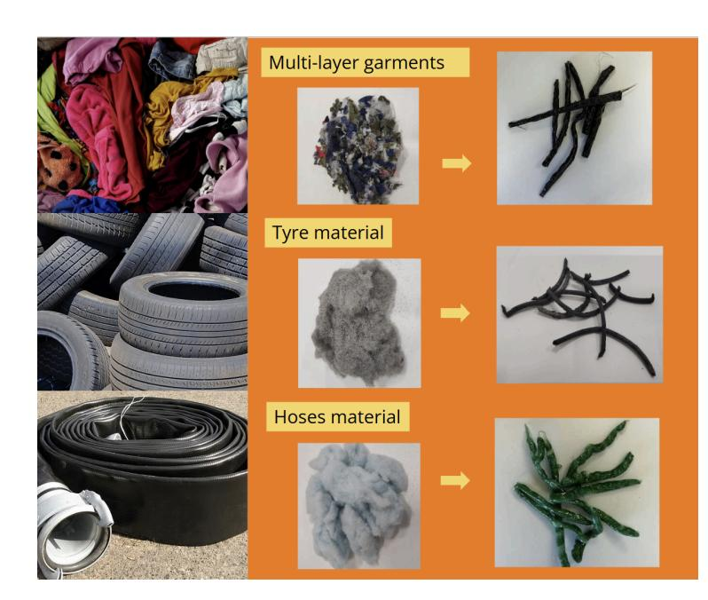

**Author:** Prof. Dr. Valeria Jana Schwanitz, Western Norway University of Applied Sciences

**Published:** 3 July 2026

*This article is based on a presentation delivered at the ARTEMIS Conference in Perugia, Italy (29–30 June 2026), titled "Recycling Complex Garments in WHITECYCLE."*

# **What 13th-Century Ragpickers Can Teach Us About Recycling PET**

*How the WHITECYCLE project is using enzymes and APIs to rebuild the kind of circular economy that medieval regions across Europe once ran on touch and trust.*

When we discuss the circular economy today, we often treat it as a modern invention. But the idea is much older, reaching back to practices from the 13th century.

### **A saint's patched habit**

Around 1226, in his Last Will and Testament, Saint Francis of Assisi in Umbria described a radical form of material efficiency for his friars. He instructed them to wear habits patched with sackcloth and other scraps, inside and out. For Francis, a textile was a precious resource. It was to be mended, reused, and kept in circulation until it physically fell apart.

Scaling that mindset to the 21st century, however, runs into both technical and systemic roadblocks. To see why, it helps to look at the logistics network that grew up around exactly this ethic of reuse.

> *The Sermon to the Birds. Giotto di Bondone (1295-1300) Source: Wikipedia (public domain, CCBY)*

## **Europe's Medieval Textile Recycling Network**

For centuries, Umbria and neighboring Tuscany operated a remarkably efficient socio-technical network for recycling textile waste. At its heart was not casual rag-picking

but a skilled artisan class known as the **Cenciaioli**. The name is derived from *cencio*, the old Tuscan word for a textile scrap.

The Cenciaioli turned what society dismissed as worthless rags into a valuable raw material. Their craft demanded years of experience. Using only touch and sight, they could identify textile composition, estimate fiber length, and distinguish more than 60 subtle shades of color. Because the dyes were already fixed in the fibers, carefully sorted textiles could be re-spun directly into new colored yarn, eliminating the need for re-dyeing.

This trade was never uniquely Italian. Nearly every European culture developed its own equivalent, with distinct names, guilds, and social roles. Across the countries that now make up the WHITECYCLE consortium, similar professions emerged independently.

In France, the *chiffonnier* became an almost mythologized figure in 19th-century Paris, sorting the city's refuse by lamplight and supplying both the textile trade and a thriving market for reusable goods. In the German-speaking world, *Hadernsammler* and *Lumpensammler* collected linen and cotton rags that supplied both the textile industry and, crucially, paper mills well into the 19th century. Some of the world's finest paper, including archival paper, banknotes, and fine art papers, is still made from cotton rag fibers rather than wood pulp because of their exceptional durability.

Spain had its *traperos*, who organized rag collection and resale in cities such as Madrid and Barcelona well into the 20th century. In Turkey, the *paçavracı* (from *paçavra*, meaning "rag") performed the same role in Ottoman and early republican cities, collecting and sorting textile waste for resale to weavers and papermakers. And in Norway's western dialects, the same role was known as the *kluteplukkar* or *filleplukkar*. Terms, which are still recognizable in the Vestland region today.

Wherever they worked, these trades followed the same principle: textiles were too valuable to throw away. Their carefully sorted materials became essential feedstock for local weavers and paper mills, creating regional recycling systems that remained effective for centuries. The entire system rested on two conditions, one, relatively pure natural fibers and, second, highly skilled local expertise. The historical recyclers had solved optimization loops we still struggle with today.

#### **Why we can't just scale the old model**

The ragpickers were also the original de-manufacturers. They removed bone buttons for local carvers, iron hooks for blacksmiths, and even sold the dust beaten out of rags to farmers as fertilizer.

Our equivalent today is less romantic: textile dust now means microplastics, and instead of selling it to farmers we need complex digital and physical scrubbers just to keep it out of the

environment. Where sorting was once a tactile human craft, it now has to be replaced by automated near-infrared sensors and AI computer vision.

The real bottleneck, though, is the feedstock itself. The ragpickers worked with relatively pure materials – wool, hemp, or linen. We work with complex multimaterial composites in which plastics and rubbers bonded together mechanically and chemically.

Take polyethylene terephthalate (PET). It isn't just in fast fashion and outdoor clothing. It's embedded as high-strength reinforcement in car tires, industrial hoses, and multilayer protective gear. Europe alone generates at least 1,850 kt of multilayer clothing waste, 200 kt of end-of-life tyres, and 10 kt of end-of-life hoses every year. This is feedstock for roughly 2 million tonnes of recoverable r-PET that currently goes nowhere.

These materials are mechanically and chemically fused, so the kind of manual separation the ragpickers performed is physically impossible. Anyone trying to recycle these industrial streams today runs into sorting failures and thermal degradation. Even color management has flipped: modern recycling lines can't handle 60 shades of aesthetic chaos, so we resort to heavy chemical stripping, cleaning, or bleaching just to reset fibers to a blank polymer state. And we've gone from managing scarce local waste streams through marketplace handshakes to handling massive intercontinental volumes that demand standardized digital tracking.

### **WHITECYCLE: building a modern ragpicker network**

This is where the EU-funded WHITECYCLE consortium comes in. In a sense, WHITECYCLE is building a modern ragpicker network – except that because today's feedstocks are too complex for any single artisan to sort by touch, the craft has been split across an interdisciplinary team working through four integrated steps: sorting, pretreatment, enzymatic depolymerization, and repolymerization into new yarn.

Where the ragpickers sorted by eye, an optical prototype can now identify the composition of multilayer textiles at the pixel level, enriching PET content to more than 90%. An enzymatic core then breaks PET down to its original monomers without the energy cost of

thermal alternatives. Those monomers can be repolymerized into PET-based yarn once again, spinning at 3,000 metres per minute, at industrial scale.

#### **The real challenge: trust and logistics, not just chemistry**

The historical ragpickers didn't just sort material. They managed a trusted network. They knew exactly which blacksmith wanted the iron hooks and which farmer wanted the rag dust. That network, more than the sorting skill itself, is what's hardest to rebuild today.

What works in the lab still has to scale to industrial volumes and compete at market price with virgin PET. The question is no longer really whether two million tonnes of recoverable r-PET *can* be recycled. It's whether the market and logistics infrastructure can be built to make that recycling economically meaningful.

Digitization and standardized data interfaces are the modern, scalable replacement for the ragpicker's eyes and hands. A global-scale market can't run on a handshake; it needs a digital equivalent. Building industrial circular networks requires open APIs that allow automotive recyclers, hose manufacturers, sorting facilities, and biochemical plants to exchange reliable information about material composition, additives, and available volumes. Digitization turns unmanageable waste streams into predictable, transparent, data-driven supply networks. Notably, that transparency also matters for winning consumer trust. Without unified data ecosystems, circular economy technology stays stuck in the laboratory.

A few lessons from WHITECYCLE follow from this. Feedstock determines everything: each waste stream, whether jacket, tyre, hose, needs its own optimized recycling pathway. No single partner controls the full chain, so those pathways only work if everyone shares standardized data in real time. A sorting facility in one country needs to speak the same data language as a biochemical plant in another. This is not as a technical nicety, but as a precondition for circularity at industrial scale.

This is also why the EU's Digital Product Passport (DPP) is important. Under the Ecodesign for Sustainable Products Regulation (ESPR), adopted in 2024, digital product passports will become mandatory for textiles by 2030.

> *EU's Ecodesign for Sustainable Products Regulation (ESPR), adopted 2024 Source of DPP: own illustration (CCBY)*

#### **A note on patience**

We still need to develop fully functioning, scalable industrial technologies and digital processes for recycling these complex materials. But it's worth remembering what scientific persistence can achieve.

While debating the technical limits of modern textile analysis and data tracking, it's worth looking at what radiocarbon analysis by physicists at Italy's National Institute of Nuclear Physics has already achieved; fittingly, in relation to Saint Francis himself. Carbon-14 analysis of the wool habit kept in the Basilica of Santa Croce in Florence – long believed to have belonged to Saint Francis – showed that it actually came from a sheep that lived about 80 years after his death.

If analytical science can uncover the atomic history of a textile centuries after it was made, there is good reason to believe that interdisciplinary research can also solve the remaining environmental, technical, and economic challenges of the circular economy.