# **D1.4. Theory of change and system incentives & penalties analysis**

Due date of submission: 2023/12/31

Actual submission date: 2023/12/22

## Funded by the European Union

#### **TABLE OF CONTENTS**

| 1          | Introduction................................................................................................................................................ | 9                                                                                                                                                        |
|------------|--------------------------------------------------------------------------------------------------------------------------------------------------------------|----------------------------------------------------------------------------------------------------------------------------------------------------------|
| 1.1        |                                                                                                                                                              | Context............................................................................................................................................... 9 |
| 1.2        | Aim and objectives                                                                                                                                           | 12                                                                                                                                                       |
| 1.3        | Report structure                                                                                                                                             | 12                                                                                                                                                       |
| 2          | Part I – Assessing the challenge                                                                                                                             | 13                                                                                                                                                       |
| 2.1        | Impact gaps: Problem cartography                                                                                                                             | 13                                                                                                                                                       |
| 2.2        | Impact gaps: Solution cartography...................................................................................................                         | 20                                                                                                                                                       |
| 2.3        | Impact gaps: Impact zone cartography                                                                                                                         | 23                                                                                                                                                       |
| 3          | Expected results.......................................................................................................................................      | 25                                                                                                                                                       |
| 4          | Maturity level for the bio-based sectors covered by Calimero.................................................................                                | 27                                                                                                                                                       |
| 4.1        | Bio-chemicals industry and Pulp and paper industry                                                                                                           | 28                                                                                                                                                       |
| 4.2        | Textile industry.................................................................................................................................            | 30                                                                                                                                                       |
| 4.3        | Woodworking industry                                                                                                                                         | 31                                                                                                                                                       |
| 4.4        | Construction industry                                                                                                                                        | 31                                                                                                                                                       |
| 5          | Part 2 –                                                                                                                                                     | Understanding the system dynamics.......................................................................................... 33                           |
| 5.1        | Causal chain analysis & feedback loop.............................................................................................                           | 33                                                                                                                                                       |
| 5.2        | System incentives and penalties analysis.........................................................................................                            | 41                                                                                                                                                       |
| 6          | Part 3 –                                                                                                                                                     | Looking towards the future......................................................................................................... 43                   |
| 6.1        | Building a better bio-based future: Calimero's Theory of Change Narrative.....................................                                               | 43                                                                                                                                                       |
| 6.2        | Theory of Change Overview.............................................................................................................                       | 44                                                                                                                                                       |
| 6.3        | Hypotheses for the Calimero Theory of Change                                                                                                                 | 46                                                                                                                                                       |
| 7          | Outlook..................................................................................................................................................... | 55                                                                                                                                                       |
| References |                                                                                                                                                              | 57                                                                                                                                                       |

#### **LIST OF FIGURES**

| Figure 1. Bio-based Sectors: A Three-tier Perspective on Global Dynamics -                                                                           | Macro, Meso, and Micro, declined                                        |
|------------------------------------------------------------------------------------------------------------------------------------------------------|-------------------------------------------------------------------------|
| 2023, European Commission / Sustai                                                                                                                   | nability and people’s wellbeing at the heart of Europe’s open strategic |
| autonomy”.                                                                                                                                           | 11                                                                      |
| Figure 2. Spheres of Impact: Control, Influence, and Interest Diagram                                                                                | 12                                                                      |
| for Theory of Change building, inspired by the Impact Gaps Canvas by Daniela PT........................................                              | 17                                                                      |
| Framework for Theory of Change building, inspired by the Impact Gaps Canvas by Daniela PT                                                            | 21                                                                      |
| and impacts. SC: scientific; EC: economic/technological; SO: societal.............................................................                   | 24                                                                      |
| Figure 6. Maturity level for Calimero’s bio                                                                                                          | -based industries using the Sustainability Maturity Path developed by   |
| PWC and adopted by Ecochain......................................................................................................................... | 28                                                                      |
| Figure 7. Maturity level for Calimero’s bio                                                                                                          | -based industries using the Sustainability Maturity Path developed by   |
| PWC and adopted by Ecochain: second representation to derive clusters and archetypes                                                                 | 33                                                                      |
| Figure 8. Wood Sector: A causal dynamics overview based on Calimero’s case studies                                                                   | 34                                                                      |
| Figure 9. Textile Sector: A causal dynamics overview based on Calimero’s case studies                                                                | 36                                                                      |
| Figure 10. Construction Sector: A causal dynamics overview based on Calimero’s case studies                                                          | 38                                                                      |
| Figure 12. Calimero’s Theory of Change Diagram                                                                                                       | 49                                                                      |

#### **LIST OF TABLES**

#### **LIST OF ACRONYMS**

BAT Best available techniques BBI JU Bio-based Industries Joint Undertaking BioCCS/CCU Biogenic carbon capture and storage / carbon capture and use CAD Computer-aided design CBE Circular bio-based economy CBE JU Circular Biobased Economy Joint Undertaking CF Characterization factors

Funded by the European Union. Views and opinions expressed are however those of the authors only and do not necessarily reflect those of the European Union. Neither the European Union nor the granting authority can be held responsible for them. Page 4

| CH       | Methylidyne or (unsubstituted) carbyne                                  |
|----------|-------------------------------------------------------------------------|
| CH4      | Methane                                                                 |
| CO2      | Carbon dioxide                                                          |
| CS       | Case study                                                              |
| DEFANP   | Decision and evaluation-based fuzzy analytic network process            |
| EPDs     | Environmental product declaration                                       |
| EU CSDDD | European Union corporate sustainability due diligence directive         |
| EU CSRD  | European Union corporate sustainability reporting directive             |
| EU ETS   | European Union emissions trading system                                 |
| EU       | European Union                                                          |
| EUR      | Euro                                                                    |
| EWM      | Entropy weights method                                                  |
| FWZIC    | Novel fuzzy-weighted zero-inconsistency                                 |
| GHG      | Greenhouse gas                                                          |
| GREET    | Greenhouse gases, regulated emissions, and energy use in transportation |
| GWP      | Global warming potential                                                |
| ICAP     | International compliance assurance programme                            |
| IGC      | Impact Gaps Canvas                                                      |
| IPCC     | Intergovernmental Panel on Climate Change                               |
| IR       | Intermediate results                                                    |
| IRR      | Internal rate of return                                                 |
| JRC      | Joint Research Centre                                                   |
| KERs     | Key exploitable results                                                 |
| KPIs     | Key performance indicators                                              |
| LCA      | Life Cycle Assessment                                                   |
| LCC      | Life Cycle Costing                                                      |
| LCI      | Life Cycle Inventory                                                    |
| LCSA     | Life Cycle Sustainability Assessment                                    |
| LSL      | Laminated strand lumber                                                 |
| MaOO     | Many objective optimization                                             |
| MFA      | Material flow analysis                                                  |
| MOO      | Multi-objective optimization                                            |
| PEF      | Product Environmental Footprint                                         |

| pMDI | Polymeric diphenylmethane diisocyanate        |
|------|-----------------------------------------------|
| R&D  | Research and development                      |
| RTOs | Research and technology organisations         |
| SDG  | Sustainable Development Goals                 |
| SMEs | Small and medium-sized enterprises            |
| SWOT | Strengths, weaknesses, opportunities, threats |
| TEA  | Techno-Economic Analysis                      |

#### **PROJECT INFORMATION**

Project full title: Industry CAse Studies AnaLysis To IMprove EnviROnmental Performance And Sustainability Of Bio-Based Industrial Processes

Acronym: CALIMERO

Call: HORIZON-CL6-2021-ZEROPOLLUTION-01

Topic: HORIZON-CL6-2021-ZEROPOLLUTION-01-06 - Increasing the environmental performance of industrial processes in bio-based sectors: construction, woodworking, textiles, pulp and paper and bio-chemicals

Start date: 1st July 2022

Duration: 36 months

List of participants:

| Partner No. | PARTICIPANT ORGANIZATION   ACRONYM                           |
|-------------|--------------------------------------------------------------|
| 1 (Coord.)  | Contactica   CTA                                             |
| 2           | WeLOOP   <b>WELOOP</b>                                       |
| 3           | European Cellulose Insulation Association   <b>ECIA</b>      |
| 4           | Swedish Environmental Research Institute   <b>IVL</b>        |
| 5           | Neovili   <b>NEOVILI</b>                                     |
| 6           | Cesefor   <b>CESEFOR</b>                                     |
| 7           | Luxembourg Institute of Science and Technology   <b>LIST</b> |
| 8           | Technical University of Denmark   <b>DTU</b>                 |
| 9           | Techtera   <b>TECHTERA</b>                                   |
| 10          | Essity   <b>ESSITY</b>                                       |
| 11          | BIM Kemi AB   <b>BIMKEMI</b>                                 |
| 12          | Ereks garment  <b>EREKS</b>                                  |

#### **DELIVERABLE DETAILS**

| Document Number:    | D1.4.                                                                            |
|---------------------|----------------------------------------------------------------------------------|
| Document Title:     | Theory of change and system incentives & penalties analysis                      |
| Dissemination level | SEN – Sensitive, limited under the conditions of the Grant Agreement             |
| Period:             | PR1                                                                              |
| WP:                 | WP1                                                                              |
| Task:               | T1.4.                                                                            |
|                     | industries and emphasizes the importance of interventions - critical events that |
|                     | fostering an ecosystem of interdisciplinary collaboration for the development of |
|                     | shifts in industrial practices.                                                  |

| Version    | Date       | Description                  |
|------------|------------|------------------------------|
| <b>1.0</b> | 2023-12-20 | Deliverable 1.4, version 1.0 |
|            |            |                              |

#### **EXECUTIVE SUMMARY**

The Calimero project is dedicated to enhancing the environmental performance and sustainability of bio-based industrial processes. It seeks to address the challenge of increasing environmental impacts in sectors such as construction, woodworking, textiles, pulp and paper, and bio-chemicals. The project emerged against the backdrop of pressing environmental concerns and aims to develop innovative methodologies for sustainable industrial practices.

Background-wise, Calimero represents a collaborative effort, funded by the European Union under the Horizon Program with the grant agreement number [101060546](https://calimeroproject.eu/) (Horizon Program). It's a forward-thinking project that stands out for its integration of multi-disciplinary approaches and advanced technologies. It operates in partnership with 12 partners, across 7 countries representing various organizations (industrial partners, SMEs) and institutions (RTOs), reflecting a collective endeavour to make significant strides in environmental sustainability within the bio-based industry.

The development of the Theory of Change within the Calimero project involves a multidisciplinary collaboration, encompassing diverse stakeholders from various sectors. These actors engage in iterative processes, contributing unique insights and expertise to refine the project's strategies, goals and finally, the narrative. The project faces challenges, particularly in aligning diverse perspectives and managing complex data collection. To address these issues, Calimero emphasizes adaptive strategies, focusing on integrating feedback and continuously refining its approach. This flexibility and collaborative effort are key to navigating the complexities of the bio-based industry and achieving the project's sustainability objectives.

Calimero's Theory of Change advances solutions to the central issues of environmental impact and sustainability. The project's key findings highlight the importance of multi-objective optimization, stakeholder collaboration, and innovative methodologies in addressing sustainability gaps. The four pathways proposed - Regenerative Optimization, Integration and Transparency, Collaboration and Adaptive Governance, and Balancing the Bio-Based Demand - collectively aim to optimize production processes, integrate sustainability assessments, foster interdisciplinary collaboration, and balance industry growth with environmental stewardship. These pathways contribute to a systemic shift towards improved sustainability in bio-based industries.

The findings and results are poised to be translated into actionable policy and strategy changes, focusing on environmental sustainability, process optimization, and stakeholder collaboration. The implementation of these changes will require organizational shifts, new procedures, and guidelines, along with a reevaluation of business directions. The recommendations from the project aim to impact the organization and the bio-based industry at large (at micro and meso level), requiring resource allocation, and adoption of new technologies and practices to meet the evolving sustainability goals and standards.

#### **1 INTRODUCTION**

#### **1.1 Context**

The Theory of Change framework has emerged as a central instrument in the arena of social transformation, providing a comprehensive, step-by-step approach to planning, implementing, and evaluating initiatives geared toward fostering positive societal shifts. Interventions, in the context of a theory of change, are planned activities designed to produce systematic positive change in individuals or communities (Holosko, 2016). The core principle of the theory of change framework involves a clear articulation of long-term goals, from which it methodically traces back to identify preconditions, intermediate outcomes, and short-term outputs crucial for the fulfilment of these goals. By acknowledging the complex systems within which the bio-based sectors and the systemic change interventions operate, the framework incorporates the necessary inputs, activities, and outputs, while accounting for external factors that may impact the intervention's success. By presenting this comprehensive perspective, it offers a holistic understanding of the change dynamics.

Two recently released reports provide valuable insight to contextualize the macro-level scene for the bio-based sectors transition. The report, "Reference Foresight Scenarios of the Global Standing of the European Union in 2040," published by the Joint Research Centre (JRC) (Vesnic-Alujevic et al., 2023), outlines the results of an extensive foresight process developed to gauge the potential global standing of the Europe by 2040. It introduces four 'reference' scenarios – Storms, Endgame, Struggling Synergies, and Opposing Views – which address varying uncertainties and potential outcomes diving into the complexity of our global challenges and the pressure for change. These scenarios are – in principle - designed to guide policymakers by helping them assess whether policies are future-proof, consider future challenges and their links, and develop future literacy through participatory processes.

The second report, "Strategic Foresight Report 2023" (European Commission, 2023a) places sustainability and people's wellbeing at the heart of Europe's Open Strategic Autonomy. It underscores the need for a shift towards sustainable production and consumption, calling for reforms and investments across Member States to decarbonize the economy, reduce biodiversity impacts, and minimize the ecological footprint of consumption. The report stresses the importance of water resilience, the reformation of environmentally harmful subsidies, design for circularity, and a greater emphasis on education and awareness for sustainable choices and lifestyles (European Commission, 2023a). These two reports lay out an in-depth and strategic roadmap for Europe's future, accommodating a variety of uncertainties and accentuating the critical necessity of sustainability. Notably, they also help in setting the stage for the challenges encountered by our bio-based sectors as they strive for enhancements in their industrial processes.

However, literature advances an inverse relationship between natural resource dependence and economic growth, also known as the resource curse phenomenon, resulting from poor institutional arrangements (Sarr et al., 2011). This can lead to various negative impacts, including the marginalization of community health (Calain, 2008), and the crowding out of manufacturing (Gilberthorpe and Papyrakis, 2015). The curse is also linked to slower economic growth in resource-rich countries (Sachs and Warner, 2001), and has been associated with negative impacts on democracy and governance (Sholikin, 2020). Drawing from the findings of Gilberthorpe and Papyrakis (2015) in their comprehensive exploration of the resource curse phenomenon across the micro, meso, and macro levels, to contextualize the scene for our Theory of Change, our project proposes an integrative multi-scale approach to process optimization. The research of Gilberthorpe and Papyrakis (2015) has underscored the importance of a multi-scale perspective to truly grasp the intricacies of extractive industries and their impacts. They argue that while individual micro, meso, and macro examinations offer valuable insights, factors bridging these levels often go unnoticed, leaving gaps in our understanding. In our project and as illustrated in [Figure 1,](#page-10-0) we chose to navigate between the micro and meso levels, thus allowing for a more thorough evaluation of both community-specific (micro) impacts and broader sectorial (meso) dynamics. This approach ensures we adequately consider a wide spectrum of relevant factors, enhancing our ability to develop effective and sustainable solutions for process optimization. This aligns with the call to better integrate various scales of analysis to holistically address industry challenges. In the figure below, we see a representation of a multi-scale approach to understanding different levels of dynamics affecting an organization or system and – in this case – adapted to the challenges of our five bio-based sectors. At the macro level, "Global Dynamics" includes factors like the demand for future skills, the quest for net-zero and well-being, threats to democracy, eroding social cohesion, pressure on funding, and the rise of geopolitics. At the meso level, "Sectorial Change" involves the quest for decarbonization and social justice, economic pressure, and geopolitical tension affecting sector-specific operations. The micro level, "Use Cases", addresses the need for applied sustainability skills, the quest for decarbonization and care, economic pressure and viability, and the supply chain crisis, focusing on the practical application in specific instances.

Building upon the insights drawn from these three pieces of information, it's crucial to further contextualize the pressing challenges and opportunities that lie ahead for bio-based sectors, and it is capital to acknowledge in the framework the actors operating within the spheres of control, influence, and interest as graphically illustrated in [Figure 2.](#page-11-2) The sphere of control encompasses actors who possess the power and authority to make decisions and take action to achieve the desired outcomes. Within Calimero's context, this may include policymakers or government agencies with the formal authority to enact changes. The sphere of influence includes actors who may not hold direct decision-making power but possess the ability to shape the process of change. These actors, such as advocacy groups, media outlets, or community leaders, can mobilize support, shape public opinion, or exert pressure on decision-makers. Acknowledging and engaging these influential actors would be fundamental for the success of social change initiatives in the bio-based context. Additionally, the sphere of interest encompasses actors who may be affected by the change but lack direct control or influence over it. These stakeholders, including community members and affected populations, possess a vested interest in the outcome of the intervention. Recognizing and considering their perspectives and needs is crucial for fostering inclusivity and ensuring that the intervention addresses the diverse range of interests involved.

In summary, the Theory of Change framework provides a comprehensive approach to planning, implementing, and evaluating systemic change initiatives. By outlining the logical pathways, identifying key outcomes, and considering external factors, it enables organizations and individuals to navigate the complexities of the change process in the bio-based sectors effectively. The framework's emphasis on monitoring, evaluation, and adaptation allows for iterative improvements and adjustments, ensuring that the intervention remains aligned with the desired outcomes. Furthermore, the recognition of actors within the spheres of control, influence, and interest facilitates stakeholder engagement and the development of collaborative strategies. Understanding and effectively utilizing the Theory of Change framework can enhance the design and implementation of process improvement in bio-based industrial sectors, contributing to meaningful and sustainable transformations in the ecosystem.

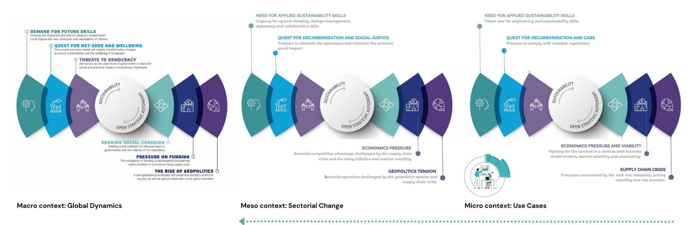

*Figure 1. Bio-based Sectors: A Three-tier Perspective on Global Dynamics - Macro, Meso, and Micro, declined from the "Key challenges for the EU's sustainability transition" shared in the report "Strategic foresight report 2023, European Commission / Sustainability and people's wellbeing at the heart of Europe's open strategic autonomy".*

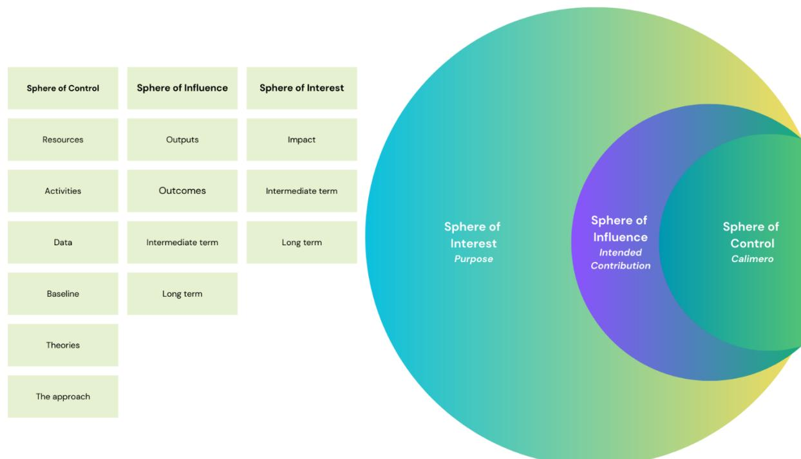

*Figure 2. Spheres of Impact: Control, Influence, and Interest Diagram*

# **1.2 Aim and objectives**

To achieve Calimero's overarching goals, the Theory of Change traces the sustainability gaps in industrial practices back to identify the requisite variables and pathways across a broad spectrum of relevant dimensions. This exercise addresses the unexplored hotspots throughout the lifecycle and bio-based value chain. An additional analysis identifies the potential roadblocks and incentives that should be considered when designing the methodology. The Calimero project seeks to enhance the sustainability of bio-based industrial sectors, making them more resource-efficient and low-carbon to alleviate the impacts of climate change, while preserving vital ecosystem services, natural resources, and biodiversity. The project's key strategy lies in refining existing environmental impact assessment methodologies for industrial processes, incorporating considerations of biodiversity loss, greenhouse gases (GHG) emissions, criticality indicators, and a comprehensive evaluation of circular systems, incorporating both economic and social aspects.

## **1.3 Report structure**

The structure of the report is designed to guide the reader on a comprehensive journey through the intricacies of the bio-based sectors covered by the Calimero project. The journey begins with "Part 1 – Assessing the challenge," where the report dives into the existing impact gaps and clearly lays out the ambitions driving the reflection. This section delves deep into the anticipated results, offering readers a preliminary glimpse of what they might expect from the process optimization for the bio-based sectors. To provide a holistic understanding, the maturity levels of specific sectors, such as the bio-chemicals, pulp and paper, textile, woodworking, and construction industries, are detailed, highlighting the current standings and potential growth areas within each.

As we transition to "Part 2 – Understanding the system dynamics," the report introduces a layered examination of the systemic interactions within these sectors. By employing causal chain analysis and feedback loops, the report aims to unravel the intricacies of industry operations. A significant portion of this section is dedicated to pinpointing the 'leverage and tipping points' – the pivotal elements that can drive or hinder change. Following this, an in-depth analysis of system incentives and penalties for each industry offers insights into the motivational drivers and deterrents that currently operate. This section ensures a detailed understanding of each sector's internal dynamics, distinguishing between the bio-chemicals, pulp and paper, textile, woodworking, and construction industries.

The narrative culminates with "Part 3 – Looking towards the future," guiding the audience to the forefront of our potential challenges with foresight. This section sketches out Calimero's visionary theory of change for process improvement, elucidating how future interventions can usher in an era of enhanced operational efficiency across bio-based sectors. The report concludes with an 'Outlook,' offering a forward-looking perspective, encouraging the reader to envision a better, efficient, and fair, bio-based future. Each section of the report offers a unique lens through which to view the bio-based industries, ensuring a comprehensive, systemic, and multi-dimensional understanding.

## **2 PART I – ASSESSING THE CHALLENGE**

#### **2.1 Impact gaps: Problem cartography**

In the upcoming sections, we delve into the diagnostic tool adopted to discern the implications and problematic of our challenge: the Impact Gaps Canvas (IGC), an innovation tool developed by Daniela Papi-Thornton and later refined by the innovation agency, Rhizome. The IGC serves as a compass, mapping out both the problem and the existing solutions. It spotlights the ecosystem "gaps" and aids in unravelling the intricate root causes of our issue. Through this methodical approach, we seek answers to pivotal queries: What is the core problem and its ramifications? How vast is its expanse? What triggers and hurdles lie at its foundation? How has this issue evolved, and where is it likely headed?

Feedback gathered in our interviews with industrial partners and stakeholders advance that the bio-based sectors face the critical challenge of enhancing their sustainability. In the context of our Calimero project, the chosen approach privileges to pinpoint the determinants that, when altered, can catalyse improved outcomes, and refine industrial procedures. Furthermore, sourcing evidence-backed, firsthand data, essential for steering sustainable practices, remains a daunting task. Balancing the growing demand for bio-based products brings complex issues, including trade-offs, implications, and the challenge of determining a fair share of such products. At the heart of this discourse lies the quest for circularity, which must harmoniously coexist with economic and social determinants. In essence, the bio-based sectors must champion sustainability, assimilate key process optimization factors, channel data-driven insights, and strike a harmonious balance in product demand, all while fostering circularity and being mindful of socio-economic dimensions.

The challenge of bio-based sustainability touches various stakeholders across multiple sectors. At the heart of the sphere of control lies the manufacturing segment, which has considerable influence over its domain. It seems important to recognize that the actions of this segment extend beyond its immediate boundaries, significantly affecting the wider community. Beyond the immediate sphere of control, there's a substantial sphere of influence including research institutions, policymakers, and various businesses segments outside of pure manufacturing. These entities possess the capacity and leverage to mould strategies and actions fundamental to tackling the sustainability challenge. Furthermore, investors and the financial sector, though not directly engaged in the operations, play an instrumental role. Their investments and financial backing can act as catalysts, propelling innovative solutions and strategies to address this pressing and complex issue.

The challenge of managing the impact of fossil-based products on the environment has been extensively highlighted in reports by the Intergovernmental Panel on Climate Change (IPCC). One of the most startling findings from the IPCC report of 2007 is the profound influence of the petroleum-based economy on climate alterations, leading to potential biodiversity loss (IPCC, 2007). The report specifically cautions about the catastrophic ramifications, even from the smallest projected temperature increases.

The significance of tackling this issue is further underlined by the IPCC's focus on measures to mitigate emissions. These include enhancements in material efficiency, innovation in product design, and extending the life of products. A deep dive into the carbon footprints, tied to consumption habits and international trade, sheds light on potential areas for intervention quoting that "in the industry chapter, the IPCC called attention to measures". Biomass-derived energy emerges as a hopeful alternative, with the IPCC suggesting its large-scale use as critical for curbing future carbon emissions from the global energy sector. Wood products come into the spotlight not only as a potential substitute that can mitigate climate impacts in construction but also for the carbon/climate benefits associated with carbon storage within these products. The transition from fossil-based products to a bio-based economy is both an environmental imperative and a response to concerns over the depletion of fossil resources. Emphasizing the value of bio-based solutions, the IPCC report reveals that bioenergy, which presently fulfils roughly 9% of global energy needs, is poised to be the predominant growth driver in renewables from 2018 to 2023.

However, as we navigate this transition, the same report details that it's essential to approach solutions like carbon capture technology with caution, as they might inadvertently elevate energy demand and adversely affect biodiversity in sectors like construction. The IPCC's insights underscore the necessity for a holistic evaluation of solutions, as evidenced by their use of Life Cycle Assessment (LCA) to estimate greenhouse gas emissions in different energy generation scenarios. As we move forward, it becomes evident that the transition to a bio-based economy, driven by the dual goals of climate protection (Sustainable Development Goal [SDG] goal #8) and sustainable consumption (SDG goal #5), appears as an imperative for our shared future.

The bio-based industries, including woodworking, textile, biochemicals, pulp & paper, and construction sectors, are expected to experience significant growth. The EU bio-based industry, for example, has a turnover of 6.8 billion globally and 1.4 billion in the EU with companies reporting a rise in activity and a positive outlook (Gómez-Barbero et al., 2016). The transition to a bioeconomy, driven by advancements in technology and the availability of sustainable biomass, is also expected to contribute to this growth (Scarlat et al., 2015). In particular, the bioplastics market is anticipated to expand, with a focus on durable, bio-based plastics (Storz and Vorlop, 2013). The wood-based biomass industries, including pulp & paper, are also expected to experience growth, with a potential renaissance driven by environmental concerns and emerging economies (Novotny and Laestadius, 2014). Finally, the construction bio-based sector is a small but growing market, with a current estimated value of 50-75 Bn EUR, or 3-4% of the global chemical industry sales (Nieuwenhuizen and Lyon, 2011).

A comprehensive understanding of the sustainability assessment methodologies for the bioeconomy is essential for global progression towards efficiency and fair use of resources. However, an analysis of existing literature and studies reveals several noteworthy knowledge gaps and areas for methodological advancement.

Firstly, the research advances a significant limitation and the lack of a universally accepted standard method, meaning there is no consistent benchmark for discerning the primary environmental impacts of the bioeconomy. With methodologies ranging from the IPCC to GREET ("Greenhouse gases, regulated emissions, and energy use in transportation" model) and Eco-indicator 99, achieving a common understanding becomes challenging. Egenolf and Bringezu (2019) emphasize the need for a robust sustainability index, proposing a specific utility function for sub-goals. Goedkoop (2007) highlight the importance of a consistent approach to weighting and impact pathways in LCA. Karvonen et al. (2017) and Pursula et al. (2018) underscore the need for a mix of methods and indicators, with the former focusing on the multidimensional impacts of the forest bioeconomy and the latter emphasizing the need for a systematic approach and continuous development of assessment methods. Cristóbal et al. (2016) and Schweinle et al., (2020) both call for methodological harmonization and coherence in LCA, with the latter proposing a material flow-based approach for sustainability assessment.

Inherent inconsistencies in sustainability assessment methodologies further complicate matters. These inconsistencies manifest in areas such as the definition of functional units, temporal, and technological system boundaries, and even in the application of criteria like normalization and weighting during impact assessments.

A range of studies have highlighted the challenges and potential solutions in addressing these inconsistencies. Schader et al. (2014) emphasize the need for a clear definition of sustainability and the harmonization of indicators. Pollesch and Dale (2016) and Binder et al. (2010) discuss the importance of normalization and the consideration of normative, systemic, and procedural aspects in sustainability assessments. Poveda and Lipsett (2011) and Cocklin (1989) further stress the need for a strategic methodology and the consideration of potential conflicts among different systems. Lastly, Büyüközkan and Karabulut (2018) suggests the use of group decision-making techniques and analytical methods to address subjectivity and conflicting indicators.

Moving the reflection to the social aspects, research advances that a comprehensive social sustainability assessment system for bio-based industries can be developed by integrating a systemic approach that considers the potential social impacts on local communities, workers, and consumers (Rafiaani et al., 2018). This approach should also include the main social impact categories and indicators, such as health and safety, feedback mechanisms, transparency, and end-of-life responsibility (Falcone and Imbert, 2018). The system should be based on an integrated methodological framework that incorporates multi-stakeholder inputs and critical sustainability criteria (Halog and Manik, 2011). It should also address the methodological gaps in LCAs, such as the lack of spatial and temporal depth and the inability to assess certain impact categories (Arodudu et al., 2017). Furthermore, the system should be adaptable to different stages of technological maturity and should integrate a techno-economic assessment methodology (Thomassen et al., 2017). Lastly, it should focus on quantitative assessment of human health and safety, labour rights, and working conditions, and should address governance issues (Pashaei Kamali et al., 2018).

A corpus of research proposed and applied holistic methodologies to address data scarcity and sustainability trade-offs in the bio-based sectors. Ladu and Morone (2021) and Rodriguez et al. (2020) both emphasize the need for integrated assessment tools and life cycle thinking in evaluating the sustainability of bio-based products. Lokesh et al. (2020) and Acosta-Michlik et al. (2011) further contribute by introducing hybridized sustainability metrics and a novel hybrid approach for assessing sustainability trade-offs in global bioenergy production. Martin et al. (2018) and Nicolaidis Lindqvist et al. (2019) highlight the importance of including key sustainability indicators and supporting systems in LCAs of bio-based value chains. Lastly, Lokesh et al. (2018) and Falcone and Imbert ( 2018) propose a two-tier multi-criteria decision analysis and the inclusion of social impact categories in social LCAs, respectively, to better understand the ripple effects of bio-based products production.

Literature has explored the development and implementation of sustainability frameworks in the bio-based industry. Elghali et al. (2007) and Majer et al. (2018) both emphasize the need for a multi-criteria approach that considers economic, environmental, and social factors. However, Majer et al. also highlight gaps in existing certification frameworks, suggesting a need for further research and development. Guariguata et al. (2011) and Kooduvalli et al. (2019) both stress the importance of comprehensive sustainability indicators, with the former calling for the complementation of standards with other policy instruments. Fritsche and Iriarte (2014) and Escobar and Laibach (2021) provide overviews of sustainability initiatives and technologies, respectively, with Fritsche and Iriarte proposing suggestions to enhance sustainability, and Escobar highlighting the potential of Key Enabling Technologies.

Based on the input received through our interview process, we acknowledge that the advancement of sustainability in the bio-based sectors faces numerous obstacles, the majority of which revolve around a convergence of knowledge barriers, economic factors, and risk aversion. Firstly, there's a significant lack of competence within the industry to properly interpret and act upon expert analyses and scientific reports, such as LCAs. This gap is further widened by the approach used by LCA practitioners to communicate their findings. The complexity of LCA reports and the channels through which they are conveyed can often be overwhelming for stakeholders. While there are some attempts to simplify these findings through graphs and more userfriendly formats, data availability remains an issue, causing additional barriers to comprehensive understanding and decision-making at the industrial level.

Compounding these knowledge barriers are economic concerns and motivations. Many in the industry perceive little incentive or reward for dedicating resources to process changes for sustainability, especially when such changes are not seen as directly optimizing operations. The volatility of raw materials and commodities prices, particularly when out of the industry's control, acts as a further disincentive. Businesses tend to prioritize shortterm profits and operational needs over longer-term sustainable goals without monetary gain, especially when there is uncertainty about the immediate benefits or advantages of such a shift. In a context where sustainability has not been clearly tied to economic benefits, the risks associated with product or market changes block the advancement. This hesitation is exacerbated by practices such as "greenwashing", where superficial or deceptive claims about sustainability are made, further adding confusion to the challenge. The underlying economic structures around product pricing also play a role. If adopting bio-based practices or products means a decrease in profits, many entities are not prepared to make that leap. Ultimately, those who benefit from this stagnation are entities and individuals resistant to change, including those practicing "greenwashing", and industries where externalizing costs, such as CO2 emissions, remain unchecked. The preservation of the status quo serves their immediate interests, even if it is at the expense of longer-term sustainability and broader societal benefits.

[Figure 3](#page-16-0) showcases the IGC conceived by Daniela Papi-Thornton and subsequently refined by the innovation agency, Rhizome, employed as a navigational aid to delineate and understand the intricacies and implications of our challenge by charting the problem alongside its potential solutions.

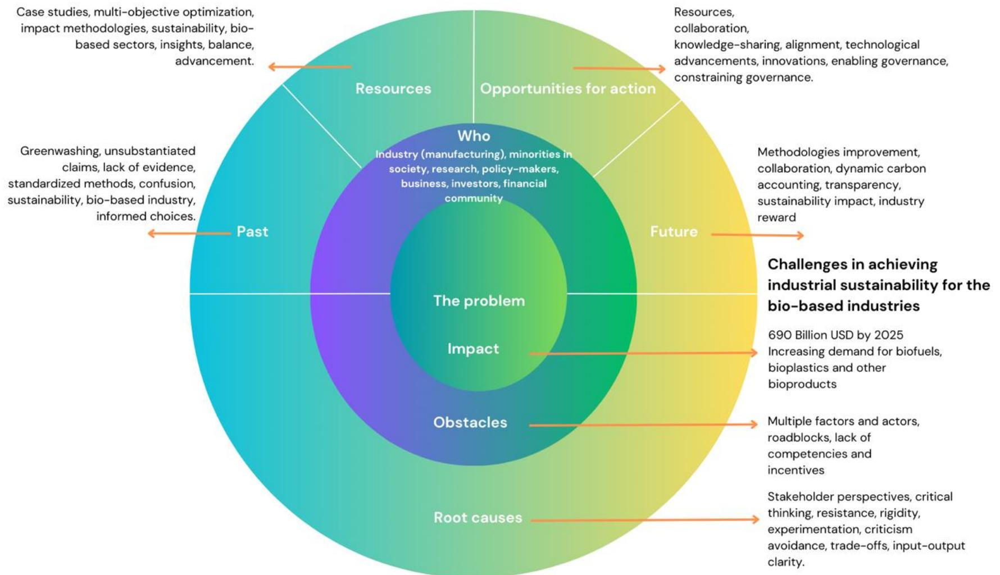

Figure 3. The problem cartography for the Calimero's project using the Rhizome, Impact8 Esplanade Framework for Theory of Change building, inspired by the Impact Gaps Canvas by Daniela PT

Funded by the European Union. Views and opinions expressed are however those of the authors only and do not necessarily reflect those of the European Union. Neither the European Union nor the granting authority can be held responsible for them. Page 18 Under the context of the escalating challenges mentioned previously, Calimero allocates its resources to address and mitigate these issues. Significant investment is directed towards the creation of the case studies, crafted to delve into the real-world implications and intricacies of the industry. These case studies serve as a valuable source of experiential data, offering insights into the practical aspects of the challenges. In parallel, the project embraces a multi-objective optimization (MOO) approach, which is instrumental in exploring various

A significant root cause of the challenge in advancing sustainability in the bio-based sectors is the diversity in perspectives among stakeholders, each with their distinct interests. Taking the time to truly understand and appreciate the motivations, concerns, and priorities of each stakeholder is a complex task. The lack of such understanding can result in miscommunication and missed opportunities for collaboration. Additionally, pressured by the need of the operations and growth expectation, industries often tend to focus on the positive aspects when contemplating a change, potentially sidelining the need for critical evaluation. This inclination might be driven by a desire to project a positive image or to avoid the discomfort of addressing shortcomings.

Furthermore, industries might exhibit a hesitancy to accept and address potential negative facets of their operations. Such reluctance can be attributed to cognitive biases like rigidity and confirmation bias, where established beliefs are stuck to, and only information that aligns with these beliefs is considered. The absence of a culture of experimentation can exacerbate this, as industries might miss out on generating additional evidence or arguments in favour of sustainable practices. Instead of embracing criticism as an avenue for growth and improvement, there's a trend in some sectors to avoid it. This avoidance could be detrimental, as it might limit the comprehensive understanding of trade-offs and the full spectrum of inputs and outputs generated by various practices, be they sustainable or otherwise.

Over the past years, the bio-based industry has seen a surge in the use of greenwashing practices, where companies exaggerate or falsify their products' environmental benefits, further complicating the challenge at hand. Literature advanced that greenwashing practices in the bio-based industry have a significant negative impact on consumer trust and the market's genuine efforts toward sustainability. These practices can lead to a reduction in the perceived environmental performance and integrity of the company (De Jong et al., 2018). They can also create confusion and undermine the perception of a company's image and its brands (Caldas et al., 2021). These claims, such as labelling products as "biodegradable" or "compostable," are often presented without any tangible evidence to substantiate them. Such deceptive practices not only mislead consumers but also undermine genuine efforts to promote sustainable products in the market.

Moreover, another facet of the evolving challenge is the confusion stemming from the inconsistent use of terminology within the bio-sector. Research investigates that the lack of standardized methodologies and inconsistent terminology in the bio-based industry significantly impacts consumer decision-making and the ability to identify genuinely sustainable products amidst prevalent greenwashing practices. This is due to schema incongruity, where consumers' associations with environmentally friendly products do not align with the core attributes of bio-based products (Rudolph, 2018). Despite being sceptical, consumers often fall into the trap of identifying greenwashed products as sustainable, leading to a negative impact on green purchasing behaviour (Urbański and ul Haque, 2020). Common misconceptions about bio-based materials further complicate the situation (Hairon Azhar et al., 2022). Inconsistent environmental sustainability reporting by companies also contributes to the challenge (Wilson, 2013). However, consumer willingness to pay for biobased products, especially certified ones, suggests a potential solution (Morone et al., 2021). Despite these challenges, there is a need for more research on the relationship between sustainable product attributes and consumer decision-making (Bangsa and Schlegelmilch, 2020). In effect, this has created an environment where consumers often find themselves navigating a maze of potentially misleading claims, making it arduous to distinguish genuinely sustainable products from those that only appear to be.

facets of the problem and scaling-up. This approach allows for a more comprehensive and nuanced understanding, surpassing the limitations of single-objective analysis. Furthermore, the project is also dedicated to the development of advancement in the methodologies tailored to assess the impact of diverse variables in the bio-based sector.

In the domain where we have opportunities for action, the governance structures and systems in bio-based industries can have both enabling and constraining effects on their growth and sustainable development. Cavicchi et al. (2017) and Dietz et al. (2018) highlight the importance of local governance and effective governance mechanisms in promoting sustainability. However, Schoneveld et al. (2010) and Verdonk et al. (2007) point out the potential negative impacts of poor governance, such as environmental degradation and concentration of benefits. Sajid et al. (2021) and Hlangwani et al. (2023) emphasize the role of government institutions and technological innovation in driving sustainable development. Alsaleh et al. (2021) further explore the potential of social business development in stimulating the growth of the bioenergy industry. By integrating these resources, both in terms of enabling and constraining governance, Calimero can enjoy a more holistic understanding of the multifaceted challenges it seeks to address.

In the foreseeable future, the trajectory of challenges faced by the bio-based industry is set for transformation, influenced predominantly by multifaceted factors. Firstly, a transformative shift in methodologies applied to biobased systems is anticipated. The emerging collaboration between the industrial and scientific communities, along with methodological advancements in bio-based systems, is expected to significantly contribute to the realization of the European Union's sustainability goals and the integration of bio-based products within the circular economy framework. This collaboration is driven by the development of the Circular Bio-based Economy (CBE), which aims to transform sustainably sourced biomass into value-added products (Lange et al., 2021). The bio-based sector, particularly in Germany, is increasingly aligning with circular economy principles, although there is a need for clearer sustainability definitions (Leipold and Petit-Boix, 2018). The selection of promising bio-based value chains and stakeholder mapping are crucial for the EU's bio-economy plans (Lokesh et al., 2018). Inter-organizational collaboration in bio-based businesses can lead to sustainability benefits, particularly in emerging economies (Nuhoff-Isakhanyan et al., 2016). The Bio-based Industries Joint Undertaking (BBI JU) has played a crucial role in transforming the EU's bio-based sector (Ruiz Sierra et al., 2021).

A range of studies have explored the potential for a circular bioeconomy, focusing on the need for social sustainability assessments (Falcone and Imbert, 2018), the role of responsible research and innovation in product diffusion (Oguntuase et al., 2018). These studies highlight the importance of consumer awareness, stakeholder engagement, and the role of EU policies in promoting the adoption of bio-based products. However, there is a need for further research on the design and implementation of effective incentivization mechanisms to encourage industries to adopt regenerative and circular models, ensuring transparency and clarity in the sustainability impact of bio-based products.

Lastly, the introduction of dynamic carbon accounting aims to significantly impact the accuracy and reliability of environmental footprint assessments for bio-based products. Hoxha et al. (2020) and Liptow et al. (2018) both highlight the discrepancies in results obtained from different methods, with Hoxha et al. recommending the use of dynamic biogenic carbon accounting. This approach, which considers the time-dependent nature of carbon uptake and release, is also supported by Albers et al. (2020), Brandão et al. (2013) and Pigné et al. (2020). However, the complexity of this approach is acknowledged by Pawelzik et al. (2013), who emphasizes the need for methodological progress. Finkbeiner et al. (2013) further underscores the importance of consistent and transparent documentation in accounting for carbon sequestration and temporary storage. Overall, while dynamic carbon accounting offers a more comprehensive and accurate assessment while further research and standardization previewed at the Calimero project are needed to fully realize its potential.

## **2.2 Impact gaps: Solution cartography**

In the pursuit of addressing the complexities and challenges faced by the bio-based industry, various innovative solutions have emerged outside the field and scope of the Calimero project. One promising avenue involves simulation tools, which can effectively provide the necessary process data for Techno-Economic Analysis (TEA), LCA, and Material Flow Analysis (MFA). These tools have become indispensable, particularly when data is scarce, as they are adept at calculating waste stream data, including its intricate composition, mineralogy, and exergy flows. The integration of simulation tools into TEA, LCA, and MFA in the bio-based industry has been explored in several studies. Segura-Salazar et al. (2019) highlights the potential of simulation tools to enhance sustainability and environmental decision-making in manufacturing systems. Kalakul et al. (2014) and Righi et al. (2018) further emphasize the role of simulation in evaluating the environmental impacts of chemical processes and in overcoming data availability issues in LCA. Rochat et al. (2013) and Jacquemin et al. (2012) discuss the combination of MFA, LCA, and simulation tools for waste stream analysis and process optimization. These studies collectively underscore the potential of simulation tools to enhance the accuracy and reliability of waste stream data analysis and benchmarking in the bio-based industry, particularly in scenarios with limited empirical data.

Life cycle inventory (LCI) modelling methods have been widely discussed in numerous review studies. Advanced machine learning techniques and data analytics are considered to significantly enhance LCI modelling in the bio-based industry, leading to more accurate and location-specific environmental assessments. Chouinard-Dussault et al. (2011) and Righi et al. (2018) both emphasize the importance of process integration and design in LCI, which can be further enhanced by machine learning. Ahmad et al. (2021) and Smith et al. (2017) highlight the potential of machine learning in various stages of the biofuels' life cycle, including soil, feedstock, production, consumption, and emissions. These studies underscore the need for a closer collaboration between process design experts and life cycle analysts to improve LCI modelling. (Obydenkova et al. (2021) and Rodriguez et al. (2020) further stress the importance of specific allocation methods and the integration of existing methodologies for a holistic sustainability assessment.

Process simulation software, such as Aspen Plus and SuperPro Designer, offer a digital avenue to simulate and assess the environmental impacts of industrial processes. These tools have been used to model and optimize chemical processes (Bezzo et al., 2004; Casavant and Côté, 2004; Morales-Mendoza et al., 2012), with some studies demonstrating their ability to accurately simulate processes (Tangsriwong et al., 2020). They have also been integrated with LCA to evaluate and minimize environmental impacts (Heilala et al., 2008; Liu et al., 2019). Alexander et al. (2000) and Hugo et al. (2004) both highlight the potential of these tools in balancing environmental and economic objectives, with the former using LCA and the latter focusing on material substitution. Lam et al. (2011) provides an overview of software tools for sustainable process design, while Kadziński et al. (2017) evaluates MOO methods for environmentally conscious supply chain design. Muroyama et al. (2011) and Widok et al. (2012) both emphasize the potential of combining discrete event simulation (DES) and LCA for sustainability in manufacturing processes. Angelakoglou and Gaidajis (2015) and da Silva and Amaral (2009) further underscore the importance of these tools in assessing environmental sustainability and evaluating environmental impacts and costs in industrial processes.

The solutions emerging outside of the Calimero project target a range of challenges intrinsic to the bio-based industry. One of the predominant concerns is the sourcing of primary data, either through estimation or simulation. The use of simulation tools, as described previously, aims to provide the necessary process data, thus bridging this gap. Furthermore, these solutions cater to the pressing need for scenario planning, allowing stakeholders to envision various potential outcomes and plan accordingly. Another significant challenge they address is filling data gaps, especially with the utilization of state-of-the-art machine learning and data analytics, as evident in the methods proposed for LCI modelling in the chemical industry. Lastly, there's a clear emphasis on refining and improving methodologies. The focus on LCI modelling methods, the simulation-based approach, and meta-modelling techniques are all indicative of efforts to enhance the accuracy and reliability of evaluations.

[Figure 4](#page-20-0) showcases the IGC conceived by Daniela Papi-Thornton and subsequently adapted by the innovation agency, Rhizome, employed as a navigational aid to delineate and understand the intricacies and implications of our challenge by charting the solutions cartography.

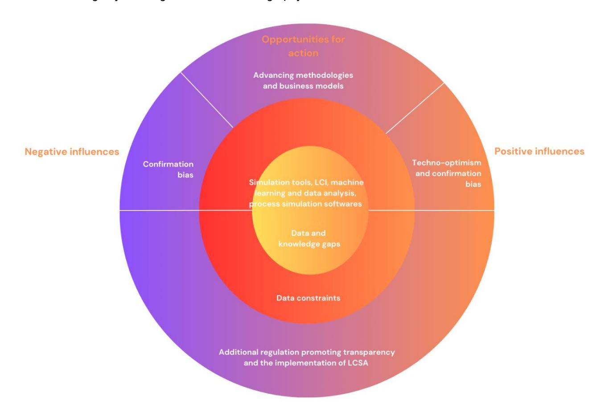

*Figure 4. The solutions cartography for the Calimero's project using the Rhizome, Impact8 Esplanade Framework for Theory of Change building, inspired by the Impact Gaps Canvas by Daniela PT*

The application of MOO in addressing the challenges of bio-based industries offers notable benefits, showcasing progress in solutions developed beyond the Calimero initiative. One of the most salient advantages of this approach is its inherent ability to balance diverse and sometimes conflicting objectives. This balance is particularly pivotal for industries where trade-offs between environmental, economic, and other objectives frequently arise. It has been applied in various contexts, such as the design of bio renewables-based processes (Helmdach et al., 2017), sustainable supply chain for biofuels (Gutierrez-Franco et al., 2021), and integrated algal and sludge-based bioenergy park and wastewater treatment system (San Juan et al., 2020). The approach has also been used in energy systems planning, particularly in the optimization of a biomass-based integrated energy system (Ahmadi et al., 2014) and the optimal synthesis of algal biorefineries (Solis et al., 2020). In the context of sustainable water resources management, MOO has been employed to inform green infrastructure decisions (Piscopo et al., 2021) and to optimize hydropower and agricultural development at the river basin scale (Hatamkhani and Moridi, 2019).

While MOO offers notable benefits in addressing diverse challenges, its application is not without difficulties, as observed in various studies conducted outside the Calimero project. One of the primary issues relates to the determination of essential weight factors. Mohammed et al. (2022) proposed a Novel Fuzzy-Weighted Zero-Inconsistency (FWZIC) Method to determine weight coefficients, addressing the issue of inconsistency. This method was further validated in the evaluation of MaOO competitive algorithms (Mohammed et al., 2020). Madoumier et al. (2019) emphasized the need for a more holistic approach in MOO, particularly in the design of food processes. Kumar et al. (2021) highlighted the benefits of the Entropy weights method (EWM) in MOO problems, particularly in machining operations. Lastly, Gunantara (2018) provided an overview of MOO methods, including the Pareto and scalarization methods.

The refinement of MMO to account for uncertainty and ensure balanced decision-making in complex project scenarios has been explored in various studies. Wheeler et al. (2018) proposes the use of multi-attribute decision-making methods to simplify MOO problems and identify solutions consistent with decision-makers' preferences. Chen and Zheng (2021) emphasize the need for MOO in pavement maintenance and rehabilitation decision-making, highlighting the importance of considering sources and characterization methods of uncertainty. Osika et al. (2023) provide a comprehensive review of decision-support methods for exploring solutions produced by MOO algorithms, including uncertainty exploration. Antunes and Henriques (2016) and Yoon et al. (2021) both stress the essential role of MOO in the energy sector and the need to quantify the multi-objective cost of uncertainty. Neglecting these uncertainties could lead to myopic decisions that favour least-cost outcomes at the expense of other equally critical objectives.

As we gaze into the horizon of bio-based industries and their sustainability challenges, there are distinct markers suggesting a transformative approach in the foresight.

One directional shift can be anticipated in the domain of regulation. Recent initiatives by major international institutions have shown a robust inclination towards greater transparency, particularly concerning the negative impacts of industries. The European Commission emphasizes the necessity of a cleaner and more competitive Europe and thereby unveils the blueprint for a new Circular Economy Action Plan (European Commission, 2023b). This plan could be indicative of stricter regulatory mandates forcing industries to be transparent about their negative ecological footprints, thereby driving companies to rectify unsustainable practices and commit to greener alternatives more aggressively. Furthermore, the guidelines proposed by the United Nations Environment Program advocate for the Social LCA of Products, hinting at a future where products might be critically evaluated based on their entire life cycle, from raw material extraction to disposal, ensuring that companies are socially accountable at each step (United Nations Environment Programme, 2016).

As advanced by the feedback of our interviews, concurrently with the regulatory measures, there's a growing recognition of the concrete impact of Life Cycle Sustainability Assessment (LCSA) results in industries. Rather than being a mere theoretical exercise, LCSA is progressively being seen as a catalyst for tangible improvements within the plant, encompassing both operational and strategic shifts. As industries start to internalize these LCSA findings, the bio-based sectors could witness a wave of innovations, enhancements, and transformations that propel them towards sustainable practices while simultaneously enhancing efficiency and competitiveness.

The field of solution development, especially in the context of bio-based industries and their sustainability challenges, is also exposed to the various cognitive biases that permeate human decision-making processes. One such bias, confirmation bias, could have both subtle and pronounced effects on how industries approach sustainability. Confirmation bias refers to the tendency to seek, interpret, and remember information in a way that confirms one's pre-existing beliefs or hypotheses. In the context of sustainability challenges, this could mean that stakeholders might inherently favour solutions that align with their preconceived notions about what works, instead of objectively evaluating all available options. On the flip side, being aware of confirmation bias could also be advantageous. Recognizing this cognitive pitfall can lead to more deliberate and reflective decision-making processes. By intentionally seeking diverse perspectives and challenging the status quo, industry leaders could foster an environment where innovative solutions are not only welcomed but actively sought out. This proactive approach to mitigating biases can pave the way for more holistic, effective, and sustainable solutions that might have been otherwise overlooked. In essence, while confirmation bias presents a potential roadblock in the journey towards sustainable solution development, awareness, and intentional efforts to counteract its effects could turn it into a catalyst for innovative thinking and progress.

Recent research in the bio-based industry highlights the critical role of diversified knowledge and collaborative approaches in driving sustainability and innovation. Urmetzer et al. (2018) emphasizes the need for a broadened knowledge base, including systems, normative, and transformative knowledge, to support sustainability transformations. This is further supported by Oguntuase et al. (2018), who highlights the role of responsible research and innovation in building trust and acceptance of bio-based products. Thrän and Bezama (2017) and Hatvani et al. (2022) stress the importance of innovation and business models in the bio-based industry, with the latter suggesting the inclusion of sustainability factors. Schmid et al. (2012) and Golembiewski et al. (2015) call for a more inclusive and diverse approach, recognizing the role of farmers and small and medium-sized enterprises (SMEs), and the need for interdisciplinary collaboration and knowledge exchange. Lastly, Sacchi et al. (2021) underscore the importance of high-level education programs to promote bio-based innovation.

#### **2.3 Impact gaps: Impact zone cartography**

Diving into the zone of expected impact of Calimero, we uncover ambitious strategies aimed at fostering a sustainable balance between industrial operations and environmental responsibility. For Calimero, the endgame is about fostering a broader transformation, encompassing sectorial behaviour change, economic practices, and governance structures. The research, enhanced by advanced machine learning and modelling techniques, seeks to develop more accurate characterization factors. These factors will evaluate biodiversity, ecosystem services, and toxicity, providing a clearer picture of our environmental impact. To support that, a multidisciplinary collaboration is advanced and central to Calimero's approach.

Industries producing and using bio-based products struggle with a significant challenge: the harmonization of policies and criteria. This challenge, while core, cascades across various stakeholders, each affected differently by the prevailing circumstances. For instance, consumers, while at the tail end of the production cycle, demand transparency and trust when purchasing these products. They seek assurance on the ethical and environmental front, a need not fully addressed by the current solutions. On the other hand, farmers, the primary suppliers of biomass feedstock, are deeply intertwined with the process but may lack guidance or support in sustainable practices. Environmental organizations raise the alarm on potential threats to ecosystems and biodiversity, highlighting that current bio-based industry practices might not be entirely benign. Meanwhile, government agencies, tasked with regulating these industries, are caught in the balance, trying to promote sustainable development while ensuring that the industry thrives. In essence, the complex interplay of needs, from policy harmonization to transparency, reveals a multi-faceted challenge that current solutions are yet to comprehensively address.

[Figure 5](#page-23-0) below delineates the impact pathway for the Calimero project, charting the time progression from the exploitation activities, through to anticipated outcomes, and culminating in the projected impacts. Enhancing research methods, optimizing processes through simulation, and incorporating various factors for detailed analysis, are aimed at achieving the desired outcomes and impacts in the subsequent years.

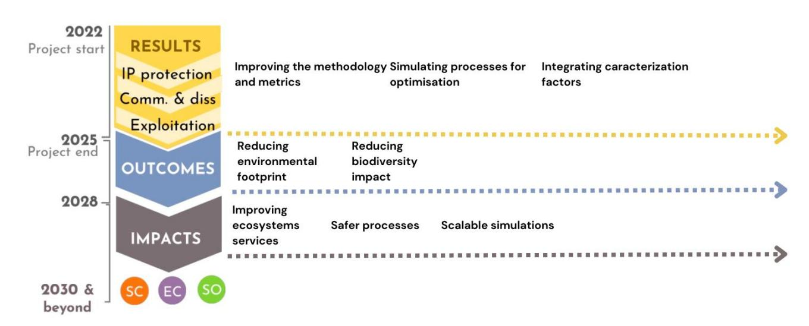

*Figure 5. Timeline for a pathway to impact for the Calimero project with the expected exploitation, outcomes, and impacts. SC: scientific; EC: economic/technological; SO: societal*

Despite the advancements in bio-based supply chain management, an underlying issue remains evident: the pivotal role of data availability and quality. Tseng et al. (2019) and Medina-González et al. (2020) both emphasize the importance of data-driven decision-making in sustainable supply chain management, with Tseng highlighting the role of social development and Medina-González proposing a data-driven decision-support framework. However, data quality is a critical concern, as highlighted by Hazen et al. (2014) and Choi and Luo (2019), who discuss the challenges of data quality in supply chain management and the potential role of blockchain and government sponsorship in addressing these challenges. The use of big data analytics in sustainable supply chain management is also explored by Mageto (2021), who identifies the elements of big data analytics and its potential to enhance transparency and sustainability. Fritz et al. (2017) and Godar et al. (2016) emphasize the need for transparency in supply chain management, with Fritz suggesting a set of sustainability aspects for data exchange and Godar proposing a middle-ground approach to supply chain transparency. Lastly, Gold (2011) discusses the management challenges and opportunities of bio-energy supply chains, highlighting the need for trustful information exchange and cooperation.

The development and implementation of standardized and harmonized guidelines can significantly enhance the adoption of universally accepted sustainable practices in the bio-based industry, leading to reduced disparities in sustainable methods across different regions and sectors. Majer et al. (2018) highlight the need for sustainability certification and standardization, with the latter emphasizing the importance of good governance, innovation, and harmonization. Ladu and Vrins (2019) further underscore the role of supportive regulations and standards in creating a level playing field for the bio-based economy. The potential of standards, certifications, and labels to monitor and evaluate sustainable bioeconomy is explored by Bracco et al. (2019), while Phillips (2016) discusses the impact of the Nagoya Protocol on global supply chains in bio-based industries. Lastly, Bennich et al. (2021) emphasize the need for coherent and synergetic transition pathways within the bio-based economy, the 2030 Agenda, and the strong sustainability paradigm.

Moreover, feedback from our interviews reiterate that the availability and integrity of data remain at the heart of the challenge, as emphasized in several articles, making it intricate to assess the broader ramifications in environmental, social, and economic contexts. On a human level, resistance to change and limited awareness among stakeholders, as suggested in the studies on emerging economies and bioenergy LCA, stand as robust barriers. These factors, collectively, obstruct the adoption of feasible sustainable solutions, underscoring the urgency to address them.

One potential solution to improve the data management of bio-based industries is the implementation of open data platforms and data-sharing agreements between industry stakeholders and policymakers. Their effectiveness is limited by several factors. Firstly, current LCA studies in the bio-based industries often fail to comply with ISO standards, leading to a lack of meaningful information for stakeholders (Talwar and Holden, 2022). Secondly, there is a discrepancy between important sustainability indicators and those frequently included in LCA studies, indicating a need for improved methods (Martin, 2018). Thirdly, the sustainability benefits of the bioeconomy are often overestimated, and there is a need for further harmonization of LCA methodologies (Escobar and Laibach, 2021). Despite these limitations, the bio-based economy presents opportunities for achieving sustainability, but there are challenges in transitioning to it (Bennich and Belyazid, 2017). The development of a sustainable bio-based economy requires mechanisms for sustainability certification and standardization, which are currently lacking (Majer et al., 2018). Lastly, the integration of sustainable development concerns in the supply chain, including the use of LCA, is a complex challenge that requires further research (Matos, 2007).

A range of studies have proposed methods for integrating social indicators into sustainability assessments in bio-based industries. Rafiaani (2018) and Geibler (2006) both suggest a systemic approach, with the former focusing on local communities, workers, and consumers, and the latter emphasizing stakeholder involvement. Falcone (2018) and Nuhoff-Isakhanyan (2016) highlight the need for improved frameworks and the importance of geographical proximity and complementarity in inter-organizational collaborations. Martin (2018) and Raman (2015) call for the inclusion of important sustainability indicators, such as water depletion and impacts on ecosystem quality, and the consideration of different value-based visions. Dale (2018) underscores the importance of stakeholder engagement in identifying relevant indicator categories. These studies collectively provide a foundation for addressing the conflicting objectives, ecological impacts, and multidisciplinary challenges in sustainability efforts in bio-based industries, while integrating social indicators into their assessments.

Finally, and drawing in the feedback we had in our interviews, we advance that several key factors could substantially enhance the solution's impact. A first instrumental approach would involve the formulation of policies that not only implement but also request the adoption of advanced methodologies in industry practices. Furthermore, emphasizing skills development with a systemic view and extended competencies could pave the way for a more comprehensive understanding of sustainability issues. It would be crucial for the industry to wholeheartedly embrace the concept of "sustainability operation" as this not only propels them towards environmentally conscious operations but also promotes responsible business practices across the whole value chain. Moreover, maintaining a record or journal of the learning process can act as a blueprint for industry uptake, allowing businesses to identify best practices and learn from past mistakes. In conclusion, for these industries to push these boundaries, there is a need to amplify the benefits or, at the very least, to develop a profound understanding of how to enhance the benefits for society at large. This holistic approach ensures the longevity of bio-based industries and their alignment with broader societal goals of sustainability.

# **3 EXPECTED RESULTS**

The Calimero project and its theory of change are poised to deliver a series of transformative results that promise to advance the sustainability of bio-based industries. By the conclusion of the project, three primary outcomes will emerge. First, there will be an LCSA methodology specifically designed for bio-based products,

aligning seamlessly with the Product Environmental Footprint (PEF) guides. Secondly, the project promises optimized industrial solutions that not only enhance sustainability performance but also leverage a sophisticated MOO framework. This framework uniquely amalgamates the sustainability assessment methodology to include critical sustainability indicators, and its efficacy will be tested in pertinent industrial environments, including associated partners and partners' research and development (R&D) production lines. As a result, Calimero aims to drastically diminish pollutant emissions, bolster the circularity of bio-based industries, and curtail the use of detrimental chemicals, all while maintaining a balance of techno-economic viability and social feasibility. Lastly, drawing from the project's rich experiences, guidelines and recommendations will be crafted to guide biobased industries, policymakers, and the scientific community on sustainable development trajectories. Instrumental in achieving these ambitious goals is the consortium, bringing together industry frontrunners across sectors like construction, woodworking, textiles, pulp & paper, and biochemicals, harmoniously partnered with experts in sustainability and simulation and modelling of bio-engineering processes. This blend of multidisciplinary expertise from research, business, and industrial sectors ensures that the outcomes of Calimero are grounded in practical and actionable operations and insights.

In detail, the project will generate a diverse array of Key Exploitable Results (KERs), each tailored to enhance the sustainability and environmental management of bio-based industries.

Contactica (CTA), will develop a methodology to simulate bio-industrial processes and MOO frameworks, incorporating Life Cycle Sustainability Assessment procedures. This latter stands out for its advanced lifecyclebased analytical approach, specifically designed for industries like construction, pulp and paper, textiles, biochemicals, and woodworking. CTA's MOO Framework comprises an algorithmic framework for industrial process simulation, sustainability assessment models, and a MOO algorithm. Unique in its ability to integrate LCA/Life Cycle Costing (LCC) studies and scale-up solutions, it represents a breakthrough in combining simulation, LCA, and optimization. CTA plans to offer this as a commercial service, targeting clients concerned with climate change and regulatory compliance, expecting market readiness within 3-4 years.

CESEFOR has contributed new knowledge for wood-based panel manufacturing, specifically in the laminated strand lumber (LSL) manufacturing sector. This encompasses identifying impactful processes, solutions for reducing environmental impact, and developing environmental monitoring strategies. Given the niche nature of LSL products, this knowledge fills a significant research gap and will be shared with the wood-based panels sector.

WELOOP will develop a novel methodology for assessing circularity and criticality indicators in bio-based products. This methodology is particularly innovative in its focus on the specificities of bio-based sectors, such as the cascading of wood products and the criticality of biomaterials. The results of this research might be marketable as improved methods for LCA or LCSA, targeting industries and regional actors. In the domain of monitoring procedures for bio-based industries, WELOOP has utilized the EU Bioeconomy Monitoring System to develop effective procedures. These are aimed at enhancing connections between business sectors and supply chains, a crucial aspect of sustainable development.

NEOVILI contributed to the environmental impact assessment in the textile sector, offering a systemic vision of the methodology. This advanced approach facilitates brands in reducing and neutralizing their environmental impact, with potential market readiness in 2-3 years. The target market includes brands, retailers, textile associations, and business schools.

TECHTERA's contribution lies in developing sector-specific knowledge for the textile sector. Focused on providing guidelines and methodologies for eco-design, especially for SMEs, this approach aims to democratize LCA methodologies and engage textile brands in sustainability efforts.

EREKS BLUE MATTERS has been gathering data from their washing department's wastewater facility. This case study assesses toxicity around jeans washing while using the LCSA methodologies within the textile sector and aims to transparently share this information with stakeholders.

IVL's case studies for bio-based sectors, particularly in paper making, aim to describe and evaluate products and value chains with more precision. Additionally, IVL's ProScale E Method focuses on eco-toxicity potential assessment. It is a part of the ProScale method family, which is being developed in collaboration with several industries and research projects. This method is particularly relevant for the chemical developing industry.

Finally, BIM Kemi has applied new knowledge to the biochemical sector, focusing on impactful processes and solutions for reducing environmental impact. The insights gained will be used internally for R&D, potentially leading to the development of more sustainable products.

DTU's simulation models represent a versatile tool for various bio-based industrial sectors. These models can be reused or adapted to specific industry needs, offering a valuable resource for partners in woodworking, biobased chemical, and textile sectors.

The four key exploitable results from LIST encompass a suite of advancements in environmental analysis and sustainability. This includes the updated temporal DyPLCA database, a unique tool for dynamic LCAs, essential for more accurate environmental impact decision-making. Additionally, there's a cutting-edge MOO algorithm for LCSA, which marks a significant improvement over traditional LCA-focused methods by systematically optimizing sustainability impacts. Another innovation is a method for characterizing changes in ecosystem services due to land use, leveraging the LANCA model for enhanced impact assessments. Lastly, the development of a new set of toxicity characterization factors for chemicals in the biobased sector, based on the USEtox methodology, addresses a critical need in life cycle impact assessments. Together, these advancements provide comprehensive tools and data for researchers, policymakers, and LCA specialists, significantly enhancing sustainability practices and understanding of environmental impacts.

Each of these KERs addresses specific challenges in the bio-based sectors, offering innovative solutions for sustainability, process optimization, and environmental impact assessment.

## **4 MATURITY LEVEL FOR THE BIO-BASED SECTORS COVERED BY CALIMERO**

The concept of a "Sustainability Maturity Path" is an integral model created to evaluate and guide businesses and the industry in their journey towards sustainable practices. Originally crafted by PWC and subsequently adopted by Ecochain, this model emphasizes three critical pillars of sustainable business: Motivation, Accountability, and Ownership. The idea behind the model is that sustainable change can only be affected when these pillars align in harmony. Under the "Motivation" spectrum, businesses can fall into one of six stages. At the nascent "Disregard" stage, a company exhibits no environmental considerations in its operations. As they progress, they move to "Compliance," where they operate primarily to adhere to regulations. The "Obligation" stage sees companies reacting to market forces like customer demand, while the "Efficiency" stage observes businesses realizing the cost savings achieved through environmental optimization. At the "Leadership" level, companies actively seek sustainable innovations, and at the culmination, the "Purpose" stage, businesses aim for broader societal and environmental benefits as the primary motivation behind their every decision.

The "Accountability" and "Ownership" factors serve as qualifying determinants to gauge a company's genuine commitment to its professed sustainability stage. Under "Accountability," the presence and depth of Key Performance Indicators (KPIs) related to environmental activities indicate the seriousness of a company's commitment. From no defined KPIs in the "Compliance" stage to environmental considerations dominating economic ones in the "Purpose" stage, businesses progressively embed sustainability into their operations. Meanwhile, the "Ownership" dimension assesses who holds responsibility for sustainability within an organization. It evolves from an ad-hoc responsibility in the "Compliance" stage to a universal responsibility permeating every layer of the company in the "Purpose" stage. This holistic model, thus, offers a comprehensive lens to assess an industrial and business's commitment and actions towards sustainable operations.

In the following sections, we will evaluate the woodworking, construction, textile, biochemical and pulp & paper industries using the sustainability maturity path to discern their current positions, and from this assessment, we aim to identify archetypes that will inform the creation of strategic action plans.

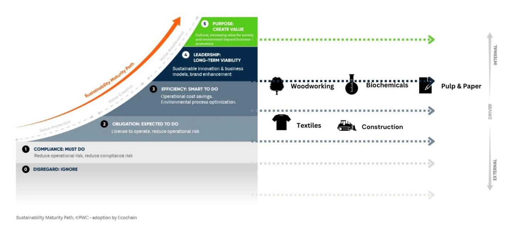

*Figure 6. Maturity level for Calimero's bio-based industries using the Sustainability Maturity Path developed by PWC and adopted by Ecochain*

## **4.1 Bio-chemicals industry and Pulp and paper industry**

Fossil-fuel free production, increased biomass use efficiency, and reduced human health and ecosystems toxicity are key drivers behind biochemicals development (Lange et al., 2021; Ruiz Sierra et al., 2021). Growth in biochemicals production can theoretically occur anywhere in the chemicals industry where these drivers are relevant. Mossberg's mapping of the Swedish chemicals sector (2013) can be used to ascertain in which sector-segments biochemicals production may occur. Beyond biofuels and bioplastics production these segments include refineries, basic chemicals (plastics in primary forms, organic and inorganic basic chemicals, dry and specialist chemicals as advanced by Mossberg, 2013), chemical products (paints, coating, adhesives, detergents, hygiene products, agrochemicals, explosives, essential oils, artificial fibres, photo-chemicals as advanced by Mossberg, 2013), pharmaceuticals and reagents, segments that could loosely be referred to as traditional chemicals sectors. Some of these sectors fall beyond CALIMERO's scope (biofuels and plastics), while another sector that contains significant biochemical production, the pulp and paper sector, is treated in CALIMERO as separate to the biochemicals sector. Biochemicals feedstock and production value chains are intertwined with other chemicals sector segments and sectors (forestry, food, agriculture etc). Unlike with the textiles sector for example, biochemicals production cannot easily be isolated from other biobased sectors and/or chemical sector segments. It is therefore difficult to delineate actors and a free-standing biochemicals industry on which to apply a sustainability maturity assessment. Beyond posing challenges to isolating the biochemicals industry, its cross-sector nature is itself a source of barriers and risks to actors entering new markets, that inhibits biochemicals sector sustainability maturity (Fagerström et al., 2022; Mossberg et al., 2021).

Despite these characteristics some broader sector maturity drivers can be identified in biochemicals value chains. **1)** The dominant biomass substrate sources in any geographical region influence the biochemical type, production methods and industries present in that region (Lange et al., 2021). **2)** There is high demand growth for biofuels (Bauer et al., 2017) and biobased plastics substitutes (Döhler et al., 2022) driven by policy, market and geopolitical developments. Despite the biofuels and bio-plastics sectors being excluded from CALIMERO's scope, the gravity exerted from development trends and trajectories in these subsectors onto the wider biobased industrial sector motivate their consideration when assessing biochemicals and pulp and paper sector sustainability maturity. **3)** The boarders between biochemicals, biofuels, bioplastics and pulp and paper producers, fuzzy as they are, align somewhat to the differentiation between incumbent and emergent actors in bio-chemicals production (Fagerström et al., 2022), providing a delineation that can assist in assessing biochemicals sector maturity. Literature on the EU BBI JU public private partnership, and its successor the Circular Biobased Economy Joint Undertaking (CBE JU), build on this delineation to reveal further insight into the EU biochemicals sector sustainability maturity.

For traditional chemicals companies, sustainability pressures on the companies surround climate chains and fossil-fuel supply chains, reducing energy intensity in production (IKEM.se, 2023), human health and environmental pollution (Papafloratos et al., 2023). Incumbent actors in pulp and paper related biochemicals value chains are described to operate in mature markets with narrow profit margins and high capital investment costs that lock-in current production methods and product ranges (Mossberg et al., 2021). Under these circumstances sustainability management motivation is driven by production process optimization. Where optimisation results from limited investments in innovation R&D, motivation maturity of incumbent biochemicals production in pulp and paper can be classified between the stages of efficiency and leadership. In biochemicals sectors driven by the mission to provide fossil-free substitutes, environmental decision making can be limited to investing in dedicated LCA resources and KPI systems connected to standards compliance surrounding climate change impacts (Lazarevic and Martin, 2018). In these instances, limited attention is paid to using impact data and KPIs to inform and steer product design and operational optimization (Freidberg, 2014; Lazarevic and Martin, 2018), placing environmental accountability at the maturity stage of obligation and efficiency.

Sustainability motivations in the pulp and paper sector have occurred in tandem with pressures to optimise costs and process in response to market changes from reduced paper demand and growing competition from low-cost competitors in Asia (Scordato et al., 2018). Utilising heat and power generation in pulp production from black liquor (pulp by-product) combustion has helped de-carbonising pulp production and creating a sustainability premium to use for competing with low-cost competitors (Jafri, 2019). Beyond de-carbonising production, the sustainability impacts of pulp, paper and biochemicals concern biomass feedstocks sustainability, particularly regarding land use and ecosystem health (Lange et al., 2021; Lewandowski, 2015; Papafloratos et al., 2023). Where markets have incentivised forest-based alternatives to fossil-fuel resources, the environmental decision-making pressures on wood and pulp value chain managers have been towards meeting the sustainability criteria of eco-labels and green certification schemes (Lazarevic and Martin, 2018). As sustainability performance plays a significant role in the value offering of forest-based products, its implementation under sustainability standards management increases in priority. Companies take high ownership in standards compliance by allocating dedicated sustainability management staff in-house, through branch organisations (Skogsindustrierna, 2023), and in some cases, in top-level company management (Södra, 2023). However, compliance-guided management can act as a glass ceiling on sustainability motivation and hinder sustainability management from reaching product development and operational decision-making (Freidberg, 2014; Lazarevic and Martin, 2018). For incumbent pulp and paper, and biochemical companies this can restrict sustainability motivation to the stage of efficiency or at best leadership for those actors engaged in incremental sustainability R&D and pilot ventures.

Despite these incentives and pressures on incumbent biobased and chemicals industries there is a tension between drivers for long term sustainability and pressures to manage risk against near-term profitability (Fagerström et al., 2022; Mossberg et al., 2021). This tension hems in the maturity of sustainability motivation to the stage of efficiency and leadership. In contrast, initiatives like the BBI JU and CBE JU have galvanized biochemical actors into growing and novel enterprises based on green chemistry business models and product offerings (Lange et al., 2021; Ruiz Sierra et al., 2021). With a motivation maturity of *purpose* because of their sustainability mission, management ethos and value proposition, these novel actors are, with more agility than incumbents, better able to meet the supply needs of emerging bio-based industries.

#### **4.2 Textile industry**

The textile industry, spanning a wide range of actors in the value chain, is closely monitored by numerous regulatory authorities in the European Union. The EU Strategy for sustainable and circular textile has been instrumental in outlining the industry's goals, emphasizing a shift towards more sustainable practices. The Ecodesign for sustainable products regulation further underscores the necessity for products to be designed with their entire lifecycle in mind, reducing waste and ensuring longevity. Furthermore, the EU Corporate Sustainability due diligence directive and the EU green claims directive have cemented the need for the industry to be transparent about its practices and allegations. This package of regulations forces the textile industry to shift from mere compliance to a more proactive stance. Here, the industry finds itself oscillating between Stages 1 and 2 of the Sustainability Maturity Model – meeting regulatory requirements (Compliance) and responding to market demands (Obligation).

The textiles production, primarily located in developing nations, poses unique challenges. Labor rights, resource utilization, and environmental degradation are pressing issues. The industry, driven by outside market forces and customer expectations, is subjected to scrutiny regarding its practices in these manufacturing hubs. The obligation to adhere to ethical standards and the need to address these inequalities pushes the industry to be accountable. However, the adoption of environmental KPIs remains sparse, primarily functioning to address ad-hoc market requests such as EPDs, fitting the Obligation stage description.

Several publications are demonstrating that the textile industry faces significant challenges in balancing environmental sustainability and economic viability while meeting global standards and consumer preferences. (Patten, 2019) and Lee (2017) both emphasize the importance of sustainable-led strategies and environmentally sustainable business practices, respectively. Harsanto et al. (2023) and Luo et al. (2021) provide specific examples of sustainability innovation practices and evaluation methods, such as ecodesign and LCA. Gbolarumi et al. (2021) highlight the need for eco-friendly approaches and sustainability assessments, including the consideration of social and economic indicators. Desore and Narula (2018) and Xu et al. (2018) discuss the drivers, barriers, and responses of firms in the textile industry, as well as the role of environmental policies in promoting sustainable growth.

Given the regulatory, socio-economic, and business pressures, the textile industry's sustainability maturity level can be positioned between Obligation and Efficiency, leaning more towards Obligation. However, with increased awareness and pressure, the adoption of sustainable practices, the industry intends to evolve further along the Sustainability Maturity Path with its own challenges and difficulties.

#### **4.3 Woodworking industry**

Analysing the woodworking sector considering the Sustainability Maturity Path framework, we can deduce several insights regarding its stance on sustainability. A range of internal and external drivers interact to shape sustainable practices in the woodworking sector. Internal drivers such as environmental awareness, green marketing potential, and innovation opportunities are influenced by external pressures including regulatory constraints and societal demands (Dangelico et al., 2013; Gadenne et al., 2009; Hanim Mohamad Zailani et al., 2012; Leonidou et al., 2017; Sharma and Henriques, 2005; Susanty et al., 2019; Walker et al., 2008; Zhu and Sarkis, 2007). These drivers can lead to the adoption of green supply chain management practices, the implementation of green business strategies, and the development of sustainable new products. The role of these drivers is further influenced by the type of industry and the specific pressures faced by organizations.

Sustainable machinery and practices in the woodworking sector play a crucial role in achieving ecological balance and economic efficiency. These practices, such as responsive product strategy, lean practices, and supply chain restructuring (Nordin et al., 2014), and the use of renewable and non-renewable resources in woodworking (Macak et al., 2020), contribute to reducing environmental impact and improving profitability. They also drive innovation in the sector, particularly in waste management (Očkajová et al., 2021) and the application of sustainable product design (Vicente et al., 2018). As the woodworking industry continues to navigate its sustainability journey, it is understood that their sustainability maturity level is in between "Efficiency", moving towards "Leadership".

# **4.4 Construction industry**

An analysis of the construction industry within the framework of the Sustainability Maturity Path model reveals specific trends and patterns across the Motivation, Accountability, and Ownership criteria. Chang et al. (2018) pointed out that while there is a discernible shift in the construction sector towards sustainability, motivations vary widely. Some are driven by compliance with regulations, while others lean towards societal and environmental objectives. However, it's also important to note the disparity in sustainability awareness across different regions. While some countries have made significant strides, developing countries like Malaysia are still in the initial stages of addressing sustainable development challenges, as documented by Tabassi et al. (2016).

Accountability in the construction sector is evidenced by the growing focus on KPIs related to environmental activities. There has been research into developing quantitative assessment methodologies for sustainability in infrastructure projects, as highlighted by Araújo et al. (2020). On the topic of ownership, the industry's approach to sustainability has seen variations. What began as specific, isolated responsibilities in some organizations has expanded into a broader vision in others. The transition from 2-dimensional Computer Aided Design (CAD) models to more comprehensive 3-dimensional, shared-data approaches could indicate a move towards collaborative efforts in the industry, as discussed by Alwan et al. (2017).

The construction industry's approach to sustainability is also shaped by internal and external drivers. Internally, motivations often focus on cost reduction, efficiency improvements, and corporate reputation enhancement, as described by Chang et al. (2018). Externally, factors such as regulatory pressures, customer expectations for sustainable practices, and environmental impact mitigation come into play, as referenced by Pelli and Lähtinen (2020) and Jain et al. (2020).

In terms of value dynamics, the industry is navigating through the phases of Value Protection and Creation. Sustainable business strategies are being developed, aiming to protect existing value but also to identify potential avenues for new value. Sustainable business strategies in the construction industry are crucial for the transition from value protection to value creation. A range of studies testify that circular economy principles, such as material reuse, can significantly reduce environmental impacts and create value for various stakeholders (Nußholz et al., 2020). The role of sustainable urban buildings, particularly in the context of Industry 4.0, is also crucial for future industry growth and sustainability (Rahmayanti et al., 2019). Strategic sustainable development, using frameworks like Building Information Modelling, can address issues such as waste generation and carbon emissions (Alwan et al., 2017).

In sum, while the construction industry is certainly moving towards sustainability, the depth and breadth of this transition are varied and in between « Obligation » and « Efficiency », influenced by a combination of regional factors and sector-specific challenges.

In our graphical representation of the Sustainability Maturity Model for Calimero's bio-based sectors (see [Figure](#page-32-2)  [7\)](#page-32-2), two distinct clusters emerge, reflecting divergent industry dynamics and priorities. The first cluster comprises bio-based industries predominantly impacted by both internal and external drivers. These sectors, having experienced substantial regulatory oversight, are not merely focused on meeting the basic compliance thresholds. Drawing from the study of sustainable business models, this cluster could be likened to industries characterized by technologically oriented archetypes, where advancements are driven both by regulatory stipulations and internal motivations for sustainability (Neumeyer and Santos, 2018). Moving beyond mere efficiency and productivity gains, they showcase a comprehensive embrace of sustainable practices.

In contrast, the second cluster is primarily influenced by external factors, while internal motivations play a less significant role. Echoing findings from the field of supply chain networks, these industries can be likened to orchestrated networks, which are less regulated but are heavily capital intensive, tightly interwoven with economic value creation (Laari et al., 2022). Their strategic focus hinges largely on the external market dynamics, with a strong inclination towards economic value creation, even as they grapple with evolving sustainability imperatives.

Together, these clusters potentially exemplify two industry archetypes: the "more regulated" sectors, which have surpassed basic compliance and are charting new frontiers in sustainability, and the "capital-intensive" sectors, where the pursuit of economic value sometimes overshadows internal sustainability imperatives. The bio-based sector, particularly the more regulated and capital-intensive archetypes, faces challenges in achieving sustainability objectives while balancing economic value. D'Amato et al. (2019) found that companies in landuse intensive sectors prioritize circular economy, with the forest sector also emphasizing bioeconomy. However, the interlinkages between these concepts are limited. Nuhoff-Isakhanyan et al. (2016) highlighted the sustainability benefits of inter-organizational collaboration in bio-based businesses, particularly in emerging economies. Philippidis et al. (2018, 2016) underscored the challenges and potential conflicts in EU bio-based sectors, suggesting the need for a holistic public policy approach. Fritsche and Iriarte (2014) and D'Amato et al. (2017) discussed the need for a sound sustainability framework and the integration of sustainability strategies, respectively. Finally, Ladu and Vrins (2019) emphasized the importance of supportive regulations and standards to encourage a level playing field for the bio-based economy.

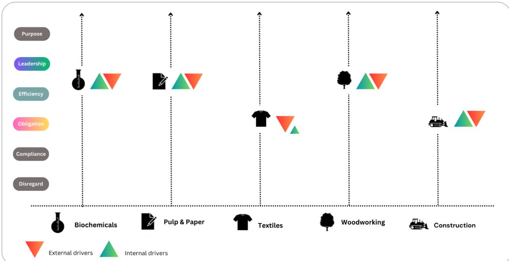

Funded by the European Union. Views and opinions expressed are however those of the authors only and do not necessarily reflect those of the European Union. Neither the European Union nor the granting authority can be held responsible for them. Page 33 In terms of materials, information, and energy in bio-based industries, various academic research has provided valuable insights. For example, Meijide et al. (2011) highlighted the intricacies of the net ecosystem CH4

*Figure 7. Maturity level for Calimero's bio-based industries using the Sustainability Maturity Path developed by PWC and adopted by Ecochain: second representation to derive clusters and archetypes*

## **5 PART 2 – UNDERSTANDING THE SYSTEM DYNAMICS**

# **5.1 Causal chain analysis & feedback loop**

In a systems-thinking framework, causal chain analysis serves as a method to comprehend and delineate the interplay between different variables within a given system. Specifically, this approach zeroes in on discerning the cause-and-effect relationships that culminate in a particular outcome. Applied to bio-based industries, causal chain analysis becomes instrumental in discerning the impacts of diverse factors on both the production metrics and the overarching sustainability of bio-based commodities. Such an analysis allows stakeholders to trace back and identify root causes, intermediate factors, and direct drivers that influence the outcome, ensuring a comprehensive understanding of the production processes and their environmental implications (Nimmanterdwong et al., 2017).

Contrastingly, feedback loops offer a mechanism where system outputs are repurposed as inputs, engendering a continuous cycle of feedback. This cyclical nature ensures the potential for iterative refinement, optimizing processes over time. Within the domain of bio-based industries, these feedback loops manifest as pivotal tools in enhancing both efficiency and sustainability. A tangible instance can be observed where waste products from a specific process are re-channelled as raw materials for another, thus curbing waste generation and amplifying resource utilization. Such practices not only underline the efficiency of the system but also accentuate the sustainable ethos of the industry (Sanches-Pereira and Gómez, 2015). Lenton and Klausmeier (2007) further explain that such loops can either serve to amplify (positive feedback) or suppress (negative feedback) alterations in the system variables. Illustratively, within bio-based industries, a positive feedback loop might manifest when increased production of biomaterials causes a dip in their costs, subsequently elevating their demand and spurring further production. Conversely, a negative feedback loop could arise if escalated production depletes raw materials, leading to higher costs and reduced production.

(methane) flux, suggesting that a deeper understanding of these dynamics can aid in curbing CH emissions, especially in rice paddy fields. Bodirsky et al. (2012)) pinpointed the livestock sector as a pivotal driver in the global agricultural nitrogen cycle. Furthermore, Gennaretti et al. (2017) combined process-based modelling with field data to discern the environmental factors influencing carbon fluxes in boreal forests. Such studies underscore the significance of both causal chain analysis and feedback loops in enhancing the efficiency and sustainability of bio-based industries.

[Figure 8](#page-33-0) delineates the dynamic interplay of various factors influencing the woodworking bio-based industry, focusing on two specific case studies deployed during the Calimero project. The core of this representation revolves around "Direct Benefits," which emphasizes the integration of advanced and improved methodologies, metrics, and sustainable production techniques. Such integration is anticipated to lead to a "Behaviour Change," highlighting a potential shift towards more sustainable and efficient production methods in the wood sector. This behaviour transformation is underpinned by "Causal Link Assumptions," informed by the previously shared challenges, which include aspects like optimization for sustainability, evidence-based practices, and efficient biomass use, among others. These assumptions serve as the foundational rationale for the expected outcomes. The figure also highlights the tangible "Outputs" of two case studies (CS1 and CS2). While CS1 underscores the production of LSL, CS2 is directed towards energy generation from biomass. Complementing these efforts are "Supporting Activities," such as workshops and iterative experiments with a multidisciplinary team. Nevertheless, the scenario isn't without potential hurdles. "Unanticipated Effects" denote potential side-effects, like the possibility of energy from biomass in CS2 affecting the quality of LSL. Meanwhile, "External Influences," such as collaborations with industrial partners like CESEFOR and the regulatory context, are instrumental, ensuring that strategies are backed by empirical data and insights.

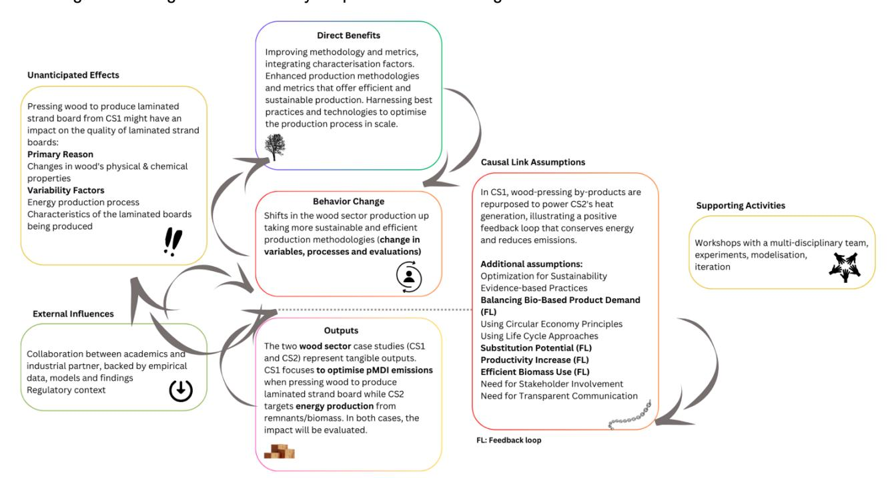

*Figure 8. Wood Sector: A causal dynamics overview based on Calimero's case studies*

In the woodworking sector, Calimero's case studies are set to explore the dynamic interplay of variables critical to optimizing production while enhancing sustainability. The first case study (CS1) is focused on minimizing polymeric diphenylmethane diisocyanate (pMDI) emissions while manufacturing laminated strand board. Here, key variables like temperature, time during the pressure stage, and adhesive concentration are pivotal. These

elements are interconnected, with temperature influencing energy use and emissions during pressing affecting environmental costs. Time is a cost driver, and adhesive concentration is a dual factor impacting both the board's mechanical properties and environmental footprint, due to its production and application processes.

The second case study (CS2) delves into the optimization of a boiler system, contemplating the proportions and types of wood used, including virgin pine and reclaimed wood from the plant, alongside the adhesive concentration. These variables are yet to be fully defined but are anticipated to have significant effects on the efficiency and sustainability of steam production operations.

In CS1, pressing wood is identified as the bottleneck - a stage with considerable influence over the final product's quality and the process's environmental impact. The adhesive concentration is not just a technical aspect but also a sustainability concern, with its usage being a source of impactful emissions. The challenge lies in balancing adhesive quantity for board quality against its environmental and safety implications.

Both case studies intend to dissect how these operational factors, such as temperature and adhesive concentration, act as root causes or direct drivers that determine the board's density, moisture content, and bonding strength—qualities that dictate market acceptability. Moreover, the implications extend beyond immediate production, affecting downstream processes like recycling and end-of-life performance. For instance, the adhesive's concentration could influence the board's recyclability and behaviour during waste-toenergy processes.

Therefore, the causal chain analysis in the woodworking sector isn't just about identifying the variables. It's about understanding their cascading effects on both the production line and the product's lifecycle, from forest to final disposal. This comprehensive approach enables us to pinpoint areas for environmental improvement without compromising product quality, driving toward consistent process optimization.

In the woodworking sector, feedback loops play a critical role in enhancing both efficiency and sustainability. In CS1, pressing wood to create laminated boards is near the end of the production line. However, the byproducts of this pressing, referred to as solid renascence, are not wasted. Instead, they are looped back into the system, serving as a primary input for the heat production stage in CS2. This creates a positive feedback loop where the energy - specifically steam - generated from the combustion of wood remnants is used to fuel the pressing process. Such a strategy exemplifies the principles of circular economy, turning what would be wasted into valuable energy.

The implications of this positive feedback loop are multifaceted. On the one hand, it leads to cost savings by reducing reliance on external energy sources and helps in lowering the carbon footprint of the facility. By utilizing biomass for energy, we reduce the need for grid-based energy, thereby cutting down on emissions like particulate matter, CO2, and volatile organic compounds.

However, this system isn't without its challenges, which is where negative feedback loops may become apparent. The emissions generated during the heat production process, particularly those from adhesive residues, warrant further investigation. They pose potential health and safety concerns and regulatory compliance issues and impact the plant's carbon footprint. Addressing these negative feedback loops is critical to maintaining the sustainability and safety standards of the plant.

In the textile sector, Calimero's approach to causal chain analysis and feedback loops is designed to dissect and optimize the variables that influence the environmental impact of the washing process for energy generation (CS1). For instance, in case study CS1, we examine the TIL washing process, where modifications to water temperature, process duration, and machinery speed can have ripple effects on the quality of the final product. Changes to these variables might increase the residual starch in wastewater, indicating a need for a delicate balance between energy conservation and product quality.

This intricate analysis also considers the potential impact of employing different energy sources, such as the introduction of heat exchangers or the shift from gas to electricity, which could affect not only the energy costs but also the factory's overall energy mix. Seasonal temperature variations add another layer of complexity, as the same process optimization may yield different outcomes in summer versus winter. The feedback loops in this context are exemplified by CS1's focus on efficient energy and water consumption. The implementation of heat recovery systems exemplifies a positive feedback loop, where reclaimed heat from the process is used to pre-heat water, thus reducing overall energy demand. These loops underscore the potential for iterative improvements in the system's efficiency and sustainability. However, potential negative feedback loops must be acknowledged. For example, optimizing the process for energy consumption without considering the full environmental cost of increased wastewater pollution could inadvertently lead to greater overall harm. Identifying and addressing such negative loops is crucial to ensure that process optimization does not come at an unforeseen environmental cost.

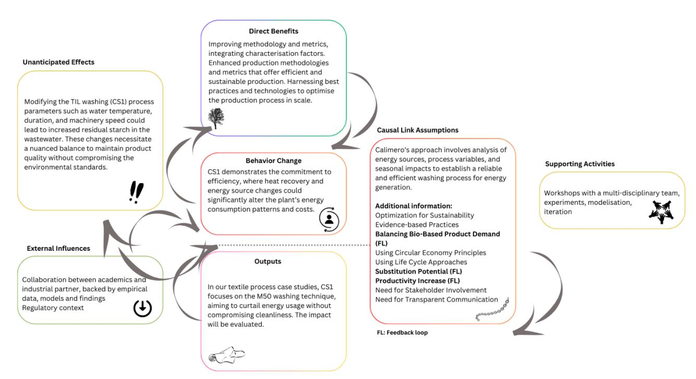

*Figure 9. Textile Sector: A causal dynamics overview based on Calimero's case studies*

In the construction sector, the Calimero project demonstrates causal chain analysis and feedback loops when innovating in material composition for cellulose insulation, with a specific focus on variations of biomass inputs (e.g., mixing cardboard or hemp shives to the traditional material, end-of-life newspaper) and chemical additives. The case studies spearheaded by ECIA aim to revamp traditional insulation materials used for cellulose insulation, which currently necessitate the use of a relatively important amount of fire retardants (typically, boric acid). These fire retardants present a large share of the environmental impacts of the insulation product. The goal is to enhance the composition of the insulation product by investigating whether the use of other biomass feedstock such as hemp, or of other flame retardants, might optimize the fire resistance of the insulation and reduce the need for fire retardants, thus minimizing environmental impact.

The dynamics of the causal chain analysis for this sector involves a comprehensive review of material properties, such as thermal conductivity, density, and fire resistance. By collecting empirical data through experiments and literature, and interpolating material characteristics for various combinations, DTU will be able to simulate optimized mixtures of materials and additives. This process will aid in determining the most effective insulation compositions that meet stringent environmental and safety standards. Feedback loops in this context are critical for refining the material characteristics. As data is gathered and simulations are run, the outcomes will inform further adjustments in the material combinations. For instance, the Design of Experiment approach, validated by WeLOOP in partnership with ECIA, is designed to identify and adjust key properties iteratively. This creates a continuous cycle of improvement, ensuring that the final product is both environmentally sustainable and meets the necessary performance criteria. Furthermore, the use of surrogate models in Matlab and Python, complemented by experimental design tools like OriginLab Pro, enables a sophisticated approach to simulation. Iterative feedback loops, Design of Experiment approaches, and surrogate models in Matlab and Python have significantly enhanced the development of environmentally sustainable construction materials. These methods have been applied to a range of materials, including polymer composites (Rupal et al., 2022), agro-waste-based materials (Maraveas, 2020), and plastic waste-based materials (da Silva et al., 2021). These studies have highlighted the potential of these materials to replace conventional construction materials and achieve economic, environmental, and social sustainability.

In the pursuit of greener construction practices, the shift towards using different biomaterials in cellulose insulation by the Calimero project presents a series of potential unintended effects that merit careful consideration. For instance, while the integration of hemp aims to reduce the environmental footprint throughout a building's life cycle, its application within insulation materials is not without its challenges. For example, research has identified several ways to improve the cost-effectiveness of using hemp fibres in insulation materials. Santoni et al. (2019) and Charai et al. (2021) both highlight the potential for enhancing the acoustic and thermal performance of hemp fibres through manufacturing processes and the addition of Moroccan hemp fibres to plaster, respectively. Hult and Karlsmo (2022) and Dlimi et al. (2019) provide comparative life cycle and economic analyses, with Hult and Karlsmo finding a lower net GWP-impact for hemp fibre insulation and Dlimi et al. determining the optimum insulation thickness and air cavity layers for hemp wool in Moroccan building walls. Johansson et al. (2018) and Kosiński et al. (2018) compare hemp-lime and raw hemp fibre insulation materials, with Johansson et al. noting the potential for hemp-lime to improve the energy performance of historic buildings and Kosiński et al. finding that the thermal conductivity and air permeability of raw hemp fibre decrease with increased bulk density.

Nevertheless, the availability and price of hemp fibres could pose a significant economic barrier to widespread adoption, and other materials like end-of-life cardboard might prove to be more interesting from an economic standpoint. Also, ECIA highlighted the technical challenge of dealing with other materials in their supply chain. Furthermore, long-term exposure to environmental factors significantly affects the mechanical integrity and performance of hemp-based natural fibre-reinforced composites. Hygrothermal ageing, particularly at higher temperatures, can lead to a decrease in mechanical properties (Drouhet et al., 2022). Marine environmental conditions, including moisture, temperature, and ultraviolet radiation, can cause degradation of these composites (Mayya et al., 2021). Accelerated weathering, such as ultra violet-irradiation and water spray, can further reduce their mechanical properties (Islam et al., 2011). Moisture absorption, especially in water, can significantly decrease the tensile and flexural properties of these composites (Chaudhary et al., 2020). The mechanical performance of these composites can also be affected by long-term exposure to water, alkaline and acidic solutions, and ultraviolet radiation (Liu et al., 2020). However, the use of chemical treatments, such as alkali treatment and silane treatment, can improve the mechanical properties of these composites (Sepe et al., 2018). This raises concerns about the long-term viability and durability of the insulation materials.

From an environmental perspective, while the inclusion of hemp fibres is generally viewed positively, any reduction in binder content aimed at lessening environmental impact must be balanced against the potential degradation of thermal and mechanical properties (Senga Kiessé et al., 2017). A decrease in these properties could negate the environmental benefits of the insulation's service life. Moreover, alterations in the fibre's morphology could impact the specific heat capacity of hemp fabrics, although this may not adversely affect the material's overall thermal performance (Novaković et al., 2020). On a more positive note, the manufacturing process of cellulose-based panels using hydrothermal hot-compression methods could confer additional antimicrobial properties, thereby improving resistance to microbial degradation (Echeverria et al., 2021). This finding could enhance the lifespan and hygienic qualities of the construction materials. These studies collectively underscore the complex interplay between material composition, environmental impact, cost, and performance characteristics. They inform the Calimero project's approach, ensuring that each step towards sustainability is measured against a comprehensive set of criteria to truly benefit the construction sector. The ongoing research and development are guided by these insights, as the project strives to establish insulation solutions that are not only environmentally friendly but also economically viable and structurally sound over the long term.

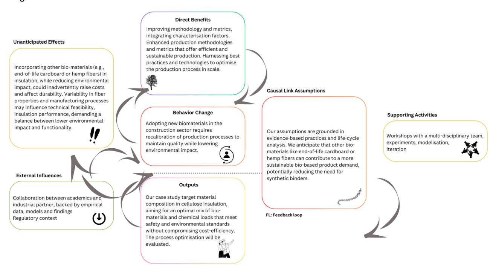

*Figure 10. Construction Sector: A causal dynamics overview based on Calimero's case studies*

The increasing demand for biobased raw materials as a substitute for fossil energy and raw materials incentivize pulp and paper, and biochemicals sectors to create new and/or reformed sustainable bio-based value chains. System incentives driving demand increases include policy incentives (EU ETS reform & EU Carbon Border Adjustment Mechanism (ICAP, 2023)), more stringent regulation (BAT-conclusions for pulp and paper sectors, EU CSRD, EU Taxonomy, EU CSDDD, EU Circular Economy Action Plan (European Commission, 2023b; Naturvårdsverket, 2023)), shareholder sustainability demands, and changes in market structure, notably

Funded by the European Union. Views and opinions expressed are however those of the authors only and do not necessarily reflect those of the European Union. Neither the European Union nor the granting authority can be held responsible for them. Page 39 *Figure 11. Pulp and paper, and biochemicals: A causal dynamics overview based on Calimero's case studies*

decreases in virgin paper production and recovery as a secondary material. Forestry based raw materials have received interest due to their potential year-round supply, in sufficiently high quantities and consistency in quality. Agricultural waste feedstocks have also received interest for pulp and biochemicals production, however use is constrained by under-developed logistics networks, competition with animal feed, and seasonal dependent supply. The high demand on forestry-based biomaterials exerts different sustainability pressures on the pulp production process compared to the paper production process.

The escalating interest for bio-based raw materials from forestry and advances in pulp production recovery technologies, are providing an economic and technical rationale to reconsider more economic and resourceuse efficient ways to utilize pulp by-products. Some of the main areas of focus in pulp processes have been the production and refining of crude tall oil, carbon dioxide utilization, production of lignin from black liquor, and utilization of excess heat. Conversely, sustainability variables, incentives and drivers for paper producers revolve around minimizing resource-use, filling data gaps in value chain biodiversity, ecosystem, and social impacts, and diversifying where necessary and possible to production inputs that are most optimally suited for paper production from a systems sustainability perspective. Pulp and paper producers have highlighted regulatory, and investor demands, increasing resource input competition and decreasing supplies of recycled paper fibres as key drivers behind the above-mentioned paths to improve product lifecycle sustainability.

Pulp and paper producers that take steps to innovate new value chains and circular business offerings risk being undercut by competitors that operate on traditional business models (e.g. single use products, unsustainably produced pulp) (Fagerström et al., 2022; Mossberg et al., 2021). To mitigate this risk pulp and paper producers leading in sustainability must continue to participate in traditional unsustainable but profitable value chains and pursue business model innovation as peripheral and small undertakings. Pulp and paper sustainability leaders are in effect penalized by an uneven playing field that favours incumbent pulp and paper production methods. The above-mentioned regulatory drivers were cited by a case study representative as moves in the right direction to create a level playing field for pulp sustainability innovation, but more measures are required.

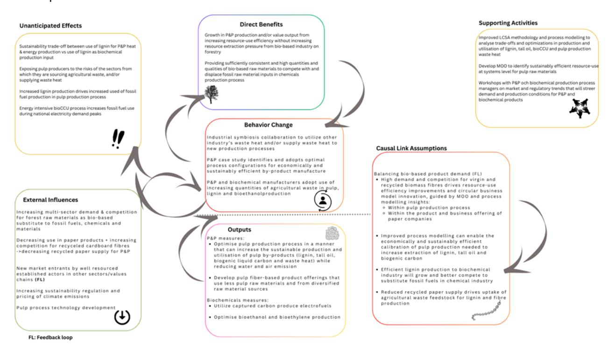

Heat generation from black liquor normally occurs at levels that overburden the recovery boiler in which it is incinerated (Kuparinen et al., 2019), creating a bottle neck in pulp production. Recovering lignin from black liquor can reduce this heat burden but also reduce heat availability for use later in the pulp production process and create new requirements for production resource-use and additional process stages. Tall oil production is derived from soaps not re-utilized in the pulp production and is sent to biochemicals or biofuels production. Instead, producing tall oil can entail configuring the pulp production process to supply tall oil in line with the needs of tall oil buyers, with impacts on production inputs, processes, and environmental impact. Biogenic carbon capture and storage / use (BioCCS/CCU) from pulp production has implications on pulp production like those from both lignin production and tall oil production. Like lignin, carbon by-products are redirected from utilization in the pulp production process. How captured carbon is used in chemicals manufacturing may place new production and logistics demands on pulp producers, as well as impact it's sustainability from a resourceuse efficiency perspective at an economy wide level. Surplus low-quality heat from pulp production can also be utilized in external production processes external to, third party producers co-location production near pulp production facilities to utilize surplus heat. The energy intensive processes of novel bioethanol-pulp coproduction from agricultural waste may be able to be co-located near and exploit wood pulp production or other energy intensive production processes to utilize their surplus heat (Fagerström et al., 2022). The minimum biomass feedstock demands of this biochemical process will exert demand pressures on and be constrained by supply capacities in agricultural by-product flows.

The carbon storage and/or negative emissions potential from capturing and sequestering biogenic carbon emissions from pulp production is dependent on how it is subsequently used in the biochemicals sector. The type of product, production process, product lifespans, end-of-life process and extent of fossil fuel substitution are variables that can entail unintended outcomes on the climate mitigation and carbon storage potential of captured and utilized biogenic carbon (Gabrielli et al., 2023). The reduction in steam generation that follows from lignin extraction can increase the risk for direct fossil fuel consumption to fulfil steam needs elsewhere in the production produces (Kuparinen et al., 2019). The risk for using fossil generated energy also increases with utilizing energy intensive processes such as bioCCU, depending on the electricity supply mix, and the level of process electricity consumption during societal electricity demand spikes. Common to the discussed utilization of by-products via selling and entering new value chains is the consequence of expanding and potentially locking in pulp production's exposure to the fluctuations and dynamics of new value chains (Fagerström et al., 2022; Mossberg et al., 2021).

The range of impacts on pulp and biochemicals production processes presented above represent trade-offs to be analysed and optimized to produce and utilize lignin, tall oil, biogenic carbon, surplus heat and pulp and bioethanol co-production from agricultural feedstocks in an economically and sustainably efficient manner. Calimero process modelling and MOO can be used in a trade-off analysis and identify economically and sustainably optimal configuration to the production processes and utilization of these by-products. Calimero's MOO tool and improved LCSA model can also be used to evaluate from a systems perspective the most sustainably efficient use pathway and subsequent refining requirements for pulp by-products. Findings from this analysis can be integrated into Calimero's PEF category rules for pulp by-products to steer markets toward sustainably efficient use of pulp by-products. Systems modelling to forecast material environmental risks, resource constraints, market dynamics and policy developments can inform on socio-economic structures and trends that will influence prospects to develop and utilize byproducts recovered from the pulp production. Lastly Calimero can model both the pulp production levels needed to align by-product supplies to the needs of biochemical manufacturers as well as prospective feedback loops in the by-product production system.

In the field of pulp, paper, and biochemicals production, Calimero has the potential to explore various technical, organizational, and economic feedback loops, which can significantly impact the production processes and outcomes.

One key area is the positive feedback loops stemming from lignin extraction, which not only reinforce but also increase pulp production. This increase in production, however, leads to new feedback loops in downstream processes. For example, a reduction in the recovered heat supply can constrain production, which in turn creates a reinforcing feedback loop that increases reliance on external energy sources, possibly fossil-based, as highlighted by Kuparinen et al. (2019).

Moreover, the profitability of pulp production is positively impacted by the utilization of lignin and tall oil. This reduces the risk associated with developing bioCCU processes in pulp production. As the demand for BioCCU grows, it opens additional revenue streams, further enhancing the profitability of pulp production.

Another aspect involves the accumulation of experience in collaborating within new, cross-sectoral value chains. This experience builds the capacity for further collaboration and participation in additional value chains, particularly where there is potential demand for by-products of pulp production.

However, there are constraints to consider. An unsustainably high demand on limited forest resources for raw materials can create a negative feedback loop, limiting the growth potential in pulp production. This situation then generates a positive feedback loop that increases the efficiency of extracting biobased by-products from forestry raw material inputs. Overall, these interconnected feedback loops highlight the complexity and interdependence of factors in pulp, paper, and biochemicals production, requiring careful consideration and management to optimize outcomes.

Demand increases for forestry based raw materials and change resistance of pulp & paper incumbents (Mossberg et al., 2021, 2018), combined with decreasing sector revenue streams and profitability may generate a reinforcing feedback loop that both weakens incumbent's traditional business model, and compound that decline by drawing new entrants and business model innovation into pulp-processing value chains. The tipping point where new entrants and/or incumbents transition to increase production and supply of biochemical inputs exerts a similar reinforcing feedback loop on incumbent chemicals producers, consisting of pressure to transition and adapt to new bio-based actors entering chemical value chains. Workshops and training material can be used to communicate systems modelling insights to pulp and paper producers and strengthen the sustainability basis of the sectors production and business strategy.

## **5.2 System incentives and penalties analysis**

Incentives and penalties are potent tools that drive the bio-based industries towards sustainability and innovation. These mechanisms, when carefully analysed and applied, can steer an industry towards greater environmental responsibility and economic viability. The academic work in this area offers insight into the strategic application of these tools.

Arias et al. (2023) undertook a Delphi study integrated with a SWOT-Analytic Hierarchy Process to unravel the pulp and paper industry's complexities. Their research identifies both the drivers propelling biorefineries forward and the significant barriers they face, such as the requirement for high capital investment, limitations in current technology, and challenges in realizing their full potential. Stewart et al. (2023) employed the opensource BLocS software, pairing it with BioSTEAM's LCA capabilities, to holistically evaluate the economic and environmental sustainability of varying feedstocks. García-Velásquez and van der Meer (2022) argue for the utilization of hotspot analysis alongside global sensitivity assessments as a decision-making tool in the early stages. This approach could be instrumental in fostering the transition to a low-carbon economy by pinpointing environmental hotspots in biobased processes and products. Similarly, Baldoni et al. (2021) delved into biobased chemicals, offering a methodology to comprehend the sector's intricacies, and providing a template for future explorations into bio-based industries. Villicaña-García et al. (2023) put forward incentive/penalty schemes with a clear message: such strategies not only align economic and environmental goals but also enhance them. Beaussier et al. (2022) introduced a novel modelling framework to assess the impact of regional incentives in the wood energy sector, pairing economic and environmental performance. Hellsmark et al. (2016) present a case study on the development of advanced biorefineries in Sweden, dissecting the interplay between systemic barriers and drivers, while Ngan et al. (2020) showcases a decision-making framework using DEFANP, which prioritizes financial incentives, demonstrating their pivotal role in the success of biomass pyrolysis-based poly generation plants.

These references collectively emphasize the importance of incentives and penalties analysis for bio-based industries. The optimization of incentives and penalties in bio-based industries is a complex issue, involving a range of stakeholders and sustainability considerations. Rossiter and Hester (2017) highlight the importance of considering the needs and behaviours of stakeholders, specifically focusing on the role of biosecurity regulators and importers. Bennich et al. (2021) and Londo et al. (2017) emphasize the need for a systemic approach, considering the interactions between sustainability goals and the modelling of demand and supply. Hodgson et al. (2016) and Parisi et al. (2016) provide insights into the policy interventions and economic importance of the bio-based economy, while Collins et al. (2020) offers practical suggestions for addressing challenges and implementing actions in the marine bioresource development sector. These studies collectively underscore the need for a holistic and inclusive approach to optimizing incentives and penalties in bio-based industries.

At the heart of advancing these sectors is the strategic use of data. Beyond data as an asset, there is an imperative to harness data as a transformative tool that informs decision-making and sustainable development. This is coupled with the need for capacity building, particularly in enhancing the technical acumen of industry managers to evaluate environmental impacts with precision and tailor processes to minimize ecological footprints. However, progress is often tempered by resource limitations. The innovation and sustainability strides in bio-based sectors are contingent upon access to cutting-edge technology and sufficient financial investment, which can be as challenging as it is essential. Furthermore, the cross-pollination of knowledge and expertise through interdisciplinary collaboration emerges as a cornerstone for pioneering new materials or process improvement. External factors, such as stringent regulations and the attraction of financial incentives, also play a critical role, acting as catalysts for the adoption of optimized practices. In essence, navigating the bio-based industry's systemic labyrinth calls for a concerted effort that knits together engaged stakeholder participation, data-driven strategies, capacity enhancement, resource accessibility, collaborative innovation, and adaptability to external forces, all aimed at cementing a path toward sustainable transformation.

Within the bio-based industry, the interplay of incentives and penalties is a critical aspect that shapes the sector's trajectory. Maina et al. (2017) and Vanhamaki et al. (2019) both emphasize the importance of waste valorisation and the application of circular economy principles in national and regional strategies. Wojnarowska et al. (2021) and Leipold and Petit-Boix (2018) highlight the socio-economic and business perspectives, with the latter suggesting the need for a clearer definition of sustainable business practices. Lange et al. (2021) and Rajendran et al. (2019) discuss the role of policy incentives in promoting the transition to a circular bio-based economy and the decarbonization of energy, respectively. Hodgson et al. (2016) and Ladu and Quitzow (2017) provide insights into the barriers and key policy interventions, as well as the evolution of policies and policy instruments supporting the bio-based economy. These studies collectively underscore the importance of policy incentives and penalties in driving the transition towards a more sustainable and circular bio-based industry in the EU.

Financial mechanisms, such as tax credits, play a crucial role in the development and sustainability of bio-based systems and sectors, with significant impacts on the bio-based product market and broader economic and environmental outcomes. These mechanisms can incentivize the transition to a bio-based economy, which is seen as a solution to ecological and social challenges (Bennich and Belyazid, 2017). However, their effectiveness depends on the specific context and the presence of innovative and sustainable smallholders (Benjamin, 2012). The sustainability of advanced bio-based technologies is a key consideration, with a need for improved assessment methods (Escobar and Laibach, 2021). The macroeconomic impacts of bio-based applications in the EU are significant, with second-generation biofuels and biochemicals being the most competitive sectors (Smeets et al., 2014). However, the transition to a bio-based economy is not without challenges, including risk factors and uncertainties (Bennich and Belyazid, 2017).

The bio-based industry's economic viability and environmental sustainability are influenced by regulatory volatility, financial incentives, and taxation strategies. The current framework in the EU creates a non-level playing field, with a strong dependence on incentives. This imbalance is further exacerbated by limited policy support for bio-based materials, despite their potential for higher added value and job creation (Philp, 2015). To address these challenges, supportive regulations and standards are needed to encourage a level playing field (Ladu and Vrins, 2019). However, the industry's growth must be balanced with environmental and food security concerns (Sexton et al., 2009). The efficacy of alternative biofuel policies in achieving energy, environmental, and agricultural policy goals is also a key consideration (de Gorter and Just, 2010). The potential of bioenergy production to enhance landscape-scale ecosystem conservation and rural livelihoods should be explored, with a focus on sustainable agricultural production and viable rural livelihoods (Milder et al., 2008).

# **6 PART 3 – LOOKING TOWARDS THE FUTURE**

# **6.1 Building a better bio-based future: Calimero's Theory of Change Narrative**

Building upon the foundational work and insights gained since the project's inception, it is understood that this narrative will evolve and be periodically revisited as Calimero continues to grow and adapt to new challenges and opportunities in the bio-based industry. Calimero's Theory of Change outlines how the project's activities are designed to yield a series of results, ultimately contributing to the intended impacts in the bio-based sectors. Recognizing the complex and dynamic nature of these industries, the Calimero project operates as a collaborative network, bringing together stakeholders from diverse fields to address pressing sustainability challenges. Given the project's role in facilitating and catalysing change, the Theory of Change serves as a conceptual framework that guides the project's efforts, identifying key levers of change and inputs from the network.

In the context of the Theory of Change, an intervention is a critical event in a system that leads to the evolution of new structures and shared meanings (Hawe et al., 2009). It is the underlying logic of any program or project, explaining how and why certain actions will lead to positive changes (Dent et al., 2022). Outputs are the immediate, direct results of an intervention, while outcomes are the broader, longer-term changes that occur because of the intervention (Rogers, 2014). In constructing a rationale for the key assumptions in Calimero's Theory of Change, it's crucial to integrate a logical and evidence-based framework that connects different levels of intervention and the interactions within those levels. This involves defining each intervention level and identifying the levers of change, as De Los Reyes and Kazdin (2006) emphasize the importance of considering a range of behavioural changes when evaluating intervention effectiveness. The rationale must also incorporate Cronbach and Furby's (1970) acknowledgment of the complexity of measuring change in interventions, underlining the need for a clear narrative that links Calimero's activities to expected outcomes and impacts, while also addressing the interactions among various levers of change. Furthermore, Hashweh's (1986) insights on the factors affecting conceptual change should guide the understanding of how external and contextual factors might influence the intervention. This approach ensures that the rationale is both comprehensive and adaptable, considering the complexities and dynamics involved in effecting change through interventions. The Theory of Change details how Calimero's activities will activate these elements, alongside the key assumptions linking different levels of intervention logic (output to outcome) and interactions within the same level (among various levers of change). The overall causal logic of the Calimero project suggests that a combination of project outputs such as enhanced impact assessment methodologies, protocols for data collection, identification of sustainability gaps in the biobased sectors, targeted case studies, MOO tools for Bio-Based sectors, technological solutions to address sustainability gaps, diverse recommendations, and increased stakeholder engagement, will lead to significant outcomes. The project aims to deliver three key outcomes: firstly, a LCSA methodology for bio-based products, aligned with Product Environmental Footprint guides, applicable across various bio-based industries and potentially replicable in other sectors. Secondly, it will provide optimized industrial solutions demonstrating better sustainability performance. This involves the development and application of a MOO framework that integrates sustainability assessment methodology to enhance environmental performance in the bio-based sector, focusing on reducing emissions, increasing circularity, and minimizing harmful chemicals while maintaining economic and social feasibility. Lastly, the project will produce guidelines and recommendations for sustainable development, targeting policymakers and the scientific community in the bio-based industry, based on experiences from assessing and improving biobased industrial case studies.

The project proposes an integrative multi-scale approach to the sustainability improvement of biobased industries. Calimero promotes a thorough evaluation of both community-specific (micro) impacts and broader sectorial (meso) dynamics. This strategy acknowledges the importance of considering a wide spectrum of relevant factors to develop effective and sustainable solutions, aligning with the need to integrate various scales of analysis to holistically address industry challenges.

Additionally, in this context, it's essential to acknowledge the actors operating within the spheres of control, influence, and interest. The sphere of control encompasses academic and industrial partners who hold the capacity to drive substantial changes in the project. Conversely, the sphere of influence is constituted by policymakers and associations, including advocacy groups and community leaders, who possess the ability to shape the trajectory of change. Furthermore, the sphere of interest extends to society and citizens, representing the broader community affected by the project's outcomes. Acknowledging and comprehensively considering the perspectives and needs of these diverse stakeholder groups is fundamental to promoting inclusivity and ensuring that project interventions effectively address a wide array of interests and concerns.

# **6.2 Theory of Change Overview**

To achieve its overarching goals, Calimero project traces sustainability gaps in industrial practices to identify improvement pathways across a broad spectrum. This involves addressing unexplored impact hotspots throughout the lifecycle and bio-based value chain, identifying potential roadblocks and incentives essential in designing methodologies. The project's primary goal is to enhance the sustainability of bio-based industrial sectors, making them more resource-efficient, and mitigate climate change impacts while preserving vital ecosystem services and biodiversity.

The project employs a multi-faceted approach, investing in the development of case studies to gain insights from real-world applications and issues, thus serving as a rich repository of experiential data. Additionally, it utilizes a MOO framework to improve industrial processes operations and value chains, allowing for a nuanced understanding that surpasses single-objective analysis. The core objectives of its impact framework are focused on the development of a LCSA methodology tailored for bio-based products, of optimized industrial solutions that enhance sustainability thanks to a MOO framework, and the creation of guidelines and recommendations for sustainable development trajectories. These goals are underpinned by a consortium that unites industry leaders and experts in sustainability, ensuring that the outcomes are both practical and actionable.

We anticipate a synergistic combination of project outputs sustaining the transformation in the bio-based sectors. These outputs include:

**Enhanced Methodologies:** development of new methodologies and indicators that fill existing gaps in LCSA and the PEF framework. These include new characterization factors for biodiversity, ecosystem services, and the incorporation of the temporal dimension in greenhouse gas (GHG) emissions accounting the project sets the stage for a deeper understanding and process improvement across the bio-based industry.

**Protocol for Data Collection**: the project emphasizes the development of robust data collection protocols, enabling lifecycle thinking. These protocols are critical for data-driven decision-making, enabling stakeholders to pinpoint and act on critical sustainability gaps.

**Identification of Sustainability Gaps:** the project identifies key areas where bio-based sectors can improve, guiding targeted efforts to address these gaps. These insights foster a proactive approach to sustainability, allowing for the prioritization of impactful changes.

**Case Studies:** The dissemination of detailed case studies from the construction, woodworking, textile, pulp & paper, and biochemical sectors illuminate paths taken by industry leaders toward sustainability. These narratives serve as a blueprint for replication, demonstrating the application of sustainability indicators and optimized methodologies for the broader industry.

**Multi-Objective Optimization (MOO) for Bio-Based Sectors:** The development of a MOO framework tailored for bio-based sectors offers a cutting-edge approach to process optimization, combining environmental, economic, and social objectives.

**Feasible Solutions:** showcasing practical solutions that have been identified and validated to demonstrate sustainability improvements, such as on resource and energy efficiency, material circularity, replacement of toxic substances, and reduction of greenhouse gas emissions.

**Recommendations:** generating and disseminating guidelines and recommendations to support the bio-based industries in making informed process modifications.

**Stakeholder Engagement**: engaging a broad spectrum of stakeholders to ensure a collaborative approach, fostering a sense of shared responsibility, and driving collective action towards sustainability.

These specific outputs are expected to collectively contribute to key transformative changes within the biobased sectors:

**1. Adoption of Sustainable Technologies and Practices:** by advancing LCSA to include additional environmental impacts and the social and economic dimensions, the project outputs will enable the comprehensive evaluation of bio-based systems and improvement solutions. The project's methodological innovations, such as the inclusion of biodiversity and ecosystem services, dynamic GHG inventory, and circularity aspects, will empower stakeholders to implement sustainable technologies and practices that align with the EU's sustainability goals.

**2. Standardization and Interoperability:** facilitating the integration of new characterization factors (CFs) and criticality indicators possibly contributing to enriching the PEF framework, outputs will help standardize the assessment of bio-based products, fostering interoperability and the seamless exchange of sustainability data across the industry.

**3. Contribution to the European Bio-Based Economy:** the project aims to improve environmental performance and support the transition to a bioeconomy by offering solutions that reduce GHG emissions and toxicity impacts while ensuring economic viability. The actionable guidelines and recommendations developed by the project will guide industry and policymakers to make informed decisions that support sustainable development.

In the Calimero project's Theory of Change, levers of change are the fundamental mechanisms through which the project aims to enhance sustainability in bio-based industries. Life Cycle Thinking is a key lever that involves taking a comprehensive view of a product's environmental impact throughout its entire life cycle. Complementing this is the lever of Methodological Advancements, which focuses on refining the approaches used to assess and quantify sustainability, ensuring that they are scientifically robust and forward-looking. Data Management is also a pivotal lever, addressing the need for data collection with quality, analysis, and management as a basis for informed sustainability decision-making. The MOO of industrial processes lever is about scaling up and finding the optimal balance between environmental, economic, and social objectives, thereby streamlining industrial processes towards greater sustainability. Lastly, the lever of Sectorial and Cross-Sectorial Solutions seeks to develop interventions that are not only effective within specific sectors but can also be adapted across various sectors, fostering cross-fertilization. These levers are integral to driving the strategic interventions and outputs of the project, which include developing enhanced methodologies, conducting in-depth case studies, creating MOO frameworks, identifying feasible solutions, and formulating policy recommendations to engage stakeholders.

The bio-based industry is at a critical juncture where the pursuit of sustainability is charged with challenges. Resource limitations, the need for interdisciplinary collaboration, and the evolving landscape of stakeholder expectations are just a few of the hurdles that the industry faces. Hennig et al. (2016) and De Meester et al., (2011) both highlight the scarcity of sustainable biomass, which is further exacerbated by competition with the food chain. This is particularly relevant in developing countries, where resource recovery from bio-based production processes is crucial (Gunarathne et al., 2019). The transition to a bio-based economy is complex, requiring a combination of new and existing technologies (Navia and Mohanty, 2012). Sustainability certification and standardization are also critical, with gaps identified in existing frameworks (Majer et al., 2018). Despite these challenges, the bio-based industry is a key player in the transition to a more sustainable economy (Moreno et al., 2020). In addition, the industry must navigate the delicate balance between maintaining economic viability and upholding environmental stewardship. Incentives and penalties are critical in steering the industry toward sustainable practices. Conversely, the project also acknowledges the potential impediments that can hinder this transition, such as the non-harmonization of regulations and economic constraints.

# **6.3 Hypotheses for the Calimero Theory of Change**

To facilitate the comprehension of our Theory of Change, we present representative organizations (fictional) from five bio-based industries, each facing unique challenges that highlight the need for optimizing sustainability practices.

First, we have **NordWood Innovations** from Finland, a leader in the woodworking industry. They are tackling the integration of sustainable methods in their production, a challenge indicative of the industry's struggle with technological advancement and sustainability integration. **EcoPulp Solutions**, based in Portugal, represents the pulp and paper industry. They are at the forefront of addressing environmental impact issues, particularly focusing on water management and chemical usage. Their challenges reflect the industry's need for more sustainable resource management practices. Germany's **GreenChem BioTech,** a key player in the biochemical industry, exemplifies the struggle with data reliability and LCAs. Their efforts to produce environmentally friendly biochemicals are hindered by the lack of comprehensive data, a common obstacle in this sector. **ConstructGreen** from France, in the construction industry, is navigating the complexities of varying sustainability standards. Their endeavour to incorporate bio-based materials into construction projects underscores the industry's challenge with regulatory compliance across different regions. Lastly, **FiberFuture Textiles** from Italy, representing the textile industry, is balancing sustainable practice implementation with market competitiveness. Their struggle is emblematic of the textile industry's broader challenge of adopting circular and sustainable production methods while remaining viable in a competitive European market.

These organizations collectively underscore the diverse yet interconnected challenges within the bio-based industries, emphasizing the necessity for holistic and innovative solutions to advance sustainability.

## **A multifaceted approach through four distinct pathways sustains the narrative.**

# **Pathway 1 - Regenerative Optimization**

This pathway focuses on utilizing case studies to drive process and value chain optimization and aligning stakeholder engagement across industry, research, and policymakers. The resources leveraged here are the collaborative efforts and the sharing of technological advancements. Activities involve multi-disciplinary workshops, experiments, and model simulations aimed at refining production processes and value chains. The underlying theory is that informed and balanced advancements, backed by empirical data and models, will improve environmental sustainability. This approach anticipates a change in variables, processes, and sustainability assessments, facilitating a systemic shift towards optimized production and reduced environmental footprints.

#### **Pathway 2 - Integration and Transparency**

Here, the objective is to integrate characterization factors and leverage LCSA principles to create feedback loops that promote efficiency and sustainability. The pathway depends on the assumption that enhancing data utilization and capacity for analysis leads to better-informed (from the environmental standpoint) choices and transparent communication. Activities designed to reach these outcomes include the development of simulation tools, LCAs, and data analytics. The anticipated impact is a shift towards sustainable product demand and a more significant industry reward for sustainability efforts.

## **Pathway 3 - Collaboration and Adaptive Governance**

This pathway envisions a bio-based industry ecosystem where interdisciplinary collaboration is key to unlocking new sustainable products and methodologies. With the assumption that active stakeholder involvement accelerates industry evolution, the focus is on knowledge-sharing and leveraging synergies between economic and environmental objectives. Resources such as collaboration platforms and educational material support the activities of developing policy recommendations and fostering community engagement. The expected outcome is an industry that is responsive to external influences and capable of adaptive governance, leading to a sustainable market evolution.

## **Pathway 4 - Balancing the Bio-Based Demand**

The final pathway aims to pinpoint the challenges of boosting the bio-based demand while balancing economic viability and environmental stewardship. The bio-based industry cannot grow without limits. By incentivizing transparency on the demand for bio-based products and technologies and the promotion of biodiversity restoration and preservation actions, the pathway posits that the industry can catalyse a responsible development of the market for bio-based products. It operates on the theory that financial incentives and a shift in industry practices towards carbon accounting and dynamic carbon modelling will lead to a less impactful industry. The resources mobilized include financial incentives and regulations that promote transparency and environmentally sound practices.

Each of these pathways in the Calimero Theory of Change combines the project-specific outputs and levers of change to achieve the desired outcomes, reflecting a dynamic and multi-dimensional strategy, as shown in the Theory of Change diagram below. These pathways are interconnected, with each pathway's success bolstering the others. By integrating the variables of stakeholder perspectives, critical thinking, and data-driven decisionmaking, the Theory of Change for Calimero is structured to harness the potential of the bio-based sectors, ensuring a transition with positive economic, environmental, and societal impacts.

Incorporating the pathways, we hypothesize a transformative scenario for our organizations' challenges. **NordWood Innovations** could leverage governmental incentives for adopting sustainable technologies, easing their integration into existing processes. **EcoPulp Solutions** might benefit from stricter environmental regulations, driving the adoption of more efficient water and chemical management techniques. For **GreenChem BioTech,** partnerships with research institutions could provide access to reliable data and enhance their LCAs. **ConstructGreen** could utilize collaborative platforms for standardizing sustainability practices in construction, aided by regulatory support. Lastly, **FiberFuture Textiles** might adopt industry-led initiatives that incentivize circular production methods, balancing sustainability with market competitiveness.

# **Calimero's Theory of Change Diagram**

[Figure 12](#page-48-0) below presents the Theory of Change Diagram for the Calimero project, succinctly mapping the objectives, intermediate results (IR), levers of change, and outputs that collectively aim to enhance the sustainability of the bio-based industries. It illustrates a structured approach, starting with the identification of main barriers and incentives, and advancing through a series of defined objectives that include improving existing sustainability assessment methodologies and developing one MOO framework.

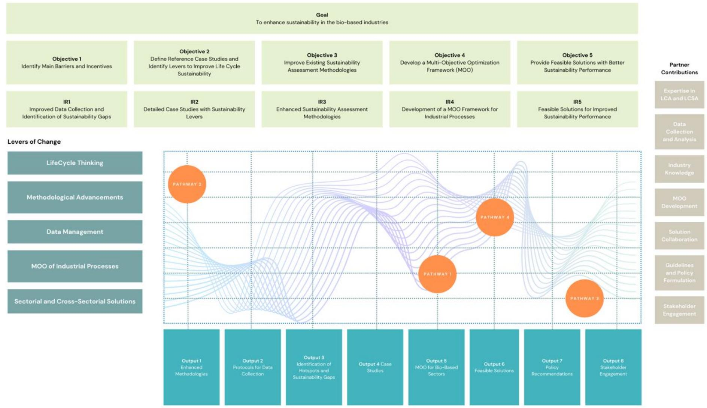

Figure 12. Calimero's Theory of Change Diagram

The 4 pathways presented above are further highlighted in the diagram, each one underpinned by specific levers of change, like lifecycle thinking and methodological advancements. In the diagram provided, outputs and pathways are visualized as integral components of the Theory of Change. Outputs are represented as concrete deliverables and results stemming from the project's objectives. These outputs are the tangible manifestations of the levers of change like life cycle thinking and methodological advancements, among others. Pathways, highlighted as connections in the diagram, illustrate the dynamic relationships and progression from one project phase to the next. They show how initial inputs, such as improved data collection, lead to subsequent outputs and final goals through a series of interconnected steps. Each pathway represents a sequence of events and decisions that collectively contribute to achieving the overarching goal of the project. These pathways guide the project towards tangible outputs, including enhanced methodologies, case studies, and policy recommendations, with contributions from partners in different areas such as LCA expertise, data management, and stakeholder engagement.

Levers of change are interlaced with the partner contributions to foster a synergistic and cooperative drive toward the intended outcomes in the bio-based industry. These levers span from lifecycle thinking and methodological advancements to data management, MOO of industrial processes, and sectorial and crosssectorial solutions. The essential contributions of partners, which encompass expertise in LCA and LCSA, data collection, industry knowledge, MOO development, guidelines, and policy formulation, are instrumental in fortifying process improvement and knowledge generation.

In the project's framework, iteration plays a pivotal role. The MOO tool is central to this iterative process, providing a systematic approach for refining processes with each iteration. With MOO, the project can continuously enhance efficiency and sustainability, employing data-driven strategies and capacity enhancement to ensure that each iteration minimizes the ecological footprint without sacrificing quality or performance. This iterative feedback loop, bolstered by the capabilities of the MOO tool, is essential for the project's adaptive management and progressive achievement of its sustainability objectives, making use of feedback loops to deliver process improvement.

As advanced by the literature, project outputs can be also considered intermediate impacts, as they are the direct results of a project's activities and can have significant effects on various aspects of the project. To illustrate this correlation, we can cite examples such as the use of design/information technology in construction projects has been shown to lead to cost savings and schedule compression (Thomas et al., 2004). Similarly, the indirect effects of a development proposal, such as land disturbance and greenhouse gas emissions, can be calculated using input-output analysis (Lenzen et al., 2003). The Boise Project in Idaho, for instance, had both direct economic benefits from irrigation and indirect benefits from the food processing industry (Long, 1980). However, the evaluation of project impacts can be challenging, as there may be a mismatch between the evaluation system and the project logic (Godenhjelm, 2013). Furthermore, the potential impact approach can be used to assess project performance, but it relies on informed judgment and may have broad categories for rating performance (Hubbard, 2000).

In that sense, the specific intermediate results that Calimero aims to achieve include the advancement of the LCSA methodology to encompass a broader range of sustainability indicators, including those for biodiversity and ecosystem services. The project will also deliver optimized industrial solutions leveraging a MOO framework, and it will produce guidelines and recommendations to foster sustainable practices across the industry. These results are anticipated to significantly reduce pollutant emissions, bolster the circularity of biobased industries, and curtail the use of harmful chemicals, while maintaining techno-economic viability and social feasibility.

In the background, the scaling of new technologies and data sources appears critical in decision-making processes related to development needs and policy decisions that will sustain the transition. The focus on more and better data contributes to decisions and outcomes for the bio-based industry and economy and provides a basis for policy development. This approach ensures that decisions are not only based on comprehensive and reliable data but also consider the broader implications and trade-offs on the environment, thereby contributing to a more resilient bio-based economy.

The feedback loop between upstream monitoring the environmental and social impact and achieving process optimization is a key component of Calimero's Theory of Change. The essence of assessing environmental and social impacts before they reach the market is to allow preventive identification and mitigation of potential adverse effects. Upstream monitoring is a proactive strategy that emphasizes the evaluation and improvement of process efficiencies, resource use, and sustainability impacts from the earliest points in the product life cycle. By implementing this approach, the project can ensure that optimizations made during the design, sourcing, and manufacturing phases lead to reduced ecological footprints and improved social outcomes before products and processes are scaled up or introduced to the market. This loop ensures that the outputs of various initiatives are used as inputs for further refinement and improvement, creating a continuous cycle of feedback that optimizes processes over time. This cyclical nature not only improves efficiency but also enhances the sustainability of the industry, leading to a holistic approach that balances economic viability with environmental stewardship.

The necessity of an enabling political environment for changemakers in building awareness, access, and capacity to use more and better data is evident for the process optimization in the bio-based industries adoption. Political support in the form of policies, regulations, and incentives plays a critical role in creating an atmosphere where changemakers can thrive. This environment facilitates the development and dissemination of innovative solutions, encourages the adoption of best practices, and provides the necessary resources and infrastructure for effective data utilization. Without such political backing, technical innovations and process improvement may face barriers to adoption and scaling, hindering the overall progress toward sustainability in bio-based industries.

Partner engagements and contributions are instrumental in operationalizing the three levers of change technical innovation, political support, and market transformation. These partnerships, encompassing a range of stakeholders from industry, academia, and government, provide a diverse pool of resources, expertise, and perspectives. This collaborative approach enables a more comprehensive and effective implementation of the levers of change, ensuring that the outcomes are robust, scalable, and aligned with the overarching objectives of the project.

# **Assumptions Behind the Enablers**

As advanced by the literature, the role of ecosystems in sustaining change, particularly in the bio-based sectors, is foundational (J. Philp and D. Winickoff, 2019; Spremić et al., 2020). They enable the production, sharing, analysis, and use of data, creating an environment conducive to continuous improvement and innovation (Spremić et al., 2020). The stimulation of open data ecosystems is particularly important in this regard, with a need for innovative legal and financial frameworks (Turki et al., 2019). The role of ecosystem members, endogenous and exogenous factors, and strategic considerations in ecosystem evolution are also highlighted by (Makinen and Dedehayir, 2012). Initiatives that foster environmental awareness, promote dialogue between stakeholders, and provide institutional support can facilitate the emergence of integrated, collaborative ecosystem-management approaches (Biggs et al., 2010).

Supporting changemakers within the bio-based sectors is vital for fostering innovation and sustainable transformation. Changemakers, including individuals and organizations, often initiate new ideas and sustainable approaches, challenging existing systems. Their role in advancing data ecosystems is pivotal, as they leverage data for informed decision-making, advocating for sustainable practices, and bridging the gap between current practices and a sustainable future. Their efforts are instrumental in creating a resilient industry that is wellequipped to meet contemporary challenges while prioritizing sustainability.

A data ecosystem comprises an intricate network of data sources, technologies, processes, and actors. The key components of a data ecosystem encompass data generation, collection, processing, distribution, and utilization, facilitated by technological infrastructure, and governed by policies and standards. Calimero's vision of an enhanced data ecosystem is characterized by the development of enhanced methodologies, which include new characterization factors for biodiversity, ecosystem services, and the temporal aspect of greenhouse gas emissions. The integration of these novel methodologies into the LCSA framework is expected to yield a more dynamic and comprehensive dataset, which is critical for informed decision-making.

Stakeholders from across the industry, academia, and policy-making bodies are engaged in a concerted effort to optimize data utilization. This collaborative approach ensures that the data collected is not only comprehensive but also contextualized to the unique needs and challenges of the bio-based industry. By prioritizing data quality, accessibility, and interoperability, it facilitates a culture of transparency and data sharing that is crucial for advancing sustainability practices.

The project also recognizes the need for continuous research and innovation to improve data collection, analysis, and dissemination practices. Through the implementation of standardized protocols and the employment of cutting-edge analytics platforms, the project is setting new benchmarks for how data is managed in bio-based industries.

Creating incentives for change at the national level is crucial for motivating the adoption of sustainable practices within the data ecosystem. These incentives, which can include financial support, tax benefits, and regulatory relaxations, encourage businesses to invest in sustainable technologies and practices. Such government-led incentives can catalyse industry-wide change, aligning environmental and economic objectives and leading to improved environmental outcomes and enhanced industry resilience and competitiveness.

Partnerships between different sectors, both within and outside of governments, are key to making the data revolution a force for good. These collaborations bring together diverse expertise, resources, and perspectives, leading to more comprehensive and effective solutions to complex challenges. By promoting data sharing, innovation, and a culture of transparency and accountability, these partnerships contribute to a more inclusive, equitable, and robust data ecosystem, driving positive change in the bio-based industries.

Finally, building knowledge is essential for fostering mutually beneficial partnerships. It enables stakeholders to understand each other's needs, capabilities, and constraints, forming the basis for effective collaboration strategies. Through research collaborations, consultations, workshops, and shared learning platforms, partners develop a common language and understanding, contributing to a more robust and equitable data ecosystem. In the bio-based industries, this leads to sustainable and innovative practices, as partners collaboratively address challenges and seize opportunities.

In the context of the Calimero project, various stakeholder groups play pivotal roles in advancing the sustainability of bio-based industries.

Governments and the public sector have a critical role in the data ecosystems within the national statistical system. They are responsible for developing and enforcing legal and regulatory frameworks, setting standards for data production, collection, and usage, and influencing the data ecosystem's direction through policy and partnerships. This role is integral to establishing a data-driven culture within industries, essential for informed policymaking and advancing the bio-based sectors.

The Private Sector exhibits its commitment to sustainable practices by engaging in initiatives that promote environmental responsibility and economic viability. Companies in this sector provide unique bio-based and relevant data insights, contributing to the development of more sustainable products and processes, which might not be accessible publicly.

Civil Society Organizations represent citizen interests by advocating for process optimization in bio-based industries. They play a key role in generating and utilizing issue-specific data, influencing policies, and ensuring that the development of these industries aligns with public interests and sustainability goals.

Academia and Research Organizations are instrumental in generating data for the development of knowledge. They contribute through research and innovation, developing new methodologies and tools for monitoring and achieving process optimization in bio-based industries. These institutions are crucial in fostering innovation and providing the scientific basis for sustainable practices.

The success of the network in bio-based sectors hinges on its breadth, engagement, and openness. A broad network encompasses diverse stakeholders from different sectors and regions. Engagement is critical for stakeholders to find value in their participation and invest time and resources to achieve common objectives. Finally, openness is crucial for stakeholders to collaborate effectively and overcome challenges, driving progress in the bio-based industry.

## **Impact Framework Indicators**

A preliminary taxonomy for Calimero's Theory of Change is derived and serves as a strategic roadmap, enhancing clarity, accountability, and effectiveness in achieving sustainability goals within the bio-based industry. It transforms abstract objectives into actionable and measurable outcomes while fostering collaboration and stakeholder engagement, ultimately contributing to the project's success and societal impact. The preliminary taxonomy builds in the multi-scale approach adopted by the Calimero project, with a specific focus on the micro level of use cases and the meso level of sectorial change, where the project explores the intricacies of applied sustainability skills, decarbonization, and care within the context of economic pressures and the ongoing supply chain crisis. [Figure 1](#page-10-0) (page [11\)](#page-10-0) articulates this complex interplay between sustainability and the EU's strategic open autonomy giving context and background to our theory. At the micro-level, the project addresses the immediate challenges within use cases, navigating between the supply chain crisis, economic pressures and viability, and the quest for decarbonization and care. The Calimero project is deeply attuned to these issues, developing methodologies to optimize resource use and reduce carbon footprints in industrial processes, while also fostering the development and application of sustainability skills. At the meso level, the project traverses sectorial change amid geopolitical tensions and economic pressures, aligning with the broader quest for decarbonization and social justice. Here, Calimero's objectives resonate with the need to equip the bio-based sectors with advanced sustainability skills, ensuring the sectors' competitive advantage and contribution to a more just transition. The overarching global dynamics frame these sector-specific challenges within wider contexts, including geopolitical shifts, financial constraints, eroding social cohesion, threats to democracy, and the overarching aim for net-zero emissions and well-being. Calimero's project objectives contribute to addressing these dynamics by promoting sustainable industry practices and enhancing skills that are crucial for future-proofing the bio-based industries within the global sustainability transition.

Building on this contextualization, the following table represents a structured overview for the preliminary taxonomy, categorizing various KPIs according to different levels of implementation—micro (case studies), meso (sectorial), and macro (global)—and classifying their impact areas.

*Table 1. Overview for the preliminary taxonomy, categorizing various KPIs according to different levels of implementation*

| Level Impact Area Objective | KPIs                                   |                                 |
|-----------------------------|----------------------------------------|---------------------------------|
|                             | life cycle thinking in the industry 2. | ≥ 80%                           |
| hotspots 3.                 | ≥                                      | 9 sustainability gaps found     |
| (CFs                        | for biodiversity, ecosystem services,  |                                 |
|                             | 4. 10 case studies defined 5.          | ≥ 5 industrial                  |
|                             | process simulations 6. ≥               | 7 key sectorial and             |
| 7. ≥                        | 5 new impact categories included in    |                                 |
| achieved: ✓                 |                                        | Analysis of > 100 scenarios per |
| sustainable potential       | ✓                                      | Cover 3 Pillars of              |
|                             | least 5 other R&D funded projects 18.  | ≥ 5                             |
|                             | contacts with policy makers 19.        | ≥ 15                            |

Several potential indicators have been outlined to effectively track and evaluate the project's performance across its various thematic areas. These indicators encompass a wide range of measurements, including the reduction in greenhouse gas emissions, the percentage increase in renewable resource utilization, community engagement levels, job creation rates, economic benefits derived, resource efficiency, adoption of sustainable technologies, waste reduction, biodiversity conservation, and stakeholder satisfaction surveys. Each of these indicators plays a crucial role in assessing the project's progress and its contribution to sustainability and positive societal impact within the bio-based industry.

The selection of these indicators involved criteria such as relevance to project goals, measurability, and the ability to provide clear insights into the project's impact. The process for evaluating and updating the indicators in the impact taxonomy is envisioned to be dynamic and iterative. Regular monitoring and review sessions are planned, allowing for adjustments based on emerging trends, stakeholder feedback, and evolving industry standards. This approach ensures that Calimero's impact taxonomy remains a robust and flexible tool, capable of accurately reflecting the project's impact over time and guiding its future sustainable initiatives in the biobased industry.

#### **7 OUTLOOK**

The outlook for a sustainable future hinges on the intricate balance between biodiversity preservation and the development of a fair and regenerative bioeconomy. As we confront challenges like climate change and resource depletion, the need for a bio-economy framework that is both regenerative and fair becomes critical. Such a framework ideally ensures the sustainable use of biological resources, mitigating impacts on biodiversity while fostering economic growth and social equity. Addressing these dual objectives—biodiversity preservation and a fair, regenerative bio-economy—enables us to create a more resilient and equitable world, where economic development is in harmony with the natural environment, benefiting present and future generations.

Biodiversity preservation and the support of a fair and regenerative bioeconomy is complex, requiring a multifaceted approach that encompasses various strategies and policy interventions at different levels. At the micro level, as noted by Faith and Walker (2002) and Dahlberg and Burlando (2009), there is a need for local management and regional planning that balances biodiversity conservation with other factors specific from the sectors in question, requiring realistically negotiated trade-offs to avoid mistrust. The meso level, as highlighted by McShane et al. (2011), involves decision-making processes that consider the difficult choices between conservation and individual well-being, and the implications of these trade-offs. At the macro level, Brownlie et al. (2013), advances that sustainable development policies fail to halt the global decline in biodiversity and ecosystem services, underscoring the growing ecological deficit due to prioritizing socio-economic gains over biodiversity and recommends a shift in impact assessment from a 'damage limitation' approach to one that actively sustains or enhances biodiversity and ecosystem services to address this deficit. Furthermore, Daw et al. (2015) highlight the need to consider the trade-offs involving non-economic values like cultural identity and employment for a broader societal well-being.

For effective biodiversity preservation decision-making, as Opdam et al. (2008) and Draper (2007) suggest, it is crucial at the micro level to involve local actors in regional planning with a focus on setting biodiversity targets and increasing the role of environmental impact analysis. At the meso level, Gavin et al. (2018) point to the need for dynamic, pluralistic, and partnership-based approaches, emphasizing diverse solutions and stakeholder involvement. At the macro level, implementing the precautionary principle, as discussed by Kanongdate et al. (2012), is essential, but its effectiveness can be influenced by uncertainties and economic demand.

Taking into consideration this context, integrating lifecycle and resilience thinking seems appropriate for enhancing the environmental and social impact assessment of products or services throughout their life cycle. Resilience thinking, as detailed by Schilling et al. (2018), Wiese (2016), and Walker et al. (2008), emphasizes the need for diversity, redundancy, and flexibility in sustainable energy systems. Olsson et al. (2014) and Folke et al. (2002) highlight its importance in understanding and managing social-ecological systems, making it crucial for analyzing human-environment dynamics, as per Cote and Nightingale (2012).

Measuring and monitoring fairness in biodiversity preservation, as Kanagavel et al. (2013) and Sodhi et al., (2011) propose, involves assessing the efficiency of stakeholders at the micro level and evaluating the success of conservation actions at the meso level. At the macro level, Green et al. (2005) highlight the need for a framework for improved monitoring of biodiversity, utilizing indicators such as the Living Planet Index, Red List Index, Natural Capital Index, and Biodiversity Intactness Index to assess equitable distribution among stakeholders, as Vačkář et al. (2012) indicate.

For the bioeconomy, a comprehensive framework that incorporates key principles and strategies for equitable and sustainable use of biological resources is necessary. As Ingrao et al. (2018) and Ladu and Morone (2021) point out, the bioeconomy, defined as an economy based on renewable biological resources, addresses challenges like natural resource scarcity and climate change. McCormick and Kautto (2013) emphasize participatory governance and innovation, while Birch (2016) and Schmid et al. (2012) stress the inclusion of diverse policy visions and frameworks, recognizing the role of farmers and SMEs. Aquilani et al. (2018) and Dries et al. (2016) underline the importance of corporate sustainability and value co-creation, with a strategy of diversity in shaping the bioeconomy, as recommended by Priefer et al. (2017).

To support a fair and regenerative bioeconomy, Sturm and Banse (2021) and Ladu and Blind (2017) emphasize the role of public policies and instruments, while Schütte (2018) and Lokko et al. (2018) highlight the need for a strong research and innovation policy, with biotechnology playing a key role in inclusive and sustainable industrial development. Philp (2015) suggests cost-effective public policy strategies, and Schmid et al. (2012)

advocate for a public goods-oriented approach. Ingrao et al. (2018) and Diakosavvas and Frezal (2019) call for more effective harmonization of methodological approaches and interdisciplinary collaboration in bio-economy research.

This exploratory framework underscores the necessity of a coordinated and comprehensive approach to biodiversity preservation and the development of a fair and regenerative bio-economy framework, incorporating diverse strategies and policy interventions across multiple levels.

#### **REFERENCES**

- Acosta-Michlik, L., Lucht, W., Bondeau, A., Beringer, T., 2011. Integrated assessment of sustainability trade-offs and pathways for global bioenergy production: Framing a novel hybrid approach. Renew. Sustain. Energy Rev. 15, 2791– 2809. https://doi.org/10.1016/j.rser.2011.02.011 Ahmad, I., Sana, A., Kano, M., Cheema, I.I., Menezes, B.C., Shahzad, J., Ullah, Z., Khan, M., Habib, A., 2021. Machine Learning Applications in Biofuels' Life Cycle: Soil, Feedstock, Production, Consumption, and Emissions. Energies 14, 5072. https://doi.org/10.3390/en14165072 Ahmadi, P., Dincer, I., Rosen, M.A., 2014. Thermoeconomic multi-objective optimization of a novel biomass-based integrated energy system. Energy 68, 958–970. https://doi.org/10.1016/j.energy.2014.01.085 Albers, A., Collet, P., Benoist, A., Hélias, A., 2020. Back to the future: dynamic full carbon accounting applied to prospective bioenergy scenarios. Int. J. Life Cycle Assess. 25, 1242–1258. https://doi.org/10.1007/s11367-019-01695-7 Alexander, B., Barton, G., Petrie, J., Romagnoli, J., 2000. Process synthesis and optimisation tools for environmental design: methodology and structure. Comput. Chem. Eng. 24, 1195–1200. https://doi.org/10.1016/S0098- 1354(00)00356-2 Alsaleh, M., Abdulwakil, M., Abdul-Rahim, A., 2021. Does Social Businesses Development Affect Bioenergy Industry Growth under the Pathway of Sustainable Development? Sustainability 13, 1989. https://doi.org/10.3390/su13041989 Alwan, Z., Jones, P., Holgate, P., 2017. Strategic sustainable development in the UK construction industry, through the framework for strategic sustainable development, using Building Information Modelling. J. Clean. Prod. 140, 349–
- 358. https://doi.org/10.1016/j.jclepro.2015.12.085 Angelakoglou, K., Gaidajis, G., 2015. A review of methods contributing to the assessment of the environmental sustainability of industrial systems. J. Clean. Prod. 108, 725–747. https://doi.org/10.1016/j.jclepro.2015.06.094 Antunes, C.H., Henriques, C.O., 2016. Multi-Objective Optimization and Multi-Criteria Analysis Models and Methods for Problems in the Energy Sector. pp. 1067–1165. https://doi.org/10.1007/978-1-4939-3094-4\_25 Aquilani, B., Silvestri, C., Ioppolo, G., Ruggieri, A., 2018. The challenging transition to bio-economies: Towards a new framework integrating corporate sustainability and value co-creation. J. Clean. Prod. 172, 4001–4009. https://doi.org/10.1016/j.jclepro.2017.03.153 Araújo, A.G., Pereira Carneiro, A.M., Palha, R.P., 2020. Sustainable construction management: A systematic review of the literature with meta-analysis. J. Clean. Prod. 256, 120350. https://doi.org/10.1016/j.jclepro.2020.120350 Arias, A., Feijoo, G., Moreira, M.T., 2023. Biorefineries as a driver for sustainability: Key aspects, actual development and future prospects. J. Clean. Prod. 418, 137925. https://doi.org/10.1016/j.jclepro.2023.137925 Arodudu, O., Helming, K., Wiggering, H., Voinov, A., 2017. Towards a more holistic sustainability assessment framework for agro-bioenergy systems — A review. Environ. Impact Assess. Rev. 62, 61–75. https://doi.org/10.1016/j.eiar.2016.07.008 Baldoni, E., Philippidis, G., Spekreijse, J., Gurría, P., Lammens, T., Parisi, C., Ronzon, T., Vis, M., M'Barek, R., 2021. Getting your hands dirty: A data digging exercise to unearth the EU's bio-based chemical sector. Renew. Sustain. Energy Rev. 143, 110895. https://doi.org/10.1016/j.rser.2021.110895 Bangsa, A.B., Schlegelmilch, B.B., 2020. Linking sustainable product attributes and consumer decision-making: Insights from a systematic review. J. Clean. Prod. 245, 118902. https://doi.org/10.1016/j.jclepro.2019.118902 Bauer, F., Coenen, L., Hansen, T., McCormick, K., Palgan, Y.V., 2017. Technological innovation systems for biorefineries: a review of the literature. Biofuels, Bioprod. Biorefining 11, 534–548. https://doi.org/10.1002/bbb.1767 Beaussier, T., Caurla, S., Bellon-Maurel, V., Delacote, P., Loiseau, E., 2022. Deepening the territorial Life Cycle Assessment approach with partial equilibrium modelling: First insights from an application to a wood energy incentive in a French region. Resour. Conserv. Recycl. 179, 106024. https://doi.org/10.1016/j.resconrec.2021.106024 Benjamin, O., 2012. Munich Personal RePEc Archive Improving credit allocation to sustainable agriculture in Sub-Saharan Africa: Review of bio-based economy benefits IMPROVING CREDIT ALLOCATION TO SUSTAINABLE AGRICULTURE IN SUB-SAHARAN AFRICA: REVIEW OF BIO-BASED ECONOMY BENEFITS.

- Bennich, T., Belyazid, S., 2017. The Route to Sustainability—Prospects and Challenges of the Bio-Based Economy. Sustainability 9, 887. https://doi.org/10.3390/su9060887 Bennich, T., Belyazid, S., Stjernquist, I., Diemer, A., Seifollahi-Aghmiuni, S., Kalantari, Z., 2021. The bio-based economy, 2030 Agenda, and strong sustainability – A regional-scale assessment of sustainability goal interactions. J. Clean. Prod. 283, 125174. https://doi.org/10.1016/j.jclepro.2020.125174 Bezzo, F., Bernardi, R., Cremonese, G., Finco, M., Barolo, M., 2004. Using Process Simulators for Steady-State and Dynamic Plant Analysis. Chem. Eng. Res. Des. 82, 499–512. https://doi.org/10.1205/026387604323050218 Biggs, R., Westley, F.R., Carpenter, S.R., 2010. Navigating the Back Loop: Fostering Social Innovation and Transformation in Ecosystem Management. Ecol. Soc. 15, art9. https://doi.org/10.5751/ES-03411-150209 Binder, C.R., Feola, G., Steinberger, J.K., 2010. Considering the normative, systemic and procedural dimensions in indicator-based sustainability assessments in agriculture. Environ. Impact Assess. Rev. 30, 71–81. https://doi.org/10.1016/j.eiar.2009.06.002 Birch, K., 2016. Emergent Imaginaries and Fragmented Policy Frameworks in the Canadian Bio-Economy. Sustainability 8, 1007. https://doi.org/10.3390/su8101007 Bodirsky, B.L., Popp, A., Weindl, I., Dietrich, J.P., Rolinski, S., Scheiffele, L., Schmitz, C., Lotze-Campen, H., 2012. N2O emissions from the global agricultural nitrogen cycle – current state and future scenarios. Biogeosciences 9, 4169–4197. https://doi.org/10.5194/bg-9-4169-2012 Bracco, S., Calicioglu, Ö., Flammini, A., San Juan, M.G., Bogdanski, A., 2019. Analysis of Standards, Certifications and Labels for Bio-based Products in the Context of Sustainable Bioeconomy. Int. J. Stand. Res. 17, 1–22. https://doi.org/10.4018/IJSR.2019010101 Brandão, M., Levasseur, A., Kirschbaum, M.U.F., Weidema, B.P., Cowie, A.L., Jørgensen, S.V., Hauschild, M.Z., Pennington, D.W., Chomkhamsri, K., 2013. Key issues and options in accounting for carbon sequestration and temporary storage in life cycle assessment and carbon footprinting. Int. J. Life Cycle Assess. 18, 230–240. https://doi.org/10.1007/s11367-012-0451-6 Brownlie, S., King, N., Treweek, J., 2013. Biodiversity tradeoffs and offsets in impact assessment and decision making: can we stop the loss? Impact Assess. Proj. Apprais. 31, 24–33. https://doi.org/10.1080/14615517.2012.736763 Büyüközkan, G., Karabulut, Y., 2018. Sustainability performance evaluation: Literature review and future directions. J. Environ. Manage. 217, 253–267. https://doi.org/10.1016/j.jenvman.2018.03.064 Calain, P., 2008. Oil for health in sub-Saharan Africa: health systems in a "resource curse" environment. Global. Health 4,
- 10. https://doi.org/10.1186/1744-8603-4-10 Caldas, M.V. de A., Veiga-Neto, A.R., Guimarães, L.G. de A., Castro, A.B.C. de, Pereira, G.R.B., 2021. Greenwashing in environmental marketing strategy in the brazilian furniture market. Rev. Econ. e Sociol. Rural 59. https://doi.org/10.1590/1806-9479.2021.225336 Casavant, T.E., Côté, R.P., 2004. Using chemical process simulation to design industrial ecosystems. J. Clean. Prod. 12, 901–908. https://doi.org/10.1016/j.jclepro.2004.02.034 Cavicchi, B., Palmieri, S., Odaldi, M., 2017. The Influence of Local Governance: Effects on the Sustainability of Bioenergy Innovation. Sustainability 9, 406. https://doi.org/10.3390/su9030406 Chang, R.-D., Zuo, J., Zhao, Z.-Y., Soebarto, V., Lu, Y., Zillante, G., Gan, X.-L., 2018. Sustainability attitude and performance of construction enterprises: A China study. J. Clean. Prod. 172, 1440–1451. https://doi.org/10.1016/j.jclepro.2017.10.277 Charai, M., Sghiouri, H., Mezrhab, A., Karkri, M., 2021. Thermal insulation potential of non-industrial hemp (Moroccan cannabis sativa L.) fibers for green plaster-based building materials. J. Clean. Prod. 292, 126064. https://doi.org/10.1016/j.jclepro.2021.126064 Chaudhary, V., Bajpai, P.K., Maheshwari, S., 2020. Effect of moisture absorption on the mechanical performance of natural fiber reinforced woven hybrid bio-composites. J. Nat. Fibers 17, 84–100. https://doi.org/10.1080/15440478.2018.1469451 Chen, W., Zheng, M., 2021. Multi-objective optimization for pavement maintenance and rehabilitation decision-making: A critical review and future directions. Autom. Constr. 130, 103840. https://doi.org/10.1016/j.autcon.2021.103840

- Choi, T.-M., Luo, S., 2019. Data quality challenges for sustainable fashion supply chain operations in emerging markets: Roles of blockchain, government sponsors and environment taxes. Transp. Res. Part E Logist. Transp. Rev. 131, 139–152. https://doi.org/10.1016/j.tre.2019.09.019 Chouinard-Dussault, P., Bradt, L., Ponce-Ortega, J.M., El-Halwagi, M.M., 2011. Incorporation of process integration into life cycle analysis for the production of biofuels. Clean Technol. Environ. Policy 13, 673–685. https://doi.org/10.1007/s10098-010-0339-8 Cocklin, C.R., 1989. Methodological Problems in Evaluating Sustainability. Environ. Conserv. 16, 343–351. https://doi.org/10.1017/S0376892900009772 Collins, J.E., Vanagt, T., Huys, I., Vieira, H., 2020. Marine Bioresource Development – Stakeholder's Challenges, Implementable Actions, and Business Models. Front. Mar. Sci. 7. https://doi.org/10.3389/fmars.2020.00062 Cote, M., Nightingale, A.J., 2012. Resilience thinking meets social theory. Prog. Hum. Geogr. 36, 475–489. https://doi.org/10.1177/0309132511425708 Cristóbal, J., Matos, C.T., Aurambout, J.-P., Manfredi, S., Kavalov, B., 2016. Environmental sustainability assessment of bioeconomy value chains. Biomass and Bioenergy 89, 159–171. https://doi.org/10.1016/j.biombioe.2016.02.002 Cronbach, L.J., Furby, L., 1970. How we should measure "change": Or should we? Psychol. Bull. 74, 68–80. https://doi.org/10.1037/h0029382 D'Amato, D., Droste, N., Allen, B., Kettunen, M., Lähtinen, K., Korhonen, J., Leskinen, P., Matthies, B.D., Toppinen, A., 2017. Green, circular, bio economy: A comparative analysis of sustainability avenues. J. Clean. Prod. 168, 716–734. https://doi.org/10.1016/j.jclepro.2017.09.053 D'Amato, D., Korhonen, J., Toppinen, A., 2019. Circular, Green, and Bio Economy: How Do Companies in Land-Use Intensive Sectors Align with Sustainability Concepts? Ecol. Econ. 158, 116–133. https://doi.org/10.1016/j.ecolecon.2018.12.026 da Silva, P.R.S., Amaral, F.G., 2009. An integrated methodology for environmental impacts and costs evaluation in industrial processes. J. Clean. Prod. 17, 1339–1350. https://doi.org/10.1016/j.jclepro.2009.04.010 da Silva, T.R., de Azevedo, A.R.G., Cecchin, D., Marvila, M.T., Amran, M., Fediuk, R., Vatin, N., Karelina, M., Klyuev, S., Szelag, M., 2021. Application of Plastic Wastes in Construction Materials: A Review Using the Concept of Life-Cycle Assessment in the Context of Recent Research for Future Perspectives. Materials (Basel). 14, 3549. https://doi.org/10.3390/ma14133549 Dahlberg, A.C., Burlando, C., 2009. Addressing Trade-offs: Experiences from Conservation and Development Initiatives in the Mkuze Wetlands, South Africa. Ecol. Soc. 14, art37. https://doi.org/10.5751/ES-03183-140237 Dangelico, R.M., Pontrandolfo, P., Pujari, D., 2013. Developing Sustainable New Products in the Textile and Upholstered Furniture Industries: Role of External Integrative Capabilities. J. Prod. Innov. Manag. 30, 642–658. https://doi.org/10.1111/jpim.12013 Daw, T.M., Coulthard, S., Cheung, W.W.L., Brown, K., Abunge, C., Galafassi, D., Peterson, G.D., McClanahan, T.R., Omukoto, J.O., Munyi, L., 2015. Evaluating taboo trade-offs in ecosystems services and human well-being. Proc. Natl. Acad. Sci. 112, 6949–6954. https://doi.org/10.1073/pnas.1414900112 de Gorter, H., Just, D.R., 2010. The Social Costs and Benefits of Biofuels: The Intersection of Environmental, Energy and Agricultural Policy. Appl. Econ. Perspect. Policy 32, 4–32. https://doi.org/10.1093/aepp/ppp010 De Jong, M.D.T., Harkink, K.M., Barth, S., 2018. Making Green Stuff? Effects of Corporate Greenwashing on Consumers.
- J. Bus. Tech. Commun. 32, 77–112. https://doi.org/10.1177/1050651917729863 De Los Reyes, A., Kazdin, A.E., 2006. Conceptualizing changes in behavior in intervention research: The range of possible changes model. Psychol. Rev. 113, 554–583. https://doi.org/10.1037/0033-295X.113.3.554 De Meester, S., Callewaert, C., De Mol, E., Van Langenhove, H., Dewulf, J., 2011. The resource footprint of biobased products: a key issue in the sustainable development of biorefineries. Biofuels, Bioprod. Biorefining 5, 570–580. https://doi.org/10.1002/bbb.304 Dent, S., Mountford-Zimdars, A., Burke, C., 2022. Theory of Change. Debates and Applications to Access and Participation in Higher Education. Emerald Publishing Limited. https://doi.org/10.1108/9781800717879

- Funded by the European Union. Views and opinions expressed are however those of the authors only and do not necessarily reflect those of the European Union. Neither the Dev. Sustain. 20, 1439–1459. https://doi.org/10.1007/s10668-017-9949-1 Diakosavvas, D., Frezal, C., 2019. Bio-economy and the sustainability of the agriculture and food system OPPORTUNITIES AND POLICY CHALLENGES. https://doi.org/10.1787/d0ad045d-en Dietz, T., Börner, J., Förster, J., von Braun, J., 2018. Governance of the Bioeconomy: A Global Comparative Study of National Bioeconomy Strategies. Sustainability 10, 3190. https://doi.org/10.3390/su10093190 Dlimi, M., Iken, O., Agounoun, R., Zoubir, A., Kadiri, I., Sbai, K., 2019. Energy performance and thickness optimization of hemp wool insulation and air cavity layers integrated in Moroccan building walls'. Sustain. Prod. Consum. 20, 273–
- 288. https://doi.org/10.1016/j.spc.2019.07.008 Döhler, N., Wellenreuther, C., Wolf, A., 2022. Market dynamics of biodegradable bio-based plastics: Projections and linkages to European policies. EFB Bioeconomy J. 2, 100028. https://doi.org/10.1016/j.bioeco.2022.100028 Draper, H.M., 2007. News & Information: Protecting Biodiversity by Increasing the Role of Environmental Impact Analysis in Local Decision Making. Environ. Pract. 9, 78–79. https://doi.org/10.1017/S1466046607070263 Dries, L., Klomp, J., van Ophem, J., Zhu, X., 2016. Social science perspectives on the bio-economy. NJAS Wageningen J. Life Sci. 77, 1–4. https://doi.org/10.1016/j.njas.2016.04.001 Drouhet, Q., Touchard, F., Chocinski-Arnault, L., 2022. Influence of Hygrothermal Aging on Mechanical Properties and Damage Mechanisms of Hemp-Reinforced Biocomposites. J. Nat. Fibers 19, 15404–15421. https://doi.org/10.1080/15440478.2022.2126424 Echeverria, C.A., Ozkan, J., Pahlevani, F., Willcox, M., Sahajwalla, V., 2021. Effect of hydrothermal hot-compression method on the antimicrobial performance of green building materials from heterogeneous cellulose wastes. J. Clean. Prod. 280, 124377. https://doi.org/10.1016/j.jclepro.2020.124377 Egenolf, V., Bringezu, S., 2019. Conceptualization of an Indicator System for Assessing the Sustainability of the Bioeconomy. Sustainability 11, 443. https://doi.org/10.3390/su11020443 Elghali, L., Clift, R., Sinclair, P., Panoutsou, C., Bauen, A., 2007. Developing a sustainability framework for the assessment of bioenergy systems. Energy Policy 35, 6075–6083. https://doi.org/10.1016/j.enpol.2007.08.036 Escobar, N., Laibach, N., 2021. Sustainability check for bio-based technologies: A review of process-based and life cycle approaches. Renew. Sustain. Energy Rev. 135, 110213. https://doi.org/10.1016/j.rser.2020.110213 European Commission, 2023a. Strategic Foresight Report 2023. Luxembourg: Publications Office of the European Union. https://doi.org/10.2792/0971 European Commission, 2023b. Circular economy action plan [WWW Document]. URL https://environment.ec.europa.eu/strategy/circular-economy-action-plan\_en (accessed 12.8.23). Fagerström, A., Klugman, S., Nyberg, T., Karltorp, K., Hernández Leal, M., Nojpanya, P., Johansson, K., 2022. BeKind Circularity and climate benefit of a bio-and electro-based chemical industry-effects of transitions in petrochemical value chains. Faith, D.P., Walker, P.A., 2002. The role of trade-offs in biodiversity conservation planning: Linking local management, regional planning and global conservation efforts. J. Biosci. 27, 393–407. https://doi.org/10.1007/BF02704968 Falcone, P., Imbert, E., 2018. Social Life Cycle Approach as a Tool for Promoting the Market Uptake of Bio-Based Products from a Consumer Perspective. Sustainability 10, 1031. https://doi.org/10.3390/su10041031 Finkbeiner, M., Neugebauer, S., Berger, M., 2013. Carbon footprint of recycled biogenic products: the challenge of modelling CO 2 removal credits. Int. J. Sustain. Eng. 6, 66–73. https://doi.org/10.1080/19397038.2012.663414 Folke, C., Carpenter, S., Elmqvist, T., Gunderson, L., Holling, C.S., Walker, B., 2002. Resilience and Sustainable Development: Building Adaptive Capacity in a World of Transformations. AMBIO A J. Hum. Environ. 31, 437–440. https://doi.org/10.1579/0044-7447-31.5.437 Freidberg, S., 2014. Footprint technopolitics. Geoforum 55, 178–189. https://doi.org/10.1016/j.geoforum.2014.06.009 Fritsche, U., Iriarte, L., 2014. Sustainability Criteria and Indicators for the Bio-Based Economy in Europe: State of Discussion and Way Forward. Energies 7, 6825–6836. https://doi.org/10.3390/en7116825 Fritz, M.M.C., Schöggl, J.-P., Baumgartner, R.J., 2017. Selected sustainability aspects for supply chain data exchange: Towards a supply chain-wide sustainability assessment. J. Clean. Prod. 141, 587–607.

#### https://doi.org/10.1016/j.jclepro.2016.09.080

- Gabrielli, P., Rosa, L., Gazzani, M., Meys, R., Bardow, A., Mazzotti, M., Sansavini, G., 2023. Net-zero emissions chemical industry in a world of limited resources. One Earth. https://doi.org/10.1016/j.oneear.2023.05.006 Gadenne, D.L., Kennedy, J., McKeiver, C., 2009. An Empirical Study of Environmental Awareness and Practices in SMEs.
- J. Bus. Ethics 84, 45–63. https://doi.org/10.1007/s10551-008-9672-9 García-Velásquez, C., van der Meer, Y., 2022. Can we improve the environmental benefits of biobased PET production through local biomass value chains? – A life cycle assessment perspective. J. Clean. Prod. 380, 135039. https://doi.org/10.1016/j.jclepro.2022.135039 Gavin, M., McCarter, J., Berkes, F., Mead, A., Sterling, E., Tang, R., Turner, N., 2018. Effective Biodiversity Conservation Requires Dynamic, Pluralistic, Partnership-Based Approaches. Sustainability 10, 1846. https://doi.org/10.3390/su10061846 Gbolarumi, F.T., Wong, K.Y., Olohunde, S.T., 2021. Sustainability Assessment in The Textile and Apparel Industry: A Review of Recent Studies. IOP Conf. Ser. Mater. Sci. Eng. 1051, 012099. https://doi.org/10.1088/1757-899X/1051/1/012099 Gennaretti, F., Gea-Izquierdo, G., Boucher, E., Berninger, F., Arseneault, D., Guiot, J., 2017. Ecophysiological modeling of photosynthesis and carbon allocation to the tree stem in the boreal forest. Biogeosciences 14, 4851–4866. https://doi.org/10.5194/bg-14-4851-2017 Gilberthorpe, E., Papyrakis, E., 2015. The extractive industries and development: The resource curse at the micro, meso and macro levels. Extr. Ind. Soc. 2, 381–390. https://doi.org/10.1016/J.EXIS.2015.02.008 Godar, J., Suavet, C., Gardner, T.A., Dawkins, E., Meyfroidt, P., 2016. Balancing detail and scale in assessing transparency to improve the governance of agricultural commodity supply chains. Environ. Res. Lett. 11, 035015. https://doi.org/10.1088/1748-9326/11/3/035015 Godenhjelm, S., 2013. Project impact in a multi-level context : The case of the European Fisheries Fund evaluation in Finland , ' Project impact in a multi-level context : The case of the European Fisheries Fund evaluation in Finland '. Scand. J. public Adm. 17, 79–101. Goedkoop, M., 2007. The Eco-indicator 99 Methodology. J. Life Cycle Assessment, Japan 3, 32–38. https://doi.org/10.3370/lca.3.32 Gold, S., 2011. Bio-energy supply chains and stakeholders. Mitig. Adapt. Strateg. Glob. Chang. 16, 439–462. https://doi.org/10.1007/s11027-010-9272-8 Golembiewski, B., Sick, N., Bröring, S., 2015. The emerging research landscape on bioeconomy: What has been done so far and what is essential from a technology and innovation management perspective? Innov. Food Sci. Emerg. Technol. 29, 308–317. https://doi.org/10.1016/j.ifset.2015.03.006 Gómez-Barbero, M., Rodríguez-Cerezo, E., Parisi, C., Bauen, A., Biggs, C., Nattrass, L., Institute for Prospective Technological Studies., 2016. The EU bio-based industry results from a survey. Publications Office. Green, R.E., Balmford, A., Crane, P.R., Mace, G.M., Reynolds, J.D., Turner, R.K., 2005. A Framework for Improved Monitoring of Biodiversity: Responses to the World Summit on Sustainable Development. Conserv. Biol. 19, 56–65. https://doi.org/10.1111/j.1523-1739.2005.00289.x Guariguata, M.R., Masera, O.R., Johnson, F.X., von Maltitz, G., Bird, N., Tella, P., Martínez-Bravo, R., 2011. A review of environmental issues in the context of biofuel sustainability frameworks. Center for International Forestry Research (CIFOR). https://doi.org/10.17528/cifor/003529 Gunantara, N., 2018. A review of multi-objective optimization: Methods and its applications. Cogent Eng. 5, 1502242. https://doi.org/10.1080/23311916.2018.1502242 Gunarathne, D.S., Udugama, I.A., Jayawardena, S., Gernaey, K. V., Mansouri, S.S., Narayana, M., 2019. Resource recovery from bio-based production processes in developing Asia. Sustain. Prod. Consum. 17, 196–214. https://doi.org/10.1016/j.spc.2018.11.008 Gutierrez-Franco, E., Polo, A., Clavijo-Buritica, N., Rabelo, L., 2021. Multi-Objective Optimization to Support the Design of a Sustainable Supply Chain for the Generation of Biofuels from Forest Waste. Sustainability 13, 7774. https://doi.org/10.3390/su13147774

- Funded by the European Union. Views and opinions expressed are however those of the authors only and do not necessarily reflect those of the European Union. Neither the Sustainability: Common Misconceptions, Opportunities, Challenges and the Way Forward. Sustainability 14, 5032. https://doi.org/10.3390/su14095032 Halog, A., Manik, Y., 2011. Advancing Integrated Systems Modelling Framework for Life Cycle Sustainability Assessment. Sustainability 3, 469–499. https://doi.org/10.3390/su3020469 Hanim Mohamad Zailani, S., Eltayeb, T.K., Hsu, C., Choon Tan, K., 2012. The impact of external institutional drivers and internal strategy on environmental performance. Int. J. Oper. Prod. Manag. 32, 721–745. https://doi.org/10.1108/01443571211230943 Harsanto, B., Primiana, I., Sarasi, V., Satyakti, Y., 2023. Sustainability Innovation in the Textile Industry: A Systematic Review. Sustainability 15, 1549. https://doi.org/10.3390/su15021549 Hashweh, M.Z., 1986. Toward an explanation of conceptual change. Eur. J. Sci. Educ. 8, 229–249. https://doi.org/10.1080/0140528860080301 Hatamkhani, A., Moridi, A., 2019. Multi-Objective Optimization of Hydropower and Agricultural Development at River Basin Scale. Water Resour. Manag. 33, 4431–4450. https://doi.org/10.1007/s11269-019-02365-x Hatvani, N., Van den Oever, M.J.A., Mateffy, K., Koos, A., 2022. Bio-based Business Models: specific and general learnings from recent good practice cases in different business sectors. Bio-based Appl. Econ. 11, 185–205. https://doi.org/10.36253/bae-10820 Hawe, P., Shiell, A., Riley, T., 2009. Theorising Interventions as Events in Systems. Am. J. Community Psychol. 43, 267–
- 276. https://doi.org/10.1007/s10464-009-9229-9 Hazen, B.T., Boone, C.A., Ezell, J.D., Jones-Farmer, L.A., 2014. Data quality for data science, predictive analytics, and big data in supply chain management: An introduction to the problem and suggestions for research and applications. Int. J. Prod. Econ. 154, 72–80. https://doi.org/10.1016/j.ijpe.2014.04.018 Heilala, J., Vatanen, S., Tonteri, H., Montonen, J., Lind, S., Johansson, B., Stahre, J., 2008. Simulation-based sustainable manufacturing system design, in: 2008 Winter Simulation Conference. IEEE, pp. 1922–1930. https://doi.org/10.1109/WSC.2008.4736284 Hellsmark, H., Frishammar, J., Söderholm, P., Ylinenpää, H., 2016. The role of pilot and demonstration plants in technology development and innovation policy. Res. Policy 45, 1743–1761. https://doi.org/10.1016/j.respol.2016.05.005 Helmdach, D., Yaseneva, P., Heer, P.K., Schweidtmann, A.M., Lapkin, A.A., 2017. A Multiobjective Optimization Including Results of Life Cycle Assessment in Developing Biorenewables‐Based Processes. ChemSusChem 10, 3632–3643. https://doi.org/10.1002/cssc.201700927 Hennig, C., Brosowski, A., Majer, S., 2016. Sustainable feedstock potential – a limitation for the bio-based economy? J. Clean. Prod. 123, 200–202. https://doi.org/10.1016/j.jclepro.2015.06.130 Hlangwani, E., Mpye, K.L., Matsuro, L., Dlamini, B., 2023. The use of technological innovation in bio-based industries to foster growth in the bioeconomy: a South African perspective. Sustain. Sci. Pract. Policy 19. https://doi.org/10.1080/15487733.2023.2200300 Hodgson, E., Ruiz‐Molina, M., Marazza, D., Pogrebnyakova, E., Burns, C., Higson, A., Rehberger, M., Hiete, M., Gyalai‐ Korpos, M., Lucia, L. Di, Noël, Y., Woods, J., Gallagher, J., 2016. Horizon scanning the European bio‐based economy: a novel approach to the identification of barriers and key policy interventions from stakeholders in multiple sectors and regions. Biofuels, Bioprod. Biorefining 10, 508–522. https://doi.org/10.1002/bbb.1665 Holosko, M.J., 2016. Introduction to the Special Issue on Intervention Research. Res. Soc. Work Pract. 26, 5–7. https://doi.org/10.1177/1049731515581015 Hoxha, E., Passer, A., Saade, M.R.M., Trigaux, D., Shuttleworth, A., Pittau, F., Allacker, K., Habert, G., 2020. Biogenic carbon in buildings: a critical overview of LCA methods. Build. Cities 1, 504–524. https://doi.org/10.5334/bc.46 Hubbard, M., 2000. Practical assessment of project performance: the 'potential impact' approach\*. Public Adm. Dev. 20, 385–395. https://doi.org/10.1002/pad.147 Hugo, A., Ciumei, C., Buxton, A., Pistikopoulos, E.N., 2004. Environmental impact minimization through material substitution: a multi-objective optimization approach. Green Chem. 6, 407. https://doi.org/10.1039/b401868k Hult, M., Karlsmo, S., 2022. Life Cycle Environmental and Cost Analysis of Building Insulated with Hemp Fibre Compared to Alternative Conventional Insulations – a Swedish Case Study. J. Sustain. Archit. Civ. Eng. 30, 106–120.

#### https://doi.org/10.5755/j01.sace.30.1.30357

- ICAP, 2023. EU adopts landmark ETS reforms and new policies to meet 2030 target [WWW Document]. URL https://icapcarbonaction.com/en/news/eu-adopts-landmark-ets-reforms-and-new-policies-meet-2030-target (accessed 12.8.23). IKEM.se, 2023. Innovations- och kemiindustrierna i Sverige [WWW Document]. URL https://www.ikem.se/fragor-vidriver/klimatneutral-industri/ (accessed 9.29.23). Ingrao, C., Bacenetti, J., Bezama, A., Blok, V., Goglio, P., Koukios, E.G., Lindner, M., Nemecek, T., Siracusa, V., Zabaniotou, A., Huisingh, D., 2018. The potential roles of bio-economy in the transition to equitable, sustainable, post fossilcarbon societies: Findings from this virtual special issue. J. Clean. Prod. 204, 471–488. https://doi.org/10.1016/j.jclepro.2018.09.068 IPCC, 2007. Climate change 2007 : synthesis report. Intergovernmental Panel on Climate Change, Geneva, Switzerland. Islam, M.S., Pickering, K.L., Foreman, N.J., 2011. The Effect of Accelerated Weathering on the Mechanical Properties of Alkali Treated Hemp Fibre/Epoxy Composites. J. Adhes. Sci. Technol. 25, 1947–1959. https://doi.org/10.1163/016942410X537305
- J. Philp, D. Winickoff, 2019. Innovation Ecosystems in the Bioeconomy. Jacquemin, L., Pontalier, P.-Y., Sablayrolles, C., 2012. Life cycle assessment (LCA) applied to the process industry: a review. Int. J. Life Cycle Assess. 17, 1028–1041. https://doi.org/10.1007/s11367-012-0432-9 Jafri, Y., 2019. Biofuels from Kraft Black Liquor: Pilot-Scale Gasification Development and Techno-Economic Evaluation of Industrially Relevant Biofuel Production Pathways. Jain, S., Singhal, S., Jain, N.K., Bhaskar, K., 2020. Construction and demolition waste recycling: Investigating the role of theory of planned behavior, institutional pressures and environmental consciousness. J. Clean. Prod. 263, 121405. https://doi.org/10.1016/j.jclepro.2020.121405 Johansson, P., Donarelli, A., Strandberg, P., 2018. Performance of insulation materials for historic buildings: case-studies comparing super insulation materials and hemp-lime Performance of insulation materials for historic buildings Case studies comparing a super insulation material and hemp-lime. Kadziński, M., Tervonen, T., Tomczyk, M.K., Dekker, R., 2017. Evaluation of multi-objective optimization approaches for solving green supply chain design problems. Omega 68, 168–184. https://doi.org/10.1016/j.omega.2016.07.003 Kalakul, S., Malakul, P., Siemanond, K., Gani, R., 2014. Integration of life cycle assessment software with tools for economic and sustainability analyses and process simulation for sustainable process design. J. Clean. Prod. 71, 98–
- 109. https://doi.org/10.1016/j.jclepro.2014.01.022 Kanagavel, A., Pandya, R., Raghavan, R., Prithvi, A., 2013. Multi-stakeholder perceptions of efficiency in biodiversity conservation at limited access forests of the southern Western Ghats, India. J. Threat. Taxa 5, 4529–4536. https://doi.org/10.11609/JoTT.o3439.4529-36 Kanongdate, K., Schmidt, M., Krawczynski, R., Wiegleb, G., 2012. Has implementation of the precautionary principle failed to prevent biodiversity loss at the national level? Biodivers. Conserv. 21, 3307–3322. https://doi.org/10.1007/s10531- 012-0375-2 Karvonen, J., Halder, P., Kangas, J., Leskinen, P., 2017. Indicators and tools for assessing sustainability impacts of the forest bioeconomy. For. Ecosyst. 4, 2. https://doi.org/10.1186/s40663-017-0089-8 Kooduvalli, K., Sharma, B., Webb, E., Vaidya, U., Ozcan, S., 2019. Sustainability Indicators for Biobased Product Manufacturing: A Systematic Review. J. Sustain. Dev. 12, 55. https://doi.org/10.5539/jsd.v12n1p55 Kosiński, P., Brzyski, P., Szewczyk, A., Motacki, W., 2018. Thermal Properties of Raw Hemp Fiber as a Loose-Fill Insulation Material. J. Nat. Fibers 15, 717–730. https://doi.org/10.1080/15440478.2017.1361371 Kumar, R., Singh, Sehijpal, Bilga, P.S., Jatin, Singh, J., Singh, Sunpreet, Scutaru, M.-L., Pruncu, C.I., 2021. Revealing the benefits of entropy weights method for multi-objective optimization in machining operations: A critical review. J. Mater. Res. Technol. 10, 1471–1492. https://doi.org/10.1016/j.jmrt.2020.12.114 Kuparinen, K., Vakkilainen, E., Tynjälä, T., 2019. Biomass-based carbon capture and utilization in kraft pulp mills. Mitig. Adapt. Strateg. Glob. Chang. 24, 1213–1230. https://doi.org/10.1007/s11027-018-9833-9

- Laari, S., Wetzel, P., Töyli, J., Solakivi, T., 2022. Leveraging supply chain networks for sustainability beyond corporate boundaries: Explorative structural network analysis. J. Clean. Prod. 377, 134475. https://doi.org/10.1016/j.jclepro.2022.134475 Ladu, L., Blind, K., 2017. Overview of policies, standards and certifications supporting the European bio-based economy. Curr. Opin. Green Sustain. Chem. 8, 30–35. https://doi.org/10.1016/j.cogsc.2017.09.002 Ladu, L., Morone, P., 2021. Holistic approach in the evaluation of the sustainability of bio-based products: An Integrated Assessment Tool. Sustain. Prod. Consum. 28, 911-924e6. https://doi.org/10.1016/j.spc.2021.07.006 Ladu, L., Quitzow, R., 2017. Bio-Based Economy: Policy Framework and Foresight Thinking, in: Food Waste Reduction and Valorisation. Springer International Publishing, Cham, pp. 167–195. https://doi.org/10.1007/978-3-319-50088-1\_9 Ladu, L., Vrins, M., 2019. Supportive Regulations and Standards to Encourage a Level Playing Field for the Bio-based Economy. Int. J. Stand. Res. 17, 58–73. https://doi.org/10.4018/IJSR.2019010104 Lam, H.L., Klemeš, J.J., Kravanja, Z., Varbanov, P.S., 2011. Software tools overview: process integration, modelling and optimisation for energy saving and pollution reduction. Asia-Pacific J. Chem. Eng. 6, 696–712. https://doi.org/10.1002/apj.469 Lange, L., Connor, K.O., Arason, S., Bundgård-Jørgensen, U., Canalis, A., Carrez, D., Gallagher, J., Gøtke, N., Huyghe, C., Jarry, B., Llorente, P., Marinova, M., Martins, L.O., Mengal, P., Paiano, P., Panoutsou, C., Rodrigues, L., Stengel, D.B., van der Meer, Y., Vieira, H., 2021. Developing a Sustainable and Circular Bio-Based Economy in EU: By Partnering Across Sectors, Upscaling and Using New Knowledge Faster, and For the Benefit of Climate, Environment & Biodiversity, and People & Business. Front. Bioeng. Biotechnol. 8. https://doi.org/10.3389/fbioe.2020.619066 Lazarevic, D., Martin, M., 2018. Life cycle assessment calculative practices in the Swedish biofuel sector: Governing biofuel sustainability by standards and numbers. Bus. Strateg. Environ. 27, 1558–1568. https://doi.org/10.1002/bse.2214 Lee, K.E., 2017. Environmental Sustainability in the Textile Industry. pp. 17–55. https://doi.org/10.1007/978-981-10-2639- 3\_3 Leipold, S., Petit-Boix, A., 2018. The circular economy and the bio-based sector - Perspectives of European and German stakeholders. J. Clean. Prod. 201, 1125–1137. https://doi.org/10.1016/j.jclepro.2018.08.019 Lenton, T.M., Klausmeier, C.A., 2007. Biotic stoichiometric controls on the deep ocean N:P ratio. Biogeosciences 4, 353–
- 367. https://doi.org/10.5194/bg-4-353-2007 Lenzen, M., Murray, S.A., Korte, B., Dey, C.J., 2003. Environmental impact assessment including indirect effects—a case study using input–output analysis. Environ. Impact Assess. Rev. 23, 263–282. https://doi.org/10.1016/S0195- 9255(02)00104-X Leonidou, L.C., Christodoulides, P., Kyrgidou, L.P., Palihawadana, D., 2017. Internal Drivers and Performance Consequences of Small Firm Green Business Strategy: The Moderating Role of External Forces. J. Bus. Ethics 140, 585–606. https://doi.org/10.1007/s10551-015-2670-9 Lewandowski, I., 2015. Securing a sustainable biomass supply in a growing bioeconomy. Glob. Food Sec. 6, 34–42. https://doi.org/10.1016/j.gfs.2015.10.001 Liptow, C., Janssen, M., Tillman, A.-M., 2018. Accounting for effects of carbon flows in LCA of biomass-based products exploration and evaluation of a selection of existing methods. Int. J. Life Cycle Assess. 23, 2110–2125. https://doi.org/10.1007/s11367-018-1436-x Liu, T., Liu, X., Feng, P., 2020. A comprehensive review on mechanical properties of pultruded FRP composites subjected to long-term environmental effects. Compos. Part B Eng. 191, 107958. https://doi.org/10.1016/j.compositesb.2020.107958 Liu, Y., Syberfeldt, A., Strand, M., 2019. Review of simulation-based life cycle assessment in manufacturing industry. Prod. Manuf. Res. 7, 490–502. https://doi.org/10.1080/21693277.2019.1669505 Lokesh, K., Ladu, L., Summerton, L., 2018. Bridging the Gaps for a 'Circular' Bioeconomy: Selection Criteria, Bio-Based Value Chain and Stakeholder Mapping. Sustainability 10, 1695. https://doi.org/10.3390/su10061695 Lokesh, K., Matharu, A.S., Kookos, I.K., Ladakis, D., Koutinas, A., Morone, P., Clark, J., 2020. Hybridised sustainability metrics for use in life cycle assessment of bio-based products: resource efficiency and circularity. Green Chem. 22,

#### 803–813. https://doi.org/10.1039/C9GC02992C

Lokko, Y., Heijde, M., Schebesta, K., Scholtès, P., Van Montagu, M., Giacca, M., 2018. Biotechnology and the bioeconomy—Towards inclusive and sustainable industrial development. N. Biotechnol. 40, 5–10. https://doi.org/10.1016/j.nbt.2017.06.005 Londo, M., van Stralen, J., Kraan, C., Mozaffarian, H., Uslu, A., 2017. Modeling Demand for Bio-Based Sectors, in: Modeling and Optimization of Biomass Supply Chains. Elsevier, pp. 105–126. https://doi.org/10.1016/B978-0-12-812303- 4.00005-7 Luo, Y., Song, K., Ding, X., Wu, X., 2021. Environmental sustainability of textiles and apparel: A review of evaluation methods. Environ. Impact Assess. Rev. 86, 106497. https://doi.org/10.1016/j.eiar.2020.106497 Macak, T., Hron, J., Stusek, J., 2020. A Causal Model of the Sustainable Use of Resources: A Case Study on a Woodworking Process. Sustainability 12, 9057. https://doi.org/10.3390/su12219057 Madoumier, M., Trystram, G., Sébastian, P., Collignan, A., 2019. Towards a holistic approach for multi-objective optimization of food processes: A critical review. Trends Food Sci. Technol. 86, 1–15. https://doi.org/10.1016/j.tifs.2019.02.002 Mageto, J., 2021. Big Data Analytics in Sustainable Supply Chain Management: A Focus on Manufacturing Supply Chains. Sustainability 13, 7101. https://doi.org/10.3390/su13137101 Maina, S., Kachrimanidou, V., Koutinas, A., 2017. A roadmap towards a circular and sustainable bioeconomy through waste valorization. Curr. Opin. Green Sustain. Chem. 8, 18–23. https://doi.org/10.1016/j.cogsc.2017.07.007 Majer, S., Wurster, S., Moosmann, D., Ladu, L., Sumfleth, B., Thrän, D., 2018. Gaps and research demand for sustainability certification and standardisation in a sustainable bio-based economy in the EU. Sustain. 10. https://doi.org/10.3390/su10072455 Makinen, S.J., Dedehayir, O., 2012. Business ecosystem evolution and strategic considerations: A literature review, in: 2012 18th International ICE Conference on Engineering, Technology and Innovation. IEEE, pp. 1–10. https://doi.org/10.1109/ICE.2012.6297653 Maraveas, C., 2020. Production of Sustainable Construction Materials Using Agro-Wastes. Materials (Basel). 13, 262. https://doi.org/10.3390/ma13020262 Martin, M., Røyne, F., Ekvall, T., Moberg, Å., 2018. Life Cycle Sustainability Evaluations of Bio-based Value Chains: Reviewing the Indicators from A Swedish Perspective. Sustainability 10, 547. https://doi.org/10.3390/su10020547 Mayya, H.B., Pai, D., Kini, V.M., N H, P., 2021. Effect of Marine Environmental Conditions on Physical and Mechanical Properties of Fiber-Reinforced Composites—A Review. J. Inst. Eng. Ser. C 102, 843–849. https://doi.org/10.1007/s40032-021-00676-w McCormick, K., Kautto, N., 2013. The Bioeconomy in Europe: An Overview. Sustainability 5, 2589–2608. https://doi.org/10.3390/su5062589 McShane, T.O., Hirsch, P.D., Trung, T.C., Songorwa, A.N., Kinzig, A., Monteferri, B., Mutekanga, D., Thang, H. Van, Dammert, J.L., Pulgar-Vidal, M., Welch-Devine, M., Peter Brosius, J., Coppolillo, P., O'Connor, S., 2011. Hard choices: Making trade-offs between biodiversity conservation and human well-being. Biol. Conserv. 144, 966–972. https://doi.org/10.1016/j.biocon.2010.04.038 Medina-González, S., Shokry, A., Silvente, J., Lupera, G., Espuña, A., 2020. Optimal management of bio-based energy supply chains under parametric uncertainty through a data-driven decision-support framework. Comput. Ind. Eng. 139, 105561. https://doi.org/10.1016/j.cie.2018.12.008 Meijide, A., Manca, G., Goded, I., Magliulo, V., di Tommasi, P., Seufert, G., Cescatti, A., 2011. Seasonal trends and environmental controls of methane emissions in a rice paddy field in Northern Italy. Biogeosciences 8, 3809–3821. https://doi.org/10.5194/bg-8-3809-2011 Milder, J.C., McNeely, J.A., Shames, S.A., Scherr, S.J., 2008. Biofuels and ecoagriculture: can bioenergy production enhance landscape-scale ecosystem conservation and rural livelihoods? Int. J. Agric. Sustain. 6, 105–121. https://doi.org/10.3763/ijas.2008.0344 Mohammed, R.T., Yaakob, R., Zaidan, A.A., Sharef, N.M., Abdullah, R.H., Zaidan, B.B., Dawood, K.A., 2020. Review of the Research Landscape of Multi-Criteria Evaluation and Benchmarking Processes for Many-Objective Optimization

- Methods: Coherent Taxonomy, Challenges and Recommended Solution. Int. J. Inf. Technol. Decis. Mak. 19, 1619– 1693. https://doi.org/10.1142/S0219622020300049 Mohammed, R.T., Zaidan, A.A., Yaakob, R., Sharef, N.M., Abdullah, R.H., Zaidan, B.B., Albahri, O.S., Abdulkareem, K.H., 2022. Determining Importance of Many-Objective Optimisation Competitive Algorithms Evaluation Criteria Based on a Novel Fuzzy-Weighted Zero-Inconsistency Method. Int. J. Inf. Technol. Decis. Mak. 21, 195–241. https://doi.org/10.1142/S0219622021500140 Morales-Mendoza, L.F., Azzaro-Pantel, C., Belaud, J.-P., Pibouleau, L., Domenech, S., 2012. An integrated approach combining process simulation and life cycle assessment for eco-efficient process design. pp. 142–146. https://doi.org/10.1016/B978-0-444-59519-5.50029-0 Moreno, A.D., Susmozas, A., Oliva, J.M., Negro, M.J., 2020. Overview of bio-based industries, in: Biobased Products and Industries. Elsevier, pp. 1–40. https://doi.org/10.1016/B978-0-12-818493-6.00001-4 Morone, P., Caferra, R., D'Adamo, I., Falcone, P.M., Imbert, E., Morone, A., 2021. Consumer willingness to pay for biobased products: Do certifications matter? Int. J. Prod. Econ. 240, 108248. https://doi.org/10.1016/j.ijpe.2021.108248 Mossberg, J., 2013. Chemical industry companies in Sweden. VINNOVA. Mossberg, J., Söderholm, P., Frishammar, J., 2021. Challenges of sustainable industrial transformation: Swedish biorefinery development and incumbents in the emerging biofuels industry. Biofuels, Bioprod. Biorefining 15, 1264– 1280. https://doi.org/10.1002/bbb.2249 Mossberg, J., Söderholm, P., Hellsmark, H., Nordqvist, S., 2018. Crossing the biorefinery valley of death? Actor roles and networks in overcoming barriers to a sustainability transition. Environ. Innov. Soc. Transitions 27, 83–101. https://doi.org/10.1016/j.eist.2017.10.008 Muroyama, A., Mani, M., Lyons, K., Johansson, B., 2011. Simulation and Analysis for Sustainability in Manufacturing Processes, in: Volume 2: 31st Computers and Information in Engineering Conference, Parts A and B. ASMEDC, pp. 935–941. https://doi.org/10.1115/DETC2011-47327 Naturvårdsverket, 2023. BAT-slutsatser för industriutsläppsverksamheter [WWW Document]. URL https://www.naturvardsverket.se/vagledning-och-stod/industriutslapp-ied/bat-slutsatser-forindustriutslappsverksamheter/produktion-av-massa-papper-och-kartong/ (accessed 12.8.23). Navia, R., Mohanty, A.K., 2012. Resources and Waste Management in a Bio-Based Economy. Waste Manag. Res. J. a Sustain. Circ. Econ. 30, 215–216. https://doi.org/10.1177/0734242X12439455 Neumeyer, X., Santos, S.C., 2018. Sustainable business models, venture typologies, and entrepreneurial ecosystems: A social network perspective. J. Clean. Prod. 172, 4565–4579. https://doi.org/10.1016/j.jclepro.2017.08.216 Ngan, S.L., How, B.S., Teng, S.Y., Leong, W.D., Loy, A.C.M., Yatim, P., Promentilla, M.A.B., Lam, H.L., 2020. A hybrid approach to prioritize risk mitigation strategies for biomass polygeneration systems. Renew. Sustain. Energy Rev. 121, 109679. https://doi.org/10.1016/j.rser.2019.109679 Nicolaidis Lindqvist, A., Broberg, S., Tufvesson, L., Khalil, S., Prade, T., 2019. Bio-Based Production Systems: Why Environmental Assessment Needs to Include Supporting Systems. Sustainability 11, 4678. https://doi.org/10.3390/su11174678 Nieuwenhuizen, P.J., Lyon, D., 2011. Anticipating opportunities in industrial biotechnology: Sizing the market and growth scenarios. J. Commer. Biotechnol. 17, 159–164. https://doi.org/10.1057/jcb.2010.40 Nimmanterdwong, P., Chalermsinsuwan, B., Østergård, H., Piumsomboon, P., 2017. Environmental performance assessment of Napier grass for bioenergy production. J. Clean. Prod. 165, 645–655. https://doi.org/10.1016/j.jclepro.2017.07.126 Nordin, N., Ashari, H., Rajemi, M.F., 2014. A Case Study of Sustainable Manufacturing Practices. J. Adv. Manag. Sci. 2, 12–16. https://doi.org/10.12720/joams.2.1.12-16 Novaković, M., Popović, D.M., Mladenović, N., Poparić, G.B., Stanković, S.B., 2020. Development of comfortable and ecofriendly cellulose based textiles with improved sustainability. J. Clean. Prod. 267. https://doi.org/10.1016/j.jclepro.2020.122154 Novotny, M., Laestadius, S., 2014. Beyond papermaking: technology and market shifts for wood-based biomass industries
  - management implications for large-scale industries. Technol. Anal. Strateg. Manag. 26, 875–891.

Funded by the European Union. Views and opinions expressed are however those of the authors only and do not necessarily reflect those of the European Union. Neither the Nuhoff-Isakhanyan, G., Wubben, E., Omta, S.W.F., 2016. Sustainability Benefits and Challenges of Inter-Organizational Collaboration in Bio-Based Business: A Systematic Literature Review. Sustainability 8, 307. https://doi.org/10.3390/su8040307 Nußholz, J.L.K., Rasmussen, F.N., Whalen, K., Plepys, A., 2020. Material reuse in buildings: Implications of a circular business model for sustainable value creation. J. Clean. Prod. 245, 118546. https://doi.org/10.1016/j.jclepro.2019.118546 Obydenkova, S. V, Kouris, P.D., Smeulders, D.M.J., Boot, M.D., van der Meer, Y., 2021. Modeling life‐cycle inventory for multi‐product biorefinery: tracking environmental burdens and evaluation of uncertainty caused by allocation procedure. Biofuels, Bioprod. Biorefining 15, 1281–1300. https://doi.org/10.1002/bbb.2214 Očkajová, A., Kučerka, M., Kminiak, R., Banski, A., 2021. Sustainable Manufacturing Process in the Context of Wood Processing by Sanding. Coatings 11, 1463. https://doi.org/10.3390/coatings11121463 Oguntuase, O.J., Adu, O.B., Obayori, O.S., 2018. Stimulating Diffusion of Bio-based Products: The Role of Responsible Research and Innovation (RRI) Approach. J. Res. Rev. Sci. 5. https://doi.org/10.36108/jrrslasu/8102/50(0191) Olsson, P., Galaz, V., Boonstra, W.J., 2014. Sustainability transformations: a resilience perspective. Ecol. Soc. 19, art1. https://doi.org/10.5751/ES-06799-190401 Opdam, P., Pouwels, R., Rooij, S. van, Steingröver, E., Vos, C.C., 2008. Setting Biodiversity Targets in Participatory Regional Planning: Introducing Ecoprofiles. Ecol. Soc. 13, art20. https://doi.org/10.5751/ES-02438-130120 Osika, Z., Zatarain Salazar, J., Roijers, D.M., Oliehoek, F.A., Murukannaiah, P.K., 2023. What Lies beyond the Pareto Front? A Survey on Decision-Support Methods for Multi-Objective Optimization, in: Proceedings of the Thirty-Second International Joint Conference on Artificial Intelligence. International Joint Conferences on Artificial Intelligence Organization, California, pp. 6741–6749. https://doi.org/10.24963/ijcai.2023/755 Papafloratos, T., Markidis, I., Kotzaivazoglou, I., Fragidis, G., 2023. Sustainability Material Topics and Materiality Analysis in the Chemical Industry. Sustainability 15, 14014. https://doi.org/10.3390/su151814014 Parisi, C., Ronzon, T., European Commission. Joint Research Centre., 2016. A global view of bio-based industries benchmarking and monitoring their economic importance and future developments : EU-Brazil Sector Dialogues Workshop, 18–19 February 2016, JRC - Seville. Pashaei Kamali, F., Borges, J.A.R., Osseweijer, P., Posada, J.A., 2018. Towards social sustainability: Screening potential social and governance issues for biojet fuel supply chains in Brazil. Renew. Sustain. Energy Rev. 92, 50–61. https://doi.org/10.1016/j.rser.2018.04.078 Patten, L.A., 2019. Insight into Emerging Opportunities for Sustainable- Led Strategies in Textiles. J. Text. Sci. Fash. Technol. 4. https://doi.org/10.33552/JTSFT.2019.04.000576 Pawelzik, P., Carus, M., Hotchkiss, J., Narayan, R., Selke, S., Wellisch, M., Weiss, M., Wicke, B., Patel, M.K., 2013. Critical aspects in the life cycle assessment (LCA) of bio-based materials - Reviewing methodologies and deriving recommendations. Resour. Conserv. Recycl. 73, 211–228. https://doi.org/10.1016/j.resconrec.2013.02.006 Pelli, P., Lähtinen, K., 2020. Servitization and bioeconomy transitions: Insights on prefabricated wooden elements supply networks. J. Clean. Prod. 244, 118711. https://doi.org/10.1016/j.jclepro.2019.118711 Philippidis, G., Bartelings, H., Smeets, E., 2018. Sailing into Unchartered Waters: Plotting a Course for EU Bio-Based Sectors. Ecol. Econ. 147, 410–421. https://doi.org/10.1016/j.ecolecon.2018.01.026 Philippidis, G., M'barek, R., Ferrari, E., 2016. Is 'Bio-Based' Activity a Panacea for Sustainable Competitive Growth? Energies 9, 806. https://doi.org/10.3390/en9100806 Phillips, F.-K., 2016. Sustainable bio-based supply chains in light of the Nagoya Protocol, in: Implementing Triple Bottom Line Sustainability into Global Supply Chains. Greenleaf Publishing Limited, pp. 294–316. https://doi.org/10.9774/GLEAF.9781783533527\_17 Philp, J., 2015. Balancing the bioeconomy: supporting biofuels and bio-based materials in public policy. Energy Environ. Sci. 8, 3063–3068. https://doi.org/10.1039/C5EE01864A Pigné, Y., Gutiérrez, T.N., Gibon, T., Schaubroeck, T., Popovici, E., Shimako, A.H., Benetto, E., Tiruta-Barna, L., 2020. A tool to operationalize dynamic LCA, including time differentiation on the complete background database. Int. J. Life

#### https://doi.org/10.1080/09537325.2014.912789

Cycle Assess. 25, 267–279. https://doi.org/10.1007/s11367-019-01696-6 Piscopo, A.N., Weaver, C.P., Detenbeck, N.E., 2021. Using Multiobjective Optimization to Inform Green Infrastructure Decisions as Part of Robust Integrated Water Resources Management Plans. J. Water Resour. Plan. Manag. 147. https://doi.org/10.1061/(ASCE)WR.1943-5452.0001369 Pollesch, N.L., Dale, V.H., 2016. Normalization in sustainability assessment: Methods and implications. Ecol. Econ. 130, 195–208. https://doi.org/10.1016/j.ecolecon.2016.06.018 Poveda, C.A., Lipsett, M., 2011. A Review of Sustainability Assessment and Sustainability/Environmental Rating Systems and Credit Weighting Tools. J. Sustain. Dev. 4. https://doi.org/10.5539/jsd.v4n6p36 Priefer, C., Jörissen, J., Frör, O., 2017. Pathways to shape the bioeconomy. Resources. https://doi.org/10.3390/resources6010010 Pursula, T., Aho, M., Rönnlund, I., Päällysaho, M., 2018. Environmental Sustainability Indicators for the Bioeconomy. pp. 43–61. https://doi.org/10.1007/978-3-319-73028-8\_3 Rafiaani, P., Kuppens, T., Dael, M. Van, Azadi, H., Lebailly, P., Passel, S. Van, 2018. Social sustainability assessments in the biobased economy: Towards a systemic approach. Renew. Sustain. Energy Rev. 82, 1839–1853. https://doi.org/10.1016/j.rser.2017.06.118 Rahmayanti, H., Maulida, E., Kamayana, E., 2019. The Role Of Sustainable Urban Building in Industry 4.0. J. Phys. Conf. Ser. 1387, 012050. https://doi.org/10.1088/1742-6596/1387/1/012050 Rajendran, K., O'Gallachoir, B., Murphy, J.D., 2019. The combined role of policy and incentives in promoting cost efficient decarbonisation of energy: A case study for biomethane. J. Clean. Prod. 219, 278–290. https://doi.org/10.1016/j.jclepro.2019.01.298 Righi, S., Baioli, F., Dal Pozzo, A., Tugnoli, A., 2018. Integrating Life Cycle Inventory and Process Design Techniques for the Early Estimate of Energy and Material Consumption Data. Energies 11, 970. https://doi.org/10.3390/en11040970 Rochat, D., Binder, C.R., Diaz, J., Jolliet, O., 2013. Combining Material Flow Analysis, Life Cycle Assessment, and Multiattribute Utility Theory. J. Ind. Ecol. 17, 642–655. https://doi.org/10.1111/jiec.12025 Rodriguez, L.J., Peças, P., Carvalho, H., Orrego, C.E., 2020. A literature review on life cycle tools fostering holistic sustainability assessment: An application in biocomposite materials. J. Environ. Manage. 262, 110308. https://doi.org/10.1016/j.jenvman.2020.110308 Rogers, P., 2014. Methodological Briefs. Impact Evaluation No. 2. Theory of Change. Rossiter, A., Hester, S.M., 2017. Designing Biosecurity Inspection Regimes to Account for Stakeholder Incentives: An Inspection Game Approach. Econ. Rec. 93, 277–301. https://doi.org/10.1111/1475-4932.12315 Rudolph, K., 2018. Barriers to Acceptance of Bio-Based Substitutes: How Schema Incongruity Can Hinder the Purchase of Bio-Based Products. pp. 117–133. https://doi.org/10.1007/978-3-319-73028-8\_7 Ruiz Sierra, A., Zika, E., Lange, L., Ruiz de Azúa, P.L., Canalis, A., Mallorquín Esteban, P., Paiano, P., Mengal, P., 2021. The bio-based industries joint undertaking: A high impact initiative that is transforming the bio-based industries in Europe. N. Biotechnol. 60, 105–112. https://doi.org/10.1016/j.nbt.2020.09.003 Rupal, A., Meda, S.R., Gupta, A., Tank, I., Kapoor, A., Sharma, S.K., Sathish, T., Murugan, P., 2022. Utilization of Polymer Composite for Development of Sustainable Construction Material. Adv. Mater. Sci. Eng. 2022, 1–15. https://doi.org/10.1155/2022/1240738 Sacchi, S., Lotti, M., Branduardi, P., 2021. Education for a biobased economy: Integrating life and social sciences in flexible short courses accessible from different backgrounds. N. Biotechnol. 60, 72–75. https://doi.org/10.1016/j.nbt.2020.10.002 Sachs, J.D., Warner, A.M., 2001. The curse of natural resources. Eur. Econ. Rev. 45, 827–838. https://doi.org/10.1016/S0014-2921(01)00125-8 Sajid, Z., da Silva, M., Danial, S., 2021. Historical Analysis of the Role of Governance Systems in the Sustainable Development of Biofuels in Brazil and the United States of America (USA). Sustainability 13, 6881. https://doi.org/10.3390/su13126881 San Juan, J.L., Caligan, C.J., Garcia, M.M., Mitra, J., Mayol, A.P., Sy, C., Ubando, A., Culaba, A., 2020. Multi-Objective

- Optimization of an Integrated Algal and Sludge-Based Bioenergy Park and Wastewater Treatment System. Sustainability 12, 7793. https://doi.org/10.3390/su12187793 Sanches-Pereira, A., Gómez, M.F., 2015. The dynamics of the Swedish biofuel system toward a vehicle fleet independent of fossil fuels. J. Clean. Prod. 96, 452–466. https://doi.org/10.1016/j.jclepro.2014.03.019 Santoni, A., Bonfiglio, P., Fausti, P., Marescotti, C., Mazzanti, V., Mollica, F., Pompoli, F., 2019. Improving the sound absorption performance of sustainable thermal insulation materials: Natural hemp fibres. Appl. Acoust. 150, 279–
- 289. https://doi.org/10.1016/j.apacoust.2019.02.022 Sarr, M., Bulte, E., Meissner, C., Swanson, T., 2011. Sovereign Debt and the Resource Curse, in: Sovereign Debt. Wiley, pp. 51–61. https://doi.org/10.1002/9781118267073.ch6 Scarlat, N., Dallemand, J.-F., Monforti-Ferrario, F., Nita, V., 2015. The role of biomass and bioenergy in a future bioeconomy: Policies and facts. Environ. Dev. 15, 3–34. https://doi.org/10.1016/j.envdev.2015.03.006 Schader, C., Grenz, J., Meier, M.S., Stolze, M., 2014. Scope and precision of sustainability assessment approaches to food systems. Ecol. Soc. 19, art42. https://doi.org/10.5751/ES-06866-190342 Schilling, T., Wyss, R., Binder, C., 2018. The Resilience of Sustainability Transitions. Sustainability 10, 4593. https://doi.org/10.3390/su10124593 Schmid, O., Padel, S., Levidow, L., 2012. The bio-economy concept and knowledge base in a public goods and farmer perspective Journal Item The Bio-Economy Concept and Knowledge Base in a Public Goods and Farmer Perspective. Bio-based Appl. Econ. 1, 47–63. https://doi.org/10.13128/BAE-10770 Schoneveld, G., German, L., Andrade, R., Chin, M., Caroko, W., Romero-Hernández, O., 2010. The role of national governance systems in biofuel development: a comparative analysis of lessons learned. https://doi.org/10.17528/cifor/003308 Schütte, G., 2018. What kind of innovation policy does the bioeconomy need? N. Biotechnol. 40, 82–86. https://doi.org/10.1016/j.nbt.2017.04.003 Schweinle, J., Geng, N., Iost, S., Weimar, H., Jochem, D., 2020. Monitoring Sustainability Effects of the Bioeconomy: A Material Flow Based Approach Using the Example of Softwood Lumber and Its Core Product Epal 1 Pallet. Sustainability 12, 2444. https://doi.org/10.3390/su12062444 Scordato, L., Klitkou, A., Tartiu, V.E., Coenen, L., 2018. Policy mixes for the sustainability transition of the pulp and paper industry in Sweden. J. Clean. Prod. 183, 1216–1227. https://doi.org/10.1016/j.jclepro.2018.02.212 Segura-Salazar, J., Lima, F.M., Tavares, L.M., 2019. Life Cycle Assessment in the minerals industry: Current practice, harmonization efforts, and potential improvement through the integration with process simulation. J. Clean. Prod. 232, 174–192. https://doi.org/10.1016/j.jclepro.2019.05.318 Senga Kiessé, T., Ventura, A., van der Werf, H.M.G., Cazacliu, B., Idir, R., Andrianandraina, 2017. Introducing economic actors and their possibilities for action in LCA using sensitivity analysis: Application to hemp-based insulation products for building applications. J. Clean. Prod. 142, 3905–3916. https://doi.org/10.1016/j.jclepro.2016.10.069 Sepe, R., Bollino, F., Boccarusso, L., Caputo, F., 2018. Influence of chemical treatments on mechanical properties of hemp fiber reinforced composites. Compos. Part B Eng. 133, 210–217. https://doi.org/10.1016/j.compositesb.2017.09.030 Sexton, S., Rajagopal, D., Hochman, G., Zilberman, D., Roland-Holst, D., 2009. Biofuel policy must evaluate environmental, food security and energy goals to maximize net benefits. Calif. Agric. 63, 191–198. https://doi.org/10.3733/ca.v063n04p191 Sharma, S., Henriques, I., 2005. Stakeholder influences on sustainability practices in the Canadian forest products industry. Strateg. Manag. J. 26, 159–180. https://doi.org/10.1002/smj.439 Sholikin, A., 2020. Teori Kutukan Sumber Daya Alam (Resource Curse) dalam Perspektif Ilmu Politik. Madani J. Polit. dan Sos. Kemasyarakatan 12, 24–40. https://doi.org/10.52166/madani.v12i1.1898 Skogsindustrierna, 2023. Miljöarbete i skogsindustrin [WWW Document]. URL https://www.skogsindustrierna.se/omskogsindustrin/vad-gor-skogsindustrin/material-fran-skogen/produktion-och-tillverkning/miljoarbete-iskogsindustrin/ (accessed 10.2.23). Smeets, E. (Edward M.W., Vinyes, C., Tabeau, A., Meijl, H. van (Johannes C.M., Brink, C., Prins, A.G., 2014. Evaluating the macro-economic impacts of bio-based applications in the EU.

- Funded by the European Union. Views and opinions expressed are however those of the authors only and do not necessarily reflect those of the European Union. Neither the Smith, R.L., Ruiz-Mercado, G.J., Meyer, D.E., Gonzalez, M.A., Abraham, J.P., Barrett, W.M., Randall, P.M., 2017. Coupling Computer-Aided Process Simulation and Estimations of Emissions and Land Use for Rapid Life Cycle Inventory Modeling. ACS Sustain. Chem. Eng. 5, 3786–3794. https://doi.org/10.1021/acssuschemeng.6b02724 Sodhi, N.S., Butler, R., Laurance, W.F., Gibson, L., 2011. Conservation successes at micro-, meso- and macroscales. Trends Ecol. Evol. 26, 585–594. https://doi.org/10.1016/j.tree.2011.07.002 Södra, 2023. Södra Senior Group Management [WWW Document]. URL https://www.sodra.com/en/global/aboutsodra/organisation-and-management/group-senior-management/ (accessed 10.3.23). Solis, C.A., Mayol, A.P., San Juan, J.G., Ubando, A.T., Culaba, A.B., 2020. Multi-objective optimal synthesis of algal biorefineries toward a sustainable circular bioeconomy. IOP Conf. Ser. Earth Environ. Sci. 463, 012051. https://doi.org/10.1088/1755-1315/463/1/012051 Spremić, M., Ivancic, L., Bosilj Vukšić, V., 2020. Fostering Innovation and Value Creation Through Ecosystems. pp. 25–
- 44. https://doi.org/10.4018/978-1-7998-2799-3.ch002 Stewart, D.W., Cortés-Peña, Y.R., Li, Y., Stillwell, A.S., Khanna, M., Guest, J.S., 2023. Implications of Biorefinery Policy Incentives and Location-Specific Economic Parameters for the Financial Viability of Biofuels. Environ. Sci. Technol. 57, 2262–2271. https://doi.org/10.1021/acs.est.2c07936 Storz, H., Vorlop, K.-D., 2013. Bio-based plastics: status, challenges and trends. Appl Agric For. Res 4, 321–332. https://doi.org/10.3220/LBF\_2013\_321-332 Sturm, V., Banse, M., 2021. Transition paths towards a bio-based economy in Germany: A model-based analysis. Biomass and Bioenergy 148, 106002. https://doi.org/10.1016/j.biombioe.2021.106002 Susanty, A., Sari, D.P., Rinawati, D.I., Setiawan, L., 2019. The role of internal and external drivers for successful implementation of GSCM practices. J. Manuf. Technol. Manag. 30, 391–420. https://doi.org/10.1108/JMTM-07- 2018-0217 Tabassi, A.A., Roufechaei, K.M., Ramli, M., Bakar, A.H.A., Ismail, R., Pakir, A.H.K., 2016. Leadership competences of sustainable construction project managers. J. Clean. Prod. 124, 339–349. https://doi.org/10.1016/j.jclepro.2016.02.076 Talwar, N., Holden, N.M., 2022. The limitations of bioeconomy LCA studies for understanding the transition to sustainable bioeconomy. Int. J. Life Cycle Assess. 27, 680–703. https://doi.org/10.1007/s11367-022-02053-w Tangsriwong, K., Lapchit, P., Kittijungjit, T., Klamrassamee, T., Sukjai, Y., Laoonual, Y., 2020. Modeling of chemical processes using commercial and open-source software: A comparison between Aspen Plus and DWSIM. IOP Conf. Ser. Earth Environ. Sci. 463, 012057. https://doi.org/10.1088/1755-1315/463/1/012057 Thomas, S.R., Lee, S.-H., Spencer, J.D., Tucker, R.L., Chapman, R.E., 2004. Impacts of Design/Information Technology on Project Outcomes. J. Constr. Eng. Manag. 130, 586–597. https://doi.org/10.1061/(ASCE)0733- 9364(2004)130:4(586) Thomassen, G., Van Dael, M., Lemmens, B., Van Passel, S., 2017. A review of the sustainability of algal-based biorefineries: Towards an integrated assessment framework. Renew. Sustain. Energy Rev. 68, 876–887. https://doi.org/10.1016/j.rser.2016.02.015 Thrän, D., Bezama, A., 2017. The knowledge-based bioeconomy and its impact in our working field. Waste Manag. Res. 35, 689–690. https://doi.org/10.1177/0734242X17719605 Tseng, M.-L., Wu, K.-J., Lim, M.K., Wong, W.-P., 2019. Data-driven sustainable supply chain management performance: A hierarchical structure assessment under uncertainties. J. Clean. Prod. 227, 760–771. https://doi.org/10.1016/j.jclepro.2019.04.201 Turki, S., Martin, S., Renault, S., 2019. Stimulation of Open Data Ecosystems: Learnings from Theory and Practice. pp. 41–78. https://doi.org/10.1142/9789813271647\_0002 United Nations Environment Programme, 2016. UNEP Annual Report 2015. UNEP. Urbański, M., ul Haque, A., 2020. Are You Environmentally Conscious Enough to Differentiate between Greenwashed and Sustainable Items? A Global Consumers Perspective. Sustainability 12, 1786. https://doi.org/10.3390/su12051786 Urmetzer, S., Schlaile, M., Bogner, K., Mueller, M., Pyka, A., 2018. Exploring the Dedicated Knowledge Base of a Transformation towards a Sustainable Bioeconomy. Sustainability 10, 1694. https://doi.org/10.3390/su10061694

- Vačkář, D., ten Brink, B., Loh, J., Baillie, J.E.M., Reyers, B., 2012. Review of multispecies indices for monitoring human impacts on biodiversity. Ecol. Indic. 17, 58–67. https://doi.org/10.1016/j.ecolind.2011.04.024 Vanhamaki, S., Medkova, K., Malamakis, A., Kontogianni, S., Marisova, E., Huisman Dellago, D., Moussiopoulos, N., 2019. Bio-based circular economy in European national and regional strategies. Int. J. Sustain. Dev. Plan. 14, 31–43. https://doi.org/10.2495/SDP-V14-N1-31-43 Verdonk, M., Dieperink, C., Faaij, A.P.C., 2007. Governance of the emerging bio-energy markets. Energy Policy 35, 3909– 3924. https://doi.org/10.1016/j.enpol.2006.12.028 Vesnic-Alujevic, L., Muench, S., Stoermer, E., 2023. Reference foresight scenarios: Scenarios on the global standing of the EU in 2040. Publications Office of the European Union, Luxembourg. https://doi.org/10.2760/11879 Vicente, J., Frazão, R., da Silva, F.M., 2018. Sustainable Product Design and the Wood Furniture Sector. pp. 762–772. https://doi.org/10.1007/978-3-319-60582-1\_76 Villicaña-García, E., Cansino-Loeza, B., Ponce-Ortega, J.M., 2023. Applying the "matching law" optimization approach to promote the sustainable use of resources in the water-energy-food nexus. Sustain. Prod. Consum. 42, 392–410. https://doi.org/10.1016/j.spc.2023.03.010 Walker, H., Di Sisto, L., McBain, D., 2008. Drivers and barriers to environmental supply chain management practices: Lessons from the public and private sectors. J. Purch. Supply Manag. 14, 69–85. https://doi.org/10.1016/j.pursup.2008.01.007 Wheeler, J., Páez, M.A., Guillén-Gosálbez, G., Mele, F.D., 2018. Combining multi-attribute decision-making methods with multi-objective optimization in the design of biomass supply chains. Comput. Chem. Eng. 113, 11–31. https://doi.org/10.1016/j.compchemeng.2018.02.010 Widok, A.H., Schiemann, L., Jahr, P., Wohlgemuth, V., 2012. Achieving sustainability through a combination of LCA and DES integrated in a simulation software for production processes, in: Proceedings Title: Proceedings of the 2012 Winter Simulation Conference (WSC). IEEE, pp. 1–12. https://doi.org/10.1109/WSC.2012.6465079 Wiese, F., 2016. Resilience Thinking as an Interdisciplinary Guiding Principle for Energy System Transitions. Resources 5,
- 30. https://doi.org/10.3390/resources5040030 Wilson, M., 2013. A Critical Review of Environmental Sustainability Reporting in the Consumer Goods Industry: Greenwashing or Good Business? J. Manag. Sustain. 3. https://doi.org/10.5539/jms.v3n4p1 Wojnarowska, M., Sołtysik, M., Guzik, M., 2021. Socio-economic Importance of Biomaterials in the Transition to the Circular Economy Model. SHS Web Conf. 92, 05029. https://doi.org/10.1051/shsconf/20219205029 Xu, C., Cheng, H., Liao, Z., 2018. Towards Sustainable Growth in the Textile Industry: A Case Study of Environmental Policy in China. Polish J. Environ. Stud. 27, 2325–2336. https://doi.org/10.15244/pjoes/79720 Yoon, B.-J., Qian, X., Dougherty, E.R., 2021. Quantifying the Multi-Objective Cost of Uncertainty. IEEE Access 9, 80351– 80359. https://doi.org/10.1109/ACCESS.2021.3085486 Zhu, Q., Sarkis, J., 2007. The moderating effects of institutional pressures on emergent green supply chain practices and performance. Int. J. Prod. Res. 45, 4333–4355. https://doi.org/10.1080/00207540701440345