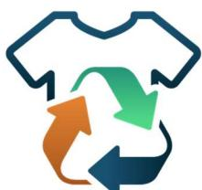
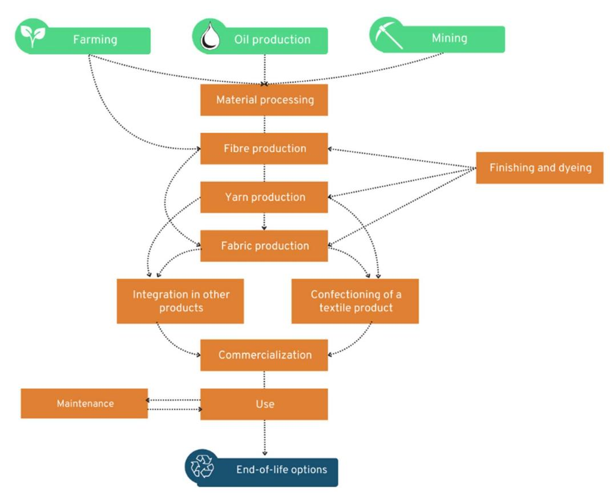
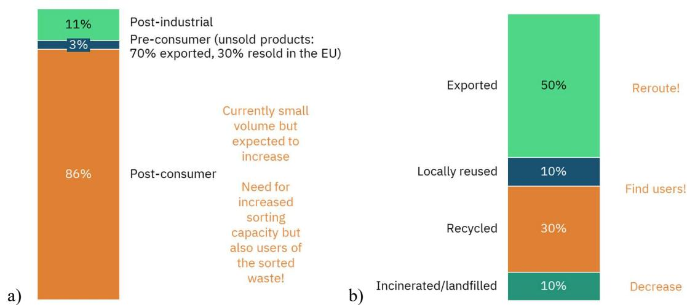
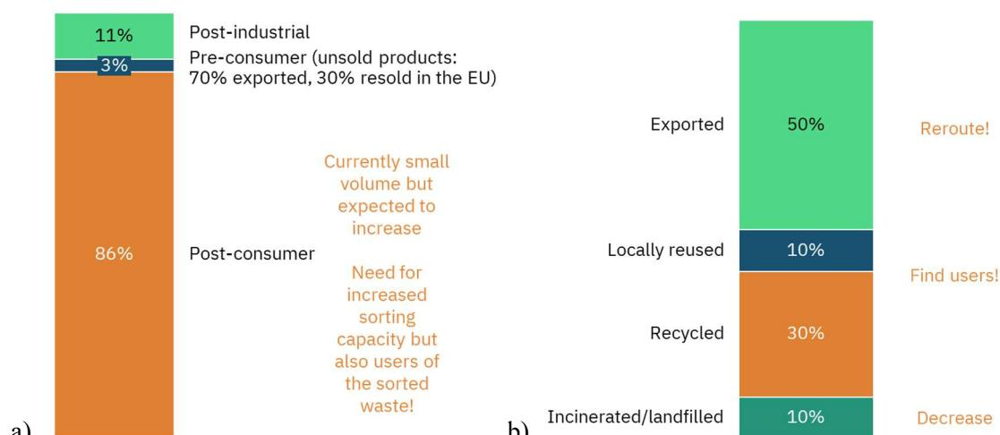
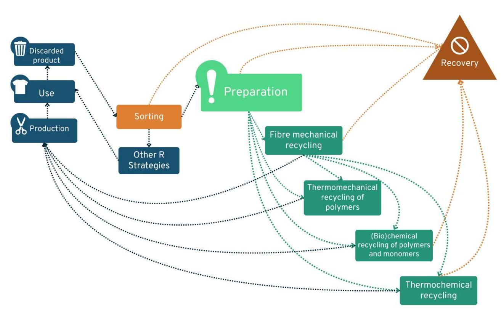
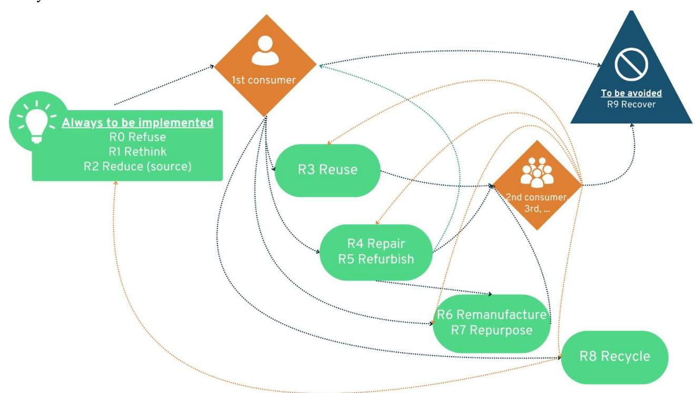
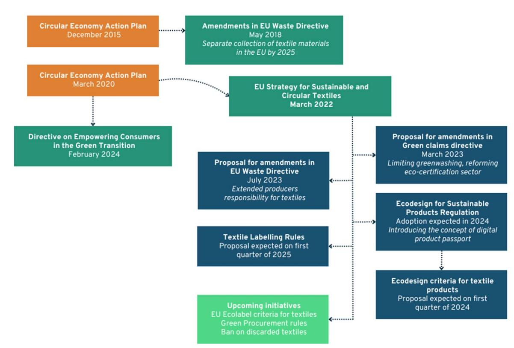
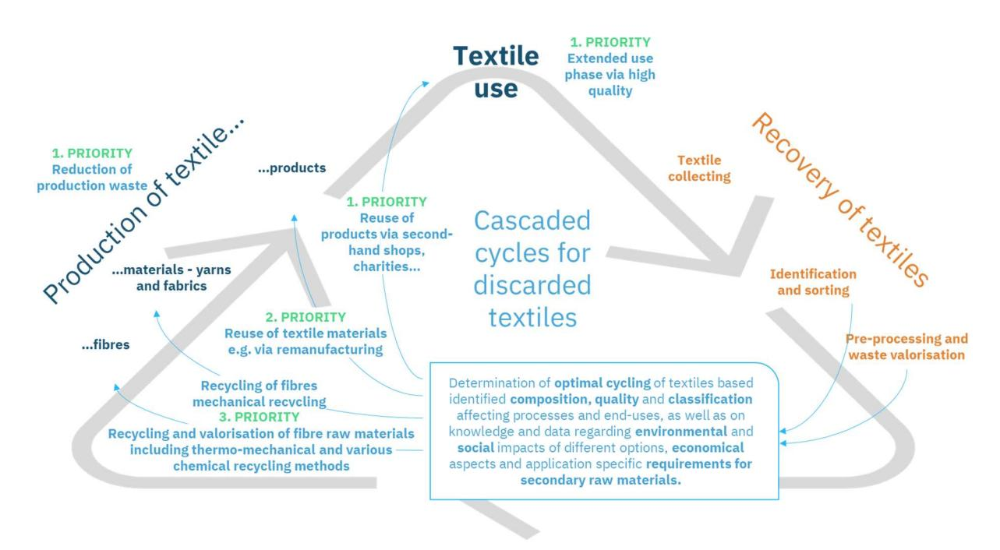
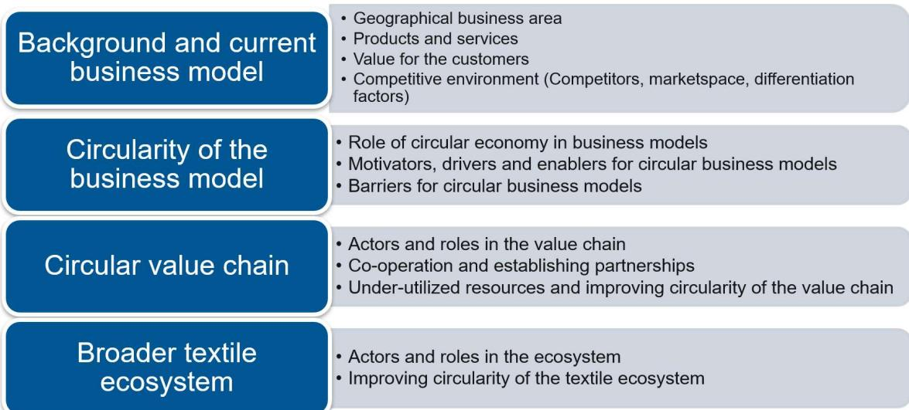

## tExtended

Funded by the European Union. Views and opinions expressed are however those of the author(s) only and do not necessarily reflect those of the European Union or HADEA. Neither the European Union nor the granting authority can be held responsible for them

# D1.2 Redesigning Value Chains

Submission date: M18

Due date: M18

# DOCUMENT SUMMARY INFORMATION

| Grant Agreement No | 101091575 Acronym tExtended                                                  |
|--------------------|------------------------------------------------------------------------------|
| Full Title         | Knowledge Based Framework for Extended Textile Circulation                   |
| Start Date         | 01/12/2022 Duration 48 months                                                |
| Deliverable        | D1.2 Redesigning Value Chains                                                |
| Work Package       | WP1 – Circular textile ecosystem                                             |
| Type               | Report Dissemination Level Public                                            |
| Lead Beneficiary   | CTB                                                                          |
| Lead Author        | Edwin Maes                                                                   |
| Co-authors         | Pirjo Heikkilä, Aravin Periyasamy, Päivi Petänen, Minna Salo, Julia Vuorinen |
| Reviewers          | Pirjo Heikkilä (VTT), Anna Garton (LSJH)                                     |

### DOCUMENT HISTORY

| Version | Date           | Changes                          | Contributor(s)                  |
|---------|----------------|----------------------------------|---------------------------------|
| DRAFT   | 16 Jan 2024    | DRAFT version created            | Pirjo Heikkilä / VTT            |
|         |                | Contributions from author team   | Edwin Maes / CTB                |
| REVIEW  | 3 May 2024     | REVIEW version created and       |                                 |
|         | 23 May 2024    | Review                           | Anna Garton / LSJH              |
|         | May            | Editing and contributions        | Edwin Maes, Sofie Huysman / CTB |
| FINAL   | 31 st May 2024 | FINAL version, final review, and |                                 |

## PROJECT PARTNERS

| Partner                               | Country     | Short name |
|---------------------------------------|-------------|------------|
| TEKNOLOGIAN TUTKIMUSKESKUS VTT OY     | FI          | VTT        |
| RISE RESEARCH INSTITUTES OF SWEDEN AB | SE          | RISE       |
| BELGE ASBL                            | BE          | CTB        |
| CENTRO TECNOLOGICO DAS INDUSTRIAS     | TEXTIL E DO |            |
| VESTUARIO DE PORTUGAL                 | PO          | CIT        |
| PLASTICOS Y CONEXAS                   | ES          | AIM        |
| CARR COMMUNICATIONS LIMITED           | IE          | CARR       |
| LOUNAIS-SUOMEN JATEHUOLTO OY          | FI          | LSJH       |
| GREENWAY LO                           | SE          | TEKO       |
| PURFI MANUFACTURING BELGIUM           | BE          | PURF       |
| UTEXBEL NV                            | BE          | UTEX       |
| ERT TEXTIL PORTUGAL SA                | PO          | ERT        |
| RESTER OY                             | FI          | RES        |
| MTEX NEW SOLUTION SA                  | PO          | MTEX       |
| ZALA BRIVIBA BIEDRIBA                 | LT          | ZALA       |
| COMPUTADORES, TECNOLOGIA E CIENCIA    | PO          | INES       |
| NARODNA RECYKLACNA AGENTURA SLOVENSKO | SK          | NARA       |
| TEXTEIS J. F. ALMEIDA S.A.            | PO          | JFA        |
| SOPREMA                               | FR          | SOP        |
| DE KRINGLOOPWINKEL DELTAGROEP         | BE          | KLW        |
| Tally Weijl Trading AG                | CH          | TAW        |

### LIST OF ABBREVIATIONS

| Abbreviation | Definition                                 |
|--------------|--------------------------------------------|
| B2B          | Business to business                       |
| BAT          | Best available techniques                  |
| CEAP         | Circular Economic Action Plan              |
| CO 2         | Carbon dioxide                             |
| DPP          | Digital product passport                   |
| EC           | European Commission                        |
| EoL          | End-of-life                                |
| EoW          | End-of-waste                               |
| EPR          | Extended producer responsibility           |
| ETS          | Emissions Trading System                   |
| EU           | European Union                             |
| ISO          | International standardization organization |
| I-US         | Industrial-urban symbiosis                 |
| LCA          | Life cycle analysis                        |
| NGO          | Non-governmental organisation              |
| OE           | Open-end                                   |
| PPE          | Personal protection equipment              |
| RFID         | Radio-frequency identification             |
| TC           | Technical committee                        |
| UV           | Ultraviolet                                |
| WG           | Working group                              |

# Executive Summary

The overall objective of the tExtended project is to develop a knowledge-based Framework and Blueprint for a sustainable textile ecosystem where utilization of textile flows is optimized, aiming for retention of value of materials in a safe and sustainable way. Within the tExtended project we will develop technological and digital solutions to enable efficient textile cycles and show potential to reduce textile waste by 80%, within a Real Scale Demonstrator. More about the project can be found at https://textended.eu/.

The current textile ecosystem is still, for the biggest part, a linear ecosystem where some circularity principles, such as reuse and recycle, are implemented. The reuse sector is mainly driven by charity organizations, and the first steps to recycling textile materials are being done. There are however still a lot of obstacles to be overcome to implement circular economy principles to the complete textile ecosystem. Reuse is struggling with the vast amount of cheap low-quality textiles brought to the market, and the current textile recycling options available are limited to only some of the produced textiles. Furthermore, textiles easily damage preventing recycling, and it is challenging to collect enough textiles that are recyclable with the current available technologies. Therefore, it is difficult to implement circular principles to become economical sustainable. Nonetheless, there is an increasing number of companies implementing reuse and recycling in their business model.

The analysis of the state of the implementation of the R-strategies in the textile sector revealed that also Reduce is implemented to relatively large extend. This is mainly due to the textile industry being cost-driven, it reduces the use of resources to an extent, and it even has a downside. The quality of textiles is, however, impacted negatively and the product lifetimes are shortened. A better way to the implementation of Reduce is by using more sustainable recycling resources. Except for Reduce, Reuse, and Recycle, there are less focus on the other strategies such as Refuse, Rethink, Repair, Refurbish, Remanufacture, and Repurpose. There are some pioneers and early adaptors that are applying these strategies, but they are not widely implemented.

There are many legislative initiatives that will facilitate the transition towards a circular textile ecosystem. The circular economy action, with textiles as a key topic, lead to the amendments in the EU Waste Directive and the Directive on empowering consumers in the Green Transition and EU-strategy for sustainable and circular textiles. Specific actions from upcoming legislation that will transform textile sector more circular include, among others, the Green Claims Directive, Ecodesign for Sustainable Products Regulation, Corporate Sustainable Due Diligence Directive, and Corporate Sustainability Reporting Directive. Already now, in several EU member states ERP (Extended Producer Responsibility) schemes are implemented, and many more are upcoming.

Textile value chains are expected to change to support circularity, but several actors, such as local actors to manufacture circular products, collectors, sorters, technology and data providers were identified as missing to a large extent. The system would also benefit from a value chain orchestrator. Barriers to build a circular textile value chain also include unsuitable market structures, difficulties in establishing cross-value chain interactions, and a lack of competence.

In the future textile ecosystem, longer lifespan of textiles is enabled by increased quality, and discarded textiles are reused as materials and products, and only as last resort materials are recycled. The production must be more sustainable by using the best available techniques, and by the elimination of fast fashion and harmful substances. Different R-strategies form a cascaded system where processing is minimised, and product and material cycles are maximised. It is important that this is all data driven. The motivators, drivers and enablers to establish the transition to a circular textile ecosystem are customers, upscaling of new possibilities, reducing the global problem, cost reductions, corporate responsibility and environmental sustainability goals, legislation and regulations, new business opportunities and social responsibilities.

# Table of Contents

| 1 Introduction ............................................................................................................................ 8 |                                                                                                                                                  |
|-----------------------------------------------------------------------------------------------------------------------------------------------|--------------------------------------------------------------------------------------------------------------------------------------------------|
| 2 Current Textile Ecosystem........................................................................................................ 9         |                                                                                                                                                  |
| 2.1                                                                                                                                           | Textile Production in Linear System ........................................................................................ 9                   |
| 2.2                                                                                                                                           | Current Status of Circularity .................................................................................................. 12              |
| 3 Turning Circular ..................................................................................................................... 16   |                                                                                                                                                  |
| 3.1                                                                                                                                           | Strategies for Design Stage, Business Model and Production .............................................. 18                                     |
| 3.1.1                                                                                                                                         | R0 Refuse ................................................................................................................................... 18 |
| 3.1.2                                                                                                                                         | R1 Rethink .................................................................................................................................. 19 |
| 3.1.3                                                                                                                                         | R2 Reduce (and Source) ............................................................................................................. 20          |
| 3.2                                                                                                                                           | Strategies for Product Life-Time ........................................................................................... 21                  |
| 3.2.1                                                                                                                                         | R3 Reuse .................................................................................................................................... 21 |
| 3.2.2                                                                                                                                         | R4 Repair.................................................................................................................................... 23 |
| 3.2.3                                                                                                                                         | R5 Refurbish .............................................................................................................................. 24   |
| 3.2.4                                                                                                                                         | R6 Remanufacture and R7 Repurpose ...................................................................................... 25                      |
| 3.3                                                                                                                                           | Strategies of End-of-Life of Products .................................................................................... 26                    |
| 3.3.1                                                                                                                                         | R8 Recycle .................................................................................................................................. 26 |
| 3.3.2                                                                                                                                         | R9 Recover (energy) .................................................................................................................. 28        |
| 3.3.3                                                                                                                                         | Re-mine ..................................................................................................................................... 29 |
| 3.4                                                                                                                                           | R-strategies Flow in the Textiles Circular Ecosystem ............................................................ 29                             |
| 3.5                                                                                                                                           | Legislation ............................................................................................................................. 30     |
| 3.6                                                                                                                                           | Transformation of Value Chains ............................................................................................ 35                   |
| 3.6.1                                                                                                                                         | Missing Actors in the Circular Textile Value Chain .................................................................... 36                       |
| 3.6.2                                                                                                                                         | Barriers to Building Circular Textile Value Chains ..................................................................... 37                      |
| 4 Vision of a Future Ecosystem ................................................................................................. 38           |                                                                                                                                                  |
| 4.1                                                                                                                                           | tExtended Consortium Views of Future Circular Ecosystemic Business Models .................. 39                                                  |

| 4.1.1                                                                                                                              | Motivators, Drivers and Enablers .............................................................................................. 39 |
|------------------------------------------------------------------------------------------------------------------------------------|------------------------------------------------------------------------------------------------------------------------------------|
| 4.1.2                                                                                                                              | Barriers and Challenges, and Solutions to Removing Those ..................................................... 40                  |
| 4.1.3                                                                                                                              | The Path Towards the Future Circular Textile Ecosystem ......................................................... 41                |
| 4.2                                                                                                                                | Sustainable Production and Products ................................................................................... 42         |
| 4.3                                                                                                                                | Sustainable Use and Reuse ................................................................................................... 42   |
| 4.4                                                                                                                                | Sustainable Recycling and End-of-Life .................................................................................. 43        |
| 4.5                                                                                                                                | Actions to be Taken by Stakeholders .................................................................................... 43        |
| 5 Conclusions and Takeaways ................................................................................................... 45 |                                                                                                                                    |

# 1 Introduction

The overall objective of the tExtended project is to develop a knowledge-based Framework and Blueprint for a sustainable textile ecosystem where utilization of textile flows is optimized, aiming for retention of value of materials in a safe and sustainable way. The project work was initiated by building up the view on the future circular textile ecosystem. Since current textile system is still mainly linear, we first reviewed the existing ecosystem and then reviewed circular economy principles and how those can be applied to enable the birth of truly circular textile ecosystems embracing also the industrial urban symbiosis. We also create an understanding on the path towards the desired ecosystems.

There are multiple reports written within last year that describe the textile flows, technologies, and scalability of textile waste collecting and sorting (see e.g., McKinsey, 2022; Huygent et al., 2023; van Duijn et al., 2022; Duhoux et al., 2021; Stubbe et al., 2023). It would not be meaningful to repeat such kind of study; instead, we shortly reviewed certain aspects of existing reports but focusing more on views on the tExtended project group both on status of current ecosystem as well as circular transition and future textile ecosystem.

As enablers of the transition, we focused on circular economy strategies and EC regulatory measures. The study 'Circular Economy: Measuring innovation in product chains' by Potting et al. (2017) defines R-strategies that can be implemented to create a circular ecosystem. These are horizontal principles that could be applied also to the textile ecosystem. How they can be applied to the textile ecosystem is not yet the subject of an investigation; instead, by defining them for the textile ecosystem using imaginary or real market examples the researchers tried to find solutions and the main driver that make a transition to a circular textile ecosystem possible. Also, the legislator is implementing tools to actively force a transition. This aspect is also considered in the re-design of the textile value chain.

The linear textile ecosystem is shortly described in Chapter 2 Current Textile Ecosystem, transition-related topics are included into Chapter 3 Turning Circular and visioning the future is included into Chapter 4 Vision of a Future Ecosystem. In Chapter 5 Conclusions and Takeaways the possible action to be taken by certain stakeholders are reviewed.

# 2 Current Textile Ecosystem

Under growing pressure from NGOs, governments, and consumers, the textile sector is starting to realise that it needs to shift towards a circular ecosystem. Over the last years the first implementations circularity can be seen in the textile ecosystem. However, the textile ecosystem has still mainly remained a linear system. In this chapter the linear system is explained with its struggles in transforming into a circular ecosystem. Firstly, production of textiles in linear system is described in sub-chapter 2.1 explaining the different steps from the resource till the end-of-life stage. Status of circularity are shortly summarized in sub-chapter 2.2.

# 2.1 Textile Production in Linear System

Within textile industry the term textiles is used to refer to products that are produced exclusively from fibres. Following this reasoning, a textiles is a yarn, knitted, woven or nonwoven fabric. For clarity reasons, and distinguishing those from products, we will call the textile materials. These textile materials can be monomaterials, i.e. made of one type of fibres only, but are often blends of different kinds of fibres. The blends can be composed because of the construction combining, for example, polyester and cotton yarns (e.g., as warp and weft yarns), but are in the majority of the cases intimate blends, which means that the yarn or nonwoven consists of mixture of two or more fibres.

Textile fibres include natural fibres and manmade fibres that can made of renewable or non-renewable raw materials. Natural fibres include cotton, flax, and hemp that are plant based, and protein fibres such as wool and silk that are animal based. Manmade fibres made of renewable raw materials include, for example, the regenerated cellulose (e.g., viscose, lyocell, and cupro fibres), biobased polyester (e.g., polylactic acid), and protein fibres. And manmade fibres made of non-renewable raw materials (like crude oil or minerals) include, for example, polyester, polyamide, polypropylene, basalt fibres, and iron fibres. Although there are many types of fibres made from different materials, according to Textile Exchange (2021) the most produced fibres are polyester (over ½) and cotton (around ¼). Polyamide and viscose (around 5 % each) are then the next most used fibres, followed by other types of fibres that do not represent individually more than 4 % of the total amount of fibres produced, and most of them represent even less than 1 %.

According to the current EU regulation (Regulation 1007/2011 on textile fibre names and related labelling and marking of the fibre composition of textile products) product is considered as textile product when it consists for more than 80% of the total weight of textile fibres. Textile products include clothing and home textiles like towels, curtains and bedsheets, but also floor coverings without backing, weed mats, dyke reinforcement textiles, security belts, etc. In addition to textile products, textiles are integrated into other types of products such as furniture, composites, light weight constructions and building, matrasses, etc. The linear value chain for making textile products is illustrated in Figure 1.

#### Textile materials.

Value chain starts with the raw material sourcing. This can mean by cultivating and harvesting to obtain a biological feedstock or natural fibres, and the oil production to obtain a chemical feedstock, or mining to obtain minerals. Most materials and feedstock need processing to make them ready for the fibre production. These processes include, for example, refining of oil and polymerisation into plastics, and the forging of ore to obtain processable metals.

Figure 1 Textile linear value chain.

Fibre production process vary for different raw materials. Cotton fibres needs to be removed from seeds and plant parts, while bast fibre plants like flax require retting, and wool require sorting and washing. Cellulosic materials need pulping before making manmade fibres, and production of other man-made fibres require processes like extrusion of polymers and basal, and drawing of metals,

The fibres that exist in nature are of a limited length; this is called a staple fibre. The manmade fibres obtained by extrusion are theoretically endless filaments. The shape for these fibres is determined by the production process, by shaping of the spinneret holes or by the texturizing process afterwards. The preferred length is obtained by cutting the fibre. It is possible to make filament yarn consisting of a bundle of filament that is twisted around the yarn axis to keep it coherent. However, in many cases filaments fibres are cut into staple fibres so that they can be spun with same processes as natural fibres, and also blended with other fibres in a staple fibre spinning process.

The staple fibre yarn production consists of different steps: opening and blending of the fibres and carding the fibres into a sliver that is sometimes combed to remove again short fibres and align them better. The slivers are drawn and blended further before the actual spinning. There are two options to obtain a yarn from the slivers: ring spinning and open-end (OE). Ring spinning produces more higher quality yarns compared to OE spinning, while the OE process is considerably shorter but enables use of shorter fibres. but delivers in general a lesser qualitative yarn. There are different ring spinning equipment needed for different fibre lengths: cotton line for the shortest stable fibres, the wool spinning line for medium length staple fibres, and flax spinning line for the longest stable fibres. Yarns can be twisted to obtain thicker and stronger yarns (twined yarns) or breaded into

cords. The yarns, twined yarns, and cords are used to produce fabrics in confection processes (stitching, embroidering), or used as a trim like a drawcord.

There are several techniques to make fabrics: of these, weaving and knitting (tubular, flat and chain knitting) are the best-known techniques. Weaving is the crossing of warp and weft yarns. The weaving process starts by warping yarn one next to the other on a weaving beam. The number or yarns differentiates according to the desired width and number of treads per cm. The warp yarns on the beam are then interlayered in a 90° angel with a weft yarn in a certain sequence (e.g., linsey, twill, satin, jacquard) to lock them in to form the fabric. This delivers then a full width fabric (160 cm or more) or narrow fabric (e.g., band, elastic band or ribbon). It is possible to make 3D structures by forming loops or piles or several layered structures (e.g., terry towel fabrics, carpet fabrics). Knitting is the formation of loops that hook into the previous loop forming a fabric that is more flexible and stretchable than the woven fabric. The knitting can be done circular, flat, or in a chainstitch. Except for the chain stitch, the knitting can deliver flat fabrics or pre-shaped fabrics or even fully fashion products that needs limited confection. For the flat and circular knitting no warping is needed and the fabric can even be produced with one yarn. Mostly there are several yarns used but this is limited compared to the weaving process. Also knitting can deliver three dimensional fabrics in the form of loops, piles, or several layers.

Less known techniques include braiding, tufting, laying and binding of nonwovens, electrospinning, and knotting. Braiding is the interlaying of yarns or strips in an angle that is less than 90° to make, in addition to cords, tubular fabric structures. Tufting is the puncturing of a yarn in a flat structure like a nonwoven or fabric. The yarns are thereafter glued to the flat structure by a backing to fix them to the structure. Nonwoven production enables making fabrics directly from fibres (or polymers) making processes faster and more costeffective. Nonwovens are made by laying fibres in a sheet or web formation by dry, wet and direct formation methods, and binding them by mechanical, thermomechanical or chemical means. Although electrospinning is a spinning technique, it can be used to make very fine fabric structures by randomly laying the thin fibres formed directly from polymer solution in electric field into nonwoven type structure. Knotting is entangling in a structured manner yarns or cords to make open structures, like fishing nets. Fabrics can be bounded together by gluing (lamination) or quilting (fabric wide stitching) them to each other to form multilayered fabrics. At this stage, other semi-finished products can be integrated with the textiles, for example, membranes that are glued on fabrics.

Textiles materials (yarns and fabrics) can be categorised according to different topics. Textile industry commonly categorises them according to their use into three main types of textiles produced:

 Apparel textiles used for clothing production like t-shirts, pants, vests, shirts, dresses, etc. Interior textiles used to produce towel, tablecloths, carpets, curtains, furniture, etc. Technical textiles used in various products and applications. The technical textiles are further divided in geo-textiles, agro-textiles, building or construction textiles, smart textiles, industrial textiles, etc. Each of these categories has several product groups and are sometimes niche products.

Fabrics for personal protection equipment (PPE's) and work clothing are often considered technical textiles as well, because these fabrics are used merely for their technical properties and functions (e.g., fire protective properties) not for the aesthetic ones. More detailed definition of technical apparel textiles is provided, for example, by Butaud-Stubbs (2013), and technical functions mentioned include, for example, lightness, resistance, reinforcement, filtration, fire-retardancy, conductivity, insulation, flexibility, and absorption.

#### Textile products.

The textile materials are then assembled into a textile products via confectioning. Confectioning is the cutting and sewing of the textiles to make a textile product. Often other materials and products are integrated in the textile product, for example so called trims like zippers, buttons, transfer prints. Textiles and textile products

can also be integrated into other products. After cutting, the textile is integrated, for example, by sewing, gluing, and stapling, onto other materials to make shoes, awnings, umbrellas, isolation material in cars, furniture, composites. In some cases, the textile product is mounted on other products, like a sail on a surfboard or boat or a cover over a seat or mattress.

During the fibre production, yarn production, fabric production and confectioning, chemicals and/or other materials can be added via several processes, for example, dying – printing – coating – lamination. Examples of chemicals are dyestuffs and pigments, coating formulations, glues, fire retardants, anti-microbiological chemicals, foils (membranes or foil prints).

Products are then commercialised by the production company itself or transferred to retailers and wholesalers. It can be both a pure sales transaction where the consumer or user becomes the owner of the textiles or a service where the textiles is delivered by a service provider that keeps ownership of the textiles. In both cases it will involve the use of a logistic system to get the products to the end consumer.

#### Use and end-of-life.

Life-span of textile products vary a lot from a single use products (one time use or throw away products) like CE-marked medical mouth masks made from nonwovens, to many years like geotextiles, for example a dike reenforcement fabric. There are also different types of users. There is the private consumer that uses product in his day-to-day life and professional use where products are used more intensively like workwear garments.

During the use of textile products their materials are worn, and products may get dirty and contaminated. Most textiles, like clothing and home textiles, washed and also otherwise maintained during the lifecycle in order to keep them in use. In these processes other materials and chemicals can be added to the textiles for functionalization or protecting it. Some examples of chemicals and contaminants are washing residues and softeners, contaminants due to the user actions like painting resulting in pain stains, or soiling like dirt, human skin, fat and food residues.

When the products are considered not fit for use any more, they are discarded by the user. This is the end-oflife stage. Some of the reasons of discarding a textiles product can be that the product is broken, soiled or out of fashion. Most end-of-life the textiles are a blend of different materials and contaminations of the materials. This makes textile waste of low value, with few current recycling options. Due to this low value textiles mostly ends up on landfill or are used for energy recuperations. Household textiles are collected separately, but mostly they end up in mixed waste.

The society at large is aware of the challenges related to textile waste and there are various on-going initiatives aiming at solving these. In the European Union (EU) the separate collection of textile waste will be mandatory by 2025 (Directive (EU) 2018/851). The European Commission (EC) has identified textiles as a priority product category for the circular economy, and the European textile strategy published in early 2022 and implemented in forthcoming years (EC, 2022a).

# 2.2 Current Status of Circularity

On average, Europeans use nearly 26 kg of textiles, and discard 11 kg of textiles every year. It is estimated (McKinsey, 2022) that the amount of textile waste in Europe (EU-27 and Switzerland) in 2020 was 7-7.5 million tons and it is expected to grow up to 8.5-9 million tons by 2030. There is a need to develop solutions to recover different textile flows, increase the reuse of products and materials, valorise and recycle a significant part of textile waste fractions.

Use and reuse. The largest textile product categories are apparels and home textiles. They are used by consumers and households. Similar products are also used by institutional users, work clothing in workplaces

and interior textiles in public building, hospitals, hotels etc. Most consumer textile products are used for a relatively short time, and fast fashion as well as ultra-fast fashion are still trending in Europe1 . On the other hand, an alternative trend of buying more sustainably and locally made products as well as buying second hand products are rising in certain demographic groups and areas2 . The typical reasons on why consumers discard their textile products include, for example, staining, damage and wear (Laitala, 2014), but also because their closets are full or they desire a change (Ha-Brookshire & Hodges, 2009). There is still a share of discarded textiles could be used or reused, and not everything is actually worn out. If there are minor damages to products, but materials are still in good condition, small preparations for reuse may be needed. The users take care of and repair products themselves or use professional repair services to prolong the use phase. A typical example is sewing back a lost button or adding knee pads on children's pants to cover holes.

The textile reuse system textile users, including consumers are highly involved both to provide products and to use second-hand items. Some products are reused by family members or friends or offered for reuse via social organisations or reuse shops. In the past, these were practices that occurred often but due to the decrease of the price of textile products and the introduction of fast fashion, these practices largely disappeared. There is a need of raising awareness among consumers about the sustainability and circularity of textiles and changing consumer attitudes (e.g., to buy more sustainable textiles, and more second-hand textiles), as well as increasing their participation levels and involvement in pre-sorting and returning used textiles. This also includes actions to increase awareness of the importance of reuse as the activity to be prioritized in circular economy. Unfortunately, the share of sustainable (ethical) fashion market is still very small compared to the fast fashion market3 . The other R-strategies related to the use phase occur less frequent (see chapter 3.2).

Recycling. The end-of-life (EoL) textile materials are generated by industries, commercial actors and consumers alike. Currently discarded textiles are mainly directed into energy use as part of municipal waste, and the utilization of recycled textile waste is focused on open loop recycling that typically leads to lower value applications, and it has been estimated that only slightly more than 1% of textiles are recycled to be used as a secondary raw material for textile production. Post-consumer textiles are the largest source of textile waste (see Figure 2a), even though only around one third of the textile waste is collected at the moment (McKinsey, 2022).

The volume of textile collection is still small, but it is expected to increase in the coming years as separate collection in the whole of EU will be starting by 2025. Both sorting and recycling capacities need to be built to process the collected waste. The biggest portion of collected waste is reused, at least namely, since only a small portion of reuse happens in Europe (see Figure 2b). The rest of reusable items is exported outside the EU, but it has been evaluated4 that actually up to 87 % of this flow is incinerated or landfilled. Therefore, instead of exporting, low quality discarded textiles should be recycled in Europe to increase the share of recycling of these

1 Links related to fast fashion: https://www.mckinsey.com/featured-insights/mckinsey-explainers/what-is-fast-fashion; https://www.ethicalconsumer.org/fashion-clothing/what-fast-fashion-why-it-problem ;

https://environment.ec.europa.eu/topics/circular-economy/reset-trend\_en

2 Links related to sustainable fashion trends: https://www.mckinsey.com/industries/retail/our-insights/surveyconsumer-sentiment-on-sustainability-in-fashion

https://www.reuters.com/business/sustainable-business/green-is-new-black-fashion-sector-fast-forwardssustainability-trend-2023-03-02/

https://environment.ec.europa.eu/topics/circular-economy/reset-trend/how-eu-making-fashion-sustainable\_en 3

https://www.statista.com/topics/9543/sustainable-fashion-worldwide/#topicOverview

4 European parliament webpages: https://www.europarl.europa.eu/news/en/headlines/society/20201208STO93327/theimpact-of-textile-production-and-waste-on-the-environment-infographic

sorted textiles. Furthermore, emphasize should be in high value recycling into secondary materials for textile industry instead of open loop recycling that often leads to lower value application.

Figure 2 a) sources of collected materials and b) routing of sorted materials in EU-27. Numeric values are based on Huygens et al. (2023)

Fibre mechanical recycling is an established commercial process; however so far it is mainly resulting in lower quality end products due to fibre quality deterioration during the recycling process. In fibre recycling and chemical recycling processes, fibres are taken into its feedstocks - polymers and monomers - allowing the production of new textile fibres. Such processes require a larger financial and environmental cost. Most chemical recycling processes are still in emerging/pilot stage, but commercial process is available, for example, for polyamide. (Fibersort, 2020)

Increasing circularity of textile products and materials require removal of technological and non-technological barriers. Technical barriers include, for example, lack of data, under-utilization of digitalization, lack of infrastructure and feasible processes, while non-technological barriers may rise form waste regulations, standardisation, unclear ownership and unfair sharing of benefits.

Currently there are no systemic approaches for recycling of textiles, and the environmental impacts of each recycling option are not known. Textile recycling actors are acting mainly locally. There are no standards or classification systems for textile waste that could be used in different markets. The recycling ecosystem is an evolving organism with varying demand for recycled materials and offering of diverse waste textiles. The recycling ecosystem from waste logistics, collection and sorting to recycling processes and new recycled materials must collect, share, and be able to utilize data and data-driven solutions to support real-time decisionmaking in various phases.

A major challenge related to large-scale implementation of recycled textile material is the difficulty to access large volumes of specific feedstock. The development of technologies is intense, and we see a rapid development and scale-up of processes to enable this, but currently there are several obstacles to full-scale implementation. Major challenges include insufficient control over available material flows and their volume, and the lack of defined requirements regarding recycled raw materials. Currently, textile collection is not

systematically performed, and sorting of textile waste is mainly done manually, with only few commercial automatic systems available5 , but they still require manual pre-sorting.

Development of technologies and infrastructure for textile circularity incurring from separate collection has been strong, for example, in the Northern and Western part of Europe. There are still lots of gaps in the value chains needed for circularity. Furthermore, this expertise should be transferred, and best practises and models for collaboration should be replicated all over the EU to ensure the deployment of industrial urban symbiosis (I-US) and development of local circularity hubs to enable tackling fundamental issues related to end-of-life materials.

5 Automated systems by Andritz https://www.andritz.com/spectrum-en/textile-recycling-automated-sorting; Fibersort by Valvan http://www.valvan.com/products/equipment-for-used-clothing-wipers/sortingequipment/fibersort/; and Siptex/Sysav https://boergroup-recyclingsolutions.com/projects/siptex-swedish-innovationplatform-for-textile-sorting and https://www.sysav.se/om-oss/press-och-media/nyheter/world-unique-plant-fortextile-sorting-in-malmo/

# 3 Turning Circular

R-Strategies are actions that can be taken to transform a linear flow into a circular one and are categorized by the circular economy strategies. The study 'Circular Economy: Measuring innovation in product chains' by Potting et al. (2017) divides the R-Strategies between Refuse, Rethink, Reduce, Re-use, Repair, Refurbish, Remanufacture, Repurpose, Recycle and Recover. These strategies are horizontal principals not linked to a specific value chain.

The ISO standardization working group ISO TC 323 "Circular economy" has developed a standard that further defines these R-strategies. The ISO 59004:2024 "Circular Economy - Terminology, principles and guidance for implementation" lists these R-strategies. They are renamed circular economy principles and additional strategies, Source, Cascade and Re-mine, were added. In the ISO 59004 the order of two R-strategies has changed by switching Repair and Re-use, compared to the study by Potting et al. (2017). Repair can both be done by the initial user in order to prolong the use time but also after the user discarded the item. If the product is discarded because it is broken, the product needs to be repaired before it can be re-used. When re-used, the product can also break down. It might be possible to repair the product also at this point of the lifecycle to prolong the lifetime. Considering that repair costs more resources than re-using, the order of the strategy might be first Re-use and then Repair.

The stakeholders should go over every strategy and consider applying them, keeping the total life cycle in mind. The design stage Refuse, Rethink, Source and Reduce should be considered in order to reduce the use of resources. Repair, Re-use, Refurbish are strategies that are implemented during the products lifetime keeping the product intact while the strategies Remanufacture and Repurpose reuse only parts of the product. Cascade and Recycle are means to reclaim the material of a product. Recovering energy is by many not considered a circular strategy but more as a last resort. Recover can also mean biodegradation where products are composted at home or with an industrial process into natures feedstock. Re-mine relates to integrated materials recovered from landfill; this relates also to the source strategy so might not be considered as a separate strategy by some.

In this document, Source and Cascade are not considered a separate R-strategies. Source is seen as part of Reduce as Source defined in the ISO 59004:2024 and it is referring to more sustainable materials like biobased, recycled and environmentally friendly produced materials. Cascade is not treated as a separate R-strategy because it is seen by the researchers more as a system of making choices to keep the material in the highest added value state and with the lowest possible impact. This can be for instance implemented in choosing the correct R-strategy and afterwards recycling technologies. Collectors and sorters are of key importance to make sure that, via a cascade system, the resources are not lost and channelled to be used in an optimal way. This cascade system would require the items to be sorted as resources taking the condition and quality of the material into account in order choose the best R-strategy.

Recyclers should apply a cascade system to decrease the material loss and recycle at the lowest environmental impact. First a fibre mechanical recycling should source spinnable fibres as this has the lowest environmental impact, the non-spinnable output like fluff and filling material should then feed another recycling technology like thermo-mechanical, (bio)chemical, and as a last resource open loop recycling and energy recovery. Some circular economy strategies are deeply implemented in the textile industry, while other are applied by pioneers and early adopters, and some are to date non-existing. Building of cascaded system requires fundamental understanding of input material quality requirements as well as technical requirements and possibilities of each technology.

In the Table 1 circularity strategies within the production chain, in order of priority by Potting et al. (2017) and the ISO 59004 standard where the R-strategies are ordered from lowest impact to the biggest impact. This helps to prioritize and make choices.

Table 1 Circularity strategies mapping according to Potting et al. (2017) and ISO 59004

| Impact                                    | Strategy                                                              | Explanation                                                                                                                         |
|-------------------------------------------|-----------------------------------------------------------------------|-------------------------------------------------------------------------------------------------------------------------------------|
| Potting et al. , 2017                     | ISO 59004:2024                                                        |                                                                                                                                     |
| R0 Refuse                                 | Refuse                                                                | Making product redundant by abandoning its function or using other product instead Make product use more intensive, for example, by |
| R1 Rethink Smarter use of resources       | Rethink                                                               | manufacturing                                                                                                                       |
|                                           | Source                                                                | Use recycled or renewable resources and that are easily recycled or returned to the biosphere.                                      |
| R2 Reduce                                 | Reduce                                                                | Increasing efficiency in production, and consuming less through efficient manufacture or use                                        |
| R3 Re-use Extend                          | Reversed order: repair first repair and then re-use, definitions stay | its original function                                                                                                               |
| R4 Repair lifespan of products            | the same                                                              | Repairing and maintenance of defective products thus keeping them in their original function                                        |
| R5 Refurbish                              | Refurbish                                                             | Restoring and updating old products and bringing them up to-date                                                                   |
| Remanufacture R6 Extend lifespan of parts | Remanufacture                                                         | Using parts of discarded products in a new product with same function                                                               |
| R7 Repurpose of products Utilization      | Repurpose Cascade                                                     | Using products or their parts in a new product with a different function quality ending up in another end-of-life solution          |
| R8 Recycle of materials                   | Recycle                                                               | Processing and recycling materials to obtain the same or lower quality                                                              |
| R9 Recover                                | Recover                                                               | Incinerating of materials for energy recovery                                                                                       |
|                                           | Remine                                                                | Extraction of resources from landfill or waste plants                                                                               |

This chapter describes R-strategies for circular economy and what they can mean in textile system. Methodology included literature studies, and collecting information and experiences from multiple project partners, for example, within discussions, project meetings as well as in workshop (see Appendix 1). Strategies are divided based on which stage of product life they are mainly applied to: strategies to be applied in design stage, business models and production in sub-chapter 3.1, strategies to be applied in use phase in sub-chapter 3.2, and strategies to be applied at the EoL in sub-chapter 3.3, as well as descriptions of flow of strategies in circular ecosystem in sub-chapter 3.4 It also reviews legislation as driver towards circularity (sub-chapter 3.5), and discusses about transformation of value chains when turning circular (sub-chapter 3.6).

# 3.1 Strategies for Design Stage, Business Model and Production

# 3.1.1 R0 Refuse

Refuse is defined as the rejection of the product and its replacement with another product or solution. In case of textiles, it is possible to 1) eliminate the need of textile products altogether; 2) replace other products with textile products; and 3) replace textile with other products. An example of the ultimate refuse by elimination of the need of textile product can be found from supermarkets: peel covered fruits like oranges and bananas do not need a textile mesh bag but can be offered and purchased in bulk so and carried in the shopping bag with the other goods purchased. In replacement, a typical example is replacement of single-use product with textile product that can be used multiple times. There are many examples where textile products are replacing other products:

 Paper napkins and also fragile single-use tissue napkins can be replaced by a washable fabric towel in public toilets, and by more durable nonwovens lasting for multiple uses and gentle wiping as dining table cloths. A hospital gown is now typically a nonwoven that is not washable and thus one time use that could be replaced by a woven fabric. One time use diapers replaced by fabric diapers. Replacement of plastic shopping bags with textile bags.

Many of alternatives mentioned above have existed already for a very long time and have often been the initial solution that has been replaced by the single-use counterpart. The single-use solution is often cheaper and more convenient in use (e.g., lack of maintenance). It will take an effort and have probably a financial impact when switching to reusable products. In some, but not as common, cases there are other products that can replace textile products. One example would be replacing a textile floorcovering by a laminate or wooden floor covering.

It is not always clear if any of such replacements are better environmental solutions. Much depends on the times the textile item is reused and the impact of maintenance during the use. A comparison of different solutions can be done with Life cycle assessment (LCA) analysis (see Information box 1). There is however a general understanding that maintaining and using resources for a longer time benefits the environment. The industrial laundering companies that are maintaining and, in some cases, also leasing the textiles to professional users are promoting textile materials that can be maintained over one time use articles.

Refusing is also established by the on-demand business solution. Products are only produced so that overstock and eventually deadstock is prevented and therefore refused. By working with pre-orders, it can also be better assessed which quantities are needed for the regular business. By implementing custom made and made to measure there is less possibility of users rejecting the product, perhaps also leading to a longer lifetime. Professional users are sometimes offered a complete package of textile products while they use only a limited set of these items: for example, a complete uniform with many different products where some have the same function could not just be given but the user could cherry-pick according to their use.

Suppliers could refuse to produce multiple collections in different styles in trying to replace still useful items. Efforts could be done to replace items rather than only sell items in combination with setting up a second-hand business (see also Reuse in chapter 3.2.1). Consumers could not buy or accept (in case of gifts and goodies) anything they do not need. Promotional items are often used only one time although they could be reused. For example, to participant of sport events, event T-shirts and goody bags made from textiles are often given. The legislator could tax reusable products differently from one time use products to steer the consumer.

In many cases the opposite is done. Marketeers are pushing for more consumption, seducing consumers to buy products they do not need. They create an atmosphere that leads to a satisfied feeling when purchasing goods what leads to overconsumption, for example, nice shops or a drink instore. Nice boxes and bags themselves even lead to overconsumption of redundant products. Marketeers have also an influence on textiles used in companies. Rebranding can lead to replacement of perfectly useable textile goods.

#### Information box 1 Environmental impacts

Life Cycle Analysis (LCA) is a tool for the quantification of environmental impacts associated with a product or service, based upon ISO 14040:2006 and ISO 14044:2006 guidelines6 . LCA always starts at the origin (cradle) of the studied system. The boundary can be drawn at different life stages, for example the production phase (cradle-to-gate), the end-oflife phase (grave), or in the ideal case, the cradle again (cradle-to-cradle) 7 .

The aim is to quantify all the natural resources extracted and all the emissions released, starting from the cradle. It is highly suitable to deliver in-depth insights on what the major impacts are in order to improve the environmental impact. When all the emissions and resources related to the studied product or are collected in an inventory, the so-called life cycle inventory, they can be translated into environmental impacts by multiplying them with specific characterization or conversion factors. Different impact assessment methodologies exist to calculate all these environmental impacts, each using different sets of characterization factors, meaning that the final result can also be different. Therefore, it is important to only compare results obtained with the same method.

The publication Eco-design-guide (Colignon et al., 2023) mentions that a complete LCA covers several categories of environmental impacts. Global warming or climate change is probably the best-known category. Besides global warming, there are many other environmental impact categories. The main ones are acidification, ozone depletion, ozone formation, eutrophication, ecotoxicity, human toxicity, ionizing radiation, particulate matter, water use, land use, and resource depletion (Colignon et al., 2023). In a further step, these impacts can be aggregated into three endpoint areas of protection (Human Health, Ecosystem Quality and Resources) or even in one single impact score. However, endpoint and single score results require careful interpretation: they might be easier for the large audience to understand but come with more uncertainty. It is recommended by LCA experts that endpoint or single-score results are supported by relevant and transparent information example midpoint impacts, value choices (Kägi et al., 2015)

Such an assessment requires reliable data. All the emissions and natural resources associated with the supply chain of a product or service ('background data') are typically modelled through databases. It is therefore of importance that highquality databases are used which contain reviewed data. The drawback is that these databases are costly and complex. Accessible and current databases are crucial for accurate and meaningful LCA studies (Ishwor et al., 2023). LCA is a quite challenging and vital tool, but it is important to consider that results are estimations with a degree of uncertainty that may change over time through better data, knowledge methods and models. Sufficient context, interpretation by experts and a degree of flexibility in policy and mindset is advised. (Schaubroeck et al., 2020).

An LCA case study can provide a possible answer to the question whether in a specific case paper or textile napkins are better from an environmental perspective, however, these results must always be considered valid within the set of assumed specific conditions and hypotheses, since an LCA study is a tailormade and case-specific comparative assertion. It cannot provide an absolute answer that is valid in every context (Castellani & Cardamone, 2022).

# 3.1.2 R1 Rethink

The Rethink strategy is often applied in circular business models. The strategy implies that products are shared or rented and not exclusively used by one consumer, so that they are use more intensively. In the professional garment care industry, industrial laundering and professional fashion rental companies, Rethink has already been implemented for a long time. Leasing practises of non-personalised items (e.g., commonly shared work

6 https://www.iso.org/standard/37456.html

7 https://ecochain.com/blog/cradle-to-cradle-in-lca/

clothes) have shown that less products are needed than when a set of personal items (personal work clothes) is offered. The personal items sometimes lead even to overconsumption, as items are offered that are never used or not used long enough, for example, in case of employee switches. Such model leads sometimes to discussion on hygiene aspects (non-personalised items) and the unwillingness of employees to wear almost worn-out and repaired items.

In the past it was also very common to lease or rent formal suits for formal parties such as weddings. Due to the cost decrease and democratisation of the clothing industry this practice has been diminishing. Now these items can be bought for an affordable price, which might lead to a one-time use situation. Startups like clothing libraries try to reinstall products-as-a-service practices, however, unfortunately many of these initiatives disappear after a short period of time. Muylaert et al. (2024) who studied the attractiveness of clothing libraries for women, have pointed out that it is difficult for clothing libraries to recruit and retain consumers. They also identified many barriers like lack of financial benefit, competition of reuse (second hand and sharing with family and friends), emotions like attachment, logistical barriers and not willingness to change the behaviour. These barriers differ between occasional clothing libraries and daily wear clothing libraries where the occasional wear libraries would be more acceptable, for example, pregnancy clothes and evening dresses and suites because there is more often a clear cost benefit.

The more intensive use of textile products by the same user is another practice belonging to the Rethink strategy that might reduce the number of articles bought. Products could be made multi-functional, for example, jackets might consist of different layers that could be worn separately or assembled making it an all-year jacket instead of a seasonal jacket. There are also trousers with zippers in the middle of the legs to adjust their length making them attractive by enabling 'traveling light' on active holidays or used out of comfort reasons as they adapt easily to changing weather conditions.

Product developers and designers can implement by-design features into products to make them multifunctional, so that they can be used by the same user or different users more intensively. Manufacturers and other commercial operators could collect consumer feedback to adapt products to be more attractive for intensive use. Consumers can choose renting instead of buying for rare needs, for example, work garments and festive clothing for special occasions to avoid an underuse of such garments.

# 3.1.3 R2 Reduce (and Source)

One of the simplest example of Reduce strategy is the reduction of use of materials and other resources at the production stage. Textiles is a cost-driven industry due to the high level of worldwide competition. Over the years the textile industry looked at means to producing products at a lower cost. Some of the examples are:

 Eliminating items and features on a product like pockets, buttons, zippers, and reenforcing interline. Eliminating production steps like twining and finishing treatments (e.g., thermo-fixation) or final washing of the product. Shorter production processes like OE spinning, and lyocell process for regenerated fibres. Using UV light and led UV light to cure coatings instead of heat. CO2 dyeing in a closed loop system instead of water-based dye baths. Using less water and heat during washing/laundry. Replacing virgin materials with recycled materials. Replacing high impact materials with low impact materials.

Although some of the above-mentioned eliminations save materials and resources like electricity and water during the production phase, they may have a trade-off in quality. When elimination of a button or pocket and probably also CO2 dying, and UV curing light has no impact on the quality, the elimination of reinforcements

and production steps like twining can have an impact on the quality of the product leading to a shorter lifetime. Other trade-offs are perhaps less clear. For example, the use of less water and heat means in washing/laundry that more chemicals and/or mechanical action is needed to obtain the same cleaning level. More chemicals could have an environmental impact and more mechanical action will damage the textile more, causing a shorter lifetime. These trade-offs are often difficult to calculate, due to the issue mentioned regarding LCA calculations (see Information box 1 on page 19). This is the same with using more sustainable friendly fibres as the end use requirements to be considered. Depending on the use phase, some fibre materials are more suitable than others. Therefore, LCA should be done on a case-by-case basis and cannot be used to determine a labelling system.

Although many of these actions are already deeply implemented, further eliminations will probably be possible. Especially, the implementation of recycled content will be reducing the use of virgin fibres, but such activity should not be taken with the expense on quality and thus product life-lime. In fact, the opposite might be needed for reducing use of materials and other resources, because by increasing the quality it is possible to prolong the lifetime of the product. Overall impact may not be easy to see. In cotton products is increasing the average length of the used cotton fibres will improve the quality, but this will lead to material loss because in order to achieve higher average length of the fibres, more short fibres need to be removed during the spinning process. However, removed short cotton fibres could feed a regenerated cellulosic fibre production to lower the impact both ecologically and economically.

Manufacturers (production part of value chain) eliminate cost due to the cost-drivenness of the industry. The main driver is fast fashion, that is focusing on a short use time and an increased switch on styles. Here manufacturers need to make smarter decisions so that trade-offs are controlled better. Especially, the quality of textiles needs to be increased while at the same time it is necessary to try to implement recycled content.

Users need to base their purchase decision on the quality level, the 'total cost of ownership', and ideally the 'true cost' instead of just the price and looks. The total cost and true cost are difficult to determine. For example, there is little data on the duration of the use time or times used, maintenance cycles and number or reuse and repairs being done. Industrial laundering companies sometimes possess such data due to the implementation or tracing technologies like barcodes or RFID tracing.

# 3.2 Strategies for Product Life-Time

There are strategies that can be implemented to prolong the lifetime(s) of products. Reuse (chapter 3.2.1) focuses on the use by another consumer after the first consumer has discarded the product without altering the product state while Repair (chapter 3.2.2) and Refurbish (chapter 3.2.3) focus on the improvement of the product so it can still be used by the original consumer or another consumer. Remanufacture and Repurpose (chapter 3.2.4) focus on the reuse of parts of a product and not the product as a hole.

## 3.2.1 R3 Reuse

The Reuse strategy focuses on the use of products by users that are not the initial consumer of the product, for the same or a different purpose. Following factors have major effect the reusability of textile products and competitiveness of reuse sector:

Eco design and minimal quality requirements are instrumental in prolonging the lifecycle of garments. By producing garments built to last, it increases the likelihood of these items being reused multiple times. Highquality clothing not only withstands wear and tear but also retains its appeal and functionality over time, making it more desirable for resale. Clothing care influences quality of second-hand goods. Gentle washing methods, including fewer washings and the use of mild cleansing processes, can significantly prolong the lifecycle of a garment. By minimizing

exposure to harsh detergents, high temperatures, and mechanical agitation, gentle washing helps preserve the fabric's integrity, colour, and shape over time.

Eco modulation ensures that reuse markets can remain competitive with the prices of fast fashion, which often undercut the true environmental and social costs. This pricing strategy helps level the playing field by factoring in the environmental impact, allowing reused textiles to compete effectively with the artificially low prices of fast fashion.

The reuse market is dependent on the donations of consumers, as their willingness to contribute play a crucial role in sustaining the flow of goods. When the initial user of a product wants to discard an item, they generally have four options; sell, trade, donate or dispose. By selling the item, the user ensures it goes to someone who finds value in it thus extending its usability. Trading the item involves exchanging it for something else, which also keeps the item in circulation. The potential of Reuse with donation and disposal is, however, highly dependent on the way discarding and collection is handled. If an item is simply thrown in the trash, the opportunity for reuse is lost. Clean and separate collection of post-consumer waste followed by appropriate sorting for reuse is therefore a vital part of the reuse model.

Government regulations and policies play a crucial role in directing flow to the reuse market by regulating waste streams. By mandating the separation of post-consumer waste from other waste streams, governments ensure that textiles and other reusable items are directed to the appropriate facilities for sorting and processing. This not only prevents valuable resources from ending up in landfills but also facilitates the efficient sorting of reusable goods for redistribution or resale. Additionally with more knowledge available, research, publicity and lobbying by consumer advocacy groups, the attitudes and awareness are also changing behaviour within consumers.

Textiles have been collected in various methods and by a variety of stakeholders for different purposes. Some collectors have established widespread European wide operations, while some are individuals that process very few items. The main collectors are charities (collect & sell for fundraising), as sorting for reuse typically does not require high skill levels and can support them in their social and environmental mission, commercial actors including retail take-back and municipal waste companies. The status of the material and ownership varies from textile waste to donated products.

The main collection methods used by collectors in Europe are:

 Outside banks and containers. Indoor collection boxed and bins. Over the counter in second-hand shops and retailers. Kerbside timed collections.

Some brands incentive the consumer to bring back their own products to put themselves on the second-hand market. Based on the condition of the article returned, a discount voucher is given. For the items to remain in the use that they were produced for as long as possible, Reuse is the best from a waste hierarchy perspective. However, reuse markets are under pressure despite the rising popularity to purchase second-hand. Due to the majority of the textile industry being driven by fashion trends, faster and larger production turnover and smaller margins, the local reuse markets are not able to absorb the available reuse quantities despite the trend to purchase second-hand. On top of that, ultrafast fashion distorts the cost perception of garments and reduces the average quality of the flows which put the business model of second-hand dealers in jeopardy. Therefore, we need governments with policy instruments and sensitized citizens to reduce the discard mentality and raise the quality of flows.

However, in some cases the reuse by another user is not possible due to marketing or safety aspects. Products that can be linked to a certain organisation, like workwear with company logo's, might damage the reputation when they are used by another organisation. And products like police uniforms can cause a safety risk, if they end up in hands of criminals. In other cases, the products are discarded because there is a risk that the products might not be safe in use anymore, or it could give a false sense of being protected. For example, safety garments are sometimes discarded after 50 washes because it is only guaranteed to deliver safety for 50 washing cycles although it might be still in good shape. Materials of such products may, however, still be suitable for Remanufacturing and Repurposing to be used in applications where protection properties are not expected (see chapter 3.2.4).

# 3.2.2 R4 Repair

Textiles have a finite life cycle that can be extended by replacing or repairing the parts that are damaged or broken. Normally repair is product-specific and requires custom actions either by replacing parts, re-enforcing worn out parts, patching or covering damage caused during its use. Because in the past textiles were expensive and of good quality, people repaired textiles to keep them longer in use. Sometimes it is unclear, if washing of a garment is a repair action, however, there is a sentiment to see this as a normal maintenance practice. The Repair is a strategy that can be done by the initial consumers during use by themselves, or applied to slightly damaged product after that is discarded by a stakeholder who wants to up it back on the market for reuse. Another stakeholder that reintroduced this practice on a large scale is the industrial laundering sector. Especially the industrial laundering companies that lease garments implemented this in order to keep the products longer in use.

Major factors affecting the spreading of this strategy include costs and skills related to repairing as well as upscaling of activities. The repair can be done either by the user themselves or outsourced to those will the skills to do so. Many of these practices are old forgotten practices. With the introduction of new production methods, cheaper production due to the relocation towards low-cost countries and over subsidising cheap yarn production, low quality of the product due to cost reasons, this practice disappeared. The cost of a new product is so low that the repair cost and effort needed are seen too high.

Traditional repair knowledge and skills are gaining respect again, and particularly when a more valuable item is concerned. The repair skills and knowledge are shared with consumers, to encourage them to maintain and repair their textiles by organizations such as the home economics associations8 , and handcraft and skills groups. There is a trend to show repair and make it visible, creating unique and valued items. It means that custom repair solutions linked to the damage and covering up damage by adding new elements to the items are needed.

Despite the changing trend and the fact that there are still repair shops or some startups pop up here and there, the overall repair market is missing in EU. Especially, expertise and professional equipment are missing. There are initiatives like repair cafés9 , but they remain limited, and in Latvia there are repair ateliers in malls where one third of customers are foreign and use the trip to get their garments fixed (Akule et al., 2023). 'Les reparables' 10 is a web-based company where you can send your damaged clothes to in order to get them repaired. More and more possibilities emerge but they remain limited.

There are also attempts to repair on a larger industrial scale, but requires expertise and professional equipment are missing. There is a big need for expertise since there is a big range of textile products and products where

8 Associations like 'Martat' in Finland, https://www.martat.fi/in-english/

9 For example https://www.ivago.be/nl/particulier/afval/wat-kan-je-zelf-doen/repair-cafe

10 Les reparables https://www.lesreparables.fr/

textiles are integrated in. The need to cover all types of products and in different areas of the product make that a wild range of skills is needed. This leads to complexity for service companies and other initiatives that offer repair service. As stated earlier, repairing of textile product is often more expensive than buying cheap items to replace it. In some countries repair activities are supported, for example in the UK and Sweden there is a lower VAT tariff for repairs, and France works with a voucher model linked to their ERP. Other countries could follow these examples.

Furthermore, the quality of the textiles determines the success rate of repair and does not often solve the problem of low-quality garment. The value of the good determines whether someone is going to take the effort to repair an item. In order to solve these issues, the vicious cycle of fast fashion and the discard culture must be broken by bringing to the market only high quality and durable textiles that is worthwhile to be repaired.

## 3.2.3 R5 Refurbish

The Refurbish strategy focuses on updating the product so that the quality level is as new or even better. The situation is different for a textile product as well as for textiles integrated in another product. Therefore, this section is divided between textile products and products with integrated textile parts.

#### Textile products

Just like Repair, the refurbishing activities can be done by the user in order to keep using the product or after the products has been discarded by the user so that it can be resold. Refurbish strategy is very in electronic. The software can be updated, and some parts upgraded in order to prolong the lifetime of the product. It is less common for textiles, and there is a fine line between refurbish and repair. For example, a water-repellent jacket that has lost its water-repellent properties can be treated again with a chemical when it in order to reinstate its water-repellent properties, and such activity can be considered either a repair or a refurbishment action.

While washing of a garment, is not usually considered as refurbishment action, the following actions typically are:

 Redyeing of clothes in washing machine with pods by consumer. Recoating of waterproof jackets/coats by the brand. Industrial laundering of carpets. Adjusting out of fashion textiles to new modern standards by a designer. Removing the pilling by shaving the fabric.

It is debatable if these actions will restore the textiles. Especially the quality of damaged fibres cannot be restored with currently known techniques, and, on the contrary, fibres might even be damage to some extent in refurbishing processes. Therefore, it can be said that textile materials cannot be refurbished with the current available technologies, but merely repaired. Many properties of textile products can, however, be restores, and out of fashion textile products can modernised and adjusted to meet new expectations.

#### Products with integrated textile parts

Products, where textiles are an integrated part of it, can be refurbished by removing the textile parts and replacing them with new textile parts. Such refurbish may be motivated by wear and tear but also for adapting products to the current fashion trends and changed user taste might even be a stronger motivator. This often happens with furniture like chairs and sofas. The same actors that facilitate repair, can also facilitate refurbishment actions.

The consumer needs to take action to refurbish or let products be refurbished by replacing the textiles while updating and making other parts as new again. Brands could provide the services to refurbish products and make

a business model out of it. Also, service companies could provide this services and governments could support organisations that refurbish or give tax benefits for the actions, such as lower VAT levels on the actions of refurbishment added value.

# 3.2.4 R6 Remanufacture and R7 Repurpose

Textile products are often still usable when they are discarded but might not be or considered suitable to be reused. This greatly depends on the reason of the discarding. Some products are discarded because they are out of fashion or due to marketing reasons. In this case the textile materials are sometimes still in a good shape, and it could be utilized by Remanufacturing and Repurposing. The difference between Remanufacture and Repurpose could be seen as Remanufacture is closed loop (textile materials are used to make a product in the same taxonomy category) and Repurpose open loop use of parts of a product (leading to a different taxonomy category). So, it depends on the that to taxonomy if a textile product is considered Repurposed or Remanufactured. The taxonomy is not yet defined nor what taxonomy level should be applied. Garments can be split up between normal wear and workwear but then each can be further split up, for example, normal wear into T-shirts, pants, shirts etc. Therefore, translating the definitions of Remanufacture and Repurpose towards the textile sector might cause confusion.

Further confusion may be caused by adding repair into this discussion. An example is when a button or zipper coming from a used and disposed garment is integrated in a new garment, would this mean that the zipper or button is reused or remanufactured? Some might see this as reusing a button or zipper, others might see it as remanufacturing a zipper or button as an item from a discarded product is used in a new similar product. Probably it depends on the percentage of a total product that is consisting out of reintegrated parts whether it would be re-use of a component or remanufacturing of a discarded product. As it is difficult to draw the line between Repair, Refurbish and Remanufacture/repurpose in case of a textile product it might be good to not differentiate between them very strictly, or consider one as more valuable than the other. When looking at online communication the terms are often mixed or linked to each other.

It is hard to find examples from the textile market that are purely remanufactured. An example is to disassemble a pullover to obtain the original yarn, remove damaged parts ad reconnect the good parts of the yarn and knit a new pullover from it. Tin Can Knits explains how to remanufacture knitwear11. The Repurpose strategy is about using a redundant product or its parts in a new product with a different function. Repurposing aims to reuse textiles in a way that increases their value. Apart from garments, fabrics can be repurposed into other accessories such as one-of-a-kind rugs, sound absorption systems, patched quilts, and even jewellery. One of the wellknown examples of Repurpose is Freitag, that transforms truck covers into backpacks and other traveling goods12. Some designers are cutting foils or fabrics from end-of-life garments into stripes to handmake carpets out of them. There are tutorial videos on YouTube to make these carpets 13 .

It takes a lot of effort to select products and to the rework textiles. It is difficult to automate the process so that scaling up these practices causes issues. This probably makes it more difficult to make it economically sustainable. In addition, the state of the material is hard to assess what leads to a risk that the products are of a bad quality in the end. In the case of Freitag it is know that the truck covers are made out of a very durable material and if needed a test can be performed because there is sufficient material from one batch. This is not always the case.

11 https://blog.tincanknits.com/2021/02/04/how-to-recycle-yarn-from-second-hand-sweaters/

12 https://www.freitag.ch/en

13 https://www.youtube.com/watch?v=9UFE\_ND2MXM

There are also additional factors that needs to be considered in Remanufacturing and Repurposing. Like mentioned earlier, there are reusable products, which cannot be reused due to safety and other issues, but materials of which are very suitable to be Remanufactured or Repurposed. During the remanufacturing repurposing process the alterations could take away the issues that prohibits and/or limits the reuse. For example, from a protective high visibility vest the company's logos and reflective stripes could be removed and the fluorescent textile could be re-dyed in nonfluorescent dyes, so that there would be no possibility that there is a sense of security due to the high visibility colour.

Due to these problems, it is probable that currently these strategies are limitedly present in the market. Some stakeholders that have an influence can facilitate this R-strategies. For example, consumers that discard the product can already bring it or ship it to organisations that are remanufacturing or repurposing, so that it can be reworked or remanufactured. They should also be willing to purchase the reworked or remanufactured item. Designers that sort out the products and adapts designs to the sorted-out products. Here as well the case of Freitag is interesting because they involve the consumer in this process. This leads to custom-made products adapted to the consumer's taste, adding to the emotional value, which probably leads to a prolonged use. Waste collectors could sort and present the waste that is of a good quality but is not reusable in an orderly fashion so that the selection can be done efficiently. They can pre-sort on the basis of predefined criteria.

# 3.3 Strategies of End-of-Life of Products

When the lifetime of the product can no longer be extended by other strategies, there are strategies that can be implemented to keep the materials in use. The last circular strategy is Recycle, introduced in sub-chapter 3.3.1, that focuses on the recovery of materials so they can be again used to make products. Recover (see sub-chapter 3.3.2) is considered by many, in the European commission, not a circular action while Re-mine (see sub-chapter 3.3.3) that is mentioned in the ISO 59004:2024 is probably not a strategy but a sourcing action.

# 3.3.1 R8 Recycle

Article 3(17) of the Waste Framework Directive defines recycling as follows: 'recycling' means any recovery operation by which waste materials are reprocessed into products, materials or substances whether for the original or other purposes. It includes the reprocessing of organic material but does not include energy recovery and the reprocessing into materials that are to be used as fuels or for backfilling operations;

Recycling textiles thus means utilizing the materials that textiles products are made from back as materials in new textile products, in part or completely replacing virgin source materials. This is called by the textile industry fibre to fibre recycling or closed loop recycling. The reality is that textiles are very complicated to recycle due to the multitude of materials used in their construction and the processes required to produce them. Recycling should be used when there are no higher waste hierarchy options, as it is not an efficient or currently viable option due to it having a high-cost and being a long process and resource-consuming just like in the original production process from virgin sourced materials. However, these valuable materials should be circulated since their initial production has required many resources to produce in the first place, often effecting global supply chains.

The recycling methods depend very much on the type of material, the structure, and contaminations. This all depends on the chosen production processes of textiles that is linked to the purpose that they were produced for. The production processes have been fine-tuned for speed and efficiency over centuries, so today we view textiles as a cheap commodity. Our most familiar and, due to fashion, largest volume by production are our daily clothes, which are produced either from natural fibres, synthetic fibres, or their blends. The final products often include both, and also other functional and nonfunctional elements, which have to be taken into account in recycling such as fabric blends, layered fabrics, several different fabrics (layers), labels, sowing / enforcement yarns, zips,

buttons and decorative elements. The construction of the product can also include treatments both at fibre production and fabric production stages to improve the product and colour it in various methods; all need to be taken into account.

The collection and sorting of different textiles from various sources is needed to enable textiles to be returned into circulation as raw material. There are various methods of collection, and the status of textiles can be either of donations or of textile waste. The sorting for recycling requires the identification of condition and content of each piece so that it can be channelled into the right recycling method. For example, textiles with a high content of good quality cotton can be used first in mechanical recycling and when the fibre lengths are not long enough, they can then be used either in nonwoven production or chemical recycling processes.

Within tExtended project we have divided textile recycling into fibre level recycling via fibre mechanical recycling, and fibre raw materials recycling including multiple technologies, as shown in Figure 6 on page 39. Within study of Dohoux et al. (2021) recycling processes are defined and categorised in three main technologies: mechanical, thermal and (bio)chemical. A further split up was made for mechanical between fibre regain (with or without a chemical treatment) and producing filling materials, for the thermal between thermomechanical and thermochemical and for the (bio)chemical between monomer and polymer recycling. An important difference between the chemical industry and the textile industry is that mechanical recycling of textiles is the repeated shedding of the textiles which is a purely mechanical action (with sometimes a chemical pretreatment) while the chemical industry refers to mechanical recycling as the melting of polymers what is called thermomechanical recycling by the textile industry. The follow up study by Stubbe et al. (2023) gives an update on the study by Duhoux et al. (2021). This updated paper gave a schematic overview of the recycling technologies.

Based these previous studies a possible cascade system for recycling is illustrated in Figure 3. There could be a preference for fibre mechanical recycling followed by thermo-mechanical, (bio)chemical and finally thermochemical recycling. Fibre mechanical recycling has next to spinnable fibres a non-spinnable output (fluff and filling materials). This non-spinnable output could potentially be use in another recycling process. The preparation process can be example disassembly of the product, separation of different materials, decontamination, reseizing. Every process, perhaps less for thermomechanical recycling, can have output that is no longer fit for reprocessing and thus feeding a recovery process. Each has their advantages and disadvantages in terms of required process stages, energy, water, chemical and other resources needed. The feedstock or source material however cannot be mixed textile material or waste but sorted to the needs and specifications of the next process and final application or use. Therefore, the textiles need to be graded or sorted by condition, content and what they contain or do not contain.

The mechanical tearing of fabrics back into fibre enables the use of fiberized material to be added as recycled content when producing new yarns or nonwoven products. Mechanically opened fibres contain exactly what has been used as feedstock by content, although some systems remove hard parts as part of the process. Others processes and methods cut or shred the textile material, so it can be utilized. Chemical processes take the material and break it down to smaller parts before reconstructing the fibres into strands that can be used in a similar way as natural fibres. These can then be more homogeneous and used in the same way as virgin fibres. Thermo-chemically the synthetic textiles are melted and reconstructed into yarn, similar as in the chemical process.

Figure 3 Possible cascade system for recycling of materials (green flow).

# 3.3.2 R9 Recover (energy)

This is the most applied strategy for textiles today. Several studies point out that energy recovery is, next to landfill, the biggest end-of-life solution at this point in time.

This strategy is considered by most experts and by the EU Commission as not circular. Therefore, this strategy must be avoided as much as possible and shall only be applied where there is absolutely no other available option. An example are heavily contaminated textiles that cannot be recycled via gasification or pyrolysis. Ecodesign measures and improved and upscaled recycling technologies are needed to make sure that this strategy is not used, although it will probably still be needed for the near future.

Biodegradation of a product is another way to recover products. The idea is that the material forms feedstock for the nature to grow. It is hard to make a product completely biodegradable due to the contamination of chemicals coming from the production and use phase the product might leave behind toxic chemicals in the environment or not biodegrade as well. Next to this, some materials are only compostable in a certain environment like industrial composting. Those products would need to be collected separately. A disadvantage of biodegradation is that the material is lost, and a lot of effort needs to be done to obtain again material, for example, for growing plants. Recycling technologies can keep this material in the loop with probably less effort. Amongst some experts the biggest disadvantage is that CO2 which is captured in the material, is released. By keeping the material as much as possible intact during recycling we probably have less CO2 release. Biodegradation can only be a solution where textiles are unavoidably lost in the environment. For example, the rubbing sponge to do the dishes with green fibre on attached to the foam to have an abrasive action while cleaning or doing the dishes are breaking into piece that are released in the wastewater. Ideally these fibres are

biodegradable in an aquatic environment so that they break down further and compost leaving no toxic residue or microplastics in the environment.

The designer has the biggest impact on avoiding that this strategy is needed, by designing the products in a way that other R-strategies can be applied and in the end be recycled. As well, when other R-strategies are applied the product should still be recyclable to keep the materials in the loop. In the end products are end-of-life and need to be recycled at this point.

### 3.3.3 Re-mine

In addition to R-strategies listed by the study by Potting et al. (2017), the ISO 59004:2024 standard also determines other strategies like Re-mine. This strategy focuses on sourcing materials from landfill or waste management companies. In comparison with products containing valuable metals, it will be probably difficult to mine textiles from landfill. The textiles are probably degraded or completely composed (mainly natural and regenerated cellulose fibres). The overall value of textiles will also be probably too low to develop a complicated procedure to regain textiles from landfill ,as the same issues with the textile products on the market now exist when it comes to recycling. It would be needed to clean and sort the textile before thinking about a suitable recycling technology.

When it comes to the mining waste in the sea, there several organisations that claim to do this. KOO international14 claims that they use fabrics produced from PET bottles removed from European beaches and Aquafil claims15 to recycle fishing nets that are recovered by the NGO Healthy Seas who recovers with diver's ghost nets. Both initiatives use certification to prove the origin. It is more of a sourcing or collecting action instead of a real strategy that feeds probably only the recycling strategy when it comes to textiles.

# 3.4 R-strategies Flow in the Textiles Circular Ecosystem

Instead of the general flow of R-strategies coming from the study from Potting et al. (2017) and ISO 59004:2024 standard, more complex flow could be applicable to the textile sector, see illustrated in Figure 4. In truly circular system Refuse, Rethink and Reduce should always be taken into account: Refuse and Rethink interact on a business level and Reduce at the production and product level.

When products have been entered in to use phase, the strategies needing the fewest resources to be implemented should be prioritized. The first consumer or a third party can implement Repair or Refurbish to prolong the use phase of the first consumer. As it is difficult to differentiate for textiles between Repair and Refurbish, they could be seen as on the same level of environmental impact. When the first consumer discards the product, Reuse should be prioritized, and if needed, Repair and Refurbish strategies applied to enable Reuse. All apply to all users, i.e., either first, second or third consumer of our illustration. If Reuse is not possible, Remanufacturing and Repurposing should be prioritized over Recycling, and due to similarities of activities and difficulties in distinguish them from each other's, Remanufacture and Repurpose are considered to be on the same environmental impact level.

Probably the consumer will not use the repurposed product themself. It can also expected, that this will be done by one of the subsequent users, although it is not excluded from illustration. Also for Remanufacture and Repurpose it is difficult to draw a clear line into illustration because it depends on what is open or closed loop.

14 https://www.koointernational.com/en/blog/save-the-ocean-our-new-recycled-fabrics-are-made-of-plastic-bottles/

15 https://www.aquafil.com/magazine/co-founder-of-healthy-seas-foundation/

Whatever strategy is applied, the material for a product shall always be recyclable, otherwise we have a material loss, and we end up in the to-be-avoided noncircular Recover strategy. Therefore, in the end for every product and material the Recycle strategy shall be implemented to keep the material flow going into the next cycle. Recycle could be the predominant strategy when it comes to multiple cycles and thus a complete circular textile ecosystem.

Figure 4 R-strategies flow in the textiles circular ecosystem.

# 3.5 Legislation

The EU policy to strengthen the circular economy was reinforced with the first EU Circular Economy Action Plan in December 2015,16 followed by amendments to the EU Waste Directive in May 2018 that put in place an obligation on all member states to ensure the separate collection of textile materials by January 2025 (Directive 2008/98/EC).

In accordance with the EU Waste Directive, the primary priority of waste management should be the prevention of waste generation. Reuse and recycling are preferred over energy recovery, if and to the extent that they are the best alternatives from an environmental perspective (Directive 2008/98/EC). The directive also specifies that separately collected textile waste must not be incinerated, except for waste resulting from subsequent treatment operations of separately collected waste, and the incineration of which produces the least environmentally harmful result according to the waste hierarchy. The EU Landfill Directive, starting from 2030, restricts the landfilling of waste suitable for recycling, material or energy recovery (Council Directive 1999/31/EC).

16 European Commission website, 2 Dec 2015. https://ec.europa.eu/commission/presscorner/detail/en/IP\_15\_6203

The new EU Circular Economy Action Plan (EC, 2020) was adopted in March 2020 as one of the first initiatives of the European Green Deal. In line with the action plan, in March 2022, the European Commission published the EU Strategy for Sustainable and Circular Textiles (EC, 2022a), outlining a list of legislative proposals to be put forward until 2024, including the introduction of a digital product passport for textiles, disclosure of the amount of discarded products by large companies, revision of EU ecolabel criteria and textile labelling regulation, etc.

In July 2023, the Commission published a proposal for amending the Directive 2008/98/EC on waste (EC, 2023). The Commission proposed implementing the "polluter pays principle" or introduce mandatory and harmonised extended producer responsibility (EPR) with regard to the manufacturers, importers or distributors of textiles, textile-related and footwear products that they make available on the EU market for the first time, excluding suppliers of used textile and footwear products as well as small manufacturers (e.g. selfemployed tailors, companies employing fewer than ten persons, with the annual turnover not exceeding EUR 2 million).

EPR should ensure covering the costs of collection of used and waste textile, textile-related and footwear products, sorting, preparation for re-use, recycling and other recovery operations, as well as disposal of these products. EPR would also entail covering the costs for carrying out compositional surveys of collected mixed municipal waste, raising awareness on sustainable consumption among the public, as well as supporting research and development to improve the sorting and recycling processes to help scale up fibre-to-fibre recycling. According to the proposal, social enterprises and other re-use operators are not allowed to be excluded from the separate collection systems, with social enterprises allowed to maintain and operate their own separate collection points with equal or preferential treatment in their location.

In addition, the Commission proposed introducing the so-called eco modulation fees for products that are consistent with ecodesign requirements (EC, 2023). The proposal also envisages defining harmonised end-ofwaste (EoW) criteria for reusable textiles and recycled textiles to support reuse as the main objective of sorting operations followed by recycling, thus facilitating the scaling up of reuse and recycling value chains. However, the proposal does not entail setting performance targets for collection, reuse etc citing the lack of data in member states as a reason. In March 2024, European Parliament adopted its position on the Commission's proposal in the first reading17 and there was a debate among member states in the Environment Council,18 but delays in the process are expected due to European Parliament elections in June.

With regards to textile and other types of waste, in May 2024, the new EU regulation on Waste Shipment (Regulation (EU) 2024/1157) came into force, including stricter enforcements to prevent illegal shipments within the EU, as well as new restrictions for waste shipments from the EU to third countries. The regulation requires operators planning the shipment of all waste destined for disposal, hazardous and mixed waste destined for recovery to have a prior consent of all authorities from the countries of concern (countries of origin, transit and destination). Procedures will become electronic, with a central EU system operating as of May 2026, thus increasing the traceability of shipments of waste within the EU and facilitating recycling and reuse.

In 2023, the European Commission was conducting consultations on ecodesign criteria for various products placed on the EU market, including textiles, with the aim to enhance their quality and requiring reuse, repair and recycling possibilities to be considered in the manufacturing process. Adoption of the Commission's

17 European Parliament website, 20 Mar 2023. https://www.europarl.europa.eu/legislative-train/theme-a-europeangreen-deal/file-revision-of-the-eu-waste-framework

18 European Council and Council of the European Union website, 25 Mar 2023. https://video.consilium.europa.eu/event/en/27407

proposal is expected in the first quarter of 2024.19This work goes hand in hand with the adoption of the new Ecodesign for Sustainable Products Regulation that also introduces the idea of the digital product passport to electronically register, process and share product-related information among supply chain businesses, authorities and consumers (EC, 2022a). The Ecodesign for Sustainable Products Regulation give the commission the possibility to implement delegated acts what will lead to a delegated act for textiles defining amongst others the content of the digital product passport for textiles. Currently the preparatory study20 for this delegated act is ongoing.

In spring 2024, the Commission is conducting a consultation on the revision of textile labelling regulation both physical and digital labelling - to address the existing shortcomings and diverging requirements between member states. The revision could entail obligations to disclose information about the textile product's circularity and sustainability aspects, with the aim to adopt the proposal in the first quarter of 2025.21

In March 2023, the European Commission proposed amendments in the so-called Green Claims Directive (EC, 2023) to limit greenwashing in marketing and reform the eco-certification sector, as the existing system with approximately 230 different certificates causes confusion and lack of trust among consumers. A revision of the EU Ecolabel criteria for textile products is expected in 2024, as the validity of the current criteria expires by December 2025. Traders will be obliged to substantiate environmental claims and ensure that they are significant from a product's life-cycle perspective.22 To provide a framework for backing green claims, in 2024 a second public consultation took place on the Product Environmental Footprint Category Rules for apparel and footwear products. This work is also linked to the revised Recommendations on the use of Environmental Footprint methods - aimed to help companies in calculating their environmental performance based on reliable information - that the European Commission published in December 2021.23 Another provision in this line of work is the Directive on Empowering Consumers in the Green Transition (Directive (EU) 2024/825), adopted in February 2024, with the aim to introduce harmonised rules across the EU with regard to consumers' access to reliable information on products.

In February 2024, the Council and the European Parliament reached a provisional deal on another significant policy - the Corporate Sustainability Due Diligence Directive (EC, 2022b), that sets obligations for large companies (with more than 500 employees and a net worldwide turnout over 150 million euro) regarding human rights and environment not only with regard to their own operations but also those involved in their value chain, for example, subsidiaries and suppliers.24 This initiative expands on the rules set in the Corporate Sustainability Reporting Directive (Directive (EU) 2022/2464) that entered into force in January 2023. It affects all companies in the EU, including those involved in the textile value chain, except for listed microenterprises, and obliges them to report on the impact of their actions on people and the environment, according to the European Sustainability Reporting Standards.

19 EC website. https://ec.europa.eu/info/law/better-regulation/have-your-say/initiatives/13682-New-product-prioritiesfor-Ecodesign-for-Sustainable-Products\_en

20 EC website https://susproc.jrc.ec.europa.eu/product-bureau/product-groups/467/home

21 EC website. https://ec.europa.eu/info/law/better-regulation/have-your-say/initiatives/13872-Textile-labelling-rulesrevision-\_en

22 EC website, 22 Mar 2022. https://ec.europa.eu/commission/presscorner/detail/en/ip\_23\_1692

23 EC website. https://green-business.ec.europa.eu/environmental-footprint-methods\_en

24Press release published on the EC and Council of the EU website, 14 Dec 2023.

https://www.consilium.europa.eu/en/press/press-releases/2023/12/14/corporate-sustainability-due-diligence-counciland-parliament-strike-deal-to-protect-environment-and-human-rights/

All these new legislative initiatives will help the textile value chain into its transition to a circular textile ecosystem, but it greatly depends on the actual and correct implementation and the reassurance that also non-EU companies are compliant creating a fair level playing field. Market surveillance plays a key role in this. If not, enough market surveillance is being done or the consequences are not severe enough all these implementations will be effortless. If there is not fair level playing field created it will only destroy the EU textile industry without having an impact on the sustainability level of the textile value chain.

Another set of EU requirements that concern all sectors, not only the textile industry, is the EU's Emissions Trading System (ETS) Directive (EU) 2023/959, which was amended in June 2023 to take into account the latest EU climate targets set out in the European Green Deal. This includes pricing carbon within transportation, including road and maritime transport, from 2024. Intra-European flight emissions will see a rapid increase in the free allowances that they benefited from until 2024, with a phasing out by 2026.

Figure 5 Main EU policy instruments for increased circularity and sustainability of textiles

#### National EPR schemes

In April 2024, only four countries in the EU had EPR schemes for textile products:

 France introduced a producer responsibility system for textile products in 2008, with the regulation applying to new, not second-hand, textile goods - clothing, home textiles and footwear placed on the French market (exceptions apply to fur and leather products, excluding leather footwear, etc). Donating new textile goods is also considered as placing them on the market, but goods sold to businesses (e.g. work uniforms) are exempt, unless the end user is a consumer (includes sales employees). Those

manufacturers who operate as self-employed individuals are also obliged to take part in EPR, but the registration procedure is simplified for those with a small volume of goods.25 France has set performance targets, for example, 60% of the goods placed on the market must be separately collected by 2028. There are also specific targets like a proportion of separately collected textile goods that must be sorted and reused within 1500 km from the collection, as well as eco-modulation fees for products related to durability, environmental labels and recycled materials (Refashion, 2023).

 The Netherlands introduced the EPR for textiles in July 2023, with performance targets set as of 2025, for example, at least 50% of the textiles should be recycled and/or prepared for reuse, with 10% of them reused in the country. The system applies to consumer clothing, corporate clothing and home textiles, but footwear, bags, belts, blankets, curtains as well as second-hand goods are exempt.26 Another country that introduced EPR for textiles in July 2023 was Hungary, applying it to "circular products" in a range of areas, including textiles like apparel, clothing and clothing accessories (also from natural and artificial leather), household linens, curtains and blankets, footwear, as well as carpets.27 Belgium has an EPR scheme for mattresses managed by the NGO Valumat. The mission of Valumat according to their website is to "collecting all discarded mattresses (cost-)efficiently and processing them sustainably" 28. In their (Valumat, September 2023)(estimated) data can be found on the collection of mattrasses. The mattresses are collected via different stakeholders as there are recycling yards (communal or selective), reuse shops, salespoints of new mattresses, professional user and producers. Of the total of 4.517.320 estimated kg of matrasses collected in 2022 it is estimated that 23% of the weight is textiles. Of this weight it is estimated that 3% is recycled and 13% finds a useful purposes. It is however not clear what the useful purposes are.

In addition to these three countries, a few others have made some preparations:

 Latvia plans to introduce EPR for textiles as of July 2024, with the final details of the system yet to be adopted. According to the draft regulation, EPR would apply to a wide range of textile products and apparel, including bed linen, blankets and curtains. In addition, second-hand textile products placed on Latvian market for the first time (imported) will be covered. The producer or EPR operator will have the obligation to ensure that as of 2025 at least 25% of the products placed on the market are prepared for reuse, or recycling, or recovered (energy recovery). Sweden had committed to introduce EPR for textiles in 2019 and the necessary impact assessment was carried out, but plans were delayed to wait for the European Commission's proposal on harmonised EPR in the EU.29 The national EPR evaluation recommended targeting new products and setting the

25 ReFashion website. https://refashion.fr/pro/en/liable-companies-and-products

26 Government of the Netherlands website https://www.government.nl/documents/publications/2023/05/01/infographicextended-producer-responsibility-for-

textiles#:%7E:text=The%20Ministry%20of%20Infrastructure%20and,recycling%20and%20reusing%20of%20textiles.

27 Decree 80/2023 available in the Hungarian law database. https://njt.hu/jogszabaly/2023-80-20-22

28 https://valumat.be/en/about-valumat/mission-vision-valumat

29 Swedish government' website. https://www.regeringen.se/pressmeddelanden/2023/12/regeringen-driver-paomstallningen-till-en-mer-cirkular-textilhantering/#

goal by 2036 to achieve a 90% reduction in the amount of textile waste that landed in household waste per capita in 2022 (Report for the Swedish government, 2020).

 Denmark published an impact assessment (Danish Environmental Ministry, 2023), but the government's proposal to introduce EPR for textiles and a ban on the incineration of unsold textiles was rejected by the parliament in June 2023.30 Spain has adopted legislation to introduce EPR for textile products as of April 2025, setting the obligation to start the separate collection of textiles before 31 December 2024. There are performance targets for preparation for reuse and recycling for 2025, 2030 and 2035.31

In addition, there were reports of Italy conducting a consultation on draft EPR legislation in 2023, with plans to cover clothing, footwear, leather apparel, home textiles and accessories, as well as the introduction of ecomodulated fees. Greece had plans to adopt EPR for textiles by the end of 2023, while Bulgaria in 2022 published a draft regulation introducing the concept of EPR for textile products and footwear. There is a lack of information about the progress in these three countries since then (WRAP, 2024). Finland separate collection requirement since beginning of 2023.

# 3.6 Transformation of Value Chains

When moving from linear model to circular, new value chains and new value creation models in business are formed. The circular textile ecosystem consists of different kinds of actors, including commercial and municipal waste management companies (e.g., producers and manufacturers of textile products, textile retailers, companies collecting and sorting pre- and post-consumer textile waste, recycling companies), communities, urban areas and citizens, as well as supporting companies (e.g., research organizations, digital services providers).

Furthermore, circular textile system is linked to other sectors. It is possible to identify new circular business opportunities and invocation of under-utilized resources (e.g., materials, energy, water, by-products, waste, capacity and expertise) throughout the entire circular textile ecosystem. Such phenomenon can be called Industrial-urban symbiosis (I-US), and more information about I-US can be found, for example, from following references (Chertow, 2000; Laybourn, 2006; Momirski, 2021; Chen et al., 2011; Lombardi & Laybourn, 2012; A.SPIRE 2021).

New textile circular ecosystem is currently built in EU area as textile waste collection and textile strategy is implemented. Business opportunities in circular ecosystem differ from the linear one, and therefore companies have to rethink their value creation and stakeholder relationships. As explained by Tapaninaho & Heikkinen (2022) value creation can be conceptualized as relational, systemic activity involving wider network of stakeholders. Value is created in collaboration and thus shared in a new way between multiple stakeholders throughout the value chains.

The opportunities for shared value and closer stakeholder collaboration of the circular economy are related to resource efficiency, possibility to replace and reduce the usage of virgin materials, and elimination of waste. Furthermore, new opportunities may emerge for employment, business, and innovation, as well as promotion of sustainable consumption habits and fostering socio-economic well-being. While circular economy models

30 Website of the Danish parliament. https://www.ft.dk/samling/20222/beslutningsforslag/b63/index.htm 31 Law 7/2022 available in the Official Journal of Spain. https://www.ft.dk/samling/20222/beslutningsforslag/b63/index.htm

possess a huge potential for creating shared value, it also requires radical changes in the current thinking models and systems. (Becker, 2017; Fontell & Heikkilä, 2017) There are still gaps in textile value chains.

### 3.6.1 Missing Actors in the Circular Textile Value Chain

Following actors missing from circular textile value chains have been identified by the tExtended consortium (Methodological description of the study can be found from Appendix 1).

Value chain orchestrator. A coordinator that would manage the operations of the entire value chain and control the circular value chain process was identified as a currently missing actor that could potentially improve the circularity of the value chain. Some of the interviewed companies suggested that a potential novel European legislation on sustainability could act as a controller entity for this purpose.

Processers and users of under-utilized resources. Actors fostering industrial urban symbiosis were identified to be currently missing from the circular value chain. These actors could process and use resources that are currently under-utilized in the textile industry. Identified actors that are currently missing include e.g. companies specialized in using the residues of textile manufacturing and actors enabling efficient production of post-consumer waste. In addition to actors in the textile industry, processers and users of under-utilized resources outside of the textile industry are to a large extend currently missing and unidentified.

Local actors for the circular manufacturing and production process. Local actors that operate in close geographical proximity to others are needed to enable industrial urban symbiosis. These include actors that enable the circular manufacturing and production process, such as spinning mills and fibre processing companies (e.g. fibre bleaching and dyeing). In addition to enabling efficient circularity of materials and resources, avoiding high logistics costs is one of the motivators for textile companies to find partners in close geographical proximity.

Collectors. Collectors of post-consumer textile waste and reusable consumer garments are needed to enable circularity of the value chain. These novel actors would need to control and monitor the product collection and recycling from consumers.

Sorters. In the current textile value chain, the capacity and resources are not enough to sort recycled and reusable products and materials from consumers, would the amount of recycled materials increase in the future. Additionally, the quality of sorting post-consumer textile waste is currently low and time-consuming, and clear and unified ways of operating or certificates for end-of-life waste are missing. Therefore, actors that specialize in increasing the capacity and quality of sorting, for example, by automatization of the process are needed in the textile value chain.

Technology providers. Companies offering technologies that would enable efficient circularity of textiles were identified to be currently missing in the value chain. Specific technologies for circular production, sorting of post-consumer waste, and recycling have a limited availability, or they are currently non-existent.

Data providers. Continuous monitoring and optimizing the circularity of the value chain was identified as an operation that is currently missing. Actors that provide data tracking and utilization solutions for increased visibility of the materials and products, for example, for recycling and reuse of consumer garments are needed. Actors that would develop and operate a supply chain mapping tool for circularity could improve the currently limited transparency of the process.

### 3.6.2 Barriers to Building Circular Textile Value Chains

Following barriers to include the missing actors to circular value chains were identified by tExtended consortium.

Limited or unsuitable market structure. Even though interviewed companies identify several missing actors, in reality some of them cannot be included and engaged in the circular textile value chain, because these actors do not yet exist in the market to the required extend or their offerings, competence or, for example, technical solutions are not suitable to match the requirements and needs.

Difficulties establishing cross-value chain interaction. The interviewed companies identified several challenges in communication processes among value chain actors. In some cases, there might be a lack of common viewpoints or contradictory definitions about sustainability among the value chain actors. Other interaction-related barriers include difficulties in communicating consumers about the circularity of textiles and informing other actors in the value chain about the needs of consumers. Overall, clear coordination and rules concerning the circularity of the value chain might complicate including new actors into the value chain.

Dispersed cross-value chain requirements. Some interviewed companies experience challenges in meeting the legislative or policy-related requirements of other countries in cross-national partnerships. Similarly, in some cases, new actors cannot be included in the value chain because their current operational area does not apply the legislative requirements that are already established in the value chain. This challenge could be tackled by establishing and using specification documents that are widely accepted in many countries and by several actors.

Lack of in-house competence. Some companies lack in-house knowledge of the sustainability criteria (e.g. evaluation of social and environmental sustainability, legal aspects) that would be required to include new partners to the circular value chain.

# 4 Vision of a Future Ecosystem

Future textile ecosystem will be more sustainable and more circular. The EU Circular Economic Action Plan (CEAP) and EU Industrial Strategy32 highlight the urgent necessity to shift towards sustainable and circular production within the textile value chain. More detailed statements for textile sector have been made within the EC Textile Strategy (EC, 2022a) of how to make Europe a global leader in this transition while keeping European textile sector competitive. This strategy will address sustainability of products and processes, but also addresses changes in business models and increasing of services, as well as aims for innovative textile sector and technologically viable textile recycling. Systemic changes will be needed in order to build a future circular and sustainable ecosystem.

The tExtended project aims for supporting implementation of sustainable and circular textile ecosystem (see Figure 6). Project main focus does not contain designing aspects for creation of sustainable products, but is in build in into our vision, and thus guiding our thinking. Extension of product use and lifetimes can be achieved with high quality products. Visioned circular textile ecosystem will include reverse value chains for collecting of different kinds of discarded textiles, include both reusable textiles (products and materials) and textile waste. These different kinds of flows and individual items needs to and identified and sorted (when needed) and forwarded into optimal utilization. Optimally all reusable products and materials are forwarded from presorting into Reuse as products or re-use as textile materials, i.e., to Remanufacturing and Repurposing. And only when textile products and material are no longer suitable for reuse and other prioritized R-strategies they can be forwarded into composition sorting and to Recycling. High initial quality of products, which enable long life-pans, is also essential for implementation reuse, remanufacturing, repurposing and recycling.

Furthermore, recycling also aims to minimize processing and maximize value. This in practice means that if fibre quality is sufficient for mechanical recycling in fibre level, mechanical recycling should be prioritized. And only when quality needs restoration before it can be used as secondary raw material by the textile sector and/or related sectors, it should be forwarded into other recycling processes, where more processing is needed since fibres are recycled as polymer, monomers or molecules. Such approaches should be leading to cascaded systems, where products have multiple life cycles as products before additional life cycles as products, made of secondary raw materials.

There are multiple technological and non-technological challenges related to creation of a sustainable circular textile ecosystem. We see that efficient data acquisition from and data sharing between different actors of the ecosystem is the basis for creation of data-driven processes, which can be used to add predictability to the material flows in the ecosystem, optimize the valorisation of recycled materials. The quantity of textile flows in Europe have been studied in recent years, but there is still a lack of detailed and qualitative information on textile flows and means for systemically collecting information about it. Data sharing readiness needs to be increased to support efficient material flow and circular economy processes, and to support urban-industrial symbiosis.

32 https://commission.europa.eu/strategy-and-policy/priorities-2019-2024/europe-fit-digital-age/european-industrialstrategy\_en

Figure 6 tExtended vision for optimal cycling of discarded textile leading to cascaded cycles.

This chapter shortly describes the vision for sustainable production and products (sub-chapter 4.1), sustainable use and reuse (sub-chapter 4.2) and sustainable recycling and end-of-life (sub-chapter 4.3). It also contains summary of views of tExtended consortium of future circular ecosystemic business models collected as interviews (sub-chapter 4.4), and listing of actions to be taken by various stakeholders to enable circular transition (sub-chapter 4.5).

# 4.1 tExtended Consortium Views of Future Circular Ecosystemic Business Models

This chapter is based on interviews of tExtended company partners. Methodological description of the study can be found from Appendix 1.

# 4.1.1 Motivators, Drivers and Enablers

tExtended companies identified many types of motivators, drivers and enablers for the future circular ecosystemic business models. These are listed in the Table 2.

Table 2 Motivators, drivers and enablers for future circular ecosystemic business models.

| Motivators, drivers and enablers | Description                                   |
|----------------------------------|-----------------------------------------------|
| Customers                        | B2B customers require and advance circularity |
| Reducing the global problem      | Being a forerunner in circular economy        |
| Cost reductions                  | Processing residues of production             |

| Motivators, drivers and enablers | Description                                  |
|----------------------------------|----------------------------------------------|
| Corporate responsibility         | and                                          |
| Legislation and regulation       | Requirements of the local and EU legislation |
| New business opportunities       | Reaching new markets                         |
| Social responsibility            | Social employment                            |

## 4.1.2 Barriers and Challenges, and Solutions to Removing Those

The interviewed companies identified several barriers and challenges for future circular ecosystemic business models. There are economic barriers that imply to the higher costs related to developing novel circular solutions or using circular materials. There are technological barriers that imply to the lack of reliable technologies to enable circular production, sorting post-consumer waste and recycling as well as the lack of knowledge and skills in utilizing the technologies.

Lots of barriers and challenges are related to the policy, regulation and legislation. Adapting to new circularityrelated legislations requires time and resources, policies and laws prohibit collecting external waste for production and they do not support the alignment of value chain actors related to circularity and sustainability. Policies and laws outside of Europe give non-European textile actors a competitive advantage and the unclarity of legislation in Europe increases the number of administrative tasks. There is currently no European legislation for dealing with textile waste and legislation does not support the use of recycled raw materials.

Consumers are also seen as barriers for future circular ecosystemic business models. Collection of the textile products and their recycling from consumers cannot be fully controlled or monitored. The consumers have low awareness and knowledge of the circular products, for instance they currently perceive circular products as quality than linear products. Because of the consumer perceptions regarding the circular textile products, there is no market push and there is a need to make the consumers to demand and to buy textiles made from recycled materials.

The interviewees also identified barriers and challenges related to capacity and resources. Current capacity and resources are not enough to sort recycled products and materials from consumers if the number of recycled materials increases in the future and the capacity for sustainable materials is limited. The efforts and complexity of moving away from established linear models in textile industry is seen as one main barrier for future circular ecosystemic business models. It is more complex to be sustainable or circular than unsustainable.

The mindset change is slow both in the textile industry as a whole and internally in companies. The supply chain does not currently have the necessary applications, attitude, or resources for circularity.

Several solutions and requirements for removing the barriers for future circular ecosystemic business models were discussed. Expressing concerns to policymakers about the need to change legislation, establishing novel partnerships and connections to solve the technical issues, testing and piloting the novel solutions, utilizing data (digital passports) to validate the quality and circularity of the textile products, gaining more understanding of

what is happening in the market, for example, by following other innovative actors and learning about new policies and directives, for example, eco-design, are seen as the main solutions and requirements for removing the barriers for future circular ecosystemic business models.

### 4.1.3 The Path Towards the Future Circular Textile Ecosystem

#### The time scale for achieving more circular textile ecosystem

The interviewed companies implied that the change towards a more circular textile ecosystem could happen relatively soon. They expect that the textile industry will undergo a significant circularity transformation during the next 5-10 years. Some interviewees highlighted that the transformation process towards more efficient circularity of textiles will be faster than the ongoing digitalization transformation.

#### Changes in the mindset of the textile value chain and ecosystem actors

Overall, the companies acknowledge that the mindset among the textile industry in general needs to change from linear models towards the circular economy to enable a future circular textile ecosystem. This implies that the mindset among textile industry actors needs to change from being business-oriented into being more environmentally and socially oriented.

The definition and vision for the circular economy is currently limited and narrow for many actors, limited to, for example, only recycling. Therefore, the change towards a truly circular textile ecosystem requires seeing circularity widely as a systemic enabler. For the fashion industry, moving away from producing and consuming fast fashion is considered to be critical to enable the change. Consumer awareness and adoption of circular textiles needs to be improved to enable this transformation.

### Changes in the roles and cooperation between textile value chain and ecosystem actors

According to the interviewed companies, the textile ecosystem actors need to be more efficiently connected to each other, and more links between the actors need to be developed in the future. Governments, policy structures and legislation are needed to support and coordinate and start the change. Additionally, the co-operation could be coordinated and started by the bigger textile companies that have the most volume in their operations. The actors with smaller volumes are expected to follow. Overall, the changes towards circularity of textiles need to happen in a global scale and not limit only to, for example, national or EU-level actions.

#### Changes in the recycling, production, manufacturing and design

The interviewed companies identified that novel products need to be developed which are optimized for novel raw materials. The raw materials and waste should be recycled more efficiently, or a longer lifecycle should be achieved. The industrial plants are needed to transform the residues of manufacturing into new materials or products and the agriculture and forestry industries need to get involved in producing raw materials for the textile industry.

#### Changes in the legislation

According to the interviews, a lot of progress in the legislation and the number of recycled fabrics that should be in the garments and other textile products is needed to increase the demand for recycled fibres. EU and legislation need to favour the amount of recycled material because the prices of the recycled fibres are too high at the moment. The legislation and tax reliefs need to change towards circular economy (e.g. recycling of flameproof textiles is not supported yet).

#### Changes related to the environmental sustainability and circular consumption of textiles

From the perspectives of environmental sustainability and circular consumption of textiles three changes were highlighted in the interviews. First, easier solutions for circular consumption need to be developed. These would include, for example, efficient take-back programs with economic incentives. Second, more data should be utilized, and digital passport should be taken 100% into use. Third, the environmental sustainability of the products needs to be verified and communicated to consumers.

# 4.2 Sustainable Production and Products

The EU Strategy for Sustainable and Circular Textiles aims environmentally and socially responsible textile products by 203033. This includes a competitive, resilient textile sector (EC, 2022a). Additionally, the zero pollution ambitions enhance the textile industry with reduced or no emission of pollution by using of best available techniques (BAT). Fast fashion causes over production and over consumption, resulting in the disposal of unsold or returned textiles. The Environment Committee is urging the Commission and the EU countries to implement measures aimed at addressing the issues of excessive production and consumption of clothing, with the specific focus on fast fashion, that the mass production of low-quality garments at low costs34. The EU's sustainable production recommendations include banning the destruction of unsold and returned textile goods in the EU eco-design rules, setting clear rules to prevent greenwashing practices, and regulating green claims to empower consumers in the green transition through legislative efforts.

The EU Strategy for Sustainable and Circular Textiles (EC, 2022a) aims for long-lived, free from hazardous substances, recyclable, and containing recycled fibre. R-strategies that can be applied in production and product design include Refuse (see chapter 3.1.1), Rethink (see chapter 3.1.2) and Reduce (see chapter 3.1.3).

# 4.3 Sustainable Use and Reuse

Reduction of fast fashion is not only the responsibility of producers, but in tackling overconsumption also consumers have vital role in this. Consumers do require additional knowledge to make conscientious and sustainable choices. One way to do this is by introducing a digital product passport (DPP) in the next ecodesign rule amendment35. Furthermore, the EU textile strategy suggests widely available and affordable re-use and repair services for lengthening product lifetimes. Circular economy business models described by OECD (2019) include several models focusing on product cycles including product life extension; sharing models to increase utilization of existing products and assets, and product-service-systems where services rather than product are offered. In some of these novel business models, ownership of products may remain with producer or supplier, thus enabling controlled end-of-life and recycling.

Apparel repair is a process that facilitates the restoration and prolongs the lifespan of garments, hence mitigating their potential for disposal and diminishing the need for new resources. Overall, the repair services in the EU are not completely operational and has several challenges, such as the perception that their repair services are not financially viable. The complexity of profitability for repair service offers is articulated by multiple factors, including the interaction of necessary resources, operational flows, responsibility, financial considerations, sustainability, and customer service strategies. Limiting issues for profitability include the expense of highly trained personnel and the time necessary to undertake repairs. Simultaneously, consumers have the expectation that the cost of repair is low.

33 https://environment.ec.europa.eu/document/download/74126c90-5cbf-46d0-ab6b-

60878644b395\_en?filename=COM\_2022\_141\_1\_EN\_ACT\_part1\_v8.pdf

34 https://www.europarl.europa.eu/news/en/press-room/20230424IPR82040/ending-fast-fashion-tougher-rules-to-fightexcessive-production-and-consumption

35 https://oeil.secure.europarl.europa.eu/oeil/popups/ficheprocedure.do?reference=2022/0095(COD)&l=en

Furthermore, companies are faced with the dilemma of determining the appropriate level of repair to provide. The intricacy of the repair level mostly revolves on the difficulties associated with achieving the same degree of original quality in terms of both functionality and appearance. Furthermore, it has been observed that there is a lack of standardization in the provision of repair services across all levels (Case & Krönert, 2022). In the case of missing actors, the provision of repair services for the garment sector is a viable option. However, it is important to address the afore mentioned concerns in order to fix them and effectively implement this service model at the customer level, hence ensuring sustainability within the textile industry.

R-strategies that can be applied in use and use phase of product life cycle include Refuse (see chapter 3.1.1), Rethink (see chapter 3.1.2), Reduce (see chapter 3.1.3), Reuse (see chapter 3.2.1), Repair (see chapter 3.2.2), Refurbish (see chapter 3.2.3), as well as Remanufacture and Repurpose (see chapter 3.2.4).

# 4.4 Sustainable Recycling and End-of-Life

EC textile strategy (EC, 2022a) emphasizes the need for fibre-to-fibre recycling, and reduction of the incineration and landfilling textile waste. However, based on the waste hierarchy, Recycling should be done only when textile materials are no longer suitable for use as products or materials and even Repurposing, Repairing, and other activities involved Preparing for reuse cannot be carried out sustainably.

Recycling of fibres means mechanical recycling referring in the case of textiles to the process in which textile materials are cut into pieces, shredded, and mechanically opened into separate fibres, which can be directly used for making new textiles and other products. This is applicable when products are unusable, but fibre quality is good and fibre length sufficient for intended purpose. Longest fibres may be simply used for spinning of yarns, while shorter fibres can be used for nonwoven and in other open loop recycling applications such as fillers and composites.

Recycling of fibre raw materials, include several process options: thermo-mechanical recycling referring here to the melt-processing of synthetics (polymer level), chemical recycling via dissolution of cellulosics and blends (polymer level), and chemical recycling of synthetics and blends (recycling in the level of monomers and/or other small chemicals). These methods are applicable when fibre quality (at least fibre length, but also properties such as fibre strength) needs to be restored, or mechanical recycling is not possible for other reasons (coating, high elastane blend, etc.) In order to use the obtained secondary raw materials in textile applications, fibre spinning will follow the recycling processes.

On material flow level, future waste stream valorisation requires accurate sorting both before and after preprocessing (e.g., cutting, hygienisation treatment for textile waste, and separation of different components and fibre types). These might enable increasing of quality of some textile fractions into high enough level enabling fibre-to-fibre recycling and alternatively retention of quality for other applications. It is possible that some of the textile waste is contaminated or by other reasons not sustainably recyclable, and in such cases the safest and sustainable solution may be energy recovery.

R-strategies that can be applied in recycling and End-of-Life phase are Recycle (Chapter 3.3.1) and Recover (Chapter 3.3.2).

# 4.5 Actions to be Taken by Stakeholders

The legislator could take measures to prevent marketing to promote over consumption or forbid advertisement on one time use products. EPR-schemes could implement taxation that could make single-use items more expensive than reusable items. The legislator could also take measures to prohibit promotional items and goodies that will not satisfy a need. At least the obligation that those items are mono-material products that are

easily recycled could be an addition. To sensitive consumers is important, if they refuse to buy or receive products when they know they will not use them this will avoid future production or less production of these products. Market surveillance should be increased and aligned amongst EU countries to have more effect, if governments want legislative measures to have an impact.

The professional user could implement more strict control on the workforce so that they only get what they actually can be done by employers. This can be accomplished by a replacement system with penalties in case of a loss. This will have additional benefits of a prolonged used due to the refusal of replacements. Attention could be paid to avoid replacements of usable textiles in case of rebranding or designing brand neutral or changeable textiles so that the biggest part of the textiles remains in use. In procuring products, they should already think about the end-of-life solutions and take the necessary measures to make them happen. Retailers should rethink their business model and look for other value capturing than the pure sales. Reuse, Repair, Refurbishing, Remanufacturing and Repurposing can deliver them also value. As long as pure sales is the only value, capturing over production and overconsumption of virgin products will not be brought to a stop.

Designers have a huge impact so that they design products that are of a high quality, are recyclable and minimalistic design in order that saves resources. Further they can design products so that they can be more easily disassembled. This will benefit many R-strategies. Their creative minds can look at different resources and tool that can be implemented in a useful way.

Facilitators with disassembly technologies are needed. There are new startups and technologies ready to be implemented (not TRL 9 yet) that could automate or partially automate disassembly to make it more easily to implement other R-strategies such as Repair, Refurbish, Remanufacture, Repurpose, and Recycle. These startups should be supported until they can be self-sustainable by ERP schemes or governments. One of the biggest problems is the amount of recycled content that is available and the cost of this content. Here the mandatory collection of textiles, increasing the recyclability and mandatory EPR systems that support the collecting, sorting and recycling industries are an absolute must to increase the amount of affordable recycled content. Consumers play the most important role; they should make their products that they do not want to use anymore is available for another second life. Keeping them endlessly in storage or disposing them in a wrongful manner is a terrible waste of resources. Further R&D support for solutions that reduce the use of resources is of key importance so that companies keep investing in better solutions. A platform with stakeholders could facilitate this, and the communication of best practices can facilitate the transition and help stakeholders to find solutions or help in developing solutions.

Producers should only produce good quality products. Over the years under price pressure many products are produced out of low-quality textiles because it needed to be produced faster and cheaper. This practice should be stopped, and more attention should be paid on the quality. This will improve the longevity of the product which amongst some experts has the biggest impact on the environment and benefits many R-strategies.

# 5 Conclusions and Takeaways

Collaboration is of key importance; the transition cannot be achieved alone. All the actors in the value chain must play their part. More ecosystem thinking and making connections with other parts of the ecosystem to experiment in setting up business cases. These business cases can try out new technologies, products and customer relations.

The future textile ecosystem should implement the longer use of textiles by increasing its quality and a reverse logistic system with sorting to reuse products and materials via the optimal way, with only as last resort recycling. For reuse, refurbish, remanufacture, and repurpose, as for the different recycling possibilities separately, a cascade system must be implemented to minimise processing and maximise material and product cycles. The production must be made more sustainable by using the best available techniques, the elimination of fast fashion and harmful substances. Key to these solutions are sustainable use and reuse and sustainable end of life options and recycling. Very important is that whatever R-strategy is implemented, in the end the product is still recyclable, otherwise the cycle will end and result in material loss. It is important that isa data-driven ecosystem in which the digital product passport can play an important role. The motivators, drivers and enablers to establish the transition to a circular textile ecosystem are: customers, upscaling of new possibilities, reducing the global problem, cost reductions, corporate responsibility and environmental sustainability goals, legislation and regulations, new business opportunities and social responsibilities.

Regulation is one of the main solutions to take away barriers next a behaviour changes at both consumers and industry level. Important is that the playing field is at a fair level with the non-EU based companies. If this is not created, legislation can destroy the European textile industry and all legislative initiatives will have little impact. Market surveillance plays a key role in this, by assuring that all textile products on the EU market are compliant by checking enough products so that there is a big risk of being caught in the case of non-compliance and the consequences must be severe enough to have effect. Also, the online sold products especially when they enter the EU market and end up directly with the consumer must be checked on a regular basis. There must be consequence for these non-EU based companies as well or perhaps even for the consumer buying products from known rogue companies.

The tExtended project will build a knowledge-based framework and blueprint for extended textile circularity, and develop digital, data sharing, and technological solutions needed within the future circular textile ecosystem, including efficient product and material cycles. Within the first period of the project, the main focus has been the creation of a systemic view of textile ecosystem, and this work is shortly summarized in this report, and also development of the new solutions needed for extended textile circularity, and knowledge basis for development of the blueprint. Within the tExtended project work we have defined a circular textile ecosystem based on I-US and within the I-US context we are aiming for the identification of the actors and symbiotic interactions between them in the circular textile ecosystem, and analysing the gaps in the future textile ecosystem (e.g., missing actors, bottlenecks in the invocation of under-utilized resources).

In the second half of the project, our solutions will be tested on a Real Scale Demonstrator to show potential to reduce textile waste by 80% via reduction of post-industrial waste, increased product re-use as well as waste valorisation and recycling. Our aim is to introduce an innovative approach to the cycling of discarded textiles with the development of a optimize utilization routes for different textile flows by ensuring retention the value of materials in a safe and sustainable way. Within the demonstrator we will aim to combine the resource flows in the circular textile ecosystem including flows from industrial origins – side-streams and used technical textiles, and urban sources – unsold products from retail, and textiles used by households and commercial actors such as hospitals, hotels, work-wear rentals. The aim is to also look at opportunities for consumers and

households to be raw materials source for textile and related industries as part of Social Innovation Spin-off which is implemented parallel to Real Scale Demonstrator.

# References

Akule D., Milbreta U., Brizga J. (2023) Collection and use of post-consumption textiles in Latvia. Available: https://www.zalabriviba.lv/wp-content/uploads/Collection\_and\_use\_of\_postconsumption\_textiles\_in\_Latvia.pdf A.SPIRE (2021) Processes4Planet Strategic Research and Innovation Agenda 2050, Available: https://www.aspire2050.eu/sites/default/files/users/user85/p4planet\_07.06.2022.\_final.pdf Becker E. (2017) Shared Value Creation in Circular Business Model: Case Relooping Fashion Initiative. Available: https://lutpub.lut.fi/handle/10024/130791 Butaud-Stubbs (2013) Opinion of the European Economic and Social Committee on 'Growth Driver Technical Textiles' (own initiative opinion), Official Journal of the European Union, Brussels, Available: https://eurlex.europa.eu/legal-content/EN/TXT/?uri=CELEX%3A52012IE1966 Case S., Krönert M. (2022) Managing Complexities Of Repair Service Offerings – A Study Of The Outdoor Textile Industry, Thesis University of Borås, Swedish School of Textile, Available: https://www.divaportal.org/smash/get/diva2:1673886/FULLTEXT01.pdf Castellani F., Cardamone G.F. (2022) Comparative life cycle assessment (LCA) single-use and multiple use tableware systems for take-away services in quick service restaurants. Report for the EPPA - European Paper Packaging Alliance. Available: https://eppa-eu.org/wp-content/uploads/2023/05/news-40684- EPPA-ACV-emballages-vente-emporter.pdf Chen X., Xi F., Geng Y., Fujita T. (2011) The potential environmental gains from recycling waste plastics: Simulation of transferring recycling and recovery technologies to Shenyang, China. Waste Management, 31, 168–179. Available: https://www.sciencedirect.com/science/article/abs/pii/S0956053X10003958?via%3Dihub Chertow M. (2000) Industrial symbiosis: Literature and taxonomy. Annual Review of Energy and the Environment, 25, 313–337, Available: https://www.annualreviews.org/doi/10.1146/annurev.energy.25.1.313 Colignon P., Laperre J., Huysman S., Ghezzo P., Stell D., Silva C.J., Guise C., Costa A.B. (2023) Eco-design guide for circular & sustainable textiles. Available: https://www.centexbel.be/en/publications/eco-designguide Danish Environmental Ministry (2023) Analysis of the economic and environmental consequences from introducing extended producer responsibility for textile producers, Available: https://www2.mst.dk/Udgiv/publikationer/2023/04/978-87-7038-510-7.pdf Directive (EU) 1999/31/EC of 26 April 1999 on the landfill of waste, Available: https://eur-lex.europa.eu/legalcontent/EN/TXT/?uri=celex%3A31999L0031 Directive (EU) 2008/98/EC of the European Parliament and of the Council of 19 November 2008 on waste and repealing certain Directives, Available: https://eur-lex.europa.eu/legalcontent/EN/TXT/?uri=celex%3A32008L0098 Directive (EU) 2018/851 Directive (EU) 2018/851 of the European Parliament and of the Council of 30 May 2018 amending Directive 2008/98/EC on waste, Available: https://eur-lex.europa.eu/eli/dir/2018/851/oj Directive (EU) 2022/2464 of the European Parliament and of the Council of 14 December 2022 amending Regulation (EU) No 537/2014, Directive 2004/109/EC, Directive 2006/43/EC and Directive 2013/34/EU,

as regards corporate sustainability reporting. Available: https://eur-lex.europa.eu/legalcontent/LV/TXT/?uri=CELEX:32022L2464 Directive (EU) 2023/959 of the European Parliament and of the Council of 10 May 2023 amending Directive 2003/87/EC establishing a system for greenhouse gas emission allowance trading within the Union and Decision (EU) 2015/1814 concerning the establishment and operation of a market stability reserve for the Union greenhouse gas emission trading system. Available: https://eur-lex.europa.eu/legalcontent/EN/TXT/?uri=celex%3A32023L0959 Directive (EU) 2024/825 of the European Parliament and of the Council of 28 February 2024 amending Directives 2005/29/EC and 2011/83/EU as regards empowering consumers for the green transition through better protection against unfair practices and through better information. Available: https://eurlex.europa.eu/eli/dir/2024/825/oj Dohoux T., Maes E., Hirschnitz-Garbers M., Peeters K., Asscherickx L., Christis M., Stubbe B., Colignon P., Hinzmann M., Sachdeva A. (2021) Study on the technical, regulatory, economic and environmental effectiveness of textile fibres recycling, EC, Available: https://op.europa.eu/en/publication-detail/- /publication/739a1cca-6145-11ec-9c6c-01aa75ed71a1/language-en European Commission (2022a) EU strategy for sustainable and circular textiles, Available: https://environment.ec.europa.eu/publications/textiles-strategy\_en European Commission (2022b) Proposal for a Directive of the European Parliament and of the Council on Corporate Sustainability Due Diligence and amending Directive (EU) 2019/1937. Available: https://eurlex.europa.eu/legal-content/EN/TXT/?uri=CELEX:52022PC0071 European Commission (2023) Proposal for a Directive of the European Parliament and of the Council on substantiation and communication of explicit environmental claims (Green Claims Directive) , Available: https://eur-lex.europa.eu/legal-content/EN/TXT/?uri=COM%3A2023%3A0166%3AFIN EU (2020) Action plan for the circular economy, Available: https://op.europa.eu/en/publication-detail/- /publication/45cc30f6-cd57-11ea-adf7-01aa75ed71a1/language-en/format-PDF/source-170854112, https://data.europa.eu/doi/10.2779/717149 Fibersort (2020) Recycled post-consumer textiles an industry perspective, Available: https://acrplus.org/en/climate-change/material-resources/textile/fibersort-report-recycledpost-consumertextiles-an-industry-perspective Fontell P., Heikkilä P. (2017) Model of circular business ecosystem for textiles. VTT Technical Research Centre of Finland. VTT Technology 313. Available: https://publications.vtt.fi/pdf/technology/2017/T313.pdf Ha-Brookshire J., Hodges N. (2009) Socially responsible consumer behavior? Exploring used clothing donationbehavior. Clothing and Textiles Research Journal, 27(3)179–196. Available: https://journals.sagepub.com/doi/abs/10.1177/0887302X08327199 Huygens D., Foschi J., Caro D., Patinha Caldeira C., Faraca G., Foster G., Solis M., Marschinski R., Napolano L., Fruergaard Astrup T., Tonini D. (2023) Techno-scientific assessment of the management options for used and waste textiles in the European Union, EU/JRC134586 Doi:10.2760/6292. Available: https://publications.jrc.ec.europa.eu/repository/handle/JRC134586 Ishwor T., Nirmal P.B., Krishna R.A. (2023) Comprehensive review of LCA studies in Civil Engineering. Bibechana 20(3)326–338. Available: https://www.researchgate.net/publication/376109303\_Comprehensive\_review\_of\_LCA\_studies\_in\_Civil \_Engineering.

- ISO 59004:2024 Circular economy Vocabulary, principles and guidance for implementation. Available: https://www.iso.org/standard/80648.html. Kägi T., Dinkel F., Frischknecht R., Humbert S., Lindberg J., De Mester S., Ponsioen T., Sala S., Schenker U.W. (2015) Session 'Midpoint, endpoint or single score for decision-making?' SETAC Europe 25th Annual Meeting, May 5th 2015. Available: https://www.researchgate.net/publication/284282220\_Session\_Midpoint\_endpoint\_or\_single\_score\_for\_ decision-making-SETAC\_Europe\_25th\_Annual\_Meeting\_May\_5th\_2015. Potting J., Hekkert M., Worrell E., Hanemaajier A. (2017) Circular Economy: Measuring innovation in product chains, PBL Netherlands Environmental Assessment Agency, The Hague, NL. Available: https://www.pbl.nl/uploads/default/downloads/pbl-2016-circular-economy-measuring-innovation-inproduct-chains-2544.pdf. Laitala K. (2014) Consumers' clothing disposal behaviour–a synthesis of research results. International Journal of Consumer Studies, 38, 444–457. Available: https://onlinelibrary.wiley.com/doi/10.1111/ijcs.12088 Laybourn P. (2006) The Development of the National Industrial Symbiosis Program (NISP)—A Case for Publicly Funded Macro Industrial Symbiosis Networks. Present. to Intelligent Made Future. Cambridge, UK. Lombardi D.R., Laybourn P. (2012) Redefining Industrial Symbiosis, Journal of Industrial Ecology, 16, 28–
- 37. Available: https://onlinelibrary.wiley.com/doi/10.1111/j.1530-9290.2011.00444.x McKinsey & Company (2022) Scaling textile recycling in Europe–turning waste into value, Available: https://www.mckinsey.com/industries/retail/our-insights/scaling-textile-recycling-in-europe-turningwaste-into-value Momirski L.A., Mušič B., Cotič B. (2021) Urban strategies enabling industrial and urban symbiosis: The case of Slovenia. Sustainability, 13, 4616, Available: https://www.mdpi.com/2071-1050/13/9/4616 Muylaert C., Tunn V.S.C., Maréchal K. (2024) On the attractiveness of clothing libraries for women: Investigating the adoption of product-service systems from a practice-based perspective; Sustainable Production and Consumption 45, 359–370. Available: https://www.sciencedirect.com/science/article/abs/pii/S2352550924000113 OECD (2019) Business Models for the Circular Economy: Opportunities and Challenges for Policy, OECD Publishing, Paris. Available: https://doi.org/10.1787/g2g9dd62-en Regulation (EU) No 1007/2011 of the European Parliament and of the Council of 27 September 2011 on textile fibre names and related labelling and marking of the fibre composition of textile products. Available: https://eur-lex.europa.eu/eli/reg/2011/1007/2018-02-15 Regulation (EU) 2024/1157 of the European Parliament and of the Council of 11 April 2024 on shipments of waste, amending Regulations (EU) No 1257/2013 and (EU) 2020/1056 and repealing Regulation (EC) No 1013/2006 Text with EEA relevance. Available: https://eur-lex.europa.eu/legalcontent/EN/TXT/?uri=CELEX%3A32024R1157 Schaubroeck T., Baustert P., Igos E., Benetto E. (2020) Is a sustainability assessment a shot in the dark? How to deal with its nonquantified uncertainty? Environmental Science Technolology 54(4)2051–2053. Available: https://pubmed.ncbi.nlm.nih.gov/32027490/

Stubbe B., Van Vrekhem S., Huysman S., Tilkin R., Schrijver S., Vanneste M. (2023) TEX2CE White paper Textile fibre recycling technologies, Centexbel. Available: https://www.centexbel.be/en/news/tex2cewhite-paper-textile-fibre-recycling-technologies. Tapaninaho R., Heikkinen A. (2022) Value creation in circular economy business for sustainability: A stakeholder relationship perspective, Business Strategy and the Environment 31(6). Available: https://doi.org/10.1002/bse.3002 Textile Exchange (2021), Preferred Fiber & Materials Market Report 2021, Textile Exchange. Available: https://textileexchange.org/knowledge-center/reports/preferred-fiber-materials-market-report-2021 Refashion (2023) Guide to eco-modulation, Available: https://refashion.fr/pro/sites/default/files/fichiers/BAREME\_ECO\_MODULATIONS\_2023\_REFASHIO N\_EN\_EXE.pdf University of Borås (2020) Extended producer responsibility for textiles - part of the circular economy, Available: https://www.hb.se/contentassets/723b4ef0876140c0aa5867937cefcb44/extendedproducerresponsibilityfo textiles.pdf Duijn van H., Papú Carrone N., Bakowska O., Huang Q., Akerboom M., RAdeman K., Vellanki D. (2022) Sorting for Circularity Europe an Evaluation and Commercial Assessment of Textile Waste Across Europe, Fashion for Good. Available: https://reports.fashionforgood.com/report/sorting-for-circularity-europe/ WRAP (2024) Status report summarising the proliferation of Extended Producer Responsibility (EPR) systems for the textiles waste stream, Available: https://www.wrap.ngo/resources/report/proliferation-textiles-eprsystems

# Appendix 1 Methodologies

# Workshop

A workshop was organised amongst the project partners in order to identify what the R-strategies mean or could mean for the textile ecosystem. The horizontal circular economy definitions for the R-strategies that could be found in studies, standards and draft standards were presented to the group. Then the opportunity was given to the participants to discuss these definitions. Via examples and possible actions taking in mind products and existing technologies for ever strategies was drafted what the strategy means for textile products and textiles integrated in other products.

# The interview study

The aim of the study was to investigate the current state of and future pathways towards circular ecosystemic business models and value chains. A total of eight interviews were conducted, ten company representatives as participants. All relevant tExtended project partners were interviewed (excluding research organisations) during October-December 2023. The interviews were conducted by two researchers through Teams. Duration of the interviews varied from 1 to 1.5 hours.

We applied a qualitative approach, and the interviews were conducted in a semi-structured format. The interviews followed an interview guide that allowed space for open discussion in addition to pre-structured questions. The interview themes are presented in Figure 7.

| <b>Background and current business model</b> | <ul style="list-style-type: none; padding-left: 0;"> <li>• Geographical business area</li> <li>• Products and services</li> <li>• Value for the customers</li> <li>• Competitive environment (Competitors, marketspace, differentiation factors)</li> </ul> |
|----------------------------------------------|-------------------------------------------------------------------------------------------------------------------------------------------------------------------------------------------------------------------------------------------------------------|
| <b>Circularity of the business model</b>     | <ul style="list-style-type: none; padding-left: 0;"> <li>• Role of circular economy in business models</li> <li>• Motivators, drivers and enablers for circular business models</li> <li>• Barriers for circular business models</li> </ul>                 |
| <b>Circular value chain</b>                  | <ul style="list-style-type: none; padding-left: 0;"> <li>• Actors and roles in the value chain</li> <li>• Co-operation and establishing partnerships</li> <li>• Under-utilized resources and improving circularity of the value chain</li> </ul>            |
| <b>Broader textile ecosystem</b>             | <ul style="list-style-type: none; padding-left: 0;"> <li>• Actors and roles in the ecosystem</li> <li>• Improving circularity of the textile ecosystem</li> </ul>                                                                                           |

Figure 7 Themes of the interview study