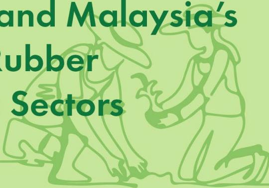
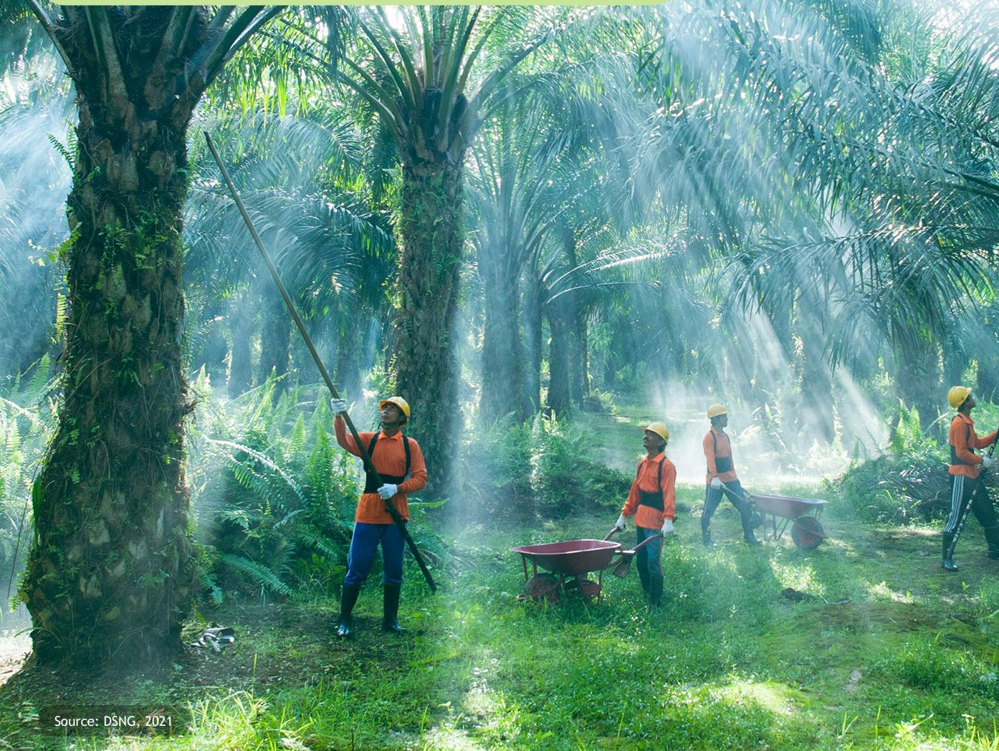
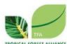
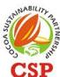
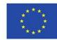
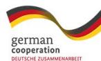
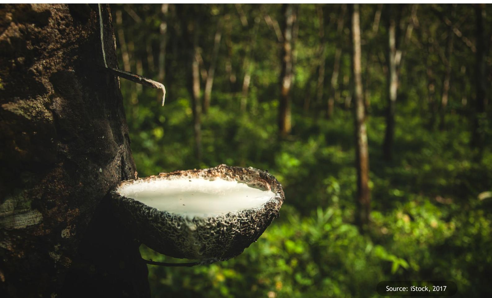
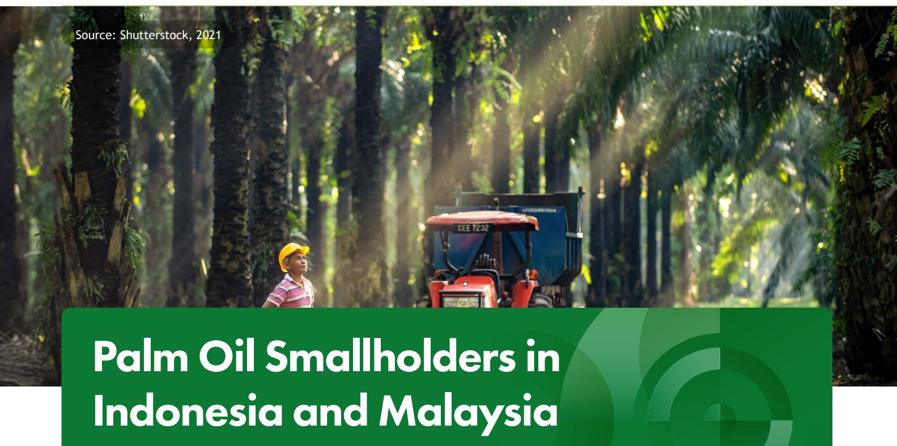
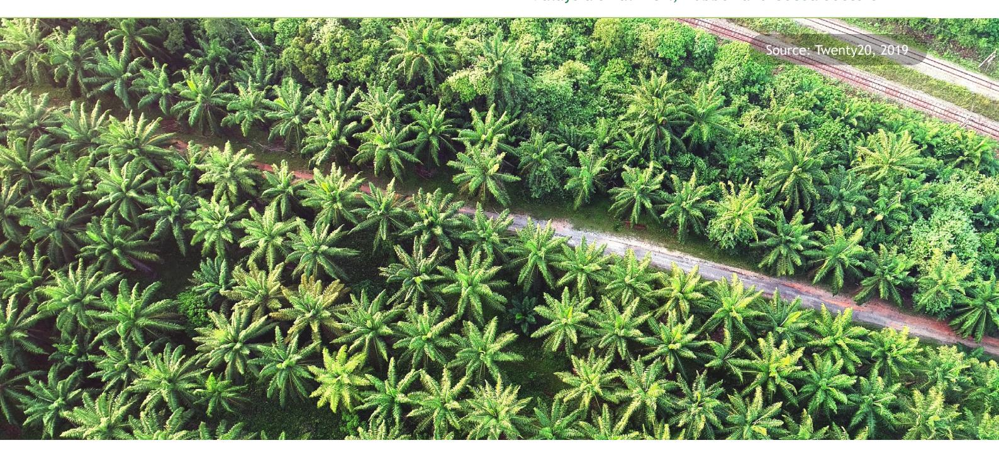
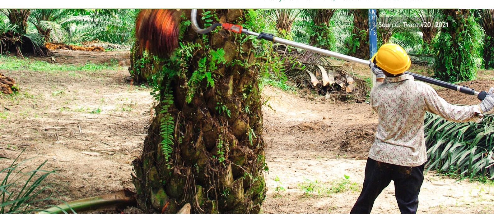

# Challenges & Opportunities for Smallholders in Indonesia and Malaysia's Palm Oil, Rubber and Cocoa Sectors

## Table of Contents

| Table of Content                                                                              | 2  |
|-----------------------------------------------------------------------------------------------|----|
| Glossary                                                                                      | 2  |
| Foreword                                                                                      | 3  |
| Executive Summary                                                                             | 3  |
| Indonesia and Malaysia Smallholder's Challenges under EUDR                                    | 4  |
| Regulatory Framework for Commodities under EUDR in Indonesia and Malaysia                     | 5  |
| Palm Oil Smallholders in Indonesia and Malaysia                                               | 6  |
| Rubber Smallholders in Indonesia and Malaysia                                                 | 8  |
| Cocoa Smallholders in Indonesia and Malaysia                                                  | 10 |
| Opportunities for Smallholders in Indonesia and Malaysia's Palm Oil, Rubber and Cocoa Sectors | 12 |
| Recommendations: Navigating EUDR Complexities A Multi-pronged Approach                        | 13 |
| References                                                                                    | 14 |

### Glossary

| : The electronic version of the STDB ( Surat Tanda Daftar Budidaya ), a certificate verifying the |
|---------------------------------------------------------------------------------------------------|
| : European Union Deforestation Regulation                                                         |
| : Food and Agriculture Organization of the United Nations                                         |
| : Global Positioning System                                                                       |
| : Indonesian Sustainable Palm Oil is a mandatory certification system established by the          |
| : Malaysian Palm Oil Board, a government agency in Malaysia responsible for the regulation,       |
| : Malaysian Sustainable Natural Rubber, a national sustainability initiative framework for the    |
| : Malaysian Sustainable Palm Oil, a national certification scheme established by the Malaysian    |
| : Regional Technical Dialogue on the EU Deforestation Regulation (EUDR): Supported by the EU,     |
| : Roundtable on Sustainable Palm Oil, a non-profit association uniting various organizations      |
| : Sustainable Agriculture for Forest Ecosystems, a global program implemented by GIZ. It’s        |
| : Surat Tanda Daftar Budidaya, a certificate verifying the legality of a plantation in Indonesia, |

## Executive Summary

The European Union Regulation on Deforestationfree Products (EUDR) poses significant challenges for Indonesia's and Malaysia's key commodities palm oil, cocoa, and rubber—primarily impacting the industry's smallholder backbone. Compliance demands substantial investment in technology, infrastructure, and capacity building. Yet, the EUDR also offers an opportunity to integrate smallholders into more formal value chains by leveraging advanced technologies like blockchain and satellite imaging, enhancing supply chain transparency and real-time verification.

Smallholders face particular hurdles, including resource constraints, complex supply chains, and difficulty meeting sustainability standards. These challenges will intensify as they engage with export-focused EUDR-compliant supply chains (effective December 2025). Specifically:

### Foreword

**The Regional Technical Dialogue (RTD), an initiative under the global Sustainable Agriculture for Forest Ecosystems (SAFE) project, serves as a crucial strategic partnership dedicated to promoting sustainable and transparent agricultural value chains across Indonesia, Malaysia, and the wider Southeast Asian region. Its core mission is to empower stakeholders, particularly smallholders and small traders, to navigate the complexities of the EU Deforestation Regulation (EUDR). To achieve this, the RTD facilitates knowledge sharing and awareness-raising on critical EUDR requirements such as due diligence, traceability, and geolocation. The dialogue convenes a diverse group of non-state actors, including private sectors, non-governmental organizations, smallholders,**  **and research institutions, all committed to fostering sustainable agricultural practices and legal value chains. The consortium behind this vital effort comprises the Tropical Forest Alliance (TFA), Partnership for Indonesia Sustainable Agriculture (PISAgro), Cocoa Sustainability Partnership (CSP), and Solidaridad (SOL). Through platforms for dialogue and knowledge exchange, the RTD directly supports the sustainability of the entire commodity value chain by clarifying regulatory ambiguities, ensuring broad understanding of the EUDR's implications, and ultimately helping these stakeholders meet EU agricultural export requirements. This collaborative approach aims to foster a more sustainable and inclusive commodity value chain for all involved.**

Palm oil concern with deforestation and smallholder integration into national certification schemes (ISPO and MSPO), which require further global alignment.

Cocoa smallholders contend with low productivity, pests, market volatility, and the EUDR's technical demands.

Rubber smallholders are challenged by aging trees, declining yields, financial limits, and climate change impacts.

Effective EUDR implementation requires comprehensive efforts: providing smallholders with targeted training, resources, and financial support. Successful smallholder inclusion also necessitates collaboration among government, NGOs, the private sector, and international stakeholders. By harmonizing national legality, strengthening enforcement, and promoting sustainable practices, Indonesia and Malaysia can emerge as leading responsible suppliers of traceable commodities. Key recommendations include empowering smallholders, bolstering traceability, advancing sustainable production, fostering collaboration, and advocating for policy harmonization and international cooperation.

# Indonesia and Malaysia Smallholder's Challenges under EUDR

**Smallholder farmers are the backbone of Indonesia's and Malaysia's key agricultural sectors (rubber, palm oil, cocoa)1 , representing a substantial portion of national output (e.g., 40% of Indonesia's palm oil, 87% of Malaysia's rubber, 95-99% of Indonesia's cocoa)2 . Both nations engage in signiÀcant commodity trade with the EU3 .**

The EUDR mandates due diligence, requiring plotlevel and geolocation data to verify deforestationfree origins across the supply chain. This necessitates traders' supply chain segregation for EU market access. However, smallholders in both countries often operate informally within fragmented networks, lacking formal land documentation with complex land-tenure issues. This significantly impedes their EUDR compliance, making it difficult for traders to trace and verify information from these independent farmers.

Insights from sectoral workshops4 and Regional Technical Dialogues #15 and #2 revealed core challenges for smallholders: a lack of formal land documentation, complex land-tenure issues, and limited affiliation compelling reliance on intermediaries. These issues are further complicated by inadequate understanding of digital tools for data submission and poor rural internet connectivity. Consequently, the EU's demand for plot-level origin and a specific cut-off date makes the logistical and financial segregation of smallholder commodities highly complex, necessitating comprehensive documentation, map verification, and legality assurance.

### Pre-EUDR Trade Data

Indonesia's Export to EU (2022)

Malaysia's Export to EU (2022)

3.4

million tons

1.9 million tons

PALM OIL

PALM OIL

RUBBER

RUBBER

COCOA

COCOA

1.2 million tons

0.8

million tons

0.3 million tons

0.1

million tons

(Sources: GAPKI, MPOB, ANPRC, ICCO, 2022)

1 Fern. (n.d.). Indonesia's Land ConÁict and Palm Oil. Retrieved from https://www.fern.org/publications-resources/indonesias-land-conÁict-and-palm-oil-2/ 2 Suzaimi, N. D. (2018). Impact of Smallholder Rubber Plantations on Livelihood Diversity of Rural Households in Selangor, Malaysia. The University of Queensland. Retrieved from https://espace.library.uq.edu.au/data/UQ\_435427/UQ435427\_OA.pdf

3 groberichten Buitenland. (2023, March 30). EUDR: What will be the impact on palm oil trade to the EU?. Retrieved from https://www.agroberichtenbuitenland. nl/landeninformatie/indonesie/2023/03/30/eudr-what-will-be-the-impact-on-palm-oil-trade-to-the-eu. (Highlights Indonesia and Malaysia as largest palm oil producers and the EU's role as importer).

4 Smallholders Workshop Report: https://drive.google.com/file/d/184i8zityi5DnApCrPqSdyzhtvo6vkn4D/view?usp=sharing

5 Report on Regional Technical Dialogue #1: https://drive.google.com/file/d/1PdZxRbVEQzP3sIMUvUWkqTvrGSxtGuk0/view?usp=sharing

# Regulatory Framework for Commodities under EUDR in Indonesia and Malaysia

- Indonesia and Malaysia are actively enhancing their regulatory frameworks to ensure traceability for smallholders in palm oil, cocoa, and rubber, addressing market demand, such as the EUDR once it is activated in December 2025.
- **Indonesia** leverages its mandatory Indonesian Sustainable Palm Oil (ISPO) certification, which becomes mandatory for smallholders by November 2025. Crucially, the Surat Tanda Daftar Budidaya (STDB) is its foundational document for smallholder land legality and geolocation across all commodities. However, ISPO currently lacks full alignment with EUDR's explicit plot-level geolocation and cut-off date requirements, and the low issuance rate of STDBs remains a significant hurdle for effective traceability.
- **Malaysia**, on the other hand, utilizes its mandatory Malaysian Sustainable Palm Oil (MSPO) certification, which already includes smallholders and is actively being upgraded, particularly with the MSPO Trace system, to meet EUDR's rigorous demands for plot-level data and harmonized forest definitions. For rubber, the mandatory Malaysian Sustainable Natural Rubber (MSNR) Framework and its MSNR Trace system, along with the Smallholders Card system, aim for end-to-end traceability. Both nations are also developing specific traceability systems for cocoa, recognizing the need to register and certify smallholders.

Indonesia and Malaysia, the world's leading palm oil producers, heavily rely on smallholder farmers. Indonesia alone is home to approximately 2.6-2.7 million palm oil smallholders, contributing 35-38% of national production6 , with projections indicating their dominant management of 60% of plantations by 20307 . Malaysia has around 300,000 smallholders8 , accounting for 30- 40% of its output. These smallholders are categorized into 'Plasma'/'Organized' and 'Independent' groups, with 'Plasma'/'Organized' smallholders benefiting from company or government support schemes like FELDA or FELCRA9 . While both nations depend on palm oil, Indonesia's smallholder sector is largely vast, diverse, and less structured, especially with independent farmers, whereas Malaysia's is generally more organized due to strong government initiatives.

|                                                           | Indonesia           | Malaysia           |
|-----------------------------------------------------------|---------------------|--------------------|
| <b>Total Palm Oil Plantation Area (hectares)</b>          | 16.38 million       | 5.85 million       |
| <b>Small Farmer Cultivation Area (hectares)</b>           | 6.72 million (41%)  | 1.54 million (26%) |
| <b>Number of Smallholders</b>                             | Approx. 2.7 million | Approx. 450,000    |
| <b>Total Palm Oil Production (million tons)</b>           | 46.5                | 18.7               |
| <b>Palm Oil Production by Smallholders (million tons)</b> | 18.6 (40%)          | 4.7 (25%)          |
| <b>Export Value (USD Billion)</b>                         | \$28.1              | \$15.2             |

### Table 1. Palm Oil Production in Indonesia and Malaysia

(Source: GAPKI, MPOB, 2023)

INDEF. (2023, March). Reducing Poverty, Improving Sustainability: Palm Oil Smallholders are Key to Meeting the UN SDGs. Retrieved from https://indef.or.id/ wp-content/uploads/2023/03/Working-Paper-Reducing-Poverty-Improving-Sustainability-Palm-Oil-Smallholders-are-Key-to-Meeting-the-UN-SDGs.pdf 7 Musim Mas. (n.d.). Smallholders Approach and Programmes. Retrieved from https://www.musimmas.com/sustainability/smallholders/

8 MSPO. (2024, June 29). Oil Palm Smallholders in Sabah and Sarawak. Retrieved from https://mspo.org.my/mspo-blogs/oil-palm-smallholders-in-sabah-andsarawak.

9 CIFOR-ICRAF. (n.d.). Current practices and innovations in smallholder palm oil finance in Indonesia and Malaysia. Retrieved from https://www.cifor-icraf.org/ publications/pdf\_files/infobrief/6585-infobrief.pdf

| Key Challenges Indonesia  |                 |     | Malaysia                            |
|---------------------------|-----------------|-----|-------------------------------------|
| A significant decrease in | 2021-2022       |     |                                     |
| Meeting stringent EUDR    | requirements    |     |                                     |
| (traceability, legality,  | sustainability) |     |                                     |
| and technology for        | traceability    | and |                                     |
| sustainable practices     | throughout      | the |                                     |
|                           |                 |     | providing due diligence information |
|                           |                 |     | effective due diligence and EUDR    |
|                           |                 |     | alignment is costly/demanding for   |

Table 2. Challenges Faced by Palm Oil Smallholders in Indonesia and Malaysia

(Source: CIFOR, GAPKINDO, MPOB, 2024)

**Rubber smallholders form the backbone of the sector in both Indonesia and Malaysia, managing approximately 85% and 87% of national rubber production, respectively10 .**

The rubber sector has long been linked with structural issues—such as informality, irregular land tenure, and weak integration into formal markets—that now intersect with new compliance demands under the EUDR11 .

In Indonesia, the rubber sector remains largely informal. Many smallholders operate without legally recognized land titles or formal cultivation documentation such as the Surat Tanda Daftar Budidaya (STDB). This not only limits access to government support but also complicates efforts to trace the origin of rubber under EUDR requirements (World Bank, 2022). The prevalence of small, dispersed holdings—particularly in Sumatra, Kalimantan, and Sulawesi—combined with a fragmented value chain, makes traceability particularly challenging. Smallholders in both countries face similar challenges in land legality12, poor traceability systems, aging trees, low yields, and lack of awareness on international compliance standards. These are contributed by fragmented and long supply chains that are complex and involve multiple intermediaries, often obscuring product origins. Smallholder farmers in both contexts lack consistent access to technical extension, sustainable inputs, and fair pricing mechanisms13. Replanting rates in both countries are critically low (under 2% annually) due to financial constraints and regulatory complexity (IRSG, 2023). This, combined with aging trees, pest damage, and outdated agronomic practices, contributes significantly to declining productivity (FAO, 2022)."

In Malaysia, although the rubber sector benefits from more structured institutional support—particularly through agencies like the Malaysian Rubber Board (MRB), RISDA, and FELCRA—informality persists, particularly in Sabah and Sarawak14. In these areas, complex land ownership frameworks such as Native Customary Rights (NCR) are not always aligned with formal legal systems (MRB, 2023). Challenges also include limited replanting in non-scheme areas, declining product quality, and insufficient post-harvest handling15. While Malaysia has initiated the Malaysian Sustainable Natural Rubber (MSNR) framework to guide sustainability practices, its alignment with EUDR obligations remains a work in progress. Malaysia's rubber sector benefits from stronger state coordination and more established farmer support institutions, with a higher degree of organization among smallholders through cooperatives and replanting schemes. In contrast, Indonesia's sector is more diverse, less centralized, and faces deeper structural gaps in land documentation and institutional support (World Bank, 2022; IRSG, 2023).

# Rubber Smallholders in Indonesia and Malaysia

10 Department of Statistics Malaysia (DOSM). (2024, May 8). Malaysia: Natural Rubber Statistics, March 2024.

11 Solidaridad Network. (2023, April 12). Briefing Paper: Implications of the EU Deforestation Regulation (EUDR) for oil palm smallholders. Retrieved from https:// www.solidaridadnetwork.org/wp-content/uploads/2023/04/Briefing-paper-EUDR-and-palm-oil-smallholders.pdf

12 International Rubber Study Group (IRSG). (2023). Natural Rubber Statistics

13World Bank. (2022). Indonesia Economic Prospects: Staying the Course and Malaysia Economic Monitor.

14 Malaysian Rubber Board (MRB). (Various annual reports and official publications, e.g., MRB Annual Report 2023).

15 Malaysian Rubber Board (MRB).

| Challenges Indonesia |                          |             | Malaysia                             |
|----------------------|--------------------------|-------------|--------------------------------------|
| Contentious          | land                     |             | ownership/legality                   |
| enforcement;         | STDB                     | license     | acquisition                          |
| Low                  | quality affects          |             | competitiveness;                     |
| improvement          | needed                   | for         | international                        |
| standards            | (Indonesian              |             | Rubber Assoc.,                       |
| Burning              | for land                 | clearing    | causes                               |
| deforestation;       |                          | sustainable | practices                            |
| training             | for                      | improved    | techniques                           |
|                      | traceability/integration | for         | effective                            |
| Navigating           | complex                  |             | governance/shared                    |
|                      | Government-backed        | funding     | supports                             |
| initiatives          | for                      | smallholder | traceability                         |
|                      |                          |             | Similar challenges: unclear land     |
|                      |                          |             | exacerbated by financial constraints |
|                      |                          |             | land clearing; need for sustainable  |
|                      |                          |             | Requires comprehensive training for  |
|                      |                          |             | smallholders to improve practices/   |
|                      |                          |             | Similar challenges; need for better  |
|                      |                          |             | integration to support due diligence |

### Tabel 3. Challenges in the Indonesia and Malaysia Rubber Industry

(Source: GAPKINDO, MRB, 2024)

**In 2023, Indonesian smallholders produced an overwhelming 99% of the nation's cocoa beans across approximately 1.6 million hectares16. To address low productivity and meet global demand, the Indonesian government is focused on increasing productivity and quality through replanting superior, disease-resistant, and highyielding clones17 .**

They are also working on improving post-harvest handling and ensuring a sustainable, deforestation-free supply chain to comply with the EUDR once activated. Conversely, Malaysia's cocoa sector, while smaller, is committed to revitalization. The Malaysian government is boosting competitiveness and yields through seedling incentives, rehabilitation projects, and research, with a specific focus on premium cocoa varieties18. They are incentivizing farmers to improve practices and improve their incomes. A key priority for Malaysia is strengthening its downstream industry through cocoa grinding and value-added products, making increased local bean production critical to this strategy. Malaysian smallholders remain significant contributors to the country's cocoa output.

Cocoa production typically involves a multi-layered supply chain, with three to five intermediary stages before reaching consumers19. Smallholders, operating informally on dispersed plots, sell their beans to local collectors. These collectors, as initial handlers, then pass the beans to local or district traders. From there, the cocoa moves to third-party mills or warehouses for further handling and potential processing. Without segregation, the unique identity of each smallholder's cocoa is lost as beans are commingled before export or global distribution. This inherent complexity and reliance on intermediaries make mapping and monitoring cocoa origins challenging, hindering the guarantee of a deforestation-free supply chain. Given that cocoa is often traded in bulk, ensuring segregation and maintaining plot-level traceability throughout processing and distribution adds significant complexity and cost.

Smallholders in both Indonesia and Malaysia face common challenges: low productivity, aging trees, increased incidence of pests and diseases exacerbated by climate change, price volatility, and limited access to essential resources such as financial support, technical knowledge, and market information20 .

# Cocoa Smallholders in Indonesia and Malaysia

Source: iStock, 2018

16 Directorate General of Estate Crops, Ministry of Agriculture, Republic of Indonesia. (Annual statistics on cocoa area and production).

17 Indonesian Ministry of Agriculture. (Various policy documents, speeches, and press releases concerning cocoa development programs). Look for initiatives like

the "Sustainable Cocoa Production Program" or "Gerakan Nasional Kakao."

18 Malaysian Cocoa Board (MCB). (Official website: www.koko.gov.my; annual reports, strategic plans, and press releases are the primary source for government initiatives, research, and development plans for the cocoa sector).

19 Fairtrade Foundation / Rainforest Alliance / UTZ. (These certification bodies and their reports frequently illustrate the typical multi-layered cocoa supply chain and the challenges of traceability, especially for smallholders)

20 International Cocoa Organization (ICCO). (Regularly publishes statistics and analyses on global cocoa production, identifying key challenges such as aging trees, diseases, and low yields)

| Indonesia SpeciÀcs Challenges                                   |         |             | Malaysia SpeciÀcs Commonalities                                   |
|-----------------------------------------------------------------|---------|-------------|-------------------------------------------------------------------|
| fragmented farms,                                               | limited |             |                                                                   |
| Crucial issue, strong                                           | focus   |             |                                                                   |
| on formalizing land                                             | titles  |             |                                                                   |
| (SHM) and registration                                          |         |             |                                                                   |
| (STDB); current regulations                                     |         |             |                                                                   |
| limited knowledge,                                              | lack of |             |                                                                   |
| intermediaries, low                                             | value   |             |                                                                   |
| chains, difficult to                                            | map     |             |                                                                   |
| Subpar productivity,                                            | price   |             |                                                                   |
| volatility, risk of                                             | pushing |             |                                                                   |
| Differing forest maps                                           | and     |             |                                                                   |
|                                                                 |         | Significant | smallholder                                                       |
|                                                                 |         | role,       | developing national                                               |
|                                                                 |         | Efforts     | to develop national                                               |
|                                                                 |         | Focus       | on increasing yields,                                             |
| Traceability &                                                  |         |             | High costs, lack of digital                                       |
| Geolocation costs. Land Legality insufficient. Digital Capacity |         |             | capacity, difficulty in plot level mapping. traceability system. |
|                                                                 |         |             | records, GPS mapping,                                             |
| digital farm records.                                           |         |             | or awareness of global compliance.                                |
| indirect suppliers.                                             |         |             | Difficulty in mapping and tracking origins. compliant goods.      |
| Economic Burden                                                 |         |             | High compliance costs                                             |
| Forest DeÀnition                                                |         | concern.    | disproportionately affecting exclusion.                           |
| Alignment                                                       |         |             | Need for harmonization of variability EUDR criteria.              |

Table 4. Comparative Challenges for Smallholder Cocoa Farmers under EUDR

# Opportunities for Smallholders in Indonesia and Malaysia's Palm Oil, Rubber and Cocoa Sectors

**Despite considerable hurdles, the EUDR presents tangible opportunities. Meeting its rigorous requirements can signiÀcantly enhance the sustainability reputations of operators and traders, simultaneously improving access to EU markets where demand for sustainably sourced products is steadily rising.**

The regulation can also serve as a catalyst for agricultural innovation, driving advancements in sustainable practices and technologies that lead to improved productivity and more effective environmental management. However, these benefits may not be equally accessible to all stakeholders, especially smallholders, without targeted support to prevent exacerbating existing inequalities.

Navigating the EUDR requires a comprehensive, multi-faceted approach that directly addresses key smallholder challenges: limited access to finance and credit, complex traceability demands due to inadequate infrastructure, and rising certification costs21. Providing financial support (subsidies, grants, credit) is critical for smallholders to adopt sustainable practices and join compliant supply chains. Additionally, harmonizing legal frameworks, simplifying certification, and implementing robust, data-driven traceability systems are critical for operators and traders to fulfil EUDR due diligence.

Such integrated systems build stakeholder trust and directly support the EUDR's overarching goal of eliminating deforestation-linked products, empowering customers to make informed choices, potentially complemented by clear labels providing transparent sustainability criteria. To ensure an effective response that promotes long-term sustainability, economic resilience, and environmental stewardship, it is essential to strengthen coordination among government agencies, foster robust public-private partnerships, and invest significantly in education and capacity building.

For smallholders, who manage the majority of these agricultural sectors, the burden of providing necessary information and adopting new practices for operators and traders to meet EUDR due diligence is significant, often requiring investments beyond their financial means22. Nevertheless, opportunities exist for them to enhance their sustainability and competitiveness through improved management practices, increased yields, better market access, and enhanced commodity quality and traceability (e.g., fresh fruit bunches). For all affected smallholders, adopting advanced technologies and enhancing infrastructure for precise geolocation data and transparent record-keeping are essential to support due diligence. Finally, addressing legal complexities in land tenure and ensuring regulatory alignment are paramount to fostering a fair and supportive environment for sustainable commodity production across the region.

21 Solidaridad Network. (2023). Briefing Paper: Implications of the EU Deforestation Regulation (EUDR) for oil palm smallholders. Retrieved from https://www. solidaridadnetwork.org/wp-content/uploads/2023/04/Briefing-paper-EUDR-and-palm-oil-smallholders.pdf

22 Solidaridad Network. (2023). Briefing Paper:

Implications of the EU Deforestation Regulation (EUDR) for oil palm smallholders. Retrieved from https://www.solidaridadnetwork.org/wp-content/ uploads/2023/04/Briefing-paper-EUDR-and-palm-oil-smallholders.pdf

# Recommendations: Navigating EUDR Complexities A Multi-pronged Approach

Implement end-to-end digital traceability from farm to market. This means equipping smallholders with affordable, userfriendly technologies like GPS mapping and mobile apps for streamlined data. Strong collaboration among exporters, processors, and manufacturers is crucial for seamless integration and due diligence.

To effectively navigate the intricate requirements of the EU Deforestation Regulation (EUDR) and safeguard the well-being of smallholder farmers, a comprehensive and multi-pronged approach is essential. This strategy encompasses critical pillars, each designed to empower smallholders, strengthen supply chains, and foster sustainable agricultural practices:

Through the diligent and integrated application of these efforts, Indonesia and Malaysia can effectively support smallholders in adopting sustainable practices, substantially improving their livelihoods, and ensuring the long-term viability and resilience of their critical agricultural sectors amidst evolving global regulatory landscapes.

### Robust Traceability Systems

Empower smallholders with training in sustainable agricultural practices (e.g., agroforestry, IPM, soil conservation) and financial literacy. Provide technical assistance and financial incentives to help them meet sustainability standards.

Streamline regulatory processes, facilitate knowledge sharing, and significantly improve enforcement effectiveness.

Establish transparent, fair pricing mechanisms that guarantee equitable profits, promoting economic stability and incentivizing sustainable practices. Facilitate smallholder access to credit and direct market relationships with buyers prioritizing sustainable, traceable products.

Build resilient agricultural sectors through multi-stakeholder platforms for dialogue and collective action among government, industry, civil society, and international bodies. Encourage knowledge sharing, best practices, and active international cooperation (including with the EU) for technical and financial support.

### Targeted Capacity Building

### Enhanced Regulatory Alignment & Enforcement

### Inclusive Smallholder Participation

### Strategic Coordination & Collaboration

## References

European Commission. (2021). Due Diligence Regulation for Deforestation-Free Supply Chains. Retrieved from https://ec.europa.eu/environment/forests/deforestation\_due\_diligence\_en.htm FAO. (2022). Cocoa Market Review 2022. Retrieved from FAO Cocoa Market Review Food and Agriculture Organization (FAO). (2022). Cocoa Market Review 2022. Retrieved from FAO Cocoa Market Review International Cocoa Organization. (2023). Annual Report 2023. Retrieved from International Cocoa Organization Annual Report International Rubber Study Group. (2023). Statistics on rubber smallholders in Indonesia and Malaysia. Indonesian Palm Oil Association (GAPKI). Role in promoting sustainable practices in the palm oil industry. Malaysian Rubber Board. (2023). Malaysian Sustainable Rubber Certification (MSRC). Retrieved from Malaysian Rubber Board website. Ministry of Agriculture of the Republic of Indonesia. (2023). Indonesian Sustainable Rubber Certification (ISRC). Government publication. RSPO. (2024). Roundtable on Sustainable Palm Oil standards and certification. Retrieved from https://rspo.org RSPO. (2024). RSPO Certification. Retrieved from https://rspo.org Sustainable Natural Rubber Initiative. (2023). Enhancing sustainability in the global rubber supply chain. World Bank. (2022). Challenges and opportunities for rubber smallholders in Indonesia. World Bank. (2022). Statistics on smallholder management of palm oil plantations. World Cocoa Foundation. (2021). Empowering Cocoa Farmers: Annual Report. Retrieved from World Cocoa Foundation Annual Report.