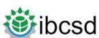
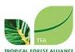
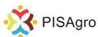
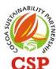
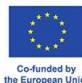
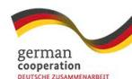
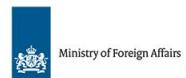
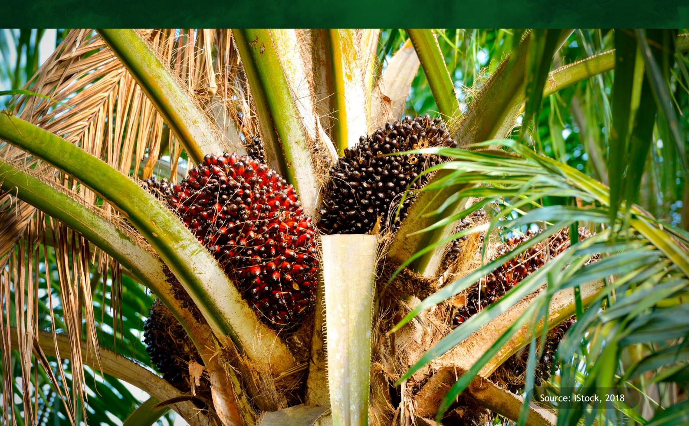

# Indonesia & Malaysia: Traders' EUDR Imperative for Market Access

### Table of Contents

| Table of Content                                                                                    | 2  |
|-----------------------------------------------------------------------------------------------------|----|
| Glossary                                                                                            | 2  |
| Executive Summary                                                                                   | 3  |
| Traceability & Market Access : The EUDR Impact on Indonesia and Malaysia Rubber, Cocoa and Palm Oil | 4  |
| Indonesia & Malaysia’s Traders : Adapting EUDR under Cocoa, Rubber and Palm Oil                     | 6  |
| EUDR Compliance: Overcoming Trader-Smallholder Integration Hurdles via Regulatory Support           | 7  |
| Opportunities for Indonesia and Malaysia Traders for Commodities Under EUDR                         | 9  |
| Strategic Pathways for EUDR Compliance for Supply Chain in Cocoa, Palm Oil and Rubber Sectors       | 10 |
| Technological Integration and Enhanced Traceability                                                 | 10 |
| Capacity Building and Smallholder Empowerment                                                       | 10 |
| Supply Chain Resilience, Risk Management, and Ethical Sourcing                                      | 10 |
| Market Development and Innovation                                                                   | 10 |
| Policy, Governance, and Collaboration                                                               | 10 |
| References                                                                                          | 11 |

### Glossary

| : Asosiasi Kakao Indonesia (the Indonesian  |                                              |
|---------------------------------------------|----------------------------------------------|
| : Electronic Standard Indonesian Rubber, a  |                                              |
| : The electronic version of the STDB (Surat |                                              |
| : European Union Deforestation Regulation   |                                              |
| : Food and Agriculture Organization of the  |                                              |
| : Gabungan Pengusaha Kelapa Sawit           |                                              |
| Indonesia (the Indonesian Palm Oil          |                                              |
| : Gabungan Perusahaan Karet Indonesia       |                                              |
| : International Cocoa Organization, a       |                                              |
| global intergovernmental organization       |                                              |
| : Internet of Thing                         |                                              |
| : Indonesian Sustainable Palm Oil is a      |                                              |
|                                             | : Malaysian Cocoa Board, a federal statutory |
|                                             | : Malaysian Palm Oil Board, a government     |
|                                             | : Malaysian Sustainable Natural Rubber, a    |
|                                             | : Malaysian Sustainable Palm Oil, a national |
|                                             | Malaysian government to ensure the           |
|                                             | : Roundtable on Sustainable Palm Oil, a      |
|                                             | non-proÀt association uniting various        |
|                                             | manufacturers, retailers, social NGOs,       |
|                                             | environmental or nature conservation         |
|                                             | : Small and Medium-sized Enterprises         |
|                                             | : The NE blockchain platform tracks and      |

## Executive Summary

**Indonesia and Malaysia, dominant global players in palm oil, cocoa, and rubber, face signiÀcant challenges navigating the European Union Deforestation Regulation (EUDR). While these commodities are crucial to their economies, stricter EU import regulations address deforestation and sustainability concerns.** 

Large-scale plantations may have advantages in meeting EUDR's traceability and sustainability requirements due to potentially greater resources and clearer supply chains. However, they still need capacity building, technological integration, and Ànancial support for effective due diligence. The EUDR mandates due diligence to ensure speciÀed commodities are deforestation-free (after December 31, 2020) and legally produced in the

origin country. While its primary aim is to prevent commodity-driven deforestation, the regulation's due diligence framework also encompasses human rights and broader environmental concerns. These challenges also present opportunities: embracing sustainable practices, adopting advanced technologies, and diversifying markets can ensure continued EU market access, enhance global competitiveness, and foster a resilient, equitable future. Critical to achieving these goals is collaboration among governments, Non-Government Organizations (NGOs), the private sector, and local communities. Successfully navigating EUDR implementation requires balancing economic growth with environmental stewardship and social responsibility, allowing these nations to solidify their leadership in sustainable global commodity markets.

**Indonesia and Malaysia dominate global palm oil production for approximately 85% of global demand1 .**

Both nations are also signiÀcant contributors to the cocoa and rubber industries. Indonesia is the world's 4th largest processed cocoa exporter2 , with global demand projected to reach \$24 billion by 20293 , even as supply faces challenges. For natural rubber, Indonesia is the second-largest producer4 , alongside Malaysia, collectively supplying about 70% of the world's demand5 , driven by robust growth in sectors like automotive and healthcare, with the market expected to hit \$30.5 billion by 20336 . However, these industries face issues like cocoa productivity and rubber price volatility7 .

Sustainable practices, reinforced by initiatives like RSPO, ISPO, and MSPO, are crucial given international regulations like the EUDR, which, once activated, will mandate due diligence for operators and traders importing and exporting these commodities to the EU market. Consequently, traders are accelerating efforts in traceability and inclusiveness to secure continued market access.

# Traceability & Market Access: The EUDR Impact on Indonesia and Malaysia Rubber, Cocoa and Palm Oil

https://indef.or.id/wp-content/uploads/2023/03/Working-Paper-Reducing-Poverty-Improving-Sustainability-Palm-Oil-Smallholders-are-Key-to-Meeting-the-UN-SDGs.pdf INDEF WORKING PAPER NO.1/2021

https://www.cekindo.com/blog/exporting-cocoa-in-indonesia

What is the demand for cocoa on the European market? https://www.cbi.eu/market-information/cocoa/what-demand

https://www.anrpc.org/indonesia

https://www.anrpc.org/malaysia

https://www.alliedmarketresearch.com/natural-rubber-market-A107974

https://www.technavio.com/report/industrial-chocolate-market-size-industry-analysis

### Trade Flows of Key Commodities from Indonesia & Malaysia to the EU (2023 estimates)8

| Direct Exports Indonesia to EU | COCOARUBBERPALM OIL Indonesia Indonesia            |
|--------------------------------|----------------------------------------------------|
| 3.2 million                    |                                                    |
| 1.5 million                    |                                                    |
| 4.7 million                    |                                                    |
| 44 %                           |                                                    |
| 1.8 million                    |                                                    |
| 0.9 million                    |                                                    |
| 2.7 million                    |                                                    |
| 25 %                           |                                                    |
| 1.1                            | million                                            |
| 0.4                            | million                                            |
| 1.5                            | million                                            |
| 28                             | %                                                  |
| 0.7                            | million                                            |
| 0.3                            | million                                            |
| 1.0                            | million                                            |
| 19                             | %                                                  |
|                                | 250 thousand Malaysia Malaysia                     |
|                                | 100 thousand                                       |
|                                | 350 thousand                                       |
|                                | 8 %                                                |
|                                | 80 thousand Indonesia Indonesia Malaysia Malaysia  |
|                                | 30 thousand Indonesia Indonesia Malaysia Malaysia  |
|                                | 110 thousand Indonesia Indonesia Malaysia Malaysia |
|                                | 2 %                                                |

Sources: Indonesian Ministry of Trade & Malaysian Ministry of Plantation Industries and Commodities, 2023

8 Indonesian Ministry of Trade & Malaysian Ministry of Plantation Industries and Commodities

**The EU Deforestation Regulation (EUDR) is fundamentally alter how Indonesian and Malaysian companies manage palm oil, cocoa, and rubber, presenting both hurdles and prospects. This shift necessitates a complete overhaul of current compliance frameworks.**

Companies will face higher operational costs and administrative burdens9 , especially when conducting extensive due diligence on third-party suppliers, a task already requiring signiÀcant sustainability and Àeld-work teams from large corporations. SigniÀcant investment in advanced traceability systems is critical10. These systems need to gather, verify, and manage precise geolocation data for every land plot11, including those managed by third-party suppliers and smallholders, ensuring distinct, identiÀable areas across all supply chains. This requires adopting advanced mapping technology, like high-resolution satellite imagery and AI for real-time monitoring. Companies are also looking into blockchain for immutable origin records and geospatial analysis for proactive risk assessment. While widespread advanced traceability systems are still emerging, existing certiÀcation infrastructures provide a base. Nonetheless, larger companies must integrate diverse data formats from various commodities and certiÀcation schemes into uniÀed digital platforms.

Beyond technology, traders and operators must implement rigorous veriÀcation processes, possibly through independent third-party audits, to guarantee data accuracy and strict EUDR compliance. Companies also need to invest in capacity building and technical assistance for farmers, including smallholders, to equip them with the necessary skills for accurate land mapping and meticulous record-keeping12 .

Proving legal compliance with local laws on land tenure, labour rights, and environmental regulations is vital for due diligence, demanding extensive documentation and signiÀcant inter-governmental coordination13 . Jurisdictional and Landscape Approaches are vital multistakeholder platforms recommended to streamline policies and facilitate inter-district coordination, thereby supporting smallholder integration for eventual EUDR compliance."

# Indonesia & Malaysia's Traders: Adapting EUDR under Cocoa, Rubber and Palm Oil

Circularise. (n.d.). EU Deforestation Regulation (EUDR): What it means for your supply chain. Retrieved [6 June 2025] from https://www.circularise.com/blogs/ eu-deforestation-regulation-eudr

10 TraceX Technologies. (n.d.). How to Ensure Deforestation-Free Sourcing for EUDR Compliance. Retrieved [6 June 2025] from https://tracextech.com/ deforestation-free-sourcing-eudr-compliance/

11 osapiens. (n.d.). Meet the EU Deforestation Regulation | osapiens HUB for EUDR. Retrieved [6 June 2025] from https://osapiens.com/solutions/eudr/ 12 Solidaridad. (2023, July 27). The EUDR and smallholders: addressing the challenges and seizing opportunities. Retrieved [Current Date] from https://www.

solidaridadnetwork.org/news/the-eudr-and-smallholders-addressing-the-challenges-and-seizing-opportunities/

13 European Commission. (n.d.). EU Deforestation Regulation. Retrieved [Current Date] from https://environment.ec.europa.eu/topics/forests/deforestation/ deforestation-regulation\_en

**The palm oil industries in Indonesia and Malaysia are global leaders, supplying this versatile commodity for food, cosmetics, and biofuels. Indonesia, as the largest producer, utilizes its Indonesian Sustainable Palm Oil (ISPO) certiÀcation scheme, though its effectiveness in supporting due diligence for EUDR compliance is still debated.** 

The developing National Dashboard aims to enhance transparency and traceability of key agricultural products by centralizing data on origin, practices, and legality from various sources, thereby aiding EUDR due diligence, despite the system has not fully progressing yet. Malaysia, the second-largest producer, employs the Malaysian Sustainable Palm Oil (MSPO) scheme, but expanding its adoption among smallholders and meeting international traceability demands for due diligence remains a signiÀcant challenge. From sectoral workshops and regional technical dialogue sessions, corporations underscore that the EU plays a critical market for rubber, cocoa, and palm oil in both Indonesia and Malaysia. Discussions convened in both countries highlighted the urgent need to address data management, veriÀcation, and regulatory alignment issues that corporations face, particularly concerning the integration of smallholders – who are crucial to the supply chain – into traceable systems.

Indonesia and Malaysia are developing and enhancing digital platforms to manage traceability data. Indonesia's National Dashboard Initiative: this platform aims to provide comprehensive data, information, and documentation needed to meet EUDR requirements, particularly regarding traceability. Malaysia's MSPO Trace System and GeoPalm Portal. These systems are being leveraged and further developed to track the journey of palm oil from plantation to product, providing veriÀable information for EUDR compliance. Another key challenge is interoperating their existing traceability systems with both Indonesia National Dashboard Initiatives and Malaysia MSPO Trace System and GeoPalm Portals to integrate smallholders and the middle-traders that earlier complicates corporate due diligence14. Blockchain platforms, such as Indonesia's National Dashboard, which integrates e-STDB (Smallholder Registration System) registered smallholders, show promise but face challenges related to IT interoperability and decentralized compliance veriÀcation.

Beyond the stringent requirements of the EU Deforestation Regulation (EUDR), the cocoa industries in Indonesia and Malaysia simultaneously struggle with aging trees, an aging workforce, and suboptimal farming practices (e.g., inadequate fertilization, pruning, and pest control). Declining cocoa export volumes, in contrast to an escalating global demand15, present a critical challenge to the long-term sustainability of the sector. Revitalization strategies, such as replanting cocoa trees and implementing knowledge transfer programs, are urgently needed. Indonesia cultivates cocoa primarily in Sulawesi and Sumatera, typically on small plantations, while Malaysia focuses on Sabah and Sarawak16. Both countries signiÀcantly contribute to global cocoa production, which was approximately 4.78 million metric tons in 202017 .

EUDR implementation poses signiÀcant challenges for traders and corporations within the cocoa sector18 , adding complexity and potential costs for establishing traceability before reaching the EU market. 90% of cocoa is sourced from smallholders19 and the prevalence

# EUDR Compliance: Overcoming Trader-Smallholder Integration Hurdles via Regulatory Support

14 PwC. (2025, January 21). Navigating EU Deforestation Regulation: from guidelines to best practices. Retrieved [6 June 2025] from https://www.pwc.com/gx/ en/services/tax/esg-tax/navigating-eu-deforestation-regulation.html

15International Cocoa Organization (ICCO). (Annual Reports, Quarterly Bulletins).

16 Cekindo. (2023, July 27). Indonesian Cocoa Bean Export Market: An Overview. Retrieved [6 June 2025] from https://cekindo.com/blog/indonesian-cocoa-beanexport-market-overview

17 FAOSTAT. (n.d.). Crops and livestock products. Retrieved [6 June 2025] from https://www.fao.org/faostat/en/#data/QCL

18 European Cocoa Association (ECA). (n.d.). EUDR Resources. Retrieved [6 June 2025] from https://eurococoa.com/resources/eudr-resources/

19 Forest & Farm Facility (FAO). (2024, May 15). Smallholders and the EU Deforestation Regulation: A global call to action. Retrieved [Current Date] from https:// www.fao.org/forests/forest-and-farm-facility/news/news-detail/en/c/1699742/

of intermediaries, cocoa traders will face considerable difÀculties in sourcing from smallholders who can provide veriÀed land data and meet traceability requirements. A unique challenge for both Indonesia and Malaysia, as highlighted in sectoral workshops, is both countries' reliance on imported cocoa beans from West Africa20. Therefore, operators and traders must ensure EUDR compliance for the entire supply chain, including these imported beans, necessitating robust traceability for mixed-origin products. Differing domestic cocoa regulations, such as Indonesia's formal agroforestry classiÀcation versus Malaysia's less formalized approach, further compound this complexity. While not directly mandated by the EUDR, certiÀcations like Fairtrade and Rainforest Alliance CertiÀed preceded it, proving instrumental in securing market access and ensuring environmental, social, and economic viability. Moreover, regulatory oversight for Indonesia's cocoa sector is dispersed across multiple ministries, with smallholder affairs managed under the Ministry of Agriculture. This contrasts with Malaysia's more centralized approach via the Malaysian Cocoa Board (MCB)21. To ensure traceability, Indonesian cocoa farmers will be required to register their polygon information through the e-STDB system, a process facilitated by district agricultural units, with these commodity and production details subsequently integrated into the National Dashboard22 . Concurrently, Malaysia's cocoa traceability is enhanced under the MCB's National Cocoa Traceability System23 .

In Indonesia, smallholders dominate natural rubber production (approximately 85% of plantation area and over 90% of raw material, mainly from Sumatra and Kalimantan), typically selling through intermediaries to private sector processors24. This opacity, characterized by limited direct sourcing and unclear market share data, signiÀcantly hinders traceability and EUDR compliance25 . Similar to cocoa, rubber is predominantly cultivated by smallholders, and intermediaries are mostly present before the product is sold to traders. Key challenges for rubber include replanting aging trees (with an annual rate of less than 2% in Indonesia)26, complex land tenure issues, and providing comprehensive traceability data for company due diligence under the EUDR. Malaysia's rubber smallholders (accounting for over 90% of upstream production) also face economic hardship due to low prices and high costs, with limited direct ties to processors and the glove industry, which increasingly imports latex27 .

EUDR compliance mandates stringent requirements for geolocation data, land legality, and traceability, which are difÀcult to meet amidst tight timelines and ambiguous EU guidance. Indonesia is upgrading its Standardized Indonesian Rubber (SIR) system to E-SIR for better data management, but its alignment with EU standards remains uncertain28. Navigating compliance while dealing with Áuctuating rubber prices is critical. Accelerating E-SIR adoption through government mandates, involving district governments, and developing practical technical guidelines are highly recommended29. Indonesia is a top global rubber producer (approximately 3.3 million metric tons annually) with a signiÀcant portion exported to the EU30, highlighting the EUDR's importance. Malaysia produces around 0.7 million metric tons annually31. Both countries strive to balance traditional smallholder practices with modern corporate management, which requires active national and district government involvement. Malaysia's MSNR (Malaysian Sustainable Natural Rubber) initiative supports sustainable practices32. Environmental concerns include deforestation and habitat loss, exacerbated by climate change. Indonesia classiÀes rubber as an agroforestry crop, unlike Malaysia, which potentially impacts sustainability approaches.

20 Example (illustrative): USAID. (n.d.). Sustainable Cocoa Program in Indonesia. (Look for reports on governance and institutional frameworks.)

21 Malaysian Cocoa Board. (n.d.). About Us. Retrieved [Current Date] from https://www.koko.gov.my/ (Navigate to English section, 'About Us' or 'Functions'). 22 PwC. (2025, January 21). Navigating EU Deforestation Regulation: from guidelines to best practices. Retrieved [Current Date] from https://www.pwc.com/gx/ en/services/tax/esg-tax/navigating-eu-deforestation-regulation.html

23 The Star (Malaysian Newspaper). (2024, May 22). MCB aiming for comprehensive cocoa traceability system by end of next year. Retrieved [6 June 2025] from https://www.thestar.com.my/business/business-news/2024/05/22/mcb-aiming-for-comprehensive-cocoa-traceability-system-by-end-of-next-year

24 World Bank. (2018). The Future of Indonesia's Rubber Sector: Challenges and Opportunities.

25 GIZ. (n.d.). Sustainable Rubber: Continental's partnership with GIZ. Retrieved [Current Date] from https://www.giz.de/en/worldwide/87869.html

26 ANRPC. (2023). ANRPC Rubber Planters' Productivity Enhancement Series. (This series often covers replanting and productivity challenges).

27 Malaysian Rubber Council. (2023). Malaysian Rubber Industry Key Statistics. (This would provide data on upstream production, glove industry, and raw material imports).

28 GIZ. (n.d.). Sustainable Rubber: Continental's partnership with GIZ. Retrieved [6 June 2026] from https://www.giz.de/en/worldwide/87869 .html (While focused on their project, it underscores the efforts to build traceability)

29 Solidaridad. (2024, May 14). EUDR implications for Smallholder Farmers. Retrieved [6 June 2025] from https://www.solidaridadnetwork.org/news/eudr-

implications-for-smallholder-farmers/ (Discusses government's role in supporting smallholders for compliance).

30 ANRPC. (2024). Natural Rubber Statistics. (You would cite the speciÀc year's report).

31 ANRPC. (2024). Natural Rubber Statistics. (You would cite the speciÀc year's report).

32 Malaysian Rubber Board. (n.d.). Malaysian Sustainable Natural Rubber (MSNR). Retrieved [6 June 2025] from https://www.lgm.gov.my/sustainable-rubber/ malaysian-sustainable-natural-rubber-msnr/

Source: iStock, 2022

### **The table 1 above demonstrates that imported palm oil from Indonesia and Malaysia accounts for 44% and 25% of the market, respectively.**

This is followed by Indonesian rubber at 28% and 19%, with cocoa being the least signiÀcant at 8% and 2%. These statistics clearly indicate that market access and competitiveness for palm oil and rubber are substantial, which will severely impact the traders if they fail to meet the EU Deforestation Regulation (EUDR). Upon activation, non-compliance with the EUDR will lead to exclusion from the EU market33, compelling Indonesian and Malaysian traders to redirect their commodities to less proÀtable non-EU markets. This diversion could adversely impact export prices, reduce overall export volumes, diminish corporate proÀtability, and impede the progress of companies already invested in sustainability initiatives.

Conversely, operators and traders that successfully adapt and demonstrate full compliance with the EUDR to secure competitive advantage market34. This strategic positioning enables them to become preferred and reliable suppliers for the traders, operators and EU buyers, thereby capturing a larger share of the European market. A signiÀcant and widely acknowledged concern, however, pertains to the capacity of operators and traders to fulÀl supply requirements while effectively integrating smallholder farmers into compliant supply chains. The inherently informal structures and limited resources characteristic of numerous smallholder operations suggest that a failure by larger enterprises to effectively onboard these producers could lead to supply chain fragmentation, consequently restricting EU market access to only a compliant smallholders. Furthermore, beyond direct market access implications, the reputational risks associated with EUDR noncompliance or any public association with deforestation are substantial, capable of severely damaging a company's brand equity and diminishing consumer and investor trust, thereby highlighting the multifaceted implications of adherence35 .

# Opportunities for Indonesia and Malaysia Traders for Commodities Under EUDR

33 PwC. (2025, January 21). Navigating EU Deforestation Regulation: from guidelines to best practices. Retrieved June 6, 2025, from https://www.pwc.com/gx/ en/services/tax/esg-tax/navigating-eu-deforestation-regulation.html

10 EY. (n.d.). Why Southeast Asia should seize the EUDR compliance opportunity. Retrieved June 6, 2025, from https://www.ey.com/en\_id/insights/sustainability/ why-southeast-asia-should-seize-the-eudr-compliance-opportunity

11 PwC. (2025, January 21). Navigating EU Deforestation Regulation: from guidelines to best practices. Retrieved June 6, 2025, from https://www.pwc.com/gx/ en/services/tax/esg-tax/navigating-eu-deforestation-regulation.html

**Successfully navigating EUDR compliance while fostering sustainability requires a multifaceted strategy for all relevant Operators and Traders across Indonesia and Malaysia's cocoa, palm oil, and rubber sectors, with critical attention to smallholder integration.** 

### Strategic Pathways for EUDR Compliance for Supply Chain in Cocoa, Palm Oil and Rubber Sectors

- Corporations (Operators and major traders) should invest in and implement robust traceability systems, from farm to end-product, utilizing technologies like blockchain, GPS mapping, IoT solutions, and digital platforms to ensure compliance with EUDR's geolocation and documentation requirements.
- Link company-speciÀc systems with national dashboards (like Indonesia's upcoming one) to enhance transparency and accountability.
- Equip smallholders with affordable, user-friendly traceability technologies and streamline data collection.

- Engage in policy dialogue and advocacy with governments and international bodies (including the EU) for clear, consistent regulatory frameworks, technical assistance, Ànancial support, and shared responsibility in sustainable development.
- Foster multi-stakeholder platforms for dialogue and collaboration between governments, industry associations, NGOs, CSOs, and international bodies to collectively resolve EUDR challenges and share best practices.
- Strengthen law enforcement against illegal deforestation and labor exploitation.
- Support active involvement of district governments in smallholder inclusion, local capacity-building, and awareness of sustainable practices and technologies.
- Ensure effective coordination across government ministries for streamlined regulations and consistent support for due diligence systems.

- Develop and implement targeted training programs for smallholders focusing on sustainable agricultural practices (agroforestry, pest management, soil conservation), Ànancial literacy, and skills for providing traceability data.
- Explore innovative Ànancial assistance models (e.g., microloans, input credit) and fair cost-sharing mechanisms for compliance.
- Foster inclusive business models, establish transparent and fair pricing, and facilitate smallholder access to credit and markets.

- Leverage EUDR compliance to access and expand in the EU market and differentiate products, especially for SMEs.
- Explore product diversiÀcation beyond traditional applications (e.g., industrial products, cosmetics, pharmaceuticals).
- Invest in R&D for improving commodity genetics, sustainable farming practices, and eco-friendly processing technologies.

- Strengthen supply chains through diversiÀed sourcing, robust supplier veriÀcation and audits, and proactive risk management strategies.
- Ensure ethical sourcing, including fair labour conditions (combating child labour), community engagement, and transparent reporting to meet regulatory requirements and enhance corporate (operators and traders) reputation.
- Implement satellite monitoring and ground-level veriÀcation for deforestation and promote sustainable land-use practices.

#### Technological Integration and Enhanced Traceability

#### Policy, Governance, and Collaboration

### Capacity Building and Smallholder Empowerment

#### Market Development and Innovation

#### Supply Chain Resilience, Risk Management, and Ethical Sourcing

## References

European Commission. (2021). Due Diligence Regulation for Deforestation-Free Supply Chains. Retrieved from https:// ec.europa.eu/environment/forests/deforestation\_due\_diligence\_en.htm European Commission. (2021). European Union Deforestation Regulation (EUDR): Requirements and Implementation Guidelines. European Commission. (2023). European Union Deforestation Regulation (EUDR). Retrieved from European Commission website. FAO. (2022). Cocoa Market Review 2022. Retrieved from FAO Cocoa Market Review. Food and Agriculture Organization. (2023). Socio-economic Vulnerabilities and Interventions in Cocoa-Producing Regions: Global Perspectives. Food and Agriculture Organization of the United Nations. Ghazoul, J., Koh, L. P., & Levang, P. (Eds.). (2022). Sustainable Cocoa Production: Technological, Environmental, and Socioeconomic Insights. Routledge. IBCSD. (2024). Indonesian Palm Oil Pledge (IPOP). Retrieved from IBCSD website. International Cocoa Organization. (2023). Annual Report. Retrieved from https://www.icco.org/about-us/internationalcocoa-agreements/category/16-annual-reports.html. International Cocoa Organization. (2023). Annual Report 2023. Retrieved from International Cocoa Organization Annual Report. International Cocoa Organization (ICCO). (2023). Legal Frameworks and Challenges in Cocoa Farming: Comparative Analysis between Indonesia and Malaysia. International Rubber Study Group. (2023). Annual Report on Global Rubber Industry Trends. London, UK. International Rubber Study Group. (2023). Global Market Trends in Rubber Production. Retrieved from [insert link]. International Rubber Study Group. (2023). Statistics on rubber smallholders in Indonesia and Malaysia. ISPO (Indonesian Sustainable Palm Oil). (2023). Guidelines on Agroforestry and Land Use for Cocoa Cultivation in Indonesia. ISPO. (n.d.). Indonesian Sustainable Palm Oil (ISPO). Retrieved from [https://ispo-org.id]. Malaysian Cocoa Board. (2023). Annual Report on Cocoa CertiÀcation and Compliance Standards in Malaysia. Malaysian Palm Oil Board. (2023). Malaysian Sustainable Palm Oil (MSPO). Retrieved from Malaysian Palm Oil Board website. Malaysian Rubber Board. (2023). Malaysian Sustainable Rubber CertiÀcation (MSRC). Retrieved from Malaysian Rubber Board website. Ministry of Agriculture of the Republic of Indonesia. (2023). Indonesian Sustainable Rubber CertiÀcation (ISRC). Government publication. Ministry of Agriculture of the Republic of Indonesia. (2023). Regulatory Framework for Sustainable Agriculture. Jakarta, Indonesia. Rainforest Alliance. (2023). CertiÀcation Program. Retrieved from https://www.rainforest-alliance.org/business/sector/ cocoa/. Rainforest Alliance. (n.d.). Cocoa CertiÀcation. Retrieved from https://www.rainforest-alliance.org/cocoa-certiÀcation/. RSPO. (2024). Roundtable on Sustainable Palm Oil standards and certiÀcation. Retrieved from https://rspo.org. RSPO. (n.d.). CertiÀcation. Retrieved from https://rspo.org/certiÀcation. RSPO. (n.d.). Roundtable on Sustainable Palm Oil (RSPO). Retrieved from [https://rspo.org]. Statista. (2023). Global production volume of palm oil from 2012/13 to 2021/22, with a forecast for 2022/23 to 2031/32 (in million metric tons). Retrieved from Statista website. Sustainable Natural Rubber Initiative. (2023). Enhancing sustainability in the global rubber supply chain. Sustainable Natural Rubber Initiative. (2023). Enhancing Traceability in the Rubber Supply Chain. Retrieved from [insert link]. World Bank. (2020). Economic and Socio-economic Impacts of Cocoa Farming in Southeast Asia: Challenges and Opportunities. World Bank. (2022). Challenges and opportunities for rubber smallholders in Indonesia. World Bank. (2022). Indonesia Economic Update: Strengthening Resilience. Retrieved from https://www.worldbank.org/en/ country/indonesia/publication/indonesia-economic-update-strengthening-resilience. World Cocoa Foundation. (2021). Cocoa Market Update. Retrieved from https://www.worldcocoafoundation.org/resources/ cocoa-market-update/. World Cocoa Foundation. (2021). Empowering Cocoa Farmers: Annual Report. Retrieved from World Cocoa Foundation Annual Report. World Cocoa Foundation. (2021). Sustainable Practices and Corporate Engagement in the Cocoa Supply Chain: Case Studies and Insights.