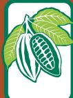
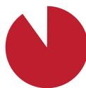
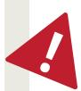
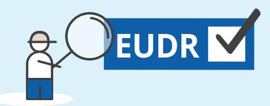
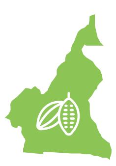

**THE EU  
SUSTAINABLE  
COCOA PROGRAMME**

**90%of global deforestation is driven by the expansion of agricultural land,** contributing to climate change, biodiversity loss, soil erosion and desertification, and hindering sustainable development

In 2020, **Cameroon exported 65%** of the cocoa it produced to the EU **Cameroon EU**

The EU is taking action to **minimise the risk that products associated with deforestation enter the EU market** and to increase the demand for deforestation-free products

**Beans Shells**

**Butter, fat, oil**

**PowderChocolate**

**Paste**

CATTLE COFFEE PALM OIL RUBBER SOYA WOOD Derived products

**The EUDR does not create a country or product ban** It is non-discriminatory and will apply to selected products, either imported or produced into the EU

The **EU Deforestation Regulation (EUDR)** requires companies to ensure that the products they place on the EU market or export from it are not associated with deforestation

## **Unpacking the EU Deforestation Regulation for the cocoa sector**

**Cocoa is one of the drivers of forest loss in Cameroon.**  The European Union (EU) is a major consumer of cocoa.

**COCOA**

The EUDR is expected to enter into application at the end of 2024

| <b>1</b> | Collect evidence that the product is traceable, deforestation-free and legal                           | <input checked="" type="checkbox"/> |
|----------|--------------------------------------------------------------------------------------------------------|-------------------------------------|
| <b>2</b> | Assess risks of non-compliance                                                                         | <input checked="" type="checkbox"/> |
| <b>3</b> | If risks have been identified, take action to mitigate them                                            | <input checked="" type="checkbox"/> |
| <b>!</b> | If companies buy cocoa from a <b>low-risk area</b> , they only need to carry out the <b>first step</b> |                                     |

| To enter the EU, cocoa must be:                   | Companies placing relevant products on the EU market must collect information showing: The cocoa's origin To be submitted                                                                                         |
|---------------------------------------------------|-------------------------------------------------------------------------------------------------------------------------------------------------------------------------------------------------------------------|
| * GPS polygons for plots > 4 ha                   |                                                                                                                                                                                                                   |
| after                                             | 31 December 2020                                                                                                                                                                                                  |
| (GPS information                                  | on plot*), in a Due Diligence                                                                                                                                                                                     |
| suppliers and TRACEABLE                           | buyers Statement That cocoa does not come Whatís a forest? from land deforested The regulation uses an internationally-agreed definition from                                                                     |
| Deforestation = DEFORESTATION -FREE systems LEGAL | conversion of the FAO forests into agricultural land, including cocoa-agroforestry Compliance with relevant Cameroonian laws on land, environment, human rights, Indigenous Peoples rights, labour, trade & taxes |

A **benchmarking system** will categorise countries or regions according to **deforestation risk.** The frequency of EU Member States' **checks will vary consequently:**

**1.** Map GPS locations of deforestation-free cocoa plots

**2.** Deforestation-free cocoa delivered to the first buyer, where it is kept segregated

**4.** Deforestation-free cocoa or derived products segregated during export

**5.** Importer or

manufacturer in the EU processes or packages deforestation-free cocoa or cocoa products

**6.** EU retailer sells deforestation-free chocolate to consumers

**EU**

**The EUDR** supports **Cameroonís sustainable cocoa objectives.** It will accelerate progress towards cocoa traceability and sustainability

**Disclaimer.** This factsheet has been produced by the European Forest Institute with the financial assistance of the European Union. The contents of this factsheet are the sole responsibility of the author and can under no circumstances be regarded as reflecting the position of funding organisations. The information presented in this factsheet comes from the EUDR published in the EU Official Journal on 9 June 2023. See **[references.](#page-0-0)**

**3.** Possible processing of deforestation-free cocoa into derived

products

## **Due diligence** for companies consists of **3 steps :**

Frequency of checks:

**1%**

**3%**

**9%**

Obligations:

Simplified **due diligence**

full **3-step due diligence** process

full **3-step due diligence** process **EU**

Products from:

**STANDARD** risk areas

**HIGH** risk areas

**LOW** risk areas