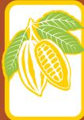
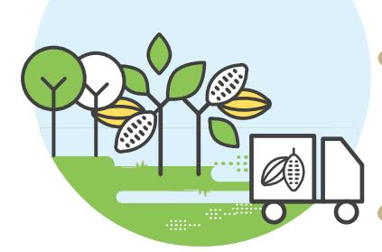
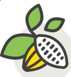
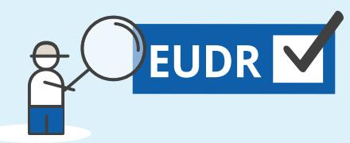
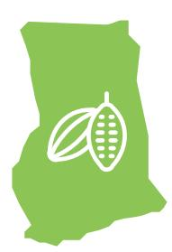

**THE EU  
SUSTAINABLE  
COCOA PROGRAMME**

**90%of global deforestation is driven by the expansion of agricultural land,**  contributing to climate change, biodiversity loss, soil erosion and desertification, and hindering sustainable development

> In 2022, **Ghana exported 62% of the cocoa** it produced to the EU

The EU is taking action to **minimise the risk that products associated with deforestation enter the EU market** and to increase the demand for deforestation-free products

**Beans Shells**

**Butter, fat, oil**

**PowderChocolate**

**Paste**

CATTLE COFFEE PALM OIL RUBBER SOYA WOOD Derived products

The **EU Deforestation Regulation (EUDR)** requires companies to ensure that the products they place on the EU market or export from it are not associated with deforestation

## **Unpacking the EU Deforestation Regulation for the cocoa sector**

**Cocoa is among the drivers of forest loss in Ghana.** The European Union (EU) is a major consumer of cocoa

**EU**

**Ghana**

**COCOA**

The EUDR will enter into application at the end of 2024

**The EUDR does not create a country or product ban** It is non-discriminatory and will apply to selected products, either imported or produced in the EU

| THE EU SUSTAINABLE COCOA PROGRAMME | Ghana | EUDR Factsheet 2023                         |
|------------------------------------|-------|---------------------------------------------|
| The EUDR supports                  |       |                                             |
| cocoa objectives. It               |       |                                             |
|                                    |       | Compliance with relevant Ghanaian laws on   |
|                                    |       | land, environment, human rights, Indigenous |
|                                    |       | Peoples rights, labour, trade & taxes       |
|                                    |       | after 31 December 2020                      |
|                                    |       | (GPS information on plot*),                 |
|                                    |       | suppliers and buyers                        |
|                                    |       | Deforestation = c onversion of              |

**!**

Frequency of checks:

**1%**

**3%**

**9%**

Obligations:

Simplified **due diligence**

full **3-step due diligence** process

full **3-step due diligence** process

A **benchmarking system** will categorise countries or regions according to **deforestation risk.** The frequency of EU Member States' **checks will vary consequently:**

**1.** Map GPS locations of deforestation-free cocoa plots

**2.** Deforestation-free cocoa delivered to first buyers, where it is kept segregated

**4.** Deforestation-free cocoa or derived products segregated during export

**5.** Importer or

manufacturer in the EU processes or packages deforestation-free cocoa or cocoa products

**6.** EU retailer sells deforestation-free chocolate to consumers

**EU**

Products from:

> **STANDARD** risk areas

## **Due diligence** for companies consists of **3 steps :**

| <b>1</b> | Collect evidence that the product is traceable, deforestation-free and legal | <input checked="" type="checkbox"/> |
|----------|------------------------------------------------------------------------------|-------------------------------------|
| <b>2</b> | Assess risks of non-compliance                                               | <input checked="" type="checkbox"/> |
| <b>3</b> | If risks have been identified, take action to mitigate them                  | <input checked="" type="checkbox"/> |

**3.** Possible processing of deforestation-free cocoa into derived

products

If companies buy cocoa from a **low-risk area,** they only need to carry out the

**first step**

**Disclaimer.** This factsheet has been produced by the European Forest Institute with the financial assistance of the European Union. The contents of this factsheet are the sole responsibility of the author and can under no circumstances be regarded as reflecting the position of funding organisations. The information presented in this factsheet comes from the EUDR published in the EU Official Journal on 9 June 2023. See **[references.](#page-0-0)**

**HIGH** risk areas

**LOW** risk areas

**EU**