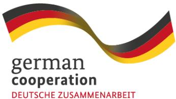
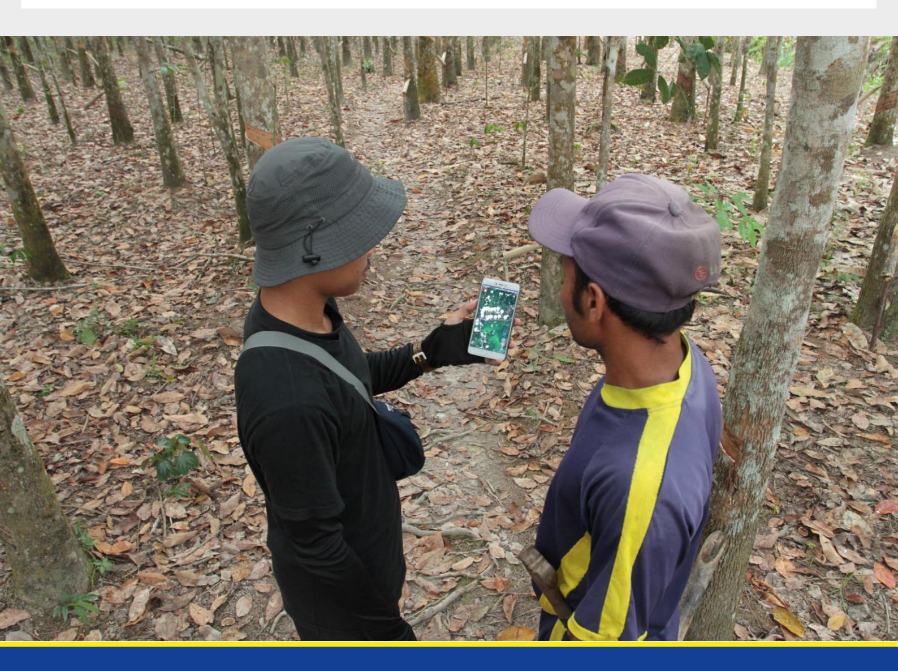
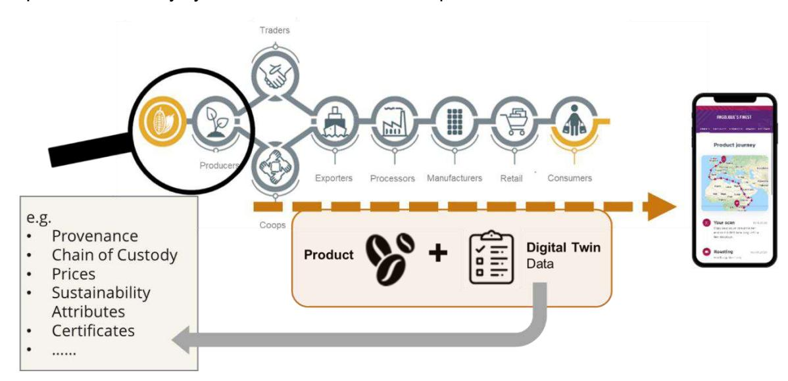
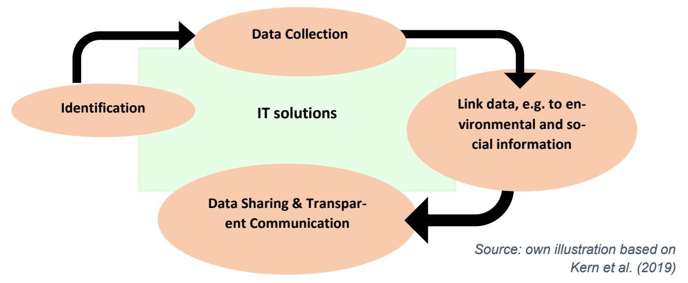
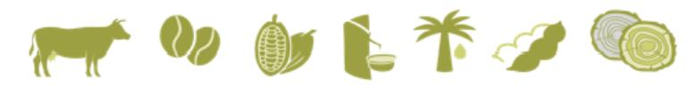
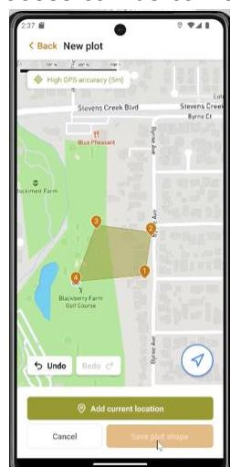
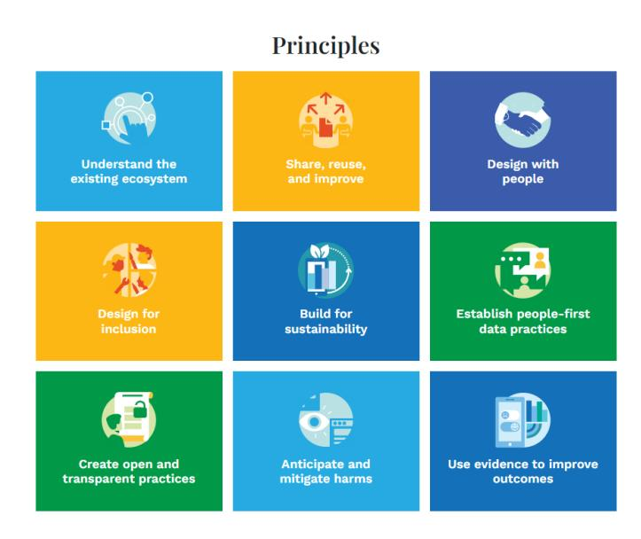
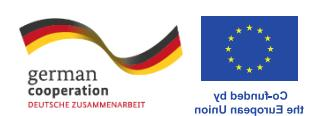

# **Navigating traceability and the EUDR**

**A guiding document for establishing inclusive and effective traceability solutions.**

# **Navigating traceability and the EUDR**

A guiding document for establishing inclusive and effective traceability solutions.

*The "EUDR Engagement" project in Southeast Asia is co-funded by the European Union and the Federal Republic of Germany. GIZ has been commissioned to implement it as part of the BMZ funded global program "Sustainability and Value Added in Agricultural Supply Chains", which is part of the special initiative "Transformation of Agricultural and Food Systems" by the German Federal Ministry for Economic Cooperation and Development.* 

*Disclaimer: This publication was co-funded by the European Union and BMZ. The content of this publication is the sole responsibility of the authors and does not necessarily reflect the views of the EU or the BMZ. The information in this study, or upon which this study is based, has been obtained from sources the authors believe to be reliable and accurate. While reasonable efforts have been made to ensure that the contents of this publication are factually correct, GIZ GmbH does not accept responsibility for the accuracy or completeness of the contents of this publication. The mention of specific companies or products of manufacturers, whether or not these have been patented, does not imply that these have been endorsed or recommended by GIZ GmbH in preference to others of a similar nature that are not mentioned. The views expressed in this information product are those of the author(s) and do not necessarily reflect the views or policies of GIZ GmbH. Unless stated otherwise, all figures used in this study were created by GIZ internally.*

*Special thanks goes to Lucia Casalegno, Anne Wessling, Patricia Siegert, Joy Heitlinger, Noelie Svara and Lars Kahnert for their valuable inputs and contributions.*

# **Table of Content**

| I.   | List of abbreviations ........................................................................................................ I      |
|------|---------------------------------------------------------------------------------------------------------------------------------------|
| II.  | List of boxes ................................................................................................................... II  |
| III. | List of figures .................................................................................................................. II |
| IV.  | List of tables ................................................................................................................... II |
| 1    | Introduction to the study ................................................................................................. 4         |
| 2    | Traceability explained ..................................................................................................... 5        |
| 3    | Traceability and the EUDR ............................................................................................. 8             |
| 3.1  | General Scope of the EUDR ................................................................................... 8                       |
| 3.2  | The EUDR’s traceability requirements (Art. 2, 9, 10) ............................................... 9                                |
| 3.3  | Necessary information to ensure strict traceability under the EUDR .......................11                                          |
| 3.4  | The benefit of partnerships and close collaboration among stakeholders ...............14                                              |
|      | 3.4.1 Incentives for actors in countries of production to implement traceability solutions                                            |
|      | 3.4.2 Opportunities for Smallholders to benefit from the EUDR ................................16                                      |
| 4    | Overview of types of existing traceability solutions ........................................................18                       |
| 4.1  | Government-led traceability program and systems .................................................18                                   |
| 4.2  | Commercial service providers ................................................................................19                       |
| 4.3  | Certification schemes .............................................................................................19                 |
| 4.4  | Corporate systems and sustainability programs .....................................................20                                 |
| 4.5  | Open Source solutions ...........................................................................................20                   |
| 4.6  | Collaborative approaches with multiple stakeholders .............................................20                                   |
| 5    | Establishing inclusive traceability solutions....................................................................21                   |
| 5.1  | Crucial aspects for inclusive traceability solutions ..................................................21                             |
| 5.2  | Contributions of key stakeholders...........................................................................22                        |
| 6    | Conclusion ....................................................................................................................23     |
| 7    | Bibliography ..................................................................................................................24     |
| 8    | Annex ............................................................................................................................26  |

# **I. List of abbreviations**

| %      | Percentage                                                 |
|--------|------------------------------------------------------------|
| DIASCA | Digital Integration of Agricultural Supply Chains Alliance |
| DPI    | Digital Public Infrastructure                              |
| e.g.   | for example                                                |
| EU     | European Union                                             |
| EUDR   | EU Deforestation Regulation                                |
| ha     | hectares                                                   |
| NGOs   | Non-governmental organizations                             |

# **II. List of boxes**

| <b>Box 1 - Definition of Traceability</b>                                                                                                                   | 5  |
|-------------------------------------------------------------------------------------------------------------------------------------------------------------|----|
| <b>Box 2 - Definition of Transparency</b>                                                                                                                   | 5  |
| <b>Box 3 - Legality under the EUDR</b>                                                                                                                      | 6  |
| <b>Box 4 - Definition of Interoperability</b>                                                                                                               | 8  |
| <b>Box 5 - Interoperability in practice: Telecommunication, DPI and DIASCA</b>                                                                              | 8  |
| <b>Box 6 - Definitions of deforestation and forest degradation under the EUDR</b>                                                                           | 9  |
| <b>Box 7 - GeoJSON, WGS84 and EPSG:4326</b>                                                                                                                 | 10 |
| <b>Box 8 - Definition of plot and land and geolocation under the EUDR</b>                                                                                   | 11 |
| <b>Box 9 - Strict traceability as an opportunity for smallholders under the EUDR</b>                                                                        | 13 |
| <b>Box 10 - Statements by palm oil and cocoa smallholders and non-governmental organizations (NGOs) on expected benefits from the EUDR for smallholders</b> | 18 |
| <b>Box 11 - Chain of custody models in Supply Chains: Definition of Identity Preserved, Mass Balance and Credits trading/Book &amp; Claim</b>               | 20 |
| <b>Box 12 - Data Ownership</b>                                                                                                                              | 22 |
| <b>Box 13 - Overview of contributions of actors to EUDR relevant traceability systems</b>                                                                   | 22 |

# **III. List of figures**

| Figure 1- Collecting data in a typical agricultural industry supply chain..... | 4  |
|--------------------------------------------------------------------------------|----|
| Figure 2 – Core elements of Traceability .....                                 | 7  |
| Figure 3 - The EUDR affects seven commodities .....                            | 9  |
| Figure 4 - Collection of geo-data via app .....                                | 10 |

# **IV. List of tables**

| <b>Table 1 – Information provided along supply chain relevant for traceability requirements under the EUDR</b> | <b>13</b> |
|----------------------------------------------------------------------------------------------------------------|-----------|
|                                                                                                                |           |

# **Executive summary**

With the EU deforestation regulation (EUDR) set to be applicable by the end of 2024, operators and traders will be obliged to fulfil their due diligence obligations to ensure that products placed on or exported from the European Union (EU) market are legally produced and deforestationfree. With the EUDR demanding strict traceability, various actors along the supply chain are currently discussing on how to collect the required information to comply with the regulation. The use of traceability schemes is not mandatory under the EUDR, operators and traders who may rely on the information provided by these traceability schemes are still subject to the due diligence obligations. However, such schemes can assist companies in collecting and sharing the information, data and documents needed to fulfil the requirements set out in Article 9, particularly in the initial stage of the due diligence process, namely to collect information. Therefore, new traceability systems are currently being developed, published and advertised almost weekly, making it difficult for stakeholders to stay up to date on the available options on the market and assess their respective advantages and disadvantages.

This document aims to inform stakeholders about the key features that make a traceability solution relevant in the context of the EUDR. It introduces the topic of traceability, provides an overview of the requirements related to traceability under the EUDR, and offers guidance to help stakeholders understand which elements should be considered when selecting, setting up, and implementing inclusive and efficient traceability systems in line with EUDR requirements.

Relevant tools for traceability already exist and need to be scaled up to reach larger portions of supply chains, where the aspects of interoperability and inclusiveness become highly relevant. This is why the document also provides guidance on how to establish inclusive traceability solutions. As the current debate on establishing traceability under the EUDR also covers different understandings of the respective roles of stakeholders, the document includes a short section on how key stakeholders can contribute to implementing effective traceability systems, which can inform debates in multi-stakeholder formats within and beyond countries of production. Collaboration between different actors in the supply chain is particularly key for creating inclusive supply chains since smallholder production is often embedded in long value chains that involve different social contexts. To be inclusive, it is essential that traceability solutions are not only technically sound but socially equitable and benefit all supply chain participants, particularly by empowering smallholders. The annex provides a pertinent Step-by-step guide for selecting, setting up and implementing traceability solutions which are effective, inclusive, include elements of relevance within the EUDR context, and fit the specific purpose and context of the stakeholders.

### **1 Introduction to the study**

The demand for traceability and transparency in agricultural supply chains has increased significantly in recent years, with more and more companies committing to traceable supply chains for specific agricultural commodities. While traceability is an important prerequisite for addressing social and environmental risks in agricultural supply chains, it should not be mistaken for sustainability itself. Rather, traceability should be seen as a means to an end - in this case, ensuring legality and deforestation-free supply chains. As the new European Union Deforestation Regulation (EUDR) sets a higher standard for traceability, requiring geolocation data for relevant commodities and products placed on or exported from the EU market, the demand for efficient, robust and inclusive traceability systems has grown. This underscores the need for measures and systems that ensure the inclusion of smallholders in global commodity supply chains, safeguarding their market access. Although the use of traceability systems is not mandatory under the EUDR, they can be instrumental in gathering the information needed to fulfil companies' due diligence obligations.

The following study explains the general scope and traceability requirements of the EUDR and outlines various types of traceability systems. It highlights the incentives for key stakeholders in countries of production to adopt robust traceability solutions as well as the contributions of key supply chain actors. The document also provides guidance on selecting inclusive traceability systems that meet stakeholders' needs while aligning with EUDR requirements and provides a step-by-step guide on the essential elements to consider when developing contextspecific traceability systems in line with EUDR requirements.

*Figure 1- Collecting data in a typical agricultural industry supply chain* 

# **2 Traceability explained**

Ensuring traceability along the chain of custody is not a new topic per se, but already standard practice in many different sectors. Over the past two decades, concerns over food safety and industry scandals have heightened the importance of traceability.1 Today, there is a growing demand from various stakeholders for transparency in product origins and production conditions, driven by interests in organic, fair trade, and eco-friendly products, as well as the rising importance of Responsible Business Conduct and Due Diligence. Demand from consumers, such as from the EU for deforestation-free, legal and traceable products to the source has grown over the last few years. This demand has spurred the development and adoption of efficient traceability systems and technologies across industries, as companies recognize both reputational risks and opportunities associated with such systems. At the same time, laws with more stringent traceability requirements emerged or are currently emerging in several big consumer markets worldwide. In 2005, the European Commission implemented several directives and regulations on food safety that increased the focus on traceability in agricultural commodities. In 2013, the EU implemented the EU Timber Regulation (EUTR) which prohibited the sale of illegally harvested timber and required companies to verify the legality of their wood products. Additionally, the EU adopted the Conflict Minerals Regulation in 2017, mandating due diligence on imports of certain minerals to ensure they were not linked to human rights abuses or environmental harm.

Other big consumer markets, such as the US, Canada and China also issued mandatory legislation on food safety in the 2000s, such as the US Food Safety and Modernization Act. In 2008, the USA revised the Lacey Act to require importers to make declarations for certain plants and plant products at the time of import.2 . The food safety law in China from 2015 also links agricultural supply chains with traceability solutions.3 In 2021, China published the Green Development Guidelines as part of the Belt and Road Initiative (BRI).4 These guidelines require companies involved in BRI projects to ensure that their supply chains are environmentally sustainable.

In this context, new EU legislation like the EUDR highlights the importance of transparency and accountability in supply chains, requiring companies to conduct due diligence.

#### **Definition of Transparency**

**"Transparency** *refers to the making available of information by any stakeholder. The information that is made available will often relate to the traceability of commodities but can include broader information that is relevant and useful in the context of halting and reversing forest loss such as sustainability policies and practices, commitments, land use information, monitoring, or outstanding grievances. There can be different levels of transparency, ranging from information sharing within an organization or peer companies, to sharing with specific stakeholders, to sharing publicly".* (WRI 2023)2

#### **Definition of Traceability**

*"Traceability refers to the ability of an actor to link a product or unit of material with information about its history of locations, owners, and transformations between points in the supply chain, such as from production site to end user. The information associated with commodities also includes sustainability aspects at the production site, notably forest loss".* (WRI 2023)2

#### *Box 1 - Definition of Traceability Box 2 - Definition of Transparency*

UN Global Compact and Business for Social Responsibility (2014)

2 WWF (2009)

3 Jianping Qian et al. (2020)

4 Wang, Yingzhi (2021)

Traceability alone does not necessarily guarantee legality or deforestation-free supply chains per se and should therefore not be an end in itself. Instead, it can be a tool to support sustainable and transparent supply chains, relevant not only for deforestation and operations, but also other environmental and social risks. When looking at the relationship between deforestation, traceability and transparency, transparency about the plot of production is a prerequisite to ultimately assess if a product is associated with deforestation or not. Tracing agricultural products back to the plot of production allows to overlay the plot of production with best available satellite images and thereby to clearly identify potential deforestation – provided the satellite resolution matches the landscape's level of fragmentation. Advancements in digital traceability tools are helping to bridge sustainability information gaps in global supply chains, though challenges remain in achieving comprehensive traceability.

The aspect of transparency however goes beyond traceability, by making the information about the supply chain (openly) accessible to consumers and stakeholders. Transparency involves sharing details such as provenance, sourcing practices, labor conditions, environmental impact, and the identity of suppliers. It aims to build trust amongst actors by openly communicating how products are made and the values of the companies involved. By enabling different stakeholders to independently verify existing data and also access relevant information for their specific purposes, transparent and interoperable traceability solutions can be a helpful tool for a broad range of actors along the supply chain and beyond.

#### **The Term Legality as defined by the EUDR**

The EUDR requires legal production of commodities, focusing on relevant and existing national laws in the country of production (Art. 3b EUDR). "Relevant legislation of the country of production" refers to the laws applicable in the country of production concerning the legal status of the production area in relation to: (a) land use rights; (b) environmental protection; (c) forest-related regulations, including forest management and biodiversity conservation, where directly linked to wood harvesting; (d) third-party rights; (e) labor rights; (f) human rights protected under international law; (g) the principle of free, prior, and informed consent (FPIC), as outlined in the UN Declaration on the Rights of Indigenous Peoples; (h) tax, anti-corruption, trade, and customs regulations (Art. 2 (40) EUDR).

#### *Box 3 - Legality under the EUDR*

Spanning large geographic distances and various actors, complex supply chains can be opaque, making it challenging to identify origins and impacts of production. Therefore, **traceability can contribute to:** 

- Providing **real-time visibility** into the movement of products **along the chain of custody**, enabling stakeholders to make **informed decisions** and respond to changing market conditions.
- **Mitigating risks** associated with supply chain disruptions, as well as reputational and sustainability risks, thereby enhancing business and smallholder resilience.
- **Monitoring and verifying product quality** at every stage of the supply chain, identifying, and addressing contamination or other issues.
- **Complying with regulations** by providing accurate records of product origin, handling, and distribution, as required by legislation such as the EUDR.

**Traceability and data:** A traceability system's effectiveness hinges on the connection between information flow and the physical movement of goods. Typically, this linkage is established through **data points**, encompassing details about the specific product unit, such as batch information, manufacturing date, etc. Through digital tools, a digital twin of the product is created.5 While there are various versions of traceability systems, it is essential to recognize that they all share fundamental components, including **"identification", "data collection and recording", "data linking" and "communication"**. 6 While traceable supply chains ensure that every step of the production process can be tracked, transparent supply chains focus on making that information visible and understandable to the public.

**The need for interoperability:** The presence of several distinct traceability systems along supply chains **causes issues of data exchange and compatibility**. Supply chain actors face the challenge of linking the information they hold about a product, as data is often sourced from multiple systems, in varying formats, and may not be shared. This makes traceability a complex, costly, and time-consuming effort. Therefore, despite the increasing availability of traceability solutions, the **lack of interoperability hampers the exchange of data, requiring repeated collection, storage, and conversion efforts**. This inefficiency makes the process susceptible to errors, and cost-intensive, diminishing the overall effectiveness of traceability systems.7

*Figure 2 – Core elements of Traceability*

5 Luft (2010)

Kern, Christian et al. (2019)

7 Bhatt and others 2016

**Interoperability** between traceability systems offers significant benefits**,** including **increased data exchange efficiency**, **improved access to information and technology** for **all** supply chain actors, and enhanced transparency. To achieve this, it is essential that stakeholders **work together** to establish common standards and protocols, making it easier for traceability systems to communicate, verify and exchange data seamlessly. This **collaborative approach** streamlines operations and improves the effectiveness of traceability and transparency efforts in global supply chains.8

# **3 Traceability and the EUDR**

Following a general introduction to the EUDR, this chapter outlines the traceability requirements and details the various roles of supply chain actors in ensuring compliance with the regulation.

# **3.1 General Scope of the EUDR**

With the EUDR, the EU aims to minimize the EU's contribution to legal and illegal deforestation and forest degradation worldwide and thereby shows its commitment to mitigate climate change, reduce greenhouse gas emissions and biodiversity loss.

The EUDR obliges companies to ensure through due diligence that relevant commodities and products placed on the EU market or exported from there are produced without deforestation and, in the case of timber products, without forest degradation after 2020 and in compliance

#### **Interoperability in practice: Telecommunication, DPI and DIASCA**

**Telecommunication Industry:** One example of interoperability in action is the telecommunications industry, where multiple service providers can exchange data and communicate seamlessly over shared infrastructure. For instance, a customer using one provider can easily call someone subscribed to another provider, despite being on different networks. This interoperability allows users to connect effortlessly, regardless of their service provider, demonstrating the benefits of standardized systems and protocols across competing networks.

**Digital Public Infrastructure (DPI):** DPI plays a crucial role in fostering interoperability. DPI is described as: "… *a set of shared digital systems that should be secure and interoperable and can be built on open standards and specifications to deliver and provide equitable access to public and / or private services at societal scale and are governed by applicable legal frameworks and enabling rules to drive development, inclusion, innovation, trust, and competition and respect human rights and fundamental freedoms. As infrastructure, they cut through the siloed approach of designing and implementing digital solutions with interoperable, society-scale programs that shift innovation and competition to activities that take place atop it*" 5 . DPI enhances innovation and competition by providing a standardized, interoperable base, ensuring cost-effective and efficient traceability systems. For example, AgStack's Asset Registry offers a DPI for unique geo-IDs, which provide a precise and standardized method for identifying specific geographic locations anonymously.

**DIASCA (**Digital Integration of Agricultural Supply Chains Alliance)**:** [DIASCA](https://www.nachhaltige-agrarlieferketten.org/en/in-practice/diasca-interoperability-between-traceability-solutions) is a multi-stakeholder partnership that aims to leverage interoperability by facilitating a Digital Public Infrastructure (DPI) tailored approach for agricultural supply chains. By collaborating with stakeholders from different sectors and leveraging digital technologies, DIASCA seeks to address the challenges of data incompatibility and promote transparency and sustainability across agricultural supply chains. Adopting an inclusive approach, DIASCA focuses on ensuring accessibility for farmers and enhancing the overall efficiency of the digital landscape, benefiting all relevant stakeholders.

*Box 5 - Interoperability in practice: Telecommunication, DPI and DIASCA*

#### **Definition of Interoperability**

**Interoperability** means the ability of different information technology systems or software programs to communicate seamlessly for the purpose of exchanging, interpreting and using data.8

#### *Box 4 - Definition of Interoperability*

SDG Digital (2023)

with relevant legislation of the country of production. It applies to cattle, cocoa, coffee, oil palm, rubber, soy and wood as well as certain derived products.

*Figure 3 - The EUDR affects seven commodities* 

The benchmarking of countries within and outside the EU will guide checks by EU competent authorities on companies, known as **operators and traders**, that place or make available relevant commodities and products on the EU market or export them. These checks will be based on the level of deforestation risk in the areas they source from. A low-risk assessment results in fewer checks on operators and traders and reduced due diligence obligations, while a highrisk assessment increases the number of checks by EU authorities. Importantly, there is no ban on any country or commodity based on the risk assessment alone. A low risk assessment also implies reduced due diligence obligations for operators and traders.

As defined by Article 30 of the EUDR on "cooperation with countries of production", the EU will work closely with partner countries on the consumption and production side to achieve the objectives of the regulation. The regulation will apply from the end of 2024 for larger companies and from mid-2025 for small and micro enterprises.

# **3.2 The EUDR's traceability requirements (Art. 2, 9, 10)**

To ensure that relevant commodities and products placed on or exported from the EU market are produced without deforestation or forest degradation, transparency regarding their origin is imperative. Under the EUDR, **operators, being the companies that place products on the EU market or exporting them from there need to fulfil their due diligence obligations to ensure deforestation-free and legal production and are responsible for submitting the geolocation with their due diligence statement.** Due diligence means that these operators must collect relevant information and documents (Art. 9), conduct a risk assessment on the basis thereof (Art. 10) and – in case of a non-negligible risk of non-compliances – they must implement risk mitigation measures (Art. 11). In addition, they must submit a so-called due diligence statement confirming that the due diligence was fulfilled and no or only a negligible risk of non-compliance was found (Art. 3, 4). Traceability plays an important role in several of these steps:

#### **Definitions of deforestation and forest degradation under the EUDR**

**'Deforestation'** means the conversion of forest to agricultural use, whether human-induced or not. **'Forest'** means land spanning more than 0,5 hectares (ha) with trees higher than 5 meters and a canopy cover of more than 10 %, or trees able to reach those thresholds in situ, excluding land that is predominantly under agricultural or urban land use. **'Agricultural use'** means the use of land for the purpose of agriculture, including for agricultural plantations and set aside agricultural areas, and for rearing livestock (Art 2 EUDR).

**'Forest degradation'** means structural changes to forest cover, taking the form of the conversion of: (a) primary forests or naturally regenerating forests into plantation forests or into other wooded land; or (b) primary forests into planted forests (Art 2 EUDR).

*Box 6 - Definitions of deforestation and forest degradation under the EUDR* 

Under their obligation to **collect relevant information and documents** (Art. 9), companies must also collect the geolocation of all plots of land where relevant commodities were produced or harvested. This collection of data for all plots of land is required even in extensive supply chains like those involving smallholder-cultivated crops. This mapping process can be carried out through **physical field visits** using handheld GPS devices or smartphones, **or by remotely marking boundaries** on satellite images via computer.

- The geolocation format required depends on the size of the plot of production and the commodity: o Plots of land **with less than 4 ha** and cattle establishments require a **single geolocation point** (latitude and longitude). o For plots **larger than 4 ha** used for commodities other than cattle, **polygons** outlining the shape of the plot of land are necessary.

In the context of the **risk assessment** (Art. 10), companies must assess the "complexity of the relevant supply chain and the stage of processing of the relevant products, in particular difficulties in connecting relevant products to the plot of land where the relevant commodities were produced" (Art. 10 (i)) and the "risk of circumvention of this regulation or of mixing with relevant products of unknown origin or produced in areas where deforestation or forest degradation has occurred or is occurring" (Art. 10 (j)). This means that mixing compliant and non-compliant products or products with unknown origin is not allowed, even in very complex value chains which often use a mass balance approach9 . *Figure 4 - Collection of geo-data via app* 

Before placing a relevant product on the EU market, operators must submit a **due diligence statement** to the digital Information System where EU customs and EU competent authorities can access and verify the relevant information. The EU has developed an Application Programming Interface for operators and traders to directly connect their databases with the Information System. Operators must submit the geolocation of all plots of production, which can also be done by uploading a file in *GeoJSON format using the WGS84 (EPSG: 4326) projection.* In May 2024, the EU released the technical details of the GeoJSON file format along with the specifications of the Application Programming Interface (API) of the Information System.

#### **GeoJSON, WGS84 and EPSG:4326**

**GeoJSON** is a file format that contains geographical data and is used specifically for the visualization of points, lines and polygons.

**WGS84 (World Geodetic System 1984)** is a coordinate system used worldwide that specifies geographical latitudes and longitudes on the earth's surface.

**EPSG:4326** is the specific code that describes the WGS84 coordinate system, in particular the projection of the earth in geographic coordinates (latitude and longitude).

#### *Box 7 - GeoJSON, WGS84 and EPSG:4326*

9 Mass balance chains of custody that allow for the mixing, at any step of the supply chain, of deforestation-free commodities with commodities of unknown origin or non-deforestationfree commodities are not allowed under the EUDR, because they do not guarantee that the commodities placed on the EU market, or exported, are deforestation-free. Therefore, the commodities placed on the EU market, or exported, need to be segregated from commodities of unknown origin or from non-deforestation-free commodities at every step of the supply chain. As mass balance is therefore to be ruled out, full identity preservation is not needed (See answer 1.4. of the 3rd version of the FAQ).

This means that operators, as defined by the EUDR, are responsible for collecting the correct geolocation data and submitting it to the Information System. To be able to do so, they partly rely on information and data provided by their suppliers, as well as effective traceability of the physical product and the transfer of geolocation files throughout the supply chains by all involved actors. **Traders**, as defined by the EUDR means **any person in the supply chain** 

**other than the operator who, in the course of a commercial activity, makes relevant products available on the market, also have obligations, however more limited10 than operators, to ensure compliance** according to Art 5 (1) EUDR. They need to submit a DD statement when placing a product on the market but can rely on the information collected by upstream supply chain actors, ascertaining that due diligence was exercised upstream. If they are SME11 traders, their obligations are however more limited.

# **3.3 Necessary information to ensure strict traceability under the EUDR**

As the number of actors in supply chains can vary considerably, actors have different roles and responsibilities to ensure supply chain traceability. This is why the EUDR requires operators to collect **geolocation data** for the specific plots of land where these commodities were produced as part of their due diligence obligation. Operators and traders rely on data provided by suppliers, which must include information collected at the producer level, such as geolocation data. While traceability systems are not mandatory under the EUDR, they might be helpful to collect the information needed for the due diligence process. Ultimately, only operators or traders will face potential fines from EU competent authorities in cases of non-compliance, while upstream supply chain actors outside the EU will not be held accountable.

Even though producers and companies merely operational in countries of production (and not considered as EU operators or traders) are not directly subject to EUDR obligations, they may be requested by their business partners to provide information, to help these partners meet their due diligence requirements. This section provides a general overview on sources of information regarding traceability for supply chain actors aiming to import EUDR-relevant commodities or products. For sake of simplicity, the supply chain has been divided into "production", "transport and processing outside the EU" and "placing on the EU market".

In this context, maintaining strict traceability and enhancing transparency in data sharing benefits all actors along the supply chain. For business actors, particularly operators and traders,

#### **Definitions of plot of land and geolocation under the EUDR**

**Plot of land** means land within a single real-estate property, as recognized by the law of the country of production, which enjoys sufficiently homogeneous conditions to allow an evaluation of the aggregate level of risk of deforestation and forest degradation associated with relevant commodities produced on that land" (Art. 2 (27) EUDR).

**Geolocation** means the geographical location of a plot of land described by means of latitude and longitude coordinates corresponding to at least one latitude and one longitude point and using at least six decimal digits; for plots of land of more than four ha used for the production of the relevant commodities other than cattle, this shall be provided using polygons with sufficient latitude and longitude points to describe the perimeter of each plot of land" (Art. 2(28) EUDR).

#### *Box 8 - Definition of plot and land and geolocation under the EUDR*

10 For more details, please see answer 9.1. of FAQ (published Oct 2024).

11 SME traders do not need to exercise due diligence and do not need to ascertain that due diligence was exercised upstream.

Their obligation is to maintain traceability of the relevant products, meaning they must collect and keep information as well as make it available to competent authorities upon request to demonstrate compliance (see Chapter 4c of the Guidance Document of the EUDR).

having access to upstream data in a transparent and standardized manner is crucial for meeting their due diligence obligations under the EUDR. Direct access to and verification of this data during the risk assessment process are essential for operators and traders to ensure that products placed on the EU market comply with EUDR requirements. Accessibility and interoperability of data for a wide range of stakeholders are crucial, as is aligning the understanding of key definitions used in data collection. For instance, the forest definition in countries of production may differ from the FAO forest definition applied by the EUDR, based on national legislation. Stakeholders must be aware of these differences when collecting ground data and ensure definitions are aligned when developing traceability solutions to support compliance with regulations like the EUDR. Before collecting relevant data, actors should clarify the basis and requirements for the data needed.

|                   |             | Companies involved in                          |
|-------------------|-------------|------------------------------------------------|
| LESS THEY         | PLACE       |                                                |
| COMMODITIES       | ON          |                                                |
| Ensure production | is          |                                                |
| Collect           | geolocation |                                                |
| Share relevant    | infor      |                                                |
| mation on         | deforesta  |                                                |
| tion and          | geolocation |                                                |
|                   | NO          | OBLIGATIONS UNDER                              |
|                   |             | Ensure segregation of                          |
|                   |             | EUDR-compliant commodi                        |
|                   |             | Share relevant information                     |
|                   |             | gathering information . Most importantly,      |
|                   |             | they need to collect geolocation – the ex     |
|                   |             | modity was produced – to inform on the ‘de    |
|                   |             | forestation- free’ status of the product. Fur |
|                   |             | conducting risk assessment : analysing         |
|                   |             | When a risk has been identified by opera      |
|                   |             | In that case, operators have to take appro    |
|                   |             | Sourcing from a low risk country means         |
|                   |             | simplified diligence obligations : only step   |
|                   |             | With 70% of countries projected to be          |

| will not apply. Operators should also:             | classified as ‘low risk’, in many cases, risk as sessment and risk mitigation requirements submit a short Due Diligence Statement                                                                                                                                           |
|----------------------------------------------------|------------------------------------------------------------------------------------------------------------------------------------------------------------------------------------------------------------------------------------------------------------------------------|
| (DDS) on our IT platform                           | when placing their products on the market. Placing a due diligence statement will lead to automatic reception of a reference number (security token) which must be reported in the cus toms declaration for import by the operator. maintain an internal due diligence sys |
| tem. Robustness of such systems remains            | at the discretion of operators. Ensure that compliant commodities are kept separate from other goods while                                                                                                                                                                   |
| being traded and shipped, modities is not allowed. | as mixing com pliant commodities with uncompliant com                                                                                                                                                                                                                      |

*Table 1 – Information provided along supply chain relevant for traceability requirements under the EUDR* 

#### **Strict traceability: Opportunities for smallholders**

- Increased traceability can help to **prevent the illegal purchasing of commodities** produced in forests that are protected by claiming another origin.

- The effects of **reduced deforestation** can bring both **environmental and social benefits and therefore strengthen resilience towards climate change at local level**. Less fires and lower hydrogeological risk contribute to a more **stable microclimate and improved quality of life** of rural areas inhabitants, biodiversity included. Moreover, decreasing the incentive for deforestation would likely lead to **less cases of land grabbing, human rights violations, and displacement of indigenous and marginalized communities**6 .

- Additionally, the right for Free, Prior and informed consent (FPIC) for indigenous peoples a well as their duly reasoned claims to use or ownership of areas used for the purpose of producing relevant commodities is anchored within the EUDR, strengthening their rights as well as providing a vehicle to submit **substantiated concerns** to competent authorities of EU member states in case of non-compliance of operators with EUDR requirements (see Art. 2,3, 10 & 31 EUDR).

**- Increased transparency** regarding pricing and a lower number of intermediaries can **reduce underpayments** and contribute to receiving **fairer prices and "decent living" for smallholders**. Better prices have been linked with **improved health** and **reduced child labor**, as well as providing a good **incentive for natural conservation.** 

- Increase in **digital literacy rates** contributes to better connecting rural and urban areas.

- Fostering **digital payments in rural areas**, providing a record of transactions, can lead to better control over trade of agricultural goods and can help farmers to sell directly, more quickly for a higher price1 . This can also serve as a **financial incentive** for capacity building resulting in **improved quality of products**  which is **remunerated.**

### **3.4 The benefit of partnerships and close collaboration among stakeholders**

There are many ways in which private businesses or countries of production can be supported in implementing existing (or creating new) traceability tools, in a way that is helpful in the EUDR context. For example, partnerships between companies and producers or partnerships between the EU and partner countries can provide support in this area.

**Partnerships between companies and producers:** The EUDR due diligence requirements on risk mitigation (EUDR Art. 11) mandate that companies not only avoid risks, but actively prevent and mitigate them through measures such as capacity building and investments. This can include trainings, resource mobilization, and support with the data collection and verification, while ensuring that smallholders have access to - and ownership of - their data. The support by companies should focus on actively supporting their producers in providing key information required by EU operators to comply with this regulation (e.g. geolocation information). Support might involve financial assistance for mapping geolocations, recognizing official land rights, enhancing digital literacy among farmers, implementing diversification strategies, promoting good agricultural practices that prevent deforestation and degradation, and advancing economic and social upgrading strategies.

**Partnerships between the EU and partner countries:** As outlined in EUDR Art. 30, partnerships between the EU and partner countries are an important element for cooperation and dialogue. These partnerships support smallholders and ensure the inclusiveness of traceability systems, efficiency in data collection, processing, and verification. They also promote the land and tenure rights of indigenous peoples and local communities and prevent the leakage of deforestation activities into protected forest areas.

#### **3.4.1 Incentives for actors in countries of production to implement traceability solutions in line with the EUDR**

Establishing effective and inclusive traceability solutions that meet the EUDR requirements is also in the interest of several stakeholders in countries of production as they enable strict traceability throughout supply chains.12

Besides external drivers, such as mandatory legislation at international, national and local level, (voluntary) quality and safety standards, the development of new technologies as well as concerns from customers can influence stakeholders to invest in traceable supply chains.

Demand for transparency and traceability of products may include aspects of quality and safety. While traceability systems do not improve product quality and safety per se, they enable companies to react and adapt more swiftly during crisis, potentially safeguarding their market shares and reputation. Ensuring transparency and data accessibility for a broad range of stakeholders along the supply chain is therefore an essential element when adopting traceability solutions. Only if actors have access to the relevant information needed for risk assessment, they can fulfil due diligence requirements and verify data more effectively. This access can also foster a willingness to share data with others in a pre-competitive environment. At the same time, business partners also benefit from farmers who can easily provide the necessary information.

Over the last years, sustainability aspects have become more and more relevant for consumers in the European Union, but also in other big consumer markets. Consumers would like to know if the products they buy were produced ethically and sustainably, with a certain amount of these customers also willing to pay a premium on products which can assure these additional expectations. Trust and reputation of specific brands play a key role here, with

12 Razak et. Al

traceability solutions as a tool to provide more information on the requested aspects. With new technologies developing and becoming available to a broader range of actors, technology also drives the adoption of improved and digital traceability solutions, offering new options to reduce costs and enhance the effectiveness of existing traceability schemes, making supply chains more transparent and manageable. Business actors operating in countries of production can increase their competitiveness and attractiveness to international buyers, therefore increasing their market options by being able to quickly provide the information requested by their suppliers.

For private sector actors, monetary market incentives can play an essential role in establishing effective traceability systems, with long-term drivers such as increased profitability and improved supply chain efficiency serving as key motivators. Linked to these incentives, shortterm effects such as the reduction of transaction costs, additional costs for otherwise avoidable recalls, penalties, or loss of reputation of a brand with potential effects on the market share can enhance companies' investments in ensuring traceability and transparency along supply chains. Especially in lengthy, complex value chains, international players are motived to adapt traceability solutions according to their needs, ensuring a swift flow of information and enabling tracking of products within their supply chain. Incentives for private sector actors in countries of production to adopt traceability solutions can be linked to supply chain entry requirements, as well as avoiding any disruptions along complex supply chains, branding and competitiveness in comparison to other actors on the market. In the context of the EUDR, early adopters will directly profit by enhancing their competitiveness. Following this logic, investments in traceability solutions are likely to be driven by dominant actors as leaders, with SMEs following suit to remain competitive. Businesses with long-term relationships with smallholders, who can already provide proof for deforestation-free supply chains from the first mile and have strict traceability systems in place, will then benefit from the new regulatory landscape and the level playing field it creates.

Government actors in countries of production, alongside private sector stakeholders, have a vested interest in strengthening the enabling environment for rigorous traceability and legality in agricultural supply chains to ensure that various national and local stakeholders benefit from their competitive advantage. As a result, not only could the market share of products exported to the EU increase, but regions or countries of production could also enhance trust and reputation in other major consumer markets where the demand for deforestation-free products is growing. For countries where cash crops such as coffee, palm oil, or cocoa significantly contribute to the gross domestic product, improving traceability and legality can attract foreign direct investments, technical expertise, and other resources.

Additionally, since a large portion of the workforce relies on income from agricultural exports, government support for an enabling framework for strict traceability and data sharing can help mitigate the risk of negative market impacts, such as shifting sourcing to regions with lower deforestation risk or greater resources. High levels of transparency and deforestation-free production practices could also address other social and environmental sustainability challenges, enhance smallholders' resilience to climate change, and open access to new markets. Furthermore, improved transparency and traceability may help increase farmers' incomes. These benefits for farmers are also advantageous for government and private sector actors upstream, contributing to secure livelihoods and a stable, long-term supply base. When allocating resources for developing inclusive and stringent traceability systems, government actors should consider the legitimacy of operating a national traceability solution. Ensuring transparency and accessibility of this data to a wide range of actors beyond the local level is crucial for costeffectiveness, independent data verification, and user-friendliness. Additionally, governmentled initiatives to establish and adapt traceability solutions can facilitate the alignment of key definitions used by various stakeholders and existing schemes, enhancing clarity, coherence, and collaboration across different sectors and levels.

Not only the EU adheres to internationally agreed goals, almost every country worldwide ratified the declarations to working together in mitigating climate change and avoiding deforestation and forest degradation. Many countries set themselves specific objectives, including road maps and strategies on how to achieve these goals. By supporting the set-up of strict traceability systems, government actors can rely on already existing efforts and data available in the climate, forest and other sectors, the EUDR being an additional driver and incentive to ensure legal and deforestation-free commodity production.

# **3.4.2 Opportunities for Smallholders to benefit from the EUDR**

A potential challenge regarding traceability is so-called "first-mile traceability" which involves tracking data from smallholders' farms to cooperatives or intermediaries. Given the fragmented nature of markets for products covered by EUDR, it is worth having a closer look at the producers upstream in the supply chain. Increasing evidence suggests that climate change and the loss of forest ecosystem services disproportionately affect small-scale farmers, particularly the most vulnerable groups.13 Halting deforestation is therefore an important factor for smallholders' climate resilience.

The EUDR explicitly underscores the importance of acknowledging and strengthening the role and rights of indigenous peoples, local communities, smallholders, and small and mediumsized enterprises in forest protection, as well as addressing their specific needs and challenges within the value chain.

According to the EUDR, to prove deforestation-free production, the **geolocation** of plots of production **must be shared with business partners**. Collecting geolocation of a plot of land may involve the following steps: A digital application downloaded on the mobile phone or a mobile GPS device can help. An app may be suggested by the business partner. To collect the geo-coordinates, GPS signal needs to be turned on and the producer has to register the corners of the field where the products are grown. Depending on previous experience in the collection of geodata, technical equipment, local capacities, and characteristics of the plot of land, the collection of the accurate geodata may be more or less challenging.

Key points to remember:

- **It is sufficient to collect data once**, regardless of the number of suppliers, unless the production area changes.
- **Producers can utilize national or private traceability systems** as well as **cooperative-led geolocation mapping efforts**, provided these meet the EUDR requirements.
- Business partners exporting products directly to the EU need to verify and be able to prove the accuracy of the producers' geolocation data.
- **No personal information is required for the collection of GPS data of plots of land**. Producers have the right to share only geolocation data, as the EUDR does not mandate personal data disclosure. Even without official land registration or proof of ownership, producers can still conduct geolocation mapping.

With the right support and infrastructure, challenges for smallholders can transform into opportunities for improving sustainability and market access. Focusing on deforestation-free production positions smallholders to benefit from higher demand and fairer competition, as the EUDR

13 IPCC (2022), p. 3056

encourages responsible sourcing. Moreover, leveraging geolocation for strict traceability opens additional market opportunities, while digitalizing farm management enhances decisionmaking and operational efficiency.

Furthermore, smallholders and smallholder cooperatives can benefit from technical assistance and capacity building provided by governments, donors and private sector partners. Private sector actors, along with other stakeholders such as government authorities and donors, have an interest in enhancing the enabling framework for successful EUDR implementation. By working together, they can help smallholders to adapt to the new context and benefit from the EUDR. While Art 30 EUDR does not go into detail, there are some aspects listed below, where key stakeholders can benefit from inclusive partnerships and support from smallholders:

- **Mapping geolocation data** can be challenging for smallholders in remote areas due to limited infrastructure, resources, and digital literacy. To address this, governments and private sector partners should invest in infrastructure and digital literacy programs, ensuring that accessible geolocation technologies and training are available. This support will help smallholders to accurately map their farms and provide information required under the EUDR.
- First-mile traceability can impose **additional administrative and economic costs** on smallholders, making it difficult for them to gather necessary data and potentially leading to exclusion from EUDR-compliant supply chains. To ensure that smallholders do not have to bear this burden alone, technical and financial support should be provided by the private sector, government programs, and international donors through partnerships, subsidies, or grants, e.g. to cover the expenses of setting up traceability systems for farmer cooperatives. Encouraging models where smallholders share resources can also help reduce costs to collect information on the ground.
- **While official property registers and land titles** for smallholders **are not required under the EUDR**, governments should prioritize formalizing land tenure and property rights, simplify the process for obtaining official documents, and offer legal assistance. This would make it easier for smallholders to prove that their production is legal according to national legislation. Outreach programs are also needed to inform smallholders on their legal rights and responsibilities, especially those in forest or conservation areas who may be unaware of their actual legal status.
- Governments, NGOs, and companies should launch culturally sensitive, accessible information campaigns in local languages to ensure that smallholders and marginalized groups are **aware of the EUDR and its impact** at a larger scale. These efforts should also actively engage these communities to ensure their voices are heard and their needs are addressed.
- • **Data ownership** is a critical issue, as company-owned traceability systems that store smallholders' data can create dependencies, compelling farmers to sell exclusively to those companies and risking their autonomy. To protect smallholders, they should be able to retain control over their data and share it with multiple buyers. Developing open, interoperable traceability platforms, backed by government and industry standards, can prevent data monopolies and promote fair competition.

# **4 Overview of types of existing traceability solutions**

To comply with the EUDR traceability requirements, supply chain actors can leverage existing experiences to ensure traceability along the chain of custody, as different traceability approaches and tools already exist or are being developed by various actors, ranging from the public to the private sphere. Regardless of the chosen traceability system for collecting relevant information, operators and traders are obliged to fulfil the steps of their due diligence process under the EUDR as explained above.

Several categories of traceability systems can be distinguished, each offering different solutions. This chapter provides an overview of the different types of traceability solutions.

# **4.1 Government-led traceability program and systems**

Government-led traceability initiatives may establish **systems owned or regulated by governmental bodies,** which are public or semi-public and provide regulatory oversight, fostering transparency through public accessibility to data at different degrees. Different dynamics across contexts, countries, and supply chains may affect their effectiveness. Funding is normally secured through user fees or fines generated by the system itself, donor or public funding, however a mixture of these sources has shown to guarantee longer life over time14. These initiatives often lead to **standardized processes,** ensuring **consistency within industries,**  and their **long-term ownership** can provide **enhanced stability**. 15 In some cases, government-led traceability systems can be also linked to mandatory national sustainability standards.

Beyond sector-wide impacts in addressing sustainability and compliance, these systems can particularly assist smallholders with inclusion in traceability systems as they can be closely linked with national extension services. Government-led systems also contribute to reducing the dependency of farmers from multinational enterprises if the national system ensures

**Statements by palm oil and cocoa smallholders and non-governmental organizations (NGOs) on expected benefits from the EUDR for smallholders (from August 2023 and June 2024)** 

"Traceability could be a piece of the puzzle of supporting producers to make a decent living from their work by reducing supply chain complexity, reducing the risk of purchasing prices not being respected" [...] "There is, of course, a risk that the burden of complying with the European regulation will be borne largely by family farmers.[...] If the EU really wants things to change as the regulation aims, it will have to work with NGOs in the EU and in the producer countries to monitor how companies are putting in place EUDR compliance tools without the costs of this being borne by producers. We call on the EU to [...] ensure smallholders receive necessary technical and financial support to comply with the EUDR. [...] and to actively pursue initiatives to increase smallholders' access to the EU market, e.g. through targets or quotas to buy from smallholders, through favorable tariff regimes or pricing, or through special platforms to market and facilitate buying from smallholders. [...] such support is best provided in the context of formal partnerships between our respective countries and the EU, including full participation of all stakeholders, including smallholders."9 "The long-term viability of the cocoa sector also depends on stopping deforestation and restoring deforested land. In this respect, the African Regional Standard (ARS 1000) and the EUDR appear to be important tools for achieving this objective. The effective implementation of these tools relies heavily on cooperatives and requires that producers benefit from technical and financial support to fully play their role. To ensure a just transition that elevates the entire sector towards sustainability, we therefore call on all stakeholders, especially governments, to put in place the necessary framework to support producers."10

*Box 10 - Statements by palm oil and cocoa smallholders and non-governmental organizations (NGOs) on expected benefits from the EUDR for smallholders (from August 2023 and June 2024)* 

14 Stäuble, T. et al. (2023)

15 World Resources Institute (2023)

smallholders' data ownership and sovereignty. This does not mean that the data is considered as 'owned' by the country's government. To be helpful and of added value for all actors along the value chain, the traceability systems should address data security aspects, but at the same time be transparent on the information collected. They need to protect sensitive information while ensuring that relevant data is accessible to those who need it. For operators and traders, this means providing the information necessary to meet due diligence obligations, while for smallholders, it means enhancing their ability to make well-informed business decisions.

In the case of mandatory traceability systems at national level and the precondition, that only compliant products can be registered in the system, they can enhance the sustainability level of an entire sector irrespective of the final export market and thereby improve the competitiveness of the producers on the international market. However, they may not automatically guarantee compliance with other international regulations. In the context of the EUDR, governmentled traceability efforts can contribute to ensuring coherence and alignment between national and international definitions of key terms. To be useful for a broad range of actors this is crucial for enhancing the enabling framework for deforestation-free commodity production and supporting stakeholders in countries of production in benefitting from the EUDR.

# **4.2 Commercial service providers**

Commercial traceability systems in agricultural supply chains are **commercial solutions implemented by private entities, typically IT-companies**, to trace and track the flow of agricultural products. The data collected is kept between the contractors and service providers and is not publicly available. **Costs** can vary depending on the extent of the required service but **are usually covered by the companies using the traceability system.** Collaborations between consultants and private companies often involve merging the companies' internal logistical or procurement data, such as satellite imagery or accessible datasets like customs data12 .

# **4.3 Certification schemes**

Voluntary sustainability standards16 based on multistakeholder organizations or non-profit organizations usually offer different forms of supply chain models to ensure that products meet defined quality, sustainability, or other criteria, which are verified and certified by robust auditing processes. These standard systems are reviewed periodically and often linked with standard-specific traceability solutions. The use of certification schemes is neither mandatory nor a green line to fulfil due diligence requirements under the EUDR, it but it can help operators and traders with collecting information relevant under the EUDR in a number of ways: First of all, the risk assessment according to the EUDR may include as one of fourteen criteria if a product is certified. In addition, standard systems can provide information that operators and traders have to collect under Art. 9 on the collection of relevant data and information. And finally, companies can use sustainability standards, which also often have traceability solutions included, to ensure that geolocations are provided. Currently, several certification scheme providers are adapting their standards to align with the EUDR focus on deforestation-free supply chains. Despite these updates, operators and traders will still need to conduct their own due diligence to ensure that their products meet the EUDR's requirements.17

16 ISEAL (2023)

# **4.4 Corporate systems and sustainability programs**

In the past, most existing traceability systems were developed and implemented by large-scale private sector actors as **customized individual traceability solutions tailored to their specific needs.** These systems were designed to provide insight into the supply chain, and identify risks, such as deforestation and child labor.

While some companies extend traceability information to end-consumers, access to this data is typically limited to the respective company. Very often, smallholders being covered by these systems do not have access to their own data.

Some private sector actors remain reluctant to widely share anonymized data collected at their own expense, and the lack of interoperability with other traceability systems can hinder progress toward establishing inclusive, interoperable, and effective traceability systems. From a pre-competitive perspective, pooling resources to create transparent and interoperable traceability systems would benefit all actors, fostering a level-playing field.

# **4.5 Open Source solutions**

The term "open source" refers to systems with source code that is freely accessible to the public, enabling anyone to view, use, modify, and distribute it.

Open-source traceability systems involve the use of **publicly accessible frameworks and technologies** to monitor and trace supply chain activities**.** Unlike private solutions, these systems **encourage collaboration and information sharing across industries**. Entities utilizing open-source traceability benefit from **shared resources and community-driven innovation.** The improvement of an open-source traceability system works best when there is a **community of users,** which implements updates, addresses bugs and enhances security. Open source brings **cost advantages**, as the software is typically free to use, reducing financial barriers for implementation, making it **advantageous for smaller actors**, enhancing their **accessibility to traceability solutions**. While "open source" signifies that the source code is freely accessible and modifiable, it does not imply that there are no costs involved. Organizations may still face expenses related to implementation, customization, hosting, and support.

# **4.6 Collaborative approaches with multiple stakeholders**

Also, collaborative initiatives by various stakeholders can develop traceability systems either within a sector or on a nation-wide level and aim to unite stakeholders from different supply

**Chain of custody models in Supply Chains: Definition of Identity Preserved, Mass Balance and Credits trading/Book & Claim**14

**Identity Preserved (IP)** means that a certified commodity is uniquely identifiable to its origin and is kept physically isolated from all sources throughout the supply chain.

**Mass balance (MB)** is an administrative traceability level that allows a certificate holder to claim a product which is not certified as certified when the equivalent quantity was sourced as certified. Physical mixing of certified and non-certified products is allowed, provided that the quantities are controlled in documentation. Companies must document the exact quantity and cash flows along the supply chain.

**Credit trading/ Book & Claim** allows a customer to de-couple specific attributes from the physical product. Buying a credit is a proof that the corresponding amount of a certified sustainable product has entered the global supply chain. It therefore encourages the production of certified products by being a flexible model of linking global supply and demand. Certified and non-certified materials flow freely through the supply chain, with neither traceability nor any physical connection between the final product and the certified supply.

*Box 11 - Chain of custody models in Supply Chains: Definition of Identity Preserved, Mass Balance and Credits trading/Book & Claim*

chain segments to share insights and work collectively toward common goals with regards to sustainability - sometimes with the involvement of government players, sometimes without. Collaboration within multi-stakeholder initiatives can help supply chain actors to pool their resources, enhance interoperability and sharing of experiences.

# **5 Establishing inclusive traceability solutions**

While the EUDR sets out stringent requirements for traceability in specific supply chains, **stakeholders** ought to **implement traceability solutions** that not only meet regulatory standards but also **address broader sustainability goals**. As outlined above, **relevant tools and initiatives** for traceability and transparency **already exist** and have swiftly evolved to meet changing requirements over the last few years. Their implementation **should be scaled to reach larger portions of supply chains**. Tracing indirect suppliers and smallholder producers poses challenges that demand investments in time, financial resources, and effort. Smallholder production is often embedded in complex value chains that involves different social contexts**.** Challenges in adopting digitalization might include skill gaps, limited tool awareness, digital literacy, and constraints like expensive hardware and lacking financial resources. Moreover, factors like gender, age, ethnicity, and socio-economic disparities add to inclusion challenges. From a development perspective, traceability systems should not aim to be only technically sound but also socially equitable and empowering for smallholder farmers, while simultaneously drawing on to the **Principles for Digital Development** (see Annex)**.** The aim would be to ensure the effectiveness, inclusivity, and empowerment of traceability systems for smallholders, considering gender dynamics, intersecting discriminatory factors and advocating for robust data ownership principles, while actively addressing existing digital literacy gaps.

# **5.1 Crucial aspects for inclusive traceability solutions**

Following, crucial aspects in the implementation of inclusive traceability solutions are specified:

- **Tailored traceability processes.** Solutions should **empower every actor** in the supply chain, from the first (farmer) to the last (consumer), while providing adequate incentives to motivate and consistently retain the participation of all actors in contributing to sustainability of the supply chain.
- **Solutions favoring all supply chains participants.** While innovation should continuously be encouraged, a traceability solution should be sufficiently robust and **'fit for purpose'** (e.g. data recording in remote/rural settings, question of proper internet connectivity, data ownership etc.).
- **Low-cost systems for smallholder transactions.** Sharing costs for setting up traceability systems between actors along the supply chain as well as adapting the system according to actual needs in a pragmatic way can create incentives for smallholders and other actors to participate and promote inclusiveness and accessibility.
- **Ecosystem vision.** An ideal traceability system is part of an ecosystem which allows sustainability to thrive and continuously evolve, while ensuring access to information for all stakeholders in the value chain.
- **Technical and content interoperability.** A traceability solution cannot function in a vacuum and interoperability is key to ensure the effective functioning of traceability systems.
- **Regulatory transparency** on commodity production is basis for an enabling framework to implement due diligence, national standards, and governance structures.

A comprehensive, step-by-step guide for stakeholders to select an effective, inclusive traceability solution that aligns with the EUDR is provided in the Annex.

# **5.2 Contributions of key stakeholders**

Traceability solutions can only achieve their intended functions if each actor along the chain actively participates, understands their responsibilities, and is supported by solutions tailored to their needs. Additionally, policymakers should foster an enabling environment to support the successful implementation and development of these solutions.

To offer a comprehensive overview of how actors can enhance the relevance of traceability systems in the context of the EUDR, key contributions are outlined below. Although the EUDR does not mandate the establishment of traceability systems, collaborating in multi-stakeholder partnerships will provide significant benefits for all actors along the value chain.

#### **Overview of contributions of actors to EUDR relevant traceability systems**

• **Support producers in collection** of geolocations of the plots of production (through capacity building and investment) and ensure that smallholders have access to their data so they can benefit from **data ownership.**

• Develop and offer **inclusive open traceability solutions** by fostering pre-competitive collaborations for **equitable cost-sharing**, such as sector-wide initiatives and company coalitions. Engage in collective action involving agreements among companies, governments, financial institutions, and civil society to enhance effectiveness and equity in traceability efforts.

• Participate in the formulation of aligned **data disclosure**, **interoperability standards** and policy consistency.

• Consistently apply **reporting/data standards** (based on international **definitions), and methodologies** across sectors and initiatives.

• Establish **data verification systems**, providing accessible data for different types of actors.

• **Share data** that is available within companies with other actors.

*Box 13 - Overview of contributions of actors to EUDR relevant traceability systems*

#### **Data Ownership and Sovereignty**

**Data ownership** is the act of having legal rights and complete control over a single piece or set of data elements. It defines and provides information about the rightful owner of data assets and the acquisition, use and distribution policy implemented by the data owner.

The data owner has the exclusivity of the right to read, edit and delete the data and responsibility and accountability for it.

Data tend to be considered a competitive asset, costly to produce and produced by different actors for different purposes. Therefore, data is often not shared but siloed and not accessible and usable by farmers which reflects a data ownership challenge.

**Data sovereignty** lets people, organizations, and governments keep control of their data.

*Box 12 - Data Ownership*

### **6 Conclusion**

Traceability is not a new topic and a multitude of solutions ensuring supply chain transparency are available and being applied by different actors and in different sectors. By making due diligence mandatory for companies, the EUDR and its strict requirements concerning traceability from the plot of land of production has generated a strong impetus for chain of custody traceability and transparency. There is an increase in debate around this topic and there is a vital business interest to set up solutions which work efficiently and also comply with mandatory legislation. New traceability solutions are being published almost on a weekly basis and important actors are currently also investing in different options to keep their competitive advantage when delivering products for the European Market. This means that the topic of traceability is currently a fast-moving target, making it very difficult for actors especially from countries of production to keep up with all the innovations and range of solutions offered on the market. The intention of this document was therefore to introduce actors into the topic of traceability, providing an overview on the traceability requirements under the EUDR and the general types of traceability solutions already existing. With this background, policy makers can choose and assess which traceability option fits best to ensure that in their country, the enabling framework to benefit from EUDR implementation and access to the European market is ensured to the benefit for all supply chain actors.

At the same time, capacities of actors along the supply chain are also very different and especially producers downstream are often the group of actors with the least information and capacities to ensure compliance and traceability. To ensure that their specific needs are taken into account and that they are not left behind and excluded from market access in the future, the document also informed on the importance to create inclusive supply chains since smallholder production is often embedded in complex value chains that involve different social contexts. To be inclusive, it is essential that traceability solutions are not only technically sound but socially equitable and favouring all supply chain participants, and in particular empowering to smallholders. If all actors fulfil their responsibilities and roles accordingly, it can be ensured that traceability is not borne by small-scale producers. The EUDR makes due diligence obligations mandatory for operators and traders, not for smallholders.

To provide guidance on the different responsibility of stakeholders to make inclusive and efficient traceability solutions work for everyone, the document also dedicated a section on key responsibilities to be assumed by different actors when setting up traceability solutions. With all this information in mind, actors are also offered a pertinent checklist for selecting, setting up and implementing traceability schemes which are effective, inclusive, ensure EUDR compliance and fit the specific purpose and context of the stakeholders.

# **7 Bibliography**

Asia-Pacific Economic Cooperation (APEC) (2012): The Role of Digital Payments in Sustainable Agriculture and Food Security, available online at [217\\_fmp\\_agriculture.pdf \(apec.org\).](https://www.apec.org/docs/default-source/publications/2017/10/the-role-of-digital-payments-in-sustainable-agriculture-and-food-security/217_fmp_agriculture.pdf)

Bhatt T, Cusack C, Dent B, Gooch M, Jones D, Newsome R, Stitzinger J, Sylvia G, Zhang J. (2016): Traceability technology architecture: issues brief. Comp Rev Food Sci Food Saf 15:392–429, available online at [Project to Develop an Interoperable Seafood Traceability](https://pubmed.ncbi.nlm.nih.gov/33371601/)  [Technology Architecture: Issues Brief - PubMed \(nih.gov\)](https://pubmed.ncbi.nlm.nih.gov/33371601/)

ISEAL (2023): Code of good practice for sustainability systems, available online at [ISEAL](https://www.isealalliance.org/get-involved/resources/iseal-code-good-practice-sustainability-systems-v10)  [Code of Good Practice for Sustainability Systems v1.0 | ISEAL Alliance.](https://www.isealalliance.org/get-involved/resources/iseal-code-good-practice-sustainability-systems-v10)

Jianping Qian, Luis Ruiz-Garcia, Beilei Fan, Jose Ignacio Robla Villalba, Ultan McCarthy, Baohui Zhang, Qiangyi Yu, Wenbin Wu (2020): Food traceability system from governmental, corporate, and consumer perspectives in the European Union and China: A comparative review, Trends in Food Science & Technology, Volume 99, Pages 402-412, ISSN 0924-2244, available online at<https://www.sciencedirect.com/science/article/pii/S0924224419305734>

Luft, Thomas (2010): Traceability – Qualitätssicherung durch Rückverfolgbarkeit, München, GRIN Verlag, available online at [https://www.grin.com/document/265003.](https://www.grin.com/document/265003)

Kern, Christian et al. (2019): Concept for selecting and integrating traceability systems in the continuous improvement process of SMEs, University of Kassel, available online at [Concept](https://kobra.uni-kassel.de/bitstream/handle/123456789/13159/KernRefflinghausTrostmannWenzelWittineHerrlichConceptForSelecting.pdf?sequence=4&isAllowed=y)  [for selecting and integrating traceability systems in the continuous improvement process of](https://kobra.uni-kassel.de/bitstream/handle/123456789/13159/KernRefflinghausTrostmannWenzelWittineHerrlichConceptForSelecting.pdf?sequence=4&isAllowed=y)  [SMEs \(uni-kassel.de\).](https://kobra.uni-kassel.de/bitstream/handle/123456789/13159/KernRefflinghausTrostmannWenzelWittineHerrlichConceptForSelecting.pdf?sequence=4&isAllowed=y)

Razak, G. M., Hendry, L. C., & Stevenson, M. (2021). Supply chain traceability: a review of the benefits and its relationship with supply chain resilience. *Production Planning & Control*, *34*(11), 1114–1134, available online at [Full article: Supply chain traceability: a review of](https://www.tandfonline.com/doi/full/10.1080/09537287.2021.1983661#abstract)  [the benefits and its relationship with supply chain resilience \(tandfonline.com\).](https://www.tandfonline.com/doi/full/10.1080/09537287.2021.1983661#abstract)

SDG Digital (2023): Digital Public infrastructure, available online at [Data sharing & models](https://www.sdg-digital.org/technical-enablers/data-sharing-models#:~:text=Digital%20public%20infrastructure%20is%20described,by%20applicable%20legal%20frameworks%20and)  [\(sdg-digital.org\)](https://www.sdg-digital.org/technical-enablers/data-sharing-models#:~:text=Digital%20public%20infrastructure%20is%20described,by%20applicable%20legal%20frameworks%20and)

Stäuble, T., R. Nogueron, M. Knorr-Evans, and T. Schneider (2023): "Timber Traceability: A Diagnostic Tool for Practitioners and Policymakers." Report. Washington, DC: World Resources Institute, available online at [https://doi.org/10.46830/wrirpt.21.00067.](https://doi.org/10.46830/wrirpt.21.00067)

UN Global Compact and Business for Social Responsibility (2014): A Guide to Traceability. A Practical Approach to Advance Sustainability in Global Supply Chains, available online at [BSR\\_UNGC\\_Guide\\_to\\_Traceability.pdf.](https://www.bsr.org/reports/BSR_UNGC_Guide_to_Traceability.pdf)

World Resources Institute (2023): Traceability and Transparency in Supply Chains for Agricultural and Forest Commodities, available online at [https://www.wri.org/research/traceability](https://www.wri.org/research/traceability-and-transparency-supply-chains-agricultural-and-forest-commodities)[and-transparency-supply-chains-agricultural-and-forest-commodities.](https://www.wri.org/research/traceability-and-transparency-supply-chains-agricultural-and-forest-commodities)

# **Further links:**

FAO (2024): Monitoring the world's forests, available online at [Monitoring the world's forests](https://www.fao.org/monitoring-world-forests/en/) | [FAO | Food and Agriculture Organization of the United Nations.](https://www.fao.org/monitoring-world-forests/en/)

Proforest (2022): EU Regulation on Deforestation-Free Products: Reference Document for Cocoa Producers and Importers, available online at [EU Regulation on Deforestation-Free Prod](https://www.proforest.net/resources/publications/eu-regulation-on-deforestation-free-products-reference-document-for-cocoa-producers-and-importers-14246/)[ucts: Reference Document for Cocoa Producers and Importers - Proforest.](https://www.proforest.net/resources/publications/eu-regulation-on-deforestation-free-products-reference-document-for-cocoa-producers-and-importers-14246/)

Official Journal European Union (2023): REGULATION (EU) 2023/1115 OF THE EUROPEAN PARLIAMENT AND OF THE COUNCIL of 31 May 2023 on the making available on the Union market and the export from the Union of certain commodities and products associated with deforestation and forest degradation and repealing Regulation (EU) No 995/2010, available online at [Regulation - 2023/1115 - EN - EUR-Lex \(europa.eu\).](https://eur-lex.europa.eu/eli/reg/2023/1115/oj)

Roundtable on Sustainable Palm Oil (2024): RSPO Supply Chains, available online at [Supply](https://rspo.org/as-an-organisation/certification/supply-chains/)  [chains - Roundtable on Sustainable Palm Oil \(RSPO\).](https://rspo.org/as-an-organisation/certification/supply-chains/)

Setboonsarng, S., J. Sakai, and L. Vancura (2009): Food Safety and ICT Traceability Systems: Lessons from Japan for Developing Countries. ADBI Working Paper 139. Tokyo: Asian Development Bank Institute, available online at:

[http://www.adbi.org/workingpaper/2009/05/28/3012.ict.food.traceability.system/.](http://www.adbi.org/workingpaper/2009/05/28/3012.ict.food.traceability.system/)

UN Development Program (2023): Digital Public Infrastructure. A compendium of the potential of digital public infrastructure, available online a[t undp-g20-accelerating-the\\_sdgs-through-dig](https://www.undp.org/sites/g/files/zskgke326/files/2023-08/undp-g20-accelerating-the_sdgs-through-digital-public-infrastructure.pdf)[ital-public-infrastructure.pdf.](https://www.undp.org/sites/g/files/zskgke326/files/2023-08/undp-g20-accelerating-the_sdgs-through-digital-public-infrastructure.pdf)

Wang, Christoph Nedopil; Tang, Yingzhi (2021): Interpretation of the Green Development Guidelines for Foreign Investment and Cooperation, Green Finance & Development Center, available online at [Interpretation of the "Green Development Guidelines for Foreign Investment](https://greenfdc.org/interpretation-of-the-green-development-guidelines-for-foreign-investment-and-cooperation/)  and Cooperation" – [Green Finance & Development Center \(greenfdc.org\).](https://greenfdc.org/interpretation-of-the-green-development-guidelines-for-foreign-investment-and-cooperation/)

WWF (2009): THE U.S. LACEY ACT Frequently Asked Questions About the World's First Ban on Trade in Illegal Wood, available online at [https://wwfint.awsassets.panda.org/down](https://wwfint.awsassets.panda.org/downloads/eia_lacey_faqii.pdf)[loads/eia\\_lacey\\_faqii.pdf.](https://wwfint.awsassets.panda.org/downloads/eia_lacey_faqii.pdf)

# **8 Annex**

# **Annex 1 - Step-to-step guide to select a fit-for-purpose traceability solution.**

This is a step-to-step guide for users in countries of production to select or adapt a traceability solution fit for their purpose. The elements and questions raised cover crucial aspects to keep in mind when choosing an effective, inclusive traceability system, which is also in line with the EUDR. However, this comprehensive list does not claim to be complete and cover any questions actors might have to ask themselves during this process.

| General Name Provider Website Contact EUDR Compliance Is the tool applicable for EUDR commodities? |                                                                                        |
|----------------------------------------------------------------------------------------------------|----------------------------------------------------------------------------------------|
| Soy                                                                                                | Timber                                                                                 |
| Cattle                                                                                             | Rubber                                                                                 |
| Cocoa Coffee average yields,… tions)? Does the tool allow to name the supplier and client?         | Palm oil                                                                               |
| ➔ Cattle: have been kept?                                                                          | Does the tool allow to collect the information for each establishment where the cattle |

| Supply Chain Can these be extended? Collectors Farmers Processing Transport Is the supply chain customizable? Which ones? Who can do the customization? Fairtrade, …) Technology                                                                                                                                                 |                                                                        | Manufacturing Retail End customers   |
|----------------------------------------------------------------------------------------------------------------------------------------------------------------------------------------------------------------------------------------------------------------------------------------------------------------------------------|------------------------------------------------------------------------|--------------------------------------|
| Central database                                                                                                                                                                                                                                                                                                                 | or                                                                     | Decentralized Database               |
| Where is the                                                                                                                                                                                                                                                                                                                     |                                                                        |                                      |
| Local server Cloud solution server located? located? Can the data be exported? Excel/CSV Geodata export Are data exchange standards supported? Can external data be fed into the system? Can this be done by the users themselves? Are there templates for uploading data? Can geodata be uploaded? Is it open source? Functions | Which Cloud Solution? Where is the Data Center Which type of database? | Private blockchain Public blockchain |

Does the app run on older operating systems and/or devices?

Does the app run on tablets?

What is the app able to do? Whole system? Parts of the system? Data entry?

Is the configuration customizable to local settings (currency, units of measurement, language)? How much programming is required for it?

Is it possible to download and use the app even with low bandwidth?

What data is collected? For Example,

- Farm level data: o Basic farmer data o Data on farm-gate prices for commodity
- Geodata: o point data o polygons (drawing or walking)
- Certification
- Other data relevant for EUDR: o evidence for legal production, e.g., land titles/certificates and other o evidence for deforestation-free production, e.g., geo-tagged pictures
- Transaction data: o Price paid o Currency o Delivering product o Quantity delivered o Place of delivery o Recipient o Other data

Is there a dashboard to access data?

- 1. Which data is displayed on the dashboard?
- 2. Which languages are available?
- 3. Does it run on all browsers?
- 4. Can it be customized?
- 5. Is other sustainability related data available in the dashboard?
- 6. Can the dashboard include other secondary data for the region?
- 7. Can the dashboard be accessed by the cooperatives?

Does the tool offer data verification tools?

Does the tool provide deforestation risk assessment?

Which data is used to do so?

Can the deforestation risk assessment be customized?

Can local maps be embedded?

| Does the solution support certification audits?                                                                                                                                                                                                                                                                                                   |
|---------------------------------------------------------------------------------------------------------------------------------------------------------------------------------------------------------------------------------------------------------------------------------------------------------------------------------------------------|
| Can the tool send push notifications for fire and weather alerts?                                                                                                                                                                                                                                                                                 |
| Is there a deforestation alert function?                                                                                                                                                                                                                                                                                                          |
| Is the solution interoperable with other IT applications (e.g., ERPs systems, other traceability solutions)? Who is responsible to make the solution interoperable?                                                                                                                                                                            |
| How is information presented to users? <ul style="list-style-type: none;"> <li>• What information is made available to whom?</li> <li>• Is there a marketing/communication element, such as QR codes?</li> </ul>                                                                                                                                  |
| <b>Data, Operation &amp; Maintenance, Data Protection</b>                                                                                                                                                                                                                                                                                         |
| Which kind of data is collected?                                                                                                                                                                                                                                                                                                                  |
| Who... <ul style="list-style-type: none;"> <li>• has access to the data?</li> <li>• owns the data?</li> <li>• takes care of updates?</li> <li>• is responsible for Operation &amp; Maintenance?</li> <li>• is responsible for the backend?</li> <li>• is responsible for the front end?</li> <li>• is responsible for user management?</li> </ul> |
| Are national data protection guidelines adhered to?                                                                                                                                                                                                                                                                                               |
| How is data encrypted and protected?                                                                                                                                                                                                                                                                                                              |
| Is there a superuser who can access all the data?                                                                                                                                                                                                                                                                                                 |
| Are there different functions depending on different user groups?                                                                                                                                                                                                                                                                                 |
| Is there a limit to the number of users? Is the system accessible for all stakeholders along the value chain?                                                                                                                                                                                                                                     |
| Is there a limit on data transactions?                                                                                                                                                                                                                                                                                                            |
| How long is data being stored?                                                                                                                                                                                                                                                                                                                    |
| <b>Business Model</b>                                                                                                                                                                                                                                                                                                                             |
| What are the initial and ongoing costs of the tool? Which pricing models are applied?                                                                                                                                                                                                                                                          |
| Who bears the cost in the long term? Is cost sharing envisaged and how? <ul style="list-style-type: none;"> <li>• Companies</li> <li>• Intermediaries</li> <li>• Processors</li> <li>• Smallholder farmers</li> <li>• Other</li> </ul>                                                                                                            |
| Are there economies of scale?                                                                                                                                                                                                                                                                                                                     |

| How long has the tool been on the market?                                                                                                                                                                                                                                                                                                                                                    |
|----------------------------------------------------------------------------------------------------------------------------------------------------------------------------------------------------------------------------------------------------------------------------------------------------------------------------------------------------------------------------------------------|
| <b>Capacity Building, Change Management and Technical Infrastructure</b>                                                                                                                                                                                                                                                                                                                     |
| Which capacity is required to implement the solution?                                                                                                                                                                                                                                                                                                                                        |
| What capacity/change management measures are in place?                                                                                                                                                                                                                                                                                                                                       |
| Is training offered? <ul style="list-style-type: none;"> <li>• For whom are the training courses offered?</li> <li>• Who conducts the training?</li> <li>• Are there online trainings?</li> <li>• Is there a train-the-trainer concept?</li> <li>• Are manuals created/provided?</li> <li>• Are they provided in different languages?</li> <li>• What are the costs for training?</li> </ul> |
| Helpdesk <ul style="list-style-type: none;"> <li>• Is there a help desk available?</li> <li>• Is this help-desk available in long-term?</li> <li>• Is this provided in local language?</li> <li>• Is the helpdesk easily accessible for smallholders?</li> <li>• How is the helpdesk technically set-up? (WhatsApp, phone call, email, chat bot etc.)</li> </ul>                             |
| What incentives are provided to use the tool for... <ul style="list-style-type: none;"> <li>• Individual smallholders . . . Traders</li> <li>• Cooperatives . . . Brands</li> <li>• Intermediaries . . . Retailers</li> <li>• Exporters</li> </ul>                                                                                                                                           |
| Is the technical infrastructure on site sufficient? <ul style="list-style-type: none;"> <li>• Enough smartphones . . . Mobile internet</li> <li>• Enough computers . . . Is there enough constant power supply?</li> </ul>                                                                                                                                                                   |
| What is the digital literacy of users? <ul style="list-style-type: none;"> <li>• Is the solution user friendly and open to implement changes?</li> <li>• Does the solution require adaptations to the local context?</li> </ul>                                                                                                                                                              |
| <b>Extra</b>                                                                                                                                                                                                                                                                                                                                                                                 |
| What is the added value from a development perspective?                                                                                                                                                                                                                                                                                                                                      |
| How does the system support more sustainable agricultural supply chains?                                                                                                                                                                                                                                                                                                                     |

| Does the tool entail a payment function and is it according to smallholders' needs? |
|-------------------------------------------------------------------------------------|
| What is the added value for smallholder farmers?                                    |
| To what extent are the Principles for Digital Development considered?               |
| Does the solution offer functionalities to support financial transparency?          |
| Does the solution offer functionalities to provide financial access and payments?   |
| Does the solution offer functionalities to support market linkages?                 |

The newest version of the Principles for Digital Development, launched in 2024, are designed to promote sustainable and inclusive development in the rapidly evolving digital landscape. These principles provide comprehensive guidelines for leveraging digital technologies effectively and ethically in development initiatives.

**Understand the Existing Ecosystem**: Digital ecosystems are defined by the culture, gender and social norms, political environment, economy, technology infrastructure and other factors that can affect an individual's abili[ty to access and use a technolog](https://digitalprinciples.org/)y or to participate in an initiative. Understan[ding the existing ecosystem can help determine if](https://digitalprinciples.org/) and how we should engage, as ecosystems can have both positive and negative dynamics.

**Share, Reuse, and Improve**: Sharing knowledge, resources, and technological solutions can lead to greater efficiency and broader impact. This principle encourages the reuse of existing digital tools and resources, promoting a culture of continuous improvement through feedback and iteration. By collaborating and learning from each other's experiences, organizations can enhance the quality and effectiveness of their digital interventions.

**Design with People**: Engaging e[nd-users throughout the design an](https://digitalprinciples.org/)d development process ensures that digital [solutions are user-centered and address real nee](https://digitalprinciples.org/)ds. This principle advocates for participatory design practices, where feedback from users is actively sought and incorporated. By involving people from diverse backgrounds and contexts, solutions are more likely to be effective, relevant, and widely adopted.

**Design for Inclusion**[: Digital initiatives should strive to be inclusive,](https://digitalprinciples.org/) ensuring that marginalized and underserved communities, as well as women and youth have access to and can benefit from digital technologies. This principle highlights the need to consider factors such as gender, disability, age, and socioeconomic status in the design process. Inclusive design not only bridges the digital divide but also promotes equity and social justice.

**Build for Sustainability**: Sustainable digital solutions are those that can be maintained, scaled, and remain effective over time. This principle emphasizes the importance of planning

### **Annex 2 - Principles for Digital Development**

*Source: [Principles for Digital Development \(digitalprinci-](https://digitalprinciples.org/)*

*[ples.org\)](https://digitalprinciples.org/)*

for long-term support, funding, and capacity building. Sustainable solutions are resilient, adaptable, and capable of evolving with changing needs and contexts, ensuring their continued relevance and impact.

**Establish People-First Data Practices**: Ethical and responsible data management is crucial in protecting individuals' privacy and security. This principle advocates for practices that prioritize the rights and interests of people, ensuring that data collection, storage, and use are transparent, secure, and consent-based. Establishing robust data governance frameworks helps to build trust and safeguard against misuse or harm.

**Create Open and Transparent Practices**: Openness and transparency in processes and decision-making foster accountability and trust. This principle encourages the use of open standards, open data, open source, and open innovation. By making information and resources accessible, organizations can facilitate collaboration, innovation, and public scrutiny, enhancing the overall quality **and integrity of digital development initiatives.** 

**Anticipate and Mitigate Harms**: Proactively identifying and addressing potential risks and negative impacts of digital technologies is essential. This principle calls for a thorough assessment of ethical, social, and environmental implications, and the implementation of measures to prevent or mitigate harm. By prioritizing the well-being and safety of individuals and communities, organizations can ensure that digital solutions contribute positively to development goals.

**Use Evidence to Improve Outcomes**: Data and evidence should guide the design, implementation, and evaluation of digital initiatives. This principle underscores the importance of using empirical evidence to inform decision-making, track progress, and demonstrate impact. Continuous monitoring, evaluation, and learning enable organizations to refine their approaches, scale successful interventions, and ensure that their efforts are effective.

#### **Imprint**

*This publication was produced with the financial support of the European Union and the German Federal Ministry for Economic Cooperation and Development (BMZ). Its contents are the sole responsibility of GIZ and do not necessarily reflect the views of the EU or the BMZ.* 

On behalf of the European Union and the German Federal Ministry for Economic Cooperation and Development (BMZ)

#### **Published by the**

Deutsche Gesellschaft für Internationale Zusammenarbeit (GIZ) GmbH

#### Registered offices

Bonn and Eschborn, Germany

EUDR Engagement project (Engagement with Indonesia, Malaysia, Laos, Thailand and Vietnam to raise awareness on and to promote better understanding of the EU approach to reducing EU-driven deforestation and forest degradation)

Friedrich-Ebert-Allee 36+40 53113 Bonn, Germany info@giz.de www.giz.de/en

#### **As at**

October 2024

#### **Photo credits**

© GIZ/Canopy Indonesia. All rights reserved. Licensed to the European Union and the German Federal Ministry for Economic Cooperation and Development under conditions.

#### **Authors**

Franziska Rau, Pascal Ripplinger, Anna Rother