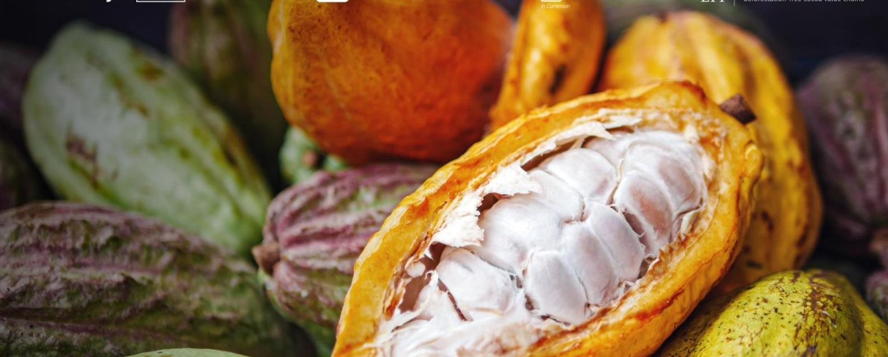
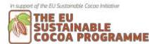
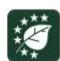
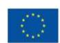

# **Preparedness check of Ghana for the EU Deforestation Regulation – March 2025**

Deforestation and forest degradation driven by agricultural expansion are growing at an alarming rate in tropical forest countries. As a major consumer of forest-risk commodities, the European Union (EU) is taking action to reduce the impact of its consumption of some of these commodities and products. The EU Deforestation Regulation (EUDR) came into force on 29 June 2023. Its main obligations will apply to all in-scope companies (other than micro-undertakings or small undertakings) from 30 December 2025, and to micro-undertakings or small undertakings from 30 June 2026.1 The Regulation prohibits operators and traders from placing on the EU market or exporting from the EU certain commodities (cattle, cocoa, coffee, oil palm, rubber, soya and wood) and derived products, unless they are "deforestation-free," have been produced in accordance with the relevant legislation of the country of production, and are covered by a due diligence statement including traceability information.

In parallel to the development of the EUDR, the EU initiated policy dialogues on sustainable cocoa with Côte d'Ivoire, Ghana and Cameroon in 2021. These policy dialogues are expected to be sustained and further developed to facilitate the implementation of the EUDR and support producing countries in addressing sustainability challenges. Structured dialogues will be put in place to support producing countries' frameworks to ensure sustainable commodity production and trade.

# Cocoa Insight

1 The Regulation was initially scheduled to come into application on 30 December 2024. However, the EU approved a one-year delay to give operators, traders, and authorities more time to prepare for its implementation.

This preparedness check aims at providing an overview of existing policies, tools and data in Ghana that could support cocoa operators' EUDR due diligence efforts, as well as identifying outstanding challenges for the compliance of the Ghanaian cocoa supply chain. To do so, this paper provides an updated state of play, as of March 2025, of the cocoa sector in Ghana when it comes to traceability, deforestation and legality.

# **1.Traceability requirements**

The EUDR requires that operators collect the following information, accompanied by evidence: the geolocation coordinates of all plots of land where commodities and products were produced (Art. 9 (1.d)), for plots>4 hectares, GPS polygons are required (Art. 2(28)), the date or time range of production (Art. 9 (1.d)), and last supplier information (Art. 9 (1.e)).

## **1.1 State of play**

In Ghana, COCOBOD, through the Cocoa Marketing Company has the monopoly on cocoa trade and would be, under the EUDR, considered as a trader supplying cocoa to operators who would place cocoa on the EU market. In this context, the development by COCOBOD of a national traceability system is an important step to facilitate operator due diligence.

COCOBOD is currently developing a digitised Cocoa Management System (CMS), an integrated system that will include several modules such as traceability and purchasing, farm and farmer information, input distribution, quality control, the farmer pension scheme, and information on Licensed Buying Companies (LBCs) and the Purchasing Clerks. As part of the CMS, **the Ghana Cocoa Traceability System (GCTS) aims to provide full digitised physical and financial traceability from farm to the point of export.** The system captures cocoa transactions through the supply chain in real time using a tagging system (QR code embossed on a tag and fixed on the cocoa bag).

As part of the CMS, COCOBOD will manage farmer information and has completed a **national cocoa farmers' registration exercise and mapping of cocoa farms**, including GPS coordinates. This resulted in the registration of 792,954 farmers in cocoa-growing regions, with 1,239,169 farms covering 1,373,756 ha. Farmers are registered with unique IDs.). CMS offices are being set up at district level to register new farmers (if not done yet) and update existing farmers' data, if needed. CMS district officers will also distribute the farmer registration cards to those farmers who have not received them yet.

**The development of the GCTS is completed**: the IT system is developed, standard operating procedures have been produced, and COCOBOD staff and LBC staff have been trained.

**A pilot of the GCTS** was conducted in three districts (including farmer sensitisation, equipment procurement, and stakeholder training), and is in progress in two additional districts. **COCOBOD is currently conducting a dry-run**, together with one trader and the Dutch competent authority, to test how their data can be entered into the EU IT system, and to assess how the trader's due diligence system, using data from the GCTS, responds to the EUDR due diligence requirements.

**For the roll-out at national level, COCOBOD is engaging with 8 LBCs to use the GCTS during the light crop season**, in order to test the system across all 73 districts. For this, over 1400 community extension agents from COCOBOD, inspectors from the Quality Control Department and technical staff of the LBCs were trained. After training their purchasing clerks, LBCs will start buying the cocoa through the GCTS app. The system is expected to be fully operational and used by all LBCs as of October 2025.

Most of the trading companies have also developed their own traceability systems, primarily **focusing on tracking cocoa from their direct supply chains and mostly back to the first point of purchase (LBCs).** In most cases, the traceability systems from the purchasing clerk to the district depot are paper-based, and from there, it is digitalised (except for one large trader, who uses a digitalised system from the purchasing clerk). Most companies collect polygon data of cocoa farms, socio-economic data on the farmers, and agronomic data to inform their supply management, and sustainability programmes However, these traceability systems only cover their direct sourcing. For their indirect sourcing, companies will have to rely on the information provided by COCOBOD. Indeed, LBCs may lose physical traceability of the cocoa after COCOBOD takes delivery of the cocoa and LBC traceability systems might not cover all farmers, which lead to cocoa from unknown origin entering their supply chain.

COCOBOD is now working on the **interoperability** between operators' and COCOBOD's systems. It is also working on data access modalities to enable private operators and other stakeholders to access data in the GCTS.

# **1.2 Remaining challenges**

 As a comprehensive national system, the GCTS aims at ensuring that all farms are mapped and cocoa is traced in a **unique centralised system**. It can address first mile challenges by providing full traceability from farm to port and indirect sourcing by capturing all cocoa flows. Therefore, the GCTS could provide the traceability and geolocation information required under the EUDR.

However, if the national system will be relied on for due diligence purposes, it is **important that COCOBOD establishes trust with supply chain actors on the credibility of the system**. Confidence in the system could be fostered by transparency in the development of the CMS and operating procedures, verification and auditing of the system (including by independent third parties) and information sharing. A governance framework with well-defined actor responsibilities, data management and sharing protocols, training, and sensitisation efforts, as well as cost-sharing, could bolster the system.

Additionally, ensuring the system's **long-term financial sustainability** is crucial for its effective operation and its ability to provide relevant information for EUDR compliance, thereby strengthening confidence in the system. Transparency on the financial model for the system is essential, including clarity on which actors are expected to contribute to specific aspects and how they will be integrated. This clarity is particularly important if supply chain actors are expected to contribute financially to the system.

**The question of access to data is also key**. COCOBOD is working on a data sharing protocol and will develop interfaces for different types of stakeholders to access data in the GCTS. The plan is that companies will be provided with GCTS data required for EUDR due diligence once they buy cocoa from COCOBOD and pay the corresponding service fee. Further consideration of data harmonisation between the GCTS and private sector systems is essential to ensure seamless interoperability, enhance supply chain transparency, and support compliance and risk management. COCOBOD's GCTS aims to enable the **segregation** of "sustainable" cocoa (meaning EUDR compliant cocoa) from "conventional" cocoa, so that only the "sustainable" cocoa will be eligible for export to the EU market. However, segregation presents logistical challenges, particularly at the farm and first point of purchase levels, which will need to be addressed.

Additionally, implementing risk mitigation measures to identify and address issues such as leakage, fraud, and illegal border trafficking is crucial for enhancing effectiveness.

# **2. Deforestation-free criteria**

The EUDR requires that operators collect adequately conclusive and verifiable information that relevant products are deforestation-free (Art. 2(13) and 9 (1. g)). Cocoa produced on lands converted from forests after 31 December 2020 would not be considered deforestation-free and would not conform with EU requirements. Forests are defined according to the FAO definition (Art. 2(4)).

In this context, useful data and tools might include:

- Forest cover data at the cut-off date (31 December 2020)
- Permanent national forest monitoring system
- Deforestation alerts

# **2.1 State of play**

**The Ghana Forestry Commission is currently developing a forest/non-forest map at cut-off date 2020 covering the Cocoa Growing Landscape (CGL)**, with the aim to provide national baseline data to check against the deforestation-free requirement. This work is carried out in collaboration with COCOBOD and the Kwame Nkrumah University of Science and Technology (KNUST) and with support from FAO and EFI. This map uses available satellite images, filed data collected by the Forestry Commission and cloud computing technology to classify forests in line with the EUDR definition as well as with the national definition. The map production incorporates robust methodology, including consultation and validation by third party, local and internation experts and stakeholders. The map is expected to be completed and published by June 2025. The first draft of the forest / non-forest mask map has been submitted for validation by third party, national and local experts.

Ghana has produced **land use/cover maps for 2019 and 2021**. The land use/cover maps include relevant layers, such as monoculture cocoa, shaded cocoa and forest cover, that provide useful information on land use dynamics. The forest cover layers were based on the canopy cover thresholds used nationally as outlined in the REDD+ programme, which differs from the FAO definition of forests2 [.](#page-5-0) They are available publicly for viewing but are not downloadable.

#### **Deforestation risk monitoring for cocoa**

As part of the CMS, COCOBOD is developing a **deforestation risk assessment module** (DRM) that will link cocoa supply chain data (e.g., cocoa polygons) to forest cover and protected area information. The objective of the DRM is to monitor non-compliance risks related to the EUDR. Results from the

Under REDD+ in Ghana, forests are any piece of land with a minimum area of 1 hectare, with a minimum canopy cover of 15% and with trees that have the potential to reach or have reached a minimum height of 5 metres at maturity in situ. The forest definition excludes agricultural trees such as rubber, cocoa, oil palm, fruit and nut trees. The national land use maps used a minimum mapping area based on 30 m resolution

assessment will be used to segregate 'sustainable' cocoa, that which was not grown in areas deforested after 2020 nor illegally within protected areas, from 'conventional' cocoa. The intention is to provide operators sourcing cocoa from Ghana with relevant information to carry out their risk assessment. The 2020 forest / non-forest mask map, under development by the Forestry Commission, should provide data for the DRM.

## **2.2 Remaining challenges**

**Operators should use and combine the best information at their disposal to determine the risk of non-compliance** with the EUDR zero-deforestation criteria. Multiple global public data sources, **like the 2020 global forest cover map produced by the Joint Research Centre in the EU Forest Observatory**, are available to support these efforts.

In addition, Ghana is currently undertaking the production of a 2020 forest /non-forest mask map for EUDR purposes (through an approach compatible with the FAO definition). This national data set could offer greater accuracy than global forest products, therefore reducing the risk that some cocoa farms might be detected as forests. **One remaining question, however, lies in the public access to the data**. The Forestry Commission has agreed to allow COCOBOD to use the map in the GCTS. Discussions are ongoing with Forestry Commission on the possibility to make the map available to all stakeholders. These efforts will fully benefit Ghana if the data is made publicly available to all stakeholders, including operators and EU competent authorities, so that they can use it as a primary information source for due diligence.

Besides, if companies are going to make use of the COCOBOD DRM, they need to have the confidence that the methodology is robust. For that, **information on the methodology and the data sources needs to be made available to all stakeholders**. Further, the reliability of the assessment results is dependent on the data used, so it is critical that data on cocoa farms, forests and deforestation, and protected areas are accurate and reliable.

Finally, Ghana **does not have an operational forest monitoring system**, and historically, forest mapping and monitoring efforts have advanced piecemeal and were project-based. The lack of funding prevents putting a national system in place. A national forest monitoring system could provide official reference information on forests to facilitate due diligence for the EUDR, inform country benchmarking, monitor risks of future deforestation and raise alerts, thereby supporting efforts to improve cocoa sustainability and reduce deforestation.

# **3. Legality criteria**

The EUDR requires that operators collect adequately conclusive and verifiable information that the relevant commodities were produced in accordance with the "relevant legislation of the country of production" (Art. 9 (1.h)).

This "relevant legislation" is defined as the laws applicable in the country of production concerning **the legal status of the area of production** in terms of (for agricultural commodities): land-use rights; environmental protection; third parties' rights; labour rights; human rights protected under international law; the principle of free, prior and informed consent (FPIC), including as set out in the UN Declaration on the Rights of Indigenous Peoples; and tax, anti-corruption, trade and customs regulations' (Art. 2 (40)).

In October 2024, the European Commission (EC) published guidance on the EUDR, which interprets the provisions of the regulation on the legality criteria[.](#page-7-0)3 However, this guidance is not legally binding. The Competent Authorities of each EU Member State will adopt their own approach to verify EUDR compliance and only national judges have the authority to interpret the EUDR and its scope of application.

# **3.1 State of play**

An ongoing study to identify the relevant legal requirements applying to cocoa production in the context of the EUDR and recommend due diligence actions relating to the legality criteria is funded by the EU Sustainable Cocoa Programme. The study is informed by a stakeholder engagement process, carried out in close collaboration with COCOBOD.

The list of relevant requirements resulting from the study follows COCOBOD's strict interpretation of the EC October 2024 guidance. It therefore limits relevant legal requirements to those directly linked to halting deforestation and forest degradation in the context of addressing climate change and biodiversity loss.

This list is expected to be published in the second quarter of 2025.

Below is an overview of the Ghanaian legal requirements in the seven areas of law listed in Article2(40) of the EUDR. It clearly identifies those that do not fall within the scope of the EUDR according to COCOBOD's interpretation of the EC guidance.

3The guidance document, published by the European Commission in October 2024, states that "only the applicable laws concerning the legal status of the area of production constitute relevant legislation pursuant to Article 2(40) of the EUDR". Additionally, it mentions that "legislation is also relevant if its contents can be linked to halting deforestation and forest degradation in the context of the Union's commitment to address climate change and biodiversity loss". [https://eur](https://eur-lex.europa.eu/eli/C/2024/6789/oj/eng)[lex.europa.eu/eli/C/2024/6789/oj/eng](https://eur-lex.europa.eu/eli/C/2024/6789/oj/eng)

#### **Land-use rights**

In Ghana, **there is no requirement to demonstrate land-use rights to cultivate cocoa, as long as it is done in an authorised area.** So, while farmers often do not possess proof of land-use rights, it is not required in these areas under the national legal framework.

**Cocoa production is prohibited within forest reserves except in areas recognised as admitted farms**.

The expansion of cocoa farms beyond admitted farm boundaries within forest reserves has been an issue over the past years. **To ensure EUDR compliance, operators will have to determine whether their cocoa plots are located in protected areas or forest reserves, and if so, whether they are admitted farms.** 

While geospatial data on the boundaries of protected areas and forest reserves are available, there is concern about their accuracy. When comparing these boundaries with satellite images, the polygons appear shifted in space, suggesting an error produced by the method of converting the paper maps to digital format. This means that boundaries on the ground do not match the datasets. The Forestry Commission is currently updating and correcting the boundaries' projection, plans to make updated maps available.

The primary records of admitted farms are in the Reserve Settlement Commissioner's Report, which is not public. The report includes farm names, owners, and sizes but not exact locations. This makes proving admitted farm status difficult. The admitted farm boundaries should be listed in the forest management plans of each forest reserve, and some have recently been digitised by RMSC. Nonetheless, this data is not shared publicly. As part of the GCTS, the DRM will **assess the risk of cocoa non-compliance specifically related to whether cocoa was produced in prohibited areas in protected areas**.

#### **Environmental protection**

#### **Environmental impact assessment**

The Environmental Assessment Regulations, L.I. 1652 of 1999 amended in 2002, require that all developmental activities likely to impact adversely on the environment be subject to environmental assessment. The requirement applies to agricultural activities that either involve the clearing of land: greater than 40 hectares in area; or in an environmentally sensitive area. **Smallholder cocoa farmers would therefore not be required to carry out an environmental impact assessment unless their activities are carried out in an environmentally sensitive area.** 

#### **Pesticide and fertilisers**

**Ghanaian law mandates that only registered and approved pesticides be used in farming, including cocoa farming**[.](#page-8-0) 4 The Environmental Protection Authority is responsible for registering pesticides. In addition, the Cocoa Research Institute of Ghana (CRIG) test and approve pesticides and insecticides

4 Section 1 of Pesticide Control and Management Act, 1996 (Act 528)

to use in cocoa farming on regular basis based on the current list of active ingredients issued by the EU. In cocoa farming, COCOBOD, through its Cocoa Diseases and Pest Control programme, provides farmers with pesticides for use on cocoa farms. However, this is only done for mapped farms in good conditions[.](#page-9-0)5 COCOBOD maintains a list of approved pesticides based on CRIG's recommendations, which is circulated to farmers through the Extension Agents of the Cocoa Health and Extension Division of COCOBOD[.](#page-9-1)6 The list is reviewed periodically based on the list of active ingredients approved by the EU. In addition, some LBCs, as part of their sustainable supply chain programmes, also distribute pesticides. Farmers who do not receive pesticides from COCOBOD or private companies usually cannot afford buying any.

As for fertilisers, Ghanian law only regulates their import, manufacture and distribution. **There are no requirements regarding their use.** 

### **Third parties' rights**

Public participation in environmental regulation involves the Environmental Protection Agency overseeing environmental impact assessments in response to public concerns about proposed largescale projects.

However, **regulations pertaining to public consultation for large-scale projects would not apply to small-scale cocoa farming activities, which constitute over 90% of Ghana's cocoa farming.** 

#### **Labour rights**

*NB: Labour rights are listed in article 2(40) of the EUDR that defines the relevant legislation in the country of production. However, the interpretation of the legality criteria as per the EC guidance indicates that legislation is relevant if it specifically impacts or influences the legal status of the area in which the commodities were produced or is directly linked to the objective of the EUDR to halt deforestation and forest degradation. Thus, COCOBOD's interpretation is that child labour and forced labour fall outside the scope of the EUDR.* 

The cocoa sector in Ghana relies mainly on small-scale farming, often organised into family structures or via sharecropping agreements. Most cocoa farming in Ghana does not use 'employees' for work on the farm. Hence, there are no employer-employee relations and the provisions for employees in the **Labor Act 2003 (Act 651)** do not apply. Additionally, work done on cocoa farms is seasonal in nature and the requirements for continuous service (a minimum of 200 workdays in a year) which would trigger most of the employee privileges in the Act are not met.

In the case of casual workers/day workers, some limited obligations apply, and requirements related to safety at work should be ensured for all working on the farm.

5 <https://cocobod.gh/project/copadec>

6The Ghana Cocoa Board (COCOBOD) approved insecticides, imidacloprid, thiamethoxam and bifenthrin, for the control of cocoa mirids (Hemiptera: Miridae): Implications for insecticide-resistance development in Distantiella theobroma (Dist.) and Sahlbergella K. D. Ninsin, R. Adu-Acheampong 21–28. See at https://www.ajol.info/index.php/gjas/article/view/174334

#### **Human rights**

*NB: Human rights are listed in article 2(40) of the EUDR that defines the relevant legislation in the country of production. However, they are not directly linked to the objective of the EUDR to halt deforestation and forest degradation. Thus, COCOBOD's interpretation is that they fall outside the scope of the EUDR.* 

Legal issues related to human rights in the cocoa sector mainly concern child labour and forced labour.

#### **Child labour:**

The Children's Act of Ghana, 1998 (Art. 560), distinguishes light work, which is authorised for children as of 13, from child labour and particularly worst forms of child labour, such as hazardous labour, which are strictly prohibited.

However, despite these legal standards, **child labour remains an issue in the cocoa sector, largely due to economic pressures on smallholder farms and limited resources for enforcement in rural areas.** 

Several prevention, remediation and mitigation activities are implemented through government initiatives, voluntary certification schemes, NGO programmes and corporate sustainability initiatives, to address child labour in the cocoa sector.

COCOBOD has developed a Cocoa Sector Child Labour Monitoring System, with support from GIZ and the International Cocoa Initiative. This cocoa sector monitoring system includes a risk assessment at community level that is linked to the National Child Labour Monitoring System for the reporting and referral of cases. It is also linked to the Ghana Cocoa Traceability System and could provide information on the risk of non-compliance with national laws related to child labour. A pilot has been conducted in Assim Fosu District, and COCOBOD is currently working on the roll-out to other districts.

#### **Forced labour:**

The Labour Act also prohibits modern slavery and forced labour, and the study has found that these requirements are generally well respected.

### **Free Prior and Informed Consent (FPIC)**

**Ghana is not a party to the ILO Convention 169 and free, prior, and informed consent (FPIC) is not explicitly incorporated into the legal framework**. This is because the concept of indigenous peoples is not enshrined in the legal framework of Ghana.

Nonetheless, Ghana laws contain certain aspects of FPIC. However, cocoa production by smallholder farmers is typically conducted on a small scale, whereas the requirement to consult communities is more commonly associated with major projects that have significant impacts on communities. FPIC is therefore likely to be irrelevant to smallholders' cocoa production.

#### **Anti-corruption**

Ghana ratified both the Convention against Corruption and the African Union Convention on Preventing and Combating Corruption in 2007. There is no singular piece of legislation to tackle corruption, but the criminal code criminalises corruption in the form of active and passive bribery, extortion, wilful exploitation of public office, use of public office for private gain and bribery of foreign public officials.

Ghana scored 42 points out of 100 on Transparency International's 2024 Corruption Perceptions Inde[x](#page-11-0)7 (CPI), ranking 80 out of 180 countries.

**In their legality risk assessments, operators will need to consider the level of corruption in the sourcing country when selecting valid evidence of legal compliance.** 

#### **Tax, trade and customs**

*N.B. This area of law is the only one listed in the EUDR that potentially covers activities across the entire supply chain in the country of production, and not just at the level of the area of production/cocoa plot.* 

#### **Taxes:**

**Cocoa beans production is exempt from taxes. Therefore, smallholder farmers are not subject to taxes.** Only traders and processing companies are subject to corporate taxes, with exemptions in some regulated cases.

#### **Trade**:

**The cocoa trade is extensively governed by the Ghana Cocoa Board Act of 1984.** The Act mandates COCOBOD to exercise centralised control over the sale and trade of cocoa, with powers over the purchase, inspection, grading, sealing, certification, export and sale of cocoa. Only COCOBOD, or persons or organisations authorised by it, are allowed to purchase cocoa. **COCOBOD issues licences to cocoa buyers (LBCs). Unless authorised by COCOBOD, no one can market or sell cocoa. Any exporter selling the cocoa for export is required to hold a Cocoa Export License.**

The Government sets the minimum farmgate price to be paid to farmers, at the beginning of each season. Cocoa produced in Ghana is graded under the Cocoa Industry (Regulation) (Consolidation) Decree, 1968 (NLCD 278).

#### **Customs**:

By law, COCOBOD can sell cocoa not subject to any customs duty or regulations**. Cocoa is thus exempted from any form of custom regulations in Ghana.** 

7 The CPI ranks 180 countries and territories around the world by their perceived levels of public sector corruption, scoring on a scale of 0 (highly corrupt) to 100 (very clean). The European Commission guidance on the EUDR cites the CPI as one of the commonly used indicators of corruption levels.

#### **Conclusion**

Overall, the relevant legal requirements in the cocoa sector in the context of EUDR, according to COCOBOD's interpretation of the EC Guidance document, mainly cover the prohibition to grow cocoa in protected areas (except admitted farms), the use of authorised pesticides and the respect of the COCOBOD Act provisions on the holding of buying licences and export licences. However, further to the EC guidance, the scope of the EUDR legality criteria is debated among operators and Competent Authorities.

#### **ARS-1000**

- ARS-1000 was adopted on 15 June 2021 by members of the African Standards Organisation. Ghana supported the drafting of the standard and developed a national operational guide, which complements the standard and was made available in December 2023.
- ARS-1000, once implemented, could facilitate, to some extent, due diligence of operators in the context of the EUDR. However, certification cannot replace the due diligence obligation of operators.
- Information collected and verified through ARS-1000, such as product traceability, environmental and social sustainability, as well as legality, could provide operators with relevant data for the risk assessment required by the EUDR.
- ARS-1000 covers well the requirements related to land use, environmental protection, human rights and third-party rights. It only partially covers the requirements related to labour law and aspects related to taxation, anticorruption, trade and customs.

# **3.2 Remaining challenges**

Overall, progress on the enabling environment for the implementation of the EUDR has been made, particularly as the relevant legal requirements for cocoa have been identified. Nonetheless, verifying compliance with some of these relevant requirements remains a challenge.

A map of admitted farms' boundaries or documentation of rights to farm within forest reserves will be necessary to determine the legality of cocoa produced in these areas. While protected area boundaries are being updated, it is unclear in which format they will be made available to stakeholders. **Updating and making publicly available legal and spatial reference data on forest reserve boundaries and admitted farms** would greatly mitigate operators' non-compliance risks and potentially avoid the unnecessary exclusion of farmers.

Regarding pesticides, **making the list of authorised pesticides available** to farmers, traders and other stakeholders, would facilitate compliance and due diligence on this topic.

### **Conclusion**

This preparedness check offers an update on the current policies, systems, tools and data landscape being developed in Ghana related to traceability, deforestation, and legality that can support cocoa sector actors in navigating the complexity associated with demonstrating compliance with the due diligence obligations of the EUDR.

Ghana is making efforts to provide an enabling environment to facilitate due diligence, through the mapping of cocoa farmers and registration of farmers, the set-up of a national traceability system, the provision of updated protected area maps and a 2020 forest cover map, as well as the CMS that provides information for companies to conduct their due diligence process.

Some voluntary third-party certification schemes, the ARS 1000 certification scheme (once implemented), as well as some sustainability programmes, may provide complementary contextual information and serve as a tool to mitigate the risk of non-compliance, but they cannot replace a due diligence process, nor do they cover the full production volume of Ghana.

**The main challenge remains the collaboration between stakeholders, transparency on methodologies and sources of data, and accessibility of data to ensure credibility and trust.** 

A few months are left before the EUDR comes into application, enough time to roll out and test the various systems and build the collaboration, data sharing and interoperability of the various systems to better facilitate compliance with the EUDR.

# **Annex: EUDR compliance table**

The table below summarises the potential compliance of cocoa with the EUDR based on **the land use category** and **the type of land cover/use (on 31 December 2020)** of the plot where the cocoa was produced:

|               |   |             |   | Legality criteria | 1 |               |                         |
|---------------|---|-------------|---|-------------------|---|---------------|-------------------------|
|               |   | Forest 2    |   |                   |   |               |                         |
|               |   |             |   | Non-compliant     |   | Non-compliant | Non-compliant           |
|               |   | Agriculture |   | Non-compliant     |   | Compliant     | Non-compliant           |
| Admitted farm | 3 |             |   |                   |   |               |                         |
|               |   | Forest 2    |   |                   |   |               |                         |
|               |   |             |   | Compliant         |   | Non-compliant | Non-compliant           |
|               |   | Agriculture |   | Compliant         |   | Compliant     | Potentially compliant 1 |
| Off-reserve   |   | Forest 2    |   |                   |   |               |                         |
|               |   |             |   | Compliant 4       |   | Non-compliant | Non-compliant           |
|               |   | Agriculture |   | Compliant         |   | Compliant     | Potentially compliant 1 |
|               |   | wooded land | 5 |                   |   |               |                         |
|               |   | grassland 6 |   |                   |   |               |                         |
|               |   |             |   | Compliant         |   | Compliant     | Potentially compliant 1 |

1 Only with regards to land-use rights. Compliance also requires that cocoa be produced in accordance with other relevant legislation of Ghana (labour rights, environmental protection, tax and customs…) and that a due diligence statement covering the products be submitted by the operator.

- 2. In this table, forests are understood as per the FAO definition (land spanning more than 0.5 hectares with trees higher than 5 metres and a canopy cover of more than 10%, or trees able to reach those thresholds in situ).
- 3. Accurate boundaries of admitted farms might still be missing in certain regions or not be publicly available to operators.
- 4. Forest conversion off-reserve is subject to an authorisation for tree harvesting from the Forestry Commission.
- 5. Other wooded lands are understood as per the FAO definition (land not classified as 'forest' spanning more than 0.5 hectares with trees higher than 5 metres and a canopy cover of 5 to 10%, or trees able to reach these thresholds in situ, or with a combined cover of shrubs, bushes and trees above 10 percent). In Ghana, these are mainly savannah areas. The potential inclusion of other wooded lands will be the subject of an evaluation conducted no longer than 1 year after entry into force of the EUDR.
- 6. The potential inclusion of grasslands will be the subject of an impact assessment conducted no longer than two years after entry into force of the EUDR.

**Cover photo:** Close-up of ripe yellow cacao pod with half sliced white cocoa seed, cut in half fresh ripe cacao and green raw cacao fruit**.** Credit: Narong / Adobe Stock

**Disclaimer.** The views and opinions expressed in this Insight are solely those of the authors and do not reflect the views of the Sustainable Cocoa Programme of the European Union or its funding organisations. The authors bear full responsibility for the content, analysis and recommendations presented herein and welcome any feedback on its content. The European Forest Institute is one of the implementing partners of the EU Sustainable Cocoa Programme in Côte d'Ivoire, Ghana and Cameroon. We are supporting producer countries in developing robust standards and tools to achieve traceable and deforestation-free cocoa. Information and publication of EFI's Sustainable Cocoa Programme can be found here: <https://efi.int/partnerships/cocoa>

© European Forest Institute, 2025

