# Management of cocoa-based agroforestry systems in Cameroon

TRAINER'S MANUAL

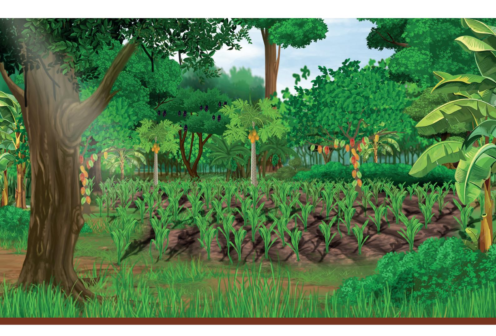

Deutsche Gesellschaft für Internationale Zusammenarbeit (GIZ) GmbH

#### Registered oces

Bonn et Eschborn, Germany

Sustainable Cocoa Program (SCP) & Sustainable Agriculture for Forests Ecosystems (SAFE)

Regional Oce in Yaoundé Bastos Dragage roundabout street,near Huawei Cameroon, HQ Tel. +237 683 74 95 19 P.O Box 7814 E :cm-developpementrural@giz.de www.giz.de

#### Update

January 2025

#### Printing

Colorix Designing & Printing Yaoundé, Cameroun

#### Translation and post-editing

Tiku Tanyi Ojong, Atanga Roland

#### Illustrations and layout

Hervé Momo CREATIVE CAMEROUN SARL

#### Authors

Daniel Essobo (Consultant), Marius Oyono (Technical Advisor-GIZ)

This publication was produced by SCP in cooperation with SAFE with the financial support of the European Union, the German Federal Ministry for Economic Cooperation and Development (BMZ) and the Ministry of Foreign Aairs of the Netherlands.

Its contents are the sole responsibility of GIZ and do not necessarily reflect the views of the European Union, the German Federal Ministry for Economic Cooperation and Development (BMZ) and the Ministry of Foreign Aairs of the Netherlands.

## Table of content

| LIST OF TABLES                                                                                                                                                                        | 5  |
|---------------------------------------------------------------------------------------------------------------------------------------------------------------------------------------|----|
| INTRODUCTION                                                                                                                                                                          | 6  |
| HOW TO USE THIS TRAINING MANUAL                                                                                                                                                       | 7  |
| PART 1 CREATING AN AGROFORESTRY COCOA PLANTATION ................................................................................                                                     | 11 |
| Theme 1.1: Site selection and preparation .........................................................................................................................                   | 11 |
| General information ............................................................................................................................................................      | 7  |
| Guide for trainers .................................................................................................................................................................. | 15 |
| Conducting the training ....................................................................................................................................................          | 15 |
| Theme 1.2: Production of seedlings and establishment of a cocoa orchard .....................................................                                                         | 18 |
| General information ............................................................................................................................................................      | 18 |
| Guide for trainers .................................................................................................................................................................. | 20 |
| Conducting the training ....................................................................................................................................................          | 21 |
| PART 2 MANAGING A COCOA FARM IN AN AGROFORESTRY SYSTEM ..................................................................                                                             | 23 |
| Theme 2.1: Shade adjustment ................................................................................................................................................          | 23 |
| General information ............................................................................................................................................................      | 23 |
| Guide for trainers .................................................................................................................................................................. | 25 |
| Conducting the training ....................................................................................................................................................          | 26 |
| Theme 2.2: Maintaining a cocoa plantation in an agroforestry system ................................................................                                                  | 28 |
| General information ............................................................................................................................................................      | 28 |
| Guide for trainers .................................................................................................................................................................. | 31 |
| Conducting the training ....................................................................................................................................................          | 31 |
| Theme 2.3: Improving on an existing plantation with an agroforestry system ...................................................                                                        | 34 |
| General information ............................................................................................................................................................      | 34 |
| Guide for trainers .................................................................................................................................................................. | 38 |
| Conducting the training ....................................................................................................................................................          | 39 |
| PART 3 FERTILIZATION AND SOIL MANAGEMENT OF A COCOA FARM IN AN AGROFORESTRY SYSTEM. .............                                                                                     | 42 |
| Theme 3.1: Soil management ..................................................................................................................................................         | 42 |
| General information ...........................................................................................................................................................       | 42 |
| Guide for trainers .................................................................................................................................................................. | 43 |
| Conducting the training ....................................................................................................................................................          | 44 |
| Theme 3.2: Fertilization in agroforestry systems ..............................................................................................................                       | 46 |
| General information ............................................................................................................................................................      | 46 |
| Guide for trainers .................................................................................................................................................................. | 50 |
| Conducting the training ....................................................................................................................................................          | 50 |
| PART 4 INTEGRATED MANAGEMENT OF COCOA DISEASES AND PESTS IN AGROFORESTRY SYSTEMS ...........                                                                                          | 53 |

| Theme 4.1: Approach to Phytosanitory Intervention in an agroforestry system ................................................                                                          | 53 |
|---------------------------------------------------------------------------------------------------------------------------------------------------------------------------------------|----|
| General information ...........................................................................................................................................................       | 53 |
| Guide for trainers .................................................................................................................................................................  | 56 |
| Conducting the training ....................................................................................................................................................          | 57 |
| Theme 4.2: Use of chemical products ................................................................................................................................                  | 59 |
| General information ...........................................................................................................................................................       | 59 |
| Guide for trainers .................................................................................................................................................................. | 64 |
| Conducting the training ....................................................................................................................................................          | 65 |
| PART 5 HARVESTING AND POST-HARVEST OPERATIONS .........................................................................................                                               | 68 |
| Theme 5.1: Harvesting and shelling of pods .....................................................................................................................                      | 68 |
| General information ............................................................................................................................................................      | 68 |
| Guide for trainers .................................................................................................................................................................. | 69 |
| Conducting the training ....................................................................................................................................................          | 69 |
| Theme 5.2: Post-harvest operations .....................................................................................................................................              | 72 |
| General information ............................................................................................................................................................      | 72 |
| Guide for trainers .................................................................................................................................................................. | 75 |
| Conducting the training ....................................................................................................................................................          | 76 |
| BIBLIOGRAPHY                                                                                                                                                                          | 78 |
| APPENDICES                                                                                                                                                                            | 79 |
| Appendix 1: Guidance document on carrying out the soil texture test .......................................................                                                           | 79 |
| Appendix 2: List of species commonly associated with cocoa trees and their use ................................                                                                       | 81 |
| Appendix 3: Dierent stages in setting up a nursery .............................................................................................                                     | 82 |
| Appendix 4: Basal area guidance sheet ......................................................................................................................                          | 85 |
| Appendix 5: Diagnostic sheet for a cocoa orchard ...............................................................................................                                      | 86 |
| Appendix 6: Dierent steps in making compost .....................................................................................................                                    | 89 |
| Appendix 7: Guidance sheet on cocoa diseases ....................................................................................................                                     | 93 |

## List of tables

| TABLE 1  | The list of themes and their learning objectives...............................................................................................                     | 10 |
|----------|---------------------------------------------------------------------------------------------------------------------------------------------------------------------|----|
| TABLE 2  | Summary of compliance conditions for the European market for production sites........................                                                               | 12 |
| TABLE 3  | Nutritive elements of a Cocoa tree........................................................................................................................          | 13 |
| TABLE 4  | Improved cocoa varieties recommended by MINADER...............................................................................                                      | 18 |
| TABLE 5  | Possible situations following diagnosis of the plantation and measures to be taken...................                                                               | 35 |
| TABLE 6  | Tree species and their uses........................................................................................................................................ | 37 |
| TABLE 7  | Cover crops suitable for tropical areas.................................................................................................................            | 48 |
| TABLE 8  | List of recommended active ingredients.............................................................................................................                 | 60 |
| TABLE 9  | FAO classification of pesticide toxicity..................................................................................................................          | 60 |
| TABLE 10 | Various cocoa seed defects......................................................................................................................................    | 74 |
| TABLE 11 | The dierent quality classifications of cocoa according to the NCCB .............................................                                                   | 75 |

## List of abbreviations/acronyms

CICC Cocoa and Coee Interprofessional Council CIRAD Agricultural Research Center for Develpment

DL50 Lethal Dose 50 - The Dose at which a substance is lethal for 50% of organism tested

PPE Personal Protection Equipment FAO Food and Agriculture Organization

FFS Farmer Field School

GIZ Deutsche Gesellschaft für Internationale Zusammenarbeit GmbH

IRAD Institute of Agricultural Research for Development MINADER Ministry of Agriculture and Rural Development

MINCOMMERCE Ministry of Trade

NPK Nitrogen, Phosphorus, Potassium

OC4 Observatory of the Influence of Climate Change on Cocoa and Coee Production

ONCC/NCCB National Cocoa and Coee Board

pH Potential of Hydrogen (presents the level of acidity or alkalinity of a solution or a given

milieu)

PROCISA Green Innovation Centres for the Agriculture and Food Sector

EUDR European Union Deforestation Regulation

SODECAO Cocoa Develpment Corporation

EU European Union

Alongside the implementation of the new European Union's Deforestation Regulation (EUDR) which will come into force as from January 2026, a number of actions have been taken by the countries concerned, notably Cameroon. As cocoa is a product of great importance to its economy, Cameroon is directly aected by this regulation, especially as cocoa farming contributes to the loss of forest cover.

Unlike other cocoa-producing countries, Cameroon mainly produces cocoa in agroforestry systems, which provide numerous benefits such as carbon storage, preservation of biodiversity and contributes to the resilience of rural households.

Looking forward to the future application of the EU deforestation regulation, which so far excludes agroforestry systems, Cameroon is requesting for this particular aspect of its production system to be taken into consideration. However, till date, these systems are not yet suciently documented in Cameroon. It is in this light that within the framework of the Sustainable Cocoa Programme (SCP) of the European Union, GIZ has supported the realization of a scientific study conducted by the International Centre of Agricultural Research for Development (CIRAD) to fill this gap.

The outcome of this study is the development or birth of an agroforestry reference system (or frame of reference), which is similar to a charter on the characteristics or key variables for categorizing cocoa-based agroforestry systems as practiced in Cameroon. It is in view of facilitating the dissemination/vulgarization of the key information from this agroforestry reference system to cocoa farmers that this manual has been developed.

This manual is designed for agricultural trainers and extension workers as a teaching and methodological guide. It updates information relating to the establishment, maintenance and improvement of cocoa-based agroforestry systems. Particular emphasis is laid on the threshold values of critical variables for characterizing a cocoa production system as being an agroforestry system.

The training approach highlighted in this manual is mainly participatory. The respect of the recommendations and guidelines in this manual will lead the trainers to promote among cocoa farmers the establishment and management of cocoa orchards that are more respectful of the environment.

# INTRODUCTION

## How to use this training manual

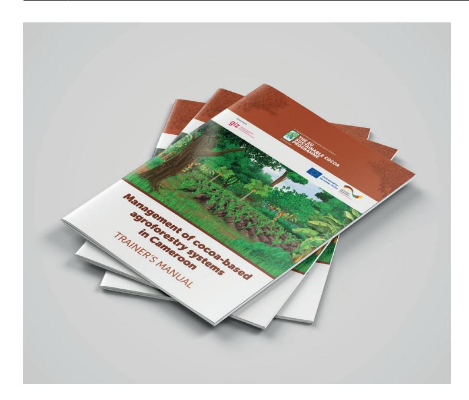

This training manual is subdivided into 5 main parts, which represent the main subjects covered in this document. These subjects have been listed in table 1 below, and subdivided into themes with objectives, in order to guide the reader to the part that is of interest to him or her without having to go through the entire document.

Depending on the geographical zone in which we are found, the agricultural calendar and, above all, the phenology of the cocoa plant in a context of climate change, the trainer must carefully choose the relevant topics to be developed during a training session.

Each theme has been organized under the headings shown below:

To the trainer, for knowledge update and proper preparation

## General information

This section summarizes the current state of knowledge on each theme. The trainer should go through this section in order to update his or her knowledge before starting the training session. The information contained in this section is not exhaustive but considers the fact that the users of this manual have proven experience in cocoa production. This information comes therefore to supplement or remind trainers of what they already know.

To this end, the profile of a good trainer is as follows:

- Have at least an A/L+2 in agriculture, agronomy, agroforestry.
- Have a minimum of 3 years' experience in training and coaching farmers on good cocoa practices.
- Have good knowledge of adult learning methods (andragogy).
- Good knowledge of the local language would be a plus.
- Good listening and summarizing skills.

Each section has subtopics to make reading easier and provide better guidance for the reader. The number of subtopics and the subjects covered vary according to each theme.

## Guide for trainers

This section should be consulted by the trainer prior to the training session. It contains all the necessary information for the trainer's intellectual, material and logistical preparation. It is important to note that each training session should bring together between 20 and 30 participants in order to optimize its eectiveness.

#### 1. Objective of the training

This is the targeted goal for the participants by the end of the training. The trainer must use all his technical and professional skills to ensure that these objectives are achieved by the end of the training.

#### 2. Necessary Materials

This section lists all the tools needed to carry out the training courses. The material listed is not exhaustive but takes into account the activities planned for the training. The trainer must ensure that this equipment is available before the start of the training session. If additional tools are required, the trainer will be responsible for providing them.

#### 3. Training duration

For each training theme, a time interval has been estimated according to the density of discussions/exchanges and the various practical workshops. The total duration of a training session depends on the number of relevant themes to be covered, as determined by the trainer. During the Conducting the training, the trainer must ensure that the allotted time is not exceeded in order to avoid long and boring sessions, except where necessary and depending on the audience.

#### 4. Preparation of the trainer

Every training session must be rigorously prepared. It is With this important principle in mind that it was deemed useful to list the actions and sources of information that the trainer will need to draw on to update his knowledge on the subject to be covered. The practical phases of the training sessions are extremely important, so that the learners can acquire or remember the technical gesture. To do this, it is good for the trainer to identify the plot that meets all the conditions for the practical workshops. Preferably, this should be done the day before the training session.

## Conducting the training

This section is divided into three parts: setting the scene, dissemination, summary and evaluation. Its role is to provide the trainer with clear guidance on the various steps to be followed to ensure that the training is properly conducted.

#### 1. Setting the scene

#### a. Brainstorming/catch attention

This part directs questioning towards the participants, in view of getting them to think about and focus their thoughts on the subject to be discussed. The aim of this strategy is to arouse the participants' curiosity and interest in the subject to be discussed.

#### b. Title

In this section, the trainer is reminded to clearly state the title of the subject that will be covered during the training.

#### c. Importance for the learner

This section presents the usefulness of the information that will be presented during the training for producers in their daily activities. The aim is to encourage them to pay more attention to what is said during the training.

#### d. Guidelines

The purpose of this section is to define the scope of the discussions to avoid as much as possible drifting away from the subject and its objectives.

#### 2. Disseminate

#### a. Explanation

This section gives a chronological account of the discussions that will take place during the training, focusing on the key aspects to be explained to the producers. Priority is given to discussions between the trainer and the participants in order to make the working session interactive. The trainer will be able to use his or her creativity to help guide the discussions.

The aim here is not to read through the various points covered, but to appropriate them and adapt to the training environment.

#### b. Visualization

In this section, you will find a list of images that would be presented during the discussions as illustrations to help improve understanding.

#### c. Case studies

This section lists the practical sessions that will be carried out during the training. Additional information on how to conduct the practical sessions are wrapped up in the guidance sheets appended to this manual.

#### 3. Summary and Evaluation

#### a. Summary

This section gives directives on how to present the key points summarizing the discussions and provides a reminder of the essential points to be retained by the producers..

#### b. Evaluation

This section gives an indication of the questions that will be asked to the participants in order to assess their level of understanding at the end of the training. This will be done using closed questions to make the exercise easier for the trainer..

Table 1 : List of themes and their learning objectives

| N°        | Theme               | Objectives                                          | The ideal time to |           |
|-----------|---------------------|-----------------------------------------------------|-------------------|-----------|
| Theme 1.1 | Site selection and  |                                                     |                   |           |
| Theme 1.2 | Production of       |                                                     |                   |           |
| Theme 2.1 | Shade adjustment    | Have an understanding of the determinants of        |                   |           |
| Theme 2.2 | Maintaining a cocoa |                                                     |                   |           |
| Theme 2.3 | Improvement of an   |                                                     |                   |           |
| Theme 3.1 | Soil management     | knowing the soil and its characteristics            |                   |           |
|           |                     |                                                     | March-June        | 30-45 min |
| Theme 3.2 | Fertilization in    |                                                     |                   |           |
|           |                     |                                                     | March-June        | 60-90 min |
| Theme 4.1 | Approach to pest    |                                                     |                   |           |
| Theme 4.2 | Use of chemicals    | Identifying the right product for the right disease |                   |           |
| Theme 5.1 | Harvest             | Knowing the stage of maturity of the pods           |                   |           |
| Theme 5.2 | Post-harvest        |                                                     |                   |           |

# Theme 1.1 Site selection and preparation

## General information

#### 1. Conditions suitable for growing cocoa

Originally, cocoa was grown in tropical forests, where rainfall is high and well distributed, with a short dry season. The dry season is important for limiting the spread of fungal diseases, particularly brown rot.

But cocoa plants can tolerate longer dry periods of 3 to 4 months under balanced agroforestry conditions. However, a severe lack of water leads to leaf drop and drying o. The optimum temperature is between 25 and 28°C. Temperatures below 10°C damage young shoots, while long periods of high temperatures, above 30°C aect the physiology of cocoa trees.

To develop a good root system, cocoa plants need deep soil with sucient organic matter and good drainage. Cocoa is sensitive to long periods of waterlogging and poor soil aeration. A moderate soil pH of between 5.0 and 7.0 is preferable.

#### 2. Agroecological zones

Cameroon is divided into 5 major agroecological zones. The zones in which cocoa is mainly grown and considered to be most suitable for its cultivation are:

- The bimodal forest zone (Zone 5) covers an area of 165,770 km2, with rainfall ranging from 1,500 to 2,000 mm/year, 2 distinct wet seasons and soils that are ferralitic, acidic and clayey. It includes the Centre, South and East regions; The monomodal forest zone (Zone
- 4) covers 45,658 km2, with rainfall ranging from 2,500 to 4,000 mm/ year and soils that are volcanic slopes. It includes the Littoral and South-West regions; The high plateau zone (Zone 3) covers 31,192 km², with 1,500 to 2,000 mm/ year and 180 days of rainfall, and young soils on steep slopes or washed out, enriched with volcanic materials, they are very fertile and suitable for farming. It includes part of the West and North-West regions;

The choice of a cocoa production site should therefore consider this aspect to avoid cocoa trees being planted in areas where they will not be able to reach their optimum production.

#### 3. Choice of production site in line with the European Union's deforestation regulation (EUDR)

In view of the enforcement of the new European Union regulation on deforestation (EUDR), it is necessary to consider the status of the production site before setting up a cocoa farm. The objective of the EUDR is to minimize the risk of products associated with deforestation

# PART 1 CREATING AN AGROFORESTRY COCOA PLANTATION

entering the European market and to increase demand for 'zero deforestation' products.

To ensure compliance with the requirements of the European Union's deforestation regulation, it will be necessary to ensure that the plantation is not created in a forest cleared or degraded after 31st December 2020, even if this is permitted under national legislation.

In Cameroon, there are two main categories of forest land use. These are the permanent forest estate and the non-permanent forest estate.

The permanent forest estate is made up of land permanently allocated to the protection and sustainable management of forest and wildlife heritage. Permanent forests include: state forests, regional forests, council forests, community protected areas and marine protected areas. State forests are divided into three main groups: production forests such as forest management units (FMU), protected areas for wildlife and forest reserves. Regional forests are those designated by decree as part of the private property of a region. Council forests are those classified by decree as part of the private property of a council.

Non-permanent forest is land in the national domain that may be used for purposes other than forestry. Non-permanent forests include regional or council woodlands, community forests, private woodlands, national forest estates, community hunting areas and private conservation areas for forest and wildlife resources that do not belong to the State

.

#### 4. Choosing the right soil for cocoa production

The choice of soil in agriculture is an important step as it is the foundation or bedrock for production. It is from the soil that plants draw the vast majority of the nutrients they need for growth and production. It is all the more important in the case of cocoa cultivation because the plantation is set up for a long period of time.

There are several elements to be considered in order to choose a good soil. The suitability of a soil for growing cocoa can be assessed by field observation and by analysis.

.

Table 2 : Summary of compliance requirements of production sites for the European market

| Land use categories     | Land use as of 31 December 2020      | Compliance for the European   |
|-------------------------|--------------------------------------|-------------------------------|
| Permanent forest estate | Plantation installed before or after |                               |
|                         | 2020                                 | Non-compliant (illegal)       |
|                         | Plantation established after 2020    | Non-compliant (deforestation) |
|                         | Plantation established before 2020   | Potentially compliant         |

### Potentially compliant:

- If authorised by the management document for these forests and only in the zone(s) provided for
- If authorization is granted to cut down and install the plantation in national forests

- Subject to compliance with legality criteria.

To summarize, plantations considered compliant under the EUDR are those planted in the part of the territory belonging to the non-permanent forest estate before the 31st December 2020..

#### 4.1 Field observation

Observation involves looking at the land and, on the basis of a certain number of indicators, make a primary appreciation of the soil quality. These indicators are as follows:

- The presence of plant species that indicate good soil fertility;
- The presence of high termite mounds indicates deep soil;
- The presence of more or less earthworm droppings is an indication of a good soil.

On the other hand, some elements may indicate that the soil is unsuitable for cocoa farming, such as:

- The presence of stony crusts on the ground indicates the possible presence of a lot of gravel or laterite slabs in the soil;
- The presence of numerous low termite mounds (less than one meter high) indicates shallow soil;
- Avoid Clayey or sandy shallows/ swamps and soils where water remains permanently or stagnates for more than a week after rain;
- Avoid soils with steep slopes.

#### 4.2 Soil analysis

Once the land is identified based on physical and visual factors, the soil must be analyzed using simple techniques that can easily be carried out by producers in the field. In the case of cocoa farming, the soil must have the following characteristics:

- A sandy-clay texture;
- Good drainage;
- Less than 50% coarse particles;
- A minimum soil depth of 120 cm.

More elaborate analyses can be carried out to determine the suitability of the soil for cocoa production. These soil analyses will take into account the important elements and compare them with the optimal values as presented in the table below:

Table 3: Nutrient requirements of cocoa trees

|                                | Cocoa needs |
|--------------------------------|-------------|
| N (nitrogen)                   | >0.2%       |
| P (phosphorus)                 | 100 ppm     |
| K (potassium)                  | 8%          |
| Ca (calcium)                   | 68%         |
| Mg (magnesium)                 | 24%         |
| CEC (cation exchange capacity) | 15-35       |
| PH                             | 5-6         |

Source: D. Snoeck, Importance of soil fertility management for sustainable cocoa production, 2011

#### 5. Site preparation in agroforestry system

## 5.1 Clearing and/or selective felling

In the three main cocoa-producing agroecological zones, plantations are created after clearing and felling the forest, although in some cases farmers create cocoa plantations on savannah or fallow land..

#### 5.1.2 In the case of a previous forest

As far as forests are concerned, the undergrowth is cleared and then selectively felled, taking care to leave large-diameter trees evenly distributed throughout the plot. This ensures a homogenous shading which will be beneficial for the cocoa that will be planted. The choice of tree species to be maintained in the plot should also consider the benefits that the farmer will derive from them and their compatibility with the cocoa tree (see appendix 2 containing the list of trees to be associated with the cocoa tree and their usefulness)..

#### 5.1.3 In the case of a previous fallow or savannah land

In the case of savannahs or fallow land, only clearing will be necessary, while avoiding to burn residues. The practice of burning could have a negative eect on the biological activity of the soil, on soil erosion, fauna and flora and, further still, on biological diversity and soil fertility. Then, to ensure better acclimatization of the cocoa plants, it is advisable to plant annual crops and then fruit and forest species as developed in theme 1.2.

According to Cameroon's agroforestry reference system, the threshold value in terms of the number of forest trees with a diameter of at least 5 cm to be maintained per hectare is 45

### 5.2 Pecking and Hole Digging

Pecking is the technical operation that consists of using stakes to indicate the future position of the plants within the cocoa plot. The recommended density is 1,111 plants/ ha, i.e. a 3 m x 3 m system. This density may vary depending on the number of trees other than cocoa that are maintained in the plot. The various stages required to carry out a good pecking are as follows:

- Determining the base line according to the relief of the terrain, the presence of access roads etc.;
- Determining the right angle;
- Creation of the planting line;
- Complete pecking of the site with pecks..

Once the plant positions have been marked out, digging of holes follows. The aim of this stage is to ensure that the plants are properly installed and to soften the soil to facilitate root development. Digging is a technical operation that involves opening holes measuring 40 cm x 40 cm x 40 cm in the position of the pecks. During hole digging, the top soil (black soil) is placed on one side and the red soil on the other. Digging takes place after the first rains, one month before the plants are planted.

According to Cameroon's agroforestry reference system, the recommended number of cocoa trees per hectare is 850 – 1100

## Guide for trainers

#### 1. Objective of the training

The objective is to enable participants to:

 have a good knowledge of the main criteria for the choice of a good soil for cocoa production; Master the various operations prior to setting up a cocoa farm.

#### 2. Necessary Materials

- Orientation document on carrying out the soil structure test in Appendix 1A decameter of at least 20 m and/or a graduated rope of the same length;
- A few pecks, one meter high and welltrimmed;
- A mallet (double-head hammer) to drive the pecks into the ground;
- Three bamboos measuring 3 m, 4 m and 5 m to determine the right angle.
- 2 types of soil samples
- A little water
- Images of well-aligned and untidy planting illustrated in the producer's sheet
- List of species commonly associated with cocoa trees and their uses
- Machete
- Conference board

- Markers
- Conference paper
- Video projector
- Computer
- Producer's sheet for the theme.

#### 3. Training duration

The time allowed for the presentation of this theme is 45-60 min, depending on the level of understanding of participants.

#### 4. Preparation of the trainer

- Read the general information section on this subject and take notes to help with the presentation during the training;
- Do Research on aspects that are not well understood;
- Carry out the practical case studies that will be conducted with the participants during the training if you have not yet mastered them;
- Print the producer's sheets on the subject for distribution to participants;
- Identify a relatively young plantation where the session will take place.

## Conducting the training

#### 1. Setting the scene

#### a. Brainstorming/catch attention

Ask the participants the following question: Can all crops be grown and produce good yields in any area? Gather dierent opinions by giving room to as many persons as possible the opportunity to speak Do not reject any idea Summarize what has been said by the

participants. The main idea to point out is that the choice of soil or area depends on a number of parameters, cite the example of crops that cannot be produced in the area where you are.

#### . b. Title

 State the Title: Choosing and preparing a site for cocoa cultivation

#### c. Importance for the learner

 To avoid diculties associated with wrong choice of soil or of the zone for setting up the cocoa plantation

- Poor drainage in case of wrong choice of soil texture flooding of the cocoa plantation during the rainy season
- Plant death due to roots obstructed by rocky outcrops and laterite
- Low yield due to nutrient deficiency in the soil.

Obtain a plantation with well aligned

plants to facilitate the dierent

maintenance operations

- Better monitoring of the plantation because it's easier to move around
- Facilitate the application of inputs due to good knowledge of the number of plants.

#### d. Guidelines

 The training session will provide answers to questions on how and where to set up a cocoa farm to ensure good yields. We are not going to discuss which cocoa varieties to use or on the multiplication of plants

#### 2. Disseminate

#### a. Explanation

Ask the question: What do you focus on when choosing an area to set up a cocoa plantation?

 Take the opinions of as many participants as possible in order to assess their level of understanding and know which aspects should be given particular emphasis in the summary. Take the example of crops produced in the northern part of Cameroon and ask whether they can be produced in the area where you are located. Depending on the answers given, ask why these crops cannot be produced or, if the answers are in line with the possibility of having the same crops in the area where you are, ask whether the yields will be satisfactory Explain the importance of climate for plant growth, using as an illustration the fact that some crops die or fail to flower above a certain temperature. Present the dierences in temperature and rainfall between the agro-ecological zones of Cameroon. You could also take the example of eating habits, which dier from one region to another and depends on the crops grown there Conclude by emphasizing the origin of cocoa, which is a plant of the forest zone, that develops with ease when produced in a forest area with specific characteristics in terms of temperature and rainfall Ask the question: Have you already heard of zero deforestation cocoa? What do you know about the European regulation against deforestation? Do you think this regulation concerns you as a cocoa producer? Is it acceptable in the village to create a plantation in any forest? Why or why not? Have you ever heard of a forest reserve? Gather everyone's opinion and explain the background to the introduction of the EUDR. Highlight the legal nature of cocoa, which must not come from a forest reserve or part of the permanent forest estate. Explain the deadline set Ask the question: What type of soil is good for growing cocoa? Ask the question: How do you assess the quality of a soil for growing cocoa/ what elements do you observe to determine whether a soil is good or bad for growing cocoa? Based on the answers, list the dierent visual elements that are important for assessing the suitability of a soil for growing cocoa. Also present important characteristics such as the soil pH, which should be between 5 and 7, even if the growers do not have the equipment needed to assess it, but will at least have the information. Use field observations to give examples and explain the importance of each evaluation criterion, including good drainage, depth, coarse matter content and texture Conclude by explaining that the soil is the basis of agricultural production and that it is from there that the plant obtains all the elements it needs for growth and development. Show the need of choosing the right soil to avoid production problems in the long term Ask the question: Are there still spaces available for the creation of new cocoa farms? If yes, are they close to homes? Demonstrate the importance of making the right choice to avoid setting up the farm in an unsuitable area and not being able to change it years later to achieve better production Ask the question: What are the dierent steps in preparing the site for setting up the cocoa plantation? Note down the various steps listed by the participants and summarize.

by the EUDR in relation to deforestation

#### b. Visualization

 Present an image of a suitable soil and another of a soil unsuitable for growing cocoa and ask participants to comment. Conclude based on previous discussions Show image of a plantation with good pecking and one where the plants are not aligned (see producer sheet). Ask the participants how they would like their farms to be . Conclude based on the explanations given.

#### c. Case studies

 Carry out test to assess the soil texture Conduct a practical workshop on pecking.

#### d. Reframing

 During the discussions, if the farmers mentioned practices that are common but not good for cocoa production, note these elements and give an explanation to encourage them to change their ways. It should be noted that this training is not an invitation to create new plantations, but rather a pedagogical approach to ensure that each of them has the concepts they can apply to the fields they have already created in order to improve them. Clarify the fact that, once the EUDR is enforced, cocoa from new plantations opened in the forest after 31 December 2020 cannot be exported to the EU. New plantations can only be created on land that is already considered agricultural: cultivated or fallow lands.

#### 3. Summary and Evaluation

#### a. Summary

 Ask the following questions: has any of you received any new information today during the discussions? How will this information be useful to you in the current activities on your farm? Or were the various aspects discussed taken into account when setting up your plantations?

> Summarize the points discussed, placing particular emphasis on the threshold variables of the Cameroon's agroforestry reference system and on the points that gave rise to a great deal of discussion and questioning, so that participants remember the right information

> Remind producers of the characteristics of soil suitable for cocoa production and the elements or types of soil to avoid when choosing a site. Also, remind them of the various steps involved in preparing the site, emphasizing selective felling and the importance of keeping forest trees in the plantation

#### b. Evaluation

- Ask the following questions and correct any answers that are wrong or incomplete.
  - What elements need to be considered when choosing a plantation site?
  - What are the characteristics of an unsuitable soil for growing cocoa?
  - What are the dierent stages of site preparation?
  - What are the criteria for choosing which trees to leave in the plantation?

# Theme 1.2 Production of seedlings and establishment of a cocoa orchard

General information

### 1. Origin of seed and cocoa variety

The setting up of a cocoa plantation must be taken into consideration the origin and choice of the variety. Knowing the origin of the seed guarantees its quality. Meanwhile, Knowledge of the variety can provide information on productivity, resistance to pests and diseases and its suitability to the climate during the life of the plant.

Good quality hybrid seeds obtained from local research stations and nurseries approved by the Ministry of Agriculture and Rural Development (MINADER) can also be used for seed production. Seed farms maintained by the Cocoa Development Company (SODECAO) also exist and oer a wide range of cocoa varieties. Table 4 below presents a list of cocoa varieties with good characteristics and recommended by MINADER.

Table 4: Improved cocoa varieties recommended by MINADER

| Clones    | Potential production kg/ |                          |                     |
|-----------|--------------------------|--------------------------|---------------------|
|           | ha/year                  | Tolerance to phytophtora | Number of pods/tree |
| M020      | 2 400                    | 35% tolerant             | 58                  |
| IMC60     | 1 450                    | 30% tolerant             | 79                  |
| AMAZ15/15 | 1 300                    | 30% tolerant             | 30                  |
| F28-3     | 1 650                    | 29% Tolerant             | 40                  |
| CI-2-4    | 1 500                    | 27% Tolerant             | 30                  |
| F16-7     | 1 200                    | 30% tolerant             | 30                  |
| F28-7     | 1 900                    | 25% tolerant             | 39                  |

| Females | Males   | Potential production |                |    |
|---------|---------|----------------------|----------------|----|
| T06/887 | P7      | 2 500                | High potential | 58 |
| BMI 67  | SNK 109 | 2 300                | High potential | 37 |
| T60/887 | ICS 89  | 1 700                | Tolerance      | 52 |
| UPA 134 | SNK 64  | 1 400                | Tolerance      | 35 |
| PA 107  | SNK 614 | 1 170                | Tolerance      | 39 |

Source: Agro-ecological transition advisory sheet for cocoa farming in Cameroon

The three main groups of cocoa varieties found in orchards in Cameroon are:

 Old variety (1) with a majority of Forastero, also known as «German cocoa»; Hybrid variety (2) Trinitario ; "Run- of- the- mill" (3) which is a mixture of hybrid and old varieties.

#### 2. Plant multiplication and planting

Multiplication of Cocoa seedlings is done in a nursery over a period of about 6 months, following the steps listed below:

- Choosing a site near a permanent water source;
- Cleaning the nursery site
- Construction of a shade at least 2 m high;
- Purchase and filling of plastic sachets with humus-rich soil, then orderly pack them to make operations easier;
- Sow the seeds flat, 1-2 cm from the surface;
- Regular cleaning, watering and crop protection treatment;
- Reduction of shade one month before planting for acclimatization purposes.

For the cocoa nursery, make sure there is enough shade, water and protection from the wind. Plant fresh beans from ripe pods directly into black polythene bags. This is the standard practice.

Fertile, loamy soil is ideal for filling the bags. It is recommended to prepare a special soil mixture for the nursery, made up of 40% topsoil, 30% compost and 30% sand. The various components should be carefully mixed and filled into black polythene bags. If polythene bags are not available, it is possible to use self-made bags produced from local materials such as palm leaves or banana fibers. The size of the bags should be approximately 10 cm x 25 cm.

A Relatively dense initial shade is recommended (over 50%). But the shade should be reduced gradually as the plants grow. Apart from watering, plants do not need much attention in the nursery. However, over-watering can encourage the development of fungi. Plants can be kept in the nursery for up to 6 months.

The plants ready to be planted are carefully transported to the planting site. When planting, take care to keep the clod of soil found in the bag. Before planting, put the top soil back into the hole and top it up with the soil from beneath and the surrounding soil after placing the plant.

NB: For more information on setting up and running a nursery, please see Appendix 3.

#### 3. Diversification

Product diversification in cocoa farming is an important element in the sustainability of the production system. It guarantees the producer an income before the main crop, cocoa, starts producing. It also provides an additional source of income during periods when cocoa is not in production. It can be carried out at the time of planting and during cultivation.

In the case of new plantations, it is advisable to associate them with plantain bananas, for example, which are planted 6 months to 1 year before the cocoa plants and which can be in production during the 3 years for which the cocoa is not yet in production. This permits to guarantee protection for the young cocoa plants coming from the nursery by providing temporary shade, and also cut down the costs involved in setting up the farm.

Associating fruit trees such as avocado, plums, citrus, etc. permits not only to maintain permanent shade this time, but also improves on the productivity of the system. For pest and disease control, the random or regular distribution of trees in cocoa farms is preferable to an aggregated distribution or to too few trees.

A dynamic agroforestry system allows a wide variety of crops with dierent life cycles to grow alongside the cocoa plants. The selection and combination of crops depends on soil characteristics, market opportunities and the farmer's food preferences. As in the forest, in a well-established successional agroforestry system, each species occupies an appropriate niche and thus fulfils a particular ecophysiological function within the system.

Diversification can take place at dierent stages of production. An example of crop succession for a cocoa production cycle is shown below:

Pioneers (with a growing period of several months): maize/egusi (1 m x 1 m), beans/groundnuts (0.4 m x 0.4 m), sweet potato (3 m x 3 m) or ginger (1 m x 1 m). Secondary up to 2 years: cassava/ cocoyam (2 m x 2 m), Secondary up to 5 years: pineapple (0.4 m x 2 m), papaya (3 m x 3 m). Secondary up to 10 years: Banana (6 m x 6 m). Primary trees, over 10 years old: forest trees (18 m x 18 m), plum/avocado trees (18 m x 18 m), citrus trees (9 m x 9 m), cocoa trees (3 m x 3 m).

According to Cameroon's agroforestry reference system, the threshold value in terms of the number of associated trees species per hectare is 12 of which 10 must be native species

## Guide for trainers

#### 1. Objective of the training

The objective is to enable participants to:

Understand the importance of seed choice

Have a good knowledge of how to carry out a good installation Understand the importance of diversification in cocoa farming.

#### 2. Necessary Materials

A few cocoa plants Planter List of species commonly associated with cocoa and their uses Machete Conference board Video projector Computer Conference paper and marker Producer's sheet of the theme

#### 3. Training duration

The time allowed for the presentation of this theme is 60 to 90 minutes, depending on the level of understanding of the participants.

#### 4. Preparation of the trainer

Read and understand the general information section of this theme. Research any aspects that has not been fully grasped after reading. Prepare conference papers according to the number of groups that will be formed and draw tables on them in advance for the identification of crops associated with dierent stages of the nursery (appendix 3) Prepare images of the main groups of cocoa varieties; Read Appendix 3, which shows the various stages involved in setting up a nursery.

## Conducting the training

#### 1. Setting the scene

#### a. Brainstorming/catch attention

Who among you has never planted a cocoa tree? They will say they have all done it before. Ask them, what are the dierent steps they follow when planting? Gather opinions from as many participants as possible. Thank all those who responded and point out that they all said some things that are true, but only partially. Inform them that this will be the subject of discussion during the training session.

#### b. Title

#### State the title: Setting up a cocoa plantation

#### c. Importance for the learner

Prevent against diseases by carefully choosing what varieties to grow Reduce nursery losses by mastering the various stages and taking precautions during planting and follow-up.

#### d. Guidelines

This session will discuss the choice of seeds, multiplication and the planting of cocoa plants exclusively. Discussions on the introduction of other crops associated with cocoa will not be the subject of this training.

#### 2. Disseminate

#### a. Explanation

What varieties do you grow? Are there any favorite varieties that are best suited to local conditions?

How do you prepare the plants for planting?

How is planting carried out and what are the best practices to follow during planting?

> Take note of all the contributions and refer to them when you present the recommendations in this section. In most cases, producers have a methodology that they apply for planting cocoa. Take note of Any shortcomings in their responses during the discussions

Where do the seeds you use for the nursery come from?

> Explain the importance of the choice of variety for resistance to disease and dry periods, and for high yields. Encourage participants to get in touch with organizations such as IRAD and SODECAO so that they can be sure of the cocoa varieties when the farms are set up. Mention that it is also possible to select cocoa varieties with good resistance to diseases and drought or productivity characteristics. It is possible to collect the pods of these trees for use in the nursery.

Ask the following questions: whom among you is used to setting up their own nursery? Can you list the steps involved? What diculties do you encounter in setting up a successful nursery?

> Take everyone's opinions and highlight the aspects where they face diculties. Go through all the steps again with them, illustrating them on a piece of paper. Deliberately avoid mentioning a step or say something that is not recommended in the way of doing things and see if there are any reactions in the room. You can also ask a volunteer to explain the dierent steps in setting up the nursery to attract the attention of the others. Naturally, they will be quick to correct any mistakes and this will make the discussions more interesting

Ask participants which food crops, economic crops and forest tree species they would choose to combine with cocoa.

Let them identify the crops and trees in the dierent categories by group and hand out a sheet of paper with a table drawn on it in advance and ask them to present the chronology or order of association of crops with the cocoa plant during its production cycle

Display the combinations from the dierent groups and ask members of the other groups for their opinions on the relevance of these associations. Ask participants to justify these associations

Conclude by summarizing everything that has been said and emphasizing the importance of diversification for the sustainability of agroforestry systems and the complementary relationships between the dierent components of the production system.

#### b. Visualization

 Present images of the main groups of cocoa varieties so that farmers can identify them Explain each group and its characteristics. Show images of the dierent stages of the nursery to summarize the discussions. Explain briefly, focusing on points that were not suciently covered in the participant's presentation.

#### c. Case studies

Planting a cocoa plant

#### d. Reframing

 During the discussions, if the farmers mentioned practices that are common but not good for cocoa production,

note these elements and give an explanation to encourage them to change their ways.

 Remind producers that this training is part of a programme to promote diversified agroforestry systems and, consequently, remind them of the importance of introducing and maintaining shade trees, which will be the subject of another training.

#### 3. Summary and Evaluation

#### a. Summary

 Ask the following questions: Has any of you received any new information today during the discussions? How will this information be useful to you in the current activities on your farm? And/ or were the various aspects discussed taken into account when setting up your plantations?

Summarize the points discussed, placing particular emphasis on the threshold variables of the agroforestry cocoa frame of reference originating from Cameroon and on the points that gave rise to a great deal of discussion and questioning, so that participants remember the right information

#### b. Evaluation

- Ask the following questions and correct any answers that are wrong or incomplete.
  - Why is it important to choose the right cocoa variety?
  - Where can I find good varieties of cocoa?
  - What are the dierent steps in running a nursery?
  - What are the dierent steps involved in planting cocoa?
  - Why diversify when setting up a cocoa farm?

# PART 2 MANAGING A COCOA FARM IN AN AGROFORESTRY SYSTEM

# Theme 2.1 Shade adjustment

General information

#### 1. Dierent strata

Agroforestry systems as established generally present several strata, each composed of a certain category of plants. These dierent strata are assigned a function in the maintenance or functioning of the established system. Our agroforestry systems generally have three strata that can be determined at a glance. This categorization gives an idea of the type of covering existing in cocoa farms.

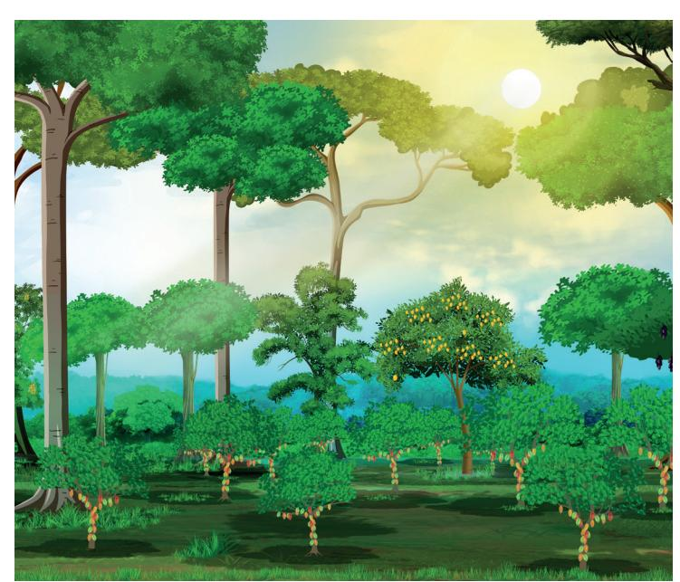

The strata identified give an idea of the category of covering responsible for shading in a cocoa farm. The dierent strata are:

 The cocoa stratum, from 1 to 8 m from the ground, where the cocoa stands are located, as well as a few young fruit and forest trees; The intermediate stratum, from 9 to 20 m, is mainly made up of fruit species that have been spared or planted, as well as a few young forest trees that have been preserved; The emergent stratum, from 21 to over 60 m, where most of the forest trees are found.

The composition of the intermediate and emergent strata will determine the quality of shade on the plot. It is generally accepted that species in the intermediate stratum will tend to provide denser shade, which is less favorable for disease control, than species in the emergent stratum with lighter shade. For this reason, producers need to have a good combination of each stratum and ensure regular pruning of the intermediate stratum.

The choice of species and their spatial distribution should provide an average of 40-50% shade over the whole plot.

Image showing the dierent strata present in a cocoa-based agroforestry system

According to Cameroon's agroforestry reference system, the threshold value in terms of the number of strata is three (03).

#### 2. Importance of species

The tree species used are those that are adapted to local agro-ecological conditions. Native species should be used to encourage species diversity of trees.

Natural forest systems have an annual rhythm determined by temperature and rainfall among others. A certain number of trees in the emergent stratum of the forest system lose their foliage for a few weeks or months during the dry season. Therefore, all maintenance work carried out must be in harmony with the development rhythms of the system as a whole. To further increase light penetration into the cocoa farm, shade trees that do not lose their leaves are pruned at this time.

Besides increasing light penetration, pruning also provides additional organic matter, which helps to maintain and improve soil fertility. Mulching indirectly improves soil texture and earthworm abundance. Periodic rejuvenation through pruning also extends the lifespan of the primary species.

If the operation to reduce shade cover and expose the cocoa trees to light are carried out around 6 months before the main harvest, it will positively aect on the cocoa generation phase and stimulate flower formation. Banana plants grown as intercrops between cocoa trees should be maintained regularly by removing old leaves and uprooting excess shoots. After the bananas are harvested, the pseudo stems should be split lengthways and placed on the ground.

Shade protects young cocoa trees from the stress of drought and exposure to the sun. It is recommended to have various tree species oering shade levels of 40-50%. Shade levels can reach 70% for young cocoa plants. As the cocoa trees grow and begin to shade themselves, the number of shade trees can be gradually reduced. Agroforestry settings that provide several dierent layers of shade can, however be advantageous for greater biodiversity and a favorable microclimate. Shade can be measured using the CanOvaLator application (https://play.google.com/store/ apps/details?id=com.will.iita), which can be downloaded from Google playstore and uses the diameter at chest height of the tree.

According to Cameroon's agroforestry reference system, the threshold value in terms of the percentage of forest covering is 40%

#### 3. Basal area

The removal and maintenance of trees in order to obtain optimum shade to guarantee acceptable cocoa production must not only consider the various elements mentioned above, but also the basal area. This represents the surface area occupied by the trunk of the tree at 1.3 m above the ground. On a given surface area of plantation where there are cocoa plants and trees, each of these 2 groups occupy a given surface area. Determining basal area at plot level gives the space occupied by cocoa trees on the one hand and by other trees on the other. It is an indicator of competition between trees and is important for assessing the productive performance of an agroforestry system.

On the other hand, since carbon storage capacity is an important element in the evaluation of agroforestry systems and its quite complex to determine, basal area is presented as a simpler means of deducing it. As a matter of fact, The various studies carried out on agroforestry systems show that there is a strong correlation between carbon stock, biomass and basal area.

Considering this parameter, we understand that the number of trees alone is not sucient as a criterion in the management of associated trees, but must be followed by the basal area and the number of species. It is advisable to have a basal area of 11 m2/ha for shade trees in order to limit competition.

NB: Details on how basal area is calculated are presented in Appendix 4.

According to Cameroon's agroforestry reference system, the threshold value in terms of basal area is 11 m2/ha

## Guide for trainers

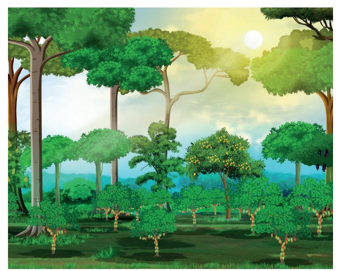

#### 1. Objective of the training

The objective is to enable participants to.:

have an understanding of the determinants of shading Have a clear idea on how to adjust shading.

#### 2. Necessary Materials

- Guidance sheet on measuring basal area presented in Appendix 4
- List of species commonly associated with cocoa trees and their uses
- Conference board
- Producer's sheet for the theme; flipchart paper, marker pens
- The image of a shaded plantation in the dry season and another without shade in the dry season to be found in the producer's sheet.
- Image of the dierent strata present in a cocoa-based agroforestry plantation
- Plantation where the training will take place.

#### 3. Training duration

The time allowed for the presentation of this theme is 45 to 60 minutes, depending on the level of understanding of the participants.

#### 4. Preparation of the trainer

Read and understand the general information section of this theme Research any aspects that have not been fully grasped after reading. Prepare conference papers according to the number of groups that will be formed and draw a diagram of the aerial view of a plot of land without a sucient number of shade trees

Image : Plantation with shade trees

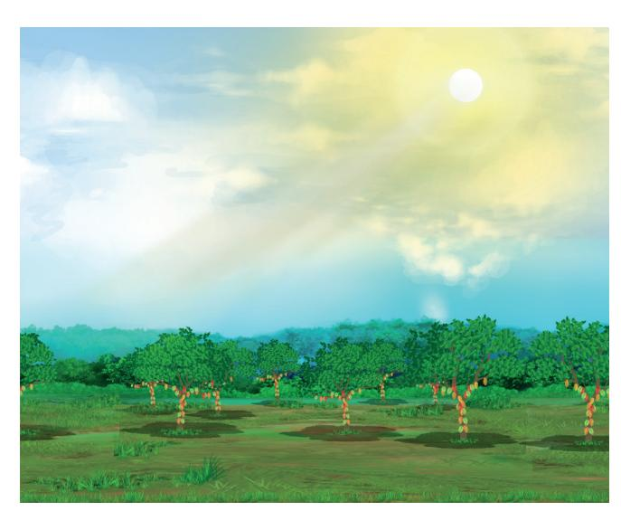

Image : Plantation without shade trees

 Read Appendix 7, which explains how to measure basal area.

## Conducting the training

#### 1. Setting the scene

#### a. Brainstorming/catch attention

 Ask the following questions: Who among you has trees other than cocoa in their plantation? Has the number of trees increased or decreased over time? What were your reasons for reducing or adding the number of trees? Take notes and guide the discussions to help them understand the dynamics of their plantation, then introduce the title of the theme to be covered.

#### b. Title

State the Title: Shade control in a cocoa-based agroforestry system.

#### c. Importance for the learner

Provide a clear understanding of the measures to be taken to ensure that shading is properly adjusted Reducing the eects of the sun on cocoa trees during extreme heat Maintain soil moisture and contribute to good yields Reducing disease and pest pressure.

#### d. Guidelines

During this training session, the aim will be to provide producers with the necessary information to enable them make the right decisions to maintain a good percentage of shade in their plantations. The aim is not to draw up a list of trees they should or should not leave in their plantations, but to give them the information they need to make their own choices.

#### 2. Disseminate

#### a. Explanation

Why is shading important in cocoa farming? Can any of you explain the benefits of shading, based on observations made in your farms? Which would you prefer, a plot with shade or a plot without shade? Explain your choice. Record the answers on the flip chart, while mentioning on one side the advantages and disadvantages of a shaded plot and on the other those of a plot in full sun.

> Comment on the dierent answers, using examples from the farm in which you are found. If there are shaded and unshaded areas in the plot, compare the appearance of the cocoa trees, grass cover, etc.

> Particular emphasis should be placed on the sustainability of shaded plantations, as cocoa trees are less exposed to bad weather.

A shade of 50%, What does it mean?

This means that the canopy density should be 50%, so half of the plantation must be shaded. This does not mean that one-half of the field should be completely covered and the other half completely lit. There must be regular and well-distributed gaps within the plot.

Do all the trees in your plantation provide the same type of shade? How do you assess the amount of shade in your plantation? Is it easy to work out the number of trees needed to achieve 50% shade in a plantation? How many trees are there in this plantation? To what rate do you estimate the shade?

Introduce the concept of strata. Explain the dierence in shade between trees of dierent species and the emergent and intermediate strata. Explain the importance of considering these aspects when choosing associated trees and for a good shade control.

 Also explain the importance of basal area for estimating the shade ratio in the plantation.

Explain complementary relationship of some species with the cocoa tree on one hand and with each other on the other hand.

Emphasize on the capacity of some tree species to lose their leaves at certain times of the year.

 Whom amongs you takes the time to prune trees other than cocoa in your plantation? Ask them how they go about it?

> Present the importance of pruning trees that have a low and quite dense shade. These include trees in the intermediate stratum, such as plums, citrus trees, avocado trees, cola trees, etc.

 Who can give us the names of a few species of trees that provide good shading?

> Comment on the answers and add the species that have not been mentioned but which provide interesting shade in cocoa farming

#### b. Visualization

Show the image of a plantation shaded

in the dry season and another without shade in the dry season to support the explanations of the protective role played by the trees. Present an image of the dierent strata present in a cocoa-based agroforestry

plantation.

#### c. Case studies

 Assess the shade level in a plot and identify the actions to be taken to reach the optimum or recommended threshold value.

#### d. Reframing

 Explain to participants the importance of shading in the context of climate change and the introduction by cocoaconsuming countries of strict rules on maintaining shade. Refer to the threshold level that must be maintained for the plantation to be classified as a cocoa- based

agroforestry system in Cameroon.

#### 3. Summary and Evaluation

#### a. Summary

 Summarize the points raised during the discussions and emphasize the need to consider the dierent strata, tree species and basal area when adjusting shading. Explain to the participants that the number of trees is not sucient information for good shade management, but other information such as the species and spatial distribution of the trees is also important and must be taken into consideration.

#### b. Evaluation

- Ask the following questions and correct any answers that are wrong or incomplete.
  - What factors should be taken into consideration when choosing which species to associate with cocoa trees?
  - Why is it necessary to adjust the shading?
  - Which trees other than cocoa need to be pruned?

## Theme 2.2 Maintaining a cocoa plantation in an agroforestry system

General information

#### 1. Weeding the plantation

Weeding the plantation consists of eliminating all weeds by mowing or using herbicides. This operation must be carried out regularly, 3 to 4 times a year, or even more depending on the condition of the plot. Repeating this practice throughout the plantation permits the cocoa trees to avoid having nutritional competitors and insect pests.

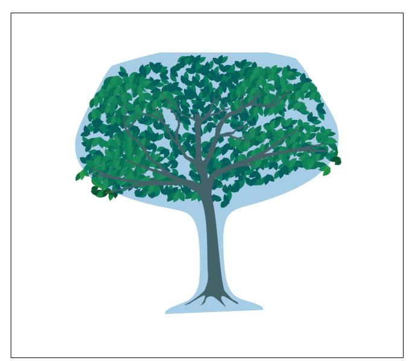

After weeding, leave the debris on the plantation floor to serve as a mulch that not only protects the soil against water and wind erosion, but also restores nutrients and maintains soil moisture.

#### 2. Pruning and cleaning cocoa trees

Both young and mature cocoa plantations need regular maintenance by pruning and cleaning of the cocoa plants. The latter involves removing epiphytes or parasitic plants such as African mistletoe and Laurentus, removing moss by spraying with a 1/10th salt solution and mummified pods. The latter is also known as sanitary harvesting. The mummified pods harvested must be removed from the farm and placed in a pit prepared in advance and must be burnt. This must be done to prevent the spread of the disease in the farm, since the pods carry the organism responsible for the disease.

The three types of pruning known in cocoa cultivation consist of eliminating the unproductive stems and shoots of the cocoa tree. This leads to a clear improvement in the productivity of cocoa plants. These three types of pruning are: formation, maintenance and restoration.

#### 2.1 Formation pruning

Growth pruning is carried out when the cocoa plants are still young and consists of helping the tree to form its crown as quickly as possible at a suitable height of 1.2m to 1.5m.

The goal of this operation is to prevent the cocoa plant from growing too low or too high and to maintain a good crown (minimum 3 branches and maximum 5).

Image of a well-pruned cocoa plant

However, crown height varies considerably from one tree to another. It has been found that increasing light intensity reduces crown height. If a crown is judged to be too low, it can be cut back. The most vigorous of the suckers that shoots can be selected and all the others removed. In due course, this shoot will produce a taller crown.

If formation pruning is not carried out correctly at this stage of growth, there is a risk of ending up with very tall cocoa trees, which will adversely aect maintenance and harvesting operations. In the case of formation pruning, only excess young stems, poorly formed young stems and suckers are removed.

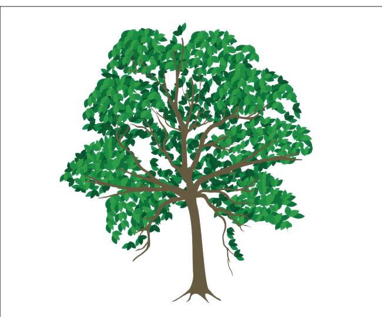

Image of a badly pruned cocoa tree

#### a. Period

During the first 4 years after planting.

#### b. Method

Cut o the dominant tip to encourage other lateral branches to grow vertically. Prune drooping branches to encourage strong branch union from an early age. Cut back lateral branches at 40-60 cm above ground level (branches below knee height) to encourage well-spaced main branches. Prune the main branches at 100-150 cm from the crown. Prune low, drooping branches to form a circular crown. Leave three or four main branches evenly spaced from the crown (the point where the stem branches out into a fan) to encourage canopy coverage.

#### 2.2 Maintenance pruning

Maintenance pruning is carried out throughout the life of the cocoa plant. It consists of removing the oshoots and branches that the cocoa tree does not need and that prevent light from penetrating through the foliage.

Suckers that are shoots or oshoots on the main stem, compete with the plant for nutrients, leading to a reduction in production. More so, these young shoots, which attract pests such as mirids, must absolutely be removed.

In the case of maintenance pruning, the following parts are removed:

- Dead branches
- The o-shoots
- Young branches that increase shade
- Branches growing less than 60 cm from the main branch
- Diseased branches
- The twigs
- Parasitic and epiphytic plants
- Mummified pods.

#### a. Period

This activity should be carried out after the main harvest period. Generally, between January and March..

#### b. Method

Prune all shoots below knee height, where they join the trunk (less than 40- 60 cm from the ground). Prune back most shoots and regrowth within the primary structure formed. Encourage suckers at the base of fallen or leaning trees to grow to replace the old tree. Remove suckers that do not grow in a straight line.

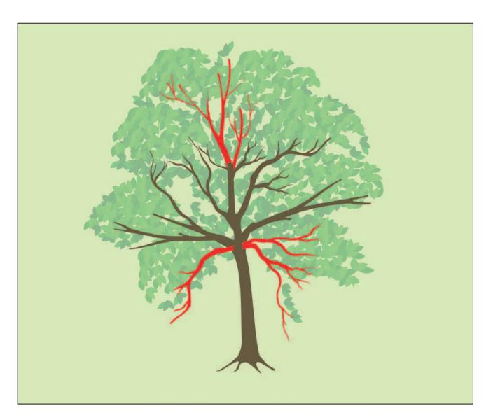

Image of a mature cocoa tree with the dierent types of branches to be pruned

Restoration pruning consists of removing excess cocoa stems. This gives the cocoa tree a good shape, makes it easier to move around the farm for maintenance operations, and promotes good air circulation and sun penetration. It also permits to reduces insect attacks and diseases.

Restoration pruning is generally carried out on plantations that have not been maintained for some time. During restoration pruning, the following parts must be removed:

- The surplus unproductive stems
- Malformed or diseased stems
- Branches hanging from the highest point of the crown
- Upper branches exceeding 2.5 to 3 m

To sum up, the fundamental aim of pruning cocoa trees is to encourage a tree structure that allows sunlight to filter through the main branches and trunk (known as the crown) in order to stimulate flowering and facilitate harvesting.

#### 3. Regeneration of the cocoa plantation

Cocoa farms of over 40 years old generally have problems of low yields caused by the advanced age of the cocoa stands, but also by other factors such as poor management and parasite pressure.

A cocoa tree in good condition can produce an average of 25 pods per year, which would be roughly equivalent to 1kg of commercial cocoa. It is therefore accepted that cocoa trees that produce fewer than 10 pods per year are considered non-productive and action must be taken to maintain the plantation's production level.

There are two approaches which could be considered in order to maintain or improve production:

- Rehabilitation;
- Replanting.

Rehabilitation is a process that leads to the rejuvenation of a plantation where the implementation of good agricultural practices could be sucient to improve production. Rehabilitation is carried out on plantations that are less than 40 years old, with an average yield of around 400 kg/ha, and when the cocoa trees become too tall for harvesting and other maintenance operations.

It includes dierent activities such as: pruning cocoa and shade trees; removing all diseased or infected pods; removing dead or diseased branches, sheaths and o-shoots; fight against weeds, diseases and parasites. Rehabilitation can also involve increasing the quantities of fertilizer or organic matter to replenish the soil's nutrients.

#### 3.2 Replanting

Replanting is the process of replacing old cocoa trees with new ones or replacing senescent cocoa trees. Replanting becomes important for plantations over 60 years old, where the majority of trees are old and unproductive.

The principle of replanting is to divide the plantation into 2, 3 or 4 blocks depending on their level of productivity. For each block, the old cocoa trees are cut down and replaced by new plants, in accordance with the recommended planting density. It is advisable to start with the block having the most unproductive cocoa trees and to progress over the years towards those with the fewest unproductive trees.

The association of cocoa with annual crops such as plantain, which provide temporary shade during the replanting process, is permitted in order to make the most profitable use of space.

In a 4-block replanting system, it will take around 6 to 7 years to completely replant the field and for all the young cocoa trees to come into production. This approach will significantly improve yields over the next 20- 40 years.

## Guide for trainers

#### 1. Objective of the training

The objective is to enable participants to:

Have a good knowledge of the dierent maintenance activities and associated good practices.

#### 2. Necessary Materials

- Conference paper
- Conference board
- Pruning hooks
- Machete
- Pruning shears
- Delimber
- Pruning guidance sheet
- Image of a well-trimmed and cleaned plantation.

#### 3. Training duration

The time allowed for the presentation of this theme is 60 to 90 minutes, depending on the level of understanding of the participants.

#### 4. Preparation of the trainer

 Read and understand the general information section of this theme, which sets out the key points on which the trainer should base his or her training. Identification of a well-established plantation over 25 years old that is not well maintained where the training will be held. It is important to choose a plantation that is representative of the area where the training will be

conducted.

## Conducting the training

#### 1. Setting the scene

#### a. Brainstorming/catch attention

 Ask the question to know why is it important to maintain something? What will happen if we have a motorbike that we never service? Let everyone give his or her point of view.

> Summarize everyone's answers and introduce the training session by saying that a motorbike needs oil to be changed, it needs to be washed so that it can work properly. Take the example of chicken farming, where daily cleaning is essential to prevent disease and ensure good production.

#### b. Title

 State the Title: Maintenance of a cocoa orchard/plantation.

#### c. Importance for the learner

 To have clear and applicable knowledge of the various maintenance activities in a cocoa orchard Reduce the use of inputs and the incidence of disease Improving the condition of the plantation and further yields Improve on the management of existing plantations.

#### d. Guidelines

The aim will be to show in a practical way how to clean a cocoa plantation, how to correctly prune cocoa trees and how to maintain the production level of a plot despite the advanced age of the cocoa trees.

It will not be about phytosanitary treatment aspects, but to focus on the management of cocoa plants. Sanitary protection will be the subject of another training session.

#### 2. Disseminate

#### a. Explanation

 Ask the following questions: Is the plot of land we are in properly cleaned? How many times a year do each of you mow the weeds? Do you do it manually or using chemicals? Why or why not?

After collecting their opinions, summarize the answers that were given. Mention the fact that there is no predefined number of times for clearing a plot, the frequency of the said clearing being linked more to the speed of weed growth. Emphasize the fact that a plantation must be clean at all times of the year. Discuss the advantages of having a weedfree plot, particularly in terms of competition for soil nutrients.

 Divide the producers into groups and give each group a few cocoa trees to observe and say whether or not they

are well maintained.

 Give each group a few minutes to explain why they think the cocoa trees are well or badly maintained. At the end of each group's presentation, ask the others if they have any remarks or comments to make based on what has been said.

> Start with the height of the cocoa trees to talk about formation pruning whose aim is to form the crown at a reasonable distance above the ground to facilitate maintenance operations. Mention the diculty of harvesting in a farm where the cocoa trees have a height of 4 m or more.

 Ask who among you has cocoa trees very high up in their plantation? Are you able to harvest all the pods from the cocoa trees? Let the producers argue to corroborate what you have said.

Following this, take an example within the plantation of a cocoa tree that lets light through and another that is bushy. Explain the importance of maintenance pruning whose aim is to remove unnecessary branches and shoots, and give the plant good aeration.

 When is it advisable to carry out maintenance pruning? Why?

> Summarize the answers and provide additional information if necessary. It should be underlined that this pruning should be carried out after the harvest and in the dry season to enable the cocoa tree to manage its resources rationally. With the exception of oshoots, which can be removed at any time, it is not advisable to remove other branches when the cocoa tree is renewing its leaves

 Ask participants to show a cocoa tree that needs to be rejuvenated or restored - why?

> Take the example of a plant that needs to be restored or rejuvenated. Explain the restoration pruning process.

 What tools do you use for pruning? Who does the pruning in your plantations? Are you satisfied with the present state of your cocoa trees? What actions will you carry out on your plots after this training?

Depending on the answers given, lay emphasis on the plots where producers say rejuvenation is needed and introduce the concepts of rehabilitation and replanting. Make them understand that these actions need to be well planned to avoid a sudden drop in production. The field for replanting can be divided into 4 blocks and each year a block is replanted so that by the time the whole plantation is rejuvenated, part of it will already be in production.

#### b. Visualization

 Image of dierent types of pruning Image of a neat, well-pruned plantation.

#### c. Case studies

 Carry out Pruning in the farm. It is preferable to go to an old plantation in production to have enough material to practice (restoration and maintenance pruning). But if there are also young plants in the plot, formation pruning can be carried out. Identify the plants to be rehabilitate and explain the various stages to be followed.

#### d. Reframing

 Draw attention of producers to the fact that rehabilitation should be carried out once it has been ascertained that the it is becoming increasingly dicult to carry out harvesting. Moreover, maintenance pruning must be carried

cocoa trees are not productive, or when out due to the height of the plants. Each branch removed from the cocoa tree is done for a well precise reason. It is not a matter of systematically reducing the branches of the cocoa tree every year.

#### 3. Summary and Evaluation

#### a. Summary

 Summarize what has been said, emphasizing the importance of pruning to improve yields and the health state of cocoa trees. It should be noted that each pruning operation is carried out at a specific time and has well-defined objectives. Rehabilitation of a plot is a process, that is carried out progressively to maintain a minimum level of production of the plantation.

#### b. Evaluation

- Ask the following questions and correct any answers that are wrong or incomplete.
  - Why is it important to prune cocoa trees?
  - What are the dierent types of pruning and their objectives?
  - When is it necessary to rehabilitate a plantation?
  - When is it advisable to carry out maintenance pruning?

# Theme 2.3

## Improving on an existing plantation with an agroforestry system

General information

### 1. Diagnosis of an existing cocoa orchard

Upgrading an existing plantation into an agroforestry system involves a number of steps in terms of the number of trees and species per hectare. First, a diagnosis of the existing orchard must be carried out to determine whether the plantation can be considered an agroforestry system. Then, if it reveals that the number of trees and associated species does not comply with the minimum established, the producer will have to identify the number of trees and the number of additional species that will have to be associated with the cocoa trees in the system to bring it up to standard.

Upgrading a cocoa production system involves answering a number of questions:

 What is the area of my plantation? How many trees other than cocoa are found in my plantation? Is this number of trees sucient? If not, how many trees other than cocoa must I introduce? How many tree species are there in my plantation? Is this number of species sucient? If not, how many tree species must I introduce? Which of the existing trees are of no use to me or are incompatible? What compatible tree species are available in my locality? What is the condition of the cocoa trees? Is the plantation productive or not? What is the density of cocoa trees? Has production dropped or remained stable?

The answers to these questions will enable the cocoa farm to be classified into a category and thus guide the actions to be taken to maintain or improve the agroforestry production system. These dierent categories arelisted in Table 5.

Table 5 : Possible situations following diagnosis of the plantation and measures to be taken

| N° | State of the plantation                                                       | Action to be implemented                                                                                                                                                                                                                                                                                                                                                                                                                                                                                              |
|----|-------------------------------------------------------------------------------|-----------------------------------------------------------------------------------------------------------------------------------------------------------------------------------------------------------------------------------------------------------------------------------------------------------------------------------------------------------------------------------------------------------------------------------------------------------------------------------------------------------------------|
| 1  | Mature but unproductive cocoa trees under shade trees                         | <ul> <li>Identify all unproductive cocoa trees. Cut down some of them completely, while adjacent trees in the intermediate stratum should be heavily pruned.</li> <li>Prune all the shade trees in the sphere of influence of the cut cocoa trees, cut up to the remaining crown. Shred the pruning waste and spread it evenly over the ground.</li> <li>Plant new cocoa plants in the holes. If the area is large enough, pioneer plants such as maize can be planted.</li> </ul>                                    |
| A  | Old but still productive plantations with shade trees from a secondary forest | <ul> <li>Carry out maintenance activities of a cocoa farm</li> <li>Implement integrated crop protection activities</li> <li>Maintain the system as it is as long as it remains productive</li> <li>Set up a rejuvenation plan of the cocoa trees</li> </ul>                                                                                                                                                                                                                                                           |
| 3  | Unproductive old plantations and disease-prone plantations with shade trees   | <ul> <li>Completely remove any existing cocoa trees that are subject to parasites and diseases or have low productivity, and replace them. Or, on the other hand, rejuvenate them by grafting them with new buds.</li> <li>Plant bananas, pioneer plants and all the tree species on the different levels before felling the old shade trees.</li> <li>If possible, leave plant material from felled trees within the plantation.</li> <li>Prune the cocoa trees in a thicket to a height of around 40 cm.</li> </ul> |

### 2. Introduction or maintenance of trees

Trees play a very important role in cocoa farming and are essential elements in the sustainability of these production systems. Shade trees and their management are beneficial, whatever the climate, because a well-managed number of trees, with appropriate shade and suitable species, can help protect the plantation from excessive sun, strong winds and heavy downpours by acting as a natural barrier. The leaves enrich the soil as they fall and protect the cocoa trees from direct sunlight, reducing evaporation from the soil and leaves. Shading cocoa trees prolongs their economic life and reduces the need for external nutrients (mineral fertilization).

Shade trees can be kept when the cocoa plantation is set up (residual), introduced (planted) or left to grow once they appear in the plantation (spontaneous).

In the case of existing cocoa farms, we will focus on those that are introduced or are maintained once they appear. They oer a multitude of environmental and socioeconomic benefits. Trees in an agroforestry production system contribute to the sustainability and overall productivity of the system.

For more detailed contribution of trees in an agroforestry system, we can cite the following elements:

- Shade and favorable microclimate: Trees provide shade that helps create a favorable microclimate for growing cocoa. This can reduce heat stress on cocoa plants, favor retention of soil moisture and reduce disease pressure.
- Protection against erosion: Agroforestry systems with trees provide natural protection against soil erosion, particularly on slopes. The roots of the trees help to stabilize the soil, reducing the risk of erosion caused by water and wind.
- Nutrient supply: Some trees fix atmospheric nitrogen in the soil through symbiotic associations with nitrogenfixing bacteria. This can enrich the soil with essential nutrients for cocoa growth.
- Biodiversity: Trees in agroforestry systems increase biological diversity by providing a habitat for a variety of plant and animal species. This can contribute to the resilience of the system by providing some natural pest control and promoting pollination.
- Income diversification: In addition to producing cocoa, some trees in agroforestry systems can be exploited to provide other value-added products, such

| N° | State of the plantation                                                                                    | Action to be implemented                                                                                                                                                                                                                                                                                               |
|----|------------------------------------------------------------------------------------------------------------|------------------------------------------------------------------------------------------------------------------------------------------------------------------------------------------------------------------------------------------------------------------------------------------------------------------------|
|    |                                                                                                            | <ul> <li>• Chop, shred and spread all the branches on the ground.</li> <li>• Correct the spacing between old cocoa trees, if necessary.</li> <li>• Select an off-shoot from pruned cocoa trees that will produce fruits after about 3 years and eliminate all the other off-shoots.</li> </ul>                         |
| 4  | Plantations still productive without shade trees                                                           | <ul> <li>• Many plantations have been established without shade, or shade trees have been removed over time. Improving these plantations must begin with the establishment of shade trees.</li> <li>• Introduce forest trees, taking care to vary the tree species and their spatial</li> <li>• Arrangement</li> </ul> |
| 5  | Low productivity plantations with a high density of cocoa trees and few shade trees                        | <ul> <li>• If the cocoa trees have several trunks that grow in competition without forming a real canopy, it would be necessary to rehabilitate the plantation.</li> <li>• Reduce density to recommended level</li> <li>• Introduce new forest species to reach the recommended minimum</li> </ul>                     |
| 6  | Low productivity plantations with a high density of cocoa trees and without shade trees on exhausted soils | <ul> <li>• Reduce the density of cocoa trees</li> <li>• Improve soil fertility by restoring a high level of organic matter production through the cultivation of leguminous plants and robust native shrubs</li> <li>• Introduce forest species</li> </ul>                                                             |

as fruits, timber, medicinal products, etc. This provides farmers with an additional source of income and reduces their economic dependence on cocoa.

- Carbon sequestration: Agroforestry trees play an important role in fighting climate change by capturing and storing atmospheric carbon. Their presence helps to reduce greenhouse gas emissions and mitigate the eects of global warming.

The introduction or maintenance of trees in cocoa farms must consider several criteria, such as compatibility with cocoa and usefulness to the producer. A certain number of tree species are usually associated with cocoa and give acceptable results (see theme 2.1).

The distribution of trees within a plot plays a very important role for trees in the intermediate and emergent strata. Several studies have shown that an aggregated arrangement could create a microclimate favorable to the development of fungal diseases and increase the risk of the presence of moss on the trunk of the cocoa tree.

It is therefore advisable to have an even distribution, avoiding clusters of trees associated with the cocoa trees.

#### 3. Criteria for Selection and non-selection of trees associated with cocoa

There are several types of shade tree, each with its own characteristics that can either be beneficial for cocoa farming, or represent a challenge to be taken into consideration. According to Cameroon's agroforestry reference system, it is advisable to keep at least 12 dierent species of shade tree compatible with cocoa. The following characteristics of shade trees have been identified as beneficial to cocoa farms.

- Frequency of leaf loss: Trees lose their leaves at dierent times of the year. Particularly in hotter and drier zones or where rainfalls are high, it is important to plant dierent types of trees that lose their leaves at dierent times of the season to ensure constant cover.

As shade cover is more important for cocoa during the dry season, it is important to include tree species that retain their leaves during the dry season rather than those that lose their leaves. Thus, a combination of semi-deciduous and evergreen species should be considered to regulate solar radiation and heat during the dry season, when cocoa shading is most important. As example is Frake (Terminalia superba). You can also include species that lose their leaves at the start of the dry season and produce new leaves during a greater part of the dry season, such as Djansang (Ricinodendron heudelotii) and Iroko (Milicia excelsa).

- Root system: Some trees have a deeper root system than others. Deep roots reduce erosion and can reach nutrients beyond the reach of cocoa trees, thus recycling nutrients and avoiding

Image of the dierent possible arrangements of trees in a plantation

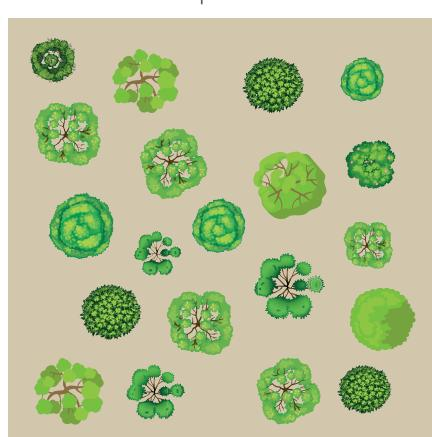

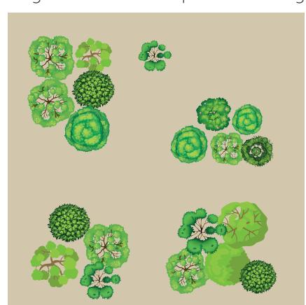

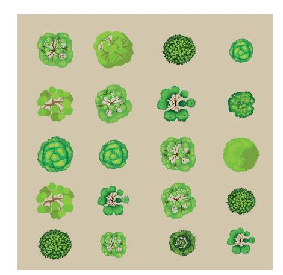

Clustered arrangements Untidy arrangements regular arrangements

competition. A solid root structure will prevent trees from being uprooted by strong winds and thus prevent damage to the cocoa trees.

- Height: When considering height, it is preferable to use trees capable of reaching the emergent stratum to create sucient space between the intermediate stratum and the lower stratum, which is that of the cocoa trees.
- Water tolerance: In riparian zones (near water sources), it is recommended that water-tolerant native species be used to create shade in order to improve ecosystem services (moderating soil and air temperatures, retaining soil moisture, creating a favorable microclimate).
- Crown width and thickness: Some trees have a widespread crown and others a narrow crown. For example, Terminalia (Frake) has a wide crown while Newbouldia laevis (African hyssop) has a small, round crown.

The criteria listed above are not exhaustive but are those that are easy for the producer to assess in order to make a better decision. In addition to these criteria, the usefulness to the producer in terms of fruit production, medicine, timber, etc. must also be taken into consideration.

A matrix for selected species to be associated with cocoa trees according to their importance can be drawn up in order to facilitate decisionmaking by the farmer. The aim of the matrix is to enable the farmer to find a compromise between the tree's contribution to satisfying his needs and its compatibility with the cocoa trees. The evaluation criteria could be as follows:

- The quality of the shade
- Soil fertilization
- Weed control
- Mechanical damage
- The moment it loses its leaves
- Host to pests and diseases
- Usefulness as timber
- Fruit production.

Table 6 shows the dierent tree species that can be associated with cocoa in agroforestry systems with their uses.

Table 6 : Tree species and their uses

|                         |                                                     | FRUIT TREES                                                             |
|-------------------------|-----------------------------------------------------|-------------------------------------------------------------------------|
| Common name             | Scientific name                                     | Usefulness                                                              |
| Plantain-banana         | Musaceas                                            | Food security, requires good management                                 |
| Oranges, lemons, limes  | Citrus sinensis, Citrus lemon, Citrus aurantiifolia | Does not provide biomass; can be combined with cocoa; local market      |
| Plums                   | Dacryodes edulis                                    | Good biomass supplier; good local market                                |
| Mango                   | Irvingia gabonensis                                 | Excellent for cocoa, good local market                                  |
| Avocado tree            | Persea americana                                    | Excellent for cocoa; can be pruned easily                               |
| Bitter Cola             | Garcina kola                                        | Excellent for cocoa                                                     |
| Mango tree              | Mangifera indica                                    | Excellent biomass supplier; best planted on the edges of the plantation |
| Oil palm                | Elaeis Guineensis                                   | Important for cocoa production, but the lower leaves must be pruned     |
| Breadfruit (jack fruit) | Artocarpus altilis                                  | Income, food supply, up to 12 metres                                    |

|               |                        | FOREST TREES                                                                                                                                                                                       |
|---------------|------------------------|----------------------------------------------------------------------------------------------------------------------------------------------------------------------------------------------------|
| Common name   | Scientific name        | Usefulness                                                                                                                                                                                         |
| Cheesemaker   | Ceiba pendandra        | Excellent for cocoa; improves soil fertility; large tree occupying a lot of space; poor quality wood                                                                                               |
| Iroko         | Milicia excelsa and    |                                                                                                                                                                                                    |
|               | Milicia regia          | Excellent for cocoa, very good wood, 30 to 40 metres                                                                                                                                               |
| Mahogany      | Khaya ivorensis        | Excellent for cocoa, large timber tree with light shade                                                                                                                                            |
| Sapelli       | Entandrophragma        |                                                                                                                                                                                                    |
|               | cylindricum            | Excellent for cocoa, valuable wood, up to 45 metres long                                                                                                                                           |
| Oak           | Terminalia ivorensis   | Excellent for cocoa, self-pollinating, fast-growing, one of the main timber trees                                                                                                                  |
| Frake         | Terminalia superba     | Excellent for cocoa, self-felling, one of the main timber trees                                                                                                                                    |
| Camwood       | Baphia nitida          | Improves floors, high-quality wood                                                                                                                                                                 |
| Adjap (Moabi) | Baillonella toxisperma | Harvesting wood and oil for consumption, large tree                                                                                                                                                |
| Albizia       | Albizia sp.            | Soil fertility, medicinal, good wood Nitrogen-fixing tree, the most important shade tree for cocoa                                                                                                 |
| Gliricidia    | Gliricidia sepium      | in Central America, good live hedge; biomass production is not very high;                                                                                                                          |
| Leucaena      | Leucaena leucocephala  | Small tree, much better for combining with cocoa at the beginning of the cycle. Can be useful at the start of a new plantation, does not tolerate shade, low biomass production. Not really useful |
| Moringa       | Moringa oleifera       | in cocoa plantations, but excellent source of food planted around houses.                                                                                                                          |

Source: Study on crop protection in countries where the programme 'Green innovation centres for the agro-food sector' is active\_ National report for ProCISA in Cameroon, May 2018

## Guide for trainers

#### 1. Objective of the training

The objective of this training session is to enable participants to:

 Diagnose a plantation and identify areas for improvement Learn about the various operations involved in improving an orchard as part of a virtuous agroforestry system.

### 2. Necessary Materials

- Diagnostic sheet for a cocoa orchard
- List of species commonly associated with cocoa trees and their uses
- Conference paper prepared in advance with the diagnostic matrix
- Markers
- Plantation where the training will be conducted
- Table 4 of dierent types of plantation with improvement actions.

#### 3. Training duration

The time allowed for the presentation of this theme is 60 to 90 minutes, depending on the level of understanding of the participants

#### 4. Preparation of the trainer

 Read and understand the general information section of this theme, which sets out the key points on which the trainer should base his or her training. Carry out a diagnosis of an orchard in order to be better equipped to guide participants during the training course. Identification of a plantation where the training will take place

## Conducting the training

#### 1. Setting the scene

#### a. Brainstorming/catch attention

 Ask the following questions: Who are those who have shade trees on their cocoa farms? Where do they come from? Why do you keep them on your plantation? Take the opinions of the majority of participants and note them down on a sheet of paper so that you can come back to them later in the Conducting the training. Thank them for their contributions and introduce the day's theme and the objectives for the producer.

#### b. Title

 State the Title: Improving an existing cocoa farm using an agroforestry system

#### c. Importance for the learner

 Making your farm activity more sustainable and resilient to the eects of climate change Improving production systems and reducing forest degradation

#### d. Guidelines

The aim of the training will be to help farmers understand the merits of an agroforestry system, how to evaluate existing plantations and how to improve them in order to have a production system that meets the criteria of a cocoa-based agroforestry system.

The matter here is not about detailing the various operations for improving the diagnosed system, but rather focusing on the decisionmaking principles.

#### 1. Disseminate

#### a. Explanation

 What are the major problems encountered in your plantations? Take an interest to those that have problems with reduced fertility, lower yields or pest pressure. What year was your plantation created? For old plantations, ask whether production is stable dynamics of his plantation. Divide the participants into dierent groups and ask them to carry out a diagnosis of the plot in which the training is taking place. On the basis of a set of questions that will be answered based on the observations, each group

All these questions are designed to get the group thinking and to help them understand the logic of the plantation diagnosis that will be discussed. The answers to the questions will help guide the producer to reflect on the will have to classify the plot in one of the categories presented in table 4 in the "General information" section.

 Based on the category of the plantation, list the various actions to be implemented to improve the plantation towards a cocoa-based agroforestry system.

> Ask each group to present the results of the diagnosis and say what activities will have to be carried out by the owner of the field in order to bring it up to standard. Prompt discussions by asking others to comment on the results of the diagnosis.

 Ask producers to classify their own farms based on the information they have been given.

 This will prompt them to reconsider the actions they need to take individually on their farms.

 Ask the groups to draw a diagram of the farm, highlighting the areas where trees need to be added or reduced depending on the category of plantation.

 Ask each group to give the criteria to be considered when choosing which trees to be removed or kept in the plantation.

When discussing the results: ensure that all the groups are involved (which means: don't always let the same group answer, you can also mix up the groups after each characteristic).

Clearly indicate the scientific and local names of the trees identified. If possible, also indicate where farmers can obtain them. Provide additional information on each characteristic and findings described in the information sheet of the list of species commonly associated with cocoa trees with their uses and explain why this trait is beneficial.

Mention that, «the associated tree species must be compatible with cocoa farming». Then Ask:

 What does this mean? Not all trees are suitable for a plantation. What characteristics of trees are not suitable for a plantation? Let several people answer. Make sure you list all the features that make a tree unsuitable (Cf. Appendix 2). What type of trees are not recommended for a plantation?

> Explain why these trees are not recommended (see the list of species commonly associated with cocoa trees and their uses).

> Provide specific recommendations for participant levels and zones.

 Finally, ask the following questions and facilitate a brief discussion: Which recommendation are you most willing to implement? Why? Which recommendation will be the hardest to implement? Why? What can you do to meetup with this challenge? What is the first step you will take?

#### b. Visualization

 Image of an agroforestry plantation and that of a plantation in need of improvement

#### c. Case studies

Diagnosis of the orchard

Draw a diagram of the plantation,

marking where trees are to be added or

removed.

#### d. Reframing

 Remind participants of the importance of managing cocoa farms as part of an agroforestry system, given the eects of climate change, which are increasingly having an impact on yields.  Draw their attention to the EU regulations on "zero deforestation" in cocoa production, which encourages producers to manage existing orchards sustainably while making them even more productive.

#### 3. Summary and Evaluation

#### a. Summary

 Summarize the various contributions, taking care to remember that the aim of this exercise is to transform or maintain orchards in an agroforestry system to ensure their sustainability. Ask the participants if they still have any questions about the subject that has been discussed.

#### b. Evaluation

- Ask the following questions and correct any answers that are wrong or incomplete.
  - Why diagnose a cocoa orchard?
  - What are the criteria for choosing a tree to introduce?
  - What are the criteria for undesirable trees?

# PART 3 FERTILIZATION AND SOIL MANAGEMENT OF A COCOA FARM IN AN AGROFORESTRY SYSTEM

# Theme 3.1 Soil management

## General information

#### 1. Soil fertility management

Soil fertility can be assessed physically (texture and structure), chemically (nutrient content) and biologically (soil flora and fauna). maintaining soil fertility for farmers who do not have access to resources enabling them to carry out regular soil analysis, it is necessary to focus on organic matter.

Organic matte is important because solely, it improves on the biological, chemical and physical parameters of the soil. It helps prevent erosion as well as water stagnation, and also improves on plant health through the activity of micro-organisms. The decomposition of organic matter is equally the way by which nutrients are naturally returned to the soil.

Maintaining soil fertility consists somehow in returning back to the soil the nutrients that have been exported by harvests. to guarantee this restitution, it is advisable to:

 Allow residues of unwanted grass to decompose after mowing; Plant nitrogen-fixing cover crops where possible in order to produce organic matter after mowing (see Table7 for a list of cover crop species); Maintain shade trees, which, through

the production of leaf litter, are able to return to the soil some of the nutrients removed;

 Put mineral fertilizers in the soil and do not expose them on the surface so that they bind better with the organic matter; Do not burn crop debris except for pest control purposes; Reduce as much as possible the use of herbicides, which deprives the system of a source of organic matter and are harmful to the soil's microbial life, which is important for soil fertility; Avoid leaving plastic objects lying around or discarding chemical packages within the plantation. All available sources of organic matter on the farm must be used and recycled in the form of compost, animal manure, slurry or mulch.

All available sources of organic matter on the farm must be used and recycled in the form of compost, animal manure, slurry or mulch.

#### 2. Fighting erosion

Soil erosion can be defined as progressive loss of the top layer of the soil under the action of erosive agents such as water, wind and human activity. The significant loss of the arable layer of the soil is a phenomenon that leads to the loss of soil fertility. Soil being an important agricultural resource, it is important to take action to prevent this phenomenon of erosion. The fight against erosion requires a good understanding of the risk factors and, more importantly, of the areas liable to erosion. This is necessary in order to develop and implement appropriate management measures for soil conservation.

The risk factors or areas likely to be subject to erosion are:

- Exposed bare soils with no vegetation cover or organic matter
- Zones with slopes
- Zones around water bodies
- Zones with high seasonal rainfall
- Zones with poor drainage or saturated soils with a high runo rate

Mitigating these risk factors for erosion requires the implementation of good agricultural practices, as outlined below:

 Maintaining vegetation: This will slow down water run-o and increase the time for water infiltration into the soil. The root system of the vegetation also makes the soil more porous, helping water to infiltrate more rapidly. This vegetation can be natural or planted. Maintaining Trees: They provide a forest cover that reduces the intensity and number of raindrops that hit the ground directly. They also make a major contribution to the soil's retention capacity via their strong roots, which hold the soil in place (see Table 6). Maintaining ground cover: This ground cover can be made up of grass residues after mowing, of Leaves and branches from cocoa trees, as well as those from trees other than cocoa. It protects the soil against the eects of rainwater droplets and wind. Maintaining buer zones around water bodies: This involves keeping a strip of natural vegetation at a distance between the watercourse and the cultivated area. This practice helps to avoid loss of land near watercourses in the event of an increase in the water flow caused by heavy rainfalls.

## Guide for trainers

#### 1. Objective of the training

At the end of this training session, the producer should be able to:

Know the soil and its characteristics Learn about good soil conservation practices

#### 2. Necessary Materials

- Diagnostic sheet for a cocoa orchard
- Conference paper
- Markers
- Plantation where the training will be conducted
- Image of a covered soil and another that is uncovered
- Image of the dierent types of erosion

#### 3. Training duration

The time allowed for the presentation of this theme is 30 to 45 minutes, depending on the level of understanding of the participants.

#### 4. Preparation of the trainer

Read and understand the general information section of this theme, which sets out the key points on which the trainer should base his or her training. Identification of a plantation with a sloping area and a watercourse if possible where the training will be held

Gather opinions and emphasize that the essential element that characterizes fertile or healthy soils is the presence of organic matter on the surface. Tell them that the presence of organic matter is recognized by the presence of black soil, because when elements decompose, they bring about the black colour of the soil.

Continue the discussion by making them understand that soil management in agriculture is synonymous with maintaining soil organic matter.

 In your opinion, what are the dierent practices that can help to always keep the soil black? Who among you uses these practices to maintain the organic matter in their plantation? Do you feel that this is beneficial for the soil in your plantation?

> Get as many opinions as possible. List the various practices that can improve the amount of organic matter in the soil, taking care to explain the mechanism by which each contributes

> Explain to the participants that the superficial part of the soil is the most important in agriculture and that when this part is removed, it prevents plant growth.

 What situations do you think can lead to the disappearance of the superficial part of the soil? Are there any situations that can cause this?

> Introduce the concept of soil erosion, which is the loss of soil due to erosive agents such as water and wind. Explain the dierent types of erosion and how they occur.

## Conducting the training

#### 1. Setting the scene

#### a. Brainstorming/catch attention

Is it a good practice to allow leaves on the surface of the soil in the cocoa farm? Why? Let the participants provide their own answers. Summarize and introduce the theme to be discussed during the training session.

#### b. Title

State the Title: Soil management

#### c. Importance for the learner

Maintaining healthy soils in cocoa farms Promote practices that improve soil quality and reduce its degradation caused by agricultural practices in order to improve yields.

#### d. Guidelines

This training session is not about soil fertility, but about practices that help to maintain and improve the physical, chemical and biological properties of soils. Fertilization will be the subject of another training session.

#### 2. Disseminate

#### a. Explanation

 How do you recognize a healthy or fertile soil? Which soil is more fertile, between the one in the yard at home or the one in the plantation? Why?

 When you observe where we are, are there areas where erosion is more likely to occur? Why? Do you think there is anything we can do to prevent erosion in these areas? Are there areas in your farms exposed to erosion? What action have you taken to prevent soil loss in these areas? Do you have a stream in your farm? Are the plants growing near the stream the same as those growing elsewhere?

> List the dierent zones at risk of erosion and explain the best practices to be implemented in these areas to reduce or prevent erosion. Take the case of the environment in which you find yourself. Take the example of well-known phenomena such as the action of rainwater falling from roofs around houses and the action of the wind on a grassless yard.

#### b. Visualization

 Image of a soil covered and another not covered by organic matter Image of the dierent types of erosion

#### c. Case studies

 Identification of areas at risk of erosion and the measures to be implemented for each zone.

#### d. Reframing

 The aim of good soil management is to improve the physical, chemical and biological properties of the soil. All of which facilitates the development of cocoa trees.. Implementing all the practices listed during the training does not exclude setting up a fertilization plan that improves soil fertility.

#### 3. Summary and Evaluation

#### a. Summary

 Summarize the discussions, highlighting the key points that need to be implemented to improve soil management. Will it be easy for you to apply what you've learned from this training?

#### b. Evaluation

- Ask the following questions and correct any answers that are wrong or incomplete.
  - What role does organic matter play?
  - What can be done to increase the amount of organic matter in a plantation?
  - What can be done to prevent erosion?

#### 1.1 What is the condition of the plantation and the cocoa plants where the fertilizer is to be applied?

The condition of the plantation is very important, as it is not advisable to apply fertilizers to a plot that has not been pruned or weeded, and where plant protection measures have not been carried out. All these practices must be applied in the plot before considering a fertilization plan to ensure that the cocoa trees are in good condition that will enable them to react positively to an input of fertilizer.

#### 1.2 How old are the cocoa plants to be fertilized?

With regard to the age of the cocoa trees, it should be noted that fertilizer inputs are highly dependent on this criterion, as the response of a cocoa tree varies according to its age. After a certain age (>40 years), the response of cocoa trees to fertilization is reduced. also, in the case of senescent/aging cocoa trees, it would be better to rejuvenate rather than fertilize

#### 1.3 How to organize fertilization of the plantation?

Determining the age of the cocoa trees leads to answering the question of how fertilization should be carried out. It should be noted that, in most cases, cocoa plantations are established gradually, so there may be several blocks within a single plantation that do not require the same treatment. In addition to the criteria mentioned above, there is also the availability of the financial resources needed to purchase fertilizer for the entire plantation. In order to make a sound decision, it is advisable to proceed as follows:

- Start by applying fertilizer to a part of the plantation;
- Identify and count cocoa trees that are vigorous, in good vegetative condition and well maintained
- Apply fertilizer only to these cocoa trees during the first year;

# Theme 3.2 Fertilization in agroforestry systems

## General information

#### 1. Fertilization approach

Fertilization of cocoa farms is a practice that is increasingly observed among farmers. This practice comes partly due to the observed drop in yields, but also from the farmers' desire to improve their yields. It is therefore important to note that Fertilization can be carried out using mineral fertilizers, supply in organic matter/ fertilizer or a combination of both. The latter is known as integrated soil fertility management.

Whatsoever the type of fertilization practiced, a number of criteria must be taken into consideration before fertilizers are applied. Making a good fertilization decision requires answering a number of questions which include among others:

What is the condition of the plantation and the cocoa trees where the fertilizer is to be applied? How old are the cocoa trees to be fertilized? How to organize fertilization of the plantation? What are the needs to be covered?

Once the answer to each of these questions has been found, the decision as to whether or not to fertilize must be taken and if applicable, the type of fertilizer to be used,, must also be determined.

- Apply good agricultural and maintenance practices to the other cocoa trees in the plantation;
- Once production gains have been observed on fertilized cocoa trees, the number of cocoa trees receiving fertilizer in the second year should be gradually increased;
- Even if the number of cocoa trees receiving fertilizer in the second year is increased, fertilizer must still be applied to the first cocoa trees;
- After 4 years, all the cocoa trees in the plantation will have received the fertilizer, as the entire plantation would have been placed in good sanitary conditions.

#### 1.4 What are the needs to be covered?

The needs to be covered are determined based on a soil analysis, nutrient exported by harvests and the needs of the plant. Fertilization can improve yields but will have a dierent eect depending on the zone where it is applied. Soil fertility diers with respect to factors such as:

- The climate
- The environment
- Associated crops
- Soil characteristics
- Farm management.

In this light, fertilization must be adapted to local conditions and the needs of the plant. Assessing local conditions in order to draw up a suitable fertilization plan requires soil analysis and recommendations from professionals..

#### 2. Use of organic fertilizers

Adding organic matter to cocoa farms remains the most widespread method of organic fertilization. To date, very little information is available, or very few organic fertilizers are sold and made available to farmers. In addition to being the most widespread method, it is also the most accessible in terms of cost when the elements are available.

Organic matter refers to material derived from living organisms or organisms that have lived. This organic matter is added to the soil to help replenish the nutrients exported by harvested crops. The introduction or maintenance of a certain number of products in a plot can be considered as a contribution of organic matter. These products are:

- Residues from plants and trees on the farm (branches, leaves, pod shells)
- Mulch, which includes waste introduced into the plot, generally consisting of branches, leaves and plants.
- Compost that is the result of the decomposition of organic waste.
- Manure, which is made up of animal dung and straw
- Cover crops, which are fast-growing plant species sown to be used as mulch after mowing.

Using organic matter as a fertilizer has a number of advantages in that it:

- Supplies nutrients to cultivated plants
- Helps improve soil fertility by influencing its physical and biological characteristics (structure, fauna and flora)
- Slowly releases the elements needed for crop growth, helping to sustain production over the long term.

On the other hand, the use of organic matter as fertilizer faces a several challenges which have to be considered for its management. These challenges include:

- The low nutrient content of organic matter. This means it has to be used in large quantities
- The high cost of obtaining organic matter when it is not available in the plantation.

#### a. Living matter

#### Cover plants

Cover crops are plants that are grown to create soil cover and incorporate the residues when they are mown. They improve soil protection against the eects of rain, sun and wind. They also prevent the proliferation of weeds.

Cover crops are recommended exclusively for young plantations, aged between 0 and 4 years, because older plantations have a level of shade that will not facilitate their growth. Suitable cover crops for tropical areas are listed in Table 7.

Table 7: Cover crops suitable for tropical areas

|         | Family | Scientific name         | Usefulness                                                                                                       |
|---------|--------|-------------------------|------------------------------------------------------------------------------------------------------------------|
|         |        | Brachiaria brizanta     | <ul><li>Ability to produce high biomass</li></ul>                                                                |
|         |        | Brachiaria humidicola   | <ul><li>Persist in environment once establish due to vegetative and generative regeneration</li></ul>            |
| Poaceae |        | Brachiaria ruziziensis  | <ul><li>Slow decomposition and dense root system</li></ul>                                                       |
|         |        | Eleusine coracana       | <ul><li>Traps mineral elements, particularly nitrates, which are beyond the reach of the economic crop</li></ul> |
|         |        | Pennisetum sp           |                                                                                                                  |
|         |        | Mucuna pruriens         |                                                                                                                  |
|         |        | Dolichos lablab         |                                                                                                                  |
|         |        | Stylosanthes guianensis | <ul><li>Significant increase in mineral elements</li></ul>                                                       |
| Legumes |        | Pueraria phaseloides    | <ul><li>High protein content</li></ul>                                                                           |
|         |        | Desmodium               | <ul><li>Nitrogen fixation</li></ul>                                                                              |
|         |        | Centrosema              |                                                                                                                  |
|         |        | Arachis                 |                                                                                                                  |
|         |        | Crotalaria              |                                                                                                                  |

In view of the above, it is important to implement practices that can improve the availability of organic matter. A number of actions can be taken to achieve this, including the following:

- Leave the residues from pruning and cleaning the cocoa trees on the plantation soil, except when they carry disease germs.
- Leave fallen leaves from cocoa trees and associated trees on the plantation floor, never use fire to clear the plot
- Never use fire to clean up the plot
- Do not overuse herbicides.

#### 2.1 The dierent forms of organic fertilizer application

#### 2.1.1 Compost

Producing and adding compost to cocoa farms is a practice that should be promoted and encouraged among farmers, as it is suited to their conditions. Composting is a process that consists of using waste products such as empty cocoa pods, peelings of cassava, yam, sweet potato, banana and plantain to produce an organic fertilizer.

Producing compost is demands a lot of work, and transporting the compost from its production site to the cocoa plantation can be a problem for some producers. Composting may therefore be appropriate for producers who have small cocoa plantations close to their homes and who can make compost on the plantation.

Prepared and well-dried compost should be applied in 2 phases during the year (at the start of the main and short rainy seasons) to facilitate its incorporation into the soil. It can be applied by measuring 2 kg per plant per year and forming a ring around the cocoa plant over a 40 cm strip, placed between 60 cm and 1 m from the trunk of the cocoa tree. Care should be taken to cover the spread-out compost with soil to reduce losses.

#### Mulch

This section deals mainly with mulch. Generally, the dierent types of mulch are organic in nature and therefore provide nutrients to the soil while helping to reduce weed growth and maintain soil moisture. Types of mulch include:

- Wood debris
- Leaf debris
- Straw and plant debris.

Mulch is used to cover the entire surface of the soil to a thickness of around 5 cm, to prevent weeds from growing and to maintain the soil's moisture content and biological activity.

#### 3. Use of mineral fertilizers

Mineral fertilizers are substances of mineral origin, produced by the chemical industry. A distinction is made between simple fertilizers, that contain just one essential nutrient, and compound fertilizers, which may contain two or three.

The names of mineral fertilizers are standardized by reference to their three main components: N, P, K.

- simple fertilizers can be nitrogen (N), phosphate (P) or potassium (K);
- Binary fertilizers are labelled NP, PK or NK;
- Ternary fertilizers are referred to as NPK.

These letters are generally followed by Numbers representing the respective proportion of these elements, Industriallyproduced chemical fertilizers contain a guaranteed minimum quantity of nutrients, which is indicated on the bag/package. The dierent nutrient elements each have an important role to play in the plant:

- Nitrogen contributes to the vegetative development of all aboveground parts of the plant.

- Phosphorus: most important element, it favors the development of the roots of young cocoa trees and increases floral intensity in the adult state (production phase).
- Potassium: promotes the healthy development of cherelles (young cocoa pods).
- Magnesium: extends leaf life at the start of the dry season.

In addition to these three elements, N, P and K, cocoa trees also need microelements such as calcium (Ca), magnesium (Mg), zinc (Zn), boron (B), manganese (Mn) and Sulphur (S). The absence or lack of these elements can hinder the absorption of others, which is why they are so important.

Mineral fertilizers are generally available in 2 forms on the market. In the form of granulated fertilizer and in the form of foliar fertilizer.

#### a. Granulated fertilizer

Granular fertilizers are generally packaged in 50 kg bags. Mode of application consists of spreading the recommended quantity of granulated fertilizer in a circle around the plant at a distance of around 120 cm. This is done in respect of time and the doses indicated on the various packages. Generally, it is advisable to apply 2 times a year.

- At the beginning of the long rainy season March-April: Cocoa trees produce new branches and leaves at the start of the rainy season
- At the beginning of the short dry season (July-August): When cocoa trees start producing pods after the short dry season (end of August), they need more potassium. This is the time to apply potassium chloride (KCI) or a fertilizer compounded with potassium.

There are specially formulated fertilizers on the market for growing cocoa. It is advisable to use these fertilizers according to the manufacturer's recommendations. A good plan for using mineral fertilizer should be done based on soil analyses to optimize costs and avoid losses.

#### b. Foliar fertilizer

Foliar fertilizers are those marketed in liquid or powder form in 1 kg or 1 liter containers. Mode of application through spraying consists of supplying the liquid fertilizer to the plant via the leaves, using a sprayer to avoid losing nutritive elements. Leaves are capable of absorbing fertilizers if they are soluble and if the leaf surface remains moist long enough. However, this absorption is limited in quantity. Therefore, it is rather trace elements that can be supplied in this way, given the small quantities needed by plants.

They are applied regularly from the time the cocoa leaves are renewed until the pods ripen.

A producer applying fertilizer in a ring around the foot of cocoa plant

## Guide for trainers

#### 1. Objective of the training

At the end of this training session, the producer should be able to::

Carry out a logical analysis in view of making a fertilization decision Fertilize young cocoa plants and cocoa trees in production Apply an appropriate manure plan.

#### 2. Necessary Materials

- Sprayer
- Sachet/Tin of foliar fertilizer
- Machete
- Plastic to cover the compost
- Watering can or bucket
- Shovel
- Craft paper
- Marker.

#### 3. Training duration

The time allowed for the presentation of this theme is 60 to 90 minutes, depending on the level of understanding of the participants.

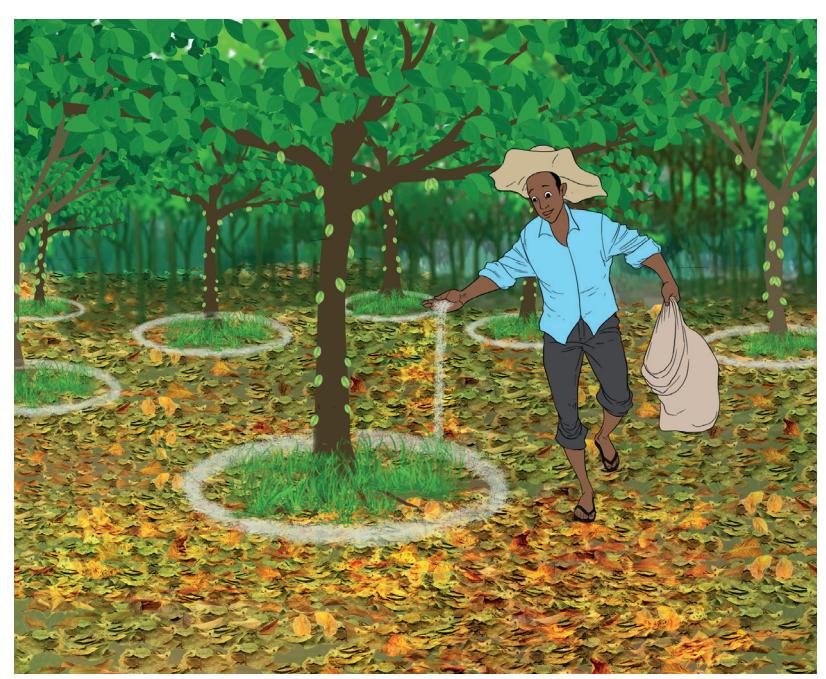

#### 4. Preparation of the trainer

Read and understand the general information section of this theme, which sets out the key points on which the trainer should base his or her training. Read the guidance sheet and have a preparatory session on making compost Identify a plantation where the training will take place

#### Conducting the training

#### 1. Setting the scene

#### a. Brainstorming/catch attention

 When your son tells you he wants to take a wife, what is the first question that comes to mind? Let the participants give their opinions.

The first question is generally how will he feed her. In the same way, when you create a cocoa farm, you have to think about how these cocoa trees will be nourished to give fruits and a good production.

Today we are going to talk about cocoa tree nutrition

#### b. Title

State the Title: fertilization

#### c. Importance for the learner

 gain More precise knowledge on the actions to be taken to improve on the nutrition of the cocoa tree. Improve the sustainability of the system and production.

#### d. Guidelines

 The aim here is not to promote a particular chemical fertilizer, but to provide producers with information that will enable them to make a better decision. The use of organic fertilizers is strongly encouraged wherever possible and cost-eective.

#### 2. Disseminate

#### a. Explanation

 Who among you thinks that your farm or the farm where we are standing needs fertilizer? Why?

> Explain that fertilizer application depends on the conditions of the plantation in question. These conditions take into consideration the age, the state of the plantation, the needs to be covered and the surface area to be fertilized.

 Who among you applies fertilizer in their plantation? Do you fertilize all the cocoa trees or just some? What type of fertilizer, how often and what quantity? For how long? Have you noticed an increase in production?

 Take notes on a conference paper so that everyone can see them. note down the contributions of several participants.

> In addition to external inputs of fertilizer, there are internal inputs linked to the restitution to the soil by fall of litter containing elements removed by the cocoa trees and others. This litter is a significant source of soil organic matter.

> Compost is another source of organic matter input.

 Who among you knows how compost is made? What dierent elements are used to make compost?

 How long does its preparation take? How should it be applied?

> Ask the producers to prepare themselves for making compost and list the elements that have been prepared beforehand for making the compost.

 Build the compost heap with the help of all the participants.

> Explain the follow-up process of compost and how it should be used. In addition to providing nutritive elements, mention its ability to improve on the soil's water retention capacity and biological activity.

> Point out to the fact that this does not involve high costs and allows good recycling of organic matter by returning to the soil the elements exported by the crops, in particular potassium, which is very present in the shells.

> Show participants how compost should be spread and the frequency of application at the begining of the long and short rainy seasons.

 Will you be able to do this in your plantations? If not, what could stop you from doing so?

 What is the dierence between compost and chemical fertilizer?

> Nutritive elements are directly available to plants in chemical fertilizers, which is not the case for organic fertilizers. Organic fertilizer does not require analysis to determine the needs of the plant before application, but chemical fertilizer does, in order to limit losses.

> In relation to the types of fertilizer that the producers cited above, explain the composition of these fertilizers and mention the fact that the most suitable fertilizers are those produced for cocoa farming. Explain the role of each of the elements present in the fertilizer.

 Put some water in a sprayer and ask a volunteer to apply it to the cocoa trees as they would for foliar fertilizer.

Draw participants' attention to the fact that foliar fertilizer must be applied to the leaves only, as only the leaves have the capacity to absorb the nutrients. Also, draw their attention on how to adjust the nozzle to produce a mist to make it easier for the product to adhere on the leaves.

#### b. Visualization

 Image of bags of special cocoa fertilizer with fertilizer composition

#### c. Case studies

 Making compost Simulation of foliar fertilizer application

### d. Reframing

 The quantities of chemical fertilizer to apply depend on several conditions.

Specialized cocoa fertilizer containing trace elements is recommended for fertilizing cocoa.

For a more eective fertilization plan, we recommend combining mineral fertilizers with organic fertilizers. The eectiveness of the fertilizer is guaranteed when all other maintenance and plant protection practices have been implemented.

#### 3. Summary and Evaluation

#### a. Summary

 Summarize the information that has been exchanged, highlighting the practices that are not being properly carried out by producers. Remember that fertilization must be applied after all good maintenance and plant protection practices have been implemented. Given the high cost of using chemical fertilizers, it is strongly recommended that emphasis be placed on making compost and promoting actions that increase organic matter in the plantation

#### b. Evaluation

- Ask the following questions and correct any answers that are wrong or incomplete.
  - How is compost made?
  - When and how should fertilizer be applied to cocoa trees?

 Preservation of biodiversity and minimizing the risk of human and environmental contamination; Reduction of harvest losses and of the cost of purchasing chemical products, because the use of pest control measures and inputs are optimized; More rational use of pesticides; The development of pest resistance to pesticides is reduced. Agricultural production is more stable over time and productivity is improved

Integrated management is not an eradication strategy, but a strategy for managing pest populations over the long term to minimize infestations and their economic impact.

#### 2. Disease and pest control methods

The implementation of integrated pest and disease management is based on three essential principles which are::

Prevention (resistant varieties, healthy plants, good soil, presence of natural enemies) Observation (monitoring the presence of pests and natural enemies and deciding to take action) Intervention (pest control measures such as farming practices, physical and biological mechanisms, or the use of low-toxicity pesticides)

## **2.1 Brown pod rot**

Brown rot is a fungal disease caused by Phytophthora spp . The two species that can cause major production losses are P. palmirora and P. megakarya (present only in Central and

# Theme 4.1 Approach to Phytosanitory Intervention in an agroforestry system

General information

#### 1. Integrated pest and disease management

Several studies have shown that the main cocoa pests and diseases in West Africa are brown pod rot, capsids, cocoa stem borers, mistletoes, termites, weeds and shoot oedema virus. In Cameroon, the two main problems are A) brown pod rot, caused by Phytophthora megakarya and B) capsids (mirids) caused by Sahlbergella singularis and Distantiella theobroma.

The indiscriminate use of pesticides in agriculture is associated with negative eects on the environment and human health, as well as loss of biodiversity. It was with this in mind that integrated pest and disease management was introduced, with the aim of limiting the use of pesticides thereby reducing their harmful eects on the environment and human health.

Integrated pest and disease management can be defined as a combination of pest control techniques such as the use of good agricultural practices, the use of improved planting material/variety, the preservation and/or use of biological products and the use of chemical pesticides.

Implementing integrated pest and disease management or integrated crop protection oers a number of advantages, including:

# PART 4 INTEGRATED MANAGEMENT OF COCOA DISEASES AND PESTS IN AGROFORESTRY SYSTEMS

West Africa). The primary source of inoculum for P. megakarya is the soil. Very wet conditions favor the development of brown rot. This disease is most prevalent in the humid tropical rainforest zones of southern Cameroon..

#### Prevention:

- Young plants should be well spaced and sites well drained to improve air exchange and reduce humidity.
- Maintain continuous shade (against the capsid) but do not allow the canopy too dense, as this could increase rot problems.
- Remove weeds at the beginning of and throughout the rainy season.
- Destroy the earthen galleries built by ants on the surface of cocoa tree trunks.
- Use resistant varieties.
- Avoid moving plantation material from an infected zone to a non-infected one.
- Eliminate infected cherries and control stem canker. Infected pods and shells must be removed, placed outside the plantation, ideally in a pit, and burnt or sprayed with a fungicide.

#### Observation:

- Monitor the cocoa plantation from the start of the rains to detect the first signs of the disease. Look for small brown spots on the surface of the pods. After 3-5 days, a white layer of spores will appear on the lesion. When there are pods on the trees and the first symptoms of the disease are seen, it is time to take action.

#### Intervention:

- Apply a fungicide every 4 weeks in a localized manner or throughout the plantation if the symptoms are widespread.
- Harvest the pods frequently, at least once a month, so that the infected ones are removed from the trees.
- Remove all infected and mummified pods during harvest, or as often as possible, and destroy them by burning.

### **2.2 Capsids (mirids)**

The names 'mirids' and 'capsids' refer to insects in the Miridae family. These bitingsucking insects attack the surfaces of cocoa stems, branches and pods. They feed by sucking, which creates circular black lesions on the pods (Vos et al. 2003). In Cameroon, the predominant species is S. singularis (CIRAD 2017).

Shade in cocoa plantations is a determining factor in the fight against capsids. One particularity of capsids is that they are not uniformly distributed in plantations. They are concentrated in areas exposed to sunlight.

It is therefore important to maintain a continuous canopy. Forest trees provide more homogenous shade than fruit trees. A complementary alternative is rational chemical control.

#### Prevention :

- Use tolerant hybrid varieties.
- Remove suckers and lateral shoots, as they are a succulent food and serve as egg-laying sites.
- Maintain shade with a continuous, wellventilated canopy.

#### Observation

- Monthly inspection of cocoa trees to detect the presence of capsids and lesions on pods and shoots.
- Damage on pods of over three months old is not significant, but spray when the incidence of attack is 6 out of 10 trees.

#### Intervention :

- Use a certified insecticide against this pest.

#### 3. Intervention period

As far as integrated pests and disease management is concerned, the choice of the right period of intervention is very important both for the implementation of good

### **Stage 2: Flushing**

This stage corresponds to the moment when the cocoa tree renews its foliage. It used to be observed between March and June, depending on the locality.

What we observe at this stage is:

- the Falling of old leaves
- The appearance of new leaves.

The recommended action to take when this stage is observed is to:

- Apply an insecticide, preferably systemic, ideally using an atomizer
- Apply a nitrogen-rich foliar fertilizer or bio stimulant

At this stage, it is not advisable to prune cocoa trees in the plantation.

### **Stage 3: Flowering and fruit set**

This stage was previously observed between the months of June and August, depending on the locality.

What we see at this stage is:

- The appearance of buds and flowers
- Strong presence of insects attracted by a strong scent of perfume.

What to do :

- Applying a bio stimulant by spraying the leaves to prevent excessive flower drop (optional).

At this stage, we strongly advise against any application of insecticides or any activity that might repel pollinating insects.

agricultural practices and for the application of chemical products. With the variations in climate observed in recent years, it is becoming increasingly dicult to draw up an intervention calendar setting out dates or time intervals for the implementation of dierent actions. However, on the basis of the phenological stages of the plant and by observing the behavior of the plantation, it is easier to make a judicious choice of the right time to implement the activities.

In this logic, five physiological stages making up the phenological cycle of the cocoa plant have been identified by the Inter professional Council of Cocoa and Coee (CICC) as part of its OC4 programme (Observatory of the Influence of Climate Change on the Productivity of Cocoa and Coee). These stages are highly dependent on the climatic hazards of each of Cameroon's agro-ecological zones. The five physiological stages are as follows:

#### a. Stage 1: Post-harvest

It corresponds to the period after harvests. This stage was previously observed between January and March, depending on the locality.

What we observe during this period is:

- Residual production
- Mummified pods hanging on trees
- Plant withering
- Ageing leaves

The best thing to do during this period is to carry out agronomic operations such as:

- Sanitary harvesting which is an operation to carry out continuously throughout the year and care must be taken not to leave rotten pods lying around in the farm, as they are a source of diseases.
- Pruning cocoa trees
- Adjusting the shade

#### **Stage 4: Appearance of cherelles**

This stage was previously observed between the months of June and September, depending on the locality.

What we observe during this period is:

- A strong presence of cherelles on cocoa trees
- Very few insects in the plantations
- Signs of capsid (mirid) attack.

It is advisable during this period to systematically spray the cherelles:

- A bio stimulant to combat yellowing of cherelles (optional)
- Contact insecticide to protect cherelles against pests, notably capsids

During this physiological stage, it is strictly forbidden to use fungicides during treatments and to prune cocoa trees.

### **Stage 5: Maturation of Fruit**

This stage was previously observed between the months of September and December, depending on the locality.

What we observe during this period is:

- The presence of pods at dierent stages of development (young, mature, ripe)
- The presence of unhealthy fruits (mainly brown rot)

What you need to do is:

- Alternate the application of a systemic fungicide and then a contact fungicide on the pods
- Continuous removal of unhealthy fruits from trees and burying it outside the farm
- Gradual harvesting of fruits that are¾ ripe before it becomes overripe.

During this period, it is important to avoid treating the pods 14 days before harvest, destroying the flower pads during harvest and over-ripening the fruits on the tree.

Source: CICC, "Phenology and productivity of cocoa, observe and act"

**The phenological cycle of the cocoa plant is made up of 5 distinct physiological stages**  which are intimately dependent on climatic hazards of each of the agroecological zones of Cameroon

## Guide for trainers

#### 1. Objective of the training

At the end of this training session, the producer should be able to::

 Know the dierent stages of integrated crop protection Know the diseases and pests of cocoa and how the damage manifests.

#### 2. Necessary Materials

- Guidance sheet on cocoa diseases presented in Annex 7
- Images of the main cocoa pests
- Conference paper
- Markers
- Conference board.

#### 3. Training duration

The time allowed for the presentation of this theme is 60 to 90 minutes, depending on the level of understanding of the participants.

#### 4. Preparation of the trainer

 Read and understand the general information section of this theme, which sets out the key points on which the trainer should base his or her training. Identification of a plantation already in production and more than 25 years old, where the training will take place.

## Conducting the training

#### 1. Setting the scene

#### a. Brainstorming/catch attention

 What are the main diseases and pests you encounter in your plantations? Do you put the same amount of energy into fighting them all? Why?

> Take the opinions of as many participants as possible and introduce the topic of the day, emphasizing that only diseases and pests that cause a lot of damage and reduce harvests will be examined.

#### b. Title

 State the Title: Integrated management of cocoa diseases and pests

#### c. Importance for the learner

 Better management of diseases and pests, focusing on prevention to reduce costs and damage to crops Better organization of pest and disease control through mastery of the appropriate intervention period.

#### d. Guidelines

During this training session, the aim will be to provide producers with the information they need to better manage pests in order to reduce harvest losses and pest management costs.

It will not be about discussing on the chemicals to be used to combat pests and diseases. This aspect will be covered in another training session.

#### 2. Disseminate

#### a. Explanation

 Based on the producers' sheet (posters), identify the main diseases and pests of the cocoa plant. What damage do they cause and how do they aect yield?

 How do you fight these diseases and pests? Are you satisfied with the results you get? What diculties do you face in the fight against these diseases and pests?

 Have you ever heard of integrated pest management? What does it mean?

Take note of all the contributions in order to get an idea of the group's level of information on the topic being discussed. The answers to these questions will also enable you to note the points to be underlined during the training.

Begin by thanking the speakers for their various contributions. Define integrated pest management in a simple way, letting participants understand that it is the use of several pest control methods to fight against cocoa pests and diseases.

Next, we need to explain the dierent stages of integrated pest management which are: prevention, monitoring and intervention. It should be outlined that in an integrated pest management programme, the use of chemical products is a last resort.

Take the example of a human being and say that to fight against sickness we start with prevention and then we monitor our state of health and it's when, despite prevention, we see signs of disease that we proceed to take medication. Continue by explaining that it is very important to know the symptoms and to be sure of the illness before taking medication.

 What activities can be carried out on a cocoa plantation to prevent diseases? How do each of them help to prevent the disease?

> List the dierent maintenance activities that help to prevent disease and say how each one helps.

These are activities that will be covered in depth in other training sessions, so its just about listing them and say how they help to prevent pests and diseases.

 Form groups and ask them to observe the farm and identify signs of diseases or pests

> Draw their attention to surveillance, pointing out that for it to be eective, you need to be able to identify diseases and pests of cocoa. It is only when signs of attack have been identified that the decision to apply plant protection products is taken

 At what moment do you usually carry out chemical treatments and how often? What quantity of products do you use per year for your plantation?

> The integrated pest management method aims to reduce the use of chemical products, not only to reduce costs of plantation maintenance but also to protect the environment and the health of the applicator, because these products are toxic.

#### b. Visualization

 Image of diseases and pests of cocoa tree (see appendix 7)

### c. Case studies

 Identifying the diseases and pests present in the plot

#### d. Reframing

 The main aim of integrated pest management is to reduce the use of chemical products by creating unfavorable conditions for the proliferation of diseases and pests, by cleaning the plot and the cocoa trees, adjusting the shade, increasing the population of natural enemies of pests, etc... It does not encourage the setting up of a continuous programme of chemical treatment of the plantation.

#### 3. Summary and Evaluation

#### a. Summary

 Summarize everything that has been said, encouraging participants to implement integrated pest management in their plantations. Do you think that combining the various control methods presented here could produce good results? Do any of you apply them? What results did you achieve?

#### b. Evaluation

- Ask the following questions and correct any wrong or incomplete answers.
  - What is integrated pest management?
  - What are the three principles on which it is based?
  - What is the main aim of integrated crop protection?

## Theme 4.2

## Use of chemical products

## General information

#### 1. Identification of the product suited for a disease or pest

There are several types of pesticides formulated to fight against specific diseases and pests. Cocoa farmers in Cameroon face two main problems on their plantations. These are brown rot, which is caused by the fungus Phytophtora megakarya, and stings caused by capsids (mirids) called Sahlbergella singularis and Distantiella theobroma.

Chemical control, which involves the use of chemical products, must be carried out in compliance with a certain number of rules, among which is the choice of product to be used. several criteria must be considered when identifying the chemical product to be used. These criteria are:

 Product status Target plant and target zone The target disease or pest The active ingredient Product toxicity Formulation Mode of action Product availability

All this information is available on the packages of the products so as to make it easier for users to check them out..

### **a. Product status**

Under Cameroon's current regulations, any pesticide placed on the market must go through a homologation procedure during which its eectiveness on the crop and the pest or disease is tested. It is therefore important for producers to be reassured that the product they plan to use has been homologated (ocially approved) for that crop and against the disease in question.

To recognize a homologated product, simply consult its packaging or the updated list of homologated products. On The packaging of an approved product, its homologation number will be stated.

### **b. Target plant and target zone**

Products are formulated and homologated according to the target crop and the zone where they will be applied. When choosing the pesticide to use, make sure it has been produced for the target crop and homologated in Cameroon. During the homologation process, tests are conducted on the pest and the target crop in the host country, so its eectiveness is guaranteed under these two conditions.

#### c. The target disease or pest

Products are classified by category of pesticide according to the nature of the pest to be controlled. Therefore we have insecticides to fight insects, fungicides to fight fungi, herbicides against weeds,etc.. When choosing a pesticide, formally identify the pest in question and select a product destined for it. It is not advisable to use treatment products with broad-spectrum, as nature contains useful organisms that should not be destroyed.

#### d. The active ingredient

The active ingredient is the compound in the product that acts on the pest. On Each product label is indicated the active ingredient it contains. Not all active ingredients are equally eective against pests. The choice of the active ingredient is important to guarantee the eectiveness of the treatment.

In a chemical treatment plan, it is advisable to alternate the active ingredients in order to avoid familiarization eects in the pests.

Table 8: List of recommended active ingredients

| Name of organism or target disease Brown pod | Active ingredients eective against the harmful organism, Crop that are homologated for the crop and are not extremely hazardous pesticides Benalaxyl (GIZ class: D) Copper oxide (GIZ class: D) Dimethomorph (GIZ class: D)            |
|----------------------------------------------|-----------------------------------------------------------------------------------------------------------------------------------------------------------------------------------------------------------------------------------------|
| rot Capsids /                                | Cocoa Copper oxychloride (GIZ class: C) Cymoxanil (GIZ class: C) Metalaxyl-m (GIZ class: C) Copper hydroxide (GIZ class: B) Acetamiprid (GIZ class : D) Pyrethrins (GIZ class: C) Bifenthrin (GIZ class: B) Cypermethrin (GIZ class: B) |
| mirids                                       | Cocoa Lambda-cyhalothrin (GIZ class: B) Fipronile (GIZ class: B) Imidacloprid (GIZ class: B) Novaluron (GIZ class: B) Thiamethoxam (GIZ class: B) 2,4-D (GIZ class: C)                                                                  |
| Weeds/grass                                  | Cocoa Glyphosate (GIZ class: B) Paraquat (GIZ class: B)                                                                                                                                                                                 |

Source: Study on crop protection in countries where the 'Green innovation centers for the agri-food sector' programme is active\_ National report for ProCISA in Cameroon, May 2018

#### e. Product toxicity

This classification of product toxicity is based on the LD501 expressed in mg/kg of active substance per kg of body weight. It expresses acute toxicity, i.e. the concentration of product capable of killing 50% of the target pest population. Table 9 shows the classification of pesticide toxicity.

Table 9: FAO classification of pesticide toxicity

|          |                | ORAL (by | LD50 (mg/kg) DERMAL |
|----------|----------------|----------|---------------------|
| CATEGORY | DESCRIPTION    | mouth)   | (through the skin)  |
|          |                | Solid    | Solid               |
| la       | Extremely      |          |                     |
|          | dangerous      | <5       | 50-200              |
| lb       | Very dangerous | 5-50     | 200-2000            |
| Il       | Quite          |          |                     |
|          | dangerous      | 50-2000  | >2000               |
| III      | Not very       |          |                     |
|          | dangerous      | >2000    | 50-200              |
| U        | Not dangerous  | >5000    |                     |

Source: National Commission for the approval of plant protection products and Certification of treatment equipment, July 2013

It is advisable to use low-toxicity products of category II, III and U to avoid intoxication when handling them.

#### f. Formulation

Formulation is the combination of various compounds with aim to make the product eectively usable for the intended purpose; the form in which the pesticide is marketed. There are several types of formulation, which could be liquid, granular and powder. For each formulation, details of the mixing process are given on the product package. It should be noted that each formulation has its own appropriate equipment for usage. The formulations most commonly found on the market are:

- DC : dispersible concentrate/Concentré dispersable
- DP : dustable powder/Poudre pour poudrage
- DS : powder for dry seed treatment/ Poudre pour traitement des semences à sec
- EC : emulsifiable concentrate/Concentré émulsionnable
- EG : emulsifiable granule/Granulé émulsionnable
- GR : granule/Granulé
- SG : water soluble granule/Granule soluble dans l'eau
- SL : soluble concentrate/Concentré soluble
- WG : water dispersible granule/Granule dispersable
- WP : wettable powder/Poudre mouillable.

Products in granulated form are preferable because they are easy to handle, followed by powdered formulations.

#### g. Mode of action

The mode of action is the way in which the product acts on the pest or the disease. Two types of products have been identified based on their mode of action: systemic products and contact products. The former act on the plant's vascular system by penetrating it, while the latter remain active only on the surface of the plants that have been treated. The main dierence between these two types is the length of time the product remains active after treatment. In order to alternate products in a treatment plan, it is advisable to have a systemic product and a contact product.

#### h. Product availability

The product chosen by the producer or recommended by the extension agent should be available on the market so that it can be easily obtained.

The choice should be made to guarantee the eectiveness of the product while at the same time reducing the eects on the environment and human health.

#### 2. Precautions when using chemical products

#### a. Product validity date

Before using a product, always check the expiry date on the label, i.e. the date after which the product may no longer be used, as there is a risk of adverse eects. All products have an expiry date on the label.

#### b. Individual protection

It is strongly recommended to wear personal protective equipment (PPE) before treatments (a pair of boots, trousers, a long-sleeved shirt, a pair of gloves on the hands, a nose and mouth protection mask, a pair of waterproof goggles and a casquette).

It is formally forbidden to carry out treatments with bare torsos or with equipment that has holes, cracks or breaks, as in these conditions, the risk of intoxication is very high. It is essential to check the equipment before carrying out the treatment.

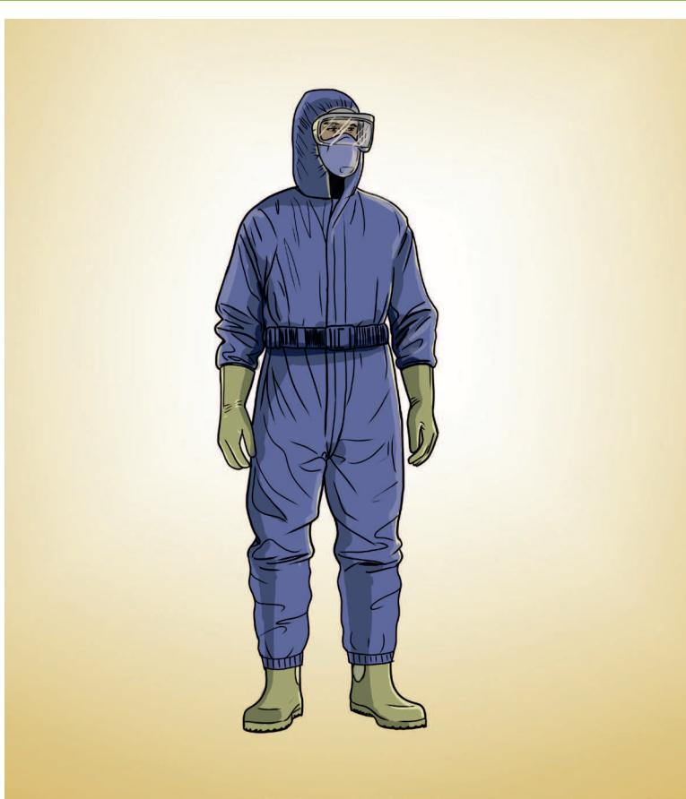

Image of a producer with PPE

### **c. Type of application material**

The type of treatment equipment is determined by the product used and, particularly with respect to the target. For fungal treatment, which is generally more localized, a pressure-maintained knapsack sprayer is best. For insecticide treatment, given the high mobility of insects, the use of an atomizer is more appropriate.

### **d. Product preparation**

The spray mixture (water and product) should preferably be prepared in the farm, away from water bodies and on grassed land. Appropriate materials (a bucket or measuring bowl, water of good quality and crop protection products) should be available at the preparation site. It is strongly recommended to respect the doses of the liquids making up the spray mixture and that the mixture is shaken vigorously to ensure that the it is homogeneous and make sure that it is all used-up.

In the event of a liquid spill, use an absorbent material such as sand, sawdust or earth to cover it up. In the case of a granulated or powdered product, use tools to collect it and dump it in a safe place.

Before applying the treatment, it is advisable to follow the practical advice linked to the correct application of treatments:

- Find out which way the wind is blowing by erecting a wind vane using a scarf and a stake, or by slowly pouring fine dry sand or ash about a meter above the ground.
- The applicator should not carry out the treatment against the wind to avoid it spilling on him.
- The preparation and application of treatments by minors, pregnant or breastfeeding women, the elderly and anyone who is ill or highly allergic to chemicals is not recommended.
- We do not recommend spraying in very bright sunshine, strong winds or rain to avoid drying out or leaching of the products.
- It is also forbidden to eat, smoke, drink, chat or unblock the nozzle by mouth in the event of an obstruction.

#### f. **Maintaining treatment equipment and appliances**

At the end of the treatment, it is forbidden to clean the treatment equipment in streams to avoid intoxication. Rinsing water must be spread over the treatment area. Applicators are encouraged to remove their personal protective clothing after treatments and to take a bath with soapy water far from watercourses.

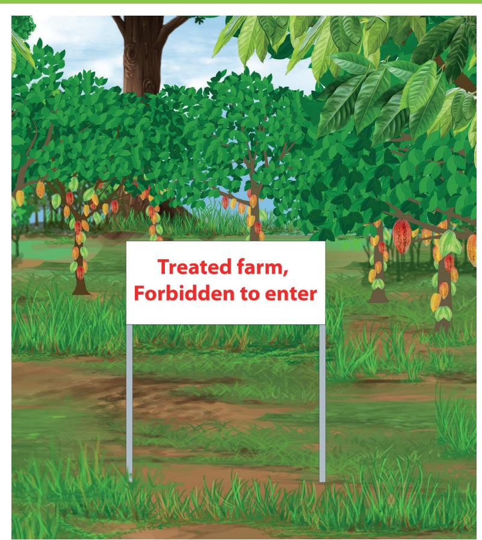

Image of the entrance to a farm with a signpost reading "no entry, farm treated".

#### g. **Re-entry and pre-harvest interval (PHI)**

For each product, there is a re-entry period and a preharvest interval that must be scrupulously respected in order to avoid contamination leading to carcinogenic diseases..

- The re-entry period is the time to be respected before returning to the plot after treatment. This period varies between 24 and 72 hours, depending on the toxicity of the product. After treatment, it is advisable to place a sign at the entrance to the farm or a signpost to indicate the danger posed by the farm during the reentry period.

- The pre-harvest interval is the number of days after treatment during which it is formally forbidden to harvest the pods in order to avoid the presence of residues in the beans. These Residues are specific substances left by a pesticide in food destined for human or animal consumption, as well as the environment.

All this information can be found on product labels and varies from one product to another.

#### 3. Management of Chemical products

#### a. Transporting chemical products

It is advisable to transport the products in a vehicle suitable for the purpose, such as, pick-up trucks or lorries. Pictograms indicating the transport of chemical products must be displayed on the lorry if a large quantity is being transported, and the lorry must be driven at a reasonable speed to avoid any trac accidents.

The transport of products in a commercial vehicle with passengers and other consumer products (food products) on board is prohibited to avoid the risk of contamination. These risks can cost human lives. Retail products can also be transported on a bicycle or motorbike, with the products placed in a cardboard box and securely tied behind the bicycle or motorbike.

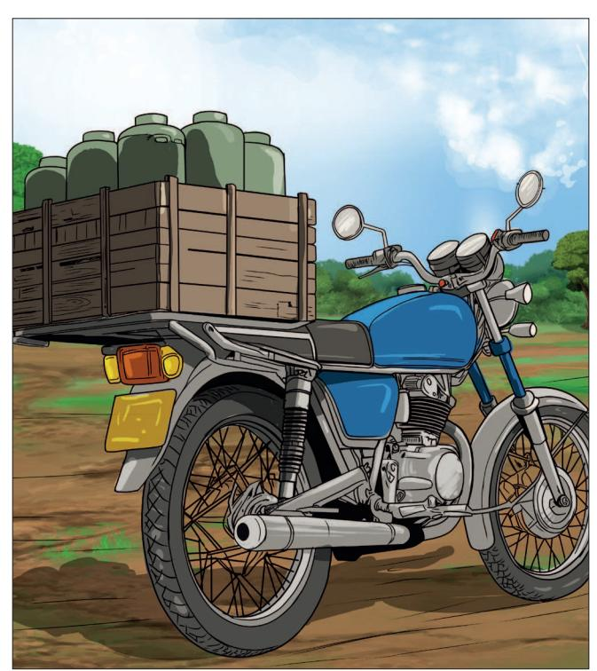

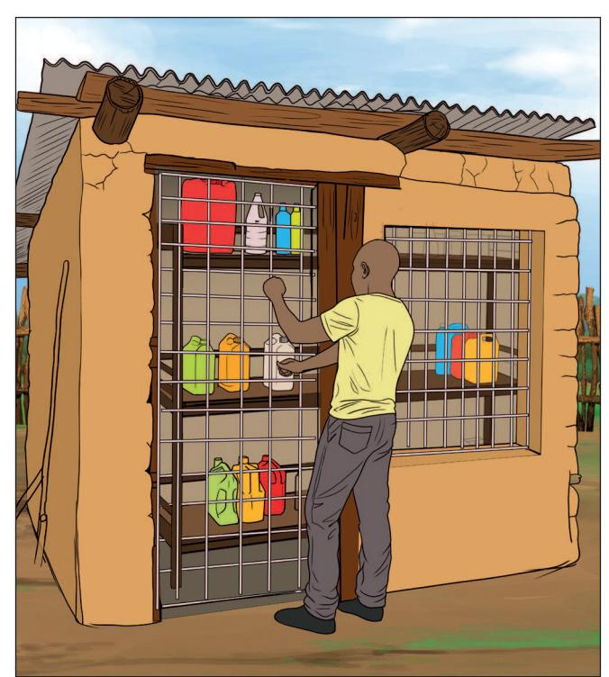

Image of chemicals tied up in a crate behind a motorbike

#### b. Storage of chemicals

Once at their destination, these products must be stored in purpose-built warehouses that meet current standards. These warehouses must be built in zones isolated from habitations and well-ventilated. They must also be equipped with two doors and claustras or aspirators to facilitate ventilation. Pictograms indicating danger signs and no smoking must be displayed on the doors (secured with double keys) of these storehouses. Products must be stored on shelves and in such a way as to respect the condition (first in, first out). These precautions are necessary to prevent children getting in and to alert passengers of all possible risks. It is also not advisable to store products in living quarters under the bed or on the floor.

Image of classified chemical products in a room locked with a padlock

#### c. Managing chemical product packaging

After use, chemical packaging must be treated in a special way

- Do not burn empty chemical containers
- Make them unusable by perforating them at the base
- Remove them from the plantation
- Collect them and keep out of the reach of children so that they can be returned to the facilities responsible for destroying or recycling them.
- It is strictly forbidden to repackage chemical products.

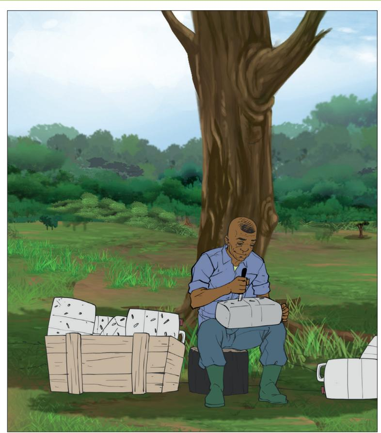

Image of plastic packaging perforated at the base and collected in a crate

## Guide for trainers

#### 1. Objective of the training

Au terme de cette session de formation, le producteur doit être capable de :

 Identify the right product for a disease Reduce the use of chemical products Observe all safety measures when applying plant protection products.

#### 2. Necessary Materials

- Craft paper
- Markers
- Atomizer
- Pods
- Fertilizers
- PPE

- Herbicide
- Insecticide
- Fungicide
- Machete
- Sprayer
- Roll of blotting paper
- Red food coloring.

#### 3. Training duration

The time allowed for the presentation of this theme is 60 to 90 minutes, depending on the level of understanding of the participants.

#### 4. Preparation of the trainer

 Read and understand the general information section of this theme, which sets out the key points on which the trainer should base his or her training. Identification of a plantation where the training will take place.

## Conducting the training

#### 1. Setting the scene

#### a. Brainstorming/catch attention

 Have you ever used chemicals to treat your plantation? Do you think you did so without absorbing the product in some way? Encourage as many participants as possible to take part. Comment on the answers and introduce the subject you are going to cover during the training session, mentioning that the aim will be to give them the information they need to use chemicals correctly.

#### b. Title

 State the Title: Use of chemical products

#### c. Importance for the learner

 Reduce chemical contamination due to a lack of information on the use of these products. Reduce the negative impact of the use of chemicals on the environment Improve the quality of cocoa produced

#### d. Guidelines

 The aim of this training session will not be to impose products on producers, but rather to provide them with the information they need to make the right choice, comply with precautions for use and a better management of products and empty containers.

### 2. Disseminate

#### a. Explanation

 How do you choose which product to use for your treatments?

 Form groups and give each group a product. Ask each group to comment on the information on the packaging and say how this information is useful to them. If possible, give each group a sheet of paper and a marker pen to write on before presenting to the other groups.

> Lead the presentation session, while stimulating discussions. Make a Summary taking care to highlight elements such as: the status of the product, the target crop and target zone, the target disease or pest, the active ingredient, the toxicity of the product, the formulation, the mode of action, etc.

> For each of these elements present on the product packaging say in what it is important in making the choice of the product.

Base your explanation on the description given in the general information section of this theme.

Present the active ingredients with a low level of toxicity that producers should give priority to when choosing a product.

 How can the product be absorbed by the applicator when handling pesticides? What precautions should be taken to avoid intoxication?

> Present the dierent elements of a good personal protective equipment, giving the characteristics of each and their role.

 Is there a volunteer to wear this personal protection equipment?

> When they have finished putting on the attire, ask the others if each item has been put on correctly. Comment and draw their attention to the fact that they must make every eort to protect themselves as their colleague is during chemical treatments.

 What are the dierent equipment that you use for chemical treatments? Is any of it dedicated to a particular treatment and not another?

> Gather opinions and comment on responses.

 Designate a participant to prepare a treatment solution substituting the pesticide with the dye

> Ask the others if the technique used by the participant is good. Comment and ameliorate if necessary

 Choose 2 or 3 cocoa trees, place the blotting paper at the foot of the tree and ask the participant with the PPE to simulate a fungal treatment.

Once the treatment has been conducted, assess the amount of product that has spilled on the blotting paper. If it is much, this means that the nozzle was not properly calibrated and that the producer has used more product than necessary.

Adjust the nozzle and show producers the good practice of fungal treatment using a backpack sprayer with sustained pressure.

 After treatment, what do you do with the equipment and PPE? Take everyone's opinion.

> State the good practices to be followed after chemical treatment as set out in the «general information» section.

 What do you do with empty packages of products after use? Take the opinions of several participants.

> Explain the precautions to be followed for empty chemical packages as set out in the «general information» section of this theme.

#### b. Visualization

 Image of a well-equipped person for phytosanitary treatment and another of a poorly equipped person Image of the dierent information available on pesticide packaging.

#### c. Case studies

 Reading a label of a crop protection product Correct use of PPE Simulation of the correct use of a sprayer for fungal treatment.

#### d. Reframing

 Plant protection products are chemical substances that can cause acute poisoning, so their use must comply with all the steps outlined above. They represent a danger to humans and the environment. Chemicals should only be used as a last resort and in a reasonable manner.

#### 3. Summary and Evaluation

#### a. Summary

 Summarize the information provided during the training, stressing the importance of choosing the right product, taking precautions when using it and properly manage packages is. Compliance with these rules guarantees the eectiveness of the treatment and the protection of man and nature.

#### b. Evaluation

 Ask the following questions and correct any answers that are wrong or

- incomplete.
- What elements need to be considered when choosing which product to use?
- What precautions should be taken when using chemical products?
- What should be done with empty chemical packages?
- How should products be stored?

# PART 5 HARVESTING AND POST-HARVEST OPERATIONS

not be mixed with healthy pods. They should be treated separately. If the pods are harvested too ripe, germination may already have started in the shell. A large number of cocoa beans that have already sprouted will not pass quality control. On the other hand, if the pods are harvested immaturely, the beans will not ferment well and this will lead to purple beans. These beans are characterized by a weak aroma, high astringency and excessive bitterness.

Image of a producer harvesting a ¾-ripe pod with a machete

#### 2. Shelling and shell management

Once the pods have been harvested, it is possible to wait up to 5 days before shelling, although this should be done as soon as possible. This time allows the immature pods to complete their maturation and facilitates the start of fermentation. After this time,

## Theme 5.1 Harvesting and shelling of pods

General information

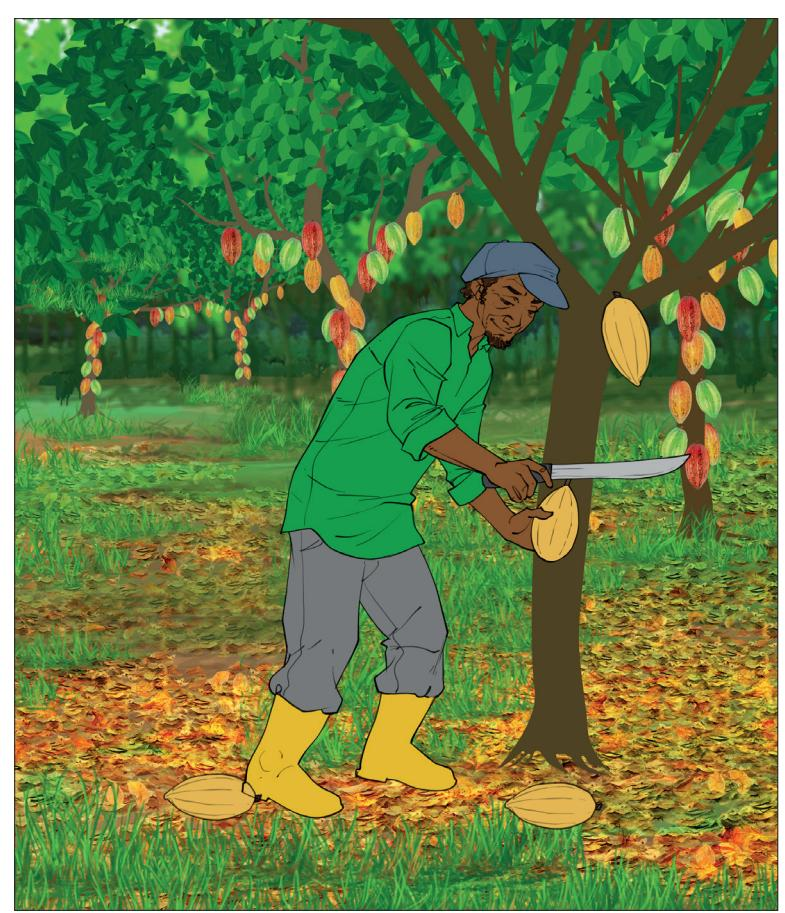

#### 1. Harvest period

Harvest time is an important factor in bean quality. It is therefore important to guarantee the best possible quality for the cocoa beans. To guarantee high bean quality, all stages of processing must be carried out with care, from harvesting to storage.

The quality and quantity of the mucilage depends on the maturity of the pod, which itself is judged by its colour. Harvesting begins when the fruits are fully ripe. Ripe pods show an orange or yellow colouration of upto ¾ of the shell. Care must be taken not to harvest unripe or overripe pods. It is advisable to plan regular passages at intervals of 2 to 3 weeks.

The best way to avoid damaging the bark is to cut the pods at the base of the flower using a sharp knife, pruning shear or other suitable tools. Harvested pods can be stored on the ground for a maximum of 5 days before shelling. Avoid picking up the pods with a machete as it can favour the entry of mold.

Over ripe or diseased pods should

the risk of the beans rotting and sprouting is very high. There are three successive stages: opening the pod, separating and sorting the beans.

It is very important to separate pods with defects from healthy ones. The pods are best opened with a wooden club. Using a machete can damage the beans in the pod and facilitate the entry of microorganisms responsible for the appearance of molds, which are themselves potential secretors of toxins responsible for carcinogenic diseases.

The beans must then be extracted from the pod by detaching them from the spine (while separating them). This separation operation helps the fermentation process to run smoothly, particularly the acetic phase.

Finally, the extracted beans are sorted to select only those with no defects. During this stage, all placentas

(spine residues), black beans, sprouted beans and wastes are removed and rejected.

The shells of pods after shelling must be removed from the plantation as they can be a source of contamination. The shells can be used for a number of purposes, including making compost and soap.

### Guide for trainers

#### 1. Objective of the training

At the end of this training session, the producer should be able to:

 Know the stage of maturity of the pods Know Good harvesting techniques.

#### 2. Necessary Materials

- Pods at dierent stages of maturity
- Machete.

#### 3. Training duration

The time allowed for the presentation of this theme is 30 to 45 minutes, depending on the level of understanding of the participants.

#### 4. Preparation of the trainer

 Read and understand the general information section of this theme, which sets out the key points on which the trainer should base his or her training.

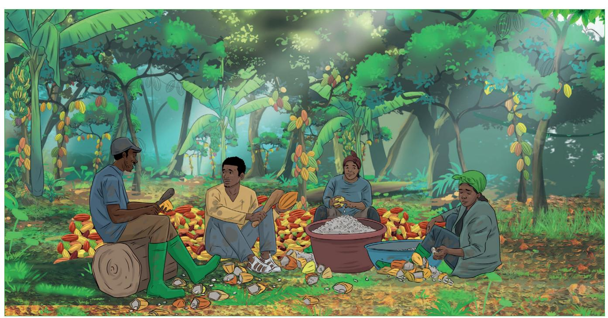

Shelling

#### 1. Setting the scene

#### a. Brainstorming/catch attention

 When is the best moment of the month for a civil servant or employee? Probably when they get their salary.

> For some, on the day, he receives his salary he does not feel like working, and it is only when he's paid the bills and paid o the creditors that he finds the strength to work again.

> For the producer, this is the time to be most assiduous so as not to let the desire to quickly get the fruits of his labour get in the way of the quality of his product. Introduce the topic to be covered during the session.

#### b. Title

 State the Title: harvesting Cocoa pod and shelling.

#### c. Importance for the learner

 Reduce post-harvest losses and guarantee a good organoleptic quality of the beans

Ensuring good fermentation.

#### d. Guidelines

This part is all about getting the producer to understand that the quality of the final product depends on the period of harvest. The pressure of benefitting from the fruit of one's work should not lead the producer to harvest at the wrong period. In as much as the tools used for harvesting must be well-chosen so as to guarantee the quality of the final product.

#### a. Explanation

 When do you harvest the pods? What criteria do you use to choose which pods to harvest? Who can show us which of these pods are suitable for harvesting? How and with what tools do you harvest the cocoa pods.

> Take the opinions of as many participants as possible and, based on what has been said, provide additional arguments. Mention the fact that the choice of pod takes into account the quantity of mucilage present inside and the time it will spend before shelling. Also, mention the contribution of mucilage to beans fermentation.

> Draw the attention of participants to the fact that pods must be harvested with a sharp tool so as to make a clean cut without damaging the bark of the tree.

 How long does it take from harvesting to shelling? How are the harvested pods collected? How is pod shelling done?

> Draw attention of producers to the time that elapses between harvesting and shelling, which must be a maximum of 5 days to avoid having dry beans that start to sprout.

> Gather opinions and direct interventions to obtain information relating to the equipment used for shelling and sorting the beans. Emphasize that pods should not be picked up with a machete to avoid damaging the beans inside the pod.

> Draw attention of producers to the fact that the beans must be separated from the spine (rachis) when they are removed from the pods. This can only be done by hand. Care should also be taken to remove foreign bodies such as pod debris, pieces of wood and so on.

#### c. Visualization

 Image of a pile of homogeneous pods that have been sorted and defective pods put aside Suitable harvesting and shelling equipment

#### d. Case studies

 Identification of pods at optimum maturity for harvesting

#### 3. Summary and Evaluation

#### a. Summary

 Remind participants of the important role they play in the quality of the beans and, more of the by-products derived from them (e.g. chocolate). Make them understand that every decision they make from choosing which pod to harvest has an influence on the quality of the final product.

 Can anyone remind us of the mistakes not to commit to avoid having poor quality beans? Listen and correct if the speaker makes

a mistake.

#### b. Evaluation

 Ask the following questions and correct any answers that are wrong or incomplete.

- How can you tell when a pod is ready to be harvested?
- What is the maximum time between harvesting and shelling?
- What must be avoided at all costs when collecting and shelling pods?
- Why is it important to follow all these rules?

Fermenting cocoa causes a rise in which the guarantee of a successful primary transformation process. When the quantities of cocoa to be fermented are too small, it is dicult to maintain the temperature and fermentation stops, hence the advantage of using insulated crates.

Fermentation lasts around 6 days, with stirring every 2 days. Fermentation is stopped by drying the cocoa beans.

Image of fermenting beans in a heap on banana leaves and in a crate covered with banana leaves

#### 2. Drying cocoa beans

Drying, which consists of exposing the fermented beans to the sun, has three objectives which are:

 Stop fermentation. Getting the Cocoa beans to 8% of humidity in order to avoid the development of microorganisms that would degrade quality. Eliminate the acetic acid produced during fermentation.

Sun drying is the most widespread method (90%). It requires careful selection of the surface to work on and its ventilation. The cocoa must not be in direct contact with any metal surface (except stainless steel in the case of artificial driers). The beans must be dried as soon as

# Theme 5.2 Post-harvest operations

### General information

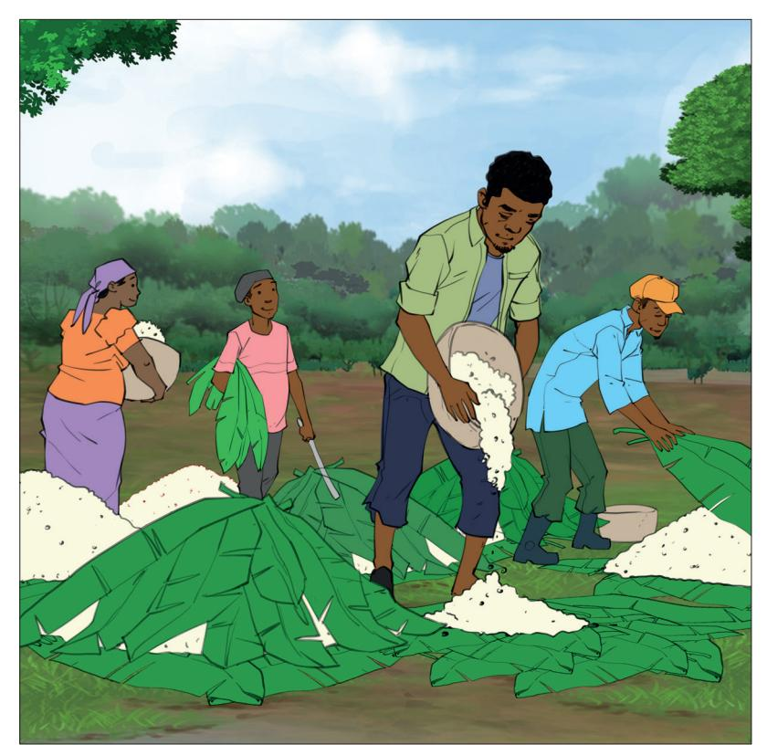

#### 1. Fermentation of cocoa beans

Fermentation is the most important stage in the post-harvest preparation of cocoa. During fermentation, the products that will give chocolate its flavour are formed, the bitterness and astringency (a dry, rough feeling in the mouth) of the cocoa are reduced.

The microorganisms involved in fermentation come from the equipment used, the handling of the beans and insects (vinegar flies). Fermentation requires suitable equipment and precise monitoring of the various steps involved. Time elapsed between shelling and fermentation must be A maximum of 6 hours.

There are two main methods of fermenting cocoa:

> Fermentation in a crate: The crate can be made of wood, perforated polystyrene or bamboo covered on the bottom, sides and top with banana leaves. Heap fermentation: This is generally carried out using banana leaves which are arranged so that the lower part (generally whitish in appearance) is in contact with the beans.

In case you have less than 400 pods, you should opt for fermentation in an insulated crate made from polystyrene for example. they are removed from the crates, otherwise there is a risk of unwanted fermentation. Dryers that use hot air are recommended in regions where the weather is often cloudy during the harvest season. It is however important to note, that the cocoa must not come into contact with the fumes from the fuel, as this would aect its taste and smell, and therefore its quality and price.

#### NB :

- Never dry cocoa over a wood fire (smoky taste)
- Never dry cocoa directly on tar (risk of developing aromas of petrol, diesel, earth, etc.).

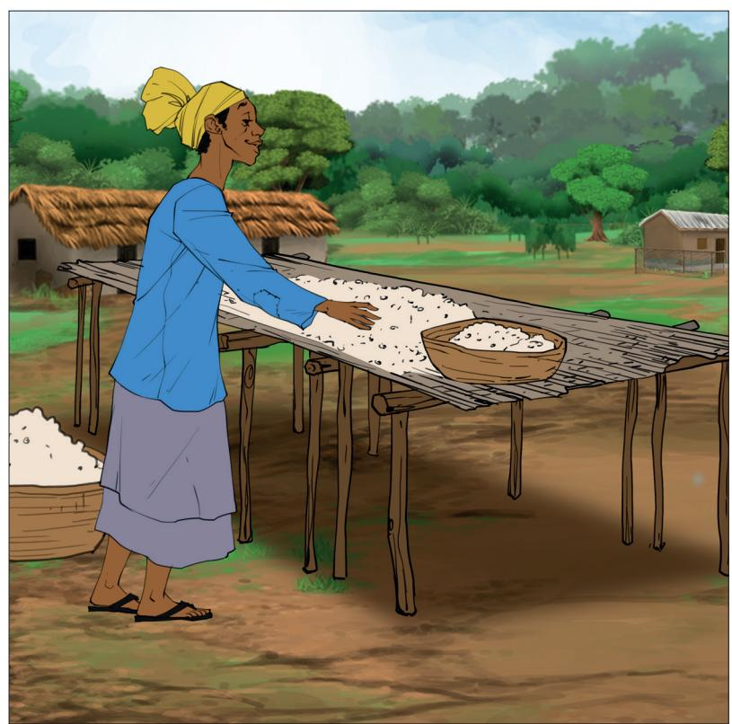

Images of sun-dried cocoa beans on a rack of at least 1 m above the ground or on an isolated cemented area

Drying must be carried out in accordance with the following rules:

- The beans take between 5 and 15 days to dry, depending on environmental conditions.

- The thickness of the beans bed should not exceed 4 cm (approximately 15 to 20 kg per square meter).
- The beans should be stirred very regularly (every hour) during the first two days of drying, then about 4 times a day for the rest of the process.
- It is recommended to use a wooden rake to aerate the beans and make them easier to dry.
- Cocoa beans must be covered at night during the drying period.
- It is advisable to check the moisture content of the beans, which is expected to be around 7-8%, using a suitable device such as a moisture meter.
- Beans are dry when their skins "crack" when gently pressed between the fingers.

#### 3. Quality criteria for commercial cocoa

Once fermented and dried, cocoa beans are often assessed by producers or buyers using a cut test. A sharp tool is used to cut the beans (usually around fifty) through the middle and assess their appearance. This test enables to rapidly assess the quality of the post-harvest treatment..

| Various quality defects in cocoa beans             | Poor practices responsible for the defect |
|----------------------------------------------------|-------------------------------------------|
| Sprouted bean:                                     | A bean, whose shell has been pierced,     |
| Wounded beans                                      | Shelling with a machete;                  |
| Contaminated beans (black)                         | Poorly treated brown rot                  |
| Beans attacked by insects:                         | beans whose internal parts                |
| Moldy beans:                                       | Beans with traces of mold on the inside   |
| that are visible to the naked eye.                 | Poor drying                               |
| Slate-coloured bean:                               | Bean with a slate colour on half or       |
| Debris/ dirt in the cocoa bags                     | Lack of sorting                           |
| Foreign bodies in bags                             | Unclean packaging                         |
| Smoke-flavoured beans:                             | beans with a smoky odour or               |
| taste, or showing signs of contamination by smoke. | Fire drying                               |

BUTTERED BEANS MOTH-EATEN BEANS SPROUTED BEANS

(White Spot)

FLAT BEANS

MOLDY BEANSSLATED BEANSPURPLE BEANSGOOD QUALITY BEANS

The National Cocoa and Coee Board (NCCB) classifies beans into 3 categories: grade 1, grade 2 and non- standard. The first two are characterized by the following percentages of defects:

Table 11: Dierent quality classifications of cocoa according to the NCCB

| Categories | Moldy beans | Slate beans | Beans with other defects |
|------------|-------------|-------------|--------------------------|
| Grade 1    | 12%         | 6%          | 8%                       |
| Grade 2    | 12%         | 8%          | 15%                      |

Implementing the good harvesting and postharvesting practices listed and explained above will help to avoid major defects and produce grade 1 cocoa.

#### 2. Packaging and storage of cocoa beans

The conditioning of cocoa beans after drying is a very important stage for the quality of the beans. If the dried cocoa is poorly packaged, the result can be a resurge of humidity, insects and fungi attacking the beans and thus altering their quality. It is important to avoid contamination by strange odours during storage of the beans. To avoid all these problems, special conditions must be observed during storage. These conditions are:

- Cocoa beans should be packed in jute bags to allow better air circulation inside;
- The cocoa stored must be very dry, with a moisture content of less than 8%, to avoid moisture resurgence and ensure good storage;
- The cocoa bags must not be in direct contact with the floor, walls or roof. Wooden or plastic pallets can be used;
- The number of bags stacked should not be too large to avoid breakage;
- The storage area must be kept clean, ventilated and insulated to prevent the growth of mold;
- Never light a fire in a room where cocoa beans are stored.

### Guide for trainers

#### 1. Objective of the training

At the end of this training session, the producer should be able to:

 Know the techniques and practical dispositions for fermenting, drying and packaging cocoa beans Understand the consequences of poorly conducted post-harvest operations on the quality of cocoa beans.

#### 2. Necessary Materials

 Images of the main defects of cocoa beans Images of permitted and prohibited types of drying Samples of dry beans at dierent stages of fermentation

#### 3. Training duration

The time allowed for the presentation of this theme is 30 to 45 minutes, depending on the level of understanding of the participants.

### 4. Preparation of the trainer

 Read and understand the general information section of this theme, which sets out the key points on which the trainer should base his or her training.

in the case where this minimum is not available, take measures for fermentation to be done -using crates, for example.

 Who can explain how they carry out fermentation of cocoa? Take 2 or 3 speakers in case they think they have a dierent answer to the previous one.

> Summarize what has been said by the various speakers, highlighting any points that were omitted. Explain at each point the impact that each of the recommended practices will have on the final quality of the beans.

 How do you dry the cocoa beans after fermentation? Do you think this is a good way to dry cocoa? Why?

> Faire la synthèse des idées échangées et énumérer les diérentes situations où il n'est pas bon de sécher le cacao à cause des risques de moisissures et d'odeurs de fumées et carburant

 Summarize the ideas exchanged and list the various situations where it is not good to dry cocoa because of the risk of mold and the smell of smoke and fuel.

 How do you determine when the cocoa has reached the 8% moisture content required to stop drying?

> Make sure that all the participants have the information that cocoa that is well-dried cracks when you press a handful of beans, has a brown colour, a chocolate smell and does not give o heat when you put your arm into a bag. It is important to know these elements, because not every producer can aord a moisture meter.

> Present the dierent quality criteria for cocoa beans. Draw participants' attention to the fact that by following the various steps mentioned above, you can avoid these defects.

> Also, present the classification criteria as laid down by the NCCB and MINCOMMERCE.

### Conducting the training

#### 1. Setting the scene

#### a. Brainstorming/catch attention

 Who among you has eaten chocolate today? Who among you is used to eating chocolate? Who knows how chocolate is made?

> Get their opinions and As many cocoa producers do not consume chocolate, they need to be told that those who do consume it have requirements about how their chocolate should be. To guarantee this type of chocolate for consumers, a number of rules need to be observed when processing the cocoa beans.

#### b. Title

State the Title: Post-harvest operations

#### c. Importance for the learner

Mastery of the fermentation process to guarantee high quality beans Good knowledge of good drying practices to produce disease-free

beans and ensure good conservation.

#### d. Guidelines

The aim of the training session will be to provide producers with clear information on how to handle the beans once they have been removed from the pods, in order to minimize defects that reduce quality.

#### 2. Disseminate

#### a. Explanation

 Do you ferment cocoa beans at each harvest? Why do you do this?

Mention the fact that a minimum quantity of cocoa beans is required for a good fermentation.

 Do each of you respect all the rules that have been listed during the training? If not, what needs to be improved? Give them tips on how to get back up to standard. How do you package and store the cocoa beans after drying? Summarize the information given by the participants, each time explaining why it is relevant.

#### b. Visualization

 The main defects in cocoa beans Permitted and prohibited types of drying.

#### c. Case studies

 Present dierent slots of dried beans and ask if the fermentation process was well realized.

#### 3. Summary and Evaluation

#### a. Summary

 Remind participants of the important role they play in the quality of cocoa beans and the by-products derived from them. Draw their attention to the key role of fermentation and drying on

the quality of the cocoa bean. Do you think it is easy to put into practice everything that has been said today?

#### b. Evaluation

- Ask the following questions and correct any answers that are wrong or incomplete.
  - How should cocoa beans be fermented?
  - How many days does fermentation last and what is the stirring interval?
  - How do you dry cocoa?
  - How can you tell if cocoa is dry?
  - How should cocoa be packaged and stored?

- Deutsche Gesellschaft fur Internationale Zusammenarbeit (GIZ) GmbH Green Innovation Centre for the Agriculture and Food Sector – GIZ-ProCISA, Cameroon, HOW TO GROW ORGANIC COCOA A handbook on organic principles of cocoa production in the Southwestern region of Cameroon
- MANUEL DU PLANTEUR DE CACAO, Edition février 2015
- Louise GENTILS Mémoire de stage GEEFT 2022 2023 Caractérisation d'un « cacao d'agroforêt » originaire d'Afrique centrale
- Conseil Interprofessionnel du Cacao et du Café (CICC), « Phénologie et productivité du cacaoyer, observer et agir »
- FiBL (2011): African Organic Agriculture Training Manual. Version 1.0 June 2011. Edited by Gilles Weidmann and Lukas Kilcher. Research Institute of Organic Agriculture FiBL, Frick
- Cocoa and Coee Interprofessional Council, "phenology and productivity of cocoa, observe and take action"
- Document d'orientation H : Protection Integrée des Cultures (PIC), SA-G-SD-9-V1 du 31 décembre 2020, Rainforest Alliance
- Fiche de conseil en transition agro écologique pour la culture du cacaoyer au Cameroun, MINADER
- Qualité du cacao, l'impact du traitement post-récolte, Michel Barel, Editions Quae
- Modules IITA sur l'ISFM dans le cacao /Thèmes de Formation p pour les producteurs de cacao /Version 2020-04-15 v1
- Workshop on soil management of cocoa October 2011, Importance of soil fertility management for sustainable cocoa production, Didier Snoeck
- Daymond, A.J., Giraldo Mendez, D., Hadley, P. and Bastide, P. (Editors). 2022. A Global Guide to Cocoa Farming Systems. International Cocoa Organisation, Abidjan, Côte d'Ivoire.
- Le cacao : de la cabosse aux fèves fermentées et séchées Retour d'expérience de récolte sur cacaoyers guiana en Guyane Française (année 2021), Noël Durand, Agathe Mazardin, Fabien Doaré, Stéphane Saj CIRAD
- Manuel du producteur relais sur les techniques d'accroissement de la productivité du cacao / IPEC; Organisation internationale du Travail, Programme international pour l'abolition du travail des enfants - Genève: OIT, 2013
- Climate-Smart Agriculture in Cocoa, A Training Manual for Field Ocers, Manon Mireille Dohmen, Martin Noponen, Reiko Enomoto, Christian Mensah, Sander Muilerman, January 2018.

# BIBLIOGRAPHY

- Soil texture refers to the mixture and relative proportions of the dierent components (sand, clay and silt). Soils with a high sand content are relatively porous and allow for rapid infiltration of, whereas clay soils are prone to compaction and run-o. However, the loose texture of a sandy soil makes it more prone to wind erosion than a clay soil. If the infiltration of water into a sandy soil is hindered by a high water table or an impermeable subsoil layer (clay or rock), the risk of run-o and erosion is high due to its loose texture.
  - Sandy soil: Sandy soils are composed of a high percentage of sand. Depending on the size of the sand particles, these soils may be coarse- or fine-grained, but they are always granular. Sandy soils are loose, easily drained soils of low fertility. Sandy soils do not stick together and it is impossible to make a ball out of them. They are generally light in colour, ranging from white, yellow and orange to dark grey. Soils in arid areas are often sandy.
  - Recommendation: To improve the structure of a sandy soil, large quantities of compost or animal manure should be spread.
- Clay soil: Clay soils are made up of a large percentage of very fine clay minerals. Clay soils are often heavy and dicult to plough. Water has diculty penetrating heavy clay soils. Waterlogging and run-o are typical problems. However, clay soils have good nutrient retention capacity and are naturally fertile and rich soils. The colour of clay soils varies from light to dark shades of grey, yellow and red.
- Recommendation: Heavy clay soils can be improved by adding organic matter or liming, two ways of improving soil structure
- Loam texture: Soils containing equal amounts of sand, silt and clay (and organic matter) have a loam texture. Loam is dark and friable. Water can easily penetrate the spaces between the particles (drainage). It also has a good capacity to retain water in the spaces between the aggregates. Loam soils are the most favourable agricultural soils because they are fertile and easy to till, and provide enough soil biodiversity to keep plants healthy.

# APPENDICES

## APPENDIX 1

## Guidance document on carrying out the soil texture test

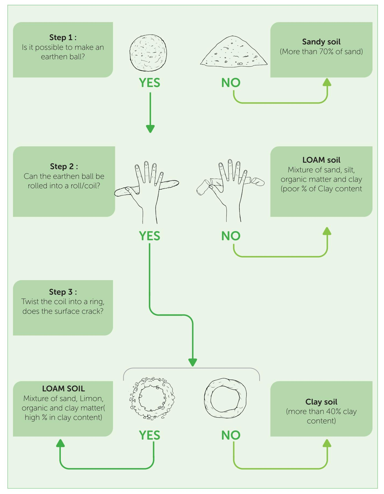

Figure 4: Simple test method to determine the type of soil texture

|                         |                                                     | FRUIT TREES                                                             |
|-------------------------|-----------------------------------------------------|-------------------------------------------------------------------------|
| Common name             | Scientific name                                     | Usefulness                                                              |
| Plantain-banana         | Musaceas                                            | Food security, requires good management                                 |
| Oranges, lemons, limes  | Citrus sinensis, Citrus lemon, Citrus aurantiifolia | Does not provide biomass; can be combined with cocoa; local market      |
| Plums                   | Dacryodes edulis                                    | Good biomass supplier; good local market                                |
| Mango                   | Irvingia gabonensis                                 | Excellent for cocoa, good local market                                  |
| Avocado tree            | Persea americana                                    | Excellent for cocoa; can be pruned easily                               |
| Bitter Cola             | Garcina kola                                        | Excellent for cocoa                                                     |
| Mango tree              | Mangifera indica                                    | Excellent biomass supplier; best planted on the edges of the plantation |
| Oil palm                | Elaeis Guineensis                                   | Important for cocoa production, but the lower leaves must be pruned     |
| Breadfruit (jack fruit) | Artocarpus altilis                                  | Income, food supply, up to 12 metres                                    |

|               |                        | FOREST TREES                                                                                                                                      |
|---------------|------------------------|---------------------------------------------------------------------------------------------------------------------------------------------------|
| Common name   | Scientific name        | Usefulness                                                                                                                                        |
| Cheesemaker   | Ceiba pendandra        | Excellent for cocoa; improves soil fertility; large tree occupying a lot of space; poor quality wood                                              |
| Iroko         | Milicia excelsa and    |                                                                                                                                                   |
|               | Milicia regia          | Excellent for cocoa, very good wood, 30 to 40 metres                                                                                              |
| Mahogany      | Khaya ivorensis        | Excellent for cocoa, large timber tree with light shade                                                                                           |
| Sapelli       | Entandrophragma        |                                                                                                                                                   |
|               | cylindricum            | Excellent for cocoa, valuable wood, up to 45 metres long                                                                                          |
| Oak           | Terminalia ivorensis   | Excellent for cocoa, self-pollinating, fast-growing, one of the main timber trees                                                                 |
| Frake         | Terminalia superba     | Excellent for cocoa, self-felling, one of the main timber trees                                                                                   |
| Camwood       | Baphia nitida          | Improves floors, high-quality wood                                                                                                                |
| Adjap (Moabi) | Baillonella toxisperma | Harvesting wood and oil for consumption, large tree                                                                                               |
| Albizia       | Albizia sp.            | Soil fertility, medicinal, good wood Nitrogen-fixing tree, the most important shade tree for cocoa                                                |
| Gliricidia    | Gliricidia sepium      | in Central America, good live hedge; biomass production is not very high;                                                                         |
| Leucaena      | Leucaena leucocephala  | Small tree, much better for combining with cocoa at the beginning of the cycle. Can be useful at the start of a new plantation, does not tolerate |
| Moringa       | Moringa oleifera       | shade, low biomass production. Not really useful in cocoa plantations, but excellent source of food planted around houses.                        |

## APPENDIX 2

## List of species commonly associated with cocoa trees and their uses

Cocoa plants are multiplied in the nursery over a period of about 6 months and is done following the steps below:

#### Choosing a site near a permanent water source;

It is usually located close to an inexhaustible water source to make watering easier. It should be as close as possible to the future plantation site, to the village or close to humus-rich soil. It is also advisable to build it on a welldrained, flat or slightly sloping land. Low-lying or swampy areas should be avoided. If necessary (installation on steep slopes), drainage ditches can be dug in the direction of the steepest slope.

#### Construction of a shaded area;

With a height of 2.5 m, the shade is built with wood or bamboo. It is covered with evenly spaced palm leaves or straw, allowing 50% of light to pass through. It is also necessary to provide lateral covering on the sides exposed to the sun.

## Soil for the nursery

Prepare the filling soil (humus-rich, sandy-clay) by choosing the surface soil, preferably under forest cover, while avoiding soil from old cocoa farms and undecomposed manure. If the soil is very heavy, mix 1 wheelbarrow of sand with 3 wheelbarrows of black soil. Sieve well.

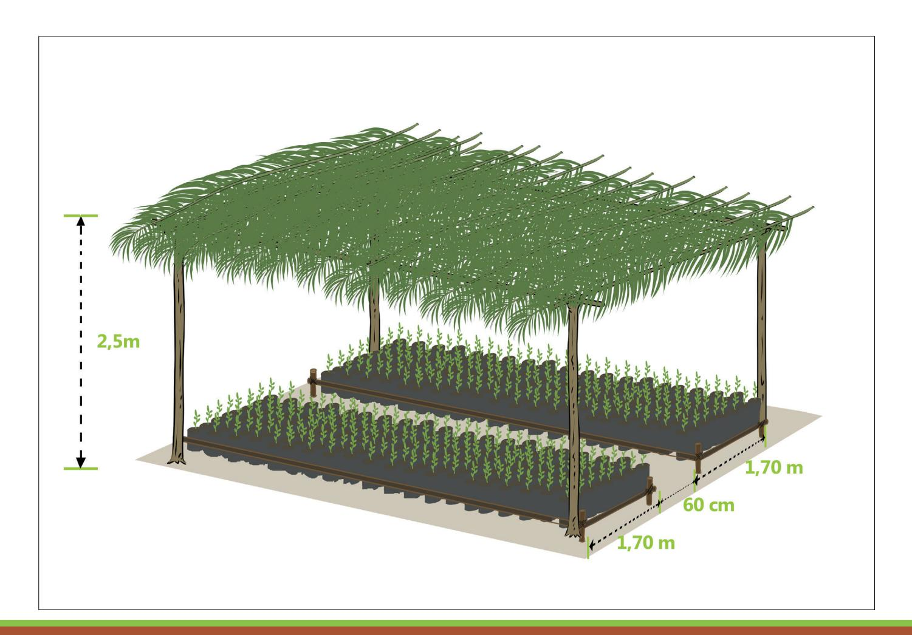

## APPENDIX 3

## Dierent stages in setting up a nursery

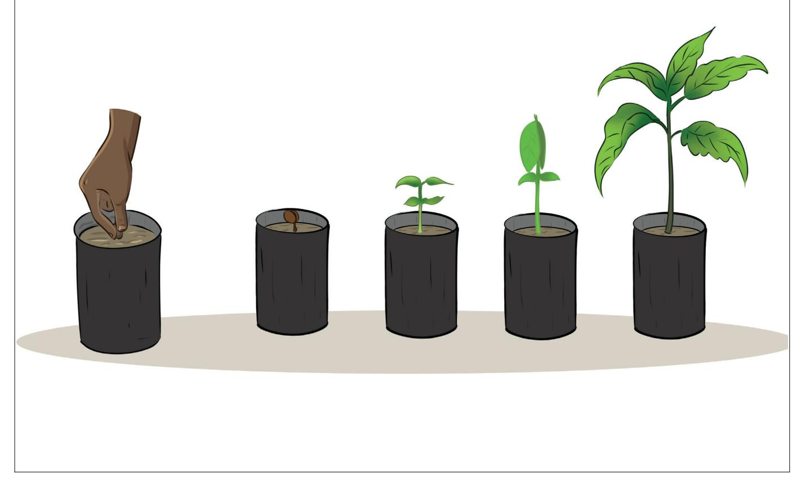

#### Purchase and filling of plastic bags with humus-rich soil, then aligning them to facilitate operations;

Fill with humus-rich and sandy-clay soil the plastic (polyethylene) bags measuring 15 x 25 x 10 cm whose bottom half has perforated beforehand.

Dispose the filled bags in rows (10 bags on the widths and 50 lengthways), which will be separated by 60 cm aisles and 1 m from the sides of the nursery to allow for easy movement. Keep the bags upright with bamboo sticks placed horizontally and fixed with small vertical stakes. Secure the nursery by building a fence around it to prevent animals from entering.

## Sowing the beans flat;

For good productivity, use seeds from the most productive trees or pods from improved varieties supplied by research centers. Pick healthy pods (with no rot, stains or sting marks) from high-yielding trees, slightly before their optimum ripening point (three-quarters colored). As soon as the selected pods are harvested or received, open them carefully, so as to avoid damaging the beans. Remove the three sterile beans at the base of the pod.

Remove the mucilage (whitish pulp) from the extracted beans by washing them in plenty of water, then rubbing them in fine sand or sawdust. Rinse them again in water, removing any beans that are flat, too small, sprouted or floating.

Beans should be sown within three days of harvesting, as the seed loses its germinative power if it remains outside the pod for too long.

The day before sowing, water the filled bags. Sow a bean in the middle of each sachet, with the large end of the seed

Germination will begin around the fifth day and the plants will remain in the nursery for 6 to 8 months

downwards or flat so that the pivot is straight. bury the seed 1 cm deep. Cover with soil and press lightly with your fingers, then water thoroughly.

#### Regular cleaning, watering and phytosanitary treatment;

Water the nursery every day (early in the morning or evening) for the first 15 days after sowing, then every

2 days - but not excessively - so that the soil in the bags remains moist at all times. regularly Weed the pots and the paths between the beds to eliminate weeds and avoid competition for water and nutrients.

Replace missing plants 2 weeks after sowing by repeating the bean selection process. The operation can be repeated 2 or 3 times.

If necessary, start a fungicide treatment when the plants have 2 to 4 leaves, then apply it at 21-day intervals. Protect plants against insects by spraying with insecticide once a month, alternating the active ingredients.

#### Reduce shade one month before planting for adaptation purposes.

Regularly group plants of the same size together on the same bed. Gradually reduce the shade a month before transplanting to accustom the plants to more intense light.

Maintained in good conditions, plants aged 5 to 6 months old are at least 50 cm tall when transplanted.

The basal area of a tree: the area of its crosssection at 1.30 m, expressed in m² and symbolized by g.

The basal area of a stand: the sum of the basal areas of the trees g per hectare expressed in m²/ha and symbolized by G.

## g= π x (D)2 / 4

An indicator used in studies of forest stands, an index of land occupation and a means of monitoring changes in a stand over time. A control tool for silviculture, enabling better management of pruning operations Indicator that gives producers room to manipulate the choices they make for managing their agroforestry systems; Study aimed at correlating basal area with tree cover in order to monitor evolution in agroforestry systems using aerial images; Forest environment indicator: correlation between basal area and carbon stock.

The basal area of a tree (g) is calculated by measuring its diameter or circumference at a height of 1.3 m using a caliper or a tape..

Basal area of a stand (G): On a defined and known area called inventory area (S expressed in ha), all the diameters or circumferences of the stems at a height of 1.3 m are measured. The basal area of the stand G is calculated by adding up the individual basal areas of these stems and relating this sum to the inventory area.

# APPENDIX 4 Basal area guidance sheet

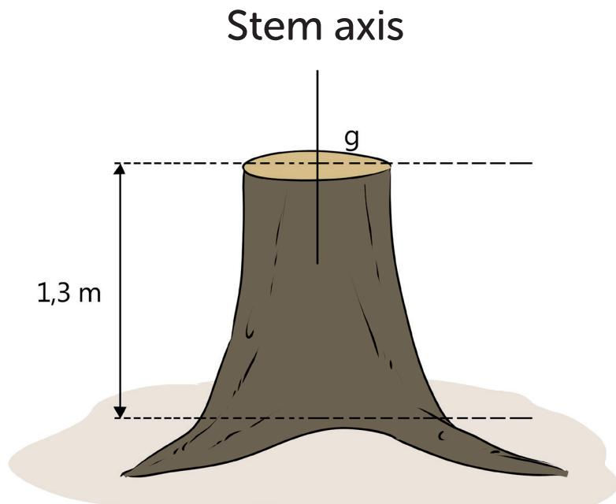

- Drainage (good, average, poor)
- Shade cover (dense, medium, light, unshaded)
- Soil fertility (high, medium, low)
  - Average number of stems per plantation- Average number of main branches
- Average spacing of cocoa trees in relation to other trees
- Presence and size of open spaces (large, small, none)
- Average number of shade trees per hectare / acre Observation of the agroecosystem
- Observations should be made early in the morning (around 7 a.m.).

While working in groups, participants enter the FFS learning farm to observe and record the general farm conditions, weather, plant physiology, type and number of insects and diseases, attack symptoms, environmental conditions around the farm and to collect live specimens. They should collect the data indicated on the AESA survey sheet from the sets of the five selected trees. For convenience and because of problems linked with the use of ladders, most observations are made up to 2 meters up the tree, but observations of damages caused by rodents should be made above 2 meters.

Environmental conditions: at each session, record the following conditions at the time you made the observations:

- Weather (sunny, cloudy, rainy)
- Temperature (cold, warm, hot)
- Soil moisture (dry, damp, wet)
- Selected fixed trees.

Record the following agronomic observations at each session from the selected fixed trees:

- Number of small pods
- Number of large immature pods

Teach farmers the importance of making management decisions based on close observation:

Materials: - Wooden ruler for measurement - Pencils - Markers (3 dierent colours) - Pencil sharpeners - Erasers - Notebook - Machete - Pins - Wooden support board

Procedure: AESA data is collected from two plots to learn about the impact of new practices. Identify and mark these plots at the first FFS meeting. Divide the participants into working groups of 4 to 5 persons, depending on the total number of participants. Each working group can make observations on the ICPM and FP plots. However, to reduce work time as much as possible, if you have 5 working groups, 3 groups can make observations in the ICPM plot and two groups in the FP plot. These working groups should be maintained throughout the training period, but the plot observed by each group should be changed from time to time. Each group selects one person to record all the data (this task can be rotated between group members). Then, randomly select and label 5 trees to be observed for each working group. For example, if you have 5 working groups, select 25 trees, 15 trees for the three groups working on the ICPM plot and 10 trees for the two groups working on the FP plot. Throughout the field school, the participants observe these same trees for their agronomic characteristics (called selected fixed trees).

Working groups should randomly select further 5-10 trees for observation of parasites. During the first AESA, start with a quick field walk in the FFS plots and beyond. Record the following information about the cocoa trees in both plots and across the farm (see AESA survey sheet):

- Varieties
- Estimated age of trees (indicate range)
- Topography (flat, gentle, steep)

## APPENDIX 5

## Diagnostic sheet for a cocoa orchard

- Number of ripe pods
- Number of chupons on the main branch
- Number of basal chupons
- Presence of new shoots (none, light, medium, abundant)
- Presence of lianas and mistletoe (none, low, medium, high).

After the first AESA, record the following observations only when significant changes have been made to the FFS plots:

- Shade cover (dense, medium, light, unshaded)
- Soil fertility (high, medium, low)
- Average number of stems per plantation
- Average number of main branches
- Average spacing of cocoa trees in relation to other trees
- Presence and size of open spaces (large, small, none)
- Average number of shade trees per hectare/acre.

At each session, carefully observe the selected trees for insects and diseases. Record the following observations on pests and diseases:

- Number of pods damaged by pests (above two meters for rodents)
- Number of natural enemies
- Number of pods aected by the disease.

Carefully observe 5 leaves and pods (if present) on each branch of the selected trees and the branches themselves, recording diseases and other symptoms. Observe and record how many leaves and pods are diseased. If you recognize the disease, record it. If you don't recognize them, collect them in bottles or plastic bags and take them back to the meeting place. Count the number of trees where major pests and diseases are found.

Record the number and species of any

weeds on or around the tree. If you are not sure whether a plant is a weed, collect it in a polythene bag and take it to the meeting place to see if other participants can identify it.

Drawing the agro-ecosystem: In a shaded area near the field, each group draws all the observations made on the flipchart paper. Draw a single representative cocoa tree in its current state of growth, with the sun or clouds symbolizing the weather conditions. Show the weeds found and indicate their number and species. To the right of the tree, draw the natural enemies found and indicate their number or abundance. To the left of the tree, draw the insect pests and disease symptoms found and indicate their number or abundance.

Analysis of the agro-ecosystem: after a discussion, the members of the group analyze and interpret the information on the field. They discuss the growth phase of the plant and compare the number of pods, chupons, the presence of new shoots, lianas, mistletoe, etc. between the trees observed. They also compare the diseases observed and the number and type of pests and natural enemies.

The group draws conclusions about the overall situation compared with the previous AESA. They outline observations of zones of specific problem in the AESA drawing and indicate possible causes.

Decision-making in the agro-ecosystem: The final stage of the AESA is decision-making. Group members should ask themselves the following questions:

- What must we do to solve the problems observed?
- If something has to be done, how, when and what will be the impact on the agro- ecosystem?

Action decisions can include:

- Field work or crop management operations (e.g. weeding, sanitary harvesting, chupon removal, spraying, etc.) A discovery learning exercise to learn about a subject - the «special topic» (e.g. insect life cycle)

- Conducting an experiment to try something new and untested. List the action decisions under the column for group recommendation in the AESA drawing. Participants are encouraged to question and challenge the presenting group. Sometimes a decision taken by a group is changed or rejected by the rest of the school. An important role of the facilitator is to highlight the dierences observed between the plots, ask the following questions
- Is there any dierence in the average and total number of small/ large pods counted on the trees in the FP and ICPM plots.
- How do we explain this dierence?
- Is there any dierence in the number of pods aected by disease? How do we explain this dierence?
- Is there any dierence in the number of pods damaged by pests? How do we explain this dierence?

After the presentations, the group must reach a consensus on what action to take and when. These decisions are implemented during the following session.

Implementation of analysis-based decisions of the agro- ecosystem. Decisions taken at the previous session are generally implemented immediately after field observations and data collection, or as a special topic. Some important decisions may be implemented in the week before the next session. However, it is however important to note that not all topics identified by EASA can be addressed during the training cycle. Participants may follow-through certain topics, for example those requiring long-term research or demonstration, after the training cycle.

# APPENDIX 6 Dierent steps in making compost

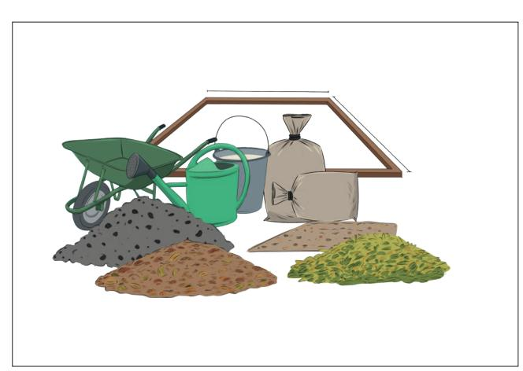

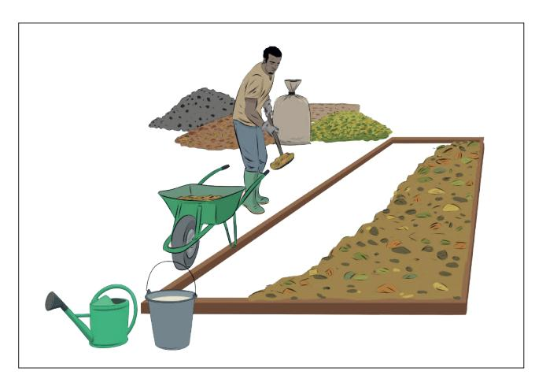

Mark-out a space on well-drained site and put together the necessary material for composting Cocoa husk and dry leaves, green plant debris, wood ash, priority waste, humified soil, roster.

Create the fermentation heap in several phases 1. Bring 2 wilbarows of crushed pod cortex

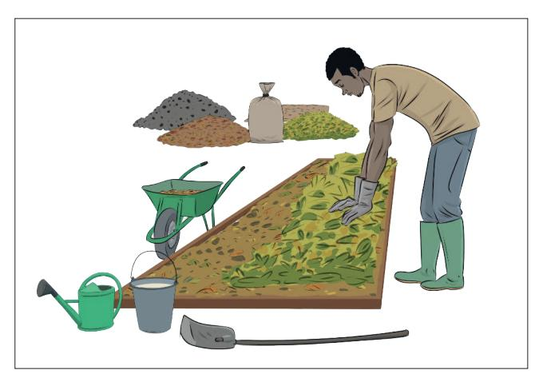

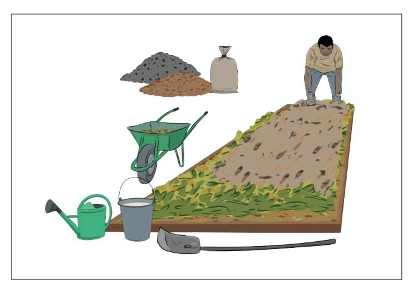

2. Add a willbarow of cut green plants (leaves, twigs) 3. Add a bucket of poultry manure and spread out well

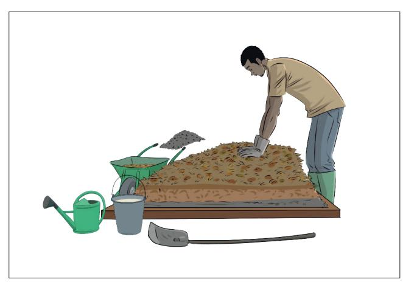

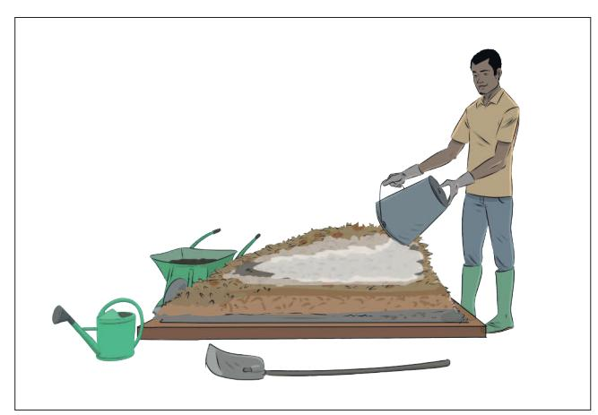

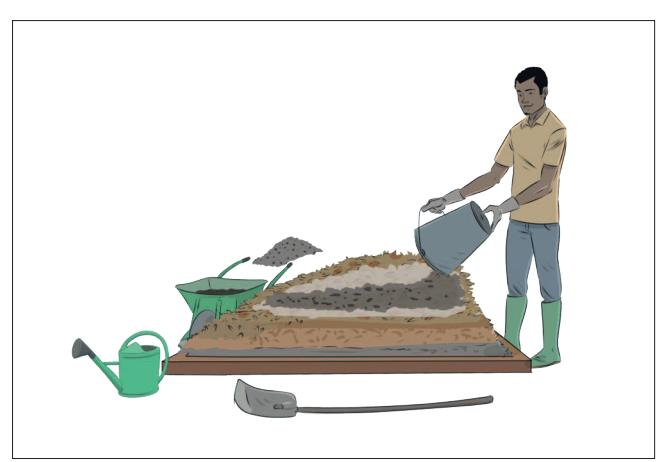

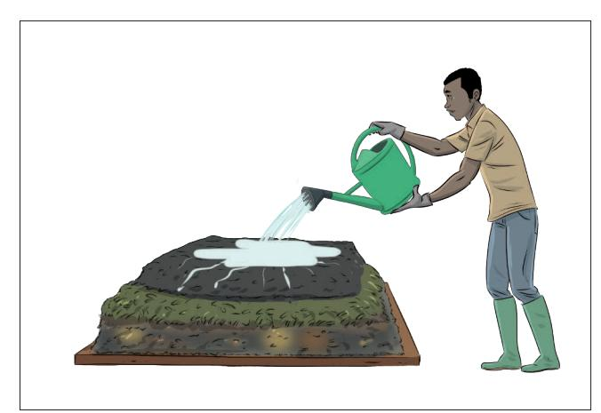

6. Add half a wilbarow of humified soil 7. Water the heap with the content of a watering can

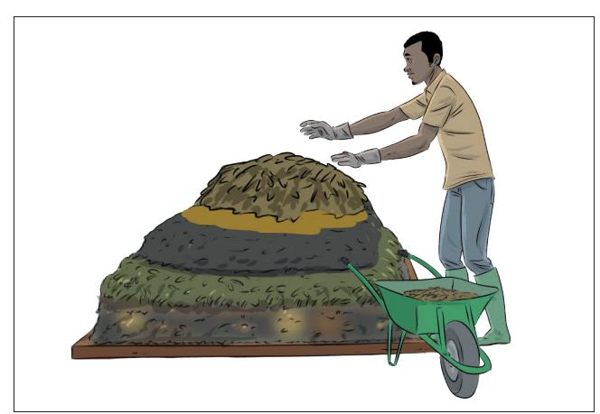

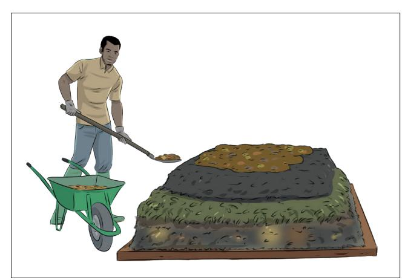

8. Add two wilbarows of crushed pod cartex 9. Add a wilbarow of green plants

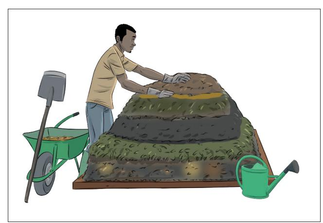

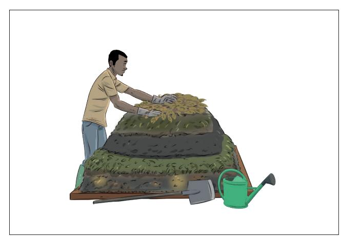

10. Add a wilbarow of poultry manure 11. Add a layer of dried cocoa leaves

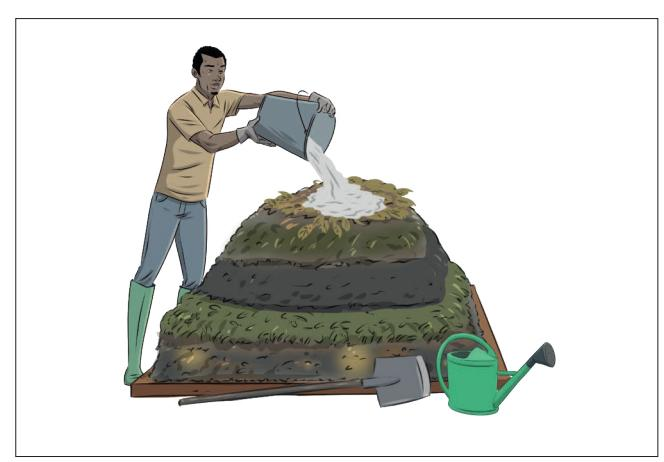

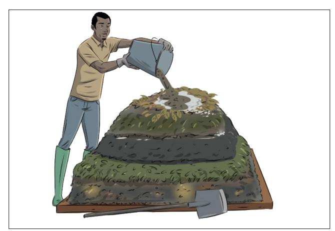

12. Add a layer of wood ash 13. Add a layer of humified soil

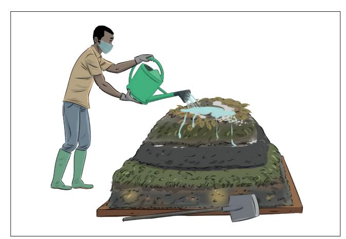

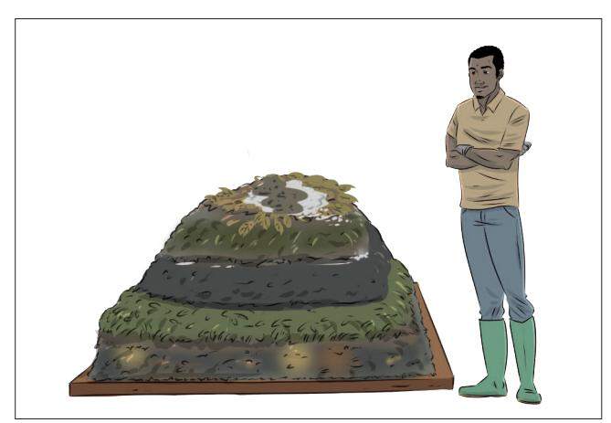

14. Water the layer with content of watering can 15. Build up the desired compositing heap up to a height of 1.5m

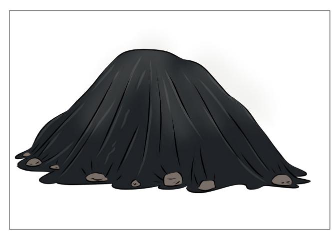

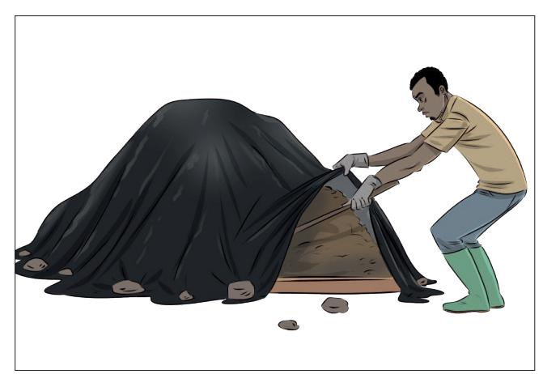

16. Cover the compositing head with a black plastic film 17. Verify the progress of the compositing. After 8

days, inserta stick on the middle of the heap and then remove it. If the stick is hot, it is a sign that decomposition has started. Repeat the operation another time to be sure of the progress of the decomposition.

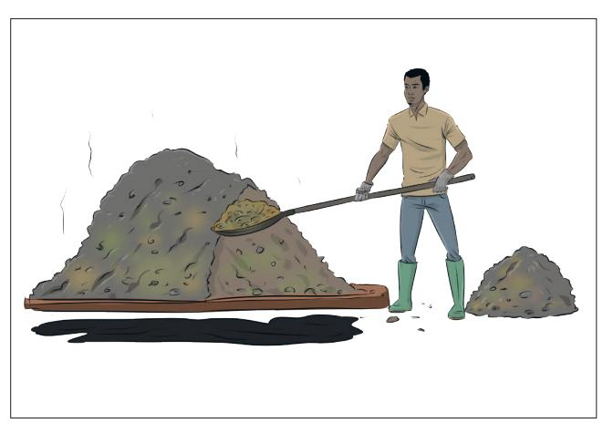

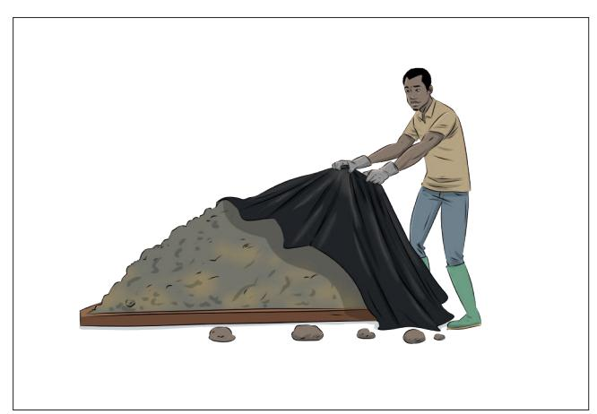

18. Overturn the compositing heap. One month later, overtutn the hep by taking the layers down and the lower layers up. Water layers if they are dry. Repeat the operation every 15 days until the compost becomes dark grey.

19. 3 to 4 months later, the compost is ready to be used. A leap of 2.5m x 2m will give 300kg of enriched compost

farmers' groups or extension agents. Populations generally start to build up as early as June, and scouting/monitoring should begin at that time. Some new clones appear to be less attractive to mirid bugs. As mirids lay their eggs in the bark of stems or inside pods, painting stems with whitewash to cover crevices and collecting all pods could help reduce infestation rates.

- Biological control: The black ant (Dolichoderus thoracicus) has been used on some farms as a control measure. Maintain abundant colonies of weaver ants (Oecophylla longinoda) in the plantation/
- Chemical control: Resistance to commonly used insecticides is increasingly becoming a problem in mirid control. Consequently, the use of locally approved synthetic pesticides should only be considered as a last resort.
- Threshold level: Sticky traps and pheromone traps can be used for monitoring. 1 to 4 mirids per tree.

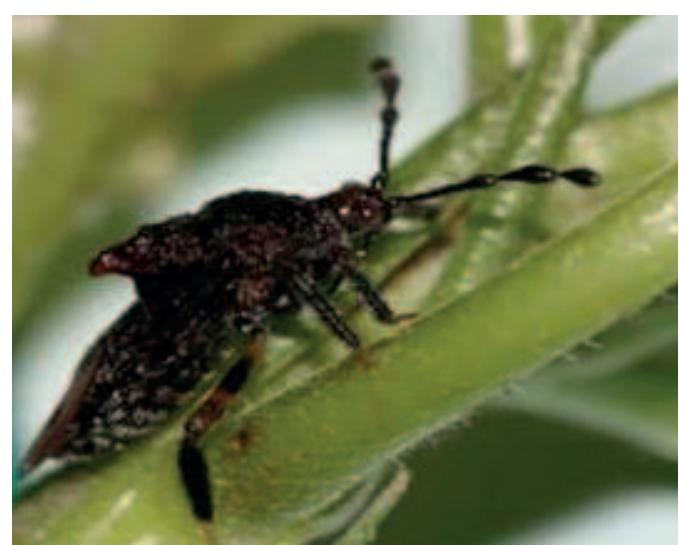

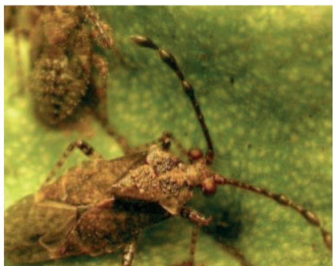

Cocoa Mirid (Sahlbergella singularis) or (Distantiella theobroma)

- Symptoms: mirid nymphs and adults pierce the surface of cocoa stems, branches and pods to suck sap, causing necrotic lesions.
- Damage: can lead to the death of terminal leaves and branches, causing dieback (withering). young trees may Completely die. Mirids are vectors of fungal infections (Calonectria rigidiuscula, etc.) which can cause cocoa to dieback.
- Favored by trees exposed to the sun, trees bearing the first fresh flush of leaves, shoots and pods. Populations generally develop during wet and sunny seasons. Temperatures > 28°C.
- Prevention: Shading should be designed to achieve a balance between mirid control, flowering and black pod management. Alternative hosts should not be used as shade trees on cocoa farms. Right Timing of interventions is crucial for successful control of this pest. Find out about weather conditions from

## APPENDIX 7

## Guidance sheet on cocoa diseases

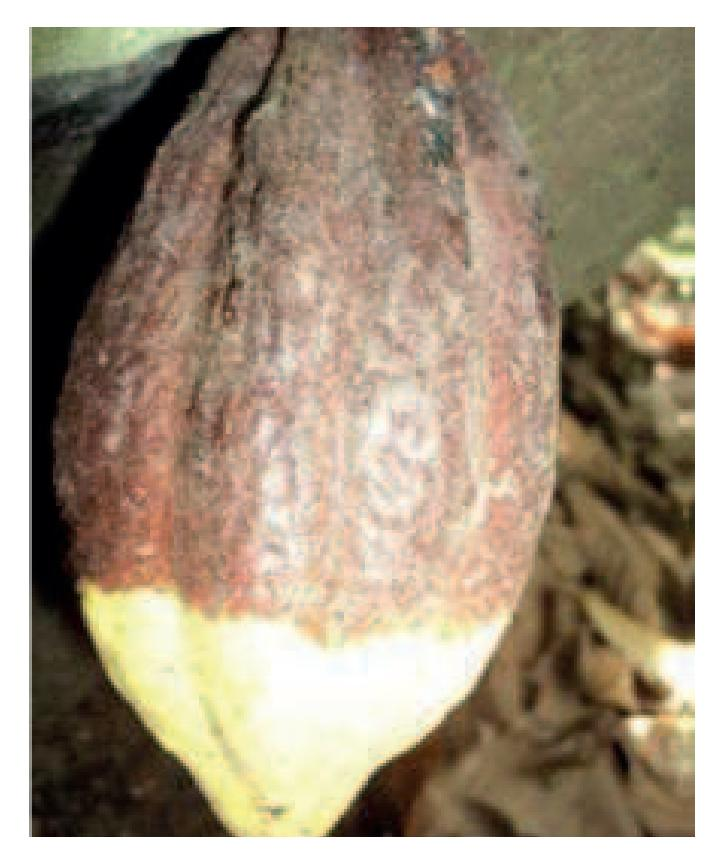

Black pod rot (Phytophthora palmivora, P.

megakarya and P. capsica)

Fungal disease that can be caused by va-

rious pathogens

- Damage: Pods can be attacked at any stage of development, and the first symptoms are small hard and dark spots on any part of the pod. The internal tissues, including the grains, shrivel up to form a mummified pod, turning dark brown. They may eventually be covered by the growth of white fungi.
- The internal tissues as well as the beans become discoloured. If the beans are almost ripe when the pod is infected, they may escape damage because they have already separated from the shell.
- P. palmivora causes a yield loss of 20- 30% and the death of 10% of trees each year,
- P. megakarya is the most important and aggressive pathogen in Central and West Africa. If left untreated, it can lead to yield losses of the entire harvest in a single season.
- P. capsici is widespread in Central and South America, where it causes major losses.
- Favoured by conditions of excessive rain or high humidity, insucient sunlight and temperatures below 21°C.
- Inadequate spacing and poor aeration. In dry conditions or seasons, the fungus survives in flower cushions, mummified (dry) pods, pod husks and in the soil. Pods and other tissues injured by pests are highly susceptible to infection.
- Prevention: Regular and complete harvesting is essential. Maintain high levels of sanitation by periodically removing and disposing of infected pods and debris. Optimize shade and aeration by appropriate spacing and pruning to reduce surface moisture. Improve soil fertility and apply sucient layers of mulch.

Black pod rot damage (Phytophthora palmivora) On the pod

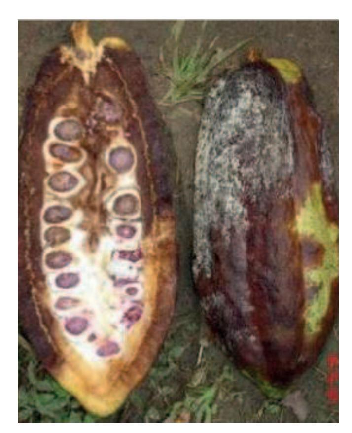

Internal damage from black pod rot (left) and white Fungus starting to cover the pod (right)

- Chemical control: Fungicides containing copper at frequent intervals from the start of the main rainy season.
- Threshold level: immediate cleanup/ sanitization is required as soon as the first symptoms appear.

## Stem canker (Phytophthora palmivora)

- Damage: Cankers appear on the main trunk, jorquettes or fan-shaped branches. Begins as an oval or round greyish-brown lesion on the outer bark, oozing a liquid, which forms rusty- brown crusts. The tissues beneath the outer lesion turn purple (rot). If left unchecked, the lesions completely cover the stem, preventing the circulation of water in the plant tissues, and eventually leading to the death of the tree. Causes major losses in West Africa and in Trinitario hybrids.
- Favored by damp conditions and inadequate drainage. Damage to the bark is necessary for infection of the wood and development of the canker.
- Prevention: Increase soil organic matter levels to improve drainage. Avoid injuring the bark. Cut back and remove withered branches.
- Biological control: none available at present.

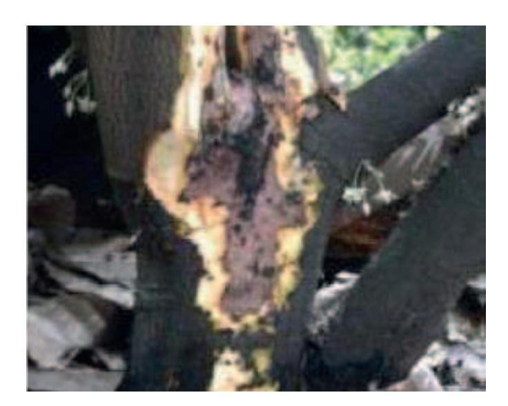

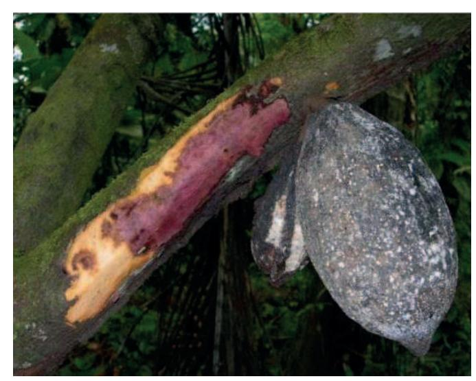

- Chemical control: This can be used in the early stages by scraping o the diseased bark and then applying Bordeaux mixture or copper oxychloride paste.
- Threshold level: Immediate clean-up is required as soon as the first symptoms appear.

 Witches' broom (Moniliophthora perniciosa) is one of the most devastating and widespread diseases in South America, the

Caribbean and Panama

• Damage: cocoa trees produce fruitless branches and ineective leaves. The pods are deformed and ripen unevenly. Yields

are considerably reduced.

• Favored by high humidity rate (=80%) and temperatures between 20 and 30°C. Spread by water, wind, seeds on workers or infected plant material moved

between plantations.

• Prevention: Plant resistant varieties/

clones, for example those derived from Sca6 parent trees. Pruning is the best way to control witches' broom. Completely remove all infected parts of the plant. Improve aeration. CIRAD has identified a number of resistant genotypes in French

Guiana.

The purple discolouration visible once the lesion caused by stem canker (Phytophthora palmivora) has been scraped o.

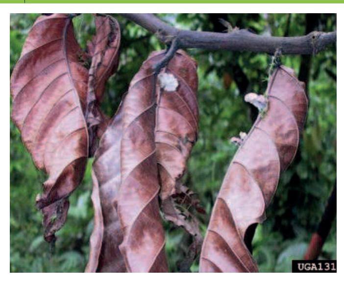

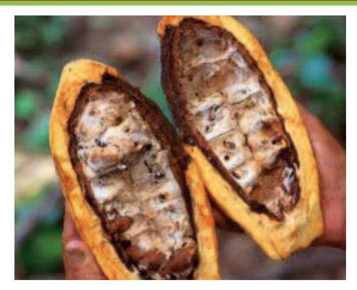

Whitish fungal growth on the midrib of leaves killed by witches' broom (Moniliophthora perniciosa)

Cocoa seeds inside the pod destroyed by the witches' broo

- Chemical control: Fungicides. Use of locally approved synthetic pesticides only as a last resort.

#### Wilt of cherries/young pods: Physiological disorder

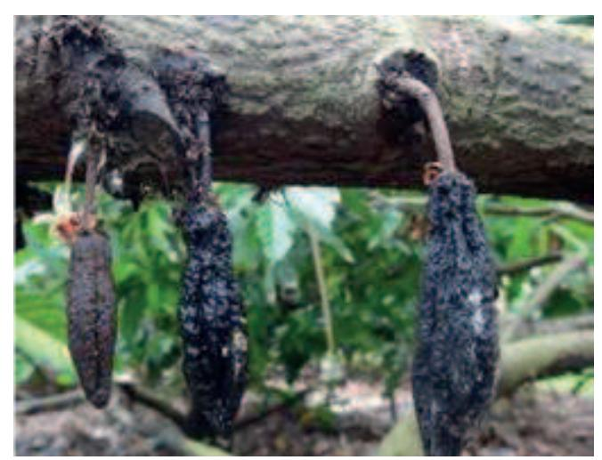

- Damage: The cherries die and mummify to a certain extent: this is a natural process which prevents overloading but can lead to significant losses. Also favors secondary infection by anthracnose.
- Favored by factors that weaken trees, such as attacks by pests or diseases, low soil fertility or poor plantation management.
- Prevention: Improve soil fertility and levels of soil organic matter. Appropriate planting density or avoid excess number of trees.

- Biological control: none
- Chemical control: none
- Threshold level: Signs of infection should prompt improved soil fertility management.

Wilt of cherry bunches

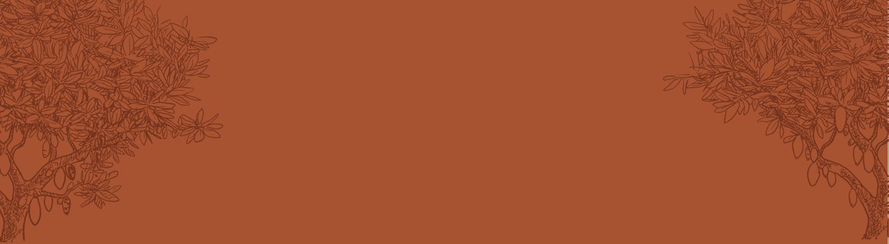

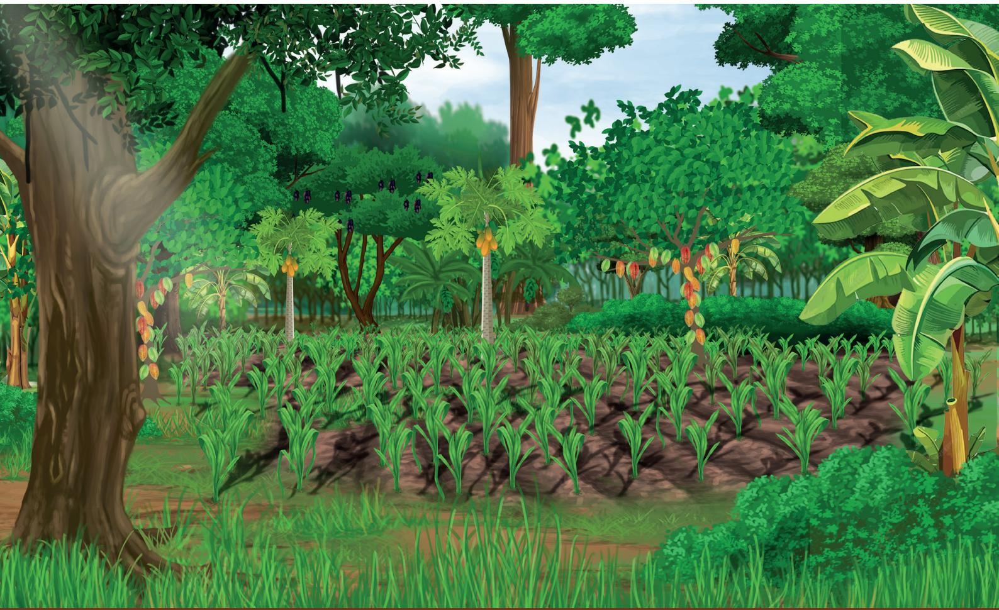