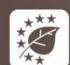
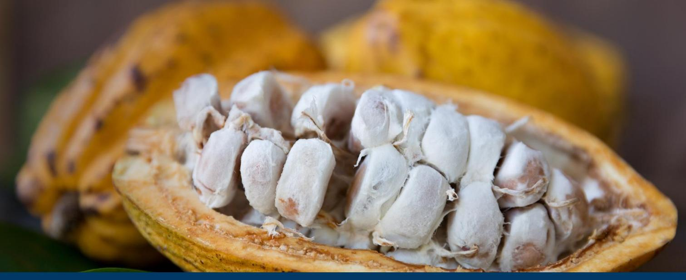
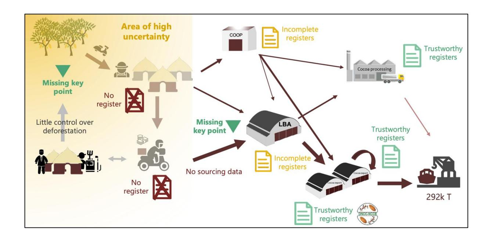
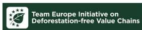

# **Preparedness check of Cameroon for the EU Deforestation Regulation (EUDR) - July 2025**

Deforestation and forest degradation driven by agricultural expansion are growing at an alarming rate in tropical forest countries. As a major consumer of forest-risk commodities, the European Union (EU) has decided to take action to reduce the impact of its consumption of some of these commodities and products. The EU Deforestation Regulation (EUDR) came into force on 29 June 2023. From 30 December 2025, its main obligations will apply to all in-scope companies (other than micro-undertakings or small undertakings), and to micro-undertakings or small undertakings from 30 June 2026. The regulation will allow operators and traders to place certain basic products (cattle, cocoa, coffee, palm oil, rubber, soya and timber) and derived products on the EU market or export them from the EU if they meet the "deforestation-free" criteria, have been produced in compliance with the relevant legislation of the country of production, and are covered by a declaration of due diligence including information on their traceability.

In parallel to the development of the EUDR, the EU has initiated policy dialogues on sustainable cocoa with CÙte d'Ivoire, Ghana and Cameroon in 2021. These policy dialogues are intended to be maintained and strengthened to facilitate the implementation of the EUDR and to support cocoaproducing countries in meeting the challenges of sustainability.

This analysis provides an overview of existing policies, tools and data in Cameroon that can support the due diligence efforts of cocoa operators in accordance with the EUDR, while identifying the challenges that need to be addressed to ensure compliance in the Cameroonian cocoa supply chain. Although the responsibility for compliance rests solely with cocoa operators, producing countries, through the national policies and tools they have put in place, can play an essential role in facilitating due diligence. **This document provides a regularly updated overview of the cocoa sector in Cameroon in terms of traceability, deforestation and legality.**

# Cocoa Insight

# **1. Traceability requirements**

The EUDR requires that operators collect the following information, accompanied by evidence: the geolocation coordinates of all plots of land where commodities and products were produced (Art. 9 (1.d)),—for plots larger than 4 hectares, GPS polygons are required—(Art. 2(28)), the date or time range of production (Art. 9 (1.d)), and last supplier information (Art. 9 (1.e)).

### **1.1 State of play**

The **Roadmap for deforestation-free cocoa** in Cameroon (signed in January 2021 by various stakeholders, including national institutions) aims for 100% traceability of cocoa supplies from plot to port by the end of 2025. However, stakeholders express concerns about meeting this ambitious target, given the complexities of the value chain and the tight timeline.

In Cameroon, **farmers registration and cocoa plots mapping is undertaken by the cocoa industry**. The Interprofessional Council of Cocoa and Coffee (CICC), with funding from cocoa export levies, is collectively setting up a database of cocoa farmers. By April 2025, the CICC had geolocated 150 000 plots belonging to 100 000 producers. The objective is to reach a total of 185 000 plots by the end of 2025, corresponding to 125 000 producers, out of an estimated national total of 300 0001 [.](#page-1-0) As of June 2025, a further 28 000 plots belonging to 24 700 producers had been geolocated with the support of the Sustainable Cocoa Programme (SCP), and these plots will eventually be processed and integrated into the CICC database. All producers whose plots have been geolocated will be able to obtain a producer card with a QR code containing the coordinates of his/her plot(s).

In addition to this initiative, the Cocoa and Coffee sectors development fund (FODECC) has launched a pilot self-geolocation operation for farmers. By June 2025, FODECC had registered 369 481 cocoa and coffee farmers for 143 695 plots geolocated and verified. However, FODECC's objective is not to ensure product traceability, but rather to facilitate access to inputs for growers, and more recently to provide agroecological advisory support.

In Cameroon**, the implementation of a national approach to cocoa traceability is still being debated by public and private stakeholders**. The consensus reached during the Cocoa Talks to set up a national traceability ecosystem in which roles and responsibilities are shared between the public and private sectors has yet to materialise in practice. The government-commissioned feasibility study of the national traceability system has raised questions in the private sector as it confirms the option of strengthening the role of the State in the traceability process. On the private sector side, the CICC has developed a data- sharing platform for cocoa and coffee plot data, allowing all exporters operating in Cameroon to access geolocation coordinates of cocoa and coffee plots. This platform was presented to exporters and producer organizations on June 17, 2025. Four private companies—TELCAR Cocoa Ltd, SIC CACAOS, Olam Foods and Ingredient Cameroon (OFICAM), and Atlantic Cocoa Corporation (ACC)—along with the CICC and FODECC have agreed to share at least the following data: name and date of birth of the producer and the geolocation of his/her plot(s).

1 CICC memo to EFI

The platform has established precise operating rules so that exporters can benefit from this paying service.

Alongside these initiatives by public and private sector supervisory bodies, large cocoa exporters are pursuing and strengthening their own supply chain traceability systems. To support small operators who do not have a traceability system, the Sustainable Cocoa Programme in collaboration with the CICC, has made a configurable traceability solution (INA Trace) available to them. This solution is tailored to the cocoa and coffee supply chains in Cameroon. The application is open-access and free of charge, allowing for flexible configuration based on each company's operations. A second, traceability application is also being developed by the Sustainable Cocoa Programme, targeting producer organizations as well as both formal and informal buyers.

## **1.2 Remaining challenges**

**It will probably take a few more years before all the cocoa farmers in Cameroon have been identified and all their plots geolocated**. As of now, through the data-sharing platform, approximately 50% of the cocoa volume traded is geolocated, as it is certified under two standards: Rainforest Alliance and Cocoa Horizon[s](#page-2-0)2 . Only a limited number of plots and farmers have been identified using the CICC method. The identification and geolocation (polygons) of cocoa plots is a major task, the total cost of which, according to CICC, is estimated at around EUR 15 million. Furthermore, only five or six sworn surveyors are able of carrying out such an operation in Cameroon. Geolocation operations in the English-speaking south-west, which produces 30% of all cocoa, are still on hold due to the ongoing crisis in that region.

**Upstream traceability of the first formal buyers (Licensed Buying Agents - LBAs and cooperatives) still requires substantial effort**. Transactions carried out from the plot with these actors are mostly informal and therefore untraced. The sale of cocoa between producers and the first middlemen often circumvents formal rules and regulations. Known as "coxing", this practice accounts for a significant proportion of the volume marketed. Many cooperatives have varying degrees of maturity and often lack reliable management systems. According to cocoa industry stakeholders, a priority would be to identify solutions for informal "coxeurs" and to oblige LBAs to provide information about their suppliers. However, no precise plan for implementing these objectives has been defined at this stage.

2 Bilan de campagne ONCC 2023-2024

Diagram of data collection and data reliability in the cocoa sector in Cameroon (NitidÊ, 2022)

Additionally, further consensus needs to be built on the division of responsibilities between public and private actors with regards to the management and access of farmers' data as well as traceability information. The reference manual for sustainable cocoa, currently being drawn up with key actors in the sector, should include a section dedicated to defining the minimum data to be shared by private traceability systems (traceability specifications).

# **2. Deforestation-free criteria**

The EUDR requires that operators collect adequately conclusive and verifiable information that relevant products are deforestation-free (Art. 2(13) and 9 (1.g)). Cocoa produced on lands converted from forests after 31 December 2020 would not be considered deforestation-free and would not conform with EU requirements. Forests are defined according to the Food and Agriculture Organization of the United Nations (FAO) definition (Art. 2(4)[\).](#page-4-0)3

Relevant data and tools in this context include:

- Forest cover map at the cut-off date (31 December 2020)
- Permanent national forest monitoring system, deforestation alerts

### **2.1 State of play**

**There are discrepancies between the FAO forest definition and national approaches to defining forests**. The forest definition under the Forestry Law 94/01 does not set a size, canopy or tree height threshold. However, the Ministry of Forestry and Wildlife (MINFOF) recognises the national REDD+ definition, which includes criteria consistent with the FAO definition, except for tree height, which is not critical. However, agroforests meeting the thresholds of the REDD+ definition are considered forests, which is not aligned with the FAO definition.

At present, **there is no operational and independent national forest monitoring system in Cameroon**. Several national initiatives exist, but they operate separately and are not coordinated. However, there is a consensus on the division of roles between MINFOF and the Ministry of the Environment, Nature Protection and Sustainable Development, as outlined in the national REDD+ framework (2018) and reiterated in the conclusions of the *Cocoa Talks* on forest monitoring.

To support operators' due diligence on deforestation, a study on mapping cocoa orchards and characterising their impact on forests was launched in 2024. Several maps are currently being produced with the support of the FAO, the Joint Research Centre and the botanical and ecology laboratory of the University of YaoundÈ 1, under the supervision of MINFOF. These include a tree/non-tree cover map, a land-use map for the year 2020 and a map showing the probability of cocoa presence, which will be publicly distributed in due course. Cocoa mapping could be particularly useful to operators for other purposes, as well as to better assess the contribution of cocoa farming to deforestation and forest degradation in Cameroon.

3 "An area of more than 0.5 hectare characterized by a stand of trees more than 5 metres high and by a forest cover of more than 10%, or by a stand of trees capable of reaching these thresholds in situ, excluding land devoted primarily to agricultural or urban land use".

### **2.2 Remaining challenges**

With regard to the definition of forest, the alignment of the Cameroonian and FAO definitions with biophysical criteria is a positive development. However, **crucial questions remain** regarding the **development of agroforestry and forest restoration**. Cocoa produced in new plantations located in highly degraded forests - even highly degraded ones with canopy cover above 10% - may not meet the EUDR criteria, even if forest cover increases, because it corresponds to a change in land use from forest to agricultural. Conversely, converting agroforestry systems to full sun would be harmful from an environmental point of view, while EUDR compliant. This is why a handbook on agroforestry has been prepared and validated by all stakeholders to highlight the benefits of agroforestry practices.

**The finalisation and publication of maps of forest/non-forest cover**, land use in 2020, and the probability of cocoa production, is a crucial milestone that should be achieved by 2025. A robust methodology for map accuracy assessment has been developed and is currently being deployed, taking into account the complexity of detecting agroforests. Five thousand cocoa plot polygons geolocated by the CICC, along with data from other actors such as Tropical Forest and Rural Development, have been made available to the FAO to improve the accuracy of the maps. At the end of 2024, MINFOF also set up a Technical Working Group to guide and monitor the study on mapping cocoa orchards and characterising their impact on forests.

The challenge of establishing a national forest monitoring system remains, with little engagement of public entities. Through funding from the EU's Sustainable Cocoa Programme, EFI is supporting the development of a mapping platform for monitoring deforestation and forests by civil society, which could eventually serve as an independent forest monitoring system in Cameroon.

# **3. Legality criteria**

The EUDR requires that operators collect adequately conclusive and verifiable information that the relevant commodities were produced in accordance with the "relevant legislation of the country of production" (Art. 9 (1.h)).

Relevant legislation of the country of production is defined as "the laws applicable in the country of production concerning **the legal status of the area of production** in terms of: land use rights; environmental protection; forest-related rules, including forest management and biodiversity conservation, where directly related to wood harvesting; third parties' rights; labour rights; human rights protected under international law; the principle of free, prior and informed consent (FPIC), including as set out in the UN Declaration on the Rights of Indigenous Peoples; and tax, anticorruption, trade and customs regulations" (Art. 2 (40)).

In October 2024, the European Commission has published a guidance document on the application of the EUDR, which interprets the legality criteria. However, this guidance is non-binding. Each EU Member State will adopt its own approach to verifying compliance with the EUDR at the level of its designated competent authority. In addition, only national judges will be able to give a binding interpretation of the EUDR and therefore its scope of application.

### **3.1 State of play**

In 2024, a study funded by the EU's Sustainable Cocoa Programme supported stakeholders in the Cameroonian cocoa sector to identify the relevant legal requirements in the context of cocoa production and trade. The study also resulted in a series of due diligence recommendations relating to its legality. The results of this legal study, which are intended to support due diligence, were officially received by Cameroon and published in the form of a handbook structured into two modules: one dedicated to the relevant legal requirements, and the other to practical recommendations for operators' due diligence in the context of the EUDR.

#### **Land-use rights**

Land law in Cameroon is of a dual nature, with customary and civil law coexisting. The 1974 ordinance establishes the land title as the sole proof of land ownership, but recognises peaceful customary land use. It is therefore **not strictly mandatory for small cocoa farmers to have a land title in order to hold land rights and cultivate their land**. Most of the land in Cameroon, including cocoa-producing plots, is occupied and farmed without a title deed. Nevertheless, land rights, including rights to occupy and use the land, are generally clearly determined at local level by **customary law**. Although the existence of land disputes in Cameroon cannot be denied, cocoa farming in itself generates few land conflicts, as indicated during consultations carried out during the above-mentioned legal study with the Ministry of state property, land registry and land affairs. At village level, when disagreements over the use of plots do arise, they are generally resolved effectively within village communities by local or customary administrative and judicial bodies.

**Cameroonian legislation prohibits agriculture in the permanent forest estate**, unless it is permitted in the forest management plans, and then only in the areas provided for in these plans. However, in practice, cocoa plantations do not always respect the boundaries of the areas and the authorised uses. Encroachment into areas not provided for in these plans are often noted.

#### **Environmental protection**

In terms of environmental protection, there is an issue around the **conversion of community forests, which must comply with the simple management plans**, a requirement that is little known to local communities. It should be noted that land clearing must be legal, but must also comply with the EUDR's deforestation-free criteria, which will have to be assessed separately.

**The use of pesticides and fertilisers on cocoa plantations is commonplace and regulated by law**. The use of pesticides in particular is a major issue and can pose risks of contamination for local communities and the environment, especially when unauthorised products are used. The use of pesticides is closely linked to other environmental protection issues such as soil protection, watercourse protection and waste management. It is also linked to certain labour rights requirements and the third parties' rights of local communities that may be affected by noncompliant uses of these agrochemicals. The law requires professional applicators of these products to be authorised in order to ensure the proper use of pesticides. However, in practice, these professional applicators are not sought after on cocoa farms.

Cocoa farming in Cameroon takes place mainly in forest ecosystems, and is therefore subject to **the obligation to preserve protected animal and plant species**. The banks of waterways are particularly fragile ecosystems where cocoa is often produced (when the area is not subject to flooding), leading to potentially high risks of degradation. In addition, certain protected species of fauna can be found on farms, and illegal hunting practices may occur on farms close to natural forests and protected areas.

Furthermore, cocoa plantations are on average less than 4 hectares in size. They are therefore exempt from the obligation to carry out an environmental assessment (impact notice or environmental and social impact assessment, depending on the case), which only applies to projects of more than 100 hectares. However, a very small number of farms larger than 100 hectares exist in Cameroon and comply with this requirement.

### **Third parties' rights**

Because of the small size of cocoa farms, they are not generally likely to infringe third parties' rights, especially as the villages are often largely populated by the farmers themselves. In addition, the above-mentioned legal study did not find any cases of cocoa farming in sites or habitats of cultural importance.

The requirements related to environmental assessments (impact studies and impact notices), as well as the associated consultations, apply only to areas of 100 hectares or more. They are thus only relevant in a very limited number of cases in Cameroon.

#### **Labour rights[4](#page-8-0)**

Generally speaking, informal workers account for almost 90% of all workers in Cameroon (National Commission on Human Rights and Freedoms of Cameroon, 2020)[.](#page-8-1) 5 The cocoa sector relies largely on **small family plantations**, often smaller than 4 hectares, and on a network of *coxeurs* and cooperatives responsible for the initial stages of sourcing, sorting, drying and selling the cocoa to traders and exporters.

The labour carried out on cocoa plantations is largely based on the **work of family and village networks**, organised either by the owner or holder of customary land law rights over the plot, or by the farmer who rents or receives the land free of charge (sharecropping agreement). The majority of people employed on cocoa farms is casual labourers. These farming methods, which most often do not involve a relationship of subordination between owners, farmers and field workers, **fall outside the scope of most labour law requirements.** 

#### **Human rights[6](#page-8-2)**

Human rights requirements in the cocoa sector mainly concern child labour and the absence of forced labour.

**Child labour** on cocoa plantations in Cameroon is a major issue, although it is sometimes perceived and defined as a socialising activity. According to the International Labour Organization (ILO), child labour is defined as any activity that deprives children of their childhood and potential, thereby impairing their physical and mental developmen[t](#page-8-3)7 . Cameroon's legal framework provides a framework for working hours and tasks that are acceptable for children. According to Cameroon's Labour Code, children are allowed to work from the age of 14, and those present on cocoa farms under the age of 14 may do so within a family framework marked by socialisation and learning. A draft decree on hazardous work for children is in the process of being signed by the Ministry of Labour and Social Security. A study commissioned by the FAO and the Cameroon government is also underway to assess the extent of this phenomenon in the sector.

With regard to human rights, the majority of the relevant requirements relate to labour rights. The above-mentioned legal study did not find any cases of sexual harassment or forced labour in the sector. The protection of indigenous peoples is enshrined in the Constitution. In addition, the Labour Code prohibits all forms of discrimination based on origin, age, sex, status or religious denomination. However, certain sources indicate that forms of discrimination persist against women[8](#page-8-4) and local

4 This category is specifically listed in article 2.40 of the EUDR, but is not directly linked to its objectives.

5 CNDHL, Annual Report, 2020, <https://www.cdhc.cm/admin/fichiers/Rapports2024-01-3110-20-32.pdf>

6 This category is specifically listed in article 2.40 of the EUDR, but is not directly linked to its objectives.

7 ILO Convention 138 on the Minimum Age for Admission to Employment and Convention 182 on the Worst Forms of Child Labour.

8 Sabine Nadine Ekamena Ntsama*, Les Ècarts salariaux de genre au Cameroun*, 2016. "In Cameroon, women tend to be over-represented in low-wage jobs and especially in the informal farming sector where yields and farm incomes are lower." https://www.erudit.org/en/journals/remest/2014-v9-n2-remest02486/1036261ar/

communities[9](#page-9-0) in certain regions, particularly with regard to wages. Note that this requirement is also covered by the Labour Code.

#### **Free, prior and informed consent**

Cameroon **does not have a legally binding framework** for Free, Prior and Informed Consent (FPIC). A few initiatives exist, notably in the context of REDD+, but they are only non-binding directives.

#### **Tax, anti-corruption, trade and customs regulations[10](#page-9-1)**

In Cameroon, it is still difficult to collect taxes from cocoa producers because of the informal nature of the sector. There is also a degree of administrative tolerance, as illustrated by the lack of tax inspections of cocoa farmers. However, marketing and export formalities and the taxes paid by exporters are generally well respected and documented.

## **3.2 Remaining challenges**

National cocoa production taking place in the permanent forest estate (domaine forestier permanent) may be legal under certain conditions. However, the management plans and other essential documents needed to demonstrate the potential legality of the small portion of cocoa produced in these areas are currently unavailable. To address this, the CICC has developed an online platform to provide information on the land status of georeferenced plots and to identify those located within the permanent forest estate. Based on this information, the CICC intends to initiate discussions with the Ministry of Agriculture and Rural Development and the Ministry of Forestry and Wildlife (MINFOF) to explore possible pathways for regularizing these situations.

In July 2024, Cameroon enacted Law No. 2024/008 on the forest and wildlife regime, repealing the previous 1994 legislation. This new law introduces mechanisms aimed at simplifying the conversion

**ARS-1000 and the reference manual for sustainable cocoa in Cameroon**  ARS-1000 was adopted on 15 June 2021 by the members of the African Standards Organisation. Cameroon has approved the ARS 1000 series African standard and its translation into Cameroonian standards NC 647 to 649. Cameroon has decided to draw up a reference manual to harmonise all cocoa production and marketing requirements. The EU, through the Sustainable Cocoa Programme, is supporting the ONCC in drawing up this reference manual.

9 Lescuyer, G., Bassanaga, S., Boutinot, L., Goglio, P. 2019. Analysis of the

cocoa in Cameroon. Report for the European Union, DG-DEVCO. Value Chain Analysis for Development Project (VCA4D CTR 2016/375-804), p. 74"situations of discrimination against the Baka peoples do exist."

10 This category is the only one in the EUDR to potentially concern entities in the entire supply chain in the country of production, and not just at the level of the cocoa production plot.

of lands within the permanent forest estate. In particular, it eases the procedures for declassifying permanent forests, thus facilitating their conversion to other uses. However, this increased flexibility raises concerns about a potential rise in deforestation due to a vague definition of 'public interest', which could lead to multiple interpretations and, in any case, would not meet zero-deforestation requirements. It is therefore essential that the CICC works closely with the relevant ministries to clarify the implications of this law on cocoa production.

The application of certain legal requirements remains a major challenge for the cocoa sector. The use of pesticides and fertilizers in cocoa farms raises concerns about contamination risks for both local communities and the environment, especially when unauthorized products are used. Moreover, the preparation and compliance with forest management documents and land use plans are still not well mastered, making it difficult to delineate cocoa farms and ensure they meet regulatory standards.

It is worth noting that the ongoing mapping of cocoa plots by the CICC, based on cadastre principles, offers an opportunity to strengthen land tenure security for producers. The CICC plans to rely on these cadastral plans to support the official recognition of customary rights held by producers in the non-permanent forest estate.

In addition, child labor in cocoa farms and the enforcement of labor rights remain two critical issues that require further attention, especially given the informal nature of the sector. Finally, with regard to land clearing, the annexed table summarizes the potential compliance of cocoa production with the EU Deforestation Regulation (EUDR), depending on the type of land conversion that has occurred.

## **Conclusion**

This overview of Cameroon's state of preparedness with regard to the EUDR presents the policies, tools and data currently implemented or available in Cameroon concerning traceability, the fight against deforestation and the legality of cocoa. It also outlines the progress made by Cameroon over the last year, when this study was last published.

These elements of analysis can help actors in the cocoa sector in their demonstration of compliance with the due diligence obligations of the EUDR. The operationalisation of a traceability system for the whole country, in which roles, responsibilities, access to data and cost-sharing are well defined between public and private stakeholders, is a matter of urgency.

Although Cameroon does not yet have an effective national forest monitoring system, it is working towards the production of a 2020 land-use map, which will be essential for facilitating due diligence by operators. In addition, the country offers a good example of transparency when it comes to making forestry and land-use data available, thanks to the information available in its [forest atlas.](https://cmr.forest-atlas.org/) Various actions currently being implemented or in preparation with the support of the EU Sustainable Cocoa Programme will help to improve understanding of the issues and enhance traceability within the supply chain.

# **Appendix: EUDR compliance table**

The table below summarises the potential compliance of cocoa with the EUDR according to the land-use category and land cover/land-use type on 31 December 2020 of the plot where the cocoa was produced. An "agriculture" land use on 31 December 2020 corresponds to a plot that would have been deforested before that date. On the other hand, a "forest" land use corresponds to a plot that would have been deforested after that date.

| Land-use category                             | Land use on 31/12/2020 in |                         |               |               |
|-----------------------------------------------|---------------------------|-------------------------|---------------|---------------|
|                                               |                           | Legality criteria 1     |               |               |
| ecological reserves, production               |                           |                         |               |               |
| forests, protection forests, and teaching and |                           |                         |               |               |
|                                               | Forest 2                  | Potentially compliant 3 | Non-compliant | Non-compliant |
|                                               | Agriculture               | Potentially compliant 4 | Compliant     |               |
|                                               | Forest                    | Potentially compliant 5 | Non-compliant | Non-compliant |
|                                               | Agriculture               | Potentially compliant 6 | Compliant     |               |
|                                               | Forest                    | Potentially compliant 7 | Non-compliant | Non-compliant |
|                                               | Agriculture               | Potentially compliant 8 | Compliant     |               |
|                                               | Forest                    | Potentially compliant 9 | Non-compliant | Non-compliant |

| Non-permanent forest estate: national estate                                        |                       |               | Potentially   |
|-------------------------------------------------------------------------------------|-----------------------|---------------|---------------|
| Agriculture forests                                                                 | Potentially compliant | 10 Compliant  | compliant     |
| Forest Non-permanent forest estate: regional or communal woods and communal hunting | Not yet regulated     | Non-compliant | Non-compliant |
| Agriculture grounds                                                                 | Not yet regulated     | Compliant     | ?             |
| Outside the forest estate (permanent or non-permanent) 11                           |                       |               |               |
| Agriculture                                                                         | Compliant             | Compliant     | Compliant     |
| Other, including woodlands                                                          | 12                    |               |               |
| or grasslands 13                                                                    | Compliant             | Compliant     | Compliant     |

*Legend: the colour orange refers to the fact that forests in the permanent forest estate are intended to remain forests. Agricultural activity may be authorised as an exception in the management or development documents for these areas. It should also be noted that very few forests in the permanent forest estate have a management plan..* 

Cover photo: Cocoa fruit. Credit: Kamonrat/Adobe Stock

**Disclaimer.** The views and opinions expressed in this Insight are solely those of EFI's Sustainable Cocoa Programme and do not reflect the views of the Sustainable Cocoa Programme of the European Union or its funding organisations. EFI's Sustainable Cocoa Programme bear full responsibility for the content, analysis and recommendations presented herein and welcome any feedback on its content. The European Forest Institute is one of the implementing partners of the EU Sustainable Cocoa Programme in Côte d'Ivoire, Ghana and Cameroon. We are supporting producer countries in developing robust standards and tools to achieve traceable and deforestationfree cocoa. Information and publication of EFI's Sustainable Cocoa Programme can be found here:

#### http[s://efi.int/partnerships/cocoa](https://efi.int/partnerships/cocoa)

European Forest Institute, 2025

