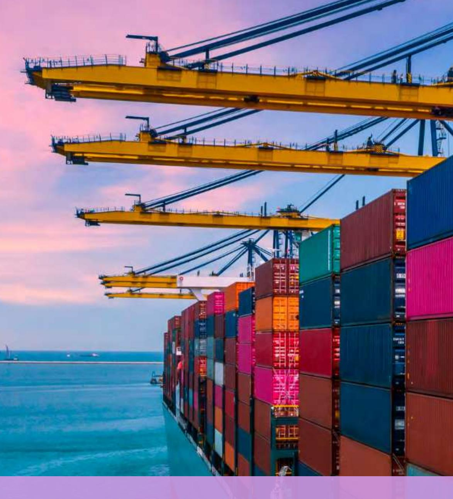
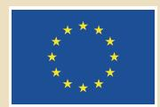
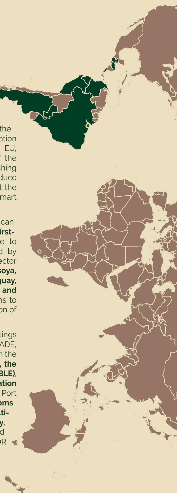

## Technical Summary Report TEI EUROTRIP – EUDR IN PRACTICE

**Strengthening Partnerships for Deforestation-free Value Chains LATAM Partners 25 – 30 May 2025**

The Eurotrip is an outreach activity of the **Team Europe Initiative (TEI) on Deforestation-Free Value Chains**,

which aims to support partner countries in their commitment to sustainable, deforestationfree and legal value chains, in compliance with the European Union Deforestation-Free Products Regulation (EUDR). The Team Europe Initiative, supported by EU, Germany, Netherlands, France and Italy, is part of the Global Gateway strategy and pursues the overarching goal of building **inclusive partnerships** to reduce global commodity-driven deforestation and support the transition to sustainable, regenerative and climate-smart agriculture.

From **25 – 30 May 2025**, 21 delegates from Latin American countries gathered in Brussels and Bonn to gain **firsthand technical insights** on how the compliance to the EU Deforestation Regulation will be handled by European actors. Both government and private sector representatives from relevant sectors of **beef, soya, cocoa and coǺee** from **Brazil, Argentina, Paraguay, Peru, Ecuador, Colombia, Costa Rica, Honduras and Guatemala** addressed their questions and concerns to key European actors involved in the operationalisation of the regulation.

The programme of the 5-days trip included meetings with the **European Commission** (DG ENV, DG TRADE, DG INTPA, DG AGRI, EEAS), technical exchanges with the **Belgian Competent Authority (FPS Public Health), the German Federal Oǽce for Agriculture and Food (BLE)**, the **German Federal Ministry for Economic Cooperation and Development (BMZ)**, as well as a visit to the Port of Antwerp and a discussion with the **Belgian Customs Authority**. Delegates also participated in **multistakeholder exchanges with certifiers, civil society, and European private sector** to further understand practical implications of compliance with the EUDR and foster cross-sector collaboration.

- **Traceability is the New Normal:** Due to the still high rates of informality in the agricultural sector, in many cases, the requirements to ensure traceability of the value chain represent an opportunity for formalisation, digitalisation and ǻnancial sustainability. Many actors along the supply chains agreed that traceability is now a central and non-negotiable element of deforestation-free trade and adds to the beneǻt of better-informed decision-making. The EUDR reinforces a broader shift that is already underway, accelerating eǺorts toward transparent and accountable value chains and responsible trade.
- **Recognition of National Systems and Tools:** National traceability systems, particularly those endorsed by public entities, are recognised as valuable components of a robust due diligence process. Many countries show noticeable progress in establishing high-quality geolocation tools, comprehensive public data registers and reliable traceability systems. While voluntary certiǻcations or licences are considered helpful for risk analysis and prooǻng legality, they are not suǽcient to demonstrate deforestation-free compliance. It has been agreed that traceability systems and related data should ideally be interoperable, including for data

**Throughout the Eurotrip, EU authorities provided important clarifications and guidance on the requirements and implementation of the EUDR, emphasising a coordinated and pragmatic approach across Member States' competent authorities. A number of key messages emerged:**

- **Proof of legality:** delegates, quite unanimously, identiǻed the legality issue as one of the biggest challenges, especially in those sectors and areas where agricultural production is linked to smallfarmer-family businesses and where it remains an informal sector. Since legality depends on national legislation and context and, therefore, no universal checklist exists to this end, there is often unclarity and ambiguity of which national laws are relevant to consider prooǻng legal production. The number of considerable laws and procedures, and the veriǻcation of human rights aspects, indigenous rights, land tenure rights etc., add up to this diǽculty.
- **Traceability and data management:** Multiplication of tools and systems developed and implemented by diǺerent public and private stakeholders is another big challenge. There is a strong need for harmonisation of data and processes as well as interoperable infrastructure. Data governance and data protection issues are also relevant aspects to consider.
  - **Separation of compliant and non-compliant products:** Besides the recent publication of the delegated act to the Annex I of the EUDR by the European Commission, the separation of non-compliant or unknown products still poses a major challenge, in particular in the soya and beef sectors.
  - **Impact on small farmers:** There is concern that small farmers might be excluded from the EU market due to lack of knowledge, preparation capacities and understanding, as well as available and accessible funding for proving traceability and legality requirements, which would have particularly serious economic consequences in subsistence-based agricultural economies.

## 1. Key challenges of the producing countries

## 2. Key Takeaways from the Discussions with EU Stakeholders

**The producing countries identified the following key challenges in the implementation of the EUDR in their context:**

- format, security and cost-neutrality for small farmers.
- **Operators are Responsible for Proofing Compliance:** Responsibility for compliance lies with EU-based operators, who must ensure that due diligence is carried out, documented, and, where necessary, defended in the case of inspection or audit. Authorities will verify this using risk-based control systems.
- **Product Controls are linked to the provided Due Diligence Statements**: Shipments, containers and bags will be checked by customs upon entering the EU market for the presence of the Due Diligence Statement (DDS), then the goods can be imported and there would generally be no interruption to the supply chain. The products may only be held up for ad-hoc checks at the border in the case of required ad-hoc action or a 'third party substantiated concern'. Otherwise, the NCA´s regular desk-checks would take place with a time delay. In case of an alert and consequential investigation, operators and actors along the supply chain will be given the opportunity to correct provided information.
- **Risk-Based Desk Controls on the Due Diligence Statements:** Inspections are guided by the risk classiǻcation deǻned through the benchmarking system, as well as shipment risk proǻles. National Competent Authorities (NCAs) will conduce desk-controls on the DDS submitted by the operators and are aligning their methods and procedures along European National Authority to ensure consistency in enforcement. NCAs´ control systems will have interfaces with the EU Information System TRACES. Desk-checks will occur throughout the year and are not necessarily timely with the shipment's arrival in Europe.
  - **Benchmarking Categorisation:** DDS on products originated in a country classiǻed with low or standard risk will be susceptible to be checked annually, across sectors and operators, by 1% or 3% accordingly of all volume of products coming from that country. DDS for products from a country classiǻed as high risk will be checked considering 9% of all volume and operators originated in that country. [Article 16, section 9 of the EUDR: COMMISSION STAFF WORKING DOCUMENT On the methodology used for the benchmarking system (1).pdf]
  - **Due Diligence Must Be Context-Specific:** Due diligence should be context-specific. Systems must be adapted to the national, sectoral, and regional realities of producing countries. Operators are expected to assess risks and demonstrate compliance through credible, contextually appropriate information.
  - **Joint EǺort on Legal Interpretation:** EU authorities clariǻed that "legality" is determined by the national laws of the producing countries. In assessing compliance, competent authorities take a pragmatic approach, acknowledging legal diversity, including informal land tenure systems, where supported by national frameworks.
  - **Harmonisation and Dialogue:** To ensure a level playing ǻeld, EU Member States and the Commission are actively coordinating through working groups and stakeholder platforms. The EU invites producing countries to share tools and progress updates via the **EU Deforestation Platform and Producer Roundtable**, encouraging transparent and constructive cooperation.

- **Value Chain Awareness and Preparation:** Although the responsibility for EUDR compliance lies with European operators, all actors in the value chain need to be aware of the regulation and keep information organised and available to ensure commercial competitiveness.
- **Communication and Harmonisation:** Communication of what the EUDR implies for each actor needs to be improved, both within the value EUDR compliance is needed.
  - **Challenges of Informality and Data Gaps:**  Changing the reality of informality is a medium to long-term process. There is a need to close data gaps in the ǻeld.
  - **Role of the Public Sector:** The public sector

chains and between countries. Harmonisation of understanding and actions to prepare for

# 3. Important conclusions and Ʃndings

## 4. Conclusion

The TEI Eurotrip served as a vital platform for direct dialogue between Latin American countries and EU authorities, civil society, and private sector. It highlighted shared challenges in implementing the EUDR, particularly around legality veriǻcation, traceability, and smallholders' inclusion, while also oǺering practical pathways for cooperation and mutual support.

It became clear that eǺorts toward sustainable and deforestation-free value chains have been underway in many countries for years, and that the EUDR

is not the starting point, but rather an accelerator of an existing momentum.

The Eurotrip, therefore, laid important groundwork for deeper alignment and mutual understanding between European and Latin American partners on EUDR operationalisation. Continued dialogue, transparency, and strengthened international cooperation will be essential to realising inclusive, effective and deforestation-free value chains worldwide.

should create the necessary conditions, e.g. through clarity on the national legal framework and minimum guidelines for due diligence.

- **International Cooperation:** The contribution of international cooperation should focus on implementing solutions, strengthening the role of the state in providing information and developing public digi-

tal infrastructures for data interoperability.

- **Importance of regional exchange:** The relevance of knowing the progress and challenges of other countries in the LATAM region was emphasised. It was proposed to promote dialogue spaces in the LATAM region and to establish a learning community.

#### Imprit